# KOTORModSync — Complete Reference Documentation

> **Auto-generated** 2026-04-14.
> Authoritative single-file merge of every companion documentation artifact.
>
> **Also appended directly in this file:**
> - Full source tree (`tree /F src`)
> - All `.csproj` / `.props` project files (NuGet deps, targets, frameworks)
> - All 125 `.axaml` / `.xaml` UI markup files
> - Root-level configuration files (`.sln`, `NuGet.config`, `.editorconfig`, `.cursorrules`, `appcast.xml`, etc.)
> - `scripts/` — agent shell scripts, Figma JS helpers, Python prototype
> - `telemetry-auth/` — Python HMAC auth microservice, Dockerfile, GH Actions, helper scripts
>
> **Companion JSON codebase map:** `docs/KOTORModSync_Codebase_Map.json` (28.95 MB)
> — Contains: 79 namespaces, 1420 types, 16055 members **with full method bodies**,
>   plus raw full-text of all 1212 source files (`.cs`, `.axaml`, `.csproj`, `.json`, `.py`, `.sh`, `.js`, etc.)
>   for zero-omission codebase regeneration.

---

## Table of Contents

1. [README & Quick-Start](#readme--quick-start)
2. [Official Documentation](#official-documentation)
3. [Implementation Specification](#implementation-specification)
4. [Comprehensive Architecture Specification](#comprehensive-architecture-specification)
5. [Source Atlas](#source-atlas)
6. [Project File Catalog](#project-file-catalog)
7. [Source Reconstruction Manifest](#source-reconstruction-manifest)
8. [GUI Surface Matrix](#gui-surface-matrix)
9. [Test Family Matrix](#test-family-matrix)
10. [Core and Patcher Family Matrix](#core-and-patcher-family-matrix)
11. [Pairing and Adjacency Matrix](#pairing-and-adjacency-matrix)
12. [Build and Distribution Matrix](#build-and-distribution-matrix)
13. [Repository Artifact Matrix](#repository-artifact-matrix)
14. [CleanList Implementation](#cleanlist-implementation)
15. [Client Integration Guide](#client-integration-guide)
16. [Telemetry Setup Guide](#telemetry-setup-guide)
17. [Local Desktop Agent Runbook](#local-desktop-agent-runbook)
18. [GitHub Secret Setup](#github-secret-setup)
19. [Security Policy](#security-policy)
20. [Agents Guide (AGENTS.md)](#agents-guide-agentsmd)
21. [Complete Source File Inventory (raw)](#complete-source-file-inventory-raw)
22. [Complete Repository Inventory (raw)](#complete-repository-inventory-raw)
23. [Root-Level Configuration Files](#root-level-configuration-files)
24. [scripts/ — Agent and Tooling Scripts](#scripts--agent-and-tooling-scripts)
25. [telemetry-auth/ — Auth Microservice (Python)](#telemetry-auth--auth-microservice-python)

---


---

# README & Quick-Start

> _Source: `README.md`_

*note: this project is currently in the middle of a large-scale rework. please keep this in mind when reading the subsequent material.*

# KOTORModSync

KOTORModSync is a multi-mod installer for KOTOR games that makes it easier to install and manage mods.

Installing multiple KOTOR mods can be tedious and error-prone. The process involves repetitive tasks like moving files, running TSLPatcher, deleting specific files, and occasionally renaming files. Making a single mistake often requires starting over from scratch.
This is why I created KOTORModSync - an installer creator in C# to automate and simplify the entire process.

## Goals

Mod creators work really hard on their mods. It's the least we can do to install them and use them, right? However, who wants to reinstall to vanilla and spend several hours reinstalling mods, just to add 1 or 2 extra mods on top of it?
Other mod managers I've tried were either too difficult to configure, require significant changes to a hard-to-understand configuration file, or only provided limited functionality for defining new mods. KOTOR mods definitely can have complex dependency relationships with each other in regard to compatibility, due to the nature of TSLPatcher and KOTOR itself.

### Enter KOTORMODSync


## Features

- Automated installation of multiple mods with proper dependency resolution and compatibility handling.
- Supports TSLPatching on Mac/Linux without wine!
- Select the individual mods you want for an install - the dependencies and incompatibilities will automatically be chosen and sorted. This means end users don't have to worry about specific instructions regarding other mods in the list.
- All the compatibility steps are handled internally by KOTORModSync and the default instructions files provided here. An end user simply can select the mods they want to install in the left list, and any customizations if they like, and simply press 'Install All' to have everything installed automatically.
- This program has a built-in GUI editor and an installer packed into one. Modbuild creators can create instructions with little to no knowledge of the format and easily share them with end users. End users can install everything from the instruction file with a simple click of a button. Edit any instructions and verify the configuration with built-in tools. There's also some support to dry run an install.
- A flexible configuration editor and parser utilizing TOML syntax. This is very user-friendly and similar to INI which TSLPatcher already uses and most modders are used to.
- Create instructions files with complex dependency structures for multiple mods, and have end users install everything exactly according to the instructions created. No more manually copying/deleting files: KOTORModSync handles all of that for your end user.

## Usage

This section is entirely a WIP but I'll post basic info on some things that are not obvious in the app.
First and foremost the installer does NOT download all required mods, it requires that all mods are downloaded, unextracted, to the same folder. (known as the `<<modDirectory>>`)
You'll need to click 'set directories' and browse to your `<<kotorDirectory>>` and your `<<modDirectory>>`.
Once you do this, load an instructions file (or create one), then select the mods to be installed and press 'install all'.

## Creating instructions

The installer parses the fields `InstallBefore`, `InstallAfter`, `Dependencies`, and `Restrictions` to define dependencies and incompatibilities.
See <https://pastebin.com/7gML3zCJ> for a quick explanation of those fields. See the examples for the `Ultimate Character Overhaul` and the `Handmaiden/Disciple Same-Gender Romance Mod` for the more complex examples.

## FAQ

- Q: This app is saying 'failed to validate some components'...
- A: Check the logs/output window/console window, find the archive it's complaining about (it's highlighted bold in red). Either download the archive so kotormodsync can find it, or deselect the mod in the app so it won't be considered for install.
- Q: I get an error saying the holopatcher binary failed to execute. how to fix?
- A: The most common reason is your AV is blocking it, but check your log file for more information.
- Q: I've created my own mod, will you add it to the KOTORModSync project?
- A: Yes! [Please submit your instructions here.](https://github.com/th3w1zard1/KOTORModSync/discussions/categories/share-your-instructions) As long as your mod is SFW, I'll most likely add it to the list.
- Q: A mod in the instructions file is out of date, where do I report this?
- A: [Please notify me that mod has been updated here.](https://github.com/th3w1zard1/KOTORModSync/discussions/categories/mod-updates)

## Supported Platforms

KOTORModSync is a cross-platform 32-bit and 64-bit .NET application. It is compatible with the following operating systems:

- **Windows 7 and 8:** Compatible if running **.NET Framework 4.8.0** or **higher**. The NET8 version is NOT supported.
- **Windows 10 and 11:** Compatible with both the **.NET Framework 4.8.0** *and* the **NET8** builds.
- **Linux and Mac:** Compatible with the **NET8** x64 builds - choose one of the two that match your operating system.
Users do not need to download any additional runtimes: everything is self-contained within the application. Additionally, **.NET Framework 4.8.0** is preinstalled on Windows 7 and 8 or at least provided by Windows Updates.

### Linux/Mac

You may need additional X11 development libraries. In order to get this working on WSL, for example, I had to install the following packages:

`sudo apt install libsm6 libice6 libx11-dev libfontconfig1 libx11-6 libx11-xcb1 libxau6 libxcb1 libxdmcp6 libxcb-xkb1 libxcb-render0 libxcb-shm0 libxcb-xfixes0 libxcb-util1 libxcb-xinerama0 libxcb-randr0 libxcb-image0 libxcb-keysyms1 libxcb-sync1 libxcb-xtest0`

Then you can simply run like this in a terminal:

`./KOTORModSync`

If you run into problems with the Linux or Mac builds, please contact me and I'll happily get a fix ready for the next release build.

## Build instructions

I'm honestly not sure what all you need, I was able to build and run it on both vs2019 and vs2022. From what I understand, the minimum build requirements are:

- **NET8 or .NET Framework 4.8.0 targeting platform and build tools.**
- **.NET Standard Development Kit.**

### Vendor dependencies

KPatcher is now tracked as a git submodule under `vendor/KPatcher`.

Initialize vendor dependencies after cloning:

```bash
git submodule update --init --recursive
```

The canonical KPatcher source now lives under `vendor/KPatcher`. The legacy local trees under `src/HoloPatcher` and `src/HoloPatcher.UI` are being retired and should not be used as the primary upstream for new changes.

### NuGet sources

Package restore sources are defined in `NuGet.config` at the repository root. This includes `nuget.org` and the GitHub Packages feed for `th3w1zard1`, which is the intended remote source for package-based HoloPatcher integration.

All you need to do is build KOTORModSync.GUI. This should build the program into ./KOTORModSync.GUI/bin directory. Or run the command `dotnet build` then `dotnet run` inside KOTORModSync.GUI folder.
You may alternatively run my publish scripts in the solution directory if you like.

### KOTORModSync.GUI

- Main application
- Uses AvaloniaUI v11 for the UI.
- Buttons, windows, dialogs, and controls defined here.

### KOTORModSync.Core

- All the main logic is defined here.
- Targets .net standard 2.0

### KOTORModSync.ConsoleApp

- Contains a few quickly written developer tools used to quickly test some features.

## Credit

### Snigaroo

This man saved me countless amount of hours. I'd still be struggling through game glitches and mod-specific instructions I didn't understand. Actually, I'd probably still be on Dantooine trying to determine why I'm getting visual glitches and crashes which he solved with the one-word message 'grass'.

### JCarter426

Ditto. There were so many KOTOR-specific things to learn, without his help I'd still be trying to deserialize encapsulated resource files. His time and patience were incredibly useful to the project and this project would be impossible without him.

### Cortisol

Created HoloPatcher and the PyKotor library that KOTORModSync uses to patch mods. These projects are the main reason KOTORModSync can be supported on Mac/Linux. While the PyKotor/HoloPatcher projects have had some issues, this guy was more or less available for comment if I had questions on how I could fix any remaining problems myself.

### Testers

#### Lewok

Thank you for helping test that obnoxious UAC elevation problem legacy Windows apps like TSLPatcher have.

#### Thor110

Tested multiple installs and provided wisdom on the internal workings of KOTOR.

Thank you to the entire KOTOR community for what you do.

## License

KOTORModSync is licensed under the Business Source License 1.1 (BSL 1.1).

See [LICENSE.txt](LICENSE.txt) for full details.


---

# Official Documentation

> _Source: `KOTORModSync - Official Documentation.md`_

# KOTORModSync Official Documentation

## Table of Contents

- [Introduction](#introduction)
  - [The Problem](#the-problem)
  - [KOTORModSync's Solution](#kotormodsyncs-solution)
- [Install Process](#install-process)
- [Config File Structure](#config-file-structure)
  - [GUIDs](#guids)
- [Mod Dependencies](#mod-dependencies)
- [Instructions Overview](#instructions-overview)
  - [Instruction Fields](#instruction-fields)
- [Options](#options)
- [Patcher Options](#patcher-options)
- [Detailed Instruction Type Reference](#detailed-instruction-type-reference)
  - [1. Extract Instruction](#1-extract-instruction)
  - [2. Move Instruction](#2-move-instruction)
  - [3. Copy Instruction](#3-copy-instruction)
  - [4. Rename Instruction](#4-rename-instruction)
  - [5. Delete Instruction](#5-delete-instruction)
  - [6. DelDuplicate Instruction](#6-delduplicate-instruction)
  - [7. Patcher Instruction](#7-patcher-instruction)
  - [8. Execute / Run Instructions](#8-execute--run-instructions)
  - [9. Choose Instruction](#9-choose-instruction)
  - [10. CleanList Instruction](#10-cleanlist-instruction)
- [Backwards Compatibility Notes](#backwards-compatibility-notes)

---

## Introduction

KOTORModSync is a multi-mod installer for KOTOR 1 and 2. Its purpose is to allow a user to select the mods they want for install, and choose the options/customizations for each mod, handling the dependencies/custom instruction steps automatically.

### The Problem

Many users that are new to KOTOR don't understand KOTOR's unique modding limitations. They may be used to Vortex or the Steam workshop, and not understand why they can't just simply install mods A→B→C→D and uninstall mod B. KOTOR's modding architecture and tools strongly rely on install order, which prevents users from safely uninstalling a mod later in their install process - this can be catastrophic if a user only finds out after the fact that they no longer want a certain mod, because they would be forced to restart the entire modding process just to take it out. When installing dozens upon dozens of mods, these problems can quickly become overwhelming.

### KOTORModSync's Solution

KOTORModSync is a tool that allows the user to simply SELECT the mods they want and press a single 'install all' button. That's all an end user should have to do. There's plenty of installers around (installshield, InnoSetup, Wix etc) that have simple installers that'll show a list of components to install. The user can simply select the ones they want and spam the next button until the thing finishes. So, why not KOTOR?

That's the goal here. In order to do this, we need someone to define the instructions. I've seen plenty of batch installers outdated by various mod updates or changes. They sound like a pain to upkeep. So this isn't the way to go either. We need an easy way to *create* instructions. Given this, KOTORModSync is designed to save and load an instruction file written in TOMLIN. TOMLIN was one of the easiest syntaxes to read/interpret by both machine and by human, allowing easy modifications and updates.

KOTORModSync will allow you (or any mod collection author who chooses to utilize it) to create an instruction file and organize it inside of the tool itself. This means you can define what install steps to perform based on what other mods are being installed. Because KOTORModSync is designed to manage the full installation process of all mods (so it can "see" everything you intend to use), the tool is a powerful assistant in determining what mods may or may not be compatible with one another. This way, if a mod changes or a mod collection creator wants to add another mod to their set, they already have a full list of changes that are happening in one handy location and can easily sort through them to determine whether a new mod will be functional with the existing setup. Not sure if your mod is compatible with another? Slap the 'untested' category on it and the user will be unable to select both unless they've also selected a Compatibility Level of 'Untested'.

## Install Process

The installer will install the selected (checked) mods in the left list from top to bottom when a user clicks 'Install All' following the instructions in the config file. Instructions will be ran in order. The installer does no verification of whether a user is using a vanilla installation of KOTOR, please keep this in mind when handling bug reports.

## Config File Structure

The TOMLIN instruction file contains is designed to organize the following mod information in a multi-mod environment. An individual mod has the following groupings:

- **Information**: the name, description, download link(s), authors, any identifying information. All mods are indexed by a GUID to ensure uniqueness in an instruction file.
- **Instructions**: A list of all instructions that need to be executed in order to install a mod. This includes specific instructions dependent on other mods (see the dependency section below)
- **Options**: User-customizeable features that this mod provides. For example, you might see that the 'Visually Repair HK-47' mod for K2 has two options: one that modifies appearance of both hk-47 and hk-50/51, and the other option modifies ONLY hk-47. These options are all redefined here.

### GUIDs

A GUID (Globally Unique Identifier) is a 128-bit number, which means it consists of 2^128 unique values. This is a very large number: 340,282,366,920,938,463,463,374,607,431,768,211,456.

So there are a total of 340 undecillion (short scale) or 340 sextillion (long scale) unique GUIDs.

## Mod Dependencies

A mod can be defined in the config as being compatible or incompatible with other mods/options. Each specific mod has the following dependency lists to support this:

- **Dependencies**: List of Mods/Options that are REQUIRED to be SELECTED for an install in order for THIS mod to install.
- **Restrictions**: List of Mods/Options that CANNOT BE SELECTED in order for THIS Specific mod to be installed. Basically the opposite of the above list. If anything is selected here, the mod won't install and will be skipped.
- **InstallAfter**: List of Mods/Options that must be installed BEFORE installing THIS mod. This mod must be installed after all of the mods/options in the list.
- **InstallBefore**: List of Mods/Options that must be installed AFTER installing THIS mod. This mod must be installed before all of the mods/options in the list. Adding a mod/option to the list will immediately reorder the left selection list to follow this requirement of install order.

## Instructions Overview

KOTORModSync is capable of handling the following Actions:

- **Move** → Move a file to a folder
- **Copy** → Copy a file to a folder
- **Execute** → Execute an executable file
- **Patcher** → Execute a Patcher install from the given tslpatchdata directory path.
- **Rename** → Renames a file
- **Choose** → Defines an instruction that'll choose between a list of GUID options.
- **DelDuplicate** → An instruction that will deletes all files containing the specified extension, when the filenames duplicate.
- **Extract** → Extracts an archive. Currently supports [.7z, .rar, .zip, and 7zip .EXE] archives ONLY. 7z SFX executables (.exe) are extracted cross-platform by parsing the embedded 7z payload, with a CLI fallback (7z) on non-Windows systems if available.
- **Delete** → Deletes a file.

### Instruction Fields

All of these instructions have the following fields:

- **Source** → List of files to handle. If the instruction is 'Choose', this will instead be a list of GUIDs.
- **Destination** → Applicable to the 'Move', 'Copy', 'Rename', 'Patcher', and 'Delete' Actions ONLY. This will usually be a location in the install (kotor) directory, or in the case of rename it's the new filename to rename to.
- **Overwrite** → Applicable to the 'Move', 'Copy', and 'Rename' Actions ONLY. When 'True', means that the file will be overwritten, when false, means that the file will be skipped if it exists.
- **Dependencies** → List of Mods/Options that are REQUIRED to be SELECTED for this specific single instruction to run. If ANY of the mods/options in this list are not selected, this instruction will not be run.
- **Restrictions** → List of Mods/Options that CANNOT BE SELECTED in order for this specific single instruction to run. Basically the opposite of the above.
- **Arguments** → Applicable to the 'DelDuplicate', 'Execute', and 'Patcher' actions ONLY. For Patcher, this is the namespace option index listed in 'namespaces.ini' indexed based starting at 0 for the first option. For 'DelDuplicate', this is the extension of the files we want deleted if they duplicate. For 'Execute', this defines the extra command line arguments to send to the program before we launch it.

## Options

An Options is defined just like an individual mod, only nested in a real mod. In case that's not clear, it has the following properties:

Name, Description, Directions, Dependencies, Restrictions, InstallAfter, InstallBefore

If an option is incompatible with another option you simply need to add the other option into the Restrictions list for this option and do the same with the other option. E.g. if two options Option A and Option B are incompatible with each other, the Restrictions list of Option A will contain Option B, and the restrictions list of Option B will contain Option A. This makes it impossible for the user to install both with ModSync.

This can all be pretty overwhelming but what's important to understand is that ModSync is capable of following all the mods' convoluted installation steps in regards to other mods while still giving the user that one-click install-all approach that they deserve.

## Patcher Options

ModSync uses HoloPatcher internally, which allows us to install all selected mods in bulk, without bugging a user to click through multiple Patcher windows and praying they choose the correct option.

PyKotor and its frontend HoloPatcher installs mods significantly faster than TSLPatcher, and is supported on linux/mac!

---

## Detailed Instruction Type Reference

This section provides comprehensive documentation for each instruction type, including all properties/fields that are relevant and how they are used.

All instruction types support the following universal properties:

- **Dependencies**: List of Mod/Option GUIDs that must be selected for this instruction to run
- **Restrictions**: List of Mod/Option GUIDs that must NOT be selected for this instruction to run

### 1. Extract Instruction

**Purpose:** Extracts archive files to a destination directory.

**Supported Archive Formats:**

- .7z (7-Zip)
- .rar (WinRAR)
- .zip (ZIP archives)
- Self-extracting 7z .exe files (cross-platform support via embedded payload parsing)

**Properties:**

- **Action:** "Extract"
- **Source:** List of archive file paths to extract. Each path should point to an archive file.
  - Supports wildcards (*, ?) for pattern matching
  - Paths use placeholders: <<modDirectory>> or <<kotorDirectory>>
  - Multiple archives can be specified and will be extracted in order
- **Destination:** (Optional) Target directory where files should be extracted
  - If not specified, extracts to the same directory as the archive
  - Uses placeholders: <<modDirectory>> or <<kotorDirectory>>

**Behavior:**

- All files from the archive are extracted to the destination directory
- Preserves directory structure from within the archive
- Updates the Virtual File System during dry-run validation
- Logs the number of files extracted

**Example Usage:**

```toml
[[Instructions]]
Action = "Extract"
Source = ["<<modDirectory>>/MyMod_v1.2.zip"]
Destination = "<<modDirectory>>/MyMod"
```

### 2. Move Instruction

**Purpose:** Moves files from source location(s) to a destination directory.

**Properties:**

- **Action:** "Move"
- **Source:** List of file paths to move
  - Supports wildcards (*, ?) for pattern matching multiple files
  - Paths use placeholders: <<modDirectory>> or <<kotorDirectory>>
  - All matching files will be moved
- **Destination:** Target directory where files should be moved to
  - Must be a directory path, not a file path
  - Uses placeholders: <<modDirectory>> or <<kotorDirectory>>
  - Directory will be created if it doesn't exist (during real install)
- **Overwrite:** (Optional, default: true) Controls behavior when target file exists
  - true: Deletes existing file and moves the new file
  - false: Skips the file if it already exists at destination

**Behavior:**

- Files are moved (not copied) from source to destination
- Original file is removed from source location after successful move
- If destination file exists and Overwrite=true, destination file is deleted first
- If destination file exists and Overwrite=false, operation is skipped with a warning
- Preserves filename; only directory location changes

**Example Usage:**

```toml
[[Instructions]]
Action = "Move"
Source = ["<<modDirectory>>/extracted_files/*.tga"]
Destination = "<<kotorDirectory>>/Override"
Overwrite = true
```

**Auto-Extraction Feature:**
If source files are not found and the component has a ResourceRegistry, Move will automatically attempt to extract the missing files from archives listed in the registry.

### 3. Copy Instruction

**Purpose:** Copies files from source location(s) to a destination directory.

**Properties:**

- **Action:** "Copy"
- **Source:** List of file paths to copy
  - Supports wildcards (*, ?) for pattern matching multiple files
  - Paths use placeholders: <<modDirectory>> or <<kotorDirectory>>
  - All matching files will be copied
- **Destination:** Target directory where files should be copied to
  - Must be a directory path, not a file path
  - Uses placeholders: <<modDirectory>> or <<kotorDirectory>>
  - Directory will be created if it doesn't exist (during real install)
- **Overwrite:** (Optional, default: true) Controls behavior when target file exists
  - true: Deletes existing file and copies the new file
  - false: Skips the file if it already exists at destination

**Behavior:**

- Files are copied from source to destination
- Original file remains at source location (unlike Move)
- If destination file exists and Overwrite=true, destination file is deleted first
- If destination file exists and Overwrite=false, operation is skipped with a warning
- Preserves filename; only directory location changes

**Example Usage:**

```toml
[[Instructions]]
Action = "Copy"
Source = ["<<modDirectory>>/textures/*.tpc", "<<modDirectory>>/textures/*.tga"]
Destination = "<<kotorDirectory>>/Override"
Overwrite = false
```

**Auto-Extraction Feature:**

If source files are not found and the component has a ResourceRegistry, Copy will automatically attempt to extract the missing files from archives listed in the registry.

### 4. Rename Instruction

**Purpose:** Renames a file to a new filename in the same directory.

**Properties:**

- **Action:** "Rename"
- **Source:** List of file paths to rename
  - Supports wildcards (*, ?) for pattern matching
  - Paths use placeholders: <<modDirectory>> or <<kotorDirectory>>
  - Each matching file will be renamed to the same Destination filename
- **Destination:** New filename (not a path, just the filename with extension)
  - Should be just the filename, not a full path
  - The file will be renamed in its current directory
- **Overwrite:** (Optional, default: true) Controls behavior when target filename exists
  - true: Deletes existing file with the target name and performs rename
  - false: Skips the rename if target filename already exists

**Behavior:**

- Changes the filename while keeping the file in the same directory
- If target filename exists and Overwrite=true, existing file is deleted first
- If target filename exists and Overwrite=false, operation is skipped
- If source file doesn't exist, logs an error and continues
- Note: SetRealPaths is called with skipExistenceCheck=true for backward compatibility

**Example Usage:**

```toml
[[Instructions]]
Action = "Rename"
Source = ["<<kotorDirectory>>/Override/old_texture.tga"]
Destination = "new_texture.tga"
Overwrite = true
```

### 5. Delete Instruction

**Purpose:** Deletes specified files from the file system.

**Properties:**

- Action: "Delete"
- Source: List of file paths to delete
  - Supports wildcards (*, ?) for pattern matching
  - Paths use placeholders: `<<modDirectory>>` or `<<kotorDirectory>>`
  - All matching files will be deleted
- Destination: (Legacy/Optional) Not actively used for deletion target; delete operates on Source files
  - Historically serialized but not functionally used
  - Kept for backward compatibility with older TOML files
- Overwrite: (Special behavior) Controls error handling mode
  - true: Strict mode - logs warning and returns error code if file doesn't exist
  - false: Lenient mode (default) - silently skips missing files with verbose log only

**Behavior:**

- Deletes all files matching the Source patterns
- Files are permanently removed (not moved to recycle bin)
- If file doesn't exist and Overwrite=false: logs verbose message and continues
- If file doesn't exist and Overwrite=true: logs warning and sets error code
- SetRealPaths is called with skipExistenceCheck=true to allow deletion of non-existent files

**Example Usage:**

```toml
[[Instructions]]
Action = "Delete"
Source = ["<<kotorDirectory>>/Override/incompatible_*.tga"]
Overwrite = false
```

### 6. DelDuplicate Instruction

**Purpose:** Deletes duplicate files with different extensions but the same base filename. Useful for texture format conflicts (e.g., deleting .tpc when .tga exists).

**Properties:**

- Action: "DelDuplicate"
- Source: List of file extensions to consider as "compatible" (duplicates of each other)
  - Each entry should be a file extension (e.g., ".tpc", ".tga")
  - Files with any of these extensions are considered for duplicate detection
  - If not specified, defaults to Game.TextureOverridePriorityList
- Destination: Directory to scan for duplicate files
  - Must be a directory path
  - Uses placeholders: `<<modDirectory>>` or `<<kotorDirectory>>`
- Arguments: File extension to delete when duplicates are found
  - Should be a single extension (e.g., ".tpc")
  - When multiple files with the same base name exist, files with this extension are deleted
  - If not specified in Arguments, falls back to first entry in Source

**Behavior:**

- Scans the Destination directory for files
- Groups files by base filename (without extension)
- For each group with 2+ files having compatible extensions:
  - Deletes files matching the Arguments extension
  - Keeps files with other extensions
- Case sensitivity controlled by Arguments parameter (defaults to case-insensitive)
- SetRealPaths is called with sourceIsNotFilePath=true

**Example Usage:**

```toml
[[Instructions]]
Action = "DelDuplicate"
Source = [".tpc", ".tga", ".dds"]
Destination = "`<<kotorDirectory>>`/Override"
Arguments = ".tpc"
```

Common Use Case:
Deleting .tpc files when .tga versions exist, since KOTOR prioritizes .tga over .tpc.

### 7. Patcher Instruction

Purpose: Executes TSLPatcher/HoloPatcher installation using a tslpatchdata directory.

Properties:

- Action: "Patcher"
- Source: Path to the tslpatchdata directory or a file within it
  - Can be path to tslpatchdata folder itself
  - Can be path to a file inside tslpatchdata (directory is extracted automatically)
  - Uses placeholders: `<<modDirectory>>` or `<<kotorDirectory>>``
- Destination: (Legacy) Historically serialized but not actively used by patcher execution
  - Kept for backward compatibility
  - Patcher always targets MainConfig.DestinationPath
- Arguments: (Optional) Namespace option index for multi-option patchers
  - String representation of integer index (e.g., "0", "1", "2")
  - Corresponds to option index in namespaces.ini (0-based)
  - If specified, HoloPatcher will use --namespace-option-index parameter
  - If not specified, default option is used

**Behavior:**

- Locates HoloPatcher executable (prioritizes Python version, falls back to native)
- Modifies changes.ini automatically:
  - Sets PlaintextLog=1 to enable text-based logging
  - Sets LookupGameFolder=0 to prevent TSLPatcher from trying to automatically lookup kotor game installation folders
  - Sets ConfirmMessage=N/A to suppress confirmation dialogs
- Executes HoloPatcher with parameters:
  - --install
  - --game-dir="<DestinationPath>"
  - --tslpatchdata="<Source>"
  - --namespace-option-index=<Arguments> (if Arguments specified)
- Verifies installation by checking installlog.txt/installlog.rtf for errors
- Skips execution during dry-run validation (simulation mode)
- Returns error if HoloPatcher exit code is non-zero
- Returns TSLPatcherError if log contains "[Error]" entries

**Example Usage:**

```toml
[[Instructions]]
Action = "Patcher"
Source = ["<<modDirectory>>/MyMod/tslpatchdata"]
Arguments = "1"
```

Auto-Extraction Feature:
If source files are not found and the component has a ResourceRegistry, Patcher will automatically attempt to extract the missing tslpatchdata folder from archives.

### 8. Execute / Run Instructions

Purpose: Executes an external program or script. Both "Execute" and "Run" are functionally identical.

Properties:

- Action: "Execute" or "Run" (both are equivalent)
- Source: List of executable file paths to run
  - Can be .exe, .bat, .cmd, .sh, or any executable
  - Each executable in the list is run in sequence
  - Uses placeholders: `<<modDirectory>>` or `<<kotorDirectory>>`
- Arguments: (Optional) Command-line arguments to pass to the executable
  - Full argument string passed to the program
  - Supports placeholder replacement via ReplaceCustomVariables
  - Can include `<<modDirectory>>` and `<<kotorDirectory>>` in arguments
- Destination: Not used by Execute/Run instructions

**Behavior:**

- Executes each program in the Source list sequentially
- Waits for each program to complete before moving to the next
- Captures stdout and stderr output and logs it
- SetRealPaths is called with skipExistenceCheck=true
- If any executable returns non-zero exit code:
  - Logs the output and error streams
  - Returns ChildProcessError
  - Stops processing remaining executables
- Returns FileNotFoundPost if executable doesn't exist
- Not executed during dry-run validation (simulation mode)

**Example Usage:**

```toml
[[Instructions]]
Action = "Execute"
Source = ["<<modDirectory>>/MyMod/setup.exe"]
Arguments = "/silent /norestart"
```

Security Note:
Execute instructions can run arbitrary code. Only use instruction files from trusted sources.

### 9. Choose Instruction

Purpose: Executes instructions conditionally based on which Options are selected by the user.

Properties:

- Action: "Choose"
- Source: List of Option GUIDs (not file paths)
  - Each GUID corresponds to an Option defined in the component
  - When an Option is selected by the user, its instructions will be executed
  - Multiple GUIDs can be specified
- Destination: Not used (kept for serialization compatibility)
- Dependencies: (Optional) List of GUIDs that must be selected for this Choose instruction to run
- Restrictions: (Optional) List of GUIDs that must not be selected for this Choose instruction to run

**Behavior:**

- SetRealPaths is called with sourceIsNotFilePath=true
- Retrieves the list of selected Options whose GUIDs are in the Source list
- For each selected Option:
  - Executes all instructions defined in that Option
  - Executes them in sequence using ExecuteInstructionsAsync
  - If any Option's instructions fail, returns OptionalInstallFailed
- Options are processed in the order their GUIDs appear in Source
- Allows for conditional installation based on user choices
- Commonly used for "which texture variant do you want?" scenarios

**Example Usage:**

```toml
[[Instructions]]
Action = "Choose"
Source = ["a1b2c3d4-e5f6-7890-abcd-ef1234567890", "f9e8d7c6-b5a4-3210-9876-543210fedcba"]
```

How Options Work:
Options are defined separately with their own Name, Description, and Instructions. The user sees these as selectable choices in the UI. When an Option is selected, its GUID should be included in a Choose instruction's Source list.

### 10. CleanList Instruction

Purpose: Reads a CSV file that specifies files to delete based on which mods are selected. Used for compatibility cleanups.

Properties:

- Action: "CleanList"
- Source: Path to the cleanlist CSV file
  - Should be a single CSV file path
  - Uses placeholders: `<<modDirectory>>` or `<<kotorDirectory>>`
  - First file in Source list is used (if multiple specified)
- Destination: Directory where files should be deleted from
  - Typically `<<kotorDirectory>>`/Override
  - Files listed in the CSV are deleted from this directory

**CSV File Format:**

Each line in the CSV: ModName,file1.ext,file2.ext,file3.ext,...

- First field: Name of the mod (used for matching against selected components)
- Remaining fields: Filenames to delete if that mod is selected

**Behavior:**

- Reads the cleanlist CSV file
- For each line in the file:
  - Extracts mod name (first field)
  - Extracts list of files to delete (remaining fields)
  - Checks if a mod matching that name is selected using fuzzy matching:
    - Exact match (case-insensitive)
    - Substring match
    - Token-based matching (requires 2+ shared tokens and 60% overlap)
  - If mod is selected, deletes all specified files from Destination directory
- Special case: Lines starting with "Mandatory Deletions" are always processed
- SetRealPaths is called with skipExistenceCheck=true
- Logs each file deleted and provides summary statistics
- Files that don't exist are skipped with verbose logging

**Fuzzy Matching Details:**

The mod name matching uses tokenization that:

- Converts to lowercase
- Removes punctuation
- Splits on whitespace
- Removes stop words: "by", "for", "the", "and", "of", "mod", "pack", "k1", "k2", "hd", "kotor", "version", etc.
- Applies crude singularization (removes trailing 's' from words longer than 3 chars)

**Example Usage:**

```toml
[[Instructions]]
Action = "CleanList"
Source = ["<<modDirectory>>/compatlist.csv"]
Destination = "<<kotorDirectory>>/Override"
```

**Example CSV Content:**

```csv
Mandatory Deletions,old_file1.tga,old_file2.tpc
HD UI Rewrite,ui_old.tga,ui_old.tpc
Weapon Model Overhaul,w_blaster_01.mdl,w_blaster_01.mdx
```

---

## Backwards Compatibility Notes

1. Destination Field:
   - Serialized for Extract, Move, Copy, Rename, Patcher, Delete, and CleanList
   - Not serialized for Execute, Run, DelDuplicate, or Choose
   - Some instructions serialize it but don't use it (legacy compatibility)

2. Overwrite Field:
   - Serialized for Move, Copy, and Rename only
   - Default value is 'true' if not specified
   - Delete instruction repurposes this for error handling mode

3. Arguments Field:
   - Serialized for DelDuplicate, Execute, and Patcher only
   - Each instruction type interprets it differently
   - Not used by other instruction types

4. Source Field:
   - Always serialized for all instruction types
   - For Choose: contains Option GUIDs (strings), not file paths
   - For others: contains file paths with optional wildcards
   - DelDuplicate uses it for compatible extensions list

5. Path Placeholders:
   - `<<modDirectory>>` replaced with MainConfig.SourcePath
   - `<<kotorDirectory>>` replaced with MainConfig.DestinationPath
   - Replacement happens in UtilityHelper.ReplaceCustomVariables()
   - Paths are only made absolute in Instruction.SetRealPaths() for security

6. Wildcard Support:
   - Supported in Source for: Extract, Move, Copy, Rename, Delete
   - Processed by PathHelper.EnumerateFilesWithWildcards()
   - Standard wildcards: * (multiple chars), ? (single char)

7. Case Sensitivity:
   - Controlled by MainConfig.CaseInsensitivePathing
   - Affects path resolution and file matching
   - Uses PathHelper.GetCaseSensitivePath() when enabled

8. Virtual File System:
   - Used during dry-run validation
   - Tracks file state as instructions execute
   - Must be initialized with InitializeFromRealFileSystemAsync()
   - Simulates file operations without touching disk


---

# Implementation Specification

> _Source: `IMPLEMENTATION.md`_

# KOTORModSync — Implementation Specification

> **Purpose:** Authoritative reference for a complete rewrite of KOTORModSync.
> Every diagram, inventory, and specification in this document is derived directly from the current codebase and is intended to be the single source of truth for reproducing all application behavior.
>
> **Key invariant:** The markdown source (`full.md`) and TOML instruction file (`KOTOR1_Full.toml`) must roundtrip losslessly through the two-source merge pipeline described in [Section 8](#8-format-parsing--roundtrip-architecture).

---

## Table of Contents

1. [High-Level Architecture](#1-high-level-architecture)
2. [Core Data Model](#2-core-data-model)
3. [Installation Pipeline](#3-installation-pipeline)
4. [Wizard Navigation State Machine](#4-wizard-navigation-state-machine)
5. [GUI Mode State Diagram](#5-gui-mode-state-diagram)
6. [Download Pipeline](#6-download-pipeline)
7. [Service Dependency Map](#7-service-dependency-map)
8. [Format Parsing & Roundtrip Architecture](#8-format-parsing--roundtrip-architecture)
9. [ActionType Instruction Execution](#9-actiontype-instruction-execution)
10. [Complete UI Screen Inventory](#10-complete-ui-screen-inventory)
11. [Design System & Theme Specification](#11-design-system--theme-specification)
12. [Figma Design Mapping](#12-figma-design-mapping)

---

## 1. High-Level Architecture

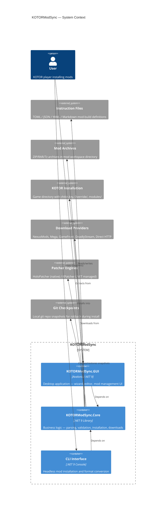

### Project Structure

```
KOTORModSync.sln
├── src/
│   ├── KOTORModSync.Core/          # Business logic library
│   │   ├── CLI/                    # Console commands, progress display
│   │   ├── ConfigFiles/            # Configuration file handling
│   │   ├── Data/                   # Static data assets
│   │   ├── Exceptions/             # Custom exception types
│   │   ├── FileSystemPathing/      # Path resolution, case-aware paths, wildcards
│   │   ├── FileSystemUtils/        # Permissions, cross-platform file watcher
│   │   ├── Installation/           # InstallCoordinator, session state, resume
│   │   ├── Parsing/                # Markdown, natural language parsers
│   │   ├── Services/               # Core business services
│   │   │   ├── Checkpoints/        # Binary diff, content-addressable store
│   │   │   ├── Download/           # 5 provider handlers + factory + manager
│   │   │   ├── FileSystem/         # IFileSystemProvider → Real, Virtual
│   │   │   └── Validation/         # Dry-run validator, path validation cache
│   │   ├── TSLPatcher/             # TSLPatcher integration
│   │   └── Utility/                # Misc utilities
│   ├── KOTORModSync.GUI/           # Avalonia desktop application
│   │   ├── CallbackDialogs/        # Simple dialog callbacks
│   │   ├── Controls/               # 23 UserControls
│   │   ├── Converters/             # 57+ value converters
│   │   ├── Dialogs/                # 22+ dialog windows
│   │   │   └── WizardPages/        # 17 wizard pages
│   │   ├── Helpers/                # Property name constants
│   │   ├── Models/                 # AppSettings, view models
│   │   ├── Services/               # 31+ GUI services
│   │   └── Styles/                 # LightStyle, KotorStyle, Kotor2Style
│   ├── KOTORModSync.Tests/         # NUnit + xUnit test project
│   ├── AvRichTextBox/              # Rich text control (submodule)
│   └── RtfDomParserAvalonia/       # RTF parser (submodule)
├── vendor/
│   ├── KPatcher/                   # Managed .NET patcher engine
│   └── mod-builds/                 # Mod build TOML definitions
└── scripts/agents/                 # Agent workflow scripts
```

---

## 2. Core Data Model

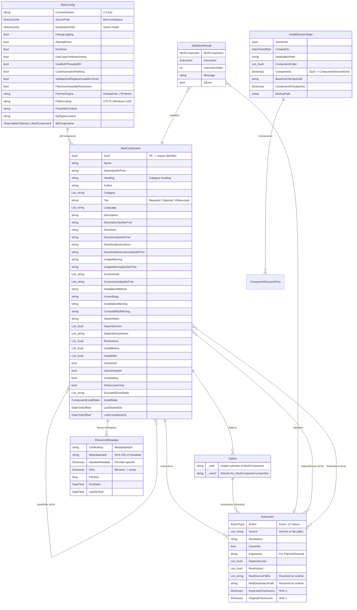

### Enums

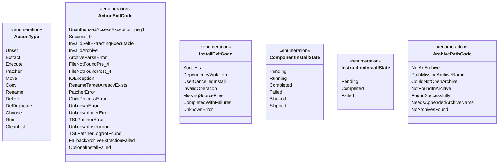

---

## 3. Installation Pipeline

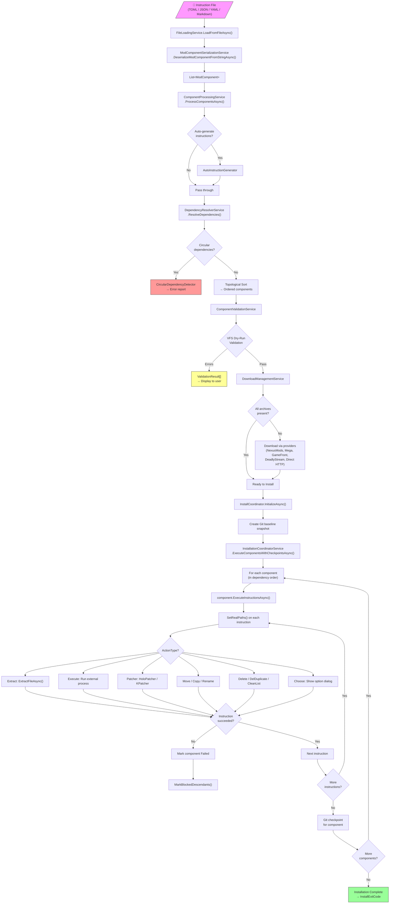

### Path Placeholder Resolution

Source and destination paths in instructions support these placeholders, resolved at runtime by `SetRealPaths()`:

| Placeholder | Resolves To |
|---|---|
| `<<modDirectory>>` | `MainConfig.SourcePath` — the mod workspace directory |
| `<<kotorDirectory>>` | `MainConfig.DestinationPath` — the KOTOR game installation |

Wildcards (`*`, `?`) in source paths are expanded via `PathHelper.EnumerateFilesWithWildcards()`.

---

## 4. Wizard Navigation State Machine

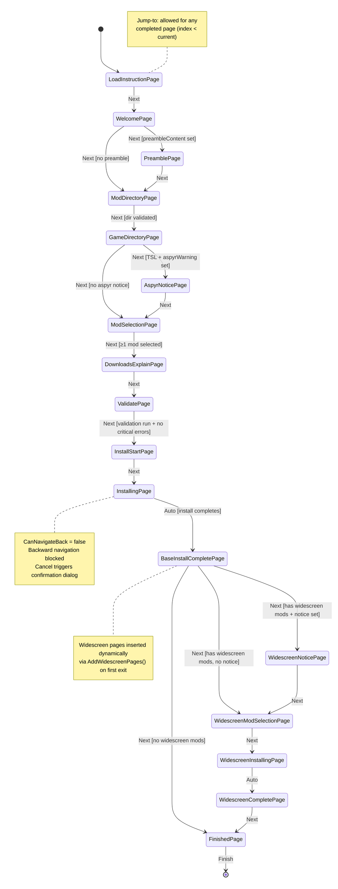

### Navigation Rules

| Rule | Description |
|---|---|
| **Forward** | Calls `ValidateAsync()` on current page. Aborts if invalid. Calls `OnNavigatingFromAsync()` then advances index. |
| **Backward** | Always allowed **except** from `InstallingPage` and `WidescreenInstallingPage` (blocked). |
| **Jump-to** | Only to pages with `index < currentIndex` (already completed). |
| **Cancel** | From installing pages: shows confirm dialog, cancels `CancellationTokenSource`. From others: shows confirm dialog, closes wizard. |
| **Finish** | Only on `FinishedPage`. Sets `InstallationCompleted = true`, closes dialog. |
| **Visual tree** | Each navigation creates a **new** `ContentControl` wrapper to avoid Avalonia visual-parent exceptions. |

### Page Validation Requirements

| Page | Validation |
|---|---|
| ModDirectoryPage | Directory must exist |
| GameDirectoryPage | Directory must contain `chitin.key` (valid KOTOR install) |
| ModSelectionPage | At least 1 non-widescreen mod must be selected |
| ValidatePage | Validation must have been run; no critical errors allowed |
| All other pages | No validation required |

---

## 5. GUI Mode State Diagram

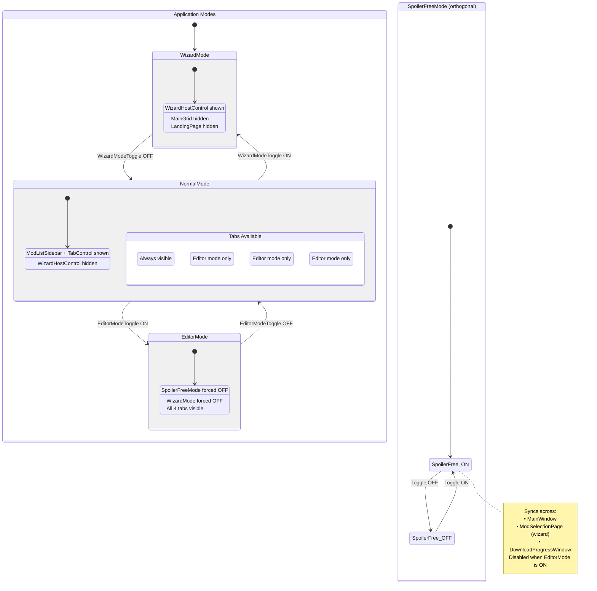

### Mode Precedence Rules

| Priority | Mode | Effect |
|---|---|---|
| 1 (highest) | `EditorMode` | Forces `SpoilerFreeMode = false`, `WizardMode = false`. Shows Summary/Editor/Raw tabs. |
| 2 | `WizardMode` | Default `true`. Shows `WizardHostControl` instead of `MainGrid`. Mutually exclusive with `EditorMode`. |
| 3 (lowest) | `SpoilerFreeMode` | Hides spoiler content. Disabled when `EditorMode = true`. |

### MainWindow Property Bindings

| Property | Type | Binding | Description |
|---|---|---|---|
| `EditorMode` | `bool` | TwoWay to `EditorModeToggle` | Developer editing mode |
| `SpoilerFreeMode` | `bool` | TwoWay to `SpoilerFreeModeToggle` | Spoiler-free content filter |
| `WizardMode` | `bool` | TwoWay to `WizardModeToggle` | Wizard vs legacy UI |
| `RootSelectionState` | `bool?` | TwoWay to root checkbox | All/some/none mods selected |
| `CurrentComponent` | `ModComponent` | Direct property | Active component being edited |
| `MainContentVisible` | `bool` | Visibility binding | Shows MainGrid |
| `WizardContentVisible` | `bool` | Visibility binding | Shows WizardHostControl |
| `LandingPageVisible` | `bool` | Visibility binding | Shows LandingPage overlay |

---

## 6. Download Pipeline

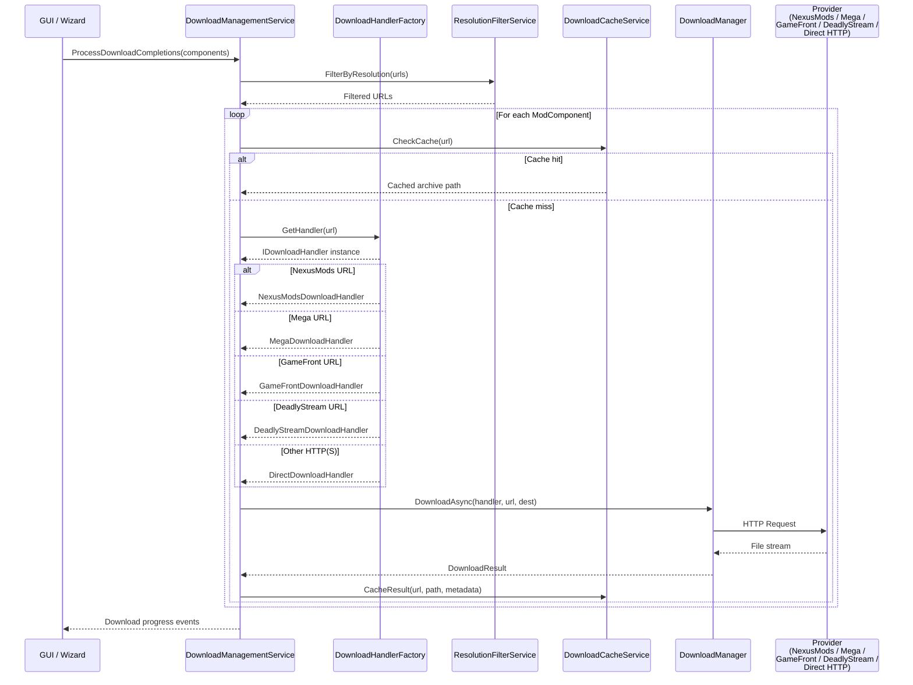

### Download Handler Selection

| Handler | URL Pattern | Notes |
|---|---|---|
| `NexusModsDownloadHandler` | `nexusmods.com` | Requires API integration |
| `MegaDownloadHandler` | `mega.nz`, `mega.co.nz` | Uses Mega SDK |
| `GameFrontDownloadHandler` | `gamefront.com`, `gamefront.online` | HTML scraping for download link |
| `DeadlyStreamDownloadHandler` | `deadlystream.com` | HTML scraping for download link |
| `DirectDownloadHandler` | Any other `http://` or `https://` | Generic HTTP download |

### Download Supporting Classes

| Class | Purpose |
|---|---|
| `DownloadManager` | Manages concurrent downloads, retry logic, IDisposable |
| `DownloadHelper` | URL validation, filename extraction utilities |
| `DownloadProgress` | Progress reporting model |
| `DownloadResult` | Success/failure result with file path, error details |
| `DownloadLogCaptureManager` | Captures download logs with CaptureBuffer and CaptureScope |
| `DownloadCacheEntry` | Cache entry: URL → local path + metadata |
| `DownloadFailureInfo` | Failure tracking with FailureType enum |
| `ThrottledStream` | Rate-limited stream wrapper for bandwidth control |

---

## 7. Service Dependency Map

```mermaid
classDiagram
    direction TB

    namespace Core_Services {
        class FileLoadingService {
            <<static>>
            +LoadFromFileAsync(path) Task~List~ModComponent~~
            +SaveToFile(components, path)
        }
        class ModComponentSerializationService {
            <<static>>
            +DeserializeModComponentFromStringAsync()
            +SerializeModComponent()
        }
        class ComponentProcessingService {
            <<static>>
            +ProcessComponentsAsync()
        }
        class AutoInstructionGenerator {
            <<static>>
            +GenerateInstructions()
        }
        class DependencyResolverService {
            +ResolveDependencies() DependencyResolutionResult
        }
        class CircularDependencyDetector {
            <<static>>
            +Detect() CircularDependencyResult
        }
        class ComponentValidationService {
            +IsArchiveValidAsync()
            +ValidateComponentAsync()
        }
        class ComponentManagerService {
            +ValidateComponentsForInstallationAsync()
            +FindDuplicateGuids()
        }
        class ModManagementService {
            +CreateMod()
            +DuplicateMod()
            +UpdateMod()
            +DeleteMod()
            +event ModOperationCompleted
            +event ModValidationCompleted
        }
        class ComponentEditorService_Core {
            +EditComponent()
        }
        class ComponentMergeService {
            +MergeComponents(MergeOptions)
        }
        class ModLinkProcessingService {
            +ProcessLinks()
        }
    }

    namespace Installation {
        class InstallCoordinator {
            <<sealed>>
            +InitializeAsync() Task
        }
        class InstallationCoordinatorService {
            +ExecuteComponentsWithCheckpointsAsync()
            +event ComponentInstallStarted
            +event ComponentInstallCompleted
            +event ComponentInstallFailed
        }
        class InstallSessionState {
            <<sealed>>
            +SessionId Guid
            +ComponentOrder List~Guid~
            +Components Dictionary
        }
        class ResumeResult {
            <<struct>>
        }
    }

    namespace FileSystem {
        class IFileSystemProvider {
            <<interface>>
            +IsDryRun bool
            +FileExists(path) bool
            +DirectoryExists(path) bool
            +CopyFileAsync()
            +MoveFileAsync()
            +DeleteFileAsync()
            +RenameFileAsync()
            +ExtractArchiveAsync()
        }
        class RealFileSystemProvider {
            +IsDryRun = false
        }
        class VirtualFileSystemProvider {
            +IsDryRun = true
        }
    }

    namespace Download {
        class IDownloadHandler {
            <<interface>>
            +CanHandle(url) bool
            +DownloadAsync() Task~DownloadResult~
        }
        class NexusModsDownloadHandler
        class MegaDownloadHandler
        class GameFrontDownloadHandler
        class DeadlyStreamDownloadHandler
        class DirectDownloadHandler
        class DownloadHandlerFactory {
            <<static>>
            +GetHandler(url) IDownloadHandler
        }
        class DownloadManager {
            <<sealed>>
        }
        class DownloadManagementService
        class DownloadCacheService {
            <<sealed>>
        }
        class ResolutionFilterService {
            <<sealed>>
        }
    }

    namespace Checkpoints {
        class GitCheckpointService {
            <<sealed>>
        }
        class CheckpointService_Immutable["CheckpointService"] {
            +CreateCheckpoint()
            +RestoreCheckpoint()
        }
        class BinaryDiffService
        class ContentAddressableStore
        class CheckpointPaths {
            <<static>>
        }
    }

    namespace Validation {
        class DryRunValidator {
            <<static>>
        }
        class PathValidationCache
    }

    namespace Telemetry {
        class TelemetryService {
            <<sealed>>
        }
        class TelemetryAuthenticator
    }

    IFileSystemProvider <|.. RealFileSystemProvider
    IFileSystemProvider <|.. VirtualFileSystemProvider
    IDownloadHandler <|.. NexusModsDownloadHandler
    IDownloadHandler <|.. MegaDownloadHandler
    IDownloadHandler <|.. GameFrontDownloadHandler
    IDownloadHandler <|.. DeadlyStreamDownloadHandler
    IDownloadHandler <|.. DirectDownloadHandler

    FileLoadingService --> ModComponentSerializationService : uses
    ComponentProcessingService --> AutoInstructionGenerator : uses
    DependencyResolverService --> CircularDependencyDetector : uses
    ComponentValidationService --> IFileSystemProvider : uses (VFS for dry-run)
    ComponentValidationService --> DryRunValidator : uses
    InstallationCoordinatorService --> InstallCoordinator : uses
    InstallationCoordinatorService --> GitCheckpointService : uses
    InstallationCoordinatorService --> InstallSessionState : creates
    DownloadManagementService --> DownloadHandlerFactory : uses
    DownloadManagementService --> DownloadManager : uses
    DownloadManagementService --> DownloadCacheService : uses
    DownloadManagementService --> ResolutionFilterService : uses
    DownloadHandlerFactory --> IDownloadHandler : creates
    CheckpointService_Immutable --> BinaryDiffService : uses
    CheckpointService_Immutable --> ContentAddressableStore : uses
```

### GUI Services

| Service | Type | Purpose |
|---|---|---|
| `DialogService` | public class | Modal dialog management — shows ConfirmationDialog, InformationDialog, etc. |
| `FileLoadingService` (GUI) | public class | GUI-integrated wrapper for Core FileLoadingService |
| `FileSystemService` | public class : IDisposable | File operations with UI feedback |
| `SettingsService` | public class | User preferences persistence |
| `ThemeService` | public class | Theme switching (Light / K1 / K2) with `ThemeType` enum |
| `ComponentEditorService` (GUI) | public class | GUI-integrated component editing |
| `ComponentSelectionService` | public class | Selection state (select all, deselect, filter-based selection) |
| `ComponentValidationWatcherService` | public class : IDisposable | Real-time validation on component changes |
| `InstructionBrowsingService` | public class | Navigate between instructions |
| `InstructionGenerationService` | public class | Auto-generate instructions from archives |
| `InstructionManagementService` | public class | CRUD for instructions in GUI |
| `ModListService` | public class | Mod list filtering, sorting, search |
| `SelectionService` | public class | Centralized mod selection state |
| `MenuBuilderService` | public class | Dynamic menu construction |
| `DownloadOrchestrationService` | public class | Coordinate downloads from GUI |
| `DragDropService` | public class | Drag & drop file handling |
| `ArchiveEnumerationService` | public class | Browse contents of mod archives |
| `ValidationDisplayService` | public class | Present validation results in UI |
| `ValidationService` (GUI) | public class | Run validation with progress |
| `ScrollNavigationService` | public class | Scroll-to-element in lists |
| `UIStateService` | public class | Persist/restore UI state |
| `FilterUIService` | public class | Filter UI coordination |
| `MarkdownRenderingService` | public class | Render markdown in UI labels |
| `GuiPathService` | public class | Path display formatting |
| `StepNavigationService` | public class | Step-by-step navigation coordination |
| `ModManagementDialogService` | public class : IModManagementDialogService | Dialog service for mod management |
| `AutoUpdateClient` | sealed class | Check for application updates |
| `AutoUpdateCoordinator` | sealed class : IAutoUpdateCoordinator | Coordinate update flow |
| `AutoUpdateService` | sealed class : IDisposable | Background update checking |

---

## 8. Format Parsing & Roundtrip Architecture

### 8.1 Two-Source Merge Architecture

The markdown (`full.md`) and TOML (`KOTOR1_Full.toml`) files are **not interchangeable representations of the same data**. Each is the source of truth for a distinct set of fields. Achieving a lossless roundtrip requires merging data from both sources.

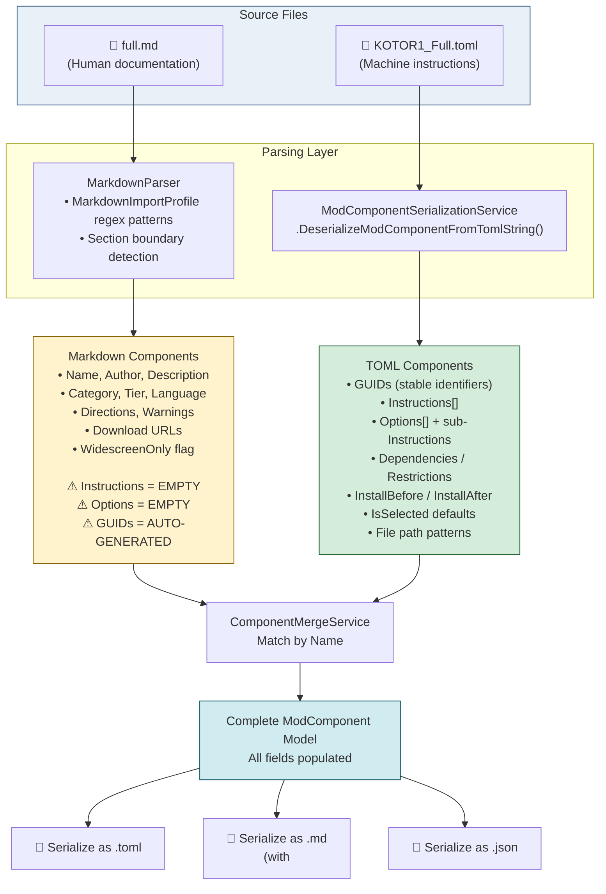

### 8.2 Field Ownership Map

Each field in `ModComponent` has a single authoritative source. When both sources provide a value, the owner takes precedence.

| Field | Owner | Notes |
|---|---|---|
| `Guid` | **TOML** | Markdown generates ephemeral GUIDs; TOML provides stable ones |
| `Name` | **Markdown** | Extracted from `**Name:** [link](url)` or `### Heading` |
| `Author` | **Markdown** | Extracted from `**Author:** value`. Alias resolution: `JC` ↔ `JCarter426` |
| `Description` | **Markdown** | Multi-line, ends at next `**Field:**` or separator |
| `Category` | **Markdown** | From `**Category & Tier:** Cat / Tier`, split on `[,;+&]` |
| `Tier` | **Markdown** | Right side of `**Category & Tier:**`, e.g. `1 - Essential` |
| `Language` | **Markdown** | From `**Non-English Functionality:**` |
| `InstallationMethod` | **Markdown** | From `**Installation Method:**` |
| `Directions` | **Markdown** | From `:::note Installation Instructions` admonition or `**Installation Instructions:**` |
| `DownloadInstructions` | **Markdown** | From `**Download Instructions:**` |
| `UsageWarning` | **Markdown** | From `**Usage Warning:**` |
| `KnownBugs` | **Markdown** | From `:::warning Known Bugs` admonition or `**Known Bugs:**` |
| `InstallationWarning` | **Markdown** | From `**Installation Warning:**` |
| `CompatibilityWarning` | **Markdown** | From `**Compatibility Warning:**` |
| `SteamNotes` | **Markdown** | From `**Steam Notes:**` |
| `Screenshots` | **Markdown** | From `**Screenshots:**` field |
| `ResourceRegistry` (URLs) | **Markdown** | Extracted from `[Name](url)` links in Name field |
| `Heading` | **Markdown** | The `### Heading` text above the component |
| `WidescreenOnly` | **Markdown** | `true` for components after `## Optional Widescreen` |
| `Instructions[]` | **TOML** | `[[thisMod.Instructions]]` array — never in plain markdown |
| `Options[]` | **TOML** | `[[thisMod.Options]]` array with sub-Instructions |
| `Dependencies` | **TOML** | GUID references. Markdown has `**Masters:**` (names only) |
| `Restrictions` | **TOML** | GUID references — no markdown equivalent |
| `InstallBefore` | **TOML** | GUID references — no markdown equivalent |
| `InstallAfter` | **TOML** | GUID references — no markdown equivalent |
| `IsSelected` | **TOML** | Default selection state — no markdown equivalent |
| `ExcludedDownloads` | **TOML** | URL exclusion list — no markdown equivalent |

### 8.3 Supported Input Formats

| Extensions | Format | Parser | Library |
|---|---|---|---|
| `.toml`, `.tml` | TOML | `DeserializeModComponentFromTomlString()` | Tomlyn |
| `.json` | JSON | `DeserializeModComponentFromJsonString()` | Newtonsoft.Json |
| `.yaml`, `.yml` | YAML | `DeserializeModComponentFromYamlString()` | YamlDotNet |
| `.md`, `.markdown`, `.mdown`, `.mkdn`, `.mkd`, `.mdtxt`, `.mdtext`, `.text` | Markdown | `MarkdownParser.Parse()` | Custom regex |
| Unknown extension | Auto-detect | Try TOML → Markdown → YAML → throw | — |

**Format detection** is extension-based in `FileLoadingService.LoadFromFile()`. Files are read with `ReadFileWithEncodingFallback()` (UTF-8 with Windows-1252 fallback).

### 8.4 Markdown Document Structure

The markdown source (e.g., `vendor/mod-builds/content/k1/full.md`) has this structure:

```
┌──────────────────────────────────────────────────┐
│  # KOTOR 1 Full Build                            │
│  ## Installation Notes                           │
│  :::warning ... :::                              │  ← preambleContent
│  ### Zeroing Step                                │    (everything before
│  ### TSLPatcher Installation Requirements        │     "## Mod List")
│  ...                                             │
├──────────────────────────────────────────────────┤
│  ## CRITICAL: ... (optional)                     │  ← aspyrExclusiveWarningContent
│  (Aspyr-specific mods, if present)               │    (between CRITICAL and Mod List)
├──────────────────────────────────────────────────┤
│  ## Mod List                                     │  ← SECTION BOUNDARY
│                                                  │
│  ### KOTOR Dialogue Fixes                        │  ┐
│  **Name:** [link](url)                           │  │
│  **Author:** Salk & Kainzorus Prime              │  │
│  **Description:** ...                            │  │ Component 1
│  **Category & Tier:** Immersion / 1 - Essential  │  │
│  **Installation Method:** Loose-File Mod         │  │
│  :::note Installation Instructions               │  │
│  :   move files to override                      │  │
│  :::                                             │  │
│  ___                                             │  ┘ ← separator
│                                                  │
│  ### Character Startup Changes                   │  ┐
│  **Name:** [link](url) and [**Patch**](url2)     │  │ Component 2
│  ...                                             │  │
│  ___                                             │  ┘
│  ...                                             │
├──────────────────────────────────────────────────┤
│  ## Optional Widescreen                          │  ← widescreenWarningContent
│  (warning text between header and first mod)     │    (text before first ### in section)
│                                                  │
│  ### Widescreen Mod A                            │  ← WidescreenOnly = true
│  ...                                             │
├──────────────────────────────────────────────────┤
│  ## Misc. Basegame Issues & Fixes                │  ← epilogueContent
│  (troubleshooting, not parsed as components)     │    (## header after widescreen section)
└──────────────────────────────────────────────────┘
```

### 8.5 Markdown Parsing Pipeline

`MarkdownParser.Parse()` processes the document in stages:

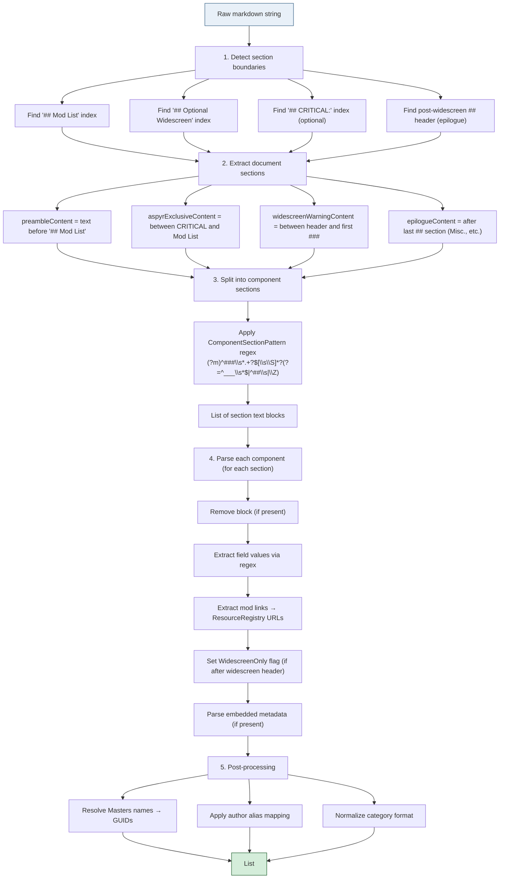

#### Step 4b: Field Extraction Regex Patterns

All patterns are defined in `MarkdownImportProfile.CreateDefault()`:

| Field | Regex Pattern (simplified) | Capture Group |
|---|---|---|
| Heading | `^###\s+(?<heading>.+?)(?:\s*\[.*?\])?\s*$` | `heading` |
| Name | `\*\*Name:\*\*\s*(?:\[(?<name>[^\]]+)\]\([^)]+\)\|(?<name_plain>[^\r\n]+))` | `name` or `name_plain` |
| Author | `\*\*Author:\*\*\s*(?<author>[^\r\n]+)` | `author` |
| Description | `\*\*Description:\*\*\s*(?<description>...)` | `description` (multi-line, ends at next field/separator) |
| Category & Tier | `\*\*Category\s*&\s*Tier:\*\*\s*(?<category>[^/\r\n]+)/\s*(?<tier>[^\r\n]+)` | `category`, `tier` |
| Installation Method | `\*\*Installation Method:\*\*\s*(?<method>[^\r\n]+)` | `method` |
| Download Instructions | `\*\*Download Instructions:\*\*\s*(?<download>...)` | `download` (multi-line) |
| Installation Instructions | `:::note\s*\r?\n\s*Installation Instructions\s*\r?\n:\s*(?<directions>...)` OR `\*\*Install(?:ation)? Instructions:\*\*\s*(?<directions>...)` | `directions` |
| Usage Warning | `\*\*Usage Warning:\*\*\s*(?<warning>...)` | `warning` (multi-line) |
| Screenshots | `\*\*Screenshots:\*\*\s*(?<screenshots>...)` | `screenshots` (multi-line) |
| Known Bugs | `:::warning\s*Known Bugs\s*(?<bugs>...)` OR `\*\*Known Bugs:\*\*\s*(?<bugs>...)` | `bugs` |
| Installation Warning | `\*\*Installation Warning:\*\*\s*(?<installwarning>...)` | `installwarning` |
| Compatibility Warning | `\*\*Compatibility Warning:\*\*\s*(?<compatwarning>...)` | `compatwarning` |
| Steam Notes | `\*\*Steam Notes:\*\*\s*(?<steamnotes>...)` | `steamnotes` |
| Non-English | `\*\*Non-English Functionality:\*\*\s*(?<value>[^\r\n]+)` | `value` |
| Masters (Dependencies) | `\*\*Masters:\*\*\s*(?<masters>[^\r\n]+)` | `masters` |
| Mod Links | `\[(?<label>[^]]+)\]\((?<link>[^)]+)\)` | `label`, `link` |

Multi-line patterns terminate at `\r?\n\s*(?:\*\*\w+[^:]*:\*\*|_{3,}|-{3,}|##)` (next bold field, separator, or heading).

### 8.6 Embedded Metadata (`<!--<<ModSync>>-->`)

When present, a component in the markdown can carry machine-readable instructions inside an HTML comment block:

```markdown
### Some Mod

**Name:** [Some Mod](https://example.com)
**Author:** Author Name
...

<!--<<ModSync>>
Guid: xxxxxxxx-xxxx-xxxx-xxxx-xxxxxxxxxxxx
Instructions:
  - Action: move
    Source: "<<modDirectory>>\\SomeMod*\\*.2da"
    Destination: "<<kotorDirectory>>\\Override"
Options:
  - Name: "Variant A"
    Instructions:
      - Action: patcher
        Source: "<<modDirectory>>\\SomeMod*\\Option_A"
-->

___
```

**Format detection within the block:**

| Check | Interpretation |
|---|---|
| Contains `Guid:\s*[a-f0-9\-]+` AND `Instructions:\s*$` (no `**` markdown) | YAML |
| Contains `[[thisMod]]` or `[thisMod]` or `identifier\s*=\s*["` | TOML |
| Neither matches | Legacy markdown (fallback parser) |

**Current state of `full.md`:** Contains **ZERO** embedded `<!--<<ModSync>>` blocks. All instructions exist only in the TOML file. The markdown is pure human documentation.

### 8.7 Markdown Generation (Reverse Direction)

`ModComponentSerializationService.GenerateModDocumentation()` serializes `List<ModComponent>` back to markdown, with embedded metadata:

```
{preambleContent}

## Mod List

### {component.Heading}

**Name:** {name with [link](url) if ResourceRegistry has URLs}
**Author:** {author}
**Description:** {description}
**Category & Tier:** {category joined} / {tier}
**Installation Method:** {method}
**Download Instructions:** {download}

:::note
Installation Instructions
:   {directions}
:::

<!--<<ModSync>>
{component serialized as YAML — GUIDs, Instructions, Options}
-->

___

{repeat for each component}

## Optional Widescreen

{widescreenWarningContent}

{widescreen components, same format}

{epilogueContent}
```

The metadata embedding is performed by `GenerateModSyncMetadata()`:
1. Serialize the component's Instructions + Options as YAML via `SerializeSingleComponentAsYamlString()`
2. Remove internal-only fields (`_HasInstructions`, `OptionsInstructions`, `_ValidationWarnings`)
3. Lowercase action names (`Copy` → `copy`, `Move` → `move`)
4. Wrap between `<!--<<ModSync>>` and `-->`

### 8.8 TOML Serialization Format

`SerializeModComponentAsTomlString()` produces the TOML instruction file:

```toml
[metadata]
fileFormatVersion = "2.0"
targetGame = "KOTOR1"
buildName = "KOTOR 1 Full Build"
buildAuthor = "th3w1zard1"
buildDescription = "..."
lastModified = 2026-04-14T00:00:00Z
preambleContent = "..."
epilogueContent = "..."
widescreenWarningContent = "..."
aspyrExclusiveWarningContent = "..."

[[thisMod]]
Guid = "xxxxxxxx-xxxx-xxxx-xxxx-xxxxxxxxxxxx"
Heading = "Mod Category Heading"
Name = "Mod Display Name"
Author = "Author Name"
Category = ["Immersion"]
Tier = "1 - Essential"
Language = ["NO"]
Description = "Mod description text..."
InstallationMethod = "Loose-File Mod"
Directions = "Move files to Override."
DownloadInstructions = "Download from link."
IsSelected = true

    [[thisMod.Instructions]]
    Action = "Extract"
    Source = ["<<modDirectory>>\\SomeMod*\\*.zip"]
    Destination = "<<kotorDirectory>>\\Override"
    Overwrite = true

    [[thisMod.Instructions]]
    Action = "Patcher"
    Source = ["<<modDirectory>>\\SomeMod*\\tslpatchdata"]
    Destination = "<<kotorDirectory>>"
    Arguments = ""

    [[thisMod.Options]]
    Name = "Variant A"
    Description = "Use the standard variant"

        [[thisMod.Options.Instructions]]
        Action = "Move"
        Source = ["<<modDirectory>>\\SomeMod*\\Option_A\\*.tpc"]
        Destination = "<<kotorDirectory>>\\Override"

[[thisMod]]
# next component...
```

### 8.9 NaturalLanguageInstructionParser (Dead Code)

`NaturalLanguageInstructionParser` exists in `Parsing/` but is **never instantiated or called** anywhere in the codebase. It contains ~50 regex patterns that attempt to extract `ActionType` hints from human-readable `Directions` text (e.g., "move everything from X to Override" → `ActionType.Move`).

**Prototype validation results** (tested against `full.md` + `KOTOR1_Full.toml`):
- 140 components have Instructions in the TOML
- NLP matched an action type for **13** (9.3%)
- NLP **cannot** determine: exact file paths, GUID references, multi-step instruction ordering, option definitions, or mutual exclusion relationships

This parser is useful only as a supplementary hint-generator — it cannot replace hand-authored TOML instructions.

### 8.10 Roundtrip Pipeline

The correct flow for loading `full.md` and saving as `KOTOR1_Full.toml` with zero discrepancies:

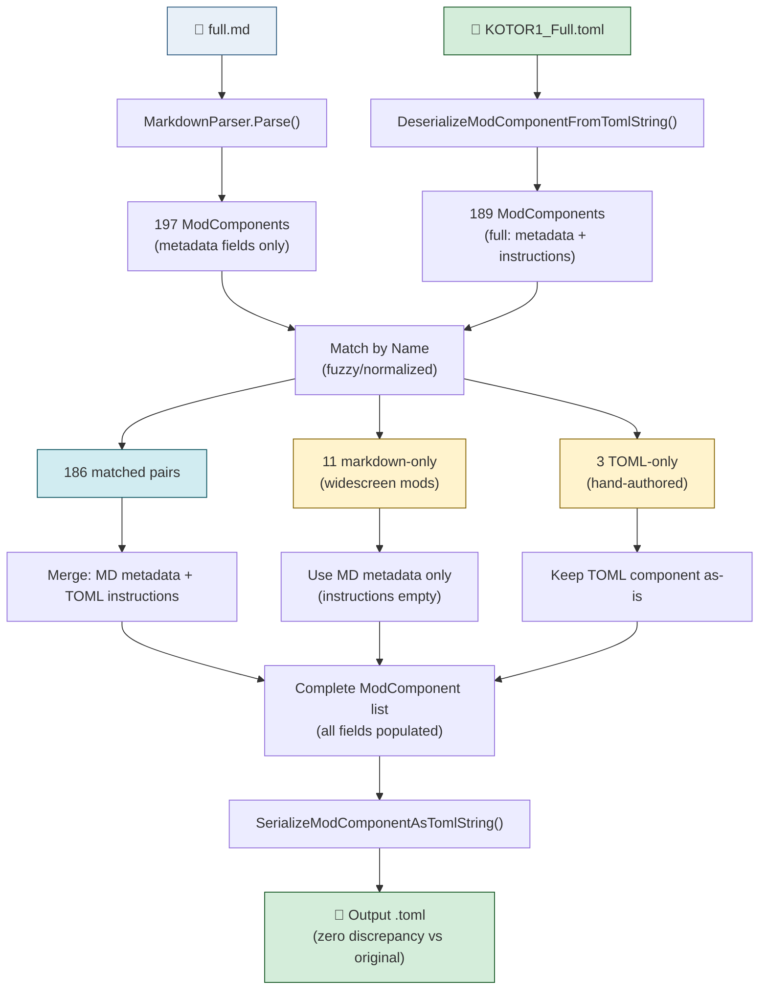

#### Merge Rules for Matched Components

When a component exists in both sources, apply these rules:

1. **GUID**: Use TOML value (stable identifier)
2. **Metadata fields** (Name, Author, Description, Category, Tier, Language, InstallationMethod, Directions, DownloadInstructions, UsageWarning, KnownBugs, InstallationWarning, CompatibilityWarning, SteamNotes, Screenshots): Use **markdown** value — it is the actively maintained human-readable source
3. **Instructions[]**: Use **TOML** value — markdown has no instruction data
4. **Options[]**: Use **TOML** value — markdown has no option data
5. **Dependencies/Restrictions/InstallBefore/InstallAfter**: Use **TOML** value (GUID references)
6. **ResourceRegistry**: Merge — markdown provides download URLs, TOML may provide additional metadata
7. **IsSelected**: Use **TOML** value
8. **WidescreenOnly**: Use **markdown** value (derived from section position)

#### Known Discrepancies (Expected)

| Type | Count | Description |
|---|---|---|
| TOML-only components | 3 | Hand-authored romance mods not in markdown source |
| Markdown-only components | 11 | Widescreen mods in markdown but not yet added to TOML |
| InstallationMethod wording | ~5 | Minor text differences (e.g., "TSLPatcher Mod" vs "TSLPatcher") |
| Tier text | 1 | "Vision Enhancement" has `3 - Suggested` in MD vs `2 - Recommended` in TOML |
| Language description | ~3 | Fuller text in markdown vs abbreviated in TOML |

### 8.11 CLI Format Conversion

The CLI (`ModBuildConverter`) supports format conversion between all supported types:

```
dotnet run -- convert --input mods.md --output mods.toml
dotnet run -- convert --input mods.toml --output mods.json
```

---

## 9. ActionType Instruction Execution

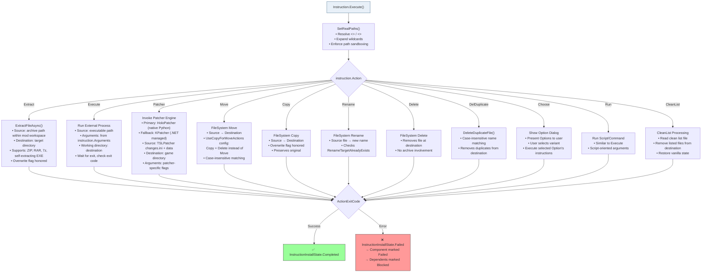

### Patcher Engine Selection

| Engine | Config Value | Description | Fallback |
|---|---|---|---|
| HoloPatcher | `"Holopatcher"` (default) | Native Python-based TSLPatcher implementation | Falls back to KPatcher on failure |
| KPatcher | `"KPatcher"` | Managed .NET TSLPatcher implementation | No fallback |

Selection: `MainConfig.PatcherEngine` (default: `"Holopatcher"`)

---

## 10. Complete UI Screen Inventory

### 10.1 Windows

| Window | Size | Min Size | Description |
|---|---|---|---|
| **MainWindow** | 1280×800 | 600×400 | Primary application window. Custom chrome (BorderOnly). |
| **InstallWizardDialog** | 900×650 | 800×600 | Modal wizard dialog with 240px sidebar navigation. |
| **DownloadProgressWindow** | — | — | Download status tracker with Active/Pending/Completed tabs. |
| **ProgressWindow** | — | — | Generic progress display. |

### 10.2 UserControls (23)

| Control | File | Purpose |
|---|---|---|
| GettingStartedTab | `Controls/GettingStartedTab.axaml` | 3-step onboarding: directories → load file → validate/install |
| SummaryTab | `Controls/SummaryTab.axaml` | Read-only component summary with spoiler-free toggle |
| EditorTab | `Controls/EditorTab.axaml` | Full instruction editor with expandable sections |
| RawTab | `Controls/RawTab.axaml` | Raw TOML editor with apply/cancel |
| LandingPageView | `Controls/LandingPageView.axaml` | Hero section, feature cards, quick-start guide |
| WizardHostControl | `Controls/WizardHostControl.axaml` | Inline wizard container for main window |
| DirectoryPickerControl | `Controls/DirectoryPickerControl.axaml` | Folder picker: textbox + browse button + validation |
| SearchBox | `Controls/SearchBox.axaml` | Mod search field with watermark |
| ExpandableTextBox | `Controls/ExpandableTextBox.axaml` | Multi-line expanding text input |
| InstructionEditorControl | `Controls/InstructionEditorControl.axaml` | Per-instruction editing UI |
| OptionEditorControl | `Controls/OptionEditorControl.axaml` | Option editing with action type selector |
| ModListSidebar | `Controls/ModListSidebar.axaml` | Left sidebar: search, filters, select all/deselect, mod list |
| ModListItem | `Controls/ModListItem.axaml` | Individual mod entry: checkbox + name + tier badge + tags |
| CategorySelectionControl | `Controls/CategorySelectionControl.axaml` | Multi-select category picker with checkboxes |
| DependencyControl | `Controls/DependencyControl.axaml` | Dependency graph visualization |
| DownloadLinksControl | `Controls/DownloadLinksControl.axaml` | Download URL display as link buttons |
| ScreenshotDisplayControl | `Controls/ScreenshotDisplayControl.axaml` | Mod screenshot image viewer |
| FileExtensionsControl | `Controls/FileExtensionsControl.axaml` | Supported file type list |
| EmbeddedLogPanel | `Controls/EmbeddedLogPanel.axaml` | Expandable inline console log (max height 280px) |
| ActionButtonsControl | `Controls/ActionButtonsControl.axaml` | Generic action button row |
| BrowseButtonsControl | `Controls/BrowseButtonsControl.axaml` | File/folder browse buttons |

### 10.3 Wizard Pages (17)

#### Base Pages (13, always created)

| # | Page | Key Controls | Validation |
|---|---|---|---|
| 1 | LoadInstructionPage | Embedded LandingPageView | None |
| 2 | WelcomePage | Hero section, feature highlights | None |
| 3 | PreamblePage *(conditional)* | Static text from TOML preambleContent | None |
| 4 | ModDirectoryPage | DirectoryPickerControl | Directory exists |
| 5 | GameDirectoryPage | DirectoryPickerControl + game detection | chitin.key present |
| 6 | AspyrNoticePage *(conditional)* | Static notice for Aspyr ports | None |
| 7 | ModSelectionPage | SelectAllButton, DeselectAllButton, SelectByTierButton, SelectByCategoryButton, SearchTextBox, CategoryFilterComboBox, TierFilterComboBox, SpoilerFreeToggle, ExpandCollapseAllButton, ModListPanel, count badges | ≥1 mod selected |
| 8 | DownloadsExplainPage | Static informational content | None |
| 9 | ValidatePage | ValidateButton, ValidationProgress, StatusText, LogExpander, LogText, SummaryText, ErrorCountBadge, WarningCountBadge, PassedCountBadge | Run + no critical errors |
| 10 | InstallStartPage | Review mod list, warnings | None |
| 11 | InstallingPage | MainProgressBar, CurrentModProgress, PercentText, CountText, CurrentModText, DirectionsText, CurrentOperationText, CheckpointStatusText, ElapsedTimeText, RemainingTimeText, RateText | CanNavigateBack = false |
| 12 | BaseInstallCompletePage | Summary statistics | None |
| 13 | FinishedPage | Completion message | None |

#### Widescreen Pages (4, added dynamically)

| # | Page | Purpose |
|---|---|---|
| 14 | WidescreenNoticePage *(conditional)* | Widescreen warning content |
| 15 | WidescreenModSelectionPage | Select widescreen mods |
| 16 | WidescreenInstallingPage | Widescreen installation progress |
| 17 | WidescreenCompletePage | Widescreen completion summary |

### 10.4 Dialogs (22)

| Dialog | Size | Purpose |
|---|---|---|
| SettingsDialog | 500×600 (min 400×400) | User preferences |
| ValidationDialog | — | Detailed validation results with issue tree |
| ModDownloadDetailsDialog | — | Download status: Active/Pending/Completed tabs, progress bars, timeout |
| ConfirmationDialog | — | Yes/No confirmation |
| InformationDialog | — | Read-only message display |
| ProgressDialog | — | Long-running operation with progress bar + cancel |
| TelemetryConsentDialog | — | Telemetry opt-in/out |
| OptionsDialog | — | Component option selection with conditional UI |
| ModManagementDialog | — | Add/edit/delete mods |
| GitCheckpointBrowserDialog | — | Browse checkpoint history |
| CircularDependencyResolutionDialog | — | Resolve circular dependency graph |
| ComponentMergeConflictDialog | — | Resolve conflicting component definitions |
| DependencyUnlinkDialog | — | Remove dependency link confirmation |
| ValidationIssueDetailsDialog | — | Detailed validation error info |
| DependencyResolutionErrorDialog | — | Dependency resolution error display |
| InstallationErrorDialog | — | Installation error display |
| RegexImportDialog | — | Regex-based file matching input |
| AutoGenerationResultsDialog | — | Auto-generation results |
| WidescreenNotificationDialog | — | Widescreen mod notification |
| ValidationProgressDialog | — | Validation progress with cancellation |
| SingleModDownloadDialog | — | Single mod download |
| ModFilesBrowserDialog | — | File tree browser for archive contents |

### 10.5 Main Window Layout

```
┌──────────────────────────────────────────────────────────────────────────┐
│ Row 0: Header                                                            │
│ ┌──────────┬──────────────┬──────────────┬─────────┬──────┬──────┬─────┐│
│ │ TopMenu  │ SpoilerFree  │   Title      │ Editor  │☀ K1 │ K2   │ ─▢X ││
│ │          │ Toggle       │ KOTORModSync │ Toggle  │     │      │     ││
│ │          │              │              │ Wizard  │     │      │     ││
│ │          │              │              │ Toggle  │     │      │     ││
│ └──────────┴──────────────┴──────────────┴─────────┴──────┴──────┴─────┘│
│ Row 1: [🏠 Home]                                                         │
│ Row 2: Content                                                           │
│ ┌─────────────────┬─┬────────────────────────────────────────────────────│
│ │  ModListSidebar │║│  TabControl                                       │
│ │                 │║│  ┌─────────────────────────────────────────────┐   │
│ │  [🔍 Search]    │║│  │ Getting Started │ Summary │ Editor │ Raw   │   │
│ │  [☑ Select All] │║│  ├─────────────────────────────────────────────┤   │
│ │  [☐ Deselect]   │║│  │                                             │   │
│ │  Tier: [      ▾]│║│  │  (Active tab content)                       │   │
│ │  Category: [   ]│║│  │                                             │   │
│ │                 │║│  │                                             │   │
│ │  ☑ Mod Name 1  │║│  │                                             │   │
│ │  ☑ Mod Name 2  │║│  │                                             │   │
│ │  ☐ Mod Name 3  │║│  │                                             │   │
│ │  ...           │║│  │                                             │   │
│ │                 │║│  └─────────────────────────────────────────────┘   │
│ └─────────────────┴─┴────────────────────────────────────────────────────│
│ Row 3: EmbeddedLogPanel (collapsible)                                    │
│ ┌────────────────────────────────────────────────────────────────────────┐│
│ │ ▶ Console Output                                                      ││
│ └────────────────────────────────────────────────────────────────────────┘│
└──────────────────────────────────────────────────────────────────────────┘
```

### 10.6 Install Wizard Dialog Layout

```
┌──────────────────────────────────────────────────────────────────────────┐
│                                                          ☀ K1 K2  ─  X  │
│ ┌──────────────┬─────────────────────────────────────────────────────────│
│ │  Sidebar     │  Header                                                │
│ │  (240px)     │  ┌─────────────────────────────────────────────────┐   │
│ │              │  │  Page Title                           Step 3/13 │   │
│ │  ● Load     │  │  Page subtitle text                             │   │
│ │  ● Welcome  │  │  ▓▓▓▓▓▓▓▓▓░░░░░░░░░░ (progress)               │   │
│ │  ● Mod Dir  │  └─────────────────────────────────────────────────┘   │
│ │  ◉ Game Dir │  Content                                               │
│ │  ○ Select   │  ┌─────────────────────────────────────────────────┐   │
│ │  ○ Download │  │                                                 │   │
│ │  ○ Validate │  │  (Page-specific content, scrollable)            │   │
│ │  ○ Review   │  │                                                 │   │
│ │  ○ Install  │  │                                                 │   │
│ │  ○ Complete │  │                                                 │   │
│ │  ○ Finish   │  │                                                 │   │
│ │              │  └─────────────────────────────────────────────────┘   │
│ │              │  Footer                                               │
│ │              │  ┌─────────────────────────────────────────────────┐   │
│ │              │  │  [Cancel]                    [◀ Back] [Next ▶]  │   │
│ │              │  └─────────────────────────────────────────────────┘   │
│ └──────────────┴─────────────────────────────────────────────────────────│
└──────────────────────────────────────────────────────────────────────────┘

Sidebar navigation states:
  ● = Completed (can jump to)
  ◉ = Current
  ○ = Upcoming (cannot access yet)
```

---

## 11. Design System & Theme Specification

### 11.1 Color Palettes

#### Light Theme

| Token | Hex | Usage |
|---|---|---|
| Primary | `#3D6E99` | Focus states, accent |
| Primary Dark | `#2D5A7F` | Checked/intense states |
| Text Primary | `#000000` | Main text |
| Text Secondary | `#1E1E1E` | Secondary text |
| Background | `#F5F5F5` | Page background |
| Surface | `#FFFFFF` | Cards, inputs |
| Border | `#D0D0D0` | Default borders |
| Border Medium | `#C0C0C0` | Input borders |
| Border Dark | `#ADADAD` | Hover borders |
| Button BG | `#F0F0F0` | Button background |
| Hover | `#E1E1E1` | Hover state |
| Pressed | `#D0D0D0` | Pressed state |
| Disabled Opacity | `0.6` | Disabled elements |
| Tooltip BG | `#FFFFE1` | Tooltip background |
| Tooltip Border | `#808080` | Tooltip border |
| Category Badge BG | `#E8F0F8` | Category badge |
| Category Badge Text | `#2D5A7F` | Category badge text |
| Tier Badge BG | `#F0E8F0` | Tier badge |
| Tier Badge Text | `#6B4C6B` | Tier badge text |
| Selection | `#E8F0F8` | List selection highlight |

#### KOTOR 1 Theme (Dark Blue / Cyan)

| Token | Hex | Usage |
|---|---|---|
| Primary | `#3AAAFF` | Text, accents |
| Hover Accent | `#A8B348` | Hover states (yellow-green) |
| Background Window | `#000116` | Window background |
| Background Input | `#010116` | Input/TextBox background |
| Background Surface | `#031332` | ComboBox/TreeView/ListBox |
| Border | `#062766` | Default borders |
| Border Hover | `#083388` | Hover border |
| Button BG | `#010116` | Button background |
| Button Border | `#062766` | Button border |
| Button Hover Border | `#A8B348` | Button hover |
| Button Pressed Border | `#3AAAFF` | Button pressed |
| Disabled Opacity | `0.5` | Disabled elements |
| Caret | `AliceBlue` | TextBox cursor |
| Category Badge BG | `#062766` | Category badge |
| Category Badge Text | `#3AAAFF` | Category badge text |
| Tier Badge BG | `#4A2766` | Tier badge |
| Tier Badge Text | `#9F7AEA` | Tier badge text |
| Selection | `#1A3AAAFF` | Selection (10% opacity cyan) |
| Selection Hover | `#0A3AAAFF` | Selection hover |
| ProgressBar | `#062766` | Progress bar track |

#### KOTOR 2 Theme (Dark Green / Teal)

| Token | Hex | Usage |
|---|---|---|
| Primary | `#18ae88` | Text, accents (teal) |
| Hover Accent | `#3FE6C0` | Bright cyan hover |
| Text Hover | `#F2F2F2` | Off-white hover text |
| Background Window | `#02110d` | Window background |
| Background Input | `#0a2a22` | Input/ComboBox background |
| Border | `#0d5945` | Default borders |
| Border Focus | `#E0F2F1` | Focus state (light cyan) |
| Button BG | `#02110d` | Button background |
| Button Hover Border | `#E0F2F1` | Button hover |
| Button Pressed Border | `#3FE6C0` | Button pressed |
| Disabled Opacity | `0.5` | Disabled elements |
| Caret | `#E0F2F1` | TextBox cursor |
| Category Badge BG | `#0a2a22` | Category badge |
| Category Badge Text | `#18ae88` | Category badge text |
| Tier Badge BG | `#2A2A4A` | Tier badge |
| Tier Badge Text | `#BBA6FF` | Tier badge text |
| Selection | `#0a2a22` | Selection highlight |
| Selection Hover | `#0d5945` | Selection hover |
| ProgressBar | `#0d5945` | Progress bar track |

### 11.2 Typography

| Element | Light Theme | K1/K2 Themes | Size | Weight |
|---|---|---|---|---|
| Body / Menu | Segoe UI | Verdana | 13px / 14px | Normal |
| Input text | Segoe UI | Verdana | 13px / 14px | Normal |
| Tooltip | — | — | 12px / 13px | Normal |
| Hero Title | — | — | 32px | Bold |
| Hero Subtitle | — | — | 18px | Normal |
| Hero Detail | — | — | 15px | Normal |
| Card Title | — | — | 20px | SemiBold |
| Card Body | — | — | 14px | Normal |
| Section Title | — | — | 22px | SemiBold |
| Section Subtitle | — | — | 14px | Normal (0.85 opacity) |
| Step Card Title | — | — | 16px | SemiBold |
| Wizard Page Title | — | — | 24px | Bold |
| Wizard Page Subtitle | — | — | 14px | Normal (0.7 opacity) |
| Progress Step Text | — | — | 12px | Normal (0.7 opacity) |
| Sidebar Nav Item | — | — | 13px | Varies by state |

### 11.3 Spacing & Sizing

| Component | Padding | Min Width | Min Height | Corner Radius |
|---|---|---|---|---|
| Standard Button | 16,8 (Light) / 10 (K1/K2) | 100 | — | 0 |
| Dropdown Button | 12,6 (Light) / 10 (K1/K2) | 90 | — | 0 |
| Landing Hero Border | 36,32 | — | — | 18 |
| Landing Card | 24 | 280 | — | 14 |
| Landing Section | 24 | — | — | 14 |
| Landing Step Card | — | — | — | 12 |
| Wizard Sidebar | 16 | 240 (width) | — | 8,0,0,8 |
| Wizard Header | 24,16 | — | — | 0,8,0,0 |
| Wizard Content | 24,16 | — | — | 0 |
| Wizard Footer | 24,16 | — | — | 0,0,8,0 |
| Wizard Nav Item | 12,10 | — | — | 0 |
| Theme Button | — | 36 | 28 | 4,0,0,4 / 0 / 0,4,4,0 |
| Window Control Button | — | 40 | 40 | 0 |
| Landing Action Button | — | — | 48 | — |
| Tooltip | 8 (Light) / 10 (K1/K2) | — | — | 2 (Light) / 4 (K1/K2) |
| EmbeddedLogPanel | — | — | max 280 | — |
| Download Status Bar | 12,8 | — | — | 6 |

### 11.4 Border Styles

| Component | Thickness (Light) | Thickness (K1/K2) |
|---|---|---|
| Buttons | 1 | 2 |
| TextBox | 1 | 2 |
| AutoCompleteBox | 1 | 2 |
| Tooltip | 1 | 2 |
| Wizard Sidebar | 0,0,1,0 | 0,0,1,0 |
| Wizard Container | — | — (outer corner radius 8) |

### 11.5 Component States

| State | Light | K1 | K2 |
|---|---|---|---|
| **Button Normal** | BG `#F0F0F0`, Border `#D0D0D0` | BG `#010116`, Border `#062766` | BG `#02110d`, Border `#0d5945` |
| **Button Hover** | BG `#E1E1E1` | Border `#A8B348` | Border `#E0F2F1` |
| **Button Pressed** | BG `#D0D0D0` | Border `#3AAAFF` | Border `#3FE6C0` |
| **Button Disabled** | BG `#F5F5F5`, Opacity 0.6 | BG `#010116`, Opacity 0.5 | BG `#02110d`, Opacity 0.5 |
| **Input Focus** | Border `#3D6E99` | Border theme-specific | Border `#E0F2F1` |
| **Checkbox Checked** | FG `#3D5A7F` | FG theme primary | FG theme primary |
| **Checkbox Hover** | Border `#3D6E99` | Border theme | Border theme |
| **Expander Collapsed** | Header BG `#F5F5F5` | Header BG `#062766` | Header BG `#0a2a22` |
| **Expander Expanded** | Content BG `#FFFFFF` | Content BG `#010116` | Content BG `#02110d` |
| **Toggle Ellipse** | Fill `#2D5A7F` | Fill `#3AAAFF` | Fill `#18ae88` |

### 11.6 Dynamic Resource Keys

The Landing Page and other themed components use `DynamicResource` bindings. These keys must be defined in each theme:

| Key | Purpose |
|---|---|
| `ThemeBackgroundBrush` | Base background |
| `ThemeForegroundBrush` | Base text color |
| `ThemeBorderBrush` | Base border color |
| `ThemeBorderMidBrush` | Mid-tone border |
| `LandingHeroBackgroundBrush` | Hero gradient background |
| `LandingHeroBoxShadow` | Hero shadow |
| `LandingCardBoxShadow` | Card drop shadow |
| `LandingSectionBoxShadow` | Section drop shadow |
| `LandingHeroTitleForegroundBrush` | Hero title color |
| `LandingHeroSubtitleForegroundBrush` | Hero subtitle color |
| `LandingHeroDetailForegroundBrush` | Hero detail color |
| `LandingStepCardBackgroundBrush` | Step card background |
| `LandingStepCardBorderBrush` | Step card border |
| `LandingStepTitleForegroundBrush` | Step card title color |
| `LandingStepBodyForegroundBrush` | Step card body color |
| `LandingInfoPanelBackgroundBrush` | Info panel background |

---

## 12. Figma Design Mapping

> **Figma File:** [KOTORModSync — Complete UI Specification](https://www.figma.com/design/ABfRVcU3ifGqJ42vVOwrW3)
>
> The exhaustive Figma file contains nine pages:
> - **Cover** — Scope, roundtrip invariant, page inventory, variant strategy
> - **Design System** — Color palettes (Light, K1, K2), typography, spacing, border tokens, component states
> - **Atomic Components** — Buttons, inputs, selectors, list items, badges, cards, panels, progress, navigation
> - **Main Window** — Normal mode, editor mode, wizard mode, landing page structure, named regions
> - **Install Wizard** — Full container shell plus all 17 wizard pages and navigation rules
> - **Dialogs** — Complete dialog inventory and primary purpose summaries
> - **Architecture Overview** — Two-source merge diagram, field ownership map, discrepancy summary
> - **Interaction Flows** — Wizard flow, mode precedence, navigation rules, state transitions
> - **Mermaid 1:1 Sources** — Verbatim diagram source copied from this document

### 12.1 Figma File Structure

```
📁 KOTORModSync — Complete UI Specification
├── 📄 Cover
├── 📄 Design System
│   ├── Color Palettes (Light / K1 / K2)
│   ├── Typography Scale
│   ├── Spacing Tokens
│   ├── Border & Corner Radius Tokens
│   └── Component States (Normal / Hover / Pressed / Disabled / Focus)
├── 📄 Atomic Components
│   ├── Buttons (Standard, Dropdown, Icon, Theme Selector, Window Control)
│   ├── Inputs (TextBox, SearchBox, DirectoryPicker, ExpandableTextBox)
│   ├── Selectors (Checkbox, ToggleSwitch, ComboBox)
│   ├── List Items (ModListItem with badges)
│   ├── Badges (Error, Warning, Passed, Selection Count)
│   ├── Cards (Hero, Feature, Step, Info)
│   ├── Panels (EmbeddedLogPanel, Expander)
│   ├── Progress (ProgressBar, Circular)
│   └── Navigation (Wizard Sidebar Nav Item)
├── 📄 Main Window
│   ├── Normal Mode (3 theme variants)
│   ├── Editor Mode (3 theme variants)
│   ├── Wizard Mode (inline WizardHostControl)
│   └── Landing Page
├── 📄 Install Wizard
│   ├── Container (sidebar + header + content + footer)
│   ├── Page 1: LoadInstructionPage
│   ├── Page 2: WelcomePage
│   ├── Page 3: PreamblePage
│   ├── Page 4: ModDirectoryPage
│   ├── Page 5: GameDirectoryPage
│   ├── Page 6: AspyrNoticePage
│   ├── Page 7: ModSelectionPage
│   ├── Page 8: DownloadsExplainPage
│   ├── Page 9: ValidatePage
│   ├── Page 10: InstallStartPage
│   ├── Page 11: InstallingPage
│   ├── Page 12: BaseInstallCompletePage
│   ├── Page 13: FinishedPage
│   ├── Page 14: WidescreenNoticePage
│   ├── Page 15: WidescreenModSelectionPage
│   ├── Page 16: WidescreenInstallingPage
│   └── Page 17: WidescreenCompletePage
├── 📄 Dialogs
│   ├── SettingsDialog
│   ├── ValidationDialog
│   ├── ModDownloadDetailsDialog
│   ├── ConfirmationDialog
│   ├── InformationDialog
│   ├── ProgressDialog
│   ├── TelemetryConsentDialog
│   ├── OptionsDialog
│   ├── ModManagementDialog
│   ├── GitCheckpointBrowserDialog
│   ├── CircularDependencyResolutionDialog
│   ├── ComponentMergeConflictDialog
│   ├── DependencyUnlinkDialog
│   ├── ValidationIssueDetailsDialog
│   ├── DependencyResolutionErrorDialog
│   ├── InstallationErrorDialog
│   ├── RegexImportDialog
│   ├── AutoGenerationResultsDialog
│   ├── WidescreenNotificationDialog
│   ├── ValidationProgressDialog
│   ├── SingleModDownloadDialog
│   └── ModFilesBrowserDialog
└── 📄 Interaction Flows
    ├── Wizard Forward/Backward Navigation
    ├── Mode Switching (Normal ↔ Wizard ↔ Editor)
    ├── Theme Switching
    ├── Landing → Getting Started → Wizard Launch
    └── Dialog Trigger Points
```

### 12.2 Component Variant Strategy

Use **Figma component variants** (not separate frames) for theme support:

- Each atomic component gets a `Theme` property: `Light` | `K1` | `K2`
- Each component gets a `State` property: `Normal` | `Hover` | `Pressed` | `Disabled` | `Focus`
- Screen frames use instances of these components, swapping variants per theme

This reduces maintenance: **1 master component × 3 themes** instead of **3 separate component definitions**.

### 12.3 Named Control Mapping

Every `x:Name` attribute from the AXAML files corresponds to a named layer in Figma. Critical mapped controls:

#### MainWindow
- `TopMenu`, `SpoilerFreeModeToggle`, `TitleTextBlock`, `EditorModeToggle`, `WizardModeToggle`
- `LightThemeButton`, `K1ThemeButton`, `TslThemeButton`
- `HomeButton`, `WizardHost`, `MainGrid`, `ModListSidebar`, `LandingPage`
- `DragDropOverlay`, `EmbeddedLogPanel`

#### GettingStartedTab
- `Step1ModDirectoryPicker`, `Step1KotorDirectoryPicker`, `Step1CompleteIndicator`
- `Step2Button`, `ScrapeDownloadsButton`, `ValidateButton`
- `OpenModDirectoryButton`, `DownloadStatusButton`, `StopDownloadsButton`

#### ModSelectionPage
- `SelectionCountText`, `SelectAllButton`, `DeselectAllButton`
- `SelectByTierButton`, `SelectByCategoryButton`
- `SearchTextBox`, `CategoryFilterComboBox`, `TierFilterComboBox`
- `SpoilerFreeToggle`, `ExpandCollapseAllButton`, `FilterSummaryText`
- `ModListPanel`, `SelectedCountBadge`, `UnselectedCountBadge`

#### ValidatePage
- `ValidateButton`, `ValidationProgress`, `StatusText`
- `LogExpander`, `LogText`, `ResultsPanel`, `SummaryText`
- `ErrorCountBadge`, `WarningCountBadge`, `PassedCountBadge`

#### InstallingPage
- `PercentText`, `CountText`, `MainProgressBar`
- `CurrentModText`, `DirectionsText`, `CurrentOperationText`, `CurrentModProgress`
- `CheckpointStatusText`, `ElapsedTimeText`, `RemainingTimeText`, `RateText`

---

## Appendix A: Value Converters (57+)

| Category | Converters |
|---|---|
| **Boolean/Logic** | BooleanAndConverter, BoolNotConverter, BoolToFontWeightConverter, EnumToBooleanConverter |
| **Visibility** | ListToVisibilityConverter, StringToVisibilityConverter, InvalidUrlVisibilityConverter, DictionaryToVisibilityConverter, SourceFilesVisibilityConverter, ExecuteActionVisibilityConverter, ExecuteDelDuplicateVisibilityConverter, ChooseActionVisibility, ChooseActionVisibilityConverter, NotChooseActionVisibility, NotChooseActionVisibilityConverter, NotPatcherActionVisibility, PatcherActionVisibility, NotDestinationActionVisibility |
| **Path/Content** | PathResolverConverter, PathStatusConverter, PathStatusDetailedConverter, UnresolvedPathTooltipConverter, FirstSourcePathConverter, InstructionDestinationConverter |
| **Data Transform** | IndexConverter, GuidToComponentConverter, GuidListConverter, GuidListToComponentNames, ComponentToGuidConverter, ComponentsListConverter, ConditionalGuidListConverter |
| **Display** | ListToStringConverter, CategoryListDisplayConverter, CategoryTooltipConverter, TierTooltipConverter, ChooseActionDisplayConverter, ChooseInstructionDisplayConverter, ActionConverter |
| **Arguments/Options** | ArgumentsTextConverter, ArgumentsDescriptionConverter, ArgumentsVisibilityConverter, OptionsSelectionBackgroundConverter, NamespacesIniOptionConverter |
| **Validation** | ValidationStatusMessageConverter, ValidationDetailedMessageConverter, ValidationHasBlockingInstructionConverter, ValidationBlockingInstructionTextConverter |
| **Platform/Special** | IsUnixConverter, IsWindowsConverter, IsK2GameConverter, ModLinkFilenamesToUrlListConverter, StringNotEmptyConverter, StringToIntConverter, OpenLinkConverter, SpoilerFreeContentConverter |
| **Markdown** | MarkdownRenderer (C# only — renders markdown to XAML) |

## Appendix B: CLI Commands

```
Usage: KOTORModSync.Core [command] [options]

Commands:
  validate    Validate an instruction file
  install     Install mods from an instruction file
  download    Download required mod archives
  convert     Convert between file formats (Markdown ↔ TOML ↔ JSON)

Global Options:
  --instructionFile=<path>   Path to instruction file
  --kotorPath=<path>         KOTOR installation directory
  --modDirectory=<path>      Mod workspace directory
  --debug                    Enable debug logging
  --no-admin                 Skip elevation checks
```

## Appendix C: Supported Archive Formats

KOTORModSync extracts from these archive types via `ExtractFileAsync()`:

- ZIP (`.zip`)
- RAR (`.rar`)
- 7-Zip (`.7z`)
- Self-extracting executables (`.exe` — detected heuristically)

## Appendix D: External Dependencies

| Dependency | Purpose | Package |
|---|---|---|
| Avalonia | Cross-platform UI framework | `Avalonia`, `Avalonia.Desktop`, `Avalonia.ReactiveUI` |
| Tomlyn | TOML parsing/serialization | `Tomlyn` |
| Newtonsoft.Json | JSON handling | `Newtonsoft.Json` |
| YamlDotNet | YAML parsing | `YamlDotNet` |
| SharpCompress | Archive extraction (ZIP, RAR, 7z) | `SharpCompress` |
| NLog | Structured logging | `NLog` |
| ReactiveUI | Reactive MVVM bindings | `ReactiveUI` |
| NetSparkleUpdater | Auto-update checking | `NetSparkleUpdater.SparkleUpdater` |


---

# Comprehensive Architecture Specification

> _Source: `docs/Comprehensive_Architecture_Specs.md`_

# KOTORModSync — Authoritative Codebase Blueprint

> Purpose: This document is the reconstruction-grade, free, plaintext architecture specification for the code under `src/`.
> It is intended to be detailed enough for a team member to rebuild the application structure, major behaviors, UI surfaces, and service boundaries without access to the original Figma file.

## 1. Reconstruction Rules

This document is authoritative only when used together with the exact source inventory in [docs/Complete_Source_Inventory.txt](docs/Complete_Source_Inventory.txt), the exact tracked repository inventory in [docs/Complete_Repository_Inventory.txt](docs/Complete_Repository_Inventory.txt), the grouped atlas in [docs/Source_Atlas.md](docs/Source_Atlas.md), the grouped file catalog in [docs/Project_File_Catalog.md](docs/Project_File_Catalog.md), the per-file role manifest in [docs/Source_Reconstruction_Manifest.md](docs/Source_Reconstruction_Manifest.md), the repository envelope companion in [docs/Repository_Artifact_Matrix.md](docs/Repository_Artifact_Matrix.md), and the reconstruction family companions [docs/GUI_Surface_Matrix.md](docs/GUI_Surface_Matrix.md), [docs/Test_Family_Matrix.md](docs/Test_Family_Matrix.md), and [docs/Core_And_Patcher_Family_Matrix.md](docs/Core_And_Patcher_Family_Matrix.md).

| Rule | Meaning |
|---|---|
| Runtime behavior | Defined by the pipeline, state, and service diagrams below |
| Exact source coverage | Defined by [docs/Complete_Source_Inventory.txt](docs/Complete_Source_Inventory.txt), generated from `rg --files src` |
| Repository envelope | Defined by [docs/Complete_Repository_Inventory.txt](docs/Complete_Repository_Inventory.txt) and [docs/Repository_Artifact_Matrix.md](docs/Repository_Artifact_Matrix.md) |
| Core model semantics | Defined by the data model, instruction model, and parsing ownership map |
| GUI surface area | Defined by the window, control, dialog, page, and service inventories below |
| Test expectations | Defined by the coverage map and the inventory companion file |
| Roundtrip invariant | `full.md` and `KOTOR1_Full.toml` must roundtrip losslessly through the merge pipeline |

## 2. Source Tree Authority Map

```mermaid
flowchart TD
    SRC[src/] --> PROPS[KOTORModSync.props]
    SRC --> CORE[KOTORModSync.Core]
    SRC --> GUI[KOTORModSync.GUI]
    SRC --> TESTS[KOTORModSync.Tests]
    SRC --> HP[HoloPatcher]
    SRC --> HPUI[HoloPatcher.UI]
    SRC --> AVRTF[AvRichTextBox]
    SRC --> RTF[RtfDomParserAvalonia]

    CORE --> CORE_TOP[Top-level domain objects]
    CORE --> CORE_CLI[CLI]
    CORE --> CORE_CFG[ConfigFiles]
    CORE --> CORE_EX[Exceptions]
    CORE --> CORE_PATH[FileSystemPathing]
    CORE --> CORE_FS[FileSystemUtils]
    CORE --> CORE_INSTALL[Installation]
    CORE --> CORE_PARSE[Parsing]
    CORE --> CORE_SERV[Services]
    CORE --> CORE_TSL[TSLPatcher]
    CORE --> CORE_UTIL[Utility]

    GUI --> GUI_ROOT[Main windows and app bootstrap]
    GUI --> GUI_CTRL[Controls]
    GUI --> GUI_CONV[Converters]
    GUI --> GUI_DLG[Dialogs]
    GUI --> GUI_HELP[Helpers]
    GUI --> GUI_MODELS[Models]
    GUI --> GUI_SERV[Services]
    GUI --> GUI_STYLES[Styles]

    TESTS --> TEST_MATRIX[Unit, integration, headless UI, stress, roundtrip, security, filesystem, download, checkpoint, telemetry]
    HP --> HP_ENGINE[Embedded patcher engine support]
    HPUI --> HPUI_WRAP[Auxiliary UI wrapper]
    AVRTF --> AVRTF_CTRL[Rich text control dependency]
    RTF --> RTF_PARSE[RTF parsing dependency]
```

## 3. Solution Responsibility Matrix

| Project | Responsibility | Required for rebuild |
|---|---|---|
| `src/KOTORModSync.Core` | Domain model, parsing, validation, dependency resolution, downloads, checkpoints, install execution, filesystem abstraction | Yes |
| `src/KOTORModSync.GUI` | Avalonia shell, dialogs, wizard, editor, list browsing, rendering, theme system | Yes |
| `src/KOTORModSync.Tests` | Behavioral safety net for parsing, validation, installation, VFS, GUI, download, telemetry, checkpointing | Yes |
| `src/HoloPatcher` | Embedded and related patcher engine support | Yes for patcher parity |
| `src/HoloPatcher.UI` | Auxiliary UI wrapper around patcher stack | Optional depending on rebuild scope |
| `src/AvRichTextBox` | Rich text UI dependency | Yes for current editor/rendering behavior |
| `src/RtfDomParserAvalonia` | RTF parsing dependency | Yes for current rich text behavior |

## 4. Runtime Architecture

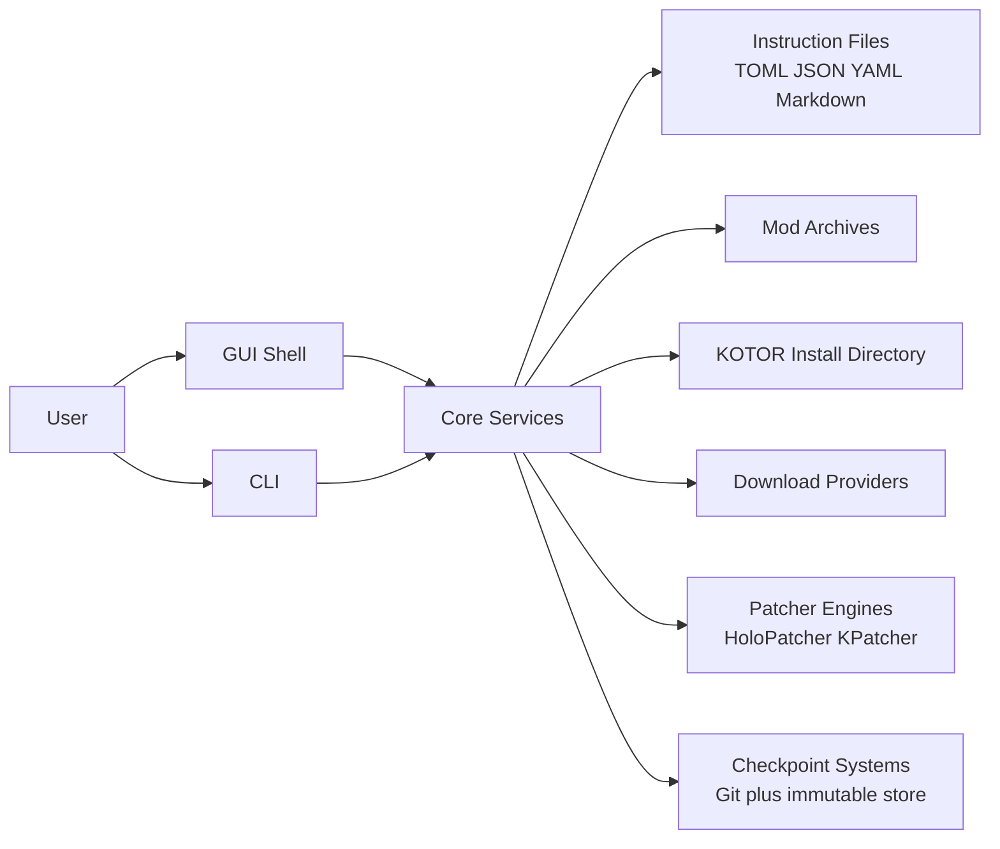

## 5. Core Domain Model

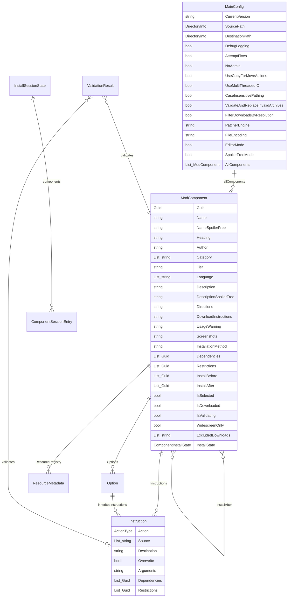

### Core Enums

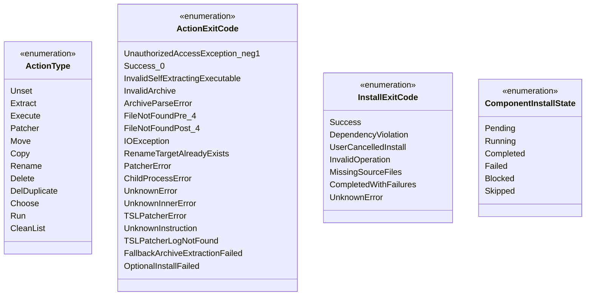

## 6. Main Window Composition Map

```mermaid
flowchart TD
    MW[MainWindow] --> MODES[Mode Properties]
    MW --> VIEWS[Primary Surfaces]
    MW --> GUI_SERVICES[Injected GUI Services]
    MW --> CORE_SERVICES[Referenced Core Services]
    MW --> DIALOGS[Dialog Entry Points]

    MODES --> EDITOR[EditorMode]
    MODES --> SPOILER[SpoilerFreeMode]
    MODES --> WIZARD[WizardMode]
    MODES --> ROOTSEL[RootSelectionState]
    MODES --> CURRENT[CurrentComponent]

    VIEWS --> LANDING[LandingPageView]
    VIEWS --> SIDEBAR[ModListSidebar]
    VIEWS --> TABS[GettingStarted Summary Editor Raw]
    VIEWS --> WIZARDHOST[WizardHostControl]
    VIEWS --> LOG[EmbeddedLogPanel]

    GUI_SERVICES --> GLS[ModListService]
    GUI_SERVICES --> GVS[ValidationService]
    GUI_SERVICES --> GUIS[UIStateService]
    GUI_SERVICES --> SELS[SelectionService]
    GUI_SERVICES --> GFSS[FileSystemService]
    GUI_SERVICES --> GPATH[GuiPathService]
    GUI_SERVICES --> GDIAL[DialogService]
    GUI_SERVICES --> GDRAG[DragDropService]
    GUI_SERVICES --> GLOAD[FileLoadingService]
    GUI_SERVICES --> GEDIT[ComponentEditorService]
    GUI_SERVICES --> GCOMPSEL[ComponentSelectionService]
    GUI_SERVICES --> GDL[DownloadOrchestrationService]
    GUI_SERVICES --> GFILTER[FilterUIService]
    GUI_SERVICES --> GIBROWSE[InstructionBrowsingService]
    GUI_SERVICES --> GIGEN[InstructionGenerationService]
    GUI_SERVICES --> GVDIS[ValidationDisplayService]
    GUI_SERVICES --> GSTEP[StepNavigationService]

    CORE_SERVICES --> CMS[ModManagementService]
    CORE_SERVICES --> DCS[DownloadCacheService]
    CORE_SERVICES --> TVC[TelemetryService]
```

### Mode Rules

| Mode | Rule |
|---|---|
| `EditorMode` | Forces `SpoilerFreeMode = false` and `WizardMode = false` |
| `WizardMode` | Default guided installation surface; swaps out the main grid for `WizardHostControl` |
| `SpoilerFreeMode` | Hides spoiler content and synchronizes across multiple windows and pages |
| `RootSelectionState` | Drives select-all, deselect-all, and indeterminate state logic |

## 7. GUI Inventory

### 7.1 App Root Files

| Category | Files |
|---|---|
| Bootstrap | `App.axaml`, `App.axaml.cs`, `Program.cs`, `CLIArguments.cs` |
| Main windows | `MainWindow.axaml`, `MainWindow.axaml.cs`, `MainWindowWizardExtensions.cs`, `DownloadProgressWindow.axaml`, `DownloadProgressWindow.axaml.cs`, `ProgressWindow.axaml`, `ProgressWindow.axaml.cs` |
| Shared root classes | `RelayCommand.cs`, `OutputLogViewModel.cs`, `ThemeManager.cs`, `ThemeResourceHelper.cs`, `GuidConflictResolver.cs`, `FuzzyMatcher.cs`, `IModManagementDialogService.cs` |

### 7.2 Controls

| Control | Responsibility |
|---|---|
| `ActionButtonsControl` | Generic action row |
| `BrowseButtonsControl` | Browse file and folder controls |
| `CategorySelectionControl` | Category selection UI |
| `DependencyControl` | Dependency display and editing |
| `DirectoryPickerControl` | Path input and browse integration |
| `DownloadLinksControl` | Download URL rendering |
| `EditorTab` | Full editor surface |
| `EmbeddedLogPanel` | Expandable log view |
| `ExpandableTextBox` | Autosizing text editor |
| `FileExtensionsControl` | File extension support display |
| `GettingStartedTab` | Onboarding and launch surface |
| `InstructionEditorControl` | Instruction editing surface |
| `LandingPageView` | Hero and start page |
| `ModListItem` | One mod row in the list |
| `ModListSidebar` | Search, filter, counts, selection list |
| `OptionEditorControl` | Option editing |
| `RawTab` | Raw TOML and source editor |
| `ScreenshotDisplayControl` | Screenshot viewer |
| `SearchBox` | Search input abstraction |
| `SummaryTab` | Read-only summary surface |
| `WizardHostControl` | Inline wizard host |

### 7.3 Dialogs and Wizard Pages

| Area | Files |
|---|---|
| Standard dialogs | `AutoGenerationResultsDialog`, `CheckpointManagementDialog`, `CircularDependencyResolutionDialog`, `ComponentMergeConflictDialog`, `ConfirmationDialog`, `DependencyResolutionErrorDialog`, `DependencyUnlinkDialog`, `GitCheckpointBrowserDialog`, `InformationDialog`, `InstallationErrorDialog`, `InstallWizardDialog`, `ModDownloadDetailsDialog`, `ModFilesBrowserDialog`, `ModManagementDialog`, `OptionsDialog`, `ProgressDialog`, `RegexImportDialog`, `SettingsDialog`, `SingleModDownloadDialog`, `TelemetryConsentDialog`, `ValidationDialog`, `ValidationIssueDetailsDialog`, `ValidationProgressDialog`, `WidescreenNotificationDialog` |
| Dialog support models | `CircularDependencyResolutionViewModel.cs`, `ComponentMergeConflictViewModel.cs`, `DependencyUnlinkViewModel.cs`, `RegexImportDialogViewModel.cs`, `WizardPageInfo.cs`, `IWizardPage.cs` |
| Wizard pages | `LoadInstructionPage`, `WelcomePage`, `PreamblePage`, `ModDirectoryPage`, `GameDirectoryPage`, `AspyrNoticePage`, `ModSelectionPage`, `DownloadsExplainPage`, `ValidatePage`, `InstallStartPage`, `InstallingPage`, `BaseInstallCompletePage`, `FinishedPage`, `WidescreenNoticePage`, `WidescreenModSelectionPage`, `WidescreenInstallingPage`, `WidescreenCompletePage`, `WizardPageBase` |

### 7.4 GUI Services

| Service | Responsibility |
|---|---|
| `ArchiveEnumerationService` | Enumerate archive contents for browsing |
| `AutoUpdateClient` | Remote update discovery |
| `AutoUpdateCoordinator` | Update flow orchestration |
| `AutoUpdateService` | Background update management |
| `ComponentEditorService` | GUI-side component editing wrapper |
| `ComponentSelectionService` | Checkbox and select-all behaviors |
| `ComponentValidationWatcherService` | Watcher-based validation refresh |
| `DialogService` | Modal dialog dispatch |
| `DownloadOrchestrationService` | GUI-triggered download coordination |
| `DragDropService` | Drag and drop handling |
| `FileLoadingService` | GUI wrapper around core loading |
| `FileSystemService` | UI-aware filesystem operations |
| `FilterUIService` | Category, tier, and filter coordination |
| `GuiPathService` | User-facing path formatting |
| `InstructionBrowsingService` | Instruction traversal |
| `InstructionGenerationService` | Auto-generate instruction flows |
| `InstructionManagementService` | Instruction CRUD |
| `MarkdownRenderingService` | Markdown-to-UI rendering |
| `MenuBuilderService` | Dynamic menus |
| `ModListService` | Search, filter, and list ordering |
| `ModManagementDialogService` | Mod management dialog adapter |
| `ScrollNavigationService` | Scroll and focus movement |
| `SelectionService` | Shared selection state |
| `SettingsService` | User settings persistence |
| `StepNavigationService` | Guided step flow coordination |
| `ThemeService` | Theme switching |
| `UIStateService` | UI persistence and restoration |
| `ValidationDisplayService` | Validation rendering |
| `ValidationService` | GUI validation workflow |

### 7.5 GUI Models, Styles, Helpers, and Converters

| Group | Inventory |
|---|---|
| Models | `AppSettings.cs`, `FileTreeNode.cs`, `InstructionViewModel.cs`, `SelectionFilterItem.cs`, `TierFilterItem.cs` |
| Styles | `LightStyle.axaml`, `KotorStyle.axaml`, `Kotor2Style.axaml` |
| Helpers | `PropertyNames.cs` |
| Converters | `ActionConverter`, `ArgumentsDescriptionConverter`, `ArgumentsTextConverter`, `ArgumentsVisibilityConverter`, `BooleanAndConverter`, `BooleanNotConverter`, `BoolToFontWeightConverter`, `CategoryListDisplayConverter`, `CategoryTooltipConverter`, `ChooseActionDisplayConverter`, `ChooseActionVisibility`, `ChooseInstructionDisplayConverter`, `ComponentsListConverter`, `ComponentToGuidConverter`, `ConditionalGuidListConverter`, `DictionaryToVisibilityConverter`, `EnumToBooleanConverter`, `ExecuteActionVisibilityConverter`, `ExecuteDelDuplicateVisibilityConverter`, `FirstSourcePathConverter`, `GuidListConverter`, `GuidListToComponentNames`, `GuidToComponentConverter`, `IndexConverter`, `InstructionDestinationConverter`, `InvalidUrlVisibilityConverter`, `IsK2GameConverter`, `IsUnixConverter`, `IsWindowsConverter`, `ListToStringConverter`, `ListToVisibilityConverter`, `MarkdownRenderer`, `ModLinkFilenamesToUrlListConverter`, `NamespacesIniOptionConverter`, `NotChooseActionVisibility`, `NotChooseActionVisibilityConverter`, `NotPatcherActionVisibility`, `OpenLinkConverter`, `OptionSelectionBackgroundConverter`, `PatcherActionVisibility`, `PatcherWithNamespacesVisibilityConverter`, `PathResolverConverter`, `PathStatusConverter`, `PathStatusDetailedConverter`, `PathValidationConverter`, `SourceFilesVisibilityConverter`, `SpoilerFreeContentConverter`, `StringGuidListConverter`, `StringNotEmptyConverter`, `StringToIntConverter`, `StringToVisibilityConverter`, `TierTooltipConverter`, `UnresolvedPathTooltipConverter`, `ValidationBlockingInstructionTextConverter`, `ValidationDetailedMessageConverter`, `ValidationHasBlockingInstructionConverter`, `ValidationStatusMessageConverter` |

## 8. Wizard Navigation State Machine

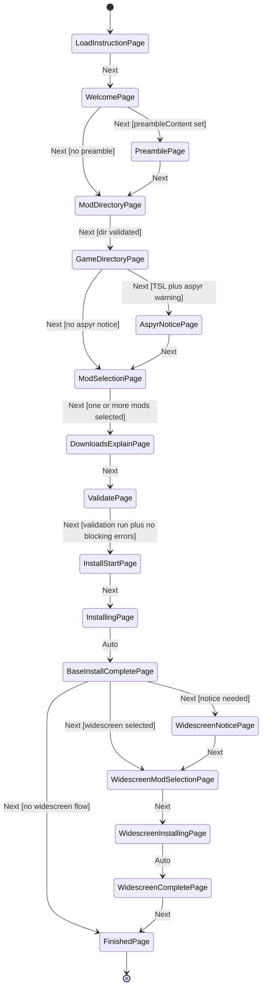

### Wizard Validation Rules

| Page | Validation |
|---|---|
| `ModDirectoryPage` | Directory exists |
| `GameDirectoryPage` | Valid KOTOR install including `chitin.key` |
| `ModSelectionPage` | At least one non-widescreen mod selected |
| `ValidatePage` | Validation must run and must not have blocking errors |
| `InstallingPage`, `WidescreenInstallingPage` | Backward navigation disabled |

## 9. Installation Pipeline

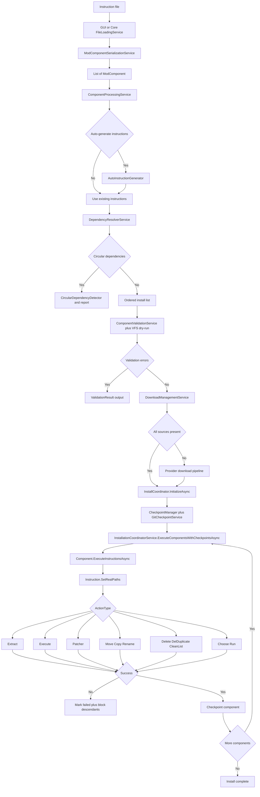

## 10. Download Pipeline

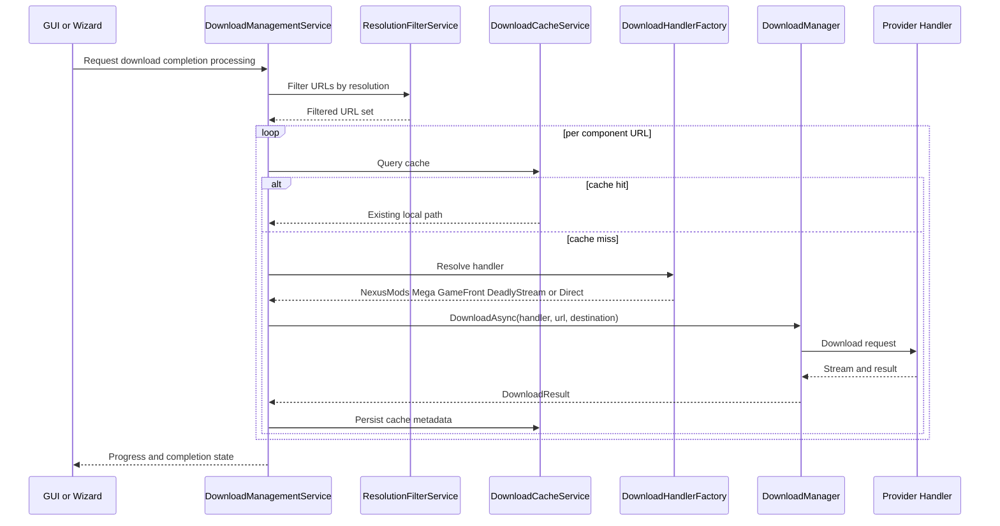

### Download Provider Matrix

| Handler | Target |
|---|---|
| `NexusModsDownloadHandler` | `nexusmods.com` |
| `MegaDownloadHandler` | `mega.nz`, `mega.co.nz` |
| `GameFrontDownloadHandler` | `gamefront.com`, `gamefront.online` |
| `DeadlyStreamDownloadHandler` | `deadlystream.com` |
| `DirectDownloadHandler` | All other HTTP(S) URLs |

## 11. Core Service Dependency Map

```mermaid
classDiagram
    direction TB

    class FileLoadingService_Core {
        +LoadFromFileAsync()
        +SaveToFile()
    }
    class ModComponentSerializationService {
        +Deserialize*
        +Serialize*
        +GenerateModDocumentation()
    }
    class ComponentProcessingService {
        +ProcessComponentsAsync()
    }
    class AutoInstructionGenerator {
        +GenerateInstructions()
    }
    class DependencyResolverService {
        +ResolveDependencies()
    }
    class CircularDependencyDetector {
        +Detect()
    }
    class ComponentValidationService {
        +ValidateComponentAsync()
    }
    class InstallCoordinator {
        +InitializeAsync()
        +GetOrderedInstallList()
        +MarkBlockedDescendants()
    }
    class InstallationCoordinatorService {
        +ExecuteComponentsWithCheckpointsAsync()
    }
    class DownloadManagementService
    class DownloadHandlerFactory
    class DownloadManager
    class GitCheckpointService
    class CheckpointService
    class BinaryDiffService
    class ContentAddressableStore
    class DryRunValidator
    class PathValidationCache
    class IFileSystemProvider {
        <<interface>>
    }
    class RealFileSystemProvider
    class VirtualFileSystemProvider

    IFileSystemProvider <|.. RealFileSystemProvider
    IFileSystemProvider <|.. VirtualFileSystemProvider

    FileLoadingService_Core --> ModComponentSerializationService
    ComponentProcessingService --> AutoInstructionGenerator
    DependencyResolverService --> CircularDependencyDetector
    ComponentValidationService --> IFileSystemProvider
    ComponentValidationService --> DryRunValidator
    InstallCoordinator --> GitCheckpointService
    InstallationCoordinatorService --> InstallCoordinator
    DownloadManagementService --> DownloadHandlerFactory
    DownloadManagementService --> DownloadManager
    CheckpointService --> BinaryDiffService
    CheckpointService --> ContentAddressableStore
```

### Core Module Inventory

| Area | Inventory |
|---|---|
| Top-level core files | `ComponentValidation.cs`, `ConsoleConfig.cs`, `GlobalSuppressions.cs`, `Instruction.cs`, `Logger.cs`, `MainConfig.cs`, `ModComponent.cs`, `ModDirectory.cs`, `Option.cs`, `PatcherEngines.cs`, `Program.cs`, `ValidationResult.cs` |
| CLI | `ConsoleProgressDisplay.cs`, `ModBuildConverter.cs` |
| ConfigFiles | `mods.json` |
| Exceptions | `WildcardPatternNotFoundException.cs` |
| FileSystemPathing | `CaseAwarePath.cs`, `DirectoryInfoExtensions.cs` |
| FileSystemUtils | `CrossPlatformFileWatcher.cs`, `FilePermissionHelper.cs`, `PathHelper.cs`, `PathHelper.ArchiveExtraction.cs`, `PathValidator.cs` |
| Installation | `InstallCoordinator.cs`, `InstallSessionState.cs`, `ResumeResult.cs` |
| Parsing | `MarkdownImportProfile.cs`, `MarkdownParser.cs`, `MarkdownParserResult.cs`, `MarkdownUtilities.cs`, `NaturalLanguageInstructionParser.cs`, `ParsingTraceInfo.cs` |
| TSLPatcher | `IniHelper.cs` |
| Utility | `ArchiveHelper.cs`, `AsyncWaitHelper.cs`, `CallbackObjects.cs`, `CanonicalJson.cs`, `CategoryTierDefinitions.cs`, `CollectionUtils.cs`, `FileChecksumValidator.cs`, `FileUtilities.cs`, `IEnumerableExtensions.cs`, `IniFileMerger.cs`, `InstanceCreator.cs`, `NetFrameworkCompatibility.cs`, `PathFixer.cs`, `PathUtilities.cs`, `PlatformAgnosticMethods.cs`, `RelayCommand.cs`, `SearchUtilities.cs`, `Serializer.cs`, `TomlWriter.cs`, `UIUtilities.cs`, `UrlNormalizer.cs`, `UrlUtilities.cs`, `Utility.cs` |
| Core services | `AutoInstructionGenerator.cs`, `CircularDependencyDetector.cs`, `ComponentEditorService.cs`, `ComponentManagerService.cs`, `ComponentMergeService.cs`, `ComponentProcessingService.cs`, `ComponentValidationService.cs`, `DependencyResolverService.cs`, `DownloadCacheService.cs`, `DownloadManagementService.cs`, `FileLoadingService.cs`, `FileOperationService.cs`, `GitCheckpointService.cs`, `InstallationCoordinatorService.cs`, `InstallationService.cs`, `MergeHeuristicsOptions.cs`, `ModComponentSerializationService.cs`, `ModLinkProcessingService.cs`, `ModManagementService.cs`, `ResolutionFilterService.cs`, `TelemetryAuthenticator.cs`, `TelemetryConfiguration.cs`, `TelemetryService.cs`, plus `Checkpoints`, `Download`, `FileSystem`, `ImmutableCheckpoint`, and `Validation` subfolders |

## 12. Format Parsing and Roundtrip Architecture

```mermaid
flowchart TD
    subgraph Sources
        MD[full.md]
        TOML[KOTOR1_Full.toml]
    end

    subgraph Parsers
        MDP[MarkdownParser]
        TOMLP[DeserializeModComponentFromTomlString]
    end

    MD --> MDP
    TOML --> TOMLP
    MDP --> MDMETA[Markdown metadata model]
    TOMLP --> TOMLDATA[TOML instruction model]
    MDMETA --> MERGE[ComponentMergeService]
    TOMLDATA --> MERGE
    MERGE --> MODEL[Complete ModComponent graph]
    MODEL --> OUTMD[Markdown output]
    MODEL --> OUTTOML[TOML output]
    MODEL --> OUTJSON[JSON output]
```

### Field Ownership Map

| Field family | Authoritative source |
|---|---|
| Stable identifiers and execution graph | TOML |
| Human documentation and display metadata | Markdown |
| Download URLs | Markdown merged into `ResourceRegistry` |

### Supported Input Formats

| Format | Extensions |
|---|---|
| TOML | `.toml`, `.tml` |
| JSON | `.json` |
| YAML | `.yaml`, `.yml` |
| Markdown | `.md`, `.markdown`, `.mdown`, `.mkdn`, `.mkd`, `.mdtxt`, `.mdtext`, `.text` |

## 13. Instruction Execution Model

```mermaid
flowchart TD
    START[Instruction.Execute] --> RESOLVE[SetRealPaths resolve placeholders expand wildcards enforce sandbox]
    RESOLVE --> SWITCH{ActionType}
    SWITCH --> EXTRACT[ExtractFileAsync]
    SWITCH --> EXECUTE[Run external process]
    SWITCH --> PATCHER[Invoke HoloPatcher or KPatcher]
    SWITCH --> MOVE[Move]
    SWITCH --> COPY[Copy]
    SWITCH --> RENAME[Rename]
    SWITCH --> DELETE[Delete]
    SWITCH --> DELDUPE[DelDuplicate]
    SWITCH --> CHOOSE[Choose option path]
    SWITCH --> RUN[Run command or script]
    SWITCH --> CLEAN[CleanList]
    EXTRACT --> RESULT{ActionExitCode}
    EXECUTE --> RESULT
    PATCHER --> RESULT
    MOVE --> RESULT
    COPY --> RESULT
    RENAME --> RESULT
    DELETE --> RESULT
    DELDUPE --> RESULT
    CHOOSE --> RESULT
    RUN --> RESULT
    CLEAN --> RESULT
    RESULT -->|Success| OK[Instruction completed]
    RESULT -->|Failure| FAIL[Component failed and descendants blocked]
```

### Placeholders

| Placeholder | Meaning |
|---|---|
| `<<modDirectory>>` | `MainConfig.SourcePath` |
| `<<kotorDirectory>>` | `MainConfig.DestinationPath` |

## 14. Test Coverage Map

```mermaid
flowchart TD
    TESTS[KOTORModSync.Tests] --> EXEC[Instruction execution and combinations]
    TESTS --> DEP[Dependency resolution and validation]
    TESTS --> PARSE[Markdown TOML JSON YAML parsing and roundtrip]
    TESTS --> VFS[Virtual filesystem and path behavior]
    TESTS --> INSTALL[Install coordinator resume checkpoints]
    TESTS --> DL[Download providers and cache]
    TESTS --> GUI[Headless GUI and control tests]
    TESTS --> SEC[Security sandboxing URL and path safety]
    TESTS --> META[Telemetry auto-update metadata]
    TESTS --> REAL[Real-world and integration scenarios]
```

### Test Inventory Notes

The exact test file list is intentionally kept in [docs/Complete_Source_Inventory.txt](docs/Complete_Source_Inventory.txt) to avoid duplicating a large, fast-changing inventory in this narrative blueprint.

## 15. Theme and Design System Inventory

| Theme | Files | Visual direction |
|---|---|---|
| Light | `Styles/LightStyle.axaml` | Neutral desktop productivity theme |
| KOTOR 1 | `Styles/KotorStyle.axaml` | Dark blue and cyan theme |
| KOTOR 2 | `Styles/Kotor2Style.axaml` | Dark green and teal theme |

| Design surface | Coverage |
|---|---|
| Theme switching | `ThemeManager`, `ThemeResourceHelper`, `ThemeService` |
| Dynamic resources | Background, foreground, border, hero, card, panel, progress, selection, tooltip, sidebar navigation |
| Platform-specific presentation | Converters, publish profiles, manifest, and plist files |

## 16. Exact Inventory Companion

The exact source inventory for the entire attached `src` tree has been generated into:

- [docs/Complete_Source_Inventory.txt](docs/Complete_Source_Inventory.txt)
- [docs/Source_Atlas.md](docs/Source_Atlas.md)
- [docs/Source_Reconstruction_Manifest.md](docs/Source_Reconstruction_Manifest.md)
- [docs/GUI_Surface_Matrix.md](docs/GUI_Surface_Matrix.md)
- [docs/Test_Family_Matrix.md](docs/Test_Family_Matrix.md)
- [docs/Core_And_Patcher_Family_Matrix.md](docs/Core_And_Patcher_Family_Matrix.md)
- [docs/Pairing_And_Adjacency_Matrix.md](docs/Pairing_And_Adjacency_Matrix.md)
- [docs/Build_And_Distribution_Matrix.md](docs/Build_And_Distribution_Matrix.md)

`Complete_Source_Inventory.txt` is the zero-omission raw manifest.
`Source_Atlas.md` is the grouped, human-readable atlas of the same source tree.
`Source_Reconstruction_Manifest.md` is the per-file role classification companion for the same source tree.
`GUI_Surface_Matrix.md`, `Test_Family_Matrix.md`, and `Core_And_Patcher_Family_Matrix.md` provide reconstruction-facing family matrices for the major implementation surfaces.
`Pairing_And_Adjacency_Matrix.md` records which files must be rebuilt together.
`Build_And_Distribution_Matrix.md` records the project, publish, packaging, and runtime-assembly artifacts required to ship the repository.

## 17. Rebuild Checklist

1. Recreate the core domain objects: `MainConfig`, `ModComponent`, `Option`, `Instruction`, `ValidationResult`, install session types.
2. Recreate parsing, serialization, path resolution, filesystem abstraction, validation, dependency resolution, download handling, and checkpointing.
3. Recreate the execution pipeline: instruction dispatch, patcher orchestration, install coordinator, failure propagation, checkpoint snapshots.
4. Recreate the GUI shell: `MainWindow`, mode system, tab surfaces, landing page, sidebar, embedded log, wizard host.
5. Recreate the wizard: all 17 pages plus navigation, validation, and dynamic widescreen insertion rules.
6. Recreate the dialog system: management, validation, checkpoint, download, conflict, telemetry, settings, and progress dialogs.
7. Recreate the theme system: Light, K1, and K2 styles and dynamic resource switching.
8. Recreate the test suite using [docs/Complete_Source_Inventory.txt](docs/Complete_Source_Inventory.txt) and preserve the coverage categories shown above.

## 18. Quantitative Source Coverage

The current `src` tree inventory resolves to these top-level counts.

| Project | File Count | Notes |
|---|---:|---|
| `KOTORModSync.GUI` | 314 | Largest application-layer project; Avalonia shell, dialogs, controls, converters, services, styles |
| `KOTORModSync.Tests` | 156 | Broad behavior matrix across install, parsing, VFS, UI, telemetry, and downloads |
| `KOTORModSync.Core` | 110 | Primary application logic, model, orchestration, parsing, validation, execution |
| `HoloPatcher` | 565 | Patcher and resource-format engine; dominates low-level patch/data support |
| `HoloPatcher.UI` | 22 | Smaller companion UI surface around the patcher stack |
| `KOTORModSync.props` | 1 | Shared solution-level props |

### Coverage Implication

The rebuild target is not just `Core + GUI`. A full-fidelity regeneration of the current repository state also requires:

1. The patch/data stack under `src/HoloPatcher`.
2. The patcher UI companion under `src/HoloPatcher.UI`.
3. The external rich text and RTF submodules under `src/AvRichTextBox` and `src/RtfDomParserAvalonia`.
4. The broad regression matrix in `src/KOTORModSync.Tests`.

## 19. Project Decomposition by Subsystem

### 19.1 Core Subsystem Counts

| Core Area | Count |
|---|---:|
| `Services` | 50 |
| `Utility` | 23 |
| `Parsing` | 6 |
| `FileSystemUtils` | 5 |
| `Installation` | 3 |
| `CLI` | 2 |
| `FileSystemPathing` | 2 |
| `ConfigFiles` | 1 |
| `Data` | 1 |
| `Exceptions` | 1 |
| `TSLPatcher` | 1 |
| top-level root files | 15 |

### 19.2 GUI Subsystem Counts

| GUI Area | Count |
|---|---:|
| `Converters` | 109 |
| `Dialogs` | 89 |
| `Controls` | 42 |
| `Services` | 29 |
| `Properties` | 8 |
| `Models` | 5 |
| `Styles` | 3 |
| `CallbackDialogs` | 3 |
| `Helpers` | 1 |
| root files/assets/manifests | 26 |

### 19.3 HoloPatcher Subsystem Counts

| HoloPatcher Area | Count |
|---|---:|
| `Formats` | 479 |
| `TSLPatcher` | 45 |
| `Properties` | 15 |
| `Mods` | 15 |
| `Common` | 2 |
| `Memory` | 2 |
| `Resource` | 2 |
| `Installation` | 1 |
| `Program.cs` | 1 |
| `README.md` | 1 |
| project and manifest roots | 2 |

### 19.4 Test Subsystem Counts

| Test Area | Count |
|---|---:|
| root test classes and harness files | 145 |
| `HeadlessUITests` | 10 |
| `TestHelpers` | 1 |

## 20. Core Internal Architecture Decomposition

```mermaid
flowchart TD
    CORE[KOTORModSync.Core] --> MODEL[Domain model]
    CORE --> LOAD[Load and serialize]
    CORE --> RULES[Resolve and validate]
    CORE --> EXEC[Execute and install]
    CORE --> DL[Download subsystem]
    CORE --> SNAP[Checkpoint subsystem]
    CORE --> FS[Filesystem abstraction]
    CORE --> PARSE[Markdown and import parsing]
    CORE --> TELE[Telemetry and configuration]

    MODEL --> MCFG[MainConfig]
    MODEL --> MCOMP[ModComponent and Option]
    MODEL --> MINSTR[Instruction and ValidationResult]

    LOAD --> FLS[FileLoadingService]
    LOAD --> MCSS[ModComponentSerializationService]
    LOAD --> MBUILD[ModBuildConverter]

    RULES --> CPS[ComponentProcessingService]
    RULES --> DRS[DependencyResolverService]
    RULES --> CDS[CircularDependencyDetector]
    RULES --> CVS[ComponentValidationService]
    RULES --> DRY[DryRunValidator]

    EXEC --> ICOORD[InstallCoordinator]
    EXEC --> ISVC[InstallationCoordinatorService]
    EXEC --> INSTSVC[InstallationService]
    EXEC --> FOPS[FileOperationService]

    DL --> DMS[DownloadManagementService]
    DL --> DCACHE[DownloadCacheService]
    DL --> DHF[DownloadHandlerFactory]
    DL --> DMGR[DownloadManager]
    DL --> RFILT[ResolutionFilterService]

    SNAP --> GIT[GitCheckpointService]
    SNAP --> CPATH[CheckpointPaths]
    SNAP --> CSTORE[ContentAddressableStore]
    SNAP --> BDIFF[BinaryDiffService]
    SNAP --> ICSVC[CheckpointService]

    FS --> IFS[IFileSystemProvider]
    FS --> RFS[RealFileSystemProvider]
    FS --> VFS[VirtualFileSystemProvider]
    FS --> PATHH[PathHelper and PathValidator]

    PARSE --> MDP[MarkdownParser]
    PARSE --> MDIP[MarkdownImportProfile]
    PARSE --> NLP[NaturalLanguageInstructionParser]

    TELE --> TSVC[TelemetryService]
    TELE --> TCONF[TelemetryConfiguration]
    TELE --> TAUTH[TelemetryAuthenticator]
```

### Core Rebuild Order

| Stage | Required files and areas |
|---|---|
| 1 | `MainConfig`, `ModComponent`, `Option`, `Instruction`, `ValidationResult`, `ModDirectory`, `PatcherEngines` |
| 2 | `Utility`, `FileSystemPathing`, `FileSystemUtils`, `ConfigFiles`, `Data`, `Exceptions` |
| 3 | `Parsing` plus `ModComponentSerializationService` and `FileLoadingService` |
| 4 | `ComponentProcessingService`, `DependencyResolverService`, `CircularDependencyDetector`, `ComponentValidationService`, validation helpers |
| 5 | `DownloadManagementService`, provider handlers, cache, filter, manager |
| 6 | `InstallCoordinator`, `InstallationCoordinatorService`, checkpoint and immutable store services |
| 7 | CLI entry points and console progress |

## 21. GUI Internal Architecture Decomposition

```mermaid
flowchart TD
    GUI[KOTORModSync.GUI] --> APP[App bootstrap]
    GUI --> SHELL[Main shell]
    GUI --> INPUT[Input and selection surfaces]
    GUI --> EDIT[Editing surfaces]
    GUI --> WIZ[Wizard surfaces]
    GUI --> DLG[Dialog surfaces]
    GUI --> STYLE[Theme and styles]
    GUI --> CONV[Binding converter layer]
    GUI --> GSVCS[GUI services]

    APP --> APPX[App.axaml App.axaml.cs Program.cs CLIArguments.cs]
    SHELL --> MAIN[MainWindow MainWindowWizardExtensions]
    SHELL --> PROG[ProgressWindow DownloadProgressWindow OutputLogViewModel]

    INPUT --> SIDE[ModListSidebar ModListItem SearchBox CategorySelectionControl]
    INPUT --> DIR[DirectoryPickerControl BrowseButtonsControl]
    INPUT --> MEDIA[ScreenshotDisplayControl DownloadLinksControl FileExtensionsControl]

    EDIT --> ETAB[EditorTab RawTab SummaryTab GettingStartedTab]
    EDIT --> IEDIT[InstructionEditorControl OptionEditorControl ExpandableTextBox DependencyControl]

    WIZ --> WHOST[WizardHostControl]
    WIZ --> WPAGES[All wizard pages]

    DLG --> MODALS[Settings Validation Progress Options Confirmation Information InstallWizard and related dialogs]
    STYLE --> TMG[ThemeManager ThemeResourceHelper ThemeService]
    STYLE --> AXSTYLES[LightStyle KotorStyle Kotor2Style]
    CONV --> CVRS[109 converter files]
    GSVCS --> GSVCSET[29 GUI services]
```

### GUI Rebuild Order

| Stage | Required files and areas |
|---|---|
| 1 | `App.axaml`, `Program.cs`, `MainWindow.axaml`, `MainWindow.axaml.cs` |
| 2 | `Styles`, `ThemeManager`, `ThemeResourceHelper`, `ThemeService` |
| 3 | foundational controls: sidebar, search, picker, editor, raw, summary, landing, log |
| 4 | GUI services for state, loading, navigation, validation, dialogs, downloads |
| 5 | modal dialogs |
| 6 | wizard host and the 17 wizard pages |
| 7 | callback dialogs, remaining converters, publish profiles, icons, manifests |

## 22. HoloPatcher and HoloPatcher.UI Architecture

The current repository is not only an installer coordinator. It also embeds a large patching and game-format stack through `src/HoloPatcher`.

```mermaid
flowchart TD
    HP[HoloPatcher] --> FORMATS[Game resource format implementations]
    HP --> TSL[TSLPatcher engine]
    HP --> MODS[Patch modification models]
    HP --> MEM[Patch memory tokens]
    HP --> INSTALL[Installation entrypoint]
    HP --> COMMON[Shared primitives]
    HP --> RES[Resource metadata]

    FORMATS --> GFF[GFF]
    FORMATS --> TLK[TLK]
    FORMATS --> SSF[SSF]
    FORMATS --> TWO[TwoDA]
    FORMATS --> NCS[NCS]
    FORMATS --> ERF[ERF]
    FORMATS --> RIM[RIM]
    FORMATS --> LIP[LIP]

    TSL --> CFG[Config and namespace readers]
    TSL --> LOGGER[Patch loggers]
    TSL --> DIFF[Diff analyzers]
    TSL --> INSTALLER[ModInstaller and helpers]
    TSL --> UNDO[Uninstall support]

    MODS --> GFFMOD[GFF modifications]
    MODS --> TWOMOD[2DA modifications]
    MODS --> TLKMOD[TLK modifications]
    MODS --> NSSMOD[NSS modifications]
    MODS --> NCSMOD[NCS modifications]
    MODS --> SSFMOD[SSF modifications]

    HPUI[HoloPatcher.UI] --> HPUI_APP[App and config]
    HPUI --> HPUI_VM[ViewModels]
    HPUI --> HPUI_VIEWS[MainWindow RteEditorWindow dialogs]
    HPUI --> HPUI_UPDATE[AutoUpdater and RemoteUpdateInfo]
    HPUI --> HPUI_RTE[RteDocument and converter]
```

### HoloPatcher Coverage Notes

| Area | Meaning for rebuild |
|---|---|
| `Formats` | Resource serializers/deserializers are part of the patch engine capability, not an optional extra |
| `TSLPatcher` | Namespace parsing, config reading, diffs, install logic, and uninstall support are core patch behaviors |
| `Mods` | Encodes per-format modification operations used by patch application |
| `HoloPatcher.UI` | Carries a smaller but still real UI application around patch/update/editor workflows |

## 23. Test Matrix Expansion

### 23.1 Behavioral Test Taxonomy

| Category | Representative files |
|---|---|
| Install execution | `InstallCoordinatorTests`, `InstallCoordinatorComplexTests`, `CliInstallIntegrationTests`, `UnifiedPipelineIntegrationTests`, `MultiComponentInstallationTests` |
| Instruction matrix | `InstructionExecutionTests`, `InstructionExecutionStressTests`, `InstructionExecutionWildcardAdvancedTests`, `ExhaustiveInstructionTypeCombinationsTests`, `SystematicInstructionSequenceTests` |
| Dependency and validation | `DependencyResolutionTests`, `ComplexDependencyResolutionTests`, `ComponentValidationComprehensiveTests`, `ValidationAndErrorRecoveryTests`, `InstructionValidationAndErrorCodesTests` |
| Parsing and roundtrip | `MarkdownTomlParityTests`, `DocumentationRoundTripTests`, `MarkdownImportTests`, `JSONFileTests`, `YAMLFileTests`, `TOMLFileTests` |
| Filesystem and sandboxing | `VirtualFileSystemTests`, `VirtualFileSystemComplexTests`, `PathSandboxingSecurityTests`, `PathResolutionComprehensiveTests`, `WildcardEnumerationTests` |
| Download and update | `MegaDownloadHandlerTests`, `DownloadCacheResolutionFilterTests`, `AutoUpdateServiceTests`, `SelfUpdateIntegrationTests`, `ResolutionFilterServiceTests` |
| Headless UI | `MainWindowHeadlessTests`, `ControlsHeadlessTests`, `HeadlessUITests/WizardFlowHeadlessTests`, `HeadlessUITests/InstallingPageHeadlessTests`, `HeadlessUITests/DownloadQueueHeadlessTests` |
| Security and telemetry | `UrlUtilitiesSecurityTests`, `TelemetryAuthenticatorTests`, `TelemetryConfigurationTests`, `PathSandboxingSecurityTests` |

### 23.2 Why the Test Suite Matters to Regeneration

The test suite is large enough that it defines expected behavior in places where the architecture narrative is still high-level. A full rebuild should therefore treat `src/KOTORModSync.Tests` as executable specification, not just validation scaffolding.

## 24. Regeneration Protocol for This Documentation

To keep the blueprint aligned with the repository after structural changes, regenerate the companion inventory and then update the narrative appendices that summarize it.

### 24.1 Exact Inventory Regeneration

```powershell
rg --files src | Set-Content docs/Complete_Source_Inventory.txt
```

### 24.2 Required Review Pass After Regeneration

After regenerating the inventory, verify these sections for drift:

1. Project counts in Section 18.
2. Subsystem counts in Section 19.
3. Core service and GUI service inventories in Sections 11 and 21.
4. HoloPatcher decomposition in Section 22 if new formats or patch modules were added.
5. Test taxonomy in Section 23 if new test families were added.
6. [docs/Project_File_Catalog.md](docs/Project_File_Catalog.md) so the grouped project and subsystem catalog stays aligned with the exact inventory.
7. [docs/Complete_Repository_Inventory.txt](docs/Complete_Repository_Inventory.txt) and [docs/Repository_Artifact_Matrix.md](docs/Repository_Artifact_Matrix.md) if root-level, telemetry, vendor, automation, or release artifacts changed.

### 24.3 Authoritative Pairing Rule

The documentation should be interpreted as a coordinated set:

1. [docs/Comprehensive_Architecture_Specs.md](docs/Comprehensive_Architecture_Specs.md) for semantics, flow, boundaries, and reconstruction order.
2. [docs/Complete_Source_Inventory.txt](docs/Complete_Source_Inventory.txt) for the exact `src/` file manifest.
3. [docs/Complete_Repository_Inventory.txt](docs/Complete_Repository_Inventory.txt) for the exact tracked repository manifest outside the source-tree abstraction.
4. [docs/Source_Atlas.md](docs/Source_Atlas.md) for a grouped, navigable view of the source tree.
5. [docs/Project_File_Catalog.md](docs/Project_File_Catalog.md) for a readable project-by-project and subsystem-by-subsystem catalog of every exact file with pairing hints.
6. [docs/Source_Reconstruction_Manifest.md](docs/Source_Reconstruction_Manifest.md) for per-file reconstruction role classification.
7. [docs/Repository_Artifact_Matrix.md](docs/Repository_Artifact_Matrix.md) for root-level, automation, telemetry, vendor, and support artifact roles.
8. [docs/GUI_Surface_Matrix.md](docs/GUI_Surface_Matrix.md) for all GUI controls, dialogs, wizard pages, and HoloPatcher.UI surfaces.
9. [docs/Test_Family_Matrix.md](docs/Test_Family_Matrix.md) for executable-specification coverage families.
10. [docs/Core_And_Patcher_Family_Matrix.md](docs/Core_And_Patcher_Family_Matrix.md) for core service, format, patcher, and UI support families.
11. [docs/Pairing_And_Adjacency_Matrix.md](docs/Pairing_And_Adjacency_Matrix.md) for file pairing, support-model attachment, and adjacency reconstruction rules.
12. [docs/Build_And_Distribution_Matrix.md](docs/Build_And_Distribution_Matrix.md) for solution, publish, packaging, and runtime-assembly artifacts.

## 25. Solution and Build Graph

The main solution file and the repository-wide project set are not identical.

### 25.1 Solution Graph

```mermaid
flowchart TD
    SLN[KOTORModSync.sln] --> CORE[KOTORModSync.Core]
    SLN --> GUI[KOTORModSync.GUI]
    SLN --> TESTS[KOTORModSync.Tests]
    SLN --> ITEMS[Solution Items]

    GUI --> CORE
    TESTS --> CORE
    TESTS --> GUI
```

### 25.2 Adjacent Project Graph Outside the Main Solution

```mermaid
flowchart TD
    REPO[Repository] --> MAINSLN[KOTORModSync.sln]
    REPO --> HP[HoloPatcher.csproj]
    REPO --> HPUI[HoloPatcher.UI.csproj]

    HP --> HPUIREF[Referenced by HoloPatcher executable flow]
    HPUI --> GUIREF[Project reference to GUI project]
    HP --> KPATTERN[Multi-target patcher executable]

    GUIREF --> GUI[KOTORModSync.GUI project]
```

### 25.3 Structural Consequence

| Fact | Consequence |
|---|---|
| `KOTORModSync.sln` includes Core, GUI, and Tests only | The main solution does not fully represent the adjacent patcher projects |
| `HoloPatcher` and `HoloPatcher.UI` live under `src/` but outside the `.sln` | A full repository rebuild requires treating them as first-class projects anyway |
| `HoloPatcher.UI` references `KOTORModSync.GUI` | The patcher UI layer is coupled to the main GUI project rather than being totally separate |

## 26. Shared Build Metadata

The repository centralizes version and repository identity in `src/KOTORModSync.props`.

| Property | Value |
|---|---|
| `KOTORModSyncVersion` | `2.0.0-alpha1` |
| `KOTORModSyncAssemblyVersion` | `2.0.0.0` |
| `KOTORModSyncFileVersion` | `2.0.0.0` |
| `Authors` | `th3w1zard1` |
| `Company` | `OldRepublicDevs` |
| `RepositoryUrl` | `https://github.com/th3w1zard1/KOTORModSync` |

## 27. Project Reference and Packaging Matrix

| Project | Output Type | Packable | References |
|---|---|---|---|
| `KOTORModSync.Core` | `Exe` | Yes | shared props + NuGet packages |
| `KOTORModSync.GUI` | `WinExe` on Windows, `Exe` on non-Windows RIDs | No | `KOTORModSync.Core` |
| `KOTORModSync.Tests` | `Exe` test host | No | `KOTORModSync.Core`, `KOTORModSync.GUI` |
| `HoloPatcher` | `WinExe` on Windows, `Exe` on non-Windows RIDs | No | `HoloPatcher.UI`, `KOTORModSync.GUI` |
| `HoloPatcher.UI` | `Library` | Yes | `KOTORModSync.GUI` |

### 27.1 Build Dependency Graph

```mermaid
flowchart LR
    CORE[KOTORModSync.Core] --> GUI[KOTORModSync.GUI]
    CORE --> TESTS[KOTORModSync.Tests]
    GUI --> TESTS
    GUI --> HPUI[HoloPatcher.UI]
    HPUI --> HP[HoloPatcher]
    GUI --> HP[HoloPatcher]
```

### 27.2 Internal Visibility Rule

| Rule | Location |
|---|---|
| GUI exposes internals to tests via `InternalsVisibleTo` | `src/KOTORModSync.GUI/KOTORModSync.csproj` |

## 28. Target Framework and Runtime Strategy

### 28.1 Main Projects

| Project | Debug Targeting | Release Targeting | Runtime Strategy |
|---|---|---|---|
| `KOTORModSync.Core` | `net9.0` by default in Debug | `net9.0;net48` | Cross-platform modern RIDs for .NET 8+; legacy Windows RIDs for `net4x` |
| `KOTORModSync.GUI` | `net9.0` by default in Debug | `net9.0;net48` | Windows and cross-platform desktop packaging |
| `KOTORModSync.Tests` | `net9.0` | `net9.0` | Single modern test target |

### 28.2 HoloPatcher Projects

| Project | Debug Targeting | Release Targeting | Runtime Strategy |
|---|---|---|---|
| `HoloPatcher` | single-target `net9` in Debug | dynamic multi-target chain including `net10`, `net9`, `net8`, `net7`, `net6`, and Windows-only `net48`/`net462` when available | executable across Windows, Linux, and macOS RIDs |
| `HoloPatcher.UI` | single-target `net9` in Debug | same dynamic multi-target family as `HoloPatcher` | UI library across modern and legacy targets |

### 28.3 Build Philosophy

| Pattern | Meaning |
|---|---|
| Debug builds collapse to latest `net9` where possible | Faster local iteration |
| Release builds preserve wider framework coverage | Legacy Windows compatibility plus modern cross-platform support |
| Runtime identifiers are assigned conditionally from target frameworks | Packaging adapts to framework family |

## 29. External Dependency Matrix

### 29.1 Core Package Families

| Category | Packages |
|---|---|
| Serialization and config | `Tomlyn`, `YamlDotNet`, `Newtonsoft.Json`, `ini-parser-netstandard`, `System.Text.Json` |
| Archive and patch support | `SharpCompress`, `SevenZip`, `Squid-Box.SevenZipSharp`, `Python.Included`, `Octodiff`, `LibGit2Sharp` |
| HTTP and scraping | `System.Net.Http`, `AngleSharp`, `HtmlAgilityPack`, `MegaApiClient` |
| CLI and diagnostics | `CommandLineParser`, `NLog`, `NLog.Config` |
| Telemetry | `OpenTelemetry`, `OpenTelemetry.Api`, `OpenTelemetry.Exporter.Console`, `OpenTelemetry.Exporter.OpenTelemetryProtocol`, `OpenTelemetry.Exporter.Prometheus.HttpListener`, `OpenTelemetry.Extensions.Hosting` |
| compatibility and utilities | `System.Collections.Specialized`, `System.Reflection.Emit`, `System.Reflection.Emit.Lightweight`, `System.Security.Principal.Windows`, `Microsoft.CSharp`, `Iesi.Collections`, `JetBrains.Annotations` |

### 29.2 GUI Package Families

| Category | Packages |
|---|---|
| Avalonia stack | `Avalonia`, `Avalonia.Desktop`, `Avalonia.LinuxFramebuffer`, `Avalonia.Controls.ItemsRepeater`, `Avalonia.ReactiveUI`, `Avalonia.Themes.Fluent`, `Avalonia.Diagnostics` in Debug |
| UI update and rendering | `NetSparkleUpdater.UI.Avalonia`, `Markdig`, `HtmlAgilityPack`, `AngleSharp` |
| download and transport support | `MegaApiClient`, `System.Net.Http` |
| build packaging | `Dotnet.Bundle` |

### 29.3 Test Package Families

| Category | Packages |
|---|---|
| test frameworks | `NUnit`, `xunit`, `xunit.runner.visualstudio`, `Microsoft.NET.Test.Sdk` |
| test tooling | `NUnit3TestAdapter`, `NUnit.Analyzers`, `coverlet.collector`, `Moq` |
| UI test support | `Avalonia.Headless.XUnit`, `Avalonia.Themes.Fluent` |

### 29.4 HoloPatcher.UI Package Families

| Category | Packages |
|---|---|
| Avalonia stack | `Avalonia`, `Avalonia.Desktop`, `Avalonia.LinuxFramebuffer`, `Avalonia.ReactiveUI`, `Avalonia.Themes.Fluent`, `Avalonia.Controls.ItemsRepeater`, `Avalonia.Diagnostics` in Debug |
| UI and MVVM | `ReactiveUI`, `CommunityToolkit.Mvvm`, `DialogHost.Avalonia`, `MessageBox.Avalonia` |
| document and content | `DocumentFormat.OpenXml`, `RtfDomParser`, `HtmlAgilityPack`, `System.Drawing.Common` |
| DI and logging | `Microsoft.Extensions.DependencyInjection`, `Microsoft.Extensions.Logging` |
| compatibility | `JetBrains.Annotations`, `MicroCom.Runtime`, `System.Reactive`, conditional `NetSparkle` |

## 30. Publish and Resource Assembly Behavior

### 30.1 GUI Packaging Responsibilities

The GUI project does more than compile code. It assembles runtime resources and external tool payloads during post-build and publish flows.

| Build behavior | Meaning |
|---|---|
| copies `vendor/PyKotor/**/*.py` into `Resources/PyKotor` | embeds Python patcher source into the app output |
| builds vendor `KPatcher` when required | bootstraps external patcher executable availability |
| copies platform-specific HoloPatcher or KPatcher binaries into `Resources/` | ensures runtime patcher presence by OS target |
| renames macOS `HoloPatcher` artifact to lowercase `holopatcher` | normalizes runtime executable naming |

### 30.2 Publish Profile Coverage

| Project | Publish profiles covered |
|---|---|
| `KOTORModSync.GUI` | `net8.0_win-x86_selfcontained`, `net8.0_win-x64_selfcontained`, `net8.0_osx-x64_selfcontained`, `net8.0_osx-arm64_selfcontained`, `net8.0_linux-x64_selfcontained`, `net48_win7-x86`, `net48_win7-x64` |
| `HoloPatcher` | Windows, Linux, and macOS publish profiles across self-contained and framework-dependent variants, plus legacy `net48` Windows profiles |

## 31. Repository Reconstruction Implications

If the goal is for another engineer to recreate the current repository from this documentation, they must reproduce all four layers below, not just application code.

| Layer | Required artifacts |
|---|---|
| Solution layer | `KOTORModSync.sln`, project graph, props file, manifests, publish profiles |
| Application layer | `KOTORModSync.Core`, `KOTORModSync.GUI`, `KOTORModSync.Tests` |
| Patcher layer | `HoloPatcher`, `HoloPatcher.UI`, bundled patch/data/resource formats |
| Runtime assembly layer | post-build copied Python resources, platform patcher binaries, icons, plist/manifest packaging assets |

### 31.1 Final Authority Rule

For complete repository reconstruction, treat the following as jointly authoritative:

1. [docs/Comprehensive_Architecture_Specs.md](docs/Comprehensive_Architecture_Specs.md)
2. [docs/Complete_Source_Inventory.txt](docs/Complete_Source_Inventory.txt)
3. [docs/Source_Atlas.md](docs/Source_Atlas.md)
4. [docs/Source_Reconstruction_Manifest.md](docs/Source_Reconstruction_Manifest.md)
5. [docs/GUI_Surface_Matrix.md](docs/GUI_Surface_Matrix.md)
6. [docs/Test_Family_Matrix.md](docs/Test_Family_Matrix.md)
7. [docs/Core_And_Patcher_Family_Matrix.md](docs/Core_And_Patcher_Family_Matrix.md)
8. [docs/Pairing_And_Adjacency_Matrix.md](docs/Pairing_And_Adjacency_Matrix.md)
9. [docs/Build_And_Distribution_Matrix.md](docs/Build_And_Distribution_Matrix.md)
10. The project and solution files summarized in Sections 25 through 30

## 32. Top-Level File Responsibility Appendix

This section removes ambiguity about the purpose of the root files that sit above the deeper subfolders. It should be read as the implementation-facing complement to the grouped path atlas.

### 32.1 KOTORModSync.Core Root Files

| File | Responsibility |
|---|---|
| `KOTORModSync.Core.csproj` | Core project definition, package graph, target frameworks, shared-props import, and output behavior |
| `Program.cs` | CLI application entry point for non-GUI execution flows |
| `MainConfig.cs` | Global runtime state object containing paths, options, selected components, install policy, and theme/game metadata |
| `ModComponent.cs` | Primary mod unit model containing metadata, dependency graph edges, selection state, install state, instructions, and resources |
| `Option.cs` | Nested selectable option model under a component with independent metadata and instruction behavior |
| `Instruction.cs` | Instruction execution model, path resolution, action dispatch, and execution-time semantics |
| `ValidationResult.cs` | Structured validation outcome object for component- and instruction-level checks |
| `ModDirectory.cs` | Model for directory-oriented mod source organization |
| `PatcherEngines.cs` | Enum and selection surface for supported patcher backends |
| `ComponentValidation.cs` | Shared validation-domain types and helpers exposed at the core root |
| `ConsoleConfig.cs` | CLI and console-mode configuration surface |
| `Logger.cs` | Cross-project logging entrypoint and logging helpers used by CLI and GUI layers |
| `GlobalSuppressions.cs` | Assembly-wide suppression declarations |
| `NLog.config` | Logging backend configuration |

### 32.2 KOTORModSync.GUI Root Files

| File | Responsibility |
|---|---|
| `KOTORModSync.csproj` | GUI project definition, Avalonia app packaging, resource copy pipeline, publish/runtime setup |
| `Program.cs` | GUI host bootstrap and Avalonia startup entry point |
| `App.axaml` | Application-level resources and style composition root |
| `App.axaml.cs` | App lifecycle hooks and startup orchestration |
| `MainWindow.axaml` | Primary shell layout containing header chrome, mode toggles, home surface, wizard host, sidebar, and tabbed editor surfaces |
| `MainWindow.axaml.cs` | Main application orchestrator wiring controls, services, dialogs, selection logic, downloads, validation, loading, and mode transitions |
| `MainWindowWizardExtensions.cs` | Wizard-mode-specific orchestration kept separate from the main shell code-behind |
| `DownloadProgressWindow.axaml` | Dedicated download progress window layout |
| `DownloadProgressWindow.axaml.cs` | Download progress interaction and update logic |
| `ProgressWindow.axaml` | Generic progress dialog/window layout |
| `ProgressWindow.axaml.cs` | Generic progress window behavior |
| `CLIArguments.cs` | GUI-side interpretation of preload/CLI arguments such as instruction, game, and mod paths |
| `OutputLogViewModel.cs` | Log projection model for output surfaces |
| `ThemeManager.cs` | Theme selection and current-style resolution |
| `ThemeResourceHelper.cs` | Shared theme brushes/resources used directly in code-behind |
| `RelayCommand.cs` | Command helper used by UI command surfaces |
| `GuidConflictResolver.cs` | GUI conflict-handling helper for GUID collisions |
| `FuzzyMatcher.cs` | Search/filter matching support for UI interactions |
| `IModManagementDialogService.cs` | Abstraction used by mod-management dialog flows |
| `GlobalSuppressions.cs` | Assembly-wide suppression declarations |
| `app.manifest` | Windows manifest configuration |
| `Info.plist` | macOS packaging metadata |

### 32.3 HoloPatcher Root Files

| File | Responsibility |
|---|---|
| `HoloPatcher.csproj` | Multi-target patcher project definition and packaging behavior |
| `Program.cs` | Patcher application entry point |
| `README.md` | Project-local patcher documentation |
| `app.manifest` | Windows manifest for the patcher executable |
| `Common/` | Shared low-level primitives used across patcher implementations |
| `Formats/` | Resource-format model, IO, and serialization implementations |
| `Installation/` | Patcher installation workflow entry surfaces |
| `Memory/` | Memory token/state infrastructure used during patch execution |
| `Mods/` | Patch operation models per target content type |
| `Resource/` | Resource metadata and related helpers |
| `TSLPatcher/` | TSLPatcher-compatible install/config/diff/uninstall engine |

### 32.4 HoloPatcher.UI Root Files

| File | Responsibility |
|---|---|
| `HoloPatcher.UI.csproj` | Primary Avalonia UI library/project definition for the patcher UI |
| `Andastra.Patcher.UI.csproj` | Additional project shell/packaging definition retained alongside the primary UI project |
| `App.axaml` | Application-level resources for the patcher UI |
| `App.axaml.cs` | Patcher UI application bootstrap logic |
| `Config.cs` | UI-layer configuration object for patcher preferences/runtime options |
| `Core.cs` | Shared UI-side composition root or common surface for the patcher UI assembly |
| `RtfStripper.cs` | Utility for stripping and normalizing RTF content |
| `UpdateManager.cs` | Update coordination entrypoint for patcher UI update flow |
| `Rte/` | Rich-text editor document and converter support |
| `Update/` | Remote update contracts and updater helpers |
| `ViewModels/` | Patcher UI view models |
| `Views/` | Patcher UI windows and control views |

## 33. MainWindow Control Tree Appendix

This appendix records the named control skeleton of the two primary Avalonia shells so a reimplementation preserves both layout intent and code-behind binding points.

### 33.1 MainWindow.axaml Named Structure

| Region | Named controls and role |
|---|---|
| Root window | `RootWindow` anchors the Avalonia shell and extended custom chrome window |
| Header/menu row | `TopMenu`, `SpoilerFreeModeToggle`, `TitleTextBlock`, `EditorModeToggle`, `WizardModeToggle`, `LightThemeButton`, `K1ThemeButton`, `TslThemeButton` |
| Home row | `HomeButton` returns from editor and wizard flows to the landing surface |
| Wizard surface | `WizardHost` hosts the guided installation flow inline within the main shell |
| Normal/editor surface root | `MainGrid` is the non-wizard workspace container |
| Sidebar | `ModListSidebar` holds list, search, filter, and selection operations and emits editor actions |
| Tab host | `TabControl` is the primary mode-specific work surface switcher |
| Getting started tab | `InitialTab`, `GettingStartedTabControl` host onboarding, directory setup, downloads, and validation summary flow |
| Summary tab | `SummaryTabItem`, `SummaryTabControl` provide read-oriented mod summary presentation |
| Editor tab | `GuiEditTabItem` hosts component and instruction editing controls |
| Additional editing surfaces | Raw/config editing and other tab contents live under the shared `TabControl` and are coordinated by `MainWindow.axaml.cs` |

### 33.2 InstallWizardDialog.axaml Named Structure

| Region | Named controls and role |
|---|---|
| Left navigation sidebar | `PageNavigationList` is the wizard table of contents with completion, current, and accessibility state |
| Header/title block | `PageTitleText`, `PageSubtitleText` describe the active wizard step |
| Progress indicator | `ProgressStepText`, `WizardProgress` expose step index and overall progress |
| Dynamic page host | `PageContent` hosts the current wizard page control |
| Footer status | `StatusText`, `StatusProgress` render step-local progress and status information |
| Navigation actions | `CancelButton`, `BackButton`, `NextButton`, `FinishButton` control the wizard progression lifecycle |

### 33.3 Wizard Page Named Controls Inventory

| Page | Named controls |
|---|---|
| `LoadInstructionPage` | `LandingPageHost` |
| `WelcomePage` | `WelcomePageRoot` |
| `PreamblePage` | `MainPanel`, `HeaderPanel`, `ContentCard`, `ContentScrollViewer` |
| `ModDirectoryPage` | `SourcePathPicker`, `ValidationFeedback`, `ValidationTitle`, `ValidationMessage` |
| `GameDirectoryPage` | `DestinationPathPicker`, `ValidationFeedback`, `ValidationTitle`, `ValidationMessage`, `GameDetailsText` |
| `ModSelectionPage` | `SelectionCountText`, `SelectionDetailsText`, `SelectAllButton`, `DeselectAllButton`, `SelectByTierButton`, `SelectByCategoryButton`, `SearchTextBox`, `CategoryFilterComboBox`, `TierFilterComboBox`, `SpoilerFreeToggle`, `ExpandCollapseAllButton`, `FilterSummaryText`, `ModListPanel`, `SelectedCountBadge`, `RequiredCountBadge`, `OptionalCountBadge`, `ClearFiltersButton` |
| `ValidatePage` | `ValidateButton`, `ValidationProgress`, `StatusText`, `LogExpander`, `LogHeaderText`, `LogProgressText`, `LogScrollViewer`, `LogText`, `ResultsPanel`, `SummaryText`, `SummaryDetails`, `ErrorCountBadge`, `WarningCountBadge`, `PassedCountBadge` |
| `InstallStartPage` | `HeaderText`, `SelectedModsText`, `ModListPanel` |
| `InstallingPage` | `PercentText`, `CountText`, `MainProgressBar`, `CurrentModText`, `DirectionsText`, `CurrentOperationText`, `CurrentModProgress`, `CheckpointStatusText`, `ElapsedTimeText`, `RemainingTimeText`, `RateText`, `WarningsText`, `ErrorsText`, `CheckpointsCreatedText` |
| `BaseInstallCompletePage` | `ModsInstalledText`, `CheckpointsCreatedText`, `TimeElapsedText`, `FilesModifiedText`, `ViewLogsButton`, `ManageCheckpointsButton`, `OpenGameFolderButton`, `OpenModFolderButton` |
| `AspyrNoticePage` | `ContentText` |
| `WidescreenNoticePage` | `ContentText` |
| `WidescreenModSelectionPage` | `ModListPanel` |
| `WidescreenInstallingPage` | `StatusText`, `ProgressBar` |

### 33.4 HoloPatcher.UI Window Skeletons

| View | Concrete surface inventory |
|---|---|
| `Views/MainWindow.axaml` | Top menu with `Tools`, `Help`, and `About`; bottom row with `Exit` and `Install` buttons plus main progress bar; alpha warning banner; namespace selection combo and browse/info buttons; game path combo and browse button; content host switching between `RtfRichTextBox` and `LogScrollViewer` and `LogTextBlock` |
| `Views/RteEditorWindow.axaml` | File menu, formatting toolbar, `FontSizeComboBox`, `FontFamilyComboBox`, `ForegroundComboBox`, `BackgroundComboBox`, and root `Editor` rich-text surface |

## 34. MainWindow Service Orchestration Appendix

This appendix records the concrete GUI-service fields, how they are instantiated, and where the main shell calls into them. These are the real behavior seams a compatible reimplementation must preserve.

### 34.1 Service Construction Order in MainWindow

| Service | Construction pattern |
|---|---|
| `ModListService` | `new ModListService(MainConfigInstance)` |
| `ValidationService` | `new ValidationService(MainConfigInstance)` |
| `UIStateService` | `new UIStateService(MainConfigInstance, _validationService)` |
| `SelectionService` | `new SelectionService(MainConfigInstance)` |
| `FileSystemService` | `new FileSystemService()` |
| `ComponentSelectionService` | `new ComponentSelectionService(MainConfigInstance)` |
| `GuiPathService` | `new GuiPathService(MainConfigInstance, _componentSelectionService)` |
| `DialogService` | `new DialogService(this)` |
| `DragDropService` | `new DragDropService(this, () => MainConfig.AllComponents, () => ProcessComponentsAsync(MainConfig.AllComponents))` |
| `FileLoadingService` | `new Services.FileLoadingService(MainConfigInstance, this)` |
| `ComponentEditorService` | `new Services.ComponentEditorService(MainConfigInstance, this)` |
| `DownloadOrchestrationService` | `new DownloadOrchestrationService(DownloadCacheService, MainConfigInstance, this)` with `DownloadStateChanged += OnDownloadStateChanged` |
| `FilterUIService` | `new FilterUIService(MainConfigInstance)` |
| `InstructionBrowsingService` | `new InstructionBrowsingService(MainConfigInstance, _dialogService)` |
| `InstructionGenerationService` | `new InstructionGenerationService(MainConfigInstance, this)` |
| `ValidationDisplayService` | `new ValidationDisplayService(_validationService, () => MainConfig.AllComponents)` |
| `StepNavigationService` | `new StepNavigationService(MainConfigInstance, _validationService)` |

### 34.2 MainWindow Service Callsite Matrix

| Service | Representative MainWindow responsibilities and callsites |
|---|---|
| `GuiPathService` | Applies source and install paths via `TryApplySourcePath`, `TryApplyDestinationPath`, updates suggestions, and populates recent-path history when mod or game paths are entered or browsed |
| `DialogService` | Opens folder and file pickers for mod directory, game directory, archives, save targets, and instruction browsing flows |
| `ModListService` | Refreshes sidebar list items and updates count summaries rendered in the list surface |
| `SelectionService` | Executes select-all and deselect-all operations over the component graph |
| `ComponentSelectionService` | Handles component checkbox selection, option selection, select-all root semantics, game detection, dependency propagation, and restriction enforcement |
| `FilterUIService` | Initializes tier/category filters, applies tier selection, clears categories, and runs category-selection bulk actions |
| `ValidationDisplayService` | Renders validation summaries, navigates previous and next validation errors, exposes current error, and performs auto-fix hooks for displayed issues |
| `ValidationService` | Computes install-validity predicates and resolves detailed error-type and description payloads for the current failing component |
| `StepNavigationService` | Jumps the Getting Started scroll view to the active onboarding step |
| `DownloadOrchestrationService` | Starts background download sessions, shows the status window, cancels in-flight downloads, and exposes per-session progress counters and state for the landing tab |
| `FileLoadingService` | Loads instruction/config files, persists last-loaded filename state, and drives CLI auto-load behavior |
| `ComponentEditorService` | Creates new components, removes components, and saves raw/editor changes back into the underlying model |
| `InstructionBrowsingService` | Browses source files, source folders, and destinations for instruction-editing widgets |
| `InstructionGenerationService` | Auto-generates instruction sets from mod links and archive analysis |
| `DragDropService` | Handles pointer-press, drag-over, drop, and drag-start operations for sidebar component reordering and interaction |
| `UIStateService` | Updates onboarding step progress state using validation-aware rules |

### 34.3 Behavior Clusters Mapped to Service Boundaries

| Cluster | Main services |
|---|---|
| Path acquisition and normalization | `DialogService`, `GuiPathService`, `ComponentSelectionService` |
| Component list state | `ModListService`, `SelectionService`, `ComponentSelectionService`, `FilterUIService` |
| Validation presentation | `ValidationService`, `ValidationDisplayService`, `UIStateService`, `StepNavigationService` |
| Content ingestion | `FileLoadingService`, `InstructionBrowsingService`, `InstructionGenerationService` |
| Editing and persistence | `ComponentEditorService` |
| Downloads | `DownloadOrchestrationService` |
| Pointer and drag interactions | `DragDropService` |

## 35. Authority Rule for Remaining Ambiguity

If a future implementer still finds ambiguity after reading this file, the reconstruction order for resolving that ambiguity is:

1. Use this document for behavior, composition, and service boundaries.
2. Use [docs/Source_Atlas.md](docs/Source_Atlas.md) to locate the exact project and subsystem where the missing behavior belongs.
3. Use [docs/Project_File_Catalog.md](docs/Project_File_Catalog.md) to walk the exact project and first-subsystem grouping and see each file with its artifact type, role summary, and pairing hints.
4. Use [docs/Source_Reconstruction_Manifest.md](docs/Source_Reconstruction_Manifest.md) to identify the role class of the exact file you need to rebuild.
5. Use [docs/GUI_Surface_Matrix.md](docs/GUI_Surface_Matrix.md), [docs/Test_Family_Matrix.md](docs/Test_Family_Matrix.md), and [docs/Core_And_Patcher_Family_Matrix.md](docs/Core_And_Patcher_Family_Matrix.md) to recover the concrete file-family implementation target.
6. Use [docs/Pairing_And_Adjacency_Matrix.md](docs/Pairing_And_Adjacency_Matrix.md) to determine which files, view models, layouts, readers, writers, or helpers must be recreated together.
7. Use [docs/Build_And_Distribution_Matrix.md](docs/Build_And_Distribution_Matrix.md) to recover project, manifest, publish, and runtime-assembly artifacts.
8. Use [docs/Repository_Artifact_Matrix.md](docs/Repository_Artifact_Matrix.md) and [docs/Complete_Repository_Inventory.txt](docs/Complete_Repository_Inventory.txt) whenever the target artifact is a root file, workflow, script, telemetry service component, or vendor asset rather than a `src/` implementation file.
9. Use [docs/Complete_Source_Inventory.txt](docs/Complete_Source_Inventory.txt) as the zero-omission authority on whether a source file or subsystem exists at all.

At this point the remaining work is no longer repository discovery. It is direct implementation against a specified structure.

## 36. Reconstruction Pack Usage

The repository now has a coordinated reconstruction pack, with each artifact answering a different reconstruction question.

| Artifact | Question it answers |
|---|---|
| [docs/Comprehensive_Architecture_Specs.md](docs/Comprehensive_Architecture_Specs.md) | What behaviors, flows, surfaces, and service boundaries exist? |
| [docs/Complete_Repository_Inventory.txt](docs/Complete_Repository_Inventory.txt) | Which tracked files exist in the repository baseline, including non-`src/` artifacts? |
| [docs/Source_Atlas.md](docs/Source_Atlas.md) | Where in the tree does a subsystem or file family live? |
| [docs/Project_File_Catalog.md](docs/Project_File_Catalog.md) | Which exact files exist inside each project and first subsystem, and what are their immediate pairing hints? |
| [docs/Source_Reconstruction_Manifest.md](docs/Source_Reconstruction_Manifest.md) | What role class does each exact file play in the rebuild? |
| [docs/Repository_Artifact_Matrix.md](docs/Repository_Artifact_Matrix.md) | What do the root files, workflows, scripts, telemetry service files, and vendor boundaries do? |
| [docs/GUI_Surface_Matrix.md](docs/GUI_Surface_Matrix.md) | Which GUI controls, dialogs, wizard pages, and patcher UI surfaces must be recreated together? |
| [docs/Test_Family_Matrix.md](docs/Test_Family_Matrix.md) | Which executable-specification families must exist to validate the rebuild? |
| [docs/Core_And_Patcher_Family_Matrix.md](docs/Core_And_Patcher_Family_Matrix.md) | Which core, format, patcher, and support code families must be implemented? |
| [docs/Pairing_And_Adjacency_Matrix.md](docs/Pairing_And_Adjacency_Matrix.md) | Which files are paired or structurally adjacent and must be rebuilt together? |
| [docs/Build_And_Distribution_Matrix.md](docs/Build_And_Distribution_Matrix.md) | Which project, publish, packaging, and runtime distribution artifacts are required? |
| [docs/Complete_Source_Inventory.txt](docs/Complete_Source_Inventory.txt) | Does the file exist at all, with zero omissions? |

### 36.1 Rebuild Procedure Using the Reconstruction Pack

1. Start in this blueprint to determine the target subsystem, behavior, or surface.
2. Determine whether the target is a `src/` implementation artifact or a repository-envelope artifact such as a workflow, script, telemetry service file, root config, or vendor payload.
3. For `src/` work, move to [docs/Source_Atlas.md](docs/Source_Atlas.md) and [docs/Project_File_Catalog.md](docs/Project_File_Catalog.md) to identify the concrete project, subsystem, and exact file population.
4. For repository-envelope work, move to [docs/Repository_Artifact_Matrix.md](docs/Repository_Artifact_Matrix.md) and [docs/Complete_Repository_Inventory.txt](docs/Complete_Repository_Inventory.txt).
5. Open [docs/Source_Reconstruction_Manifest.md](docs/Source_Reconstruction_Manifest.md) to determine whether each exact `src/` file is a layout, code-behind, project definition, publish profile, test harness file, service, dialog, wizard page, or patcher-format implementation.
6. Open the relevant family matrix companion to recover the concrete implementation family and paired files.
7. Use [docs/Pairing_And_Adjacency_Matrix.md](docs/Pairing_And_Adjacency_Matrix.md) to reconstruct mandatory neighboring files and support attachments.
8. Use [docs/Build_And_Distribution_Matrix.md](docs/Build_And_Distribution_Matrix.md) to reconstruct project, publish, and packaging artifacts.
9. Confirm final completeness against [docs/Complete_Source_Inventory.txt](docs/Complete_Source_Inventory.txt) for `src/` scope and [docs/Complete_Repository_Inventory.txt](docs/Complete_Repository_Inventory.txt) for tracked repository scope.

### 36.2 Manifest Coverage Guarantees

The manifest covers every path in `src/` and gives each one a reconstruction role class. That makes it the bridge between raw inventory and implementation planning:

1. `Complete_Source_Inventory.txt` says a file exists.
2. `Source_Atlas.md` says where it sits in the tree.
3. `Source_Reconstruction_Manifest.md` says what kind of implementation artifact it is.
4. The family matrices say which neighboring files must be reconstructed with it.
5. `Pairing_And_Adjacency_Matrix.md` says what must be rebuilt with it as a structural unit.
6. `Build_And_Distribution_Matrix.md` says what non-code artifacts are required to compile, package, and ship it.
7. This blueprint says how that artifact family participates in the running system.


---

# Source Atlas

> _Source: `docs/Source_Atlas.md`_

# KOTORModSync — Source Atlas

This file is generated from `docs/Complete_Source_Inventory.txt` and groups every path under `src/` by project and first subsystem.

## HoloPatcher

### app.manifest

- `src/HoloPatcher/app.manifest`

### Common

- `CaseAwarePath.cs`
- `Game.cs`

### Formats

- `ERF/ERF/ERF.cs`
- `ERF/ERF/ERFAuto.cs`
- `ERF/ERF/ERFBinaryReader.cs`
- `ERF/ERF/ERFBinaryWriter.cs`
- `ERF/ERF/ERFType.cs`
- `GFF/GFF/Generics/ARE.cs`
- `GFF/GFF/Generics/AREHelpers.cs`
- `GFF/GFF/Generics/ARENorthAxis.cs`
- `GFF/GFF/Generics/CNV/CNV.cs`
- `GFF/GFF/Generics/CNV/CNVAnimation.cs`
- `GFF/GFF/Generics/CNV/CNVAuto.cs`
- `GFF/GFF/Generics/CNV/CNVBinaryReader.cs`
- `GFF/GFF/Generics/CNV/CNVBinaryWriter.cs`
- `GFF/GFF/Generics/CNV/CNVHelper.cs`
- `GFF/GFF/Generics/CNV/CNVLink.cs`
- `GFF/GFF/Generics/CNV/CNVNode.cs`
- `GFF/GFF/Generics/DLG/DLG.cs`
- `GFF/GFF/Generics/DLG/DLGAnimation.cs`
- `GFF/GFF/Generics/DLG/DLGHelper.cs`
- `GFF/GFF/Generics/DLG/DLGLink.cs`
- `GFF/GFF/Generics/DLG/DLGNode.cs`
- `GFF/GFF/Generics/DLG/DLGStunt.cs`
- `GFF/GFF/Generics/GAM.cs`
- `GFF/GFF/Generics/GAMAuto.cs`
- `GFF/GFF/Generics/GAMHelpers.cs`
- `GFF/GFF/Generics/GIT.cs`
- `GFF/GFF/Generics/GITHelpers.cs`
- `GFF/GFF/Generics/GUI/GUI.cs`
- `GFF/GFF/Generics/GUI/GUIBorder.cs`
- `GFF/GFF/Generics/GUI/GUIControl.cs`
- `GFF/GFF/Generics/GUI/GUIEnums.cs`
- `GFF/GFF/Generics/GUI/GUIMoveTo.cs`
- `GFF/GFF/Generics/GUI/GUIProgress.cs`
- `GFF/GFF/Generics/GUI/GUIReader.cs`
- `GFF/GFF/Generics/GUI/GUIScrollbar.cs`
- `GFF/GFF/Generics/GUI/GUIText.cs`
- `GFF/GFF/Generics/IFO.cs`
- `GFF/GFF/Generics/IFOHelpers.cs`
- `GFF/GFF/Generics/JRL.cs`
- `GFF/GFF/Generics/NFOAuto.cs`
- `GFF/GFF/Generics/NFOData.cs`
- `GFF/GFF/Generics/NFOHelpers.cs`
- `GFF/GFF/Generics/PTH.cs`
- `GFF/GFF/Generics/PTHAuto.cs`
- `GFF/GFF/Generics/PTHHelpers.cs`
- `GFF/GFF/Generics/UTC.cs`
- `GFF/GFF/Generics/UTCHelpers.cs`
- `GFF/GFF/Generics/UTD.cs`
- `GFF/GFF/Generics/UTDHelpers.cs`
- `GFF/GFF/Generics/UTE.cs`
- `GFF/GFF/Generics/UTEHelpers.cs`
- `GFF/GFF/Generics/UTI.cs`
- `GFF/GFF/Generics/UTIHelpers.cs`
- `GFF/GFF/Generics/UTM.cs`
- `GFF/GFF/Generics/UTMHelpers.cs`
- `GFF/GFF/Generics/UTP.cs`
- `GFF/GFF/Generics/UTPHelpers.cs`
- `GFF/GFF/Generics/UTS.cs`
- `GFF/GFF/Generics/UTSHelpers.cs`
- `GFF/GFF/Generics/UTT.cs`
- `GFF/GFF/Generics/UTTAuto.cs`
- `GFF/GFF/Generics/UTTHelpers.cs`
- `GFF/GFF/Generics/UTW.cs`
- `GFF/GFF/Generics/UTWAuto.cs`
- `GFF/GFF/Generics/UTWHelpers.cs`
- `GFF/GFF/GFF.cs`
- `GFF/GFF/GFFAuto.cs`
- `GFF/GFF/GFFBinaryReader.cs`
- `GFF/GFF/GFFBinaryWriter.cs`
- `GFF/GFF/GFFContent.cs`
- `GFF/GFF/GFFFieldType.cs`
- `GFF/GFF/GFFList.cs`
- `GFF/GFF/GFFStruct.cs`
- `LIP/LIP/LIP.cs`
- `LIP/LIP/LIPAuto.cs`
- `LIP/LIP/LIPBinaryReader.cs`
- `LIP/LIP/LIPBinaryWriter.cs`
- `LIP/LIP/LIPKeyFrame.cs`
- `LIP/LIP/LIPShape.cs`
- `NCS/NCS/Compiler/Classes.cs`
- `NCS/NCS/Compiler/Interpreter.cs`
- `NCS/NCS/Compiler/NCSCompiler.cs`
- `NCS/NCS/Compiler/NSS/AST/CodeBlock.cs`
- `NCS/NCS/Compiler/NSS/AST/CodeRoot.cs`
- `NCS/NCS/Compiler/NSS/AST/ControlKeyword.cs`
- `NCS/NCS/Compiler/NSS/AST/DynamicDataType.cs`
- `NCS/NCS/Compiler/NSS/AST/Expression.cs`
- `NCS/NCS/Compiler/NSS/AST/Expressions/AdditionAssignmentExpression.cs`
- `NCS/NCS/Compiler/NSS/AST/Expressions/AssignmentExpression.cs`
- `NCS/NCS/Compiler/NSS/AST/Expressions/BinaryOperatorExpression.cs`
- `NCS/NCS/Compiler/NSS/AST/Expressions/BitwiseAndAssignmentExpression.cs`
- `NCS/NCS/Compiler/NSS/AST/Expressions/BitwiseLeftAssignmentExpression.cs`
- `NCS/NCS/Compiler/NSS/AST/Expressions/BitwiseNotExpression.cs`
- `NCS/NCS/Compiler/NSS/AST/Expressions/BitwiseOrAssignmentExpression.cs`
- `NCS/NCS/Compiler/NSS/AST/Expressions/BitwiseRightAssignmentExpression.cs`
- `NCS/NCS/Compiler/NSS/AST/Expressions/BitwiseUnsignedRightAssignmentExpression.cs`
- `NCS/NCS/Compiler/NSS/AST/Expressions/BitwiseXorAssignmentExpression.cs`
- `NCS/NCS/Compiler/NSS/AST/Expressions/DivisionAssignmentExpression.cs`
- `NCS/NCS/Compiler/NSS/AST/Expressions/EngineCallExpression.cs`
- `NCS/NCS/Compiler/NSS/AST/Expressions/FloatExpression.cs`
- `NCS/NCS/Compiler/NSS/AST/Expressions/FunctionCallExpression.cs`
- `NCS/NCS/Compiler/NSS/AST/Expressions/IdentifierExpression.cs`
- `NCS/NCS/Compiler/NSS/AST/Expressions/IntExpression.cs`
- `NCS/NCS/Compiler/NSS/AST/Expressions/LogicalNotExpression.cs`
- `NCS/NCS/Compiler/NSS/AST/Expressions/ModuloAssignmentExpression.cs`
- `NCS/NCS/Compiler/NSS/AST/Expressions/MultiplicationAssignmentExpression.cs`
- `NCS/NCS/Compiler/NSS/AST/Expressions/ObjectExpression.cs`
- `NCS/NCS/Compiler/NSS/AST/Expressions/PostDecrementExpression.cs`
- `NCS/NCS/Compiler/NSS/AST/Expressions/PostIncrementExpression.cs`
- `NCS/NCS/Compiler/NSS/AST/Expressions/PreDecrementExpression.cs`
- `NCS/NCS/Compiler/NSS/AST/Expressions/PreIncrementExpression.cs`
- `NCS/NCS/Compiler/NSS/AST/Expressions/StringExpression.cs`
- `NCS/NCS/Compiler/NSS/AST/Expressions/SubtractionAssignmentExpression.cs`
- `NCS/NCS/Compiler/NSS/AST/Expressions/TernaryConditionalExpression.cs`
- `NCS/NCS/Compiler/NSS/AST/Expressions/UnaryOperatorExpression.cs`
- `NCS/NCS/Compiler/NSS/AST/Expressions/VectorExpression.cs`
- `NCS/NCS/Compiler/NSS/AST/FieldAccess.cs`
- `NCS/NCS/Compiler/NSS/AST/Identifier.cs`
- `NCS/NCS/Compiler/NSS/AST/Operator.cs`
- `NCS/NCS/Compiler/NSS/AST/OperatorMapping.cs`
- `NCS/NCS/Compiler/NSS/AST/OperatorMappings.cs`
- `NCS/NCS/Compiler/NSS/AST/Statement.cs`
- `NCS/NCS/Compiler/NSS/AST/Statements/BreakStatement.cs`
- `NCS/NCS/Compiler/NSS/AST/Statements/ContinueStatement.cs`
- `NCS/NCS/Compiler/NSS/AST/Statements/DeclarationStatement.cs`
- `NCS/NCS/Compiler/NSS/AST/Statements/DoWhileStatement.cs`
- `NCS/NCS/Compiler/NSS/AST/Statements/EmptyStatement.cs`
- `NCS/NCS/Compiler/NSS/AST/Statements/ExpressionStatement.cs`
- `NCS/NCS/Compiler/NSS/AST/Statements/ForStatement.cs`
- `NCS/NCS/Compiler/NSS/AST/Statements/IfStatement.cs`
- `NCS/NCS/Compiler/NSS/AST/Statements/NopStatement.cs`
- `NCS/NCS/Compiler/NSS/AST/Statements/ReturnStatement.cs`
- `NCS/NCS/Compiler/NSS/AST/Statements/ScopedBlockStatement.cs`
- `NCS/NCS/Compiler/NSS/AST/Statements/SwitchStatement.cs`
- `NCS/NCS/Compiler/NSS/AST/Statements/WhileStatement.cs`
- `NCS/NCS/Compiler/NSS/AST/TopLevelObject.cs`
- `NCS/NCS/Compiler/NSS/AST/TopLevelObjects.cs`
- `NCS/NCS/Compiler/NSS/CompilerExceptions.cs`
- `NCS/NCS/Compiler/NSS/NssLanguage.cs`
- `NCS/NCS/Compiler/NSS/NssLexer.cs`
- `NCS/NCS/Compiler/NSS/NssParser.cs`
- `NCS/NCS/Compiler/NSS/NssToken.cs`
- `NCS/NCS/Compiler/NssCompiler.cs`
- `NCS/NCS/Compiler/Stack.cs`
- `NCS/NCS/Compiler/StackObject.cs`
- `NCS/NCS/Compiler/Statements.cs`
- `NCS/NCS/Compilers.cs`
- `NCS/NCS/INCSOptimizer.cs`
- `NCS/NCS/NCS.cs`
- `NCS/NCS/NCSAuto.cs`
- `NCS/NCS/NCSBinaryReader.cs`
- `NCS/NCS/NCSBinaryWriter.cs`
- `NCS/NCS/NCSByteCode.cs`
- `NCS/NCS/NCSDecomp/AActionJumpCmd.cs`
- `NCS/NCS/NCSDecomp/AAddVarCmd.cs`
- `NCS/NCS/NCSDecomp/ABitAndLogiiOp.cs`
- `NCS/NCS/NCSDecomp/ActionsData.cs`
- `NCS/NCS/NCSDecomp/ADecibpStackOp.cs`
- `NCS/NCS/NCSDecomp/ADecispStackOp.cs`
- `NCS/NCS/NCSDecomp/AExpression.cs`
- `NCS/NCS/NCSDecomp/AIncibpStackOp.cs`
- `NCS/NCS/NCSDecomp/AIncispStackOp.cs`
- `NCS/NCS/NCSDecomp/Analysis.cs`
- `NCS/NCS/NCSDecomp/Analysis/CallGraphBuilder.cs`
- `NCS/NCS/NCSDecomp/Analysis/CallSiteAnalyzer.cs`
- `NCS/NCS/NCSDecomp/Analysis/PrototypeEngine.cs`
- `NCS/NCS/NCSDecomp/Analysis/SCCUtil.cs`
- `NCS/NCS/NCSDecomp/AnalysisAdapter.cs`
- `NCS/NCS/NCSDecomp/AStackCommand.cs`
- `NCS/NCS/NCSDecomp/AStackOpCmd.cs`
- `NCS/NCS/NCSDecomp/Cast.cs`
- `NCS/NCS/NCSDecomp/CheckIsGlobals.cs`
- `NCS/NCS/NCSDecomp/CleanupPass.cs`
- `NCS/NCS/NCSDecomp/Cloneable.cs`
- `NCS/NCS/NCSDecomp/Collection.cs`
- `NCS/NCS/NCSDecomp/CompilerExecutionWrapper.cs`
- `NCS/NCS/NCSDecomp/CompilerUtil.cs`
- `NCS/NCS/NCSDecomp/Const.cs`
- `NCS/NCS/NCSDecomp/Decoder.cs`
- `NCS/NCS/NCSDecomp/Decompiler.cs`
- `NCS/NCS/NCSDecomp/DecompilerException.cs`
- `NCS/NCS/NCSDecomp/DestroyParseTree.cs`
- `NCS/NCS/NCSDecomp/DoGlobalVars.cs`
- `NCS/NCS/NCSDecomp/DoTypes.cs`
- `NCS/NCS/NCSDecomp/FileDecompiler.cs`
- `NCS/NCS/NCSDecomp/FlattenSub.cs`
- `NCS/NCS/NCSDecomp/FloatConst.cs`
- `NCS/NCS/NCSDecomp/HashUtil.cs`
- `NCS/NCS/NCSDecomp/IEnumerator.cs`
- `NCS/NCS/NCSDecomp/IntConst.cs`
- `NCS/NCS/NCSDecomp/IRegistryDialogHandler.cs`
- `NCS/NCS/NCSDecomp/JavaStubs.cs`
- `NCS/NCS/NCSDecomp/KnownExternalCompilers.cs`
- `NCS/NCS/NCSDecomp/Lexer.cs`
- `NCS/NCS/NCSDecomp/lexer.dat`
- `NCS/NCS/NCSDecomp/LexerException.cs`
- `NCS/NCS/NCSDecomp/LinkedList.cs`
- `NCS/NCS/NCSDecomp/LinkedListExtensions.cs`
- `NCS/NCS/NCSDecomp/ListIterator.cs`
- `NCS/NCS/NCSDecomp/LocalStack.cs`
- `NCS/NCS/NCSDecomp/LocalTypeStack.cs`
- `NCS/NCS/NCSDecomp/LocalVarStack.cs`
- `NCS/NCS/NCSDecomp/Logger.cs`
- `NCS/NCS/NCSDecomp/MainPass.cs`
- `NCS/NCS/NCSDecomp/NameGenerator.cs`
- `NCS/NCS/NCSDecomp/NoCast.cs`
- `NCS/NCS/NCSDecomp/Node.cs`
- `NCS/NCS/NCSDecomp/Node/AActionCmd.cs`
- `NCS/NCS/NCSDecomp/Node/AActionCommand.cs`
- `NCS/NCS/NCSDecomp/Node/AAddBinaryOp.cs`
- `NCS/NCS/NCSDecomp/Node/AAndLogiiOp.cs`
- `NCS/NCS/NCSDecomp/Node/ABinaryCmd.cs`
- `NCS/NCS/NCSDecomp/Node/ABinaryCommand.cs`
- `NCS/NCS/NCSDecomp/Node/ABoolandLogiiOp.cs`
- `NCS/NCS/NCSDecomp/Node/ABpCmd.cs`
- `NCS/NCS/NCSDecomp/Node/ABpCommand.cs`
- `NCS/NCS/NCSDecomp/Node/ACommandBlock.cs`
- `NCS/NCS/NCSDecomp/Node/ACompUnaryOp.cs`
- `NCS/NCS/NCSDecomp/Node/AConditionalJumpCommand.cs`
- `NCS/NCS/NCSDecomp/Node/ACondJumpCmd.cs`
- `NCS/NCS/NCSDecomp/Node/AConstCmd.cs`
- `NCS/NCS/NCSDecomp/Node/AConstCommand.cs`
- `NCS/NCS/NCSDecomp/Node/ACopydownbpCmd.cs`
- `NCS/NCS/NCSDecomp/Node/ACopyDownBpCommand.cs`
- `NCS/NCS/NCSDecomp/Node/ACopydownspCmd.cs`
- `NCS/NCS/NCSDecomp/Node/ACopyDownSpCommand.cs`
- `NCS/NCS/NCSDecomp/Node/ACopytopbpCmd.cs`
- `NCS/NCS/NCSDecomp/Node/ACopyTopBpCommand.cs`
- `NCS/NCS/NCSDecomp/Node/ACopytopspCmd.cs`
- `NCS/NCS/NCSDecomp/Node/ACopyTopSpCommand.cs`
- `NCS/NCS/NCSDecomp/Node/ADestructCmd.cs`
- `NCS/NCS/NCSDecomp/Node/ADestructCommand.cs`
- `NCS/NCS/NCSDecomp/Node/ADivBinaryOp.cs`
- `NCS/NCS/NCSDecomp/Node/AEqualBinaryOp.cs`
- `NCS/NCS/NCSDecomp/Node/AExclOrLogiiOp.cs`
- `NCS/NCS/NCSDecomp/Node/AFloatConstant.cs`
- `NCS/NCS/NCSDecomp/Node/AGeqBinaryOp.cs`
- `NCS/NCS/NCSDecomp/Node/AGtBinaryOp.cs`
- `NCS/NCS/NCSDecomp/Node/AInclOrLogiiOp.cs`
- `NCS/NCS/NCSDecomp/Node/AIntConstant.cs`
- `NCS/NCS/NCSDecomp/Node/AJumpCmd.cs`
- `NCS/NCS/NCSDecomp/Node/AJumpCommand.cs`
- `NCS/NCS/NCSDecomp/Node/AJumpSubCmd.cs`
- `NCS/NCS/NCSDecomp/Node/AJumpToSubroutine.cs`
- `NCS/NCS/NCSDecomp/Node/ALeqBinaryOp.cs`
- `NCS/NCS/NCSDecomp/Node/ALogiiCmd.cs`
- `NCS/NCS/NCSDecomp/Node/ALogiiCommand.cs`
- `NCS/NCS/NCSDecomp/Node/ALtBinaryOp.cs`
- `NCS/NCS/NCSDecomp/Node/AModBinaryOp.cs`
- `NCS/NCS/NCSDecomp/Node/AMovespCmd.cs`
- `NCS/NCS/NCSDecomp/Node/AMoveSpCommand.cs`
- `NCS/NCS/NCSDecomp/Node/AMulBinaryOp.cs`
- `NCS/NCS/NCSDecomp/Node/ANegUnaryOp.cs`
- `NCS/NCS/NCSDecomp/Node/ANequalBinaryOp.cs`
- `NCS/NCS/NCSDecomp/Node/ANonzeroJumpIf.cs`
- `NCS/NCS/NCSDecomp/Node/ANotUnaryOp.cs`
- `NCS/NCS/NCSDecomp/Node/AOrLogiiOp.cs`
- `NCS/NCS/NCSDecomp/Node/AProgram.cs`
- `NCS/NCS/NCSDecomp/Node/ARestorebpBpOp.cs`
- `NCS/NCS/NCSDecomp/Node/AReturn.cs`
- `NCS/NCS/NCSDecomp/Node/AReturnCmd.cs`
- `NCS/NCS/NCSDecomp/Node/ARsaddCmd.cs`
- `NCS/NCS/NCSDecomp/Node/ARsaddCommand.cs`
- `NCS/NCS/NCSDecomp/Node/ASavebpBpOp.cs`
- `NCS/NCS/NCSDecomp/Node/AShleftBinaryOp.cs`
- `NCS/NCS/NCSDecomp/Node/AShrightBinaryOp.cs`
- `NCS/NCS/NCSDecomp/Node/ASize.cs`
- `NCS/NCS/NCSDecomp/Node/AStoreStateCmd.cs`
- `NCS/NCS/NCSDecomp/Node/AStoreStateCommand.cs`
- `NCS/NCS/NCSDecomp/Node/AStringConstant.cs`
- `NCS/NCS/NCSDecomp/Node/ASubBinaryOp.cs`
- `NCS/NCS/NCSDecomp/Node/ASubroutine.cs`
- `NCS/NCS/NCSDecomp/Node/AUnaryCmd.cs`
- `NCS/NCS/NCSDecomp/Node/AUnaryCommand.cs`
- `NCS/NCS/NCSDecomp/Node/AUnrightBinaryOp.cs`
- `NCS/NCS/NCSDecomp/Node/AZeroJumpIf.cs`
- `NCS/NCS/NCSDecomp/Node/EOF.cs`
- `NCS/NCS/NCSDecomp/Node/PActionCommand.cs`
- `NCS/NCS/NCSDecomp/Node/PBinaryCommand.cs`
- `NCS/NCS/NCSDecomp/Node/PBinaryOp.cs`
- `NCS/NCS/NCSDecomp/Node/PBpCommand.cs`
- `NCS/NCS/NCSDecomp/Node/PBpOp.cs`
- `NCS/NCS/NCSDecomp/Node/PCmd.cs`
- `NCS/NCS/NCSDecomp/Node/PCommandBlock.cs`
- `NCS/NCS/NCSDecomp/Node/PConditionalJumpCommand.cs`
- `NCS/NCS/NCSDecomp/Node/PConstant.cs`
- `NCS/NCS/NCSDecomp/Node/PConstCommand.cs`
- `NCS/NCS/NCSDecomp/Node/PCopyDownBpCommand.cs`
- `NCS/NCS/NCSDecomp/Node/PCopyDownSpCommand.cs`
- `NCS/NCS/NCSDecomp/Node/PCopyTopBpCommand.cs`
- `NCS/NCS/NCSDecomp/Node/PCopyTopSpCommand.cs`
- `NCS/NCS/NCSDecomp/Node/PDestructCommand.cs`
- `NCS/NCS/NCSDecomp/Node/PJumpCommand.cs`
- `NCS/NCS/NCSDecomp/Node/PJumpIf.cs`
- `NCS/NCS/NCSDecomp/Node/PJumpToSubroutine.cs`
- `NCS/NCS/NCSDecomp/Node/PLogiiCommand.cs`
- `NCS/NCS/NCSDecomp/Node/PLogiiOp.cs`
- `NCS/NCS/NCSDecomp/Node/PMoveSpCommand.cs`
- `NCS/NCS/NCSDecomp/Node/PProgram.cs`
- `NCS/NCS/NCSDecomp/Node/PReturn.cs`
- `NCS/NCS/NCSDecomp/Node/PRsaddCommand.cs`
- `NCS/NCS/NCSDecomp/Node/PSize.cs`
- `NCS/NCS/NCSDecomp/Node/PStoreStateCommand.cs`
- `NCS/NCS/NCSDecomp/Node/PSubroutine.cs`
- `NCS/NCS/NCSDecomp/Node/PUnaryCommand.cs`
- `NCS/NCS/NCSDecomp/Node/PUnaryOp.cs`
- `NCS/NCS/NCSDecomp/Node/Start.cs`
- `NCS/NCS/NCSDecomp/Node/TAction.cs`
- `NCS/NCS/NCSDecomp/Node/TAdd.cs`
- `NCS/NCS/NCSDecomp/Node/TBoolandii.cs`
- `NCS/NCS/NCSDecomp/Node/TComp.cs`
- `NCS/NCS/NCSDecomp/Node/TConst.cs`
- `NCS/NCS/NCSDecomp/Node/TCpdownbp.cs`
- `NCS/NCS/NCSDecomp/Node/TCpdownsp.cs`
- `NCS/NCS/NCSDecomp/Node/TCptopbp.cs`
- `NCS/NCS/NCSDecomp/Node/TCptopsp.cs`
- `NCS/NCS/NCSDecomp/Node/TDestruct.cs`
- `NCS/NCS/NCSDecomp/Node/TDiv.cs`
- `NCS/NCS/NCSDecomp/Node/TEqual.cs`
- `NCS/NCS/NCSDecomp/Node/TExcorii.cs`
- `NCS/NCS/NCSDecomp/Node/TFloatConstant.cs`
- `NCS/NCS/NCSDecomp/Node/TGeq.cs`
- `NCS/NCS/NCSDecomp/Node/TGt.cs`
- `NCS/NCS/NCSDecomp/Node/TIncorii.cs`
- `NCS/NCS/NCSDecomp/Node/TIntegerConstant.cs`
- `NCS/NCS/NCSDecomp/Node/TJmp.cs`
- `NCS/NCS/NCSDecomp/Node/TJnz.cs`
- `NCS/NCS/NCSDecomp/Node/TJsr.cs`
- `NCS/NCS/NCSDecomp/Node/TJz.cs`
- `NCS/NCS/NCSDecomp/Node/TLeq.cs`
- `NCS/NCS/NCSDecomp/Node/TLogandii.cs`
- `NCS/NCS/NCSDecomp/Node/TLogorii.cs`
- `NCS/NCS/NCSDecomp/Node/TLt.cs`
- `NCS/NCS/NCSDecomp/Node/TMod.cs`
- `NCS/NCS/NCSDecomp/Node/TMovsp.cs`
- `NCS/NCS/NCSDecomp/Node/TMul.cs`
- `NCS/NCS/NCSDecomp/Node/TNeg.cs`
- `NCS/NCS/NCSDecomp/Node/TNequal.cs`
- `NCS/NCS/NCSDecomp/Node/TNot.cs`
- `NCS/NCS/NCSDecomp/Node/Token.cs`
- `NCS/NCS/NCSDecomp/Node/TRestorebp.cs`
- `NCS/NCS/NCSDecomp/Node/TRetn.cs`
- `NCS/NCS/NCSDecomp/Node/TRsadd.cs`
- `NCS/NCS/NCSDecomp/Node/TSavebp.cs`
- `NCS/NCS/NCSDecomp/Node/TSemi.cs`
- `NCS/NCS/NCSDecomp/Node/TShleft.cs`
- `NCS/NCS/NCSDecomp/Node/TShright.cs`
- `NCS/NCS/NCSDecomp/Node/TStorestate.cs`
- `NCS/NCS/NCSDecomp/Node/TStringLiteral.cs`
- `NCS/NCS/NCSDecomp/Node/TSub.cs`
- `NCS/NCS/NCSDecomp/Node/TT.cs`
- `NCS/NCS/NCSDecomp/Node/TUnright.cs`
- `NCS/NCS/NCSDecomp/NodeAnalysisData.cs`
- `NCS/NCS/NCSDecomp/NodeCast.cs`
- `NCS/NCS/NCSDecomp/NodeUtils.cs`
- `NCS/NCS/NCSDecomp/NoOpRegistrySpoofer.cs`
- `NCS/NCS/NCSDecomp/NwnnsscompConfig.cs`
- `NCS/NCS/NCSDecomp/nwscript.sablecc`
- `NCS/NCS/NCSDecomp/NWScriptLocator.cs`
- `NCS/NCS/NCSDecomp/ObjectConst.cs`
- `NCS/NCS/NCSDecomp/Parser.cs`
- `NCS/NCS/NCSDecomp/parser.dat`
- `NCS/NCS/NCSDecomp/ParserException.cs`
- `NCS/NCS/NCSDecomp/PcodeReader.cs`
- `NCS/NCS/NCSDecomp/PcodeReaderTest.cs`
- `NCS/NCS/NCSDecomp/PrunedDepthFirstAdapter.cs`
- `NCS/NCS/NCSDecomp/PrunedReversedDepthFirstAdapter.cs`
- `NCS/NCS/NCSDecomp/PStackCommand.cs`
- `NCS/NCS/NCSDecomp/PStackOp.cs`
- `NCS/NCS/NCSDecomp/PushbackReader.cs`
- `NCS/NCS/NCSDecomp/RegistrySpoofer.cs`
- `NCS/NCS/NCSDecomp/RoundTripUtil.cs`
- `NCS/NCS/NCSDecomp/ScriptNode.cs`
- `NCS/NCS/NCSDecomp/ScriptNode/AActionArgExp.cs`
- `NCS/NCS/NCSDecomp/ScriptNode/AActionExp.cs`
- `NCS/NCS/NCSDecomp/ScriptNode/ABinaryExp.cs`
- `NCS/NCS/NCSDecomp/ScriptNode/ABreakStatement.cs`
- `NCS/NCS/NCSDecomp/ScriptNode/ACodeBlock.cs`
- `NCS/NCS/NCSDecomp/ScriptNode/AConditionalExp.cs`
- `NCS/NCS/NCSDecomp/ScriptNode/AConst.cs`
- `NCS/NCS/NCSDecomp/ScriptNode/AContinueStatement.cs`
- `NCS/NCS/NCSDecomp/ScriptNode/AControlLoop.cs`
- `NCS/NCS/NCSDecomp/ScriptNode/ADoLoop.cs`
- `NCS/NCS/NCSDecomp/ScriptNode/AElse.cs`
- `NCS/NCS/NCSDecomp/ScriptNode/AErrorComment.cs`
- `NCS/NCS/NCSDecomp/ScriptNode/AExpressionStatement.cs`
- `NCS/NCS/NCSDecomp/ScriptNode/AFcnCallExp.cs`
- `NCS/NCS/NCSDecomp/ScriptNode/AFor.cs`
- `NCS/NCS/NCSDecomp/ScriptNode/AIf.cs`
- `NCS/NCS/NCSDecomp/ScriptNode/AModifyExp.cs`
- `NCS/NCS/NCSDecomp/ScriptNode/AReturnStatement.cs`
- `NCS/NCS/NCSDecomp/ScriptNode/ASub.cs`
- `NCS/NCS/NCSDecomp/ScriptNode/ASwitch.cs`
- `NCS/NCS/NCSDecomp/ScriptNode/ASwitchCase.cs`
- `NCS/NCS/NCSDecomp/ScriptNode/AUnaryExp.cs`
- `NCS/NCS/NCSDecomp/ScriptNode/AUnaryModExp.cs`
- `NCS/NCS/NCSDecomp/ScriptNode/AUnkLoopControl.cs`
- `NCS/NCS/NCSDecomp/ScriptNode/AVarDecl.cs`
- `NCS/NCS/NCSDecomp/ScriptNode/AVarRef.cs`
- `NCS/NCS/NCSDecomp/ScriptNode/AVectorConstExp.cs`
- `NCS/NCS/NCSDecomp/ScriptNode/AWhileLoop.cs`
- `NCS/NCS/NCSDecomp/ScriptNode/ExpressionFormatter.cs`
- `NCS/NCS/NCSDecomp/ScriptNode/ScriptNode.cs`
- `NCS/NCS/NCSDecomp/ScriptRootNode.cs`
- `NCS/NCS/NCSDecomp/SetDeadCode.cs`
- `NCS/NCS/NCSDecomp/SetDestinations.cs`
- `NCS/NCS/NCSDecomp/SetPositions.cs`
- `NCS/NCS/NCSDecomp/Settings.cs`
- `NCS/NCS/NCSDecomp/StackEntry.cs`
- `NCS/NCS/NCSDecomp/State.cs`
- `NCS/NCS/NCSDecomp/StringConst.cs`
- `NCS/NCS/NCSDecomp/StructType.cs`
- `NCS/NCS/NCSDecomp/SubroutinePathFinder.cs`
- `NCS/NCS/NCSDecomp/SubroutineState.cs`
- `NCS/NCS/NCSDecomp/SubScriptState.cs`
- `NCS/NCS/NCSDecomp/Switch.cs`
- `NCS/NCS/NCSDecomp/Switchable.cs`
- `NCS/NCS/NCSDecomp/SyntaxHighlighting/BytecodeSyntaxHighlighter.cs`
- `NCS/NCS/NCSDecomp/SyntaxHighlighting/NWScriptSyntaxHighlighter.cs`
- `NCS/NCS/NCSDecomp/TBlank.cs`
- `NCS/NCS/NCSDecomp/TDecibp.cs`
- `NCS/NCS/NCSDecomp/TDecisp.cs`
- `NCS/NCS/NCSDecomp/TDot.cs`
- `NCS/NCS/NCSDecomp/temp_fixed.txt`
- `NCS/NCS/NCSDecomp/TIncibp.cs`
- `NCS/NCS/NCSDecomp/TIncisp.cs`
- `NCS/NCS/NCSDecomp/TLPar.cs`
- `NCS/NCS/NCSDecomp/TNop.cs`
- `NCS/NCS/NCSDecomp/TokenIndex.cs`
- `NCS/NCS/NCSDecomp/TreeModelFactory.cs`
- `NCS/NCS/NCSDecomp/TRPar.cs`
- `NCS/NCS/NCSDecomp/Type.cs`
- `NCS/NCS/NCSDecomp/TypedLinkedList.cs`
- `NCS/NCS/NCSDecomp/Utils/FileScriptData.cs`
- `NCS/NCS/NCSDecomp/Utils/NcsToAstConverter.cs`
- `NCS/NCS/NCSDecomp/Utils/SubroutineAnalysisData.cs`
- `NCS/NCS/NCSDecomp/Utils/SubroutineIterator.cs`
- `NCS/NCS/NCSDecomp/Variable.cs`
- `NCS/NCS/NCSDecomp/VarStruct.cs`
- `NCS/NCS/NCSDecomp/WindowsFormsRegistryDialogHandler.cs`
- `NCS/NCS/NCSDecomp/X1PCmd.cs`
- `NCS/NCS/NCSDecomp/X1PSubroutine.cs`
- `NCS/NCS/NCSDecomp/X2PCmd.cs`
- `NCS/NCS/NCSDecomp/X2PSubroutine.cs`
- `NCS/NCS/NCSDecomp/XPCmd.cs`
- `NCS/NCS/NCSDecomp/XPSubroutine.cs`
- `NCS/NCS/NCSInstruction.cs`
- `NCS/NCS/NCSInstructionQualifier.cs`
- `NCS/NCS/NCSInstructionType.cs`
- `NCS/NCS/NCSType.cs`
- `NCS/NCS/NCSTypeCode.cs`
- `NCS/NCS/nwnnsscomp_reverse_engineered.cpp`
- `NCS/NCS/Optimizers/MergeAdjacentMoveSPOptimizer.cs`
- `NCS/NCS/Optimizers/PreserveOriginalQualifiersOptimizer.cs`
- `NCS/NCS/Optimizers/RemoveJMPToAdjacentOptimizer.cs`
- `NCS/NCS/Optimizers/RemoveMoveSPEqualsZeroOptimizer.cs`
- `NCS/NCS/Optimizers/RemoveNopOptimizer.cs`
- `NCS/NCS/Optimizers/RemoveUnusedBlocksOptimizer.cs`
- `NCS/NCS/Optimizers/RemoveUnusedGlobalsInStackOptimizer.cs`
- `RIM/RIM/RIM.cs`
- `RIM/RIM/RIMAuto.cs`
- `RIM/RIM/RIMBinaryReader.cs`
- `RIM/RIM/RIMBinaryWriter.cs`
- `SSF/SSF/SSF.cs`
- `SSF/SSF/SSFAuto.cs`
- `SSF/SSF/SSFBinaryReader.cs`
- `SSF/SSF/SSFBinaryWriter.cs`
- `SSF/SSF/SSFSound.cs`
- `TLK/TLK/TalkTable.cs`
- `TLK/TLK/TLK.cs`
- `TLK/TLK/TLKAuto.cs`
- `TLK/TLK/TLKBinaryReader.cs`
- `TLK/TLK/TLKBinaryWriter.cs`
- `TLK/TLK/TLKEntry.cs`
- `TwoDA/TwoDA/TwoDA.cs`
- `TwoDA/TwoDA/TwoDAAuto.cs`
- `TwoDA/TwoDA/TwoDABinaryReader.cs`
- `TwoDA/TwoDA/TwoDABinaryWriter.cs`
- `TwoDA/TwoDA/TwoDARow.cs`

### HoloPatcher.csproj

- `src/HoloPatcher/HoloPatcher.csproj`

### Installation

- `Installation.cs`

### Memory

- `Memory/PatcherMemory.cs`
- `Memory/TokenUsage.cs`

### Mods

- `Mods/GFF/FieldValue.cs`
- `Mods/GFF/ModificationsGFF.cs`
- `Mods/GFF/ModifyGFF.cs`
- `Mods/InstallFile.cs`
- `Mods/ModificationsByType.cs`
- `Mods/NCS/ModificationsNCS.cs`
- `Mods/NSS/ModificationsNSS.cs`
- `Mods/PatcherModifications.cs`
- `Mods/SSF/ModificationsSSF.cs`
- `Mods/TLK/ModificationsTLK.cs`
- `Mods/TSLPatcherINISerializer.cs`
- `Mods/TwoDA/Modifications2DA.cs`
- `Mods/TwoDA/Modify2DA.cs`
- `Mods/TwoDA/RowValue.cs`
- `Mods/TwoDA/Target.cs`

### Program.cs

- `src/HoloPatcher/Program.cs`

### Properties

- `launchSettings.json`
- `PublishProfiles/net48_win7-x64.pubxml`
- `PublishProfiles/net48_win7-x86.pubxml`
- `PublishProfiles/net8.0_linux-arm64_selfcontained.pubxml`
- `PublishProfiles/net8.0_linux-arm64.pubxml`
- `PublishProfiles/net8.0_linux-x64_selfcontained.pubxml`
- `PublishProfiles/net8.0_linux-x64.pubxml`
- `PublishProfiles/net8.0_osx-arm64_selfcontained.pubxml`
- `PublishProfiles/net8.0_osx-arm64.pubxml`
- `PublishProfiles/net8.0_osx-x64_selfcontained.pubxml`
- `PublishProfiles/net8.0_osx-x64.pubxml`
- `PublishProfiles/net8.0_win-x64_selfcontained.pubxml`
- `PublishProfiles/net8.0_win-x64.pubxml`
- `PublishProfiles/net8.0_win-x86_selfcontained.pubxml`
- `PublishProfiles/net8.0_win-x86.pubxml`

### README.md

- `src/HoloPatcher/README.md`

### Resource

- `ResourceIdentifier.cs`
- `ResourceType.cs`

### TSLPatcher

- `TSLPatcher/Config/LogLevel.cs`
- `TSLPatcher/Config/PatcherConfig.cs`
- `TSLPatcher/Diff/DiffAnalyzerFactory.cs`
- `TSLPatcher/Diff/DiffEngine.cs`
- `TSLPatcher/Diff/DiffHelpers.cs`
- `TSLPatcher/Diff/GffDiff.cs`
- `TSLPatcher/Diff/GffDiffAnalyzer.cs`
- `TSLPatcher/Diff/Resolution.cs`
- `TSLPatcher/Diff/SsfDiff.cs`
- `TSLPatcher/Diff/TlkDiff.cs`
- `TSLPatcher/Diff/TwoDaDiff.cs`
- `TSLPatcher/Diff/TwoDaDiffAnalyzer.cs`
- `TSLPatcher/GeneratorValidation.cs`
- `TSLPatcher/IncrementalTSLPatchDataWriter.cs`
- `TSLPatcher/INIManager.cs`
- `TSLPatcher/InstallFolderDeterminer.cs`
- `TSLPatcher/Logger/InstallLogWriter.cs`
- `TSLPatcher/Logger/LogType.cs`
- `TSLPatcher/Logger/PatchLog.cs`
- `TSLPatcher/Logger/PatchLogger.cs`
- `TSLPatcher/Logger/RobustLogger.cs`
- `TSLPatcher/Memory/PatcherMemory.cs`
- `TSLPatcher/Memory/TokenUsage.cs`
- `TSLPatcher/ModInstaller.cs`
- `TSLPatcher/Mods/GFF/FieldValue.cs`
- `TSLPatcher/Mods/GFF/ModificationsGFF.cs`
- `TSLPatcher/Mods/GFF/ModifyGFF.cs`
- `TSLPatcher/Mods/InstallFile.cs`
- `TSLPatcher/Mods/ModificationsByType.cs`
- `TSLPatcher/Mods/NCS/ModificationsNCS.cs`
- `TSLPatcher/Mods/NSS/ModificationsNSS.cs`
- `TSLPatcher/Mods/PatcherModifications.cs`
- `TSLPatcher/Mods/SSF/ModificationsSSF.cs`
- `TSLPatcher/Mods/TLK/ModificationsTLK.cs`
- `TSLPatcher/Mods/TSLPatcherINISerializer.cs`
- `TSLPatcher/Mods/TwoDA/Modifications2DA.cs`
- `TSLPatcher/Mods/TwoDA/Modify2DA.cs`
- `TSLPatcher/Mods/TwoDA/RowValue.cs`
- `TSLPatcher/Mods/TwoDA/Target.cs`
- `TSLPatcher/PatcherNamespace.cs`
- `TSLPatcher/Reader/ConfigReader.cs`
- `TSLPatcher/Reader/NamespaceReader.cs`
- `TSLPatcher/TSLPatchDataGenerator.cs`
- `TSLPatcher/Uninstall/ModUninstaller.cs`
- `TSLPatcher/Uninstall/UninstallHelpers.cs`

## HoloPatcher.UI

### HoloPatcher.UI

- `Andastra.Patcher.UI.csproj`
- `App.axaml`
- `App.axaml.cs`
- `Config.cs`
- `Core.cs`
- `HoloPatcher.UI.csproj`
- `Rte/RteDocument.cs`
- `Rte/RteDocumentConverter.cs`
- `RtfStripper.cs`
- `Update/AutoUpdater.cs`
- `Update/RemoteUpdateInfo.cs`
- `UpdateManager.cs`
- `ViewModels/MainWindowViewModel.cs`
- `ViewModels/ViewModelBase.cs`
- `Views/Dialogs/ChoiceDialog.cs`
- `Views/Dialogs/UpdateProgressViewModel.cs`
- `Views/Dialogs/UpdateProgressWindow.axaml`
- `Views/Dialogs/UpdateProgressWindow.axaml.cs`
- `Views/MainWindow.axaml`
- `Views/MainWindow.axaml.cs`
- `Views/RteEditorWindow.axaml`
- `Views/RteEditorWindow.axaml.cs`

## KOTORModSync.Core

### CLI

- `ConsoleProgressDisplay.cs`
- `ModBuildConverter.cs`

### ComponentValidation.cs

- `src/KOTORModSync.Core/ComponentValidation.cs`

### ConfigFiles

- `mods.json`

### ConsoleConfig.cs

- `src/KOTORModSync.Core/ConsoleConfig.cs`

### Data

- `Game.cs`

### Exceptions

- `WildcardPatternNotFoundException.cs`

### FileSystemPathing

- `CaseAwarePath.cs`
- `DirectoryInfoExtensions.cs`

### FileSystemUtils

- `CrossPlatformFileWatcher.cs`
- `FilePermissionHelper.cs`
- `PathHelper.ArchiveExtraction.cs`
- `PathHelper.cs`
- `PathValidator.cs`

### GlobalSuppressions.cs

- `src/KOTORModSync.Core/GlobalSuppressions.cs`

### Installation

- `InstallCoordinator.cs`
- `InstallSessionState.cs`
- `ResumeResult.cs`

### Instruction.cs

- `src/KOTORModSync.Core/Instruction.cs`

### KOTORModSync.Core.csproj

- `src/KOTORModSync.Core/KOTORModSync.Core.csproj`

### Logger.cs

- `src/KOTORModSync.Core/Logger.cs`

### MainConfig.cs

- `src/KOTORModSync.Core/MainConfig.cs`

### ModComponent.cs

- `src/KOTORModSync.Core/ModComponent.cs`

### ModDirectory.cs

- `src/KOTORModSync.Core/ModDirectory.cs`

### NLog.config

- `src/KOTORModSync.Core/NLog.config`

### Option.cs

- `src/KOTORModSync.Core/Option.cs`

### Parsing

- `MarkdownImportProfile.cs`
- `MarkdownParser.cs`
- `MarkdownParserResult.cs`
- `MarkdownUtilities.cs`
- `NaturalLanguageInstructionParser.cs`
- `ParsingTraceInfo.cs`

### PatcherEngines.cs

- `src/KOTORModSync.Core/PatcherEngines.cs`

### Program.cs

- `src/KOTORModSync.Core/Program.cs`

### Properties

- `AssemblyInfo.cs`

### Services

- `AutoInstructionGenerator.cs`
- `Checkpoints/CheckpointPaths.cs`
- `CircularDependencyDetector.cs`
- `ComponentEditorService.cs`
- `ComponentManagerService.cs`
- `ComponentMergeService.cs`
- `ComponentProcessingService.cs`
- `ComponentValidationService.cs`
- `DependencyResolverService.cs`
- `Download/DeadlyStreamDownloadHandler.cs`
- `Download/DirectDownloadHandler.cs`
- `Download/DownloadHandlerFactory.cs`
- `Download/DownloadHelper.cs`
- `Download/DownloadLogCaptureManager.cs`
- `Download/DownloadManager.cs`
- `Download/DownloadProgress.cs`
- `Download/DownloadResult.cs`
- `Download/GameFrontDownloadHandler.cs`
- `Download/IDownloadHandler.cs`
- `Download/MegaDownloadHandler.cs`
- `Download/NexusModsDownloadHandler.cs`
- `Download/ThrottledStream.cs`
- `DownloadCacheService.cs`
- `DownloadManagementService.cs`
- `EmbeddedSecrets.cs.example`
- `FileLoadingService.cs`
- `FileOperationService.cs`
- `FileSystem/IFileSystemProvider.cs`
- `FileSystem/RealFileSystemProvider.cs`
- `FileSystem/VirtualFileSystemProvider.cs`
- `GitCheckpointService.cs`
- `ImmutableCheckpoint/BinaryDiffService.cs`
- `ImmutableCheckpoint/CheckpointService.cs`
- `ImmutableCheckpoint/ContentAddressableStore.cs`
- `ImmutableCheckpoint/FileProvenance.cs`
- `InstallationCoordinatorService.cs`
- `InstallationService.cs`
- `MergeHeuristicsOptions.cs`
- `ModComponentSerializationService.cs`
- `ModLinkProcessingService.cs`
- `ModManagementService.cs`
- `ResolutionFilterService.cs`
- `TelemetryAuthenticator.cs`
- `TelemetryConfiguration.cs`
- `TelemetryService.cs`
- `Validation/DryRunValidationResult.cs`
- `Validation/DryRunValidator.cs`
- `Validation/PathValidationCache.cs`
- `Validation/PathValidationResult.cs`
- `Validation/ValidationResultPresenter.cs`

### TSLPatcher

- `IniHelper.cs`

### Utility

- `ArchiveHelper.cs`
- `AsyncWaitHelper.cs`
- `CallbackObjects.cs`
- `CanonicalJson.cs`
- `CategoryTierDefinitions.cs`
- `CollectionUtils.cs`
- `FileChecksumValidator.cs`
- `FileUtilities.cs`
- `IEnumerableExtensions.cs`
- `IniFileMerger.cs`
- `InstanceCreator.cs`
- `NetFrameworkCompatibility.cs`
- `PathFixer.cs`
- `PathUtilities.cs`
- `PlatformAgnosticMethods.cs`
- `RelayCommand.cs`
- `SearchUtilities.cs`
- `Serializer.cs`
- `TomlWriter.cs`
- `UIUtilities.cs`
- `UrlNormalizer.cs`
- `UrlUtilities.cs`
- `Utility.cs`

### ValidationResult.cs

- `src/KOTORModSync.Core/ValidationResult.cs`

## KOTORModSync.GUI

### App.axaml

- `src/KOTORModSync.GUI/App.axaml`

### App.axaml.cs

- `src/KOTORModSync.GUI/App.axaml.cs`

### app.manifest

- `src/KOTORModSync.GUI/app.manifest`

### CallbackDialogs

- `ConfirmationDialogCallback.cs`
- `InformationDialogCallback.cs`
- `OptionsDialogCallback.cs`

### CLIArguments.cs

- `src/KOTORModSync.GUI/CLIArguments.cs`

### Controls

- `ActionButtonsControl.axaml`
- `ActionButtonsControl.axaml.cs`
- `BrowseButtonsControl.axaml`
- `BrowseButtonsControl.axaml.cs`
- `CategorySelectionControl.axaml`
- `CategorySelectionControl.axaml.cs`
- `DependencyControl.axaml`
- `DependencyControl.axaml.cs`
- `DirectoryPickerControl.axaml`
- `DirectoryPickerControl.axaml.cs`
- `DownloadLinksControl.axaml`
- `DownloadLinksControl.axaml.cs`
- `EditorTab.axaml`
- `EditorTab.axaml.cs`
- `EmbeddedLogPanel.axaml`
- `EmbeddedLogPanel.axaml.cs`
- `ExpandableTextBox.axaml`
- `ExpandableTextBox.axaml.cs`
- `FileExtensionsControl.axaml`
- `FileExtensionsControl.axaml.cs`
- `GettingStartedTab.axaml`
- `GettingStartedTab.axaml.cs`
- `InstructionEditorControl.axaml`
- `InstructionEditorControl.axaml.cs`
- `LandingPageView.axaml`
- `LandingPageView.axaml.cs`
- `ModListItem.axaml`
- `ModListItem.axaml.cs`
- `ModListSidebar.axaml`
- `ModListSidebar.axaml.cs`
- `OptionEditorControl.axaml`
- `OptionEditorControl.axaml.cs`
- `RawTab.axaml`
- `RawTab.axaml.cs`
- `ScreenshotDisplayControl.axaml`
- `ScreenshotDisplayControl.axaml.cs`
- `SearchBox.axaml`
- `SearchBox.axaml.cs`
- `SummaryTab.axaml`
- `SummaryTab.axaml.cs`
- `WizardHostControl.axaml`
- `WizardHostControl.axaml.cs`

### Converters

- `ActionConverter.axaml`
- `ActionConverter.axaml.cs`
- `ArgumentsDescriptionConverter.axaml`
- `ArgumentsDescriptionConverter.axaml.cs`
- `ArgumentsTextConverter.axaml`
- `ArgumentsTextConverter.axaml.cs`
- `ArgumentsVisibilityConverter.axaml`
- `ArgumentsVisibilityConverter.axaml.cs`
- `BooleanAndConverter.axaml`
- `BooleanAndConverter.axaml.cs`
- `BooleanNotConverter.axaml.cs`
- `BoolToFontWeightConverter.cs`
- `CategoryListDisplayConverter.axaml`
- `CategoryListDisplayConverter.axaml.cs`
- `CategoryTooltipConverter.axaml`
- `CategoryTooltipConverter.axaml.cs`
- `ChooseActionDisplayConverter.axaml`
- `ChooseActionDisplayConverter.axaml.cs`
- `ChooseActionVisibility.axaml`
- `ChooseActionVisibility.axaml.cs`
- `ChooseInstructionDisplayConverter.axaml`
- `ChooseInstructionDisplayConverter.axaml.cs`
- `ComponentsListConverter.axaml`
- `ComponentsListConverter.axaml.cs`
- `ComponentToGuidConverter.axaml`
- `ComponentToGuidConverter.axaml.cs`
- `ConditionalGuidListConverter.axaml`
- `ConditionalGuidListConverter.axaml.cs`
- `DictionaryToVisibilityConverter.axaml`
- `DictionaryToVisibilityConverter.axaml.cs`
- `EnumToBooleanConverter.axaml`
- `EnumToBooleanConverter.axaml.cs`
- `ExecuteActionVisibilityConverter.axaml`
- `ExecuteActionVisibilityConverter.axaml.cs`
- `ExecuteDelDuplicateVisibilityConverter.axaml`
- `ExecuteDelDuplicateVisibilityConverter.axaml.cs`
- `FirstSourcePathConverter.axaml`
- `FirstSourcePathConverter.axaml.cs`
- `GuidListConverter.axaml`
- `GuidListConverter.axaml.cs`
- `GuidListToComponentNames.axaml`
- `GuidListToComponentNames.axaml.cs`
- `GuidToComponentConverter.axaml`
- `GuidToComponentConverter.axaml.cs`
- `IndexConverter.axaml`
- `IndexConverter.axaml.cs`
- `InstructionDestinationConverter.axaml`
- `InstructionDestinationConverter.axaml.cs`
- `InvalidUrlVisibilityConverter.axaml`
- `InvalidUrlVisibilityConverter.axaml.cs`
- `IsK2GameConverter.axaml`
- `IsK2GameConverter.axaml.cs`
- `IsUnixConverter.axaml`
- `IsUnixConverter.axaml.cs`
- `IsWindowsConverter.axaml`
- `IsWindowsConverter.axaml.cs`
- `ListToStringConverter.axaml`
- `ListToStringConverter.axaml.cs`
- `ListToVisibilityConverter.axaml`
- `ListToVisibilityConverter.axaml.cs`
- `MarkdownRenderer.cs`
- `ModLinkFilenamesToUrlListConverter.axaml`
- `ModLinkFilenamesToUrlListConverter.axaml.cs`
- `NamespacesIniOptionConverter.axaml`
- `NamespacesIniOptionConverter.axaml.cs`
- `NotChooseActionVisibility.axaml`
- `NotChooseActionVisibility.axaml.cs`
- `NotChooseActionVisibilityConverter.axaml`
- `NotChooseActionVisibilityConverter.axaml.cs`
- `NotPatcherActionVisibility.axaml`
- `NotPatcherActionVisibility.axaml.cs`
- `OpenLinkConverter.axaml`
- `OpenLinkConverter.axaml.cs`
- `OptionSelectionBackgroundConverter.axaml`
- `OptionSelectionBackgroundConverter.axaml.cs`
- `PatcherActionVisibility.axaml`
- `PatcherActionVisibility.axaml.cs`
- `PatcherWithNamespacesVisibilityConverter.axaml`
- `PatcherWithNamespacesVisibilityConverter.axaml.cs`
- `PathResolverConverter.axaml`
- `PathResolverConverter.axaml.cs`
- `PathStatusConverter.axaml`
- `PathStatusConverter.axaml.cs`
- `PathStatusDetailedConverter.axaml`
- `PathStatusDetailedConverter.axaml.cs`
- `PathValidationConverter.cs`
- `SourceFilesVisibilityConverter.axaml`
- `SourceFilesVisibilityConverter.axaml.cs`
- `SpoilerFreeContentConverter.axaml`
- `SpoilerFreeContentConverter.axaml.cs`
- `StringGuidListConverter.axaml`
- `StringGuidListConverter.axaml.cs`
- `StringNotEmptyConverter.axaml`
- `StringNotEmptyConverter.axaml.cs`
- `StringToIntConverter.axaml`
- `StringToIntConverter.axaml.cs`
- `StringToVisibilityConverter.axaml`
- `StringToVisibilityConverter.axaml.cs`
- `TierTooltipConverter.axaml`
- `TierTooltipConverter.axaml.cs`
- `UnresolvedPathTooltipConverter.axaml.cs`
- `ValidationBlockingInstructionTextConverter.axaml`
- `ValidationBlockingInstructionTextConverter.axaml.cs`
- `ValidationDetailedMessageConverter.axaml`
- `ValidationDetailedMessageConverter.axaml.cs`
- `ValidationHasBlockingInstructionConverter.axaml`
- `ValidationHasBlockingInstructionConverter.axaml.cs`
- `ValidationStatusMessageConverter.axaml`
- `ValidationStatusMessageConverter.axaml.cs`

### Dialogs

- `AutoGenerationResultsDialog.axaml`
- `AutoGenerationResultsDialog.axaml.cs`
- `CheckpointManagementDialog.axaml`
- `CheckpointManagementDialog.axaml.cs`
- `CircularDependencyResolutionDialog.axaml`
- `CircularDependencyResolutionDialog.axaml.cs`
- `CircularDependencyResolutionViewModel.cs`
- `ComponentMergeConflictDialog.axaml`
- `ComponentMergeConflictDialog.axaml.cs`
- `ComponentMergeConflictViewModel.cs`
- `ConfirmationDialog.axaml`
- `ConfirmationDialog.axaml.cs`
- `DependencyResolutionErrorDialog.axaml`
- `DependencyResolutionErrorDialog.axaml.cs`
- `DependencyUnlinkDialog.axaml`
- `DependencyUnlinkDialog.axaml.cs`
- `DependencyUnlinkViewModel.cs`
- `GitCheckpointBrowserDialog.axaml`
- `GitCheckpointBrowserDialog.axaml.cs`
- `InformationDialog.axaml`
- `InformationDialog.axaml.cs`
- `InstallationErrorDialog.axaml`
- `InstallationErrorDialog.axaml.cs`
- `InstallWizardDialog.axaml`
- `InstallWizardDialog.axaml.cs`
- `IWizardPage.cs`
- `ModDownloadDetailsDialog.axaml`
- `ModDownloadDetailsDialog.axaml.cs`
- `ModFilesBrowserDialog.axaml`
- `ModFilesBrowserDialog.axaml.cs`
- `ModManagementDialog.axaml`
- `ModManagementDialog.axaml.cs`
- `OptionsDialog.axaml`
- `OptionsDialog.axaml.cs`
- `ProgressDialog.axaml`
- `ProgressDialog.axaml.cs`
- `RegexImportDialog.axaml`
- `RegexImportDialog.axaml.cs`
- `RegexImportDialogViewModel.cs`
- `SettingsDialog.axaml`
- `SettingsDialog.cs`
- `SingleModDownloadDialog.axaml`
- `SingleModDownloadDialog.axaml.cs`
- `TelemetryConsentDialog.axaml`
- `TelemetryConsentDialog.axaml.cs`
- `ValidationDialog.axaml`
- `ValidationDialog.axaml.cs`
- `ValidationIssueDetailsDialog.axaml`
- `ValidationIssueDetailsDialog.axaml.cs`
- `ValidationProgressDialog.axaml`
- `ValidationProgressDialog.axaml.cs`
- `WidescreenNotificationDialog.axaml`
- `WidescreenNotificationDialog.axaml.cs`
- `WizardPageInfo.cs`
- `WizardPages/AspyrNoticePage.axaml`
- `WizardPages/AspyrNoticePage.axaml.cs`
- `WizardPages/BaseInstallCompletePage.axaml`
- `WizardPages/BaseInstallCompletePage.axaml.cs`
- `WizardPages/DownloadsExplainPage.axaml`
- `WizardPages/DownloadsExplainPage.axaml.cs`
- `WizardPages/FinishedPage.axaml`
- `WizardPages/FinishedPage.axaml.cs`
- `WizardPages/GameDirectoryPage.axaml`
- `WizardPages/GameDirectoryPage.axaml.cs`
- `WizardPages/InstallingPage.axaml`
- `WizardPages/InstallingPage.axaml.cs`
- `WizardPages/InstallStartPage.axaml`
- `WizardPages/InstallStartPage.axaml.cs`
- `WizardPages/LoadInstructionPage.axaml`
- `WizardPages/LoadInstructionPage.axaml.cs`
- `WizardPages/ModDirectoryPage.axaml`
- `WizardPages/ModDirectoryPage.axaml.cs`
- `WizardPages/ModSelectionPage.axaml`
- `WizardPages/ModSelectionPage.axaml.cs`
- `WizardPages/PreamblePage.axaml`
- `WizardPages/PreamblePage.axaml.cs`
- `WizardPages/ValidatePage.axaml`
- `WizardPages/ValidatePage.axaml.cs`
- `WizardPages/WelcomePage.axaml`
- `WizardPages/WelcomePage.axaml.cs`
- `WizardPages/WidescreenCompletePage.axaml`
- `WizardPages/WidescreenCompletePage.axaml.cs`
- `WizardPages/WidescreenInstallingPage.axaml`
- `WizardPages/WidescreenInstallingPage.axaml.cs`
- `WizardPages/WidescreenModSelectionPage.axaml`
- `WizardPages/WidescreenModSelectionPage.axaml.cs`
- `WizardPages/WidescreenNoticePage.axaml`
- `WizardPages/WidescreenNoticePage.axaml.cs`
- `WizardPages/WizardPageBase.cs`

### DownloadProgressWindow.axaml

- `src/KOTORModSync.GUI/DownloadProgressWindow.axaml`

### DownloadProgressWindow.axaml.cs

- `src/KOTORModSync.GUI/DownloadProgressWindow.axaml.cs`

### FuzzyMatcher.cs

- `src/KOTORModSync.GUI/FuzzyMatcher.cs`

### GlobalSuppressions.cs

- `src/KOTORModSync.GUI/GlobalSuppressions.cs`

### GuidConflictResolver.cs

- `src/KOTORModSync.GUI/GuidConflictResolver.cs`

### Helpers

- `PropertyNames.cs`

### icon53.icns

- `src/KOTORModSync.GUI/icon53.icns`

### icon53.ico

- `src/KOTORModSync.GUI/icon53.ico`

### IModManagementDialogService.cs

- `src/KOTORModSync.GUI/IModManagementDialogService.cs`

### Info.plist

- `src/KOTORModSync.GUI/Info.plist`

### KOTORModSync.csproj

- `src/KOTORModSync.GUI/KOTORModSync.csproj`

### KOTORModSync.csproj.DotSettings

- `src/KOTORModSync.GUI/KOTORModSync.csproj.DotSettings`

### MainWindow.axaml

- `src/KOTORModSync.GUI/MainWindow.axaml`

### MainWindow.axaml.cs

- `src/KOTORModSync.GUI/MainWindow.axaml.cs`

### MainWindowWizardExtensions.cs

- `src/KOTORModSync.GUI/MainWindowWizardExtensions.cs`

### Models

- `AppSettings.cs`
- `FileTreeNode.cs`
- `InstructionViewModel.cs`
- `SelectionFilterItem.cs`
- `TierFilterItem.cs`

### OutputLogViewModel.cs

- `src/KOTORModSync.GUI/OutputLogViewModel.cs`

### Program.cs

- `src/KOTORModSync.GUI/Program.cs`

### ProgressWindow.axaml

- `src/KOTORModSync.GUI/ProgressWindow.axaml`

### ProgressWindow.axaml.cs

- `src/KOTORModSync.GUI/ProgressWindow.axaml.cs`

### Properties

- `launchSettings.json`
- `PublishProfiles/net48_win7-x64.pubxml`
- `PublishProfiles/net48_win7-x86.pubxml`
- `PublishProfiles/net8.0_linux-x64_selfcontained.pubxml`
- `PublishProfiles/net8.0_osx-arm64_selfcontained.pubxml`
- `PublishProfiles/net8.0_osx-x64_selfcontained.pubxml`
- `PublishProfiles/net8.0_win-x64_selfcontained.pubxml`
- `PublishProfiles/net8.0_win-x86_selfcontained.pubxml`

### RelayCommand.cs

- `src/KOTORModSync.GUI/RelayCommand.cs`

### Services

- `ArchiveEnumerationService.cs`
- `AutoUpdateClient.cs`
- `AutoUpdateCoordinator.cs`
- `AutoUpdateService.cs`
- `ComponentEditorService.cs`
- `ComponentSelectionService.cs`
- `ComponentValidationWatcherService.cs`
- `DialogService.cs`
- `DownloadOrchestrationService.cs`
- `DragDropService.cs`
- `FileLoadingService.cs`
- `FileSystemService.cs`
- `FilterUIService.cs`
- `GuiPathService.cs`
- `InstructionBrowsingService.cs`
- `InstructionGenerationService.cs`
- `InstructionManagementService.cs`
- `MarkdownRenderingService.cs`
- `MenuBuilderService.cs`
- `ModListService.cs`
- `ModManagementDialogService.cs`
- `ScrollNavigationService.cs`
- `SelectionService.cs`
- `SettingsService.cs`
- `StepNavigationService.cs`
- `ThemeService.cs`
- `UIStateService.cs`
- `ValidationDisplayService.cs`
- `ValidationService.cs`

### Styles

- `Kotor2Style.axaml`
- `KotorStyle.axaml`
- `LightStyle.axaml`

### ThemeManager.cs

- `src/KOTORModSync.GUI/ThemeManager.cs`

### ThemeResourceHelper.cs

- `src/KOTORModSync.GUI/ThemeResourceHelper.cs`

## KOTORModSync.props

### (root)

- `src/KOTORModSync.props`

## KOTORModSync.Tests

### AdditionalEdgeCasesAndScenariosTests.cs

- `src/KOTORModSync.Tests/AdditionalEdgeCasesAndScenariosTests.cs`

### AdvancedInstructionEdgeCasesTests.cs

- `src/KOTORModSync.Tests/AdvancedInstructionEdgeCasesTests.cs`

### AdvancedInstructionExecutionTests.cs

- `src/KOTORModSync.Tests/AdvancedInstructionExecutionTests.cs`

### AdvancedWildcardAndPathTests.cs

- `src/KOTORModSync.Tests/AdvancedWildcardAndPathTests.cs`

### ArchiveFormatCombinationTests.cs

- `src/KOTORModSync.Tests/ArchiveFormatCombinationTests.cs`

### AutoExtractionAndCleanListTests.cs

- `src/KOTORModSync.Tests/AutoExtractionAndCleanListTests.cs`

### AutoInstructionGeneratorTests.cs

- `src/KOTORModSync.Tests/AutoInstructionGeneratorTests.cs`

### AutoUpdateServiceTests.cs

- `src/KOTORModSync.Tests/AutoUpdateServiceTests.cs`

### BaseParameterizedTest.cs

- `src/KOTORModSync.Tests/BaseParameterizedTest.cs`

### BoundaryConditionsAndEdgeCasesTests.cs

- `src/KOTORModSync.Tests/BoundaryConditionsAndEdgeCasesTests.cs`

### BoundaryConditionsAndLimitsTests.cs

- `src/KOTORModSync.Tests/BoundaryConditionsAndLimitsTests.cs`

### CanonicalJsonTests.cs

- `src/KOTORModSync.Tests/CanonicalJsonTests.cs`

### CategoryParsingTests.cs

- `src/KOTORModSync.Tests/CategoryParsingTests.cs`

### CheckpointAndResumeComprehensiveTests.cs

- `src/KOTORModSync.Tests/CheckpointAndResumeComprehensiveTests.cs`

### CheckpointAndResumeEdgeCasesTests.cs

- `src/KOTORModSync.Tests/CheckpointAndResumeEdgeCasesTests.cs`

### CheckpointSystemIntegrationTests.cs

- `src/KOTORModSync.Tests/CheckpointSystemIntegrationTests.cs`

### ChooseInstructionComprehensiveTests.cs

- `src/KOTORModSync.Tests/ChooseInstructionComprehensiveTests.cs`

### CleanListFuzzyMatchingTests.cs

- `src/KOTORModSync.Tests/CleanListFuzzyMatchingTests.cs`

### CleanListTests.cs

- `src/KOTORModSync.Tests/CleanListTests.cs`

### CliInstallIntegrationTests.cs

- `src/KOTORModSync.Tests/CliInstallIntegrationTests.cs`

### CommandExecutorTests.cs

- `src/KOTORModSync.Tests/CommandExecutorTests.cs`

### ComplexConditionalExecutionScenariosTests.cs

- `src/KOTORModSync.Tests/ComplexConditionalExecutionScenariosTests.cs`

### ComplexDependencyChainTests.cs

- `src/KOTORModSync.Tests/ComplexDependencyChainTests.cs`

### ComplexDependencyResolutionTests.cs

- `src/KOTORModSync.Tests/ComplexDependencyResolutionTests.cs`

### ComplexInstructionCombinationTests.cs

- `src/KOTORModSync.Tests/ComplexInstructionCombinationTests.cs`

### ComplexIntegrationScenariosTests.cs

- `src/KOTORModSync.Tests/ComplexIntegrationScenariosTests.cs`

### ComplexInteractionScenariosTests.cs

- `src/KOTORModSync.Tests/ComplexInteractionScenariosTests.cs`

### ComplexRealWorldScenariosTests.cs

- `src/KOTORModSync.Tests/ComplexRealWorldScenariosTests.cs`

### ComponentInteractionScenariosTests.cs

- `src/KOTORModSync.Tests/ComponentInteractionScenariosTests.cs`

### ComponentOrderTests.cs

- `src/KOTORModSync.Tests/ComponentOrderTests.cs`

### ComponentStateAndTransitionTests.cs

- `src/KOTORModSync.Tests/ComponentStateAndTransitionTests.cs`

### ComponentStateTransitionTests.cs

- `src/KOTORModSync.Tests/ComponentStateTransitionTests.cs`

### ComponentValidationComplexTests.cs

- `src/KOTORModSync.Tests/ComponentValidationComplexTests.cs`

### ComponentValidationComprehensiveTests.cs

- `src/KOTORModSync.Tests/ComponentValidationComprehensiveTests.cs`

### ComponentValidationServiceTests.cs

- `src/KOTORModSync.Tests/ComponentValidationServiceTests.cs`

### ComponentValidationTests.cs

- `src/KOTORModSync.Tests/ComponentValidationTests.cs`

### ComprehensiveInstructionCombinationTests.cs

- `src/KOTORModSync.Tests/ComprehensiveInstructionCombinationTests.cs`

### ComprehensiveIntegrationScenariosTests.cs

- `src/KOTORModSync.Tests/ComprehensiveIntegrationScenariosTests.cs`

### ConfirmMessageTestReplace.cs

- `src/KOTORModSync.Tests/ConfirmMessageTestReplace.cs`

### ControlsHeadlessTests.cs

- `src/KOTORModSync.Tests/ControlsHeadlessTests.cs`

### CrossPlatformFileWatcherIntegrationTests.cs

- `src/KOTORModSync.Tests/CrossPlatformFileWatcherIntegrationTests.cs`

### CrossPlatformFileWatcherTests.cs

- `src/KOTORModSync.Tests/CrossPlatformFileWatcherTests.cs`

### DelDuplicateInstructionComprehensiveTests.cs

- `src/KOTORModSync.Tests/DelDuplicateInstructionComprehensiveTests.cs`

### DependencyResolutionComplexTests.cs

- `src/KOTORModSync.Tests/DependencyResolutionComplexTests.cs`

### DependencyResolutionTests.cs

- `src/KOTORModSync.Tests/DependencyResolutionTests.cs`

### DocumentationRoundTripTests.cs

- `src/KOTORModSync.Tests/DocumentationRoundTripTests.cs`

### DownloadCacheResolutionFilterTests.cs

- `src/KOTORModSync.Tests/DownloadCacheResolutionFilterTests.cs`

### ErrorHandlingAndValidationTests.cs

- `src/KOTORModSync.Tests/ErrorHandlingAndValidationTests.cs`

### ExhaustiveInstructionCombinationTests.cs

- `src/KOTORModSync.Tests/ExhaustiveInstructionCombinationTests.cs`

### ExhaustiveInstructionTypeCombinationsTests.cs

- `src/KOTORModSync.Tests/ExhaustiveInstructionTypeCombinationsTests.cs`

### ExitCodeAndErrorHandlingTests.cs

- `src/KOTORModSync.Tests/ExitCodeAndErrorHandlingTests.cs`

### FileDeletionTests.cs

- `src/KOTORModSync.Tests/FileDeletionTests.cs`

### FileExtractorTests.cs

- `src/KOTORModSync.Tests/FileExtractorTests.cs`

### FileSystemOperationEdgeCasesAdvancedTests.cs

- `src/KOTORModSync.Tests/FileSystemOperationEdgeCasesAdvancedTests.cs`

### FileSystemOperationEdgeCasesTests.cs

- `src/KOTORModSync.Tests/FileSystemOperationEdgeCasesTests.cs`

### GitCheckpointCleanupTests.cs

- `src/KOTORModSync.Tests/GitCheckpointCleanupTests.cs`

### GlobalSuppressions.cs

- `src/KOTORModSync.Tests/GlobalSuppressions.cs`

### GlobalUsings.cs

- `src/KOTORModSync.Tests/GlobalUsings.cs`

### HeadingPreservationTests.cs

- `src/KOTORModSync.Tests/HeadingPreservationTests.cs`

### HeadlessTestApp.cs

- `src/KOTORModSync.Tests/HeadlessTestApp.cs`

### HeadlessUITests

- `ComponentSelectionConditionalLogicTests.cs`
- `DownloadQueueHeadlessTests.cs`
- `InstallingPageHeadlessTests.cs`
- `InstructionEditorVisibilityTests.cs`
- `InstructionViewModelVisibilityTests.cs`
- `LogicalDescendantExtensions.cs`
- `MainWindowVisibilityTests.cs`
- `UIEventHandlerTests.cs`
- `UIStateAndProgressTests.cs`
- `WizardFlowHeadlessTests.cs`

### InstallCoordinatorComplexTests.cs

- `src/KOTORModSync.Tests/InstallCoordinatorComplexTests.cs`

### InstallCoordinatorTests.cs

- `src/KOTORModSync.Tests/InstallCoordinatorTests.cs`

### InstallCoordinatorTestsHelper.cs

- `src/KOTORModSync.Tests/InstallCoordinatorTestsHelper.cs`

### InstructionConditionalExecutionTests.cs

- `src/KOTORModSync.Tests/InstructionConditionalExecutionTests.cs`

### InstructionDependencyRestrictionCombinationsTests.cs

- `src/KOTORModSync.Tests/InstructionDependencyRestrictionCombinationsTests.cs`

### InstructionEdgeCaseTests.cs

- `src/KOTORModSync.Tests/InstructionEdgeCaseTests.cs`

### InstructionErrorHandlingTests.cs

- `src/KOTORModSync.Tests/InstructionErrorHandlingTests.cs`

### InstructionExecutionComprehensiveEdgeCasesTests.cs

- `src/KOTORModSync.Tests/InstructionExecutionComprehensiveEdgeCasesTests.cs`

### InstructionExecutionConfigurationTests.cs

- `src/KOTORModSync.Tests/InstructionExecutionConfigurationTests.cs`

### InstructionExecutionErrorRecoveryTests.cs

- `src/KOTORModSync.Tests/InstructionExecutionErrorRecoveryTests.cs`

### InstructionExecutionOrderAndSequenceTests.cs

- `src/KOTORModSync.Tests/InstructionExecutionOrderAndSequenceTests.cs`

### InstructionExecutionOrderAndValidationTests.cs

- `src/KOTORModSync.Tests/InstructionExecutionOrderAndValidationTests.cs`

### InstructionExecutionOverwriteCombinationsTests.cs

- `src/KOTORModSync.Tests/InstructionExecutionOverwriteCombinationsTests.cs`

### InstructionExecutionProviderTests.cs

- `src/KOTORModSync.Tests/InstructionExecutionProviderTests.cs`

### InstructionExecutionRealWorldScenariosTests.cs

- `src/KOTORModSync.Tests/InstructionExecutionRealWorldScenariosTests.cs`

### InstructionExecutionStateTests.cs

- `src/KOTORModSync.Tests/InstructionExecutionStateTests.cs`

### InstructionExecutionStressTests.cs

- `src/KOTORModSync.Tests/InstructionExecutionStressTests.cs`

### InstructionExecutionTests.cs

- `src/KOTORModSync.Tests/InstructionExecutionTests.cs`

### InstructionExecutionWildcardAdvancedTests.cs

- `src/KOTORModSync.Tests/InstructionExecutionWildcardAdvancedTests.cs`

### InstructionValidationAndErrorCodesTests.cs

- `src/KOTORModSync.Tests/InstructionValidationAndErrorCodesTests.cs`

### JSONFileTests.cs

- `src/KOTORModSync.Tests/JSONFileTests.cs`

### KOTORModSync.Tests.csproj

- `src/KOTORModSync.Tests/KOTORModSync.Tests.csproj`

### KOTORModSync.Tests.runsettings

- `src/KOTORModSync.Tests/KOTORModSync.Tests.runsettings`

### MainWindowHeadlessTests.cs

- `src/KOTORModSync.Tests/MainWindowHeadlessTests.cs`

### MainWindowUITests.cs

- `src/KOTORModSync.Tests/MainWindowUITests.cs`

### MarkdownFileTests.cs

- `src/KOTORModSync.Tests/MarkdownFileTests.cs`

### MarkdownImportTests.cs

- `src/KOTORModSync.Tests/MarkdownImportTests.cs`

### MarkdownRendererPlainTextTests.cs

- `src/KOTORModSync.Tests/MarkdownRendererPlainTextTests.cs`

### MarkdownTomlParityTests.cs

- `src/KOTORModSync.Tests/MarkdownTomlParityTests.cs`

### MegaDownloadHandlerTests.cs

- `src/KOTORModSync.Tests/MegaDownloadHandlerTests.cs`

### MergeDirectionsPriorityTest.cs

- `src/KOTORModSync.Tests/MergeDirectionsPriorityTest.cs`

### ModComponentInstructionGenerationTests.cs

- `src/KOTORModSync.Tests/ModComponentInstructionGenerationTests.cs`

### ModLinkFilenamesEmptyTableMigrationTests.cs

- `src/KOTORModSync.Tests/ModLinkFilenamesEmptyTableMigrationTests.cs`

### ModSyncMetadataTests.cs

- `src/KOTORModSync.Tests/ModSyncMetadataTests.cs`

### MultiComponentInstallationTests.cs

- `src/KOTORModSync.Tests/MultiComponentInstallationTests.cs`

### NamespacesIniReaderTests.cs

- `src/KOTORModSync.Tests/NamespacesIniReaderTests.cs`

### ParameterizedAutoInstructionTests.cs

- `src/KOTORModSync.Tests/ParameterizedAutoInstructionTests.cs`

### ParameterizedDocumentationTests.cs

- `src/KOTORModSync.Tests/ParameterizedDocumentationTests.cs`

### ParameterizedInstructionCombinationTests.cs

- `src/KOTORModSync.Tests/ParameterizedInstructionCombinationTests.cs`

### ParameterizedInstructionExecutionTests.cs

- `src/KOTORModSync.Tests/ParameterizedInstructionExecutionTests.cs`

### ParameterizedMarkdownImportTests.cs

- `src/KOTORModSync.Tests/ParameterizedMarkdownImportTests.cs`

### ParameterizedModSyncMetadataTests.cs

- `src/KOTORModSync.Tests/ParameterizedModSyncMetadataTests.cs`

### ParameterizedRoundTripTests.cs

- `src/KOTORModSync.Tests/ParameterizedRoundTripTests.cs`

### PatcherAndExecuteInstructionTests.cs

- `src/KOTORModSync.Tests/PatcherAndExecuteInstructionTests.cs`

### PatcherEngineSettingsTests.cs

- `src/KOTORModSync.Tests/PatcherEngineSettingsTests.cs`

### PathCaseSensitivityComprehensiveTests.cs

- `src/KOTORModSync.Tests/PathCaseSensitivityComprehensiveTests.cs`

### PathCaseSensitivityTests.cs

- `src/KOTORModSync.Tests/PathCaseSensitivityTests.cs`

### PathHelperArchiveExtractionTests.cs

- `src/KOTORModSync.Tests/PathHelperArchiveExtractionTests.cs`

### PathResolutionAndSandboxingTests.cs

- `src/KOTORModSync.Tests/PathResolutionAndSandboxingTests.cs`

### PathResolutionComprehensiveTests.cs

- `src/KOTORModSync.Tests/PathResolutionComprehensiveTests.cs`

### PathSandboxingSecurityTests.cs

- `src/KOTORModSync.Tests/PathSandboxingSecurityTests.cs`

### PathValidationAndResolutionTests.cs

- `src/KOTORModSync.Tests/PathValidationAndResolutionTests.cs`

### Program.cs

- `src/KOTORModSync.Tests/Program.cs`

### RealWorldInstallationScenariosTests.cs

- `src/KOTORModSync.Tests/RealWorldInstallationScenariosTests.cs`

### RealWorldIntegrationScenariosTests.cs

- `src/KOTORModSync.Tests/RealWorldIntegrationScenariosTests.cs`

### RealWorldModInstallationScenariosAdvancedTests.cs

- `src/KOTORModSync.Tests/RealWorldModInstallationScenariosAdvancedTests.cs`

### RegexPreviewHighlightingTests.cs

- `src/KOTORModSync.Tests/RegexPreviewHighlightingTests.cs`

### ResolutionFilterServiceTests.cs

- `src/KOTORModSync.Tests/ResolutionFilterServiceTests.cs`

### ResourceMetadataSerializationTests.cs

- `src/KOTORModSync.Tests/ResourceMetadataSerializationTests.cs`

### ResourceRegistryAdvancedTests.cs

- `src/KOTORModSync.Tests/ResourceRegistryAdvancedTests.cs`

### SelfUpdateIntegrationTests.cs

- `src/KOTORModSync.Tests/SelfUpdateIntegrationTests.cs`

### SerializationAndValidationEdgeCasesTests.cs

- `src/KOTORModSync.Tests/SerializationAndValidationEdgeCasesTests.cs`

### SerializationTests.cs

- `src/KOTORModSync.Tests/SerializationTests.cs`

### SimpleVirtualFileSystemTest.cs

- `src/KOTORModSync.Tests/SimpleVirtualFileSystemTest.cs`

### SystematicCombinationMatrixTests.cs

- `src/KOTORModSync.Tests/SystematicCombinationMatrixTests.cs`

### SystematicInstructionSequenceTests.cs

- `src/KOTORModSync.Tests/SystematicInstructionSequenceTests.cs`

### TelemetryAuthenticatorTests.cs

- `src/KOTORModSync.Tests/TelemetryAuthenticatorTests.cs`

### TelemetryConfigurationTests.cs

- `src/KOTORModSync.Tests/TelemetryConfigurationTests.cs`

### TestHelpers

- `TestComponentFactory.cs`

### TestOutputHelper.cs

- `src/KOTORModSync.Tests/TestOutputHelper.cs`

### TestSerialization.cs

- `src/KOTORModSync.Tests/TestSerialization.cs`

### TierNormalizationTests.cs

- `src/KOTORModSync.Tests/TierNormalizationTests.cs`

### TOMLFileTests.cs

- `src/KOTORModSync.Tests/TOMLFileTests.cs`

### UnifiedPipelineIntegrationTests.cs

- `src/KOTORModSync.Tests/UnifiedPipelineIntegrationTests.cs`

### UrlNormalizerTests.cs

- `src/KOTORModSync.Tests/UrlNormalizerTests.cs`

### UrlUtilitiesSecurityTests.cs

- `src/KOTORModSync.Tests/UrlUtilitiesSecurityTests.cs`

### Usings.cs

- `src/KOTORModSync.Tests/Usings.cs`

### ValidationAndErrorRecoveryTests.cs

- `src/KOTORModSync.Tests/ValidationAndErrorRecoveryTests.cs`

### ValidationCommentsTests.cs

- `src/KOTORModSync.Tests/ValidationCommentsTests.cs`

### ValidationEdgeCasesAndErrorScenariosTests.cs

- `src/KOTORModSync.Tests/ValidationEdgeCasesAndErrorScenariosTests.cs`

### VirtualFileSystemComplexTests.cs

- `src/KOTORModSync.Tests/VirtualFileSystemComplexTests.cs`

### VirtualFileSystemDryRunValidationTests.cs

- `src/KOTORModSync.Tests/VirtualFileSystemDryRunValidationTests.cs`

### VirtualFileSystemTests.cs

- `src/KOTORModSync.Tests/VirtualFileSystemTests.cs`

### VirtualFileSystemWildcardTests.cs

- `src/KOTORModSync.Tests/VirtualFileSystemWildcardTests.cs`

### WildcardEnumerationTests.cs

- `src/KOTORModSync.Tests/WildcardEnumerationTests.cs`

### YAMLFileTests.cs

- `src/KOTORModSync.Tests/YAMLFileTests.cs`


---

# Project File Catalog

> _Source: `docs/Project_File_Catalog.md`_

# KOTORModSync - Project File Catalog

This file is generated from docs/Complete_Source_Inventory.txt and presents every path under src/ grouped by project and first subsystem, with artifact type, reconstruction role, and pairing hints.

## HoloPatcher

### app.manifest

| Path | Artifact Type | Reconstruction Role | Paired With |
|---|---|---|---|
| src/HoloPatcher/app.manifest | Windows manifest | Repository source artifact participating in the rebuild and located via the exact inventory. | - |

### Common

| Path | Artifact Type | Reconstruction Role | Paired With |
|---|---|---|---|
| src/HoloPatcher/Common/CaseAwarePath.cs | C# source | Shared low-level patcher primitive or common model. | - |
| src/HoloPatcher/Common/Game.cs | C# source | Shared low-level patcher primitive or common model. | - |

### Formats

| Path | Artifact Type | Reconstruction Role | Paired With |
|---|---|---|---|
| src/HoloPatcher/Formats/ERF/ERF/ERF.cs | C# source | Patcher format implementation, serializer, compiler, decompiler, or game-resource model. | - |
| src/HoloPatcher/Formats/ERF/ERF/ERFAuto.cs | C# source | Patcher format implementation, serializer, compiler, decompiler, or game-resource model. | - |
| src/HoloPatcher/Formats/ERF/ERF/ERFBinaryReader.cs | C# source | Patcher format implementation, serializer, compiler, decompiler, or game-resource model. | - |
| src/HoloPatcher/Formats/ERF/ERF/ERFBinaryWriter.cs | C# source | Patcher format implementation, serializer, compiler, decompiler, or game-resource model. | - |
| src/HoloPatcher/Formats/ERF/ERF/ERFType.cs | C# source | Patcher format implementation, serializer, compiler, decompiler, or game-resource model. | - |
| src/HoloPatcher/Formats/GFF/GFF/Generics/ARE.cs | C# source | Patcher format implementation, serializer, compiler, decompiler, or game-resource model. | - |
| src/HoloPatcher/Formats/GFF/GFF/Generics/AREHelpers.cs | C# source | Patcher format implementation, serializer, compiler, decompiler, or game-resource model. | - |
| src/HoloPatcher/Formats/GFF/GFF/Generics/ARENorthAxis.cs | C# source | Patcher format implementation, serializer, compiler, decompiler, or game-resource model. | - |
| src/HoloPatcher/Formats/GFF/GFF/Generics/CNV/CNV.cs | C# source | Patcher format implementation, serializer, compiler, decompiler, or game-resource model. | - |
| src/HoloPatcher/Formats/GFF/GFF/Generics/CNV/CNVAnimation.cs | C# source | Patcher format implementation, serializer, compiler, decompiler, or game-resource model. | - |
| src/HoloPatcher/Formats/GFF/GFF/Generics/CNV/CNVAuto.cs | C# source | Patcher format implementation, serializer, compiler, decompiler, or game-resource model. | - |
| src/HoloPatcher/Formats/GFF/GFF/Generics/CNV/CNVBinaryReader.cs | C# source | Patcher format implementation, serializer, compiler, decompiler, or game-resource model. | - |
| src/HoloPatcher/Formats/GFF/GFF/Generics/CNV/CNVBinaryWriter.cs | C# source | Patcher format implementation, serializer, compiler, decompiler, or game-resource model. | - |
| src/HoloPatcher/Formats/GFF/GFF/Generics/CNV/CNVHelper.cs | C# source | Patcher format implementation, serializer, compiler, decompiler, or game-resource model. | - |
| src/HoloPatcher/Formats/GFF/GFF/Generics/CNV/CNVLink.cs | C# source | Patcher format implementation, serializer, compiler, decompiler, or game-resource model. | - |
| src/HoloPatcher/Formats/GFF/GFF/Generics/CNV/CNVNode.cs | C# source | Patcher format implementation, serializer, compiler, decompiler, or game-resource model. | - |
| src/HoloPatcher/Formats/GFF/GFF/Generics/DLG/DLG.cs | C# source | Patcher format implementation, serializer, compiler, decompiler, or game-resource model. | - |
| src/HoloPatcher/Formats/GFF/GFF/Generics/DLG/DLGAnimation.cs | C# source | Patcher format implementation, serializer, compiler, decompiler, or game-resource model. | - |
| src/HoloPatcher/Formats/GFF/GFF/Generics/DLG/DLGHelper.cs | C# source | Patcher format implementation, serializer, compiler, decompiler, or game-resource model. | - |
| src/HoloPatcher/Formats/GFF/GFF/Generics/DLG/DLGLink.cs | C# source | Patcher format implementation, serializer, compiler, decompiler, or game-resource model. | - |
| src/HoloPatcher/Formats/GFF/GFF/Generics/DLG/DLGNode.cs | C# source | Patcher format implementation, serializer, compiler, decompiler, or game-resource model. | - |
| src/HoloPatcher/Formats/GFF/GFF/Generics/DLG/DLGStunt.cs | C# source | Patcher format implementation, serializer, compiler, decompiler, or game-resource model. | - |
| src/HoloPatcher/Formats/GFF/GFF/Generics/GAM.cs | C# source | Patcher format implementation, serializer, compiler, decompiler, or game-resource model. | - |
| src/HoloPatcher/Formats/GFF/GFF/Generics/GAMAuto.cs | C# source | Patcher format implementation, serializer, compiler, decompiler, or game-resource model. | - |
| src/HoloPatcher/Formats/GFF/GFF/Generics/GAMHelpers.cs | C# source | Patcher format implementation, serializer, compiler, decompiler, or game-resource model. | - |
| src/HoloPatcher/Formats/GFF/GFF/Generics/GIT.cs | C# source | Patcher format implementation, serializer, compiler, decompiler, or game-resource model. | - |
| src/HoloPatcher/Formats/GFF/GFF/Generics/GITHelpers.cs | C# source | Patcher format implementation, serializer, compiler, decompiler, or game-resource model. | - |
| src/HoloPatcher/Formats/GFF/GFF/Generics/GUI/GUI.cs | C# source | Patcher format implementation, serializer, compiler, decompiler, or game-resource model. | - |
| src/HoloPatcher/Formats/GFF/GFF/Generics/GUI/GUIBorder.cs | C# source | Patcher format implementation, serializer, compiler, decompiler, or game-resource model. | - |
| src/HoloPatcher/Formats/GFF/GFF/Generics/GUI/GUIControl.cs | C# source | Patcher format implementation, serializer, compiler, decompiler, or game-resource model. | - |
| src/HoloPatcher/Formats/GFF/GFF/Generics/GUI/GUIEnums.cs | C# source | Patcher format implementation, serializer, compiler, decompiler, or game-resource model. | - |
| src/HoloPatcher/Formats/GFF/GFF/Generics/GUI/GUIMoveTo.cs | C# source | Patcher format implementation, serializer, compiler, decompiler, or game-resource model. | - |
| src/HoloPatcher/Formats/GFF/GFF/Generics/GUI/GUIProgress.cs | C# source | Patcher format implementation, serializer, compiler, decompiler, or game-resource model. | - |
| src/HoloPatcher/Formats/GFF/GFF/Generics/GUI/GUIReader.cs | C# source | Patcher format implementation, serializer, compiler, decompiler, or game-resource model. | - |
| src/HoloPatcher/Formats/GFF/GFF/Generics/GUI/GUIScrollbar.cs | C# source | Patcher format implementation, serializer, compiler, decompiler, or game-resource model. | - |
| src/HoloPatcher/Formats/GFF/GFF/Generics/GUI/GUIText.cs | C# source | Patcher format implementation, serializer, compiler, decompiler, or game-resource model. | - |
| src/HoloPatcher/Formats/GFF/GFF/Generics/IFO.cs | C# source | Patcher format implementation, serializer, compiler, decompiler, or game-resource model. | - |
| src/HoloPatcher/Formats/GFF/GFF/Generics/IFOHelpers.cs | C# source | Patcher format implementation, serializer, compiler, decompiler, or game-resource model. | - |
| src/HoloPatcher/Formats/GFF/GFF/Generics/JRL.cs | C# source | Patcher format implementation, serializer, compiler, decompiler, or game-resource model. | - |
| src/HoloPatcher/Formats/GFF/GFF/Generics/NFOAuto.cs | C# source | Patcher format implementation, serializer, compiler, decompiler, or game-resource model. | - |
| src/HoloPatcher/Formats/GFF/GFF/Generics/NFOData.cs | C# source | Patcher format implementation, serializer, compiler, decompiler, or game-resource model. | - |
| src/HoloPatcher/Formats/GFF/GFF/Generics/NFOHelpers.cs | C# source | Patcher format implementation, serializer, compiler, decompiler, or game-resource model. | - |
| src/HoloPatcher/Formats/GFF/GFF/Generics/PTH.cs | C# source | Patcher format implementation, serializer, compiler, decompiler, or game-resource model. | - |
| src/HoloPatcher/Formats/GFF/GFF/Generics/PTHAuto.cs | C# source | Patcher format implementation, serializer, compiler, decompiler, or game-resource model. | - |
| src/HoloPatcher/Formats/GFF/GFF/Generics/PTHHelpers.cs | C# source | Patcher format implementation, serializer, compiler, decompiler, or game-resource model. | - |
| src/HoloPatcher/Formats/GFF/GFF/Generics/UTC.cs | C# source | Patcher format implementation, serializer, compiler, decompiler, or game-resource model. | - |
| src/HoloPatcher/Formats/GFF/GFF/Generics/UTCHelpers.cs | C# source | Patcher format implementation, serializer, compiler, decompiler, or game-resource model. | - |
| src/HoloPatcher/Formats/GFF/GFF/Generics/UTD.cs | C# source | Patcher format implementation, serializer, compiler, decompiler, or game-resource model. | - |
| src/HoloPatcher/Formats/GFF/GFF/Generics/UTDHelpers.cs | C# source | Patcher format implementation, serializer, compiler, decompiler, or game-resource model. | - |
| src/HoloPatcher/Formats/GFF/GFF/Generics/UTE.cs | C# source | Patcher format implementation, serializer, compiler, decompiler, or game-resource model. | - |
| src/HoloPatcher/Formats/GFF/GFF/Generics/UTEHelpers.cs | C# source | Patcher format implementation, serializer, compiler, decompiler, or game-resource model. | - |
| src/HoloPatcher/Formats/GFF/GFF/Generics/UTI.cs | C# source | Patcher format implementation, serializer, compiler, decompiler, or game-resource model. | - |
| src/HoloPatcher/Formats/GFF/GFF/Generics/UTIHelpers.cs | C# source | Patcher format implementation, serializer, compiler, decompiler, or game-resource model. | - |
| src/HoloPatcher/Formats/GFF/GFF/Generics/UTM.cs | C# source | Patcher format implementation, serializer, compiler, decompiler, or game-resource model. | - |
| src/HoloPatcher/Formats/GFF/GFF/Generics/UTMHelpers.cs | C# source | Patcher format implementation, serializer, compiler, decompiler, or game-resource model. | - |
| src/HoloPatcher/Formats/GFF/GFF/Generics/UTP.cs | C# source | Patcher format implementation, serializer, compiler, decompiler, or game-resource model. | - |
| src/HoloPatcher/Formats/GFF/GFF/Generics/UTPHelpers.cs | C# source | Patcher format implementation, serializer, compiler, decompiler, or game-resource model. | - |
| src/HoloPatcher/Formats/GFF/GFF/Generics/UTS.cs | C# source | Patcher format implementation, serializer, compiler, decompiler, or game-resource model. | - |
| src/HoloPatcher/Formats/GFF/GFF/Generics/UTSHelpers.cs | C# source | Patcher format implementation, serializer, compiler, decompiler, or game-resource model. | - |
| src/HoloPatcher/Formats/GFF/GFF/Generics/UTT.cs | C# source | Patcher format implementation, serializer, compiler, decompiler, or game-resource model. | - |
| src/HoloPatcher/Formats/GFF/GFF/Generics/UTTAuto.cs | C# source | Patcher format implementation, serializer, compiler, decompiler, or game-resource model. | - |
| src/HoloPatcher/Formats/GFF/GFF/Generics/UTTHelpers.cs | C# source | Patcher format implementation, serializer, compiler, decompiler, or game-resource model. | - |
| src/HoloPatcher/Formats/GFF/GFF/Generics/UTW.cs | C# source | Patcher format implementation, serializer, compiler, decompiler, or game-resource model. | - |
| src/HoloPatcher/Formats/GFF/GFF/Generics/UTWAuto.cs | C# source | Patcher format implementation, serializer, compiler, decompiler, or game-resource model. | - |
| src/HoloPatcher/Formats/GFF/GFF/Generics/UTWHelpers.cs | C# source | Patcher format implementation, serializer, compiler, decompiler, or game-resource model. | - |
| src/HoloPatcher/Formats/GFF/GFF/GFF.cs | C# source | Patcher format implementation, serializer, compiler, decompiler, or game-resource model. | - |
| src/HoloPatcher/Formats/GFF/GFF/GFFAuto.cs | C# source | Patcher format implementation, serializer, compiler, decompiler, or game-resource model. | - |
| src/HoloPatcher/Formats/GFF/GFF/GFFBinaryReader.cs | C# source | Patcher format implementation, serializer, compiler, decompiler, or game-resource model. | - |
| src/HoloPatcher/Formats/GFF/GFF/GFFBinaryWriter.cs | C# source | Patcher format implementation, serializer, compiler, decompiler, or game-resource model. | - |
| src/HoloPatcher/Formats/GFF/GFF/GFFContent.cs | C# source | Patcher format implementation, serializer, compiler, decompiler, or game-resource model. | - |
| src/HoloPatcher/Formats/GFF/GFF/GFFFieldType.cs | C# source | Patcher format implementation, serializer, compiler, decompiler, or game-resource model. | - |
| src/HoloPatcher/Formats/GFF/GFF/GFFList.cs | C# source | Patcher format implementation, serializer, compiler, decompiler, or game-resource model. | - |
| src/HoloPatcher/Formats/GFF/GFF/GFFStruct.cs | C# source | Patcher format implementation, serializer, compiler, decompiler, or game-resource model. | - |
| src/HoloPatcher/Formats/LIP/LIP/LIP.cs | C# source | Patcher format implementation, serializer, compiler, decompiler, or game-resource model. | - |
| src/HoloPatcher/Formats/LIP/LIP/LIPAuto.cs | C# source | Patcher format implementation, serializer, compiler, decompiler, or game-resource model. | - |
| src/HoloPatcher/Formats/LIP/LIP/LIPBinaryReader.cs | C# source | Patcher format implementation, serializer, compiler, decompiler, or game-resource model. | - |
| src/HoloPatcher/Formats/LIP/LIP/LIPBinaryWriter.cs | C# source | Patcher format implementation, serializer, compiler, decompiler, or game-resource model. | - |
| src/HoloPatcher/Formats/LIP/LIP/LIPKeyFrame.cs | C# source | Patcher format implementation, serializer, compiler, decompiler, or game-resource model. | - |
| src/HoloPatcher/Formats/LIP/LIP/LIPShape.cs | C# source | Patcher format implementation, serializer, compiler, decompiler, or game-resource model. | - |
| src/HoloPatcher/Formats/NCS/NCS/Compiler/Classes.cs | C# source | Patcher format implementation, serializer, compiler, decompiler, or game-resource model. | - |
| src/HoloPatcher/Formats/NCS/NCS/Compiler/Interpreter.cs | C# source | Patcher format implementation, serializer, compiler, decompiler, or game-resource model. | - |
| src/HoloPatcher/Formats/NCS/NCS/Compiler/NCSCompiler.cs | C# source | Patcher format implementation, serializer, compiler, decompiler, or game-resource model. | - |
| src/HoloPatcher/Formats/NCS/NCS/Compiler/NSS/AST/CodeBlock.cs | C# source | Patcher format implementation, serializer, compiler, decompiler, or game-resource model. | - |
| src/HoloPatcher/Formats/NCS/NCS/Compiler/NSS/AST/CodeRoot.cs | C# source | Patcher format implementation, serializer, compiler, decompiler, or game-resource model. | - |
| src/HoloPatcher/Formats/NCS/NCS/Compiler/NSS/AST/ControlKeyword.cs | C# source | Patcher format implementation, serializer, compiler, decompiler, or game-resource model. | - |
| src/HoloPatcher/Formats/NCS/NCS/Compiler/NSS/AST/DynamicDataType.cs | C# source | Patcher format implementation, serializer, compiler, decompiler, or game-resource model. | - |
| src/HoloPatcher/Formats/NCS/NCS/Compiler/NSS/AST/Expression.cs | C# source | Patcher format implementation, serializer, compiler, decompiler, or game-resource model. | - |
| src/HoloPatcher/Formats/NCS/NCS/Compiler/NSS/AST/Expressions/AdditionAssignmentExpression.cs | C# source | Patcher format implementation, serializer, compiler, decompiler, or game-resource model. | - |
| src/HoloPatcher/Formats/NCS/NCS/Compiler/NSS/AST/Expressions/AssignmentExpression.cs | C# source | Patcher format implementation, serializer, compiler, decompiler, or game-resource model. | - |
| src/HoloPatcher/Formats/NCS/NCS/Compiler/NSS/AST/Expressions/BinaryOperatorExpression.cs | C# source | Patcher format implementation, serializer, compiler, decompiler, or game-resource model. | - |
| src/HoloPatcher/Formats/NCS/NCS/Compiler/NSS/AST/Expressions/BitwiseAndAssignmentExpression.cs | C# source | Patcher format implementation, serializer, compiler, decompiler, or game-resource model. | - |
| src/HoloPatcher/Formats/NCS/NCS/Compiler/NSS/AST/Expressions/BitwiseLeftAssignmentExpression.cs | C# source | Patcher format implementation, serializer, compiler, decompiler, or game-resource model. | - |
| src/HoloPatcher/Formats/NCS/NCS/Compiler/NSS/AST/Expressions/BitwiseNotExpression.cs | C# source | Patcher format implementation, serializer, compiler, decompiler, or game-resource model. | - |
| src/HoloPatcher/Formats/NCS/NCS/Compiler/NSS/AST/Expressions/BitwiseOrAssignmentExpression.cs | C# source | Patcher format implementation, serializer, compiler, decompiler, or game-resource model. | - |
| src/HoloPatcher/Formats/NCS/NCS/Compiler/NSS/AST/Expressions/BitwiseRightAssignmentExpression.cs | C# source | Patcher format implementation, serializer, compiler, decompiler, or game-resource model. | - |
| src/HoloPatcher/Formats/NCS/NCS/Compiler/NSS/AST/Expressions/BitwiseUnsignedRightAssignmentExpression.cs | C# source | Patcher format implementation, serializer, compiler, decompiler, or game-resource model. | - |
| src/HoloPatcher/Formats/NCS/NCS/Compiler/NSS/AST/Expressions/BitwiseXorAssignmentExpression.cs | C# source | Patcher format implementation, serializer, compiler, decompiler, or game-resource model. | - |
| src/HoloPatcher/Formats/NCS/NCS/Compiler/NSS/AST/Expressions/DivisionAssignmentExpression.cs | C# source | Patcher format implementation, serializer, compiler, decompiler, or game-resource model. | - |
| src/HoloPatcher/Formats/NCS/NCS/Compiler/NSS/AST/Expressions/EngineCallExpression.cs | C# source | Patcher format implementation, serializer, compiler, decompiler, or game-resource model. | - |
| src/HoloPatcher/Formats/NCS/NCS/Compiler/NSS/AST/Expressions/FloatExpression.cs | C# source | Patcher format implementation, serializer, compiler, decompiler, or game-resource model. | - |
| src/HoloPatcher/Formats/NCS/NCS/Compiler/NSS/AST/Expressions/FunctionCallExpression.cs | C# source | Patcher format implementation, serializer, compiler, decompiler, or game-resource model. | - |
| src/HoloPatcher/Formats/NCS/NCS/Compiler/NSS/AST/Expressions/IdentifierExpression.cs | C# source | Patcher format implementation, serializer, compiler, decompiler, or game-resource model. | - |
| src/HoloPatcher/Formats/NCS/NCS/Compiler/NSS/AST/Expressions/IntExpression.cs | C# source | Patcher format implementation, serializer, compiler, decompiler, or game-resource model. | - |
| src/HoloPatcher/Formats/NCS/NCS/Compiler/NSS/AST/Expressions/LogicalNotExpression.cs | C# source | Patcher format implementation, serializer, compiler, decompiler, or game-resource model. | - |
| src/HoloPatcher/Formats/NCS/NCS/Compiler/NSS/AST/Expressions/ModuloAssignmentExpression.cs | C# source | Patcher format implementation, serializer, compiler, decompiler, or game-resource model. | - |
| src/HoloPatcher/Formats/NCS/NCS/Compiler/NSS/AST/Expressions/MultiplicationAssignmentExpression.cs | C# source | Patcher format implementation, serializer, compiler, decompiler, or game-resource model. | - |
| src/HoloPatcher/Formats/NCS/NCS/Compiler/NSS/AST/Expressions/ObjectExpression.cs | C# source | Patcher format implementation, serializer, compiler, decompiler, or game-resource model. | - |
| src/HoloPatcher/Formats/NCS/NCS/Compiler/NSS/AST/Expressions/PostDecrementExpression.cs | C# source | Patcher format implementation, serializer, compiler, decompiler, or game-resource model. | - |
| src/HoloPatcher/Formats/NCS/NCS/Compiler/NSS/AST/Expressions/PostIncrementExpression.cs | C# source | Patcher format implementation, serializer, compiler, decompiler, or game-resource model. | - |
| src/HoloPatcher/Formats/NCS/NCS/Compiler/NSS/AST/Expressions/PreDecrementExpression.cs | C# source | Patcher format implementation, serializer, compiler, decompiler, or game-resource model. | - |
| src/HoloPatcher/Formats/NCS/NCS/Compiler/NSS/AST/Expressions/PreIncrementExpression.cs | C# source | Patcher format implementation, serializer, compiler, decompiler, or game-resource model. | - |
| src/HoloPatcher/Formats/NCS/NCS/Compiler/NSS/AST/Expressions/StringExpression.cs | C# source | Patcher format implementation, serializer, compiler, decompiler, or game-resource model. | - |
| src/HoloPatcher/Formats/NCS/NCS/Compiler/NSS/AST/Expressions/SubtractionAssignmentExpression.cs | C# source | Patcher format implementation, serializer, compiler, decompiler, or game-resource model. | - |
| src/HoloPatcher/Formats/NCS/NCS/Compiler/NSS/AST/Expressions/TernaryConditionalExpression.cs | C# source | Patcher format implementation, serializer, compiler, decompiler, or game-resource model. | - |
| src/HoloPatcher/Formats/NCS/NCS/Compiler/NSS/AST/Expressions/UnaryOperatorExpression.cs | C# source | Patcher format implementation, serializer, compiler, decompiler, or game-resource model. | - |
| src/HoloPatcher/Formats/NCS/NCS/Compiler/NSS/AST/Expressions/VectorExpression.cs | C# source | Patcher format implementation, serializer, compiler, decompiler, or game-resource model. | - |
| src/HoloPatcher/Formats/NCS/NCS/Compiler/NSS/AST/FieldAccess.cs | C# source | Patcher format implementation, serializer, compiler, decompiler, or game-resource model. | - |
| src/HoloPatcher/Formats/NCS/NCS/Compiler/NSS/AST/Identifier.cs | C# source | Patcher format implementation, serializer, compiler, decompiler, or game-resource model. | - |
| src/HoloPatcher/Formats/NCS/NCS/Compiler/NSS/AST/Operator.cs | C# source | Patcher format implementation, serializer, compiler, decompiler, or game-resource model. | - |
| src/HoloPatcher/Formats/NCS/NCS/Compiler/NSS/AST/OperatorMapping.cs | C# source | Patcher format implementation, serializer, compiler, decompiler, or game-resource model. | - |
| src/HoloPatcher/Formats/NCS/NCS/Compiler/NSS/AST/OperatorMappings.cs | C# source | Patcher format implementation, serializer, compiler, decompiler, or game-resource model. | - |
| src/HoloPatcher/Formats/NCS/NCS/Compiler/NSS/AST/Statement.cs | C# source | Patcher format implementation, serializer, compiler, decompiler, or game-resource model. | - |
| src/HoloPatcher/Formats/NCS/NCS/Compiler/NSS/AST/Statements/BreakStatement.cs | C# source | Patcher format implementation, serializer, compiler, decompiler, or game-resource model. | - |
| src/HoloPatcher/Formats/NCS/NCS/Compiler/NSS/AST/Statements/ContinueStatement.cs | C# source | Patcher format implementation, serializer, compiler, decompiler, or game-resource model. | - |
| src/HoloPatcher/Formats/NCS/NCS/Compiler/NSS/AST/Statements/DeclarationStatement.cs | C# source | Patcher format implementation, serializer, compiler, decompiler, or game-resource model. | - |
| src/HoloPatcher/Formats/NCS/NCS/Compiler/NSS/AST/Statements/DoWhileStatement.cs | C# source | Patcher format implementation, serializer, compiler, decompiler, or game-resource model. | - |
| src/HoloPatcher/Formats/NCS/NCS/Compiler/NSS/AST/Statements/EmptyStatement.cs | C# source | Patcher format implementation, serializer, compiler, decompiler, or game-resource model. | - |
| src/HoloPatcher/Formats/NCS/NCS/Compiler/NSS/AST/Statements/ExpressionStatement.cs | C# source | Patcher format implementation, serializer, compiler, decompiler, or game-resource model. | - |
| src/HoloPatcher/Formats/NCS/NCS/Compiler/NSS/AST/Statements/ForStatement.cs | C# source | Patcher format implementation, serializer, compiler, decompiler, or game-resource model. | - |
| src/HoloPatcher/Formats/NCS/NCS/Compiler/NSS/AST/Statements/IfStatement.cs | C# source | Patcher format implementation, serializer, compiler, decompiler, or game-resource model. | - |
| src/HoloPatcher/Formats/NCS/NCS/Compiler/NSS/AST/Statements/NopStatement.cs | C# source | Patcher format implementation, serializer, compiler, decompiler, or game-resource model. | - |
| src/HoloPatcher/Formats/NCS/NCS/Compiler/NSS/AST/Statements/ReturnStatement.cs | C# source | Patcher format implementation, serializer, compiler, decompiler, or game-resource model. | - |
| src/HoloPatcher/Formats/NCS/NCS/Compiler/NSS/AST/Statements/ScopedBlockStatement.cs | C# source | Patcher format implementation, serializer, compiler, decompiler, or game-resource model. | - |
| src/HoloPatcher/Formats/NCS/NCS/Compiler/NSS/AST/Statements/SwitchStatement.cs | C# source | Patcher format implementation, serializer, compiler, decompiler, or game-resource model. | - |
| src/HoloPatcher/Formats/NCS/NCS/Compiler/NSS/AST/Statements/WhileStatement.cs | C# source | Patcher format implementation, serializer, compiler, decompiler, or game-resource model. | - |
| src/HoloPatcher/Formats/NCS/NCS/Compiler/NSS/AST/TopLevelObject.cs | C# source | Patcher format implementation, serializer, compiler, decompiler, or game-resource model. | - |
| src/HoloPatcher/Formats/NCS/NCS/Compiler/NSS/AST/TopLevelObjects.cs | C# source | Patcher format implementation, serializer, compiler, decompiler, or game-resource model. | - |
| src/HoloPatcher/Formats/NCS/NCS/Compiler/NSS/CompilerExceptions.cs | C# source | Patcher format implementation, serializer, compiler, decompiler, or game-resource model. | - |
| src/HoloPatcher/Formats/NCS/NCS/Compiler/NSS/NssLanguage.cs | C# source | Patcher format implementation, serializer, compiler, decompiler, or game-resource model. | - |
| src/HoloPatcher/Formats/NCS/NCS/Compiler/NSS/NssLexer.cs | C# source | Patcher format implementation, serializer, compiler, decompiler, or game-resource model. | - |
| src/HoloPatcher/Formats/NCS/NCS/Compiler/NSS/NssParser.cs | C# source | Patcher format implementation, serializer, compiler, decompiler, or game-resource model. | - |
| src/HoloPatcher/Formats/NCS/NCS/Compiler/NSS/NssToken.cs | C# source | Patcher format implementation, serializer, compiler, decompiler, or game-resource model. | - |
| src/HoloPatcher/Formats/NCS/NCS/Compiler/NssCompiler.cs | C# source | Patcher format implementation, serializer, compiler, decompiler, or game-resource model. | - |
| src/HoloPatcher/Formats/NCS/NCS/Compiler/Stack.cs | C# source | Patcher format implementation, serializer, compiler, decompiler, or game-resource model. | - |
| src/HoloPatcher/Formats/NCS/NCS/Compiler/StackObject.cs | C# source | Patcher format implementation, serializer, compiler, decompiler, or game-resource model. | - |
| src/HoloPatcher/Formats/NCS/NCS/Compiler/Statements.cs | C# source | Patcher format implementation, serializer, compiler, decompiler, or game-resource model. | - |
| src/HoloPatcher/Formats/NCS/NCS/Compilers.cs | C# source | Patcher format implementation, serializer, compiler, decompiler, or game-resource model. | - |
| src/HoloPatcher/Formats/NCS/NCS/INCSOptimizer.cs | C# source | Patcher format implementation, serializer, compiler, decompiler, or game-resource model. | - |
| src/HoloPatcher/Formats/NCS/NCS/NCS.cs | C# source | Patcher format implementation, serializer, compiler, decompiler, or game-resource model. | - |
| src/HoloPatcher/Formats/NCS/NCS/NCSAuto.cs | C# source | Patcher format implementation, serializer, compiler, decompiler, or game-resource model. | - |
| src/HoloPatcher/Formats/NCS/NCS/NCSBinaryReader.cs | C# source | Patcher format implementation, serializer, compiler, decompiler, or game-resource model. | - |
| src/HoloPatcher/Formats/NCS/NCS/NCSBinaryWriter.cs | C# source | Patcher format implementation, serializer, compiler, decompiler, or game-resource model. | - |
| src/HoloPatcher/Formats/NCS/NCS/NCSByteCode.cs | C# source | Patcher format implementation, serializer, compiler, decompiler, or game-resource model. | - |
| src/HoloPatcher/Formats/NCS/NCS/NCSDecomp/AActionJumpCmd.cs | C# source | Patcher format implementation, serializer, compiler, decompiler, or game-resource model. | - |
| src/HoloPatcher/Formats/NCS/NCS/NCSDecomp/AAddVarCmd.cs | C# source | Patcher format implementation, serializer, compiler, decompiler, or game-resource model. | - |
| src/HoloPatcher/Formats/NCS/NCS/NCSDecomp/ABitAndLogiiOp.cs | C# source | Patcher format implementation, serializer, compiler, decompiler, or game-resource model. | - |
| src/HoloPatcher/Formats/NCS/NCS/NCSDecomp/ActionsData.cs | C# source | Patcher format implementation, serializer, compiler, decompiler, or game-resource model. | - |
| src/HoloPatcher/Formats/NCS/NCS/NCSDecomp/ADecibpStackOp.cs | C# source | Patcher format implementation, serializer, compiler, decompiler, or game-resource model. | - |
| src/HoloPatcher/Formats/NCS/NCS/NCSDecomp/ADecispStackOp.cs | C# source | Patcher format implementation, serializer, compiler, decompiler, or game-resource model. | - |
| src/HoloPatcher/Formats/NCS/NCS/NCSDecomp/AExpression.cs | C# source | Patcher format implementation, serializer, compiler, decompiler, or game-resource model. | - |
| src/HoloPatcher/Formats/NCS/NCS/NCSDecomp/AIncibpStackOp.cs | C# source | Patcher format implementation, serializer, compiler, decompiler, or game-resource model. | - |
| src/HoloPatcher/Formats/NCS/NCS/NCSDecomp/AIncispStackOp.cs | C# source | Patcher format implementation, serializer, compiler, decompiler, or game-resource model. | - |
| src/HoloPatcher/Formats/NCS/NCS/NCSDecomp/Analysis.cs | C# source | Patcher format implementation, serializer, compiler, decompiler, or game-resource model. | - |
| src/HoloPatcher/Formats/NCS/NCS/NCSDecomp/Analysis/CallGraphBuilder.cs | C# source | Patcher format implementation, serializer, compiler, decompiler, or game-resource model. | - |
| src/HoloPatcher/Formats/NCS/NCS/NCSDecomp/Analysis/CallSiteAnalyzer.cs | C# source | Patcher format implementation, serializer, compiler, decompiler, or game-resource model. | - |
| src/HoloPatcher/Formats/NCS/NCS/NCSDecomp/Analysis/PrototypeEngine.cs | C# source | Patcher format implementation, serializer, compiler, decompiler, or game-resource model. | - |
| src/HoloPatcher/Formats/NCS/NCS/NCSDecomp/Analysis/SCCUtil.cs | C# source | Patcher format implementation, serializer, compiler, decompiler, or game-resource model. | - |
| src/HoloPatcher/Formats/NCS/NCS/NCSDecomp/AnalysisAdapter.cs | C# source | Patcher format implementation, serializer, compiler, decompiler, or game-resource model. | - |
| src/HoloPatcher/Formats/NCS/NCS/NCSDecomp/AStackCommand.cs | C# source | Patcher format implementation, serializer, compiler, decompiler, or game-resource model. | - |
| src/HoloPatcher/Formats/NCS/NCS/NCSDecomp/AStackOpCmd.cs | C# source | Patcher format implementation, serializer, compiler, decompiler, or game-resource model. | - |
| src/HoloPatcher/Formats/NCS/NCS/NCSDecomp/Cast.cs | C# source | Patcher format implementation, serializer, compiler, decompiler, or game-resource model. | - |
| src/HoloPatcher/Formats/NCS/NCS/NCSDecomp/CheckIsGlobals.cs | C# source | Patcher format implementation, serializer, compiler, decompiler, or game-resource model. | - |
| src/HoloPatcher/Formats/NCS/NCS/NCSDecomp/CleanupPass.cs | C# source | Patcher format implementation, serializer, compiler, decompiler, or game-resource model. | - |
| src/HoloPatcher/Formats/NCS/NCS/NCSDecomp/Cloneable.cs | C# source | Patcher format implementation, serializer, compiler, decompiler, or game-resource model. | - |
| src/HoloPatcher/Formats/NCS/NCS/NCSDecomp/Collection.cs | C# source | Patcher format implementation, serializer, compiler, decompiler, or game-resource model. | - |
| src/HoloPatcher/Formats/NCS/NCS/NCSDecomp/CompilerExecutionWrapper.cs | C# source | Patcher format implementation, serializer, compiler, decompiler, or game-resource model. | - |
| src/HoloPatcher/Formats/NCS/NCS/NCSDecomp/CompilerUtil.cs | C# source | Patcher format implementation, serializer, compiler, decompiler, or game-resource model. | - |
| src/HoloPatcher/Formats/NCS/NCS/NCSDecomp/Const.cs | C# source | Patcher format implementation, serializer, compiler, decompiler, or game-resource model. | - |
| src/HoloPatcher/Formats/NCS/NCS/NCSDecomp/Decoder.cs | C# source | Patcher format implementation, serializer, compiler, decompiler, or game-resource model. | - |
| src/HoloPatcher/Formats/NCS/NCS/NCSDecomp/Decompiler.cs | C# source | Patcher format implementation, serializer, compiler, decompiler, or game-resource model. | - |
| src/HoloPatcher/Formats/NCS/NCS/NCSDecomp/DecompilerException.cs | C# source | Patcher format implementation, serializer, compiler, decompiler, or game-resource model. | - |
| src/HoloPatcher/Formats/NCS/NCS/NCSDecomp/DestroyParseTree.cs | C# source | Patcher format implementation, serializer, compiler, decompiler, or game-resource model. | - |
| src/HoloPatcher/Formats/NCS/NCS/NCSDecomp/DoGlobalVars.cs | C# source | Patcher format implementation, serializer, compiler, decompiler, or game-resource model. | - |
| src/HoloPatcher/Formats/NCS/NCS/NCSDecomp/DoTypes.cs | C# source | Patcher format implementation, serializer, compiler, decompiler, or game-resource model. | - |
| src/HoloPatcher/Formats/NCS/NCS/NCSDecomp/FileDecompiler.cs | C# source | Patcher format implementation, serializer, compiler, decompiler, or game-resource model. | - |
| src/HoloPatcher/Formats/NCS/NCS/NCSDecomp/FlattenSub.cs | C# source | Patcher format implementation, serializer, compiler, decompiler, or game-resource model. | - |
| src/HoloPatcher/Formats/NCS/NCS/NCSDecomp/FloatConst.cs | C# source | Patcher format implementation, serializer, compiler, decompiler, or game-resource model. | - |
| src/HoloPatcher/Formats/NCS/NCS/NCSDecomp/HashUtil.cs | C# source | Patcher format implementation, serializer, compiler, decompiler, or game-resource model. | - |
| src/HoloPatcher/Formats/NCS/NCS/NCSDecomp/IEnumerator.cs | C# source | Patcher format implementation, serializer, compiler, decompiler, or game-resource model. | - |
| src/HoloPatcher/Formats/NCS/NCS/NCSDecomp/IntConst.cs | C# source | Patcher format implementation, serializer, compiler, decompiler, or game-resource model. | - |
| src/HoloPatcher/Formats/NCS/NCS/NCSDecomp/IRegistryDialogHandler.cs | C# source | Patcher format implementation, serializer, compiler, decompiler, or game-resource model. | - |
| src/HoloPatcher/Formats/NCS/NCS/NCSDecomp/JavaStubs.cs | C# source | Patcher format implementation, serializer, compiler, decompiler, or game-resource model. | - |
| src/HoloPatcher/Formats/NCS/NCS/NCSDecomp/KnownExternalCompilers.cs | C# source | Patcher format implementation, serializer, compiler, decompiler, or game-resource model. | - |
| src/HoloPatcher/Formats/NCS/NCS/NCSDecomp/Lexer.cs | C# source | Patcher format implementation, serializer, compiler, decompiler, or game-resource model. | - |
| src/HoloPatcher/Formats/NCS/NCS/NCSDecomp/lexer.dat | Grammar or auxiliary data asset | Patcher format implementation, serializer, compiler, decompiler, or game-resource model. | - |
| src/HoloPatcher/Formats/NCS/NCS/NCSDecomp/LexerException.cs | C# source | Patcher format implementation, serializer, compiler, decompiler, or game-resource model. | - |
| src/HoloPatcher/Formats/NCS/NCS/NCSDecomp/LinkedList.cs | C# source | Patcher format implementation, serializer, compiler, decompiler, or game-resource model. | - |
| src/HoloPatcher/Formats/NCS/NCS/NCSDecomp/LinkedListExtensions.cs | C# source | Patcher format implementation, serializer, compiler, decompiler, or game-resource model. | - |
| src/HoloPatcher/Formats/NCS/NCS/NCSDecomp/ListIterator.cs | C# source | Patcher format implementation, serializer, compiler, decompiler, or game-resource model. | - |
| src/HoloPatcher/Formats/NCS/NCS/NCSDecomp/LocalStack.cs | C# source | Patcher format implementation, serializer, compiler, decompiler, or game-resource model. | - |
| src/HoloPatcher/Formats/NCS/NCS/NCSDecomp/LocalTypeStack.cs | C# source | Patcher format implementation, serializer, compiler, decompiler, or game-resource model. | - |
| src/HoloPatcher/Formats/NCS/NCS/NCSDecomp/LocalVarStack.cs | C# source | Patcher format implementation, serializer, compiler, decompiler, or game-resource model. | - |
| src/HoloPatcher/Formats/NCS/NCS/NCSDecomp/Logger.cs | C# source | Patcher format implementation, serializer, compiler, decompiler, or game-resource model. | - |
| src/HoloPatcher/Formats/NCS/NCS/NCSDecomp/MainPass.cs | C# source | Patcher format implementation, serializer, compiler, decompiler, or game-resource model. | - |
| src/HoloPatcher/Formats/NCS/NCS/NCSDecomp/NameGenerator.cs | C# source | Patcher format implementation, serializer, compiler, decompiler, or game-resource model. | - |
| src/HoloPatcher/Formats/NCS/NCS/NCSDecomp/NoCast.cs | C# source | Patcher format implementation, serializer, compiler, decompiler, or game-resource model. | - |
| src/HoloPatcher/Formats/NCS/NCS/NCSDecomp/Node.cs | C# source | Patcher format implementation, serializer, compiler, decompiler, or game-resource model. | - |
| src/HoloPatcher/Formats/NCS/NCS/NCSDecomp/Node/AActionCmd.cs | C# source | Patcher format implementation, serializer, compiler, decompiler, or game-resource model. | - |
| src/HoloPatcher/Formats/NCS/NCS/NCSDecomp/Node/AActionCommand.cs | C# source | Patcher format implementation, serializer, compiler, decompiler, or game-resource model. | - |
| src/HoloPatcher/Formats/NCS/NCS/NCSDecomp/Node/AAddBinaryOp.cs | C# source | Patcher format implementation, serializer, compiler, decompiler, or game-resource model. | - |
| src/HoloPatcher/Formats/NCS/NCS/NCSDecomp/Node/AAndLogiiOp.cs | C# source | Patcher format implementation, serializer, compiler, decompiler, or game-resource model. | - |
| src/HoloPatcher/Formats/NCS/NCS/NCSDecomp/Node/ABinaryCmd.cs | C# source | Patcher format implementation, serializer, compiler, decompiler, or game-resource model. | - |
| src/HoloPatcher/Formats/NCS/NCS/NCSDecomp/Node/ABinaryCommand.cs | C# source | Patcher format implementation, serializer, compiler, decompiler, or game-resource model. | - |
| src/HoloPatcher/Formats/NCS/NCS/NCSDecomp/Node/ABoolandLogiiOp.cs | C# source | Patcher format implementation, serializer, compiler, decompiler, or game-resource model. | - |
| src/HoloPatcher/Formats/NCS/NCS/NCSDecomp/Node/ABpCmd.cs | C# source | Patcher format implementation, serializer, compiler, decompiler, or game-resource model. | - |
| src/HoloPatcher/Formats/NCS/NCS/NCSDecomp/Node/ABpCommand.cs | C# source | Patcher format implementation, serializer, compiler, decompiler, or game-resource model. | - |
| src/HoloPatcher/Formats/NCS/NCS/NCSDecomp/Node/ACommandBlock.cs | C# source | Patcher format implementation, serializer, compiler, decompiler, or game-resource model. | - |
| src/HoloPatcher/Formats/NCS/NCS/NCSDecomp/Node/ACompUnaryOp.cs | C# source | Patcher format implementation, serializer, compiler, decompiler, or game-resource model. | - |
| src/HoloPatcher/Formats/NCS/NCS/NCSDecomp/Node/AConditionalJumpCommand.cs | C# source | Patcher format implementation, serializer, compiler, decompiler, or game-resource model. | - |
| src/HoloPatcher/Formats/NCS/NCS/NCSDecomp/Node/ACondJumpCmd.cs | C# source | Patcher format implementation, serializer, compiler, decompiler, or game-resource model. | - |
| src/HoloPatcher/Formats/NCS/NCS/NCSDecomp/Node/AConstCmd.cs | C# source | Patcher format implementation, serializer, compiler, decompiler, or game-resource model. | - |
| src/HoloPatcher/Formats/NCS/NCS/NCSDecomp/Node/AConstCommand.cs | C# source | Patcher format implementation, serializer, compiler, decompiler, or game-resource model. | - |
| src/HoloPatcher/Formats/NCS/NCS/NCSDecomp/Node/ACopydownbpCmd.cs | C# source | Patcher format implementation, serializer, compiler, decompiler, or game-resource model. | - |
| src/HoloPatcher/Formats/NCS/NCS/NCSDecomp/Node/ACopyDownBpCommand.cs | C# source | Patcher format implementation, serializer, compiler, decompiler, or game-resource model. | - |
| src/HoloPatcher/Formats/NCS/NCS/NCSDecomp/Node/ACopydownspCmd.cs | C# source | Patcher format implementation, serializer, compiler, decompiler, or game-resource model. | - |
| src/HoloPatcher/Formats/NCS/NCS/NCSDecomp/Node/ACopyDownSpCommand.cs | C# source | Patcher format implementation, serializer, compiler, decompiler, or game-resource model. | - |
| src/HoloPatcher/Formats/NCS/NCS/NCSDecomp/Node/ACopytopbpCmd.cs | C# source | Patcher format implementation, serializer, compiler, decompiler, or game-resource model. | - |
| src/HoloPatcher/Formats/NCS/NCS/NCSDecomp/Node/ACopyTopBpCommand.cs | C# source | Patcher format implementation, serializer, compiler, decompiler, or game-resource model. | - |
| src/HoloPatcher/Formats/NCS/NCS/NCSDecomp/Node/ACopytopspCmd.cs | C# source | Patcher format implementation, serializer, compiler, decompiler, or game-resource model. | - |
| src/HoloPatcher/Formats/NCS/NCS/NCSDecomp/Node/ACopyTopSpCommand.cs | C# source | Patcher format implementation, serializer, compiler, decompiler, or game-resource model. | - |
| src/HoloPatcher/Formats/NCS/NCS/NCSDecomp/Node/ADestructCmd.cs | C# source | Patcher format implementation, serializer, compiler, decompiler, or game-resource model. | - |
| src/HoloPatcher/Formats/NCS/NCS/NCSDecomp/Node/ADestructCommand.cs | C# source | Patcher format implementation, serializer, compiler, decompiler, or game-resource model. | - |
| src/HoloPatcher/Formats/NCS/NCS/NCSDecomp/Node/ADivBinaryOp.cs | C# source | Patcher format implementation, serializer, compiler, decompiler, or game-resource model. | - |
| src/HoloPatcher/Formats/NCS/NCS/NCSDecomp/Node/AEqualBinaryOp.cs | C# source | Patcher format implementation, serializer, compiler, decompiler, or game-resource model. | - |
| src/HoloPatcher/Formats/NCS/NCS/NCSDecomp/Node/AExclOrLogiiOp.cs | C# source | Patcher format implementation, serializer, compiler, decompiler, or game-resource model. | - |
| src/HoloPatcher/Formats/NCS/NCS/NCSDecomp/Node/AFloatConstant.cs | C# source | Patcher format implementation, serializer, compiler, decompiler, or game-resource model. | - |
| src/HoloPatcher/Formats/NCS/NCS/NCSDecomp/Node/AGeqBinaryOp.cs | C# source | Patcher format implementation, serializer, compiler, decompiler, or game-resource model. | - |
| src/HoloPatcher/Formats/NCS/NCS/NCSDecomp/Node/AGtBinaryOp.cs | C# source | Patcher format implementation, serializer, compiler, decompiler, or game-resource model. | - |
| src/HoloPatcher/Formats/NCS/NCS/NCSDecomp/Node/AInclOrLogiiOp.cs | C# source | Patcher format implementation, serializer, compiler, decompiler, or game-resource model. | - |
| src/HoloPatcher/Formats/NCS/NCS/NCSDecomp/Node/AIntConstant.cs | C# source | Patcher format implementation, serializer, compiler, decompiler, or game-resource model. | - |
| src/HoloPatcher/Formats/NCS/NCS/NCSDecomp/Node/AJumpCmd.cs | C# source | Patcher format implementation, serializer, compiler, decompiler, or game-resource model. | - |
| src/HoloPatcher/Formats/NCS/NCS/NCSDecomp/Node/AJumpCommand.cs | C# source | Patcher format implementation, serializer, compiler, decompiler, or game-resource model. | - |
| src/HoloPatcher/Formats/NCS/NCS/NCSDecomp/Node/AJumpSubCmd.cs | C# source | Patcher format implementation, serializer, compiler, decompiler, or game-resource model. | - |
| src/HoloPatcher/Formats/NCS/NCS/NCSDecomp/Node/AJumpToSubroutine.cs | C# source | Patcher format implementation, serializer, compiler, decompiler, or game-resource model. | - |
| src/HoloPatcher/Formats/NCS/NCS/NCSDecomp/Node/ALeqBinaryOp.cs | C# source | Patcher format implementation, serializer, compiler, decompiler, or game-resource model. | - |
| src/HoloPatcher/Formats/NCS/NCS/NCSDecomp/Node/ALogiiCmd.cs | C# source | Patcher format implementation, serializer, compiler, decompiler, or game-resource model. | - |
| src/HoloPatcher/Formats/NCS/NCS/NCSDecomp/Node/ALogiiCommand.cs | C# source | Patcher format implementation, serializer, compiler, decompiler, or game-resource model. | - |
| src/HoloPatcher/Formats/NCS/NCS/NCSDecomp/Node/ALtBinaryOp.cs | C# source | Patcher format implementation, serializer, compiler, decompiler, or game-resource model. | - |
| src/HoloPatcher/Formats/NCS/NCS/NCSDecomp/Node/AModBinaryOp.cs | C# source | Patcher format implementation, serializer, compiler, decompiler, or game-resource model. | - |
| src/HoloPatcher/Formats/NCS/NCS/NCSDecomp/Node/AMovespCmd.cs | C# source | Patcher format implementation, serializer, compiler, decompiler, or game-resource model. | - |
| src/HoloPatcher/Formats/NCS/NCS/NCSDecomp/Node/AMoveSpCommand.cs | C# source | Patcher format implementation, serializer, compiler, decompiler, or game-resource model. | - |
| src/HoloPatcher/Formats/NCS/NCS/NCSDecomp/Node/AMulBinaryOp.cs | C# source | Patcher format implementation, serializer, compiler, decompiler, or game-resource model. | - |
| src/HoloPatcher/Formats/NCS/NCS/NCSDecomp/Node/ANegUnaryOp.cs | C# source | Patcher format implementation, serializer, compiler, decompiler, or game-resource model. | - |
| src/HoloPatcher/Formats/NCS/NCS/NCSDecomp/Node/ANequalBinaryOp.cs | C# source | Patcher format implementation, serializer, compiler, decompiler, or game-resource model. | - |
| src/HoloPatcher/Formats/NCS/NCS/NCSDecomp/Node/ANonzeroJumpIf.cs | C# source | Patcher format implementation, serializer, compiler, decompiler, or game-resource model. | - |
| src/HoloPatcher/Formats/NCS/NCS/NCSDecomp/Node/ANotUnaryOp.cs | C# source | Patcher format implementation, serializer, compiler, decompiler, or game-resource model. | - |
| src/HoloPatcher/Formats/NCS/NCS/NCSDecomp/Node/AOrLogiiOp.cs | C# source | Patcher format implementation, serializer, compiler, decompiler, or game-resource model. | - |
| src/HoloPatcher/Formats/NCS/NCS/NCSDecomp/Node/AProgram.cs | C# source | Patcher format implementation, serializer, compiler, decompiler, or game-resource model. | - |
| src/HoloPatcher/Formats/NCS/NCS/NCSDecomp/Node/ARestorebpBpOp.cs | C# source | Patcher format implementation, serializer, compiler, decompiler, or game-resource model. | - |
| src/HoloPatcher/Formats/NCS/NCS/NCSDecomp/Node/AReturn.cs | C# source | Patcher format implementation, serializer, compiler, decompiler, or game-resource model. | - |
| src/HoloPatcher/Formats/NCS/NCS/NCSDecomp/Node/AReturnCmd.cs | C# source | Patcher format implementation, serializer, compiler, decompiler, or game-resource model. | - |
| src/HoloPatcher/Formats/NCS/NCS/NCSDecomp/Node/ARsaddCmd.cs | C# source | Patcher format implementation, serializer, compiler, decompiler, or game-resource model. | - |
| src/HoloPatcher/Formats/NCS/NCS/NCSDecomp/Node/ARsaddCommand.cs | C# source | Patcher format implementation, serializer, compiler, decompiler, or game-resource model. | - |
| src/HoloPatcher/Formats/NCS/NCS/NCSDecomp/Node/ASavebpBpOp.cs | C# source | Patcher format implementation, serializer, compiler, decompiler, or game-resource model. | - |
| src/HoloPatcher/Formats/NCS/NCS/NCSDecomp/Node/AShleftBinaryOp.cs | C# source | Patcher format implementation, serializer, compiler, decompiler, or game-resource model. | - |
| src/HoloPatcher/Formats/NCS/NCS/NCSDecomp/Node/AShrightBinaryOp.cs | C# source | Patcher format implementation, serializer, compiler, decompiler, or game-resource model. | - |
| src/HoloPatcher/Formats/NCS/NCS/NCSDecomp/Node/ASize.cs | C# source | Patcher format implementation, serializer, compiler, decompiler, or game-resource model. | - |
| src/HoloPatcher/Formats/NCS/NCS/NCSDecomp/Node/AStoreStateCmd.cs | C# source | Patcher format implementation, serializer, compiler, decompiler, or game-resource model. | - |
| src/HoloPatcher/Formats/NCS/NCS/NCSDecomp/Node/AStoreStateCommand.cs | C# source | Patcher format implementation, serializer, compiler, decompiler, or game-resource model. | - |
| src/HoloPatcher/Formats/NCS/NCS/NCSDecomp/Node/AStringConstant.cs | C# source | Patcher format implementation, serializer, compiler, decompiler, or game-resource model. | - |
| src/HoloPatcher/Formats/NCS/NCS/NCSDecomp/Node/ASubBinaryOp.cs | C# source | Patcher format implementation, serializer, compiler, decompiler, or game-resource model. | - |
| src/HoloPatcher/Formats/NCS/NCS/NCSDecomp/Node/ASubroutine.cs | C# source | Patcher format implementation, serializer, compiler, decompiler, or game-resource model. | - |
| src/HoloPatcher/Formats/NCS/NCS/NCSDecomp/Node/AUnaryCmd.cs | C# source | Patcher format implementation, serializer, compiler, decompiler, or game-resource model. | - |
| src/HoloPatcher/Formats/NCS/NCS/NCSDecomp/Node/AUnaryCommand.cs | C# source | Patcher format implementation, serializer, compiler, decompiler, or game-resource model. | - |
| src/HoloPatcher/Formats/NCS/NCS/NCSDecomp/Node/AUnrightBinaryOp.cs | C# source | Patcher format implementation, serializer, compiler, decompiler, or game-resource model. | - |
| src/HoloPatcher/Formats/NCS/NCS/NCSDecomp/Node/AZeroJumpIf.cs | C# source | Patcher format implementation, serializer, compiler, decompiler, or game-resource model. | - |
| src/HoloPatcher/Formats/NCS/NCS/NCSDecomp/Node/EOF.cs | C# source | Patcher format implementation, serializer, compiler, decompiler, or game-resource model. | - |
| src/HoloPatcher/Formats/NCS/NCS/NCSDecomp/Node/PActionCommand.cs | C# source | Patcher format implementation, serializer, compiler, decompiler, or game-resource model. | - |
| src/HoloPatcher/Formats/NCS/NCS/NCSDecomp/Node/PBinaryCommand.cs | C# source | Patcher format implementation, serializer, compiler, decompiler, or game-resource model. | - |
| src/HoloPatcher/Formats/NCS/NCS/NCSDecomp/Node/PBinaryOp.cs | C# source | Patcher format implementation, serializer, compiler, decompiler, or game-resource model. | - |
| src/HoloPatcher/Formats/NCS/NCS/NCSDecomp/Node/PBpCommand.cs | C# source | Patcher format implementation, serializer, compiler, decompiler, or game-resource model. | - |
| src/HoloPatcher/Formats/NCS/NCS/NCSDecomp/Node/PBpOp.cs | C# source | Patcher format implementation, serializer, compiler, decompiler, or game-resource model. | - |
| src/HoloPatcher/Formats/NCS/NCS/NCSDecomp/Node/PCmd.cs | C# source | Patcher format implementation, serializer, compiler, decompiler, or game-resource model. | - |
| src/HoloPatcher/Formats/NCS/NCS/NCSDecomp/Node/PCommandBlock.cs | C# source | Patcher format implementation, serializer, compiler, decompiler, or game-resource model. | - |
| src/HoloPatcher/Formats/NCS/NCS/NCSDecomp/Node/PConditionalJumpCommand.cs | C# source | Patcher format implementation, serializer, compiler, decompiler, or game-resource model. | - |
| src/HoloPatcher/Formats/NCS/NCS/NCSDecomp/Node/PConstant.cs | C# source | Patcher format implementation, serializer, compiler, decompiler, or game-resource model. | - |
| src/HoloPatcher/Formats/NCS/NCS/NCSDecomp/Node/PConstCommand.cs | C# source | Patcher format implementation, serializer, compiler, decompiler, or game-resource model. | - |
| src/HoloPatcher/Formats/NCS/NCS/NCSDecomp/Node/PCopyDownBpCommand.cs | C# source | Patcher format implementation, serializer, compiler, decompiler, or game-resource model. | - |
| src/HoloPatcher/Formats/NCS/NCS/NCSDecomp/Node/PCopyDownSpCommand.cs | C# source | Patcher format implementation, serializer, compiler, decompiler, or game-resource model. | - |
| src/HoloPatcher/Formats/NCS/NCS/NCSDecomp/Node/PCopyTopBpCommand.cs | C# source | Patcher format implementation, serializer, compiler, decompiler, or game-resource model. | - |
| src/HoloPatcher/Formats/NCS/NCS/NCSDecomp/Node/PCopyTopSpCommand.cs | C# source | Patcher format implementation, serializer, compiler, decompiler, or game-resource model. | - |
| src/HoloPatcher/Formats/NCS/NCS/NCSDecomp/Node/PDestructCommand.cs | C# source | Patcher format implementation, serializer, compiler, decompiler, or game-resource model. | - |
| src/HoloPatcher/Formats/NCS/NCS/NCSDecomp/Node/PJumpCommand.cs | C# source | Patcher format implementation, serializer, compiler, decompiler, or game-resource model. | - |
| src/HoloPatcher/Formats/NCS/NCS/NCSDecomp/Node/PJumpIf.cs | C# source | Patcher format implementation, serializer, compiler, decompiler, or game-resource model. | - |
| src/HoloPatcher/Formats/NCS/NCS/NCSDecomp/Node/PJumpToSubroutine.cs | C# source | Patcher format implementation, serializer, compiler, decompiler, or game-resource model. | - |
| src/HoloPatcher/Formats/NCS/NCS/NCSDecomp/Node/PLogiiCommand.cs | C# source | Patcher format implementation, serializer, compiler, decompiler, or game-resource model. | - |
| src/HoloPatcher/Formats/NCS/NCS/NCSDecomp/Node/PLogiiOp.cs | C# source | Patcher format implementation, serializer, compiler, decompiler, or game-resource model. | - |
| src/HoloPatcher/Formats/NCS/NCS/NCSDecomp/Node/PMoveSpCommand.cs | C# source | Patcher format implementation, serializer, compiler, decompiler, or game-resource model. | - |
| src/HoloPatcher/Formats/NCS/NCS/NCSDecomp/Node/PProgram.cs | C# source | Patcher format implementation, serializer, compiler, decompiler, or game-resource model. | - |
| src/HoloPatcher/Formats/NCS/NCS/NCSDecomp/Node/PReturn.cs | C# source | Patcher format implementation, serializer, compiler, decompiler, or game-resource model. | - |
| src/HoloPatcher/Formats/NCS/NCS/NCSDecomp/Node/PRsaddCommand.cs | C# source | Patcher format implementation, serializer, compiler, decompiler, or game-resource model. | - |
| src/HoloPatcher/Formats/NCS/NCS/NCSDecomp/Node/PSize.cs | C# source | Patcher format implementation, serializer, compiler, decompiler, or game-resource model. | - |
| src/HoloPatcher/Formats/NCS/NCS/NCSDecomp/Node/PStoreStateCommand.cs | C# source | Patcher format implementation, serializer, compiler, decompiler, or game-resource model. | - |
| src/HoloPatcher/Formats/NCS/NCS/NCSDecomp/Node/PSubroutine.cs | C# source | Patcher format implementation, serializer, compiler, decompiler, or game-resource model. | - |
| src/HoloPatcher/Formats/NCS/NCS/NCSDecomp/Node/PUnaryCommand.cs | C# source | Patcher format implementation, serializer, compiler, decompiler, or game-resource model. | - |
| src/HoloPatcher/Formats/NCS/NCS/NCSDecomp/Node/PUnaryOp.cs | C# source | Patcher format implementation, serializer, compiler, decompiler, or game-resource model. | - |
| src/HoloPatcher/Formats/NCS/NCS/NCSDecomp/Node/Start.cs | C# source | Patcher format implementation, serializer, compiler, decompiler, or game-resource model. | - |
| src/HoloPatcher/Formats/NCS/NCS/NCSDecomp/Node/TAction.cs | C# source | Patcher format implementation, serializer, compiler, decompiler, or game-resource model. | - |
| src/HoloPatcher/Formats/NCS/NCS/NCSDecomp/Node/TAdd.cs | C# source | Patcher format implementation, serializer, compiler, decompiler, or game-resource model. | - |
| src/HoloPatcher/Formats/NCS/NCS/NCSDecomp/Node/TBoolandii.cs | C# source | Patcher format implementation, serializer, compiler, decompiler, or game-resource model. | - |
| src/HoloPatcher/Formats/NCS/NCS/NCSDecomp/Node/TComp.cs | C# source | Patcher format implementation, serializer, compiler, decompiler, or game-resource model. | - |
| src/HoloPatcher/Formats/NCS/NCS/NCSDecomp/Node/TConst.cs | C# source | Patcher format implementation, serializer, compiler, decompiler, or game-resource model. | - |
| src/HoloPatcher/Formats/NCS/NCS/NCSDecomp/Node/TCpdownbp.cs | C# source | Patcher format implementation, serializer, compiler, decompiler, or game-resource model. | - |
| src/HoloPatcher/Formats/NCS/NCS/NCSDecomp/Node/TCpdownsp.cs | C# source | Patcher format implementation, serializer, compiler, decompiler, or game-resource model. | - |
| src/HoloPatcher/Formats/NCS/NCS/NCSDecomp/Node/TCptopbp.cs | C# source | Patcher format implementation, serializer, compiler, decompiler, or game-resource model. | - |
| src/HoloPatcher/Formats/NCS/NCS/NCSDecomp/Node/TCptopsp.cs | C# source | Patcher format implementation, serializer, compiler, decompiler, or game-resource model. | - |
| src/HoloPatcher/Formats/NCS/NCS/NCSDecomp/Node/TDestruct.cs | C# source | Patcher format implementation, serializer, compiler, decompiler, or game-resource model. | - |
| src/HoloPatcher/Formats/NCS/NCS/NCSDecomp/Node/TDiv.cs | C# source | Patcher format implementation, serializer, compiler, decompiler, or game-resource model. | - |
| src/HoloPatcher/Formats/NCS/NCS/NCSDecomp/Node/TEqual.cs | C# source | Patcher format implementation, serializer, compiler, decompiler, or game-resource model. | - |
| src/HoloPatcher/Formats/NCS/NCS/NCSDecomp/Node/TExcorii.cs | C# source | Patcher format implementation, serializer, compiler, decompiler, or game-resource model. | - |
| src/HoloPatcher/Formats/NCS/NCS/NCSDecomp/Node/TFloatConstant.cs | C# source | Patcher format implementation, serializer, compiler, decompiler, or game-resource model. | - |
| src/HoloPatcher/Formats/NCS/NCS/NCSDecomp/Node/TGeq.cs | C# source | Patcher format implementation, serializer, compiler, decompiler, or game-resource model. | - |
| src/HoloPatcher/Formats/NCS/NCS/NCSDecomp/Node/TGt.cs | C# source | Patcher format implementation, serializer, compiler, decompiler, or game-resource model. | - |
| src/HoloPatcher/Formats/NCS/NCS/NCSDecomp/Node/TIncorii.cs | C# source | Patcher format implementation, serializer, compiler, decompiler, or game-resource model. | - |
| src/HoloPatcher/Formats/NCS/NCS/NCSDecomp/Node/TIntegerConstant.cs | C# source | Patcher format implementation, serializer, compiler, decompiler, or game-resource model. | - |
| src/HoloPatcher/Formats/NCS/NCS/NCSDecomp/Node/TJmp.cs | C# source | Patcher format implementation, serializer, compiler, decompiler, or game-resource model. | - |
| src/HoloPatcher/Formats/NCS/NCS/NCSDecomp/Node/TJnz.cs | C# source | Patcher format implementation, serializer, compiler, decompiler, or game-resource model. | - |
| src/HoloPatcher/Formats/NCS/NCS/NCSDecomp/Node/TJsr.cs | C# source | Patcher format implementation, serializer, compiler, decompiler, or game-resource model. | - |
| src/HoloPatcher/Formats/NCS/NCS/NCSDecomp/Node/TJz.cs | C# source | Patcher format implementation, serializer, compiler, decompiler, or game-resource model. | - |
| src/HoloPatcher/Formats/NCS/NCS/NCSDecomp/Node/TLeq.cs | C# source | Patcher format implementation, serializer, compiler, decompiler, or game-resource model. | - |
| src/HoloPatcher/Formats/NCS/NCS/NCSDecomp/Node/TLogandii.cs | C# source | Patcher format implementation, serializer, compiler, decompiler, or game-resource model. | - |
| src/HoloPatcher/Formats/NCS/NCS/NCSDecomp/Node/TLogorii.cs | C# source | Patcher format implementation, serializer, compiler, decompiler, or game-resource model. | - |
| src/HoloPatcher/Formats/NCS/NCS/NCSDecomp/Node/TLt.cs | C# source | Patcher format implementation, serializer, compiler, decompiler, or game-resource model. | - |
| src/HoloPatcher/Formats/NCS/NCS/NCSDecomp/Node/TMod.cs | C# source | Patcher format implementation, serializer, compiler, decompiler, or game-resource model. | - |
| src/HoloPatcher/Formats/NCS/NCS/NCSDecomp/Node/TMovsp.cs | C# source | Patcher format implementation, serializer, compiler, decompiler, or game-resource model. | - |
| src/HoloPatcher/Formats/NCS/NCS/NCSDecomp/Node/TMul.cs | C# source | Patcher format implementation, serializer, compiler, decompiler, or game-resource model. | - |
| src/HoloPatcher/Formats/NCS/NCS/NCSDecomp/Node/TNeg.cs | C# source | Patcher format implementation, serializer, compiler, decompiler, or game-resource model. | - |
| src/HoloPatcher/Formats/NCS/NCS/NCSDecomp/Node/TNequal.cs | C# source | Patcher format implementation, serializer, compiler, decompiler, or game-resource model. | - |
| src/HoloPatcher/Formats/NCS/NCS/NCSDecomp/Node/TNot.cs | C# source | Patcher format implementation, serializer, compiler, decompiler, or game-resource model. | - |
| src/HoloPatcher/Formats/NCS/NCS/NCSDecomp/Node/Token.cs | C# source | Patcher format implementation, serializer, compiler, decompiler, or game-resource model. | - |
| src/HoloPatcher/Formats/NCS/NCS/NCSDecomp/Node/TRestorebp.cs | C# source | Patcher format implementation, serializer, compiler, decompiler, or game-resource model. | - |
| src/HoloPatcher/Formats/NCS/NCS/NCSDecomp/Node/TRetn.cs | C# source | Patcher format implementation, serializer, compiler, decompiler, or game-resource model. | - |
| src/HoloPatcher/Formats/NCS/NCS/NCSDecomp/Node/TRsadd.cs | C# source | Patcher format implementation, serializer, compiler, decompiler, or game-resource model. | - |
| src/HoloPatcher/Formats/NCS/NCS/NCSDecomp/Node/TSavebp.cs | C# source | Patcher format implementation, serializer, compiler, decompiler, or game-resource model. | - |
| src/HoloPatcher/Formats/NCS/NCS/NCSDecomp/Node/TSemi.cs | C# source | Patcher format implementation, serializer, compiler, decompiler, or game-resource model. | - |
| src/HoloPatcher/Formats/NCS/NCS/NCSDecomp/Node/TShleft.cs | C# source | Patcher format implementation, serializer, compiler, decompiler, or game-resource model. | - |
| src/HoloPatcher/Formats/NCS/NCS/NCSDecomp/Node/TShright.cs | C# source | Patcher format implementation, serializer, compiler, decompiler, or game-resource model. | - |
| src/HoloPatcher/Formats/NCS/NCS/NCSDecomp/Node/TStorestate.cs | C# source | Patcher format implementation, serializer, compiler, decompiler, or game-resource model. | - |
| src/HoloPatcher/Formats/NCS/NCS/NCSDecomp/Node/TStringLiteral.cs | C# source | Patcher format implementation, serializer, compiler, decompiler, or game-resource model. | - |
| src/HoloPatcher/Formats/NCS/NCS/NCSDecomp/Node/TSub.cs | C# source | Patcher format implementation, serializer, compiler, decompiler, or game-resource model. | - |
| src/HoloPatcher/Formats/NCS/NCS/NCSDecomp/Node/TT.cs | C# source | Patcher format implementation, serializer, compiler, decompiler, or game-resource model. | - |
| src/HoloPatcher/Formats/NCS/NCS/NCSDecomp/Node/TUnright.cs | C# source | Patcher format implementation, serializer, compiler, decompiler, or game-resource model. | - |
| src/HoloPatcher/Formats/NCS/NCS/NCSDecomp/NodeAnalysisData.cs | C# source | Patcher format implementation, serializer, compiler, decompiler, or game-resource model. | - |
| src/HoloPatcher/Formats/NCS/NCS/NCSDecomp/NodeCast.cs | C# source | Patcher format implementation, serializer, compiler, decompiler, or game-resource model. | - |
| src/HoloPatcher/Formats/NCS/NCS/NCSDecomp/NodeUtils.cs | C# source | Patcher format implementation, serializer, compiler, decompiler, or game-resource model. | - |
| src/HoloPatcher/Formats/NCS/NCS/NCSDecomp/NoOpRegistrySpoofer.cs | C# source | Patcher format implementation, serializer, compiler, decompiler, or game-resource model. | - |
| src/HoloPatcher/Formats/NCS/NCS/NCSDecomp/NwnnsscompConfig.cs | C# source | Patcher format implementation, serializer, compiler, decompiler, or game-resource model. | - |
| src/HoloPatcher/Formats/NCS/NCS/NCSDecomp/nwscript.sablecc | Grammar or auxiliary data asset | Patcher format implementation, serializer, compiler, decompiler, or game-resource model. | - |
| src/HoloPatcher/Formats/NCS/NCS/NCSDecomp/NWScriptLocator.cs | C# source | Patcher format implementation, serializer, compiler, decompiler, or game-resource model. | - |
| src/HoloPatcher/Formats/NCS/NCS/NCSDecomp/ObjectConst.cs | C# source | Patcher format implementation, serializer, compiler, decompiler, or game-resource model. | - |
| src/HoloPatcher/Formats/NCS/NCS/NCSDecomp/Parser.cs | C# source | Patcher format implementation, serializer, compiler, decompiler, or game-resource model. | - |
| src/HoloPatcher/Formats/NCS/NCS/NCSDecomp/parser.dat | Grammar or auxiliary data asset | Patcher format implementation, serializer, compiler, decompiler, or game-resource model. | - |
| src/HoloPatcher/Formats/NCS/NCS/NCSDecomp/ParserException.cs | C# source | Patcher format implementation, serializer, compiler, decompiler, or game-resource model. | - |
| src/HoloPatcher/Formats/NCS/NCS/NCSDecomp/PcodeReader.cs | C# source | Patcher format implementation, serializer, compiler, decompiler, or game-resource model. | - |
| src/HoloPatcher/Formats/NCS/NCS/NCSDecomp/PcodeReaderTest.cs | C# source | Patcher format implementation, serializer, compiler, decompiler, or game-resource model. | - |
| src/HoloPatcher/Formats/NCS/NCS/NCSDecomp/PrunedDepthFirstAdapter.cs | C# source | Patcher format implementation, serializer, compiler, decompiler, or game-resource model. | - |
| src/HoloPatcher/Formats/NCS/NCS/NCSDecomp/PrunedReversedDepthFirstAdapter.cs | C# source | Patcher format implementation, serializer, compiler, decompiler, or game-resource model. | - |
| src/HoloPatcher/Formats/NCS/NCS/NCSDecomp/PStackCommand.cs | C# source | Patcher format implementation, serializer, compiler, decompiler, or game-resource model. | - |
| src/HoloPatcher/Formats/NCS/NCS/NCSDecomp/PStackOp.cs | C# source | Patcher format implementation, serializer, compiler, decompiler, or game-resource model. | - |
| src/HoloPatcher/Formats/NCS/NCS/NCSDecomp/PushbackReader.cs | C# source | Patcher format implementation, serializer, compiler, decompiler, or game-resource model. | - |
| src/HoloPatcher/Formats/NCS/NCS/NCSDecomp/RegistrySpoofer.cs | C# source | Patcher format implementation, serializer, compiler, decompiler, or game-resource model. | - |
| src/HoloPatcher/Formats/NCS/NCS/NCSDecomp/RoundTripUtil.cs | C# source | Patcher format implementation, serializer, compiler, decompiler, or game-resource model. | - |
| src/HoloPatcher/Formats/NCS/NCS/NCSDecomp/ScriptNode.cs | C# source | Patcher format implementation, serializer, compiler, decompiler, or game-resource model. | - |
| src/HoloPatcher/Formats/NCS/NCS/NCSDecomp/ScriptNode/AActionArgExp.cs | C# source | Patcher format implementation, serializer, compiler, decompiler, or game-resource model. | - |
| src/HoloPatcher/Formats/NCS/NCS/NCSDecomp/ScriptNode/AActionExp.cs | C# source | Patcher format implementation, serializer, compiler, decompiler, or game-resource model. | - |
| src/HoloPatcher/Formats/NCS/NCS/NCSDecomp/ScriptNode/ABinaryExp.cs | C# source | Patcher format implementation, serializer, compiler, decompiler, or game-resource model. | - |
| src/HoloPatcher/Formats/NCS/NCS/NCSDecomp/ScriptNode/ABreakStatement.cs | C# source | Patcher format implementation, serializer, compiler, decompiler, or game-resource model. | - |
| src/HoloPatcher/Formats/NCS/NCS/NCSDecomp/ScriptNode/ACodeBlock.cs | C# source | Patcher format implementation, serializer, compiler, decompiler, or game-resource model. | - |
| src/HoloPatcher/Formats/NCS/NCS/NCSDecomp/ScriptNode/AConditionalExp.cs | C# source | Patcher format implementation, serializer, compiler, decompiler, or game-resource model. | - |
| src/HoloPatcher/Formats/NCS/NCS/NCSDecomp/ScriptNode/AConst.cs | C# source | Patcher format implementation, serializer, compiler, decompiler, or game-resource model. | - |
| src/HoloPatcher/Formats/NCS/NCS/NCSDecomp/ScriptNode/AContinueStatement.cs | C# source | Patcher format implementation, serializer, compiler, decompiler, or game-resource model. | - |
| src/HoloPatcher/Formats/NCS/NCS/NCSDecomp/ScriptNode/AControlLoop.cs | C# source | Patcher format implementation, serializer, compiler, decompiler, or game-resource model. | - |
| src/HoloPatcher/Formats/NCS/NCS/NCSDecomp/ScriptNode/ADoLoop.cs | C# source | Patcher format implementation, serializer, compiler, decompiler, or game-resource model. | - |
| src/HoloPatcher/Formats/NCS/NCS/NCSDecomp/ScriptNode/AElse.cs | C# source | Patcher format implementation, serializer, compiler, decompiler, or game-resource model. | - |
| src/HoloPatcher/Formats/NCS/NCS/NCSDecomp/ScriptNode/AErrorComment.cs | C# source | Patcher format implementation, serializer, compiler, decompiler, or game-resource model. | - |
| src/HoloPatcher/Formats/NCS/NCS/NCSDecomp/ScriptNode/AExpressionStatement.cs | C# source | Patcher format implementation, serializer, compiler, decompiler, or game-resource model. | - |
| src/HoloPatcher/Formats/NCS/NCS/NCSDecomp/ScriptNode/AFcnCallExp.cs | C# source | Patcher format implementation, serializer, compiler, decompiler, or game-resource model. | - |
| src/HoloPatcher/Formats/NCS/NCS/NCSDecomp/ScriptNode/AFor.cs | C# source | Patcher format implementation, serializer, compiler, decompiler, or game-resource model. | - |
| src/HoloPatcher/Formats/NCS/NCS/NCSDecomp/ScriptNode/AIf.cs | C# source | Patcher format implementation, serializer, compiler, decompiler, or game-resource model. | - |
| src/HoloPatcher/Formats/NCS/NCS/NCSDecomp/ScriptNode/AModifyExp.cs | C# source | Patcher format implementation, serializer, compiler, decompiler, or game-resource model. | - |
| src/HoloPatcher/Formats/NCS/NCS/NCSDecomp/ScriptNode/AReturnStatement.cs | C# source | Patcher format implementation, serializer, compiler, decompiler, or game-resource model. | - |
| src/HoloPatcher/Formats/NCS/NCS/NCSDecomp/ScriptNode/ASub.cs | C# source | Patcher format implementation, serializer, compiler, decompiler, or game-resource model. | - |
| src/HoloPatcher/Formats/NCS/NCS/NCSDecomp/ScriptNode/ASwitch.cs | C# source | Patcher format implementation, serializer, compiler, decompiler, or game-resource model. | - |
| src/HoloPatcher/Formats/NCS/NCS/NCSDecomp/ScriptNode/ASwitchCase.cs | C# source | Patcher format implementation, serializer, compiler, decompiler, or game-resource model. | - |
| src/HoloPatcher/Formats/NCS/NCS/NCSDecomp/ScriptNode/AUnaryExp.cs | C# source | Patcher format implementation, serializer, compiler, decompiler, or game-resource model. | - |
| src/HoloPatcher/Formats/NCS/NCS/NCSDecomp/ScriptNode/AUnaryModExp.cs | C# source | Patcher format implementation, serializer, compiler, decompiler, or game-resource model. | - |
| src/HoloPatcher/Formats/NCS/NCS/NCSDecomp/ScriptNode/AUnkLoopControl.cs | C# source | Patcher format implementation, serializer, compiler, decompiler, or game-resource model. | - |
| src/HoloPatcher/Formats/NCS/NCS/NCSDecomp/ScriptNode/AVarDecl.cs | C# source | Patcher format implementation, serializer, compiler, decompiler, or game-resource model. | - |
| src/HoloPatcher/Formats/NCS/NCS/NCSDecomp/ScriptNode/AVarRef.cs | C# source | Patcher format implementation, serializer, compiler, decompiler, or game-resource model. | - |
| src/HoloPatcher/Formats/NCS/NCS/NCSDecomp/ScriptNode/AVectorConstExp.cs | C# source | Patcher format implementation, serializer, compiler, decompiler, or game-resource model. | - |
| src/HoloPatcher/Formats/NCS/NCS/NCSDecomp/ScriptNode/AWhileLoop.cs | C# source | Patcher format implementation, serializer, compiler, decompiler, or game-resource model. | - |
| src/HoloPatcher/Formats/NCS/NCS/NCSDecomp/ScriptNode/ExpressionFormatter.cs | C# source | Patcher format implementation, serializer, compiler, decompiler, or game-resource model. | - |
| src/HoloPatcher/Formats/NCS/NCS/NCSDecomp/ScriptNode/ScriptNode.cs | C# source | Patcher format implementation, serializer, compiler, decompiler, or game-resource model. | - |
| src/HoloPatcher/Formats/NCS/NCS/NCSDecomp/ScriptRootNode.cs | C# source | Patcher format implementation, serializer, compiler, decompiler, or game-resource model. | - |
| src/HoloPatcher/Formats/NCS/NCS/NCSDecomp/SetDeadCode.cs | C# source | Patcher format implementation, serializer, compiler, decompiler, or game-resource model. | - |
| src/HoloPatcher/Formats/NCS/NCS/NCSDecomp/SetDestinations.cs | C# source | Patcher format implementation, serializer, compiler, decompiler, or game-resource model. | - |
| src/HoloPatcher/Formats/NCS/NCS/NCSDecomp/SetPositions.cs | C# source | Patcher format implementation, serializer, compiler, decompiler, or game-resource model. | - |
| src/HoloPatcher/Formats/NCS/NCS/NCSDecomp/Settings.cs | C# source | Patcher format implementation, serializer, compiler, decompiler, or game-resource model. | - |
| src/HoloPatcher/Formats/NCS/NCS/NCSDecomp/StackEntry.cs | C# source | Patcher format implementation, serializer, compiler, decompiler, or game-resource model. | - |
| src/HoloPatcher/Formats/NCS/NCS/NCSDecomp/State.cs | C# source | Patcher format implementation, serializer, compiler, decompiler, or game-resource model. | - |
| src/HoloPatcher/Formats/NCS/NCS/NCSDecomp/StringConst.cs | C# source | Patcher format implementation, serializer, compiler, decompiler, or game-resource model. | - |
| src/HoloPatcher/Formats/NCS/NCS/NCSDecomp/StructType.cs | C# source | Patcher format implementation, serializer, compiler, decompiler, or game-resource model. | - |
| src/HoloPatcher/Formats/NCS/NCS/NCSDecomp/SubroutinePathFinder.cs | C# source | Patcher format implementation, serializer, compiler, decompiler, or game-resource model. | - |
| src/HoloPatcher/Formats/NCS/NCS/NCSDecomp/SubroutineState.cs | C# source | Patcher format implementation, serializer, compiler, decompiler, or game-resource model. | - |
| src/HoloPatcher/Formats/NCS/NCS/NCSDecomp/SubScriptState.cs | C# source | Patcher format implementation, serializer, compiler, decompiler, or game-resource model. | - |
| src/HoloPatcher/Formats/NCS/NCS/NCSDecomp/Switch.cs | C# source | Patcher format implementation, serializer, compiler, decompiler, or game-resource model. | - |
| src/HoloPatcher/Formats/NCS/NCS/NCSDecomp/Switchable.cs | C# source | Patcher format implementation, serializer, compiler, decompiler, or game-resource model. | - |
| src/HoloPatcher/Formats/NCS/NCS/NCSDecomp/SyntaxHighlighting/BytecodeSyntaxHighlighter.cs | C# source | Patcher format implementation, serializer, compiler, decompiler, or game-resource model. | - |
| src/HoloPatcher/Formats/NCS/NCS/NCSDecomp/SyntaxHighlighting/NWScriptSyntaxHighlighter.cs | C# source | Patcher format implementation, serializer, compiler, decompiler, or game-resource model. | - |
| src/HoloPatcher/Formats/NCS/NCS/NCSDecomp/TBlank.cs | C# source | Patcher format implementation, serializer, compiler, decompiler, or game-resource model. | - |
| src/HoloPatcher/Formats/NCS/NCS/NCSDecomp/TDecibp.cs | C# source | Patcher format implementation, serializer, compiler, decompiler, or game-resource model. | - |
| src/HoloPatcher/Formats/NCS/NCS/NCSDecomp/TDecisp.cs | C# source | Patcher format implementation, serializer, compiler, decompiler, or game-resource model. | - |
| src/HoloPatcher/Formats/NCS/NCS/NCSDecomp/TDot.cs | C# source | Patcher format implementation, serializer, compiler, decompiler, or game-resource model. | - |
| src/HoloPatcher/Formats/NCS/NCS/NCSDecomp/temp_fixed.txt | Grammar or auxiliary data asset | Patcher format implementation, serializer, compiler, decompiler, or game-resource model. | - |
| src/HoloPatcher/Formats/NCS/NCS/NCSDecomp/TIncibp.cs | C# source | Patcher format implementation, serializer, compiler, decompiler, or game-resource model. | - |
| src/HoloPatcher/Formats/NCS/NCS/NCSDecomp/TIncisp.cs | C# source | Patcher format implementation, serializer, compiler, decompiler, or game-resource model. | - |
| src/HoloPatcher/Formats/NCS/NCS/NCSDecomp/TLPar.cs | C# source | Patcher format implementation, serializer, compiler, decompiler, or game-resource model. | - |
| src/HoloPatcher/Formats/NCS/NCS/NCSDecomp/TNop.cs | C# source | Patcher format implementation, serializer, compiler, decompiler, or game-resource model. | - |
| src/HoloPatcher/Formats/NCS/NCS/NCSDecomp/TokenIndex.cs | C# source | Patcher format implementation, serializer, compiler, decompiler, or game-resource model. | - |
| src/HoloPatcher/Formats/NCS/NCS/NCSDecomp/TreeModelFactory.cs | C# source | Patcher format implementation, serializer, compiler, decompiler, or game-resource model. | - |
| src/HoloPatcher/Formats/NCS/NCS/NCSDecomp/TRPar.cs | C# source | Patcher format implementation, serializer, compiler, decompiler, or game-resource model. | - |
| src/HoloPatcher/Formats/NCS/NCS/NCSDecomp/Type.cs | C# source | Patcher format implementation, serializer, compiler, decompiler, or game-resource model. | - |
| src/HoloPatcher/Formats/NCS/NCS/NCSDecomp/TypedLinkedList.cs | C# source | Patcher format implementation, serializer, compiler, decompiler, or game-resource model. | - |
| src/HoloPatcher/Formats/NCS/NCS/NCSDecomp/Utils/FileScriptData.cs | C# source | Patcher format implementation, serializer, compiler, decompiler, or game-resource model. | - |
| src/HoloPatcher/Formats/NCS/NCS/NCSDecomp/Utils/NcsToAstConverter.cs | C# source | Patcher format implementation, serializer, compiler, decompiler, or game-resource model. | - |
| src/HoloPatcher/Formats/NCS/NCS/NCSDecomp/Utils/SubroutineAnalysisData.cs | C# source | Patcher format implementation, serializer, compiler, decompiler, or game-resource model. | - |
| src/HoloPatcher/Formats/NCS/NCS/NCSDecomp/Utils/SubroutineIterator.cs | C# source | Patcher format implementation, serializer, compiler, decompiler, or game-resource model. | - |
| src/HoloPatcher/Formats/NCS/NCS/NCSDecomp/Variable.cs | C# source | Patcher format implementation, serializer, compiler, decompiler, or game-resource model. | - |
| src/HoloPatcher/Formats/NCS/NCS/NCSDecomp/VarStruct.cs | C# source | Patcher format implementation, serializer, compiler, decompiler, or game-resource model. | - |
| src/HoloPatcher/Formats/NCS/NCS/NCSDecomp/WindowsFormsRegistryDialogHandler.cs | C# source | Patcher format implementation, serializer, compiler, decompiler, or game-resource model. | - |
| src/HoloPatcher/Formats/NCS/NCS/NCSDecomp/X1PCmd.cs | C# source | Patcher format implementation, serializer, compiler, decompiler, or game-resource model. | - |
| src/HoloPatcher/Formats/NCS/NCS/NCSDecomp/X1PSubroutine.cs | C# source | Patcher format implementation, serializer, compiler, decompiler, or game-resource model. | - |
| src/HoloPatcher/Formats/NCS/NCS/NCSDecomp/X2PCmd.cs | C# source | Patcher format implementation, serializer, compiler, decompiler, or game-resource model. | - |
| src/HoloPatcher/Formats/NCS/NCS/NCSDecomp/X2PSubroutine.cs | C# source | Patcher format implementation, serializer, compiler, decompiler, or game-resource model. | - |
| src/HoloPatcher/Formats/NCS/NCS/NCSDecomp/XPCmd.cs | C# source | Patcher format implementation, serializer, compiler, decompiler, or game-resource model. | - |
| src/HoloPatcher/Formats/NCS/NCS/NCSDecomp/XPSubroutine.cs | C# source | Patcher format implementation, serializer, compiler, decompiler, or game-resource model. | - |
| src/HoloPatcher/Formats/NCS/NCS/NCSInstruction.cs | C# source | Patcher format implementation, serializer, compiler, decompiler, or game-resource model. | - |
| src/HoloPatcher/Formats/NCS/NCS/NCSInstructionQualifier.cs | C# source | Patcher format implementation, serializer, compiler, decompiler, or game-resource model. | - |
| src/HoloPatcher/Formats/NCS/NCS/NCSInstructionType.cs | C# source | Patcher format implementation, serializer, compiler, decompiler, or game-resource model. | - |
| src/HoloPatcher/Formats/NCS/NCS/NCSType.cs | C# source | Patcher format implementation, serializer, compiler, decompiler, or game-resource model. | - |
| src/HoloPatcher/Formats/NCS/NCS/NCSTypeCode.cs | C# source | Patcher format implementation, serializer, compiler, decompiler, or game-resource model. | - |
| src/HoloPatcher/Formats/NCS/NCS/nwnnsscomp_reverse_engineered.cpp | Native source asset | Patcher format implementation, serializer, compiler, decompiler, or game-resource model. | - |
| src/HoloPatcher/Formats/NCS/NCS/Optimizers/MergeAdjacentMoveSPOptimizer.cs | C# source | Patcher format implementation, serializer, compiler, decompiler, or game-resource model. | - |
| src/HoloPatcher/Formats/NCS/NCS/Optimizers/PreserveOriginalQualifiersOptimizer.cs | C# source | Patcher format implementation, serializer, compiler, decompiler, or game-resource model. | - |
| src/HoloPatcher/Formats/NCS/NCS/Optimizers/RemoveJMPToAdjacentOptimizer.cs | C# source | Patcher format implementation, serializer, compiler, decompiler, or game-resource model. | - |
| src/HoloPatcher/Formats/NCS/NCS/Optimizers/RemoveMoveSPEqualsZeroOptimizer.cs | C# source | Patcher format implementation, serializer, compiler, decompiler, or game-resource model. | - |
| src/HoloPatcher/Formats/NCS/NCS/Optimizers/RemoveNopOptimizer.cs | C# source | Patcher format implementation, serializer, compiler, decompiler, or game-resource model. | - |
| src/HoloPatcher/Formats/NCS/NCS/Optimizers/RemoveUnusedBlocksOptimizer.cs | C# source | Patcher format implementation, serializer, compiler, decompiler, or game-resource model. | - |
| src/HoloPatcher/Formats/NCS/NCS/Optimizers/RemoveUnusedGlobalsInStackOptimizer.cs | C# source | Patcher format implementation, serializer, compiler, decompiler, or game-resource model. | - |
| src/HoloPatcher/Formats/RIM/RIM/RIM.cs | C# source | Patcher format implementation, serializer, compiler, decompiler, or game-resource model. | - |
| src/HoloPatcher/Formats/RIM/RIM/RIMAuto.cs | C# source | Patcher format implementation, serializer, compiler, decompiler, or game-resource model. | - |
| src/HoloPatcher/Formats/RIM/RIM/RIMBinaryReader.cs | C# source | Patcher format implementation, serializer, compiler, decompiler, or game-resource model. | - |
| src/HoloPatcher/Formats/RIM/RIM/RIMBinaryWriter.cs | C# source | Patcher format implementation, serializer, compiler, decompiler, or game-resource model. | - |
| src/HoloPatcher/Formats/SSF/SSF/SSF.cs | C# source | Patcher format implementation, serializer, compiler, decompiler, or game-resource model. | - |
| src/HoloPatcher/Formats/SSF/SSF/SSFAuto.cs | C# source | Patcher format implementation, serializer, compiler, decompiler, or game-resource model. | - |
| src/HoloPatcher/Formats/SSF/SSF/SSFBinaryReader.cs | C# source | Patcher format implementation, serializer, compiler, decompiler, or game-resource model. | - |
| src/HoloPatcher/Formats/SSF/SSF/SSFBinaryWriter.cs | C# source | Patcher format implementation, serializer, compiler, decompiler, or game-resource model. | - |
| src/HoloPatcher/Formats/SSF/SSF/SSFSound.cs | C# source | Patcher format implementation, serializer, compiler, decompiler, or game-resource model. | - |
| src/HoloPatcher/Formats/TLK/TLK/TalkTable.cs | C# source | Patcher format implementation, serializer, compiler, decompiler, or game-resource model. | - |
| src/HoloPatcher/Formats/TLK/TLK/TLK.cs | C# source | Patcher format implementation, serializer, compiler, decompiler, or game-resource model. | - |
| src/HoloPatcher/Formats/TLK/TLK/TLKAuto.cs | C# source | Patcher format implementation, serializer, compiler, decompiler, or game-resource model. | - |
| src/HoloPatcher/Formats/TLK/TLK/TLKBinaryReader.cs | C# source | Patcher format implementation, serializer, compiler, decompiler, or game-resource model. | - |
| src/HoloPatcher/Formats/TLK/TLK/TLKBinaryWriter.cs | C# source | Patcher format implementation, serializer, compiler, decompiler, or game-resource model. | - |
| src/HoloPatcher/Formats/TLK/TLK/TLKEntry.cs | C# source | Patcher format implementation, serializer, compiler, decompiler, or game-resource model. | - |
| src/HoloPatcher/Formats/TwoDA/TwoDA/TwoDA.cs | C# source | Patcher format implementation, serializer, compiler, decompiler, or game-resource model. | - |
| src/HoloPatcher/Formats/TwoDA/TwoDA/TwoDAAuto.cs | C# source | Patcher format implementation, serializer, compiler, decompiler, or game-resource model. | - |
| src/HoloPatcher/Formats/TwoDA/TwoDA/TwoDABinaryReader.cs | C# source | Patcher format implementation, serializer, compiler, decompiler, or game-resource model. | - |
| src/HoloPatcher/Formats/TwoDA/TwoDA/TwoDABinaryWriter.cs | C# source | Patcher format implementation, serializer, compiler, decompiler, or game-resource model. | - |
| src/HoloPatcher/Formats/TwoDA/TwoDA/TwoDARow.cs | C# source | Patcher format implementation, serializer, compiler, decompiler, or game-resource model. | - |

### HoloPatcher.csproj

| Path | Artifact Type | Reconstruction Role | Paired With |
|---|---|---|---|
| src/HoloPatcher/HoloPatcher.csproj | Project definition | Patcher project definition and multi-target packaging graph. | - |

### Installation

| Path | Artifact Type | Reconstruction Role | Paired With |
|---|---|---|---|
| src/HoloPatcher/Installation/Installation.cs | C# source | Patcher installation entry surface. | - |

### Memory

| Path | Artifact Type | Reconstruction Role | Paired With |
|---|---|---|---|
| src/HoloPatcher/Memory/Memory/PatcherMemory.cs | C# source | Patcher memory token or memory-state implementation. | - |
| src/HoloPatcher/Memory/Memory/TokenUsage.cs | C# source | Patcher memory token or memory-state implementation. | - |

### Mods

| Path | Artifact Type | Reconstruction Role | Paired With |
|---|---|---|---|
| src/HoloPatcher/Mods/Mods/GFF/FieldValue.cs | C# source | Patch modification model grouped by resource family. | - |
| src/HoloPatcher/Mods/Mods/GFF/ModificationsGFF.cs | C# source | Patch modification model grouped by resource family. | - |
| src/HoloPatcher/Mods/Mods/GFF/ModifyGFF.cs | C# source | Patch modification model grouped by resource family. | - |
| src/HoloPatcher/Mods/Mods/InstallFile.cs | C# source | Patch modification model grouped by resource family. | - |
| src/HoloPatcher/Mods/Mods/ModificationsByType.cs | C# source | Patch modification model grouped by resource family. | - |
| src/HoloPatcher/Mods/Mods/NCS/ModificationsNCS.cs | C# source | Patch modification model grouped by resource family. | - |
| src/HoloPatcher/Mods/Mods/NSS/ModificationsNSS.cs | C# source | Patch modification model grouped by resource family. | - |
| src/HoloPatcher/Mods/Mods/PatcherModifications.cs | C# source | Patch modification model grouped by resource family. | - |
| src/HoloPatcher/Mods/Mods/SSF/ModificationsSSF.cs | C# source | Patch modification model grouped by resource family. | - |
| src/HoloPatcher/Mods/Mods/TLK/ModificationsTLK.cs | C# source | Patch modification model grouped by resource family. | - |
| src/HoloPatcher/Mods/Mods/TSLPatcherINISerializer.cs | C# source | Patch modification model grouped by resource family. | - |
| src/HoloPatcher/Mods/Mods/TwoDA/Modifications2DA.cs | C# source | Patch modification model grouped by resource family. | - |
| src/HoloPatcher/Mods/Mods/TwoDA/Modify2DA.cs | C# source | Patch modification model grouped by resource family. | - |
| src/HoloPatcher/Mods/Mods/TwoDA/RowValue.cs | C# source | Patch modification model grouped by resource family. | - |
| src/HoloPatcher/Mods/Mods/TwoDA/Target.cs | C# source | Patch modification model grouped by resource family. | - |

### Program.cs

| Path | Artifact Type | Reconstruction Role | Paired With |
|---|---|---|---|
| src/HoloPatcher/Program.cs | C# source | Top-level patcher entry or support source. | - |

### Properties

| Path | Artifact Type | Reconstruction Role | Paired With |
|---|---|---|---|
| src/HoloPatcher/Properties/launchSettings.json | Launch profile | Patcher publish or launch configuration asset. | - |
| src/HoloPatcher/Properties/PublishProfiles/net48_win7-x64.pubxml | Publish profile | Patcher publish or launch configuration asset. | Owning .csproj + launchSettings.json + manifest/plist as applicable |
| src/HoloPatcher/Properties/PublishProfiles/net48_win7-x86.pubxml | Publish profile | Patcher publish or launch configuration asset. | Owning .csproj + launchSettings.json + manifest/plist as applicable |
| src/HoloPatcher/Properties/PublishProfiles/net8.0_linux-arm64_selfcontained.pubxml | Publish profile | Patcher publish or launch configuration asset. | Owning .csproj + launchSettings.json + manifest/plist as applicable |
| src/HoloPatcher/Properties/PublishProfiles/net8.0_linux-arm64.pubxml | Publish profile | Patcher publish or launch configuration asset. | Owning .csproj + launchSettings.json + manifest/plist as applicable |
| src/HoloPatcher/Properties/PublishProfiles/net8.0_linux-x64_selfcontained.pubxml | Publish profile | Patcher publish or launch configuration asset. | Owning .csproj + launchSettings.json + manifest/plist as applicable |
| src/HoloPatcher/Properties/PublishProfiles/net8.0_linux-x64.pubxml | Publish profile | Patcher publish or launch configuration asset. | Owning .csproj + launchSettings.json + manifest/plist as applicable |
| src/HoloPatcher/Properties/PublishProfiles/net8.0_osx-arm64_selfcontained.pubxml | Publish profile | Patcher publish or launch configuration asset. | Owning .csproj + launchSettings.json + manifest/plist as applicable |
| src/HoloPatcher/Properties/PublishProfiles/net8.0_osx-arm64.pubxml | Publish profile | Patcher publish or launch configuration asset. | Owning .csproj + launchSettings.json + manifest/plist as applicable |
| src/HoloPatcher/Properties/PublishProfiles/net8.0_osx-x64_selfcontained.pubxml | Publish profile | Patcher publish or launch configuration asset. | Owning .csproj + launchSettings.json + manifest/plist as applicable |
| src/HoloPatcher/Properties/PublishProfiles/net8.0_osx-x64.pubxml | Publish profile | Patcher publish or launch configuration asset. | Owning .csproj + launchSettings.json + manifest/plist as applicable |
| src/HoloPatcher/Properties/PublishProfiles/net8.0_win-x64_selfcontained.pubxml | Publish profile | Patcher publish or launch configuration asset. | Owning .csproj + launchSettings.json + manifest/plist as applicable |
| src/HoloPatcher/Properties/PublishProfiles/net8.0_win-x64.pubxml | Publish profile | Patcher publish or launch configuration asset. | Owning .csproj + launchSettings.json + manifest/plist as applicable |
| src/HoloPatcher/Properties/PublishProfiles/net8.0_win-x86_selfcontained.pubxml | Publish profile | Patcher publish or launch configuration asset. | Owning .csproj + launchSettings.json + manifest/plist as applicable |
| src/HoloPatcher/Properties/PublishProfiles/net8.0_win-x86.pubxml | Publish profile | Patcher publish or launch configuration asset. | Owning .csproj + launchSettings.json + manifest/plist as applicable |

### README.md

| Path | Artifact Type | Reconstruction Role | Paired With |
|---|---|---|---|
| src/HoloPatcher/README.md | Documentation asset | Repository source artifact participating in the rebuild and located via the exact inventory. | - |

### Resource

| Path | Artifact Type | Reconstruction Role | Paired With |
|---|---|---|---|
| src/HoloPatcher/Resource/ResourceIdentifier.cs | C# source | Resource identity or resource-type modeling. | - |
| src/HoloPatcher/Resource/ResourceType.cs | C# source | Resource identity or resource-type modeling. | - |

### TSLPatcher

| Path | Artifact Type | Reconstruction Role | Paired With |
|---|---|---|---|
| src/HoloPatcher/TSLPatcher/TSLPatcher/Config/LogLevel.cs | C# source | TSLPatcher-compatible install, config, diff, logging, or mod-operation implementation. | - |
| src/HoloPatcher/TSLPatcher/TSLPatcher/Config/PatcherConfig.cs | C# source | TSLPatcher-compatible install, config, diff, logging, or mod-operation implementation. | - |
| src/HoloPatcher/TSLPatcher/TSLPatcher/Diff/DiffAnalyzerFactory.cs | C# source | TSLPatcher-compatible install, config, diff, logging, or mod-operation implementation. | - |
| src/HoloPatcher/TSLPatcher/TSLPatcher/Diff/DiffEngine.cs | C# source | TSLPatcher-compatible install, config, diff, logging, or mod-operation implementation. | - |
| src/HoloPatcher/TSLPatcher/TSLPatcher/Diff/DiffHelpers.cs | C# source | TSLPatcher-compatible install, config, diff, logging, or mod-operation implementation. | - |
| src/HoloPatcher/TSLPatcher/TSLPatcher/Diff/GffDiff.cs | C# source | TSLPatcher-compatible install, config, diff, logging, or mod-operation implementation. | - |
| src/HoloPatcher/TSLPatcher/TSLPatcher/Diff/GffDiffAnalyzer.cs | C# source | TSLPatcher-compatible install, config, diff, logging, or mod-operation implementation. | - |
| src/HoloPatcher/TSLPatcher/TSLPatcher/Diff/Resolution.cs | C# source | TSLPatcher-compatible install, config, diff, logging, or mod-operation implementation. | - |
| src/HoloPatcher/TSLPatcher/TSLPatcher/Diff/SsfDiff.cs | C# source | TSLPatcher-compatible install, config, diff, logging, or mod-operation implementation. | - |
| src/HoloPatcher/TSLPatcher/TSLPatcher/Diff/TlkDiff.cs | C# source | TSLPatcher-compatible install, config, diff, logging, or mod-operation implementation. | - |
| src/HoloPatcher/TSLPatcher/TSLPatcher/Diff/TwoDaDiff.cs | C# source | TSLPatcher-compatible install, config, diff, logging, or mod-operation implementation. | - |
| src/HoloPatcher/TSLPatcher/TSLPatcher/Diff/TwoDaDiffAnalyzer.cs | C# source | TSLPatcher-compatible install, config, diff, logging, or mod-operation implementation. | - |
| src/HoloPatcher/TSLPatcher/TSLPatcher/GeneratorValidation.cs | C# source | TSLPatcher-compatible install, config, diff, logging, or mod-operation implementation. | - |
| src/HoloPatcher/TSLPatcher/TSLPatcher/IncrementalTSLPatchDataWriter.cs | C# source | TSLPatcher-compatible install, config, diff, logging, or mod-operation implementation. | - |
| src/HoloPatcher/TSLPatcher/TSLPatcher/INIManager.cs | C# source | TSLPatcher-compatible install, config, diff, logging, or mod-operation implementation. | - |
| src/HoloPatcher/TSLPatcher/TSLPatcher/InstallFolderDeterminer.cs | C# source | TSLPatcher-compatible install, config, diff, logging, or mod-operation implementation. | - |
| src/HoloPatcher/TSLPatcher/TSLPatcher/Logger/InstallLogWriter.cs | C# source | TSLPatcher-compatible install, config, diff, logging, or mod-operation implementation. | - |
| src/HoloPatcher/TSLPatcher/TSLPatcher/Logger/LogType.cs | C# source | TSLPatcher-compatible install, config, diff, logging, or mod-operation implementation. | - |
| src/HoloPatcher/TSLPatcher/TSLPatcher/Logger/PatchLog.cs | C# source | TSLPatcher-compatible install, config, diff, logging, or mod-operation implementation. | - |
| src/HoloPatcher/TSLPatcher/TSLPatcher/Logger/PatchLogger.cs | C# source | TSLPatcher-compatible install, config, diff, logging, or mod-operation implementation. | - |
| src/HoloPatcher/TSLPatcher/TSLPatcher/Logger/RobustLogger.cs | C# source | TSLPatcher-compatible install, config, diff, logging, or mod-operation implementation. | - |
| src/HoloPatcher/TSLPatcher/TSLPatcher/Memory/PatcherMemory.cs | C# source | TSLPatcher-compatible install, config, diff, logging, or mod-operation implementation. | - |
| src/HoloPatcher/TSLPatcher/TSLPatcher/Memory/TokenUsage.cs | C# source | TSLPatcher-compatible install, config, diff, logging, or mod-operation implementation. | - |
| src/HoloPatcher/TSLPatcher/TSLPatcher/ModInstaller.cs | C# source | TSLPatcher-compatible install, config, diff, logging, or mod-operation implementation. | - |
| src/HoloPatcher/TSLPatcher/TSLPatcher/Mods/GFF/FieldValue.cs | C# source | TSLPatcher-compatible install, config, diff, logging, or mod-operation implementation. | - |
| src/HoloPatcher/TSLPatcher/TSLPatcher/Mods/GFF/ModificationsGFF.cs | C# source | TSLPatcher-compatible install, config, diff, logging, or mod-operation implementation. | - |
| src/HoloPatcher/TSLPatcher/TSLPatcher/Mods/GFF/ModifyGFF.cs | C# source | TSLPatcher-compatible install, config, diff, logging, or mod-operation implementation. | - |
| src/HoloPatcher/TSLPatcher/TSLPatcher/Mods/InstallFile.cs | C# source | TSLPatcher-compatible install, config, diff, logging, or mod-operation implementation. | - |
| src/HoloPatcher/TSLPatcher/TSLPatcher/Mods/ModificationsByType.cs | C# source | TSLPatcher-compatible install, config, diff, logging, or mod-operation implementation. | - |
| src/HoloPatcher/TSLPatcher/TSLPatcher/Mods/NCS/ModificationsNCS.cs | C# source | TSLPatcher-compatible install, config, diff, logging, or mod-operation implementation. | - |
| src/HoloPatcher/TSLPatcher/TSLPatcher/Mods/NSS/ModificationsNSS.cs | C# source | TSLPatcher-compatible install, config, diff, logging, or mod-operation implementation. | - |
| src/HoloPatcher/TSLPatcher/TSLPatcher/Mods/PatcherModifications.cs | C# source | TSLPatcher-compatible install, config, diff, logging, or mod-operation implementation. | - |
| src/HoloPatcher/TSLPatcher/TSLPatcher/Mods/SSF/ModificationsSSF.cs | C# source | TSLPatcher-compatible install, config, diff, logging, or mod-operation implementation. | - |
| src/HoloPatcher/TSLPatcher/TSLPatcher/Mods/TLK/ModificationsTLK.cs | C# source | TSLPatcher-compatible install, config, diff, logging, or mod-operation implementation. | - |
| src/HoloPatcher/TSLPatcher/TSLPatcher/Mods/TSLPatcherINISerializer.cs | C# source | TSLPatcher-compatible install, config, diff, logging, or mod-operation implementation. | - |
| src/HoloPatcher/TSLPatcher/TSLPatcher/Mods/TwoDA/Modifications2DA.cs | C# source | TSLPatcher-compatible install, config, diff, logging, or mod-operation implementation. | - |
| src/HoloPatcher/TSLPatcher/TSLPatcher/Mods/TwoDA/Modify2DA.cs | C# source | TSLPatcher-compatible install, config, diff, logging, or mod-operation implementation. | - |
| src/HoloPatcher/TSLPatcher/TSLPatcher/Mods/TwoDA/RowValue.cs | C# source | TSLPatcher-compatible install, config, diff, logging, or mod-operation implementation. | - |
| src/HoloPatcher/TSLPatcher/TSLPatcher/Mods/TwoDA/Target.cs | C# source | TSLPatcher-compatible install, config, diff, logging, or mod-operation implementation. | - |
| src/HoloPatcher/TSLPatcher/TSLPatcher/PatcherNamespace.cs | C# source | TSLPatcher-compatible install, config, diff, logging, or mod-operation implementation. | - |
| src/HoloPatcher/TSLPatcher/TSLPatcher/Reader/ConfigReader.cs | C# source | TSLPatcher-compatible install, config, diff, logging, or mod-operation implementation. | - |
| src/HoloPatcher/TSLPatcher/TSLPatcher/Reader/NamespaceReader.cs | C# source | TSLPatcher-compatible install, config, diff, logging, or mod-operation implementation. | - |
| src/HoloPatcher/TSLPatcher/TSLPatcher/TSLPatchDataGenerator.cs | C# source | TSLPatcher-compatible install, config, diff, logging, or mod-operation implementation. | - |
| src/HoloPatcher/TSLPatcher/TSLPatcher/Uninstall/ModUninstaller.cs | C# source | TSLPatcher-compatible install, config, diff, logging, or mod-operation implementation. | - |
| src/HoloPatcher/TSLPatcher/TSLPatcher/Uninstall/UninstallHelpers.cs | C# source | TSLPatcher-compatible install, config, diff, logging, or mod-operation implementation. | - |

## HoloPatcher.UI

### HoloPatcher.UI

| Path | Artifact Type | Reconstruction Role | Paired With |
|---|---|---|---|
| src/HoloPatcher.UI/HoloPatcher.UI/Andastra.Patcher.UI.csproj | Project definition | Patcher UI project definition. | - |
| src/HoloPatcher.UI/HoloPatcher.UI/App.axaml | Avalonia layout/resource | Repository source artifact participating in the rebuild and located via the exact inventory. | src/HoloPatcher.UI/HoloPatcher.UI/App.axaml.cs |
| src/HoloPatcher.UI/HoloPatcher.UI/App.axaml.cs | Avalonia code-behind | Top-level patcher UI bootstrap, config, core, or utility source. | src/HoloPatcher.UI/HoloPatcher.UI/App.axaml |
| src/HoloPatcher.UI/HoloPatcher.UI/Config.cs | C# source | Top-level patcher UI bootstrap, config, core, or utility source. | - |
| src/HoloPatcher.UI/HoloPatcher.UI/Core.cs | C# source | Top-level patcher UI bootstrap, config, core, or utility source. | - |
| src/HoloPatcher.UI/HoloPatcher.UI/HoloPatcher.UI.csproj | Project definition | Patcher UI project definition. | - |
| src/HoloPatcher.UI/HoloPatcher.UI/Rte/RteDocument.cs | C# source | Rich-text editor document or conversion support for patcher UI. | - |
| src/HoloPatcher.UI/HoloPatcher.UI/Rte/RteDocumentConverter.cs | C# source | Rich-text editor document or conversion support for patcher UI. | - |
| src/HoloPatcher.UI/HoloPatcher.UI/RtfStripper.cs | C# source | Top-level patcher UI bootstrap, config, core, or utility source. | - |
| src/HoloPatcher.UI/HoloPatcher.UI/Update/AutoUpdater.cs | C# source | Patcher UI update metadata or auto-update integration. | - |
| src/HoloPatcher.UI/HoloPatcher.UI/Update/RemoteUpdateInfo.cs | C# source | Patcher UI update metadata or auto-update integration. | - |
| src/HoloPatcher.UI/HoloPatcher.UI/UpdateManager.cs | C# source | Top-level patcher UI bootstrap, config, core, or utility source. | - |
| src/HoloPatcher.UI/HoloPatcher.UI/ViewModels/MainWindowViewModel.cs | C# source | Patcher UI view model for window or dialog state. | src/HoloPatcher.UI/HoloPatcher.UI/ViewModels/MainWindow.axaml; src/HoloPatcher.UI/HoloPatcher.UI/ViewModels/MainWindow.axaml.cs |
| src/HoloPatcher.UI/HoloPatcher.UI/ViewModels/ViewModelBase.cs | C# source | Patcher UI view model for window or dialog state. | - |
| src/HoloPatcher.UI/HoloPatcher.UI/Views/Dialogs/ChoiceDialog.cs | C# source | Top-level patcher UI bootstrap, config, core, or utility source. | - |
| src/HoloPatcher.UI/HoloPatcher.UI/Views/Dialogs/UpdateProgressViewModel.cs | C# source | Top-level patcher UI bootstrap, config, core, or utility source. | src/HoloPatcher.UI/HoloPatcher.UI/Views/Dialogs/UpdateProgress.axaml; src/HoloPatcher.UI/HoloPatcher.UI/Views/Dialogs/UpdateProgress.axaml.cs |
| src/HoloPatcher.UI/HoloPatcher.UI/Views/Dialogs/UpdateProgressWindow.axaml | Avalonia layout/resource | Patcher UI window or dialog layout. | src/HoloPatcher.UI/HoloPatcher.UI/Views/Dialogs/UpdateProgressWindow.axaml.cs |
| src/HoloPatcher.UI/HoloPatcher.UI/Views/Dialogs/UpdateProgressWindow.axaml.cs | Avalonia code-behind | Patcher UI window or dialog code-behind. | src/HoloPatcher.UI/HoloPatcher.UI/Views/Dialogs/UpdateProgressWindow.axaml |
| src/HoloPatcher.UI/HoloPatcher.UI/Views/MainWindow.axaml | Avalonia layout/resource | Patcher UI window or dialog layout. | src/HoloPatcher.UI/HoloPatcher.UI/Views/MainWindow.axaml.cs |
| src/HoloPatcher.UI/HoloPatcher.UI/Views/MainWindow.axaml.cs | Avalonia code-behind | Patcher UI window or dialog code-behind. | src/HoloPatcher.UI/HoloPatcher.UI/Views/MainWindow.axaml |
| src/HoloPatcher.UI/HoloPatcher.UI/Views/RteEditorWindow.axaml | Avalonia layout/resource | Patcher UI window or dialog layout. | src/HoloPatcher.UI/HoloPatcher.UI/Views/RteEditorWindow.axaml.cs |
| src/HoloPatcher.UI/HoloPatcher.UI/Views/RteEditorWindow.axaml.cs | Avalonia code-behind | Patcher UI window or dialog code-behind. | src/HoloPatcher.UI/HoloPatcher.UI/Views/RteEditorWindow.axaml |

## KOTORModSync.Core

### CLI

| Path | Artifact Type | Reconstruction Role | Paired With |
|---|---|---|---|
| src/KOTORModSync.Core/CLI/ConsoleProgressDisplay.cs | C# source | CLI conversion or console progress integration. | - |
| src/KOTORModSync.Core/CLI/ModBuildConverter.cs | C# source | CLI conversion or console progress integration. | - |

### ComponentValidation.cs

| Path | Artifact Type | Reconstruction Role | Paired With |
|---|---|---|---|
| src/KOTORModSync.Core/ComponentValidation.cs | C# source | Top-level core domain model, logging, program entry, or configuration source. | - |

### ConfigFiles

| Path | Artifact Type | Reconstruction Role | Paired With |
|---|---|---|---|
| src/KOTORModSync.Core/ConfigFiles/mods.json | JSON data/config asset | Bundled core configuration or reference data asset. | - |

### ConsoleConfig.cs

| Path | Artifact Type | Reconstruction Role | Paired With |
|---|---|---|---|
| src/KOTORModSync.Core/ConsoleConfig.cs | C# source | Top-level core domain model, logging, program entry, or configuration source. | - |

### Data

| Path | Artifact Type | Reconstruction Role | Paired With |
|---|---|---|---|
| src/KOTORModSync.Core/Data/Game.cs | C# source | Core domain reference data. | - |

### Exceptions

| Path | Artifact Type | Reconstruction Role | Paired With |
|---|---|---|---|
| src/KOTORModSync.Core/Exceptions/WildcardPatternNotFoundException.cs | C# source | Dedicated exception type for core validation or pathing failures. | - |

### FileSystemPathing

| Path | Artifact Type | Reconstruction Role | Paired With |
|---|---|---|---|
| src/KOTORModSync.Core/FileSystemPathing/CaseAwarePath.cs | C# source | Case-aware path and directory pathing extension support. | - |
| src/KOTORModSync.Core/FileSystemPathing/DirectoryInfoExtensions.cs | C# source | Case-aware path and directory pathing extension support. | - |

### FileSystemUtils

| Path | Artifact Type | Reconstruction Role | Paired With |
|---|---|---|---|
| src/KOTORModSync.Core/FileSystemUtils/CrossPlatformFileWatcher.cs | C# source | Cross-platform path, watcher, permission, or extraction helper. | - |
| src/KOTORModSync.Core/FileSystemUtils/FilePermissionHelper.cs | C# source | Cross-platform path, watcher, permission, or extraction helper. | - |
| src/KOTORModSync.Core/FileSystemUtils/PathHelper.ArchiveExtraction.cs | C# source | Cross-platform path, watcher, permission, or extraction helper. | - |
| src/KOTORModSync.Core/FileSystemUtils/PathHelper.cs | C# source | Cross-platform path, watcher, permission, or extraction helper. | - |
| src/KOTORModSync.Core/FileSystemUtils/PathValidator.cs | C# source | Cross-platform path, watcher, permission, or extraction helper. | - |

### GlobalSuppressions.cs

| Path | Artifact Type | Reconstruction Role | Paired With |
|---|---|---|---|
| src/KOTORModSync.Core/GlobalSuppressions.cs | C# source | Top-level core domain model, logging, program entry, or configuration source. | - |

### Installation

| Path | Artifact Type | Reconstruction Role | Paired With |
|---|---|---|---|
| src/KOTORModSync.Core/Installation/InstallCoordinator.cs | C# source | Install session state, resume state, or install coordinator behavior. | - |
| src/KOTORModSync.Core/Installation/InstallSessionState.cs | C# source | Install session state, resume state, or install coordinator behavior. | - |
| src/KOTORModSync.Core/Installation/ResumeResult.cs | C# source | Install session state, resume state, or install coordinator behavior. | - |

### Instruction.cs

| Path | Artifact Type | Reconstruction Role | Paired With |
|---|---|---|---|
| src/KOTORModSync.Core/Instruction.cs | C# source | Top-level core domain model, logging, program entry, or configuration source. | - |

### KOTORModSync.Core.csproj

| Path | Artifact Type | Reconstruction Role | Paired With |
|---|---|---|---|
| src/KOTORModSync.Core/KOTORModSync.Core.csproj | Project definition | Core project definition and package/runtime graph. | - |

### Logger.cs

| Path | Artifact Type | Reconstruction Role | Paired With |
|---|---|---|---|
| src/KOTORModSync.Core/Logger.cs | C# source | Top-level core domain model, logging, program entry, or configuration source. | - |

### MainConfig.cs

| Path | Artifact Type | Reconstruction Role | Paired With |
|---|---|---|---|
| src/KOTORModSync.Core/MainConfig.cs | C# source | Top-level core domain model, logging, program entry, or configuration source. | - |

### ModComponent.cs

| Path | Artifact Type | Reconstruction Role | Paired With |
|---|---|---|---|
| src/KOTORModSync.Core/ModComponent.cs | C# source | Top-level core domain model, logging, program entry, or configuration source. | - |

### ModDirectory.cs

| Path | Artifact Type | Reconstruction Role | Paired With |
|---|---|---|---|
| src/KOTORModSync.Core/ModDirectory.cs | C# source | Top-level core domain model, logging, program entry, or configuration source. | - |

### NLog.config

| Path | Artifact Type | Reconstruction Role | Paired With |
|---|---|---|---|
| src/KOTORModSync.Core/NLog.config | Repository artifact | Repository source artifact participating in the rebuild and located via the exact inventory. | - |

### Option.cs

| Path | Artifact Type | Reconstruction Role | Paired With |
|---|---|---|---|
| src/KOTORModSync.Core/Option.cs | C# source | Top-level core domain model, logging, program entry, or configuration source. | - |

### Parsing

| Path | Artifact Type | Reconstruction Role | Paired With |
|---|---|---|---|
| src/KOTORModSync.Core/Parsing/MarkdownImportProfile.cs | C# source | Markdown or natural-language parsing support and parse-result modeling. | - |
| src/KOTORModSync.Core/Parsing/MarkdownParser.cs | C# source | Markdown or natural-language parsing support and parse-result modeling. | - |
| src/KOTORModSync.Core/Parsing/MarkdownParserResult.cs | C# source | Markdown or natural-language parsing support and parse-result modeling. | - |
| src/KOTORModSync.Core/Parsing/MarkdownUtilities.cs | C# source | Markdown or natural-language parsing support and parse-result modeling. | - |
| src/KOTORModSync.Core/Parsing/NaturalLanguageInstructionParser.cs | C# source | Markdown or natural-language parsing support and parse-result modeling. | - |
| src/KOTORModSync.Core/Parsing/ParsingTraceInfo.cs | C# source | Markdown or natural-language parsing support and parse-result modeling. | - |

### PatcherEngines.cs

| Path | Artifact Type | Reconstruction Role | Paired With |
|---|---|---|---|
| src/KOTORModSync.Core/PatcherEngines.cs | C# source | Top-level core domain model, logging, program entry, or configuration source. | - |

### Program.cs

| Path | Artifact Type | Reconstruction Role | Paired With |
|---|---|---|---|
| src/KOTORModSync.Core/Program.cs | C# source | Top-level core domain model, logging, program entry, or configuration source. | - |

### Properties

| Path | Artifact Type | Reconstruction Role | Paired With |
|---|---|---|---|
| src/KOTORModSync.Core/Properties/AssemblyInfo.cs | C# source | Top-level core domain model, logging, program entry, or configuration source. | - |

### Services

| Path | Artifact Type | Reconstruction Role | Paired With |
|---|---|---|---|
| src/KOTORModSync.Core/Services/AutoInstructionGenerator.cs | C# source | Core orchestration or domain service implementing loading, validation, dependency, install, merge, telemetry, or management behavior. | - |
| src/KOTORModSync.Core/Services/Checkpoints/CheckpointPaths.cs | C# source | Checkpoint path and checkpoint support metadata. | - |
| src/KOTORModSync.Core/Services/CircularDependencyDetector.cs | C# source | Core orchestration or domain service implementing loading, validation, dependency, install, merge, telemetry, or management behavior. | - |
| src/KOTORModSync.Core/Services/ComponentEditorService.cs | C# source | Core orchestration or domain service implementing loading, validation, dependency, install, merge, telemetry, or management behavior. | - |
| src/KOTORModSync.Core/Services/ComponentManagerService.cs | C# source | Core orchestration or domain service implementing loading, validation, dependency, install, merge, telemetry, or management behavior. | - |
| src/KOTORModSync.Core/Services/ComponentMergeService.cs | C# source | Core orchestration or domain service implementing loading, validation, dependency, install, merge, telemetry, or management behavior. | - |
| src/KOTORModSync.Core/Services/ComponentProcessingService.cs | C# source | Core orchestration or domain service implementing loading, validation, dependency, install, merge, telemetry, or management behavior. | - |
| src/KOTORModSync.Core/Services/ComponentValidationService.cs | C# source | Core orchestration or domain service implementing loading, validation, dependency, install, merge, telemetry, or management behavior. | - |
| src/KOTORModSync.Core/Services/DependencyResolverService.cs | C# source | Core orchestration or domain service implementing loading, validation, dependency, install, merge, telemetry, or management behavior. | - |
| src/KOTORModSync.Core/Services/Download/DeadlyStreamDownloadHandler.cs | C# source | Core download pipeline implementation, provider adapter, progress model, or factory logic. | - |
| src/KOTORModSync.Core/Services/Download/DirectDownloadHandler.cs | C# source | Core download pipeline implementation, provider adapter, progress model, or factory logic. | - |
| src/KOTORModSync.Core/Services/Download/DownloadHandlerFactory.cs | C# source | Core download pipeline implementation, provider adapter, progress model, or factory logic. | - |
| src/KOTORModSync.Core/Services/Download/DownloadHelper.cs | C# source | Core download pipeline implementation, provider adapter, progress model, or factory logic. | - |
| src/KOTORModSync.Core/Services/Download/DownloadLogCaptureManager.cs | C# source | Core download pipeline implementation, provider adapter, progress model, or factory logic. | - |
| src/KOTORModSync.Core/Services/Download/DownloadManager.cs | C# source | Core download pipeline implementation, provider adapter, progress model, or factory logic. | - |
| src/KOTORModSync.Core/Services/Download/DownloadProgress.cs | C# source | Core download pipeline implementation, provider adapter, progress model, or factory logic. | - |
| src/KOTORModSync.Core/Services/Download/DownloadResult.cs | C# source | Core download pipeline implementation, provider adapter, progress model, or factory logic. | - |
| src/KOTORModSync.Core/Services/Download/GameFrontDownloadHandler.cs | C# source | Core download pipeline implementation, provider adapter, progress model, or factory logic. | - |
| src/KOTORModSync.Core/Services/Download/IDownloadHandler.cs | C# source | Core download pipeline implementation, provider adapter, progress model, or factory logic. | - |
| src/KOTORModSync.Core/Services/Download/MegaDownloadHandler.cs | C# source | Core download pipeline implementation, provider adapter, progress model, or factory logic. | - |
| src/KOTORModSync.Core/Services/Download/NexusModsDownloadHandler.cs | C# source | Core download pipeline implementation, provider adapter, progress model, or factory logic. | - |
| src/KOTORModSync.Core/Services/Download/ThrottledStream.cs | C# source | Core download pipeline implementation, provider adapter, progress model, or factory logic. | - |
| src/KOTORModSync.Core/Services/DownloadCacheService.cs | C# source | Core orchestration or domain service implementing loading, validation, dependency, install, merge, telemetry, or management behavior. | - |
| src/KOTORModSync.Core/Services/DownloadManagementService.cs | C# source | Core orchestration or domain service implementing loading, validation, dependency, install, merge, telemetry, or management behavior. | - |
| src/KOTORModSync.Core/Services/EmbeddedSecrets.cs.example | Repository artifact | Core orchestration or domain service implementing loading, validation, dependency, install, merge, telemetry, or management behavior. | - |
| src/KOTORModSync.Core/Services/FileLoadingService.cs | C# source | Core orchestration or domain service implementing loading, validation, dependency, install, merge, telemetry, or management behavior. | - |
| src/KOTORModSync.Core/Services/FileOperationService.cs | C# source | Core orchestration or domain service implementing loading, validation, dependency, install, merge, telemetry, or management behavior. | - |
| src/KOTORModSync.Core/Services/FileSystem/IFileSystemProvider.cs | C# source | Filesystem abstraction layer for real and virtual providers. | - |
| src/KOTORModSync.Core/Services/FileSystem/RealFileSystemProvider.cs | C# source | Filesystem abstraction layer for real and virtual providers. | - |
| src/KOTORModSync.Core/Services/FileSystem/VirtualFileSystemProvider.cs | C# source | Filesystem abstraction layer for real and virtual providers. | - |
| src/KOTORModSync.Core/Services/GitCheckpointService.cs | C# source | Core orchestration or domain service implementing loading, validation, dependency, install, merge, telemetry, or management behavior. | - |
| src/KOTORModSync.Core/Services/ImmutableCheckpoint/BinaryDiffService.cs | C# source | Immutable checkpoint storage, binary diffing, and provenance implementation. | - |
| src/KOTORModSync.Core/Services/ImmutableCheckpoint/CheckpointService.cs | C# source | Immutable checkpoint storage, binary diffing, and provenance implementation. | - |
| src/KOTORModSync.Core/Services/ImmutableCheckpoint/ContentAddressableStore.cs | C# source | Immutable checkpoint storage, binary diffing, and provenance implementation. | - |
| src/KOTORModSync.Core/Services/ImmutableCheckpoint/FileProvenance.cs | C# source | Immutable checkpoint storage, binary diffing, and provenance implementation. | - |
| src/KOTORModSync.Core/Services/InstallationCoordinatorService.cs | C# source | Core orchestration or domain service implementing loading, validation, dependency, install, merge, telemetry, or management behavior. | - |
| src/KOTORModSync.Core/Services/InstallationService.cs | C# source | Core orchestration or domain service implementing loading, validation, dependency, install, merge, telemetry, or management behavior. | - |
| src/KOTORModSync.Core/Services/MergeHeuristicsOptions.cs | C# source | Core orchestration or domain service implementing loading, validation, dependency, install, merge, telemetry, or management behavior. | - |
| src/KOTORModSync.Core/Services/ModComponentSerializationService.cs | C# source | Core orchestration or domain service implementing loading, validation, dependency, install, merge, telemetry, or management behavior. | - |
| src/KOTORModSync.Core/Services/ModLinkProcessingService.cs | C# source | Core orchestration or domain service implementing loading, validation, dependency, install, merge, telemetry, or management behavior. | - |
| src/KOTORModSync.Core/Services/ModManagementService.cs | C# source | Core orchestration or domain service implementing loading, validation, dependency, install, merge, telemetry, or management behavior. | - |
| src/KOTORModSync.Core/Services/ResolutionFilterService.cs | C# source | Core orchestration or domain service implementing loading, validation, dependency, install, merge, telemetry, or management behavior. | - |
| src/KOTORModSync.Core/Services/TelemetryAuthenticator.cs | C# source | Core orchestration or domain service implementing loading, validation, dependency, install, merge, telemetry, or management behavior. | - |
| src/KOTORModSync.Core/Services/TelemetryConfiguration.cs | C# source | Core orchestration or domain service implementing loading, validation, dependency, install, merge, telemetry, or management behavior. | - |
| src/KOTORModSync.Core/Services/TelemetryService.cs | C# source | Core orchestration or domain service implementing loading, validation, dependency, install, merge, telemetry, or management behavior. | - |
| src/KOTORModSync.Core/Services/Validation/DryRunValidationResult.cs | C# source | Core validation and dry-run result modeling for install safety and path checks. | - |
| src/KOTORModSync.Core/Services/Validation/DryRunValidator.cs | C# source | Core validation and dry-run result modeling for install safety and path checks. | - |
| src/KOTORModSync.Core/Services/Validation/PathValidationCache.cs | C# source | Core validation and dry-run result modeling for install safety and path checks. | - |
| src/KOTORModSync.Core/Services/Validation/PathValidationResult.cs | C# source | Core validation and dry-run result modeling for install safety and path checks. | - |
| src/KOTORModSync.Core/Services/Validation/ValidationResultPresenter.cs | C# source | Core validation and dry-run result modeling for install safety and path checks. | - |

### TSLPatcher

| Path | Artifact Type | Reconstruction Role | Paired With |
|---|---|---|---|
| src/KOTORModSync.Core/TSLPatcher/IniHelper.cs | C# source | Core-side TSLPatcher compatibility helper. | - |

### Utility

| Path | Artifact Type | Reconstruction Role | Paired With |
|---|---|---|---|
| src/KOTORModSync.Core/Utility/ArchiveHelper.cs | C# source | Reusable utility, serialization, URL, path, collection, or compatibility helper. | - |
| src/KOTORModSync.Core/Utility/AsyncWaitHelper.cs | C# source | Reusable utility, serialization, URL, path, collection, or compatibility helper. | - |
| src/KOTORModSync.Core/Utility/CallbackObjects.cs | C# source | Reusable utility, serialization, URL, path, collection, or compatibility helper. | - |
| src/KOTORModSync.Core/Utility/CanonicalJson.cs | C# source | Reusable utility, serialization, URL, path, collection, or compatibility helper. | - |
| src/KOTORModSync.Core/Utility/CategoryTierDefinitions.cs | C# source | Reusable utility, serialization, URL, path, collection, or compatibility helper. | - |
| src/KOTORModSync.Core/Utility/CollectionUtils.cs | C# source | Reusable utility, serialization, URL, path, collection, or compatibility helper. | - |
| src/KOTORModSync.Core/Utility/FileChecksumValidator.cs | C# source | Reusable utility, serialization, URL, path, collection, or compatibility helper. | - |
| src/KOTORModSync.Core/Utility/FileUtilities.cs | C# source | Reusable utility, serialization, URL, path, collection, or compatibility helper. | - |
| src/KOTORModSync.Core/Utility/IEnumerableExtensions.cs | C# source | Reusable utility, serialization, URL, path, collection, or compatibility helper. | - |
| src/KOTORModSync.Core/Utility/IniFileMerger.cs | C# source | Reusable utility, serialization, URL, path, collection, or compatibility helper. | - |
| src/KOTORModSync.Core/Utility/InstanceCreator.cs | C# source | Reusable utility, serialization, URL, path, collection, or compatibility helper. | - |
| src/KOTORModSync.Core/Utility/NetFrameworkCompatibility.cs | C# source | Reusable utility, serialization, URL, path, collection, or compatibility helper. | - |
| src/KOTORModSync.Core/Utility/PathFixer.cs | C# source | Reusable utility, serialization, URL, path, collection, or compatibility helper. | - |
| src/KOTORModSync.Core/Utility/PathUtilities.cs | C# source | Reusable utility, serialization, URL, path, collection, or compatibility helper. | - |
| src/KOTORModSync.Core/Utility/PlatformAgnosticMethods.cs | C# source | Reusable utility, serialization, URL, path, collection, or compatibility helper. | - |
| src/KOTORModSync.Core/Utility/RelayCommand.cs | C# source | Reusable utility, serialization, URL, path, collection, or compatibility helper. | - |
| src/KOTORModSync.Core/Utility/SearchUtilities.cs | C# source | Reusable utility, serialization, URL, path, collection, or compatibility helper. | - |
| src/KOTORModSync.Core/Utility/Serializer.cs | C# source | Reusable utility, serialization, URL, path, collection, or compatibility helper. | - |
| src/KOTORModSync.Core/Utility/TomlWriter.cs | C# source | Reusable utility, serialization, URL, path, collection, or compatibility helper. | - |
| src/KOTORModSync.Core/Utility/UIUtilities.cs | C# source | Reusable utility, serialization, URL, path, collection, or compatibility helper. | - |
| src/KOTORModSync.Core/Utility/UrlNormalizer.cs | C# source | Reusable utility, serialization, URL, path, collection, or compatibility helper. | - |
| src/KOTORModSync.Core/Utility/UrlUtilities.cs | C# source | Reusable utility, serialization, URL, path, collection, or compatibility helper. | - |
| src/KOTORModSync.Core/Utility/Utility.cs | C# source | Reusable utility, serialization, URL, path, collection, or compatibility helper. | - |

### ValidationResult.cs

| Path | Artifact Type | Reconstruction Role | Paired With |
|---|---|---|---|
| src/KOTORModSync.Core/ValidationResult.cs | C# source | Top-level core domain model, logging, program entry, or configuration source. | - |

## KOTORModSync.GUI

### App.axaml

| Path | Artifact Type | Reconstruction Role | Paired With |
|---|---|---|---|
| src/KOTORModSync.GUI/App.axaml | Avalonia layout/resource | GUI root window or application XAML surface. | src/KOTORModSync.GUI/App.axaml.cs |

### App.axaml.cs

| Path | Artifact Type | Reconstruction Role | Paired With |
|---|---|---|---|
| src/KOTORModSync.GUI/App.axaml.cs | Avalonia code-behind | GUI root window or application code-behind. | src/KOTORModSync.GUI/App.axaml |

### app.manifest

| Path | Artifact Type | Reconstruction Role | Paired With |
|---|---|---|---|
| src/KOTORModSync.GUI/app.manifest | Windows manifest | Repository source artifact participating in the rebuild and located via the exact inventory. | - |

### CallbackDialogs

| Path | Artifact Type | Reconstruction Role | Paired With |
|---|---|---|---|
| src/KOTORModSync.GUI/CallbackDialogs/ConfirmationDialogCallback.cs | C# source | Callback wrapper for dialog invocation across GUI flows. | Corresponding dialog surface in Dialogs/ |
| src/KOTORModSync.GUI/CallbackDialogs/InformationDialogCallback.cs | C# source | Callback wrapper for dialog invocation across GUI flows. | Corresponding dialog surface in Dialogs/ |
| src/KOTORModSync.GUI/CallbackDialogs/OptionsDialogCallback.cs | C# source | Callback wrapper for dialog invocation across GUI flows. | Corresponding dialog surface in Dialogs/ |

### CLIArguments.cs

| Path | Artifact Type | Reconstruction Role | Paired With |
|---|---|---|---|
| src/KOTORModSync.GUI/CLIArguments.cs | C# source | Top-level GUI bootstrap, shell orchestration, helper, or shared UI source. | - |

### Controls

| Path | Artifact Type | Reconstruction Role | Paired With |
|---|---|---|---|
| src/KOTORModSync.GUI/Controls/ActionButtonsControl.axaml | Avalonia layout/resource | Reusable GUI control layout defining a composable editor, summary, search, or wizard-host surface. | src/KOTORModSync.GUI/Controls/ActionButtonsControl.axaml.cs |
| src/KOTORModSync.GUI/Controls/ActionButtonsControl.axaml.cs | Avalonia code-behind | Reusable GUI control code-behind implementing interaction logic for an embedded surface. | src/KOTORModSync.GUI/Controls/ActionButtonsControl.axaml |
| src/KOTORModSync.GUI/Controls/BrowseButtonsControl.axaml | Avalonia layout/resource | Reusable GUI control layout defining a composable editor, summary, search, or wizard-host surface. | src/KOTORModSync.GUI/Controls/BrowseButtonsControl.axaml.cs |
| src/KOTORModSync.GUI/Controls/BrowseButtonsControl.axaml.cs | Avalonia code-behind | Reusable GUI control code-behind implementing interaction logic for an embedded surface. | src/KOTORModSync.GUI/Controls/BrowseButtonsControl.axaml |
| src/KOTORModSync.GUI/Controls/CategorySelectionControl.axaml | Avalonia layout/resource | Reusable GUI control layout defining a composable editor, summary, search, or wizard-host surface. | src/KOTORModSync.GUI/Controls/CategorySelectionControl.axaml.cs |
| src/KOTORModSync.GUI/Controls/CategorySelectionControl.axaml.cs | Avalonia code-behind | Reusable GUI control code-behind implementing interaction logic for an embedded surface. | src/KOTORModSync.GUI/Controls/CategorySelectionControl.axaml |
| src/KOTORModSync.GUI/Controls/DependencyControl.axaml | Avalonia layout/resource | Reusable GUI control layout defining a composable editor, summary, search, or wizard-host surface. | src/KOTORModSync.GUI/Controls/DependencyControl.axaml.cs |
| src/KOTORModSync.GUI/Controls/DependencyControl.axaml.cs | Avalonia code-behind | Reusable GUI control code-behind implementing interaction logic for an embedded surface. | src/KOTORModSync.GUI/Controls/DependencyControl.axaml |
| src/KOTORModSync.GUI/Controls/DirectoryPickerControl.axaml | Avalonia layout/resource | Reusable GUI control layout defining a composable editor, summary, search, or wizard-host surface. | src/KOTORModSync.GUI/Controls/DirectoryPickerControl.axaml.cs |
| src/KOTORModSync.GUI/Controls/DirectoryPickerControl.axaml.cs | Avalonia code-behind | Reusable GUI control code-behind implementing interaction logic for an embedded surface. | src/KOTORModSync.GUI/Controls/DirectoryPickerControl.axaml |
| src/KOTORModSync.GUI/Controls/DownloadLinksControl.axaml | Avalonia layout/resource | Reusable GUI control layout defining a composable editor, summary, search, or wizard-host surface. | src/KOTORModSync.GUI/Controls/DownloadLinksControl.axaml.cs |
| src/KOTORModSync.GUI/Controls/DownloadLinksControl.axaml.cs | Avalonia code-behind | Reusable GUI control code-behind implementing interaction logic for an embedded surface. | src/KOTORModSync.GUI/Controls/DownloadLinksControl.axaml |
| src/KOTORModSync.GUI/Controls/EditorTab.axaml | Avalonia layout/resource | Reusable GUI control layout defining a composable editor, summary, search, or wizard-host surface. | src/KOTORModSync.GUI/Controls/EditorTab.axaml.cs |
| src/KOTORModSync.GUI/Controls/EditorTab.axaml.cs | Avalonia code-behind | Reusable GUI control code-behind implementing interaction logic for an embedded surface. | src/KOTORModSync.GUI/Controls/EditorTab.axaml |
| src/KOTORModSync.GUI/Controls/EmbeddedLogPanel.axaml | Avalonia layout/resource | Reusable GUI control layout defining a composable editor, summary, search, or wizard-host surface. | src/KOTORModSync.GUI/Controls/EmbeddedLogPanel.axaml.cs |
| src/KOTORModSync.GUI/Controls/EmbeddedLogPanel.axaml.cs | Avalonia code-behind | Reusable GUI control code-behind implementing interaction logic for an embedded surface. | src/KOTORModSync.GUI/Controls/EmbeddedLogPanel.axaml |
| src/KOTORModSync.GUI/Controls/ExpandableTextBox.axaml | Avalonia layout/resource | Reusable GUI control layout defining a composable editor, summary, search, or wizard-host surface. | src/KOTORModSync.GUI/Controls/ExpandableTextBox.axaml.cs |
| src/KOTORModSync.GUI/Controls/ExpandableTextBox.axaml.cs | Avalonia code-behind | Reusable GUI control code-behind implementing interaction logic for an embedded surface. | src/KOTORModSync.GUI/Controls/ExpandableTextBox.axaml |
| src/KOTORModSync.GUI/Controls/FileExtensionsControl.axaml | Avalonia layout/resource | Reusable GUI control layout defining a composable editor, summary, search, or wizard-host surface. | src/KOTORModSync.GUI/Controls/FileExtensionsControl.axaml.cs |
| src/KOTORModSync.GUI/Controls/FileExtensionsControl.axaml.cs | Avalonia code-behind | Reusable GUI control code-behind implementing interaction logic for an embedded surface. | src/KOTORModSync.GUI/Controls/FileExtensionsControl.axaml |
| src/KOTORModSync.GUI/Controls/GettingStartedTab.axaml | Avalonia layout/resource | Reusable GUI control layout defining a composable editor, summary, search, or wizard-host surface. | src/KOTORModSync.GUI/Controls/GettingStartedTab.axaml.cs |
| src/KOTORModSync.GUI/Controls/GettingStartedTab.axaml.cs | Avalonia code-behind | Reusable GUI control code-behind implementing interaction logic for an embedded surface. | src/KOTORModSync.GUI/Controls/GettingStartedTab.axaml |
| src/KOTORModSync.GUI/Controls/InstructionEditorControl.axaml | Avalonia layout/resource | Reusable GUI control layout defining a composable editor, summary, search, or wizard-host surface. | src/KOTORModSync.GUI/Controls/InstructionEditorControl.axaml.cs |
| src/KOTORModSync.GUI/Controls/InstructionEditorControl.axaml.cs | Avalonia code-behind | Reusable GUI control code-behind implementing interaction logic for an embedded surface. | src/KOTORModSync.GUI/Controls/InstructionEditorControl.axaml |
| src/KOTORModSync.GUI/Controls/LandingPageView.axaml | Avalonia layout/resource | Reusable GUI control layout defining a composable editor, summary, search, or wizard-host surface. | src/KOTORModSync.GUI/Controls/LandingPageView.axaml.cs |
| src/KOTORModSync.GUI/Controls/LandingPageView.axaml.cs | Avalonia code-behind | Reusable GUI control code-behind implementing interaction logic for an embedded surface. | src/KOTORModSync.GUI/Controls/LandingPageView.axaml |
| src/KOTORModSync.GUI/Controls/ModListItem.axaml | Avalonia layout/resource | Reusable GUI control layout defining a composable editor, summary, search, or wizard-host surface. | src/KOTORModSync.GUI/Controls/ModListItem.axaml.cs |
| src/KOTORModSync.GUI/Controls/ModListItem.axaml.cs | Avalonia code-behind | Reusable GUI control code-behind implementing interaction logic for an embedded surface. | src/KOTORModSync.GUI/Controls/ModListItem.axaml |
| src/KOTORModSync.GUI/Controls/ModListSidebar.axaml | Avalonia layout/resource | Reusable GUI control layout defining a composable editor, summary, search, or wizard-host surface. | src/KOTORModSync.GUI/Controls/ModListSidebar.axaml.cs |
| src/KOTORModSync.GUI/Controls/ModListSidebar.axaml.cs | Avalonia code-behind | Reusable GUI control code-behind implementing interaction logic for an embedded surface. | src/KOTORModSync.GUI/Controls/ModListSidebar.axaml |
| src/KOTORModSync.GUI/Controls/OptionEditorControl.axaml | Avalonia layout/resource | Reusable GUI control layout defining a composable editor, summary, search, or wizard-host surface. | src/KOTORModSync.GUI/Controls/OptionEditorControl.axaml.cs |
| src/KOTORModSync.GUI/Controls/OptionEditorControl.axaml.cs | Avalonia code-behind | Reusable GUI control code-behind implementing interaction logic for an embedded surface. | src/KOTORModSync.GUI/Controls/OptionEditorControl.axaml |
| src/KOTORModSync.GUI/Controls/RawTab.axaml | Avalonia layout/resource | Reusable GUI control layout defining a composable editor, summary, search, or wizard-host surface. | src/KOTORModSync.GUI/Controls/RawTab.axaml.cs |
| src/KOTORModSync.GUI/Controls/RawTab.axaml.cs | Avalonia code-behind | Reusable GUI control code-behind implementing interaction logic for an embedded surface. | src/KOTORModSync.GUI/Controls/RawTab.axaml |
| src/KOTORModSync.GUI/Controls/ScreenshotDisplayControl.axaml | Avalonia layout/resource | Reusable GUI control layout defining a composable editor, summary, search, or wizard-host surface. | src/KOTORModSync.GUI/Controls/ScreenshotDisplayControl.axaml.cs |
| src/KOTORModSync.GUI/Controls/ScreenshotDisplayControl.axaml.cs | Avalonia code-behind | Reusable GUI control code-behind implementing interaction logic for an embedded surface. | src/KOTORModSync.GUI/Controls/ScreenshotDisplayControl.axaml |
| src/KOTORModSync.GUI/Controls/SearchBox.axaml | Avalonia layout/resource | Reusable GUI control layout defining a composable editor, summary, search, or wizard-host surface. | src/KOTORModSync.GUI/Controls/SearchBox.axaml.cs |
| src/KOTORModSync.GUI/Controls/SearchBox.axaml.cs | Avalonia code-behind | Reusable GUI control code-behind implementing interaction logic for an embedded surface. | src/KOTORModSync.GUI/Controls/SearchBox.axaml |
| src/KOTORModSync.GUI/Controls/SummaryTab.axaml | Avalonia layout/resource | Reusable GUI control layout defining a composable editor, summary, search, or wizard-host surface. | src/KOTORModSync.GUI/Controls/SummaryTab.axaml.cs |
| src/KOTORModSync.GUI/Controls/SummaryTab.axaml.cs | Avalonia code-behind | Reusable GUI control code-behind implementing interaction logic for an embedded surface. | src/KOTORModSync.GUI/Controls/SummaryTab.axaml |
| src/KOTORModSync.GUI/Controls/WizardHostControl.axaml | Avalonia layout/resource | Reusable GUI control layout defining a composable editor, summary, search, or wizard-host surface. | src/KOTORModSync.GUI/Controls/WizardHostControl.axaml.cs |
| src/KOTORModSync.GUI/Controls/WizardHostControl.axaml.cs | Avalonia code-behind | Reusable GUI control code-behind implementing interaction logic for an embedded surface. | src/KOTORModSync.GUI/Controls/WizardHostControl.axaml |

### Converters

| Path | Artifact Type | Reconstruction Role | Paired With |
|---|---|---|---|
| src/KOTORModSync.GUI/Converters/ActionConverter.axaml | Avalonia layout/resource | Binding converter or markup resource translating model state into UI-facing values. | src/KOTORModSync.GUI/Converters/ActionConverter.axaml.cs |
| src/KOTORModSync.GUI/Converters/ActionConverter.axaml.cs | Avalonia code-behind | Binding converter or markup resource translating model state into UI-facing values. | src/KOTORModSync.GUI/Converters/ActionConverter.axaml |
| src/KOTORModSync.GUI/Converters/ArgumentsDescriptionConverter.axaml | Avalonia layout/resource | Binding converter or markup resource translating model state into UI-facing values. | src/KOTORModSync.GUI/Converters/ArgumentsDescriptionConverter.axaml.cs |
| src/KOTORModSync.GUI/Converters/ArgumentsDescriptionConverter.axaml.cs | Avalonia code-behind | Binding converter or markup resource translating model state into UI-facing values. | src/KOTORModSync.GUI/Converters/ArgumentsDescriptionConverter.axaml |
| src/KOTORModSync.GUI/Converters/ArgumentsTextConverter.axaml | Avalonia layout/resource | Binding converter or markup resource translating model state into UI-facing values. | src/KOTORModSync.GUI/Converters/ArgumentsTextConverter.axaml.cs |
| src/KOTORModSync.GUI/Converters/ArgumentsTextConverter.axaml.cs | Avalonia code-behind | Binding converter or markup resource translating model state into UI-facing values. | src/KOTORModSync.GUI/Converters/ArgumentsTextConverter.axaml |
| src/KOTORModSync.GUI/Converters/ArgumentsVisibilityConverter.axaml | Avalonia layout/resource | Binding converter or markup resource translating model state into UI-facing values. | src/KOTORModSync.GUI/Converters/ArgumentsVisibilityConverter.axaml.cs |
| src/KOTORModSync.GUI/Converters/ArgumentsVisibilityConverter.axaml.cs | Avalonia code-behind | Binding converter or markup resource translating model state into UI-facing values. | src/KOTORModSync.GUI/Converters/ArgumentsVisibilityConverter.axaml |
| src/KOTORModSync.GUI/Converters/BooleanAndConverter.axaml | Avalonia layout/resource | Binding converter or markup resource translating model state into UI-facing values. | src/KOTORModSync.GUI/Converters/BooleanAndConverter.axaml.cs |
| src/KOTORModSync.GUI/Converters/BooleanAndConverter.axaml.cs | Avalonia code-behind | Binding converter or markup resource translating model state into UI-facing values. | src/KOTORModSync.GUI/Converters/BooleanAndConverter.axaml |
| src/KOTORModSync.GUI/Converters/BooleanNotConverter.axaml.cs | Avalonia code-behind | Binding converter or markup resource translating model state into UI-facing values. | src/KOTORModSync.GUI/Converters/BooleanNotConverter.axaml |
| src/KOTORModSync.GUI/Converters/BoolToFontWeightConverter.cs | C# source | Binding converter or markup resource translating model state into UI-facing values. | - |
| src/KOTORModSync.GUI/Converters/CategoryListDisplayConverter.axaml | Avalonia layout/resource | Binding converter or markup resource translating model state into UI-facing values. | src/KOTORModSync.GUI/Converters/CategoryListDisplayConverter.axaml.cs |
| src/KOTORModSync.GUI/Converters/CategoryListDisplayConverter.axaml.cs | Avalonia code-behind | Binding converter or markup resource translating model state into UI-facing values. | src/KOTORModSync.GUI/Converters/CategoryListDisplayConverter.axaml |
| src/KOTORModSync.GUI/Converters/CategoryTooltipConverter.axaml | Avalonia layout/resource | Binding converter or markup resource translating model state into UI-facing values. | src/KOTORModSync.GUI/Converters/CategoryTooltipConverter.axaml.cs |
| src/KOTORModSync.GUI/Converters/CategoryTooltipConverter.axaml.cs | Avalonia code-behind | Binding converter or markup resource translating model state into UI-facing values. | src/KOTORModSync.GUI/Converters/CategoryTooltipConverter.axaml |
| src/KOTORModSync.GUI/Converters/ChooseActionDisplayConverter.axaml | Avalonia layout/resource | Binding converter or markup resource translating model state into UI-facing values. | src/KOTORModSync.GUI/Converters/ChooseActionDisplayConverter.axaml.cs |
| src/KOTORModSync.GUI/Converters/ChooseActionDisplayConverter.axaml.cs | Avalonia code-behind | Binding converter or markup resource translating model state into UI-facing values. | src/KOTORModSync.GUI/Converters/ChooseActionDisplayConverter.axaml |
| src/KOTORModSync.GUI/Converters/ChooseActionVisibility.axaml | Avalonia layout/resource | Binding converter or markup resource translating model state into UI-facing values. | src/KOTORModSync.GUI/Converters/ChooseActionVisibility.axaml.cs |
| src/KOTORModSync.GUI/Converters/ChooseActionVisibility.axaml.cs | Avalonia code-behind | Binding converter or markup resource translating model state into UI-facing values. | src/KOTORModSync.GUI/Converters/ChooseActionVisibility.axaml |
| src/KOTORModSync.GUI/Converters/ChooseInstructionDisplayConverter.axaml | Avalonia layout/resource | Binding converter or markup resource translating model state into UI-facing values. | src/KOTORModSync.GUI/Converters/ChooseInstructionDisplayConverter.axaml.cs |
| src/KOTORModSync.GUI/Converters/ChooseInstructionDisplayConverter.axaml.cs | Avalonia code-behind | Binding converter or markup resource translating model state into UI-facing values. | src/KOTORModSync.GUI/Converters/ChooseInstructionDisplayConverter.axaml |
| src/KOTORModSync.GUI/Converters/ComponentsListConverter.axaml | Avalonia layout/resource | Binding converter or markup resource translating model state into UI-facing values. | src/KOTORModSync.GUI/Converters/ComponentsListConverter.axaml.cs |
| src/KOTORModSync.GUI/Converters/ComponentsListConverter.axaml.cs | Avalonia code-behind | Binding converter or markup resource translating model state into UI-facing values. | src/KOTORModSync.GUI/Converters/ComponentsListConverter.axaml |
| src/KOTORModSync.GUI/Converters/ComponentToGuidConverter.axaml | Avalonia layout/resource | Binding converter or markup resource translating model state into UI-facing values. | src/KOTORModSync.GUI/Converters/ComponentToGuidConverter.axaml.cs |
| src/KOTORModSync.GUI/Converters/ComponentToGuidConverter.axaml.cs | Avalonia code-behind | Binding converter or markup resource translating model state into UI-facing values. | src/KOTORModSync.GUI/Converters/ComponentToGuidConverter.axaml |
| src/KOTORModSync.GUI/Converters/ConditionalGuidListConverter.axaml | Avalonia layout/resource | Binding converter or markup resource translating model state into UI-facing values. | src/KOTORModSync.GUI/Converters/ConditionalGuidListConverter.axaml.cs |
| src/KOTORModSync.GUI/Converters/ConditionalGuidListConverter.axaml.cs | Avalonia code-behind | Binding converter or markup resource translating model state into UI-facing values. | src/KOTORModSync.GUI/Converters/ConditionalGuidListConverter.axaml |
| src/KOTORModSync.GUI/Converters/DictionaryToVisibilityConverter.axaml | Avalonia layout/resource | Binding converter or markup resource translating model state into UI-facing values. | src/KOTORModSync.GUI/Converters/DictionaryToVisibilityConverter.axaml.cs |
| src/KOTORModSync.GUI/Converters/DictionaryToVisibilityConverter.axaml.cs | Avalonia code-behind | Binding converter or markup resource translating model state into UI-facing values. | src/KOTORModSync.GUI/Converters/DictionaryToVisibilityConverter.axaml |
| src/KOTORModSync.GUI/Converters/EnumToBooleanConverter.axaml | Avalonia layout/resource | Binding converter or markup resource translating model state into UI-facing values. | src/KOTORModSync.GUI/Converters/EnumToBooleanConverter.axaml.cs |
| src/KOTORModSync.GUI/Converters/EnumToBooleanConverter.axaml.cs | Avalonia code-behind | Binding converter or markup resource translating model state into UI-facing values. | src/KOTORModSync.GUI/Converters/EnumToBooleanConverter.axaml |
| src/KOTORModSync.GUI/Converters/ExecuteActionVisibilityConverter.axaml | Avalonia layout/resource | Binding converter or markup resource translating model state into UI-facing values. | src/KOTORModSync.GUI/Converters/ExecuteActionVisibilityConverter.axaml.cs |
| src/KOTORModSync.GUI/Converters/ExecuteActionVisibilityConverter.axaml.cs | Avalonia code-behind | Binding converter or markup resource translating model state into UI-facing values. | src/KOTORModSync.GUI/Converters/ExecuteActionVisibilityConverter.axaml |
| src/KOTORModSync.GUI/Converters/ExecuteDelDuplicateVisibilityConverter.axaml | Avalonia layout/resource | Binding converter or markup resource translating model state into UI-facing values. | src/KOTORModSync.GUI/Converters/ExecuteDelDuplicateVisibilityConverter.axaml.cs |
| src/KOTORModSync.GUI/Converters/ExecuteDelDuplicateVisibilityConverter.axaml.cs | Avalonia code-behind | Binding converter or markup resource translating model state into UI-facing values. | src/KOTORModSync.GUI/Converters/ExecuteDelDuplicateVisibilityConverter.axaml |
| src/KOTORModSync.GUI/Converters/FirstSourcePathConverter.axaml | Avalonia layout/resource | Binding converter or markup resource translating model state into UI-facing values. | src/KOTORModSync.GUI/Converters/FirstSourcePathConverter.axaml.cs |
| src/KOTORModSync.GUI/Converters/FirstSourcePathConverter.axaml.cs | Avalonia code-behind | Binding converter or markup resource translating model state into UI-facing values. | src/KOTORModSync.GUI/Converters/FirstSourcePathConverter.axaml |
| src/KOTORModSync.GUI/Converters/GuidListConverter.axaml | Avalonia layout/resource | Binding converter or markup resource translating model state into UI-facing values. | src/KOTORModSync.GUI/Converters/GuidListConverter.axaml.cs |
| src/KOTORModSync.GUI/Converters/GuidListConverter.axaml.cs | Avalonia code-behind | Binding converter or markup resource translating model state into UI-facing values. | src/KOTORModSync.GUI/Converters/GuidListConverter.axaml |
| src/KOTORModSync.GUI/Converters/GuidListToComponentNames.axaml | Avalonia layout/resource | Binding converter or markup resource translating model state into UI-facing values. | src/KOTORModSync.GUI/Converters/GuidListToComponentNames.axaml.cs |
| src/KOTORModSync.GUI/Converters/GuidListToComponentNames.axaml.cs | Avalonia code-behind | Binding converter or markup resource translating model state into UI-facing values. | src/KOTORModSync.GUI/Converters/GuidListToComponentNames.axaml |
| src/KOTORModSync.GUI/Converters/GuidToComponentConverter.axaml | Avalonia layout/resource | Binding converter or markup resource translating model state into UI-facing values. | src/KOTORModSync.GUI/Converters/GuidToComponentConverter.axaml.cs |
| src/KOTORModSync.GUI/Converters/GuidToComponentConverter.axaml.cs | Avalonia code-behind | Binding converter or markup resource translating model state into UI-facing values. | src/KOTORModSync.GUI/Converters/GuidToComponentConverter.axaml |
| src/KOTORModSync.GUI/Converters/IndexConverter.axaml | Avalonia layout/resource | Binding converter or markup resource translating model state into UI-facing values. | src/KOTORModSync.GUI/Converters/IndexConverter.axaml.cs |
| src/KOTORModSync.GUI/Converters/IndexConverter.axaml.cs | Avalonia code-behind | Binding converter or markup resource translating model state into UI-facing values. | src/KOTORModSync.GUI/Converters/IndexConverter.axaml |
| src/KOTORModSync.GUI/Converters/InstructionDestinationConverter.axaml | Avalonia layout/resource | Binding converter or markup resource translating model state into UI-facing values. | src/KOTORModSync.GUI/Converters/InstructionDestinationConverter.axaml.cs |
| src/KOTORModSync.GUI/Converters/InstructionDestinationConverter.axaml.cs | Avalonia code-behind | Binding converter or markup resource translating model state into UI-facing values. | src/KOTORModSync.GUI/Converters/InstructionDestinationConverter.axaml |
| src/KOTORModSync.GUI/Converters/InvalidUrlVisibilityConverter.axaml | Avalonia layout/resource | Binding converter or markup resource translating model state into UI-facing values. | src/KOTORModSync.GUI/Converters/InvalidUrlVisibilityConverter.axaml.cs |
| src/KOTORModSync.GUI/Converters/InvalidUrlVisibilityConverter.axaml.cs | Avalonia code-behind | Binding converter or markup resource translating model state into UI-facing values. | src/KOTORModSync.GUI/Converters/InvalidUrlVisibilityConverter.axaml |
| src/KOTORModSync.GUI/Converters/IsK2GameConverter.axaml | Avalonia layout/resource | Binding converter or markup resource translating model state into UI-facing values. | src/KOTORModSync.GUI/Converters/IsK2GameConverter.axaml.cs |
| src/KOTORModSync.GUI/Converters/IsK2GameConverter.axaml.cs | Avalonia code-behind | Binding converter or markup resource translating model state into UI-facing values. | src/KOTORModSync.GUI/Converters/IsK2GameConverter.axaml |
| src/KOTORModSync.GUI/Converters/IsUnixConverter.axaml | Avalonia layout/resource | Binding converter or markup resource translating model state into UI-facing values. | src/KOTORModSync.GUI/Converters/IsUnixConverter.axaml.cs |
| src/KOTORModSync.GUI/Converters/IsUnixConverter.axaml.cs | Avalonia code-behind | Binding converter or markup resource translating model state into UI-facing values. | src/KOTORModSync.GUI/Converters/IsUnixConverter.axaml |
| src/KOTORModSync.GUI/Converters/IsWindowsConverter.axaml | Avalonia layout/resource | Binding converter or markup resource translating model state into UI-facing values. | src/KOTORModSync.GUI/Converters/IsWindowsConverter.axaml.cs |
| src/KOTORModSync.GUI/Converters/IsWindowsConverter.axaml.cs | Avalonia code-behind | Binding converter or markup resource translating model state into UI-facing values. | src/KOTORModSync.GUI/Converters/IsWindowsConverter.axaml |
| src/KOTORModSync.GUI/Converters/ListToStringConverter.axaml | Avalonia layout/resource | Binding converter or markup resource translating model state into UI-facing values. | src/KOTORModSync.GUI/Converters/ListToStringConverter.axaml.cs |
| src/KOTORModSync.GUI/Converters/ListToStringConverter.axaml.cs | Avalonia code-behind | Binding converter or markup resource translating model state into UI-facing values. | src/KOTORModSync.GUI/Converters/ListToStringConverter.axaml |
| src/KOTORModSync.GUI/Converters/ListToVisibilityConverter.axaml | Avalonia layout/resource | Binding converter or markup resource translating model state into UI-facing values. | src/KOTORModSync.GUI/Converters/ListToVisibilityConverter.axaml.cs |
| src/KOTORModSync.GUI/Converters/ListToVisibilityConverter.axaml.cs | Avalonia code-behind | Binding converter or markup resource translating model state into UI-facing values. | src/KOTORModSync.GUI/Converters/ListToVisibilityConverter.axaml |
| src/KOTORModSync.GUI/Converters/MarkdownRenderer.cs | C# source | Binding converter or markup resource translating model state into UI-facing values. | - |
| src/KOTORModSync.GUI/Converters/ModLinkFilenamesToUrlListConverter.axaml | Avalonia layout/resource | Binding converter or markup resource translating model state into UI-facing values. | src/KOTORModSync.GUI/Converters/ModLinkFilenamesToUrlListConverter.axaml.cs |
| src/KOTORModSync.GUI/Converters/ModLinkFilenamesToUrlListConverter.axaml.cs | Avalonia code-behind | Binding converter or markup resource translating model state into UI-facing values. | src/KOTORModSync.GUI/Converters/ModLinkFilenamesToUrlListConverter.axaml |
| src/KOTORModSync.GUI/Converters/NamespacesIniOptionConverter.axaml | Avalonia layout/resource | Binding converter or markup resource translating model state into UI-facing values. | src/KOTORModSync.GUI/Converters/NamespacesIniOptionConverter.axaml.cs |
| src/KOTORModSync.GUI/Converters/NamespacesIniOptionConverter.axaml.cs | Avalonia code-behind | Binding converter or markup resource translating model state into UI-facing values. | src/KOTORModSync.GUI/Converters/NamespacesIniOptionConverter.axaml |
| src/KOTORModSync.GUI/Converters/NotChooseActionVisibility.axaml | Avalonia layout/resource | Binding converter or markup resource translating model state into UI-facing values. | src/KOTORModSync.GUI/Converters/NotChooseActionVisibility.axaml.cs |
| src/KOTORModSync.GUI/Converters/NotChooseActionVisibility.axaml.cs | Avalonia code-behind | Binding converter or markup resource translating model state into UI-facing values. | src/KOTORModSync.GUI/Converters/NotChooseActionVisibility.axaml |
| src/KOTORModSync.GUI/Converters/NotChooseActionVisibilityConverter.axaml | Avalonia layout/resource | Binding converter or markup resource translating model state into UI-facing values. | src/KOTORModSync.GUI/Converters/NotChooseActionVisibilityConverter.axaml.cs |
| src/KOTORModSync.GUI/Converters/NotChooseActionVisibilityConverter.axaml.cs | Avalonia code-behind | Binding converter or markup resource translating model state into UI-facing values. | src/KOTORModSync.GUI/Converters/NotChooseActionVisibilityConverter.axaml |
| src/KOTORModSync.GUI/Converters/NotPatcherActionVisibility.axaml | Avalonia layout/resource | Binding converter or markup resource translating model state into UI-facing values. | src/KOTORModSync.GUI/Converters/NotPatcherActionVisibility.axaml.cs |
| src/KOTORModSync.GUI/Converters/NotPatcherActionVisibility.axaml.cs | Avalonia code-behind | Binding converter or markup resource translating model state into UI-facing values. | src/KOTORModSync.GUI/Converters/NotPatcherActionVisibility.axaml |
| src/KOTORModSync.GUI/Converters/OpenLinkConverter.axaml | Avalonia layout/resource | Binding converter or markup resource translating model state into UI-facing values. | src/KOTORModSync.GUI/Converters/OpenLinkConverter.axaml.cs |
| src/KOTORModSync.GUI/Converters/OpenLinkConverter.axaml.cs | Avalonia code-behind | Binding converter or markup resource translating model state into UI-facing values. | src/KOTORModSync.GUI/Converters/OpenLinkConverter.axaml |
| src/KOTORModSync.GUI/Converters/OptionSelectionBackgroundConverter.axaml | Avalonia layout/resource | Binding converter or markup resource translating model state into UI-facing values. | src/KOTORModSync.GUI/Converters/OptionSelectionBackgroundConverter.axaml.cs |
| src/KOTORModSync.GUI/Converters/OptionSelectionBackgroundConverter.axaml.cs | Avalonia code-behind | Binding converter or markup resource translating model state into UI-facing values. | src/KOTORModSync.GUI/Converters/OptionSelectionBackgroundConverter.axaml |
| src/KOTORModSync.GUI/Converters/PatcherActionVisibility.axaml | Avalonia layout/resource | Binding converter or markup resource translating model state into UI-facing values. | src/KOTORModSync.GUI/Converters/PatcherActionVisibility.axaml.cs |
| src/KOTORModSync.GUI/Converters/PatcherActionVisibility.axaml.cs | Avalonia code-behind | Binding converter or markup resource translating model state into UI-facing values. | src/KOTORModSync.GUI/Converters/PatcherActionVisibility.axaml |
| src/KOTORModSync.GUI/Converters/PatcherWithNamespacesVisibilityConverter.axaml | Avalonia layout/resource | Binding converter or markup resource translating model state into UI-facing values. | src/KOTORModSync.GUI/Converters/PatcherWithNamespacesVisibilityConverter.axaml.cs |
| src/KOTORModSync.GUI/Converters/PatcherWithNamespacesVisibilityConverter.axaml.cs | Avalonia code-behind | Binding converter or markup resource translating model state into UI-facing values. | src/KOTORModSync.GUI/Converters/PatcherWithNamespacesVisibilityConverter.axaml |
| src/KOTORModSync.GUI/Converters/PathResolverConverter.axaml | Avalonia layout/resource | Binding converter or markup resource translating model state into UI-facing values. | src/KOTORModSync.GUI/Converters/PathResolverConverter.axaml.cs |
| src/KOTORModSync.GUI/Converters/PathResolverConverter.axaml.cs | Avalonia code-behind | Binding converter or markup resource translating model state into UI-facing values. | src/KOTORModSync.GUI/Converters/PathResolverConverter.axaml |
| src/KOTORModSync.GUI/Converters/PathStatusConverter.axaml | Avalonia layout/resource | Binding converter or markup resource translating model state into UI-facing values. | src/KOTORModSync.GUI/Converters/PathStatusConverter.axaml.cs |
| src/KOTORModSync.GUI/Converters/PathStatusConverter.axaml.cs | Avalonia code-behind | Binding converter or markup resource translating model state into UI-facing values. | src/KOTORModSync.GUI/Converters/PathStatusConverter.axaml |
| src/KOTORModSync.GUI/Converters/PathStatusDetailedConverter.axaml | Avalonia layout/resource | Binding converter or markup resource translating model state into UI-facing values. | src/KOTORModSync.GUI/Converters/PathStatusDetailedConverter.axaml.cs |
| src/KOTORModSync.GUI/Converters/PathStatusDetailedConverter.axaml.cs | Avalonia code-behind | Binding converter or markup resource translating model state into UI-facing values. | src/KOTORModSync.GUI/Converters/PathStatusDetailedConverter.axaml |
| src/KOTORModSync.GUI/Converters/PathValidationConverter.cs | C# source | Binding converter or markup resource translating model state into UI-facing values. | - |
| src/KOTORModSync.GUI/Converters/SourceFilesVisibilityConverter.axaml | Avalonia layout/resource | Binding converter or markup resource translating model state into UI-facing values. | src/KOTORModSync.GUI/Converters/SourceFilesVisibilityConverter.axaml.cs |
| src/KOTORModSync.GUI/Converters/SourceFilesVisibilityConverter.axaml.cs | Avalonia code-behind | Binding converter or markup resource translating model state into UI-facing values. | src/KOTORModSync.GUI/Converters/SourceFilesVisibilityConverter.axaml |
| src/KOTORModSync.GUI/Converters/SpoilerFreeContentConverter.axaml | Avalonia layout/resource | Binding converter or markup resource translating model state into UI-facing values. | src/KOTORModSync.GUI/Converters/SpoilerFreeContentConverter.axaml.cs |
| src/KOTORModSync.GUI/Converters/SpoilerFreeContentConverter.axaml.cs | Avalonia code-behind | Binding converter or markup resource translating model state into UI-facing values. | src/KOTORModSync.GUI/Converters/SpoilerFreeContentConverter.axaml |
| src/KOTORModSync.GUI/Converters/StringGuidListConverter.axaml | Avalonia layout/resource | Binding converter or markup resource translating model state into UI-facing values. | src/KOTORModSync.GUI/Converters/StringGuidListConverter.axaml.cs |
| src/KOTORModSync.GUI/Converters/StringGuidListConverter.axaml.cs | Avalonia code-behind | Binding converter or markup resource translating model state into UI-facing values. | src/KOTORModSync.GUI/Converters/StringGuidListConverter.axaml |
| src/KOTORModSync.GUI/Converters/StringNotEmptyConverter.axaml | Avalonia layout/resource | Binding converter or markup resource translating model state into UI-facing values. | src/KOTORModSync.GUI/Converters/StringNotEmptyConverter.axaml.cs |
| src/KOTORModSync.GUI/Converters/StringNotEmptyConverter.axaml.cs | Avalonia code-behind | Binding converter or markup resource translating model state into UI-facing values. | src/KOTORModSync.GUI/Converters/StringNotEmptyConverter.axaml |
| src/KOTORModSync.GUI/Converters/StringToIntConverter.axaml | Avalonia layout/resource | Binding converter or markup resource translating model state into UI-facing values. | src/KOTORModSync.GUI/Converters/StringToIntConverter.axaml.cs |
| src/KOTORModSync.GUI/Converters/StringToIntConverter.axaml.cs | Avalonia code-behind | Binding converter or markup resource translating model state into UI-facing values. | src/KOTORModSync.GUI/Converters/StringToIntConverter.axaml |
| src/KOTORModSync.GUI/Converters/StringToVisibilityConverter.axaml | Avalonia layout/resource | Binding converter or markup resource translating model state into UI-facing values. | src/KOTORModSync.GUI/Converters/StringToVisibilityConverter.axaml.cs |
| src/KOTORModSync.GUI/Converters/StringToVisibilityConverter.axaml.cs | Avalonia code-behind | Binding converter or markup resource translating model state into UI-facing values. | src/KOTORModSync.GUI/Converters/StringToVisibilityConverter.axaml |
| src/KOTORModSync.GUI/Converters/TierTooltipConverter.axaml | Avalonia layout/resource | Binding converter or markup resource translating model state into UI-facing values. | src/KOTORModSync.GUI/Converters/TierTooltipConverter.axaml.cs |
| src/KOTORModSync.GUI/Converters/TierTooltipConverter.axaml.cs | Avalonia code-behind | Binding converter or markup resource translating model state into UI-facing values. | src/KOTORModSync.GUI/Converters/TierTooltipConverter.axaml |
| src/KOTORModSync.GUI/Converters/UnresolvedPathTooltipConverter.axaml.cs | Avalonia code-behind | Binding converter or markup resource translating model state into UI-facing values. | src/KOTORModSync.GUI/Converters/UnresolvedPathTooltipConverter.axaml |
| src/KOTORModSync.GUI/Converters/ValidationBlockingInstructionTextConverter.axaml | Avalonia layout/resource | Binding converter or markup resource translating model state into UI-facing values. | src/KOTORModSync.GUI/Converters/ValidationBlockingInstructionTextConverter.axaml.cs |
| src/KOTORModSync.GUI/Converters/ValidationBlockingInstructionTextConverter.axaml.cs | Avalonia code-behind | Binding converter or markup resource translating model state into UI-facing values. | src/KOTORModSync.GUI/Converters/ValidationBlockingInstructionTextConverter.axaml |
| src/KOTORModSync.GUI/Converters/ValidationDetailedMessageConverter.axaml | Avalonia layout/resource | Binding converter or markup resource translating model state into UI-facing values. | src/KOTORModSync.GUI/Converters/ValidationDetailedMessageConverter.axaml.cs |
| src/KOTORModSync.GUI/Converters/ValidationDetailedMessageConverter.axaml.cs | Avalonia code-behind | Binding converter or markup resource translating model state into UI-facing values. | src/KOTORModSync.GUI/Converters/ValidationDetailedMessageConverter.axaml |
| src/KOTORModSync.GUI/Converters/ValidationHasBlockingInstructionConverter.axaml | Avalonia layout/resource | Binding converter or markup resource translating model state into UI-facing values. | src/KOTORModSync.GUI/Converters/ValidationHasBlockingInstructionConverter.axaml.cs |
| src/KOTORModSync.GUI/Converters/ValidationHasBlockingInstructionConverter.axaml.cs | Avalonia code-behind | Binding converter or markup resource translating model state into UI-facing values. | src/KOTORModSync.GUI/Converters/ValidationHasBlockingInstructionConverter.axaml |
| src/KOTORModSync.GUI/Converters/ValidationStatusMessageConverter.axaml | Avalonia layout/resource | Binding converter or markup resource translating model state into UI-facing values. | src/KOTORModSync.GUI/Converters/ValidationStatusMessageConverter.axaml.cs |
| src/KOTORModSync.GUI/Converters/ValidationStatusMessageConverter.axaml.cs | Avalonia code-behind | Binding converter or markup resource translating model state into UI-facing values. | src/KOTORModSync.GUI/Converters/ValidationStatusMessageConverter.axaml |

### Dialogs

| Path | Artifact Type | Reconstruction Role | Paired With |
|---|---|---|---|
| src/KOTORModSync.GUI/Dialogs/AutoGenerationResultsDialog.axaml | Avalonia layout/resource | Dialog layout defining modal UI structure. | src/KOTORModSync.GUI/Dialogs/AutoGenerationResultsDialog.axaml.cs |
| src/KOTORModSync.GUI/Dialogs/AutoGenerationResultsDialog.axaml.cs | Avalonia code-behind | Dialog code-behind implementing modal behavior and command handling. | src/KOTORModSync.GUI/Dialogs/AutoGenerationResultsDialog.axaml |
| src/KOTORModSync.GUI/Dialogs/CheckpointManagementDialog.axaml | Avalonia layout/resource | Dialog layout defining modal UI structure. | src/KOTORModSync.GUI/Dialogs/CheckpointManagementDialog.axaml.cs |
| src/KOTORModSync.GUI/Dialogs/CheckpointManagementDialog.axaml.cs | Avalonia code-behind | Dialog code-behind implementing modal behavior and command handling. | src/KOTORModSync.GUI/Dialogs/CheckpointManagementDialog.axaml |
| src/KOTORModSync.GUI/Dialogs/CircularDependencyResolutionDialog.axaml | Avalonia layout/resource | Dialog layout defining modal UI structure. | src/KOTORModSync.GUI/Dialogs/CircularDependencyResolutionDialog.axaml.cs |
| src/KOTORModSync.GUI/Dialogs/CircularDependencyResolutionDialog.axaml.cs | Avalonia code-behind | Dialog code-behind implementing modal behavior and command handling. | src/KOTORModSync.GUI/Dialogs/CircularDependencyResolutionDialog.axaml |
| src/KOTORModSync.GUI/Dialogs/CircularDependencyResolutionViewModel.cs | C# source | Dialog view model carrying modal state or choice data. | src/KOTORModSync.GUI/Dialogs/CircularDependencyResolution.axaml; src/KOTORModSync.GUI/Dialogs/CircularDependencyResolution.axaml.cs |
| src/KOTORModSync.GUI/Dialogs/ComponentMergeConflictDialog.axaml | Avalonia layout/resource | Dialog layout defining modal UI structure. | src/KOTORModSync.GUI/Dialogs/ComponentMergeConflictDialog.axaml.cs |
| src/KOTORModSync.GUI/Dialogs/ComponentMergeConflictDialog.axaml.cs | Avalonia code-behind | Dialog code-behind implementing modal behavior and command handling. | src/KOTORModSync.GUI/Dialogs/ComponentMergeConflictDialog.axaml |
| src/KOTORModSync.GUI/Dialogs/ComponentMergeConflictViewModel.cs | C# source | Dialog view model carrying modal state or choice data. | src/KOTORModSync.GUI/Dialogs/ComponentMergeConflict.axaml; src/KOTORModSync.GUI/Dialogs/ComponentMergeConflict.axaml.cs |
| src/KOTORModSync.GUI/Dialogs/ConfirmationDialog.axaml | Avalonia layout/resource | Dialog layout defining modal UI structure. | src/KOTORModSync.GUI/Dialogs/ConfirmationDialog.axaml.cs |
| src/KOTORModSync.GUI/Dialogs/ConfirmationDialog.axaml.cs | Avalonia code-behind | Dialog code-behind implementing modal behavior and command handling. | src/KOTORModSync.GUI/Dialogs/ConfirmationDialog.axaml |
| src/KOTORModSync.GUI/Dialogs/DependencyResolutionErrorDialog.axaml | Avalonia layout/resource | Dialog layout defining modal UI structure. | src/KOTORModSync.GUI/Dialogs/DependencyResolutionErrorDialog.axaml.cs |
| src/KOTORModSync.GUI/Dialogs/DependencyResolutionErrorDialog.axaml.cs | Avalonia code-behind | Dialog code-behind implementing modal behavior and command handling. | src/KOTORModSync.GUI/Dialogs/DependencyResolutionErrorDialog.axaml |
| src/KOTORModSync.GUI/Dialogs/DependencyUnlinkDialog.axaml | Avalonia layout/resource | Dialog layout defining modal UI structure. | src/KOTORModSync.GUI/Dialogs/DependencyUnlinkDialog.axaml.cs |
| src/KOTORModSync.GUI/Dialogs/DependencyUnlinkDialog.axaml.cs | Avalonia code-behind | Dialog code-behind implementing modal behavior and command handling. | src/KOTORModSync.GUI/Dialogs/DependencyUnlinkDialog.axaml |
| src/KOTORModSync.GUI/Dialogs/DependencyUnlinkViewModel.cs | C# source | Dialog view model carrying modal state or choice data. | src/KOTORModSync.GUI/Dialogs/DependencyUnlink.axaml; src/KOTORModSync.GUI/Dialogs/DependencyUnlink.axaml.cs |
| src/KOTORModSync.GUI/Dialogs/GitCheckpointBrowserDialog.axaml | Avalonia layout/resource | Dialog layout defining modal UI structure. | src/KOTORModSync.GUI/Dialogs/GitCheckpointBrowserDialog.axaml.cs |
| src/KOTORModSync.GUI/Dialogs/GitCheckpointBrowserDialog.axaml.cs | Avalonia code-behind | Dialog code-behind implementing modal behavior and command handling. | src/KOTORModSync.GUI/Dialogs/GitCheckpointBrowserDialog.axaml |
| src/KOTORModSync.GUI/Dialogs/InformationDialog.axaml | Avalonia layout/resource | Dialog layout defining modal UI structure. | src/KOTORModSync.GUI/Dialogs/InformationDialog.axaml.cs |
| src/KOTORModSync.GUI/Dialogs/InformationDialog.axaml.cs | Avalonia code-behind | Dialog code-behind implementing modal behavior and command handling. | src/KOTORModSync.GUI/Dialogs/InformationDialog.axaml |
| src/KOTORModSync.GUI/Dialogs/InstallationErrorDialog.axaml | Avalonia layout/resource | Dialog layout defining modal UI structure. | src/KOTORModSync.GUI/Dialogs/InstallationErrorDialog.axaml.cs |
| src/KOTORModSync.GUI/Dialogs/InstallationErrorDialog.axaml.cs | Avalonia code-behind | Dialog code-behind implementing modal behavior and command handling. | src/KOTORModSync.GUI/Dialogs/InstallationErrorDialog.axaml |
| src/KOTORModSync.GUI/Dialogs/InstallWizardDialog.axaml | Avalonia layout/resource | Dialog layout defining modal UI structure. | src/KOTORModSync.GUI/Dialogs/InstallWizardDialog.axaml.cs |
| src/KOTORModSync.GUI/Dialogs/InstallWizardDialog.axaml.cs | Avalonia code-behind | Dialog code-behind implementing modal behavior and command handling. | src/KOTORModSync.GUI/Dialogs/InstallWizardDialog.axaml |
| src/KOTORModSync.GUI/Dialogs/IWizardPage.cs | C# source | Dialog support interface, helper, or code-only dialog implementation. | - |
| src/KOTORModSync.GUI/Dialogs/ModDownloadDetailsDialog.axaml | Avalonia layout/resource | Dialog layout defining modal UI structure. | src/KOTORModSync.GUI/Dialogs/ModDownloadDetailsDialog.axaml.cs |
| src/KOTORModSync.GUI/Dialogs/ModDownloadDetailsDialog.axaml.cs | Avalonia code-behind | Dialog code-behind implementing modal behavior and command handling. | src/KOTORModSync.GUI/Dialogs/ModDownloadDetailsDialog.axaml |
| src/KOTORModSync.GUI/Dialogs/ModFilesBrowserDialog.axaml | Avalonia layout/resource | Dialog layout defining modal UI structure. | src/KOTORModSync.GUI/Dialogs/ModFilesBrowserDialog.axaml.cs |
| src/KOTORModSync.GUI/Dialogs/ModFilesBrowserDialog.axaml.cs | Avalonia code-behind | Dialog code-behind implementing modal behavior and command handling. | src/KOTORModSync.GUI/Dialogs/ModFilesBrowserDialog.axaml |
| src/KOTORModSync.GUI/Dialogs/ModManagementDialog.axaml | Avalonia layout/resource | Dialog layout defining modal UI structure. | src/KOTORModSync.GUI/Dialogs/ModManagementDialog.axaml.cs |
| src/KOTORModSync.GUI/Dialogs/ModManagementDialog.axaml.cs | Avalonia code-behind | Dialog code-behind implementing modal behavior and command handling. | src/KOTORModSync.GUI/Dialogs/ModManagementDialog.axaml |
| src/KOTORModSync.GUI/Dialogs/OptionsDialog.axaml | Avalonia layout/resource | Dialog layout defining modal UI structure. | src/KOTORModSync.GUI/Dialogs/OptionsDialog.axaml.cs |
| src/KOTORModSync.GUI/Dialogs/OptionsDialog.axaml.cs | Avalonia code-behind | Dialog code-behind implementing modal behavior and command handling. | src/KOTORModSync.GUI/Dialogs/OptionsDialog.axaml |
| src/KOTORModSync.GUI/Dialogs/ProgressDialog.axaml | Avalonia layout/resource | Dialog layout defining modal UI structure. | src/KOTORModSync.GUI/Dialogs/ProgressDialog.axaml.cs |
| src/KOTORModSync.GUI/Dialogs/ProgressDialog.axaml.cs | Avalonia code-behind | Dialog code-behind implementing modal behavior and command handling. | src/KOTORModSync.GUI/Dialogs/ProgressDialog.axaml |
| src/KOTORModSync.GUI/Dialogs/RegexImportDialog.axaml | Avalonia layout/resource | Dialog layout defining modal UI structure. | src/KOTORModSync.GUI/Dialogs/RegexImportDialog.axaml.cs |
| src/KOTORModSync.GUI/Dialogs/RegexImportDialog.axaml.cs | Avalonia code-behind | Dialog code-behind implementing modal behavior and command handling. | src/KOTORModSync.GUI/Dialogs/RegexImportDialog.axaml |
| src/KOTORModSync.GUI/Dialogs/RegexImportDialogViewModel.cs | C# source | Dialog view model carrying modal state or choice data. | src/KOTORModSync.GUI/Dialogs/RegexImportDialog.axaml; src/KOTORModSync.GUI/Dialogs/RegexImportDialog.axaml.cs |
| src/KOTORModSync.GUI/Dialogs/SettingsDialog.axaml | Avalonia layout/resource | Dialog layout defining modal UI structure. | src/KOTORModSync.GUI/Dialogs/SettingsDialog.axaml.cs |
| src/KOTORModSync.GUI/Dialogs/SettingsDialog.cs | C# source | Dialog support interface, helper, or code-only dialog implementation. | - |
| src/KOTORModSync.GUI/Dialogs/SingleModDownloadDialog.axaml | Avalonia layout/resource | Dialog layout defining modal UI structure. | src/KOTORModSync.GUI/Dialogs/SingleModDownloadDialog.axaml.cs |
| src/KOTORModSync.GUI/Dialogs/SingleModDownloadDialog.axaml.cs | Avalonia code-behind | Dialog code-behind implementing modal behavior and command handling. | src/KOTORModSync.GUI/Dialogs/SingleModDownloadDialog.axaml |
| src/KOTORModSync.GUI/Dialogs/TelemetryConsentDialog.axaml | Avalonia layout/resource | Dialog layout defining modal UI structure. | src/KOTORModSync.GUI/Dialogs/TelemetryConsentDialog.axaml.cs |
| src/KOTORModSync.GUI/Dialogs/TelemetryConsentDialog.axaml.cs | Avalonia code-behind | Dialog code-behind implementing modal behavior and command handling. | src/KOTORModSync.GUI/Dialogs/TelemetryConsentDialog.axaml |
| src/KOTORModSync.GUI/Dialogs/ValidationDialog.axaml | Avalonia layout/resource | Dialog layout defining modal UI structure. | src/KOTORModSync.GUI/Dialogs/ValidationDialog.axaml.cs |
| src/KOTORModSync.GUI/Dialogs/ValidationDialog.axaml.cs | Avalonia code-behind | Dialog code-behind implementing modal behavior and command handling. | src/KOTORModSync.GUI/Dialogs/ValidationDialog.axaml |
| src/KOTORModSync.GUI/Dialogs/ValidationIssueDetailsDialog.axaml | Avalonia layout/resource | Dialog layout defining modal UI structure. | src/KOTORModSync.GUI/Dialogs/ValidationIssueDetailsDialog.axaml.cs |
| src/KOTORModSync.GUI/Dialogs/ValidationIssueDetailsDialog.axaml.cs | Avalonia code-behind | Dialog code-behind implementing modal behavior and command handling. | src/KOTORModSync.GUI/Dialogs/ValidationIssueDetailsDialog.axaml |
| src/KOTORModSync.GUI/Dialogs/ValidationProgressDialog.axaml | Avalonia layout/resource | Dialog layout defining modal UI structure. | src/KOTORModSync.GUI/Dialogs/ValidationProgressDialog.axaml.cs |
| src/KOTORModSync.GUI/Dialogs/ValidationProgressDialog.axaml.cs | Avalonia code-behind | Dialog code-behind implementing modal behavior and command handling. | src/KOTORModSync.GUI/Dialogs/ValidationProgressDialog.axaml |
| src/KOTORModSync.GUI/Dialogs/WidescreenNotificationDialog.axaml | Avalonia layout/resource | Dialog layout defining modal UI structure. | src/KOTORModSync.GUI/Dialogs/WidescreenNotificationDialog.axaml.cs |
| src/KOTORModSync.GUI/Dialogs/WidescreenNotificationDialog.axaml.cs | Avalonia code-behind | Dialog code-behind implementing modal behavior and command handling. | src/KOTORModSync.GUI/Dialogs/WidescreenNotificationDialog.axaml |
| src/KOTORModSync.GUI/Dialogs/WizardPageInfo.cs | C# source | Dialog support interface, helper, or code-only dialog implementation. | - |
| src/KOTORModSync.GUI/Dialogs/WizardPages/AspyrNoticePage.axaml | Avalonia layout/resource | Wizard page layout for guided installation flow. | src/KOTORModSync.GUI/Dialogs/WizardPages/AspyrNoticePage.axaml.cs |
| src/KOTORModSync.GUI/Dialogs/WizardPages/AspyrNoticePage.axaml.cs | Avalonia code-behind | Wizard page code-behind implementing validation, state, and step-local interactions. | src/KOTORModSync.GUI/Dialogs/WizardPages/AspyrNoticePage.axaml |
| src/KOTORModSync.GUI/Dialogs/WizardPages/BaseInstallCompletePage.axaml | Avalonia layout/resource | Wizard page layout for guided installation flow. | src/KOTORModSync.GUI/Dialogs/WizardPages/BaseInstallCompletePage.axaml.cs |
| src/KOTORModSync.GUI/Dialogs/WizardPages/BaseInstallCompletePage.axaml.cs | Avalonia code-behind | Wizard page code-behind implementing validation, state, and step-local interactions. | src/KOTORModSync.GUI/Dialogs/WizardPages/BaseInstallCompletePage.axaml |
| src/KOTORModSync.GUI/Dialogs/WizardPages/DownloadsExplainPage.axaml | Avalonia layout/resource | Wizard page layout for guided installation flow. | src/KOTORModSync.GUI/Dialogs/WizardPages/DownloadsExplainPage.axaml.cs |
| src/KOTORModSync.GUI/Dialogs/WizardPages/DownloadsExplainPage.axaml.cs | Avalonia code-behind | Wizard page code-behind implementing validation, state, and step-local interactions. | src/KOTORModSync.GUI/Dialogs/WizardPages/DownloadsExplainPage.axaml |
| src/KOTORModSync.GUI/Dialogs/WizardPages/FinishedPage.axaml | Avalonia layout/resource | Wizard page layout for guided installation flow. | src/KOTORModSync.GUI/Dialogs/WizardPages/FinishedPage.axaml.cs |
| src/KOTORModSync.GUI/Dialogs/WizardPages/FinishedPage.axaml.cs | Avalonia code-behind | Wizard page code-behind implementing validation, state, and step-local interactions. | src/KOTORModSync.GUI/Dialogs/WizardPages/FinishedPage.axaml |
| src/KOTORModSync.GUI/Dialogs/WizardPages/GameDirectoryPage.axaml | Avalonia layout/resource | Wizard page layout for guided installation flow. | src/KOTORModSync.GUI/Dialogs/WizardPages/GameDirectoryPage.axaml.cs |
| src/KOTORModSync.GUI/Dialogs/WizardPages/GameDirectoryPage.axaml.cs | Avalonia code-behind | Wizard page code-behind implementing validation, state, and step-local interactions. | src/KOTORModSync.GUI/Dialogs/WizardPages/GameDirectoryPage.axaml |
| src/KOTORModSync.GUI/Dialogs/WizardPages/InstallingPage.axaml | Avalonia layout/resource | Wizard page layout for guided installation flow. | src/KOTORModSync.GUI/Dialogs/WizardPages/InstallingPage.axaml.cs |
| src/KOTORModSync.GUI/Dialogs/WizardPages/InstallingPage.axaml.cs | Avalonia code-behind | Wizard page code-behind implementing validation, state, and step-local interactions. | src/KOTORModSync.GUI/Dialogs/WizardPages/InstallingPage.axaml |
| src/KOTORModSync.GUI/Dialogs/WizardPages/InstallStartPage.axaml | Avalonia layout/resource | Wizard page layout for guided installation flow. | src/KOTORModSync.GUI/Dialogs/WizardPages/InstallStartPage.axaml.cs |
| src/KOTORModSync.GUI/Dialogs/WizardPages/InstallStartPage.axaml.cs | Avalonia code-behind | Wizard page code-behind implementing validation, state, and step-local interactions. | src/KOTORModSync.GUI/Dialogs/WizardPages/InstallStartPage.axaml |
| src/KOTORModSync.GUI/Dialogs/WizardPages/LoadInstructionPage.axaml | Avalonia layout/resource | Wizard page layout for guided installation flow. | src/KOTORModSync.GUI/Dialogs/WizardPages/LoadInstructionPage.axaml.cs |
| src/KOTORModSync.GUI/Dialogs/WizardPages/LoadInstructionPage.axaml.cs | Avalonia code-behind | Wizard page code-behind implementing validation, state, and step-local interactions. | src/KOTORModSync.GUI/Dialogs/WizardPages/LoadInstructionPage.axaml |
| src/KOTORModSync.GUI/Dialogs/WizardPages/ModDirectoryPage.axaml | Avalonia layout/resource | Wizard page layout for guided installation flow. | src/KOTORModSync.GUI/Dialogs/WizardPages/ModDirectoryPage.axaml.cs |
| src/KOTORModSync.GUI/Dialogs/WizardPages/ModDirectoryPage.axaml.cs | Avalonia code-behind | Wizard page code-behind implementing validation, state, and step-local interactions. | src/KOTORModSync.GUI/Dialogs/WizardPages/ModDirectoryPage.axaml |
| src/KOTORModSync.GUI/Dialogs/WizardPages/ModSelectionPage.axaml | Avalonia layout/resource | Wizard page layout for guided installation flow. | src/KOTORModSync.GUI/Dialogs/WizardPages/ModSelectionPage.axaml.cs |
| src/KOTORModSync.GUI/Dialogs/WizardPages/ModSelectionPage.axaml.cs | Avalonia code-behind | Wizard page code-behind implementing validation, state, and step-local interactions. | src/KOTORModSync.GUI/Dialogs/WizardPages/ModSelectionPage.axaml |
| src/KOTORModSync.GUI/Dialogs/WizardPages/PreamblePage.axaml | Avalonia layout/resource | Wizard page layout for guided installation flow. | src/KOTORModSync.GUI/Dialogs/WizardPages/PreamblePage.axaml.cs |
| src/KOTORModSync.GUI/Dialogs/WizardPages/PreamblePage.axaml.cs | Avalonia code-behind | Wizard page code-behind implementing validation, state, and step-local interactions. | src/KOTORModSync.GUI/Dialogs/WizardPages/PreamblePage.axaml |
| src/KOTORModSync.GUI/Dialogs/WizardPages/ValidatePage.axaml | Avalonia layout/resource | Wizard page layout for guided installation flow. | src/KOTORModSync.GUI/Dialogs/WizardPages/ValidatePage.axaml.cs |
| src/KOTORModSync.GUI/Dialogs/WizardPages/ValidatePage.axaml.cs | Avalonia code-behind | Wizard page code-behind implementing validation, state, and step-local interactions. | src/KOTORModSync.GUI/Dialogs/WizardPages/ValidatePage.axaml |
| src/KOTORModSync.GUI/Dialogs/WizardPages/WelcomePage.axaml | Avalonia layout/resource | Wizard page layout for guided installation flow. | src/KOTORModSync.GUI/Dialogs/WizardPages/WelcomePage.axaml.cs |
| src/KOTORModSync.GUI/Dialogs/WizardPages/WelcomePage.axaml.cs | Avalonia code-behind | Wizard page code-behind implementing validation, state, and step-local interactions. | src/KOTORModSync.GUI/Dialogs/WizardPages/WelcomePage.axaml |
| src/KOTORModSync.GUI/Dialogs/WizardPages/WidescreenCompletePage.axaml | Avalonia layout/resource | Wizard page layout for guided installation flow. | src/KOTORModSync.GUI/Dialogs/WizardPages/WidescreenCompletePage.axaml.cs |
| src/KOTORModSync.GUI/Dialogs/WizardPages/WidescreenCompletePage.axaml.cs | Avalonia code-behind | Wizard page code-behind implementing validation, state, and step-local interactions. | src/KOTORModSync.GUI/Dialogs/WizardPages/WidescreenCompletePage.axaml |
| src/KOTORModSync.GUI/Dialogs/WizardPages/WidescreenInstallingPage.axaml | Avalonia layout/resource | Wizard page layout for guided installation flow. | src/KOTORModSync.GUI/Dialogs/WizardPages/WidescreenInstallingPage.axaml.cs |
| src/KOTORModSync.GUI/Dialogs/WizardPages/WidescreenInstallingPage.axaml.cs | Avalonia code-behind | Wizard page code-behind implementing validation, state, and step-local interactions. | src/KOTORModSync.GUI/Dialogs/WizardPages/WidescreenInstallingPage.axaml |
| src/KOTORModSync.GUI/Dialogs/WizardPages/WidescreenModSelectionPage.axaml | Avalonia layout/resource | Wizard page layout for guided installation flow. | src/KOTORModSync.GUI/Dialogs/WizardPages/WidescreenModSelectionPage.axaml.cs |
| src/KOTORModSync.GUI/Dialogs/WizardPages/WidescreenModSelectionPage.axaml.cs | Avalonia code-behind | Wizard page code-behind implementing validation, state, and step-local interactions. | src/KOTORModSync.GUI/Dialogs/WizardPages/WidescreenModSelectionPage.axaml |
| src/KOTORModSync.GUI/Dialogs/WizardPages/WidescreenNoticePage.axaml | Avalonia layout/resource | Wizard page layout for guided installation flow. | src/KOTORModSync.GUI/Dialogs/WizardPages/WidescreenNoticePage.axaml.cs |
| src/KOTORModSync.GUI/Dialogs/WizardPages/WidescreenNoticePage.axaml.cs | Avalonia code-behind | Wizard page code-behind implementing validation, state, and step-local interactions. | src/KOTORModSync.GUI/Dialogs/WizardPages/WidescreenNoticePage.axaml |
| src/KOTORModSync.GUI/Dialogs/WizardPages/WizardPageBase.cs | C# source | Shared base class for wizard page implementations. | - |

### DownloadProgressWindow.axaml

| Path | Artifact Type | Reconstruction Role | Paired With |
|---|---|---|---|
| src/KOTORModSync.GUI/DownloadProgressWindow.axaml | Avalonia layout/resource | GUI root window or application XAML surface. | src/KOTORModSync.GUI/DownloadProgressWindow.axaml.cs |

### DownloadProgressWindow.axaml.cs

| Path | Artifact Type | Reconstruction Role | Paired With |
|---|---|---|---|
| src/KOTORModSync.GUI/DownloadProgressWindow.axaml.cs | Avalonia code-behind | GUI root window or application code-behind. | src/KOTORModSync.GUI/DownloadProgressWindow.axaml |

### FuzzyMatcher.cs

| Path | Artifact Type | Reconstruction Role | Paired With |
|---|---|---|---|
| src/KOTORModSync.GUI/FuzzyMatcher.cs | C# source | Top-level GUI bootstrap, shell orchestration, helper, or shared UI source. | - |

### GlobalSuppressions.cs

| Path | Artifact Type | Reconstruction Role | Paired With |
|---|---|---|---|
| src/KOTORModSync.GUI/GlobalSuppressions.cs | C# source | Top-level GUI bootstrap, shell orchestration, helper, or shared UI source. | - |

### GuidConflictResolver.cs

| Path | Artifact Type | Reconstruction Role | Paired With |
|---|---|---|---|
| src/KOTORModSync.GUI/GuidConflictResolver.cs | C# source | Top-level GUI bootstrap, shell orchestration, helper, or shared UI source. | - |

### Helpers

| Path | Artifact Type | Reconstruction Role | Paired With |
|---|---|---|---|
| src/KOTORModSync.GUI/Helpers/PropertyNames.cs | C# source | GUI helper or property-name utility. | - |

### icon53.icns

| Path | Artifact Type | Reconstruction Role | Paired With |
|---|---|---|---|
| src/KOTORModSync.GUI/icon53.icns | Application icon asset | Repository source artifact participating in the rebuild and located via the exact inventory. | - |

### icon53.ico

| Path | Artifact Type | Reconstruction Role | Paired With |
|---|---|---|---|
| src/KOTORModSync.GUI/icon53.ico | Application icon asset | Repository source artifact participating in the rebuild and located via the exact inventory. | - |

### IModManagementDialogService.cs

| Path | Artifact Type | Reconstruction Role | Paired With |
|---|---|---|---|
| src/KOTORModSync.GUI/IModManagementDialogService.cs | C# source | Top-level GUI bootstrap, shell orchestration, helper, or shared UI source. | - |

### Info.plist

| Path | Artifact Type | Reconstruction Role | Paired With |
|---|---|---|---|
| src/KOTORModSync.GUI/Info.plist | macOS packaging metadata | Repository source artifact participating in the rebuild and located via the exact inventory. | - |

### KOTORModSync.csproj

| Path | Artifact Type | Reconstruction Role | Paired With |
|---|---|---|---|
| src/KOTORModSync.GUI/KOTORModSync.csproj | Project definition | GUI project definition and desktop packaging graph. | - |

### KOTORModSync.csproj.DotSettings

| Path | Artifact Type | Reconstruction Role | Paired With |
|---|---|---|---|
| src/KOTORModSync.GUI/KOTORModSync.csproj.DotSettings | Repository artifact | Repository source artifact participating in the rebuild and located via the exact inventory. | - |

### MainWindow.axaml

| Path | Artifact Type | Reconstruction Role | Paired With |
|---|---|---|---|
| src/KOTORModSync.GUI/MainWindow.axaml | Avalonia layout/resource | GUI root window or application XAML surface. | src/KOTORModSync.GUI/MainWindow.axaml.cs |

### MainWindow.axaml.cs

| Path | Artifact Type | Reconstruction Role | Paired With |
|---|---|---|---|
| src/KOTORModSync.GUI/MainWindow.axaml.cs | Avalonia code-behind | GUI root window or application code-behind. | src/KOTORModSync.GUI/MainWindow.axaml |

### MainWindowWizardExtensions.cs

| Path | Artifact Type | Reconstruction Role | Paired With |
|---|---|---|---|
| src/KOTORModSync.GUI/MainWindowWizardExtensions.cs | C# source | Top-level GUI bootstrap, shell orchestration, helper, or shared UI source. | - |

### Models

| Path | Artifact Type | Reconstruction Role | Paired With |
|---|---|---|---|
| src/KOTORModSync.GUI/Models/AppSettings.cs | C# source | GUI-facing model or view-model-lite state container. | - |
| src/KOTORModSync.GUI/Models/FileTreeNode.cs | C# source | GUI-facing model or view-model-lite state container. | - |
| src/KOTORModSync.GUI/Models/InstructionViewModel.cs | C# source | GUI-facing model or view-model-lite state container. | src/KOTORModSync.GUI/Models/Instruction.axaml; src/KOTORModSync.GUI/Models/Instruction.axaml.cs |
| src/KOTORModSync.GUI/Models/SelectionFilterItem.cs | C# source | GUI-facing model or view-model-lite state container. | - |
| src/KOTORModSync.GUI/Models/TierFilterItem.cs | C# source | GUI-facing model or view-model-lite state container. | - |

### OutputLogViewModel.cs

| Path | Artifact Type | Reconstruction Role | Paired With |
|---|---|---|---|
| src/KOTORModSync.GUI/OutputLogViewModel.cs | C# source | Top-level GUI bootstrap, shell orchestration, helper, or shared UI source. | src/KOTORModSync.GUI/OutputLog.axaml; src/KOTORModSync.GUI/OutputLog.axaml.cs |

### Program.cs

| Path | Artifact Type | Reconstruction Role | Paired With |
|---|---|---|---|
| src/KOTORModSync.GUI/Program.cs | C# source | Top-level GUI bootstrap, shell orchestration, helper, or shared UI source. | - |

### ProgressWindow.axaml

| Path | Artifact Type | Reconstruction Role | Paired With |
|---|---|---|---|
| src/KOTORModSync.GUI/ProgressWindow.axaml | Avalonia layout/resource | GUI root window or application XAML surface. | src/KOTORModSync.GUI/ProgressWindow.axaml.cs |

### ProgressWindow.axaml.cs

| Path | Artifact Type | Reconstruction Role | Paired With |
|---|---|---|---|
| src/KOTORModSync.GUI/ProgressWindow.axaml.cs | Avalonia code-behind | GUI root window or application code-behind. | src/KOTORModSync.GUI/ProgressWindow.axaml |

### Properties

| Path | Artifact Type | Reconstruction Role | Paired With |
|---|---|---|---|
| src/KOTORModSync.GUI/Properties/launchSettings.json | Launch profile | GUI publish or launch configuration asset. | - |
| src/KOTORModSync.GUI/Properties/PublishProfiles/net48_win7-x64.pubxml | Publish profile | GUI publish or launch configuration asset. | Owning .csproj + launchSettings.json + manifest/plist as applicable |
| src/KOTORModSync.GUI/Properties/PublishProfiles/net48_win7-x86.pubxml | Publish profile | GUI publish or launch configuration asset. | Owning .csproj + launchSettings.json + manifest/plist as applicable |
| src/KOTORModSync.GUI/Properties/PublishProfiles/net8.0_linux-x64_selfcontained.pubxml | Publish profile | GUI publish or launch configuration asset. | Owning .csproj + launchSettings.json + manifest/plist as applicable |
| src/KOTORModSync.GUI/Properties/PublishProfiles/net8.0_osx-arm64_selfcontained.pubxml | Publish profile | GUI publish or launch configuration asset. | Owning .csproj + launchSettings.json + manifest/plist as applicable |
| src/KOTORModSync.GUI/Properties/PublishProfiles/net8.0_osx-x64_selfcontained.pubxml | Publish profile | GUI publish or launch configuration asset. | Owning .csproj + launchSettings.json + manifest/plist as applicable |
| src/KOTORModSync.GUI/Properties/PublishProfiles/net8.0_win-x64_selfcontained.pubxml | Publish profile | GUI publish or launch configuration asset. | Owning .csproj + launchSettings.json + manifest/plist as applicable |
| src/KOTORModSync.GUI/Properties/PublishProfiles/net8.0_win-x86_selfcontained.pubxml | Publish profile | GUI publish or launch configuration asset. | Owning .csproj + launchSettings.json + manifest/plist as applicable |

### RelayCommand.cs

| Path | Artifact Type | Reconstruction Role | Paired With |
|---|---|---|---|
| src/KOTORModSync.GUI/RelayCommand.cs | C# source | Top-level GUI bootstrap, shell orchestration, helper, or shared UI source. | - |

### Services

| Path | Artifact Type | Reconstruction Role | Paired With |
|---|---|---|---|
| src/KOTORModSync.GUI/Services/ArchiveEnumerationService.cs | C# source | GUI orchestration service coordinating dialogs, selection, validation, loading, downloads, theming, or navigation. | - |
| src/KOTORModSync.GUI/Services/AutoUpdateClient.cs | C# source | GUI orchestration service coordinating dialogs, selection, validation, loading, downloads, theming, or navigation. | - |
| src/KOTORModSync.GUI/Services/AutoUpdateCoordinator.cs | C# source | GUI orchestration service coordinating dialogs, selection, validation, loading, downloads, theming, or navigation. | - |
| src/KOTORModSync.GUI/Services/AutoUpdateService.cs | C# source | GUI orchestration service coordinating dialogs, selection, validation, loading, downloads, theming, or navigation. | - |
| src/KOTORModSync.GUI/Services/ComponentEditorService.cs | C# source | GUI orchestration service coordinating dialogs, selection, validation, loading, downloads, theming, or navigation. | - |
| src/KOTORModSync.GUI/Services/ComponentSelectionService.cs | C# source | GUI orchestration service coordinating dialogs, selection, validation, loading, downloads, theming, or navigation. | - |
| src/KOTORModSync.GUI/Services/ComponentValidationWatcherService.cs | C# source | GUI orchestration service coordinating dialogs, selection, validation, loading, downloads, theming, or navigation. | - |
| src/KOTORModSync.GUI/Services/DialogService.cs | C# source | GUI orchestration service coordinating dialogs, selection, validation, loading, downloads, theming, or navigation. | - |
| src/KOTORModSync.GUI/Services/DownloadOrchestrationService.cs | C# source | GUI orchestration service coordinating dialogs, selection, validation, loading, downloads, theming, or navigation. | - |
| src/KOTORModSync.GUI/Services/DragDropService.cs | C# source | GUI orchestration service coordinating dialogs, selection, validation, loading, downloads, theming, or navigation. | - |
| src/KOTORModSync.GUI/Services/FileLoadingService.cs | C# source | GUI orchestration service coordinating dialogs, selection, validation, loading, downloads, theming, or navigation. | - |
| src/KOTORModSync.GUI/Services/FileSystemService.cs | C# source | GUI orchestration service coordinating dialogs, selection, validation, loading, downloads, theming, or navigation. | - |
| src/KOTORModSync.GUI/Services/FilterUIService.cs | C# source | GUI orchestration service coordinating dialogs, selection, validation, loading, downloads, theming, or navigation. | - |
| src/KOTORModSync.GUI/Services/GuiPathService.cs | C# source | GUI orchestration service coordinating dialogs, selection, validation, loading, downloads, theming, or navigation. | - |
| src/KOTORModSync.GUI/Services/InstructionBrowsingService.cs | C# source | GUI orchestration service coordinating dialogs, selection, validation, loading, downloads, theming, or navigation. | - |
| src/KOTORModSync.GUI/Services/InstructionGenerationService.cs | C# source | GUI orchestration service coordinating dialogs, selection, validation, loading, downloads, theming, or navigation. | - |
| src/KOTORModSync.GUI/Services/InstructionManagementService.cs | C# source | GUI orchestration service coordinating dialogs, selection, validation, loading, downloads, theming, or navigation. | - |
| src/KOTORModSync.GUI/Services/MarkdownRenderingService.cs | C# source | GUI orchestration service coordinating dialogs, selection, validation, loading, downloads, theming, or navigation. | - |
| src/KOTORModSync.GUI/Services/MenuBuilderService.cs | C# source | GUI orchestration service coordinating dialogs, selection, validation, loading, downloads, theming, or navigation. | - |
| src/KOTORModSync.GUI/Services/ModListService.cs | C# source | GUI orchestration service coordinating dialogs, selection, validation, loading, downloads, theming, or navigation. | - |
| src/KOTORModSync.GUI/Services/ModManagementDialogService.cs | C# source | GUI orchestration service coordinating dialogs, selection, validation, loading, downloads, theming, or navigation. | - |
| src/KOTORModSync.GUI/Services/ScrollNavigationService.cs | C# source | GUI orchestration service coordinating dialogs, selection, validation, loading, downloads, theming, or navigation. | - |
| src/KOTORModSync.GUI/Services/SelectionService.cs | C# source | GUI orchestration service coordinating dialogs, selection, validation, loading, downloads, theming, or navigation. | - |
| src/KOTORModSync.GUI/Services/SettingsService.cs | C# source | GUI orchestration service coordinating dialogs, selection, validation, loading, downloads, theming, or navigation. | - |
| src/KOTORModSync.GUI/Services/StepNavigationService.cs | C# source | GUI orchestration service coordinating dialogs, selection, validation, loading, downloads, theming, or navigation. | - |
| src/KOTORModSync.GUI/Services/ThemeService.cs | C# source | GUI orchestration service coordinating dialogs, selection, validation, loading, downloads, theming, or navigation. | - |
| src/KOTORModSync.GUI/Services/UIStateService.cs | C# source | GUI orchestration service coordinating dialogs, selection, validation, loading, downloads, theming, or navigation. | - |
| src/KOTORModSync.GUI/Services/ValidationDisplayService.cs | C# source | GUI orchestration service coordinating dialogs, selection, validation, loading, downloads, theming, or navigation. | - |
| src/KOTORModSync.GUI/Services/ValidationService.cs | C# source | GUI orchestration service coordinating dialogs, selection, validation, loading, downloads, theming, or navigation. | - |

### Styles

| Path | Artifact Type | Reconstruction Role | Paired With |
|---|---|---|---|
| src/KOTORModSync.GUI/Styles/Kotor2Style.axaml | Avalonia layout/resource | Theme stylesheet defining visual resources and control styling. | src/KOTORModSync.GUI/Styles/Kotor2Style.axaml.cs |
| src/KOTORModSync.GUI/Styles/KotorStyle.axaml | Avalonia layout/resource | Theme stylesheet defining visual resources and control styling. | src/KOTORModSync.GUI/Styles/KotorStyle.axaml.cs |
| src/KOTORModSync.GUI/Styles/LightStyle.axaml | Avalonia layout/resource | Theme stylesheet defining visual resources and control styling. | src/KOTORModSync.GUI/Styles/LightStyle.axaml.cs |

### ThemeManager.cs

| Path | Artifact Type | Reconstruction Role | Paired With |
|---|---|---|---|
| src/KOTORModSync.GUI/ThemeManager.cs | C# source | Top-level GUI bootstrap, shell orchestration, helper, or shared UI source. | - |

### ThemeResourceHelper.cs

| Path | Artifact Type | Reconstruction Role | Paired With |
|---|---|---|---|
| src/KOTORModSync.GUI/ThemeResourceHelper.cs | C# source | Top-level GUI bootstrap, shell orchestration, helper, or shared UI source. | - |

## KOTORModSync.props

### (root)

| Path | Artifact Type | Reconstruction Role | Paired With |
|---|---|---|---|
| src/KOTORModSync.props | Repository artifact | Shared build metadata imported by project files. | - |

## KOTORModSync.Tests

### AdditionalEdgeCasesAndScenariosTests.cs

| Path | Artifact Type | Reconstruction Role | Paired With |
|---|---|---|---|
| src/KOTORModSync.Tests/AdditionalEdgeCasesAndScenariosTests.cs | C# source | Automated test case family acting as executable specification. | - |

### AdvancedInstructionEdgeCasesTests.cs

| Path | Artifact Type | Reconstruction Role | Paired With |
|---|---|---|---|
| src/KOTORModSync.Tests/AdvancedInstructionEdgeCasesTests.cs | C# source | Automated test case family acting as executable specification. | - |

### AdvancedInstructionExecutionTests.cs

| Path | Artifact Type | Reconstruction Role | Paired With |
|---|---|---|---|
| src/KOTORModSync.Tests/AdvancedInstructionExecutionTests.cs | C# source | Automated test case family acting as executable specification. | - |

### AdvancedWildcardAndPathTests.cs

| Path | Artifact Type | Reconstruction Role | Paired With |
|---|---|---|---|
| src/KOTORModSync.Tests/AdvancedWildcardAndPathTests.cs | C# source | Automated test case family acting as executable specification. | - |

### ArchiveFormatCombinationTests.cs

| Path | Artifact Type | Reconstruction Role | Paired With |
|---|---|---|---|
| src/KOTORModSync.Tests/ArchiveFormatCombinationTests.cs | C# source | Automated test case family acting as executable specification. | - |

### AutoExtractionAndCleanListTests.cs

| Path | Artifact Type | Reconstruction Role | Paired With |
|---|---|---|---|
| src/KOTORModSync.Tests/AutoExtractionAndCleanListTests.cs | C# source | Automated test case family acting as executable specification. | - |

### AutoInstructionGeneratorTests.cs

| Path | Artifact Type | Reconstruction Role | Paired With |
|---|---|---|---|
| src/KOTORModSync.Tests/AutoInstructionGeneratorTests.cs | C# source | Automated test case family acting as executable specification. | - |

### AutoUpdateServiceTests.cs

| Path | Artifact Type | Reconstruction Role | Paired With |
|---|---|---|---|
| src/KOTORModSync.Tests/AutoUpdateServiceTests.cs | C# source | Automated test case family acting as executable specification. | - |

### BaseParameterizedTest.cs

| Path | Artifact Type | Reconstruction Role | Paired With |
|---|---|---|---|
| src/KOTORModSync.Tests/BaseParameterizedTest.cs | C# source | Test harness bootstrap, shared infrastructure, or reusable base type. | - |

### BoundaryConditionsAndEdgeCasesTests.cs

| Path | Artifact Type | Reconstruction Role | Paired With |
|---|---|---|---|
| src/KOTORModSync.Tests/BoundaryConditionsAndEdgeCasesTests.cs | C# source | Automated test case family acting as executable specification. | - |

### BoundaryConditionsAndLimitsTests.cs

| Path | Artifact Type | Reconstruction Role | Paired With |
|---|---|---|---|
| src/KOTORModSync.Tests/BoundaryConditionsAndLimitsTests.cs | C# source | Automated test case family acting as executable specification. | - |

### CanonicalJsonTests.cs

| Path | Artifact Type | Reconstruction Role | Paired With |
|---|---|---|---|
| src/KOTORModSync.Tests/CanonicalJsonTests.cs | C# source | Automated test case family acting as executable specification. | - |

### CategoryParsingTests.cs

| Path | Artifact Type | Reconstruction Role | Paired With |
|---|---|---|---|
| src/KOTORModSync.Tests/CategoryParsingTests.cs | C# source | Automated test case family acting as executable specification. | - |

### CheckpointAndResumeComprehensiveTests.cs

| Path | Artifact Type | Reconstruction Role | Paired With |
|---|---|---|---|
| src/KOTORModSync.Tests/CheckpointAndResumeComprehensiveTests.cs | C# source | Automated test case family acting as executable specification. | - |

### CheckpointAndResumeEdgeCasesTests.cs

| Path | Artifact Type | Reconstruction Role | Paired With |
|---|---|---|---|
| src/KOTORModSync.Tests/CheckpointAndResumeEdgeCasesTests.cs | C# source | Automated test case family acting as executable specification. | - |

### CheckpointSystemIntegrationTests.cs

| Path | Artifact Type | Reconstruction Role | Paired With |
|---|---|---|---|
| src/KOTORModSync.Tests/CheckpointSystemIntegrationTests.cs | C# source | Automated test case family acting as executable specification. | - |

### ChooseInstructionComprehensiveTests.cs

| Path | Artifact Type | Reconstruction Role | Paired With |
|---|---|---|---|
| src/KOTORModSync.Tests/ChooseInstructionComprehensiveTests.cs | C# source | Automated test case family acting as executable specification. | - |

### CleanListFuzzyMatchingTests.cs

| Path | Artifact Type | Reconstruction Role | Paired With |
|---|---|---|---|
| src/KOTORModSync.Tests/CleanListFuzzyMatchingTests.cs | C# source | Automated test case family acting as executable specification. | - |

### CleanListTests.cs

| Path | Artifact Type | Reconstruction Role | Paired With |
|---|---|---|---|
| src/KOTORModSync.Tests/CleanListTests.cs | C# source | Automated test case family acting as executable specification. | - |

### CliInstallIntegrationTests.cs

| Path | Artifact Type | Reconstruction Role | Paired With |
|---|---|---|---|
| src/KOTORModSync.Tests/CliInstallIntegrationTests.cs | C# source | Automated test case family acting as executable specification. | - |

### CommandExecutorTests.cs

| Path | Artifact Type | Reconstruction Role | Paired With |
|---|---|---|---|
| src/KOTORModSync.Tests/CommandExecutorTests.cs | C# source | Automated test case family acting as executable specification. | - |

### ComplexConditionalExecutionScenariosTests.cs

| Path | Artifact Type | Reconstruction Role | Paired With |
|---|---|---|---|
| src/KOTORModSync.Tests/ComplexConditionalExecutionScenariosTests.cs | C# source | Automated test case family acting as executable specification. | - |

### ComplexDependencyChainTests.cs

| Path | Artifact Type | Reconstruction Role | Paired With |
|---|---|---|---|
| src/KOTORModSync.Tests/ComplexDependencyChainTests.cs | C# source | Automated test case family acting as executable specification. | - |

### ComplexDependencyResolutionTests.cs

| Path | Artifact Type | Reconstruction Role | Paired With |
|---|---|---|---|
| src/KOTORModSync.Tests/ComplexDependencyResolutionTests.cs | C# source | Automated test case family acting as executable specification. | - |

### ComplexInstructionCombinationTests.cs

| Path | Artifact Type | Reconstruction Role | Paired With |
|---|---|---|---|
| src/KOTORModSync.Tests/ComplexInstructionCombinationTests.cs | C# source | Automated test case family acting as executable specification. | - |

### ComplexIntegrationScenariosTests.cs

| Path | Artifact Type | Reconstruction Role | Paired With |
|---|---|---|---|
| src/KOTORModSync.Tests/ComplexIntegrationScenariosTests.cs | C# source | Automated test case family acting as executable specification. | - |

### ComplexInteractionScenariosTests.cs

| Path | Artifact Type | Reconstruction Role | Paired With |
|---|---|---|---|
| src/KOTORModSync.Tests/ComplexInteractionScenariosTests.cs | C# source | Automated test case family acting as executable specification. | - |

### ComplexRealWorldScenariosTests.cs

| Path | Artifact Type | Reconstruction Role | Paired With |
|---|---|---|---|
| src/KOTORModSync.Tests/ComplexRealWorldScenariosTests.cs | C# source | Automated test case family acting as executable specification. | - |

### ComponentInteractionScenariosTests.cs

| Path | Artifact Type | Reconstruction Role | Paired With |
|---|---|---|---|
| src/KOTORModSync.Tests/ComponentInteractionScenariosTests.cs | C# source | Automated test case family acting as executable specification. | - |

### ComponentOrderTests.cs

| Path | Artifact Type | Reconstruction Role | Paired With |
|---|---|---|---|
| src/KOTORModSync.Tests/ComponentOrderTests.cs | C# source | Automated test case family acting as executable specification. | - |

### ComponentStateAndTransitionTests.cs

| Path | Artifact Type | Reconstruction Role | Paired With |
|---|---|---|---|
| src/KOTORModSync.Tests/ComponentStateAndTransitionTests.cs | C# source | Automated test case family acting as executable specification. | - |

### ComponentStateTransitionTests.cs

| Path | Artifact Type | Reconstruction Role | Paired With |
|---|---|---|---|
| src/KOTORModSync.Tests/ComponentStateTransitionTests.cs | C# source | Automated test case family acting as executable specification. | - |

### ComponentValidationComplexTests.cs

| Path | Artifact Type | Reconstruction Role | Paired With |
|---|---|---|---|
| src/KOTORModSync.Tests/ComponentValidationComplexTests.cs | C# source | Automated test case family acting as executable specification. | - |

### ComponentValidationComprehensiveTests.cs

| Path | Artifact Type | Reconstruction Role | Paired With |
|---|---|---|---|
| src/KOTORModSync.Tests/ComponentValidationComprehensiveTests.cs | C# source | Automated test case family acting as executable specification. | - |

### ComponentValidationServiceTests.cs

| Path | Artifact Type | Reconstruction Role | Paired With |
|---|---|---|---|
| src/KOTORModSync.Tests/ComponentValidationServiceTests.cs | C# source | Automated test case family acting as executable specification. | - |

### ComponentValidationTests.cs

| Path | Artifact Type | Reconstruction Role | Paired With |
|---|---|---|---|
| src/KOTORModSync.Tests/ComponentValidationTests.cs | C# source | Automated test case family acting as executable specification. | - |

### ComprehensiveInstructionCombinationTests.cs

| Path | Artifact Type | Reconstruction Role | Paired With |
|---|---|---|---|
| src/KOTORModSync.Tests/ComprehensiveInstructionCombinationTests.cs | C# source | Automated test case family acting as executable specification. | - |

### ComprehensiveIntegrationScenariosTests.cs

| Path | Artifact Type | Reconstruction Role | Paired With |
|---|---|---|---|
| src/KOTORModSync.Tests/ComprehensiveIntegrationScenariosTests.cs | C# source | Automated test case family acting as executable specification. | - |

### ConfirmMessageTestReplace.cs

| Path | Artifact Type | Reconstruction Role | Paired With |
|---|---|---|---|
| src/KOTORModSync.Tests/ConfirmMessageTestReplace.cs | C# source | Test asset, test configuration, or executable-spec support file. | - |

### ControlsHeadlessTests.cs

| Path | Artifact Type | Reconstruction Role | Paired With |
|---|---|---|---|
| src/KOTORModSync.Tests/ControlsHeadlessTests.cs | C# source | Automated test case family acting as executable specification. | - |

### CrossPlatformFileWatcherIntegrationTests.cs

| Path | Artifact Type | Reconstruction Role | Paired With |
|---|---|---|---|
| src/KOTORModSync.Tests/CrossPlatformFileWatcherIntegrationTests.cs | C# source | Automated test case family acting as executable specification. | - |

### CrossPlatformFileWatcherTests.cs

| Path | Artifact Type | Reconstruction Role | Paired With |
|---|---|---|---|
| src/KOTORModSync.Tests/CrossPlatformFileWatcherTests.cs | C# source | Automated test case family acting as executable specification. | - |

### DelDuplicateInstructionComprehensiveTests.cs

| Path | Artifact Type | Reconstruction Role | Paired With |
|---|---|---|---|
| src/KOTORModSync.Tests/DelDuplicateInstructionComprehensiveTests.cs | C# source | Automated test case family acting as executable specification. | - |

### DependencyResolutionComplexTests.cs

| Path | Artifact Type | Reconstruction Role | Paired With |
|---|---|---|---|
| src/KOTORModSync.Tests/DependencyResolutionComplexTests.cs | C# source | Automated test case family acting as executable specification. | - |

### DependencyResolutionTests.cs

| Path | Artifact Type | Reconstruction Role | Paired With |
|---|---|---|---|
| src/KOTORModSync.Tests/DependencyResolutionTests.cs | C# source | Automated test case family acting as executable specification. | - |

### DocumentationRoundTripTests.cs

| Path | Artifact Type | Reconstruction Role | Paired With |
|---|---|---|---|
| src/KOTORModSync.Tests/DocumentationRoundTripTests.cs | C# source | Automated test case family acting as executable specification. | - |

### DownloadCacheResolutionFilterTests.cs

| Path | Artifact Type | Reconstruction Role | Paired With |
|---|---|---|---|
| src/KOTORModSync.Tests/DownloadCacheResolutionFilterTests.cs | C# source | Automated test case family acting as executable specification. | - |

### ErrorHandlingAndValidationTests.cs

| Path | Artifact Type | Reconstruction Role | Paired With |
|---|---|---|---|
| src/KOTORModSync.Tests/ErrorHandlingAndValidationTests.cs | C# source | Automated test case family acting as executable specification. | - |

### ExhaustiveInstructionCombinationTests.cs

| Path | Artifact Type | Reconstruction Role | Paired With |
|---|---|---|---|
| src/KOTORModSync.Tests/ExhaustiveInstructionCombinationTests.cs | C# source | Automated test case family acting as executable specification. | - |

### ExhaustiveInstructionTypeCombinationsTests.cs

| Path | Artifact Type | Reconstruction Role | Paired With |
|---|---|---|---|
| src/KOTORModSync.Tests/ExhaustiveInstructionTypeCombinationsTests.cs | C# source | Automated test case family acting as executable specification. | - |

### ExitCodeAndErrorHandlingTests.cs

| Path | Artifact Type | Reconstruction Role | Paired With |
|---|---|---|---|
| src/KOTORModSync.Tests/ExitCodeAndErrorHandlingTests.cs | C# source | Automated test case family acting as executable specification. | - |

### FileDeletionTests.cs

| Path | Artifact Type | Reconstruction Role | Paired With |
|---|---|---|---|
| src/KOTORModSync.Tests/FileDeletionTests.cs | C# source | Automated test case family acting as executable specification. | - |

### FileExtractorTests.cs

| Path | Artifact Type | Reconstruction Role | Paired With |
|---|---|---|---|
| src/KOTORModSync.Tests/FileExtractorTests.cs | C# source | Automated test case family acting as executable specification. | - |

### FileSystemOperationEdgeCasesAdvancedTests.cs

| Path | Artifact Type | Reconstruction Role | Paired With |
|---|---|---|---|
| src/KOTORModSync.Tests/FileSystemOperationEdgeCasesAdvancedTests.cs | C# source | Automated test case family acting as executable specification. | - |

### FileSystemOperationEdgeCasesTests.cs

| Path | Artifact Type | Reconstruction Role | Paired With |
|---|---|---|---|
| src/KOTORModSync.Tests/FileSystemOperationEdgeCasesTests.cs | C# source | Automated test case family acting as executable specification. | - |

### GitCheckpointCleanupTests.cs

| Path | Artifact Type | Reconstruction Role | Paired With |
|---|---|---|---|
| src/KOTORModSync.Tests/GitCheckpointCleanupTests.cs | C# source | Automated test case family acting as executable specification. | - |

### GlobalSuppressions.cs

| Path | Artifact Type | Reconstruction Role | Paired With |
|---|---|---|---|
| src/KOTORModSync.Tests/GlobalSuppressions.cs | C# source | Test harness bootstrap, shared infrastructure, or reusable base type. | - |

### GlobalUsings.cs

| Path | Artifact Type | Reconstruction Role | Paired With |
|---|---|---|---|
| src/KOTORModSync.Tests/GlobalUsings.cs | C# source | Test harness bootstrap, shared infrastructure, or reusable base type. | - |

### HeadingPreservationTests.cs

| Path | Artifact Type | Reconstruction Role | Paired With |
|---|---|---|---|
| src/KOTORModSync.Tests/HeadingPreservationTests.cs | C# source | Automated test case family acting as executable specification. | - |

### HeadlessTestApp.cs

| Path | Artifact Type | Reconstruction Role | Paired With |
|---|---|---|---|
| src/KOTORModSync.Tests/HeadlessTestApp.cs | C# source | Test harness bootstrap, shared infrastructure, or reusable base type. | - |

### HeadlessUITests

| Path | Artifact Type | Reconstruction Role | Paired With |
|---|---|---|---|
| src/KOTORModSync.Tests/HeadlessUITests/ComponentSelectionConditionalLogicTests.cs | C# source | Headless Avalonia UI behavioral test covering workflow, control visibility, or page interaction. | - |
| src/KOTORModSync.Tests/HeadlessUITests/DownloadQueueHeadlessTests.cs | C# source | Headless Avalonia UI behavioral test covering workflow, control visibility, or page interaction. | - |
| src/KOTORModSync.Tests/HeadlessUITests/InstallingPageHeadlessTests.cs | C# source | Headless Avalonia UI behavioral test covering workflow, control visibility, or page interaction. | - |
| src/KOTORModSync.Tests/HeadlessUITests/InstructionEditorVisibilityTests.cs | C# source | Headless Avalonia UI behavioral test covering workflow, control visibility, or page interaction. | - |
| src/KOTORModSync.Tests/HeadlessUITests/InstructionViewModelVisibilityTests.cs | C# source | Headless Avalonia UI behavioral test covering workflow, control visibility, or page interaction. | - |
| src/KOTORModSync.Tests/HeadlessUITests/LogicalDescendantExtensions.cs | C# source | Headless Avalonia UI behavioral test covering workflow, control visibility, or page interaction. | - |
| src/KOTORModSync.Tests/HeadlessUITests/MainWindowVisibilityTests.cs | C# source | Headless Avalonia UI behavioral test covering workflow, control visibility, or page interaction. | - |
| src/KOTORModSync.Tests/HeadlessUITests/UIEventHandlerTests.cs | C# source | Headless Avalonia UI behavioral test covering workflow, control visibility, or page interaction. | - |
| src/KOTORModSync.Tests/HeadlessUITests/UIStateAndProgressTests.cs | C# source | Headless Avalonia UI behavioral test covering workflow, control visibility, or page interaction. | - |
| src/KOTORModSync.Tests/HeadlessUITests/WizardFlowHeadlessTests.cs | C# source | Headless Avalonia UI behavioral test covering workflow, control visibility, or page interaction. | - |

### InstallCoordinatorComplexTests.cs

| Path | Artifact Type | Reconstruction Role | Paired With |
|---|---|---|---|
| src/KOTORModSync.Tests/InstallCoordinatorComplexTests.cs | C# source | Automated test case family acting as executable specification. | - |

### InstallCoordinatorTests.cs

| Path | Artifact Type | Reconstruction Role | Paired With |
|---|---|---|---|
| src/KOTORModSync.Tests/InstallCoordinatorTests.cs | C# source | Automated test case family acting as executable specification. | - |

### InstallCoordinatorTestsHelper.cs

| Path | Artifact Type | Reconstruction Role | Paired With |
|---|---|---|---|
| src/KOTORModSync.Tests/InstallCoordinatorTestsHelper.cs | C# source | Test helper support for a specific scenario family. | - |

### InstructionConditionalExecutionTests.cs

| Path | Artifact Type | Reconstruction Role | Paired With |
|---|---|---|---|
| src/KOTORModSync.Tests/InstructionConditionalExecutionTests.cs | C# source | Automated test case family acting as executable specification. | - |

### InstructionDependencyRestrictionCombinationsTests.cs

| Path | Artifact Type | Reconstruction Role | Paired With |
|---|---|---|---|
| src/KOTORModSync.Tests/InstructionDependencyRestrictionCombinationsTests.cs | C# source | Automated test case family acting as executable specification. | - |

### InstructionEdgeCaseTests.cs

| Path | Artifact Type | Reconstruction Role | Paired With |
|---|---|---|---|
| src/KOTORModSync.Tests/InstructionEdgeCaseTests.cs | C# source | Automated test case family acting as executable specification. | - |

### InstructionErrorHandlingTests.cs

| Path | Artifact Type | Reconstruction Role | Paired With |
|---|---|---|---|
| src/KOTORModSync.Tests/InstructionErrorHandlingTests.cs | C# source | Automated test case family acting as executable specification. | - |

### InstructionExecutionComprehensiveEdgeCasesTests.cs

| Path | Artifact Type | Reconstruction Role | Paired With |
|---|---|---|---|
| src/KOTORModSync.Tests/InstructionExecutionComprehensiveEdgeCasesTests.cs | C# source | Automated test case family acting as executable specification. | - |

### InstructionExecutionConfigurationTests.cs

| Path | Artifact Type | Reconstruction Role | Paired With |
|---|---|---|---|
| src/KOTORModSync.Tests/InstructionExecutionConfigurationTests.cs | C# source | Automated test case family acting as executable specification. | - |

### InstructionExecutionErrorRecoveryTests.cs

| Path | Artifact Type | Reconstruction Role | Paired With |
|---|---|---|---|
| src/KOTORModSync.Tests/InstructionExecutionErrorRecoveryTests.cs | C# source | Automated test case family acting as executable specification. | - |

### InstructionExecutionOrderAndSequenceTests.cs

| Path | Artifact Type | Reconstruction Role | Paired With |
|---|---|---|---|
| src/KOTORModSync.Tests/InstructionExecutionOrderAndSequenceTests.cs | C# source | Automated test case family acting as executable specification. | - |

### InstructionExecutionOrderAndValidationTests.cs

| Path | Artifact Type | Reconstruction Role | Paired With |
|---|---|---|---|
| src/KOTORModSync.Tests/InstructionExecutionOrderAndValidationTests.cs | C# source | Automated test case family acting as executable specification. | - |

### InstructionExecutionOverwriteCombinationsTests.cs

| Path | Artifact Type | Reconstruction Role | Paired With |
|---|---|---|---|
| src/KOTORModSync.Tests/InstructionExecutionOverwriteCombinationsTests.cs | C# source | Automated test case family acting as executable specification. | - |

### InstructionExecutionProviderTests.cs

| Path | Artifact Type | Reconstruction Role | Paired With |
|---|---|---|---|
| src/KOTORModSync.Tests/InstructionExecutionProviderTests.cs | C# source | Automated test case family acting as executable specification. | - |

### InstructionExecutionRealWorldScenariosTests.cs

| Path | Artifact Type | Reconstruction Role | Paired With |
|---|---|---|---|
| src/KOTORModSync.Tests/InstructionExecutionRealWorldScenariosTests.cs | C# source | Automated test case family acting as executable specification. | - |

### InstructionExecutionStateTests.cs

| Path | Artifact Type | Reconstruction Role | Paired With |
|---|---|---|---|
| src/KOTORModSync.Tests/InstructionExecutionStateTests.cs | C# source | Automated test case family acting as executable specification. | - |

### InstructionExecutionStressTests.cs

| Path | Artifact Type | Reconstruction Role | Paired With |
|---|---|---|---|
| src/KOTORModSync.Tests/InstructionExecutionStressTests.cs | C# source | Automated test case family acting as executable specification. | - |

### InstructionExecutionTests.cs

| Path | Artifact Type | Reconstruction Role | Paired With |
|---|---|---|---|
| src/KOTORModSync.Tests/InstructionExecutionTests.cs | C# source | Automated test case family acting as executable specification. | - |

### InstructionExecutionWildcardAdvancedTests.cs

| Path | Artifact Type | Reconstruction Role | Paired With |
|---|---|---|---|
| src/KOTORModSync.Tests/InstructionExecutionWildcardAdvancedTests.cs | C# source | Automated test case family acting as executable specification. | - |

### InstructionValidationAndErrorCodesTests.cs

| Path | Artifact Type | Reconstruction Role | Paired With |
|---|---|---|---|
| src/KOTORModSync.Tests/InstructionValidationAndErrorCodesTests.cs | C# source | Automated test case family acting as executable specification. | - |

### JSONFileTests.cs

| Path | Artifact Type | Reconstruction Role | Paired With |
|---|---|---|---|
| src/KOTORModSync.Tests/JSONFileTests.cs | C# source | Automated test case family acting as executable specification. | - |

### KOTORModSync.Tests.csproj

| Path | Artifact Type | Reconstruction Role | Paired With |
|---|---|---|---|
| src/KOTORModSync.Tests/KOTORModSync.Tests.csproj | Project definition | Test project definition and framework/package graph. | - |

### KOTORModSync.Tests.runsettings

| Path | Artifact Type | Reconstruction Role | Paired With |
|---|---|---|---|
| src/KOTORModSync.Tests/KOTORModSync.Tests.runsettings | Test runner configuration | Test asset, test configuration, or executable-spec support file. | - |

### MainWindowHeadlessTests.cs

| Path | Artifact Type | Reconstruction Role | Paired With |
|---|---|---|---|
| src/KOTORModSync.Tests/MainWindowHeadlessTests.cs | C# source | Automated test case family acting as executable specification. | - |

### MainWindowUITests.cs

| Path | Artifact Type | Reconstruction Role | Paired With |
|---|---|---|---|
| src/KOTORModSync.Tests/MainWindowUITests.cs | C# source | Automated test case family acting as executable specification. | - |

### MarkdownFileTests.cs

| Path | Artifact Type | Reconstruction Role | Paired With |
|---|---|---|---|
| src/KOTORModSync.Tests/MarkdownFileTests.cs | C# source | Automated test case family acting as executable specification. | - |

### MarkdownImportTests.cs

| Path | Artifact Type | Reconstruction Role | Paired With |
|---|---|---|---|
| src/KOTORModSync.Tests/MarkdownImportTests.cs | C# source | Automated test case family acting as executable specification. | - |

### MarkdownRendererPlainTextTests.cs

| Path | Artifact Type | Reconstruction Role | Paired With |
|---|---|---|---|
| src/KOTORModSync.Tests/MarkdownRendererPlainTextTests.cs | C# source | Automated test case family acting as executable specification. | - |

### MarkdownTomlParityTests.cs

| Path | Artifact Type | Reconstruction Role | Paired With |
|---|---|---|---|
| src/KOTORModSync.Tests/MarkdownTomlParityTests.cs | C# source | Automated test case family acting as executable specification. | - |

### MegaDownloadHandlerTests.cs

| Path | Artifact Type | Reconstruction Role | Paired With |
|---|---|---|---|
| src/KOTORModSync.Tests/MegaDownloadHandlerTests.cs | C# source | Automated test case family acting as executable specification. | - |

### MergeDirectionsPriorityTest.cs

| Path | Artifact Type | Reconstruction Role | Paired With |
|---|---|---|---|
| src/KOTORModSync.Tests/MergeDirectionsPriorityTest.cs | C# source | Test asset, test configuration, or executable-spec support file. | - |

### ModComponentInstructionGenerationTests.cs

| Path | Artifact Type | Reconstruction Role | Paired With |
|---|---|---|---|
| src/KOTORModSync.Tests/ModComponentInstructionGenerationTests.cs | C# source | Automated test case family acting as executable specification. | - |

### ModLinkFilenamesEmptyTableMigrationTests.cs

| Path | Artifact Type | Reconstruction Role | Paired With |
|---|---|---|---|
| src/KOTORModSync.Tests/ModLinkFilenamesEmptyTableMigrationTests.cs | C# source | Automated test case family acting as executable specification. | - |

### ModSyncMetadataTests.cs

| Path | Artifact Type | Reconstruction Role | Paired With |
|---|---|---|---|
| src/KOTORModSync.Tests/ModSyncMetadataTests.cs | C# source | Automated test case family acting as executable specification. | - |

### MultiComponentInstallationTests.cs

| Path | Artifact Type | Reconstruction Role | Paired With |
|---|---|---|---|
| src/KOTORModSync.Tests/MultiComponentInstallationTests.cs | C# source | Automated test case family acting as executable specification. | - |

### NamespacesIniReaderTests.cs

| Path | Artifact Type | Reconstruction Role | Paired With |
|---|---|---|---|
| src/KOTORModSync.Tests/NamespacesIniReaderTests.cs | C# source | Automated test case family acting as executable specification. | - |

### ParameterizedAutoInstructionTests.cs

| Path | Artifact Type | Reconstruction Role | Paired With |
|---|---|---|---|
| src/KOTORModSync.Tests/ParameterizedAutoInstructionTests.cs | C# source | Automated test case family acting as executable specification. | - |

### ParameterizedDocumentationTests.cs

| Path | Artifact Type | Reconstruction Role | Paired With |
|---|---|---|---|
| src/KOTORModSync.Tests/ParameterizedDocumentationTests.cs | C# source | Automated test case family acting as executable specification. | - |

### ParameterizedInstructionCombinationTests.cs

| Path | Artifact Type | Reconstruction Role | Paired With |
|---|---|---|---|
| src/KOTORModSync.Tests/ParameterizedInstructionCombinationTests.cs | C# source | Automated test case family acting as executable specification. | - |

### ParameterizedInstructionExecutionTests.cs

| Path | Artifact Type | Reconstruction Role | Paired With |
|---|---|---|---|
| src/KOTORModSync.Tests/ParameterizedInstructionExecutionTests.cs | C# source | Automated test case family acting as executable specification. | - |

### ParameterizedMarkdownImportTests.cs

| Path | Artifact Type | Reconstruction Role | Paired With |
|---|---|---|---|
| src/KOTORModSync.Tests/ParameterizedMarkdownImportTests.cs | C# source | Automated test case family acting as executable specification. | - |

### ParameterizedModSyncMetadataTests.cs

| Path | Artifact Type | Reconstruction Role | Paired With |
|---|---|---|---|
| src/KOTORModSync.Tests/ParameterizedModSyncMetadataTests.cs | C# source | Automated test case family acting as executable specification. | - |

### ParameterizedRoundTripTests.cs

| Path | Artifact Type | Reconstruction Role | Paired With |
|---|---|---|---|
| src/KOTORModSync.Tests/ParameterizedRoundTripTests.cs | C# source | Automated test case family acting as executable specification. | - |

### PatcherAndExecuteInstructionTests.cs

| Path | Artifact Type | Reconstruction Role | Paired With |
|---|---|---|---|
| src/KOTORModSync.Tests/PatcherAndExecuteInstructionTests.cs | C# source | Automated test case family acting as executable specification. | - |

### PatcherEngineSettingsTests.cs

| Path | Artifact Type | Reconstruction Role | Paired With |
|---|---|---|---|
| src/KOTORModSync.Tests/PatcherEngineSettingsTests.cs | C# source | Automated test case family acting as executable specification. | - |

### PathCaseSensitivityComprehensiveTests.cs

| Path | Artifact Type | Reconstruction Role | Paired With |
|---|---|---|---|
| src/KOTORModSync.Tests/PathCaseSensitivityComprehensiveTests.cs | C# source | Automated test case family acting as executable specification. | - |

### PathCaseSensitivityTests.cs

| Path | Artifact Type | Reconstruction Role | Paired With |
|---|---|---|---|
| src/KOTORModSync.Tests/PathCaseSensitivityTests.cs | C# source | Automated test case family acting as executable specification. | - |

### PathHelperArchiveExtractionTests.cs

| Path | Artifact Type | Reconstruction Role | Paired With |
|---|---|---|---|
| src/KOTORModSync.Tests/PathHelperArchiveExtractionTests.cs | C# source | Automated test case family acting as executable specification. | - |

### PathResolutionAndSandboxingTests.cs

| Path | Artifact Type | Reconstruction Role | Paired With |
|---|---|---|---|
| src/KOTORModSync.Tests/PathResolutionAndSandboxingTests.cs | C# source | Automated test case family acting as executable specification. | - |

### PathResolutionComprehensiveTests.cs

| Path | Artifact Type | Reconstruction Role | Paired With |
|---|---|---|---|
| src/KOTORModSync.Tests/PathResolutionComprehensiveTests.cs | C# source | Automated test case family acting as executable specification. | - |

### PathSandboxingSecurityTests.cs

| Path | Artifact Type | Reconstruction Role | Paired With |
|---|---|---|---|
| src/KOTORModSync.Tests/PathSandboxingSecurityTests.cs | C# source | Automated test case family acting as executable specification. | - |

### PathValidationAndResolutionTests.cs

| Path | Artifact Type | Reconstruction Role | Paired With |
|---|---|---|---|
| src/KOTORModSync.Tests/PathValidationAndResolutionTests.cs | C# source | Automated test case family acting as executable specification. | - |

### Program.cs

| Path | Artifact Type | Reconstruction Role | Paired With |
|---|---|---|---|
| src/KOTORModSync.Tests/Program.cs | C# source | Test harness bootstrap, shared infrastructure, or reusable base type. | - |

### RealWorldInstallationScenariosTests.cs

| Path | Artifact Type | Reconstruction Role | Paired With |
|---|---|---|---|
| src/KOTORModSync.Tests/RealWorldInstallationScenariosTests.cs | C# source | Automated test case family acting as executable specification. | - |

### RealWorldIntegrationScenariosTests.cs

| Path | Artifact Type | Reconstruction Role | Paired With |
|---|---|---|---|
| src/KOTORModSync.Tests/RealWorldIntegrationScenariosTests.cs | C# source | Automated test case family acting as executable specification. | - |

### RealWorldModInstallationScenariosAdvancedTests.cs

| Path | Artifact Type | Reconstruction Role | Paired With |
|---|---|---|---|
| src/KOTORModSync.Tests/RealWorldModInstallationScenariosAdvancedTests.cs | C# source | Automated test case family acting as executable specification. | - |

### RegexPreviewHighlightingTests.cs

| Path | Artifact Type | Reconstruction Role | Paired With |
|---|---|---|---|
| src/KOTORModSync.Tests/RegexPreviewHighlightingTests.cs | C# source | Automated test case family acting as executable specification. | - |

### ResolutionFilterServiceTests.cs

| Path | Artifact Type | Reconstruction Role | Paired With |
|---|---|---|---|
| src/KOTORModSync.Tests/ResolutionFilterServiceTests.cs | C# source | Automated test case family acting as executable specification. | - |

### ResourceMetadataSerializationTests.cs

| Path | Artifact Type | Reconstruction Role | Paired With |
|---|---|---|---|
| src/KOTORModSync.Tests/ResourceMetadataSerializationTests.cs | C# source | Automated test case family acting as executable specification. | - |

### ResourceRegistryAdvancedTests.cs

| Path | Artifact Type | Reconstruction Role | Paired With |
|---|---|---|---|
| src/KOTORModSync.Tests/ResourceRegistryAdvancedTests.cs | C# source | Automated test case family acting as executable specification. | - |

### SelfUpdateIntegrationTests.cs

| Path | Artifact Type | Reconstruction Role | Paired With |
|---|---|---|---|
| src/KOTORModSync.Tests/SelfUpdateIntegrationTests.cs | C# source | Automated test case family acting as executable specification. | - |

### SerializationAndValidationEdgeCasesTests.cs

| Path | Artifact Type | Reconstruction Role | Paired With |
|---|---|---|---|
| src/KOTORModSync.Tests/SerializationAndValidationEdgeCasesTests.cs | C# source | Automated test case family acting as executable specification. | - |

### SerializationTests.cs

| Path | Artifact Type | Reconstruction Role | Paired With |
|---|---|---|---|
| src/KOTORModSync.Tests/SerializationTests.cs | C# source | Automated test case family acting as executable specification. | - |

### SimpleVirtualFileSystemTest.cs

| Path | Artifact Type | Reconstruction Role | Paired With |
|---|---|---|---|
| src/KOTORModSync.Tests/SimpleVirtualFileSystemTest.cs | C# source | Test asset, test configuration, or executable-spec support file. | - |

### SystematicCombinationMatrixTests.cs

| Path | Artifact Type | Reconstruction Role | Paired With |
|---|---|---|---|
| src/KOTORModSync.Tests/SystematicCombinationMatrixTests.cs | C# source | Automated test case family acting as executable specification. | - |

### SystematicInstructionSequenceTests.cs

| Path | Artifact Type | Reconstruction Role | Paired With |
|---|---|---|---|
| src/KOTORModSync.Tests/SystematicInstructionSequenceTests.cs | C# source | Automated test case family acting as executable specification. | - |

### TelemetryAuthenticatorTests.cs

| Path | Artifact Type | Reconstruction Role | Paired With |
|---|---|---|---|
| src/KOTORModSync.Tests/TelemetryAuthenticatorTests.cs | C# source | Automated test case family acting as executable specification. | - |

### TelemetryConfigurationTests.cs

| Path | Artifact Type | Reconstruction Role | Paired With |
|---|---|---|---|
| src/KOTORModSync.Tests/TelemetryConfigurationTests.cs | C# source | Automated test case family acting as executable specification. | - |

### TestHelpers

| Path | Artifact Type | Reconstruction Role | Paired With |
|---|---|---|---|
| src/KOTORModSync.Tests/TestHelpers/TestComponentFactory.cs | C# source | Test helper factory or reusable fixture support. | - |

### TestOutputHelper.cs

| Path | Artifact Type | Reconstruction Role | Paired With |
|---|---|---|---|
| src/KOTORModSync.Tests/TestOutputHelper.cs | C# source | Test harness bootstrap, shared infrastructure, or reusable base type. | - |

### TestSerialization.cs

| Path | Artifact Type | Reconstruction Role | Paired With |
|---|---|---|---|
| src/KOTORModSync.Tests/TestSerialization.cs | C# source | Test harness bootstrap, shared infrastructure, or reusable base type. | - |

### TierNormalizationTests.cs

| Path | Artifact Type | Reconstruction Role | Paired With |
|---|---|---|---|
| src/KOTORModSync.Tests/TierNormalizationTests.cs | C# source | Automated test case family acting as executable specification. | - |

### TOMLFileTests.cs

| Path | Artifact Type | Reconstruction Role | Paired With |
|---|---|---|---|
| src/KOTORModSync.Tests/TOMLFileTests.cs | C# source | Automated test case family acting as executable specification. | - |

### UnifiedPipelineIntegrationTests.cs

| Path | Artifact Type | Reconstruction Role | Paired With |
|---|---|---|---|
| src/KOTORModSync.Tests/UnifiedPipelineIntegrationTests.cs | C# source | Automated test case family acting as executable specification. | - |

### UrlNormalizerTests.cs

| Path | Artifact Type | Reconstruction Role | Paired With |
|---|---|---|---|
| src/KOTORModSync.Tests/UrlNormalizerTests.cs | C# source | Automated test case family acting as executable specification. | - |

### UrlUtilitiesSecurityTests.cs

| Path | Artifact Type | Reconstruction Role | Paired With |
|---|---|---|---|
| src/KOTORModSync.Tests/UrlUtilitiesSecurityTests.cs | C# source | Automated test case family acting as executable specification. | - |

### Usings.cs

| Path | Artifact Type | Reconstruction Role | Paired With |
|---|---|---|---|
| src/KOTORModSync.Tests/Usings.cs | C# source | Test harness bootstrap, shared infrastructure, or reusable base type. | - |

### ValidationAndErrorRecoveryTests.cs

| Path | Artifact Type | Reconstruction Role | Paired With |
|---|---|---|---|
| src/KOTORModSync.Tests/ValidationAndErrorRecoveryTests.cs | C# source | Automated test case family acting as executable specification. | - |

### ValidationCommentsTests.cs

| Path | Artifact Type | Reconstruction Role | Paired With |
|---|---|---|---|
| src/KOTORModSync.Tests/ValidationCommentsTests.cs | C# source | Automated test case family acting as executable specification. | - |

### ValidationEdgeCasesAndErrorScenariosTests.cs

| Path | Artifact Type | Reconstruction Role | Paired With |
|---|---|---|---|
| src/KOTORModSync.Tests/ValidationEdgeCasesAndErrorScenariosTests.cs | C# source | Automated test case family acting as executable specification. | - |

### VirtualFileSystemComplexTests.cs

| Path | Artifact Type | Reconstruction Role | Paired With |
|---|---|---|---|
| src/KOTORModSync.Tests/VirtualFileSystemComplexTests.cs | C# source | Automated test case family acting as executable specification. | - |

### VirtualFileSystemDryRunValidationTests.cs

| Path | Artifact Type | Reconstruction Role | Paired With |
|---|---|---|---|
| src/KOTORModSync.Tests/VirtualFileSystemDryRunValidationTests.cs | C# source | Automated test case family acting as executable specification. | - |

### VirtualFileSystemTests.cs

| Path | Artifact Type | Reconstruction Role | Paired With |
|---|---|---|---|
| src/KOTORModSync.Tests/VirtualFileSystemTests.cs | C# source | Automated test case family acting as executable specification. | - |

### VirtualFileSystemWildcardTests.cs

| Path | Artifact Type | Reconstruction Role | Paired With |
|---|---|---|---|
| src/KOTORModSync.Tests/VirtualFileSystemWildcardTests.cs | C# source | Automated test case family acting as executable specification. | - |

### WildcardEnumerationTests.cs

| Path | Artifact Type | Reconstruction Role | Paired With |
|---|---|---|---|
| src/KOTORModSync.Tests/WildcardEnumerationTests.cs | C# source | Automated test case family acting as executable specification. | - |

### YAMLFileTests.cs

| Path | Artifact Type | Reconstruction Role | Paired With |
|---|---|---|---|
| src/KOTORModSync.Tests/YAMLFileTests.cs | C# source | Automated test case family acting as executable specification. | - |


---

# Source Reconstruction Manifest

> _Source: `docs/Source_Reconstruction_Manifest.md`_

# KOTORModSync - Source Reconstruction Manifest

This file is generated from docs/Complete_Source_Inventory.txt and assigns every path under src/ a reconstruction role class.

| Path | Artifact Type | Reconstruction Role |
|---|---|---|
| src/KOTORModSync.props | Repository artifact | Shared build metadata imported by project files. |
| src/KOTORModSync.Core/ValidationResult.cs | C# source | Top-level core domain model, logging, program entry, or configuration source. |
| src/KOTORModSync.GUI/App.axaml.cs | Avalonia code-behind | GUI root window or application code-behind. |
| src/KOTORModSync.GUI/App.axaml | Avalonia layout/resource | GUI root window or application XAML surface. |
| src/KOTORModSync.Core/KOTORModSync.Core.csproj | Project definition | Core project definition and package/runtime graph. |
| src/KOTORModSync.Core/Instruction.cs | C# source | Top-level core domain model, logging, program entry, or configuration source. |
| src/KOTORModSync.Core/Installation/ResumeResult.cs | C# source | Install session state, resume state, or install coordinator behavior. |
| src/KOTORModSync.Core/Installation/InstallSessionState.cs | C# source | Install session state, resume state, or install coordinator behavior. |
| src/KOTORModSync.Core/Installation/InstallCoordinator.cs | C# source | Install session state, resume state, or install coordinator behavior. |
| src/KOTORModSync.Core/GlobalSuppressions.cs | C# source | Top-level core domain model, logging, program entry, or configuration source. |
| src/KOTORModSync.Core/Utility/CallbackObjects.cs | C# source | Reusable utility, serialization, URL, path, collection, or compatibility helper. |
| src/KOTORModSync.Core/Utility/AsyncWaitHelper.cs | C# source | Reusable utility, serialization, URL, path, collection, or compatibility helper. |
| src/KOTORModSync.Core/Utility/ArchiveHelper.cs | C# source | Reusable utility, serialization, URL, path, collection, or compatibility helper. |
| src/KOTORModSync.Core/Utility/Utility.cs | C# source | Reusable utility, serialization, URL, path, collection, or compatibility helper. |
| src/KOTORModSync.Core/Utility/UrlUtilities.cs | C# source | Reusable utility, serialization, URL, path, collection, or compatibility helper. |
| src/KOTORModSync.Core/Utility/UrlNormalizer.cs | C# source | Reusable utility, serialization, URL, path, collection, or compatibility helper. |
| src/KOTORModSync.Core/Utility/UIUtilities.cs | C# source | Reusable utility, serialization, URL, path, collection, or compatibility helper. |
| src/KOTORModSync.Core/Utility/TomlWriter.cs | C# source | Reusable utility, serialization, URL, path, collection, or compatibility helper. |
| src/KOTORModSync.Core/Utility/Serializer.cs | C# source | Reusable utility, serialization, URL, path, collection, or compatibility helper. |
| src/KOTORModSync.Core/Utility/SearchUtilities.cs | C# source | Reusable utility, serialization, URL, path, collection, or compatibility helper. |
| src/KOTORModSync.Core/Utility/RelayCommand.cs | C# source | Reusable utility, serialization, URL, path, collection, or compatibility helper. |
| src/KOTORModSync.Core/Utility/PlatformAgnosticMethods.cs | C# source | Reusable utility, serialization, URL, path, collection, or compatibility helper. |
| src/KOTORModSync.Core/Utility/PathUtilities.cs | C# source | Reusable utility, serialization, URL, path, collection, or compatibility helper. |
| src/KOTORModSync.Core/Utility/PathFixer.cs | C# source | Reusable utility, serialization, URL, path, collection, or compatibility helper. |
| src/KOTORModSync.Core/Utility/NetFrameworkCompatibility.cs | C# source | Reusable utility, serialization, URL, path, collection, or compatibility helper. |
| src/KOTORModSync.Core/Utility/InstanceCreator.cs | C# source | Reusable utility, serialization, URL, path, collection, or compatibility helper. |
| src/KOTORModSync.Core/Utility/IniFileMerger.cs | C# source | Reusable utility, serialization, URL, path, collection, or compatibility helper. |
| src/KOTORModSync.Core/Utility/IEnumerableExtensions.cs | C# source | Reusable utility, serialization, URL, path, collection, or compatibility helper. |
| src/KOTORModSync.Core/Utility/FileUtilities.cs | C# source | Reusable utility, serialization, URL, path, collection, or compatibility helper. |
| src/KOTORModSync.Core/Utility/FileChecksumValidator.cs | C# source | Reusable utility, serialization, URL, path, collection, or compatibility helper. |
| src/KOTORModSync.Core/Utility/CollectionUtils.cs | C# source | Reusable utility, serialization, URL, path, collection, or compatibility helper. |
| src/KOTORModSync.Core/Utility/CategoryTierDefinitions.cs | C# source | Reusable utility, serialization, URL, path, collection, or compatibility helper. |
| src/KOTORModSync.Core/Utility/CanonicalJson.cs | C# source | Reusable utility, serialization, URL, path, collection, or compatibility helper. |
| src/KOTORModSync.GUI/app.manifest | Windows manifest | Repository source artifact participating in the rebuild and located via the exact inventory. |
| src/KOTORModSync.Core/FileSystemUtils/PathValidator.cs | C# source | Cross-platform path, watcher, permission, or extraction helper. |
| src/KOTORModSync.Core/FileSystemUtils/PathHelper.cs | C# source | Cross-platform path, watcher, permission, or extraction helper. |
| src/KOTORModSync.Core/FileSystemUtils/PathHelper.ArchiveExtraction.cs | C# source | Cross-platform path, watcher, permission, or extraction helper. |
| src/KOTORModSync.Core/FileSystemUtils/FilePermissionHelper.cs | C# source | Cross-platform path, watcher, permission, or extraction helper. |
| src/KOTORModSync.Core/FileSystemUtils/CrossPlatformFileWatcher.cs | C# source | Cross-platform path, watcher, permission, or extraction helper. |
| src/KOTORModSync.GUI/KOTORModSync.csproj | Project definition | GUI project definition and desktop packaging graph. |
| src/KOTORModSync.GUI/Info.plist | macOS packaging metadata | Repository source artifact participating in the rebuild and located via the exact inventory. |
| src/KOTORModSync.GUI/IModManagementDialogService.cs | C# source | Top-level GUI bootstrap, shell orchestration, helper, or shared UI source. |
| src/KOTORModSync.GUI/icon53.ico | Application icon asset | Repository source artifact participating in the rebuild and located via the exact inventory. |
| src/KOTORModSync.GUI/icon53.icns | Application icon asset | Repository source artifact participating in the rebuild and located via the exact inventory. |
| src/KOTORModSync.GUI/MainWindow.axaml.cs | Avalonia code-behind | GUI root window or application code-behind. |
| src/KOTORModSync.GUI/MainWindow.axaml | Avalonia layout/resource | GUI root window or application XAML surface. |
| src/KOTORModSync.GUI/KOTORModSync.csproj.DotSettings | Repository artifact | Repository source artifact participating in the rebuild and located via the exact inventory. |
| src/KOTORModSync.GUI/MainWindowWizardExtensions.cs | C# source | Top-level GUI bootstrap, shell orchestration, helper, or shared UI source. |
| src/KOTORModSync.GUI/Helpers/PropertyNames.cs | C# source | GUI helper or property-name utility. |
| src/KOTORModSync.GUI/GuidConflictResolver.cs | C# source | Top-level GUI bootstrap, shell orchestration, helper, or shared UI source. |
| src/KOTORModSync.GUI/GlobalSuppressions.cs | C# source | Top-level GUI bootstrap, shell orchestration, helper, or shared UI source. |
| src/KOTORModSync.GUI/FuzzyMatcher.cs | C# source | Top-level GUI bootstrap, shell orchestration, helper, or shared UI source. |
| src/KOTORModSync.GUI/DownloadProgressWindow.axaml.cs | Avalonia code-behind | GUI root window or application code-behind. |
| src/KOTORModSync.GUI/DownloadProgressWindow.axaml | Avalonia layout/resource | GUI root window or application XAML surface. |
| src/KOTORModSync.Tests/ComponentStateAndTransitionTests.cs | C# source | Automated test case family acting as executable specification. |
| src/KOTORModSync.Tests/ComponentOrderTests.cs | C# source | Automated test case family acting as executable specification. |
| src/KOTORModSync.Tests/ComponentInteractionScenariosTests.cs | C# source | Automated test case family acting as executable specification. |
| src/KOTORModSync.Tests/ComplexRealWorldScenariosTests.cs | C# source | Automated test case family acting as executable specification. |
| src/KOTORModSync.Tests/ComplexInteractionScenariosTests.cs | C# source | Automated test case family acting as executable specification. |
| src/KOTORModSync.Tests/ComplexIntegrationScenariosTests.cs | C# source | Automated test case family acting as executable specification. |
| src/KOTORModSync.Tests/ComplexInstructionCombinationTests.cs | C# source | Automated test case family acting as executable specification. |
| src/KOTORModSync.Tests/ComplexDependencyResolutionTests.cs | C# source | Automated test case family acting as executable specification. |
| src/KOTORModSync.Tests/ComplexDependencyChainTests.cs | C# source | Automated test case family acting as executable specification. |
| src/KOTORModSync.Tests/ComplexConditionalExecutionScenariosTests.cs | C# source | Automated test case family acting as executable specification. |
| src/KOTORModSync.Tests/CommandExecutorTests.cs | C# source | Automated test case family acting as executable specification. |
| src/KOTORModSync.Tests/CliInstallIntegrationTests.cs | C# source | Automated test case family acting as executable specification. |
| src/KOTORModSync.Tests/CleanListTests.cs | C# source | Automated test case family acting as executable specification. |
| src/KOTORModSync.Tests/CleanListFuzzyMatchingTests.cs | C# source | Automated test case family acting as executable specification. |
| src/KOTORModSync.Tests/ChooseInstructionComprehensiveTests.cs | C# source | Automated test case family acting as executable specification. |
| src/KOTORModSync.Tests/CheckpointSystemIntegrationTests.cs | C# source | Automated test case family acting as executable specification. |
| src/KOTORModSync.Tests/CheckpointAndResumeEdgeCasesTests.cs | C# source | Automated test case family acting as executable specification. |
| src/KOTORModSync.Tests/CheckpointAndResumeComprehensiveTests.cs | C# source | Automated test case family acting as executable specification. |
| src/KOTORModSync.Tests/CategoryParsingTests.cs | C# source | Automated test case family acting as executable specification. |
| src/KOTORModSync.Tests/CanonicalJsonTests.cs | C# source | Automated test case family acting as executable specification. |
| src/KOTORModSync.Tests/BoundaryConditionsAndLimitsTests.cs | C# source | Automated test case family acting as executable specification. |
| src/KOTORModSync.Tests/BoundaryConditionsAndEdgeCasesTests.cs | C# source | Automated test case family acting as executable specification. |
| src/KOTORModSync.GUI/Models/TierFilterItem.cs | C# source | GUI-facing model or view-model-lite state container. |
| src/KOTORModSync.GUI/Models/SelectionFilterItem.cs | C# source | GUI-facing model or view-model-lite state container. |
| src/KOTORModSync.GUI/Models/InstructionViewModel.cs | C# source | GUI-facing model or view-model-lite state container. |
| src/KOTORModSync.GUI/Models/FileTreeNode.cs | C# source | GUI-facing model or view-model-lite state container. |
| src/KOTORModSync.GUI/Models/AppSettings.cs | C# source | GUI-facing model or view-model-lite state container. |
| src/KOTORModSync.Tests/InstallCoordinatorTests.cs | C# source | Automated test case family acting as executable specification. |
| src/HoloPatcher/TSLPatcher/TSLPatcher/Uninstall/UninstallHelpers.cs | C# source | TSLPatcher-compatible install, config, diff, logging, or mod-operation implementation. |
| src/KOTORModSync.Tests/InstallCoordinatorComplexTests.cs | C# source | Automated test case family acting as executable specification. |
| src/HoloPatcher/TSLPatcher/TSLPatcher/Uninstall/ModUninstaller.cs | C# source | TSLPatcher-compatible install, config, diff, logging, or mod-operation implementation. |
| src/HoloPatcher/TSLPatcher/TSLPatcher/TSLPatchDataGenerator.cs | C# source | TSLPatcher-compatible install, config, diff, logging, or mod-operation implementation. |
| src/HoloPatcher.UI/HoloPatcher.UI/Views/RteEditorWindow.axaml.cs | Avalonia code-behind | Patcher UI window or dialog code-behind. |
| src/HoloPatcher.UI/HoloPatcher.UI/Views/RteEditorWindow.axaml | Avalonia layout/resource | Patcher UI window or dialog layout. |
| src/HoloPatcher.UI/HoloPatcher.UI/Views/MainWindow.axaml.cs | Avalonia code-behind | Patcher UI window or dialog code-behind. |
| src/HoloPatcher.UI/HoloPatcher.UI/Views/MainWindow.axaml | Avalonia layout/resource | Patcher UI window or dialog layout. |
| src/KOTORModSync.GUI/ThemeResourceHelper.cs | C# source | Top-level GUI bootstrap, shell orchestration, helper, or shared UI source. |
| src/KOTORModSync.GUI/ThemeManager.cs | C# source | Top-level GUI bootstrap, shell orchestration, helper, or shared UI source. |
| src/HoloPatcher/TSLPatcher/TSLPatcher/Config/PatcherConfig.cs | C# source | TSLPatcher-compatible install, config, diff, logging, or mod-operation implementation. |
| src/HoloPatcher/TSLPatcher/TSLPatcher/Config/LogLevel.cs | C# source | TSLPatcher-compatible install, config, diff, logging, or mod-operation implementation. |
| src/HoloPatcher/TSLPatcher/TSLPatcher/Reader/NamespaceReader.cs | C# source | TSLPatcher-compatible install, config, diff, logging, or mod-operation implementation. |
| src/HoloPatcher/TSLPatcher/TSLPatcher/Reader/ConfigReader.cs | C# source | TSLPatcher-compatible install, config, diff, logging, or mod-operation implementation. |
| src/HoloPatcher/TSLPatcher/TSLPatcher/PatcherNamespace.cs | C# source | TSLPatcher-compatible install, config, diff, logging, or mod-operation implementation. |
| src/KOTORModSync.Tests/YAMLFileTests.cs | C# source | Automated test case family acting as executable specification. |
| src/KOTORModSync.Tests/WildcardEnumerationTests.cs | C# source | Automated test case family acting as executable specification. |
| src/KOTORModSync.Tests/VirtualFileSystemWildcardTests.cs | C# source | Automated test case family acting as executable specification. |
| src/KOTORModSync.Tests/VirtualFileSystemTests.cs | C# source | Automated test case family acting as executable specification. |
| src/KOTORModSync.Tests/VirtualFileSystemDryRunValidationTests.cs | C# source | Automated test case family acting as executable specification. |
| src/KOTORModSync.Tests/VirtualFileSystemComplexTests.cs | C# source | Automated test case family acting as executable specification. |
| src/KOTORModSync.Tests/ValidationEdgeCasesAndErrorScenariosTests.cs | C# source | Automated test case family acting as executable specification. |
| src/KOTORModSync.Tests/ValidationCommentsTests.cs | C# source | Automated test case family acting as executable specification. |
| src/KOTORModSync.Tests/ValidationAndErrorRecoveryTests.cs | C# source | Automated test case family acting as executable specification. |
| src/KOTORModSync.Tests/Usings.cs | C# source | Test harness bootstrap, shared infrastructure, or reusable base type. |
| src/KOTORModSync.Tests/UrlUtilitiesSecurityTests.cs | C# source | Automated test case family acting as executable specification. |
| src/KOTORModSync.Tests/UrlNormalizerTests.cs | C# source | Automated test case family acting as executable specification. |
| src/KOTORModSync.Tests/UnifiedPipelineIntegrationTests.cs | C# source | Automated test case family acting as executable specification. |
| src/KOTORModSync.Tests/TOMLFileTests.cs | C# source | Automated test case family acting as executable specification. |
| src/KOTORModSync.Tests/TierNormalizationTests.cs | C# source | Automated test case family acting as executable specification. |
| src/KOTORModSync.Tests/TestSerialization.cs | C# source | Test harness bootstrap, shared infrastructure, or reusable base type. |
| src/KOTORModSync.Tests/TestOutputHelper.cs | C# source | Test harness bootstrap, shared infrastructure, or reusable base type. |
| src/HoloPatcher.UI/HoloPatcher.UI/Views/Dialogs/UpdateProgressWindow.axaml.cs | Avalonia code-behind | Patcher UI window or dialog code-behind. |
| src/HoloPatcher.UI/HoloPatcher.UI/Views/Dialogs/UpdateProgressWindow.axaml | Avalonia layout/resource | Patcher UI window or dialog layout. |
| src/HoloPatcher.UI/HoloPatcher.UI/Views/Dialogs/UpdateProgressViewModel.cs | C# source | Top-level patcher UI bootstrap, config, core, or utility source. |
| src/HoloPatcher.UI/HoloPatcher.UI/Views/Dialogs/ChoiceDialog.cs | C# source | Top-level patcher UI bootstrap, config, core, or utility source. |
| src/KOTORModSync.Core/TSLPatcher/IniHelper.cs | C# source | Core-side TSLPatcher compatibility helper. |
| src/KOTORModSync.Tests/HeadlessUITests/WizardFlowHeadlessTests.cs | C# source | Headless Avalonia UI behavioral test covering workflow, control visibility, or page interaction. |
| src/HoloPatcher/Resource/ResourceType.cs | C# source | Resource identity or resource-type modeling. |
| src/HoloPatcher/Resource/ResourceIdentifier.cs | C# source | Resource identity or resource-type modeling. |
| src/HoloPatcher/README.md | Documentation asset | Repository source artifact participating in the rebuild and located via the exact inventory. |
| src/KOTORModSync.Tests/TestHelpers/TestComponentFactory.cs | C# source | Test helper factory or reusable fixture support. |
| src/HoloPatcher.UI/HoloPatcher.UI/ViewModels/ViewModelBase.cs | C# source | Patcher UI view model for window or dialog state. |
| src/HoloPatcher.UI/HoloPatcher.UI/ViewModels/MainWindowViewModel.cs | C# source | Patcher UI view model for window or dialog state. |
| src/HoloPatcher.UI/HoloPatcher.UI/UpdateManager.cs | C# source | Top-level patcher UI bootstrap, config, core, or utility source. |
| src/KOTORModSync.Tests/HeadlessUITests/UIStateAndProgressTests.cs | C# source | Headless Avalonia UI behavioral test covering workflow, control visibility, or page interaction. |
| src/KOTORModSync.Tests/HeadlessUITests/UIEventHandlerTests.cs | C# source | Headless Avalonia UI behavioral test covering workflow, control visibility, or page interaction. |
| src/KOTORModSync.Tests/HeadlessUITests/MainWindowVisibilityTests.cs | C# source | Headless Avalonia UI behavioral test covering workflow, control visibility, or page interaction. |
| src/KOTORModSync.Tests/HeadlessUITests/LogicalDescendantExtensions.cs | C# source | Headless Avalonia UI behavioral test covering workflow, control visibility, or page interaction. |
| src/KOTORModSync.Tests/HeadlessUITests/InstructionViewModelVisibilityTests.cs | C# source | Headless Avalonia UI behavioral test covering workflow, control visibility, or page interaction. |
| src/KOTORModSync.Tests/HeadlessUITests/InstructionEditorVisibilityTests.cs | C# source | Headless Avalonia UI behavioral test covering workflow, control visibility, or page interaction. |
| src/KOTORModSync.Tests/HeadlessUITests/InstallingPageHeadlessTests.cs | C# source | Headless Avalonia UI behavioral test covering workflow, control visibility, or page interaction. |
| src/KOTORModSync.Tests/HeadlessUITests/DownloadQueueHeadlessTests.cs | C# source | Headless Avalonia UI behavioral test covering workflow, control visibility, or page interaction. |
| src/KOTORModSync.Tests/HeadlessUITests/ComponentSelectionConditionalLogicTests.cs | C# source | Headless Avalonia UI behavioral test covering workflow, control visibility, or page interaction. |
| src/KOTORModSync.Tests/HeadlessTestApp.cs | C# source | Test harness bootstrap, shared infrastructure, or reusable base type. |
| src/KOTORModSync.Tests/HeadingPreservationTests.cs | C# source | Automated test case family acting as executable specification. |
| src/KOTORModSync.Tests/GlobalUsings.cs | C# source | Test harness bootstrap, shared infrastructure, or reusable base type. |
| src/KOTORModSync.Tests/GlobalSuppressions.cs | C# source | Test harness bootstrap, shared infrastructure, or reusable base type. |
| src/KOTORModSync.Tests/GitCheckpointCleanupTests.cs | C# source | Automated test case family acting as executable specification. |
| src/KOTORModSync.Tests/FileSystemOperationEdgeCasesTests.cs | C# source | Automated test case family acting as executable specification. |
| src/KOTORModSync.Tests/FileSystemOperationEdgeCasesAdvancedTests.cs | C# source | Automated test case family acting as executable specification. |
| src/KOTORModSync.Tests/FileExtractorTests.cs | C# source | Automated test case family acting as executable specification. |
| src/KOTORModSync.Tests/FileDeletionTests.cs | C# source | Automated test case family acting as executable specification. |
| src/KOTORModSync.Tests/ExitCodeAndErrorHandlingTests.cs | C# source | Automated test case family acting as executable specification. |
| src/KOTORModSync.Tests/ExhaustiveInstructionTypeCombinationsTests.cs | C# source | Automated test case family acting as executable specification. |
| src/KOTORModSync.Tests/ExhaustiveInstructionCombinationTests.cs | C# source | Automated test case family acting as executable specification. |
| src/KOTORModSync.Tests/ErrorHandlingAndValidationTests.cs | C# source | Automated test case family acting as executable specification. |
| src/KOTORModSync.Tests/DownloadCacheResolutionFilterTests.cs | C# source | Automated test case family acting as executable specification. |
| src/KOTORModSync.Tests/DocumentationRoundTripTests.cs | C# source | Automated test case family acting as executable specification. |
| src/KOTORModSync.Tests/DependencyResolutionTests.cs | C# source | Automated test case family acting as executable specification. |
| src/KOTORModSync.Tests/DependencyResolutionComplexTests.cs | C# source | Automated test case family acting as executable specification. |
| src/KOTORModSync.Tests/DelDuplicateInstructionComprehensiveTests.cs | C# source | Automated test case family acting as executable specification. |
| src/KOTORModSync.Tests/CrossPlatformFileWatcherTests.cs | C# source | Automated test case family acting as executable specification. |
| src/KOTORModSync.Tests/CrossPlatformFileWatcherIntegrationTests.cs | C# source | Automated test case family acting as executable specification. |
| src/KOTORModSync.Tests/ControlsHeadlessTests.cs | C# source | Automated test case family acting as executable specification. |
| src/KOTORModSync.Tests/ConfirmMessageTestReplace.cs | C# source | Test asset, test configuration, or executable-spec support file. |
| src/KOTORModSync.Tests/ComprehensiveIntegrationScenariosTests.cs | C# source | Automated test case family acting as executable specification. |
| src/KOTORModSync.Tests/ComprehensiveInstructionCombinationTests.cs | C# source | Automated test case family acting as executable specification. |
| src/KOTORModSync.Tests/ComponentValidationTests.cs | C# source | Automated test case family acting as executable specification. |
| src/KOTORModSync.Tests/ComponentValidationServiceTests.cs | C# source | Automated test case family acting as executable specification. |
| src/KOTORModSync.Tests/ComponentValidationComprehensiveTests.cs | C# source | Automated test case family acting as executable specification. |
| src/KOTORModSync.Tests/ComponentValidationComplexTests.cs | C# source | Automated test case family acting as executable specification. |
| src/KOTORModSync.Tests/ComponentStateTransitionTests.cs | C# source | Automated test case family acting as executable specification. |
| src/KOTORModSync.GUI/ProgressWindow.axaml.cs | Avalonia code-behind | GUI root window or application code-behind. |
| src/KOTORModSync.GUI/ProgressWindow.axaml | Avalonia layout/resource | GUI root window or application XAML surface. |
| src/KOTORModSync.GUI/Program.cs | C# source | Top-level GUI bootstrap, shell orchestration, helper, or shared UI source. |
| src/KOTORModSync.GUI/OutputLogViewModel.cs | C# source | Top-level GUI bootstrap, shell orchestration, helper, or shared UI source. |
| src/KOTORModSync.GUI/RelayCommand.cs | C# source | Top-level GUI bootstrap, shell orchestration, helper, or shared UI source. |
| src/KOTORModSync.Tests/TelemetryConfigurationTests.cs | C# source | Automated test case family acting as executable specification. |
| src/KOTORModSync.Tests/TelemetryAuthenticatorTests.cs | C# source | Automated test case family acting as executable specification. |
| src/KOTORModSync.Tests/SystematicInstructionSequenceTests.cs | C# source | Automated test case family acting as executable specification. |
| src/KOTORModSync.Tests/SystematicCombinationMatrixTests.cs | C# source | Automated test case family acting as executable specification. |
| src/KOTORModSync.Tests/SimpleVirtualFileSystemTest.cs | C# source | Test asset, test configuration, or executable-spec support file. |
| src/KOTORModSync.Tests/SerializationTests.cs | C# source | Automated test case family acting as executable specification. |
| src/KOTORModSync.Tests/SerializationAndValidationEdgeCasesTests.cs | C# source | Automated test case family acting as executable specification. |
| src/KOTORModSync.Tests/SelfUpdateIntegrationTests.cs | C# source | Automated test case family acting as executable specification. |
| src/KOTORModSync.Tests/ResourceRegistryAdvancedTests.cs | C# source | Automated test case family acting as executable specification. |
| src/KOTORModSync.Tests/ResourceMetadataSerializationTests.cs | C# source | Automated test case family acting as executable specification. |
| src/KOTORModSync.Tests/ResolutionFilterServiceTests.cs | C# source | Automated test case family acting as executable specification. |
| src/KOTORModSync.Tests/RegexPreviewHighlightingTests.cs | C# source | Automated test case family acting as executable specification. |
| src/KOTORModSync.Tests/RealWorldModInstallationScenariosAdvancedTests.cs | C# source | Automated test case family acting as executable specification. |
| src/KOTORModSync.Tests/RealWorldIntegrationScenariosTests.cs | C# source | Automated test case family acting as executable specification. |
| src/KOTORModSync.Tests/RealWorldInstallationScenariosTests.cs | C# source | Automated test case family acting as executable specification. |
| src/KOTORModSync.Tests/Program.cs | C# source | Test harness bootstrap, shared infrastructure, or reusable base type. |
| src/KOTORModSync.Tests/PathValidationAndResolutionTests.cs | C# source | Automated test case family acting as executable specification. |
| src/KOTORModSync.Tests/PathSandboxingSecurityTests.cs | C# source | Automated test case family acting as executable specification. |
| src/KOTORModSync.Tests/PathResolutionComprehensiveTests.cs | C# source | Automated test case family acting as executable specification. |
| src/KOTORModSync.Tests/PathResolutionAndSandboxingTests.cs | C# source | Automated test case family acting as executable specification. |
| src/KOTORModSync.Tests/PathHelperArchiveExtractionTests.cs | C# source | Automated test case family acting as executable specification. |
| src/KOTORModSync.Tests/PathCaseSensitivityTests.cs | C# source | Automated test case family acting as executable specification. |
| src/KOTORModSync.Tests/PathCaseSensitivityComprehensiveTests.cs | C# source | Automated test case family acting as executable specification. |
| src/KOTORModSync.Tests/PatcherEngineSettingsTests.cs | C# source | Automated test case family acting as executable specification. |
| src/KOTORModSync.Tests/PatcherAndExecuteInstructionTests.cs | C# source | Automated test case family acting as executable specification. |
| src/KOTORModSync.Tests/ParameterizedRoundTripTests.cs | C# source | Automated test case family acting as executable specification. |
| src/KOTORModSync.Tests/ParameterizedModSyncMetadataTests.cs | C# source | Automated test case family acting as executable specification. |
| src/KOTORModSync.Tests/ParameterizedMarkdownImportTests.cs | C# source | Automated test case family acting as executable specification. |
| src/KOTORModSync.Tests/ParameterizedInstructionExecutionTests.cs | C# source | Automated test case family acting as executable specification. |
| src/KOTORModSync.Tests/ParameterizedInstructionCombinationTests.cs | C# source | Automated test case family acting as executable specification. |
| src/KOTORModSync.Tests/ParameterizedDocumentationTests.cs | C# source | Automated test case family acting as executable specification. |
| src/KOTORModSync.Tests/ParameterizedAutoInstructionTests.cs | C# source | Automated test case family acting as executable specification. |
| src/KOTORModSync.Tests/NamespacesIniReaderTests.cs | C# source | Automated test case family acting as executable specification. |
| src/KOTORModSync.Tests/MultiComponentInstallationTests.cs | C# source | Automated test case family acting as executable specification. |
| src/KOTORModSync.Tests/ModSyncMetadataTests.cs | C# source | Automated test case family acting as executable specification. |
| src/KOTORModSync.Tests/ModLinkFilenamesEmptyTableMigrationTests.cs | C# source | Automated test case family acting as executable specification. |
| src/KOTORModSync.Tests/ModComponentInstructionGenerationTests.cs | C# source | Automated test case family acting as executable specification. |
| src/KOTORModSync.Tests/MergeDirectionsPriorityTest.cs | C# source | Test asset, test configuration, or executable-spec support file. |
| src/KOTORModSync.Tests/MegaDownloadHandlerTests.cs | C# source | Automated test case family acting as executable specification. |
| src/KOTORModSync.Tests/MarkdownTomlParityTests.cs | C# source | Automated test case family acting as executable specification. |
| src/KOTORModSync.Tests/MarkdownRendererPlainTextTests.cs | C# source | Automated test case family acting as executable specification. |
| src/KOTORModSync.Tests/MarkdownImportTests.cs | C# source | Automated test case family acting as executable specification. |
| src/KOTORModSync.Tests/MarkdownFileTests.cs | C# source | Automated test case family acting as executable specification. |
| src/KOTORModSync.Tests/MainWindowUITests.cs | C# source | Automated test case family acting as executable specification. |
| src/KOTORModSync.Tests/MainWindowHeadlessTests.cs | C# source | Automated test case family acting as executable specification. |
| src/KOTORModSync.Tests/KOTORModSync.Tests.runsettings | Test runner configuration | Test asset, test configuration, or executable-spec support file. |
| src/KOTORModSync.Tests/KOTORModSync.Tests.csproj | Project definition | Test project definition and framework/package graph. |
| src/KOTORModSync.Tests/JSONFileTests.cs | C# source | Automated test case family acting as executable specification. |
| src/KOTORModSync.Tests/InstructionValidationAndErrorCodesTests.cs | C# source | Automated test case family acting as executable specification. |
| src/KOTORModSync.Tests/InstructionExecutionWildcardAdvancedTests.cs | C# source | Automated test case family acting as executable specification. |
| src/KOTORModSync.Tests/InstructionExecutionTests.cs | C# source | Automated test case family acting as executable specification. |
| src/KOTORModSync.Tests/InstructionExecutionStressTests.cs | C# source | Automated test case family acting as executable specification. |
| src/KOTORModSync.Tests/InstructionExecutionStateTests.cs | C# source | Automated test case family acting as executable specification. |
| src/KOTORModSync.Tests/InstructionExecutionRealWorldScenariosTests.cs | C# source | Automated test case family acting as executable specification. |
| src/KOTORModSync.Tests/InstructionExecutionProviderTests.cs | C# source | Automated test case family acting as executable specification. |
| src/KOTORModSync.Tests/InstructionExecutionOverwriteCombinationsTests.cs | C# source | Automated test case family acting as executable specification. |
| src/KOTORModSync.Tests/InstructionExecutionOrderAndValidationTests.cs | C# source | Automated test case family acting as executable specification. |
| src/KOTORModSync.Tests/InstructionExecutionOrderAndSequenceTests.cs | C# source | Automated test case family acting as executable specification. |
| src/KOTORModSync.Tests/InstructionExecutionErrorRecoveryTests.cs | C# source | Automated test case family acting as executable specification. |
| src/KOTORModSync.Tests/InstructionExecutionConfigurationTests.cs | C# source | Automated test case family acting as executable specification. |
| src/KOTORModSync.Tests/InstructionExecutionComprehensiveEdgeCasesTests.cs | C# source | Automated test case family acting as executable specification. |
| src/KOTORModSync.Tests/InstructionErrorHandlingTests.cs | C# source | Automated test case family acting as executable specification. |
| src/KOTORModSync.Tests/InstructionEdgeCaseTests.cs | C# source | Automated test case family acting as executable specification. |
| src/KOTORModSync.Tests/InstructionDependencyRestrictionCombinationsTests.cs | C# source | Automated test case family acting as executable specification. |
| src/KOTORModSync.Tests/InstructionConditionalExecutionTests.cs | C# source | Automated test case family acting as executable specification. |
| src/KOTORModSync.Tests/InstallCoordinatorTestsHelper.cs | C# source | Test helper support for a specific scenario family. |
| src/HoloPatcher.UI/HoloPatcher.UI/Update/RemoteUpdateInfo.cs | C# source | Patcher UI update metadata or auto-update integration. |
| src/HoloPatcher.UI/HoloPatcher.UI/Update/AutoUpdater.cs | C# source | Patcher UI update metadata or auto-update integration. |
| src/HoloPatcher.UI/HoloPatcher.UI/RtfStripper.cs | C# source | Top-level patcher UI bootstrap, config, core, or utility source. |
| src/HoloPatcher/TSLPatcher/TSLPatcher/Mods/TwoDA/Target.cs | C# source | TSLPatcher-compatible install, config, diff, logging, or mod-operation implementation. |
| src/HoloPatcher/TSLPatcher/TSLPatcher/Mods/TwoDA/RowValue.cs | C# source | TSLPatcher-compatible install, config, diff, logging, or mod-operation implementation. |
| src/HoloPatcher/TSLPatcher/TSLPatcher/Mods/TwoDA/Modify2DA.cs | C# source | TSLPatcher-compatible install, config, diff, logging, or mod-operation implementation. |
| src/HoloPatcher/TSLPatcher/TSLPatcher/Mods/TwoDA/Modifications2DA.cs | C# source | TSLPatcher-compatible install, config, diff, logging, or mod-operation implementation. |
| src/HoloPatcher/TSLPatcher/TSLPatcher/Mods/TSLPatcherINISerializer.cs | C# source | TSLPatcher-compatible install, config, diff, logging, or mod-operation implementation. |
| src/HoloPatcher.UI/HoloPatcher.UI/Rte/RteDocumentConverter.cs | C# source | Rich-text editor document or conversion support for patcher UI. |
| src/HoloPatcher.UI/HoloPatcher.UI/Rte/RteDocument.cs | C# source | Rich-text editor document or conversion support for patcher UI. |
| src/HoloPatcher.UI/HoloPatcher.UI/HoloPatcher.UI.csproj | Project definition | Patcher UI project definition. |
| src/HoloPatcher.UI/HoloPatcher.UI/Core.cs | C# source | Top-level patcher UI bootstrap, config, core, or utility source. |
| src/HoloPatcher.UI/HoloPatcher.UI/Config.cs | C# source | Top-level patcher UI bootstrap, config, core, or utility source. |
| src/HoloPatcher.UI/HoloPatcher.UI/App.axaml.cs | Avalonia code-behind | Top-level patcher UI bootstrap, config, core, or utility source. |
| src/HoloPatcher.UI/HoloPatcher.UI/App.axaml | Avalonia layout/resource | Repository source artifact participating in the rebuild and located via the exact inventory. |
| src/HoloPatcher.UI/HoloPatcher.UI/Andastra.Patcher.UI.csproj | Project definition | Patcher UI project definition. |
| src/KOTORModSync.Core/Services/Validation/ValidationResultPresenter.cs | C# source | Core validation and dry-run result modeling for install safety and path checks. |
| src/KOTORModSync.Core/Services/Validation/PathValidationResult.cs | C# source | Core validation and dry-run result modeling for install safety and path checks. |
| src/KOTORModSync.Core/Services/Validation/PathValidationCache.cs | C# source | Core validation and dry-run result modeling for install safety and path checks. |
| src/KOTORModSync.Core/Services/Validation/DryRunValidator.cs | C# source | Core validation and dry-run result modeling for install safety and path checks. |
| src/KOTORModSync.Core/Services/Validation/DryRunValidationResult.cs | C# source | Core validation and dry-run result modeling for install safety and path checks. |
| src/KOTORModSync.Core/Services/TelemetryService.cs | C# source | Core orchestration or domain service implementing loading, validation, dependency, install, merge, telemetry, or management behavior. |
| src/KOTORModSync.Core/Services/TelemetryConfiguration.cs | C# source | Core orchestration or domain service implementing loading, validation, dependency, install, merge, telemetry, or management behavior. |
| src/KOTORModSync.Core/Services/TelemetryAuthenticator.cs | C# source | Core orchestration or domain service implementing loading, validation, dependency, install, merge, telemetry, or management behavior. |
| src/KOTORModSync.Core/Services/ResolutionFilterService.cs | C# source | Core orchestration or domain service implementing loading, validation, dependency, install, merge, telemetry, or management behavior. |
| src/KOTORModSync.Core/Services/ModManagementService.cs | C# source | Core orchestration or domain service implementing loading, validation, dependency, install, merge, telemetry, or management behavior. |
| src/KOTORModSync.Core/Services/ModLinkProcessingService.cs | C# source | Core orchestration or domain service implementing loading, validation, dependency, install, merge, telemetry, or management behavior. |
| src/KOTORModSync.Core/Services/ModComponentSerializationService.cs | C# source | Core orchestration or domain service implementing loading, validation, dependency, install, merge, telemetry, or management behavior. |
| src/KOTORModSync.Core/Services/MergeHeuristicsOptions.cs | C# source | Core orchestration or domain service implementing loading, validation, dependency, install, merge, telemetry, or management behavior. |
| src/KOTORModSync.Core/Services/InstallationService.cs | C# source | Core orchestration or domain service implementing loading, validation, dependency, install, merge, telemetry, or management behavior. |
| src/KOTORModSync.Core/Services/InstallationCoordinatorService.cs | C# source | Core orchestration or domain service implementing loading, validation, dependency, install, merge, telemetry, or management behavior. |
| src/HoloPatcher/TSLPatcher/TSLPatcher/Mods/TLK/ModificationsTLK.cs | C# source | TSLPatcher-compatible install, config, diff, logging, or mod-operation implementation. |
| src/HoloPatcher/Memory/Memory/TokenUsage.cs | C# source | Patcher memory token or memory-state implementation. |
| src/HoloPatcher/Memory/Memory/PatcherMemory.cs | C# source | Patcher memory token or memory-state implementation. |
| src/HoloPatcher/Properties/PublishProfiles/net8.0_win-x86_selfcontained.pubxml | Publish profile | Patcher publish or launch configuration asset. |
| src/HoloPatcher/Properties/PublishProfiles/net8.0_win-x86.pubxml | Publish profile | Patcher publish or launch configuration asset. |
| src/HoloPatcher/Properties/PublishProfiles/net8.0_win-x64_selfcontained.pubxml | Publish profile | Patcher publish or launch configuration asset. |
| src/HoloPatcher/Properties/PublishProfiles/net8.0_win-x64.pubxml | Publish profile | Patcher publish or launch configuration asset. |
| src/HoloPatcher/Properties/PublishProfiles/net8.0_osx-x64_selfcontained.pubxml | Publish profile | Patcher publish or launch configuration asset. |
| src/HoloPatcher/Properties/PublishProfiles/net8.0_osx-x64.pubxml | Publish profile | Patcher publish or launch configuration asset. |
| src/HoloPatcher/Properties/PublishProfiles/net8.0_osx-arm64_selfcontained.pubxml | Publish profile | Patcher publish or launch configuration asset. |
| src/HoloPatcher/Properties/PublishProfiles/net8.0_osx-arm64.pubxml | Publish profile | Patcher publish or launch configuration asset. |
| src/HoloPatcher/Properties/PublishProfiles/net8.0_linux-x64_selfcontained.pubxml | Publish profile | Patcher publish or launch configuration asset. |
| src/HoloPatcher/Properties/PublishProfiles/net8.0_linux-x64.pubxml | Publish profile | Patcher publish or launch configuration asset. |
| src/HoloPatcher/Properties/PublishProfiles/net8.0_linux-arm64_selfcontained.pubxml | Publish profile | Patcher publish or launch configuration asset. |
| src/HoloPatcher/Properties/PublishProfiles/net8.0_linux-arm64.pubxml | Publish profile | Patcher publish or launch configuration asset. |
| src/HoloPatcher/Properties/PublishProfiles/net48_win7-x86.pubxml | Publish profile | Patcher publish or launch configuration asset. |
| src/HoloPatcher/Properties/PublishProfiles/net48_win7-x64.pubxml | Publish profile | Patcher publish or launch configuration asset. |
| src/HoloPatcher/Properties/launchSettings.json | Launch profile | Patcher publish or launch configuration asset. |
| src/HoloPatcher/Program.cs | C# source | Top-level patcher entry or support source. |
| src/HoloPatcher/TSLPatcher/TSLPatcher/Mods/SSF/ModificationsSSF.cs | C# source | TSLPatcher-compatible install, config, diff, logging, or mod-operation implementation. |
| src/HoloPatcher/TSLPatcher/TSLPatcher/Mods/PatcherModifications.cs | C# source | TSLPatcher-compatible install, config, diff, logging, or mod-operation implementation. |
| src/HoloPatcher/Formats/TwoDA/TwoDA/TwoDARow.cs | C# source | Patcher format implementation, serializer, compiler, decompiler, or game-resource model. |
| src/HoloPatcher/Formats/TwoDA/TwoDA/TwoDABinaryWriter.cs | C# source | Patcher format implementation, serializer, compiler, decompiler, or game-resource model. |
| src/HoloPatcher/Formats/TwoDA/TwoDA/TwoDABinaryReader.cs | C# source | Patcher format implementation, serializer, compiler, decompiler, or game-resource model. |
| src/HoloPatcher/Formats/TwoDA/TwoDA/TwoDAAuto.cs | C# source | Patcher format implementation, serializer, compiler, decompiler, or game-resource model. |
| src/HoloPatcher/Formats/TwoDA/TwoDA/TwoDA.cs | C# source | Patcher format implementation, serializer, compiler, decompiler, or game-resource model. |
| src/HoloPatcher/Installation/Installation.cs | C# source | Patcher installation entry surface. |
| src/HoloPatcher/HoloPatcher.csproj | Project definition | Patcher project definition and multi-target packaging graph. |
| src/HoloPatcher/TSLPatcher/TSLPatcher/Mods/NSS/ModificationsNSS.cs | C# source | TSLPatcher-compatible install, config, diff, logging, or mod-operation implementation. |
| src/HoloPatcher/TSLPatcher/TSLPatcher/Logger/RobustLogger.cs | C# source | TSLPatcher-compatible install, config, diff, logging, or mod-operation implementation. |
| src/HoloPatcher/TSLPatcher/TSLPatcher/Logger/PatchLogger.cs | C# source | TSLPatcher-compatible install, config, diff, logging, or mod-operation implementation. |
| src/HoloPatcher/TSLPatcher/TSLPatcher/Logger/PatchLog.cs | C# source | TSLPatcher-compatible install, config, diff, logging, or mod-operation implementation. |
| src/HoloPatcher/TSLPatcher/TSLPatcher/Logger/LogType.cs | C# source | TSLPatcher-compatible install, config, diff, logging, or mod-operation implementation. |
| src/HoloPatcher/TSLPatcher/TSLPatcher/Logger/InstallLogWriter.cs | C# source | TSLPatcher-compatible install, config, diff, logging, or mod-operation implementation. |
| src/HoloPatcher/TSLPatcher/TSLPatcher/InstallFolderDeterminer.cs | C# source | TSLPatcher-compatible install, config, diff, logging, or mod-operation implementation. |
| src/HoloPatcher/TSLPatcher/TSLPatcher/INIManager.cs | C# source | TSLPatcher-compatible install, config, diff, logging, or mod-operation implementation. |
| src/HoloPatcher/TSLPatcher/TSLPatcher/IncrementalTSLPatchDataWriter.cs | C# source | TSLPatcher-compatible install, config, diff, logging, or mod-operation implementation. |
| src/HoloPatcher/TSLPatcher/TSLPatcher/GeneratorValidation.cs | C# source | TSLPatcher-compatible install, config, diff, logging, or mod-operation implementation. |
| src/KOTORModSync.GUI/Properties/PublishProfiles/net8.0_win-x86_selfcontained.pubxml | Publish profile | GUI publish or launch configuration asset. |
| src/KOTORModSync.GUI/Properties/PublishProfiles/net8.0_win-x64_selfcontained.pubxml | Publish profile | GUI publish or launch configuration asset. |
| src/KOTORModSync.GUI/Properties/PublishProfiles/net8.0_osx-x64_selfcontained.pubxml | Publish profile | GUI publish or launch configuration asset. |
| src/KOTORModSync.GUI/Properties/PublishProfiles/net8.0_osx-arm64_selfcontained.pubxml | Publish profile | GUI publish or launch configuration asset. |
| src/KOTORModSync.GUI/Properties/PublishProfiles/net8.0_linux-x64_selfcontained.pubxml | Publish profile | GUI publish or launch configuration asset. |
| src/KOTORModSync.GUI/Properties/PublishProfiles/net48_win7-x86.pubxml | Publish profile | GUI publish or launch configuration asset. |
| src/KOTORModSync.GUI/Properties/PublishProfiles/net48_win7-x64.pubxml | Publish profile | GUI publish or launch configuration asset. |
| src/KOTORModSync.GUI/Properties/launchSettings.json | Launch profile | GUI publish or launch configuration asset. |
| src/HoloPatcher/TSLPatcher/TSLPatcher/Mods/NCS/ModificationsNCS.cs | C# source | TSLPatcher-compatible install, config, diff, logging, or mod-operation implementation. |
| src/HoloPatcher/TSLPatcher/TSLPatcher/Mods/ModificationsByType.cs | C# source | TSLPatcher-compatible install, config, diff, logging, or mod-operation implementation. |
| src/HoloPatcher/TSLPatcher/TSLPatcher/Mods/InstallFile.cs | C# source | TSLPatcher-compatible install, config, diff, logging, or mod-operation implementation. |
| src/HoloPatcher/Formats/TLK/TLK/TLKEntry.cs | C# source | Patcher format implementation, serializer, compiler, decompiler, or game-resource model. |
| src/HoloPatcher/Formats/TLK/TLK/TLKBinaryWriter.cs | C# source | Patcher format implementation, serializer, compiler, decompiler, or game-resource model. |
| src/HoloPatcher/Formats/TLK/TLK/TLKBinaryReader.cs | C# source | Patcher format implementation, serializer, compiler, decompiler, or game-resource model. |
| src/HoloPatcher/Formats/TLK/TLK/TLKAuto.cs | C# source | Patcher format implementation, serializer, compiler, decompiler, or game-resource model. |
| src/HoloPatcher/Formats/TLK/TLK/TLK.cs | C# source | Patcher format implementation, serializer, compiler, decompiler, or game-resource model. |
| src/HoloPatcher/Formats/TLK/TLK/TalkTable.cs | C# source | Patcher format implementation, serializer, compiler, decompiler, or game-resource model. |
| src/KOTORModSync.Tests/BaseParameterizedTest.cs | C# source | Test harness bootstrap, shared infrastructure, or reusable base type. |
| src/KOTORModSync.Tests/AutoUpdateServiceTests.cs | C# source | Automated test case family acting as executable specification. |
| src/KOTORModSync.Tests/AutoInstructionGeneratorTests.cs | C# source | Automated test case family acting as executable specification. |
| src/KOTORModSync.Tests/AutoExtractionAndCleanListTests.cs | C# source | Automated test case family acting as executable specification. |
| src/KOTORModSync.Tests/ArchiveFormatCombinationTests.cs | C# source | Automated test case family acting as executable specification. |
| src/KOTORModSync.Tests/AdvancedWildcardAndPathTests.cs | C# source | Automated test case family acting as executable specification. |
| src/KOTORModSync.Tests/AdvancedInstructionExecutionTests.cs | C# source | Automated test case family acting as executable specification. |
| src/KOTORModSync.Tests/AdvancedInstructionEdgeCasesTests.cs | C# source | Automated test case family acting as executable specification. |
| src/KOTORModSync.Tests/AdditionalEdgeCasesAndScenariosTests.cs | C# source | Automated test case family acting as executable specification. |
| src/HoloPatcher/TSLPatcher/TSLPatcher/Mods/GFF/ModifyGFF.cs | C# source | TSLPatcher-compatible install, config, diff, logging, or mod-operation implementation. |
| src/HoloPatcher/TSLPatcher/TSLPatcher/Mods/GFF/ModificationsGFF.cs | C# source | TSLPatcher-compatible install, config, diff, logging, or mod-operation implementation. |
| src/HoloPatcher/TSLPatcher/TSLPatcher/Mods/GFF/FieldValue.cs | C# source | TSLPatcher-compatible install, config, diff, logging, or mod-operation implementation. |
| src/HoloPatcher/TSLPatcher/TSLPatcher/ModInstaller.cs | C# source | TSLPatcher-compatible install, config, diff, logging, or mod-operation implementation. |
| src/HoloPatcher/TSLPatcher/TSLPatcher/Diff/TwoDaDiffAnalyzer.cs | C# source | TSLPatcher-compatible install, config, diff, logging, or mod-operation implementation. |
| src/HoloPatcher/TSLPatcher/TSLPatcher/Diff/TwoDaDiff.cs | C# source | TSLPatcher-compatible install, config, diff, logging, or mod-operation implementation. |
| src/HoloPatcher/TSLPatcher/TSLPatcher/Diff/TlkDiff.cs | C# source | TSLPatcher-compatible install, config, diff, logging, or mod-operation implementation. |
| src/HoloPatcher/TSLPatcher/TSLPatcher/Diff/SsfDiff.cs | C# source | TSLPatcher-compatible install, config, diff, logging, or mod-operation implementation. |
| src/HoloPatcher/TSLPatcher/TSLPatcher/Diff/Resolution.cs | C# source | TSLPatcher-compatible install, config, diff, logging, or mod-operation implementation. |
| src/HoloPatcher/TSLPatcher/TSLPatcher/Diff/GffDiffAnalyzer.cs | C# source | TSLPatcher-compatible install, config, diff, logging, or mod-operation implementation. |
| src/HoloPatcher/TSLPatcher/TSLPatcher/Diff/GffDiff.cs | C# source | TSLPatcher-compatible install, config, diff, logging, or mod-operation implementation. |
| src/HoloPatcher/TSLPatcher/TSLPatcher/Diff/DiffHelpers.cs | C# source | TSLPatcher-compatible install, config, diff, logging, or mod-operation implementation. |
| src/HoloPatcher/TSLPatcher/TSLPatcher/Diff/DiffEngine.cs | C# source | TSLPatcher-compatible install, config, diff, logging, or mod-operation implementation. |
| src/HoloPatcher/TSLPatcher/TSLPatcher/Diff/DiffAnalyzerFactory.cs | C# source | TSLPatcher-compatible install, config, diff, logging, or mod-operation implementation. |
| src/KOTORModSync.Core/ConsoleConfig.cs | C# source | Top-level core domain model, logging, program entry, or configuration source. |
| src/HoloPatcher/TSLPatcher/TSLPatcher/Memory/TokenUsage.cs | C# source | TSLPatcher-compatible install, config, diff, logging, or mod-operation implementation. |
| src/HoloPatcher/TSLPatcher/TSLPatcher/Memory/PatcherMemory.cs | C# source | TSLPatcher-compatible install, config, diff, logging, or mod-operation implementation. |
| src/HoloPatcher/Formats/SSF/SSF/SSFSound.cs | C# source | Patcher format implementation, serializer, compiler, decompiler, or game-resource model. |
| src/HoloPatcher/Formats/SSF/SSF/SSFBinaryWriter.cs | C# source | Patcher format implementation, serializer, compiler, decompiler, or game-resource model. |
| src/HoloPatcher/Formats/SSF/SSF/SSFBinaryReader.cs | C# source | Patcher format implementation, serializer, compiler, decompiler, or game-resource model. |
| src/HoloPatcher/Formats/SSF/SSF/SSFAuto.cs | C# source | Patcher format implementation, serializer, compiler, decompiler, or game-resource model. |
| src/HoloPatcher/Formats/SSF/SSF/SSF.cs | C# source | Patcher format implementation, serializer, compiler, decompiler, or game-resource model. |
| src/KOTORModSync.GUI/Services/ValidationService.cs | C# source | GUI orchestration service coordinating dialogs, selection, validation, loading, downloads, theming, or navigation. |
| src/KOTORModSync.GUI/Services/ValidationDisplayService.cs | C# source | GUI orchestration service coordinating dialogs, selection, validation, loading, downloads, theming, or navigation. |
| src/KOTORModSync.GUI/Services/UIStateService.cs | C# source | GUI orchestration service coordinating dialogs, selection, validation, loading, downloads, theming, or navigation. |
| src/KOTORModSync.GUI/Services/ThemeService.cs | C# source | GUI orchestration service coordinating dialogs, selection, validation, loading, downloads, theming, or navigation. |
| src/KOTORModSync.GUI/Services/StepNavigationService.cs | C# source | GUI orchestration service coordinating dialogs, selection, validation, loading, downloads, theming, or navigation. |
| src/KOTORModSync.GUI/Services/SettingsService.cs | C# source | GUI orchestration service coordinating dialogs, selection, validation, loading, downloads, theming, or navigation. |
| src/KOTORModSync.GUI/Services/SelectionService.cs | C# source | GUI orchestration service coordinating dialogs, selection, validation, loading, downloads, theming, or navigation. |
| src/KOTORModSync.GUI/Services/ScrollNavigationService.cs | C# source | GUI orchestration service coordinating dialogs, selection, validation, loading, downloads, theming, or navigation. |
| src/KOTORModSync.GUI/Services/ModManagementDialogService.cs | C# source | GUI orchestration service coordinating dialogs, selection, validation, loading, downloads, theming, or navigation. |
| src/KOTORModSync.GUI/Services/ModListService.cs | C# source | GUI orchestration service coordinating dialogs, selection, validation, loading, downloads, theming, or navigation. |
| src/KOTORModSync.GUI/Services/MenuBuilderService.cs | C# source | GUI orchestration service coordinating dialogs, selection, validation, loading, downloads, theming, or navigation. |
| src/KOTORModSync.GUI/Services/MarkdownRenderingService.cs | C# source | GUI orchestration service coordinating dialogs, selection, validation, loading, downloads, theming, or navigation. |
| src/KOTORModSync.GUI/Services/InstructionManagementService.cs | C# source | GUI orchestration service coordinating dialogs, selection, validation, loading, downloads, theming, or navigation. |
| src/KOTORModSync.GUI/Services/InstructionGenerationService.cs | C# source | GUI orchestration service coordinating dialogs, selection, validation, loading, downloads, theming, or navigation. |
| src/KOTORModSync.GUI/Services/InstructionBrowsingService.cs | C# source | GUI orchestration service coordinating dialogs, selection, validation, loading, downloads, theming, or navigation. |
| src/KOTORModSync.GUI/Services/GuiPathService.cs | C# source | GUI orchestration service coordinating dialogs, selection, validation, loading, downloads, theming, or navigation. |
| src/KOTORModSync.Core/ConfigFiles/mods.json | JSON data/config asset | Bundled core configuration or reference data asset. |
| src/KOTORModSync.GUI/Services/FilterUIService.cs | C# source | GUI orchestration service coordinating dialogs, selection, validation, loading, downloads, theming, or navigation. |
| src/KOTORModSync.GUI/Services/FileSystemService.cs | C# source | GUI orchestration service coordinating dialogs, selection, validation, loading, downloads, theming, or navigation. |
| src/KOTORModSync.GUI/Services/FileLoadingService.cs | C# source | GUI orchestration service coordinating dialogs, selection, validation, loading, downloads, theming, or navigation. |
| src/KOTORModSync.Core/ComponentValidation.cs | C# source | Top-level core domain model, logging, program entry, or configuration source. |
| src/KOTORModSync.GUI/Services/DragDropService.cs | C# source | GUI orchestration service coordinating dialogs, selection, validation, loading, downloads, theming, or navigation. |
| src/KOTORModSync.GUI/Services/DownloadOrchestrationService.cs | C# source | GUI orchestration service coordinating dialogs, selection, validation, loading, downloads, theming, or navigation. |
| src/KOTORModSync.GUI/Services/DialogService.cs | C# source | GUI orchestration service coordinating dialogs, selection, validation, loading, downloads, theming, or navigation. |
| src/KOTORModSync.GUI/Services/ComponentValidationWatcherService.cs | C# source | GUI orchestration service coordinating dialogs, selection, validation, loading, downloads, theming, or navigation. |
| src/KOTORModSync.GUI/Services/ComponentSelectionService.cs | C# source | GUI orchestration service coordinating dialogs, selection, validation, loading, downloads, theming, or navigation. |
| src/KOTORModSync.GUI/Services/ComponentEditorService.cs | C# source | GUI orchestration service coordinating dialogs, selection, validation, loading, downloads, theming, or navigation. |
| src/KOTORModSync.GUI/Services/AutoUpdateService.cs | C# source | GUI orchestration service coordinating dialogs, selection, validation, loading, downloads, theming, or navigation. |
| src/KOTORModSync.GUI/Services/AutoUpdateCoordinator.cs | C# source | GUI orchestration service coordinating dialogs, selection, validation, loading, downloads, theming, or navigation. |
| src/KOTORModSync.GUI/Services/AutoUpdateClient.cs | C# source | GUI orchestration service coordinating dialogs, selection, validation, loading, downloads, theming, or navigation. |
| src/KOTORModSync.GUI/Services/ArchiveEnumerationService.cs | C# source | GUI orchestration service coordinating dialogs, selection, validation, loading, downloads, theming, or navigation. |
| src/KOTORModSync.Core/Exceptions/WildcardPatternNotFoundException.cs | C# source | Dedicated exception type for core validation or pathing failures. |
| src/KOTORModSync.Core/CLI/ModBuildConverter.cs | C# source | CLI conversion or console progress integration. |
| src/KOTORModSync.Core/CLI/ConsoleProgressDisplay.cs | C# source | CLI conversion or console progress integration. |
| src/KOTORModSync.Core/FileSystemPathing/CaseAwarePath.cs | C# source | Case-aware path and directory pathing extension support. |
| src/KOTORModSync.Core/FileSystemPathing/DirectoryInfoExtensions.cs | C# source | Case-aware path and directory pathing extension support. |
| src/KOTORModSync.Core/Data/Game.cs | C# source | Core domain reference data. |
| src/KOTORModSync.Core/Services/ComponentManagerService.cs | C# source | Core orchestration or domain service implementing loading, validation, dependency, install, merge, telemetry, or management behavior. |
| src/KOTORModSync.Core/Services/ComponentEditorService.cs | C# source | Core orchestration or domain service implementing loading, validation, dependency, install, merge, telemetry, or management behavior. |
| src/KOTORModSync.Core/Services/CircularDependencyDetector.cs | C# source | Core orchestration or domain service implementing loading, validation, dependency, install, merge, telemetry, or management behavior. |
| src/KOTORModSync.Core/Properties/AssemblyInfo.cs | C# source | Top-level core domain model, logging, program entry, or configuration source. |
| src/KOTORModSync.Core/Program.cs | C# source | Top-level core domain model, logging, program entry, or configuration source. |
| src/KOTORModSync.Core/PatcherEngines.cs | C# source | Top-level core domain model, logging, program entry, or configuration source. |
| src/KOTORModSync.Core/Services/Checkpoints/CheckpointPaths.cs | C# source | Checkpoint path and checkpoint support metadata. |
| src/KOTORModSync.Core/Services/AutoInstructionGenerator.cs | C# source | Core orchestration or domain service implementing loading, validation, dependency, install, merge, telemetry, or management behavior. |
| src/KOTORModSync.Core/Services/ComponentProcessingService.cs | C# source | Core orchestration or domain service implementing loading, validation, dependency, install, merge, telemetry, or management behavior. |
| src/KOTORModSync.Core/Services/ComponentMergeService.cs | C# source | Core orchestration or domain service implementing loading, validation, dependency, install, merge, telemetry, or management behavior. |
| src/KOTORModSync.Core/Services/ComponentValidationService.cs | C# source | Core orchestration or domain service implementing loading, validation, dependency, install, merge, telemetry, or management behavior. |
| src/KOTORModSync.Core/Services/DependencyResolverService.cs | C# source | Core orchestration or domain service implementing loading, validation, dependency, install, merge, telemetry, or management behavior. |
| src/KOTORModSync.Core/Services/FileLoadingService.cs | C# source | Core orchestration or domain service implementing loading, validation, dependency, install, merge, telemetry, or management behavior. |
| src/KOTORModSync.Core/Services/EmbeddedSecrets.cs.example | Repository artifact | Core orchestration or domain service implementing loading, validation, dependency, install, merge, telemetry, or management behavior. |
| src/KOTORModSync.Core/Services/DownloadManagementService.cs | C# source | Core orchestration or domain service implementing loading, validation, dependency, install, merge, telemetry, or management behavior. |
| src/KOTORModSync.Core/Services/DownloadCacheService.cs | C# source | Core orchestration or domain service implementing loading, validation, dependency, install, merge, telemetry, or management behavior. |
| src/HoloPatcher/Formats/RIM/RIM/RIMBinaryWriter.cs | C# source | Patcher format implementation, serializer, compiler, decompiler, or game-resource model. |
| src/HoloPatcher/Formats/RIM/RIM/RIMBinaryReader.cs | C# source | Patcher format implementation, serializer, compiler, decompiler, or game-resource model. |
| src/HoloPatcher/Formats/RIM/RIM/RIMAuto.cs | C# source | Patcher format implementation, serializer, compiler, decompiler, or game-resource model. |
| src/HoloPatcher/Formats/RIM/RIM/RIM.cs | C# source | Patcher format implementation, serializer, compiler, decompiler, or game-resource model. |
| src/KOTORModSync.Core/Parsing/ParsingTraceInfo.cs | C# source | Markdown or natural-language parsing support and parse-result modeling. |
| src/KOTORModSync.Core/Parsing/NaturalLanguageInstructionParser.cs | C# source | Markdown or natural-language parsing support and parse-result modeling. |
| src/KOTORModSync.Core/Parsing/MarkdownUtilities.cs | C# source | Markdown or natural-language parsing support and parse-result modeling. |
| src/KOTORModSync.Core/Parsing/MarkdownParserResult.cs | C# source | Markdown or natural-language parsing support and parse-result modeling. |
| src/KOTORModSync.Core/Parsing/MarkdownParser.cs | C# source | Markdown or natural-language parsing support and parse-result modeling. |
| src/KOTORModSync.Core/Parsing/MarkdownImportProfile.cs | C# source | Markdown or natural-language parsing support and parse-result modeling. |
| src/KOTORModSync.Core/Option.cs | C# source | Top-level core domain model, logging, program entry, or configuration source. |
| src/KOTORModSync.Core/NLog.config | Repository artifact | Repository source artifact participating in the rebuild and located via the exact inventory. |
| src/KOTORModSync.Core/ModDirectory.cs | C# source | Top-level core domain model, logging, program entry, or configuration source. |
| src/KOTORModSync.Core/ModComponent.cs | C# source | Top-level core domain model, logging, program entry, or configuration source. |
| src/KOTORModSync.Core/MainConfig.cs | C# source | Top-level core domain model, logging, program entry, or configuration source. |
| src/KOTORModSync.Core/Logger.cs | C# source | Top-level core domain model, logging, program entry, or configuration source. |
| src/KOTORModSync.Core/Services/FileOperationService.cs | C# source | Core orchestration or domain service implementing loading, validation, dependency, install, merge, telemetry, or management behavior. |
| src/KOTORModSync.Core/Services/GitCheckpointService.cs | C# source | Core orchestration or domain service implementing loading, validation, dependency, install, merge, telemetry, or management behavior. |
| src/KOTORModSync.GUI/Dialogs/IWizardPage.cs | C# source | Dialog support interface, helper, or code-only dialog implementation. |
| src/KOTORModSync.GUI/Dialogs/InstallWizardDialog.axaml.cs | Avalonia code-behind | Dialog code-behind implementing modal behavior and command handling. |
| src/KOTORModSync.GUI/Dialogs/InstallWizardDialog.axaml | Avalonia layout/resource | Dialog layout defining modal UI structure. |
| src/KOTORModSync.GUI/Dialogs/InstallationErrorDialog.axaml.cs | Avalonia code-behind | Dialog code-behind implementing modal behavior and command handling. |
| src/KOTORModSync.GUI/Dialogs/InstallationErrorDialog.axaml | Avalonia layout/resource | Dialog layout defining modal UI structure. |
| src/KOTORModSync.GUI/Dialogs/InformationDialog.axaml.cs | Avalonia code-behind | Dialog code-behind implementing modal behavior and command handling. |
| src/KOTORModSync.GUI/Dialogs/InformationDialog.axaml | Avalonia layout/resource | Dialog layout defining modal UI structure. |
| src/KOTORModSync.GUI/Dialogs/GitCheckpointBrowserDialog.axaml.cs | Avalonia code-behind | Dialog code-behind implementing modal behavior and command handling. |
| src/KOTORModSync.GUI/Dialogs/GitCheckpointBrowserDialog.axaml | Avalonia layout/resource | Dialog layout defining modal UI structure. |
| src/KOTORModSync.GUI/Dialogs/DependencyUnlinkViewModel.cs | C# source | Dialog view model carrying modal state or choice data. |
| src/KOTORModSync.GUI/Dialogs/DependencyUnlinkDialog.axaml.cs | Avalonia code-behind | Dialog code-behind implementing modal behavior and command handling. |
| src/KOTORModSync.GUI/Dialogs/DependencyUnlinkDialog.axaml | Avalonia layout/resource | Dialog layout defining modal UI structure. |
| src/KOTORModSync.GUI/Dialogs/DependencyResolutionErrorDialog.axaml.cs | Avalonia code-behind | Dialog code-behind implementing modal behavior and command handling. |
| src/KOTORModSync.GUI/Dialogs/DependencyResolutionErrorDialog.axaml | Avalonia layout/resource | Dialog layout defining modal UI structure. |
| src/KOTORModSync.GUI/Dialogs/ConfirmationDialog.axaml.cs | Avalonia code-behind | Dialog code-behind implementing modal behavior and command handling. |
| src/KOTORModSync.GUI/Dialogs/ConfirmationDialog.axaml | Avalonia layout/resource | Dialog layout defining modal UI structure. |
| src/KOTORModSync.GUI/Dialogs/ComponentMergeConflictViewModel.cs | C# source | Dialog view model carrying modal state or choice data. |
| src/KOTORModSync.GUI/Dialogs/ComponentMergeConflictDialog.axaml.cs | Avalonia code-behind | Dialog code-behind implementing modal behavior and command handling. |
| src/KOTORModSync.GUI/Dialogs/ComponentMergeConflictDialog.axaml | Avalonia layout/resource | Dialog layout defining modal UI structure. |
| src/KOTORModSync.GUI/Dialogs/CircularDependencyResolutionViewModel.cs | C# source | Dialog view model carrying modal state or choice data. |
| src/KOTORModSync.GUI/Dialogs/CircularDependencyResolutionDialog.axaml.cs | Avalonia code-behind | Dialog code-behind implementing modal behavior and command handling. |
| src/KOTORModSync.GUI/Dialogs/CircularDependencyResolutionDialog.axaml | Avalonia layout/resource | Dialog layout defining modal UI structure. |
| src/KOTORModSync.GUI/Dialogs/CheckpointManagementDialog.axaml.cs | Avalonia code-behind | Dialog code-behind implementing modal behavior and command handling. |
| src/KOTORModSync.GUI/Dialogs/CheckpointManagementDialog.axaml | Avalonia layout/resource | Dialog layout defining modal UI structure. |
| src/KOTORModSync.GUI/Dialogs/AutoGenerationResultsDialog.axaml.cs | Avalonia code-behind | Dialog code-behind implementing modal behavior and command handling. |
| src/KOTORModSync.GUI/Dialogs/AutoGenerationResultsDialog.axaml | Avalonia layout/resource | Dialog layout defining modal UI structure. |
| src/HoloPatcher/Formats/GFF/GFF/GFFStruct.cs | C# source | Patcher format implementation, serializer, compiler, decompiler, or game-resource model. |
| src/HoloPatcher/Formats/GFF/GFF/GFFList.cs | C# source | Patcher format implementation, serializer, compiler, decompiler, or game-resource model. |
| src/HoloPatcher/Formats/GFF/GFF/GFFFieldType.cs | C# source | Patcher format implementation, serializer, compiler, decompiler, or game-resource model. |
| src/HoloPatcher/Formats/GFF/GFF/GFFContent.cs | C# source | Patcher format implementation, serializer, compiler, decompiler, or game-resource model. |
| src/HoloPatcher/Formats/GFF/GFF/GFFBinaryWriter.cs | C# source | Patcher format implementation, serializer, compiler, decompiler, or game-resource model. |
| src/HoloPatcher/Formats/GFF/GFF/GFFBinaryReader.cs | C# source | Patcher format implementation, serializer, compiler, decompiler, or game-resource model. |
| src/HoloPatcher/Formats/GFF/GFF/GFFAuto.cs | C# source | Patcher format implementation, serializer, compiler, decompiler, or game-resource model. |
| src/HoloPatcher/Formats/GFF/GFF/GFF.cs | C# source | Patcher format implementation, serializer, compiler, decompiler, or game-resource model. |
| src/KOTORModSync.Core/Services/FileSystem/VirtualFileSystemProvider.cs | C# source | Filesystem abstraction layer for real and virtual providers. |
| src/KOTORModSync.Core/Services/FileSystem/RealFileSystemProvider.cs | C# source | Filesystem abstraction layer for real and virtual providers. |
| src/KOTORModSync.Core/Services/FileSystem/IFileSystemProvider.cs | C# source | Filesystem abstraction layer for real and virtual providers. |
| src/KOTORModSync.GUI/Dialogs/SettingsDialog.cs | C# source | Dialog support interface, helper, or code-only dialog implementation. |
| src/KOTORModSync.GUI/Dialogs/SettingsDialog.axaml | Avalonia layout/resource | Dialog layout defining modal UI structure. |
| src/KOTORModSync.GUI/Dialogs/RegexImportDialogViewModel.cs | C# source | Dialog view model carrying modal state or choice data. |
| src/KOTORModSync.GUI/Dialogs/RegexImportDialog.axaml.cs | Avalonia code-behind | Dialog code-behind implementing modal behavior and command handling. |
| src/KOTORModSync.GUI/Dialogs/RegexImportDialog.axaml | Avalonia layout/resource | Dialog layout defining modal UI structure. |
| src/KOTORModSync.GUI/Dialogs/ProgressDialog.axaml.cs | Avalonia code-behind | Dialog code-behind implementing modal behavior and command handling. |
| src/KOTORModSync.GUI/Dialogs/ProgressDialog.axaml | Avalonia layout/resource | Dialog layout defining modal UI structure. |
| src/KOTORModSync.GUI/Dialogs/OptionsDialog.axaml.cs | Avalonia code-behind | Dialog code-behind implementing modal behavior and command handling. |
| src/KOTORModSync.GUI/Dialogs/OptionsDialog.axaml | Avalonia layout/resource | Dialog layout defining modal UI structure. |
| src/KOTORModSync.GUI/Dialogs/ModManagementDialog.axaml.cs | Avalonia code-behind | Dialog code-behind implementing modal behavior and command handling. |
| src/KOTORModSync.GUI/Dialogs/ModManagementDialog.axaml | Avalonia layout/resource | Dialog layout defining modal UI structure. |
| src/KOTORModSync.GUI/Dialogs/ModFilesBrowserDialog.axaml.cs | Avalonia code-behind | Dialog code-behind implementing modal behavior and command handling. |
| src/KOTORModSync.GUI/Dialogs/ModFilesBrowserDialog.axaml | Avalonia layout/resource | Dialog layout defining modal UI structure. |
| src/KOTORModSync.GUI/Dialogs/ModDownloadDetailsDialog.axaml.cs | Avalonia code-behind | Dialog code-behind implementing modal behavior and command handling. |
| src/KOTORModSync.GUI/Dialogs/ModDownloadDetailsDialog.axaml | Avalonia layout/resource | Dialog layout defining modal UI structure. |
| src/KOTORModSync.GUI/Dialogs/ValidationIssueDetailsDialog.axaml | Avalonia layout/resource | Dialog layout defining modal UI structure. |
| src/KOTORModSync.GUI/Dialogs/ValidationDialog.axaml.cs | Avalonia code-behind | Dialog code-behind implementing modal behavior and command handling. |
| src/KOTORModSync.GUI/Dialogs/ValidationDialog.axaml | Avalonia layout/resource | Dialog layout defining modal UI structure. |
| src/KOTORModSync.GUI/Dialogs/TelemetryConsentDialog.axaml.cs | Avalonia code-behind | Dialog code-behind implementing modal behavior and command handling. |
| src/KOTORModSync.GUI/Dialogs/TelemetryConsentDialog.axaml | Avalonia layout/resource | Dialog layout defining modal UI structure. |
| src/KOTORModSync.GUI/Dialogs/SingleModDownloadDialog.axaml.cs | Avalonia code-behind | Dialog code-behind implementing modal behavior and command handling. |
| src/KOTORModSync.GUI/Dialogs/SingleModDownloadDialog.axaml | Avalonia layout/resource | Dialog layout defining modal UI structure. |
| src/KOTORModSync.GUI/Dialogs/WidescreenNotificationDialog.axaml | Avalonia layout/resource | Dialog layout defining modal UI structure. |
| src/KOTORModSync.GUI/Dialogs/ValidationProgressDialog.axaml.cs | Avalonia code-behind | Dialog code-behind implementing modal behavior and command handling. |
| src/KOTORModSync.GUI/Dialogs/ValidationProgressDialog.axaml | Avalonia layout/resource | Dialog layout defining modal UI structure. |
| src/KOTORModSync.GUI/Dialogs/ValidationIssueDetailsDialog.axaml.cs | Avalonia code-behind | Dialog code-behind implementing modal behavior and command handling. |
| src/KOTORModSync.GUI/Dialogs/WizardPageInfo.cs | C# source | Dialog support interface, helper, or code-only dialog implementation. |
| src/KOTORModSync.GUI/Dialogs/WidescreenNotificationDialog.axaml.cs | Avalonia code-behind | Dialog code-behind implementing modal behavior and command handling. |
| src/KOTORModSync.GUI/Dialogs/WizardPages/AspyrNoticePage.axaml | Avalonia layout/resource | Wizard page layout for guided installation flow. |
| src/HoloPatcher/Formats/LIP/LIP/LIPShape.cs | C# source | Patcher format implementation, serializer, compiler, decompiler, or game-resource model. |
| src/HoloPatcher/Formats/LIP/LIP/LIPKeyFrame.cs | C# source | Patcher format implementation, serializer, compiler, decompiler, or game-resource model. |
| src/HoloPatcher/Formats/LIP/LIP/LIPBinaryWriter.cs | C# source | Patcher format implementation, serializer, compiler, decompiler, or game-resource model. |
| src/HoloPatcher/Formats/LIP/LIP/LIPBinaryReader.cs | C# source | Patcher format implementation, serializer, compiler, decompiler, or game-resource model. |
| src/HoloPatcher/Formats/LIP/LIP/LIPAuto.cs | C# source | Patcher format implementation, serializer, compiler, decompiler, or game-resource model. |
| src/HoloPatcher/Formats/LIP/LIP/LIP.cs | C# source | Patcher format implementation, serializer, compiler, decompiler, or game-resource model. |
| src/KOTORModSync.GUI/CLIArguments.cs | C# source | Top-level GUI bootstrap, shell orchestration, helper, or shared UI source. |
| src/HoloPatcher/Common/Game.cs | C# source | Shared low-level patcher primitive or common model. |
| src/HoloPatcher/Common/CaseAwarePath.cs | C# source | Shared low-level patcher primitive or common model. |
| src/HoloPatcher/app.manifest | Windows manifest | Repository source artifact participating in the rebuild and located via the exact inventory. |
| src/KOTORModSync.GUI/CallbackDialogs/OptionsDialogCallback.cs | C# source | Callback wrapper for dialog invocation across GUI flows. |
| src/KOTORModSync.GUI/CallbackDialogs/InformationDialogCallback.cs | C# source | Callback wrapper for dialog invocation across GUI flows. |
| src/KOTORModSync.GUI/CallbackDialogs/ConfirmationDialogCallback.cs | C# source | Callback wrapper for dialog invocation across GUI flows. |
| src/HoloPatcher/Formats/NCS/NCS/NCSByteCode.cs | C# source | Patcher format implementation, serializer, compiler, decompiler, or game-resource model. |
| src/HoloPatcher/Formats/NCS/NCS/NCSBinaryWriter.cs | C# source | Patcher format implementation, serializer, compiler, decompiler, or game-resource model. |
| src/HoloPatcher/Formats/NCS/NCS/NCSBinaryReader.cs | C# source | Patcher format implementation, serializer, compiler, decompiler, or game-resource model. |
| src/HoloPatcher/Formats/NCS/NCS/NCSAuto.cs | C# source | Patcher format implementation, serializer, compiler, decompiler, or game-resource model. |
| src/HoloPatcher/Formats/NCS/NCS/NCS.cs | C# source | Patcher format implementation, serializer, compiler, decompiler, or game-resource model. |
| src/HoloPatcher/Formats/NCS/NCS/INCSOptimizer.cs | C# source | Patcher format implementation, serializer, compiler, decompiler, or game-resource model. |
| src/HoloPatcher/Formats/NCS/NCS/Compilers.cs | C# source | Patcher format implementation, serializer, compiler, decompiler, or game-resource model. |
| src/HoloPatcher/Formats/GFF/GFF/Generics/UTWHelpers.cs | C# source | Patcher format implementation, serializer, compiler, decompiler, or game-resource model. |
| src/HoloPatcher/Formats/ERF/ERF/ERFType.cs | C# source | Patcher format implementation, serializer, compiler, decompiler, or game-resource model. |
| src/HoloPatcher/Formats/ERF/ERF/ERFBinaryWriter.cs | C# source | Patcher format implementation, serializer, compiler, decompiler, or game-resource model. |
| src/HoloPatcher/Formats/ERF/ERF/ERFBinaryReader.cs | C# source | Patcher format implementation, serializer, compiler, decompiler, or game-resource model. |
| src/HoloPatcher/Formats/ERF/ERF/ERFAuto.cs | C# source | Patcher format implementation, serializer, compiler, decompiler, or game-resource model. |
| src/HoloPatcher/Formats/ERF/ERF/ERF.cs | C# source | Patcher format implementation, serializer, compiler, decompiler, or game-resource model. |
| src/HoloPatcher/Formats/NCS/NCS/Optimizers/RemoveUnusedGlobalsInStackOptimizer.cs | C# source | Patcher format implementation, serializer, compiler, decompiler, or game-resource model. |
| src/HoloPatcher/Formats/NCS/NCS/Optimizers/RemoveUnusedBlocksOptimizer.cs | C# source | Patcher format implementation, serializer, compiler, decompiler, or game-resource model. |
| src/HoloPatcher/Formats/NCS/NCS/Optimizers/RemoveNopOptimizer.cs | C# source | Patcher format implementation, serializer, compiler, decompiler, or game-resource model. |
| src/HoloPatcher/Formats/NCS/NCS/Optimizers/RemoveMoveSPEqualsZeroOptimizer.cs | C# source | Patcher format implementation, serializer, compiler, decompiler, or game-resource model. |
| src/HoloPatcher/Formats/NCS/NCS/Optimizers/RemoveJMPToAdjacentOptimizer.cs | C# source | Patcher format implementation, serializer, compiler, decompiler, or game-resource model. |
| src/HoloPatcher/Formats/NCS/NCS/Optimizers/PreserveOriginalQualifiersOptimizer.cs | C# source | Patcher format implementation, serializer, compiler, decompiler, or game-resource model. |
| src/HoloPatcher/Formats/NCS/NCS/Optimizers/MergeAdjacentMoveSPOptimizer.cs | C# source | Patcher format implementation, serializer, compiler, decompiler, or game-resource model. |
| src/HoloPatcher/Formats/NCS/NCS/nwnnsscomp_reverse_engineered.cpp | Native source asset | Patcher format implementation, serializer, compiler, decompiler, or game-resource model. |
| src/HoloPatcher/Formats/NCS/NCS/NCSTypeCode.cs | C# source | Patcher format implementation, serializer, compiler, decompiler, or game-resource model. |
| src/HoloPatcher/Formats/NCS/NCS/NCSType.cs | C# source | Patcher format implementation, serializer, compiler, decompiler, or game-resource model. |
| src/HoloPatcher/Formats/NCS/NCS/NCSInstructionType.cs | C# source | Patcher format implementation, serializer, compiler, decompiler, or game-resource model. |
| src/HoloPatcher/Formats/GFF/GFF/Generics/UTWAuto.cs | C# source | Patcher format implementation, serializer, compiler, decompiler, or game-resource model. |
| src/HoloPatcher/Formats/NCS/NCS/NCSInstructionQualifier.cs | C# source | Patcher format implementation, serializer, compiler, decompiler, or game-resource model. |
| src/HoloPatcher/Formats/NCS/NCS/NCSInstruction.cs | C# source | Patcher format implementation, serializer, compiler, decompiler, or game-resource model. |
| src/HoloPatcher/Formats/GFF/GFF/Generics/UTW.cs | C# source | Patcher format implementation, serializer, compiler, decompiler, or game-resource model. |
| src/HoloPatcher/Formats/GFF/GFF/Generics/UTTHelpers.cs | C# source | Patcher format implementation, serializer, compiler, decompiler, or game-resource model. |
| src/HoloPatcher/Formats/GFF/GFF/Generics/UTTAuto.cs | C# source | Patcher format implementation, serializer, compiler, decompiler, or game-resource model. |
| src/HoloPatcher/Formats/GFF/GFF/Generics/UTT.cs | C# source | Patcher format implementation, serializer, compiler, decompiler, or game-resource model. |
| src/HoloPatcher/Formats/GFF/GFF/Generics/PTHHelpers.cs | C# source | Patcher format implementation, serializer, compiler, decompiler, or game-resource model. |
| src/HoloPatcher/Formats/GFF/GFF/Generics/UTSHelpers.cs | C# source | Patcher format implementation, serializer, compiler, decompiler, or game-resource model. |
| src/HoloPatcher/Formats/GFF/GFF/Generics/UTS.cs | C# source | Patcher format implementation, serializer, compiler, decompiler, or game-resource model. |
| src/HoloPatcher/Formats/GFF/GFF/Generics/PTHAuto.cs | C# source | Patcher format implementation, serializer, compiler, decompiler, or game-resource model. |
| src/HoloPatcher/Formats/GFF/GFF/Generics/UTPHelpers.cs | C# source | Patcher format implementation, serializer, compiler, decompiler, or game-resource model. |
| src/HoloPatcher/Formats/GFF/GFF/Generics/PTH.cs | C# source | Patcher format implementation, serializer, compiler, decompiler, or game-resource model. |
| src/HoloPatcher/Formats/GFF/GFF/Generics/UTP.cs | C# source | Patcher format implementation, serializer, compiler, decompiler, or game-resource model. |
| src/HoloPatcher/Formats/GFF/GFF/Generics/NFOHelpers.cs | C# source | Patcher format implementation, serializer, compiler, decompiler, or game-resource model. |
| src/HoloPatcher/Formats/GFF/GFF/Generics/UTMHelpers.cs | C# source | Patcher format implementation, serializer, compiler, decompiler, or game-resource model. |
| src/HoloPatcher/Formats/GFF/GFF/Generics/NFOData.cs | C# source | Patcher format implementation, serializer, compiler, decompiler, or game-resource model. |
| src/HoloPatcher/Formats/GFF/GFF/Generics/UTM.cs | C# source | Patcher format implementation, serializer, compiler, decompiler, or game-resource model. |
| src/HoloPatcher/Formats/GFF/GFF/Generics/NFOAuto.cs | C# source | Patcher format implementation, serializer, compiler, decompiler, or game-resource model. |
| src/HoloPatcher/Formats/GFF/GFF/Generics/UTIHelpers.cs | C# source | Patcher format implementation, serializer, compiler, decompiler, or game-resource model. |
| src/HoloPatcher/Formats/GFF/GFF/Generics/JRL.cs | C# source | Patcher format implementation, serializer, compiler, decompiler, or game-resource model. |
| src/HoloPatcher/Formats/GFF/GFF/Generics/UTI.cs | C# source | Patcher format implementation, serializer, compiler, decompiler, or game-resource model. |
| src/HoloPatcher/Formats/GFF/GFF/Generics/IFOHelpers.cs | C# source | Patcher format implementation, serializer, compiler, decompiler, or game-resource model. |
| src/HoloPatcher/Formats/GFF/GFF/Generics/UTEHelpers.cs | C# source | Patcher format implementation, serializer, compiler, decompiler, or game-resource model. |
| src/HoloPatcher/Formats/GFF/GFF/Generics/IFO.cs | C# source | Patcher format implementation, serializer, compiler, decompiler, or game-resource model. |
| src/HoloPatcher/Formats/GFF/GFF/Generics/UTE.cs | C# source | Patcher format implementation, serializer, compiler, decompiler, or game-resource model. |
| src/HoloPatcher/Formats/GFF/GFF/Generics/UTDHelpers.cs | C# source | Patcher format implementation, serializer, compiler, decompiler, or game-resource model. |
| src/HoloPatcher/Formats/GFF/GFF/Generics/UTD.cs | C# source | Patcher format implementation, serializer, compiler, decompiler, or game-resource model. |
| src/HoloPatcher/Formats/GFF/GFF/Generics/UTCHelpers.cs | C# source | Patcher format implementation, serializer, compiler, decompiler, or game-resource model. |
| src/HoloPatcher/Formats/GFF/GFF/Generics/UTC.cs | C# source | Patcher format implementation, serializer, compiler, decompiler, or game-resource model. |
| src/HoloPatcher/Formats/GFF/GFF/Generics/GUI/GUIText.cs | C# source | Patcher format implementation, serializer, compiler, decompiler, or game-resource model. |
| src/HoloPatcher/Formats/GFF/GFF/Generics/GUI/GUIScrollbar.cs | C# source | Patcher format implementation, serializer, compiler, decompiler, or game-resource model. |
| src/HoloPatcher/Formats/GFF/GFF/Generics/GUI/GUIReader.cs | C# source | Patcher format implementation, serializer, compiler, decompiler, or game-resource model. |
| src/HoloPatcher/Formats/GFF/GFF/Generics/GUI/GUIProgress.cs | C# source | Patcher format implementation, serializer, compiler, decompiler, or game-resource model. |
| src/HoloPatcher/Formats/GFF/GFF/Generics/GUI/GUIMoveTo.cs | C# source | Patcher format implementation, serializer, compiler, decompiler, or game-resource model. |
| src/HoloPatcher/Formats/GFF/GFF/Generics/GUI/GUIEnums.cs | C# source | Patcher format implementation, serializer, compiler, decompiler, or game-resource model. |
| src/HoloPatcher/Formats/GFF/GFF/Generics/GUI/GUIControl.cs | C# source | Patcher format implementation, serializer, compiler, decompiler, or game-resource model. |
| src/HoloPatcher/Formats/GFF/GFF/Generics/GUI/GUIBorder.cs | C# source | Patcher format implementation, serializer, compiler, decompiler, or game-resource model. |
| src/HoloPatcher/Formats/GFF/GFF/Generics/GUI/GUI.cs | C# source | Patcher format implementation, serializer, compiler, decompiler, or game-resource model. |
| src/HoloPatcher/Formats/GFF/GFF/Generics/GITHelpers.cs | C# source | Patcher format implementation, serializer, compiler, decompiler, or game-resource model. |
| src/HoloPatcher/Formats/GFF/GFF/Generics/GIT.cs | C# source | Patcher format implementation, serializer, compiler, decompiler, or game-resource model. |
| src/HoloPatcher/Formats/GFF/GFF/Generics/GAMHelpers.cs | C# source | Patcher format implementation, serializer, compiler, decompiler, or game-resource model. |
| src/HoloPatcher/Formats/GFF/GFF/Generics/GAMAuto.cs | C# source | Patcher format implementation, serializer, compiler, decompiler, or game-resource model. |
| src/HoloPatcher/Formats/GFF/GFF/Generics/GAM.cs | C# source | Patcher format implementation, serializer, compiler, decompiler, or game-resource model. |
| src/HoloPatcher/Formats/NCS/NCS/Compiler/NSS/NssToken.cs | C# source | Patcher format implementation, serializer, compiler, decompiler, or game-resource model. |
| src/HoloPatcher/Formats/GFF/GFF/Generics/DLG/DLGStunt.cs | C# source | Patcher format implementation, serializer, compiler, decompiler, or game-resource model. |
| src/HoloPatcher/Formats/GFF/GFF/Generics/DLG/DLGNode.cs | C# source | Patcher format implementation, serializer, compiler, decompiler, or game-resource model. |
| src/HoloPatcher/Formats/GFF/GFF/Generics/DLG/DLGLink.cs | C# source | Patcher format implementation, serializer, compiler, decompiler, or game-resource model. |
| src/HoloPatcher/Formats/GFF/GFF/Generics/DLG/DLGHelper.cs | C# source | Patcher format implementation, serializer, compiler, decompiler, or game-resource model. |
| src/HoloPatcher/Formats/GFF/GFF/Generics/DLG/DLGAnimation.cs | C# source | Patcher format implementation, serializer, compiler, decompiler, or game-resource model. |
| src/HoloPatcher/Formats/GFF/GFF/Generics/DLG/DLG.cs | C# source | Patcher format implementation, serializer, compiler, decompiler, or game-resource model. |
| src/HoloPatcher/Formats/NCS/NCS/Compiler/Statements.cs | C# source | Patcher format implementation, serializer, compiler, decompiler, or game-resource model. |
| src/HoloPatcher/Formats/NCS/NCS/Compiler/NSS/NssParser.cs | C# source | Patcher format implementation, serializer, compiler, decompiler, or game-resource model. |
| src/HoloPatcher/Formats/NCS/NCS/Compiler/NSS/NssLexer.cs | C# source | Patcher format implementation, serializer, compiler, decompiler, or game-resource model. |
| src/HoloPatcher/Formats/NCS/NCS/Compiler/NSS/NssLanguage.cs | C# source | Patcher format implementation, serializer, compiler, decompiler, or game-resource model. |
| src/HoloPatcher/Formats/NCS/NCS/Compiler/NSS/CompilerExceptions.cs | C# source | Patcher format implementation, serializer, compiler, decompiler, or game-resource model. |
| src/HoloPatcher/Mods/Mods/TwoDA/Target.cs | C# source | Patch modification model grouped by resource family. |
| src/HoloPatcher/Formats/NCS/NCS/Compiler/StackObject.cs | C# source | Patcher format implementation, serializer, compiler, decompiler, or game-resource model. |
| src/HoloPatcher/Mods/Mods/TwoDA/RowValue.cs | C# source | Patch modification model grouped by resource family. |
| src/HoloPatcher/Formats/NCS/NCS/Compiler/Stack.cs | C# source | Patcher format implementation, serializer, compiler, decompiler, or game-resource model. |
| src/HoloPatcher/Formats/NCS/NCS/Compiler/NssCompiler.cs | C# source | Patcher format implementation, serializer, compiler, decompiler, or game-resource model. |
| src/HoloPatcher/Formats/GFF/GFF/Generics/CNV/CNVNode.cs | C# source | Patcher format implementation, serializer, compiler, decompiler, or game-resource model. |
| src/HoloPatcher/Formats/NCS/NCS/NCSDecomp/CheckIsGlobals.cs | C# source | Patcher format implementation, serializer, compiler, decompiler, or game-resource model. |
| src/HoloPatcher/Formats/GFF/GFF/Generics/CNV/CNVLink.cs | C# source | Patcher format implementation, serializer, compiler, decompiler, or game-resource model. |
| src/HoloPatcher/Mods/Mods/TwoDA/Modify2DA.cs | C# source | Patch modification model grouped by resource family. |
| src/HoloPatcher/Mods/Mods/TwoDA/Modifications2DA.cs | C# source | Patch modification model grouped by resource family. |
| src/HoloPatcher/Formats/NCS/NCS/NCSDecomp/Cast.cs | C# source | Patcher format implementation, serializer, compiler, decompiler, or game-resource model. |
| src/HoloPatcher/Formats/NCS/NCS/NCSDecomp/AStackOpCmd.cs | C# source | Patcher format implementation, serializer, compiler, decompiler, or game-resource model. |
| src/HoloPatcher/Formats/NCS/NCS/NCSDecomp/AStackCommand.cs | C# source | Patcher format implementation, serializer, compiler, decompiler, or game-resource model. |
| src/HoloPatcher/Formats/NCS/NCS/NCSDecomp/AnalysisAdapter.cs | C# source | Patcher format implementation, serializer, compiler, decompiler, or game-resource model. |
| src/HoloPatcher/Formats/NCS/NCS/NCSDecomp/Analysis.cs | C# source | Patcher format implementation, serializer, compiler, decompiler, or game-resource model. |
| src/HoloPatcher/Formats/GFF/GFF/Generics/CNV/CNVHelper.cs | C# source | Patcher format implementation, serializer, compiler, decompiler, or game-resource model. |
| src/HoloPatcher/Formats/GFF/GFF/Generics/CNV/CNVBinaryWriter.cs | C# source | Patcher format implementation, serializer, compiler, decompiler, or game-resource model. |
| src/HoloPatcher/Formats/GFF/GFF/Generics/CNV/CNVBinaryReader.cs | C# source | Patcher format implementation, serializer, compiler, decompiler, or game-resource model. |
| src/HoloPatcher/Formats/GFF/GFF/Generics/CNV/CNVAuto.cs | C# source | Patcher format implementation, serializer, compiler, decompiler, or game-resource model. |
| src/HoloPatcher/Formats/GFF/GFF/Generics/CNV/CNVAnimation.cs | C# source | Patcher format implementation, serializer, compiler, decompiler, or game-resource model. |
| src/HoloPatcher/Formats/GFF/GFF/Generics/CNV/CNV.cs | C# source | Patcher format implementation, serializer, compiler, decompiler, or game-resource model. |
| src/HoloPatcher/Formats/GFF/GFF/Generics/ARENorthAxis.cs | C# source | Patcher format implementation, serializer, compiler, decompiler, or game-resource model. |
| src/HoloPatcher/Formats/GFF/GFF/Generics/AREHelpers.cs | C# source | Patcher format implementation, serializer, compiler, decompiler, or game-resource model. |
| src/HoloPatcher/Formats/GFF/GFF/Generics/ARE.cs | C# source | Patcher format implementation, serializer, compiler, decompiler, or game-resource model. |
| src/HoloPatcher/Formats/NCS/NCS/Compiler/Interpreter.cs | C# source | Patcher format implementation, serializer, compiler, decompiler, or game-resource model. |
| src/HoloPatcher/Formats/NCS/NCS/Compiler/Classes.cs | C# source | Patcher format implementation, serializer, compiler, decompiler, or game-resource model. |
| src/HoloPatcher/Formats/NCS/NCS/Compiler/NCSCompiler.cs | C# source | Patcher format implementation, serializer, compiler, decompiler, or game-resource model. |
| src/HoloPatcher/Formats/NCS/NCS/NCSDecomp/ADecibpStackOp.cs | C# source | Patcher format implementation, serializer, compiler, decompiler, or game-resource model. |
| src/HoloPatcher/Formats/NCS/NCS/NCSDecomp/ActionsData.cs | C# source | Patcher format implementation, serializer, compiler, decompiler, or game-resource model. |
| src/HoloPatcher/Formats/NCS/NCS/NCSDecomp/ABitAndLogiiOp.cs | C# source | Patcher format implementation, serializer, compiler, decompiler, or game-resource model. |
| src/HoloPatcher/Formats/NCS/NCS/NCSDecomp/AAddVarCmd.cs | C# source | Patcher format implementation, serializer, compiler, decompiler, or game-resource model. |
| src/HoloPatcher/Formats/NCS/NCS/NCSDecomp/AActionJumpCmd.cs | C# source | Patcher format implementation, serializer, compiler, decompiler, or game-resource model. |
| src/HoloPatcher/Formats/NCS/NCS/NCSDecomp/AExpression.cs | C# source | Patcher format implementation, serializer, compiler, decompiler, or game-resource model. |
| src/HoloPatcher/Formats/NCS/NCS/NCSDecomp/ADecispStackOp.cs | C# source | Patcher format implementation, serializer, compiler, decompiler, or game-resource model. |
| src/HoloPatcher/Formats/NCS/NCS/NCSDecomp/AIncibpStackOp.cs | C# source | Patcher format implementation, serializer, compiler, decompiler, or game-resource model. |
| src/HoloPatcher/Formats/NCS/NCS/NCSDecomp/AIncispStackOp.cs | C# source | Patcher format implementation, serializer, compiler, decompiler, or game-resource model. |
| src/HoloPatcher/Formats/NCS/NCS/NCSDecomp/DestroyParseTree.cs | C# source | Patcher format implementation, serializer, compiler, decompiler, or game-resource model. |
| src/HoloPatcher/Formats/NCS/NCS/NCSDecomp/DecompilerException.cs | C# source | Patcher format implementation, serializer, compiler, decompiler, or game-resource model. |
| src/HoloPatcher/Formats/NCS/NCS/NCSDecomp/Decompiler.cs | C# source | Patcher format implementation, serializer, compiler, decompiler, or game-resource model. |
| src/HoloPatcher/Formats/NCS/NCS/NCSDecomp/Decoder.cs | C# source | Patcher format implementation, serializer, compiler, decompiler, or game-resource model. |
| src/HoloPatcher/Formats/NCS/NCS/NCSDecomp/Const.cs | C# source | Patcher format implementation, serializer, compiler, decompiler, or game-resource model. |
| src/HoloPatcher/Formats/NCS/NCS/NCSDecomp/CompilerUtil.cs | C# source | Patcher format implementation, serializer, compiler, decompiler, or game-resource model. |
| src/HoloPatcher/Formats/NCS/NCS/NCSDecomp/CompilerExecutionWrapper.cs | C# source | Patcher format implementation, serializer, compiler, decompiler, or game-resource model. |
| src/HoloPatcher/Formats/NCS/NCS/NCSDecomp/Collection.cs | C# source | Patcher format implementation, serializer, compiler, decompiler, or game-resource model. |
| src/HoloPatcher/Formats/NCS/NCS/NCSDecomp/Cloneable.cs | C# source | Patcher format implementation, serializer, compiler, decompiler, or game-resource model. |
| src/HoloPatcher/Formats/NCS/NCS/NCSDecomp/CleanupPass.cs | C# source | Patcher format implementation, serializer, compiler, decompiler, or game-resource model. |
| src/HoloPatcher/Formats/NCS/NCS/NCSDecomp/HashUtil.cs | C# source | Patcher format implementation, serializer, compiler, decompiler, or game-resource model. |
| src/HoloPatcher/Formats/NCS/NCS/NCSDecomp/FloatConst.cs | C# source | Patcher format implementation, serializer, compiler, decompiler, or game-resource model. |
| src/HoloPatcher/Formats/NCS/NCS/NCSDecomp/FlattenSub.cs | C# source | Patcher format implementation, serializer, compiler, decompiler, or game-resource model. |
| src/HoloPatcher/Formats/NCS/NCS/NCSDecomp/FileDecompiler.cs | C# source | Patcher format implementation, serializer, compiler, decompiler, or game-resource model. |
| src/HoloPatcher/Formats/NCS/NCS/NCSDecomp/DoTypes.cs | C# source | Patcher format implementation, serializer, compiler, decompiler, or game-resource model. |
| src/HoloPatcher/Formats/NCS/NCS/NCSDecomp/DoGlobalVars.cs | C# source | Patcher format implementation, serializer, compiler, decompiler, or game-resource model. |
| src/HoloPatcher/Formats/NCS/NCS/NCSDecomp/IRegistryDialogHandler.cs | C# source | Patcher format implementation, serializer, compiler, decompiler, or game-resource model. |
| src/HoloPatcher/Formats/NCS/NCS/NCSDecomp/IntConst.cs | C# source | Patcher format implementation, serializer, compiler, decompiler, or game-resource model. |
| src/HoloPatcher/Formats/NCS/NCS/NCSDecomp/IEnumerator.cs | C# source | Patcher format implementation, serializer, compiler, decompiler, or game-resource model. |
| src/HoloPatcher/Formats/NCS/NCS/NCSDecomp/JavaStubs.cs | C# source | Patcher format implementation, serializer, compiler, decompiler, or game-resource model. |
| src/HoloPatcher/Formats/NCS/NCS/NCSDecomp/KnownExternalCompilers.cs | C# source | Patcher format implementation, serializer, compiler, decompiler, or game-resource model. |
| src/HoloPatcher/Formats/NCS/NCS/NCSDecomp/Analysis/SCCUtil.cs | C# source | Patcher format implementation, serializer, compiler, decompiler, or game-resource model. |
| src/HoloPatcher/Formats/NCS/NCS/NCSDecomp/Analysis/PrototypeEngine.cs | C# source | Patcher format implementation, serializer, compiler, decompiler, or game-resource model. |
| src/HoloPatcher/Formats/NCS/NCS/NCSDecomp/Analysis/CallSiteAnalyzer.cs | C# source | Patcher format implementation, serializer, compiler, decompiler, or game-resource model. |
| src/HoloPatcher/Formats/NCS/NCS/NCSDecomp/Analysis/CallGraphBuilder.cs | C# source | Patcher format implementation, serializer, compiler, decompiler, or game-resource model. |
| src/HoloPatcher/Formats/NCS/NCS/NCSDecomp/NoCast.cs | C# source | Patcher format implementation, serializer, compiler, decompiler, or game-resource model. |
| src/HoloPatcher/Formats/NCS/NCS/NCSDecomp/NameGenerator.cs | C# source | Patcher format implementation, serializer, compiler, decompiler, or game-resource model. |
| src/HoloPatcher/Formats/NCS/NCS/NCSDecomp/MainPass.cs | C# source | Patcher format implementation, serializer, compiler, decompiler, or game-resource model. |
| src/HoloPatcher/Formats/NCS/NCS/NCSDecomp/Logger.cs | C# source | Patcher format implementation, serializer, compiler, decompiler, or game-resource model. |
| src/HoloPatcher/Formats/NCS/NCS/NCSDecomp/LocalVarStack.cs | C# source | Patcher format implementation, serializer, compiler, decompiler, or game-resource model. |
| src/HoloPatcher/Formats/NCS/NCS/NCSDecomp/LocalTypeStack.cs | C# source | Patcher format implementation, serializer, compiler, decompiler, or game-resource model. |
| src/HoloPatcher/Formats/NCS/NCS/NCSDecomp/LocalStack.cs | C# source | Patcher format implementation, serializer, compiler, decompiler, or game-resource model. |
| src/HoloPatcher/Formats/NCS/NCS/NCSDecomp/ListIterator.cs | C# source | Patcher format implementation, serializer, compiler, decompiler, or game-resource model. |
| src/HoloPatcher/Formats/NCS/NCS/NCSDecomp/LinkedListExtensions.cs | C# source | Patcher format implementation, serializer, compiler, decompiler, or game-resource model. |
| src/HoloPatcher/Formats/NCS/NCS/NCSDecomp/LinkedList.cs | C# source | Patcher format implementation, serializer, compiler, decompiler, or game-resource model. |
| src/HoloPatcher/Formats/NCS/NCS/NCSDecomp/LexerException.cs | C# source | Patcher format implementation, serializer, compiler, decompiler, or game-resource model. |
| src/HoloPatcher/Formats/NCS/NCS/NCSDecomp/lexer.dat | Grammar or auxiliary data asset | Patcher format implementation, serializer, compiler, decompiler, or game-resource model. |
| src/HoloPatcher/Formats/NCS/NCS/NCSDecomp/Lexer.cs | C# source | Patcher format implementation, serializer, compiler, decompiler, or game-resource model. |
| src/HoloPatcher/Formats/NCS/NCS/NCSDecomp/NwnnsscompConfig.cs | C# source | Patcher format implementation, serializer, compiler, decompiler, or game-resource model. |
| src/HoloPatcher/Formats/NCS/NCS/NCSDecomp/NoOpRegistrySpoofer.cs | C# source | Patcher format implementation, serializer, compiler, decompiler, or game-resource model. |
| src/HoloPatcher/Formats/NCS/NCS/NCSDecomp/NodeUtils.cs | C# source | Patcher format implementation, serializer, compiler, decompiler, or game-resource model. |
| src/HoloPatcher/Formats/NCS/NCS/NCSDecomp/NodeCast.cs | C# source | Patcher format implementation, serializer, compiler, decompiler, or game-resource model. |
| src/HoloPatcher/Formats/NCS/NCS/NCSDecomp/NodeAnalysisData.cs | C# source | Patcher format implementation, serializer, compiler, decompiler, or game-resource model. |
| src/HoloPatcher/Formats/NCS/NCS/NCSDecomp/Node.cs | C# source | Patcher format implementation, serializer, compiler, decompiler, or game-resource model. |
| src/HoloPatcher/Formats/NCS/NCS/Compiler/NSS/AST/TopLevelObjects.cs | C# source | Patcher format implementation, serializer, compiler, decompiler, or game-resource model. |
| src/HoloPatcher/Formats/NCS/NCS/Compiler/NSS/AST/TopLevelObject.cs | C# source | Patcher format implementation, serializer, compiler, decompiler, or game-resource model. |
| src/HoloPatcher/Formats/NCS/NCS/Compiler/NSS/AST/Statements/WhileStatement.cs | C# source | Patcher format implementation, serializer, compiler, decompiler, or game-resource model. |
| src/HoloPatcher/Formats/NCS/NCS/Compiler/NSS/AST/Statements/SwitchStatement.cs | C# source | Patcher format implementation, serializer, compiler, decompiler, or game-resource model. |
| src/HoloPatcher/Formats/NCS/NCS/Compiler/NSS/AST/Statements/ScopedBlockStatement.cs | C# source | Patcher format implementation, serializer, compiler, decompiler, or game-resource model. |
| src/HoloPatcher/Formats/NCS/NCS/Compiler/NSS/AST/Statements/ReturnStatement.cs | C# source | Patcher format implementation, serializer, compiler, decompiler, or game-resource model. |
| src/HoloPatcher/Formats/NCS/NCS/Compiler/NSS/AST/Statements/NopStatement.cs | C# source | Patcher format implementation, serializer, compiler, decompiler, or game-resource model. |
| src/HoloPatcher/Formats/NCS/NCS/Compiler/NSS/AST/Statements/IfStatement.cs | C# source | Patcher format implementation, serializer, compiler, decompiler, or game-resource model. |
| src/HoloPatcher/Formats/NCS/NCS/Compiler/NSS/AST/Statements/ForStatement.cs | C# source | Patcher format implementation, serializer, compiler, decompiler, or game-resource model. |
| src/HoloPatcher/Formats/NCS/NCS/Compiler/NSS/AST/Statements/ExpressionStatement.cs | C# source | Patcher format implementation, serializer, compiler, decompiler, or game-resource model. |
| src/HoloPatcher/Formats/NCS/NCS/Compiler/NSS/AST/Statements/EmptyStatement.cs | C# source | Patcher format implementation, serializer, compiler, decompiler, or game-resource model. |
| src/HoloPatcher/Formats/NCS/NCS/Compiler/NSS/AST/Statements/DoWhileStatement.cs | C# source | Patcher format implementation, serializer, compiler, decompiler, or game-resource model. |
| src/HoloPatcher/Formats/NCS/NCS/Compiler/NSS/AST/Statements/DeclarationStatement.cs | C# source | Patcher format implementation, serializer, compiler, decompiler, or game-resource model. |
| src/HoloPatcher/Formats/NCS/NCS/Compiler/NSS/AST/Statements/ContinueStatement.cs | C# source | Patcher format implementation, serializer, compiler, decompiler, or game-resource model. |
| src/HoloPatcher/Formats/NCS/NCS/Compiler/NSS/AST/Statements/BreakStatement.cs | C# source | Patcher format implementation, serializer, compiler, decompiler, or game-resource model. |
| src/HoloPatcher/Formats/NCS/NCS/Compiler/NSS/AST/Statement.cs | C# source | Patcher format implementation, serializer, compiler, decompiler, or game-resource model. |
| src/HoloPatcher/Formats/NCS/NCS/Compiler/NSS/AST/OperatorMappings.cs | C# source | Patcher format implementation, serializer, compiler, decompiler, or game-resource model. |
| src/HoloPatcher/Formats/NCS/NCS/Compiler/NSS/AST/OperatorMapping.cs | C# source | Patcher format implementation, serializer, compiler, decompiler, or game-resource model. |
| src/HoloPatcher/Formats/NCS/NCS/Compiler/NSS/AST/Operator.cs | C# source | Patcher format implementation, serializer, compiler, decompiler, or game-resource model. |
| src/HoloPatcher/Formats/NCS/NCS/Compiler/NSS/AST/Identifier.cs | C# source | Patcher format implementation, serializer, compiler, decompiler, or game-resource model. |
| src/HoloPatcher/Formats/NCS/NCS/Compiler/NSS/AST/FieldAccess.cs | C# source | Patcher format implementation, serializer, compiler, decompiler, or game-resource model. |
| src/KOTORModSync.GUI/Controls/WizardHostControl.axaml.cs | Avalonia code-behind | Reusable GUI control code-behind implementing interaction logic for an embedded surface. |
| src/KOTORModSync.GUI/Controls/WizardHostControl.axaml | Avalonia layout/resource | Reusable GUI control layout defining a composable editor, summary, search, or wizard-host surface. |
| src/KOTORModSync.GUI/Controls/SummaryTab.axaml.cs | Avalonia code-behind | Reusable GUI control code-behind implementing interaction logic for an embedded surface. |
| src/KOTORModSync.GUI/Controls/SummaryTab.axaml | Avalonia layout/resource | Reusable GUI control layout defining a composable editor, summary, search, or wizard-host surface. |
| src/KOTORModSync.GUI/Controls/SearchBox.axaml.cs | Avalonia code-behind | Reusable GUI control code-behind implementing interaction logic for an embedded surface. |
| src/KOTORModSync.GUI/Controls/SearchBox.axaml | Avalonia layout/resource | Reusable GUI control layout defining a composable editor, summary, search, or wizard-host surface. |
| src/KOTORModSync.GUI/Controls/ScreenshotDisplayControl.axaml.cs | Avalonia code-behind | Reusable GUI control code-behind implementing interaction logic for an embedded surface. |
| src/KOTORModSync.GUI/Controls/ScreenshotDisplayControl.axaml | Avalonia layout/resource | Reusable GUI control layout defining a composable editor, summary, search, or wizard-host surface. |
| src/KOTORModSync.GUI/Controls/RawTab.axaml.cs | Avalonia code-behind | Reusable GUI control code-behind implementing interaction logic for an embedded surface. |
| src/KOTORModSync.GUI/Controls/RawTab.axaml | Avalonia layout/resource | Reusable GUI control layout defining a composable editor, summary, search, or wizard-host surface. |
| src/KOTORModSync.GUI/Controls/OptionEditorControl.axaml.cs | Avalonia code-behind | Reusable GUI control code-behind implementing interaction logic for an embedded surface. |
| src/KOTORModSync.GUI/Controls/OptionEditorControl.axaml | Avalonia layout/resource | Reusable GUI control layout defining a composable editor, summary, search, or wizard-host surface. |
| src/KOTORModSync.GUI/Controls/ModListSidebar.axaml.cs | Avalonia code-behind | Reusable GUI control code-behind implementing interaction logic for an embedded surface. |
| src/KOTORModSync.GUI/Controls/ModListSidebar.axaml | Avalonia layout/resource | Reusable GUI control layout defining a composable editor, summary, search, or wizard-host surface. |
| src/KOTORModSync.GUI/Controls/ModListItem.axaml.cs | Avalonia code-behind | Reusable GUI control code-behind implementing interaction logic for an embedded surface. |
| src/KOTORModSync.GUI/Controls/ModListItem.axaml | Avalonia layout/resource | Reusable GUI control layout defining a composable editor, summary, search, or wizard-host surface. |
| src/KOTORModSync.GUI/Controls/LandingPageView.axaml.cs | Avalonia code-behind | Reusable GUI control code-behind implementing interaction logic for an embedded surface. |
| src/KOTORModSync.GUI/Controls/LandingPageView.axaml | Avalonia layout/resource | Reusable GUI control layout defining a composable editor, summary, search, or wizard-host surface. |
| src/KOTORModSync.GUI/Controls/InstructionEditorControl.axaml.cs | Avalonia code-behind | Reusable GUI control code-behind implementing interaction logic for an embedded surface. |
| src/KOTORModSync.GUI/Controls/InstructionEditorControl.axaml | Avalonia layout/resource | Reusable GUI control layout defining a composable editor, summary, search, or wizard-host surface. |
| src/KOTORModSync.GUI/Controls/GettingStartedTab.axaml.cs | Avalonia code-behind | Reusable GUI control code-behind implementing interaction logic for an embedded surface. |
| src/KOTORModSync.GUI/Controls/GettingStartedTab.axaml | Avalonia layout/resource | Reusable GUI control layout defining a composable editor, summary, search, or wizard-host surface. |
| src/KOTORModSync.GUI/Controls/FileExtensionsControl.axaml.cs | Avalonia code-behind | Reusable GUI control code-behind implementing interaction logic for an embedded surface. |
| src/KOTORModSync.GUI/Controls/FileExtensionsControl.axaml | Avalonia layout/resource | Reusable GUI control layout defining a composable editor, summary, search, or wizard-host surface. |
| src/KOTORModSync.GUI/Controls/ExpandableTextBox.axaml.cs | Avalonia code-behind | Reusable GUI control code-behind implementing interaction logic for an embedded surface. |
| src/KOTORModSync.GUI/Controls/ExpandableTextBox.axaml | Avalonia layout/resource | Reusable GUI control layout defining a composable editor, summary, search, or wizard-host surface. |
| src/KOTORModSync.GUI/Controls/EmbeddedLogPanel.axaml.cs | Avalonia code-behind | Reusable GUI control code-behind implementing interaction logic for an embedded surface. |
| src/KOTORModSync.GUI/Controls/EmbeddedLogPanel.axaml | Avalonia layout/resource | Reusable GUI control layout defining a composable editor, summary, search, or wizard-host surface. |
| src/KOTORModSync.GUI/Controls/EditorTab.axaml.cs | Avalonia code-behind | Reusable GUI control code-behind implementing interaction logic for an embedded surface. |
| src/KOTORModSync.GUI/Controls/EditorTab.axaml | Avalonia layout/resource | Reusable GUI control layout defining a composable editor, summary, search, or wizard-host surface. |
| src/KOTORModSync.GUI/Controls/DownloadLinksControl.axaml.cs | Avalonia code-behind | Reusable GUI control code-behind implementing interaction logic for an embedded surface. |
| src/KOTORModSync.GUI/Controls/DownloadLinksControl.axaml | Avalonia layout/resource | Reusable GUI control layout defining a composable editor, summary, search, or wizard-host surface. |
| src/KOTORModSync.GUI/Controls/DirectoryPickerControl.axaml.cs | Avalonia code-behind | Reusable GUI control code-behind implementing interaction logic for an embedded surface. |
| src/KOTORModSync.GUI/Controls/DirectoryPickerControl.axaml | Avalonia layout/resource | Reusable GUI control layout defining a composable editor, summary, search, or wizard-host surface. |
| src/KOTORModSync.GUI/Controls/DependencyControl.axaml.cs | Avalonia code-behind | Reusable GUI control code-behind implementing interaction logic for an embedded surface. |
| src/KOTORModSync.GUI/Controls/DependencyControl.axaml | Avalonia layout/resource | Reusable GUI control layout defining a composable editor, summary, search, or wizard-host surface. |
| src/KOTORModSync.GUI/Controls/CategorySelectionControl.axaml.cs | Avalonia code-behind | Reusable GUI control code-behind implementing interaction logic for an embedded surface. |
| src/KOTORModSync.GUI/Controls/CategorySelectionControl.axaml | Avalonia layout/resource | Reusable GUI control layout defining a composable editor, summary, search, or wizard-host surface. |
| src/KOTORModSync.GUI/Controls/BrowseButtonsControl.axaml.cs | Avalonia code-behind | Reusable GUI control code-behind implementing interaction logic for an embedded surface. |
| src/KOTORModSync.GUI/Controls/BrowseButtonsControl.axaml | Avalonia layout/resource | Reusable GUI control layout defining a composable editor, summary, search, or wizard-host surface. |
| src/KOTORModSync.GUI/Controls/ActionButtonsControl.axaml.cs | Avalonia code-behind | Reusable GUI control code-behind implementing interaction logic for an embedded surface. |
| src/KOTORModSync.GUI/Controls/ActionButtonsControl.axaml | Avalonia layout/resource | Reusable GUI control layout defining a composable editor, summary, search, or wizard-host surface. |
| src/HoloPatcher/Formats/NCS/NCS/Compiler/NSS/AST/ControlKeyword.cs | C# source | Patcher format implementation, serializer, compiler, decompiler, or game-resource model. |
| src/HoloPatcher/Formats/NCS/NCS/Compiler/NSS/AST/CodeRoot.cs | C# source | Patcher format implementation, serializer, compiler, decompiler, or game-resource model. |
| src/HoloPatcher/Formats/NCS/NCS/Compiler/NSS/AST/CodeBlock.cs | C# source | Patcher format implementation, serializer, compiler, decompiler, or game-resource model. |
| src/HoloPatcher/Formats/NCS/NCS/Compiler/NSS/AST/DynamicDataType.cs | C# source | Patcher format implementation, serializer, compiler, decompiler, or game-resource model. |
| src/HoloPatcher/Formats/NCS/NCS/Compiler/NSS/AST/Expression.cs | C# source | Patcher format implementation, serializer, compiler, decompiler, or game-resource model. |
| src/HoloPatcher/Formats/NCS/NCS/NCSDecomp/Node/ADestructCmd.cs | C# source | Patcher format implementation, serializer, compiler, decompiler, or game-resource model. |
| src/HoloPatcher/Formats/NCS/NCS/NCSDecomp/Node/ACopyTopSpCommand.cs | C# source | Patcher format implementation, serializer, compiler, decompiler, or game-resource model. |
| src/HoloPatcher/Formats/NCS/NCS/NCSDecomp/Node/ACopytopspCmd.cs | C# source | Patcher format implementation, serializer, compiler, decompiler, or game-resource model. |
| src/HoloPatcher/Formats/NCS/NCS/NCSDecomp/Node/ACopyTopBpCommand.cs | C# source | Patcher format implementation, serializer, compiler, decompiler, or game-resource model. |
| src/HoloPatcher/Formats/NCS/NCS/NCSDecomp/Node/ACopytopbpCmd.cs | C# source | Patcher format implementation, serializer, compiler, decompiler, or game-resource model. |
| src/HoloPatcher/Formats/NCS/NCS/NCSDecomp/Node/ACopyDownSpCommand.cs | C# source | Patcher format implementation, serializer, compiler, decompiler, or game-resource model. |
| src/HoloPatcher/Formats/NCS/NCS/NCSDecomp/Node/ACopydownspCmd.cs | C# source | Patcher format implementation, serializer, compiler, decompiler, or game-resource model. |
| src/HoloPatcher/Formats/NCS/NCS/NCSDecomp/Node/ACopyDownBpCommand.cs | C# source | Patcher format implementation, serializer, compiler, decompiler, or game-resource model. |
| src/HoloPatcher/Formats/NCS/NCS/NCSDecomp/Node/ACopydownbpCmd.cs | C# source | Patcher format implementation, serializer, compiler, decompiler, or game-resource model. |
| src/HoloPatcher/Formats/NCS/NCS/NCSDecomp/Node/AConstCommand.cs | C# source | Patcher format implementation, serializer, compiler, decompiler, or game-resource model. |
| src/HoloPatcher/Formats/NCS/NCS/NCSDecomp/Node/AConstCmd.cs | C# source | Patcher format implementation, serializer, compiler, decompiler, or game-resource model. |
| src/HoloPatcher/Formats/NCS/NCS/NCSDecomp/Node/ACondJumpCmd.cs | C# source | Patcher format implementation, serializer, compiler, decompiler, or game-resource model. |
| src/HoloPatcher/Formats/NCS/NCS/NCSDecomp/Node/AConditionalJumpCommand.cs | C# source | Patcher format implementation, serializer, compiler, decompiler, or game-resource model. |
| src/HoloPatcher/Formats/NCS/NCS/NCSDecomp/Node/ACompUnaryOp.cs | C# source | Patcher format implementation, serializer, compiler, decompiler, or game-resource model. |
| src/HoloPatcher/Formats/NCS/NCS/NCSDecomp/Node/ACommandBlock.cs | C# source | Patcher format implementation, serializer, compiler, decompiler, or game-resource model. |
| src/HoloPatcher/Formats/NCS/NCS/NCSDecomp/Node/ABpCommand.cs | C# source | Patcher format implementation, serializer, compiler, decompiler, or game-resource model. |
| src/HoloPatcher/Formats/NCS/NCS/NCSDecomp/Node/ABpCmd.cs | C# source | Patcher format implementation, serializer, compiler, decompiler, or game-resource model. |
| src/HoloPatcher/Formats/NCS/NCS/NCSDecomp/Node/ABoolandLogiiOp.cs | C# source | Patcher format implementation, serializer, compiler, decompiler, or game-resource model. |
| src/HoloPatcher/Formats/NCS/NCS/NCSDecomp/Node/ABinaryCommand.cs | C# source | Patcher format implementation, serializer, compiler, decompiler, or game-resource model. |
| src/HoloPatcher/Formats/NCS/NCS/NCSDecomp/Node/ABinaryCmd.cs | C# source | Patcher format implementation, serializer, compiler, decompiler, or game-resource model. |
| src/HoloPatcher/Formats/NCS/NCS/NCSDecomp/Node/AAndLogiiOp.cs | C# source | Patcher format implementation, serializer, compiler, decompiler, or game-resource model. |
| src/HoloPatcher/Formats/NCS/NCS/NCSDecomp/Node/AAddBinaryOp.cs | C# source | Patcher format implementation, serializer, compiler, decompiler, or game-resource model. |
| src/HoloPatcher/Formats/NCS/NCS/NCSDecomp/Node/AActionCommand.cs | C# source | Patcher format implementation, serializer, compiler, decompiler, or game-resource model. |
| src/HoloPatcher/Formats/NCS/NCS/NCSDecomp/Node/AActionCmd.cs | C# source | Patcher format implementation, serializer, compiler, decompiler, or game-resource model. |
| src/HoloPatcher/Formats/NCS/NCS/NCSDecomp/Node/AJumpToSubroutine.cs | C# source | Patcher format implementation, serializer, compiler, decompiler, or game-resource model. |
| src/HoloPatcher/Formats/NCS/NCS/NCSDecomp/Node/AJumpSubCmd.cs | C# source | Patcher format implementation, serializer, compiler, decompiler, or game-resource model. |
| src/HoloPatcher/Formats/NCS/NCS/NCSDecomp/Node/AJumpCommand.cs | C# source | Patcher format implementation, serializer, compiler, decompiler, or game-resource model. |
| src/HoloPatcher/Formats/NCS/NCS/NCSDecomp/Node/AJumpCmd.cs | C# source | Patcher format implementation, serializer, compiler, decompiler, or game-resource model. |
| src/HoloPatcher/Formats/NCS/NCS/NCSDecomp/Node/AIntConstant.cs | C# source | Patcher format implementation, serializer, compiler, decompiler, or game-resource model. |
| src/HoloPatcher/Formats/NCS/NCS/NCSDecomp/Node/AInclOrLogiiOp.cs | C# source | Patcher format implementation, serializer, compiler, decompiler, or game-resource model. |
| src/HoloPatcher/Formats/NCS/NCS/NCSDecomp/Node/AGtBinaryOp.cs | C# source | Patcher format implementation, serializer, compiler, decompiler, or game-resource model. |
| src/HoloPatcher/Formats/NCS/NCS/NCSDecomp/Node/AGeqBinaryOp.cs | C# source | Patcher format implementation, serializer, compiler, decompiler, or game-resource model. |
| src/HoloPatcher/Formats/NCS/NCS/NCSDecomp/Node/AFloatConstant.cs | C# source | Patcher format implementation, serializer, compiler, decompiler, or game-resource model. |
| src/HoloPatcher/Formats/NCS/NCS/NCSDecomp/Node/AExclOrLogiiOp.cs | C# source | Patcher format implementation, serializer, compiler, decompiler, or game-resource model. |
| src/HoloPatcher/Formats/NCS/NCS/NCSDecomp/Node/AEqualBinaryOp.cs | C# source | Patcher format implementation, serializer, compiler, decompiler, or game-resource model. |
| src/HoloPatcher/Formats/NCS/NCS/NCSDecomp/Node/ADivBinaryOp.cs | C# source | Patcher format implementation, serializer, compiler, decompiler, or game-resource model. |
| src/HoloPatcher/Formats/NCS/NCS/NCSDecomp/Node/ADestructCommand.cs | C# source | Patcher format implementation, serializer, compiler, decompiler, or game-resource model. |
| src/HoloPatcher/Formats/NCS/NCS/NCSDecomp/Node/AMovespCmd.cs | C# source | Patcher format implementation, serializer, compiler, decompiler, or game-resource model. |
| src/HoloPatcher/Formats/NCS/NCS/NCSDecomp/Node/AModBinaryOp.cs | C# source | Patcher format implementation, serializer, compiler, decompiler, or game-resource model. |
| src/HoloPatcher/Formats/NCS/NCS/NCSDecomp/Node/ALtBinaryOp.cs | C# source | Patcher format implementation, serializer, compiler, decompiler, or game-resource model. |
| src/HoloPatcher/Formats/NCS/NCS/NCSDecomp/Node/ALogiiCommand.cs | C# source | Patcher format implementation, serializer, compiler, decompiler, or game-resource model. |
| src/HoloPatcher/Formats/NCS/NCS/NCSDecomp/Node/ALogiiCmd.cs | C# source | Patcher format implementation, serializer, compiler, decompiler, or game-resource model. |
| src/HoloPatcher/Formats/NCS/NCS/NCSDecomp/Node/ALeqBinaryOp.cs | C# source | Patcher format implementation, serializer, compiler, decompiler, or game-resource model. |
| src/HoloPatcher/Formats/NCS/NCS/NCSDecomp/Node/ANegUnaryOp.cs | C# source | Patcher format implementation, serializer, compiler, decompiler, or game-resource model. |
| src/HoloPatcher/Formats/NCS/NCS/NCSDecomp/Node/AMulBinaryOp.cs | C# source | Patcher format implementation, serializer, compiler, decompiler, or game-resource model. |
| src/HoloPatcher/Formats/NCS/NCS/NCSDecomp/Node/AMoveSpCommand.cs | C# source | Patcher format implementation, serializer, compiler, decompiler, or game-resource model. |
| src/HoloPatcher/Formats/NCS/NCS/NCSDecomp/Node/ANonzeroJumpIf.cs | C# source | Patcher format implementation, serializer, compiler, decompiler, or game-resource model. |
| src/HoloPatcher/Formats/NCS/NCS/NCSDecomp/Node/ANequalBinaryOp.cs | C# source | Patcher format implementation, serializer, compiler, decompiler, or game-resource model. |
| src/HoloPatcher/Formats/NCS/NCS/NCSDecomp/Node/ANotUnaryOp.cs | C# source | Patcher format implementation, serializer, compiler, decompiler, or game-resource model. |
| src/HoloPatcher/Formats/NCS/NCS/NCSDecomp/Node/AOrLogiiOp.cs | C# source | Patcher format implementation, serializer, compiler, decompiler, or game-resource model. |
| src/HoloPatcher/Formats/NCS/NCS/NCSDecomp/Settings.cs | C# source | Patcher format implementation, serializer, compiler, decompiler, or game-resource model. |
| src/HoloPatcher/Formats/NCS/NCS/NCSDecomp/SetPositions.cs | C# source | Patcher format implementation, serializer, compiler, decompiler, or game-resource model. |
| src/HoloPatcher/Formats/NCS/NCS/NCSDecomp/SetDestinations.cs | C# source | Patcher format implementation, serializer, compiler, decompiler, or game-resource model. |
| src/HoloPatcher/Formats/NCS/NCS/NCSDecomp/SetDeadCode.cs | C# source | Patcher format implementation, serializer, compiler, decompiler, or game-resource model. |
| src/HoloPatcher/Formats/NCS/NCS/NCSDecomp/ScriptRootNode.cs | C# source | Patcher format implementation, serializer, compiler, decompiler, or game-resource model. |
| src/HoloPatcher/Formats/NCS/NCS/NCSDecomp/ScriptNode.cs | C# source | Patcher format implementation, serializer, compiler, decompiler, or game-resource model. |
| src/HoloPatcher/Formats/NCS/NCS/NCSDecomp/XPSubroutine.cs | C# source | Patcher format implementation, serializer, compiler, decompiler, or game-resource model. |
| src/HoloPatcher/Formats/NCS/NCS/NCSDecomp/XPCmd.cs | C# source | Patcher format implementation, serializer, compiler, decompiler, or game-resource model. |
| src/HoloPatcher/Formats/NCS/NCS/NCSDecomp/X2PSubroutine.cs | C# source | Patcher format implementation, serializer, compiler, decompiler, or game-resource model. |
| src/HoloPatcher/Formats/NCS/NCS/NCSDecomp/X2PCmd.cs | C# source | Patcher format implementation, serializer, compiler, decompiler, or game-resource model. |
| src/HoloPatcher/Formats/NCS/NCS/NCSDecomp/X1PSubroutine.cs | C# source | Patcher format implementation, serializer, compiler, decompiler, or game-resource model. |
| src/HoloPatcher/Formats/NCS/NCS/NCSDecomp/X1PCmd.cs | C# source | Patcher format implementation, serializer, compiler, decompiler, or game-resource model. |
| src/HoloPatcher/Formats/NCS/NCS/NCSDecomp/WindowsFormsRegistryDialogHandler.cs | C# source | Patcher format implementation, serializer, compiler, decompiler, or game-resource model. |
| src/HoloPatcher/Formats/NCS/NCS/NCSDecomp/VarStruct.cs | C# source | Patcher format implementation, serializer, compiler, decompiler, or game-resource model. |
| src/HoloPatcher/Formats/NCS/NCS/NCSDecomp/Variable.cs | C# source | Patcher format implementation, serializer, compiler, decompiler, or game-resource model. |
| src/HoloPatcher/Formats/NCS/NCS/NCSDecomp/Utils/SubroutineIterator.cs | C# source | Patcher format implementation, serializer, compiler, decompiler, or game-resource model. |
| src/HoloPatcher/Formats/NCS/NCS/NCSDecomp/Utils/SubroutineAnalysisData.cs | C# source | Patcher format implementation, serializer, compiler, decompiler, or game-resource model. |
| src/HoloPatcher/Formats/NCS/NCS/NCSDecomp/Utils/NcsToAstConverter.cs | C# source | Patcher format implementation, serializer, compiler, decompiler, or game-resource model. |
| src/HoloPatcher/Formats/NCS/NCS/NCSDecomp/Utils/FileScriptData.cs | C# source | Patcher format implementation, serializer, compiler, decompiler, or game-resource model. |
| src/HoloPatcher/Formats/NCS/NCS/NCSDecomp/TypedLinkedList.cs | C# source | Patcher format implementation, serializer, compiler, decompiler, or game-resource model. |
| src/HoloPatcher/Formats/NCS/NCS/NCSDecomp/Type.cs | C# source | Patcher format implementation, serializer, compiler, decompiler, or game-resource model. |
| src/HoloPatcher/Formats/NCS/NCS/NCSDecomp/TRPar.cs | C# source | Patcher format implementation, serializer, compiler, decompiler, or game-resource model. |
| src/HoloPatcher/Formats/NCS/NCS/NCSDecomp/TreeModelFactory.cs | C# source | Patcher format implementation, serializer, compiler, decompiler, or game-resource model. |
| src/HoloPatcher/Formats/NCS/NCS/NCSDecomp/TokenIndex.cs | C# source | Patcher format implementation, serializer, compiler, decompiler, or game-resource model. |
| src/HoloPatcher/Formats/NCS/NCS/NCSDecomp/TNop.cs | C# source | Patcher format implementation, serializer, compiler, decompiler, or game-resource model. |
| src/HoloPatcher/Formats/NCS/NCS/NCSDecomp/TLPar.cs | C# source | Patcher format implementation, serializer, compiler, decompiler, or game-resource model. |
| src/HoloPatcher/Formats/NCS/NCS/NCSDecomp/TIncisp.cs | C# source | Patcher format implementation, serializer, compiler, decompiler, or game-resource model. |
| src/HoloPatcher/Formats/NCS/NCS/NCSDecomp/TIncibp.cs | C# source | Patcher format implementation, serializer, compiler, decompiler, or game-resource model. |
| src/HoloPatcher/Formats/NCS/NCS/NCSDecomp/temp_fixed.txt | Grammar or auxiliary data asset | Patcher format implementation, serializer, compiler, decompiler, or game-resource model. |
| src/HoloPatcher/Formats/NCS/NCS/NCSDecomp/TDot.cs | C# source | Patcher format implementation, serializer, compiler, decompiler, or game-resource model. |
| src/HoloPatcher/Formats/NCS/NCS/NCSDecomp/TDecisp.cs | C# source | Patcher format implementation, serializer, compiler, decompiler, or game-resource model. |
| src/HoloPatcher/Formats/NCS/NCS/NCSDecomp/TDecibp.cs | C# source | Patcher format implementation, serializer, compiler, decompiler, or game-resource model. |
| src/HoloPatcher/Formats/NCS/NCS/NCSDecomp/TBlank.cs | C# source | Patcher format implementation, serializer, compiler, decompiler, or game-resource model. |
| src/HoloPatcher/Formats/NCS/NCS/NCSDecomp/ScriptNode/ScriptNode.cs | C# source | Patcher format implementation, serializer, compiler, decompiler, or game-resource model. |
| src/HoloPatcher/Formats/NCS/NCS/NCSDecomp/ScriptNode/ExpressionFormatter.cs | C# source | Patcher format implementation, serializer, compiler, decompiler, or game-resource model. |
| src/HoloPatcher/Formats/NCS/NCS/NCSDecomp/ScriptNode/AWhileLoop.cs | C# source | Patcher format implementation, serializer, compiler, decompiler, or game-resource model. |
| src/HoloPatcher/Formats/NCS/NCS/NCSDecomp/ScriptNode/AVectorConstExp.cs | C# source | Patcher format implementation, serializer, compiler, decompiler, or game-resource model. |
| src/HoloPatcher/Formats/NCS/NCS/NCSDecomp/ScriptNode/AVarRef.cs | C# source | Patcher format implementation, serializer, compiler, decompiler, or game-resource model. |
| src/HoloPatcher/Formats/NCS/NCS/NCSDecomp/ScriptNode/AVarDecl.cs | C# source | Patcher format implementation, serializer, compiler, decompiler, or game-resource model. |
| src/HoloPatcher/Formats/NCS/NCS/NCSDecomp/ScriptNode/AUnkLoopControl.cs | C# source | Patcher format implementation, serializer, compiler, decompiler, or game-resource model. |
| src/HoloPatcher/Formats/NCS/NCS/NCSDecomp/ScriptNode/AUnaryModExp.cs | C# source | Patcher format implementation, serializer, compiler, decompiler, or game-resource model. |
| src/HoloPatcher/Formats/NCS/NCS/NCSDecomp/ScriptNode/AUnaryExp.cs | C# source | Patcher format implementation, serializer, compiler, decompiler, or game-resource model. |
| src/HoloPatcher/Formats/NCS/NCS/NCSDecomp/ScriptNode/ASwitchCase.cs | C# source | Patcher format implementation, serializer, compiler, decompiler, or game-resource model. |
| src/HoloPatcher/Formats/NCS/NCS/NCSDecomp/ScriptNode/ASwitch.cs | C# source | Patcher format implementation, serializer, compiler, decompiler, or game-resource model. |
| src/HoloPatcher/Formats/NCS/NCS/NCSDecomp/ScriptNode/ASub.cs | C# source | Patcher format implementation, serializer, compiler, decompiler, or game-resource model. |
| src/HoloPatcher/Formats/NCS/NCS/NCSDecomp/ScriptNode/AReturnStatement.cs | C# source | Patcher format implementation, serializer, compiler, decompiler, or game-resource model. |
| src/HoloPatcher/Formats/NCS/NCS/NCSDecomp/ScriptNode/AModifyExp.cs | C# source | Patcher format implementation, serializer, compiler, decompiler, or game-resource model. |
| src/HoloPatcher/Formats/NCS/NCS/NCSDecomp/ScriptNode/AIf.cs | C# source | Patcher format implementation, serializer, compiler, decompiler, or game-resource model. |
| src/HoloPatcher/Formats/NCS/NCS/NCSDecomp/ScriptNode/AFor.cs | C# source | Patcher format implementation, serializer, compiler, decompiler, or game-resource model. |
| src/HoloPatcher/Formats/NCS/NCS/NCSDecomp/ScriptNode/AFcnCallExp.cs | C# source | Patcher format implementation, serializer, compiler, decompiler, or game-resource model. |
| src/HoloPatcher/Formats/NCS/NCS/NCSDecomp/ScriptNode/AExpressionStatement.cs | C# source | Patcher format implementation, serializer, compiler, decompiler, or game-resource model. |
| src/HoloPatcher/Formats/NCS/NCS/NCSDecomp/ScriptNode/AErrorComment.cs | C# source | Patcher format implementation, serializer, compiler, decompiler, or game-resource model. |
| src/HoloPatcher/Formats/NCS/NCS/NCSDecomp/ScriptNode/AElse.cs | C# source | Patcher format implementation, serializer, compiler, decompiler, or game-resource model. |
| src/HoloPatcher/Formats/NCS/NCS/NCSDecomp/ScriptNode/ADoLoop.cs | C# source | Patcher format implementation, serializer, compiler, decompiler, or game-resource model. |
| src/HoloPatcher/Formats/NCS/NCS/NCSDecomp/ScriptNode/AControlLoop.cs | C# source | Patcher format implementation, serializer, compiler, decompiler, or game-resource model. |
| src/HoloPatcher/Formats/NCS/NCS/NCSDecomp/ScriptNode/AContinueStatement.cs | C# source | Patcher format implementation, serializer, compiler, decompiler, or game-resource model. |
| src/HoloPatcher/Formats/NCS/NCS/NCSDecomp/ScriptNode/AConst.cs | C# source | Patcher format implementation, serializer, compiler, decompiler, or game-resource model. |
| src/HoloPatcher/Formats/NCS/NCS/NCSDecomp/ScriptNode/AConditionalExp.cs | C# source | Patcher format implementation, serializer, compiler, decompiler, or game-resource model. |
| src/HoloPatcher/Formats/NCS/NCS/NCSDecomp/ScriptNode/ACodeBlock.cs | C# source | Patcher format implementation, serializer, compiler, decompiler, or game-resource model. |
| src/HoloPatcher/Formats/NCS/NCS/NCSDecomp/ScriptNode/ABreakStatement.cs | C# source | Patcher format implementation, serializer, compiler, decompiler, or game-resource model. |
| src/HoloPatcher/Formats/NCS/NCS/NCSDecomp/ScriptNode/ABinaryExp.cs | C# source | Patcher format implementation, serializer, compiler, decompiler, or game-resource model. |
| src/HoloPatcher/Formats/NCS/NCS/NCSDecomp/ScriptNode/AActionExp.cs | C# source | Patcher format implementation, serializer, compiler, decompiler, or game-resource model. |
| src/HoloPatcher/Formats/NCS/NCS/NCSDecomp/ScriptNode/AActionArgExp.cs | C# source | Patcher format implementation, serializer, compiler, decompiler, or game-resource model. |
| src/HoloPatcher/Formats/NCS/NCS/NCSDecomp/RoundTripUtil.cs | C# source | Patcher format implementation, serializer, compiler, decompiler, or game-resource model. |
| src/HoloPatcher/Formats/NCS/NCS/NCSDecomp/RegistrySpoofer.cs | C# source | Patcher format implementation, serializer, compiler, decompiler, or game-resource model. |
| src/HoloPatcher/Formats/NCS/NCS/NCSDecomp/PushbackReader.cs | C# source | Patcher format implementation, serializer, compiler, decompiler, or game-resource model. |
| src/HoloPatcher/Formats/NCS/NCS/NCSDecomp/PStackOp.cs | C# source | Patcher format implementation, serializer, compiler, decompiler, or game-resource model. |
| src/HoloPatcher/Formats/NCS/NCS/NCSDecomp/PStackCommand.cs | C# source | Patcher format implementation, serializer, compiler, decompiler, or game-resource model. |
| src/HoloPatcher/Formats/NCS/NCS/NCSDecomp/PrunedReversedDepthFirstAdapter.cs | C# source | Patcher format implementation, serializer, compiler, decompiler, or game-resource model. |
| src/HoloPatcher/Formats/NCS/NCS/NCSDecomp/PrunedDepthFirstAdapter.cs | C# source | Patcher format implementation, serializer, compiler, decompiler, or game-resource model. |
| src/HoloPatcher/Formats/NCS/NCS/NCSDecomp/PcodeReaderTest.cs | C# source | Patcher format implementation, serializer, compiler, decompiler, or game-resource model. |
| src/HoloPatcher/Formats/NCS/NCS/NCSDecomp/PcodeReader.cs | C# source | Patcher format implementation, serializer, compiler, decompiler, or game-resource model. |
| src/HoloPatcher/Formats/NCS/NCS/NCSDecomp/ParserException.cs | C# source | Patcher format implementation, serializer, compiler, decompiler, or game-resource model. |
| src/HoloPatcher/Formats/NCS/NCS/NCSDecomp/parser.dat | Grammar or auxiliary data asset | Patcher format implementation, serializer, compiler, decompiler, or game-resource model. |
| src/HoloPatcher/Formats/NCS/NCS/NCSDecomp/Parser.cs | C# source | Patcher format implementation, serializer, compiler, decompiler, or game-resource model. |
| src/HoloPatcher/Formats/NCS/NCS/NCSDecomp/ObjectConst.cs | C# source | Patcher format implementation, serializer, compiler, decompiler, or game-resource model. |
| src/HoloPatcher/Formats/NCS/NCS/NCSDecomp/NWScriptLocator.cs | C# source | Patcher format implementation, serializer, compiler, decompiler, or game-resource model. |
| src/HoloPatcher/Formats/NCS/NCS/NCSDecomp/nwscript.sablecc | Grammar or auxiliary data asset | Patcher format implementation, serializer, compiler, decompiler, or game-resource model. |
| src/HoloPatcher/Formats/NCS/NCS/Compiler/NSS/AST/Expressions/BitwiseXorAssignmentExpression.cs | C# source | Patcher format implementation, serializer, compiler, decompiler, or game-resource model. |
| src/HoloPatcher/Formats/NCS/NCS/Compiler/NSS/AST/Expressions/BitwiseUnsignedRightAssignmentExpression.cs | C# source | Patcher format implementation, serializer, compiler, decompiler, or game-resource model. |
| src/HoloPatcher/Formats/NCS/NCS/Compiler/NSS/AST/Expressions/BitwiseRightAssignmentExpression.cs | C# source | Patcher format implementation, serializer, compiler, decompiler, or game-resource model. |
| src/HoloPatcher/Formats/NCS/NCS/Compiler/NSS/AST/Expressions/BitwiseOrAssignmentExpression.cs | C# source | Patcher format implementation, serializer, compiler, decompiler, or game-resource model. |
| src/HoloPatcher/Formats/NCS/NCS/Compiler/NSS/AST/Expressions/BitwiseNotExpression.cs | C# source | Patcher format implementation, serializer, compiler, decompiler, or game-resource model. |
| src/HoloPatcher/Formats/NCS/NCS/Compiler/NSS/AST/Expressions/BitwiseLeftAssignmentExpression.cs | C# source | Patcher format implementation, serializer, compiler, decompiler, or game-resource model. |
| src/HoloPatcher/Formats/NCS/NCS/Compiler/NSS/AST/Expressions/BitwiseAndAssignmentExpression.cs | C# source | Patcher format implementation, serializer, compiler, decompiler, or game-resource model. |
| src/HoloPatcher/Formats/NCS/NCS/Compiler/NSS/AST/Expressions/BinaryOperatorExpression.cs | C# source | Patcher format implementation, serializer, compiler, decompiler, or game-resource model. |
| src/HoloPatcher/Formats/NCS/NCS/Compiler/NSS/AST/Expressions/AssignmentExpression.cs | C# source | Patcher format implementation, serializer, compiler, decompiler, or game-resource model. |
| src/HoloPatcher/Formats/NCS/NCS/Compiler/NSS/AST/Expressions/AdditionAssignmentExpression.cs | C# source | Patcher format implementation, serializer, compiler, decompiler, or game-resource model. |
| src/HoloPatcher/Formats/NCS/NCS/Compiler/NSS/AST/Expressions/IdentifierExpression.cs | C# source | Patcher format implementation, serializer, compiler, decompiler, or game-resource model. |
| src/HoloPatcher/Formats/NCS/NCS/Compiler/NSS/AST/Expressions/FunctionCallExpression.cs | C# source | Patcher format implementation, serializer, compiler, decompiler, or game-resource model. |
| src/HoloPatcher/Formats/NCS/NCS/Compiler/NSS/AST/Expressions/FloatExpression.cs | C# source | Patcher format implementation, serializer, compiler, decompiler, or game-resource model. |
| src/HoloPatcher/Formats/NCS/NCS/Compiler/NSS/AST/Expressions/EngineCallExpression.cs | C# source | Patcher format implementation, serializer, compiler, decompiler, or game-resource model. |
| src/HoloPatcher/Formats/NCS/NCS/Compiler/NSS/AST/Expressions/DivisionAssignmentExpression.cs | C# source | Patcher format implementation, serializer, compiler, decompiler, or game-resource model. |
| src/HoloPatcher/Formats/NCS/NCS/Compiler/NSS/AST/Expressions/LogicalNotExpression.cs | C# source | Patcher format implementation, serializer, compiler, decompiler, or game-resource model. |
| src/HoloPatcher/Formats/NCS/NCS/Compiler/NSS/AST/Expressions/IntExpression.cs | C# source | Patcher format implementation, serializer, compiler, decompiler, or game-resource model. |
| src/HoloPatcher/Formats/NCS/NCS/Compiler/NSS/AST/Expressions/ModuloAssignmentExpression.cs | C# source | Patcher format implementation, serializer, compiler, decompiler, or game-resource model. |
| src/HoloPatcher/Formats/NCS/NCS/Compiler/NSS/AST/Expressions/MultiplicationAssignmentExpression.cs | C# source | Patcher format implementation, serializer, compiler, decompiler, or game-resource model. |
| src/HoloPatcher/Formats/NCS/NCS/NCSDecomp/Node/PCopyDownSpCommand.cs | C# source | Patcher format implementation, serializer, compiler, decompiler, or game-resource model. |
| src/HoloPatcher/Formats/NCS/NCS/NCSDecomp/Node/PCopyDownBpCommand.cs | C# source | Patcher format implementation, serializer, compiler, decompiler, or game-resource model. |
| src/HoloPatcher/Formats/NCS/NCS/NCSDecomp/Node/PConstCommand.cs | C# source | Patcher format implementation, serializer, compiler, decompiler, or game-resource model. |
| src/HoloPatcher/Formats/NCS/NCS/NCSDecomp/Node/PConstant.cs | C# source | Patcher format implementation, serializer, compiler, decompiler, or game-resource model. |
| src/HoloPatcher/Formats/NCS/NCS/NCSDecomp/Node/PConditionalJumpCommand.cs | C# source | Patcher format implementation, serializer, compiler, decompiler, or game-resource model. |
| src/HoloPatcher/Formats/NCS/NCS/NCSDecomp/Node/PCommandBlock.cs | C# source | Patcher format implementation, serializer, compiler, decompiler, or game-resource model. |
| src/HoloPatcher/Formats/NCS/NCS/NCSDecomp/Node/PCmd.cs | C# source | Patcher format implementation, serializer, compiler, decompiler, or game-resource model. |
| src/HoloPatcher/Formats/NCS/NCS/NCSDecomp/Node/PBpOp.cs | C# source | Patcher format implementation, serializer, compiler, decompiler, or game-resource model. |
| src/HoloPatcher/Formats/NCS/NCS/NCSDecomp/Node/PBpCommand.cs | C# source | Patcher format implementation, serializer, compiler, decompiler, or game-resource model. |
| src/HoloPatcher/Formats/NCS/NCS/NCSDecomp/Node/PBinaryOp.cs | C# source | Patcher format implementation, serializer, compiler, decompiler, or game-resource model. |
| src/HoloPatcher/Formats/NCS/NCS/NCSDecomp/Node/PBinaryCommand.cs | C# source | Patcher format implementation, serializer, compiler, decompiler, or game-resource model. |
| src/HoloPatcher/Formats/NCS/NCS/NCSDecomp/Node/PActionCommand.cs | C# source | Patcher format implementation, serializer, compiler, decompiler, or game-resource model. |
| src/HoloPatcher/Formats/NCS/NCS/NCSDecomp/Node/EOF.cs | C# source | Patcher format implementation, serializer, compiler, decompiler, or game-resource model. |
| src/HoloPatcher/Formats/NCS/NCS/NCSDecomp/Node/AZeroJumpIf.cs | C# source | Patcher format implementation, serializer, compiler, decompiler, or game-resource model. |
| src/HoloPatcher/Formats/NCS/NCS/NCSDecomp/Node/AUnrightBinaryOp.cs | C# source | Patcher format implementation, serializer, compiler, decompiler, or game-resource model. |
| src/HoloPatcher/Formats/NCS/NCS/NCSDecomp/Node/AUnaryCommand.cs | C# source | Patcher format implementation, serializer, compiler, decompiler, or game-resource model. |
| src/HoloPatcher/Formats/NCS/NCS/NCSDecomp/Node/AUnaryCmd.cs | C# source | Patcher format implementation, serializer, compiler, decompiler, or game-resource model. |
| src/HoloPatcher/Formats/NCS/NCS/NCSDecomp/Node/ASubroutine.cs | C# source | Patcher format implementation, serializer, compiler, decompiler, or game-resource model. |
| src/HoloPatcher/Formats/NCS/NCS/NCSDecomp/Node/ASubBinaryOp.cs | C# source | Patcher format implementation, serializer, compiler, decompiler, or game-resource model. |
| src/HoloPatcher/Formats/NCS/NCS/NCSDecomp/Node/AStringConstant.cs | C# source | Patcher format implementation, serializer, compiler, decompiler, or game-resource model. |
| src/HoloPatcher/Formats/NCS/NCS/NCSDecomp/Node/AStoreStateCommand.cs | C# source | Patcher format implementation, serializer, compiler, decompiler, or game-resource model. |
| src/HoloPatcher/Formats/NCS/NCS/NCSDecomp/Node/AStoreStateCmd.cs | C# source | Patcher format implementation, serializer, compiler, decompiler, or game-resource model. |
| src/HoloPatcher/Formats/NCS/NCS/NCSDecomp/Node/ASize.cs | C# source | Patcher format implementation, serializer, compiler, decompiler, or game-resource model. |
| src/HoloPatcher/Formats/NCS/NCS/NCSDecomp/Node/AShrightBinaryOp.cs | C# source | Patcher format implementation, serializer, compiler, decompiler, or game-resource model. |
| src/HoloPatcher/Formats/NCS/NCS/NCSDecomp/Node/AShleftBinaryOp.cs | C# source | Patcher format implementation, serializer, compiler, decompiler, or game-resource model. |
| src/HoloPatcher/Formats/NCS/NCS/NCSDecomp/Node/ASavebpBpOp.cs | C# source | Patcher format implementation, serializer, compiler, decompiler, or game-resource model. |
| src/HoloPatcher/Formats/NCS/NCS/NCSDecomp/Node/ARsaddCommand.cs | C# source | Patcher format implementation, serializer, compiler, decompiler, or game-resource model. |
| src/HoloPatcher/Formats/NCS/NCS/NCSDecomp/Node/ARsaddCmd.cs | C# source | Patcher format implementation, serializer, compiler, decompiler, or game-resource model. |
| src/HoloPatcher/Formats/NCS/NCS/NCSDecomp/Node/AReturnCmd.cs | C# source | Patcher format implementation, serializer, compiler, decompiler, or game-resource model. |
| src/HoloPatcher/Formats/NCS/NCS/NCSDecomp/Node/AReturn.cs | C# source | Patcher format implementation, serializer, compiler, decompiler, or game-resource model. |
| src/HoloPatcher/Formats/NCS/NCS/NCSDecomp/Node/ARestorebpBpOp.cs | C# source | Patcher format implementation, serializer, compiler, decompiler, or game-resource model. |
| src/HoloPatcher/Formats/NCS/NCS/NCSDecomp/Node/AProgram.cs | C# source | Patcher format implementation, serializer, compiler, decompiler, or game-resource model. |
| src/HoloPatcher/Formats/NCS/NCS/NCSDecomp/Node/PUnaryCommand.cs | C# source | Patcher format implementation, serializer, compiler, decompiler, or game-resource model. |
| src/HoloPatcher/Formats/NCS/NCS/NCSDecomp/Node/PSubroutine.cs | C# source | Patcher format implementation, serializer, compiler, decompiler, or game-resource model. |
| src/HoloPatcher/Formats/NCS/NCS/NCSDecomp/Node/PStoreStateCommand.cs | C# source | Patcher format implementation, serializer, compiler, decompiler, or game-resource model. |
| src/HoloPatcher/Formats/NCS/NCS/NCSDecomp/Node/PSize.cs | C# source | Patcher format implementation, serializer, compiler, decompiler, or game-resource model. |
| src/HoloPatcher/Formats/NCS/NCS/NCSDecomp/Node/PRsaddCommand.cs | C# source | Patcher format implementation, serializer, compiler, decompiler, or game-resource model. |
| src/HoloPatcher/Formats/NCS/NCS/NCSDecomp/Node/PReturn.cs | C# source | Patcher format implementation, serializer, compiler, decompiler, or game-resource model. |
| src/HoloPatcher/Formats/NCS/NCS/NCSDecomp/Node/PProgram.cs | C# source | Patcher format implementation, serializer, compiler, decompiler, or game-resource model. |
| src/HoloPatcher/Formats/NCS/NCS/NCSDecomp/Node/PMoveSpCommand.cs | C# source | Patcher format implementation, serializer, compiler, decompiler, or game-resource model. |
| src/HoloPatcher/Formats/NCS/NCS/NCSDecomp/Node/PLogiiOp.cs | C# source | Patcher format implementation, serializer, compiler, decompiler, or game-resource model. |
| src/HoloPatcher/Formats/NCS/NCS/NCSDecomp/Node/PLogiiCommand.cs | C# source | Patcher format implementation, serializer, compiler, decompiler, or game-resource model. |
| src/HoloPatcher/Formats/NCS/NCS/NCSDecomp/Node/PJumpToSubroutine.cs | C# source | Patcher format implementation, serializer, compiler, decompiler, or game-resource model. |
| src/HoloPatcher/Formats/NCS/NCS/NCSDecomp/Node/PJumpIf.cs | C# source | Patcher format implementation, serializer, compiler, decompiler, or game-resource model. |
| src/HoloPatcher/Formats/NCS/NCS/NCSDecomp/Node/PJumpCommand.cs | C# source | Patcher format implementation, serializer, compiler, decompiler, or game-resource model. |
| src/HoloPatcher/Formats/NCS/NCS/NCSDecomp/Node/PDestructCommand.cs | C# source | Patcher format implementation, serializer, compiler, decompiler, or game-resource model. |
| src/HoloPatcher/Formats/NCS/NCS/NCSDecomp/Node/PCopyTopSpCommand.cs | C# source | Patcher format implementation, serializer, compiler, decompiler, or game-resource model. |
| src/HoloPatcher/Formats/NCS/NCS/NCSDecomp/Node/PCopyTopBpCommand.cs | C# source | Patcher format implementation, serializer, compiler, decompiler, or game-resource model. |
| src/HoloPatcher/Formats/NCS/NCS/NCSDecomp/Node/TCpdownsp.cs | C# source | Patcher format implementation, serializer, compiler, decompiler, or game-resource model. |
| src/HoloPatcher/Formats/NCS/NCS/NCSDecomp/Node/TCpdownbp.cs | C# source | Patcher format implementation, serializer, compiler, decompiler, or game-resource model. |
| src/HoloPatcher/Formats/NCS/NCS/NCSDecomp/Node/TConst.cs | C# source | Patcher format implementation, serializer, compiler, decompiler, or game-resource model. |
| src/HoloPatcher/Formats/NCS/NCS/NCSDecomp/Node/TComp.cs | C# source | Patcher format implementation, serializer, compiler, decompiler, or game-resource model. |
| src/HoloPatcher/Formats/NCS/NCS/NCSDecomp/Node/TBoolandii.cs | C# source | Patcher format implementation, serializer, compiler, decompiler, or game-resource model. |
| src/HoloPatcher/Formats/NCS/NCS/NCSDecomp/Node/TAdd.cs | C# source | Patcher format implementation, serializer, compiler, decompiler, or game-resource model. |
| src/HoloPatcher/Formats/NCS/NCS/NCSDecomp/Node/TAction.cs | C# source | Patcher format implementation, serializer, compiler, decompiler, or game-resource model. |
| src/HoloPatcher/Formats/NCS/NCS/NCSDecomp/Node/Start.cs | C# source | Patcher format implementation, serializer, compiler, decompiler, or game-resource model. |
| src/HoloPatcher/Formats/NCS/NCS/NCSDecomp/Node/PUnaryOp.cs | C# source | Patcher format implementation, serializer, compiler, decompiler, or game-resource model. |
| src/HoloPatcher/Formats/NCS/NCS/NCSDecomp/Node/TEqual.cs | C# source | Patcher format implementation, serializer, compiler, decompiler, or game-resource model. |
| src/HoloPatcher/Formats/NCS/NCS/NCSDecomp/Node/TDiv.cs | C# source | Patcher format implementation, serializer, compiler, decompiler, or game-resource model. |
| src/HoloPatcher/Formats/NCS/NCS/NCSDecomp/Node/TDestruct.cs | C# source | Patcher format implementation, serializer, compiler, decompiler, or game-resource model. |
| src/HoloPatcher/Formats/NCS/NCS/NCSDecomp/Node/TCptopsp.cs | C# source | Patcher format implementation, serializer, compiler, decompiler, or game-resource model. |
| src/HoloPatcher/Formats/NCS/NCS/NCSDecomp/Node/TCptopbp.cs | C# source | Patcher format implementation, serializer, compiler, decompiler, or game-resource model. |
| src/HoloPatcher/Formats/NCS/NCS/NCSDecomp/Node/TFloatConstant.cs | C# source | Patcher format implementation, serializer, compiler, decompiler, or game-resource model. |
| src/HoloPatcher/Formats/NCS/NCS/NCSDecomp/Node/TExcorii.cs | C# source | Patcher format implementation, serializer, compiler, decompiler, or game-resource model. |
| src/HoloPatcher/Formats/NCS/NCS/NCSDecomp/Node/TGeq.cs | C# source | Patcher format implementation, serializer, compiler, decompiler, or game-resource model. |
| src/HoloPatcher/Formats/NCS/NCS/NCSDecomp/Node/TGt.cs | C# source | Patcher format implementation, serializer, compiler, decompiler, or game-resource model. |
| src/HoloPatcher/Formats/NCS/NCS/NCSDecomp/SubroutineState.cs | C# source | Patcher format implementation, serializer, compiler, decompiler, or game-resource model. |
| src/HoloPatcher/Formats/NCS/NCS/NCSDecomp/SubroutinePathFinder.cs | C# source | Patcher format implementation, serializer, compiler, decompiler, or game-resource model. |
| src/HoloPatcher/Formats/NCS/NCS/NCSDecomp/StructType.cs | C# source | Patcher format implementation, serializer, compiler, decompiler, or game-resource model. |
| src/HoloPatcher/Formats/NCS/NCS/NCSDecomp/StringConst.cs | C# source | Patcher format implementation, serializer, compiler, decompiler, or game-resource model. |
| src/HoloPatcher/Formats/NCS/NCS/NCSDecomp/State.cs | C# source | Patcher format implementation, serializer, compiler, decompiler, or game-resource model. |
| src/HoloPatcher/Formats/NCS/NCS/NCSDecomp/StackEntry.cs | C# source | Patcher format implementation, serializer, compiler, decompiler, or game-resource model. |
| src/HoloPatcher/Formats/NCS/NCS/NCSDecomp/Switchable.cs | C# source | Patcher format implementation, serializer, compiler, decompiler, or game-resource model. |
| src/HoloPatcher/Formats/NCS/NCS/NCSDecomp/Switch.cs | C# source | Patcher format implementation, serializer, compiler, decompiler, or game-resource model. |
| src/HoloPatcher/Formats/NCS/NCS/NCSDecomp/SubScriptState.cs | C# source | Patcher format implementation, serializer, compiler, decompiler, or game-resource model. |
| src/HoloPatcher/Formats/NCS/NCS/NCSDecomp/SyntaxHighlighting/NWScriptSyntaxHighlighter.cs | C# source | Patcher format implementation, serializer, compiler, decompiler, or game-resource model. |
| src/HoloPatcher/Formats/NCS/NCS/NCSDecomp/SyntaxHighlighting/BytecodeSyntaxHighlighter.cs | C# source | Patcher format implementation, serializer, compiler, decompiler, or game-resource model. |
| src/HoloPatcher/Formats/NCS/NCS/Compiler/NSS/AST/Expressions/PostDecrementExpression.cs | C# source | Patcher format implementation, serializer, compiler, decompiler, or game-resource model. |
| src/HoloPatcher/Formats/NCS/NCS/Compiler/NSS/AST/Expressions/ObjectExpression.cs | C# source | Patcher format implementation, serializer, compiler, decompiler, or game-resource model. |
| src/HoloPatcher/Formats/NCS/NCS/Compiler/NSS/AST/Expressions/PostIncrementExpression.cs | C# source | Patcher format implementation, serializer, compiler, decompiler, or game-resource model. |
| src/HoloPatcher/Formats/NCS/NCS/Compiler/NSS/AST/Expressions/PreDecrementExpression.cs | C# source | Patcher format implementation, serializer, compiler, decompiler, or game-resource model. |
| src/HoloPatcher/Formats/NCS/NCS/Compiler/NSS/AST/Expressions/PreIncrementExpression.cs | C# source | Patcher format implementation, serializer, compiler, decompiler, or game-resource model. |
| src/HoloPatcher/Formats/NCS/NCS/NCSDecomp/Node/TJmp.cs | C# source | Patcher format implementation, serializer, compiler, decompiler, or game-resource model. |
| src/HoloPatcher/Formats/NCS/NCS/NCSDecomp/Node/TIntegerConstant.cs | C# source | Patcher format implementation, serializer, compiler, decompiler, or game-resource model. |
| src/HoloPatcher/Formats/NCS/NCS/NCSDecomp/Node/TIncorii.cs | C# source | Patcher format implementation, serializer, compiler, decompiler, or game-resource model. |
| src/HoloPatcher/Formats/NCS/NCS/Compiler/NSS/AST/Expressions/StringExpression.cs | C# source | Patcher format implementation, serializer, compiler, decompiler, or game-resource model. |
| src/HoloPatcher/Formats/NCS/NCS/NCSDecomp/Node/TJsr.cs | C# source | Patcher format implementation, serializer, compiler, decompiler, or game-resource model. |
| src/HoloPatcher/Formats/NCS/NCS/NCSDecomp/Node/TJnz.cs | C# source | Patcher format implementation, serializer, compiler, decompiler, or game-resource model. |
| src/HoloPatcher/Formats/NCS/NCS/NCSDecomp/Node/TJz.cs | C# source | Patcher format implementation, serializer, compiler, decompiler, or game-resource model. |
| src/HoloPatcher/Formats/NCS/NCS/NCSDecomp/Node/TLeq.cs | C# source | Patcher format implementation, serializer, compiler, decompiler, or game-resource model. |
| src/HoloPatcher/Mods/Mods/InstallFile.cs | C# source | Patch modification model grouped by resource family. |
| src/HoloPatcher/Formats/NCS/NCS/Compiler/NSS/AST/Expressions/VectorExpression.cs | C# source | Patcher format implementation, serializer, compiler, decompiler, or game-resource model. |
| src/HoloPatcher/Formats/NCS/NCS/Compiler/NSS/AST/Expressions/UnaryOperatorExpression.cs | C# source | Patcher format implementation, serializer, compiler, decompiler, or game-resource model. |
| src/HoloPatcher/Formats/NCS/NCS/Compiler/NSS/AST/Expressions/TernaryConditionalExpression.cs | C# source | Patcher format implementation, serializer, compiler, decompiler, or game-resource model. |
| src/HoloPatcher/Formats/NCS/NCS/Compiler/NSS/AST/Expressions/SubtractionAssignmentExpression.cs | C# source | Patcher format implementation, serializer, compiler, decompiler, or game-resource model. |
| src/HoloPatcher/Formats/NCS/NCS/NCSDecomp/Node/TMovsp.cs | C# source | Patcher format implementation, serializer, compiler, decompiler, or game-resource model. |
| src/HoloPatcher/Formats/NCS/NCS/NCSDecomp/Node/TMod.cs | C# source | Patcher format implementation, serializer, compiler, decompiler, or game-resource model. |
| src/HoloPatcher/Formats/NCS/NCS/NCSDecomp/Node/TLt.cs | C# source | Patcher format implementation, serializer, compiler, decompiler, or game-resource model. |
| src/HoloPatcher/Formats/NCS/NCS/NCSDecomp/Node/TLogorii.cs | C# source | Patcher format implementation, serializer, compiler, decompiler, or game-resource model. |
| src/HoloPatcher/Formats/NCS/NCS/NCSDecomp/Node/TLogandii.cs | C# source | Patcher format implementation, serializer, compiler, decompiler, or game-resource model. |
| src/HoloPatcher/Formats/NCS/NCS/NCSDecomp/Node/TNeg.cs | C# source | Patcher format implementation, serializer, compiler, decompiler, or game-resource model. |
| src/HoloPatcher/Formats/NCS/NCS/NCSDecomp/Node/TMul.cs | C# source | Patcher format implementation, serializer, compiler, decompiler, or game-resource model. |
| src/HoloPatcher/Formats/NCS/NCS/NCSDecomp/Node/TNequal.cs | C# source | Patcher format implementation, serializer, compiler, decompiler, or game-resource model. |
| src/HoloPatcher/Formats/NCS/NCS/NCSDecomp/Node/TNot.cs | C# source | Patcher format implementation, serializer, compiler, decompiler, or game-resource model. |
| src/HoloPatcher/Mods/Mods/ModificationsByType.cs | C# source | Patch modification model grouped by resource family. |
| src/HoloPatcher/Mods/Mods/NSS/ModificationsNSS.cs | C# source | Patch modification model grouped by resource family. |
| src/HoloPatcher/Formats/NCS/NCS/NCSDecomp/Node/TUnright.cs | C# source | Patcher format implementation, serializer, compiler, decompiler, or game-resource model. |
| src/HoloPatcher/Formats/NCS/NCS/NCSDecomp/Node/TT.cs | C# source | Patcher format implementation, serializer, compiler, decompiler, or game-resource model. |
| src/HoloPatcher/Formats/NCS/NCS/NCSDecomp/Node/TSub.cs | C# source | Patcher format implementation, serializer, compiler, decompiler, or game-resource model. |
| src/HoloPatcher/Formats/NCS/NCS/NCSDecomp/Node/TStringLiteral.cs | C# source | Patcher format implementation, serializer, compiler, decompiler, or game-resource model. |
| src/HoloPatcher/Formats/NCS/NCS/NCSDecomp/Node/TStorestate.cs | C# source | Patcher format implementation, serializer, compiler, decompiler, or game-resource model. |
| src/HoloPatcher/Formats/NCS/NCS/NCSDecomp/Node/TShright.cs | C# source | Patcher format implementation, serializer, compiler, decompiler, or game-resource model. |
| src/HoloPatcher/Formats/NCS/NCS/NCSDecomp/Node/TShleft.cs | C# source | Patcher format implementation, serializer, compiler, decompiler, or game-resource model. |
| src/HoloPatcher/Formats/NCS/NCS/NCSDecomp/Node/TSemi.cs | C# source | Patcher format implementation, serializer, compiler, decompiler, or game-resource model. |
| src/HoloPatcher/Formats/NCS/NCS/NCSDecomp/Node/TSavebp.cs | C# source | Patcher format implementation, serializer, compiler, decompiler, or game-resource model. |
| src/HoloPatcher/Formats/NCS/NCS/NCSDecomp/Node/TRsadd.cs | C# source | Patcher format implementation, serializer, compiler, decompiler, or game-resource model. |
| src/HoloPatcher/Formats/NCS/NCS/NCSDecomp/Node/TRetn.cs | C# source | Patcher format implementation, serializer, compiler, decompiler, or game-resource model. |
| src/HoloPatcher/Formats/NCS/NCS/NCSDecomp/Node/TRestorebp.cs | C# source | Patcher format implementation, serializer, compiler, decompiler, or game-resource model. |
| src/HoloPatcher/Formats/NCS/NCS/NCSDecomp/Node/Token.cs | C# source | Patcher format implementation, serializer, compiler, decompiler, or game-resource model. |
| src/HoloPatcher/Mods/Mods/PatcherModifications.cs | C# source | Patch modification model grouped by resource family. |
| src/HoloPatcher/Mods/Mods/GFF/ModifyGFF.cs | C# source | Patch modification model grouped by resource family. |
| src/HoloPatcher/Mods/Mods/GFF/ModificationsGFF.cs | C# source | Patch modification model grouped by resource family. |
| src/HoloPatcher/Mods/Mods/GFF/FieldValue.cs | C# source | Patch modification model grouped by resource family. |
| src/HoloPatcher/Mods/Mods/NCS/ModificationsNCS.cs | C# source | Patch modification model grouped by resource family. |
| src/HoloPatcher/Mods/Mods/TSLPatcherINISerializer.cs | C# source | Patch modification model grouped by resource family. |
| src/HoloPatcher/Mods/Mods/SSF/ModificationsSSF.cs | C# source | Patch modification model grouped by resource family. |
| src/HoloPatcher/Mods/Mods/TLK/ModificationsTLK.cs | C# source | Patch modification model grouped by resource family. |
| src/KOTORModSync.Core/Services/ImmutableCheckpoint/FileProvenance.cs | C# source | Immutable checkpoint storage, binary diffing, and provenance implementation. |
| src/KOTORModSync.Core/Services/ImmutableCheckpoint/ContentAddressableStore.cs | C# source | Immutable checkpoint storage, binary diffing, and provenance implementation. |
| src/KOTORModSync.Core/Services/ImmutableCheckpoint/CheckpointService.cs | C# source | Immutable checkpoint storage, binary diffing, and provenance implementation. |
| src/KOTORModSync.Core/Services/ImmutableCheckpoint/BinaryDiffService.cs | C# source | Immutable checkpoint storage, binary diffing, and provenance implementation. |
| src/KOTORModSync.GUI/Dialogs/WizardPages/FinishedPage.axaml.cs | Avalonia code-behind | Wizard page code-behind implementing validation, state, and step-local interactions. |
| src/KOTORModSync.GUI/Dialogs/WizardPages/FinishedPage.axaml | Avalonia layout/resource | Wizard page layout for guided installation flow. |
| src/KOTORModSync.GUI/Dialogs/WizardPages/DownloadsExplainPage.axaml.cs | Avalonia code-behind | Wizard page code-behind implementing validation, state, and step-local interactions. |
| src/KOTORModSync.GUI/Dialogs/WizardPages/DownloadsExplainPage.axaml | Avalonia layout/resource | Wizard page layout for guided installation flow. |
| src/KOTORModSync.GUI/Dialogs/WizardPages/BaseInstallCompletePage.axaml.cs | Avalonia code-behind | Wizard page code-behind implementing validation, state, and step-local interactions. |
| src/KOTORModSync.GUI/Dialogs/WizardPages/BaseInstallCompletePage.axaml | Avalonia layout/resource | Wizard page layout for guided installation flow. |
| src/KOTORModSync.GUI/Dialogs/WizardPages/AspyrNoticePage.axaml.cs | Avalonia code-behind | Wizard page code-behind implementing validation, state, and step-local interactions. |
| src/KOTORModSync.GUI/Dialogs/WizardPages/InstallingPage.axaml.cs | Avalonia code-behind | Wizard page code-behind implementing validation, state, and step-local interactions. |
| src/KOTORModSync.GUI/Dialogs/WizardPages/InstallingPage.axaml | Avalonia layout/resource | Wizard page layout for guided installation flow. |
| src/KOTORModSync.GUI/Dialogs/WizardPages/GameDirectoryPage.axaml.cs | Avalonia code-behind | Wizard page code-behind implementing validation, state, and step-local interactions. |
| src/KOTORModSync.GUI/Dialogs/WizardPages/GameDirectoryPage.axaml | Avalonia layout/resource | Wizard page layout for guided installation flow. |
| src/KOTORModSync.GUI/Dialogs/WizardPages/InstallStartPage.axaml.cs | Avalonia code-behind | Wizard page code-behind implementing validation, state, and step-local interactions. |
| src/KOTORModSync.GUI/Dialogs/WizardPages/InstallStartPage.axaml | Avalonia layout/resource | Wizard page layout for guided installation flow. |
| src/KOTORModSync.GUI/Dialogs/WizardPages/LoadInstructionPage.axaml | Avalonia layout/resource | Wizard page layout for guided installation flow. |
| src/KOTORModSync.GUI/Dialogs/WizardPages/WizardPageBase.cs | C# source | Shared base class for wizard page implementations. |
| src/KOTORModSync.GUI/Dialogs/WizardPages/WidescreenNoticePage.axaml.cs | Avalonia code-behind | Wizard page code-behind implementing validation, state, and step-local interactions. |
| src/KOTORModSync.GUI/Dialogs/WizardPages/WidescreenNoticePage.axaml | Avalonia layout/resource | Wizard page layout for guided installation flow. |
| src/KOTORModSync.GUI/Dialogs/WizardPages/WidescreenModSelectionPage.axaml.cs | Avalonia code-behind | Wizard page code-behind implementing validation, state, and step-local interactions. |
| src/KOTORModSync.GUI/Dialogs/WizardPages/WidescreenModSelectionPage.axaml | Avalonia layout/resource | Wizard page layout for guided installation flow. |
| src/KOTORModSync.GUI/Dialogs/WizardPages/WidescreenInstallingPage.axaml.cs | Avalonia code-behind | Wizard page code-behind implementing validation, state, and step-local interactions. |
| src/KOTORModSync.GUI/Dialogs/WizardPages/WidescreenInstallingPage.axaml | Avalonia layout/resource | Wizard page layout for guided installation flow. |
| src/KOTORModSync.GUI/Dialogs/WizardPages/WidescreenCompletePage.axaml.cs | Avalonia code-behind | Wizard page code-behind implementing validation, state, and step-local interactions. |
| src/KOTORModSync.GUI/Dialogs/WizardPages/WidescreenCompletePage.axaml | Avalonia layout/resource | Wizard page layout for guided installation flow. |
| src/KOTORModSync.GUI/Dialogs/WizardPages/WelcomePage.axaml.cs | Avalonia code-behind | Wizard page code-behind implementing validation, state, and step-local interactions. |
| src/KOTORModSync.GUI/Dialogs/WizardPages/WelcomePage.axaml | Avalonia layout/resource | Wizard page layout for guided installation flow. |
| src/KOTORModSync.GUI/Dialogs/WizardPages/ValidatePage.axaml.cs | Avalonia code-behind | Wizard page code-behind implementing validation, state, and step-local interactions. |
| src/KOTORModSync.GUI/Dialogs/WizardPages/ValidatePage.axaml | Avalonia layout/resource | Wizard page layout for guided installation flow. |
| src/KOTORModSync.GUI/Dialogs/WizardPages/PreamblePage.axaml.cs | Avalonia code-behind | Wizard page code-behind implementing validation, state, and step-local interactions. |
| src/KOTORModSync.GUI/Dialogs/WizardPages/PreamblePage.axaml | Avalonia layout/resource | Wizard page layout for guided installation flow. |
| src/KOTORModSync.GUI/Dialogs/WizardPages/ModSelectionPage.axaml.cs | Avalonia code-behind | Wizard page code-behind implementing validation, state, and step-local interactions. |
| src/KOTORModSync.GUI/Dialogs/WizardPages/ModSelectionPage.axaml | Avalonia layout/resource | Wizard page layout for guided installation flow. |
| src/KOTORModSync.GUI/Dialogs/WizardPages/ModDirectoryPage.axaml.cs | Avalonia code-behind | Wizard page code-behind implementing validation, state, and step-local interactions. |
| src/KOTORModSync.GUI/Dialogs/WizardPages/ModDirectoryPage.axaml | Avalonia layout/resource | Wizard page layout for guided installation flow. |
| src/KOTORModSync.GUI/Dialogs/WizardPages/LoadInstructionPage.axaml.cs | Avalonia code-behind | Wizard page code-behind implementing validation, state, and step-local interactions. |
| src/KOTORModSync.GUI/Converters/ArgumentsDescriptionConverter.axaml | Avalonia layout/resource | Binding converter or markup resource translating model state into UI-facing values. |
| src/KOTORModSync.GUI/Converters/ActionConverter.axaml.cs | Avalonia code-behind | Binding converter or markup resource translating model state into UI-facing values. |
| src/KOTORModSync.GUI/Converters/ActionConverter.axaml | Avalonia layout/resource | Binding converter or markup resource translating model state into UI-facing values. |
| src/KOTORModSync.GUI/Converters/ArgumentsTextConverter.axaml | Avalonia layout/resource | Binding converter or markup resource translating model state into UI-facing values. |
| src/KOTORModSync.GUI/Converters/ArgumentsDescriptionConverter.axaml.cs | Avalonia code-behind | Binding converter or markup resource translating model state into UI-facing values. |
| src/KOTORModSync.GUI/Converters/ArgumentsTextConverter.axaml.cs | Avalonia code-behind | Binding converter or markup resource translating model state into UI-facing values. |
| src/KOTORModSync.GUI/Converters/ArgumentsVisibilityConverter.axaml | Avalonia layout/resource | Binding converter or markup resource translating model state into UI-facing values. |
| src/KOTORModSync.GUI/Converters/GuidListConverter.axaml | Avalonia layout/resource | Binding converter or markup resource translating model state into UI-facing values. |
| src/KOTORModSync.GUI/Converters/FirstSourcePathConverter.axaml.cs | Avalonia code-behind | Binding converter or markup resource translating model state into UI-facing values. |
| src/KOTORModSync.GUI/Converters/FirstSourcePathConverter.axaml | Avalonia layout/resource | Binding converter or markup resource translating model state into UI-facing values. |
| src/KOTORModSync.GUI/Converters/ExecuteDelDuplicateVisibilityConverter.axaml.cs | Avalonia code-behind | Binding converter or markup resource translating model state into UI-facing values. |
| src/KOTORModSync.GUI/Converters/ExecuteDelDuplicateVisibilityConverter.axaml | Avalonia layout/resource | Binding converter or markup resource translating model state into UI-facing values. |
| src/KOTORModSync.GUI/Converters/ExecuteActionVisibilityConverter.axaml.cs | Avalonia code-behind | Binding converter or markup resource translating model state into UI-facing values. |
| src/KOTORModSync.GUI/Converters/ExecuteActionVisibilityConverter.axaml | Avalonia layout/resource | Binding converter or markup resource translating model state into UI-facing values. |
| src/KOTORModSync.GUI/Converters/EnumToBooleanConverter.axaml.cs | Avalonia code-behind | Binding converter or markup resource translating model state into UI-facing values. |
| src/KOTORModSync.GUI/Converters/EnumToBooleanConverter.axaml | Avalonia layout/resource | Binding converter or markup resource translating model state into UI-facing values. |
| src/KOTORModSync.GUI/Converters/DictionaryToVisibilityConverter.axaml.cs | Avalonia code-behind | Binding converter or markup resource translating model state into UI-facing values. |
| src/KOTORModSync.GUI/Converters/DictionaryToVisibilityConverter.axaml | Avalonia layout/resource | Binding converter or markup resource translating model state into UI-facing values. |
| src/KOTORModSync.GUI/Converters/ConditionalGuidListConverter.axaml.cs | Avalonia code-behind | Binding converter or markup resource translating model state into UI-facing values. |
| src/KOTORModSync.GUI/Converters/ConditionalGuidListConverter.axaml | Avalonia layout/resource | Binding converter or markup resource translating model state into UI-facing values. |
| src/KOTORModSync.GUI/Converters/ComponentToGuidConverter.axaml.cs | Avalonia code-behind | Binding converter or markup resource translating model state into UI-facing values. |
| src/KOTORModSync.GUI/Converters/ComponentToGuidConverter.axaml | Avalonia layout/resource | Binding converter or markup resource translating model state into UI-facing values. |
| src/KOTORModSync.GUI/Converters/ComponentsListConverter.axaml.cs | Avalonia code-behind | Binding converter or markup resource translating model state into UI-facing values. |
| src/KOTORModSync.GUI/Converters/ComponentsListConverter.axaml | Avalonia layout/resource | Binding converter or markup resource translating model state into UI-facing values. |
| src/KOTORModSync.GUI/Converters/ChooseInstructionDisplayConverter.axaml.cs | Avalonia code-behind | Binding converter or markup resource translating model state into UI-facing values. |
| src/KOTORModSync.GUI/Converters/ChooseInstructionDisplayConverter.axaml | Avalonia layout/resource | Binding converter or markup resource translating model state into UI-facing values. |
| src/KOTORModSync.GUI/Converters/ChooseActionVisibility.axaml.cs | Avalonia code-behind | Binding converter or markup resource translating model state into UI-facing values. |
| src/KOTORModSync.GUI/Converters/ChooseActionVisibility.axaml | Avalonia layout/resource | Binding converter or markup resource translating model state into UI-facing values. |
| src/KOTORModSync.GUI/Converters/ChooseActionDisplayConverter.axaml.cs | Avalonia code-behind | Binding converter or markup resource translating model state into UI-facing values. |
| src/KOTORModSync.GUI/Converters/ChooseActionDisplayConverter.axaml | Avalonia layout/resource | Binding converter or markup resource translating model state into UI-facing values. |
| src/KOTORModSync.GUI/Converters/CategoryTooltipConverter.axaml.cs | Avalonia code-behind | Binding converter or markup resource translating model state into UI-facing values. |
| src/KOTORModSync.GUI/Converters/CategoryTooltipConverter.axaml | Avalonia layout/resource | Binding converter or markup resource translating model state into UI-facing values. |
| src/KOTORModSync.GUI/Converters/CategoryListDisplayConverter.axaml.cs | Avalonia code-behind | Binding converter or markup resource translating model state into UI-facing values. |
| src/KOTORModSync.GUI/Converters/CategoryListDisplayConverter.axaml | Avalonia layout/resource | Binding converter or markup resource translating model state into UI-facing values. |
| src/KOTORModSync.GUI/Converters/BoolToFontWeightConverter.cs | C# source | Binding converter or markup resource translating model state into UI-facing values. |
| src/KOTORModSync.GUI/Converters/BooleanNotConverter.axaml.cs | Avalonia code-behind | Binding converter or markup resource translating model state into UI-facing values. |
| src/KOTORModSync.GUI/Converters/BooleanAndConverter.axaml.cs | Avalonia code-behind | Binding converter or markup resource translating model state into UI-facing values. |
| src/KOTORModSync.GUI/Converters/BooleanAndConverter.axaml | Avalonia layout/resource | Binding converter or markup resource translating model state into UI-facing values. |
| src/KOTORModSync.GUI/Converters/ArgumentsVisibilityConverter.axaml.cs | Avalonia code-behind | Binding converter or markup resource translating model state into UI-facing values. |
| src/KOTORModSync.GUI/Converters/ListToStringConverter.axaml.cs | Avalonia code-behind | Binding converter or markup resource translating model state into UI-facing values. |
| src/KOTORModSync.GUI/Converters/ListToStringConverter.axaml | Avalonia layout/resource | Binding converter or markup resource translating model state into UI-facing values. |
| src/KOTORModSync.GUI/Converters/IsWindowsConverter.axaml.cs | Avalonia code-behind | Binding converter or markup resource translating model state into UI-facing values. |
| src/KOTORModSync.GUI/Converters/IsWindowsConverter.axaml | Avalonia layout/resource | Binding converter or markup resource translating model state into UI-facing values. |
| src/KOTORModSync.GUI/Converters/IsUnixConverter.axaml.cs | Avalonia code-behind | Binding converter or markup resource translating model state into UI-facing values. |
| src/KOTORModSync.GUI/Converters/IsUnixConverter.axaml | Avalonia layout/resource | Binding converter or markup resource translating model state into UI-facing values. |
| src/KOTORModSync.GUI/Converters/IsK2GameConverter.axaml.cs | Avalonia code-behind | Binding converter or markup resource translating model state into UI-facing values. |
| src/KOTORModSync.GUI/Converters/IsK2GameConverter.axaml | Avalonia layout/resource | Binding converter or markup resource translating model state into UI-facing values. |
| src/KOTORModSync.GUI/Converters/InvalidUrlVisibilityConverter.axaml.cs | Avalonia code-behind | Binding converter or markup resource translating model state into UI-facing values. |
| src/KOTORModSync.GUI/Converters/InvalidUrlVisibilityConverter.axaml | Avalonia layout/resource | Binding converter or markup resource translating model state into UI-facing values. |
| src/KOTORModSync.GUI/Converters/InstructionDestinationConverter.axaml.cs | Avalonia code-behind | Binding converter or markup resource translating model state into UI-facing values. |
| src/KOTORModSync.GUI/Converters/InstructionDestinationConverter.axaml | Avalonia layout/resource | Binding converter or markup resource translating model state into UI-facing values. |
| src/KOTORModSync.GUI/Converters/IndexConverter.axaml.cs | Avalonia code-behind | Binding converter or markup resource translating model state into UI-facing values. |
| src/KOTORModSync.GUI/Converters/IndexConverter.axaml | Avalonia layout/resource | Binding converter or markup resource translating model state into UI-facing values. |
| src/KOTORModSync.GUI/Converters/GuidToComponentConverter.axaml.cs | Avalonia code-behind | Binding converter or markup resource translating model state into UI-facing values. |
| src/KOTORModSync.GUI/Converters/GuidToComponentConverter.axaml | Avalonia layout/resource | Binding converter or markup resource translating model state into UI-facing values. |
| src/KOTORModSync.GUI/Converters/GuidListToComponentNames.axaml.cs | Avalonia code-behind | Binding converter or markup resource translating model state into UI-facing values. |
| src/KOTORModSync.GUI/Converters/GuidListToComponentNames.axaml | Avalonia layout/resource | Binding converter or markup resource translating model state into UI-facing values. |
| src/KOTORModSync.GUI/Converters/GuidListConverter.axaml.cs | Avalonia code-behind | Binding converter or markup resource translating model state into UI-facing values. |
| src/KOTORModSync.GUI/Converters/NotChooseActionVisibilityConverter.axaml | Avalonia layout/resource | Binding converter or markup resource translating model state into UI-facing values. |
| src/KOTORModSync.GUI/Converters/NotChooseActionVisibility.axaml.cs | Avalonia code-behind | Binding converter or markup resource translating model state into UI-facing values. |
| src/KOTORModSync.GUI/Converters/NotChooseActionVisibility.axaml | Avalonia layout/resource | Binding converter or markup resource translating model state into UI-facing values. |
| src/KOTORModSync.GUI/Converters/NamespacesIniOptionConverter.axaml.cs | Avalonia code-behind | Binding converter or markup resource translating model state into UI-facing values. |
| src/KOTORModSync.GUI/Converters/NamespacesIniOptionConverter.axaml | Avalonia layout/resource | Binding converter or markup resource translating model state into UI-facing values. |
| src/KOTORModSync.GUI/Converters/ModLinkFilenamesToUrlListConverter.axaml.cs | Avalonia code-behind | Binding converter or markup resource translating model state into UI-facing values. |
| src/KOTORModSync.GUI/Converters/ModLinkFilenamesToUrlListConverter.axaml | Avalonia layout/resource | Binding converter or markup resource translating model state into UI-facing values. |
| src/KOTORModSync.GUI/Converters/MarkdownRenderer.cs | C# source | Binding converter or markup resource translating model state into UI-facing values. |
| src/KOTORModSync.GUI/Converters/ListToVisibilityConverter.axaml.cs | Avalonia code-behind | Binding converter or markup resource translating model state into UI-facing values. |
| src/KOTORModSync.GUI/Converters/ListToVisibilityConverter.axaml | Avalonia layout/resource | Binding converter or markup resource translating model state into UI-facing values. |
| src/KOTORModSync.GUI/Converters/OpenLinkConverter.axaml.cs | Avalonia code-behind | Binding converter or markup resource translating model state into UI-facing values. |
| src/KOTORModSync.GUI/Converters/OpenLinkConverter.axaml | Avalonia layout/resource | Binding converter or markup resource translating model state into UI-facing values. |
| src/KOTORModSync.GUI/Converters/NotPatcherActionVisibility.axaml.cs | Avalonia code-behind | Binding converter or markup resource translating model state into UI-facing values. |
| src/KOTORModSync.GUI/Converters/NotPatcherActionVisibility.axaml | Avalonia layout/resource | Binding converter or markup resource translating model state into UI-facing values. |
| src/KOTORModSync.GUI/Converters/NotChooseActionVisibilityConverter.axaml.cs | Avalonia code-behind | Binding converter or markup resource translating model state into UI-facing values. |
| src/KOTORModSync.GUI/Converters/OptionSelectionBackgroundConverter.axaml.cs | Avalonia code-behind | Binding converter or markup resource translating model state into UI-facing values. |
| src/KOTORModSync.GUI/Converters/OptionSelectionBackgroundConverter.axaml | Avalonia layout/resource | Binding converter or markup resource translating model state into UI-facing values. |
| src/KOTORModSync.GUI/Converters/PatcherActionVisibility.axaml | Avalonia layout/resource | Binding converter or markup resource translating model state into UI-facing values. |
| src/KOTORModSync.GUI/Converters/PatcherActionVisibility.axaml.cs | Avalonia code-behind | Binding converter or markup resource translating model state into UI-facing values. |
| src/KOTORModSync.GUI/Converters/PathResolverConverter.axaml | Avalonia layout/resource | Binding converter or markup resource translating model state into UI-facing values. |
| src/KOTORModSync.GUI/Converters/PatcherWithNamespacesVisibilityConverter.axaml.cs | Avalonia code-behind | Binding converter or markup resource translating model state into UI-facing values. |
| src/KOTORModSync.GUI/Converters/PatcherWithNamespacesVisibilityConverter.axaml | Avalonia layout/resource | Binding converter or markup resource translating model state into UI-facing values. |
| src/KOTORModSync.GUI/Converters/PathStatusConverter.axaml | Avalonia layout/resource | Binding converter or markup resource translating model state into UI-facing values. |
| src/KOTORModSync.GUI/Converters/PathResolverConverter.axaml.cs | Avalonia code-behind | Binding converter or markup resource translating model state into UI-facing values. |
| src/KOTORModSync.GUI/Converters/PathStatusConverter.axaml.cs | Avalonia code-behind | Binding converter or markup resource translating model state into UI-facing values. |
| src/KOTORModSync.GUI/Converters/PathStatusDetailedConverter.axaml | Avalonia layout/resource | Binding converter or markup resource translating model state into UI-facing values. |
| src/KOTORModSync.GUI/Converters/ValidationStatusMessageConverter.axaml.cs | Avalonia code-behind | Binding converter or markup resource translating model state into UI-facing values. |
| src/KOTORModSync.GUI/Converters/ValidationStatusMessageConverter.axaml | Avalonia layout/resource | Binding converter or markup resource translating model state into UI-facing values. |
| src/KOTORModSync.GUI/Converters/ValidationHasBlockingInstructionConverter.axaml.cs | Avalonia code-behind | Binding converter or markup resource translating model state into UI-facing values. |
| src/KOTORModSync.GUI/Converters/ValidationHasBlockingInstructionConverter.axaml | Avalonia layout/resource | Binding converter or markup resource translating model state into UI-facing values. |
| src/KOTORModSync.GUI/Converters/ValidationDetailedMessageConverter.axaml.cs | Avalonia code-behind | Binding converter or markup resource translating model state into UI-facing values. |
| src/KOTORModSync.GUI/Converters/ValidationDetailedMessageConverter.axaml | Avalonia layout/resource | Binding converter or markup resource translating model state into UI-facing values. |
| src/KOTORModSync.GUI/Converters/ValidationBlockingInstructionTextConverter.axaml.cs | Avalonia code-behind | Binding converter or markup resource translating model state into UI-facing values. |
| src/KOTORModSync.GUI/Converters/ValidationBlockingInstructionTextConverter.axaml | Avalonia layout/resource | Binding converter or markup resource translating model state into UI-facing values. |
| src/KOTORModSync.GUI/Converters/UnresolvedPathTooltipConverter.axaml.cs | Avalonia code-behind | Binding converter or markup resource translating model state into UI-facing values. |
| src/KOTORModSync.GUI/Converters/TierTooltipConverter.axaml.cs | Avalonia code-behind | Binding converter or markup resource translating model state into UI-facing values. |
| src/KOTORModSync.GUI/Converters/TierTooltipConverter.axaml | Avalonia layout/resource | Binding converter or markup resource translating model state into UI-facing values. |
| src/KOTORModSync.GUI/Converters/StringToVisibilityConverter.axaml.cs | Avalonia code-behind | Binding converter or markup resource translating model state into UI-facing values. |
| src/KOTORModSync.GUI/Converters/StringToVisibilityConverter.axaml | Avalonia layout/resource | Binding converter or markup resource translating model state into UI-facing values. |
| src/KOTORModSync.GUI/Converters/StringToIntConverter.axaml.cs | Avalonia code-behind | Binding converter or markup resource translating model state into UI-facing values. |
| src/KOTORModSync.GUI/Converters/StringToIntConverter.axaml | Avalonia layout/resource | Binding converter or markup resource translating model state into UI-facing values. |
| src/KOTORModSync.GUI/Converters/StringNotEmptyConverter.axaml.cs | Avalonia code-behind | Binding converter or markup resource translating model state into UI-facing values. |
| src/KOTORModSync.GUI/Converters/StringNotEmptyConverter.axaml | Avalonia layout/resource | Binding converter or markup resource translating model state into UI-facing values. |
| src/KOTORModSync.GUI/Converters/StringGuidListConverter.axaml.cs | Avalonia code-behind | Binding converter or markup resource translating model state into UI-facing values. |
| src/KOTORModSync.GUI/Converters/StringGuidListConverter.axaml | Avalonia layout/resource | Binding converter or markup resource translating model state into UI-facing values. |
| src/KOTORModSync.GUI/Converters/SpoilerFreeContentConverter.axaml.cs | Avalonia code-behind | Binding converter or markup resource translating model state into UI-facing values. |
| src/KOTORModSync.GUI/Converters/SpoilerFreeContentConverter.axaml | Avalonia layout/resource | Binding converter or markup resource translating model state into UI-facing values. |
| src/KOTORModSync.GUI/Converters/SourceFilesVisibilityConverter.axaml.cs | Avalonia code-behind | Binding converter or markup resource translating model state into UI-facing values. |
| src/KOTORModSync.GUI/Converters/SourceFilesVisibilityConverter.axaml | Avalonia layout/resource | Binding converter or markup resource translating model state into UI-facing values. |
| src/KOTORModSync.GUI/Converters/PathValidationConverter.cs | C# source | Binding converter or markup resource translating model state into UI-facing values. |
| src/KOTORModSync.GUI/Converters/PathStatusDetailedConverter.axaml.cs | Avalonia code-behind | Binding converter or markup resource translating model state into UI-facing values. |
| src/KOTORModSync.Core/Services/Download/DeadlyStreamDownloadHandler.cs | C# source | Core download pipeline implementation, provider adapter, progress model, or factory logic. |
| src/KOTORModSync.Core/Services/Download/DirectDownloadHandler.cs | C# source | Core download pipeline implementation, provider adapter, progress model, or factory logic. |
| src/KOTORModSync.Core/Services/Download/DownloadHandlerFactory.cs | C# source | Core download pipeline implementation, provider adapter, progress model, or factory logic. |
| src/KOTORModSync.Core/Services/Download/DownloadHelper.cs | C# source | Core download pipeline implementation, provider adapter, progress model, or factory logic. |
| src/KOTORModSync.Core/Services/Download/ThrottledStream.cs | C# source | Core download pipeline implementation, provider adapter, progress model, or factory logic. |
| src/KOTORModSync.Core/Services/Download/NexusModsDownloadHandler.cs | C# source | Core download pipeline implementation, provider adapter, progress model, or factory logic. |
| src/KOTORModSync.Core/Services/Download/MegaDownloadHandler.cs | C# source | Core download pipeline implementation, provider adapter, progress model, or factory logic. |
| src/KOTORModSync.Core/Services/Download/IDownloadHandler.cs | C# source | Core download pipeline implementation, provider adapter, progress model, or factory logic. |
| src/KOTORModSync.Core/Services/Download/GameFrontDownloadHandler.cs | C# source | Core download pipeline implementation, provider adapter, progress model, or factory logic. |
| src/KOTORModSync.Core/Services/Download/DownloadResult.cs | C# source | Core download pipeline implementation, provider adapter, progress model, or factory logic. |
| src/KOTORModSync.Core/Services/Download/DownloadProgress.cs | C# source | Core download pipeline implementation, provider adapter, progress model, or factory logic. |
| src/KOTORModSync.Core/Services/Download/DownloadManager.cs | C# source | Core download pipeline implementation, provider adapter, progress model, or factory logic. |
| src/KOTORModSync.Core/Services/Download/DownloadLogCaptureManager.cs | C# source | Core download pipeline implementation, provider adapter, progress model, or factory logic. |
| src/KOTORModSync.GUI/Styles/LightStyle.axaml | Avalonia layout/resource | Theme stylesheet defining visual resources and control styling. |
| src/KOTORModSync.GUI/Styles/KotorStyle.axaml | Avalonia layout/resource | Theme stylesheet defining visual resources and control styling. |
| src/KOTORModSync.GUI/Styles/Kotor2Style.axaml | Avalonia layout/resource | Theme stylesheet defining visual resources and control styling. |


---

# GUI Surface Matrix

> _Source: `docs/GUI_Surface_Matrix.md`_

# KOTORModSync - GUI Surface Matrix

This document enumerates the GUI-facing implementation surfaces in `src/KOTORModSync.GUI` and `src/HoloPatcher.UI/HoloPatcher.UI` so a reconstruction effort can recreate each visual surface, its code-behind pair, and its support model where applicable.

## 1. GUI Application Root Surfaces

| Surface | Files | Reconstruction role |
|---|---|---|
| Application root | `src/KOTORModSync.GUI/App.axaml`, `src/KOTORModSync.GUI/App.axaml.cs` | Global Avalonia application resources, startup lifecycle, and style composition root |
| Main shell | `src/KOTORModSync.GUI/MainWindow.axaml`, `src/KOTORModSync.GUI/MainWindow.axaml.cs`, `src/KOTORModSync.GUI/MainWindowWizardExtensions.cs` | Primary desktop shell containing menu, theme, landing, editor, validation, download, and wizard orchestration |
| Download progress window | `src/KOTORModSync.GUI/DownloadProgressWindow.axaml`, `src/KOTORModSync.GUI/DownloadProgressWindow.axaml.cs` | Dedicated download queue and progress surface |
| Generic progress window | `src/KOTORModSync.GUI/ProgressWindow.axaml`, `src/KOTORModSync.GUI/ProgressWindow.axaml.cs` | Reusable progress surface for longer-running operations |

## 2. Reusable GUI Controls

| Control | Files | Reconstruction role |
|---|---|---|
| `ActionButtonsControl` | `Controls/ActionButtonsControl.axaml`, `Controls/ActionButtonsControl.axaml.cs` | Shared action-button strip for editor workflows |
| `BrowseButtonsControl` | `Controls/BrowseButtonsControl.axaml`, `Controls/BrowseButtonsControl.axaml.cs` | File and folder browse affordances |
| `CategorySelectionControl` | `Controls/CategorySelectionControl.axaml`, `Controls/CategorySelectionControl.axaml.cs` | Category selection and editing surface |
| `DependencyControl` | `Controls/DependencyControl.axaml`, `Controls/DependencyControl.axaml.cs` | Dependency and restriction editing/display surface |
| `DirectoryPickerControl` | `Controls/DirectoryPickerControl.axaml`, `Controls/DirectoryPickerControl.axaml.cs` | Path selection widget used by onboarding and editing flows |
| `DownloadLinksControl` | `Controls/DownloadLinksControl.axaml`, `Controls/DownloadLinksControl.axaml.cs` | Download URL display and interaction surface |
| `EditorTab` | `Controls/EditorTab.axaml`, `Controls/EditorTab.axaml.cs` | Full mod and instruction editing workspace |
| `EmbeddedLogPanel` | `Controls/EmbeddedLogPanel.axaml`, `Controls/EmbeddedLogPanel.axaml.cs` | Inline logging surface |
| `ExpandableTextBox` | `Controls/ExpandableTextBox.axaml`, `Controls/ExpandableTextBox.axaml.cs` | Auto-expanding multiline text editor |
| `FileExtensionsControl` | `Controls/FileExtensionsControl.axaml`, `Controls/FileExtensionsControl.axaml.cs` | Supported file extension display surface |
| `GettingStartedTab` | `Controls/GettingStartedTab.axaml`, `Controls/GettingStartedTab.axaml.cs` | Onboarding, directory setup, validation, and downloads home surface |
| `InstructionEditorControl` | `Controls/InstructionEditorControl.axaml`, `Controls/InstructionEditorControl.axaml.cs` | Low-level instruction editing UI |
| `LandingPageView` | `Controls/LandingPageView.axaml`, `Controls/LandingPageView.axaml.cs` | Start page and entry surface for guided flows |
| `ModListItem` | `Controls/ModListItem.axaml`, `Controls/ModListItem.axaml.cs` | Single component row surface in the sidebar |
| `ModListSidebar` | `Controls/ModListSidebar.axaml`, `Controls/ModListSidebar.axaml.cs` | Search, tier, category, and bulk-selection control center |
| `OptionEditorControl` | `Controls/OptionEditorControl.axaml`, `Controls/OptionEditorControl.axaml.cs` | Option editing UI for nested component choices |
| `RawTab` | `Controls/RawTab.axaml`, `Controls/RawTab.axaml.cs` | Raw configuration and source editing surface |
| `ScreenshotDisplayControl` | `Controls/ScreenshotDisplayControl.axaml`, `Controls/ScreenshotDisplayControl.axaml.cs` | Screenshot preview and presentation surface |
| `SearchBox` | `Controls/SearchBox.axaml`, `Controls/SearchBox.axaml.cs` | Shared search input widget |
| `SummaryTab` | `Controls/SummaryTab.axaml`, `Controls/SummaryTab.axaml.cs` | Read-only component summary and jump surface |
| `WizardHostControl` | `Controls/WizardHostControl.axaml`, `Controls/WizardHostControl.axaml.cs` | Inline wizard host used inside the main shell |

## 3. Modal Dialog Matrix

| Dialog | Files | Reconstruction role |
|---|---|---|
| `AutoGenerationResultsDialog` | `Dialogs/AutoGenerationResultsDialog.axaml`, `Dialogs/AutoGenerationResultsDialog.axaml.cs` | Shows results from auto-generated instruction workflows |
| `CheckpointManagementDialog` | `Dialogs/CheckpointManagementDialog.axaml`, `Dialogs/CheckpointManagementDialog.axaml.cs` | Manage restore points and checkpoint operations |
| `CircularDependencyResolutionDialog` | `Dialogs/CircularDependencyResolutionDialog.axaml`, `Dialogs/CircularDependencyResolutionDialog.axaml.cs`, `Dialogs/CircularDependencyResolutionViewModel.cs` | Resolve dependency cycles reported by the resolver |
| `ComponentMergeConflictDialog` | `Dialogs/ComponentMergeConflictDialog.axaml`, `Dialogs/ComponentMergeConflictDialog.axaml.cs`, `Dialogs/ComponentMergeConflictViewModel.cs` | Resolve merge conflicts between component sources |
| `ConfirmationDialog` | `Dialogs/ConfirmationDialog.axaml`, `Dialogs/ConfirmationDialog.axaml.cs` | Generic confirmation modal |
| `DependencyResolutionErrorDialog` | `Dialogs/DependencyResolutionErrorDialog.axaml`, `Dialogs/DependencyResolutionErrorDialog.axaml.cs` | Display dependency resolution failure details |
| `DependencyUnlinkDialog` | `Dialogs/DependencyUnlinkDialog.axaml`, `Dialogs/DependencyUnlinkDialog.axaml.cs`, `Dialogs/DependencyUnlinkViewModel.cs` | Remove or alter dependency relationships |
| `GitCheckpointBrowserDialog` | `Dialogs/GitCheckpointBrowserDialog.axaml`, `Dialogs/GitCheckpointBrowserDialog.axaml.cs` | Browse git-backed checkpoints |
| `InformationDialog` | `Dialogs/InformationDialog.axaml`, `Dialogs/InformationDialog.axaml.cs` | Generic information modal |
| `InstallationErrorDialog` | `Dialogs/InstallationErrorDialog.axaml`, `Dialogs/InstallationErrorDialog.axaml.cs` | Present install-failure details |
| `InstallWizardDialog` | `Dialogs/InstallWizardDialog.axaml`, `Dialogs/InstallWizardDialog.axaml.cs`, `Dialogs/IWizardPage.cs`, `Dialogs/WizardPageInfo.cs` | Standalone wizard shell with sidebar navigation and step host |
| `ModDownloadDetailsDialog` | `Dialogs/ModDownloadDetailsDialog.axaml`, `Dialogs/ModDownloadDetailsDialog.axaml.cs` | Show per-mod download metadata |
| `ModFilesBrowserDialog` | `Dialogs/ModFilesBrowserDialog.axaml`, `Dialogs/ModFilesBrowserDialog.axaml.cs` | Browse source files associated with a mod |
| `ModManagementDialog` | `Dialogs/ModManagementDialog.axaml`, `Dialogs/ModManagementDialog.axaml.cs` | Bulk management, import/export, and analysis operations for multiple mods |
| `OptionsDialog` | `Dialogs/OptionsDialog.axaml`, `Dialogs/OptionsDialog.axaml.cs` | Option-selection modal surface |
| `ProgressDialog` | `Dialogs/ProgressDialog.axaml`, `Dialogs/ProgressDialog.axaml.cs` | Generic modal progress host |
| `RegexImportDialog` | `Dialogs/RegexImportDialog.axaml`, `Dialogs/RegexImportDialog.axaml.cs`, `Dialogs/RegexImportDialogViewModel.cs` | Regex-driven import and preview workflow |
| `SettingsDialog` | `Dialogs/SettingsDialog.axaml`, `Dialogs/SettingsDialog.cs` | Application settings surface |
| `SingleModDownloadDialog` | `Dialogs/SingleModDownloadDialog.axaml`, `Dialogs/SingleModDownloadDialog.axaml.cs` | Single-download details and operation surface |
| `TelemetryConsentDialog` | `Dialogs/TelemetryConsentDialog.axaml`, `Dialogs/TelemetryConsentDialog.axaml.cs` | Telemetry consent and policy prompt |
| `ValidationDialog` | `Dialogs/ValidationDialog.axaml`, `Dialogs/ValidationDialog.axaml.cs` | Validation summary modal |
| `ValidationIssueDetailsDialog` | `Dialogs/ValidationIssueDetailsDialog.axaml`, `Dialogs/ValidationIssueDetailsDialog.axaml.cs` | Drill into one validation issue |
| `ValidationProgressDialog` | `Dialogs/ValidationProgressDialog.axaml`, `Dialogs/ValidationProgressDialog.axaml.cs` | Show validation progress while checks are running |
| `WidescreenNotificationDialog` | `Dialogs/WidescreenNotificationDialog.axaml`, `Dialogs/WidescreenNotificationDialog.axaml.cs` | Notify users about widescreen follow-up flows |

## 4. Wizard Page Matrix

| Wizard page | Files | Reconstruction role |
|---|---|---|
| `LoadInstructionPage` | `Dialogs/WizardPages/LoadInstructionPage.axaml`, `Dialogs/WizardPages/LoadInstructionPage.axaml.cs` | Initial instruction loading and landing handoff |
| `WelcomePage` | `Dialogs/WizardPages/WelcomePage.axaml`, `Dialogs/WizardPages/WelcomePage.axaml.cs` | Initial wizard welcome and introduction |
| `PreamblePage` | `Dialogs/WizardPages/PreamblePage.axaml`, `Dialogs/WizardPages/PreamblePage.axaml.cs` | Display pre-install explanatory or warning content |
| `ModDirectoryPage` | `Dialogs/WizardPages/ModDirectoryPage.axaml`, `Dialogs/WizardPages/ModDirectoryPage.axaml.cs` | Choose and validate the mod workspace directory |
| `GameDirectoryPage` | `Dialogs/WizardPages/GameDirectoryPage.axaml`, `Dialogs/WizardPages/GameDirectoryPage.axaml.cs` | Choose and validate the target KOTOR installation |
| `AspyrNoticePage` | `Dialogs/WizardPages/AspyrNoticePage.axaml`, `Dialogs/WizardPages/AspyrNoticePage.axaml.cs` | Present Aspyr-specific compatibility notice |
| `ModSelectionPage` | `Dialogs/WizardPages/ModSelectionPage.axaml`, `Dialogs/WizardPages/ModSelectionPage.axaml.cs` | Select mods, apply filters, and enforce selection rules |
| `DownloadsExplainPage` | `Dialogs/WizardPages/DownloadsExplainPage.axaml`, `Dialogs/WizardPages/DownloadsExplainPage.axaml.cs` | Explain background download behavior before validation |
| `ValidatePage` | `Dialogs/WizardPages/ValidatePage.axaml`, `Dialogs/WizardPages/ValidatePage.axaml.cs` | Run validation, surface logs, and summarize errors and warnings |
| `InstallStartPage` | `Dialogs/WizardPages/InstallStartPage.axaml`, `Dialogs/WizardPages/InstallStartPage.axaml.cs` | Final pre-install review surface |
| `InstallingPage` | `Dialogs/WizardPages/InstallingPage.axaml`, `Dialogs/WizardPages/InstallingPage.axaml.cs` | Live base-install execution progress surface |
| `BaseInstallCompletePage` | `Dialogs/WizardPages/BaseInstallCompletePage.axaml`, `Dialogs/WizardPages/BaseInstallCompletePage.axaml.cs` | Summarize base-install completion, logs, folders, and checkpoints |
| `FinishedPage` | `Dialogs/WizardPages/FinishedPage.axaml`, `Dialogs/WizardPages/FinishedPage.axaml.cs` | Final wizard completion surface |
| `WidescreenNoticePage` | `Dialogs/WizardPages/WidescreenNoticePage.axaml`, `Dialogs/WizardPages/WidescreenNoticePage.axaml.cs` | Introduce optional widescreen follow-up workflow |
| `WidescreenModSelectionPage` | `Dialogs/WizardPages/WidescreenModSelectionPage.axaml`, `Dialogs/WizardPages/WidescreenModSelectionPage.axaml.cs` | Widescreen-specific mod selection surface |
| `WidescreenInstallingPage` | `Dialogs/WizardPages/WidescreenInstallingPage.axaml`, `Dialogs/WizardPages/WidescreenInstallingPage.axaml.cs` | Live widescreen-install execution progress surface |
| `WidescreenCompletePage` | `Dialogs/WizardPages/WidescreenCompletePage.axaml`, `Dialogs/WizardPages/WidescreenCompletePage.axaml.cs` | Widescreen completion summary surface |
| Base class | `Dialogs/WizardPages/WizardPageBase.cs` | Common wizard page behavior and abstraction |

## 5. HoloPatcher.UI Surface Matrix

| Surface | Files | Reconstruction role |
|---|---|---|
| Application root | `src/HoloPatcher.UI/HoloPatcher.UI/App.axaml`, `src/HoloPatcher.UI/HoloPatcher.UI/App.axaml.cs` | Patcher UI application bootstrap |
| Main patcher window | `src/HoloPatcher.UI/HoloPatcher.UI/Views/MainWindow.axaml`, `src/HoloPatcher.UI/HoloPatcher.UI/Views/MainWindow.axaml.cs`, `src/HoloPatcher.UI/HoloPatcher.UI/ViewModels/MainWindowViewModel.cs` | Main patcher UI shell and view model |
| RTE editor window | `src/HoloPatcher.UI/HoloPatcher.UI/Views/RteEditorWindow.axaml`, `src/HoloPatcher.UI/HoloPatcher.UI/Views/RteEditorWindow.axaml.cs` | Rich-text editing surface |
| Update progress dialog | `src/HoloPatcher.UI/HoloPatcher.UI/Views/Dialogs/UpdateProgressWindow.axaml`, `src/HoloPatcher.UI/HoloPatcher.UI/Views/Dialogs/UpdateProgressWindow.axaml.cs`, `src/HoloPatcher.UI/HoloPatcher.UI/Views/Dialogs/UpdateProgressViewModel.cs` | Update workflow modal progress surface |
| Choice dialog | `src/HoloPatcher.UI/HoloPatcher.UI/Views/Dialogs/ChoiceDialog.cs` | Code-only dialog surface for branching user choices |
| RTE infrastructure | `src/HoloPatcher.UI/HoloPatcher.UI/Rte/RteDocument.cs`, `src/HoloPatcher.UI/HoloPatcher.UI/Rte/RteDocumentConverter.cs`, `src/HoloPatcher.UI/HoloPatcher.UI/RtfStripper.cs` | Rich-text content pipeline for the patcher UI |


---

# Test Family Matrix

> _Source: `docs/Test_Family_Matrix.md`_

# KOTORModSync - Test Family Matrix

This document enumerates the executable-specification surface under `src/KOTORModSync.Tests` so a reconstruction effort can recreate both the runtime code and the behavior safety net expected to validate it.

## 1. Test Harness and Shared Infrastructure

| File | Reconstruction role |
|---|---|
| `BaseParameterizedTest.cs` | Shared parameterized-test base class for data-driven suites |
| `GlobalSuppressions.cs` | Test-assembly suppression declarations |
| `GlobalUsings.cs`, `Usings.cs` | Shared using declarations for test compilation |
| `HeadlessTestApp.cs` | Headless Avalonia app bootstrap used by UI suites |
| `Program.cs` | Test host entry surface |
| `TestOutputHelper.cs`, `TestSerialization.cs` | Shared output and serialization support |
| `InstallCoordinatorTestsHelper.cs` | Specialized helper support for install coordinator suites |
| `TestHelpers/TestComponentFactory.cs` | Factory for reusable component fixtures |
| `KOTORModSync.Tests.csproj` | Test project definition |
| `KOTORModSync.Tests.runsettings` | Test runner configuration |

## 2. Parsing, Serialization, and Documentation Suites

| Files | Behavioral area |
|---|---|
| `JSONFileTests.cs`, `TOMLFileTests.cs`, `YAMLFileTests.cs`, `MarkdownFileTests.cs` | Individual file-format loading and parsing behavior |
| `MarkdownImportTests.cs`, `ParameterizedMarkdownImportTests.cs`, `MarkdownTomlParityTests.cs`, `DocumentationRoundTripTests.cs` | Markdown import, parity, and roundtrip correctness |
| `SerializationTests.cs`, `SerializationAndValidationEdgeCasesTests.cs`, `ResourceMetadataSerializationTests.cs`, `CanonicalJsonTests.cs` | Serialization correctness and canonical output behavior |
| `ParameterizedDocumentationTests.cs`, `HeadingPreservationTests.cs`, `ModSyncMetadataTests.cs`, `ParameterizedModSyncMetadataTests.cs` | Documentation metadata and heading preservation |

## 3. Instruction Execution Suites

| Files | Behavioral area |
|---|---|
| `InstructionExecutionTests.cs`, `AdvancedInstructionExecutionTests.cs`, `InstructionExecutionStressTests.cs` | General instruction execution correctness and stress coverage |
| `InstructionExecutionWildcardAdvancedTests.cs`, `AdvancedWildcardAndPathTests.cs`, `WildcardEnumerationTests.cs` | Wildcard resolution and path expansion behavior |
| `InstructionExecutionOrderAndSequenceTests.cs`, `InstructionExecutionOrderAndValidationTests.cs`, `SystematicInstructionSequenceTests.cs` | Ordering and sequencing semantics |
| `InstructionExecutionOverwriteCombinationsTests.cs`, `InstructionExecutionProviderTests.cs`, `InstructionExecutionConfigurationTests.cs` | Overwrite, provider, and configuration matrix coverage |
| `InstructionExecutionErrorRecoveryTests.cs`, `InstructionErrorHandlingTests.cs`, `ExitCodeAndErrorHandlingTests.cs` | Failure handling and recovery semantics |
| `InstructionConditionalExecutionTests.cs`, `InstructionDependencyRestrictionCombinationsTests.cs`, `ChooseInstructionComprehensiveTests.cs`, `DelDuplicateInstructionComprehensiveTests.cs`, `CleanListTests.cs`, `CleanListFuzzyMatchingTests.cs`, `PatcherAndExecuteInstructionTests.cs` | Specialized instruction types and dependency-gated execution behavior |
| `InstructionExecutionComprehensiveEdgeCasesTests.cs`, `InstructionEdgeCaseTests.cs`, `ExhaustiveInstructionCombinationTests.cs`, `ExhaustiveInstructionTypeCombinationsTests.cs`, `ComprehensiveInstructionCombinationTests.cs`, `ComplexInstructionCombinationTests.cs`, `ParameterizedInstructionCombinationTests.cs`, `ParameterizedInstructionExecutionTests.cs` | High-dimensional instruction combination coverage |

## 4. Validation, Dependency, and Selection Suites

| Files | Behavioral area |
|---|---|
| `ComponentValidationTests.cs`, `ComponentValidationServiceTests.cs`, `ComponentValidationComplexTests.cs`, `ComponentValidationComprehensiveTests.cs` | Component validation engine correctness |
| `ValidationAndErrorRecoveryTests.cs`, `ValidationCommentsTests.cs`, `ValidationEdgeCasesAndErrorScenariosTests.cs`, `ErrorHandlingAndValidationTests.cs`, `InstructionValidationAndErrorCodesTests.cs` | Validation output, error coding, and recovery flow |
| `DependencyResolutionTests.cs`, `DependencyResolutionComplexTests.cs`, `ComplexDependencyResolutionTests.cs`, `ComplexDependencyChainTests.cs` | Dependency graph and cycle-resolution behavior |
| `ComponentStateAndTransitionTests.cs`, `ComponentStateTransitionTests.cs`, `ComponentOrderTests.cs`, `ComponentInteractionScenariosTests.cs` | Component state, ordering, and interaction behavior |
| `CategoryParsingTests.cs`, `TierNormalizationTests.cs`, `NamespacesIniReaderTests.cs`, `ComponentSelectionConditionalLogicTests.cs` | Tier, category, namespace, and selection-rule behavior |

## 5. Install, Checkpoint, and Pipeline Suites

| Files | Behavioral area |
|---|---|
| `InstallCoordinatorTests.cs`, `InstallCoordinatorComplexTests.cs`, `MultiComponentInstallationTests.cs`, `CliInstallIntegrationTests.cs` | Installation coordinator and integration workflow correctness |
| `CheckpointSystemIntegrationTests.cs`, `CheckpointAndResumeComprehensiveTests.cs`, `CheckpointAndResumeEdgeCasesTests.cs`, `GitCheckpointCleanupTests.cs` | Checkpoint creation, cleanup, resume, and restore semantics |
| `UnifiedPipelineIntegrationTests.cs`, `ComprehensiveIntegrationScenariosTests.cs`, `ComplexIntegrationScenariosTests.cs`, `ComplexRealWorldScenariosTests.cs`, `RealWorldIntegrationScenariosTests.cs`, `RealWorldInstallationScenariosTests.cs`, `RealWorldModInstallationScenariosAdvancedTests.cs` | Full-pipeline and real-world install scenario coverage |

## 6. Filesystem, Pathing, and Archive Suites

| Files | Behavioral area |
|---|---|
| `VirtualFileSystemTests.cs`, `VirtualFileSystemComplexTests.cs`, `VirtualFileSystemWildcardTests.cs`, `VirtualFileSystemDryRunValidationTests.cs`, `SimpleVirtualFileSystemTest.cs` | Virtual filesystem and dry-run behavior |
| `PathValidationAndResolutionTests.cs`, `PathResolutionComprehensiveTests.cs`, `PathResolutionAndSandboxingTests.cs`, `PathSandboxingSecurityTests.cs`, `PathCaseSensitivityTests.cs`, `PathCaseSensitivityComprehensiveTests.cs`, `PathHelperArchiveExtractionTests.cs` | Path resolution, sandboxing, and case-sensitivity coverage |
| `ArchiveFormatCombinationTests.cs`, `AutoExtractionAndCleanListTests.cs`, `FileExtractorTests.cs`, `FileDeletionTests.cs`, `FileSystemOperationEdgeCasesTests.cs`, `FileSystemOperationEdgeCasesAdvancedTests.cs`, `CrossPlatformFileWatcherTests.cs`, `CrossPlatformFileWatcherIntegrationTests.cs` | Filesystem operations, extraction, deletion, and watcher behavior |

## 7. Download, Update, Telemetry, and Metadata Suites

| Files | Behavioral area |
|---|---|
| `MegaDownloadHandlerTests.cs`, `DownloadCacheResolutionFilterTests.cs`, `ResolutionFilterServiceTests.cs`, `ModLinkFilenamesEmptyTableMigrationTests.cs` | Download provider, cache, and resolution filter behavior |
| `AutoUpdateServiceTests.cs`, `SelfUpdateIntegrationTests.cs` | Update discovery and self-update integration |
| `TelemetryAuthenticatorTests.cs`, `TelemetryConfigurationTests.cs` | Telemetry configuration and authentication behavior |
| `UrlUtilitiesSecurityTests.cs`, `UrlNormalizerTests.cs` | URL normalization and security behavior |

## 8. GUI and Headless UI Suites

| Files | Behavioral area |
|---|---|
| `MainWindowUITests.cs`, `MainWindowHeadlessTests.cs`, `ControlsHeadlessTests.cs` | Main shell and control-level UI behavior |
| `HeadlessUITests/WizardFlowHeadlessTests.cs` | Guided wizard navigation and completion behavior |
| `HeadlessUITests/InstallingPageHeadlessTests.cs` | Install progress page rendering and state |
| `HeadlessUITests/DownloadQueueHeadlessTests.cs` | Download queue UI behavior |
| `HeadlessUITests/InstructionEditorVisibilityTests.cs`, `HeadlessUITests/InstructionViewModelVisibilityTests.cs`, `HeadlessUITests/MainWindowVisibilityTests.cs` | UI visibility and state-dependent surface toggling |
| `HeadlessUITests/UIEventHandlerTests.cs`, `HeadlessUITests/UIStateAndProgressTests.cs`, `HeadlessUITests/ComponentSelectionConditionalLogicTests.cs` | Event handling, progress state, and selection logic in the headless UI layer |
| `HeadlessUITests/LogicalDescendantExtensions.cs` | UI test helper for control-tree traversal |


---

# Core and Patcher Family Matrix

> _Source: `docs/Core_And_Patcher_Family_Matrix.md`_

# KOTORModSync - Core and Patcher Family Matrix

This document enumerates the major implementation families under `src/KOTORModSync.Core`, `src/HoloPatcher`, and `src/HoloPatcher.UI/HoloPatcher.UI` so reconstruction can proceed by concrete code family rather than only by top-level project name.

## 1. Core Service Families

| Family | Files or subfolders | Reconstruction role |
|---|---|---|
| Auto-generation | `Services/AutoInstructionGenerator.cs` | Infer install instructions from source artifacts |
| Dependency analysis | `Services/CircularDependencyDetector.cs`, `Services/DependencyResolverService.cs` | Resolve install ordering and report invalid cycles |
| Component editing and management | `Services/ComponentEditorService.cs`, `Services/ComponentManagerService.cs`, `Services/ComponentMergeService.cs`, `Services/ComponentProcessingService.cs`, `Services/ModManagementService.cs` | Create, merge, process, and administrate components |
| Validation | `Services/ComponentValidationService.cs`, `Services/Validation/` | Validate components, paths, and dry-run install outcomes |
| Loading and serialization | `Services/FileLoadingService.cs`, `Services/ModComponentSerializationService.cs`, `Services/MergeHeuristicsOptions.cs` | Convert TOML, JSON, YAML, and Markdown into the runtime model and back |
| Install execution | `Services/FileOperationService.cs`, `Services/InstallationCoordinatorService.cs`, `Services/InstallationService.cs`, `Installation/` | Execute file operations and coordinate install lifecycle |
| Download stack | `Services/DownloadManagementService.cs`, `Services/DownloadCacheService.cs`, `Services/ResolutionFilterService.cs`, `Services/Download/` | Acquire mod artifacts, filter resolution variants, and persist download cache state |
| Checkpoints | `Services/GitCheckpointService.cs`, `Services/Checkpoints/`, `Services/ImmutableCheckpoint/` | Git-backed and content-addressable checkpoint behavior |
| Filesystem abstraction | `Services/FileSystem/`, `FileSystemUtils/`, `FileSystemPathing/` | Real and virtual file access, path safety, watchers, and case-aware pathing |
| Telemetry | `Services/TelemetryAuthenticator.cs`, `Services/TelemetryConfiguration.cs`, `Services/TelemetryService.cs`, `Services/EmbeddedSecrets.cs.example` | Telemetry configuration, auth, and runtime reporting |
| Link and resource processing | `Services/ModLinkProcessingService.cs` | Process mod links and related source metadata |

## 2. Core Domain and Utility Families

| Family | Files | Reconstruction role |
|---|---|---|
| Domain model | `MainConfig.cs`, `ModComponent.cs`, `Option.cs`, `Instruction.cs`, `ValidationResult.cs`, `ModDirectory.cs`, `PatcherEngines.cs`, `ComponentValidation.cs` | Core runtime model |
| CLI surface | `CLI/ConsoleProgressDisplay.cs`, `CLI/ModBuildConverter.cs`, `Program.cs`, `ConsoleConfig.cs` | Command-line execution and progress reporting |
| Parsing | `Parsing/MarkdownImportProfile.cs`, `Parsing/MarkdownParser.cs`, `Parsing/MarkdownParserResult.cs`, `Parsing/MarkdownUtilities.cs`, `Parsing/NaturalLanguageInstructionParser.cs`, `Parsing/ParsingTraceInfo.cs` | Documentation and natural-language parsing |
| Utility layer | `Utility/` | General-purpose serialization, path, URL, collection, archive, and compatibility support |
| Config and reference data | `ConfigFiles/mods.json`, `Data/Game.cs`, `Exceptions/WildcardPatternNotFoundException.cs`, `TSLPatcher/IniHelper.cs` | Supporting data and compatibility helpers |

## 3. HoloPatcher Format Families

| Family | Subfolder | Reconstruction role |
|---|---|---|
| ERF | `Formats/ERF/ERF/` | ERF container format model and IO |
| GFF | `Formats/GFF/GFF/` | General GFF model, IO, and generic game object families such as UTC, UTP, DLG, GIT, GUI, and more |
| LIP | `Formats/LIP/LIP/` | Lip-sync resource format support |
| NCS | `Formats/NCS/NCS/` | NWScript bytecode model, compiler, decompiler, optimizers, syntax helpers, and AST infrastructure |
| RIM | `Formats/RIM/RIM/` | RIM container format support |
| SSF | `Formats/SSF/SSF/` | SSF soundset format support |
| TLK | `Formats/TLK/TLK/` | TalkTable format model and IO |
| TwoDA | `Formats/TwoDA/TwoDA/` | 2DA model and reader/writer support |

## 4. HoloPatcher TSLPatcher Families

| Family | Subfolder or files | Reconstruction role |
|---|---|---|
| Config | `TSLPatcher/TSLPatcher/Config/` | Patcher config and log-level modeling |
| Reader | `TSLPatcher/TSLPatcher/Reader/` | Parse namespaces and config input |
| Diff engine | `TSLPatcher/TSLPatcher/Diff/` | Produce and analyze resource diffs |
| Logging | `TSLPatcher/TSLPatcher/Logger/` | Install logging and patch log persistence |
| Memory | `TSLPatcher/TSLPatcher/Memory/` | Patch token memory implementation |
| Mod operations | `TSLPatcher/TSLPatcher/Mods/` | Resource-specific mod operation implementations |
| Install engine | `TSLPatcher/TSLPatcher/ModInstaller.cs`, `TSLPatcher/TSLPatcher/InstallFolderDeterminer.cs`, `TSLPatcher/TSLPatcher/INIManager.cs`, `TSLPatcher/TSLPatcher/IncrementalTSLPatchDataWriter.cs`, `TSLPatcher/TSLPatcher/GeneratorValidation.cs`, `TSLPatcher/TSLPatcher/TSLPatchDataGenerator.cs`, `TSLPatcher/TSLPatcher/PatcherNamespace.cs` | Main patcher execution pipeline and metadata generation |
| Uninstall | `TSLPatcher/TSLPatcher/Uninstall/` | Restore and removal workflows |

## 5. HoloPatcher.UI Support Families

| Family | Files or subfolders | Reconstruction role |
|---|---|---|
| Root bootstrap | `App.axaml`, `App.axaml.cs`, `Config.cs`, `Core.cs`, `UpdateManager.cs` | UI startup, config, and core composition |
| View models | `ViewModels/` | State and command surfaces for patcher windows |
| Views | `Views/`, `Views/Dialogs/` | Visual surfaces and modal windows |
| Rich text editing | `Rte/`, `RtfStripper.cs` | RTE document conversion and text normalization |
| Update metadata | `Update/` | Auto-update contracts and update transport helpers |


---

# Pairing and Adjacency Matrix

> _Source: `docs/Pairing_And_Adjacency_Matrix.md`_

# KOTORModSync - Pairing and Adjacency Matrix

This document records which files must be recreated together. It is the reconstruction companion for adjacency rules, code-behind pairings, support-model attachment, and format-family clustering.

## 1. Avalonia Pairing Rules

| Pattern | Required paired artifacts | Reconstruction rule |
|---|---|---|
| `*.axaml` root app surface | matching `*.axaml.cs` | Recreate the XAML layout and the code-behind as one unit |
| `Controls/*.axaml` | matching `Controls/*.axaml.cs` | Every reusable GUI control is a two-file surface with layout and interaction logic |
| `Dialogs/*.axaml` | matching `Dialogs/*.axaml.cs` | Every GUI dialog requires both the visual shell and event/command logic |
| `Dialogs/*ViewModel.cs` | corresponding dialog pair | Dialog view models exist only with their modal surface and should be regenerated with that dialog |
| `Dialogs/WizardPages/*.axaml` | matching `Dialogs/WizardPages/*.axaml.cs` and `WizardPageBase.cs` | Every wizard page is a layout plus step logic paired against the shared base class |
| `HoloPatcher.UI/Views/*.axaml` | matching `*.axaml.cs`, often plus a view model | Patcher UI windows follow the same layout plus code-behind pattern |
| `HoloPatcher.UI/Views/Dialogs/*.axaml` | matching `*.axaml.cs`, optionally `*ViewModel.cs` | Patcher UI dialogs are reconstructed as modal trios when a view model exists |

## 2. GUI Support Attachment Rules

| Surface family | Must be recreated with |
|---|---|
| `MainWindow` | `MainWindowWizardExtensions.cs`, GUI services, controls, styles, and converters |
| `InstallWizardDialog` | `IWizardPage.cs`, `WizardPageInfo.cs`, all wizard pages, and wizard host behavior |
| `GettingStartedTab` | validation services, step navigation, download orchestration, and embedded log surfaces |
| `EditorTab` | `InstructionEditorControl`, `OptionEditorControl`, dependency control, browse controls, and raw/summary siblings |
| `ModListSidebar` | `ModListItem`, search box, filter models, selection services, and list management service |
| `ValidationDialog` and `ValidatePage` | validation services, validation-display support, validation issue details dialog, and progress dialog |

## 3. Dialog and Support-Model Adjacency Rules

| Dialog family | Concrete adjacency rule |
|---|---|
| Circular dependency resolution | `CircularDependencyResolutionDialog` must be recreated with `CircularDependencyResolutionViewModel` |
| Component merge conflict | `ComponentMergeConflictDialog` must be recreated with `ComponentMergeConflictViewModel` |
| Dependency unlink | `DependencyUnlinkDialog` must be recreated with `DependencyUnlinkViewModel` |
| Regex import | `RegexImportDialog` must be recreated with `RegexImportDialogViewModel` |
| Wizard shell | `InstallWizardDialog` must be recreated with `IWizardPage`, `WizardPageInfo`, and all page implementations |
| Callback dialogs | `ConfirmationDialogCallback`, `InformationDialogCallback`, and `OptionsDialogCallback` exist as callback wrappers around the corresponding modal surfaces |

## 4. Test Adjacency Rules

| Test area | Required neighboring artifacts |
|---|---|
| Headless UI suites | `HeadlessTestApp.cs` plus the relevant GUI control, window, or wizard page surfaces |
| Parameterized suites | `BaseParameterizedTest.cs` plus the target execution or parsing family |
| Install coordinator suites | `InstallCoordinatorTestsHelper.cs` plus coordinator and checkpoint code families |
| Serialization and documentation suites | runtime parsers, serializers, and metadata model families |
| Download and update suites | provider handlers, cache logic, filter logic, and update services |

## 5. Core Service Adjacency Rules

| Service family | Must be recreated with |
|---|---|
| Loading and serialization | `FileLoadingService`, `ModComponentSerializationService`, parsing family, domain model family |
| Validation | `ComponentValidationService`, `Services/Validation/`, filesystem abstraction, domain model family |
| Install pipeline | `InstallCoordinator`, `InstallationCoordinatorService`, `InstallationService`, checkpoint families, file operation service |
| Downloads | `DownloadManagementService`, `DownloadCacheService`, `ResolutionFilterService`, all provider handlers, `DownloadHandlerFactory`, `DownloadManager` |
| Checkpoints | `GitCheckpointService`, `Services/Checkpoints/`, `Services/ImmutableCheckpoint/`, install coordinator family |
| Dependency resolution | `DependencyResolverService`, `CircularDependencyDetector`, component processing family |

## 6. Format-Family Adjacency Rules in HoloPatcher

| Format family | Required neighboring artifacts |
|---|---|
| ERF, RIM, TLK, SSF, TwoDA, LIP | model, binary reader, binary writer, and auto/helper surfaces where present |
| GFF | base GFF model and all generic object families such as UTC, UTP, UTD, UTE, UTM, UTS, UTT, UTW, GIT, GUI, DLG, CNV, ARE, IFO, JRL, NFO, PTH |
| NCS | bytecode model, compiler, optimizer families, decompiler tree, syntax helpers, parser/lexer assets, and AST subtrees |
| TSLPatcher mods | resource-specific mod-operation families must be regenerated together with config, reader, diff, logging, memory, and uninstall families |

## 7. Packaging Adjacency Rules

| Artifact | Must be recreated with |
|---|---|
| GUI publish profiles | GUI project file, manifests, icons, Info.plist, runtime resource copy rules |
| HoloPatcher publish profiles | HoloPatcher project file, manifest, platform-specific runtime packaging expectations |
| Runtime `Resources/` assembly behavior | bundled PyKotor files, platform patcher binaries, and vendor-build integration |


---

# Build and Distribution Matrix

> _Source: `docs/Build_And_Distribution_Matrix.md`_

# KOTORModSync - Build and Distribution Matrix

This document enumerates the non-code artifacts required to build, publish, and distribute the repository in the same shape as the current implementation.

## 1. Solution and Project Definitions

| Artifact | Reconstruction role |
|---|---|
| `KOTORModSync.sln` | Main solution definition for Core, GUI, and Tests |
| `src/KOTORModSync.props` | Shared version, author, and repository metadata imported by projects |
| `src/KOTORModSync.Core/KOTORModSync.Core.csproj` | Core package graph and target framework definition |
| `src/KOTORModSync.GUI/KOTORModSync.csproj` | GUI packaging, Avalonia setup, publish/runtime configuration, and post-build resource assembly rules |
| `src/KOTORModSync.Tests/KOTORModSync.Tests.csproj` | Test host configuration and framework/package graph |
| `src/HoloPatcher/HoloPatcher.csproj` | Multi-target patcher project definition |
| `src/HoloPatcher.UI/HoloPatcher.UI/HoloPatcher.UI.csproj` | Patcher UI library definition |
| `src/HoloPatcher.UI/HoloPatcher.UI/Andastra.Patcher.UI.csproj` | Additional patcher UI project shell retained in the repository |

## 2. Manifest and Platform Metadata Assets

| Artifact | Reconstruction role |
|---|---|
| `src/KOTORModSync.GUI/app.manifest` | Windows packaging metadata for the GUI app |
| `src/KOTORModSync.GUI/Info.plist` | macOS packaging metadata for the GUI app |
| `src/HoloPatcher/app.manifest` | Windows packaging metadata for the patcher executable |
| `Info.plist` at repo root | Additional repository-level Apple packaging metadata |

## 3. Icon and Visual Packaging Assets

| Artifact | Reconstruction role |
|---|---|
| `src/KOTORModSync.GUI/icon53.ico` | Windows icon asset for the GUI app |
| `src/KOTORModSync.GUI/icon53.icns` | macOS icon asset for the GUI app |

## 4. GUI Publish Profiles

| Profile | Target |
|---|---|
| `src/KOTORModSync.GUI/Properties/PublishProfiles/net8.0_win-x86_selfcontained.pubxml` | Windows x86 self-contained GUI distribution |
| `src/KOTORModSync.GUI/Properties/PublishProfiles/net8.0_win-x64_selfcontained.pubxml` | Windows x64 self-contained GUI distribution |
| `src/KOTORModSync.GUI/Properties/PublishProfiles/net8.0_osx-x64_selfcontained.pubxml` | macOS x64 self-contained GUI distribution |
| `src/KOTORModSync.GUI/Properties/PublishProfiles/net8.0_osx-arm64_selfcontained.pubxml` | macOS arm64 self-contained GUI distribution |
| `src/KOTORModSync.GUI/Properties/PublishProfiles/net8.0_linux-x64_selfcontained.pubxml` | Linux x64 self-contained GUI distribution |
| `src/KOTORModSync.GUI/Properties/PublishProfiles/net48_win7-x86.pubxml` | Legacy .NET Framework Windows x86 GUI distribution |
| `src/KOTORModSync.GUI/Properties/PublishProfiles/net48_win7-x64.pubxml` | Legacy .NET Framework Windows x64 GUI distribution |
| `src/KOTORModSync.GUI/Properties/launchSettings.json` | GUI local launch profile |

## 5. HoloPatcher Publish Profiles

| Profile | Target |
|---|---|
| `src/HoloPatcher/Properties/PublishProfiles/net8.0_win-x86.pubxml` | Windows x86 framework-dependent patcher distribution |
| `src/HoloPatcher/Properties/PublishProfiles/net8.0_win-x86_selfcontained.pubxml` | Windows x86 self-contained patcher distribution |
| `src/HoloPatcher/Properties/PublishProfiles/net8.0_win-x64.pubxml` | Windows x64 framework-dependent patcher distribution |
| `src/HoloPatcher/Properties/PublishProfiles/net8.0_win-x64_selfcontained.pubxml` | Windows x64 self-contained patcher distribution |
| `src/HoloPatcher/Properties/PublishProfiles/net8.0_osx-x64.pubxml` | macOS x64 framework-dependent patcher distribution |
| `src/HoloPatcher/Properties/PublishProfiles/net8.0_osx-x64_selfcontained.pubxml` | macOS x64 self-contained patcher distribution |
| `src/HoloPatcher/Properties/PublishProfiles/net8.0_osx-arm64.pubxml` | macOS arm64 framework-dependent patcher distribution |
| `src/HoloPatcher/Properties/PublishProfiles/net8.0_osx-arm64_selfcontained.pubxml` | macOS arm64 self-contained patcher distribution |
| `src/HoloPatcher/Properties/PublishProfiles/net8.0_linux-x64.pubxml` | Linux x64 framework-dependent patcher distribution |
| `src/HoloPatcher/Properties/PublishProfiles/net8.0_linux-x64_selfcontained.pubxml` | Linux x64 self-contained patcher distribution |
| `src/HoloPatcher/Properties/PublishProfiles/net8.0_linux-arm64.pubxml` | Linux arm64 framework-dependent patcher distribution |
| `src/HoloPatcher/Properties/PublishProfiles/net8.0_linux-arm64_selfcontained.pubxml` | Linux arm64 self-contained patcher distribution |
| `src/HoloPatcher/Properties/PublishProfiles/net48_win7-x86.pubxml` | Legacy .NET Framework Windows x86 patcher distribution |
| `src/HoloPatcher/Properties/PublishProfiles/net48_win7-x64.pubxml` | Legacy .NET Framework Windows x64 patcher distribution |
| `src/HoloPatcher/Properties/launchSettings.json` | Local launch profile for patcher development |

## 6. Runtime Assembly Responsibilities

| Responsibility | Required artifacts |
|---|---|
| Python resource bundling | `vendor/PyKotor/**/*.py` copied into runtime `Resources/PyKotor` by GUI build logic |
| Patcher binary bundling | Platform-specific HoloPatcher or KPatcher payloads copied into runtime `Resources/` |
| Vendor patcher availability | GUI build process capable of invoking vendor KPatcher build when needed |
| macOS executable normalization | HoloPatcher artifact renamed to lowercase `holopatcher` in packaging flows |

## 7. Update and Distribution Support Artifacts

| Artifact | Reconstruction role |
|---|---|
| `src/HoloPatcher.UI/HoloPatcher.UI/Update/AutoUpdater.cs` | Patcher UI update transport and execution helper |
| `src/HoloPatcher.UI/HoloPatcher.UI/Update/RemoteUpdateInfo.cs` | Update metadata contract |
| `src/KOTORModSync.GUI/Services/AutoUpdateClient.cs` | GUI-side update discovery client |
| `src/KOTORModSync.GUI/Services/AutoUpdateCoordinator.cs` | GUI-side update orchestration |
| `src/KOTORModSync.GUI/Services/AutoUpdateService.cs` | GUI-side background update management |

## 8. Callback and Modal Distribution Support

| Artifact | Reconstruction role |
|---|---|
| `src/KOTORModSync.GUI/CallbackDialogs/ConfirmationDialogCallback.cs` | Callback wrapper around confirmation modal invocation |
| `src/KOTORModSync.GUI/CallbackDialogs/InformationDialogCallback.cs` | Callback wrapper around information modal invocation |
| `src/KOTORModSync.GUI/CallbackDialogs/OptionsDialogCallback.cs` | Callback wrapper around options modal invocation |
| `src/HoloPatcher.UI/HoloPatcher.UI/Views/Dialogs/ChoiceDialog.cs` | Code-only choice dialog used in patcher UI flows |
| `src/HoloPatcher.UI/HoloPatcher.UI/Views/Dialogs/UpdateProgressWindow.axaml` and `UpdateProgressWindow.axaml.cs` | Visual update progress surface for patcher UI |


---

# Repository Artifact Matrix

> _Source: `docs/Repository_Artifact_Matrix.md`_

# KOTORModSync - Repository Artifact Matrix

This document extends the `src/`-focused reconstruction pack to the rest of the tracked repository. It explains the root files, automation assets, support services, vendored payloads, and submodule boundaries required to reproduce the repository as an operational whole rather than only rebuild the application source tree.

## 1. Scope and Authority

The exact tracked repository manifest is [docs/Complete_Repository_Inventory.txt](docs/Complete_Repository_Inventory.txt). That inventory was generated from `git ls-files`, so it is authoritative for tracked repository content and intentionally excludes ignored build outputs and other untracked local artifacts.

At the time this companion was generated, the tracked repository baseline contained 1258 paths.

## 2. Repository Footprint

The tracked repository is not just `src/`. It also contains operational, release, CI, agent, telemetry, and vendored-support layers.

| Top-level area | Tracked baseline count | Role |
|---|---:|---|
| `.github` | 13 | repository automation, release, CI, linting, and validation workflows |
| `.cursor` | 5 | agent MCP wiring and task-specific skill definitions |
| `.vscode` | 3 | local launch and task orchestration for desktop and headless workflows |
| `docs` | 5 | tracked repository documentation baseline |
| `scripts` | 7 | agent helper shell scripts for repeatable desktop and MCP workflows |
| `src` | 1170 | primary product, tests, patcher stack, and UI dependencies |
| `telemetry-auth` | 17 | standalone HMAC authentication service for telemetry protection |
| `vendor` | 8 | tracked binary payloads and submodule mount points |
| repository-root files | 24 | solution, config, release metadata, docs, manifests, and policy files |

## 3. Repository Envelope Map

```mermaid
flowchart TD
    ROOT[Repository Root] --> SRC[src/ product and tests]
    ROOT --> DOCS[docs/ reconstruction and operator docs]
    ROOT --> CI[.github/ workflows and funding]
    ROOT --> AGENT[.cursor + AGENTS + mcp.json + scripts/agents]
    ROOT --> VSCODE[.vscode local tasks and launch settings]
    ROOT --> TEL[telemetry-auth/ auxiliary auth service]
    ROOT --> VENDOR[vendor/ binaries libraries and gitlinks]
    ROOT --> RELEASE[appcast.xml Info.plist release-please config]
    ROOT --> POLICY[LICENSE SECURITY qodana editor and git policy files]
```

## 4. Root File Matrix

| Path | Category | Role in repository reconstruction |
|---|---|---|
| `KOTORModSync.sln` | solution definition | primary Visual Studio solution for Core, GUI, and Tests |
| `README.md` | user-facing overview | product intent, supported platforms, build guidance, and vendor dependency note |
| `IMPLEMENTATION.md` | rewrite specification | high-level architecture and behavioral rewrite guidance |
| `KOTORModSync - Official Documentation.md` | format and product behavior reference | user-facing explanation of config model and instruction semantics |
| `NuGet.config` | package restore configuration | defines restore sources including GitHub Packages integration |
| `Info.plist` | macOS packaging metadata | versioned bundle metadata used during release publishing |
| `appcast.xml` | updater feed | Sparkle-style update feed enumerating published release artifacts |
| `release-please-config.json` | release automation config | semantic release packaging and version propagation rules |
| `.release-please-manifest.json` | release state | stored version state for release-please automation |
| `mcp.json` | repository MCP wiring | binds repo-local MCP wrappers for filesystem, desktop commander, and Playwright |
| `AGENTS.md` | agent operating guide | repository-specific rules for GUI testing, full-build validation, and cloud constraints |
| `testenvironments.json` | environment metadata | declared supported agent/test environment definitions |
| `sample_mods.toml` | sample content artifact | representative instruction/config sample used as a reference asset |
| `LICENSE.txt` | license | legal terms for the main repository |
| `SECURITY.md` | security policy | disclosure and security-handling guidance |
| `qodana.yaml` | static analysis config | JetBrains Qodana linter selection |
| `.editorconfig` | formatting policy | repository-wide editor rules |
| `.clang-format` | formatting policy | C/C++/related formatting policy for vendored or auxiliary code |
| `.gitattributes` | git policy | line ending and attribute normalization |
| `.gitignore` | workspace hygiene | ignored local and build artifacts |
| `.gitmodules` | submodule boundary map | mounts `src/AvRichTextBox`, `src/RtfDomParserAvalonia`, and `vendor/KPatcher` |
| `.pre-commit-config.yaml` | pre-commit automation | repository local lint/format hook configuration |
| `.cursorignore` | agent search policy | file exclusion policy for agent tooling |
| `.cursorrules` | agent operating policy | cloud/headless execution, testing, and editing guidance |

## 5. CI, Release, and Quality Gates

### 5.1 GitHub Automation Surface

| Path or area | Role |
|---|---|
| `.github/workflows/build-and-test.yml` | primary CI for restore, build, selected smoke/integration tests, and security scan |
| `.github/workflows/build-and-release.yml` | multi-platform publish pipeline that versions artifacts, injects telemetry secret, and emits release builds |
| `.github/workflows/release-please.yml` | release automation trigger and version orchestration |
| `.github/workflows/mod-build-validation.yml` and `.github/mod-build-validation.yml` | validation flows tied to external `mod-builds` content |
| `.github/workflows/dotnet-desktop.yml` | desktop-oriented .NET workflow |
| `.github/workflows/dotnet-format.yml` and `.github/workflows/dotnet-format-and-fix.yml` | formatting enforcement and auto-fix automation |
| `.github/workflows/lint.yml` | lint execution |
| `.github/workflows/code-cleanup.yml` | cleanup automation |
| `.github/workflows/push-integration.yml` | push-triggered integration workflow |
| `.github/workflows/pre-commit.yml.bak` | retained backup of pre-commit workflow configuration |
| `.github/FUNDING.yml` | sponsorship metadata |

### 5.2 Release and Distribution Envelope

| Artifact | Reconstruction meaning |
|---|---|
| `appcast.xml` | enumerates published updater payloads per runtime and architecture |
| `Info.plist` | macOS bundle version and identity source updated by release automation |
| `release-please-config.json` | declares version bump logic and extra-files propagation targets |
| `.release-please-manifest.json` | current release state backing release-please |
| `vendor/bin/*` | tracked runtime-distributed HoloPatcher executables and macOS app bundle assets |
| `vendor/lib/7z_x64.dll` and `vendor/lib/7z_x86.dll` | tracked extraction support libraries bundled with release/runtime flows |

## 6. Agent, MCP, and Local Workflow Infrastructure

### 6.1 Agent Operating Assets

| Path or area | Role |
|---|---|
| `AGENTS.md` | entry point for agent workflow rules, local desktop baseline, wizard control map, and cloud constraints |
| `mcp.json` | repository-root MCP launcher config for local shell wrapper scripts |
| `.cursor/mcp.json` | Cursor-specific MCP server config |
| `.cursor/skills/local_desktop_gui_testing/SKILL.md` | local desktop GUI test workflow instructions |
| `.cursor/skills/full_build_install_validation/SKILL.md` | full-build validation workflow instructions |
| `.cursor/skills/cloud_agent_starter/SKILL.md` and `.cursor/skills/cloud-agents-starter/SKILL.md` | cloud-agent bootstrap guidance |
| `.vscode/tasks.json` | repeatable tasks for template install creation, GUI launch, and headless smoke tests |
| `.vscode/launch.json` | launch configurations for local debugging |
| `.vscode/extensions.json` | recommended editor extensions |

### 6.2 Agent Helper Scripts

| Script | Role |
|---|---|
| `scripts/agents/create_template_kotor_install.sh` | creates template KOTOR install and mod workspace |
| `scripts/agents/ensure_linux_holopatcher.sh` | links or prepares Linux HoloPatcher runtime assets |
| `scripts/agents/install_best_effort.sh` | helper for best-effort dependency/tool setup |
| `scripts/agents/launch_gui_desktop.sh` | launches the GUI with preload arguments for desktop validation |
| `scripts/agents/mcp_desktop_commander.sh` | MCP desktop commander wrapper |
| `scripts/agents/mcp_filesystem.sh` | MCP filesystem wrapper |
| `scripts/agents/mcp_playwright.sh` | MCP Playwright wrapper |

## 7. Documentation Layer Outside the Source Tree

The repository contains two distinct documentation layers outside the runtime source tree.

| Area | Role |
|---|---|
| root markdown docs (`README.md`, `IMPLEMENTATION.md`, `KOTORModSync - Official Documentation.md`, `SECURITY.md`) | product narrative, rewrite specification, official instruction-format reference, and security policy |
| `docs/` tracked baseline | operational runbooks and integration guides already committed in the repository |
| `docs/` reconstruction pack additions | architecture blueprint, inventories, matrices, atlases, and catalogs created for full rebuild analysis |

## 8. Telemetry Authentication Service Bundle

`telemetry-auth/` is an auxiliary service subtree, not part of the desktop solution. It protects OpenTelemetry ingestion via HMAC validation.

| Path or area | Role |
|---|---|
| `telemetry-auth/auth_service.py` | primary Python authentication service |
| `telemetry-auth/Dockerfile` | container build definition |
| `telemetry-auth/docker-compose.yml` | local or deployment composition |
| `telemetry-auth/README.md` | operator and deployment guide |
| `telemetry-auth/DEPLOYMENT.md` | deployment-specific instructions |
| `telemetry-auth/CONTRIBUTING.md` | contribution guide for the service subtree |
| `telemetry-auth/signing_secret.txt.example` | example secret mount file |
| `telemetry-auth/scripts/*` | secret generation, rotation, setup, test, and deployment verification helpers |
| `telemetry-auth/.github/workflows/*` | service-specific Docker build and test automation |

## 9. Vendor and Submodule Boundary Matrix

The repository uses both tracked binary payloads and git submodules.

| Path or boundary | Type | Meaning |
|---|---|---|
| `src/AvRichTextBox` | git submodule | external rich text control dependency used by the GUI |
| `src/RtfDomParserAvalonia` | git submodule | external RTF parsing dependency |
| `vendor/KPatcher` | git submodule | canonical managed patcher upstream noted in the README |
| `vendor/bin/*` | tracked binaries | prebuilt HoloPatcher payloads used for runtime packaging and local agent flows |
| `vendor/lib/*` | tracked native libraries | 7-Zip extraction support binaries |

Important boundary rule: [docs/Complete_Repository_Inventory.txt](docs/Complete_Repository_Inventory.txt) records the tracked repository baseline. For git submodules, that means the mount points are represented via tracked gitlink paths, while the nested contents of those submodule repositories live under their own versioned histories.

## 10. How This Companion Fits the Reconstruction Pack

Use this document when the missing information is outside `src/`.

1. Use [docs/Complete_Repository_Inventory.txt](docs/Complete_Repository_Inventory.txt) to confirm whether a root-level, CI, telemetry, vendor, or support artifact is part of the tracked repository baseline.
2. Use this matrix to identify the operational meaning of that artifact.
3. Use [docs/Comprehensive_Architecture_Specs.md](docs/Comprehensive_Architecture_Specs.md) and its `src/` companions for product behavior and implementation families.
4. Use this companion again when reconstructing release automation, agent workflows, telemetry support, or vendored runtime assets.


---

# CleanList Implementation

> _Source: `docs/CleanList_Implementation.md`_

# CleanList ActionType Implementation

## Overview

The `CleanList` ActionType has been implemented to automate the process of conditionally deleting conflicting files based on which mods are selected for installation. This is specifically designed to handle cases like the "Character Textures & Model Fixes" mod by Redrob41, which includes files that may conflict with other installed mods.

## Problem Statement

When installing comprehensive texture/model packs like Redrob's Character Textures & Model Fixes, certain files in the pack will overwrite or conflict with other mods the user has selected. Previously, users had to manually:

1. Download a batch script and cleanlist file
2. Run the batch script
3. Manually answer Y/N for each mod they have installed
4. Delete conflicting files accordingly

This manual process was error-prone and required users to know exactly which other mods they were using.

## Solution

The `CleanList` ActionType automates this entire process by:

1. Reading a CSV-formatted cleanlist file
2. Automatically detecting which mods are selected in the current installation
3. Conditionally deleting conflicting files based on mod selection
4. Providing detailed logging of all operations

## Cleanlist File Format

The cleanlist file is a CSV format where each line contains:

- **First field**: Mod name (human-readable, e.g., "HD Astromechs by Dark Hope")
- **Subsequent fields**: Comma-separated list of files to delete if that mod is selected

### Example Cleanlist Entry

```csv
HD Astromechs by Dark Hope,C_DrdAstro01.tpc,C_DrdAstro02.tpc,C_DrdAstro03.tpc,P_T3M3_01.tpc
HD Protocol Droids by Dark Hope,C_DrdProt01.tpc,C_DrdProt02.tpc,C_DrdProt03.tpc,C_DrdProt04.tpc
Mandatory Deletions: Click Y,P_BastilaH04.tpc
```

## Usage in TOML Instructions

### Basic Example

```toml
[[Instruction]]
Guid = "12345678-1234-1234-1234-123456789abc"
Action = "CleanList"
Source = ["<<modDirectory>>/cleanlist_k1.txt"]
Destination = "<<modDirectory>>/RedroBs_Character_Textures/Override"
```

### Fields

- **Action**: Must be `"CleanList"`
- **Source**: Array with one element - the path to the cleanlist CSV file
  - Supports placeholders: `<<modDirectory>>` and `<<kotorDirectory>>`
- **Destination**: The base directory where files should be deleted from
  - Typically the extracted mod folder before files are moved to the game's Override
  - Supports placeholders
- **Dependencies**: (Optional) Standard instruction dependencies
- **Restrictions**: (Optional) Standard instruction restrictions
- **Arguments**: Not used for CleanList (reserved for future use)
- **Overwrite**: Not used for CleanList

## How It Works

### Execution Flow

1. **Path Resolution**: The instruction resolves Source and Destination paths using `SetRealPaths(skipExistenceCheck: true)`

2. **Mod Name Matching**: For each line in the cleanlist, the system checks if a mod with that name is selected:
   - Exact match (case-insensitive): `"HD Astromechs by Dark Hope"` matches component named `"HD Astromechs by Dark Hope"`
   - Partial match: `"HD Astromechs by Dark Hope"` matches component named `"HD Astromechs"` or `"Dark Hope's HD Astromechs"`
   - This fuzzy matching handles variations in mod naming

3. **Conditional Deletion**: If a mod is selected, all files listed for that mod are deleted from the Destination directory

4. **Logging**: The system logs:
   - Each mod processed and how many files were deleted
   - Each file deleted successfully
   - Files that weren't found (logged as verbose)
   - Any errors encountered during deletion

### Virtual File System Support

The CleanList implementation fully supports the VirtualFileSystemProvider for dry-run validation:

- During dry runs, file deletions are simulated in the VFS
- Path validation checks if the cleanlist file exists before execution
- No actual files are deleted during validation/dry runs

## Implementation Details

### Core Components Modified

1. **Instruction.cs**
   - Added `CleanList` to `ActionType` enum
   - Implemented `ExecuteCleanListAsync()` method
   - Updated `ShouldSerializeDestination()` to include CleanList

2. **ModComponent.cs**
   - Added `CleanList` case to `ExecuteSingleInstructionAsync()` switch statement
   - Implemented mod name matching logic using local function `IsModSelected()`
   - Passes componentsList to enable mod selection checking

3. **ComponentValidation.cs**
   - Added `CleanList` to validation switch statement

4. **DryRunValidator.cs**
   - Added `CleanList` case to path validation
   - Validates that cleanlist file exists during dry runs

5. **InstructionDestinationConverter.axaml.cs** (GUI)
   - Added display text for CleanList actions: "→ clean files in {destination}"

### Method Signature

```csharp
public async Task<ActionExitCode> ExecuteCleanListAsync(
    string cleanlistPath = null,              // Path to cleanlist CSV, defaults to RealSourcePaths[0]
    DirectoryInfo targetDirectory = null,     // Directory to delete files from, defaults to RealDestinationPath
    Func<string, bool> isModSelectedFunc = null  // Function to check if mod is selected, defaults to always true
)
```

### Return Values

- `ActionExitCode.Success`: All operations completed successfully
- `ActionExitCode.FileNotFoundPost`: Cleanlist file not found
- `ActionExitCode.UnknownInnerError`: Some files failed to delete (partial success)
- `ActionExitCode.UnknownError`: Critical error occurred

## Telemetry

The CleanList operation records telemetry data:

- Operation type: `"cleanlist"`
- Success/failure status
- Number of files deleted
- Duration in milliseconds
- Error messages (if any)

## Security Considerations

The CleanList action respects the application's path sandboxing model:

- All paths must use `<<modDirectory>>` or `<<kotorDirectory>>` placeholders
- Paths are resolved and validated in `SetRealPaths()`
- Cannot target arbitrary system directories
- File operations are restricted to configured source and destination paths

## Example Use Case: Redrob's Character Textures

### Installation Flow

1. Extract Redrob's texture pack to `<<modDirectory>>/RedroBs_Character_Textures/`
2. Place `cleanlist_k1.txt` in the mod directory
3. Execute CleanList instruction:

   ```toml
   [[Instruction]]
   Action = "CleanList"
   Source = ["<<modDirectory>>/cleanlist_k1.txt"]
   Destination = "<<modDirectory>>/RedroBs_Character_Textures/Override"
   ```

4. Move remaining files to game Override:

   ```toml
   [[Instruction]]
   Action = "Move"
   Source = ["<<modDirectory>>/RedroBs_Character_Textures/Override/*"]
   Destination = "<<kotorDirectory>>/Override"
   ```

### What Happens

- If user has "HD Astromechs by Dark Hope" selected:
  - `C_DrdAstro01.tpc`, `C_DrdAstro02.tpc`, `C_DrdAstro03.tpc`, `P_T3M3_01.tpc` are deleted from Redrob's folder
  - Redrob's versions of those files won't overwrite Dark Hope's mod

- If user doesn't have "HD Astromechs" selected:
  - Those files are kept
  - Redrob's versions will be installed

## Benefits

1. **Automation**: No manual user intervention required
2. **Accuracy**: System knows exactly which mods are selected
3. **Consistency**: Same behavior every time, no human error
4. **Logging**: Complete audit trail of what was deleted and why
5. **Dry-Run Compatible**: Can be validated before actual installation
6. **Cross-Platform**: Works on all platforms (Windows, Linux, macOS)

## Future Enhancements

Potential improvements for future versions:

- Support for regex patterns in file names
- Ability to specify multiple cleanlist files in one instruction
- Option to move conflicting files instead of deleting them
- Enhanced reporting of conflicts and resolutions
- GUI indicator showing which files will be affected


---

# Client Integration Guide

> _Source: `docs/KOTORModSync_Client_Integration_Guide.md`_

# KOTORModSync Client Integration Guide

## Secure Telemetry with HMAC Signing

This guide shows how to integrate HMAC-signed telemetry in KOTORModSync without exposing secrets in your public GitHub repository.

## Security Architecture

```
KOTORModSync Client
    |
    | 1. Compute HMAC-SHA256 signature
    | 2. Add signature to headers
    |
    v
https://otlp.bolabaden.org (Traefik)
    |
    | 3. ForwardAuth to kotormodsync-auth service
    |
    v
Authentication Service
    |
    | 4. Verify signature & timestamp
    |
    v (if valid)
OpenTelemetry Collector → Prometheus
```

**Key Security Features:**

- ✅ Signing secret NEVER in source code
- ✅ Unsigned requests rejected at the edge
- ✅ Replay attack prevention (timestamp validation)
- ✅ Rate limiting (10 req/s per IP)
- ✅ Graceful degradation (works without secret)
- ✅ Secret rotation supported

## Implementation in KOTORModSync

### 1. Add HMAC Signing Code

**C# Implementation Example:**

```csharp
// File: KOTORModSync/Telemetry/TelemetryAuthenticator.cs

using System;
using System.Security.Cryptography;
using System.Text;

namespace KOTORModSync.Telemetry
{
    /// <summary>
    /// Handles HMAC-SHA256 signing for telemetry requests to bolabaden.org
    /// </summary>
    public class TelemetryAuthenticator
    {
        private readonly string _signingSecret;
        private readonly string _sessionId;

        public TelemetryAuthenticator(string signingSecret, string sessionId)
        {
            _signingSecret = signingSecret;
            _sessionId = sessionId;
        }

        /// <summary>
        /// Computes HMAC-SHA256 signature for a telemetry request
        /// </summary>
        /// <param name="requestPath">Request path (e.g., "/v1/metrics")</param>
        /// <param name="timestamp">Unix timestamp in seconds</param>
        /// <returns>Hex-encoded HMAC-SHA256 signature</returns>
        public string ComputeSignature(string requestPath, long timestamp)
        {
            if (string.IsNullOrEmpty(_signingSecret))
            {
                return null; // No secret available, telemetry will be disabled
            }

            // Message format: "POST|{path}|{timestamp}|{session_id}"
            string message = $"POST|{requestPath}|{timestamp}|{_sessionId}";

            using (var hmac = new HMACSHA256(Encoding.UTF8.GetBytes(_signingSecret)))
            {
                byte[] hash = hmac.ComputeHash(Encoding.UTF8.GetBytes(message));
                return BitConverter.ToString(hash).Replace("-", "").ToLowerInvariant();
            }
        }

        /// <summary>
        /// Gets the current Unix timestamp in seconds
        /// </summary>
        public static long GetUnixTimestamp()
        {
            return DateTimeOffset.UtcNow.ToUnixTimeSeconds();
        }
    }
}
```

### 2. Modify OTLP Exporter Configuration

```csharp
// File: KOTORModSync/Telemetry/TelemetryService.cs

using System;
using System.Collections.Generic;
using System.Net.Http;
using OpenTelemetry;
using OpenTelemetry.Exporter;
using OpenTelemetry.Resources;
using OpenTelemetry.Trace;
using OpenTelemetry.Metrics;

namespace KOTORModSync.Telemetry
{
    public class TelemetryService
    {
        private readonly TelemetryAuthenticator _authenticator;
        private readonly string _sessionId;
        private readonly string _otlpEndpoint;
        private TracerProvider _tracerProvider;
        private MeterProvider _meterProvider;

        public TelemetryService()
        {
            // Load signing secret from config or environment
            string signingSecret = LoadSigningSecret();
            
            // Generate session ID (unique per application run)
            _sessionId = Guid.NewGuid().ToString();
            
            // Initialize authenticator
            _authenticator = new TelemetryAuthenticator(signingSecret, _sessionId);
            
            // OTLP endpoint
            _otlpEndpoint = "https://otlp.bolabaden.org";
            
            // Only initialize telemetry if we have a signing secret
            if (!string.IsNullOrEmpty(signingSecret))
            {
                InitializeTelemetry();
            }
            else
            {
                Log.Warning("Telemetry disabled: No signing secret found");
            }
        }

        private string LoadSigningSecret()
        {
            // Priority order:
            // 1. Environment variable (highest priority)
            // 2. Config file in user's AppData (not in repo)
            // 3. Embedded in official builds (GitHub Actions secret)
            
            // Try environment variable first
            string secret = Environment.GetEnvironmentVariable("KOTORMODSYNC_SIGNING_SECRET");
            if (!string.IsNullOrEmpty(secret))
            {
                return secret;
            }

            // Try config file in user's local AppData
            string configPath = Path.Combine(
                Environment.GetFolderPath(Environment.SpecialFolder.ApplicationData),
                "KOTORModSync",
                "telemetry.key"
            );

            if (File.Exists(configPath))
            {
                try
                {
                    return File.ReadAllText(configPath).Trim();
                }
                catch (Exception ex)
                {
                    Log.Warning($"Could not read telemetry key from {configPath}: {ex.Message}");
                }
            }

            // Try embedded secret (only present in official builds)
            #if OFFICIAL_BUILD
            return EmbeddedSecrets.TELEMETRY_SIGNING_KEY;
            #else
            return null;
            #endif
        }

        private void InitializeTelemetry()
        {
            // Configure resource attributes
            var resourceBuilder = ResourceBuilder.CreateDefault()
                .AddService("kotormodsync")
                .AddAttributes(new[]
                {
                    new KeyValuePair<string, object>("session.id", _sessionId),
                    new KeyValuePair<string, object>("app.version", GetAppVersion()),
                    new KeyValuePair<string, object>("platform", GetPlatform())
                });

            // Configure OTLP exporter with custom headers
            var otlpOptions = new OtlpExporterOptions
            {
                Endpoint = new Uri(_otlpEndpoint),
                Protocol = OtlpExportProtocol.HttpProtobuf,
                Headers = GetAuthHeaders("/v1/metrics")
            };

            // Initialize tracing
            _tracerProvider = Sdk.CreateTracerProviderBuilder()
                .SetResourceBuilder(resourceBuilder)
                .AddOtlpExporter(opt =>
                {
                    opt.Endpoint = otlpOptions.Endpoint;
                    opt.Protocol = otlpOptions.Protocol;
                    opt.Headers = GetAuthHeaders("/v1/traces");
                })
                .Build();

            // Initialize metrics
            _meterProvider = Sdk.CreateMeterProviderBuilder()
                .SetResourceBuilder(resourceBuilder)
                .AddOtlpExporter((exporterOptions, metricReaderOptions) =>
                {
                    exporterOptions.Endpoint = otlpOptions.Endpoint;
                    exporterOptions.Protocol = otlpOptions.Protocol;
                    exporterOptions.Headers = GetAuthHeaders("/v1/metrics");
                })
                .Build();

            Log.Info($"Telemetry enabled: {_otlpEndpoint}");
        }

        /// <summary>
        /// Generates authentication headers for OTLP requests
        /// </summary>
        private string GetAuthHeaders(string requestPath)
        {
            long timestamp = TelemetryAuthenticator.GetUnixTimestamp();
            string signature = _authenticator.ComputeSignature(requestPath, timestamp);

            if (string.IsNullOrEmpty(signature))
            {
                return string.Empty; // No auth headers if no secret
            }

            // Format: "key1=value1,key2=value2"
            return $"X-KMS-Signature={signature}," +
                   $"X-KMS-Timestamp={timestamp}," +
                   $"X-KMS-Session-ID={_sessionId}," +
                   $"X-KMS-Client-Version={GetAppVersion()}";
        }

        private string GetAppVersion()
        {
            return System.Reflection.Assembly.GetExecutingAssembly()
                .GetName().Version.ToString();
        }

        private string GetPlatform()
        {
            if (RuntimeInformation.IsOSPlatform(OSPlatform.Windows))
                return "Windows";
            if (RuntimeInformation.IsOSPlatform(OSPlatform.Linux))
                return "Linux";
            if (RuntimeInformation.IsOSPlatform(OSPlatform.OSX))
                return "OSX";
            return "Unknown";
        }

        public void Dispose()
        {
            _tracerProvider?.Dispose();
            _meterProvider?.Dispose();
        }
    }
}
```

### 3. Handle Secret in Source Control

**Add to `.gitignore`:**

```gitignore
# Telemetry signing secrets (NEVER commit these!)
**/telemetry.key
**/EmbeddedSecrets.cs
src/KOTORModSync/Telemetry/EmbeddedSecrets.cs
```

**Create placeholder file (committed to repo):**

```csharp
// File: KOTORModSync/Telemetry/EmbeddedSecrets.cs.example
// 
// This is a TEMPLATE file. The actual EmbeddedSecrets.cs is generated
// during official builds via GitHub Actions and is NOT committed to git.
//
// For local development:
// 1. Copy this file to EmbeddedSecrets.cs
// 2. Contact the maintainer for a development signing key
// 3. Telemetry will gracefully fail if no key is present

namespace KOTORModSync.Telemetry
{
    internal static class EmbeddedSecrets
    {
        // This constant is replaced during official builds
        internal const string TELEMETRY_SIGNING_KEY = "";
    }
}
```

### 4. GitHub Actions CI/CD Integration

**`.github/workflows/build.yml`:**

```yaml
name: Build KOTORModSync

on:
  push:
    branches: [main]
  pull_request:
    branches: [main]
  release:
    types: [published]

env:
  DOTNET_VERSION: '6.0.x'

jobs:
  build:
    runs-on: windows-latest
    
    steps:
      - uses: actions/checkout@v3
      
      - name: Setup .NET
        uses: actions/setup-dotnet@v3
        with:
          dotnet-version: ${{ env.DOTNET_VERSION }}
      
      - name: Inject Telemetry Secret (Official Builds Only)
        if: github.event_name == 'release' || github.ref == 'refs/heads/main'
        env:
          TELEMETRY_SECRET: ${{ secrets.KOTORMODSYNC_SIGNING_SECRET }}
        shell: pwsh
        run: |
          $secretFile = "src/KOTORModSync/Telemetry/EmbeddedSecrets.cs"
          $content = @"
          // AUTO-GENERATED - DO NOT COMMIT
          namespace KOTORModSync.Telemetry
          {
              internal static class EmbeddedSecrets
              {
                  internal const string TELEMETRY_SIGNING_KEY = "$env:TELEMETRY_SECRET";
              }
          }
          "@
          $content | Out-File -FilePath $secretFile -Encoding UTF8
          Write-Host "Telemetry secret injected for official build"
      
      - name: Build (Official)
        if: github.event_name == 'release' || github.ref == 'refs/heads/main'
        run: dotnet build -c Release /p:DefineConstants="OFFICIAL_BUILD"
      
      - name: Build (Development)
        if: github.event_name != 'release' && github.ref != 'refs/heads/main'
        run: dotnet build -c Release
      
      - name: Run Tests
        run: dotnet test -c Release --no-build
      
      - name: Publish
        if: github.event_name == 'release'
        run: dotnet publish -c Release -o ./publish
      
      - name: Upload Artifact
        if: github.event_name == 'release'
        uses: actions/upload-artifact@v3
        with:
          name: KOTORModSync-Release
          path: ./publish
```

**Set GitHub Secret:**

1. Go to your repo: Settings → Secrets and variables → Actions
2. Click "New repository secret"
3. Name: `KOTORMODSYNC_SIGNING_SECRET`
4. Value: (paste the signing secret from bolabaden.org)
5. Click "Add secret"

## Secret Management

### On bolabaden.org Server

**Generate a new signing secret:**

```bash
# Generate a cryptographically secure random secret (64 characters)
openssl rand -hex 32 > /home/ubuntu/my-media-stack/volumes/kotormodsync_signing_secret.txt

# Set permissions
chmod 600 /home/ubuntu/my-media-stack/volumes/kotormodsync_signing_secret.txt

# View the secret (copy this for GitHub Actions)
cat /home/ubuntu/my-media-stack/volumes/kotormodsync_signing_secret.txt
```

### For Local Development (Optional)

Developers who want telemetry in their local builds:

**Option 1: Environment Variable**

```bash
# Windows (PowerShell)
$env:KOTORMODSYNC_SIGNING_SECRET = "dev-secret-key-here"

# Linux/Mac
export KOTORMODSYNC_SIGNING_SECRET="dev-secret-key-here"
```

**Option 2: Config File**

```bash
# Windows
mkdir "$env:APPDATA\KOTORModSync"
echo "dev-secret-key-here" > "$env:APPDATA\KOTORModSync\telemetry.key"

# Linux/Mac
mkdir -p ~/.config/kotormodsync
echo "dev-secret-key-here" > ~/.config/kotormodsync/telemetry.key
```

**Recommendation:** Use a **different** dev secret for local development, not the production secret. This way, you can filter dev telemetry in Grafana.

## Testing

### Test with Valid Signature

```bash
# Compute signature (example in bash)
SIGNING_SECRET="your-secret-here"
SESSION_ID="test-session-123"
TIMESTAMP=$(date +%s)
PATH="/v1/metrics"
MESSAGE="POST|${PATH}|${TIMESTAMP}|${SESSION_ID}"

SIGNATURE=$(echo -n "$MESSAGE" | openssl dgst -sha256 -hmac "$SIGNING_SECRET" | cut -d' ' -f2)

# Send request
curl -X POST https://otlp.bolabaden.org/v1/metrics \
  -H "Content-Type: application/json" \
  -H "X-KMS-Signature: $SIGNATURE" \
  -H "X-KMS-Timestamp: $TIMESTAMP" \
  -H "X-KMS-Session-ID: $SESSION_ID" \
  -H "X-KMS-Client-Version: test-1.0.0" \
  -d '{"resourceMetrics":[]}'

# Expected: HTTP 200
```

### Test without Signature

```bash
curl -X POST https://otlp.bolabaden.org/v1/metrics \
  -H "Content-Type: application/json" \
  -d '{"resourceMetrics":[]}'

# Expected: HTTP 401 Unauthorized
```

### Test with Invalid Signature

```bash
curl -X POST https://otlp.bolabaden.org/v1/metrics \
  -H "Content-Type: application/json" \
  -H "X-KMS-Signature: invalid-signature" \
  -H "X-KMS-Timestamp: $(date +%s)" \
  -H "X-KMS-Session-ID: test-session" \
  -d '{"resourceMetrics":[]}'

# Expected: HTTP 403 Forbidden
```

## Secret Rotation

If the secret is compromised or you want to rotate it:

1. **Generate new secret on server:**

   ```bash
   openssl rand -hex 32 > /home/ubuntu/my-media-stack/volumes/kotormodsync_signing_secret.txt
   ```

2. **Update GitHub Actions secret:**
   - Go to repo Settings → Secrets → Edit `KOTORMODSYNC_SIGNING_SECRET`
   - Paste new secret

3. **Restart auth service:**

   ```bash
   docker compose restart kotormodsync-auth
   ```

4. **Publish new KOTORModSync release:**
   - Old versions will stop sending telemetry (expected)
   - New versions will use new secret

5. **Grace period (optional):**
   - Temporarily accept both old and new secrets
   - Modify auth service to check multiple secrets
   - Remove old secret after 30 days

## Troubleshooting

### Issue: "Missing authentication headers"

**Cause:** Client not sending required headers.

**Fix:** Ensure `X-KMS-Signature` and `X-KMS-Timestamp` headers are present.

### Issue: "Invalid signature"

**Cause:** Signature computation mismatch.

**Fix:**

1. Verify message format: `POST|{path}|{timestamp}|{session_id}`
2. Check secret matches server
3. Ensure timestamp is current Unix seconds (not milliseconds)

### Issue: "Request timestamp too old or in future"

**Cause:** System clock skew > 5 minutes.

**Fix:**

1. Sync system clock: `w32tm /resync` (Windows) or `ntpdate` (Linux)
2. Check user's timezone settings
3. Increase `MAX_TIMESTAMP_DRIFT` on server (not recommended)

### Issue: Rate limit (HTTP 429)

**Cause:** Sending > 20 requests per second.

**Fix:**

1. Add backoff/retry logic
2. Batch metrics more aggressively
3. Contact admin to increase rate limit

## Benefits of This Approach

✅ **No secrets in source code** - Public repo stays clean
✅ **Works without secret** - Dev builds still compile and run
✅ **Prevents abuse** - Unsigned requests rejected
✅ **Replay protection** - Timestamp validation
✅ **Easy rotation** - No code changes needed
✅ **CI/CD friendly** - Automated injection
✅ **Graceful degradation** - Telemetry disabled != broken app

## Questions?

- **Server setup:** See `docs/KOTORMODSYNC_TELEMETRY_SETUP.md`
- **Quick start:** See `docs/OTLP_QUICKSTART.md`
- **Auth service logs:** `docker compose logs -f kotormodsync-auth`


---

# Telemetry Setup Guide

> _Source: `docs/TELEMETRY_SETUP_GUIDE.md`_

# KOTORModSync Secure Telemetry Setup Guide

## Overview

This guide explains how KOTORModSync implements secure telemetry using HMAC-SHA256 signing to prevent unauthorized metric submissions while keeping the source code public.

## Security Architecture

```
KOTORModSync Client (your machine)
    |
    | 1. Compute HMAC-SHA256 signature
    | 2. Add signature to OTLP request headers
    |
    v
https://otlp.bolabaden.org (Traefik)
    |
    | 3. ForwardAuth to kotormodsync-auth service
    |
    v
Authentication Service (validates signature)
    |
    | 4. Verify signature & timestamp
    | 5. Check replay protection
    |
    v (if valid)
OpenTelemetry Collector → Prometheus
```

**Key Security Features:**

- ✅ **No secrets in source code** - Signing key never committed to git
- ✅ **Unsigned requests rejected** - HMAC validation prevents fake metrics
- ✅ **Replay attack prevention** - Timestamp validation (5 minute window)
- ✅ **Rate limiting** - 10 req/s per IP address
- ✅ **Graceful degradation** - App works without telemetry secret
- ✅ **Secret rotation supported** - No code changes needed

## How It Works

### 1. Secret Loading (Priority Order)

KOTORModSync loads the signing secret from three sources:

1. **Environment Variable** (highest priority)
   - Variable: `KOTORMODSYNC_SIGNING_SECRET`
   - Use case: CI/CD pipelines, developer testing

2. **Local Config File**
   - Windows: `%AppData%\KOTORModSync\telemetry.key`
   - Linux/Mac: `~/.config/kotormodsync/telemetry.key`
   - Use case: Developer local testing

3. **Embedded Secret** (only in official builds)
   - File: `KOTORModSync.Core/Services/EmbeddedSecrets.cs`
   - Generated during GitHub Actions builds
   - Use case: Official releases distributed to users

### 2. HMAC-SHA256 Signing

Each telemetry request is signed with:

```
Message: "POST|{path}|{timestamp}|{session_id}"
Signature: HMAC-SHA256(secret, message)
```

Example:
```
Message: "POST|/v1/metrics|1729000000|abc-123-def"
Signature: 6ea4413f4db73407b07c3faccac817031f5210f80bde02e94b61c512de6b9d90
```

### 3. HTTP Headers

The following headers are added to every OTLP request:

- `X-KMS-Signature` - HMAC-SHA256 signature (hex-encoded)
- `X-KMS-Timestamp` - Unix timestamp in seconds
- `X-KMS-Session-ID` - Unique session ID (changes per app run)
- `X-KMS-Client-Version` - KOTORModSync version

## Setup Instructions

### For Users (No Setup Required)

Official releases of KOTORModSync have the signing secret embedded automatically. Users don't need to do anything.

### For Developers (Local Development)

Developers can build and run KOTORModSync **without any telemetry setup**. The app will:

- Build successfully without errors
- Run normally with all features working
- Log a warning: "No signing secret found - telemetry will be disabled"
- Continue functioning without sending telemetry

**To test telemetry locally** (optional):

#### Option 1: Environment Variable

**Windows (PowerShell):**
```powershell
$env:KOTORMODSYNC_SIGNING_SECRET = "dev-secret-key-here"
```

**Linux/Mac:**
```bash
export KOTORMODSYNC_SIGNING_SECRET="dev-secret-key-here"
```

#### Option 2: Config File

**Windows:**
```powershell
mkdir "$env:APPDATA\KOTORModSync"
echo "dev-secret-key-here" > "$env:APPDATA\KOTORModSync\telemetry.key"
```

**Linux/Mac:**
```bash
mkdir -p ~/.config/kotormodsync
echo "dev-secret-key-here" > ~/.config/kotormodsync/telemetry.key
```

**Important:** Use a **different** dev secret, not the production secret. This allows filtering dev telemetry in Grafana.

### For Repository Maintainers (GitHub Actions)

#### Step 1: Set Up GitHub Secret

1. Go to your repository: **Settings** → **Secrets and variables** → **Actions**
2. Click **"New repository secret"**
3. Name: `KOTORMODSYNC_SIGNING_SECRET`
4. Value: (paste the signing secret from bolabaden.org)
5. Click **"Add secret"**

The signing secret from bolabaden.org is:
```
6ea4413f4db73407b07c3faccac817031f5210f80bde02e94b61c512de6b9d90
```

#### Step 2: Update GitHub Actions Workflow

Create or update `.github/workflows/build.yml`:

```yaml
name: Build KOTORModSync

on:
  push:
    branches: [main, master]
  pull_request:
    branches: [main, master]
  release:
    types: [published]

env:
  DOTNET_VERSION: '8.0.x'  # Adjust to your .NET version

jobs:
  build:
    runs-on: windows-latest
    
    steps:
      - name: Checkout code
        uses: actions/checkout@v4
      
      - name: Setup .NET
        uses: actions/setup-dotnet@v4
        with:
          dotnet-version: ${{ env.DOTNET_VERSION }}
      
      # Inject telemetry secret ONLY for official builds
      - name: Inject Telemetry Secret (Official Builds Only)
        if: github.event_name == 'release' || (github.event_name == 'push' && github.ref == 'refs/heads/main')
        env:
          TELEMETRY_SECRET: ${{ secrets.KOTORMODSYNC_SIGNING_SECRET }}
        shell: pwsh
        run: |
          $secretFile = "KOTORModSync.Core/Services/EmbeddedSecrets.cs"
          $content = @"
          // Copyright 2021-2025 KOTORModSync
          // Licensed under the Business Source License 1.1 (BSL 1.1).
          // See LICENSE.txt file in the project root for full license information.
          
          // AUTO-GENERATED FILE - DO NOT COMMIT
          // This file is generated during GitHub Actions builds only.
          
          namespace KOTORModSync.Core.Services
          {
              internal static class EmbeddedSecrets
              {
                  internal const string TELEMETRY_SIGNING_KEY = "$env:TELEMETRY_SECRET";
              }
          }
          "@
          $content | Out-File -FilePath $secretFile -Encoding UTF8
          Write-Host "✅ Telemetry secret injected for official build"
      
      # Build with OFFICIAL_BUILD flag for releases
      - name: Build (Official Release)
        if: github.event_name == 'release' || (github.event_name == 'push' && github.ref == 'refs/heads/main')
        run: dotnet build -c Release /p:DefineConstants="OFFICIAL_BUILD"
      
      # Build without OFFICIAL_BUILD flag for PRs and dev branches
      - name: Build (Development)
        if: github.event_name == 'pull_request' || (github.event_name == 'push' && github.ref != 'refs/heads/main')
        run: dotnet build -c Release
      
      - name: Run Tests
        run: dotnet test -c Release --no-build
      
      - name: Publish (Release Only)
        if: github.event_name == 'release'
        run: dotnet publish -c Release -o ./publish
      
      - name: Upload Artifact
        if: github.event_name == 'release'
        uses: actions/upload-artifact@v4
        with:
          name: KOTORModSync-Release
          path: ./publish
```

**Key Points:**

- Secret injection happens **only** for official builds (releases and main branch pushes)
- Pull requests and development branches build **without** the secret
- The `OFFICIAL_BUILD` preprocessor directive controls secret embedding
- `EmbeddedSecrets.cs` is auto-generated and never committed to git

## Testing

### Test Local Build Without Secret

```bash
# Clone and build
git clone https://github.com/your-username/KOTORModSync.git
cd KOTORModSync
dotnet build

# Run - should see warning but work fine
dotnet run --project KOTORModSync.GUI
```

Expected log output:
```
[Telemetry] No signing secret found - telemetry will be disabled
```

### Test With Valid Secret

**Windows:**
```powershell
$env:KOTORMODSYNC_SIGNING_SECRET = "6ea4413f4db73407b07c3faccac817031f5210f80bde02e94b61c512de6b9d90"
dotnet run --project KOTORModSync.GUI
```

Expected log output:
```
[Telemetry] Signing secret loaded from environment variable
[Telemetry] Telemetry service initialized successfully
```

### Test Authentication (Manual cURL)

```bash
# Compute signature (bash example)
SIGNING_SECRET="6ea4413f4db73407b07c3faccac817031f5210f80bde02e94b61c512de6b9d90"
SESSION_ID="test-session-123"
TIMESTAMP=$(date +%s)
PATH="/v1/metrics"
MESSAGE="POST|${PATH}|${TIMESTAMP}|${SESSION_ID}"

SIGNATURE=$(echo -n "$MESSAGE" | openssl dgst -sha256 -hmac "$SIGNING_SECRET" | cut -d' ' -f2)

# Send authenticated request
curl -X POST https://otlp.bolabaden.org/v1/metrics \
  -H "Content-Type: application/json" \
  -H "X-KMS-Signature: $SIGNATURE" \
  -H "X-KMS-Timestamp: $TIMESTAMP" \
  -H "X-KMS-Session-ID: $SESSION_ID" \
  -H "X-KMS-Client-Version: 1.0.0" \
  -d '{"resourceMetrics":[]}'

# Expected: HTTP 200 OK
```

## Security Best Practices

### ✅ DO:

- Use GitHub Actions secrets for production key
- Use different keys for development and production
- Rotate keys every 90 days
- Monitor authentication failures in Grafana
- Keep `.gitignore` updated to exclude secret files

### ❌ DON'T:

- Never commit `EmbeddedSecrets.cs` to git
- Never commit `telemetry.key` files
- Never share the production secret publicly
- Never hardcode secrets in source files
- Don't bypass signature validation for testing

## Secret Rotation

If the secret is compromised or you want to rotate it:

### Step 1: Generate New Secret on Server

```bash
ssh user@bolabaden.org
cd /home/ubuntu/my-media-stack
openssl rand -hex 32 > volumes/kotormodsync_signing_secret.txt
chmod 600 volumes/kotormodsync_signing_secret.txt
cat volumes/kotormodsync_signing_secret.txt
```

### Step 2: Update GitHub Actions Secret

1. Go to repo **Settings** → **Secrets** → **Actions**
2. Edit `KOTORMODSYNC_SIGNING_SECRET`
3. Paste new secret
4. Save

### Step 3: Restart Auth Service

```bash
ssh user@bolabaden.org
cd /home/ubuntu/my-media-stack
docker compose restart kotormodsync-auth
```

### Step 4: Publish New Release

1. Create new release on GitHub
2. GitHub Actions will automatically build with new secret
3. Old versions will stop sending telemetry (expected behavior)
4. New versions will use new secret

### Optional: Grace Period

To support both old and new secrets temporarily:

1. Modify `kotormodsync-auth` service to accept multiple secrets
2. Keep both secrets active for 30 days
3. Remove old secret after users have upgraded

## Troubleshooting

### Issue: "Missing authentication headers"

**Cause:** Client not sending required headers.

**Fix:** Ensure `X-KMS-Signature` and `X-KMS-Timestamp` headers are present.

### Issue: "Invalid signature"

**Cause:** Signature computation mismatch.

**Fix:**
1. Verify message format: `POST|{path}|{timestamp}|{session_id}`
2. Check secret matches server
3. Ensure timestamp is Unix seconds (not milliseconds)

### Issue: "Request timestamp too old or in future"

**Cause:** System clock skew > 5 minutes.

**Fix:**
1. Sync system clock:
   - Windows: `w32tm /resync`
   - Linux: `sudo ntpdate -s time.nist.gov`
2. Check timezone settings
3. Contact admin to increase `MAX_TIMESTAMP_DRIFT` on server (not recommended)

### Issue: Build fails with "EmbeddedSecrets not found"

**Cause:** Trying to build with `OFFICIAL_BUILD` flag without generating `EmbeddedSecrets.cs`.

**Fix:**
- Remove `/p:DefineConstants="OFFICIAL_BUILD"` from build command
- OR generate `EmbeddedSecrets.cs` manually (for testing only)

### Issue: Rate limit (HTTP 429)

**Cause:** Sending > 10 requests per second.

**Fix:**
1. Add backoff/retry logic in code
2. Batch metrics more aggressively
3. Contact admin to increase rate limit

## Implementation Details

### Files Created

1. **`KOTORModSync.Core/Services/TelemetryAuthenticator.cs`**
   - HMAC-SHA256 signing implementation
   - Timestamp generation
   - Signature validation

2. **`KOTORModSync.Core/Services/EmbeddedSecrets.cs.example`**
   - Template file (committed to git)
   - Shows structure of auto-generated file
   - Contains usage instructions

### Files Modified

1. **`KOTORModSync.Core/Services/TelemetryConfiguration.cs`**
   - Added `LoadSigningSecret()` method
   - Loads from env var, config file, or embedded secret
   - Added `SigningSecret` property

2. **`KOTORModSync.Core/Services/TelemetryService.cs`**
   - Added `TelemetryAuthenticator` field
   - Added `GetAuthHeaders()` method
   - Modified OTLP exporter to include auth headers

3. **`.gitignore`**
   - Added `**/telemetry.key`
   - Added `**/EmbeddedSecrets.cs`

## Benefits of This Approach

✅ **No secrets in source code** - Public repo stays clean and secure
✅ **Works without secret** - Developers can build without any setup
✅ **Prevents abuse** - Unsigned requests are rejected at the edge
✅ **Replay protection** - Timestamp validation prevents replay attacks
✅ **Easy rotation** - No code changes needed to rotate secrets
✅ **CI/CD friendly** - Automated injection via GitHub Actions
✅ **Graceful degradation** - Telemetry disabled ≠ broken app

## Questions?

- **Server setup:** See `BOLABADEN_TELEMETRY_SETUP.md`
- **Client integration:** See `KOTORModSync_Client_Integration_Guide.md`
- **Quick start:** See OTLP setup guide
- **Auth service logs:** `docker compose logs -f kotormodsync-auth`

## License

This telemetry implementation is part of KOTORModSync and is licensed under the Business Source License 1.1 (BSL 1.1).


---

# Local Desktop Agent Runbook

> _Source: `docs/local_desktop_agent_runbook.md`_

# Local desktop agent runbook

This runbook is for local LLM agents running outside Cursor Cloud in a real desktop session or VM.

It captures the workflow that was actually exercised against this repo's Avalonia GUI on Linux.

## Goal

Make it easy for a local desktop-capable agent to:

- start the GUI reliably
- avoid file pickers by using CLI preload args
- create a disposable KOTOR install target
- drive the install wizard
- run `mod-builds` import, download, validation, and installation flows

## Verified local baseline

- Linux desktop VM / X11 session
- `DISPLAY=:1`
- .NET SDK 9.0.x
- repo checked out at a writable local path
- `mod-builds` cloned at repo root as `./mod-builds`

## Recommended local tools

### Required

- `dotnet` 9.x
- `bash`
- `git`

### Strongly recommended for GUI automation

- `xdotool`
- `wmctrl`
- `xwininfo`
- `ffmpeg`
- `imagemagick`

### Recommended for local MCP clients

- `node` / `npm`

The repo ships wrapper scripts for common MCP servers under `scripts/agents/`.

## Quick start

### 1. Clone `mod-builds`

The repo's real-world tests and GUI full-build flow expect `mod-builds` at the repo root:

`git clone https://github.com/th3w1zard1/mod-builds ./mod-builds`

### 2. Create disposable test directories

Use the helper script:

`./scripts/agents/create_template_kotor_install.sh ./tmp/kotor_template ./tmp/mod_downloads`

This creates:

- a fake KOTOR install rooted at `./tmp/kotor_template`
- an empty mod workspace at `./tmp/mod_downloads`

The template install includes the minimum expected structure:

- `swkotor.exe`
- `dialog.tlk`
- `Override/`
- `modules/extras/`
- `TexturePacks/`
- other common game folders

### 3. Build and launch the GUI

Use the launch helper:

`./scripts/agents/launch_gui_desktop.sh --instruction-file ./mod-builds/TOMLs/KOTOR1_Full.toml --kotor-dir ./tmp/kotor_template --mod-dir ./tmp/mod_downloads`

What the script does:

- builds `src/KOTORModSync.GUI`
- ensures Linux `Resources/holopatcher` exists
- launches the app with:
  - `--instructionFile=...`
  - `--kotorPath=...`
  - `--modDirectory=...`

This is the preferred local-agent launch path.

## Why CLI preload args matter

The GUI supports:

- `--instructionFile=<path>`
- `--kotorPath=<path>`
- `--modDirectory=<path>`

Using them is much more reliable than making an agent navigate native file dialogs.

The app auto-loads the instruction file during startup when `--instructionFile` is present.

## Wizard control map

## Install wizard page order

The wizard is built in this order:

1. `LoadInstructionPage`
2. `WelcomePage`
3. optional `PreamblePage`
4. `ModDirectoryPage`
5. `GameDirectoryPage`
6. optional `AspyrNoticePage`
7. `ModSelectionPage`
8. `DownloadsExplainPage`
9. `ValidatePage`
10. `InstallStartPage`
11. `InstallingPage`
12. `BaseInstallCompletePage`
13. `FinishedPage`

Widescreen pages are inserted dynamically after the base install if widescreen mods are selected.

### Important controls by page

#### `ModSelectionPage`

- `SelectAllButton` — `✓ Select All`
- `DeselectAllButton` — `✗ Deselect All`
- `SelectByTierButton`
- `SelectByCategoryButton`
- `SearchTextBox`
- `CategoryFilterComboBox`
- `TierFilterComboBox`
- `SpoilerFreeToggle`
- `ExpandCollapseAllButton`

This is the page used to select all mods in a full-build test.

#### `DownloadsExplainPage`

The text explains that downloads continue in the background while the wizard advances.

#### `ValidatePage`

- `ValidateButton` — `🔍 Run Validation`
- `ValidationProgress`
- `StatusText`
- `LogExpander`
- `LogText`
- `SummaryText`
- `SummaryDetails`
- `ErrorCountBadge`
- `WarningCountBadge`
- `PassedCountBadge`

Always expand the validation log before concluding that a run passed or failed.

#### `InstallStartPage`

This is the last review page before installation begins.

## Getting Started tab control map

The non-wizard onboarding tab uses these controls:

- `Step1ModDirectoryPicker`
- `Step1KotorDirectoryPicker`
- `Step2Button` — `📄 Load Instruction File`
- `ScrapeDownloadsButton` — `Fetch Downloads`
- `OpenModDirectoryButton`
- `DownloadStatusButton`
- `StopDownloadsButton`
- `ValidateButton` — `🔍 Validate`

## Full-build test recipe

### KOTOR 1 full build

1. Ensure `./mod-builds/TOMLs/KOTOR1_Full.toml` exists.
2. Launch the GUI with preload args.
3. Advance to `ModSelectionPage`.
4. Click `SelectAllButton`.
5. Advance to the downloads step.
6. Click `Fetch Downloads`.
7. Wait until progress stabilizes or required downloads finish.
8. Advance to `ValidatePage`.
9. Click `Run Validation`.
10. Expand the validation log.
11. Only continue if the validation result is acceptable for the task.

### KOTOR 2 full build

Use the same flow with:

`./mod-builds/TOMLs/KOTOR2_Full.toml`

## Real-world behavior observed while validating this runbook

- The preload args work.
- The GUI wizard can be driven end to end in a Linux desktop VM.
- `Fetch Downloads` really downloads missing archives.
- `mod-builds` itself is instruction metadata only; the actual archives are fetched from third-party sources.
- The validation log is the main place to inspect VFS / dry-run issues.

## Linux HoloPatcher workaround

For a plain Debug build on Linux, the GUI can start even when validation later reports HoloPatcher missing.

Use:

`./scripts/agents/ensure_linux_holopatcher.sh`

This links:

- `vendor/bin/HoloPatcher_linux`

to:

- `src/KOTORModSync.GUI/bin/Debug/net9.0/Resources/holopatcher`

That is the path `InstallationService.FindHolopatcherAsync()` checks on non-Windows platforms.

## Local MCP setup

The repo includes:

- `.cursor/mcp.json`
- `scripts/agents/mcp_filesystem.sh`
- `scripts/agents/mcp_desktop_commander.sh`
- `scripts/agents/mcp_playwright.sh`

These wrappers let local agents start standard MCP servers without hardcoding the repo path into the config.

Recommended server roles:

- filesystem access scoped to the repo
- terminal / desktop shell control
- browser automation when browser-side testing is needed

Native desktop clicking still requires a desktop-capable agent or local automation tools such as `xdotool`.

## VS Code / IDE helpers

The repo also includes:

- `.vscode/tasks.json`
- `.vscode/launch.json`
- `.vscode/extensions.json`

Use them as the default local-agent entrypoints before inventing new ad hoc commands.

## High-signal automated checks

Prefer targeted tests:

- `MainWindowHeadlessTests`
- `ValidatePageHeadlessTests`
- markdown import tests that read from `mod-builds`
- real TOML loading tests in `RealModIntegrationTests`

## When this runbook must be updated

Update this file any time one of these changes:

- launch command
- preload flags
- wizard page order
- control names / labels
- Linux HoloPatcher workaround
- `mod-builds` path expectations
- recommended MCP servers
- local VM package requirements


---

# GitHub Secret Setup

> _Source: `docs/GITHUB_SECRET_SETUP.md`_

# GitHub Secret Setup for KOTORModSync Telemetry

## Required GitHub Secret

**Name:** `KOTORMODSYNC_SIGNING_SECRET`

**Purpose:** HMAC-SHA256 signing key for authenticating telemetry requests to bolabaden.org. Prevents unauthorized/fake telemetry from being sent.

## How to Set It Up

### 1. Generate a Secure Secret

#### On Linux/Mac

```bash
# Generate a cryptographically secure 32-byte secret
openssl rand -base64 32

# Example output:
# Xk7jP9mN2qR5wT8vY1aZ3bC4dE6fG7hI8jK9lM0nO1p=
```

#### On Windows

You can use PowerShell (no need to install OpenSSL):

```powershell
[Convert]::ToBase64String((New-Object byte[] 32 | % { [System.Security.Cryptography.RandomNumberGenerator]::Create().GetBytes($_); $_ }))
```

**Result:**
Use the resulting string (for example, `Xk7jP9mN2qR5wT8vY1aZ3bC4dE6fG7hI8jK9lM0nO1p=`) as your secret.

**Save this value!** You'll need it for both GitHub and your server.

### 2. Add to GitHub

1. Go to your GitHub repository: `https://github.com/th3w1zard1/KOTORModSync`
2. Click **Settings** (top right)
3. In the left sidebar, click **Secrets and variables** → **Actions**
4. Click **New repository secret**
5. Name: `KOTORMODSYNC_SIGNING_SECRET`
6. Value: Paste the generated secret (e.g., `Xk7jP9mN2qR5wT8vY1aZ3bC4dE6fG7hI8jK9lM0nO1p=`)
7. Click **Add secret**

### 3. Add to Your Server (bolabaden.org)

The same secret needs to be configured on your server to verify signatures. See "Server-Side Verification" section below.

## Which Workflow Uses It?

### `.github/workflows/build-and-release.yml`

**Lines 110-166:** Development vs Official Build

```yaml
- name: Inject Telemetry Secret (Official Builds Only)
  if: github.event_name != 'pull_request'
  env:
    TELEMETRY_SECRET: ${{ secrets.KOTORMODSYNC_SIGNING_SECRET }}
```

**What it does:**

1. Only runs on official builds (NOT on pull requests)
2. Creates `KOTORModSync.Core/Services/EmbeddedSecrets.cs` during build
3. Embeds the signing secret into the compiled binary
4. File is auto-generated and never committed to Git

**Lines 228-259:** Multi-platform builds do the same thing

## How Authentication Works

### Client Side (KOTORModSync)

When sending telemetry to `https://otlp.bolabaden.org`:

1. **Loads signing secret** (priority order):
   - Environment variable: `KOTORMODSYNC_SIGNING_SECRET`
   - Local config file: `%AppData%/KOTORModSync/telemetry.key`
   - Embedded secret (only in official builds from GitHub Actions)

2. **Computes HMAC-SHA256 signature**:

   ```
   Message: POST|{requestPath}|{timestamp}|{sessionId}
   Signature: HMAC-SHA256(message, signingSecret)
   ```

3. **Sends HTTP headers** with every telemetry request:

   ```
   X-KMS-Signature: <hmac_signature>
   X-KMS-Timestamp: <unix_timestamp>
   X-KMS-Session: <session_id>
   X-KMS-Version: <app_version>
   X-KMS-Build: official
   ```

### Server Side (bolabaden.org)

Your OTLP collector needs to verify the signature. See below for implementation.

## Server-Side Verification

Add signature verification to your OTLP collector to reject unauthorized requests.

### Option 1: Nginx Lua Module (Recommended)

**Install Nginx with Lua:**

```bash
sudo apt-get install nginx-extras lua5.1
```

**Create verification script** (`/etc/nginx/lua/verify_kms_signature.lua`):

```lua
local hmac = require "resty.hmac"

function verify_signature()
    -- Load secret from environment
    local secret = os.getenv("KOTORMODSYNC_SIGNING_SECRET")
    if not secret then
        ngx.log(ngx.ERR, "KOTORMODSYNC_SIGNING_SECRET not set")
        return ngx.HTTP_INTERNAL_SERVER_ERROR
    end

    -- Get headers
    local signature = ngx.var.http_x_kms_signature
    local timestamp = ngx.var.http_x_kms_timestamp
    local session = ngx.var.http_x_kms_session
    local build = ngx.var.http_x_kms_build

    -- Require official builds (optional - remove to allow dev builds)
    if build ~= "official" then
        ngx.log(ngx.WARN, "Rejecting non-official build")
        return ngx.HTTP_UNAUTHORIZED
    end

    -- Validate required headers
    if not signature or not timestamp or not session then
        ngx.log(ngx.WARN, "Missing required headers")
        return ngx.HTTP_UNAUTHORIZED
    end

    -- Check timestamp is recent (within 5 minutes)
    local now = ngx.time()
    local ts = tonumber(timestamp)
    if not ts or math.abs(now - ts) > 300 then
        ngx.log(ngx.WARN, "Timestamp too old or invalid")
        return ngx.HTTP_UNAUTHORIZED
    end

    -- Compute expected signature
    local message = "POST|" .. ngx.var.uri .. "|" .. timestamp .. "|" .. session
    local hmac_sha256 = hmac:new(secret, hmac.ALGOS.SHA256)
    if not hmac_sha256 then
        ngx.log(ngx.ERR, "Failed to create HMAC instance")
        return ngx.HTTP_INTERNAL_SERVER_ERROR
    end

    hmac_sha256:update(message)
    local expected = hmac_sha256:final():tohex()

    -- Compare signatures (constant-time comparison)
    if signature ~= expected then
        ngx.log(ngx.WARN, "Invalid signature")
        return ngx.HTTP_UNAUTHORIZED
    end

    -- Success - continue to backend
    return ngx.OK
end

-- Execute
local result = verify_signature()
if result ~= ngx.OK then
    ngx.exit(result)
end
```

**Update Nginx config** (`/etc/nginx/sites-available/otlp.bolabaden.org`):

```nginx
server {
    listen 443 ssl http2;
    server_name otlp.bolabaden.org;

    ssl_certificate /etc/letsencrypt/live/otlp.bolabaden.org/fullchain.pem;
    ssl_certificate_key /etc/letsencrypt/live/otlp.bolabaden.org/privkey.pem;

    location / {
        # Verify signature using Lua
        access_by_lua_file /etc/nginx/lua/verify_kms_signature.lua;

        # If signature is valid, proxy to OTLP collector
        proxy_pass http://localhost:4318;
        proxy_http_version 1.1;
        proxy_set_header Host $host;
        proxy_set_header X-Real-IP $remote_addr;
        proxy_set_header X-Forwarded-For $proxy_add_x_forwarded_for;

        # Increase timeouts
        proxy_connect_timeout 60s;
        proxy_send_timeout 60s;
        proxy_read_timeout 60s;

        # Rate limiting
        limit_req zone=telemetry burst=20 nodelay;
    }
}

# Add to nginx.conf (http block):
limit_req_zone $binary_remote_addr zone=telemetry:10m rate=10r/s;
```

**Set environment variable:**

```bash
# Add to /etc/environment or /etc/nginx/envvars
export KOTORMODSYNC_SIGNING_SECRET="your_secret_here"

# Reload nginx
sudo systemctl reload nginx
```

### Option 2: OTLP Collector Extension (Alternative)

If you don't want Nginx Lua, you can use the OTLP collector's auth extension.

**Update `otel-collector-config.yaml`:**

```yaml
extensions:
  health_check:
    endpoint: 0.0.0.0:8888

  # Custom HTTP header authenticator
  headers_setter:
    headers:
      - action: insert
        key: X-Scope-OrgID
        from_context: tenant_id

receivers:
  otlp:
    protocols:
      http:
        endpoint: 0.0.0.0:4318
        # Note: Built-in auth is limited, Nginx verification is better

processors:
  batch:
    timeout: 10s
    send_batch_size: 1024

  # Drop requests without valid build header (basic filter)
  filter/official_only:
    metrics:
      metric:
        - 'resource.attributes["build"] != "official"'

exporters:
  prometheus:
    endpoint: "prometheus.bolabaden.org:9090"
    namespace: kotormodsync

service:
  extensions: [health_check, headers_setter]
  pipelines:
    metrics:
      receivers: [otlp]
      processors: [filter/official_only, batch]
      exporters: [prometheus]
```

**Note:** This approach is less secure than Nginx Lua verification. It only filters by build type, doesn't verify cryptographic signatures.

### Option 3: No Verification (Not Recommended)

If you skip signature verification:

- Anyone can send fake telemetry to your server
- Rate limiting is your only protection
- Acceptable for testing/development only

## Testing Signature Authentication

### 1. Test with Valid Signature

```python
import hmac
import hashlib
import time
import requests

SECRET = "your_secret_here"
SESSION_ID = "test-session-123"
REQUEST_PATH = "/v1/metrics"
TIMESTAMP = int(time.time())

# Compute signature
message = f"POST|{REQUEST_PATH}|{TIMESTAMP}|{SESSION_ID}"
signature = hmac.new(
    SECRET.encode(),
    message.encode(),
    hashlib.sha256
).hexdigest()

# Send request
headers = {
    "X-KMS-Signature": signature,
    "X-KMS-Timestamp": str(TIMESTAMP),
    "X-KMS-Session": SESSION_ID,
    "X-KMS-Version": "1.0.0",
    "X-KMS-Build": "official",
    "Content-Type": "application/json"
}

response = requests.post(
    "https://otlp.bolabaden.org/v1/metrics",
    headers=headers,
    json={"resourceMetrics": []}
)

print(f"Status: {response.status_code}")
# Expected: 200 or 400 (accepted)
```

### 2. Test with Invalid Signature

```python
# Same as above but with wrong signature
headers["X-KMS-Signature"] = "invalid_signature_123"

response = requests.post(...)
print(f"Status: {response.status_code}")
# Expected: 401 Unauthorized
```

### 3. Test with No Signature

```bash
curl -X POST https://otlp.bolabaden.org/v1/metrics \
  -H "Content-Type: application/json" \
  -d '{"resourceMetrics":[]}'

# Expected: 401 Unauthorized (if verification is enabled)
```

## Development Builds

For local development/testing **without** the GitHub Secret:

### Option 1: Local Config File

Create `%AppData%/KOTORModSync/telemetry.key` (Windows) or `~/.config/KOTORModSync/telemetry.key` (Linux/Mac):

```
your_secret_here
```

### Option 2: Environment Variable

```bash
# Windows (PowerShell)
$env:KOTORMODSYNC_SIGNING_SECRET = "your_secret_here"

# Linux/Mac
export KOTORMODSYNC_SIGNING_SECRET="your_secret_here"
```

### Option 3: No Secret (Development Mode)

If no secret is found:

- Telemetry will still work
- But headers won't include signature
- Server may reject requests (if verification is enabled)

## Security Best Practices

1. **Use a strong secret:** Minimum 32 bytes, cryptographically random
2. **Rotate periodically:** Change secret every 6-12 months
3. **Monitor logs:** Check for signature verification failures
4. **Rate limit aggressively:** Even with authentication, limit requests per IP
5. **Log failed attempts:** Track IPs with invalid signatures
6. **Use HTTPS only:** Never send signatures over HTTP

## Secret Rotation

When changing the secret:

1. Generate new secret: `openssl rand -base64 32`
2. Update GitHub Secret
3. Update server-side verification code
4. Trigger new GitHub Actions build
5. Old clients will fail authentication until they update

**Grace period:** Consider accepting both old and new secrets for 30 days during transition.

## Troubleshooting

### Clients sending telemetry but server rejecting it

Check logs:

```bash
# Nginx logs
sudo tail -f /var/log/nginx/error.log | grep KMS

# OTLP collector logs
docker compose logs -f otel-collector
```

Common issues:

- Time skew (timestamp too old/new)
- Secret mismatch between client and server
- Missing required headers
- Non-official build being rejected

### GitHub Actions build failing

Check if secret is set:

1. Go to repo Settings → Secrets → Actions
2. Verify `KOTORMODSYNC_SIGNING_SECRET` exists
3. Check build logs for "Injecting telemetry signing secret"

### Local development not working

1. Check if secret is loaded:

   ```bash
   # Check environment variable
   echo $KOTORMODSYNC_SIGNING_SECRET

   # Check config file exists
   cat %AppData%/KOTORModSync/telemetry.key
   ```

2. Check application logs:

   ```
   [Telemetry] Signing secret loaded from environment variable
   [Telemetry] Signing secret loaded from config file
   [Telemetry] No signing secret found - telemetry will be disabled
   ```

## Summary

**What you need to do RIGHT NOW:**

1. ✅ Generate secret: `openssl rand -base64 32`
2. ✅ Add to GitHub: Settings → Secrets → Actions → `KOTORMODSYNC_SIGNING_SECRET`
3. ✅ Add to server: Configure Nginx Lua verification (see above)
4. ✅ Test: Run GitHub Actions build, verify EmbeddedSecrets.cs is created
5. ✅ Deploy: Run KOTORModSync, check telemetry headers include signature

**Workflows using the secret:**

- `.github/workflows/build-and-release.yml` (lines 113, 230)

**Files involved:**

- `KOTORModSync.Core/Services/TelemetryConfiguration.cs` - Loads secret
- `KOTORModSync.Core/Services/TelemetryAuthenticator.cs` - Computes signature
- `KOTORModSync.Core/Services/TelemetryService.cs` - Sends authenticated requests
- `KOTORModSync.Core/Services/EmbeddedSecrets.cs` - Auto-generated (NOT in git)

---

**Questions?** Check logs with `docker compose logs otel-collector` or KOTORModSync application logs for `[Telemetry]` messages.


---

# Security Policy

> _Source: `SECURITY.md`_

# Security Policy

## Supported Versions

Use this section to tell people about which versions of your project are
currently being supported with security updates.

| Version | Supported          |
| ------- | ------------------ |
| 5.1.x   | :white_check_mark: |
| 5.0.x   | :x:                |
| 4.0.x   | :white_check_mark: |
| < 4.0   | :x:                |

## Reporting a Vulnerability

Use this section to tell people how to report a vulnerability.

Tell them where to go, how often they can expect to get an update on a
reported vulnerability, what to expect if the vulnerability is accepted or
declined, etc.


---

# Agents Guide (AGENTS.md)

> _Source: `AGENTS.md`_

# KOTORModSync agent guide

This file is the short entry point for agents working on the Avalonia desktop GUI, the install wizard, or full-build flows against `mod-builds`. For step-by-step commands and tooling, read `docs/local_desktop_agent_runbook.md` next.

## Purpose

Use this repository's local-agent assets whenever a task touches:

- the Avalonia desktop GUI
- the install wizard
- full-build validation against `mod-builds`
- any manual test that requires a real desktop session instead of pure headless tests

Start with:

- `docs/local_desktop_agent_runbook.md`
- `.cursor/skills/local_desktop_gui_testing/SKILL.md`
- `.cursor/skills/full_build_install_validation/SKILL.md`

## Project layout

```
KOTORModSync.sln
src/
  KOTORModSync.Core/         # Core logic, VFS, instructions, serialization
  KOTORModSync.GUI/          # Avalonia desktop app
  KOTORModSync.Tests/        # All automated tests (single project)
  AvRichTextBox/             # Rich text control submodule
  RtfDomParserAvalonia/      # RTF parser submodule
scripts/
  agents/                    # Helper scripts for agent workflows
docs/                        # Runbooks and documentation
vendor/                      # Third-party binaries
mod-builds/                  # Clone here: github.com/th3w1zard1/mod-builds
```

## Build

```bash
dotnet build KOTORModSync.sln
```

## Cursor Cloud specific instructions

Cloud agents run headless (no X11 desktop). The following applies:

- Run automated tests (`dotnet test`) instead of GUI desktop tests.
- Do NOT attempt to launch the Avalonia app or use `xdotool`/`xwininfo` — there is no display.
- GUI changes must still be manually exercised. If you have made GUI changes, request a desktop session or note that GUI validation was skipped.
- The test project path is `src/KOTORModSync.Tests/KOTORModSync.Tests.csproj`.

### Running tests (Cloud / headless)

```bash
# Run all non-long-running tests
dotnet test src/KOTORModSync.Tests/KOTORModSync.Tests.csproj \
  --filter "FullyQualifiedName!~LongRunning"
```

Run a single named test with a 120-second timeout to classify duration:

```pwsh
pwsh -Command '& {
  $proj = "src/KOTORModSync.Tests/KOTORModSync.Tests.csproj"
  $args = "test {0} --filter ""FullyQualifiedName~<TestName>"" --list-tests" -f $proj
  $psi = New-Object System.Diagnostics.ProcessStartInfo
  $psi.FileName = "dotnet"
  $psi.Arguments = $args
  $psi.RedirectStandardOutput = $true
  $psi.RedirectStandardError = $true
  $psi.UseShellExecute = $false
  $process = New-Object System.Diagnostics.Process
  $process.StartInfo = $psi
  $null = $process.Start()
  if (-not $process.WaitForExit(120000)) {
    $stdout = $process.StandardOutput.ReadToEnd()
    $stderr = $process.StandardError.ReadToEnd()
    $process.Kill()
    $process.WaitForExit()
    Write-Output $stdout
    Write-Output $stderr
    Write-Output "--- COMMAND TIMED OUT AFTER 120s ---"
  } else {
    $stdout = $process.StandardOutput.ReadToEnd()
    $stderr = $process.StandardError.ReadToEnd()
    Write-Output $stdout
    Write-Output $stderr
  }
}'
```

### Test naming conventions (CRITICAL)

| Suffix | Meaning | Duration |
|---|---|---|
| `LongRunning` | Long local tests | > 2 minutes |
| _(none)_ | Regular test | < 2 minutes |

Rules:
- Tests taking >2 minutes should use `LongRunning` suffix.

## Verified local desktop baseline

These steps were verified in a Linux desktop VM similar to the one used during development:

- OS: Ubuntu 24.04 x64
- .NET SDK: 9.0.x
- GUI display: X11 desktop session with `DISPLAY=:1`
- App launch style: prebuilt DLL with CLI preload args, not file pickers

Verified preload flags:

- `--instructionFile=<path>`
- `--kotorPath=<path>`
- `--modDirectory=<path>`

The GUI auto-loads the instruction file when those arguments are present.

## Use the repo scripts

Prefer these scripts over ad hoc shell commands:

- `scripts/agents/create_template_kotor_install.sh`
- `scripts/agents/ensure_linux_holopatcher.sh`
- `scripts/agents/launch_gui_desktop.sh`

Example launch (after `mod-builds` exists at repo root and template dirs are created or will be auto-created):

`./scripts/agents/launch_gui_desktop.sh --instruction-file ./mod-builds/TOMLs/KOTOR1_Full.toml --kotor-dir ./tmp/kotor_template --mod-dir ./tmp/mod_downloads`

Clone `mod-builds` at the repo root if missing:

`git clone https://github.com/th3w1zard1/mod-builds ./mod-builds`

Typical local desktop flow:

1. Clone `mod-builds` into the repo root if missing.
2. Create a fake/template KOTOR install and empty mod workspace.
3. Build the GUI project.
4. Ensure Linux `Resources/holopatcher` exists.
5. Launch the GUI with CLI preload args.
6. Drive the wizard manually in the desktop session.

## GUI testing rules

- Anything GUI-facing must be exercised in a real desktop session, not only headless tests.
- Prefer CLI preload args over native file-picker interaction.
- For wizard tests, use the install wizard pages instead of the legacy top-menu flow unless the task explicitly targets the legacy flow.
- Expand validation logs and capture the exact failure text before changing code.
- For full-build tests, clone `mod-builds` to the repo root. The repo expects that location.

## Project-specific wizard control map

### Directory + onboarding flow

- `GettingStartedTab`
  - `Step1ModDirectoryPicker`
  - `Step1KotorDirectoryPicker`
  - `Step2Button` (`📄 Load Instruction File`)
  - `ScrapeDownloadsButton` (`Fetch Downloads`)
  - `OpenModDirectoryButton`
  - `DownloadStatusButton`
  - `StopDownloadsButton`
  - `ValidateButton` (`🔍 Validate`)

### Install wizard flow

Wizard pages are created in this order:

1. `LoadInstructionPage`
2. `WelcomePage`
3. optional `PreamblePage`
4. `ModDirectoryPage`
5. `GameDirectoryPage`
6. optional `AspyrNoticePage`
7. `ModSelectionPage`
8. `DownloadsExplainPage`
9. `ValidatePage`
10. `InstallStartPage`
11. `InstallingPage`
12. `BaseInstallCompletePage`
13. `FinishedPage`

Widescreen-only pages are added dynamically after the base install when needed.

### Key wizard controls

- `ModSelectionPage`
  - `SelectAllButton`
  - `DeselectAllButton`
  - `SelectByTierButton`
  - `SelectByCategoryButton`
  - `SearchTextBox`
  - `CategoryFilterComboBox`
  - `TierFilterComboBox`
  - `SpoilerFreeToggle`
  - `ExpandCollapseAllButton`
- `ValidatePage`
  - `ValidateButton` (`🔍 Run Validation`)
  - `ValidationProgress`
  - `StatusText`
  - `LogExpander`
  - `LogText`
  - `SummaryText`
  - `SummaryDetails`
  - `ErrorCountBadge`
  - `WarningCountBadge`
  - `PassedCountBadge`
- `DownloadsExplainPage`
  - background downloads continue while the wizard advances
- `InstallStartPage`
  - review page before the real install begins

## Full-build workflow expectation

For `KOTOR1_Full.toml` / `KOTOR2_Full.toml` tests:

1. Launch the GUI with CLI preload args.
2. Go to `ModSelectionPage`.
3. Click `SelectAllButton`.
4. Go to the downloads step and click `Fetch Downloads`.
5. Open download status if needed.
6. Run validation from `ValidatePage`.
7. Only proceed to install after validation is acceptable for the task at hand.

## Linux-specific note

The plain Debug output can run the GUI, but local Linux validation/install checks may still require:

- `scripts/agents/ensure_linux_holopatcher.sh`

That script links the bundled Linux HoloPatcher binary into the `Resources` folder expected by the app.

## When new local runbook knowledge is discovered

Update all of the following together:

- `docs/local_desktop_agent_runbook.md`
- the relevant `.cursor/skills/*/SKILL.md`
- `AGENTS.md` (this file) — especially the `## Cursor Cloud specific instructions` section
- `.cursorrules` if the rule should always apply
- `.cursor/mcp.json` or the wrapper scripts if agent tooling changed
- `.vscode/tasks.json` / `.vscode/launch.json` if the launch flow changed

## Cursor Cloud specific instructions

### Overview

KOTORModSync is a cross-platform multi-mod installer for Star Wars: KOTOR, built with C#/.NET 9.0 and AvaloniaUI. The solution (`KOTORModSync.sln`) contains three projects: `KOTORModSync.Core` (library), `KOTORModSync.GUI` (desktop app), and `KOTORModSync.Tests` (NUnit + xUnit tests).

### Prerequisites (installed via VM snapshot)

- .NET 9.0 SDK at `$HOME/.dotnet` (ensure `DOTNET_ROOT` and `PATH` include it)
- PowerShell (`pwsh`) for running tests per `.cursorrules` conventions
- X11 libraries for AvaloniaUI rendering (see README for list)
- Git submodules: `src/AvRichTextBox` and `src/RtfDomParserAvalonia` are initialized; `vendor/KPatcher` is available and not required for building or testing the main solution

### Build, Test, Lint, Run

- **Build**: `dotnet build KOTORModSync.sln --configuration Debug` from repo root
- **Run GUI**: `dotnet run --project src/KOTORModSync.GUI/KOTORModSync.csproj --configuration Debug --framework net9.0` (must specify `--framework net9.0` since Debug can multi-target)
- **Lint**: `dotnet format KOTORModSync.sln --verify-no-changes` (pre-existing formatting diffs exist)
- **Tests**: See `.cursorrules` for the required PowerShell-based test runner pattern. Quick non-long-running test run: `dotnet test src/KOTORModSync.Tests/KOTORModSync.Tests.csproj --filter "FullyQualifiedName!~LongRunning" --configuration Debug`

### Non-obvious gotchas

- The `DISPLAY=:1` environment variable must be set for the AvaloniaUI GUI to render on the VM's virtual display.
- `CrossPlatformFileWatcherTests` fail in the cloud VM due to container filesystem inotify limitations; this is expected.
- Some xUnit-based UI tests may fail headlessly depending on Avalonia headless support; these are pre-existing.
- The NuGet config (`NuGet.config`) includes a GitHub Packages feed (`github-th3w1zard1`). Public packages restore without auth; if private packages are added, a GitHub PAT may be needed.
- `vendor/KPatcher` contains the vendored patcher source. The build can proceed without it for most workflows, but it is used by optional PostBuild copy targets.


---

# README & Quick-Start

> _Source: `README.md`_

*note: this project is currently in the middle of a large-scale rework. please keep this in mind when reading the subsequent material.*

# KOTORModSync

KOTORModSync is a multi-mod installer for KOTOR games that makes it easier to install and manage mods.

Installing multiple KOTOR mods can be tedious and error-prone. The process involves repetitive tasks like moving files, running TSLPatcher, deleting specific files, and occasionally renaming files. Making a single mistake often requires starting over from scratch.
This is why I created KOTORModSync - an installer creator in C# to automate and simplify the entire process.

## Goals

Mod creators work really hard on their mods. It's the least we can do to install them and use them, right? However, who wants to reinstall to vanilla and spend several hours reinstalling mods, just to add 1 or 2 extra mods on top of it?
Other mod managers I've tried were either too difficult to configure, require significant changes to a hard-to-understand configuration file, or only provided limited functionality for defining new mods. KOTOR mods definitely can have complex dependency relationships with each other in regard to compatibility, due to the nature of TSLPatcher and KOTOR itself.

### Enter KOTORMODSync


## Features

- Automated installation of multiple mods with proper dependency resolution and compatibility handling.
- Supports TSLPatching on Mac/Linux without wine!
- Select the individual mods you want for an install - the dependencies and incompatibilities will automatically be chosen and sorted. This means end users don't have to worry about specific instructions regarding other mods in the list.
- All the compatibility steps are handled internally by KOTORModSync and the default instructions files provided here. An end user simply can select the mods they want to install in the left list, and any customizations if they like, and simply press 'Install All' to have everything installed automatically.
- This program has a built-in GUI editor and an installer packed into one. Modbuild creators can create instructions with little to no knowledge of the format and easily share them with end users. End users can install everything from the instruction file with a simple click of a button. Edit any instructions and verify the configuration with built-in tools. There's also some support to dry run an install.
- A flexible configuration editor and parser utilizing TOML syntax. This is very user-friendly and similar to INI which TSLPatcher already uses and most modders are used to.
- Create instructions files with complex dependency structures for multiple mods, and have end users install everything exactly according to the instructions created. No more manually copying/deleting files: KOTORModSync handles all of that for your end user.

## Usage

This section is entirely a WIP but I'll post basic info on some things that are not obvious in the app.
First and foremost the installer does NOT download all required mods, it requires that all mods are downloaded, unextracted, to the same folder. (known as the `<<modDirectory>>`)
You'll need to click 'set directories' and browse to your `<<kotorDirectory>>` and your `<<modDirectory>>`.
Once you do this, load an instructions file (or create one), then select the mods to be installed and press 'install all'.

## Creating instructions

The installer parses the fields `InstallBefore`, `InstallAfter`, `Dependencies`, and `Restrictions` to define dependencies and incompatibilities.
See <https://pastebin.com/7gML3zCJ> for a quick explanation of those fields. See the examples for the `Ultimate Character Overhaul` and the `Handmaiden/Disciple Same-Gender Romance Mod` for the more complex examples.

## FAQ

- Q: This app is saying 'failed to validate some components'...
- A: Check the logs/output window/console window, find the archive it's complaining about (it's highlighted bold in red). Either download the archive so kotormodsync can find it, or deselect the mod in the app so it won't be considered for install.
- Q: I get an error saying the holopatcher binary failed to execute. how to fix?
- A: The most common reason is your AV is blocking it, but check your log file for more information.
- Q: I've created my own mod, will you add it to the KOTORModSync project?
- A: Yes! [Please submit your instructions here.](https://github.com/th3w1zard1/KOTORModSync/discussions/categories/share-your-instructions) As long as your mod is SFW, I'll most likely add it to the list.
- Q: A mod in the instructions file is out of date, where do I report this?
- A: [Please notify me that mod has been updated here.](https://github.com/th3w1zard1/KOTORModSync/discussions/categories/mod-updates)

## Supported Platforms

KOTORModSync is a cross-platform 32-bit and 64-bit .NET application. It is compatible with the following operating systems:

- **Windows 7 and 8:** Compatible if running **.NET Framework 4.8.0** or **higher**. The NET8 version is NOT supported.
- **Windows 10 and 11:** Compatible with both the **.NET Framework 4.8.0** *and* the **NET8** builds.
- **Linux and Mac:** Compatible with the **NET8** x64 builds - choose one of the two that match your operating system.
Users do not need to download any additional runtimes: everything is self-contained within the application. Additionally, **.NET Framework 4.8.0** is preinstalled on Windows 7 and 8 or at least provided by Windows Updates.

### Linux/Mac

You may need additional X11 development libraries. In order to get this working on WSL, for example, I had to install the following packages:

`sudo apt install libsm6 libice6 libx11-dev libfontconfig1 libx11-6 libx11-xcb1 libxau6 libxcb1 libxdmcp6 libxcb-xkb1 libxcb-render0 libxcb-shm0 libxcb-xfixes0 libxcb-util1 libxcb-xinerama0 libxcb-randr0 libxcb-image0 libxcb-keysyms1 libxcb-sync1 libxcb-xtest0`

Then you can simply run like this in a terminal:

`./KOTORModSync`

If you run into problems with the Linux or Mac builds, please contact me and I'll happily get a fix ready for the next release build.

## Build instructions

I'm honestly not sure what all you need, I was able to build and run it on both vs2019 and vs2022. From what I understand, the minimum build requirements are:

- **NET8 or .NET Framework 4.8.0 targeting platform and build tools.**
- **.NET Standard Development Kit.**

### Vendor dependencies

KPatcher is now tracked as a git submodule under `vendor/KPatcher`.

Initialize vendor dependencies after cloning:

```bash
git submodule update --init --recursive
```

The canonical KPatcher source now lives under `vendor/KPatcher`. The legacy local trees under `src/HoloPatcher` and `src/HoloPatcher.UI` are being retired and should not be used as the primary upstream for new changes.

### NuGet sources

Package restore sources are defined in `NuGet.config` at the repository root. This includes `nuget.org` and the GitHub Packages feed for `th3w1zard1`, which is the intended remote source for package-based HoloPatcher integration.

All you need to do is build KOTORModSync.GUI. This should build the program into ./KOTORModSync.GUI/bin directory. Or run the command `dotnet build` then `dotnet run` inside KOTORModSync.GUI folder.
You may alternatively run my publish scripts in the solution directory if you like.

### KOTORModSync.GUI

- Main application
- Uses AvaloniaUI v11 for the UI.
- Buttons, windows, dialogs, and controls defined here.

### KOTORModSync.Core

- All the main logic is defined here.
- Targets .net standard 2.0

### KOTORModSync.ConsoleApp

- Contains a few quickly written developer tools used to quickly test some features.

## Credit

### Snigaroo

This man saved me countless amount of hours. I'd still be struggling through game glitches and mod-specific instructions I didn't understand. Actually, I'd probably still be on Dantooine trying to determine why I'm getting visual glitches and crashes which he solved with the one-word message 'grass'.

### JCarter426

Ditto. There were so many KOTOR-specific things to learn, without his help I'd still be trying to deserialize encapsulated resource files. His time and patience were incredibly useful to the project and this project would be impossible without him.

### Cortisol

Created HoloPatcher and the PyKotor library that KOTORModSync uses to patch mods. These projects are the main reason KOTORModSync can be supported on Mac/Linux. While the PyKotor/HoloPatcher projects have had some issues, this guy was more or less available for comment if I had questions on how I could fix any remaining problems myself.

### Testers

#### Lewok

Thank you for helping test that obnoxious UAC elevation problem legacy Windows apps like TSLPatcher have.

#### Thor110

Tested multiple installs and provided wisdom on the internal workings of KOTOR.

Thank you to the entire KOTOR community for what you do.

## License

KOTORModSync is licensed under the Business Source License 1.1 (BSL 1.1).

See [LICENSE.txt](LICENSE.txt) for full details.


---

# Official Documentation

> _Source: `KOTORModSync - Official Documentation.md`_

# KOTORModSync Official Documentation

## Table of Contents

- [Introduction](#introduction)
  - [The Problem](#the-problem)
  - [KOTORModSync's Solution](#kotormodsyncs-solution)
- [Install Process](#install-process)
- [Config File Structure](#config-file-structure)
  - [GUIDs](#guids)
- [Mod Dependencies](#mod-dependencies)
- [Instructions Overview](#instructions-overview)
  - [Instruction Fields](#instruction-fields)
- [Options](#options)
- [Patcher Options](#patcher-options)
- [Detailed Instruction Type Reference](#detailed-instruction-type-reference)
  - [1. Extract Instruction](#1-extract-instruction)
  - [2. Move Instruction](#2-move-instruction)
  - [3. Copy Instruction](#3-copy-instruction)
  - [4. Rename Instruction](#4-rename-instruction)
  - [5. Delete Instruction](#5-delete-instruction)
  - [6. DelDuplicate Instruction](#6-delduplicate-instruction)
  - [7. Patcher Instruction](#7-patcher-instruction)
  - [8. Execute / Run Instructions](#8-execute--run-instructions)
  - [9. Choose Instruction](#9-choose-instruction)
  - [10. CleanList Instruction](#10-cleanlist-instruction)
- [Backwards Compatibility Notes](#backwards-compatibility-notes)

---

## Introduction

KOTORModSync is a multi-mod installer for KOTOR 1 and 2. Its purpose is to allow a user to select the mods they want for install, and choose the options/customizations for each mod, handling the dependencies/custom instruction steps automatically.

### The Problem

Many users that are new to KOTOR don't understand KOTOR's unique modding limitations. They may be used to Vortex or the Steam workshop, and not understand why they can't just simply install mods A→B→C→D and uninstall mod B. KOTOR's modding architecture and tools strongly rely on install order, which prevents users from safely uninstalling a mod later in their install process - this can be catastrophic if a user only finds out after the fact that they no longer want a certain mod, because they would be forced to restart the entire modding process just to take it out. When installing dozens upon dozens of mods, these problems can quickly become overwhelming.

### KOTORModSync's Solution

KOTORModSync is a tool that allows the user to simply SELECT the mods they want and press a single 'install all' button. That's all an end user should have to do. There's plenty of installers around (installshield, InnoSetup, Wix etc) that have simple installers that'll show a list of components to install. The user can simply select the ones they want and spam the next button until the thing finishes. So, why not KOTOR?

That's the goal here. In order to do this, we need someone to define the instructions. I've seen plenty of batch installers outdated by various mod updates or changes. They sound like a pain to upkeep. So this isn't the way to go either. We need an easy way to *create* instructions. Given this, KOTORModSync is designed to save and load an instruction file written in TOMLIN. TOMLIN was one of the easiest syntaxes to read/interpret by both machine and by human, allowing easy modifications and updates.

KOTORModSync will allow you (or any mod collection author who chooses to utilize it) to create an instruction file and organize it inside of the tool itself. This means you can define what install steps to perform based on what other mods are being installed. Because KOTORModSync is designed to manage the full installation process of all mods (so it can "see" everything you intend to use), the tool is a powerful assistant in determining what mods may or may not be compatible with one another. This way, if a mod changes or a mod collection creator wants to add another mod to their set, they already have a full list of changes that are happening in one handy location and can easily sort through them to determine whether a new mod will be functional with the existing setup. Not sure if your mod is compatible with another? Slap the 'untested' category on it and the user will be unable to select both unless they've also selected a Compatibility Level of 'Untested'.

## Install Process

The installer will install the selected (checked) mods in the left list from top to bottom when a user clicks 'Install All' following the instructions in the config file. Instructions will be ran in order. The installer does no verification of whether a user is using a vanilla installation of KOTOR, please keep this in mind when handling bug reports.

## Config File Structure

The TOMLIN instruction file contains is designed to organize the following mod information in a multi-mod environment. An individual mod has the following groupings:

- **Information**: the name, description, download link(s), authors, any identifying information. All mods are indexed by a GUID to ensure uniqueness in an instruction file.
- **Instructions**: A list of all instructions that need to be executed in order to install a mod. This includes specific instructions dependent on other mods (see the dependency section below)
- **Options**: User-customizeable features that this mod provides. For example, you might see that the 'Visually Repair HK-47' mod for K2 has two options: one that modifies appearance of both hk-47 and hk-50/51, and the other option modifies ONLY hk-47. These options are all redefined here.

### GUIDs

A GUID (Globally Unique Identifier) is a 128-bit number, which means it consists of 2^128 unique values. This is a very large number: 340,282,366,920,938,463,463,374,607,431,768,211,456.

So there are a total of 340 undecillion (short scale) or 340 sextillion (long scale) unique GUIDs.

## Mod Dependencies

A mod can be defined in the config as being compatible or incompatible with other mods/options. Each specific mod has the following dependency lists to support this:

- **Dependencies**: List of Mods/Options that are REQUIRED to be SELECTED for an install in order for THIS mod to install.
- **Restrictions**: List of Mods/Options that CANNOT BE SELECTED in order for THIS Specific mod to be installed. Basically the opposite of the above list. If anything is selected here, the mod won't install and will be skipped.
- **InstallAfter**: List of Mods/Options that must be installed BEFORE installing THIS mod. This mod must be installed after all of the mods/options in the list.
- **InstallBefore**: List of Mods/Options that must be installed AFTER installing THIS mod. This mod must be installed before all of the mods/options in the list. Adding a mod/option to the list will immediately reorder the left selection list to follow this requirement of install order.

## Instructions Overview

KOTORModSync is capable of handling the following Actions:

- **Move** → Move a file to a folder
- **Copy** → Copy a file to a folder
- **Execute** → Execute an executable file
- **Patcher** → Execute a Patcher install from the given tslpatchdata directory path.
- **Rename** → Renames a file
- **Choose** → Defines an instruction that'll choose between a list of GUID options.
- **DelDuplicate** → An instruction that will deletes all files containing the specified extension, when the filenames duplicate.
- **Extract** → Extracts an archive. Currently supports [.7z, .rar, .zip, and 7zip .EXE] archives ONLY. 7z SFX executables (.exe) are extracted cross-platform by parsing the embedded 7z payload, with a CLI fallback (7z) on non-Windows systems if available.
- **Delete** → Deletes a file.

### Instruction Fields

All of these instructions have the following fields:

- **Source** → List of files to handle. If the instruction is 'Choose', this will instead be a list of GUIDs.
- **Destination** → Applicable to the 'Move', 'Copy', 'Rename', 'Patcher', and 'Delete' Actions ONLY. This will usually be a location in the install (kotor) directory, or in the case of rename it's the new filename to rename to.
- **Overwrite** → Applicable to the 'Move', 'Copy', and 'Rename' Actions ONLY. When 'True', means that the file will be overwritten, when false, means that the file will be skipped if it exists.
- **Dependencies** → List of Mods/Options that are REQUIRED to be SELECTED for this specific single instruction to run. If ANY of the mods/options in this list are not selected, this instruction will not be run.
- **Restrictions** → List of Mods/Options that CANNOT BE SELECTED in order for this specific single instruction to run. Basically the opposite of the above.
- **Arguments** → Applicable to the 'DelDuplicate', 'Execute', and 'Patcher' actions ONLY. For Patcher, this is the namespace option index listed in 'namespaces.ini' indexed based starting at 0 for the first option. For 'DelDuplicate', this is the extension of the files we want deleted if they duplicate. For 'Execute', this defines the extra command line arguments to send to the program before we launch it.

## Options

An Options is defined just like an individual mod, only nested in a real mod. In case that's not clear, it has the following properties:

Name, Description, Directions, Dependencies, Restrictions, InstallAfter, InstallBefore

If an option is incompatible with another option you simply need to add the other option into the Restrictions list for this option and do the same with the other option. E.g. if two options Option A and Option B are incompatible with each other, the Restrictions list of Option A will contain Option B, and the restrictions list of Option B will contain Option A. This makes it impossible for the user to install both with ModSync.

This can all be pretty overwhelming but what's important to understand is that ModSync is capable of following all the mods' convoluted installation steps in regards to other mods while still giving the user that one-click install-all approach that they deserve.

## Patcher Options

ModSync uses HoloPatcher internally, which allows us to install all selected mods in bulk, without bugging a user to click through multiple Patcher windows and praying they choose the correct option.

PyKotor and its frontend HoloPatcher installs mods significantly faster than TSLPatcher, and is supported on linux/mac!

---

## Detailed Instruction Type Reference

This section provides comprehensive documentation for each instruction type, including all properties/fields that are relevant and how they are used.

All instruction types support the following universal properties:

- **Dependencies**: List of Mod/Option GUIDs that must be selected for this instruction to run
- **Restrictions**: List of Mod/Option GUIDs that must NOT be selected for this instruction to run

### 1. Extract Instruction

**Purpose:** Extracts archive files to a destination directory.

**Supported Archive Formats:**

- .7z (7-Zip)
- .rar (WinRAR)
- .zip (ZIP archives)
- Self-extracting 7z .exe files (cross-platform support via embedded payload parsing)

**Properties:**

- **Action:** "Extract"
- **Source:** List of archive file paths to extract. Each path should point to an archive file.
  - Supports wildcards (*, ?) for pattern matching
  - Paths use placeholders: <<modDirectory>> or <<kotorDirectory>>
  - Multiple archives can be specified and will be extracted in order
- **Destination:** (Optional) Target directory where files should be extracted
  - If not specified, extracts to the same directory as the archive
  - Uses placeholders: <<modDirectory>> or <<kotorDirectory>>

**Behavior:**

- All files from the archive are extracted to the destination directory
- Preserves directory structure from within the archive
- Updates the Virtual File System during dry-run validation
- Logs the number of files extracted

**Example Usage:**

```toml
[[Instructions]]
Action = "Extract"
Source = ["<<modDirectory>>/MyMod_v1.2.zip"]
Destination = "<<modDirectory>>/MyMod"
```

### 2. Move Instruction

**Purpose:** Moves files from source location(s) to a destination directory.

**Properties:**

- **Action:** "Move"
- **Source:** List of file paths to move
  - Supports wildcards (*, ?) for pattern matching multiple files
  - Paths use placeholders: <<modDirectory>> or <<kotorDirectory>>
  - All matching files will be moved
- **Destination:** Target directory where files should be moved to
  - Must be a directory path, not a file path
  - Uses placeholders: <<modDirectory>> or <<kotorDirectory>>
  - Directory will be created if it doesn't exist (during real install)
- **Overwrite:** (Optional, default: true) Controls behavior when target file exists
  - true: Deletes existing file and moves the new file
  - false: Skips the file if it already exists at destination

**Behavior:**

- Files are moved (not copied) from source to destination
- Original file is removed from source location after successful move
- If destination file exists and Overwrite=true, destination file is deleted first
- If destination file exists and Overwrite=false, operation is skipped with a warning
- Preserves filename; only directory location changes

**Example Usage:**

```toml
[[Instructions]]
Action = "Move"
Source = ["<<modDirectory>>/extracted_files/*.tga"]
Destination = "<<kotorDirectory>>/Override"
Overwrite = true
```

**Auto-Extraction Feature:**
If source files are not found and the component has a ResourceRegistry, Move will automatically attempt to extract the missing files from archives listed in the registry.

### 3. Copy Instruction

**Purpose:** Copies files from source location(s) to a destination directory.

**Properties:**

- **Action:** "Copy"
- **Source:** List of file paths to copy
  - Supports wildcards (*, ?) for pattern matching multiple files
  - Paths use placeholders: <<modDirectory>> or <<kotorDirectory>>
  - All matching files will be copied
- **Destination:** Target directory where files should be copied to
  - Must be a directory path, not a file path
  - Uses placeholders: <<modDirectory>> or <<kotorDirectory>>
  - Directory will be created if it doesn't exist (during real install)
- **Overwrite:** (Optional, default: true) Controls behavior when target file exists
  - true: Deletes existing file and copies the new file
  - false: Skips the file if it already exists at destination

**Behavior:**

- Files are copied from source to destination
- Original file remains at source location (unlike Move)
- If destination file exists and Overwrite=true, destination file is deleted first
- If destination file exists and Overwrite=false, operation is skipped with a warning
- Preserves filename; only directory location changes

**Example Usage:**

```toml
[[Instructions]]
Action = "Copy"
Source = ["<<modDirectory>>/textures/*.tpc", "<<modDirectory>>/textures/*.tga"]
Destination = "<<kotorDirectory>>/Override"
Overwrite = false
```

**Auto-Extraction Feature:**

If source files are not found and the component has a ResourceRegistry, Copy will automatically attempt to extract the missing files from archives listed in the registry.

### 4. Rename Instruction

**Purpose:** Renames a file to a new filename in the same directory.

**Properties:**

- **Action:** "Rename"
- **Source:** List of file paths to rename
  - Supports wildcards (*, ?) for pattern matching
  - Paths use placeholders: <<modDirectory>> or <<kotorDirectory>>
  - Each matching file will be renamed to the same Destination filename
- **Destination:** New filename (not a path, just the filename with extension)
  - Should be just the filename, not a full path
  - The file will be renamed in its current directory
- **Overwrite:** (Optional, default: true) Controls behavior when target filename exists
  - true: Deletes existing file with the target name and performs rename
  - false: Skips the rename if target filename already exists

**Behavior:**

- Changes the filename while keeping the file in the same directory
- If target filename exists and Overwrite=true, existing file is deleted first
- If target filename exists and Overwrite=false, operation is skipped
- If source file doesn't exist, logs an error and continues
- Note: SetRealPaths is called with skipExistenceCheck=true for backward compatibility

**Example Usage:**

```toml
[[Instructions]]
Action = "Rename"
Source = ["<<kotorDirectory>>/Override/old_texture.tga"]
Destination = "new_texture.tga"
Overwrite = true
```

### 5. Delete Instruction

**Purpose:** Deletes specified files from the file system.

**Properties:**

- Action: "Delete"
- Source: List of file paths to delete
  - Supports wildcards (*, ?) for pattern matching
  - Paths use placeholders: `<<modDirectory>>` or `<<kotorDirectory>>`
  - All matching files will be deleted
- Destination: (Legacy/Optional) Not actively used for deletion target; delete operates on Source files
  - Historically serialized but not functionally used
  - Kept for backward compatibility with older TOML files
- Overwrite: (Special behavior) Controls error handling mode
  - true: Strict mode - logs warning and returns error code if file doesn't exist
  - false: Lenient mode (default) - silently skips missing files with verbose log only

**Behavior:**

- Deletes all files matching the Source patterns
- Files are permanently removed (not moved to recycle bin)
- If file doesn't exist and Overwrite=false: logs verbose message and continues
- If file doesn't exist and Overwrite=true: logs warning and sets error code
- SetRealPaths is called with skipExistenceCheck=true to allow deletion of non-existent files

**Example Usage:**

```toml
[[Instructions]]
Action = "Delete"
Source = ["<<kotorDirectory>>/Override/incompatible_*.tga"]
Overwrite = false
```

### 6. DelDuplicate Instruction

**Purpose:** Deletes duplicate files with different extensions but the same base filename. Useful for texture format conflicts (e.g., deleting .tpc when .tga exists).

**Properties:**

- Action: "DelDuplicate"
- Source: List of file extensions to consider as "compatible" (duplicates of each other)
  - Each entry should be a file extension (e.g., ".tpc", ".tga")
  - Files with any of these extensions are considered for duplicate detection
  - If not specified, defaults to Game.TextureOverridePriorityList
- Destination: Directory to scan for duplicate files
  - Must be a directory path
  - Uses placeholders: `<<modDirectory>>` or `<<kotorDirectory>>`
- Arguments: File extension to delete when duplicates are found
  - Should be a single extension (e.g., ".tpc")
  - When multiple files with the same base name exist, files with this extension are deleted
  - If not specified in Arguments, falls back to first entry in Source

**Behavior:**

- Scans the Destination directory for files
- Groups files by base filename (without extension)
- For each group with 2+ files having compatible extensions:
  - Deletes files matching the Arguments extension
  - Keeps files with other extensions
- Case sensitivity controlled by Arguments parameter (defaults to case-insensitive)
- SetRealPaths is called with sourceIsNotFilePath=true

**Example Usage:**

```toml
[[Instructions]]
Action = "DelDuplicate"
Source = [".tpc", ".tga", ".dds"]
Destination = "`<<kotorDirectory>>`/Override"
Arguments = ".tpc"
```

Common Use Case:
Deleting .tpc files when .tga versions exist, since KOTOR prioritizes .tga over .tpc.

### 7. Patcher Instruction

Purpose: Executes TSLPatcher/HoloPatcher installation using a tslpatchdata directory.

Properties:

- Action: "Patcher"
- Source: Path to the tslpatchdata directory or a file within it
  - Can be path to tslpatchdata folder itself
  - Can be path to a file inside tslpatchdata (directory is extracted automatically)
  - Uses placeholders: `<<modDirectory>>` or `<<kotorDirectory>>``
- Destination: (Legacy) Historically serialized but not actively used by patcher execution
  - Kept for backward compatibility
  - Patcher always targets MainConfig.DestinationPath
- Arguments: (Optional) Namespace option index for multi-option patchers
  - String representation of integer index (e.g., "0", "1", "2")
  - Corresponds to option index in namespaces.ini (0-based)
  - If specified, HoloPatcher will use --namespace-option-index parameter
  - If not specified, default option is used

**Behavior:**

- Locates HoloPatcher executable (prioritizes Python version, falls back to native)
- Modifies changes.ini automatically:
  - Sets PlaintextLog=1 to enable text-based logging
  - Sets LookupGameFolder=0 to prevent TSLPatcher from trying to automatically lookup kotor game installation folders
  - Sets ConfirmMessage=N/A to suppress confirmation dialogs
- Executes HoloPatcher with parameters:
  - --install
  - --game-dir="<DestinationPath>"
  - --tslpatchdata="<Source>"
  - --namespace-option-index=<Arguments> (if Arguments specified)
- Verifies installation by checking installlog.txt/installlog.rtf for errors
- Skips execution during dry-run validation (simulation mode)
- Returns error if HoloPatcher exit code is non-zero
- Returns TSLPatcherError if log contains "[Error]" entries

**Example Usage:**

```toml
[[Instructions]]
Action = "Patcher"
Source = ["<<modDirectory>>/MyMod/tslpatchdata"]
Arguments = "1"
```

Auto-Extraction Feature:
If source files are not found and the component has a ResourceRegistry, Patcher will automatically attempt to extract the missing tslpatchdata folder from archives.

### 8. Execute / Run Instructions

Purpose: Executes an external program or script. Both "Execute" and "Run" are functionally identical.

Properties:

- Action: "Execute" or "Run" (both are equivalent)
- Source: List of executable file paths to run
  - Can be .exe, .bat, .cmd, .sh, or any executable
  - Each executable in the list is run in sequence
  - Uses placeholders: `<<modDirectory>>` or `<<kotorDirectory>>`
- Arguments: (Optional) Command-line arguments to pass to the executable
  - Full argument string passed to the program
  - Supports placeholder replacement via ReplaceCustomVariables
  - Can include `<<modDirectory>>` and `<<kotorDirectory>>` in arguments
- Destination: Not used by Execute/Run instructions

**Behavior:**

- Executes each program in the Source list sequentially
- Waits for each program to complete before moving to the next
- Captures stdout and stderr output and logs it
- SetRealPaths is called with skipExistenceCheck=true
- If any executable returns non-zero exit code:
  - Logs the output and error streams
  - Returns ChildProcessError
  - Stops processing remaining executables
- Returns FileNotFoundPost if executable doesn't exist
- Not executed during dry-run validation (simulation mode)

**Example Usage:**

```toml
[[Instructions]]
Action = "Execute"
Source = ["<<modDirectory>>/MyMod/setup.exe"]
Arguments = "/silent /norestart"
```

Security Note:
Execute instructions can run arbitrary code. Only use instruction files from trusted sources.

### 9. Choose Instruction

Purpose: Executes instructions conditionally based on which Options are selected by the user.

Properties:

- Action: "Choose"
- Source: List of Option GUIDs (not file paths)
  - Each GUID corresponds to an Option defined in the component
  - When an Option is selected by the user, its instructions will be executed
  - Multiple GUIDs can be specified
- Destination: Not used (kept for serialization compatibility)
- Dependencies: (Optional) List of GUIDs that must be selected for this Choose instruction to run
- Restrictions: (Optional) List of GUIDs that must not be selected for this Choose instruction to run

**Behavior:**

- SetRealPaths is called with sourceIsNotFilePath=true
- Retrieves the list of selected Options whose GUIDs are in the Source list
- For each selected Option:
  - Executes all instructions defined in that Option
  - Executes them in sequence using ExecuteInstructionsAsync
  - If any Option's instructions fail, returns OptionalInstallFailed
- Options are processed in the order their GUIDs appear in Source
- Allows for conditional installation based on user choices
- Commonly used for "which texture variant do you want?" scenarios

**Example Usage:**

```toml
[[Instructions]]
Action = "Choose"
Source = ["a1b2c3d4-e5f6-7890-abcd-ef1234567890", "f9e8d7c6-b5a4-3210-9876-543210fedcba"]
```

How Options Work:
Options are defined separately with their own Name, Description, and Instructions. The user sees these as selectable choices in the UI. When an Option is selected, its GUID should be included in a Choose instruction's Source list.

### 10. CleanList Instruction

Purpose: Reads a CSV file that specifies files to delete based on which mods are selected. Used for compatibility cleanups.

Properties:

- Action: "CleanList"
- Source: Path to the cleanlist CSV file
  - Should be a single CSV file path
  - Uses placeholders: `<<modDirectory>>` or `<<kotorDirectory>>`
  - First file in Source list is used (if multiple specified)
- Destination: Directory where files should be deleted from
  - Typically `<<kotorDirectory>>`/Override
  - Files listed in the CSV are deleted from this directory

**CSV File Format:**

Each line in the CSV: ModName,file1.ext,file2.ext,file3.ext,...

- First field: Name of the mod (used for matching against selected components)
- Remaining fields: Filenames to delete if that mod is selected

**Behavior:**

- Reads the cleanlist CSV file
- For each line in the file:
  - Extracts mod name (first field)
  - Extracts list of files to delete (remaining fields)
  - Checks if a mod matching that name is selected using fuzzy matching:
    - Exact match (case-insensitive)
    - Substring match
    - Token-based matching (requires 2+ shared tokens and 60% overlap)
  - If mod is selected, deletes all specified files from Destination directory
- Special case: Lines starting with "Mandatory Deletions" are always processed
- SetRealPaths is called with skipExistenceCheck=true
- Logs each file deleted and provides summary statistics
- Files that don't exist are skipped with verbose logging

**Fuzzy Matching Details:**

The mod name matching uses tokenization that:

- Converts to lowercase
- Removes punctuation
- Splits on whitespace
- Removes stop words: "by", "for", "the", "and", "of", "mod", "pack", "k1", "k2", "hd", "kotor", "version", etc.
- Applies crude singularization (removes trailing 's' from words longer than 3 chars)

**Example Usage:**

```toml
[[Instructions]]
Action = "CleanList"
Source = ["<<modDirectory>>/compatlist.csv"]
Destination = "<<kotorDirectory>>/Override"
```

**Example CSV Content:**

```csv
Mandatory Deletions,old_file1.tga,old_file2.tpc
HD UI Rewrite,ui_old.tga,ui_old.tpc
Weapon Model Overhaul,w_blaster_01.mdl,w_blaster_01.mdx
```

---

## Backwards Compatibility Notes

1. Destination Field:
   - Serialized for Extract, Move, Copy, Rename, Patcher, Delete, and CleanList
   - Not serialized for Execute, Run, DelDuplicate, or Choose
   - Some instructions serialize it but don't use it (legacy compatibility)

2. Overwrite Field:
   - Serialized for Move, Copy, and Rename only
   - Default value is 'true' if not specified
   - Delete instruction repurposes this for error handling mode

3. Arguments Field:
   - Serialized for DelDuplicate, Execute, and Patcher only
   - Each instruction type interprets it differently
   - Not used by other instruction types

4. Source Field:
   - Always serialized for all instruction types
   - For Choose: contains Option GUIDs (strings), not file paths
   - For others: contains file paths with optional wildcards
   - DelDuplicate uses it for compatible extensions list

5. Path Placeholders:
   - `<<modDirectory>>` replaced with MainConfig.SourcePath
   - `<<kotorDirectory>>` replaced with MainConfig.DestinationPath
   - Replacement happens in UtilityHelper.ReplaceCustomVariables()
   - Paths are only made absolute in Instruction.SetRealPaths() for security

6. Wildcard Support:
   - Supported in Source for: Extract, Move, Copy, Rename, Delete
   - Processed by PathHelper.EnumerateFilesWithWildcards()
   - Standard wildcards: * (multiple chars), ? (single char)

7. Case Sensitivity:
   - Controlled by MainConfig.CaseInsensitivePathing
   - Affects path resolution and file matching
   - Uses PathHelper.GetCaseSensitivePath() when enabled

8. Virtual File System:
   - Used during dry-run validation
   - Tracks file state as instructions execute
   - Must be initialized with InitializeFromRealFileSystemAsync()
   - Simulates file operations without touching disk


---

# Implementation Specification

> _Source: `IMPLEMENTATION.md`_

# KOTORModSync — Implementation Specification

> **Purpose:** Authoritative reference for a complete rewrite of KOTORModSync.
> Every diagram, inventory, and specification in this document is derived directly from the current codebase and is intended to be the single source of truth for reproducing all application behavior.
>
> **Key invariant:** The markdown source (`full.md`) and TOML instruction file (`KOTOR1_Full.toml`) must roundtrip losslessly through the two-source merge pipeline described in [Section 8](#8-format-parsing--roundtrip-architecture).

---

## Table of Contents

1. [High-Level Architecture](#1-high-level-architecture)
2. [Core Data Model](#2-core-data-model)
3. [Installation Pipeline](#3-installation-pipeline)
4. [Wizard Navigation State Machine](#4-wizard-navigation-state-machine)
5. [GUI Mode State Diagram](#5-gui-mode-state-diagram)
6. [Download Pipeline](#6-download-pipeline)
7. [Service Dependency Map](#7-service-dependency-map)
8. [Format Parsing & Roundtrip Architecture](#8-format-parsing--roundtrip-architecture)
9. [ActionType Instruction Execution](#9-actiontype-instruction-execution)
10. [Complete UI Screen Inventory](#10-complete-ui-screen-inventory)
11. [Design System & Theme Specification](#11-design-system--theme-specification)
12. [Figma Design Mapping](#12-figma-design-mapping)

---

## 1. High-Level Architecture

```mermaid
C4Context
    title KOTORModSync — System Context

    Person(user, "User", "KOTOR player installing mods")

    System_Boundary(app, "KOTORModSync") {
        Container(gui, "KOTORModSync.GUI", "Avalonia/.NET 9", "Desktop application — wizard, editor, mod management UI")
        Container(core, "KOTORModSync.Core", ".NET 9 Library", "Business logic — parsing, validation, installation, downloads")
        Container(cli, "CLI Interface", ".NET 9 Console", "Headless mod installation and format conversion")
    }

    System_Ext(toml, "Instruction Files", "TOML / JSON / YAML / Markdown mod-build definitions")
    System_Ext(archives, "Mod Archives", "ZIP/RAR/7z archives in mod workspace directory")
    System_Ext(kotor, "KOTOR Installation", "Game directory with chitin.key, Override/, modules/")
    System_Ext(providers, "Download Providers", "NexusMods, Mega, GameFront, DeadlyStream, Direct HTTP")
    System_Ext(patcher, "Patcher Engines", "HoloPatcher (native) / KPatcher (.NET managed)")
    System_Ext(git, "Git Checkpoints", "Local git repo snapshots for rollback during install")

    Rel(user, gui, "Uses")
    Rel(user, cli, "Uses (headless)")
    Rel(gui, core, "Depends on")
    Rel(cli, core, "Depends on")
    Rel(core, toml, "Reads/writes")
    Rel(core, archives, "Extracts from")
    Rel(core, kotor, "Installs into")
    Rel(core, providers, "Downloads from")
    Rel(core, patcher, "Invokes")
    Rel(core, git, "Creates/restores snapshots")
```

### Project Structure

```
KOTORModSync.sln
├── src/
│   ├── KOTORModSync.Core/          # Business logic library
│   │   ├── CLI/                    # Console commands, progress display
│   │   ├── ConfigFiles/            # Configuration file handling
│   │   ├── Data/                   # Static data assets
│   │   ├── Exceptions/             # Custom exception types
│   │   ├── FileSystemPathing/      # Path resolution, case-aware paths, wildcards
│   │   ├── FileSystemUtils/        # Permissions, cross-platform file watcher
│   │   ├── Installation/           # InstallCoordinator, session state, resume
│   │   ├── Parsing/                # Markdown, natural language parsers
│   │   ├── Services/               # Core business services
│   │   │   ├── Checkpoints/        # Binary diff, content-addressable store
│   │   │   ├── Download/           # 5 provider handlers + factory + manager
│   │   │   ├── FileSystem/         # IFileSystemProvider → Real, Virtual
│   │   │   └── Validation/         # Dry-run validator, path validation cache
│   │   ├── TSLPatcher/             # TSLPatcher integration
│   │   └── Utility/                # Misc utilities
│   ├── KOTORModSync.GUI/           # Avalonia desktop application
│   │   ├── CallbackDialogs/        # Simple dialog callbacks
│   │   ├── Controls/               # 23 UserControls
│   │   ├── Converters/             # 57+ value converters
│   │   ├── Dialogs/                # 22+ dialog windows
│   │   │   └── WizardPages/        # 17 wizard pages
│   │   ├── Helpers/                # Property name constants
│   │   ├── Models/                 # AppSettings, view models
│   │   ├── Services/               # 31+ GUI services
│   │   └── Styles/                 # LightStyle, KotorStyle, Kotor2Style
│   ├── KOTORModSync.Tests/         # NUnit + xUnit test project
│   ├── AvRichTextBox/              # Rich text control (submodule)
│   └── RtfDomParserAvalonia/       # RTF parser (submodule)
├── vendor/
│   ├── KPatcher/                   # Managed .NET patcher engine
│   └── mod-builds/                 # Mod build TOML definitions
└── scripts/agents/                 # Agent workflow scripts
```

---

## 2. Core Data Model

```mermaid
erDiagram
    MainConfig ||--o{ ModComponent : "allComponents"
    ModComponent ||--o{ Instruction : "Instructions"
    ModComponent ||--o{ Option : "Options"
    ModComponent ||--o{ ResourceMetadata : "ResourceRegistry"
    ModComponent }o--o{ ModComponent : "Dependencies (N:N)"
    ModComponent }o--o{ ModComponent : "Restrictions (N:N)"
    ModComponent }o--o{ ModComponent : "InstallBefore (N:N)"
    ModComponent }o--o{ ModComponent : "InstallAfter (N:N)"
    Option ||--o{ Instruction : "Instructions (inherited)"
    Instruction }o--o{ ModComponent : "Dependencies (N:N)"
    Instruction }o--o{ ModComponent : "Restrictions (N:N)"
    ValidationResult }o--|| ModComponent : "validates"
    ValidationResult }o--o| Instruction : "validates"
    InstallSessionState ||--o{ ComponentSessionEntry : "Components"

    MainConfig {
        string CurrentVersion "2.0.0a1"
        DirectoryInfo SourcePath "Mod workspace"
        DirectoryInfo DestinationPath "Game install"
        bool DebugLogging
        bool AttemptFixes
        bool NoAdmin
        bool UseCopyForMoveActions
        bool UseMultiThreadedIO
        bool CaseInsensitivePathing
        bool ValidateAndReplaceInvalidArchives
        bool FilterDownloadsByResolution
        string PatcherEngine "Holopatcher | KPatcher"
        string FileEncoding "UTF-8 | Windows-1252"
        string PreambleContent
        string EpilogueContent
        ObservableCollection_ModComponent allComponents
    }

    ModComponent {
        Guid Guid "PK — unique identifier"
        string Name
        string NameSpoilerFree
        string Heading "Category heading"
        string Author
        List_string Category
        string Tier "Required | Optional | Widescreen"
        List_string Language
        string Description
        string DescriptionSpoilerFree
        string Directions
        string DirectionsSpoilerFree
        string DownloadInstructions
        string DownloadInstructionsSpoilerFree
        string UsageWarning
        string UsageWarningSpoilerFree
        List_string Screenshots
        List_string ScreenshotsSpoilerFree
        string InstallationMethod
        string KnownBugs
        string InstallationWarning
        string CompatibilityWarning
        string SteamNotes
        List_Guid Dependencies
        List_string DependencyNames
        List_Guid Restrictions
        List_Guid InstallBefore
        List_Guid InstallAfter
        bool IsSelected
        bool IsDownloaded
        bool IsValidating
        bool WidescreenOnly
        List_string ExcludedDownloads
        ComponentInstallState InstallState
        DateTimeOffset LastStartedUtc
        DateTimeOffset LastCompletedUtc
    }

    Option {
        string _note "sealed subclass of ModComponent"
        string _note2 "Inherits ALL ModComponent properties"
    }

    Instruction {
        ActionType Action "Enum: 12 values"
        List_string Source "Archive or file paths"
        string Destination
        bool Overwrite
        string Arguments "For Patcher/Execute"
        List_Guid Dependencies
        List_Guid Restrictions
        List_string RealSourcePaths "Resolved at runtime"
        string RealDestinationPath "Resolved at runtime"
        Dictionary ExpectedChecksums "SHA-1"
        Dictionary OriginalChecksums "SHA-1"
    }

    ResourceMetadata {
        string ContentKey "MetadataHash"
        string MetadataHash "SHA-256 of metadata"
        Dictionary HandlerMetadata "Provider-specific"
        Dictionary Files "filename -> exists"
        long FileSize
        DateTime FirstSeen
        DateTime LastVerified
    }

    ValidationResult {
        ModComponent ModComponent
        Instruction Instruction
        int InstructionIndex
        string Message
        bool IsError
    }

    InstallSessionState {
        Guid SessionId
        DateTimeOffset CreatedUtc
        string DestinationPath
        List_Guid ComponentOrder
        Dictionary Components "Guid -> ComponentSessionEntry"
        string BaselineCheckpointId
        Dictionary ComponentCheckpoints
        string BackupPath
    }
```

### Enums

```mermaid
classDiagram
    class ActionType {
        <<enumeration>>
        Unset
        Extract
        Execute
        Patcher
        Move
        Copy
        Rename
        Delete
        DelDuplicate
        Choose
        Run
        CleanList
    }

    class ActionExitCode {
        <<enumeration>>
        UnauthorizedAccessException_neg1
        Success_0
        InvalidSelfExtractingExecutable
        InvalidArchive
        ArchiveParseError
        FileNotFoundPre_4
        FileNotFoundPost_4
        IOException
        RenameTargetAlreadyExists
        PatcherError
        ChildProcessError
        UnknownError
        UnknownInnerError
        TSLPatcherError
        UnknownInstruction
        TSLPatcherLogNotFound
        FallbackArchiveExtractionFailed
        OptionalInstallFailed
    }

    class InstallExitCode {
        <<enumeration>>
        Success
        DependencyViolation
        UserCancelledInstall
        InvalidOperation
        MissingSourceFiles
        CompletedWithFailures
        UnknownError
    }

    class ComponentInstallState {
        <<enumeration>>
        Pending
        Running
        Completed
        Failed
        Blocked
        Skipped
    }

    class InstructionInstallState {
        <<enumeration>>
        Pending
        Completed
        Failed
    }

    class ArchivePathCode {
        <<enumeration>>
        NotAnArchive
        PathMissingArchiveName
        CouldNotOpenArchive
        NotFoundInArchive
        FoundSuccessfully
        NeedsAppendedArchiveName
        NoArchivesFound
    }
```

---

## 3. Installation Pipeline

```mermaid
flowchart TD
    A[/"📄 Instruction File<br/>(TOML / JSON / YAML / Markdown)"/] --> B["FileLoadingService.LoadFromFileAsync()"]
    B --> C["ModComponentSerializationService<br/>.DeserializeModComponentFromStringAsync()"]
    C --> D["List&lt;ModComponent&gt;"]

    D --> E["ComponentProcessingService<br/>.ProcessComponentsAsync()"]
    E --> F{"Auto-generate<br/>instructions?"}
    F -- Yes --> G["AutoInstructionGenerator"]
    F -- No --> H["Pass through"]
    G --> H
    H --> I["DependencyResolverService<br/>.ResolveDependencies()"]

    I --> J{"Circular<br/>dependencies?"}
    J -- Yes --> K["CircularDependencyDetector<br/>→ Error report"]
    J -- No --> L["Topological Sort<br/>→ Ordered components"]

    L --> M["ComponentValidationService"]
    M --> N{"VFS Dry-Run<br/>Validation"}
    N -- Errors --> O["ValidationResult[]<br/>→ Display to user"]
    N -- Pass --> P["DownloadManagementService"]

    P --> Q{"All archives<br/>present?"}
    Q -- No --> R["Download via providers<br/>(NexusMods, Mega, GameFront,<br/>DeadlyStream, Direct HTTP)"]
    Q -- Yes --> S["Ready to Install"]
    R --> S

    S --> T["InstallCoordinator.InitializeAsync()"]
    T --> U["Create Git baseline snapshot"]
    U --> V["InstallationCoordinatorService<br/>.ExecuteComponentsWithCheckpointsAsync()"]

    V --> W["For each component<br/>(in dependency order)"]
    W --> X["component.ExecuteInstructionsAsync()"]
    X --> Y["SetRealPaths() on each instruction"]
    Y --> Z{"ActionType?"}

    Z --> Z1["Extract: ExtractFileAsync()"]
    Z --> Z2["Execute: Run external process"]
    Z --> Z3["Patcher: HoloPatcher / KPatcher"]
    Z --> Z4["Move / Copy / Rename"]
    Z --> Z5["Delete / DelDuplicate / CleanList"]
    Z --> Z6["Choose: Show option dialog"]

    Z1 & Z2 & Z3 & Z4 & Z5 & Z6 --> AA{"Instruction<br/>succeeded?"}
    AA -- Yes --> AB["Next instruction"]
    AA -- No --> AC["Mark component Failed"]
    AC --> AD["MarkBlockedDescendants()"]
    AB --> AE{"More<br/>instructions?"}
    AE -- Yes --> Y
    AE -- No --> AF["Git checkpoint<br/>for component"]
    AF --> AG{"More<br/>components?"}
    AG -- Yes --> W
    AG -- No --> AH["Installation Complete<br/>→ InstallExitCode"]

    style A fill:#f9f,stroke:#333
    style AH fill:#9f9,stroke:#333
    style K fill:#f99,stroke:#333
    style O fill:#ff9,stroke:#333
```

### Path Placeholder Resolution

Source and destination paths in instructions support these placeholders, resolved at runtime by `SetRealPaths()`:

| Placeholder | Resolves To |
|---|---|
| `<<modDirectory>>` | `MainConfig.SourcePath` — the mod workspace directory |
| `<<kotorDirectory>>` | `MainConfig.DestinationPath` — the KOTOR game installation |

Wildcards (`*`, `?`) in source paths are expanded via `PathHelper.EnumerateFilesWithWildcards()`.

---

## 4. Wizard Navigation State Machine

```mermaid
stateDiagram-v2
    [*] --> LoadInstructionPage

    LoadInstructionPage --> WelcomePage : Next

    WelcomePage --> PreamblePage : Next [preambleContent set]
    WelcomePage --> ModDirectoryPage : Next [no preamble]

    PreamblePage --> ModDirectoryPage : Next

    ModDirectoryPage --> GameDirectoryPage : Next [dir validated]

    GameDirectoryPage --> AspyrNoticePage : Next [TSL + aspyrWarning set]
    GameDirectoryPage --> ModSelectionPage : Next [no aspyr notice]

    AspyrNoticePage --> ModSelectionPage : Next

    ModSelectionPage --> DownloadsExplainPage : Next [≥1 mod selected]

    DownloadsExplainPage --> ValidatePage : Next

    ValidatePage --> InstallStartPage : Next [validation run + no critical errors]

    InstallStartPage --> InstallingPage : Next

    InstallingPage --> BaseInstallCompletePage : Auto [install completes]

    BaseInstallCompletePage --> WidescreenNoticePage : Next [has widescreen mods + notice set]
    BaseInstallCompletePage --> WidescreenModSelectionPage : Next [has widescreen mods, no notice]
    BaseInstallCompletePage --> FinishedPage : Next [no widescreen mods]

    WidescreenNoticePage --> WidescreenModSelectionPage : Next
    WidescreenModSelectionPage --> WidescreenInstallingPage : Next
    WidescreenInstallingPage --> WidescreenCompletePage : Auto
    WidescreenCompletePage --> FinishedPage : Next

    FinishedPage --> [*] : Finish

    note right of InstallingPage
        CanNavigateBack = false
        Backward navigation blocked
        Cancel triggers confirmation dialog
    end note

    note right of BaseInstallCompletePage
        Widescreen pages inserted dynamically
        via AddWidescreenPages() on first exit
    end note

    note left of LoadInstructionPage
        Jump-to: allowed for any
        completed page (index < current)
    end note
```

### Navigation Rules

| Rule | Description |
|---|---|
| **Forward** | Calls `ValidateAsync()` on current page. Aborts if invalid. Calls `OnNavigatingFromAsync()` then advances index. |
| **Backward** | Always allowed **except** from `InstallingPage` and `WidescreenInstallingPage` (blocked). |
| **Jump-to** | Only to pages with `index < currentIndex` (already completed). |
| **Cancel** | From installing pages: shows confirm dialog, cancels `CancellationTokenSource`. From others: shows confirm dialog, closes wizard. |
| **Finish** | Only on `FinishedPage`. Sets `InstallationCompleted = true`, closes dialog. |
| **Visual tree** | Each navigation creates a **new** `ContentControl` wrapper to avoid Avalonia visual-parent exceptions. |

### Page Validation Requirements

| Page | Validation |
|---|---|
| ModDirectoryPage | Directory must exist |
| GameDirectoryPage | Directory must contain `chitin.key` (valid KOTOR install) |
| ModSelectionPage | At least 1 non-widescreen mod must be selected |
| ValidatePage | Validation must have been run; no critical errors allowed |
| All other pages | No validation required |

---

## 5. GUI Mode State Diagram

```mermaid
stateDiagram-v2
    state "Application Modes" as modes {
        [*] --> WizardMode

        state WizardMode {
            [*] --> WizardHost_Visible
            WizardHost_Visible : WizardHostControl shown
            WizardHost_Visible : MainGrid hidden
            WizardHost_Visible : LandingPage hidden
        }

        state NormalMode {
            [*] --> MainGrid_Visible
            MainGrid_Visible : ModListSidebar + TabControl shown
            MainGrid_Visible : WizardHostControl hidden

            state "Tabs Available" as tabs {
                GettingStartedTab : Always visible
                SummaryTab : Editor mode only
                EditorTab : Editor mode only
                RawTab : Editor mode only
            }
        }

        state EditorMode {
            [*] --> Editor_Active
            Editor_Active : SpoilerFreeMode forced OFF
            Editor_Active : WizardMode forced OFF
            Editor_Active : All 4 tabs visible
        }

        WizardMode --> NormalMode : WizardModeToggle OFF
        NormalMode --> WizardMode : WizardModeToggle ON
        NormalMode --> EditorMode : EditorModeToggle ON
        EditorMode --> NormalMode : EditorModeToggle OFF
    }

    state "SpoilerFreeMode (orthogonal)" as spoiler {
        [*] --> SpoilerFree_ON
        SpoilerFree_ON --> SpoilerFree_OFF : Toggle OFF
        SpoilerFree_OFF --> SpoilerFree_ON : Toggle ON

        note right of SpoilerFree_ON
            Syncs across:
            • MainWindow
            • ModSelectionPage (wizard)
            • DownloadProgressWindow
            Disabled when EditorMode is ON
        end note
    }
```

### Mode Precedence Rules

| Priority | Mode | Effect |
|---|---|---|
| 1 (highest) | `EditorMode` | Forces `SpoilerFreeMode = false`, `WizardMode = false`. Shows Summary/Editor/Raw tabs. |
| 2 | `WizardMode` | Default `true`. Shows `WizardHostControl` instead of `MainGrid`. Mutually exclusive with `EditorMode`. |
| 3 (lowest) | `SpoilerFreeMode` | Hides spoiler content. Disabled when `EditorMode = true`. |

### MainWindow Property Bindings

| Property | Type | Binding | Description |
|---|---|---|---|
| `EditorMode` | `bool` | TwoWay to `EditorModeToggle` | Developer editing mode |
| `SpoilerFreeMode` | `bool` | TwoWay to `SpoilerFreeModeToggle` | Spoiler-free content filter |
| `WizardMode` | `bool` | TwoWay to `WizardModeToggle` | Wizard vs legacy UI |
| `RootSelectionState` | `bool?` | TwoWay to root checkbox | All/some/none mods selected |
| `CurrentComponent` | `ModComponent` | Direct property | Active component being edited |
| `MainContentVisible` | `bool` | Visibility binding | Shows MainGrid |
| `WizardContentVisible` | `bool` | Visibility binding | Shows WizardHostControl |
| `LandingPageVisible` | `bool` | Visibility binding | Shows LandingPage overlay |

---

## 6. Download Pipeline

```mermaid
sequenceDiagram
    participant UI as GUI / Wizard
    participant DMS as DownloadManagementService
    participant DHF as DownloadHandlerFactory
    participant RFC as ResolutionFilterService
    participant DCS as DownloadCacheService
    participant DM as DownloadManager
    participant Provider as Provider<br/>(NexusMods / Mega /<br/>GameFront / DeadlyStream /<br/>Direct HTTP)

    UI->>DMS: ProcessDownloadCompletions(components)
    DMS->>RFC: FilterByResolution(urls)
    RFC-->>DMS: Filtered URLs

    loop For each ModComponent
        DMS->>DCS: CheckCache(url)
        alt Cache hit
            DCS-->>DMS: Cached archive path
        else Cache miss
            DMS->>DHF: GetHandler(url)
            DHF-->>DMS: IDownloadHandler instance

            alt NexusMods URL
                DHF-->>DMS: NexusModsDownloadHandler
            else Mega URL
                DHF-->>DMS: MegaDownloadHandler
            else GameFront URL
                DHF-->>DMS: GameFrontDownloadHandler
            else DeadlyStream URL
                DHF-->>DMS: DeadlyStreamDownloadHandler
            else Other HTTP(S)
                DHF-->>DMS: DirectDownloadHandler
            end

            DMS->>DM: DownloadAsync(handler, url, dest)
            DM->>Provider: HTTP Request
            Provider-->>DM: File stream
            DM-->>DMS: DownloadResult

            DMS->>DCS: CacheResult(url, path, metadata)
        end
    end

    DMS-->>UI: Download progress events
```

### Download Handler Selection

| Handler | URL Pattern | Notes |
|---|---|---|
| `NexusModsDownloadHandler` | `nexusmods.com` | Requires API integration |
| `MegaDownloadHandler` | `mega.nz`, `mega.co.nz` | Uses Mega SDK |
| `GameFrontDownloadHandler` | `gamefront.com`, `gamefront.online` | HTML scraping for download link |
| `DeadlyStreamDownloadHandler` | `deadlystream.com` | HTML scraping for download link |
| `DirectDownloadHandler` | Any other `http://` or `https://` | Generic HTTP download |

### Download Supporting Classes

| Class | Purpose |
|---|---|
| `DownloadManager` | Manages concurrent downloads, retry logic, IDisposable |
| `DownloadHelper` | URL validation, filename extraction utilities |
| `DownloadProgress` | Progress reporting model |
| `DownloadResult` | Success/failure result with file path, error details |
| `DownloadLogCaptureManager` | Captures download logs with CaptureBuffer and CaptureScope |
| `DownloadCacheEntry` | Cache entry: URL → local path + metadata |
| `DownloadFailureInfo` | Failure tracking with FailureType enum |
| `ThrottledStream` | Rate-limited stream wrapper for bandwidth control |

---

## 7. Service Dependency Map

```mermaid
classDiagram
    direction TB

    namespace Core_Services {
        class FileLoadingService {
            <<static>>
            +LoadFromFileAsync(path) Task~List~ModComponent~~
            +SaveToFile(components, path)
        }
        class ModComponentSerializationService {
            <<static>>
            +DeserializeModComponentFromStringAsync()
            +SerializeModComponent()
        }
        class ComponentProcessingService {
            <<static>>
            +ProcessComponentsAsync()
        }
        class AutoInstructionGenerator {
            <<static>>
            +GenerateInstructions()
        }
        class DependencyResolverService {
            +ResolveDependencies() DependencyResolutionResult
        }
        class CircularDependencyDetector {
            <<static>>
            +Detect() CircularDependencyResult
        }
        class ComponentValidationService {
            +IsArchiveValidAsync()
            +ValidateComponentAsync()
        }
        class ComponentManagerService {
            +ValidateComponentsForInstallationAsync()
            +FindDuplicateGuids()
        }
        class ModManagementService {
            +CreateMod()
            +DuplicateMod()
            +UpdateMod()
            +DeleteMod()
            +event ModOperationCompleted
            +event ModValidationCompleted
        }
        class ComponentEditorService_Core {
            +EditComponent()
        }
        class ComponentMergeService {
            +MergeComponents(MergeOptions)
        }
        class ModLinkProcessingService {
            +ProcessLinks()
        }
    }

    namespace Installation {
        class InstallCoordinator {
            <<sealed>>
            +InitializeAsync() Task
        }
        class InstallationCoordinatorService {
            +ExecuteComponentsWithCheckpointsAsync()
            +event ComponentInstallStarted
            +event ComponentInstallCompleted
            +event ComponentInstallFailed
        }
        class InstallSessionState {
            <<sealed>>
            +SessionId Guid
            +ComponentOrder List~Guid~
            +Components Dictionary
        }
        class ResumeResult {
            <<struct>>
        }
    }

    namespace FileSystem {
        class IFileSystemProvider {
            <<interface>>
            +IsDryRun bool
            +FileExists(path) bool
            +DirectoryExists(path) bool
            +CopyFileAsync()
            +MoveFileAsync()
            +DeleteFileAsync()
            +RenameFileAsync()
            +ExtractArchiveAsync()
        }
        class RealFileSystemProvider {
            +IsDryRun = false
        }
        class VirtualFileSystemProvider {
            +IsDryRun = true
        }
    }

    namespace Download {
        class IDownloadHandler {
            <<interface>>
            +CanHandle(url) bool
            +DownloadAsync() Task~DownloadResult~
        }
        class NexusModsDownloadHandler
        class MegaDownloadHandler
        class GameFrontDownloadHandler
        class DeadlyStreamDownloadHandler
        class DirectDownloadHandler
        class DownloadHandlerFactory {
            <<static>>
            +GetHandler(url) IDownloadHandler
        }
        class DownloadManager {
            <<sealed>>
        }
        class DownloadManagementService
        class DownloadCacheService {
            <<sealed>>
        }
        class ResolutionFilterService {
            <<sealed>>
        }
    }

    namespace Checkpoints {
        class GitCheckpointService {
            <<sealed>>
        }
        class CheckpointService_Immutable["CheckpointService"] {
            +CreateCheckpoint()
            +RestoreCheckpoint()
        }
        class BinaryDiffService
        class ContentAddressableStore
        class CheckpointPaths {
            <<static>>
        }
    }

    namespace Validation {
        class DryRunValidator {
            <<static>>
        }
        class PathValidationCache
    }

    namespace Telemetry {
        class TelemetryService {
            <<sealed>>
        }
        class TelemetryAuthenticator
    }

    IFileSystemProvider <|.. RealFileSystemProvider
    IFileSystemProvider <|.. VirtualFileSystemProvider
    IDownloadHandler <|.. NexusModsDownloadHandler
    IDownloadHandler <|.. MegaDownloadHandler
    IDownloadHandler <|.. GameFrontDownloadHandler
    IDownloadHandler <|.. DeadlyStreamDownloadHandler
    IDownloadHandler <|.. DirectDownloadHandler

    FileLoadingService --> ModComponentSerializationService : uses
    ComponentProcessingService --> AutoInstructionGenerator : uses
    DependencyResolverService --> CircularDependencyDetector : uses
    ComponentValidationService --> IFileSystemProvider : uses (VFS for dry-run)
    ComponentValidationService --> DryRunValidator : uses
    InstallationCoordinatorService --> InstallCoordinator : uses
    InstallationCoordinatorService --> GitCheckpointService : uses
    InstallationCoordinatorService --> InstallSessionState : creates
    DownloadManagementService --> DownloadHandlerFactory : uses
    DownloadManagementService --> DownloadManager : uses
    DownloadManagementService --> DownloadCacheService : uses
    DownloadManagementService --> ResolutionFilterService : uses
    DownloadHandlerFactory --> IDownloadHandler : creates
    CheckpointService_Immutable --> BinaryDiffService : uses
    CheckpointService_Immutable --> ContentAddressableStore : uses
```

### GUI Services

| Service | Type | Purpose |
|---|---|---|
| `DialogService` | public class | Modal dialog management — shows ConfirmationDialog, InformationDialog, etc. |
| `FileLoadingService` (GUI) | public class | GUI-integrated wrapper for Core FileLoadingService |
| `FileSystemService` | public class : IDisposable | File operations with UI feedback |
| `SettingsService` | public class | User preferences persistence |
| `ThemeService` | public class | Theme switching (Light / K1 / K2) with `ThemeType` enum |
| `ComponentEditorService` (GUI) | public class | GUI-integrated component editing |
| `ComponentSelectionService` | public class | Selection state (select all, deselect, filter-based selection) |
| `ComponentValidationWatcherService` | public class : IDisposable | Real-time validation on component changes |
| `InstructionBrowsingService` | public class | Navigate between instructions |
| `InstructionGenerationService` | public class | Auto-generate instructions from archives |
| `InstructionManagementService` | public class | CRUD for instructions in GUI |
| `ModListService` | public class | Mod list filtering, sorting, search |
| `SelectionService` | public class | Centralized mod selection state |
| `MenuBuilderService` | public class | Dynamic menu construction |
| `DownloadOrchestrationService` | public class | Coordinate downloads from GUI |
| `DragDropService` | public class | Drag & drop file handling |
| `ArchiveEnumerationService` | public class | Browse contents of mod archives |
| `ValidationDisplayService` | public class | Present validation results in UI |
| `ValidationService` (GUI) | public class | Run validation with progress |
| `ScrollNavigationService` | public class | Scroll-to-element in lists |
| `UIStateService` | public class | Persist/restore UI state |
| `FilterUIService` | public class | Filter UI coordination |
| `MarkdownRenderingService` | public class | Render markdown in UI labels |
| `GuiPathService` | public class | Path display formatting |
| `StepNavigationService` | public class | Step-by-step navigation coordination |
| `ModManagementDialogService` | public class : IModManagementDialogService | Dialog service for mod management |
| `AutoUpdateClient` | sealed class | Check for application updates |
| `AutoUpdateCoordinator` | sealed class : IAutoUpdateCoordinator | Coordinate update flow |
| `AutoUpdateService` | sealed class : IDisposable | Background update checking |

---

## 8. Format Parsing & Roundtrip Architecture

### 8.1 Two-Source Merge Architecture

The markdown (`full.md`) and TOML (`KOTOR1_Full.toml`) files are **not interchangeable representations of the same data**. Each is the source of truth for a distinct set of fields. Achieving a lossless roundtrip requires merging data from both sources.

```mermaid
flowchart TD
    subgraph Sources ["Source Files"]
        MD["📄 full.md<br/>(Human documentation)"]
        TOML["📄 KOTOR1_Full.toml<br/>(Machine instructions)"]
    end

    subgraph Parse ["Parsing Layer"]
        MDP["MarkdownParser<br/>• MarkdownImportProfile regex patterns<br/>• Section boundary detection"]
        MCSS_T["ModComponentSerializationService<br/>.DeserializeModComponentFromTomlString()"]
    end

    MD --> MDP
    TOML --> MCSS_T

    MDP --> MD_COMPONENTS["Markdown Components<br/>• Name, Author, Description<br/>• Category, Tier, Language<br/>• Directions, Warnings<br/>• Download URLs<br/>• WidescreenOnly flag<br/><br/>⚠ Instructions = EMPTY<br/>⚠ Options = EMPTY<br/>⚠ GUIDs = AUTO-GENERATED"]

    MCSS_T --> TOML_COMPONENTS["TOML Components<br/>• GUIDs (stable identifiers)<br/>• Instructions[]<br/>• Options[] + sub-Instructions<br/>• Dependencies / Restrictions<br/>• InstallBefore / InstallAfter<br/>• IsSelected defaults<br/>• File path patterns"]

    MD_COMPONENTS --> MERGE["ComponentMergeService<br/>Match by Name"]
    TOML_COMPONENTS --> MERGE

    MERGE --> MODEL["Complete ModComponent Model<br/>All fields populated"]

    MODEL --> OUT_TOML["📄 Serialize as .toml"]
    MODEL --> OUT_MD["📄 Serialize as .md<br/>(with <!--<<ModSync>> metadata)"]
    MODEL --> OUT_JSON["📄 Serialize as .json"]

    style Sources fill:#e8f0f8,stroke:#2d5a7f
    style MD_COMPONENTS fill:#fff3cd,stroke:#856404
    style TOML_COMPONENTS fill:#d4edda,stroke:#155724
    style MODEL fill:#d1ecf1,stroke:#0c5460
```

### 8.2 Field Ownership Map

Each field in `ModComponent` has a single authoritative source. When both sources provide a value, the owner takes precedence.

| Field | Owner | Notes |
|---|---|---|
| `Guid` | **TOML** | Markdown generates ephemeral GUIDs; TOML provides stable ones |
| `Name` | **Markdown** | Extracted from `**Name:** [link](url)` or `### Heading` |
| `Author` | **Markdown** | Extracted from `**Author:** value`. Alias resolution: `JC` ↔ `JCarter426` |
| `Description` | **Markdown** | Multi-line, ends at next `**Field:**` or separator |
| `Category` | **Markdown** | From `**Category & Tier:** Cat / Tier`, split on `[,;+&]` |
| `Tier` | **Markdown** | Right side of `**Category & Tier:**`, e.g. `1 - Essential` |
| `Language` | **Markdown** | From `**Non-English Functionality:**` |
| `InstallationMethod` | **Markdown** | From `**Installation Method:**` |
| `Directions` | **Markdown** | From `:::note Installation Instructions` admonition or `**Installation Instructions:**` |
| `DownloadInstructions` | **Markdown** | From `**Download Instructions:**` |
| `UsageWarning` | **Markdown** | From `**Usage Warning:**` |
| `KnownBugs` | **Markdown** | From `:::warning Known Bugs` admonition or `**Known Bugs:**` |
| `InstallationWarning` | **Markdown** | From `**Installation Warning:**` |
| `CompatibilityWarning` | **Markdown** | From `**Compatibility Warning:**` |
| `SteamNotes` | **Markdown** | From `**Steam Notes:**` |
| `Screenshots` | **Markdown** | From `**Screenshots:**` field |
| `ResourceRegistry` (URLs) | **Markdown** | Extracted from `[Name](url)` links in Name field |
| `Heading` | **Markdown** | The `### Heading` text above the component |
| `WidescreenOnly` | **Markdown** | `true` for components after `## Optional Widescreen` |
| `Instructions[]` | **TOML** | `[[thisMod.Instructions]]` array — never in plain markdown |
| `Options[]` | **TOML** | `[[thisMod.Options]]` array with sub-Instructions |
| `Dependencies` | **TOML** | GUID references. Markdown has `**Masters:**` (names only) |
| `Restrictions` | **TOML** | GUID references — no markdown equivalent |
| `InstallBefore` | **TOML** | GUID references — no markdown equivalent |
| `InstallAfter` | **TOML** | GUID references — no markdown equivalent |
| `IsSelected` | **TOML** | Default selection state — no markdown equivalent |
| `ExcludedDownloads` | **TOML** | URL exclusion list — no markdown equivalent |

### 8.3 Supported Input Formats

| Extensions | Format | Parser | Library |
|---|---|---|---|
| `.toml`, `.tml` | TOML | `DeserializeModComponentFromTomlString()` | Tomlyn |
| `.json` | JSON | `DeserializeModComponentFromJsonString()` | Newtonsoft.Json |
| `.yaml`, `.yml` | YAML | `DeserializeModComponentFromYamlString()` | YamlDotNet |
| `.md`, `.markdown`, `.mdown`, `.mkdn`, `.mkd`, `.mdtxt`, `.mdtext`, `.text` | Markdown | `MarkdownParser.Parse()` | Custom regex |
| Unknown extension | Auto-detect | Try TOML → Markdown → YAML → throw | — |

**Format detection** is extension-based in `FileLoadingService.LoadFromFile()`. Files are read with `ReadFileWithEncodingFallback()` (UTF-8 with Windows-1252 fallback).

### 8.4 Markdown Document Structure

The markdown source (e.g., `vendor/mod-builds/content/k1/full.md`) has this structure:

```
┌──────────────────────────────────────────────────┐
│  # KOTOR 1 Full Build                            │
│  ## Installation Notes                           │
│  :::warning ... :::                              │  ← preambleContent
│  ### Zeroing Step                                │    (everything before
│  ### TSLPatcher Installation Requirements        │     "## Mod List")
│  ...                                             │
├──────────────────────────────────────────────────┤
│  ## CRITICAL: ... (optional)                     │  ← aspyrExclusiveWarningContent
│  (Aspyr-specific mods, if present)               │    (between CRITICAL and Mod List)
├──────────────────────────────────────────────────┤
│  ## Mod List                                     │  ← SECTION BOUNDARY
│                                                  │
│  ### KOTOR Dialogue Fixes                        │  ┐
│  **Name:** [link](url)                           │  │
│  **Author:** Salk & Kainzorus Prime              │  │
│  **Description:** ...                            │  │ Component 1
│  **Category & Tier:** Immersion / 1 - Essential  │  │
│  **Installation Method:** Loose-File Mod         │  │
│  :::note Installation Instructions               │  │
│  :   move files to override                      │  │
│  :::                                             │  │
│  ___                                             │  ┘ ← separator
│                                                  │
│  ### Character Startup Changes                   │  ┐
│  **Name:** [link](url) and [**Patch**](url2)     │  │ Component 2
│  ...                                             │  │
│  ___                                             │  ┘
│  ...                                             │
├──────────────────────────────────────────────────┤
│  ## Optional Widescreen                          │  ← widescreenWarningContent
│  (warning text between header and first mod)     │    (text before first ### in section)
│                                                  │
│  ### Widescreen Mod A                            │  ← WidescreenOnly = true
│  ...                                             │
├──────────────────────────────────────────────────┤
│  ## Misc. Basegame Issues & Fixes                │  ← epilogueContent
│  (troubleshooting, not parsed as components)     │    (## header after widescreen section)
└──────────────────────────────────────────────────┘
```

### 8.5 Markdown Parsing Pipeline

`MarkdownParser.Parse()` processes the document in stages:

```mermaid
flowchart TD
    INPUT["Raw markdown string"] --> S1["1. Detect section boundaries"]
    S1 --> S1a["Find '## Mod List' index"]
    S1 --> S1b["Find '## Optional Widescreen' index"]
    S1 --> S1c["Find '## CRITICAL:' index (optional)"]
    S1 --> S1d["Find post-widescreen ## header (epilogue)"]

    S1a & S1b & S1c & S1d --> S2["2. Extract document sections"]
    S2 --> S2a["preambleContent = text before '## Mod List'"]
    S2 --> S2b["aspyrExclusiveContent = between CRITICAL and Mod List"]
    S2 --> S2c["widescreenWarningContent = between header and first ###"]
    S2 --> S2d["epilogueContent = after last ## section (Misc., etc.)"]

    S2a & S2b & S2c & S2d --> S3["3. Split into component sections"]
    S3 --> S3a["Apply ComponentSectionPattern regex<br/>(?m)^###\\s*.+?$[\\s\\S]*?(?=^___\\s*$|^##\\s|\\Z)"]
    S3a --> S3b["List of section text blocks"]

    S3b --> S4["4. Parse each component (for each section)"]
    S4 --> S4a["Remove <!--<<ModSync>>...--> block (if present)"]
    S4a --> S4b["Extract field values via regex"]
    S4b --> S4c["Extract mod links → ResourceRegistry URLs"]
    S4c --> S4d["Set WidescreenOnly flag (if after widescreen header)"]
    S4d --> S4e["Parse embedded metadata (if present)"]

    S4e --> S5["5. Post-processing"]
    S5 --> S5a["Resolve Masters names → GUIDs"]
    S5 --> S5b["Apply author alias mapping"]
    S5 --> S5c["Normalize category format"]

    S5a & S5b & S5c --> OUTPUT["List<ModComponent>"]

    style INPUT fill:#e8f0f8,stroke:#2d5a7f
    style OUTPUT fill:#d4edda,stroke:#155724
```

#### Step 4b: Field Extraction Regex Patterns

All patterns are defined in `MarkdownImportProfile.CreateDefault()`:

| Field | Regex Pattern (simplified) | Capture Group |
|---|---|---|
| Heading | `^###\s+(?<heading>.+?)(?:\s*\[.*?\])?\s*$` | `heading` |
| Name | `\*\*Name:\*\*\s*(?:\[(?<name>[^\]]+)\]\([^)]+\)\|(?<name_plain>[^\r\n]+))` | `name` or `name_plain` |
| Author | `\*\*Author:\*\*\s*(?<author>[^\r\n]+)` | `author` |
| Description | `\*\*Description:\*\*\s*(?<description>...)` | `description` (multi-line, ends at next field/separator) |
| Category & Tier | `\*\*Category\s*&\s*Tier:\*\*\s*(?<category>[^/\r\n]+)/\s*(?<tier>[^\r\n]+)` | `category`, `tier` |
| Installation Method | `\*\*Installation Method:\*\*\s*(?<method>[^\r\n]+)` | `method` |
| Download Instructions | `\*\*Download Instructions:\*\*\s*(?<download>...)` | `download` (multi-line) |
| Installation Instructions | `:::note\s*\r?\n\s*Installation Instructions\s*\r?\n:\s*(?<directions>...)` OR `\*\*Install(?:ation)? Instructions:\*\*\s*(?<directions>...)` | `directions` |
| Usage Warning | `\*\*Usage Warning:\*\*\s*(?<warning>...)` | `warning` (multi-line) |
| Screenshots | `\*\*Screenshots:\*\*\s*(?<screenshots>...)` | `screenshots` (multi-line) |
| Known Bugs | `:::warning\s*Known Bugs\s*(?<bugs>...)` OR `\*\*Known Bugs:\*\*\s*(?<bugs>...)` | `bugs` |
| Installation Warning | `\*\*Installation Warning:\*\*\s*(?<installwarning>...)` | `installwarning` |
| Compatibility Warning | `\*\*Compatibility Warning:\*\*\s*(?<compatwarning>...)` | `compatwarning` |
| Steam Notes | `\*\*Steam Notes:\*\*\s*(?<steamnotes>...)` | `steamnotes` |
| Non-English | `\*\*Non-English Functionality:\*\*\s*(?<value>[^\r\n]+)` | `value` |
| Masters (Dependencies) | `\*\*Masters:\*\*\s*(?<masters>[^\r\n]+)` | `masters` |
| Mod Links | `\[(?<label>[^]]+)\]\((?<link>[^)]+)\)` | `label`, `link` |

Multi-line patterns terminate at `\r?\n\s*(?:\*\*\w+[^:]*:\*\*|_{3,}|-{3,}|##)` (next bold field, separator, or heading).

### 8.6 Embedded Metadata (`<!--<<ModSync>>-->`)

When present, a component in the markdown can carry machine-readable instructions inside an HTML comment block:

```markdown
### Some Mod

**Name:** [Some Mod](https://example.com)
**Author:** Author Name
...

<!--<<ModSync>>
Guid: xxxxxxxx-xxxx-xxxx-xxxx-xxxxxxxxxxxx
Instructions:
  - Action: move
    Source: "<<modDirectory>>\\SomeMod*\\*.2da"
    Destination: "<<kotorDirectory>>\\Override"
Options:
  - Name: "Variant A"
    Instructions:
      - Action: patcher
        Source: "<<modDirectory>>\\SomeMod*\\Option_A"
-->

___
```

**Format detection within the block:**

| Check | Interpretation |
|---|---|
| Contains `Guid:\s*[a-f0-9\-]+` AND `Instructions:\s*$` (no `**` markdown) | YAML |
| Contains `[[thisMod]]` or `[thisMod]` or `identifier\s*=\s*["` | TOML |
| Neither matches | Legacy markdown (fallback parser) |

**Current state of `full.md`:** Contains **ZERO** embedded `<!--<<ModSync>>` blocks. All instructions exist only in the TOML file. The markdown is pure human documentation.

### 8.7 Markdown Generation (Reverse Direction)

`ModComponentSerializationService.GenerateModDocumentation()` serializes `List<ModComponent>` back to markdown, with embedded metadata:

```
{preambleContent}

## Mod List

### {component.Heading}

**Name:** {name with [link](url) if ResourceRegistry has URLs}
**Author:** {author}
**Description:** {description}
**Category & Tier:** {category joined} / {tier}
**Installation Method:** {method}
**Download Instructions:** {download}

:::note
Installation Instructions
:   {directions}
:::

<!--<<ModSync>>
{component serialized as YAML — GUIDs, Instructions, Options}
-->

___

{repeat for each component}

## Optional Widescreen

{widescreenWarningContent}

{widescreen components, same format}

{epilogueContent}
```

The metadata embedding is performed by `GenerateModSyncMetadata()`:
1. Serialize the component's Instructions + Options as YAML via `SerializeSingleComponentAsYamlString()`
2. Remove internal-only fields (`_HasInstructions`, `OptionsInstructions`, `_ValidationWarnings`)
3. Lowercase action names (`Copy` → `copy`, `Move` → `move`)
4. Wrap between `<!--<<ModSync>>` and `-->`

### 8.8 TOML Serialization Format

`SerializeModComponentAsTomlString()` produces the TOML instruction file:

```toml
[metadata]
fileFormatVersion = "2.0"
targetGame = "KOTOR1"
buildName = "KOTOR 1 Full Build"
buildAuthor = "th3w1zard1"
buildDescription = "..."
lastModified = 2026-04-14T00:00:00Z
preambleContent = "..."
epilogueContent = "..."
widescreenWarningContent = "..."
aspyrExclusiveWarningContent = "..."

[[thisMod]]
Guid = "xxxxxxxx-xxxx-xxxx-xxxx-xxxxxxxxxxxx"
Heading = "Mod Category Heading"
Name = "Mod Display Name"
Author = "Author Name"
Category = ["Immersion"]
Tier = "1 - Essential"
Language = ["NO"]
Description = "Mod description text..."
InstallationMethod = "Loose-File Mod"
Directions = "Move files to Override."
DownloadInstructions = "Download from link."
IsSelected = true

    [[thisMod.Instructions]]
    Action = "Extract"
    Source = ["<<modDirectory>>\\SomeMod*\\*.zip"]
    Destination = "<<kotorDirectory>>\\Override"
    Overwrite = true

    [[thisMod.Instructions]]
    Action = "Patcher"
    Source = ["<<modDirectory>>\\SomeMod*\\tslpatchdata"]
    Destination = "<<kotorDirectory>>"
    Arguments = ""

    [[thisMod.Options]]
    Name = "Variant A"
    Description = "Use the standard variant"

        [[thisMod.Options.Instructions]]
        Action = "Move"
        Source = ["<<modDirectory>>\\SomeMod*\\Option_A\\*.tpc"]
        Destination = "<<kotorDirectory>>\\Override"

[[thisMod]]
# next component...
```

### 8.9 NaturalLanguageInstructionParser (Dead Code)

`NaturalLanguageInstructionParser` exists in `Parsing/` but is **never instantiated or called** anywhere in the codebase. It contains ~50 regex patterns that attempt to extract `ActionType` hints from human-readable `Directions` text (e.g., "move everything from X to Override" → `ActionType.Move`).

**Prototype validation results** (tested against `full.md` + `KOTOR1_Full.toml`):
- 140 components have Instructions in the TOML
- NLP matched an action type for **13** (9.3%)
- NLP **cannot** determine: exact file paths, GUID references, multi-step instruction ordering, option definitions, or mutual exclusion relationships

This parser is useful only as a supplementary hint-generator — it cannot replace hand-authored TOML instructions.

### 8.10 Roundtrip Pipeline

The correct flow for loading `full.md` and saving as `KOTOR1_Full.toml` with zero discrepancies:

```mermaid
flowchart TD
    MD_IN["📄 full.md"] --> PARSE_MD["MarkdownParser.Parse()"]
    TOML_IN["📄 KOTOR1_Full.toml"] --> PARSE_TOML["DeserializeModComponentFromTomlString()"]

    PARSE_MD --> MD_LIST["197 ModComponents<br/>(metadata fields only)"]
    PARSE_TOML --> TOML_LIST["189 ModComponents<br/>(full: metadata + instructions)"]

    MD_LIST --> MATCH["Match by Name<br/>(fuzzy/normalized)"]
    TOML_LIST --> MATCH

    MATCH --> MATCHED["186 matched pairs"]
    MATCH --> MD_ONLY["11 markdown-only<br/>(widescreen mods)"]
    MATCH --> TOML_ONLY["3 TOML-only<br/>(hand-authored)"]

    MATCHED --> MERGE["Merge: MD metadata + TOML instructions"]
    MD_ONLY --> MERGE_MD["Use MD metadata only<br/>(instructions empty)"]
    TOML_ONLY --> KEEP_TOML["Keep TOML component as-is"]

    MERGE --> COMPLETE["Complete ModComponent list<br/>(all fields populated)"]
    MERGE_MD --> COMPLETE
    KEEP_TOML --> COMPLETE

    COMPLETE --> SERIALIZE["SerializeModComponentAsTomlString()"]
    SERIALIZE --> TOML_OUT["📄 Output .toml<br/>(zero discrepancy vs original)"]

    style MD_IN fill:#e8f0f8,stroke:#2d5a7f
    style TOML_IN fill:#d4edda,stroke:#155724
    style TOML_OUT fill:#d4edda,stroke:#155724
    style MATCHED fill:#d1ecf1,stroke:#0c5460
    style MD_ONLY fill:#fff3cd,stroke:#856404
    style TOML_ONLY fill:#fff3cd,stroke:#856404
```

#### Merge Rules for Matched Components

When a component exists in both sources, apply these rules:

1. **GUID**: Use TOML value (stable identifier)
2. **Metadata fields** (Name, Author, Description, Category, Tier, Language, InstallationMethod, Directions, DownloadInstructions, UsageWarning, KnownBugs, InstallationWarning, CompatibilityWarning, SteamNotes, Screenshots): Use **markdown** value — it is the actively maintained human-readable source
3. **Instructions[]**: Use **TOML** value — markdown has no instruction data
4. **Options[]**: Use **TOML** value — markdown has no option data
5. **Dependencies/Restrictions/InstallBefore/InstallAfter**: Use **TOML** value (GUID references)
6. **ResourceRegistry**: Merge — markdown provides download URLs, TOML may provide additional metadata
7. **IsSelected**: Use **TOML** value
8. **WidescreenOnly**: Use **markdown** value (derived from section position)

#### Known Discrepancies (Expected)

| Type | Count | Description |
|---|---|---|
| TOML-only components | 3 | Hand-authored romance mods not in markdown source |
| Markdown-only components | 11 | Widescreen mods in markdown but not yet added to TOML |
| InstallationMethod wording | ~5 | Minor text differences (e.g., "TSLPatcher Mod" vs "TSLPatcher") |
| Tier text | 1 | "Vision Enhancement" has `3 - Suggested` in MD vs `2 - Recommended` in TOML |
| Language description | ~3 | Fuller text in markdown vs abbreviated in TOML |

### 8.11 CLI Format Conversion

The CLI (`ModBuildConverter`) supports format conversion between all supported types:

```
dotnet run -- convert --input mods.md --output mods.toml
dotnet run -- convert --input mods.toml --output mods.json
```

---

## 9. ActionType Instruction Execution

```mermaid
flowchart TD
    START["Instruction.Execute()"] --> RESOLVE["SetRealPaths()<br/>• Resolve <<modDirectory>> / <<kotorDirectory>><br/>• Expand wildcards<br/>• Enforce path sandboxing"]

    RESOLVE --> SWITCH{"instruction.Action"}

    SWITCH -->|Extract| EXTRACT["ExtractFileAsync()<br/>• Source: archive path within mod workspace<br/>• Destination: target directory<br/>• Supports: ZIP, RAR, 7z, self-extracting EXE<br/>• Overwrite flag honored"]

    SWITCH -->|Execute| EXECUTE["Run External Process<br/>• Source: executable path<br/>• Arguments: from instruction.Arguments<br/>• Working directory: destination<br/>• Wait for exit, check exit code"]

    SWITCH -->|Patcher| PATCHER["Invoke Patcher Engine<br/>• Primary: HoloPatcher (native Python)<br/>• Fallback: KPatcher (.NET managed)<br/>• Source: TSLPatcher changes.ini + data<br/>• Destination: game directory<br/>• Arguments: patcher-specific flags"]

    SWITCH -->|Move| MOVE["FileSystem Move<br/>• Source → Destination<br/>• UseCopyForMoveActions config:<br/>  Copy + Delete instead of Move<br/>• Case-insensitive matching"]

    SWITCH -->|Copy| COPY["FileSystem Copy<br/>• Source → Destination<br/>• Overwrite flag honored<br/>• Preserves original"]

    SWITCH -->|Rename| RENAME["FileSystem Rename<br/>• Source file → new name<br/>• Checks RenameTargetAlreadyExists"]

    SWITCH -->|Delete| DELETE["FileSystem Delete<br/>• Removes file at destination<br/>• No archive involvement"]

    SWITCH -->|DelDuplicate| DELDUPE["DeleteDuplicateFile()<br/>• Case-insensitive name matching<br/>• Removes duplicates from destination"]

    SWITCH -->|Choose| CHOOSE["Show Option Dialog<br/>• Present Options to user<br/>• User selects variant<br/>• Execute selected Option's instructions"]

    SWITCH -->|Run| RUN["Run Script/Command<br/>• Similar to Execute<br/>• Script-oriented arguments"]

    SWITCH -->|CleanList| CLEAN["CleanList Processing<br/>• Read clean list file<br/>• Remove listed files from destination<br/>• Restore vanilla state"]

    EXTRACT & EXECUTE & PATCHER & MOVE & COPY & RENAME & DELETE & DELDUPE & CHOOSE & RUN & CLEAN --> RESULT{"ActionExitCode"}

    RESULT -->|Success| SUCCESS["✅ InstructionInstallState.Completed"]
    RESULT -->|Error| FAILURE["❌ InstructionInstallState.Failed<br/>→ Component marked Failed<br/>→ Dependents marked Blocked"]

    style START fill:#e8f0f8,stroke:#2d5a7f
    style SUCCESS fill:#9f9,stroke:#333
    style FAILURE fill:#f99,stroke:#333
```

### Patcher Engine Selection

| Engine | Config Value | Description | Fallback |
|---|---|---|---|
| HoloPatcher | `"Holopatcher"` (default) | Native Python-based TSLPatcher implementation | Falls back to KPatcher on failure |
| KPatcher | `"KPatcher"` | Managed .NET TSLPatcher implementation | No fallback |

Selection: `MainConfig.PatcherEngine` (default: `"Holopatcher"`)

---

## 10. Complete UI Screen Inventory

### 10.1 Windows

| Window | Size | Min Size | Description |
|---|---|---|---|
| **MainWindow** | 1280×800 | 600×400 | Primary application window. Custom chrome (BorderOnly). |
| **InstallWizardDialog** | 900×650 | 800×600 | Modal wizard dialog with 240px sidebar navigation. |
| **DownloadProgressWindow** | — | — | Download status tracker with Active/Pending/Completed tabs. |
| **ProgressWindow** | — | — | Generic progress display. |

### 10.2 UserControls (23)

| Control | File | Purpose |
|---|---|---|
| GettingStartedTab | `Controls/GettingStartedTab.axaml` | 3-step onboarding: directories → load file → validate/install |
| SummaryTab | `Controls/SummaryTab.axaml` | Read-only component summary with spoiler-free toggle |
| EditorTab | `Controls/EditorTab.axaml` | Full instruction editor with expandable sections |
| RawTab | `Controls/RawTab.axaml` | Raw TOML editor with apply/cancel |
| LandingPageView | `Controls/LandingPageView.axaml` | Hero section, feature cards, quick-start guide |
| WizardHostControl | `Controls/WizardHostControl.axaml` | Inline wizard container for main window |
| DirectoryPickerControl | `Controls/DirectoryPickerControl.axaml` | Folder picker: textbox + browse button + validation |
| SearchBox | `Controls/SearchBox.axaml` | Mod search field with watermark |
| ExpandableTextBox | `Controls/ExpandableTextBox.axaml` | Multi-line expanding text input |
| InstructionEditorControl | `Controls/InstructionEditorControl.axaml` | Per-instruction editing UI |
| OptionEditorControl | `Controls/OptionEditorControl.axaml` | Option editing with action type selector |
| ModListSidebar | `Controls/ModListSidebar.axaml` | Left sidebar: search, filters, select all/deselect, mod list |
| ModListItem | `Controls/ModListItem.axaml` | Individual mod entry: checkbox + name + tier badge + tags |
| CategorySelectionControl | `Controls/CategorySelectionControl.axaml` | Multi-select category picker with checkboxes |
| DependencyControl | `Controls/DependencyControl.axaml` | Dependency graph visualization |
| DownloadLinksControl | `Controls/DownloadLinksControl.axaml` | Download URL display as link buttons |
| ScreenshotDisplayControl | `Controls/ScreenshotDisplayControl.axaml` | Mod screenshot image viewer |
| FileExtensionsControl | `Controls/FileExtensionsControl.axaml` | Supported file type list |
| EmbeddedLogPanel | `Controls/EmbeddedLogPanel.axaml` | Expandable inline console log (max height 280px) |
| ActionButtonsControl | `Controls/ActionButtonsControl.axaml` | Generic action button row |
| BrowseButtonsControl | `Controls/BrowseButtonsControl.axaml` | File/folder browse buttons |

### 10.3 Wizard Pages (17)

#### Base Pages (13, always created)

| # | Page | Key Controls | Validation |
|---|---|---|---|
| 1 | LoadInstructionPage | Embedded LandingPageView | None |
| 2 | WelcomePage | Hero section, feature highlights | None |
| 3 | PreamblePage *(conditional)* | Static text from TOML preambleContent | None |
| 4 | ModDirectoryPage | DirectoryPickerControl | Directory exists |
| 5 | GameDirectoryPage | DirectoryPickerControl + game detection | chitin.key present |
| 6 | AspyrNoticePage *(conditional)* | Static notice for Aspyr ports | None |
| 7 | ModSelectionPage | SelectAllButton, DeselectAllButton, SelectByTierButton, SelectByCategoryButton, SearchTextBox, CategoryFilterComboBox, TierFilterComboBox, SpoilerFreeToggle, ExpandCollapseAllButton, ModListPanel, count badges | ≥1 mod selected |
| 8 | DownloadsExplainPage | Static informational content | None |
| 9 | ValidatePage | ValidateButton, ValidationProgress, StatusText, LogExpander, LogText, SummaryText, ErrorCountBadge, WarningCountBadge, PassedCountBadge | Run + no critical errors |
| 10 | InstallStartPage | Review mod list, warnings | None |
| 11 | InstallingPage | MainProgressBar, CurrentModProgress, PercentText, CountText, CurrentModText, DirectionsText, CurrentOperationText, CheckpointStatusText, ElapsedTimeText, RemainingTimeText, RateText | CanNavigateBack = false |
| 12 | BaseInstallCompletePage | Summary statistics | None |
| 13 | FinishedPage | Completion message | None |

#### Widescreen Pages (4, added dynamically)

| # | Page | Purpose |
|---|---|---|
| 14 | WidescreenNoticePage *(conditional)* | Widescreen warning content |
| 15 | WidescreenModSelectionPage | Select widescreen mods |
| 16 | WidescreenInstallingPage | Widescreen installation progress |
| 17 | WidescreenCompletePage | Widescreen completion summary |

### 10.4 Dialogs (22)

| Dialog | Size | Purpose |
|---|---|---|
| SettingsDialog | 500×600 (min 400×400) | User preferences |
| ValidationDialog | — | Detailed validation results with issue tree |
| ModDownloadDetailsDialog | — | Download status: Active/Pending/Completed tabs, progress bars, timeout |
| ConfirmationDialog | — | Yes/No confirmation |
| InformationDialog | — | Read-only message display |
| ProgressDialog | — | Long-running operation with progress bar + cancel |
| TelemetryConsentDialog | — | Telemetry opt-in/out |
| OptionsDialog | — | Component option selection with conditional UI |
| ModManagementDialog | — | Add/edit/delete mods |
| GitCheckpointBrowserDialog | — | Browse checkpoint history |
| CircularDependencyResolutionDialog | — | Resolve circular dependency graph |
| ComponentMergeConflictDialog | — | Resolve conflicting component definitions |
| DependencyUnlinkDialog | — | Remove dependency link confirmation |
| ValidationIssueDetailsDialog | — | Detailed validation error info |
| DependencyResolutionErrorDialog | — | Dependency resolution error display |
| InstallationErrorDialog | — | Installation error display |
| RegexImportDialog | — | Regex-based file matching input |
| AutoGenerationResultsDialog | — | Auto-generation results |
| WidescreenNotificationDialog | — | Widescreen mod notification |
| ValidationProgressDialog | — | Validation progress with cancellation |
| SingleModDownloadDialog | — | Single mod download |
| ModFilesBrowserDialog | — | File tree browser for archive contents |

### 10.5 Main Window Layout

```
┌──────────────────────────────────────────────────────────────────────────┐
│ Row 0: Header                                                            │
│ ┌──────────┬──────────────┬──────────────┬─────────┬──────┬──────┬─────┐│
│ │ TopMenu  │ SpoilerFree  │   Title      │ Editor  │☀ K1 │ K2   │ ─▢X ││
│ │          │ Toggle       │ KOTORModSync │ Toggle  │     │      │     ││
│ │          │              │              │ Wizard  │     │      │     ││
│ │          │              │              │ Toggle  │     │      │     ││
│ └──────────┴──────────────┴──────────────┴─────────┴──────┴──────┴─────┘│
│ Row 1: [🏠 Home]                                                         │
│ Row 2: Content                                                           │
│ ┌─────────────────┬─┬────────────────────────────────────────────────────│
│ │  ModListSidebar │║│  TabControl                                       │
│ │                 │║│  ┌─────────────────────────────────────────────┐   │
│ │  [🔍 Search]    │║│  │ Getting Started │ Summary │ Editor │ Raw   │   │
│ │  [☑ Select All] │║│  ├─────────────────────────────────────────────┤   │
│ │  [☐ Deselect]   │║│  │                                             │   │
│ │  Tier: [      ▾]│║│  │  (Active tab content)                       │   │
│ │  Category: [   ]│║│  │                                             │   │
│ │                 │║│  │                                             │   │
│ │  ☑ Mod Name 1  │║│  │                                             │   │
│ │  ☑ Mod Name 2  │║│  │                                             │   │
│ │  ☐ Mod Name 3  │║│  │                                             │   │
│ │  ...           │║│  │                                             │   │
│ │                 │║│  └─────────────────────────────────────────────┘   │
│ └─────────────────┴─┴────────────────────────────────────────────────────│
│ Row 3: EmbeddedLogPanel (collapsible)                                    │
│ ┌────────────────────────────────────────────────────────────────────────┐│
│ │ ▶ Console Output                                                      ││
│ └────────────────────────────────────────────────────────────────────────┘│
└──────────────────────────────────────────────────────────────────────────┘
```

### 10.6 Install Wizard Dialog Layout

```
┌──────────────────────────────────────────────────────────────────────────┐
│                                                          ☀ K1 K2  ─  X  │
│ ┌──────────────┬─────────────────────────────────────────────────────────│
│ │  Sidebar     │  Header                                                │
│ │  (240px)     │  ┌─────────────────────────────────────────────────┐   │
│ │              │  │  Page Title                           Step 3/13 │   │
│ │  ● Load     │  │  Page subtitle text                             │   │
│ │  ● Welcome  │  │  ▓▓▓▓▓▓▓▓▓░░░░░░░░░░ (progress)               │   │
│ │  ● Mod Dir  │  └─────────────────────────────────────────────────┘   │
│ │  ◉ Game Dir │  Content                                               │
│ │  ○ Select   │  ┌─────────────────────────────────────────────────┐   │
│ │  ○ Download │  │                                                 │   │
│ │  ○ Validate │  │  (Page-specific content, scrollable)            │   │
│ │  ○ Review   │  │                                                 │   │
│ │  ○ Install  │  │                                                 │   │
│ │  ○ Complete │  │                                                 │   │
│ │  ○ Finish   │  │                                                 │   │
│ │              │  └─────────────────────────────────────────────────┘   │
│ │              │  Footer                                               │
│ │              │  ┌─────────────────────────────────────────────────┐   │
│ │              │  │  [Cancel]                    [◀ Back] [Next ▶]  │   │
│ │              │  └─────────────────────────────────────────────────┘   │
│ └──────────────┴─────────────────────────────────────────────────────────│
└──────────────────────────────────────────────────────────────────────────┘

Sidebar navigation states:
  ● = Completed (can jump to)
  ◉ = Current
  ○ = Upcoming (cannot access yet)
```

---

## 11. Design System & Theme Specification

### 11.1 Color Palettes

#### Light Theme

| Token | Hex | Usage |
|---|---|---|
| Primary | `#3D6E99` | Focus states, accent |
| Primary Dark | `#2D5A7F` | Checked/intense states |
| Text Primary | `#000000` | Main text |
| Text Secondary | `#1E1E1E` | Secondary text |
| Background | `#F5F5F5` | Page background |
| Surface | `#FFFFFF` | Cards, inputs |
| Border | `#D0D0D0` | Default borders |
| Border Medium | `#C0C0C0` | Input borders |
| Border Dark | `#ADADAD` | Hover borders |
| Button BG | `#F0F0F0` | Button background |
| Hover | `#E1E1E1` | Hover state |
| Pressed | `#D0D0D0` | Pressed state |
| Disabled Opacity | `0.6` | Disabled elements |
| Tooltip BG | `#FFFFE1` | Tooltip background |
| Tooltip Border | `#808080` | Tooltip border |
| Category Badge BG | `#E8F0F8` | Category badge |
| Category Badge Text | `#2D5A7F` | Category badge text |
| Tier Badge BG | `#F0E8F0` | Tier badge |
| Tier Badge Text | `#6B4C6B` | Tier badge text |
| Selection | `#E8F0F8` | List selection highlight |

#### KOTOR 1 Theme (Dark Blue / Cyan)

| Token | Hex | Usage |
|---|---|---|
| Primary | `#3AAAFF` | Text, accents |
| Hover Accent | `#A8B348` | Hover states (yellow-green) |
| Background Window | `#000116` | Window background |
| Background Input | `#010116` | Input/TextBox background |
| Background Surface | `#031332` | ComboBox/TreeView/ListBox |
| Border | `#062766` | Default borders |
| Border Hover | `#083388` | Hover border |
| Button BG | `#010116` | Button background |
| Button Border | `#062766` | Button border |
| Button Hover Border | `#A8B348` | Button hover |
| Button Pressed Border | `#3AAAFF` | Button pressed |
| Disabled Opacity | `0.5` | Disabled elements |
| Caret | `AliceBlue` | TextBox cursor |
| Category Badge BG | `#062766` | Category badge |
| Category Badge Text | `#3AAAFF` | Category badge text |
| Tier Badge BG | `#4A2766` | Tier badge |
| Tier Badge Text | `#9F7AEA` | Tier badge text |
| Selection | `#1A3AAAFF` | Selection (10% opacity cyan) |
| Selection Hover | `#0A3AAAFF` | Selection hover |
| ProgressBar | `#062766` | Progress bar track |

#### KOTOR 2 Theme (Dark Green / Teal)

| Token | Hex | Usage |
|---|---|---|
| Primary | `#18ae88` | Text, accents (teal) |
| Hover Accent | `#3FE6C0` | Bright cyan hover |
| Text Hover | `#F2F2F2` | Off-white hover text |
| Background Window | `#02110d` | Window background |
| Background Input | `#0a2a22` | Input/ComboBox background |
| Border | `#0d5945` | Default borders |
| Border Focus | `#E0F2F1` | Focus state (light cyan) |
| Button BG | `#02110d` | Button background |
| Button Hover Border | `#E0F2F1` | Button hover |
| Button Pressed Border | `#3FE6C0` | Button pressed |
| Disabled Opacity | `0.5` | Disabled elements |
| Caret | `#E0F2F1` | TextBox cursor |
| Category Badge BG | `#0a2a22` | Category badge |
| Category Badge Text | `#18ae88` | Category badge text |
| Tier Badge BG | `#2A2A4A` | Tier badge |
| Tier Badge Text | `#BBA6FF` | Tier badge text |
| Selection | `#0a2a22` | Selection highlight |
| Selection Hover | `#0d5945` | Selection hover |
| ProgressBar | `#0d5945` | Progress bar track |

### 11.2 Typography

| Element | Light Theme | K1/K2 Themes | Size | Weight |
|---|---|---|---|---|
| Body / Menu | Segoe UI | Verdana | 13px / 14px | Normal |
| Input text | Segoe UI | Verdana | 13px / 14px | Normal |
| Tooltip | — | — | 12px / 13px | Normal |
| Hero Title | — | — | 32px | Bold |
| Hero Subtitle | — | — | 18px | Normal |
| Hero Detail | — | — | 15px | Normal |
| Card Title | — | — | 20px | SemiBold |
| Card Body | — | — | 14px | Normal |
| Section Title | — | — | 22px | SemiBold |
| Section Subtitle | — | — | 14px | Normal (0.85 opacity) |
| Step Card Title | — | — | 16px | SemiBold |
| Wizard Page Title | — | — | 24px | Bold |
| Wizard Page Subtitle | — | — | 14px | Normal (0.7 opacity) |
| Progress Step Text | — | — | 12px | Normal (0.7 opacity) |
| Sidebar Nav Item | — | — | 13px | Varies by state |

### 11.3 Spacing & Sizing

| Component | Padding | Min Width | Min Height | Corner Radius |
|---|---|---|---|---|
| Standard Button | 16,8 (Light) / 10 (K1/K2) | 100 | — | 0 |
| Dropdown Button | 12,6 (Light) / 10 (K1/K2) | 90 | — | 0 |
| Landing Hero Border | 36,32 | — | — | 18 |
| Landing Card | 24 | 280 | — | 14 |
| Landing Section | 24 | — | — | 14 |
| Landing Step Card | — | — | — | 12 |
| Wizard Sidebar | 16 | 240 (width) | — | 8,0,0,8 |
| Wizard Header | 24,16 | — | — | 0,8,0,0 |
| Wizard Content | 24,16 | — | — | 0 |
| Wizard Footer | 24,16 | — | — | 0,0,8,0 |
| Wizard Nav Item | 12,10 | — | — | 0 |
| Theme Button | — | 36 | 28 | 4,0,0,4 / 0 / 0,4,4,0 |
| Window Control Button | — | 40 | 40 | 0 |
| Landing Action Button | — | — | 48 | — |
| Tooltip | 8 (Light) / 10 (K1/K2) | — | — | 2 (Light) / 4 (K1/K2) |
| EmbeddedLogPanel | — | — | max 280 | — |
| Download Status Bar | 12,8 | — | — | 6 |

### 11.4 Border Styles

| Component | Thickness (Light) | Thickness (K1/K2) |
|---|---|---|
| Buttons | 1 | 2 |
| TextBox | 1 | 2 |
| AutoCompleteBox | 1 | 2 |
| Tooltip | 1 | 2 |
| Wizard Sidebar | 0,0,1,0 | 0,0,1,0 |
| Wizard Container | — | — (outer corner radius 8) |

### 11.5 Component States

| State | Light | K1 | K2 |
|---|---|---|---|
| **Button Normal** | BG `#F0F0F0`, Border `#D0D0D0` | BG `#010116`, Border `#062766` | BG `#02110d`, Border `#0d5945` |
| **Button Hover** | BG `#E1E1E1` | Border `#A8B348` | Border `#E0F2F1` |
| **Button Pressed** | BG `#D0D0D0` | Border `#3AAAFF` | Border `#3FE6C0` |
| **Button Disabled** | BG `#F5F5F5`, Opacity 0.6 | BG `#010116`, Opacity 0.5 | BG `#02110d`, Opacity 0.5 |
| **Input Focus** | Border `#3D6E99` | Border theme-specific | Border `#E0F2F1` |
| **Checkbox Checked** | FG `#3D5A7F` | FG theme primary | FG theme primary |
| **Checkbox Hover** | Border `#3D6E99` | Border theme | Border theme |
| **Expander Collapsed** | Header BG `#F5F5F5` | Header BG `#062766` | Header BG `#0a2a22` |
| **Expander Expanded** | Content BG `#FFFFFF` | Content BG `#010116` | Content BG `#02110d` |
| **Toggle Ellipse** | Fill `#2D5A7F` | Fill `#3AAAFF` | Fill `#18ae88` |

### 11.6 Dynamic Resource Keys

The Landing Page and other themed components use `DynamicResource` bindings. These keys must be defined in each theme:

| Key | Purpose |
|---|---|
| `ThemeBackgroundBrush` | Base background |
| `ThemeForegroundBrush` | Base text color |
| `ThemeBorderBrush` | Base border color |
| `ThemeBorderMidBrush` | Mid-tone border |
| `LandingHeroBackgroundBrush` | Hero gradient background |
| `LandingHeroBoxShadow` | Hero shadow |
| `LandingCardBoxShadow` | Card drop shadow |
| `LandingSectionBoxShadow` | Section drop shadow |
| `LandingHeroTitleForegroundBrush` | Hero title color |
| `LandingHeroSubtitleForegroundBrush` | Hero subtitle color |
| `LandingHeroDetailForegroundBrush` | Hero detail color |
| `LandingStepCardBackgroundBrush` | Step card background |
| `LandingStepCardBorderBrush` | Step card border |
| `LandingStepTitleForegroundBrush` | Step card title color |
| `LandingStepBodyForegroundBrush` | Step card body color |
| `LandingInfoPanelBackgroundBrush` | Info panel background |

---

## 12. Figma Design Mapping

> **Figma File:** [KOTORModSync — Complete UI Specification](https://www.figma.com/design/ABfRVcU3ifGqJ42vVOwrW3)
>
> The exhaustive Figma file contains nine pages:
> - **Cover** — Scope, roundtrip invariant, page inventory, variant strategy
> - **Design System** — Color palettes (Light, K1, K2), typography, spacing, border tokens, component states
> - **Atomic Components** — Buttons, inputs, selectors, list items, badges, cards, panels, progress, navigation
> - **Main Window** — Normal mode, editor mode, wizard mode, landing page structure, named regions
> - **Install Wizard** — Full container shell plus all 17 wizard pages and navigation rules
> - **Dialogs** — Complete dialog inventory and primary purpose summaries
> - **Architecture Overview** — Two-source merge diagram, field ownership map, discrepancy summary
> - **Interaction Flows** — Wizard flow, mode precedence, navigation rules, state transitions
> - **Mermaid 1:1 Sources** — Verbatim diagram source copied from this document

### 12.1 Figma File Structure

```
📁 KOTORModSync — Complete UI Specification
├── 📄 Cover
├── 📄 Design System
│   ├── Color Palettes (Light / K1 / K2)
│   ├── Typography Scale
│   ├── Spacing Tokens
│   ├── Border & Corner Radius Tokens
│   └── Component States (Normal / Hover / Pressed / Disabled / Focus)
├── 📄 Atomic Components
│   ├── Buttons (Standard, Dropdown, Icon, Theme Selector, Window Control)
│   ├── Inputs (TextBox, SearchBox, DirectoryPicker, ExpandableTextBox)
│   ├── Selectors (Checkbox, ToggleSwitch, ComboBox)
│   ├── List Items (ModListItem with badges)
│   ├── Badges (Error, Warning, Passed, Selection Count)
│   ├── Cards (Hero, Feature, Step, Info)
│   ├── Panels (EmbeddedLogPanel, Expander)
│   ├── Progress (ProgressBar, Circular)
│   └── Navigation (Wizard Sidebar Nav Item)
├── 📄 Main Window
│   ├── Normal Mode (3 theme variants)
│   ├── Editor Mode (3 theme variants)
│   ├── Wizard Mode (inline WizardHostControl)
│   └── Landing Page
├── 📄 Install Wizard
│   ├── Container (sidebar + header + content + footer)
│   ├── Page 1: LoadInstructionPage
│   ├── Page 2: WelcomePage
│   ├── Page 3: PreamblePage
│   ├── Page 4: ModDirectoryPage
│   ├── Page 5: GameDirectoryPage
│   ├── Page 6: AspyrNoticePage
│   ├── Page 7: ModSelectionPage
│   ├── Page 8: DownloadsExplainPage
│   ├── Page 9: ValidatePage
│   ├── Page 10: InstallStartPage
│   ├── Page 11: InstallingPage
│   ├── Page 12: BaseInstallCompletePage
│   ├── Page 13: FinishedPage
│   ├── Page 14: WidescreenNoticePage
│   ├── Page 15: WidescreenModSelectionPage
│   ├── Page 16: WidescreenInstallingPage
│   └── Page 17: WidescreenCompletePage
├── 📄 Dialogs
│   ├── SettingsDialog
│   ├── ValidationDialog
│   ├── ModDownloadDetailsDialog
│   ├── ConfirmationDialog
│   ├── InformationDialog
│   ├── ProgressDialog
│   ├── TelemetryConsentDialog
│   ├── OptionsDialog
│   ├── ModManagementDialog
│   ├── GitCheckpointBrowserDialog
│   ├── CircularDependencyResolutionDialog
│   ├── ComponentMergeConflictDialog
│   ├── DependencyUnlinkDialog
│   ├── ValidationIssueDetailsDialog
│   ├── DependencyResolutionErrorDialog
│   ├── InstallationErrorDialog
│   ├── RegexImportDialog
│   ├── AutoGenerationResultsDialog
│   ├── WidescreenNotificationDialog
│   ├── ValidationProgressDialog
│   ├── SingleModDownloadDialog
│   └── ModFilesBrowserDialog
└── 📄 Interaction Flows
    ├── Wizard Forward/Backward Navigation
    ├── Mode Switching (Normal ↔ Wizard ↔ Editor)
    ├── Theme Switching
    ├── Landing → Getting Started → Wizard Launch
    └── Dialog Trigger Points
```

### 12.2 Component Variant Strategy

Use **Figma component variants** (not separate frames) for theme support:

- Each atomic component gets a `Theme` property: `Light` | `K1` | `K2`
- Each component gets a `State` property: `Normal` | `Hover` | `Pressed` | `Disabled` | `Focus`
- Screen frames use instances of these components, swapping variants per theme

This reduces maintenance: **1 master component × 3 themes** instead of **3 separate component definitions**.

### 12.3 Named Control Mapping

Every `x:Name` attribute from the AXAML files corresponds to a named layer in Figma. Critical mapped controls:

#### MainWindow
- `TopMenu`, `SpoilerFreeModeToggle`, `TitleTextBlock`, `EditorModeToggle`, `WizardModeToggle`
- `LightThemeButton`, `K1ThemeButton`, `TslThemeButton`
- `HomeButton`, `WizardHost`, `MainGrid`, `ModListSidebar`, `LandingPage`
- `DragDropOverlay`, `EmbeddedLogPanel`

#### GettingStartedTab
- `Step1ModDirectoryPicker`, `Step1KotorDirectoryPicker`, `Step1CompleteIndicator`
- `Step2Button`, `ScrapeDownloadsButton`, `ValidateButton`
- `OpenModDirectoryButton`, `DownloadStatusButton`, `StopDownloadsButton`

#### ModSelectionPage
- `SelectionCountText`, `SelectAllButton`, `DeselectAllButton`
- `SelectByTierButton`, `SelectByCategoryButton`
- `SearchTextBox`, `CategoryFilterComboBox`, `TierFilterComboBox`
- `SpoilerFreeToggle`, `ExpandCollapseAllButton`, `FilterSummaryText`
- `ModListPanel`, `SelectedCountBadge`, `UnselectedCountBadge`

#### ValidatePage
- `ValidateButton`, `ValidationProgress`, `StatusText`
- `LogExpander`, `LogText`, `ResultsPanel`, `SummaryText`
- `ErrorCountBadge`, `WarningCountBadge`, `PassedCountBadge`

#### InstallingPage
- `PercentText`, `CountText`, `MainProgressBar`
- `CurrentModText`, `DirectionsText`, `CurrentOperationText`, `CurrentModProgress`
- `CheckpointStatusText`, `ElapsedTimeText`, `RemainingTimeText`, `RateText`

---

## Appendix A: Value Converters (57+)

| Category | Converters |
|---|---|
| **Boolean/Logic** | BooleanAndConverter, BoolNotConverter, BoolToFontWeightConverter, EnumToBooleanConverter |
| **Visibility** | ListToVisibilityConverter, StringToVisibilityConverter, InvalidUrlVisibilityConverter, DictionaryToVisibilityConverter, SourceFilesVisibilityConverter, ExecuteActionVisibilityConverter, ExecuteDelDuplicateVisibilityConverter, ChooseActionVisibility, ChooseActionVisibilityConverter, NotChooseActionVisibility, NotChooseActionVisibilityConverter, NotPatcherActionVisibility, PatcherActionVisibility, NotDestinationActionVisibility |
| **Path/Content** | PathResolverConverter, PathStatusConverter, PathStatusDetailedConverter, UnresolvedPathTooltipConverter, FirstSourcePathConverter, InstructionDestinationConverter |
| **Data Transform** | IndexConverter, GuidToComponentConverter, GuidListConverter, GuidListToComponentNames, ComponentToGuidConverter, ComponentsListConverter, ConditionalGuidListConverter |
| **Display** | ListToStringConverter, CategoryListDisplayConverter, CategoryTooltipConverter, TierTooltipConverter, ChooseActionDisplayConverter, ChooseInstructionDisplayConverter, ActionConverter |
| **Arguments/Options** | ArgumentsTextConverter, ArgumentsDescriptionConverter, ArgumentsVisibilityConverter, OptionsSelectionBackgroundConverter, NamespacesIniOptionConverter |
| **Validation** | ValidationStatusMessageConverter, ValidationDetailedMessageConverter, ValidationHasBlockingInstructionConverter, ValidationBlockingInstructionTextConverter |
| **Platform/Special** | IsUnixConverter, IsWindowsConverter, IsK2GameConverter, ModLinkFilenamesToUrlListConverter, StringNotEmptyConverter, StringToIntConverter, OpenLinkConverter, SpoilerFreeContentConverter |
| **Markdown** | MarkdownRenderer (C# only — renders markdown to XAML) |

## Appendix B: CLI Commands

```
Usage: KOTORModSync.Core [command] [options]

Commands:
  validate    Validate an instruction file
  install     Install mods from an instruction file
  download    Download required mod archives
  convert     Convert between file formats (Markdown ↔ TOML ↔ JSON)

Global Options:
  --instructionFile=<path>   Path to instruction file
  --kotorPath=<path>         KOTOR installation directory
  --modDirectory=<path>      Mod workspace directory
  --debug                    Enable debug logging
  --no-admin                 Skip elevation checks
```

## Appendix C: Supported Archive Formats

KOTORModSync extracts from these archive types via `ExtractFileAsync()`:

- ZIP (`.zip`)
- RAR (`.rar`)
- 7-Zip (`.7z`)
- Self-extracting executables (`.exe` — detected heuristically)

## Appendix D: External Dependencies

| Dependency | Purpose | Package |
|---|---|---|
| Avalonia | Cross-platform UI framework | `Avalonia`, `Avalonia.Desktop`, `Avalonia.ReactiveUI` |
| Tomlyn | TOML parsing/serialization | `Tomlyn` |
| Newtonsoft.Json | JSON handling | `Newtonsoft.Json` |
| YamlDotNet | YAML parsing | `YamlDotNet` |
| SharpCompress | Archive extraction (ZIP, RAR, 7z) | `SharpCompress` |
| NLog | Structured logging | `NLog` |
| ReactiveUI | Reactive MVVM bindings | `ReactiveUI` |
| NetSparkleUpdater | Auto-update checking | `NetSparkleUpdater.SparkleUpdater` |


---

# Comprehensive Architecture Specification

> _Source: `docs/Comprehensive_Architecture_Specs.md`_

# KOTORModSync — Authoritative Codebase Blueprint

> Purpose: This document is the reconstruction-grade, free, plaintext architecture specification for the code under `src/`.
> It is intended to be detailed enough for a team member to rebuild the application structure, major behaviors, UI surfaces, and service boundaries without access to the original Figma file.

## 1. Reconstruction Rules

This document is authoritative only when used together with the exact source inventory in [docs/Complete_Source_Inventory.txt](docs/Complete_Source_Inventory.txt), the exact tracked repository inventory in [docs/Complete_Repository_Inventory.txt](docs/Complete_Repository_Inventory.txt), the grouped atlas in [docs/Source_Atlas.md](docs/Source_Atlas.md), the grouped file catalog in [docs/Project_File_Catalog.md](docs/Project_File_Catalog.md), the per-file role manifest in [docs/Source_Reconstruction_Manifest.md](docs/Source_Reconstruction_Manifest.md), the repository envelope companion in [docs/Repository_Artifact_Matrix.md](docs/Repository_Artifact_Matrix.md), and the reconstruction family companions [docs/GUI_Surface_Matrix.md](docs/GUI_Surface_Matrix.md), [docs/Test_Family_Matrix.md](docs/Test_Family_Matrix.md), and [docs/Core_And_Patcher_Family_Matrix.md](docs/Core_And_Patcher_Family_Matrix.md).

| Rule | Meaning |
|---|---|
| Runtime behavior | Defined by the pipeline, state, and service diagrams below |
| Exact source coverage | Defined by [docs/Complete_Source_Inventory.txt](docs/Complete_Source_Inventory.txt), generated from `rg --files src` |
| Repository envelope | Defined by [docs/Complete_Repository_Inventory.txt](docs/Complete_Repository_Inventory.txt) and [docs/Repository_Artifact_Matrix.md](docs/Repository_Artifact_Matrix.md) |
| Core model semantics | Defined by the data model, instruction model, and parsing ownership map |
| GUI surface area | Defined by the window, control, dialog, page, and service inventories below |
| Test expectations | Defined by the coverage map and the inventory companion file |
| Roundtrip invariant | `full.md` and `KOTOR1_Full.toml` must roundtrip losslessly through the merge pipeline |

## 2. Source Tree Authority Map

```mermaid
flowchart TD
    SRC[src/] --> PROPS[KOTORModSync.props]
    SRC --> CORE[KOTORModSync.Core]
    SRC --> GUI[KOTORModSync.GUI]
    SRC --> TESTS[KOTORModSync.Tests]
    SRC --> HP[HoloPatcher]
    SRC --> HPUI[HoloPatcher.UI]
    SRC --> AVRTF[AvRichTextBox]
    SRC --> RTF[RtfDomParserAvalonia]

    CORE --> CORE_TOP[Top-level domain objects]
    CORE --> CORE_CLI[CLI]
    CORE --> CORE_CFG[ConfigFiles]
    CORE --> CORE_EX[Exceptions]
    CORE --> CORE_PATH[FileSystemPathing]
    CORE --> CORE_FS[FileSystemUtils]
    CORE --> CORE_INSTALL[Installation]
    CORE --> CORE_PARSE[Parsing]
    CORE --> CORE_SERV[Services]
    CORE --> CORE_TSL[TSLPatcher]
    CORE --> CORE_UTIL[Utility]

    GUI --> GUI_ROOT[Main windows and app bootstrap]
    GUI --> GUI_CTRL[Controls]
    GUI --> GUI_CONV[Converters]
    GUI --> GUI_DLG[Dialogs]
    GUI --> GUI_HELP[Helpers]
    GUI --> GUI_MODELS[Models]
    GUI --> GUI_SERV[Services]
    GUI --> GUI_STYLES[Styles]

    TESTS --> TEST_MATRIX[Unit, integration, headless UI, stress, roundtrip, security, filesystem, download, checkpoint, telemetry]
    HP --> HP_ENGINE[Embedded patcher engine support]
    HPUI --> HPUI_WRAP[Auxiliary UI wrapper]
    AVRTF --> AVRTF_CTRL[Rich text control dependency]
    RTF --> RTF_PARSE[RTF parsing dependency]
```

## 3. Solution Responsibility Matrix

| Project | Responsibility | Required for rebuild |
|---|---|---|
| `src/KOTORModSync.Core` | Domain model, parsing, validation, dependency resolution, downloads, checkpoints, install execution, filesystem abstraction | Yes |
| `src/KOTORModSync.GUI` | Avalonia shell, dialogs, wizard, editor, list browsing, rendering, theme system | Yes |
| `src/KOTORModSync.Tests` | Behavioral safety net for parsing, validation, installation, VFS, GUI, download, telemetry, checkpointing | Yes |
| `src/HoloPatcher` | Embedded and related patcher engine support | Yes for patcher parity |
| `src/HoloPatcher.UI` | Auxiliary UI wrapper around patcher stack | Optional depending on rebuild scope |
| `src/AvRichTextBox` | Rich text UI dependency | Yes for current editor/rendering behavior |
| `src/RtfDomParserAvalonia` | RTF parsing dependency | Yes for current rich text behavior |

## 4. Runtime Architecture

```mermaid
flowchart LR
    USER[User] --> GUI[GUI Shell]
    USER --> CLI[CLI]
    GUI --> CORE[Core Services]
    CLI --> CORE
    CORE --> FILES[Instruction Files\nTOML JSON YAML Markdown]
    CORE --> ARCHIVES[Mod Archives]
    CORE --> GAME[KOTOR Install Directory]
    CORE --> DL[Download Providers]
    CORE --> PATCH[Patcher Engines\nHoloPatcher KPatcher]
    CORE --> SNAP[Checkpoint Systems\nGit plus immutable store]
```

## 5. Core Domain Model

```mermaid
erDiagram
    MainConfig ||--o{ ModComponent : allComponents
    ModComponent ||--o{ Instruction : Instructions
    ModComponent ||--o{ Option : Options
    ModComponent ||--o{ ResourceMetadata : ResourceRegistry
    ModComponent }o--o{ ModComponent : Dependencies
    ModComponent }o--o{ ModComponent : Restrictions
    ModComponent }o--o{ ModComponent : InstallBefore
    ModComponent }o--o{ ModComponent : InstallAfter
    Option ||--o{ Instruction : inheritedInstructions
    ValidationResult }o--|| ModComponent : validates
    ValidationResult }o--o| Instruction : validates
    InstallSessionState ||--o{ ComponentSessionEntry : components

    MainConfig {
        string CurrentVersion
        DirectoryInfo SourcePath
        DirectoryInfo DestinationPath
        bool DebugLogging
        bool AttemptFixes
        bool NoAdmin
        bool UseCopyForMoveActions
        bool UseMultiThreadedIO
        bool CaseInsensitivePathing
        bool ValidateAndReplaceInvalidArchives
        bool FilterDownloadsByResolution
        string PatcherEngine
        string FileEncoding
        bool EditorMode
        bool SpoilerFreeMode
        List_ModComponent AllComponents
    }

    ModComponent {
        Guid Guid
        string Name
        string NameSpoilerFree
        string Heading
        string Author
        List_string Category
        string Tier
        List_string Language
        string Description
        string DescriptionSpoilerFree
        string Directions
        string DownloadInstructions
        string UsageWarning
        string Screenshots
        string InstallationMethod
        List_Guid Dependencies
        List_Guid Restrictions
        List_Guid InstallBefore
        List_Guid InstallAfter
        bool IsSelected
        bool IsDownloaded
        bool IsValidating
        bool WidescreenOnly
        List_string ExcludedDownloads
        ComponentInstallState InstallState
    }

    Instruction {
        ActionType Action
        List_string Source
        string Destination
        bool Overwrite
        string Arguments
        List_Guid Dependencies
        List_Guid Restrictions
    }
```

### Core Enums

```mermaid
classDiagram
    class ActionType {
        <<enumeration>>
        Unset
        Extract
        Execute
        Patcher
        Move
        Copy
        Rename
        Delete
        DelDuplicate
        Choose
        Run
        CleanList
    }

    class ActionExitCode {
        <<enumeration>>
        UnauthorizedAccessException_neg1
        Success_0
        InvalidSelfExtractingExecutable
        InvalidArchive
        ArchiveParseError
        FileNotFoundPre_4
        FileNotFoundPost_4
        IOException
        RenameTargetAlreadyExists
        PatcherError
        ChildProcessError
        UnknownError
        UnknownInnerError
        TSLPatcherError
        UnknownInstruction
        TSLPatcherLogNotFound
        FallbackArchiveExtractionFailed
        OptionalInstallFailed
    }

    class InstallExitCode {
        <<enumeration>>
        Success
        DependencyViolation
        UserCancelledInstall
        InvalidOperation
        MissingSourceFiles
        CompletedWithFailures
        UnknownError
    }

    class ComponentInstallState {
        <<enumeration>>
        Pending
        Running
        Completed
        Failed
        Blocked
        Skipped
    }
```

## 6. Main Window Composition Map

```mermaid
flowchart TD
    MW[MainWindow] --> MODES[Mode Properties]
    MW --> VIEWS[Primary Surfaces]
    MW --> GUI_SERVICES[Injected GUI Services]
    MW --> CORE_SERVICES[Referenced Core Services]
    MW --> DIALOGS[Dialog Entry Points]

    MODES --> EDITOR[EditorMode]
    MODES --> SPOILER[SpoilerFreeMode]
    MODES --> WIZARD[WizardMode]
    MODES --> ROOTSEL[RootSelectionState]
    MODES --> CURRENT[CurrentComponent]

    VIEWS --> LANDING[LandingPageView]
    VIEWS --> SIDEBAR[ModListSidebar]
    VIEWS --> TABS[GettingStarted Summary Editor Raw]
    VIEWS --> WIZARDHOST[WizardHostControl]
    VIEWS --> LOG[EmbeddedLogPanel]

    GUI_SERVICES --> GLS[ModListService]
    GUI_SERVICES --> GVS[ValidationService]
    GUI_SERVICES --> GUIS[UIStateService]
    GUI_SERVICES --> SELS[SelectionService]
    GUI_SERVICES --> GFSS[FileSystemService]
    GUI_SERVICES --> GPATH[GuiPathService]
    GUI_SERVICES --> GDIAL[DialogService]
    GUI_SERVICES --> GDRAG[DragDropService]
    GUI_SERVICES --> GLOAD[FileLoadingService]
    GUI_SERVICES --> GEDIT[ComponentEditorService]
    GUI_SERVICES --> GCOMPSEL[ComponentSelectionService]
    GUI_SERVICES --> GDL[DownloadOrchestrationService]
    GUI_SERVICES --> GFILTER[FilterUIService]
    GUI_SERVICES --> GIBROWSE[InstructionBrowsingService]
    GUI_SERVICES --> GIGEN[InstructionGenerationService]
    GUI_SERVICES --> GVDIS[ValidationDisplayService]
    GUI_SERVICES --> GSTEP[StepNavigationService]

    CORE_SERVICES --> CMS[ModManagementService]
    CORE_SERVICES --> DCS[DownloadCacheService]
    CORE_SERVICES --> TVC[TelemetryService]
```

### Mode Rules

| Mode | Rule |
|---|---|
| `EditorMode` | Forces `SpoilerFreeMode = false` and `WizardMode = false` |
| `WizardMode` | Default guided installation surface; swaps out the main grid for `WizardHostControl` |
| `SpoilerFreeMode` | Hides spoiler content and synchronizes across multiple windows and pages |
| `RootSelectionState` | Drives select-all, deselect-all, and indeterminate state logic |

## 7. GUI Inventory

### 7.1 App Root Files

| Category | Files |
|---|---|
| Bootstrap | `App.axaml`, `App.axaml.cs`, `Program.cs`, `CLIArguments.cs` |
| Main windows | `MainWindow.axaml`, `MainWindow.axaml.cs`, `MainWindowWizardExtensions.cs`, `DownloadProgressWindow.axaml`, `DownloadProgressWindow.axaml.cs`, `ProgressWindow.axaml`, `ProgressWindow.axaml.cs` |
| Shared root classes | `RelayCommand.cs`, `OutputLogViewModel.cs`, `ThemeManager.cs`, `ThemeResourceHelper.cs`, `GuidConflictResolver.cs`, `FuzzyMatcher.cs`, `IModManagementDialogService.cs` |

### 7.2 Controls

| Control | Responsibility |
|---|---|
| `ActionButtonsControl` | Generic action row |
| `BrowseButtonsControl` | Browse file and folder controls |
| `CategorySelectionControl` | Category selection UI |
| `DependencyControl` | Dependency display and editing |
| `DirectoryPickerControl` | Path input and browse integration |
| `DownloadLinksControl` | Download URL rendering |
| `EditorTab` | Full editor surface |
| `EmbeddedLogPanel` | Expandable log view |
| `ExpandableTextBox` | Autosizing text editor |
| `FileExtensionsControl` | File extension support display |
| `GettingStartedTab` | Onboarding and launch surface |
| `InstructionEditorControl` | Instruction editing surface |
| `LandingPageView` | Hero and start page |
| `ModListItem` | One mod row in the list |
| `ModListSidebar` | Search, filter, counts, selection list |
| `OptionEditorControl` | Option editing |
| `RawTab` | Raw TOML and source editor |
| `ScreenshotDisplayControl` | Screenshot viewer |
| `SearchBox` | Search input abstraction |
| `SummaryTab` | Read-only summary surface |
| `WizardHostControl` | Inline wizard host |

### 7.3 Dialogs and Wizard Pages

| Area | Files |
|---|---|
| Standard dialogs | `AutoGenerationResultsDialog`, `CheckpointManagementDialog`, `CircularDependencyResolutionDialog`, `ComponentMergeConflictDialog`, `ConfirmationDialog`, `DependencyResolutionErrorDialog`, `DependencyUnlinkDialog`, `GitCheckpointBrowserDialog`, `InformationDialog`, `InstallationErrorDialog`, `InstallWizardDialog`, `ModDownloadDetailsDialog`, `ModFilesBrowserDialog`, `ModManagementDialog`, `OptionsDialog`, `ProgressDialog`, `RegexImportDialog`, `SettingsDialog`, `SingleModDownloadDialog`, `TelemetryConsentDialog`, `ValidationDialog`, `ValidationIssueDetailsDialog`, `ValidationProgressDialog`, `WidescreenNotificationDialog` |
| Dialog support models | `CircularDependencyResolutionViewModel.cs`, `ComponentMergeConflictViewModel.cs`, `DependencyUnlinkViewModel.cs`, `RegexImportDialogViewModel.cs`, `WizardPageInfo.cs`, `IWizardPage.cs` |
| Wizard pages | `LoadInstructionPage`, `WelcomePage`, `PreamblePage`, `ModDirectoryPage`, `GameDirectoryPage`, `AspyrNoticePage`, `ModSelectionPage`, `DownloadsExplainPage`, `ValidatePage`, `InstallStartPage`, `InstallingPage`, `BaseInstallCompletePage`, `FinishedPage`, `WidescreenNoticePage`, `WidescreenModSelectionPage`, `WidescreenInstallingPage`, `WidescreenCompletePage`, `WizardPageBase` |

### 7.4 GUI Services

| Service | Responsibility |
|---|---|
| `ArchiveEnumerationService` | Enumerate archive contents for browsing |
| `AutoUpdateClient` | Remote update discovery |
| `AutoUpdateCoordinator` | Update flow orchestration |
| `AutoUpdateService` | Background update management |
| `ComponentEditorService` | GUI-side component editing wrapper |
| `ComponentSelectionService` | Checkbox and select-all behaviors |
| `ComponentValidationWatcherService` | Watcher-based validation refresh |
| `DialogService` | Modal dialog dispatch |
| `DownloadOrchestrationService` | GUI-triggered download coordination |
| `DragDropService` | Drag and drop handling |
| `FileLoadingService` | GUI wrapper around core loading |
| `FileSystemService` | UI-aware filesystem operations |
| `FilterUIService` | Category, tier, and filter coordination |
| `GuiPathService` | User-facing path formatting |
| `InstructionBrowsingService` | Instruction traversal |
| `InstructionGenerationService` | Auto-generate instruction flows |
| `InstructionManagementService` | Instruction CRUD |
| `MarkdownRenderingService` | Markdown-to-UI rendering |
| `MenuBuilderService` | Dynamic menus |
| `ModListService` | Search, filter, and list ordering |
| `ModManagementDialogService` | Mod management dialog adapter |
| `ScrollNavigationService` | Scroll and focus movement |
| `SelectionService` | Shared selection state |
| `SettingsService` | User settings persistence |
| `StepNavigationService` | Guided step flow coordination |
| `ThemeService` | Theme switching |
| `UIStateService` | UI persistence and restoration |
| `ValidationDisplayService` | Validation rendering |
| `ValidationService` | GUI validation workflow |

### 7.5 GUI Models, Styles, Helpers, and Converters

| Group | Inventory |
|---|---|
| Models | `AppSettings.cs`, `FileTreeNode.cs`, `InstructionViewModel.cs`, `SelectionFilterItem.cs`, `TierFilterItem.cs` |
| Styles | `LightStyle.axaml`, `KotorStyle.axaml`, `Kotor2Style.axaml` |
| Helpers | `PropertyNames.cs` |
| Converters | `ActionConverter`, `ArgumentsDescriptionConverter`, `ArgumentsTextConverter`, `ArgumentsVisibilityConverter`, `BooleanAndConverter`, `BooleanNotConverter`, `BoolToFontWeightConverter`, `CategoryListDisplayConverter`, `CategoryTooltipConverter`, `ChooseActionDisplayConverter`, `ChooseActionVisibility`, `ChooseInstructionDisplayConverter`, `ComponentsListConverter`, `ComponentToGuidConverter`, `ConditionalGuidListConverter`, `DictionaryToVisibilityConverter`, `EnumToBooleanConverter`, `ExecuteActionVisibilityConverter`, `ExecuteDelDuplicateVisibilityConverter`, `FirstSourcePathConverter`, `GuidListConverter`, `GuidListToComponentNames`, `GuidToComponentConverter`, `IndexConverter`, `InstructionDestinationConverter`, `InvalidUrlVisibilityConverter`, `IsK2GameConverter`, `IsUnixConverter`, `IsWindowsConverter`, `ListToStringConverter`, `ListToVisibilityConverter`, `MarkdownRenderer`, `ModLinkFilenamesToUrlListConverter`, `NamespacesIniOptionConverter`, `NotChooseActionVisibility`, `NotChooseActionVisibilityConverter`, `NotPatcherActionVisibility`, `OpenLinkConverter`, `OptionSelectionBackgroundConverter`, `PatcherActionVisibility`, `PatcherWithNamespacesVisibilityConverter`, `PathResolverConverter`, `PathStatusConverter`, `PathStatusDetailedConverter`, `PathValidationConverter`, `SourceFilesVisibilityConverter`, `SpoilerFreeContentConverter`, `StringGuidListConverter`, `StringNotEmptyConverter`, `StringToIntConverter`, `StringToVisibilityConverter`, `TierTooltipConverter`, `UnresolvedPathTooltipConverter`, `ValidationBlockingInstructionTextConverter`, `ValidationDetailedMessageConverter`, `ValidationHasBlockingInstructionConverter`, `ValidationStatusMessageConverter` |

## 8. Wizard Navigation State Machine

```mermaid
stateDiagram-v2
    [*] --> LoadInstructionPage
    LoadInstructionPage --> WelcomePage : Next
    WelcomePage --> PreamblePage : Next [preambleContent set]
    WelcomePage --> ModDirectoryPage : Next [no preamble]
    PreamblePage --> ModDirectoryPage : Next
    ModDirectoryPage --> GameDirectoryPage : Next [dir validated]
    GameDirectoryPage --> AspyrNoticePage : Next [TSL plus aspyr warning]
    GameDirectoryPage --> ModSelectionPage : Next [no aspyr notice]
    AspyrNoticePage --> ModSelectionPage : Next
    ModSelectionPage --> DownloadsExplainPage : Next [one or more mods selected]
    DownloadsExplainPage --> ValidatePage : Next
    ValidatePage --> InstallStartPage : Next [validation run plus no blocking errors]
    InstallStartPage --> InstallingPage : Next
    InstallingPage --> BaseInstallCompletePage : Auto
    BaseInstallCompletePage --> WidescreenNoticePage : Next [notice needed]
    BaseInstallCompletePage --> WidescreenModSelectionPage : Next [widescreen selected]
    BaseInstallCompletePage --> FinishedPage : Next [no widescreen flow]
    WidescreenNoticePage --> WidescreenModSelectionPage : Next
    WidescreenModSelectionPage --> WidescreenInstallingPage : Next
    WidescreenInstallingPage --> WidescreenCompletePage : Auto
    WidescreenCompletePage --> FinishedPage : Next
    FinishedPage --> [*]
```

### Wizard Validation Rules

| Page | Validation |
|---|---|
| `ModDirectoryPage` | Directory exists |
| `GameDirectoryPage` | Valid KOTOR install including `chitin.key` |
| `ModSelectionPage` | At least one non-widescreen mod selected |
| `ValidatePage` | Validation must run and must not have blocking errors |
| `InstallingPage`, `WidescreenInstallingPage` | Backward navigation disabled |

## 9. Installation Pipeline

```mermaid
flowchart TD
    A[Instruction file] --> B[GUI or Core FileLoadingService]
    B --> C[ModComponentSerializationService]
    C --> D[List of ModComponent]
    D --> E[ComponentProcessingService]
    E --> F{Auto-generate instructions}
    F -- Yes --> G[AutoInstructionGenerator]
    F -- No --> H[Use existing instructions]
    G --> H
    H --> I[DependencyResolverService]
    I --> J{Circular dependencies}
    J -- Yes --> K[CircularDependencyDetector and report]
    J -- No --> L[Ordered install list]
    L --> M[ComponentValidationService plus VFS dry-run]
    M --> N{Validation errors}
    N -- Yes --> O[ValidationResult output]
    N -- No --> P[DownloadManagementService]
    P --> Q{All sources present}
    Q -- No --> R[Provider download pipeline]
    Q -- Yes --> S[InstallCoordinator.InitializeAsync]
    R --> S
    S --> T[CheckpointManager plus GitCheckpointService]
    T --> U[InstallationCoordinatorService.ExecuteComponentsWithCheckpointsAsync]
    U --> V[Component.ExecuteInstructionsAsync]
    V --> W[Instruction.SetRealPaths]
    W --> X{ActionType}
    X --> X1[Extract]
    X --> X2[Execute]
    X --> X3[Patcher]
    X --> X4[Move Copy Rename]
    X --> X5[Delete DelDuplicate CleanList]
    X --> X6[Choose Run]
    X1 --> Y{Success}
    X2 --> Y
    X3 --> Y
    X4 --> Y
    X5 --> Y
    X6 --> Y
    Y -- No --> Z[Mark failed plus block descendants]
    Y -- Yes --> AA[Checkpoint component]
    AA --> AB{More components}
    AB -- Yes --> U
    AB -- No --> AC[Install complete]
```

## 10. Download Pipeline

```mermaid
sequenceDiagram
    participant UI as GUI or Wizard
    participant DMS as DownloadManagementService
    participant RFC as ResolutionFilterService
    participant DCS as DownloadCacheService
    participant DHF as DownloadHandlerFactory
    participant DM as DownloadManager
    participant Provider as Provider Handler

    UI->>DMS: Request download completion processing
    DMS->>RFC: Filter URLs by resolution
    RFC-->>DMS: Filtered URL set

    loop per component URL
        DMS->>DCS: Query cache
        alt cache hit
            DCS-->>DMS: Existing local path
        else cache miss
            DMS->>DHF: Resolve handler
            DHF-->>DMS: NexusMods Mega GameFront DeadlyStream or Direct
            DMS->>DM: DownloadAsync(handler, url, destination)
            DM->>Provider: Download request
            Provider-->>DM: Stream and result
            DM-->>DMS: DownloadResult
            DMS->>DCS: Persist cache metadata
        end
    end

    DMS-->>UI: Progress and completion state
```

### Download Provider Matrix

| Handler | Target |
|---|---|
| `NexusModsDownloadHandler` | `nexusmods.com` |
| `MegaDownloadHandler` | `mega.nz`, `mega.co.nz` |
| `GameFrontDownloadHandler` | `gamefront.com`, `gamefront.online` |
| `DeadlyStreamDownloadHandler` | `deadlystream.com` |
| `DirectDownloadHandler` | All other HTTP(S) URLs |

## 11. Core Service Dependency Map

```mermaid
classDiagram
    direction TB

    class FileLoadingService_Core {
        +LoadFromFileAsync()
        +SaveToFile()
    }
    class ModComponentSerializationService {
        +Deserialize*
        +Serialize*
        +GenerateModDocumentation()
    }
    class ComponentProcessingService {
        +ProcessComponentsAsync()
    }
    class AutoInstructionGenerator {
        +GenerateInstructions()
    }
    class DependencyResolverService {
        +ResolveDependencies()
    }
    class CircularDependencyDetector {
        +Detect()
    }
    class ComponentValidationService {
        +ValidateComponentAsync()
    }
    class InstallCoordinator {
        +InitializeAsync()
        +GetOrderedInstallList()
        +MarkBlockedDescendants()
    }
    class InstallationCoordinatorService {
        +ExecuteComponentsWithCheckpointsAsync()
    }
    class DownloadManagementService
    class DownloadHandlerFactory
    class DownloadManager
    class GitCheckpointService
    class CheckpointService
    class BinaryDiffService
    class ContentAddressableStore
    class DryRunValidator
    class PathValidationCache
    class IFileSystemProvider {
        <<interface>>
    }
    class RealFileSystemProvider
    class VirtualFileSystemProvider

    IFileSystemProvider <|.. RealFileSystemProvider
    IFileSystemProvider <|.. VirtualFileSystemProvider

    FileLoadingService_Core --> ModComponentSerializationService
    ComponentProcessingService --> AutoInstructionGenerator
    DependencyResolverService --> CircularDependencyDetector
    ComponentValidationService --> IFileSystemProvider
    ComponentValidationService --> DryRunValidator
    InstallCoordinator --> GitCheckpointService
    InstallationCoordinatorService --> InstallCoordinator
    DownloadManagementService --> DownloadHandlerFactory
    DownloadManagementService --> DownloadManager
    CheckpointService --> BinaryDiffService
    CheckpointService --> ContentAddressableStore
```

### Core Module Inventory

| Area | Inventory |
|---|---|
| Top-level core files | `ComponentValidation.cs`, `ConsoleConfig.cs`, `GlobalSuppressions.cs`, `Instruction.cs`, `Logger.cs`, `MainConfig.cs`, `ModComponent.cs`, `ModDirectory.cs`, `Option.cs`, `PatcherEngines.cs`, `Program.cs`, `ValidationResult.cs` |
| CLI | `ConsoleProgressDisplay.cs`, `ModBuildConverter.cs` |
| ConfigFiles | `mods.json` |
| Exceptions | `WildcardPatternNotFoundException.cs` |
| FileSystemPathing | `CaseAwarePath.cs`, `DirectoryInfoExtensions.cs` |
| FileSystemUtils | `CrossPlatformFileWatcher.cs`, `FilePermissionHelper.cs`, `PathHelper.cs`, `PathHelper.ArchiveExtraction.cs`, `PathValidator.cs` |
| Installation | `InstallCoordinator.cs`, `InstallSessionState.cs`, `ResumeResult.cs` |
| Parsing | `MarkdownImportProfile.cs`, `MarkdownParser.cs`, `MarkdownParserResult.cs`, `MarkdownUtilities.cs`, `NaturalLanguageInstructionParser.cs`, `ParsingTraceInfo.cs` |
| TSLPatcher | `IniHelper.cs` |
| Utility | `ArchiveHelper.cs`, `AsyncWaitHelper.cs`, `CallbackObjects.cs`, `CanonicalJson.cs`, `CategoryTierDefinitions.cs`, `CollectionUtils.cs`, `FileChecksumValidator.cs`, `FileUtilities.cs`, `IEnumerableExtensions.cs`, `IniFileMerger.cs`, `InstanceCreator.cs`, `NetFrameworkCompatibility.cs`, `PathFixer.cs`, `PathUtilities.cs`, `PlatformAgnosticMethods.cs`, `RelayCommand.cs`, `SearchUtilities.cs`, `Serializer.cs`, `TomlWriter.cs`, `UIUtilities.cs`, `UrlNormalizer.cs`, `UrlUtilities.cs`, `Utility.cs` |
| Core services | `AutoInstructionGenerator.cs`, `CircularDependencyDetector.cs`, `ComponentEditorService.cs`, `ComponentManagerService.cs`, `ComponentMergeService.cs`, `ComponentProcessingService.cs`, `ComponentValidationService.cs`, `DependencyResolverService.cs`, `DownloadCacheService.cs`, `DownloadManagementService.cs`, `FileLoadingService.cs`, `FileOperationService.cs`, `GitCheckpointService.cs`, `InstallationCoordinatorService.cs`, `InstallationService.cs`, `MergeHeuristicsOptions.cs`, `ModComponentSerializationService.cs`, `ModLinkProcessingService.cs`, `ModManagementService.cs`, `ResolutionFilterService.cs`, `TelemetryAuthenticator.cs`, `TelemetryConfiguration.cs`, `TelemetryService.cs`, plus `Checkpoints`, `Download`, `FileSystem`, `ImmutableCheckpoint`, and `Validation` subfolders |

## 12. Format Parsing and Roundtrip Architecture

```mermaid
flowchart TD
    subgraph Sources
        MD[full.md]
        TOML[KOTOR1_Full.toml]
    end

    subgraph Parsers
        MDP[MarkdownParser]
        TOMLP[DeserializeModComponentFromTomlString]
    end

    MD --> MDP
    TOML --> TOMLP
    MDP --> MDMETA[Markdown metadata model]
    TOMLP --> TOMLDATA[TOML instruction model]
    MDMETA --> MERGE[ComponentMergeService]
    TOMLDATA --> MERGE
    MERGE --> MODEL[Complete ModComponent graph]
    MODEL --> OUTMD[Markdown output]
    MODEL --> OUTTOML[TOML output]
    MODEL --> OUTJSON[JSON output]
```

### Field Ownership Map

| Field family | Authoritative source |
|---|---|
| Stable identifiers and execution graph | TOML |
| Human documentation and display metadata | Markdown |
| Download URLs | Markdown merged into `ResourceRegistry` |

### Supported Input Formats

| Format | Extensions |
|---|---|
| TOML | `.toml`, `.tml` |
| JSON | `.json` |
| YAML | `.yaml`, `.yml` |
| Markdown | `.md`, `.markdown`, `.mdown`, `.mkdn`, `.mkd`, `.mdtxt`, `.mdtext`, `.text` |

## 13. Instruction Execution Model

```mermaid
flowchart TD
    START[Instruction.Execute] --> RESOLVE[SetRealPaths resolve placeholders expand wildcards enforce sandbox]
    RESOLVE --> SWITCH{ActionType}
    SWITCH --> EXTRACT[ExtractFileAsync]
    SWITCH --> EXECUTE[Run external process]
    SWITCH --> PATCHER[Invoke HoloPatcher or KPatcher]
    SWITCH --> MOVE[Move]
    SWITCH --> COPY[Copy]
    SWITCH --> RENAME[Rename]
    SWITCH --> DELETE[Delete]
    SWITCH --> DELDUPE[DelDuplicate]
    SWITCH --> CHOOSE[Choose option path]
    SWITCH --> RUN[Run command or script]
    SWITCH --> CLEAN[CleanList]
    EXTRACT --> RESULT{ActionExitCode}
    EXECUTE --> RESULT
    PATCHER --> RESULT
    MOVE --> RESULT
    COPY --> RESULT
    RENAME --> RESULT
    DELETE --> RESULT
    DELDUPE --> RESULT
    CHOOSE --> RESULT
    RUN --> RESULT
    CLEAN --> RESULT
    RESULT -->|Success| OK[Instruction completed]
    RESULT -->|Failure| FAIL[Component failed and descendants blocked]
```

### Placeholders

| Placeholder | Meaning |
|---|---|
| `<<modDirectory>>` | `MainConfig.SourcePath` |
| `<<kotorDirectory>>` | `MainConfig.DestinationPath` |

## 14. Test Coverage Map

```mermaid
flowchart TD
    TESTS[KOTORModSync.Tests] --> EXEC[Instruction execution and combinations]
    TESTS --> DEP[Dependency resolution and validation]
    TESTS --> PARSE[Markdown TOML JSON YAML parsing and roundtrip]
    TESTS --> VFS[Virtual filesystem and path behavior]
    TESTS --> INSTALL[Install coordinator resume checkpoints]
    TESTS --> DL[Download providers and cache]
    TESTS --> GUI[Headless GUI and control tests]
    TESTS --> SEC[Security sandboxing URL and path safety]
    TESTS --> META[Telemetry auto-update metadata]
    TESTS --> REAL[Real-world and integration scenarios]
```

### Test Inventory Notes

The exact test file list is intentionally kept in [docs/Complete_Source_Inventory.txt](docs/Complete_Source_Inventory.txt) to avoid duplicating a large, fast-changing inventory in this narrative blueprint.

## 15. Theme and Design System Inventory

| Theme | Files | Visual direction |
|---|---|---|
| Light | `Styles/LightStyle.axaml` | Neutral desktop productivity theme |
| KOTOR 1 | `Styles/KotorStyle.axaml` | Dark blue and cyan theme |
| KOTOR 2 | `Styles/Kotor2Style.axaml` | Dark green and teal theme |

| Design surface | Coverage |
|---|---|
| Theme switching | `ThemeManager`, `ThemeResourceHelper`, `ThemeService` |
| Dynamic resources | Background, foreground, border, hero, card, panel, progress, selection, tooltip, sidebar navigation |
| Platform-specific presentation | Converters, publish profiles, manifest, and plist files |

## 16. Exact Inventory Companion

The exact source inventory for the entire attached `src` tree has been generated into:

- [docs/Complete_Source_Inventory.txt](docs/Complete_Source_Inventory.txt)
- [docs/Source_Atlas.md](docs/Source_Atlas.md)
- [docs/Source_Reconstruction_Manifest.md](docs/Source_Reconstruction_Manifest.md)
- [docs/GUI_Surface_Matrix.md](docs/GUI_Surface_Matrix.md)
- [docs/Test_Family_Matrix.md](docs/Test_Family_Matrix.md)
- [docs/Core_And_Patcher_Family_Matrix.md](docs/Core_And_Patcher_Family_Matrix.md)
- [docs/Pairing_And_Adjacency_Matrix.md](docs/Pairing_And_Adjacency_Matrix.md)
- [docs/Build_And_Distribution_Matrix.md](docs/Build_And_Distribution_Matrix.md)

`Complete_Source_Inventory.txt` is the zero-omission raw manifest.
`Source_Atlas.md` is the grouped, human-readable atlas of the same source tree.
`Source_Reconstruction_Manifest.md` is the per-file role classification companion for the same source tree.
`GUI_Surface_Matrix.md`, `Test_Family_Matrix.md`, and `Core_And_Patcher_Family_Matrix.md` provide reconstruction-facing family matrices for the major implementation surfaces.
`Pairing_And_Adjacency_Matrix.md` records which files must be rebuilt together.
`Build_And_Distribution_Matrix.md` records the project, publish, packaging, and runtime-assembly artifacts required to ship the repository.

## 17. Rebuild Checklist

1. Recreate the core domain objects: `MainConfig`, `ModComponent`, `Option`, `Instruction`, `ValidationResult`, install session types.
2. Recreate parsing, serialization, path resolution, filesystem abstraction, validation, dependency resolution, download handling, and checkpointing.
3. Recreate the execution pipeline: instruction dispatch, patcher orchestration, install coordinator, failure propagation, checkpoint snapshots.
4. Recreate the GUI shell: `MainWindow`, mode system, tab surfaces, landing page, sidebar, embedded log, wizard host.
5. Recreate the wizard: all 17 pages plus navigation, validation, and dynamic widescreen insertion rules.
6. Recreate the dialog system: management, validation, checkpoint, download, conflict, telemetry, settings, and progress dialogs.
7. Recreate the theme system: Light, K1, and K2 styles and dynamic resource switching.
8. Recreate the test suite using [docs/Complete_Source_Inventory.txt](docs/Complete_Source_Inventory.txt) and preserve the coverage categories shown above.

## 18. Quantitative Source Coverage

The current `src` tree inventory resolves to these top-level counts.

| Project | File Count | Notes |
|---|---:|---|
| `KOTORModSync.GUI` | 314 | Largest application-layer project; Avalonia shell, dialogs, controls, converters, services, styles |
| `KOTORModSync.Tests` | 156 | Broad behavior matrix across install, parsing, VFS, UI, telemetry, and downloads |
| `KOTORModSync.Core` | 110 | Primary application logic, model, orchestration, parsing, validation, execution |
| `HoloPatcher` | 565 | Patcher and resource-format engine; dominates low-level patch/data support |
| `HoloPatcher.UI` | 22 | Smaller companion UI surface around the patcher stack |
| `KOTORModSync.props` | 1 | Shared solution-level props |

### Coverage Implication

The rebuild target is not just `Core + GUI`. A full-fidelity regeneration of the current repository state also requires:

1. The patch/data stack under `src/HoloPatcher`.
2. The patcher UI companion under `src/HoloPatcher.UI`.
3. The external rich text and RTF submodules under `src/AvRichTextBox` and `src/RtfDomParserAvalonia`.
4. The broad regression matrix in `src/KOTORModSync.Tests`.

## 19. Project Decomposition by Subsystem

### 19.1 Core Subsystem Counts

| Core Area | Count |
|---|---:|
| `Services` | 50 |
| `Utility` | 23 |
| `Parsing` | 6 |
| `FileSystemUtils` | 5 |
| `Installation` | 3 |
| `CLI` | 2 |
| `FileSystemPathing` | 2 |
| `ConfigFiles` | 1 |
| `Data` | 1 |
| `Exceptions` | 1 |
| `TSLPatcher` | 1 |
| top-level root files | 15 |

### 19.2 GUI Subsystem Counts

| GUI Area | Count |
|---|---:|
| `Converters` | 109 |
| `Dialogs` | 89 |
| `Controls` | 42 |
| `Services` | 29 |
| `Properties` | 8 |
| `Models` | 5 |
| `Styles` | 3 |
| `CallbackDialogs` | 3 |
| `Helpers` | 1 |
| root files/assets/manifests | 26 |

### 19.3 HoloPatcher Subsystem Counts

| HoloPatcher Area | Count |
|---|---:|
| `Formats` | 479 |
| `TSLPatcher` | 45 |
| `Properties` | 15 |
| `Mods` | 15 |
| `Common` | 2 |
| `Memory` | 2 |
| `Resource` | 2 |
| `Installation` | 1 |
| `Program.cs` | 1 |
| `README.md` | 1 |
| project and manifest roots | 2 |

### 19.4 Test Subsystem Counts

| Test Area | Count |
|---|---:|
| root test classes and harness files | 145 |
| `HeadlessUITests` | 10 |
| `TestHelpers` | 1 |

## 20. Core Internal Architecture Decomposition

```mermaid
flowchart TD
    CORE[KOTORModSync.Core] --> MODEL[Domain model]
    CORE --> LOAD[Load and serialize]
    CORE --> RULES[Resolve and validate]
    CORE --> EXEC[Execute and install]
    CORE --> DL[Download subsystem]
    CORE --> SNAP[Checkpoint subsystem]
    CORE --> FS[Filesystem abstraction]
    CORE --> PARSE[Markdown and import parsing]
    CORE --> TELE[Telemetry and configuration]

    MODEL --> MCFG[MainConfig]
    MODEL --> MCOMP[ModComponent and Option]
    MODEL --> MINSTR[Instruction and ValidationResult]

    LOAD --> FLS[FileLoadingService]
    LOAD --> MCSS[ModComponentSerializationService]
    LOAD --> MBUILD[ModBuildConverter]

    RULES --> CPS[ComponentProcessingService]
    RULES --> DRS[DependencyResolverService]
    RULES --> CDS[CircularDependencyDetector]
    RULES --> CVS[ComponentValidationService]
    RULES --> DRY[DryRunValidator]

    EXEC --> ICOORD[InstallCoordinator]
    EXEC --> ISVC[InstallationCoordinatorService]
    EXEC --> INSTSVC[InstallationService]
    EXEC --> FOPS[FileOperationService]

    DL --> DMS[DownloadManagementService]
    DL --> DCACHE[DownloadCacheService]
    DL --> DHF[DownloadHandlerFactory]
    DL --> DMGR[DownloadManager]
    DL --> RFILT[ResolutionFilterService]

    SNAP --> GIT[GitCheckpointService]
    SNAP --> CPATH[CheckpointPaths]
    SNAP --> CSTORE[ContentAddressableStore]
    SNAP --> BDIFF[BinaryDiffService]
    SNAP --> ICSVC[CheckpointService]

    FS --> IFS[IFileSystemProvider]
    FS --> RFS[RealFileSystemProvider]
    FS --> VFS[VirtualFileSystemProvider]
    FS --> PATHH[PathHelper and PathValidator]

    PARSE --> MDP[MarkdownParser]
    PARSE --> MDIP[MarkdownImportProfile]
    PARSE --> NLP[NaturalLanguageInstructionParser]

    TELE --> TSVC[TelemetryService]
    TELE --> TCONF[TelemetryConfiguration]
    TELE --> TAUTH[TelemetryAuthenticator]
```

### Core Rebuild Order

| Stage | Required files and areas |
|---|---|
| 1 | `MainConfig`, `ModComponent`, `Option`, `Instruction`, `ValidationResult`, `ModDirectory`, `PatcherEngines` |
| 2 | `Utility`, `FileSystemPathing`, `FileSystemUtils`, `ConfigFiles`, `Data`, `Exceptions` |
| 3 | `Parsing` plus `ModComponentSerializationService` and `FileLoadingService` |
| 4 | `ComponentProcessingService`, `DependencyResolverService`, `CircularDependencyDetector`, `ComponentValidationService`, validation helpers |
| 5 | `DownloadManagementService`, provider handlers, cache, filter, manager |
| 6 | `InstallCoordinator`, `InstallationCoordinatorService`, checkpoint and immutable store services |
| 7 | CLI entry points and console progress |

## 21. GUI Internal Architecture Decomposition

```mermaid
flowchart TD
    GUI[KOTORModSync.GUI] --> APP[App bootstrap]
    GUI --> SHELL[Main shell]
    GUI --> INPUT[Input and selection surfaces]
    GUI --> EDIT[Editing surfaces]
    GUI --> WIZ[Wizard surfaces]
    GUI --> DLG[Dialog surfaces]
    GUI --> STYLE[Theme and styles]
    GUI --> CONV[Binding converter layer]
    GUI --> GSVCS[GUI services]

    APP --> APPX[App.axaml App.axaml.cs Program.cs CLIArguments.cs]
    SHELL --> MAIN[MainWindow MainWindowWizardExtensions]
    SHELL --> PROG[ProgressWindow DownloadProgressWindow OutputLogViewModel]

    INPUT --> SIDE[ModListSidebar ModListItem SearchBox CategorySelectionControl]
    INPUT --> DIR[DirectoryPickerControl BrowseButtonsControl]
    INPUT --> MEDIA[ScreenshotDisplayControl DownloadLinksControl FileExtensionsControl]

    EDIT --> ETAB[EditorTab RawTab SummaryTab GettingStartedTab]
    EDIT --> IEDIT[InstructionEditorControl OptionEditorControl ExpandableTextBox DependencyControl]

    WIZ --> WHOST[WizardHostControl]
    WIZ --> WPAGES[All wizard pages]

    DLG --> MODALS[Settings Validation Progress Options Confirmation Information InstallWizard and related dialogs]
    STYLE --> TMG[ThemeManager ThemeResourceHelper ThemeService]
    STYLE --> AXSTYLES[LightStyle KotorStyle Kotor2Style]
    CONV --> CVRS[109 converter files]
    GSVCS --> GSVCSET[29 GUI services]
```

### GUI Rebuild Order

| Stage | Required files and areas |
|---|---|
| 1 | `App.axaml`, `Program.cs`, `MainWindow.axaml`, `MainWindow.axaml.cs` |
| 2 | `Styles`, `ThemeManager`, `ThemeResourceHelper`, `ThemeService` |
| 3 | foundational controls: sidebar, search, picker, editor, raw, summary, landing, log |
| 4 | GUI services for state, loading, navigation, validation, dialogs, downloads |
| 5 | modal dialogs |
| 6 | wizard host and the 17 wizard pages |
| 7 | callback dialogs, remaining converters, publish profiles, icons, manifests |

## 22. HoloPatcher and HoloPatcher.UI Architecture

The current repository is not only an installer coordinator. It also embeds a large patching and game-format stack through `src/HoloPatcher`.

```mermaid
flowchart TD
    HP[HoloPatcher] --> FORMATS[Game resource format implementations]
    HP --> TSL[TSLPatcher engine]
    HP --> MODS[Patch modification models]
    HP --> MEM[Patch memory tokens]
    HP --> INSTALL[Installation entrypoint]
    HP --> COMMON[Shared primitives]
    HP --> RES[Resource metadata]

    FORMATS --> GFF[GFF]
    FORMATS --> TLK[TLK]
    FORMATS --> SSF[SSF]
    FORMATS --> TWO[TwoDA]
    FORMATS --> NCS[NCS]
    FORMATS --> ERF[ERF]
    FORMATS --> RIM[RIM]
    FORMATS --> LIP[LIP]

    TSL --> CFG[Config and namespace readers]
    TSL --> LOGGER[Patch loggers]
    TSL --> DIFF[Diff analyzers]
    TSL --> INSTALLER[ModInstaller and helpers]
    TSL --> UNDO[Uninstall support]

    MODS --> GFFMOD[GFF modifications]
    MODS --> TWOMOD[2DA modifications]
    MODS --> TLKMOD[TLK modifications]
    MODS --> NSSMOD[NSS modifications]
    MODS --> NCSMOD[NCS modifications]
    MODS --> SSFMOD[SSF modifications]

    HPUI[HoloPatcher.UI] --> HPUI_APP[App and config]
    HPUI --> HPUI_VM[ViewModels]
    HPUI --> HPUI_VIEWS[MainWindow RteEditorWindow dialogs]
    HPUI --> HPUI_UPDATE[AutoUpdater and RemoteUpdateInfo]
    HPUI --> HPUI_RTE[RteDocument and converter]
```

### HoloPatcher Coverage Notes

| Area | Meaning for rebuild |
|---|---|
| `Formats` | Resource serializers/deserializers are part of the patch engine capability, not an optional extra |
| `TSLPatcher` | Namespace parsing, config reading, diffs, install logic, and uninstall support are core patch behaviors |
| `Mods` | Encodes per-format modification operations used by patch application |
| `HoloPatcher.UI` | Carries a smaller but still real UI application around patch/update/editor workflows |

## 23. Test Matrix Expansion

### 23.1 Behavioral Test Taxonomy

| Category | Representative files |
|---|---|
| Install execution | `InstallCoordinatorTests`, `InstallCoordinatorComplexTests`, `CliInstallIntegrationTests`, `UnifiedPipelineIntegrationTests`, `MultiComponentInstallationTests` |
| Instruction matrix | `InstructionExecutionTests`, `InstructionExecutionStressTests`, `InstructionExecutionWildcardAdvancedTests`, `ExhaustiveInstructionTypeCombinationsTests`, `SystematicInstructionSequenceTests` |
| Dependency and validation | `DependencyResolutionTests`, `ComplexDependencyResolutionTests`, `ComponentValidationComprehensiveTests`, `ValidationAndErrorRecoveryTests`, `InstructionValidationAndErrorCodesTests` |
| Parsing and roundtrip | `MarkdownTomlParityTests`, `DocumentationRoundTripTests`, `MarkdownImportTests`, `JSONFileTests`, `YAMLFileTests`, `TOMLFileTests` |
| Filesystem and sandboxing | `VirtualFileSystemTests`, `VirtualFileSystemComplexTests`, `PathSandboxingSecurityTests`, `PathResolutionComprehensiveTests`, `WildcardEnumerationTests` |
| Download and update | `MegaDownloadHandlerTests`, `DownloadCacheResolutionFilterTests`, `AutoUpdateServiceTests`, `SelfUpdateIntegrationTests`, `ResolutionFilterServiceTests` |
| Headless UI | `MainWindowHeadlessTests`, `ControlsHeadlessTests`, `HeadlessUITests/WizardFlowHeadlessTests`, `HeadlessUITests/InstallingPageHeadlessTests`, `HeadlessUITests/DownloadQueueHeadlessTests` |
| Security and telemetry | `UrlUtilitiesSecurityTests`, `TelemetryAuthenticatorTests`, `TelemetryConfigurationTests`, `PathSandboxingSecurityTests` |

### 23.2 Why the Test Suite Matters to Regeneration

The test suite is large enough that it defines expected behavior in places where the architecture narrative is still high-level. A full rebuild should therefore treat `src/KOTORModSync.Tests` as executable specification, not just validation scaffolding.

## 24. Regeneration Protocol for This Documentation

To keep the blueprint aligned with the repository after structural changes, regenerate the companion inventory and then update the narrative appendices that summarize it.

### 24.1 Exact Inventory Regeneration

```powershell
rg --files src | Set-Content docs/Complete_Source_Inventory.txt
```

### 24.2 Required Review Pass After Regeneration

After regenerating the inventory, verify these sections for drift:

1. Project counts in Section 18.
2. Subsystem counts in Section 19.
3. Core service and GUI service inventories in Sections 11 and 21.
4. HoloPatcher decomposition in Section 22 if new formats or patch modules were added.
5. Test taxonomy in Section 23 if new test families were added.
6. [docs/Project_File_Catalog.md](docs/Project_File_Catalog.md) so the grouped project and subsystem catalog stays aligned with the exact inventory.
7. [docs/Complete_Repository_Inventory.txt](docs/Complete_Repository_Inventory.txt) and [docs/Repository_Artifact_Matrix.md](docs/Repository_Artifact_Matrix.md) if root-level, telemetry, vendor, automation, or release artifacts changed.

### 24.3 Authoritative Pairing Rule

The documentation should be interpreted as a coordinated set:

1. [docs/Comprehensive_Architecture_Specs.md](docs/Comprehensive_Architecture_Specs.md) for semantics, flow, boundaries, and reconstruction order.
2. [docs/Complete_Source_Inventory.txt](docs/Complete_Source_Inventory.txt) for the exact `src/` file manifest.
3. [docs/Complete_Repository_Inventory.txt](docs/Complete_Repository_Inventory.txt) for the exact tracked repository manifest outside the source-tree abstraction.
4. [docs/Source_Atlas.md](docs/Source_Atlas.md) for a grouped, navigable view of the source tree.
5. [docs/Project_File_Catalog.md](docs/Project_File_Catalog.md) for a readable project-by-project and subsystem-by-subsystem catalog of every exact file with pairing hints.
6. [docs/Source_Reconstruction_Manifest.md](docs/Source_Reconstruction_Manifest.md) for per-file reconstruction role classification.
7. [docs/Repository_Artifact_Matrix.md](docs/Repository_Artifact_Matrix.md) for root-level, automation, telemetry, vendor, and support artifact roles.
8. [docs/GUI_Surface_Matrix.md](docs/GUI_Surface_Matrix.md) for all GUI controls, dialogs, wizard pages, and HoloPatcher.UI surfaces.
9. [docs/Test_Family_Matrix.md](docs/Test_Family_Matrix.md) for executable-specification coverage families.
10. [docs/Core_And_Patcher_Family_Matrix.md](docs/Core_And_Patcher_Family_Matrix.md) for core service, format, patcher, and UI support families.
11. [docs/Pairing_And_Adjacency_Matrix.md](docs/Pairing_And_Adjacency_Matrix.md) for file pairing, support-model attachment, and adjacency reconstruction rules.
12. [docs/Build_And_Distribution_Matrix.md](docs/Build_And_Distribution_Matrix.md) for solution, publish, packaging, and runtime-assembly artifacts.

## 25. Solution and Build Graph

The main solution file and the repository-wide project set are not identical.

### 25.1 Solution Graph

```mermaid
flowchart TD
    SLN[KOTORModSync.sln] --> CORE[KOTORModSync.Core]
    SLN --> GUI[KOTORModSync.GUI]
    SLN --> TESTS[KOTORModSync.Tests]
    SLN --> ITEMS[Solution Items]

    GUI --> CORE
    TESTS --> CORE
    TESTS --> GUI
```

### 25.2 Adjacent Project Graph Outside the Main Solution

```mermaid
flowchart TD
    REPO[Repository] --> MAINSLN[KOTORModSync.sln]
    REPO --> HP[HoloPatcher.csproj]
    REPO --> HPUI[HoloPatcher.UI.csproj]

    HP --> HPUIREF[Referenced by HoloPatcher executable flow]
    HPUI --> GUIREF[Project reference to GUI project]
    HP --> KPATTERN[Multi-target patcher executable]

    GUIREF --> GUI[KOTORModSync.GUI project]
```

### 25.3 Structural Consequence

| Fact | Consequence |
|---|---|
| `KOTORModSync.sln` includes Core, GUI, and Tests only | The main solution does not fully represent the adjacent patcher projects |
| `HoloPatcher` and `HoloPatcher.UI` live under `src/` but outside the `.sln` | A full repository rebuild requires treating them as first-class projects anyway |
| `HoloPatcher.UI` references `KOTORModSync.GUI` | The patcher UI layer is coupled to the main GUI project rather than being totally separate |

## 26. Shared Build Metadata

The repository centralizes version and repository identity in `src/KOTORModSync.props`.

| Property | Value |
|---|---|
| `KOTORModSyncVersion` | `2.0.0-alpha1` |
| `KOTORModSyncAssemblyVersion` | `2.0.0.0` |
| `KOTORModSyncFileVersion` | `2.0.0.0` |
| `Authors` | `th3w1zard1` |
| `Company` | `OldRepublicDevs` |
| `RepositoryUrl` | `https://github.com/th3w1zard1/KOTORModSync` |

## 27. Project Reference and Packaging Matrix

| Project | Output Type | Packable | References |
|---|---|---|---|
| `KOTORModSync.Core` | `Exe` | Yes | shared props + NuGet packages |
| `KOTORModSync.GUI` | `WinExe` on Windows, `Exe` on non-Windows RIDs | No | `KOTORModSync.Core` |
| `KOTORModSync.Tests` | `Exe` test host | No | `KOTORModSync.Core`, `KOTORModSync.GUI` |
| `HoloPatcher` | `WinExe` on Windows, `Exe` on non-Windows RIDs | No | `HoloPatcher.UI`, `KOTORModSync.GUI` |
| `HoloPatcher.UI` | `Library` | Yes | `KOTORModSync.GUI` |

### 27.1 Build Dependency Graph

```mermaid
flowchart LR
    CORE[KOTORModSync.Core] --> GUI[KOTORModSync.GUI]
    CORE --> TESTS[KOTORModSync.Tests]
    GUI --> TESTS
    GUI --> HPUI[HoloPatcher.UI]
    HPUI --> HP[HoloPatcher]
    GUI --> HP[HoloPatcher]
```

### 27.2 Internal Visibility Rule

| Rule | Location |
|---|---|
| GUI exposes internals to tests via `InternalsVisibleTo` | `src/KOTORModSync.GUI/KOTORModSync.csproj` |

## 28. Target Framework and Runtime Strategy

### 28.1 Main Projects

| Project | Debug Targeting | Release Targeting | Runtime Strategy |
|---|---|---|---|
| `KOTORModSync.Core` | `net9.0` by default in Debug | `net9.0;net48` | Cross-platform modern RIDs for .NET 8+; legacy Windows RIDs for `net4x` |
| `KOTORModSync.GUI` | `net9.0` by default in Debug | `net9.0;net48` | Windows and cross-platform desktop packaging |
| `KOTORModSync.Tests` | `net9.0` | `net9.0` | Single modern test target |

### 28.2 HoloPatcher Projects

| Project | Debug Targeting | Release Targeting | Runtime Strategy |
|---|---|---|---|
| `HoloPatcher` | single-target `net9` in Debug | dynamic multi-target chain including `net10`, `net9`, `net8`, `net7`, `net6`, and Windows-only `net48`/`net462` when available | executable across Windows, Linux, and macOS RIDs |
| `HoloPatcher.UI` | single-target `net9` in Debug | same dynamic multi-target family as `HoloPatcher` | UI library across modern and legacy targets |

### 28.3 Build Philosophy

| Pattern | Meaning |
|---|---|
| Debug builds collapse to latest `net9` where possible | Faster local iteration |
| Release builds preserve wider framework coverage | Legacy Windows compatibility plus modern cross-platform support |
| Runtime identifiers are assigned conditionally from target frameworks | Packaging adapts to framework family |

## 29. External Dependency Matrix

### 29.1 Core Package Families

| Category | Packages |
|---|---|
| Serialization and config | `Tomlyn`, `YamlDotNet`, `Newtonsoft.Json`, `ini-parser-netstandard`, `System.Text.Json` |
| Archive and patch support | `SharpCompress`, `SevenZip`, `Squid-Box.SevenZipSharp`, `Python.Included`, `Octodiff`, `LibGit2Sharp` |
| HTTP and scraping | `System.Net.Http`, `AngleSharp`, `HtmlAgilityPack`, `MegaApiClient` |
| CLI and diagnostics | `CommandLineParser`, `NLog`, `NLog.Config` |
| Telemetry | `OpenTelemetry`, `OpenTelemetry.Api`, `OpenTelemetry.Exporter.Console`, `OpenTelemetry.Exporter.OpenTelemetryProtocol`, `OpenTelemetry.Exporter.Prometheus.HttpListener`, `OpenTelemetry.Extensions.Hosting` |
| compatibility and utilities | `System.Collections.Specialized`, `System.Reflection.Emit`, `System.Reflection.Emit.Lightweight`, `System.Security.Principal.Windows`, `Microsoft.CSharp`, `Iesi.Collections`, `JetBrains.Annotations` |

### 29.2 GUI Package Families

| Category | Packages |
|---|---|
| Avalonia stack | `Avalonia`, `Avalonia.Desktop`, `Avalonia.LinuxFramebuffer`, `Avalonia.Controls.ItemsRepeater`, `Avalonia.ReactiveUI`, `Avalonia.Themes.Fluent`, `Avalonia.Diagnostics` in Debug |
| UI update and rendering | `NetSparkleUpdater.UI.Avalonia`, `Markdig`, `HtmlAgilityPack`, `AngleSharp` |
| download and transport support | `MegaApiClient`, `System.Net.Http` |
| build packaging | `Dotnet.Bundle` |

### 29.3 Test Package Families

| Category | Packages |
|---|---|
| test frameworks | `NUnit`, `xunit`, `xunit.runner.visualstudio`, `Microsoft.NET.Test.Sdk` |
| test tooling | `NUnit3TestAdapter`, `NUnit.Analyzers`, `coverlet.collector`, `Moq` |
| UI test support | `Avalonia.Headless.XUnit`, `Avalonia.Themes.Fluent` |

### 29.4 HoloPatcher.UI Package Families

| Category | Packages |
|---|---|
| Avalonia stack | `Avalonia`, `Avalonia.Desktop`, `Avalonia.LinuxFramebuffer`, `Avalonia.ReactiveUI`, `Avalonia.Themes.Fluent`, `Avalonia.Controls.ItemsRepeater`, `Avalonia.Diagnostics` in Debug |
| UI and MVVM | `ReactiveUI`, `CommunityToolkit.Mvvm`, `DialogHost.Avalonia`, `MessageBox.Avalonia` |
| document and content | `DocumentFormat.OpenXml`, `RtfDomParser`, `HtmlAgilityPack`, `System.Drawing.Common` |
| DI and logging | `Microsoft.Extensions.DependencyInjection`, `Microsoft.Extensions.Logging` |
| compatibility | `JetBrains.Annotations`, `MicroCom.Runtime`, `System.Reactive`, conditional `NetSparkle` |

## 30. Publish and Resource Assembly Behavior

### 30.1 GUI Packaging Responsibilities

The GUI project does more than compile code. It assembles runtime resources and external tool payloads during post-build and publish flows.

| Build behavior | Meaning |
|---|---|
| copies `vendor/PyKotor/**/*.py` into `Resources/PyKotor` | embeds Python patcher source into the app output |
| builds vendor `KPatcher` when required | bootstraps external patcher executable availability |
| copies platform-specific HoloPatcher or KPatcher binaries into `Resources/` | ensures runtime patcher presence by OS target |
| renames macOS `HoloPatcher` artifact to lowercase `holopatcher` | normalizes runtime executable naming |

### 30.2 Publish Profile Coverage

| Project | Publish profiles covered |
|---|---|
| `KOTORModSync.GUI` | `net8.0_win-x86_selfcontained`, `net8.0_win-x64_selfcontained`, `net8.0_osx-x64_selfcontained`, `net8.0_osx-arm64_selfcontained`, `net8.0_linux-x64_selfcontained`, `net48_win7-x86`, `net48_win7-x64` |
| `HoloPatcher` | Windows, Linux, and macOS publish profiles across self-contained and framework-dependent variants, plus legacy `net48` Windows profiles |

## 31. Repository Reconstruction Implications

If the goal is for another engineer to recreate the current repository from this documentation, they must reproduce all four layers below, not just application code.

| Layer | Required artifacts |
|---|---|
| Solution layer | `KOTORModSync.sln`, project graph, props file, manifests, publish profiles |
| Application layer | `KOTORModSync.Core`, `KOTORModSync.GUI`, `KOTORModSync.Tests` |
| Patcher layer | `HoloPatcher`, `HoloPatcher.UI`, bundled patch/data/resource formats |
| Runtime assembly layer | post-build copied Python resources, platform patcher binaries, icons, plist/manifest packaging assets |

### 31.1 Final Authority Rule

For complete repository reconstruction, treat the following as jointly authoritative:

1. [docs/Comprehensive_Architecture_Specs.md](docs/Comprehensive_Architecture_Specs.md)
2. [docs/Complete_Source_Inventory.txt](docs/Complete_Source_Inventory.txt)
3. [docs/Source_Atlas.md](docs/Source_Atlas.md)
4. [docs/Source_Reconstruction_Manifest.md](docs/Source_Reconstruction_Manifest.md)
5. [docs/GUI_Surface_Matrix.md](docs/GUI_Surface_Matrix.md)
6. [docs/Test_Family_Matrix.md](docs/Test_Family_Matrix.md)
7. [docs/Core_And_Patcher_Family_Matrix.md](docs/Core_And_Patcher_Family_Matrix.md)
8. [docs/Pairing_And_Adjacency_Matrix.md](docs/Pairing_And_Adjacency_Matrix.md)
9. [docs/Build_And_Distribution_Matrix.md](docs/Build_And_Distribution_Matrix.md)
10. The project and solution files summarized in Sections 25 through 30

## 32. Top-Level File Responsibility Appendix

This section removes ambiguity about the purpose of the root files that sit above the deeper subfolders. It should be read as the implementation-facing complement to the grouped path atlas.

### 32.1 KOTORModSync.Core Root Files

| File | Responsibility |
|---|---|
| `KOTORModSync.Core.csproj` | Core project definition, package graph, target frameworks, shared-props import, and output behavior |
| `Program.cs` | CLI application entry point for non-GUI execution flows |
| `MainConfig.cs` | Global runtime state object containing paths, options, selected components, install policy, and theme/game metadata |
| `ModComponent.cs` | Primary mod unit model containing metadata, dependency graph edges, selection state, install state, instructions, and resources |
| `Option.cs` | Nested selectable option model under a component with independent metadata and instruction behavior |
| `Instruction.cs` | Instruction execution model, path resolution, action dispatch, and execution-time semantics |
| `ValidationResult.cs` | Structured validation outcome object for component- and instruction-level checks |
| `ModDirectory.cs` | Model for directory-oriented mod source organization |
| `PatcherEngines.cs` | Enum and selection surface for supported patcher backends |
| `ComponentValidation.cs` | Shared validation-domain types and helpers exposed at the core root |
| `ConsoleConfig.cs` | CLI and console-mode configuration surface |
| `Logger.cs` | Cross-project logging entrypoint and logging helpers used by CLI and GUI layers |
| `GlobalSuppressions.cs` | Assembly-wide suppression declarations |
| `NLog.config` | Logging backend configuration |

### 32.2 KOTORModSync.GUI Root Files

| File | Responsibility |
|---|---|
| `KOTORModSync.csproj` | GUI project definition, Avalonia app packaging, resource copy pipeline, publish/runtime setup |
| `Program.cs` | GUI host bootstrap and Avalonia startup entry point |
| `App.axaml` | Application-level resources and style composition root |
| `App.axaml.cs` | App lifecycle hooks and startup orchestration |
| `MainWindow.axaml` | Primary shell layout containing header chrome, mode toggles, home surface, wizard host, sidebar, and tabbed editor surfaces |
| `MainWindow.axaml.cs` | Main application orchestrator wiring controls, services, dialogs, selection logic, downloads, validation, loading, and mode transitions |
| `MainWindowWizardExtensions.cs` | Wizard-mode-specific orchestration kept separate from the main shell code-behind |
| `DownloadProgressWindow.axaml` | Dedicated download progress window layout |
| `DownloadProgressWindow.axaml.cs` | Download progress interaction and update logic |
| `ProgressWindow.axaml` | Generic progress dialog/window layout |
| `ProgressWindow.axaml.cs` | Generic progress window behavior |
| `CLIArguments.cs` | GUI-side interpretation of preload/CLI arguments such as instruction, game, and mod paths |
| `OutputLogViewModel.cs` | Log projection model for output surfaces |
| `ThemeManager.cs` | Theme selection and current-style resolution |
| `ThemeResourceHelper.cs` | Shared theme brushes/resources used directly in code-behind |
| `RelayCommand.cs` | Command helper used by UI command surfaces |
| `GuidConflictResolver.cs` | GUI conflict-handling helper for GUID collisions |
| `FuzzyMatcher.cs` | Search/filter matching support for UI interactions |
| `IModManagementDialogService.cs` | Abstraction used by mod-management dialog flows |
| `GlobalSuppressions.cs` | Assembly-wide suppression declarations |
| `app.manifest` | Windows manifest configuration |
| `Info.plist` | macOS packaging metadata |

### 32.3 HoloPatcher Root Files

| File | Responsibility |
|---|---|
| `HoloPatcher.csproj` | Multi-target patcher project definition and packaging behavior |
| `Program.cs` | Patcher application entry point |
| `README.md` | Project-local patcher documentation |
| `app.manifest` | Windows manifest for the patcher executable |
| `Common/` | Shared low-level primitives used across patcher implementations |
| `Formats/` | Resource-format model, IO, and serialization implementations |
| `Installation/` | Patcher installation workflow entry surfaces |
| `Memory/` | Memory token/state infrastructure used during patch execution |
| `Mods/` | Patch operation models per target content type |
| `Resource/` | Resource metadata and related helpers |
| `TSLPatcher/` | TSLPatcher-compatible install/config/diff/uninstall engine |

### 32.4 HoloPatcher.UI Root Files

| File | Responsibility |
|---|---|
| `HoloPatcher.UI.csproj` | Primary Avalonia UI library/project definition for the patcher UI |
| `Andastra.Patcher.UI.csproj` | Additional project shell/packaging definition retained alongside the primary UI project |
| `App.axaml` | Application-level resources for the patcher UI |
| `App.axaml.cs` | Patcher UI application bootstrap logic |
| `Config.cs` | UI-layer configuration object for patcher preferences/runtime options |
| `Core.cs` | Shared UI-side composition root or common surface for the patcher UI assembly |
| `RtfStripper.cs` | Utility for stripping and normalizing RTF content |
| `UpdateManager.cs` | Update coordination entrypoint for patcher UI update flow |
| `Rte/` | Rich-text editor document and converter support |
| `Update/` | Remote update contracts and updater helpers |
| `ViewModels/` | Patcher UI view models |
| `Views/` | Patcher UI windows and control views |

## 33. MainWindow Control Tree Appendix

This appendix records the named control skeleton of the two primary Avalonia shells so a reimplementation preserves both layout intent and code-behind binding points.

### 33.1 MainWindow.axaml Named Structure

| Region | Named controls and role |
|---|---|
| Root window | `RootWindow` anchors the Avalonia shell and extended custom chrome window |
| Header/menu row | `TopMenu`, `SpoilerFreeModeToggle`, `TitleTextBlock`, `EditorModeToggle`, `WizardModeToggle`, `LightThemeButton`, `K1ThemeButton`, `TslThemeButton` |
| Home row | `HomeButton` returns from editor and wizard flows to the landing surface |
| Wizard surface | `WizardHost` hosts the guided installation flow inline within the main shell |
| Normal/editor surface root | `MainGrid` is the non-wizard workspace container |
| Sidebar | `ModListSidebar` holds list, search, filter, and selection operations and emits editor actions |
| Tab host | `TabControl` is the primary mode-specific work surface switcher |
| Getting started tab | `InitialTab`, `GettingStartedTabControl` host onboarding, directory setup, downloads, and validation summary flow |
| Summary tab | `SummaryTabItem`, `SummaryTabControl` provide read-oriented mod summary presentation |
| Editor tab | `GuiEditTabItem` hosts component and instruction editing controls |
| Additional editing surfaces | Raw/config editing and other tab contents live under the shared `TabControl` and are coordinated by `MainWindow.axaml.cs` |

### 33.2 InstallWizardDialog.axaml Named Structure

| Region | Named controls and role |
|---|---|
| Left navigation sidebar | `PageNavigationList` is the wizard table of contents with completion, current, and accessibility state |
| Header/title block | `PageTitleText`, `PageSubtitleText` describe the active wizard step |
| Progress indicator | `ProgressStepText`, `WizardProgress` expose step index and overall progress |
| Dynamic page host | `PageContent` hosts the current wizard page control |
| Footer status | `StatusText`, `StatusProgress` render step-local progress and status information |
| Navigation actions | `CancelButton`, `BackButton`, `NextButton`, `FinishButton` control the wizard progression lifecycle |

### 33.3 Wizard Page Named Controls Inventory

| Page | Named controls |
|---|---|
| `LoadInstructionPage` | `LandingPageHost` |
| `WelcomePage` | `WelcomePageRoot` |
| `PreamblePage` | `MainPanel`, `HeaderPanel`, `ContentCard`, `ContentScrollViewer` |
| `ModDirectoryPage` | `SourcePathPicker`, `ValidationFeedback`, `ValidationTitle`, `ValidationMessage` |
| `GameDirectoryPage` | `DestinationPathPicker`, `ValidationFeedback`, `ValidationTitle`, `ValidationMessage`, `GameDetailsText` |
| `ModSelectionPage` | `SelectionCountText`, `SelectionDetailsText`, `SelectAllButton`, `DeselectAllButton`, `SelectByTierButton`, `SelectByCategoryButton`, `SearchTextBox`, `CategoryFilterComboBox`, `TierFilterComboBox`, `SpoilerFreeToggle`, `ExpandCollapseAllButton`, `FilterSummaryText`, `ModListPanel`, `SelectedCountBadge`, `RequiredCountBadge`, `OptionalCountBadge`, `ClearFiltersButton` |
| `ValidatePage` | `ValidateButton`, `ValidationProgress`, `StatusText`, `LogExpander`, `LogHeaderText`, `LogProgressText`, `LogScrollViewer`, `LogText`, `ResultsPanel`, `SummaryText`, `SummaryDetails`, `ErrorCountBadge`, `WarningCountBadge`, `PassedCountBadge` |
| `InstallStartPage` | `HeaderText`, `SelectedModsText`, `ModListPanel` |
| `InstallingPage` | `PercentText`, `CountText`, `MainProgressBar`, `CurrentModText`, `DirectionsText`, `CurrentOperationText`, `CurrentModProgress`, `CheckpointStatusText`, `ElapsedTimeText`, `RemainingTimeText`, `RateText`, `WarningsText`, `ErrorsText`, `CheckpointsCreatedText` |
| `BaseInstallCompletePage` | `ModsInstalledText`, `CheckpointsCreatedText`, `TimeElapsedText`, `FilesModifiedText`, `ViewLogsButton`, `ManageCheckpointsButton`, `OpenGameFolderButton`, `OpenModFolderButton` |
| `AspyrNoticePage` | `ContentText` |
| `WidescreenNoticePage` | `ContentText` |
| `WidescreenModSelectionPage` | `ModListPanel` |
| `WidescreenInstallingPage` | `StatusText`, `ProgressBar` |

### 33.4 HoloPatcher.UI Window Skeletons

| View | Concrete surface inventory |
|---|---|
| `Views/MainWindow.axaml` | Top menu with `Tools`, `Help`, and `About`; bottom row with `Exit` and `Install` buttons plus main progress bar; alpha warning banner; namespace selection combo and browse/info buttons; game path combo and browse button; content host switching between `RtfRichTextBox` and `LogScrollViewer` and `LogTextBlock` |
| `Views/RteEditorWindow.axaml` | File menu, formatting toolbar, `FontSizeComboBox`, `FontFamilyComboBox`, `ForegroundComboBox`, `BackgroundComboBox`, and root `Editor` rich-text surface |

## 34. MainWindow Service Orchestration Appendix

This appendix records the concrete GUI-service fields, how they are instantiated, and where the main shell calls into them. These are the real behavior seams a compatible reimplementation must preserve.

### 34.1 Service Construction Order in MainWindow

| Service | Construction pattern |
|---|---|
| `ModListService` | `new ModListService(MainConfigInstance)` |
| `ValidationService` | `new ValidationService(MainConfigInstance)` |
| `UIStateService` | `new UIStateService(MainConfigInstance, _validationService)` |
| `SelectionService` | `new SelectionService(MainConfigInstance)` |
| `FileSystemService` | `new FileSystemService()` |
| `ComponentSelectionService` | `new ComponentSelectionService(MainConfigInstance)` |
| `GuiPathService` | `new GuiPathService(MainConfigInstance, _componentSelectionService)` |
| `DialogService` | `new DialogService(this)` |
| `DragDropService` | `new DragDropService(this, () => MainConfig.AllComponents, () => ProcessComponentsAsync(MainConfig.AllComponents))` |
| `FileLoadingService` | `new Services.FileLoadingService(MainConfigInstance, this)` |
| `ComponentEditorService` | `new Services.ComponentEditorService(MainConfigInstance, this)` |
| `DownloadOrchestrationService` | `new DownloadOrchestrationService(DownloadCacheService, MainConfigInstance, this)` with `DownloadStateChanged += OnDownloadStateChanged` |
| `FilterUIService` | `new FilterUIService(MainConfigInstance)` |
| `InstructionBrowsingService` | `new InstructionBrowsingService(MainConfigInstance, _dialogService)` |
| `InstructionGenerationService` | `new InstructionGenerationService(MainConfigInstance, this)` |
| `ValidationDisplayService` | `new ValidationDisplayService(_validationService, () => MainConfig.AllComponents)` |
| `StepNavigationService` | `new StepNavigationService(MainConfigInstance, _validationService)` |

### 34.2 MainWindow Service Callsite Matrix

| Service | Representative MainWindow responsibilities and callsites |
|---|---|
| `GuiPathService` | Applies source and install paths via `TryApplySourcePath`, `TryApplyDestinationPath`, updates suggestions, and populates recent-path history when mod or game paths are entered or browsed |
| `DialogService` | Opens folder and file pickers for mod directory, game directory, archives, save targets, and instruction browsing flows |
| `ModListService` | Refreshes sidebar list items and updates count summaries rendered in the list surface |
| `SelectionService` | Executes select-all and deselect-all operations over the component graph |
| `ComponentSelectionService` | Handles component checkbox selection, option selection, select-all root semantics, game detection, dependency propagation, and restriction enforcement |
| `FilterUIService` | Initializes tier/category filters, applies tier selection, clears categories, and runs category-selection bulk actions |
| `ValidationDisplayService` | Renders validation summaries, navigates previous and next validation errors, exposes current error, and performs auto-fix hooks for displayed issues |
| `ValidationService` | Computes install-validity predicates and resolves detailed error-type and description payloads for the current failing component |
| `StepNavigationService` | Jumps the Getting Started scroll view to the active onboarding step |
| `DownloadOrchestrationService` | Starts background download sessions, shows the status window, cancels in-flight downloads, and exposes per-session progress counters and state for the landing tab |
| `FileLoadingService` | Loads instruction/config files, persists last-loaded filename state, and drives CLI auto-load behavior |
| `ComponentEditorService` | Creates new components, removes components, and saves raw/editor changes back into the underlying model |
| `InstructionBrowsingService` | Browses source files, source folders, and destinations for instruction-editing widgets |
| `InstructionGenerationService` | Auto-generates instruction sets from mod links and archive analysis |
| `DragDropService` | Handles pointer-press, drag-over, drop, and drag-start operations for sidebar component reordering and interaction |
| `UIStateService` | Updates onboarding step progress state using validation-aware rules |

### 34.3 Behavior Clusters Mapped to Service Boundaries

| Cluster | Main services |
|---|---|
| Path acquisition and normalization | `DialogService`, `GuiPathService`, `ComponentSelectionService` |
| Component list state | `ModListService`, `SelectionService`, `ComponentSelectionService`, `FilterUIService` |
| Validation presentation | `ValidationService`, `ValidationDisplayService`, `UIStateService`, `StepNavigationService` |
| Content ingestion | `FileLoadingService`, `InstructionBrowsingService`, `InstructionGenerationService` |
| Editing and persistence | `ComponentEditorService` |
| Downloads | `DownloadOrchestrationService` |
| Pointer and drag interactions | `DragDropService` |

## 35. Authority Rule for Remaining Ambiguity

If a future implementer still finds ambiguity after reading this file, the reconstruction order for resolving that ambiguity is:

1. Use this document for behavior, composition, and service boundaries.
2. Use [docs/Source_Atlas.md](docs/Source_Atlas.md) to locate the exact project and subsystem where the missing behavior belongs.
3. Use [docs/Project_File_Catalog.md](docs/Project_File_Catalog.md) to walk the exact project and first-subsystem grouping and see each file with its artifact type, role summary, and pairing hints.
4. Use [docs/Source_Reconstruction_Manifest.md](docs/Source_Reconstruction_Manifest.md) to identify the role class of the exact file you need to rebuild.
5. Use [docs/GUI_Surface_Matrix.md](docs/GUI_Surface_Matrix.md), [docs/Test_Family_Matrix.md](docs/Test_Family_Matrix.md), and [docs/Core_And_Patcher_Family_Matrix.md](docs/Core_And_Patcher_Family_Matrix.md) to recover the concrete file-family implementation target.
6. Use [docs/Pairing_And_Adjacency_Matrix.md](docs/Pairing_And_Adjacency_Matrix.md) to determine which files, view models, layouts, readers, writers, or helpers must be recreated together.
7. Use [docs/Build_And_Distribution_Matrix.md](docs/Build_And_Distribution_Matrix.md) to recover project, manifest, publish, and runtime-assembly artifacts.
8. Use [docs/Repository_Artifact_Matrix.md](docs/Repository_Artifact_Matrix.md) and [docs/Complete_Repository_Inventory.txt](docs/Complete_Repository_Inventory.txt) whenever the target artifact is a root file, workflow, script, telemetry service component, or vendor asset rather than a `src/` implementation file.
9. Use [docs/Complete_Source_Inventory.txt](docs/Complete_Source_Inventory.txt) as the zero-omission authority on whether a source file or subsystem exists at all.

At this point the remaining work is no longer repository discovery. It is direct implementation against a specified structure.

## 36. Reconstruction Pack Usage

The repository now has a coordinated reconstruction pack, with each artifact answering a different reconstruction question.

| Artifact | Question it answers |
|---|---|
| [docs/Comprehensive_Architecture_Specs.md](docs/Comprehensive_Architecture_Specs.md) | What behaviors, flows, surfaces, and service boundaries exist? |
| [docs/Complete_Repository_Inventory.txt](docs/Complete_Repository_Inventory.txt) | Which tracked files exist in the repository baseline, including non-`src/` artifacts? |
| [docs/Source_Atlas.md](docs/Source_Atlas.md) | Where in the tree does a subsystem or file family live? |
| [docs/Project_File_Catalog.md](docs/Project_File_Catalog.md) | Which exact files exist inside each project and first subsystem, and what are their immediate pairing hints? |
| [docs/Source_Reconstruction_Manifest.md](docs/Source_Reconstruction_Manifest.md) | What role class does each exact file play in the rebuild? |
| [docs/Repository_Artifact_Matrix.md](docs/Repository_Artifact_Matrix.md) | What do the root files, workflows, scripts, telemetry service files, and vendor boundaries do? |
| [docs/GUI_Surface_Matrix.md](docs/GUI_Surface_Matrix.md) | Which GUI controls, dialogs, wizard pages, and patcher UI surfaces must be recreated together? |
| [docs/Test_Family_Matrix.md](docs/Test_Family_Matrix.md) | Which executable-specification families must exist to validate the rebuild? |
| [docs/Core_And_Patcher_Family_Matrix.md](docs/Core_And_Patcher_Family_Matrix.md) | Which core, format, patcher, and support code families must be implemented? |
| [docs/Pairing_And_Adjacency_Matrix.md](docs/Pairing_And_Adjacency_Matrix.md) | Which files are paired or structurally adjacent and must be rebuilt together? |
| [docs/Build_And_Distribution_Matrix.md](docs/Build_And_Distribution_Matrix.md) | Which project, publish, packaging, and runtime distribution artifacts are required? |
| [docs/Complete_Source_Inventory.txt](docs/Complete_Source_Inventory.txt) | Does the file exist at all, with zero omissions? |

### 36.1 Rebuild Procedure Using the Reconstruction Pack

1. Start in this blueprint to determine the target subsystem, behavior, or surface.
2. Determine whether the target is a `src/` implementation artifact or a repository-envelope artifact such as a workflow, script, telemetry service file, root config, or vendor payload.
3. For `src/` work, move to [docs/Source_Atlas.md](docs/Source_Atlas.md) and [docs/Project_File_Catalog.md](docs/Project_File_Catalog.md) to identify the concrete project, subsystem, and exact file population.
4. For repository-envelope work, move to [docs/Repository_Artifact_Matrix.md](docs/Repository_Artifact_Matrix.md) and [docs/Complete_Repository_Inventory.txt](docs/Complete_Repository_Inventory.txt).
5. Open [docs/Source_Reconstruction_Manifest.md](docs/Source_Reconstruction_Manifest.md) to determine whether each exact `src/` file is a layout, code-behind, project definition, publish profile, test harness file, service, dialog, wizard page, or patcher-format implementation.
6. Open the relevant family matrix companion to recover the concrete implementation family and paired files.
7. Use [docs/Pairing_And_Adjacency_Matrix.md](docs/Pairing_And_Adjacency_Matrix.md) to reconstruct mandatory neighboring files and support attachments.
8. Use [docs/Build_And_Distribution_Matrix.md](docs/Build_And_Distribution_Matrix.md) to reconstruct project, publish, and packaging artifacts.
9. Confirm final completeness against [docs/Complete_Source_Inventory.txt](docs/Complete_Source_Inventory.txt) for `src/` scope and [docs/Complete_Repository_Inventory.txt](docs/Complete_Repository_Inventory.txt) for tracked repository scope.

### 36.2 Manifest Coverage Guarantees

The manifest covers every path in `src/` and gives each one a reconstruction role class. That makes it the bridge between raw inventory and implementation planning:

1. `Complete_Source_Inventory.txt` says a file exists.
2. `Source_Atlas.md` says where it sits in the tree.
3. `Source_Reconstruction_Manifest.md` says what kind of implementation artifact it is.
4. The family matrices say which neighboring files must be reconstructed with it.
5. `Pairing_And_Adjacency_Matrix.md` says what must be rebuilt with it as a structural unit.
6. `Build_And_Distribution_Matrix.md` says what non-code artifacts are required to compile, package, and ship it.
7. This blueprint says how that artifact family participates in the running system.


---

# Source Atlas

> _Source: `docs/Source_Atlas.md`_

# KOTORModSync — Source Atlas

This file is generated from `docs/Complete_Source_Inventory.txt` and groups every path under `src/` by project and first subsystem.

## HoloPatcher

### app.manifest

- `src/HoloPatcher/app.manifest`

### Common

- `CaseAwarePath.cs`
- `Game.cs`

### Formats

- `ERF/ERF/ERF.cs`
- `ERF/ERF/ERFAuto.cs`
- `ERF/ERF/ERFBinaryReader.cs`
- `ERF/ERF/ERFBinaryWriter.cs`
- `ERF/ERF/ERFType.cs`
- `GFF/GFF/Generics/ARE.cs`
- `GFF/GFF/Generics/AREHelpers.cs`
- `GFF/GFF/Generics/ARENorthAxis.cs`
- `GFF/GFF/Generics/CNV/CNV.cs`
- `GFF/GFF/Generics/CNV/CNVAnimation.cs`
- `GFF/GFF/Generics/CNV/CNVAuto.cs`
- `GFF/GFF/Generics/CNV/CNVBinaryReader.cs`
- `GFF/GFF/Generics/CNV/CNVBinaryWriter.cs`
- `GFF/GFF/Generics/CNV/CNVHelper.cs`
- `GFF/GFF/Generics/CNV/CNVLink.cs`
- `GFF/GFF/Generics/CNV/CNVNode.cs`
- `GFF/GFF/Generics/DLG/DLG.cs`
- `GFF/GFF/Generics/DLG/DLGAnimation.cs`
- `GFF/GFF/Generics/DLG/DLGHelper.cs`
- `GFF/GFF/Generics/DLG/DLGLink.cs`
- `GFF/GFF/Generics/DLG/DLGNode.cs`
- `GFF/GFF/Generics/DLG/DLGStunt.cs`
- `GFF/GFF/Generics/GAM.cs`
- `GFF/GFF/Generics/GAMAuto.cs`
- `GFF/GFF/Generics/GAMHelpers.cs`
- `GFF/GFF/Generics/GIT.cs`
- `GFF/GFF/Generics/GITHelpers.cs`
- `GFF/GFF/Generics/GUI/GUI.cs`
- `GFF/GFF/Generics/GUI/GUIBorder.cs`
- `GFF/GFF/Generics/GUI/GUIControl.cs`
- `GFF/GFF/Generics/GUI/GUIEnums.cs`
- `GFF/GFF/Generics/GUI/GUIMoveTo.cs`
- `GFF/GFF/Generics/GUI/GUIProgress.cs`
- `GFF/GFF/Generics/GUI/GUIReader.cs`
- `GFF/GFF/Generics/GUI/GUIScrollbar.cs`
- `GFF/GFF/Generics/GUI/GUIText.cs`
- `GFF/GFF/Generics/IFO.cs`
- `GFF/GFF/Generics/IFOHelpers.cs`
- `GFF/GFF/Generics/JRL.cs`
- `GFF/GFF/Generics/NFOAuto.cs`
- `GFF/GFF/Generics/NFOData.cs`
- `GFF/GFF/Generics/NFOHelpers.cs`
- `GFF/GFF/Generics/PTH.cs`
- `GFF/GFF/Generics/PTHAuto.cs`
- `GFF/GFF/Generics/PTHHelpers.cs`
- `GFF/GFF/Generics/UTC.cs`
- `GFF/GFF/Generics/UTCHelpers.cs`
- `GFF/GFF/Generics/UTD.cs`
- `GFF/GFF/Generics/UTDHelpers.cs`
- `GFF/GFF/Generics/UTE.cs`
- `GFF/GFF/Generics/UTEHelpers.cs`
- `GFF/GFF/Generics/UTI.cs`
- `GFF/GFF/Generics/UTIHelpers.cs`
- `GFF/GFF/Generics/UTM.cs`
- `GFF/GFF/Generics/UTMHelpers.cs`
- `GFF/GFF/Generics/UTP.cs`
- `GFF/GFF/Generics/UTPHelpers.cs`
- `GFF/GFF/Generics/UTS.cs`
- `GFF/GFF/Generics/UTSHelpers.cs`
- `GFF/GFF/Generics/UTT.cs`
- `GFF/GFF/Generics/UTTAuto.cs`
- `GFF/GFF/Generics/UTTHelpers.cs`
- `GFF/GFF/Generics/UTW.cs`
- `GFF/GFF/Generics/UTWAuto.cs`
- `GFF/GFF/Generics/UTWHelpers.cs`
- `GFF/GFF/GFF.cs`
- `GFF/GFF/GFFAuto.cs`
- `GFF/GFF/GFFBinaryReader.cs`
- `GFF/GFF/GFFBinaryWriter.cs`
- `GFF/GFF/GFFContent.cs`
- `GFF/GFF/GFFFieldType.cs`
- `GFF/GFF/GFFList.cs`
- `GFF/GFF/GFFStruct.cs`
- `LIP/LIP/LIP.cs`
- `LIP/LIP/LIPAuto.cs`
- `LIP/LIP/LIPBinaryReader.cs`
- `LIP/LIP/LIPBinaryWriter.cs`
- `LIP/LIP/LIPKeyFrame.cs`
- `LIP/LIP/LIPShape.cs`
- `NCS/NCS/Compiler/Classes.cs`
- `NCS/NCS/Compiler/Interpreter.cs`
- `NCS/NCS/Compiler/NCSCompiler.cs`
- `NCS/NCS/Compiler/NSS/AST/CodeBlock.cs`
- `NCS/NCS/Compiler/NSS/AST/CodeRoot.cs`
- `NCS/NCS/Compiler/NSS/AST/ControlKeyword.cs`
- `NCS/NCS/Compiler/NSS/AST/DynamicDataType.cs`
- `NCS/NCS/Compiler/NSS/AST/Expression.cs`
- `NCS/NCS/Compiler/NSS/AST/Expressions/AdditionAssignmentExpression.cs`
- `NCS/NCS/Compiler/NSS/AST/Expressions/AssignmentExpression.cs`
- `NCS/NCS/Compiler/NSS/AST/Expressions/BinaryOperatorExpression.cs`
- `NCS/NCS/Compiler/NSS/AST/Expressions/BitwiseAndAssignmentExpression.cs`
- `NCS/NCS/Compiler/NSS/AST/Expressions/BitwiseLeftAssignmentExpression.cs`
- `NCS/NCS/Compiler/NSS/AST/Expressions/BitwiseNotExpression.cs`
- `NCS/NCS/Compiler/NSS/AST/Expressions/BitwiseOrAssignmentExpression.cs`
- `NCS/NCS/Compiler/NSS/AST/Expressions/BitwiseRightAssignmentExpression.cs`
- `NCS/NCS/Compiler/NSS/AST/Expressions/BitwiseUnsignedRightAssignmentExpression.cs`
- `NCS/NCS/Compiler/NSS/AST/Expressions/BitwiseXorAssignmentExpression.cs`
- `NCS/NCS/Compiler/NSS/AST/Expressions/DivisionAssignmentExpression.cs`
- `NCS/NCS/Compiler/NSS/AST/Expressions/EngineCallExpression.cs`
- `NCS/NCS/Compiler/NSS/AST/Expressions/FloatExpression.cs`
- `NCS/NCS/Compiler/NSS/AST/Expressions/FunctionCallExpression.cs`
- `NCS/NCS/Compiler/NSS/AST/Expressions/IdentifierExpression.cs`
- `NCS/NCS/Compiler/NSS/AST/Expressions/IntExpression.cs`
- `NCS/NCS/Compiler/NSS/AST/Expressions/LogicalNotExpression.cs`
- `NCS/NCS/Compiler/NSS/AST/Expressions/ModuloAssignmentExpression.cs`
- `NCS/NCS/Compiler/NSS/AST/Expressions/MultiplicationAssignmentExpression.cs`
- `NCS/NCS/Compiler/NSS/AST/Expressions/ObjectExpression.cs`
- `NCS/NCS/Compiler/NSS/AST/Expressions/PostDecrementExpression.cs`
- `NCS/NCS/Compiler/NSS/AST/Expressions/PostIncrementExpression.cs`
- `NCS/NCS/Compiler/NSS/AST/Expressions/PreDecrementExpression.cs`
- `NCS/NCS/Compiler/NSS/AST/Expressions/PreIncrementExpression.cs`
- `NCS/NCS/Compiler/NSS/AST/Expressions/StringExpression.cs`
- `NCS/NCS/Compiler/NSS/AST/Expressions/SubtractionAssignmentExpression.cs`
- `NCS/NCS/Compiler/NSS/AST/Expressions/TernaryConditionalExpression.cs`
- `NCS/NCS/Compiler/NSS/AST/Expressions/UnaryOperatorExpression.cs`
- `NCS/NCS/Compiler/NSS/AST/Expressions/VectorExpression.cs`
- `NCS/NCS/Compiler/NSS/AST/FieldAccess.cs`
- `NCS/NCS/Compiler/NSS/AST/Identifier.cs`
- `NCS/NCS/Compiler/NSS/AST/Operator.cs`
- `NCS/NCS/Compiler/NSS/AST/OperatorMapping.cs`
- `NCS/NCS/Compiler/NSS/AST/OperatorMappings.cs`
- `NCS/NCS/Compiler/NSS/AST/Statement.cs`
- `NCS/NCS/Compiler/NSS/AST/Statements/BreakStatement.cs`
- `NCS/NCS/Compiler/NSS/AST/Statements/ContinueStatement.cs`
- `NCS/NCS/Compiler/NSS/AST/Statements/DeclarationStatement.cs`
- `NCS/NCS/Compiler/NSS/AST/Statements/DoWhileStatement.cs`
- `NCS/NCS/Compiler/NSS/AST/Statements/EmptyStatement.cs`
- `NCS/NCS/Compiler/NSS/AST/Statements/ExpressionStatement.cs`
- `NCS/NCS/Compiler/NSS/AST/Statements/ForStatement.cs`
- `NCS/NCS/Compiler/NSS/AST/Statements/IfStatement.cs`
- `NCS/NCS/Compiler/NSS/AST/Statements/NopStatement.cs`
- `NCS/NCS/Compiler/NSS/AST/Statements/ReturnStatement.cs`
- `NCS/NCS/Compiler/NSS/AST/Statements/ScopedBlockStatement.cs`
- `NCS/NCS/Compiler/NSS/AST/Statements/SwitchStatement.cs`
- `NCS/NCS/Compiler/NSS/AST/Statements/WhileStatement.cs`
- `NCS/NCS/Compiler/NSS/AST/TopLevelObject.cs`
- `NCS/NCS/Compiler/NSS/AST/TopLevelObjects.cs`
- `NCS/NCS/Compiler/NSS/CompilerExceptions.cs`
- `NCS/NCS/Compiler/NSS/NssLanguage.cs`
- `NCS/NCS/Compiler/NSS/NssLexer.cs`
- `NCS/NCS/Compiler/NSS/NssParser.cs`
- `NCS/NCS/Compiler/NSS/NssToken.cs`
- `NCS/NCS/Compiler/NssCompiler.cs`
- `NCS/NCS/Compiler/Stack.cs`
- `NCS/NCS/Compiler/StackObject.cs`
- `NCS/NCS/Compiler/Statements.cs`
- `NCS/NCS/Compilers.cs`
- `NCS/NCS/INCSOptimizer.cs`
- `NCS/NCS/NCS.cs`
- `NCS/NCS/NCSAuto.cs`
- `NCS/NCS/NCSBinaryReader.cs`
- `NCS/NCS/NCSBinaryWriter.cs`
- `NCS/NCS/NCSByteCode.cs`
- `NCS/NCS/NCSDecomp/AActionJumpCmd.cs`
- `NCS/NCS/NCSDecomp/AAddVarCmd.cs`
- `NCS/NCS/NCSDecomp/ABitAndLogiiOp.cs`
- `NCS/NCS/NCSDecomp/ActionsData.cs`
- `NCS/NCS/NCSDecomp/ADecibpStackOp.cs`
- `NCS/NCS/NCSDecomp/ADecispStackOp.cs`
- `NCS/NCS/NCSDecomp/AExpression.cs`
- `NCS/NCS/NCSDecomp/AIncibpStackOp.cs`
- `NCS/NCS/NCSDecomp/AIncispStackOp.cs`
- `NCS/NCS/NCSDecomp/Analysis.cs`
- `NCS/NCS/NCSDecomp/Analysis/CallGraphBuilder.cs`
- `NCS/NCS/NCSDecomp/Analysis/CallSiteAnalyzer.cs`
- `NCS/NCS/NCSDecomp/Analysis/PrototypeEngine.cs`
- `NCS/NCS/NCSDecomp/Analysis/SCCUtil.cs`
- `NCS/NCS/NCSDecomp/AnalysisAdapter.cs`
- `NCS/NCS/NCSDecomp/AStackCommand.cs`
- `NCS/NCS/NCSDecomp/AStackOpCmd.cs`
- `NCS/NCS/NCSDecomp/Cast.cs`
- `NCS/NCS/NCSDecomp/CheckIsGlobals.cs`
- `NCS/NCS/NCSDecomp/CleanupPass.cs`
- `NCS/NCS/NCSDecomp/Cloneable.cs`
- `NCS/NCS/NCSDecomp/Collection.cs`
- `NCS/NCS/NCSDecomp/CompilerExecutionWrapper.cs`
- `NCS/NCS/NCSDecomp/CompilerUtil.cs`
- `NCS/NCS/NCSDecomp/Const.cs`
- `NCS/NCS/NCSDecomp/Decoder.cs`
- `NCS/NCS/NCSDecomp/Decompiler.cs`
- `NCS/NCS/NCSDecomp/DecompilerException.cs`
- `NCS/NCS/NCSDecomp/DestroyParseTree.cs`
- `NCS/NCS/NCSDecomp/DoGlobalVars.cs`
- `NCS/NCS/NCSDecomp/DoTypes.cs`
- `NCS/NCS/NCSDecomp/FileDecompiler.cs`
- `NCS/NCS/NCSDecomp/FlattenSub.cs`
- `NCS/NCS/NCSDecomp/FloatConst.cs`
- `NCS/NCS/NCSDecomp/HashUtil.cs`
- `NCS/NCS/NCSDecomp/IEnumerator.cs`
- `NCS/NCS/NCSDecomp/IntConst.cs`
- `NCS/NCS/NCSDecomp/IRegistryDialogHandler.cs`
- `NCS/NCS/NCSDecomp/JavaStubs.cs`
- `NCS/NCS/NCSDecomp/KnownExternalCompilers.cs`
- `NCS/NCS/NCSDecomp/Lexer.cs`
- `NCS/NCS/NCSDecomp/lexer.dat`
- `NCS/NCS/NCSDecomp/LexerException.cs`
- `NCS/NCS/NCSDecomp/LinkedList.cs`
- `NCS/NCS/NCSDecomp/LinkedListExtensions.cs`
- `NCS/NCS/NCSDecomp/ListIterator.cs`
- `NCS/NCS/NCSDecomp/LocalStack.cs`
- `NCS/NCS/NCSDecomp/LocalTypeStack.cs`
- `NCS/NCS/NCSDecomp/LocalVarStack.cs`
- `NCS/NCS/NCSDecomp/Logger.cs`
- `NCS/NCS/NCSDecomp/MainPass.cs`
- `NCS/NCS/NCSDecomp/NameGenerator.cs`
- `NCS/NCS/NCSDecomp/NoCast.cs`
- `NCS/NCS/NCSDecomp/Node.cs`
- `NCS/NCS/NCSDecomp/Node/AActionCmd.cs`
- `NCS/NCS/NCSDecomp/Node/AActionCommand.cs`
- `NCS/NCS/NCSDecomp/Node/AAddBinaryOp.cs`
- `NCS/NCS/NCSDecomp/Node/AAndLogiiOp.cs`
- `NCS/NCS/NCSDecomp/Node/ABinaryCmd.cs`
- `NCS/NCS/NCSDecomp/Node/ABinaryCommand.cs`
- `NCS/NCS/NCSDecomp/Node/ABoolandLogiiOp.cs`
- `NCS/NCS/NCSDecomp/Node/ABpCmd.cs`
- `NCS/NCS/NCSDecomp/Node/ABpCommand.cs`
- `NCS/NCS/NCSDecomp/Node/ACommandBlock.cs`
- `NCS/NCS/NCSDecomp/Node/ACompUnaryOp.cs`
- `NCS/NCS/NCSDecomp/Node/AConditionalJumpCommand.cs`
- `NCS/NCS/NCSDecomp/Node/ACondJumpCmd.cs`
- `NCS/NCS/NCSDecomp/Node/AConstCmd.cs`
- `NCS/NCS/NCSDecomp/Node/AConstCommand.cs`
- `NCS/NCS/NCSDecomp/Node/ACopydownbpCmd.cs`
- `NCS/NCS/NCSDecomp/Node/ACopyDownBpCommand.cs`
- `NCS/NCS/NCSDecomp/Node/ACopydownspCmd.cs`
- `NCS/NCS/NCSDecomp/Node/ACopyDownSpCommand.cs`
- `NCS/NCS/NCSDecomp/Node/ACopytopbpCmd.cs`
- `NCS/NCS/NCSDecomp/Node/ACopyTopBpCommand.cs`
- `NCS/NCS/NCSDecomp/Node/ACopytopspCmd.cs`
- `NCS/NCS/NCSDecomp/Node/ACopyTopSpCommand.cs`
- `NCS/NCS/NCSDecomp/Node/ADestructCmd.cs`
- `NCS/NCS/NCSDecomp/Node/ADestructCommand.cs`
- `NCS/NCS/NCSDecomp/Node/ADivBinaryOp.cs`
- `NCS/NCS/NCSDecomp/Node/AEqualBinaryOp.cs`
- `NCS/NCS/NCSDecomp/Node/AExclOrLogiiOp.cs`
- `NCS/NCS/NCSDecomp/Node/AFloatConstant.cs`
- `NCS/NCS/NCSDecomp/Node/AGeqBinaryOp.cs`
- `NCS/NCS/NCSDecomp/Node/AGtBinaryOp.cs`
- `NCS/NCS/NCSDecomp/Node/AInclOrLogiiOp.cs`
- `NCS/NCS/NCSDecomp/Node/AIntConstant.cs`
- `NCS/NCS/NCSDecomp/Node/AJumpCmd.cs`
- `NCS/NCS/NCSDecomp/Node/AJumpCommand.cs`
- `NCS/NCS/NCSDecomp/Node/AJumpSubCmd.cs`
- `NCS/NCS/NCSDecomp/Node/AJumpToSubroutine.cs`
- `NCS/NCS/NCSDecomp/Node/ALeqBinaryOp.cs`
- `NCS/NCS/NCSDecomp/Node/ALogiiCmd.cs`
- `NCS/NCS/NCSDecomp/Node/ALogiiCommand.cs`
- `NCS/NCS/NCSDecomp/Node/ALtBinaryOp.cs`
- `NCS/NCS/NCSDecomp/Node/AModBinaryOp.cs`
- `NCS/NCS/NCSDecomp/Node/AMovespCmd.cs`
- `NCS/NCS/NCSDecomp/Node/AMoveSpCommand.cs`
- `NCS/NCS/NCSDecomp/Node/AMulBinaryOp.cs`
- `NCS/NCS/NCSDecomp/Node/ANegUnaryOp.cs`
- `NCS/NCS/NCSDecomp/Node/ANequalBinaryOp.cs`
- `NCS/NCS/NCSDecomp/Node/ANonzeroJumpIf.cs`
- `NCS/NCS/NCSDecomp/Node/ANotUnaryOp.cs`
- `NCS/NCS/NCSDecomp/Node/AOrLogiiOp.cs`
- `NCS/NCS/NCSDecomp/Node/AProgram.cs`
- `NCS/NCS/NCSDecomp/Node/ARestorebpBpOp.cs`
- `NCS/NCS/NCSDecomp/Node/AReturn.cs`
- `NCS/NCS/NCSDecomp/Node/AReturnCmd.cs`
- `NCS/NCS/NCSDecomp/Node/ARsaddCmd.cs`
- `NCS/NCS/NCSDecomp/Node/ARsaddCommand.cs`
- `NCS/NCS/NCSDecomp/Node/ASavebpBpOp.cs`
- `NCS/NCS/NCSDecomp/Node/AShleftBinaryOp.cs`
- `NCS/NCS/NCSDecomp/Node/AShrightBinaryOp.cs`
- `NCS/NCS/NCSDecomp/Node/ASize.cs`
- `NCS/NCS/NCSDecomp/Node/AStoreStateCmd.cs`
- `NCS/NCS/NCSDecomp/Node/AStoreStateCommand.cs`
- `NCS/NCS/NCSDecomp/Node/AStringConstant.cs`
- `NCS/NCS/NCSDecomp/Node/ASubBinaryOp.cs`
- `NCS/NCS/NCSDecomp/Node/ASubroutine.cs`
- `NCS/NCS/NCSDecomp/Node/AUnaryCmd.cs`
- `NCS/NCS/NCSDecomp/Node/AUnaryCommand.cs`
- `NCS/NCS/NCSDecomp/Node/AUnrightBinaryOp.cs`
- `NCS/NCS/NCSDecomp/Node/AZeroJumpIf.cs`
- `NCS/NCS/NCSDecomp/Node/EOF.cs`
- `NCS/NCS/NCSDecomp/Node/PActionCommand.cs`
- `NCS/NCS/NCSDecomp/Node/PBinaryCommand.cs`
- `NCS/NCS/NCSDecomp/Node/PBinaryOp.cs`
- `NCS/NCS/NCSDecomp/Node/PBpCommand.cs`
- `NCS/NCS/NCSDecomp/Node/PBpOp.cs`
- `NCS/NCS/NCSDecomp/Node/PCmd.cs`
- `NCS/NCS/NCSDecomp/Node/PCommandBlock.cs`
- `NCS/NCS/NCSDecomp/Node/PConditionalJumpCommand.cs`
- `NCS/NCS/NCSDecomp/Node/PConstant.cs`
- `NCS/NCS/NCSDecomp/Node/PConstCommand.cs`
- `NCS/NCS/NCSDecomp/Node/PCopyDownBpCommand.cs`
- `NCS/NCS/NCSDecomp/Node/PCopyDownSpCommand.cs`
- `NCS/NCS/NCSDecomp/Node/PCopyTopBpCommand.cs`
- `NCS/NCS/NCSDecomp/Node/PCopyTopSpCommand.cs`
- `NCS/NCS/NCSDecomp/Node/PDestructCommand.cs`
- `NCS/NCS/NCSDecomp/Node/PJumpCommand.cs`
- `NCS/NCS/NCSDecomp/Node/PJumpIf.cs`
- `NCS/NCS/NCSDecomp/Node/PJumpToSubroutine.cs`
- `NCS/NCS/NCSDecomp/Node/PLogiiCommand.cs`
- `NCS/NCS/NCSDecomp/Node/PLogiiOp.cs`
- `NCS/NCS/NCSDecomp/Node/PMoveSpCommand.cs`
- `NCS/NCS/NCSDecomp/Node/PProgram.cs`
- `NCS/NCS/NCSDecomp/Node/PReturn.cs`
- `NCS/NCS/NCSDecomp/Node/PRsaddCommand.cs`
- `NCS/NCS/NCSDecomp/Node/PSize.cs`
- `NCS/NCS/NCSDecomp/Node/PStoreStateCommand.cs`
- `NCS/NCS/NCSDecomp/Node/PSubroutine.cs`
- `NCS/NCS/NCSDecomp/Node/PUnaryCommand.cs`
- `NCS/NCS/NCSDecomp/Node/PUnaryOp.cs`
- `NCS/NCS/NCSDecomp/Node/Start.cs`
- `NCS/NCS/NCSDecomp/Node/TAction.cs`
- `NCS/NCS/NCSDecomp/Node/TAdd.cs`
- `NCS/NCS/NCSDecomp/Node/TBoolandii.cs`
- `NCS/NCS/NCSDecomp/Node/TComp.cs`
- `NCS/NCS/NCSDecomp/Node/TConst.cs`
- `NCS/NCS/NCSDecomp/Node/TCpdownbp.cs`
- `NCS/NCS/NCSDecomp/Node/TCpdownsp.cs`
- `NCS/NCS/NCSDecomp/Node/TCptopbp.cs`
- `NCS/NCS/NCSDecomp/Node/TCptopsp.cs`
- `NCS/NCS/NCSDecomp/Node/TDestruct.cs`
- `NCS/NCS/NCSDecomp/Node/TDiv.cs`
- `NCS/NCS/NCSDecomp/Node/TEqual.cs`
- `NCS/NCS/NCSDecomp/Node/TExcorii.cs`
- `NCS/NCS/NCSDecomp/Node/TFloatConstant.cs`
- `NCS/NCS/NCSDecomp/Node/TGeq.cs`
- `NCS/NCS/NCSDecomp/Node/TGt.cs`
- `NCS/NCS/NCSDecomp/Node/TIncorii.cs`
- `NCS/NCS/NCSDecomp/Node/TIntegerConstant.cs`
- `NCS/NCS/NCSDecomp/Node/TJmp.cs`
- `NCS/NCS/NCSDecomp/Node/TJnz.cs`
- `NCS/NCS/NCSDecomp/Node/TJsr.cs`
- `NCS/NCS/NCSDecomp/Node/TJz.cs`
- `NCS/NCS/NCSDecomp/Node/TLeq.cs`
- `NCS/NCS/NCSDecomp/Node/TLogandii.cs`
- `NCS/NCS/NCSDecomp/Node/TLogorii.cs`
- `NCS/NCS/NCSDecomp/Node/TLt.cs`
- `NCS/NCS/NCSDecomp/Node/TMod.cs`
- `NCS/NCS/NCSDecomp/Node/TMovsp.cs`
- `NCS/NCS/NCSDecomp/Node/TMul.cs`
- `NCS/NCS/NCSDecomp/Node/TNeg.cs`
- `NCS/NCS/NCSDecomp/Node/TNequal.cs`
- `NCS/NCS/NCSDecomp/Node/TNot.cs`
- `NCS/NCS/NCSDecomp/Node/Token.cs`
- `NCS/NCS/NCSDecomp/Node/TRestorebp.cs`
- `NCS/NCS/NCSDecomp/Node/TRetn.cs`
- `NCS/NCS/NCSDecomp/Node/TRsadd.cs`
- `NCS/NCS/NCSDecomp/Node/TSavebp.cs`
- `NCS/NCS/NCSDecomp/Node/TSemi.cs`
- `NCS/NCS/NCSDecomp/Node/TShleft.cs`
- `NCS/NCS/NCSDecomp/Node/TShright.cs`
- `NCS/NCS/NCSDecomp/Node/TStorestate.cs`
- `NCS/NCS/NCSDecomp/Node/TStringLiteral.cs`
- `NCS/NCS/NCSDecomp/Node/TSub.cs`
- `NCS/NCS/NCSDecomp/Node/TT.cs`
- `NCS/NCS/NCSDecomp/Node/TUnright.cs`
- `NCS/NCS/NCSDecomp/NodeAnalysisData.cs`
- `NCS/NCS/NCSDecomp/NodeCast.cs`
- `NCS/NCS/NCSDecomp/NodeUtils.cs`
- `NCS/NCS/NCSDecomp/NoOpRegistrySpoofer.cs`
- `NCS/NCS/NCSDecomp/NwnnsscompConfig.cs`
- `NCS/NCS/NCSDecomp/nwscript.sablecc`
- `NCS/NCS/NCSDecomp/NWScriptLocator.cs`
- `NCS/NCS/NCSDecomp/ObjectConst.cs`
- `NCS/NCS/NCSDecomp/Parser.cs`
- `NCS/NCS/NCSDecomp/parser.dat`
- `NCS/NCS/NCSDecomp/ParserException.cs`
- `NCS/NCS/NCSDecomp/PcodeReader.cs`
- `NCS/NCS/NCSDecomp/PcodeReaderTest.cs`
- `NCS/NCS/NCSDecomp/PrunedDepthFirstAdapter.cs`
- `NCS/NCS/NCSDecomp/PrunedReversedDepthFirstAdapter.cs`
- `NCS/NCS/NCSDecomp/PStackCommand.cs`
- `NCS/NCS/NCSDecomp/PStackOp.cs`
- `NCS/NCS/NCSDecomp/PushbackReader.cs`
- `NCS/NCS/NCSDecomp/RegistrySpoofer.cs`
- `NCS/NCS/NCSDecomp/RoundTripUtil.cs`
- `NCS/NCS/NCSDecomp/ScriptNode.cs`
- `NCS/NCS/NCSDecomp/ScriptNode/AActionArgExp.cs`
- `NCS/NCS/NCSDecomp/ScriptNode/AActionExp.cs`
- `NCS/NCS/NCSDecomp/ScriptNode/ABinaryExp.cs`
- `NCS/NCS/NCSDecomp/ScriptNode/ABreakStatement.cs`
- `NCS/NCS/NCSDecomp/ScriptNode/ACodeBlock.cs`
- `NCS/NCS/NCSDecomp/ScriptNode/AConditionalExp.cs`
- `NCS/NCS/NCSDecomp/ScriptNode/AConst.cs`
- `NCS/NCS/NCSDecomp/ScriptNode/AContinueStatement.cs`
- `NCS/NCS/NCSDecomp/ScriptNode/AControlLoop.cs`
- `NCS/NCS/NCSDecomp/ScriptNode/ADoLoop.cs`
- `NCS/NCS/NCSDecomp/ScriptNode/AElse.cs`
- `NCS/NCS/NCSDecomp/ScriptNode/AErrorComment.cs`
- `NCS/NCS/NCSDecomp/ScriptNode/AExpressionStatement.cs`
- `NCS/NCS/NCSDecomp/ScriptNode/AFcnCallExp.cs`
- `NCS/NCS/NCSDecomp/ScriptNode/AFor.cs`
- `NCS/NCS/NCSDecomp/ScriptNode/AIf.cs`
- `NCS/NCS/NCSDecomp/ScriptNode/AModifyExp.cs`
- `NCS/NCS/NCSDecomp/ScriptNode/AReturnStatement.cs`
- `NCS/NCS/NCSDecomp/ScriptNode/ASub.cs`
- `NCS/NCS/NCSDecomp/ScriptNode/ASwitch.cs`
- `NCS/NCS/NCSDecomp/ScriptNode/ASwitchCase.cs`
- `NCS/NCS/NCSDecomp/ScriptNode/AUnaryExp.cs`
- `NCS/NCS/NCSDecomp/ScriptNode/AUnaryModExp.cs`
- `NCS/NCS/NCSDecomp/ScriptNode/AUnkLoopControl.cs`
- `NCS/NCS/NCSDecomp/ScriptNode/AVarDecl.cs`
- `NCS/NCS/NCSDecomp/ScriptNode/AVarRef.cs`
- `NCS/NCS/NCSDecomp/ScriptNode/AVectorConstExp.cs`
- `NCS/NCS/NCSDecomp/ScriptNode/AWhileLoop.cs`
- `NCS/NCS/NCSDecomp/ScriptNode/ExpressionFormatter.cs`
- `NCS/NCS/NCSDecomp/ScriptNode/ScriptNode.cs`
- `NCS/NCS/NCSDecomp/ScriptRootNode.cs`
- `NCS/NCS/NCSDecomp/SetDeadCode.cs`
- `NCS/NCS/NCSDecomp/SetDestinations.cs`
- `NCS/NCS/NCSDecomp/SetPositions.cs`
- `NCS/NCS/NCSDecomp/Settings.cs`
- `NCS/NCS/NCSDecomp/StackEntry.cs`
- `NCS/NCS/NCSDecomp/State.cs`
- `NCS/NCS/NCSDecomp/StringConst.cs`
- `NCS/NCS/NCSDecomp/StructType.cs`
- `NCS/NCS/NCSDecomp/SubroutinePathFinder.cs`
- `NCS/NCS/NCSDecomp/SubroutineState.cs`
- `NCS/NCS/NCSDecomp/SubScriptState.cs`
- `NCS/NCS/NCSDecomp/Switch.cs`
- `NCS/NCS/NCSDecomp/Switchable.cs`
- `NCS/NCS/NCSDecomp/SyntaxHighlighting/BytecodeSyntaxHighlighter.cs`
- `NCS/NCS/NCSDecomp/SyntaxHighlighting/NWScriptSyntaxHighlighter.cs`
- `NCS/NCS/NCSDecomp/TBlank.cs`
- `NCS/NCS/NCSDecomp/TDecibp.cs`
- `NCS/NCS/NCSDecomp/TDecisp.cs`
- `NCS/NCS/NCSDecomp/TDot.cs`
- `NCS/NCS/NCSDecomp/temp_fixed.txt`
- `NCS/NCS/NCSDecomp/TIncibp.cs`
- `NCS/NCS/NCSDecomp/TIncisp.cs`
- `NCS/NCS/NCSDecomp/TLPar.cs`
- `NCS/NCS/NCSDecomp/TNop.cs`
- `NCS/NCS/NCSDecomp/TokenIndex.cs`
- `NCS/NCS/NCSDecomp/TreeModelFactory.cs`
- `NCS/NCS/NCSDecomp/TRPar.cs`
- `NCS/NCS/NCSDecomp/Type.cs`
- `NCS/NCS/NCSDecomp/TypedLinkedList.cs`
- `NCS/NCS/NCSDecomp/Utils/FileScriptData.cs`
- `NCS/NCS/NCSDecomp/Utils/NcsToAstConverter.cs`
- `NCS/NCS/NCSDecomp/Utils/SubroutineAnalysisData.cs`
- `NCS/NCS/NCSDecomp/Utils/SubroutineIterator.cs`
- `NCS/NCS/NCSDecomp/Variable.cs`
- `NCS/NCS/NCSDecomp/VarStruct.cs`
- `NCS/NCS/NCSDecomp/WindowsFormsRegistryDialogHandler.cs`
- `NCS/NCS/NCSDecomp/X1PCmd.cs`
- `NCS/NCS/NCSDecomp/X1PSubroutine.cs`
- `NCS/NCS/NCSDecomp/X2PCmd.cs`
- `NCS/NCS/NCSDecomp/X2PSubroutine.cs`
- `NCS/NCS/NCSDecomp/XPCmd.cs`
- `NCS/NCS/NCSDecomp/XPSubroutine.cs`
- `NCS/NCS/NCSInstruction.cs`
- `NCS/NCS/NCSInstructionQualifier.cs`
- `NCS/NCS/NCSInstructionType.cs`
- `NCS/NCS/NCSType.cs`
- `NCS/NCS/NCSTypeCode.cs`
- `NCS/NCS/nwnnsscomp_reverse_engineered.cpp`
- `NCS/NCS/Optimizers/MergeAdjacentMoveSPOptimizer.cs`
- `NCS/NCS/Optimizers/PreserveOriginalQualifiersOptimizer.cs`
- `NCS/NCS/Optimizers/RemoveJMPToAdjacentOptimizer.cs`
- `NCS/NCS/Optimizers/RemoveMoveSPEqualsZeroOptimizer.cs`
- `NCS/NCS/Optimizers/RemoveNopOptimizer.cs`
- `NCS/NCS/Optimizers/RemoveUnusedBlocksOptimizer.cs`
- `NCS/NCS/Optimizers/RemoveUnusedGlobalsInStackOptimizer.cs`
- `RIM/RIM/RIM.cs`
- `RIM/RIM/RIMAuto.cs`
- `RIM/RIM/RIMBinaryReader.cs`
- `RIM/RIM/RIMBinaryWriter.cs`
- `SSF/SSF/SSF.cs`
- `SSF/SSF/SSFAuto.cs`
- `SSF/SSF/SSFBinaryReader.cs`
- `SSF/SSF/SSFBinaryWriter.cs`
- `SSF/SSF/SSFSound.cs`
- `TLK/TLK/TalkTable.cs`
- `TLK/TLK/TLK.cs`
- `TLK/TLK/TLKAuto.cs`
- `TLK/TLK/TLKBinaryReader.cs`
- `TLK/TLK/TLKBinaryWriter.cs`
- `TLK/TLK/TLKEntry.cs`
- `TwoDA/TwoDA/TwoDA.cs`
- `TwoDA/TwoDA/TwoDAAuto.cs`
- `TwoDA/TwoDA/TwoDABinaryReader.cs`
- `TwoDA/TwoDA/TwoDABinaryWriter.cs`
- `TwoDA/TwoDA/TwoDARow.cs`

### HoloPatcher.csproj

- `src/HoloPatcher/HoloPatcher.csproj`

### Installation

- `Installation.cs`

### Memory

- `Memory/PatcherMemory.cs`
- `Memory/TokenUsage.cs`

### Mods

- `Mods/GFF/FieldValue.cs`
- `Mods/GFF/ModificationsGFF.cs`
- `Mods/GFF/ModifyGFF.cs`
- `Mods/InstallFile.cs`
- `Mods/ModificationsByType.cs`
- `Mods/NCS/ModificationsNCS.cs`
- `Mods/NSS/ModificationsNSS.cs`
- `Mods/PatcherModifications.cs`
- `Mods/SSF/ModificationsSSF.cs`
- `Mods/TLK/ModificationsTLK.cs`
- `Mods/TSLPatcherINISerializer.cs`
- `Mods/TwoDA/Modifications2DA.cs`
- `Mods/TwoDA/Modify2DA.cs`
- `Mods/TwoDA/RowValue.cs`
- `Mods/TwoDA/Target.cs`

### Program.cs

- `src/HoloPatcher/Program.cs`

### Properties

- `launchSettings.json`
- `PublishProfiles/net48_win7-x64.pubxml`
- `PublishProfiles/net48_win7-x86.pubxml`
- `PublishProfiles/net8.0_linux-arm64_selfcontained.pubxml`
- `PublishProfiles/net8.0_linux-arm64.pubxml`
- `PublishProfiles/net8.0_linux-x64_selfcontained.pubxml`
- `PublishProfiles/net8.0_linux-x64.pubxml`
- `PublishProfiles/net8.0_osx-arm64_selfcontained.pubxml`
- `PublishProfiles/net8.0_osx-arm64.pubxml`
- `PublishProfiles/net8.0_osx-x64_selfcontained.pubxml`
- `PublishProfiles/net8.0_osx-x64.pubxml`
- `PublishProfiles/net8.0_win-x64_selfcontained.pubxml`
- `PublishProfiles/net8.0_win-x64.pubxml`
- `PublishProfiles/net8.0_win-x86_selfcontained.pubxml`
- `PublishProfiles/net8.0_win-x86.pubxml`

### README.md

- `src/HoloPatcher/README.md`

### Resource

- `ResourceIdentifier.cs`
- `ResourceType.cs`

### TSLPatcher

- `TSLPatcher/Config/LogLevel.cs`
- `TSLPatcher/Config/PatcherConfig.cs`
- `TSLPatcher/Diff/DiffAnalyzerFactory.cs`
- `TSLPatcher/Diff/DiffEngine.cs`
- `TSLPatcher/Diff/DiffHelpers.cs`
- `TSLPatcher/Diff/GffDiff.cs`
- `TSLPatcher/Diff/GffDiffAnalyzer.cs`
- `TSLPatcher/Diff/Resolution.cs`
- `TSLPatcher/Diff/SsfDiff.cs`
- `TSLPatcher/Diff/TlkDiff.cs`
- `TSLPatcher/Diff/TwoDaDiff.cs`
- `TSLPatcher/Diff/TwoDaDiffAnalyzer.cs`
- `TSLPatcher/GeneratorValidation.cs`
- `TSLPatcher/IncrementalTSLPatchDataWriter.cs`
- `TSLPatcher/INIManager.cs`
- `TSLPatcher/InstallFolderDeterminer.cs`
- `TSLPatcher/Logger/InstallLogWriter.cs`
- `TSLPatcher/Logger/LogType.cs`
- `TSLPatcher/Logger/PatchLog.cs`
- `TSLPatcher/Logger/PatchLogger.cs`
- `TSLPatcher/Logger/RobustLogger.cs`
- `TSLPatcher/Memory/PatcherMemory.cs`
- `TSLPatcher/Memory/TokenUsage.cs`
- `TSLPatcher/ModInstaller.cs`
- `TSLPatcher/Mods/GFF/FieldValue.cs`
- `TSLPatcher/Mods/GFF/ModificationsGFF.cs`
- `TSLPatcher/Mods/GFF/ModifyGFF.cs`
- `TSLPatcher/Mods/InstallFile.cs`
- `TSLPatcher/Mods/ModificationsByType.cs`
- `TSLPatcher/Mods/NCS/ModificationsNCS.cs`
- `TSLPatcher/Mods/NSS/ModificationsNSS.cs`
- `TSLPatcher/Mods/PatcherModifications.cs`
- `TSLPatcher/Mods/SSF/ModificationsSSF.cs`
- `TSLPatcher/Mods/TLK/ModificationsTLK.cs`
- `TSLPatcher/Mods/TSLPatcherINISerializer.cs`
- `TSLPatcher/Mods/TwoDA/Modifications2DA.cs`
- `TSLPatcher/Mods/TwoDA/Modify2DA.cs`
- `TSLPatcher/Mods/TwoDA/RowValue.cs`
- `TSLPatcher/Mods/TwoDA/Target.cs`
- `TSLPatcher/PatcherNamespace.cs`
- `TSLPatcher/Reader/ConfigReader.cs`
- `TSLPatcher/Reader/NamespaceReader.cs`
- `TSLPatcher/TSLPatchDataGenerator.cs`
- `TSLPatcher/Uninstall/ModUninstaller.cs`
- `TSLPatcher/Uninstall/UninstallHelpers.cs`

## HoloPatcher.UI

### HoloPatcher.UI

- `Andastra.Patcher.UI.csproj`
- `App.axaml`
- `App.axaml.cs`
- `Config.cs`
- `Core.cs`
- `HoloPatcher.UI.csproj`
- `Rte/RteDocument.cs`
- `Rte/RteDocumentConverter.cs`
- `RtfStripper.cs`
- `Update/AutoUpdater.cs`
- `Update/RemoteUpdateInfo.cs`
- `UpdateManager.cs`
- `ViewModels/MainWindowViewModel.cs`
- `ViewModels/ViewModelBase.cs`
- `Views/Dialogs/ChoiceDialog.cs`
- `Views/Dialogs/UpdateProgressViewModel.cs`
- `Views/Dialogs/UpdateProgressWindow.axaml`
- `Views/Dialogs/UpdateProgressWindow.axaml.cs`
- `Views/MainWindow.axaml`
- `Views/MainWindow.axaml.cs`
- `Views/RteEditorWindow.axaml`
- `Views/RteEditorWindow.axaml.cs`

## KOTORModSync.Core

### CLI

- `ConsoleProgressDisplay.cs`
- `ModBuildConverter.cs`

### ComponentValidation.cs

- `src/KOTORModSync.Core/ComponentValidation.cs`

### ConfigFiles

- `mods.json`

### ConsoleConfig.cs

- `src/KOTORModSync.Core/ConsoleConfig.cs`

### Data

- `Game.cs`

### Exceptions

- `WildcardPatternNotFoundException.cs`

### FileSystemPathing

- `CaseAwarePath.cs`
- `DirectoryInfoExtensions.cs`

### FileSystemUtils

- `CrossPlatformFileWatcher.cs`
- `FilePermissionHelper.cs`
- `PathHelper.ArchiveExtraction.cs`
- `PathHelper.cs`
- `PathValidator.cs`

### GlobalSuppressions.cs

- `src/KOTORModSync.Core/GlobalSuppressions.cs`

### Installation

- `InstallCoordinator.cs`
- `InstallSessionState.cs`
- `ResumeResult.cs`

### Instruction.cs

- `src/KOTORModSync.Core/Instruction.cs`

### KOTORModSync.Core.csproj

- `src/KOTORModSync.Core/KOTORModSync.Core.csproj`

### Logger.cs

- `src/KOTORModSync.Core/Logger.cs`

### MainConfig.cs

- `src/KOTORModSync.Core/MainConfig.cs`

### ModComponent.cs

- `src/KOTORModSync.Core/ModComponent.cs`

### ModDirectory.cs

- `src/KOTORModSync.Core/ModDirectory.cs`

### NLog.config

- `src/KOTORModSync.Core/NLog.config`

### Option.cs

- `src/KOTORModSync.Core/Option.cs`

### Parsing

- `MarkdownImportProfile.cs`
- `MarkdownParser.cs`
- `MarkdownParserResult.cs`
- `MarkdownUtilities.cs`
- `NaturalLanguageInstructionParser.cs`
- `ParsingTraceInfo.cs`

### PatcherEngines.cs

- `src/KOTORModSync.Core/PatcherEngines.cs`

### Program.cs

- `src/KOTORModSync.Core/Program.cs`

### Properties

- `AssemblyInfo.cs`

### Services

- `AutoInstructionGenerator.cs`
- `Checkpoints/CheckpointPaths.cs`
- `CircularDependencyDetector.cs`
- `ComponentEditorService.cs`
- `ComponentManagerService.cs`
- `ComponentMergeService.cs`
- `ComponentProcessingService.cs`
- `ComponentValidationService.cs`
- `DependencyResolverService.cs`
- `Download/DeadlyStreamDownloadHandler.cs`
- `Download/DirectDownloadHandler.cs`
- `Download/DownloadHandlerFactory.cs`
- `Download/DownloadHelper.cs`
- `Download/DownloadLogCaptureManager.cs`
- `Download/DownloadManager.cs`
- `Download/DownloadProgress.cs`
- `Download/DownloadResult.cs`
- `Download/GameFrontDownloadHandler.cs`
- `Download/IDownloadHandler.cs`
- `Download/MegaDownloadHandler.cs`
- `Download/NexusModsDownloadHandler.cs`
- `Download/ThrottledStream.cs`
- `DownloadCacheService.cs`
- `DownloadManagementService.cs`
- `EmbeddedSecrets.cs.example`
- `FileLoadingService.cs`
- `FileOperationService.cs`
- `FileSystem/IFileSystemProvider.cs`
- `FileSystem/RealFileSystemProvider.cs`
- `FileSystem/VirtualFileSystemProvider.cs`
- `GitCheckpointService.cs`
- `ImmutableCheckpoint/BinaryDiffService.cs`
- `ImmutableCheckpoint/CheckpointService.cs`
- `ImmutableCheckpoint/ContentAddressableStore.cs`
- `ImmutableCheckpoint/FileProvenance.cs`
- `InstallationCoordinatorService.cs`
- `InstallationService.cs`
- `MergeHeuristicsOptions.cs`
- `ModComponentSerializationService.cs`
- `ModLinkProcessingService.cs`
- `ModManagementService.cs`
- `ResolutionFilterService.cs`
- `TelemetryAuthenticator.cs`
- `TelemetryConfiguration.cs`
- `TelemetryService.cs`
- `Validation/DryRunValidationResult.cs`
- `Validation/DryRunValidator.cs`
- `Validation/PathValidationCache.cs`
- `Validation/PathValidationResult.cs`
- `Validation/ValidationResultPresenter.cs`

### TSLPatcher

- `IniHelper.cs`

### Utility

- `ArchiveHelper.cs`
- `AsyncWaitHelper.cs`
- `CallbackObjects.cs`
- `CanonicalJson.cs`
- `CategoryTierDefinitions.cs`
- `CollectionUtils.cs`
- `FileChecksumValidator.cs`
- `FileUtilities.cs`
- `IEnumerableExtensions.cs`
- `IniFileMerger.cs`
- `InstanceCreator.cs`
- `NetFrameworkCompatibility.cs`
- `PathFixer.cs`
- `PathUtilities.cs`
- `PlatformAgnosticMethods.cs`
- `RelayCommand.cs`
- `SearchUtilities.cs`
- `Serializer.cs`
- `TomlWriter.cs`
- `UIUtilities.cs`
- `UrlNormalizer.cs`
- `UrlUtilities.cs`
- `Utility.cs`

### ValidationResult.cs

- `src/KOTORModSync.Core/ValidationResult.cs`

## KOTORModSync.GUI

### App.axaml

- `src/KOTORModSync.GUI/App.axaml`

### App.axaml.cs

- `src/KOTORModSync.GUI/App.axaml.cs`

### app.manifest

- `src/KOTORModSync.GUI/app.manifest`

### CallbackDialogs

- `ConfirmationDialogCallback.cs`
- `InformationDialogCallback.cs`
- `OptionsDialogCallback.cs`

### CLIArguments.cs

- `src/KOTORModSync.GUI/CLIArguments.cs`

### Controls

- `ActionButtonsControl.axaml`
- `ActionButtonsControl.axaml.cs`
- `BrowseButtonsControl.axaml`
- `BrowseButtonsControl.axaml.cs`
- `CategorySelectionControl.axaml`
- `CategorySelectionControl.axaml.cs`
- `DependencyControl.axaml`
- `DependencyControl.axaml.cs`
- `DirectoryPickerControl.axaml`
- `DirectoryPickerControl.axaml.cs`
- `DownloadLinksControl.axaml`
- `DownloadLinksControl.axaml.cs`
- `EditorTab.axaml`
- `EditorTab.axaml.cs`
- `EmbeddedLogPanel.axaml`
- `EmbeddedLogPanel.axaml.cs`
- `ExpandableTextBox.axaml`
- `ExpandableTextBox.axaml.cs`
- `FileExtensionsControl.axaml`
- `FileExtensionsControl.axaml.cs`
- `GettingStartedTab.axaml`
- `GettingStartedTab.axaml.cs`
- `InstructionEditorControl.axaml`
- `InstructionEditorControl.axaml.cs`
- `LandingPageView.axaml`
- `LandingPageView.axaml.cs`
- `ModListItem.axaml`
- `ModListItem.axaml.cs`
- `ModListSidebar.axaml`
- `ModListSidebar.axaml.cs`
- `OptionEditorControl.axaml`
- `OptionEditorControl.axaml.cs`
- `RawTab.axaml`
- `RawTab.axaml.cs`
- `ScreenshotDisplayControl.axaml`
- `ScreenshotDisplayControl.axaml.cs`
- `SearchBox.axaml`
- `SearchBox.axaml.cs`
- `SummaryTab.axaml`
- `SummaryTab.axaml.cs`
- `WizardHostControl.axaml`
- `WizardHostControl.axaml.cs`

### Converters

- `ActionConverter.axaml`
- `ActionConverter.axaml.cs`
- `ArgumentsDescriptionConverter.axaml`
- `ArgumentsDescriptionConverter.axaml.cs`
- `ArgumentsTextConverter.axaml`
- `ArgumentsTextConverter.axaml.cs`
- `ArgumentsVisibilityConverter.axaml`
- `ArgumentsVisibilityConverter.axaml.cs`
- `BooleanAndConverter.axaml`
- `BooleanAndConverter.axaml.cs`
- `BooleanNotConverter.axaml.cs`
- `BoolToFontWeightConverter.cs`
- `CategoryListDisplayConverter.axaml`
- `CategoryListDisplayConverter.axaml.cs`
- `CategoryTooltipConverter.axaml`
- `CategoryTooltipConverter.axaml.cs`
- `ChooseActionDisplayConverter.axaml`
- `ChooseActionDisplayConverter.axaml.cs`
- `ChooseActionVisibility.axaml`
- `ChooseActionVisibility.axaml.cs`
- `ChooseInstructionDisplayConverter.axaml`
- `ChooseInstructionDisplayConverter.axaml.cs`
- `ComponentsListConverter.axaml`
- `ComponentsListConverter.axaml.cs`
- `ComponentToGuidConverter.axaml`
- `ComponentToGuidConverter.axaml.cs`
- `ConditionalGuidListConverter.axaml`
- `ConditionalGuidListConverter.axaml.cs`
- `DictionaryToVisibilityConverter.axaml`
- `DictionaryToVisibilityConverter.axaml.cs`
- `EnumToBooleanConverter.axaml`
- `EnumToBooleanConverter.axaml.cs`
- `ExecuteActionVisibilityConverter.axaml`
- `ExecuteActionVisibilityConverter.axaml.cs`
- `ExecuteDelDuplicateVisibilityConverter.axaml`
- `ExecuteDelDuplicateVisibilityConverter.axaml.cs`
- `FirstSourcePathConverter.axaml`
- `FirstSourcePathConverter.axaml.cs`
- `GuidListConverter.axaml`
- `GuidListConverter.axaml.cs`
- `GuidListToComponentNames.axaml`
- `GuidListToComponentNames.axaml.cs`
- `GuidToComponentConverter.axaml`
- `GuidToComponentConverter.axaml.cs`
- `IndexConverter.axaml`
- `IndexConverter.axaml.cs`
- `InstructionDestinationConverter.axaml`
- `InstructionDestinationConverter.axaml.cs`
- `InvalidUrlVisibilityConverter.axaml`
- `InvalidUrlVisibilityConverter.axaml.cs`
- `IsK2GameConverter.axaml`
- `IsK2GameConverter.axaml.cs`
- `IsUnixConverter.axaml`
- `IsUnixConverter.axaml.cs`
- `IsWindowsConverter.axaml`
- `IsWindowsConverter.axaml.cs`
- `ListToStringConverter.axaml`
- `ListToStringConverter.axaml.cs`
- `ListToVisibilityConverter.axaml`
- `ListToVisibilityConverter.axaml.cs`
- `MarkdownRenderer.cs`
- `ModLinkFilenamesToUrlListConverter.axaml`
- `ModLinkFilenamesToUrlListConverter.axaml.cs`
- `NamespacesIniOptionConverter.axaml`
- `NamespacesIniOptionConverter.axaml.cs`
- `NotChooseActionVisibility.axaml`
- `NotChooseActionVisibility.axaml.cs`
- `NotChooseActionVisibilityConverter.axaml`
- `NotChooseActionVisibilityConverter.axaml.cs`
- `NotPatcherActionVisibility.axaml`
- `NotPatcherActionVisibility.axaml.cs`
- `OpenLinkConverter.axaml`
- `OpenLinkConverter.axaml.cs`
- `OptionSelectionBackgroundConverter.axaml`
- `OptionSelectionBackgroundConverter.axaml.cs`
- `PatcherActionVisibility.axaml`
- `PatcherActionVisibility.axaml.cs`
- `PatcherWithNamespacesVisibilityConverter.axaml`
- `PatcherWithNamespacesVisibilityConverter.axaml.cs`
- `PathResolverConverter.axaml`
- `PathResolverConverter.axaml.cs`
- `PathStatusConverter.axaml`
- `PathStatusConverter.axaml.cs`
- `PathStatusDetailedConverter.axaml`
- `PathStatusDetailedConverter.axaml.cs`
- `PathValidationConverter.cs`
- `SourceFilesVisibilityConverter.axaml`
- `SourceFilesVisibilityConverter.axaml.cs`
- `SpoilerFreeContentConverter.axaml`
- `SpoilerFreeContentConverter.axaml.cs`
- `StringGuidListConverter.axaml`
- `StringGuidListConverter.axaml.cs`
- `StringNotEmptyConverter.axaml`
- `StringNotEmptyConverter.axaml.cs`
- `StringToIntConverter.axaml`
- `StringToIntConverter.axaml.cs`
- `StringToVisibilityConverter.axaml`
- `StringToVisibilityConverter.axaml.cs`
- `TierTooltipConverter.axaml`
- `TierTooltipConverter.axaml.cs`
- `UnresolvedPathTooltipConverter.axaml.cs`
- `ValidationBlockingInstructionTextConverter.axaml`
- `ValidationBlockingInstructionTextConverter.axaml.cs`
- `ValidationDetailedMessageConverter.axaml`
- `ValidationDetailedMessageConverter.axaml.cs`
- `ValidationHasBlockingInstructionConverter.axaml`
- `ValidationHasBlockingInstructionConverter.axaml.cs`
- `ValidationStatusMessageConverter.axaml`
- `ValidationStatusMessageConverter.axaml.cs`

### Dialogs

- `AutoGenerationResultsDialog.axaml`
- `AutoGenerationResultsDialog.axaml.cs`
- `CheckpointManagementDialog.axaml`
- `CheckpointManagementDialog.axaml.cs`
- `CircularDependencyResolutionDialog.axaml`
- `CircularDependencyResolutionDialog.axaml.cs`
- `CircularDependencyResolutionViewModel.cs`
- `ComponentMergeConflictDialog.axaml`
- `ComponentMergeConflictDialog.axaml.cs`
- `ComponentMergeConflictViewModel.cs`
- `ConfirmationDialog.axaml`
- `ConfirmationDialog.axaml.cs`
- `DependencyResolutionErrorDialog.axaml`
- `DependencyResolutionErrorDialog.axaml.cs`
- `DependencyUnlinkDialog.axaml`
- `DependencyUnlinkDialog.axaml.cs`
- `DependencyUnlinkViewModel.cs`
- `GitCheckpointBrowserDialog.axaml`
- `GitCheckpointBrowserDialog.axaml.cs`
- `InformationDialog.axaml`
- `InformationDialog.axaml.cs`
- `InstallationErrorDialog.axaml`
- `InstallationErrorDialog.axaml.cs`
- `InstallWizardDialog.axaml`
- `InstallWizardDialog.axaml.cs`
- `IWizardPage.cs`
- `ModDownloadDetailsDialog.axaml`
- `ModDownloadDetailsDialog.axaml.cs`
- `ModFilesBrowserDialog.axaml`
- `ModFilesBrowserDialog.axaml.cs`
- `ModManagementDialog.axaml`
- `ModManagementDialog.axaml.cs`
- `OptionsDialog.axaml`
- `OptionsDialog.axaml.cs`
- `ProgressDialog.axaml`
- `ProgressDialog.axaml.cs`
- `RegexImportDialog.axaml`
- `RegexImportDialog.axaml.cs`
- `RegexImportDialogViewModel.cs`
- `SettingsDialog.axaml`
- `SettingsDialog.cs`
- `SingleModDownloadDialog.axaml`
- `SingleModDownloadDialog.axaml.cs`
- `TelemetryConsentDialog.axaml`
- `TelemetryConsentDialog.axaml.cs`
- `ValidationDialog.axaml`
- `ValidationDialog.axaml.cs`
- `ValidationIssueDetailsDialog.axaml`
- `ValidationIssueDetailsDialog.axaml.cs`
- `ValidationProgressDialog.axaml`
- `ValidationProgressDialog.axaml.cs`
- `WidescreenNotificationDialog.axaml`
- `WidescreenNotificationDialog.axaml.cs`
- `WizardPageInfo.cs`
- `WizardPages/AspyrNoticePage.axaml`
- `WizardPages/AspyrNoticePage.axaml.cs`
- `WizardPages/BaseInstallCompletePage.axaml`
- `WizardPages/BaseInstallCompletePage.axaml.cs`
- `WizardPages/DownloadsExplainPage.axaml`
- `WizardPages/DownloadsExplainPage.axaml.cs`
- `WizardPages/FinishedPage.axaml`
- `WizardPages/FinishedPage.axaml.cs`
- `WizardPages/GameDirectoryPage.axaml`
- `WizardPages/GameDirectoryPage.axaml.cs`
- `WizardPages/InstallingPage.axaml`
- `WizardPages/InstallingPage.axaml.cs`
- `WizardPages/InstallStartPage.axaml`
- `WizardPages/InstallStartPage.axaml.cs`
- `WizardPages/LoadInstructionPage.axaml`
- `WizardPages/LoadInstructionPage.axaml.cs`
- `WizardPages/ModDirectoryPage.axaml`
- `WizardPages/ModDirectoryPage.axaml.cs`
- `WizardPages/ModSelectionPage.axaml`
- `WizardPages/ModSelectionPage.axaml.cs`
- `WizardPages/PreamblePage.axaml`
- `WizardPages/PreamblePage.axaml.cs`
- `WizardPages/ValidatePage.axaml`
- `WizardPages/ValidatePage.axaml.cs`
- `WizardPages/WelcomePage.axaml`
- `WizardPages/WelcomePage.axaml.cs`
- `WizardPages/WidescreenCompletePage.axaml`
- `WizardPages/WidescreenCompletePage.axaml.cs`
- `WizardPages/WidescreenInstallingPage.axaml`
- `WizardPages/WidescreenInstallingPage.axaml.cs`
- `WizardPages/WidescreenModSelectionPage.axaml`
- `WizardPages/WidescreenModSelectionPage.axaml.cs`
- `WizardPages/WidescreenNoticePage.axaml`
- `WizardPages/WidescreenNoticePage.axaml.cs`
- `WizardPages/WizardPageBase.cs`

### DownloadProgressWindow.axaml

- `src/KOTORModSync.GUI/DownloadProgressWindow.axaml`

### DownloadProgressWindow.axaml.cs

- `src/KOTORModSync.GUI/DownloadProgressWindow.axaml.cs`

### FuzzyMatcher.cs

- `src/KOTORModSync.GUI/FuzzyMatcher.cs`

### GlobalSuppressions.cs

- `src/KOTORModSync.GUI/GlobalSuppressions.cs`

### GuidConflictResolver.cs

- `src/KOTORModSync.GUI/GuidConflictResolver.cs`

### Helpers

- `PropertyNames.cs`

### icon53.icns

- `src/KOTORModSync.GUI/icon53.icns`

### icon53.ico

- `src/KOTORModSync.GUI/icon53.ico`

### IModManagementDialogService.cs

- `src/KOTORModSync.GUI/IModManagementDialogService.cs`

### Info.plist

- `src/KOTORModSync.GUI/Info.plist`

### KOTORModSync.csproj

- `src/KOTORModSync.GUI/KOTORModSync.csproj`

### KOTORModSync.csproj.DotSettings

- `src/KOTORModSync.GUI/KOTORModSync.csproj.DotSettings`

### MainWindow.axaml

- `src/KOTORModSync.GUI/MainWindow.axaml`

### MainWindow.axaml.cs

- `src/KOTORModSync.GUI/MainWindow.axaml.cs`

### MainWindowWizardExtensions.cs

- `src/KOTORModSync.GUI/MainWindowWizardExtensions.cs`

### Models

- `AppSettings.cs`
- `FileTreeNode.cs`
- `InstructionViewModel.cs`
- `SelectionFilterItem.cs`
- `TierFilterItem.cs`

### OutputLogViewModel.cs

- `src/KOTORModSync.GUI/OutputLogViewModel.cs`

### Program.cs

- `src/KOTORModSync.GUI/Program.cs`

### ProgressWindow.axaml

- `src/KOTORModSync.GUI/ProgressWindow.axaml`

### ProgressWindow.axaml.cs

- `src/KOTORModSync.GUI/ProgressWindow.axaml.cs`

### Properties

- `launchSettings.json`
- `PublishProfiles/net48_win7-x64.pubxml`
- `PublishProfiles/net48_win7-x86.pubxml`
- `PublishProfiles/net8.0_linux-x64_selfcontained.pubxml`
- `PublishProfiles/net8.0_osx-arm64_selfcontained.pubxml`
- `PublishProfiles/net8.0_osx-x64_selfcontained.pubxml`
- `PublishProfiles/net8.0_win-x64_selfcontained.pubxml`
- `PublishProfiles/net8.0_win-x86_selfcontained.pubxml`

### RelayCommand.cs

- `src/KOTORModSync.GUI/RelayCommand.cs`

### Services

- `ArchiveEnumerationService.cs`
- `AutoUpdateClient.cs`
- `AutoUpdateCoordinator.cs`
- `AutoUpdateService.cs`
- `ComponentEditorService.cs`
- `ComponentSelectionService.cs`
- `ComponentValidationWatcherService.cs`
- `DialogService.cs`
- `DownloadOrchestrationService.cs`
- `DragDropService.cs`
- `FileLoadingService.cs`
- `FileSystemService.cs`
- `FilterUIService.cs`
- `GuiPathService.cs`
- `InstructionBrowsingService.cs`
- `InstructionGenerationService.cs`
- `InstructionManagementService.cs`
- `MarkdownRenderingService.cs`
- `MenuBuilderService.cs`
- `ModListService.cs`
- `ModManagementDialogService.cs`
- `ScrollNavigationService.cs`
- `SelectionService.cs`
- `SettingsService.cs`
- `StepNavigationService.cs`
- `ThemeService.cs`
- `UIStateService.cs`
- `ValidationDisplayService.cs`
- `ValidationService.cs`

### Styles

- `Kotor2Style.axaml`
- `KotorStyle.axaml`
- `LightStyle.axaml`

### ThemeManager.cs

- `src/KOTORModSync.GUI/ThemeManager.cs`

### ThemeResourceHelper.cs

- `src/KOTORModSync.GUI/ThemeResourceHelper.cs`

## KOTORModSync.props

### (root)

- `src/KOTORModSync.props`

## KOTORModSync.Tests

### AdditionalEdgeCasesAndScenariosTests.cs

- `src/KOTORModSync.Tests/AdditionalEdgeCasesAndScenariosTests.cs`

### AdvancedInstructionEdgeCasesTests.cs

- `src/KOTORModSync.Tests/AdvancedInstructionEdgeCasesTests.cs`

### AdvancedInstructionExecutionTests.cs

- `src/KOTORModSync.Tests/AdvancedInstructionExecutionTests.cs`

### AdvancedWildcardAndPathTests.cs

- `src/KOTORModSync.Tests/AdvancedWildcardAndPathTests.cs`

### ArchiveFormatCombinationTests.cs

- `src/KOTORModSync.Tests/ArchiveFormatCombinationTests.cs`

### AutoExtractionAndCleanListTests.cs

- `src/KOTORModSync.Tests/AutoExtractionAndCleanListTests.cs`

### AutoInstructionGeneratorTests.cs

- `src/KOTORModSync.Tests/AutoInstructionGeneratorTests.cs`

### AutoUpdateServiceTests.cs

- `src/KOTORModSync.Tests/AutoUpdateServiceTests.cs`

### BaseParameterizedTest.cs

- `src/KOTORModSync.Tests/BaseParameterizedTest.cs`

### BoundaryConditionsAndEdgeCasesTests.cs

- `src/KOTORModSync.Tests/BoundaryConditionsAndEdgeCasesTests.cs`

### BoundaryConditionsAndLimitsTests.cs

- `src/KOTORModSync.Tests/BoundaryConditionsAndLimitsTests.cs`

### CanonicalJsonTests.cs

- `src/KOTORModSync.Tests/CanonicalJsonTests.cs`

### CategoryParsingTests.cs

- `src/KOTORModSync.Tests/CategoryParsingTests.cs`

### CheckpointAndResumeComprehensiveTests.cs

- `src/KOTORModSync.Tests/CheckpointAndResumeComprehensiveTests.cs`

### CheckpointAndResumeEdgeCasesTests.cs

- `src/KOTORModSync.Tests/CheckpointAndResumeEdgeCasesTests.cs`

### CheckpointSystemIntegrationTests.cs

- `src/KOTORModSync.Tests/CheckpointSystemIntegrationTests.cs`

### ChooseInstructionComprehensiveTests.cs

- `src/KOTORModSync.Tests/ChooseInstructionComprehensiveTests.cs`

### CleanListFuzzyMatchingTests.cs

- `src/KOTORModSync.Tests/CleanListFuzzyMatchingTests.cs`

### CleanListTests.cs

- `src/KOTORModSync.Tests/CleanListTests.cs`

### CliInstallIntegrationTests.cs

- `src/KOTORModSync.Tests/CliInstallIntegrationTests.cs`

### CommandExecutorTests.cs

- `src/KOTORModSync.Tests/CommandExecutorTests.cs`

### ComplexConditionalExecutionScenariosTests.cs

- `src/KOTORModSync.Tests/ComplexConditionalExecutionScenariosTests.cs`

### ComplexDependencyChainTests.cs

- `src/KOTORModSync.Tests/ComplexDependencyChainTests.cs`

### ComplexDependencyResolutionTests.cs

- `src/KOTORModSync.Tests/ComplexDependencyResolutionTests.cs`

### ComplexInstructionCombinationTests.cs

- `src/KOTORModSync.Tests/ComplexInstructionCombinationTests.cs`

### ComplexIntegrationScenariosTests.cs

- `src/KOTORModSync.Tests/ComplexIntegrationScenariosTests.cs`

### ComplexInteractionScenariosTests.cs

- `src/KOTORModSync.Tests/ComplexInteractionScenariosTests.cs`

### ComplexRealWorldScenariosTests.cs

- `src/KOTORModSync.Tests/ComplexRealWorldScenariosTests.cs`

### ComponentInteractionScenariosTests.cs

- `src/KOTORModSync.Tests/ComponentInteractionScenariosTests.cs`

### ComponentOrderTests.cs

- `src/KOTORModSync.Tests/ComponentOrderTests.cs`

### ComponentStateAndTransitionTests.cs

- `src/KOTORModSync.Tests/ComponentStateAndTransitionTests.cs`

### ComponentStateTransitionTests.cs

- `src/KOTORModSync.Tests/ComponentStateTransitionTests.cs`

### ComponentValidationComplexTests.cs

- `src/KOTORModSync.Tests/ComponentValidationComplexTests.cs`

### ComponentValidationComprehensiveTests.cs

- `src/KOTORModSync.Tests/ComponentValidationComprehensiveTests.cs`

### ComponentValidationServiceTests.cs

- `src/KOTORModSync.Tests/ComponentValidationServiceTests.cs`

### ComponentValidationTests.cs

- `src/KOTORModSync.Tests/ComponentValidationTests.cs`

### ComprehensiveInstructionCombinationTests.cs

- `src/KOTORModSync.Tests/ComprehensiveInstructionCombinationTests.cs`

### ComprehensiveIntegrationScenariosTests.cs

- `src/KOTORModSync.Tests/ComprehensiveIntegrationScenariosTests.cs`

### ConfirmMessageTestReplace.cs

- `src/KOTORModSync.Tests/ConfirmMessageTestReplace.cs`

### ControlsHeadlessTests.cs

- `src/KOTORModSync.Tests/ControlsHeadlessTests.cs`

### CrossPlatformFileWatcherIntegrationTests.cs

- `src/KOTORModSync.Tests/CrossPlatformFileWatcherIntegrationTests.cs`

### CrossPlatformFileWatcherTests.cs

- `src/KOTORModSync.Tests/CrossPlatformFileWatcherTests.cs`

### DelDuplicateInstructionComprehensiveTests.cs

- `src/KOTORModSync.Tests/DelDuplicateInstructionComprehensiveTests.cs`

### DependencyResolutionComplexTests.cs

- `src/KOTORModSync.Tests/DependencyResolutionComplexTests.cs`

### DependencyResolutionTests.cs

- `src/KOTORModSync.Tests/DependencyResolutionTests.cs`

### DocumentationRoundTripTests.cs

- `src/KOTORModSync.Tests/DocumentationRoundTripTests.cs`

### DownloadCacheResolutionFilterTests.cs

- `src/KOTORModSync.Tests/DownloadCacheResolutionFilterTests.cs`

### ErrorHandlingAndValidationTests.cs

- `src/KOTORModSync.Tests/ErrorHandlingAndValidationTests.cs`

### ExhaustiveInstructionCombinationTests.cs

- `src/KOTORModSync.Tests/ExhaustiveInstructionCombinationTests.cs`

### ExhaustiveInstructionTypeCombinationsTests.cs

- `src/KOTORModSync.Tests/ExhaustiveInstructionTypeCombinationsTests.cs`

### ExitCodeAndErrorHandlingTests.cs

- `src/KOTORModSync.Tests/ExitCodeAndErrorHandlingTests.cs`

### FileDeletionTests.cs

- `src/KOTORModSync.Tests/FileDeletionTests.cs`

### FileExtractorTests.cs

- `src/KOTORModSync.Tests/FileExtractorTests.cs`

### FileSystemOperationEdgeCasesAdvancedTests.cs

- `src/KOTORModSync.Tests/FileSystemOperationEdgeCasesAdvancedTests.cs`

### FileSystemOperationEdgeCasesTests.cs

- `src/KOTORModSync.Tests/FileSystemOperationEdgeCasesTests.cs`

### GitCheckpointCleanupTests.cs

- `src/KOTORModSync.Tests/GitCheckpointCleanupTests.cs`

### GlobalSuppressions.cs

- `src/KOTORModSync.Tests/GlobalSuppressions.cs`

### GlobalUsings.cs

- `src/KOTORModSync.Tests/GlobalUsings.cs`

### HeadingPreservationTests.cs

- `src/KOTORModSync.Tests/HeadingPreservationTests.cs`

### HeadlessTestApp.cs

- `src/KOTORModSync.Tests/HeadlessTestApp.cs`

### HeadlessUITests

- `ComponentSelectionConditionalLogicTests.cs`
- `DownloadQueueHeadlessTests.cs`
- `InstallingPageHeadlessTests.cs`
- `InstructionEditorVisibilityTests.cs`
- `InstructionViewModelVisibilityTests.cs`
- `LogicalDescendantExtensions.cs`
- `MainWindowVisibilityTests.cs`
- `UIEventHandlerTests.cs`
- `UIStateAndProgressTests.cs`
- `WizardFlowHeadlessTests.cs`

### InstallCoordinatorComplexTests.cs

- `src/KOTORModSync.Tests/InstallCoordinatorComplexTests.cs`

### InstallCoordinatorTests.cs

- `src/KOTORModSync.Tests/InstallCoordinatorTests.cs`

### InstallCoordinatorTestsHelper.cs

- `src/KOTORModSync.Tests/InstallCoordinatorTestsHelper.cs`

### InstructionConditionalExecutionTests.cs

- `src/KOTORModSync.Tests/InstructionConditionalExecutionTests.cs`

### InstructionDependencyRestrictionCombinationsTests.cs

- `src/KOTORModSync.Tests/InstructionDependencyRestrictionCombinationsTests.cs`

### InstructionEdgeCaseTests.cs

- `src/KOTORModSync.Tests/InstructionEdgeCaseTests.cs`

### InstructionErrorHandlingTests.cs

- `src/KOTORModSync.Tests/InstructionErrorHandlingTests.cs`

### InstructionExecutionComprehensiveEdgeCasesTests.cs

- `src/KOTORModSync.Tests/InstructionExecutionComprehensiveEdgeCasesTests.cs`

### InstructionExecutionConfigurationTests.cs

- `src/KOTORModSync.Tests/InstructionExecutionConfigurationTests.cs`

### InstructionExecutionErrorRecoveryTests.cs

- `src/KOTORModSync.Tests/InstructionExecutionErrorRecoveryTests.cs`

### InstructionExecutionOrderAndSequenceTests.cs

- `src/KOTORModSync.Tests/InstructionExecutionOrderAndSequenceTests.cs`

### InstructionExecutionOrderAndValidationTests.cs

- `src/KOTORModSync.Tests/InstructionExecutionOrderAndValidationTests.cs`

### InstructionExecutionOverwriteCombinationsTests.cs

- `src/KOTORModSync.Tests/InstructionExecutionOverwriteCombinationsTests.cs`

### InstructionExecutionProviderTests.cs

- `src/KOTORModSync.Tests/InstructionExecutionProviderTests.cs`

### InstructionExecutionRealWorldScenariosTests.cs

- `src/KOTORModSync.Tests/InstructionExecutionRealWorldScenariosTests.cs`

### InstructionExecutionStateTests.cs

- `src/KOTORModSync.Tests/InstructionExecutionStateTests.cs`

### InstructionExecutionStressTests.cs

- `src/KOTORModSync.Tests/InstructionExecutionStressTests.cs`

### InstructionExecutionTests.cs

- `src/KOTORModSync.Tests/InstructionExecutionTests.cs`

### InstructionExecutionWildcardAdvancedTests.cs

- `src/KOTORModSync.Tests/InstructionExecutionWildcardAdvancedTests.cs`

### InstructionValidationAndErrorCodesTests.cs

- `src/KOTORModSync.Tests/InstructionValidationAndErrorCodesTests.cs`

### JSONFileTests.cs

- `src/KOTORModSync.Tests/JSONFileTests.cs`

### KOTORModSync.Tests.csproj

- `src/KOTORModSync.Tests/KOTORModSync.Tests.csproj`

### KOTORModSync.Tests.runsettings

- `src/KOTORModSync.Tests/KOTORModSync.Tests.runsettings`

### MainWindowHeadlessTests.cs

- `src/KOTORModSync.Tests/MainWindowHeadlessTests.cs`

### MainWindowUITests.cs

- `src/KOTORModSync.Tests/MainWindowUITests.cs`

### MarkdownFileTests.cs

- `src/KOTORModSync.Tests/MarkdownFileTests.cs`

### MarkdownImportTests.cs

- `src/KOTORModSync.Tests/MarkdownImportTests.cs`

### MarkdownRendererPlainTextTests.cs

- `src/KOTORModSync.Tests/MarkdownRendererPlainTextTests.cs`

### MarkdownTomlParityTests.cs

- `src/KOTORModSync.Tests/MarkdownTomlParityTests.cs`

### MegaDownloadHandlerTests.cs

- `src/KOTORModSync.Tests/MegaDownloadHandlerTests.cs`

### MergeDirectionsPriorityTest.cs

- `src/KOTORModSync.Tests/MergeDirectionsPriorityTest.cs`

### ModComponentInstructionGenerationTests.cs

- `src/KOTORModSync.Tests/ModComponentInstructionGenerationTests.cs`

### ModLinkFilenamesEmptyTableMigrationTests.cs

- `src/KOTORModSync.Tests/ModLinkFilenamesEmptyTableMigrationTests.cs`

### ModSyncMetadataTests.cs

- `src/KOTORModSync.Tests/ModSyncMetadataTests.cs`

### MultiComponentInstallationTests.cs

- `src/KOTORModSync.Tests/MultiComponentInstallationTests.cs`

### NamespacesIniReaderTests.cs

- `src/KOTORModSync.Tests/NamespacesIniReaderTests.cs`

### ParameterizedAutoInstructionTests.cs

- `src/KOTORModSync.Tests/ParameterizedAutoInstructionTests.cs`

### ParameterizedDocumentationTests.cs

- `src/KOTORModSync.Tests/ParameterizedDocumentationTests.cs`

### ParameterizedInstructionCombinationTests.cs

- `src/KOTORModSync.Tests/ParameterizedInstructionCombinationTests.cs`

### ParameterizedInstructionExecutionTests.cs

- `src/KOTORModSync.Tests/ParameterizedInstructionExecutionTests.cs`

### ParameterizedMarkdownImportTests.cs

- `src/KOTORModSync.Tests/ParameterizedMarkdownImportTests.cs`

### ParameterizedModSyncMetadataTests.cs

- `src/KOTORModSync.Tests/ParameterizedModSyncMetadataTests.cs`

### ParameterizedRoundTripTests.cs

- `src/KOTORModSync.Tests/ParameterizedRoundTripTests.cs`

### PatcherAndExecuteInstructionTests.cs

- `src/KOTORModSync.Tests/PatcherAndExecuteInstructionTests.cs`

### PatcherEngineSettingsTests.cs

- `src/KOTORModSync.Tests/PatcherEngineSettingsTests.cs`

### PathCaseSensitivityComprehensiveTests.cs

- `src/KOTORModSync.Tests/PathCaseSensitivityComprehensiveTests.cs`

### PathCaseSensitivityTests.cs

- `src/KOTORModSync.Tests/PathCaseSensitivityTests.cs`

### PathHelperArchiveExtractionTests.cs

- `src/KOTORModSync.Tests/PathHelperArchiveExtractionTests.cs`

### PathResolutionAndSandboxingTests.cs

- `src/KOTORModSync.Tests/PathResolutionAndSandboxingTests.cs`

### PathResolutionComprehensiveTests.cs

- `src/KOTORModSync.Tests/PathResolutionComprehensiveTests.cs`

### PathSandboxingSecurityTests.cs

- `src/KOTORModSync.Tests/PathSandboxingSecurityTests.cs`

### PathValidationAndResolutionTests.cs

- `src/KOTORModSync.Tests/PathValidationAndResolutionTests.cs`

### Program.cs

- `src/KOTORModSync.Tests/Program.cs`

### RealWorldInstallationScenariosTests.cs

- `src/KOTORModSync.Tests/RealWorldInstallationScenariosTests.cs`

### RealWorldIntegrationScenariosTests.cs

- `src/KOTORModSync.Tests/RealWorldIntegrationScenariosTests.cs`

### RealWorldModInstallationScenariosAdvancedTests.cs

- `src/KOTORModSync.Tests/RealWorldModInstallationScenariosAdvancedTests.cs`

### RegexPreviewHighlightingTests.cs

- `src/KOTORModSync.Tests/RegexPreviewHighlightingTests.cs`

### ResolutionFilterServiceTests.cs

- `src/KOTORModSync.Tests/ResolutionFilterServiceTests.cs`

### ResourceMetadataSerializationTests.cs

- `src/KOTORModSync.Tests/ResourceMetadataSerializationTests.cs`

### ResourceRegistryAdvancedTests.cs

- `src/KOTORModSync.Tests/ResourceRegistryAdvancedTests.cs`

### SelfUpdateIntegrationTests.cs

- `src/KOTORModSync.Tests/SelfUpdateIntegrationTests.cs`

### SerializationAndValidationEdgeCasesTests.cs

- `src/KOTORModSync.Tests/SerializationAndValidationEdgeCasesTests.cs`

### SerializationTests.cs

- `src/KOTORModSync.Tests/SerializationTests.cs`

### SimpleVirtualFileSystemTest.cs

- `src/KOTORModSync.Tests/SimpleVirtualFileSystemTest.cs`

### SystematicCombinationMatrixTests.cs

- `src/KOTORModSync.Tests/SystematicCombinationMatrixTests.cs`

### SystematicInstructionSequenceTests.cs

- `src/KOTORModSync.Tests/SystematicInstructionSequenceTests.cs`

### TelemetryAuthenticatorTests.cs

- `src/KOTORModSync.Tests/TelemetryAuthenticatorTests.cs`

### TelemetryConfigurationTests.cs

- `src/KOTORModSync.Tests/TelemetryConfigurationTests.cs`

### TestHelpers

- `TestComponentFactory.cs`

### TestOutputHelper.cs

- `src/KOTORModSync.Tests/TestOutputHelper.cs`

### TestSerialization.cs

- `src/KOTORModSync.Tests/TestSerialization.cs`

### TierNormalizationTests.cs

- `src/KOTORModSync.Tests/TierNormalizationTests.cs`

### TOMLFileTests.cs

- `src/KOTORModSync.Tests/TOMLFileTests.cs`

### UnifiedPipelineIntegrationTests.cs

- `src/KOTORModSync.Tests/UnifiedPipelineIntegrationTests.cs`

### UrlNormalizerTests.cs

- `src/KOTORModSync.Tests/UrlNormalizerTests.cs`

### UrlUtilitiesSecurityTests.cs

- `src/KOTORModSync.Tests/UrlUtilitiesSecurityTests.cs`

### Usings.cs

- `src/KOTORModSync.Tests/Usings.cs`

### ValidationAndErrorRecoveryTests.cs

- `src/KOTORModSync.Tests/ValidationAndErrorRecoveryTests.cs`

### ValidationCommentsTests.cs

- `src/KOTORModSync.Tests/ValidationCommentsTests.cs`

### ValidationEdgeCasesAndErrorScenariosTests.cs

- `src/KOTORModSync.Tests/ValidationEdgeCasesAndErrorScenariosTests.cs`

### VirtualFileSystemComplexTests.cs

- `src/KOTORModSync.Tests/VirtualFileSystemComplexTests.cs`

### VirtualFileSystemDryRunValidationTests.cs

- `src/KOTORModSync.Tests/VirtualFileSystemDryRunValidationTests.cs`

### VirtualFileSystemTests.cs

- `src/KOTORModSync.Tests/VirtualFileSystemTests.cs`

### VirtualFileSystemWildcardTests.cs

- `src/KOTORModSync.Tests/VirtualFileSystemWildcardTests.cs`

### WildcardEnumerationTests.cs

- `src/KOTORModSync.Tests/WildcardEnumerationTests.cs`

### YAMLFileTests.cs

- `src/KOTORModSync.Tests/YAMLFileTests.cs`


---

# Project File Catalog

> _Source: `docs/Project_File_Catalog.md`_

# KOTORModSync - Project File Catalog

This file is generated from docs/Complete_Source_Inventory.txt and presents every path under src/ grouped by project and first subsystem, with artifact type, reconstruction role, and pairing hints.

## HoloPatcher

### app.manifest

| Path | Artifact Type | Reconstruction Role | Paired With |
|---|---|---|---|
| src/HoloPatcher/app.manifest | Windows manifest | Repository source artifact participating in the rebuild and located via the exact inventory. | - |

### Common

| Path | Artifact Type | Reconstruction Role | Paired With |
|---|---|---|---|
| src/HoloPatcher/Common/CaseAwarePath.cs | C# source | Shared low-level patcher primitive or common model. | - |
| src/HoloPatcher/Common/Game.cs | C# source | Shared low-level patcher primitive or common model. | - |

### Formats

| Path | Artifact Type | Reconstruction Role | Paired With |
|---|---|---|---|
| src/HoloPatcher/Formats/ERF/ERF/ERF.cs | C# source | Patcher format implementation, serializer, compiler, decompiler, or game-resource model. | - |
| src/HoloPatcher/Formats/ERF/ERF/ERFAuto.cs | C# source | Patcher format implementation, serializer, compiler, decompiler, or game-resource model. | - |
| src/HoloPatcher/Formats/ERF/ERF/ERFBinaryReader.cs | C# source | Patcher format implementation, serializer, compiler, decompiler, or game-resource model. | - |
| src/HoloPatcher/Formats/ERF/ERF/ERFBinaryWriter.cs | C# source | Patcher format implementation, serializer, compiler, decompiler, or game-resource model. | - |
| src/HoloPatcher/Formats/ERF/ERF/ERFType.cs | C# source | Patcher format implementation, serializer, compiler, decompiler, or game-resource model. | - |
| src/HoloPatcher/Formats/GFF/GFF/Generics/ARE.cs | C# source | Patcher format implementation, serializer, compiler, decompiler, or game-resource model. | - |
| src/HoloPatcher/Formats/GFF/GFF/Generics/AREHelpers.cs | C# source | Patcher format implementation, serializer, compiler, decompiler, or game-resource model. | - |
| src/HoloPatcher/Formats/GFF/GFF/Generics/ARENorthAxis.cs | C# source | Patcher format implementation, serializer, compiler, decompiler, or game-resource model. | - |
| src/HoloPatcher/Formats/GFF/GFF/Generics/CNV/CNV.cs | C# source | Patcher format implementation, serializer, compiler, decompiler, or game-resource model. | - |
| src/HoloPatcher/Formats/GFF/GFF/Generics/CNV/CNVAnimation.cs | C# source | Patcher format implementation, serializer, compiler, decompiler, or game-resource model. | - |
| src/HoloPatcher/Formats/GFF/GFF/Generics/CNV/CNVAuto.cs | C# source | Patcher format implementation, serializer, compiler, decompiler, or game-resource model. | - |
| src/HoloPatcher/Formats/GFF/GFF/Generics/CNV/CNVBinaryReader.cs | C# source | Patcher format implementation, serializer, compiler, decompiler, or game-resource model. | - |
| src/HoloPatcher/Formats/GFF/GFF/Generics/CNV/CNVBinaryWriter.cs | C# source | Patcher format implementation, serializer, compiler, decompiler, or game-resource model. | - |
| src/HoloPatcher/Formats/GFF/GFF/Generics/CNV/CNVHelper.cs | C# source | Patcher format implementation, serializer, compiler, decompiler, or game-resource model. | - |
| src/HoloPatcher/Formats/GFF/GFF/Generics/CNV/CNVLink.cs | C# source | Patcher format implementation, serializer, compiler, decompiler, or game-resource model. | - |
| src/HoloPatcher/Formats/GFF/GFF/Generics/CNV/CNVNode.cs | C# source | Patcher format implementation, serializer, compiler, decompiler, or game-resource model. | - |
| src/HoloPatcher/Formats/GFF/GFF/Generics/DLG/DLG.cs | C# source | Patcher format implementation, serializer, compiler, decompiler, or game-resource model. | - |
| src/HoloPatcher/Formats/GFF/GFF/Generics/DLG/DLGAnimation.cs | C# source | Patcher format implementation, serializer, compiler, decompiler, or game-resource model. | - |
| src/HoloPatcher/Formats/GFF/GFF/Generics/DLG/DLGHelper.cs | C# source | Patcher format implementation, serializer, compiler, decompiler, or game-resource model. | - |
| src/HoloPatcher/Formats/GFF/GFF/Generics/DLG/DLGLink.cs | C# source | Patcher format implementation, serializer, compiler, decompiler, or game-resource model. | - |
| src/HoloPatcher/Formats/GFF/GFF/Generics/DLG/DLGNode.cs | C# source | Patcher format implementation, serializer, compiler, decompiler, or game-resource model. | - |
| src/HoloPatcher/Formats/GFF/GFF/Generics/DLG/DLGStunt.cs | C# source | Patcher format implementation, serializer, compiler, decompiler, or game-resource model. | - |
| src/HoloPatcher/Formats/GFF/GFF/Generics/GAM.cs | C# source | Patcher format implementation, serializer, compiler, decompiler, or game-resource model. | - |
| src/HoloPatcher/Formats/GFF/GFF/Generics/GAMAuto.cs | C# source | Patcher format implementation, serializer, compiler, decompiler, or game-resource model. | - |
| src/HoloPatcher/Formats/GFF/GFF/Generics/GAMHelpers.cs | C# source | Patcher format implementation, serializer, compiler, decompiler, or game-resource model. | - |
| src/HoloPatcher/Formats/GFF/GFF/Generics/GIT.cs | C# source | Patcher format implementation, serializer, compiler, decompiler, or game-resource model. | - |
| src/HoloPatcher/Formats/GFF/GFF/Generics/GITHelpers.cs | C# source | Patcher format implementation, serializer, compiler, decompiler, or game-resource model. | - |
| src/HoloPatcher/Formats/GFF/GFF/Generics/GUI/GUI.cs | C# source | Patcher format implementation, serializer, compiler, decompiler, or game-resource model. | - |
| src/HoloPatcher/Formats/GFF/GFF/Generics/GUI/GUIBorder.cs | C# source | Patcher format implementation, serializer, compiler, decompiler, or game-resource model. | - |
| src/HoloPatcher/Formats/GFF/GFF/Generics/GUI/GUIControl.cs | C# source | Patcher format implementation, serializer, compiler, decompiler, or game-resource model. | - |
| src/HoloPatcher/Formats/GFF/GFF/Generics/GUI/GUIEnums.cs | C# source | Patcher format implementation, serializer, compiler, decompiler, or game-resource model. | - |
| src/HoloPatcher/Formats/GFF/GFF/Generics/GUI/GUIMoveTo.cs | C# source | Patcher format implementation, serializer, compiler, decompiler, or game-resource model. | - |
| src/HoloPatcher/Formats/GFF/GFF/Generics/GUI/GUIProgress.cs | C# source | Patcher format implementation, serializer, compiler, decompiler, or game-resource model. | - |
| src/HoloPatcher/Formats/GFF/GFF/Generics/GUI/GUIReader.cs | C# source | Patcher format implementation, serializer, compiler, decompiler, or game-resource model. | - |
| src/HoloPatcher/Formats/GFF/GFF/Generics/GUI/GUIScrollbar.cs | C# source | Patcher format implementation, serializer, compiler, decompiler, or game-resource model. | - |
| src/HoloPatcher/Formats/GFF/GFF/Generics/GUI/GUIText.cs | C# source | Patcher format implementation, serializer, compiler, decompiler, or game-resource model. | - |
| src/HoloPatcher/Formats/GFF/GFF/Generics/IFO.cs | C# source | Patcher format implementation, serializer, compiler, decompiler, or game-resource model. | - |
| src/HoloPatcher/Formats/GFF/GFF/Generics/IFOHelpers.cs | C# source | Patcher format implementation, serializer, compiler, decompiler, or game-resource model. | - |
| src/HoloPatcher/Formats/GFF/GFF/Generics/JRL.cs | C# source | Patcher format implementation, serializer, compiler, decompiler, or game-resource model. | - |
| src/HoloPatcher/Formats/GFF/GFF/Generics/NFOAuto.cs | C# source | Patcher format implementation, serializer, compiler, decompiler, or game-resource model. | - |
| src/HoloPatcher/Formats/GFF/GFF/Generics/NFOData.cs | C# source | Patcher format implementation, serializer, compiler, decompiler, or game-resource model. | - |
| src/HoloPatcher/Formats/GFF/GFF/Generics/NFOHelpers.cs | C# source | Patcher format implementation, serializer, compiler, decompiler, or game-resource model. | - |
| src/HoloPatcher/Formats/GFF/GFF/Generics/PTH.cs | C# source | Patcher format implementation, serializer, compiler, decompiler, or game-resource model. | - |
| src/HoloPatcher/Formats/GFF/GFF/Generics/PTHAuto.cs | C# source | Patcher format implementation, serializer, compiler, decompiler, or game-resource model. | - |
| src/HoloPatcher/Formats/GFF/GFF/Generics/PTHHelpers.cs | C# source | Patcher format implementation, serializer, compiler, decompiler, or game-resource model. | - |
| src/HoloPatcher/Formats/GFF/GFF/Generics/UTC.cs | C# source | Patcher format implementation, serializer, compiler, decompiler, or game-resource model. | - |
| src/HoloPatcher/Formats/GFF/GFF/Generics/UTCHelpers.cs | C# source | Patcher format implementation, serializer, compiler, decompiler, or game-resource model. | - |
| src/HoloPatcher/Formats/GFF/GFF/Generics/UTD.cs | C# source | Patcher format implementation, serializer, compiler, decompiler, or game-resource model. | - |
| src/HoloPatcher/Formats/GFF/GFF/Generics/UTDHelpers.cs | C# source | Patcher format implementation, serializer, compiler, decompiler, or game-resource model. | - |
| src/HoloPatcher/Formats/GFF/GFF/Generics/UTE.cs | C# source | Patcher format implementation, serializer, compiler, decompiler, or game-resource model. | - |
| src/HoloPatcher/Formats/GFF/GFF/Generics/UTEHelpers.cs | C# source | Patcher format implementation, serializer, compiler, decompiler, or game-resource model. | - |
| src/HoloPatcher/Formats/GFF/GFF/Generics/UTI.cs | C# source | Patcher format implementation, serializer, compiler, decompiler, or game-resource model. | - |
| src/HoloPatcher/Formats/GFF/GFF/Generics/UTIHelpers.cs | C# source | Patcher format implementation, serializer, compiler, decompiler, or game-resource model. | - |
| src/HoloPatcher/Formats/GFF/GFF/Generics/UTM.cs | C# source | Patcher format implementation, serializer, compiler, decompiler, or game-resource model. | - |
| src/HoloPatcher/Formats/GFF/GFF/Generics/UTMHelpers.cs | C# source | Patcher format implementation, serializer, compiler, decompiler, or game-resource model. | - |
| src/HoloPatcher/Formats/GFF/GFF/Generics/UTP.cs | C# source | Patcher format implementation, serializer, compiler, decompiler, or game-resource model. | - |
| src/HoloPatcher/Formats/GFF/GFF/Generics/UTPHelpers.cs | C# source | Patcher format implementation, serializer, compiler, decompiler, or game-resource model. | - |
| src/HoloPatcher/Formats/GFF/GFF/Generics/UTS.cs | C# source | Patcher format implementation, serializer, compiler, decompiler, or game-resource model. | - |
| src/HoloPatcher/Formats/GFF/GFF/Generics/UTSHelpers.cs | C# source | Patcher format implementation, serializer, compiler, decompiler, or game-resource model. | - |
| src/HoloPatcher/Formats/GFF/GFF/Generics/UTT.cs | C# source | Patcher format implementation, serializer, compiler, decompiler, or game-resource model. | - |
| src/HoloPatcher/Formats/GFF/GFF/Generics/UTTAuto.cs | C# source | Patcher format implementation, serializer, compiler, decompiler, or game-resource model. | - |
| src/HoloPatcher/Formats/GFF/GFF/Generics/UTTHelpers.cs | C# source | Patcher format implementation, serializer, compiler, decompiler, or game-resource model. | - |
| src/HoloPatcher/Formats/GFF/GFF/Generics/UTW.cs | C# source | Patcher format implementation, serializer, compiler, decompiler, or game-resource model. | - |
| src/HoloPatcher/Formats/GFF/GFF/Generics/UTWAuto.cs | C# source | Patcher format implementation, serializer, compiler, decompiler, or game-resource model. | - |
| src/HoloPatcher/Formats/GFF/GFF/Generics/UTWHelpers.cs | C# source | Patcher format implementation, serializer, compiler, decompiler, or game-resource model. | - |
| src/HoloPatcher/Formats/GFF/GFF/GFF.cs | C# source | Patcher format implementation, serializer, compiler, decompiler, or game-resource model. | - |
| src/HoloPatcher/Formats/GFF/GFF/GFFAuto.cs | C# source | Patcher format implementation, serializer, compiler, decompiler, or game-resource model. | - |
| src/HoloPatcher/Formats/GFF/GFF/GFFBinaryReader.cs | C# source | Patcher format implementation, serializer, compiler, decompiler, or game-resource model. | - |
| src/HoloPatcher/Formats/GFF/GFF/GFFBinaryWriter.cs | C# source | Patcher format implementation, serializer, compiler, decompiler, or game-resource model. | - |
| src/HoloPatcher/Formats/GFF/GFF/GFFContent.cs | C# source | Patcher format implementation, serializer, compiler, decompiler, or game-resource model. | - |
| src/HoloPatcher/Formats/GFF/GFF/GFFFieldType.cs | C# source | Patcher format implementation, serializer, compiler, decompiler, or game-resource model. | - |
| src/HoloPatcher/Formats/GFF/GFF/GFFList.cs | C# source | Patcher format implementation, serializer, compiler, decompiler, or game-resource model. | - |
| src/HoloPatcher/Formats/GFF/GFF/GFFStruct.cs | C# source | Patcher format implementation, serializer, compiler, decompiler, or game-resource model. | - |
| src/HoloPatcher/Formats/LIP/LIP/LIP.cs | C# source | Patcher format implementation, serializer, compiler, decompiler, or game-resource model. | - |
| src/HoloPatcher/Formats/LIP/LIP/LIPAuto.cs | C# source | Patcher format implementation, serializer, compiler, decompiler, or game-resource model. | - |
| src/HoloPatcher/Formats/LIP/LIP/LIPBinaryReader.cs | C# source | Patcher format implementation, serializer, compiler, decompiler, or game-resource model. | - |
| src/HoloPatcher/Formats/LIP/LIP/LIPBinaryWriter.cs | C# source | Patcher format implementation, serializer, compiler, decompiler, or game-resource model. | - |
| src/HoloPatcher/Formats/LIP/LIP/LIPKeyFrame.cs | C# source | Patcher format implementation, serializer, compiler, decompiler, or game-resource model. | - |
| src/HoloPatcher/Formats/LIP/LIP/LIPShape.cs | C# source | Patcher format implementation, serializer, compiler, decompiler, or game-resource model. | - |
| src/HoloPatcher/Formats/NCS/NCS/Compiler/Classes.cs | C# source | Patcher format implementation, serializer, compiler, decompiler, or game-resource model. | - |
| src/HoloPatcher/Formats/NCS/NCS/Compiler/Interpreter.cs | C# source | Patcher format implementation, serializer, compiler, decompiler, or game-resource model. | - |
| src/HoloPatcher/Formats/NCS/NCS/Compiler/NCSCompiler.cs | C# source | Patcher format implementation, serializer, compiler, decompiler, or game-resource model. | - |
| src/HoloPatcher/Formats/NCS/NCS/Compiler/NSS/AST/CodeBlock.cs | C# source | Patcher format implementation, serializer, compiler, decompiler, or game-resource model. | - |
| src/HoloPatcher/Formats/NCS/NCS/Compiler/NSS/AST/CodeRoot.cs | C# source | Patcher format implementation, serializer, compiler, decompiler, or game-resource model. | - |
| src/HoloPatcher/Formats/NCS/NCS/Compiler/NSS/AST/ControlKeyword.cs | C# source | Patcher format implementation, serializer, compiler, decompiler, or game-resource model. | - |
| src/HoloPatcher/Formats/NCS/NCS/Compiler/NSS/AST/DynamicDataType.cs | C# source | Patcher format implementation, serializer, compiler, decompiler, or game-resource model. | - |
| src/HoloPatcher/Formats/NCS/NCS/Compiler/NSS/AST/Expression.cs | C# source | Patcher format implementation, serializer, compiler, decompiler, or game-resource model. | - |
| src/HoloPatcher/Formats/NCS/NCS/Compiler/NSS/AST/Expressions/AdditionAssignmentExpression.cs | C# source | Patcher format implementation, serializer, compiler, decompiler, or game-resource model. | - |
| src/HoloPatcher/Formats/NCS/NCS/Compiler/NSS/AST/Expressions/AssignmentExpression.cs | C# source | Patcher format implementation, serializer, compiler, decompiler, or game-resource model. | - |
| src/HoloPatcher/Formats/NCS/NCS/Compiler/NSS/AST/Expressions/BinaryOperatorExpression.cs | C# source | Patcher format implementation, serializer, compiler, decompiler, or game-resource model. | - |
| src/HoloPatcher/Formats/NCS/NCS/Compiler/NSS/AST/Expressions/BitwiseAndAssignmentExpression.cs | C# source | Patcher format implementation, serializer, compiler, decompiler, or game-resource model. | - |
| src/HoloPatcher/Formats/NCS/NCS/Compiler/NSS/AST/Expressions/BitwiseLeftAssignmentExpression.cs | C# source | Patcher format implementation, serializer, compiler, decompiler, or game-resource model. | - |
| src/HoloPatcher/Formats/NCS/NCS/Compiler/NSS/AST/Expressions/BitwiseNotExpression.cs | C# source | Patcher format implementation, serializer, compiler, decompiler, or game-resource model. | - |
| src/HoloPatcher/Formats/NCS/NCS/Compiler/NSS/AST/Expressions/BitwiseOrAssignmentExpression.cs | C# source | Patcher format implementation, serializer, compiler, decompiler, or game-resource model. | - |
| src/HoloPatcher/Formats/NCS/NCS/Compiler/NSS/AST/Expressions/BitwiseRightAssignmentExpression.cs | C# source | Patcher format implementation, serializer, compiler, decompiler, or game-resource model. | - |
| src/HoloPatcher/Formats/NCS/NCS/Compiler/NSS/AST/Expressions/BitwiseUnsignedRightAssignmentExpression.cs | C# source | Patcher format implementation, serializer, compiler, decompiler, or game-resource model. | - |
| src/HoloPatcher/Formats/NCS/NCS/Compiler/NSS/AST/Expressions/BitwiseXorAssignmentExpression.cs | C# source | Patcher format implementation, serializer, compiler, decompiler, or game-resource model. | - |
| src/HoloPatcher/Formats/NCS/NCS/Compiler/NSS/AST/Expressions/DivisionAssignmentExpression.cs | C# source | Patcher format implementation, serializer, compiler, decompiler, or game-resource model. | - |
| src/HoloPatcher/Formats/NCS/NCS/Compiler/NSS/AST/Expressions/EngineCallExpression.cs | C# source | Patcher format implementation, serializer, compiler, decompiler, or game-resource model. | - |
| src/HoloPatcher/Formats/NCS/NCS/Compiler/NSS/AST/Expressions/FloatExpression.cs | C# source | Patcher format implementation, serializer, compiler, decompiler, or game-resource model. | - |
| src/HoloPatcher/Formats/NCS/NCS/Compiler/NSS/AST/Expressions/FunctionCallExpression.cs | C# source | Patcher format implementation, serializer, compiler, decompiler, or game-resource model. | - |
| src/HoloPatcher/Formats/NCS/NCS/Compiler/NSS/AST/Expressions/IdentifierExpression.cs | C# source | Patcher format implementation, serializer, compiler, decompiler, or game-resource model. | - |
| src/HoloPatcher/Formats/NCS/NCS/Compiler/NSS/AST/Expressions/IntExpression.cs | C# source | Patcher format implementation, serializer, compiler, decompiler, or game-resource model. | - |
| src/HoloPatcher/Formats/NCS/NCS/Compiler/NSS/AST/Expressions/LogicalNotExpression.cs | C# source | Patcher format implementation, serializer, compiler, decompiler, or game-resource model. | - |
| src/HoloPatcher/Formats/NCS/NCS/Compiler/NSS/AST/Expressions/ModuloAssignmentExpression.cs | C# source | Patcher format implementation, serializer, compiler, decompiler, or game-resource model. | - |
| src/HoloPatcher/Formats/NCS/NCS/Compiler/NSS/AST/Expressions/MultiplicationAssignmentExpression.cs | C# source | Patcher format implementation, serializer, compiler, decompiler, or game-resource model. | - |
| src/HoloPatcher/Formats/NCS/NCS/Compiler/NSS/AST/Expressions/ObjectExpression.cs | C# source | Patcher format implementation, serializer, compiler, decompiler, or game-resource model. | - |
| src/HoloPatcher/Formats/NCS/NCS/Compiler/NSS/AST/Expressions/PostDecrementExpression.cs | C# source | Patcher format implementation, serializer, compiler, decompiler, or game-resource model. | - |
| src/HoloPatcher/Formats/NCS/NCS/Compiler/NSS/AST/Expressions/PostIncrementExpression.cs | C# source | Patcher format implementation, serializer, compiler, decompiler, or game-resource model. | - |
| src/HoloPatcher/Formats/NCS/NCS/Compiler/NSS/AST/Expressions/PreDecrementExpression.cs | C# source | Patcher format implementation, serializer, compiler, decompiler, or game-resource model. | - |
| src/HoloPatcher/Formats/NCS/NCS/Compiler/NSS/AST/Expressions/PreIncrementExpression.cs | C# source | Patcher format implementation, serializer, compiler, decompiler, or game-resource model. | - |
| src/HoloPatcher/Formats/NCS/NCS/Compiler/NSS/AST/Expressions/StringExpression.cs | C# source | Patcher format implementation, serializer, compiler, decompiler, or game-resource model. | - |
| src/HoloPatcher/Formats/NCS/NCS/Compiler/NSS/AST/Expressions/SubtractionAssignmentExpression.cs | C# source | Patcher format implementation, serializer, compiler, decompiler, or game-resource model. | - |
| src/HoloPatcher/Formats/NCS/NCS/Compiler/NSS/AST/Expressions/TernaryConditionalExpression.cs | C# source | Patcher format implementation, serializer, compiler, decompiler, or game-resource model. | - |
| src/HoloPatcher/Formats/NCS/NCS/Compiler/NSS/AST/Expressions/UnaryOperatorExpression.cs | C# source | Patcher format implementation, serializer, compiler, decompiler, or game-resource model. | - |
| src/HoloPatcher/Formats/NCS/NCS/Compiler/NSS/AST/Expressions/VectorExpression.cs | C# source | Patcher format implementation, serializer, compiler, decompiler, or game-resource model. | - |
| src/HoloPatcher/Formats/NCS/NCS/Compiler/NSS/AST/FieldAccess.cs | C# source | Patcher format implementation, serializer, compiler, decompiler, or game-resource model. | - |
| src/HoloPatcher/Formats/NCS/NCS/Compiler/NSS/AST/Identifier.cs | C# source | Patcher format implementation, serializer, compiler, decompiler, or game-resource model. | - |
| src/HoloPatcher/Formats/NCS/NCS/Compiler/NSS/AST/Operator.cs | C# source | Patcher format implementation, serializer, compiler, decompiler, or game-resource model. | - |
| src/HoloPatcher/Formats/NCS/NCS/Compiler/NSS/AST/OperatorMapping.cs | C# source | Patcher format implementation, serializer, compiler, decompiler, or game-resource model. | - |
| src/HoloPatcher/Formats/NCS/NCS/Compiler/NSS/AST/OperatorMappings.cs | C# source | Patcher format implementation, serializer, compiler, decompiler, or game-resource model. | - |
| src/HoloPatcher/Formats/NCS/NCS/Compiler/NSS/AST/Statement.cs | C# source | Patcher format implementation, serializer, compiler, decompiler, or game-resource model. | - |
| src/HoloPatcher/Formats/NCS/NCS/Compiler/NSS/AST/Statements/BreakStatement.cs | C# source | Patcher format implementation, serializer, compiler, decompiler, or game-resource model. | - |
| src/HoloPatcher/Formats/NCS/NCS/Compiler/NSS/AST/Statements/ContinueStatement.cs | C# source | Patcher format implementation, serializer, compiler, decompiler, or game-resource model. | - |
| src/HoloPatcher/Formats/NCS/NCS/Compiler/NSS/AST/Statements/DeclarationStatement.cs | C# source | Patcher format implementation, serializer, compiler, decompiler, or game-resource model. | - |
| src/HoloPatcher/Formats/NCS/NCS/Compiler/NSS/AST/Statements/DoWhileStatement.cs | C# source | Patcher format implementation, serializer, compiler, decompiler, or game-resource model. | - |
| src/HoloPatcher/Formats/NCS/NCS/Compiler/NSS/AST/Statements/EmptyStatement.cs | C# source | Patcher format implementation, serializer, compiler, decompiler, or game-resource model. | - |
| src/HoloPatcher/Formats/NCS/NCS/Compiler/NSS/AST/Statements/ExpressionStatement.cs | C# source | Patcher format implementation, serializer, compiler, decompiler, or game-resource model. | - |
| src/HoloPatcher/Formats/NCS/NCS/Compiler/NSS/AST/Statements/ForStatement.cs | C# source | Patcher format implementation, serializer, compiler, decompiler, or game-resource model. | - |
| src/HoloPatcher/Formats/NCS/NCS/Compiler/NSS/AST/Statements/IfStatement.cs | C# source | Patcher format implementation, serializer, compiler, decompiler, or game-resource model. | - |
| src/HoloPatcher/Formats/NCS/NCS/Compiler/NSS/AST/Statements/NopStatement.cs | C# source | Patcher format implementation, serializer, compiler, decompiler, or game-resource model. | - |
| src/HoloPatcher/Formats/NCS/NCS/Compiler/NSS/AST/Statements/ReturnStatement.cs | C# source | Patcher format implementation, serializer, compiler, decompiler, or game-resource model. | - |
| src/HoloPatcher/Formats/NCS/NCS/Compiler/NSS/AST/Statements/ScopedBlockStatement.cs | C# source | Patcher format implementation, serializer, compiler, decompiler, or game-resource model. | - |
| src/HoloPatcher/Formats/NCS/NCS/Compiler/NSS/AST/Statements/SwitchStatement.cs | C# source | Patcher format implementation, serializer, compiler, decompiler, or game-resource model. | - |
| src/HoloPatcher/Formats/NCS/NCS/Compiler/NSS/AST/Statements/WhileStatement.cs | C# source | Patcher format implementation, serializer, compiler, decompiler, or game-resource model. | - |
| src/HoloPatcher/Formats/NCS/NCS/Compiler/NSS/AST/TopLevelObject.cs | C# source | Patcher format implementation, serializer, compiler, decompiler, or game-resource model. | - |
| src/HoloPatcher/Formats/NCS/NCS/Compiler/NSS/AST/TopLevelObjects.cs | C# source | Patcher format implementation, serializer, compiler, decompiler, or game-resource model. | - |
| src/HoloPatcher/Formats/NCS/NCS/Compiler/NSS/CompilerExceptions.cs | C# source | Patcher format implementation, serializer, compiler, decompiler, or game-resource model. | - |
| src/HoloPatcher/Formats/NCS/NCS/Compiler/NSS/NssLanguage.cs | C# source | Patcher format implementation, serializer, compiler, decompiler, or game-resource model. | - |
| src/HoloPatcher/Formats/NCS/NCS/Compiler/NSS/NssLexer.cs | C# source | Patcher format implementation, serializer, compiler, decompiler, or game-resource model. | - |
| src/HoloPatcher/Formats/NCS/NCS/Compiler/NSS/NssParser.cs | C# source | Patcher format implementation, serializer, compiler, decompiler, or game-resource model. | - |
| src/HoloPatcher/Formats/NCS/NCS/Compiler/NSS/NssToken.cs | C# source | Patcher format implementation, serializer, compiler, decompiler, or game-resource model. | - |
| src/HoloPatcher/Formats/NCS/NCS/Compiler/NssCompiler.cs | C# source | Patcher format implementation, serializer, compiler, decompiler, or game-resource model. | - |
| src/HoloPatcher/Formats/NCS/NCS/Compiler/Stack.cs | C# source | Patcher format implementation, serializer, compiler, decompiler, or game-resource model. | - |
| src/HoloPatcher/Formats/NCS/NCS/Compiler/StackObject.cs | C# source | Patcher format implementation, serializer, compiler, decompiler, or game-resource model. | - |
| src/HoloPatcher/Formats/NCS/NCS/Compiler/Statements.cs | C# source | Patcher format implementation, serializer, compiler, decompiler, or game-resource model. | - |
| src/HoloPatcher/Formats/NCS/NCS/Compilers.cs | C# source | Patcher format implementation, serializer, compiler, decompiler, or game-resource model. | - |
| src/HoloPatcher/Formats/NCS/NCS/INCSOptimizer.cs | C# source | Patcher format implementation, serializer, compiler, decompiler, or game-resource model. | - |
| src/HoloPatcher/Formats/NCS/NCS/NCS.cs | C# source | Patcher format implementation, serializer, compiler, decompiler, or game-resource model. | - |
| src/HoloPatcher/Formats/NCS/NCS/NCSAuto.cs | C# source | Patcher format implementation, serializer, compiler, decompiler, or game-resource model. | - |
| src/HoloPatcher/Formats/NCS/NCS/NCSBinaryReader.cs | C# source | Patcher format implementation, serializer, compiler, decompiler, or game-resource model. | - |
| src/HoloPatcher/Formats/NCS/NCS/NCSBinaryWriter.cs | C# source | Patcher format implementation, serializer, compiler, decompiler, or game-resource model. | - |
| src/HoloPatcher/Formats/NCS/NCS/NCSByteCode.cs | C# source | Patcher format implementation, serializer, compiler, decompiler, or game-resource model. | - |
| src/HoloPatcher/Formats/NCS/NCS/NCSDecomp/AActionJumpCmd.cs | C# source | Patcher format implementation, serializer, compiler, decompiler, or game-resource model. | - |
| src/HoloPatcher/Formats/NCS/NCS/NCSDecomp/AAddVarCmd.cs | C# source | Patcher format implementation, serializer, compiler, decompiler, or game-resource model. | - |
| src/HoloPatcher/Formats/NCS/NCS/NCSDecomp/ABitAndLogiiOp.cs | C# source | Patcher format implementation, serializer, compiler, decompiler, or game-resource model. | - |
| src/HoloPatcher/Formats/NCS/NCS/NCSDecomp/ActionsData.cs | C# source | Patcher format implementation, serializer, compiler, decompiler, or game-resource model. | - |
| src/HoloPatcher/Formats/NCS/NCS/NCSDecomp/ADecibpStackOp.cs | C# source | Patcher format implementation, serializer, compiler, decompiler, or game-resource model. | - |
| src/HoloPatcher/Formats/NCS/NCS/NCSDecomp/ADecispStackOp.cs | C# source | Patcher format implementation, serializer, compiler, decompiler, or game-resource model. | - |
| src/HoloPatcher/Formats/NCS/NCS/NCSDecomp/AExpression.cs | C# source | Patcher format implementation, serializer, compiler, decompiler, or game-resource model. | - |
| src/HoloPatcher/Formats/NCS/NCS/NCSDecomp/AIncibpStackOp.cs | C# source | Patcher format implementation, serializer, compiler, decompiler, or game-resource model. | - |
| src/HoloPatcher/Formats/NCS/NCS/NCSDecomp/AIncispStackOp.cs | C# source | Patcher format implementation, serializer, compiler, decompiler, or game-resource model. | - |
| src/HoloPatcher/Formats/NCS/NCS/NCSDecomp/Analysis.cs | C# source | Patcher format implementation, serializer, compiler, decompiler, or game-resource model. | - |
| src/HoloPatcher/Formats/NCS/NCS/NCSDecomp/Analysis/CallGraphBuilder.cs | C# source | Patcher format implementation, serializer, compiler, decompiler, or game-resource model. | - |
| src/HoloPatcher/Formats/NCS/NCS/NCSDecomp/Analysis/CallSiteAnalyzer.cs | C# source | Patcher format implementation, serializer, compiler, decompiler, or game-resource model. | - |
| src/HoloPatcher/Formats/NCS/NCS/NCSDecomp/Analysis/PrototypeEngine.cs | C# source | Patcher format implementation, serializer, compiler, decompiler, or game-resource model. | - |
| src/HoloPatcher/Formats/NCS/NCS/NCSDecomp/Analysis/SCCUtil.cs | C# source | Patcher format implementation, serializer, compiler, decompiler, or game-resource model. | - |
| src/HoloPatcher/Formats/NCS/NCS/NCSDecomp/AnalysisAdapter.cs | C# source | Patcher format implementation, serializer, compiler, decompiler, or game-resource model. | - |
| src/HoloPatcher/Formats/NCS/NCS/NCSDecomp/AStackCommand.cs | C# source | Patcher format implementation, serializer, compiler, decompiler, or game-resource model. | - |
| src/HoloPatcher/Formats/NCS/NCS/NCSDecomp/AStackOpCmd.cs | C# source | Patcher format implementation, serializer, compiler, decompiler, or game-resource model. | - |
| src/HoloPatcher/Formats/NCS/NCS/NCSDecomp/Cast.cs | C# source | Patcher format implementation, serializer, compiler, decompiler, or game-resource model. | - |
| src/HoloPatcher/Formats/NCS/NCS/NCSDecomp/CheckIsGlobals.cs | C# source | Patcher format implementation, serializer, compiler, decompiler, or game-resource model. | - |
| src/HoloPatcher/Formats/NCS/NCS/NCSDecomp/CleanupPass.cs | C# source | Patcher format implementation, serializer, compiler, decompiler, or game-resource model. | - |
| src/HoloPatcher/Formats/NCS/NCS/NCSDecomp/Cloneable.cs | C# source | Patcher format implementation, serializer, compiler, decompiler, or game-resource model. | - |
| src/HoloPatcher/Formats/NCS/NCS/NCSDecomp/Collection.cs | C# source | Patcher format implementation, serializer, compiler, decompiler, or game-resource model. | - |
| src/HoloPatcher/Formats/NCS/NCS/NCSDecomp/CompilerExecutionWrapper.cs | C# source | Patcher format implementation, serializer, compiler, decompiler, or game-resource model. | - |
| src/HoloPatcher/Formats/NCS/NCS/NCSDecomp/CompilerUtil.cs | C# source | Patcher format implementation, serializer, compiler, decompiler, or game-resource model. | - |
| src/HoloPatcher/Formats/NCS/NCS/NCSDecomp/Const.cs | C# source | Patcher format implementation, serializer, compiler, decompiler, or game-resource model. | - |
| src/HoloPatcher/Formats/NCS/NCS/NCSDecomp/Decoder.cs | C# source | Patcher format implementation, serializer, compiler, decompiler, or game-resource model. | - |
| src/HoloPatcher/Formats/NCS/NCS/NCSDecomp/Decompiler.cs | C# source | Patcher format implementation, serializer, compiler, decompiler, or game-resource model. | - |
| src/HoloPatcher/Formats/NCS/NCS/NCSDecomp/DecompilerException.cs | C# source | Patcher format implementation, serializer, compiler, decompiler, or game-resource model. | - |
| src/HoloPatcher/Formats/NCS/NCS/NCSDecomp/DestroyParseTree.cs | C# source | Patcher format implementation, serializer, compiler, decompiler, or game-resource model. | - |
| src/HoloPatcher/Formats/NCS/NCS/NCSDecomp/DoGlobalVars.cs | C# source | Patcher format implementation, serializer, compiler, decompiler, or game-resource model. | - |
| src/HoloPatcher/Formats/NCS/NCS/NCSDecomp/DoTypes.cs | C# source | Patcher format implementation, serializer, compiler, decompiler, or game-resource model. | - |
| src/HoloPatcher/Formats/NCS/NCS/NCSDecomp/FileDecompiler.cs | C# source | Patcher format implementation, serializer, compiler, decompiler, or game-resource model. | - |
| src/HoloPatcher/Formats/NCS/NCS/NCSDecomp/FlattenSub.cs | C# source | Patcher format implementation, serializer, compiler, decompiler, or game-resource model. | - |
| src/HoloPatcher/Formats/NCS/NCS/NCSDecomp/FloatConst.cs | C# source | Patcher format implementation, serializer, compiler, decompiler, or game-resource model. | - |
| src/HoloPatcher/Formats/NCS/NCS/NCSDecomp/HashUtil.cs | C# source | Patcher format implementation, serializer, compiler, decompiler, or game-resource model. | - |
| src/HoloPatcher/Formats/NCS/NCS/NCSDecomp/IEnumerator.cs | C# source | Patcher format implementation, serializer, compiler, decompiler, or game-resource model. | - |
| src/HoloPatcher/Formats/NCS/NCS/NCSDecomp/IntConst.cs | C# source | Patcher format implementation, serializer, compiler, decompiler, or game-resource model. | - |
| src/HoloPatcher/Formats/NCS/NCS/NCSDecomp/IRegistryDialogHandler.cs | C# source | Patcher format implementation, serializer, compiler, decompiler, or game-resource model. | - |
| src/HoloPatcher/Formats/NCS/NCS/NCSDecomp/JavaStubs.cs | C# source | Patcher format implementation, serializer, compiler, decompiler, or game-resource model. | - |
| src/HoloPatcher/Formats/NCS/NCS/NCSDecomp/KnownExternalCompilers.cs | C# source | Patcher format implementation, serializer, compiler, decompiler, or game-resource model. | - |
| src/HoloPatcher/Formats/NCS/NCS/NCSDecomp/Lexer.cs | C# source | Patcher format implementation, serializer, compiler, decompiler, or game-resource model. | - |
| src/HoloPatcher/Formats/NCS/NCS/NCSDecomp/lexer.dat | Grammar or auxiliary data asset | Patcher format implementation, serializer, compiler, decompiler, or game-resource model. | - |
| src/HoloPatcher/Formats/NCS/NCS/NCSDecomp/LexerException.cs | C# source | Patcher format implementation, serializer, compiler, decompiler, or game-resource model. | - |
| src/HoloPatcher/Formats/NCS/NCS/NCSDecomp/LinkedList.cs | C# source | Patcher format implementation, serializer, compiler, decompiler, or game-resource model. | - |
| src/HoloPatcher/Formats/NCS/NCS/NCSDecomp/LinkedListExtensions.cs | C# source | Patcher format implementation, serializer, compiler, decompiler, or game-resource model. | - |
| src/HoloPatcher/Formats/NCS/NCS/NCSDecomp/ListIterator.cs | C# source | Patcher format implementation, serializer, compiler, decompiler, or game-resource model. | - |
| src/HoloPatcher/Formats/NCS/NCS/NCSDecomp/LocalStack.cs | C# source | Patcher format implementation, serializer, compiler, decompiler, or game-resource model. | - |
| src/HoloPatcher/Formats/NCS/NCS/NCSDecomp/LocalTypeStack.cs | C# source | Patcher format implementation, serializer, compiler, decompiler, or game-resource model. | - |
| src/HoloPatcher/Formats/NCS/NCS/NCSDecomp/LocalVarStack.cs | C# source | Patcher format implementation, serializer, compiler, decompiler, or game-resource model. | - |
| src/HoloPatcher/Formats/NCS/NCS/NCSDecomp/Logger.cs | C# source | Patcher format implementation, serializer, compiler, decompiler, or game-resource model. | - |
| src/HoloPatcher/Formats/NCS/NCS/NCSDecomp/MainPass.cs | C# source | Patcher format implementation, serializer, compiler, decompiler, or game-resource model. | - |
| src/HoloPatcher/Formats/NCS/NCS/NCSDecomp/NameGenerator.cs | C# source | Patcher format implementation, serializer, compiler, decompiler, or game-resource model. | - |
| src/HoloPatcher/Formats/NCS/NCS/NCSDecomp/NoCast.cs | C# source | Patcher format implementation, serializer, compiler, decompiler, or game-resource model. | - |
| src/HoloPatcher/Formats/NCS/NCS/NCSDecomp/Node.cs | C# source | Patcher format implementation, serializer, compiler, decompiler, or game-resource model. | - |
| src/HoloPatcher/Formats/NCS/NCS/NCSDecomp/Node/AActionCmd.cs | C# source | Patcher format implementation, serializer, compiler, decompiler, or game-resource model. | - |
| src/HoloPatcher/Formats/NCS/NCS/NCSDecomp/Node/AActionCommand.cs | C# source | Patcher format implementation, serializer, compiler, decompiler, or game-resource model. | - |
| src/HoloPatcher/Formats/NCS/NCS/NCSDecomp/Node/AAddBinaryOp.cs | C# source | Patcher format implementation, serializer, compiler, decompiler, or game-resource model. | - |
| src/HoloPatcher/Formats/NCS/NCS/NCSDecomp/Node/AAndLogiiOp.cs | C# source | Patcher format implementation, serializer, compiler, decompiler, or game-resource model. | - |
| src/HoloPatcher/Formats/NCS/NCS/NCSDecomp/Node/ABinaryCmd.cs | C# source | Patcher format implementation, serializer, compiler, decompiler, or game-resource model. | - |
| src/HoloPatcher/Formats/NCS/NCS/NCSDecomp/Node/ABinaryCommand.cs | C# source | Patcher format implementation, serializer, compiler, decompiler, or game-resource model. | - |
| src/HoloPatcher/Formats/NCS/NCS/NCSDecomp/Node/ABoolandLogiiOp.cs | C# source | Patcher format implementation, serializer, compiler, decompiler, or game-resource model. | - |
| src/HoloPatcher/Formats/NCS/NCS/NCSDecomp/Node/ABpCmd.cs | C# source | Patcher format implementation, serializer, compiler, decompiler, or game-resource model. | - |
| src/HoloPatcher/Formats/NCS/NCS/NCSDecomp/Node/ABpCommand.cs | C# source | Patcher format implementation, serializer, compiler, decompiler, or game-resource model. | - |
| src/HoloPatcher/Formats/NCS/NCS/NCSDecomp/Node/ACommandBlock.cs | C# source | Patcher format implementation, serializer, compiler, decompiler, or game-resource model. | - |
| src/HoloPatcher/Formats/NCS/NCS/NCSDecomp/Node/ACompUnaryOp.cs | C# source | Patcher format implementation, serializer, compiler, decompiler, or game-resource model. | - |
| src/HoloPatcher/Formats/NCS/NCS/NCSDecomp/Node/AConditionalJumpCommand.cs | C# source | Patcher format implementation, serializer, compiler, decompiler, or game-resource model. | - |
| src/HoloPatcher/Formats/NCS/NCS/NCSDecomp/Node/ACondJumpCmd.cs | C# source | Patcher format implementation, serializer, compiler, decompiler, or game-resource model. | - |
| src/HoloPatcher/Formats/NCS/NCS/NCSDecomp/Node/AConstCmd.cs | C# source | Patcher format implementation, serializer, compiler, decompiler, or game-resource model. | - |
| src/HoloPatcher/Formats/NCS/NCS/NCSDecomp/Node/AConstCommand.cs | C# source | Patcher format implementation, serializer, compiler, decompiler, or game-resource model. | - |
| src/HoloPatcher/Formats/NCS/NCS/NCSDecomp/Node/ACopydownbpCmd.cs | C# source | Patcher format implementation, serializer, compiler, decompiler, or game-resource model. | - |
| src/HoloPatcher/Formats/NCS/NCS/NCSDecomp/Node/ACopyDownBpCommand.cs | C# source | Patcher format implementation, serializer, compiler, decompiler, or game-resource model. | - |
| src/HoloPatcher/Formats/NCS/NCS/NCSDecomp/Node/ACopydownspCmd.cs | C# source | Patcher format implementation, serializer, compiler, decompiler, or game-resource model. | - |
| src/HoloPatcher/Formats/NCS/NCS/NCSDecomp/Node/ACopyDownSpCommand.cs | C# source | Patcher format implementation, serializer, compiler, decompiler, or game-resource model. | - |
| src/HoloPatcher/Formats/NCS/NCS/NCSDecomp/Node/ACopytopbpCmd.cs | C# source | Patcher format implementation, serializer, compiler, decompiler, or game-resource model. | - |
| src/HoloPatcher/Formats/NCS/NCS/NCSDecomp/Node/ACopyTopBpCommand.cs | C# source | Patcher format implementation, serializer, compiler, decompiler, or game-resource model. | - |
| src/HoloPatcher/Formats/NCS/NCS/NCSDecomp/Node/ACopytopspCmd.cs | C# source | Patcher format implementation, serializer, compiler, decompiler, or game-resource model. | - |
| src/HoloPatcher/Formats/NCS/NCS/NCSDecomp/Node/ACopyTopSpCommand.cs | C# source | Patcher format implementation, serializer, compiler, decompiler, or game-resource model. | - |
| src/HoloPatcher/Formats/NCS/NCS/NCSDecomp/Node/ADestructCmd.cs | C# source | Patcher format implementation, serializer, compiler, decompiler, or game-resource model. | - |
| src/HoloPatcher/Formats/NCS/NCS/NCSDecomp/Node/ADestructCommand.cs | C# source | Patcher format implementation, serializer, compiler, decompiler, or game-resource model. | - |
| src/HoloPatcher/Formats/NCS/NCS/NCSDecomp/Node/ADivBinaryOp.cs | C# source | Patcher format implementation, serializer, compiler, decompiler, or game-resource model. | - |
| src/HoloPatcher/Formats/NCS/NCS/NCSDecomp/Node/AEqualBinaryOp.cs | C# source | Patcher format implementation, serializer, compiler, decompiler, or game-resource model. | - |
| src/HoloPatcher/Formats/NCS/NCS/NCSDecomp/Node/AExclOrLogiiOp.cs | C# source | Patcher format implementation, serializer, compiler, decompiler, or game-resource model. | - |
| src/HoloPatcher/Formats/NCS/NCS/NCSDecomp/Node/AFloatConstant.cs | C# source | Patcher format implementation, serializer, compiler, decompiler, or game-resource model. | - |
| src/HoloPatcher/Formats/NCS/NCS/NCSDecomp/Node/AGeqBinaryOp.cs | C# source | Patcher format implementation, serializer, compiler, decompiler, or game-resource model. | - |
| src/HoloPatcher/Formats/NCS/NCS/NCSDecomp/Node/AGtBinaryOp.cs | C# source | Patcher format implementation, serializer, compiler, decompiler, or game-resource model. | - |
| src/HoloPatcher/Formats/NCS/NCS/NCSDecomp/Node/AInclOrLogiiOp.cs | C# source | Patcher format implementation, serializer, compiler, decompiler, or game-resource model. | - |
| src/HoloPatcher/Formats/NCS/NCS/NCSDecomp/Node/AIntConstant.cs | C# source | Patcher format implementation, serializer, compiler, decompiler, or game-resource model. | - |
| src/HoloPatcher/Formats/NCS/NCS/NCSDecomp/Node/AJumpCmd.cs | C# source | Patcher format implementation, serializer, compiler, decompiler, or game-resource model. | - |
| src/HoloPatcher/Formats/NCS/NCS/NCSDecomp/Node/AJumpCommand.cs | C# source | Patcher format implementation, serializer, compiler, decompiler, or game-resource model. | - |
| src/HoloPatcher/Formats/NCS/NCS/NCSDecomp/Node/AJumpSubCmd.cs | C# source | Patcher format implementation, serializer, compiler, decompiler, or game-resource model. | - |
| src/HoloPatcher/Formats/NCS/NCS/NCSDecomp/Node/AJumpToSubroutine.cs | C# source | Patcher format implementation, serializer, compiler, decompiler, or game-resource model. | - |
| src/HoloPatcher/Formats/NCS/NCS/NCSDecomp/Node/ALeqBinaryOp.cs | C# source | Patcher format implementation, serializer, compiler, decompiler, or game-resource model. | - |
| src/HoloPatcher/Formats/NCS/NCS/NCSDecomp/Node/ALogiiCmd.cs | C# source | Patcher format implementation, serializer, compiler, decompiler, or game-resource model. | - |
| src/HoloPatcher/Formats/NCS/NCS/NCSDecomp/Node/ALogiiCommand.cs | C# source | Patcher format implementation, serializer, compiler, decompiler, or game-resource model. | - |
| src/HoloPatcher/Formats/NCS/NCS/NCSDecomp/Node/ALtBinaryOp.cs | C# source | Patcher format implementation, serializer, compiler, decompiler, or game-resource model. | - |
| src/HoloPatcher/Formats/NCS/NCS/NCSDecomp/Node/AModBinaryOp.cs | C# source | Patcher format implementation, serializer, compiler, decompiler, or game-resource model. | - |
| src/HoloPatcher/Formats/NCS/NCS/NCSDecomp/Node/AMovespCmd.cs | C# source | Patcher format implementation, serializer, compiler, decompiler, or game-resource model. | - |
| src/HoloPatcher/Formats/NCS/NCS/NCSDecomp/Node/AMoveSpCommand.cs | C# source | Patcher format implementation, serializer, compiler, decompiler, or game-resource model. | - |
| src/HoloPatcher/Formats/NCS/NCS/NCSDecomp/Node/AMulBinaryOp.cs | C# source | Patcher format implementation, serializer, compiler, decompiler, or game-resource model. | - |
| src/HoloPatcher/Formats/NCS/NCS/NCSDecomp/Node/ANegUnaryOp.cs | C# source | Patcher format implementation, serializer, compiler, decompiler, or game-resource model. | - |
| src/HoloPatcher/Formats/NCS/NCS/NCSDecomp/Node/ANequalBinaryOp.cs | C# source | Patcher format implementation, serializer, compiler, decompiler, or game-resource model. | - |
| src/HoloPatcher/Formats/NCS/NCS/NCSDecomp/Node/ANonzeroJumpIf.cs | C# source | Patcher format implementation, serializer, compiler, decompiler, or game-resource model. | - |
| src/HoloPatcher/Formats/NCS/NCS/NCSDecomp/Node/ANotUnaryOp.cs | C# source | Patcher format implementation, serializer, compiler, decompiler, or game-resource model. | - |
| src/HoloPatcher/Formats/NCS/NCS/NCSDecomp/Node/AOrLogiiOp.cs | C# source | Patcher format implementation, serializer, compiler, decompiler, or game-resource model. | - |
| src/HoloPatcher/Formats/NCS/NCS/NCSDecomp/Node/AProgram.cs | C# source | Patcher format implementation, serializer, compiler, decompiler, or game-resource model. | - |
| src/HoloPatcher/Formats/NCS/NCS/NCSDecomp/Node/ARestorebpBpOp.cs | C# source | Patcher format implementation, serializer, compiler, decompiler, or game-resource model. | - |
| src/HoloPatcher/Formats/NCS/NCS/NCSDecomp/Node/AReturn.cs | C# source | Patcher format implementation, serializer, compiler, decompiler, or game-resource model. | - |
| src/HoloPatcher/Formats/NCS/NCS/NCSDecomp/Node/AReturnCmd.cs | C# source | Patcher format implementation, serializer, compiler, decompiler, or game-resource model. | - |
| src/HoloPatcher/Formats/NCS/NCS/NCSDecomp/Node/ARsaddCmd.cs | C# source | Patcher format implementation, serializer, compiler, decompiler, or game-resource model. | - |
| src/HoloPatcher/Formats/NCS/NCS/NCSDecomp/Node/ARsaddCommand.cs | C# source | Patcher format implementation, serializer, compiler, decompiler, or game-resource model. | - |
| src/HoloPatcher/Formats/NCS/NCS/NCSDecomp/Node/ASavebpBpOp.cs | C# source | Patcher format implementation, serializer, compiler, decompiler, or game-resource model. | - |
| src/HoloPatcher/Formats/NCS/NCS/NCSDecomp/Node/AShleftBinaryOp.cs | C# source | Patcher format implementation, serializer, compiler, decompiler, or game-resource model. | - |
| src/HoloPatcher/Formats/NCS/NCS/NCSDecomp/Node/AShrightBinaryOp.cs | C# source | Patcher format implementation, serializer, compiler, decompiler, or game-resource model. | - |
| src/HoloPatcher/Formats/NCS/NCS/NCSDecomp/Node/ASize.cs | C# source | Patcher format implementation, serializer, compiler, decompiler, or game-resource model. | - |
| src/HoloPatcher/Formats/NCS/NCS/NCSDecomp/Node/AStoreStateCmd.cs | C# source | Patcher format implementation, serializer, compiler, decompiler, or game-resource model. | - |
| src/HoloPatcher/Formats/NCS/NCS/NCSDecomp/Node/AStoreStateCommand.cs | C# source | Patcher format implementation, serializer, compiler, decompiler, or game-resource model. | - |
| src/HoloPatcher/Formats/NCS/NCS/NCSDecomp/Node/AStringConstant.cs | C# source | Patcher format implementation, serializer, compiler, decompiler, or game-resource model. | - |
| src/HoloPatcher/Formats/NCS/NCS/NCSDecomp/Node/ASubBinaryOp.cs | C# source | Patcher format implementation, serializer, compiler, decompiler, or game-resource model. | - |
| src/HoloPatcher/Formats/NCS/NCS/NCSDecomp/Node/ASubroutine.cs | C# source | Patcher format implementation, serializer, compiler, decompiler, or game-resource model. | - |
| src/HoloPatcher/Formats/NCS/NCS/NCSDecomp/Node/AUnaryCmd.cs | C# source | Patcher format implementation, serializer, compiler, decompiler, or game-resource model. | - |
| src/HoloPatcher/Formats/NCS/NCS/NCSDecomp/Node/AUnaryCommand.cs | C# source | Patcher format implementation, serializer, compiler, decompiler, or game-resource model. | - |
| src/HoloPatcher/Formats/NCS/NCS/NCSDecomp/Node/AUnrightBinaryOp.cs | C# source | Patcher format implementation, serializer, compiler, decompiler, or game-resource model. | - |
| src/HoloPatcher/Formats/NCS/NCS/NCSDecomp/Node/AZeroJumpIf.cs | C# source | Patcher format implementation, serializer, compiler, decompiler, or game-resource model. | - |
| src/HoloPatcher/Formats/NCS/NCS/NCSDecomp/Node/EOF.cs | C# source | Patcher format implementation, serializer, compiler, decompiler, or game-resource model. | - |
| src/HoloPatcher/Formats/NCS/NCS/NCSDecomp/Node/PActionCommand.cs | C# source | Patcher format implementation, serializer, compiler, decompiler, or game-resource model. | - |
| src/HoloPatcher/Formats/NCS/NCS/NCSDecomp/Node/PBinaryCommand.cs | C# source | Patcher format implementation, serializer, compiler, decompiler, or game-resource model. | - |
| src/HoloPatcher/Formats/NCS/NCS/NCSDecomp/Node/PBinaryOp.cs | C# source | Patcher format implementation, serializer, compiler, decompiler, or game-resource model. | - |
| src/HoloPatcher/Formats/NCS/NCS/NCSDecomp/Node/PBpCommand.cs | C# source | Patcher format implementation, serializer, compiler, decompiler, or game-resource model. | - |
| src/HoloPatcher/Formats/NCS/NCS/NCSDecomp/Node/PBpOp.cs | C# source | Patcher format implementation, serializer, compiler, decompiler, or game-resource model. | - |
| src/HoloPatcher/Formats/NCS/NCS/NCSDecomp/Node/PCmd.cs | C# source | Patcher format implementation, serializer, compiler, decompiler, or game-resource model. | - |
| src/HoloPatcher/Formats/NCS/NCS/NCSDecomp/Node/PCommandBlock.cs | C# source | Patcher format implementation, serializer, compiler, decompiler, or game-resource model. | - |
| src/HoloPatcher/Formats/NCS/NCS/NCSDecomp/Node/PConditionalJumpCommand.cs | C# source | Patcher format implementation, serializer, compiler, decompiler, or game-resource model. | - |
| src/HoloPatcher/Formats/NCS/NCS/NCSDecomp/Node/PConstant.cs | C# source | Patcher format implementation, serializer, compiler, decompiler, or game-resource model. | - |
| src/HoloPatcher/Formats/NCS/NCS/NCSDecomp/Node/PConstCommand.cs | C# source | Patcher format implementation, serializer, compiler, decompiler, or game-resource model. | - |
| src/HoloPatcher/Formats/NCS/NCS/NCSDecomp/Node/PCopyDownBpCommand.cs | C# source | Patcher format implementation, serializer, compiler, decompiler, or game-resource model. | - |
| src/HoloPatcher/Formats/NCS/NCS/NCSDecomp/Node/PCopyDownSpCommand.cs | C# source | Patcher format implementation, serializer, compiler, decompiler, or game-resource model. | - |
| src/HoloPatcher/Formats/NCS/NCS/NCSDecomp/Node/PCopyTopBpCommand.cs | C# source | Patcher format implementation, serializer, compiler, decompiler, or game-resource model. | - |
| src/HoloPatcher/Formats/NCS/NCS/NCSDecomp/Node/PCopyTopSpCommand.cs | C# source | Patcher format implementation, serializer, compiler, decompiler, or game-resource model. | - |
| src/HoloPatcher/Formats/NCS/NCS/NCSDecomp/Node/PDestructCommand.cs | C# source | Patcher format implementation, serializer, compiler, decompiler, or game-resource model. | - |
| src/HoloPatcher/Formats/NCS/NCS/NCSDecomp/Node/PJumpCommand.cs | C# source | Patcher format implementation, serializer, compiler, decompiler, or game-resource model. | - |
| src/HoloPatcher/Formats/NCS/NCS/NCSDecomp/Node/PJumpIf.cs | C# source | Patcher format implementation, serializer, compiler, decompiler, or game-resource model. | - |
| src/HoloPatcher/Formats/NCS/NCS/NCSDecomp/Node/PJumpToSubroutine.cs | C# source | Patcher format implementation, serializer, compiler, decompiler, or game-resource model. | - |
| src/HoloPatcher/Formats/NCS/NCS/NCSDecomp/Node/PLogiiCommand.cs | C# source | Patcher format implementation, serializer, compiler, decompiler, or game-resource model. | - |
| src/HoloPatcher/Formats/NCS/NCS/NCSDecomp/Node/PLogiiOp.cs | C# source | Patcher format implementation, serializer, compiler, decompiler, or game-resource model. | - |
| src/HoloPatcher/Formats/NCS/NCS/NCSDecomp/Node/PMoveSpCommand.cs | C# source | Patcher format implementation, serializer, compiler, decompiler, or game-resource model. | - |
| src/HoloPatcher/Formats/NCS/NCS/NCSDecomp/Node/PProgram.cs | C# source | Patcher format implementation, serializer, compiler, decompiler, or game-resource model. | - |
| src/HoloPatcher/Formats/NCS/NCS/NCSDecomp/Node/PReturn.cs | C# source | Patcher format implementation, serializer, compiler, decompiler, or game-resource model. | - |
| src/HoloPatcher/Formats/NCS/NCS/NCSDecomp/Node/PRsaddCommand.cs | C# source | Patcher format implementation, serializer, compiler, decompiler, or game-resource model. | - |
| src/HoloPatcher/Formats/NCS/NCS/NCSDecomp/Node/PSize.cs | C# source | Patcher format implementation, serializer, compiler, decompiler, or game-resource model. | - |
| src/HoloPatcher/Formats/NCS/NCS/NCSDecomp/Node/PStoreStateCommand.cs | C# source | Patcher format implementation, serializer, compiler, decompiler, or game-resource model. | - |
| src/HoloPatcher/Formats/NCS/NCS/NCSDecomp/Node/PSubroutine.cs | C# source | Patcher format implementation, serializer, compiler, decompiler, or game-resource model. | - |
| src/HoloPatcher/Formats/NCS/NCS/NCSDecomp/Node/PUnaryCommand.cs | C# source | Patcher format implementation, serializer, compiler, decompiler, or game-resource model. | - |
| src/HoloPatcher/Formats/NCS/NCS/NCSDecomp/Node/PUnaryOp.cs | C# source | Patcher format implementation, serializer, compiler, decompiler, or game-resource model. | - |
| src/HoloPatcher/Formats/NCS/NCS/NCSDecomp/Node/Start.cs | C# source | Patcher format implementation, serializer, compiler, decompiler, or game-resource model. | - |
| src/HoloPatcher/Formats/NCS/NCS/NCSDecomp/Node/TAction.cs | C# source | Patcher format implementation, serializer, compiler, decompiler, or game-resource model. | - |
| src/HoloPatcher/Formats/NCS/NCS/NCSDecomp/Node/TAdd.cs | C# source | Patcher format implementation, serializer, compiler, decompiler, or game-resource model. | - |
| src/HoloPatcher/Formats/NCS/NCS/NCSDecomp/Node/TBoolandii.cs | C# source | Patcher format implementation, serializer, compiler, decompiler, or game-resource model. | - |
| src/HoloPatcher/Formats/NCS/NCS/NCSDecomp/Node/TComp.cs | C# source | Patcher format implementation, serializer, compiler, decompiler, or game-resource model. | - |
| src/HoloPatcher/Formats/NCS/NCS/NCSDecomp/Node/TConst.cs | C# source | Patcher format implementation, serializer, compiler, decompiler, or game-resource model. | - |
| src/HoloPatcher/Formats/NCS/NCS/NCSDecomp/Node/TCpdownbp.cs | C# source | Patcher format implementation, serializer, compiler, decompiler, or game-resource model. | - |
| src/HoloPatcher/Formats/NCS/NCS/NCSDecomp/Node/TCpdownsp.cs | C# source | Patcher format implementation, serializer, compiler, decompiler, or game-resource model. | - |
| src/HoloPatcher/Formats/NCS/NCS/NCSDecomp/Node/TCptopbp.cs | C# source | Patcher format implementation, serializer, compiler, decompiler, or game-resource model. | - |
| src/HoloPatcher/Formats/NCS/NCS/NCSDecomp/Node/TCptopsp.cs | C# source | Patcher format implementation, serializer, compiler, decompiler, or game-resource model. | - |
| src/HoloPatcher/Formats/NCS/NCS/NCSDecomp/Node/TDestruct.cs | C# source | Patcher format implementation, serializer, compiler, decompiler, or game-resource model. | - |
| src/HoloPatcher/Formats/NCS/NCS/NCSDecomp/Node/TDiv.cs | C# source | Patcher format implementation, serializer, compiler, decompiler, or game-resource model. | - |
| src/HoloPatcher/Formats/NCS/NCS/NCSDecomp/Node/TEqual.cs | C# source | Patcher format implementation, serializer, compiler, decompiler, or game-resource model. | - |
| src/HoloPatcher/Formats/NCS/NCS/NCSDecomp/Node/TExcorii.cs | C# source | Patcher format implementation, serializer, compiler, decompiler, or game-resource model. | - |
| src/HoloPatcher/Formats/NCS/NCS/NCSDecomp/Node/TFloatConstant.cs | C# source | Patcher format implementation, serializer, compiler, decompiler, or game-resource model. | - |
| src/HoloPatcher/Formats/NCS/NCS/NCSDecomp/Node/TGeq.cs | C# source | Patcher format implementation, serializer, compiler, decompiler, or game-resource model. | - |
| src/HoloPatcher/Formats/NCS/NCS/NCSDecomp/Node/TGt.cs | C# source | Patcher format implementation, serializer, compiler, decompiler, or game-resource model. | - |
| src/HoloPatcher/Formats/NCS/NCS/NCSDecomp/Node/TIncorii.cs | C# source | Patcher format implementation, serializer, compiler, decompiler, or game-resource model. | - |
| src/HoloPatcher/Formats/NCS/NCS/NCSDecomp/Node/TIntegerConstant.cs | C# source | Patcher format implementation, serializer, compiler, decompiler, or game-resource model. | - |
| src/HoloPatcher/Formats/NCS/NCS/NCSDecomp/Node/TJmp.cs | C# source | Patcher format implementation, serializer, compiler, decompiler, or game-resource model. | - |
| src/HoloPatcher/Formats/NCS/NCS/NCSDecomp/Node/TJnz.cs | C# source | Patcher format implementation, serializer, compiler, decompiler, or game-resource model. | - |
| src/HoloPatcher/Formats/NCS/NCS/NCSDecomp/Node/TJsr.cs | C# source | Patcher format implementation, serializer, compiler, decompiler, or game-resource model. | - |
| src/HoloPatcher/Formats/NCS/NCS/NCSDecomp/Node/TJz.cs | C# source | Patcher format implementation, serializer, compiler, decompiler, or game-resource model. | - |
| src/HoloPatcher/Formats/NCS/NCS/NCSDecomp/Node/TLeq.cs | C# source | Patcher format implementation, serializer, compiler, decompiler, or game-resource model. | - |
| src/HoloPatcher/Formats/NCS/NCS/NCSDecomp/Node/TLogandii.cs | C# source | Patcher format implementation, serializer, compiler, decompiler, or game-resource model. | - |
| src/HoloPatcher/Formats/NCS/NCS/NCSDecomp/Node/TLogorii.cs | C# source | Patcher format implementation, serializer, compiler, decompiler, or game-resource model. | - |
| src/HoloPatcher/Formats/NCS/NCS/NCSDecomp/Node/TLt.cs | C# source | Patcher format implementation, serializer, compiler, decompiler, or game-resource model. | - |
| src/HoloPatcher/Formats/NCS/NCS/NCSDecomp/Node/TMod.cs | C# source | Patcher format implementation, serializer, compiler, decompiler, or game-resource model. | - |
| src/HoloPatcher/Formats/NCS/NCS/NCSDecomp/Node/TMovsp.cs | C# source | Patcher format implementation, serializer, compiler, decompiler, or game-resource model. | - |
| src/HoloPatcher/Formats/NCS/NCS/NCSDecomp/Node/TMul.cs | C# source | Patcher format implementation, serializer, compiler, decompiler, or game-resource model. | - |
| src/HoloPatcher/Formats/NCS/NCS/NCSDecomp/Node/TNeg.cs | C# source | Patcher format implementation, serializer, compiler, decompiler, or game-resource model. | - |
| src/HoloPatcher/Formats/NCS/NCS/NCSDecomp/Node/TNequal.cs | C# source | Patcher format implementation, serializer, compiler, decompiler, or game-resource model. | - |
| src/HoloPatcher/Formats/NCS/NCS/NCSDecomp/Node/TNot.cs | C# source | Patcher format implementation, serializer, compiler, decompiler, or game-resource model. | - |
| src/HoloPatcher/Formats/NCS/NCS/NCSDecomp/Node/Token.cs | C# source | Patcher format implementation, serializer, compiler, decompiler, or game-resource model. | - |
| src/HoloPatcher/Formats/NCS/NCS/NCSDecomp/Node/TRestorebp.cs | C# source | Patcher format implementation, serializer, compiler, decompiler, or game-resource model. | - |
| src/HoloPatcher/Formats/NCS/NCS/NCSDecomp/Node/TRetn.cs | C# source | Patcher format implementation, serializer, compiler, decompiler, or game-resource model. | - |
| src/HoloPatcher/Formats/NCS/NCS/NCSDecomp/Node/TRsadd.cs | C# source | Patcher format implementation, serializer, compiler, decompiler, or game-resource model. | - |
| src/HoloPatcher/Formats/NCS/NCS/NCSDecomp/Node/TSavebp.cs | C# source | Patcher format implementation, serializer, compiler, decompiler, or game-resource model. | - |
| src/HoloPatcher/Formats/NCS/NCS/NCSDecomp/Node/TSemi.cs | C# source | Patcher format implementation, serializer, compiler, decompiler, or game-resource model. | - |
| src/HoloPatcher/Formats/NCS/NCS/NCSDecomp/Node/TShleft.cs | C# source | Patcher format implementation, serializer, compiler, decompiler, or game-resource model. | - |
| src/HoloPatcher/Formats/NCS/NCS/NCSDecomp/Node/TShright.cs | C# source | Patcher format implementation, serializer, compiler, decompiler, or game-resource model. | - |
| src/HoloPatcher/Formats/NCS/NCS/NCSDecomp/Node/TStorestate.cs | C# source | Patcher format implementation, serializer, compiler, decompiler, or game-resource model. | - |
| src/HoloPatcher/Formats/NCS/NCS/NCSDecomp/Node/TStringLiteral.cs | C# source | Patcher format implementation, serializer, compiler, decompiler, or game-resource model. | - |
| src/HoloPatcher/Formats/NCS/NCS/NCSDecomp/Node/TSub.cs | C# source | Patcher format implementation, serializer, compiler, decompiler, or game-resource model. | - |
| src/HoloPatcher/Formats/NCS/NCS/NCSDecomp/Node/TT.cs | C# source | Patcher format implementation, serializer, compiler, decompiler, or game-resource model. | - |
| src/HoloPatcher/Formats/NCS/NCS/NCSDecomp/Node/TUnright.cs | C# source | Patcher format implementation, serializer, compiler, decompiler, or game-resource model. | - |
| src/HoloPatcher/Formats/NCS/NCS/NCSDecomp/NodeAnalysisData.cs | C# source | Patcher format implementation, serializer, compiler, decompiler, or game-resource model. | - |
| src/HoloPatcher/Formats/NCS/NCS/NCSDecomp/NodeCast.cs | C# source | Patcher format implementation, serializer, compiler, decompiler, or game-resource model. | - |
| src/HoloPatcher/Formats/NCS/NCS/NCSDecomp/NodeUtils.cs | C# source | Patcher format implementation, serializer, compiler, decompiler, or game-resource model. | - |
| src/HoloPatcher/Formats/NCS/NCS/NCSDecomp/NoOpRegistrySpoofer.cs | C# source | Patcher format implementation, serializer, compiler, decompiler, or game-resource model. | - |
| src/HoloPatcher/Formats/NCS/NCS/NCSDecomp/NwnnsscompConfig.cs | C# source | Patcher format implementation, serializer, compiler, decompiler, or game-resource model. | - |
| src/HoloPatcher/Formats/NCS/NCS/NCSDecomp/nwscript.sablecc | Grammar or auxiliary data asset | Patcher format implementation, serializer, compiler, decompiler, or game-resource model. | - |
| src/HoloPatcher/Formats/NCS/NCS/NCSDecomp/NWScriptLocator.cs | C# source | Patcher format implementation, serializer, compiler, decompiler, or game-resource model. | - |
| src/HoloPatcher/Formats/NCS/NCS/NCSDecomp/ObjectConst.cs | C# source | Patcher format implementation, serializer, compiler, decompiler, or game-resource model. | - |
| src/HoloPatcher/Formats/NCS/NCS/NCSDecomp/Parser.cs | C# source | Patcher format implementation, serializer, compiler, decompiler, or game-resource model. | - |
| src/HoloPatcher/Formats/NCS/NCS/NCSDecomp/parser.dat | Grammar or auxiliary data asset | Patcher format implementation, serializer, compiler, decompiler, or game-resource model. | - |
| src/HoloPatcher/Formats/NCS/NCS/NCSDecomp/ParserException.cs | C# source | Patcher format implementation, serializer, compiler, decompiler, or game-resource model. | - |
| src/HoloPatcher/Formats/NCS/NCS/NCSDecomp/PcodeReader.cs | C# source | Patcher format implementation, serializer, compiler, decompiler, or game-resource model. | - |
| src/HoloPatcher/Formats/NCS/NCS/NCSDecomp/PcodeReaderTest.cs | C# source | Patcher format implementation, serializer, compiler, decompiler, or game-resource model. | - |
| src/HoloPatcher/Formats/NCS/NCS/NCSDecomp/PrunedDepthFirstAdapter.cs | C# source | Patcher format implementation, serializer, compiler, decompiler, or game-resource model. | - |
| src/HoloPatcher/Formats/NCS/NCS/NCSDecomp/PrunedReversedDepthFirstAdapter.cs | C# source | Patcher format implementation, serializer, compiler, decompiler, or game-resource model. | - |
| src/HoloPatcher/Formats/NCS/NCS/NCSDecomp/PStackCommand.cs | C# source | Patcher format implementation, serializer, compiler, decompiler, or game-resource model. | - |
| src/HoloPatcher/Formats/NCS/NCS/NCSDecomp/PStackOp.cs | C# source | Patcher format implementation, serializer, compiler, decompiler, or game-resource model. | - |
| src/HoloPatcher/Formats/NCS/NCS/NCSDecomp/PushbackReader.cs | C# source | Patcher format implementation, serializer, compiler, decompiler, or game-resource model. | - |
| src/HoloPatcher/Formats/NCS/NCS/NCSDecomp/RegistrySpoofer.cs | C# source | Patcher format implementation, serializer, compiler, decompiler, or game-resource model. | - |
| src/HoloPatcher/Formats/NCS/NCS/NCSDecomp/RoundTripUtil.cs | C# source | Patcher format implementation, serializer, compiler, decompiler, or game-resource model. | - |
| src/HoloPatcher/Formats/NCS/NCS/NCSDecomp/ScriptNode.cs | C# source | Patcher format implementation, serializer, compiler, decompiler, or game-resource model. | - |
| src/HoloPatcher/Formats/NCS/NCS/NCSDecomp/ScriptNode/AActionArgExp.cs | C# source | Patcher format implementation, serializer, compiler, decompiler, or game-resource model. | - |
| src/HoloPatcher/Formats/NCS/NCS/NCSDecomp/ScriptNode/AActionExp.cs | C# source | Patcher format implementation, serializer, compiler, decompiler, or game-resource model. | - |
| src/HoloPatcher/Formats/NCS/NCS/NCSDecomp/ScriptNode/ABinaryExp.cs | C# source | Patcher format implementation, serializer, compiler, decompiler, or game-resource model. | - |
| src/HoloPatcher/Formats/NCS/NCS/NCSDecomp/ScriptNode/ABreakStatement.cs | C# source | Patcher format implementation, serializer, compiler, decompiler, or game-resource model. | - |
| src/HoloPatcher/Formats/NCS/NCS/NCSDecomp/ScriptNode/ACodeBlock.cs | C# source | Patcher format implementation, serializer, compiler, decompiler, or game-resource model. | - |
| src/HoloPatcher/Formats/NCS/NCS/NCSDecomp/ScriptNode/AConditionalExp.cs | C# source | Patcher format implementation, serializer, compiler, decompiler, or game-resource model. | - |
| src/HoloPatcher/Formats/NCS/NCS/NCSDecomp/ScriptNode/AConst.cs | C# source | Patcher format implementation, serializer, compiler, decompiler, or game-resource model. | - |
| src/HoloPatcher/Formats/NCS/NCS/NCSDecomp/ScriptNode/AContinueStatement.cs | C# source | Patcher format implementation, serializer, compiler, decompiler, or game-resource model. | - |
| src/HoloPatcher/Formats/NCS/NCS/NCSDecomp/ScriptNode/AControlLoop.cs | C# source | Patcher format implementation, serializer, compiler, decompiler, or game-resource model. | - |
| src/HoloPatcher/Formats/NCS/NCS/NCSDecomp/ScriptNode/ADoLoop.cs | C# source | Patcher format implementation, serializer, compiler, decompiler, or game-resource model. | - |
| src/HoloPatcher/Formats/NCS/NCS/NCSDecomp/ScriptNode/AElse.cs | C# source | Patcher format implementation, serializer, compiler, decompiler, or game-resource model. | - |
| src/HoloPatcher/Formats/NCS/NCS/NCSDecomp/ScriptNode/AErrorComment.cs | C# source | Patcher format implementation, serializer, compiler, decompiler, or game-resource model. | - |
| src/HoloPatcher/Formats/NCS/NCS/NCSDecomp/ScriptNode/AExpressionStatement.cs | C# source | Patcher format implementation, serializer, compiler, decompiler, or game-resource model. | - |
| src/HoloPatcher/Formats/NCS/NCS/NCSDecomp/ScriptNode/AFcnCallExp.cs | C# source | Patcher format implementation, serializer, compiler, decompiler, or game-resource model. | - |
| src/HoloPatcher/Formats/NCS/NCS/NCSDecomp/ScriptNode/AFor.cs | C# source | Patcher format implementation, serializer, compiler, decompiler, or game-resource model. | - |
| src/HoloPatcher/Formats/NCS/NCS/NCSDecomp/ScriptNode/AIf.cs | C# source | Patcher format implementation, serializer, compiler, decompiler, or game-resource model. | - |
| src/HoloPatcher/Formats/NCS/NCS/NCSDecomp/ScriptNode/AModifyExp.cs | C# source | Patcher format implementation, serializer, compiler, decompiler, or game-resource model. | - |
| src/HoloPatcher/Formats/NCS/NCS/NCSDecomp/ScriptNode/AReturnStatement.cs | C# source | Patcher format implementation, serializer, compiler, decompiler, or game-resource model. | - |
| src/HoloPatcher/Formats/NCS/NCS/NCSDecomp/ScriptNode/ASub.cs | C# source | Patcher format implementation, serializer, compiler, decompiler, or game-resource model. | - |
| src/HoloPatcher/Formats/NCS/NCS/NCSDecomp/ScriptNode/ASwitch.cs | C# source | Patcher format implementation, serializer, compiler, decompiler, or game-resource model. | - |
| src/HoloPatcher/Formats/NCS/NCS/NCSDecomp/ScriptNode/ASwitchCase.cs | C# source | Patcher format implementation, serializer, compiler, decompiler, or game-resource model. | - |
| src/HoloPatcher/Formats/NCS/NCS/NCSDecomp/ScriptNode/AUnaryExp.cs | C# source | Patcher format implementation, serializer, compiler, decompiler, or game-resource model. | - |
| src/HoloPatcher/Formats/NCS/NCS/NCSDecomp/ScriptNode/AUnaryModExp.cs | C# source | Patcher format implementation, serializer, compiler, decompiler, or game-resource model. | - |
| src/HoloPatcher/Formats/NCS/NCS/NCSDecomp/ScriptNode/AUnkLoopControl.cs | C# source | Patcher format implementation, serializer, compiler, decompiler, or game-resource model. | - |
| src/HoloPatcher/Formats/NCS/NCS/NCSDecomp/ScriptNode/AVarDecl.cs | C# source | Patcher format implementation, serializer, compiler, decompiler, or game-resource model. | - |
| src/HoloPatcher/Formats/NCS/NCS/NCSDecomp/ScriptNode/AVarRef.cs | C# source | Patcher format implementation, serializer, compiler, decompiler, or game-resource model. | - |
| src/HoloPatcher/Formats/NCS/NCS/NCSDecomp/ScriptNode/AVectorConstExp.cs | C# source | Patcher format implementation, serializer, compiler, decompiler, or game-resource model. | - |
| src/HoloPatcher/Formats/NCS/NCS/NCSDecomp/ScriptNode/AWhileLoop.cs | C# source | Patcher format implementation, serializer, compiler, decompiler, or game-resource model. | - |
| src/HoloPatcher/Formats/NCS/NCS/NCSDecomp/ScriptNode/ExpressionFormatter.cs | C# source | Patcher format implementation, serializer, compiler, decompiler, or game-resource model. | - |
| src/HoloPatcher/Formats/NCS/NCS/NCSDecomp/ScriptNode/ScriptNode.cs | C# source | Patcher format implementation, serializer, compiler, decompiler, or game-resource model. | - |
| src/HoloPatcher/Formats/NCS/NCS/NCSDecomp/ScriptRootNode.cs | C# source | Patcher format implementation, serializer, compiler, decompiler, or game-resource model. | - |
| src/HoloPatcher/Formats/NCS/NCS/NCSDecomp/SetDeadCode.cs | C# source | Patcher format implementation, serializer, compiler, decompiler, or game-resource model. | - |
| src/HoloPatcher/Formats/NCS/NCS/NCSDecomp/SetDestinations.cs | C# source | Patcher format implementation, serializer, compiler, decompiler, or game-resource model. | - |
| src/HoloPatcher/Formats/NCS/NCS/NCSDecomp/SetPositions.cs | C# source | Patcher format implementation, serializer, compiler, decompiler, or game-resource model. | - |
| src/HoloPatcher/Formats/NCS/NCS/NCSDecomp/Settings.cs | C# source | Patcher format implementation, serializer, compiler, decompiler, or game-resource model. | - |
| src/HoloPatcher/Formats/NCS/NCS/NCSDecomp/StackEntry.cs | C# source | Patcher format implementation, serializer, compiler, decompiler, or game-resource model. | - |
| src/HoloPatcher/Formats/NCS/NCS/NCSDecomp/State.cs | C# source | Patcher format implementation, serializer, compiler, decompiler, or game-resource model. | - |
| src/HoloPatcher/Formats/NCS/NCS/NCSDecomp/StringConst.cs | C# source | Patcher format implementation, serializer, compiler, decompiler, or game-resource model. | - |
| src/HoloPatcher/Formats/NCS/NCS/NCSDecomp/StructType.cs | C# source | Patcher format implementation, serializer, compiler, decompiler, or game-resource model. | - |
| src/HoloPatcher/Formats/NCS/NCS/NCSDecomp/SubroutinePathFinder.cs | C# source | Patcher format implementation, serializer, compiler, decompiler, or game-resource model. | - |
| src/HoloPatcher/Formats/NCS/NCS/NCSDecomp/SubroutineState.cs | C# source | Patcher format implementation, serializer, compiler, decompiler, or game-resource model. | - |
| src/HoloPatcher/Formats/NCS/NCS/NCSDecomp/SubScriptState.cs | C# source | Patcher format implementation, serializer, compiler, decompiler, or game-resource model. | - |
| src/HoloPatcher/Formats/NCS/NCS/NCSDecomp/Switch.cs | C# source | Patcher format implementation, serializer, compiler, decompiler, or game-resource model. | - |
| src/HoloPatcher/Formats/NCS/NCS/NCSDecomp/Switchable.cs | C# source | Patcher format implementation, serializer, compiler, decompiler, or game-resource model. | - |
| src/HoloPatcher/Formats/NCS/NCS/NCSDecomp/SyntaxHighlighting/BytecodeSyntaxHighlighter.cs | C# source | Patcher format implementation, serializer, compiler, decompiler, or game-resource model. | - |
| src/HoloPatcher/Formats/NCS/NCS/NCSDecomp/SyntaxHighlighting/NWScriptSyntaxHighlighter.cs | C# source | Patcher format implementation, serializer, compiler, decompiler, or game-resource model. | - |
| src/HoloPatcher/Formats/NCS/NCS/NCSDecomp/TBlank.cs | C# source | Patcher format implementation, serializer, compiler, decompiler, or game-resource model. | - |
| src/HoloPatcher/Formats/NCS/NCS/NCSDecomp/TDecibp.cs | C# source | Patcher format implementation, serializer, compiler, decompiler, or game-resource model. | - |
| src/HoloPatcher/Formats/NCS/NCS/NCSDecomp/TDecisp.cs | C# source | Patcher format implementation, serializer, compiler, decompiler, or game-resource model. | - |
| src/HoloPatcher/Formats/NCS/NCS/NCSDecomp/TDot.cs | C# source | Patcher format implementation, serializer, compiler, decompiler, or game-resource model. | - |
| src/HoloPatcher/Formats/NCS/NCS/NCSDecomp/temp_fixed.txt | Grammar or auxiliary data asset | Patcher format implementation, serializer, compiler, decompiler, or game-resource model. | - |
| src/HoloPatcher/Formats/NCS/NCS/NCSDecomp/TIncibp.cs | C# source | Patcher format implementation, serializer, compiler, decompiler, or game-resource model. | - |
| src/HoloPatcher/Formats/NCS/NCS/NCSDecomp/TIncisp.cs | C# source | Patcher format implementation, serializer, compiler, decompiler, or game-resource model. | - |
| src/HoloPatcher/Formats/NCS/NCS/NCSDecomp/TLPar.cs | C# source | Patcher format implementation, serializer, compiler, decompiler, or game-resource model. | - |
| src/HoloPatcher/Formats/NCS/NCS/NCSDecomp/TNop.cs | C# source | Patcher format implementation, serializer, compiler, decompiler, or game-resource model. | - |
| src/HoloPatcher/Formats/NCS/NCS/NCSDecomp/TokenIndex.cs | C# source | Patcher format implementation, serializer, compiler, decompiler, or game-resource model. | - |
| src/HoloPatcher/Formats/NCS/NCS/NCSDecomp/TreeModelFactory.cs | C# source | Patcher format implementation, serializer, compiler, decompiler, or game-resource model. | - |
| src/HoloPatcher/Formats/NCS/NCS/NCSDecomp/TRPar.cs | C# source | Patcher format implementation, serializer, compiler, decompiler, or game-resource model. | - |
| src/HoloPatcher/Formats/NCS/NCS/NCSDecomp/Type.cs | C# source | Patcher format implementation, serializer, compiler, decompiler, or game-resource model. | - |
| src/HoloPatcher/Formats/NCS/NCS/NCSDecomp/TypedLinkedList.cs | C# source | Patcher format implementation, serializer, compiler, decompiler, or game-resource model. | - |
| src/HoloPatcher/Formats/NCS/NCS/NCSDecomp/Utils/FileScriptData.cs | C# source | Patcher format implementation, serializer, compiler, decompiler, or game-resource model. | - |
| src/HoloPatcher/Formats/NCS/NCS/NCSDecomp/Utils/NcsToAstConverter.cs | C# source | Patcher format implementation, serializer, compiler, decompiler, or game-resource model. | - |
| src/HoloPatcher/Formats/NCS/NCS/NCSDecomp/Utils/SubroutineAnalysisData.cs | C# source | Patcher format implementation, serializer, compiler, decompiler, or game-resource model. | - |
| src/HoloPatcher/Formats/NCS/NCS/NCSDecomp/Utils/SubroutineIterator.cs | C# source | Patcher format implementation, serializer, compiler, decompiler, or game-resource model. | - |
| src/HoloPatcher/Formats/NCS/NCS/NCSDecomp/Variable.cs | C# source | Patcher format implementation, serializer, compiler, decompiler, or game-resource model. | - |
| src/HoloPatcher/Formats/NCS/NCS/NCSDecomp/VarStruct.cs | C# source | Patcher format implementation, serializer, compiler, decompiler, or game-resource model. | - |
| src/HoloPatcher/Formats/NCS/NCS/NCSDecomp/WindowsFormsRegistryDialogHandler.cs | C# source | Patcher format implementation, serializer, compiler, decompiler, or game-resource model. | - |
| src/HoloPatcher/Formats/NCS/NCS/NCSDecomp/X1PCmd.cs | C# source | Patcher format implementation, serializer, compiler, decompiler, or game-resource model. | - |
| src/HoloPatcher/Formats/NCS/NCS/NCSDecomp/X1PSubroutine.cs | C# source | Patcher format implementation, serializer, compiler, decompiler, or game-resource model. | - |
| src/HoloPatcher/Formats/NCS/NCS/NCSDecomp/X2PCmd.cs | C# source | Patcher format implementation, serializer, compiler, decompiler, or game-resource model. | - |
| src/HoloPatcher/Formats/NCS/NCS/NCSDecomp/X2PSubroutine.cs | C# source | Patcher format implementation, serializer, compiler, decompiler, or game-resource model. | - |
| src/HoloPatcher/Formats/NCS/NCS/NCSDecomp/XPCmd.cs | C# source | Patcher format implementation, serializer, compiler, decompiler, or game-resource model. | - |
| src/HoloPatcher/Formats/NCS/NCS/NCSDecomp/XPSubroutine.cs | C# source | Patcher format implementation, serializer, compiler, decompiler, or game-resource model. | - |
| src/HoloPatcher/Formats/NCS/NCS/NCSInstruction.cs | C# source | Patcher format implementation, serializer, compiler, decompiler, or game-resource model. | - |
| src/HoloPatcher/Formats/NCS/NCS/NCSInstructionQualifier.cs | C# source | Patcher format implementation, serializer, compiler, decompiler, or game-resource model. | - |
| src/HoloPatcher/Formats/NCS/NCS/NCSInstructionType.cs | C# source | Patcher format implementation, serializer, compiler, decompiler, or game-resource model. | - |
| src/HoloPatcher/Formats/NCS/NCS/NCSType.cs | C# source | Patcher format implementation, serializer, compiler, decompiler, or game-resource model. | - |
| src/HoloPatcher/Formats/NCS/NCS/NCSTypeCode.cs | C# source | Patcher format implementation, serializer, compiler, decompiler, or game-resource model. | - |
| src/HoloPatcher/Formats/NCS/NCS/nwnnsscomp_reverse_engineered.cpp | Native source asset | Patcher format implementation, serializer, compiler, decompiler, or game-resource model. | - |
| src/HoloPatcher/Formats/NCS/NCS/Optimizers/MergeAdjacentMoveSPOptimizer.cs | C# source | Patcher format implementation, serializer, compiler, decompiler, or game-resource model. | - |
| src/HoloPatcher/Formats/NCS/NCS/Optimizers/PreserveOriginalQualifiersOptimizer.cs | C# source | Patcher format implementation, serializer, compiler, decompiler, or game-resource model. | - |
| src/HoloPatcher/Formats/NCS/NCS/Optimizers/RemoveJMPToAdjacentOptimizer.cs | C# source | Patcher format implementation, serializer, compiler, decompiler, or game-resource model. | - |
| src/HoloPatcher/Formats/NCS/NCS/Optimizers/RemoveMoveSPEqualsZeroOptimizer.cs | C# source | Patcher format implementation, serializer, compiler, decompiler, or game-resource model. | - |
| src/HoloPatcher/Formats/NCS/NCS/Optimizers/RemoveNopOptimizer.cs | C# source | Patcher format implementation, serializer, compiler, decompiler, or game-resource model. | - |
| src/HoloPatcher/Formats/NCS/NCS/Optimizers/RemoveUnusedBlocksOptimizer.cs | C# source | Patcher format implementation, serializer, compiler, decompiler, or game-resource model. | - |
| src/HoloPatcher/Formats/NCS/NCS/Optimizers/RemoveUnusedGlobalsInStackOptimizer.cs | C# source | Patcher format implementation, serializer, compiler, decompiler, or game-resource model. | - |
| src/HoloPatcher/Formats/RIM/RIM/RIM.cs | C# source | Patcher format implementation, serializer, compiler, decompiler, or game-resource model. | - |
| src/HoloPatcher/Formats/RIM/RIM/RIMAuto.cs | C# source | Patcher format implementation, serializer, compiler, decompiler, or game-resource model. | - |
| src/HoloPatcher/Formats/RIM/RIM/RIMBinaryReader.cs | C# source | Patcher format implementation, serializer, compiler, decompiler, or game-resource model. | - |
| src/HoloPatcher/Formats/RIM/RIM/RIMBinaryWriter.cs | C# source | Patcher format implementation, serializer, compiler, decompiler, or game-resource model. | - |
| src/HoloPatcher/Formats/SSF/SSF/SSF.cs | C# source | Patcher format implementation, serializer, compiler, decompiler, or game-resource model. | - |
| src/HoloPatcher/Formats/SSF/SSF/SSFAuto.cs | C# source | Patcher format implementation, serializer, compiler, decompiler, or game-resource model. | - |
| src/HoloPatcher/Formats/SSF/SSF/SSFBinaryReader.cs | C# source | Patcher format implementation, serializer, compiler, decompiler, or game-resource model. | - |
| src/HoloPatcher/Formats/SSF/SSF/SSFBinaryWriter.cs | C# source | Patcher format implementation, serializer, compiler, decompiler, or game-resource model. | - |
| src/HoloPatcher/Formats/SSF/SSF/SSFSound.cs | C# source | Patcher format implementation, serializer, compiler, decompiler, or game-resource model. | - |
| src/HoloPatcher/Formats/TLK/TLK/TalkTable.cs | C# source | Patcher format implementation, serializer, compiler, decompiler, or game-resource model. | - |
| src/HoloPatcher/Formats/TLK/TLK/TLK.cs | C# source | Patcher format implementation, serializer, compiler, decompiler, or game-resource model. | - |
| src/HoloPatcher/Formats/TLK/TLK/TLKAuto.cs | C# source | Patcher format implementation, serializer, compiler, decompiler, or game-resource model. | - |
| src/HoloPatcher/Formats/TLK/TLK/TLKBinaryReader.cs | C# source | Patcher format implementation, serializer, compiler, decompiler, or game-resource model. | - |
| src/HoloPatcher/Formats/TLK/TLK/TLKBinaryWriter.cs | C# source | Patcher format implementation, serializer, compiler, decompiler, or game-resource model. | - |
| src/HoloPatcher/Formats/TLK/TLK/TLKEntry.cs | C# source | Patcher format implementation, serializer, compiler, decompiler, or game-resource model. | - |
| src/HoloPatcher/Formats/TwoDA/TwoDA/TwoDA.cs | C# source | Patcher format implementation, serializer, compiler, decompiler, or game-resource model. | - |
| src/HoloPatcher/Formats/TwoDA/TwoDA/TwoDAAuto.cs | C# source | Patcher format implementation, serializer, compiler, decompiler, or game-resource model. | - |
| src/HoloPatcher/Formats/TwoDA/TwoDA/TwoDABinaryReader.cs | C# source | Patcher format implementation, serializer, compiler, decompiler, or game-resource model. | - |
| src/HoloPatcher/Formats/TwoDA/TwoDA/TwoDABinaryWriter.cs | C# source | Patcher format implementation, serializer, compiler, decompiler, or game-resource model. | - |
| src/HoloPatcher/Formats/TwoDA/TwoDA/TwoDARow.cs | C# source | Patcher format implementation, serializer, compiler, decompiler, or game-resource model. | - |

### HoloPatcher.csproj

| Path | Artifact Type | Reconstruction Role | Paired With |
|---|---|---|---|
| src/HoloPatcher/HoloPatcher.csproj | Project definition | Patcher project definition and multi-target packaging graph. | - |

### Installation

| Path | Artifact Type | Reconstruction Role | Paired With |
|---|---|---|---|
| src/HoloPatcher/Installation/Installation.cs | C# source | Patcher installation entry surface. | - |

### Memory

| Path | Artifact Type | Reconstruction Role | Paired With |
|---|---|---|---|
| src/HoloPatcher/Memory/Memory/PatcherMemory.cs | C# source | Patcher memory token or memory-state implementation. | - |
| src/HoloPatcher/Memory/Memory/TokenUsage.cs | C# source | Patcher memory token or memory-state implementation. | - |

### Mods

| Path | Artifact Type | Reconstruction Role | Paired With |
|---|---|---|---|
| src/HoloPatcher/Mods/Mods/GFF/FieldValue.cs | C# source | Patch modification model grouped by resource family. | - |
| src/HoloPatcher/Mods/Mods/GFF/ModificationsGFF.cs | C# source | Patch modification model grouped by resource family. | - |
| src/HoloPatcher/Mods/Mods/GFF/ModifyGFF.cs | C# source | Patch modification model grouped by resource family. | - |
| src/HoloPatcher/Mods/Mods/InstallFile.cs | C# source | Patch modification model grouped by resource family. | - |
| src/HoloPatcher/Mods/Mods/ModificationsByType.cs | C# source | Patch modification model grouped by resource family. | - |
| src/HoloPatcher/Mods/Mods/NCS/ModificationsNCS.cs | C# source | Patch modification model grouped by resource family. | - |
| src/HoloPatcher/Mods/Mods/NSS/ModificationsNSS.cs | C# source | Patch modification model grouped by resource family. | - |
| src/HoloPatcher/Mods/Mods/PatcherModifications.cs | C# source | Patch modification model grouped by resource family. | - |
| src/HoloPatcher/Mods/Mods/SSF/ModificationsSSF.cs | C# source | Patch modification model grouped by resource family. | - |
| src/HoloPatcher/Mods/Mods/TLK/ModificationsTLK.cs | C# source | Patch modification model grouped by resource family. | - |
| src/HoloPatcher/Mods/Mods/TSLPatcherINISerializer.cs | C# source | Patch modification model grouped by resource family. | - |
| src/HoloPatcher/Mods/Mods/TwoDA/Modifications2DA.cs | C# source | Patch modification model grouped by resource family. | - |
| src/HoloPatcher/Mods/Mods/TwoDA/Modify2DA.cs | C# source | Patch modification model grouped by resource family. | - |
| src/HoloPatcher/Mods/Mods/TwoDA/RowValue.cs | C# source | Patch modification model grouped by resource family. | - |
| src/HoloPatcher/Mods/Mods/TwoDA/Target.cs | C# source | Patch modification model grouped by resource family. | - |

### Program.cs

| Path | Artifact Type | Reconstruction Role | Paired With |
|---|---|---|---|
| src/HoloPatcher/Program.cs | C# source | Top-level patcher entry or support source. | - |

### Properties

| Path | Artifact Type | Reconstruction Role | Paired With |
|---|---|---|---|
| src/HoloPatcher/Properties/launchSettings.json | Launch profile | Patcher publish or launch configuration asset. | - |
| src/HoloPatcher/Properties/PublishProfiles/net48_win7-x64.pubxml | Publish profile | Patcher publish or launch configuration asset. | Owning .csproj + launchSettings.json + manifest/plist as applicable |
| src/HoloPatcher/Properties/PublishProfiles/net48_win7-x86.pubxml | Publish profile | Patcher publish or launch configuration asset. | Owning .csproj + launchSettings.json + manifest/plist as applicable |
| src/HoloPatcher/Properties/PublishProfiles/net8.0_linux-arm64_selfcontained.pubxml | Publish profile | Patcher publish or launch configuration asset. | Owning .csproj + launchSettings.json + manifest/plist as applicable |
| src/HoloPatcher/Properties/PublishProfiles/net8.0_linux-arm64.pubxml | Publish profile | Patcher publish or launch configuration asset. | Owning .csproj + launchSettings.json + manifest/plist as applicable |
| src/HoloPatcher/Properties/PublishProfiles/net8.0_linux-x64_selfcontained.pubxml | Publish profile | Patcher publish or launch configuration asset. | Owning .csproj + launchSettings.json + manifest/plist as applicable |
| src/HoloPatcher/Properties/PublishProfiles/net8.0_linux-x64.pubxml | Publish profile | Patcher publish or launch configuration asset. | Owning .csproj + launchSettings.json + manifest/plist as applicable |
| src/HoloPatcher/Properties/PublishProfiles/net8.0_osx-arm64_selfcontained.pubxml | Publish profile | Patcher publish or launch configuration asset. | Owning .csproj + launchSettings.json + manifest/plist as applicable |
| src/HoloPatcher/Properties/PublishProfiles/net8.0_osx-arm64.pubxml | Publish profile | Patcher publish or launch configuration asset. | Owning .csproj + launchSettings.json + manifest/plist as applicable |
| src/HoloPatcher/Properties/PublishProfiles/net8.0_osx-x64_selfcontained.pubxml | Publish profile | Patcher publish or launch configuration asset. | Owning .csproj + launchSettings.json + manifest/plist as applicable |
| src/HoloPatcher/Properties/PublishProfiles/net8.0_osx-x64.pubxml | Publish profile | Patcher publish or launch configuration asset. | Owning .csproj + launchSettings.json + manifest/plist as applicable |
| src/HoloPatcher/Properties/PublishProfiles/net8.0_win-x64_selfcontained.pubxml | Publish profile | Patcher publish or launch configuration asset. | Owning .csproj + launchSettings.json + manifest/plist as applicable |
| src/HoloPatcher/Properties/PublishProfiles/net8.0_win-x64.pubxml | Publish profile | Patcher publish or launch configuration asset. | Owning .csproj + launchSettings.json + manifest/plist as applicable |
| src/HoloPatcher/Properties/PublishProfiles/net8.0_win-x86_selfcontained.pubxml | Publish profile | Patcher publish or launch configuration asset. | Owning .csproj + launchSettings.json + manifest/plist as applicable |
| src/HoloPatcher/Properties/PublishProfiles/net8.0_win-x86.pubxml | Publish profile | Patcher publish or launch configuration asset. | Owning .csproj + launchSettings.json + manifest/plist as applicable |

### README.md

| Path | Artifact Type | Reconstruction Role | Paired With |
|---|---|---|---|
| src/HoloPatcher/README.md | Documentation asset | Repository source artifact participating in the rebuild and located via the exact inventory. | - |

### Resource

| Path | Artifact Type | Reconstruction Role | Paired With |
|---|---|---|---|
| src/HoloPatcher/Resource/ResourceIdentifier.cs | C# source | Resource identity or resource-type modeling. | - |
| src/HoloPatcher/Resource/ResourceType.cs | C# source | Resource identity or resource-type modeling. | - |

### TSLPatcher

| Path | Artifact Type | Reconstruction Role | Paired With |
|---|---|---|---|
| src/HoloPatcher/TSLPatcher/TSLPatcher/Config/LogLevel.cs | C# source | TSLPatcher-compatible install, config, diff, logging, or mod-operation implementation. | - |
| src/HoloPatcher/TSLPatcher/TSLPatcher/Config/PatcherConfig.cs | C# source | TSLPatcher-compatible install, config, diff, logging, or mod-operation implementation. | - |
| src/HoloPatcher/TSLPatcher/TSLPatcher/Diff/DiffAnalyzerFactory.cs | C# source | TSLPatcher-compatible install, config, diff, logging, or mod-operation implementation. | - |
| src/HoloPatcher/TSLPatcher/TSLPatcher/Diff/DiffEngine.cs | C# source | TSLPatcher-compatible install, config, diff, logging, or mod-operation implementation. | - |
| src/HoloPatcher/TSLPatcher/TSLPatcher/Diff/DiffHelpers.cs | C# source | TSLPatcher-compatible install, config, diff, logging, or mod-operation implementation. | - |
| src/HoloPatcher/TSLPatcher/TSLPatcher/Diff/GffDiff.cs | C# source | TSLPatcher-compatible install, config, diff, logging, or mod-operation implementation. | - |
| src/HoloPatcher/TSLPatcher/TSLPatcher/Diff/GffDiffAnalyzer.cs | C# source | TSLPatcher-compatible install, config, diff, logging, or mod-operation implementation. | - |
| src/HoloPatcher/TSLPatcher/TSLPatcher/Diff/Resolution.cs | C# source | TSLPatcher-compatible install, config, diff, logging, or mod-operation implementation. | - |
| src/HoloPatcher/TSLPatcher/TSLPatcher/Diff/SsfDiff.cs | C# source | TSLPatcher-compatible install, config, diff, logging, or mod-operation implementation. | - |
| src/HoloPatcher/TSLPatcher/TSLPatcher/Diff/TlkDiff.cs | C# source | TSLPatcher-compatible install, config, diff, logging, or mod-operation implementation. | - |
| src/HoloPatcher/TSLPatcher/TSLPatcher/Diff/TwoDaDiff.cs | C# source | TSLPatcher-compatible install, config, diff, logging, or mod-operation implementation. | - |
| src/HoloPatcher/TSLPatcher/TSLPatcher/Diff/TwoDaDiffAnalyzer.cs | C# source | TSLPatcher-compatible install, config, diff, logging, or mod-operation implementation. | - |
| src/HoloPatcher/TSLPatcher/TSLPatcher/GeneratorValidation.cs | C# source | TSLPatcher-compatible install, config, diff, logging, or mod-operation implementation. | - |
| src/HoloPatcher/TSLPatcher/TSLPatcher/IncrementalTSLPatchDataWriter.cs | C# source | TSLPatcher-compatible install, config, diff, logging, or mod-operation implementation. | - |
| src/HoloPatcher/TSLPatcher/TSLPatcher/INIManager.cs | C# source | TSLPatcher-compatible install, config, diff, logging, or mod-operation implementation. | - |
| src/HoloPatcher/TSLPatcher/TSLPatcher/InstallFolderDeterminer.cs | C# source | TSLPatcher-compatible install, config, diff, logging, or mod-operation implementation. | - |
| src/HoloPatcher/TSLPatcher/TSLPatcher/Logger/InstallLogWriter.cs | C# source | TSLPatcher-compatible install, config, diff, logging, or mod-operation implementation. | - |
| src/HoloPatcher/TSLPatcher/TSLPatcher/Logger/LogType.cs | C# source | TSLPatcher-compatible install, config, diff, logging, or mod-operation implementation. | - |
| src/HoloPatcher/TSLPatcher/TSLPatcher/Logger/PatchLog.cs | C# source | TSLPatcher-compatible install, config, diff, logging, or mod-operation implementation. | - |
| src/HoloPatcher/TSLPatcher/TSLPatcher/Logger/PatchLogger.cs | C# source | TSLPatcher-compatible install, config, diff, logging, or mod-operation implementation. | - |
| src/HoloPatcher/TSLPatcher/TSLPatcher/Logger/RobustLogger.cs | C# source | TSLPatcher-compatible install, config, diff, logging, or mod-operation implementation. | - |
| src/HoloPatcher/TSLPatcher/TSLPatcher/Memory/PatcherMemory.cs | C# source | TSLPatcher-compatible install, config, diff, logging, or mod-operation implementation. | - |
| src/HoloPatcher/TSLPatcher/TSLPatcher/Memory/TokenUsage.cs | C# source | TSLPatcher-compatible install, config, diff, logging, or mod-operation implementation. | - |
| src/HoloPatcher/TSLPatcher/TSLPatcher/ModInstaller.cs | C# source | TSLPatcher-compatible install, config, diff, logging, or mod-operation implementation. | - |
| src/HoloPatcher/TSLPatcher/TSLPatcher/Mods/GFF/FieldValue.cs | C# source | TSLPatcher-compatible install, config, diff, logging, or mod-operation implementation. | - |
| src/HoloPatcher/TSLPatcher/TSLPatcher/Mods/GFF/ModificationsGFF.cs | C# source | TSLPatcher-compatible install, config, diff, logging, or mod-operation implementation. | - |
| src/HoloPatcher/TSLPatcher/TSLPatcher/Mods/GFF/ModifyGFF.cs | C# source | TSLPatcher-compatible install, config, diff, logging, or mod-operation implementation. | - |
| src/HoloPatcher/TSLPatcher/TSLPatcher/Mods/InstallFile.cs | C# source | TSLPatcher-compatible install, config, diff, logging, or mod-operation implementation. | - |
| src/HoloPatcher/TSLPatcher/TSLPatcher/Mods/ModificationsByType.cs | C# source | TSLPatcher-compatible install, config, diff, logging, or mod-operation implementation. | - |
| src/HoloPatcher/TSLPatcher/TSLPatcher/Mods/NCS/ModificationsNCS.cs | C# source | TSLPatcher-compatible install, config, diff, logging, or mod-operation implementation. | - |
| src/HoloPatcher/TSLPatcher/TSLPatcher/Mods/NSS/ModificationsNSS.cs | C# source | TSLPatcher-compatible install, config, diff, logging, or mod-operation implementation. | - |
| src/HoloPatcher/TSLPatcher/TSLPatcher/Mods/PatcherModifications.cs | C# source | TSLPatcher-compatible install, config, diff, logging, or mod-operation implementation. | - |
| src/HoloPatcher/TSLPatcher/TSLPatcher/Mods/SSF/ModificationsSSF.cs | C# source | TSLPatcher-compatible install, config, diff, logging, or mod-operation implementation. | - |
| src/HoloPatcher/TSLPatcher/TSLPatcher/Mods/TLK/ModificationsTLK.cs | C# source | TSLPatcher-compatible install, config, diff, logging, or mod-operation implementation. | - |
| src/HoloPatcher/TSLPatcher/TSLPatcher/Mods/TSLPatcherINISerializer.cs | C# source | TSLPatcher-compatible install, config, diff, logging, or mod-operation implementation. | - |
| src/HoloPatcher/TSLPatcher/TSLPatcher/Mods/TwoDA/Modifications2DA.cs | C# source | TSLPatcher-compatible install, config, diff, logging, or mod-operation implementation. | - |
| src/HoloPatcher/TSLPatcher/TSLPatcher/Mods/TwoDA/Modify2DA.cs | C# source | TSLPatcher-compatible install, config, diff, logging, or mod-operation implementation. | - |
| src/HoloPatcher/TSLPatcher/TSLPatcher/Mods/TwoDA/RowValue.cs | C# source | TSLPatcher-compatible install, config, diff, logging, or mod-operation implementation. | - |
| src/HoloPatcher/TSLPatcher/TSLPatcher/Mods/TwoDA/Target.cs | C# source | TSLPatcher-compatible install, config, diff, logging, or mod-operation implementation. | - |
| src/HoloPatcher/TSLPatcher/TSLPatcher/PatcherNamespace.cs | C# source | TSLPatcher-compatible install, config, diff, logging, or mod-operation implementation. | - |
| src/HoloPatcher/TSLPatcher/TSLPatcher/Reader/ConfigReader.cs | C# source | TSLPatcher-compatible install, config, diff, logging, or mod-operation implementation. | - |
| src/HoloPatcher/TSLPatcher/TSLPatcher/Reader/NamespaceReader.cs | C# source | TSLPatcher-compatible install, config, diff, logging, or mod-operation implementation. | - |
| src/HoloPatcher/TSLPatcher/TSLPatcher/TSLPatchDataGenerator.cs | C# source | TSLPatcher-compatible install, config, diff, logging, or mod-operation implementation. | - |
| src/HoloPatcher/TSLPatcher/TSLPatcher/Uninstall/ModUninstaller.cs | C# source | TSLPatcher-compatible install, config, diff, logging, or mod-operation implementation. | - |
| src/HoloPatcher/TSLPatcher/TSLPatcher/Uninstall/UninstallHelpers.cs | C# source | TSLPatcher-compatible install, config, diff, logging, or mod-operation implementation. | - |

## HoloPatcher.UI

### HoloPatcher.UI

| Path | Artifact Type | Reconstruction Role | Paired With |
|---|---|---|---|
| src/HoloPatcher.UI/HoloPatcher.UI/Andastra.Patcher.UI.csproj | Project definition | Patcher UI project definition. | - |
| src/HoloPatcher.UI/HoloPatcher.UI/App.axaml | Avalonia layout/resource | Repository source artifact participating in the rebuild and located via the exact inventory. | src/HoloPatcher.UI/HoloPatcher.UI/App.axaml.cs |
| src/HoloPatcher.UI/HoloPatcher.UI/App.axaml.cs | Avalonia code-behind | Top-level patcher UI bootstrap, config, core, or utility source. | src/HoloPatcher.UI/HoloPatcher.UI/App.axaml |
| src/HoloPatcher.UI/HoloPatcher.UI/Config.cs | C# source | Top-level patcher UI bootstrap, config, core, or utility source. | - |
| src/HoloPatcher.UI/HoloPatcher.UI/Core.cs | C# source | Top-level patcher UI bootstrap, config, core, or utility source. | - |
| src/HoloPatcher.UI/HoloPatcher.UI/HoloPatcher.UI.csproj | Project definition | Patcher UI project definition. | - |
| src/HoloPatcher.UI/HoloPatcher.UI/Rte/RteDocument.cs | C# source | Rich-text editor document or conversion support for patcher UI. | - |
| src/HoloPatcher.UI/HoloPatcher.UI/Rte/RteDocumentConverter.cs | C# source | Rich-text editor document or conversion support for patcher UI. | - |
| src/HoloPatcher.UI/HoloPatcher.UI/RtfStripper.cs | C# source | Top-level patcher UI bootstrap, config, core, or utility source. | - |
| src/HoloPatcher.UI/HoloPatcher.UI/Update/AutoUpdater.cs | C# source | Patcher UI update metadata or auto-update integration. | - |
| src/HoloPatcher.UI/HoloPatcher.UI/Update/RemoteUpdateInfo.cs | C# source | Patcher UI update metadata or auto-update integration. | - |
| src/HoloPatcher.UI/HoloPatcher.UI/UpdateManager.cs | C# source | Top-level patcher UI bootstrap, config, core, or utility source. | - |
| src/HoloPatcher.UI/HoloPatcher.UI/ViewModels/MainWindowViewModel.cs | C# source | Patcher UI view model for window or dialog state. | src/HoloPatcher.UI/HoloPatcher.UI/ViewModels/MainWindow.axaml; src/HoloPatcher.UI/HoloPatcher.UI/ViewModels/MainWindow.axaml.cs |
| src/HoloPatcher.UI/HoloPatcher.UI/ViewModels/ViewModelBase.cs | C# source | Patcher UI view model for window or dialog state. | - |
| src/HoloPatcher.UI/HoloPatcher.UI/Views/Dialogs/ChoiceDialog.cs | C# source | Top-level patcher UI bootstrap, config, core, or utility source. | - |
| src/HoloPatcher.UI/HoloPatcher.UI/Views/Dialogs/UpdateProgressViewModel.cs | C# source | Top-level patcher UI bootstrap, config, core, or utility source. | src/HoloPatcher.UI/HoloPatcher.UI/Views/Dialogs/UpdateProgress.axaml; src/HoloPatcher.UI/HoloPatcher.UI/Views/Dialogs/UpdateProgress.axaml.cs |
| src/HoloPatcher.UI/HoloPatcher.UI/Views/Dialogs/UpdateProgressWindow.axaml | Avalonia layout/resource | Patcher UI window or dialog layout. | src/HoloPatcher.UI/HoloPatcher.UI/Views/Dialogs/UpdateProgressWindow.axaml.cs |
| src/HoloPatcher.UI/HoloPatcher.UI/Views/Dialogs/UpdateProgressWindow.axaml.cs | Avalonia code-behind | Patcher UI window or dialog code-behind. | src/HoloPatcher.UI/HoloPatcher.UI/Views/Dialogs/UpdateProgressWindow.axaml |
| src/HoloPatcher.UI/HoloPatcher.UI/Views/MainWindow.axaml | Avalonia layout/resource | Patcher UI window or dialog layout. | src/HoloPatcher.UI/HoloPatcher.UI/Views/MainWindow.axaml.cs |
| src/HoloPatcher.UI/HoloPatcher.UI/Views/MainWindow.axaml.cs | Avalonia code-behind | Patcher UI window or dialog code-behind. | src/HoloPatcher.UI/HoloPatcher.UI/Views/MainWindow.axaml |
| src/HoloPatcher.UI/HoloPatcher.UI/Views/RteEditorWindow.axaml | Avalonia layout/resource | Patcher UI window or dialog layout. | src/HoloPatcher.UI/HoloPatcher.UI/Views/RteEditorWindow.axaml.cs |
| src/HoloPatcher.UI/HoloPatcher.UI/Views/RteEditorWindow.axaml.cs | Avalonia code-behind | Patcher UI window or dialog code-behind. | src/HoloPatcher.UI/HoloPatcher.UI/Views/RteEditorWindow.axaml |

## KOTORModSync.Core

### CLI

| Path | Artifact Type | Reconstruction Role | Paired With |
|---|---|---|---|
| src/KOTORModSync.Core/CLI/ConsoleProgressDisplay.cs | C# source | CLI conversion or console progress integration. | - |
| src/KOTORModSync.Core/CLI/ModBuildConverter.cs | C# source | CLI conversion or console progress integration. | - |

### ComponentValidation.cs

| Path | Artifact Type | Reconstruction Role | Paired With |
|---|---|---|---|
| src/KOTORModSync.Core/ComponentValidation.cs | C# source | Top-level core domain model, logging, program entry, or configuration source. | - |

### ConfigFiles

| Path | Artifact Type | Reconstruction Role | Paired With |
|---|---|---|---|
| src/KOTORModSync.Core/ConfigFiles/mods.json | JSON data/config asset | Bundled core configuration or reference data asset. | - |

### ConsoleConfig.cs

| Path | Artifact Type | Reconstruction Role | Paired With |
|---|---|---|---|
| src/KOTORModSync.Core/ConsoleConfig.cs | C# source | Top-level core domain model, logging, program entry, or configuration source. | - |

### Data

| Path | Artifact Type | Reconstruction Role | Paired With |
|---|---|---|---|
| src/KOTORModSync.Core/Data/Game.cs | C# source | Core domain reference data. | - |

### Exceptions

| Path | Artifact Type | Reconstruction Role | Paired With |
|---|---|---|---|
| src/KOTORModSync.Core/Exceptions/WildcardPatternNotFoundException.cs | C# source | Dedicated exception type for core validation or pathing failures. | - |

### FileSystemPathing

| Path | Artifact Type | Reconstruction Role | Paired With |
|---|---|---|---|
| src/KOTORModSync.Core/FileSystemPathing/CaseAwarePath.cs | C# source | Case-aware path and directory pathing extension support. | - |
| src/KOTORModSync.Core/FileSystemPathing/DirectoryInfoExtensions.cs | C# source | Case-aware path and directory pathing extension support. | - |

### FileSystemUtils

| Path | Artifact Type | Reconstruction Role | Paired With |
|---|---|---|---|
| src/KOTORModSync.Core/FileSystemUtils/CrossPlatformFileWatcher.cs | C# source | Cross-platform path, watcher, permission, or extraction helper. | - |
| src/KOTORModSync.Core/FileSystemUtils/FilePermissionHelper.cs | C# source | Cross-platform path, watcher, permission, or extraction helper. | - |
| src/KOTORModSync.Core/FileSystemUtils/PathHelper.ArchiveExtraction.cs | C# source | Cross-platform path, watcher, permission, or extraction helper. | - |
| src/KOTORModSync.Core/FileSystemUtils/PathHelper.cs | C# source | Cross-platform path, watcher, permission, or extraction helper. | - |
| src/KOTORModSync.Core/FileSystemUtils/PathValidator.cs | C# source | Cross-platform path, watcher, permission, or extraction helper. | - |

### GlobalSuppressions.cs

| Path | Artifact Type | Reconstruction Role | Paired With |
|---|---|---|---|
| src/KOTORModSync.Core/GlobalSuppressions.cs | C# source | Top-level core domain model, logging, program entry, or configuration source. | - |

### Installation

| Path | Artifact Type | Reconstruction Role | Paired With |
|---|---|---|---|
| src/KOTORModSync.Core/Installation/InstallCoordinator.cs | C# source | Install session state, resume state, or install coordinator behavior. | - |
| src/KOTORModSync.Core/Installation/InstallSessionState.cs | C# source | Install session state, resume state, or install coordinator behavior. | - |
| src/KOTORModSync.Core/Installation/ResumeResult.cs | C# source | Install session state, resume state, or install coordinator behavior. | - |

### Instruction.cs

| Path | Artifact Type | Reconstruction Role | Paired With |
|---|---|---|---|
| src/KOTORModSync.Core/Instruction.cs | C# source | Top-level core domain model, logging, program entry, or configuration source. | - |

### KOTORModSync.Core.csproj

| Path | Artifact Type | Reconstruction Role | Paired With |
|---|---|---|---|
| src/KOTORModSync.Core/KOTORModSync.Core.csproj | Project definition | Core project definition and package/runtime graph. | - |

### Logger.cs

| Path | Artifact Type | Reconstruction Role | Paired With |
|---|---|---|---|
| src/KOTORModSync.Core/Logger.cs | C# source | Top-level core domain model, logging, program entry, or configuration source. | - |

### MainConfig.cs

| Path | Artifact Type | Reconstruction Role | Paired With |
|---|---|---|---|
| src/KOTORModSync.Core/MainConfig.cs | C# source | Top-level core domain model, logging, program entry, or configuration source. | - |

### ModComponent.cs

| Path | Artifact Type | Reconstruction Role | Paired With |
|---|---|---|---|
| src/KOTORModSync.Core/ModComponent.cs | C# source | Top-level core domain model, logging, program entry, or configuration source. | - |

### ModDirectory.cs

| Path | Artifact Type | Reconstruction Role | Paired With |
|---|---|---|---|
| src/KOTORModSync.Core/ModDirectory.cs | C# source | Top-level core domain model, logging, program entry, or configuration source. | - |

### NLog.config

| Path | Artifact Type | Reconstruction Role | Paired With |
|---|---|---|---|
| src/KOTORModSync.Core/NLog.config | Repository artifact | Repository source artifact participating in the rebuild and located via the exact inventory. | - |

### Option.cs

| Path | Artifact Type | Reconstruction Role | Paired With |
|---|---|---|---|
| src/KOTORModSync.Core/Option.cs | C# source | Top-level core domain model, logging, program entry, or configuration source. | - |

### Parsing

| Path | Artifact Type | Reconstruction Role | Paired With |
|---|---|---|---|
| src/KOTORModSync.Core/Parsing/MarkdownImportProfile.cs | C# source | Markdown or natural-language parsing support and parse-result modeling. | - |
| src/KOTORModSync.Core/Parsing/MarkdownParser.cs | C# source | Markdown or natural-language parsing support and parse-result modeling. | - |
| src/KOTORModSync.Core/Parsing/MarkdownParserResult.cs | C# source | Markdown or natural-language parsing support and parse-result modeling. | - |
| src/KOTORModSync.Core/Parsing/MarkdownUtilities.cs | C# source | Markdown or natural-language parsing support and parse-result modeling. | - |
| src/KOTORModSync.Core/Parsing/NaturalLanguageInstructionParser.cs | C# source | Markdown or natural-language parsing support and parse-result modeling. | - |
| src/KOTORModSync.Core/Parsing/ParsingTraceInfo.cs | C# source | Markdown or natural-language parsing support and parse-result modeling. | - |

### PatcherEngines.cs

| Path | Artifact Type | Reconstruction Role | Paired With |
|---|---|---|---|
| src/KOTORModSync.Core/PatcherEngines.cs | C# source | Top-level core domain model, logging, program entry, or configuration source. | - |

### Program.cs

| Path | Artifact Type | Reconstruction Role | Paired With |
|---|---|---|---|
| src/KOTORModSync.Core/Program.cs | C# source | Top-level core domain model, logging, program entry, or configuration source. | - |

### Properties

| Path | Artifact Type | Reconstruction Role | Paired With |
|---|---|---|---|
| src/KOTORModSync.Core/Properties/AssemblyInfo.cs | C# source | Top-level core domain model, logging, program entry, or configuration source. | - |

### Services

| Path | Artifact Type | Reconstruction Role | Paired With |
|---|---|---|---|
| src/KOTORModSync.Core/Services/AutoInstructionGenerator.cs | C# source | Core orchestration or domain service implementing loading, validation, dependency, install, merge, telemetry, or management behavior. | - |
| src/KOTORModSync.Core/Services/Checkpoints/CheckpointPaths.cs | C# source | Checkpoint path and checkpoint support metadata. | - |
| src/KOTORModSync.Core/Services/CircularDependencyDetector.cs | C# source | Core orchestration or domain service implementing loading, validation, dependency, install, merge, telemetry, or management behavior. | - |
| src/KOTORModSync.Core/Services/ComponentEditorService.cs | C# source | Core orchestration or domain service implementing loading, validation, dependency, install, merge, telemetry, or management behavior. | - |
| src/KOTORModSync.Core/Services/ComponentManagerService.cs | C# source | Core orchestration or domain service implementing loading, validation, dependency, install, merge, telemetry, or management behavior. | - |
| src/KOTORModSync.Core/Services/ComponentMergeService.cs | C# source | Core orchestration or domain service implementing loading, validation, dependency, install, merge, telemetry, or management behavior. | - |
| src/KOTORModSync.Core/Services/ComponentProcessingService.cs | C# source | Core orchestration or domain service implementing loading, validation, dependency, install, merge, telemetry, or management behavior. | - |
| src/KOTORModSync.Core/Services/ComponentValidationService.cs | C# source | Core orchestration or domain service implementing loading, validation, dependency, install, merge, telemetry, or management behavior. | - |
| src/KOTORModSync.Core/Services/DependencyResolverService.cs | C# source | Core orchestration or domain service implementing loading, validation, dependency, install, merge, telemetry, or management behavior. | - |
| src/KOTORModSync.Core/Services/Download/DeadlyStreamDownloadHandler.cs | C# source | Core download pipeline implementation, provider adapter, progress model, or factory logic. | - |
| src/KOTORModSync.Core/Services/Download/DirectDownloadHandler.cs | C# source | Core download pipeline implementation, provider adapter, progress model, or factory logic. | - |
| src/KOTORModSync.Core/Services/Download/DownloadHandlerFactory.cs | C# source | Core download pipeline implementation, provider adapter, progress model, or factory logic. | - |
| src/KOTORModSync.Core/Services/Download/DownloadHelper.cs | C# source | Core download pipeline implementation, provider adapter, progress model, or factory logic. | - |
| src/KOTORModSync.Core/Services/Download/DownloadLogCaptureManager.cs | C# source | Core download pipeline implementation, provider adapter, progress model, or factory logic. | - |
| src/KOTORModSync.Core/Services/Download/DownloadManager.cs | C# source | Core download pipeline implementation, provider adapter, progress model, or factory logic. | - |
| src/KOTORModSync.Core/Services/Download/DownloadProgress.cs | C# source | Core download pipeline implementation, provider adapter, progress model, or factory logic. | - |
| src/KOTORModSync.Core/Services/Download/DownloadResult.cs | C# source | Core download pipeline implementation, provider adapter, progress model, or factory logic. | - |
| src/KOTORModSync.Core/Services/Download/GameFrontDownloadHandler.cs | C# source | Core download pipeline implementation, provider adapter, progress model, or factory logic. | - |
| src/KOTORModSync.Core/Services/Download/IDownloadHandler.cs | C# source | Core download pipeline implementation, provider adapter, progress model, or factory logic. | - |
| src/KOTORModSync.Core/Services/Download/MegaDownloadHandler.cs | C# source | Core download pipeline implementation, provider adapter, progress model, or factory logic. | - |
| src/KOTORModSync.Core/Services/Download/NexusModsDownloadHandler.cs | C# source | Core download pipeline implementation, provider adapter, progress model, or factory logic. | - |
| src/KOTORModSync.Core/Services/Download/ThrottledStream.cs | C# source | Core download pipeline implementation, provider adapter, progress model, or factory logic. | - |
| src/KOTORModSync.Core/Services/DownloadCacheService.cs | C# source | Core orchestration or domain service implementing loading, validation, dependency, install, merge, telemetry, or management behavior. | - |
| src/KOTORModSync.Core/Services/DownloadManagementService.cs | C# source | Core orchestration or domain service implementing loading, validation, dependency, install, merge, telemetry, or management behavior. | - |
| src/KOTORModSync.Core/Services/EmbeddedSecrets.cs.example | Repository artifact | Core orchestration or domain service implementing loading, validation, dependency, install, merge, telemetry, or management behavior. | - |
| src/KOTORModSync.Core/Services/FileLoadingService.cs | C# source | Core orchestration or domain service implementing loading, validation, dependency, install, merge, telemetry, or management behavior. | - |
| src/KOTORModSync.Core/Services/FileOperationService.cs | C# source | Core orchestration or domain service implementing loading, validation, dependency, install, merge, telemetry, or management behavior. | - |
| src/KOTORModSync.Core/Services/FileSystem/IFileSystemProvider.cs | C# source | Filesystem abstraction layer for real and virtual providers. | - |
| src/KOTORModSync.Core/Services/FileSystem/RealFileSystemProvider.cs | C# source | Filesystem abstraction layer for real and virtual providers. | - |
| src/KOTORModSync.Core/Services/FileSystem/VirtualFileSystemProvider.cs | C# source | Filesystem abstraction layer for real and virtual providers. | - |
| src/KOTORModSync.Core/Services/GitCheckpointService.cs | C# source | Core orchestration or domain service implementing loading, validation, dependency, install, merge, telemetry, or management behavior. | - |
| src/KOTORModSync.Core/Services/ImmutableCheckpoint/BinaryDiffService.cs | C# source | Immutable checkpoint storage, binary diffing, and provenance implementation. | - |
| src/KOTORModSync.Core/Services/ImmutableCheckpoint/CheckpointService.cs | C# source | Immutable checkpoint storage, binary diffing, and provenance implementation. | - |
| src/KOTORModSync.Core/Services/ImmutableCheckpoint/ContentAddressableStore.cs | C# source | Immutable checkpoint storage, binary diffing, and provenance implementation. | - |
| src/KOTORModSync.Core/Services/ImmutableCheckpoint/FileProvenance.cs | C# source | Immutable checkpoint storage, binary diffing, and provenance implementation. | - |
| src/KOTORModSync.Core/Services/InstallationCoordinatorService.cs | C# source | Core orchestration or domain service implementing loading, validation, dependency, install, merge, telemetry, or management behavior. | - |
| src/KOTORModSync.Core/Services/InstallationService.cs | C# source | Core orchestration or domain service implementing loading, validation, dependency, install, merge, telemetry, or management behavior. | - |
| src/KOTORModSync.Core/Services/MergeHeuristicsOptions.cs | C# source | Core orchestration or domain service implementing loading, validation, dependency, install, merge, telemetry, or management behavior. | - |
| src/KOTORModSync.Core/Services/ModComponentSerializationService.cs | C# source | Core orchestration or domain service implementing loading, validation, dependency, install, merge, telemetry, or management behavior. | - |
| src/KOTORModSync.Core/Services/ModLinkProcessingService.cs | C# source | Core orchestration or domain service implementing loading, validation, dependency, install, merge, telemetry, or management behavior. | - |
| src/KOTORModSync.Core/Services/ModManagementService.cs | C# source | Core orchestration or domain service implementing loading, validation, dependency, install, merge, telemetry, or management behavior. | - |
| src/KOTORModSync.Core/Services/ResolutionFilterService.cs | C# source | Core orchestration or domain service implementing loading, validation, dependency, install, merge, telemetry, or management behavior. | - |
| src/KOTORModSync.Core/Services/TelemetryAuthenticator.cs | C# source | Core orchestration or domain service implementing loading, validation, dependency, install, merge, telemetry, or management behavior. | - |
| src/KOTORModSync.Core/Services/TelemetryConfiguration.cs | C# source | Core orchestration or domain service implementing loading, validation, dependency, install, merge, telemetry, or management behavior. | - |
| src/KOTORModSync.Core/Services/TelemetryService.cs | C# source | Core orchestration or domain service implementing loading, validation, dependency, install, merge, telemetry, or management behavior. | - |
| src/KOTORModSync.Core/Services/Validation/DryRunValidationResult.cs | C# source | Core validation and dry-run result modeling for install safety and path checks. | - |
| src/KOTORModSync.Core/Services/Validation/DryRunValidator.cs | C# source | Core validation and dry-run result modeling for install safety and path checks. | - |
| src/KOTORModSync.Core/Services/Validation/PathValidationCache.cs | C# source | Core validation and dry-run result modeling for install safety and path checks. | - |
| src/KOTORModSync.Core/Services/Validation/PathValidationResult.cs | C# source | Core validation and dry-run result modeling for install safety and path checks. | - |
| src/KOTORModSync.Core/Services/Validation/ValidationResultPresenter.cs | C# source | Core validation and dry-run result modeling for install safety and path checks. | - |

### TSLPatcher

| Path | Artifact Type | Reconstruction Role | Paired With |
|---|---|---|---|
| src/KOTORModSync.Core/TSLPatcher/IniHelper.cs | C# source | Core-side TSLPatcher compatibility helper. | - |

### Utility

| Path | Artifact Type | Reconstruction Role | Paired With |
|---|---|---|---|
| src/KOTORModSync.Core/Utility/ArchiveHelper.cs | C# source | Reusable utility, serialization, URL, path, collection, or compatibility helper. | - |
| src/KOTORModSync.Core/Utility/AsyncWaitHelper.cs | C# source | Reusable utility, serialization, URL, path, collection, or compatibility helper. | - |
| src/KOTORModSync.Core/Utility/CallbackObjects.cs | C# source | Reusable utility, serialization, URL, path, collection, or compatibility helper. | - |
| src/KOTORModSync.Core/Utility/CanonicalJson.cs | C# source | Reusable utility, serialization, URL, path, collection, or compatibility helper. | - |
| src/KOTORModSync.Core/Utility/CategoryTierDefinitions.cs | C# source | Reusable utility, serialization, URL, path, collection, or compatibility helper. | - |
| src/KOTORModSync.Core/Utility/CollectionUtils.cs | C# source | Reusable utility, serialization, URL, path, collection, or compatibility helper. | - |
| src/KOTORModSync.Core/Utility/FileChecksumValidator.cs | C# source | Reusable utility, serialization, URL, path, collection, or compatibility helper. | - |
| src/KOTORModSync.Core/Utility/FileUtilities.cs | C# source | Reusable utility, serialization, URL, path, collection, or compatibility helper. | - |
| src/KOTORModSync.Core/Utility/IEnumerableExtensions.cs | C# source | Reusable utility, serialization, URL, path, collection, or compatibility helper. | - |
| src/KOTORModSync.Core/Utility/IniFileMerger.cs | C# source | Reusable utility, serialization, URL, path, collection, or compatibility helper. | - |
| src/KOTORModSync.Core/Utility/InstanceCreator.cs | C# source | Reusable utility, serialization, URL, path, collection, or compatibility helper. | - |
| src/KOTORModSync.Core/Utility/NetFrameworkCompatibility.cs | C# source | Reusable utility, serialization, URL, path, collection, or compatibility helper. | - |
| src/KOTORModSync.Core/Utility/PathFixer.cs | C# source | Reusable utility, serialization, URL, path, collection, or compatibility helper. | - |
| src/KOTORModSync.Core/Utility/PathUtilities.cs | C# source | Reusable utility, serialization, URL, path, collection, or compatibility helper. | - |
| src/KOTORModSync.Core/Utility/PlatformAgnosticMethods.cs | C# source | Reusable utility, serialization, URL, path, collection, or compatibility helper. | - |
| src/KOTORModSync.Core/Utility/RelayCommand.cs | C# source | Reusable utility, serialization, URL, path, collection, or compatibility helper. | - |
| src/KOTORModSync.Core/Utility/SearchUtilities.cs | C# source | Reusable utility, serialization, URL, path, collection, or compatibility helper. | - |
| src/KOTORModSync.Core/Utility/Serializer.cs | C# source | Reusable utility, serialization, URL, path, collection, or compatibility helper. | - |
| src/KOTORModSync.Core/Utility/TomlWriter.cs | C# source | Reusable utility, serialization, URL, path, collection, or compatibility helper. | - |
| src/KOTORModSync.Core/Utility/UIUtilities.cs | C# source | Reusable utility, serialization, URL, path, collection, or compatibility helper. | - |
| src/KOTORModSync.Core/Utility/UrlNormalizer.cs | C# source | Reusable utility, serialization, URL, path, collection, or compatibility helper. | - |
| src/KOTORModSync.Core/Utility/UrlUtilities.cs | C# source | Reusable utility, serialization, URL, path, collection, or compatibility helper. | - |
| src/KOTORModSync.Core/Utility/Utility.cs | C# source | Reusable utility, serialization, URL, path, collection, or compatibility helper. | - |

### ValidationResult.cs

| Path | Artifact Type | Reconstruction Role | Paired With |
|---|---|---|---|
| src/KOTORModSync.Core/ValidationResult.cs | C# source | Top-level core domain model, logging, program entry, or configuration source. | - |

## KOTORModSync.GUI

### App.axaml

| Path | Artifact Type | Reconstruction Role | Paired With |
|---|---|---|---|
| src/KOTORModSync.GUI/App.axaml | Avalonia layout/resource | GUI root window or application XAML surface. | src/KOTORModSync.GUI/App.axaml.cs |

### App.axaml.cs

| Path | Artifact Type | Reconstruction Role | Paired With |
|---|---|---|---|
| src/KOTORModSync.GUI/App.axaml.cs | Avalonia code-behind | GUI root window or application code-behind. | src/KOTORModSync.GUI/App.axaml |

### app.manifest

| Path | Artifact Type | Reconstruction Role | Paired With |
|---|---|---|---|
| src/KOTORModSync.GUI/app.manifest | Windows manifest | Repository source artifact participating in the rebuild and located via the exact inventory. | - |

### CallbackDialogs

| Path | Artifact Type | Reconstruction Role | Paired With |
|---|---|---|---|
| src/KOTORModSync.GUI/CallbackDialogs/ConfirmationDialogCallback.cs | C# source | Callback wrapper for dialog invocation across GUI flows. | Corresponding dialog surface in Dialogs/ |
| src/KOTORModSync.GUI/CallbackDialogs/InformationDialogCallback.cs | C# source | Callback wrapper for dialog invocation across GUI flows. | Corresponding dialog surface in Dialogs/ |
| src/KOTORModSync.GUI/CallbackDialogs/OptionsDialogCallback.cs | C# source | Callback wrapper for dialog invocation across GUI flows. | Corresponding dialog surface in Dialogs/ |

### CLIArguments.cs

| Path | Artifact Type | Reconstruction Role | Paired With |
|---|---|---|---|
| src/KOTORModSync.GUI/CLIArguments.cs | C# source | Top-level GUI bootstrap, shell orchestration, helper, or shared UI source. | - |

### Controls

| Path | Artifact Type | Reconstruction Role | Paired With |
|---|---|---|---|
| src/KOTORModSync.GUI/Controls/ActionButtonsControl.axaml | Avalonia layout/resource | Reusable GUI control layout defining a composable editor, summary, search, or wizard-host surface. | src/KOTORModSync.GUI/Controls/ActionButtonsControl.axaml.cs |
| src/KOTORModSync.GUI/Controls/ActionButtonsControl.axaml.cs | Avalonia code-behind | Reusable GUI control code-behind implementing interaction logic for an embedded surface. | src/KOTORModSync.GUI/Controls/ActionButtonsControl.axaml |
| src/KOTORModSync.GUI/Controls/BrowseButtonsControl.axaml | Avalonia layout/resource | Reusable GUI control layout defining a composable editor, summary, search, or wizard-host surface. | src/KOTORModSync.GUI/Controls/BrowseButtonsControl.axaml.cs |
| src/KOTORModSync.GUI/Controls/BrowseButtonsControl.axaml.cs | Avalonia code-behind | Reusable GUI control code-behind implementing interaction logic for an embedded surface. | src/KOTORModSync.GUI/Controls/BrowseButtonsControl.axaml |
| src/KOTORModSync.GUI/Controls/CategorySelectionControl.axaml | Avalonia layout/resource | Reusable GUI control layout defining a composable editor, summary, search, or wizard-host surface. | src/KOTORModSync.GUI/Controls/CategorySelectionControl.axaml.cs |
| src/KOTORModSync.GUI/Controls/CategorySelectionControl.axaml.cs | Avalonia code-behind | Reusable GUI control code-behind implementing interaction logic for an embedded surface. | src/KOTORModSync.GUI/Controls/CategorySelectionControl.axaml |
| src/KOTORModSync.GUI/Controls/DependencyControl.axaml | Avalonia layout/resource | Reusable GUI control layout defining a composable editor, summary, search, or wizard-host surface. | src/KOTORModSync.GUI/Controls/DependencyControl.axaml.cs |
| src/KOTORModSync.GUI/Controls/DependencyControl.axaml.cs | Avalonia code-behind | Reusable GUI control code-behind implementing interaction logic for an embedded surface. | src/KOTORModSync.GUI/Controls/DependencyControl.axaml |
| src/KOTORModSync.GUI/Controls/DirectoryPickerControl.axaml | Avalonia layout/resource | Reusable GUI control layout defining a composable editor, summary, search, or wizard-host surface. | src/KOTORModSync.GUI/Controls/DirectoryPickerControl.axaml.cs |
| src/KOTORModSync.GUI/Controls/DirectoryPickerControl.axaml.cs | Avalonia code-behind | Reusable GUI control code-behind implementing interaction logic for an embedded surface. | src/KOTORModSync.GUI/Controls/DirectoryPickerControl.axaml |
| src/KOTORModSync.GUI/Controls/DownloadLinksControl.axaml | Avalonia layout/resource | Reusable GUI control layout defining a composable editor, summary, search, or wizard-host surface. | src/KOTORModSync.GUI/Controls/DownloadLinksControl.axaml.cs |
| src/KOTORModSync.GUI/Controls/DownloadLinksControl.axaml.cs | Avalonia code-behind | Reusable GUI control code-behind implementing interaction logic for an embedded surface. | src/KOTORModSync.GUI/Controls/DownloadLinksControl.axaml |
| src/KOTORModSync.GUI/Controls/EditorTab.axaml | Avalonia layout/resource | Reusable GUI control layout defining a composable editor, summary, search, or wizard-host surface. | src/KOTORModSync.GUI/Controls/EditorTab.axaml.cs |
| src/KOTORModSync.GUI/Controls/EditorTab.axaml.cs | Avalonia code-behind | Reusable GUI control code-behind implementing interaction logic for an embedded surface. | src/KOTORModSync.GUI/Controls/EditorTab.axaml |
| src/KOTORModSync.GUI/Controls/EmbeddedLogPanel.axaml | Avalonia layout/resource | Reusable GUI control layout defining a composable editor, summary, search, or wizard-host surface. | src/KOTORModSync.GUI/Controls/EmbeddedLogPanel.axaml.cs |
| src/KOTORModSync.GUI/Controls/EmbeddedLogPanel.axaml.cs | Avalonia code-behind | Reusable GUI control code-behind implementing interaction logic for an embedded surface. | src/KOTORModSync.GUI/Controls/EmbeddedLogPanel.axaml |
| src/KOTORModSync.GUI/Controls/ExpandableTextBox.axaml | Avalonia layout/resource | Reusable GUI control layout defining a composable editor, summary, search, or wizard-host surface. | src/KOTORModSync.GUI/Controls/ExpandableTextBox.axaml.cs |
| src/KOTORModSync.GUI/Controls/ExpandableTextBox.axaml.cs | Avalonia code-behind | Reusable GUI control code-behind implementing interaction logic for an embedded surface. | src/KOTORModSync.GUI/Controls/ExpandableTextBox.axaml |
| src/KOTORModSync.GUI/Controls/FileExtensionsControl.axaml | Avalonia layout/resource | Reusable GUI control layout defining a composable editor, summary, search, or wizard-host surface. | src/KOTORModSync.GUI/Controls/FileExtensionsControl.axaml.cs |
| src/KOTORModSync.GUI/Controls/FileExtensionsControl.axaml.cs | Avalonia code-behind | Reusable GUI control code-behind implementing interaction logic for an embedded surface. | src/KOTORModSync.GUI/Controls/FileExtensionsControl.axaml |
| src/KOTORModSync.GUI/Controls/GettingStartedTab.axaml | Avalonia layout/resource | Reusable GUI control layout defining a composable editor, summary, search, or wizard-host surface. | src/KOTORModSync.GUI/Controls/GettingStartedTab.axaml.cs |
| src/KOTORModSync.GUI/Controls/GettingStartedTab.axaml.cs | Avalonia code-behind | Reusable GUI control code-behind implementing interaction logic for an embedded surface. | src/KOTORModSync.GUI/Controls/GettingStartedTab.axaml |
| src/KOTORModSync.GUI/Controls/InstructionEditorControl.axaml | Avalonia layout/resource | Reusable GUI control layout defining a composable editor, summary, search, or wizard-host surface. | src/KOTORModSync.GUI/Controls/InstructionEditorControl.axaml.cs |
| src/KOTORModSync.GUI/Controls/InstructionEditorControl.axaml.cs | Avalonia code-behind | Reusable GUI control code-behind implementing interaction logic for an embedded surface. | src/KOTORModSync.GUI/Controls/InstructionEditorControl.axaml |
| src/KOTORModSync.GUI/Controls/LandingPageView.axaml | Avalonia layout/resource | Reusable GUI control layout defining a composable editor, summary, search, or wizard-host surface. | src/KOTORModSync.GUI/Controls/LandingPageView.axaml.cs |
| src/KOTORModSync.GUI/Controls/LandingPageView.axaml.cs | Avalonia code-behind | Reusable GUI control code-behind implementing interaction logic for an embedded surface. | src/KOTORModSync.GUI/Controls/LandingPageView.axaml |
| src/KOTORModSync.GUI/Controls/ModListItem.axaml | Avalonia layout/resource | Reusable GUI control layout defining a composable editor, summary, search, or wizard-host surface. | src/KOTORModSync.GUI/Controls/ModListItem.axaml.cs |
| src/KOTORModSync.GUI/Controls/ModListItem.axaml.cs | Avalonia code-behind | Reusable GUI control code-behind implementing interaction logic for an embedded surface. | src/KOTORModSync.GUI/Controls/ModListItem.axaml |
| src/KOTORModSync.GUI/Controls/ModListSidebar.axaml | Avalonia layout/resource | Reusable GUI control layout defining a composable editor, summary, search, or wizard-host surface. | src/KOTORModSync.GUI/Controls/ModListSidebar.axaml.cs |
| src/KOTORModSync.GUI/Controls/ModListSidebar.axaml.cs | Avalonia code-behind | Reusable GUI control code-behind implementing interaction logic for an embedded surface. | src/KOTORModSync.GUI/Controls/ModListSidebar.axaml |
| src/KOTORModSync.GUI/Controls/OptionEditorControl.axaml | Avalonia layout/resource | Reusable GUI control layout defining a composable editor, summary, search, or wizard-host surface. | src/KOTORModSync.GUI/Controls/OptionEditorControl.axaml.cs |
| src/KOTORModSync.GUI/Controls/OptionEditorControl.axaml.cs | Avalonia code-behind | Reusable GUI control code-behind implementing interaction logic for an embedded surface. | src/KOTORModSync.GUI/Controls/OptionEditorControl.axaml |
| src/KOTORModSync.GUI/Controls/RawTab.axaml | Avalonia layout/resource | Reusable GUI control layout defining a composable editor, summary, search, or wizard-host surface. | src/KOTORModSync.GUI/Controls/RawTab.axaml.cs |
| src/KOTORModSync.GUI/Controls/RawTab.axaml.cs | Avalonia code-behind | Reusable GUI control code-behind implementing interaction logic for an embedded surface. | src/KOTORModSync.GUI/Controls/RawTab.axaml |
| src/KOTORModSync.GUI/Controls/ScreenshotDisplayControl.axaml | Avalonia layout/resource | Reusable GUI control layout defining a composable editor, summary, search, or wizard-host surface. | src/KOTORModSync.GUI/Controls/ScreenshotDisplayControl.axaml.cs |
| src/KOTORModSync.GUI/Controls/ScreenshotDisplayControl.axaml.cs | Avalonia code-behind | Reusable GUI control code-behind implementing interaction logic for an embedded surface. | src/KOTORModSync.GUI/Controls/ScreenshotDisplayControl.axaml |
| src/KOTORModSync.GUI/Controls/SearchBox.axaml | Avalonia layout/resource | Reusable GUI control layout defining a composable editor, summary, search, or wizard-host surface. | src/KOTORModSync.GUI/Controls/SearchBox.axaml.cs |
| src/KOTORModSync.GUI/Controls/SearchBox.axaml.cs | Avalonia code-behind | Reusable GUI control code-behind implementing interaction logic for an embedded surface. | src/KOTORModSync.GUI/Controls/SearchBox.axaml |
| src/KOTORModSync.GUI/Controls/SummaryTab.axaml | Avalonia layout/resource | Reusable GUI control layout defining a composable editor, summary, search, or wizard-host surface. | src/KOTORModSync.GUI/Controls/SummaryTab.axaml.cs |
| src/KOTORModSync.GUI/Controls/SummaryTab.axaml.cs | Avalonia code-behind | Reusable GUI control code-behind implementing interaction logic for an embedded surface. | src/KOTORModSync.GUI/Controls/SummaryTab.axaml |
| src/KOTORModSync.GUI/Controls/WizardHostControl.axaml | Avalonia layout/resource | Reusable GUI control layout defining a composable editor, summary, search, or wizard-host surface. | src/KOTORModSync.GUI/Controls/WizardHostControl.axaml.cs |
| src/KOTORModSync.GUI/Controls/WizardHostControl.axaml.cs | Avalonia code-behind | Reusable GUI control code-behind implementing interaction logic for an embedded surface. | src/KOTORModSync.GUI/Controls/WizardHostControl.axaml |

### Converters

| Path | Artifact Type | Reconstruction Role | Paired With |
|---|---|---|---|
| src/KOTORModSync.GUI/Converters/ActionConverter.axaml | Avalonia layout/resource | Binding converter or markup resource translating model state into UI-facing values. | src/KOTORModSync.GUI/Converters/ActionConverter.axaml.cs |
| src/KOTORModSync.GUI/Converters/ActionConverter.axaml.cs | Avalonia code-behind | Binding converter or markup resource translating model state into UI-facing values. | src/KOTORModSync.GUI/Converters/ActionConverter.axaml |
| src/KOTORModSync.GUI/Converters/ArgumentsDescriptionConverter.axaml | Avalonia layout/resource | Binding converter or markup resource translating model state into UI-facing values. | src/KOTORModSync.GUI/Converters/ArgumentsDescriptionConverter.axaml.cs |
| src/KOTORModSync.GUI/Converters/ArgumentsDescriptionConverter.axaml.cs | Avalonia code-behind | Binding converter or markup resource translating model state into UI-facing values. | src/KOTORModSync.GUI/Converters/ArgumentsDescriptionConverter.axaml |
| src/KOTORModSync.GUI/Converters/ArgumentsTextConverter.axaml | Avalonia layout/resource | Binding converter or markup resource translating model state into UI-facing values. | src/KOTORModSync.GUI/Converters/ArgumentsTextConverter.axaml.cs |
| src/KOTORModSync.GUI/Converters/ArgumentsTextConverter.axaml.cs | Avalonia code-behind | Binding converter or markup resource translating model state into UI-facing values. | src/KOTORModSync.GUI/Converters/ArgumentsTextConverter.axaml |
| src/KOTORModSync.GUI/Converters/ArgumentsVisibilityConverter.axaml | Avalonia layout/resource | Binding converter or markup resource translating model state into UI-facing values. | src/KOTORModSync.GUI/Converters/ArgumentsVisibilityConverter.axaml.cs |
| src/KOTORModSync.GUI/Converters/ArgumentsVisibilityConverter.axaml.cs | Avalonia code-behind | Binding converter or markup resource translating model state into UI-facing values. | src/KOTORModSync.GUI/Converters/ArgumentsVisibilityConverter.axaml |
| src/KOTORModSync.GUI/Converters/BooleanAndConverter.axaml | Avalonia layout/resource | Binding converter or markup resource translating model state into UI-facing values. | src/KOTORModSync.GUI/Converters/BooleanAndConverter.axaml.cs |
| src/KOTORModSync.GUI/Converters/BooleanAndConverter.axaml.cs | Avalonia code-behind | Binding converter or markup resource translating model state into UI-facing values. | src/KOTORModSync.GUI/Converters/BooleanAndConverter.axaml |
| src/KOTORModSync.GUI/Converters/BooleanNotConverter.axaml.cs | Avalonia code-behind | Binding converter or markup resource translating model state into UI-facing values. | src/KOTORModSync.GUI/Converters/BooleanNotConverter.axaml |
| src/KOTORModSync.GUI/Converters/BoolToFontWeightConverter.cs | C# source | Binding converter or markup resource translating model state into UI-facing values. | - |
| src/KOTORModSync.GUI/Converters/CategoryListDisplayConverter.axaml | Avalonia layout/resource | Binding converter or markup resource translating model state into UI-facing values. | src/KOTORModSync.GUI/Converters/CategoryListDisplayConverter.axaml.cs |
| src/KOTORModSync.GUI/Converters/CategoryListDisplayConverter.axaml.cs | Avalonia code-behind | Binding converter or markup resource translating model state into UI-facing values. | src/KOTORModSync.GUI/Converters/CategoryListDisplayConverter.axaml |
| src/KOTORModSync.GUI/Converters/CategoryTooltipConverter.axaml | Avalonia layout/resource | Binding converter or markup resource translating model state into UI-facing values. | src/KOTORModSync.GUI/Converters/CategoryTooltipConverter.axaml.cs |
| src/KOTORModSync.GUI/Converters/CategoryTooltipConverter.axaml.cs | Avalonia code-behind | Binding converter or markup resource translating model state into UI-facing values. | src/KOTORModSync.GUI/Converters/CategoryTooltipConverter.axaml |
| src/KOTORModSync.GUI/Converters/ChooseActionDisplayConverter.axaml | Avalonia layout/resource | Binding converter or markup resource translating model state into UI-facing values. | src/KOTORModSync.GUI/Converters/ChooseActionDisplayConverter.axaml.cs |
| src/KOTORModSync.GUI/Converters/ChooseActionDisplayConverter.axaml.cs | Avalonia code-behind | Binding converter or markup resource translating model state into UI-facing values. | src/KOTORModSync.GUI/Converters/ChooseActionDisplayConverter.axaml |
| src/KOTORModSync.GUI/Converters/ChooseActionVisibility.axaml | Avalonia layout/resource | Binding converter or markup resource translating model state into UI-facing values. | src/KOTORModSync.GUI/Converters/ChooseActionVisibility.axaml.cs |
| src/KOTORModSync.GUI/Converters/ChooseActionVisibility.axaml.cs | Avalonia code-behind | Binding converter or markup resource translating model state into UI-facing values. | src/KOTORModSync.GUI/Converters/ChooseActionVisibility.axaml |
| src/KOTORModSync.GUI/Converters/ChooseInstructionDisplayConverter.axaml | Avalonia layout/resource | Binding converter or markup resource translating model state into UI-facing values. | src/KOTORModSync.GUI/Converters/ChooseInstructionDisplayConverter.axaml.cs |
| src/KOTORModSync.GUI/Converters/ChooseInstructionDisplayConverter.axaml.cs | Avalonia code-behind | Binding converter or markup resource translating model state into UI-facing values. | src/KOTORModSync.GUI/Converters/ChooseInstructionDisplayConverter.axaml |
| src/KOTORModSync.GUI/Converters/ComponentsListConverter.axaml | Avalonia layout/resource | Binding converter or markup resource translating model state into UI-facing values. | src/KOTORModSync.GUI/Converters/ComponentsListConverter.axaml.cs |
| src/KOTORModSync.GUI/Converters/ComponentsListConverter.axaml.cs | Avalonia code-behind | Binding converter or markup resource translating model state into UI-facing values. | src/KOTORModSync.GUI/Converters/ComponentsListConverter.axaml |
| src/KOTORModSync.GUI/Converters/ComponentToGuidConverter.axaml | Avalonia layout/resource | Binding converter or markup resource translating model state into UI-facing values. | src/KOTORModSync.GUI/Converters/ComponentToGuidConverter.axaml.cs |
| src/KOTORModSync.GUI/Converters/ComponentToGuidConverter.axaml.cs | Avalonia code-behind | Binding converter or markup resource translating model state into UI-facing values. | src/KOTORModSync.GUI/Converters/ComponentToGuidConverter.axaml |
| src/KOTORModSync.GUI/Converters/ConditionalGuidListConverter.axaml | Avalonia layout/resource | Binding converter or markup resource translating model state into UI-facing values. | src/KOTORModSync.GUI/Converters/ConditionalGuidListConverter.axaml.cs |
| src/KOTORModSync.GUI/Converters/ConditionalGuidListConverter.axaml.cs | Avalonia code-behind | Binding converter or markup resource translating model state into UI-facing values. | src/KOTORModSync.GUI/Converters/ConditionalGuidListConverter.axaml |
| src/KOTORModSync.GUI/Converters/DictionaryToVisibilityConverter.axaml | Avalonia layout/resource | Binding converter or markup resource translating model state into UI-facing values. | src/KOTORModSync.GUI/Converters/DictionaryToVisibilityConverter.axaml.cs |
| src/KOTORModSync.GUI/Converters/DictionaryToVisibilityConverter.axaml.cs | Avalonia code-behind | Binding converter or markup resource translating model state into UI-facing values. | src/KOTORModSync.GUI/Converters/DictionaryToVisibilityConverter.axaml |
| src/KOTORModSync.GUI/Converters/EnumToBooleanConverter.axaml | Avalonia layout/resource | Binding converter or markup resource translating model state into UI-facing values. | src/KOTORModSync.GUI/Converters/EnumToBooleanConverter.axaml.cs |
| src/KOTORModSync.GUI/Converters/EnumToBooleanConverter.axaml.cs | Avalonia code-behind | Binding converter or markup resource translating model state into UI-facing values. | src/KOTORModSync.GUI/Converters/EnumToBooleanConverter.axaml |
| src/KOTORModSync.GUI/Converters/ExecuteActionVisibilityConverter.axaml | Avalonia layout/resource | Binding converter or markup resource translating model state into UI-facing values. | src/KOTORModSync.GUI/Converters/ExecuteActionVisibilityConverter.axaml.cs |
| src/KOTORModSync.GUI/Converters/ExecuteActionVisibilityConverter.axaml.cs | Avalonia code-behind | Binding converter or markup resource translating model state into UI-facing values. | src/KOTORModSync.GUI/Converters/ExecuteActionVisibilityConverter.axaml |
| src/KOTORModSync.GUI/Converters/ExecuteDelDuplicateVisibilityConverter.axaml | Avalonia layout/resource | Binding converter or markup resource translating model state into UI-facing values. | src/KOTORModSync.GUI/Converters/ExecuteDelDuplicateVisibilityConverter.axaml.cs |
| src/KOTORModSync.GUI/Converters/ExecuteDelDuplicateVisibilityConverter.axaml.cs | Avalonia code-behind | Binding converter or markup resource translating model state into UI-facing values. | src/KOTORModSync.GUI/Converters/ExecuteDelDuplicateVisibilityConverter.axaml |
| src/KOTORModSync.GUI/Converters/FirstSourcePathConverter.axaml | Avalonia layout/resource | Binding converter or markup resource translating model state into UI-facing values. | src/KOTORModSync.GUI/Converters/FirstSourcePathConverter.axaml.cs |
| src/KOTORModSync.GUI/Converters/FirstSourcePathConverter.axaml.cs | Avalonia code-behind | Binding converter or markup resource translating model state into UI-facing values. | src/KOTORModSync.GUI/Converters/FirstSourcePathConverter.axaml |
| src/KOTORModSync.GUI/Converters/GuidListConverter.axaml | Avalonia layout/resource | Binding converter or markup resource translating model state into UI-facing values. | src/KOTORModSync.GUI/Converters/GuidListConverter.axaml.cs |
| src/KOTORModSync.GUI/Converters/GuidListConverter.axaml.cs | Avalonia code-behind | Binding converter or markup resource translating model state into UI-facing values. | src/KOTORModSync.GUI/Converters/GuidListConverter.axaml |
| src/KOTORModSync.GUI/Converters/GuidListToComponentNames.axaml | Avalonia layout/resource | Binding converter or markup resource translating model state into UI-facing values. | src/KOTORModSync.GUI/Converters/GuidListToComponentNames.axaml.cs |
| src/KOTORModSync.GUI/Converters/GuidListToComponentNames.axaml.cs | Avalonia code-behind | Binding converter or markup resource translating model state into UI-facing values. | src/KOTORModSync.GUI/Converters/GuidListToComponentNames.axaml |
| src/KOTORModSync.GUI/Converters/GuidToComponentConverter.axaml | Avalonia layout/resource | Binding converter or markup resource translating model state into UI-facing values. | src/KOTORModSync.GUI/Converters/GuidToComponentConverter.axaml.cs |
| src/KOTORModSync.GUI/Converters/GuidToComponentConverter.axaml.cs | Avalonia code-behind | Binding converter or markup resource translating model state into UI-facing values. | src/KOTORModSync.GUI/Converters/GuidToComponentConverter.axaml |
| src/KOTORModSync.GUI/Converters/IndexConverter.axaml | Avalonia layout/resource | Binding converter or markup resource translating model state into UI-facing values. | src/KOTORModSync.GUI/Converters/IndexConverter.axaml.cs |
| src/KOTORModSync.GUI/Converters/IndexConverter.axaml.cs | Avalonia code-behind | Binding converter or markup resource translating model state into UI-facing values. | src/KOTORModSync.GUI/Converters/IndexConverter.axaml |
| src/KOTORModSync.GUI/Converters/InstructionDestinationConverter.axaml | Avalonia layout/resource | Binding converter or markup resource translating model state into UI-facing values. | src/KOTORModSync.GUI/Converters/InstructionDestinationConverter.axaml.cs |
| src/KOTORModSync.GUI/Converters/InstructionDestinationConverter.axaml.cs | Avalonia code-behind | Binding converter or markup resource translating model state into UI-facing values. | src/KOTORModSync.GUI/Converters/InstructionDestinationConverter.axaml |
| src/KOTORModSync.GUI/Converters/InvalidUrlVisibilityConverter.axaml | Avalonia layout/resource | Binding converter or markup resource translating model state into UI-facing values. | src/KOTORModSync.GUI/Converters/InvalidUrlVisibilityConverter.axaml.cs |
| src/KOTORModSync.GUI/Converters/InvalidUrlVisibilityConverter.axaml.cs | Avalonia code-behind | Binding converter or markup resource translating model state into UI-facing values. | src/KOTORModSync.GUI/Converters/InvalidUrlVisibilityConverter.axaml |
| src/KOTORModSync.GUI/Converters/IsK2GameConverter.axaml | Avalonia layout/resource | Binding converter or markup resource translating model state into UI-facing values. | src/KOTORModSync.GUI/Converters/IsK2GameConverter.axaml.cs |
| src/KOTORModSync.GUI/Converters/IsK2GameConverter.axaml.cs | Avalonia code-behind | Binding converter or markup resource translating model state into UI-facing values. | src/KOTORModSync.GUI/Converters/IsK2GameConverter.axaml |
| src/KOTORModSync.GUI/Converters/IsUnixConverter.axaml | Avalonia layout/resource | Binding converter or markup resource translating model state into UI-facing values. | src/KOTORModSync.GUI/Converters/IsUnixConverter.axaml.cs |
| src/KOTORModSync.GUI/Converters/IsUnixConverter.axaml.cs | Avalonia code-behind | Binding converter or markup resource translating model state into UI-facing values. | src/KOTORModSync.GUI/Converters/IsUnixConverter.axaml |
| src/KOTORModSync.GUI/Converters/IsWindowsConverter.axaml | Avalonia layout/resource | Binding converter or markup resource translating model state into UI-facing values. | src/KOTORModSync.GUI/Converters/IsWindowsConverter.axaml.cs |
| src/KOTORModSync.GUI/Converters/IsWindowsConverter.axaml.cs | Avalonia code-behind | Binding converter or markup resource translating model state into UI-facing values. | src/KOTORModSync.GUI/Converters/IsWindowsConverter.axaml |
| src/KOTORModSync.GUI/Converters/ListToStringConverter.axaml | Avalonia layout/resource | Binding converter or markup resource translating model state into UI-facing values. | src/KOTORModSync.GUI/Converters/ListToStringConverter.axaml.cs |
| src/KOTORModSync.GUI/Converters/ListToStringConverter.axaml.cs | Avalonia code-behind | Binding converter or markup resource translating model state into UI-facing values. | src/KOTORModSync.GUI/Converters/ListToStringConverter.axaml |
| src/KOTORModSync.GUI/Converters/ListToVisibilityConverter.axaml | Avalonia layout/resource | Binding converter or markup resource translating model state into UI-facing values. | src/KOTORModSync.GUI/Converters/ListToVisibilityConverter.axaml.cs |
| src/KOTORModSync.GUI/Converters/ListToVisibilityConverter.axaml.cs | Avalonia code-behind | Binding converter or markup resource translating model state into UI-facing values. | src/KOTORModSync.GUI/Converters/ListToVisibilityConverter.axaml |
| src/KOTORModSync.GUI/Converters/MarkdownRenderer.cs | C# source | Binding converter or markup resource translating model state into UI-facing values. | - |
| src/KOTORModSync.GUI/Converters/ModLinkFilenamesToUrlListConverter.axaml | Avalonia layout/resource | Binding converter or markup resource translating model state into UI-facing values. | src/KOTORModSync.GUI/Converters/ModLinkFilenamesToUrlListConverter.axaml.cs |
| src/KOTORModSync.GUI/Converters/ModLinkFilenamesToUrlListConverter.axaml.cs | Avalonia code-behind | Binding converter or markup resource translating model state into UI-facing values. | src/KOTORModSync.GUI/Converters/ModLinkFilenamesToUrlListConverter.axaml |
| src/KOTORModSync.GUI/Converters/NamespacesIniOptionConverter.axaml | Avalonia layout/resource | Binding converter or markup resource translating model state into UI-facing values. | src/KOTORModSync.GUI/Converters/NamespacesIniOptionConverter.axaml.cs |
| src/KOTORModSync.GUI/Converters/NamespacesIniOptionConverter.axaml.cs | Avalonia code-behind | Binding converter or markup resource translating model state into UI-facing values. | src/KOTORModSync.GUI/Converters/NamespacesIniOptionConverter.axaml |
| src/KOTORModSync.GUI/Converters/NotChooseActionVisibility.axaml | Avalonia layout/resource | Binding converter or markup resource translating model state into UI-facing values. | src/KOTORModSync.GUI/Converters/NotChooseActionVisibility.axaml.cs |
| src/KOTORModSync.GUI/Converters/NotChooseActionVisibility.axaml.cs | Avalonia code-behind | Binding converter or markup resource translating model state into UI-facing values. | src/KOTORModSync.GUI/Converters/NotChooseActionVisibility.axaml |
| src/KOTORModSync.GUI/Converters/NotChooseActionVisibilityConverter.axaml | Avalonia layout/resource | Binding converter or markup resource translating model state into UI-facing values. | src/KOTORModSync.GUI/Converters/NotChooseActionVisibilityConverter.axaml.cs |
| src/KOTORModSync.GUI/Converters/NotChooseActionVisibilityConverter.axaml.cs | Avalonia code-behind | Binding converter or markup resource translating model state into UI-facing values. | src/KOTORModSync.GUI/Converters/NotChooseActionVisibilityConverter.axaml |
| src/KOTORModSync.GUI/Converters/NotPatcherActionVisibility.axaml | Avalonia layout/resource | Binding converter or markup resource translating model state into UI-facing values. | src/KOTORModSync.GUI/Converters/NotPatcherActionVisibility.axaml.cs |
| src/KOTORModSync.GUI/Converters/NotPatcherActionVisibility.axaml.cs | Avalonia code-behind | Binding converter or markup resource translating model state into UI-facing values. | src/KOTORModSync.GUI/Converters/NotPatcherActionVisibility.axaml |
| src/KOTORModSync.GUI/Converters/OpenLinkConverter.axaml | Avalonia layout/resource | Binding converter or markup resource translating model state into UI-facing values. | src/KOTORModSync.GUI/Converters/OpenLinkConverter.axaml.cs |
| src/KOTORModSync.GUI/Converters/OpenLinkConverter.axaml.cs | Avalonia code-behind | Binding converter or markup resource translating model state into UI-facing values. | src/KOTORModSync.GUI/Converters/OpenLinkConverter.axaml |
| src/KOTORModSync.GUI/Converters/OptionSelectionBackgroundConverter.axaml | Avalonia layout/resource | Binding converter or markup resource translating model state into UI-facing values. | src/KOTORModSync.GUI/Converters/OptionSelectionBackgroundConverter.axaml.cs |
| src/KOTORModSync.GUI/Converters/OptionSelectionBackgroundConverter.axaml.cs | Avalonia code-behind | Binding converter or markup resource translating model state into UI-facing values. | src/KOTORModSync.GUI/Converters/OptionSelectionBackgroundConverter.axaml |
| src/KOTORModSync.GUI/Converters/PatcherActionVisibility.axaml | Avalonia layout/resource | Binding converter or markup resource translating model state into UI-facing values. | src/KOTORModSync.GUI/Converters/PatcherActionVisibility.axaml.cs |
| src/KOTORModSync.GUI/Converters/PatcherActionVisibility.axaml.cs | Avalonia code-behind | Binding converter or markup resource translating model state into UI-facing values. | src/KOTORModSync.GUI/Converters/PatcherActionVisibility.axaml |
| src/KOTORModSync.GUI/Converters/PatcherWithNamespacesVisibilityConverter.axaml | Avalonia layout/resource | Binding converter or markup resource translating model state into UI-facing values. | src/KOTORModSync.GUI/Converters/PatcherWithNamespacesVisibilityConverter.axaml.cs |
| src/KOTORModSync.GUI/Converters/PatcherWithNamespacesVisibilityConverter.axaml.cs | Avalonia code-behind | Binding converter or markup resource translating model state into UI-facing values. | src/KOTORModSync.GUI/Converters/PatcherWithNamespacesVisibilityConverter.axaml |
| src/KOTORModSync.GUI/Converters/PathResolverConverter.axaml | Avalonia layout/resource | Binding converter or markup resource translating model state into UI-facing values. | src/KOTORModSync.GUI/Converters/PathResolverConverter.axaml.cs |
| src/KOTORModSync.GUI/Converters/PathResolverConverter.axaml.cs | Avalonia code-behind | Binding converter or markup resource translating model state into UI-facing values. | src/KOTORModSync.GUI/Converters/PathResolverConverter.axaml |
| src/KOTORModSync.GUI/Converters/PathStatusConverter.axaml | Avalonia layout/resource | Binding converter or markup resource translating model state into UI-facing values. | src/KOTORModSync.GUI/Converters/PathStatusConverter.axaml.cs |
| src/KOTORModSync.GUI/Converters/PathStatusConverter.axaml.cs | Avalonia code-behind | Binding converter or markup resource translating model state into UI-facing values. | src/KOTORModSync.GUI/Converters/PathStatusConverter.axaml |
| src/KOTORModSync.GUI/Converters/PathStatusDetailedConverter.axaml | Avalonia layout/resource | Binding converter or markup resource translating model state into UI-facing values. | src/KOTORModSync.GUI/Converters/PathStatusDetailedConverter.axaml.cs |
| src/KOTORModSync.GUI/Converters/PathStatusDetailedConverter.axaml.cs | Avalonia code-behind | Binding converter or markup resource translating model state into UI-facing values. | src/KOTORModSync.GUI/Converters/PathStatusDetailedConverter.axaml |
| src/KOTORModSync.GUI/Converters/PathValidationConverter.cs | C# source | Binding converter or markup resource translating model state into UI-facing values. | - |
| src/KOTORModSync.GUI/Converters/SourceFilesVisibilityConverter.axaml | Avalonia layout/resource | Binding converter or markup resource translating model state into UI-facing values. | src/KOTORModSync.GUI/Converters/SourceFilesVisibilityConverter.axaml.cs |
| src/KOTORModSync.GUI/Converters/SourceFilesVisibilityConverter.axaml.cs | Avalonia code-behind | Binding converter or markup resource translating model state into UI-facing values. | src/KOTORModSync.GUI/Converters/SourceFilesVisibilityConverter.axaml |
| src/KOTORModSync.GUI/Converters/SpoilerFreeContentConverter.axaml | Avalonia layout/resource | Binding converter or markup resource translating model state into UI-facing values. | src/KOTORModSync.GUI/Converters/SpoilerFreeContentConverter.axaml.cs |
| src/KOTORModSync.GUI/Converters/SpoilerFreeContentConverter.axaml.cs | Avalonia code-behind | Binding converter or markup resource translating model state into UI-facing values. | src/KOTORModSync.GUI/Converters/SpoilerFreeContentConverter.axaml |
| src/KOTORModSync.GUI/Converters/StringGuidListConverter.axaml | Avalonia layout/resource | Binding converter or markup resource translating model state into UI-facing values. | src/KOTORModSync.GUI/Converters/StringGuidListConverter.axaml.cs |
| src/KOTORModSync.GUI/Converters/StringGuidListConverter.axaml.cs | Avalonia code-behind | Binding converter or markup resource translating model state into UI-facing values. | src/KOTORModSync.GUI/Converters/StringGuidListConverter.axaml |
| src/KOTORModSync.GUI/Converters/StringNotEmptyConverter.axaml | Avalonia layout/resource | Binding converter or markup resource translating model state into UI-facing values. | src/KOTORModSync.GUI/Converters/StringNotEmptyConverter.axaml.cs |
| src/KOTORModSync.GUI/Converters/StringNotEmptyConverter.axaml.cs | Avalonia code-behind | Binding converter or markup resource translating model state into UI-facing values. | src/KOTORModSync.GUI/Converters/StringNotEmptyConverter.axaml |
| src/KOTORModSync.GUI/Converters/StringToIntConverter.axaml | Avalonia layout/resource | Binding converter or markup resource translating model state into UI-facing values. | src/KOTORModSync.GUI/Converters/StringToIntConverter.axaml.cs |
| src/KOTORModSync.GUI/Converters/StringToIntConverter.axaml.cs | Avalonia code-behind | Binding converter or markup resource translating model state into UI-facing values. | src/KOTORModSync.GUI/Converters/StringToIntConverter.axaml |
| src/KOTORModSync.GUI/Converters/StringToVisibilityConverter.axaml | Avalonia layout/resource | Binding converter or markup resource translating model state into UI-facing values. | src/KOTORModSync.GUI/Converters/StringToVisibilityConverter.axaml.cs |
| src/KOTORModSync.GUI/Converters/StringToVisibilityConverter.axaml.cs | Avalonia code-behind | Binding converter or markup resource translating model state into UI-facing values. | src/KOTORModSync.GUI/Converters/StringToVisibilityConverter.axaml |
| src/KOTORModSync.GUI/Converters/TierTooltipConverter.axaml | Avalonia layout/resource | Binding converter or markup resource translating model state into UI-facing values. | src/KOTORModSync.GUI/Converters/TierTooltipConverter.axaml.cs |
| src/KOTORModSync.GUI/Converters/TierTooltipConverter.axaml.cs | Avalonia code-behind | Binding converter or markup resource translating model state into UI-facing values. | src/KOTORModSync.GUI/Converters/TierTooltipConverter.axaml |
| src/KOTORModSync.GUI/Converters/UnresolvedPathTooltipConverter.axaml.cs | Avalonia code-behind | Binding converter or markup resource translating model state into UI-facing values. | src/KOTORModSync.GUI/Converters/UnresolvedPathTooltipConverter.axaml |
| src/KOTORModSync.GUI/Converters/ValidationBlockingInstructionTextConverter.axaml | Avalonia layout/resource | Binding converter or markup resource translating model state into UI-facing values. | src/KOTORModSync.GUI/Converters/ValidationBlockingInstructionTextConverter.axaml.cs |
| src/KOTORModSync.GUI/Converters/ValidationBlockingInstructionTextConverter.axaml.cs | Avalonia code-behind | Binding converter or markup resource translating model state into UI-facing values. | src/KOTORModSync.GUI/Converters/ValidationBlockingInstructionTextConverter.axaml |
| src/KOTORModSync.GUI/Converters/ValidationDetailedMessageConverter.axaml | Avalonia layout/resource | Binding converter or markup resource translating model state into UI-facing values. | src/KOTORModSync.GUI/Converters/ValidationDetailedMessageConverter.axaml.cs |
| src/KOTORModSync.GUI/Converters/ValidationDetailedMessageConverter.axaml.cs | Avalonia code-behind | Binding converter or markup resource translating model state into UI-facing values. | src/KOTORModSync.GUI/Converters/ValidationDetailedMessageConverter.axaml |
| src/KOTORModSync.GUI/Converters/ValidationHasBlockingInstructionConverter.axaml | Avalonia layout/resource | Binding converter or markup resource translating model state into UI-facing values. | src/KOTORModSync.GUI/Converters/ValidationHasBlockingInstructionConverter.axaml.cs |
| src/KOTORModSync.GUI/Converters/ValidationHasBlockingInstructionConverter.axaml.cs | Avalonia code-behind | Binding converter or markup resource translating model state into UI-facing values. | src/KOTORModSync.GUI/Converters/ValidationHasBlockingInstructionConverter.axaml |
| src/KOTORModSync.GUI/Converters/ValidationStatusMessageConverter.axaml | Avalonia layout/resource | Binding converter or markup resource translating model state into UI-facing values. | src/KOTORModSync.GUI/Converters/ValidationStatusMessageConverter.axaml.cs |
| src/KOTORModSync.GUI/Converters/ValidationStatusMessageConverter.axaml.cs | Avalonia code-behind | Binding converter or markup resource translating model state into UI-facing values. | src/KOTORModSync.GUI/Converters/ValidationStatusMessageConverter.axaml |

### Dialogs

| Path | Artifact Type | Reconstruction Role | Paired With |
|---|---|---|---|
| src/KOTORModSync.GUI/Dialogs/AutoGenerationResultsDialog.axaml | Avalonia layout/resource | Dialog layout defining modal UI structure. | src/KOTORModSync.GUI/Dialogs/AutoGenerationResultsDialog.axaml.cs |
| src/KOTORModSync.GUI/Dialogs/AutoGenerationResultsDialog.axaml.cs | Avalonia code-behind | Dialog code-behind implementing modal behavior and command handling. | src/KOTORModSync.GUI/Dialogs/AutoGenerationResultsDialog.axaml |
| src/KOTORModSync.GUI/Dialogs/CheckpointManagementDialog.axaml | Avalonia layout/resource | Dialog layout defining modal UI structure. | src/KOTORModSync.GUI/Dialogs/CheckpointManagementDialog.axaml.cs |
| src/KOTORModSync.GUI/Dialogs/CheckpointManagementDialog.axaml.cs | Avalonia code-behind | Dialog code-behind implementing modal behavior and command handling. | src/KOTORModSync.GUI/Dialogs/CheckpointManagementDialog.axaml |
| src/KOTORModSync.GUI/Dialogs/CircularDependencyResolutionDialog.axaml | Avalonia layout/resource | Dialog layout defining modal UI structure. | src/KOTORModSync.GUI/Dialogs/CircularDependencyResolutionDialog.axaml.cs |
| src/KOTORModSync.GUI/Dialogs/CircularDependencyResolutionDialog.axaml.cs | Avalonia code-behind | Dialog code-behind implementing modal behavior and command handling. | src/KOTORModSync.GUI/Dialogs/CircularDependencyResolutionDialog.axaml |
| src/KOTORModSync.GUI/Dialogs/CircularDependencyResolutionViewModel.cs | C# source | Dialog view model carrying modal state or choice data. | src/KOTORModSync.GUI/Dialogs/CircularDependencyResolution.axaml; src/KOTORModSync.GUI/Dialogs/CircularDependencyResolution.axaml.cs |
| src/KOTORModSync.GUI/Dialogs/ComponentMergeConflictDialog.axaml | Avalonia layout/resource | Dialog layout defining modal UI structure. | src/KOTORModSync.GUI/Dialogs/ComponentMergeConflictDialog.axaml.cs |
| src/KOTORModSync.GUI/Dialogs/ComponentMergeConflictDialog.axaml.cs | Avalonia code-behind | Dialog code-behind implementing modal behavior and command handling. | src/KOTORModSync.GUI/Dialogs/ComponentMergeConflictDialog.axaml |
| src/KOTORModSync.GUI/Dialogs/ComponentMergeConflictViewModel.cs | C# source | Dialog view model carrying modal state or choice data. | src/KOTORModSync.GUI/Dialogs/ComponentMergeConflict.axaml; src/KOTORModSync.GUI/Dialogs/ComponentMergeConflict.axaml.cs |
| src/KOTORModSync.GUI/Dialogs/ConfirmationDialog.axaml | Avalonia layout/resource | Dialog layout defining modal UI structure. | src/KOTORModSync.GUI/Dialogs/ConfirmationDialog.axaml.cs |
| src/KOTORModSync.GUI/Dialogs/ConfirmationDialog.axaml.cs | Avalonia code-behind | Dialog code-behind implementing modal behavior and command handling. | src/KOTORModSync.GUI/Dialogs/ConfirmationDialog.axaml |
| src/KOTORModSync.GUI/Dialogs/DependencyResolutionErrorDialog.axaml | Avalonia layout/resource | Dialog layout defining modal UI structure. | src/KOTORModSync.GUI/Dialogs/DependencyResolutionErrorDialog.axaml.cs |
| src/KOTORModSync.GUI/Dialogs/DependencyResolutionErrorDialog.axaml.cs | Avalonia code-behind | Dialog code-behind implementing modal behavior and command handling. | src/KOTORModSync.GUI/Dialogs/DependencyResolutionErrorDialog.axaml |
| src/KOTORModSync.GUI/Dialogs/DependencyUnlinkDialog.axaml | Avalonia layout/resource | Dialog layout defining modal UI structure. | src/KOTORModSync.GUI/Dialogs/DependencyUnlinkDialog.axaml.cs |
| src/KOTORModSync.GUI/Dialogs/DependencyUnlinkDialog.axaml.cs | Avalonia code-behind | Dialog code-behind implementing modal behavior and command handling. | src/KOTORModSync.GUI/Dialogs/DependencyUnlinkDialog.axaml |
| src/KOTORModSync.GUI/Dialogs/DependencyUnlinkViewModel.cs | C# source | Dialog view model carrying modal state or choice data. | src/KOTORModSync.GUI/Dialogs/DependencyUnlink.axaml; src/KOTORModSync.GUI/Dialogs/DependencyUnlink.axaml.cs |
| src/KOTORModSync.GUI/Dialogs/GitCheckpointBrowserDialog.axaml | Avalonia layout/resource | Dialog layout defining modal UI structure. | src/KOTORModSync.GUI/Dialogs/GitCheckpointBrowserDialog.axaml.cs |
| src/KOTORModSync.GUI/Dialogs/GitCheckpointBrowserDialog.axaml.cs | Avalonia code-behind | Dialog code-behind implementing modal behavior and command handling. | src/KOTORModSync.GUI/Dialogs/GitCheckpointBrowserDialog.axaml |
| src/KOTORModSync.GUI/Dialogs/InformationDialog.axaml | Avalonia layout/resource | Dialog layout defining modal UI structure. | src/KOTORModSync.GUI/Dialogs/InformationDialog.axaml.cs |
| src/KOTORModSync.GUI/Dialogs/InformationDialog.axaml.cs | Avalonia code-behind | Dialog code-behind implementing modal behavior and command handling. | src/KOTORModSync.GUI/Dialogs/InformationDialog.axaml |
| src/KOTORModSync.GUI/Dialogs/InstallationErrorDialog.axaml | Avalonia layout/resource | Dialog layout defining modal UI structure. | src/KOTORModSync.GUI/Dialogs/InstallationErrorDialog.axaml.cs |
| src/KOTORModSync.GUI/Dialogs/InstallationErrorDialog.axaml.cs | Avalonia code-behind | Dialog code-behind implementing modal behavior and command handling. | src/KOTORModSync.GUI/Dialogs/InstallationErrorDialog.axaml |
| src/KOTORModSync.GUI/Dialogs/InstallWizardDialog.axaml | Avalonia layout/resource | Dialog layout defining modal UI structure. | src/KOTORModSync.GUI/Dialogs/InstallWizardDialog.axaml.cs |
| src/KOTORModSync.GUI/Dialogs/InstallWizardDialog.axaml.cs | Avalonia code-behind | Dialog code-behind implementing modal behavior and command handling. | src/KOTORModSync.GUI/Dialogs/InstallWizardDialog.axaml |
| src/KOTORModSync.GUI/Dialogs/IWizardPage.cs | C# source | Dialog support interface, helper, or code-only dialog implementation. | - |
| src/KOTORModSync.GUI/Dialogs/ModDownloadDetailsDialog.axaml | Avalonia layout/resource | Dialog layout defining modal UI structure. | src/KOTORModSync.GUI/Dialogs/ModDownloadDetailsDialog.axaml.cs |
| src/KOTORModSync.GUI/Dialogs/ModDownloadDetailsDialog.axaml.cs | Avalonia code-behind | Dialog code-behind implementing modal behavior and command handling. | src/KOTORModSync.GUI/Dialogs/ModDownloadDetailsDialog.axaml |
| src/KOTORModSync.GUI/Dialogs/ModFilesBrowserDialog.axaml | Avalonia layout/resource | Dialog layout defining modal UI structure. | src/KOTORModSync.GUI/Dialogs/ModFilesBrowserDialog.axaml.cs |
| src/KOTORModSync.GUI/Dialogs/ModFilesBrowserDialog.axaml.cs | Avalonia code-behind | Dialog code-behind implementing modal behavior and command handling. | src/KOTORModSync.GUI/Dialogs/ModFilesBrowserDialog.axaml |
| src/KOTORModSync.GUI/Dialogs/ModManagementDialog.axaml | Avalonia layout/resource | Dialog layout defining modal UI structure. | src/KOTORModSync.GUI/Dialogs/ModManagementDialog.axaml.cs |
| src/KOTORModSync.GUI/Dialogs/ModManagementDialog.axaml.cs | Avalonia code-behind | Dialog code-behind implementing modal behavior and command handling. | src/KOTORModSync.GUI/Dialogs/ModManagementDialog.axaml |
| src/KOTORModSync.GUI/Dialogs/OptionsDialog.axaml | Avalonia layout/resource | Dialog layout defining modal UI structure. | src/KOTORModSync.GUI/Dialogs/OptionsDialog.axaml.cs |
| src/KOTORModSync.GUI/Dialogs/OptionsDialog.axaml.cs | Avalonia code-behind | Dialog code-behind implementing modal behavior and command handling. | src/KOTORModSync.GUI/Dialogs/OptionsDialog.axaml |
| src/KOTORModSync.GUI/Dialogs/ProgressDialog.axaml | Avalonia layout/resource | Dialog layout defining modal UI structure. | src/KOTORModSync.GUI/Dialogs/ProgressDialog.axaml.cs |
| src/KOTORModSync.GUI/Dialogs/ProgressDialog.axaml.cs | Avalonia code-behind | Dialog code-behind implementing modal behavior and command handling. | src/KOTORModSync.GUI/Dialogs/ProgressDialog.axaml |
| src/KOTORModSync.GUI/Dialogs/RegexImportDialog.axaml | Avalonia layout/resource | Dialog layout defining modal UI structure. | src/KOTORModSync.GUI/Dialogs/RegexImportDialog.axaml.cs |
| src/KOTORModSync.GUI/Dialogs/RegexImportDialog.axaml.cs | Avalonia code-behind | Dialog code-behind implementing modal behavior and command handling. | src/KOTORModSync.GUI/Dialogs/RegexImportDialog.axaml |
| src/KOTORModSync.GUI/Dialogs/RegexImportDialogViewModel.cs | C# source | Dialog view model carrying modal state or choice data. | src/KOTORModSync.GUI/Dialogs/RegexImportDialog.axaml; src/KOTORModSync.GUI/Dialogs/RegexImportDialog.axaml.cs |
| src/KOTORModSync.GUI/Dialogs/SettingsDialog.axaml | Avalonia layout/resource | Dialog layout defining modal UI structure. | src/KOTORModSync.GUI/Dialogs/SettingsDialog.axaml.cs |
| src/KOTORModSync.GUI/Dialogs/SettingsDialog.cs | C# source | Dialog support interface, helper, or code-only dialog implementation. | - |
| src/KOTORModSync.GUI/Dialogs/SingleModDownloadDialog.axaml | Avalonia layout/resource | Dialog layout defining modal UI structure. | src/KOTORModSync.GUI/Dialogs/SingleModDownloadDialog.axaml.cs |
| src/KOTORModSync.GUI/Dialogs/SingleModDownloadDialog.axaml.cs | Avalonia code-behind | Dialog code-behind implementing modal behavior and command handling. | src/KOTORModSync.GUI/Dialogs/SingleModDownloadDialog.axaml |
| src/KOTORModSync.GUI/Dialogs/TelemetryConsentDialog.axaml | Avalonia layout/resource | Dialog layout defining modal UI structure. | src/KOTORModSync.GUI/Dialogs/TelemetryConsentDialog.axaml.cs |
| src/KOTORModSync.GUI/Dialogs/TelemetryConsentDialog.axaml.cs | Avalonia code-behind | Dialog code-behind implementing modal behavior and command handling. | src/KOTORModSync.GUI/Dialogs/TelemetryConsentDialog.axaml |
| src/KOTORModSync.GUI/Dialogs/ValidationDialog.axaml | Avalonia layout/resource | Dialog layout defining modal UI structure. | src/KOTORModSync.GUI/Dialogs/ValidationDialog.axaml.cs |
| src/KOTORModSync.GUI/Dialogs/ValidationDialog.axaml.cs | Avalonia code-behind | Dialog code-behind implementing modal behavior and command handling. | src/KOTORModSync.GUI/Dialogs/ValidationDialog.axaml |
| src/KOTORModSync.GUI/Dialogs/ValidationIssueDetailsDialog.axaml | Avalonia layout/resource | Dialog layout defining modal UI structure. | src/KOTORModSync.GUI/Dialogs/ValidationIssueDetailsDialog.axaml.cs |
| src/KOTORModSync.GUI/Dialogs/ValidationIssueDetailsDialog.axaml.cs | Avalonia code-behind | Dialog code-behind implementing modal behavior and command handling. | src/KOTORModSync.GUI/Dialogs/ValidationIssueDetailsDialog.axaml |
| src/KOTORModSync.GUI/Dialogs/ValidationProgressDialog.axaml | Avalonia layout/resource | Dialog layout defining modal UI structure. | src/KOTORModSync.GUI/Dialogs/ValidationProgressDialog.axaml.cs |
| src/KOTORModSync.GUI/Dialogs/ValidationProgressDialog.axaml.cs | Avalonia code-behind | Dialog code-behind implementing modal behavior and command handling. | src/KOTORModSync.GUI/Dialogs/ValidationProgressDialog.axaml |
| src/KOTORModSync.GUI/Dialogs/WidescreenNotificationDialog.axaml | Avalonia layout/resource | Dialog layout defining modal UI structure. | src/KOTORModSync.GUI/Dialogs/WidescreenNotificationDialog.axaml.cs |
| src/KOTORModSync.GUI/Dialogs/WidescreenNotificationDialog.axaml.cs | Avalonia code-behind | Dialog code-behind implementing modal behavior and command handling. | src/KOTORModSync.GUI/Dialogs/WidescreenNotificationDialog.axaml |
| src/KOTORModSync.GUI/Dialogs/WizardPageInfo.cs | C# source | Dialog support interface, helper, or code-only dialog implementation. | - |
| src/KOTORModSync.GUI/Dialogs/WizardPages/AspyrNoticePage.axaml | Avalonia layout/resource | Wizard page layout for guided installation flow. | src/KOTORModSync.GUI/Dialogs/WizardPages/AspyrNoticePage.axaml.cs |
| src/KOTORModSync.GUI/Dialogs/WizardPages/AspyrNoticePage.axaml.cs | Avalonia code-behind | Wizard page code-behind implementing validation, state, and step-local interactions. | src/KOTORModSync.GUI/Dialogs/WizardPages/AspyrNoticePage.axaml |
| src/KOTORModSync.GUI/Dialogs/WizardPages/BaseInstallCompletePage.axaml | Avalonia layout/resource | Wizard page layout for guided installation flow. | src/KOTORModSync.GUI/Dialogs/WizardPages/BaseInstallCompletePage.axaml.cs |
| src/KOTORModSync.GUI/Dialogs/WizardPages/BaseInstallCompletePage.axaml.cs | Avalonia code-behind | Wizard page code-behind implementing validation, state, and step-local interactions. | src/KOTORModSync.GUI/Dialogs/WizardPages/BaseInstallCompletePage.axaml |
| src/KOTORModSync.GUI/Dialogs/WizardPages/DownloadsExplainPage.axaml | Avalonia layout/resource | Wizard page layout for guided installation flow. | src/KOTORModSync.GUI/Dialogs/WizardPages/DownloadsExplainPage.axaml.cs |
| src/KOTORModSync.GUI/Dialogs/WizardPages/DownloadsExplainPage.axaml.cs | Avalonia code-behind | Wizard page code-behind implementing validation, state, and step-local interactions. | src/KOTORModSync.GUI/Dialogs/WizardPages/DownloadsExplainPage.axaml |
| src/KOTORModSync.GUI/Dialogs/WizardPages/FinishedPage.axaml | Avalonia layout/resource | Wizard page layout for guided installation flow. | src/KOTORModSync.GUI/Dialogs/WizardPages/FinishedPage.axaml.cs |
| src/KOTORModSync.GUI/Dialogs/WizardPages/FinishedPage.axaml.cs | Avalonia code-behind | Wizard page code-behind implementing validation, state, and step-local interactions. | src/KOTORModSync.GUI/Dialogs/WizardPages/FinishedPage.axaml |
| src/KOTORModSync.GUI/Dialogs/WizardPages/GameDirectoryPage.axaml | Avalonia layout/resource | Wizard page layout for guided installation flow. | src/KOTORModSync.GUI/Dialogs/WizardPages/GameDirectoryPage.axaml.cs |
| src/KOTORModSync.GUI/Dialogs/WizardPages/GameDirectoryPage.axaml.cs | Avalonia code-behind | Wizard page code-behind implementing validation, state, and step-local interactions. | src/KOTORModSync.GUI/Dialogs/WizardPages/GameDirectoryPage.axaml |
| src/KOTORModSync.GUI/Dialogs/WizardPages/InstallingPage.axaml | Avalonia layout/resource | Wizard page layout for guided installation flow. | src/KOTORModSync.GUI/Dialogs/WizardPages/InstallingPage.axaml.cs |
| src/KOTORModSync.GUI/Dialogs/WizardPages/InstallingPage.axaml.cs | Avalonia code-behind | Wizard page code-behind implementing validation, state, and step-local interactions. | src/KOTORModSync.GUI/Dialogs/WizardPages/InstallingPage.axaml |
| src/KOTORModSync.GUI/Dialogs/WizardPages/InstallStartPage.axaml | Avalonia layout/resource | Wizard page layout for guided installation flow. | src/KOTORModSync.GUI/Dialogs/WizardPages/InstallStartPage.axaml.cs |
| src/KOTORModSync.GUI/Dialogs/WizardPages/InstallStartPage.axaml.cs | Avalonia code-behind | Wizard page code-behind implementing validation, state, and step-local interactions. | src/KOTORModSync.GUI/Dialogs/WizardPages/InstallStartPage.axaml |
| src/KOTORModSync.GUI/Dialogs/WizardPages/LoadInstructionPage.axaml | Avalonia layout/resource | Wizard page layout for guided installation flow. | src/KOTORModSync.GUI/Dialogs/WizardPages/LoadInstructionPage.axaml.cs |
| src/KOTORModSync.GUI/Dialogs/WizardPages/LoadInstructionPage.axaml.cs | Avalonia code-behind | Wizard page code-behind implementing validation, state, and step-local interactions. | src/KOTORModSync.GUI/Dialogs/WizardPages/LoadInstructionPage.axaml |
| src/KOTORModSync.GUI/Dialogs/WizardPages/ModDirectoryPage.axaml | Avalonia layout/resource | Wizard page layout for guided installation flow. | src/KOTORModSync.GUI/Dialogs/WizardPages/ModDirectoryPage.axaml.cs |
| src/KOTORModSync.GUI/Dialogs/WizardPages/ModDirectoryPage.axaml.cs | Avalonia code-behind | Wizard page code-behind implementing validation, state, and step-local interactions. | src/KOTORModSync.GUI/Dialogs/WizardPages/ModDirectoryPage.axaml |
| src/KOTORModSync.GUI/Dialogs/WizardPages/ModSelectionPage.axaml | Avalonia layout/resource | Wizard page layout for guided installation flow. | src/KOTORModSync.GUI/Dialogs/WizardPages/ModSelectionPage.axaml.cs |
| src/KOTORModSync.GUI/Dialogs/WizardPages/ModSelectionPage.axaml.cs | Avalonia code-behind | Wizard page code-behind implementing validation, state, and step-local interactions. | src/KOTORModSync.GUI/Dialogs/WizardPages/ModSelectionPage.axaml |
| src/KOTORModSync.GUI/Dialogs/WizardPages/PreamblePage.axaml | Avalonia layout/resource | Wizard page layout for guided installation flow. | src/KOTORModSync.GUI/Dialogs/WizardPages/PreamblePage.axaml.cs |
| src/KOTORModSync.GUI/Dialogs/WizardPages/PreamblePage.axaml.cs | Avalonia code-behind | Wizard page code-behind implementing validation, state, and step-local interactions. | src/KOTORModSync.GUI/Dialogs/WizardPages/PreamblePage.axaml |
| src/KOTORModSync.GUI/Dialogs/WizardPages/ValidatePage.axaml | Avalonia layout/resource | Wizard page layout for guided installation flow. | src/KOTORModSync.GUI/Dialogs/WizardPages/ValidatePage.axaml.cs |
| src/KOTORModSync.GUI/Dialogs/WizardPages/ValidatePage.axaml.cs | Avalonia code-behind | Wizard page code-behind implementing validation, state, and step-local interactions. | src/KOTORModSync.GUI/Dialogs/WizardPages/ValidatePage.axaml |
| src/KOTORModSync.GUI/Dialogs/WizardPages/WelcomePage.axaml | Avalonia layout/resource | Wizard page layout for guided installation flow. | src/KOTORModSync.GUI/Dialogs/WizardPages/WelcomePage.axaml.cs |
| src/KOTORModSync.GUI/Dialogs/WizardPages/WelcomePage.axaml.cs | Avalonia code-behind | Wizard page code-behind implementing validation, state, and step-local interactions. | src/KOTORModSync.GUI/Dialogs/WizardPages/WelcomePage.axaml |
| src/KOTORModSync.GUI/Dialogs/WizardPages/WidescreenCompletePage.axaml | Avalonia layout/resource | Wizard page layout for guided installation flow. | src/KOTORModSync.GUI/Dialogs/WizardPages/WidescreenCompletePage.axaml.cs |
| src/KOTORModSync.GUI/Dialogs/WizardPages/WidescreenCompletePage.axaml.cs | Avalonia code-behind | Wizard page code-behind implementing validation, state, and step-local interactions. | src/KOTORModSync.GUI/Dialogs/WizardPages/WidescreenCompletePage.axaml |
| src/KOTORModSync.GUI/Dialogs/WizardPages/WidescreenInstallingPage.axaml | Avalonia layout/resource | Wizard page layout for guided installation flow. | src/KOTORModSync.GUI/Dialogs/WizardPages/WidescreenInstallingPage.axaml.cs |
| src/KOTORModSync.GUI/Dialogs/WizardPages/WidescreenInstallingPage.axaml.cs | Avalonia code-behind | Wizard page code-behind implementing validation, state, and step-local interactions. | src/KOTORModSync.GUI/Dialogs/WizardPages/WidescreenInstallingPage.axaml |
| src/KOTORModSync.GUI/Dialogs/WizardPages/WidescreenModSelectionPage.axaml | Avalonia layout/resource | Wizard page layout for guided installation flow. | src/KOTORModSync.GUI/Dialogs/WizardPages/WidescreenModSelectionPage.axaml.cs |
| src/KOTORModSync.GUI/Dialogs/WizardPages/WidescreenModSelectionPage.axaml.cs | Avalonia code-behind | Wizard page code-behind implementing validation, state, and step-local interactions. | src/KOTORModSync.GUI/Dialogs/WizardPages/WidescreenModSelectionPage.axaml |
| src/KOTORModSync.GUI/Dialogs/WizardPages/WidescreenNoticePage.axaml | Avalonia layout/resource | Wizard page layout for guided installation flow. | src/KOTORModSync.GUI/Dialogs/WizardPages/WidescreenNoticePage.axaml.cs |
| src/KOTORModSync.GUI/Dialogs/WizardPages/WidescreenNoticePage.axaml.cs | Avalonia code-behind | Wizard page code-behind implementing validation, state, and step-local interactions. | src/KOTORModSync.GUI/Dialogs/WizardPages/WidescreenNoticePage.axaml |
| src/KOTORModSync.GUI/Dialogs/WizardPages/WizardPageBase.cs | C# source | Shared base class for wizard page implementations. | - |

### DownloadProgressWindow.axaml

| Path | Artifact Type | Reconstruction Role | Paired With |
|---|---|---|---|
| src/KOTORModSync.GUI/DownloadProgressWindow.axaml | Avalonia layout/resource | GUI root window or application XAML surface. | src/KOTORModSync.GUI/DownloadProgressWindow.axaml.cs |

### DownloadProgressWindow.axaml.cs

| Path | Artifact Type | Reconstruction Role | Paired With |
|---|---|---|---|
| src/KOTORModSync.GUI/DownloadProgressWindow.axaml.cs | Avalonia code-behind | GUI root window or application code-behind. | src/KOTORModSync.GUI/DownloadProgressWindow.axaml |

### FuzzyMatcher.cs

| Path | Artifact Type | Reconstruction Role | Paired With |
|---|---|---|---|
| src/KOTORModSync.GUI/FuzzyMatcher.cs | C# source | Top-level GUI bootstrap, shell orchestration, helper, or shared UI source. | - |

### GlobalSuppressions.cs

| Path | Artifact Type | Reconstruction Role | Paired With |
|---|---|---|---|
| src/KOTORModSync.GUI/GlobalSuppressions.cs | C# source | Top-level GUI bootstrap, shell orchestration, helper, or shared UI source. | - |

### GuidConflictResolver.cs

| Path | Artifact Type | Reconstruction Role | Paired With |
|---|---|---|---|
| src/KOTORModSync.GUI/GuidConflictResolver.cs | C# source | Top-level GUI bootstrap, shell orchestration, helper, or shared UI source. | - |

### Helpers

| Path | Artifact Type | Reconstruction Role | Paired With |
|---|---|---|---|
| src/KOTORModSync.GUI/Helpers/PropertyNames.cs | C# source | GUI helper or property-name utility. | - |

### icon53.icns

| Path | Artifact Type | Reconstruction Role | Paired With |
|---|---|---|---|
| src/KOTORModSync.GUI/icon53.icns | Application icon asset | Repository source artifact participating in the rebuild and located via the exact inventory. | - |

### icon53.ico

| Path | Artifact Type | Reconstruction Role | Paired With |
|---|---|---|---|
| src/KOTORModSync.GUI/icon53.ico | Application icon asset | Repository source artifact participating in the rebuild and located via the exact inventory. | - |

### IModManagementDialogService.cs

| Path | Artifact Type | Reconstruction Role | Paired With |
|---|---|---|---|
| src/KOTORModSync.GUI/IModManagementDialogService.cs | C# source | Top-level GUI bootstrap, shell orchestration, helper, or shared UI source. | - |

### Info.plist

| Path | Artifact Type | Reconstruction Role | Paired With |
|---|---|---|---|
| src/KOTORModSync.GUI/Info.plist | macOS packaging metadata | Repository source artifact participating in the rebuild and located via the exact inventory. | - |

### KOTORModSync.csproj

| Path | Artifact Type | Reconstruction Role | Paired With |
|---|---|---|---|
| src/KOTORModSync.GUI/KOTORModSync.csproj | Project definition | GUI project definition and desktop packaging graph. | - |

### KOTORModSync.csproj.DotSettings

| Path | Artifact Type | Reconstruction Role | Paired With |
|---|---|---|---|
| src/KOTORModSync.GUI/KOTORModSync.csproj.DotSettings | Repository artifact | Repository source artifact participating in the rebuild and located via the exact inventory. | - |

### MainWindow.axaml

| Path | Artifact Type | Reconstruction Role | Paired With |
|---|---|---|---|
| src/KOTORModSync.GUI/MainWindow.axaml | Avalonia layout/resource | GUI root window or application XAML surface. | src/KOTORModSync.GUI/MainWindow.axaml.cs |

### MainWindow.axaml.cs

| Path | Artifact Type | Reconstruction Role | Paired With |
|---|---|---|---|
| src/KOTORModSync.GUI/MainWindow.axaml.cs | Avalonia code-behind | GUI root window or application code-behind. | src/KOTORModSync.GUI/MainWindow.axaml |

### MainWindowWizardExtensions.cs

| Path | Artifact Type | Reconstruction Role | Paired With |
|---|---|---|---|
| src/KOTORModSync.GUI/MainWindowWizardExtensions.cs | C# source | Top-level GUI bootstrap, shell orchestration, helper, or shared UI source. | - |

### Models

| Path | Artifact Type | Reconstruction Role | Paired With |
|---|---|---|---|
| src/KOTORModSync.GUI/Models/AppSettings.cs | C# source | GUI-facing model or view-model-lite state container. | - |
| src/KOTORModSync.GUI/Models/FileTreeNode.cs | C# source | GUI-facing model or view-model-lite state container. | - |
| src/KOTORModSync.GUI/Models/InstructionViewModel.cs | C# source | GUI-facing model or view-model-lite state container. | src/KOTORModSync.GUI/Models/Instruction.axaml; src/KOTORModSync.GUI/Models/Instruction.axaml.cs |
| src/KOTORModSync.GUI/Models/SelectionFilterItem.cs | C# source | GUI-facing model or view-model-lite state container. | - |
| src/KOTORModSync.GUI/Models/TierFilterItem.cs | C# source | GUI-facing model or view-model-lite state container. | - |

### OutputLogViewModel.cs

| Path | Artifact Type | Reconstruction Role | Paired With |
|---|---|---|---|
| src/KOTORModSync.GUI/OutputLogViewModel.cs | C# source | Top-level GUI bootstrap, shell orchestration, helper, or shared UI source. | src/KOTORModSync.GUI/OutputLog.axaml; src/KOTORModSync.GUI/OutputLog.axaml.cs |

### Program.cs

| Path | Artifact Type | Reconstruction Role | Paired With |
|---|---|---|---|
| src/KOTORModSync.GUI/Program.cs | C# source | Top-level GUI bootstrap, shell orchestration, helper, or shared UI source. | - |

### ProgressWindow.axaml

| Path | Artifact Type | Reconstruction Role | Paired With |
|---|---|---|---|
| src/KOTORModSync.GUI/ProgressWindow.axaml | Avalonia layout/resource | GUI root window or application XAML surface. | src/KOTORModSync.GUI/ProgressWindow.axaml.cs |

### ProgressWindow.axaml.cs

| Path | Artifact Type | Reconstruction Role | Paired With |
|---|---|---|---|
| src/KOTORModSync.GUI/ProgressWindow.axaml.cs | Avalonia code-behind | GUI root window or application code-behind. | src/KOTORModSync.GUI/ProgressWindow.axaml |

### Properties

| Path | Artifact Type | Reconstruction Role | Paired With |
|---|---|---|---|
| src/KOTORModSync.GUI/Properties/launchSettings.json | Launch profile | GUI publish or launch configuration asset. | - |
| src/KOTORModSync.GUI/Properties/PublishProfiles/net48_win7-x64.pubxml | Publish profile | GUI publish or launch configuration asset. | Owning .csproj + launchSettings.json + manifest/plist as applicable |
| src/KOTORModSync.GUI/Properties/PublishProfiles/net48_win7-x86.pubxml | Publish profile | GUI publish or launch configuration asset. | Owning .csproj + launchSettings.json + manifest/plist as applicable |
| src/KOTORModSync.GUI/Properties/PublishProfiles/net8.0_linux-x64_selfcontained.pubxml | Publish profile | GUI publish or launch configuration asset. | Owning .csproj + launchSettings.json + manifest/plist as applicable |
| src/KOTORModSync.GUI/Properties/PublishProfiles/net8.0_osx-arm64_selfcontained.pubxml | Publish profile | GUI publish or launch configuration asset. | Owning .csproj + launchSettings.json + manifest/plist as applicable |
| src/KOTORModSync.GUI/Properties/PublishProfiles/net8.0_osx-x64_selfcontained.pubxml | Publish profile | GUI publish or launch configuration asset. | Owning .csproj + launchSettings.json + manifest/plist as applicable |
| src/KOTORModSync.GUI/Properties/PublishProfiles/net8.0_win-x64_selfcontained.pubxml | Publish profile | GUI publish or launch configuration asset. | Owning .csproj + launchSettings.json + manifest/plist as applicable |
| src/KOTORModSync.GUI/Properties/PublishProfiles/net8.0_win-x86_selfcontained.pubxml | Publish profile | GUI publish or launch configuration asset. | Owning .csproj + launchSettings.json + manifest/plist as applicable |

### RelayCommand.cs

| Path | Artifact Type | Reconstruction Role | Paired With |
|---|---|---|---|
| src/KOTORModSync.GUI/RelayCommand.cs | C# source | Top-level GUI bootstrap, shell orchestration, helper, or shared UI source. | - |

### Services

| Path | Artifact Type | Reconstruction Role | Paired With |
|---|---|---|---|
| src/KOTORModSync.GUI/Services/ArchiveEnumerationService.cs | C# source | GUI orchestration service coordinating dialogs, selection, validation, loading, downloads, theming, or navigation. | - |
| src/KOTORModSync.GUI/Services/AutoUpdateClient.cs | C# source | GUI orchestration service coordinating dialogs, selection, validation, loading, downloads, theming, or navigation. | - |
| src/KOTORModSync.GUI/Services/AutoUpdateCoordinator.cs | C# source | GUI orchestration service coordinating dialogs, selection, validation, loading, downloads, theming, or navigation. | - |
| src/KOTORModSync.GUI/Services/AutoUpdateService.cs | C# source | GUI orchestration service coordinating dialogs, selection, validation, loading, downloads, theming, or navigation. | - |
| src/KOTORModSync.GUI/Services/ComponentEditorService.cs | C# source | GUI orchestration service coordinating dialogs, selection, validation, loading, downloads, theming, or navigation. | - |
| src/KOTORModSync.GUI/Services/ComponentSelectionService.cs | C# source | GUI orchestration service coordinating dialogs, selection, validation, loading, downloads, theming, or navigation. | - |
| src/KOTORModSync.GUI/Services/ComponentValidationWatcherService.cs | C# source | GUI orchestration service coordinating dialogs, selection, validation, loading, downloads, theming, or navigation. | - |
| src/KOTORModSync.GUI/Services/DialogService.cs | C# source | GUI orchestration service coordinating dialogs, selection, validation, loading, downloads, theming, or navigation. | - |
| src/KOTORModSync.GUI/Services/DownloadOrchestrationService.cs | C# source | GUI orchestration service coordinating dialogs, selection, validation, loading, downloads, theming, or navigation. | - |
| src/KOTORModSync.GUI/Services/DragDropService.cs | C# source | GUI orchestration service coordinating dialogs, selection, validation, loading, downloads, theming, or navigation. | - |
| src/KOTORModSync.GUI/Services/FileLoadingService.cs | C# source | GUI orchestration service coordinating dialogs, selection, validation, loading, downloads, theming, or navigation. | - |
| src/KOTORModSync.GUI/Services/FileSystemService.cs | C# source | GUI orchestration service coordinating dialogs, selection, validation, loading, downloads, theming, or navigation. | - |
| src/KOTORModSync.GUI/Services/FilterUIService.cs | C# source | GUI orchestration service coordinating dialogs, selection, validation, loading, downloads, theming, or navigation. | - |
| src/KOTORModSync.GUI/Services/GuiPathService.cs | C# source | GUI orchestration service coordinating dialogs, selection, validation, loading, downloads, theming, or navigation. | - |
| src/KOTORModSync.GUI/Services/InstructionBrowsingService.cs | C# source | GUI orchestration service coordinating dialogs, selection, validation, loading, downloads, theming, or navigation. | - |
| src/KOTORModSync.GUI/Services/InstructionGenerationService.cs | C# source | GUI orchestration service coordinating dialogs, selection, validation, loading, downloads, theming, or navigation. | - |
| src/KOTORModSync.GUI/Services/InstructionManagementService.cs | C# source | GUI orchestration service coordinating dialogs, selection, validation, loading, downloads, theming, or navigation. | - |
| src/KOTORModSync.GUI/Services/MarkdownRenderingService.cs | C# source | GUI orchestration service coordinating dialogs, selection, validation, loading, downloads, theming, or navigation. | - |
| src/KOTORModSync.GUI/Services/MenuBuilderService.cs | C# source | GUI orchestration service coordinating dialogs, selection, validation, loading, downloads, theming, or navigation. | - |
| src/KOTORModSync.GUI/Services/ModListService.cs | C# source | GUI orchestration service coordinating dialogs, selection, validation, loading, downloads, theming, or navigation. | - |
| src/KOTORModSync.GUI/Services/ModManagementDialogService.cs | C# source | GUI orchestration service coordinating dialogs, selection, validation, loading, downloads, theming, or navigation. | - |
| src/KOTORModSync.GUI/Services/ScrollNavigationService.cs | C# source | GUI orchestration service coordinating dialogs, selection, validation, loading, downloads, theming, or navigation. | - |
| src/KOTORModSync.GUI/Services/SelectionService.cs | C# source | GUI orchestration service coordinating dialogs, selection, validation, loading, downloads, theming, or navigation. | - |
| src/KOTORModSync.GUI/Services/SettingsService.cs | C# source | GUI orchestration service coordinating dialogs, selection, validation, loading, downloads, theming, or navigation. | - |
| src/KOTORModSync.GUI/Services/StepNavigationService.cs | C# source | GUI orchestration service coordinating dialogs, selection, validation, loading, downloads, theming, or navigation. | - |
| src/KOTORModSync.GUI/Services/ThemeService.cs | C# source | GUI orchestration service coordinating dialogs, selection, validation, loading, downloads, theming, or navigation. | - |
| src/KOTORModSync.GUI/Services/UIStateService.cs | C# source | GUI orchestration service coordinating dialogs, selection, validation, loading, downloads, theming, or navigation. | - |
| src/KOTORModSync.GUI/Services/ValidationDisplayService.cs | C# source | GUI orchestration service coordinating dialogs, selection, validation, loading, downloads, theming, or navigation. | - |
| src/KOTORModSync.GUI/Services/ValidationService.cs | C# source | GUI orchestration service coordinating dialogs, selection, validation, loading, downloads, theming, or navigation. | - |

### Styles

| Path | Artifact Type | Reconstruction Role | Paired With |
|---|---|---|---|
| src/KOTORModSync.GUI/Styles/Kotor2Style.axaml | Avalonia layout/resource | Theme stylesheet defining visual resources and control styling. | src/KOTORModSync.GUI/Styles/Kotor2Style.axaml.cs |
| src/KOTORModSync.GUI/Styles/KotorStyle.axaml | Avalonia layout/resource | Theme stylesheet defining visual resources and control styling. | src/KOTORModSync.GUI/Styles/KotorStyle.axaml.cs |
| src/KOTORModSync.GUI/Styles/LightStyle.axaml | Avalonia layout/resource | Theme stylesheet defining visual resources and control styling. | src/KOTORModSync.GUI/Styles/LightStyle.axaml.cs |

### ThemeManager.cs

| Path | Artifact Type | Reconstruction Role | Paired With |
|---|---|---|---|
| src/KOTORModSync.GUI/ThemeManager.cs | C# source | Top-level GUI bootstrap, shell orchestration, helper, or shared UI source. | - |

### ThemeResourceHelper.cs

| Path | Artifact Type | Reconstruction Role | Paired With |
|---|---|---|---|
| src/KOTORModSync.GUI/ThemeResourceHelper.cs | C# source | Top-level GUI bootstrap, shell orchestration, helper, or shared UI source. | - |

## KOTORModSync.props

### (root)

| Path | Artifact Type | Reconstruction Role | Paired With |
|---|---|---|---|
| src/KOTORModSync.props | Repository artifact | Shared build metadata imported by project files. | - |

## KOTORModSync.Tests

### AdditionalEdgeCasesAndScenariosTests.cs

| Path | Artifact Type | Reconstruction Role | Paired With |
|---|---|---|---|
| src/KOTORModSync.Tests/AdditionalEdgeCasesAndScenariosTests.cs | C# source | Automated test case family acting as executable specification. | - |

### AdvancedInstructionEdgeCasesTests.cs

| Path | Artifact Type | Reconstruction Role | Paired With |
|---|---|---|---|
| src/KOTORModSync.Tests/AdvancedInstructionEdgeCasesTests.cs | C# source | Automated test case family acting as executable specification. | - |

### AdvancedInstructionExecutionTests.cs

| Path | Artifact Type | Reconstruction Role | Paired With |
|---|---|---|---|
| src/KOTORModSync.Tests/AdvancedInstructionExecutionTests.cs | C# source | Automated test case family acting as executable specification. | - |

### AdvancedWildcardAndPathTests.cs

| Path | Artifact Type | Reconstruction Role | Paired With |
|---|---|---|---|
| src/KOTORModSync.Tests/AdvancedWildcardAndPathTests.cs | C# source | Automated test case family acting as executable specification. | - |

### ArchiveFormatCombinationTests.cs

| Path | Artifact Type | Reconstruction Role | Paired With |
|---|---|---|---|
| src/KOTORModSync.Tests/ArchiveFormatCombinationTests.cs | C# source | Automated test case family acting as executable specification. | - |

### AutoExtractionAndCleanListTests.cs

| Path | Artifact Type | Reconstruction Role | Paired With |
|---|---|---|---|
| src/KOTORModSync.Tests/AutoExtractionAndCleanListTests.cs | C# source | Automated test case family acting as executable specification. | - |

### AutoInstructionGeneratorTests.cs

| Path | Artifact Type | Reconstruction Role | Paired With |
|---|---|---|---|
| src/KOTORModSync.Tests/AutoInstructionGeneratorTests.cs | C# source | Automated test case family acting as executable specification. | - |

### AutoUpdateServiceTests.cs

| Path | Artifact Type | Reconstruction Role | Paired With |
|---|---|---|---|
| src/KOTORModSync.Tests/AutoUpdateServiceTests.cs | C# source | Automated test case family acting as executable specification. | - |

### BaseParameterizedTest.cs

| Path | Artifact Type | Reconstruction Role | Paired With |
|---|---|---|---|
| src/KOTORModSync.Tests/BaseParameterizedTest.cs | C# source | Test harness bootstrap, shared infrastructure, or reusable base type. | - |

### BoundaryConditionsAndEdgeCasesTests.cs

| Path | Artifact Type | Reconstruction Role | Paired With |
|---|---|---|---|
| src/KOTORModSync.Tests/BoundaryConditionsAndEdgeCasesTests.cs | C# source | Automated test case family acting as executable specification. | - |

### BoundaryConditionsAndLimitsTests.cs

| Path | Artifact Type | Reconstruction Role | Paired With |
|---|---|---|---|
| src/KOTORModSync.Tests/BoundaryConditionsAndLimitsTests.cs | C# source | Automated test case family acting as executable specification. | - |

### CanonicalJsonTests.cs

| Path | Artifact Type | Reconstruction Role | Paired With |
|---|---|---|---|
| src/KOTORModSync.Tests/CanonicalJsonTests.cs | C# source | Automated test case family acting as executable specification. | - |

### CategoryParsingTests.cs

| Path | Artifact Type | Reconstruction Role | Paired With |
|---|---|---|---|
| src/KOTORModSync.Tests/CategoryParsingTests.cs | C# source | Automated test case family acting as executable specification. | - |

### CheckpointAndResumeComprehensiveTests.cs

| Path | Artifact Type | Reconstruction Role | Paired With |
|---|---|---|---|
| src/KOTORModSync.Tests/CheckpointAndResumeComprehensiveTests.cs | C# source | Automated test case family acting as executable specification. | - |

### CheckpointAndResumeEdgeCasesTests.cs

| Path | Artifact Type | Reconstruction Role | Paired With |
|---|---|---|---|
| src/KOTORModSync.Tests/CheckpointAndResumeEdgeCasesTests.cs | C# source | Automated test case family acting as executable specification. | - |

### CheckpointSystemIntegrationTests.cs

| Path | Artifact Type | Reconstruction Role | Paired With |
|---|---|---|---|
| src/KOTORModSync.Tests/CheckpointSystemIntegrationTests.cs | C# source | Automated test case family acting as executable specification. | - |

### ChooseInstructionComprehensiveTests.cs

| Path | Artifact Type | Reconstruction Role | Paired With |
|---|---|---|---|
| src/KOTORModSync.Tests/ChooseInstructionComprehensiveTests.cs | C# source | Automated test case family acting as executable specification. | - |

### CleanListFuzzyMatchingTests.cs

| Path | Artifact Type | Reconstruction Role | Paired With |
|---|---|---|---|
| src/KOTORModSync.Tests/CleanListFuzzyMatchingTests.cs | C# source | Automated test case family acting as executable specification. | - |

### CleanListTests.cs

| Path | Artifact Type | Reconstruction Role | Paired With |
|---|---|---|---|
| src/KOTORModSync.Tests/CleanListTests.cs | C# source | Automated test case family acting as executable specification. | - |

### CliInstallIntegrationTests.cs

| Path | Artifact Type | Reconstruction Role | Paired With |
|---|---|---|---|
| src/KOTORModSync.Tests/CliInstallIntegrationTests.cs | C# source | Automated test case family acting as executable specification. | - |

### CommandExecutorTests.cs

| Path | Artifact Type | Reconstruction Role | Paired With |
|---|---|---|---|
| src/KOTORModSync.Tests/CommandExecutorTests.cs | C# source | Automated test case family acting as executable specification. | - |

### ComplexConditionalExecutionScenariosTests.cs

| Path | Artifact Type | Reconstruction Role | Paired With |
|---|---|---|---|
| src/KOTORModSync.Tests/ComplexConditionalExecutionScenariosTests.cs | C# source | Automated test case family acting as executable specification. | - |

### ComplexDependencyChainTests.cs

| Path | Artifact Type | Reconstruction Role | Paired With |
|---|---|---|---|
| src/KOTORModSync.Tests/ComplexDependencyChainTests.cs | C# source | Automated test case family acting as executable specification. | - |

### ComplexDependencyResolutionTests.cs

| Path | Artifact Type | Reconstruction Role | Paired With |
|---|---|---|---|
| src/KOTORModSync.Tests/ComplexDependencyResolutionTests.cs | C# source | Automated test case family acting as executable specification. | - |

### ComplexInstructionCombinationTests.cs

| Path | Artifact Type | Reconstruction Role | Paired With |
|---|---|---|---|
| src/KOTORModSync.Tests/ComplexInstructionCombinationTests.cs | C# source | Automated test case family acting as executable specification. | - |

### ComplexIntegrationScenariosTests.cs

| Path | Artifact Type | Reconstruction Role | Paired With |
|---|---|---|---|
| src/KOTORModSync.Tests/ComplexIntegrationScenariosTests.cs | C# source | Automated test case family acting as executable specification. | - |

### ComplexInteractionScenariosTests.cs

| Path | Artifact Type | Reconstruction Role | Paired With |
|---|---|---|---|
| src/KOTORModSync.Tests/ComplexInteractionScenariosTests.cs | C# source | Automated test case family acting as executable specification. | - |

### ComplexRealWorldScenariosTests.cs

| Path | Artifact Type | Reconstruction Role | Paired With |
|---|---|---|---|
| src/KOTORModSync.Tests/ComplexRealWorldScenariosTests.cs | C# source | Automated test case family acting as executable specification. | - |

### ComponentInteractionScenariosTests.cs

| Path | Artifact Type | Reconstruction Role | Paired With |
|---|---|---|---|
| src/KOTORModSync.Tests/ComponentInteractionScenariosTests.cs | C# source | Automated test case family acting as executable specification. | - |

### ComponentOrderTests.cs

| Path | Artifact Type | Reconstruction Role | Paired With |
|---|---|---|---|
| src/KOTORModSync.Tests/ComponentOrderTests.cs | C# source | Automated test case family acting as executable specification. | - |

### ComponentStateAndTransitionTests.cs

| Path | Artifact Type | Reconstruction Role | Paired With |
|---|---|---|---|
| src/KOTORModSync.Tests/ComponentStateAndTransitionTests.cs | C# source | Automated test case family acting as executable specification. | - |

### ComponentStateTransitionTests.cs

| Path | Artifact Type | Reconstruction Role | Paired With |
|---|---|---|---|
| src/KOTORModSync.Tests/ComponentStateTransitionTests.cs | C# source | Automated test case family acting as executable specification. | - |

### ComponentValidationComplexTests.cs

| Path | Artifact Type | Reconstruction Role | Paired With |
|---|---|---|---|
| src/KOTORModSync.Tests/ComponentValidationComplexTests.cs | C# source | Automated test case family acting as executable specification. | - |

### ComponentValidationComprehensiveTests.cs

| Path | Artifact Type | Reconstruction Role | Paired With |
|---|---|---|---|
| src/KOTORModSync.Tests/ComponentValidationComprehensiveTests.cs | C# source | Automated test case family acting as executable specification. | - |

### ComponentValidationServiceTests.cs

| Path | Artifact Type | Reconstruction Role | Paired With |
|---|---|---|---|
| src/KOTORModSync.Tests/ComponentValidationServiceTests.cs | C# source | Automated test case family acting as executable specification. | - |

### ComponentValidationTests.cs

| Path | Artifact Type | Reconstruction Role | Paired With |
|---|---|---|---|
| src/KOTORModSync.Tests/ComponentValidationTests.cs | C# source | Automated test case family acting as executable specification. | - |

### ComprehensiveInstructionCombinationTests.cs

| Path | Artifact Type | Reconstruction Role | Paired With |
|---|---|---|---|
| src/KOTORModSync.Tests/ComprehensiveInstructionCombinationTests.cs | C# source | Automated test case family acting as executable specification. | - |

### ComprehensiveIntegrationScenariosTests.cs

| Path | Artifact Type | Reconstruction Role | Paired With |
|---|---|---|---|
| src/KOTORModSync.Tests/ComprehensiveIntegrationScenariosTests.cs | C# source | Automated test case family acting as executable specification. | - |

### ConfirmMessageTestReplace.cs

| Path | Artifact Type | Reconstruction Role | Paired With |
|---|---|---|---|
| src/KOTORModSync.Tests/ConfirmMessageTestReplace.cs | C# source | Test asset, test configuration, or executable-spec support file. | - |

### ControlsHeadlessTests.cs

| Path | Artifact Type | Reconstruction Role | Paired With |
|---|---|---|---|
| src/KOTORModSync.Tests/ControlsHeadlessTests.cs | C# source | Automated test case family acting as executable specification. | - |

### CrossPlatformFileWatcherIntegrationTests.cs

| Path | Artifact Type | Reconstruction Role | Paired With |
|---|---|---|---|
| src/KOTORModSync.Tests/CrossPlatformFileWatcherIntegrationTests.cs | C# source | Automated test case family acting as executable specification. | - |

### CrossPlatformFileWatcherTests.cs

| Path | Artifact Type | Reconstruction Role | Paired With |
|---|---|---|---|
| src/KOTORModSync.Tests/CrossPlatformFileWatcherTests.cs | C# source | Automated test case family acting as executable specification. | - |

### DelDuplicateInstructionComprehensiveTests.cs

| Path | Artifact Type | Reconstruction Role | Paired With |
|---|---|---|---|
| src/KOTORModSync.Tests/DelDuplicateInstructionComprehensiveTests.cs | C# source | Automated test case family acting as executable specification. | - |

### DependencyResolutionComplexTests.cs

| Path | Artifact Type | Reconstruction Role | Paired With |
|---|---|---|---|
| src/KOTORModSync.Tests/DependencyResolutionComplexTests.cs | C# source | Automated test case family acting as executable specification. | - |

### DependencyResolutionTests.cs

| Path | Artifact Type | Reconstruction Role | Paired With |
|---|---|---|---|
| src/KOTORModSync.Tests/DependencyResolutionTests.cs | C# source | Automated test case family acting as executable specification. | - |

### DocumentationRoundTripTests.cs

| Path | Artifact Type | Reconstruction Role | Paired With |
|---|---|---|---|
| src/KOTORModSync.Tests/DocumentationRoundTripTests.cs | C# source | Automated test case family acting as executable specification. | - |

### DownloadCacheResolutionFilterTests.cs

| Path | Artifact Type | Reconstruction Role | Paired With |
|---|---|---|---|
| src/KOTORModSync.Tests/DownloadCacheResolutionFilterTests.cs | C# source | Automated test case family acting as executable specification. | - |

### ErrorHandlingAndValidationTests.cs

| Path | Artifact Type | Reconstruction Role | Paired With |
|---|---|---|---|
| src/KOTORModSync.Tests/ErrorHandlingAndValidationTests.cs | C# source | Automated test case family acting as executable specification. | - |

### ExhaustiveInstructionCombinationTests.cs

| Path | Artifact Type | Reconstruction Role | Paired With |
|---|---|---|---|
| src/KOTORModSync.Tests/ExhaustiveInstructionCombinationTests.cs | C# source | Automated test case family acting as executable specification. | - |

### ExhaustiveInstructionTypeCombinationsTests.cs

| Path | Artifact Type | Reconstruction Role | Paired With |
|---|---|---|---|
| src/KOTORModSync.Tests/ExhaustiveInstructionTypeCombinationsTests.cs | C# source | Automated test case family acting as executable specification. | - |

### ExitCodeAndErrorHandlingTests.cs

| Path | Artifact Type | Reconstruction Role | Paired With |
|---|---|---|---|
| src/KOTORModSync.Tests/ExitCodeAndErrorHandlingTests.cs | C# source | Automated test case family acting as executable specification. | - |

### FileDeletionTests.cs

| Path | Artifact Type | Reconstruction Role | Paired With |
|---|---|---|---|
| src/KOTORModSync.Tests/FileDeletionTests.cs | C# source | Automated test case family acting as executable specification. | - |

### FileExtractorTests.cs

| Path | Artifact Type | Reconstruction Role | Paired With |
|---|---|---|---|
| src/KOTORModSync.Tests/FileExtractorTests.cs | C# source | Automated test case family acting as executable specification. | - |

### FileSystemOperationEdgeCasesAdvancedTests.cs

| Path | Artifact Type | Reconstruction Role | Paired With |
|---|---|---|---|
| src/KOTORModSync.Tests/FileSystemOperationEdgeCasesAdvancedTests.cs | C# source | Automated test case family acting as executable specification. | - |

### FileSystemOperationEdgeCasesTests.cs

| Path | Artifact Type | Reconstruction Role | Paired With |
|---|---|---|---|
| src/KOTORModSync.Tests/FileSystemOperationEdgeCasesTests.cs | C# source | Automated test case family acting as executable specification. | - |

### GitCheckpointCleanupTests.cs

| Path | Artifact Type | Reconstruction Role | Paired With |
|---|---|---|---|
| src/KOTORModSync.Tests/GitCheckpointCleanupTests.cs | C# source | Automated test case family acting as executable specification. | - |

### GlobalSuppressions.cs

| Path | Artifact Type | Reconstruction Role | Paired With |
|---|---|---|---|
| src/KOTORModSync.Tests/GlobalSuppressions.cs | C# source | Test harness bootstrap, shared infrastructure, or reusable base type. | - |

### GlobalUsings.cs

| Path | Artifact Type | Reconstruction Role | Paired With |
|---|---|---|---|
| src/KOTORModSync.Tests/GlobalUsings.cs | C# source | Test harness bootstrap, shared infrastructure, or reusable base type. | - |

### HeadingPreservationTests.cs

| Path | Artifact Type | Reconstruction Role | Paired With |
|---|---|---|---|
| src/KOTORModSync.Tests/HeadingPreservationTests.cs | C# source | Automated test case family acting as executable specification. | - |

### HeadlessTestApp.cs

| Path | Artifact Type | Reconstruction Role | Paired With |
|---|---|---|---|
| src/KOTORModSync.Tests/HeadlessTestApp.cs | C# source | Test harness bootstrap, shared infrastructure, or reusable base type. | - |

### HeadlessUITests

| Path | Artifact Type | Reconstruction Role | Paired With |
|---|---|---|---|
| src/KOTORModSync.Tests/HeadlessUITests/ComponentSelectionConditionalLogicTests.cs | C# source | Headless Avalonia UI behavioral test covering workflow, control visibility, or page interaction. | - |
| src/KOTORModSync.Tests/HeadlessUITests/DownloadQueueHeadlessTests.cs | C# source | Headless Avalonia UI behavioral test covering workflow, control visibility, or page interaction. | - |
| src/KOTORModSync.Tests/HeadlessUITests/InstallingPageHeadlessTests.cs | C# source | Headless Avalonia UI behavioral test covering workflow, control visibility, or page interaction. | - |
| src/KOTORModSync.Tests/HeadlessUITests/InstructionEditorVisibilityTests.cs | C# source | Headless Avalonia UI behavioral test covering workflow, control visibility, or page interaction. | - |
| src/KOTORModSync.Tests/HeadlessUITests/InstructionViewModelVisibilityTests.cs | C# source | Headless Avalonia UI behavioral test covering workflow, control visibility, or page interaction. | - |
| src/KOTORModSync.Tests/HeadlessUITests/LogicalDescendantExtensions.cs | C# source | Headless Avalonia UI behavioral test covering workflow, control visibility, or page interaction. | - |
| src/KOTORModSync.Tests/HeadlessUITests/MainWindowVisibilityTests.cs | C# source | Headless Avalonia UI behavioral test covering workflow, control visibility, or page interaction. | - |
| src/KOTORModSync.Tests/HeadlessUITests/UIEventHandlerTests.cs | C# source | Headless Avalonia UI behavioral test covering workflow, control visibility, or page interaction. | - |
| src/KOTORModSync.Tests/HeadlessUITests/UIStateAndProgressTests.cs | C# source | Headless Avalonia UI behavioral test covering workflow, control visibility, or page interaction. | - |
| src/KOTORModSync.Tests/HeadlessUITests/WizardFlowHeadlessTests.cs | C# source | Headless Avalonia UI behavioral test covering workflow, control visibility, or page interaction. | - |

### InstallCoordinatorComplexTests.cs

| Path | Artifact Type | Reconstruction Role | Paired With |
|---|---|---|---|
| src/KOTORModSync.Tests/InstallCoordinatorComplexTests.cs | C# source | Automated test case family acting as executable specification. | - |

### InstallCoordinatorTests.cs

| Path | Artifact Type | Reconstruction Role | Paired With |
|---|---|---|---|
| src/KOTORModSync.Tests/InstallCoordinatorTests.cs | C# source | Automated test case family acting as executable specification. | - |

### InstallCoordinatorTestsHelper.cs

| Path | Artifact Type | Reconstruction Role | Paired With |
|---|---|---|---|
| src/KOTORModSync.Tests/InstallCoordinatorTestsHelper.cs | C# source | Test helper support for a specific scenario family. | - |

### InstructionConditionalExecutionTests.cs

| Path | Artifact Type | Reconstruction Role | Paired With |
|---|---|---|---|
| src/KOTORModSync.Tests/InstructionConditionalExecutionTests.cs | C# source | Automated test case family acting as executable specification. | - |

### InstructionDependencyRestrictionCombinationsTests.cs

| Path | Artifact Type | Reconstruction Role | Paired With |
|---|---|---|---|
| src/KOTORModSync.Tests/InstructionDependencyRestrictionCombinationsTests.cs | C# source | Automated test case family acting as executable specification. | - |

### InstructionEdgeCaseTests.cs

| Path | Artifact Type | Reconstruction Role | Paired With |
|---|---|---|---|
| src/KOTORModSync.Tests/InstructionEdgeCaseTests.cs | C# source | Automated test case family acting as executable specification. | - |

### InstructionErrorHandlingTests.cs

| Path | Artifact Type | Reconstruction Role | Paired With |
|---|---|---|---|
| src/KOTORModSync.Tests/InstructionErrorHandlingTests.cs | C# source | Automated test case family acting as executable specification. | - |

### InstructionExecutionComprehensiveEdgeCasesTests.cs

| Path | Artifact Type | Reconstruction Role | Paired With |
|---|---|---|---|
| src/KOTORModSync.Tests/InstructionExecutionComprehensiveEdgeCasesTests.cs | C# source | Automated test case family acting as executable specification. | - |

### InstructionExecutionConfigurationTests.cs

| Path | Artifact Type | Reconstruction Role | Paired With |
|---|---|---|---|
| src/KOTORModSync.Tests/InstructionExecutionConfigurationTests.cs | C# source | Automated test case family acting as executable specification. | - |

### InstructionExecutionErrorRecoveryTests.cs

| Path | Artifact Type | Reconstruction Role | Paired With |
|---|---|---|---|
| src/KOTORModSync.Tests/InstructionExecutionErrorRecoveryTests.cs | C# source | Automated test case family acting as executable specification. | - |

### InstructionExecutionOrderAndSequenceTests.cs

| Path | Artifact Type | Reconstruction Role | Paired With |
|---|---|---|---|
| src/KOTORModSync.Tests/InstructionExecutionOrderAndSequenceTests.cs | C# source | Automated test case family acting as executable specification. | - |

### InstructionExecutionOrderAndValidationTests.cs

| Path | Artifact Type | Reconstruction Role | Paired With |
|---|---|---|---|
| src/KOTORModSync.Tests/InstructionExecutionOrderAndValidationTests.cs | C# source | Automated test case family acting as executable specification. | - |

### InstructionExecutionOverwriteCombinationsTests.cs

| Path | Artifact Type | Reconstruction Role | Paired With |
|---|---|---|---|
| src/KOTORModSync.Tests/InstructionExecutionOverwriteCombinationsTests.cs | C# source | Automated test case family acting as executable specification. | - |

### InstructionExecutionProviderTests.cs

| Path | Artifact Type | Reconstruction Role | Paired With |
|---|---|---|---|
| src/KOTORModSync.Tests/InstructionExecutionProviderTests.cs | C# source | Automated test case family acting as executable specification. | - |

### InstructionExecutionRealWorldScenariosTests.cs

| Path | Artifact Type | Reconstruction Role | Paired With |
|---|---|---|---|
| src/KOTORModSync.Tests/InstructionExecutionRealWorldScenariosTests.cs | C# source | Automated test case family acting as executable specification. | - |

### InstructionExecutionStateTests.cs

| Path | Artifact Type | Reconstruction Role | Paired With |
|---|---|---|---|
| src/KOTORModSync.Tests/InstructionExecutionStateTests.cs | C# source | Automated test case family acting as executable specification. | - |

### InstructionExecutionStressTests.cs

| Path | Artifact Type | Reconstruction Role | Paired With |
|---|---|---|---|
| src/KOTORModSync.Tests/InstructionExecutionStressTests.cs | C# source | Automated test case family acting as executable specification. | - |

### InstructionExecutionTests.cs

| Path | Artifact Type | Reconstruction Role | Paired With |
|---|---|---|---|
| src/KOTORModSync.Tests/InstructionExecutionTests.cs | C# source | Automated test case family acting as executable specification. | - |

### InstructionExecutionWildcardAdvancedTests.cs

| Path | Artifact Type | Reconstruction Role | Paired With |
|---|---|---|---|
| src/KOTORModSync.Tests/InstructionExecutionWildcardAdvancedTests.cs | C# source | Automated test case family acting as executable specification. | - |

### InstructionValidationAndErrorCodesTests.cs

| Path | Artifact Type | Reconstruction Role | Paired With |
|---|---|---|---|
| src/KOTORModSync.Tests/InstructionValidationAndErrorCodesTests.cs | C# source | Automated test case family acting as executable specification. | - |

### JSONFileTests.cs

| Path | Artifact Type | Reconstruction Role | Paired With |
|---|---|---|---|
| src/KOTORModSync.Tests/JSONFileTests.cs | C# source | Automated test case family acting as executable specification. | - |

### KOTORModSync.Tests.csproj

| Path | Artifact Type | Reconstruction Role | Paired With |
|---|---|---|---|
| src/KOTORModSync.Tests/KOTORModSync.Tests.csproj | Project definition | Test project definition and framework/package graph. | - |

### KOTORModSync.Tests.runsettings

| Path | Artifact Type | Reconstruction Role | Paired With |
|---|---|---|---|
| src/KOTORModSync.Tests/KOTORModSync.Tests.runsettings | Test runner configuration | Test asset, test configuration, or executable-spec support file. | - |

### MainWindowHeadlessTests.cs

| Path | Artifact Type | Reconstruction Role | Paired With |
|---|---|---|---|
| src/KOTORModSync.Tests/MainWindowHeadlessTests.cs | C# source | Automated test case family acting as executable specification. | - |

### MainWindowUITests.cs

| Path | Artifact Type | Reconstruction Role | Paired With |
|---|---|---|---|
| src/KOTORModSync.Tests/MainWindowUITests.cs | C# source | Automated test case family acting as executable specification. | - |

### MarkdownFileTests.cs

| Path | Artifact Type | Reconstruction Role | Paired With |
|---|---|---|---|
| src/KOTORModSync.Tests/MarkdownFileTests.cs | C# source | Automated test case family acting as executable specification. | - |

### MarkdownImportTests.cs

| Path | Artifact Type | Reconstruction Role | Paired With |
|---|---|---|---|
| src/KOTORModSync.Tests/MarkdownImportTests.cs | C# source | Automated test case family acting as executable specification. | - |

### MarkdownRendererPlainTextTests.cs

| Path | Artifact Type | Reconstruction Role | Paired With |
|---|---|---|---|
| src/KOTORModSync.Tests/MarkdownRendererPlainTextTests.cs | C# source | Automated test case family acting as executable specification. | - |

### MarkdownTomlParityTests.cs

| Path | Artifact Type | Reconstruction Role | Paired With |
|---|---|---|---|
| src/KOTORModSync.Tests/MarkdownTomlParityTests.cs | C# source | Automated test case family acting as executable specification. | - |

### MegaDownloadHandlerTests.cs

| Path | Artifact Type | Reconstruction Role | Paired With |
|---|---|---|---|
| src/KOTORModSync.Tests/MegaDownloadHandlerTests.cs | C# source | Automated test case family acting as executable specification. | - |

### MergeDirectionsPriorityTest.cs

| Path | Artifact Type | Reconstruction Role | Paired With |
|---|---|---|---|
| src/KOTORModSync.Tests/MergeDirectionsPriorityTest.cs | C# source | Test asset, test configuration, or executable-spec support file. | - |

### ModComponentInstructionGenerationTests.cs

| Path | Artifact Type | Reconstruction Role | Paired With |
|---|---|---|---|
| src/KOTORModSync.Tests/ModComponentInstructionGenerationTests.cs | C# source | Automated test case family acting as executable specification. | - |

### ModLinkFilenamesEmptyTableMigrationTests.cs

| Path | Artifact Type | Reconstruction Role | Paired With |
|---|---|---|---|
| src/KOTORModSync.Tests/ModLinkFilenamesEmptyTableMigrationTests.cs | C# source | Automated test case family acting as executable specification. | - |

### ModSyncMetadataTests.cs

| Path | Artifact Type | Reconstruction Role | Paired With |
|---|---|---|---|
| src/KOTORModSync.Tests/ModSyncMetadataTests.cs | C# source | Automated test case family acting as executable specification. | - |

### MultiComponentInstallationTests.cs

| Path | Artifact Type | Reconstruction Role | Paired With |
|---|---|---|---|
| src/KOTORModSync.Tests/MultiComponentInstallationTests.cs | C# source | Automated test case family acting as executable specification. | - |

### NamespacesIniReaderTests.cs

| Path | Artifact Type | Reconstruction Role | Paired With |
|---|---|---|---|
| src/KOTORModSync.Tests/NamespacesIniReaderTests.cs | C# source | Automated test case family acting as executable specification. | - |

### ParameterizedAutoInstructionTests.cs

| Path | Artifact Type | Reconstruction Role | Paired With |
|---|---|---|---|
| src/KOTORModSync.Tests/ParameterizedAutoInstructionTests.cs | C# source | Automated test case family acting as executable specification. | - |

### ParameterizedDocumentationTests.cs

| Path | Artifact Type | Reconstruction Role | Paired With |
|---|---|---|---|
| src/KOTORModSync.Tests/ParameterizedDocumentationTests.cs | C# source | Automated test case family acting as executable specification. | - |

### ParameterizedInstructionCombinationTests.cs

| Path | Artifact Type | Reconstruction Role | Paired With |
|---|---|---|---|
| src/KOTORModSync.Tests/ParameterizedInstructionCombinationTests.cs | C# source | Automated test case family acting as executable specification. | - |

### ParameterizedInstructionExecutionTests.cs

| Path | Artifact Type | Reconstruction Role | Paired With |
|---|---|---|---|
| src/KOTORModSync.Tests/ParameterizedInstructionExecutionTests.cs | C# source | Automated test case family acting as executable specification. | - |

### ParameterizedMarkdownImportTests.cs

| Path | Artifact Type | Reconstruction Role | Paired With |
|---|---|---|---|
| src/KOTORModSync.Tests/ParameterizedMarkdownImportTests.cs | C# source | Automated test case family acting as executable specification. | - |

### ParameterizedModSyncMetadataTests.cs

| Path | Artifact Type | Reconstruction Role | Paired With |
|---|---|---|---|
| src/KOTORModSync.Tests/ParameterizedModSyncMetadataTests.cs | C# source | Automated test case family acting as executable specification. | - |

### ParameterizedRoundTripTests.cs

| Path | Artifact Type | Reconstruction Role | Paired With |
|---|---|---|---|
| src/KOTORModSync.Tests/ParameterizedRoundTripTests.cs | C# source | Automated test case family acting as executable specification. | - |

### PatcherAndExecuteInstructionTests.cs

| Path | Artifact Type | Reconstruction Role | Paired With |
|---|---|---|---|
| src/KOTORModSync.Tests/PatcherAndExecuteInstructionTests.cs | C# source | Automated test case family acting as executable specification. | - |

### PatcherEngineSettingsTests.cs

| Path | Artifact Type | Reconstruction Role | Paired With |
|---|---|---|---|
| src/KOTORModSync.Tests/PatcherEngineSettingsTests.cs | C# source | Automated test case family acting as executable specification. | - |

### PathCaseSensitivityComprehensiveTests.cs

| Path | Artifact Type | Reconstruction Role | Paired With |
|---|---|---|---|
| src/KOTORModSync.Tests/PathCaseSensitivityComprehensiveTests.cs | C# source | Automated test case family acting as executable specification. | - |

### PathCaseSensitivityTests.cs

| Path | Artifact Type | Reconstruction Role | Paired With |
|---|---|---|---|
| src/KOTORModSync.Tests/PathCaseSensitivityTests.cs | C# source | Automated test case family acting as executable specification. | - |

### PathHelperArchiveExtractionTests.cs

| Path | Artifact Type | Reconstruction Role | Paired With |
|---|---|---|---|
| src/KOTORModSync.Tests/PathHelperArchiveExtractionTests.cs | C# source | Automated test case family acting as executable specification. | - |

### PathResolutionAndSandboxingTests.cs

| Path | Artifact Type | Reconstruction Role | Paired With |
|---|---|---|---|
| src/KOTORModSync.Tests/PathResolutionAndSandboxingTests.cs | C# source | Automated test case family acting as executable specification. | - |

### PathResolutionComprehensiveTests.cs

| Path | Artifact Type | Reconstruction Role | Paired With |
|---|---|---|---|
| src/KOTORModSync.Tests/PathResolutionComprehensiveTests.cs | C# source | Automated test case family acting as executable specification. | - |

### PathSandboxingSecurityTests.cs

| Path | Artifact Type | Reconstruction Role | Paired With |
|---|---|---|---|
| src/KOTORModSync.Tests/PathSandboxingSecurityTests.cs | C# source | Automated test case family acting as executable specification. | - |

### PathValidationAndResolutionTests.cs

| Path | Artifact Type | Reconstruction Role | Paired With |
|---|---|---|---|
| src/KOTORModSync.Tests/PathValidationAndResolutionTests.cs | C# source | Automated test case family acting as executable specification. | - |

### Program.cs

| Path | Artifact Type | Reconstruction Role | Paired With |
|---|---|---|---|
| src/KOTORModSync.Tests/Program.cs | C# source | Test harness bootstrap, shared infrastructure, or reusable base type. | - |

### RealWorldInstallationScenariosTests.cs

| Path | Artifact Type | Reconstruction Role | Paired With |
|---|---|---|---|
| src/KOTORModSync.Tests/RealWorldInstallationScenariosTests.cs | C# source | Automated test case family acting as executable specification. | - |

### RealWorldIntegrationScenariosTests.cs

| Path | Artifact Type | Reconstruction Role | Paired With |
|---|---|---|---|
| src/KOTORModSync.Tests/RealWorldIntegrationScenariosTests.cs | C# source | Automated test case family acting as executable specification. | - |

### RealWorldModInstallationScenariosAdvancedTests.cs

| Path | Artifact Type | Reconstruction Role | Paired With |
|---|---|---|---|
| src/KOTORModSync.Tests/RealWorldModInstallationScenariosAdvancedTests.cs | C# source | Automated test case family acting as executable specification. | - |

### RegexPreviewHighlightingTests.cs

| Path | Artifact Type | Reconstruction Role | Paired With |
|---|---|---|---|
| src/KOTORModSync.Tests/RegexPreviewHighlightingTests.cs | C# source | Automated test case family acting as executable specification. | - |

### ResolutionFilterServiceTests.cs

| Path | Artifact Type | Reconstruction Role | Paired With |
|---|---|---|---|
| src/KOTORModSync.Tests/ResolutionFilterServiceTests.cs | C# source | Automated test case family acting as executable specification. | - |

### ResourceMetadataSerializationTests.cs

| Path | Artifact Type | Reconstruction Role | Paired With |
|---|---|---|---|
| src/KOTORModSync.Tests/ResourceMetadataSerializationTests.cs | C# source | Automated test case family acting as executable specification. | - |

### ResourceRegistryAdvancedTests.cs

| Path | Artifact Type | Reconstruction Role | Paired With |
|---|---|---|---|
| src/KOTORModSync.Tests/ResourceRegistryAdvancedTests.cs | C# source | Automated test case family acting as executable specification. | - |

### SelfUpdateIntegrationTests.cs

| Path | Artifact Type | Reconstruction Role | Paired With |
|---|---|---|---|
| src/KOTORModSync.Tests/SelfUpdateIntegrationTests.cs | C# source | Automated test case family acting as executable specification. | - |

### SerializationAndValidationEdgeCasesTests.cs

| Path | Artifact Type | Reconstruction Role | Paired With |
|---|---|---|---|
| src/KOTORModSync.Tests/SerializationAndValidationEdgeCasesTests.cs | C# source | Automated test case family acting as executable specification. | - |

### SerializationTests.cs

| Path | Artifact Type | Reconstruction Role | Paired With |
|---|---|---|---|
| src/KOTORModSync.Tests/SerializationTests.cs | C# source | Automated test case family acting as executable specification. | - |

### SimpleVirtualFileSystemTest.cs

| Path | Artifact Type | Reconstruction Role | Paired With |
|---|---|---|---|
| src/KOTORModSync.Tests/SimpleVirtualFileSystemTest.cs | C# source | Test asset, test configuration, or executable-spec support file. | - |

### SystematicCombinationMatrixTests.cs

| Path | Artifact Type | Reconstruction Role | Paired With |
|---|---|---|---|
| src/KOTORModSync.Tests/SystematicCombinationMatrixTests.cs | C# source | Automated test case family acting as executable specification. | - |

### SystematicInstructionSequenceTests.cs

| Path | Artifact Type | Reconstruction Role | Paired With |
|---|---|---|---|
| src/KOTORModSync.Tests/SystematicInstructionSequenceTests.cs | C# source | Automated test case family acting as executable specification. | - |

### TelemetryAuthenticatorTests.cs

| Path | Artifact Type | Reconstruction Role | Paired With |
|---|---|---|---|
| src/KOTORModSync.Tests/TelemetryAuthenticatorTests.cs | C# source | Automated test case family acting as executable specification. | - |

### TelemetryConfigurationTests.cs

| Path | Artifact Type | Reconstruction Role | Paired With |
|---|---|---|---|
| src/KOTORModSync.Tests/TelemetryConfigurationTests.cs | C# source | Automated test case family acting as executable specification. | - |

### TestHelpers

| Path | Artifact Type | Reconstruction Role | Paired With |
|---|---|---|---|
| src/KOTORModSync.Tests/TestHelpers/TestComponentFactory.cs | C# source | Test helper factory or reusable fixture support. | - |

### TestOutputHelper.cs

| Path | Artifact Type | Reconstruction Role | Paired With |
|---|---|---|---|
| src/KOTORModSync.Tests/TestOutputHelper.cs | C# source | Test harness bootstrap, shared infrastructure, or reusable base type. | - |

### TestSerialization.cs

| Path | Artifact Type | Reconstruction Role | Paired With |
|---|---|---|---|
| src/KOTORModSync.Tests/TestSerialization.cs | C# source | Test harness bootstrap, shared infrastructure, or reusable base type. | - |

### TierNormalizationTests.cs

| Path | Artifact Type | Reconstruction Role | Paired With |
|---|---|---|---|
| src/KOTORModSync.Tests/TierNormalizationTests.cs | C# source | Automated test case family acting as executable specification. | - |

### TOMLFileTests.cs

| Path | Artifact Type | Reconstruction Role | Paired With |
|---|---|---|---|
| src/KOTORModSync.Tests/TOMLFileTests.cs | C# source | Automated test case family acting as executable specification. | - |

### UnifiedPipelineIntegrationTests.cs

| Path | Artifact Type | Reconstruction Role | Paired With |
|---|---|---|---|
| src/KOTORModSync.Tests/UnifiedPipelineIntegrationTests.cs | C# source | Automated test case family acting as executable specification. | - |

### UrlNormalizerTests.cs

| Path | Artifact Type | Reconstruction Role | Paired With |
|---|---|---|---|
| src/KOTORModSync.Tests/UrlNormalizerTests.cs | C# source | Automated test case family acting as executable specification. | - |

### UrlUtilitiesSecurityTests.cs

| Path | Artifact Type | Reconstruction Role | Paired With |
|---|---|---|---|
| src/KOTORModSync.Tests/UrlUtilitiesSecurityTests.cs | C# source | Automated test case family acting as executable specification. | - |

### Usings.cs

| Path | Artifact Type | Reconstruction Role | Paired With |
|---|---|---|---|
| src/KOTORModSync.Tests/Usings.cs | C# source | Test harness bootstrap, shared infrastructure, or reusable base type. | - |

### ValidationAndErrorRecoveryTests.cs

| Path | Artifact Type | Reconstruction Role | Paired With |
|---|---|---|---|
| src/KOTORModSync.Tests/ValidationAndErrorRecoveryTests.cs | C# source | Automated test case family acting as executable specification. | - |

### ValidationCommentsTests.cs

| Path | Artifact Type | Reconstruction Role | Paired With |
|---|---|---|---|
| src/KOTORModSync.Tests/ValidationCommentsTests.cs | C# source | Automated test case family acting as executable specification. | - |

### ValidationEdgeCasesAndErrorScenariosTests.cs

| Path | Artifact Type | Reconstruction Role | Paired With |
|---|---|---|---|
| src/KOTORModSync.Tests/ValidationEdgeCasesAndErrorScenariosTests.cs | C# source | Automated test case family acting as executable specification. | - |

### VirtualFileSystemComplexTests.cs

| Path | Artifact Type | Reconstruction Role | Paired With |
|---|---|---|---|
| src/KOTORModSync.Tests/VirtualFileSystemComplexTests.cs | C# source | Automated test case family acting as executable specification. | - |

### VirtualFileSystemDryRunValidationTests.cs

| Path | Artifact Type | Reconstruction Role | Paired With |
|---|---|---|---|
| src/KOTORModSync.Tests/VirtualFileSystemDryRunValidationTests.cs | C# source | Automated test case family acting as executable specification. | - |

### VirtualFileSystemTests.cs

| Path | Artifact Type | Reconstruction Role | Paired With |
|---|---|---|---|
| src/KOTORModSync.Tests/VirtualFileSystemTests.cs | C# source | Automated test case family acting as executable specification. | - |

### VirtualFileSystemWildcardTests.cs

| Path | Artifact Type | Reconstruction Role | Paired With |
|---|---|---|---|
| src/KOTORModSync.Tests/VirtualFileSystemWildcardTests.cs | C# source | Automated test case family acting as executable specification. | - |

### WildcardEnumerationTests.cs

| Path | Artifact Type | Reconstruction Role | Paired With |
|---|---|---|---|
| src/KOTORModSync.Tests/WildcardEnumerationTests.cs | C# source | Automated test case family acting as executable specification. | - |

### YAMLFileTests.cs

| Path | Artifact Type | Reconstruction Role | Paired With |
|---|---|---|---|
| src/KOTORModSync.Tests/YAMLFileTests.cs | C# source | Automated test case family acting as executable specification. | - |


---

# Source Reconstruction Manifest

> _Source: `docs/Source_Reconstruction_Manifest.md`_

# KOTORModSync - Source Reconstruction Manifest

This file is generated from docs/Complete_Source_Inventory.txt and assigns every path under src/ a reconstruction role class.

| Path | Artifact Type | Reconstruction Role |
|---|---|---|
| src/KOTORModSync.props | Repository artifact | Shared build metadata imported by project files. |
| src/KOTORModSync.Core/ValidationResult.cs | C# source | Top-level core domain model, logging, program entry, or configuration source. |
| src/KOTORModSync.GUI/App.axaml.cs | Avalonia code-behind | GUI root window or application code-behind. |
| src/KOTORModSync.GUI/App.axaml | Avalonia layout/resource | GUI root window or application XAML surface. |
| src/KOTORModSync.Core/KOTORModSync.Core.csproj | Project definition | Core project definition and package/runtime graph. |
| src/KOTORModSync.Core/Instruction.cs | C# source | Top-level core domain model, logging, program entry, or configuration source. |
| src/KOTORModSync.Core/Installation/ResumeResult.cs | C# source | Install session state, resume state, or install coordinator behavior. |
| src/KOTORModSync.Core/Installation/InstallSessionState.cs | C# source | Install session state, resume state, or install coordinator behavior. |
| src/KOTORModSync.Core/Installation/InstallCoordinator.cs | C# source | Install session state, resume state, or install coordinator behavior. |
| src/KOTORModSync.Core/GlobalSuppressions.cs | C# source | Top-level core domain model, logging, program entry, or configuration source. |
| src/KOTORModSync.Core/Utility/CallbackObjects.cs | C# source | Reusable utility, serialization, URL, path, collection, or compatibility helper. |
| src/KOTORModSync.Core/Utility/AsyncWaitHelper.cs | C# source | Reusable utility, serialization, URL, path, collection, or compatibility helper. |
| src/KOTORModSync.Core/Utility/ArchiveHelper.cs | C# source | Reusable utility, serialization, URL, path, collection, or compatibility helper. |
| src/KOTORModSync.Core/Utility/Utility.cs | C# source | Reusable utility, serialization, URL, path, collection, or compatibility helper. |
| src/KOTORModSync.Core/Utility/UrlUtilities.cs | C# source | Reusable utility, serialization, URL, path, collection, or compatibility helper. |
| src/KOTORModSync.Core/Utility/UrlNormalizer.cs | C# source | Reusable utility, serialization, URL, path, collection, or compatibility helper. |
| src/KOTORModSync.Core/Utility/UIUtilities.cs | C# source | Reusable utility, serialization, URL, path, collection, or compatibility helper. |
| src/KOTORModSync.Core/Utility/TomlWriter.cs | C# source | Reusable utility, serialization, URL, path, collection, or compatibility helper. |
| src/KOTORModSync.Core/Utility/Serializer.cs | C# source | Reusable utility, serialization, URL, path, collection, or compatibility helper. |
| src/KOTORModSync.Core/Utility/SearchUtilities.cs | C# source | Reusable utility, serialization, URL, path, collection, or compatibility helper. |
| src/KOTORModSync.Core/Utility/RelayCommand.cs | C# source | Reusable utility, serialization, URL, path, collection, or compatibility helper. |
| src/KOTORModSync.Core/Utility/PlatformAgnosticMethods.cs | C# source | Reusable utility, serialization, URL, path, collection, or compatibility helper. |
| src/KOTORModSync.Core/Utility/PathUtilities.cs | C# source | Reusable utility, serialization, URL, path, collection, or compatibility helper. |
| src/KOTORModSync.Core/Utility/PathFixer.cs | C# source | Reusable utility, serialization, URL, path, collection, or compatibility helper. |
| src/KOTORModSync.Core/Utility/NetFrameworkCompatibility.cs | C# source | Reusable utility, serialization, URL, path, collection, or compatibility helper. |
| src/KOTORModSync.Core/Utility/InstanceCreator.cs | C# source | Reusable utility, serialization, URL, path, collection, or compatibility helper. |
| src/KOTORModSync.Core/Utility/IniFileMerger.cs | C# source | Reusable utility, serialization, URL, path, collection, or compatibility helper. |
| src/KOTORModSync.Core/Utility/IEnumerableExtensions.cs | C# source | Reusable utility, serialization, URL, path, collection, or compatibility helper. |
| src/KOTORModSync.Core/Utility/FileUtilities.cs | C# source | Reusable utility, serialization, URL, path, collection, or compatibility helper. |
| src/KOTORModSync.Core/Utility/FileChecksumValidator.cs | C# source | Reusable utility, serialization, URL, path, collection, or compatibility helper. |
| src/KOTORModSync.Core/Utility/CollectionUtils.cs | C# source | Reusable utility, serialization, URL, path, collection, or compatibility helper. |
| src/KOTORModSync.Core/Utility/CategoryTierDefinitions.cs | C# source | Reusable utility, serialization, URL, path, collection, or compatibility helper. |
| src/KOTORModSync.Core/Utility/CanonicalJson.cs | C# source | Reusable utility, serialization, URL, path, collection, or compatibility helper. |
| src/KOTORModSync.GUI/app.manifest | Windows manifest | Repository source artifact participating in the rebuild and located via the exact inventory. |
| src/KOTORModSync.Core/FileSystemUtils/PathValidator.cs | C# source | Cross-platform path, watcher, permission, or extraction helper. |
| src/KOTORModSync.Core/FileSystemUtils/PathHelper.cs | C# source | Cross-platform path, watcher, permission, or extraction helper. |
| src/KOTORModSync.Core/FileSystemUtils/PathHelper.ArchiveExtraction.cs | C# source | Cross-platform path, watcher, permission, or extraction helper. |
| src/KOTORModSync.Core/FileSystemUtils/FilePermissionHelper.cs | C# source | Cross-platform path, watcher, permission, or extraction helper. |
| src/KOTORModSync.Core/FileSystemUtils/CrossPlatformFileWatcher.cs | C# source | Cross-platform path, watcher, permission, or extraction helper. |
| src/KOTORModSync.GUI/KOTORModSync.csproj | Project definition | GUI project definition and desktop packaging graph. |
| src/KOTORModSync.GUI/Info.plist | macOS packaging metadata | Repository source artifact participating in the rebuild and located via the exact inventory. |
| src/KOTORModSync.GUI/IModManagementDialogService.cs | C# source | Top-level GUI bootstrap, shell orchestration, helper, or shared UI source. |
| src/KOTORModSync.GUI/icon53.ico | Application icon asset | Repository source artifact participating in the rebuild and located via the exact inventory. |
| src/KOTORModSync.GUI/icon53.icns | Application icon asset | Repository source artifact participating in the rebuild and located via the exact inventory. |
| src/KOTORModSync.GUI/MainWindow.axaml.cs | Avalonia code-behind | GUI root window or application code-behind. |
| src/KOTORModSync.GUI/MainWindow.axaml | Avalonia layout/resource | GUI root window or application XAML surface. |
| src/KOTORModSync.GUI/KOTORModSync.csproj.DotSettings | Repository artifact | Repository source artifact participating in the rebuild and located via the exact inventory. |
| src/KOTORModSync.GUI/MainWindowWizardExtensions.cs | C# source | Top-level GUI bootstrap, shell orchestration, helper, or shared UI source. |
| src/KOTORModSync.GUI/Helpers/PropertyNames.cs | C# source | GUI helper or property-name utility. |
| src/KOTORModSync.GUI/GuidConflictResolver.cs | C# source | Top-level GUI bootstrap, shell orchestration, helper, or shared UI source. |
| src/KOTORModSync.GUI/GlobalSuppressions.cs | C# source | Top-level GUI bootstrap, shell orchestration, helper, or shared UI source. |
| src/KOTORModSync.GUI/FuzzyMatcher.cs | C# source | Top-level GUI bootstrap, shell orchestration, helper, or shared UI source. |
| src/KOTORModSync.GUI/DownloadProgressWindow.axaml.cs | Avalonia code-behind | GUI root window or application code-behind. |
| src/KOTORModSync.GUI/DownloadProgressWindow.axaml | Avalonia layout/resource | GUI root window or application XAML surface. |
| src/KOTORModSync.Tests/ComponentStateAndTransitionTests.cs | C# source | Automated test case family acting as executable specification. |
| src/KOTORModSync.Tests/ComponentOrderTests.cs | C# source | Automated test case family acting as executable specification. |
| src/KOTORModSync.Tests/ComponentInteractionScenariosTests.cs | C# source | Automated test case family acting as executable specification. |
| src/KOTORModSync.Tests/ComplexRealWorldScenariosTests.cs | C# source | Automated test case family acting as executable specification. |
| src/KOTORModSync.Tests/ComplexInteractionScenariosTests.cs | C# source | Automated test case family acting as executable specification. |
| src/KOTORModSync.Tests/ComplexIntegrationScenariosTests.cs | C# source | Automated test case family acting as executable specification. |
| src/KOTORModSync.Tests/ComplexInstructionCombinationTests.cs | C# source | Automated test case family acting as executable specification. |
| src/KOTORModSync.Tests/ComplexDependencyResolutionTests.cs | C# source | Automated test case family acting as executable specification. |
| src/KOTORModSync.Tests/ComplexDependencyChainTests.cs | C# source | Automated test case family acting as executable specification. |
| src/KOTORModSync.Tests/ComplexConditionalExecutionScenariosTests.cs | C# source | Automated test case family acting as executable specification. |
| src/KOTORModSync.Tests/CommandExecutorTests.cs | C# source | Automated test case family acting as executable specification. |
| src/KOTORModSync.Tests/CliInstallIntegrationTests.cs | C# source | Automated test case family acting as executable specification. |
| src/KOTORModSync.Tests/CleanListTests.cs | C# source | Automated test case family acting as executable specification. |
| src/KOTORModSync.Tests/CleanListFuzzyMatchingTests.cs | C# source | Automated test case family acting as executable specification. |
| src/KOTORModSync.Tests/ChooseInstructionComprehensiveTests.cs | C# source | Automated test case family acting as executable specification. |
| src/KOTORModSync.Tests/CheckpointSystemIntegrationTests.cs | C# source | Automated test case family acting as executable specification. |
| src/KOTORModSync.Tests/CheckpointAndResumeEdgeCasesTests.cs | C# source | Automated test case family acting as executable specification. |
| src/KOTORModSync.Tests/CheckpointAndResumeComprehensiveTests.cs | C# source | Automated test case family acting as executable specification. |
| src/KOTORModSync.Tests/CategoryParsingTests.cs | C# source | Automated test case family acting as executable specification. |
| src/KOTORModSync.Tests/CanonicalJsonTests.cs | C# source | Automated test case family acting as executable specification. |
| src/KOTORModSync.Tests/BoundaryConditionsAndLimitsTests.cs | C# source | Automated test case family acting as executable specification. |
| src/KOTORModSync.Tests/BoundaryConditionsAndEdgeCasesTests.cs | C# source | Automated test case family acting as executable specification. |
| src/KOTORModSync.GUI/Models/TierFilterItem.cs | C# source | GUI-facing model or view-model-lite state container. |
| src/KOTORModSync.GUI/Models/SelectionFilterItem.cs | C# source | GUI-facing model or view-model-lite state container. |
| src/KOTORModSync.GUI/Models/InstructionViewModel.cs | C# source | GUI-facing model or view-model-lite state container. |
| src/KOTORModSync.GUI/Models/FileTreeNode.cs | C# source | GUI-facing model or view-model-lite state container. |
| src/KOTORModSync.GUI/Models/AppSettings.cs | C# source | GUI-facing model or view-model-lite state container. |
| src/KOTORModSync.Tests/InstallCoordinatorTests.cs | C# source | Automated test case family acting as executable specification. |
| src/HoloPatcher/TSLPatcher/TSLPatcher/Uninstall/UninstallHelpers.cs | C# source | TSLPatcher-compatible install, config, diff, logging, or mod-operation implementation. |
| src/KOTORModSync.Tests/InstallCoordinatorComplexTests.cs | C# source | Automated test case family acting as executable specification. |
| src/HoloPatcher/TSLPatcher/TSLPatcher/Uninstall/ModUninstaller.cs | C# source | TSLPatcher-compatible install, config, diff, logging, or mod-operation implementation. |
| src/HoloPatcher/TSLPatcher/TSLPatcher/TSLPatchDataGenerator.cs | C# source | TSLPatcher-compatible install, config, diff, logging, or mod-operation implementation. |
| src/HoloPatcher.UI/HoloPatcher.UI/Views/RteEditorWindow.axaml.cs | Avalonia code-behind | Patcher UI window or dialog code-behind. |
| src/HoloPatcher.UI/HoloPatcher.UI/Views/RteEditorWindow.axaml | Avalonia layout/resource | Patcher UI window or dialog layout. |
| src/HoloPatcher.UI/HoloPatcher.UI/Views/MainWindow.axaml.cs | Avalonia code-behind | Patcher UI window or dialog code-behind. |
| src/HoloPatcher.UI/HoloPatcher.UI/Views/MainWindow.axaml | Avalonia layout/resource | Patcher UI window or dialog layout. |
| src/KOTORModSync.GUI/ThemeResourceHelper.cs | C# source | Top-level GUI bootstrap, shell orchestration, helper, or shared UI source. |
| src/KOTORModSync.GUI/ThemeManager.cs | C# source | Top-level GUI bootstrap, shell orchestration, helper, or shared UI source. |
| src/HoloPatcher/TSLPatcher/TSLPatcher/Config/PatcherConfig.cs | C# source | TSLPatcher-compatible install, config, diff, logging, or mod-operation implementation. |
| src/HoloPatcher/TSLPatcher/TSLPatcher/Config/LogLevel.cs | C# source | TSLPatcher-compatible install, config, diff, logging, or mod-operation implementation. |
| src/HoloPatcher/TSLPatcher/TSLPatcher/Reader/NamespaceReader.cs | C# source | TSLPatcher-compatible install, config, diff, logging, or mod-operation implementation. |
| src/HoloPatcher/TSLPatcher/TSLPatcher/Reader/ConfigReader.cs | C# source | TSLPatcher-compatible install, config, diff, logging, or mod-operation implementation. |
| src/HoloPatcher/TSLPatcher/TSLPatcher/PatcherNamespace.cs | C# source | TSLPatcher-compatible install, config, diff, logging, or mod-operation implementation. |
| src/KOTORModSync.Tests/YAMLFileTests.cs | C# source | Automated test case family acting as executable specification. |
| src/KOTORModSync.Tests/WildcardEnumerationTests.cs | C# source | Automated test case family acting as executable specification. |
| src/KOTORModSync.Tests/VirtualFileSystemWildcardTests.cs | C# source | Automated test case family acting as executable specification. |
| src/KOTORModSync.Tests/VirtualFileSystemTests.cs | C# source | Automated test case family acting as executable specification. |
| src/KOTORModSync.Tests/VirtualFileSystemDryRunValidationTests.cs | C# source | Automated test case family acting as executable specification. |
| src/KOTORModSync.Tests/VirtualFileSystemComplexTests.cs | C# source | Automated test case family acting as executable specification. |
| src/KOTORModSync.Tests/ValidationEdgeCasesAndErrorScenariosTests.cs | C# source | Automated test case family acting as executable specification. |
| src/KOTORModSync.Tests/ValidationCommentsTests.cs | C# source | Automated test case family acting as executable specification. |
| src/KOTORModSync.Tests/ValidationAndErrorRecoveryTests.cs | C# source | Automated test case family acting as executable specification. |
| src/KOTORModSync.Tests/Usings.cs | C# source | Test harness bootstrap, shared infrastructure, or reusable base type. |
| src/KOTORModSync.Tests/UrlUtilitiesSecurityTests.cs | C# source | Automated test case family acting as executable specification. |
| src/KOTORModSync.Tests/UrlNormalizerTests.cs | C# source | Automated test case family acting as executable specification. |
| src/KOTORModSync.Tests/UnifiedPipelineIntegrationTests.cs | C# source | Automated test case family acting as executable specification. |
| src/KOTORModSync.Tests/TOMLFileTests.cs | C# source | Automated test case family acting as executable specification. |
| src/KOTORModSync.Tests/TierNormalizationTests.cs | C# source | Automated test case family acting as executable specification. |
| src/KOTORModSync.Tests/TestSerialization.cs | C# source | Test harness bootstrap, shared infrastructure, or reusable base type. |
| src/KOTORModSync.Tests/TestOutputHelper.cs | C# source | Test harness bootstrap, shared infrastructure, or reusable base type. |
| src/HoloPatcher.UI/HoloPatcher.UI/Views/Dialogs/UpdateProgressWindow.axaml.cs | Avalonia code-behind | Patcher UI window or dialog code-behind. |
| src/HoloPatcher.UI/HoloPatcher.UI/Views/Dialogs/UpdateProgressWindow.axaml | Avalonia layout/resource | Patcher UI window or dialog layout. |
| src/HoloPatcher.UI/HoloPatcher.UI/Views/Dialogs/UpdateProgressViewModel.cs | C# source | Top-level patcher UI bootstrap, config, core, or utility source. |
| src/HoloPatcher.UI/HoloPatcher.UI/Views/Dialogs/ChoiceDialog.cs | C# source | Top-level patcher UI bootstrap, config, core, or utility source. |
| src/KOTORModSync.Core/TSLPatcher/IniHelper.cs | C# source | Core-side TSLPatcher compatibility helper. |
| src/KOTORModSync.Tests/HeadlessUITests/WizardFlowHeadlessTests.cs | C# source | Headless Avalonia UI behavioral test covering workflow, control visibility, or page interaction. |
| src/HoloPatcher/Resource/ResourceType.cs | C# source | Resource identity or resource-type modeling. |
| src/HoloPatcher/Resource/ResourceIdentifier.cs | C# source | Resource identity or resource-type modeling. |
| src/HoloPatcher/README.md | Documentation asset | Repository source artifact participating in the rebuild and located via the exact inventory. |
| src/KOTORModSync.Tests/TestHelpers/TestComponentFactory.cs | C# source | Test helper factory or reusable fixture support. |
| src/HoloPatcher.UI/HoloPatcher.UI/ViewModels/ViewModelBase.cs | C# source | Patcher UI view model for window or dialog state. |
| src/HoloPatcher.UI/HoloPatcher.UI/ViewModels/MainWindowViewModel.cs | C# source | Patcher UI view model for window or dialog state. |
| src/HoloPatcher.UI/HoloPatcher.UI/UpdateManager.cs | C# source | Top-level patcher UI bootstrap, config, core, or utility source. |
| src/KOTORModSync.Tests/HeadlessUITests/UIStateAndProgressTests.cs | C# source | Headless Avalonia UI behavioral test covering workflow, control visibility, or page interaction. |
| src/KOTORModSync.Tests/HeadlessUITests/UIEventHandlerTests.cs | C# source | Headless Avalonia UI behavioral test covering workflow, control visibility, or page interaction. |
| src/KOTORModSync.Tests/HeadlessUITests/MainWindowVisibilityTests.cs | C# source | Headless Avalonia UI behavioral test covering workflow, control visibility, or page interaction. |
| src/KOTORModSync.Tests/HeadlessUITests/LogicalDescendantExtensions.cs | C# source | Headless Avalonia UI behavioral test covering workflow, control visibility, or page interaction. |
| src/KOTORModSync.Tests/HeadlessUITests/InstructionViewModelVisibilityTests.cs | C# source | Headless Avalonia UI behavioral test covering workflow, control visibility, or page interaction. |
| src/KOTORModSync.Tests/HeadlessUITests/InstructionEditorVisibilityTests.cs | C# source | Headless Avalonia UI behavioral test covering workflow, control visibility, or page interaction. |
| src/KOTORModSync.Tests/HeadlessUITests/InstallingPageHeadlessTests.cs | C# source | Headless Avalonia UI behavioral test covering workflow, control visibility, or page interaction. |
| src/KOTORModSync.Tests/HeadlessUITests/DownloadQueueHeadlessTests.cs | C# source | Headless Avalonia UI behavioral test covering workflow, control visibility, or page interaction. |
| src/KOTORModSync.Tests/HeadlessUITests/ComponentSelectionConditionalLogicTests.cs | C# source | Headless Avalonia UI behavioral test covering workflow, control visibility, or page interaction. |
| src/KOTORModSync.Tests/HeadlessTestApp.cs | C# source | Test harness bootstrap, shared infrastructure, or reusable base type. |
| src/KOTORModSync.Tests/HeadingPreservationTests.cs | C# source | Automated test case family acting as executable specification. |
| src/KOTORModSync.Tests/GlobalUsings.cs | C# source | Test harness bootstrap, shared infrastructure, or reusable base type. |
| src/KOTORModSync.Tests/GlobalSuppressions.cs | C# source | Test harness bootstrap, shared infrastructure, or reusable base type. |
| src/KOTORModSync.Tests/GitCheckpointCleanupTests.cs | C# source | Automated test case family acting as executable specification. |
| src/KOTORModSync.Tests/FileSystemOperationEdgeCasesTests.cs | C# source | Automated test case family acting as executable specification. |
| src/KOTORModSync.Tests/FileSystemOperationEdgeCasesAdvancedTests.cs | C# source | Automated test case family acting as executable specification. |
| src/KOTORModSync.Tests/FileExtractorTests.cs | C# source | Automated test case family acting as executable specification. |
| src/KOTORModSync.Tests/FileDeletionTests.cs | C# source | Automated test case family acting as executable specification. |
| src/KOTORModSync.Tests/ExitCodeAndErrorHandlingTests.cs | C# source | Automated test case family acting as executable specification. |
| src/KOTORModSync.Tests/ExhaustiveInstructionTypeCombinationsTests.cs | C# source | Automated test case family acting as executable specification. |
| src/KOTORModSync.Tests/ExhaustiveInstructionCombinationTests.cs | C# source | Automated test case family acting as executable specification. |
| src/KOTORModSync.Tests/ErrorHandlingAndValidationTests.cs | C# source | Automated test case family acting as executable specification. |
| src/KOTORModSync.Tests/DownloadCacheResolutionFilterTests.cs | C# source | Automated test case family acting as executable specification. |
| src/KOTORModSync.Tests/DocumentationRoundTripTests.cs | C# source | Automated test case family acting as executable specification. |
| src/KOTORModSync.Tests/DependencyResolutionTests.cs | C# source | Automated test case family acting as executable specification. |
| src/KOTORModSync.Tests/DependencyResolutionComplexTests.cs | C# source | Automated test case family acting as executable specification. |
| src/KOTORModSync.Tests/DelDuplicateInstructionComprehensiveTests.cs | C# source | Automated test case family acting as executable specification. |
| src/KOTORModSync.Tests/CrossPlatformFileWatcherTests.cs | C# source | Automated test case family acting as executable specification. |
| src/KOTORModSync.Tests/CrossPlatformFileWatcherIntegrationTests.cs | C# source | Automated test case family acting as executable specification. |
| src/KOTORModSync.Tests/ControlsHeadlessTests.cs | C# source | Automated test case family acting as executable specification. |
| src/KOTORModSync.Tests/ConfirmMessageTestReplace.cs | C# source | Test asset, test configuration, or executable-spec support file. |
| src/KOTORModSync.Tests/ComprehensiveIntegrationScenariosTests.cs | C# source | Automated test case family acting as executable specification. |
| src/KOTORModSync.Tests/ComprehensiveInstructionCombinationTests.cs | C# source | Automated test case family acting as executable specification. |
| src/KOTORModSync.Tests/ComponentValidationTests.cs | C# source | Automated test case family acting as executable specification. |
| src/KOTORModSync.Tests/ComponentValidationServiceTests.cs | C# source | Automated test case family acting as executable specification. |
| src/KOTORModSync.Tests/ComponentValidationComprehensiveTests.cs | C# source | Automated test case family acting as executable specification. |
| src/KOTORModSync.Tests/ComponentValidationComplexTests.cs | C# source | Automated test case family acting as executable specification. |
| src/KOTORModSync.Tests/ComponentStateTransitionTests.cs | C# source | Automated test case family acting as executable specification. |
| src/KOTORModSync.GUI/ProgressWindow.axaml.cs | Avalonia code-behind | GUI root window or application code-behind. |
| src/KOTORModSync.GUI/ProgressWindow.axaml | Avalonia layout/resource | GUI root window or application XAML surface. |
| src/KOTORModSync.GUI/Program.cs | C# source | Top-level GUI bootstrap, shell orchestration, helper, or shared UI source. |
| src/KOTORModSync.GUI/OutputLogViewModel.cs | C# source | Top-level GUI bootstrap, shell orchestration, helper, or shared UI source. |
| src/KOTORModSync.GUI/RelayCommand.cs | C# source | Top-level GUI bootstrap, shell orchestration, helper, or shared UI source. |
| src/KOTORModSync.Tests/TelemetryConfigurationTests.cs | C# source | Automated test case family acting as executable specification. |
| src/KOTORModSync.Tests/TelemetryAuthenticatorTests.cs | C# source | Automated test case family acting as executable specification. |
| src/KOTORModSync.Tests/SystematicInstructionSequenceTests.cs | C# source | Automated test case family acting as executable specification. |
| src/KOTORModSync.Tests/SystematicCombinationMatrixTests.cs | C# source | Automated test case family acting as executable specification. |
| src/KOTORModSync.Tests/SimpleVirtualFileSystemTest.cs | C# source | Test asset, test configuration, or executable-spec support file. |
| src/KOTORModSync.Tests/SerializationTests.cs | C# source | Automated test case family acting as executable specification. |
| src/KOTORModSync.Tests/SerializationAndValidationEdgeCasesTests.cs | C# source | Automated test case family acting as executable specification. |
| src/KOTORModSync.Tests/SelfUpdateIntegrationTests.cs | C# source | Automated test case family acting as executable specification. |
| src/KOTORModSync.Tests/ResourceRegistryAdvancedTests.cs | C# source | Automated test case family acting as executable specification. |
| src/KOTORModSync.Tests/ResourceMetadataSerializationTests.cs | C# source | Automated test case family acting as executable specification. |
| src/KOTORModSync.Tests/ResolutionFilterServiceTests.cs | C# source | Automated test case family acting as executable specification. |
| src/KOTORModSync.Tests/RegexPreviewHighlightingTests.cs | C# source | Automated test case family acting as executable specification. |
| src/KOTORModSync.Tests/RealWorldModInstallationScenariosAdvancedTests.cs | C# source | Automated test case family acting as executable specification. |
| src/KOTORModSync.Tests/RealWorldIntegrationScenariosTests.cs | C# source | Automated test case family acting as executable specification. |
| src/KOTORModSync.Tests/RealWorldInstallationScenariosTests.cs | C# source | Automated test case family acting as executable specification. |
| src/KOTORModSync.Tests/Program.cs | C# source | Test harness bootstrap, shared infrastructure, or reusable base type. |
| src/KOTORModSync.Tests/PathValidationAndResolutionTests.cs | C# source | Automated test case family acting as executable specification. |
| src/KOTORModSync.Tests/PathSandboxingSecurityTests.cs | C# source | Automated test case family acting as executable specification. |
| src/KOTORModSync.Tests/PathResolutionComprehensiveTests.cs | C# source | Automated test case family acting as executable specification. |
| src/KOTORModSync.Tests/PathResolutionAndSandboxingTests.cs | C# source | Automated test case family acting as executable specification. |
| src/KOTORModSync.Tests/PathHelperArchiveExtractionTests.cs | C# source | Automated test case family acting as executable specification. |
| src/KOTORModSync.Tests/PathCaseSensitivityTests.cs | C# source | Automated test case family acting as executable specification. |
| src/KOTORModSync.Tests/PathCaseSensitivityComprehensiveTests.cs | C# source | Automated test case family acting as executable specification. |
| src/KOTORModSync.Tests/PatcherEngineSettingsTests.cs | C# source | Automated test case family acting as executable specification. |
| src/KOTORModSync.Tests/PatcherAndExecuteInstructionTests.cs | C# source | Automated test case family acting as executable specification. |
| src/KOTORModSync.Tests/ParameterizedRoundTripTests.cs | C# source | Automated test case family acting as executable specification. |
| src/KOTORModSync.Tests/ParameterizedModSyncMetadataTests.cs | C# source | Automated test case family acting as executable specification. |
| src/KOTORModSync.Tests/ParameterizedMarkdownImportTests.cs | C# source | Automated test case family acting as executable specification. |
| src/KOTORModSync.Tests/ParameterizedInstructionExecutionTests.cs | C# source | Automated test case family acting as executable specification. |
| src/KOTORModSync.Tests/ParameterizedInstructionCombinationTests.cs | C# source | Automated test case family acting as executable specification. |
| src/KOTORModSync.Tests/ParameterizedDocumentationTests.cs | C# source | Automated test case family acting as executable specification. |
| src/KOTORModSync.Tests/ParameterizedAutoInstructionTests.cs | C# source | Automated test case family acting as executable specification. |
| src/KOTORModSync.Tests/NamespacesIniReaderTests.cs | C# source | Automated test case family acting as executable specification. |
| src/KOTORModSync.Tests/MultiComponentInstallationTests.cs | C# source | Automated test case family acting as executable specification. |
| src/KOTORModSync.Tests/ModSyncMetadataTests.cs | C# source | Automated test case family acting as executable specification. |
| src/KOTORModSync.Tests/ModLinkFilenamesEmptyTableMigrationTests.cs | C# source | Automated test case family acting as executable specification. |
| src/KOTORModSync.Tests/ModComponentInstructionGenerationTests.cs | C# source | Automated test case family acting as executable specification. |
| src/KOTORModSync.Tests/MergeDirectionsPriorityTest.cs | C# source | Test asset, test configuration, or executable-spec support file. |
| src/KOTORModSync.Tests/MegaDownloadHandlerTests.cs | C# source | Automated test case family acting as executable specification. |
| src/KOTORModSync.Tests/MarkdownTomlParityTests.cs | C# source | Automated test case family acting as executable specification. |
| src/KOTORModSync.Tests/MarkdownRendererPlainTextTests.cs | C# source | Automated test case family acting as executable specification. |
| src/KOTORModSync.Tests/MarkdownImportTests.cs | C# source | Automated test case family acting as executable specification. |
| src/KOTORModSync.Tests/MarkdownFileTests.cs | C# source | Automated test case family acting as executable specification. |
| src/KOTORModSync.Tests/MainWindowUITests.cs | C# source | Automated test case family acting as executable specification. |
| src/KOTORModSync.Tests/MainWindowHeadlessTests.cs | C# source | Automated test case family acting as executable specification. |
| src/KOTORModSync.Tests/KOTORModSync.Tests.runsettings | Test runner configuration | Test asset, test configuration, or executable-spec support file. |
| src/KOTORModSync.Tests/KOTORModSync.Tests.csproj | Project definition | Test project definition and framework/package graph. |
| src/KOTORModSync.Tests/JSONFileTests.cs | C# source | Automated test case family acting as executable specification. |
| src/KOTORModSync.Tests/InstructionValidationAndErrorCodesTests.cs | C# source | Automated test case family acting as executable specification. |
| src/KOTORModSync.Tests/InstructionExecutionWildcardAdvancedTests.cs | C# source | Automated test case family acting as executable specification. |
| src/KOTORModSync.Tests/InstructionExecutionTests.cs | C# source | Automated test case family acting as executable specification. |
| src/KOTORModSync.Tests/InstructionExecutionStressTests.cs | C# source | Automated test case family acting as executable specification. |
| src/KOTORModSync.Tests/InstructionExecutionStateTests.cs | C# source | Automated test case family acting as executable specification. |
| src/KOTORModSync.Tests/InstructionExecutionRealWorldScenariosTests.cs | C# source | Automated test case family acting as executable specification. |
| src/KOTORModSync.Tests/InstructionExecutionProviderTests.cs | C# source | Automated test case family acting as executable specification. |
| src/KOTORModSync.Tests/InstructionExecutionOverwriteCombinationsTests.cs | C# source | Automated test case family acting as executable specification. |
| src/KOTORModSync.Tests/InstructionExecutionOrderAndValidationTests.cs | C# source | Automated test case family acting as executable specification. |
| src/KOTORModSync.Tests/InstructionExecutionOrderAndSequenceTests.cs | C# source | Automated test case family acting as executable specification. |
| src/KOTORModSync.Tests/InstructionExecutionErrorRecoveryTests.cs | C# source | Automated test case family acting as executable specification. |
| src/KOTORModSync.Tests/InstructionExecutionConfigurationTests.cs | C# source | Automated test case family acting as executable specification. |
| src/KOTORModSync.Tests/InstructionExecutionComprehensiveEdgeCasesTests.cs | C# source | Automated test case family acting as executable specification. |
| src/KOTORModSync.Tests/InstructionErrorHandlingTests.cs | C# source | Automated test case family acting as executable specification. |
| src/KOTORModSync.Tests/InstructionEdgeCaseTests.cs | C# source | Automated test case family acting as executable specification. |
| src/KOTORModSync.Tests/InstructionDependencyRestrictionCombinationsTests.cs | C# source | Automated test case family acting as executable specification. |
| src/KOTORModSync.Tests/InstructionConditionalExecutionTests.cs | C# source | Automated test case family acting as executable specification. |
| src/KOTORModSync.Tests/InstallCoordinatorTestsHelper.cs | C# source | Test helper support for a specific scenario family. |
| src/HoloPatcher.UI/HoloPatcher.UI/Update/RemoteUpdateInfo.cs | C# source | Patcher UI update metadata or auto-update integration. |
| src/HoloPatcher.UI/HoloPatcher.UI/Update/AutoUpdater.cs | C# source | Patcher UI update metadata or auto-update integration. |
| src/HoloPatcher.UI/HoloPatcher.UI/RtfStripper.cs | C# source | Top-level patcher UI bootstrap, config, core, or utility source. |
| src/HoloPatcher/TSLPatcher/TSLPatcher/Mods/TwoDA/Target.cs | C# source | TSLPatcher-compatible install, config, diff, logging, or mod-operation implementation. |
| src/HoloPatcher/TSLPatcher/TSLPatcher/Mods/TwoDA/RowValue.cs | C# source | TSLPatcher-compatible install, config, diff, logging, or mod-operation implementation. |
| src/HoloPatcher/TSLPatcher/TSLPatcher/Mods/TwoDA/Modify2DA.cs | C# source | TSLPatcher-compatible install, config, diff, logging, or mod-operation implementation. |
| src/HoloPatcher/TSLPatcher/TSLPatcher/Mods/TwoDA/Modifications2DA.cs | C# source | TSLPatcher-compatible install, config, diff, logging, or mod-operation implementation. |
| src/HoloPatcher/TSLPatcher/TSLPatcher/Mods/TSLPatcherINISerializer.cs | C# source | TSLPatcher-compatible install, config, diff, logging, or mod-operation implementation. |
| src/HoloPatcher.UI/HoloPatcher.UI/Rte/RteDocumentConverter.cs | C# source | Rich-text editor document or conversion support for patcher UI. |
| src/HoloPatcher.UI/HoloPatcher.UI/Rte/RteDocument.cs | C# source | Rich-text editor document or conversion support for patcher UI. |
| src/HoloPatcher.UI/HoloPatcher.UI/HoloPatcher.UI.csproj | Project definition | Patcher UI project definition. |
| src/HoloPatcher.UI/HoloPatcher.UI/Core.cs | C# source | Top-level patcher UI bootstrap, config, core, or utility source. |
| src/HoloPatcher.UI/HoloPatcher.UI/Config.cs | C# source | Top-level patcher UI bootstrap, config, core, or utility source. |
| src/HoloPatcher.UI/HoloPatcher.UI/App.axaml.cs | Avalonia code-behind | Top-level patcher UI bootstrap, config, core, or utility source. |
| src/HoloPatcher.UI/HoloPatcher.UI/App.axaml | Avalonia layout/resource | Repository source artifact participating in the rebuild and located via the exact inventory. |
| src/HoloPatcher.UI/HoloPatcher.UI/Andastra.Patcher.UI.csproj | Project definition | Patcher UI project definition. |
| src/KOTORModSync.Core/Services/Validation/ValidationResultPresenter.cs | C# source | Core validation and dry-run result modeling for install safety and path checks. |
| src/KOTORModSync.Core/Services/Validation/PathValidationResult.cs | C# source | Core validation and dry-run result modeling for install safety and path checks. |
| src/KOTORModSync.Core/Services/Validation/PathValidationCache.cs | C# source | Core validation and dry-run result modeling for install safety and path checks. |
| src/KOTORModSync.Core/Services/Validation/DryRunValidator.cs | C# source | Core validation and dry-run result modeling for install safety and path checks. |
| src/KOTORModSync.Core/Services/Validation/DryRunValidationResult.cs | C# source | Core validation and dry-run result modeling for install safety and path checks. |
| src/KOTORModSync.Core/Services/TelemetryService.cs | C# source | Core orchestration or domain service implementing loading, validation, dependency, install, merge, telemetry, or management behavior. |
| src/KOTORModSync.Core/Services/TelemetryConfiguration.cs | C# source | Core orchestration or domain service implementing loading, validation, dependency, install, merge, telemetry, or management behavior. |
| src/KOTORModSync.Core/Services/TelemetryAuthenticator.cs | C# source | Core orchestration or domain service implementing loading, validation, dependency, install, merge, telemetry, or management behavior. |
| src/KOTORModSync.Core/Services/ResolutionFilterService.cs | C# source | Core orchestration or domain service implementing loading, validation, dependency, install, merge, telemetry, or management behavior. |
| src/KOTORModSync.Core/Services/ModManagementService.cs | C# source | Core orchestration or domain service implementing loading, validation, dependency, install, merge, telemetry, or management behavior. |
| src/KOTORModSync.Core/Services/ModLinkProcessingService.cs | C# source | Core orchestration or domain service implementing loading, validation, dependency, install, merge, telemetry, or management behavior. |
| src/KOTORModSync.Core/Services/ModComponentSerializationService.cs | C# source | Core orchestration or domain service implementing loading, validation, dependency, install, merge, telemetry, or management behavior. |
| src/KOTORModSync.Core/Services/MergeHeuristicsOptions.cs | C# source | Core orchestration or domain service implementing loading, validation, dependency, install, merge, telemetry, or management behavior. |
| src/KOTORModSync.Core/Services/InstallationService.cs | C# source | Core orchestration or domain service implementing loading, validation, dependency, install, merge, telemetry, or management behavior. |
| src/KOTORModSync.Core/Services/InstallationCoordinatorService.cs | C# source | Core orchestration or domain service implementing loading, validation, dependency, install, merge, telemetry, or management behavior. |
| src/HoloPatcher/TSLPatcher/TSLPatcher/Mods/TLK/ModificationsTLK.cs | C# source | TSLPatcher-compatible install, config, diff, logging, or mod-operation implementation. |
| src/HoloPatcher/Memory/Memory/TokenUsage.cs | C# source | Patcher memory token or memory-state implementation. |
| src/HoloPatcher/Memory/Memory/PatcherMemory.cs | C# source | Patcher memory token or memory-state implementation. |
| src/HoloPatcher/Properties/PublishProfiles/net8.0_win-x86_selfcontained.pubxml | Publish profile | Patcher publish or launch configuration asset. |
| src/HoloPatcher/Properties/PublishProfiles/net8.0_win-x86.pubxml | Publish profile | Patcher publish or launch configuration asset. |
| src/HoloPatcher/Properties/PublishProfiles/net8.0_win-x64_selfcontained.pubxml | Publish profile | Patcher publish or launch configuration asset. |
| src/HoloPatcher/Properties/PublishProfiles/net8.0_win-x64.pubxml | Publish profile | Patcher publish or launch configuration asset. |
| src/HoloPatcher/Properties/PublishProfiles/net8.0_osx-x64_selfcontained.pubxml | Publish profile | Patcher publish or launch configuration asset. |
| src/HoloPatcher/Properties/PublishProfiles/net8.0_osx-x64.pubxml | Publish profile | Patcher publish or launch configuration asset. |
| src/HoloPatcher/Properties/PublishProfiles/net8.0_osx-arm64_selfcontained.pubxml | Publish profile | Patcher publish or launch configuration asset. |
| src/HoloPatcher/Properties/PublishProfiles/net8.0_osx-arm64.pubxml | Publish profile | Patcher publish or launch configuration asset. |
| src/HoloPatcher/Properties/PublishProfiles/net8.0_linux-x64_selfcontained.pubxml | Publish profile | Patcher publish or launch configuration asset. |
| src/HoloPatcher/Properties/PublishProfiles/net8.0_linux-x64.pubxml | Publish profile | Patcher publish or launch configuration asset. |
| src/HoloPatcher/Properties/PublishProfiles/net8.0_linux-arm64_selfcontained.pubxml | Publish profile | Patcher publish or launch configuration asset. |
| src/HoloPatcher/Properties/PublishProfiles/net8.0_linux-arm64.pubxml | Publish profile | Patcher publish or launch configuration asset. |
| src/HoloPatcher/Properties/PublishProfiles/net48_win7-x86.pubxml | Publish profile | Patcher publish or launch configuration asset. |
| src/HoloPatcher/Properties/PublishProfiles/net48_win7-x64.pubxml | Publish profile | Patcher publish or launch configuration asset. |
| src/HoloPatcher/Properties/launchSettings.json | Launch profile | Patcher publish or launch configuration asset. |
| src/HoloPatcher/Program.cs | C# source | Top-level patcher entry or support source. |
| src/HoloPatcher/TSLPatcher/TSLPatcher/Mods/SSF/ModificationsSSF.cs | C# source | TSLPatcher-compatible install, config, diff, logging, or mod-operation implementation. |
| src/HoloPatcher/TSLPatcher/TSLPatcher/Mods/PatcherModifications.cs | C# source | TSLPatcher-compatible install, config, diff, logging, or mod-operation implementation. |
| src/HoloPatcher/Formats/TwoDA/TwoDA/TwoDARow.cs | C# source | Patcher format implementation, serializer, compiler, decompiler, or game-resource model. |
| src/HoloPatcher/Formats/TwoDA/TwoDA/TwoDABinaryWriter.cs | C# source | Patcher format implementation, serializer, compiler, decompiler, or game-resource model. |
| src/HoloPatcher/Formats/TwoDA/TwoDA/TwoDABinaryReader.cs | C# source | Patcher format implementation, serializer, compiler, decompiler, or game-resource model. |
| src/HoloPatcher/Formats/TwoDA/TwoDA/TwoDAAuto.cs | C# source | Patcher format implementation, serializer, compiler, decompiler, or game-resource model. |
| src/HoloPatcher/Formats/TwoDA/TwoDA/TwoDA.cs | C# source | Patcher format implementation, serializer, compiler, decompiler, or game-resource model. |
| src/HoloPatcher/Installation/Installation.cs | C# source | Patcher installation entry surface. |
| src/HoloPatcher/HoloPatcher.csproj | Project definition | Patcher project definition and multi-target packaging graph. |
| src/HoloPatcher/TSLPatcher/TSLPatcher/Mods/NSS/ModificationsNSS.cs | C# source | TSLPatcher-compatible install, config, diff, logging, or mod-operation implementation. |
| src/HoloPatcher/TSLPatcher/TSLPatcher/Logger/RobustLogger.cs | C# source | TSLPatcher-compatible install, config, diff, logging, or mod-operation implementation. |
| src/HoloPatcher/TSLPatcher/TSLPatcher/Logger/PatchLogger.cs | C# source | TSLPatcher-compatible install, config, diff, logging, or mod-operation implementation. |
| src/HoloPatcher/TSLPatcher/TSLPatcher/Logger/PatchLog.cs | C# source | TSLPatcher-compatible install, config, diff, logging, or mod-operation implementation. |
| src/HoloPatcher/TSLPatcher/TSLPatcher/Logger/LogType.cs | C# source | TSLPatcher-compatible install, config, diff, logging, or mod-operation implementation. |
| src/HoloPatcher/TSLPatcher/TSLPatcher/Logger/InstallLogWriter.cs | C# source | TSLPatcher-compatible install, config, diff, logging, or mod-operation implementation. |
| src/HoloPatcher/TSLPatcher/TSLPatcher/InstallFolderDeterminer.cs | C# source | TSLPatcher-compatible install, config, diff, logging, or mod-operation implementation. |
| src/HoloPatcher/TSLPatcher/TSLPatcher/INIManager.cs | C# source | TSLPatcher-compatible install, config, diff, logging, or mod-operation implementation. |
| src/HoloPatcher/TSLPatcher/TSLPatcher/IncrementalTSLPatchDataWriter.cs | C# source | TSLPatcher-compatible install, config, diff, logging, or mod-operation implementation. |
| src/HoloPatcher/TSLPatcher/TSLPatcher/GeneratorValidation.cs | C# source | TSLPatcher-compatible install, config, diff, logging, or mod-operation implementation. |
| src/KOTORModSync.GUI/Properties/PublishProfiles/net8.0_win-x86_selfcontained.pubxml | Publish profile | GUI publish or launch configuration asset. |
| src/KOTORModSync.GUI/Properties/PublishProfiles/net8.0_win-x64_selfcontained.pubxml | Publish profile | GUI publish or launch configuration asset. |
| src/KOTORModSync.GUI/Properties/PublishProfiles/net8.0_osx-x64_selfcontained.pubxml | Publish profile | GUI publish or launch configuration asset. |
| src/KOTORModSync.GUI/Properties/PublishProfiles/net8.0_osx-arm64_selfcontained.pubxml | Publish profile | GUI publish or launch configuration asset. |
| src/KOTORModSync.GUI/Properties/PublishProfiles/net8.0_linux-x64_selfcontained.pubxml | Publish profile | GUI publish or launch configuration asset. |
| src/KOTORModSync.GUI/Properties/PublishProfiles/net48_win7-x86.pubxml | Publish profile | GUI publish or launch configuration asset. |
| src/KOTORModSync.GUI/Properties/PublishProfiles/net48_win7-x64.pubxml | Publish profile | GUI publish or launch configuration asset. |
| src/KOTORModSync.GUI/Properties/launchSettings.json | Launch profile | GUI publish or launch configuration asset. |
| src/HoloPatcher/TSLPatcher/TSLPatcher/Mods/NCS/ModificationsNCS.cs | C# source | TSLPatcher-compatible install, config, diff, logging, or mod-operation implementation. |
| src/HoloPatcher/TSLPatcher/TSLPatcher/Mods/ModificationsByType.cs | C# source | TSLPatcher-compatible install, config, diff, logging, or mod-operation implementation. |
| src/HoloPatcher/TSLPatcher/TSLPatcher/Mods/InstallFile.cs | C# source | TSLPatcher-compatible install, config, diff, logging, or mod-operation implementation. |
| src/HoloPatcher/Formats/TLK/TLK/TLKEntry.cs | C# source | Patcher format implementation, serializer, compiler, decompiler, or game-resource model. |
| src/HoloPatcher/Formats/TLK/TLK/TLKBinaryWriter.cs | C# source | Patcher format implementation, serializer, compiler, decompiler, or game-resource model. |
| src/HoloPatcher/Formats/TLK/TLK/TLKBinaryReader.cs | C# source | Patcher format implementation, serializer, compiler, decompiler, or game-resource model. |
| src/HoloPatcher/Formats/TLK/TLK/TLKAuto.cs | C# source | Patcher format implementation, serializer, compiler, decompiler, or game-resource model. |
| src/HoloPatcher/Formats/TLK/TLK/TLK.cs | C# source | Patcher format implementation, serializer, compiler, decompiler, or game-resource model. |
| src/HoloPatcher/Formats/TLK/TLK/TalkTable.cs | C# source | Patcher format implementation, serializer, compiler, decompiler, or game-resource model. |
| src/KOTORModSync.Tests/BaseParameterizedTest.cs | C# source | Test harness bootstrap, shared infrastructure, or reusable base type. |
| src/KOTORModSync.Tests/AutoUpdateServiceTests.cs | C# source | Automated test case family acting as executable specification. |
| src/KOTORModSync.Tests/AutoInstructionGeneratorTests.cs | C# source | Automated test case family acting as executable specification. |
| src/KOTORModSync.Tests/AutoExtractionAndCleanListTests.cs | C# source | Automated test case family acting as executable specification. |
| src/KOTORModSync.Tests/ArchiveFormatCombinationTests.cs | C# source | Automated test case family acting as executable specification. |
| src/KOTORModSync.Tests/AdvancedWildcardAndPathTests.cs | C# source | Automated test case family acting as executable specification. |
| src/KOTORModSync.Tests/AdvancedInstructionExecutionTests.cs | C# source | Automated test case family acting as executable specification. |
| src/KOTORModSync.Tests/AdvancedInstructionEdgeCasesTests.cs | C# source | Automated test case family acting as executable specification. |
| src/KOTORModSync.Tests/AdditionalEdgeCasesAndScenariosTests.cs | C# source | Automated test case family acting as executable specification. |
| src/HoloPatcher/TSLPatcher/TSLPatcher/Mods/GFF/ModifyGFF.cs | C# source | TSLPatcher-compatible install, config, diff, logging, or mod-operation implementation. |
| src/HoloPatcher/TSLPatcher/TSLPatcher/Mods/GFF/ModificationsGFF.cs | C# source | TSLPatcher-compatible install, config, diff, logging, or mod-operation implementation. |
| src/HoloPatcher/TSLPatcher/TSLPatcher/Mods/GFF/FieldValue.cs | C# source | TSLPatcher-compatible install, config, diff, logging, or mod-operation implementation. |
| src/HoloPatcher/TSLPatcher/TSLPatcher/ModInstaller.cs | C# source | TSLPatcher-compatible install, config, diff, logging, or mod-operation implementation. |
| src/HoloPatcher/TSLPatcher/TSLPatcher/Diff/TwoDaDiffAnalyzer.cs | C# source | TSLPatcher-compatible install, config, diff, logging, or mod-operation implementation. |
| src/HoloPatcher/TSLPatcher/TSLPatcher/Diff/TwoDaDiff.cs | C# source | TSLPatcher-compatible install, config, diff, logging, or mod-operation implementation. |
| src/HoloPatcher/TSLPatcher/TSLPatcher/Diff/TlkDiff.cs | C# source | TSLPatcher-compatible install, config, diff, logging, or mod-operation implementation. |
| src/HoloPatcher/TSLPatcher/TSLPatcher/Diff/SsfDiff.cs | C# source | TSLPatcher-compatible install, config, diff, logging, or mod-operation implementation. |
| src/HoloPatcher/TSLPatcher/TSLPatcher/Diff/Resolution.cs | C# source | TSLPatcher-compatible install, config, diff, logging, or mod-operation implementation. |
| src/HoloPatcher/TSLPatcher/TSLPatcher/Diff/GffDiffAnalyzer.cs | C# source | TSLPatcher-compatible install, config, diff, logging, or mod-operation implementation. |
| src/HoloPatcher/TSLPatcher/TSLPatcher/Diff/GffDiff.cs | C# source | TSLPatcher-compatible install, config, diff, logging, or mod-operation implementation. |
| src/HoloPatcher/TSLPatcher/TSLPatcher/Diff/DiffHelpers.cs | C# source | TSLPatcher-compatible install, config, diff, logging, or mod-operation implementation. |
| src/HoloPatcher/TSLPatcher/TSLPatcher/Diff/DiffEngine.cs | C# source | TSLPatcher-compatible install, config, diff, logging, or mod-operation implementation. |
| src/HoloPatcher/TSLPatcher/TSLPatcher/Diff/DiffAnalyzerFactory.cs | C# source | TSLPatcher-compatible install, config, diff, logging, or mod-operation implementation. |
| src/KOTORModSync.Core/ConsoleConfig.cs | C# source | Top-level core domain model, logging, program entry, or configuration source. |
| src/HoloPatcher/TSLPatcher/TSLPatcher/Memory/TokenUsage.cs | C# source | TSLPatcher-compatible install, config, diff, logging, or mod-operation implementation. |
| src/HoloPatcher/TSLPatcher/TSLPatcher/Memory/PatcherMemory.cs | C# source | TSLPatcher-compatible install, config, diff, logging, or mod-operation implementation. |
| src/HoloPatcher/Formats/SSF/SSF/SSFSound.cs | C# source | Patcher format implementation, serializer, compiler, decompiler, or game-resource model. |
| src/HoloPatcher/Formats/SSF/SSF/SSFBinaryWriter.cs | C# source | Patcher format implementation, serializer, compiler, decompiler, or game-resource model. |
| src/HoloPatcher/Formats/SSF/SSF/SSFBinaryReader.cs | C# source | Patcher format implementation, serializer, compiler, decompiler, or game-resource model. |
| src/HoloPatcher/Formats/SSF/SSF/SSFAuto.cs | C# source | Patcher format implementation, serializer, compiler, decompiler, or game-resource model. |
| src/HoloPatcher/Formats/SSF/SSF/SSF.cs | C# source | Patcher format implementation, serializer, compiler, decompiler, or game-resource model. |
| src/KOTORModSync.GUI/Services/ValidationService.cs | C# source | GUI orchestration service coordinating dialogs, selection, validation, loading, downloads, theming, or navigation. |
| src/KOTORModSync.GUI/Services/ValidationDisplayService.cs | C# source | GUI orchestration service coordinating dialogs, selection, validation, loading, downloads, theming, or navigation. |
| src/KOTORModSync.GUI/Services/UIStateService.cs | C# source | GUI orchestration service coordinating dialogs, selection, validation, loading, downloads, theming, or navigation. |
| src/KOTORModSync.GUI/Services/ThemeService.cs | C# source | GUI orchestration service coordinating dialogs, selection, validation, loading, downloads, theming, or navigation. |
| src/KOTORModSync.GUI/Services/StepNavigationService.cs | C# source | GUI orchestration service coordinating dialogs, selection, validation, loading, downloads, theming, or navigation. |
| src/KOTORModSync.GUI/Services/SettingsService.cs | C# source | GUI orchestration service coordinating dialogs, selection, validation, loading, downloads, theming, or navigation. |
| src/KOTORModSync.GUI/Services/SelectionService.cs | C# source | GUI orchestration service coordinating dialogs, selection, validation, loading, downloads, theming, or navigation. |
| src/KOTORModSync.GUI/Services/ScrollNavigationService.cs | C# source | GUI orchestration service coordinating dialogs, selection, validation, loading, downloads, theming, or navigation. |
| src/KOTORModSync.GUI/Services/ModManagementDialogService.cs | C# source | GUI orchestration service coordinating dialogs, selection, validation, loading, downloads, theming, or navigation. |
| src/KOTORModSync.GUI/Services/ModListService.cs | C# source | GUI orchestration service coordinating dialogs, selection, validation, loading, downloads, theming, or navigation. |
| src/KOTORModSync.GUI/Services/MenuBuilderService.cs | C# source | GUI orchestration service coordinating dialogs, selection, validation, loading, downloads, theming, or navigation. |
| src/KOTORModSync.GUI/Services/MarkdownRenderingService.cs | C# source | GUI orchestration service coordinating dialogs, selection, validation, loading, downloads, theming, or navigation. |
| src/KOTORModSync.GUI/Services/InstructionManagementService.cs | C# source | GUI orchestration service coordinating dialogs, selection, validation, loading, downloads, theming, or navigation. |
| src/KOTORModSync.GUI/Services/InstructionGenerationService.cs | C# source | GUI orchestration service coordinating dialogs, selection, validation, loading, downloads, theming, or navigation. |
| src/KOTORModSync.GUI/Services/InstructionBrowsingService.cs | C# source | GUI orchestration service coordinating dialogs, selection, validation, loading, downloads, theming, or navigation. |
| src/KOTORModSync.GUI/Services/GuiPathService.cs | C# source | GUI orchestration service coordinating dialogs, selection, validation, loading, downloads, theming, or navigation. |
| src/KOTORModSync.Core/ConfigFiles/mods.json | JSON data/config asset | Bundled core configuration or reference data asset. |
| src/KOTORModSync.GUI/Services/FilterUIService.cs | C# source | GUI orchestration service coordinating dialogs, selection, validation, loading, downloads, theming, or navigation. |
| src/KOTORModSync.GUI/Services/FileSystemService.cs | C# source | GUI orchestration service coordinating dialogs, selection, validation, loading, downloads, theming, or navigation. |
| src/KOTORModSync.GUI/Services/FileLoadingService.cs | C# source | GUI orchestration service coordinating dialogs, selection, validation, loading, downloads, theming, or navigation. |
| src/KOTORModSync.Core/ComponentValidation.cs | C# source | Top-level core domain model, logging, program entry, or configuration source. |
| src/KOTORModSync.GUI/Services/DragDropService.cs | C# source | GUI orchestration service coordinating dialogs, selection, validation, loading, downloads, theming, or navigation. |
| src/KOTORModSync.GUI/Services/DownloadOrchestrationService.cs | C# source | GUI orchestration service coordinating dialogs, selection, validation, loading, downloads, theming, or navigation. |
| src/KOTORModSync.GUI/Services/DialogService.cs | C# source | GUI orchestration service coordinating dialogs, selection, validation, loading, downloads, theming, or navigation. |
| src/KOTORModSync.GUI/Services/ComponentValidationWatcherService.cs | C# source | GUI orchestration service coordinating dialogs, selection, validation, loading, downloads, theming, or navigation. |
| src/KOTORModSync.GUI/Services/ComponentSelectionService.cs | C# source | GUI orchestration service coordinating dialogs, selection, validation, loading, downloads, theming, or navigation. |
| src/KOTORModSync.GUI/Services/ComponentEditorService.cs | C# source | GUI orchestration service coordinating dialogs, selection, validation, loading, downloads, theming, or navigation. |
| src/KOTORModSync.GUI/Services/AutoUpdateService.cs | C# source | GUI orchestration service coordinating dialogs, selection, validation, loading, downloads, theming, or navigation. |
| src/KOTORModSync.GUI/Services/AutoUpdateCoordinator.cs | C# source | GUI orchestration service coordinating dialogs, selection, validation, loading, downloads, theming, or navigation. |
| src/KOTORModSync.GUI/Services/AutoUpdateClient.cs | C# source | GUI orchestration service coordinating dialogs, selection, validation, loading, downloads, theming, or navigation. |
| src/KOTORModSync.GUI/Services/ArchiveEnumerationService.cs | C# source | GUI orchestration service coordinating dialogs, selection, validation, loading, downloads, theming, or navigation. |
| src/KOTORModSync.Core/Exceptions/WildcardPatternNotFoundException.cs | C# source | Dedicated exception type for core validation or pathing failures. |
| src/KOTORModSync.Core/CLI/ModBuildConverter.cs | C# source | CLI conversion or console progress integration. |
| src/KOTORModSync.Core/CLI/ConsoleProgressDisplay.cs | C# source | CLI conversion or console progress integration. |
| src/KOTORModSync.Core/FileSystemPathing/CaseAwarePath.cs | C# source | Case-aware path and directory pathing extension support. |
| src/KOTORModSync.Core/FileSystemPathing/DirectoryInfoExtensions.cs | C# source | Case-aware path and directory pathing extension support. |
| src/KOTORModSync.Core/Data/Game.cs | C# source | Core domain reference data. |
| src/KOTORModSync.Core/Services/ComponentManagerService.cs | C# source | Core orchestration or domain service implementing loading, validation, dependency, install, merge, telemetry, or management behavior. |
| src/KOTORModSync.Core/Services/ComponentEditorService.cs | C# source | Core orchestration or domain service implementing loading, validation, dependency, install, merge, telemetry, or management behavior. |
| src/KOTORModSync.Core/Services/CircularDependencyDetector.cs | C# source | Core orchestration or domain service implementing loading, validation, dependency, install, merge, telemetry, or management behavior. |
| src/KOTORModSync.Core/Properties/AssemblyInfo.cs | C# source | Top-level core domain model, logging, program entry, or configuration source. |
| src/KOTORModSync.Core/Program.cs | C# source | Top-level core domain model, logging, program entry, or configuration source. |
| src/KOTORModSync.Core/PatcherEngines.cs | C# source | Top-level core domain model, logging, program entry, or configuration source. |
| src/KOTORModSync.Core/Services/Checkpoints/CheckpointPaths.cs | C# source | Checkpoint path and checkpoint support metadata. |
| src/KOTORModSync.Core/Services/AutoInstructionGenerator.cs | C# source | Core orchestration or domain service implementing loading, validation, dependency, install, merge, telemetry, or management behavior. |
| src/KOTORModSync.Core/Services/ComponentProcessingService.cs | C# source | Core orchestration or domain service implementing loading, validation, dependency, install, merge, telemetry, or management behavior. |
| src/KOTORModSync.Core/Services/ComponentMergeService.cs | C# source | Core orchestration or domain service implementing loading, validation, dependency, install, merge, telemetry, or management behavior. |
| src/KOTORModSync.Core/Services/ComponentValidationService.cs | C# source | Core orchestration or domain service implementing loading, validation, dependency, install, merge, telemetry, or management behavior. |
| src/KOTORModSync.Core/Services/DependencyResolverService.cs | C# source | Core orchestration or domain service implementing loading, validation, dependency, install, merge, telemetry, or management behavior. |
| src/KOTORModSync.Core/Services/FileLoadingService.cs | C# source | Core orchestration or domain service implementing loading, validation, dependency, install, merge, telemetry, or management behavior. |
| src/KOTORModSync.Core/Services/EmbeddedSecrets.cs.example | Repository artifact | Core orchestration or domain service implementing loading, validation, dependency, install, merge, telemetry, or management behavior. |
| src/KOTORModSync.Core/Services/DownloadManagementService.cs | C# source | Core orchestration or domain service implementing loading, validation, dependency, install, merge, telemetry, or management behavior. |
| src/KOTORModSync.Core/Services/DownloadCacheService.cs | C# source | Core orchestration or domain service implementing loading, validation, dependency, install, merge, telemetry, or management behavior. |
| src/HoloPatcher/Formats/RIM/RIM/RIMBinaryWriter.cs | C# source | Patcher format implementation, serializer, compiler, decompiler, or game-resource model. |
| src/HoloPatcher/Formats/RIM/RIM/RIMBinaryReader.cs | C# source | Patcher format implementation, serializer, compiler, decompiler, or game-resource model. |
| src/HoloPatcher/Formats/RIM/RIM/RIMAuto.cs | C# source | Patcher format implementation, serializer, compiler, decompiler, or game-resource model. |
| src/HoloPatcher/Formats/RIM/RIM/RIM.cs | C# source | Patcher format implementation, serializer, compiler, decompiler, or game-resource model. |
| src/KOTORModSync.Core/Parsing/ParsingTraceInfo.cs | C# source | Markdown or natural-language parsing support and parse-result modeling. |
| src/KOTORModSync.Core/Parsing/NaturalLanguageInstructionParser.cs | C# source | Markdown or natural-language parsing support and parse-result modeling. |
| src/KOTORModSync.Core/Parsing/MarkdownUtilities.cs | C# source | Markdown or natural-language parsing support and parse-result modeling. |
| src/KOTORModSync.Core/Parsing/MarkdownParserResult.cs | C# source | Markdown or natural-language parsing support and parse-result modeling. |
| src/KOTORModSync.Core/Parsing/MarkdownParser.cs | C# source | Markdown or natural-language parsing support and parse-result modeling. |
| src/KOTORModSync.Core/Parsing/MarkdownImportProfile.cs | C# source | Markdown or natural-language parsing support and parse-result modeling. |
| src/KOTORModSync.Core/Option.cs | C# source | Top-level core domain model, logging, program entry, or configuration source. |
| src/KOTORModSync.Core/NLog.config | Repository artifact | Repository source artifact participating in the rebuild and located via the exact inventory. |
| src/KOTORModSync.Core/ModDirectory.cs | C# source | Top-level core domain model, logging, program entry, or configuration source. |
| src/KOTORModSync.Core/ModComponent.cs | C# source | Top-level core domain model, logging, program entry, or configuration source. |
| src/KOTORModSync.Core/MainConfig.cs | C# source | Top-level core domain model, logging, program entry, or configuration source. |
| src/KOTORModSync.Core/Logger.cs | C# source | Top-level core domain model, logging, program entry, or configuration source. |
| src/KOTORModSync.Core/Services/FileOperationService.cs | C# source | Core orchestration or domain service implementing loading, validation, dependency, install, merge, telemetry, or management behavior. |
| src/KOTORModSync.Core/Services/GitCheckpointService.cs | C# source | Core orchestration or domain service implementing loading, validation, dependency, install, merge, telemetry, or management behavior. |
| src/KOTORModSync.GUI/Dialogs/IWizardPage.cs | C# source | Dialog support interface, helper, or code-only dialog implementation. |
| src/KOTORModSync.GUI/Dialogs/InstallWizardDialog.axaml.cs | Avalonia code-behind | Dialog code-behind implementing modal behavior and command handling. |
| src/KOTORModSync.GUI/Dialogs/InstallWizardDialog.axaml | Avalonia layout/resource | Dialog layout defining modal UI structure. |
| src/KOTORModSync.GUI/Dialogs/InstallationErrorDialog.axaml.cs | Avalonia code-behind | Dialog code-behind implementing modal behavior and command handling. |
| src/KOTORModSync.GUI/Dialogs/InstallationErrorDialog.axaml | Avalonia layout/resource | Dialog layout defining modal UI structure. |
| src/KOTORModSync.GUI/Dialogs/InformationDialog.axaml.cs | Avalonia code-behind | Dialog code-behind implementing modal behavior and command handling. |
| src/KOTORModSync.GUI/Dialogs/InformationDialog.axaml | Avalonia layout/resource | Dialog layout defining modal UI structure. |
| src/KOTORModSync.GUI/Dialogs/GitCheckpointBrowserDialog.axaml.cs | Avalonia code-behind | Dialog code-behind implementing modal behavior and command handling. |
| src/KOTORModSync.GUI/Dialogs/GitCheckpointBrowserDialog.axaml | Avalonia layout/resource | Dialog layout defining modal UI structure. |
| src/KOTORModSync.GUI/Dialogs/DependencyUnlinkViewModel.cs | C# source | Dialog view model carrying modal state or choice data. |
| src/KOTORModSync.GUI/Dialogs/DependencyUnlinkDialog.axaml.cs | Avalonia code-behind | Dialog code-behind implementing modal behavior and command handling. |
| src/KOTORModSync.GUI/Dialogs/DependencyUnlinkDialog.axaml | Avalonia layout/resource | Dialog layout defining modal UI structure. |
| src/KOTORModSync.GUI/Dialogs/DependencyResolutionErrorDialog.axaml.cs | Avalonia code-behind | Dialog code-behind implementing modal behavior and command handling. |
| src/KOTORModSync.GUI/Dialogs/DependencyResolutionErrorDialog.axaml | Avalonia layout/resource | Dialog layout defining modal UI structure. |
| src/KOTORModSync.GUI/Dialogs/ConfirmationDialog.axaml.cs | Avalonia code-behind | Dialog code-behind implementing modal behavior and command handling. |
| src/KOTORModSync.GUI/Dialogs/ConfirmationDialog.axaml | Avalonia layout/resource | Dialog layout defining modal UI structure. |
| src/KOTORModSync.GUI/Dialogs/ComponentMergeConflictViewModel.cs | C# source | Dialog view model carrying modal state or choice data. |
| src/KOTORModSync.GUI/Dialogs/ComponentMergeConflictDialog.axaml.cs | Avalonia code-behind | Dialog code-behind implementing modal behavior and command handling. |
| src/KOTORModSync.GUI/Dialogs/ComponentMergeConflictDialog.axaml | Avalonia layout/resource | Dialog layout defining modal UI structure. |
| src/KOTORModSync.GUI/Dialogs/CircularDependencyResolutionViewModel.cs | C# source | Dialog view model carrying modal state or choice data. |
| src/KOTORModSync.GUI/Dialogs/CircularDependencyResolutionDialog.axaml.cs | Avalonia code-behind | Dialog code-behind implementing modal behavior and command handling. |
| src/KOTORModSync.GUI/Dialogs/CircularDependencyResolutionDialog.axaml | Avalonia layout/resource | Dialog layout defining modal UI structure. |
| src/KOTORModSync.GUI/Dialogs/CheckpointManagementDialog.axaml.cs | Avalonia code-behind | Dialog code-behind implementing modal behavior and command handling. |
| src/KOTORModSync.GUI/Dialogs/CheckpointManagementDialog.axaml | Avalonia layout/resource | Dialog layout defining modal UI structure. |
| src/KOTORModSync.GUI/Dialogs/AutoGenerationResultsDialog.axaml.cs | Avalonia code-behind | Dialog code-behind implementing modal behavior and command handling. |
| src/KOTORModSync.GUI/Dialogs/AutoGenerationResultsDialog.axaml | Avalonia layout/resource | Dialog layout defining modal UI structure. |
| src/HoloPatcher/Formats/GFF/GFF/GFFStruct.cs | C# source | Patcher format implementation, serializer, compiler, decompiler, or game-resource model. |
| src/HoloPatcher/Formats/GFF/GFF/GFFList.cs | C# source | Patcher format implementation, serializer, compiler, decompiler, or game-resource model. |
| src/HoloPatcher/Formats/GFF/GFF/GFFFieldType.cs | C# source | Patcher format implementation, serializer, compiler, decompiler, or game-resource model. |
| src/HoloPatcher/Formats/GFF/GFF/GFFContent.cs | C# source | Patcher format implementation, serializer, compiler, decompiler, or game-resource model. |
| src/HoloPatcher/Formats/GFF/GFF/GFFBinaryWriter.cs | C# source | Patcher format implementation, serializer, compiler, decompiler, or game-resource model. |
| src/HoloPatcher/Formats/GFF/GFF/GFFBinaryReader.cs | C# source | Patcher format implementation, serializer, compiler, decompiler, or game-resource model. |
| src/HoloPatcher/Formats/GFF/GFF/GFFAuto.cs | C# source | Patcher format implementation, serializer, compiler, decompiler, or game-resource model. |
| src/HoloPatcher/Formats/GFF/GFF/GFF.cs | C# source | Patcher format implementation, serializer, compiler, decompiler, or game-resource model. |
| src/KOTORModSync.Core/Services/FileSystem/VirtualFileSystemProvider.cs | C# source | Filesystem abstraction layer for real and virtual providers. |
| src/KOTORModSync.Core/Services/FileSystem/RealFileSystemProvider.cs | C# source | Filesystem abstraction layer for real and virtual providers. |
| src/KOTORModSync.Core/Services/FileSystem/IFileSystemProvider.cs | C# source | Filesystem abstraction layer for real and virtual providers. |
| src/KOTORModSync.GUI/Dialogs/SettingsDialog.cs | C# source | Dialog support interface, helper, or code-only dialog implementation. |
| src/KOTORModSync.GUI/Dialogs/SettingsDialog.axaml | Avalonia layout/resource | Dialog layout defining modal UI structure. |
| src/KOTORModSync.GUI/Dialogs/RegexImportDialogViewModel.cs | C# source | Dialog view model carrying modal state or choice data. |
| src/KOTORModSync.GUI/Dialogs/RegexImportDialog.axaml.cs | Avalonia code-behind | Dialog code-behind implementing modal behavior and command handling. |
| src/KOTORModSync.GUI/Dialogs/RegexImportDialog.axaml | Avalonia layout/resource | Dialog layout defining modal UI structure. |
| src/KOTORModSync.GUI/Dialogs/ProgressDialog.axaml.cs | Avalonia code-behind | Dialog code-behind implementing modal behavior and command handling. |
| src/KOTORModSync.GUI/Dialogs/ProgressDialog.axaml | Avalonia layout/resource | Dialog layout defining modal UI structure. |
| src/KOTORModSync.GUI/Dialogs/OptionsDialog.axaml.cs | Avalonia code-behind | Dialog code-behind implementing modal behavior and command handling. |
| src/KOTORModSync.GUI/Dialogs/OptionsDialog.axaml | Avalonia layout/resource | Dialog layout defining modal UI structure. |
| src/KOTORModSync.GUI/Dialogs/ModManagementDialog.axaml.cs | Avalonia code-behind | Dialog code-behind implementing modal behavior and command handling. |
| src/KOTORModSync.GUI/Dialogs/ModManagementDialog.axaml | Avalonia layout/resource | Dialog layout defining modal UI structure. |
| src/KOTORModSync.GUI/Dialogs/ModFilesBrowserDialog.axaml.cs | Avalonia code-behind | Dialog code-behind implementing modal behavior and command handling. |
| src/KOTORModSync.GUI/Dialogs/ModFilesBrowserDialog.axaml | Avalonia layout/resource | Dialog layout defining modal UI structure. |
| src/KOTORModSync.GUI/Dialogs/ModDownloadDetailsDialog.axaml.cs | Avalonia code-behind | Dialog code-behind implementing modal behavior and command handling. |
| src/KOTORModSync.GUI/Dialogs/ModDownloadDetailsDialog.axaml | Avalonia layout/resource | Dialog layout defining modal UI structure. |
| src/KOTORModSync.GUI/Dialogs/ValidationIssueDetailsDialog.axaml | Avalonia layout/resource | Dialog layout defining modal UI structure. |
| src/KOTORModSync.GUI/Dialogs/ValidationDialog.axaml.cs | Avalonia code-behind | Dialog code-behind implementing modal behavior and command handling. |
| src/KOTORModSync.GUI/Dialogs/ValidationDialog.axaml | Avalonia layout/resource | Dialog layout defining modal UI structure. |
| src/KOTORModSync.GUI/Dialogs/TelemetryConsentDialog.axaml.cs | Avalonia code-behind | Dialog code-behind implementing modal behavior and command handling. |
| src/KOTORModSync.GUI/Dialogs/TelemetryConsentDialog.axaml | Avalonia layout/resource | Dialog layout defining modal UI structure. |
| src/KOTORModSync.GUI/Dialogs/SingleModDownloadDialog.axaml.cs | Avalonia code-behind | Dialog code-behind implementing modal behavior and command handling. |
| src/KOTORModSync.GUI/Dialogs/SingleModDownloadDialog.axaml | Avalonia layout/resource | Dialog layout defining modal UI structure. |
| src/KOTORModSync.GUI/Dialogs/WidescreenNotificationDialog.axaml | Avalonia layout/resource | Dialog layout defining modal UI structure. |
| src/KOTORModSync.GUI/Dialogs/ValidationProgressDialog.axaml.cs | Avalonia code-behind | Dialog code-behind implementing modal behavior and command handling. |
| src/KOTORModSync.GUI/Dialogs/ValidationProgressDialog.axaml | Avalonia layout/resource | Dialog layout defining modal UI structure. |
| src/KOTORModSync.GUI/Dialogs/ValidationIssueDetailsDialog.axaml.cs | Avalonia code-behind | Dialog code-behind implementing modal behavior and command handling. |
| src/KOTORModSync.GUI/Dialogs/WizardPageInfo.cs | C# source | Dialog support interface, helper, or code-only dialog implementation. |
| src/KOTORModSync.GUI/Dialogs/WidescreenNotificationDialog.axaml.cs | Avalonia code-behind | Dialog code-behind implementing modal behavior and command handling. |
| src/KOTORModSync.GUI/Dialogs/WizardPages/AspyrNoticePage.axaml | Avalonia layout/resource | Wizard page layout for guided installation flow. |
| src/HoloPatcher/Formats/LIP/LIP/LIPShape.cs | C# source | Patcher format implementation, serializer, compiler, decompiler, or game-resource model. |
| src/HoloPatcher/Formats/LIP/LIP/LIPKeyFrame.cs | C# source | Patcher format implementation, serializer, compiler, decompiler, or game-resource model. |
| src/HoloPatcher/Formats/LIP/LIP/LIPBinaryWriter.cs | C# source | Patcher format implementation, serializer, compiler, decompiler, or game-resource model. |
| src/HoloPatcher/Formats/LIP/LIP/LIPBinaryReader.cs | C# source | Patcher format implementation, serializer, compiler, decompiler, or game-resource model. |
| src/HoloPatcher/Formats/LIP/LIP/LIPAuto.cs | C# source | Patcher format implementation, serializer, compiler, decompiler, or game-resource model. |
| src/HoloPatcher/Formats/LIP/LIP/LIP.cs | C# source | Patcher format implementation, serializer, compiler, decompiler, or game-resource model. |
| src/KOTORModSync.GUI/CLIArguments.cs | C# source | Top-level GUI bootstrap, shell orchestration, helper, or shared UI source. |
| src/HoloPatcher/Common/Game.cs | C# source | Shared low-level patcher primitive or common model. |
| src/HoloPatcher/Common/CaseAwarePath.cs | C# source | Shared low-level patcher primitive or common model. |
| src/HoloPatcher/app.manifest | Windows manifest | Repository source artifact participating in the rebuild and located via the exact inventory. |
| src/KOTORModSync.GUI/CallbackDialogs/OptionsDialogCallback.cs | C# source | Callback wrapper for dialog invocation across GUI flows. |
| src/KOTORModSync.GUI/CallbackDialogs/InformationDialogCallback.cs | C# source | Callback wrapper for dialog invocation across GUI flows. |
| src/KOTORModSync.GUI/CallbackDialogs/ConfirmationDialogCallback.cs | C# source | Callback wrapper for dialog invocation across GUI flows. |
| src/HoloPatcher/Formats/NCS/NCS/NCSByteCode.cs | C# source | Patcher format implementation, serializer, compiler, decompiler, or game-resource model. |
| src/HoloPatcher/Formats/NCS/NCS/NCSBinaryWriter.cs | C# source | Patcher format implementation, serializer, compiler, decompiler, or game-resource model. |
| src/HoloPatcher/Formats/NCS/NCS/NCSBinaryReader.cs | C# source | Patcher format implementation, serializer, compiler, decompiler, or game-resource model. |
| src/HoloPatcher/Formats/NCS/NCS/NCSAuto.cs | C# source | Patcher format implementation, serializer, compiler, decompiler, or game-resource model. |
| src/HoloPatcher/Formats/NCS/NCS/NCS.cs | C# source | Patcher format implementation, serializer, compiler, decompiler, or game-resource model. |
| src/HoloPatcher/Formats/NCS/NCS/INCSOptimizer.cs | C# source | Patcher format implementation, serializer, compiler, decompiler, or game-resource model. |
| src/HoloPatcher/Formats/NCS/NCS/Compilers.cs | C# source | Patcher format implementation, serializer, compiler, decompiler, or game-resource model. |
| src/HoloPatcher/Formats/GFF/GFF/Generics/UTWHelpers.cs | C# source | Patcher format implementation, serializer, compiler, decompiler, or game-resource model. |
| src/HoloPatcher/Formats/ERF/ERF/ERFType.cs | C# source | Patcher format implementation, serializer, compiler, decompiler, or game-resource model. |
| src/HoloPatcher/Formats/ERF/ERF/ERFBinaryWriter.cs | C# source | Patcher format implementation, serializer, compiler, decompiler, or game-resource model. |
| src/HoloPatcher/Formats/ERF/ERF/ERFBinaryReader.cs | C# source | Patcher format implementation, serializer, compiler, decompiler, or game-resource model. |
| src/HoloPatcher/Formats/ERF/ERF/ERFAuto.cs | C# source | Patcher format implementation, serializer, compiler, decompiler, or game-resource model. |
| src/HoloPatcher/Formats/ERF/ERF/ERF.cs | C# source | Patcher format implementation, serializer, compiler, decompiler, or game-resource model. |
| src/HoloPatcher/Formats/NCS/NCS/Optimizers/RemoveUnusedGlobalsInStackOptimizer.cs | C# source | Patcher format implementation, serializer, compiler, decompiler, or game-resource model. |
| src/HoloPatcher/Formats/NCS/NCS/Optimizers/RemoveUnusedBlocksOptimizer.cs | C# source | Patcher format implementation, serializer, compiler, decompiler, or game-resource model. |
| src/HoloPatcher/Formats/NCS/NCS/Optimizers/RemoveNopOptimizer.cs | C# source | Patcher format implementation, serializer, compiler, decompiler, or game-resource model. |
| src/HoloPatcher/Formats/NCS/NCS/Optimizers/RemoveMoveSPEqualsZeroOptimizer.cs | C# source | Patcher format implementation, serializer, compiler, decompiler, or game-resource model. |
| src/HoloPatcher/Formats/NCS/NCS/Optimizers/RemoveJMPToAdjacentOptimizer.cs | C# source | Patcher format implementation, serializer, compiler, decompiler, or game-resource model. |
| src/HoloPatcher/Formats/NCS/NCS/Optimizers/PreserveOriginalQualifiersOptimizer.cs | C# source | Patcher format implementation, serializer, compiler, decompiler, or game-resource model. |
| src/HoloPatcher/Formats/NCS/NCS/Optimizers/MergeAdjacentMoveSPOptimizer.cs | C# source | Patcher format implementation, serializer, compiler, decompiler, or game-resource model. |
| src/HoloPatcher/Formats/NCS/NCS/nwnnsscomp_reverse_engineered.cpp | Native source asset | Patcher format implementation, serializer, compiler, decompiler, or game-resource model. |
| src/HoloPatcher/Formats/NCS/NCS/NCSTypeCode.cs | C# source | Patcher format implementation, serializer, compiler, decompiler, or game-resource model. |
| src/HoloPatcher/Formats/NCS/NCS/NCSType.cs | C# source | Patcher format implementation, serializer, compiler, decompiler, or game-resource model. |
| src/HoloPatcher/Formats/NCS/NCS/NCSInstructionType.cs | C# source | Patcher format implementation, serializer, compiler, decompiler, or game-resource model. |
| src/HoloPatcher/Formats/GFF/GFF/Generics/UTWAuto.cs | C# source | Patcher format implementation, serializer, compiler, decompiler, or game-resource model. |
| src/HoloPatcher/Formats/NCS/NCS/NCSInstructionQualifier.cs | C# source | Patcher format implementation, serializer, compiler, decompiler, or game-resource model. |
| src/HoloPatcher/Formats/NCS/NCS/NCSInstruction.cs | C# source | Patcher format implementation, serializer, compiler, decompiler, or game-resource model. |
| src/HoloPatcher/Formats/GFF/GFF/Generics/UTW.cs | C# source | Patcher format implementation, serializer, compiler, decompiler, or game-resource model. |
| src/HoloPatcher/Formats/GFF/GFF/Generics/UTTHelpers.cs | C# source | Patcher format implementation, serializer, compiler, decompiler, or game-resource model. |
| src/HoloPatcher/Formats/GFF/GFF/Generics/UTTAuto.cs | C# source | Patcher format implementation, serializer, compiler, decompiler, or game-resource model. |
| src/HoloPatcher/Formats/GFF/GFF/Generics/UTT.cs | C# source | Patcher format implementation, serializer, compiler, decompiler, or game-resource model. |
| src/HoloPatcher/Formats/GFF/GFF/Generics/PTHHelpers.cs | C# source | Patcher format implementation, serializer, compiler, decompiler, or game-resource model. |
| src/HoloPatcher/Formats/GFF/GFF/Generics/UTSHelpers.cs | C# source | Patcher format implementation, serializer, compiler, decompiler, or game-resource model. |
| src/HoloPatcher/Formats/GFF/GFF/Generics/UTS.cs | C# source | Patcher format implementation, serializer, compiler, decompiler, or game-resource model. |
| src/HoloPatcher/Formats/GFF/GFF/Generics/PTHAuto.cs | C# source | Patcher format implementation, serializer, compiler, decompiler, or game-resource model. |
| src/HoloPatcher/Formats/GFF/GFF/Generics/UTPHelpers.cs | C# source | Patcher format implementation, serializer, compiler, decompiler, or game-resource model. |
| src/HoloPatcher/Formats/GFF/GFF/Generics/PTH.cs | C# source | Patcher format implementation, serializer, compiler, decompiler, or game-resource model. |
| src/HoloPatcher/Formats/GFF/GFF/Generics/UTP.cs | C# source | Patcher format implementation, serializer, compiler, decompiler, or game-resource model. |
| src/HoloPatcher/Formats/GFF/GFF/Generics/NFOHelpers.cs | C# source | Patcher format implementation, serializer, compiler, decompiler, or game-resource model. |
| src/HoloPatcher/Formats/GFF/GFF/Generics/UTMHelpers.cs | C# source | Patcher format implementation, serializer, compiler, decompiler, or game-resource model. |
| src/HoloPatcher/Formats/GFF/GFF/Generics/NFOData.cs | C# source | Patcher format implementation, serializer, compiler, decompiler, or game-resource model. |
| src/HoloPatcher/Formats/GFF/GFF/Generics/UTM.cs | C# source | Patcher format implementation, serializer, compiler, decompiler, or game-resource model. |
| src/HoloPatcher/Formats/GFF/GFF/Generics/NFOAuto.cs | C# source | Patcher format implementation, serializer, compiler, decompiler, or game-resource model. |
| src/HoloPatcher/Formats/GFF/GFF/Generics/UTIHelpers.cs | C# source | Patcher format implementation, serializer, compiler, decompiler, or game-resource model. |
| src/HoloPatcher/Formats/GFF/GFF/Generics/JRL.cs | C# source | Patcher format implementation, serializer, compiler, decompiler, or game-resource model. |
| src/HoloPatcher/Formats/GFF/GFF/Generics/UTI.cs | C# source | Patcher format implementation, serializer, compiler, decompiler, or game-resource model. |
| src/HoloPatcher/Formats/GFF/GFF/Generics/IFOHelpers.cs | C# source | Patcher format implementation, serializer, compiler, decompiler, or game-resource model. |
| src/HoloPatcher/Formats/GFF/GFF/Generics/UTEHelpers.cs | C# source | Patcher format implementation, serializer, compiler, decompiler, or game-resource model. |
| src/HoloPatcher/Formats/GFF/GFF/Generics/IFO.cs | C# source | Patcher format implementation, serializer, compiler, decompiler, or game-resource model. |
| src/HoloPatcher/Formats/GFF/GFF/Generics/UTE.cs | C# source | Patcher format implementation, serializer, compiler, decompiler, or game-resource model. |
| src/HoloPatcher/Formats/GFF/GFF/Generics/UTDHelpers.cs | C# source | Patcher format implementation, serializer, compiler, decompiler, or game-resource model. |
| src/HoloPatcher/Formats/GFF/GFF/Generics/UTD.cs | C# source | Patcher format implementation, serializer, compiler, decompiler, or game-resource model. |
| src/HoloPatcher/Formats/GFF/GFF/Generics/UTCHelpers.cs | C# source | Patcher format implementation, serializer, compiler, decompiler, or game-resource model. |
| src/HoloPatcher/Formats/GFF/GFF/Generics/UTC.cs | C# source | Patcher format implementation, serializer, compiler, decompiler, or game-resource model. |
| src/HoloPatcher/Formats/GFF/GFF/Generics/GUI/GUIText.cs | C# source | Patcher format implementation, serializer, compiler, decompiler, or game-resource model. |
| src/HoloPatcher/Formats/GFF/GFF/Generics/GUI/GUIScrollbar.cs | C# source | Patcher format implementation, serializer, compiler, decompiler, or game-resource model. |
| src/HoloPatcher/Formats/GFF/GFF/Generics/GUI/GUIReader.cs | C# source | Patcher format implementation, serializer, compiler, decompiler, or game-resource model. |
| src/HoloPatcher/Formats/GFF/GFF/Generics/GUI/GUIProgress.cs | C# source | Patcher format implementation, serializer, compiler, decompiler, or game-resource model. |
| src/HoloPatcher/Formats/GFF/GFF/Generics/GUI/GUIMoveTo.cs | C# source | Patcher format implementation, serializer, compiler, decompiler, or game-resource model. |
| src/HoloPatcher/Formats/GFF/GFF/Generics/GUI/GUIEnums.cs | C# source | Patcher format implementation, serializer, compiler, decompiler, or game-resource model. |
| src/HoloPatcher/Formats/GFF/GFF/Generics/GUI/GUIControl.cs | C# source | Patcher format implementation, serializer, compiler, decompiler, or game-resource model. |
| src/HoloPatcher/Formats/GFF/GFF/Generics/GUI/GUIBorder.cs | C# source | Patcher format implementation, serializer, compiler, decompiler, or game-resource model. |
| src/HoloPatcher/Formats/GFF/GFF/Generics/GUI/GUI.cs | C# source | Patcher format implementation, serializer, compiler, decompiler, or game-resource model. |
| src/HoloPatcher/Formats/GFF/GFF/Generics/GITHelpers.cs | C# source | Patcher format implementation, serializer, compiler, decompiler, or game-resource model. |
| src/HoloPatcher/Formats/GFF/GFF/Generics/GIT.cs | C# source | Patcher format implementation, serializer, compiler, decompiler, or game-resource model. |
| src/HoloPatcher/Formats/GFF/GFF/Generics/GAMHelpers.cs | C# source | Patcher format implementation, serializer, compiler, decompiler, or game-resource model. |
| src/HoloPatcher/Formats/GFF/GFF/Generics/GAMAuto.cs | C# source | Patcher format implementation, serializer, compiler, decompiler, or game-resource model. |
| src/HoloPatcher/Formats/GFF/GFF/Generics/GAM.cs | C# source | Patcher format implementation, serializer, compiler, decompiler, or game-resource model. |
| src/HoloPatcher/Formats/NCS/NCS/Compiler/NSS/NssToken.cs | C# source | Patcher format implementation, serializer, compiler, decompiler, or game-resource model. |
| src/HoloPatcher/Formats/GFF/GFF/Generics/DLG/DLGStunt.cs | C# source | Patcher format implementation, serializer, compiler, decompiler, or game-resource model. |
| src/HoloPatcher/Formats/GFF/GFF/Generics/DLG/DLGNode.cs | C# source | Patcher format implementation, serializer, compiler, decompiler, or game-resource model. |
| src/HoloPatcher/Formats/GFF/GFF/Generics/DLG/DLGLink.cs | C# source | Patcher format implementation, serializer, compiler, decompiler, or game-resource model. |
| src/HoloPatcher/Formats/GFF/GFF/Generics/DLG/DLGHelper.cs | C# source | Patcher format implementation, serializer, compiler, decompiler, or game-resource model. |
| src/HoloPatcher/Formats/GFF/GFF/Generics/DLG/DLGAnimation.cs | C# source | Patcher format implementation, serializer, compiler, decompiler, or game-resource model. |
| src/HoloPatcher/Formats/GFF/GFF/Generics/DLG/DLG.cs | C# source | Patcher format implementation, serializer, compiler, decompiler, or game-resource model. |
| src/HoloPatcher/Formats/NCS/NCS/Compiler/Statements.cs | C# source | Patcher format implementation, serializer, compiler, decompiler, or game-resource model. |
| src/HoloPatcher/Formats/NCS/NCS/Compiler/NSS/NssParser.cs | C# source | Patcher format implementation, serializer, compiler, decompiler, or game-resource model. |
| src/HoloPatcher/Formats/NCS/NCS/Compiler/NSS/NssLexer.cs | C# source | Patcher format implementation, serializer, compiler, decompiler, or game-resource model. |
| src/HoloPatcher/Formats/NCS/NCS/Compiler/NSS/NssLanguage.cs | C# source | Patcher format implementation, serializer, compiler, decompiler, or game-resource model. |
| src/HoloPatcher/Formats/NCS/NCS/Compiler/NSS/CompilerExceptions.cs | C# source | Patcher format implementation, serializer, compiler, decompiler, or game-resource model. |
| src/HoloPatcher/Mods/Mods/TwoDA/Target.cs | C# source | Patch modification model grouped by resource family. |
| src/HoloPatcher/Formats/NCS/NCS/Compiler/StackObject.cs | C# source | Patcher format implementation, serializer, compiler, decompiler, or game-resource model. |
| src/HoloPatcher/Mods/Mods/TwoDA/RowValue.cs | C# source | Patch modification model grouped by resource family. |
| src/HoloPatcher/Formats/NCS/NCS/Compiler/Stack.cs | C# source | Patcher format implementation, serializer, compiler, decompiler, or game-resource model. |
| src/HoloPatcher/Formats/NCS/NCS/Compiler/NssCompiler.cs | C# source | Patcher format implementation, serializer, compiler, decompiler, or game-resource model. |
| src/HoloPatcher/Formats/GFF/GFF/Generics/CNV/CNVNode.cs | C# source | Patcher format implementation, serializer, compiler, decompiler, or game-resource model. |
| src/HoloPatcher/Formats/NCS/NCS/NCSDecomp/CheckIsGlobals.cs | C# source | Patcher format implementation, serializer, compiler, decompiler, or game-resource model. |
| src/HoloPatcher/Formats/GFF/GFF/Generics/CNV/CNVLink.cs | C# source | Patcher format implementation, serializer, compiler, decompiler, or game-resource model. |
| src/HoloPatcher/Mods/Mods/TwoDA/Modify2DA.cs | C# source | Patch modification model grouped by resource family. |
| src/HoloPatcher/Mods/Mods/TwoDA/Modifications2DA.cs | C# source | Patch modification model grouped by resource family. |
| src/HoloPatcher/Formats/NCS/NCS/NCSDecomp/Cast.cs | C# source | Patcher format implementation, serializer, compiler, decompiler, or game-resource model. |
| src/HoloPatcher/Formats/NCS/NCS/NCSDecomp/AStackOpCmd.cs | C# source | Patcher format implementation, serializer, compiler, decompiler, or game-resource model. |
| src/HoloPatcher/Formats/NCS/NCS/NCSDecomp/AStackCommand.cs | C# source | Patcher format implementation, serializer, compiler, decompiler, or game-resource model. |
| src/HoloPatcher/Formats/NCS/NCS/NCSDecomp/AnalysisAdapter.cs | C# source | Patcher format implementation, serializer, compiler, decompiler, or game-resource model. |
| src/HoloPatcher/Formats/NCS/NCS/NCSDecomp/Analysis.cs | C# source | Patcher format implementation, serializer, compiler, decompiler, or game-resource model. |
| src/HoloPatcher/Formats/GFF/GFF/Generics/CNV/CNVHelper.cs | C# source | Patcher format implementation, serializer, compiler, decompiler, or game-resource model. |
| src/HoloPatcher/Formats/GFF/GFF/Generics/CNV/CNVBinaryWriter.cs | C# source | Patcher format implementation, serializer, compiler, decompiler, or game-resource model. |
| src/HoloPatcher/Formats/GFF/GFF/Generics/CNV/CNVBinaryReader.cs | C# source | Patcher format implementation, serializer, compiler, decompiler, or game-resource model. |
| src/HoloPatcher/Formats/GFF/GFF/Generics/CNV/CNVAuto.cs | C# source | Patcher format implementation, serializer, compiler, decompiler, or game-resource model. |
| src/HoloPatcher/Formats/GFF/GFF/Generics/CNV/CNVAnimation.cs | C# source | Patcher format implementation, serializer, compiler, decompiler, or game-resource model. |
| src/HoloPatcher/Formats/GFF/GFF/Generics/CNV/CNV.cs | C# source | Patcher format implementation, serializer, compiler, decompiler, or game-resource model. |
| src/HoloPatcher/Formats/GFF/GFF/Generics/ARENorthAxis.cs | C# source | Patcher format implementation, serializer, compiler, decompiler, or game-resource model. |
| src/HoloPatcher/Formats/GFF/GFF/Generics/AREHelpers.cs | C# source | Patcher format implementation, serializer, compiler, decompiler, or game-resource model. |
| src/HoloPatcher/Formats/GFF/GFF/Generics/ARE.cs | C# source | Patcher format implementation, serializer, compiler, decompiler, or game-resource model. |
| src/HoloPatcher/Formats/NCS/NCS/Compiler/Interpreter.cs | C# source | Patcher format implementation, serializer, compiler, decompiler, or game-resource model. |
| src/HoloPatcher/Formats/NCS/NCS/Compiler/Classes.cs | C# source | Patcher format implementation, serializer, compiler, decompiler, or game-resource model. |
| src/HoloPatcher/Formats/NCS/NCS/Compiler/NCSCompiler.cs | C# source | Patcher format implementation, serializer, compiler, decompiler, or game-resource model. |
| src/HoloPatcher/Formats/NCS/NCS/NCSDecomp/ADecibpStackOp.cs | C# source | Patcher format implementation, serializer, compiler, decompiler, or game-resource model. |
| src/HoloPatcher/Formats/NCS/NCS/NCSDecomp/ActionsData.cs | C# source | Patcher format implementation, serializer, compiler, decompiler, or game-resource model. |
| src/HoloPatcher/Formats/NCS/NCS/NCSDecomp/ABitAndLogiiOp.cs | C# source | Patcher format implementation, serializer, compiler, decompiler, or game-resource model. |
| src/HoloPatcher/Formats/NCS/NCS/NCSDecomp/AAddVarCmd.cs | C# source | Patcher format implementation, serializer, compiler, decompiler, or game-resource model. |
| src/HoloPatcher/Formats/NCS/NCS/NCSDecomp/AActionJumpCmd.cs | C# source | Patcher format implementation, serializer, compiler, decompiler, or game-resource model. |
| src/HoloPatcher/Formats/NCS/NCS/NCSDecomp/AExpression.cs | C# source | Patcher format implementation, serializer, compiler, decompiler, or game-resource model. |
| src/HoloPatcher/Formats/NCS/NCS/NCSDecomp/ADecispStackOp.cs | C# source | Patcher format implementation, serializer, compiler, decompiler, or game-resource model. |
| src/HoloPatcher/Formats/NCS/NCS/NCSDecomp/AIncibpStackOp.cs | C# source | Patcher format implementation, serializer, compiler, decompiler, or game-resource model. |
| src/HoloPatcher/Formats/NCS/NCS/NCSDecomp/AIncispStackOp.cs | C# source | Patcher format implementation, serializer, compiler, decompiler, or game-resource model. |
| src/HoloPatcher/Formats/NCS/NCS/NCSDecomp/DestroyParseTree.cs | C# source | Patcher format implementation, serializer, compiler, decompiler, or game-resource model. |
| src/HoloPatcher/Formats/NCS/NCS/NCSDecomp/DecompilerException.cs | C# source | Patcher format implementation, serializer, compiler, decompiler, or game-resource model. |
| src/HoloPatcher/Formats/NCS/NCS/NCSDecomp/Decompiler.cs | C# source | Patcher format implementation, serializer, compiler, decompiler, or game-resource model. |
| src/HoloPatcher/Formats/NCS/NCS/NCSDecomp/Decoder.cs | C# source | Patcher format implementation, serializer, compiler, decompiler, or game-resource model. |
| src/HoloPatcher/Formats/NCS/NCS/NCSDecomp/Const.cs | C# source | Patcher format implementation, serializer, compiler, decompiler, or game-resource model. |
| src/HoloPatcher/Formats/NCS/NCS/NCSDecomp/CompilerUtil.cs | C# source | Patcher format implementation, serializer, compiler, decompiler, or game-resource model. |
| src/HoloPatcher/Formats/NCS/NCS/NCSDecomp/CompilerExecutionWrapper.cs | C# source | Patcher format implementation, serializer, compiler, decompiler, or game-resource model. |
| src/HoloPatcher/Formats/NCS/NCS/NCSDecomp/Collection.cs | C# source | Patcher format implementation, serializer, compiler, decompiler, or game-resource model. |
| src/HoloPatcher/Formats/NCS/NCS/NCSDecomp/Cloneable.cs | C# source | Patcher format implementation, serializer, compiler, decompiler, or game-resource model. |
| src/HoloPatcher/Formats/NCS/NCS/NCSDecomp/CleanupPass.cs | C# source | Patcher format implementation, serializer, compiler, decompiler, or game-resource model. |
| src/HoloPatcher/Formats/NCS/NCS/NCSDecomp/HashUtil.cs | C# source | Patcher format implementation, serializer, compiler, decompiler, or game-resource model. |
| src/HoloPatcher/Formats/NCS/NCS/NCSDecomp/FloatConst.cs | C# source | Patcher format implementation, serializer, compiler, decompiler, or game-resource model. |
| src/HoloPatcher/Formats/NCS/NCS/NCSDecomp/FlattenSub.cs | C# source | Patcher format implementation, serializer, compiler, decompiler, or game-resource model. |
| src/HoloPatcher/Formats/NCS/NCS/NCSDecomp/FileDecompiler.cs | C# source | Patcher format implementation, serializer, compiler, decompiler, or game-resource model. |
| src/HoloPatcher/Formats/NCS/NCS/NCSDecomp/DoTypes.cs | C# source | Patcher format implementation, serializer, compiler, decompiler, or game-resource model. |
| src/HoloPatcher/Formats/NCS/NCS/NCSDecomp/DoGlobalVars.cs | C# source | Patcher format implementation, serializer, compiler, decompiler, or game-resource model. |
| src/HoloPatcher/Formats/NCS/NCS/NCSDecomp/IRegistryDialogHandler.cs | C# source | Patcher format implementation, serializer, compiler, decompiler, or game-resource model. |
| src/HoloPatcher/Formats/NCS/NCS/NCSDecomp/IntConst.cs | C# source | Patcher format implementation, serializer, compiler, decompiler, or game-resource model. |
| src/HoloPatcher/Formats/NCS/NCS/NCSDecomp/IEnumerator.cs | C# source | Patcher format implementation, serializer, compiler, decompiler, or game-resource model. |
| src/HoloPatcher/Formats/NCS/NCS/NCSDecomp/JavaStubs.cs | C# source | Patcher format implementation, serializer, compiler, decompiler, or game-resource model. |
| src/HoloPatcher/Formats/NCS/NCS/NCSDecomp/KnownExternalCompilers.cs | C# source | Patcher format implementation, serializer, compiler, decompiler, or game-resource model. |
| src/HoloPatcher/Formats/NCS/NCS/NCSDecomp/Analysis/SCCUtil.cs | C# source | Patcher format implementation, serializer, compiler, decompiler, or game-resource model. |
| src/HoloPatcher/Formats/NCS/NCS/NCSDecomp/Analysis/PrototypeEngine.cs | C# source | Patcher format implementation, serializer, compiler, decompiler, or game-resource model. |
| src/HoloPatcher/Formats/NCS/NCS/NCSDecomp/Analysis/CallSiteAnalyzer.cs | C# source | Patcher format implementation, serializer, compiler, decompiler, or game-resource model. |
| src/HoloPatcher/Formats/NCS/NCS/NCSDecomp/Analysis/CallGraphBuilder.cs | C# source | Patcher format implementation, serializer, compiler, decompiler, or game-resource model. |
| src/HoloPatcher/Formats/NCS/NCS/NCSDecomp/NoCast.cs | C# source | Patcher format implementation, serializer, compiler, decompiler, or game-resource model. |
| src/HoloPatcher/Formats/NCS/NCS/NCSDecomp/NameGenerator.cs | C# source | Patcher format implementation, serializer, compiler, decompiler, or game-resource model. |
| src/HoloPatcher/Formats/NCS/NCS/NCSDecomp/MainPass.cs | C# source | Patcher format implementation, serializer, compiler, decompiler, or game-resource model. |
| src/HoloPatcher/Formats/NCS/NCS/NCSDecomp/Logger.cs | C# source | Patcher format implementation, serializer, compiler, decompiler, or game-resource model. |
| src/HoloPatcher/Formats/NCS/NCS/NCSDecomp/LocalVarStack.cs | C# source | Patcher format implementation, serializer, compiler, decompiler, or game-resource model. |
| src/HoloPatcher/Formats/NCS/NCS/NCSDecomp/LocalTypeStack.cs | C# source | Patcher format implementation, serializer, compiler, decompiler, or game-resource model. |
| src/HoloPatcher/Formats/NCS/NCS/NCSDecomp/LocalStack.cs | C# source | Patcher format implementation, serializer, compiler, decompiler, or game-resource model. |
| src/HoloPatcher/Formats/NCS/NCS/NCSDecomp/ListIterator.cs | C# source | Patcher format implementation, serializer, compiler, decompiler, or game-resource model. |
| src/HoloPatcher/Formats/NCS/NCS/NCSDecomp/LinkedListExtensions.cs | C# source | Patcher format implementation, serializer, compiler, decompiler, or game-resource model. |
| src/HoloPatcher/Formats/NCS/NCS/NCSDecomp/LinkedList.cs | C# source | Patcher format implementation, serializer, compiler, decompiler, or game-resource model. |
| src/HoloPatcher/Formats/NCS/NCS/NCSDecomp/LexerException.cs | C# source | Patcher format implementation, serializer, compiler, decompiler, or game-resource model. |
| src/HoloPatcher/Formats/NCS/NCS/NCSDecomp/lexer.dat | Grammar or auxiliary data asset | Patcher format implementation, serializer, compiler, decompiler, or game-resource model. |
| src/HoloPatcher/Formats/NCS/NCS/NCSDecomp/Lexer.cs | C# source | Patcher format implementation, serializer, compiler, decompiler, or game-resource model. |
| src/HoloPatcher/Formats/NCS/NCS/NCSDecomp/NwnnsscompConfig.cs | C# source | Patcher format implementation, serializer, compiler, decompiler, or game-resource model. |
| src/HoloPatcher/Formats/NCS/NCS/NCSDecomp/NoOpRegistrySpoofer.cs | C# source | Patcher format implementation, serializer, compiler, decompiler, or game-resource model. |
| src/HoloPatcher/Formats/NCS/NCS/NCSDecomp/NodeUtils.cs | C# source | Patcher format implementation, serializer, compiler, decompiler, or game-resource model. |
| src/HoloPatcher/Formats/NCS/NCS/NCSDecomp/NodeCast.cs | C# source | Patcher format implementation, serializer, compiler, decompiler, or game-resource model. |
| src/HoloPatcher/Formats/NCS/NCS/NCSDecomp/NodeAnalysisData.cs | C# source | Patcher format implementation, serializer, compiler, decompiler, or game-resource model. |
| src/HoloPatcher/Formats/NCS/NCS/NCSDecomp/Node.cs | C# source | Patcher format implementation, serializer, compiler, decompiler, or game-resource model. |
| src/HoloPatcher/Formats/NCS/NCS/Compiler/NSS/AST/TopLevelObjects.cs | C# source | Patcher format implementation, serializer, compiler, decompiler, or game-resource model. |
| src/HoloPatcher/Formats/NCS/NCS/Compiler/NSS/AST/TopLevelObject.cs | C# source | Patcher format implementation, serializer, compiler, decompiler, or game-resource model. |
| src/HoloPatcher/Formats/NCS/NCS/Compiler/NSS/AST/Statements/WhileStatement.cs | C# source | Patcher format implementation, serializer, compiler, decompiler, or game-resource model. |
| src/HoloPatcher/Formats/NCS/NCS/Compiler/NSS/AST/Statements/SwitchStatement.cs | C# source | Patcher format implementation, serializer, compiler, decompiler, or game-resource model. |
| src/HoloPatcher/Formats/NCS/NCS/Compiler/NSS/AST/Statements/ScopedBlockStatement.cs | C# source | Patcher format implementation, serializer, compiler, decompiler, or game-resource model. |
| src/HoloPatcher/Formats/NCS/NCS/Compiler/NSS/AST/Statements/ReturnStatement.cs | C# source | Patcher format implementation, serializer, compiler, decompiler, or game-resource model. |
| src/HoloPatcher/Formats/NCS/NCS/Compiler/NSS/AST/Statements/NopStatement.cs | C# source | Patcher format implementation, serializer, compiler, decompiler, or game-resource model. |
| src/HoloPatcher/Formats/NCS/NCS/Compiler/NSS/AST/Statements/IfStatement.cs | C# source | Patcher format implementation, serializer, compiler, decompiler, or game-resource model. |
| src/HoloPatcher/Formats/NCS/NCS/Compiler/NSS/AST/Statements/ForStatement.cs | C# source | Patcher format implementation, serializer, compiler, decompiler, or game-resource model. |
| src/HoloPatcher/Formats/NCS/NCS/Compiler/NSS/AST/Statements/ExpressionStatement.cs | C# source | Patcher format implementation, serializer, compiler, decompiler, or game-resource model. |
| src/HoloPatcher/Formats/NCS/NCS/Compiler/NSS/AST/Statements/EmptyStatement.cs | C# source | Patcher format implementation, serializer, compiler, decompiler, or game-resource model. |
| src/HoloPatcher/Formats/NCS/NCS/Compiler/NSS/AST/Statements/DoWhileStatement.cs | C# source | Patcher format implementation, serializer, compiler, decompiler, or game-resource model. |
| src/HoloPatcher/Formats/NCS/NCS/Compiler/NSS/AST/Statements/DeclarationStatement.cs | C# source | Patcher format implementation, serializer, compiler, decompiler, or game-resource model. |
| src/HoloPatcher/Formats/NCS/NCS/Compiler/NSS/AST/Statements/ContinueStatement.cs | C# source | Patcher format implementation, serializer, compiler, decompiler, or game-resource model. |
| src/HoloPatcher/Formats/NCS/NCS/Compiler/NSS/AST/Statements/BreakStatement.cs | C# source | Patcher format implementation, serializer, compiler, decompiler, or game-resource model. |
| src/HoloPatcher/Formats/NCS/NCS/Compiler/NSS/AST/Statement.cs | C# source | Patcher format implementation, serializer, compiler, decompiler, or game-resource model. |
| src/HoloPatcher/Formats/NCS/NCS/Compiler/NSS/AST/OperatorMappings.cs | C# source | Patcher format implementation, serializer, compiler, decompiler, or game-resource model. |
| src/HoloPatcher/Formats/NCS/NCS/Compiler/NSS/AST/OperatorMapping.cs | C# source | Patcher format implementation, serializer, compiler, decompiler, or game-resource model. |
| src/HoloPatcher/Formats/NCS/NCS/Compiler/NSS/AST/Operator.cs | C# source | Patcher format implementation, serializer, compiler, decompiler, or game-resource model. |
| src/HoloPatcher/Formats/NCS/NCS/Compiler/NSS/AST/Identifier.cs | C# source | Patcher format implementation, serializer, compiler, decompiler, or game-resource model. |
| src/HoloPatcher/Formats/NCS/NCS/Compiler/NSS/AST/FieldAccess.cs | C# source | Patcher format implementation, serializer, compiler, decompiler, or game-resource model. |
| src/KOTORModSync.GUI/Controls/WizardHostControl.axaml.cs | Avalonia code-behind | Reusable GUI control code-behind implementing interaction logic for an embedded surface. |
| src/KOTORModSync.GUI/Controls/WizardHostControl.axaml | Avalonia layout/resource | Reusable GUI control layout defining a composable editor, summary, search, or wizard-host surface. |
| src/KOTORModSync.GUI/Controls/SummaryTab.axaml.cs | Avalonia code-behind | Reusable GUI control code-behind implementing interaction logic for an embedded surface. |
| src/KOTORModSync.GUI/Controls/SummaryTab.axaml | Avalonia layout/resource | Reusable GUI control layout defining a composable editor, summary, search, or wizard-host surface. |
| src/KOTORModSync.GUI/Controls/SearchBox.axaml.cs | Avalonia code-behind | Reusable GUI control code-behind implementing interaction logic for an embedded surface. |
| src/KOTORModSync.GUI/Controls/SearchBox.axaml | Avalonia layout/resource | Reusable GUI control layout defining a composable editor, summary, search, or wizard-host surface. |
| src/KOTORModSync.GUI/Controls/ScreenshotDisplayControl.axaml.cs | Avalonia code-behind | Reusable GUI control code-behind implementing interaction logic for an embedded surface. |
| src/KOTORModSync.GUI/Controls/ScreenshotDisplayControl.axaml | Avalonia layout/resource | Reusable GUI control layout defining a composable editor, summary, search, or wizard-host surface. |
| src/KOTORModSync.GUI/Controls/RawTab.axaml.cs | Avalonia code-behind | Reusable GUI control code-behind implementing interaction logic for an embedded surface. |
| src/KOTORModSync.GUI/Controls/RawTab.axaml | Avalonia layout/resource | Reusable GUI control layout defining a composable editor, summary, search, or wizard-host surface. |
| src/KOTORModSync.GUI/Controls/OptionEditorControl.axaml.cs | Avalonia code-behind | Reusable GUI control code-behind implementing interaction logic for an embedded surface. |
| src/KOTORModSync.GUI/Controls/OptionEditorControl.axaml | Avalonia layout/resource | Reusable GUI control layout defining a composable editor, summary, search, or wizard-host surface. |
| src/KOTORModSync.GUI/Controls/ModListSidebar.axaml.cs | Avalonia code-behind | Reusable GUI control code-behind implementing interaction logic for an embedded surface. |
| src/KOTORModSync.GUI/Controls/ModListSidebar.axaml | Avalonia layout/resource | Reusable GUI control layout defining a composable editor, summary, search, or wizard-host surface. |
| src/KOTORModSync.GUI/Controls/ModListItem.axaml.cs | Avalonia code-behind | Reusable GUI control code-behind implementing interaction logic for an embedded surface. |
| src/KOTORModSync.GUI/Controls/ModListItem.axaml | Avalonia layout/resource | Reusable GUI control layout defining a composable editor, summary, search, or wizard-host surface. |
| src/KOTORModSync.GUI/Controls/LandingPageView.axaml.cs | Avalonia code-behind | Reusable GUI control code-behind implementing interaction logic for an embedded surface. |
| src/KOTORModSync.GUI/Controls/LandingPageView.axaml | Avalonia layout/resource | Reusable GUI control layout defining a composable editor, summary, search, or wizard-host surface. |
| src/KOTORModSync.GUI/Controls/InstructionEditorControl.axaml.cs | Avalonia code-behind | Reusable GUI control code-behind implementing interaction logic for an embedded surface. |
| src/KOTORModSync.GUI/Controls/InstructionEditorControl.axaml | Avalonia layout/resource | Reusable GUI control layout defining a composable editor, summary, search, or wizard-host surface. |
| src/KOTORModSync.GUI/Controls/GettingStartedTab.axaml.cs | Avalonia code-behind | Reusable GUI control code-behind implementing interaction logic for an embedded surface. |
| src/KOTORModSync.GUI/Controls/GettingStartedTab.axaml | Avalonia layout/resource | Reusable GUI control layout defining a composable editor, summary, search, or wizard-host surface. |
| src/KOTORModSync.GUI/Controls/FileExtensionsControl.axaml.cs | Avalonia code-behind | Reusable GUI control code-behind implementing interaction logic for an embedded surface. |
| src/KOTORModSync.GUI/Controls/FileExtensionsControl.axaml | Avalonia layout/resource | Reusable GUI control layout defining a composable editor, summary, search, or wizard-host surface. |
| src/KOTORModSync.GUI/Controls/ExpandableTextBox.axaml.cs | Avalonia code-behind | Reusable GUI control code-behind implementing interaction logic for an embedded surface. |
| src/KOTORModSync.GUI/Controls/ExpandableTextBox.axaml | Avalonia layout/resource | Reusable GUI control layout defining a composable editor, summary, search, or wizard-host surface. |
| src/KOTORModSync.GUI/Controls/EmbeddedLogPanel.axaml.cs | Avalonia code-behind | Reusable GUI control code-behind implementing interaction logic for an embedded surface. |
| src/KOTORModSync.GUI/Controls/EmbeddedLogPanel.axaml | Avalonia layout/resource | Reusable GUI control layout defining a composable editor, summary, search, or wizard-host surface. |
| src/KOTORModSync.GUI/Controls/EditorTab.axaml.cs | Avalonia code-behind | Reusable GUI control code-behind implementing interaction logic for an embedded surface. |
| src/KOTORModSync.GUI/Controls/EditorTab.axaml | Avalonia layout/resource | Reusable GUI control layout defining a composable editor, summary, search, or wizard-host surface. |
| src/KOTORModSync.GUI/Controls/DownloadLinksControl.axaml.cs | Avalonia code-behind | Reusable GUI control code-behind implementing interaction logic for an embedded surface. |
| src/KOTORModSync.GUI/Controls/DownloadLinksControl.axaml | Avalonia layout/resource | Reusable GUI control layout defining a composable editor, summary, search, or wizard-host surface. |
| src/KOTORModSync.GUI/Controls/DirectoryPickerControl.axaml.cs | Avalonia code-behind | Reusable GUI control code-behind implementing interaction logic for an embedded surface. |
| src/KOTORModSync.GUI/Controls/DirectoryPickerControl.axaml | Avalonia layout/resource | Reusable GUI control layout defining a composable editor, summary, search, or wizard-host surface. |
| src/KOTORModSync.GUI/Controls/DependencyControl.axaml.cs | Avalonia code-behind | Reusable GUI control code-behind implementing interaction logic for an embedded surface. |
| src/KOTORModSync.GUI/Controls/DependencyControl.axaml | Avalonia layout/resource | Reusable GUI control layout defining a composable editor, summary, search, or wizard-host surface. |
| src/KOTORModSync.GUI/Controls/CategorySelectionControl.axaml.cs | Avalonia code-behind | Reusable GUI control code-behind implementing interaction logic for an embedded surface. |
| src/KOTORModSync.GUI/Controls/CategorySelectionControl.axaml | Avalonia layout/resource | Reusable GUI control layout defining a composable editor, summary, search, or wizard-host surface. |
| src/KOTORModSync.GUI/Controls/BrowseButtonsControl.axaml.cs | Avalonia code-behind | Reusable GUI control code-behind implementing interaction logic for an embedded surface. |
| src/KOTORModSync.GUI/Controls/BrowseButtonsControl.axaml | Avalonia layout/resource | Reusable GUI control layout defining a composable editor, summary, search, or wizard-host surface. |
| src/KOTORModSync.GUI/Controls/ActionButtonsControl.axaml.cs | Avalonia code-behind | Reusable GUI control code-behind implementing interaction logic for an embedded surface. |
| src/KOTORModSync.GUI/Controls/ActionButtonsControl.axaml | Avalonia layout/resource | Reusable GUI control layout defining a composable editor, summary, search, or wizard-host surface. |
| src/HoloPatcher/Formats/NCS/NCS/Compiler/NSS/AST/ControlKeyword.cs | C# source | Patcher format implementation, serializer, compiler, decompiler, or game-resource model. |
| src/HoloPatcher/Formats/NCS/NCS/Compiler/NSS/AST/CodeRoot.cs | C# source | Patcher format implementation, serializer, compiler, decompiler, or game-resource model. |
| src/HoloPatcher/Formats/NCS/NCS/Compiler/NSS/AST/CodeBlock.cs | C# source | Patcher format implementation, serializer, compiler, decompiler, or game-resource model. |
| src/HoloPatcher/Formats/NCS/NCS/Compiler/NSS/AST/DynamicDataType.cs | C# source | Patcher format implementation, serializer, compiler, decompiler, or game-resource model. |
| src/HoloPatcher/Formats/NCS/NCS/Compiler/NSS/AST/Expression.cs | C# source | Patcher format implementation, serializer, compiler, decompiler, or game-resource model. |
| src/HoloPatcher/Formats/NCS/NCS/NCSDecomp/Node/ADestructCmd.cs | C# source | Patcher format implementation, serializer, compiler, decompiler, or game-resource model. |
| src/HoloPatcher/Formats/NCS/NCS/NCSDecomp/Node/ACopyTopSpCommand.cs | C# source | Patcher format implementation, serializer, compiler, decompiler, or game-resource model. |
| src/HoloPatcher/Formats/NCS/NCS/NCSDecomp/Node/ACopytopspCmd.cs | C# source | Patcher format implementation, serializer, compiler, decompiler, or game-resource model. |
| src/HoloPatcher/Formats/NCS/NCS/NCSDecomp/Node/ACopyTopBpCommand.cs | C# source | Patcher format implementation, serializer, compiler, decompiler, or game-resource model. |
| src/HoloPatcher/Formats/NCS/NCS/NCSDecomp/Node/ACopytopbpCmd.cs | C# source | Patcher format implementation, serializer, compiler, decompiler, or game-resource model. |
| src/HoloPatcher/Formats/NCS/NCS/NCSDecomp/Node/ACopyDownSpCommand.cs | C# source | Patcher format implementation, serializer, compiler, decompiler, or game-resource model. |
| src/HoloPatcher/Formats/NCS/NCS/NCSDecomp/Node/ACopydownspCmd.cs | C# source | Patcher format implementation, serializer, compiler, decompiler, or game-resource model. |
| src/HoloPatcher/Formats/NCS/NCS/NCSDecomp/Node/ACopyDownBpCommand.cs | C# source | Patcher format implementation, serializer, compiler, decompiler, or game-resource model. |
| src/HoloPatcher/Formats/NCS/NCS/NCSDecomp/Node/ACopydownbpCmd.cs | C# source | Patcher format implementation, serializer, compiler, decompiler, or game-resource model. |
| src/HoloPatcher/Formats/NCS/NCS/NCSDecomp/Node/AConstCommand.cs | C# source | Patcher format implementation, serializer, compiler, decompiler, or game-resource model. |
| src/HoloPatcher/Formats/NCS/NCS/NCSDecomp/Node/AConstCmd.cs | C# source | Patcher format implementation, serializer, compiler, decompiler, or game-resource model. |
| src/HoloPatcher/Formats/NCS/NCS/NCSDecomp/Node/ACondJumpCmd.cs | C# source | Patcher format implementation, serializer, compiler, decompiler, or game-resource model. |
| src/HoloPatcher/Formats/NCS/NCS/NCSDecomp/Node/AConditionalJumpCommand.cs | C# source | Patcher format implementation, serializer, compiler, decompiler, or game-resource model. |
| src/HoloPatcher/Formats/NCS/NCS/NCSDecomp/Node/ACompUnaryOp.cs | C# source | Patcher format implementation, serializer, compiler, decompiler, or game-resource model. |
| src/HoloPatcher/Formats/NCS/NCS/NCSDecomp/Node/ACommandBlock.cs | C# source | Patcher format implementation, serializer, compiler, decompiler, or game-resource model. |
| src/HoloPatcher/Formats/NCS/NCS/NCSDecomp/Node/ABpCommand.cs | C# source | Patcher format implementation, serializer, compiler, decompiler, or game-resource model. |
| src/HoloPatcher/Formats/NCS/NCS/NCSDecomp/Node/ABpCmd.cs | C# source | Patcher format implementation, serializer, compiler, decompiler, or game-resource model. |
| src/HoloPatcher/Formats/NCS/NCS/NCSDecomp/Node/ABoolandLogiiOp.cs | C# source | Patcher format implementation, serializer, compiler, decompiler, or game-resource model. |
| src/HoloPatcher/Formats/NCS/NCS/NCSDecomp/Node/ABinaryCommand.cs | C# source | Patcher format implementation, serializer, compiler, decompiler, or game-resource model. |
| src/HoloPatcher/Formats/NCS/NCS/NCSDecomp/Node/ABinaryCmd.cs | C# source | Patcher format implementation, serializer, compiler, decompiler, or game-resource model. |
| src/HoloPatcher/Formats/NCS/NCS/NCSDecomp/Node/AAndLogiiOp.cs | C# source | Patcher format implementation, serializer, compiler, decompiler, or game-resource model. |
| src/HoloPatcher/Formats/NCS/NCS/NCSDecomp/Node/AAddBinaryOp.cs | C# source | Patcher format implementation, serializer, compiler, decompiler, or game-resource model. |
| src/HoloPatcher/Formats/NCS/NCS/NCSDecomp/Node/AActionCommand.cs | C# source | Patcher format implementation, serializer, compiler, decompiler, or game-resource model. |
| src/HoloPatcher/Formats/NCS/NCS/NCSDecomp/Node/AActionCmd.cs | C# source | Patcher format implementation, serializer, compiler, decompiler, or game-resource model. |
| src/HoloPatcher/Formats/NCS/NCS/NCSDecomp/Node/AJumpToSubroutine.cs | C# source | Patcher format implementation, serializer, compiler, decompiler, or game-resource model. |
| src/HoloPatcher/Formats/NCS/NCS/NCSDecomp/Node/AJumpSubCmd.cs | C# source | Patcher format implementation, serializer, compiler, decompiler, or game-resource model. |
| src/HoloPatcher/Formats/NCS/NCS/NCSDecomp/Node/AJumpCommand.cs | C# source | Patcher format implementation, serializer, compiler, decompiler, or game-resource model. |
| src/HoloPatcher/Formats/NCS/NCS/NCSDecomp/Node/AJumpCmd.cs | C# source | Patcher format implementation, serializer, compiler, decompiler, or game-resource model. |
| src/HoloPatcher/Formats/NCS/NCS/NCSDecomp/Node/AIntConstant.cs | C# source | Patcher format implementation, serializer, compiler, decompiler, or game-resource model. |
| src/HoloPatcher/Formats/NCS/NCS/NCSDecomp/Node/AInclOrLogiiOp.cs | C# source | Patcher format implementation, serializer, compiler, decompiler, or game-resource model. |
| src/HoloPatcher/Formats/NCS/NCS/NCSDecomp/Node/AGtBinaryOp.cs | C# source | Patcher format implementation, serializer, compiler, decompiler, or game-resource model. |
| src/HoloPatcher/Formats/NCS/NCS/NCSDecomp/Node/AGeqBinaryOp.cs | C# source | Patcher format implementation, serializer, compiler, decompiler, or game-resource model. |
| src/HoloPatcher/Formats/NCS/NCS/NCSDecomp/Node/AFloatConstant.cs | C# source | Patcher format implementation, serializer, compiler, decompiler, or game-resource model. |
| src/HoloPatcher/Formats/NCS/NCS/NCSDecomp/Node/AExclOrLogiiOp.cs | C# source | Patcher format implementation, serializer, compiler, decompiler, or game-resource model. |
| src/HoloPatcher/Formats/NCS/NCS/NCSDecomp/Node/AEqualBinaryOp.cs | C# source | Patcher format implementation, serializer, compiler, decompiler, or game-resource model. |
| src/HoloPatcher/Formats/NCS/NCS/NCSDecomp/Node/ADivBinaryOp.cs | C# source | Patcher format implementation, serializer, compiler, decompiler, or game-resource model. |
| src/HoloPatcher/Formats/NCS/NCS/NCSDecomp/Node/ADestructCommand.cs | C# source | Patcher format implementation, serializer, compiler, decompiler, or game-resource model. |
| src/HoloPatcher/Formats/NCS/NCS/NCSDecomp/Node/AMovespCmd.cs | C# source | Patcher format implementation, serializer, compiler, decompiler, or game-resource model. |
| src/HoloPatcher/Formats/NCS/NCS/NCSDecomp/Node/AModBinaryOp.cs | C# source | Patcher format implementation, serializer, compiler, decompiler, or game-resource model. |
| src/HoloPatcher/Formats/NCS/NCS/NCSDecomp/Node/ALtBinaryOp.cs | C# source | Patcher format implementation, serializer, compiler, decompiler, or game-resource model. |
| src/HoloPatcher/Formats/NCS/NCS/NCSDecomp/Node/ALogiiCommand.cs | C# source | Patcher format implementation, serializer, compiler, decompiler, or game-resource model. |
| src/HoloPatcher/Formats/NCS/NCS/NCSDecomp/Node/ALogiiCmd.cs | C# source | Patcher format implementation, serializer, compiler, decompiler, or game-resource model. |
| src/HoloPatcher/Formats/NCS/NCS/NCSDecomp/Node/ALeqBinaryOp.cs | C# source | Patcher format implementation, serializer, compiler, decompiler, or game-resource model. |
| src/HoloPatcher/Formats/NCS/NCS/NCSDecomp/Node/ANegUnaryOp.cs | C# source | Patcher format implementation, serializer, compiler, decompiler, or game-resource model. |
| src/HoloPatcher/Formats/NCS/NCS/NCSDecomp/Node/AMulBinaryOp.cs | C# source | Patcher format implementation, serializer, compiler, decompiler, or game-resource model. |
| src/HoloPatcher/Formats/NCS/NCS/NCSDecomp/Node/AMoveSpCommand.cs | C# source | Patcher format implementation, serializer, compiler, decompiler, or game-resource model. |
| src/HoloPatcher/Formats/NCS/NCS/NCSDecomp/Node/ANonzeroJumpIf.cs | C# source | Patcher format implementation, serializer, compiler, decompiler, or game-resource model. |
| src/HoloPatcher/Formats/NCS/NCS/NCSDecomp/Node/ANequalBinaryOp.cs | C# source | Patcher format implementation, serializer, compiler, decompiler, or game-resource model. |
| src/HoloPatcher/Formats/NCS/NCS/NCSDecomp/Node/ANotUnaryOp.cs | C# source | Patcher format implementation, serializer, compiler, decompiler, or game-resource model. |
| src/HoloPatcher/Formats/NCS/NCS/NCSDecomp/Node/AOrLogiiOp.cs | C# source | Patcher format implementation, serializer, compiler, decompiler, or game-resource model. |
| src/HoloPatcher/Formats/NCS/NCS/NCSDecomp/Settings.cs | C# source | Patcher format implementation, serializer, compiler, decompiler, or game-resource model. |
| src/HoloPatcher/Formats/NCS/NCS/NCSDecomp/SetPositions.cs | C# source | Patcher format implementation, serializer, compiler, decompiler, or game-resource model. |
| src/HoloPatcher/Formats/NCS/NCS/NCSDecomp/SetDestinations.cs | C# source | Patcher format implementation, serializer, compiler, decompiler, or game-resource model. |
| src/HoloPatcher/Formats/NCS/NCS/NCSDecomp/SetDeadCode.cs | C# source | Patcher format implementation, serializer, compiler, decompiler, or game-resource model. |
| src/HoloPatcher/Formats/NCS/NCS/NCSDecomp/ScriptRootNode.cs | C# source | Patcher format implementation, serializer, compiler, decompiler, or game-resource model. |
| src/HoloPatcher/Formats/NCS/NCS/NCSDecomp/ScriptNode.cs | C# source | Patcher format implementation, serializer, compiler, decompiler, or game-resource model. |
| src/HoloPatcher/Formats/NCS/NCS/NCSDecomp/XPSubroutine.cs | C# source | Patcher format implementation, serializer, compiler, decompiler, or game-resource model. |
| src/HoloPatcher/Formats/NCS/NCS/NCSDecomp/XPCmd.cs | C# source | Patcher format implementation, serializer, compiler, decompiler, or game-resource model. |
| src/HoloPatcher/Formats/NCS/NCS/NCSDecomp/X2PSubroutine.cs | C# source | Patcher format implementation, serializer, compiler, decompiler, or game-resource model. |
| src/HoloPatcher/Formats/NCS/NCS/NCSDecomp/X2PCmd.cs | C# source | Patcher format implementation, serializer, compiler, decompiler, or game-resource model. |
| src/HoloPatcher/Formats/NCS/NCS/NCSDecomp/X1PSubroutine.cs | C# source | Patcher format implementation, serializer, compiler, decompiler, or game-resource model. |
| src/HoloPatcher/Formats/NCS/NCS/NCSDecomp/X1PCmd.cs | C# source | Patcher format implementation, serializer, compiler, decompiler, or game-resource model. |
| src/HoloPatcher/Formats/NCS/NCS/NCSDecomp/WindowsFormsRegistryDialogHandler.cs | C# source | Patcher format implementation, serializer, compiler, decompiler, or game-resource model. |
| src/HoloPatcher/Formats/NCS/NCS/NCSDecomp/VarStruct.cs | C# source | Patcher format implementation, serializer, compiler, decompiler, or game-resource model. |
| src/HoloPatcher/Formats/NCS/NCS/NCSDecomp/Variable.cs | C# source | Patcher format implementation, serializer, compiler, decompiler, or game-resource model. |
| src/HoloPatcher/Formats/NCS/NCS/NCSDecomp/Utils/SubroutineIterator.cs | C# source | Patcher format implementation, serializer, compiler, decompiler, or game-resource model. |
| src/HoloPatcher/Formats/NCS/NCS/NCSDecomp/Utils/SubroutineAnalysisData.cs | C# source | Patcher format implementation, serializer, compiler, decompiler, or game-resource model. |
| src/HoloPatcher/Formats/NCS/NCS/NCSDecomp/Utils/NcsToAstConverter.cs | C# source | Patcher format implementation, serializer, compiler, decompiler, or game-resource model. |
| src/HoloPatcher/Formats/NCS/NCS/NCSDecomp/Utils/FileScriptData.cs | C# source | Patcher format implementation, serializer, compiler, decompiler, or game-resource model. |
| src/HoloPatcher/Formats/NCS/NCS/NCSDecomp/TypedLinkedList.cs | C# source | Patcher format implementation, serializer, compiler, decompiler, or game-resource model. |
| src/HoloPatcher/Formats/NCS/NCS/NCSDecomp/Type.cs | C# source | Patcher format implementation, serializer, compiler, decompiler, or game-resource model. |
| src/HoloPatcher/Formats/NCS/NCS/NCSDecomp/TRPar.cs | C# source | Patcher format implementation, serializer, compiler, decompiler, or game-resource model. |
| src/HoloPatcher/Formats/NCS/NCS/NCSDecomp/TreeModelFactory.cs | C# source | Patcher format implementation, serializer, compiler, decompiler, or game-resource model. |
| src/HoloPatcher/Formats/NCS/NCS/NCSDecomp/TokenIndex.cs | C# source | Patcher format implementation, serializer, compiler, decompiler, or game-resource model. |
| src/HoloPatcher/Formats/NCS/NCS/NCSDecomp/TNop.cs | C# source | Patcher format implementation, serializer, compiler, decompiler, or game-resource model. |
| src/HoloPatcher/Formats/NCS/NCS/NCSDecomp/TLPar.cs | C# source | Patcher format implementation, serializer, compiler, decompiler, or game-resource model. |
| src/HoloPatcher/Formats/NCS/NCS/NCSDecomp/TIncisp.cs | C# source | Patcher format implementation, serializer, compiler, decompiler, or game-resource model. |
| src/HoloPatcher/Formats/NCS/NCS/NCSDecomp/TIncibp.cs | C# source | Patcher format implementation, serializer, compiler, decompiler, or game-resource model. |
| src/HoloPatcher/Formats/NCS/NCS/NCSDecomp/temp_fixed.txt | Grammar or auxiliary data asset | Patcher format implementation, serializer, compiler, decompiler, or game-resource model. |
| src/HoloPatcher/Formats/NCS/NCS/NCSDecomp/TDot.cs | C# source | Patcher format implementation, serializer, compiler, decompiler, or game-resource model. |
| src/HoloPatcher/Formats/NCS/NCS/NCSDecomp/TDecisp.cs | C# source | Patcher format implementation, serializer, compiler, decompiler, or game-resource model. |
| src/HoloPatcher/Formats/NCS/NCS/NCSDecomp/TDecibp.cs | C# source | Patcher format implementation, serializer, compiler, decompiler, or game-resource model. |
| src/HoloPatcher/Formats/NCS/NCS/NCSDecomp/TBlank.cs | C# source | Patcher format implementation, serializer, compiler, decompiler, or game-resource model. |
| src/HoloPatcher/Formats/NCS/NCS/NCSDecomp/ScriptNode/ScriptNode.cs | C# source | Patcher format implementation, serializer, compiler, decompiler, or game-resource model. |
| src/HoloPatcher/Formats/NCS/NCS/NCSDecomp/ScriptNode/ExpressionFormatter.cs | C# source | Patcher format implementation, serializer, compiler, decompiler, or game-resource model. |
| src/HoloPatcher/Formats/NCS/NCS/NCSDecomp/ScriptNode/AWhileLoop.cs | C# source | Patcher format implementation, serializer, compiler, decompiler, or game-resource model. |
| src/HoloPatcher/Formats/NCS/NCS/NCSDecomp/ScriptNode/AVectorConstExp.cs | C# source | Patcher format implementation, serializer, compiler, decompiler, or game-resource model. |
| src/HoloPatcher/Formats/NCS/NCS/NCSDecomp/ScriptNode/AVarRef.cs | C# source | Patcher format implementation, serializer, compiler, decompiler, or game-resource model. |
| src/HoloPatcher/Formats/NCS/NCS/NCSDecomp/ScriptNode/AVarDecl.cs | C# source | Patcher format implementation, serializer, compiler, decompiler, or game-resource model. |
| src/HoloPatcher/Formats/NCS/NCS/NCSDecomp/ScriptNode/AUnkLoopControl.cs | C# source | Patcher format implementation, serializer, compiler, decompiler, or game-resource model. |
| src/HoloPatcher/Formats/NCS/NCS/NCSDecomp/ScriptNode/AUnaryModExp.cs | C# source | Patcher format implementation, serializer, compiler, decompiler, or game-resource model. |
| src/HoloPatcher/Formats/NCS/NCS/NCSDecomp/ScriptNode/AUnaryExp.cs | C# source | Patcher format implementation, serializer, compiler, decompiler, or game-resource model. |
| src/HoloPatcher/Formats/NCS/NCS/NCSDecomp/ScriptNode/ASwitchCase.cs | C# source | Patcher format implementation, serializer, compiler, decompiler, or game-resource model. |
| src/HoloPatcher/Formats/NCS/NCS/NCSDecomp/ScriptNode/ASwitch.cs | C# source | Patcher format implementation, serializer, compiler, decompiler, or game-resource model. |
| src/HoloPatcher/Formats/NCS/NCS/NCSDecomp/ScriptNode/ASub.cs | C# source | Patcher format implementation, serializer, compiler, decompiler, or game-resource model. |
| src/HoloPatcher/Formats/NCS/NCS/NCSDecomp/ScriptNode/AReturnStatement.cs | C# source | Patcher format implementation, serializer, compiler, decompiler, or game-resource model. |
| src/HoloPatcher/Formats/NCS/NCS/NCSDecomp/ScriptNode/AModifyExp.cs | C# source | Patcher format implementation, serializer, compiler, decompiler, or game-resource model. |
| src/HoloPatcher/Formats/NCS/NCS/NCSDecomp/ScriptNode/AIf.cs | C# source | Patcher format implementation, serializer, compiler, decompiler, or game-resource model. |
| src/HoloPatcher/Formats/NCS/NCS/NCSDecomp/ScriptNode/AFor.cs | C# source | Patcher format implementation, serializer, compiler, decompiler, or game-resource model. |
| src/HoloPatcher/Formats/NCS/NCS/NCSDecomp/ScriptNode/AFcnCallExp.cs | C# source | Patcher format implementation, serializer, compiler, decompiler, or game-resource model. |
| src/HoloPatcher/Formats/NCS/NCS/NCSDecomp/ScriptNode/AExpressionStatement.cs | C# source | Patcher format implementation, serializer, compiler, decompiler, or game-resource model. |
| src/HoloPatcher/Formats/NCS/NCS/NCSDecomp/ScriptNode/AErrorComment.cs | C# source | Patcher format implementation, serializer, compiler, decompiler, or game-resource model. |
| src/HoloPatcher/Formats/NCS/NCS/NCSDecomp/ScriptNode/AElse.cs | C# source | Patcher format implementation, serializer, compiler, decompiler, or game-resource model. |
| src/HoloPatcher/Formats/NCS/NCS/NCSDecomp/ScriptNode/ADoLoop.cs | C# source | Patcher format implementation, serializer, compiler, decompiler, or game-resource model. |
| src/HoloPatcher/Formats/NCS/NCS/NCSDecomp/ScriptNode/AControlLoop.cs | C# source | Patcher format implementation, serializer, compiler, decompiler, or game-resource model. |
| src/HoloPatcher/Formats/NCS/NCS/NCSDecomp/ScriptNode/AContinueStatement.cs | C# source | Patcher format implementation, serializer, compiler, decompiler, or game-resource model. |
| src/HoloPatcher/Formats/NCS/NCS/NCSDecomp/ScriptNode/AConst.cs | C# source | Patcher format implementation, serializer, compiler, decompiler, or game-resource model. |
| src/HoloPatcher/Formats/NCS/NCS/NCSDecomp/ScriptNode/AConditionalExp.cs | C# source | Patcher format implementation, serializer, compiler, decompiler, or game-resource model. |
| src/HoloPatcher/Formats/NCS/NCS/NCSDecomp/ScriptNode/ACodeBlock.cs | C# source | Patcher format implementation, serializer, compiler, decompiler, or game-resource model. |
| src/HoloPatcher/Formats/NCS/NCS/NCSDecomp/ScriptNode/ABreakStatement.cs | C# source | Patcher format implementation, serializer, compiler, decompiler, or game-resource model. |
| src/HoloPatcher/Formats/NCS/NCS/NCSDecomp/ScriptNode/ABinaryExp.cs | C# source | Patcher format implementation, serializer, compiler, decompiler, or game-resource model. |
| src/HoloPatcher/Formats/NCS/NCS/NCSDecomp/ScriptNode/AActionExp.cs | C# source | Patcher format implementation, serializer, compiler, decompiler, or game-resource model. |
| src/HoloPatcher/Formats/NCS/NCS/NCSDecomp/ScriptNode/AActionArgExp.cs | C# source | Patcher format implementation, serializer, compiler, decompiler, or game-resource model. |
| src/HoloPatcher/Formats/NCS/NCS/NCSDecomp/RoundTripUtil.cs | C# source | Patcher format implementation, serializer, compiler, decompiler, or game-resource model. |
| src/HoloPatcher/Formats/NCS/NCS/NCSDecomp/RegistrySpoofer.cs | C# source | Patcher format implementation, serializer, compiler, decompiler, or game-resource model. |
| src/HoloPatcher/Formats/NCS/NCS/NCSDecomp/PushbackReader.cs | C# source | Patcher format implementation, serializer, compiler, decompiler, or game-resource model. |
| src/HoloPatcher/Formats/NCS/NCS/NCSDecomp/PStackOp.cs | C# source | Patcher format implementation, serializer, compiler, decompiler, or game-resource model. |
| src/HoloPatcher/Formats/NCS/NCS/NCSDecomp/PStackCommand.cs | C# source | Patcher format implementation, serializer, compiler, decompiler, or game-resource model. |
| src/HoloPatcher/Formats/NCS/NCS/NCSDecomp/PrunedReversedDepthFirstAdapter.cs | C# source | Patcher format implementation, serializer, compiler, decompiler, or game-resource model. |
| src/HoloPatcher/Formats/NCS/NCS/NCSDecomp/PrunedDepthFirstAdapter.cs | C# source | Patcher format implementation, serializer, compiler, decompiler, or game-resource model. |
| src/HoloPatcher/Formats/NCS/NCS/NCSDecomp/PcodeReaderTest.cs | C# source | Patcher format implementation, serializer, compiler, decompiler, or game-resource model. |
| src/HoloPatcher/Formats/NCS/NCS/NCSDecomp/PcodeReader.cs | C# source | Patcher format implementation, serializer, compiler, decompiler, or game-resource model. |
| src/HoloPatcher/Formats/NCS/NCS/NCSDecomp/ParserException.cs | C# source | Patcher format implementation, serializer, compiler, decompiler, or game-resource model. |
| src/HoloPatcher/Formats/NCS/NCS/NCSDecomp/parser.dat | Grammar or auxiliary data asset | Patcher format implementation, serializer, compiler, decompiler, or game-resource model. |
| src/HoloPatcher/Formats/NCS/NCS/NCSDecomp/Parser.cs | C# source | Patcher format implementation, serializer, compiler, decompiler, or game-resource model. |
| src/HoloPatcher/Formats/NCS/NCS/NCSDecomp/ObjectConst.cs | C# source | Patcher format implementation, serializer, compiler, decompiler, or game-resource model. |
| src/HoloPatcher/Formats/NCS/NCS/NCSDecomp/NWScriptLocator.cs | C# source | Patcher format implementation, serializer, compiler, decompiler, or game-resource model. |
| src/HoloPatcher/Formats/NCS/NCS/NCSDecomp/nwscript.sablecc | Grammar or auxiliary data asset | Patcher format implementation, serializer, compiler, decompiler, or game-resource model. |
| src/HoloPatcher/Formats/NCS/NCS/Compiler/NSS/AST/Expressions/BitwiseXorAssignmentExpression.cs | C# source | Patcher format implementation, serializer, compiler, decompiler, or game-resource model. |
| src/HoloPatcher/Formats/NCS/NCS/Compiler/NSS/AST/Expressions/BitwiseUnsignedRightAssignmentExpression.cs | C# source | Patcher format implementation, serializer, compiler, decompiler, or game-resource model. |
| src/HoloPatcher/Formats/NCS/NCS/Compiler/NSS/AST/Expressions/BitwiseRightAssignmentExpression.cs | C# source | Patcher format implementation, serializer, compiler, decompiler, or game-resource model. |
| src/HoloPatcher/Formats/NCS/NCS/Compiler/NSS/AST/Expressions/BitwiseOrAssignmentExpression.cs | C# source | Patcher format implementation, serializer, compiler, decompiler, or game-resource model. |
| src/HoloPatcher/Formats/NCS/NCS/Compiler/NSS/AST/Expressions/BitwiseNotExpression.cs | C# source | Patcher format implementation, serializer, compiler, decompiler, or game-resource model. |
| src/HoloPatcher/Formats/NCS/NCS/Compiler/NSS/AST/Expressions/BitwiseLeftAssignmentExpression.cs | C# source | Patcher format implementation, serializer, compiler, decompiler, or game-resource model. |
| src/HoloPatcher/Formats/NCS/NCS/Compiler/NSS/AST/Expressions/BitwiseAndAssignmentExpression.cs | C# source | Patcher format implementation, serializer, compiler, decompiler, or game-resource model. |
| src/HoloPatcher/Formats/NCS/NCS/Compiler/NSS/AST/Expressions/BinaryOperatorExpression.cs | C# source | Patcher format implementation, serializer, compiler, decompiler, or game-resource model. |
| src/HoloPatcher/Formats/NCS/NCS/Compiler/NSS/AST/Expressions/AssignmentExpression.cs | C# source | Patcher format implementation, serializer, compiler, decompiler, or game-resource model. |
| src/HoloPatcher/Formats/NCS/NCS/Compiler/NSS/AST/Expressions/AdditionAssignmentExpression.cs | C# source | Patcher format implementation, serializer, compiler, decompiler, or game-resource model. |
| src/HoloPatcher/Formats/NCS/NCS/Compiler/NSS/AST/Expressions/IdentifierExpression.cs | C# source | Patcher format implementation, serializer, compiler, decompiler, or game-resource model. |
| src/HoloPatcher/Formats/NCS/NCS/Compiler/NSS/AST/Expressions/FunctionCallExpression.cs | C# source | Patcher format implementation, serializer, compiler, decompiler, or game-resource model. |
| src/HoloPatcher/Formats/NCS/NCS/Compiler/NSS/AST/Expressions/FloatExpression.cs | C# source | Patcher format implementation, serializer, compiler, decompiler, or game-resource model. |
| src/HoloPatcher/Formats/NCS/NCS/Compiler/NSS/AST/Expressions/EngineCallExpression.cs | C# source | Patcher format implementation, serializer, compiler, decompiler, or game-resource model. |
| src/HoloPatcher/Formats/NCS/NCS/Compiler/NSS/AST/Expressions/DivisionAssignmentExpression.cs | C# source | Patcher format implementation, serializer, compiler, decompiler, or game-resource model. |
| src/HoloPatcher/Formats/NCS/NCS/Compiler/NSS/AST/Expressions/LogicalNotExpression.cs | C# source | Patcher format implementation, serializer, compiler, decompiler, or game-resource model. |
| src/HoloPatcher/Formats/NCS/NCS/Compiler/NSS/AST/Expressions/IntExpression.cs | C# source | Patcher format implementation, serializer, compiler, decompiler, or game-resource model. |
| src/HoloPatcher/Formats/NCS/NCS/Compiler/NSS/AST/Expressions/ModuloAssignmentExpression.cs | C# source | Patcher format implementation, serializer, compiler, decompiler, or game-resource model. |
| src/HoloPatcher/Formats/NCS/NCS/Compiler/NSS/AST/Expressions/MultiplicationAssignmentExpression.cs | C# source | Patcher format implementation, serializer, compiler, decompiler, or game-resource model. |
| src/HoloPatcher/Formats/NCS/NCS/NCSDecomp/Node/PCopyDownSpCommand.cs | C# source | Patcher format implementation, serializer, compiler, decompiler, or game-resource model. |
| src/HoloPatcher/Formats/NCS/NCS/NCSDecomp/Node/PCopyDownBpCommand.cs | C# source | Patcher format implementation, serializer, compiler, decompiler, or game-resource model. |
| src/HoloPatcher/Formats/NCS/NCS/NCSDecomp/Node/PConstCommand.cs | C# source | Patcher format implementation, serializer, compiler, decompiler, or game-resource model. |
| src/HoloPatcher/Formats/NCS/NCS/NCSDecomp/Node/PConstant.cs | C# source | Patcher format implementation, serializer, compiler, decompiler, or game-resource model. |
| src/HoloPatcher/Formats/NCS/NCS/NCSDecomp/Node/PConditionalJumpCommand.cs | C# source | Patcher format implementation, serializer, compiler, decompiler, or game-resource model. |
| src/HoloPatcher/Formats/NCS/NCS/NCSDecomp/Node/PCommandBlock.cs | C# source | Patcher format implementation, serializer, compiler, decompiler, or game-resource model. |
| src/HoloPatcher/Formats/NCS/NCS/NCSDecomp/Node/PCmd.cs | C# source | Patcher format implementation, serializer, compiler, decompiler, or game-resource model. |
| src/HoloPatcher/Formats/NCS/NCS/NCSDecomp/Node/PBpOp.cs | C# source | Patcher format implementation, serializer, compiler, decompiler, or game-resource model. |
| src/HoloPatcher/Formats/NCS/NCS/NCSDecomp/Node/PBpCommand.cs | C# source | Patcher format implementation, serializer, compiler, decompiler, or game-resource model. |
| src/HoloPatcher/Formats/NCS/NCS/NCSDecomp/Node/PBinaryOp.cs | C# source | Patcher format implementation, serializer, compiler, decompiler, or game-resource model. |
| src/HoloPatcher/Formats/NCS/NCS/NCSDecomp/Node/PBinaryCommand.cs | C# source | Patcher format implementation, serializer, compiler, decompiler, or game-resource model. |
| src/HoloPatcher/Formats/NCS/NCS/NCSDecomp/Node/PActionCommand.cs | C# source | Patcher format implementation, serializer, compiler, decompiler, or game-resource model. |
| src/HoloPatcher/Formats/NCS/NCS/NCSDecomp/Node/EOF.cs | C# source | Patcher format implementation, serializer, compiler, decompiler, or game-resource model. |
| src/HoloPatcher/Formats/NCS/NCS/NCSDecomp/Node/AZeroJumpIf.cs | C# source | Patcher format implementation, serializer, compiler, decompiler, or game-resource model. |
| src/HoloPatcher/Formats/NCS/NCS/NCSDecomp/Node/AUnrightBinaryOp.cs | C# source | Patcher format implementation, serializer, compiler, decompiler, or game-resource model. |
| src/HoloPatcher/Formats/NCS/NCS/NCSDecomp/Node/AUnaryCommand.cs | C# source | Patcher format implementation, serializer, compiler, decompiler, or game-resource model. |
| src/HoloPatcher/Formats/NCS/NCS/NCSDecomp/Node/AUnaryCmd.cs | C# source | Patcher format implementation, serializer, compiler, decompiler, or game-resource model. |
| src/HoloPatcher/Formats/NCS/NCS/NCSDecomp/Node/ASubroutine.cs | C# source | Patcher format implementation, serializer, compiler, decompiler, or game-resource model. |
| src/HoloPatcher/Formats/NCS/NCS/NCSDecomp/Node/ASubBinaryOp.cs | C# source | Patcher format implementation, serializer, compiler, decompiler, or game-resource model. |
| src/HoloPatcher/Formats/NCS/NCS/NCSDecomp/Node/AStringConstant.cs | C# source | Patcher format implementation, serializer, compiler, decompiler, or game-resource model. |
| src/HoloPatcher/Formats/NCS/NCS/NCSDecomp/Node/AStoreStateCommand.cs | C# source | Patcher format implementation, serializer, compiler, decompiler, or game-resource model. |
| src/HoloPatcher/Formats/NCS/NCS/NCSDecomp/Node/AStoreStateCmd.cs | C# source | Patcher format implementation, serializer, compiler, decompiler, or game-resource model. |
| src/HoloPatcher/Formats/NCS/NCS/NCSDecomp/Node/ASize.cs | C# source | Patcher format implementation, serializer, compiler, decompiler, or game-resource model. |
| src/HoloPatcher/Formats/NCS/NCS/NCSDecomp/Node/AShrightBinaryOp.cs | C# source | Patcher format implementation, serializer, compiler, decompiler, or game-resource model. |
| src/HoloPatcher/Formats/NCS/NCS/NCSDecomp/Node/AShleftBinaryOp.cs | C# source | Patcher format implementation, serializer, compiler, decompiler, or game-resource model. |
| src/HoloPatcher/Formats/NCS/NCS/NCSDecomp/Node/ASavebpBpOp.cs | C# source | Patcher format implementation, serializer, compiler, decompiler, or game-resource model. |
| src/HoloPatcher/Formats/NCS/NCS/NCSDecomp/Node/ARsaddCommand.cs | C# source | Patcher format implementation, serializer, compiler, decompiler, or game-resource model. |
| src/HoloPatcher/Formats/NCS/NCS/NCSDecomp/Node/ARsaddCmd.cs | C# source | Patcher format implementation, serializer, compiler, decompiler, or game-resource model. |
| src/HoloPatcher/Formats/NCS/NCS/NCSDecomp/Node/AReturnCmd.cs | C# source | Patcher format implementation, serializer, compiler, decompiler, or game-resource model. |
| src/HoloPatcher/Formats/NCS/NCS/NCSDecomp/Node/AReturn.cs | C# source | Patcher format implementation, serializer, compiler, decompiler, or game-resource model. |
| src/HoloPatcher/Formats/NCS/NCS/NCSDecomp/Node/ARestorebpBpOp.cs | C# source | Patcher format implementation, serializer, compiler, decompiler, or game-resource model. |
| src/HoloPatcher/Formats/NCS/NCS/NCSDecomp/Node/AProgram.cs | C# source | Patcher format implementation, serializer, compiler, decompiler, or game-resource model. |
| src/HoloPatcher/Formats/NCS/NCS/NCSDecomp/Node/PUnaryCommand.cs | C# source | Patcher format implementation, serializer, compiler, decompiler, or game-resource model. |
| src/HoloPatcher/Formats/NCS/NCS/NCSDecomp/Node/PSubroutine.cs | C# source | Patcher format implementation, serializer, compiler, decompiler, or game-resource model. |
| src/HoloPatcher/Formats/NCS/NCS/NCSDecomp/Node/PStoreStateCommand.cs | C# source | Patcher format implementation, serializer, compiler, decompiler, or game-resource model. |
| src/HoloPatcher/Formats/NCS/NCS/NCSDecomp/Node/PSize.cs | C# source | Patcher format implementation, serializer, compiler, decompiler, or game-resource model. |
| src/HoloPatcher/Formats/NCS/NCS/NCSDecomp/Node/PRsaddCommand.cs | C# source | Patcher format implementation, serializer, compiler, decompiler, or game-resource model. |
| src/HoloPatcher/Formats/NCS/NCS/NCSDecomp/Node/PReturn.cs | C# source | Patcher format implementation, serializer, compiler, decompiler, or game-resource model. |
| src/HoloPatcher/Formats/NCS/NCS/NCSDecomp/Node/PProgram.cs | C# source | Patcher format implementation, serializer, compiler, decompiler, or game-resource model. |
| src/HoloPatcher/Formats/NCS/NCS/NCSDecomp/Node/PMoveSpCommand.cs | C# source | Patcher format implementation, serializer, compiler, decompiler, or game-resource model. |
| src/HoloPatcher/Formats/NCS/NCS/NCSDecomp/Node/PLogiiOp.cs | C# source | Patcher format implementation, serializer, compiler, decompiler, or game-resource model. |
| src/HoloPatcher/Formats/NCS/NCS/NCSDecomp/Node/PLogiiCommand.cs | C# source | Patcher format implementation, serializer, compiler, decompiler, or game-resource model. |
| src/HoloPatcher/Formats/NCS/NCS/NCSDecomp/Node/PJumpToSubroutine.cs | C# source | Patcher format implementation, serializer, compiler, decompiler, or game-resource model. |
| src/HoloPatcher/Formats/NCS/NCS/NCSDecomp/Node/PJumpIf.cs | C# source | Patcher format implementation, serializer, compiler, decompiler, or game-resource model. |
| src/HoloPatcher/Formats/NCS/NCS/NCSDecomp/Node/PJumpCommand.cs | C# source | Patcher format implementation, serializer, compiler, decompiler, or game-resource model. |
| src/HoloPatcher/Formats/NCS/NCS/NCSDecomp/Node/PDestructCommand.cs | C# source | Patcher format implementation, serializer, compiler, decompiler, or game-resource model. |
| src/HoloPatcher/Formats/NCS/NCS/NCSDecomp/Node/PCopyTopSpCommand.cs | C# source | Patcher format implementation, serializer, compiler, decompiler, or game-resource model. |
| src/HoloPatcher/Formats/NCS/NCS/NCSDecomp/Node/PCopyTopBpCommand.cs | C# source | Patcher format implementation, serializer, compiler, decompiler, or game-resource model. |
| src/HoloPatcher/Formats/NCS/NCS/NCSDecomp/Node/TCpdownsp.cs | C# source | Patcher format implementation, serializer, compiler, decompiler, or game-resource model. |
| src/HoloPatcher/Formats/NCS/NCS/NCSDecomp/Node/TCpdownbp.cs | C# source | Patcher format implementation, serializer, compiler, decompiler, or game-resource model. |
| src/HoloPatcher/Formats/NCS/NCS/NCSDecomp/Node/TConst.cs | C# source | Patcher format implementation, serializer, compiler, decompiler, or game-resource model. |
| src/HoloPatcher/Formats/NCS/NCS/NCSDecomp/Node/TComp.cs | C# source | Patcher format implementation, serializer, compiler, decompiler, or game-resource model. |
| src/HoloPatcher/Formats/NCS/NCS/NCSDecomp/Node/TBoolandii.cs | C# source | Patcher format implementation, serializer, compiler, decompiler, or game-resource model. |
| src/HoloPatcher/Formats/NCS/NCS/NCSDecomp/Node/TAdd.cs | C# source | Patcher format implementation, serializer, compiler, decompiler, or game-resource model. |
| src/HoloPatcher/Formats/NCS/NCS/NCSDecomp/Node/TAction.cs | C# source | Patcher format implementation, serializer, compiler, decompiler, or game-resource model. |
| src/HoloPatcher/Formats/NCS/NCS/NCSDecomp/Node/Start.cs | C# source | Patcher format implementation, serializer, compiler, decompiler, or game-resource model. |
| src/HoloPatcher/Formats/NCS/NCS/NCSDecomp/Node/PUnaryOp.cs | C# source | Patcher format implementation, serializer, compiler, decompiler, or game-resource model. |
| src/HoloPatcher/Formats/NCS/NCS/NCSDecomp/Node/TEqual.cs | C# source | Patcher format implementation, serializer, compiler, decompiler, or game-resource model. |
| src/HoloPatcher/Formats/NCS/NCS/NCSDecomp/Node/TDiv.cs | C# source | Patcher format implementation, serializer, compiler, decompiler, or game-resource model. |
| src/HoloPatcher/Formats/NCS/NCS/NCSDecomp/Node/TDestruct.cs | C# source | Patcher format implementation, serializer, compiler, decompiler, or game-resource model. |
| src/HoloPatcher/Formats/NCS/NCS/NCSDecomp/Node/TCptopsp.cs | C# source | Patcher format implementation, serializer, compiler, decompiler, or game-resource model. |
| src/HoloPatcher/Formats/NCS/NCS/NCSDecomp/Node/TCptopbp.cs | C# source | Patcher format implementation, serializer, compiler, decompiler, or game-resource model. |
| src/HoloPatcher/Formats/NCS/NCS/NCSDecomp/Node/TFloatConstant.cs | C# source | Patcher format implementation, serializer, compiler, decompiler, or game-resource model. |
| src/HoloPatcher/Formats/NCS/NCS/NCSDecomp/Node/TExcorii.cs | C# source | Patcher format implementation, serializer, compiler, decompiler, or game-resource model. |
| src/HoloPatcher/Formats/NCS/NCS/NCSDecomp/Node/TGeq.cs | C# source | Patcher format implementation, serializer, compiler, decompiler, or game-resource model. |
| src/HoloPatcher/Formats/NCS/NCS/NCSDecomp/Node/TGt.cs | C# source | Patcher format implementation, serializer, compiler, decompiler, or game-resource model. |
| src/HoloPatcher/Formats/NCS/NCS/NCSDecomp/SubroutineState.cs | C# source | Patcher format implementation, serializer, compiler, decompiler, or game-resource model. |
| src/HoloPatcher/Formats/NCS/NCS/NCSDecomp/SubroutinePathFinder.cs | C# source | Patcher format implementation, serializer, compiler, decompiler, or game-resource model. |
| src/HoloPatcher/Formats/NCS/NCS/NCSDecomp/StructType.cs | C# source | Patcher format implementation, serializer, compiler, decompiler, or game-resource model. |
| src/HoloPatcher/Formats/NCS/NCS/NCSDecomp/StringConst.cs | C# source | Patcher format implementation, serializer, compiler, decompiler, or game-resource model. |
| src/HoloPatcher/Formats/NCS/NCS/NCSDecomp/State.cs | C# source | Patcher format implementation, serializer, compiler, decompiler, or game-resource model. |
| src/HoloPatcher/Formats/NCS/NCS/NCSDecomp/StackEntry.cs | C# source | Patcher format implementation, serializer, compiler, decompiler, or game-resource model. |
| src/HoloPatcher/Formats/NCS/NCS/NCSDecomp/Switchable.cs | C# source | Patcher format implementation, serializer, compiler, decompiler, or game-resource model. |
| src/HoloPatcher/Formats/NCS/NCS/NCSDecomp/Switch.cs | C# source | Patcher format implementation, serializer, compiler, decompiler, or game-resource model. |
| src/HoloPatcher/Formats/NCS/NCS/NCSDecomp/SubScriptState.cs | C# source | Patcher format implementation, serializer, compiler, decompiler, or game-resource model. |
| src/HoloPatcher/Formats/NCS/NCS/NCSDecomp/SyntaxHighlighting/NWScriptSyntaxHighlighter.cs | C# source | Patcher format implementation, serializer, compiler, decompiler, or game-resource model. |
| src/HoloPatcher/Formats/NCS/NCS/NCSDecomp/SyntaxHighlighting/BytecodeSyntaxHighlighter.cs | C# source | Patcher format implementation, serializer, compiler, decompiler, or game-resource model. |
| src/HoloPatcher/Formats/NCS/NCS/Compiler/NSS/AST/Expressions/PostDecrementExpression.cs | C# source | Patcher format implementation, serializer, compiler, decompiler, or game-resource model. |
| src/HoloPatcher/Formats/NCS/NCS/Compiler/NSS/AST/Expressions/ObjectExpression.cs | C# source | Patcher format implementation, serializer, compiler, decompiler, or game-resource model. |
| src/HoloPatcher/Formats/NCS/NCS/Compiler/NSS/AST/Expressions/PostIncrementExpression.cs | C# source | Patcher format implementation, serializer, compiler, decompiler, or game-resource model. |
| src/HoloPatcher/Formats/NCS/NCS/Compiler/NSS/AST/Expressions/PreDecrementExpression.cs | C# source | Patcher format implementation, serializer, compiler, decompiler, or game-resource model. |
| src/HoloPatcher/Formats/NCS/NCS/Compiler/NSS/AST/Expressions/PreIncrementExpression.cs | C# source | Patcher format implementation, serializer, compiler, decompiler, or game-resource model. |
| src/HoloPatcher/Formats/NCS/NCS/NCSDecomp/Node/TJmp.cs | C# source | Patcher format implementation, serializer, compiler, decompiler, or game-resource model. |
| src/HoloPatcher/Formats/NCS/NCS/NCSDecomp/Node/TIntegerConstant.cs | C# source | Patcher format implementation, serializer, compiler, decompiler, or game-resource model. |
| src/HoloPatcher/Formats/NCS/NCS/NCSDecomp/Node/TIncorii.cs | C# source | Patcher format implementation, serializer, compiler, decompiler, or game-resource model. |
| src/HoloPatcher/Formats/NCS/NCS/Compiler/NSS/AST/Expressions/StringExpression.cs | C# source | Patcher format implementation, serializer, compiler, decompiler, or game-resource model. |
| src/HoloPatcher/Formats/NCS/NCS/NCSDecomp/Node/TJsr.cs | C# source | Patcher format implementation, serializer, compiler, decompiler, or game-resource model. |
| src/HoloPatcher/Formats/NCS/NCS/NCSDecomp/Node/TJnz.cs | C# source | Patcher format implementation, serializer, compiler, decompiler, or game-resource model. |
| src/HoloPatcher/Formats/NCS/NCS/NCSDecomp/Node/TJz.cs | C# source | Patcher format implementation, serializer, compiler, decompiler, or game-resource model. |
| src/HoloPatcher/Formats/NCS/NCS/NCSDecomp/Node/TLeq.cs | C# source | Patcher format implementation, serializer, compiler, decompiler, or game-resource model. |
| src/HoloPatcher/Mods/Mods/InstallFile.cs | C# source | Patch modification model grouped by resource family. |
| src/HoloPatcher/Formats/NCS/NCS/Compiler/NSS/AST/Expressions/VectorExpression.cs | C# source | Patcher format implementation, serializer, compiler, decompiler, or game-resource model. |
| src/HoloPatcher/Formats/NCS/NCS/Compiler/NSS/AST/Expressions/UnaryOperatorExpression.cs | C# source | Patcher format implementation, serializer, compiler, decompiler, or game-resource model. |
| src/HoloPatcher/Formats/NCS/NCS/Compiler/NSS/AST/Expressions/TernaryConditionalExpression.cs | C# source | Patcher format implementation, serializer, compiler, decompiler, or game-resource model. |
| src/HoloPatcher/Formats/NCS/NCS/Compiler/NSS/AST/Expressions/SubtractionAssignmentExpression.cs | C# source | Patcher format implementation, serializer, compiler, decompiler, or game-resource model. |
| src/HoloPatcher/Formats/NCS/NCS/NCSDecomp/Node/TMovsp.cs | C# source | Patcher format implementation, serializer, compiler, decompiler, or game-resource model. |
| src/HoloPatcher/Formats/NCS/NCS/NCSDecomp/Node/TMod.cs | C# source | Patcher format implementation, serializer, compiler, decompiler, or game-resource model. |
| src/HoloPatcher/Formats/NCS/NCS/NCSDecomp/Node/TLt.cs | C# source | Patcher format implementation, serializer, compiler, decompiler, or game-resource model. |
| src/HoloPatcher/Formats/NCS/NCS/NCSDecomp/Node/TLogorii.cs | C# source | Patcher format implementation, serializer, compiler, decompiler, or game-resource model. |
| src/HoloPatcher/Formats/NCS/NCS/NCSDecomp/Node/TLogandii.cs | C# source | Patcher format implementation, serializer, compiler, decompiler, or game-resource model. |
| src/HoloPatcher/Formats/NCS/NCS/NCSDecomp/Node/TNeg.cs | C# source | Patcher format implementation, serializer, compiler, decompiler, or game-resource model. |
| src/HoloPatcher/Formats/NCS/NCS/NCSDecomp/Node/TMul.cs | C# source | Patcher format implementation, serializer, compiler, decompiler, or game-resource model. |
| src/HoloPatcher/Formats/NCS/NCS/NCSDecomp/Node/TNequal.cs | C# source | Patcher format implementation, serializer, compiler, decompiler, or game-resource model. |
| src/HoloPatcher/Formats/NCS/NCS/NCSDecomp/Node/TNot.cs | C# source | Patcher format implementation, serializer, compiler, decompiler, or game-resource model. |
| src/HoloPatcher/Mods/Mods/ModificationsByType.cs | C# source | Patch modification model grouped by resource family. |
| src/HoloPatcher/Mods/Mods/NSS/ModificationsNSS.cs | C# source | Patch modification model grouped by resource family. |
| src/HoloPatcher/Formats/NCS/NCS/NCSDecomp/Node/TUnright.cs | C# source | Patcher format implementation, serializer, compiler, decompiler, or game-resource model. |
| src/HoloPatcher/Formats/NCS/NCS/NCSDecomp/Node/TT.cs | C# source | Patcher format implementation, serializer, compiler, decompiler, or game-resource model. |
| src/HoloPatcher/Formats/NCS/NCS/NCSDecomp/Node/TSub.cs | C# source | Patcher format implementation, serializer, compiler, decompiler, or game-resource model. |
| src/HoloPatcher/Formats/NCS/NCS/NCSDecomp/Node/TStringLiteral.cs | C# source | Patcher format implementation, serializer, compiler, decompiler, or game-resource model. |
| src/HoloPatcher/Formats/NCS/NCS/NCSDecomp/Node/TStorestate.cs | C# source | Patcher format implementation, serializer, compiler, decompiler, or game-resource model. |
| src/HoloPatcher/Formats/NCS/NCS/NCSDecomp/Node/TShright.cs | C# source | Patcher format implementation, serializer, compiler, decompiler, or game-resource model. |
| src/HoloPatcher/Formats/NCS/NCS/NCSDecomp/Node/TShleft.cs | C# source | Patcher format implementation, serializer, compiler, decompiler, or game-resource model. |
| src/HoloPatcher/Formats/NCS/NCS/NCSDecomp/Node/TSemi.cs | C# source | Patcher format implementation, serializer, compiler, decompiler, or game-resource model. |
| src/HoloPatcher/Formats/NCS/NCS/NCSDecomp/Node/TSavebp.cs | C# source | Patcher format implementation, serializer, compiler, decompiler, or game-resource model. |
| src/HoloPatcher/Formats/NCS/NCS/NCSDecomp/Node/TRsadd.cs | C# source | Patcher format implementation, serializer, compiler, decompiler, or game-resource model. |
| src/HoloPatcher/Formats/NCS/NCS/NCSDecomp/Node/TRetn.cs | C# source | Patcher format implementation, serializer, compiler, decompiler, or game-resource model. |
| src/HoloPatcher/Formats/NCS/NCS/NCSDecomp/Node/TRestorebp.cs | C# source | Patcher format implementation, serializer, compiler, decompiler, or game-resource model. |
| src/HoloPatcher/Formats/NCS/NCS/NCSDecomp/Node/Token.cs | C# source | Patcher format implementation, serializer, compiler, decompiler, or game-resource model. |
| src/HoloPatcher/Mods/Mods/PatcherModifications.cs | C# source | Patch modification model grouped by resource family. |
| src/HoloPatcher/Mods/Mods/GFF/ModifyGFF.cs | C# source | Patch modification model grouped by resource family. |
| src/HoloPatcher/Mods/Mods/GFF/ModificationsGFF.cs | C# source | Patch modification model grouped by resource family. |
| src/HoloPatcher/Mods/Mods/GFF/FieldValue.cs | C# source | Patch modification model grouped by resource family. |
| src/HoloPatcher/Mods/Mods/NCS/ModificationsNCS.cs | C# source | Patch modification model grouped by resource family. |
| src/HoloPatcher/Mods/Mods/TSLPatcherINISerializer.cs | C# source | Patch modification model grouped by resource family. |
| src/HoloPatcher/Mods/Mods/SSF/ModificationsSSF.cs | C# source | Patch modification model grouped by resource family. |
| src/HoloPatcher/Mods/Mods/TLK/ModificationsTLK.cs | C# source | Patch modification model grouped by resource family. |
| src/KOTORModSync.Core/Services/ImmutableCheckpoint/FileProvenance.cs | C# source | Immutable checkpoint storage, binary diffing, and provenance implementation. |
| src/KOTORModSync.Core/Services/ImmutableCheckpoint/ContentAddressableStore.cs | C# source | Immutable checkpoint storage, binary diffing, and provenance implementation. |
| src/KOTORModSync.Core/Services/ImmutableCheckpoint/CheckpointService.cs | C# source | Immutable checkpoint storage, binary diffing, and provenance implementation. |
| src/KOTORModSync.Core/Services/ImmutableCheckpoint/BinaryDiffService.cs | C# source | Immutable checkpoint storage, binary diffing, and provenance implementation. |
| src/KOTORModSync.GUI/Dialogs/WizardPages/FinishedPage.axaml.cs | Avalonia code-behind | Wizard page code-behind implementing validation, state, and step-local interactions. |
| src/KOTORModSync.GUI/Dialogs/WizardPages/FinishedPage.axaml | Avalonia layout/resource | Wizard page layout for guided installation flow. |
| src/KOTORModSync.GUI/Dialogs/WizardPages/DownloadsExplainPage.axaml.cs | Avalonia code-behind | Wizard page code-behind implementing validation, state, and step-local interactions. |
| src/KOTORModSync.GUI/Dialogs/WizardPages/DownloadsExplainPage.axaml | Avalonia layout/resource | Wizard page layout for guided installation flow. |
| src/KOTORModSync.GUI/Dialogs/WizardPages/BaseInstallCompletePage.axaml.cs | Avalonia code-behind | Wizard page code-behind implementing validation, state, and step-local interactions. |
| src/KOTORModSync.GUI/Dialogs/WizardPages/BaseInstallCompletePage.axaml | Avalonia layout/resource | Wizard page layout for guided installation flow. |
| src/KOTORModSync.GUI/Dialogs/WizardPages/AspyrNoticePage.axaml.cs | Avalonia code-behind | Wizard page code-behind implementing validation, state, and step-local interactions. |
| src/KOTORModSync.GUI/Dialogs/WizardPages/InstallingPage.axaml.cs | Avalonia code-behind | Wizard page code-behind implementing validation, state, and step-local interactions. |
| src/KOTORModSync.GUI/Dialogs/WizardPages/InstallingPage.axaml | Avalonia layout/resource | Wizard page layout for guided installation flow. |
| src/KOTORModSync.GUI/Dialogs/WizardPages/GameDirectoryPage.axaml.cs | Avalonia code-behind | Wizard page code-behind implementing validation, state, and step-local interactions. |
| src/KOTORModSync.GUI/Dialogs/WizardPages/GameDirectoryPage.axaml | Avalonia layout/resource | Wizard page layout for guided installation flow. |
| src/KOTORModSync.GUI/Dialogs/WizardPages/InstallStartPage.axaml.cs | Avalonia code-behind | Wizard page code-behind implementing validation, state, and step-local interactions. |
| src/KOTORModSync.GUI/Dialogs/WizardPages/InstallStartPage.axaml | Avalonia layout/resource | Wizard page layout for guided installation flow. |
| src/KOTORModSync.GUI/Dialogs/WizardPages/LoadInstructionPage.axaml | Avalonia layout/resource | Wizard page layout for guided installation flow. |
| src/KOTORModSync.GUI/Dialogs/WizardPages/WizardPageBase.cs | C# source | Shared base class for wizard page implementations. |
| src/KOTORModSync.GUI/Dialogs/WizardPages/WidescreenNoticePage.axaml.cs | Avalonia code-behind | Wizard page code-behind implementing validation, state, and step-local interactions. |
| src/KOTORModSync.GUI/Dialogs/WizardPages/WidescreenNoticePage.axaml | Avalonia layout/resource | Wizard page layout for guided installation flow. |
| src/KOTORModSync.GUI/Dialogs/WizardPages/WidescreenModSelectionPage.axaml.cs | Avalonia code-behind | Wizard page code-behind implementing validation, state, and step-local interactions. |
| src/KOTORModSync.GUI/Dialogs/WizardPages/WidescreenModSelectionPage.axaml | Avalonia layout/resource | Wizard page layout for guided installation flow. |
| src/KOTORModSync.GUI/Dialogs/WizardPages/WidescreenInstallingPage.axaml.cs | Avalonia code-behind | Wizard page code-behind implementing validation, state, and step-local interactions. |
| src/KOTORModSync.GUI/Dialogs/WizardPages/WidescreenInstallingPage.axaml | Avalonia layout/resource | Wizard page layout for guided installation flow. |
| src/KOTORModSync.GUI/Dialogs/WizardPages/WidescreenCompletePage.axaml.cs | Avalonia code-behind | Wizard page code-behind implementing validation, state, and step-local interactions. |
| src/KOTORModSync.GUI/Dialogs/WizardPages/WidescreenCompletePage.axaml | Avalonia layout/resource | Wizard page layout for guided installation flow. |
| src/KOTORModSync.GUI/Dialogs/WizardPages/WelcomePage.axaml.cs | Avalonia code-behind | Wizard page code-behind implementing validation, state, and step-local interactions. |
| src/KOTORModSync.GUI/Dialogs/WizardPages/WelcomePage.axaml | Avalonia layout/resource | Wizard page layout for guided installation flow. |
| src/KOTORModSync.GUI/Dialogs/WizardPages/ValidatePage.axaml.cs | Avalonia code-behind | Wizard page code-behind implementing validation, state, and step-local interactions. |
| src/KOTORModSync.GUI/Dialogs/WizardPages/ValidatePage.axaml | Avalonia layout/resource | Wizard page layout for guided installation flow. |
| src/KOTORModSync.GUI/Dialogs/WizardPages/PreamblePage.axaml.cs | Avalonia code-behind | Wizard page code-behind implementing validation, state, and step-local interactions. |
| src/KOTORModSync.GUI/Dialogs/WizardPages/PreamblePage.axaml | Avalonia layout/resource | Wizard page layout for guided installation flow. |
| src/KOTORModSync.GUI/Dialogs/WizardPages/ModSelectionPage.axaml.cs | Avalonia code-behind | Wizard page code-behind implementing validation, state, and step-local interactions. |
| src/KOTORModSync.GUI/Dialogs/WizardPages/ModSelectionPage.axaml | Avalonia layout/resource | Wizard page layout for guided installation flow. |
| src/KOTORModSync.GUI/Dialogs/WizardPages/ModDirectoryPage.axaml.cs | Avalonia code-behind | Wizard page code-behind implementing validation, state, and step-local interactions. |
| src/KOTORModSync.GUI/Dialogs/WizardPages/ModDirectoryPage.axaml | Avalonia layout/resource | Wizard page layout for guided installation flow. |
| src/KOTORModSync.GUI/Dialogs/WizardPages/LoadInstructionPage.axaml.cs | Avalonia code-behind | Wizard page code-behind implementing validation, state, and step-local interactions. |
| src/KOTORModSync.GUI/Converters/ArgumentsDescriptionConverter.axaml | Avalonia layout/resource | Binding converter or markup resource translating model state into UI-facing values. |
| src/KOTORModSync.GUI/Converters/ActionConverter.axaml.cs | Avalonia code-behind | Binding converter or markup resource translating model state into UI-facing values. |
| src/KOTORModSync.GUI/Converters/ActionConverter.axaml | Avalonia layout/resource | Binding converter or markup resource translating model state into UI-facing values. |
| src/KOTORModSync.GUI/Converters/ArgumentsTextConverter.axaml | Avalonia layout/resource | Binding converter or markup resource translating model state into UI-facing values. |
| src/KOTORModSync.GUI/Converters/ArgumentsDescriptionConverter.axaml.cs | Avalonia code-behind | Binding converter or markup resource translating model state into UI-facing values. |
| src/KOTORModSync.GUI/Converters/ArgumentsTextConverter.axaml.cs | Avalonia code-behind | Binding converter or markup resource translating model state into UI-facing values. |
| src/KOTORModSync.GUI/Converters/ArgumentsVisibilityConverter.axaml | Avalonia layout/resource | Binding converter or markup resource translating model state into UI-facing values. |
| src/KOTORModSync.GUI/Converters/GuidListConverter.axaml | Avalonia layout/resource | Binding converter or markup resource translating model state into UI-facing values. |
| src/KOTORModSync.GUI/Converters/FirstSourcePathConverter.axaml.cs | Avalonia code-behind | Binding converter or markup resource translating model state into UI-facing values. |
| src/KOTORModSync.GUI/Converters/FirstSourcePathConverter.axaml | Avalonia layout/resource | Binding converter or markup resource translating model state into UI-facing values. |
| src/KOTORModSync.GUI/Converters/ExecuteDelDuplicateVisibilityConverter.axaml.cs | Avalonia code-behind | Binding converter or markup resource translating model state into UI-facing values. |
| src/KOTORModSync.GUI/Converters/ExecuteDelDuplicateVisibilityConverter.axaml | Avalonia layout/resource | Binding converter or markup resource translating model state into UI-facing values. |
| src/KOTORModSync.GUI/Converters/ExecuteActionVisibilityConverter.axaml.cs | Avalonia code-behind | Binding converter or markup resource translating model state into UI-facing values. |
| src/KOTORModSync.GUI/Converters/ExecuteActionVisibilityConverter.axaml | Avalonia layout/resource | Binding converter or markup resource translating model state into UI-facing values. |
| src/KOTORModSync.GUI/Converters/EnumToBooleanConverter.axaml.cs | Avalonia code-behind | Binding converter or markup resource translating model state into UI-facing values. |
| src/KOTORModSync.GUI/Converters/EnumToBooleanConverter.axaml | Avalonia layout/resource | Binding converter or markup resource translating model state into UI-facing values. |
| src/KOTORModSync.GUI/Converters/DictionaryToVisibilityConverter.axaml.cs | Avalonia code-behind | Binding converter or markup resource translating model state into UI-facing values. |
| src/KOTORModSync.GUI/Converters/DictionaryToVisibilityConverter.axaml | Avalonia layout/resource | Binding converter or markup resource translating model state into UI-facing values. |
| src/KOTORModSync.GUI/Converters/ConditionalGuidListConverter.axaml.cs | Avalonia code-behind | Binding converter or markup resource translating model state into UI-facing values. |
| src/KOTORModSync.GUI/Converters/ConditionalGuidListConverter.axaml | Avalonia layout/resource | Binding converter or markup resource translating model state into UI-facing values. |
| src/KOTORModSync.GUI/Converters/ComponentToGuidConverter.axaml.cs | Avalonia code-behind | Binding converter or markup resource translating model state into UI-facing values. |
| src/KOTORModSync.GUI/Converters/ComponentToGuidConverter.axaml | Avalonia layout/resource | Binding converter or markup resource translating model state into UI-facing values. |
| src/KOTORModSync.GUI/Converters/ComponentsListConverter.axaml.cs | Avalonia code-behind | Binding converter or markup resource translating model state into UI-facing values. |
| src/KOTORModSync.GUI/Converters/ComponentsListConverter.axaml | Avalonia layout/resource | Binding converter or markup resource translating model state into UI-facing values. |
| src/KOTORModSync.GUI/Converters/ChooseInstructionDisplayConverter.axaml.cs | Avalonia code-behind | Binding converter or markup resource translating model state into UI-facing values. |
| src/KOTORModSync.GUI/Converters/ChooseInstructionDisplayConverter.axaml | Avalonia layout/resource | Binding converter or markup resource translating model state into UI-facing values. |
| src/KOTORModSync.GUI/Converters/ChooseActionVisibility.axaml.cs | Avalonia code-behind | Binding converter or markup resource translating model state into UI-facing values. |
| src/KOTORModSync.GUI/Converters/ChooseActionVisibility.axaml | Avalonia layout/resource | Binding converter or markup resource translating model state into UI-facing values. |
| src/KOTORModSync.GUI/Converters/ChooseActionDisplayConverter.axaml.cs | Avalonia code-behind | Binding converter or markup resource translating model state into UI-facing values. |
| src/KOTORModSync.GUI/Converters/ChooseActionDisplayConverter.axaml | Avalonia layout/resource | Binding converter or markup resource translating model state into UI-facing values. |
| src/KOTORModSync.GUI/Converters/CategoryTooltipConverter.axaml.cs | Avalonia code-behind | Binding converter or markup resource translating model state into UI-facing values. |
| src/KOTORModSync.GUI/Converters/CategoryTooltipConverter.axaml | Avalonia layout/resource | Binding converter or markup resource translating model state into UI-facing values. |
| src/KOTORModSync.GUI/Converters/CategoryListDisplayConverter.axaml.cs | Avalonia code-behind | Binding converter or markup resource translating model state into UI-facing values. |
| src/KOTORModSync.GUI/Converters/CategoryListDisplayConverter.axaml | Avalonia layout/resource | Binding converter or markup resource translating model state into UI-facing values. |
| src/KOTORModSync.GUI/Converters/BoolToFontWeightConverter.cs | C# source | Binding converter or markup resource translating model state into UI-facing values. |
| src/KOTORModSync.GUI/Converters/BooleanNotConverter.axaml.cs | Avalonia code-behind | Binding converter or markup resource translating model state into UI-facing values. |
| src/KOTORModSync.GUI/Converters/BooleanAndConverter.axaml.cs | Avalonia code-behind | Binding converter or markup resource translating model state into UI-facing values. |
| src/KOTORModSync.GUI/Converters/BooleanAndConverter.axaml | Avalonia layout/resource | Binding converter or markup resource translating model state into UI-facing values. |
| src/KOTORModSync.GUI/Converters/ArgumentsVisibilityConverter.axaml.cs | Avalonia code-behind | Binding converter or markup resource translating model state into UI-facing values. |
| src/KOTORModSync.GUI/Converters/ListToStringConverter.axaml.cs | Avalonia code-behind | Binding converter or markup resource translating model state into UI-facing values. |
| src/KOTORModSync.GUI/Converters/ListToStringConverter.axaml | Avalonia layout/resource | Binding converter or markup resource translating model state into UI-facing values. |
| src/KOTORModSync.GUI/Converters/IsWindowsConverter.axaml.cs | Avalonia code-behind | Binding converter or markup resource translating model state into UI-facing values. |
| src/KOTORModSync.GUI/Converters/IsWindowsConverter.axaml | Avalonia layout/resource | Binding converter or markup resource translating model state into UI-facing values. |
| src/KOTORModSync.GUI/Converters/IsUnixConverter.axaml.cs | Avalonia code-behind | Binding converter or markup resource translating model state into UI-facing values. |
| src/KOTORModSync.GUI/Converters/IsUnixConverter.axaml | Avalonia layout/resource | Binding converter or markup resource translating model state into UI-facing values. |
| src/KOTORModSync.GUI/Converters/IsK2GameConverter.axaml.cs | Avalonia code-behind | Binding converter or markup resource translating model state into UI-facing values. |
| src/KOTORModSync.GUI/Converters/IsK2GameConverter.axaml | Avalonia layout/resource | Binding converter or markup resource translating model state into UI-facing values. |
| src/KOTORModSync.GUI/Converters/InvalidUrlVisibilityConverter.axaml.cs | Avalonia code-behind | Binding converter or markup resource translating model state into UI-facing values. |
| src/KOTORModSync.GUI/Converters/InvalidUrlVisibilityConverter.axaml | Avalonia layout/resource | Binding converter or markup resource translating model state into UI-facing values. |
| src/KOTORModSync.GUI/Converters/InstructionDestinationConverter.axaml.cs | Avalonia code-behind | Binding converter or markup resource translating model state into UI-facing values. |
| src/KOTORModSync.GUI/Converters/InstructionDestinationConverter.axaml | Avalonia layout/resource | Binding converter or markup resource translating model state into UI-facing values. |
| src/KOTORModSync.GUI/Converters/IndexConverter.axaml.cs | Avalonia code-behind | Binding converter or markup resource translating model state into UI-facing values. |
| src/KOTORModSync.GUI/Converters/IndexConverter.axaml | Avalonia layout/resource | Binding converter or markup resource translating model state into UI-facing values. |
| src/KOTORModSync.GUI/Converters/GuidToComponentConverter.axaml.cs | Avalonia code-behind | Binding converter or markup resource translating model state into UI-facing values. |
| src/KOTORModSync.GUI/Converters/GuidToComponentConverter.axaml | Avalonia layout/resource | Binding converter or markup resource translating model state into UI-facing values. |
| src/KOTORModSync.GUI/Converters/GuidListToComponentNames.axaml.cs | Avalonia code-behind | Binding converter or markup resource translating model state into UI-facing values. |
| src/KOTORModSync.GUI/Converters/GuidListToComponentNames.axaml | Avalonia layout/resource | Binding converter or markup resource translating model state into UI-facing values. |
| src/KOTORModSync.GUI/Converters/GuidListConverter.axaml.cs | Avalonia code-behind | Binding converter or markup resource translating model state into UI-facing values. |
| src/KOTORModSync.GUI/Converters/NotChooseActionVisibilityConverter.axaml | Avalonia layout/resource | Binding converter or markup resource translating model state into UI-facing values. |
| src/KOTORModSync.GUI/Converters/NotChooseActionVisibility.axaml.cs | Avalonia code-behind | Binding converter or markup resource translating model state into UI-facing values. |
| src/KOTORModSync.GUI/Converters/NotChooseActionVisibility.axaml | Avalonia layout/resource | Binding converter or markup resource translating model state into UI-facing values. |
| src/KOTORModSync.GUI/Converters/NamespacesIniOptionConverter.axaml.cs | Avalonia code-behind | Binding converter or markup resource translating model state into UI-facing values. |
| src/KOTORModSync.GUI/Converters/NamespacesIniOptionConverter.axaml | Avalonia layout/resource | Binding converter or markup resource translating model state into UI-facing values. |
| src/KOTORModSync.GUI/Converters/ModLinkFilenamesToUrlListConverter.axaml.cs | Avalonia code-behind | Binding converter or markup resource translating model state into UI-facing values. |
| src/KOTORModSync.GUI/Converters/ModLinkFilenamesToUrlListConverter.axaml | Avalonia layout/resource | Binding converter or markup resource translating model state into UI-facing values. |
| src/KOTORModSync.GUI/Converters/MarkdownRenderer.cs | C# source | Binding converter or markup resource translating model state into UI-facing values. |
| src/KOTORModSync.GUI/Converters/ListToVisibilityConverter.axaml.cs | Avalonia code-behind | Binding converter or markup resource translating model state into UI-facing values. |
| src/KOTORModSync.GUI/Converters/ListToVisibilityConverter.axaml | Avalonia layout/resource | Binding converter or markup resource translating model state into UI-facing values. |
| src/KOTORModSync.GUI/Converters/OpenLinkConverter.axaml.cs | Avalonia code-behind | Binding converter or markup resource translating model state into UI-facing values. |
| src/KOTORModSync.GUI/Converters/OpenLinkConverter.axaml | Avalonia layout/resource | Binding converter or markup resource translating model state into UI-facing values. |
| src/KOTORModSync.GUI/Converters/NotPatcherActionVisibility.axaml.cs | Avalonia code-behind | Binding converter or markup resource translating model state into UI-facing values. |
| src/KOTORModSync.GUI/Converters/NotPatcherActionVisibility.axaml | Avalonia layout/resource | Binding converter or markup resource translating model state into UI-facing values. |
| src/KOTORModSync.GUI/Converters/NotChooseActionVisibilityConverter.axaml.cs | Avalonia code-behind | Binding converter or markup resource translating model state into UI-facing values. |
| src/KOTORModSync.GUI/Converters/OptionSelectionBackgroundConverter.axaml.cs | Avalonia code-behind | Binding converter or markup resource translating model state into UI-facing values. |
| src/KOTORModSync.GUI/Converters/OptionSelectionBackgroundConverter.axaml | Avalonia layout/resource | Binding converter or markup resource translating model state into UI-facing values. |
| src/KOTORModSync.GUI/Converters/PatcherActionVisibility.axaml | Avalonia layout/resource | Binding converter or markup resource translating model state into UI-facing values. |
| src/KOTORModSync.GUI/Converters/PatcherActionVisibility.axaml.cs | Avalonia code-behind | Binding converter or markup resource translating model state into UI-facing values. |
| src/KOTORModSync.GUI/Converters/PathResolverConverter.axaml | Avalonia layout/resource | Binding converter or markup resource translating model state into UI-facing values. |
| src/KOTORModSync.GUI/Converters/PatcherWithNamespacesVisibilityConverter.axaml.cs | Avalonia code-behind | Binding converter or markup resource translating model state into UI-facing values. |
| src/KOTORModSync.GUI/Converters/PatcherWithNamespacesVisibilityConverter.axaml | Avalonia layout/resource | Binding converter or markup resource translating model state into UI-facing values. |
| src/KOTORModSync.GUI/Converters/PathStatusConverter.axaml | Avalonia layout/resource | Binding converter or markup resource translating model state into UI-facing values. |
| src/KOTORModSync.GUI/Converters/PathResolverConverter.axaml.cs | Avalonia code-behind | Binding converter or markup resource translating model state into UI-facing values. |
| src/KOTORModSync.GUI/Converters/PathStatusConverter.axaml.cs | Avalonia code-behind | Binding converter or markup resource translating model state into UI-facing values. |
| src/KOTORModSync.GUI/Converters/PathStatusDetailedConverter.axaml | Avalonia layout/resource | Binding converter or markup resource translating model state into UI-facing values. |
| src/KOTORModSync.GUI/Converters/ValidationStatusMessageConverter.axaml.cs | Avalonia code-behind | Binding converter or markup resource translating model state into UI-facing values. |
| src/KOTORModSync.GUI/Converters/ValidationStatusMessageConverter.axaml | Avalonia layout/resource | Binding converter or markup resource translating model state into UI-facing values. |
| src/KOTORModSync.GUI/Converters/ValidationHasBlockingInstructionConverter.axaml.cs | Avalonia code-behind | Binding converter or markup resource translating model state into UI-facing values. |
| src/KOTORModSync.GUI/Converters/ValidationHasBlockingInstructionConverter.axaml | Avalonia layout/resource | Binding converter or markup resource translating model state into UI-facing values. |
| src/KOTORModSync.GUI/Converters/ValidationDetailedMessageConverter.axaml.cs | Avalonia code-behind | Binding converter or markup resource translating model state into UI-facing values. |
| src/KOTORModSync.GUI/Converters/ValidationDetailedMessageConverter.axaml | Avalonia layout/resource | Binding converter or markup resource translating model state into UI-facing values. |
| src/KOTORModSync.GUI/Converters/ValidationBlockingInstructionTextConverter.axaml.cs | Avalonia code-behind | Binding converter or markup resource translating model state into UI-facing values. |
| src/KOTORModSync.GUI/Converters/ValidationBlockingInstructionTextConverter.axaml | Avalonia layout/resource | Binding converter or markup resource translating model state into UI-facing values. |
| src/KOTORModSync.GUI/Converters/UnresolvedPathTooltipConverter.axaml.cs | Avalonia code-behind | Binding converter or markup resource translating model state into UI-facing values. |
| src/KOTORModSync.GUI/Converters/TierTooltipConverter.axaml.cs | Avalonia code-behind | Binding converter or markup resource translating model state into UI-facing values. |
| src/KOTORModSync.GUI/Converters/TierTooltipConverter.axaml | Avalonia layout/resource | Binding converter or markup resource translating model state into UI-facing values. |
| src/KOTORModSync.GUI/Converters/StringToVisibilityConverter.axaml.cs | Avalonia code-behind | Binding converter or markup resource translating model state into UI-facing values. |
| src/KOTORModSync.GUI/Converters/StringToVisibilityConverter.axaml | Avalonia layout/resource | Binding converter or markup resource translating model state into UI-facing values. |
| src/KOTORModSync.GUI/Converters/StringToIntConverter.axaml.cs | Avalonia code-behind | Binding converter or markup resource translating model state into UI-facing values. |
| src/KOTORModSync.GUI/Converters/StringToIntConverter.axaml | Avalonia layout/resource | Binding converter or markup resource translating model state into UI-facing values. |
| src/KOTORModSync.GUI/Converters/StringNotEmptyConverter.axaml.cs | Avalonia code-behind | Binding converter or markup resource translating model state into UI-facing values. |
| src/KOTORModSync.GUI/Converters/StringNotEmptyConverter.axaml | Avalonia layout/resource | Binding converter or markup resource translating model state into UI-facing values. |
| src/KOTORModSync.GUI/Converters/StringGuidListConverter.axaml.cs | Avalonia code-behind | Binding converter or markup resource translating model state into UI-facing values. |
| src/KOTORModSync.GUI/Converters/StringGuidListConverter.axaml | Avalonia layout/resource | Binding converter or markup resource translating model state into UI-facing values. |
| src/KOTORModSync.GUI/Converters/SpoilerFreeContentConverter.axaml.cs | Avalonia code-behind | Binding converter or markup resource translating model state into UI-facing values. |
| src/KOTORModSync.GUI/Converters/SpoilerFreeContentConverter.axaml | Avalonia layout/resource | Binding converter or markup resource translating model state into UI-facing values. |
| src/KOTORModSync.GUI/Converters/SourceFilesVisibilityConverter.axaml.cs | Avalonia code-behind | Binding converter or markup resource translating model state into UI-facing values. |
| src/KOTORModSync.GUI/Converters/SourceFilesVisibilityConverter.axaml | Avalonia layout/resource | Binding converter or markup resource translating model state into UI-facing values. |
| src/KOTORModSync.GUI/Converters/PathValidationConverter.cs | C# source | Binding converter or markup resource translating model state into UI-facing values. |
| src/KOTORModSync.GUI/Converters/PathStatusDetailedConverter.axaml.cs | Avalonia code-behind | Binding converter or markup resource translating model state into UI-facing values. |
| src/KOTORModSync.Core/Services/Download/DeadlyStreamDownloadHandler.cs | C# source | Core download pipeline implementation, provider adapter, progress model, or factory logic. |
| src/KOTORModSync.Core/Services/Download/DirectDownloadHandler.cs | C# source | Core download pipeline implementation, provider adapter, progress model, or factory logic. |
| src/KOTORModSync.Core/Services/Download/DownloadHandlerFactory.cs | C# source | Core download pipeline implementation, provider adapter, progress model, or factory logic. |
| src/KOTORModSync.Core/Services/Download/DownloadHelper.cs | C# source | Core download pipeline implementation, provider adapter, progress model, or factory logic. |
| src/KOTORModSync.Core/Services/Download/ThrottledStream.cs | C# source | Core download pipeline implementation, provider adapter, progress model, or factory logic. |
| src/KOTORModSync.Core/Services/Download/NexusModsDownloadHandler.cs | C# source | Core download pipeline implementation, provider adapter, progress model, or factory logic. |
| src/KOTORModSync.Core/Services/Download/MegaDownloadHandler.cs | C# source | Core download pipeline implementation, provider adapter, progress model, or factory logic. |
| src/KOTORModSync.Core/Services/Download/IDownloadHandler.cs | C# source | Core download pipeline implementation, provider adapter, progress model, or factory logic. |
| src/KOTORModSync.Core/Services/Download/GameFrontDownloadHandler.cs | C# source | Core download pipeline implementation, provider adapter, progress model, or factory logic. |
| src/KOTORModSync.Core/Services/Download/DownloadResult.cs | C# source | Core download pipeline implementation, provider adapter, progress model, or factory logic. |
| src/KOTORModSync.Core/Services/Download/DownloadProgress.cs | C# source | Core download pipeline implementation, provider adapter, progress model, or factory logic. |
| src/KOTORModSync.Core/Services/Download/DownloadManager.cs | C# source | Core download pipeline implementation, provider adapter, progress model, or factory logic. |
| src/KOTORModSync.Core/Services/Download/DownloadLogCaptureManager.cs | C# source | Core download pipeline implementation, provider adapter, progress model, or factory logic. |
| src/KOTORModSync.GUI/Styles/LightStyle.axaml | Avalonia layout/resource | Theme stylesheet defining visual resources and control styling. |
| src/KOTORModSync.GUI/Styles/KotorStyle.axaml | Avalonia layout/resource | Theme stylesheet defining visual resources and control styling. |
| src/KOTORModSync.GUI/Styles/Kotor2Style.axaml | Avalonia layout/resource | Theme stylesheet defining visual resources and control styling. |


---

# GUI Surface Matrix

> _Source: `docs/GUI_Surface_Matrix.md`_

# KOTORModSync - GUI Surface Matrix

This document enumerates the GUI-facing implementation surfaces in `src/KOTORModSync.GUI` and `src/HoloPatcher.UI/HoloPatcher.UI` so a reconstruction effort can recreate each visual surface, its code-behind pair, and its support model where applicable.

## 1. GUI Application Root Surfaces

| Surface | Files | Reconstruction role |
|---|---|---|
| Application root | `src/KOTORModSync.GUI/App.axaml`, `src/KOTORModSync.GUI/App.axaml.cs` | Global Avalonia application resources, startup lifecycle, and style composition root |
| Main shell | `src/KOTORModSync.GUI/MainWindow.axaml`, `src/KOTORModSync.GUI/MainWindow.axaml.cs`, `src/KOTORModSync.GUI/MainWindowWizardExtensions.cs` | Primary desktop shell containing menu, theme, landing, editor, validation, download, and wizard orchestration |
| Download progress window | `src/KOTORModSync.GUI/DownloadProgressWindow.axaml`, `src/KOTORModSync.GUI/DownloadProgressWindow.axaml.cs` | Dedicated download queue and progress surface |
| Generic progress window | `src/KOTORModSync.GUI/ProgressWindow.axaml`, `src/KOTORModSync.GUI/ProgressWindow.axaml.cs` | Reusable progress surface for longer-running operations |

## 2. Reusable GUI Controls

| Control | Files | Reconstruction role |
|---|---|---|
| `ActionButtonsControl` | `Controls/ActionButtonsControl.axaml`, `Controls/ActionButtonsControl.axaml.cs` | Shared action-button strip for editor workflows |
| `BrowseButtonsControl` | `Controls/BrowseButtonsControl.axaml`, `Controls/BrowseButtonsControl.axaml.cs` | File and folder browse affordances |
| `CategorySelectionControl` | `Controls/CategorySelectionControl.axaml`, `Controls/CategorySelectionControl.axaml.cs` | Category selection and editing surface |
| `DependencyControl` | `Controls/DependencyControl.axaml`, `Controls/DependencyControl.axaml.cs` | Dependency and restriction editing/display surface |
| `DirectoryPickerControl` | `Controls/DirectoryPickerControl.axaml`, `Controls/DirectoryPickerControl.axaml.cs` | Path selection widget used by onboarding and editing flows |
| `DownloadLinksControl` | `Controls/DownloadLinksControl.axaml`, `Controls/DownloadLinksControl.axaml.cs` | Download URL display and interaction surface |
| `EditorTab` | `Controls/EditorTab.axaml`, `Controls/EditorTab.axaml.cs` | Full mod and instruction editing workspace |
| `EmbeddedLogPanel` | `Controls/EmbeddedLogPanel.axaml`, `Controls/EmbeddedLogPanel.axaml.cs` | Inline logging surface |
| `ExpandableTextBox` | `Controls/ExpandableTextBox.axaml`, `Controls/ExpandableTextBox.axaml.cs` | Auto-expanding multiline text editor |
| `FileExtensionsControl` | `Controls/FileExtensionsControl.axaml`, `Controls/FileExtensionsControl.axaml.cs` | Supported file extension display surface |
| `GettingStartedTab` | `Controls/GettingStartedTab.axaml`, `Controls/GettingStartedTab.axaml.cs` | Onboarding, directory setup, validation, and downloads home surface |
| `InstructionEditorControl` | `Controls/InstructionEditorControl.axaml`, `Controls/InstructionEditorControl.axaml.cs` | Low-level instruction editing UI |
| `LandingPageView` | `Controls/LandingPageView.axaml`, `Controls/LandingPageView.axaml.cs` | Start page and entry surface for guided flows |
| `ModListItem` | `Controls/ModListItem.axaml`, `Controls/ModListItem.axaml.cs` | Single component row surface in the sidebar |
| `ModListSidebar` | `Controls/ModListSidebar.axaml`, `Controls/ModListSidebar.axaml.cs` | Search, tier, category, and bulk-selection control center |
| `OptionEditorControl` | `Controls/OptionEditorControl.axaml`, `Controls/OptionEditorControl.axaml.cs` | Option editing UI for nested component choices |
| `RawTab` | `Controls/RawTab.axaml`, `Controls/RawTab.axaml.cs` | Raw configuration and source editing surface |
| `ScreenshotDisplayControl` | `Controls/ScreenshotDisplayControl.axaml`, `Controls/ScreenshotDisplayControl.axaml.cs` | Screenshot preview and presentation surface |
| `SearchBox` | `Controls/SearchBox.axaml`, `Controls/SearchBox.axaml.cs` | Shared search input widget |
| `SummaryTab` | `Controls/SummaryTab.axaml`, `Controls/SummaryTab.axaml.cs` | Read-only component summary and jump surface |
| `WizardHostControl` | `Controls/WizardHostControl.axaml`, `Controls/WizardHostControl.axaml.cs` | Inline wizard host used inside the main shell |

## 3. Modal Dialog Matrix

| Dialog | Files | Reconstruction role |
|---|---|---|
| `AutoGenerationResultsDialog` | `Dialogs/AutoGenerationResultsDialog.axaml`, `Dialogs/AutoGenerationResultsDialog.axaml.cs` | Shows results from auto-generated instruction workflows |
| `CheckpointManagementDialog` | `Dialogs/CheckpointManagementDialog.axaml`, `Dialogs/CheckpointManagementDialog.axaml.cs` | Manage restore points and checkpoint operations |
| `CircularDependencyResolutionDialog` | `Dialogs/CircularDependencyResolutionDialog.axaml`, `Dialogs/CircularDependencyResolutionDialog.axaml.cs`, `Dialogs/CircularDependencyResolutionViewModel.cs` | Resolve dependency cycles reported by the resolver |
| `ComponentMergeConflictDialog` | `Dialogs/ComponentMergeConflictDialog.axaml`, `Dialogs/ComponentMergeConflictDialog.axaml.cs`, `Dialogs/ComponentMergeConflictViewModel.cs` | Resolve merge conflicts between component sources |
| `ConfirmationDialog` | `Dialogs/ConfirmationDialog.axaml`, `Dialogs/ConfirmationDialog.axaml.cs` | Generic confirmation modal |
| `DependencyResolutionErrorDialog` | `Dialogs/DependencyResolutionErrorDialog.axaml`, `Dialogs/DependencyResolutionErrorDialog.axaml.cs` | Display dependency resolution failure details |
| `DependencyUnlinkDialog` | `Dialogs/DependencyUnlinkDialog.axaml`, `Dialogs/DependencyUnlinkDialog.axaml.cs`, `Dialogs/DependencyUnlinkViewModel.cs` | Remove or alter dependency relationships |
| `GitCheckpointBrowserDialog` | `Dialogs/GitCheckpointBrowserDialog.axaml`, `Dialogs/GitCheckpointBrowserDialog.axaml.cs` | Browse git-backed checkpoints |
| `InformationDialog` | `Dialogs/InformationDialog.axaml`, `Dialogs/InformationDialog.axaml.cs` | Generic information modal |
| `InstallationErrorDialog` | `Dialogs/InstallationErrorDialog.axaml`, `Dialogs/InstallationErrorDialog.axaml.cs` | Present install-failure details |
| `InstallWizardDialog` | `Dialogs/InstallWizardDialog.axaml`, `Dialogs/InstallWizardDialog.axaml.cs`, `Dialogs/IWizardPage.cs`, `Dialogs/WizardPageInfo.cs` | Standalone wizard shell with sidebar navigation and step host |
| `ModDownloadDetailsDialog` | `Dialogs/ModDownloadDetailsDialog.axaml`, `Dialogs/ModDownloadDetailsDialog.axaml.cs` | Show per-mod download metadata |
| `ModFilesBrowserDialog` | `Dialogs/ModFilesBrowserDialog.axaml`, `Dialogs/ModFilesBrowserDialog.axaml.cs` | Browse source files associated with a mod |
| `ModManagementDialog` | `Dialogs/ModManagementDialog.axaml`, `Dialogs/ModManagementDialog.axaml.cs` | Bulk management, import/export, and analysis operations for multiple mods |
| `OptionsDialog` | `Dialogs/OptionsDialog.axaml`, `Dialogs/OptionsDialog.axaml.cs` | Option-selection modal surface |
| `ProgressDialog` | `Dialogs/ProgressDialog.axaml`, `Dialogs/ProgressDialog.axaml.cs` | Generic modal progress host |
| `RegexImportDialog` | `Dialogs/RegexImportDialog.axaml`, `Dialogs/RegexImportDialog.axaml.cs`, `Dialogs/RegexImportDialogViewModel.cs` | Regex-driven import and preview workflow |
| `SettingsDialog` | `Dialogs/SettingsDialog.axaml`, `Dialogs/SettingsDialog.cs` | Application settings surface |
| `SingleModDownloadDialog` | `Dialogs/SingleModDownloadDialog.axaml`, `Dialogs/SingleModDownloadDialog.axaml.cs` | Single-download details and operation surface |
| `TelemetryConsentDialog` | `Dialogs/TelemetryConsentDialog.axaml`, `Dialogs/TelemetryConsentDialog.axaml.cs` | Telemetry consent and policy prompt |
| `ValidationDialog` | `Dialogs/ValidationDialog.axaml`, `Dialogs/ValidationDialog.axaml.cs` | Validation summary modal |
| `ValidationIssueDetailsDialog` | `Dialogs/ValidationIssueDetailsDialog.axaml`, `Dialogs/ValidationIssueDetailsDialog.axaml.cs` | Drill into one validation issue |
| `ValidationProgressDialog` | `Dialogs/ValidationProgressDialog.axaml`, `Dialogs/ValidationProgressDialog.axaml.cs` | Show validation progress while checks are running |
| `WidescreenNotificationDialog` | `Dialogs/WidescreenNotificationDialog.axaml`, `Dialogs/WidescreenNotificationDialog.axaml.cs` | Notify users about widescreen follow-up flows |

## 4. Wizard Page Matrix

| Wizard page | Files | Reconstruction role |
|---|---|---|
| `LoadInstructionPage` | `Dialogs/WizardPages/LoadInstructionPage.axaml`, `Dialogs/WizardPages/LoadInstructionPage.axaml.cs` | Initial instruction loading and landing handoff |
| `WelcomePage` | `Dialogs/WizardPages/WelcomePage.axaml`, `Dialogs/WizardPages/WelcomePage.axaml.cs` | Initial wizard welcome and introduction |
| `PreamblePage` | `Dialogs/WizardPages/PreamblePage.axaml`, `Dialogs/WizardPages/PreamblePage.axaml.cs` | Display pre-install explanatory or warning content |
| `ModDirectoryPage` | `Dialogs/WizardPages/ModDirectoryPage.axaml`, `Dialogs/WizardPages/ModDirectoryPage.axaml.cs` | Choose and validate the mod workspace directory |
| `GameDirectoryPage` | `Dialogs/WizardPages/GameDirectoryPage.axaml`, `Dialogs/WizardPages/GameDirectoryPage.axaml.cs` | Choose and validate the target KOTOR installation |
| `AspyrNoticePage` | `Dialogs/WizardPages/AspyrNoticePage.axaml`, `Dialogs/WizardPages/AspyrNoticePage.axaml.cs` | Present Aspyr-specific compatibility notice |
| `ModSelectionPage` | `Dialogs/WizardPages/ModSelectionPage.axaml`, `Dialogs/WizardPages/ModSelectionPage.axaml.cs` | Select mods, apply filters, and enforce selection rules |
| `DownloadsExplainPage` | `Dialogs/WizardPages/DownloadsExplainPage.axaml`, `Dialogs/WizardPages/DownloadsExplainPage.axaml.cs` | Explain background download behavior before validation |
| `ValidatePage` | `Dialogs/WizardPages/ValidatePage.axaml`, `Dialogs/WizardPages/ValidatePage.axaml.cs` | Run validation, surface logs, and summarize errors and warnings |
| `InstallStartPage` | `Dialogs/WizardPages/InstallStartPage.axaml`, `Dialogs/WizardPages/InstallStartPage.axaml.cs` | Final pre-install review surface |
| `InstallingPage` | `Dialogs/WizardPages/InstallingPage.axaml`, `Dialogs/WizardPages/InstallingPage.axaml.cs` | Live base-install execution progress surface |
| `BaseInstallCompletePage` | `Dialogs/WizardPages/BaseInstallCompletePage.axaml`, `Dialogs/WizardPages/BaseInstallCompletePage.axaml.cs` | Summarize base-install completion, logs, folders, and checkpoints |
| `FinishedPage` | `Dialogs/WizardPages/FinishedPage.axaml`, `Dialogs/WizardPages/FinishedPage.axaml.cs` | Final wizard completion surface |
| `WidescreenNoticePage` | `Dialogs/WizardPages/WidescreenNoticePage.axaml`, `Dialogs/WizardPages/WidescreenNoticePage.axaml.cs` | Introduce optional widescreen follow-up workflow |
| `WidescreenModSelectionPage` | `Dialogs/WizardPages/WidescreenModSelectionPage.axaml`, `Dialogs/WizardPages/WidescreenModSelectionPage.axaml.cs` | Widescreen-specific mod selection surface |
| `WidescreenInstallingPage` | `Dialogs/WizardPages/WidescreenInstallingPage.axaml`, `Dialogs/WizardPages/WidescreenInstallingPage.axaml.cs` | Live widescreen-install execution progress surface |
| `WidescreenCompletePage` | `Dialogs/WizardPages/WidescreenCompletePage.axaml`, `Dialogs/WizardPages/WidescreenCompletePage.axaml.cs` | Widescreen completion summary surface |
| Base class | `Dialogs/WizardPages/WizardPageBase.cs` | Common wizard page behavior and abstraction |

## 5. HoloPatcher.UI Surface Matrix

| Surface | Files | Reconstruction role |
|---|---|---|
| Application root | `src/HoloPatcher.UI/HoloPatcher.UI/App.axaml`, `src/HoloPatcher.UI/HoloPatcher.UI/App.axaml.cs` | Patcher UI application bootstrap |
| Main patcher window | `src/HoloPatcher.UI/HoloPatcher.UI/Views/MainWindow.axaml`, `src/HoloPatcher.UI/HoloPatcher.UI/Views/MainWindow.axaml.cs`, `src/HoloPatcher.UI/HoloPatcher.UI/ViewModels/MainWindowViewModel.cs` | Main patcher UI shell and view model |
| RTE editor window | `src/HoloPatcher.UI/HoloPatcher.UI/Views/RteEditorWindow.axaml`, `src/HoloPatcher.UI/HoloPatcher.UI/Views/RteEditorWindow.axaml.cs` | Rich-text editing surface |
| Update progress dialog | `src/HoloPatcher.UI/HoloPatcher.UI/Views/Dialogs/UpdateProgressWindow.axaml`, `src/HoloPatcher.UI/HoloPatcher.UI/Views/Dialogs/UpdateProgressWindow.axaml.cs`, `src/HoloPatcher.UI/HoloPatcher.UI/Views/Dialogs/UpdateProgressViewModel.cs` | Update workflow modal progress surface |
| Choice dialog | `src/HoloPatcher.UI/HoloPatcher.UI/Views/Dialogs/ChoiceDialog.cs` | Code-only dialog surface for branching user choices |
| RTE infrastructure | `src/HoloPatcher.UI/HoloPatcher.UI/Rte/RteDocument.cs`, `src/HoloPatcher.UI/HoloPatcher.UI/Rte/RteDocumentConverter.cs`, `src/HoloPatcher.UI/HoloPatcher.UI/RtfStripper.cs` | Rich-text content pipeline for the patcher UI |


---

# Test Family Matrix

> _Source: `docs/Test_Family_Matrix.md`_

# KOTORModSync - Test Family Matrix

This document enumerates the executable-specification surface under `src/KOTORModSync.Tests` so a reconstruction effort can recreate both the runtime code and the behavior safety net expected to validate it.

## 1. Test Harness and Shared Infrastructure

| File | Reconstruction role |
|---|---|
| `BaseParameterizedTest.cs` | Shared parameterized-test base class for data-driven suites |
| `GlobalSuppressions.cs` | Test-assembly suppression declarations |
| `GlobalUsings.cs`, `Usings.cs` | Shared using declarations for test compilation |
| `HeadlessTestApp.cs` | Headless Avalonia app bootstrap used by UI suites |
| `Program.cs` | Test host entry surface |
| `TestOutputHelper.cs`, `TestSerialization.cs` | Shared output and serialization support |
| `InstallCoordinatorTestsHelper.cs` | Specialized helper support for install coordinator suites |
| `TestHelpers/TestComponentFactory.cs` | Factory for reusable component fixtures |
| `KOTORModSync.Tests.csproj` | Test project definition |
| `KOTORModSync.Tests.runsettings` | Test runner configuration |

## 2. Parsing, Serialization, and Documentation Suites

| Files | Behavioral area |
|---|---|
| `JSONFileTests.cs`, `TOMLFileTests.cs`, `YAMLFileTests.cs`, `MarkdownFileTests.cs` | Individual file-format loading and parsing behavior |
| `MarkdownImportTests.cs`, `ParameterizedMarkdownImportTests.cs`, `MarkdownTomlParityTests.cs`, `DocumentationRoundTripTests.cs` | Markdown import, parity, and roundtrip correctness |
| `SerializationTests.cs`, `SerializationAndValidationEdgeCasesTests.cs`, `ResourceMetadataSerializationTests.cs`, `CanonicalJsonTests.cs` | Serialization correctness and canonical output behavior |
| `ParameterizedDocumentationTests.cs`, `HeadingPreservationTests.cs`, `ModSyncMetadataTests.cs`, `ParameterizedModSyncMetadataTests.cs` | Documentation metadata and heading preservation |

## 3. Instruction Execution Suites

| Files | Behavioral area |
|---|---|
| `InstructionExecutionTests.cs`, `AdvancedInstructionExecutionTests.cs`, `InstructionExecutionStressTests.cs` | General instruction execution correctness and stress coverage |
| `InstructionExecutionWildcardAdvancedTests.cs`, `AdvancedWildcardAndPathTests.cs`, `WildcardEnumerationTests.cs` | Wildcard resolution and path expansion behavior |
| `InstructionExecutionOrderAndSequenceTests.cs`, `InstructionExecutionOrderAndValidationTests.cs`, `SystematicInstructionSequenceTests.cs` | Ordering and sequencing semantics |
| `InstructionExecutionOverwriteCombinationsTests.cs`, `InstructionExecutionProviderTests.cs`, `InstructionExecutionConfigurationTests.cs` | Overwrite, provider, and configuration matrix coverage |
| `InstructionExecutionErrorRecoveryTests.cs`, `InstructionErrorHandlingTests.cs`, `ExitCodeAndErrorHandlingTests.cs` | Failure handling and recovery semantics |
| `InstructionConditionalExecutionTests.cs`, `InstructionDependencyRestrictionCombinationsTests.cs`, `ChooseInstructionComprehensiveTests.cs`, `DelDuplicateInstructionComprehensiveTests.cs`, `CleanListTests.cs`, `CleanListFuzzyMatchingTests.cs`, `PatcherAndExecuteInstructionTests.cs` | Specialized instruction types and dependency-gated execution behavior |
| `InstructionExecutionComprehensiveEdgeCasesTests.cs`, `InstructionEdgeCaseTests.cs`, `ExhaustiveInstructionCombinationTests.cs`, `ExhaustiveInstructionTypeCombinationsTests.cs`, `ComprehensiveInstructionCombinationTests.cs`, `ComplexInstructionCombinationTests.cs`, `ParameterizedInstructionCombinationTests.cs`, `ParameterizedInstructionExecutionTests.cs` | High-dimensional instruction combination coverage |

## 4. Validation, Dependency, and Selection Suites

| Files | Behavioral area |
|---|---|
| `ComponentValidationTests.cs`, `ComponentValidationServiceTests.cs`, `ComponentValidationComplexTests.cs`, `ComponentValidationComprehensiveTests.cs` | Component validation engine correctness |
| `ValidationAndErrorRecoveryTests.cs`, `ValidationCommentsTests.cs`, `ValidationEdgeCasesAndErrorScenariosTests.cs`, `ErrorHandlingAndValidationTests.cs`, `InstructionValidationAndErrorCodesTests.cs` | Validation output, error coding, and recovery flow |
| `DependencyResolutionTests.cs`, `DependencyResolutionComplexTests.cs`, `ComplexDependencyResolutionTests.cs`, `ComplexDependencyChainTests.cs` | Dependency graph and cycle-resolution behavior |
| `ComponentStateAndTransitionTests.cs`, `ComponentStateTransitionTests.cs`, `ComponentOrderTests.cs`, `ComponentInteractionScenariosTests.cs` | Component state, ordering, and interaction behavior |
| `CategoryParsingTests.cs`, `TierNormalizationTests.cs`, `NamespacesIniReaderTests.cs`, `ComponentSelectionConditionalLogicTests.cs` | Tier, category, namespace, and selection-rule behavior |

## 5. Install, Checkpoint, and Pipeline Suites

| Files | Behavioral area |
|---|---|
| `InstallCoordinatorTests.cs`, `InstallCoordinatorComplexTests.cs`, `MultiComponentInstallationTests.cs`, `CliInstallIntegrationTests.cs` | Installation coordinator and integration workflow correctness |
| `CheckpointSystemIntegrationTests.cs`, `CheckpointAndResumeComprehensiveTests.cs`, `CheckpointAndResumeEdgeCasesTests.cs`, `GitCheckpointCleanupTests.cs` | Checkpoint creation, cleanup, resume, and restore semantics |
| `UnifiedPipelineIntegrationTests.cs`, `ComprehensiveIntegrationScenariosTests.cs`, `ComplexIntegrationScenariosTests.cs`, `ComplexRealWorldScenariosTests.cs`, `RealWorldIntegrationScenariosTests.cs`, `RealWorldInstallationScenariosTests.cs`, `RealWorldModInstallationScenariosAdvancedTests.cs` | Full-pipeline and real-world install scenario coverage |

## 6. Filesystem, Pathing, and Archive Suites

| Files | Behavioral area |
|---|---|
| `VirtualFileSystemTests.cs`, `VirtualFileSystemComplexTests.cs`, `VirtualFileSystemWildcardTests.cs`, `VirtualFileSystemDryRunValidationTests.cs`, `SimpleVirtualFileSystemTest.cs` | Virtual filesystem and dry-run behavior |
| `PathValidationAndResolutionTests.cs`, `PathResolutionComprehensiveTests.cs`, `PathResolutionAndSandboxingTests.cs`, `PathSandboxingSecurityTests.cs`, `PathCaseSensitivityTests.cs`, `PathCaseSensitivityComprehensiveTests.cs`, `PathHelperArchiveExtractionTests.cs` | Path resolution, sandboxing, and case-sensitivity coverage |
| `ArchiveFormatCombinationTests.cs`, `AutoExtractionAndCleanListTests.cs`, `FileExtractorTests.cs`, `FileDeletionTests.cs`, `FileSystemOperationEdgeCasesTests.cs`, `FileSystemOperationEdgeCasesAdvancedTests.cs`, `CrossPlatformFileWatcherTests.cs`, `CrossPlatformFileWatcherIntegrationTests.cs` | Filesystem operations, extraction, deletion, and watcher behavior |

## 7. Download, Update, Telemetry, and Metadata Suites

| Files | Behavioral area |
|---|---|
| `MegaDownloadHandlerTests.cs`, `DownloadCacheResolutionFilterTests.cs`, `ResolutionFilterServiceTests.cs`, `ModLinkFilenamesEmptyTableMigrationTests.cs` | Download provider, cache, and resolution filter behavior |
| `AutoUpdateServiceTests.cs`, `SelfUpdateIntegrationTests.cs` | Update discovery and self-update integration |
| `TelemetryAuthenticatorTests.cs`, `TelemetryConfigurationTests.cs` | Telemetry configuration and authentication behavior |
| `UrlUtilitiesSecurityTests.cs`, `UrlNormalizerTests.cs` | URL normalization and security behavior |

## 8. GUI and Headless UI Suites

| Files | Behavioral area |
|---|---|
| `MainWindowUITests.cs`, `MainWindowHeadlessTests.cs`, `ControlsHeadlessTests.cs` | Main shell and control-level UI behavior |
| `HeadlessUITests/WizardFlowHeadlessTests.cs` | Guided wizard navigation and completion behavior |
| `HeadlessUITests/InstallingPageHeadlessTests.cs` | Install progress page rendering and state |
| `HeadlessUITests/DownloadQueueHeadlessTests.cs` | Download queue UI behavior |
| `HeadlessUITests/InstructionEditorVisibilityTests.cs`, `HeadlessUITests/InstructionViewModelVisibilityTests.cs`, `HeadlessUITests/MainWindowVisibilityTests.cs` | UI visibility and state-dependent surface toggling |
| `HeadlessUITests/UIEventHandlerTests.cs`, `HeadlessUITests/UIStateAndProgressTests.cs`, `HeadlessUITests/ComponentSelectionConditionalLogicTests.cs` | Event handling, progress state, and selection logic in the headless UI layer |
| `HeadlessUITests/LogicalDescendantExtensions.cs` | UI test helper for control-tree traversal |


---

# Core and Patcher Family Matrix

> _Source: `docs/Core_And_Patcher_Family_Matrix.md`_

# KOTORModSync - Core and Patcher Family Matrix

This document enumerates the major implementation families under `src/KOTORModSync.Core`, `src/HoloPatcher`, and `src/HoloPatcher.UI/HoloPatcher.UI` so reconstruction can proceed by concrete code family rather than only by top-level project name.

## 1. Core Service Families

| Family | Files or subfolders | Reconstruction role |
|---|---|---|
| Auto-generation | `Services/AutoInstructionGenerator.cs` | Infer install instructions from source artifacts |
| Dependency analysis | `Services/CircularDependencyDetector.cs`, `Services/DependencyResolverService.cs` | Resolve install ordering and report invalid cycles |
| Component editing and management | `Services/ComponentEditorService.cs`, `Services/ComponentManagerService.cs`, `Services/ComponentMergeService.cs`, `Services/ComponentProcessingService.cs`, `Services/ModManagementService.cs` | Create, merge, process, and administrate components |
| Validation | `Services/ComponentValidationService.cs`, `Services/Validation/` | Validate components, paths, and dry-run install outcomes |
| Loading and serialization | `Services/FileLoadingService.cs`, `Services/ModComponentSerializationService.cs`, `Services/MergeHeuristicsOptions.cs` | Convert TOML, JSON, YAML, and Markdown into the runtime model and back |
| Install execution | `Services/FileOperationService.cs`, `Services/InstallationCoordinatorService.cs`, `Services/InstallationService.cs`, `Installation/` | Execute file operations and coordinate install lifecycle |
| Download stack | `Services/DownloadManagementService.cs`, `Services/DownloadCacheService.cs`, `Services/ResolutionFilterService.cs`, `Services/Download/` | Acquire mod artifacts, filter resolution variants, and persist download cache state |
| Checkpoints | `Services/GitCheckpointService.cs`, `Services/Checkpoints/`, `Services/ImmutableCheckpoint/` | Git-backed and content-addressable checkpoint behavior |
| Filesystem abstraction | `Services/FileSystem/`, `FileSystemUtils/`, `FileSystemPathing/` | Real and virtual file access, path safety, watchers, and case-aware pathing |
| Telemetry | `Services/TelemetryAuthenticator.cs`, `Services/TelemetryConfiguration.cs`, `Services/TelemetryService.cs`, `Services/EmbeddedSecrets.cs.example` | Telemetry configuration, auth, and runtime reporting |
| Link and resource processing | `Services/ModLinkProcessingService.cs` | Process mod links and related source metadata |

## 2. Core Domain and Utility Families

| Family | Files | Reconstruction role |
|---|---|---|
| Domain model | `MainConfig.cs`, `ModComponent.cs`, `Option.cs`, `Instruction.cs`, `ValidationResult.cs`, `ModDirectory.cs`, `PatcherEngines.cs`, `ComponentValidation.cs` | Core runtime model |
| CLI surface | `CLI/ConsoleProgressDisplay.cs`, `CLI/ModBuildConverter.cs`, `Program.cs`, `ConsoleConfig.cs` | Command-line execution and progress reporting |
| Parsing | `Parsing/MarkdownImportProfile.cs`, `Parsing/MarkdownParser.cs`, `Parsing/MarkdownParserResult.cs`, `Parsing/MarkdownUtilities.cs`, `Parsing/NaturalLanguageInstructionParser.cs`, `Parsing/ParsingTraceInfo.cs` | Documentation and natural-language parsing |
| Utility layer | `Utility/` | General-purpose serialization, path, URL, collection, archive, and compatibility support |
| Config and reference data | `ConfigFiles/mods.json`, `Data/Game.cs`, `Exceptions/WildcardPatternNotFoundException.cs`, `TSLPatcher/IniHelper.cs` | Supporting data and compatibility helpers |

## 3. HoloPatcher Format Families

| Family | Subfolder | Reconstruction role |
|---|---|---|
| ERF | `Formats/ERF/ERF/` | ERF container format model and IO |
| GFF | `Formats/GFF/GFF/` | General GFF model, IO, and generic game object families such as UTC, UTP, DLG, GIT, GUI, and more |
| LIP | `Formats/LIP/LIP/` | Lip-sync resource format support |
| NCS | `Formats/NCS/NCS/` | NWScript bytecode model, compiler, decompiler, optimizers, syntax helpers, and AST infrastructure |
| RIM | `Formats/RIM/RIM/` | RIM container format support |
| SSF | `Formats/SSF/SSF/` | SSF soundset format support |
| TLK | `Formats/TLK/TLK/` | TalkTable format model and IO |
| TwoDA | `Formats/TwoDA/TwoDA/` | 2DA model and reader/writer support |

## 4. HoloPatcher TSLPatcher Families

| Family | Subfolder or files | Reconstruction role |
|---|---|---|
| Config | `TSLPatcher/TSLPatcher/Config/` | Patcher config and log-level modeling |
| Reader | `TSLPatcher/TSLPatcher/Reader/` | Parse namespaces and config input |
| Diff engine | `TSLPatcher/TSLPatcher/Diff/` | Produce and analyze resource diffs |
| Logging | `TSLPatcher/TSLPatcher/Logger/` | Install logging and patch log persistence |
| Memory | `TSLPatcher/TSLPatcher/Memory/` | Patch token memory implementation |
| Mod operations | `TSLPatcher/TSLPatcher/Mods/` | Resource-specific mod operation implementations |
| Install engine | `TSLPatcher/TSLPatcher/ModInstaller.cs`, `TSLPatcher/TSLPatcher/InstallFolderDeterminer.cs`, `TSLPatcher/TSLPatcher/INIManager.cs`, `TSLPatcher/TSLPatcher/IncrementalTSLPatchDataWriter.cs`, `TSLPatcher/TSLPatcher/GeneratorValidation.cs`, `TSLPatcher/TSLPatcher/TSLPatchDataGenerator.cs`, `TSLPatcher/TSLPatcher/PatcherNamespace.cs` | Main patcher execution pipeline and metadata generation |
| Uninstall | `TSLPatcher/TSLPatcher/Uninstall/` | Restore and removal workflows |

## 5. HoloPatcher.UI Support Families

| Family | Files or subfolders | Reconstruction role |
|---|---|---|
| Root bootstrap | `App.axaml`, `App.axaml.cs`, `Config.cs`, `Core.cs`, `UpdateManager.cs` | UI startup, config, and core composition |
| View models | `ViewModels/` | State and command surfaces for patcher windows |
| Views | `Views/`, `Views/Dialogs/` | Visual surfaces and modal windows |
| Rich text editing | `Rte/`, `RtfStripper.cs` | RTE document conversion and text normalization |
| Update metadata | `Update/` | Auto-update contracts and update transport helpers |


---

# Pairing and Adjacency Matrix

> _Source: `docs/Pairing_And_Adjacency_Matrix.md`_

# KOTORModSync - Pairing and Adjacency Matrix

This document records which files must be recreated together. It is the reconstruction companion for adjacency rules, code-behind pairings, support-model attachment, and format-family clustering.

## 1. Avalonia Pairing Rules

| Pattern | Required paired artifacts | Reconstruction rule |
|---|---|---|
| `*.axaml` root app surface | matching `*.axaml.cs` | Recreate the XAML layout and the code-behind as one unit |
| `Controls/*.axaml` | matching `Controls/*.axaml.cs` | Every reusable GUI control is a two-file surface with layout and interaction logic |
| `Dialogs/*.axaml` | matching `Dialogs/*.axaml.cs` | Every GUI dialog requires both the visual shell and event/command logic |
| `Dialogs/*ViewModel.cs` | corresponding dialog pair | Dialog view models exist only with their modal surface and should be regenerated with that dialog |
| `Dialogs/WizardPages/*.axaml` | matching `Dialogs/WizardPages/*.axaml.cs` and `WizardPageBase.cs` | Every wizard page is a layout plus step logic paired against the shared base class |
| `HoloPatcher.UI/Views/*.axaml` | matching `*.axaml.cs`, often plus a view model | Patcher UI windows follow the same layout plus code-behind pattern |
| `HoloPatcher.UI/Views/Dialogs/*.axaml` | matching `*.axaml.cs`, optionally `*ViewModel.cs` | Patcher UI dialogs are reconstructed as modal trios when a view model exists |

## 2. GUI Support Attachment Rules

| Surface family | Must be recreated with |
|---|---|
| `MainWindow` | `MainWindowWizardExtensions.cs`, GUI services, controls, styles, and converters |
| `InstallWizardDialog` | `IWizardPage.cs`, `WizardPageInfo.cs`, all wizard pages, and wizard host behavior |
| `GettingStartedTab` | validation services, step navigation, download orchestration, and embedded log surfaces |
| `EditorTab` | `InstructionEditorControl`, `OptionEditorControl`, dependency control, browse controls, and raw/summary siblings |
| `ModListSidebar` | `ModListItem`, search box, filter models, selection services, and list management service |
| `ValidationDialog` and `ValidatePage` | validation services, validation-display support, validation issue details dialog, and progress dialog |

## 3. Dialog and Support-Model Adjacency Rules

| Dialog family | Concrete adjacency rule |
|---|---|
| Circular dependency resolution | `CircularDependencyResolutionDialog` must be recreated with `CircularDependencyResolutionViewModel` |
| Component merge conflict | `ComponentMergeConflictDialog` must be recreated with `ComponentMergeConflictViewModel` |
| Dependency unlink | `DependencyUnlinkDialog` must be recreated with `DependencyUnlinkViewModel` |
| Regex import | `RegexImportDialog` must be recreated with `RegexImportDialogViewModel` |
| Wizard shell | `InstallWizardDialog` must be recreated with `IWizardPage`, `WizardPageInfo`, and all page implementations |
| Callback dialogs | `ConfirmationDialogCallback`, `InformationDialogCallback`, and `OptionsDialogCallback` exist as callback wrappers around the corresponding modal surfaces |

## 4. Test Adjacency Rules

| Test area | Required neighboring artifacts |
|---|---|
| Headless UI suites | `HeadlessTestApp.cs` plus the relevant GUI control, window, or wizard page surfaces |
| Parameterized suites | `BaseParameterizedTest.cs` plus the target execution or parsing family |
| Install coordinator suites | `InstallCoordinatorTestsHelper.cs` plus coordinator and checkpoint code families |
| Serialization and documentation suites | runtime parsers, serializers, and metadata model families |
| Download and update suites | provider handlers, cache logic, filter logic, and update services |

## 5. Core Service Adjacency Rules

| Service family | Must be recreated with |
|---|---|
| Loading and serialization | `FileLoadingService`, `ModComponentSerializationService`, parsing family, domain model family |
| Validation | `ComponentValidationService`, `Services/Validation/`, filesystem abstraction, domain model family |
| Install pipeline | `InstallCoordinator`, `InstallationCoordinatorService`, `InstallationService`, checkpoint families, file operation service |
| Downloads | `DownloadManagementService`, `DownloadCacheService`, `ResolutionFilterService`, all provider handlers, `DownloadHandlerFactory`, `DownloadManager` |
| Checkpoints | `GitCheckpointService`, `Services/Checkpoints/`, `Services/ImmutableCheckpoint/`, install coordinator family |
| Dependency resolution | `DependencyResolverService`, `CircularDependencyDetector`, component processing family |

## 6. Format-Family Adjacency Rules in HoloPatcher

| Format family | Required neighboring artifacts |
|---|---|
| ERF, RIM, TLK, SSF, TwoDA, LIP | model, binary reader, binary writer, and auto/helper surfaces where present |
| GFF | base GFF model and all generic object families such as UTC, UTP, UTD, UTE, UTM, UTS, UTT, UTW, GIT, GUI, DLG, CNV, ARE, IFO, JRL, NFO, PTH |
| NCS | bytecode model, compiler, optimizer families, decompiler tree, syntax helpers, parser/lexer assets, and AST subtrees |
| TSLPatcher mods | resource-specific mod-operation families must be regenerated together with config, reader, diff, logging, memory, and uninstall families |

## 7. Packaging Adjacency Rules

| Artifact | Must be recreated with |
|---|---|
| GUI publish profiles | GUI project file, manifests, icons, Info.plist, runtime resource copy rules |
| HoloPatcher publish profiles | HoloPatcher project file, manifest, platform-specific runtime packaging expectations |
| Runtime `Resources/` assembly behavior | bundled PyKotor files, platform patcher binaries, and vendor-build integration |


---

# Build and Distribution Matrix

> _Source: `docs/Build_And_Distribution_Matrix.md`_

# KOTORModSync - Build and Distribution Matrix

This document enumerates the non-code artifacts required to build, publish, and distribute the repository in the same shape as the current implementation.

## 1. Solution and Project Definitions

| Artifact | Reconstruction role |
|---|---|
| `KOTORModSync.sln` | Main solution definition for Core, GUI, and Tests |
| `src/KOTORModSync.props` | Shared version, author, and repository metadata imported by projects |
| `src/KOTORModSync.Core/KOTORModSync.Core.csproj` | Core package graph and target framework definition |
| `src/KOTORModSync.GUI/KOTORModSync.csproj` | GUI packaging, Avalonia setup, publish/runtime configuration, and post-build resource assembly rules |
| `src/KOTORModSync.Tests/KOTORModSync.Tests.csproj` | Test host configuration and framework/package graph |
| `src/HoloPatcher/HoloPatcher.csproj` | Multi-target patcher project definition |
| `src/HoloPatcher.UI/HoloPatcher.UI/HoloPatcher.UI.csproj` | Patcher UI library definition |
| `src/HoloPatcher.UI/HoloPatcher.UI/Andastra.Patcher.UI.csproj` | Additional patcher UI project shell retained in the repository |

## 2. Manifest and Platform Metadata Assets

| Artifact | Reconstruction role |
|---|---|
| `src/KOTORModSync.GUI/app.manifest` | Windows packaging metadata for the GUI app |
| `src/KOTORModSync.GUI/Info.plist` | macOS packaging metadata for the GUI app |
| `src/HoloPatcher/app.manifest` | Windows packaging metadata for the patcher executable |
| `Info.plist` at repo root | Additional repository-level Apple packaging metadata |

## 3. Icon and Visual Packaging Assets

| Artifact | Reconstruction role |
|---|---|
| `src/KOTORModSync.GUI/icon53.ico` | Windows icon asset for the GUI app |
| `src/KOTORModSync.GUI/icon53.icns` | macOS icon asset for the GUI app |

## 4. GUI Publish Profiles

| Profile | Target |
|---|---|
| `src/KOTORModSync.GUI/Properties/PublishProfiles/net8.0_win-x86_selfcontained.pubxml` | Windows x86 self-contained GUI distribution |
| `src/KOTORModSync.GUI/Properties/PublishProfiles/net8.0_win-x64_selfcontained.pubxml` | Windows x64 self-contained GUI distribution |
| `src/KOTORModSync.GUI/Properties/PublishProfiles/net8.0_osx-x64_selfcontained.pubxml` | macOS x64 self-contained GUI distribution |
| `src/KOTORModSync.GUI/Properties/PublishProfiles/net8.0_osx-arm64_selfcontained.pubxml` | macOS arm64 self-contained GUI distribution |
| `src/KOTORModSync.GUI/Properties/PublishProfiles/net8.0_linux-x64_selfcontained.pubxml` | Linux x64 self-contained GUI distribution |
| `src/KOTORModSync.GUI/Properties/PublishProfiles/net48_win7-x86.pubxml` | Legacy .NET Framework Windows x86 GUI distribution |
| `src/KOTORModSync.GUI/Properties/PublishProfiles/net48_win7-x64.pubxml` | Legacy .NET Framework Windows x64 GUI distribution |
| `src/KOTORModSync.GUI/Properties/launchSettings.json` | GUI local launch profile |

## 5. HoloPatcher Publish Profiles

| Profile | Target |
|---|---|
| `src/HoloPatcher/Properties/PublishProfiles/net8.0_win-x86.pubxml` | Windows x86 framework-dependent patcher distribution |
| `src/HoloPatcher/Properties/PublishProfiles/net8.0_win-x86_selfcontained.pubxml` | Windows x86 self-contained patcher distribution |
| `src/HoloPatcher/Properties/PublishProfiles/net8.0_win-x64.pubxml` | Windows x64 framework-dependent patcher distribution |
| `src/HoloPatcher/Properties/PublishProfiles/net8.0_win-x64_selfcontained.pubxml` | Windows x64 self-contained patcher distribution |
| `src/HoloPatcher/Properties/PublishProfiles/net8.0_osx-x64.pubxml` | macOS x64 framework-dependent patcher distribution |
| `src/HoloPatcher/Properties/PublishProfiles/net8.0_osx-x64_selfcontained.pubxml` | macOS x64 self-contained patcher distribution |
| `src/HoloPatcher/Properties/PublishProfiles/net8.0_osx-arm64.pubxml` | macOS arm64 framework-dependent patcher distribution |
| `src/HoloPatcher/Properties/PublishProfiles/net8.0_osx-arm64_selfcontained.pubxml` | macOS arm64 self-contained patcher distribution |
| `src/HoloPatcher/Properties/PublishProfiles/net8.0_linux-x64.pubxml` | Linux x64 framework-dependent patcher distribution |
| `src/HoloPatcher/Properties/PublishProfiles/net8.0_linux-x64_selfcontained.pubxml` | Linux x64 self-contained patcher distribution |
| `src/HoloPatcher/Properties/PublishProfiles/net8.0_linux-arm64.pubxml` | Linux arm64 framework-dependent patcher distribution |
| `src/HoloPatcher/Properties/PublishProfiles/net8.0_linux-arm64_selfcontained.pubxml` | Linux arm64 self-contained patcher distribution |
| `src/HoloPatcher/Properties/PublishProfiles/net48_win7-x86.pubxml` | Legacy .NET Framework Windows x86 patcher distribution |
| `src/HoloPatcher/Properties/PublishProfiles/net48_win7-x64.pubxml` | Legacy .NET Framework Windows x64 patcher distribution |
| `src/HoloPatcher/Properties/launchSettings.json` | Local launch profile for patcher development |

## 6. Runtime Assembly Responsibilities

| Responsibility | Required artifacts |
|---|---|
| Python resource bundling | `vendor/PyKotor/**/*.py` copied into runtime `Resources/PyKotor` by GUI build logic |
| Patcher binary bundling | Platform-specific HoloPatcher or KPatcher payloads copied into runtime `Resources/` |
| Vendor patcher availability | GUI build process capable of invoking vendor KPatcher build when needed |
| macOS executable normalization | HoloPatcher artifact renamed to lowercase `holopatcher` in packaging flows |

## 7. Update and Distribution Support Artifacts

| Artifact | Reconstruction role |
|---|---|
| `src/HoloPatcher.UI/HoloPatcher.UI/Update/AutoUpdater.cs` | Patcher UI update transport and execution helper |
| `src/HoloPatcher.UI/HoloPatcher.UI/Update/RemoteUpdateInfo.cs` | Update metadata contract |
| `src/KOTORModSync.GUI/Services/AutoUpdateClient.cs` | GUI-side update discovery client |
| `src/KOTORModSync.GUI/Services/AutoUpdateCoordinator.cs` | GUI-side update orchestration |
| `src/KOTORModSync.GUI/Services/AutoUpdateService.cs` | GUI-side background update management |

## 8. Callback and Modal Distribution Support

| Artifact | Reconstruction role |
|---|---|
| `src/KOTORModSync.GUI/CallbackDialogs/ConfirmationDialogCallback.cs` | Callback wrapper around confirmation modal invocation |
| `src/KOTORModSync.GUI/CallbackDialogs/InformationDialogCallback.cs` | Callback wrapper around information modal invocation |
| `src/KOTORModSync.GUI/CallbackDialogs/OptionsDialogCallback.cs` | Callback wrapper around options modal invocation |
| `src/HoloPatcher.UI/HoloPatcher.UI/Views/Dialogs/ChoiceDialog.cs` | Code-only choice dialog used in patcher UI flows |
| `src/HoloPatcher.UI/HoloPatcher.UI/Views/Dialogs/UpdateProgressWindow.axaml` and `UpdateProgressWindow.axaml.cs` | Visual update progress surface for patcher UI |


---

# Repository Artifact Matrix

> _Source: `docs/Repository_Artifact_Matrix.md`_

# KOTORModSync - Repository Artifact Matrix

This document extends the `src/`-focused reconstruction pack to the rest of the tracked repository. It explains the root files, automation assets, support services, vendored payloads, and submodule boundaries required to reproduce the repository as an operational whole rather than only rebuild the application source tree.

## 1. Scope and Authority

The exact tracked repository manifest is [docs/Complete_Repository_Inventory.txt](docs/Complete_Repository_Inventory.txt). That inventory was generated from `git ls-files`, so it is authoritative for tracked repository content and intentionally excludes ignored build outputs and other untracked local artifacts.

At the time this companion was generated, the tracked repository baseline contained 1258 paths.

## 2. Repository Footprint

The tracked repository is not just `src/`. It also contains operational, release, CI, agent, telemetry, and vendored-support layers.

| Top-level area | Tracked baseline count | Role |
|---|---:|---|
| `.github` | 13 | repository automation, release, CI, linting, and validation workflows |
| `.cursor` | 5 | agent MCP wiring and task-specific skill definitions |
| `.vscode` | 3 | local launch and task orchestration for desktop and headless workflows |
| `docs` | 5 | tracked repository documentation baseline |
| `scripts` | 7 | agent helper shell scripts for repeatable desktop and MCP workflows |
| `src` | 1170 | primary product, tests, patcher stack, and UI dependencies |
| `telemetry-auth` | 17 | standalone HMAC authentication service for telemetry protection |
| `vendor` | 8 | tracked binary payloads and submodule mount points |
| repository-root files | 24 | solution, config, release metadata, docs, manifests, and policy files |

## 3. Repository Envelope Map

```mermaid
flowchart TD
    ROOT[Repository Root] --> SRC[src/ product and tests]
    ROOT --> DOCS[docs/ reconstruction and operator docs]
    ROOT --> CI[.github/ workflows and funding]
    ROOT --> AGENT[.cursor + AGENTS + mcp.json + scripts/agents]
    ROOT --> VSCODE[.vscode local tasks and launch settings]
    ROOT --> TEL[telemetry-auth/ auxiliary auth service]
    ROOT --> VENDOR[vendor/ binaries libraries and gitlinks]
    ROOT --> RELEASE[appcast.xml Info.plist release-please config]
    ROOT --> POLICY[LICENSE SECURITY qodana editor and git policy files]
```

## 4. Root File Matrix

| Path | Category | Role in repository reconstruction |
|---|---|---|
| `KOTORModSync.sln` | solution definition | primary Visual Studio solution for Core, GUI, and Tests |
| `README.md` | user-facing overview | product intent, supported platforms, build guidance, and vendor dependency note |
| `IMPLEMENTATION.md` | rewrite specification | high-level architecture and behavioral rewrite guidance |
| `KOTORModSync - Official Documentation.md` | format and product behavior reference | user-facing explanation of config model and instruction semantics |
| `NuGet.config` | package restore configuration | defines restore sources including GitHub Packages integration |
| `Info.plist` | macOS packaging metadata | versioned bundle metadata used during release publishing |
| `appcast.xml` | updater feed | Sparkle-style update feed enumerating published release artifacts |
| `release-please-config.json` | release automation config | semantic release packaging and version propagation rules |
| `.release-please-manifest.json` | release state | stored version state for release-please automation |
| `mcp.json` | repository MCP wiring | binds repo-local MCP wrappers for filesystem, desktop commander, and Playwright |
| `AGENTS.md` | agent operating guide | repository-specific rules for GUI testing, full-build validation, and cloud constraints |
| `testenvironments.json` | environment metadata | declared supported agent/test environment definitions |
| `sample_mods.toml` | sample content artifact | representative instruction/config sample used as a reference asset |
| `LICENSE.txt` | license | legal terms for the main repository |
| `SECURITY.md` | security policy | disclosure and security-handling guidance |
| `qodana.yaml` | static analysis config | JetBrains Qodana linter selection |
| `.editorconfig` | formatting policy | repository-wide editor rules |
| `.clang-format` | formatting policy | C/C++/related formatting policy for vendored or auxiliary code |
| `.gitattributes` | git policy | line ending and attribute normalization |
| `.gitignore` | workspace hygiene | ignored local and build artifacts |
| `.gitmodules` | submodule boundary map | mounts `src/AvRichTextBox`, `src/RtfDomParserAvalonia`, and `vendor/KPatcher` |
| `.pre-commit-config.yaml` | pre-commit automation | repository local lint/format hook configuration |
| `.cursorignore` | agent search policy | file exclusion policy for agent tooling |
| `.cursorrules` | agent operating policy | cloud/headless execution, testing, and editing guidance |

## 5. CI, Release, and Quality Gates

### 5.1 GitHub Automation Surface

| Path or area | Role |
|---|---|
| `.github/workflows/build-and-test.yml` | primary CI for restore, build, selected smoke/integration tests, and security scan |
| `.github/workflows/build-and-release.yml` | multi-platform publish pipeline that versions artifacts, injects telemetry secret, and emits release builds |
| `.github/workflows/release-please.yml` | release automation trigger and version orchestration |
| `.github/workflows/mod-build-validation.yml` and `.github/mod-build-validation.yml` | validation flows tied to external `mod-builds` content |
| `.github/workflows/dotnet-desktop.yml` | desktop-oriented .NET workflow |
| `.github/workflows/dotnet-format.yml` and `.github/workflows/dotnet-format-and-fix.yml` | formatting enforcement and auto-fix automation |
| `.github/workflows/lint.yml` | lint execution |
| `.github/workflows/code-cleanup.yml` | cleanup automation |
| `.github/workflows/push-integration.yml` | push-triggered integration workflow |
| `.github/workflows/pre-commit.yml.bak` | retained backup of pre-commit workflow configuration |
| `.github/FUNDING.yml` | sponsorship metadata |

### 5.2 Release and Distribution Envelope

| Artifact | Reconstruction meaning |
|---|---|
| `appcast.xml` | enumerates published updater payloads per runtime and architecture |
| `Info.plist` | macOS bundle version and identity source updated by release automation |
| `release-please-config.json` | declares version bump logic and extra-files propagation targets |
| `.release-please-manifest.json` | current release state backing release-please |
| `vendor/bin/*` | tracked runtime-distributed HoloPatcher executables and macOS app bundle assets |
| `vendor/lib/7z_x64.dll` and `vendor/lib/7z_x86.dll` | tracked extraction support libraries bundled with release/runtime flows |

## 6. Agent, MCP, and Local Workflow Infrastructure

### 6.1 Agent Operating Assets

| Path or area | Role |
|---|---|
| `AGENTS.md` | entry point for agent workflow rules, local desktop baseline, wizard control map, and cloud constraints |
| `mcp.json` | repository-root MCP launcher config for local shell wrapper scripts |
| `.cursor/mcp.json` | Cursor-specific MCP server config |
| `.cursor/skills/local_desktop_gui_testing/SKILL.md` | local desktop GUI test workflow instructions |
| `.cursor/skills/full_build_install_validation/SKILL.md` | full-build validation workflow instructions |
| `.cursor/skills/cloud_agent_starter/SKILL.md` and `.cursor/skills/cloud-agents-starter/SKILL.md` | cloud-agent bootstrap guidance |
| `.vscode/tasks.json` | repeatable tasks for template install creation, GUI launch, and headless smoke tests |
| `.vscode/launch.json` | launch configurations for local debugging |
| `.vscode/extensions.json` | recommended editor extensions |

### 6.2 Agent Helper Scripts

| Script | Role |
|---|---|
| `scripts/agents/create_template_kotor_install.sh` | creates template KOTOR install and mod workspace |
| `scripts/agents/ensure_linux_holopatcher.sh` | links or prepares Linux HoloPatcher runtime assets |
| `scripts/agents/install_best_effort.sh` | helper for best-effort dependency/tool setup |
| `scripts/agents/launch_gui_desktop.sh` | launches the GUI with preload arguments for desktop validation |
| `scripts/agents/mcp_desktop_commander.sh` | MCP desktop commander wrapper |
| `scripts/agents/mcp_filesystem.sh` | MCP filesystem wrapper |
| `scripts/agents/mcp_playwright.sh` | MCP Playwright wrapper |

## 7. Documentation Layer Outside the Source Tree

The repository contains two distinct documentation layers outside the runtime source tree.

| Area | Role |
|---|---|
| root markdown docs (`README.md`, `IMPLEMENTATION.md`, `KOTORModSync - Official Documentation.md`, `SECURITY.md`) | product narrative, rewrite specification, official instruction-format reference, and security policy |
| `docs/` tracked baseline | operational runbooks and integration guides already committed in the repository |
| `docs/` reconstruction pack additions | architecture blueprint, inventories, matrices, atlases, and catalogs created for full rebuild analysis |

## 8. Telemetry Authentication Service Bundle

`telemetry-auth/` is an auxiliary service subtree, not part of the desktop solution. It protects OpenTelemetry ingestion via HMAC validation.

| Path or area | Role |
|---|---|
| `telemetry-auth/auth_service.py` | primary Python authentication service |
| `telemetry-auth/Dockerfile` | container build definition |
| `telemetry-auth/docker-compose.yml` | local or deployment composition |
| `telemetry-auth/README.md` | operator and deployment guide |
| `telemetry-auth/DEPLOYMENT.md` | deployment-specific instructions |
| `telemetry-auth/CONTRIBUTING.md` | contribution guide for the service subtree |
| `telemetry-auth/signing_secret.txt.example` | example secret mount file |
| `telemetry-auth/scripts/*` | secret generation, rotation, setup, test, and deployment verification helpers |
| `telemetry-auth/.github/workflows/*` | service-specific Docker build and test automation |

## 9. Vendor and Submodule Boundary Matrix

The repository uses both tracked binary payloads and git submodules.

| Path or boundary | Type | Meaning |
|---|---|---|
| `src/AvRichTextBox` | git submodule | external rich text control dependency used by the GUI |
| `src/RtfDomParserAvalonia` | git submodule | external RTF parsing dependency |
| `vendor/KPatcher` | git submodule | canonical managed patcher upstream noted in the README |
| `vendor/bin/*` | tracked binaries | prebuilt HoloPatcher payloads used for runtime packaging and local agent flows |
| `vendor/lib/*` | tracked native libraries | 7-Zip extraction support binaries |

Important boundary rule: [docs/Complete_Repository_Inventory.txt](docs/Complete_Repository_Inventory.txt) records the tracked repository baseline. For git submodules, that means the mount points are represented via tracked gitlink paths, while the nested contents of those submodule repositories live under their own versioned histories.

## 10. How This Companion Fits the Reconstruction Pack

Use this document when the missing information is outside `src/`.

1. Use [docs/Complete_Repository_Inventory.txt](docs/Complete_Repository_Inventory.txt) to confirm whether a root-level, CI, telemetry, vendor, or support artifact is part of the tracked repository baseline.
2. Use this matrix to identify the operational meaning of that artifact.
3. Use [docs/Comprehensive_Architecture_Specs.md](docs/Comprehensive_Architecture_Specs.md) and its `src/` companions for product behavior and implementation families.
4. Use this companion again when reconstructing release automation, agent workflows, telemetry support, or vendored runtime assets.


---

# CleanList Implementation

> _Source: `docs/CleanList_Implementation.md`_

# CleanList ActionType Implementation

## Overview

The `CleanList` ActionType has been implemented to automate the process of conditionally deleting conflicting files based on which mods are selected for installation. This is specifically designed to handle cases like the "Character Textures & Model Fixes" mod by Redrob41, which includes files that may conflict with other installed mods.

## Problem Statement

When installing comprehensive texture/model packs like Redrob's Character Textures & Model Fixes, certain files in the pack will overwrite or conflict with other mods the user has selected. Previously, users had to manually:

1. Download a batch script and cleanlist file
2. Run the batch script
3. Manually answer Y/N for each mod they have installed
4. Delete conflicting files accordingly

This manual process was error-prone and required users to know exactly which other mods they were using.

## Solution

The `CleanList` ActionType automates this entire process by:

1. Reading a CSV-formatted cleanlist file
2. Automatically detecting which mods are selected in the current installation
3. Conditionally deleting conflicting files based on mod selection
4. Providing detailed logging of all operations

## Cleanlist File Format

The cleanlist file is a CSV format where each line contains:

- **First field**: Mod name (human-readable, e.g., "HD Astromechs by Dark Hope")
- **Subsequent fields**: Comma-separated list of files to delete if that mod is selected

### Example Cleanlist Entry

```csv
HD Astromechs by Dark Hope,C_DrdAstro01.tpc,C_DrdAstro02.tpc,C_DrdAstro03.tpc,P_T3M3_01.tpc
HD Protocol Droids by Dark Hope,C_DrdProt01.tpc,C_DrdProt02.tpc,C_DrdProt03.tpc,C_DrdProt04.tpc
Mandatory Deletions: Click Y,P_BastilaH04.tpc
```

## Usage in TOML Instructions

### Basic Example

```toml
[[Instruction]]
Guid = "12345678-1234-1234-1234-123456789abc"
Action = "CleanList"
Source = ["<<modDirectory>>/cleanlist_k1.txt"]
Destination = "<<modDirectory>>/RedroBs_Character_Textures/Override"
```

### Fields

- **Action**: Must be `"CleanList"`
- **Source**: Array with one element - the path to the cleanlist CSV file
  - Supports placeholders: `<<modDirectory>>` and `<<kotorDirectory>>`
- **Destination**: The base directory where files should be deleted from
  - Typically the extracted mod folder before files are moved to the game's Override
  - Supports placeholders
- **Dependencies**: (Optional) Standard instruction dependencies
- **Restrictions**: (Optional) Standard instruction restrictions
- **Arguments**: Not used for CleanList (reserved for future use)
- **Overwrite**: Not used for CleanList

## How It Works

### Execution Flow

1. **Path Resolution**: The instruction resolves Source and Destination paths using `SetRealPaths(skipExistenceCheck: true)`

2. **Mod Name Matching**: For each line in the cleanlist, the system checks if a mod with that name is selected:
   - Exact match (case-insensitive): `"HD Astromechs by Dark Hope"` matches component named `"HD Astromechs by Dark Hope"`
   - Partial match: `"HD Astromechs by Dark Hope"` matches component named `"HD Astromechs"` or `"Dark Hope's HD Astromechs"`
   - This fuzzy matching handles variations in mod naming

3. **Conditional Deletion**: If a mod is selected, all files listed for that mod are deleted from the Destination directory

4. **Logging**: The system logs:
   - Each mod processed and how many files were deleted
   - Each file deleted successfully
   - Files that weren't found (logged as verbose)
   - Any errors encountered during deletion

### Virtual File System Support

The CleanList implementation fully supports the VirtualFileSystemProvider for dry-run validation:

- During dry runs, file deletions are simulated in the VFS
- Path validation checks if the cleanlist file exists before execution
- No actual files are deleted during validation/dry runs

## Implementation Details

### Core Components Modified

1. **Instruction.cs**
   - Added `CleanList` to `ActionType` enum
   - Implemented `ExecuteCleanListAsync()` method
   - Updated `ShouldSerializeDestination()` to include CleanList

2. **ModComponent.cs**
   - Added `CleanList` case to `ExecuteSingleInstructionAsync()` switch statement
   - Implemented mod name matching logic using local function `IsModSelected()`
   - Passes componentsList to enable mod selection checking

3. **ComponentValidation.cs**
   - Added `CleanList` to validation switch statement

4. **DryRunValidator.cs**
   - Added `CleanList` case to path validation
   - Validates that cleanlist file exists during dry runs

5. **InstructionDestinationConverter.axaml.cs** (GUI)
   - Added display text for CleanList actions: "→ clean files in {destination}"

### Method Signature

```csharp
public async Task<ActionExitCode> ExecuteCleanListAsync(
    string cleanlistPath = null,              // Path to cleanlist CSV, defaults to RealSourcePaths[0]
    DirectoryInfo targetDirectory = null,     // Directory to delete files from, defaults to RealDestinationPath
    Func<string, bool> isModSelectedFunc = null  // Function to check if mod is selected, defaults to always true
)
```

### Return Values

- `ActionExitCode.Success`: All operations completed successfully
- `ActionExitCode.FileNotFoundPost`: Cleanlist file not found
- `ActionExitCode.UnknownInnerError`: Some files failed to delete (partial success)
- `ActionExitCode.UnknownError`: Critical error occurred

## Telemetry

The CleanList operation records telemetry data:

- Operation type: `"cleanlist"`
- Success/failure status
- Number of files deleted
- Duration in milliseconds
- Error messages (if any)

## Security Considerations

The CleanList action respects the application's path sandboxing model:

- All paths must use `<<modDirectory>>` or `<<kotorDirectory>>` placeholders
- Paths are resolved and validated in `SetRealPaths()`
- Cannot target arbitrary system directories
- File operations are restricted to configured source and destination paths

## Example Use Case: Redrob's Character Textures

### Installation Flow

1. Extract Redrob's texture pack to `<<modDirectory>>/RedroBs_Character_Textures/`
2. Place `cleanlist_k1.txt` in the mod directory
3. Execute CleanList instruction:

   ```toml
   [[Instruction]]
   Action = "CleanList"
   Source = ["<<modDirectory>>/cleanlist_k1.txt"]
   Destination = "<<modDirectory>>/RedroBs_Character_Textures/Override"
   ```

4. Move remaining files to game Override:

   ```toml
   [[Instruction]]
   Action = "Move"
   Source = ["<<modDirectory>>/RedroBs_Character_Textures/Override/*"]
   Destination = "<<kotorDirectory>>/Override"
   ```

### What Happens

- If user has "HD Astromechs by Dark Hope" selected:
  - `C_DrdAstro01.tpc`, `C_DrdAstro02.tpc`, `C_DrdAstro03.tpc`, `P_T3M3_01.tpc` are deleted from Redrob's folder
  - Redrob's versions of those files won't overwrite Dark Hope's mod

- If user doesn't have "HD Astromechs" selected:
  - Those files are kept
  - Redrob's versions will be installed

## Benefits

1. **Automation**: No manual user intervention required
2. **Accuracy**: System knows exactly which mods are selected
3. **Consistency**: Same behavior every time, no human error
4. **Logging**: Complete audit trail of what was deleted and why
5. **Dry-Run Compatible**: Can be validated before actual installation
6. **Cross-Platform**: Works on all platforms (Windows, Linux, macOS)

## Future Enhancements

Potential improvements for future versions:

- Support for regex patterns in file names
- Ability to specify multiple cleanlist files in one instruction
- Option to move conflicting files instead of deleting them
- Enhanced reporting of conflicts and resolutions
- GUI indicator showing which files will be affected


---

# Client Integration Guide

> _Source: `docs/KOTORModSync_Client_Integration_Guide.md`_

# KOTORModSync Client Integration Guide

## Secure Telemetry with HMAC Signing

This guide shows how to integrate HMAC-signed telemetry in KOTORModSync without exposing secrets in your public GitHub repository.

## Security Architecture

```
KOTORModSync Client
    |
    | 1. Compute HMAC-SHA256 signature
    | 2. Add signature to headers
    |
    v
https://otlp.bolabaden.org (Traefik)
    |
    | 3. ForwardAuth to kotormodsync-auth service
    |
    v
Authentication Service
    |
    | 4. Verify signature & timestamp
    |
    v (if valid)
OpenTelemetry Collector → Prometheus
```

**Key Security Features:**

- ✅ Signing secret NEVER in source code
- ✅ Unsigned requests rejected at the edge
- ✅ Replay attack prevention (timestamp validation)
- ✅ Rate limiting (10 req/s per IP)
- ✅ Graceful degradation (works without secret)
- ✅ Secret rotation supported

## Implementation in KOTORModSync

### 1. Add HMAC Signing Code

**C# Implementation Example:**

```csharp
// File: KOTORModSync/Telemetry/TelemetryAuthenticator.cs

using System;
using System.Security.Cryptography;
using System.Text;

namespace KOTORModSync.Telemetry
{
    /// <summary>
    /// Handles HMAC-SHA256 signing for telemetry requests to bolabaden.org
    /// </summary>
    public class TelemetryAuthenticator
    {
        private readonly string _signingSecret;
        private readonly string _sessionId;

        public TelemetryAuthenticator(string signingSecret, string sessionId)
        {
            _signingSecret = signingSecret;
            _sessionId = sessionId;
        }

        /// <summary>
        /// Computes HMAC-SHA256 signature for a telemetry request
        /// </summary>
        /// <param name="requestPath">Request path (e.g., "/v1/metrics")</param>
        /// <param name="timestamp">Unix timestamp in seconds</param>
        /// <returns>Hex-encoded HMAC-SHA256 signature</returns>
        public string ComputeSignature(string requestPath, long timestamp)
        {
            if (string.IsNullOrEmpty(_signingSecret))
            {
                return null; // No secret available, telemetry will be disabled
            }

            // Message format: "POST|{path}|{timestamp}|{session_id}"
            string message = $"POST|{requestPath}|{timestamp}|{_sessionId}";

            using (var hmac = new HMACSHA256(Encoding.UTF8.GetBytes(_signingSecret)))
            {
                byte[] hash = hmac.ComputeHash(Encoding.UTF8.GetBytes(message));
                return BitConverter.ToString(hash).Replace("-", "").ToLowerInvariant();
            }
        }

        /// <summary>
        /// Gets the current Unix timestamp in seconds
        /// </summary>
        public static long GetUnixTimestamp()
        {
            return DateTimeOffset.UtcNow.ToUnixTimeSeconds();
        }
    }
}
```

### 2. Modify OTLP Exporter Configuration

```csharp
// File: KOTORModSync/Telemetry/TelemetryService.cs

using System;
using System.Collections.Generic;
using System.Net.Http;
using OpenTelemetry;
using OpenTelemetry.Exporter;
using OpenTelemetry.Resources;
using OpenTelemetry.Trace;
using OpenTelemetry.Metrics;

namespace KOTORModSync.Telemetry
{
    public class TelemetryService
    {
        private readonly TelemetryAuthenticator _authenticator;
        private readonly string _sessionId;
        private readonly string _otlpEndpoint;
        private TracerProvider _tracerProvider;
        private MeterProvider _meterProvider;

        public TelemetryService()
        {
            // Load signing secret from config or environment
            string signingSecret = LoadSigningSecret();
            
            // Generate session ID (unique per application run)
            _sessionId = Guid.NewGuid().ToString();
            
            // Initialize authenticator
            _authenticator = new TelemetryAuthenticator(signingSecret, _sessionId);
            
            // OTLP endpoint
            _otlpEndpoint = "https://otlp.bolabaden.org";
            
            // Only initialize telemetry if we have a signing secret
            if (!string.IsNullOrEmpty(signingSecret))
            {
                InitializeTelemetry();
            }
            else
            {
                Log.Warning("Telemetry disabled: No signing secret found");
            }
        }

        private string LoadSigningSecret()
        {
            // Priority order:
            // 1. Environment variable (highest priority)
            // 2. Config file in user's AppData (not in repo)
            // 3. Embedded in official builds (GitHub Actions secret)
            
            // Try environment variable first
            string secret = Environment.GetEnvironmentVariable("KOTORMODSYNC_SIGNING_SECRET");
            if (!string.IsNullOrEmpty(secret))
            {
                return secret;
            }

            // Try config file in user's local AppData
            string configPath = Path.Combine(
                Environment.GetFolderPath(Environment.SpecialFolder.ApplicationData),
                "KOTORModSync",
                "telemetry.key"
            );

            if (File.Exists(configPath))
            {
                try
                {
                    return File.ReadAllText(configPath).Trim();
                }
                catch (Exception ex)
                {
                    Log.Warning($"Could not read telemetry key from {configPath}: {ex.Message}");
                }
            }

            // Try embedded secret (only present in official builds)
            #if OFFICIAL_BUILD
            return EmbeddedSecrets.TELEMETRY_SIGNING_KEY;
            #else
            return null;
            #endif
        }

        private void InitializeTelemetry()
        {
            // Configure resource attributes
            var resourceBuilder = ResourceBuilder.CreateDefault()
                .AddService("kotormodsync")
                .AddAttributes(new[]
                {
                    new KeyValuePair<string, object>("session.id", _sessionId),
                    new KeyValuePair<string, object>("app.version", GetAppVersion()),
                    new KeyValuePair<string, object>("platform", GetPlatform())
                });

            // Configure OTLP exporter with custom headers
            var otlpOptions = new OtlpExporterOptions
            {
                Endpoint = new Uri(_otlpEndpoint),
                Protocol = OtlpExportProtocol.HttpProtobuf,
                Headers = GetAuthHeaders("/v1/metrics")
            };

            // Initialize tracing
            _tracerProvider = Sdk.CreateTracerProviderBuilder()
                .SetResourceBuilder(resourceBuilder)
                .AddOtlpExporter(opt =>
                {
                    opt.Endpoint = otlpOptions.Endpoint;
                    opt.Protocol = otlpOptions.Protocol;
                    opt.Headers = GetAuthHeaders("/v1/traces");
                })
                .Build();

            // Initialize metrics
            _meterProvider = Sdk.CreateMeterProviderBuilder()
                .SetResourceBuilder(resourceBuilder)
                .AddOtlpExporter((exporterOptions, metricReaderOptions) =>
                {
                    exporterOptions.Endpoint = otlpOptions.Endpoint;
                    exporterOptions.Protocol = otlpOptions.Protocol;
                    exporterOptions.Headers = GetAuthHeaders("/v1/metrics");
                })
                .Build();

            Log.Info($"Telemetry enabled: {_otlpEndpoint}");
        }

        /// <summary>
        /// Generates authentication headers for OTLP requests
        /// </summary>
        private string GetAuthHeaders(string requestPath)
        {
            long timestamp = TelemetryAuthenticator.GetUnixTimestamp();
            string signature = _authenticator.ComputeSignature(requestPath, timestamp);

            if (string.IsNullOrEmpty(signature))
            {
                return string.Empty; // No auth headers if no secret
            }

            // Format: "key1=value1,key2=value2"
            return $"X-KMS-Signature={signature}," +
                   $"X-KMS-Timestamp={timestamp}," +
                   $"X-KMS-Session-ID={_sessionId}," +
                   $"X-KMS-Client-Version={GetAppVersion()}";
        }

        private string GetAppVersion()
        {
            return System.Reflection.Assembly.GetExecutingAssembly()
                .GetName().Version.ToString();
        }

        private string GetPlatform()
        {
            if (RuntimeInformation.IsOSPlatform(OSPlatform.Windows))
                return "Windows";
            if (RuntimeInformation.IsOSPlatform(OSPlatform.Linux))
                return "Linux";
            if (RuntimeInformation.IsOSPlatform(OSPlatform.OSX))
                return "OSX";
            return "Unknown";
        }

        public void Dispose()
        {
            _tracerProvider?.Dispose();
            _meterProvider?.Dispose();
        }
    }
}
```

### 3. Handle Secret in Source Control

**Add to `.gitignore`:**

```gitignore
# Telemetry signing secrets (NEVER commit these!)
**/telemetry.key
**/EmbeddedSecrets.cs
src/KOTORModSync/Telemetry/EmbeddedSecrets.cs
```

**Create placeholder file (committed to repo):**

```csharp
// File: KOTORModSync/Telemetry/EmbeddedSecrets.cs.example
// 
// This is a TEMPLATE file. The actual EmbeddedSecrets.cs is generated
// during official builds via GitHub Actions and is NOT committed to git.
//
// For local development:
// 1. Copy this file to EmbeddedSecrets.cs
// 2. Contact the maintainer for a development signing key
// 3. Telemetry will gracefully fail if no key is present

namespace KOTORModSync.Telemetry
{
    internal static class EmbeddedSecrets
    {
        // This constant is replaced during official builds
        internal const string TELEMETRY_SIGNING_KEY = "";
    }
}
```

### 4. GitHub Actions CI/CD Integration

**`.github/workflows/build.yml`:**

```yaml
name: Build KOTORModSync

on:
  push:
    branches: [main]
  pull_request:
    branches: [main]
  release:
    types: [published]

env:
  DOTNET_VERSION: '6.0.x'

jobs:
  build:
    runs-on: windows-latest
    
    steps:
      - uses: actions/checkout@v3
      
      - name: Setup .NET
        uses: actions/setup-dotnet@v3
        with:
          dotnet-version: ${{ env.DOTNET_VERSION }}
      
      - name: Inject Telemetry Secret (Official Builds Only)
        if: github.event_name == 'release' || github.ref == 'refs/heads/main'
        env:
          TELEMETRY_SECRET: ${{ secrets.KOTORMODSYNC_SIGNING_SECRET }}
        shell: pwsh
        run: |
          $secretFile = "src/KOTORModSync/Telemetry/EmbeddedSecrets.cs"
          $content = @"
          // AUTO-GENERATED - DO NOT COMMIT
          namespace KOTORModSync.Telemetry
          {
              internal static class EmbeddedSecrets
              {
                  internal const string TELEMETRY_SIGNING_KEY = "$env:TELEMETRY_SECRET";
              }
          }
          "@
          $content | Out-File -FilePath $secretFile -Encoding UTF8
          Write-Host "Telemetry secret injected for official build"
      
      - name: Build (Official)
        if: github.event_name == 'release' || github.ref == 'refs/heads/main'
        run: dotnet build -c Release /p:DefineConstants="OFFICIAL_BUILD"
      
      - name: Build (Development)
        if: github.event_name != 'release' && github.ref != 'refs/heads/main'
        run: dotnet build -c Release
      
      - name: Run Tests
        run: dotnet test -c Release --no-build
      
      - name: Publish
        if: github.event_name == 'release'
        run: dotnet publish -c Release -o ./publish
      
      - name: Upload Artifact
        if: github.event_name == 'release'
        uses: actions/upload-artifact@v3
        with:
          name: KOTORModSync-Release
          path: ./publish
```

**Set GitHub Secret:**

1. Go to your repo: Settings → Secrets and variables → Actions
2. Click "New repository secret"
3. Name: `KOTORMODSYNC_SIGNING_SECRET`
4. Value: (paste the signing secret from bolabaden.org)
5. Click "Add secret"

## Secret Management

### On bolabaden.org Server

**Generate a new signing secret:**

```bash
# Generate a cryptographically secure random secret (64 characters)
openssl rand -hex 32 > /home/ubuntu/my-media-stack/volumes/kotormodsync_signing_secret.txt

# Set permissions
chmod 600 /home/ubuntu/my-media-stack/volumes/kotormodsync_signing_secret.txt

# View the secret (copy this for GitHub Actions)
cat /home/ubuntu/my-media-stack/volumes/kotormodsync_signing_secret.txt
```

### For Local Development (Optional)

Developers who want telemetry in their local builds:

**Option 1: Environment Variable**

```bash
# Windows (PowerShell)
$env:KOTORMODSYNC_SIGNING_SECRET = "dev-secret-key-here"

# Linux/Mac
export KOTORMODSYNC_SIGNING_SECRET="dev-secret-key-here"
```

**Option 2: Config File**

```bash
# Windows
mkdir "$env:APPDATA\KOTORModSync"
echo "dev-secret-key-here" > "$env:APPDATA\KOTORModSync\telemetry.key"

# Linux/Mac
mkdir -p ~/.config/kotormodsync
echo "dev-secret-key-here" > ~/.config/kotormodsync/telemetry.key
```

**Recommendation:** Use a **different** dev secret for local development, not the production secret. This way, you can filter dev telemetry in Grafana.

## Testing

### Test with Valid Signature

```bash
# Compute signature (example in bash)
SIGNING_SECRET="your-secret-here"
SESSION_ID="test-session-123"
TIMESTAMP=$(date +%s)
PATH="/v1/metrics"
MESSAGE="POST|${PATH}|${TIMESTAMP}|${SESSION_ID}"

SIGNATURE=$(echo -n "$MESSAGE" | openssl dgst -sha256 -hmac "$SIGNING_SECRET" | cut -d' ' -f2)

# Send request
curl -X POST https://otlp.bolabaden.org/v1/metrics \
  -H "Content-Type: application/json" \
  -H "X-KMS-Signature: $SIGNATURE" \
  -H "X-KMS-Timestamp: $TIMESTAMP" \
  -H "X-KMS-Session-ID: $SESSION_ID" \
  -H "X-KMS-Client-Version: test-1.0.0" \
  -d '{"resourceMetrics":[]}'

# Expected: HTTP 200
```

### Test without Signature

```bash
curl -X POST https://otlp.bolabaden.org/v1/metrics \
  -H "Content-Type: application/json" \
  -d '{"resourceMetrics":[]}'

# Expected: HTTP 401 Unauthorized
```

### Test with Invalid Signature

```bash
curl -X POST https://otlp.bolabaden.org/v1/metrics \
  -H "Content-Type: application/json" \
  -H "X-KMS-Signature: invalid-signature" \
  -H "X-KMS-Timestamp: $(date +%s)" \
  -H "X-KMS-Session-ID: test-session" \
  -d '{"resourceMetrics":[]}'

# Expected: HTTP 403 Forbidden
```

## Secret Rotation

If the secret is compromised or you want to rotate it:

1. **Generate new secret on server:**

   ```bash
   openssl rand -hex 32 > /home/ubuntu/my-media-stack/volumes/kotormodsync_signing_secret.txt
   ```

2. **Update GitHub Actions secret:**
   - Go to repo Settings → Secrets → Edit `KOTORMODSYNC_SIGNING_SECRET`
   - Paste new secret

3. **Restart auth service:**

   ```bash
   docker compose restart kotormodsync-auth
   ```

4. **Publish new KOTORModSync release:**
   - Old versions will stop sending telemetry (expected)
   - New versions will use new secret

5. **Grace period (optional):**
   - Temporarily accept both old and new secrets
   - Modify auth service to check multiple secrets
   - Remove old secret after 30 days

## Troubleshooting

### Issue: "Missing authentication headers"

**Cause:** Client not sending required headers.

**Fix:** Ensure `X-KMS-Signature` and `X-KMS-Timestamp` headers are present.

### Issue: "Invalid signature"

**Cause:** Signature computation mismatch.

**Fix:**

1. Verify message format: `POST|{path}|{timestamp}|{session_id}`
2. Check secret matches server
3. Ensure timestamp is current Unix seconds (not milliseconds)

### Issue: "Request timestamp too old or in future"

**Cause:** System clock skew > 5 minutes.

**Fix:**

1. Sync system clock: `w32tm /resync` (Windows) or `ntpdate` (Linux)
2. Check user's timezone settings
3. Increase `MAX_TIMESTAMP_DRIFT` on server (not recommended)

### Issue: Rate limit (HTTP 429)

**Cause:** Sending > 20 requests per second.

**Fix:**

1. Add backoff/retry logic
2. Batch metrics more aggressively
3. Contact admin to increase rate limit

## Benefits of This Approach

✅ **No secrets in source code** - Public repo stays clean
✅ **Works without secret** - Dev builds still compile and run
✅ **Prevents abuse** - Unsigned requests rejected
✅ **Replay protection** - Timestamp validation
✅ **Easy rotation** - No code changes needed
✅ **CI/CD friendly** - Automated injection
✅ **Graceful degradation** - Telemetry disabled != broken app

## Questions?

- **Server setup:** See `docs/KOTORMODSYNC_TELEMETRY_SETUP.md`
- **Quick start:** See `docs/OTLP_QUICKSTART.md`
- **Auth service logs:** `docker compose logs -f kotormodsync-auth`


---

# Telemetry Setup Guide

> _Source: `docs/TELEMETRY_SETUP_GUIDE.md`_

# KOTORModSync Secure Telemetry Setup Guide

## Overview

This guide explains how KOTORModSync implements secure telemetry using HMAC-SHA256 signing to prevent unauthorized metric submissions while keeping the source code public.

## Security Architecture

```
KOTORModSync Client (your machine)
    |
    | 1. Compute HMAC-SHA256 signature
    | 2. Add signature to OTLP request headers
    |
    v
https://otlp.bolabaden.org (Traefik)
    |
    | 3. ForwardAuth to kotormodsync-auth service
    |
    v
Authentication Service (validates signature)
    |
    | 4. Verify signature & timestamp
    | 5. Check replay protection
    |
    v (if valid)
OpenTelemetry Collector → Prometheus
```

**Key Security Features:**

- ✅ **No secrets in source code** - Signing key never committed to git
- ✅ **Unsigned requests rejected** - HMAC validation prevents fake metrics
- ✅ **Replay attack prevention** - Timestamp validation (5 minute window)
- ✅ **Rate limiting** - 10 req/s per IP address
- ✅ **Graceful degradation** - App works without telemetry secret
- ✅ **Secret rotation supported** - No code changes needed

## How It Works

### 1. Secret Loading (Priority Order)

KOTORModSync loads the signing secret from three sources:

1. **Environment Variable** (highest priority)
   - Variable: `KOTORMODSYNC_SIGNING_SECRET`
   - Use case: CI/CD pipelines, developer testing

2. **Local Config File**
   - Windows: `%AppData%\KOTORModSync\telemetry.key`
   - Linux/Mac: `~/.config/kotormodsync/telemetry.key`
   - Use case: Developer local testing

3. **Embedded Secret** (only in official builds)
   - File: `KOTORModSync.Core/Services/EmbeddedSecrets.cs`
   - Generated during GitHub Actions builds
   - Use case: Official releases distributed to users

### 2. HMAC-SHA256 Signing

Each telemetry request is signed with:

```
Message: "POST|{path}|{timestamp}|{session_id}"
Signature: HMAC-SHA256(secret, message)
```

Example:
```
Message: "POST|/v1/metrics|1729000000|abc-123-def"
Signature: 6ea4413f4db73407b07c3faccac817031f5210f80bde02e94b61c512de6b9d90
```

### 3. HTTP Headers

The following headers are added to every OTLP request:

- `X-KMS-Signature` - HMAC-SHA256 signature (hex-encoded)
- `X-KMS-Timestamp` - Unix timestamp in seconds
- `X-KMS-Session-ID` - Unique session ID (changes per app run)
- `X-KMS-Client-Version` - KOTORModSync version

## Setup Instructions

### For Users (No Setup Required)

Official releases of KOTORModSync have the signing secret embedded automatically. Users don't need to do anything.

### For Developers (Local Development)

Developers can build and run KOTORModSync **without any telemetry setup**. The app will:

- Build successfully without errors
- Run normally with all features working
- Log a warning: "No signing secret found - telemetry will be disabled"
- Continue functioning without sending telemetry

**To test telemetry locally** (optional):

#### Option 1: Environment Variable

**Windows (PowerShell):**
```powershell
$env:KOTORMODSYNC_SIGNING_SECRET = "dev-secret-key-here"
```

**Linux/Mac:**
```bash
export KOTORMODSYNC_SIGNING_SECRET="dev-secret-key-here"
```

#### Option 2: Config File

**Windows:**
```powershell
mkdir "$env:APPDATA\KOTORModSync"
echo "dev-secret-key-here" > "$env:APPDATA\KOTORModSync\telemetry.key"
```

**Linux/Mac:**
```bash
mkdir -p ~/.config/kotormodsync
echo "dev-secret-key-here" > ~/.config/kotormodsync/telemetry.key
```

**Important:** Use a **different** dev secret, not the production secret. This allows filtering dev telemetry in Grafana.

### For Repository Maintainers (GitHub Actions)

#### Step 1: Set Up GitHub Secret

1. Go to your repository: **Settings** → **Secrets and variables** → **Actions**
2. Click **"New repository secret"**
3. Name: `KOTORMODSYNC_SIGNING_SECRET`
4. Value: (paste the signing secret from bolabaden.org)
5. Click **"Add secret"**

The signing secret from bolabaden.org is:
```
6ea4413f4db73407b07c3faccac817031f5210f80bde02e94b61c512de6b9d90
```

#### Step 2: Update GitHub Actions Workflow

Create or update `.github/workflows/build.yml`:

```yaml
name: Build KOTORModSync

on:
  push:
    branches: [main, master]
  pull_request:
    branches: [main, master]
  release:
    types: [published]

env:
  DOTNET_VERSION: '8.0.x'  # Adjust to your .NET version

jobs:
  build:
    runs-on: windows-latest
    
    steps:
      - name: Checkout code
        uses: actions/checkout@v4
      
      - name: Setup .NET
        uses: actions/setup-dotnet@v4
        with:
          dotnet-version: ${{ env.DOTNET_VERSION }}
      
      # Inject telemetry secret ONLY for official builds
      - name: Inject Telemetry Secret (Official Builds Only)
        if: github.event_name == 'release' || (github.event_name == 'push' && github.ref == 'refs/heads/main')
        env:
          TELEMETRY_SECRET: ${{ secrets.KOTORMODSYNC_SIGNING_SECRET }}
        shell: pwsh
        run: |
          $secretFile = "KOTORModSync.Core/Services/EmbeddedSecrets.cs"
          $content = @"
          // Copyright 2021-2025 KOTORModSync
          // Licensed under the Business Source License 1.1 (BSL 1.1).
          // See LICENSE.txt file in the project root for full license information.
          
          // AUTO-GENERATED FILE - DO NOT COMMIT
          // This file is generated during GitHub Actions builds only.
          
          namespace KOTORModSync.Core.Services
          {
              internal static class EmbeddedSecrets
              {
                  internal const string TELEMETRY_SIGNING_KEY = "$env:TELEMETRY_SECRET";
              }
          }
          "@
          $content | Out-File -FilePath $secretFile -Encoding UTF8
          Write-Host "✅ Telemetry secret injected for official build"
      
      # Build with OFFICIAL_BUILD flag for releases
      - name: Build (Official Release)
        if: github.event_name == 'release' || (github.event_name == 'push' && github.ref == 'refs/heads/main')
        run: dotnet build -c Release /p:DefineConstants="OFFICIAL_BUILD"
      
      # Build without OFFICIAL_BUILD flag for PRs and dev branches
      - name: Build (Development)
        if: github.event_name == 'pull_request' || (github.event_name == 'push' && github.ref != 'refs/heads/main')
        run: dotnet build -c Release
      
      - name: Run Tests
        run: dotnet test -c Release --no-build
      
      - name: Publish (Release Only)
        if: github.event_name == 'release'
        run: dotnet publish -c Release -o ./publish
      
      - name: Upload Artifact
        if: github.event_name == 'release'
        uses: actions/upload-artifact@v4
        with:
          name: KOTORModSync-Release
          path: ./publish
```

**Key Points:**

- Secret injection happens **only** for official builds (releases and main branch pushes)
- Pull requests and development branches build **without** the secret
- The `OFFICIAL_BUILD` preprocessor directive controls secret embedding
- `EmbeddedSecrets.cs` is auto-generated and never committed to git

## Testing

### Test Local Build Without Secret

```bash
# Clone and build
git clone https://github.com/your-username/KOTORModSync.git
cd KOTORModSync
dotnet build

# Run - should see warning but work fine
dotnet run --project KOTORModSync.GUI
```

Expected log output:
```
[Telemetry] No signing secret found - telemetry will be disabled
```

### Test With Valid Secret

**Windows:**
```powershell
$env:KOTORMODSYNC_SIGNING_SECRET = "6ea4413f4db73407b07c3faccac817031f5210f80bde02e94b61c512de6b9d90"
dotnet run --project KOTORModSync.GUI
```

Expected log output:
```
[Telemetry] Signing secret loaded from environment variable
[Telemetry] Telemetry service initialized successfully
```

### Test Authentication (Manual cURL)

```bash
# Compute signature (bash example)
SIGNING_SECRET="6ea4413f4db73407b07c3faccac817031f5210f80bde02e94b61c512de6b9d90"
SESSION_ID="test-session-123"
TIMESTAMP=$(date +%s)
PATH="/v1/metrics"
MESSAGE="POST|${PATH}|${TIMESTAMP}|${SESSION_ID}"

SIGNATURE=$(echo -n "$MESSAGE" | openssl dgst -sha256 -hmac "$SIGNING_SECRET" | cut -d' ' -f2)

# Send authenticated request
curl -X POST https://otlp.bolabaden.org/v1/metrics \
  -H "Content-Type: application/json" \
  -H "X-KMS-Signature: $SIGNATURE" \
  -H "X-KMS-Timestamp: $TIMESTAMP" \
  -H "X-KMS-Session-ID: $SESSION_ID" \
  -H "X-KMS-Client-Version: 1.0.0" \
  -d '{"resourceMetrics":[]}'

# Expected: HTTP 200 OK
```

## Security Best Practices

### ✅ DO:

- Use GitHub Actions secrets for production key
- Use different keys for development and production
- Rotate keys every 90 days
- Monitor authentication failures in Grafana
- Keep `.gitignore` updated to exclude secret files

### ❌ DON'T:

- Never commit `EmbeddedSecrets.cs` to git
- Never commit `telemetry.key` files
- Never share the production secret publicly
- Never hardcode secrets in source files
- Don't bypass signature validation for testing

## Secret Rotation

If the secret is compromised or you want to rotate it:

### Step 1: Generate New Secret on Server

```bash
ssh user@bolabaden.org
cd /home/ubuntu/my-media-stack
openssl rand -hex 32 > volumes/kotormodsync_signing_secret.txt
chmod 600 volumes/kotormodsync_signing_secret.txt
cat volumes/kotormodsync_signing_secret.txt
```

### Step 2: Update GitHub Actions Secret

1. Go to repo **Settings** → **Secrets** → **Actions**
2. Edit `KOTORMODSYNC_SIGNING_SECRET`
3. Paste new secret
4. Save

### Step 3: Restart Auth Service

```bash
ssh user@bolabaden.org
cd /home/ubuntu/my-media-stack
docker compose restart kotormodsync-auth
```

### Step 4: Publish New Release

1. Create new release on GitHub
2. GitHub Actions will automatically build with new secret
3. Old versions will stop sending telemetry (expected behavior)
4. New versions will use new secret

### Optional: Grace Period

To support both old and new secrets temporarily:

1. Modify `kotormodsync-auth` service to accept multiple secrets
2. Keep both secrets active for 30 days
3. Remove old secret after users have upgraded

## Troubleshooting

### Issue: "Missing authentication headers"

**Cause:** Client not sending required headers.

**Fix:** Ensure `X-KMS-Signature` and `X-KMS-Timestamp` headers are present.

### Issue: "Invalid signature"

**Cause:** Signature computation mismatch.

**Fix:**
1. Verify message format: `POST|{path}|{timestamp}|{session_id}`
2. Check secret matches server
3. Ensure timestamp is Unix seconds (not milliseconds)

### Issue: "Request timestamp too old or in future"

**Cause:** System clock skew > 5 minutes.

**Fix:**
1. Sync system clock:
   - Windows: `w32tm /resync`
   - Linux: `sudo ntpdate -s time.nist.gov`
2. Check timezone settings
3. Contact admin to increase `MAX_TIMESTAMP_DRIFT` on server (not recommended)

### Issue: Build fails with "EmbeddedSecrets not found"

**Cause:** Trying to build with `OFFICIAL_BUILD` flag without generating `EmbeddedSecrets.cs`.

**Fix:**
- Remove `/p:DefineConstants="OFFICIAL_BUILD"` from build command
- OR generate `EmbeddedSecrets.cs` manually (for testing only)

### Issue: Rate limit (HTTP 429)

**Cause:** Sending > 10 requests per second.

**Fix:**
1. Add backoff/retry logic in code
2. Batch metrics more aggressively
3. Contact admin to increase rate limit

## Implementation Details

### Files Created

1. **`KOTORModSync.Core/Services/TelemetryAuthenticator.cs`**
   - HMAC-SHA256 signing implementation
   - Timestamp generation
   - Signature validation

2. **`KOTORModSync.Core/Services/EmbeddedSecrets.cs.example`**
   - Template file (committed to git)
   - Shows structure of auto-generated file
   - Contains usage instructions

### Files Modified

1. **`KOTORModSync.Core/Services/TelemetryConfiguration.cs`**
   - Added `LoadSigningSecret()` method
   - Loads from env var, config file, or embedded secret
   - Added `SigningSecret` property

2. **`KOTORModSync.Core/Services/TelemetryService.cs`**
   - Added `TelemetryAuthenticator` field
   - Added `GetAuthHeaders()` method
   - Modified OTLP exporter to include auth headers

3. **`.gitignore`**
   - Added `**/telemetry.key`
   - Added `**/EmbeddedSecrets.cs`

## Benefits of This Approach

✅ **No secrets in source code** - Public repo stays clean and secure
✅ **Works without secret** - Developers can build without any setup
✅ **Prevents abuse** - Unsigned requests are rejected at the edge
✅ **Replay protection** - Timestamp validation prevents replay attacks
✅ **Easy rotation** - No code changes needed to rotate secrets
✅ **CI/CD friendly** - Automated injection via GitHub Actions
✅ **Graceful degradation** - Telemetry disabled ≠ broken app

## Questions?

- **Server setup:** See `BOLABADEN_TELEMETRY_SETUP.md`
- **Client integration:** See `KOTORModSync_Client_Integration_Guide.md`
- **Quick start:** See OTLP setup guide
- **Auth service logs:** `docker compose logs -f kotormodsync-auth`

## License

This telemetry implementation is part of KOTORModSync and is licensed under the Business Source License 1.1 (BSL 1.1).


---

# Local Desktop Agent Runbook

> _Source: `docs/local_desktop_agent_runbook.md`_

# Local desktop agent runbook

This runbook is for local LLM agents running outside Cursor Cloud in a real desktop session or VM.

It captures the workflow that was actually exercised against this repo's Avalonia GUI on Linux.

## Goal

Make it easy for a local desktop-capable agent to:

- start the GUI reliably
- avoid file pickers by using CLI preload args
- create a disposable KOTOR install target
- drive the install wizard
- run `mod-builds` import, download, validation, and installation flows

## Verified local baseline

- Linux desktop VM / X11 session
- `DISPLAY=:1`
- .NET SDK 9.0.x
- repo checked out at a writable local path
- `mod-builds` cloned at repo root as `./mod-builds`

## Recommended local tools

### Required

- `dotnet` 9.x
- `bash`
- `git`

### Strongly recommended for GUI automation

- `xdotool`
- `wmctrl`
- `xwininfo`
- `ffmpeg`
- `imagemagick`

### Recommended for local MCP clients

- `node` / `npm`

The repo ships wrapper scripts for common MCP servers under `scripts/agents/`.

## Quick start

### 1. Clone `mod-builds`

The repo's real-world tests and GUI full-build flow expect `mod-builds` at the repo root:

`git clone https://github.com/th3w1zard1/mod-builds ./mod-builds`

### 2. Create disposable test directories

Use the helper script:

`./scripts/agents/create_template_kotor_install.sh ./tmp/kotor_template ./tmp/mod_downloads`

This creates:

- a fake KOTOR install rooted at `./tmp/kotor_template`
- an empty mod workspace at `./tmp/mod_downloads`

The template install includes the minimum expected structure:

- `swkotor.exe`
- `dialog.tlk`
- `Override/`
- `modules/extras/`
- `TexturePacks/`
- other common game folders

### 3. Build and launch the GUI

Use the launch helper:

`./scripts/agents/launch_gui_desktop.sh --instruction-file ./mod-builds/TOMLs/KOTOR1_Full.toml --kotor-dir ./tmp/kotor_template --mod-dir ./tmp/mod_downloads`

What the script does:

- builds `src/KOTORModSync.GUI`
- ensures Linux `Resources/holopatcher` exists
- launches the app with:
  - `--instructionFile=...`
  - `--kotorPath=...`
  - `--modDirectory=...`

This is the preferred local-agent launch path.

## Why CLI preload args matter

The GUI supports:

- `--instructionFile=<path>`
- `--kotorPath=<path>`
- `--modDirectory=<path>`

Using them is much more reliable than making an agent navigate native file dialogs.

The app auto-loads the instruction file during startup when `--instructionFile` is present.

## Wizard control map

## Install wizard page order

The wizard is built in this order:

1. `LoadInstructionPage`
2. `WelcomePage`
3. optional `PreamblePage`
4. `ModDirectoryPage`
5. `GameDirectoryPage`
6. optional `AspyrNoticePage`
7. `ModSelectionPage`
8. `DownloadsExplainPage`
9. `ValidatePage`
10. `InstallStartPage`
11. `InstallingPage`
12. `BaseInstallCompletePage`
13. `FinishedPage`

Widescreen pages are inserted dynamically after the base install if widescreen mods are selected.

### Important controls by page

#### `ModSelectionPage`

- `SelectAllButton` — `✓ Select All`
- `DeselectAllButton` — `✗ Deselect All`
- `SelectByTierButton`
- `SelectByCategoryButton`
- `SearchTextBox`
- `CategoryFilterComboBox`
- `TierFilterComboBox`
- `SpoilerFreeToggle`
- `ExpandCollapseAllButton`

This is the page used to select all mods in a full-build test.

#### `DownloadsExplainPage`

The text explains that downloads continue in the background while the wizard advances.

#### `ValidatePage`

- `ValidateButton` — `🔍 Run Validation`
- `ValidationProgress`
- `StatusText`
- `LogExpander`
- `LogText`
- `SummaryText`
- `SummaryDetails`
- `ErrorCountBadge`
- `WarningCountBadge`
- `PassedCountBadge`

Always expand the validation log before concluding that a run passed or failed.

#### `InstallStartPage`

This is the last review page before installation begins.

## Getting Started tab control map

The non-wizard onboarding tab uses these controls:

- `Step1ModDirectoryPicker`
- `Step1KotorDirectoryPicker`
- `Step2Button` — `📄 Load Instruction File`
- `ScrapeDownloadsButton` — `Fetch Downloads`
- `OpenModDirectoryButton`
- `DownloadStatusButton`
- `StopDownloadsButton`
- `ValidateButton` — `🔍 Validate`

## Full-build test recipe

### KOTOR 1 full build

1. Ensure `./mod-builds/TOMLs/KOTOR1_Full.toml` exists.
2. Launch the GUI with preload args.
3. Advance to `ModSelectionPage`.
4. Click `SelectAllButton`.
5. Advance to the downloads step.
6. Click `Fetch Downloads`.
7. Wait until progress stabilizes or required downloads finish.
8. Advance to `ValidatePage`.
9. Click `Run Validation`.
10. Expand the validation log.
11. Only continue if the validation result is acceptable for the task.

### KOTOR 2 full build

Use the same flow with:

`./mod-builds/TOMLs/KOTOR2_Full.toml`

## Real-world behavior observed while validating this runbook

- The preload args work.
- The GUI wizard can be driven end to end in a Linux desktop VM.
- `Fetch Downloads` really downloads missing archives.
- `mod-builds` itself is instruction metadata only; the actual archives are fetched from third-party sources.
- The validation log is the main place to inspect VFS / dry-run issues.

## Linux HoloPatcher workaround

For a plain Debug build on Linux, the GUI can start even when validation later reports HoloPatcher missing.

Use:

`./scripts/agents/ensure_linux_holopatcher.sh`

This links:

- `vendor/bin/HoloPatcher_linux`

to:

- `src/KOTORModSync.GUI/bin/Debug/net9.0/Resources/holopatcher`

That is the path `InstallationService.FindHolopatcherAsync()` checks on non-Windows platforms.

## Local MCP setup

The repo includes:

- `.cursor/mcp.json`
- `scripts/agents/mcp_filesystem.sh`
- `scripts/agents/mcp_desktop_commander.sh`
- `scripts/agents/mcp_playwright.sh`

These wrappers let local agents start standard MCP servers without hardcoding the repo path into the config.

Recommended server roles:

- filesystem access scoped to the repo
- terminal / desktop shell control
- browser automation when browser-side testing is needed

Native desktop clicking still requires a desktop-capable agent or local automation tools such as `xdotool`.

## VS Code / IDE helpers

The repo also includes:

- `.vscode/tasks.json`
- `.vscode/launch.json`
- `.vscode/extensions.json`

Use them as the default local-agent entrypoints before inventing new ad hoc commands.

## High-signal automated checks

Prefer targeted tests:

- `MainWindowHeadlessTests`
- `ValidatePageHeadlessTests`
- markdown import tests that read from `mod-builds`
- real TOML loading tests in `RealModIntegrationTests`

## When this runbook must be updated

Update this file any time one of these changes:

- launch command
- preload flags
- wizard page order
- control names / labels
- Linux HoloPatcher workaround
- `mod-builds` path expectations
- recommended MCP servers
- local VM package requirements


---

# GitHub Secret Setup

> _Source: `docs/GITHUB_SECRET_SETUP.md`_

# GitHub Secret Setup for KOTORModSync Telemetry

## Required GitHub Secret

**Name:** `KOTORMODSYNC_SIGNING_SECRET`

**Purpose:** HMAC-SHA256 signing key for authenticating telemetry requests to bolabaden.org. Prevents unauthorized/fake telemetry from being sent.

## How to Set It Up

### 1. Generate a Secure Secret

#### On Linux/Mac

```bash
# Generate a cryptographically secure 32-byte secret
openssl rand -base64 32

# Example output:
# Xk7jP9mN2qR5wT8vY1aZ3bC4dE6fG7hI8jK9lM0nO1p=
```

#### On Windows

You can use PowerShell (no need to install OpenSSL):

```powershell
[Convert]::ToBase64String((New-Object byte[] 32 | % { [System.Security.Cryptography.RandomNumberGenerator]::Create().GetBytes($_); $_ }))
```

**Result:**
Use the resulting string (for example, `Xk7jP9mN2qR5wT8vY1aZ3bC4dE6fG7hI8jK9lM0nO1p=`) as your secret.

**Save this value!** You'll need it for both GitHub and your server.

### 2. Add to GitHub

1. Go to your GitHub repository: `https://github.com/th3w1zard1/KOTORModSync`
2. Click **Settings** (top right)
3. In the left sidebar, click **Secrets and variables** → **Actions**
4. Click **New repository secret**
5. Name: `KOTORMODSYNC_SIGNING_SECRET`
6. Value: Paste the generated secret (e.g., `Xk7jP9mN2qR5wT8vY1aZ3bC4dE6fG7hI8jK9lM0nO1p=`)
7. Click **Add secret**

### 3. Add to Your Server (bolabaden.org)

The same secret needs to be configured on your server to verify signatures. See "Server-Side Verification" section below.

## Which Workflow Uses It?

### `.github/workflows/build-and-release.yml`

**Lines 110-166:** Development vs Official Build

```yaml
- name: Inject Telemetry Secret (Official Builds Only)
  if: github.event_name != 'pull_request'
  env:
    TELEMETRY_SECRET: ${{ secrets.KOTORMODSYNC_SIGNING_SECRET }}
```

**What it does:**

1. Only runs on official builds (NOT on pull requests)
2. Creates `KOTORModSync.Core/Services/EmbeddedSecrets.cs` during build
3. Embeds the signing secret into the compiled binary
4. File is auto-generated and never committed to Git

**Lines 228-259:** Multi-platform builds do the same thing

## How Authentication Works

### Client Side (KOTORModSync)

When sending telemetry to `https://otlp.bolabaden.org`:

1. **Loads signing secret** (priority order):
   - Environment variable: `KOTORMODSYNC_SIGNING_SECRET`
   - Local config file: `%AppData%/KOTORModSync/telemetry.key`
   - Embedded secret (only in official builds from GitHub Actions)

2. **Computes HMAC-SHA256 signature**:

   ```
   Message: POST|{requestPath}|{timestamp}|{sessionId}
   Signature: HMAC-SHA256(message, signingSecret)
   ```

3. **Sends HTTP headers** with every telemetry request:

   ```
   X-KMS-Signature: <hmac_signature>
   X-KMS-Timestamp: <unix_timestamp>
   X-KMS-Session: <session_id>
   X-KMS-Version: <app_version>
   X-KMS-Build: official
   ```

### Server Side (bolabaden.org)

Your OTLP collector needs to verify the signature. See below for implementation.

## Server-Side Verification

Add signature verification to your OTLP collector to reject unauthorized requests.

### Option 1: Nginx Lua Module (Recommended)

**Install Nginx with Lua:**

```bash
sudo apt-get install nginx-extras lua5.1
```

**Create verification script** (`/etc/nginx/lua/verify_kms_signature.lua`):

```lua
local hmac = require "resty.hmac"

function verify_signature()
    -- Load secret from environment
    local secret = os.getenv("KOTORMODSYNC_SIGNING_SECRET")
    if not secret then
        ngx.log(ngx.ERR, "KOTORMODSYNC_SIGNING_SECRET not set")
        return ngx.HTTP_INTERNAL_SERVER_ERROR
    end

    -- Get headers
    local signature = ngx.var.http_x_kms_signature
    local timestamp = ngx.var.http_x_kms_timestamp
    local session = ngx.var.http_x_kms_session
    local build = ngx.var.http_x_kms_build

    -- Require official builds (optional - remove to allow dev builds)
    if build ~= "official" then
        ngx.log(ngx.WARN, "Rejecting non-official build")
        return ngx.HTTP_UNAUTHORIZED
    end

    -- Validate required headers
    if not signature or not timestamp or not session then
        ngx.log(ngx.WARN, "Missing required headers")
        return ngx.HTTP_UNAUTHORIZED
    end

    -- Check timestamp is recent (within 5 minutes)
    local now = ngx.time()
    local ts = tonumber(timestamp)
    if not ts or math.abs(now - ts) > 300 then
        ngx.log(ngx.WARN, "Timestamp too old or invalid")
        return ngx.HTTP_UNAUTHORIZED
    end

    -- Compute expected signature
    local message = "POST|" .. ngx.var.uri .. "|" .. timestamp .. "|" .. session
    local hmac_sha256 = hmac:new(secret, hmac.ALGOS.SHA256)
    if not hmac_sha256 then
        ngx.log(ngx.ERR, "Failed to create HMAC instance")
        return ngx.HTTP_INTERNAL_SERVER_ERROR
    end

    hmac_sha256:update(message)
    local expected = hmac_sha256:final():tohex()

    -- Compare signatures (constant-time comparison)
    if signature ~= expected then
        ngx.log(ngx.WARN, "Invalid signature")
        return ngx.HTTP_UNAUTHORIZED
    end

    -- Success - continue to backend
    return ngx.OK
end

-- Execute
local result = verify_signature()
if result ~= ngx.OK then
    ngx.exit(result)
end
```

**Update Nginx config** (`/etc/nginx/sites-available/otlp.bolabaden.org`):

```nginx
server {
    listen 443 ssl http2;
    server_name otlp.bolabaden.org;

    ssl_certificate /etc/letsencrypt/live/otlp.bolabaden.org/fullchain.pem;
    ssl_certificate_key /etc/letsencrypt/live/otlp.bolabaden.org/privkey.pem;

    location / {
        # Verify signature using Lua
        access_by_lua_file /etc/nginx/lua/verify_kms_signature.lua;

        # If signature is valid, proxy to OTLP collector
        proxy_pass http://localhost:4318;
        proxy_http_version 1.1;
        proxy_set_header Host $host;
        proxy_set_header X-Real-IP $remote_addr;
        proxy_set_header X-Forwarded-For $proxy_add_x_forwarded_for;

        # Increase timeouts
        proxy_connect_timeout 60s;
        proxy_send_timeout 60s;
        proxy_read_timeout 60s;

        # Rate limiting
        limit_req zone=telemetry burst=20 nodelay;
    }
}

# Add to nginx.conf (http block):
limit_req_zone $binary_remote_addr zone=telemetry:10m rate=10r/s;
```

**Set environment variable:**

```bash
# Add to /etc/environment or /etc/nginx/envvars
export KOTORMODSYNC_SIGNING_SECRET="your_secret_here"

# Reload nginx
sudo systemctl reload nginx
```

### Option 2: OTLP Collector Extension (Alternative)

If you don't want Nginx Lua, you can use the OTLP collector's auth extension.

**Update `otel-collector-config.yaml`:**

```yaml
extensions:
  health_check:
    endpoint: 0.0.0.0:8888

  # Custom HTTP header authenticator
  headers_setter:
    headers:
      - action: insert
        key: X-Scope-OrgID
        from_context: tenant_id

receivers:
  otlp:
    protocols:
      http:
        endpoint: 0.0.0.0:4318
        # Note: Built-in auth is limited, Nginx verification is better

processors:
  batch:
    timeout: 10s
    send_batch_size: 1024

  # Drop requests without valid build header (basic filter)
  filter/official_only:
    metrics:
      metric:
        - 'resource.attributes["build"] != "official"'

exporters:
  prometheus:
    endpoint: "prometheus.bolabaden.org:9090"
    namespace: kotormodsync

service:
  extensions: [health_check, headers_setter]
  pipelines:
    metrics:
      receivers: [otlp]
      processors: [filter/official_only, batch]
      exporters: [prometheus]
```

**Note:** This approach is less secure than Nginx Lua verification. It only filters by build type, doesn't verify cryptographic signatures.

### Option 3: No Verification (Not Recommended)

If you skip signature verification:

- Anyone can send fake telemetry to your server
- Rate limiting is your only protection
- Acceptable for testing/development only

## Testing Signature Authentication

### 1. Test with Valid Signature

```python
import hmac
import hashlib
import time
import requests

SECRET = "your_secret_here"
SESSION_ID = "test-session-123"
REQUEST_PATH = "/v1/metrics"
TIMESTAMP = int(time.time())

# Compute signature
message = f"POST|{REQUEST_PATH}|{TIMESTAMP}|{SESSION_ID}"
signature = hmac.new(
    SECRET.encode(),
    message.encode(),
    hashlib.sha256
).hexdigest()

# Send request
headers = {
    "X-KMS-Signature": signature,
    "X-KMS-Timestamp": str(TIMESTAMP),
    "X-KMS-Session": SESSION_ID,
    "X-KMS-Version": "1.0.0",
    "X-KMS-Build": "official",
    "Content-Type": "application/json"
}

response = requests.post(
    "https://otlp.bolabaden.org/v1/metrics",
    headers=headers,
    json={"resourceMetrics": []}
)

print(f"Status: {response.status_code}")
# Expected: 200 or 400 (accepted)
```

### 2. Test with Invalid Signature

```python
# Same as above but with wrong signature
headers["X-KMS-Signature"] = "invalid_signature_123"

response = requests.post(...)
print(f"Status: {response.status_code}")
# Expected: 401 Unauthorized
```

### 3. Test with No Signature

```bash
curl -X POST https://otlp.bolabaden.org/v1/metrics \
  -H "Content-Type: application/json" \
  -d '{"resourceMetrics":[]}'

# Expected: 401 Unauthorized (if verification is enabled)
```

## Development Builds

For local development/testing **without** the GitHub Secret:

### Option 1: Local Config File

Create `%AppData%/KOTORModSync/telemetry.key` (Windows) or `~/.config/KOTORModSync/telemetry.key` (Linux/Mac):

```
your_secret_here
```

### Option 2: Environment Variable

```bash
# Windows (PowerShell)
$env:KOTORMODSYNC_SIGNING_SECRET = "your_secret_here"

# Linux/Mac
export KOTORMODSYNC_SIGNING_SECRET="your_secret_here"
```

### Option 3: No Secret (Development Mode)

If no secret is found:

- Telemetry will still work
- But headers won't include signature
- Server may reject requests (if verification is enabled)

## Security Best Practices

1. **Use a strong secret:** Minimum 32 bytes, cryptographically random
2. **Rotate periodically:** Change secret every 6-12 months
3. **Monitor logs:** Check for signature verification failures
4. **Rate limit aggressively:** Even with authentication, limit requests per IP
5. **Log failed attempts:** Track IPs with invalid signatures
6. **Use HTTPS only:** Never send signatures over HTTP

## Secret Rotation

When changing the secret:

1. Generate new secret: `openssl rand -base64 32`
2. Update GitHub Secret
3. Update server-side verification code
4. Trigger new GitHub Actions build
5. Old clients will fail authentication until they update

**Grace period:** Consider accepting both old and new secrets for 30 days during transition.

## Troubleshooting

### Clients sending telemetry but server rejecting it

Check logs:

```bash
# Nginx logs
sudo tail -f /var/log/nginx/error.log | grep KMS

# OTLP collector logs
docker compose logs -f otel-collector
```

Common issues:

- Time skew (timestamp too old/new)
- Secret mismatch between client and server
- Missing required headers
- Non-official build being rejected

### GitHub Actions build failing

Check if secret is set:

1. Go to repo Settings → Secrets → Actions
2. Verify `KOTORMODSYNC_SIGNING_SECRET` exists
3. Check build logs for "Injecting telemetry signing secret"

### Local development not working

1. Check if secret is loaded:

   ```bash
   # Check environment variable
   echo $KOTORMODSYNC_SIGNING_SECRET

   # Check config file exists
   cat %AppData%/KOTORModSync/telemetry.key
   ```

2. Check application logs:

   ```
   [Telemetry] Signing secret loaded from environment variable
   [Telemetry] Signing secret loaded from config file
   [Telemetry] No signing secret found - telemetry will be disabled
   ```

## Summary

**What you need to do RIGHT NOW:**

1. ✅ Generate secret: `openssl rand -base64 32`
2. ✅ Add to GitHub: Settings → Secrets → Actions → `KOTORMODSYNC_SIGNING_SECRET`
3. ✅ Add to server: Configure Nginx Lua verification (see above)
4. ✅ Test: Run GitHub Actions build, verify EmbeddedSecrets.cs is created
5. ✅ Deploy: Run KOTORModSync, check telemetry headers include signature

**Workflows using the secret:**

- `.github/workflows/build-and-release.yml` (lines 113, 230)

**Files involved:**

- `KOTORModSync.Core/Services/TelemetryConfiguration.cs` - Loads secret
- `KOTORModSync.Core/Services/TelemetryAuthenticator.cs` - Computes signature
- `KOTORModSync.Core/Services/TelemetryService.cs` - Sends authenticated requests
- `KOTORModSync.Core/Services/EmbeddedSecrets.cs` - Auto-generated (NOT in git)

---

**Questions?** Check logs with `docker compose logs otel-collector` or KOTORModSync application logs for `[Telemetry]` messages.


---

# Security Policy

> _Source: `SECURITY.md`_

# Security Policy

## Supported Versions

Use this section to tell people about which versions of your project are
currently being supported with security updates.

| Version | Supported          |
| ------- | ------------------ |
| 5.1.x   | :white_check_mark: |
| 5.0.x   | :x:                |
| 4.0.x   | :white_check_mark: |
| < 4.0   | :x:                |

## Reporting a Vulnerability

Use this section to tell people how to report a vulnerability.

Tell them where to go, how often they can expect to get an update on a
reported vulnerability, what to expect if the vulnerability is accepted or
declined, etc.


---

# Agents Guide (AGENTS.md)

> _Source: `AGENTS.md`_

# KOTORModSync agent guide

This file is the short entry point for agents working on the Avalonia desktop GUI, the install wizard, or full-build flows against `mod-builds`. For step-by-step commands and tooling, read `docs/local_desktop_agent_runbook.md` next.

## Purpose

Use this repository's local-agent assets whenever a task touches:

- the Avalonia desktop GUI
- the install wizard
- full-build validation against `mod-builds`
- any manual test that requires a real desktop session instead of pure headless tests

Start with:

- `docs/local_desktop_agent_runbook.md`
- `.cursor/skills/local_desktop_gui_testing/SKILL.md`
- `.cursor/skills/full_build_install_validation/SKILL.md`

## Project layout

```
KOTORModSync.sln
src/
  KOTORModSync.Core/         # Core logic, VFS, instructions, serialization
  KOTORModSync.GUI/          # Avalonia desktop app
  KOTORModSync.Tests/        # All automated tests (single project)
  AvRichTextBox/             # Rich text control submodule
  RtfDomParserAvalonia/      # RTF parser submodule
scripts/
  agents/                    # Helper scripts for agent workflows
docs/                        # Runbooks and documentation
vendor/                      # Third-party binaries
mod-builds/                  # Clone here: github.com/th3w1zard1/mod-builds
```

## Build

```bash
dotnet build KOTORModSync.sln
```

## Cursor Cloud specific instructions

Cloud agents run headless (no X11 desktop). The following applies:

- Run automated tests (`dotnet test`) instead of GUI desktop tests.
- Do NOT attempt to launch the Avalonia app or use `xdotool`/`xwininfo` — there is no display.
- GUI changes must still be manually exercised. If you have made GUI changes, request a desktop session or note that GUI validation was skipped.
- The test project path is `src/KOTORModSync.Tests/KOTORModSync.Tests.csproj`.

### Running tests (Cloud / headless)

```bash
# Run all non-long-running tests
dotnet test src/KOTORModSync.Tests/KOTORModSync.Tests.csproj \
  --filter "FullyQualifiedName!~LongRunning"
```

Run a single named test with a 120-second timeout to classify duration:

```pwsh
pwsh -Command '& {
  $proj = "src/KOTORModSync.Tests/KOTORModSync.Tests.csproj"
  $args = "test {0} --filter ""FullyQualifiedName~<TestName>"" --list-tests" -f $proj
  $psi = New-Object System.Diagnostics.ProcessStartInfo
  $psi.FileName = "dotnet"
  $psi.Arguments = $args
  $psi.RedirectStandardOutput = $true
  $psi.RedirectStandardError = $true
  $psi.UseShellExecute = $false
  $process = New-Object System.Diagnostics.Process
  $process.StartInfo = $psi
  $null = $process.Start()
  if (-not $process.WaitForExit(120000)) {
    $stdout = $process.StandardOutput.ReadToEnd()
    $stderr = $process.StandardError.ReadToEnd()
    $process.Kill()
    $process.WaitForExit()
    Write-Output $stdout
    Write-Output $stderr
    Write-Output "--- COMMAND TIMED OUT AFTER 120s ---"
  } else {
    $stdout = $process.StandardOutput.ReadToEnd()
    $stderr = $process.StandardError.ReadToEnd()
    Write-Output $stdout
    Write-Output $stderr
  }
}'
```

### Test naming conventions (CRITICAL)

| Suffix | Meaning | Duration |
|---|---|---|
| `LongRunning` | Long local tests | > 2 minutes |
| _(none)_ | Regular test | < 2 minutes |

Rules:
- Tests taking >2 minutes should use `LongRunning` suffix.

## Verified local desktop baseline

These steps were verified in a Linux desktop VM similar to the one used during development:

- OS: Ubuntu 24.04 x64
- .NET SDK: 9.0.x
- GUI display: X11 desktop session with `DISPLAY=:1`
- App launch style: prebuilt DLL with CLI preload args, not file pickers

Verified preload flags:

- `--instructionFile=<path>`
- `--kotorPath=<path>`
- `--modDirectory=<path>`

The GUI auto-loads the instruction file when those arguments are present.

## Use the repo scripts

Prefer these scripts over ad hoc shell commands:

- `scripts/agents/create_template_kotor_install.sh`
- `scripts/agents/ensure_linux_holopatcher.sh`
- `scripts/agents/launch_gui_desktop.sh`

Example launch (after `mod-builds` exists at repo root and template dirs are created or will be auto-created):

`./scripts/agents/launch_gui_desktop.sh --instruction-file ./mod-builds/TOMLs/KOTOR1_Full.toml --kotor-dir ./tmp/kotor_template --mod-dir ./tmp/mod_downloads`

Clone `mod-builds` at the repo root if missing:

`git clone https://github.com/th3w1zard1/mod-builds ./mod-builds`

Typical local desktop flow:

1. Clone `mod-builds` into the repo root if missing.
2. Create a fake/template KOTOR install and empty mod workspace.
3. Build the GUI project.
4. Ensure Linux `Resources/holopatcher` exists.
5. Launch the GUI with CLI preload args.
6. Drive the wizard manually in the desktop session.

## GUI testing rules

- Anything GUI-facing must be exercised in a real desktop session, not only headless tests.
- Prefer CLI preload args over native file-picker interaction.
- For wizard tests, use the install wizard pages instead of the legacy top-menu flow unless the task explicitly targets the legacy flow.
- Expand validation logs and capture the exact failure text before changing code.
- For full-build tests, clone `mod-builds` to the repo root. The repo expects that location.

## Project-specific wizard control map

### Directory + onboarding flow

- `GettingStartedTab`
  - `Step1ModDirectoryPicker`
  - `Step1KotorDirectoryPicker`
  - `Step2Button` (`📄 Load Instruction File`)
  - `ScrapeDownloadsButton` (`Fetch Downloads`)
  - `OpenModDirectoryButton`
  - `DownloadStatusButton`
  - `StopDownloadsButton`
  - `ValidateButton` (`🔍 Validate`)

### Install wizard flow

Wizard pages are created in this order:

1. `LoadInstructionPage`
2. `WelcomePage`
3. optional `PreamblePage`
4. `ModDirectoryPage`
5. `GameDirectoryPage`
6. optional `AspyrNoticePage`
7. `ModSelectionPage`
8. `DownloadsExplainPage`
9. `ValidatePage`
10. `InstallStartPage`
11. `InstallingPage`
12. `BaseInstallCompletePage`
13. `FinishedPage`

Widescreen-only pages are added dynamically after the base install when needed.

### Key wizard controls

- `ModSelectionPage`
  - `SelectAllButton`
  - `DeselectAllButton`
  - `SelectByTierButton`
  - `SelectByCategoryButton`
  - `SearchTextBox`
  - `CategoryFilterComboBox`
  - `TierFilterComboBox`
  - `SpoilerFreeToggle`
  - `ExpandCollapseAllButton`
- `ValidatePage`
  - `ValidateButton` (`🔍 Run Validation`)
  - `ValidationProgress`
  - `StatusText`
  - `LogExpander`
  - `LogText`
  - `SummaryText`
  - `SummaryDetails`
  - `ErrorCountBadge`
  - `WarningCountBadge`
  - `PassedCountBadge`
- `DownloadsExplainPage`
  - background downloads continue while the wizard advances
- `InstallStartPage`
  - review page before the real install begins

## Full-build workflow expectation

For `KOTOR1_Full.toml` / `KOTOR2_Full.toml` tests:

1. Launch the GUI with CLI preload args.
2. Go to `ModSelectionPage`.
3. Click `SelectAllButton`.
4. Go to the downloads step and click `Fetch Downloads`.
5. Open download status if needed.
6. Run validation from `ValidatePage`.
7. Only proceed to install after validation is acceptable for the task at hand.

## Linux-specific note

The plain Debug output can run the GUI, but local Linux validation/install checks may still require:

- `scripts/agents/ensure_linux_holopatcher.sh`

That script links the bundled Linux HoloPatcher binary into the `Resources` folder expected by the app.

## When new local runbook knowledge is discovered

Update all of the following together:

- `docs/local_desktop_agent_runbook.md`
- the relevant `.cursor/skills/*/SKILL.md`
- `AGENTS.md` (this file) — especially the `## Cursor Cloud specific instructions` section
- `.cursorrules` if the rule should always apply
- `.cursor/mcp.json` or the wrapper scripts if agent tooling changed
- `.vscode/tasks.json` / `.vscode/launch.json` if the launch flow changed

## Cursor Cloud specific instructions

### Overview

KOTORModSync is a cross-platform multi-mod installer for Star Wars: KOTOR, built with C#/.NET 9.0 and AvaloniaUI. The solution (`KOTORModSync.sln`) contains three projects: `KOTORModSync.Core` (library), `KOTORModSync.GUI` (desktop app), and `KOTORModSync.Tests` (NUnit + xUnit tests).

### Prerequisites (installed via VM snapshot)

- .NET 9.0 SDK at `$HOME/.dotnet` (ensure `DOTNET_ROOT` and `PATH` include it)
- PowerShell (`pwsh`) for running tests per `.cursorrules` conventions
- X11 libraries for AvaloniaUI rendering (see README for list)
- Git submodules: `src/AvRichTextBox` and `src/RtfDomParserAvalonia` are initialized; `vendor/KPatcher` is available and not required for building or testing the main solution

### Build, Test, Lint, Run

- **Build**: `dotnet build KOTORModSync.sln --configuration Debug` from repo root
- **Run GUI**: `dotnet run --project src/KOTORModSync.GUI/KOTORModSync.csproj --configuration Debug --framework net9.0` (must specify `--framework net9.0` since Debug can multi-target)
- **Lint**: `dotnet format KOTORModSync.sln --verify-no-changes` (pre-existing formatting diffs exist)
- **Tests**: See `.cursorrules` for the required PowerShell-based test runner pattern. Quick non-long-running test run: `dotnet test src/KOTORModSync.Tests/KOTORModSync.Tests.csproj --filter "FullyQualifiedName!~LongRunning" --configuration Debug`

### Non-obvious gotchas

- The `DISPLAY=:1` environment variable must be set for the AvaloniaUI GUI to render on the VM's virtual display.
- `CrossPlatformFileWatcherTests` fail in the cloud VM due to container filesystem inotify limitations; this is expected.
- Some xUnit-based UI tests may fail headlessly depending on Avalonia headless support; these are pre-existing.
- The NuGet config (`NuGet.config`) includes a GitHub Packages feed (`github-th3w1zard1`). Public packages restore without auth; if private packages are added, a GitHub PAT may be needed.
- `vendor/KPatcher` contains the vendored patcher source. The build can proceed without it for most workflows, but it is used by optional PostBuild copy targets.


---

# Complete Source File Inventory (raw)

> _Source: `docs/Complete_Source_Inventory.txt`_

```text
src\KOTORModSync.props
src\KOTORModSync.Core\ValidationResult.cs
src\KOTORModSync.GUI\App.axaml.cs
src\KOTORModSync.GUI\App.axaml
src\KOTORModSync.Core\KOTORModSync.Core.csproj
src\KOTORModSync.Core\Instruction.cs
src\KOTORModSync.Core\Installation\ResumeResult.cs
src\KOTORModSync.Core\Installation\InstallSessionState.cs
src\KOTORModSync.Core\Installation\InstallCoordinator.cs
src\KOTORModSync.Core\GlobalSuppressions.cs
src\KOTORModSync.Core\Utility\CallbackObjects.cs
src\KOTORModSync.Core\Utility\AsyncWaitHelper.cs
src\KOTORModSync.Core\Utility\ArchiveHelper.cs
src\KOTORModSync.Core\Utility\Utility.cs
src\KOTORModSync.Core\Utility\UrlUtilities.cs
src\KOTORModSync.Core\Utility\UrlNormalizer.cs
src\KOTORModSync.Core\Utility\UIUtilities.cs
src\KOTORModSync.Core\Utility\TomlWriter.cs
src\KOTORModSync.Core\Utility\Serializer.cs
src\KOTORModSync.Core\Utility\SearchUtilities.cs
src\KOTORModSync.Core\Utility\RelayCommand.cs
src\KOTORModSync.Core\Utility\PlatformAgnosticMethods.cs
src\KOTORModSync.Core\Utility\PathUtilities.cs
src\KOTORModSync.Core\Utility\PathFixer.cs
src\KOTORModSync.Core\Utility\NetFrameworkCompatibility.cs
src\KOTORModSync.Core\Utility\InstanceCreator.cs
src\KOTORModSync.Core\Utility\IniFileMerger.cs
src\KOTORModSync.Core\Utility\IEnumerableExtensions.cs
src\KOTORModSync.Core\Utility\FileUtilities.cs
src\KOTORModSync.Core\Utility\FileChecksumValidator.cs
src\KOTORModSync.Core\Utility\CollectionUtils.cs
src\KOTORModSync.Core\Utility\CategoryTierDefinitions.cs
src\KOTORModSync.Core\Utility\CanonicalJson.cs
src\KOTORModSync.GUI\app.manifest
src\KOTORModSync.Core\FileSystemUtils\PathValidator.cs
src\KOTORModSync.Core\FileSystemUtils\PathHelper.cs
src\KOTORModSync.Core\FileSystemUtils\PathHelper.ArchiveExtraction.cs
src\KOTORModSync.Core\FileSystemUtils\FilePermissionHelper.cs
src\KOTORModSync.Core\FileSystemUtils\CrossPlatformFileWatcher.cs
src\KOTORModSync.GUI\KOTORModSync.csproj
src\KOTORModSync.GUI\Info.plist
src\KOTORModSync.GUI\IModManagementDialogService.cs
src\KOTORModSync.GUI\icon53.ico
src\KOTORModSync.GUI\icon53.icns
src\KOTORModSync.GUI\MainWindow.axaml.cs
src\KOTORModSync.GUI\MainWindow.axaml
src\KOTORModSync.GUI\KOTORModSync.csproj.DotSettings
src\KOTORModSync.GUI\MainWindowWizardExtensions.cs
src\KOTORModSync.GUI\Helpers\PropertyNames.cs
src\KOTORModSync.GUI\GuidConflictResolver.cs
src\KOTORModSync.GUI\GlobalSuppressions.cs
src\KOTORModSync.GUI\FuzzyMatcher.cs
src\KOTORModSync.GUI\DownloadProgressWindow.axaml.cs
src\KOTORModSync.GUI\DownloadProgressWindow.axaml
src\KOTORModSync.Tests\ComponentStateAndTransitionTests.cs
src\KOTORModSync.Tests\ComponentOrderTests.cs
src\KOTORModSync.Tests\ComponentInteractionScenariosTests.cs
src\KOTORModSync.Tests\ComplexRealWorldScenariosTests.cs
src\KOTORModSync.Tests\ComplexInteractionScenariosTests.cs
src\KOTORModSync.Tests\ComplexIntegrationScenariosTests.cs
src\KOTORModSync.Tests\ComplexInstructionCombinationTests.cs
src\KOTORModSync.Tests\ComplexDependencyResolutionTests.cs
src\KOTORModSync.Tests\ComplexDependencyChainTests.cs
src\KOTORModSync.Tests\ComplexConditionalExecutionScenariosTests.cs
src\KOTORModSync.Tests\CommandExecutorTests.cs
src\KOTORModSync.Tests\CliInstallIntegrationTests.cs
src\KOTORModSync.Tests\CleanListTests.cs
src\KOTORModSync.Tests\CleanListFuzzyMatchingTests.cs
src\KOTORModSync.Tests\ChooseInstructionComprehensiveTests.cs
src\KOTORModSync.Tests\CheckpointSystemIntegrationTests.cs
src\KOTORModSync.Tests\CheckpointAndResumeEdgeCasesTests.cs
src\KOTORModSync.Tests\CheckpointAndResumeComprehensiveTests.cs
src\KOTORModSync.Tests\CategoryParsingTests.cs
src\KOTORModSync.Tests\CanonicalJsonTests.cs
src\KOTORModSync.Tests\BoundaryConditionsAndLimitsTests.cs
src\KOTORModSync.Tests\BoundaryConditionsAndEdgeCasesTests.cs
src\KOTORModSync.GUI\Models\TierFilterItem.cs
src\KOTORModSync.GUI\Models\SelectionFilterItem.cs
src\KOTORModSync.GUI\Models\InstructionViewModel.cs
src\KOTORModSync.GUI\Models\FileTreeNode.cs
src\KOTORModSync.GUI\Models\AppSettings.cs
src\KOTORModSync.Tests\InstallCoordinatorTests.cs
src\HoloPatcher\TSLPatcher\TSLPatcher\Uninstall\UninstallHelpers.cs
src\KOTORModSync.Tests\InstallCoordinatorComplexTests.cs
src\HoloPatcher\TSLPatcher\TSLPatcher\Uninstall\ModUninstaller.cs
src\HoloPatcher\TSLPatcher\TSLPatcher\TSLPatchDataGenerator.cs
src\HoloPatcher.UI\HoloPatcher.UI\Views\RteEditorWindow.axaml.cs
src\HoloPatcher.UI\HoloPatcher.UI\Views\RteEditorWindow.axaml
src\HoloPatcher.UI\HoloPatcher.UI\Views\MainWindow.axaml.cs
src\HoloPatcher.UI\HoloPatcher.UI\Views\MainWindow.axaml
src\KOTORModSync.GUI\ThemeResourceHelper.cs
src\KOTORModSync.GUI\ThemeManager.cs
src\HoloPatcher\TSLPatcher\TSLPatcher\Config\PatcherConfig.cs
src\HoloPatcher\TSLPatcher\TSLPatcher\Config\LogLevel.cs
src\HoloPatcher\TSLPatcher\TSLPatcher\Reader\NamespaceReader.cs
src\HoloPatcher\TSLPatcher\TSLPatcher\Reader\ConfigReader.cs
src\HoloPatcher\TSLPatcher\TSLPatcher\PatcherNamespace.cs
src\KOTORModSync.Tests\YAMLFileTests.cs
src\KOTORModSync.Tests\WildcardEnumerationTests.cs
src\KOTORModSync.Tests\VirtualFileSystemWildcardTests.cs
src\KOTORModSync.Tests\VirtualFileSystemTests.cs
src\KOTORModSync.Tests\VirtualFileSystemDryRunValidationTests.cs
src\KOTORModSync.Tests\VirtualFileSystemComplexTests.cs
src\KOTORModSync.Tests\ValidationEdgeCasesAndErrorScenariosTests.cs
src\KOTORModSync.Tests\ValidationCommentsTests.cs
src\KOTORModSync.Tests\ValidationAndErrorRecoveryTests.cs
src\KOTORModSync.Tests\Usings.cs
src\KOTORModSync.Tests\UrlUtilitiesSecurityTests.cs
src\KOTORModSync.Tests\UrlNormalizerTests.cs
src\KOTORModSync.Tests\UnifiedPipelineIntegrationTests.cs
src\KOTORModSync.Tests\TOMLFileTests.cs
src\KOTORModSync.Tests\TierNormalizationTests.cs
src\KOTORModSync.Tests\TestSerialization.cs
src\KOTORModSync.Tests\TestOutputHelper.cs
src\HoloPatcher.UI\HoloPatcher.UI\Views\Dialogs\UpdateProgressWindow.axaml.cs
src\HoloPatcher.UI\HoloPatcher.UI\Views\Dialogs\UpdateProgressWindow.axaml
src\HoloPatcher.UI\HoloPatcher.UI\Views\Dialogs\UpdateProgressViewModel.cs
src\HoloPatcher.UI\HoloPatcher.UI\Views\Dialogs\ChoiceDialog.cs
src\KOTORModSync.Core\TSLPatcher\IniHelper.cs
src\KOTORModSync.Tests\HeadlessUITests\WizardFlowHeadlessTests.cs
src\HoloPatcher\Resource\ResourceType.cs
src\HoloPatcher\Resource\ResourceIdentifier.cs
src\HoloPatcher\README.md
src\KOTORModSync.Tests\TestHelpers\TestComponentFactory.cs
src\HoloPatcher.UI\HoloPatcher.UI\ViewModels\ViewModelBase.cs
src\HoloPatcher.UI\HoloPatcher.UI\ViewModels\MainWindowViewModel.cs
src\HoloPatcher.UI\HoloPatcher.UI\UpdateManager.cs
src\KOTORModSync.Tests\HeadlessUITests\UIStateAndProgressTests.cs
src\KOTORModSync.Tests\HeadlessUITests\UIEventHandlerTests.cs
src\KOTORModSync.Tests\HeadlessUITests\MainWindowVisibilityTests.cs
src\KOTORModSync.Tests\HeadlessUITests\LogicalDescendantExtensions.cs
src\KOTORModSync.Tests\HeadlessUITests\InstructionViewModelVisibilityTests.cs
src\KOTORModSync.Tests\HeadlessUITests\InstructionEditorVisibilityTests.cs
src\KOTORModSync.Tests\HeadlessUITests\InstallingPageHeadlessTests.cs
src\KOTORModSync.Tests\HeadlessUITests\DownloadQueueHeadlessTests.cs
src\KOTORModSync.Tests\HeadlessUITests\ComponentSelectionConditionalLogicTests.cs
src\KOTORModSync.Tests\HeadlessTestApp.cs
src\KOTORModSync.Tests\HeadingPreservationTests.cs
src\KOTORModSync.Tests\GlobalUsings.cs
src\KOTORModSync.Tests\GlobalSuppressions.cs
src\KOTORModSync.Tests\GitCheckpointCleanupTests.cs
src\KOTORModSync.Tests\FileSystemOperationEdgeCasesTests.cs
src\KOTORModSync.Tests\FileSystemOperationEdgeCasesAdvancedTests.cs
src\KOTORModSync.Tests\FileExtractorTests.cs
src\KOTORModSync.Tests\FileDeletionTests.cs
src\KOTORModSync.Tests\ExitCodeAndErrorHandlingTests.cs
src\KOTORModSync.Tests\ExhaustiveInstructionTypeCombinationsTests.cs
src\KOTORModSync.Tests\ExhaustiveInstructionCombinationTests.cs
src\KOTORModSync.Tests\ErrorHandlingAndValidationTests.cs
src\KOTORModSync.Tests\DownloadCacheResolutionFilterTests.cs
src\KOTORModSync.Tests\DocumentationRoundTripTests.cs
src\KOTORModSync.Tests\DependencyResolutionTests.cs
src\KOTORModSync.Tests\DependencyResolutionComplexTests.cs
src\KOTORModSync.Tests\DelDuplicateInstructionComprehensiveTests.cs
src\KOTORModSync.Tests\CrossPlatformFileWatcherTests.cs
src\KOTORModSync.Tests\CrossPlatformFileWatcherIntegrationTests.cs
src\KOTORModSync.Tests\ControlsHeadlessTests.cs
src\KOTORModSync.Tests\ConfirmMessageTestReplace.cs
src\KOTORModSync.Tests\ComprehensiveIntegrationScenariosTests.cs
src\KOTORModSync.Tests\ComprehensiveInstructionCombinationTests.cs
src\KOTORModSync.Tests\ComponentValidationTests.cs
src\KOTORModSync.Tests\ComponentValidationServiceTests.cs
src\KOTORModSync.Tests\ComponentValidationComprehensiveTests.cs
src\KOTORModSync.Tests\ComponentValidationComplexTests.cs
src\KOTORModSync.Tests\ComponentStateTransitionTests.cs
src\KOTORModSync.GUI\ProgressWindow.axaml.cs
src\KOTORModSync.GUI\ProgressWindow.axaml
src\KOTORModSync.GUI\Program.cs
src\KOTORModSync.GUI\OutputLogViewModel.cs
src\KOTORModSync.GUI\RelayCommand.cs
src\KOTORModSync.Tests\TelemetryConfigurationTests.cs
src\KOTORModSync.Tests\TelemetryAuthenticatorTests.cs
src\KOTORModSync.Tests\SystematicInstructionSequenceTests.cs
src\KOTORModSync.Tests\SystematicCombinationMatrixTests.cs
src\KOTORModSync.Tests\SimpleVirtualFileSystemTest.cs
src\KOTORModSync.Tests\SerializationTests.cs
src\KOTORModSync.Tests\SerializationAndValidationEdgeCasesTests.cs
src\KOTORModSync.Tests\SelfUpdateIntegrationTests.cs
src\KOTORModSync.Tests\ResourceRegistryAdvancedTests.cs
src\KOTORModSync.Tests\ResourceMetadataSerializationTests.cs
src\KOTORModSync.Tests\ResolutionFilterServiceTests.cs
src\KOTORModSync.Tests\RegexPreviewHighlightingTests.cs
src\KOTORModSync.Tests\RealWorldModInstallationScenariosAdvancedTests.cs
src\KOTORModSync.Tests\RealWorldIntegrationScenariosTests.cs
src\KOTORModSync.Tests\RealWorldInstallationScenariosTests.cs
src\KOTORModSync.Tests\Program.cs
src\KOTORModSync.Tests\PathValidationAndResolutionTests.cs
src\KOTORModSync.Tests\PathSandboxingSecurityTests.cs
src\KOTORModSync.Tests\PathResolutionComprehensiveTests.cs
src\KOTORModSync.Tests\PathResolutionAndSandboxingTests.cs
src\KOTORModSync.Tests\PathHelperArchiveExtractionTests.cs
src\KOTORModSync.Tests\PathCaseSensitivityTests.cs
src\KOTORModSync.Tests\PathCaseSensitivityComprehensiveTests.cs
src\KOTORModSync.Tests\PatcherEngineSettingsTests.cs
src\KOTORModSync.Tests\PatcherAndExecuteInstructionTests.cs
src\KOTORModSync.Tests\ParameterizedRoundTripTests.cs
src\KOTORModSync.Tests\ParameterizedModSyncMetadataTests.cs
src\KOTORModSync.Tests\ParameterizedMarkdownImportTests.cs
src\KOTORModSync.Tests\ParameterizedInstructionExecutionTests.cs
src\KOTORModSync.Tests\ParameterizedInstructionCombinationTests.cs
src\KOTORModSync.Tests\ParameterizedDocumentationTests.cs
src\KOTORModSync.Tests\ParameterizedAutoInstructionTests.cs
src\KOTORModSync.Tests\NamespacesIniReaderTests.cs
src\KOTORModSync.Tests\MultiComponentInstallationTests.cs
src\KOTORModSync.Tests\ModSyncMetadataTests.cs
src\KOTORModSync.Tests\ModLinkFilenamesEmptyTableMigrationTests.cs
src\KOTORModSync.Tests\ModComponentInstructionGenerationTests.cs
src\KOTORModSync.Tests\MergeDirectionsPriorityTest.cs
src\KOTORModSync.Tests\MegaDownloadHandlerTests.cs
src\KOTORModSync.Tests\MarkdownTomlParityTests.cs
src\KOTORModSync.Tests\MarkdownRendererPlainTextTests.cs
src\KOTORModSync.Tests\MarkdownImportTests.cs
src\KOTORModSync.Tests\MarkdownFileTests.cs
src\KOTORModSync.Tests\MainWindowUITests.cs
src\KOTORModSync.Tests\MainWindowHeadlessTests.cs
src\KOTORModSync.Tests\KOTORModSync.Tests.runsettings
src\KOTORModSync.Tests\KOTORModSync.Tests.csproj
src\KOTORModSync.Tests\JSONFileTests.cs
src\KOTORModSync.Tests\InstructionValidationAndErrorCodesTests.cs
src\KOTORModSync.Tests\InstructionExecutionWildcardAdvancedTests.cs
src\KOTORModSync.Tests\InstructionExecutionTests.cs
src\KOTORModSync.Tests\InstructionExecutionStressTests.cs
src\KOTORModSync.Tests\InstructionExecutionStateTests.cs
src\KOTORModSync.Tests\InstructionExecutionRealWorldScenariosTests.cs
src\KOTORModSync.Tests\InstructionExecutionProviderTests.cs
src\KOTORModSync.Tests\InstructionExecutionOverwriteCombinationsTests.cs
src\KOTORModSync.Tests\InstructionExecutionOrderAndValidationTests.cs
src\KOTORModSync.Tests\InstructionExecutionOrderAndSequenceTests.cs
src\KOTORModSync.Tests\InstructionExecutionErrorRecoveryTests.cs
src\KOTORModSync.Tests\InstructionExecutionConfigurationTests.cs
src\KOTORModSync.Tests\InstructionExecutionComprehensiveEdgeCasesTests.cs
src\KOTORModSync.Tests\InstructionErrorHandlingTests.cs
src\KOTORModSync.Tests\InstructionEdgeCaseTests.cs
src\KOTORModSync.Tests\InstructionDependencyRestrictionCombinationsTests.cs
src\KOTORModSync.Tests\InstructionConditionalExecutionTests.cs
src\KOTORModSync.Tests\InstallCoordinatorTestsHelper.cs
src\HoloPatcher.UI\HoloPatcher.UI\Update\RemoteUpdateInfo.cs
src\HoloPatcher.UI\HoloPatcher.UI\Update\AutoUpdater.cs
src\HoloPatcher.UI\HoloPatcher.UI\RtfStripper.cs
src\HoloPatcher\TSLPatcher\TSLPatcher\Mods\TwoDA\Target.cs
src\HoloPatcher\TSLPatcher\TSLPatcher\Mods\TwoDA\RowValue.cs
src\HoloPatcher\TSLPatcher\TSLPatcher\Mods\TwoDA\Modify2DA.cs
src\HoloPatcher\TSLPatcher\TSLPatcher\Mods\TwoDA\Modifications2DA.cs
src\HoloPatcher\TSLPatcher\TSLPatcher\Mods\TSLPatcherINISerializer.cs
src\HoloPatcher.UI\HoloPatcher.UI\Rte\RteDocumentConverter.cs
src\HoloPatcher.UI\HoloPatcher.UI\Rte\RteDocument.cs
src\HoloPatcher.UI\HoloPatcher.UI\HoloPatcher.UI.csproj
src\HoloPatcher.UI\HoloPatcher.UI\Core.cs
src\HoloPatcher.UI\HoloPatcher.UI\Config.cs
src\HoloPatcher.UI\HoloPatcher.UI\App.axaml.cs
src\HoloPatcher.UI\HoloPatcher.UI\App.axaml
src\HoloPatcher.UI\HoloPatcher.UI\Andastra.Patcher.UI.csproj
src\KOTORModSync.Core\Services\Validation\ValidationResultPresenter.cs
src\KOTORModSync.Core\Services\Validation\PathValidationResult.cs
src\KOTORModSync.Core\Services\Validation\PathValidationCache.cs
src\KOTORModSync.Core\Services\Validation\DryRunValidator.cs
src\KOTORModSync.Core\Services\Validation\DryRunValidationResult.cs
src\KOTORModSync.Core\Services\TelemetryService.cs
src\KOTORModSync.Core\Services\TelemetryConfiguration.cs
src\KOTORModSync.Core\Services\TelemetryAuthenticator.cs
src\KOTORModSync.Core\Services\ResolutionFilterService.cs
src\KOTORModSync.Core\Services\ModManagementService.cs
src\KOTORModSync.Core\Services\ModLinkProcessingService.cs
src\KOTORModSync.Core\Services\ModComponentSerializationService.cs
src\KOTORModSync.Core\Services\MergeHeuristicsOptions.cs
src\KOTORModSync.Core\Services\InstallationService.cs
src\KOTORModSync.Core\Services\InstallationCoordinatorService.cs
src\HoloPatcher\TSLPatcher\TSLPatcher\Mods\TLK\ModificationsTLK.cs
src\HoloPatcher\Memory\Memory\TokenUsage.cs
src\HoloPatcher\Memory\Memory\PatcherMemory.cs
src\HoloPatcher\Properties\PublishProfiles\net8.0_win-x86_selfcontained.pubxml
src\HoloPatcher\Properties\PublishProfiles\net8.0_win-x86.pubxml
src\HoloPatcher\Properties\PublishProfiles\net8.0_win-x64_selfcontained.pubxml
src\HoloPatcher\Properties\PublishProfiles\net8.0_win-x64.pubxml
src\HoloPatcher\Properties\PublishProfiles\net8.0_osx-x64_selfcontained.pubxml
src\HoloPatcher\Properties\PublishProfiles\net8.0_osx-x64.pubxml
src\HoloPatcher\Properties\PublishProfiles\net8.0_osx-arm64_selfcontained.pubxml
src\HoloPatcher\Properties\PublishProfiles\net8.0_osx-arm64.pubxml
src\HoloPatcher\Properties\PublishProfiles\net8.0_linux-x64_selfcontained.pubxml
src\HoloPatcher\Properties\PublishProfiles\net8.0_linux-x64.pubxml
src\HoloPatcher\Properties\PublishProfiles\net8.0_linux-arm64_selfcontained.pubxml
src\HoloPatcher\Properties\PublishProfiles\net8.0_linux-arm64.pubxml
src\HoloPatcher\Properties\PublishProfiles\net48_win7-x86.pubxml
src\HoloPatcher\Properties\PublishProfiles\net48_win7-x64.pubxml
src\HoloPatcher\Properties\launchSettings.json
src\HoloPatcher\Program.cs
src\HoloPatcher\TSLPatcher\TSLPatcher\Mods\SSF\ModificationsSSF.cs
src\HoloPatcher\TSLPatcher\TSLPatcher\Mods\PatcherModifications.cs
src\HoloPatcher\Formats\TwoDA\TwoDA\TwoDARow.cs
src\HoloPatcher\Formats\TwoDA\TwoDA\TwoDABinaryWriter.cs
src\HoloPatcher\Formats\TwoDA\TwoDA\TwoDABinaryReader.cs
src\HoloPatcher\Formats\TwoDA\TwoDA\TwoDAAuto.cs
src\HoloPatcher\Formats\TwoDA\TwoDA\TwoDA.cs
src\HoloPatcher\Installation\Installation.cs
src\HoloPatcher\HoloPatcher.csproj
src\HoloPatcher\TSLPatcher\TSLPatcher\Mods\NSS\ModificationsNSS.cs
src\HoloPatcher\TSLPatcher\TSLPatcher\Logger\RobustLogger.cs
src\HoloPatcher\TSLPatcher\TSLPatcher\Logger\PatchLogger.cs
src\HoloPatcher\TSLPatcher\TSLPatcher\Logger\PatchLog.cs
src\HoloPatcher\TSLPatcher\TSLPatcher\Logger\LogType.cs
src\HoloPatcher\TSLPatcher\TSLPatcher\Logger\InstallLogWriter.cs
src\HoloPatcher\TSLPatcher\TSLPatcher\InstallFolderDeterminer.cs
src\HoloPatcher\TSLPatcher\TSLPatcher\INIManager.cs
src\HoloPatcher\TSLPatcher\TSLPatcher\IncrementalTSLPatchDataWriter.cs
src\HoloPatcher\TSLPatcher\TSLPatcher\GeneratorValidation.cs
src\KOTORModSync.GUI\Properties\PublishProfiles\net8.0_win-x86_selfcontained.pubxml
src\KOTORModSync.GUI\Properties\PublishProfiles\net8.0_win-x64_selfcontained.pubxml
src\KOTORModSync.GUI\Properties\PublishProfiles\net8.0_osx-x64_selfcontained.pubxml
src\KOTORModSync.GUI\Properties\PublishProfiles\net8.0_osx-arm64_selfcontained.pubxml
src\KOTORModSync.GUI\Properties\PublishProfiles\net8.0_linux-x64_selfcontained.pubxml
src\KOTORModSync.GUI\Properties\PublishProfiles\net48_win7-x86.pubxml
src\KOTORModSync.GUI\Properties\PublishProfiles\net48_win7-x64.pubxml
src\KOTORModSync.GUI\Properties\launchSettings.json
src\HoloPatcher\TSLPatcher\TSLPatcher\Mods\NCS\ModificationsNCS.cs
src\HoloPatcher\TSLPatcher\TSLPatcher\Mods\ModificationsByType.cs
src\HoloPatcher\TSLPatcher\TSLPatcher\Mods\InstallFile.cs
src\HoloPatcher\Formats\TLK\TLK\TLKEntry.cs
src\HoloPatcher\Formats\TLK\TLK\TLKBinaryWriter.cs
src\HoloPatcher\Formats\TLK\TLK\TLKBinaryReader.cs
src\HoloPatcher\Formats\TLK\TLK\TLKAuto.cs
src\HoloPatcher\Formats\TLK\TLK\TLK.cs
src\HoloPatcher\Formats\TLK\TLK\TalkTable.cs
src\KOTORModSync.Tests\BaseParameterizedTest.cs
src\KOTORModSync.Tests\AutoUpdateServiceTests.cs
src\KOTORModSync.Tests\AutoInstructionGeneratorTests.cs
src\KOTORModSync.Tests\AutoExtractionAndCleanListTests.cs
src\KOTORModSync.Tests\ArchiveFormatCombinationTests.cs
src\KOTORModSync.Tests\AdvancedWildcardAndPathTests.cs
src\KOTORModSync.Tests\AdvancedInstructionExecutionTests.cs
src\KOTORModSync.Tests\AdvancedInstructionEdgeCasesTests.cs
src\KOTORModSync.Tests\AdditionalEdgeCasesAndScenariosTests.cs
src\HoloPatcher\TSLPatcher\TSLPatcher\Mods\GFF\ModifyGFF.cs
src\HoloPatcher\TSLPatcher\TSLPatcher\Mods\GFF\ModificationsGFF.cs
src\HoloPatcher\TSLPatcher\TSLPatcher\Mods\GFF\FieldValue.cs
src\HoloPatcher\TSLPatcher\TSLPatcher\ModInstaller.cs
src\HoloPatcher\TSLPatcher\TSLPatcher\Diff\TwoDaDiffAnalyzer.cs
src\HoloPatcher\TSLPatcher\TSLPatcher\Diff\TwoDaDiff.cs
src\HoloPatcher\TSLPatcher\TSLPatcher\Diff\TlkDiff.cs
src\HoloPatcher\TSLPatcher\TSLPatcher\Diff\SsfDiff.cs
src\HoloPatcher\TSLPatcher\TSLPatcher\Diff\Resolution.cs
src\HoloPatcher\TSLPatcher\TSLPatcher\Diff\GffDiffAnalyzer.cs
src\HoloPatcher\TSLPatcher\TSLPatcher\Diff\GffDiff.cs
src\HoloPatcher\TSLPatcher\TSLPatcher\Diff\DiffHelpers.cs
src\HoloPatcher\TSLPatcher\TSLPatcher\Diff\DiffEngine.cs
src\HoloPatcher\TSLPatcher\TSLPatcher\Diff\DiffAnalyzerFactory.cs
src\KOTORModSync.Core\ConsoleConfig.cs
src\HoloPatcher\TSLPatcher\TSLPatcher\Memory\TokenUsage.cs
src\HoloPatcher\TSLPatcher\TSLPatcher\Memory\PatcherMemory.cs
src\HoloPatcher\Formats\SSF\SSF\SSFSound.cs
src\HoloPatcher\Formats\SSF\SSF\SSFBinaryWriter.cs
src\HoloPatcher\Formats\SSF\SSF\SSFBinaryReader.cs
src\HoloPatcher\Formats\SSF\SSF\SSFAuto.cs
src\HoloPatcher\Formats\SSF\SSF\SSF.cs
src\KOTORModSync.GUI\Services\ValidationService.cs
src\KOTORModSync.GUI\Services\ValidationDisplayService.cs
src\KOTORModSync.GUI\Services\UIStateService.cs
src\KOTORModSync.GUI\Services\ThemeService.cs
src\KOTORModSync.GUI\Services\StepNavigationService.cs
src\KOTORModSync.GUI\Services\SettingsService.cs
src\KOTORModSync.GUI\Services\SelectionService.cs
src\KOTORModSync.GUI\Services\ScrollNavigationService.cs
src\KOTORModSync.GUI\Services\ModManagementDialogService.cs
src\KOTORModSync.GUI\Services\ModListService.cs
src\KOTORModSync.GUI\Services\MenuBuilderService.cs
src\KOTORModSync.GUI\Services\MarkdownRenderingService.cs
src\KOTORModSync.GUI\Services\InstructionManagementService.cs
src\KOTORModSync.GUI\Services\InstructionGenerationService.cs
src\KOTORModSync.GUI\Services\InstructionBrowsingService.cs
src\KOTORModSync.GUI\Services\GuiPathService.cs
src\KOTORModSync.Core\ConfigFiles\mods.json
src\KOTORModSync.GUI\Services\FilterUIService.cs
src\KOTORModSync.GUI\Services\FileSystemService.cs
src\KOTORModSync.GUI\Services\FileLoadingService.cs
src\KOTORModSync.Core\ComponentValidation.cs
src\KOTORModSync.GUI\Services\DragDropService.cs
src\KOTORModSync.GUI\Services\DownloadOrchestrationService.cs
src\KOTORModSync.GUI\Services\DialogService.cs
src\KOTORModSync.GUI\Services\ComponentValidationWatcherService.cs
src\KOTORModSync.GUI\Services\ComponentSelectionService.cs
src\KOTORModSync.GUI\Services\ComponentEditorService.cs
src\KOTORModSync.GUI\Services\AutoUpdateService.cs
src\KOTORModSync.GUI\Services\AutoUpdateCoordinator.cs
src\KOTORModSync.GUI\Services\AutoUpdateClient.cs
src\KOTORModSync.GUI\Services\ArchiveEnumerationService.cs
src\KOTORModSync.Core\Exceptions\WildcardPatternNotFoundException.cs
src\KOTORModSync.Core\CLI\ModBuildConverter.cs
src\KOTORModSync.Core\CLI\ConsoleProgressDisplay.cs
src\KOTORModSync.Core\FileSystemPathing\CaseAwarePath.cs
src\KOTORModSync.Core\FileSystemPathing\DirectoryInfoExtensions.cs
src\KOTORModSync.Core\Data\Game.cs
src\KOTORModSync.Core\Services\ComponentManagerService.cs
src\KOTORModSync.Core\Services\ComponentEditorService.cs
src\KOTORModSync.Core\Services\CircularDependencyDetector.cs
src\KOTORModSync.Core\Properties\AssemblyInfo.cs
src\KOTORModSync.Core\Program.cs
src\KOTORModSync.Core\PatcherEngines.cs
src\KOTORModSync.Core\Services\Checkpoints\CheckpointPaths.cs
src\KOTORModSync.Core\Services\AutoInstructionGenerator.cs
src\KOTORModSync.Core\Services\ComponentProcessingService.cs
src\KOTORModSync.Core\Services\ComponentMergeService.cs
src\KOTORModSync.Core\Services\ComponentValidationService.cs
src\KOTORModSync.Core\Services\DependencyResolverService.cs
src\KOTORModSync.Core\Services\FileLoadingService.cs
src\KOTORModSync.Core\Services\EmbeddedSecrets.cs.example
src\KOTORModSync.Core\Services\DownloadManagementService.cs
src\KOTORModSync.Core\Services\DownloadCacheService.cs
src\HoloPatcher\Formats\RIM\RIM\RIMBinaryWriter.cs
src\HoloPatcher\Formats\RIM\RIM\RIMBinaryReader.cs
src\HoloPatcher\Formats\RIM\RIM\RIMAuto.cs
src\HoloPatcher\Formats\RIM\RIM\RIM.cs
src\KOTORModSync.Core\Parsing\ParsingTraceInfo.cs
src\KOTORModSync.Core\Parsing\NaturalLanguageInstructionParser.cs
src\KOTORModSync.Core\Parsing\MarkdownUtilities.cs
src\KOTORModSync.Core\Parsing\MarkdownParserResult.cs
src\KOTORModSync.Core\Parsing\MarkdownParser.cs
src\KOTORModSync.Core\Parsing\MarkdownImportProfile.cs
src\KOTORModSync.Core\Option.cs
src\KOTORModSync.Core\NLog.config
src\KOTORModSync.Core\ModDirectory.cs
src\KOTORModSync.Core\ModComponent.cs
src\KOTORModSync.Core\MainConfig.cs
src\KOTORModSync.Core\Logger.cs
src\KOTORModSync.Core\Services\FileOperationService.cs
src\KOTORModSync.Core\Services\GitCheckpointService.cs
src\KOTORModSync.GUI\Dialogs\IWizardPage.cs
src\KOTORModSync.GUI\Dialogs\InstallWizardDialog.axaml.cs
src\KOTORModSync.GUI\Dialogs\InstallWizardDialog.axaml
src\KOTORModSync.GUI\Dialogs\InstallationErrorDialog.axaml.cs
src\KOTORModSync.GUI\Dialogs\InstallationErrorDialog.axaml
src\KOTORModSync.GUI\Dialogs\InformationDialog.axaml.cs
src\KOTORModSync.GUI\Dialogs\InformationDialog.axaml
src\KOTORModSync.GUI\Dialogs\GitCheckpointBrowserDialog.axaml.cs
src\KOTORModSync.GUI\Dialogs\GitCheckpointBrowserDialog.axaml
src\KOTORModSync.GUI\Dialogs\DependencyUnlinkViewModel.cs
src\KOTORModSync.GUI\Dialogs\DependencyUnlinkDialog.axaml.cs
src\KOTORModSync.GUI\Dialogs\DependencyUnlinkDialog.axaml
src\KOTORModSync.GUI\Dialogs\DependencyResolutionErrorDialog.axaml.cs
src\KOTORModSync.GUI\Dialogs\DependencyResolutionErrorDialog.axaml
src\KOTORModSync.GUI\Dialogs\ConfirmationDialog.axaml.cs
src\KOTORModSync.GUI\Dialogs\ConfirmationDialog.axaml
src\KOTORModSync.GUI\Dialogs\ComponentMergeConflictViewModel.cs
src\KOTORModSync.GUI\Dialogs\ComponentMergeConflictDialog.axaml.cs
src\KOTORModSync.GUI\Dialogs\ComponentMergeConflictDialog.axaml
src\KOTORModSync.GUI\Dialogs\CircularDependencyResolutionViewModel.cs
src\KOTORModSync.GUI\Dialogs\CircularDependencyResolutionDialog.axaml.cs
src\KOTORModSync.GUI\Dialogs\CircularDependencyResolutionDialog.axaml
src\KOTORModSync.GUI\Dialogs\CheckpointManagementDialog.axaml.cs
src\KOTORModSync.GUI\Dialogs\CheckpointManagementDialog.axaml
src\KOTORModSync.GUI\Dialogs\AutoGenerationResultsDialog.axaml.cs
src\KOTORModSync.GUI\Dialogs\AutoGenerationResultsDialog.axaml
src\HoloPatcher\Formats\GFF\GFF\GFFStruct.cs
src\HoloPatcher\Formats\GFF\GFF\GFFList.cs
src\HoloPatcher\Formats\GFF\GFF\GFFFieldType.cs
src\HoloPatcher\Formats\GFF\GFF\GFFContent.cs
src\HoloPatcher\Formats\GFF\GFF\GFFBinaryWriter.cs
src\HoloPatcher\Formats\GFF\GFF\GFFBinaryReader.cs
src\HoloPatcher\Formats\GFF\GFF\GFFAuto.cs
src\HoloPatcher\Formats\GFF\GFF\GFF.cs
src\KOTORModSync.Core\Services\FileSystem\VirtualFileSystemProvider.cs
src\KOTORModSync.Core\Services\FileSystem\RealFileSystemProvider.cs
src\KOTORModSync.Core\Services\FileSystem\IFileSystemProvider.cs
src\KOTORModSync.GUI\Dialogs\SettingsDialog.cs
src\KOTORModSync.GUI\Dialogs\SettingsDialog.axaml
src\KOTORModSync.GUI\Dialogs\RegexImportDialogViewModel.cs
src\KOTORModSync.GUI\Dialogs\RegexImportDialog.axaml.cs
src\KOTORModSync.GUI\Dialogs\RegexImportDialog.axaml
src\KOTORModSync.GUI\Dialogs\ProgressDialog.axaml.cs
src\KOTORModSync.GUI\Dialogs\ProgressDialog.axaml
src\KOTORModSync.GUI\Dialogs\OptionsDialog.axaml.cs
src\KOTORModSync.GUI\Dialogs\OptionsDialog.axaml
src\KOTORModSync.GUI\Dialogs\ModManagementDialog.axaml.cs
src\KOTORModSync.GUI\Dialogs\ModManagementDialog.axaml
src\KOTORModSync.GUI\Dialogs\ModFilesBrowserDialog.axaml.cs
src\KOTORModSync.GUI\Dialogs\ModFilesBrowserDialog.axaml
src\KOTORModSync.GUI\Dialogs\ModDownloadDetailsDialog.axaml.cs
src\KOTORModSync.GUI\Dialogs\ModDownloadDetailsDialog.axaml
src\KOTORModSync.GUI\Dialogs\ValidationIssueDetailsDialog.axaml
src\KOTORModSync.GUI\Dialogs\ValidationDialog.axaml.cs
src\KOTORModSync.GUI\Dialogs\ValidationDialog.axaml
src\KOTORModSync.GUI\Dialogs\TelemetryConsentDialog.axaml.cs
src\KOTORModSync.GUI\Dialogs\TelemetryConsentDialog.axaml
src\KOTORModSync.GUI\Dialogs\SingleModDownloadDialog.axaml.cs
src\KOTORModSync.GUI\Dialogs\SingleModDownloadDialog.axaml
src\KOTORModSync.GUI\Dialogs\WidescreenNotificationDialog.axaml
src\KOTORModSync.GUI\Dialogs\ValidationProgressDialog.axaml.cs
src\KOTORModSync.GUI\Dialogs\ValidationProgressDialog.axaml
src\KOTORModSync.GUI\Dialogs\ValidationIssueDetailsDialog.axaml.cs
src\KOTORModSync.GUI\Dialogs\WizardPageInfo.cs
src\KOTORModSync.GUI\Dialogs\WidescreenNotificationDialog.axaml.cs
src\KOTORModSync.GUI\Dialogs\WizardPages\AspyrNoticePage.axaml
src\HoloPatcher\Formats\LIP\LIP\LIPShape.cs
src\HoloPatcher\Formats\LIP\LIP\LIPKeyFrame.cs
src\HoloPatcher\Formats\LIP\LIP\LIPBinaryWriter.cs
src\HoloPatcher\Formats\LIP\LIP\LIPBinaryReader.cs
src\HoloPatcher\Formats\LIP\LIP\LIPAuto.cs
src\HoloPatcher\Formats\LIP\LIP\LIP.cs
src\KOTORModSync.GUI\CLIArguments.cs
src\HoloPatcher\Common\Game.cs
src\HoloPatcher\Common\CaseAwarePath.cs
src\HoloPatcher\app.manifest
src\KOTORModSync.GUI\CallbackDialogs\OptionsDialogCallback.cs
src\KOTORModSync.GUI\CallbackDialogs\InformationDialogCallback.cs
src\KOTORModSync.GUI\CallbackDialogs\ConfirmationDialogCallback.cs
src\HoloPatcher\Formats\NCS\NCS\NCSByteCode.cs
src\HoloPatcher\Formats\NCS\NCS\NCSBinaryWriter.cs
src\HoloPatcher\Formats\NCS\NCS\NCSBinaryReader.cs
src\HoloPatcher\Formats\NCS\NCS\NCSAuto.cs
src\HoloPatcher\Formats\NCS\NCS\NCS.cs
src\HoloPatcher\Formats\NCS\NCS\INCSOptimizer.cs
src\HoloPatcher\Formats\NCS\NCS\Compilers.cs
src\HoloPatcher\Formats\GFF\GFF\Generics\UTWHelpers.cs
src\HoloPatcher\Formats\ERF\ERF\ERFType.cs
src\HoloPatcher\Formats\ERF\ERF\ERFBinaryWriter.cs
src\HoloPatcher\Formats\ERF\ERF\ERFBinaryReader.cs
src\HoloPatcher\Formats\ERF\ERF\ERFAuto.cs
src\HoloPatcher\Formats\ERF\ERF\ERF.cs
src\HoloPatcher\Formats\NCS\NCS\Optimizers\RemoveUnusedGlobalsInStackOptimizer.cs
src\HoloPatcher\Formats\NCS\NCS\Optimizers\RemoveUnusedBlocksOptimizer.cs
src\HoloPatcher\Formats\NCS\NCS\Optimizers\RemoveNopOptimizer.cs
src\HoloPatcher\Formats\NCS\NCS\Optimizers\RemoveMoveSPEqualsZeroOptimizer.cs
src\HoloPatcher\Formats\NCS\NCS\Optimizers\RemoveJMPToAdjacentOptimizer.cs
src\HoloPatcher\Formats\NCS\NCS\Optimizers\PreserveOriginalQualifiersOptimizer.cs
src\HoloPatcher\Formats\NCS\NCS\Optimizers\MergeAdjacentMoveSPOptimizer.cs
src\HoloPatcher\Formats\NCS\NCS\nwnnsscomp_reverse_engineered.cpp
src\HoloPatcher\Formats\NCS\NCS\NCSTypeCode.cs
src\HoloPatcher\Formats\NCS\NCS\NCSType.cs
src\HoloPatcher\Formats\NCS\NCS\NCSInstructionType.cs
src\HoloPatcher\Formats\GFF\GFF\Generics\UTWAuto.cs
src\HoloPatcher\Formats\NCS\NCS\NCSInstructionQualifier.cs
src\HoloPatcher\Formats\NCS\NCS\NCSInstruction.cs
src\HoloPatcher\Formats\GFF\GFF\Generics\UTW.cs
src\HoloPatcher\Formats\GFF\GFF\Generics\UTTHelpers.cs
src\HoloPatcher\Formats\GFF\GFF\Generics\UTTAuto.cs
src\HoloPatcher\Formats\GFF\GFF\Generics\UTT.cs
src\HoloPatcher\Formats\GFF\GFF\Generics\PTHHelpers.cs
src\HoloPatcher\Formats\GFF\GFF\Generics\UTSHelpers.cs
src\HoloPatcher\Formats\GFF\GFF\Generics\UTS.cs
src\HoloPatcher\Formats\GFF\GFF\Generics\PTHAuto.cs
src\HoloPatcher\Formats\GFF\GFF\Generics\UTPHelpers.cs
src\HoloPatcher\Formats\GFF\GFF\Generics\PTH.cs
src\HoloPatcher\Formats\GFF\GFF\Generics\UTP.cs
src\HoloPatcher\Formats\GFF\GFF\Generics\NFOHelpers.cs
src\HoloPatcher\Formats\GFF\GFF\Generics\UTMHelpers.cs
src\HoloPatcher\Formats\GFF\GFF\Generics\NFOData.cs
src\HoloPatcher\Formats\GFF\GFF\Generics\UTM.cs
src\HoloPatcher\Formats\GFF\GFF\Generics\NFOAuto.cs
src\HoloPatcher\Formats\GFF\GFF\Generics\UTIHelpers.cs
src\HoloPatcher\Formats\GFF\GFF\Generics\JRL.cs
src\HoloPatcher\Formats\GFF\GFF\Generics\UTI.cs
src\HoloPatcher\Formats\GFF\GFF\Generics\IFOHelpers.cs
src\HoloPatcher\Formats\GFF\GFF\Generics\UTEHelpers.cs
src\HoloPatcher\Formats\GFF\GFF\Generics\IFO.cs
src\HoloPatcher\Formats\GFF\GFF\Generics\UTE.cs
src\HoloPatcher\Formats\GFF\GFF\Generics\UTDHelpers.cs
src\HoloPatcher\Formats\GFF\GFF\Generics\UTD.cs
src\HoloPatcher\Formats\GFF\GFF\Generics\UTCHelpers.cs
src\HoloPatcher\Formats\GFF\GFF\Generics\UTC.cs
src\HoloPatcher\Formats\GFF\GFF\Generics\GUI\GUIText.cs
src\HoloPatcher\Formats\GFF\GFF\Generics\GUI\GUIScrollbar.cs
src\HoloPatcher\Formats\GFF\GFF\Generics\GUI\GUIReader.cs
src\HoloPatcher\Formats\GFF\GFF\Generics\GUI\GUIProgress.cs
src\HoloPatcher\Formats\GFF\GFF\Generics\GUI\GUIMoveTo.cs
src\HoloPatcher\Formats\GFF\GFF\Generics\GUI\GUIEnums.cs
src\HoloPatcher\Formats\GFF\GFF\Generics\GUI\GUIControl.cs
src\HoloPatcher\Formats\GFF\GFF\Generics\GUI\GUIBorder.cs
src\HoloPatcher\Formats\GFF\GFF\Generics\GUI\GUI.cs
src\HoloPatcher\Formats\GFF\GFF\Generics\GITHelpers.cs
src\HoloPatcher\Formats\GFF\GFF\Generics\GIT.cs
src\HoloPatcher\Formats\GFF\GFF\Generics\GAMHelpers.cs
src\HoloPatcher\Formats\GFF\GFF\Generics\GAMAuto.cs
src\HoloPatcher\Formats\GFF\GFF\Generics\GAM.cs
src\HoloPatcher\Formats\NCS\NCS\Compiler\NSS\NssToken.cs
src\HoloPatcher\Formats\GFF\GFF\Generics\DLG\DLGStunt.cs
src\HoloPatcher\Formats\GFF\GFF\Generics\DLG\DLGNode.cs
src\HoloPatcher\Formats\GFF\GFF\Generics\DLG\DLGLink.cs
src\HoloPatcher\Formats\GFF\GFF\Generics\DLG\DLGHelper.cs
src\HoloPatcher\Formats\GFF\GFF\Generics\DLG\DLGAnimation.cs
src\HoloPatcher\Formats\GFF\GFF\Generics\DLG\DLG.cs
src\HoloPatcher\Formats\NCS\NCS\Compiler\Statements.cs
src\HoloPatcher\Formats\NCS\NCS\Compiler\NSS\NssParser.cs
src\HoloPatcher\Formats\NCS\NCS\Compiler\NSS\NssLexer.cs
src\HoloPatcher\Formats\NCS\NCS\Compiler\NSS\NssLanguage.cs
src\HoloPatcher\Formats\NCS\NCS\Compiler\NSS\CompilerExceptions.cs
src\HoloPatcher\Mods\Mods\TwoDA\Target.cs
src\HoloPatcher\Formats\NCS\NCS\Compiler\StackObject.cs
src\HoloPatcher\Mods\Mods\TwoDA\RowValue.cs
src\HoloPatcher\Formats\NCS\NCS\Compiler\Stack.cs
src\HoloPatcher\Formats\NCS\NCS\Compiler\NssCompiler.cs
src\HoloPatcher\Formats\GFF\GFF\Generics\CNV\CNVNode.cs
src\HoloPatcher\Formats\NCS\NCS\NCSDecomp\CheckIsGlobals.cs
src\HoloPatcher\Formats\GFF\GFF\Generics\CNV\CNVLink.cs
src\HoloPatcher\Mods\Mods\TwoDA\Modify2DA.cs
src\HoloPatcher\Mods\Mods\TwoDA\Modifications2DA.cs
src\HoloPatcher\Formats\NCS\NCS\NCSDecomp\Cast.cs
src\HoloPatcher\Formats\NCS\NCS\NCSDecomp\AStackOpCmd.cs
src\HoloPatcher\Formats\NCS\NCS\NCSDecomp\AStackCommand.cs
src\HoloPatcher\Formats\NCS\NCS\NCSDecomp\AnalysisAdapter.cs
src\HoloPatcher\Formats\NCS\NCS\NCSDecomp\Analysis.cs
src\HoloPatcher\Formats\GFF\GFF\Generics\CNV\CNVHelper.cs
src\HoloPatcher\Formats\GFF\GFF\Generics\CNV\CNVBinaryWriter.cs
src\HoloPatcher\Formats\GFF\GFF\Generics\CNV\CNVBinaryReader.cs
src\HoloPatcher\Formats\GFF\GFF\Generics\CNV\CNVAuto.cs
src\HoloPatcher\Formats\GFF\GFF\Generics\CNV\CNVAnimation.cs
src\HoloPatcher\Formats\GFF\GFF\Generics\CNV\CNV.cs
src\HoloPatcher\Formats\GFF\GFF\Generics\ARENorthAxis.cs
src\HoloPatcher\Formats\GFF\GFF\Generics\AREHelpers.cs
src\HoloPatcher\Formats\GFF\GFF\Generics\ARE.cs
src\HoloPatcher\Formats\NCS\NCS\Compiler\Interpreter.cs
src\HoloPatcher\Formats\NCS\NCS\Compiler\Classes.cs
src\HoloPatcher\Formats\NCS\NCS\Compiler\NCSCompiler.cs
src\HoloPatcher\Formats\NCS\NCS\NCSDecomp\ADecibpStackOp.cs
src\HoloPatcher\Formats\NCS\NCS\NCSDecomp\ActionsData.cs
src\HoloPatcher\Formats\NCS\NCS\NCSDecomp\ABitAndLogiiOp.cs
src\HoloPatcher\Formats\NCS\NCS\NCSDecomp\AAddVarCmd.cs
src\HoloPatcher\Formats\NCS\NCS\NCSDecomp\AActionJumpCmd.cs
src\HoloPatcher\Formats\NCS\NCS\NCSDecomp\AExpression.cs
src\HoloPatcher\Formats\NCS\NCS\NCSDecomp\ADecispStackOp.cs
src\HoloPatcher\Formats\NCS\NCS\NCSDecomp\AIncibpStackOp.cs
src\HoloPatcher\Formats\NCS\NCS\NCSDecomp\AIncispStackOp.cs
src\HoloPatcher\Formats\NCS\NCS\NCSDecomp\DestroyParseTree.cs
src\HoloPatcher\Formats\NCS\NCS\NCSDecomp\DecompilerException.cs
src\HoloPatcher\Formats\NCS\NCS\NCSDecomp\Decompiler.cs
src\HoloPatcher\Formats\NCS\NCS\NCSDecomp\Decoder.cs
src\HoloPatcher\Formats\NCS\NCS\NCSDecomp\Const.cs
src\HoloPatcher\Formats\NCS\NCS\NCSDecomp\CompilerUtil.cs
src\HoloPatcher\Formats\NCS\NCS\NCSDecomp\CompilerExecutionWrapper.cs
src\HoloPatcher\Formats\NCS\NCS\NCSDecomp\Collection.cs
src\HoloPatcher\Formats\NCS\NCS\NCSDecomp\Cloneable.cs
src\HoloPatcher\Formats\NCS\NCS\NCSDecomp\CleanupPass.cs
src\HoloPatcher\Formats\NCS\NCS\NCSDecomp\HashUtil.cs
src\HoloPatcher\Formats\NCS\NCS\NCSDecomp\FloatConst.cs
src\HoloPatcher\Formats\NCS\NCS\NCSDecomp\FlattenSub.cs
src\HoloPatcher\Formats\NCS\NCS\NCSDecomp\FileDecompiler.cs
src\HoloPatcher\Formats\NCS\NCS\NCSDecomp\DoTypes.cs
src\HoloPatcher\Formats\NCS\NCS\NCSDecomp\DoGlobalVars.cs
src\HoloPatcher\Formats\NCS\NCS\NCSDecomp\IRegistryDialogHandler.cs
src\HoloPatcher\Formats\NCS\NCS\NCSDecomp\IntConst.cs
src\HoloPatcher\Formats\NCS\NCS\NCSDecomp\IEnumerator.cs
src\HoloPatcher\Formats\NCS\NCS\NCSDecomp\JavaStubs.cs
src\HoloPatcher\Formats\NCS\NCS\NCSDecomp\KnownExternalCompilers.cs
src\HoloPatcher\Formats\NCS\NCS\NCSDecomp\Analysis\SCCUtil.cs
src\HoloPatcher\Formats\NCS\NCS\NCSDecomp\Analysis\PrototypeEngine.cs
src\HoloPatcher\Formats\NCS\NCS\NCSDecomp\Analysis\CallSiteAnalyzer.cs
src\HoloPatcher\Formats\NCS\NCS\NCSDecomp\Analysis\CallGraphBuilder.cs
src\HoloPatcher\Formats\NCS\NCS\NCSDecomp\NoCast.cs
src\HoloPatcher\Formats\NCS\NCS\NCSDecomp\NameGenerator.cs
src\HoloPatcher\Formats\NCS\NCS\NCSDecomp\MainPass.cs
src\HoloPatcher\Formats\NCS\NCS\NCSDecomp\Logger.cs
src\HoloPatcher\Formats\NCS\NCS\NCSDecomp\LocalVarStack.cs
src\HoloPatcher\Formats\NCS\NCS\NCSDecomp\LocalTypeStack.cs
src\HoloPatcher\Formats\NCS\NCS\NCSDecomp\LocalStack.cs
src\HoloPatcher\Formats\NCS\NCS\NCSDecomp\ListIterator.cs
src\HoloPatcher\Formats\NCS\NCS\NCSDecomp\LinkedListExtensions.cs
src\HoloPatcher\Formats\NCS\NCS\NCSDecomp\LinkedList.cs
src\HoloPatcher\Formats\NCS\NCS\NCSDecomp\LexerException.cs
src\HoloPatcher\Formats\NCS\NCS\NCSDecomp\lexer.dat
src\HoloPatcher\Formats\NCS\NCS\NCSDecomp\Lexer.cs
src\HoloPatcher\Formats\NCS\NCS\NCSDecomp\NwnnsscompConfig.cs
src\HoloPatcher\Formats\NCS\NCS\NCSDecomp\NoOpRegistrySpoofer.cs
src\HoloPatcher\Formats\NCS\NCS\NCSDecomp\NodeUtils.cs
src\HoloPatcher\Formats\NCS\NCS\NCSDecomp\NodeCast.cs
src\HoloPatcher\Formats\NCS\NCS\NCSDecomp\NodeAnalysisData.cs
src\HoloPatcher\Formats\NCS\NCS\NCSDecomp\Node.cs
src\HoloPatcher\Formats\NCS\NCS\Compiler\NSS\AST\TopLevelObjects.cs
src\HoloPatcher\Formats\NCS\NCS\Compiler\NSS\AST\TopLevelObject.cs
src\HoloPatcher\Formats\NCS\NCS\Compiler\NSS\AST\Statements\WhileStatement.cs
src\HoloPatcher\Formats\NCS\NCS\Compiler\NSS\AST\Statements\SwitchStatement.cs
src\HoloPatcher\Formats\NCS\NCS\Compiler\NSS\AST\Statements\ScopedBlockStatement.cs
src\HoloPatcher\Formats\NCS\NCS\Compiler\NSS\AST\Statements\ReturnStatement.cs
src\HoloPatcher\Formats\NCS\NCS\Compiler\NSS\AST\Statements\NopStatement.cs
src\HoloPatcher\Formats\NCS\NCS\Compiler\NSS\AST\Statements\IfStatement.cs
src\HoloPatcher\Formats\NCS\NCS\Compiler\NSS\AST\Statements\ForStatement.cs
src\HoloPatcher\Formats\NCS\NCS\Compiler\NSS\AST\Statements\ExpressionStatement.cs
src\HoloPatcher\Formats\NCS\NCS\Compiler\NSS\AST\Statements\EmptyStatement.cs
src\HoloPatcher\Formats\NCS\NCS\Compiler\NSS\AST\Statements\DoWhileStatement.cs
src\HoloPatcher\Formats\NCS\NCS\Compiler\NSS\AST\Statements\DeclarationStatement.cs
src\HoloPatcher\Formats\NCS\NCS\Compiler\NSS\AST\Statements\ContinueStatement.cs
src\HoloPatcher\Formats\NCS\NCS\Compiler\NSS\AST\Statements\BreakStatement.cs
src\HoloPatcher\Formats\NCS\NCS\Compiler\NSS\AST\Statement.cs
src\HoloPatcher\Formats\NCS\NCS\Compiler\NSS\AST\OperatorMappings.cs
src\HoloPatcher\Formats\NCS\NCS\Compiler\NSS\AST\OperatorMapping.cs
src\HoloPatcher\Formats\NCS\NCS\Compiler\NSS\AST\Operator.cs
src\HoloPatcher\Formats\NCS\NCS\Compiler\NSS\AST\Identifier.cs
src\HoloPatcher\Formats\NCS\NCS\Compiler\NSS\AST\FieldAccess.cs
src\KOTORModSync.GUI\Controls\WizardHostControl.axaml.cs
src\KOTORModSync.GUI\Controls\WizardHostControl.axaml
src\KOTORModSync.GUI\Controls\SummaryTab.axaml.cs
src\KOTORModSync.GUI\Controls\SummaryTab.axaml
src\KOTORModSync.GUI\Controls\SearchBox.axaml.cs
src\KOTORModSync.GUI\Controls\SearchBox.axaml
src\KOTORModSync.GUI\Controls\ScreenshotDisplayControl.axaml.cs
src\KOTORModSync.GUI\Controls\ScreenshotDisplayControl.axaml
src\KOTORModSync.GUI\Controls\RawTab.axaml.cs
src\KOTORModSync.GUI\Controls\RawTab.axaml
src\KOTORModSync.GUI\Controls\OptionEditorControl.axaml.cs
src\KOTORModSync.GUI\Controls\OptionEditorControl.axaml
src\KOTORModSync.GUI\Controls\ModListSidebar.axaml.cs
src\KOTORModSync.GUI\Controls\ModListSidebar.axaml
src\KOTORModSync.GUI\Controls\ModListItem.axaml.cs
src\KOTORModSync.GUI\Controls\ModListItem.axaml
src\KOTORModSync.GUI\Controls\LandingPageView.axaml.cs
src\KOTORModSync.GUI\Controls\LandingPageView.axaml
src\KOTORModSync.GUI\Controls\InstructionEditorControl.axaml.cs
src\KOTORModSync.GUI\Controls\InstructionEditorControl.axaml
src\KOTORModSync.GUI\Controls\GettingStartedTab.axaml.cs
src\KOTORModSync.GUI\Controls\GettingStartedTab.axaml
src\KOTORModSync.GUI\Controls\FileExtensionsControl.axaml.cs
src\KOTORModSync.GUI\Controls\FileExtensionsControl.axaml
src\KOTORModSync.GUI\Controls\ExpandableTextBox.axaml.cs
src\KOTORModSync.GUI\Controls\ExpandableTextBox.axaml
src\KOTORModSync.GUI\Controls\EmbeddedLogPanel.axaml.cs
src\KOTORModSync.GUI\Controls\EmbeddedLogPanel.axaml
src\KOTORModSync.GUI\Controls\EditorTab.axaml.cs
src\KOTORModSync.GUI\Controls\EditorTab.axaml
src\KOTORModSync.GUI\Controls\DownloadLinksControl.axaml.cs
src\KOTORModSync.GUI\Controls\DownloadLinksControl.axaml
src\KOTORModSync.GUI\Controls\DirectoryPickerControl.axaml.cs
src\KOTORModSync.GUI\Controls\DirectoryPickerControl.axaml
src\KOTORModSync.GUI\Controls\DependencyControl.axaml.cs
src\KOTORModSync.GUI\Controls\DependencyControl.axaml
src\KOTORModSync.GUI\Controls\CategorySelectionControl.axaml.cs
src\KOTORModSync.GUI\Controls\CategorySelectionControl.axaml
src\KOTORModSync.GUI\Controls\BrowseButtonsControl.axaml.cs
src\KOTORModSync.GUI\Controls\BrowseButtonsControl.axaml
src\KOTORModSync.GUI\Controls\ActionButtonsControl.axaml.cs
src\KOTORModSync.GUI\Controls\ActionButtonsControl.axaml
src\HoloPatcher\Formats\NCS\NCS\Compiler\NSS\AST\ControlKeyword.cs
src\HoloPatcher\Formats\NCS\NCS\Compiler\NSS\AST\CodeRoot.cs
src\HoloPatcher\Formats\NCS\NCS\Compiler\NSS\AST\CodeBlock.cs
src\HoloPatcher\Formats\NCS\NCS\Compiler\NSS\AST\DynamicDataType.cs
src\HoloPatcher\Formats\NCS\NCS\Compiler\NSS\AST\Expression.cs
src\HoloPatcher\Formats\NCS\NCS\NCSDecomp\Node\ADestructCmd.cs
src\HoloPatcher\Formats\NCS\NCS\NCSDecomp\Node\ACopyTopSpCommand.cs
src\HoloPatcher\Formats\NCS\NCS\NCSDecomp\Node\ACopytopspCmd.cs
src\HoloPatcher\Formats\NCS\NCS\NCSDecomp\Node\ACopyTopBpCommand.cs
src\HoloPatcher\Formats\NCS\NCS\NCSDecomp\Node\ACopytopbpCmd.cs
src\HoloPatcher\Formats\NCS\NCS\NCSDecomp\Node\ACopyDownSpCommand.cs
src\HoloPatcher\Formats\NCS\NCS\NCSDecomp\Node\ACopydownspCmd.cs
src\HoloPatcher\Formats\NCS\NCS\NCSDecomp\Node\ACopyDownBpCommand.cs
src\HoloPatcher\Formats\NCS\NCS\NCSDecomp\Node\ACopydownbpCmd.cs
src\HoloPatcher\Formats\NCS\NCS\NCSDecomp\Node\AConstCommand.cs
src\HoloPatcher\Formats\NCS\NCS\NCSDecomp\Node\AConstCmd.cs
src\HoloPatcher\Formats\NCS\NCS\NCSDecomp\Node\ACondJumpCmd.cs
src\HoloPatcher\Formats\NCS\NCS\NCSDecomp\Node\AConditionalJumpCommand.cs
src\HoloPatcher\Formats\NCS\NCS\NCSDecomp\Node\ACompUnaryOp.cs
src\HoloPatcher\Formats\NCS\NCS\NCSDecomp\Node\ACommandBlock.cs
src\HoloPatcher\Formats\NCS\NCS\NCSDecomp\Node\ABpCommand.cs
src\HoloPatcher\Formats\NCS\NCS\NCSDecomp\Node\ABpCmd.cs
src\HoloPatcher\Formats\NCS\NCS\NCSDecomp\Node\ABoolandLogiiOp.cs
src\HoloPatcher\Formats\NCS\NCS\NCSDecomp\Node\ABinaryCommand.cs
src\HoloPatcher\Formats\NCS\NCS\NCSDecomp\Node\ABinaryCmd.cs
src\HoloPatcher\Formats\NCS\NCS\NCSDecomp\Node\AAndLogiiOp.cs
src\HoloPatcher\Formats\NCS\NCS\NCSDecomp\Node\AAddBinaryOp.cs
src\HoloPatcher\Formats\NCS\NCS\NCSDecomp\Node\AActionCommand.cs
src\HoloPatcher\Formats\NCS\NCS\NCSDecomp\Node\AActionCmd.cs
src\HoloPatcher\Formats\NCS\NCS\NCSDecomp\Node\AJumpToSubroutine.cs
src\HoloPatcher\Formats\NCS\NCS\NCSDecomp\Node\AJumpSubCmd.cs
src\HoloPatcher\Formats\NCS\NCS\NCSDecomp\Node\AJumpCommand.cs
src\HoloPatcher\Formats\NCS\NCS\NCSDecomp\Node\AJumpCmd.cs
src\HoloPatcher\Formats\NCS\NCS\NCSDecomp\Node\AIntConstant.cs
src\HoloPatcher\Formats\NCS\NCS\NCSDecomp\Node\AInclOrLogiiOp.cs
src\HoloPatcher\Formats\NCS\NCS\NCSDecomp\Node\AGtBinaryOp.cs
src\HoloPatcher\Formats\NCS\NCS\NCSDecomp\Node\AGeqBinaryOp.cs
src\HoloPatcher\Formats\NCS\NCS\NCSDecomp\Node\AFloatConstant.cs
src\HoloPatcher\Formats\NCS\NCS\NCSDecomp\Node\AExclOrLogiiOp.cs
src\HoloPatcher\Formats\NCS\NCS\NCSDecomp\Node\AEqualBinaryOp.cs
src\HoloPatcher\Formats\NCS\NCS\NCSDecomp\Node\ADivBinaryOp.cs
src\HoloPatcher\Formats\NCS\NCS\NCSDecomp\Node\ADestructCommand.cs
src\HoloPatcher\Formats\NCS\NCS\NCSDecomp\Node\AMovespCmd.cs
src\HoloPatcher\Formats\NCS\NCS\NCSDecomp\Node\AModBinaryOp.cs
src\HoloPatcher\Formats\NCS\NCS\NCSDecomp\Node\ALtBinaryOp.cs
src\HoloPatcher\Formats\NCS\NCS\NCSDecomp\Node\ALogiiCommand.cs
src\HoloPatcher\Formats\NCS\NCS\NCSDecomp\Node\ALogiiCmd.cs
src\HoloPatcher\Formats\NCS\NCS\NCSDecomp\Node\ALeqBinaryOp.cs
src\HoloPatcher\Formats\NCS\NCS\NCSDecomp\Node\ANegUnaryOp.cs
src\HoloPatcher\Formats\NCS\NCS\NCSDecomp\Node\AMulBinaryOp.cs
src\HoloPatcher\Formats\NCS\NCS\NCSDecomp\Node\AMoveSpCommand.cs
src\HoloPatcher\Formats\NCS\NCS\NCSDecomp\Node\ANonzeroJumpIf.cs
src\HoloPatcher\Formats\NCS\NCS\NCSDecomp\Node\ANequalBinaryOp.cs
src\HoloPatcher\Formats\NCS\NCS\NCSDecomp\Node\ANotUnaryOp.cs
src\HoloPatcher\Formats\NCS\NCS\NCSDecomp\Node\AOrLogiiOp.cs
src\HoloPatcher\Formats\NCS\NCS\NCSDecomp\Settings.cs
src\HoloPatcher\Formats\NCS\NCS\NCSDecomp\SetPositions.cs
src\HoloPatcher\Formats\NCS\NCS\NCSDecomp\SetDestinations.cs
src\HoloPatcher\Formats\NCS\NCS\NCSDecomp\SetDeadCode.cs
src\HoloPatcher\Formats\NCS\NCS\NCSDecomp\ScriptRootNode.cs
src\HoloPatcher\Formats\NCS\NCS\NCSDecomp\ScriptNode.cs
src\HoloPatcher\Formats\NCS\NCS\NCSDecomp\XPSubroutine.cs
src\HoloPatcher\Formats\NCS\NCS\NCSDecomp\XPCmd.cs
src\HoloPatcher\Formats\NCS\NCS\NCSDecomp\X2PSubroutine.cs
src\HoloPatcher\Formats\NCS\NCS\NCSDecomp\X2PCmd.cs
src\HoloPatcher\Formats\NCS\NCS\NCSDecomp\X1PSubroutine.cs
src\HoloPatcher\Formats\NCS\NCS\NCSDecomp\X1PCmd.cs
src\HoloPatcher\Formats\NCS\NCS\NCSDecomp\WindowsFormsRegistryDialogHandler.cs
src\HoloPatcher\Formats\NCS\NCS\NCSDecomp\VarStruct.cs
src\HoloPatcher\Formats\NCS\NCS\NCSDecomp\Variable.cs
src\HoloPatcher\Formats\NCS\NCS\NCSDecomp\Utils\SubroutineIterator.cs
src\HoloPatcher\Formats\NCS\NCS\NCSDecomp\Utils\SubroutineAnalysisData.cs
src\HoloPatcher\Formats\NCS\NCS\NCSDecomp\Utils\NcsToAstConverter.cs
src\HoloPatcher\Formats\NCS\NCS\NCSDecomp\Utils\FileScriptData.cs
src\HoloPatcher\Formats\NCS\NCS\NCSDecomp\TypedLinkedList.cs
src\HoloPatcher\Formats\NCS\NCS\NCSDecomp\Type.cs
src\HoloPatcher\Formats\NCS\NCS\NCSDecomp\TRPar.cs
src\HoloPatcher\Formats\NCS\NCS\NCSDecomp\TreeModelFactory.cs
src\HoloPatcher\Formats\NCS\NCS\NCSDecomp\TokenIndex.cs
src\HoloPatcher\Formats\NCS\NCS\NCSDecomp\TNop.cs
src\HoloPatcher\Formats\NCS\NCS\NCSDecomp\TLPar.cs
src\HoloPatcher\Formats\NCS\NCS\NCSDecomp\TIncisp.cs
src\HoloPatcher\Formats\NCS\NCS\NCSDecomp\TIncibp.cs
src\HoloPatcher\Formats\NCS\NCS\NCSDecomp\temp_fixed.txt
src\HoloPatcher\Formats\NCS\NCS\NCSDecomp\TDot.cs
src\HoloPatcher\Formats\NCS\NCS\NCSDecomp\TDecisp.cs
src\HoloPatcher\Formats\NCS\NCS\NCSDecomp\TDecibp.cs
src\HoloPatcher\Formats\NCS\NCS\NCSDecomp\TBlank.cs
src\HoloPatcher\Formats\NCS\NCS\NCSDecomp\ScriptNode\ScriptNode.cs
src\HoloPatcher\Formats\NCS\NCS\NCSDecomp\ScriptNode\ExpressionFormatter.cs
src\HoloPatcher\Formats\NCS\NCS\NCSDecomp\ScriptNode\AWhileLoop.cs
src\HoloPatcher\Formats\NCS\NCS\NCSDecomp\ScriptNode\AVectorConstExp.cs
src\HoloPatcher\Formats\NCS\NCS\NCSDecomp\ScriptNode\AVarRef.cs
src\HoloPatcher\Formats\NCS\NCS\NCSDecomp\ScriptNode\AVarDecl.cs
src\HoloPatcher\Formats\NCS\NCS\NCSDecomp\ScriptNode\AUnkLoopControl.cs
src\HoloPatcher\Formats\NCS\NCS\NCSDecomp\ScriptNode\AUnaryModExp.cs
src\HoloPatcher\Formats\NCS\NCS\NCSDecomp\ScriptNode\AUnaryExp.cs
src\HoloPatcher\Formats\NCS\NCS\NCSDecomp\ScriptNode\ASwitchCase.cs
src\HoloPatcher\Formats\NCS\NCS\NCSDecomp\ScriptNode\ASwitch.cs
src\HoloPatcher\Formats\NCS\NCS\NCSDecomp\ScriptNode\ASub.cs
src\HoloPatcher\Formats\NCS\NCS\NCSDecomp\ScriptNode\AReturnStatement.cs
src\HoloPatcher\Formats\NCS\NCS\NCSDecomp\ScriptNode\AModifyExp.cs
src\HoloPatcher\Formats\NCS\NCS\NCSDecomp\ScriptNode\AIf.cs
src\HoloPatcher\Formats\NCS\NCS\NCSDecomp\ScriptNode\AFor.cs
src\HoloPatcher\Formats\NCS\NCS\NCSDecomp\ScriptNode\AFcnCallExp.cs
src\HoloPatcher\Formats\NCS\NCS\NCSDecomp\ScriptNode\AExpressionStatement.cs
src\HoloPatcher\Formats\NCS\NCS\NCSDecomp\ScriptNode\AErrorComment.cs
src\HoloPatcher\Formats\NCS\NCS\NCSDecomp\ScriptNode\AElse.cs
src\HoloPatcher\Formats\NCS\NCS\NCSDecomp\ScriptNode\ADoLoop.cs
src\HoloPatcher\Formats\NCS\NCS\NCSDecomp\ScriptNode\AControlLoop.cs
src\HoloPatcher\Formats\NCS\NCS\NCSDecomp\ScriptNode\AContinueStatement.cs
src\HoloPatcher\Formats\NCS\NCS\NCSDecomp\ScriptNode\AConst.cs
src\HoloPatcher\Formats\NCS\NCS\NCSDecomp\ScriptNode\AConditionalExp.cs
src\HoloPatcher\Formats\NCS\NCS\NCSDecomp\ScriptNode\ACodeBlock.cs
src\HoloPatcher\Formats\NCS\NCS\NCSDecomp\ScriptNode\ABreakStatement.cs
src\HoloPatcher\Formats\NCS\NCS\NCSDecomp\ScriptNode\ABinaryExp.cs
src\HoloPatcher\Formats\NCS\NCS\NCSDecomp\ScriptNode\AActionExp.cs
src\HoloPatcher\Formats\NCS\NCS\NCSDecomp\ScriptNode\AActionArgExp.cs
src\HoloPatcher\Formats\NCS\NCS\NCSDecomp\RoundTripUtil.cs
src\HoloPatcher\Formats\NCS\NCS\NCSDecomp\RegistrySpoofer.cs
src\HoloPatcher\Formats\NCS\NCS\NCSDecomp\PushbackReader.cs
src\HoloPatcher\Formats\NCS\NCS\NCSDecomp\PStackOp.cs
src\HoloPatcher\Formats\NCS\NCS\NCSDecomp\PStackCommand.cs
src\HoloPatcher\Formats\NCS\NCS\NCSDecomp\PrunedReversedDepthFirstAdapter.cs
src\HoloPatcher\Formats\NCS\NCS\NCSDecomp\PrunedDepthFirstAdapter.cs
src\HoloPatcher\Formats\NCS\NCS\NCSDecomp\PcodeReaderTest.cs
src\HoloPatcher\Formats\NCS\NCS\NCSDecomp\PcodeReader.cs
src\HoloPatcher\Formats\NCS\NCS\NCSDecomp\ParserException.cs
src\HoloPatcher\Formats\NCS\NCS\NCSDecomp\parser.dat
src\HoloPatcher\Formats\NCS\NCS\NCSDecomp\Parser.cs
src\HoloPatcher\Formats\NCS\NCS\NCSDecomp\ObjectConst.cs
src\HoloPatcher\Formats\NCS\NCS\NCSDecomp\NWScriptLocator.cs
src\HoloPatcher\Formats\NCS\NCS\NCSDecomp\nwscript.sablecc
src\HoloPatcher\Formats\NCS\NCS\Compiler\NSS\AST\Expressions\BitwiseXorAssignmentExpression.cs
src\HoloPatcher\Formats\NCS\NCS\Compiler\NSS\AST\Expressions\BitwiseUnsignedRightAssignmentExpression.cs
src\HoloPatcher\Formats\NCS\NCS\Compiler\NSS\AST\Expressions\BitwiseRightAssignmentExpression.cs
src\HoloPatcher\Formats\NCS\NCS\Compiler\NSS\AST\Expressions\BitwiseOrAssignmentExpression.cs
src\HoloPatcher\Formats\NCS\NCS\Compiler\NSS\AST\Expressions\BitwiseNotExpression.cs
src\HoloPatcher\Formats\NCS\NCS\Compiler\NSS\AST\Expressions\BitwiseLeftAssignmentExpression.cs
src\HoloPatcher\Formats\NCS\NCS\Compiler\NSS\AST\Expressions\BitwiseAndAssignmentExpression.cs
src\HoloPatcher\Formats\NCS\NCS\Compiler\NSS\AST\Expressions\BinaryOperatorExpression.cs
src\HoloPatcher\Formats\NCS\NCS\Compiler\NSS\AST\Expressions\AssignmentExpression.cs
src\HoloPatcher\Formats\NCS\NCS\Compiler\NSS\AST\Expressions\AdditionAssignmentExpression.cs
src\HoloPatcher\Formats\NCS\NCS\Compiler\NSS\AST\Expressions\IdentifierExpression.cs
src\HoloPatcher\Formats\NCS\NCS\Compiler\NSS\AST\Expressions\FunctionCallExpression.cs
src\HoloPatcher\Formats\NCS\NCS\Compiler\NSS\AST\Expressions\FloatExpression.cs
src\HoloPatcher\Formats\NCS\NCS\Compiler\NSS\AST\Expressions\EngineCallExpression.cs
src\HoloPatcher\Formats\NCS\NCS\Compiler\NSS\AST\Expressions\DivisionAssignmentExpression.cs
src\HoloPatcher\Formats\NCS\NCS\Compiler\NSS\AST\Expressions\LogicalNotExpression.cs
src\HoloPatcher\Formats\NCS\NCS\Compiler\NSS\AST\Expressions\IntExpression.cs
src\HoloPatcher\Formats\NCS\NCS\Compiler\NSS\AST\Expressions\ModuloAssignmentExpression.cs
src\HoloPatcher\Formats\NCS\NCS\Compiler\NSS\AST\Expressions\MultiplicationAssignmentExpression.cs
src\HoloPatcher\Formats\NCS\NCS\NCSDecomp\Node\PCopyDownSpCommand.cs
src\HoloPatcher\Formats\NCS\NCS\NCSDecomp\Node\PCopyDownBpCommand.cs
src\HoloPatcher\Formats\NCS\NCS\NCSDecomp\Node\PConstCommand.cs
src\HoloPatcher\Formats\NCS\NCS\NCSDecomp\Node\PConstant.cs
src\HoloPatcher\Formats\NCS\NCS\NCSDecomp\Node\PConditionalJumpCommand.cs
src\HoloPatcher\Formats\NCS\NCS\NCSDecomp\Node\PCommandBlock.cs
src\HoloPatcher\Formats\NCS\NCS\NCSDecomp\Node\PCmd.cs
src\HoloPatcher\Formats\NCS\NCS\NCSDecomp\Node\PBpOp.cs
src\HoloPatcher\Formats\NCS\NCS\NCSDecomp\Node\PBpCommand.cs
src\HoloPatcher\Formats\NCS\NCS\NCSDecomp\Node\PBinaryOp.cs
src\HoloPatcher\Formats\NCS\NCS\NCSDecomp\Node\PBinaryCommand.cs
src\HoloPatcher\Formats\NCS\NCS\NCSDecomp\Node\PActionCommand.cs
src\HoloPatcher\Formats\NCS\NCS\NCSDecomp\Node\EOF.cs
src\HoloPatcher\Formats\NCS\NCS\NCSDecomp\Node\AZeroJumpIf.cs
src\HoloPatcher\Formats\NCS\NCS\NCSDecomp\Node\AUnrightBinaryOp.cs
src\HoloPatcher\Formats\NCS\NCS\NCSDecomp\Node\AUnaryCommand.cs
src\HoloPatcher\Formats\NCS\NCS\NCSDecomp\Node\AUnaryCmd.cs
src\HoloPatcher\Formats\NCS\NCS\NCSDecomp\Node\ASubroutine.cs
src\HoloPatcher\Formats\NCS\NCS\NCSDecomp\Node\ASubBinaryOp.cs
src\HoloPatcher\Formats\NCS\NCS\NCSDecomp\Node\AStringConstant.cs
src\HoloPatcher\Formats\NCS\NCS\NCSDecomp\Node\AStoreStateCommand.cs
src\HoloPatcher\Formats\NCS\NCS\NCSDecomp\Node\AStoreStateCmd.cs
src\HoloPatcher\Formats\NCS\NCS\NCSDecomp\Node\ASize.cs
src\HoloPatcher\Formats\NCS\NCS\NCSDecomp\Node\AShrightBinaryOp.cs
src\HoloPatcher\Formats\NCS\NCS\NCSDecomp\Node\AShleftBinaryOp.cs
src\HoloPatcher\Formats\NCS\NCS\NCSDecomp\Node\ASavebpBpOp.cs
src\HoloPatcher\Formats\NCS\NCS\NCSDecomp\Node\ARsaddCommand.cs
src\HoloPatcher\Formats\NCS\NCS\NCSDecomp\Node\ARsaddCmd.cs
src\HoloPatcher\Formats\NCS\NCS\NCSDecomp\Node\AReturnCmd.cs
src\HoloPatcher\Formats\NCS\NCS\NCSDecomp\Node\AReturn.cs
src\HoloPatcher\Formats\NCS\NCS\NCSDecomp\Node\ARestorebpBpOp.cs
src\HoloPatcher\Formats\NCS\NCS\NCSDecomp\Node\AProgram.cs
src\HoloPatcher\Formats\NCS\NCS\NCSDecomp\Node\PUnaryCommand.cs
src\HoloPatcher\Formats\NCS\NCS\NCSDecomp\Node\PSubroutine.cs
src\HoloPatcher\Formats\NCS\NCS\NCSDecomp\Node\PStoreStateCommand.cs
src\HoloPatcher\Formats\NCS\NCS\NCSDecomp\Node\PSize.cs
src\HoloPatcher\Formats\NCS\NCS\NCSDecomp\Node\PRsaddCommand.cs
src\HoloPatcher\Formats\NCS\NCS\NCSDecomp\Node\PReturn.cs
src\HoloPatcher\Formats\NCS\NCS\NCSDecomp\Node\PProgram.cs
src\HoloPatcher\Formats\NCS\NCS\NCSDecomp\Node\PMoveSpCommand.cs
src\HoloPatcher\Formats\NCS\NCS\NCSDecomp\Node\PLogiiOp.cs
src\HoloPatcher\Formats\NCS\NCS\NCSDecomp\Node\PLogiiCommand.cs
src\HoloPatcher\Formats\NCS\NCS\NCSDecomp\Node\PJumpToSubroutine.cs
src\HoloPatcher\Formats\NCS\NCS\NCSDecomp\Node\PJumpIf.cs
src\HoloPatcher\Formats\NCS\NCS\NCSDecomp\Node\PJumpCommand.cs
src\HoloPatcher\Formats\NCS\NCS\NCSDecomp\Node\PDestructCommand.cs
src\HoloPatcher\Formats\NCS\NCS\NCSDecomp\Node\PCopyTopSpCommand.cs
src\HoloPatcher\Formats\NCS\NCS\NCSDecomp\Node\PCopyTopBpCommand.cs
src\HoloPatcher\Formats\NCS\NCS\NCSDecomp\Node\TCpdownsp.cs
src\HoloPatcher\Formats\NCS\NCS\NCSDecomp\Node\TCpdownbp.cs
src\HoloPatcher\Formats\NCS\NCS\NCSDecomp\Node\TConst.cs
src\HoloPatcher\Formats\NCS\NCS\NCSDecomp\Node\TComp.cs
src\HoloPatcher\Formats\NCS\NCS\NCSDecomp\Node\TBoolandii.cs
src\HoloPatcher\Formats\NCS\NCS\NCSDecomp\Node\TAdd.cs
src\HoloPatcher\Formats\NCS\NCS\NCSDecomp\Node\TAction.cs
src\HoloPatcher\Formats\NCS\NCS\NCSDecomp\Node\Start.cs
src\HoloPatcher\Formats\NCS\NCS\NCSDecomp\Node\PUnaryOp.cs
src\HoloPatcher\Formats\NCS\NCS\NCSDecomp\Node\TEqual.cs
src\HoloPatcher\Formats\NCS\NCS\NCSDecomp\Node\TDiv.cs
src\HoloPatcher\Formats\NCS\NCS\NCSDecomp\Node\TDestruct.cs
src\HoloPatcher\Formats\NCS\NCS\NCSDecomp\Node\TCptopsp.cs
src\HoloPatcher\Formats\NCS\NCS\NCSDecomp\Node\TCptopbp.cs
src\HoloPatcher\Formats\NCS\NCS\NCSDecomp\Node\TFloatConstant.cs
src\HoloPatcher\Formats\NCS\NCS\NCSDecomp\Node\TExcorii.cs
src\HoloPatcher\Formats\NCS\NCS\NCSDecomp\Node\TGeq.cs
src\HoloPatcher\Formats\NCS\NCS\NCSDecomp\Node\TGt.cs
src\HoloPatcher\Formats\NCS\NCS\NCSDecomp\SubroutineState.cs
src\HoloPatcher\Formats\NCS\NCS\NCSDecomp\SubroutinePathFinder.cs
src\HoloPatcher\Formats\NCS\NCS\NCSDecomp\StructType.cs
src\HoloPatcher\Formats\NCS\NCS\NCSDecomp\StringConst.cs
src\HoloPatcher\Formats\NCS\NCS\NCSDecomp\State.cs
src\HoloPatcher\Formats\NCS\NCS\NCSDecomp\StackEntry.cs
src\HoloPatcher\Formats\NCS\NCS\NCSDecomp\Switchable.cs
src\HoloPatcher\Formats\NCS\NCS\NCSDecomp\Switch.cs
src\HoloPatcher\Formats\NCS\NCS\NCSDecomp\SubScriptState.cs
src\HoloPatcher\Formats\NCS\NCS\NCSDecomp\SyntaxHighlighting\NWScriptSyntaxHighlighter.cs
src\HoloPatcher\Formats\NCS\NCS\NCSDecomp\SyntaxHighlighting\BytecodeSyntaxHighlighter.cs
src\HoloPatcher\Formats\NCS\NCS\Compiler\NSS\AST\Expressions\PostDecrementExpression.cs
src\HoloPatcher\Formats\NCS\NCS\Compiler\NSS\AST\Expressions\ObjectExpression.cs
src\HoloPatcher\Formats\NCS\NCS\Compiler\NSS\AST\Expressions\PostIncrementExpression.cs
src\HoloPatcher\Formats\NCS\NCS\Compiler\NSS\AST\Expressions\PreDecrementExpression.cs
src\HoloPatcher\Formats\NCS\NCS\Compiler\NSS\AST\Expressions\PreIncrementExpression.cs
src\HoloPatcher\Formats\NCS\NCS\NCSDecomp\Node\TJmp.cs
src\HoloPatcher\Formats\NCS\NCS\NCSDecomp\Node\TIntegerConstant.cs
src\HoloPatcher\Formats\NCS\NCS\NCSDecomp\Node\TIncorii.cs
src\HoloPatcher\Formats\NCS\NCS\Compiler\NSS\AST\Expressions\StringExpression.cs
src\HoloPatcher\Formats\NCS\NCS\NCSDecomp\Node\TJsr.cs
src\HoloPatcher\Formats\NCS\NCS\NCSDecomp\Node\TJnz.cs
src\HoloPatcher\Formats\NCS\NCS\NCSDecomp\Node\TJz.cs
src\HoloPatcher\Formats\NCS\NCS\NCSDecomp\Node\TLeq.cs
src\HoloPatcher\Mods\Mods\InstallFile.cs
src\HoloPatcher\Formats\NCS\NCS\Compiler\NSS\AST\Expressions\VectorExpression.cs
src\HoloPatcher\Formats\NCS\NCS\Compiler\NSS\AST\Expressions\UnaryOperatorExpression.cs
src\HoloPatcher\Formats\NCS\NCS\Compiler\NSS\AST\Expressions\TernaryConditionalExpression.cs
src\HoloPatcher\Formats\NCS\NCS\Compiler\NSS\AST\Expressions\SubtractionAssignmentExpression.cs
src\HoloPatcher\Formats\NCS\NCS\NCSDecomp\Node\TMovsp.cs
src\HoloPatcher\Formats\NCS\NCS\NCSDecomp\Node\TMod.cs
src\HoloPatcher\Formats\NCS\NCS\NCSDecomp\Node\TLt.cs
src\HoloPatcher\Formats\NCS\NCS\NCSDecomp\Node\TLogorii.cs
src\HoloPatcher\Formats\NCS\NCS\NCSDecomp\Node\TLogandii.cs
src\HoloPatcher\Formats\NCS\NCS\NCSDecomp\Node\TNeg.cs
src\HoloPatcher\Formats\NCS\NCS\NCSDecomp\Node\TMul.cs
src\HoloPatcher\Formats\NCS\NCS\NCSDecomp\Node\TNequal.cs
src\HoloPatcher\Formats\NCS\NCS\NCSDecomp\Node\TNot.cs
src\HoloPatcher\Mods\Mods\ModificationsByType.cs
src\HoloPatcher\Mods\Mods\NSS\ModificationsNSS.cs
src\HoloPatcher\Formats\NCS\NCS\NCSDecomp\Node\TUnright.cs
src\HoloPatcher\Formats\NCS\NCS\NCSDecomp\Node\TT.cs
src\HoloPatcher\Formats\NCS\NCS\NCSDecomp\Node\TSub.cs
src\HoloPatcher\Formats\NCS\NCS\NCSDecomp\Node\TStringLiteral.cs
src\HoloPatcher\Formats\NCS\NCS\NCSDecomp\Node\TStorestate.cs
src\HoloPatcher\Formats\NCS\NCS\NCSDecomp\Node\TShright.cs
src\HoloPatcher\Formats\NCS\NCS\NCSDecomp\Node\TShleft.cs
src\HoloPatcher\Formats\NCS\NCS\NCSDecomp\Node\TSemi.cs
src\HoloPatcher\Formats\NCS\NCS\NCSDecomp\Node\TSavebp.cs
src\HoloPatcher\Formats\NCS\NCS\NCSDecomp\Node\TRsadd.cs
src\HoloPatcher\Formats\NCS\NCS\NCSDecomp\Node\TRetn.cs
src\HoloPatcher\Formats\NCS\NCS\NCSDecomp\Node\TRestorebp.cs
src\HoloPatcher\Formats\NCS\NCS\NCSDecomp\Node\Token.cs
src\HoloPatcher\Mods\Mods\PatcherModifications.cs
src\HoloPatcher\Mods\Mods\GFF\ModifyGFF.cs
src\HoloPatcher\Mods\Mods\GFF\ModificationsGFF.cs
src\HoloPatcher\Mods\Mods\GFF\FieldValue.cs
src\HoloPatcher\Mods\Mods\NCS\ModificationsNCS.cs
src\HoloPatcher\Mods\Mods\TSLPatcherINISerializer.cs
src\HoloPatcher\Mods\Mods\SSF\ModificationsSSF.cs
src\HoloPatcher\Mods\Mods\TLK\ModificationsTLK.cs
src\KOTORModSync.Core\Services\ImmutableCheckpoint\FileProvenance.cs
src\KOTORModSync.Core\Services\ImmutableCheckpoint\ContentAddressableStore.cs
src\KOTORModSync.Core\Services\ImmutableCheckpoint\CheckpointService.cs
src\KOTORModSync.Core\Services\ImmutableCheckpoint\BinaryDiffService.cs
src\KOTORModSync.GUI\Dialogs\WizardPages\FinishedPage.axaml.cs
src\KOTORModSync.GUI\Dialogs\WizardPages\FinishedPage.axaml
src\KOTORModSync.GUI\Dialogs\WizardPages\DownloadsExplainPage.axaml.cs
src\KOTORModSync.GUI\Dialogs\WizardPages\DownloadsExplainPage.axaml
src\KOTORModSync.GUI\Dialogs\WizardPages\BaseInstallCompletePage.axaml.cs
src\KOTORModSync.GUI\Dialogs\WizardPages\BaseInstallCompletePage.axaml
src\KOTORModSync.GUI\Dialogs\WizardPages\AspyrNoticePage.axaml.cs
src\KOTORModSync.GUI\Dialogs\WizardPages\InstallingPage.axaml.cs
src\KOTORModSync.GUI\Dialogs\WizardPages\InstallingPage.axaml
src\KOTORModSync.GUI\Dialogs\WizardPages\GameDirectoryPage.axaml.cs
src\KOTORModSync.GUI\Dialogs\WizardPages\GameDirectoryPage.axaml
src\KOTORModSync.GUI\Dialogs\WizardPages\InstallStartPage.axaml.cs
src\KOTORModSync.GUI\Dialogs\WizardPages\InstallStartPage.axaml
src\KOTORModSync.GUI\Dialogs\WizardPages\LoadInstructionPage.axaml
src\KOTORModSync.GUI\Dialogs\WizardPages\WizardPageBase.cs
src\KOTORModSync.GUI\Dialogs\WizardPages\WidescreenNoticePage.axaml.cs
src\KOTORModSync.GUI\Dialogs\WizardPages\WidescreenNoticePage.axaml
src\KOTORModSync.GUI\Dialogs\WizardPages\WidescreenModSelectionPage.axaml.cs
src\KOTORModSync.GUI\Dialogs\WizardPages\WidescreenModSelectionPage.axaml
src\KOTORModSync.GUI\Dialogs\WizardPages\WidescreenInstallingPage.axaml.cs
src\KOTORModSync.GUI\Dialogs\WizardPages\WidescreenInstallingPage.axaml
src\KOTORModSync.GUI\Dialogs\WizardPages\WidescreenCompletePage.axaml.cs
src\KOTORModSync.GUI\Dialogs\WizardPages\WidescreenCompletePage.axaml
src\KOTORModSync.GUI\Dialogs\WizardPages\WelcomePage.axaml.cs
src\KOTORModSync.GUI\Dialogs\WizardPages\WelcomePage.axaml
src\KOTORModSync.GUI\Dialogs\WizardPages\ValidatePage.axaml.cs
src\KOTORModSync.GUI\Dialogs\WizardPages\ValidatePage.axaml
src\KOTORModSync.GUI\Dialogs\WizardPages\PreamblePage.axaml.cs
src\KOTORModSync.GUI\Dialogs\WizardPages\PreamblePage.axaml
src\KOTORModSync.GUI\Dialogs\WizardPages\ModSelectionPage.axaml.cs
src\KOTORModSync.GUI\Dialogs\WizardPages\ModSelectionPage.axaml
src\KOTORModSync.GUI\Dialogs\WizardPages\ModDirectoryPage.axaml.cs
src\KOTORModSync.GUI\Dialogs\WizardPages\ModDirectoryPage.axaml
src\KOTORModSync.GUI\Dialogs\WizardPages\LoadInstructionPage.axaml.cs
src\KOTORModSync.GUI\Converters\ArgumentsDescriptionConverter.axaml
src\KOTORModSync.GUI\Converters\ActionConverter.axaml.cs
src\KOTORModSync.GUI\Converters\ActionConverter.axaml
src\KOTORModSync.GUI\Converters\ArgumentsTextConverter.axaml
src\KOTORModSync.GUI\Converters\ArgumentsDescriptionConverter.axaml.cs
src\KOTORModSync.GUI\Converters\ArgumentsTextConverter.axaml.cs
src\KOTORModSync.GUI\Converters\ArgumentsVisibilityConverter.axaml
src\KOTORModSync.GUI\Converters\GuidListConverter.axaml
src\KOTORModSync.GUI\Converters\FirstSourcePathConverter.axaml.cs
src\KOTORModSync.GUI\Converters\FirstSourcePathConverter.axaml
src\KOTORModSync.GUI\Converters\ExecuteDelDuplicateVisibilityConverter.axaml.cs
src\KOTORModSync.GUI\Converters\ExecuteDelDuplicateVisibilityConverter.axaml
src\KOTORModSync.GUI\Converters\ExecuteActionVisibilityConverter.axaml.cs
src\KOTORModSync.GUI\Converters\ExecuteActionVisibilityConverter.axaml
src\KOTORModSync.GUI\Converters\EnumToBooleanConverter.axaml.cs
src\KOTORModSync.GUI\Converters\EnumToBooleanConverter.axaml
src\KOTORModSync.GUI\Converters\DictionaryToVisibilityConverter.axaml.cs
src\KOTORModSync.GUI\Converters\DictionaryToVisibilityConverter.axaml
src\KOTORModSync.GUI\Converters\ConditionalGuidListConverter.axaml.cs
src\KOTORModSync.GUI\Converters\ConditionalGuidListConverter.axaml
src\KOTORModSync.GUI\Converters\ComponentToGuidConverter.axaml.cs
src\KOTORModSync.GUI\Converters\ComponentToGuidConverter.axaml
src\KOTORModSync.GUI\Converters\ComponentsListConverter.axaml.cs
src\KOTORModSync.GUI\Converters\ComponentsListConverter.axaml
src\KOTORModSync.GUI\Converters\ChooseInstructionDisplayConverter.axaml.cs
src\KOTORModSync.GUI\Converters\ChooseInstructionDisplayConverter.axaml
src\KOTORModSync.GUI\Converters\ChooseActionVisibility.axaml.cs
src\KOTORModSync.GUI\Converters\ChooseActionVisibility.axaml
src\KOTORModSync.GUI\Converters\ChooseActionDisplayConverter.axaml.cs
src\KOTORModSync.GUI\Converters\ChooseActionDisplayConverter.axaml
src\KOTORModSync.GUI\Converters\CategoryTooltipConverter.axaml.cs
src\KOTORModSync.GUI\Converters\CategoryTooltipConverter.axaml
src\KOTORModSync.GUI\Converters\CategoryListDisplayConverter.axaml.cs
src\KOTORModSync.GUI\Converters\CategoryListDisplayConverter.axaml
src\KOTORModSync.GUI\Converters\BoolToFontWeightConverter.cs
src\KOTORModSync.GUI\Converters\BooleanNotConverter.axaml.cs
src\KOTORModSync.GUI\Converters\BooleanAndConverter.axaml.cs
src\KOTORModSync.GUI\Converters\BooleanAndConverter.axaml
src\KOTORModSync.GUI\Converters\ArgumentsVisibilityConverter.axaml.cs
src\KOTORModSync.GUI\Converters\ListToStringConverter.axaml.cs
src\KOTORModSync.GUI\Converters\ListToStringConverter.axaml
src\KOTORModSync.GUI\Converters\IsWindowsConverter.axaml.cs
src\KOTORModSync.GUI\Converters\IsWindowsConverter.axaml
src\KOTORModSync.GUI\Converters\IsUnixConverter.axaml.cs
src\KOTORModSync.GUI\Converters\IsUnixConverter.axaml
src\KOTORModSync.GUI\Converters\IsK2GameConverter.axaml.cs
src\KOTORModSync.GUI\Converters\IsK2GameConverter.axaml
src\KOTORModSync.GUI\Converters\InvalidUrlVisibilityConverter.axaml.cs
src\KOTORModSync.GUI\Converters\InvalidUrlVisibilityConverter.axaml
src\KOTORModSync.GUI\Converters\InstructionDestinationConverter.axaml.cs
src\KOTORModSync.GUI\Converters\InstructionDestinationConverter.axaml
src\KOTORModSync.GUI\Converters\IndexConverter.axaml.cs
src\KOTORModSync.GUI\Converters\IndexConverter.axaml
src\KOTORModSync.GUI\Converters\GuidToComponentConverter.axaml.cs
src\KOTORModSync.GUI\Converters\GuidToComponentConverter.axaml
src\KOTORModSync.GUI\Converters\GuidListToComponentNames.axaml.cs
src\KOTORModSync.GUI\Converters\GuidListToComponentNames.axaml
src\KOTORModSync.GUI\Converters\GuidListConverter.axaml.cs
src\KOTORModSync.GUI\Converters\NotChooseActionVisibilityConverter.axaml
src\KOTORModSync.GUI\Converters\NotChooseActionVisibility.axaml.cs
src\KOTORModSync.GUI\Converters\NotChooseActionVisibility.axaml
src\KOTORModSync.GUI\Converters\NamespacesIniOptionConverter.axaml.cs
src\KOTORModSync.GUI\Converters\NamespacesIniOptionConverter.axaml
src\KOTORModSync.GUI\Converters\ModLinkFilenamesToUrlListConverter.axaml.cs
src\KOTORModSync.GUI\Converters\ModLinkFilenamesToUrlListConverter.axaml
src\KOTORModSync.GUI\Converters\MarkdownRenderer.cs
src\KOTORModSync.GUI\Converters\ListToVisibilityConverter.axaml.cs
src\KOTORModSync.GUI\Converters\ListToVisibilityConverter.axaml
src\KOTORModSync.GUI\Converters\OpenLinkConverter.axaml.cs
src\KOTORModSync.GUI\Converters\OpenLinkConverter.axaml
src\KOTORModSync.GUI\Converters\NotPatcherActionVisibility.axaml.cs
src\KOTORModSync.GUI\Converters\NotPatcherActionVisibility.axaml
src\KOTORModSync.GUI\Converters\NotChooseActionVisibilityConverter.axaml.cs
src\KOTORModSync.GUI\Converters\OptionSelectionBackgroundConverter.axaml.cs
src\KOTORModSync.GUI\Converters\OptionSelectionBackgroundConverter.axaml
src\KOTORModSync.GUI\Converters\PatcherActionVisibility.axaml
src\KOTORModSync.GUI\Converters\PatcherActionVisibility.axaml.cs
src\KOTORModSync.GUI\Converters\PathResolverConverter.axaml
src\KOTORModSync.GUI\Converters\PatcherWithNamespacesVisibilityConverter.axaml.cs
src\KOTORModSync.GUI\Converters\PatcherWithNamespacesVisibilityConverter.axaml
src\KOTORModSync.GUI\Converters\PathStatusConverter.axaml
src\KOTORModSync.GUI\Converters\PathResolverConverter.axaml.cs
src\KOTORModSync.GUI\Converters\PathStatusConverter.axaml.cs
src\KOTORModSync.GUI\Converters\PathStatusDetailedConverter.axaml
src\KOTORModSync.GUI\Converters\ValidationStatusMessageConverter.axaml.cs
src\KOTORModSync.GUI\Converters\ValidationStatusMessageConverter.axaml
src\KOTORModSync.GUI\Converters\ValidationHasBlockingInstructionConverter.axaml.cs
src\KOTORModSync.GUI\Converters\ValidationHasBlockingInstructionConverter.axaml
src\KOTORModSync.GUI\Converters\ValidationDetailedMessageConverter.axaml.cs
src\KOTORModSync.GUI\Converters\ValidationDetailedMessageConverter.axaml
src\KOTORModSync.GUI\Converters\ValidationBlockingInstructionTextConverter.axaml.cs
src\KOTORModSync.GUI\Converters\ValidationBlockingInstructionTextConverter.axaml
src\KOTORModSync.GUI\Converters\UnresolvedPathTooltipConverter.axaml.cs
src\KOTORModSync.GUI\Converters\TierTooltipConverter.axaml.cs
src\KOTORModSync.GUI\Converters\TierTooltipConverter.axaml
src\KOTORModSync.GUI\Converters\StringToVisibilityConverter.axaml.cs
src\KOTORModSync.GUI\Converters\StringToVisibilityConverter.axaml
src\KOTORModSync.GUI\Converters\StringToIntConverter.axaml.cs
src\KOTORModSync.GUI\Converters\StringToIntConverter.axaml
src\KOTORModSync.GUI\Converters\StringNotEmptyConverter.axaml.cs
src\KOTORModSync.GUI\Converters\StringNotEmptyConverter.axaml
src\KOTORModSync.GUI\Converters\StringGuidListConverter.axaml.cs
src\KOTORModSync.GUI\Converters\StringGuidListConverter.axaml
src\KOTORModSync.GUI\Converters\SpoilerFreeContentConverter.axaml.cs
src\KOTORModSync.GUI\Converters\SpoilerFreeContentConverter.axaml
src\KOTORModSync.GUI\Converters\SourceFilesVisibilityConverter.axaml.cs
src\KOTORModSync.GUI\Converters\SourceFilesVisibilityConverter.axaml
src\KOTORModSync.GUI\Converters\PathValidationConverter.cs
src\KOTORModSync.GUI\Converters\PathStatusDetailedConverter.axaml.cs
src\KOTORModSync.Core\Services\Download\DeadlyStreamDownloadHandler.cs
src\KOTORModSync.Core\Services\Download\DirectDownloadHandler.cs
src\KOTORModSync.Core\Services\Download\DownloadHandlerFactory.cs
src\KOTORModSync.Core\Services\Download\DownloadHelper.cs
src\KOTORModSync.Core\Services\Download\ThrottledStream.cs
src\KOTORModSync.Core\Services\Download\NexusModsDownloadHandler.cs
src\KOTORModSync.Core\Services\Download\MegaDownloadHandler.cs
src\KOTORModSync.Core\Services\Download\IDownloadHandler.cs
src\KOTORModSync.Core\Services\Download\GameFrontDownloadHandler.cs
src\KOTORModSync.Core\Services\Download\DownloadResult.cs
src\KOTORModSync.Core\Services\Download\DownloadProgress.cs
src\KOTORModSync.Core\Services\Download\DownloadManager.cs
src\KOTORModSync.Core\Services\Download\DownloadLogCaptureManager.cs
src\KOTORModSync.GUI\Styles\LightStyle.axaml
src\KOTORModSync.GUI\Styles\KotorStyle.axaml
src\KOTORModSync.GUI\Styles\Kotor2Style.axaml
```


---

# Complete Repository Inventory (raw)

> _Source: `docs/Complete_Repository_Inventory.txt`_

```text
.clang-format
.config/dotnet-tools.json
.cursor/mcp.json
.cursor/skills/cloud-agents-starter/SKILL.md
.cursor/skills/cloud_agent_starter/SKILL.md
.cursor/skills/full_build_install_validation/SKILL.md
.cursor/skills/local_desktop_gui_testing/SKILL.md
.cursorignore
.cursorrules
.editorconfig
.gitattributes
.github/FUNDING.yml
.github/mod-build-validation.yml
.github/workflows/build-and-release.yml
.github/workflows/build-and-test.yml
.github/workflows/code-cleanup.yml
.github/workflows/dotnet-desktop.yml
.github/workflows/dotnet-format-and-fix.yml
.github/workflows/dotnet-format.yml
.github/workflows/lint.yml
.github/workflows/mod-build-validation.yml
.github/workflows/pre-commit.yml.bak
.github/workflows/push-integration.yml
.github/workflows/release-please.yml
.gitignore
.gitmodules
.idea/.idea.KOTORModSync/.idea/.gitignore
.idea/.idea.KOTORModSync/.idea/encodings.xml
.idea/.idea.KOTORModSync/.idea/indexLayout.xml
.idea/.idea.KOTORModSync/.idea/vcs.xml
.pre-commit-config.yaml
.release-please-manifest.json
.vscode/extensions.json
.vscode/launch.json
.vscode/tasks.json
AGENTS.md
Info.plist
KOTORModSync - Official Documentation.md
KOTORModSync.sln
LICENSE.txt
NuGet.config
README.md
SECURITY.md
appcast.xml
cleanup-code.ps1
cleanup-code.sh
docs/CleanList_Implementation.md
docs/GITHUB_SECRET_SETUP.md
docs/KOTORModSync_Client_Integration_Guide.md
docs/TELEMETRY_SETUP_GUIDE.md
docs/local_desktop_agent_runbook.md
mcp.json
qodana.yaml
release-please-config.json
sample_mods.toml
scripts/agents/create_template_kotor_install.sh
scripts/agents/ensure_linux_holopatcher.sh
scripts/agents/install_best_effort.sh
scripts/agents/launch_gui_desktop.sh
scripts/agents/mcp_desktop_commander.sh
scripts/agents/mcp_filesystem.sh
scripts/agents/mcp_playwright.sh
src/AvRichTextBox
src/HoloPatcher.UI/HoloPatcher.UI/Andastra.Patcher.UI.csproj
src/HoloPatcher.UI/HoloPatcher.UI/App.axaml
src/HoloPatcher.UI/HoloPatcher.UI/App.axaml.cs
src/HoloPatcher.UI/HoloPatcher.UI/Config.cs
src/HoloPatcher.UI/HoloPatcher.UI/Core.cs
src/HoloPatcher.UI/HoloPatcher.UI/HoloPatcher.UI.csproj
src/HoloPatcher.UI/HoloPatcher.UI/Rte/RteDocument.cs
src/HoloPatcher.UI/HoloPatcher.UI/Rte/RteDocumentConverter.cs
src/HoloPatcher.UI/HoloPatcher.UI/RtfStripper.cs
src/HoloPatcher.UI/HoloPatcher.UI/Update/AutoUpdater.cs
src/HoloPatcher.UI/HoloPatcher.UI/Update/RemoteUpdateInfo.cs
src/HoloPatcher.UI/HoloPatcher.UI/UpdateManager.cs
src/HoloPatcher.UI/HoloPatcher.UI/ViewModels/MainWindowViewModel.cs
src/HoloPatcher.UI/HoloPatcher.UI/ViewModels/ViewModelBase.cs
src/HoloPatcher.UI/HoloPatcher.UI/Views/Dialogs/ChoiceDialog.cs
src/HoloPatcher.UI/HoloPatcher.UI/Views/Dialogs/UpdateProgressViewModel.cs
src/HoloPatcher.UI/HoloPatcher.UI/Views/Dialogs/UpdateProgressWindow.axaml
src/HoloPatcher.UI/HoloPatcher.UI/Views/Dialogs/UpdateProgressWindow.axaml.cs
src/HoloPatcher.UI/HoloPatcher.UI/Views/MainWindow.axaml
src/HoloPatcher.UI/HoloPatcher.UI/Views/MainWindow.axaml.cs
src/HoloPatcher.UI/HoloPatcher.UI/Views/RteEditorWindow.axaml
src/HoloPatcher.UI/HoloPatcher.UI/Views/RteEditorWindow.axaml.cs
src/HoloPatcher/Common/CaseAwarePath.cs
src/HoloPatcher/Common/Game.cs
src/HoloPatcher/Formats/ERF/ERF/ERF.cs
src/HoloPatcher/Formats/ERF/ERF/ERFAuto.cs
src/HoloPatcher/Formats/ERF/ERF/ERFBinaryReader.cs
src/HoloPatcher/Formats/ERF/ERF/ERFBinaryWriter.cs
src/HoloPatcher/Formats/ERF/ERF/ERFType.cs
src/HoloPatcher/Formats/GFF/GFF/GFF.cs
src/HoloPatcher/Formats/GFF/GFF/GFFAuto.cs
src/HoloPatcher/Formats/GFF/GFF/GFFBinaryReader.cs
src/HoloPatcher/Formats/GFF/GFF/GFFBinaryWriter.cs
src/HoloPatcher/Formats/GFF/GFF/GFFContent.cs
src/HoloPatcher/Formats/GFF/GFF/GFFFieldType.cs
src/HoloPatcher/Formats/GFF/GFF/GFFList.cs
src/HoloPatcher/Formats/GFF/GFF/GFFStruct.cs
src/HoloPatcher/Formats/GFF/GFF/Generics/ARE.cs
src/HoloPatcher/Formats/GFF/GFF/Generics/AREHelpers.cs
src/HoloPatcher/Formats/GFF/GFF/Generics/ARENorthAxis.cs
src/HoloPatcher/Formats/GFF/GFF/Generics/CNV/CNV.cs
src/HoloPatcher/Formats/GFF/GFF/Generics/CNV/CNVAnimation.cs
src/HoloPatcher/Formats/GFF/GFF/Generics/CNV/CNVAuto.cs
src/HoloPatcher/Formats/GFF/GFF/Generics/CNV/CNVBinaryReader.cs
src/HoloPatcher/Formats/GFF/GFF/Generics/CNV/CNVBinaryWriter.cs
src/HoloPatcher/Formats/GFF/GFF/Generics/CNV/CNVHelper.cs
src/HoloPatcher/Formats/GFF/GFF/Generics/CNV/CNVLink.cs
src/HoloPatcher/Formats/GFF/GFF/Generics/CNV/CNVNode.cs
src/HoloPatcher/Formats/GFF/GFF/Generics/DLG/DLG.cs
src/HoloPatcher/Formats/GFF/GFF/Generics/DLG/DLGAnimation.cs
src/HoloPatcher/Formats/GFF/GFF/Generics/DLG/DLGHelper.cs
src/HoloPatcher/Formats/GFF/GFF/Generics/DLG/DLGLink.cs
src/HoloPatcher/Formats/GFF/GFF/Generics/DLG/DLGNode.cs
src/HoloPatcher/Formats/GFF/GFF/Generics/DLG/DLGStunt.cs
src/HoloPatcher/Formats/GFF/GFF/Generics/GAM.cs
src/HoloPatcher/Formats/GFF/GFF/Generics/GAMAuto.cs
src/HoloPatcher/Formats/GFF/GFF/Generics/GAMHelpers.cs
src/HoloPatcher/Formats/GFF/GFF/Generics/GIT.cs
src/HoloPatcher/Formats/GFF/GFF/Generics/GITHelpers.cs
src/HoloPatcher/Formats/GFF/GFF/Generics/GUI/GUI.cs
src/HoloPatcher/Formats/GFF/GFF/Generics/GUI/GUIBorder.cs
src/HoloPatcher/Formats/GFF/GFF/Generics/GUI/GUIControl.cs
src/HoloPatcher/Formats/GFF/GFF/Generics/GUI/GUIEnums.cs
src/HoloPatcher/Formats/GFF/GFF/Generics/GUI/GUIMoveTo.cs
src/HoloPatcher/Formats/GFF/GFF/Generics/GUI/GUIProgress.cs
src/HoloPatcher/Formats/GFF/GFF/Generics/GUI/GUIReader.cs
src/HoloPatcher/Formats/GFF/GFF/Generics/GUI/GUIScrollbar.cs
src/HoloPatcher/Formats/GFF/GFF/Generics/GUI/GUIText.cs
src/HoloPatcher/Formats/GFF/GFF/Generics/IFO.cs
src/HoloPatcher/Formats/GFF/GFF/Generics/IFOHelpers.cs
src/HoloPatcher/Formats/GFF/GFF/Generics/JRL.cs
src/HoloPatcher/Formats/GFF/GFF/Generics/NFOAuto.cs
src/HoloPatcher/Formats/GFF/GFF/Generics/NFOData.cs
src/HoloPatcher/Formats/GFF/GFF/Generics/NFOHelpers.cs
src/HoloPatcher/Formats/GFF/GFF/Generics/PTH.cs
src/HoloPatcher/Formats/GFF/GFF/Generics/PTHAuto.cs
src/HoloPatcher/Formats/GFF/GFF/Generics/PTHHelpers.cs
src/HoloPatcher/Formats/GFF/GFF/Generics/UTC.cs
src/HoloPatcher/Formats/GFF/GFF/Generics/UTCHelpers.cs
src/HoloPatcher/Formats/GFF/GFF/Generics/UTD.cs
src/HoloPatcher/Formats/GFF/GFF/Generics/UTDHelpers.cs
src/HoloPatcher/Formats/GFF/GFF/Generics/UTE.cs
src/HoloPatcher/Formats/GFF/GFF/Generics/UTEHelpers.cs
src/HoloPatcher/Formats/GFF/GFF/Generics/UTI.cs
src/HoloPatcher/Formats/GFF/GFF/Generics/UTIHelpers.cs
src/HoloPatcher/Formats/GFF/GFF/Generics/UTM.cs
src/HoloPatcher/Formats/GFF/GFF/Generics/UTMHelpers.cs
src/HoloPatcher/Formats/GFF/GFF/Generics/UTP.cs
src/HoloPatcher/Formats/GFF/GFF/Generics/UTPHelpers.cs
src/HoloPatcher/Formats/GFF/GFF/Generics/UTS.cs
src/HoloPatcher/Formats/GFF/GFF/Generics/UTSHelpers.cs
src/HoloPatcher/Formats/GFF/GFF/Generics/UTT.cs
src/HoloPatcher/Formats/GFF/GFF/Generics/UTTAuto.cs
src/HoloPatcher/Formats/GFF/GFF/Generics/UTTHelpers.cs
src/HoloPatcher/Formats/GFF/GFF/Generics/UTW.cs
src/HoloPatcher/Formats/GFF/GFF/Generics/UTWAuto.cs
src/HoloPatcher/Formats/GFF/GFF/Generics/UTWHelpers.cs
src/HoloPatcher/Formats/LIP/LIP/LIP.cs
src/HoloPatcher/Formats/LIP/LIP/LIPAuto.cs
src/HoloPatcher/Formats/LIP/LIP/LIPBinaryReader.cs
src/HoloPatcher/Formats/LIP/LIP/LIPBinaryWriter.cs
src/HoloPatcher/Formats/LIP/LIP/LIPKeyFrame.cs
src/HoloPatcher/Formats/LIP/LIP/LIPShape.cs
src/HoloPatcher/Formats/NCS/NCS/Compiler/Classes.cs
src/HoloPatcher/Formats/NCS/NCS/Compiler/Interpreter.cs
src/HoloPatcher/Formats/NCS/NCS/Compiler/NCSCompiler.cs
src/HoloPatcher/Formats/NCS/NCS/Compiler/NSS/AST/CodeBlock.cs
src/HoloPatcher/Formats/NCS/NCS/Compiler/NSS/AST/CodeRoot.cs
src/HoloPatcher/Formats/NCS/NCS/Compiler/NSS/AST/ControlKeyword.cs
src/HoloPatcher/Formats/NCS/NCS/Compiler/NSS/AST/DynamicDataType.cs
src/HoloPatcher/Formats/NCS/NCS/Compiler/NSS/AST/Expression.cs
src/HoloPatcher/Formats/NCS/NCS/Compiler/NSS/AST/Expressions/AdditionAssignmentExpression.cs
src/HoloPatcher/Formats/NCS/NCS/Compiler/NSS/AST/Expressions/AssignmentExpression.cs
src/HoloPatcher/Formats/NCS/NCS/Compiler/NSS/AST/Expressions/BinaryOperatorExpression.cs
src/HoloPatcher/Formats/NCS/NCS/Compiler/NSS/AST/Expressions/BitwiseAndAssignmentExpression.cs
src/HoloPatcher/Formats/NCS/NCS/Compiler/NSS/AST/Expressions/BitwiseLeftAssignmentExpression.cs
src/HoloPatcher/Formats/NCS/NCS/Compiler/NSS/AST/Expressions/BitwiseNotExpression.cs
src/HoloPatcher/Formats/NCS/NCS/Compiler/NSS/AST/Expressions/BitwiseOrAssignmentExpression.cs
src/HoloPatcher/Formats/NCS/NCS/Compiler/NSS/AST/Expressions/BitwiseRightAssignmentExpression.cs
src/HoloPatcher/Formats/NCS/NCS/Compiler/NSS/AST/Expressions/BitwiseUnsignedRightAssignmentExpression.cs
src/HoloPatcher/Formats/NCS/NCS/Compiler/NSS/AST/Expressions/BitwiseXorAssignmentExpression.cs
src/HoloPatcher/Formats/NCS/NCS/Compiler/NSS/AST/Expressions/DivisionAssignmentExpression.cs
src/HoloPatcher/Formats/NCS/NCS/Compiler/NSS/AST/Expressions/EngineCallExpression.cs
src/HoloPatcher/Formats/NCS/NCS/Compiler/NSS/AST/Expressions/FloatExpression.cs
src/HoloPatcher/Formats/NCS/NCS/Compiler/NSS/AST/Expressions/FunctionCallExpression.cs
src/HoloPatcher/Formats/NCS/NCS/Compiler/NSS/AST/Expressions/IdentifierExpression.cs
src/HoloPatcher/Formats/NCS/NCS/Compiler/NSS/AST/Expressions/IntExpression.cs
src/HoloPatcher/Formats/NCS/NCS/Compiler/NSS/AST/Expressions/LogicalNotExpression.cs
src/HoloPatcher/Formats/NCS/NCS/Compiler/NSS/AST/Expressions/ModuloAssignmentExpression.cs
src/HoloPatcher/Formats/NCS/NCS/Compiler/NSS/AST/Expressions/MultiplicationAssignmentExpression.cs
src/HoloPatcher/Formats/NCS/NCS/Compiler/NSS/AST/Expressions/ObjectExpression.cs
src/HoloPatcher/Formats/NCS/NCS/Compiler/NSS/AST/Expressions/PostDecrementExpression.cs
src/HoloPatcher/Formats/NCS/NCS/Compiler/NSS/AST/Expressions/PostIncrementExpression.cs
src/HoloPatcher/Formats/NCS/NCS/Compiler/NSS/AST/Expressions/PreDecrementExpression.cs
src/HoloPatcher/Formats/NCS/NCS/Compiler/NSS/AST/Expressions/PreIncrementExpression.cs
src/HoloPatcher/Formats/NCS/NCS/Compiler/NSS/AST/Expressions/StringExpression.cs
src/HoloPatcher/Formats/NCS/NCS/Compiler/NSS/AST/Expressions/SubtractionAssignmentExpression.cs
src/HoloPatcher/Formats/NCS/NCS/Compiler/NSS/AST/Expressions/TernaryConditionalExpression.cs
src/HoloPatcher/Formats/NCS/NCS/Compiler/NSS/AST/Expressions/UnaryOperatorExpression.cs
src/HoloPatcher/Formats/NCS/NCS/Compiler/NSS/AST/Expressions/VectorExpression.cs
src/HoloPatcher/Formats/NCS/NCS/Compiler/NSS/AST/FieldAccess.cs
src/HoloPatcher/Formats/NCS/NCS/Compiler/NSS/AST/Identifier.cs
src/HoloPatcher/Formats/NCS/NCS/Compiler/NSS/AST/Operator.cs
src/HoloPatcher/Formats/NCS/NCS/Compiler/NSS/AST/OperatorMapping.cs
src/HoloPatcher/Formats/NCS/NCS/Compiler/NSS/AST/OperatorMappings.cs
src/HoloPatcher/Formats/NCS/NCS/Compiler/NSS/AST/Statement.cs
src/HoloPatcher/Formats/NCS/NCS/Compiler/NSS/AST/Statements/BreakStatement.cs
src/HoloPatcher/Formats/NCS/NCS/Compiler/NSS/AST/Statements/ContinueStatement.cs
src/HoloPatcher/Formats/NCS/NCS/Compiler/NSS/AST/Statements/DeclarationStatement.cs
src/HoloPatcher/Formats/NCS/NCS/Compiler/NSS/AST/Statements/DoWhileStatement.cs
src/HoloPatcher/Formats/NCS/NCS/Compiler/NSS/AST/Statements/EmptyStatement.cs
src/HoloPatcher/Formats/NCS/NCS/Compiler/NSS/AST/Statements/ExpressionStatement.cs
src/HoloPatcher/Formats/NCS/NCS/Compiler/NSS/AST/Statements/ForStatement.cs
src/HoloPatcher/Formats/NCS/NCS/Compiler/NSS/AST/Statements/IfStatement.cs
src/HoloPatcher/Formats/NCS/NCS/Compiler/NSS/AST/Statements/NopStatement.cs
src/HoloPatcher/Formats/NCS/NCS/Compiler/NSS/AST/Statements/ReturnStatement.cs
src/HoloPatcher/Formats/NCS/NCS/Compiler/NSS/AST/Statements/ScopedBlockStatement.cs
src/HoloPatcher/Formats/NCS/NCS/Compiler/NSS/AST/Statements/SwitchStatement.cs
src/HoloPatcher/Formats/NCS/NCS/Compiler/NSS/AST/Statements/WhileStatement.cs
src/HoloPatcher/Formats/NCS/NCS/Compiler/NSS/AST/TopLevelObject.cs
src/HoloPatcher/Formats/NCS/NCS/Compiler/NSS/AST/TopLevelObjects.cs
src/HoloPatcher/Formats/NCS/NCS/Compiler/NSS/CompilerExceptions.cs
src/HoloPatcher/Formats/NCS/NCS/Compiler/NSS/NssLanguage.cs
src/HoloPatcher/Formats/NCS/NCS/Compiler/NSS/NssLexer.cs
src/HoloPatcher/Formats/NCS/NCS/Compiler/NSS/NssParser.cs
src/HoloPatcher/Formats/NCS/NCS/Compiler/NSS/NssToken.cs
src/HoloPatcher/Formats/NCS/NCS/Compiler/NssCompiler.cs
src/HoloPatcher/Formats/NCS/NCS/Compiler/Stack.cs
src/HoloPatcher/Formats/NCS/NCS/Compiler/StackObject.cs
src/HoloPatcher/Formats/NCS/NCS/Compiler/Statements.cs
src/HoloPatcher/Formats/NCS/NCS/Compilers.cs
src/HoloPatcher/Formats/NCS/NCS/INCSOptimizer.cs
src/HoloPatcher/Formats/NCS/NCS/NCS.cs
src/HoloPatcher/Formats/NCS/NCS/NCSAuto.cs
src/HoloPatcher/Formats/NCS/NCS/NCSBinaryReader.cs
src/HoloPatcher/Formats/NCS/NCS/NCSBinaryWriter.cs
src/HoloPatcher/Formats/NCS/NCS/NCSByteCode.cs
src/HoloPatcher/Formats/NCS/NCS/NCSDecomp/AActionJumpCmd.cs
src/HoloPatcher/Formats/NCS/NCS/NCSDecomp/AAddVarCmd.cs
src/HoloPatcher/Formats/NCS/NCS/NCSDecomp/ABitAndLogiiOp.cs
src/HoloPatcher/Formats/NCS/NCS/NCSDecomp/ADecibpStackOp.cs
src/HoloPatcher/Formats/NCS/NCS/NCSDecomp/ADecispStackOp.cs
src/HoloPatcher/Formats/NCS/NCS/NCSDecomp/AExpression.cs
src/HoloPatcher/Formats/NCS/NCS/NCSDecomp/AIncibpStackOp.cs
src/HoloPatcher/Formats/NCS/NCS/NCSDecomp/AIncispStackOp.cs
src/HoloPatcher/Formats/NCS/NCS/NCSDecomp/AStackCommand.cs
src/HoloPatcher/Formats/NCS/NCS/NCSDecomp/AStackOpCmd.cs
src/HoloPatcher/Formats/NCS/NCS/NCSDecomp/ActionsData.cs
src/HoloPatcher/Formats/NCS/NCS/NCSDecomp/Analysis.cs
src/HoloPatcher/Formats/NCS/NCS/NCSDecomp/Analysis/CallGraphBuilder.cs
src/HoloPatcher/Formats/NCS/NCS/NCSDecomp/Analysis/CallSiteAnalyzer.cs
src/HoloPatcher/Formats/NCS/NCS/NCSDecomp/Analysis/PrototypeEngine.cs
src/HoloPatcher/Formats/NCS/NCS/NCSDecomp/Analysis/SCCUtil.cs
src/HoloPatcher/Formats/NCS/NCS/NCSDecomp/AnalysisAdapter.cs
src/HoloPatcher/Formats/NCS/NCS/NCSDecomp/Cast.cs
src/HoloPatcher/Formats/NCS/NCS/NCSDecomp/CheckIsGlobals.cs
src/HoloPatcher/Formats/NCS/NCS/NCSDecomp/CleanupPass.cs
src/HoloPatcher/Formats/NCS/NCS/NCSDecomp/Cloneable.cs
src/HoloPatcher/Formats/NCS/NCS/NCSDecomp/Collection.cs
src/HoloPatcher/Formats/NCS/NCS/NCSDecomp/CompilerExecutionWrapper.cs
src/HoloPatcher/Formats/NCS/NCS/NCSDecomp/CompilerUtil.cs
src/HoloPatcher/Formats/NCS/NCS/NCSDecomp/Const.cs
src/HoloPatcher/Formats/NCS/NCS/NCSDecomp/Decoder.cs
src/HoloPatcher/Formats/NCS/NCS/NCSDecomp/Decompiler.cs
src/HoloPatcher/Formats/NCS/NCS/NCSDecomp/DecompilerException.cs
src/HoloPatcher/Formats/NCS/NCS/NCSDecomp/DestroyParseTree.cs
src/HoloPatcher/Formats/NCS/NCS/NCSDecomp/DoGlobalVars.cs
src/HoloPatcher/Formats/NCS/NCS/NCSDecomp/DoTypes.cs
src/HoloPatcher/Formats/NCS/NCS/NCSDecomp/FileDecompiler.cs
src/HoloPatcher/Formats/NCS/NCS/NCSDecomp/FlattenSub.cs
src/HoloPatcher/Formats/NCS/NCS/NCSDecomp/FloatConst.cs
src/HoloPatcher/Formats/NCS/NCS/NCSDecomp/HashUtil.cs
src/HoloPatcher/Formats/NCS/NCS/NCSDecomp/IEnumerator.cs
src/HoloPatcher/Formats/NCS/NCS/NCSDecomp/IRegistryDialogHandler.cs
src/HoloPatcher/Formats/NCS/NCS/NCSDecomp/IntConst.cs
src/HoloPatcher/Formats/NCS/NCS/NCSDecomp/JavaStubs.cs
src/HoloPatcher/Formats/NCS/NCS/NCSDecomp/KnownExternalCompilers.cs
src/HoloPatcher/Formats/NCS/NCS/NCSDecomp/Lexer.cs
src/HoloPatcher/Formats/NCS/NCS/NCSDecomp/LexerException.cs
src/HoloPatcher/Formats/NCS/NCS/NCSDecomp/LinkedList.cs
src/HoloPatcher/Formats/NCS/NCS/NCSDecomp/LinkedListExtensions.cs
src/HoloPatcher/Formats/NCS/NCS/NCSDecomp/ListIterator.cs
src/HoloPatcher/Formats/NCS/NCS/NCSDecomp/LocalStack.cs
src/HoloPatcher/Formats/NCS/NCS/NCSDecomp/LocalTypeStack.cs
src/HoloPatcher/Formats/NCS/NCS/NCSDecomp/LocalVarStack.cs
src/HoloPatcher/Formats/NCS/NCS/NCSDecomp/Logger.cs
src/HoloPatcher/Formats/NCS/NCS/NCSDecomp/MainPass.cs
src/HoloPatcher/Formats/NCS/NCS/NCSDecomp/NWScriptLocator.cs
src/HoloPatcher/Formats/NCS/NCS/NCSDecomp/NameGenerator.cs
src/HoloPatcher/Formats/NCS/NCS/NCSDecomp/NoCast.cs
src/HoloPatcher/Formats/NCS/NCS/NCSDecomp/NoOpRegistrySpoofer.cs
src/HoloPatcher/Formats/NCS/NCS/NCSDecomp/Node.cs
src/HoloPatcher/Formats/NCS/NCS/NCSDecomp/Node/AActionCmd.cs
src/HoloPatcher/Formats/NCS/NCS/NCSDecomp/Node/AActionCommand.cs
src/HoloPatcher/Formats/NCS/NCS/NCSDecomp/Node/AAddBinaryOp.cs
src/HoloPatcher/Formats/NCS/NCS/NCSDecomp/Node/AAndLogiiOp.cs
src/HoloPatcher/Formats/NCS/NCS/NCSDecomp/Node/ABinaryCmd.cs
src/HoloPatcher/Formats/NCS/NCS/NCSDecomp/Node/ABinaryCommand.cs
src/HoloPatcher/Formats/NCS/NCS/NCSDecomp/Node/ABoolandLogiiOp.cs
src/HoloPatcher/Formats/NCS/NCS/NCSDecomp/Node/ABpCmd.cs
src/HoloPatcher/Formats/NCS/NCS/NCSDecomp/Node/ABpCommand.cs
src/HoloPatcher/Formats/NCS/NCS/NCSDecomp/Node/ACommandBlock.cs
src/HoloPatcher/Formats/NCS/NCS/NCSDecomp/Node/ACompUnaryOp.cs
src/HoloPatcher/Formats/NCS/NCS/NCSDecomp/Node/ACondJumpCmd.cs
src/HoloPatcher/Formats/NCS/NCS/NCSDecomp/Node/AConditionalJumpCommand.cs
src/HoloPatcher/Formats/NCS/NCS/NCSDecomp/Node/AConstCmd.cs
src/HoloPatcher/Formats/NCS/NCS/NCSDecomp/Node/AConstCommand.cs
src/HoloPatcher/Formats/NCS/NCS/NCSDecomp/Node/ACopyDownBpCommand.cs
src/HoloPatcher/Formats/NCS/NCS/NCSDecomp/Node/ACopyDownSpCommand.cs
src/HoloPatcher/Formats/NCS/NCS/NCSDecomp/Node/ACopyTopBpCommand.cs
src/HoloPatcher/Formats/NCS/NCS/NCSDecomp/Node/ACopyTopSpCommand.cs
src/HoloPatcher/Formats/NCS/NCS/NCSDecomp/Node/ACopydownbpCmd.cs
src/HoloPatcher/Formats/NCS/NCS/NCSDecomp/Node/ACopydownspCmd.cs
src/HoloPatcher/Formats/NCS/NCS/NCSDecomp/Node/ACopytopbpCmd.cs
src/HoloPatcher/Formats/NCS/NCS/NCSDecomp/Node/ACopytopspCmd.cs
src/HoloPatcher/Formats/NCS/NCS/NCSDecomp/Node/ADestructCmd.cs
src/HoloPatcher/Formats/NCS/NCS/NCSDecomp/Node/ADestructCommand.cs
src/HoloPatcher/Formats/NCS/NCS/NCSDecomp/Node/ADivBinaryOp.cs
src/HoloPatcher/Formats/NCS/NCS/NCSDecomp/Node/AEqualBinaryOp.cs
src/HoloPatcher/Formats/NCS/NCS/NCSDecomp/Node/AExclOrLogiiOp.cs
src/HoloPatcher/Formats/NCS/NCS/NCSDecomp/Node/AFloatConstant.cs
src/HoloPatcher/Formats/NCS/NCS/NCSDecomp/Node/AGeqBinaryOp.cs
src/HoloPatcher/Formats/NCS/NCS/NCSDecomp/Node/AGtBinaryOp.cs
src/HoloPatcher/Formats/NCS/NCS/NCSDecomp/Node/AInclOrLogiiOp.cs
src/HoloPatcher/Formats/NCS/NCS/NCSDecomp/Node/AIntConstant.cs
src/HoloPatcher/Formats/NCS/NCS/NCSDecomp/Node/AJumpCmd.cs
src/HoloPatcher/Formats/NCS/NCS/NCSDecomp/Node/AJumpCommand.cs
src/HoloPatcher/Formats/NCS/NCS/NCSDecomp/Node/AJumpSubCmd.cs
src/HoloPatcher/Formats/NCS/NCS/NCSDecomp/Node/AJumpToSubroutine.cs
src/HoloPatcher/Formats/NCS/NCS/NCSDecomp/Node/ALeqBinaryOp.cs
src/HoloPatcher/Formats/NCS/NCS/NCSDecomp/Node/ALogiiCmd.cs
src/HoloPatcher/Formats/NCS/NCS/NCSDecomp/Node/ALogiiCommand.cs
src/HoloPatcher/Formats/NCS/NCS/NCSDecomp/Node/ALtBinaryOp.cs
src/HoloPatcher/Formats/NCS/NCS/NCSDecomp/Node/AModBinaryOp.cs
src/HoloPatcher/Formats/NCS/NCS/NCSDecomp/Node/AMoveSpCommand.cs
src/HoloPatcher/Formats/NCS/NCS/NCSDecomp/Node/AMovespCmd.cs
src/HoloPatcher/Formats/NCS/NCS/NCSDecomp/Node/AMulBinaryOp.cs
src/HoloPatcher/Formats/NCS/NCS/NCSDecomp/Node/ANegUnaryOp.cs
src/HoloPatcher/Formats/NCS/NCS/NCSDecomp/Node/ANequalBinaryOp.cs
src/HoloPatcher/Formats/NCS/NCS/NCSDecomp/Node/ANonzeroJumpIf.cs
src/HoloPatcher/Formats/NCS/NCS/NCSDecomp/Node/ANotUnaryOp.cs
src/HoloPatcher/Formats/NCS/NCS/NCSDecomp/Node/AOrLogiiOp.cs
src/HoloPatcher/Formats/NCS/NCS/NCSDecomp/Node/AProgram.cs
src/HoloPatcher/Formats/NCS/NCS/NCSDecomp/Node/ARestorebpBpOp.cs
src/HoloPatcher/Formats/NCS/NCS/NCSDecomp/Node/AReturn.cs
src/HoloPatcher/Formats/NCS/NCS/NCSDecomp/Node/AReturnCmd.cs
src/HoloPatcher/Formats/NCS/NCS/NCSDecomp/Node/ARsaddCmd.cs
src/HoloPatcher/Formats/NCS/NCS/NCSDecomp/Node/ARsaddCommand.cs
src/HoloPatcher/Formats/NCS/NCS/NCSDecomp/Node/ASavebpBpOp.cs
src/HoloPatcher/Formats/NCS/NCS/NCSDecomp/Node/AShleftBinaryOp.cs
src/HoloPatcher/Formats/NCS/NCS/NCSDecomp/Node/AShrightBinaryOp.cs
src/HoloPatcher/Formats/NCS/NCS/NCSDecomp/Node/ASize.cs
src/HoloPatcher/Formats/NCS/NCS/NCSDecomp/Node/AStoreStateCmd.cs
src/HoloPatcher/Formats/NCS/NCS/NCSDecomp/Node/AStoreStateCommand.cs
src/HoloPatcher/Formats/NCS/NCS/NCSDecomp/Node/AStringConstant.cs
src/HoloPatcher/Formats/NCS/NCS/NCSDecomp/Node/ASubBinaryOp.cs
src/HoloPatcher/Formats/NCS/NCS/NCSDecomp/Node/ASubroutine.cs
src/HoloPatcher/Formats/NCS/NCS/NCSDecomp/Node/AUnaryCmd.cs
src/HoloPatcher/Formats/NCS/NCS/NCSDecomp/Node/AUnaryCommand.cs
src/HoloPatcher/Formats/NCS/NCS/NCSDecomp/Node/AUnrightBinaryOp.cs
src/HoloPatcher/Formats/NCS/NCS/NCSDecomp/Node/AZeroJumpIf.cs
src/HoloPatcher/Formats/NCS/NCS/NCSDecomp/Node/EOF.cs
src/HoloPatcher/Formats/NCS/NCS/NCSDecomp/Node/PActionCommand.cs
src/HoloPatcher/Formats/NCS/NCS/NCSDecomp/Node/PBinaryCommand.cs
src/HoloPatcher/Formats/NCS/NCS/NCSDecomp/Node/PBinaryOp.cs
src/HoloPatcher/Formats/NCS/NCS/NCSDecomp/Node/PBpCommand.cs
src/HoloPatcher/Formats/NCS/NCS/NCSDecomp/Node/PBpOp.cs
src/HoloPatcher/Formats/NCS/NCS/NCSDecomp/Node/PCmd.cs
src/HoloPatcher/Formats/NCS/NCS/NCSDecomp/Node/PCommandBlock.cs
src/HoloPatcher/Formats/NCS/NCS/NCSDecomp/Node/PConditionalJumpCommand.cs
src/HoloPatcher/Formats/NCS/NCS/NCSDecomp/Node/PConstCommand.cs
src/HoloPatcher/Formats/NCS/NCS/NCSDecomp/Node/PConstant.cs
src/HoloPatcher/Formats/NCS/NCS/NCSDecomp/Node/PCopyDownBpCommand.cs
src/HoloPatcher/Formats/NCS/NCS/NCSDecomp/Node/PCopyDownSpCommand.cs
src/HoloPatcher/Formats/NCS/NCS/NCSDecomp/Node/PCopyTopBpCommand.cs
src/HoloPatcher/Formats/NCS/NCS/NCSDecomp/Node/PCopyTopSpCommand.cs
src/HoloPatcher/Formats/NCS/NCS/NCSDecomp/Node/PDestructCommand.cs
src/HoloPatcher/Formats/NCS/NCS/NCSDecomp/Node/PJumpCommand.cs
src/HoloPatcher/Formats/NCS/NCS/NCSDecomp/Node/PJumpIf.cs
src/HoloPatcher/Formats/NCS/NCS/NCSDecomp/Node/PJumpToSubroutine.cs
src/HoloPatcher/Formats/NCS/NCS/NCSDecomp/Node/PLogiiCommand.cs
src/HoloPatcher/Formats/NCS/NCS/NCSDecomp/Node/PLogiiOp.cs
src/HoloPatcher/Formats/NCS/NCS/NCSDecomp/Node/PMoveSpCommand.cs
src/HoloPatcher/Formats/NCS/NCS/NCSDecomp/Node/PProgram.cs
src/HoloPatcher/Formats/NCS/NCS/NCSDecomp/Node/PReturn.cs
src/HoloPatcher/Formats/NCS/NCS/NCSDecomp/Node/PRsaddCommand.cs
src/HoloPatcher/Formats/NCS/NCS/NCSDecomp/Node/PSize.cs
src/HoloPatcher/Formats/NCS/NCS/NCSDecomp/Node/PStoreStateCommand.cs
src/HoloPatcher/Formats/NCS/NCS/NCSDecomp/Node/PSubroutine.cs
src/HoloPatcher/Formats/NCS/NCS/NCSDecomp/Node/PUnaryCommand.cs
src/HoloPatcher/Formats/NCS/NCS/NCSDecomp/Node/PUnaryOp.cs
src/HoloPatcher/Formats/NCS/NCS/NCSDecomp/Node/Start.cs
src/HoloPatcher/Formats/NCS/NCS/NCSDecomp/Node/TAction.cs
src/HoloPatcher/Formats/NCS/NCS/NCSDecomp/Node/TAdd.cs
src/HoloPatcher/Formats/NCS/NCS/NCSDecomp/Node/TBoolandii.cs
src/HoloPatcher/Formats/NCS/NCS/NCSDecomp/Node/TComp.cs
src/HoloPatcher/Formats/NCS/NCS/NCSDecomp/Node/TConst.cs
src/HoloPatcher/Formats/NCS/NCS/NCSDecomp/Node/TCpdownbp.cs
src/HoloPatcher/Formats/NCS/NCS/NCSDecomp/Node/TCpdownsp.cs
src/HoloPatcher/Formats/NCS/NCS/NCSDecomp/Node/TCptopbp.cs
src/HoloPatcher/Formats/NCS/NCS/NCSDecomp/Node/TCptopsp.cs
src/HoloPatcher/Formats/NCS/NCS/NCSDecomp/Node/TDestruct.cs
src/HoloPatcher/Formats/NCS/NCS/NCSDecomp/Node/TDiv.cs
src/HoloPatcher/Formats/NCS/NCS/NCSDecomp/Node/TEqual.cs
src/HoloPatcher/Formats/NCS/NCS/NCSDecomp/Node/TExcorii.cs
src/HoloPatcher/Formats/NCS/NCS/NCSDecomp/Node/TFloatConstant.cs
src/HoloPatcher/Formats/NCS/NCS/NCSDecomp/Node/TGeq.cs
src/HoloPatcher/Formats/NCS/NCS/NCSDecomp/Node/TGt.cs
src/HoloPatcher/Formats/NCS/NCS/NCSDecomp/Node/TIncorii.cs
src/HoloPatcher/Formats/NCS/NCS/NCSDecomp/Node/TIntegerConstant.cs
src/HoloPatcher/Formats/NCS/NCS/NCSDecomp/Node/TJmp.cs
src/HoloPatcher/Formats/NCS/NCS/NCSDecomp/Node/TJnz.cs
src/HoloPatcher/Formats/NCS/NCS/NCSDecomp/Node/TJsr.cs
src/HoloPatcher/Formats/NCS/NCS/NCSDecomp/Node/TJz.cs
src/HoloPatcher/Formats/NCS/NCS/NCSDecomp/Node/TLeq.cs
src/HoloPatcher/Formats/NCS/NCS/NCSDecomp/Node/TLogandii.cs
src/HoloPatcher/Formats/NCS/NCS/NCSDecomp/Node/TLogorii.cs
src/HoloPatcher/Formats/NCS/NCS/NCSDecomp/Node/TLt.cs
src/HoloPatcher/Formats/NCS/NCS/NCSDecomp/Node/TMod.cs
src/HoloPatcher/Formats/NCS/NCS/NCSDecomp/Node/TMovsp.cs
src/HoloPatcher/Formats/NCS/NCS/NCSDecomp/Node/TMul.cs
src/HoloPatcher/Formats/NCS/NCS/NCSDecomp/Node/TNeg.cs
src/HoloPatcher/Formats/NCS/NCS/NCSDecomp/Node/TNequal.cs
src/HoloPatcher/Formats/NCS/NCS/NCSDecomp/Node/TNot.cs
src/HoloPatcher/Formats/NCS/NCS/NCSDecomp/Node/TRestorebp.cs
src/HoloPatcher/Formats/NCS/NCS/NCSDecomp/Node/TRetn.cs
src/HoloPatcher/Formats/NCS/NCS/NCSDecomp/Node/TRsadd.cs
src/HoloPatcher/Formats/NCS/NCS/NCSDecomp/Node/TSavebp.cs
src/HoloPatcher/Formats/NCS/NCS/NCSDecomp/Node/TSemi.cs
src/HoloPatcher/Formats/NCS/NCS/NCSDecomp/Node/TShleft.cs
src/HoloPatcher/Formats/NCS/NCS/NCSDecomp/Node/TShright.cs
src/HoloPatcher/Formats/NCS/NCS/NCSDecomp/Node/TStorestate.cs
src/HoloPatcher/Formats/NCS/NCS/NCSDecomp/Node/TStringLiteral.cs
src/HoloPatcher/Formats/NCS/NCS/NCSDecomp/Node/TSub.cs
src/HoloPatcher/Formats/NCS/NCS/NCSDecomp/Node/TT.cs
src/HoloPatcher/Formats/NCS/NCS/NCSDecomp/Node/TUnright.cs
src/HoloPatcher/Formats/NCS/NCS/NCSDecomp/Node/Token.cs
src/HoloPatcher/Formats/NCS/NCS/NCSDecomp/NodeAnalysisData.cs
src/HoloPatcher/Formats/NCS/NCS/NCSDecomp/NodeCast.cs
src/HoloPatcher/Formats/NCS/NCS/NCSDecomp/NodeUtils.cs
src/HoloPatcher/Formats/NCS/NCS/NCSDecomp/NwnnsscompConfig.cs
src/HoloPatcher/Formats/NCS/NCS/NCSDecomp/ObjectConst.cs
src/HoloPatcher/Formats/NCS/NCS/NCSDecomp/PStackCommand.cs
src/HoloPatcher/Formats/NCS/NCS/NCSDecomp/PStackOp.cs
src/HoloPatcher/Formats/NCS/NCS/NCSDecomp/Parser.cs
src/HoloPatcher/Formats/NCS/NCS/NCSDecomp/ParserException.cs
src/HoloPatcher/Formats/NCS/NCS/NCSDecomp/PcodeReader.cs
src/HoloPatcher/Formats/NCS/NCS/NCSDecomp/PcodeReaderTest.cs
src/HoloPatcher/Formats/NCS/NCS/NCSDecomp/PrunedDepthFirstAdapter.cs
src/HoloPatcher/Formats/NCS/NCS/NCSDecomp/PrunedReversedDepthFirstAdapter.cs
src/HoloPatcher/Formats/NCS/NCS/NCSDecomp/PushbackReader.cs
src/HoloPatcher/Formats/NCS/NCS/NCSDecomp/RegistrySpoofer.cs
src/HoloPatcher/Formats/NCS/NCS/NCSDecomp/RoundTripUtil.cs
src/HoloPatcher/Formats/NCS/NCS/NCSDecomp/ScriptNode.cs
src/HoloPatcher/Formats/NCS/NCS/NCSDecomp/ScriptNode/AActionArgExp.cs
src/HoloPatcher/Formats/NCS/NCS/NCSDecomp/ScriptNode/AActionExp.cs
src/HoloPatcher/Formats/NCS/NCS/NCSDecomp/ScriptNode/ABinaryExp.cs
src/HoloPatcher/Formats/NCS/NCS/NCSDecomp/ScriptNode/ABreakStatement.cs
src/HoloPatcher/Formats/NCS/NCS/NCSDecomp/ScriptNode/ACodeBlock.cs
src/HoloPatcher/Formats/NCS/NCS/NCSDecomp/ScriptNode/AConditionalExp.cs
src/HoloPatcher/Formats/NCS/NCS/NCSDecomp/ScriptNode/AConst.cs
src/HoloPatcher/Formats/NCS/NCS/NCSDecomp/ScriptNode/AContinueStatement.cs
src/HoloPatcher/Formats/NCS/NCS/NCSDecomp/ScriptNode/AControlLoop.cs
src/HoloPatcher/Formats/NCS/NCS/NCSDecomp/ScriptNode/ADoLoop.cs
src/HoloPatcher/Formats/NCS/NCS/NCSDecomp/ScriptNode/AElse.cs
src/HoloPatcher/Formats/NCS/NCS/NCSDecomp/ScriptNode/AErrorComment.cs
src/HoloPatcher/Formats/NCS/NCS/NCSDecomp/ScriptNode/AExpressionStatement.cs
src/HoloPatcher/Formats/NCS/NCS/NCSDecomp/ScriptNode/AFcnCallExp.cs
src/HoloPatcher/Formats/NCS/NCS/NCSDecomp/ScriptNode/AFor.cs
src/HoloPatcher/Formats/NCS/NCS/NCSDecomp/ScriptNode/AIf.cs
src/HoloPatcher/Formats/NCS/NCS/NCSDecomp/ScriptNode/AModifyExp.cs
src/HoloPatcher/Formats/NCS/NCS/NCSDecomp/ScriptNode/AReturnStatement.cs
src/HoloPatcher/Formats/NCS/NCS/NCSDecomp/ScriptNode/ASub.cs
src/HoloPatcher/Formats/NCS/NCS/NCSDecomp/ScriptNode/ASwitch.cs
src/HoloPatcher/Formats/NCS/NCS/NCSDecomp/ScriptNode/ASwitchCase.cs
src/HoloPatcher/Formats/NCS/NCS/NCSDecomp/ScriptNode/AUnaryExp.cs
src/HoloPatcher/Formats/NCS/NCS/NCSDecomp/ScriptNode/AUnaryModExp.cs
src/HoloPatcher/Formats/NCS/NCS/NCSDecomp/ScriptNode/AUnkLoopControl.cs
src/HoloPatcher/Formats/NCS/NCS/NCSDecomp/ScriptNode/AVarDecl.cs
src/HoloPatcher/Formats/NCS/NCS/NCSDecomp/ScriptNode/AVarRef.cs
src/HoloPatcher/Formats/NCS/NCS/NCSDecomp/ScriptNode/AVectorConstExp.cs
src/HoloPatcher/Formats/NCS/NCS/NCSDecomp/ScriptNode/AWhileLoop.cs
src/HoloPatcher/Formats/NCS/NCS/NCSDecomp/ScriptNode/ExpressionFormatter.cs
src/HoloPatcher/Formats/NCS/NCS/NCSDecomp/ScriptNode/ScriptNode.cs
src/HoloPatcher/Formats/NCS/NCS/NCSDecomp/ScriptRootNode.cs
src/HoloPatcher/Formats/NCS/NCS/NCSDecomp/SetDeadCode.cs
src/HoloPatcher/Formats/NCS/NCS/NCSDecomp/SetDestinations.cs
src/HoloPatcher/Formats/NCS/NCS/NCSDecomp/SetPositions.cs
src/HoloPatcher/Formats/NCS/NCS/NCSDecomp/Settings.cs
src/HoloPatcher/Formats/NCS/NCS/NCSDecomp/StackEntry.cs
src/HoloPatcher/Formats/NCS/NCS/NCSDecomp/State.cs
src/HoloPatcher/Formats/NCS/NCS/NCSDecomp/StringConst.cs
src/HoloPatcher/Formats/NCS/NCS/NCSDecomp/StructType.cs
src/HoloPatcher/Formats/NCS/NCS/NCSDecomp/SubScriptState.cs
src/HoloPatcher/Formats/NCS/NCS/NCSDecomp/SubroutinePathFinder.cs
src/HoloPatcher/Formats/NCS/NCS/NCSDecomp/SubroutineState.cs
src/HoloPatcher/Formats/NCS/NCS/NCSDecomp/Switch.cs
src/HoloPatcher/Formats/NCS/NCS/NCSDecomp/Switchable.cs
src/HoloPatcher/Formats/NCS/NCS/NCSDecomp/SyntaxHighlighting/BytecodeSyntaxHighlighter.cs
src/HoloPatcher/Formats/NCS/NCS/NCSDecomp/SyntaxHighlighting/NWScriptSyntaxHighlighter.cs
src/HoloPatcher/Formats/NCS/NCS/NCSDecomp/TBlank.cs
src/HoloPatcher/Formats/NCS/NCS/NCSDecomp/TDecibp.cs
src/HoloPatcher/Formats/NCS/NCS/NCSDecomp/TDecisp.cs
src/HoloPatcher/Formats/NCS/NCS/NCSDecomp/TDot.cs
src/HoloPatcher/Formats/NCS/NCS/NCSDecomp/TIncibp.cs
src/HoloPatcher/Formats/NCS/NCS/NCSDecomp/TIncisp.cs
src/HoloPatcher/Formats/NCS/NCS/NCSDecomp/TLPar.cs
src/HoloPatcher/Formats/NCS/NCS/NCSDecomp/TNop.cs
src/HoloPatcher/Formats/NCS/NCS/NCSDecomp/TRPar.cs
src/HoloPatcher/Formats/NCS/NCS/NCSDecomp/TokenIndex.cs
src/HoloPatcher/Formats/NCS/NCS/NCSDecomp/TreeModelFactory.cs
src/HoloPatcher/Formats/NCS/NCS/NCSDecomp/Type.cs
src/HoloPatcher/Formats/NCS/NCS/NCSDecomp/TypedLinkedList.cs
src/HoloPatcher/Formats/NCS/NCS/NCSDecomp/Utils/FileScriptData.cs
src/HoloPatcher/Formats/NCS/NCS/NCSDecomp/Utils/NcsToAstConverter.cs
src/HoloPatcher/Formats/NCS/NCS/NCSDecomp/Utils/SubroutineAnalysisData.cs
src/HoloPatcher/Formats/NCS/NCS/NCSDecomp/Utils/SubroutineIterator.cs
src/HoloPatcher/Formats/NCS/NCS/NCSDecomp/VarStruct.cs
src/HoloPatcher/Formats/NCS/NCS/NCSDecomp/Variable.cs
src/HoloPatcher/Formats/NCS/NCS/NCSDecomp/WindowsFormsRegistryDialogHandler.cs
src/HoloPatcher/Formats/NCS/NCS/NCSDecomp/X1PCmd.cs
src/HoloPatcher/Formats/NCS/NCS/NCSDecomp/X1PSubroutine.cs
src/HoloPatcher/Formats/NCS/NCS/NCSDecomp/X2PCmd.cs
src/HoloPatcher/Formats/NCS/NCS/NCSDecomp/X2PSubroutine.cs
src/HoloPatcher/Formats/NCS/NCS/NCSDecomp/XPCmd.cs
src/HoloPatcher/Formats/NCS/NCS/NCSDecomp/XPSubroutine.cs
src/HoloPatcher/Formats/NCS/NCS/NCSDecomp/lexer.dat
src/HoloPatcher/Formats/NCS/NCS/NCSDecomp/nwscript.sablecc
src/HoloPatcher/Formats/NCS/NCS/NCSDecomp/parser.dat
src/HoloPatcher/Formats/NCS/NCS/NCSDecomp/temp_fixed.txt
src/HoloPatcher/Formats/NCS/NCS/NCSInstruction.cs
src/HoloPatcher/Formats/NCS/NCS/NCSInstructionQualifier.cs
src/HoloPatcher/Formats/NCS/NCS/NCSInstructionType.cs
src/HoloPatcher/Formats/NCS/NCS/NCSType.cs
src/HoloPatcher/Formats/NCS/NCS/NCSTypeCode.cs
src/HoloPatcher/Formats/NCS/NCS/Optimizers/MergeAdjacentMoveSPOptimizer.cs
src/HoloPatcher/Formats/NCS/NCS/Optimizers/PreserveOriginalQualifiersOptimizer.cs
src/HoloPatcher/Formats/NCS/NCS/Optimizers/RemoveJMPToAdjacentOptimizer.cs
src/HoloPatcher/Formats/NCS/NCS/Optimizers/RemoveMoveSPEqualsZeroOptimizer.cs
src/HoloPatcher/Formats/NCS/NCS/Optimizers/RemoveNopOptimizer.cs
src/HoloPatcher/Formats/NCS/NCS/Optimizers/RemoveUnusedBlocksOptimizer.cs
src/HoloPatcher/Formats/NCS/NCS/Optimizers/RemoveUnusedGlobalsInStackOptimizer.cs
src/HoloPatcher/Formats/NCS/NCS/nwnnsscomp_reverse_engineered.cpp
src/HoloPatcher/Formats/RIM/RIM/RIM.cs
src/HoloPatcher/Formats/RIM/RIM/RIMAuto.cs
src/HoloPatcher/Formats/RIM/RIM/RIMBinaryReader.cs
src/HoloPatcher/Formats/RIM/RIM/RIMBinaryWriter.cs
src/HoloPatcher/Formats/SSF/SSF/SSF.cs
src/HoloPatcher/Formats/SSF/SSF/SSFAuto.cs
src/HoloPatcher/Formats/SSF/SSF/SSFBinaryReader.cs
src/HoloPatcher/Formats/SSF/SSF/SSFBinaryWriter.cs
src/HoloPatcher/Formats/SSF/SSF/SSFSound.cs
src/HoloPatcher/Formats/TLK/TLK/TLK.cs
src/HoloPatcher/Formats/TLK/TLK/TLKAuto.cs
src/HoloPatcher/Formats/TLK/TLK/TLKBinaryReader.cs
src/HoloPatcher/Formats/TLK/TLK/TLKBinaryWriter.cs
src/HoloPatcher/Formats/TLK/TLK/TLKEntry.cs
src/HoloPatcher/Formats/TLK/TLK/TalkTable.cs
src/HoloPatcher/Formats/TwoDA/TwoDA/TwoDA.cs
src/HoloPatcher/Formats/TwoDA/TwoDA/TwoDAAuto.cs
src/HoloPatcher/Formats/TwoDA/TwoDA/TwoDABinaryReader.cs
src/HoloPatcher/Formats/TwoDA/TwoDA/TwoDABinaryWriter.cs
src/HoloPatcher/Formats/TwoDA/TwoDA/TwoDARow.cs
src/HoloPatcher/HoloPatcher.csproj
src/HoloPatcher/Installation/Installation.cs
src/HoloPatcher/Memory/Memory/PatcherMemory.cs
src/HoloPatcher/Memory/Memory/TokenUsage.cs
src/HoloPatcher/Mods/Mods/GFF/FieldValue.cs
src/HoloPatcher/Mods/Mods/GFF/ModificationsGFF.cs
src/HoloPatcher/Mods/Mods/GFF/ModifyGFF.cs
src/HoloPatcher/Mods/Mods/InstallFile.cs
src/HoloPatcher/Mods/Mods/ModificationsByType.cs
src/HoloPatcher/Mods/Mods/NCS/ModificationsNCS.cs
src/HoloPatcher/Mods/Mods/NSS/ModificationsNSS.cs
src/HoloPatcher/Mods/Mods/PatcherModifications.cs
src/HoloPatcher/Mods/Mods/SSF/ModificationsSSF.cs
src/HoloPatcher/Mods/Mods/TLK/ModificationsTLK.cs
src/HoloPatcher/Mods/Mods/TSLPatcherINISerializer.cs
src/HoloPatcher/Mods/Mods/TwoDA/Modifications2DA.cs
src/HoloPatcher/Mods/Mods/TwoDA/Modify2DA.cs
src/HoloPatcher/Mods/Mods/TwoDA/RowValue.cs
src/HoloPatcher/Mods/Mods/TwoDA/Target.cs
src/HoloPatcher/Program.cs
src/HoloPatcher/Properties/PublishProfiles/net48_win7-x64.pubxml
src/HoloPatcher/Properties/PublishProfiles/net48_win7-x86.pubxml
src/HoloPatcher/Properties/PublishProfiles/net8.0_linux-arm64.pubxml
src/HoloPatcher/Properties/PublishProfiles/net8.0_linux-arm64_selfcontained.pubxml
src/HoloPatcher/Properties/PublishProfiles/net8.0_linux-x64.pubxml
src/HoloPatcher/Properties/PublishProfiles/net8.0_linux-x64_selfcontained.pubxml
src/HoloPatcher/Properties/PublishProfiles/net8.0_osx-arm64.pubxml
src/HoloPatcher/Properties/PublishProfiles/net8.0_osx-arm64_selfcontained.pubxml
src/HoloPatcher/Properties/PublishProfiles/net8.0_osx-x64.pubxml
src/HoloPatcher/Properties/PublishProfiles/net8.0_osx-x64_selfcontained.pubxml
src/HoloPatcher/Properties/PublishProfiles/net8.0_win-x64.pubxml
src/HoloPatcher/Properties/PublishProfiles/net8.0_win-x64_selfcontained.pubxml
src/HoloPatcher/Properties/PublishProfiles/net8.0_win-x86.pubxml
src/HoloPatcher/Properties/PublishProfiles/net8.0_win-x86_selfcontained.pubxml
src/HoloPatcher/Properties/launchSettings.json
src/HoloPatcher/README.md
src/HoloPatcher/Resource/ResourceIdentifier.cs
src/HoloPatcher/Resource/ResourceType.cs
src/HoloPatcher/TSLPatcher/TSLPatcher/Config/LogLevel.cs
src/HoloPatcher/TSLPatcher/TSLPatcher/Config/PatcherConfig.cs
src/HoloPatcher/TSLPatcher/TSLPatcher/Diff/DiffAnalyzerFactory.cs
src/HoloPatcher/TSLPatcher/TSLPatcher/Diff/DiffEngine.cs
src/HoloPatcher/TSLPatcher/TSLPatcher/Diff/DiffHelpers.cs
src/HoloPatcher/TSLPatcher/TSLPatcher/Diff/GffDiff.cs
src/HoloPatcher/TSLPatcher/TSLPatcher/Diff/GffDiffAnalyzer.cs
src/HoloPatcher/TSLPatcher/TSLPatcher/Diff/Resolution.cs
src/HoloPatcher/TSLPatcher/TSLPatcher/Diff/SsfDiff.cs
src/HoloPatcher/TSLPatcher/TSLPatcher/Diff/TlkDiff.cs
src/HoloPatcher/TSLPatcher/TSLPatcher/Diff/TwoDaDiff.cs
src/HoloPatcher/TSLPatcher/TSLPatcher/Diff/TwoDaDiffAnalyzer.cs
src/HoloPatcher/TSLPatcher/TSLPatcher/GeneratorValidation.cs
src/HoloPatcher/TSLPatcher/TSLPatcher/INIManager.cs
src/HoloPatcher/TSLPatcher/TSLPatcher/IncrementalTSLPatchDataWriter.cs
src/HoloPatcher/TSLPatcher/TSLPatcher/InstallFolderDeterminer.cs
src/HoloPatcher/TSLPatcher/TSLPatcher/Logger/InstallLogWriter.cs
src/HoloPatcher/TSLPatcher/TSLPatcher/Logger/LogType.cs
src/HoloPatcher/TSLPatcher/TSLPatcher/Logger/PatchLog.cs
src/HoloPatcher/TSLPatcher/TSLPatcher/Logger/PatchLogger.cs
src/HoloPatcher/TSLPatcher/TSLPatcher/Logger/RobustLogger.cs
src/HoloPatcher/TSLPatcher/TSLPatcher/Memory/PatcherMemory.cs
src/HoloPatcher/TSLPatcher/TSLPatcher/Memory/TokenUsage.cs
src/HoloPatcher/TSLPatcher/TSLPatcher/ModInstaller.cs
src/HoloPatcher/TSLPatcher/TSLPatcher/Mods/GFF/FieldValue.cs
src/HoloPatcher/TSLPatcher/TSLPatcher/Mods/GFF/ModificationsGFF.cs
src/HoloPatcher/TSLPatcher/TSLPatcher/Mods/GFF/ModifyGFF.cs
src/HoloPatcher/TSLPatcher/TSLPatcher/Mods/InstallFile.cs
src/HoloPatcher/TSLPatcher/TSLPatcher/Mods/ModificationsByType.cs
src/HoloPatcher/TSLPatcher/TSLPatcher/Mods/NCS/ModificationsNCS.cs
src/HoloPatcher/TSLPatcher/TSLPatcher/Mods/NSS/ModificationsNSS.cs
src/HoloPatcher/TSLPatcher/TSLPatcher/Mods/PatcherModifications.cs
src/HoloPatcher/TSLPatcher/TSLPatcher/Mods/SSF/ModificationsSSF.cs
src/HoloPatcher/TSLPatcher/TSLPatcher/Mods/TLK/ModificationsTLK.cs
src/HoloPatcher/TSLPatcher/TSLPatcher/Mods/TSLPatcherINISerializer.cs
src/HoloPatcher/TSLPatcher/TSLPatcher/Mods/TwoDA/Modifications2DA.cs
src/HoloPatcher/TSLPatcher/TSLPatcher/Mods/TwoDA/Modify2DA.cs
src/HoloPatcher/TSLPatcher/TSLPatcher/Mods/TwoDA/RowValue.cs
src/HoloPatcher/TSLPatcher/TSLPatcher/Mods/TwoDA/Target.cs
src/HoloPatcher/TSLPatcher/TSLPatcher/PatcherNamespace.cs
src/HoloPatcher/TSLPatcher/TSLPatcher/Reader/ConfigReader.cs
src/HoloPatcher/TSLPatcher/TSLPatcher/Reader/NamespaceReader.cs
src/HoloPatcher/TSLPatcher/TSLPatcher/TSLPatchDataGenerator.cs
src/HoloPatcher/TSLPatcher/TSLPatcher/Uninstall/ModUninstaller.cs
src/HoloPatcher/TSLPatcher/TSLPatcher/Uninstall/UninstallHelpers.cs
src/HoloPatcher/app.manifest
src/KOTORModSync.Core/CLI/ConsoleProgressDisplay.cs
src/KOTORModSync.Core/CLI/ModBuildConverter.cs
src/KOTORModSync.Core/ComponentValidation.cs
src/KOTORModSync.Core/ConfigFiles/mods.json
src/KOTORModSync.Core/ConsoleConfig.cs
src/KOTORModSync.Core/Data/Game.cs
src/KOTORModSync.Core/Exceptions/WildcardPatternNotFoundException.cs
src/KOTORModSync.Core/FileSystemPathing/CaseAwarePath.cs
src/KOTORModSync.Core/FileSystemPathing/DirectoryInfoExtensions.cs
src/KOTORModSync.Core/FileSystemUtils/CrossPlatformFileWatcher.cs
src/KOTORModSync.Core/FileSystemUtils/FilePermissionHelper.cs
src/KOTORModSync.Core/FileSystemUtils/PathHelper.ArchiveExtraction.cs
src/KOTORModSync.Core/FileSystemUtils/PathHelper.cs
src/KOTORModSync.Core/FileSystemUtils/PathValidator.cs
src/KOTORModSync.Core/GlobalSuppressions.cs
src/KOTORModSync.Core/Installation/InstallCoordinator.cs
src/KOTORModSync.Core/Installation/InstallSessionState.cs
src/KOTORModSync.Core/Installation/ResumeResult.cs
src/KOTORModSync.Core/Instruction.cs
src/KOTORModSync.Core/KOTORModSync.Core.csproj
src/KOTORModSync.Core/Logger.cs
src/KOTORModSync.Core/MainConfig.cs
src/KOTORModSync.Core/ModComponent.cs
src/KOTORModSync.Core/ModDirectory.cs
src/KOTORModSync.Core/NLog.config
src/KOTORModSync.Core/Option.cs
src/KOTORModSync.Core/Parsing/MarkdownImportProfile.cs
src/KOTORModSync.Core/Parsing/MarkdownParser.cs
src/KOTORModSync.Core/Parsing/MarkdownParserResult.cs
src/KOTORModSync.Core/Parsing/MarkdownUtilities.cs
src/KOTORModSync.Core/Parsing/NaturalLanguageInstructionParser.cs
src/KOTORModSync.Core/Parsing/ParsingTraceInfo.cs
src/KOTORModSync.Core/PatcherEngines.cs
src/KOTORModSync.Core/Program.cs
src/KOTORModSync.Core/Properties/AssemblyInfo.cs
src/KOTORModSync.Core/Services/AutoInstructionGenerator.cs
src/KOTORModSync.Core/Services/Checkpoints/CheckpointPaths.cs
src/KOTORModSync.Core/Services/CircularDependencyDetector.cs
src/KOTORModSync.Core/Services/ComponentEditorService.cs
src/KOTORModSync.Core/Services/ComponentManagerService.cs
src/KOTORModSync.Core/Services/ComponentMergeService.cs
src/KOTORModSync.Core/Services/ComponentProcessingService.cs
src/KOTORModSync.Core/Services/ComponentValidationService.cs
src/KOTORModSync.Core/Services/DependencyResolverService.cs
src/KOTORModSync.Core/Services/Download/DeadlyStreamDownloadHandler.cs
src/KOTORModSync.Core/Services/Download/DirectDownloadHandler.cs
src/KOTORModSync.Core/Services/Download/DownloadHandlerFactory.cs
src/KOTORModSync.Core/Services/Download/DownloadHelper.cs
src/KOTORModSync.Core/Services/Download/DownloadLogCaptureManager.cs
src/KOTORModSync.Core/Services/Download/DownloadManager.cs
src/KOTORModSync.Core/Services/Download/DownloadProgress.cs
src/KOTORModSync.Core/Services/Download/DownloadResult.cs
src/KOTORModSync.Core/Services/Download/GameFrontDownloadHandler.cs
src/KOTORModSync.Core/Services/Download/IDownloadHandler.cs
src/KOTORModSync.Core/Services/Download/MegaDownloadHandler.cs
src/KOTORModSync.Core/Services/Download/NexusModsDownloadHandler.cs
src/KOTORModSync.Core/Services/Download/ThrottledStream.cs
src/KOTORModSync.Core/Services/DownloadCacheService.cs
src/KOTORModSync.Core/Services/DownloadManagementService.cs
src/KOTORModSync.Core/Services/EmbeddedSecrets.cs.example
src/KOTORModSync.Core/Services/FileLoadingService.cs
src/KOTORModSync.Core/Services/FileOperationService.cs
src/KOTORModSync.Core/Services/FileSystem/IFileSystemProvider.cs
src/KOTORModSync.Core/Services/FileSystem/RealFileSystemProvider.cs
src/KOTORModSync.Core/Services/FileSystem/VirtualFileSystemProvider.cs
src/KOTORModSync.Core/Services/GitCheckpointService.cs
src/KOTORModSync.Core/Services/ImmutableCheckpoint/BinaryDiffService.cs
src/KOTORModSync.Core/Services/ImmutableCheckpoint/CheckpointService.cs
src/KOTORModSync.Core/Services/ImmutableCheckpoint/ContentAddressableStore.cs
src/KOTORModSync.Core/Services/ImmutableCheckpoint/FileProvenance.cs
src/KOTORModSync.Core/Services/InstallationCoordinatorService.cs
src/KOTORModSync.Core/Services/InstallationService.cs
src/KOTORModSync.Core/Services/MergeHeuristicsOptions.cs
src/KOTORModSync.Core/Services/ModComponentSerializationService.cs
src/KOTORModSync.Core/Services/ModLinkProcessingService.cs
src/KOTORModSync.Core/Services/ModManagementService.cs
src/KOTORModSync.Core/Services/ResolutionFilterService.cs
src/KOTORModSync.Core/Services/TelemetryAuthenticator.cs
src/KOTORModSync.Core/Services/TelemetryConfiguration.cs
src/KOTORModSync.Core/Services/TelemetryService.cs
src/KOTORModSync.Core/Services/Validation/DryRunValidationResult.cs
src/KOTORModSync.Core/Services/Validation/DryRunValidator.cs
src/KOTORModSync.Core/Services/Validation/PathValidationCache.cs
src/KOTORModSync.Core/Services/Validation/PathValidationResult.cs
src/KOTORModSync.Core/Services/Validation/ValidationResultPresenter.cs
src/KOTORModSync.Core/TSLPatcher/IniHelper.cs
src/KOTORModSync.Core/Utility/ArchiveHelper.cs
src/KOTORModSync.Core/Utility/AsyncWaitHelper.cs
src/KOTORModSync.Core/Utility/CallbackObjects.cs
src/KOTORModSync.Core/Utility/CanonicalJson.cs
src/KOTORModSync.Core/Utility/CategoryTierDefinitions.cs
src/KOTORModSync.Core/Utility/CollectionUtils.cs
src/KOTORModSync.Core/Utility/FileChecksumValidator.cs
src/KOTORModSync.Core/Utility/FileUtilities.cs
src/KOTORModSync.Core/Utility/IEnumerableExtensions.cs
src/KOTORModSync.Core/Utility/IniFileMerger.cs
src/KOTORModSync.Core/Utility/InstanceCreator.cs
src/KOTORModSync.Core/Utility/NetFrameworkCompatibility.cs
src/KOTORModSync.Core/Utility/PathFixer.cs
src/KOTORModSync.Core/Utility/PathUtilities.cs
src/KOTORModSync.Core/Utility/PlatformAgnosticMethods.cs
src/KOTORModSync.Core/Utility/RelayCommand.cs
src/KOTORModSync.Core/Utility/SearchUtilities.cs
src/KOTORModSync.Core/Utility/Serializer.cs
src/KOTORModSync.Core/Utility/TomlWriter.cs
src/KOTORModSync.Core/Utility/UIUtilities.cs
src/KOTORModSync.Core/Utility/UrlNormalizer.cs
src/KOTORModSync.Core/Utility/UrlUtilities.cs
src/KOTORModSync.Core/Utility/Utility.cs
src/KOTORModSync.Core/ValidationResult.cs
src/KOTORModSync.GUI/App.axaml
src/KOTORModSync.GUI/App.axaml.cs
src/KOTORModSync.GUI/CLIArguments.cs
src/KOTORModSync.GUI/CallbackDialogs/ConfirmationDialogCallback.cs
src/KOTORModSync.GUI/CallbackDialogs/InformationDialogCallback.cs
src/KOTORModSync.GUI/CallbackDialogs/OptionsDialogCallback.cs
src/KOTORModSync.GUI/Controls/ActionButtonsControl.axaml
src/KOTORModSync.GUI/Controls/ActionButtonsControl.axaml.cs
src/KOTORModSync.GUI/Controls/BrowseButtonsControl.axaml
src/KOTORModSync.GUI/Controls/BrowseButtonsControl.axaml.cs
src/KOTORModSync.GUI/Controls/CategorySelectionControl.axaml
src/KOTORModSync.GUI/Controls/CategorySelectionControl.axaml.cs
src/KOTORModSync.GUI/Controls/DependencyControl.axaml
src/KOTORModSync.GUI/Controls/DependencyControl.axaml.cs
src/KOTORModSync.GUI/Controls/DirectoryPickerControl.axaml
src/KOTORModSync.GUI/Controls/DirectoryPickerControl.axaml.cs
src/KOTORModSync.GUI/Controls/DownloadLinksControl.axaml
src/KOTORModSync.GUI/Controls/DownloadLinksControl.axaml.cs
src/KOTORModSync.GUI/Controls/EditorTab.axaml
src/KOTORModSync.GUI/Controls/EditorTab.axaml.cs
src/KOTORModSync.GUI/Controls/EmbeddedLogPanel.axaml
src/KOTORModSync.GUI/Controls/EmbeddedLogPanel.axaml.cs
src/KOTORModSync.GUI/Controls/ExpandableTextBox.axaml
src/KOTORModSync.GUI/Controls/ExpandableTextBox.axaml.cs
src/KOTORModSync.GUI/Controls/FileExtensionsControl.axaml
src/KOTORModSync.GUI/Controls/FileExtensionsControl.axaml.cs
src/KOTORModSync.GUI/Controls/GettingStartedTab.axaml
src/KOTORModSync.GUI/Controls/GettingStartedTab.axaml.cs
src/KOTORModSync.GUI/Controls/InstructionEditorControl.axaml
src/KOTORModSync.GUI/Controls/InstructionEditorControl.axaml.cs
src/KOTORModSync.GUI/Controls/LandingPageView.axaml
src/KOTORModSync.GUI/Controls/LandingPageView.axaml.cs
src/KOTORModSync.GUI/Controls/ModListItem.axaml
src/KOTORModSync.GUI/Controls/ModListItem.axaml.cs
src/KOTORModSync.GUI/Controls/ModListSidebar.axaml
src/KOTORModSync.GUI/Controls/ModListSidebar.axaml.cs
src/KOTORModSync.GUI/Controls/OptionEditorControl.axaml
src/KOTORModSync.GUI/Controls/OptionEditorControl.axaml.cs
src/KOTORModSync.GUI/Controls/RawTab.axaml
src/KOTORModSync.GUI/Controls/RawTab.axaml.cs
src/KOTORModSync.GUI/Controls/ScreenshotDisplayControl.axaml
src/KOTORModSync.GUI/Controls/ScreenshotDisplayControl.axaml.cs
src/KOTORModSync.GUI/Controls/SearchBox.axaml
src/KOTORModSync.GUI/Controls/SearchBox.axaml.cs
src/KOTORModSync.GUI/Controls/SummaryTab.axaml
src/KOTORModSync.GUI/Controls/SummaryTab.axaml.cs
src/KOTORModSync.GUI/Controls/WizardHostControl.axaml
src/KOTORModSync.GUI/Controls/WizardHostControl.axaml.cs
src/KOTORModSync.GUI/Converters/ActionConverter.axaml
src/KOTORModSync.GUI/Converters/ActionConverter.axaml.cs
src/KOTORModSync.GUI/Converters/ArgumentsDescriptionConverter.axaml
src/KOTORModSync.GUI/Converters/ArgumentsDescriptionConverter.axaml.cs
src/KOTORModSync.GUI/Converters/ArgumentsTextConverter.axaml
src/KOTORModSync.GUI/Converters/ArgumentsTextConverter.axaml.cs
src/KOTORModSync.GUI/Converters/ArgumentsVisibilityConverter.axaml
src/KOTORModSync.GUI/Converters/ArgumentsVisibilityConverter.axaml.cs
src/KOTORModSync.GUI/Converters/BoolToFontWeightConverter.cs
src/KOTORModSync.GUI/Converters/BooleanAndConverter.axaml
src/KOTORModSync.GUI/Converters/BooleanAndConverter.axaml.cs
src/KOTORModSync.GUI/Converters/BooleanNotConverter.axaml.cs
src/KOTORModSync.GUI/Converters/CategoryListDisplayConverter.axaml
src/KOTORModSync.GUI/Converters/CategoryListDisplayConverter.axaml.cs
src/KOTORModSync.GUI/Converters/CategoryTooltipConverter.axaml
src/KOTORModSync.GUI/Converters/CategoryTooltipConverter.axaml.cs
src/KOTORModSync.GUI/Converters/ChooseActionDisplayConverter.axaml
src/KOTORModSync.GUI/Converters/ChooseActionDisplayConverter.axaml.cs
src/KOTORModSync.GUI/Converters/ChooseActionVisibility.axaml
src/KOTORModSync.GUI/Converters/ChooseActionVisibility.axaml.cs
src/KOTORModSync.GUI/Converters/ChooseInstructionDisplayConverter.axaml
src/KOTORModSync.GUI/Converters/ChooseInstructionDisplayConverter.axaml.cs
src/KOTORModSync.GUI/Converters/ComponentToGuidConverter.axaml
src/KOTORModSync.GUI/Converters/ComponentToGuidConverter.axaml.cs
src/KOTORModSync.GUI/Converters/ComponentsListConverter.axaml
src/KOTORModSync.GUI/Converters/ComponentsListConverter.axaml.cs
src/KOTORModSync.GUI/Converters/ConditionalGuidListConverter.axaml
src/KOTORModSync.GUI/Converters/ConditionalGuidListConverter.axaml.cs
src/KOTORModSync.GUI/Converters/DictionaryToVisibilityConverter.axaml
src/KOTORModSync.GUI/Converters/DictionaryToVisibilityConverter.axaml.cs
src/KOTORModSync.GUI/Converters/EnumToBooleanConverter.axaml
src/KOTORModSync.GUI/Converters/EnumToBooleanConverter.axaml.cs
src/KOTORModSync.GUI/Converters/ExecuteActionVisibilityConverter.axaml
src/KOTORModSync.GUI/Converters/ExecuteActionVisibilityConverter.axaml.cs
src/KOTORModSync.GUI/Converters/ExecuteDelDuplicateVisibilityConverter.axaml
src/KOTORModSync.GUI/Converters/ExecuteDelDuplicateVisibilityConverter.axaml.cs
src/KOTORModSync.GUI/Converters/FirstSourcePathConverter.axaml
src/KOTORModSync.GUI/Converters/FirstSourcePathConverter.axaml.cs
src/KOTORModSync.GUI/Converters/GuidListConverter.axaml
src/KOTORModSync.GUI/Converters/GuidListConverter.axaml.cs
src/KOTORModSync.GUI/Converters/GuidListToComponentNames.axaml
src/KOTORModSync.GUI/Converters/GuidListToComponentNames.axaml.cs
src/KOTORModSync.GUI/Converters/GuidToComponentConverter.axaml
src/KOTORModSync.GUI/Converters/GuidToComponentConverter.axaml.cs
src/KOTORModSync.GUI/Converters/IndexConverter.axaml
src/KOTORModSync.GUI/Converters/IndexConverter.axaml.cs
src/KOTORModSync.GUI/Converters/InstructionDestinationConverter.axaml
src/KOTORModSync.GUI/Converters/InstructionDestinationConverter.axaml.cs
src/KOTORModSync.GUI/Converters/InvalidUrlVisibilityConverter.axaml
src/KOTORModSync.GUI/Converters/InvalidUrlVisibilityConverter.axaml.cs
src/KOTORModSync.GUI/Converters/IsK2GameConverter.axaml
src/KOTORModSync.GUI/Converters/IsK2GameConverter.axaml.cs
src/KOTORModSync.GUI/Converters/IsUnixConverter.axaml
src/KOTORModSync.GUI/Converters/IsUnixConverter.axaml.cs
src/KOTORModSync.GUI/Converters/IsWindowsConverter.axaml
src/KOTORModSync.GUI/Converters/IsWindowsConverter.axaml.cs
src/KOTORModSync.GUI/Converters/ListToStringConverter.axaml
src/KOTORModSync.GUI/Converters/ListToStringConverter.axaml.cs
src/KOTORModSync.GUI/Converters/ListToVisibilityConverter.axaml
src/KOTORModSync.GUI/Converters/ListToVisibilityConverter.axaml.cs
src/KOTORModSync.GUI/Converters/MarkdownRenderer.cs
src/KOTORModSync.GUI/Converters/ModLinkFilenamesToUrlListConverter.axaml
src/KOTORModSync.GUI/Converters/ModLinkFilenamesToUrlListConverter.axaml.cs
src/KOTORModSync.GUI/Converters/NamespacesIniOptionConverter.axaml
src/KOTORModSync.GUI/Converters/NamespacesIniOptionConverter.axaml.cs
src/KOTORModSync.GUI/Converters/NotChooseActionVisibility.axaml
src/KOTORModSync.GUI/Converters/NotChooseActionVisibility.axaml.cs
src/KOTORModSync.GUI/Converters/NotChooseActionVisibilityConverter.axaml
src/KOTORModSync.GUI/Converters/NotChooseActionVisibilityConverter.axaml.cs
src/KOTORModSync.GUI/Converters/NotPatcherActionVisibility.axaml
src/KOTORModSync.GUI/Converters/NotPatcherActionVisibility.axaml.cs
src/KOTORModSync.GUI/Converters/OpenLinkConverter.axaml
src/KOTORModSync.GUI/Converters/OpenLinkConverter.axaml.cs
src/KOTORModSync.GUI/Converters/OptionSelectionBackgroundConverter.axaml
src/KOTORModSync.GUI/Converters/OptionSelectionBackgroundConverter.axaml.cs
src/KOTORModSync.GUI/Converters/PatcherActionVisibility.axaml
src/KOTORModSync.GUI/Converters/PatcherActionVisibility.axaml.cs
src/KOTORModSync.GUI/Converters/PatcherWithNamespacesVisibilityConverter.axaml
src/KOTORModSync.GUI/Converters/PatcherWithNamespacesVisibilityConverter.axaml.cs
src/KOTORModSync.GUI/Converters/PathResolverConverter.axaml
src/KOTORModSync.GUI/Converters/PathResolverConverter.axaml.cs
src/KOTORModSync.GUI/Converters/PathStatusConverter.axaml
src/KOTORModSync.GUI/Converters/PathStatusConverter.axaml.cs
src/KOTORModSync.GUI/Converters/PathStatusDetailedConverter.axaml
src/KOTORModSync.GUI/Converters/PathStatusDetailedConverter.axaml.cs
src/KOTORModSync.GUI/Converters/PathValidationConverter.cs
src/KOTORModSync.GUI/Converters/SourceFilesVisibilityConverter.axaml
src/KOTORModSync.GUI/Converters/SourceFilesVisibilityConverter.axaml.cs
src/KOTORModSync.GUI/Converters/SpoilerFreeContentConverter.axaml
src/KOTORModSync.GUI/Converters/SpoilerFreeContentConverter.axaml.cs
src/KOTORModSync.GUI/Converters/StringGuidListConverter.axaml
src/KOTORModSync.GUI/Converters/StringGuidListConverter.axaml.cs
src/KOTORModSync.GUI/Converters/StringNotEmptyConverter.axaml
src/KOTORModSync.GUI/Converters/StringNotEmptyConverter.axaml.cs
src/KOTORModSync.GUI/Converters/StringToIntConverter.axaml
src/KOTORModSync.GUI/Converters/StringToIntConverter.axaml.cs
src/KOTORModSync.GUI/Converters/StringToVisibilityConverter.axaml
src/KOTORModSync.GUI/Converters/StringToVisibilityConverter.axaml.cs
src/KOTORModSync.GUI/Converters/TierTooltipConverter.axaml
src/KOTORModSync.GUI/Converters/TierTooltipConverter.axaml.cs
src/KOTORModSync.GUI/Converters/UnresolvedPathTooltipConverter.axaml.cs
src/KOTORModSync.GUI/Converters/ValidationBlockingInstructionTextConverter.axaml
src/KOTORModSync.GUI/Converters/ValidationBlockingInstructionTextConverter.axaml.cs
src/KOTORModSync.GUI/Converters/ValidationDetailedMessageConverter.axaml
src/KOTORModSync.GUI/Converters/ValidationDetailedMessageConverter.axaml.cs
src/KOTORModSync.GUI/Converters/ValidationHasBlockingInstructionConverter.axaml
src/KOTORModSync.GUI/Converters/ValidationHasBlockingInstructionConverter.axaml.cs
src/KOTORModSync.GUI/Converters/ValidationStatusMessageConverter.axaml
src/KOTORModSync.GUI/Converters/ValidationStatusMessageConverter.axaml.cs
src/KOTORModSync.GUI/Dialogs/AutoGenerationResultsDialog.axaml
src/KOTORModSync.GUI/Dialogs/AutoGenerationResultsDialog.axaml.cs
src/KOTORModSync.GUI/Dialogs/CheckpointManagementDialog.axaml
src/KOTORModSync.GUI/Dialogs/CheckpointManagementDialog.axaml.cs
src/KOTORModSync.GUI/Dialogs/CircularDependencyResolutionDialog.axaml
src/KOTORModSync.GUI/Dialogs/CircularDependencyResolutionDialog.axaml.cs
src/KOTORModSync.GUI/Dialogs/CircularDependencyResolutionViewModel.cs
src/KOTORModSync.GUI/Dialogs/ComponentMergeConflictDialog.axaml
src/KOTORModSync.GUI/Dialogs/ComponentMergeConflictDialog.axaml.cs
src/KOTORModSync.GUI/Dialogs/ComponentMergeConflictViewModel.cs
src/KOTORModSync.GUI/Dialogs/ConfirmationDialog.axaml
src/KOTORModSync.GUI/Dialogs/ConfirmationDialog.axaml.cs
src/KOTORModSync.GUI/Dialogs/DependencyResolutionErrorDialog.axaml
src/KOTORModSync.GUI/Dialogs/DependencyResolutionErrorDialog.axaml.cs
src/KOTORModSync.GUI/Dialogs/DependencyUnlinkDialog.axaml
src/KOTORModSync.GUI/Dialogs/DependencyUnlinkDialog.axaml.cs
src/KOTORModSync.GUI/Dialogs/DependencyUnlinkViewModel.cs
src/KOTORModSync.GUI/Dialogs/GitCheckpointBrowserDialog.axaml
src/KOTORModSync.GUI/Dialogs/GitCheckpointBrowserDialog.axaml.cs
src/KOTORModSync.GUI/Dialogs/IWizardPage.cs
src/KOTORModSync.GUI/Dialogs/InformationDialog.axaml
src/KOTORModSync.GUI/Dialogs/InformationDialog.axaml.cs
src/KOTORModSync.GUI/Dialogs/InstallWizardDialog.axaml
src/KOTORModSync.GUI/Dialogs/InstallWizardDialog.axaml.cs
src/KOTORModSync.GUI/Dialogs/InstallationErrorDialog.axaml
src/KOTORModSync.GUI/Dialogs/InstallationErrorDialog.axaml.cs
src/KOTORModSync.GUI/Dialogs/ModDownloadDetailsDialog.axaml
src/KOTORModSync.GUI/Dialogs/ModDownloadDetailsDialog.axaml.cs
src/KOTORModSync.GUI/Dialogs/ModFilesBrowserDialog.axaml
src/KOTORModSync.GUI/Dialogs/ModFilesBrowserDialog.axaml.cs
src/KOTORModSync.GUI/Dialogs/ModManagementDialog.axaml
src/KOTORModSync.GUI/Dialogs/ModManagementDialog.axaml.cs
src/KOTORModSync.GUI/Dialogs/OptionsDialog.axaml
src/KOTORModSync.GUI/Dialogs/OptionsDialog.axaml.cs
src/KOTORModSync.GUI/Dialogs/ProgressDialog.axaml
src/KOTORModSync.GUI/Dialogs/ProgressDialog.axaml.cs
src/KOTORModSync.GUI/Dialogs/RegexImportDialog.axaml
src/KOTORModSync.GUI/Dialogs/RegexImportDialog.axaml.cs
src/KOTORModSync.GUI/Dialogs/RegexImportDialogViewModel.cs
src/KOTORModSync.GUI/Dialogs/SettingsDialog.axaml
src/KOTORModSync.GUI/Dialogs/SettingsDialog.cs
src/KOTORModSync.GUI/Dialogs/SingleModDownloadDialog.axaml
src/KOTORModSync.GUI/Dialogs/SingleModDownloadDialog.axaml.cs
src/KOTORModSync.GUI/Dialogs/TelemetryConsentDialog.axaml
src/KOTORModSync.GUI/Dialogs/TelemetryConsentDialog.axaml.cs
src/KOTORModSync.GUI/Dialogs/ValidationDialog.axaml
src/KOTORModSync.GUI/Dialogs/ValidationDialog.axaml.cs
src/KOTORModSync.GUI/Dialogs/ValidationIssueDetailsDialog.axaml
src/KOTORModSync.GUI/Dialogs/ValidationIssueDetailsDialog.axaml.cs
src/KOTORModSync.GUI/Dialogs/ValidationProgressDialog.axaml
src/KOTORModSync.GUI/Dialogs/ValidationProgressDialog.axaml.cs
src/KOTORModSync.GUI/Dialogs/WidescreenNotificationDialog.axaml
src/KOTORModSync.GUI/Dialogs/WidescreenNotificationDialog.axaml.cs
src/KOTORModSync.GUI/Dialogs/WizardPageInfo.cs
src/KOTORModSync.GUI/Dialogs/WizardPages/AspyrNoticePage.axaml
src/KOTORModSync.GUI/Dialogs/WizardPages/AspyrNoticePage.axaml.cs
src/KOTORModSync.GUI/Dialogs/WizardPages/BaseInstallCompletePage.axaml
src/KOTORModSync.GUI/Dialogs/WizardPages/BaseInstallCompletePage.axaml.cs
src/KOTORModSync.GUI/Dialogs/WizardPages/DownloadsExplainPage.axaml
src/KOTORModSync.GUI/Dialogs/WizardPages/DownloadsExplainPage.axaml.cs
src/KOTORModSync.GUI/Dialogs/WizardPages/FinishedPage.axaml
src/KOTORModSync.GUI/Dialogs/WizardPages/FinishedPage.axaml.cs
src/KOTORModSync.GUI/Dialogs/WizardPages/GameDirectoryPage.axaml
src/KOTORModSync.GUI/Dialogs/WizardPages/GameDirectoryPage.axaml.cs
src/KOTORModSync.GUI/Dialogs/WizardPages/InstallStartPage.axaml
src/KOTORModSync.GUI/Dialogs/WizardPages/InstallStartPage.axaml.cs
src/KOTORModSync.GUI/Dialogs/WizardPages/InstallingPage.axaml
src/KOTORModSync.GUI/Dialogs/WizardPages/InstallingPage.axaml.cs
src/KOTORModSync.GUI/Dialogs/WizardPages/LoadInstructionPage.axaml
src/KOTORModSync.GUI/Dialogs/WizardPages/LoadInstructionPage.axaml.cs
src/KOTORModSync.GUI/Dialogs/WizardPages/ModDirectoryPage.axaml
src/KOTORModSync.GUI/Dialogs/WizardPages/ModDirectoryPage.axaml.cs
src/KOTORModSync.GUI/Dialogs/WizardPages/ModSelectionPage.axaml
src/KOTORModSync.GUI/Dialogs/WizardPages/ModSelectionPage.axaml.cs
src/KOTORModSync.GUI/Dialogs/WizardPages/PreamblePage.axaml
src/KOTORModSync.GUI/Dialogs/WizardPages/PreamblePage.axaml.cs
src/KOTORModSync.GUI/Dialogs/WizardPages/ValidatePage.axaml
src/KOTORModSync.GUI/Dialogs/WizardPages/ValidatePage.axaml.cs
src/KOTORModSync.GUI/Dialogs/WizardPages/WelcomePage.axaml
src/KOTORModSync.GUI/Dialogs/WizardPages/WelcomePage.axaml.cs
src/KOTORModSync.GUI/Dialogs/WizardPages/WidescreenCompletePage.axaml
src/KOTORModSync.GUI/Dialogs/WizardPages/WidescreenCompletePage.axaml.cs
src/KOTORModSync.GUI/Dialogs/WizardPages/WidescreenInstallingPage.axaml
src/KOTORModSync.GUI/Dialogs/WizardPages/WidescreenInstallingPage.axaml.cs
src/KOTORModSync.GUI/Dialogs/WizardPages/WidescreenModSelectionPage.axaml
src/KOTORModSync.GUI/Dialogs/WizardPages/WidescreenModSelectionPage.axaml.cs
src/KOTORModSync.GUI/Dialogs/WizardPages/WidescreenNoticePage.axaml
src/KOTORModSync.GUI/Dialogs/WizardPages/WidescreenNoticePage.axaml.cs
src/KOTORModSync.GUI/Dialogs/WizardPages/WizardPageBase.cs
src/KOTORModSync.GUI/DownloadProgressWindow.axaml
src/KOTORModSync.GUI/DownloadProgressWindow.axaml.cs
src/KOTORModSync.GUI/FuzzyMatcher.cs
src/KOTORModSync.GUI/GlobalSuppressions.cs
src/KOTORModSync.GUI/GuidConflictResolver.cs
src/KOTORModSync.GUI/Helpers/PropertyNames.cs
src/KOTORModSync.GUI/IModManagementDialogService.cs
src/KOTORModSync.GUI/Info.plist
src/KOTORModSync.GUI/KOTORModSync.csproj
src/KOTORModSync.GUI/KOTORModSync.csproj.DotSettings
src/KOTORModSync.GUI/MainWindow.axaml
src/KOTORModSync.GUI/MainWindow.axaml.cs
src/KOTORModSync.GUI/MainWindowWizardExtensions.cs
src/KOTORModSync.GUI/Models/AppSettings.cs
src/KOTORModSync.GUI/Models/FileTreeNode.cs
src/KOTORModSync.GUI/Models/InstructionViewModel.cs
src/KOTORModSync.GUI/Models/SelectionFilterItem.cs
src/KOTORModSync.GUI/Models/TierFilterItem.cs
src/KOTORModSync.GUI/OutputLogViewModel.cs
src/KOTORModSync.GUI/Program.cs
src/KOTORModSync.GUI/ProgressWindow.axaml
src/KOTORModSync.GUI/ProgressWindow.axaml.cs
src/KOTORModSync.GUI/Properties/PublishProfiles/net48_win7-x64.pubxml
src/KOTORModSync.GUI/Properties/PublishProfiles/net48_win7-x86.pubxml
src/KOTORModSync.GUI/Properties/PublishProfiles/net8.0_linux-x64_selfcontained.pubxml
src/KOTORModSync.GUI/Properties/PublishProfiles/net8.0_osx-arm64_selfcontained.pubxml
src/KOTORModSync.GUI/Properties/PublishProfiles/net8.0_osx-x64_selfcontained.pubxml
src/KOTORModSync.GUI/Properties/PublishProfiles/net8.0_win-x64_selfcontained.pubxml
src/KOTORModSync.GUI/Properties/PublishProfiles/net8.0_win-x86_selfcontained.pubxml
src/KOTORModSync.GUI/Properties/launchSettings.json
src/KOTORModSync.GUI/RelayCommand.cs
src/KOTORModSync.GUI/Services/ArchiveEnumerationService.cs
src/KOTORModSync.GUI/Services/AutoUpdateClient.cs
src/KOTORModSync.GUI/Services/AutoUpdateCoordinator.cs
src/KOTORModSync.GUI/Services/AutoUpdateService.cs
src/KOTORModSync.GUI/Services/ComponentEditorService.cs
src/KOTORModSync.GUI/Services/ComponentSelectionService.cs
src/KOTORModSync.GUI/Services/ComponentValidationWatcherService.cs
src/KOTORModSync.GUI/Services/DialogService.cs
src/KOTORModSync.GUI/Services/DownloadOrchestrationService.cs
src/KOTORModSync.GUI/Services/DragDropService.cs
src/KOTORModSync.GUI/Services/FileLoadingService.cs
src/KOTORModSync.GUI/Services/FileSystemService.cs
src/KOTORModSync.GUI/Services/FilterUIService.cs
src/KOTORModSync.GUI/Services/GuiPathService.cs
src/KOTORModSync.GUI/Services/InstructionBrowsingService.cs
src/KOTORModSync.GUI/Services/InstructionGenerationService.cs
src/KOTORModSync.GUI/Services/InstructionManagementService.cs
src/KOTORModSync.GUI/Services/MarkdownRenderingService.cs
src/KOTORModSync.GUI/Services/MenuBuilderService.cs
src/KOTORModSync.GUI/Services/ModListService.cs
src/KOTORModSync.GUI/Services/ModManagementDialogService.cs
src/KOTORModSync.GUI/Services/ScrollNavigationService.cs
src/KOTORModSync.GUI/Services/SelectionService.cs
src/KOTORModSync.GUI/Services/SettingsService.cs
src/KOTORModSync.GUI/Services/StepNavigationService.cs
src/KOTORModSync.GUI/Services/ThemeService.cs
src/KOTORModSync.GUI/Services/UIStateService.cs
src/KOTORModSync.GUI/Services/ValidationDisplayService.cs
src/KOTORModSync.GUI/Services/ValidationService.cs
src/KOTORModSync.GUI/Styles/Kotor2Style.axaml
src/KOTORModSync.GUI/Styles/KotorStyle.axaml
src/KOTORModSync.GUI/Styles/LightStyle.axaml
src/KOTORModSync.GUI/ThemeManager.cs
src/KOTORModSync.GUI/ThemeResourceHelper.cs
src/KOTORModSync.GUI/app.manifest
src/KOTORModSync.GUI/icon53.icns
src/KOTORModSync.GUI/icon53.ico
src/KOTORModSync.Tests/AdditionalEdgeCasesAndScenariosTests.cs
src/KOTORModSync.Tests/AdvancedInstructionEdgeCasesTests.cs
src/KOTORModSync.Tests/AdvancedInstructionExecutionTests.cs
src/KOTORModSync.Tests/AdvancedWildcardAndPathTests.cs
src/KOTORModSync.Tests/ArchiveFormatCombinationTests.cs
src/KOTORModSync.Tests/AutoExtractionAndCleanListTests.cs
src/KOTORModSync.Tests/AutoInstructionGeneratorTests.cs
src/KOTORModSync.Tests/AutoUpdateServiceTests.cs
src/KOTORModSync.Tests/BaseParameterizedTest.cs
src/KOTORModSync.Tests/BoundaryConditionsAndEdgeCasesTests.cs
src/KOTORModSync.Tests/BoundaryConditionsAndLimitsTests.cs
src/KOTORModSync.Tests/CanonicalJsonTests.cs
src/KOTORModSync.Tests/CategoryParsingTests.cs
src/KOTORModSync.Tests/CheckpointAndResumeComprehensiveTests.cs
src/KOTORModSync.Tests/CheckpointAndResumeEdgeCasesTests.cs
src/KOTORModSync.Tests/CheckpointSystemIntegrationTests.cs
src/KOTORModSync.Tests/ChooseInstructionComprehensiveTests.cs
src/KOTORModSync.Tests/CleanListFuzzyMatchingTests.cs
src/KOTORModSync.Tests/CleanListTests.cs
src/KOTORModSync.Tests/CliInstallIntegrationTests.cs
src/KOTORModSync.Tests/CommandExecutorTests.cs
src/KOTORModSync.Tests/ComplexConditionalExecutionScenariosTests.cs
src/KOTORModSync.Tests/ComplexDependencyChainTests.cs
src/KOTORModSync.Tests/ComplexDependencyResolutionTests.cs
src/KOTORModSync.Tests/ComplexInstructionCombinationTests.cs
src/KOTORModSync.Tests/ComplexIntegrationScenariosTests.cs
src/KOTORModSync.Tests/ComplexInteractionScenariosTests.cs
src/KOTORModSync.Tests/ComplexRealWorldScenariosTests.cs
src/KOTORModSync.Tests/ComponentInteractionScenariosTests.cs
src/KOTORModSync.Tests/ComponentOrderTests.cs
src/KOTORModSync.Tests/ComponentStateAndTransitionTests.cs
src/KOTORModSync.Tests/ComponentStateTransitionTests.cs
src/KOTORModSync.Tests/ComponentValidationComplexTests.cs
src/KOTORModSync.Tests/ComponentValidationComprehensiveTests.cs
src/KOTORModSync.Tests/ComponentValidationServiceTests.cs
src/KOTORModSync.Tests/ComponentValidationTests.cs
src/KOTORModSync.Tests/ComprehensiveInstructionCombinationTests.cs
src/KOTORModSync.Tests/ComprehensiveIntegrationScenariosTests.cs
src/KOTORModSync.Tests/ConfirmMessageTestReplace.cs
src/KOTORModSync.Tests/ControlsHeadlessTests.cs
src/KOTORModSync.Tests/CrossPlatformFileWatcherIntegrationTests.cs
src/KOTORModSync.Tests/CrossPlatformFileWatcherTests.cs
src/KOTORModSync.Tests/DelDuplicateInstructionComprehensiveTests.cs
src/KOTORModSync.Tests/DependencyResolutionComplexTests.cs
src/KOTORModSync.Tests/DependencyResolutionTests.cs
src/KOTORModSync.Tests/DocumentationRoundTripTests.cs
src/KOTORModSync.Tests/DownloadCacheResolutionFilterTests.cs
src/KOTORModSync.Tests/ErrorHandlingAndValidationTests.cs
src/KOTORModSync.Tests/ExhaustiveInstructionCombinationTests.cs
src/KOTORModSync.Tests/ExhaustiveInstructionTypeCombinationsTests.cs
src/KOTORModSync.Tests/ExitCodeAndErrorHandlingTests.cs
src/KOTORModSync.Tests/FileDeletionTests.cs
src/KOTORModSync.Tests/FileExtractorTests.cs
src/KOTORModSync.Tests/FileSystemOperationEdgeCasesAdvancedTests.cs
src/KOTORModSync.Tests/FileSystemOperationEdgeCasesTests.cs
src/KOTORModSync.Tests/GitCheckpointCleanupTests.cs
src/KOTORModSync.Tests/GlobalSuppressions.cs
src/KOTORModSync.Tests/GlobalUsings.cs
src/KOTORModSync.Tests/HeadingPreservationTests.cs
src/KOTORModSync.Tests/HeadlessTestApp.cs
src/KOTORModSync.Tests/HeadlessUITests/ComponentSelectionConditionalLogicTests.cs
src/KOTORModSync.Tests/HeadlessUITests/DownloadQueueHeadlessTests.cs
src/KOTORModSync.Tests/HeadlessUITests/InstallingPageHeadlessTests.cs
src/KOTORModSync.Tests/HeadlessUITests/InstructionEditorVisibilityTests.cs
src/KOTORModSync.Tests/HeadlessUITests/InstructionViewModelVisibilityTests.cs
src/KOTORModSync.Tests/HeadlessUITests/LogicalDescendantExtensions.cs
src/KOTORModSync.Tests/HeadlessUITests/MainWindowVisibilityTests.cs
src/KOTORModSync.Tests/HeadlessUITests/UIEventHandlerTests.cs
src/KOTORModSync.Tests/HeadlessUITests/UIStateAndProgressTests.cs
src/KOTORModSync.Tests/HeadlessUITests/WizardFlowHeadlessTests.cs
src/KOTORModSync.Tests/InstallCoordinatorComplexTests.cs
src/KOTORModSync.Tests/InstallCoordinatorTests.cs
src/KOTORModSync.Tests/InstallCoordinatorTestsHelper.cs
src/KOTORModSync.Tests/InstructionConditionalExecutionTests.cs
src/KOTORModSync.Tests/InstructionDependencyRestrictionCombinationsTests.cs
src/KOTORModSync.Tests/InstructionEdgeCaseTests.cs
src/KOTORModSync.Tests/InstructionErrorHandlingTests.cs
src/KOTORModSync.Tests/InstructionExecutionComprehensiveEdgeCasesTests.cs
src/KOTORModSync.Tests/InstructionExecutionConfigurationTests.cs
src/KOTORModSync.Tests/InstructionExecutionErrorRecoveryTests.cs
src/KOTORModSync.Tests/InstructionExecutionOrderAndSequenceTests.cs
src/KOTORModSync.Tests/InstructionExecutionOrderAndValidationTests.cs
src/KOTORModSync.Tests/InstructionExecutionOverwriteCombinationsTests.cs
src/KOTORModSync.Tests/InstructionExecutionProviderTests.cs
src/KOTORModSync.Tests/InstructionExecutionRealWorldScenariosTests.cs
src/KOTORModSync.Tests/InstructionExecutionStateTests.cs
src/KOTORModSync.Tests/InstructionExecutionStressTests.cs
src/KOTORModSync.Tests/InstructionExecutionTests.cs
src/KOTORModSync.Tests/InstructionExecutionWildcardAdvancedTests.cs
src/KOTORModSync.Tests/InstructionValidationAndErrorCodesTests.cs
src/KOTORModSync.Tests/JSONFileTests.cs
src/KOTORModSync.Tests/KOTORModSync.Tests.csproj
src/KOTORModSync.Tests/KOTORModSync.Tests.runsettings
src/KOTORModSync.Tests/MainWindowHeadlessTests.cs
src/KOTORModSync.Tests/MainWindowUITests.cs
src/KOTORModSync.Tests/MarkdownFileTests.cs
src/KOTORModSync.Tests/MarkdownImportTests.cs
src/KOTORModSync.Tests/MarkdownRendererPlainTextTests.cs
src/KOTORModSync.Tests/MarkdownTomlParityTests.cs
src/KOTORModSync.Tests/MegaDownloadHandlerTests.cs
src/KOTORModSync.Tests/MergeDirectionsPriorityTest.cs
src/KOTORModSync.Tests/ModComponentInstructionGenerationTests.cs
src/KOTORModSync.Tests/ModLinkFilenamesEmptyTableMigrationTests.cs
src/KOTORModSync.Tests/ModSyncMetadataTests.cs
src/KOTORModSync.Tests/MultiComponentInstallationTests.cs
src/KOTORModSync.Tests/NamespacesIniReaderTests.cs
src/KOTORModSync.Tests/ParameterizedAutoInstructionTests.cs
src/KOTORModSync.Tests/ParameterizedDocumentationTests.cs
src/KOTORModSync.Tests/ParameterizedInstructionCombinationTests.cs
src/KOTORModSync.Tests/ParameterizedInstructionExecutionTests.cs
src/KOTORModSync.Tests/ParameterizedMarkdownImportTests.cs
src/KOTORModSync.Tests/ParameterizedModSyncMetadataTests.cs
src/KOTORModSync.Tests/ParameterizedRoundTripTests.cs
src/KOTORModSync.Tests/PatcherAndExecuteInstructionTests.cs
src/KOTORModSync.Tests/PatcherEngineSettingsTests.cs
src/KOTORModSync.Tests/PathCaseSensitivityComprehensiveTests.cs
src/KOTORModSync.Tests/PathCaseSensitivityTests.cs
src/KOTORModSync.Tests/PathHelperArchiveExtractionTests.cs
src/KOTORModSync.Tests/PathResolutionAndSandboxingTests.cs
src/KOTORModSync.Tests/PathResolutionComprehensiveTests.cs
src/KOTORModSync.Tests/PathSandboxingSecurityTests.cs
src/KOTORModSync.Tests/PathValidationAndResolutionTests.cs
src/KOTORModSync.Tests/Program.cs
src/KOTORModSync.Tests/RealWorldInstallationScenariosTests.cs
src/KOTORModSync.Tests/RealWorldIntegrationScenariosTests.cs
src/KOTORModSync.Tests/RealWorldModInstallationScenariosAdvancedTests.cs
src/KOTORModSync.Tests/RegexPreviewHighlightingTests.cs
src/KOTORModSync.Tests/ResolutionFilterServiceTests.cs
src/KOTORModSync.Tests/ResourceMetadataSerializationTests.cs
src/KOTORModSync.Tests/ResourceRegistryAdvancedTests.cs
src/KOTORModSync.Tests/SelfUpdateIntegrationTests.cs
src/KOTORModSync.Tests/SerializationAndValidationEdgeCasesTests.cs
src/KOTORModSync.Tests/SerializationTests.cs
src/KOTORModSync.Tests/SimpleVirtualFileSystemTest.cs
src/KOTORModSync.Tests/SystematicCombinationMatrixTests.cs
src/KOTORModSync.Tests/SystematicInstructionSequenceTests.cs
src/KOTORModSync.Tests/TOMLFileTests.cs
src/KOTORModSync.Tests/TelemetryAuthenticatorTests.cs
src/KOTORModSync.Tests/TelemetryConfigurationTests.cs
src/KOTORModSync.Tests/TestHelpers/TestComponentFactory.cs
src/KOTORModSync.Tests/TestOutputHelper.cs
src/KOTORModSync.Tests/TestSerialization.cs
src/KOTORModSync.Tests/TierNormalizationTests.cs
src/KOTORModSync.Tests/UnifiedPipelineIntegrationTests.cs
src/KOTORModSync.Tests/UrlNormalizerTests.cs
src/KOTORModSync.Tests/UrlUtilitiesSecurityTests.cs
src/KOTORModSync.Tests/Usings.cs
src/KOTORModSync.Tests/ValidationAndErrorRecoveryTests.cs
src/KOTORModSync.Tests/ValidationCommentsTests.cs
src/KOTORModSync.Tests/ValidationEdgeCasesAndErrorScenariosTests.cs
src/KOTORModSync.Tests/VirtualFileSystemComplexTests.cs
src/KOTORModSync.Tests/VirtualFileSystemDryRunValidationTests.cs
src/KOTORModSync.Tests/VirtualFileSystemTests.cs
src/KOTORModSync.Tests/VirtualFileSystemWildcardTests.cs
src/KOTORModSync.Tests/WildcardEnumerationTests.cs
src/KOTORModSync.Tests/YAMLFileTests.cs
src/KOTORModSync.props
src/RtfDomParserAvalonia
telemetry-auth/.github/workflows/docker-build.yml
telemetry-auth/.github/workflows/test.yml
telemetry-auth/.gitignore
telemetry-auth/CONTRIBUTING.md
telemetry-auth/DEPLOYMENT.md
telemetry-auth/Dockerfile
telemetry-auth/LICENSE
telemetry-auth/README.md
telemetry-auth/auth_service.py
telemetry-auth/docker-compose.yml
telemetry-auth/scripts/README.md
telemetry-auth/scripts/generate-secret.sh
telemetry-auth/scripts/rotate-secret.sh
telemetry-auth/scripts/setup.sh
telemetry-auth/scripts/test-auth.sh
telemetry-auth/scripts/verify-deployment.sh
telemetry-auth/signing_secret.txt.example
testenvironments.json
vendor/bin/HoloPatcher.exe
vendor/bin/HoloPatcher_linux
vendor/bin/holopatcher.app/Contents/Info.plist
vendor/bin/holopatcher.app/Contents/MacOS/holopatcher
vendor/bin/holopatcher.app/Contents/Resources/generated-8cedf60363e57856fc4109cf5b6fd69332ed9625fcd72dd68cb76e962792ee40.icns
vendor/bin/holopatcher.app/Contents/_CodeSignature/CodeResources
vendor/lib/7z_x64.dll
vendor/lib/7z_x86.dll
```


---

# Source File Tree (tree /F src, bin/obj excluded)

````text
Folder PATH listing
Volume serial number is AE49-A981
C:\GITHUB\KOTORMODSYNC\SRC
ª   KOTORModSync.props
ª   
+---AvRichTextBox
+---HoloPatcher
ª   ª   app.manifest
ª   ª   HoloPatcher.csproj
ª   ª   Program.cs
ª   ª   README.md
ª   ª   
ª   +---Common
ª   ª       CaseAwarePath.cs
ª   ª       Game.cs
ª   ª       
ª   +---Formats
ª   ª   +---ERF
ª   ª   ª   +---ERF
ª   ª   ª           ERF.cs
ª   ª   ª           ERFAuto.cs
ª   ª   ª           ERFBinaryReader.cs
ª   ª   ª           ERFBinaryWriter.cs
ª   ª   ª           ERFType.cs
ª   ª   ª           
ª   ª   +---GFF
ª   ª   ª   +---GFF
ª   ª   ª       ª   GFF.cs
ª   ª   ª       ª   GFFAuto.cs
ª   ª   ª       ª   GFFBinaryReader.cs
ª   ª   ª       ª   GFFBinaryWriter.cs
ª   ª   ª       ª   GFFContent.cs
ª   ª   ª       ª   GFFFieldType.cs
ª   ª   ª       ª   GFFList.cs
ª   ª   ª       ª   GFFStruct.cs
ª   ª   ª       ª   
ª   ª   ª       +---Generics
ª   ª   ª           ª   ARE.cs
ª   ª   ª           ª   AREHelpers.cs
ª   ª   ª           ª   ARENorthAxis.cs
ª   ª   ª           ª   GAM.cs
ª   ª   ª           ª   GAMAuto.cs
ª   ª   ª           ª   GAMHelpers.cs
ª   ª   ª           ª   GIT.cs
ª   ª   ª           ª   GITHelpers.cs
ª   ª   ª           ª   IFO.cs
ª   ª   ª           ª   IFOHelpers.cs
ª   ª   ª           ª   JRL.cs
ª   ª   ª           ª   NFOAuto.cs
ª   ª   ª           ª   NFOData.cs
ª   ª   ª           ª   NFOHelpers.cs
ª   ª   ª           ª   PTH.cs
ª   ª   ª           ª   PTHAuto.cs
ª   ª   ª           ª   PTHHelpers.cs
ª   ª   ª           ª   UTC.cs
ª   ª   ª           ª   UTCHelpers.cs
ª   ª   ª           ª   UTD.cs
ª   ª   ª           ª   UTDHelpers.cs
ª   ª   ª           ª   UTE.cs
ª   ª   ª           ª   UTEHelpers.cs
ª   ª   ª           ª   UTI.cs
ª   ª   ª           ª   UTIHelpers.cs
ª   ª   ª           ª   UTM.cs
ª   ª   ª           ª   UTMHelpers.cs
ª   ª   ª           ª   UTP.cs
ª   ª   ª           ª   UTPHelpers.cs
ª   ª   ª           ª   UTS.cs
ª   ª   ª           ª   UTSHelpers.cs
ª   ª   ª           ª   UTT.cs
ª   ª   ª           ª   UTTAuto.cs
ª   ª   ª           ª   UTTHelpers.cs
ª   ª   ª           ª   UTW.cs
ª   ª   ª           ª   UTWAuto.cs
ª   ª   ª           ª   UTWHelpers.cs
ª   ª   ª           ª   
ª   ª   ª           +---CNV
ª   ª   ª           ª       CNV.cs
ª   ª   ª           ª       CNVAnimation.cs
ª   ª   ª           ª       CNVAuto.cs
ª   ª   ª           ª       CNVBinaryReader.cs
ª   ª   ª           ª       CNVBinaryWriter.cs
ª   ª   ª           ª       CNVHelper.cs
ª   ª   ª           ª       CNVLink.cs
ª   ª   ª           ª       CNVNode.cs
ª   ª   ª           ª       
ª   ª   ª           +---DLG
ª   ª   ª           ª       DLG.cs
ª   ª   ª           ª       DLGAnimation.cs
ª   ª   ª           ª       DLGHelper.cs
ª   ª   ª           ª       DLGLink.cs
ª   ª   ª           ª       DLGNode.cs
ª   ª   ª           ª       DLGStunt.cs
ª   ª   ª           ª       
ª   ª   ª           +---GUI
ª   ª   ª                   GUI.cs
ª   ª   ª                   GUIBorder.cs
ª   ª   ª                   GUIControl.cs
ª   ª   ª                   GUIEnums.cs
ª   ª   ª                   GUIMoveTo.cs
ª   ª   ª                   GUIProgress.cs
ª   ª   ª                   GUIReader.cs
ª   ª   ª                   GUIScrollbar.cs
ª   ª   ª                   GUIText.cs
ª   ª   ª                   
ª   ª   +---LIP
ª   ª   ª   +---LIP
ª   ª   ª           LIP.cs
ª   ª   ª           LIPAuto.cs
ª   ª   ª           LIPBinaryReader.cs
ª   ª   ª           LIPBinaryWriter.cs
ª   ª   ª           LIPKeyFrame.cs
ª   ª   ª           LIPShape.cs
ª   ª   ª           
ª   ª   +---NCS
ª   ª   ª   +---NCS
ª   ª   ª       ª   Compilers.cs
ª   ª   ª       ª   INCSOptimizer.cs
ª   ª   ª       ª   NCS.cs
ª   ª   ª       ª   NCSAuto.cs
ª   ª   ª       ª   NCSBinaryReader.cs
ª   ª   ª       ª   NCSBinaryWriter.cs
ª   ª   ª       ª   NCSByteCode.cs
ª   ª   ª       ª   NCSInstruction.cs
ª   ª   ª       ª   NCSInstructionQualifier.cs
ª   ª   ª       ª   NCSInstructionType.cs
ª   ª   ª       ª   NCSType.cs
ª   ª   ª       ª   NCSTypeCode.cs
ª   ª   ª       ª   nwnnsscomp_reverse_engineered.cpp
ª   ª   ª       ª   
ª   ª   ª       +---Compiler
ª   ª   ª       ª   ª   Classes.cs
ª   ª   ª       ª   ª   Interpreter.cs
ª   ª   ª       ª   ª   NCSCompiler.cs
ª   ª   ª       ª   ª   NssCompiler.cs
ª   ª   ª       ª   ª   Stack.cs
ª   ª   ª       ª   ª   StackObject.cs
ª   ª   ª       ª   ª   Statements.cs
ª   ª   ª       ª   ª   
ª   ª   ª       ª   +---NSS
ª   ª   ª       ª       ª   CompilerExceptions.cs
ª   ª   ª       ª       ª   NssLanguage.cs
ª   ª   ª       ª       ª   NssLexer.cs
ª   ª   ª       ª       ª   NssParser.cs
ª   ª   ª       ª       ª   NssToken.cs
ª   ª   ª       ª       ª   
ª   ª   ª       ª       +---AST
ª   ª   ª       ª           ª   CodeBlock.cs
ª   ª   ª       ª           ª   CodeRoot.cs
ª   ª   ª       ª           ª   ControlKeyword.cs
ª   ª   ª       ª           ª   DynamicDataType.cs
ª   ª   ª       ª           ª   Expression.cs
ª   ª   ª       ª           ª   FieldAccess.cs
ª   ª   ª       ª           ª   Identifier.cs
ª   ª   ª       ª           ª   Operator.cs
ª   ª   ª       ª           ª   OperatorMapping.cs
ª   ª   ª       ª           ª   OperatorMappings.cs
ª   ª   ª       ª           ª   Statement.cs
ª   ª   ª       ª           ª   TopLevelObject.cs
ª   ª   ª       ª           ª   TopLevelObjects.cs
ª   ª   ª       ª           ª   
ª   ª   ª       ª           +---Expressions
ª   ª   ª       ª           ª       AdditionAssignmentExpression.cs
ª   ª   ª       ª           ª       AssignmentExpression.cs
ª   ª   ª       ª           ª       BinaryOperatorExpression.cs
ª   ª   ª       ª           ª       BitwiseAndAssignmentExpression.cs
ª   ª   ª       ª           ª       BitwiseLeftAssignmentExpression.cs
ª   ª   ª       ª           ª       BitwiseNotExpression.cs
ª   ª   ª       ª           ª       BitwiseOrAssignmentExpression.cs
ª   ª   ª       ª           ª       BitwiseRightAssignmentExpression.cs
ª   ª   ª       ª           ª       BitwiseUnsignedRightAssignmentExpression.cs
ª   ª   ª       ª           ª       BitwiseXorAssignmentExpression.cs
ª   ª   ª       ª           ª       DivisionAssignmentExpression.cs
ª   ª   ª       ª           ª       EngineCallExpression.cs
ª   ª   ª       ª           ª       FloatExpression.cs
ª   ª   ª       ª           ª       FunctionCallExpression.cs
ª   ª   ª       ª           ª       IdentifierExpression.cs
ª   ª   ª       ª           ª       IntExpression.cs
ª   ª   ª       ª           ª       LogicalNotExpression.cs
ª   ª   ª       ª           ª       ModuloAssignmentExpression.cs
ª   ª   ª       ª           ª       MultiplicationAssignmentExpression.cs
ª   ª   ª       ª           ª       ObjectExpression.cs
ª   ª   ª       ª           ª       PostDecrementExpression.cs
ª   ª   ª       ª           ª       PostIncrementExpression.cs
ª   ª   ª       ª           ª       PreDecrementExpression.cs
ª   ª   ª       ª           ª       PreIncrementExpression.cs
ª   ª   ª       ª           ª       StringExpression.cs
ª   ª   ª       ª           ª       SubtractionAssignmentExpression.cs
ª   ª   ª       ª           ª       TernaryConditionalExpression.cs
ª   ª   ª       ª           ª       UnaryOperatorExpression.cs
ª   ª   ª       ª           ª       VectorExpression.cs
ª   ª   ª       ª           ª       
ª   ª   ª       ª           +---Statements
ª   ª   ª       ª                   BreakStatement.cs
ª   ª   ª       ª                   ContinueStatement.cs
ª   ª   ª       ª                   DeclarationStatement.cs
ª   ª   ª       ª                   DoWhileStatement.cs
ª   ª   ª       ª                   EmptyStatement.cs
ª   ª   ª       ª                   ExpressionStatement.cs
ª   ª   ª       ª                   ForStatement.cs
ª   ª   ª       ª                   IfStatement.cs
ª   ª   ª       ª                   NopStatement.cs
ª   ª   ª       ª                   ReturnStatement.cs
ª   ª   ª       ª                   ScopedBlockStatement.cs
ª   ª   ª       ª                   SwitchStatement.cs
ª   ª   ª       ª                   WhileStatement.cs
ª   ª   ª       ª                   
ª   ª   ª       +---NCSDecomp
ª   ª   ª       ª   ª   AActionJumpCmd.cs
ª   ª   ª       ª   ª   AAddVarCmd.cs
ª   ª   ª       ª   ª   ABitAndLogiiOp.cs
ª   ª   ª       ª   ª   ActionsData.cs
ª   ª   ª       ª   ª   ADecibpStackOp.cs
ª   ª   ª       ª   ª   ADecispStackOp.cs
ª   ª   ª       ª   ª   AExpression.cs
ª   ª   ª       ª   ª   AIncibpStackOp.cs
ª   ª   ª       ª   ª   AIncispStackOp.cs
ª   ª   ª       ª   ª   Analysis.cs
ª   ª   ª       ª   ª   AnalysisAdapter.cs
ª   ª   ª       ª   ª   AStackCommand.cs
ª   ª   ª       ª   ª   AStackOpCmd.cs
ª   ª   ª       ª   ª   Cast.cs
ª   ª   ª       ª   ª   CheckIsGlobals.cs
ª   ª   ª       ª   ª   CleanupPass.cs
ª   ª   ª       ª   ª   Cloneable.cs
ª   ª   ª       ª   ª   Collection.cs
ª   ª   ª       ª   ª   CompilerExecutionWrapper.cs
ª   ª   ª       ª   ª   CompilerUtil.cs
ª   ª   ª       ª   ª   Const.cs
ª   ª   ª       ª   ª   Decoder.cs
ª   ª   ª       ª   ª   Decompiler.cs
ª   ª   ª       ª   ª   DecompilerException.cs
ª   ª   ª       ª   ª   DestroyParseTree.cs
ª   ª   ª       ª   ª   DoGlobalVars.cs
ª   ª   ª       ª   ª   DoTypes.cs
ª   ª   ª       ª   ª   FileDecompiler.cs
ª   ª   ª       ª   ª   FlattenSub.cs
ª   ª   ª       ª   ª   FloatConst.cs
ª   ª   ª       ª   ª   HashUtil.cs
ª   ª   ª       ª   ª   IEnumerator.cs
ª   ª   ª       ª   ª   IntConst.cs
ª   ª   ª       ª   ª   IRegistryDialogHandler.cs
ª   ª   ª       ª   ª   JavaStubs.cs
ª   ª   ª       ª   ª   KnownExternalCompilers.cs
ª   ª   ª       ª   ª   Lexer.cs
ª   ª   ª       ª   ª   lexer.dat
ª   ª   ª       ª   ª   LexerException.cs
ª   ª   ª       ª   ª   LinkedList.cs
ª   ª   ª       ª   ª   LinkedListExtensions.cs
ª   ª   ª       ª   ª   ListIterator.cs
ª   ª   ª       ª   ª   LocalStack.cs
ª   ª   ª       ª   ª   LocalTypeStack.cs
ª   ª   ª       ª   ª   LocalVarStack.cs
ª   ª   ª       ª   ª   Logger.cs
ª   ª   ª       ª   ª   MainPass.cs
ª   ª   ª       ª   ª   NameGenerator.cs
ª   ª   ª       ª   ª   NoCast.cs
ª   ª   ª       ª   ª   Node.cs
ª   ª   ª       ª   ª   NodeAnalysisData.cs
ª   ª   ª       ª   ª   NodeCast.cs
ª   ª   ª       ª   ª   NodeUtils.cs
ª   ª   ª       ª   ª   NoOpRegistrySpoofer.cs
ª   ª   ª       ª   ª   NwnnsscompConfig.cs
ª   ª   ª       ª   ª   nwscript.sablecc
ª   ª   ª       ª   ª   NWScriptLocator.cs
ª   ª   ª       ª   ª   ObjectConst.cs
ª   ª   ª       ª   ª   Parser.cs
ª   ª   ª       ª   ª   parser.dat
ª   ª   ª       ª   ª   ParserException.cs
ª   ª   ª       ª   ª   PcodeReader.cs
ª   ª   ª       ª   ª   PcodeReaderTest.cs
ª   ª   ª       ª   ª   PrunedDepthFirstAdapter.cs
ª   ª   ª       ª   ª   PrunedReversedDepthFirstAdapter.cs
ª   ª   ª       ª   ª   PStackCommand.cs
ª   ª   ª       ª   ª   PStackOp.cs
ª   ª   ª       ª   ª   PushbackReader.cs
ª   ª   ª       ª   ª   RegistrySpoofer.cs
ª   ª   ª       ª   ª   RoundTripUtil.cs
ª   ª   ª       ª   ª   ScriptNode.cs
ª   ª   ª       ª   ª   ScriptRootNode.cs
ª   ª   ª       ª   ª   SetDeadCode.cs
ª   ª   ª       ª   ª   SetDestinations.cs
ª   ª   ª       ª   ª   SetPositions.cs
ª   ª   ª       ª   ª   Settings.cs
ª   ª   ª       ª   ª   StackEntry.cs
ª   ª   ª       ª   ª   State.cs
ª   ª   ª       ª   ª   StringConst.cs
ª   ª   ª       ª   ª   StructType.cs
ª   ª   ª       ª   ª   SubroutinePathFinder.cs
ª   ª   ª       ª   ª   SubroutineState.cs
ª   ª   ª       ª   ª   SubScriptState.cs
ª   ª   ª       ª   ª   Switch.cs
ª   ª   ª       ª   ª   Switchable.cs
ª   ª   ª       ª   ª   TBlank.cs
ª   ª   ª       ª   ª   TDecibp.cs
ª   ª   ª       ª   ª   TDecisp.cs
ª   ª   ª       ª   ª   TDot.cs
ª   ª   ª       ª   ª   temp_fixed.txt
ª   ª   ª       ª   ª   TIncibp.cs
ª   ª   ª       ª   ª   TIncisp.cs
ª   ª   ª       ª   ª   TLPar.cs
ª   ª   ª       ª   ª   TNop.cs
ª   ª   ª       ª   ª   TokenIndex.cs
ª   ª   ª       ª   ª   TreeModelFactory.cs
ª   ª   ª       ª   ª   TRPar.cs
ª   ª   ª       ª   ª   Type.cs
ª   ª   ª       ª   ª   TypedLinkedList.cs
ª   ª   ª       ª   ª   Variable.cs
ª   ª   ª       ª   ª   VarStruct.cs
ª   ª   ª       ª   ª   WindowsFormsRegistryDialogHandler.cs
ª   ª   ª       ª   ª   X1PCmd.cs
ª   ª   ª       ª   ª   X1PSubroutine.cs
ª   ª   ª       ª   ª   X2PCmd.cs
ª   ª   ª       ª   ª   X2PSubroutine.cs
ª   ª   ª       ª   ª   XPCmd.cs
ª   ª   ª       ª   ª   XPSubroutine.cs
ª   ª   ª       ª   ª   
ª   ª   ª       ª   +---Analysis
ª   ª   ª       ª   ª       CallGraphBuilder.cs
ª   ª   ª       ª   ª       CallSiteAnalyzer.cs
ª   ª   ª       ª   ª       PrototypeEngine.cs
ª   ª   ª       ª   ª       SCCUtil.cs
ª   ª   ª       ª   ª       
ª   ª   ª       ª   +---Node
ª   ª   ª       ª   ª       AActionCmd.cs
ª   ª   ª       ª   ª       AActionCommand.cs
ª   ª   ª       ª   ª       AAddBinaryOp.cs
ª   ª   ª       ª   ª       AAndLogiiOp.cs
ª   ª   ª       ª   ª       ABinaryCmd.cs
ª   ª   ª       ª   ª       ABinaryCommand.cs
ª   ª   ª       ª   ª       ABoolandLogiiOp.cs
ª   ª   ª       ª   ª       ABpCmd.cs
ª   ª   ª       ª   ª       ABpCommand.cs
ª   ª   ª       ª   ª       ACommandBlock.cs
ª   ª   ª       ª   ª       ACompUnaryOp.cs
ª   ª   ª       ª   ª       AConditionalJumpCommand.cs
ª   ª   ª       ª   ª       ACondJumpCmd.cs
ª   ª   ª       ª   ª       AConstCmd.cs
ª   ª   ª       ª   ª       AConstCommand.cs
ª   ª   ª       ª   ª       ACopydownbpCmd.cs
ª   ª   ª       ª   ª       ACopyDownBpCommand.cs
ª   ª   ª       ª   ª       ACopydownspCmd.cs
ª   ª   ª       ª   ª       ACopyDownSpCommand.cs
ª   ª   ª       ª   ª       ACopytopbpCmd.cs
ª   ª   ª       ª   ª       ACopyTopBpCommand.cs
ª   ª   ª       ª   ª       ACopytopspCmd.cs
ª   ª   ª       ª   ª       ACopyTopSpCommand.cs
ª   ª   ª       ª   ª       ADestructCmd.cs
ª   ª   ª       ª   ª       ADestructCommand.cs
ª   ª   ª       ª   ª       ADivBinaryOp.cs
ª   ª   ª       ª   ª       AEqualBinaryOp.cs
ª   ª   ª       ª   ª       AExclOrLogiiOp.cs
ª   ª   ª       ª   ª       AFloatConstant.cs
ª   ª   ª       ª   ª       AGeqBinaryOp.cs
ª   ª   ª       ª   ª       AGtBinaryOp.cs
ª   ª   ª       ª   ª       AInclOrLogiiOp.cs
ª   ª   ª       ª   ª       AIntConstant.cs
ª   ª   ª       ª   ª       AJumpCmd.cs
ª   ª   ª       ª   ª       AJumpCommand.cs
ª   ª   ª       ª   ª       AJumpSubCmd.cs
ª   ª   ª       ª   ª       AJumpToSubroutine.cs
ª   ª   ª       ª   ª       ALeqBinaryOp.cs
ª   ª   ª       ª   ª       ALogiiCmd.cs
ª   ª   ª       ª   ª       ALogiiCommand.cs
ª   ª   ª       ª   ª       ALtBinaryOp.cs
ª   ª   ª       ª   ª       AModBinaryOp.cs
ª   ª   ª       ª   ª       AMovespCmd.cs
ª   ª   ª       ª   ª       AMoveSpCommand.cs
ª   ª   ª       ª   ª       AMulBinaryOp.cs
ª   ª   ª       ª   ª       ANegUnaryOp.cs
ª   ª   ª       ª   ª       ANequalBinaryOp.cs
ª   ª   ª       ª   ª       ANonzeroJumpIf.cs
ª   ª   ª       ª   ª       ANotUnaryOp.cs
ª   ª   ª       ª   ª       AOrLogiiOp.cs
ª   ª   ª       ª   ª       AProgram.cs
ª   ª   ª       ª   ª       ARestorebpBpOp.cs
ª   ª   ª       ª   ª       AReturn.cs
ª   ª   ª       ª   ª       AReturnCmd.cs
ª   ª   ª       ª   ª       ARsaddCmd.cs
ª   ª   ª       ª   ª       ARsaddCommand.cs
ª   ª   ª       ª   ª       ASavebpBpOp.cs
ª   ª   ª       ª   ª       AShleftBinaryOp.cs
ª   ª   ª       ª   ª       AShrightBinaryOp.cs
ª   ª   ª       ª   ª       ASize.cs
ª   ª   ª       ª   ª       AStoreStateCmd.cs
ª   ª   ª       ª   ª       AStoreStateCommand.cs
ª   ª   ª       ª   ª       AStringConstant.cs
ª   ª   ª       ª   ª       ASubBinaryOp.cs
ª   ª   ª       ª   ª       ASubroutine.cs
ª   ª   ª       ª   ª       AUnaryCmd.cs
ª   ª   ª       ª   ª       AUnaryCommand.cs
ª   ª   ª       ª   ª       AUnrightBinaryOp.cs
ª   ª   ª       ª   ª       AZeroJumpIf.cs
ª   ª   ª       ª   ª       EOF.cs
ª   ª   ª       ª   ª       PActionCommand.cs
ª   ª   ª       ª   ª       PBinaryCommand.cs
ª   ª   ª       ª   ª       PBinaryOp.cs
ª   ª   ª       ª   ª       PBpCommand.cs
ª   ª   ª       ª   ª       PBpOp.cs
ª   ª   ª       ª   ª       PCmd.cs
ª   ª   ª       ª   ª       PCommandBlock.cs
ª   ª   ª       ª   ª       PConditionalJumpCommand.cs
ª   ª   ª       ª   ª       PConstant.cs
ª   ª   ª       ª   ª       PConstCommand.cs
ª   ª   ª       ª   ª       PCopyDownBpCommand.cs
ª   ª   ª       ª   ª       PCopyDownSpCommand.cs
ª   ª   ª       ª   ª       PCopyTopBpCommand.cs
ª   ª   ª       ª   ª       PCopyTopSpCommand.cs
ª   ª   ª       ª   ª       PDestructCommand.cs
ª   ª   ª       ª   ª       PJumpCommand.cs
ª   ª   ª       ª   ª       PJumpIf.cs
ª   ª   ª       ª   ª       PJumpToSubroutine.cs
ª   ª   ª       ª   ª       PLogiiCommand.cs
ª   ª   ª       ª   ª       PLogiiOp.cs
ª   ª   ª       ª   ª       PMoveSpCommand.cs
ª   ª   ª       ª   ª       PProgram.cs
ª   ª   ª       ª   ª       PReturn.cs
ª   ª   ª       ª   ª       PRsaddCommand.cs
ª   ª   ª       ª   ª       PSize.cs
ª   ª   ª       ª   ª       PStoreStateCommand.cs
ª   ª   ª       ª   ª       PSubroutine.cs
ª   ª   ª       ª   ª       PUnaryCommand.cs
ª   ª   ª       ª   ª       PUnaryOp.cs
ª   ª   ª       ª   ª       Start.cs
ª   ª   ª       ª   ª       TAction.cs
ª   ª   ª       ª   ª       TAdd.cs
ª   ª   ª       ª   ª       TBoolandii.cs
ª   ª   ª       ª   ª       TComp.cs
ª   ª   ª       ª   ª       TConst.cs
ª   ª   ª       ª   ª       TCpdownbp.cs
ª   ª   ª       ª   ª       TCpdownsp.cs
ª   ª   ª       ª   ª       TCptopbp.cs
ª   ª   ª       ª   ª       TCptopsp.cs
ª   ª   ª       ª   ª       TDestruct.cs
ª   ª   ª       ª   ª       TDiv.cs
ª   ª   ª       ª   ª       TEqual.cs
ª   ª   ª       ª   ª       TExcorii.cs
ª   ª   ª       ª   ª       TFloatConstant.cs
ª   ª   ª       ª   ª       TGeq.cs
ª   ª   ª       ª   ª       TGt.cs
ª   ª   ª       ª   ª       TIncorii.cs
ª   ª   ª       ª   ª       TIntegerConstant.cs
ª   ª   ª       ª   ª       TJmp.cs
ª   ª   ª       ª   ª       TJnz.cs
ª   ª   ª       ª   ª       TJsr.cs
ª   ª   ª       ª   ª       TJz.cs
ª   ª   ª       ª   ª       TLeq.cs
ª   ª   ª       ª   ª       TLogandii.cs
ª   ª   ª       ª   ª       TLogorii.cs
ª   ª   ª       ª   ª       TLt.cs
ª   ª   ª       ª   ª       TMod.cs
ª   ª   ª       ª   ª       TMovsp.cs
ª   ª   ª       ª   ª       TMul.cs
ª   ª   ª       ª   ª       TNeg.cs
ª   ª   ª       ª   ª       TNequal.cs
ª   ª   ª       ª   ª       TNot.cs
ª   ª   ª       ª   ª       Token.cs
ª   ª   ª       ª   ª       TRestorebp.cs
ª   ª   ª       ª   ª       TRetn.cs
ª   ª   ª       ª   ª       TRsadd.cs
ª   ª   ª       ª   ª       TSavebp.cs
ª   ª   ª       ª   ª       TSemi.cs
ª   ª   ª       ª   ª       TShleft.cs
ª   ª   ª       ª   ª       TShright.cs
ª   ª   ª       ª   ª       TStorestate.cs
ª   ª   ª       ª   ª       TStringLiteral.cs
ª   ª   ª       ª   ª       TSub.cs
ª   ª   ª       ª   ª       TT.cs
ª   ª   ª       ª   ª       TUnright.cs
ª   ª   ª       ª   ª       
ª   ª   ª       ª   +---ScriptNode
ª   ª   ª       ª   ª       AActionArgExp.cs
ª   ª   ª       ª   ª       AActionExp.cs
ª   ª   ª       ª   ª       ABinaryExp.cs
ª   ª   ª       ª   ª       ABreakStatement.cs
ª   ª   ª       ª   ª       ACodeBlock.cs
ª   ª   ª       ª   ª       AConditionalExp.cs
ª   ª   ª       ª   ª       AConst.cs
ª   ª   ª       ª   ª       AContinueStatement.cs
ª   ª   ª       ª   ª       AControlLoop.cs
ª   ª   ª       ª   ª       ADoLoop.cs
ª   ª   ª       ª   ª       AElse.cs
ª   ª   ª       ª   ª       AErrorComment.cs
ª   ª   ª       ª   ª       AExpressionStatement.cs
ª   ª   ª       ª   ª       AFcnCallExp.cs
ª   ª   ª       ª   ª       AFor.cs
ª   ª   ª       ª   ª       AIf.cs
ª   ª   ª       ª   ª       AModifyExp.cs
ª   ª   ª       ª   ª       AReturnStatement.cs
ª   ª   ª       ª   ª       ASub.cs
ª   ª   ª       ª   ª       ASwitch.cs
ª   ª   ª       ª   ª       ASwitchCase.cs
ª   ª   ª       ª   ª       AUnaryExp.cs
ª   ª   ª       ª   ª       AUnaryModExp.cs
ª   ª   ª       ª   ª       AUnkLoopControl.cs
ª   ª   ª       ª   ª       AVarDecl.cs
ª   ª   ª       ª   ª       AVarRef.cs
ª   ª   ª       ª   ª       AVectorConstExp.cs
ª   ª   ª       ª   ª       AWhileLoop.cs
ª   ª   ª       ª   ª       ExpressionFormatter.cs
ª   ª   ª       ª   ª       ScriptNode.cs
ª   ª   ª       ª   ª       
ª   ª   ª       ª   +---SyntaxHighlighting
ª   ª   ª       ª   ª       BytecodeSyntaxHighlighter.cs
ª   ª   ª       ª   ª       NWScriptSyntaxHighlighter.cs
ª   ª   ª       ª   ª       
ª   ª   ª       ª   +---Utils
ª   ª   ª       ª           FileScriptData.cs
ª   ª   ª       ª           NcsToAstConverter.cs
ª   ª   ª       ª           SubroutineAnalysisData.cs
ª   ª   ª       ª           SubroutineIterator.cs
ª   ª   ª       ª           
ª   ª   ª       +---Optimizers
ª   ª   ª               MergeAdjacentMoveSPOptimizer.cs
ª   ª   ª               PreserveOriginalQualifiersOptimizer.cs
ª   ª   ª               RemoveJMPToAdjacentOptimizer.cs
ª   ª   ª               RemoveMoveSPEqualsZeroOptimizer.cs
ª   ª   ª               RemoveNopOptimizer.cs
ª   ª   ª               RemoveUnusedBlocksOptimizer.cs
ª   ª   ª               RemoveUnusedGlobalsInStackOptimizer.cs
ª   ª   ª               
ª   ª   +---RIM
ª   ª   ª   +---RIM
ª   ª   ª           RIM.cs
ª   ª   ª           RIMAuto.cs
ª   ª   ª           RIMBinaryReader.cs
ª   ª   ª           RIMBinaryWriter.cs
ª   ª   ª           
ª   ª   +---SSF
ª   ª   ª   +---SSF
ª   ª   ª           SSF.cs
ª   ª   ª           SSFAuto.cs
ª   ª   ª           SSFBinaryReader.cs
ª   ª   ª           SSFBinaryWriter.cs
ª   ª   ª           SSFSound.cs
ª   ª   ª           
ª   ª   +---TLK
ª   ª   ª   +---TLK
ª   ª   ª           TalkTable.cs
ª   ª   ª           TLK.cs
ª   ª   ª           TLKAuto.cs
ª   ª   ª           TLKBinaryReader.cs
ª   ª   ª           TLKBinaryWriter.cs
ª   ª   ª           TLKEntry.cs
ª   ª   ª           
ª   ª   +---TwoDA
ª   ª       +---TwoDA
ª   ª               TwoDA.cs
ª   ª               TwoDAAuto.cs
ª   ª               TwoDABinaryReader.cs
ª   ª               TwoDABinaryWriter.cs
ª   ª               TwoDARow.cs
ª   ª               
ª   +---Installation
ª   ª       Installation.cs
ª   ª       
ª   +---Memory
ª   ª   +---Memory
ª   ª           PatcherMemory.cs
ª   ª           TokenUsage.cs
ª   ª           
ª   +---Mods
ª   ª   +---Mods
ª   ª       ª   InstallFile.cs
ª   ª       ª   ModificationsByType.cs
ª   ª       ª   PatcherModifications.cs
ª   ª       ª   TSLPatcherINISerializer.cs
ª   ª       ª   
ª   ª       +---GFF
ª   ª       ª       FieldValue.cs
ª   ª       ª       ModificationsGFF.cs
ª   ª       ª       ModifyGFF.cs
ª   ª       ª       
ª   ª       +---NCS
ª   ª       ª       ModificationsNCS.cs
ª   ª       ª       
ª   ª       +---NSS
ª   ª       ª       ModificationsNSS.cs
ª   ª       ª       
ª   ª       +---SSF
ª   ª       ª       ModificationsSSF.cs
ª   ª       ª       
ª   ª       +---TLK
ª   ª       ª       ModificationsTLK.cs
ª   ª       ª       
ª   ª       +---TwoDA
ª   ª               Modifications2DA.cs
ª   ª               Modify2DA.cs
ª   ª               RowValue.cs
ª   ª               Target.cs
ª   ª               
ª   +---Properties
ª   ª   ª   launchSettings.json
ª   ª   ª   
ª   ª   +---PublishProfiles
ª   ª           net48_win7-x64.pubxml
ª   ª           net48_win7-x86.pubxml
ª   ª           net8.0_linux-arm64.pubxml
ª   ª           net8.0_linux-arm64_selfcontained.pubxml
ª   ª           net8.0_linux-x64.pubxml
ª   ª           net8.0_linux-x64_selfcontained.pubxml
ª   ª           net8.0_osx-arm64.pubxml
ª   ª           net8.0_osx-arm64_selfcontained.pubxml
ª   ª           net8.0_osx-x64.pubxml
ª   ª           net8.0_osx-x64_selfcontained.pubxml
ª   ª           net8.0_win-x64.pubxml
ª   ª           net8.0_win-x64_selfcontained.pubxml
ª   ª           net8.0_win-x86.pubxml
ª   ª           net8.0_win-x86_selfcontained.pubxml
ª   ª           
ª   +---Resource
ª   ª       ResourceIdentifier.cs
ª   ª       ResourceType.cs
ª   ª       
ª   +---TSLPatcher
ª       +---TSLPatcher
ª           ª   GeneratorValidation.cs
ª           ª   IncrementalTSLPatchDataWriter.cs
ª           ª   INIManager.cs
ª           ª   InstallFolderDeterminer.cs
ª           ª   ModInstaller.cs
ª           ª   PatcherNamespace.cs
ª           ª   TSLPatchDataGenerator.cs
ª           ª   
ª           +---Config
ª           ª       LogLevel.cs
ª           ª       PatcherConfig.cs
ª           ª       
ª           +---Diff
ª           ª       DiffAnalyzerFactory.cs
ª           ª       DiffEngine.cs
ª           ª       DiffHelpers.cs
ª           ª       GffDiff.cs
ª           ª       GffDiffAnalyzer.cs
ª           ª       Resolution.cs
ª           ª       SsfDiff.cs
ª           ª       TlkDiff.cs
ª           ª       TwoDaDiff.cs
ª           ª       TwoDaDiffAnalyzer.cs
ª           ª       
ª           +---Logger
ª           ª       InstallLogWriter.cs
ª           ª       LogType.cs
ª           ª       PatchLog.cs
ª           ª       PatchLogger.cs
ª           ª       RobustLogger.cs
ª           ª       
ª           +---Memory
ª           ª       PatcherMemory.cs
ª           ª       TokenUsage.cs
ª           ª       
ª           +---Mods
ª           ª   ª   InstallFile.cs
ª           ª   ª   ModificationsByType.cs
ª           ª   ª   PatcherModifications.cs
ª           ª   ª   TSLPatcherINISerializer.cs
ª           ª   ª   
ª           ª   +---GFF
ª           ª   ª       FieldValue.cs
ª           ª   ª       ModificationsGFF.cs
ª           ª   ª       ModifyGFF.cs
ª           ª   ª       
ª           ª   +---NCS
ª           ª   ª       ModificationsNCS.cs
ª           ª   ª       
ª           ª   +---NSS
ª           ª   ª       ModificationsNSS.cs
ª           ª   ª       
ª           ª   +---SSF
ª           ª   ª       ModificationsSSF.cs
ª           ª   ª       
ª           ª   +---TLK
ª           ª   ª       ModificationsTLK.cs
ª           ª   ª       
ª           ª   +---TwoDA
ª           ª           Modifications2DA.cs
ª           ª           Modify2DA.cs
ª           ª           RowValue.cs
ª           ª           Target.cs
ª           ª           
ª           +---Reader
ª           ª       ConfigReader.cs
ª           ª       NamespaceReader.cs
ª           ª       
ª           +---Uninstall
ª                   ModUninstaller.cs
ª                   UninstallHelpers.cs
ª                   
+---HoloPatcher.UI
ª   +---HoloPatcher.UI
ª       ª   Andastra.Patcher.UI.csproj
ª       ª   App.axaml
ª       ª   App.axaml.cs
ª       ª   Config.cs
ª       ª   Core.cs
ª       ª   HoloPatcher.UI.csproj
ª       ª   RtfStripper.cs
ª       ª   UpdateManager.cs
ª       ª   
ª       +---Rte
ª       ª       RteDocument.cs
ª       ª       RteDocumentConverter.cs
ª       ª       
ª       +---Update
ª       ª       AutoUpdater.cs
ª       ª       RemoteUpdateInfo.cs
ª       ª       
ª       +---ViewModels
ª       ª       MainWindowViewModel.cs
ª       ª       ViewModelBase.cs
ª       ª       
ª       +---Views
ª           ª   MainWindow.axaml
ª           ª   MainWindow.axaml.cs
ª           ª   RteEditorWindow.axaml
ª           ª   RteEditorWindow.axaml.cs
ª           ª   
ª           +---Dialogs
ª                   ChoiceDialog.cs
ª                   UpdateProgressViewModel.cs
ª                   UpdateProgressWindow.axaml
ª                   UpdateProgressWindow.axaml.cs
ª                   
+---KOTORModSync.Core
ª   ª   ComponentValidation.cs
ª   ª   ConsoleConfig.cs
ª   ª   GlobalSuppressions.cs
ª   ª   Instruction.cs
ª   ª   KOTORModSync.Core.csproj
ª   ª   Logger.cs
ª   ª   MainConfig.cs
ª   ª   ModComponent.cs
ª   ª   ModDirectory.cs
ª   ª   NLog.config
ª   ª   Option.cs
ª   ª   PatcherEngines.cs
ª   ª   Program.cs
ª   ª   ValidationResult.cs
ª   ª   
ª   +---bin
ª   ª   +---Debug
ª   ª   ª   +---net9.0
ª   ª   ª       ª   AngleSharp.dll
ª   ª   ª       ª   CommandLine.dll
ª   ª   ª       ª   Google.Protobuf.dll
ª   ª   ª       ª   Grpc.Core.Api.dll
ª   ª   ª       ª   Grpc.Net.Client.dll
ª   ª   ª       ª   Grpc.Net.Common.dll
ª   ª   ª       ª   HtmlAgilityPack.dll
ª   ª   ª       ª   Iesi.Collections.dll
ª   ª   ª       ª   INIFileParser.dll
ª   ª   ª       ª   JetBrains.Annotations.dll
ª   ª   ª       ª   KOTORModSync.Core.deps.json
ª   ª   ª       ª   KOTORModSync.Core.dll
ª   ª   ª       ª   KOTORModSync.Core.exe
ª   ª   ª       ª   KOTORModSync.Core.pdb
ª   ª   ª       ª   KOTORModSync.Core.runtimeconfig.json
ª   ª   ª       ª   LibGit2Sharp.dll
ª   ª   ª       ª   MegaApiClient.dll
ª   ª   ª       ª   Microsoft.Extensions.Configuration.Abstractions.dll
ª   ª   ª       ª   Microsoft.Extensions.Configuration.Binder.dll
ª   ª   ª       ª   Microsoft.Extensions.Configuration.dll
ª   ª   ª       ª   Microsoft.Extensions.DependencyInjection.Abstractions.dll
ª   ª   ª       ª   Microsoft.Extensions.DependencyInjection.dll
ª   ª   ª       ª   Microsoft.Extensions.Diagnostics.Abstractions.dll
ª   ª   ª       ª   Microsoft.Extensions.FileProviders.Abstractions.dll
ª   ª   ª       ª   Microsoft.Extensions.Hosting.Abstractions.dll
ª   ª   ª       ª   Microsoft.Extensions.Logging.Abstractions.dll
ª   ª   ª       ª   Microsoft.Extensions.Logging.Configuration.dll
ª   ª   ª       ª   Microsoft.Extensions.Logging.dll
ª   ª   ª       ª   Microsoft.Extensions.Options.ConfigurationExtensions.dll
ª   ª   ª       ª   Microsoft.Extensions.Options.dll
ª   ª   ª       ª   Microsoft.Extensions.Primitives.dll
ª   ª   ª       ª   Newtonsoft.Json.dll
ª   ª   ª       ª   NLog.config
ª   ª   ª       ª   NLog.dll
ª   ª   ª       ª   Octodiff.dll
ª   ª   ª       ª   OpenTelemetry.Api.dll
ª   ª   ª       ª   OpenTelemetry.Api.ProviderBuilderExtensions.dll
ª   ª   ª       ª   OpenTelemetry.dll
ª   ª   ª       ª   OpenTelemetry.Exporter.Console.dll
ª   ª   ª       ª   OpenTelemetry.Exporter.OpenTelemetryProtocol.dll
ª   ª   ª       ª   OpenTelemetry.Exporter.Prometheus.HttpListener.dll
ª   ª   ª       ª   OpenTelemetry.Extensions.Hosting.dll
ª   ª   ª       ª   Python.Deployment.dll
ª   ª   ª       ª   Python.Included.dll
ª   ª   ª       ª   Python.Runtime.dll
ª   ª   ª       ª   SevenZip.dll
ª   ª   ª       ª   SevenZipSharp.dll
ª   ª   ª       ª   SharpCompress.dll
ª   ª   ª       ª   System.Configuration.ConfigurationManager.dll
ª   ª   ª       ª   System.Security.Cryptography.ProtectedData.dll
ª   ª   ª       ª   System.Security.Permissions.dll
ª   ª   ª       ª   Tomlyn.dll
ª   ª   ª       ª   YamlDotNet.dll
ª   ª   ª       ª   ZstdSharp.dll
ª   ª   ª       ª   
ª   ª   ª       +---runtimes
ª   ª   ª           +---linux-arm
ª   ª   ª           ª   +---native
ª   ª   ª           ª           libgit2-3f4182d.so
ª   ª   ª           ª           
ª   ª   ª           +---linux-arm64
ª   ª   ª           ª   +---native
ª   ª   ª           ª           libgit2-3f4182d.so
ª   ª   ª           ª           
ª   ª   ª           +---linux-musl-arm
ª   ª   ª           ª   +---native
ª   ª   ª           ª           libgit2-3f4182d.so
ª   ª   ª           ª           
ª   ª   ª           +---linux-musl-arm64
ª   ª   ª           ª   +---native
ª   ª   ª           ª           libgit2-3f4182d.so
ª   ª   ª           ª           
ª   ª   ª           +---linux-musl-x64
ª   ª   ª           ª   +---native
ª   ª   ª           ª           libgit2-3f4182d.so
ª   ª   ª           ª           
ª   ª   ª           +---linux-ppc64le
ª   ª   ª           ª   +---native
ª   ª   ª           ª           libgit2-3f4182d.so
ª   ª   ª           ª           
ª   ª   ª           +---linux-x64
ª   ª   ª           ª   +---native
ª   ª   ª           ª           libgit2-3f4182d.so
ª   ª   ª           ª           
ª   ª   ª           +---osx-arm64
ª   ª   ª           ª   +---native
ª   ª   ª           ª           libgit2-3f4182d.dylib
ª   ª   ª           ª           
ª   ª   ª           +---osx-x64
ª   ª   ª           ª   +---native
ª   ª   ª           ª           libgit2-3f4182d.dylib
ª   ª   ª           ª           
ª   ª   ª           +---win
ª   ª   ª           ª   +---lib
ª   ª   ª           ª       +---netstandard2.0
ª   ª   ª           ª               System.Security.Cryptography.ProtectedData.dll
ª   ª   ª           ª               
ª   ª   ª           +---win-arm64
ª   ª   ª           ª   +---native
ª   ª   ª           ª           git2-3f4182d.dll
ª   ª   ª           ª           
ª   ª   ª           +---win-x64
ª   ª   ª           ª   +---native
ª   ª   ª           ª           git2-3f4182d.dll
ª   ª   ª           ª           
ª   ª   ª           +---win-x86
ª   ª   ª               +---native
ª   ª   ª                       git2-3f4182d.dll
ª   ª   ª                       
ª   ª   +---Release
ª   ª       ª   KOTORModSync.Core.2.0.0-alpha1.nupkg
ª   ª       ª   KOTORModSync.Core.2.0.0-alpha1.snupkg
ª   ª       ª   
ª   ª       +---net48
ª   ª       ª   ª   AngleSharp.dll
ª   ª       ª   ª   CommandLine.dll
ª   ª       ª   ª   Google.Protobuf.dll
ª   ª       ª   ª   Grpc.Core.Api.dll
ª   ª       ª   ª   Grpc.Core.dll
ª   ª       ª   ª   grpc_csharp_ext.x64.dll
ª   ª       ª   ª   grpc_csharp_ext.x86.dll
ª   ª       ª   ª   HtmlAgilityPack.dll
ª   ª       ª   ª   Iesi.Collections.dll
ª   ª       ª   ª   INIFileParser.dll
ª   ª       ª   ª   JetBrains.Annotations.dll
ª   ª       ª   ª   KOTORModSync.Core.dll
ª   ª       ª   ª   KOTORModSync.Core.pdb
ª   ª       ª   ª   LibGit2Sharp.dll
ª   ª       ª   ª   LibGit2Sharp.dll.config
ª   ª       ª   ª   libgrpc_csharp_ext.x64.dylib
ª   ª       ª   ª   libgrpc_csharp_ext.x64.so
ª   ª       ª   ª   MegaApiClient.dll
ª   ª       ª   ª   Microsoft.Bcl.AsyncInterfaces.dll
ª   ª       ª   ª   Microsoft.Extensions.Configuration.Abstractions.dll
ª   ª       ª   ª   Microsoft.Extensions.Configuration.Binder.dll
ª   ª       ª   ª   Microsoft.Extensions.Configuration.dll
ª   ª       ª   ª   Microsoft.Extensions.DependencyInjection.Abstractions.dll
ª   ª       ª   ª   Microsoft.Extensions.DependencyInjection.dll
ª   ª       ª   ª   Microsoft.Extensions.Diagnostics.Abstractions.dll
ª   ª       ª   ª   Microsoft.Extensions.FileProviders.Abstractions.dll
ª   ª       ª   ª   Microsoft.Extensions.Hosting.Abstractions.dll
ª   ª       ª   ª   Microsoft.Extensions.Logging.Abstractions.dll
ª   ª       ª   ª   Microsoft.Extensions.Logging.Configuration.dll
ª   ª       ª   ª   Microsoft.Extensions.Logging.dll
ª   ª       ª   ª   Microsoft.Extensions.Options.ConfigurationExtensions.dll
ª   ª       ª   ª   Microsoft.Extensions.Options.dll
ª   ª       ª   ª   Microsoft.Extensions.Primitives.dll
ª   ª       ª   ª   Mono.Nat.dll
ª   ª       ª   ª   MonoTorrent.BEncoding.dll
ª   ª       ª   ª   MonoTorrent.Client.dll
ª   ª       ª   ª   MonoTorrent.Connections.dll
ª   ª       ª   ª   MonoTorrent.Dht.dll
ª   ª       ª   ª   MonoTorrent.dll
ª   ª       ª   ª   MonoTorrent.Factories.dll
ª   ª       ª   ª   MonoTorrent.Messages.dll
ª   ª       ª   ª   MonoTorrent.PiecePicking.dll
ª   ª       ª   ª   MonoTorrent.PieceWriter.dll
ª   ª       ª   ª   MonoTorrent.PortForwarding.dll
ª   ª       ª   ª   MonoTorrent.Trackers.dll
ª   ª       ª   ª   Newtonsoft.Json.dll
ª   ª       ª   ª   NLog.config
ª   ª       ª   ª   NLog.dll
ª   ª       ª   ª   Octodiff.exe
ª   ª       ª   ª   OpenTelemetry.Api.dll
ª   ª       ª   ª   OpenTelemetry.Api.ProviderBuilderExtensions.dll
ª   ª       ª   ª   OpenTelemetry.dll
ª   ª       ª   ª   OpenTelemetry.Exporter.Console.dll
ª   ª       ª   ª   OpenTelemetry.Exporter.OpenTelemetryProtocol.dll
ª   ª       ª   ª   OpenTelemetry.Exporter.Prometheus.HttpListener.dll
ª   ª       ª   ª   OpenTelemetry.Extensions.Hosting.dll
ª   ª       ª   ª   Python.Deployment.dll
ª   ª       ª   ª   Python.Included.dll
ª   ª       ª   ª   Python.Runtime.dll
ª   ª       ª   ª   ReusableTasks.dll
ª   ª       ª   ª   SevenZip.dll
ª   ª       ª   ª   SevenZipSharp.dll
ª   ª       ª   ª   SharpCompress.dll
ª   ª       ª   ª   StandardSocketsHttpHandler.dll
ª   ª       ª   ª   System.Buffers.dll
ª   ª       ª   ª   System.Diagnostics.DiagnosticSource.dll
ª   ª       ª   ª   System.Memory.dll
ª   ª       ª   ª   System.Numerics.Vectors.dll
ª   ª       ª   ª   System.Runtime.CompilerServices.Unsafe.dll
ª   ª       ª   ª   System.Security.Principal.Windows.dll
ª   ª       ª   ª   System.Text.Encoding.CodePages.dll
ª   ª       ª   ª   System.Text.Encodings.Web.dll
ª   ª       ª   ª   System.Text.Json.dll
ª   ª       ª   ª   System.Threading.Tasks.Extensions.dll
ª   ª       ª   ª   System.ValueTuple.dll
ª   ª       ª   ª   Tomlyn.dll
ª   ª       ª   ª   YamlDotNet.dll
ª   ª       ª   ª   ZstdSharp.dll
ª   ª       ª   ª   
ª   ª       ª   +---lib
ª   ª       ª       +---linux-arm
ª   ª       ª       ª       libgit2-3f4182d.so
ª   ª       ª       ª       
ª   ª       ª       +---linux-arm64
ª   ª       ª       ª       libgit2-3f4182d.so
ª   ª       ª       ª       
ª   ª       ª       +---linux-musl-arm
ª   ª       ª       ª       libgit2-3f4182d.so
ª   ª       ª       ª       
ª   ª       ª       +---linux-musl-arm64
ª   ª       ª       ª       libgit2-3f4182d.so
ª   ª       ª       ª       
ª   ª       ª       +---linux-musl-x64
ª   ª       ª       ª       libgit2-3f4182d.so
ª   ª       ª       ª       
ª   ª       ª       +---linux-ppc64le
ª   ª       ª       ª       libgit2-3f4182d.so
ª   ª       ª       ª       
ª   ª       ª       +---linux-x64
ª   ª       ª       ª       libgit2-3f4182d.so
ª   ª       ª       ª       
ª   ª       ª       +---osx-arm64
ª   ª       ª       ª       libgit2-3f4182d.dylib
ª   ª       ª       ª       
ª   ª       ª       +---osx-x64
ª   ª       ª       ª       libgit2-3f4182d.dylib
ª   ª       ª       ª       
ª   ª       ª       +---win32
ª   ª       ª           +---arm64
ª   ª       ª           ª       git2-3f4182d.dll
ª   ª       ª           ª       
ª   ª       ª           +---x64
ª   ª       ª           ª       git2-3f4182d.dll
ª   ª       ª           ª       
ª   ª       ª           +---x86
ª   ª       ª                   git2-3f4182d.dll
ª   ª       ª                   
ª   ª       +---net9.0
ª   ª               KOTORModSync.Core.deps.json
ª   ª               KOTORModSync.Core.dll
ª   ª               KOTORModSync.Core.pdb
ª   ª               NLog.config
ª   ª               
ª   +---CLI
ª   ª       ConsoleProgressDisplay.cs
ª   ª       ModBuildConverter.cs
ª   ª       
ª   +---ConfigFiles
ª   ª       mods.json
ª   ª       
ª   +---Data
ª   ª       Game.cs
ª   ª       
ª   +---Exceptions
ª   ª       WildcardPatternNotFoundException.cs
ª   ª       
ª   +---FileSystemPathing
ª   ª       CaseAwarePath.cs
ª   ª       DirectoryInfoExtensions.cs
ª   ª       
ª   +---FileSystemUtils
ª   ª       CrossPlatformFileWatcher.cs
ª   ª       FilePermissionHelper.cs
ª   ª       PathHelper.ArchiveExtraction.cs
ª   ª       PathHelper.cs
ª   ª       PathValidator.cs
ª   ª       
ª   +---Installation
ª   ª       InstallCoordinator.cs
ª   ª       InstallSessionState.cs
ª   ª       ResumeResult.cs
ª   ª       
ª   +---obj
ª   ª   ª   KOTORModSync.Core.csproj.nuget.dgspec.json
ª   ª   ª   KOTORModSync.Core.csproj.nuget.g.props
ª   ª   ª   KOTORModSync.Core.csproj.nuget.g.targets
ª   ª   ª   project.assets.json
ª   ª   ª   project.nuget.cache
ª   ª   ª   
ª   ª   +---Debug
ª   ª   ª   +---net9.0
ª   ª   ª       ª   .NETCoreApp,Version=v9.0.AssemblyAttributes.cs
ª   ª   ª       ª   apphost.exe
ª   ª   ª       ª   KOTORMod.76619F7E.Up2Date
ª   ª   ª       ª   KOTORModSync.Core.AssemblyInfo.cs
ª   ª   ª       ª   KOTORModSync.Core.AssemblyInfoInputs.cache
ª   ª   ª       ª   KOTORModSync.Core.assets.cache
ª   ª   ª       ª   KOTORModSync.Core.csproj.AssemblyReference.cache
ª   ª   ª       ª   KOTORModSync.Core.csproj.BuildWithSkipAnalyzers
ª   ª   ª       ª   KOTORModSync.Core.csproj.CoreCompileInputs.cache
ª   ª   ª       ª   KOTORModSync.Core.csproj.FileListAbsolute.txt
ª   ª   ª       ª   KOTORModSync.Core.dll
ª   ª   ª       ª   KOTORModSync.Core.GeneratedMSBuildEditorConfig.editorconfig
ª   ª   ª       ª   KOTORModSync.Core.genruntimeconfig.cache
ª   ª   ª       ª   KOTORModSync.Core.pdb
ª   ª   ª       ª   KOTORModSync.Core.sourcelink.json
ª   ª   ª       ª   
ª   ª   ª       +---ref
ª   ª   ª       ª       KOTORModSync.Core.dll
ª   ª   ª       ª       
ª   ª   ª       +---refint
ª   ª   ª               KOTORModSync.Core.dll
ª   ª   ª               
ª   ª   +---Release
ª   ª       ª   KOTORModSync.Core.2.0.0-alpha1.nuspec
ª   ª       ª   KOTORModSync.Core.2.0.0-alpha1.symbols.nuspec
ª   ª       ª   
ª   ª       +---net48
ª   ª       ª   ª   .NETFramework,Version=v4.8.AssemblyAttributes.cs
ª   ª       ª   ª   KOTORMod.76619F7E.Up2Date
ª   ª       ª   ª   KOTORModSync.Core.AssemblyInfo.cs
ª   ª       ª   ª   KOTORModSync.Core.AssemblyInfoInputs.cache
ª   ª       ª   ª   KOTORModSync.Core.assets.cache
ª   ª       ª   ª   KOTORModSync.Core.csproj.AssemblyReference.cache
ª   ª       ª   ª   KOTORModSync.Core.csproj.CoreCompileInputs.cache
ª   ª       ª   ª   KOTORModSync.Core.csproj.FileListAbsolute.txt
ª   ª       ª   ª   KOTORModSync.Core.dll
ª   ª       ª   ª   KOTORModSync.Core.GeneratedMSBuildEditorConfig.editorconfig
ª   ª       ª   ª   KOTORModSync.Core.pdb
ª   ª       ª   ª   KOTORModSync.Core.sourcelink.json
ª   ª       ª   ª   
ª   ª       ª   +---ref
ª   ª       ª   ª       KOTORModSync.Core.dll
ª   ª       ª   ª       
ª   ª       ª   +---refint
ª   ª       ª           KOTORModSync.Core.dll
ª   ª       ª           
ª   ª       +---net9.0
ª   ª           ª   .NETCoreApp,Version=v9.0.AssemblyAttributes.cs
ª   ª           ª   KOTORModSync.Core.AssemblyInfo.cs
ª   ª           ª   KOTORModSync.Core.AssemblyInfoInputs.cache
ª   ª           ª   KOTORModSync.Core.assets.cache
ª   ª           ª   KOTORModSync.Core.csproj.AssemblyReference.cache
ª   ª           ª   KOTORModSync.Core.csproj.CoreCompileInputs.cache
ª   ª           ª   KOTORModSync.Core.csproj.FileListAbsolute.txt
ª   ª           ª   KOTORModSync.Core.dll
ª   ª           ª   KOTORModSync.Core.GeneratedMSBuildEditorConfig.editorconfig
ª   ª           ª   KOTORModSync.Core.pdb
ª   ª           ª   KOTORModSync.Core.sourcelink.json
ª   ª           ª   
ª   ª           +---ref
ª   ª           ª       KOTORModSync.Core.dll
ª   ª           ª       
ª   ª           +---refint
ª   ª                   KOTORModSync.Core.dll
ª   ª                   
ª   +---Parsing
ª   ª       MarkdownImportProfile.cs
ª   ª       MarkdownParser.cs
ª   ª       MarkdownParserResult.cs
ª   ª       MarkdownUtilities.cs
ª   ª       NaturalLanguageInstructionParser.cs
ª   ª       ParsingTraceInfo.cs
ª   ª       
ª   +---Properties
ª   ª       AssemblyInfo.cs
ª   ª       
ª   +---Services
ª   ª   ª   AutoInstructionGenerator.cs
ª   ª   ª   CircularDependencyDetector.cs
ª   ª   ª   ComponentEditorService.cs
ª   ª   ª   ComponentManagerService.cs
ª   ª   ª   ComponentMergeService.cs
ª   ª   ª   ComponentProcessingService.cs
ª   ª   ª   ComponentValidationService.cs
ª   ª   ª   DependencyResolverService.cs
ª   ª   ª   DownloadCacheService.cs
ª   ª   ª   DownloadManagementService.cs
ª   ª   ª   EmbeddedSecrets.cs.example
ª   ª   ª   FileLoadingService.cs
ª   ª   ª   FileOperationService.cs
ª   ª   ª   GitCheckpointService.cs
ª   ª   ª   InstallationCoordinatorService.cs
ª   ª   ª   InstallationService.cs
ª   ª   ª   MergeHeuristicsOptions.cs
ª   ª   ª   ModComponentSerializationService.cs
ª   ª   ª   ModLinkProcessingService.cs
ª   ª   ª   ModManagementService.cs
ª   ª   ª   ResolutionFilterService.cs
ª   ª   ª   TelemetryAuthenticator.cs
ª   ª   ª   TelemetryConfiguration.cs
ª   ª   ª   TelemetryService.cs
ª   ª   ª   
ª   ª   +---Checkpoints
ª   ª   ª       CheckpointPaths.cs
ª   ª   ª       
ª   ª   +---Download
ª   ª   ª       DeadlyStreamDownloadHandler.cs
ª   ª   ª       DirectDownloadHandler.cs
ª   ª   ª       DownloadHandlerFactory.cs
ª   ª   ª       DownloadHelper.cs
ª   ª   ª       DownloadLogCaptureManager.cs
ª   ª   ª       DownloadManager.cs
ª   ª   ª       DownloadProgress.cs
ª   ª   ª       DownloadResult.cs
ª   ª   ª       GameFrontDownloadHandler.cs
ª   ª   ª       IDownloadHandler.cs
ª   ª   ª       MegaDownloadHandler.cs
ª   ª   ª       NexusModsDownloadHandler.cs
ª   ª   ª       ThrottledStream.cs
ª   ª   ª       
ª   ª   +---FileSystem
ª   ª   ª       IFileSystemProvider.cs
ª   ª   ª       RealFileSystemProvider.cs
ª   ª   ª       VirtualFileSystemProvider.cs
ª   ª   ª       
ª   ª   +---ImmutableCheckpoint
ª   ª   ª       BinaryDiffService.cs
ª   ª   ª       CheckpointService.cs
ª   ª   ª       ContentAddressableStore.cs
ª   ª   ª       FileProvenance.cs
ª   ª   ª       
ª   ª   +---Validation
ª   ª           DryRunValidationResult.cs
ª   ª           DryRunValidator.cs
ª   ª           PathValidationCache.cs
ª   ª           PathValidationResult.cs
ª   ª           ValidationResultPresenter.cs
ª   ª           
ª   +---TSLPatcher
ª   ª       IniHelper.cs
ª   ª       
ª   +---Utility
ª           .editorconfig
ª           ArchiveHelper.cs
ª           AsyncWaitHelper.cs
ª           CallbackObjects.cs
ª           CanonicalJson.cs
ª           CategoryTierDefinitions.cs
ª           CollectionUtils.cs
ª           FileChecksumValidator.cs
ª           FileUtilities.cs
ª           IEnumerableExtensions.cs
ª           IniFileMerger.cs
ª           InstanceCreator.cs
ª           NetFrameworkCompatibility.cs
ª           PathFixer.cs
ª           PathUtilities.cs
ª           PlatformAgnosticMethods.cs
ª           RelayCommand.cs
ª           SearchUtilities.cs
ª           Serializer.cs
ª           TomlWriter.cs
ª           UIUtilities.cs
ª           UrlNormalizer.cs
ª           UrlUtilities.cs
ª           Utility.cs
ª           
+---KOTORModSync.GUI
ª   ª   App.axaml
ª   ª   App.axaml.cs
ª   ª   app.manifest
ª   ª   CLIArguments.cs
ª   ª   DownloadProgressWindow.axaml
ª   ª   DownloadProgressWindow.axaml.cs
ª   ª   FuzzyMatcher.cs
ª   ª   GlobalSuppressions.cs
ª   ª   GuidConflictResolver.cs
ª   ª   icon53.icns
ª   ª   icon53.ico
ª   ª   IModManagementDialogService.cs
ª   ª   Info.plist
ª   ª   KOTORModSync.csproj
ª   ª   KOTORModSync.csproj.DotSettings
ª   ª   MainWindow.axaml
ª   ª   MainWindow.axaml.cs
ª   ª   MainWindowWizardExtensions.cs
ª   ª   OutputLogViewModel.cs
ª   ª   Program.cs
ª   ª   ProgressWindow.axaml
ª   ª   ProgressWindow.axaml.cs
ª   ª   RelayCommand.cs
ª   ª   ThemeManager.cs
ª   ª   ThemeResourceHelper.cs
ª   ª   
ª   +---bin
ª   ª   +---arm64
ª   ª   ª   +---Debug
ª   ª   ª       +---net9.0
ª   ª   +---Debug
ª   ª   ª   +---net9.0
ª   ª   ª       ª   AngleSharp.dll
ª   ª   ª       ª   Avalonia.Base.dll
ª   ª   ª       ª   Avalonia.Controls.ColorPicker.dll
ª   ª   ª       ª   Avalonia.Controls.dll
ª   ª   ª       ª   Avalonia.Controls.ItemsRepeater.dll
ª   ª   ª       ª   Avalonia.DesignerSupport.dll
ª   ª   ª       ª   Avalonia.Desktop.dll
ª   ª   ª       ª   Avalonia.Diagnostics.dll
ª   ª   ª       ª   Avalonia.Dialogs.dll
ª   ª   ª       ª   Avalonia.dll
ª   ª   ª       ª   Avalonia.FreeDesktop.dll
ª   ª   ª       ª   Avalonia.HtmlRenderer.dll
ª   ª   ª       ª   Avalonia.LinuxFramebuffer.dll
ª   ª   ª       ª   Avalonia.Markup.dll
ª   ª   ª       ª   Avalonia.Markup.Xaml.dll
ª   ª   ª       ª   Avalonia.Metal.dll
ª   ª   ª       ª   Avalonia.MicroCom.dll
ª   ª   ª       ª   Avalonia.Native.dll
ª   ª   ª       ª   Avalonia.OpenGL.dll
ª   ª   ª       ª   Avalonia.ReactiveUI.dll
ª   ª   ª       ª   Avalonia.Remote.Protocol.dll
ª   ª   ª       ª   Avalonia.Skia.dll
ª   ª   ª       ª   Avalonia.Themes.Fluent.dll
ª   ª   ª       ª   Avalonia.Themes.Simple.dll
ª   ª   ª       ª   Avalonia.Vulkan.dll
ª   ª   ª       ª   Avalonia.Win32.Automation.dll
ª   ª   ª       ª   Avalonia.Win32.dll
ª   ª   ª       ª   Avalonia.X11.dll
ª   ª   ª       ª   Chaos.NaCl.dll
ª   ª   ª       ª   CommandLine.dll
ª   ª   ª       ª   DynamicData.dll
ª   ª   ª       ª   Google.Protobuf.dll
ª   ª   ª       ª   Grpc.Core.Api.dll
ª   ª   ª       ª   Grpc.Net.Client.dll
ª   ª   ª       ª   Grpc.Net.Common.dll
ª   ª   ª       ª   HarfBuzzSharp.dll
ª   ª   ª       ª   HtmlAgilityPack.dll
ª   ª   ª       ª   Iesi.Collections.dll
ª   ª   ª       ª   INIFileParser.dll
ª   ª   ª       ª   JetBrains.Annotations.dll
ª   ª   ª       ª   KOTORModSync.Core.deps.json
ª   ª   ª       ª   KOTORModSync.Core.dll
ª   ª   ª       ª   KOTORModSync.Core.exe
ª   ª   ª       ª   KOTORModSync.Core.pdb
ª   ª   ª       ª   KOTORModSync.Core.runtimeconfig.json
ª   ª   ª       ª   KOTORModSync.deps.json
ª   ª   ª       ª   KOTORModSync.dll
ª   ª   ª       ª   KOTORModSync.exe
ª   ª   ª       ª   KOTORModSync.pdb
ª   ª   ª       ª   KOTORModSync.runtimeconfig.json
ª   ª   ª       ª   LibGit2Sharp.dll
ª   ª   ª       ª   Markdig.dll
ª   ª   ª       ª   MegaApiClient.dll
ª   ª   ª       ª   MicroCom.Runtime.dll
ª   ª   ª       ª   Microsoft.Extensions.Configuration.Abstractions.dll
ª   ª   ª       ª   Microsoft.Extensions.Configuration.Binder.dll
ª   ª   ª       ª   Microsoft.Extensions.Configuration.dll
ª   ª   ª       ª   Microsoft.Extensions.DependencyInjection.Abstractions.dll
ª   ª   ª       ª   Microsoft.Extensions.DependencyInjection.dll
ª   ª   ª       ª   Microsoft.Extensions.Diagnostics.Abstractions.dll
ª   ª   ª       ª   Microsoft.Extensions.FileProviders.Abstractions.dll
ª   ª   ª       ª   Microsoft.Extensions.Hosting.Abstractions.dll
ª   ª   ª       ª   Microsoft.Extensions.Logging.Abstractions.dll
ª   ª   ª       ª   Microsoft.Extensions.Logging.Configuration.dll
ª   ª   ª       ª   Microsoft.Extensions.Logging.dll
ª   ª   ª       ª   Microsoft.Extensions.Options.ConfigurationExtensions.dll
ª   ª   ª       ª   Microsoft.Extensions.Options.dll
ª   ª   ª       ª   Microsoft.Extensions.Primitives.dll
ª   ª   ª       ª   NetSparkle.dll
ª   ª   ª       ª   NetSparkleUpdater.UI.Avalonia.dll
ª   ª   ª       ª   Newtonsoft.Json.dll
ª   ª   ª       ª   NLog.config
ª   ª   ª       ª   NLog.dll
ª   ª   ª       ª   Octodiff.dll
ª   ª   ª       ª   OpenTelemetry.Api.dll
ª   ª   ª       ª   OpenTelemetry.Api.ProviderBuilderExtensions.dll
ª   ª   ª       ª   OpenTelemetry.dll
ª   ª   ª       ª   OpenTelemetry.Exporter.Console.dll
ª   ª   ª       ª   OpenTelemetry.Exporter.OpenTelemetryProtocol.dll
ª   ª   ª       ª   OpenTelemetry.Exporter.Prometheus.HttpListener.dll
ª   ª   ª       ª   OpenTelemetry.Extensions.Hosting.dll
ª   ª   ª       ª   Python.Deployment.dll
ª   ª   ª       ª   Python.Included.dll
ª   ª   ª       ª   Python.Runtime.dll
ª   ª   ª       ª   ReactiveUI.dll
ª   ª   ª       ª   SevenZip.dll
ª   ª   ª       ª   SevenZipSharp.dll
ª   ª   ª       ª   SharpCompress.dll
ª   ª   ª       ª   SkiaSharp.dll
ª   ª   ª       ª   Splat.dll
ª   ª   ª       ª   System.Configuration.ConfigurationManager.dll
ª   ª   ª       ª   System.Reactive.dll
ª   ª   ª       ª   System.Security.Cryptography.ProtectedData.dll
ª   ª   ª       ª   System.Security.Permissions.dll
ª   ª   ª       ª   Tmds.DBus.Protocol.dll
ª   ª   ª       ª   Tomlyn.dll
ª   ª   ª       ª   YamlDotNet.dll
ª   ª   ª       ª   ZstdSharp.dll
ª   ª   ª       ª   
ª   ª   ª       +---Logs
ª   ª   ª       ª       kotormodsync_2026-04-03.log
ª   ª   ª       ª       kotormodsync_2026-04-14.log
ª   ª   ª       ª       
ª   ª   ª       +---publish
ª   ª   ª       ª   +---Resources
ª   ª   ª       ª       ª   holopatcher.exe
ª   ª   ª       ª       ª   
ª   ª   ª       ª       +---PyKotor
ª   ª   ª       ª           ª   setup.py
ª   ª   ª       ª           ª   sitecustomize.py
ª   ª   ª       ª           ª   
ª   ª   ª       ª           +---.github
ª   ª   ª       ª           ª   +---scripts
ª   ª   ª       ª           ª           discover_tools.py
ª   ª   ª       ª           ª           
ª   ª   ª       ª           +---compile
ª   ª   ª       ª           ª       compile_editors.py
ª   ª   ª       ª           ª       compile_tool.py
ª   ª   ª       ª           ª       deps_batchpatcher.py
ª   ª   ª       ª           ª       deps_holopatcher.py
ª   ª   ª       ª           ª       deps_tool.py
ª   ª   ª       ª           ª       
ª   ª   ª       ª           +---examples
ª   ª   ª       ª           ª       run_mdl_tests.py
ª   ª   ª       ª           ª       
ª   ª   ª       ª           +---helper_scripts
ª   ª   ª       ª           ª   ª   fix_qss_variables.py
ª   ª   ª       ª           ª   ª   generate_ps1_wrappers.py
ª   ª   ª       ª           ª   ª   generate_wrapper_scripts.py
ª   ª   ª       ª           ª   ª   integrate_vscode_themes.py
ª   ª   ª       ª           ª   ª   normalize_pythonpath.py
ª   ª   ª       ª           ª   ª   test_tool_detection.py
ª   ª   ª       ª           ª   ª   validate_and_migrate_releases.py
ª   ª   ª       ª           ª   ª   
ª   ª   ª       ª           ª   +---github
ª   ª   ª       ª           ª   ª       check_duplicates.py
ª   ª   ª       ª           ª   ª       delete_duplicate_issues.py
ª   ª   ª       ª           ª   ª       fix_all_release_dates.py
ª   ª   ª       ª           ª   ª       fix_release_dates_and_migrate.py
ª   ª   ª       ª           ª   ª       fix_release_dates_graphql.py
ª   ª   ª       ª           ª   ª       migrate_repo_metadata.py
ª   ª   ª       ª           ª   ª       setup_act_workflow.py
ª   ª   ª       ª           ª   ª       
ª   ª   ª       ª           ª   +---kotor
ª   ª   ª       ª           ª   ª   ª   analyze_walkmesh_bug.py
ª   ª   ª       ª           ª   ª   ª   check_door_appearance_ids.py
ª   ª   ª       ª           ª   ª   ª   check_door_dims.py
ª   ª   ª       ª           ª   ª   ª   check_genericdoors.py
ª   ª   ª       ª           ª   ª   ª   check_genericdoors_row.py
ª   ª   ª       ª           ª   ª   ª   check_missing_resources.py
ª   ª   ª       ª           ª   ª   ª   check_missing_textures_in_rim.py
ª   ª   ª       ª           ª   ª   ª   check_missing_texture_refs.py
ª   ª   ª       ª           ª   ª   ª   check_txi_files.py
ª   ª   ª       ª           ª   ª   ª   debug_bwm_roundtrip.py
ª   ª   ª       ª           ª   ª   ª   debug_dlg_serialization.py
ª   ª   ª       ª           ª   ª   ª   debug_door_dimensions.py
ª   ª   ª       ª           ª   ª   ª   debug_indoor_builder_bug.py
ª   ª   ª       ª           ª   ª   ª   debug_txi_embedded.py
ª   ª   ª       ª           ª   ª   ª   debug_txi_lookup.py
ª   ª   ª       ª           ª   ª   ª   extract_2da_files.py
ª   ª   ª       ª           ª   ª   ª   extract_gff_generics.py
ª   ª   ª       ª           ª   ª   ª   extract_nss_sections.py
ª   ª   ª       ª           ª   ª   ª   generate_test_wavs.py
ª   ª   ª       ª           ª   ª   ª   investigate_module_structure.py
ª   ª   ª       ª           ª   ª   ª   mdlops_roundtrip_debug.py
ª   ª   ª       ª           ª   ª   ª   test_conversion.py
ª   ª   ª       ª           ª   ª   ª   test_single_door_dimension.py
ª   ª   ª       ª           ª   ª   ª   test_wav_loading.py
ª   ª   ª       ª           ª   ª   ª   verify_bug_status.py
ª   ª   ª       ª           ª   ª   ª   
ª   ª   ª       ª           ª   ª   +---layout
ª   ª   ª       ª           ª   ª   ª       analyze_generated_json.py
ª   ª   ª       ª           ª   ª   ª       compare_kit_json.py
ª   ª   ª       ª           ª   ª   ª       compare_kit_json_files.py
ª   ª   ª       ª           ª   ª   ª       extract_lyt_doorhooks.py
ª   ª   ª       ª           ª   ª   ª       investigate_kit_resources.py
ª   ª   ª       ª           ª   ª   ª       test_indoor_diff.py
ª   ª   ª       ª           ª   ª   ª       
ª   ª   ª       ª           ª   ª   +---model
ª   ª   ª       ª           ª   ª   ª       analyze_all_nodes.py
ª   ª   ª       ª           ª   ª   ª       analyze_file_layout.py
ª   ª   ª       ª           ª   ª   ª       analyze_mdlops_transform.py
ª   ª   ª       ª           ª   ª   ª       analyze_mdl_bytes.py
ª   ª   ª       ª           ª   ª   ª       analyze_mdl_diff_detailed.py
ª   ª   ª       ª           ª   ª   ª       analyze_mdl_header_diff.py
ª   ª   ª       ª           ª   ª   ª       analyze_node_offsets.py
ª   ª   ª       ª           ª   ª   ª       check_bytearray_directly.py
ª   ª   ª       ª           ª   ª   ª       check_mdlops_ascii.py
ª   ª   ª       ª           ª   ª   ª       check_mdlops_byte_offsets.py
ª   ª   ª       ª           ª   ª   ª       check_mdx_uv_data.py
ª   ª   ª       ª           ª   ª   ª       check_model_game_versions.py
ª   ª   ª       ª           ª   ª   ª       check_original_binary.py
ª   ª   ª       ª           ª   ª   ª       check_texture_name.py
ª   ª   ª       ª           ª   ª   ª       compare_models.py
ª   ª   ª       ª           ª   ª   ª       compare_node_sizes.py
ª   ª   ª       ª           ª   ª   ª       compare_pykotor_vs_mdlops.py
ª   ª   ª       ª           ª   ª   ª       compare_vertex_offsets.py
ª   ª   ª       ª           ª   ª   ª       debug_aabb.py
ª   ª   ª       ª           ª   ª   ª       debug_compare_binaries.py
ª   ª   ª       ª           ª   ª   ª       debug_controller_data.py
ª   ª   ª       ª           ª   ª   ª       debug_mdlops_offset.py
ª   ª   ª       ª           ª   ª   ª       debug_mdl_binary_structure.py
ª   ª   ª       ª           ª   ª   ª       debug_mdl_diff.py
ª   ª   ª       ª           ª   ª   ª       debug_mdl_timeout.py
ª   ª   ª       ª           ª   ª   ª       debug_mesh_nodes.py
ª   ª   ª       ª           ª   ª   ª       debug_model_diff.py
ª   ª   ª       ª           ª   ª   ª       debug_node_header.py
ª   ª   ª       ª           ª   ª   ª       debug_normals_load.py
ª   ª   ª       ª           ª   ª   ª       debug_original_bitmap.py
ª   ª   ª       ª           ª   ª   ª       debug_super_root.py
ª   ª   ª       ª           ª   ª   ª       debug_trimesh_write.py
ª   ª   ª       ª           ª   ª   ª       debug_vertex_counts.py
ª   ª   ª       ª           ª   ª   ª       debug_vertex_layout.py
ª   ª   ª       ª           ª   ª   ª       debug_vertex_write.py
ª   ª   ª       ª           ª   ª   ª       debug_walk_nodes.py
ª   ª   ª       ª           ª   ª   ª       debug_write_normals.py
ª   ª   ª       ª           ª   ª   ª       decode_mdlops_template.py
ª   ª   ª       ª           ª   ª   ª       find_valid_trimesh_headers.py
ª   ª   ª       ª           ª   ª   ª       mdl_aio.py
ª   ª   ª       ª           ª   ª   ª       trace_binary_layout.py
ª   ª   ª       ª           ª   ª   ª       verify_mdx_data_structure.py
ª   ª   ª       ª           ª   ª   ª       verify_specific_node.py
ª   ª   ª       ª           ª   ª   ª       verify_trimesh_header_structure.py
ª   ª   ª       ª           ª   ª   ª       
ª   ª   ª       ª           ª   ª   +---nwscript
ª   ª   ª       ª           ª   ª           fix_all_dencs_imports.py
ª   ª   ª       ª           ª   ª           fix_dencs_imports.py
ª   ª   ª       ª           ª   ª           generate_dencs_nodes.py
ª   ª   ª       ª           ª   ª           generate_scriptdefs.py
ª   ª   ª       ª           ª   ª           generate_scriptdefs_csharp.py
ª   ª   ª       ª           ª   ª           parse_nss_to_python.py
ª   ª   ª       ª           ª   ª           pcode_to_ncs.py
ª   ª   ª       ª           ª   ª           test_decompile.py
ª   ª   ª       ª           ª   ª           test_decompile_debug.py
ª   ª   ª       ª           ª   ª           
ª   ª   ª       ª           ª   +---pre-commit-hooks
ª   ª   ª       ª           ª   ª       fix-line-endings.py
ª   ª   ª       ª           ª   ª       
ª   ª   ª       ª           ª   +---python
ª   ª   ª       ª           ª   ª       analyze_profile.py
ª   ª   ª       ª           ª   ª       check_pypi_deps.py
ª   ª   ª       ª           ª   ª       fix_empty_type_checking.py
ª   ª   ª       ª           ª   ª       remove_debug_prints.py
ª   ª   ª       ª           ª   ª       
ª   ª   ª       ª           ª   +---qt
ª   ª   ª       ª           ª   ª       fix_tpc_ui.py
ª   ª   ª       ª           ª   ª       
ª   ª   ª       ª           ª   +---toolset
ª   ª   ª       ª           ª   ª       add_help_tests.py
ª   ª   ª       ª           ª   ª       find_localization_strings.py
ª   ª   ª       ª           ª   ª       
ª   ª   ª       ª           ª   +---wiki_scripts
ª   ª   ª       ª           ª   ª       add_placeholders.py
ª   ª   ª       ª           ª   ª       add_wiki_hyperlinks.py
ª   ª   ª       ª           ª   ª       build_nss_function_map.py
ª   ª   ª       ª           ª   ª       convert_pdf_to_markdown.py
ª   ª   ª       ª           ª   ª       fix_all_markdown_links.py
ª   ª   ª       ª           ª   ª       fix_markdown_anchors.py
ª   ª   ª       ª           ª   ª       fix_nss_all_toc_links.py
ª   ª   ª       ª           ª   ª       fix_nss_section_links.py
ª   ª   ª       ª           ª   ª       fix_nss_toc_links.py
ª   ª   ª       ª           ª   ª       fix_self_referential_links.py
ª   ª   ª       ª           ª   ª       generate_help_contents.py
ª   ª   ª       ª           ª   ª       move_markdown_to_docs.py
ª   ª   ª       ª           ª   ª       revert_overly_broad_links.py
ª   ª   ª       ª           ª   ª       sort_2da_toc.py
ª   ª   ª       ª           ª   ª       sort_nss_toc.py
ª   ª   ª       ª           ª   ª       update_2da_main.py
ª   ª   ª       ª           ª   ª       update_gff_main.py
ª   ª   ª       ª           ª   ª       update_home_2da_toc.py
ª   ª   ª       ª           ª   ª       update_nss_documentation.py
ª   ª   ª       ª           ª   ª       update_nss_main.py
ª   ª   ª       ª           ª   ª       update_wiki_offsets.py
ª   ª   ª       ª           ª   ª       validate_markdown_links.py
ª   ª   ª       ª           ª   ª       verify_anchors.py
ª   ª   ª       ª           ª   ª       verify_toc.py
ª   ª   ª       ª           ª   ª       
ª   ª   ª       ª           ª   +---workflow
ª   ª   ª       ª           ª           create_github_labels.py
ª   ª   ª       ª           ª           create_workflows.py
ª   ª   ª       ª           ª           sync_versions.py
ª   ª   ª       ª           ª           update_setup_files.py
ª   ª   ª       ª           ª           
ª   ª   ª       ª           +---Libraries
ª   ª   ª       ª           ª   +---PyKotor
ª   ª   ª       ª           ª       ª   setup.py
ª   ª   ª       ª           ª       ª   
ª   ª   ª       ª           ª       +---Game Engine
ª   ª   ª       ª           ª       ª   ª   setup.py
ª   ª   ª       ª           ª       ª   ª   
ª   ª   ª       ª           ª       ª   +---examples
ª   ª   ª       ª           ª       ª           simple_viewer.py
ª   ª   ª       ª           ª       ª           
ª   ª   ª       ª           ª       +---src
ª   ª   ª       ª           ª       ª   +---loggerplus
ª   ª   ª       ª           ª       ª   ª       __init__.py
ª   ª   ª       ª           ª       ª   ª       __main__.py
ª   ª   ª       ª           ª       ª   ª       
ª   ª   ª       ª           ª       ª   +---pykotor
ª   ª   ª       ª           ª       ª   ª   ª   __init__.py
ª   ª   ª       ª           ª       ª   ª   ª   __main__.py
ª   ª   ª       ª           ª       ª   ª   ª   
ª   ª   ª       ª           ª       ª   ª   +---cli
ª   ª   ª       ª           ª       ª   ª   ª   ª   archive_filter.py
ª   ª   ª       ª           ª       ª   ª   ª   ª   argparser.py
ª   ª   ª       ª           ª       ª   ª   ª   ª   cfg_parser.py
ª   ª   ª       ª           ª       ª   ª   ª   ª   console.py
ª   ª   ª       ª           ª       ª   ª   ª   ª   dispatch.py
ª   ª   ª       ª           ª       ª   ª   ª   ª   gui_converter.py
ª   ª   ª       ª           ª       ª   ª   ª   ª   indoor_builder.py
ª   ª   ª       ª           ª       ª   ª   ª   ª   kit_generator.py
ª   ª   ª       ª           ª       ª   ª   ª   ª   logger.py
ª   ª   ª       ª           ª       ª   ª   ª   ª   version.py
ª   ª   ª       ª           ª       ª   ª   ª   ª   __init__.py
ª   ª   ª       ª           ª       ª   ª   ª   ª   __main__.py
ª   ª   ª       ª           ª       ª   ª   ª   ª   
ª   ª   ª       ª           ª       ª   ª   ª   +---commands
ª   ª   ª       ª           ª       ª   ª   ª   ª       cat.py
ª   ª   ª       ª           ª       ª   ª   ª   ª       compile.py
ª   ª   ª       ª           ª       ª   ª   ª   ª       config.py
ª   ª   ª       ª           ª       ª   ª   ª   ª       convert.py
ª   ª   ª       ª           ª       ª   ª   ª   ª       create_archive.py
ª   ª   ª       ª           ª       ª   ª   ª   ª       diff_installation.py
ª   ª   ª       ª           ª       ª   ª   ª   ª       extract.py
ª   ª   ª       ª           ª       ª   ª   ª   ª       format_convert.py
ª   ª   ª       ª           ª       ª   ª   ª   ª       gui_convert.py
ª   ª   ª       ª           ª       ª   ª   ª   ª       indoor_builder.py
ª   ª   ª       ª           ª       ª   ª   ª   ª       init.py
ª   ª   ª       ª           ª       ª   ª   ª   ª       install.py
ª   ª   ª       ª           ª       ª   ª   ª   ª       key_pack.py
ª   ª   ª       ª           ª       ª   ª   ª   ª       kit_generate.py
ª   ª   ª       ª           ª       ª   ª   ª   ª       launch.py
ª   ª   ª       ª           ª       ª   ª   ª   ª       list.py
ª   ª   ª       ª           ª       ª   ª   ª   ª       list_archive.py
ª   ª   ª       ª           ª       ª   ª   ª   ª       pack.py
ª   ª   ª       ª           ª       ª   ª   ª   ª       patching.py
ª   ª   ª       ª           ª       ª   ª   ª   ª       resource_tools.py
ª   ª   ª       ª           ª       ª   ª   ª   ª       script_tools.py
ª   ª   ª       ª           ª       ª   ª   ª   ª       search_archive.py
ª   ª   ª       ª           ª       ª   ª   ª   ª       unpack.py
ª   ª   ª       ª           ª       ª   ª   ª   ª       utility_commands.py
ª   ª   ª       ª           ª       ª   ª   ª   ª       validation.py
ª   ª   ª       ª           ª       ª   ª   ª   ª       __init__.py
ª   ª   ª       ª           ª       ª   ª   ª   ª       
ª   ª   ª       ª           ª       ª   ª   ª   +---gui
ª   ª   ª       ª           ª       ª   ª   ª           __init__.py
ª   ª   ª       ª           ª       ª   ª   ª           
ª   ª   ª       ª           ª       ª   ª   +---common
ª   ª   ª       ª           ª       ª   ª   ª       alien_sounds.py
ª   ª   ª       ª           ª       ª   ª   ª       game_object.py
ª   ª   ª       ª           ª       ª   ª   ª       geometry_utils.py
ª   ª   ª       ª           ª       ª   ª   ª       indoorkit.py
ª   ª   ª       ª           ª       ª   ª   ª       indoormap.py
ª   ª   ª       ª           ª       ª   ª   ª       language.py
ª   ª   ª       ª           ª       ª   ª   ª       misc.py
ª   ª   ª       ª           ª       ª   ª   ª       module.py
ª   ª   ª       ª           ª       ª   ª   ª       modulekit.py
ª   ª   ª       ª           ª       ª   ª   ª       module_loader.py
ª   ª   ª       ª           ª       ª   ª   ª       pathfinding.py
ª   ª   ª       ª           ª       ª   ª   ª       script.py
ª   ª   ª       ª           ª       ª   ª   ª       scriptdefs.py
ª   ª   ª       ª           ª       ª   ª   ª       scriptlib.py
ª   ª   ª       ª           ª       ª   ª   ª       stream.py
ª   ª   ª       ª           ª       ª   ª   ª       __init__.py
ª   ª   ª       ª           ª       ª   ª   ª       
ª   ª   ª       ª           ª       ª   ª   +---diff_tool
ª   ª   ª       ª           ª       ª   ª   ª       app.py
ª   ª   ª       ª           ª       ª   ª   ª       cli.py
ª   ª   ª       ª           ª       ª   ª   ª       cli_utils.py
ª   ª   ª       ª           ª       ª   ª   ª       differ.py
ª   ª   ª       ª           ª       ª   ª   ª       logger.py
ª   ª   ª       ª           ª       ª   ª   ª       __init__.py
ª   ª   ª       ª           ª       ª   ª   ª       
ª   ª   ª       ª           ª       ª   ª   +---engine
ª   ª   ª       ª           ª       ª   ª   ª   ª   core.py
ª   ª   ª       ª           ª       ª   ª   ª   ª   __init__.py
ª   ª   ª       ª           ª       ª   ª   ª   ª   
ª   ª   ª       ª           ª       ª   ª   ª   +---animation
ª   ª   ª       ª           ª       ª   ª   ª   ª       base.py
ª   ª   ª       ª           ª       ª   ª   ª   ª       __init__.py
ª   ª   ª       ª           ª       ª   ª   ª   ª       
ª   ª   ª       ª           ª       ª   ª   ª   +---graphics
ª   ª   ª       ª           ª       ª   ª   ª   ª       gui.py
ª   ª   ª       ª           ª       ª   ª   ª   ª       __init__.py
ª   ª   ª       ª           ª       ª   ª   ª   ª       
ª   ª   ª       ª           ª       ª   ª   ª   +---materials
ª   ª   ª       ª           ª       ª   ª   ª   ª       base.py
ª   ª   ª       ª           ª       ª   ª   ª   ª       __init__.py
ª   ª   ª       ª           ª       ª   ª   ª   ª       
ª   ª   ª       ª           ª       ª   ª   ª   +---panda3d
ª   ª   ª       ª           ª       ª   ª   ª   ª   ª   animation.py
ª   ª   ª       ª           ª       ª   ª   ª   ª   ª   engine.py
ª   ª   ª       ª           ª       ª   ª   ª   ª   ª   mdl_loader.py
ª   ª   ª       ª           ª       ª   ª   ª   ª   ª   module_loader.py
ª   ª   ª       ª           ª       ª   ª   ª   ª   ª   scene_graph.py
ª   ª   ª       ª           ª       ª   ª   ª   ª   ª   __init__.py
ª   ª   ª       ª           ª       ª   ª   ª   ª   ª   
ª   ª   ª       ª           ª       ª   ª   ª   ª   +---legacy
ª   ª   ª       ª           ª       ª   ª   ª   ª   ª       loader.py
ª   ª   ª       ª           ª       ª   ª   ª   ª   ª       scene.py
ª   ª   ª       ª           ª       ª   ª   ª   ª   ª       __init__.py
ª   ª   ª       ª           ª       ª   ª   ª   ª   ª       __main__.py
ª   ª   ª       ª           ª       ª   ª   ª   ª   ª       
ª   ª   ª       ª           ª       ª   ª   ª   ª   +---materials
ª   ª   ª       ª           ª       ª   ª   ª   ª   ª       manager.py
ª   ª   ª       ª           ª       ª   ª   ª   ª   ª       __init__.py
ª   ª   ª       ª           ª       ª   ª   ª   ª   ª       
ª   ª   ª       ª           ª       ª   ª   ª   ª   +---resources
ª   ª   ª       ª           ª       ª   ª   ª   ª           texture_loader.py
ª   ª   ª       ª           ª       ª   ª   ª   ª           __init__.py
ª   ª   ª       ª           ª       ª   ª   ª   ª           
ª   ª   ª       ª           ª       ª   ª   ª   +---scene
ª   ª   ª       ª           ª       ª   ª   ª           base.py
ª   ª   ª       ª           ª       ª   ª   ª           __init__.py
ª   ª   ª       ª           ª       ª   ª   ª           
ª   ª   ª       ª           ª       ª   ª   +---extract
ª   ª   ª       ª           ª       ª   ª   ª       bzf.py
ª   ª   ª       ª           ª       ª   ª   ª       capsule.py
ª   ª   ª       ª           ª       ª   ª   ª       chitin.py
ª   ª   ª       ª           ª       ª   ª   ª       file.py
ª   ª   ª       ª           ª       ª   ª   ª       installation.py
ª   ª   ª       ª           ª       ª   ª   ª       keyfile.py
ª   ª   ª       ª           ª       ª   ª   ª       keywriter.py
ª   ª   ª       ª           ª       ª   ª   ª       savedata.py
ª   ª   ª       ª           ª       ª   ª   ª       talktable.py
ª   ª   ª       ª           ª       ª   ª   ª       twoda.py
ª   ª   ª       ª           ª       ª   ª   ª       __init__.py
ª   ª   ª       ª           ª       ª   ª   ª       
ª   ª   ª       ª           ª       ª   ª   +---font
ª   ª   ª       ª           ª       ª   ª   ª       draw.py
ª   ª   ª       ª           ª       ª   ª   ª       grid.py
ª   ª   ª       ª           ª       ª   ª   ª       metrics.py
ª   ª   ª       ª           ª       ª   ª   ª       __init__.py
ª   ª   ª       ª           ª       ª   ª   ª       
ª   ª   ª       ª           ª       ª   ª   +---gl
ª   ª   ª       ª           ª       ª   ª   ª   ª   compat.py
ª   ª   ª       ª           ª       ª   ª   ª   ª   glm_compat.py
ª   ª   ª       ª           ª       ª   ª   ª   ª   __init__.py
ª   ª   ª       ª           ª       ª   ª   ª   ª   
ª   ª   ª       ª           ª       ª   ª   ª   +---models
ª   ª   ª       ª           ª       ª   ª   ª   ª       axis_gizmo.py
ª   ª   ª       ª           ª       ª   ª   ª   ª       boundary.py
ª   ª   ª       ª           ª       ª   ª   ª   ª       cube.py
ª   ª   ª       ª           ª       ª   ª   ª   ª       empty.py
ª   ª   ª       ª           ª       ª   ª   ª   ª       mdl.py
ª   ª   ª       ª           ª       ª   ª   ª   ª       mdl_converter.py
ª   ª   ª       ª           ª       ª   ª   ª   ª       mesh.py
ª   ª   ª       ª           ª       ª   ª   ª   ª       model.py
ª   ª   ª       ª           ª       ª   ª   ª   ª       node.py
ª   ª   ª       ª           ª       ª   ª   ª   ª       predefined_mdl.py
ª   ª   ª       ª           ª       ª   ª   ª   ª       read_mdl.py
ª   ª   ª       ª           ª       ª   ª   ª   ª       terrain.py
ª   ª   ª       ª           ª       ª   ª   ª   ª       __init__.py
ª   ª   ª       ª           ª       ª   ª   ª   ª       
ª   ª   ª       ª           ª       ª   ª   ª   +---native
ª   ª   ª       ª           ª       ª   ª   ª   ª       fastmath.py
ª   ª   ª       ª           ª       ª   ª   ª   ª       __init__.py
ª   ª   ª       ª           ª       ª   ª   ª   ª       
ª   ª   ª       ª           ª       ª   ª   ª   +---scene
ª   ª   ª       ª           ª       ª   ª   ª   ª       async_loader.py
ª   ª   ª       ª           ª       ª   ª   ª   ª       camera.py
ª   ª   ª       ª           ª       ª   ª   ª   ª       camera_controller.py
ª   ª   ª       ª           ª       ª   ª   ª   ª       frustum.py
ª   ª   ª       ª           ª       ª   ª   ª   ª       render_object.py
ª   ª   ª       ª           ª       ª   ª   ª   ª       scene.py
ª   ª   ª       ª           ª       ª   ª   ª   ª       scene_base.py
ª   ª   ª       ª           ª       ª   ª   ª   ª       scene_cache.py
ª   ª   ª       ª           ª       ª   ª   ª   ª       __init__.py
ª   ª   ª       ª           ª       ª   ª   ª   ª       
ª   ª   ª       ª           ª       ª   ª   ª   +---shader
ª   ª   ª       ª           ª       ª   ª   ª           shader.py
ª   ª   ª       ª           ª       ª   ª   ª           texture.py
ª   ª   ª       ª           ª       ª   ª   ª           __init__.py
ª   ª   ª       ª           ª       ª   ª   ª           
ª   ª   ª       ª           ª       ª   ª   +---merge
ª   ª   ª       ª           ª       ª   ª   ª       module.py
ª   ª   ª       ª           ª       ª   ª   ª       __init__.py
ª   ª   ª       ª           ª       ª   ª   ª       
ª   ª   ª       ª           ª       ª   ª   +---resource
ª   ª   ª       ª           ª       ª   ª   ª   ª   bioware_archive.py
ª   ª   ª       ª           ª       ª   ª   ª   ª   resource_auto.py
ª   ª   ª       ª           ª       ª   ª   ª   ª   resource_data.py
ª   ª   ª       ª           ª       ª   ª   ª   ª   salvage.py
ª   ª   ª       ª           ª       ª   ª   ª   ª   type.py
ª   ª   ª       ª           ª       ª   ª   ª   ª   __init__.py
ª   ª   ª       ª           ª       ª   ª   ª   ª   
ª   ª   ª       ª           ª       ª   ª   ª   +---formats
ª   ª   ª       ª           ª       ª   ª   ª   ª   ª   _base.py
ª   ª   ª       ª           ª       ª   ª   ª   ª   ª   __init__.py
ª   ª   ª       ª           ª       ª   ª   ª   ª   ª   
ª   ª   ª       ª           ª       ª   ª   ª   ª   +---bif
ª   ª   ª       ª           ª       ª   ª   ª   ª   ª       bif_auto.py
ª   ª   ª       ª           ª       ª   ª   ª   ª   ª       bif_data.py
ª   ª   ª       ª           ª       ª   ª   ª   ª   ª       io_bif.py
ª   ª   ª       ª           ª       ª   ª   ª   ª   ª       __init__.py
ª   ª   ª       ª           ª       ª   ª   ª   ª   ª       
ª   ª   ª       ª           ª       ª   ª   ª   ª   +---bwm
ª   ª   ª       ª           ª       ª   ª   ª   ª   ª       bwm_auto.py
ª   ª   ª       ª           ª       ª   ª   ª   ª   ª       bwm_data.py
ª   ª   ª       ª           ª       ª   ª   ª   ª   ª       io_bwm.py
ª   ª   ª       ª           ª       ª   ª   ª   ª   ª       io_bwm_ascii.py
ª   ª   ª       ª           ª       ª   ª   ª   ª   ª       __init__.py
ª   ª   ª       ª           ª       ª   ª   ª   ª   ª       
ª   ª   ª       ª           ª       ª   ª   ª   ª   +---erf
ª   ª   ª       ª           ª       ª   ª   ª   ª   ª       erf_auto.py
ª   ª   ª       ª           ª       ª   ª   ª   ª   ª       erf_data.py
ª   ª   ª       ª           ª       ª   ª   ª   ª   ª       io_erf.py
ª   ª   ª       ª           ª       ª   ª   ª   ª   ª       __init__.py
ª   ª   ª       ª           ª       ª   ª   ª   ª   ª       
ª   ª   ª       ª           ª       ª   ª   ª   ª   +---gff
ª   ª   ª       ª           ª       ª   ª   ª   ª   ª       gff_auto.py
ª   ª   ª       ª           ª       ª   ª   ª   ª   ª       gff_data.py
ª   ª   ª       ª           ª       ª   ª   ª   ª   ª       io_gff.py
ª   ª   ª       ª           ª       ª   ª   ª   ª   ª       io_gff_json.py
ª   ª   ª       ª           ª       ª   ª   ª   ª   ª       io_gff_twine.py
ª   ª   ª       ª           ª       ª   ª   ª   ª   ª       io_gff_xml.py
ª   ª   ª       ª           ª       ª   ª   ª   ª   ª       vm_validation.py
ª   ª   ª       ª           ª       ª   ª   ª   ª   ª       __init__.py
ª   ª   ª       ª           ª       ª   ª   ª   ª   ª       
ª   ª   ª       ª           ª       ª   ª   ª   ª   +---key
ª   ª   ª       ª           ª       ª   ª   ª   ª   ª       io_key.py
ª   ª   ª       ª           ª       ª   ª   ª   ª   ª       key_auto.py
ª   ª   ª       ª           ª       ª   ª   ª   ª   ª       key_data.py
ª   ª   ª       ª           ª       ª   ª   ª   ª   ª       __init__.py
ª   ª   ª       ª           ª       ª   ª   ª   ª   ª       
ª   ª   ª       ª           ª       ª   ª   ª   ª   +---lip
ª   ª   ª       ª           ª       ª   ª   ª   ª   ª       io_lip.py
ª   ª   ª       ª           ª       ª   ª   ª   ª   ª       io_lip_json.py
ª   ª   ª       ª           ª       ª   ª   ª   ª   ª       io_lip_xml.py
ª   ª   ª       ª           ª       ª   ª   ª   ª   ª       lip_auto.py
ª   ª   ª       ª           ª       ª   ª   ª   ª   ª       lip_data.py
ª   ª   ª       ª           ª       ª   ª   ª   ª   ª       __init__.py
ª   ª   ª       ª           ª       ª   ª   ª   ª   ª       
ª   ª   ª       ª           ª       ª   ª   ª   ª   +---ltr
ª   ª   ª       ª           ª       ª   ª   ª   ª   ª       io_ltr.py
ª   ª   ª       ª           ª       ª   ª   ª   ª   ª       ltr_auto.py
ª   ª   ª       ª           ª       ª   ª   ª   ª   ª       ltr_data.py
ª   ª   ª       ª           ª       ª   ª   ª   ª   ª       __init__.py
ª   ª   ª       ª           ª       ª   ª   ª   ª   ª       
ª   ª   ª       ª           ª       ª   ª   ª   ª   +---lyt
ª   ª   ª       ª           ª       ª   ª   ª   ª   ª       io_lyt.py
ª   ª   ª       ª           ª       ª   ª   ª   ª   ª       lyt_auto.py
ª   ª   ª       ª           ª       ª   ª   ª   ª   ª       lyt_data.py
ª   ª   ª       ª           ª       ª   ª   ª   ª   ª       __init__.py
ª   ª   ª       ª           ª       ª   ª   ª   ª   ª       
ª   ª   ª       ª           ª       ª   ª   ª   ª   +---mdl
ª   ª   ª       ª           ª       ª   ª   ª   ª   ª       io_mdl.py
ª   ª   ª       ª           ª       ª   ª   ª   ª   ª       io_mdl_ascii.py
ª   ª   ª       ª           ª       ª   ª   ª   ª   ª       mdl_auto.py
ª   ª   ª       ª           ª       ª   ª   ª   ª   ª       mdl_data.py
ª   ª   ª       ª           ª       ª   ª   ª   ª   ª       mdl_types.py
ª   ª   ª       ª           ª       ª   ª   ª   ª   ª       __init__.py
ª   ª   ª       ª           ª       ª   ª   ª   ª   ª       
ª   ª   ª       ª           ª       ª   ª   ª   ª   +---ncs
ª   ª   ª       ª           ª       ª   ª   ª   ª   ª   ª   compilers.py
ª   ª   ª       ª           ª       ª   ª   ª   ª   ª   ª   decompiler.py
ª   ª   ª       ª           ª       ª   ª   ª   ª   ª   ª   io_ncs.py
ª   ª   ª       ª           ª       ª   ª   ª   ª   ª   ª   ncs_auto.py
ª   ª   ª       ª           ª       ª   ª   ª   ª   ª   ª   ncs_data.py
ª   ª   ª       ª           ª       ª   ª   ª   ª   ª   ª   ncs_types.py
ª   ª   ª       ª           ª       ª   ª   ª   ª   ª   ª   optimizers.py
ª   ª   ª       ª           ª       ª   ª   ª   ª   ª   ª   vm_validation.py
ª   ª   ª       ª           ª       ª   ª   ª   ª   ª   ª   __init__.py
ª   ª   ª       ª           ª       ª   ª   ª   ª   ª   ª   
ª   ª   ª       ª           ª       ª   ª   ª   ª   ª   +---compiler
ª   ª   ª       ª           ª       ª   ª   ª   ª   ª           classes.py
ª   ª   ª       ª           ª       ª   ª   ª   ª   ª           interpreter.py
ª   ª   ª       ª           ª       ª   ª   ª   ª   ª           language_server.py
ª   ª   ª       ª           ª       ª   ª   ª   ª   ª           lexer.py
ª   ª   ª       ª           ª       ª   ª   ª   ª   ª           parser.py
ª   ª   ª       ª           ª       ª   ª   ª   ª   ª           parsetab.py
ª   ª   ª       ª           ª       ª   ª   ª   ª   ª           __init__.py
ª   ª   ª       ª           ª       ª   ª   ª   ª   ª           
ª   ª   ª       ª           ª       ª   ª   ª   ª   +---rim
ª   ª   ª       ª           ª       ª   ª   ª   ª   ª       io_rim.py
ª   ª   ª       ª           ª       ª   ª   ª   ª   ª       rim_auto.py
ª   ª   ª       ª           ª       ª   ª   ª   ª   ª       rim_data.py
ª   ª   ª       ª           ª       ª   ª   ª   ª   ª       __init__.py
ª   ª   ª       ª           ª       ª   ª   ª   ª   ª       
ª   ª   ª       ª           ª       ª   ª   ª   ª   +---ssf
ª   ª   ª       ª           ª       ª   ª   ª   ª   ª       io_ssf.py
ª   ª   ª       ª           ª       ª   ª   ª   ª   ª       io_ssf_xml.py
ª   ª   ª       ª           ª       ª   ª   ª   ª   ª       ssf_auto.py
ª   ª   ª       ª           ª       ª   ª   ª   ª   ª       ssf_data.py
ª   ª   ª       ª           ª       ª   ª   ª   ª   ª       __init__.py
ª   ª   ª       ª           ª       ª   ª   ª   ª   ª       
ª   ª   ª       ª           ª       ª   ª   ª   ª   +---tlk
ª   ª   ª       ª           ª       ª   ª   ª   ª   ª       io_tlk.py
ª   ª   ª       ª           ª       ª   ª   ª   ª   ª       io_tlk_json.py
ª   ª   ª       ª           ª       ª   ª   ª   ª   ª       io_tlk_xml.py
ª   ª   ª       ª           ª       ª   ª   ª   ª   ª       tlk_auto.py
ª   ª   ª       ª           ª       ª   ª   ª   ª   ª       tlk_data.py
ª   ª   ª       ª           ª       ª   ª   ª   ª   ª       __init__.py
ª   ª   ª       ª           ª       ª   ª   ª   ª   ª       
ª   ª   ª       ª           ª       ª   ª   ª   ª   +---tpc
ª   ª   ª       ª           ª       ª   ª   ª   ª   ª   ª   io_bmp.py
ª   ª   ª       ª           ª       ª   ª   ª   ª   ª   ª   io_dds.py
ª   ª   ª       ª           ª       ª   ª   ª   ª   ª   ª   io_tga.py
ª   ª   ª       ª           ª       ª   ª   ª   ª   ª   ª   io_tpc.py
ª   ª   ª       ª           ª       ª   ª   ª   ª   ª   ª   tga.py
ª   ª   ª       ª           ª       ª   ª   ª   ª   ª   ª   tga2tpc.py
ª   ª   ª       ª           ª       ª   ª   ª   ª   ª   ª   tpc_auto.py
ª   ª   ª       ª           ª       ª   ª   ª   ª   ª   ª   tpc_data.py
ª   ª   ª       ª           ª       ª   ª   ª   ª   ª   ª   __init__.py
ª   ª   ª       ª           ª       ª   ª   ª   ª   ª   ª   
ª   ª   ª       ª           ª       ª   ª   ª   ª   ª   +---convert
ª   ª   ª       ª           ª       ª   ª   ª   ª   ª   ª   ª   bgra.py
ª   ª   ª       ª           ª       ª   ª   ª   ª   ª   ª   ª   rgb.py
ª   ª   ª       ª           ª       ª   ª   ª   ª   ª   ª   ª   __init__.py
ª   ª   ª       ª           ª       ª   ª   ª   ª   ª   ª   ª   
ª   ª   ª       ª           ª       ª   ª   ª   ª   ª   ª   +---dxt
ª   ª   ª       ª           ª       ª   ª   ª   ª   ª   ª           compress_dxt.py
ª   ª   ª       ª           ª       ª   ª   ª   ª   ª   ª           decompress_dxt.py
ª   ª   ª       ª           ª       ª   ª   ª   ª   ª   ª           __init__.py
ª   ª   ª       ª           ª       ª   ª   ª   ª   ª   ª           
ª   ª   ª       ª           ª       ª   ª   ª   ª   ª   +---manipulate
ª   ª   ª       ª           ª       ª   ª   ª   ª   ª           downsample.py
ª   ª   ª       ª           ª       ª   ª   ª   ª   ª           dxt_manipulate.py
ª   ª   ª       ª           ª       ª   ª   ª   ª   ª           rotate.py
ª   ª   ª       ª           ª       ª   ª   ª   ª   ª           __init__.py
ª   ª   ª       ª           ª       ª   ª   ª   ª   ª           
ª   ª   ª       ª           ª       ª   ª   ª   ª   +---twoda
ª   ª   ª       ª           ª       ª   ª   ª   ª   ª       io_twoda.py
ª   ª   ª       ª           ª       ª   ª   ª   ª   ª       io_twoda_csv.py
ª   ª   ª       ª           ª       ª   ª   ª   ª   ª       io_twoda_json.py
ª   ª   ª       ª           ª       ª   ª   ª   ª   ª       twoda_auto.py
ª   ª   ª       ª           ª       ª   ª   ª   ª   ª       twoda_data.py
ª   ª   ª       ª           ª       ª   ª   ª   ª   ª       __init__.py
ª   ª   ª       ª           ª       ª   ª   ª   ª   ª       
ª   ª   ª       ª           ª       ª   ª   ª   ª   +---txi
ª   ª   ª       ª           ª       ª   ª   ª   ª   ª       io_txi.py
ª   ª   ª       ª           ª       ª   ª   ª   ª   ª       txi_auto.py
ª   ª   ª       ª           ª       ª   ª   ª   ª   ª       txi_data.py
ª   ª   ª       ª           ª       ª   ª   ª   ª   ª       __init__.py
ª   ª   ª       ª           ª       ª   ª   ª   ª   ª       
ª   ª   ª       ª           ª       ª   ª   ª   ª   +---vis
ª   ª   ª       ª           ª       ª   ª   ª   ª   ª       io_vis.py
ª   ª   ª       ª           ª       ª   ª   ª   ª   ª       vis_auto.py
ª   ª   ª       ª           ª       ª   ª   ª   ª   ª       vis_data.py
ª   ª   ª       ª           ª       ª   ª   ª   ª   ª       __init__.py
ª   ª   ª       ª           ª       ª   ª   ª   ª   ª       
ª   ª   ª       ª           ª       ª   ª   ª   ª   +---wav
ª   ª   ª       ª           ª       ª   ª   ª   ª           io_wav.py
ª   ª   ª       ª           ª       ª   ª   ª   ª           io_wav_standard.py
ª   ª   ª       ª           ª       ª   ª   ª   ª           wav_auto.py
ª   ª   ª       ª           ª       ª   ª   ª   ª           wav_data.py
ª   ª   ª       ª           ª       ª   ª   ª   ª           wav_obfuscation.py
ª   ª   ª       ª           ª       ª   ª   ª   ª           __init__.py
ª   ª   ª       ª           ª       ª   ª   ª   ª           
ª   ª   ª       ª           ª       ª   ª   ª   +---generics
ª   ª   ª       ª           ª       ª   ª   ª       ª   are.py
ª   ª   ª       ª           ª       ª   ª   ª       ª   base.py
ª   ª   ª       ª           ª       ª   ª   ª       ª   fac.py
ª   ª   ª       ª           ª       ª   ª   ª       ª   git.py
ª   ª   ª       ª           ª       ª   ª   ª       ª   gui.py
ª   ª   ª       ª           ª       ª   ª   ª       ª   ifo.py
ª   ª   ª       ª           ª       ª   ª   ª       ª   jrl.py
ª   ª   ª       ª           ª       ª   ª   ª       ª   pth.py
ª   ª   ª       ª           ª       ª   ª   ª       ª   utc.py
ª   ª   ª       ª           ª       ª   ª   ª       ª   utd.py
ª   ª   ª       ª           ª       ª   ª   ª       ª   ute.py
ª   ª   ª       ª           ª       ª   ª   ª       ª   uti.py
ª   ª   ª       ª           ª       ª   ª   ª       ª   utm.py
ª   ª   ª       ª           ª       ª   ª   ª       ª   utp.py
ª   ª   ª       ª           ª       ª   ª   ª       ª   uts.py
ª   ª   ª       ª           ª       ª   ª   ª       ª   utt.py
ª   ª   ª       ª           ª       ª   ª   ª       ª   utw.py
ª   ª   ª       ª           ª       ª   ª   ª       ª   __init__.py
ª   ª   ª       ª           ª       ª   ª   ª       ª   
ª   ª   ª       ª           ª       ª   ª   ª       +---dlg
ª   ª   ª       ª           ª       ª   ª   ª           ª   anims.py
ª   ª   ª       ª           ª       ª   ª   ª           ª   base.py
ª   ª   ª       ª           ª       ª   ª   ª           ª   links.py
ª   ª   ª       ª           ª       ª   ª   ª           ª   nodes.py
ª   ª   ª       ª           ª       ª   ª   ª           ª   stunts.py
ª   ª   ª       ª           ª       ª   ª   ª           ª   __init__.py
ª   ª   ª       ª           ª       ª   ª   ª           ª   
ª   ª   ª       ª           ª       ª   ª   ª           +---io
ª   ª   ª       ª           ª       ª   ª   ª                   gff.py
ª   ª   ª       ª           ª       ª   ª   ª                   twine.py
ª   ª   ª       ª           ª       ª   ª   ª                   twine_data.py
ª   ª   ª       ª           ª       ª   ª   ª                   __init__.py
ª   ª   ª       ª           ª       ª   ª   ª                   
ª   ª   ª       ª           ª       ª   ª   +---tools
ª   ª   ª       ª           ª       ª   ª   ª       archives.py
ª   ª   ª       ª           ª       ª   ª   ª       conversions.py
ª   ª   ª       ª           ª       ª   ª   ª       creature.py
ª   ª   ª       ª           ª       ª   ª   ª       door.py
ª   ª   ª       ª           ª       ª   ª   ª       encoding.py
ª   ª   ª       ª           ª       ª   ª   ª       heuristics.py
ª   ª   ª       ª           ª       ª   ª   ª       indoorkit.py
ª   ª   ª       ª           ª       ª   ª   ª       indoormap.py
ª   ª   ª       ª           ª       ª   ª   ª       kit.py
ª   ª   ª       ª           ª       ª   ª   ª       misc.py
ª   ª   ª       ª           ª       ª   ª   ª       model.py
ª   ª   ª       ª           ª       ª   ª   ª       module.py
ª   ª   ª       ª           ª       ª   ª   ª       modulekit.py
ª   ª   ª       ª           ª       ª   ª   ª       patching.py
ª   ª   ª       ª           ª       ª   ª   ª       path.py
ª   ª   ª       ª           ª       ª   ª   ª       placeable.py
ª   ª   ª       ª           ª       ª   ª   ª       playpazaak.py
ª   ª   ª       ª           ª       ª   ª   ª       reference_cache.py
ª   ª   ª       ª           ª       ª   ª   ª       reference_finder.py
ª   ª   ª       ª           ª       ª   ª   ª       registry.py
ª   ª   ª       ª           ª       ª   ª   ª       resources.py
ª   ª   ª       ª           ª       ª   ª   ª       resource_lookup.py
ª   ª   ª       ª           ª       ª   ª   ª       scripts.py
ª   ª   ª       ª           ª       ª   ª   ª       template.py
ª   ª   ª       ª           ª       ª   ª   ª       utilities.py
ª   ª   ª       ª           ª       ª   ª   ª       validation.py
ª   ª   ª       ª           ª       ª   ª   ª       __init__.py
ª   ª   ª       ª           ª       ª   ª   ª       
ª   ª   ª       ª           ª       ª   ª   +---tslpatcher
ª   ª   ª       ª           ª       ª   ª       ª   config.py
ª   ª   ª       ª           ª       ª   ª       ª   logger.py
ª   ª   ª       ª           ª       ª   ª       ª   memory.py
ª   ª   ª       ª           ª       ª   ª       ª   namespaces.py
ª   ª   ª       ª           ª       ª   ª       ª   patcher.py
ª   ª   ª       ª           ª       ª   ª       ª   reader.py
ª   ª   ª       ª           ª       ª   ª       ª   tlkdefs.py
ª   ª   ª       ª           ª       ª   ª       ª   uninstall.py
ª   ª   ª       ª           ª       ª   ª       ª   writer.py
ª   ª   ª       ª           ª       ª   ª       ª   __init__.py
ª   ª   ª       ª           ª       ª   ª       ª   
ª   ª   ª       ª           ª       ª   ª       +---diff
ª   ª   ª       ª           ª       ª   ª       ª       analyzers.py
ª   ª   ª       ª           ª       ª   ª       ª       cache.py
ª   ª   ª       ª           ª       ª   ª       ª       engine.py
ª   ª   ª       ª           ª       ª   ª       ª       enhanced_engine.py
ª   ª   ª       ª           ª       ª   ª       ª       formatters.py
ª   ª   ª       ª           ª       ª   ª       ª       generator.py
ª   ª   ª       ª           ª       ª   ª       ª       gff.py
ª   ª   ª       ª           ª       ª   ª       ª       ini_manager.py
ª   ª   ª       ª           ª       ª   ª       ª       objects.py
ª   ª   ª       ª           ª       ª   ª       ª       resolution.py
ª   ª   ª       ª           ª       ª   ª       ª       structured.py
ª   ª   ª       ª           ª       ª   ª       ª       __init__.py
ª   ª   ª       ª           ª       ª   ª       ª       
ª   ª   ª       ª           ª       ª   ª       +---mods
ª   ª   ª       ª           ª       ª   ª               gff.py
ª   ª   ª       ª           ª       ª   ª               install.py
ª   ª   ª       ª           ª       ª   ª               ncs.py
ª   ª   ª       ª           ª       ª   ª               nss.py
ª   ª   ª       ª           ª       ª   ª               ssf.py
ª   ª   ª       ª           ª       ª   ª               template.py
ª   ª   ª       ª           ª       ª   ª               tlk.py
ª   ª   ª       ª           ª       ª   ª               twoda.py
ª   ª   ª       ª           ª       ª   ª               __init__.py
ª   ª   ª       ª           ª       ª   ª               
ª   ª   ª       ª           ª       ª   +---utility
ª   ª   ª       ª           ª       ª       ª   error_handling.py
ª   ª   ª       ª           ª       ª       ª   event_util.py
ª   ª   ª       ª           ª       ª       ª   fonts.py
ª   ª   ª       ª           ª       ª       ª   misc.py
ª   ª   ª       ª           ª       ª       ª   string_util.py
ª   ª   ª       ª           ª       ª       ª   tricks.py
ª   ª   ª       ª           ª       ª       ª   __init__.py
ª   ª   ª       ª           ª       ª       ª   
ª   ª   ª       ª           ª       ª       +---common
ª   ª   ª       ª           ª       ª       ª   ª   geometry.py
ª   ª   ª       ª           ª       ª       ª   ª   more_collections.py
ª   ª   ª       ª           ª       ª       ª   ª   stream.py
ª   ª   ª       ª           ª       ª       ª   ª   __init__.py
ª   ª   ª       ª           ª       ª       ª   ª   
ª   ª   ª       ª           ª       ª       ª   +---misc_string
ª   ª   ª       ª           ª       ª       ª           case_insens_str.py
ª   ª   ª       ª           ª       ª       ª           mutable_str.py
ª   ª   ª       ª           ª       ª       ª           util.py
ª   ª   ª       ª           ª       ª       ª           __init__.py
ª   ª   ª       ª           ª       ª       ª           
ª   ª   ª       ª           ª       ª       +---gui
ª   ª   ª       ª           ª       ª       ª   ª   base.py
ª   ª   ª       ª           ª       ª       ª   ª   __init__.py
ª   ª   ª       ª           ª       ª       ª   ª   
ª   ª   ª       ª           ª       ª       ª   +---common
ª   ª   ª       ª           ª       ª       ª   ª       error_report_dialog.py
ª   ª   ª       ª           ª       ª       ª   ª       __init__.py
ª   ª   ª       ª           ª       ª       ª   ª       
ª   ª   ª       ª           ª       ª       ª   +---qt
ª   ª   ª       ª           ª       ª       ª   ª   ª   callback.py
ª   ª   ª       ª           ª       ª       ª   ª   ª   error_report_dialog.py
ª   ª   ª       ª           ª       ª       ª   ª   ª   error_report_dialog_ui.py
ª   ª   ª       ª           ª       ª       ª   ª   ª   __init__.py
ª   ª   ª       ª           ª       ª       ª   ª   ª   
ª   ª   ª       ª           ª       ª       ª   ª   +---adapters
ª   ª   ª       ª           ª       ª       ª   ª   ª   ª   __init__.py
ª   ª   ª       ª           ª       ª       ª   ª   ª   ª   
ª   ª   ª       ª           ª       ª       ª   ª   ª   +---filesystem
ª   ª   ª       ª           ª       ª       ª   ª   ª   ª   ª   pyextendedinformation.py
ª   ª   ª       ª           ª       ª       ª   ª   ª   ª   ª   pyfileinfogatherer.py
ª   ª   ª       ª           ª       ª       ª   ª   ª   ª   ª   pyfileitem.py
ª   ª   ª       ª           ª       ª       ª   ª   ª   ª   ª   pyfilesystemmodel.py
ª   ª   ª       ª           ª       ª       ª   ª   ª   ª   ª   pyfilesystemmodelsorter.py
ª   ª   ª       ª           ª       ª       ª   ª   ª   ª   ª   pyfilesystemnode.py
ª   ª   ª       ª           ª       ª       ª   ª   ª   ª   ª   pyfilesystemwatcher.py
ª   ª   ª       ª           ª       ª       ª   ª   ª   ª   ª   qfilesystemmodelnodekey.py
ª   ª   ª       ª           ª       ª       ª   ª   ª   ª   ª   __init__.py
ª   ª   ª       ª           ª       ª       ª   ª   ª   ª   ª   
ª   ª   ª       ª           ª       ª       ª   ª   ª   ª   +---qfiledialog
ª   ª   ª       ª           ª       ª       ª   ª   ª   ª       ª   qfiledialog.py
ª   ª   ª       ª           ª       ª       ª   ª   ª   ª       ª   ui_qfiledialog.py
ª   ª   ª       ª           ª       ª       ª   ª   ª   ª       ª   __init__.py
ª   ª   ª       ª           ª       ª       ª   ª   ª   ª       ª   
ª   ª   ª       ª           ª       ª       ª   ª   ª   ª       +---private
ª   ª   ª       ª           ª       ª       ª   ª   ª   ª               qfiledialog_p.py
ª   ª   ª       ª           ª       ª       ª   ª   ª   ª               qsidebar_p.py
ª   ª   ª       ª           ª       ª       ª   ª   ª   ª               __init__.py
ª   ª   ª       ª           ª       ª       ª   ª   ª   ª               
ª   ª   ª       ª           ª       ª       ª   ª   ª   +---itemmodels
ª   ª   ª       ª           ª       ª       ª   ª   ª   ª       filters.py
ª   ª   ª       ª           ª       ª       ª   ª   ª   ª       pystandarditemmodel.py
ª   ª   ª       ª           ª       ª       ª   ª   ª   ª       __init__.py
ª   ª   ª       ª           ª       ª       ª   ª   ª   ª       
ª   ª   ª       ª           ª       ª       ª   ª   ª   +---kernel
ª   ª   ª       ª           ª       ª       ª   ª   ª       ª   qfilesystemengine_win.py
ª   ª   ª       ª           ª       ª       ª   ª   ª       ª   qplatformdialoghelper.py
ª   ª   ª       ª           ª       ª       ª   ª   ª       ª   __init__.py
ª   ª   ª       ª           ª       ª       ª   ª   ª       ª   
ª   ª   ª       ª           ª       ª       ª   ª   ª       +---qplatformdialoghelper
ª   ª   ª       ª           ª       ª       ª   ª   ª               qfiledialogoptions.py
ª   ª   ª       ª           ª       ª       ª   ª   ª               qlinuxdialoghelpers.py
ª   ª   ª       ª           ª       ª       ª   ª   ª               qmacdialoghelpers.py
ª   ª   ª       ª           ª       ª       ª   ª   ª               qplatformdialoghelper.py
ª   ª   ª       ª           ª       ª       ª   ª   ª               qwindowsdialoghelpers.py
ª   ª   ª       ª           ª       ª       ª   ª   ª               __init__.py
ª   ª   ª       ª           ª       ª       ª   ª   ª               
ª   ª   ª       ª           ª       ª       ª   ª   +---common
ª   ª   ª       ª           ª       ª       ª   ª   ª   ª   actions_dispatcher.py
ª   ª   ª       ª           ª       ª       ª   ª   ª   ª   action_definitions.py
ª   ª   ª       ª           ª       ª       ª   ª   ª   ª   column_options_dialog.py
ª   ª   ª       ª           ª       ª       ª   ª   ª   ª   expensive_functions.py
ª   ª   ª       ª           ª       ª       ª   ª   ª   ª   icon_manager.py
ª   ª   ª       ª           ª       ª       ª   ª   ª   ª   menu_definitions.py
ª   ª   ª       ª           ª       ª       ª   ª   ª   ª   qt_event_utils.py
ª   ª   ª       ª           ª       ª       ª   ª   ª   ª   ribbons_widget.py
ª   ª   ª       ª           ª       ª       ª   ª   ª   ª   __init__.py
ª   ª   ª       ª           ª       ª       ª   ª   ª   ª   
ª   ª   ª       ª           ª       ª       ª   ª   ª   +---filesystem
ª   ª   ª       ª           ª       ª       ª   ª   ª   ª       address_bar.py
ª   ª   ª       ª           ª       ª       ª   ª   ª   ª       enhanced_preview_pane.py
ª   ª   ª       ª           ª       ª       ª   ª   ª   ª       filename_validator.py
ª   ª   ª       ª           ª       ª       ª   ª   ª   ª       file_properties_dialog.py
ª   ª   ª       ª           ª       ª       ª   ª   ª   ª       preview_widget.py
ª   ª   ª       ª           ª       ª       ª   ª   ª   ª       __init__.py
ª   ª   ª       ª           ª       ª       ª   ª   ª   ª       
ª   ª   ª       ª           ª       ª       ª   ª   ª   +---old
ª   ª   ª       ª           ª       ª       ª   ª   ª   ª       __init__.py
ª   ª   ª       ª           ª       ª       ª   ª   ª   ª       
ª   ª   ª       ª           ª       ª       ª   ª   ª   +---tasks
ª   ª   ª       ª           ª       ª       ª   ª   ª           actions_executor.py
ª   ª   ª       ª           ª       ª       ª   ª   ª           task_details_dialog.py
ª   ª   ª       ª           ª       ª       ª   ª   ª           task_status_widget.py
ª   ª   ª       ª           ª       ª       ª   ª   ª           __init__.py
ª   ª   ª       ª           ª       ª       ª   ª   ª           
ª   ª   ª       ª           ª       ª       ª   ª   +---filesystem
ª   ª   ª       ª           ª       ª       ª   ª   ª   ª   __init__.py
ª   ª   ª       ª           ª       ª       ª   ª   ª   ª   
ª   ª   ª       ª           ª       ª       ª   ª   ª   +---qfiledialogextended
ª   ª   ª       ª           ª       ª       ª   ª   ª   ª       import_test.py
ª   ª   ª       ª           ª       ª       ª   ª   ª   ª       qfiledialogextended.py
ª   ª   ª       ª           ª       ª       ª   ª   ª   ª       ui_qfiledialogextended.py
ª   ª   ª       ª           ª       ª       ª   ª   ª   ª       __init__.py
ª   ª   ª       ª           ª       ª       ª   ª   ª   ª       
ª   ª   ª       ª           ª       ª       ª   ª   ª   +---qfileexplorer
ª   ª   ª       ª           ª       ª       ª   ª   ª   ª       explorer.py
ª   ª   ª       ª           ª       ª       ª   ª   ª   ª       explorer_ui.py
ª   ª   ª       ª           ª       ª       ª   ª   ª   ª       search_handler.py
ª   ª   ª       ª           ª       ª       ª   ª   ª   ª       
ª   ª   ª       ª           ª       ª       ª   ª   ª   +---tools
ª   ª   ª       ª           ª       ª       ª   ª   ª           icon_util.py
ª   ª   ª       ª           ª       ª       ª   ª   ª           __init__.py
ª   ª   ª       ª           ª       ª       ª   ª   ª           
ª   ª   ª       ª           ª       ª       ª   ª   +---tests
ª   ª   ª       ª           ª       ª       ª   ª   ª       test_pyfilesystemmodel.py
ª   ª   ª       ª           ª       ª       ª   ª   ª       test_qfiledialogextended_integration.py
ª   ª   ª       ª           ª       ª       ª   ª   ª       test_qfilesystemmodel.py
ª   ª   ª       ª           ª       ª       ª   ª   ª       test_qt_adapter_stubs.py
ª   ª   ª       ª           ª       ª       ª   ª   ª       __init__.py
ª   ª   ª       ª           ª       ª       ª   ª   ª       
ª   ª   ª       ª           ª       ª       ª   ª   +---tools
ª   ª   ª       ª           ª       ª       ª   ª   ª       convert_ui.py
ª   ª   ª       ª           ª       ª       ª   ª   ª       image.py
ª   ª   ª       ª           ª       ª       ª   ª   ª       parser.py
ª   ª   ª       ª           ª       ª       ª   ª   ª       qt_meta.py
ª   ª   ª       ª           ª       ª       ª   ª   ª       unifiers.py
ª   ª   ª       ª           ª       ª       ª   ª   ª       __init__.py
ª   ª   ª       ª           ª       ª       ª   ª   ª       
ª   ª   ª       ª           ª       ª       ª   ª   +---widgets
ª   ª   ª       ª           ª       ª       ª   ª       ª   __init__.py
ª   ª   ª       ª           ª       ª       ª   ª       ª   
ª   ª   ª       ª           ª       ª       ª   ª       +---filters
ª   ª   ª       ª           ª       ª       ª   ª       ª       __init__.py
ª   ª   ª       ª           ª       ª       ª   ª       ª       
ª   ª   ª       ª           ª       ª       ª   ª       +---font
ª   ª   ª       ª           ª       ª       ª   ª       ª       font_dialog.py
ª   ª   ª       ª           ª       ª       ª   ª       ª       font_item_widget.py
ª   ª   ª       ª           ª       ª       ª   ª       ª       font_widget.py
ª   ª   ª       ª           ª       ª       ª   ª       ª       size_widget.py
ª   ª   ª       ª           ª       ª       ª   ª       ª       style_widget.py
ª   ª   ª       ª           ª       ª       ª   ª       ª       __init__.py
ª   ª   ª       ª           ª       ª       ª   ª       ª       
ª   ª   ª       ª           ª       ª       ª   ª       +---itemmodels
ª   ª   ª       ª           ª       ª       ª   ª       ª       __init__.py
ª   ª   ª       ª           ª       ª       ª   ª       ª       
ª   ª   ª       ª           ª       ª       ª   ª       +---itemviews
ª   ª   ª       ª           ª       ª       ª   ª       ª       abstractview.py
ª   ª   ª       ª           ª       ª       ª   ª       ª       baseview.py
ª   ª   ª       ª           ª       ª       ª   ª       ª       columnview.py
ª   ª   ª       ª           ª       ª       ª   ª       ª       file_size_delegate.py
ª   ª   ª       ª           ª       ª       ª   ª       ª       graphicsview.py
ª   ª   ª       ª           ª       ª       ª   ª       ª       graphicswidget.py
ª   ª   ª       ª           ª       ª       ª   ª       ª       headerview.py
ª   ª   ª       ª           ª       ª       ª   ª       ª       html_delegate.py
ª   ª   ª       ª           ª       ª       ª   ª       ª       listview.py
ª   ª   ª       ª           ª       ª       ª   ª       ª       listwidget.py
ª   ª   ª       ª           ª       ª       ª   ª       ª       tableview.py
ª   ª   ª       ª           ª       ª       ª   ª       ª       tablewidget.py
ª   ª   ª       ª           ª       ª       ª   ª       ª       thumbnail_list_view.py
ª   ª   ª       ª           ª       ª       ª   ª       ª       treeview.py
ª   ª   ª       ª           ª       ª       ª   ª       ª       treewidget.py
ª   ª   ª       ª           ª       ª       ª   ª       ª       __init__.py
ª   ª   ª       ª           ª       ª       ª   ª       ª       
ª   ª   ª       ª           ª       ª       ª   ª       +---theme
ª   ª   ª       ª           ª       ª       ª   ª       ª       main_handler.py
ª   ª   ª       ª           ª       ª       ª   ª       ª       theme_apply.py
ª   ª   ª       ª           ª       ª       ª   ª       ª       theme_catalog.py
ª   ª   ª       ª           ª       ª       ª   ª       ª       theme_dialog.py
ª   ª   ª       ª           ª       ª       ª   ª       ª       theme_manager.py
ª   ª   ª       ª           ª       ª       ª   ª       ª       theme_selector_dialog.py
ª   ª   ª       ª           ª       ª       ª   ª       ª       theme_types.py
ª   ª   ª       ª           ª       ª       ª   ª       ª       __init__.py
ª   ª   ª       ª           ª       ª       ª   ª       ª       
ª   ª   ª       ª           ª       ª       ª   ª       +---widgets
ª   ª   ª       ª           ª       ª       ª   ª               combobox.py
ª   ª   ª       ª           ª       ª       ª   ª               search_filter.py
ª   ª   ª       ª           ª       ª       ª   ª               stacked_view.py
ª   ª   ª       ª           ª       ª       ª   ª               __init__.py
ª   ª   ª       ª           ª       ª       ª   ª               
ª   ª   ª       ª           ª       ª       ª   +---tkinter
ª   ª   ª       ª           ª       ª       ª           app_entry.py
ª   ª   ª       ª           ª       ª       ª           base_app.py
ª   ª   ª       ª           ª       ª       ª           callback.py
ª   ª   ª       ª           ª       ª       ª           error_report_dialog.py
ª   ª   ª       ª           ª       ª       ª           loader_dialog.py
ª   ª   ª       ª           ª       ª       ª           rte_editor.py
ª   ª   ª       ª           ª       ª       ª           tooltip.py
ª   ª   ª       ª           ª       ª       ª           updater.py
ª   ª   ª       ª           ª       ª       ª           __init__.py
ª   ª   ª       ª           ª       ª       ª           
ª   ª   ª       ª           ª       ª       +---system
ª   ª   ª       ª           ª       ª       ª   ª   os_helper.py
ª   ª   ª       ª           ª       ª       ª   ª   path.py
ª   ª   ª       ª           ª       ª       ª   ª   __init__.py
ª   ª   ª       ª           ª       ª       ª   ª   
ª   ª   ª       ª           ª       ª       ª   +---agnostics
ª   ª   ª       ª           ª       ª       ª   ª       stubs.py
ª   ª   ª       ª           ª       ª       ª   ª       __init__.py
ª   ª   ª       ª           ª       ª       ª   ª       
ª   ª   ª       ª           ª       ª       ª   +---app_process
ª   ª   ª       ª           ª       ª       ª   ª       consumer_manager.py
ª   ª   ª       ª           ª       ª       ª   ª       graph.py
ª   ª   ª       ª           ª       ª       ª   ª       process_pool_executor.py
ª   ª   ª       ª           ª       ª       ª   ª       scheduler.py
ª   ª   ª       ª           ª       ª       ª   ª       shutdown.py
ª   ª   ª       ª           ª       ª       ª   ª       task_consumer.py
ª   ª   ª       ª           ª       ª       ª   ª       util.py
ª   ª   ª       ª           ª       ª       ª   ª       __init__.py
ª   ª   ª       ª           ª       ª       ª   ª       
ª   ª   ª       ª           ª       ª       ª   +---darwin
ª   ª   ª       ª           ª       ª       ª   ª       file.py
ª   ª   ª       ª           ª       ª       ª   ª       file_folder_browser.py
ª   ª   ª       ª           ª       ª       ª   ª       messagebox.py
ª   ª   ª       ª           ª       ª       ª   ª       __init__.py
ª   ª   ª       ª           ª       ª       ª   ª       
ª   ª   ª       ª           ª       ª       ª   +---Linux
ª   ª   ª       ª           ª       ª       ª   ª       context_menu.py
ª   ª   ª       ª           ª       ª       ª   ª       file_folder_browser.py
ª   ª   ª       ª           ª       ª       ª   ª       messagebox.py
ª   ª   ª       ª           ª       ª       ª   ª       __init__.py
ª   ª   ª       ª           ª       ª       ª   ª       
ª   ª   ª       ª           ª       ª       ª   +---memory
ª   ª   ª       ª           ª       ª       ª   ª       pointer_extensions.py
ª   ª   ª       ª           ª       ª       ª   ª       __init__.py
ª   ª   ª       ª           ª       ª       ª   ª       
ª   ª   ª       ª           ª       ª       ª   +---win32
ª   ª   ª       ª           ª       ª       ª       ª   common.py
ª   ª   ª       ª           ª       ª       ª       ª   context_menu.py
ª   ª   ª       ª           ª       ª       ª       ª   file_folder_browser.py
ª   ª   ª       ª           ª       ª       ª       ª   hresult.py
ª   ª   ª       ª           ª       ª       ª       ª   hwnd.py
ª   ª   ª       ª           ª       ª       ª       ª   job.py
ª   ª   ª       ª           ª       ª       ª       ª   messagebox.py
ª   ª   ª       ª           ª       ª       ª       ª   permissions.py
ª   ª   ª       ª           ª       ª       ª       ª   registry.py
ª   ª   ª       ª           ª       ª       ª       ª   test_better_statresult.py
ª   ª   ª       ª           ª       ª       ª       ª   __init__.py
ª   ª   ª       ª           ª       ª       ª       ª   
ª   ª   ª       ª           ª       ª       ª       +---com
ª   ª   ª       ª           ª       ª       ª       ª       com_helpers.py
ª   ª   ª       ª           ª       ª       ª       ª       com_types.py
ª   ª   ª       ª           ª       ª       ª       ª       interfaces.py
ª   ª   ª       ª           ª       ª       ª       ª       progress_dialog.py
ª   ª   ª       ª           ª       ª       ª       ª       windialogs.py
ª   ª   ª       ª           ª       ª       ª       ª       __init__.py
ª   ª   ª       ª           ª       ª       ª       ª       
ª   ª   ª       ª           ª       ª       ª       +---winapi
ª   ª   ª       ª           ª       ª       ª               device_iocontrol.py
ª   ª   ª       ª           ª       ª       ª               input_dialogs.py
ª   ª   ª       ª           ª       ª       ª               messagebox.py
ª   ª   ª       ª           ª       ª       ª               sounds.py
ª   ª   ª       ª           ª       ª       ª               tooltip.py
ª   ª   ª       ª           ª       ª       ª               __init__.py
ª   ª   ª       ª           ª       ª       ª               
ª   ª   ª       ª           ª       ª       +---tests
ª   ª   ª       ª           ª       ª       ª       __init__.py
ª   ª   ª       ª           ª       ª       ª       
ª   ª   ª       ª           ª       ª       +---tools
ª   ª   ª       ª           ª       ª       ª       image.py
ª   ª   ª       ª           ª       ª       ª       __init__.py
ª   ª   ª       ª           ª       ª       ª       
ª   ª   ª       ª           ª       ª       +---ui_libraries
ª   ª   ª       ª           ª       ª       ª       __init__.py
ª   ª   ª       ª           ª       ª       ª       
ª   ª   ª       ª           ª       ª       +---updater
ª   ª   ª       ª           ª       ª               crypto.py
ª   ª   ª       ª           ª       ª               downloader.py
ª   ª   ª       ª           ª       ª               github.py
ª   ª   ª       ª           ª       ª               restarter.py
ª   ª   ª       ª           ª       ª               update.py
ª   ª   ª       ª           ª       ª               __init__.py
ª   ª   ª       ª           ª       ª               
ª   ª   ª       ª           ª       +---tests
ª   ª   ª       ª           ª           ª   conftest.py
ª   ª   ª       ª           ª           ª   test_compile_tool.py
ª   ª   ª       ª           ª           ª   test_markdown_validation.py
ª   ª   ª       ª           ª           ª   
ª   ª   ª       ª           ª           +---cli
ª   ª   ª       ª           ª           ª       conftest.py
ª   ª   ª       ª           ª           ª       test_diff_command.py
ª   ª   ª       ª           ª           ª       test_diff_comprehensive.py
ª   ª   ª       ª           ª           ª       test_indoor_extract_installation_modules.py
ª   ª   ª       ª           ª           ª       test_indoor_roundtrip.py
ª   ª   ª       ª           ª           ª       
ª   ª   ª       ª           ª           +---common
ª   ª   ª       ª           ª           ª       linux_case_insensitive_helpers.py
ª   ª   ª       ª           ª           ª       pytest_stream.py
ª   ª   ª       ª           ª           ª       test_caseawarepath_globber_bug.py
ª   ª   ª       ª           ª           ª       test_case_aware_path.py
ª   ª   ª       ª           ª           ª       test_consumer_manager.py
ª   ª   ª       ª           ª           ª       test_decode_fallbacks.py
ª   ª   ª       ª           ª           ª       test_geometry.py
ª   ª   ª       ª           ª           ª       test_get_case_sensitive_path.py
ª   ª   ª       ª           ª           ª       test_path_extras.py
ª   ª   ª       ª           ª           ª       test_path_isinstance.py
ª   ª   ª       ª           ª           ª       test_path_mixed_slash_handling.py
ª   ª   ª       ª           ª           ª       test_stream.py
ª   ª   ª       ª           ª           ª       test_wrapped_case_insens_str.py
ª   ª   ª       ª           ª           ª       test_wrapped_str.py
ª   ª   ª       ª           ª           ª       test_wrapped_str2.py
ª   ª   ª       ª           ª           ª       validate_case_sensitivity.py
ª   ª   ª       ª           ª           ª       __init__.py
ª   ª   ª       ª           ª           ª       
ª   ª   ª       ª           ª           +---extract
ª   ª   ª       ª           ª           ª       test_capsule.py
ª   ª   ª       ª           ª           ª       test_chitin.py
ª   ª   ª       ª           ª           ª       test_installation.py
ª   ª   ª       ª           ª           ª       test_nested_capsule.py
ª   ª   ª       ª           ª           ª       test_talktable.py
ª   ª   ª       ª           ª           ª       test_textures.py
ª   ª   ª       ª           ª           ª       __init__.py
ª   ª   ª       ª           ª           ª       
ª   ª   ª       ª           ª           +---font
ª   ª   ª       ª           ª           ª       test_txi_tga_font.py
ª   ª   ª       ª           ª           ª       
ª   ª   ª       ª           ª           +---gl
ª   ª   ª       ª           ª           ª       test_async_loader_texture_txi_none.py
ª   ª   ª       ª           ª           ª       test_camera_controller.py
ª   ª   ª       ª           ª           ª       test_frustum_culling.py
ª   ª   ª       ª           ª           ª       test_texture_loader_core.py
ª   ª   ª       ª           ª           ª       
ª   ª   ª       ª           ª           +---resource
ª   ª   ª       ª           ª           ª   ª   test_replace_module_extensions.py
ª   ª   ª       ª           ª           ª   ª   test_resource_from_path.py
ª   ª   ª       ª           ª           ª   ª   __init__.py
ª   ª   ª       ª           ª           ª   ª   
ª   ª   ª       ª           ª           ª   +---formats
ª   ª   ª       ª           ª           ª   ª   ª   conftest.py
ª   ª   ª       ª           ª           ª   ª   ª   pytest_gff_convert_installations.py
ª   ª   ª       ª           ª           ª   ª   ª   pytest_ncs_compile_installation.py
ª   ª   ª       ª           ª           ª   ª   ª   test_base_comparable_strict_typing.py
ª   ª   ª       ª           ª           ª   ª   ª   test_bif.py
ª   ª   ª       ª           ª           ª   ª   ª   test_bwm.py
ª   ª   ª       ª           ª           ª   ª   ª   test_dds.py
ª   ª   ª       ª           ª           ª   ª   ª   test_erf.py
ª   ª   ª       ª           ª           ª   ª   ª   test_gff.py
ª   ª   ª       ª           ª           ª   ª   ª   test_gff_list_compare.py
ª   ª   ª       ª           ª           ª   ª   ª   test_key.py
ª   ª   ª       ª           ª           ª   ª   ª   test_lip.py
ª   ª   ª       ª           ª           ª   ª   ª   test_lyt.py
ª   ª   ª       ª           ª           ª   ª   ª   test_mdl.py
ª   ª   ª       ª           ª           ª   ª   ª   test_mdl_ascii.py
ª   ª   ª       ª           ª           ª   ª   ª   test_model_parsers_against_mdlops.py
ª   ª   ª       ª           ª           ª   ª   ª   test_ncs.py
ª   ª   ª       ª           ª           ª   ª   ª   test_rim.py
ª   ª   ª       ª           ª           ª   ª   ª   test_ssf.py
ª   ª   ª       ª           ª           ª   ª   ª   test_tlk.py
ª   ª   ª       ª           ª           ª   ª   ª   test_tpc.py
ª   ª   ª       ª           ª           ª   ª   ª   test_twoda.py
ª   ª   ª       ª           ª           ª   ª   ª   test_txi_data.py
ª   ª   ª       ª           ª           ª   ª   ª   test_txi_io.py
ª   ª   ª       ª           ª           ª   ª   ª   test_utm.py
ª   ª   ª       ª           ª           ª   ª   ª   test_vis.py
ª   ª   ª       ª           ª           ª   ª   ª   test_wav.py
ª   ª   ª       ª           ª           ª   ª   ª   test_wok.py
ª   ª   ª       ª           ª           ª   ª   ª   __init__.py
ª   ª   ª       ª           ª           ª   ª   ª   
ª   ª   ª       ª           ª           ª   ª   +---ncs
ª   ª   ª       ª           ª           ª   ª           test_do_types_strict_typing.py
ª   ª   ª       ª           ª           ª   ª           
ª   ª   ª       ª           ª           ª   +---generics
ª   ª   ª       ª           ª           ª           test_are.py
ª   ª   ª       ª           ª           ª           test_dlg.py
ª   ª   ª       ª           ª           ª           test_dlg_twine.py
ª   ª   ª       ª           ª           ª           test_fac.py
ª   ª   ª       ª           ª           ª           test_git.py
ª   ª   ª       ª           ª           ª           test_gui.py
ª   ª   ª       ª           ª           ª           test_ifo.py
ª   ª   ª       ª           ª           ª           test_jrl.py
ª   ª   ª       ª           ª           ª           test_pth.py
ª   ª   ª       ª           ª           ª           test_utc.py
ª   ª   ª       ª           ª           ª           test_utd.py
ª   ª   ª       ª           ª           ª           test_ute.py
ª   ª   ª       ª           ª           ª           test_uti.py
ª   ª   ª       ª           ª           ª           test_utp.py
ª   ª   ª       ª           ª           ª           test_uts.py
ª   ª   ª       ª           ª           ª           test_utt.py
ª   ª   ª       ª           ª           ª           test_utw.py
ª   ª   ª       ª           ª           ª           _helpers.py
ª   ª   ª       ª           ª           ª           __init__.py
ª   ª   ª       ª           ª           ª           
ª   ª   ª       ª           ª           +---test_engine
ª   ª   ª       ª           ª           ª       test_gui.py
ª   ª   ª       ª           ª           ª       test_mdl_loader.py
ª   ª   ª       ª           ª           ª       __init__.py
ª   ª   ª       ª           ª           ª       
ª   ª   ª       ª           ª           +---test_helpers
ª   ª   ª       ª           ª           ª       profiling_and_timeout.py
ª   ª   ª       ª           ª           ª       __init__.py
ª   ª   ª       ª           ª           ª       
ª   ª   ª       ª           ª           +---test_utility
ª   ª   ª       ª           ª           ª       conftest.py
ª   ª   ª       ª           ª           ª       test_actions_dispatcher.py
ª   ª   ª       ª           ª           ª       test_actions_executor_strict_typing.py
ª   ª   ª       ª           ª           ª       test_drag_drop_conformance.py
ª   ª   ª       ª           ª           ª       test_dynamic_view.py
ª   ª   ª       ª           ª           ª       test_enum_handling.py
ª   ª   ª       ª           ª           ª       test_explorer_widget_components.py
ª   ª   ª       ª           ª           ª       test_filesystem_components.py
ª   ª   ª       ª           ª           ª       test_file_dialog_components.py
ª   ª   ª       ª           ª           ª       test_fluent_design_conformance.py
ª   ª   ª       ª           ª           ª       test_keyboard_accessibility_conformance.py
ª   ª   ª       ª           ª           ª       test_mutable_str_strict_typing.py
ª   ª   ª       ª           ª           ª       test_pixel_perfect_layout.py
ª   ª   ª       ª           ª           ª       test_pyfileinfogatherer.py
ª   ª   ª       ª           ª           ª       test_qfiledialog.py
ª   ª   ª       ª           ª           ª       test_qfiledialog2.py
ª   ª   ª       ª           ª           ª       test_qfiledialogextended.py
ª   ª   ª       ª           ª           ª       test_qfiledialogextended_comprehensive.py
ª   ª   ª       ª           ª           ª       test_qfiledialog_smoke.py
ª   ª   ª       ª           ª           ª       test_registry_strict_typing.py
ª   ª   ª       ª           ª           ª       test_string_util_strict_typing.py
ª   ª   ª       ª           ª           ª       test_sys_attributes_strict_typing.py
ª   ª   ª       ª           ª           ª       test_tasks.py
ª   ª   ª       ª           ª           ª       test_visual_layout_conformance.py
ª   ª   ª       ª           ª           ª       test_windows_explorer_conformance.py
ª   ª   ª       ª           ª           ª       test_windows_file_dialog_conformance.py
ª   ª   ª       ª           ª           ª       __init__.py
ª   ª   ª       ª           ª           ª       
ª   ª   ª       ª           ª           +---tslpatcher
ª   ª   ª       ª           ª               ª   example_patterns.py
ª   ª   ª       ª           ª               ª   test_config.py
ª   ª   ª       ª           ª               ª   test_memory.py
ª   ª   ª       ª           ª               ª   test_mods.py
ª   ª   ª       ª           ª               ª   test_reader.py
ª   ª   ª       ª           ª               ª   test_tslpatcher.py
ª   ª   ª       ª           ª               ª   __init__.py
ª   ª   ª       ª           ª               ª   
ª   ª   ª       ª           ª               +---diff
ª   ª   ª       ª           ª               ª       test_diff_2damemory_generation.py
ª   ª   ª       ª           ª               ª       test_diff_comprehensive.py
ª   ª   ª       ª           ª               ª       test_diff_tslpatcher.py
ª   ª   ª       ª           ª               ª       test_full_execution.py
ª   ª   ª       ª           ª               ª       test_gff.py
ª   ª   ª       ª           ª               ª       test_ssf.py
ª   ª   ª       ª           ª               ª       test_tlk.py
ª   ª   ª       ª           ª               ª       test_twoda.py
ª   ª   ª       ª           ª               ª       __init__.py
ª   ª   ª       ª           ª               ª       
ª   ª   ª       ª           ª               +---mods
ª   ª   ª       ª           ª                       test_vendor_twoda_mods.py
ª   ª   ª       ª           ª                       
ª   ª   ª       ª           +---Tools
ª   ª   ª       ª           ª   +---BatchPatcher
ª   ª   ª       ª           ª   ª   ª   setup.py
ª   ª   ª       ª           ª   ª   ª   
ª   ª   ª       ª           ª   ª   +---src
ª   ª   ª       ª           ª   ª       +---batchpatcher
ª   ª   ª       ª           ª   ª           ª   __init__.py
ª   ª   ª       ª           ª   ª           ª   __main__.py
ª   ª   ª       ª           ª   ª           ª   
ª   ª   ª       ª           ª   ª           +---translate
ª   ª   ª       ª           ª   ª                   deepl_scraper.py
ª   ª   ª       ª           ª   ª                   language_translator.py
ª   ª   ª       ª           ª   ª                   __init__.py
ª   ª   ª       ª           ª   ª                   
ª   ª   ª       ª           ª   +---HolocronAI
ª   ª   ª       ª           ª   ª   ª   install.py
ª   ª   ª       ª           ª   ª   ª   setup.py
ª   ª   ª       ª           ª   ª   ª   
ª   ª   ª       ª           ª   ª   +---src
ª   ª   ª       ª           ª   ª       +---holocron_ai
ª   ª   ª       ª           ª   ª           ª   __init__.py
ª   ª   ª       ª           ª   ª           ª   __main__.py
ª   ª   ª       ª           ª   ª           ª   
ª   ª   ª       ª           ª   ª           +---core
ª   ª   ª       ª           ª   ª                   beyond_dialog.py
ª   ª   ª       ª           ª   ª                   character_agent.py
ª   ª   ª       ª           ª   ª                   dialog_processor.py
ª   ª   ª       ª           ª   ª                   ditto_framework.py
ª   ª   ª       ª           ª   ª                   self_alignment.py
ª   ª   ª       ª           ª   ª                   __init__.py
ª   ª   ª       ª           ª   ª                   
ª   ª   ª       ª           ª   +---HolocronToolset
ª   ª   ª       ª           ª   ª   ª   setup.py
ª   ª   ª       ª           ª   ª   ª   
ª   ª   ª       ª           ª   ª   +---src
ª   ª   ª       ª           ª   ª   ª   ª   resources_rc.py
ª   ª   ª       ª           ª   ª   ª   ª   
ª   ª   ª       ª           ª   ª   ª   +---plugin
ª   ª   ª       ª           ª   ª   ª   ª   ª   setup.py
ª   ª   ª       ª           ª   ª   ª   ª   ª   __init__.py
ª   ª   ª       ª           ª   ª   ª   ª   ª   
ª   ª   ª       ª           ª   ª   ª   ª   +---spyder_holocron_toolset
ª   ª   ª       ª           ª   ª   ª   ª       +---spyder
ª   ª   ª       ª           ª   ª   ª   ª               container.py
ª   ª   ª       ª           ª   ª   ª   ª               plugin.py
ª   ª   ª       ª           ª   ª   ª   ª               widgets.py
ª   ª   ª       ª           ª   ª   ª   ª               __init__.py
ª   ª   ª       ª           ª   ª   ª   ª               
ª   ª   ª       ª           ª   ª   ª   +---resources
ª   ª   ª       ª           ª   ª   ª   ª       resources_rc.py
ª   ª   ª       ª           ª   ª   ª   ª       
ª   ª   ª       ª           ª   ª   ª   +---toolset
ª   ª   ª       ª           ª   ª   ª   ª   ª   main_app.py
ª   ª   ª       ª           ª   ª   ª   ª   ª   main_init.py
ª   ª   ª       ª           ª   ª   ª   ª   ª   main_settings.py
ª   ª   ª       ª           ª   ª   ª   ª   ª   __init__.py
ª   ª   ª       ª           ª   ª   ª   ª   ª   __main__.py
ª   ª   ª       ª           ª   ª   ª   ª   ª   
ª   ª   ª       ª           ª   ª   ª   ª   +---blender
ª   ª   ª       ª           ª   ª   ª   ª   ª   ª   commands.py
ª   ª   ª       ª           ª   ª   ª   ª   ª   ª   detection.py
ª   ª   ª       ª           ª   ª   ª   ª   ª   ª   integration.py
ª   ª   ª       ª           ª   ª   ª   ª   ª   ª   ipc_client.py
ª   ª   ª       ª           ª   ª   ª   ª   ª   ª   serializers.py
ª   ª   ª       ª           ª   ª   ª   ª   ª   ª   __init__.py
ª   ª   ª       ª           ª   ª   ª   ª   ª   ª   
ª   ª   ª       ª           ª   ª   ª   ª   ª   +---addon_overlay
ª   ª   ª       ª           ª   ª   ª   ª   ª       +---io_scene_kotor
ª   ª   ª       ª           ª   ª   ª   ª   ª           +---ipc
ª   ª   ª       ª           ª   ª   ª   ª   ª                   server.py
ª   ª   ª       ª           ª   ª   ª   ª   ª                   sync.py
ª   ª   ª       ª           ª   ª   ª   ª   ª                   __init__.py
ª   ª   ª       ª           ª   ª   ª   ª   ª                   
ª   ª   ª       ª           ª   ª   ª   ª   +---config
ª   ª   ª       ª           ª   ª   ª   ª   ª       config_info.py
ª   ª   ª       ª           ª   ª   ª   ª   ª       config_update.py
ª   ª   ª       ª           ª   ª   ª   ª   ª       config_version.py
ª   ª   ª       ª           ª   ª   ª   ª   ª       __init__.py
ª   ª   ª       ª           ª   ª   ª   ª   ª       
ª   ª   ª       ª           ª   ª   ª   ª   +---data
ª   ª   ª       ª           ª   ª   ª   ª   ª   ª   indoormap.py
ª   ª   ª       ª           ª   ª   ª   ª   ª   ª   installation.py
ª   ª   ª       ª           ª   ª   ª   ª   ª   ª   me_controls.py
ª   ª   ª       ª           ª   ª   ª   ª   ª   ª   misc.py
ª   ª   ª       ª           ª   ª   ª   ª   ª   ª   settings.py
ª   ª   ª       ª           ª   ª   ª   ª   ª   ª   __init__.py
ª   ª   ª       ª           ª   ª   ª   ª   ª   ª   
ª   ª   ª       ª           ª   ª   ª   ª   ª   +---indoorkit
ª   ª   ª       ª           ª   ª   ª   ª   ª           indoorkit_base.py
ª   ª   ª       ª           ª   ª   ª   ª   ª           indoorkit_loader.py
ª   ª   ª       ª           ª   ª   ª   ª   ª           indoorkit_utils.py
ª   ª   ª       ª           ª   ª   ª   ª   ª           qt_preview.py
ª   ª   ª       ª           ª   ª   ª   ª   ª           __init__.py
ª   ª   ª       ª           ª   ª   ª   ª   ª           
ª   ª   ª       ª           ª   ª   ª   ª   +---gui
ª   ª   ª       ª           ª   ª   ª   ª   ª   ª   editor.py
ª   ª   ª       ª           ª   ª   ª   ª   ª   ª   __init__.py
ª   ª   ª       ª           ª   ª   ª   ª   ª   ª   
ª   ª   ª       ª           ª   ª   ª   ª   ª   +---common
ª   ª   ª       ª           ª   ª   ª   ª   ª   ª   ª   debugger.py
ª   ª   ª       ª           ª   ª   ª   ª   ª   ª   ª   editor_pipelines.py
ª   ª   ª       ª           ª   ª   ª   ª   ª   ª   ª   extraction_feedback.py
ª   ª   ª       ª           ª   ª   ª   ª   ª   ª   ª   filters.py
ª   ª   ª       ª           ª   ª   ª   ª   ª   ª   ª   indoor_builder_ops.py
ª   ª   ª       ª           ª   ª   ª   ª   ª   ª   ª   language_server_client.py
ª   ª   ª       ª           ª   ª   ª   ª   ª   ª   ª   localization.py
ª   ª   ª       ª           ª   ª   ª   ª   ª   ª   ª   lyt_ops.py
ª   ª   ª       ª           ª   ª   ª   ª   ª   ª   ª   marquee.py
ª   ª   ª       ª           ª   ª   ª   ª   ª   ª   ª   palette_helpers.py
ª   ª   ª       ª           ª   ª   ª   ª   ª   ª   ª   snapping.py
ª   ª   ª       ª           ª   ª   ª   ª   ª   ª   ª   status_bar_utils.py
ª   ª   ª       ª           ª   ª   ª   ª   ª   ª   ª   tooltip_utils.py
ª   ª   ª       ª           ª   ª   ª   ª   ª   ª   ª   walkmesh_materials.py
ª   ª   ª       ª           ª   ª   ª   ª   ª   ª   ª   __init__.py
ª   ª   ª       ª           ª   ª   ª   ª   ª   ª   ª   
ª   ª   ª       ª           ª   ª   ª   ª   ª   ª   +---interaction
ª   ª   ª       ª           ª   ª   ª   ª   ª   ª   ª       camera.py
ª   ª   ª       ª           ª   ª   ª   ª   ª   ª   ª       transforms.py
ª   ª   ª       ª           ª   ª   ª   ª   ª   ª   ª       
ª   ª   ª       ª           ª   ª   ª   ª   ª   ª   +---style
ª   ª   ª       ª           ª   ª   ª   ª   ª   ª   ª       delegates.py
ª   ª   ª       ª           ª   ª   ª   ª   ª   ª   ª       palette_utils.py
ª   ª   ª       ª           ª   ª   ª   ª   ª   ª   ª       theme_manager.py
ª   ª   ª       ª           ª   ª   ª   ª   ª   ª   ª       vscode_style.py
ª   ª   ª       ª           ª   ª   ª   ª   ª   ª   ª       __init__.py
ª   ª   ª       ª           ª   ª   ª   ª   ª   ª   ª       
ª   ª   ª       ª           ª   ª   ª   ª   ª   ª   +---widgets
ª   ª   ª       ª           ª   ª   ª   ª   ª   ª           breadcrumbs_widget.py
ª   ª   ª       ª           ª   ª   ª   ª   ª   ª           code_editor.py
ª   ª   ª       ª           ª   ª   ª   ª   ª   ª           collapsible.py
ª   ª   ª       ª           ª   ª   ª   ª   ª   ª           combobox.py
ª   ª   ª       ª           ª   ª   ª   ª   ª   ª           command_palette.py
ª   ª   ª       ª           ª   ª   ª   ª   ª   ª           debug_callstack_widget.py
ª   ª   ª       ª           ª   ª   ª   ª   ª   ª           debug_variables_widget.py
ª   ª   ª       ª           ª   ª   ª   ª   ª   ª           debug_watch_widget.py
ª   ª   ª       ª           ª   ª   ª   ª   ª   ª           find_replace_widget.py
ª   ª   ª       ª           ª   ª   ª   ª   ª   ª           progressbar.py
ª   ª   ª       ª           ª   ª   ª   ª   ª   ª           syntax_highlighter.py
ª   ª   ª       ª           ª   ª   ª   ª   ª   ª           test_config_widget.py
ª   ª   ª       ª           ª   ª   ª   ª   ª   ª           tree.py
ª   ª   ª       ª           ª   ª   ª   ª   ª   ª           __init__.py
ª   ª   ª       ª           ª   ª   ª   ª   ª   ª           
ª   ª   ª       ª           ª   ª   ª   ª   ª   +---dialogs
ª   ª   ª       ª           ª   ª   ª   ª   ª   ª   ª   about.py
ª   ª   ª       ª           ª   ª   ª   ª   ª   ª   ª   asyncloader.py
ª   ª   ª       ª           ª   ª   ª   ª   ª   ª   ª   async_loader.py
ª   ª   ª       ª           ª   ª   ª   ª   ª   ª   ª   blender_choice.py
ª   ª   ª       ª           ª   ª   ª   ª   ª   ª   ª   clone_module.py
ª   ª   ª       ª           ª   ª   ª   ª   ª   ª   ª   editor_help.py
ª   ª   ª       ª           ª   ª   ª   ª   ª   ª   ª   extract_options.py
ª   ª   ª       ª           ª   ª   ª   ª   ª   ª   ª   github_selector.py
ª   ª   ª       ª           ª   ª   ª   ª   ª   ª   ª   insert_instance.py
ª   ª   ª       ª           ª   ª   ª   ª   ª   ª   ª   inventory.py
ª   ª   ª       ª           ª   ª   ª   ª   ª   ª   ª   load_from_location_result.py
ª   ª   ª       ª           ª   ª   ª   ª   ª   ª   ª   load_from_module.py
ª   ª   ª       ª           ª   ª   ª   ª   ª   ª   ª   lyt_dialogs.py
ª   ª   ª       ª           ª   ª   ª   ª   ª   ª   ª   reference_search_options.py
ª   ª   ª       ª           ª   ª   ª   ª   ª   ª   ª   resource_comparison.py
ª   ª   ª       ª           ª   ª   ª   ª   ª   ª   ª   search.py
ª   ª   ª       ª           ª   ª   ª   ª   ª   ª   ª   select_module.py
ª   ª   ª       ª           ª   ª   ª   ª   ª   ª   ª   select_update.py
ª   ª   ª       ª           ª   ª   ª   ª   ª   ª   ª   settings.py
ª   ª   ª       ª           ª   ª   ª   ª   ª   ª   ª   theme_selector.py
ª   ª   ª       ª           ª   ª   ª   ª   ª   ª   ª   tslpatchdata_editor.py
ª   ª   ª       ª           ª   ª   ª   ª   ª   ª   ª   update_dialog.py
ª   ª   ª       ª           ª   ª   ª   ª   ª   ª   ª   update_github.py
ª   ª   ª       ª           ª   ª   ª   ª   ª   ª   ª   update_process.py
ª   ª   ª       ª           ª   ª   ª   ª   ª   ª   ª   __init__.py
ª   ª   ª       ª           ª   ª   ª   ª   ª   ª   ª   
ª   ª   ª       ª           ª   ª   ª   ª   ª   ª   +---edit
ª   ª   ª       ª           ª   ª   ª   ª   ª   ª   ª       dialog_animation.py
ª   ª   ª       ª           ª   ª   ª   ª   ª   ª   ª       dialog_model.py
ª   ª   ª       ª           ª   ª   ª   ª   ª   ª   ª       locstring.py
ª   ª   ª       ª           ª   ª   ª   ª   ª   ª   ª       __init__.py
ª   ª   ª       ª           ª   ª   ª   ª   ª   ª   ª       
ª   ª   ª       ª           ª   ª   ª   ª   ª   ª   +---instance
ª   ª   ª       ª           ª   ª   ª   ª   ª   ª   ª       camera.py
ª   ª   ª       ª           ª   ª   ª   ª   ª   ª   ª       creature.py
ª   ª   ª       ª           ª   ª   ª   ª   ª   ª   ª       door.py
ª   ª   ª       ª           ª   ª   ª   ª   ª   ª   ª       encounter.py
ª   ª   ª       ª           ª   ª   ª   ª   ª   ª   ª       placeable.py
ª   ª   ª       ª           ª   ª   ª   ª   ª   ª   ª       sound.py
ª   ª   ª       ª           ª   ª   ª   ª   ª   ª   ª       store.py
ª   ª   ª       ª           ª   ª   ª   ª   ª   ª   ª       trigger.py
ª   ª   ª       ª           ª   ª   ª   ª   ª   ª   ª       waypoint.py
ª   ª   ª       ª           ª   ª   ª   ª   ª   ª   ª       __init__.py
ª   ª   ª       ª           ª   ª   ª   ª   ª   ª   ª       
ª   ª   ª       ª           ª   ª   ª   ª   ª   ª   +---save
ª   ª   ª       ª           ª   ª   ª   ª   ª   ª           generic_file_saver.py
ª   ª   ª       ª           ª   ª   ª   ª   ª   ª           to_bif.py
ª   ª   ª       ª           ª   ª   ª   ª   ª   ª           to_module.py
ª   ª   ª       ª           ª   ª   ª   ª   ª   ª           to_rim.py
ª   ª   ª       ª           ª   ª   ª   ª   ª   ª           __init__.py
ª   ª   ª       ª           ª   ª   ª   ª   ª   ª           
ª   ª   ª       ª           ª   ª   ª   ª   ª   +---editor
ª   ª   ª       ª           ª   ª   ª   ª   ª   ª       base.py
ª   ª   ª       ª           ª   ª   ª   ª   ª   ª       file.py
ª   ª   ª       ª           ª   ª   ª   ª   ª   ª       media.py
ª   ª   ª       ª           ª   ª   ª   ª   ª   ª       __init__.py
ª   ª   ª       ª           ª   ª   ª   ª   ª   ª       
ª   ª   ª       ª           ª   ª   ª   ª   ª   +---editors
ª   ª   ª       ª           ª   ª   ª   ª   ª   ª   ª   are.py
ª   ª   ª       ª           ª   ª   ª   ª   ª   ª   ª   bwm.py
ª   ª   ª       ª           ª   ª   ª   ª   ª   ª   ª   editor_wiki_mapping.py
ª   ª   ª       ª           ª   ª   ª   ª   ª   ª   ª   erf.py
ª   ª   ª       ª           ª   ª   ª   ª   ª   ª   ª   fac.py
ª   ª   ª       ª           ª   ª   ª   ª   ª   ª   ª   gff.py
ª   ª   ª       ª           ª   ª   ª   ª   ª   ª   ª   ifo.py
ª   ª   ª       ª           ª   ª   ª   ª   ª   ª   ª   jrl.py
ª   ª   ª       ª           ª   ª   ª   ª   ª   ª   ª   jrl_settings.py
ª   ª   ª       ª           ª   ª   ª   ª   ª   ª   ª   ltr.py
ª   ª   ª       ª           ª   ª   ª   ª   ª   ª   ª   mdl.py
ª   ª   ª       ª           ª   ª   ª   ª   ª   ª   ª   nss.py
ª   ª   ª       ª           ª   ª   ª   ª   ª   ª   ª   pth.py
ª   ª   ª       ª           ª   ª   ª   ª   ª   ª   ª   savegame.py
ª   ª   ª       ª           ª   ª   ª   ª   ª   ª   ª   ssf.py
ª   ª   ª       ª           ª   ª   ª   ª   ª   ª   ª   standalone.py
ª   ª   ª       ª           ª   ª   ª   ª   ª   ª   ª   tlk.py
ª   ª   ª       ª           ª   ª   ª   ª   ª   ª   ª   tpc.py
ª   ª   ª       ª           ª   ª   ª   ª   ª   ª   ª   twoda.py
ª   ª   ª       ª           ª   ª   ª   ª   ª   ª   ª   txt.py
ª   ª   ª       ª           ª   ª   ª   ª   ª   ª   ª   utc.py
ª   ª   ª       ª           ª   ª   ª   ª   ª   ª   ª   utd.py
ª   ª   ª       ª           ª   ª   ª   ª   ª   ª   ª   ute.py
ª   ª   ª       ª           ª   ª   ª   ª   ª   ª   ª   uti.py
ª   ª   ª       ª           ª   ª   ª   ª   ª   ª   ª   utm.py
ª   ª   ª       ª           ª   ª   ª   ª   ª   ª   ª   utp.py
ª   ª   ª       ª           ª   ª   ª   ª   ª   ª   ª   uts.py
ª   ª   ª       ª           ª   ª   ª   ª   ª   ª   ª   utt.py
ª   ª   ª       ª           ª   ª   ª   ª   ª   ª   ª   utw.py
ª   ª   ª       ª           ª   ª   ª   ª   ª   ª   ª   wav.py
ª   ª   ª       ª           ª   ª   ª   ª   ª   ª   ª   __init__.py
ª   ª   ª       ª           ª   ª   ª   ª   ª   ª   ª   __main__.py
ª   ª   ª       ª           ª   ª   ª   ª   ª   ª   ª   
ª   ª   ª       ª           ª   ª   ª   ª   ª   ª   +---dlg
ª   ª   ª       ª           ª   ª   ª   ª   ª   ª   ª       constants.py
ª   ª   ª       ª           ª   ª   ª   ª   ª   ª   ª       debug_utils.py
ª   ª   ª       ª           ª   ª   ª   ª   ª   ª   ª       editor.py
ª   ª   ª       ª           ª   ª   ª   ª   ª   ª   ª       list_widget_base.py
ª   ª   ª       ª           ª   ª   ª   ª   ª   ª   ª       list_widget_item.py
ª   ª   ª       ª           ª   ª   ª   ª   ª   ª   ª       list_widget_items.py
ª   ª   ª       ª           ª   ª   ª   ª   ª   ª   ª       model.py
ª   ª   ª       ª           ª   ª   ª   ª   ª   ª   ª       node_editor.py
ª   ª   ª       ª           ª   ª   ª   ª   ª   ª   ª       node_types.py
ª   ª   ª       ª           ª   ª   ª   ª   ª   ª   ª       search_manager.py
ª   ª   ª       ª           ª   ª   ª   ª   ª   ª   ª       settings.py
ª   ª   ª       ª           ª   ª   ª   ª   ª   ª   ª       state_manager.py
ª   ª   ª       ª           ª   ª   ª   ª   ª   ª   ª       test2.py
ª   ª   ª       ª           ª   ª   ª   ª   ª   ª   ª       tree_view.py
ª   ª   ª       ª           ª   ª   ª   ª   ª   ª   ª       view_switcher.py
ª   ª   ª       ª           ª   ª   ª   ª   ª   ª   ª       widget_windows.py
ª   ª   ª       ª           ª   ª   ª   ª   ª   ª   ª       __init__.py
ª   ª   ª       ª           ª   ª   ª   ª   ª   ª   ª       
ª   ª   ª       ª           ª   ª   ª   ª   ª   ª   +---git
ª   ª   ª       ª           ª   ª   ª   ª   ª   ª   ª       controls.py
ª   ª   ª       ª           ª   ª   ª   ª   ª   ª   ª       git.py
ª   ª   ª       ª           ª   ª   ª   ª   ª   ª   ª       mode.py
ª   ª   ª       ª           ª   ª   ª   ª   ª   ª   ª       undo.py
ª   ª   ª       ª           ª   ª   ª   ª   ª   ª   ª       __init__.py
ª   ª   ª       ª           ª   ª   ª   ª   ª   ª   ª       
ª   ª   ª       ª           ª   ª   ª   ª   ª   ª   +---lip
ª   ª   ª       ª           ª   ª   ª   ª   ª   ª           batch_processor.py
ª   ª   ª       ª           ª   ª   ª   ª   ª   ª           lip_editor.py
ª   ª   ª       ª           ª   ª   ª   ª   ª   ª           __init__.py
ª   ª   ª       ª           ª   ª   ª   ª   ª   ª           
ª   ª   ª       ª           ª   ª   ª   ª   ª   +---helpers
ª   ª   ª       ª           ª   ª   ª   ª   ª   ª       callback.py
ª   ª   ª       ª           ª   ª   ª   ª   ª   ª       message_box.py
ª   ª   ª       ª           ª   ª   ª   ª   ª   ª       
ª   ª   ª       ª           ª   ª   ª   ª   ª   +---widgets
ª   ª   ª       ª           ª   ª   ª   ª   ª   ª   ª   installation_toolbar.py
ª   ª   ª       ª           ª   ª   ª   ª   ª   ª   ª   kotor_filesystem_model.py
ª   ª   ª       ª           ª   ª   ª   ª   ª   ª   ª   long_spinbox.py
ª   ª   ª       ª           ª   ª   ª   ª   ª   ª   ª   main_widgets.py
ª   ª   ª       ª           ª   ª   ª   ª   ª   ª   ª   media_player_widget.py
ª   ª   ª       ª           ª   ª   ª   ª   ª   ª   ª   set_bind.py
ª   ª   ª       ª           ª   ª   ª   ª   ª   ª   ª   terminal_widget.py
ª   ª   ª       ª           ª   ª   ª   ª   ª   ª   ª   test.py
ª   ª   ª       ª           ª   ª   ª   ª   ª   ª   ª   texture_loader.py
ª   ª   ª       ª           ª   ª   ª   ª   ª   ª   ª   texture_preview.py
ª   ª   ª       ª           ª   ª   ª   ª   ª   ª   ª   __init__.py
ª   ª   ª       ª           ª   ª   ª   ª   ª   ª   ª   
ª   ª   ª       ª           ª   ª   ª   ª   ª   ª   +---edit
ª   ª   ª       ª           ª   ª   ª   ª   ª   ª   ª       color.py
ª   ª   ª       ª           ª   ª   ª   ª   ª   ª   ª       combobox_2da.py
ª   ª   ª       ª           ª   ª   ª   ª   ª   ª   ª       locstring.py
ª   ª   ª       ª           ª   ª   ª   ª   ª   ª   ª       plaintext.py
ª   ª   ª       ª           ª   ª   ª   ª   ª   ª   ª       spinbox.py
ª   ª   ª       ª           ª   ª   ª   ª   ª   ª   ª       __init__.py
ª   ª   ª       ª           ª   ª   ª   ª   ª   ª   ª       
ª   ª   ª       ª           ª   ª   ª   ª   ª   ª   +---renderer
ª   ª   ª       ª           ª   ª   ª   ª   ª   ª   ª       lyt_editor.py
ª   ª   ª       ª           ª   ª   ª   ª   ª   ª   ª       lyt_editor_widget.py
ª   ª   ª       ª           ª   ª   ª   ª   ª   ª   ª       lyt_renderer.py
ª   ª   ª       ª           ª   ª   ª   ª   ª   ª   ª       model.py
ª   ª   ª       ª           ª   ª   ª   ª   ª   ª   ª       module.py
ª   ª   ª       ª           ª   ª   ª   ª   ª   ª   ª       texture_browser.py
ª   ª   ª       ª           ª   ª   ª   ª   ª   ª   ª       walkmesh.py
ª   ª   ª       ª           ª   ª   ª   ª   ª   ª   ª       walkmesh_editor.py
ª   ª   ª       ª           ª   ª   ª   ª   ª   ª   ª       __init__.py
ª   ª   ª       ª           ª   ª   ª   ª   ª   ª   ª       
ª   ª   ª       ª           ª   ª   ª   ª   ª   ª   +---settings
ª   ª   ª       ª           ª   ª   ª   ª   ª   ª       ª   installations.py
ª   ª   ª       ª           ª   ª   ª   ª   ª   ª       ª   preview_3d.py
ª   ª   ª       ª           ª   ª   ª   ª   ª   ª       ª   __init__.py
ª   ª   ª       ª           ª   ª   ª   ª   ª   ª       ª   
ª   ª   ª       ª           ª   ª   ª   ª   ª   ª       +---editor_settings
ª   ª   ª       ª           ª   ª   ª   ª   ª   ª       ª       git.py
ª   ª   ª       ª           ª   ª   ª   ª   ª   ª       ª       lyt.py
ª   ª   ª       ª           ª   ª   ª   ª   ª   ª       ª       __init__.py
ª   ª   ª       ª           ª   ª   ª   ª   ª   ª       ª       
ª   ª   ª       ª           ª   ª   ª   ª   ª   ª       +---widgets
ª   ª   ª       ª           ª   ª   ª   ª   ª   ª               application.py
ª   ª   ª       ª           ª   ª   ª   ª   ª   ª               base.py
ª   ª   ª       ª           ª   ª   ª   ª   ª   ª               env_vars.py
ª   ª   ª       ª           ª   ª   ª   ª   ª   ª               git.py
ª   ª   ª       ª           ª   ª   ª   ª   ª   ª               misc.py
ª   ª   ª       ª           ª   ª   ª   ª   ª   ª               module_designer.py
ª   ª   ª       ª           ª   ª   ª   ª   ª   ª               __init__.py
ª   ª   ª       ª           ª   ª   ª   ª   ª   ª               
ª   ª   ª       ª           ª   ª   ª   ª   ª   +---windows
ª   ª   ª       ª           ª   ª   ª   ª   ª       ª   designer_controls.py
ª   ª   ª       ª           ª   ª   ª   ª   ª       ª   help.py
ª   ª   ª       ª           ª   ª   ª   ª   ª       ª   help_content.py
ª   ª   ª       ª           ª   ª   ª   ª   ª       ª   help_paths.py
ª   ª   ª       ª           ª   ª   ª   ª   ª       ª   help_updater.py
ª   ª   ª       ª           ª   ª   ª   ª   ª       ª   help_window.py
ª   ª   ª       ª           ª   ª   ª   ª   ª       ª   kotordiff.py
ª   ª   ª       ª           ª   ª   ª   ª   ª       ª   main.py
ª   ª   ª       ª           ª   ª   ª   ª   ª       ª   module_designer.py
ª   ª   ª       ª           ª   ª   ª   ª   ª       ª   update_check_thread.py
ª   ª   ª       ª           ª   ª   ª   ª   ª       ª   update_manager.py
ª   ª   ª       ª           ª   ª   ª   ª   ª       ª   __init__.py
ª   ª   ª       ª           ª   ª   ª   ª   ª       ª   
ª   ª   ª       ª           ª   ª   ª   ª   ª       +---indoor_builder
ª   ª   ª       ª           ª   ª   ª   ª   ª               builder.py
ª   ª   ª       ª           ª   ª   ª   ª   ª               constants.py
ª   ª   ª       ª           ª   ª   ª   ª   ª               kit_downloader.py
ª   ª   ª       ª           ª   ª   ª   ª   ª               renderer.py
ª   ª   ª       ª           ª   ª   ª   ª   ª               undo_commands.py
ª   ª   ª       ª           ª   ª   ª   ª   ª               __init__.py
ª   ª   ª       ª           ª   ª   ª   ª   ª               
ª   ª   ª       ª           ª   ª   ª   ª   +---help
ª   ª   ª       ª           ª   ª   ª   ª   ª   +---wiki
ª   ª   ª       ª           ª   ª   ª   ª   ª           fix_ini_comments copy.py
ª   ª   ª       ª           ª   ª   ª   ª   ª           fix_ini_comments.py
ª   ª   ª       ª           ª   ª   ª   ª   ª           
ª   ª   ª       ª           ª   ª   ª   ª   +---uic
ª   ª   ª       ª           ª   ª   ª   ª   ª   ª   __init__.py
ª   ª   ª       ª           ª   ª   ª   ª   ª   ª   
ª   ª   ª       ª           ª   ª   ª   ª   ª   +---qtpy
ª   ª   ª       ª           ª   ª   ª   ª   ª       ª   __init__.py
ª   ª   ª       ª           ª   ª   ª   ª   ª       ª   
ª   ª   ª       ª           ª   ª   ª   ª   ª       +---dialogs
ª   ª   ª       ª           ª   ª   ª   ª   ª       ª       about.py
ª   ª   ª       ª           ª   ª   ª   ª   ª       ª       add_door_hook.py
ª   ª   ª       ª           ª   ª   ª   ª   ª       ª       add_room.py
ª   ª   ª       ª           ª   ª   ª   ª   ª       ª       all_tips.py
ª   ª   ª       ª           ª   ª   ª   ª   ª       ª       async_loader.py
ª   ª   ª       ª           ª   ª   ª   ª   ª       ª       batch_processor.py
ª   ª   ª       ª           ª   ª   ª   ª   ª       ª       better_message_box.py
ª   ª   ª       ª           ª   ª   ª   ª   ª       ª       blender_choice.py
ª   ª   ª       ª           ª   ª   ª   ª   ª       ª       clone_module.py
ª   ª   ª       ª           ª   ª   ª   ª   ª       ª       door_hook_properties.py
ª   ª   ª       ª           ª   ª   ª   ª   ª       ª       editor_help.py
ª   ª   ª       ª           ª   ª   ª   ª   ª       ª       edit_animation.py
ª   ª   ª       ª           ª   ª   ª   ª   ª       ª       edit_model.py
ª   ª   ª       ª           ª   ª   ª   ª   ª       ª       edit_trigger.py
ª   ª   ª       ª           ª   ª   ª   ª   ª       ª       edit_vector3.py
ª   ª   ª       ª           ª   ª   ª   ª   ª       ª       env_variable.py
ª   ª   ª       ª           ª   ª   ª   ª   ª       ª       extract_options.py
ª   ª   ª       ª           ª   ª   ª   ª   ª       ª       find_replace.py
ª   ª   ª       ª           ª   ª   ª   ª   ª       ª       github_selector.py
ª   ª   ª       ª           ª   ª   ª   ª   ª       ª       indoor_downloader.py
ª   ª   ª       ª           ª   ª   ª   ª   ª       ª       insert_instance.py
ª   ª   ª       ª           ª   ª   ª   ª   ª       ª       inventory.py
ª   ª   ª       ª           ª   ª   ª   ª   ª       ª       item_builder.py
ª   ª   ª       ª           ª   ª   ª   ª   ª       ª       load_from_module.py
ª   ª   ª       ª           ª   ª   ª   ª   ª       ª       locstring.py
ª   ª   ª       ª           ª   ª   ª   ª   ª       ª       lyt_search_result.py
ª   ª   ª       ª           ª   ª   ª   ª   ª       ª       modded_value_spinbox.py
ª   ª   ª       ª           ª   ª   ª   ª   ª       ª       obstacle_properties.py
ª   ª   ª       ª           ª   ª   ª   ª   ª       ª       progress_dialog.py
ª   ª   ª       ª           ª   ª   ª   ª   ª       ª       property.py
ª   ª   ª       ª           ª   ª   ª   ª   ª       ª       reference_chooser.py
ª   ª   ª       ª           ª   ª   ª   ª   ª       ª       reference_search_options.py
ª   ª   ª       ª           ª   ª   ª   ª   ª       ª       resource_comparison.py
ª   ª   ª       ª           ª   ª   ª   ª   ª       ª       room_properties.py
ª   ª   ª       ª           ª   ª   ª   ª   ª       ª       save_in_bif.py
ª   ª   ª       ª           ª   ª   ª   ª   ª       ª       save_in_rim.py
ª   ª   ª       ª           ª   ª   ª   ª   ª       ª       save_to_module.py
ª   ª   ª       ª           ª   ª   ª   ª   ª       ª       search.py
ª   ª   ª       ª           ª   ª   ª   ª   ª       ª       search_result.py
ª   ª   ª       ª           ª   ª   ª   ª   ª       ª       search_results_dialog.py
ª   ª   ª       ª           ª   ª   ª   ª   ª       ª       select_module.py
ª   ª   ª       ª           ª   ª   ª   ª   ª       ª       select_update.py
ª   ª   ª       ª           ª   ª   ª   ª   ª       ª       settings.py
ª   ª   ª       ª           ª   ª   ª   ª   ª       ª       set_item_resref.py
ª   ª   ª       ª           ª   ª   ª   ª   ª       ª       test_config.py
ª   ª   ª       ª           ª   ª   ª   ª   ª       ª       theme_selector.py
ª   ª   ª       ª           ª   ª   ª   ª   ª       ª       tlk_loader.py
ª   ª   ª       ª           ª   ª   ª   ª   ª       ª       track_properties.py
ª   ª   ª       ª           ª   ª   ª   ª   ª       ª       tslpatchdata_editor.py
ª   ª   ª       ª           ª   ª   ª   ª   ª       ª       update_dialog.py
ª   ª   ª       ª           ª   ª   ª   ª   ª       ª       walkmesh_doorhook_properties.py
ª   ª   ª       ª           ª   ª   ª   ª   ª       ª       walkmesh_obstacle_properties.py
ª   ª   ª       ª           ª   ª   ª   ª   ª       ª       walkmesh_room_properties.py
ª   ª   ª       ª           ª   ª   ª   ª   ª       ª       walkmesh_track_properties.py
ª   ª   ª       ª           ª   ª   ª   ª   ª       ª       __init__.py
ª   ª   ª       ª           ª   ª   ª   ª   ª       ª       
ª   ª   ª       ª           ª   ª   ª   ª   ª       +---editors
ª   ª   ª       ª           ª   ª   ª   ª   ª       ª       are.py
ª   ª   ª       ª           ª   ª   ª   ª   ª       ª       bwm.py
ª   ª   ª       ª           ª   ª   ª   ª   ª       ª       dlg.py
ª   ª   ª       ª           ª   ª   ª   ª   ª       ª       erf.py
ª   ª   ª       ª           ª   ª   ª   ª   ª       ª       fac.py
ª   ª   ª       ª           ª   ª   ª   ª   ª       ª       gff.py
ª   ª   ª       ª           ª   ª   ª   ª   ª       ª       git.py
ª   ª   ª       ª           ª   ª   ª   ª   ª       ª       ifo.py
ª   ª   ª       ª           ª   ª   ª   ª   ª       ª       jrl.py
ª   ª   ª       ª           ª   ª   ª   ª   ª       ª       lip.py
ª   ª   ª       ª           ª   ª   ª   ª   ª       ª       ltr.py
ª   ª   ª       ª           ª   ª   ª   ª   ª       ª       lyt.py
ª   ª   ª       ª           ª   ª   ª   ª   ª       ª       mdl.py
ª   ª   ª       ª           ª   ª   ª   ª   ª       ª       nss.py
ª   ª   ª       ª           ª   ª   ª   ª   ª       ª       pth.py
ª   ª   ª       ª           ª   ª   ª   ª   ª       ª       save.py
ª   ª   ª       ª           ª   ª   ª   ª   ª       ª       savegame.py
ª   ª   ª       ª           ª   ª   ª   ª   ª       ª       ssf.py
ª   ª   ª       ª           ª   ª   ª   ª   ª       ª       tlk.py
ª   ª   ª       ª           ª   ª   ª   ª   ª       ª       tpc.py
ª   ª   ª       ª           ª   ª   ª   ª   ª       ª       twoda.py
ª   ª   ª       ª           ª   ª   ª   ª   ª       ª       txt.py
ª   ª   ª       ª           ª   ª   ª   ª   ª       ª       utc.py
ª   ª   ª       ª           ª   ª   ª   ª   ª       ª       utd.py
ª   ª   ª       ª           ª   ª   ª   ª   ª       ª       ute.py
ª   ª   ª       ª           ª   ª   ª   ª   ª       ª       uti.py
ª   ª   ª       ª           ª   ª   ª   ª   ª       ª       utm.py
ª   ª   ª       ª           ª   ª   ª   ª   ª       ª       utp.py
ª   ª   ª       ª           ª   ª   ª   ª   ª       ª       uts.py
ª   ª   ª       ª           ª   ª   ª   ª   ª       ª       utt.py
ª   ª   ª       ª           ª   ª   ª   ª   ª       ª       utw.py
ª   ª   ª       ª           ª   ª   ª   ª   ª       ª       view_switcher.py
ª   ª   ª       ª           ª   ª   ª   ª   ª       ª       wav.py
ª   ª   ª       ª           ª   ª   ª   ª   ª       ª       __init__.py
ª   ª   ª       ª           ª   ª   ª   ª   ª       ª       
ª   ª   ª       ª           ª   ª   ª   ª   ª       +---widgets
ª   ª   ª       ª           ª   ª   ª   ª   ª       ª   ª   blender_connection_widget.py
ª   ª   ª       ª           ª   ª   ª   ª   ª       ª   ª   breadcrumbs_widget.py
ª   ª   ª       ª           ª   ª   ª   ª   ª       ª   ª   color_edit.py
ª   ª   ª       ª           ª   ª   ª   ª   ª       ª   ª   command_palette.py
ª   ª   ª       ª           ª   ª   ª   ª   ª       ª   ª   debug_callstack_widget.py
ª   ª   ª       ª           ª   ª   ª   ª   ª       ª   ª   debug_variables_widget.py
ª   ª   ª       ª           ª   ª   ª   ª   ª       ª   ª   debug_watch_widget.py
ª   ª   ª       ª           ª   ª   ª   ª   ª       ª   ª   find_bar.py
ª   ª   ª       ª           ª   ª   ª   ª   ª       ª   ª   find_replace_widget.py
ª   ª   ª       ª           ª   ª   ª   ª   ª       ª   ª   go_to_bar.py
ª   ª   ª       ª           ª   ª   ª   ª   ª       ª   ª   left_dock_widget.py
ª   ª   ª       ª           ª   ª   ª   ª   ª       ª   ª   locstring_edit.py
ª   ª   ª       ª           ª   ª   ª   ª   ª       ª   ª   lyt_editor_controls.py
ª   ª   ª       ª           ª   ª   ª   ª   ª       ª   ª   lyt_editor_panel.py
ª   ª   ª       ª           ª   ª   ª   ª   ª       ª   ª   media_player_controls.py
ª   ª   ª       ª           ª   ª   ª   ª   ª       ª   ª   media_player_widget.py
ª   ª   ª       ª           ª   ª   ª   ª   ª       ª   ª   pth_status_bar.py
ª   ª   ª       ª           ª   ª   ª   ª   ª       ª   ª   resource_filesystem_widget.py
ª   ª   ª       ª           ª   ª   ª   ª   ª       ª   ª   resource_list.py
ª   ª   ª       ª           ª   ª   ª   ª   ª       ª   ª   set_bind.py
ª   ª   ª       ª           ª   ª   ª   ª   ª       ª   ª   terminal_widget.py
ª   ª   ª       ª           ª   ª   ª   ª   ª       ª   ª   test_config_widget.py
ª   ª   ª       ª           ª   ª   ª   ª   ª       ª   ª   texture_browser.py
ª   ª   ª       ª           ª   ª   ª   ª   ª       ª   ª   texture_list.py
ª   ª   ª       ª           ª   ª   ª   ª   ª       ª   ª   __init__.py
ª   ª   ª       ª           ª   ª   ª   ª   ª       ª   ª   
ª   ª   ª       ª           ª   ª   ª   ª   ª       ª   +---renderer
ª   ª   ª       ª           ª   ª   ª   ª   ª       ª   ª       lyt_editor.py
ª   ª   ª       ª           ª   ª   ª   ª   ª       ª   ª       lyt_editor_widget.py
ª   ª   ª       ª           ª   ª   ª   ª   ª       ª   ª       __init__.py
ª   ª   ª       ª           ª   ª   ª   ª   ª       ª   ª       
ª   ª   ª       ª           ª   ª   ª   ª   ª       ª   +---settings
ª   ª   ª       ª           ª   ª   ª   ª   ª       ª           application.py
ª   ª   ª       ª           ª   ª   ª   ª   ª       ª           blender_settings.py
ª   ª   ª       ª           ª   ª   ª   ª   ª       ª           git.py
ª   ª   ª       ª           ª   ª   ª   ª   ª       ª           installations.py
ª   ª   ª       ª           ª   ª   ª   ª   ª       ª           misc.py
ª   ª   ª       ª           ª   ª   ª   ª   ª       ª           module_designer.py
ª   ª   ª       ª           ª   ª   ª   ª   ª       ª           __init__.py
ª   ª   ª       ª           ª   ª   ª   ª   ª       ª           
ª   ª   ª       ª           ª   ª   ª   ª   ª       +---windows
ª   ª   ª       ª           ª   ª   ª   ª   ª               audio_player.py
ª   ª   ª       ª           ª   ª   ª   ª   ª               file_selection.py
ª   ª   ª       ª           ª   ª   ª   ª   ª               help.py
ª   ª   ª       ª           ª   ª   ª   ª   ª               indoor_builder.py
ª   ª   ª       ª           ª   ª   ª   ª   ª               kotordiff.py
ª   ª   ª       ª           ª   ª   ª   ª   ª               lip_syncer.py
ª   ª   ª       ª           ª   ª   ª   ª   ª               main.py
ª   ª   ª       ª           ª   ª   ª   ª   ª               module_designer.py
ª   ª   ª       ª           ª   ª   ª   ª   ª               __init__.py
ª   ª   ª       ª           ª   ª   ª   ª   ª               
ª   ª   ª       ª           ª   ª   ª   ª   +---utils
ª   ª   ª       ª           ª   ª   ª   ª           misc.py
ª   ª   ª       ª           ª   ª   ª   ª           qt_exceptions.py
ª   ª   ª       ª           ª   ª   ª   ª           qt_helpers.py
ª   ª   ª       ª           ª   ª   ª   ª           reference_search_config.py
ª   ª   ª       ª           ª   ª   ª   ª           script.py
ª   ª   ª       ª           ª   ª   ª   ª           script_compiler.py
ª   ª   ª       ª           ª   ª   ª   ª           script_decompiler.py
ª   ª   ª       ª           ª   ª   ª   ª           script_utils.py
ª   ª   ª       ª           ª   ª   ª   ª           window.py
ª   ª   ª       ª           ª   ª   ª   ª           window_base.py
ª   ª   ª       ª           ª   ª   ª   ª           window_editor.py
ª   ª   ª       ª           ª   ª   ª   ª           window_resource.py
ª   ª   ª       ª           ª   ª   ª   ª           __init__.py
ª   ª   ª       ª           ª   ª   ª   ª           
ª   ª   ª       ª           ª   ª   ª   +---ui
ª   ª   ª       ª           ª   ª   ª           convertui.py
ª   ª   ª       ª           ª   ª   ª           
ª   ª   ª       ª           ª   ª   +---tests
ª   ª   ª       ª           ª   ª       ª   conftest.py
ª   ª   ª       ª           ª   ª       ª   test_editor_find_references.py
ª   ª   ª       ª           ª   ª       ª   test_filesystem_view.py
ª   ª   ª       ª           ª   ª       ª   test_htinstallation.py
ª   ª   ª       ª           ª   ª       ª   test_optional_imports.py
ª   ª   ª       ª           ª   ª       ª   test_reference_finder.py
ª   ª   ª       ª           ª   ª       ª   test_reference_finder_comprehensive.py
ª   ª   ª       ª           ª   ª       ª   test_reference_search_ui.py
ª   ª   ª       ª           ª   ª       ª   test_ui_clone.py
ª   ª   ª       ª           ª   ª       ª   test_ui_dialogs.py
ª   ª   ª       ª           ª   ª       ª   test_ui_dialogs_extra.py
ª   ª   ª       ª           ª   ª       ª   test_ui_main.py
ª   ª   ª       ª           ª   ª       ª   test_ui_search.py
ª   ª   ª       ª           ª   ª       ª   test_ui_settings.py
ª   ª   ª       ª           ª   ª       ª   test_ui_windows.py
ª   ª   ª       ª           ª   ª       ª   
ª   ª   ª       ª           ª   ª       +---blender
ª   ª   ª       ª           ª   ª       ª       test_blender_integration.py
ª   ª   ª       ª           ª   ª       ª       test_blender_runtime_bridge.py
ª   ª   ª       ª           ª   ª       ª       __init__.py
ª   ª   ª       ª           ª   ª       ª       
ª   ª   ª       ª           ª   ª       +---data
ª   ª   ª       ª           ª   ª       ª       debug_module_lookup.py
ª   ª   ª       ª           ª   ª       ª       find_kit_modules.py
ª   ª   ª       ª           ª   ª       ª       test_kit_generation.py
ª   ª   ª       ª           ª   ª       ª       
ª   ª   ª       ª           ª   ª       +---gui
ª   ª   ª       ª           ª   ª           ª   test_editor_help.py
ª   ª   ª       ª           ª   ª           ª   test_sort.py
ª   ª   ª       ª           ª   ª           ª   test_sort_qt.py
ª   ª   ª       ª           ª   ª           ª   __init__.py
ª   ª   ª       ª           ª   ª           ª   
ª   ª   ª       ª           ª   ª           +---editors
ª   ª   ª       ª           ª   ª           ª       conftest.py
ª   ª   ª       ª           ª   ª           ª       test_2da_editor.py
ª   ª   ª       ª           ª   ª           ª       test_are_editor.py
ª   ª   ª       ª           ª   ª           ª       test_bwm_editor.py
ª   ª   ª       ª           ª   ª           ª       test_dlg_editor.py
ª   ª   ª       ª           ª   ª           ª       test_erf_editor.py
ª   ª   ª       ª           ª   ª           ª       test_gff_editor.py
ª   ª   ª       ª           ª   ª           ª       test_git_editor.py
ª   ª   ª       ª           ª   ª           ª       test_ifo_editor.py
ª   ª   ª       ª           ª   ª           ª       test_jrl_editor.py
ª   ª   ª       ª           ª   ª           ª       test_lip_editor.py
ª   ª   ª       ª           ª   ª           ª       test_ltr_editor.py
ª   ª   ª       ª           ª   ª           ª       test_mdl_editor.py
ª   ª   ª       ª           ª   ª           ª       test_nss_editor.py
ª   ª   ª       ª           ª   ª           ª       test_pth_editor.py
ª   ª   ª       ª           ª   ª           ª       test_save_editor.py
ª   ª   ª       ª           ª   ª           ª       test_ssf_editor.py
ª   ª   ª       ª           ª   ª           ª       test_tlk_editor.py
ª   ª   ª       ª           ª   ª           ª       test_tpc_editor.py
ª   ª   ª       ª           ª   ª           ª       test_txt_editor.py
ª   ª   ª       ª           ª   ª           ª       test_utc_editor.py
ª   ª   ª       ª           ª   ª           ª       test_utd_editor.py
ª   ª   ª       ª           ª   ª           ª       test_ute_editor.py
ª   ª   ª       ª           ª   ª           ª       test_uti_editor.py
ª   ª   ª       ª           ª   ª           ª       test_utm_editor.py
ª   ª   ª       ª           ª   ª           ª       test_utp_editor.py
ª   ª   ª       ª           ª   ª           ª       test_uts_editor.py
ª   ª   ª       ª           ª   ª           ª       test_utt_editor.py
ª   ª   ª       ª           ª   ª           ª       test_utw_editor.py
ª   ª   ª       ª           ª   ª           ª       test_wav_editor.py
ª   ª   ª       ª           ª   ª           ª       __init__.py
ª   ª   ª       ª           ª   ª           ª       
ª   ª   ª       ª           ª   ª           +---widgets
ª   ª   ª       ª           ª   ª           ª       test_robust_tableview_selection.py
ª   ª   ª       ª           ª   ª           ª       test_slot_signatures.py
ª   ª   ª       ª           ª   ª           ª       test_texture_loader.py
ª   ª   ª       ª           ª   ª           ª       test_walkmesh_renderer.py
ª   ª   ª       ª           ª   ª           ª       __init__.py
ª   ª   ª       ª           ª   ª           ª       
ª   ª   ª       ª           ª   ª           +---windows
ª   ª   ª       ª           ª   ª                   conftest.py
ª   ª   ª       ª           ª   ª                   test_designer_controls.py
ª   ª   ª       ª           ª   ª                   test_indoor_builder.py
ª   ª   ª       ª           ª   ª                   test_indoor_builder_roundtrip.py
ª   ª   ª       ª           ª   ª                   test_main_window.py
ª   ª   ª       ª           ª   ª                   test_module_designer.py
ª   ª   ª       ª           ª   ª                   test_qt_close_signal_signatures.py
ª   ª   ª       ª           ª   ª                   __init__.py
ª   ª   ª       ª           ª   ª                   
ª   ª   ª       ª           ª   +---HoloPatcher
ª   ª   ª       ª           ª   ª   ª   setup.py
ª   ª   ª       ª           ª   ª   ª   
ª   ª   ª       ª           ª   ª   +---src
ª   ª   ª       ª           ª   ª       +---holopatcher
ª   ª   ª       ª           ª   ª               app.py
ª   ª   ª       ª           ª   ª               cli.py
ª   ª   ª       ª           ª   ª               config.py
ª   ª   ª       ª           ª   ª               core.py
ª   ª   ª       ª           ª   ª               __init__.py
ª   ª   ª       ª           ª   ª               __main__.py
ª   ª   ª       ª           ª   ª               
ª   ª   ª       ª           ª   +---HoloPazaak
ª   ª   ª       ª           ª   ª   ª   setup.py
ª   ª   ª       ª           ª   ª   ª   
ª   ª   ª       ª           ª   ª   +---src
ª   ª   ª       ª           ª   ª       +---holopazaak
ª   ª   ª       ª           ª   ª           ª   app.py
ª   ª   ª       ª           ª   ª           ª   config.py
ª   ª   ª       ª           ª   ª           ª   main_app.py
ª   ª   ª       ª           ª   ª           ª   main_init.py
ª   ª   ª       ª           ª   ª           ª   main_settings.py
ª   ª   ª       ª           ª   ª           ª   __init__.py
ª   ª   ª       ª           ª   ª           ª   __main__.py
ª   ª   ª       ª           ª   ª           ª   
ª   ª   ª       ª           ª   ª           +---ai
ª   ª   ª       ª           ª   ª           ª       bot.py
ª   ª   ª       ª           ª   ª           ª       strategies.py
ª   ª   ª       ª           ª   ª           ª       __init__.py
ª   ª   ª       ª           ª   ª           ª       
ª   ª   ª       ª           ª   ª           +---audio
ª   ª   ª       ª           ª   ª           ª       sounds.py
ª   ª   ª       ª           ª   ª           ª       __init__.py
ª   ª   ª       ª           ª   ª           ª       
ª   ª   ª       ª           ª   ª           +---data
ª   ª   ª       ª           ª   ª           ª       opponents.py
ª   ª   ª       ª           ª   ª           ª       __init__.py
ª   ª   ª       ª           ª   ª           ª       
ª   ª   ª       ª           ª   ª           +---game
ª   ª   ª       ª           ª   ª           ª       card.py
ª   ª   ª       ª           ª   ª           ª       engine.py
ª   ª   ª       ª           ª   ª           ª       player.py
ª   ª   ª       ª           ª   ª           ª       __init__.py
ª   ª   ª       ª           ª   ª           ª       
ª   ª   ª       ª           ª   ª           +---network
ª   ª   ª       ª           ª   ª           ª       client.py
ª   ª   ª       ª           ª   ª           ª       protocol.py
ª   ª   ª       ª           ª   ª           ª       server.py
ª   ª   ª       ª           ª   ª           ª       __init__.py
ª   ª   ª       ª           ª   ª           ª       
ª   ª   ª       ª           ª   ª           +---ui
ª   ª   ª       ª           ª   ª                   game_window.py
ª   ª   ª       ª           ª   ª                   help_dialog.py
ª   ª   ª       ª           ª   ª                   mainwindow.py
ª   ª   ª       ª           ª   ª                   opponent_dialog.py
ª   ª   ª       ª           ª   ª                   sidedeck_dialog.py
ª   ª   ª       ª           ª   ª                   sound.py
ª   ª   ª       ª           ª   ª                   styles.py
ª   ª   ª       ª           ª   ª                   widgets.py
ª   ª   ª       ª           ª   ª                   __init__.py
ª   ª   ª       ª           ª   ª                   
ª   ª   ª       ª           ª   +---KitGenerator
ª   ª   ª       ª           ª   ª   ª   setup.py
ª   ª   ª       ª           ª   ª   ª   
ª   ª   ª       ª           ª   ª   +---src
ª   ª   ª       ª           ª   ª       +---kitgenerator
ª   ª   ª       ª           ª   ª               gui.py
ª   ª   ª       ª           ª   ª               __init__.py
ª   ª   ª       ª           ª   ª               __main__.py
ª   ª   ª       ª           ª   ª               
ª   ª   ª       ª           ª   +---KotorDiff
ª   ª   ª       ª           ª   ª   ª   setup.py
ª   ª   ª       ª           ª   ª   ª   
ª   ª   ª       ª           ª   ª   +---src
ª   ª   ª       ª           ª   ª       +---kotordiff
ª   ª   ª       ª           ª   ª               gui.py
ª   ª   ª       ª           ª   ª               __init__.py
ª   ª   ª       ª           ª   ª               __main__.py
ª   ª   ª       ª           ª   ª               
ª   ª   ª       ª           ª   +---KotorMCP
ª   ª   ª       ª           ª       +---src
ª   ª   ª       ª           ª           +---kotormcp
ª   ª   ª       ª           ª                   server.py
ª   ª   ª       ª           ª                   __init__.py
ª   ª   ª       ª           ª                   
ª   ª   ª       ª           +---wiki
ª   ª   ª       ª                   fix_ini_comments copy.py
ª   ª   ª       ª                   fix_ini_comments.py
ª   ª   ª       ª                   
ª   ª   ª       +---Resources
ª   ª   ª       ª   ª   holopatcher.exe
ª   ª   ª       ª   ª   
ª   ª   ª       ª   +---PyKotor
ª   ª   ª       ª       ª   setup.py
ª   ª   ª       ª       ª   sitecustomize.py
ª   ª   ª       ª       ª   
ª   ª   ª       ª       +---.github
ª   ª   ª       ª       ª   +---scripts
ª   ª   ª       ª       ª           discover_tools.py
ª   ª   ª       ª       ª           
ª   ª   ª       ª       +---compile
ª   ª   ª       ª       ª       compile_editors.py
ª   ª   ª       ª       ª       compile_tool.py
ª   ª   ª       ª       ª       deps_batchpatcher.py
ª   ª   ª       ª       ª       deps_holopatcher.py
ª   ª   ª       ª       ª       deps_tool.py
ª   ª   ª       ª       ª       
ª   ª   ª       ª       +---examples
ª   ª   ª       ª       ª       run_mdl_tests.py
ª   ª   ª       ª       ª       
ª   ª   ª       ª       +---helper_scripts
ª   ª   ª       ª       ª   ª   fix_qss_variables.py
ª   ª   ª       ª       ª   ª   generate_ps1_wrappers.py
ª   ª   ª       ª       ª   ª   generate_wrapper_scripts.py
ª   ª   ª       ª       ª   ª   integrate_vscode_themes.py
ª   ª   ª       ª       ª   ª   normalize_pythonpath.py
ª   ª   ª       ª       ª   ª   test_tool_detection.py
ª   ª   ª       ª       ª   ª   validate_and_migrate_releases.py
ª   ª   ª       ª       ª   ª   
ª   ª   ª       ª       ª   +---github
ª   ª   ª       ª       ª   ª       check_duplicates.py
ª   ª   ª       ª       ª   ª       delete_duplicate_issues.py
ª   ª   ª       ª       ª   ª       fix_all_release_dates.py
ª   ª   ª       ª       ª   ª       fix_release_dates_and_migrate.py
ª   ª   ª       ª       ª   ª       fix_release_dates_graphql.py
ª   ª   ª       ª       ª   ª       migrate_repo_metadata.py
ª   ª   ª       ª       ª   ª       setup_act_workflow.py
ª   ª   ª       ª       ª   ª       
ª   ª   ª       ª       ª   +---kotor
ª   ª   ª       ª       ª   ª   ª   analyze_walkmesh_bug.py
ª   ª   ª       ª       ª   ª   ª   check_door_appearance_ids.py
ª   ª   ª       ª       ª   ª   ª   check_door_dims.py
ª   ª   ª       ª       ª   ª   ª   check_genericdoors.py
ª   ª   ª       ª       ª   ª   ª   check_genericdoors_row.py
ª   ª   ª       ª       ª   ª   ª   check_missing_resources.py
ª   ª   ª       ª       ª   ª   ª   check_missing_textures_in_rim.py
ª   ª   ª       ª       ª   ª   ª   check_missing_texture_refs.py
ª   ª   ª       ª       ª   ª   ª   check_txi_files.py
ª   ª   ª       ª       ª   ª   ª   debug_bwm_roundtrip.py
ª   ª   ª       ª       ª   ª   ª   debug_dlg_serialization.py
ª   ª   ª       ª       ª   ª   ª   debug_door_dimensions.py
ª   ª   ª       ª       ª   ª   ª   debug_indoor_builder_bug.py
ª   ª   ª       ª       ª   ª   ª   debug_txi_embedded.py
ª   ª   ª       ª       ª   ª   ª   debug_txi_lookup.py
ª   ª   ª       ª       ª   ª   ª   extract_2da_files.py
ª   ª   ª       ª       ª   ª   ª   extract_gff_generics.py
ª   ª   ª       ª       ª   ª   ª   extract_nss_sections.py
ª   ª   ª       ª       ª   ª   ª   generate_test_wavs.py
ª   ª   ª       ª       ª   ª   ª   investigate_module_structure.py
ª   ª   ª       ª       ª   ª   ª   mdlops_roundtrip_debug.py
ª   ª   ª       ª       ª   ª   ª   test_conversion.py
ª   ª   ª       ª       ª   ª   ª   test_single_door_dimension.py
ª   ª   ª       ª       ª   ª   ª   test_wav_loading.py
ª   ª   ª       ª       ª   ª   ª   verify_bug_status.py
ª   ª   ª       ª       ª   ª   ª   
ª   ª   ª       ª       ª   ª   +---layout
ª   ª   ª       ª       ª   ª   ª       analyze_generated_json.py
ª   ª   ª       ª       ª   ª   ª       compare_kit_json.py
ª   ª   ª       ª       ª   ª   ª       compare_kit_json_files.py
ª   ª   ª       ª       ª   ª   ª       extract_lyt_doorhooks.py
ª   ª   ª       ª       ª   ª   ª       investigate_kit_resources.py
ª   ª   ª       ª       ª   ª   ª       test_indoor_diff.py
ª   ª   ª       ª       ª   ª   ª       
ª   ª   ª       ª       ª   ª   +---model
ª   ª   ª       ª       ª   ª   ª       analyze_all_nodes.py
ª   ª   ª       ª       ª   ª   ª       analyze_file_layout.py
ª   ª   ª       ª       ª   ª   ª       analyze_mdlops_transform.py
ª   ª   ª       ª       ª   ª   ª       analyze_mdl_bytes.py
ª   ª   ª       ª       ª   ª   ª       analyze_mdl_diff_detailed.py
ª   ª   ª       ª       ª   ª   ª       analyze_mdl_header_diff.py
ª   ª   ª       ª       ª   ª   ª       analyze_node_offsets.py
ª   ª   ª       ª       ª   ª   ª       check_bytearray_directly.py
ª   ª   ª       ª       ª   ª   ª       check_mdlops_ascii.py
ª   ª   ª       ª       ª   ª   ª       check_mdlops_byte_offsets.py
ª   ª   ª       ª       ª   ª   ª       check_mdx_uv_data.py
ª   ª   ª       ª       ª   ª   ª       check_model_game_versions.py
ª   ª   ª       ª       ª   ª   ª       check_original_binary.py
ª   ª   ª       ª       ª   ª   ª       check_texture_name.py
ª   ª   ª       ª       ª   ª   ª       compare_models.py
ª   ª   ª       ª       ª   ª   ª       compare_node_sizes.py
ª   ª   ª       ª       ª   ª   ª       compare_pykotor_vs_mdlops.py
ª   ª   ª       ª       ª   ª   ª       compare_vertex_offsets.py
ª   ª   ª       ª       ª   ª   ª       debug_aabb.py
ª   ª   ª       ª       ª   ª   ª       debug_compare_binaries.py
ª   ª   ª       ª       ª   ª   ª       debug_controller_data.py
ª   ª   ª       ª       ª   ª   ª       debug_mdlops_offset.py
ª   ª   ª       ª       ª   ª   ª       debug_mdl_binary_structure.py
ª   ª   ª       ª       ª   ª   ª       debug_mdl_diff.py
ª   ª   ª       ª       ª   ª   ª       debug_mdl_timeout.py
ª   ª   ª       ª       ª   ª   ª       debug_mesh_nodes.py
ª   ª   ª       ª       ª   ª   ª       debug_model_diff.py
ª   ª   ª       ª       ª   ª   ª       debug_node_header.py
ª   ª   ª       ª       ª   ª   ª       debug_normals_load.py
ª   ª   ª       ª       ª   ª   ª       debug_original_bitmap.py
ª   ª   ª       ª       ª   ª   ª       debug_super_root.py
ª   ª   ª       ª       ª   ª   ª       debug_trimesh_write.py
ª   ª   ª       ª       ª   ª   ª       debug_vertex_counts.py
ª   ª   ª       ª       ª   ª   ª       debug_vertex_layout.py
ª   ª   ª       ª       ª   ª   ª       debug_vertex_write.py
ª   ª   ª       ª       ª   ª   ª       debug_walk_nodes.py
ª   ª   ª       ª       ª   ª   ª       debug_write_normals.py
ª   ª   ª       ª       ª   ª   ª       decode_mdlops_template.py
ª   ª   ª       ª       ª   ª   ª       find_valid_trimesh_headers.py
ª   ª   ª       ª       ª   ª   ª       mdl_aio.py
ª   ª   ª       ª       ª   ª   ª       trace_binary_layout.py
ª   ª   ª       ª       ª   ª   ª       verify_mdx_data_structure.py
ª   ª   ª       ª       ª   ª   ª       verify_specific_node.py
ª   ª   ª       ª       ª   ª   ª       verify_trimesh_header_structure.py
ª   ª   ª       ª       ª   ª   ª       
ª   ª   ª       ª       ª   ª   +---nwscript
ª   ª   ª       ª       ª   ª           fix_all_dencs_imports.py
ª   ª   ª       ª       ª   ª           fix_dencs_imports.py
ª   ª   ª       ª       ª   ª           generate_dencs_nodes.py
ª   ª   ª       ª       ª   ª           generate_scriptdefs.py
ª   ª   ª       ª       ª   ª           generate_scriptdefs_csharp.py
ª   ª   ª       ª       ª   ª           parse_nss_to_python.py
ª   ª   ª       ª       ª   ª           pcode_to_ncs.py
ª   ª   ª       ª       ª   ª           test_decompile.py
ª   ª   ª       ª       ª   ª           test_decompile_debug.py
ª   ª   ª       ª       ª   ª           
ª   ª   ª       ª       ª   +---pre-commit-hooks
ª   ª   ª       ª       ª   ª       fix-line-endings.py
ª   ª   ª       ª       ª   ª       
ª   ª   ª       ª       ª   +---python
ª   ª   ª       ª       ª   ª       analyze_profile.py
ª   ª   ª       ª       ª   ª       check_pypi_deps.py
ª   ª   ª       ª       ª   ª       fix_empty_type_checking.py
ª   ª   ª       ª       ª   ª       remove_debug_prints.py
ª   ª   ª       ª       ª   ª       
ª   ª   ª       ª       ª   +---qt
ª   ª   ª       ª       ª   ª       fix_tpc_ui.py
ª   ª   ª       ª       ª   ª       
ª   ª   ª       ª       ª   +---toolset
ª   ª   ª       ª       ª   ª       add_help_tests.py
ª   ª   ª       ª       ª   ª       find_localization_strings.py
ª   ª   ª       ª       ª   ª       
ª   ª   ª       ª       ª   +---wiki_scripts
ª   ª   ª       ª       ª   ª       add_placeholders.py
ª   ª   ª       ª       ª   ª       add_wiki_hyperlinks.py
ª   ª   ª       ª       ª   ª       build_nss_function_map.py
ª   ª   ª       ª       ª   ª       convert_pdf_to_markdown.py
ª   ª   ª       ª       ª   ª       fix_all_markdown_links.py
ª   ª   ª       ª       ª   ª       fix_markdown_anchors.py
ª   ª   ª       ª       ª   ª       fix_nss_all_toc_links.py
ª   ª   ª       ª       ª   ª       fix_nss_section_links.py
ª   ª   ª       ª       ª   ª       fix_nss_toc_links.py
ª   ª   ª       ª       ª   ª       fix_self_referential_links.py
ª   ª   ª       ª       ª   ª       generate_help_contents.py
ª   ª   ª       ª       ª   ª       move_markdown_to_docs.py
ª   ª   ª       ª       ª   ª       revert_overly_broad_links.py
ª   ª   ª       ª       ª   ª       sort_2da_toc.py
ª   ª   ª       ª       ª   ª       sort_nss_toc.py
ª   ª   ª       ª       ª   ª       update_2da_main.py
ª   ª   ª       ª       ª   ª       update_gff_main.py
ª   ª   ª       ª       ª   ª       update_home_2da_toc.py
ª   ª   ª       ª       ª   ª       update_nss_documentation.py
ª   ª   ª       ª       ª   ª       update_nss_main.py
ª   ª   ª       ª       ª   ª       update_wiki_offsets.py
ª   ª   ª       ª       ª   ª       validate_markdown_links.py
ª   ª   ª       ª       ª   ª       verify_anchors.py
ª   ª   ª       ª       ª   ª       verify_toc.py
ª   ª   ª       ª       ª   ª       
ª   ª   ª       ª       ª   +---workflow
ª   ª   ª       ª       ª           create_github_labels.py
ª   ª   ª       ª       ª           create_workflows.py
ª   ª   ª       ª       ª           sync_versions.py
ª   ª   ª       ª       ª           update_setup_files.py
ª   ª   ª       ª       ª           
ª   ª   ª       ª       +---Libraries
ª   ª   ª       ª       ª   +---PyKotor
ª   ª   ª       ª       ª       ª   setup.py
ª   ª   ª       ª       ª       ª   
ª   ª   ª       ª       ª       +---Game Engine
ª   ª   ª       ª       ª       ª   ª   setup.py
ª   ª   ª       ª       ª       ª   ª   
ª   ª   ª       ª       ª       ª   +---examples
ª   ª   ª       ª       ª       ª           simple_viewer.py
ª   ª   ª       ª       ª       ª           
ª   ª   ª       ª       ª       +---src
ª   ª   ª       ª       ª       ª   +---loggerplus
ª   ª   ª       ª       ª       ª   ª       __init__.py
ª   ª   ª       ª       ª       ª   ª       __main__.py
ª   ª   ª       ª       ª       ª   ª       
ª   ª   ª       ª       ª       ª   +---pykotor
ª   ª   ª       ª       ª       ª   ª   ª   __init__.py
ª   ª   ª       ª       ª       ª   ª   ª   __main__.py
ª   ª   ª       ª       ª       ª   ª   ª   
ª   ª   ª       ª       ª       ª   ª   +---cli
ª   ª   ª       ª       ª       ª   ª   ª   ª   archive_filter.py
ª   ª   ª       ª       ª       ª   ª   ª   ª   argparser.py
ª   ª   ª       ª       ª       ª   ª   ª   ª   cfg_parser.py
ª   ª   ª       ª       ª       ª   ª   ª   ª   console.py
ª   ª   ª       ª       ª       ª   ª   ª   ª   dispatch.py
ª   ª   ª       ª       ª       ª   ª   ª   ª   gui_converter.py
ª   ª   ª       ª       ª       ª   ª   ª   ª   indoor_builder.py
ª   ª   ª       ª       ª       ª   ª   ª   ª   kit_generator.py
ª   ª   ª       ª       ª       ª   ª   ª   ª   logger.py
ª   ª   ª       ª       ª       ª   ª   ª   ª   version.py
ª   ª   ª       ª       ª       ª   ª   ª   ª   __init__.py
ª   ª   ª       ª       ª       ª   ª   ª   ª   __main__.py
ª   ª   ª       ª       ª       ª   ª   ª   ª   
ª   ª   ª       ª       ª       ª   ª   ª   +---commands
ª   ª   ª       ª       ª       ª   ª   ª   ª       cat.py
ª   ª   ª       ª       ª       ª   ª   ª   ª       compile.py
ª   ª   ª       ª       ª       ª   ª   ª   ª       config.py
ª   ª   ª       ª       ª       ª   ª   ª   ª       convert.py
ª   ª   ª       ª       ª       ª   ª   ª   ª       create_archive.py
ª   ª   ª       ª       ª       ª   ª   ª   ª       diff_installation.py
ª   ª   ª       ª       ª       ª   ª   ª   ª       extract.py
ª   ª   ª       ª       ª       ª   ª   ª   ª       format_convert.py
ª   ª   ª       ª       ª       ª   ª   ª   ª       gui_convert.py
ª   ª   ª       ª       ª       ª   ª   ª   ª       indoor_builder.py
ª   ª   ª       ª       ª       ª   ª   ª   ª       init.py
ª   ª   ª       ª       ª       ª   ª   ª   ª       install.py
ª   ª   ª       ª       ª       ª   ª   ª   ª       key_pack.py
ª   ª   ª       ª       ª       ª   ª   ª   ª       kit_generate.py
ª   ª   ª       ª       ª       ª   ª   ª   ª       launch.py
ª   ª   ª       ª       ª       ª   ª   ª   ª       list.py
ª   ª   ª       ª       ª       ª   ª   ª   ª       list_archive.py
ª   ª   ª       ª       ª       ª   ª   ª   ª       pack.py
ª   ª   ª       ª       ª       ª   ª   ª   ª       patching.py
ª   ª   ª       ª       ª       ª   ª   ª   ª       resource_tools.py
ª   ª   ª       ª       ª       ª   ª   ª   ª       script_tools.py
ª   ª   ª       ª       ª       ª   ª   ª   ª       search_archive.py
ª   ª   ª       ª       ª       ª   ª   ª   ª       unpack.py
ª   ª   ª       ª       ª       ª   ª   ª   ª       utility_commands.py
ª   ª   ª       ª       ª       ª   ª   ª   ª       validation.py
ª   ª   ª       ª       ª       ª   ª   ª   ª       __init__.py
ª   ª   ª       ª       ª       ª   ª   ª   ª       
ª   ª   ª       ª       ª       ª   ª   ª   +---gui
ª   ª   ª       ª       ª       ª   ª   ª           __init__.py
ª   ª   ª       ª       ª       ª   ª   ª           
ª   ª   ª       ª       ª       ª   ª   +---common
ª   ª   ª       ª       ª       ª   ª   ª       alien_sounds.py
ª   ª   ª       ª       ª       ª   ª   ª       game_object.py
ª   ª   ª       ª       ª       ª   ª   ª       geometry_utils.py
ª   ª   ª       ª       ª       ª   ª   ª       indoorkit.py
ª   ª   ª       ª       ª       ª   ª   ª       indoormap.py
ª   ª   ª       ª       ª       ª   ª   ª       language.py
ª   ª   ª       ª       ª       ª   ª   ª       misc.py
ª   ª   ª       ª       ª       ª   ª   ª       module.py
ª   ª   ª       ª       ª       ª   ª   ª       modulekit.py
ª   ª   ª       ª       ª       ª   ª   ª       module_loader.py
ª   ª   ª       ª       ª       ª   ª   ª       pathfinding.py
ª   ª   ª       ª       ª       ª   ª   ª       script.py
ª   ª   ª       ª       ª       ª   ª   ª       scriptdefs.py
ª   ª   ª       ª       ª       ª   ª   ª       scriptlib.py
ª   ª   ª       ª       ª       ª   ª   ª       stream.py
ª   ª   ª       ª       ª       ª   ª   ª       __init__.py
ª   ª   ª       ª       ª       ª   ª   ª       
ª   ª   ª       ª       ª       ª   ª   +---diff_tool
ª   ª   ª       ª       ª       ª   ª   ª       app.py
ª   ª   ª       ª       ª       ª   ª   ª       cli.py
ª   ª   ª       ª       ª       ª   ª   ª       cli_utils.py
ª   ª   ª       ª       ª       ª   ª   ª       differ.py
ª   ª   ª       ª       ª       ª   ª   ª       logger.py
ª   ª   ª       ª       ª       ª   ª   ª       __init__.py
ª   ª   ª       ª       ª       ª   ª   ª       
ª   ª   ª       ª       ª       ª   ª   +---engine
ª   ª   ª       ª       ª       ª   ª   ª   ª   core.py
ª   ª   ª       ª       ª       ª   ª   ª   ª   __init__.py
ª   ª   ª       ª       ª       ª   ª   ª   ª   
ª   ª   ª       ª       ª       ª   ª   ª   +---animation
ª   ª   ª       ª       ª       ª   ª   ª   ª       base.py
ª   ª   ª       ª       ª       ª   ª   ª   ª       __init__.py
ª   ª   ª       ª       ª       ª   ª   ª   ª       
ª   ª   ª       ª       ª       ª   ª   ª   +---graphics
ª   ª   ª       ª       ª       ª   ª   ª   ª       gui.py
ª   ª   ª       ª       ª       ª   ª   ª   ª       __init__.py
ª   ª   ª       ª       ª       ª   ª   ª   ª       
ª   ª   ª       ª       ª       ª   ª   ª   +---materials
ª   ª   ª       ª       ª       ª   ª   ª   ª       base.py
ª   ª   ª       ª       ª       ª   ª   ª   ª       __init__.py
ª   ª   ª       ª       ª       ª   ª   ª   ª       
ª   ª   ª       ª       ª       ª   ª   ª   +---panda3d
ª   ª   ª       ª       ª       ª   ª   ª   ª   ª   animation.py
ª   ª   ª       ª       ª       ª   ª   ª   ª   ª   engine.py
ª   ª   ª       ª       ª       ª   ª   ª   ª   ª   mdl_loader.py
ª   ª   ª       ª       ª       ª   ª   ª   ª   ª   module_loader.py
ª   ª   ª       ª       ª       ª   ª   ª   ª   ª   scene_graph.py
ª   ª   ª       ª       ª       ª   ª   ª   ª   ª   __init__.py
ª   ª   ª       ª       ª       ª   ª   ª   ª   ª   
ª   ª   ª       ª       ª       ª   ª   ª   ª   +---legacy
ª   ª   ª       ª       ª       ª   ª   ª   ª   ª       loader.py
ª   ª   ª       ª       ª       ª   ª   ª   ª   ª       scene.py
ª   ª   ª       ª       ª       ª   ª   ª   ª   ª       __init__.py
ª   ª   ª       ª       ª       ª   ª   ª   ª   ª       __main__.py
ª   ª   ª       ª       ª       ª   ª   ª   ª   ª       
ª   ª   ª       ª       ª       ª   ª   ª   ª   +---materials
ª   ª   ª       ª       ª       ª   ª   ª   ª   ª       manager.py
ª   ª   ª       ª       ª       ª   ª   ª   ª   ª       __init__.py
ª   ª   ª       ª       ª       ª   ª   ª   ª   ª       
ª   ª   ª       ª       ª       ª   ª   ª   ª   +---resources
ª   ª   ª       ª       ª       ª   ª   ª   ª           texture_loader.py
ª   ª   ª       ª       ª       ª   ª   ª   ª           __init__.py
ª   ª   ª       ª       ª       ª   ª   ª   ª           
ª   ª   ª       ª       ª       ª   ª   ª   +---scene
ª   ª   ª       ª       ª       ª   ª   ª           base.py
ª   ª   ª       ª       ª       ª   ª   ª           __init__.py
ª   ª   ª       ª       ª       ª   ª   ª           
ª   ª   ª       ª       ª       ª   ª   +---extract
ª   ª   ª       ª       ª       ª   ª   ª       bzf.py
ª   ª   ª       ª       ª       ª   ª   ª       capsule.py
ª   ª   ª       ª       ª       ª   ª   ª       chitin.py
ª   ª   ª       ª       ª       ª   ª   ª       file.py
ª   ª   ª       ª       ª       ª   ª   ª       installation.py
ª   ª   ª       ª       ª       ª   ª   ª       keyfile.py
ª   ª   ª       ª       ª       ª   ª   ª       keywriter.py
ª   ª   ª       ª       ª       ª   ª   ª       savedata.py
ª   ª   ª       ª       ª       ª   ª   ª       talktable.py
ª   ª   ª       ª       ª       ª   ª   ª       twoda.py
ª   ª   ª       ª       ª       ª   ª   ª       __init__.py
ª   ª   ª       ª       ª       ª   ª   ª       
ª   ª   ª       ª       ª       ª   ª   +---font
ª   ª   ª       ª       ª       ª   ª   ª       draw.py
ª   ª   ª       ª       ª       ª   ª   ª       grid.py
ª   ª   ª       ª       ª       ª   ª   ª       metrics.py
ª   ª   ª       ª       ª       ª   ª   ª       __init__.py
ª   ª   ª       ª       ª       ª   ª   ª       
ª   ª   ª       ª       ª       ª   ª   +---gl
ª   ª   ª       ª       ª       ª   ª   ª   ª   compat.py
ª   ª   ª       ª       ª       ª   ª   ª   ª   glm_compat.py
ª   ª   ª       ª       ª       ª   ª   ª   ª   __init__.py
ª   ª   ª       ª       ª       ª   ª   ª   ª   
ª   ª   ª       ª       ª       ª   ª   ª   +---models
ª   ª   ª       ª       ª       ª   ª   ª   ª       axis_gizmo.py
ª   ª   ª       ª       ª       ª   ª   ª   ª       boundary.py
ª   ª   ª       ª       ª       ª   ª   ª   ª       cube.py
ª   ª   ª       ª       ª       ª   ª   ª   ª       empty.py
ª   ª   ª       ª       ª       ª   ª   ª   ª       mdl.py
ª   ª   ª       ª       ª       ª   ª   ª   ª       mdl_converter.py
ª   ª   ª       ª       ª       ª   ª   ª   ª       mesh.py
ª   ª   ª       ª       ª       ª   ª   ª   ª       model.py
ª   ª   ª       ª       ª       ª   ª   ª   ª       node.py
ª   ª   ª       ª       ª       ª   ª   ª   ª       predefined_mdl.py
ª   ª   ª       ª       ª       ª   ª   ª   ª       read_mdl.py
ª   ª   ª       ª       ª       ª   ª   ª   ª       terrain.py
ª   ª   ª       ª       ª       ª   ª   ª   ª       __init__.py
ª   ª   ª       ª       ª       ª   ª   ª   ª       
ª   ª   ª       ª       ª       ª   ª   ª   +---native
ª   ª   ª       ª       ª       ª   ª   ª   ª       fastmath.py
ª   ª   ª       ª       ª       ª   ª   ª   ª       __init__.py
ª   ª   ª       ª       ª       ª   ª   ª   ª       
ª   ª   ª       ª       ª       ª   ª   ª   +---scene
ª   ª   ª       ª       ª       ª   ª   ª   ª       async_loader.py
ª   ª   ª       ª       ª       ª   ª   ª   ª       camera.py
ª   ª   ª       ª       ª       ª   ª   ª   ª       camera_controller.py
ª   ª   ª       ª       ª       ª   ª   ª   ª       frustum.py
ª   ª   ª       ª       ª       ª   ª   ª   ª       render_object.py
ª   ª   ª       ª       ª       ª   ª   ª   ª       scene.py
ª   ª   ª       ª       ª       ª   ª   ª   ª       scene_base.py
ª   ª   ª       ª       ª       ª   ª   ª   ª       scene_cache.py
ª   ª   ª       ª       ª       ª   ª   ª   ª       __init__.py
ª   ª   ª       ª       ª       ª   ª   ª   ª       
ª   ª   ª       ª       ª       ª   ª   ª   +---shader
ª   ª   ª       ª       ª       ª   ª   ª           shader.py
ª   ª   ª       ª       ª       ª   ª   ª           texture.py
ª   ª   ª       ª       ª       ª   ª   ª           __init__.py
ª   ª   ª       ª       ª       ª   ª   ª           
ª   ª   ª       ª       ª       ª   ª   +---merge
ª   ª   ª       ª       ª       ª   ª   ª       module.py
ª   ª   ª       ª       ª       ª   ª   ª       __init__.py
ª   ª   ª       ª       ª       ª   ª   ª       
ª   ª   ª       ª       ª       ª   ª   +---resource
ª   ª   ª       ª       ª       ª   ª   ª   ª   bioware_archive.py
ª   ª   ª       ª       ª       ª   ª   ª   ª   resource_auto.py
ª   ª   ª       ª       ª       ª   ª   ª   ª   resource_data.py
ª   ª   ª       ª       ª       ª   ª   ª   ª   salvage.py
ª   ª   ª       ª       ª       ª   ª   ª   ª   type.py
ª   ª   ª       ª       ª       ª   ª   ª   ª   __init__.py
ª   ª   ª       ª       ª       ª   ª   ª   ª   
ª   ª   ª       ª       ª       ª   ª   ª   +---formats
ª   ª   ª       ª       ª       ª   ª   ª   ª   ª   _base.py
ª   ª   ª       ª       ª       ª   ª   ª   ª   ª   __init__.py
ª   ª   ª       ª       ª       ª   ª   ª   ª   ª   
ª   ª   ª       ª       ª       ª   ª   ª   ª   +---bif
ª   ª   ª       ª       ª       ª   ª   ª   ª   ª       bif_auto.py
ª   ª   ª       ª       ª       ª   ª   ª   ª   ª       bif_data.py
ª   ª   ª       ª       ª       ª   ª   ª   ª   ª       io_bif.py
ª   ª   ª       ª       ª       ª   ª   ª   ª   ª       __init__.py
ª   ª   ª       ª       ª       ª   ª   ª   ª   ª       
ª   ª   ª       ª       ª       ª   ª   ª   ª   +---bwm
ª   ª   ª       ª       ª       ª   ª   ª   ª   ª       bwm_auto.py
ª   ª   ª       ª       ª       ª   ª   ª   ª   ª       bwm_data.py
ª   ª   ª       ª       ª       ª   ª   ª   ª   ª       io_bwm.py
ª   ª   ª       ª       ª       ª   ª   ª   ª   ª       io_bwm_ascii.py
ª   ª   ª       ª       ª       ª   ª   ª   ª   ª       __init__.py
ª   ª   ª       ª       ª       ª   ª   ª   ª   ª       
ª   ª   ª       ª       ª       ª   ª   ª   ª   +---erf
ª   ª   ª       ª       ª       ª   ª   ª   ª   ª       erf_auto.py
ª   ª   ª       ª       ª       ª   ª   ª   ª   ª       erf_data.py
ª   ª   ª       ª       ª       ª   ª   ª   ª   ª       io_erf.py
ª   ª   ª       ª       ª       ª   ª   ª   ª   ª       __init__.py
ª   ª   ª       ª       ª       ª   ª   ª   ª   ª       
ª   ª   ª       ª       ª       ª   ª   ª   ª   +---gff
ª   ª   ª       ª       ª       ª   ª   ª   ª   ª       gff_auto.py
ª   ª   ª       ª       ª       ª   ª   ª   ª   ª       gff_data.py
ª   ª   ª       ª       ª       ª   ª   ª   ª   ª       io_gff.py
ª   ª   ª       ª       ª       ª   ª   ª   ª   ª       io_gff_json.py
ª   ª   ª       ª       ª       ª   ª   ª   ª   ª       io_gff_twine.py
ª   ª   ª       ª       ª       ª   ª   ª   ª   ª       io_gff_xml.py
ª   ª   ª       ª       ª       ª   ª   ª   ª   ª       vm_validation.py
ª   ª   ª       ª       ª       ª   ª   ª   ª   ª       __init__.py
ª   ª   ª       ª       ª       ª   ª   ª   ª   ª       
ª   ª   ª       ª       ª       ª   ª   ª   ª   +---key
ª   ª   ª       ª       ª       ª   ª   ª   ª   ª       io_key.py
ª   ª   ª       ª       ª       ª   ª   ª   ª   ª       key_auto.py
ª   ª   ª       ª       ª       ª   ª   ª   ª   ª       key_data.py
ª   ª   ª       ª       ª       ª   ª   ª   ª   ª       __init__.py
ª   ª   ª       ª       ª       ª   ª   ª   ª   ª       
ª   ª   ª       ª       ª       ª   ª   ª   ª   +---lip
ª   ª   ª       ª       ª       ª   ª   ª   ª   ª       io_lip.py
ª   ª   ª       ª       ª       ª   ª   ª   ª   ª       io_lip_json.py
ª   ª   ª       ª       ª       ª   ª   ª   ª   ª       io_lip_xml.py
ª   ª   ª       ª       ª       ª   ª   ª   ª   ª       lip_auto.py
ª   ª   ª       ª       ª       ª   ª   ª   ª   ª       lip_data.py
ª   ª   ª       ª       ª       ª   ª   ª   ª   ª       __init__.py
ª   ª   ª       ª       ª       ª   ª   ª   ª   ª       
ª   ª   ª       ª       ª       ª   ª   ª   ª   +---ltr
ª   ª   ª       ª       ª       ª   ª   ª   ª   ª       io_ltr.py
ª   ª   ª       ª       ª       ª   ª   ª   ª   ª       ltr_auto.py
ª   ª   ª       ª       ª       ª   ª   ª   ª   ª       ltr_data.py
ª   ª   ª       ª       ª       ª   ª   ª   ª   ª       __init__.py
ª   ª   ª       ª       ª       ª   ª   ª   ª   ª       
ª   ª   ª       ª       ª       ª   ª   ª   ª   +---lyt
ª   ª   ª       ª       ª       ª   ª   ª   ª   ª       io_lyt.py
ª   ª   ª       ª       ª       ª   ª   ª   ª   ª       lyt_auto.py
ª   ª   ª       ª       ª       ª   ª   ª   ª   ª       lyt_data.py
ª   ª   ª       ª       ª       ª   ª   ª   ª   ª       __init__.py
ª   ª   ª       ª       ª       ª   ª   ª   ª   ª       
ª   ª   ª       ª       ª       ª   ª   ª   ª   +---mdl
ª   ª   ª       ª       ª       ª   ª   ª   ª   ª       io_mdl.py
ª   ª   ª       ª       ª       ª   ª   ª   ª   ª       io_mdl_ascii.py
ª   ª   ª       ª       ª       ª   ª   ª   ª   ª       mdl_auto.py
ª   ª   ª       ª       ª       ª   ª   ª   ª   ª       mdl_data.py
ª   ª   ª       ª       ª       ª   ª   ª   ª   ª       mdl_types.py
ª   ª   ª       ª       ª       ª   ª   ª   ª   ª       __init__.py
ª   ª   ª       ª       ª       ª   ª   ª   ª   ª       
ª   ª   ª       ª       ª       ª   ª   ª   ª   +---ncs
ª   ª   ª       ª       ª       ª   ª   ª   ª   ª   ª   compilers.py
ª   ª   ª       ª       ª       ª   ª   ª   ª   ª   ª   decompiler.py
ª   ª   ª       ª       ª       ª   ª   ª   ª   ª   ª   io_ncs.py
ª   ª   ª       ª       ª       ª   ª   ª   ª   ª   ª   ncs_auto.py
ª   ª   ª       ª       ª       ª   ª   ª   ª   ª   ª   ncs_data.py
ª   ª   ª       ª       ª       ª   ª   ª   ª   ª   ª   ncs_types.py
ª   ª   ª       ª       ª       ª   ª   ª   ª   ª   ª   optimizers.py
ª   ª   ª       ª       ª       ª   ª   ª   ª   ª   ª   vm_validation.py
ª   ª   ª       ª       ª       ª   ª   ª   ª   ª   ª   __init__.py
ª   ª   ª       ª       ª       ª   ª   ª   ª   ª   ª   
ª   ª   ª       ª       ª       ª   ª   ª   ª   ª   +---compiler
ª   ª   ª       ª       ª       ª   ª   ª   ª   ª           classes.py
ª   ª   ª       ª       ª       ª   ª   ª   ª   ª           interpreter.py
ª   ª   ª       ª       ª       ª   ª   ª   ª   ª           language_server.py
ª   ª   ª       ª       ª       ª   ª   ª   ª   ª           lexer.py
ª   ª   ª       ª       ª       ª   ª   ª   ª   ª           parser.py
ª   ª   ª       ª       ª       ª   ª   ª   ª   ª           parsetab.py
ª   ª   ª       ª       ª       ª   ª   ª   ª   ª           __init__.py
ª   ª   ª       ª       ª       ª   ª   ª   ª   ª           
ª   ª   ª       ª       ª       ª   ª   ª   ª   +---rim
ª   ª   ª       ª       ª       ª   ª   ª   ª   ª       io_rim.py
ª   ª   ª       ª       ª       ª   ª   ª   ª   ª       rim_auto.py
ª   ª   ª       ª       ª       ª   ª   ª   ª   ª       rim_data.py
ª   ª   ª       ª       ª       ª   ª   ª   ª   ª       __init__.py
ª   ª   ª       ª       ª       ª   ª   ª   ª   ª       
ª   ª   ª       ª       ª       ª   ª   ª   ª   +---ssf
ª   ª   ª       ª       ª       ª   ª   ª   ª   ª       io_ssf.py
ª   ª   ª       ª       ª       ª   ª   ª   ª   ª       io_ssf_xml.py
ª   ª   ª       ª       ª       ª   ª   ª   ª   ª       ssf_auto.py
ª   ª   ª       ª       ª       ª   ª   ª   ª   ª       ssf_data.py
ª   ª   ª       ª       ª       ª   ª   ª   ª   ª       __init__.py
ª   ª   ª       ª       ª       ª   ª   ª   ª   ª       
ª   ª   ª       ª       ª       ª   ª   ª   ª   +---tlk
ª   ª   ª       ª       ª       ª   ª   ª   ª   ª       io_tlk.py
ª   ª   ª       ª       ª       ª   ª   ª   ª   ª       io_tlk_json.py
ª   ª   ª       ª       ª       ª   ª   ª   ª   ª       io_tlk_xml.py
ª   ª   ª       ª       ª       ª   ª   ª   ª   ª       tlk_auto.py
ª   ª   ª       ª       ª       ª   ª   ª   ª   ª       tlk_data.py
ª   ª   ª       ª       ª       ª   ª   ª   ª   ª       __init__.py
ª   ª   ª       ª       ª       ª   ª   ª   ª   ª       
ª   ª   ª       ª       ª       ª   ª   ª   ª   +---tpc
ª   ª   ª       ª       ª       ª   ª   ª   ª   ª   ª   io_bmp.py
ª   ª   ª       ª       ª       ª   ª   ª   ª   ª   ª   io_dds.py
ª   ª   ª       ª       ª       ª   ª   ª   ª   ª   ª   io_tga.py
ª   ª   ª       ª       ª       ª   ª   ª   ª   ª   ª   io_tpc.py
ª   ª   ª       ª       ª       ª   ª   ª   ª   ª   ª   tga.py
ª   ª   ª       ª       ª       ª   ª   ª   ª   ª   ª   tga2tpc.py
ª   ª   ª       ª       ª       ª   ª   ª   ª   ª   ª   tpc_auto.py
ª   ª   ª       ª       ª       ª   ª   ª   ª   ª   ª   tpc_data.py
ª   ª   ª       ª       ª       ª   ª   ª   ª   ª   ª   __init__.py
ª   ª   ª       ª       ª       ª   ª   ª   ª   ª   ª   
ª   ª   ª       ª       ª       ª   ª   ª   ª   ª   +---convert
ª   ª   ª       ª       ª       ª   ª   ª   ª   ª   ª   ª   bgra.py
ª   ª   ª       ª       ª       ª   ª   ª   ª   ª   ª   ª   rgb.py
ª   ª   ª       ª       ª       ª   ª   ª   ª   ª   ª   ª   __init__.py
ª   ª   ª       ª       ª       ª   ª   ª   ª   ª   ª   ª   
ª   ª   ª       ª       ª       ª   ª   ª   ª   ª   ª   +---dxt
ª   ª   ª       ª       ª       ª   ª   ª   ª   ª   ª           compress_dxt.py
ª   ª   ª       ª       ª       ª   ª   ª   ª   ª   ª           decompress_dxt.py
ª   ª   ª       ª       ª       ª   ª   ª   ª   ª   ª           __init__.py
ª   ª   ª       ª       ª       ª   ª   ª   ª   ª   ª           
ª   ª   ª       ª       ª       ª   ª   ª   ª   ª   +---manipulate
ª   ª   ª       ª       ª       ª   ª   ª   ª   ª           downsample.py
ª   ª   ª       ª       ª       ª   ª   ª   ª   ª           dxt_manipulate.py
ª   ª   ª       ª       ª       ª   ª   ª   ª   ª           rotate.py
ª   ª   ª       ª       ª       ª   ª   ª   ª   ª           __init__.py
ª   ª   ª       ª       ª       ª   ª   ª   ª   ª           
ª   ª   ª       ª       ª       ª   ª   ª   ª   +---twoda
ª   ª   ª       ª       ª       ª   ª   ª   ª   ª       io_twoda.py
ª   ª   ª       ª       ª       ª   ª   ª   ª   ª       io_twoda_csv.py
ª   ª   ª       ª       ª       ª   ª   ª   ª   ª       io_twoda_json.py
ª   ª   ª       ª       ª       ª   ª   ª   ª   ª       twoda_auto.py
ª   ª   ª       ª       ª       ª   ª   ª   ª   ª       twoda_data.py
ª   ª   ª       ª       ª       ª   ª   ª   ª   ª       __init__.py
ª   ª   ª       ª       ª       ª   ª   ª   ª   ª       
ª   ª   ª       ª       ª       ª   ª   ª   ª   +---txi
ª   ª   ª       ª       ª       ª   ª   ª   ª   ª       io_txi.py
ª   ª   ª       ª       ª       ª   ª   ª   ª   ª       txi_auto.py
ª   ª   ª       ª       ª       ª   ª   ª   ª   ª       txi_data.py
ª   ª   ª       ª       ª       ª   ª   ª   ª   ª       __init__.py
ª   ª   ª       ª       ª       ª   ª   ª   ª   ª       
ª   ª   ª       ª       ª       ª   ª   ª   ª   +---vis
ª   ª   ª       ª       ª       ª   ª   ª   ª   ª       io_vis.py
ª   ª   ª       ª       ª       ª   ª   ª   ª   ª       vis_auto.py
ª   ª   ª       ª       ª       ª   ª   ª   ª   ª       vis_data.py
ª   ª   ª       ª       ª       ª   ª   ª   ª   ª       __init__.py
ª   ª   ª       ª       ª       ª   ª   ª   ª   ª       
ª   ª   ª       ª       ª       ª   ª   ª   ª   +---wav
ª   ª   ª       ª       ª       ª   ª   ª   ª           io_wav.py
ª   ª   ª       ª       ª       ª   ª   ª   ª           io_wav_standard.py
ª   ª   ª       ª       ª       ª   ª   ª   ª           wav_auto.py
ª   ª   ª       ª       ª       ª   ª   ª   ª           wav_data.py
ª   ª   ª       ª       ª       ª   ª   ª   ª           wav_obfuscation.py
ª   ª   ª       ª       ª       ª   ª   ª   ª           __init__.py
ª   ª   ª       ª       ª       ª   ª   ª   ª           
ª   ª   ª       ª       ª       ª   ª   ª   +---generics
ª   ª   ª       ª       ª       ª   ª   ª       ª   are.py
ª   ª   ª       ª       ª       ª   ª   ª       ª   base.py
ª   ª   ª       ª       ª       ª   ª   ª       ª   fac.py
ª   ª   ª       ª       ª       ª   ª   ª       ª   git.py
ª   ª   ª       ª       ª       ª   ª   ª       ª   gui.py
ª   ª   ª       ª       ª       ª   ª   ª       ª   ifo.py
ª   ª   ª       ª       ª       ª   ª   ª       ª   jrl.py
ª   ª   ª       ª       ª       ª   ª   ª       ª   pth.py
ª   ª   ª       ª       ª       ª   ª   ª       ª   utc.py
ª   ª   ª       ª       ª       ª   ª   ª       ª   utd.py
ª   ª   ª       ª       ª       ª   ª   ª       ª   ute.py
ª   ª   ª       ª       ª       ª   ª   ª       ª   uti.py
ª   ª   ª       ª       ª       ª   ª   ª       ª   utm.py
ª   ª   ª       ª       ª       ª   ª   ª       ª   utp.py
ª   ª   ª       ª       ª       ª   ª   ª       ª   uts.py
ª   ª   ª       ª       ª       ª   ª   ª       ª   utt.py
ª   ª   ª       ª       ª       ª   ª   ª       ª   utw.py
ª   ª   ª       ª       ª       ª   ª   ª       ª   __init__.py
ª   ª   ª       ª       ª       ª   ª   ª       ª   
ª   ª   ª       ª       ª       ª   ª   ª       +---dlg
ª   ª   ª       ª       ª       ª   ª   ª           ª   anims.py
ª   ª   ª       ª       ª       ª   ª   ª           ª   base.py
ª   ª   ª       ª       ª       ª   ª   ª           ª   links.py
ª   ª   ª       ª       ª       ª   ª   ª           ª   nodes.py
ª   ª   ª       ª       ª       ª   ª   ª           ª   stunts.py
ª   ª   ª       ª       ª       ª   ª   ª           ª   __init__.py
ª   ª   ª       ª       ª       ª   ª   ª           ª   
ª   ª   ª       ª       ª       ª   ª   ª           +---io
ª   ª   ª       ª       ª       ª   ª   ª                   gff.py
ª   ª   ª       ª       ª       ª   ª   ª                   twine.py
ª   ª   ª       ª       ª       ª   ª   ª                   twine_data.py
ª   ª   ª       ª       ª       ª   ª   ª                   __init__.py
ª   ª   ª       ª       ª       ª   ª   ª                   
ª   ª   ª       ª       ª       ª   ª   +---tools
ª   ª   ª       ª       ª       ª   ª   ª       archives.py
ª   ª   ª       ª       ª       ª   ª   ª       conversions.py
ª   ª   ª       ª       ª       ª   ª   ª       creature.py
ª   ª   ª       ª       ª       ª   ª   ª       door.py
ª   ª   ª       ª       ª       ª   ª   ª       encoding.py
ª   ª   ª       ª       ª       ª   ª   ª       heuristics.py
ª   ª   ª       ª       ª       ª   ª   ª       indoorkit.py
ª   ª   ª       ª       ª       ª   ª   ª       indoormap.py
ª   ª   ª       ª       ª       ª   ª   ª       kit.py
ª   ª   ª       ª       ª       ª   ª   ª       misc.py
ª   ª   ª       ª       ª       ª   ª   ª       model.py
ª   ª   ª       ª       ª       ª   ª   ª       module.py
ª   ª   ª       ª       ª       ª   ª   ª       modulekit.py
ª   ª   ª       ª       ª       ª   ª   ª       patching.py
ª   ª   ª       ª       ª       ª   ª   ª       path.py
ª   ª   ª       ª       ª       ª   ª   ª       placeable.py
ª   ª   ª       ª       ª       ª   ª   ª       playpazaak.py
ª   ª   ª       ª       ª       ª   ª   ª       reference_cache.py
ª   ª   ª       ª       ª       ª   ª   ª       reference_finder.py
ª   ª   ª       ª       ª       ª   ª   ª       registry.py
ª   ª   ª       ª       ª       ª   ª   ª       resources.py
ª   ª   ª       ª       ª       ª   ª   ª       resource_lookup.py
ª   ª   ª       ª       ª       ª   ª   ª       scripts.py
ª   ª   ª       ª       ª       ª   ª   ª       template.py
ª   ª   ª       ª       ª       ª   ª   ª       utilities.py
ª   ª   ª       ª       ª       ª   ª   ª       validation.py
ª   ª   ª       ª       ª       ª   ª   ª       __init__.py
ª   ª   ª       ª       ª       ª   ª   ª       
ª   ª   ª       ª       ª       ª   ª   +---tslpatcher
ª   ª   ª       ª       ª       ª   ª       ª   config.py
ª   ª   ª       ª       ª       ª   ª       ª   logger.py
ª   ª   ª       ª       ª       ª   ª       ª   memory.py
ª   ª   ª       ª       ª       ª   ª       ª   namespaces.py
ª   ª   ª       ª       ª       ª   ª       ª   patcher.py
ª   ª   ª       ª       ª       ª   ª       ª   reader.py
ª   ª   ª       ª       ª       ª   ª       ª   tlkdefs.py
ª   ª   ª       ª       ª       ª   ª       ª   uninstall.py
ª   ª   ª       ª       ª       ª   ª       ª   writer.py
ª   ª   ª       ª       ª       ª   ª       ª   __init__.py
ª   ª   ª       ª       ª       ª   ª       ª   
ª   ª   ª       ª       ª       ª   ª       +---diff
ª   ª   ª       ª       ª       ª   ª       ª       analyzers.py
ª   ª   ª       ª       ª       ª   ª       ª       cache.py
ª   ª   ª       ª       ª       ª   ª       ª       engine.py
ª   ª   ª       ª       ª       ª   ª       ª       enhanced_engine.py
ª   ª   ª       ª       ª       ª   ª       ª       formatters.py
ª   ª   ª       ª       ª       ª   ª       ª       generator.py
ª   ª   ª       ª       ª       ª   ª       ª       gff.py
ª   ª   ª       ª       ª       ª   ª       ª       ini_manager.py
ª   ª   ª       ª       ª       ª   ª       ª       objects.py
ª   ª   ª       ª       ª       ª   ª       ª       resolution.py
ª   ª   ª       ª       ª       ª   ª       ª       structured.py
ª   ª   ª       ª       ª       ª   ª       ª       __init__.py
ª   ª   ª       ª       ª       ª   ª       ª       
ª   ª   ª       ª       ª       ª   ª       +---mods
ª   ª   ª       ª       ª       ª   ª               gff.py
ª   ª   ª       ª       ª       ª   ª               install.py
ª   ª   ª       ª       ª       ª   ª               ncs.py
ª   ª   ª       ª       ª       ª   ª               nss.py
ª   ª   ª       ª       ª       ª   ª               ssf.py
ª   ª   ª       ª       ª       ª   ª               template.py
ª   ª   ª       ª       ª       ª   ª               tlk.py
ª   ª   ª       ª       ª       ª   ª               twoda.py
ª   ª   ª       ª       ª       ª   ª               __init__.py
ª   ª   ª       ª       ª       ª   ª               
ª   ª   ª       ª       ª       ª   +---utility
ª   ª   ª       ª       ª       ª       ª   error_handling.py
ª   ª   ª       ª       ª       ª       ª   event_util.py
ª   ª   ª       ª       ª       ª       ª   fonts.py
ª   ª   ª       ª       ª       ª       ª   misc.py
ª   ª   ª       ª       ª       ª       ª   string_util.py
ª   ª   ª       ª       ª       ª       ª   tricks.py
ª   ª   ª       ª       ª       ª       ª   __init__.py
ª   ª   ª       ª       ª       ª       ª   
ª   ª   ª       ª       ª       ª       +---common
ª   ª   ª       ª       ª       ª       ª   ª   geometry.py
ª   ª   ª       ª       ª       ª       ª   ª   more_collections.py
ª   ª   ª       ª       ª       ª       ª   ª   stream.py
ª   ª   ª       ª       ª       ª       ª   ª   __init__.py
ª   ª   ª       ª       ª       ª       ª   ª   
ª   ª   ª       ª       ª       ª       ª   +---misc_string
ª   ª   ª       ª       ª       ª       ª           case_insens_str.py
ª   ª   ª       ª       ª       ª       ª           mutable_str.py
ª   ª   ª       ª       ª       ª       ª           util.py
ª   ª   ª       ª       ª       ª       ª           __init__.py
ª   ª   ª       ª       ª       ª       ª           
ª   ª   ª       ª       ª       ª       +---gui
ª   ª   ª       ª       ª       ª       ª   ª   base.py
ª   ª   ª       ª       ª       ª       ª   ª   __init__.py
ª   ª   ª       ª       ª       ª       ª   ª   
ª   ª   ª       ª       ª       ª       ª   +---common
ª   ª   ª       ª       ª       ª       ª   ª       error_report_dialog.py
ª   ª   ª       ª       ª       ª       ª   ª       __init__.py
ª   ª   ª       ª       ª       ª       ª   ª       
ª   ª   ª       ª       ª       ª       ª   +---qt
ª   ª   ª       ª       ª       ª       ª   ª   ª   callback.py
ª   ª   ª       ª       ª       ª       ª   ª   ª   error_report_dialog.py
ª   ª   ª       ª       ª       ª       ª   ª   ª   error_report_dialog_ui.py
ª   ª   ª       ª       ª       ª       ª   ª   ª   __init__.py
ª   ª   ª       ª       ª       ª       ª   ª   ª   
ª   ª   ª       ª       ª       ª       ª   ª   +---adapters
ª   ª   ª       ª       ª       ª       ª   ª   ª   ª   __init__.py
ª   ª   ª       ª       ª       ª       ª   ª   ª   ª   
ª   ª   ª       ª       ª       ª       ª   ª   ª   +---filesystem
ª   ª   ª       ª       ª       ª       ª   ª   ª   ª   ª   pyextendedinformation.py
ª   ª   ª       ª       ª       ª       ª   ª   ª   ª   ª   pyfileinfogatherer.py
ª   ª   ª       ª       ª       ª       ª   ª   ª   ª   ª   pyfileitem.py
ª   ª   ª       ª       ª       ª       ª   ª   ª   ª   ª   pyfilesystemmodel.py
ª   ª   ª       ª       ª       ª       ª   ª   ª   ª   ª   pyfilesystemmodelsorter.py
ª   ª   ª       ª       ª       ª       ª   ª   ª   ª   ª   pyfilesystemnode.py
ª   ª   ª       ª       ª       ª       ª   ª   ª   ª   ª   pyfilesystemwatcher.py
ª   ª   ª       ª       ª       ª       ª   ª   ª   ª   ª   qfilesystemmodelnodekey.py
ª   ª   ª       ª       ª       ª       ª   ª   ª   ª   ª   __init__.py
ª   ª   ª       ª       ª       ª       ª   ª   ª   ª   ª   
ª   ª   ª       ª       ª       ª       ª   ª   ª   ª   +---qfiledialog
ª   ª   ª       ª       ª       ª       ª   ª   ª   ª       ª   qfiledialog.py
ª   ª   ª       ª       ª       ª       ª   ª   ª   ª       ª   ui_qfiledialog.py
ª   ª   ª       ª       ª       ª       ª   ª   ª   ª       ª   __init__.py
ª   ª   ª       ª       ª       ª       ª   ª   ª   ª       ª   
ª   ª   ª       ª       ª       ª       ª   ª   ª   ª       +---private
ª   ª   ª       ª       ª       ª       ª   ª   ª   ª               qfiledialog_p.py
ª   ª   ª       ª       ª       ª       ª   ª   ª   ª               qsidebar_p.py
ª   ª   ª       ª       ª       ª       ª   ª   ª   ª               __init__.py
ª   ª   ª       ª       ª       ª       ª   ª   ª   ª               
ª   ª   ª       ª       ª       ª       ª   ª   ª   +---itemmodels
ª   ª   ª       ª       ª       ª       ª   ª   ª   ª       filters.py
ª   ª   ª       ª       ª       ª       ª   ª   ª   ª       pystandarditemmodel.py
ª   ª   ª       ª       ª       ª       ª   ª   ª   ª       __init__.py
ª   ª   ª       ª       ª       ª       ª   ª   ª   ª       
ª   ª   ª       ª       ª       ª       ª   ª   ª   +---kernel
ª   ª   ª       ª       ª       ª       ª   ª   ª       ª   qfilesystemengine_win.py
ª   ª   ª       ª       ª       ª       ª   ª   ª       ª   qplatformdialoghelper.py
ª   ª   ª       ª       ª       ª       ª   ª   ª       ª   __init__.py
ª   ª   ª       ª       ª       ª       ª   ª   ª       ª   
ª   ª   ª       ª       ª       ª       ª   ª   ª       +---qplatformdialoghelper
ª   ª   ª       ª       ª       ª       ª   ª   ª               qfiledialogoptions.py
ª   ª   ª       ª       ª       ª       ª   ª   ª               qlinuxdialoghelpers.py
ª   ª   ª       ª       ª       ª       ª   ª   ª               qmacdialoghelpers.py
ª   ª   ª       ª       ª       ª       ª   ª   ª               qplatformdialoghelper.py
ª   ª   ª       ª       ª       ª       ª   ª   ª               qwindowsdialoghelpers.py
ª   ª   ª       ª       ª       ª       ª   ª   ª               __init__.py
ª   ª   ª       ª       ª       ª       ª   ª   ª               
ª   ª   ª       ª       ª       ª       ª   ª   +---common
ª   ª   ª       ª       ª       ª       ª   ª   ª   ª   actions_dispatcher.py
ª   ª   ª       ª       ª       ª       ª   ª   ª   ª   action_definitions.py
ª   ª   ª       ª       ª       ª       ª   ª   ª   ª   column_options_dialog.py
ª   ª   ª       ª       ª       ª       ª   ª   ª   ª   expensive_functions.py
ª   ª   ª       ª       ª       ª       ª   ª   ª   ª   icon_manager.py
ª   ª   ª       ª       ª       ª       ª   ª   ª   ª   menu_definitions.py
ª   ª   ª       ª       ª       ª       ª   ª   ª   ª   qt_event_utils.py
ª   ª   ª       ª       ª       ª       ª   ª   ª   ª   ribbons_widget.py
ª   ª   ª       ª       ª       ª       ª   ª   ª   ª   __init__.py
ª   ª   ª       ª       ª       ª       ª   ª   ª   ª   
ª   ª   ª       ª       ª       ª       ª   ª   ª   +---filesystem
ª   ª   ª       ª       ª       ª       ª   ª   ª   ª       address_bar.py
ª   ª   ª       ª       ª       ª       ª   ª   ª   ª       enhanced_preview_pane.py
ª   ª   ª       ª       ª       ª       ª   ª   ª   ª       filename_validator.py
ª   ª   ª       ª       ª       ª       ª   ª   ª   ª       file_properties_dialog.py
ª   ª   ª       ª       ª       ª       ª   ª   ª   ª       preview_widget.py
ª   ª   ª       ª       ª       ª       ª   ª   ª   ª       __init__.py
ª   ª   ª       ª       ª       ª       ª   ª   ª   ª       
ª   ª   ª       ª       ª       ª       ª   ª   ª   +---old
ª   ª   ª       ª       ª       ª       ª   ª   ª   ª       __init__.py
ª   ª   ª       ª       ª       ª       ª   ª   ª   ª       
ª   ª   ª       ª       ª       ª       ª   ª   ª   +---tasks
ª   ª   ª       ª       ª       ª       ª   ª   ª           actions_executor.py
ª   ª   ª       ª       ª       ª       ª   ª   ª           task_details_dialog.py
ª   ª   ª       ª       ª       ª       ª   ª   ª           task_status_widget.py
ª   ª   ª       ª       ª       ª       ª   ª   ª           __init__.py
ª   ª   ª       ª       ª       ª       ª   ª   ª           
ª   ª   ª       ª       ª       ª       ª   ª   +---filesystem
ª   ª   ª       ª       ª       ª       ª   ª   ª   ª   __init__.py
ª   ª   ª       ª       ª       ª       ª   ª   ª   ª   
ª   ª   ª       ª       ª       ª       ª   ª   ª   +---qfiledialogextended
ª   ª   ª       ª       ª       ª       ª   ª   ª   ª       import_test.py
ª   ª   ª       ª       ª       ª       ª   ª   ª   ª       qfiledialogextended.py
ª   ª   ª       ª       ª       ª       ª   ª   ª   ª       ui_qfiledialogextended.py
ª   ª   ª       ª       ª       ª       ª   ª   ª   ª       __init__.py
ª   ª   ª       ª       ª       ª       ª   ª   ª   ª       
ª   ª   ª       ª       ª       ª       ª   ª   ª   +---qfileexplorer
ª   ª   ª       ª       ª       ª       ª   ª   ª   ª       explorer.py
ª   ª   ª       ª       ª       ª       ª   ª   ª   ª       explorer_ui.py
ª   ª   ª       ª       ª       ª       ª   ª   ª   ª       search_handler.py
ª   ª   ª       ª       ª       ª       ª   ª   ª   ª       
ª   ª   ª       ª       ª       ª       ª   ª   ª   +---tools
ª   ª   ª       ª       ª       ª       ª   ª   ª           icon_util.py
ª   ª   ª       ª       ª       ª       ª   ª   ª           __init__.py
ª   ª   ª       ª       ª       ª       ª   ª   ª           
ª   ª   ª       ª       ª       ª       ª   ª   +---tests
ª   ª   ª       ª       ª       ª       ª   ª   ª       test_pyfilesystemmodel.py
ª   ª   ª       ª       ª       ª       ª   ª   ª       test_qfiledialogextended_integration.py
ª   ª   ª       ª       ª       ª       ª   ª   ª       test_qfilesystemmodel.py
ª   ª   ª       ª       ª       ª       ª   ª   ª       test_qt_adapter_stubs.py
ª   ª   ª       ª       ª       ª       ª   ª   ª       __init__.py
ª   ª   ª       ª       ª       ª       ª   ª   ª       
ª   ª   ª       ª       ª       ª       ª   ª   +---tools
ª   ª   ª       ª       ª       ª       ª   ª   ª       convert_ui.py
ª   ª   ª       ª       ª       ª       ª   ª   ª       image.py
ª   ª   ª       ª       ª       ª       ª   ª   ª       parser.py
ª   ª   ª       ª       ª       ª       ª   ª   ª       qt_meta.py
ª   ª   ª       ª       ª       ª       ª   ª   ª       unifiers.py
ª   ª   ª       ª       ª       ª       ª   ª   ª       __init__.py
ª   ª   ª       ª       ª       ª       ª   ª   ª       
ª   ª   ª       ª       ª       ª       ª   ª   +---widgets
ª   ª   ª       ª       ª       ª       ª   ª       ª   __init__.py
ª   ª   ª       ª       ª       ª       ª   ª       ª   
ª   ª   ª       ª       ª       ª       ª   ª       +---filters
ª   ª   ª       ª       ª       ª       ª   ª       ª       __init__.py
ª   ª   ª       ª       ª       ª       ª   ª       ª       
ª   ª   ª       ª       ª       ª       ª   ª       +---font
ª   ª   ª       ª       ª       ª       ª   ª       ª       font_dialog.py
ª   ª   ª       ª       ª       ª       ª   ª       ª       font_item_widget.py
ª   ª   ª       ª       ª       ª       ª   ª       ª       font_widget.py
ª   ª   ª       ª       ª       ª       ª   ª       ª       size_widget.py
ª   ª   ª       ª       ª       ª       ª   ª       ª       style_widget.py
ª   ª   ª       ª       ª       ª       ª   ª       ª       __init__.py
ª   ª   ª       ª       ª       ª       ª   ª       ª       
ª   ª   ª       ª       ª       ª       ª   ª       +---itemmodels
ª   ª   ª       ª       ª       ª       ª   ª       ª       __init__.py
ª   ª   ª       ª       ª       ª       ª   ª       ª       
ª   ª   ª       ª       ª       ª       ª   ª       +---itemviews
ª   ª   ª       ª       ª       ª       ª   ª       ª       abstractview.py
ª   ª   ª       ª       ª       ª       ª   ª       ª       baseview.py
ª   ª   ª       ª       ª       ª       ª   ª       ª       columnview.py
ª   ª   ª       ª       ª       ª       ª   ª       ª       file_size_delegate.py
ª   ª   ª       ª       ª       ª       ª   ª       ª       graphicsview.py
ª   ª   ª       ª       ª       ª       ª   ª       ª       graphicswidget.py
ª   ª   ª       ª       ª       ª       ª   ª       ª       headerview.py
ª   ª   ª       ª       ª       ª       ª   ª       ª       html_delegate.py
ª   ª   ª       ª       ª       ª       ª   ª       ª       listview.py
ª   ª   ª       ª       ª       ª       ª   ª       ª       listwidget.py
ª   ª   ª       ª       ª       ª       ª   ª       ª       tableview.py
ª   ª   ª       ª       ª       ª       ª   ª       ª       tablewidget.py
ª   ª   ª       ª       ª       ª       ª   ª       ª       thumbnail_list_view.py
ª   ª   ª       ª       ª       ª       ª   ª       ª       treeview.py
ª   ª   ª       ª       ª       ª       ª   ª       ª       treewidget.py
ª   ª   ª       ª       ª       ª       ª   ª       ª       __init__.py
ª   ª   ª       ª       ª       ª       ª   ª       ª       
ª   ª   ª       ª       ª       ª       ª   ª       +---theme
ª   ª   ª       ª       ª       ª       ª   ª       ª       main_handler.py
ª   ª   ª       ª       ª       ª       ª   ª       ª       theme_apply.py
ª   ª   ª       ª       ª       ª       ª   ª       ª       theme_catalog.py
ª   ª   ª       ª       ª       ª       ª   ª       ª       theme_dialog.py
ª   ª   ª       ª       ª       ª       ª   ª       ª       theme_manager.py
ª   ª   ª       ª       ª       ª       ª   ª       ª       theme_selector_dialog.py
ª   ª   ª       ª       ª       ª       ª   ª       ª       theme_types.py
ª   ª   ª       ª       ª       ª       ª   ª       ª       __init__.py
ª   ª   ª       ª       ª       ª       ª   ª       ª       
ª   ª   ª       ª       ª       ª       ª   ª       +---widgets
ª   ª   ª       ª       ª       ª       ª   ª               combobox.py
ª   ª   ª       ª       ª       ª       ª   ª               search_filter.py
ª   ª   ª       ª       ª       ª       ª   ª               stacked_view.py
ª   ª   ª       ª       ª       ª       ª   ª               __init__.py
ª   ª   ª       ª       ª       ª       ª   ª               
ª   ª   ª       ª       ª       ª       ª   +---tkinter
ª   ª   ª       ª       ª       ª       ª           app_entry.py
ª   ª   ª       ª       ª       ª       ª           base_app.py
ª   ª   ª       ª       ª       ª       ª           callback.py
ª   ª   ª       ª       ª       ª       ª           error_report_dialog.py
ª   ª   ª       ª       ª       ª       ª           loader_dialog.py
ª   ª   ª       ª       ª       ª       ª           rte_editor.py
ª   ª   ª       ª       ª       ª       ª           tooltip.py
ª   ª   ª       ª       ª       ª       ª           updater.py
ª   ª   ª       ª       ª       ª       ª           __init__.py
ª   ª   ª       ª       ª       ª       ª           
ª   ª   ª       ª       ª       ª       +---system
ª   ª   ª       ª       ª       ª       ª   ª   os_helper.py
ª   ª   ª       ª       ª       ª       ª   ª   path.py
ª   ª   ª       ª       ª       ª       ª   ª   __init__.py
ª   ª   ª       ª       ª       ª       ª   ª   
ª   ª   ª       ª       ª       ª       ª   +---agnostics
ª   ª   ª       ª       ª       ª       ª   ª       stubs.py
ª   ª   ª       ª       ª       ª       ª   ª       __init__.py
ª   ª   ª       ª       ª       ª       ª   ª       
ª   ª   ª       ª       ª       ª       ª   +---app_process
ª   ª   ª       ª       ª       ª       ª   ª       consumer_manager.py
ª   ª   ª       ª       ª       ª       ª   ª       graph.py
ª   ª   ª       ª       ª       ª       ª   ª       process_pool_executor.py
ª   ª   ª       ª       ª       ª       ª   ª       scheduler.py
ª   ª   ª       ª       ª       ª       ª   ª       shutdown.py
ª   ª   ª       ª       ª       ª       ª   ª       task_consumer.py
ª   ª   ª       ª       ª       ª       ª   ª       util.py
ª   ª   ª       ª       ª       ª       ª   ª       __init__.py
ª   ª   ª       ª       ª       ª       ª   ª       
ª   ª   ª       ª       ª       ª       ª   +---darwin
ª   ª   ª       ª       ª       ª       ª   ª       file.py
ª   ª   ª       ª       ª       ª       ª   ª       file_folder_browser.py
ª   ª   ª       ª       ª       ª       ª   ª       messagebox.py
ª   ª   ª       ª       ª       ª       ª   ª       __init__.py
ª   ª   ª       ª       ª       ª       ª   ª       
ª   ª   ª       ª       ª       ª       ª   +---Linux
ª   ª   ª       ª       ª       ª       ª   ª       context_menu.py
ª   ª   ª       ª       ª       ª       ª   ª       file_folder_browser.py
ª   ª   ª       ª       ª       ª       ª   ª       messagebox.py
ª   ª   ª       ª       ª       ª       ª   ª       __init__.py
ª   ª   ª       ª       ª       ª       ª   ª       
ª   ª   ª       ª       ª       ª       ª   +---memory
ª   ª   ª       ª       ª       ª       ª   ª       pointer_extensions.py
ª   ª   ª       ª       ª       ª       ª   ª       __init__.py
ª   ª   ª       ª       ª       ª       ª   ª       
ª   ª   ª       ª       ª       ª       ª   +---win32
ª   ª   ª       ª       ª       ª       ª       ª   common.py
ª   ª   ª       ª       ª       ª       ª       ª   context_menu.py
ª   ª   ª       ª       ª       ª       ª       ª   file_folder_browser.py
ª   ª   ª       ª       ª       ª       ª       ª   hresult.py
ª   ª   ª       ª       ª       ª       ª       ª   hwnd.py
ª   ª   ª       ª       ª       ª       ª       ª   job.py
ª   ª   ª       ª       ª       ª       ª       ª   messagebox.py
ª   ª   ª       ª       ª       ª       ª       ª   permissions.py
ª   ª   ª       ª       ª       ª       ª       ª   registry.py
ª   ª   ª       ª       ª       ª       ª       ª   test_better_statresult.py
ª   ª   ª       ª       ª       ª       ª       ª   __init__.py
ª   ª   ª       ª       ª       ª       ª       ª   
ª   ª   ª       ª       ª       ª       ª       +---com
ª   ª   ª       ª       ª       ª       ª       ª       com_helpers.py
ª   ª   ª       ª       ª       ª       ª       ª       com_types.py
ª   ª   ª       ª       ª       ª       ª       ª       interfaces.py
ª   ª   ª       ª       ª       ª       ª       ª       progress_dialog.py
ª   ª   ª       ª       ª       ª       ª       ª       windialogs.py
ª   ª   ª       ª       ª       ª       ª       ª       __init__.py
ª   ª   ª       ª       ª       ª       ª       ª       
ª   ª   ª       ª       ª       ª       ª       +---winapi
ª   ª   ª       ª       ª       ª       ª               device_iocontrol.py
ª   ª   ª       ª       ª       ª       ª               input_dialogs.py
ª   ª   ª       ª       ª       ª       ª               messagebox.py
ª   ª   ª       ª       ª       ª       ª               sounds.py
ª   ª   ª       ª       ª       ª       ª               tooltip.py
ª   ª   ª       ª       ª       ª       ª               __init__.py
ª   ª   ª       ª       ª       ª       ª               
ª   ª   ª       ª       ª       ª       +---tests
ª   ª   ª       ª       ª       ª       ª       __init__.py
ª   ª   ª       ª       ª       ª       ª       
ª   ª   ª       ª       ª       ª       +---tools
ª   ª   ª       ª       ª       ª       ª       image.py
ª   ª   ª       ª       ª       ª       ª       __init__.py
ª   ª   ª       ª       ª       ª       ª       
ª   ª   ª       ª       ª       ª       +---ui_libraries
ª   ª   ª       ª       ª       ª       ª       __init__.py
ª   ª   ª       ª       ª       ª       ª       
ª   ª   ª       ª       ª       ª       +---updater
ª   ª   ª       ª       ª       ª               crypto.py
ª   ª   ª       ª       ª       ª               downloader.py
ª   ª   ª       ª       ª       ª               github.py
ª   ª   ª       ª       ª       ª               restarter.py
ª   ª   ª       ª       ª       ª               update.py
ª   ª   ª       ª       ª       ª               __init__.py
ª   ª   ª       ª       ª       ª               
ª   ª   ª       ª       ª       +---tests
ª   ª   ª       ª       ª           ª   conftest.py
ª   ª   ª       ª       ª           ª   test_compile_tool.py
ª   ª   ª       ª       ª           ª   test_markdown_validation.py
ª   ª   ª       ª       ª           ª   
ª   ª   ª       ª       ª           +---cli
ª   ª   ª       ª       ª           ª       conftest.py
ª   ª   ª       ª       ª           ª       test_diff_command.py
ª   ª   ª       ª       ª           ª       test_diff_comprehensive.py
ª   ª   ª       ª       ª           ª       test_indoor_extract_installation_modules.py
ª   ª   ª       ª       ª           ª       test_indoor_roundtrip.py
ª   ª   ª       ª       ª           ª       
ª   ª   ª       ª       ª           +---common
ª   ª   ª       ª       ª           ª       linux_case_insensitive_helpers.py
ª   ª   ª       ª       ª           ª       pytest_stream.py
ª   ª   ª       ª       ª           ª       test_caseawarepath_globber_bug.py
ª   ª   ª       ª       ª           ª       test_case_aware_path.py
ª   ª   ª       ª       ª           ª       test_consumer_manager.py
ª   ª   ª       ª       ª           ª       test_decode_fallbacks.py
ª   ª   ª       ª       ª           ª       test_geometry.py
ª   ª   ª       ª       ª           ª       test_get_case_sensitive_path.py
ª   ª   ª       ª       ª           ª       test_path_extras.py
ª   ª   ª       ª       ª           ª       test_path_isinstance.py
ª   ª   ª       ª       ª           ª       test_path_mixed_slash_handling.py
ª   ª   ª       ª       ª           ª       test_stream.py
ª   ª   ª       ª       ª           ª       test_wrapped_case_insens_str.py
ª   ª   ª       ª       ª           ª       test_wrapped_str.py
ª   ª   ª       ª       ª           ª       test_wrapped_str2.py
ª   ª   ª       ª       ª           ª       validate_case_sensitivity.py
ª   ª   ª       ª       ª           ª       __init__.py
ª   ª   ª       ª       ª           ª       
ª   ª   ª       ª       ª           +---extract
ª   ª   ª       ª       ª           ª       test_capsule.py
ª   ª   ª       ª       ª           ª       test_chitin.py
ª   ª   ª       ª       ª           ª       test_installation.py
ª   ª   ª       ª       ª           ª       test_nested_capsule.py
ª   ª   ª       ª       ª           ª       test_talktable.py
ª   ª   ª       ª       ª           ª       test_textures.py
ª   ª   ª       ª       ª           ª       __init__.py
ª   ª   ª       ª       ª           ª       
ª   ª   ª       ª       ª           +---font
ª   ª   ª       ª       ª           ª       test_txi_tga_font.py
ª   ª   ª       ª       ª           ª       
ª   ª   ª       ª       ª           +---gl
ª   ª   ª       ª       ª           ª       test_async_loader_texture_txi_none.py
ª   ª   ª       ª       ª           ª       test_camera_controller.py
ª   ª   ª       ª       ª           ª       test_frustum_culling.py
ª   ª   ª       ª       ª           ª       test_texture_loader_core.py
ª   ª   ª       ª       ª           ª       
ª   ª   ª       ª       ª           +---resource
ª   ª   ª       ª       ª           ª   ª   test_replace_module_extensions.py
ª   ª   ª       ª       ª           ª   ª   test_resource_from_path.py
ª   ª   ª       ª       ª           ª   ª   __init__.py
ª   ª   ª       ª       ª           ª   ª   
ª   ª   ª       ª       ª           ª   +---formats
ª   ª   ª       ª       ª           ª   ª   ª   conftest.py
ª   ª   ª       ª       ª           ª   ª   ª   pytest_gff_convert_installations.py
ª   ª   ª       ª       ª           ª   ª   ª   pytest_ncs_compile_installation.py
ª   ª   ª       ª       ª           ª   ª   ª   test_base_comparable_strict_typing.py
ª   ª   ª       ª       ª           ª   ª   ª   test_bif.py
ª   ª   ª       ª       ª           ª   ª   ª   test_bwm.py
ª   ª   ª       ª       ª           ª   ª   ª   test_dds.py
ª   ª   ª       ª       ª           ª   ª   ª   test_erf.py
ª   ª   ª       ª       ª           ª   ª   ª   test_gff.py
ª   ª   ª       ª       ª           ª   ª   ª   test_gff_list_compare.py
ª   ª   ª       ª       ª           ª   ª   ª   test_key.py
ª   ª   ª       ª       ª           ª   ª   ª   test_lip.py
ª   ª   ª       ª       ª           ª   ª   ª   test_lyt.py
ª   ª   ª       ª       ª           ª   ª   ª   test_mdl.py
ª   ª   ª       ª       ª           ª   ª   ª   test_mdl_ascii.py
ª   ª   ª       ª       ª           ª   ª   ª   test_model_parsers_against_mdlops.py
ª   ª   ª       ª       ª           ª   ª   ª   test_ncs.py
ª   ª   ª       ª       ª           ª   ª   ª   test_rim.py
ª   ª   ª       ª       ª           ª   ª   ª   test_ssf.py
ª   ª   ª       ª       ª           ª   ª   ª   test_tlk.py
ª   ª   ª       ª       ª           ª   ª   ª   test_tpc.py
ª   ª   ª       ª       ª           ª   ª   ª   test_twoda.py
ª   ª   ª       ª       ª           ª   ª   ª   test_txi_data.py
ª   ª   ª       ª       ª           ª   ª   ª   test_txi_io.py
ª   ª   ª       ª       ª           ª   ª   ª   test_utm.py
ª   ª   ª       ª       ª           ª   ª   ª   test_vis.py
ª   ª   ª       ª       ª           ª   ª   ª   test_wav.py
ª   ª   ª       ª       ª           ª   ª   ª   test_wok.py
ª   ª   ª       ª       ª           ª   ª   ª   __init__.py
ª   ª   ª       ª       ª           ª   ª   ª   
ª   ª   ª       ª       ª           ª   ª   +---ncs
ª   ª   ª       ª       ª           ª   ª           test_do_types_strict_typing.py
ª   ª   ª       ª       ª           ª   ª           
ª   ª   ª       ª       ª           ª   +---generics
ª   ª   ª       ª       ª           ª           test_are.py
ª   ª   ª       ª       ª           ª           test_dlg.py
ª   ª   ª       ª       ª           ª           test_dlg_twine.py
ª   ª   ª       ª       ª           ª           test_fac.py
ª   ª   ª       ª       ª           ª           test_git.py
ª   ª   ª       ª       ª           ª           test_gui.py
ª   ª   ª       ª       ª           ª           test_ifo.py
ª   ª   ª       ª       ª           ª           test_jrl.py
ª   ª   ª       ª       ª           ª           test_pth.py
ª   ª   ª       ª       ª           ª           test_utc.py
ª   ª   ª       ª       ª           ª           test_utd.py
ª   ª   ª       ª       ª           ª           test_ute.py
ª   ª   ª       ª       ª           ª           test_uti.py
ª   ª   ª       ª       ª           ª           test_utp.py
ª   ª   ª       ª       ª           ª           test_uts.py
ª   ª   ª       ª       ª           ª           test_utt.py
ª   ª   ª       ª       ª           ª           test_utw.py
ª   ª   ª       ª       ª           ª           _helpers.py
ª   ª   ª       ª       ª           ª           __init__.py
ª   ª   ª       ª       ª           ª           
ª   ª   ª       ª       ª           +---test_engine
ª   ª   ª       ª       ª           ª       test_gui.py
ª   ª   ª       ª       ª           ª       test_mdl_loader.py
ª   ª   ª       ª       ª           ª       __init__.py
ª   ª   ª       ª       ª           ª       
ª   ª   ª       ª       ª           +---test_helpers
ª   ª   ª       ª       ª           ª       profiling_and_timeout.py
ª   ª   ª       ª       ª           ª       __init__.py
ª   ª   ª       ª       ª           ª       
ª   ª   ª       ª       ª           +---test_utility
ª   ª   ª       ª       ª           ª       conftest.py
ª   ª   ª       ª       ª           ª       test_actions_dispatcher.py
ª   ª   ª       ª       ª           ª       test_actions_executor_strict_typing.py
ª   ª   ª       ª       ª           ª       test_drag_drop_conformance.py
ª   ª   ª       ª       ª           ª       test_dynamic_view.py
ª   ª   ª       ª       ª           ª       test_enum_handling.py
ª   ª   ª       ª       ª           ª       test_explorer_widget_components.py
ª   ª   ª       ª       ª           ª       test_filesystem_components.py
ª   ª   ª       ª       ª           ª       test_file_dialog_components.py
ª   ª   ª       ª       ª           ª       test_fluent_design_conformance.py
ª   ª   ª       ª       ª           ª       test_keyboard_accessibility_conformance.py
ª   ª   ª       ª       ª           ª       test_mutable_str_strict_typing.py
ª   ª   ª       ª       ª           ª       test_pixel_perfect_layout.py
ª   ª   ª       ª       ª           ª       test_pyfileinfogatherer.py
ª   ª   ª       ª       ª           ª       test_qfiledialog.py
ª   ª   ª       ª       ª           ª       test_qfiledialog2.py
ª   ª   ª       ª       ª           ª       test_qfiledialogextended.py
ª   ª   ª       ª       ª           ª       test_qfiledialogextended_comprehensive.py
ª   ª   ª       ª       ª           ª       test_qfiledialog_smoke.py
ª   ª   ª       ª       ª           ª       test_registry_strict_typing.py
ª   ª   ª       ª       ª           ª       test_string_util_strict_typing.py
ª   ª   ª       ª       ª           ª       test_sys_attributes_strict_typing.py
ª   ª   ª       ª       ª           ª       test_tasks.py
ª   ª   ª       ª       ª           ª       test_visual_layout_conformance.py
ª   ª   ª       ª       ª           ª       test_windows_explorer_conformance.py
ª   ª   ª       ª       ª           ª       test_windows_file_dialog_conformance.py
ª   ª   ª       ª       ª           ª       __init__.py
ª   ª   ª       ª       ª           ª       
ª   ª   ª       ª       ª           +---tslpatcher
ª   ª   ª       ª       ª               ª   example_patterns.py
ª   ª   ª       ª       ª               ª   test_config.py
ª   ª   ª       ª       ª               ª   test_memory.py
ª   ª   ª       ª       ª               ª   test_mods.py
ª   ª   ª       ª       ª               ª   test_reader.py
ª   ª   ª       ª       ª               ª   test_tslpatcher.py
ª   ª   ª       ª       ª               ª   __init__.py
ª   ª   ª       ª       ª               ª   
ª   ª   ª       ª       ª               +---diff
ª   ª   ª       ª       ª               ª       test_diff_2damemory_generation.py
ª   ª   ª       ª       ª               ª       test_diff_comprehensive.py
ª   ª   ª       ª       ª               ª       test_diff_tslpatcher.py
ª   ª   ª       ª       ª               ª       test_full_execution.py
ª   ª   ª       ª       ª               ª       test_gff.py
ª   ª   ª       ª       ª               ª       test_ssf.py
ª   ª   ª       ª       ª               ª       test_tlk.py
ª   ª   ª       ª       ª               ª       test_twoda.py
ª   ª   ª       ª       ª               ª       __init__.py
ª   ª   ª       ª       ª               ª       
ª   ª   ª       ª       ª               +---mods
ª   ª   ª       ª       ª                       test_vendor_twoda_mods.py
ª   ª   ª       ª       ª                       
ª   ª   ª       ª       +---Tools
ª   ª   ª       ª       ª   +---BatchPatcher
ª   ª   ª       ª       ª   ª   ª   setup.py
ª   ª   ª       ª       ª   ª   ª   
ª   ª   ª       ª       ª   ª   +---src
ª   ª   ª       ª       ª   ª       +---batchpatcher
ª   ª   ª       ª       ª   ª           ª   __init__.py
ª   ª   ª       ª       ª   ª           ª   __main__.py
ª   ª   ª       ª       ª   ª           ª   
ª   ª   ª       ª       ª   ª           +---translate
ª   ª   ª       ª       ª   ª                   deepl_scraper.py
ª   ª   ª       ª       ª   ª                   language_translator.py
ª   ª   ª       ª       ª   ª                   __init__.py
ª   ª   ª       ª       ª   ª                   
ª   ª   ª       ª       ª   +---HolocronAI
ª   ª   ª       ª       ª   ª   ª   install.py
ª   ª   ª       ª       ª   ª   ª   setup.py
ª   ª   ª       ª       ª   ª   ª   
ª   ª   ª       ª       ª   ª   +---src
ª   ª   ª       ª       ª   ª       +---holocron_ai
ª   ª   ª       ª       ª   ª           ª   __init__.py
ª   ª   ª       ª       ª   ª           ª   __main__.py
ª   ª   ª       ª       ª   ª           ª   
ª   ª   ª       ª       ª   ª           +---core
ª   ª   ª       ª       ª   ª                   beyond_dialog.py
ª   ª   ª       ª       ª   ª                   character_agent.py
ª   ª   ª       ª       ª   ª                   dialog_processor.py
ª   ª   ª       ª       ª   ª                   ditto_framework.py
ª   ª   ª       ª       ª   ª                   self_alignment.py
ª   ª   ª       ª       ª   ª                   __init__.py
ª   ª   ª       ª       ª   ª                   
ª   ª   ª       ª       ª   +---HolocronToolset
ª   ª   ª       ª       ª   ª   ª   setup.py
ª   ª   ª       ª       ª   ª   ª   
ª   ª   ª       ª       ª   ª   +---src
ª   ª   ª       ª       ª   ª   ª   ª   resources_rc.py
ª   ª   ª       ª       ª   ª   ª   ª   
ª   ª   ª       ª       ª   ª   ª   +---plugin
ª   ª   ª       ª       ª   ª   ª   ª   ª   setup.py
ª   ª   ª       ª       ª   ª   ª   ª   ª   __init__.py
ª   ª   ª       ª       ª   ª   ª   ª   ª   
ª   ª   ª       ª       ª   ª   ª   ª   +---spyder_holocron_toolset
ª   ª   ª       ª       ª   ª   ª   ª       +---spyder
ª   ª   ª       ª       ª   ª   ª   ª               container.py
ª   ª   ª       ª       ª   ª   ª   ª               plugin.py
ª   ª   ª       ª       ª   ª   ª   ª               widgets.py
ª   ª   ª       ª       ª   ª   ª   ª               __init__.py
ª   ª   ª       ª       ª   ª   ª   ª               
ª   ª   ª       ª       ª   ª   ª   +---resources
ª   ª   ª       ª       ª   ª   ª   ª       resources_rc.py
ª   ª   ª       ª       ª   ª   ª   ª       
ª   ª   ª       ª       ª   ª   ª   +---toolset
ª   ª   ª       ª       ª   ª   ª   ª   ª   main_app.py
ª   ª   ª       ª       ª   ª   ª   ª   ª   main_init.py
ª   ª   ª       ª       ª   ª   ª   ª   ª   main_settings.py
ª   ª   ª       ª       ª   ª   ª   ª   ª   __init__.py
ª   ª   ª       ª       ª   ª   ª   ª   ª   __main__.py
ª   ª   ª       ª       ª   ª   ª   ª   ª   
ª   ª   ª       ª       ª   ª   ª   ª   +---blender
ª   ª   ª       ª       ª   ª   ª   ª   ª   ª   commands.py
ª   ª   ª       ª       ª   ª   ª   ª   ª   ª   detection.py
ª   ª   ª       ª       ª   ª   ª   ª   ª   ª   integration.py
ª   ª   ª       ª       ª   ª   ª   ª   ª   ª   ipc_client.py
ª   ª   ª       ª       ª   ª   ª   ª   ª   ª   serializers.py
ª   ª   ª       ª       ª   ª   ª   ª   ª   ª   __init__.py
ª   ª   ª       ª       ª   ª   ª   ª   ª   ª   
ª   ª   ª       ª       ª   ª   ª   ª   ª   +---addon_overlay
ª   ª   ª       ª       ª   ª   ª   ª   ª       +---io_scene_kotor
ª   ª   ª       ª       ª   ª   ª   ª   ª           +---ipc
ª   ª   ª       ª       ª   ª   ª   ª   ª                   server.py
ª   ª   ª       ª       ª   ª   ª   ª   ª                   sync.py
ª   ª   ª       ª       ª   ª   ª   ª   ª                   __init__.py
ª   ª   ª       ª       ª   ª   ª   ª   ª                   
ª   ª   ª       ª       ª   ª   ª   ª   +---config
ª   ª   ª       ª       ª   ª   ª   ª   ª       config_info.py
ª   ª   ª       ª       ª   ª   ª   ª   ª       config_update.py
ª   ª   ª       ª       ª   ª   ª   ª   ª       config_version.py
ª   ª   ª       ª       ª   ª   ª   ª   ª       __init__.py
ª   ª   ª       ª       ª   ª   ª   ª   ª       
ª   ª   ª       ª       ª   ª   ª   ª   +---data
ª   ª   ª       ª       ª   ª   ª   ª   ª   ª   indoormap.py
ª   ª   ª       ª       ª   ª   ª   ª   ª   ª   installation.py
ª   ª   ª       ª       ª   ª   ª   ª   ª   ª   me_controls.py
ª   ª   ª       ª       ª   ª   ª   ª   ª   ª   misc.py
ª   ª   ª       ª       ª   ª   ª   ª   ª   ª   settings.py
ª   ª   ª       ª       ª   ª   ª   ª   ª   ª   __init__.py
ª   ª   ª       ª       ª   ª   ª   ª   ª   ª   
ª   ª   ª       ª       ª   ª   ª   ª   ª   +---indoorkit
ª   ª   ª       ª       ª   ª   ª   ª   ª           indoorkit_base.py
ª   ª   ª       ª       ª   ª   ª   ª   ª           indoorkit_loader.py
ª   ª   ª       ª       ª   ª   ª   ª   ª           indoorkit_utils.py
ª   ª   ª       ª       ª   ª   ª   ª   ª           qt_preview.py
ª   ª   ª       ª       ª   ª   ª   ª   ª           __init__.py
ª   ª   ª       ª       ª   ª   ª   ª   ª           
ª   ª   ª       ª       ª   ª   ª   ª   +---gui
ª   ª   ª       ª       ª   ª   ª   ª   ª   ª   editor.py
ª   ª   ª       ª       ª   ª   ª   ª   ª   ª   __init__.py
ª   ª   ª       ª       ª   ª   ª   ª   ª   ª   
ª   ª   ª       ª       ª   ª   ª   ª   ª   +---common
ª   ª   ª       ª       ª   ª   ª   ª   ª   ª   ª   debugger.py
ª   ª   ª       ª       ª   ª   ª   ª   ª   ª   ª   editor_pipelines.py
ª   ª   ª       ª       ª   ª   ª   ª   ª   ª   ª   extraction_feedback.py
ª   ª   ª       ª       ª   ª   ª   ª   ª   ª   ª   filters.py
ª   ª   ª       ª       ª   ª   ª   ª   ª   ª   ª   indoor_builder_ops.py
ª   ª   ª       ª       ª   ª   ª   ª   ª   ª   ª   language_server_client.py
ª   ª   ª       ª       ª   ª   ª   ª   ª   ª   ª   localization.py
ª   ª   ª       ª       ª   ª   ª   ª   ª   ª   ª   lyt_ops.py
ª   ª   ª       ª       ª   ª   ª   ª   ª   ª   ª   marquee.py
ª   ª   ª       ª       ª   ª   ª   ª   ª   ª   ª   palette_helpers.py
ª   ª   ª       ª       ª   ª   ª   ª   ª   ª   ª   snapping.py
ª   ª   ª       ª       ª   ª   ª   ª   ª   ª   ª   status_bar_utils.py
ª   ª   ª       ª       ª   ª   ª   ª   ª   ª   ª   tooltip_utils.py
ª   ª   ª       ª       ª   ª   ª   ª   ª   ª   ª   walkmesh_materials.py
ª   ª   ª       ª       ª   ª   ª   ª   ª   ª   ª   __init__.py
ª   ª   ª       ª       ª   ª   ª   ª   ª   ª   ª   
ª   ª   ª       ª       ª   ª   ª   ª   ª   ª   +---interaction
ª   ª   ª       ª       ª   ª   ª   ª   ª   ª   ª       camera.py
ª   ª   ª       ª       ª   ª   ª   ª   ª   ª   ª       transforms.py
ª   ª   ª       ª       ª   ª   ª   ª   ª   ª   ª       
ª   ª   ª       ª       ª   ª   ª   ª   ª   ª   +---style
ª   ª   ª       ª       ª   ª   ª   ª   ª   ª   ª       delegates.py
ª   ª   ª       ª       ª   ª   ª   ª   ª   ª   ª       palette_utils.py
ª   ª   ª       ª       ª   ª   ª   ª   ª   ª   ª       theme_manager.py
ª   ª   ª       ª       ª   ª   ª   ª   ª   ª   ª       vscode_style.py
ª   ª   ª       ª       ª   ª   ª   ª   ª   ª   ª       __init__.py
ª   ª   ª       ª       ª   ª   ª   ª   ª   ª   ª       
ª   ª   ª       ª       ª   ª   ª   ª   ª   ª   +---widgets
ª   ª   ª       ª       ª   ª   ª   ª   ª   ª           breadcrumbs_widget.py
ª   ª   ª       ª       ª   ª   ª   ª   ª   ª           code_editor.py
ª   ª   ª       ª       ª   ª   ª   ª   ª   ª           collapsible.py
ª   ª   ª       ª       ª   ª   ª   ª   ª   ª           combobox.py
ª   ª   ª       ª       ª   ª   ª   ª   ª   ª           command_palette.py
ª   ª   ª       ª       ª   ª   ª   ª   ª   ª           debug_callstack_widget.py
ª   ª   ª       ª       ª   ª   ª   ª   ª   ª           debug_variables_widget.py
ª   ª   ª       ª       ª   ª   ª   ª   ª   ª           debug_watch_widget.py
ª   ª   ª       ª       ª   ª   ª   ª   ª   ª           find_replace_widget.py
ª   ª   ª       ª       ª   ª   ª   ª   ª   ª           progressbar.py
ª   ª   ª       ª       ª   ª   ª   ª   ª   ª           syntax_highlighter.py
ª   ª   ª       ª       ª   ª   ª   ª   ª   ª           test_config_widget.py
ª   ª   ª       ª       ª   ª   ª   ª   ª   ª           tree.py
ª   ª   ª       ª       ª   ª   ª   ª   ª   ª           __init__.py
ª   ª   ª       ª       ª   ª   ª   ª   ª   ª           
ª   ª   ª       ª       ª   ª   ª   ª   ª   +---dialogs
ª   ª   ª       ª       ª   ª   ª   ª   ª   ª   ª   about.py
ª   ª   ª       ª       ª   ª   ª   ª   ª   ª   ª   asyncloader.py
ª   ª   ª       ª       ª   ª   ª   ª   ª   ª   ª   async_loader.py
ª   ª   ª       ª       ª   ª   ª   ª   ª   ª   ª   blender_choice.py
ª   ª   ª       ª       ª   ª   ª   ª   ª   ª   ª   clone_module.py
ª   ª   ª       ª       ª   ª   ª   ª   ª   ª   ª   editor_help.py
ª   ª   ª       ª       ª   ª   ª   ª   ª   ª   ª   extract_options.py
ª   ª   ª       ª       ª   ª   ª   ª   ª   ª   ª   github_selector.py
ª   ª   ª       ª       ª   ª   ª   ª   ª   ª   ª   insert_instance.py
ª   ª   ª       ª       ª   ª   ª   ª   ª   ª   ª   inventory.py
ª   ª   ª       ª       ª   ª   ª   ª   ª   ª   ª   load_from_location_result.py
ª   ª   ª       ª       ª   ª   ª   ª   ª   ª   ª   load_from_module.py
ª   ª   ª       ª       ª   ª   ª   ª   ª   ª   ª   lyt_dialogs.py
ª   ª   ª       ª       ª   ª   ª   ª   ª   ª   ª   reference_search_options.py
ª   ª   ª       ª       ª   ª   ª   ª   ª   ª   ª   resource_comparison.py
ª   ª   ª       ª       ª   ª   ª   ª   ª   ª   ª   search.py
ª   ª   ª       ª       ª   ª   ª   ª   ª   ª   ª   select_module.py
ª   ª   ª       ª       ª   ª   ª   ª   ª   ª   ª   select_update.py
ª   ª   ª       ª       ª   ª   ª   ª   ª   ª   ª   settings.py
ª   ª   ª       ª       ª   ª   ª   ª   ª   ª   ª   theme_selector.py
ª   ª   ª       ª       ª   ª   ª   ª   ª   ª   ª   tslpatchdata_editor.py
ª   ª   ª       ª       ª   ª   ª   ª   ª   ª   ª   update_dialog.py
ª   ª   ª       ª       ª   ª   ª   ª   ª   ª   ª   update_github.py
ª   ª   ª       ª       ª   ª   ª   ª   ª   ª   ª   update_process.py
ª   ª   ª       ª       ª   ª   ª   ª   ª   ª   ª   __init__.py
ª   ª   ª       ª       ª   ª   ª   ª   ª   ª   ª   
ª   ª   ª       ª       ª   ª   ª   ª   ª   ª   +---edit
ª   ª   ª       ª       ª   ª   ª   ª   ª   ª   ª       dialog_animation.py
ª   ª   ª       ª       ª   ª   ª   ª   ª   ª   ª       dialog_model.py
ª   ª   ª       ª       ª   ª   ª   ª   ª   ª   ª       locstring.py
ª   ª   ª       ª       ª   ª   ª   ª   ª   ª   ª       __init__.py
ª   ª   ª       ª       ª   ª   ª   ª   ª   ª   ª       
ª   ª   ª       ª       ª   ª   ª   ª   ª   ª   +---instance
ª   ª   ª       ª       ª   ª   ª   ª   ª   ª   ª       camera.py
ª   ª   ª       ª       ª   ª   ª   ª   ª   ª   ª       creature.py
ª   ª   ª       ª       ª   ª   ª   ª   ª   ª   ª       door.py
ª   ª   ª       ª       ª   ª   ª   ª   ª   ª   ª       encounter.py
ª   ª   ª       ª       ª   ª   ª   ª   ª   ª   ª       placeable.py
ª   ª   ª       ª       ª   ª   ª   ª   ª   ª   ª       sound.py
ª   ª   ª       ª       ª   ª   ª   ª   ª   ª   ª       store.py
ª   ª   ª       ª       ª   ª   ª   ª   ª   ª   ª       trigger.py
ª   ª   ª       ª       ª   ª   ª   ª   ª   ª   ª       waypoint.py
ª   ª   ª       ª       ª   ª   ª   ª   ª   ª   ª       __init__.py
ª   ª   ª       ª       ª   ª   ª   ª   ª   ª   ª       
ª   ª   ª       ª       ª   ª   ª   ª   ª   ª   +---save
ª   ª   ª       ª       ª   ª   ª   ª   ª   ª           generic_file_saver.py
ª   ª   ª       ª       ª   ª   ª   ª   ª   ª           to_bif.py
ª   ª   ª       ª       ª   ª   ª   ª   ª   ª           to_module.py
ª   ª   ª       ª       ª   ª   ª   ª   ª   ª           to_rim.py
ª   ª   ª       ª       ª   ª   ª   ª   ª   ª           __init__.py
ª   ª   ª       ª       ª   ª   ª   ª   ª   ª           
ª   ª   ª       ª       ª   ª   ª   ª   ª   +---editor
ª   ª   ª       ª       ª   ª   ª   ª   ª   ª       base.py
ª   ª   ª       ª       ª   ª   ª   ª   ª   ª       file.py
ª   ª   ª       ª       ª   ª   ª   ª   ª   ª       media.py
ª   ª   ª       ª       ª   ª   ª   ª   ª   ª       __init__.py
ª   ª   ª       ª       ª   ª   ª   ª   ª   ª       
ª   ª   ª       ª       ª   ª   ª   ª   ª   +---editors
ª   ª   ª       ª       ª   ª   ª   ª   ª   ª   ª   are.py
ª   ª   ª       ª       ª   ª   ª   ª   ª   ª   ª   bwm.py
ª   ª   ª       ª       ª   ª   ª   ª   ª   ª   ª   editor_wiki_mapping.py
ª   ª   ª       ª       ª   ª   ª   ª   ª   ª   ª   erf.py
ª   ª   ª       ª       ª   ª   ª   ª   ª   ª   ª   fac.py
ª   ª   ª       ª       ª   ª   ª   ª   ª   ª   ª   gff.py
ª   ª   ª       ª       ª   ª   ª   ª   ª   ª   ª   ifo.py
ª   ª   ª       ª       ª   ª   ª   ª   ª   ª   ª   jrl.py
ª   ª   ª       ª       ª   ª   ª   ª   ª   ª   ª   jrl_settings.py
ª   ª   ª       ª       ª   ª   ª   ª   ª   ª   ª   ltr.py
ª   ª   ª       ª       ª   ª   ª   ª   ª   ª   ª   mdl.py
ª   ª   ª       ª       ª   ª   ª   ª   ª   ª   ª   nss.py
ª   ª   ª       ª       ª   ª   ª   ª   ª   ª   ª   pth.py
ª   ª   ª       ª       ª   ª   ª   ª   ª   ª   ª   savegame.py
ª   ª   ª       ª       ª   ª   ª   ª   ª   ª   ª   ssf.py
ª   ª   ª       ª       ª   ª   ª   ª   ª   ª   ª   standalone.py
ª   ª   ª       ª       ª   ª   ª   ª   ª   ª   ª   tlk.py
ª   ª   ª       ª       ª   ª   ª   ª   ª   ª   ª   tpc.py
ª   ª   ª       ª       ª   ª   ª   ª   ª   ª   ª   twoda.py
ª   ª   ª       ª       ª   ª   ª   ª   ª   ª   ª   txt.py
ª   ª   ª       ª       ª   ª   ª   ª   ª   ª   ª   utc.py
ª   ª   ª       ª       ª   ª   ª   ª   ª   ª   ª   utd.py
ª   ª   ª       ª       ª   ª   ª   ª   ª   ª   ª   ute.py
ª   ª   ª       ª       ª   ª   ª   ª   ª   ª   ª   uti.py
ª   ª   ª       ª       ª   ª   ª   ª   ª   ª   ª   utm.py
ª   ª   ª       ª       ª   ª   ª   ª   ª   ª   ª   utp.py
ª   ª   ª       ª       ª   ª   ª   ª   ª   ª   ª   uts.py
ª   ª   ª       ª       ª   ª   ª   ª   ª   ª   ª   utt.py
ª   ª   ª       ª       ª   ª   ª   ª   ª   ª   ª   utw.py
ª   ª   ª       ª       ª   ª   ª   ª   ª   ª   ª   wav.py
ª   ª   ª       ª       ª   ª   ª   ª   ª   ª   ª   __init__.py
ª   ª   ª       ª       ª   ª   ª   ª   ª   ª   ª   __main__.py
ª   ª   ª       ª       ª   ª   ª   ª   ª   ª   ª   
ª   ª   ª       ª       ª   ª   ª   ª   ª   ª   +---dlg
ª   ª   ª       ª       ª   ª   ª   ª   ª   ª   ª       constants.py
ª   ª   ª       ª       ª   ª   ª   ª   ª   ª   ª       debug_utils.py
ª   ª   ª       ª       ª   ª   ª   ª   ª   ª   ª       editor.py
ª   ª   ª       ª       ª   ª   ª   ª   ª   ª   ª       list_widget_base.py
ª   ª   ª       ª       ª   ª   ª   ª   ª   ª   ª       list_widget_item.py
ª   ª   ª       ª       ª   ª   ª   ª   ª   ª   ª       list_widget_items.py
ª   ª   ª       ª       ª   ª   ª   ª   ª   ª   ª       model.py
ª   ª   ª       ª       ª   ª   ª   ª   ª   ª   ª       node_editor.py
ª   ª   ª       ª       ª   ª   ª   ª   ª   ª   ª       node_types.py
ª   ª   ª       ª       ª   ª   ª   ª   ª   ª   ª       search_manager.py
ª   ª   ª       ª       ª   ª   ª   ª   ª   ª   ª       settings.py
ª   ª   ª       ª       ª   ª   ª   ª   ª   ª   ª       state_manager.py
ª   ª   ª       ª       ª   ª   ª   ª   ª   ª   ª       test2.py
ª   ª   ª       ª       ª   ª   ª   ª   ª   ª   ª       tree_view.py
ª   ª   ª       ª       ª   ª   ª   ª   ª   ª   ª       view_switcher.py
ª   ª   ª       ª       ª   ª   ª   ª   ª   ª   ª       widget_windows.py
ª   ª   ª       ª       ª   ª   ª   ª   ª   ª   ª       __init__.py
ª   ª   ª       ª       ª   ª   ª   ª   ª   ª   ª       
ª   ª   ª       ª       ª   ª   ª   ª   ª   ª   +---git
ª   ª   ª       ª       ª   ª   ª   ª   ª   ª   ª       controls.py
ª   ª   ª       ª       ª   ª   ª   ª   ª   ª   ª       git.py
ª   ª   ª       ª       ª   ª   ª   ª   ª   ª   ª       mode.py
ª   ª   ª       ª       ª   ª   ª   ª   ª   ª   ª       undo.py
ª   ª   ª       ª       ª   ª   ª   ª   ª   ª   ª       __init__.py
ª   ª   ª       ª       ª   ª   ª   ª   ª   ª   ª       
ª   ª   ª       ª       ª   ª   ª   ª   ª   ª   +---lip
ª   ª   ª       ª       ª   ª   ª   ª   ª   ª           batch_processor.py
ª   ª   ª       ª       ª   ª   ª   ª   ª   ª           lip_editor.py
ª   ª   ª       ª       ª   ª   ª   ª   ª   ª           __init__.py
ª   ª   ª       ª       ª   ª   ª   ª   ª   ª           
ª   ª   ª       ª       ª   ª   ª   ª   ª   +---helpers
ª   ª   ª       ª       ª   ª   ª   ª   ª   ª       callback.py
ª   ª   ª       ª       ª   ª   ª   ª   ª   ª       message_box.py
ª   ª   ª       ª       ª   ª   ª   ª   ª   ª       
ª   ª   ª       ª       ª   ª   ª   ª   ª   +---widgets
ª   ª   ª       ª       ª   ª   ª   ª   ª   ª   ª   installation_toolbar.py
ª   ª   ª       ª       ª   ª   ª   ª   ª   ª   ª   kotor_filesystem_model.py
ª   ª   ª       ª       ª   ª   ª   ª   ª   ª   ª   long_spinbox.py
ª   ª   ª       ª       ª   ª   ª   ª   ª   ª   ª   main_widgets.py
ª   ª   ª       ª       ª   ª   ª   ª   ª   ª   ª   media_player_widget.py
ª   ª   ª       ª       ª   ª   ª   ª   ª   ª   ª   set_bind.py
ª   ª   ª       ª       ª   ª   ª   ª   ª   ª   ª   terminal_widget.py
ª   ª   ª       ª       ª   ª   ª   ª   ª   ª   ª   test.py
ª   ª   ª       ª       ª   ª   ª   ª   ª   ª   ª   texture_loader.py
ª   ª   ª       ª       ª   ª   ª   ª   ª   ª   ª   texture_preview.py
ª   ª   ª       ª       ª   ª   ª   ª   ª   ª   ª   __init__.py
ª   ª   ª       ª       ª   ª   ª   ª   ª   ª   ª   
ª   ª   ª       ª       ª   ª   ª   ª   ª   ª   +---edit
ª   ª   ª       ª       ª   ª   ª   ª   ª   ª   ª       color.py
ª   ª   ª       ª       ª   ª   ª   ª   ª   ª   ª       combobox_2da.py
ª   ª   ª       ª       ª   ª   ª   ª   ª   ª   ª       locstring.py
ª   ª   ª       ª       ª   ª   ª   ª   ª   ª   ª       plaintext.py
ª   ª   ª       ª       ª   ª   ª   ª   ª   ª   ª       spinbox.py
ª   ª   ª       ª       ª   ª   ª   ª   ª   ª   ª       __init__.py
ª   ª   ª       ª       ª   ª   ª   ª   ª   ª   ª       
ª   ª   ª       ª       ª   ª   ª   ª   ª   ª   +---renderer
ª   ª   ª       ª       ª   ª   ª   ª   ª   ª   ª       lyt_editor.py
ª   ª   ª       ª       ª   ª   ª   ª   ª   ª   ª       lyt_editor_widget.py
ª   ª   ª       ª       ª   ª   ª   ª   ª   ª   ª       lyt_renderer.py
ª   ª   ª       ª       ª   ª   ª   ª   ª   ª   ª       model.py
ª   ª   ª       ª       ª   ª   ª   ª   ª   ª   ª       module.py
ª   ª   ª       ª       ª   ª   ª   ª   ª   ª   ª       texture_browser.py
ª   ª   ª       ª       ª   ª   ª   ª   ª   ª   ª       walkmesh.py
ª   ª   ª       ª       ª   ª   ª   ª   ª   ª   ª       walkmesh_editor.py
ª   ª   ª       ª       ª   ª   ª   ª   ª   ª   ª       __init__.py
ª   ª   ª       ª       ª   ª   ª   ª   ª   ª   ª       
ª   ª   ª       ª       ª   ª   ª   ª   ª   ª   +---settings
ª   ª   ª       ª       ª   ª   ª   ª   ª   ª       ª   installations.py
ª   ª   ª       ª       ª   ª   ª   ª   ª   ª       ª   preview_3d.py
ª   ª   ª       ª       ª   ª   ª   ª   ª   ª       ª   __init__.py
ª   ª   ª       ª       ª   ª   ª   ª   ª   ª       ª   
ª   ª   ª       ª       ª   ª   ª   ª   ª   ª       +---editor_settings
ª   ª   ª       ª       ª   ª   ª   ª   ª   ª       ª       git.py
ª   ª   ª       ª       ª   ª   ª   ª   ª   ª       ª       lyt.py
ª   ª   ª       ª       ª   ª   ª   ª   ª   ª       ª       __init__.py
ª   ª   ª       ª       ª   ª   ª   ª   ª   ª       ª       
ª   ª   ª       ª       ª   ª   ª   ª   ª   ª       +---widgets
ª   ª   ª       ª       ª   ª   ª   ª   ª   ª               application.py
ª   ª   ª       ª       ª   ª   ª   ª   ª   ª               base.py
ª   ª   ª       ª       ª   ª   ª   ª   ª   ª               env_vars.py
ª   ª   ª       ª       ª   ª   ª   ª   ª   ª               git.py
ª   ª   ª       ª       ª   ª   ª   ª   ª   ª               misc.py
ª   ª   ª       ª       ª   ª   ª   ª   ª   ª               module_designer.py
ª   ª   ª       ª       ª   ª   ª   ª   ª   ª               __init__.py
ª   ª   ª       ª       ª   ª   ª   ª   ª   ª               
ª   ª   ª       ª       ª   ª   ª   ª   ª   +---windows
ª   ª   ª       ª       ª   ª   ª   ª   ª       ª   designer_controls.py
ª   ª   ª       ª       ª   ª   ª   ª   ª       ª   help.py
ª   ª   ª       ª       ª   ª   ª   ª   ª       ª   help_content.py
ª   ª   ª       ª       ª   ª   ª   ª   ª       ª   help_paths.py
ª   ª   ª       ª       ª   ª   ª   ª   ª       ª   help_updater.py
ª   ª   ª       ª       ª   ª   ª   ª   ª       ª   help_window.py
ª   ª   ª       ª       ª   ª   ª   ª   ª       ª   kotordiff.py
ª   ª   ª       ª       ª   ª   ª   ª   ª       ª   main.py
ª   ª   ª       ª       ª   ª   ª   ª   ª       ª   module_designer.py
ª   ª   ª       ª       ª   ª   ª   ª   ª       ª   update_check_thread.py
ª   ª   ª       ª       ª   ª   ª   ª   ª       ª   update_manager.py
ª   ª   ª       ª       ª   ª   ª   ª   ª       ª   __init__.py
ª   ª   ª       ª       ª   ª   ª   ª   ª       ª   
ª   ª   ª       ª       ª   ª   ª   ª   ª       +---indoor_builder
ª   ª   ª       ª       ª   ª   ª   ª   ª               builder.py
ª   ª   ª       ª       ª   ª   ª   ª   ª               constants.py
ª   ª   ª       ª       ª   ª   ª   ª   ª               kit_downloader.py
ª   ª   ª       ª       ª   ª   ª   ª   ª               renderer.py
ª   ª   ª       ª       ª   ª   ª   ª   ª               undo_commands.py
ª   ª   ª       ª       ª   ª   ª   ª   ª               __init__.py
ª   ª   ª       ª       ª   ª   ª   ª   ª               
ª   ª   ª       ª       ª   ª   ª   ª   +---help
ª   ª   ª       ª       ª   ª   ª   ª   ª   +---wiki
ª   ª   ª       ª       ª   ª   ª   ª   ª           fix_ini_comments copy.py
ª   ª   ª       ª       ª   ª   ª   ª   ª           fix_ini_comments.py
ª   ª   ª       ª       ª   ª   ª   ª   ª           
ª   ª   ª       ª       ª   ª   ª   ª   +---uic
ª   ª   ª       ª       ª   ª   ª   ª   ª   ª   __init__.py
ª   ª   ª       ª       ª   ª   ª   ª   ª   ª   
ª   ª   ª       ª       ª   ª   ª   ª   ª   +---qtpy
ª   ª   ª       ª       ª   ª   ª   ª   ª       ª   __init__.py
ª   ª   ª       ª       ª   ª   ª   ª   ª       ª   
ª   ª   ª       ª       ª   ª   ª   ª   ª       +---dialogs
ª   ª   ª       ª       ª   ª   ª   ª   ª       ª       about.py
ª   ª   ª       ª       ª   ª   ª   ª   ª       ª       add_door_hook.py
ª   ª   ª       ª       ª   ª   ª   ª   ª       ª       add_room.py
ª   ª   ª       ª       ª   ª   ª   ª   ª       ª       all_tips.py
ª   ª   ª       ª       ª   ª   ª   ª   ª       ª       async_loader.py
ª   ª   ª       ª       ª   ª   ª   ª   ª       ª       batch_processor.py
ª   ª   ª       ª       ª   ª   ª   ª   ª       ª       better_message_box.py
ª   ª   ª       ª       ª   ª   ª   ª   ª       ª       blender_choice.py
ª   ª   ª       ª       ª   ª   ª   ª   ª       ª       clone_module.py
ª   ª   ª       ª       ª   ª   ª   ª   ª       ª       door_hook_properties.py
ª   ª   ª       ª       ª   ª   ª   ª   ª       ª       editor_help.py
ª   ª   ª       ª       ª   ª   ª   ª   ª       ª       edit_animation.py
ª   ª   ª       ª       ª   ª   ª   ª   ª       ª       edit_model.py
ª   ª   ª       ª       ª   ª   ª   ª   ª       ª       edit_trigger.py
ª   ª   ª       ª       ª   ª   ª   ª   ª       ª       edit_vector3.py
ª   ª   ª       ª       ª   ª   ª   ª   ª       ª       env_variable.py
ª   ª   ª       ª       ª   ª   ª   ª   ª       ª       extract_options.py
ª   ª   ª       ª       ª   ª   ª   ª   ª       ª       find_replace.py
ª   ª   ª       ª       ª   ª   ª   ª   ª       ª       github_selector.py
ª   ª   ª       ª       ª   ª   ª   ª   ª       ª       indoor_downloader.py
ª   ª   ª       ª       ª   ª   ª   ª   ª       ª       insert_instance.py
ª   ª   ª       ª       ª   ª   ª   ª   ª       ª       inventory.py
ª   ª   ª       ª       ª   ª   ª   ª   ª       ª       item_builder.py
ª   ª   ª       ª       ª   ª   ª   ª   ª       ª       load_from_module.py
ª   ª   ª       ª       ª   ª   ª   ª   ª       ª       locstring.py
ª   ª   ª       ª       ª   ª   ª   ª   ª       ª       lyt_search_result.py
ª   ª   ª       ª       ª   ª   ª   ª   ª       ª       modded_value_spinbox.py
ª   ª   ª       ª       ª   ª   ª   ª   ª       ª       obstacle_properties.py
ª   ª   ª       ª       ª   ª   ª   ª   ª       ª       progress_dialog.py
ª   ª   ª       ª       ª   ª   ª   ª   ª       ª       property.py
ª   ª   ª       ª       ª   ª   ª   ª   ª       ª       reference_chooser.py
ª   ª   ª       ª       ª   ª   ª   ª   ª       ª       reference_search_options.py
ª   ª   ª       ª       ª   ª   ª   ª   ª       ª       resource_comparison.py
ª   ª   ª       ª       ª   ª   ª   ª   ª       ª       room_properties.py
ª   ª   ª       ª       ª   ª   ª   ª   ª       ª       save_in_bif.py
ª   ª   ª       ª       ª   ª   ª   ª   ª       ª       save_in_rim.py
ª   ª   ª       ª       ª   ª   ª   ª   ª       ª       save_to_module.py
ª   ª   ª       ª       ª   ª   ª   ª   ª       ª       search.py
ª   ª   ª       ª       ª   ª   ª   ª   ª       ª       search_result.py
ª   ª   ª       ª       ª   ª   ª   ª   ª       ª       search_results_dialog.py
ª   ª   ª       ª       ª   ª   ª   ª   ª       ª       select_module.py
ª   ª   ª       ª       ª   ª   ª   ª   ª       ª       select_update.py
ª   ª   ª       ª       ª   ª   ª   ª   ª       ª       settings.py
ª   ª   ª       ª       ª   ª   ª   ª   ª       ª       set_item_resref.py
ª   ª   ª       ª       ª   ª   ª   ª   ª       ª       test_config.py
ª   ª   ª       ª       ª   ª   ª   ª   ª       ª       theme_selector.py
ª   ª   ª       ª       ª   ª   ª   ª   ª       ª       tlk_loader.py
ª   ª   ª       ª       ª   ª   ª   ª   ª       ª       track_properties.py
ª   ª   ª       ª       ª   ª   ª   ª   ª       ª       tslpatchdata_editor.py
ª   ª   ª       ª       ª   ª   ª   ª   ª       ª       update_dialog.py
ª   ª   ª       ª       ª   ª   ª   ª   ª       ª       walkmesh_doorhook_properties.py
ª   ª   ª       ª       ª   ª   ª   ª   ª       ª       walkmesh_obstacle_properties.py
ª   ª   ª       ª       ª   ª   ª   ª   ª       ª       walkmesh_room_properties.py
ª   ª   ª       ª       ª   ª   ª   ª   ª       ª       walkmesh_track_properties.py
ª   ª   ª       ª       ª   ª   ª   ª   ª       ª       __init__.py
ª   ª   ª       ª       ª   ª   ª   ª   ª       ª       
ª   ª   ª       ª       ª   ª   ª   ª   ª       +---editors
ª   ª   ª       ª       ª   ª   ª   ª   ª       ª       are.py
ª   ª   ª       ª       ª   ª   ª   ª   ª       ª       bwm.py
ª   ª   ª       ª       ª   ª   ª   ª   ª       ª       dlg.py
ª   ª   ª       ª       ª   ª   ª   ª   ª       ª       erf.py
ª   ª   ª       ª       ª   ª   ª   ª   ª       ª       fac.py
ª   ª   ª       ª       ª   ª   ª   ª   ª       ª       gff.py
ª   ª   ª       ª       ª   ª   ª   ª   ª       ª       git.py
ª   ª   ª       ª       ª   ª   ª   ª   ª       ª       ifo.py
ª   ª   ª       ª       ª   ª   ª   ª   ª       ª       jrl.py
ª   ª   ª       ª       ª   ª   ª   ª   ª       ª       lip.py
ª   ª   ª       ª       ª   ª   ª   ª   ª       ª       ltr.py
ª   ª   ª       ª       ª   ª   ª   ª   ª       ª       lyt.py
ª   ª   ª       ª       ª   ª   ª   ª   ª       ª       mdl.py
ª   ª   ª       ª       ª   ª   ª   ª   ª       ª       nss.py
ª   ª   ª       ª       ª   ª   ª   ª   ª       ª       pth.py
ª   ª   ª       ª       ª   ª   ª   ª   ª       ª       save.py
ª   ª   ª       ª       ª   ª   ª   ª   ª       ª       savegame.py
ª   ª   ª       ª       ª   ª   ª   ª   ª       ª       ssf.py
ª   ª   ª       ª       ª   ª   ª   ª   ª       ª       tlk.py
ª   ª   ª       ª       ª   ª   ª   ª   ª       ª       tpc.py
ª   ª   ª       ª       ª   ª   ª   ª   ª       ª       twoda.py
ª   ª   ª       ª       ª   ª   ª   ª   ª       ª       txt.py
ª   ª   ª       ª       ª   ª   ª   ª   ª       ª       utc.py
ª   ª   ª       ª       ª   ª   ª   ª   ª       ª       utd.py
ª   ª   ª       ª       ª   ª   ª   ª   ª       ª       ute.py
ª   ª   ª       ª       ª   ª   ª   ª   ª       ª       uti.py
ª   ª   ª       ª       ª   ª   ª   ª   ª       ª       utm.py
ª   ª   ª       ª       ª   ª   ª   ª   ª       ª       utp.py
ª   ª   ª       ª       ª   ª   ª   ª   ª       ª       uts.py
ª   ª   ª       ª       ª   ª   ª   ª   ª       ª       utt.py
ª   ª   ª       ª       ª   ª   ª   ª   ª       ª       utw.py
ª   ª   ª       ª       ª   ª   ª   ª   ª       ª       view_switcher.py
ª   ª   ª       ª       ª   ª   ª   ª   ª       ª       wav.py
ª   ª   ª       ª       ª   ª   ª   ª   ª       ª       __init__.py
ª   ª   ª       ª       ª   ª   ª   ª   ª       ª       
ª   ª   ª       ª       ª   ª   ª   ª   ª       +---widgets
ª   ª   ª       ª       ª   ª   ª   ª   ª       ª   ª   blender_connection_widget.py
ª   ª   ª       ª       ª   ª   ª   ª   ª       ª   ª   breadcrumbs_widget.py
ª   ª   ª       ª       ª   ª   ª   ª   ª       ª   ª   color_edit.py
ª   ª   ª       ª       ª   ª   ª   ª   ª       ª   ª   command_palette.py
ª   ª   ª       ª       ª   ª   ª   ª   ª       ª   ª   debug_callstack_widget.py
ª   ª   ª       ª       ª   ª   ª   ª   ª       ª   ª   debug_variables_widget.py
ª   ª   ª       ª       ª   ª   ª   ª   ª       ª   ª   debug_watch_widget.py
ª   ª   ª       ª       ª   ª   ª   ª   ª       ª   ª   find_bar.py
ª   ª   ª       ª       ª   ª   ª   ª   ª       ª   ª   find_replace_widget.py
ª   ª   ª       ª       ª   ª   ª   ª   ª       ª   ª   go_to_bar.py
ª   ª   ª       ª       ª   ª   ª   ª   ª       ª   ª   left_dock_widget.py
ª   ª   ª       ª       ª   ª   ª   ª   ª       ª   ª   locstring_edit.py
ª   ª   ª       ª       ª   ª   ª   ª   ª       ª   ª   lyt_editor_controls.py
ª   ª   ª       ª       ª   ª   ª   ª   ª       ª   ª   lyt_editor_panel.py
ª   ª   ª       ª       ª   ª   ª   ª   ª       ª   ª   media_player_controls.py
ª   ª   ª       ª       ª   ª   ª   ª   ª       ª   ª   media_player_widget.py
ª   ª   ª       ª       ª   ª   ª   ª   ª       ª   ª   pth_status_bar.py
ª   ª   ª       ª       ª   ª   ª   ª   ª       ª   ª   resource_filesystem_widget.py
ª   ª   ª       ª       ª   ª   ª   ª   ª       ª   ª   resource_list.py
ª   ª   ª       ª       ª   ª   ª   ª   ª       ª   ª   set_bind.py
ª   ª   ª       ª       ª   ª   ª   ª   ª       ª   ª   terminal_widget.py
ª   ª   ª       ª       ª   ª   ª   ª   ª       ª   ª   test_config_widget.py
ª   ª   ª       ª       ª   ª   ª   ª   ª       ª   ª   texture_browser.py
ª   ª   ª       ª       ª   ª   ª   ª   ª       ª   ª   texture_list.py
ª   ª   ª       ª       ª   ª   ª   ª   ª       ª   ª   __init__.py
ª   ª   ª       ª       ª   ª   ª   ª   ª       ª   ª   
ª   ª   ª       ª       ª   ª   ª   ª   ª       ª   +---renderer
ª   ª   ª       ª       ª   ª   ª   ª   ª       ª   ª       lyt_editor.py
ª   ª   ª       ª       ª   ª   ª   ª   ª       ª   ª       lyt_editor_widget.py
ª   ª   ª       ª       ª   ª   ª   ª   ª       ª   ª       __init__.py
ª   ª   ª       ª       ª   ª   ª   ª   ª       ª   ª       
ª   ª   ª       ª       ª   ª   ª   ª   ª       ª   +---settings
ª   ª   ª       ª       ª   ª   ª   ª   ª       ª           application.py
ª   ª   ª       ª       ª   ª   ª   ª   ª       ª           blender_settings.py
ª   ª   ª       ª       ª   ª   ª   ª   ª       ª           git.py
ª   ª   ª       ª       ª   ª   ª   ª   ª       ª           installations.py
ª   ª   ª       ª       ª   ª   ª   ª   ª       ª           misc.py
ª   ª   ª       ª       ª   ª   ª   ª   ª       ª           module_designer.py
ª   ª   ª       ª       ª   ª   ª   ª   ª       ª           __init__.py
ª   ª   ª       ª       ª   ª   ª   ª   ª       ª           
ª   ª   ª       ª       ª   ª   ª   ª   ª       +---windows
ª   ª   ª       ª       ª   ª   ª   ª   ª               audio_player.py
ª   ª   ª       ª       ª   ª   ª   ª   ª               file_selection.py
ª   ª   ª       ª       ª   ª   ª   ª   ª               help.py
ª   ª   ª       ª       ª   ª   ª   ª   ª               indoor_builder.py
ª   ª   ª       ª       ª   ª   ª   ª   ª               kotordiff.py
ª   ª   ª       ª       ª   ª   ª   ª   ª               lip_syncer.py
ª   ª   ª       ª       ª   ª   ª   ª   ª               main.py
ª   ª   ª       ª       ª   ª   ª   ª   ª               module_designer.py
ª   ª   ª       ª       ª   ª   ª   ª   ª               __init__.py
ª   ª   ª       ª       ª   ª   ª   ª   ª               
ª   ª   ª       ª       ª   ª   ª   ª   +---utils
ª   ª   ª       ª       ª   ª   ª   ª           misc.py
ª   ª   ª       ª       ª   ª   ª   ª           qt_exceptions.py
ª   ª   ª       ª       ª   ª   ª   ª           qt_helpers.py
ª   ª   ª       ª       ª   ª   ª   ª           reference_search_config.py
ª   ª   ª       ª       ª   ª   ª   ª           script.py
ª   ª   ª       ª       ª   ª   ª   ª           script_compiler.py
ª   ª   ª       ª       ª   ª   ª   ª           script_decompiler.py
ª   ª   ª       ª       ª   ª   ª   ª           script_utils.py
ª   ª   ª       ª       ª   ª   ª   ª           window.py
ª   ª   ª       ª       ª   ª   ª   ª           window_base.py
ª   ª   ª       ª       ª   ª   ª   ª           window_editor.py
ª   ª   ª       ª       ª   ª   ª   ª           window_resource.py
ª   ª   ª       ª       ª   ª   ª   ª           __init__.py
ª   ª   ª       ª       ª   ª   ª   ª           
ª   ª   ª       ª       ª   ª   ª   +---ui
ª   ª   ª       ª       ª   ª   ª           convertui.py
ª   ª   ª       ª       ª   ª   ª           
ª   ª   ª       ª       ª   ª   +---tests
ª   ª   ª       ª       ª   ª       ª   conftest.py
ª   ª   ª       ª       ª   ª       ª   test_editor_find_references.py
ª   ª   ª       ª       ª   ª       ª   test_filesystem_view.py
ª   ª   ª       ª       ª   ª       ª   test_htinstallation.py
ª   ª   ª       ª       ª   ª       ª   test_optional_imports.py
ª   ª   ª       ª       ª   ª       ª   test_reference_finder.py
ª   ª   ª       ª       ª   ª       ª   test_reference_finder_comprehensive.py
ª   ª   ª       ª       ª   ª       ª   test_reference_search_ui.py
ª   ª   ª       ª       ª   ª       ª   test_ui_clone.py
ª   ª   ª       ª       ª   ª       ª   test_ui_dialogs.py
ª   ª   ª       ª       ª   ª       ª   test_ui_dialogs_extra.py
ª   ª   ª       ª       ª   ª       ª   test_ui_main.py
ª   ª   ª       ª       ª   ª       ª   test_ui_search.py
ª   ª   ª       ª       ª   ª       ª   test_ui_settings.py
ª   ª   ª       ª       ª   ª       ª   test_ui_windows.py
ª   ª   ª       ª       ª   ª       ª   
ª   ª   ª       ª       ª   ª       +---blender
ª   ª   ª       ª       ª   ª       ª       test_blender_integration.py
ª   ª   ª       ª       ª   ª       ª       test_blender_runtime_bridge.py
ª   ª   ª       ª       ª   ª       ª       __init__.py
ª   ª   ª       ª       ª   ª       ª       
ª   ª   ª       ª       ª   ª       +---data
ª   ª   ª       ª       ª   ª       ª       debug_module_lookup.py
ª   ª   ª       ª       ª   ª       ª       find_kit_modules.py
ª   ª   ª       ª       ª   ª       ª       test_kit_generation.py
ª   ª   ª       ª       ª   ª       ª       
ª   ª   ª       ª       ª   ª       +---gui
ª   ª   ª       ª       ª   ª           ª   test_editor_help.py
ª   ª   ª       ª       ª   ª           ª   test_sort.py
ª   ª   ª       ª       ª   ª           ª   test_sort_qt.py
ª   ª   ª       ª       ª   ª           ª   __init__.py
ª   ª   ª       ª       ª   ª           ª   
ª   ª   ª       ª       ª   ª           +---editors
ª   ª   ª       ª       ª   ª           ª       conftest.py
ª   ª   ª       ª       ª   ª           ª       test_2da_editor.py
ª   ª   ª       ª       ª   ª           ª       test_are_editor.py
ª   ª   ª       ª       ª   ª           ª       test_bwm_editor.py
ª   ª   ª       ª       ª   ª           ª       test_dlg_editor.py
ª   ª   ª       ª       ª   ª           ª       test_erf_editor.py
ª   ª   ª       ª       ª   ª           ª       test_gff_editor.py
ª   ª   ª       ª       ª   ª           ª       test_git_editor.py
ª   ª   ª       ª       ª   ª           ª       test_ifo_editor.py
ª   ª   ª       ª       ª   ª           ª       test_jrl_editor.py
ª   ª   ª       ª       ª   ª           ª       test_lip_editor.py
ª   ª   ª       ª       ª   ª           ª       test_ltr_editor.py
ª   ª   ª       ª       ª   ª           ª       test_mdl_editor.py
ª   ª   ª       ª       ª   ª           ª       test_nss_editor.py
ª   ª   ª       ª       ª   ª           ª       test_pth_editor.py
ª   ª   ª       ª       ª   ª           ª       test_save_editor.py
ª   ª   ª       ª       ª   ª           ª       test_ssf_editor.py
ª   ª   ª       ª       ª   ª           ª       test_tlk_editor.py
ª   ª   ª       ª       ª   ª           ª       test_tpc_editor.py
ª   ª   ª       ª       ª   ª           ª       test_txt_editor.py
ª   ª   ª       ª       ª   ª           ª       test_utc_editor.py
ª   ª   ª       ª       ª   ª           ª       test_utd_editor.py
ª   ª   ª       ª       ª   ª           ª       test_ute_editor.py
ª   ª   ª       ª       ª   ª           ª       test_uti_editor.py
ª   ª   ª       ª       ª   ª           ª       test_utm_editor.py
ª   ª   ª       ª       ª   ª           ª       test_utp_editor.py
ª   ª   ª       ª       ª   ª           ª       test_uts_editor.py
ª   ª   ª       ª       ª   ª           ª       test_utt_editor.py
ª   ª   ª       ª       ª   ª           ª       test_utw_editor.py
ª   ª   ª       ª       ª   ª           ª       test_wav_editor.py
ª   ª   ª       ª       ª   ª           ª       __init__.py
ª   ª   ª       ª       ª   ª           ª       
ª   ª   ª       ª       ª   ª           +---widgets
ª   ª   ª       ª       ª   ª           ª       test_robust_tableview_selection.py
ª   ª   ª       ª       ª   ª           ª       test_slot_signatures.py
ª   ª   ª       ª       ª   ª           ª       test_texture_loader.py
ª   ª   ª       ª       ª   ª           ª       test_walkmesh_renderer.py
ª   ª   ª       ª       ª   ª           ª       __init__.py
ª   ª   ª       ª       ª   ª           ª       
ª   ª   ª       ª       ª   ª           +---windows
ª   ª   ª       ª       ª   ª                   conftest.py
ª   ª   ª       ª       ª   ª                   test_designer_controls.py
ª   ª   ª       ª       ª   ª                   test_indoor_builder.py
ª   ª   ª       ª       ª   ª                   test_indoor_builder_roundtrip.py
ª   ª   ª       ª       ª   ª                   test_main_window.py
ª   ª   ª       ª       ª   ª                   test_module_designer.py
ª   ª   ª       ª       ª   ª                   test_qt_close_signal_signatures.py
ª   ª   ª       ª       ª   ª                   __init__.py
ª   ª   ª       ª       ª   ª                   
ª   ª   ª       ª       ª   +---HoloPatcher
ª   ª   ª       ª       ª   ª   ª   setup.py
ª   ª   ª       ª       ª   ª   ª   
ª   ª   ª       ª       ª   ª   +---src
ª   ª   ª       ª       ª   ª       +---holopatcher
ª   ª   ª       ª       ª   ª               app.py
ª   ª   ª       ª       ª   ª               cli.py
ª   ª   ª       ª       ª   ª               config.py
ª   ª   ª       ª       ª   ª               core.py
ª   ª   ª       ª       ª   ª               __init__.py
ª   ª   ª       ª       ª   ª               __main__.py
ª   ª   ª       ª       ª   ª               
ª   ª   ª       ª       ª   +---HoloPazaak
ª   ª   ª       ª       ª   ª   ª   setup.py
ª   ª   ª       ª       ª   ª   ª   
ª   ª   ª       ª       ª   ª   +---src
ª   ª   ª       ª       ª   ª       +---holopazaak
ª   ª   ª       ª       ª   ª           ª   app.py
ª   ª   ª       ª       ª   ª           ª   config.py
ª   ª   ª       ª       ª   ª           ª   main_app.py
ª   ª   ª       ª       ª   ª           ª   main_init.py
ª   ª   ª       ª       ª   ª           ª   main_settings.py
ª   ª   ª       ª       ª   ª           ª   __init__.py
ª   ª   ª       ª       ª   ª           ª   __main__.py
ª   ª   ª       ª       ª   ª           ª   
ª   ª   ª       ª       ª   ª           +---ai
ª   ª   ª       ª       ª   ª           ª       bot.py
ª   ª   ª       ª       ª   ª           ª       strategies.py
ª   ª   ª       ª       ª   ª           ª       __init__.py
ª   ª   ª       ª       ª   ª           ª       
ª   ª   ª       ª       ª   ª           +---audio
ª   ª   ª       ª       ª   ª           ª       sounds.py
ª   ª   ª       ª       ª   ª           ª       __init__.py
ª   ª   ª       ª       ª   ª           ª       
ª   ª   ª       ª       ª   ª           +---data
ª   ª   ª       ª       ª   ª           ª       opponents.py
ª   ª   ª       ª       ª   ª           ª       __init__.py
ª   ª   ª       ª       ª   ª           ª       
ª   ª   ª       ª       ª   ª           +---game
ª   ª   ª       ª       ª   ª           ª       card.py
ª   ª   ª       ª       ª   ª           ª       engine.py
ª   ª   ª       ª       ª   ª           ª       player.py
ª   ª   ª       ª       ª   ª           ª       __init__.py
ª   ª   ª       ª       ª   ª           ª       
ª   ª   ª       ª       ª   ª           +---network
ª   ª   ª       ª       ª   ª           ª       client.py
ª   ª   ª       ª       ª   ª           ª       protocol.py
ª   ª   ª       ª       ª   ª           ª       server.py
ª   ª   ª       ª       ª   ª           ª       __init__.py
ª   ª   ª       ª       ª   ª           ª       
ª   ª   ª       ª       ª   ª           +---ui
ª   ª   ª       ª       ª   ª                   game_window.py
ª   ª   ª       ª       ª   ª                   help_dialog.py
ª   ª   ª       ª       ª   ª                   mainwindow.py
ª   ª   ª       ª       ª   ª                   opponent_dialog.py
ª   ª   ª       ª       ª   ª                   sidedeck_dialog.py
ª   ª   ª       ª       ª   ª                   sound.py
ª   ª   ª       ª       ª   ª                   styles.py
ª   ª   ª       ª       ª   ª                   widgets.py
ª   ª   ª       ª       ª   ª                   __init__.py
ª   ª   ª       ª       ª   ª                   
ª   ª   ª       ª       ª   +---KitGenerator
ª   ª   ª       ª       ª   ª   ª   setup.py
ª   ª   ª       ª       ª   ª   ª   
ª   ª   ª       ª       ª   ª   +---src
ª   ª   ª       ª       ª   ª       +---kitgenerator
ª   ª   ª       ª       ª   ª               gui.py
ª   ª   ª       ª       ª   ª               __init__.py
ª   ª   ª       ª       ª   ª               __main__.py
ª   ª   ª       ª       ª   ª               
ª   ª   ª       ª       ª   +---KotorDiff
ª   ª   ª       ª       ª   ª   ª   setup.py
ª   ª   ª       ª       ª   ª   ª   
ª   ª   ª       ª       ª   ª   +---src
ª   ª   ª       ª       ª   ª       +---kotordiff
ª   ª   ª       ª       ª   ª               gui.py
ª   ª   ª       ª       ª   ª               __init__.py
ª   ª   ª       ª       ª   ª               __main__.py
ª   ª   ª       ª       ª   ª               
ª   ª   ª       ª       ª   +---KotorMCP
ª   ª   ª       ª       ª       +---src
ª   ª   ª       ª       ª           +---kotormcp
ª   ª   ª       ª       ª                   server.py
ª   ª   ª       ª       ª                   __init__.py
ª   ª   ª       ª       ª                   
ª   ª   ª       ª       +---wiki
ª   ª   ª       ª               fix_ini_comments copy.py
ª   ª   ª       ª               fix_ini_comments.py
ª   ª   ª       ª               
ª   ª   ª       +---runtimes
ª   ª   ª           +---linux-arm
ª   ª   ª           ª   +---native
ª   ª   ª           ª           libgit2-3f4182d.so
ª   ª   ª           ª           libHarfBuzzSharp.so
ª   ª   ª           ª           libSkiaSharp.so
ª   ª   ª           ª           
ª   ª   ª           +---linux-arm64
ª   ª   ª           ª   +---native
ª   ª   ª           ª           libgit2-3f4182d.so
ª   ª   ª           ª           libHarfBuzzSharp.so
ª   ª   ª           ª           libSkiaSharp.so
ª   ª   ª           ª           
ª   ª   ª           +---linux-loongarch64
ª   ª   ª           ª   +---native
ª   ª   ª           ª           libHarfBuzzSharp.so
ª   ª   ª           ª           
ª   ª   ª           +---linux-musl-arm
ª   ª   ª           ª   +---native
ª   ª   ª           ª           libgit2-3f4182d.so
ª   ª   ª           ª           libHarfBuzzSharp.so
ª   ª   ª           ª           
ª   ª   ª           +---linux-musl-arm64
ª   ª   ª           ª   +---native
ª   ª   ª           ª           libgit2-3f4182d.so
ª   ª   ª           ª           libHarfBuzzSharp.so
ª   ª   ª           ª           
ª   ª   ª           +---linux-musl-loongarch64
ª   ª   ª           ª   +---native
ª   ª   ª           ª           libHarfBuzzSharp.so
ª   ª   ª           ª           
ª   ª   ª           +---linux-musl-riscv64
ª   ª   ª           ª   +---native
ª   ª   ª           ª           libHarfBuzzSharp.so
ª   ª   ª           ª           
ª   ª   ª           +---linux-musl-x64
ª   ª   ª           ª   +---native
ª   ª   ª           ª           libgit2-3f4182d.so
ª   ª   ª           ª           libHarfBuzzSharp.so
ª   ª   ª           ª           libSkiaSharp.so
ª   ª   ª           ª           
ª   ª   ª           +---linux-ppc64le
ª   ª   ª           ª   +---native
ª   ª   ª           ª           libgit2-3f4182d.so
ª   ª   ª           ª           
ª   ª   ª           +---linux-riscv64
ª   ª   ª           ª   +---native
ª   ª   ª           ª           libHarfBuzzSharp.so
ª   ª   ª           ª           
ª   ª   ª           +---linux-x64
ª   ª   ª           ª   +---native
ª   ª   ª           ª           libgit2-3f4182d.so
ª   ª   ª           ª           libHarfBuzzSharp.so
ª   ª   ª           ª           libSkiaSharp.so
ª   ª   ª           ª           
ª   ª   ª           +---linux-x86
ª   ª   ª           ª   +---native
ª   ª   ª           ª           libHarfBuzzSharp.so
ª   ª   ª           ª           
ª   ª   ª           +---osx
ª   ª   ª           ª   +---native
ª   ª   ª           ª           libAvaloniaNative.dylib
ª   ª   ª           ª           libHarfBuzzSharp.dylib
ª   ª   ª           ª           libSkiaSharp.dylib
ª   ª   ª           ª           
ª   ª   ª           +---osx-arm64
ª   ª   ª           ª   +---native
ª   ª   ª           ª           libgit2-3f4182d.dylib
ª   ª   ª           ª           
ª   ª   ª           +---osx-x64
ª   ª   ª           ª   +---native
ª   ª   ª           ª           libgit2-3f4182d.dylib
ª   ª   ª           ª           
ª   ª   ª           +---win
ª   ª   ª           ª   +---lib
ª   ª   ª           ª       +---netstandard2.0
ª   ª   ª           ª               System.Security.Cryptography.ProtectedData.dll
ª   ª   ª           ª               
ª   ª   ª           +---win-arm64
ª   ª   ª           ª   +---native
ª   ª   ª           ª           av_libglesv2.dll
ª   ª   ª           ª           git2-3f4182d.dll
ª   ª   ª           ª           libHarfBuzzSharp.dll
ª   ª   ª           ª           libSkiaSharp.dll
ª   ª   ª           ª           
ª   ª   ª           +---win-x64
ª   ª   ª           ª   +---native
ª   ª   ª           ª           av_libglesv2.dll
ª   ª   ª           ª           git2-3f4182d.dll
ª   ª   ª           ª           libHarfBuzzSharp.dll
ª   ª   ª           ª           libSkiaSharp.dll
ª   ª   ª           ª           
ª   ª   ª           +---win-x86
ª   ª   ª               +---native
ª   ª   ª                       av_libglesv2.dll
ª   ª   ª                       git2-3f4182d.dll
ª   ª   ª                       libHarfBuzzSharp.dll
ª   ª   ª                       libSkiaSharp.dll
ª   ª   ª                       
ª   ª   +---Release
ª   ª       +---net48
ª   ª       ª   ª   AngleSharp.dll
ª   ª       ª   ª   Avalonia.Base.dll
ª   ª       ª   ª   Avalonia.Controls.dll
ª   ª       ª   ª   Avalonia.Controls.ItemsRepeater.dll
ª   ª       ª   ª   Avalonia.DesignerSupport.dll
ª   ª       ª   ª   Avalonia.Desktop.dll
ª   ª       ª   ª   Avalonia.Dialogs.dll
ª   ª       ª   ª   Avalonia.dll
ª   ª       ª   ª   Avalonia.FreeDesktop.dll
ª   ª       ª   ª   Avalonia.HtmlRenderer.dll
ª   ª       ª   ª   Avalonia.LinuxFramebuffer.dll
ª   ª       ª   ª   Avalonia.Markup.dll
ª   ª       ª   ª   Avalonia.Markup.Xaml.dll
ª   ª       ª   ª   Avalonia.Metal.dll
ª   ª       ª   ª   Avalonia.MicroCom.dll
ª   ª       ª   ª   Avalonia.Native.dll
ª   ª       ª   ª   Avalonia.OpenGL.dll
ª   ª       ª   ª   Avalonia.ReactiveUI.dll
ª   ª       ª   ª   Avalonia.Remote.Protocol.dll
ª   ª       ª   ª   Avalonia.Skia.dll
ª   ª       ª   ª   Avalonia.Themes.Fluent.dll
ª   ª       ª   ª   Avalonia.Vulkan.dll
ª   ª       ª   ª   Avalonia.Win32.Automation.dll
ª   ª       ª   ª   Avalonia.Win32.dll
ª   ª       ª   ª   Avalonia.X11.dll
ª   ª       ª   ª   av_libglesv2.dll
ª   ª       ª   ª   Chaos.NaCl.dll
ª   ª       ª   ª   CommandLine.dll
ª   ª       ª   ª   DynamicData.dll
ª   ª       ª   ª   git2-3f4182d.dll
ª   ª       ª   ª   Google.Protobuf.dll
ª   ª       ª   ª   Grpc.Core.Api.dll
ª   ª       ª   ª   Grpc.Core.dll
ª   ª       ª   ª   grpc_csharp_ext.x64.dll
ª   ª       ª   ª   grpc_csharp_ext.x86.dll
ª   ª       ª   ª   HarfBuzzSharp.dll
ª   ª       ª   ª   HtmlAgilityPack.dll
ª   ª       ª   ª   Iesi.Collections.dll
ª   ª       ª   ª   INIFileParser.dll
ª   ª       ª   ª   JetBrains.Annotations.dll
ª   ª       ª   ª   KOTORModSync.Core.dll
ª   ª       ª   ª   KOTORModSync.Core.pdb
ª   ª       ª   ª   KOTORModSync.exe
ª   ª       ª   ª   KOTORModSync.exe.config
ª   ª       ª   ª   LibGit2Sharp.dll
ª   ª       ª   ª   LibGit2Sharp.dll.config
ª   ª       ª   ª   libgrpc_csharp_ext.x64.dylib
ª   ª       ª   ª   libgrpc_csharp_ext.x64.so
ª   ª       ª   ª   libHarfBuzzSharp.dll
ª   ª       ª   ª   libHarfBuzzSharp.dylib
ª   ª       ª   ª   libSkiaSharp.dll
ª   ª       ª   ª   libSkiaSharp.dylib
ª   ª       ª   ª   Markdig.dll
ª   ª       ª   ª   MegaApiClient.dll
ª   ª       ª   ª   MicroCom.Runtime.dll
ª   ª       ª   ª   Microsoft.Bcl.AsyncInterfaces.dll
ª   ª       ª   ª   Microsoft.Extensions.Configuration.Abstractions.dll
ª   ª       ª   ª   Microsoft.Extensions.Configuration.Binder.dll
ª   ª       ª   ª   Microsoft.Extensions.Configuration.dll
ª   ª       ª   ª   Microsoft.Extensions.DependencyInjection.Abstractions.dll
ª   ª       ª   ª   Microsoft.Extensions.DependencyInjection.dll
ª   ª       ª   ª   Microsoft.Extensions.Diagnostics.Abstractions.dll
ª   ª       ª   ª   Microsoft.Extensions.FileProviders.Abstractions.dll
ª   ª       ª   ª   Microsoft.Extensions.Hosting.Abstractions.dll
ª   ª       ª   ª   Microsoft.Extensions.Logging.Abstractions.dll
ª   ª       ª   ª   Microsoft.Extensions.Logging.Configuration.dll
ª   ª       ª   ª   Microsoft.Extensions.Logging.dll
ª   ª       ª   ª   Microsoft.Extensions.Options.ConfigurationExtensions.dll
ª   ª       ª   ª   Microsoft.Extensions.Options.dll
ª   ª       ª   ª   Microsoft.Extensions.Primitives.dll
ª   ª       ª   ª   NetSparkle.dll
ª   ª       ª   ª   NetSparkleUpdater.UI.Avalonia.dll
ª   ª       ª   ª   Newtonsoft.Json.dll
ª   ª       ª   ª   NLog.config
ª   ª       ª   ª   NLog.dll
ª   ª       ª   ª   Octodiff.exe
ª   ª       ª   ª   OpenTelemetry.Api.dll
ª   ª       ª   ª   OpenTelemetry.Api.ProviderBuilderExtensions.dll
ª   ª       ª   ª   OpenTelemetry.dll
ª   ª       ª   ª   OpenTelemetry.Exporter.Console.dll
ª   ª       ª   ª   OpenTelemetry.Exporter.OpenTelemetryProtocol.dll
ª   ª       ª   ª   OpenTelemetry.Exporter.Prometheus.HttpListener.dll
ª   ª       ª   ª   OpenTelemetry.Extensions.Hosting.dll
ª   ª       ª   ª   Python.Deployment.dll
ª   ª       ª   ª   Python.Included.dll
ª   ª       ª   ª   Python.Runtime.dll
ª   ª       ª   ª   ReactiveUI.dll
ª   ª       ª   ª   SevenZip.dll
ª   ª       ª   ª   SevenZipSharp.dll
ª   ª       ª   ª   SharpCompress.dll
ª   ª       ª   ª   SkiaSharp.dll
ª   ª       ª   ª   Splat.dll
ª   ª       ª   ª   System.Buffers.dll
ª   ª       ª   ª   System.ComponentModel.Annotations.dll
ª   ª       ª   ª   System.Diagnostics.DiagnosticSource.dll
ª   ª       ª   ª   System.IO.Pipelines.dll
ª   ª       ª   ª   System.Memory.dll
ª   ª       ª   ª   System.Numerics.Vectors.dll
ª   ª       ª   ª   System.Reactive.dll
ª   ª       ª   ª   System.Runtime.CompilerServices.Unsafe.dll
ª   ª       ª   ª   System.Security.Principal.Windows.dll
ª   ª       ª   ª   System.Text.Encoding.CodePages.dll
ª   ª       ª   ª   System.Text.Encodings.Web.dll
ª   ª       ª   ª   System.Text.Json.dll
ª   ª       ª   ª   System.Threading.Channels.dll
ª   ª       ª   ª   System.Threading.Tasks.Extensions.dll
ª   ª       ª   ª   System.ValueTuple.dll
ª   ª       ª   ª   Tmds.DBus.Protocol.dll
ª   ª       ª   ª   Tomlyn.dll
ª   ª       ª   ª   YamlDotNet.dll
ª   ª       ª   ª   ZstdSharp.dll
ª   ª       ª   ª   
ª   ª       ª   +---arm
ª   ª       ª   ª       libHarfBuzzSharp.so
ª   ª       ª   ª       libSkiaSharp.so
ª   ª       ª   ª       
ª   ª       ª   +---arm64
ª   ª       ª   ª       libHarfBuzzSharp.dll
ª   ª       ª   ª       libHarfBuzzSharp.so
ª   ª       ª   ª       libSkiaSharp.dll
ª   ª       ª   ª       libSkiaSharp.so
ª   ª       ª   ª       
ª   ª       ª   +---lib
ª   ª       ª   ª   +---linux-arm
ª   ª       ª   ª   ª       libgit2-3f4182d.so
ª   ª       ª   ª   ª       
ª   ª       ª   ª   +---linux-arm64
ª   ª       ª   ª   ª       libgit2-3f4182d.so
ª   ª       ª   ª   ª       
ª   ª       ª   ª   +---linux-musl-arm
ª   ª       ª   ª   ª       libgit2-3f4182d.so
ª   ª       ª   ª   ª       
ª   ª       ª   ª   +---linux-musl-arm64
ª   ª       ª   ª   ª       libgit2-3f4182d.so
ª   ª       ª   ª   ª       
ª   ª       ª   ª   +---linux-musl-x64
ª   ª       ª   ª   ª       libgit2-3f4182d.so
ª   ª       ª   ª   ª       
ª   ª       ª   ª   +---linux-ppc64le
ª   ª       ª   ª   ª       libgit2-3f4182d.so
ª   ª       ª   ª   ª       
ª   ª       ª   ª   +---linux-x64
ª   ª       ª   ª   ª       libgit2-3f4182d.so
ª   ª       ª   ª   ª       
ª   ª       ª   ª   +---osx-arm64
ª   ª       ª   ª   ª       libgit2-3f4182d.dylib
ª   ª       ª   ª   ª       
ª   ª       ª   ª   +---osx-x64
ª   ª       ª   ª   ª       libgit2-3f4182d.dylib
ª   ª       ª   ª   ª       
ª   ª       ª   ª   +---win32
ª   ª       ª   ª       +---arm64
ª   ª       ª   ª       ª       git2-3f4182d.dll
ª   ª       ª   ª       ª       
ª   ª       ª   ª       +---x64
ª   ª       ª   ª       ª       git2-3f4182d.dll
ª   ª       ª   ª       ª       
ª   ª       ª   ª       +---x86
ª   ª       ª   ª               git2-3f4182d.dll
ª   ª       ª   ª               
ª   ª       ª   +---loongarch64
ª   ª       ª   ª       libHarfBuzzSharp.so
ª   ª       ª   ª       
ª   ª       ª   +---musl-arm
ª   ª       ª   ª       libHarfBuzzSharp.so
ª   ª       ª   ª       
ª   ª       ª   +---musl-arm64
ª   ª       ª   ª       libHarfBuzzSharp.so
ª   ª       ª   ª       
ª   ª       ª   +---musl-loongarch64
ª   ª       ª   ª       libHarfBuzzSharp.so
ª   ª       ª   ª       
ª   ª       ª   +---musl-riscv64
ª   ª       ª   ª       libHarfBuzzSharp.so
ª   ª       ª   ª       
ª   ª       ª   +---musl-x64
ª   ª       ª   ª       libHarfBuzzSharp.so
ª   ª       ª   ª       libSkiaSharp.so
ª   ª       ª   ª       
ª   ª       ª   +---riscv64
ª   ª       ª   ª       libHarfBuzzSharp.so
ª   ª       ª   ª       
ª   ª       ª   +---x64
ª   ª       ª   ª       libHarfBuzzSharp.dll
ª   ª       ª   ª       libHarfBuzzSharp.so
ª   ª       ª   ª       libSkiaSharp.dll
ª   ª       ª   ª       libSkiaSharp.so
ª   ª       ª   ª       
ª   ª       ª   +---x86
ª   ª       ª           libHarfBuzzSharp.dll
ª   ª       ª           libHarfBuzzSharp.so
ª   ª       ª           libSkiaSharp.dll
ª   ª       ª           
ª   ª       +---net9.0
ª   ª           ª   AngleSharp.dll
ª   ª           ª   Avalonia.Base.dll
ª   ª           ª   Avalonia.Controls.dll
ª   ª           ª   Avalonia.Controls.ItemsRepeater.dll
ª   ª           ª   Avalonia.DesignerSupport.dll
ª   ª           ª   Avalonia.Desktop.dll
ª   ª           ª   Avalonia.Dialogs.dll
ª   ª           ª   Avalonia.dll
ª   ª           ª   Avalonia.FreeDesktop.dll
ª   ª           ª   Avalonia.HtmlRenderer.dll
ª   ª           ª   Avalonia.LinuxFramebuffer.dll
ª   ª           ª   Avalonia.Markup.dll
ª   ª           ª   Avalonia.Markup.Xaml.dll
ª   ª           ª   Avalonia.Metal.dll
ª   ª           ª   Avalonia.MicroCom.dll
ª   ª           ª   Avalonia.Native.dll
ª   ª           ª   Avalonia.OpenGL.dll
ª   ª           ª   Avalonia.ReactiveUI.dll
ª   ª           ª   Avalonia.Remote.Protocol.dll
ª   ª           ª   Avalonia.Skia.dll
ª   ª           ª   Avalonia.Themes.Fluent.dll
ª   ª           ª   Avalonia.Vulkan.dll
ª   ª           ª   Avalonia.Win32.Automation.dll
ª   ª           ª   Avalonia.Win32.dll
ª   ª           ª   Avalonia.X11.dll
ª   ª           ª   Chaos.NaCl.dll
ª   ª           ª   CommandLine.dll
ª   ª           ª   DynamicData.dll
ª   ª           ª   Google.Protobuf.dll
ª   ª           ª   Grpc.Core.Api.dll
ª   ª           ª   Grpc.Net.Client.dll
ª   ª           ª   Grpc.Net.Common.dll
ª   ª           ª   HarfBuzzSharp.dll
ª   ª           ª   HtmlAgilityPack.dll
ª   ª           ª   Iesi.Collections.dll
ª   ª           ª   INIFileParser.dll
ª   ª           ª   JetBrains.Annotations.dll
ª   ª           ª   KOTORModSync.Core.dll
ª   ª           ª   KOTORModSync.Core.pdb
ª   ª           ª   KOTORModSync.deps.json
ª   ª           ª   KOTORModSync.dll
ª   ª           ª   KOTORModSync.exe
ª   ª           ª   KOTORModSync.runtimeconfig.json
ª   ª           ª   LibGit2Sharp.dll
ª   ª           ª   Markdig.dll
ª   ª           ª   MegaApiClient.dll
ª   ª           ª   MicroCom.Runtime.dll
ª   ª           ª   Microsoft.Extensions.Configuration.Abstractions.dll
ª   ª           ª   Microsoft.Extensions.Configuration.Binder.dll
ª   ª           ª   Microsoft.Extensions.Configuration.dll
ª   ª           ª   Microsoft.Extensions.DependencyInjection.Abstractions.dll
ª   ª           ª   Microsoft.Extensions.DependencyInjection.dll
ª   ª           ª   Microsoft.Extensions.Diagnostics.Abstractions.dll
ª   ª           ª   Microsoft.Extensions.FileProviders.Abstractions.dll
ª   ª           ª   Microsoft.Extensions.Hosting.Abstractions.dll
ª   ª           ª   Microsoft.Extensions.Logging.Abstractions.dll
ª   ª           ª   Microsoft.Extensions.Logging.Configuration.dll
ª   ª           ª   Microsoft.Extensions.Logging.dll
ª   ª           ª   Microsoft.Extensions.Options.ConfigurationExtensions.dll
ª   ª           ª   Microsoft.Extensions.Options.dll
ª   ª           ª   Microsoft.Extensions.Primitives.dll
ª   ª           ª   NetSparkle.dll
ª   ª           ª   NetSparkleUpdater.UI.Avalonia.dll
ª   ª           ª   Newtonsoft.Json.dll
ª   ª           ª   NLog.config
ª   ª           ª   NLog.dll
ª   ª           ª   Octodiff.dll
ª   ª           ª   OpenTelemetry.Api.dll
ª   ª           ª   OpenTelemetry.Api.ProviderBuilderExtensions.dll
ª   ª           ª   OpenTelemetry.dll
ª   ª           ª   OpenTelemetry.Exporter.Console.dll
ª   ª           ª   OpenTelemetry.Exporter.OpenTelemetryProtocol.dll
ª   ª           ª   OpenTelemetry.Exporter.Prometheus.HttpListener.dll
ª   ª           ª   OpenTelemetry.Extensions.Hosting.dll
ª   ª           ª   Python.Deployment.dll
ª   ª           ª   Python.Included.dll
ª   ª           ª   Python.Runtime.dll
ª   ª           ª   ReactiveUI.dll
ª   ª           ª   SevenZip.dll
ª   ª           ª   SevenZipSharp.dll
ª   ª           ª   SharpCompress.dll
ª   ª           ª   SkiaSharp.dll
ª   ª           ª   Splat.dll
ª   ª           ª   System.Configuration.ConfigurationManager.dll
ª   ª           ª   System.Reactive.dll
ª   ª           ª   System.Security.Cryptography.ProtectedData.dll
ª   ª           ª   System.Security.Permissions.dll
ª   ª           ª   Tmds.DBus.Protocol.dll
ª   ª           ª   Tomlyn.dll
ª   ª           ª   YamlDotNet.dll
ª   ª           ª   ZstdSharp.dll
ª   ª           ª   
ª   ª           +---runtimes
ª   ª               +---linux-arm
ª   ª               ª   +---native
ª   ª               ª           libgit2-3f4182d.so
ª   ª               ª           libHarfBuzzSharp.so
ª   ª               ª           libSkiaSharp.so
ª   ª               ª           
ª   ª               +---linux-arm64
ª   ª               ª   +---native
ª   ª               ª           libgit2-3f4182d.so
ª   ª               ª           libHarfBuzzSharp.so
ª   ª               ª           libSkiaSharp.so
ª   ª               ª           
ª   ª               +---linux-loongarch64
ª   ª               ª   +---native
ª   ª               ª           libHarfBuzzSharp.so
ª   ª               ª           
ª   ª               +---linux-musl-arm
ª   ª               ª   +---native
ª   ª               ª           libgit2-3f4182d.so
ª   ª               ª           libHarfBuzzSharp.so
ª   ª               ª           
ª   ª               +---linux-musl-arm64
ª   ª               ª   +---native
ª   ª               ª           libgit2-3f4182d.so
ª   ª               ª           libHarfBuzzSharp.so
ª   ª               ª           
ª   ª               +---linux-musl-loongarch64
ª   ª               ª   +---native
ª   ª               ª           libHarfBuzzSharp.so
ª   ª               ª           
ª   ª               +---linux-musl-riscv64
ª   ª               ª   +---native
ª   ª               ª           libHarfBuzzSharp.so
ª   ª               ª           
ª   ª               +---linux-musl-x64
ª   ª               ª   +---native
ª   ª               ª           libgit2-3f4182d.so
ª   ª               ª           libHarfBuzzSharp.so
ª   ª               ª           libSkiaSharp.so
ª   ª               ª           
ª   ª               +---linux-ppc64le
ª   ª               ª   +---native
ª   ª               ª           libgit2-3f4182d.so
ª   ª               ª           
ª   ª               +---linux-riscv64
ª   ª               ª   +---native
ª   ª               ª           libHarfBuzzSharp.so
ª   ª               ª           
ª   ª               +---linux-x64
ª   ª               ª   +---native
ª   ª               ª           libgit2-3f4182d.so
ª   ª               ª           libHarfBuzzSharp.so
ª   ª               ª           libSkiaSharp.so
ª   ª               ª           
ª   ª               +---linux-x86
ª   ª               ª   +---native
ª   ª               ª           libHarfBuzzSharp.so
ª   ª               ª           
ª   ª               +---osx
ª   ª               ª   +---native
ª   ª               ª           libAvaloniaNative.dylib
ª   ª               ª           libHarfBuzzSharp.dylib
ª   ª               ª           libSkiaSharp.dylib
ª   ª               ª           
ª   ª               +---osx-arm64
ª   ª               ª   +---native
ª   ª               ª           libgit2-3f4182d.dylib
ª   ª               ª           
ª   ª               +---osx-x64
ª   ª               ª   +---native
ª   ª               ª           libgit2-3f4182d.dylib
ª   ª               ª           
ª   ª               +---win
ª   ª               ª   +---lib
ª   ª               ª       +---netstandard2.0
ª   ª               ª               System.Security.Cryptography.ProtectedData.dll
ª   ª               ª               
ª   ª               +---win-arm64
ª   ª               ª   +---native
ª   ª               ª           av_libglesv2.dll
ª   ª               ª           git2-3f4182d.dll
ª   ª               ª           libHarfBuzzSharp.dll
ª   ª               ª           libSkiaSharp.dll
ª   ª               ª           
ª   ª               +---win-x64
ª   ª               ª   +---native
ª   ª               ª           av_libglesv2.dll
ª   ª               ª           git2-3f4182d.dll
ª   ª               ª           libHarfBuzzSharp.dll
ª   ª               ª           libSkiaSharp.dll
ª   ª               ª           
ª   ª               +---win-x86
ª   ª                   +---native
ª   ª                           av_libglesv2.dll
ª   ª                           git2-3f4182d.dll
ª   ª                           libHarfBuzzSharp.dll
ª   ª                           libSkiaSharp.dll
ª   ª                           
ª   +---CallbackDialogs
ª   ª       ConfirmationDialogCallback.cs
ª   ª       InformationDialogCallback.cs
ª   ª       OptionsDialogCallback.cs
ª   ª       
ª   +---Controls
ª   ª       ActionButtonsControl.axaml
ª   ª       ActionButtonsControl.axaml.cs
ª   ª       BrowseButtonsControl.axaml
ª   ª       BrowseButtonsControl.axaml.cs
ª   ª       CategorySelectionControl.axaml
ª   ª       CategorySelectionControl.axaml.cs
ª   ª       DependencyControl.axaml
ª   ª       DependencyControl.axaml.cs
ª   ª       DirectoryPickerControl.axaml
ª   ª       DirectoryPickerControl.axaml.cs
ª   ª       DownloadLinksControl.axaml
ª   ª       DownloadLinksControl.axaml.cs
ª   ª       EditorTab.axaml
ª   ª       EditorTab.axaml.cs
ª   ª       EmbeddedLogPanel.axaml
ª   ª       EmbeddedLogPanel.axaml.cs
ª   ª       ExpandableTextBox.axaml
ª   ª       ExpandableTextBox.axaml.cs
ª   ª       FileExtensionsControl.axaml
ª   ª       FileExtensionsControl.axaml.cs
ª   ª       GettingStartedTab.axaml
ª   ª       GettingStartedTab.axaml.cs
ª   ª       InstructionEditorControl.axaml
ª   ª       InstructionEditorControl.axaml.cs
ª   ª       LandingPageView.axaml
ª   ª       LandingPageView.axaml.cs
ª   ª       ModListItem.axaml
ª   ª       ModListItem.axaml.cs
ª   ª       ModListSidebar.axaml
ª   ª       ModListSidebar.axaml.cs
ª   ª       OptionEditorControl.axaml
ª   ª       OptionEditorControl.axaml.cs
ª   ª       RawTab.axaml
ª   ª       RawTab.axaml.cs
ª   ª       ScreenshotDisplayControl.axaml
ª   ª       ScreenshotDisplayControl.axaml.cs
ª   ª       SearchBox.axaml
ª   ª       SearchBox.axaml.cs
ª   ª       SummaryTab.axaml
ª   ª       SummaryTab.axaml.cs
ª   ª       WizardHostControl.axaml
ª   ª       WizardHostControl.axaml.cs
ª   ª       
ª   +---Converters
ª   ª       ActionConverter.axaml
ª   ª       ActionConverter.axaml.cs
ª   ª       ArgumentsDescriptionConverter.axaml
ª   ª       ArgumentsDescriptionConverter.axaml.cs
ª   ª       ArgumentsTextConverter.axaml
ª   ª       ArgumentsTextConverter.axaml.cs
ª   ª       ArgumentsVisibilityConverter.axaml
ª   ª       ArgumentsVisibilityConverter.axaml.cs
ª   ª       BooleanAndConverter.axaml
ª   ª       BooleanAndConverter.axaml.cs
ª   ª       BooleanNotConverter.axaml.cs
ª   ª       BoolToFontWeightConverter.cs
ª   ª       CategoryListDisplayConverter.axaml
ª   ª       CategoryListDisplayConverter.axaml.cs
ª   ª       CategoryTooltipConverter.axaml
ª   ª       CategoryTooltipConverter.axaml.cs
ª   ª       ChooseActionDisplayConverter.axaml
ª   ª       ChooseActionDisplayConverter.axaml.cs
ª   ª       ChooseActionVisibility.axaml
ª   ª       ChooseActionVisibility.axaml.cs
ª   ª       ChooseInstructionDisplayConverter.axaml
ª   ª       ChooseInstructionDisplayConverter.axaml.cs
ª   ª       ComponentsListConverter.axaml
ª   ª       ComponentsListConverter.axaml.cs
ª   ª       ComponentToGuidConverter.axaml
ª   ª       ComponentToGuidConverter.axaml.cs
ª   ª       ConditionalGuidListConverter.axaml
ª   ª       ConditionalGuidListConverter.axaml.cs
ª   ª       DictionaryToVisibilityConverter.axaml
ª   ª       DictionaryToVisibilityConverter.axaml.cs
ª   ª       EnumToBooleanConverter.axaml
ª   ª       EnumToBooleanConverter.axaml.cs
ª   ª       ExecuteActionVisibilityConverter.axaml
ª   ª       ExecuteActionVisibilityConverter.axaml.cs
ª   ª       ExecuteDelDuplicateVisibilityConverter.axaml
ª   ª       ExecuteDelDuplicateVisibilityConverter.axaml.cs
ª   ª       FirstSourcePathConverter.axaml
ª   ª       FirstSourcePathConverter.axaml.cs
ª   ª       GuidListConverter.axaml
ª   ª       GuidListConverter.axaml.cs
ª   ª       GuidListToComponentNames.axaml
ª   ª       GuidListToComponentNames.axaml.cs
ª   ª       GuidToComponentConverter.axaml
ª   ª       GuidToComponentConverter.axaml.cs
ª   ª       IndexConverter.axaml
ª   ª       IndexConverter.axaml.cs
ª   ª       InstructionDestinationConverter.axaml
ª   ª       InstructionDestinationConverter.axaml.cs
ª   ª       InvalidUrlVisibilityConverter.axaml
ª   ª       InvalidUrlVisibilityConverter.axaml.cs
ª   ª       IsK2GameConverter.axaml
ª   ª       IsK2GameConverter.axaml.cs
ª   ª       IsUnixConverter.axaml
ª   ª       IsUnixConverter.axaml.cs
ª   ª       IsWindowsConverter.axaml
ª   ª       IsWindowsConverter.axaml.cs
ª   ª       ListToStringConverter.axaml
ª   ª       ListToStringConverter.axaml.cs
ª   ª       ListToVisibilityConverter.axaml
ª   ª       ListToVisibilityConverter.axaml.cs
ª   ª       MarkdownRenderer.cs
ª   ª       ModLinkFilenamesToUrlListConverter.axaml
ª   ª       ModLinkFilenamesToUrlListConverter.axaml.cs
ª   ª       NamespacesIniOptionConverter.axaml
ª   ª       NamespacesIniOptionConverter.axaml.cs
ª   ª       NotChooseActionVisibility.axaml
ª   ª       NotChooseActionVisibility.axaml.cs
ª   ª       NotChooseActionVisibilityConverter.axaml
ª   ª       NotChooseActionVisibilityConverter.axaml.cs
ª   ª       NotPatcherActionVisibility.axaml
ª   ª       NotPatcherActionVisibility.axaml.cs
ª   ª       OpenLinkConverter.axaml
ª   ª       OpenLinkConverter.axaml.cs
ª   ª       OptionSelectionBackgroundConverter.axaml
ª   ª       OptionSelectionBackgroundConverter.axaml.cs
ª   ª       PatcherActionVisibility.axaml
ª   ª       PatcherActionVisibility.axaml.cs
ª   ª       PatcherWithNamespacesVisibilityConverter.axaml
ª   ª       PatcherWithNamespacesVisibilityConverter.axaml.cs
ª   ª       PathResolverConverter.axaml
ª   ª       PathResolverConverter.axaml.cs
ª   ª       PathStatusConverter.axaml
ª   ª       PathStatusConverter.axaml.cs
ª   ª       PathStatusDetailedConverter.axaml
ª   ª       PathStatusDetailedConverter.axaml.cs
ª   ª       PathValidationConverter.cs
ª   ª       SourceFilesVisibilityConverter.axaml
ª   ª       SourceFilesVisibilityConverter.axaml.cs
ª   ª       SpoilerFreeContentConverter.axaml
ª   ª       SpoilerFreeContentConverter.axaml.cs
ª   ª       StringGuidListConverter.axaml
ª   ª       StringGuidListConverter.axaml.cs
ª   ª       StringNotEmptyConverter.axaml
ª   ª       StringNotEmptyConverter.axaml.cs
ª   ª       StringToIntConverter.axaml
ª   ª       StringToIntConverter.axaml.cs
ª   ª       StringToVisibilityConverter.axaml
ª   ª       StringToVisibilityConverter.axaml.cs
ª   ª       TierTooltipConverter.axaml
ª   ª       TierTooltipConverter.axaml.cs
ª   ª       UnresolvedPathTooltipConverter.axaml.cs
ª   ª       ValidationBlockingInstructionTextConverter.axaml
ª   ª       ValidationBlockingInstructionTextConverter.axaml.cs
ª   ª       ValidationDetailedMessageConverter.axaml
ª   ª       ValidationDetailedMessageConverter.axaml.cs
ª   ª       ValidationHasBlockingInstructionConverter.axaml
ª   ª       ValidationHasBlockingInstructionConverter.axaml.cs
ª   ª       ValidationStatusMessageConverter.axaml
ª   ª       ValidationStatusMessageConverter.axaml.cs
ª   ª       
ª   +---Dialogs
ª   ª   ª   AutoGenerationResultsDialog.axaml
ª   ª   ª   AutoGenerationResultsDialog.axaml.cs
ª   ª   ª   CheckpointManagementDialog.axaml
ª   ª   ª   CheckpointManagementDialog.axaml.cs
ª   ª   ª   CircularDependencyResolutionDialog.axaml
ª   ª   ª   CircularDependencyResolutionDialog.axaml.cs
ª   ª   ª   CircularDependencyResolutionViewModel.cs
ª   ª   ª   ComponentMergeConflictDialog.axaml
ª   ª   ª   ComponentMergeConflictDialog.axaml.cs
ª   ª   ª   ComponentMergeConflictViewModel.cs
ª   ª   ª   ConfirmationDialog.axaml
ª   ª   ª   ConfirmationDialog.axaml.cs
ª   ª   ª   DependencyResolutionErrorDialog.axaml
ª   ª   ª   DependencyResolutionErrorDialog.axaml.cs
ª   ª   ª   DependencyUnlinkDialog.axaml
ª   ª   ª   DependencyUnlinkDialog.axaml.cs
ª   ª   ª   DependencyUnlinkViewModel.cs
ª   ª   ª   GitCheckpointBrowserDialog.axaml
ª   ª   ª   GitCheckpointBrowserDialog.axaml.cs
ª   ª   ª   InformationDialog.axaml
ª   ª   ª   InformationDialog.axaml.cs
ª   ª   ª   InstallationErrorDialog.axaml
ª   ª   ª   InstallationErrorDialog.axaml.cs
ª   ª   ª   InstallWizardDialog.axaml
ª   ª   ª   InstallWizardDialog.axaml.cs
ª   ª   ª   IWizardPage.cs
ª   ª   ª   ModDownloadDetailsDialog.axaml
ª   ª   ª   ModDownloadDetailsDialog.axaml.cs
ª   ª   ª   ModFilesBrowserDialog.axaml
ª   ª   ª   ModFilesBrowserDialog.axaml.cs
ª   ª   ª   ModManagementDialog.axaml
ª   ª   ª   ModManagementDialog.axaml.cs
ª   ª   ª   OptionsDialog.axaml
ª   ª   ª   OptionsDialog.axaml.cs
ª   ª   ª   ProgressDialog.axaml
ª   ª   ª   ProgressDialog.axaml.cs
ª   ª   ª   RegexImportDialog.axaml
ª   ª   ª   RegexImportDialog.axaml.cs
ª   ª   ª   RegexImportDialogViewModel.cs
ª   ª   ª   SettingsDialog.axaml
ª   ª   ª   SettingsDialog.cs
ª   ª   ª   SingleModDownloadDialog.axaml
ª   ª   ª   SingleModDownloadDialog.axaml.cs
ª   ª   ª   TelemetryConsentDialog.axaml
ª   ª   ª   TelemetryConsentDialog.axaml.cs
ª   ª   ª   ValidationDialog.axaml
ª   ª   ª   ValidationDialog.axaml.cs
ª   ª   ª   ValidationIssueDetailsDialog.axaml
ª   ª   ª   ValidationIssueDetailsDialog.axaml.cs
ª   ª   ª   ValidationProgressDialog.axaml
ª   ª   ª   ValidationProgressDialog.axaml.cs
ª   ª   ª   WidescreenNotificationDialog.axaml
ª   ª   ª   WidescreenNotificationDialog.axaml.cs
ª   ª   ª   WizardPageInfo.cs
ª   ª   ª   
ª   ª   +---WizardPages
ª   ª           AspyrNoticePage.axaml
ª   ª           AspyrNoticePage.axaml.cs
ª   ª           BaseInstallCompletePage.axaml
ª   ª           BaseInstallCompletePage.axaml.cs
ª   ª           DownloadsExplainPage.axaml
ª   ª           DownloadsExplainPage.axaml.cs
ª   ª           FinishedPage.axaml
ª   ª           FinishedPage.axaml.cs
ª   ª           GameDirectoryPage.axaml
ª   ª           GameDirectoryPage.axaml.cs
ª   ª           InstallingPage.axaml
ª   ª           InstallingPage.axaml.cs
ª   ª           InstallStartPage.axaml
ª   ª           InstallStartPage.axaml.cs
ª   ª           LoadInstructionPage.axaml
ª   ª           LoadInstructionPage.axaml.cs
ª   ª           ModDirectoryPage.axaml
ª   ª           ModDirectoryPage.axaml.cs
ª   ª           ModSelectionPage.axaml
ª   ª           ModSelectionPage.axaml.cs
ª   ª           PreamblePage.axaml
ª   ª           PreamblePage.axaml.cs
ª   ª           ValidatePage.axaml
ª   ª           ValidatePage.axaml.cs
ª   ª           WelcomePage.axaml
ª   ª           WelcomePage.axaml.cs
ª   ª           WidescreenCompletePage.axaml
ª   ª           WidescreenCompletePage.axaml.cs
ª   ª           WidescreenInstallingPage.axaml
ª   ª           WidescreenInstallingPage.axaml.cs
ª   ª           WidescreenModSelectionPage.axaml
ª   ª           WidescreenModSelectionPage.axaml.cs
ª   ª           WidescreenNoticePage.axaml
ª   ª           WidescreenNoticePage.axaml.cs
ª   ª           WizardPageBase.cs
ª   ª           
ª   +---Helpers
ª   ª       PropertyNames.cs
ª   ª       
ª   +---Models
ª   ª       AppSettings.cs
ª   ª       FileTreeNode.cs
ª   ª       InstructionViewModel.cs
ª   ª       SelectionFilterItem.cs
ª   ª       TierFilterItem.cs
ª   ª       
ª   +---obj
ª   ª   ª   KOTORModSync.csproj.nuget.dgspec.json
ª   ª   ª   KOTORModSync.csproj.nuget.g.props
ª   ª   ª   KOTORModSync.csproj.nuget.g.targets
ª   ª   ª   project.assets.json
ª   ª   ª   project.nuget.cache
ª   ª   ª   
ª   ª   +---arm64
ª   ª   ª   +---Debug
ª   ª   ª       +---net9.0
ª   ª   ª           ª   .NETCoreApp,Version=v9.0.AssemblyAttributes.cs
ª   ª   ª           ª   KOTORModSync.AssemblyInfo.cs
ª   ª   ª           ª   KOTORModSync.AssemblyInfoInputs.cache
ª   ª   ª           ª   KOTORModSync.assets.cache
ª   ª   ª           ª   KOTORModSync.csproj.AssemblyReference.cache
ª   ª   ª           ª   KOTORModSync.csproj.BuildWithSkipAnalyzers
ª   ª   ª           ª   KOTORModSync.GeneratedMSBuildEditorConfig.editorconfig
ª   ª   ª           ª   
ª   ª   ª           +---Avalonia
ª   ª   ª           ª       resources
ª   ª   ª           ª       Resources.Inputs.cache
ª   ª   ª           ª       
ª   ª   ª           +---ref
ª   ª   ª           +---refint
ª   ª   +---Debug
ª   ª   ª   +---net9.0
ª   ª   ª       ª   .NETCoreApp,Version=v9.0.AssemblyAttributes.cs
ª   ª   ª       ª   apphost.exe
ª   ª   ª       ª   KOTORMod.BF362FF2.Up2Date
ª   ª   ª       ª   KOTORModSync.AssemblyInfo.cs
ª   ª   ª       ª   KOTORModSync.AssemblyInfoInputs.cache
ª   ª   ª       ª   KOTORModSync.assets.cache
ª   ª   ª       ª   KOTORModSync.csproj.AssemblyReference.cache
ª   ª   ª       ª   KOTORModSync.csproj.BuildWithSkipAnalyzers
ª   ª   ª       ª   KOTORModSync.csproj.CoreCompileInputs.cache
ª   ª   ª       ª   KOTORModSync.csproj.FileListAbsolute.txt
ª   ª   ª       ª   KOTORModSync.dll
ª   ª   ª       ª   KOTORModSync.GeneratedMSBuildEditorConfig.editorconfig
ª   ª   ª       ª   KOTORModSync.genruntimeconfig.cache
ª   ª   ª       ª   KOTORModSync.pdb
ª   ª   ª       ª   KOTORModSync.sourcelink.json
ª   ª   ª       ª   
ª   ª   ª       +---Avalonia
ª   ª   ª       ª       references
ª   ª   ª       ª       resources
ª   ª   ª       ª       Resources.Inputs.cache
ª   ª   ª       ª       
ª   ª   ª       +---ref
ª   ª   ª       ª       KOTORModSync.dll
ª   ª   ª       ª       
ª   ª   ª       +---refint
ª   ª   ª               KOTORModSync.dll
ª   ª   ª               
ª   ª   +---Release
ª   ª       +---net48
ª   ª       ª   ª   .NETFramework,Version=v4.8.AssemblyAttributes.cs
ª   ª       ª   ª   KOTORMod.BF362FF2.Up2Date
ª   ª       ª   ª   KOTORModSync.AssemblyInfo.cs
ª   ª       ª   ª   KOTORModSync.AssemblyInfoInputs.cache
ª   ª       ª   ª   KOTORModSync.assets.cache
ª   ª       ª   ª   KOTORModSync.csproj.AssemblyReference.cache
ª   ª       ª   ª   KOTORModSync.csproj.CoreCompileInputs.cache
ª   ª       ª   ª   KOTORModSync.csproj.FileListAbsolute.txt
ª   ª       ª   ª   KOTORModSync.csproj.SuggestedBindingRedirects.cache
ª   ª       ª   ª   KOTORModSync.exe
ª   ª       ª   ª   KOTORModSync.exe.config
ª   ª       ª   ª   KOTORModSync.exe.withSupportedRuntime.config
ª   ª       ª   ª   KOTORModSync.GeneratedMSBuildEditorConfig.editorconfig
ª   ª       ª   ª   
ª   ª       ª   +---Avalonia
ª   ª       ª           references
ª   ª       ª           resources
ª   ª       ª           Resources.Inputs.cache
ª   ª       ª           
ª   ª       +---net9.0
ª   ª           ª   .NETCoreApp,Version=v9.0.AssemblyAttributes.cs
ª   ª           ª   apphost.exe
ª   ª           ª   KOTORMod.BF362FF2.Up2Date
ª   ª           ª   KOTORModSync.AssemblyInfo.cs
ª   ª           ª   KOTORModSync.AssemblyInfoInputs.cache
ª   ª           ª   KOTORModSync.assets.cache
ª   ª           ª   KOTORModSync.csproj.AssemblyReference.cache
ª   ª           ª   KOTORModSync.csproj.CoreCompileInputs.cache
ª   ª           ª   KOTORModSync.csproj.FileListAbsolute.txt
ª   ª           ª   KOTORModSync.dll
ª   ª           ª   KOTORModSync.GeneratedMSBuildEditorConfig.editorconfig
ª   ª           ª   KOTORModSync.genruntimeconfig.cache
ª   ª           ª   
ª   ª           +---Avalonia
ª   ª           ª       references
ª   ª           ª       resources
ª   ª           ª       Resources.Inputs.cache
ª   ª           ª       
ª   ª           +---ref
ª   ª           ª       KOTORModSync.dll
ª   ª           ª       
ª   ª           +---refint
ª   ª                   KOTORModSync.dll
ª   ª                   
ª   +---Properties
ª   ª   ª   launchSettings.json
ª   ª   ª   
ª   ª   +---PublishProfiles
ª   ª           net48_win7-x64.pubxml
ª   ª           net48_win7-x86.pubxml
ª   ª           net8.0_linux-x64_selfcontained.pubxml
ª   ª           net8.0_osx-arm64_selfcontained.pubxml
ª   ª           net8.0_osx-x64_selfcontained.pubxml
ª   ª           net8.0_win-x64_selfcontained.pubxml
ª   ª           net8.0_win-x86_selfcontained.pubxml
ª   ª           
ª   +---Services
ª   ª       ArchiveEnumerationService.cs
ª   ª       AutoUpdateClient.cs
ª   ª       AutoUpdateCoordinator.cs
ª   ª       AutoUpdateService.cs
ª   ª       ComponentEditorService.cs
ª   ª       ComponentSelectionService.cs
ª   ª       ComponentValidationWatcherService.cs
ª   ª       DialogService.cs
ª   ª       DownloadOrchestrationService.cs
ª   ª       DragDropService.cs
ª   ª       FileLoadingService.cs
ª   ª       FileSystemService.cs
ª   ª       FilterUIService.cs
ª   ª       GuiPathService.cs
ª   ª       InstructionBrowsingService.cs
ª   ª       InstructionGenerationService.cs
ª   ª       InstructionManagementService.cs
ª   ª       MarkdownRenderingService.cs
ª   ª       MenuBuilderService.cs
ª   ª       ModListService.cs
ª   ª       ModManagementDialogService.cs
ª   ª       ScrollNavigationService.cs
ª   ª       SelectionService.cs
ª   ª       SettingsService.cs
ª   ª       StepNavigationService.cs
ª   ª       ThemeService.cs
ª   ª       UIStateService.cs
ª   ª       ValidationDisplayService.cs
ª   ª       ValidationService.cs
ª   ª       
ª   +---Styles
ª           Kotor2Style.axaml
ª           KotorStyle.axaml
ª           LightStyle.axaml
ª           
+---KOTORModSync.Tests
ª   ª   AdditionalEdgeCasesAndScenariosTests.cs
ª   ª   AdvancedInstructionEdgeCasesTests.cs
ª   ª   AdvancedInstructionExecutionTests.cs
ª   ª   AdvancedWildcardAndPathTests.cs
ª   ª   ArchiveFormatCombinationTests.cs
ª   ª   AutoExtractionAndCleanListTests.cs
ª   ª   AutoInstructionGeneratorTests.cs
ª   ª   AutoUpdateServiceTests.cs
ª   ª   BaseParameterizedTest.cs
ª   ª   BoundaryConditionsAndEdgeCasesTests.cs
ª   ª   BoundaryConditionsAndLimitsTests.cs
ª   ª   CanonicalJsonTests.cs
ª   ª   CategoryParsingTests.cs
ª   ª   CheckpointAndResumeComprehensiveTests.cs
ª   ª   CheckpointAndResumeEdgeCasesTests.cs
ª   ª   CheckpointSystemIntegrationTests.cs
ª   ª   ChooseInstructionComprehensiveTests.cs
ª   ª   CleanListFuzzyMatchingTests.cs
ª   ª   CleanListTests.cs
ª   ª   CliInstallIntegrationTests.cs
ª   ª   CommandExecutorTests.cs
ª   ª   ComplexConditionalExecutionScenariosTests.cs
ª   ª   ComplexDependencyChainTests.cs
ª   ª   ComplexDependencyResolutionTests.cs
ª   ª   ComplexInstructionCombinationTests.cs
ª   ª   ComplexIntegrationScenariosTests.cs
ª   ª   ComplexInteractionScenariosTests.cs
ª   ª   ComplexRealWorldScenariosTests.cs
ª   ª   ComponentInteractionScenariosTests.cs
ª   ª   ComponentOrderTests.cs
ª   ª   ComponentStateAndTransitionTests.cs
ª   ª   ComponentStateTransitionTests.cs
ª   ª   ComponentValidationComplexTests.cs
ª   ª   ComponentValidationComprehensiveTests.cs
ª   ª   ComponentValidationServiceTests.cs
ª   ª   ComponentValidationTests.cs
ª   ª   ComprehensiveInstructionCombinationTests.cs
ª   ª   ComprehensiveIntegrationScenariosTests.cs
ª   ª   ConfirmMessageTestReplace.cs
ª   ª   ControlsHeadlessTests.cs
ª   ª   CrossPlatformFileWatcherIntegrationTests.cs
ª   ª   CrossPlatformFileWatcherTests.cs
ª   ª   DelDuplicateInstructionComprehensiveTests.cs
ª   ª   DependencyResolutionComplexTests.cs
ª   ª   DependencyResolutionTests.cs
ª   ª   DocumentationRoundTripTests.cs
ª   ª   DownloadCacheResolutionFilterTests.cs
ª   ª   ErrorHandlingAndValidationTests.cs
ª   ª   ExhaustiveInstructionCombinationTests.cs
ª   ª   ExhaustiveInstructionTypeCombinationsTests.cs
ª   ª   ExitCodeAndErrorHandlingTests.cs
ª   ª   FileDeletionTests.cs
ª   ª   FileExtractorTests.cs
ª   ª   FileSystemOperationEdgeCasesAdvancedTests.cs
ª   ª   FileSystemOperationEdgeCasesTests.cs
ª   ª   GitCheckpointCleanupTests.cs
ª   ª   GlobalSuppressions.cs
ª   ª   GlobalUsings.cs
ª   ª   HeadingPreservationTests.cs
ª   ª   HeadlessTestApp.cs
ª   ª   InstallCoordinatorComplexTests.cs
ª   ª   InstallCoordinatorTests.cs
ª   ª   InstallCoordinatorTestsHelper.cs
ª   ª   InstructionConditionalExecutionTests.cs
ª   ª   InstructionDependencyRestrictionCombinationsTests.cs
ª   ª   InstructionEdgeCaseTests.cs
ª   ª   InstructionErrorHandlingTests.cs
ª   ª   InstructionExecutionComprehensiveEdgeCasesTests.cs
ª   ª   InstructionExecutionConfigurationTests.cs
ª   ª   InstructionExecutionErrorRecoveryTests.cs
ª   ª   InstructionExecutionOrderAndSequenceTests.cs
ª   ª   InstructionExecutionOrderAndValidationTests.cs
ª   ª   InstructionExecutionOverwriteCombinationsTests.cs
ª   ª   InstructionExecutionProviderTests.cs
ª   ª   InstructionExecutionRealWorldScenariosTests.cs
ª   ª   InstructionExecutionStateTests.cs
ª   ª   InstructionExecutionStressTests.cs
ª   ª   InstructionExecutionTests.cs
ª   ª   InstructionExecutionWildcardAdvancedTests.cs
ª   ª   InstructionValidationAndErrorCodesTests.cs
ª   ª   JSONFileTests.cs
ª   ª   KOTORModSync.Tests.csproj
ª   ª   KOTORModSync.Tests.runsettings
ª   ª   MainWindowHeadlessTests.cs
ª   ª   MainWindowUITests.cs
ª   ª   MarkdownFileTests.cs
ª   ª   MarkdownImportTests.cs
ª   ª   MarkdownRendererPlainTextTests.cs
ª   ª   MarkdownTomlParityTests.cs
ª   ª   MegaDownloadHandlerTests.cs
ª   ª   MergeDirectionsPriorityTest.cs
ª   ª   ModComponentInstructionGenerationTests.cs
ª   ª   ModLinkFilenamesEmptyTableMigrationTests.cs
ª   ª   ModSyncMetadataTests.cs
ª   ª   MultiComponentInstallationTests.cs
ª   ª   NamespacesIniReaderTests.cs
ª   ª   ParameterizedAutoInstructionTests.cs
ª   ª   ParameterizedDocumentationTests.cs
ª   ª   ParameterizedInstructionCombinationTests.cs
ª   ª   ParameterizedInstructionExecutionTests.cs
ª   ª   ParameterizedMarkdownImportTests.cs
ª   ª   ParameterizedModSyncMetadataTests.cs
ª   ª   ParameterizedRoundTripTests.cs
ª   ª   PatcherAndExecuteInstructionTests.cs
ª   ª   PatcherEngineSettingsTests.cs
ª   ª   PathCaseSensitivityComprehensiveTests.cs
ª   ª   PathCaseSensitivityTests.cs
ª   ª   PathHelperArchiveExtractionTests.cs
ª   ª   PathResolutionAndSandboxingTests.cs
ª   ª   PathResolutionComprehensiveTests.cs
ª   ª   PathSandboxingSecurityTests.cs
ª   ª   PathValidationAndResolutionTests.cs
ª   ª   Program.cs
ª   ª   RealWorldInstallationScenariosTests.cs
ª   ª   RealWorldIntegrationScenariosTests.cs
ª   ª   RealWorldModInstallationScenariosAdvancedTests.cs
ª   ª   RegexPreviewHighlightingTests.cs
ª   ª   ResolutionFilterServiceTests.cs
ª   ª   ResourceMetadataSerializationTests.cs
ª   ª   ResourceRegistryAdvancedTests.cs
ª   ª   SelfUpdateIntegrationTests.cs
ª   ª   SerializationAndValidationEdgeCasesTests.cs
ª   ª   SerializationTests.cs
ª   ª   SimpleVirtualFileSystemTest.cs
ª   ª   SystematicCombinationMatrixTests.cs
ª   ª   SystematicInstructionSequenceTests.cs
ª   ª   TelemetryAuthenticatorTests.cs
ª   ª   TelemetryConfigurationTests.cs
ª   ª   TestOutputHelper.cs
ª   ª   TestSerialization.cs
ª   ª   TierNormalizationTests.cs
ª   ª   TOMLFileTests.cs
ª   ª   UnifiedPipelineIntegrationTests.cs
ª   ª   UrlNormalizerTests.cs
ª   ª   UrlUtilitiesSecurityTests.cs
ª   ª   Usings.cs
ª   ª   ValidationAndErrorRecoveryTests.cs
ª   ª   ValidationCommentsTests.cs
ª   ª   ValidationEdgeCasesAndErrorScenariosTests.cs
ª   ª   VirtualFileSystemComplexTests.cs
ª   ª   VirtualFileSystemDryRunValidationTests.cs
ª   ª   VirtualFileSystemTests.cs
ª   ª   VirtualFileSystemWildcardTests.cs
ª   ª   WildcardEnumerationTests.cs
ª   ª   YAMLFileTests.cs
ª   ª   
ª   +---bin
ª   ª   +---Debug
ª   ª   ª   +---net9.0
ª   ª   ª       ª   .msCoverageSourceRootsMapping_KOTORModSync.Tests
ª   ª   ª       ª   AngleSharp.dll
ª   ª   ª       ª   Avalonia.Base.dll
ª   ª   ª       ª   Avalonia.Controls.ColorPicker.dll
ª   ª   ª       ª   Avalonia.Controls.dll
ª   ª   ª       ª   Avalonia.Controls.ItemsRepeater.dll
ª   ª   ª       ª   Avalonia.DesignerSupport.dll
ª   ª   ª       ª   Avalonia.Desktop.dll
ª   ª   ª       ª   Avalonia.Diagnostics.dll
ª   ª   ª       ª   Avalonia.Dialogs.dll
ª   ª   ª       ª   Avalonia.dll
ª   ª   ª       ª   Avalonia.FreeDesktop.dll
ª   ª   ª       ª   Avalonia.Headless.dll
ª   ª   ª       ª   Avalonia.Headless.XUnit.dll
ª   ª   ª       ª   Avalonia.HtmlRenderer.dll
ª   ª   ª       ª   Avalonia.LinuxFramebuffer.dll
ª   ª   ª       ª   Avalonia.Markup.dll
ª   ª   ª       ª   Avalonia.Markup.Xaml.dll
ª   ª   ª       ª   Avalonia.Metal.dll
ª   ª   ª       ª   Avalonia.MicroCom.dll
ª   ª   ª       ª   Avalonia.Native.dll
ª   ª   ª       ª   Avalonia.OpenGL.dll
ª   ª   ª       ª   Avalonia.ReactiveUI.dll
ª   ª   ª       ª   Avalonia.Remote.Protocol.dll
ª   ª   ª       ª   Avalonia.Skia.dll
ª   ª   ª       ª   Avalonia.Themes.Fluent.dll
ª   ª   ª       ª   Avalonia.Themes.Simple.dll
ª   ª   ª       ª   Avalonia.Vulkan.dll
ª   ª   ª       ª   Avalonia.Win32.Automation.dll
ª   ª   ª       ª   Avalonia.Win32.dll
ª   ª   ª       ª   Avalonia.X11.dll
ª   ª   ª       ª   Castle.Core.dll
ª   ª   ª       ª   Chaos.NaCl.dll
ª   ª   ª       ª   CommandLine.dll
ª   ª   ª       ª   CoverletSourceRootsMapping_KOTORModSync.Tests
ª   ª   ª       ª   DynamicData.dll
ª   ª   ª       ª   Google.Protobuf.dll
ª   ª   ª       ª   Grpc.Core.Api.dll
ª   ª   ª       ª   Grpc.Net.Client.dll
ª   ª   ª       ª   Grpc.Net.Common.dll
ª   ª   ª       ª   HarfBuzzSharp.dll
ª   ª   ª       ª   HtmlAgilityPack.dll
ª   ª   ª       ª   Iesi.Collections.dll
ª   ª   ª       ª   INIFileParser.dll
ª   ª   ª       ª   JetBrains.Annotations.dll
ª   ª   ª       ª   KOTORModSync.Core.deps.json
ª   ª   ª       ª   KOTORModSync.Core.dll
ª   ª   ª       ª   KOTORModSync.Core.exe
ª   ª   ª       ª   KOTORModSync.Core.pdb
ª   ª   ª       ª   KOTORModSync.Core.runtimeconfig.json
ª   ª   ª       ª   KOTORModSync.deps.json
ª   ª   ª       ª   KOTORModSync.dll
ª   ª   ª       ª   KOTORModSync.exe
ª   ª   ª       ª   KOTORModSync.pdb
ª   ª   ª       ª   KOTORModSync.runtimeconfig.json
ª   ª   ª       ª   KOTORModSync.Tests.deps.json
ª   ª   ª       ª   KOTORModSync.Tests.dll
ª   ª   ª       ª   KOTORModSync.Tests.exe
ª   ª   ª       ª   KOTORModSync.Tests.pdb
ª   ª   ª       ª   KOTORModSync.Tests.runtimeconfig.json
ª   ª   ª       ª   LibGit2Sharp.dll
ª   ª   ª       ª   Markdig.dll
ª   ª   ª       ª   MegaApiClient.dll
ª   ª   ª       ª   MicroCom.Runtime.dll
ª   ª   ª       ª   Microsoft.Extensions.Configuration.Abstractions.dll
ª   ª   ª       ª   Microsoft.Extensions.Configuration.Binder.dll
ª   ª   ª       ª   Microsoft.Extensions.Configuration.dll
ª   ª   ª       ª   Microsoft.Extensions.DependencyInjection.Abstractions.dll
ª   ª   ª       ª   Microsoft.Extensions.DependencyInjection.dll
ª   ª   ª       ª   Microsoft.Extensions.Diagnostics.Abstractions.dll
ª   ª   ª       ª   Microsoft.Extensions.FileProviders.Abstractions.dll
ª   ª   ª       ª   Microsoft.Extensions.Hosting.Abstractions.dll
ª   ª   ª       ª   Microsoft.Extensions.Logging.Abstractions.dll
ª   ª   ª       ª   Microsoft.Extensions.Logging.Configuration.dll
ª   ª   ª       ª   Microsoft.Extensions.Logging.dll
ª   ª   ª       ª   Microsoft.Extensions.Options.ConfigurationExtensions.dll
ª   ª   ª       ª   Microsoft.Extensions.Options.dll
ª   ª   ª       ª   Microsoft.Extensions.Primitives.dll
ª   ª   ª       ª   Microsoft.TestPlatform.CommunicationUtilities.dll
ª   ª   ª       ª   Microsoft.TestPlatform.CoreUtilities.dll
ª   ª   ª       ª   Microsoft.TestPlatform.CrossPlatEngine.dll
ª   ª   ª       ª   Microsoft.TestPlatform.PlatformAbstractions.dll
ª   ª   ª       ª   Microsoft.TestPlatform.Utilities.dll
ª   ª   ª       ª   Microsoft.VisualStudio.CodeCoverage.Shim.dll
ª   ª   ª       ª   Microsoft.VisualStudio.TestPlatform.Common.dll
ª   ª   ª       ª   Microsoft.VisualStudio.TestPlatform.ObjectModel.dll
ª   ª   ª       ª   Moq.dll
ª   ª   ª       ª   NetSparkle.dll
ª   ª   ª       ª   NetSparkleUpdater.UI.Avalonia.dll
ª   ª   ª       ª   Newtonsoft.Json.dll
ª   ª   ª       ª   NLog.config
ª   ª   ª       ª   NLog.dll
ª   ª   ª       ª   nunit.engine.api.dll
ª   ª   ª       ª   nunit.engine.core.dll
ª   ª   ª       ª   nunit.engine.dll
ª   ª   ª       ª   nunit.framework.dll
ª   ª   ª       ª   nunit.framework.legacy.dll
ª   ª   ª       ª   NUnit3.TestAdapter.dll
ª   ª   ª       ª   NUnit3.TestAdapter.pdb
ª   ª   ª       ª   nunit_random_seed.tmp
ª   ª   ª       ª   Octodiff.dll
ª   ª   ª       ª   OpenTelemetry.Api.dll
ª   ª   ª       ª   OpenTelemetry.Api.ProviderBuilderExtensions.dll
ª   ª   ª       ª   OpenTelemetry.dll
ª   ª   ª       ª   OpenTelemetry.Exporter.Console.dll
ª   ª   ª       ª   OpenTelemetry.Exporter.OpenTelemetryProtocol.dll
ª   ª   ª       ª   OpenTelemetry.Exporter.Prometheus.HttpListener.dll
ª   ª   ª       ª   OpenTelemetry.Extensions.Hosting.dll
ª   ª   ª       ª   Python.Deployment.dll
ª   ª   ª       ª   Python.Included.dll
ª   ª   ª       ª   Python.Runtime.dll
ª   ª   ª       ª   ReactiveUI.dll
ª   ª   ª       ª   SevenZip.dll
ª   ª   ª       ª   SevenZipSharp.dll
ª   ª   ª       ª   SharpCompress.dll
ª   ª   ª       ª   SkiaSharp.dll
ª   ª   ª       ª   Splat.dll
ª   ª   ª       ª   System.Configuration.ConfigurationManager.dll
ª   ª   ª       ª   System.Diagnostics.EventLog.dll
ª   ª   ª       ª   System.Reactive.dll
ª   ª   ª       ª   System.Security.Cryptography.ProtectedData.dll
ª   ª   ª       ª   System.Security.Permissions.dll
ª   ª   ª       ª   testcentric.engine.metadata.dll
ª   ª   ª       ª   testhost.dll
ª   ª   ª       ª   testhost.exe
ª   ª   ª       ª   Tmds.DBus.Protocol.dll
ª   ª   ª       ª   Tomlyn.dll
ª   ª   ª       ª   xunit.abstractions.dll
ª   ª   ª       ª   xunit.assert.dll
ª   ª   ª       ª   xunit.core.dll
ª   ª   ª       ª   xunit.execution.dotnet.dll
ª   ª   ª       ª   xunit.runner.visualstudio.testadapter.dll
ª   ª   ª       ª   YamlDotNet.dll
ª   ª   ª       ª   ZstdSharp.dll
ª   ª   ª       ª   
ª   ª   ª       +---cs
ª   ª   ª       ª       Microsoft.TestPlatform.CommunicationUtilities.resources.dll
ª   ª   ª       ª       Microsoft.TestPlatform.CoreUtilities.resources.dll
ª   ª   ª       ª       Microsoft.TestPlatform.CrossPlatEngine.resources.dll
ª   ª   ª       ª       Microsoft.VisualStudio.TestPlatform.Common.resources.dll
ª   ª   ª       ª       Microsoft.VisualStudio.TestPlatform.ObjectModel.resources.dll
ª   ª   ª       ª       
ª   ª   ª       +---de
ª   ª   ª       ª       Microsoft.TestPlatform.CommunicationUtilities.resources.dll
ª   ª   ª       ª       Microsoft.TestPlatform.CoreUtilities.resources.dll
ª   ª   ª       ª       Microsoft.TestPlatform.CrossPlatEngine.resources.dll
ª   ª   ª       ª       Microsoft.VisualStudio.TestPlatform.Common.resources.dll
ª   ª   ª       ª       Microsoft.VisualStudio.TestPlatform.ObjectModel.resources.dll
ª   ª   ª       ª       
ª   ª   ª       +---es
ª   ª   ª       ª       Microsoft.TestPlatform.CommunicationUtilities.resources.dll
ª   ª   ª       ª       Microsoft.TestPlatform.CoreUtilities.resources.dll
ª   ª   ª       ª       Microsoft.TestPlatform.CrossPlatEngine.resources.dll
ª   ª   ª       ª       Microsoft.VisualStudio.TestPlatform.Common.resources.dll
ª   ª   ª       ª       Microsoft.VisualStudio.TestPlatform.ObjectModel.resources.dll
ª   ª   ª       ª       
ª   ª   ª       +---fr
ª   ª   ª       ª       Microsoft.TestPlatform.CommunicationUtilities.resources.dll
ª   ª   ª       ª       Microsoft.TestPlatform.CoreUtilities.resources.dll
ª   ª   ª       ª       Microsoft.TestPlatform.CrossPlatEngine.resources.dll
ª   ª   ª       ª       Microsoft.VisualStudio.TestPlatform.Common.resources.dll
ª   ª   ª       ª       Microsoft.VisualStudio.TestPlatform.ObjectModel.resources.dll
ª   ª   ª       ª       
ª   ª   ª       +---it
ª   ª   ª       ª       Microsoft.TestPlatform.CommunicationUtilities.resources.dll
ª   ª   ª       ª       Microsoft.TestPlatform.CoreUtilities.resources.dll
ª   ª   ª       ª       Microsoft.TestPlatform.CrossPlatEngine.resources.dll
ª   ª   ª       ª       Microsoft.VisualStudio.TestPlatform.Common.resources.dll
ª   ª   ª       ª       Microsoft.VisualStudio.TestPlatform.ObjectModel.resources.dll
ª   ª   ª       ª       
ª   ª   ª       +---ja
ª   ª   ª       ª       Microsoft.TestPlatform.CommunicationUtilities.resources.dll
ª   ª   ª       ª       Microsoft.TestPlatform.CoreUtilities.resources.dll
ª   ª   ª       ª       Microsoft.TestPlatform.CrossPlatEngine.resources.dll
ª   ª   ª       ª       Microsoft.VisualStudio.TestPlatform.Common.resources.dll
ª   ª   ª       ª       Microsoft.VisualStudio.TestPlatform.ObjectModel.resources.dll
ª   ª   ª       ª       
ª   ª   ª       +---ko
ª   ª   ª       ª       Microsoft.TestPlatform.CommunicationUtilities.resources.dll
ª   ª   ª       ª       Microsoft.TestPlatform.CoreUtilities.resources.dll
ª   ª   ª       ª       Microsoft.TestPlatform.CrossPlatEngine.resources.dll
ª   ª   ª       ª       Microsoft.VisualStudio.TestPlatform.Common.resources.dll
ª   ª   ª       ª       Microsoft.VisualStudio.TestPlatform.ObjectModel.resources.dll
ª   ª   ª       ª       
ª   ª   ª       +---Logs
ª   ª   ª       ª       kotormodsync_2026-03-10.log
ª   ª   ª       ª       kotormodsync_2026-03-11.log
ª   ª   ª       ª       kotormodsync_2026-04-14.log
ª   ª   ª       ª       
ª   ª   ª       +---pl
ª   ª   ª       ª       Microsoft.TestPlatform.CommunicationUtilities.resources.dll
ª   ª   ª       ª       Microsoft.TestPlatform.CoreUtilities.resources.dll
ª   ª   ª       ª       Microsoft.TestPlatform.CrossPlatEngine.resources.dll
ª   ª   ª       ª       Microsoft.VisualStudio.TestPlatform.Common.resources.dll
ª   ª   ª       ª       Microsoft.VisualStudio.TestPlatform.ObjectModel.resources.dll
ª   ª   ª       ª       
ª   ª   ª       +---pt-BR
ª   ª   ª       ª       Microsoft.TestPlatform.CommunicationUtilities.resources.dll
ª   ª   ª       ª       Microsoft.TestPlatform.CoreUtilities.resources.dll
ª   ª   ª       ª       Microsoft.TestPlatform.CrossPlatEngine.resources.dll
ª   ª   ª       ª       Microsoft.VisualStudio.TestPlatform.Common.resources.dll
ª   ª   ª       ª       Microsoft.VisualStudio.TestPlatform.ObjectModel.resources.dll
ª   ª   ª       ª       
ª   ª   ª       +---ru
ª   ª   ª       ª       Microsoft.TestPlatform.CommunicationUtilities.resources.dll
ª   ª   ª       ª       Microsoft.TestPlatform.CoreUtilities.resources.dll
ª   ª   ª       ª       Microsoft.TestPlatform.CrossPlatEngine.resources.dll
ª   ª   ª       ª       Microsoft.VisualStudio.TestPlatform.Common.resources.dll
ª   ª   ª       ª       Microsoft.VisualStudio.TestPlatform.ObjectModel.resources.dll
ª   ª   ª       ª       
ª   ª   ª       +---runtimes
ª   ª   ª       ª   +---linux-arm
ª   ª   ª       ª   ª   +---native
ª   ª   ª       ª   ª           libgit2-3f4182d.so
ª   ª   ª       ª   ª           libHarfBuzzSharp.so
ª   ª   ª       ª   ª           libSkiaSharp.so
ª   ª   ª       ª   ª           
ª   ª   ª       ª   +---linux-arm64
ª   ª   ª       ª   ª   +---native
ª   ª   ª       ª   ª           libgit2-3f4182d.so
ª   ª   ª       ª   ª           libHarfBuzzSharp.so
ª   ª   ª       ª   ª           libSkiaSharp.so
ª   ª   ª       ª   ª           
ª   ª   ª       ª   +---linux-loongarch64
ª   ª   ª       ª   ª   +---native
ª   ª   ª       ª   ª           libHarfBuzzSharp.so
ª   ª   ª       ª   ª           
ª   ª   ª       ª   +---linux-musl-arm
ª   ª   ª       ª   ª   +---native
ª   ª   ª       ª   ª           libgit2-3f4182d.so
ª   ª   ª       ª   ª           libHarfBuzzSharp.so
ª   ª   ª       ª   ª           
ª   ª   ª       ª   +---linux-musl-arm64
ª   ª   ª       ª   ª   +---native
ª   ª   ª       ª   ª           libgit2-3f4182d.so
ª   ª   ª       ª   ª           libHarfBuzzSharp.so
ª   ª   ª       ª   ª           
ª   ª   ª       ª   +---linux-musl-loongarch64
ª   ª   ª       ª   ª   +---native
ª   ª   ª       ª   ª           libHarfBuzzSharp.so
ª   ª   ª       ª   ª           
ª   ª   ª       ª   +---linux-musl-riscv64
ª   ª   ª       ª   ª   +---native
ª   ª   ª       ª   ª           libHarfBuzzSharp.so
ª   ª   ª       ª   ª           
ª   ª   ª       ª   +---linux-musl-x64
ª   ª   ª       ª   ª   +---native
ª   ª   ª       ª   ª           libgit2-3f4182d.so
ª   ª   ª       ª   ª           libHarfBuzzSharp.so
ª   ª   ª       ª   ª           libSkiaSharp.so
ª   ª   ª       ª   ª           
ª   ª   ª       ª   +---linux-ppc64le
ª   ª   ª       ª   ª   +---native
ª   ª   ª       ª   ª           libgit2-3f4182d.so
ª   ª   ª       ª   ª           
ª   ª   ª       ª   +---linux-riscv64
ª   ª   ª       ª   ª   +---native
ª   ª   ª       ª   ª           libHarfBuzzSharp.so
ª   ª   ª       ª   ª           
ª   ª   ª       ª   +---linux-x64
ª   ª   ª       ª   ª   +---native
ª   ª   ª       ª   ª           libgit2-3f4182d.so
ª   ª   ª       ª   ª           libHarfBuzzSharp.so
ª   ª   ª       ª   ª           libSkiaSharp.so
ª   ª   ª       ª   ª           
ª   ª   ª       ª   +---linux-x86
ª   ª   ª       ª   ª   +---native
ª   ª   ª       ª   ª           libHarfBuzzSharp.so
ª   ª   ª       ª   ª           
ª   ª   ª       ª   +---osx
ª   ª   ª       ª   ª   +---native
ª   ª   ª       ª   ª           libAvaloniaNative.dylib
ª   ª   ª       ª   ª           libHarfBuzzSharp.dylib
ª   ª   ª       ª   ª           libSkiaSharp.dylib
ª   ª   ª       ª   ª           
ª   ª   ª       ª   +---osx-arm64
ª   ª   ª       ª   ª   +---native
ª   ª   ª       ª   ª           libgit2-3f4182d.dylib
ª   ª   ª       ª   ª           
ª   ª   ª       ª   +---osx-x64
ª   ª   ª       ª   ª   +---native
ª   ª   ª       ª   ª           libgit2-3f4182d.dylib
ª   ª   ª       ª   ª           
ª   ª   ª       ª   +---win
ª   ª   ª       ª   ª   +---lib
ª   ª   ª       ª   ª       +---net6.0
ª   ª   ª       ª   ª       ª       System.Diagnostics.EventLog.dll
ª   ª   ª       ª   ª       ª       System.Diagnostics.EventLog.Messages.dll
ª   ª   ª       ª   ª       ª       
ª   ª   ª       ª   ª       +---netstandard2.0
ª   ª   ª       ª   ª               System.Security.Cryptography.ProtectedData.dll
ª   ª   ª       ª   ª               
ª   ª   ª       ª   +---win-arm64
ª   ª   ª       ª   ª   +---native
ª   ª   ª       ª   ª           av_libglesv2.dll
ª   ª   ª       ª   ª           git2-3f4182d.dll
ª   ª   ª       ª   ª           libHarfBuzzSharp.dll
ª   ª   ª       ª   ª           libSkiaSharp.dll
ª   ª   ª       ª   ª           
ª   ª   ª       ª   +---win-x64
ª   ª   ª       ª   ª   +---native
ª   ª   ª       ª   ª           av_libglesv2.dll
ª   ª   ª       ª   ª           git2-3f4182d.dll
ª   ª   ª       ª   ª           libHarfBuzzSharp.dll
ª   ª   ª       ª   ª           libSkiaSharp.dll
ª   ª   ª       ª   ª           
ª   ª   ª       ª   +---win-x86
ª   ª   ª       ª       +---native
ª   ª   ª       ª               av_libglesv2.dll
ª   ª   ª       ª               git2-3f4182d.dll
ª   ª   ª       ª               libHarfBuzzSharp.dll
ª   ª   ª       ª               libSkiaSharp.dll
ª   ª   ª       ª               
ª   ª   ª       +---tr
ª   ª   ª       ª       Microsoft.TestPlatform.CommunicationUtilities.resources.dll
ª   ª   ª       ª       Microsoft.TestPlatform.CoreUtilities.resources.dll
ª   ª   ª       ª       Microsoft.TestPlatform.CrossPlatEngine.resources.dll
ª   ª   ª       ª       Microsoft.VisualStudio.TestPlatform.Common.resources.dll
ª   ª   ª       ª       Microsoft.VisualStudio.TestPlatform.ObjectModel.resources.dll
ª   ª   ª       ª       
ª   ª   ª       +---zh-Hans
ª   ª   ª       ª       Microsoft.TestPlatform.CommunicationUtilities.resources.dll
ª   ª   ª       ª       Microsoft.TestPlatform.CoreUtilities.resources.dll
ª   ª   ª       ª       Microsoft.TestPlatform.CrossPlatEngine.resources.dll
ª   ª   ª       ª       Microsoft.VisualStudio.TestPlatform.Common.resources.dll
ª   ª   ª       ª       Microsoft.VisualStudio.TestPlatform.ObjectModel.resources.dll
ª   ª   ª       ª       
ª   ª   ª       +---zh-Hant
ª   ª   ª               Microsoft.TestPlatform.CommunicationUtilities.resources.dll
ª   ª   ª               Microsoft.TestPlatform.CoreUtilities.resources.dll
ª   ª   ª               Microsoft.TestPlatform.CrossPlatEngine.resources.dll
ª   ª   ª               Microsoft.VisualStudio.TestPlatform.Common.resources.dll
ª   ª   ª               Microsoft.VisualStudio.TestPlatform.ObjectModel.resources.dll
ª   ª   ª               
ª   ª   +---Release
ª   ª       +---net9.0
ª   ª           ª   .msCoverageSourceRootsMapping_KOTORModSync.Tests
ª   ª           ª   AngleSharp.dll
ª   ª           ª   Avalonia.Base.dll
ª   ª           ª   Avalonia.Controls.dll
ª   ª           ª   Avalonia.Controls.ItemsRepeater.dll
ª   ª           ª   Avalonia.DesignerSupport.dll
ª   ª           ª   Avalonia.Desktop.dll
ª   ª           ª   Avalonia.Dialogs.dll
ª   ª           ª   Avalonia.dll
ª   ª           ª   Avalonia.FreeDesktop.dll
ª   ª           ª   Avalonia.Headless.dll
ª   ª           ª   Avalonia.Headless.XUnit.dll
ª   ª           ª   Avalonia.HtmlRenderer.dll
ª   ª           ª   Avalonia.LinuxFramebuffer.dll
ª   ª           ª   Avalonia.Markup.dll
ª   ª           ª   Avalonia.Markup.Xaml.dll
ª   ª           ª   Avalonia.Metal.dll
ª   ª           ª   Avalonia.MicroCom.dll
ª   ª           ª   Avalonia.Native.dll
ª   ª           ª   Avalonia.OpenGL.dll
ª   ª           ª   Avalonia.ReactiveUI.dll
ª   ª           ª   Avalonia.Remote.Protocol.dll
ª   ª           ª   Avalonia.Skia.dll
ª   ª           ª   Avalonia.Themes.Fluent.dll
ª   ª           ª   Avalonia.Vulkan.dll
ª   ª           ª   Avalonia.Win32.Automation.dll
ª   ª           ª   Avalonia.Win32.dll
ª   ª           ª   Avalonia.X11.dll
ª   ª           ª   Castle.Core.dll
ª   ª           ª   Chaos.NaCl.dll
ª   ª           ª   CommandLine.dll
ª   ª           ª   CoverletSourceRootsMapping_KOTORModSync.Tests
ª   ª           ª   DynamicData.dll
ª   ª           ª   Google.Protobuf.dll
ª   ª           ª   Grpc.Core.Api.dll
ª   ª           ª   Grpc.Net.Client.dll
ª   ª           ª   Grpc.Net.Common.dll
ª   ª           ª   HarfBuzzSharp.dll
ª   ª           ª   HtmlAgilityPack.dll
ª   ª           ª   Iesi.Collections.dll
ª   ª           ª   INIFileParser.dll
ª   ª           ª   JetBrains.Annotations.dll
ª   ª           ª   KOTORModSync.Core.dll
ª   ª           ª   KOTORModSync.Core.pdb
ª   ª           ª   KOTORModSync.deps.json
ª   ª           ª   KOTORModSync.dll
ª   ª           ª   KOTORModSync.exe
ª   ª           ª   KOTORModSync.runtimeconfig.json
ª   ª           ª   KOTORModSync.Tests.deps.json
ª   ª           ª   KOTORModSync.Tests.dll
ª   ª           ª   KOTORModSync.Tests.exe
ª   ª           ª   KOTORModSync.Tests.pdb
ª   ª           ª   KOTORModSync.Tests.runtimeconfig.json
ª   ª           ª   LibGit2Sharp.dll
ª   ª           ª   Markdig.dll
ª   ª           ª   MegaApiClient.dll
ª   ª           ª   MicroCom.Runtime.dll
ª   ª           ª   Microsoft.Extensions.Configuration.Abstractions.dll
ª   ª           ª   Microsoft.Extensions.Configuration.Binder.dll
ª   ª           ª   Microsoft.Extensions.Configuration.dll
ª   ª           ª   Microsoft.Extensions.DependencyInjection.Abstractions.dll
ª   ª           ª   Microsoft.Extensions.DependencyInjection.dll
ª   ª           ª   Microsoft.Extensions.Diagnostics.Abstractions.dll
ª   ª           ª   Microsoft.Extensions.FileProviders.Abstractions.dll
ª   ª           ª   Microsoft.Extensions.Hosting.Abstractions.dll
ª   ª           ª   Microsoft.Extensions.Logging.Abstractions.dll
ª   ª           ª   Microsoft.Extensions.Logging.Configuration.dll
ª   ª           ª   Microsoft.Extensions.Logging.dll
ª   ª           ª   Microsoft.Extensions.Options.ConfigurationExtensions.dll
ª   ª           ª   Microsoft.Extensions.Options.dll
ª   ª           ª   Microsoft.Extensions.Primitives.dll
ª   ª           ª   Microsoft.TestPlatform.CommunicationUtilities.dll
ª   ª           ª   Microsoft.TestPlatform.CoreUtilities.dll
ª   ª           ª   Microsoft.TestPlatform.CrossPlatEngine.dll
ª   ª           ª   Microsoft.TestPlatform.PlatformAbstractions.dll
ª   ª           ª   Microsoft.TestPlatform.Utilities.dll
ª   ª           ª   Microsoft.VisualStudio.CodeCoverage.Shim.dll
ª   ª           ª   Microsoft.VisualStudio.TestPlatform.Common.dll
ª   ª           ª   Microsoft.VisualStudio.TestPlatform.ObjectModel.dll
ª   ª           ª   Moq.dll
ª   ª           ª   NetSparkle.dll
ª   ª           ª   NetSparkleUpdater.UI.Avalonia.dll
ª   ª           ª   Newtonsoft.Json.dll
ª   ª           ª   NLog.config
ª   ª           ª   NLog.dll
ª   ª           ª   nunit.engine.api.dll
ª   ª           ª   nunit.engine.core.dll
ª   ª           ª   nunit.engine.dll
ª   ª           ª   nunit.framework.dll
ª   ª           ª   nunit.framework.legacy.dll
ª   ª           ª   NUnit3.TestAdapter.dll
ª   ª           ª   NUnit3.TestAdapter.pdb
ª   ª           ª   Octodiff.dll
ª   ª           ª   OpenTelemetry.Api.dll
ª   ª           ª   OpenTelemetry.Api.ProviderBuilderExtensions.dll
ª   ª           ª   OpenTelemetry.dll
ª   ª           ª   OpenTelemetry.Exporter.Console.dll
ª   ª           ª   OpenTelemetry.Exporter.OpenTelemetryProtocol.dll
ª   ª           ª   OpenTelemetry.Exporter.Prometheus.HttpListener.dll
ª   ª           ª   OpenTelemetry.Extensions.Hosting.dll
ª   ª           ª   Python.Deployment.dll
ª   ª           ª   Python.Included.dll
ª   ª           ª   Python.Runtime.dll
ª   ª           ª   ReactiveUI.dll
ª   ª           ª   SevenZip.dll
ª   ª           ª   SevenZipSharp.dll
ª   ª           ª   SharpCompress.dll
ª   ª           ª   SkiaSharp.dll
ª   ª           ª   Splat.dll
ª   ª           ª   System.Configuration.ConfigurationManager.dll
ª   ª           ª   System.Diagnostics.EventLog.dll
ª   ª           ª   System.Reactive.dll
ª   ª           ª   System.Security.Cryptography.ProtectedData.dll
ª   ª           ª   System.Security.Permissions.dll
ª   ª           ª   testcentric.engine.metadata.dll
ª   ª           ª   testhost.dll
ª   ª           ª   testhost.exe
ª   ª           ª   Tmds.DBus.Protocol.dll
ª   ª           ª   Tomlyn.dll
ª   ª           ª   xunit.abstractions.dll
ª   ª           ª   xunit.assert.dll
ª   ª           ª   xunit.core.dll
ª   ª           ª   xunit.execution.dotnet.dll
ª   ª           ª   xunit.runner.visualstudio.testadapter.dll
ª   ª           ª   YamlDotNet.dll
ª   ª           ª   ZstdSharp.dll
ª   ª           ª   
ª   ª           +---cs
ª   ª           ª       Microsoft.TestPlatform.CommunicationUtilities.resources.dll
ª   ª           ª       Microsoft.TestPlatform.CoreUtilities.resources.dll
ª   ª           ª       Microsoft.TestPlatform.CrossPlatEngine.resources.dll
ª   ª           ª       Microsoft.VisualStudio.TestPlatform.Common.resources.dll
ª   ª           ª       Microsoft.VisualStudio.TestPlatform.ObjectModel.resources.dll
ª   ª           ª       
ª   ª           +---de
ª   ª           ª       Microsoft.TestPlatform.CommunicationUtilities.resources.dll
ª   ª           ª       Microsoft.TestPlatform.CoreUtilities.resources.dll
ª   ª           ª       Microsoft.TestPlatform.CrossPlatEngine.resources.dll
ª   ª           ª       Microsoft.VisualStudio.TestPlatform.Common.resources.dll
ª   ª           ª       Microsoft.VisualStudio.TestPlatform.ObjectModel.resources.dll
ª   ª           ª       
ª   ª           +---es
ª   ª           ª       Microsoft.TestPlatform.CommunicationUtilities.resources.dll
ª   ª           ª       Microsoft.TestPlatform.CoreUtilities.resources.dll
ª   ª           ª       Microsoft.TestPlatform.CrossPlatEngine.resources.dll
ª   ª           ª       Microsoft.VisualStudio.TestPlatform.Common.resources.dll
ª   ª           ª       Microsoft.VisualStudio.TestPlatform.ObjectModel.resources.dll
ª   ª           ª       
ª   ª           +---fr
ª   ª           ª       Microsoft.TestPlatform.CommunicationUtilities.resources.dll
ª   ª           ª       Microsoft.TestPlatform.CoreUtilities.resources.dll
ª   ª           ª       Microsoft.TestPlatform.CrossPlatEngine.resources.dll
ª   ª           ª       Microsoft.VisualStudio.TestPlatform.Common.resources.dll
ª   ª           ª       Microsoft.VisualStudio.TestPlatform.ObjectModel.resources.dll
ª   ª           ª       
ª   ª           +---it
ª   ª           ª       Microsoft.TestPlatform.CommunicationUtilities.resources.dll
ª   ª           ª       Microsoft.TestPlatform.CoreUtilities.resources.dll
ª   ª           ª       Microsoft.TestPlatform.CrossPlatEngine.resources.dll
ª   ª           ª       Microsoft.VisualStudio.TestPlatform.Common.resources.dll
ª   ª           ª       Microsoft.VisualStudio.TestPlatform.ObjectModel.resources.dll
ª   ª           ª       
ª   ª           +---ja
ª   ª           ª       Microsoft.TestPlatform.CommunicationUtilities.resources.dll
ª   ª           ª       Microsoft.TestPlatform.CoreUtilities.resources.dll
ª   ª           ª       Microsoft.TestPlatform.CrossPlatEngine.resources.dll
ª   ª           ª       Microsoft.VisualStudio.TestPlatform.Common.resources.dll
ª   ª           ª       Microsoft.VisualStudio.TestPlatform.ObjectModel.resources.dll
ª   ª           ª       
ª   ª           +---ko
ª   ª           ª       Microsoft.TestPlatform.CommunicationUtilities.resources.dll
ª   ª           ª       Microsoft.TestPlatform.CoreUtilities.resources.dll
ª   ª           ª       Microsoft.TestPlatform.CrossPlatEngine.resources.dll
ª   ª           ª       Microsoft.VisualStudio.TestPlatform.Common.resources.dll
ª   ª           ª       Microsoft.VisualStudio.TestPlatform.ObjectModel.resources.dll
ª   ª           ª       
ª   ª           +---Logs
ª   ª           ª       kotormodsync_2026-03-09.20260309.log
ª   ª           ª       kotormodsync_2026-03-10.log
ª   ª           ª       
ª   ª           +---pl
ª   ª           ª       Microsoft.TestPlatform.CommunicationUtilities.resources.dll
ª   ª           ª       Microsoft.TestPlatform.CoreUtilities.resources.dll
ª   ª           ª       Microsoft.TestPlatform.CrossPlatEngine.resources.dll
ª   ª           ª       Microsoft.VisualStudio.TestPlatform.Common.resources.dll
ª   ª           ª       Microsoft.VisualStudio.TestPlatform.ObjectModel.resources.dll
ª   ª           ª       
ª   ª           +---pt-BR
ª   ª           ª       Microsoft.TestPlatform.CommunicationUtilities.resources.dll
ª   ª           ª       Microsoft.TestPlatform.CoreUtilities.resources.dll
ª   ª           ª       Microsoft.TestPlatform.CrossPlatEngine.resources.dll
ª   ª           ª       Microsoft.VisualStudio.TestPlatform.Common.resources.dll
ª   ª           ª       Microsoft.VisualStudio.TestPlatform.ObjectModel.resources.dll
ª   ª           ª       
ª   ª           +---ru
ª   ª           ª       Microsoft.TestPlatform.CommunicationUtilities.resources.dll
ª   ª           ª       Microsoft.TestPlatform.CoreUtilities.resources.dll
ª   ª           ª       Microsoft.TestPlatform.CrossPlatEngine.resources.dll
ª   ª           ª       Microsoft.VisualStudio.TestPlatform.Common.resources.dll
ª   ª           ª       Microsoft.VisualStudio.TestPlatform.ObjectModel.resources.dll
ª   ª           ª       
ª   ª           +---runtimes
ª   ª           ª   +---linux-arm
ª   ª           ª   ª   +---native
ª   ª           ª   ª           libgit2-3f4182d.so
ª   ª           ª   ª           libHarfBuzzSharp.so
ª   ª           ª   ª           libSkiaSharp.so
ª   ª           ª   ª           
ª   ª           ª   +---linux-arm64
ª   ª           ª   ª   +---native
ª   ª           ª   ª           libgit2-3f4182d.so
ª   ª           ª   ª           libHarfBuzzSharp.so
ª   ª           ª   ª           libSkiaSharp.so
ª   ª           ª   ª           
ª   ª           ª   +---linux-loongarch64
ª   ª           ª   ª   +---native
ª   ª           ª   ª           libHarfBuzzSharp.so
ª   ª           ª   ª           
ª   ª           ª   +---linux-musl-arm
ª   ª           ª   ª   +---native
ª   ª           ª   ª           libgit2-3f4182d.so
ª   ª           ª   ª           libHarfBuzzSharp.so
ª   ª           ª   ª           
ª   ª           ª   +---linux-musl-arm64
ª   ª           ª   ª   +---native
ª   ª           ª   ª           libgit2-3f4182d.so
ª   ª           ª   ª           libHarfBuzzSharp.so
ª   ª           ª   ª           
ª   ª           ª   +---linux-musl-loongarch64
ª   ª           ª   ª   +---native
ª   ª           ª   ª           libHarfBuzzSharp.so
ª   ª           ª   ª           
ª   ª           ª   +---linux-musl-riscv64
ª   ª           ª   ª   +---native
ª   ª           ª   ª           libHarfBuzzSharp.so
ª   ª           ª   ª           
ª   ª           ª   +---linux-musl-x64
ª   ª           ª   ª   +---native
ª   ª           ª   ª           libgit2-3f4182d.so
ª   ª           ª   ª           libHarfBuzzSharp.so
ª   ª           ª   ª           libSkiaSharp.so
ª   ª           ª   ª           
ª   ª           ª   +---linux-ppc64le
ª   ª           ª   ª   +---native
ª   ª           ª   ª           libgit2-3f4182d.so
ª   ª           ª   ª           
ª   ª           ª   +---linux-riscv64
ª   ª           ª   ª   +---native
ª   ª           ª   ª           libHarfBuzzSharp.so
ª   ª           ª   ª           
ª   ª           ª   +---linux-x64
ª   ª           ª   ª   +---native
ª   ª           ª   ª           libgit2-3f4182d.so
ª   ª           ª   ª           libHarfBuzzSharp.so
ª   ª           ª   ª           libSkiaSharp.so
ª   ª           ª   ª           
ª   ª           ª   +---linux-x86
ª   ª           ª   ª   +---native
ª   ª           ª   ª           libHarfBuzzSharp.so
ª   ª           ª   ª           
ª   ª           ª   +---osx
ª   ª           ª   ª   +---native
ª   ª           ª   ª           libAvaloniaNative.dylib
ª   ª           ª   ª           libHarfBuzzSharp.dylib
ª   ª           ª   ª           libSkiaSharp.dylib
ª   ª           ª   ª           
ª   ª           ª   +---osx-arm64
ª   ª           ª   ª   +---native
ª   ª           ª   ª           libgit2-3f4182d.dylib
ª   ª           ª   ª           
ª   ª           ª   +---osx-x64
ª   ª           ª   ª   +---native
ª   ª           ª   ª           libgit2-3f4182d.dylib
ª   ª           ª   ª           
ª   ª           ª   +---win
ª   ª           ª   ª   +---lib
ª   ª           ª   ª       +---net6.0
ª   ª           ª   ª       ª       System.Diagnostics.EventLog.dll
ª   ª           ª   ª       ª       System.Diagnostics.EventLog.Messages.dll
ª   ª           ª   ª       ª       
ª   ª           ª   ª       +---netstandard2.0
ª   ª           ª   ª               System.Security.Cryptography.ProtectedData.dll
ª   ª           ª   ª               
ª   ª           ª   +---win-arm64
ª   ª           ª   ª   +---native
ª   ª           ª   ª           av_libglesv2.dll
ª   ª           ª   ª           git2-3f4182d.dll
ª   ª           ª   ª           libHarfBuzzSharp.dll
ª   ª           ª   ª           libSkiaSharp.dll
ª   ª           ª   ª           
ª   ª           ª   +---win-x64
ª   ª           ª   ª   +---native
ª   ª           ª   ª           av_libglesv2.dll
ª   ª           ª   ª           git2-3f4182d.dll
ª   ª           ª   ª           libHarfBuzzSharp.dll
ª   ª           ª   ª           libSkiaSharp.dll
ª   ª           ª   ª           
ª   ª           ª   +---win-x86
ª   ª           ª       +---native
ª   ª           ª               av_libglesv2.dll
ª   ª           ª               git2-3f4182d.dll
ª   ª           ª               libHarfBuzzSharp.dll
ª   ª           ª               libSkiaSharp.dll
ª   ª           ª               
ª   ª           +---tr
ª   ª           ª       Microsoft.TestPlatform.CommunicationUtilities.resources.dll
ª   ª           ª       Microsoft.TestPlatform.CoreUtilities.resources.dll
ª   ª           ª       Microsoft.TestPlatform.CrossPlatEngine.resources.dll
ª   ª           ª       Microsoft.VisualStudio.TestPlatform.Common.resources.dll
ª   ª           ª       Microsoft.VisualStudio.TestPlatform.ObjectModel.resources.dll
ª   ª           ª       
ª   ª           +---zh-Hans
ª   ª           ª       Microsoft.TestPlatform.CommunicationUtilities.resources.dll
ª   ª           ª       Microsoft.TestPlatform.CoreUtilities.resources.dll
ª   ª           ª       Microsoft.TestPlatform.CrossPlatEngine.resources.dll
ª   ª           ª       Microsoft.VisualStudio.TestPlatform.Common.resources.dll
ª   ª           ª       Microsoft.VisualStudio.TestPlatform.ObjectModel.resources.dll
ª   ª           ª       
ª   ª           +---zh-Hant
ª   ª                   Microsoft.TestPlatform.CommunicationUtilities.resources.dll
ª   ª                   Microsoft.TestPlatform.CoreUtilities.resources.dll
ª   ª                   Microsoft.TestPlatform.CrossPlatEngine.resources.dll
ª   ª                   Microsoft.VisualStudio.TestPlatform.Common.resources.dll
ª   ª                   Microsoft.VisualStudio.TestPlatform.ObjectModel.resources.dll
ª   ª                   
ª   +---HeadlessUITests
ª   ª       ComponentSelectionConditionalLogicTests.cs
ª   ª       DownloadQueueHeadlessTests.cs
ª   ª       InstallingPageHeadlessTests.cs
ª   ª       InstructionEditorVisibilityTests.cs
ª   ª       InstructionViewModelVisibilityTests.cs
ª   ª       LogicalDescendantExtensions.cs
ª   ª       MainWindowVisibilityTests.cs
ª   ª       UIEventHandlerTests.cs
ª   ª       UIStateAndProgressTests.cs
ª   ª       WizardFlowHeadlessTests.cs
ª   ª       
ª   +---obj
ª   ª   ª   KOTORModSync.Tests.csproj.nuget.dgspec.json
ª   ª   ª   KOTORModSync.Tests.csproj.nuget.g.props
ª   ª   ª   KOTORModSync.Tests.csproj.nuget.g.targets
ª   ª   ª   project.assets.json
ª   ª   ª   project.nuget.cache
ª   ª   ª   
ª   ª   +---Debug
ª   ª   ª   +---net9.0
ª   ª   ª       ª   .NETCoreApp,Version=v9.0.AssemblyAttributes.cs
ª   ª   ª       ª   apphost.exe
ª   ª   ª       ª   KOTORMod.F91742B6.Up2Date
ª   ª   ª       ª   KOTORModSync.Tests.AssemblyInfo.cs
ª   ª   ª       ª   KOTORModSync.Tests.AssemblyInfoInputs.cache
ª   ª   ª       ª   KOTORModSync.Tests.assets.cache
ª   ª   ª       ª   KOTORModSync.Tests.csproj.AssemblyReference.cache
ª   ª   ª       ª   KOTORModSync.Tests.csproj.BuildWithSkipAnalyzers
ª   ª   ª       ª   KOTORModSync.Tests.csproj.CoreCompileInputs.cache
ª   ª   ª       ª   KOTORModSync.Tests.csproj.FileListAbsolute.txt
ª   ª   ª       ª   KOTORModSync.Tests.dll
ª   ª   ª       ª   KOTORModSync.Tests.genautoregisteredextensionsinputcache.cache
ª   ª   ª       ª   KOTORModSync.Tests.GeneratedMSBuildEditorConfig.editorconfig
ª   ª   ª       ª   KOTORModSync.Tests.genruntimeconfig.cache
ª   ª   ª       ª   KOTORModSync.Tests.gentestingplatformentrypointinputcache.cache
ª   ª   ª       ª   KOTORModSync.Tests.pdb
ª   ª   ª       ª   KOTORModSync.Tests.sourcelink.json
ª   ª   ª       ª   
ª   ª   ª       +---Avalonia
ª   ª   ª       ª       Resources.Inputs.cache
ª   ª   ª       ª       
ª   ª   ª       +---ref
ª   ª   ª       ª       KOTORModSync.Tests.dll
ª   ª   ª       ª       
ª   ª   ª       +---refint
ª   ª   ª               KOTORModSync.Tests.dll
ª   ª   ª               
ª   ª   +---Release
ª   ª       +---net9.0
ª   ª           ª   .NETCoreApp,Version=v9.0.AssemblyAttributes.cs
ª   ª           ª   apphost.exe
ª   ª           ª   KOTORMod.F91742B6.Up2Date
ª   ª           ª   KOTORModSync.Tests.AssemblyInfo.cs
ª   ª           ª   KOTORModSync.Tests.AssemblyInfoInputs.cache
ª   ª           ª   KOTORModSync.Tests.assets.cache
ª   ª           ª   KOTORModSync.Tests.csproj.AssemblyReference.cache
ª   ª           ª   KOTORModSync.Tests.csproj.CoreCompileInputs.cache
ª   ª           ª   KOTORModSync.Tests.csproj.FileListAbsolute.txt
ª   ª           ª   KOTORModSync.Tests.dll
ª   ª           ª   KOTORModSync.Tests.GeneratedMSBuildEditorConfig.editorconfig
ª   ª           ª   KOTORModSync.Tests.genruntimeconfig.cache
ª   ª           ª   KOTORModSync.Tests.pdb
ª   ª           ª   KOTORModSync.Tests.sourcelink.json
ª   ª           ª   
ª   ª           +---Avalonia
ª   ª           ª       Resources.Inputs.cache
ª   ª           ª       
ª   ª           +---ref
ª   ª           ª       KOTORModSync.Tests.dll
ª   ª           ª       
ª   ª           +---refint
ª   ª                   KOTORModSync.Tests.dll
ª   ª                   
ª   +---TestHelpers
ª           TestComponentFactory.cs
ª           
+---RtfDomParserAvalonia

`````n

---

# Source File Tree (tree /F src, bin/obj excluded)

```text
Folder PATH listing
Volume serial number is AE49-A981
C:\GITHUB\KOTORMODSYNC\SRC
ª   KOTORModSync.props
ª   
+---AvRichTextBox
+---HoloPatcher
ª   ª   app.manifest
ª   ª   HoloPatcher.csproj
ª   ª   Program.cs
ª   ª   README.md
ª   ª   
ª   +---Common
ª   ª       CaseAwarePath.cs
ª   ª       Game.cs
ª   ª       
ª   +---Formats
ª   ª   +---ERF
ª   ª   ª   +---ERF
ª   ª   ª           ERF.cs
ª   ª   ª           ERFAuto.cs
ª   ª   ª           ERFBinaryReader.cs
ª   ª   ª           ERFBinaryWriter.cs
ª   ª   ª           ERFType.cs
ª   ª   ª           
ª   ª   +---GFF
ª   ª   ª   +---GFF
ª   ª   ª       ª   GFF.cs
ª   ª   ª       ª   GFFAuto.cs
ª   ª   ª       ª   GFFBinaryReader.cs
ª   ª   ª       ª   GFFBinaryWriter.cs
ª   ª   ª       ª   GFFContent.cs
ª   ª   ª       ª   GFFFieldType.cs
ª   ª   ª       ª   GFFList.cs
ª   ª   ª       ª   GFFStruct.cs
ª   ª   ª       ª   
ª   ª   ª       +---Generics
ª   ª   ª           ª   ARE.cs
ª   ª   ª           ª   AREHelpers.cs
ª   ª   ª           ª   ARENorthAxis.cs
ª   ª   ª           ª   GAM.cs
ª   ª   ª           ª   GAMAuto.cs
ª   ª   ª           ª   GAMHelpers.cs
ª   ª   ª           ª   GIT.cs
ª   ª   ª           ª   GITHelpers.cs
ª   ª   ª           ª   IFO.cs
ª   ª   ª           ª   IFOHelpers.cs
ª   ª   ª           ª   JRL.cs
ª   ª   ª           ª   NFOAuto.cs
ª   ª   ª           ª   NFOData.cs
ª   ª   ª           ª   NFOHelpers.cs
ª   ª   ª           ª   PTH.cs
ª   ª   ª           ª   PTHAuto.cs
ª   ª   ª           ª   PTHHelpers.cs
ª   ª   ª           ª   UTC.cs
ª   ª   ª           ª   UTCHelpers.cs
ª   ª   ª           ª   UTD.cs
ª   ª   ª           ª   UTDHelpers.cs
ª   ª   ª           ª   UTE.cs
ª   ª   ª           ª   UTEHelpers.cs
ª   ª   ª           ª   UTI.cs
ª   ª   ª           ª   UTIHelpers.cs
ª   ª   ª           ª   UTM.cs
ª   ª   ª           ª   UTMHelpers.cs
ª   ª   ª           ª   UTP.cs
ª   ª   ª           ª   UTPHelpers.cs
ª   ª   ª           ª   UTS.cs
ª   ª   ª           ª   UTSHelpers.cs
ª   ª   ª           ª   UTT.cs
ª   ª   ª           ª   UTTAuto.cs
ª   ª   ª           ª   UTTHelpers.cs
ª   ª   ª           ª   UTW.cs
ª   ª   ª           ª   UTWAuto.cs
ª   ª   ª           ª   UTWHelpers.cs
ª   ª   ª           ª   
ª   ª   ª           +---CNV
ª   ª   ª           ª       CNV.cs
ª   ª   ª           ª       CNVAnimation.cs
ª   ª   ª           ª       CNVAuto.cs
ª   ª   ª           ª       CNVBinaryReader.cs
ª   ª   ª           ª       CNVBinaryWriter.cs
ª   ª   ª           ª       CNVHelper.cs
ª   ª   ª           ª       CNVLink.cs
ª   ª   ª           ª       CNVNode.cs
ª   ª   ª           ª       
ª   ª   ª           +---DLG
ª   ª   ª           ª       DLG.cs
ª   ª   ª           ª       DLGAnimation.cs
ª   ª   ª           ª       DLGHelper.cs
ª   ª   ª           ª       DLGLink.cs
ª   ª   ª           ª       DLGNode.cs
ª   ª   ª           ª       DLGStunt.cs
ª   ª   ª           ª       
ª   ª   ª           +---GUI
ª   ª   ª                   GUI.cs
ª   ª   ª                   GUIBorder.cs
ª   ª   ª                   GUIControl.cs
ª   ª   ª                   GUIEnums.cs
ª   ª   ª                   GUIMoveTo.cs
ª   ª   ª                   GUIProgress.cs
ª   ª   ª                   GUIReader.cs
ª   ª   ª                   GUIScrollbar.cs
ª   ª   ª                   GUIText.cs
ª   ª   ª                   
ª   ª   +---LIP
ª   ª   ª   +---LIP
ª   ª   ª           LIP.cs
ª   ª   ª           LIPAuto.cs
ª   ª   ª           LIPBinaryReader.cs
ª   ª   ª           LIPBinaryWriter.cs
ª   ª   ª           LIPKeyFrame.cs
ª   ª   ª           LIPShape.cs
ª   ª   ª           
ª   ª   +---NCS
ª   ª   ª   +---NCS
ª   ª   ª       ª   Compilers.cs
ª   ª   ª       ª   INCSOptimizer.cs
ª   ª   ª       ª   NCS.cs
ª   ª   ª       ª   NCSAuto.cs
ª   ª   ª       ª   NCSBinaryReader.cs
ª   ª   ª       ª   NCSBinaryWriter.cs
ª   ª   ª       ª   NCSByteCode.cs
ª   ª   ª       ª   NCSInstruction.cs
ª   ª   ª       ª   NCSInstructionQualifier.cs
ª   ª   ª       ª   NCSInstructionType.cs
ª   ª   ª       ª   NCSType.cs
ª   ª   ª       ª   NCSTypeCode.cs
ª   ª   ª       ª   nwnnsscomp_reverse_engineered.cpp
ª   ª   ª       ª   
ª   ª   ª       +---Compiler
ª   ª   ª       ª   ª   Classes.cs
ª   ª   ª       ª   ª   Interpreter.cs
ª   ª   ª       ª   ª   NCSCompiler.cs
ª   ª   ª       ª   ª   NssCompiler.cs
ª   ª   ª       ª   ª   Stack.cs
ª   ª   ª       ª   ª   StackObject.cs
ª   ª   ª       ª   ª   Statements.cs
ª   ª   ª       ª   ª   
ª   ª   ª       ª   +---NSS
ª   ª   ª       ª       ª   CompilerExceptions.cs
ª   ª   ª       ª       ª   NssLanguage.cs
ª   ª   ª       ª       ª   NssLexer.cs
ª   ª   ª       ª       ª   NssParser.cs
ª   ª   ª       ª       ª   NssToken.cs
ª   ª   ª       ª       ª   
ª   ª   ª       ª       +---AST
ª   ª   ª       ª           ª   CodeBlock.cs
ª   ª   ª       ª           ª   CodeRoot.cs
ª   ª   ª       ª           ª   ControlKeyword.cs
ª   ª   ª       ª           ª   DynamicDataType.cs
ª   ª   ª       ª           ª   Expression.cs
ª   ª   ª       ª           ª   FieldAccess.cs
ª   ª   ª       ª           ª   Identifier.cs
ª   ª   ª       ª           ª   Operator.cs
ª   ª   ª       ª           ª   OperatorMapping.cs
ª   ª   ª       ª           ª   OperatorMappings.cs
ª   ª   ª       ª           ª   Statement.cs
ª   ª   ª       ª           ª   TopLevelObject.cs
ª   ª   ª       ª           ª   TopLevelObjects.cs
ª   ª   ª       ª           ª   
ª   ª   ª       ª           +---Expressions
ª   ª   ª       ª           ª       AdditionAssignmentExpression.cs
ª   ª   ª       ª           ª       AssignmentExpression.cs
ª   ª   ª       ª           ª       BinaryOperatorExpression.cs
ª   ª   ª       ª           ª       BitwiseAndAssignmentExpression.cs
ª   ª   ª       ª           ª       BitwiseLeftAssignmentExpression.cs
ª   ª   ª       ª           ª       BitwiseNotExpression.cs
ª   ª   ª       ª           ª       BitwiseOrAssignmentExpression.cs
ª   ª   ª       ª           ª       BitwiseRightAssignmentExpression.cs
ª   ª   ª       ª           ª       BitwiseUnsignedRightAssignmentExpression.cs
ª   ª   ª       ª           ª       BitwiseXorAssignmentExpression.cs
ª   ª   ª       ª           ª       DivisionAssignmentExpression.cs
ª   ª   ª       ª           ª       EngineCallExpression.cs
ª   ª   ª       ª           ª       FloatExpression.cs
ª   ª   ª       ª           ª       FunctionCallExpression.cs
ª   ª   ª       ª           ª       IdentifierExpression.cs
ª   ª   ª       ª           ª       IntExpression.cs
ª   ª   ª       ª           ª       LogicalNotExpression.cs
ª   ª   ª       ª           ª       ModuloAssignmentExpression.cs
ª   ª   ª       ª           ª       MultiplicationAssignmentExpression.cs
ª   ª   ª       ª           ª       ObjectExpression.cs
ª   ª   ª       ª           ª       PostDecrementExpression.cs
ª   ª   ª       ª           ª       PostIncrementExpression.cs
ª   ª   ª       ª           ª       PreDecrementExpression.cs
ª   ª   ª       ª           ª       PreIncrementExpression.cs
ª   ª   ª       ª           ª       StringExpression.cs
ª   ª   ª       ª           ª       SubtractionAssignmentExpression.cs
ª   ª   ª       ª           ª       TernaryConditionalExpression.cs
ª   ª   ª       ª           ª       UnaryOperatorExpression.cs
ª   ª   ª       ª           ª       VectorExpression.cs
ª   ª   ª       ª           ª       
ª   ª   ª       ª           +---Statements
ª   ª   ª       ª                   BreakStatement.cs
ª   ª   ª       ª                   ContinueStatement.cs
ª   ª   ª       ª                   DeclarationStatement.cs
ª   ª   ª       ª                   DoWhileStatement.cs
ª   ª   ª       ª                   EmptyStatement.cs
ª   ª   ª       ª                   ExpressionStatement.cs
ª   ª   ª       ª                   ForStatement.cs
ª   ª   ª       ª                   IfStatement.cs
ª   ª   ª       ª                   NopStatement.cs
ª   ª   ª       ª                   ReturnStatement.cs
ª   ª   ª       ª                   ScopedBlockStatement.cs
ª   ª   ª       ª                   SwitchStatement.cs
ª   ª   ª       ª                   WhileStatement.cs
ª   ª   ª       ª                   
ª   ª   ª       +---NCSDecomp
ª   ª   ª       ª   ª   AActionJumpCmd.cs
ª   ª   ª       ª   ª   AAddVarCmd.cs
ª   ª   ª       ª   ª   ABitAndLogiiOp.cs
ª   ª   ª       ª   ª   ActionsData.cs
ª   ª   ª       ª   ª   ADecibpStackOp.cs
ª   ª   ª       ª   ª   ADecispStackOp.cs
ª   ª   ª       ª   ª   AExpression.cs
ª   ª   ª       ª   ª   AIncibpStackOp.cs
ª   ª   ª       ª   ª   AIncispStackOp.cs
ª   ª   ª       ª   ª   Analysis.cs
ª   ª   ª       ª   ª   AnalysisAdapter.cs
ª   ª   ª       ª   ª   AStackCommand.cs
ª   ª   ª       ª   ª   AStackOpCmd.cs
ª   ª   ª       ª   ª   Cast.cs
ª   ª   ª       ª   ª   CheckIsGlobals.cs
ª   ª   ª       ª   ª   CleanupPass.cs
ª   ª   ª       ª   ª   Cloneable.cs
ª   ª   ª       ª   ª   Collection.cs
ª   ª   ª       ª   ª   CompilerExecutionWrapper.cs
ª   ª   ª       ª   ª   CompilerUtil.cs
ª   ª   ª       ª   ª   Const.cs
ª   ª   ª       ª   ª   Decoder.cs
ª   ª   ª       ª   ª   Decompiler.cs
ª   ª   ª       ª   ª   DecompilerException.cs
ª   ª   ª       ª   ª   DestroyParseTree.cs
ª   ª   ª       ª   ª   DoGlobalVars.cs
ª   ª   ª       ª   ª   DoTypes.cs
ª   ª   ª       ª   ª   FileDecompiler.cs
ª   ª   ª       ª   ª   FlattenSub.cs
ª   ª   ª       ª   ª   FloatConst.cs
ª   ª   ª       ª   ª   HashUtil.cs
ª   ª   ª       ª   ª   IEnumerator.cs
ª   ª   ª       ª   ª   IntConst.cs
ª   ª   ª       ª   ª   IRegistryDialogHandler.cs
ª   ª   ª       ª   ª   JavaStubs.cs
ª   ª   ª       ª   ª   KnownExternalCompilers.cs
ª   ª   ª       ª   ª   Lexer.cs
ª   ª   ª       ª   ª   lexer.dat
ª   ª   ª       ª   ª   LexerException.cs
ª   ª   ª       ª   ª   LinkedList.cs
ª   ª   ª       ª   ª   LinkedListExtensions.cs
ª   ª   ª       ª   ª   ListIterator.cs
ª   ª   ª       ª   ª   LocalStack.cs
ª   ª   ª       ª   ª   LocalTypeStack.cs
ª   ª   ª       ª   ª   LocalVarStack.cs
ª   ª   ª       ª   ª   Logger.cs
ª   ª   ª       ª   ª   MainPass.cs
ª   ª   ª       ª   ª   NameGenerator.cs
ª   ª   ª       ª   ª   NoCast.cs
ª   ª   ª       ª   ª   Node.cs
ª   ª   ª       ª   ª   NodeAnalysisData.cs
ª   ª   ª       ª   ª   NodeCast.cs
ª   ª   ª       ª   ª   NodeUtils.cs
ª   ª   ª       ª   ª   NoOpRegistrySpoofer.cs
ª   ª   ª       ª   ª   NwnnsscompConfig.cs
ª   ª   ª       ª   ª   nwscript.sablecc
ª   ª   ª       ª   ª   NWScriptLocator.cs
ª   ª   ª       ª   ª   ObjectConst.cs
ª   ª   ª       ª   ª   Parser.cs
ª   ª   ª       ª   ª   parser.dat
ª   ª   ª       ª   ª   ParserException.cs
ª   ª   ª       ª   ª   PcodeReader.cs
ª   ª   ª       ª   ª   PcodeReaderTest.cs
ª   ª   ª       ª   ª   PrunedDepthFirstAdapter.cs
ª   ª   ª       ª   ª   PrunedReversedDepthFirstAdapter.cs
ª   ª   ª       ª   ª   PStackCommand.cs
ª   ª   ª       ª   ª   PStackOp.cs
ª   ª   ª       ª   ª   PushbackReader.cs
ª   ª   ª       ª   ª   RegistrySpoofer.cs
ª   ª   ª       ª   ª   RoundTripUtil.cs
ª   ª   ª       ª   ª   ScriptNode.cs
ª   ª   ª       ª   ª   ScriptRootNode.cs
ª   ª   ª       ª   ª   SetDeadCode.cs
ª   ª   ª       ª   ª   SetDestinations.cs
ª   ª   ª       ª   ª   SetPositions.cs
ª   ª   ª       ª   ª   Settings.cs
ª   ª   ª       ª   ª   StackEntry.cs
ª   ª   ª       ª   ª   State.cs
ª   ª   ª       ª   ª   StringConst.cs
ª   ª   ª       ª   ª   StructType.cs
ª   ª   ª       ª   ª   SubroutinePathFinder.cs
ª   ª   ª       ª   ª   SubroutineState.cs
ª   ª   ª       ª   ª   SubScriptState.cs
ª   ª   ª       ª   ª   Switch.cs
ª   ª   ª       ª   ª   Switchable.cs
ª   ª   ª       ª   ª   TBlank.cs
ª   ª   ª       ª   ª   TDecibp.cs
ª   ª   ª       ª   ª   TDecisp.cs
ª   ª   ª       ª   ª   TDot.cs
ª   ª   ª       ª   ª   temp_fixed.txt
ª   ª   ª       ª   ª   TIncibp.cs
ª   ª   ª       ª   ª   TIncisp.cs
ª   ª   ª       ª   ª   TLPar.cs
ª   ª   ª       ª   ª   TNop.cs
ª   ª   ª       ª   ª   TokenIndex.cs
ª   ª   ª       ª   ª   TreeModelFactory.cs
ª   ª   ª       ª   ª   TRPar.cs
ª   ª   ª       ª   ª   Type.cs
ª   ª   ª       ª   ª   TypedLinkedList.cs
ª   ª   ª       ª   ª   Variable.cs
ª   ª   ª       ª   ª   VarStruct.cs
ª   ª   ª       ª   ª   WindowsFormsRegistryDialogHandler.cs
ª   ª   ª       ª   ª   X1PCmd.cs
ª   ª   ª       ª   ª   X1PSubroutine.cs
ª   ª   ª       ª   ª   X2PCmd.cs
ª   ª   ª       ª   ª   X2PSubroutine.cs
ª   ª   ª       ª   ª   XPCmd.cs
ª   ª   ª       ª   ª   XPSubroutine.cs
ª   ª   ª       ª   ª   
ª   ª   ª       ª   +---Analysis
ª   ª   ª       ª   ª       CallGraphBuilder.cs
ª   ª   ª       ª   ª       CallSiteAnalyzer.cs
ª   ª   ª       ª   ª       PrototypeEngine.cs
ª   ª   ª       ª   ª       SCCUtil.cs
ª   ª   ª       ª   ª       
ª   ª   ª       ª   +---Node
ª   ª   ª       ª   ª       AActionCmd.cs
ª   ª   ª       ª   ª       AActionCommand.cs
ª   ª   ª       ª   ª       AAddBinaryOp.cs
ª   ª   ª       ª   ª       AAndLogiiOp.cs
ª   ª   ª       ª   ª       ABinaryCmd.cs
ª   ª   ª       ª   ª       ABinaryCommand.cs
ª   ª   ª       ª   ª       ABoolandLogiiOp.cs
ª   ª   ª       ª   ª       ABpCmd.cs
ª   ª   ª       ª   ª       ABpCommand.cs
ª   ª   ª       ª   ª       ACommandBlock.cs
ª   ª   ª       ª   ª       ACompUnaryOp.cs
ª   ª   ª       ª   ª       AConditionalJumpCommand.cs
ª   ª   ª       ª   ª       ACondJumpCmd.cs
ª   ª   ª       ª   ª       AConstCmd.cs
ª   ª   ª       ª   ª       AConstCommand.cs
ª   ª   ª       ª   ª       ACopydownbpCmd.cs
ª   ª   ª       ª   ª       ACopyDownBpCommand.cs
ª   ª   ª       ª   ª       ACopydownspCmd.cs
ª   ª   ª       ª   ª       ACopyDownSpCommand.cs
ª   ª   ª       ª   ª       ACopytopbpCmd.cs
ª   ª   ª       ª   ª       ACopyTopBpCommand.cs
ª   ª   ª       ª   ª       ACopytopspCmd.cs
ª   ª   ª       ª   ª       ACopyTopSpCommand.cs
ª   ª   ª       ª   ª       ADestructCmd.cs
ª   ª   ª       ª   ª       ADestructCommand.cs
ª   ª   ª       ª   ª       ADivBinaryOp.cs
ª   ª   ª       ª   ª       AEqualBinaryOp.cs
ª   ª   ª       ª   ª       AExclOrLogiiOp.cs
ª   ª   ª       ª   ª       AFloatConstant.cs
ª   ª   ª       ª   ª       AGeqBinaryOp.cs
ª   ª   ª       ª   ª       AGtBinaryOp.cs
ª   ª   ª       ª   ª       AInclOrLogiiOp.cs
ª   ª   ª       ª   ª       AIntConstant.cs
ª   ª   ª       ª   ª       AJumpCmd.cs
ª   ª   ª       ª   ª       AJumpCommand.cs
ª   ª   ª       ª   ª       AJumpSubCmd.cs
ª   ª   ª       ª   ª       AJumpToSubroutine.cs
ª   ª   ª       ª   ª       ALeqBinaryOp.cs
ª   ª   ª       ª   ª       ALogiiCmd.cs
ª   ª   ª       ª   ª       ALogiiCommand.cs
ª   ª   ª       ª   ª       ALtBinaryOp.cs
ª   ª   ª       ª   ª       AModBinaryOp.cs
ª   ª   ª       ª   ª       AMovespCmd.cs
ª   ª   ª       ª   ª       AMoveSpCommand.cs
ª   ª   ª       ª   ª       AMulBinaryOp.cs
ª   ª   ª       ª   ª       ANegUnaryOp.cs
ª   ª   ª       ª   ª       ANequalBinaryOp.cs
ª   ª   ª       ª   ª       ANonzeroJumpIf.cs
ª   ª   ª       ª   ª       ANotUnaryOp.cs
ª   ª   ª       ª   ª       AOrLogiiOp.cs
ª   ª   ª       ª   ª       AProgram.cs
ª   ª   ª       ª   ª       ARestorebpBpOp.cs
ª   ª   ª       ª   ª       AReturn.cs
ª   ª   ª       ª   ª       AReturnCmd.cs
ª   ª   ª       ª   ª       ARsaddCmd.cs
ª   ª   ª       ª   ª       ARsaddCommand.cs
ª   ª   ª       ª   ª       ASavebpBpOp.cs
ª   ª   ª       ª   ª       AShleftBinaryOp.cs
ª   ª   ª       ª   ª       AShrightBinaryOp.cs
ª   ª   ª       ª   ª       ASize.cs
ª   ª   ª       ª   ª       AStoreStateCmd.cs
ª   ª   ª       ª   ª       AStoreStateCommand.cs
ª   ª   ª       ª   ª       AStringConstant.cs
ª   ª   ª       ª   ª       ASubBinaryOp.cs
ª   ª   ª       ª   ª       ASubroutine.cs
ª   ª   ª       ª   ª       AUnaryCmd.cs
ª   ª   ª       ª   ª       AUnaryCommand.cs
ª   ª   ª       ª   ª       AUnrightBinaryOp.cs
ª   ª   ª       ª   ª       AZeroJumpIf.cs
ª   ª   ª       ª   ª       EOF.cs
ª   ª   ª       ª   ª       PActionCommand.cs
ª   ª   ª       ª   ª       PBinaryCommand.cs
ª   ª   ª       ª   ª       PBinaryOp.cs
ª   ª   ª       ª   ª       PBpCommand.cs
ª   ª   ª       ª   ª       PBpOp.cs
ª   ª   ª       ª   ª       PCmd.cs
ª   ª   ª       ª   ª       PCommandBlock.cs
ª   ª   ª       ª   ª       PConditionalJumpCommand.cs
ª   ª   ª       ª   ª       PConstant.cs
ª   ª   ª       ª   ª       PConstCommand.cs
ª   ª   ª       ª   ª       PCopyDownBpCommand.cs
ª   ª   ª       ª   ª       PCopyDownSpCommand.cs
ª   ª   ª       ª   ª       PCopyTopBpCommand.cs
ª   ª   ª       ª   ª       PCopyTopSpCommand.cs
ª   ª   ª       ª   ª       PDestructCommand.cs
ª   ª   ª       ª   ª       PJumpCommand.cs
ª   ª   ª       ª   ª       PJumpIf.cs
ª   ª   ª       ª   ª       PJumpToSubroutine.cs
ª   ª   ª       ª   ª       PLogiiCommand.cs
ª   ª   ª       ª   ª       PLogiiOp.cs
ª   ª   ª       ª   ª       PMoveSpCommand.cs
ª   ª   ª       ª   ª       PProgram.cs
ª   ª   ª       ª   ª       PReturn.cs
ª   ª   ª       ª   ª       PRsaddCommand.cs
ª   ª   ª       ª   ª       PSize.cs
ª   ª   ª       ª   ª       PStoreStateCommand.cs
ª   ª   ª       ª   ª       PSubroutine.cs
ª   ª   ª       ª   ª       PUnaryCommand.cs
ª   ª   ª       ª   ª       PUnaryOp.cs
ª   ª   ª       ª   ª       Start.cs
ª   ª   ª       ª   ª       TAction.cs
ª   ª   ª       ª   ª       TAdd.cs
ª   ª   ª       ª   ª       TBoolandii.cs
ª   ª   ª       ª   ª       TComp.cs
ª   ª   ª       ª   ª       TConst.cs
ª   ª   ª       ª   ª       TCpdownbp.cs
ª   ª   ª       ª   ª       TCpdownsp.cs
ª   ª   ª       ª   ª       TCptopbp.cs
ª   ª   ª       ª   ª       TCptopsp.cs
ª   ª   ª       ª   ª       TDestruct.cs
ª   ª   ª       ª   ª       TDiv.cs
ª   ª   ª       ª   ª       TEqual.cs
ª   ª   ª       ª   ª       TExcorii.cs
ª   ª   ª       ª   ª       TFloatConstant.cs
ª   ª   ª       ª   ª       TGeq.cs
ª   ª   ª       ª   ª       TGt.cs
ª   ª   ª       ª   ª       TIncorii.cs
ª   ª   ª       ª   ª       TIntegerConstant.cs
ª   ª   ª       ª   ª       TJmp.cs
ª   ª   ª       ª   ª       TJnz.cs
ª   ª   ª       ª   ª       TJsr.cs
ª   ª   ª       ª   ª       TJz.cs
ª   ª   ª       ª   ª       TLeq.cs
ª   ª   ª       ª   ª       TLogandii.cs
ª   ª   ª       ª   ª       TLogorii.cs
ª   ª   ª       ª   ª       TLt.cs
ª   ª   ª       ª   ª       TMod.cs
ª   ª   ª       ª   ª       TMovsp.cs
ª   ª   ª       ª   ª       TMul.cs
ª   ª   ª       ª   ª       TNeg.cs
ª   ª   ª       ª   ª       TNequal.cs
ª   ª   ª       ª   ª       TNot.cs
ª   ª   ª       ª   ª       Token.cs
ª   ª   ª       ª   ª       TRestorebp.cs
ª   ª   ª       ª   ª       TRetn.cs
ª   ª   ª       ª   ª       TRsadd.cs
ª   ª   ª       ª   ª       TSavebp.cs
ª   ª   ª       ª   ª       TSemi.cs
ª   ª   ª       ª   ª       TShleft.cs
ª   ª   ª       ª   ª       TShright.cs
ª   ª   ª       ª   ª       TStorestate.cs
ª   ª   ª       ª   ª       TStringLiteral.cs
ª   ª   ª       ª   ª       TSub.cs
ª   ª   ª       ª   ª       TT.cs
ª   ª   ª       ª   ª       TUnright.cs
ª   ª   ª       ª   ª       
ª   ª   ª       ª   +---ScriptNode
ª   ª   ª       ª   ª       AActionArgExp.cs
ª   ª   ª       ª   ª       AActionExp.cs
ª   ª   ª       ª   ª       ABinaryExp.cs
ª   ª   ª       ª   ª       ABreakStatement.cs
ª   ª   ª       ª   ª       ACodeBlock.cs
ª   ª   ª       ª   ª       AConditionalExp.cs
ª   ª   ª       ª   ª       AConst.cs
ª   ª   ª       ª   ª       AContinueStatement.cs
ª   ª   ª       ª   ª       AControlLoop.cs
ª   ª   ª       ª   ª       ADoLoop.cs
ª   ª   ª       ª   ª       AElse.cs
ª   ª   ª       ª   ª       AErrorComment.cs
ª   ª   ª       ª   ª       AExpressionStatement.cs
ª   ª   ª       ª   ª       AFcnCallExp.cs
ª   ª   ª       ª   ª       AFor.cs
ª   ª   ª       ª   ª       AIf.cs
ª   ª   ª       ª   ª       AModifyExp.cs
ª   ª   ª       ª   ª       AReturnStatement.cs
ª   ª   ª       ª   ª       ASub.cs
ª   ª   ª       ª   ª       ASwitch.cs
ª   ª   ª       ª   ª       ASwitchCase.cs
ª   ª   ª       ª   ª       AUnaryExp.cs
ª   ª   ª       ª   ª       AUnaryModExp.cs
ª   ª   ª       ª   ª       AUnkLoopControl.cs
ª   ª   ª       ª   ª       AVarDecl.cs
ª   ª   ª       ª   ª       AVarRef.cs
ª   ª   ª       ª   ª       AVectorConstExp.cs
ª   ª   ª       ª   ª       AWhileLoop.cs
ª   ª   ª       ª   ª       ExpressionFormatter.cs
ª   ª   ª       ª   ª       ScriptNode.cs
ª   ª   ª       ª   ª       
ª   ª   ª       ª   +---SyntaxHighlighting
ª   ª   ª       ª   ª       BytecodeSyntaxHighlighter.cs
ª   ª   ª       ª   ª       NWScriptSyntaxHighlighter.cs
ª   ª   ª       ª   ª       
ª   ª   ª       ª   +---Utils
ª   ª   ª       ª           FileScriptData.cs
ª   ª   ª       ª           NcsToAstConverter.cs
ª   ª   ª       ª           SubroutineAnalysisData.cs
ª   ª   ª       ª           SubroutineIterator.cs
ª   ª   ª       ª           
ª   ª   ª       +---Optimizers
ª   ª   ª               MergeAdjacentMoveSPOptimizer.cs
ª   ª   ª               PreserveOriginalQualifiersOptimizer.cs
ª   ª   ª               RemoveJMPToAdjacentOptimizer.cs
ª   ª   ª               RemoveMoveSPEqualsZeroOptimizer.cs
ª   ª   ª               RemoveNopOptimizer.cs
ª   ª   ª               RemoveUnusedBlocksOptimizer.cs
ª   ª   ª               RemoveUnusedGlobalsInStackOptimizer.cs
ª   ª   ª               
ª   ª   +---RIM
ª   ª   ª   +---RIM
ª   ª   ª           RIM.cs
ª   ª   ª           RIMAuto.cs
ª   ª   ª           RIMBinaryReader.cs
ª   ª   ª           RIMBinaryWriter.cs
ª   ª   ª           
ª   ª   +---SSF
ª   ª   ª   +---SSF
ª   ª   ª           SSF.cs
ª   ª   ª           SSFAuto.cs
ª   ª   ª           SSFBinaryReader.cs
ª   ª   ª           SSFBinaryWriter.cs
ª   ª   ª           SSFSound.cs
ª   ª   ª           
ª   ª   +---TLK
ª   ª   ª   +---TLK
ª   ª   ª           TalkTable.cs
ª   ª   ª           TLK.cs
ª   ª   ª           TLKAuto.cs
ª   ª   ª           TLKBinaryReader.cs
ª   ª   ª           TLKBinaryWriter.cs
ª   ª   ª           TLKEntry.cs
ª   ª   ª           
ª   ª   +---TwoDA
ª   ª       +---TwoDA
ª   ª               TwoDA.cs
ª   ª               TwoDAAuto.cs
ª   ª               TwoDABinaryReader.cs
ª   ª               TwoDABinaryWriter.cs
ª   ª               TwoDARow.cs
ª   ª               
ª   +---Installation
ª   ª       Installation.cs
ª   ª       
ª   +---Memory
ª   ª   +---Memory
ª   ª           PatcherMemory.cs
ª   ª           TokenUsage.cs
ª   ª           
ª   +---Mods
ª   ª   +---Mods
ª   ª       ª   InstallFile.cs
ª   ª       ª   ModificationsByType.cs
ª   ª       ª   PatcherModifications.cs
ª   ª       ª   TSLPatcherINISerializer.cs
ª   ª       ª   
ª   ª       +---GFF
ª   ª       ª       FieldValue.cs
ª   ª       ª       ModificationsGFF.cs
ª   ª       ª       ModifyGFF.cs
ª   ª       ª       
ª   ª       +---NCS
ª   ª       ª       ModificationsNCS.cs
ª   ª       ª       
ª   ª       +---NSS
ª   ª       ª       ModificationsNSS.cs
ª   ª       ª       
ª   ª       +---SSF
ª   ª       ª       ModificationsSSF.cs
ª   ª       ª       
ª   ª       +---TLK
ª   ª       ª       ModificationsTLK.cs
ª   ª       ª       
ª   ª       +---TwoDA
ª   ª               Modifications2DA.cs
ª   ª               Modify2DA.cs
ª   ª               RowValue.cs
ª   ª               Target.cs
ª   ª               
ª   +---Properties
ª   ª   ª   launchSettings.json
ª   ª   ª   
ª   ª   +---PublishProfiles
ª   ª           net48_win7-x64.pubxml
ª   ª           net48_win7-x86.pubxml
ª   ª           net8.0_linux-arm64.pubxml
ª   ª           net8.0_linux-arm64_selfcontained.pubxml
ª   ª           net8.0_linux-x64.pubxml
ª   ª           net8.0_linux-x64_selfcontained.pubxml
ª   ª           net8.0_osx-arm64.pubxml
ª   ª           net8.0_osx-arm64_selfcontained.pubxml
ª   ª           net8.0_osx-x64.pubxml
ª   ª           net8.0_osx-x64_selfcontained.pubxml
ª   ª           net8.0_win-x64.pubxml
ª   ª           net8.0_win-x64_selfcontained.pubxml
ª   ª           net8.0_win-x86.pubxml
ª   ª           net8.0_win-x86_selfcontained.pubxml
ª   ª           
ª   +---Resource
ª   ª       ResourceIdentifier.cs
ª   ª       ResourceType.cs
ª   ª       
ª   +---TSLPatcher
ª       +---TSLPatcher
ª           ª   GeneratorValidation.cs
ª           ª   IncrementalTSLPatchDataWriter.cs
ª           ª   INIManager.cs
ª           ª   InstallFolderDeterminer.cs
ª           ª   ModInstaller.cs
ª           ª   PatcherNamespace.cs
ª           ª   TSLPatchDataGenerator.cs
ª           ª   
ª           +---Config
ª           ª       LogLevel.cs
ª           ª       PatcherConfig.cs
ª           ª       
ª           +---Diff
ª           ª       DiffAnalyzerFactory.cs
ª           ª       DiffEngine.cs
ª           ª       DiffHelpers.cs
ª           ª       GffDiff.cs
ª           ª       GffDiffAnalyzer.cs
ª           ª       Resolution.cs
ª           ª       SsfDiff.cs
ª           ª       TlkDiff.cs
ª           ª       TwoDaDiff.cs
ª           ª       TwoDaDiffAnalyzer.cs
ª           ª       
ª           +---Logger
ª           ª       InstallLogWriter.cs
ª           ª       LogType.cs
ª           ª       PatchLog.cs
ª           ª       PatchLogger.cs
ª           ª       RobustLogger.cs
ª           ª       
ª           +---Memory
ª           ª       PatcherMemory.cs
ª           ª       TokenUsage.cs
ª           ª       
ª           +---Mods
ª           ª   ª   InstallFile.cs
ª           ª   ª   ModificationsByType.cs
ª           ª   ª   PatcherModifications.cs
ª           ª   ª   TSLPatcherINISerializer.cs
ª           ª   ª   
ª           ª   +---GFF
ª           ª   ª       FieldValue.cs
ª           ª   ª       ModificationsGFF.cs
ª           ª   ª       ModifyGFF.cs
ª           ª   ª       
ª           ª   +---NCS
ª           ª   ª       ModificationsNCS.cs
ª           ª   ª       
ª           ª   +---NSS
ª           ª   ª       ModificationsNSS.cs
ª           ª   ª       
ª           ª   +---SSF
ª           ª   ª       ModificationsSSF.cs
ª           ª   ª       
ª           ª   +---TLK
ª           ª   ª       ModificationsTLK.cs
ª           ª   ª       
ª           ª   +---TwoDA
ª           ª           Modifications2DA.cs
ª           ª           Modify2DA.cs
ª           ª           RowValue.cs
ª           ª           Target.cs
ª           ª           
ª           +---Reader
ª           ª       ConfigReader.cs
ª           ª       NamespaceReader.cs
ª           ª       
ª           +---Uninstall
ª                   ModUninstaller.cs
ª                   UninstallHelpers.cs
ª                   
+---HoloPatcher.UI
ª   +---HoloPatcher.UI
ª       ª   Andastra.Patcher.UI.csproj
ª       ª   App.axaml
ª       ª   App.axaml.cs
ª       ª   Config.cs
ª       ª   Core.cs
ª       ª   HoloPatcher.UI.csproj
ª       ª   RtfStripper.cs
ª       ª   UpdateManager.cs
ª       ª   
ª       +---Rte
ª       ª       RteDocument.cs
ª       ª       RteDocumentConverter.cs
ª       ª       
ª       +---Update
ª       ª       AutoUpdater.cs
ª       ª       RemoteUpdateInfo.cs
ª       ª       
ª       +---ViewModels
ª       ª       MainWindowViewModel.cs
ª       ª       ViewModelBase.cs
ª       ª       
ª       +---Views
ª           ª   MainWindow.axaml
ª           ª   MainWindow.axaml.cs
ª           ª   RteEditorWindow.axaml
ª           ª   RteEditorWindow.axaml.cs
ª           ª   
ª           +---Dialogs
ª                   ChoiceDialog.cs
ª                   UpdateProgressViewModel.cs
ª                   UpdateProgressWindow.axaml
ª                   UpdateProgressWindow.axaml.cs
ª                   
+---KOTORModSync.Core
ª   ª   ComponentValidation.cs
ª   ª   ConsoleConfig.cs
ª   ª   GlobalSuppressions.cs
ª   ª   Instruction.cs
ª   ª   KOTORModSync.Core.csproj
ª   ª   Logger.cs
ª   ª   MainConfig.cs
ª   ª   ModComponent.cs
ª   ª   ModDirectory.cs
ª   ª   NLog.config
ª   ª   Option.cs
ª   ª   PatcherEngines.cs
ª   ª   Program.cs
ª   ª   ValidationResult.cs
ª   ª   
ª   +---bin
ª   ª   +---Debug
ª   ª   ª   +---net9.0
ª   ª   ª       ª   AngleSharp.dll
ª   ª   ª       ª   CommandLine.dll
ª   ª   ª       ª   Google.Protobuf.dll
ª   ª   ª       ª   Grpc.Core.Api.dll
ª   ª   ª       ª   Grpc.Net.Client.dll
ª   ª   ª       ª   Grpc.Net.Common.dll
ª   ª   ª       ª   HtmlAgilityPack.dll
ª   ª   ª       ª   Iesi.Collections.dll
ª   ª   ª       ª   INIFileParser.dll
ª   ª   ª       ª   JetBrains.Annotations.dll
ª   ª   ª       ª   KOTORModSync.Core.deps.json
ª   ª   ª       ª   KOTORModSync.Core.dll
ª   ª   ª       ª   KOTORModSync.Core.exe
ª   ª   ª       ª   KOTORModSync.Core.pdb
ª   ª   ª       ª   KOTORModSync.Core.runtimeconfig.json
ª   ª   ª       ª   LibGit2Sharp.dll
ª   ª   ª       ª   MegaApiClient.dll
ª   ª   ª       ª   Microsoft.Extensions.Configuration.Abstractions.dll
ª   ª   ª       ª   Microsoft.Extensions.Configuration.Binder.dll
ª   ª   ª       ª   Microsoft.Extensions.Configuration.dll
ª   ª   ª       ª   Microsoft.Extensions.DependencyInjection.Abstractions.dll
ª   ª   ª       ª   Microsoft.Extensions.DependencyInjection.dll
ª   ª   ª       ª   Microsoft.Extensions.Diagnostics.Abstractions.dll
ª   ª   ª       ª   Microsoft.Extensions.FileProviders.Abstractions.dll
ª   ª   ª       ª   Microsoft.Extensions.Hosting.Abstractions.dll
ª   ª   ª       ª   Microsoft.Extensions.Logging.Abstractions.dll
ª   ª   ª       ª   Microsoft.Extensions.Logging.Configuration.dll
ª   ª   ª       ª   Microsoft.Extensions.Logging.dll
ª   ª   ª       ª   Microsoft.Extensions.Options.ConfigurationExtensions.dll
ª   ª   ª       ª   Microsoft.Extensions.Options.dll
ª   ª   ª       ª   Microsoft.Extensions.Primitives.dll
ª   ª   ª       ª   Newtonsoft.Json.dll
ª   ª   ª       ª   NLog.config
ª   ª   ª       ª   NLog.dll
ª   ª   ª       ª   Octodiff.dll
ª   ª   ª       ª   OpenTelemetry.Api.dll
ª   ª   ª       ª   OpenTelemetry.Api.ProviderBuilderExtensions.dll
ª   ª   ª       ª   OpenTelemetry.dll
ª   ª   ª       ª   OpenTelemetry.Exporter.Console.dll
ª   ª   ª       ª   OpenTelemetry.Exporter.OpenTelemetryProtocol.dll
ª   ª   ª       ª   OpenTelemetry.Exporter.Prometheus.HttpListener.dll
ª   ª   ª       ª   OpenTelemetry.Extensions.Hosting.dll
ª   ª   ª       ª   Python.Deployment.dll
ª   ª   ª       ª   Python.Included.dll
ª   ª   ª       ª   Python.Runtime.dll
ª   ª   ª       ª   SevenZip.dll
ª   ª   ª       ª   SevenZipSharp.dll
ª   ª   ª       ª   SharpCompress.dll
ª   ª   ª       ª   System.Configuration.ConfigurationManager.dll
ª   ª   ª       ª   System.Security.Cryptography.ProtectedData.dll
ª   ª   ª       ª   System.Security.Permissions.dll
ª   ª   ª       ª   Tomlyn.dll
ª   ª   ª       ª   YamlDotNet.dll
ª   ª   ª       ª   ZstdSharp.dll
ª   ª   ª       ª   
ª   ª   ª       +---runtimes
ª   ª   ª           +---linux-arm
ª   ª   ª           ª   +---native
ª   ª   ª           ª           libgit2-3f4182d.so
ª   ª   ª           ª           
ª   ª   ª           +---linux-arm64
ª   ª   ª           ª   +---native
ª   ª   ª           ª           libgit2-3f4182d.so
ª   ª   ª           ª           
ª   ª   ª           +---linux-musl-arm
ª   ª   ª           ª   +---native
ª   ª   ª           ª           libgit2-3f4182d.so
ª   ª   ª           ª           
ª   ª   ª           +---linux-musl-arm64
ª   ª   ª           ª   +---native
ª   ª   ª           ª           libgit2-3f4182d.so
ª   ª   ª           ª           
ª   ª   ª           +---linux-musl-x64
ª   ª   ª           ª   +---native
ª   ª   ª           ª           libgit2-3f4182d.so
ª   ª   ª           ª           
ª   ª   ª           +---linux-ppc64le
ª   ª   ª           ª   +---native
ª   ª   ª           ª           libgit2-3f4182d.so
ª   ª   ª           ª           
ª   ª   ª           +---linux-x64
ª   ª   ª           ª   +---native
ª   ª   ª           ª           libgit2-3f4182d.so
ª   ª   ª           ª           
ª   ª   ª           +---osx-arm64
ª   ª   ª           ª   +---native
ª   ª   ª           ª           libgit2-3f4182d.dylib
ª   ª   ª           ª           
ª   ª   ª           +---osx-x64
ª   ª   ª           ª   +---native
ª   ª   ª           ª           libgit2-3f4182d.dylib
ª   ª   ª           ª           
ª   ª   ª           +---win
ª   ª   ª           ª   +---lib
ª   ª   ª           ª       +---netstandard2.0
ª   ª   ª           ª               System.Security.Cryptography.ProtectedData.dll
ª   ª   ª           ª               
ª   ª   ª           +---win-arm64
ª   ª   ª           ª   +---native
ª   ª   ª           ª           git2-3f4182d.dll
ª   ª   ª           ª           
ª   ª   ª           +---win-x64
ª   ª   ª           ª   +---native
ª   ª   ª           ª           git2-3f4182d.dll
ª   ª   ª           ª           
ª   ª   ª           +---win-x86
ª   ª   ª               +---native
ª   ª   ª                       git2-3f4182d.dll
ª   ª   ª                       
ª   ª   +---Release
ª   ª       ª   KOTORModSync.Core.2.0.0-alpha1.nupkg
ª   ª       ª   KOTORModSync.Core.2.0.0-alpha1.snupkg
ª   ª       ª   
ª   ª       +---net48
ª   ª       ª   ª   AngleSharp.dll
ª   ª       ª   ª   CommandLine.dll
ª   ª       ª   ª   Google.Protobuf.dll
ª   ª       ª   ª   Grpc.Core.Api.dll
ª   ª       ª   ª   Grpc.Core.dll
ª   ª       ª   ª   grpc_csharp_ext.x64.dll
ª   ª       ª   ª   grpc_csharp_ext.x86.dll
ª   ª       ª   ª   HtmlAgilityPack.dll
ª   ª       ª   ª   Iesi.Collections.dll
ª   ª       ª   ª   INIFileParser.dll
ª   ª       ª   ª   JetBrains.Annotations.dll
ª   ª       ª   ª   KOTORModSync.Core.dll
ª   ª       ª   ª   KOTORModSync.Core.pdb
ª   ª       ª   ª   LibGit2Sharp.dll
ª   ª       ª   ª   LibGit2Sharp.dll.config
ª   ª       ª   ª   libgrpc_csharp_ext.x64.dylib
ª   ª       ª   ª   libgrpc_csharp_ext.x64.so
ª   ª       ª   ª   MegaApiClient.dll
ª   ª       ª   ª   Microsoft.Bcl.AsyncInterfaces.dll
ª   ª       ª   ª   Microsoft.Extensions.Configuration.Abstractions.dll
ª   ª       ª   ª   Microsoft.Extensions.Configuration.Binder.dll
ª   ª       ª   ª   Microsoft.Extensions.Configuration.dll
ª   ª       ª   ª   Microsoft.Extensions.DependencyInjection.Abstractions.dll
ª   ª       ª   ª   Microsoft.Extensions.DependencyInjection.dll
ª   ª       ª   ª   Microsoft.Extensions.Diagnostics.Abstractions.dll
ª   ª       ª   ª   Microsoft.Extensions.FileProviders.Abstractions.dll
ª   ª       ª   ª   Microsoft.Extensions.Hosting.Abstractions.dll
ª   ª       ª   ª   Microsoft.Extensions.Logging.Abstractions.dll
ª   ª       ª   ª   Microsoft.Extensions.Logging.Configuration.dll
ª   ª       ª   ª   Microsoft.Extensions.Logging.dll
ª   ª       ª   ª   Microsoft.Extensions.Options.ConfigurationExtensions.dll
ª   ª       ª   ª   Microsoft.Extensions.Options.dll
ª   ª       ª   ª   Microsoft.Extensions.Primitives.dll
ª   ª       ª   ª   Mono.Nat.dll
ª   ª       ª   ª   MonoTorrent.BEncoding.dll
ª   ª       ª   ª   MonoTorrent.Client.dll
ª   ª       ª   ª   MonoTorrent.Connections.dll
ª   ª       ª   ª   MonoTorrent.Dht.dll
ª   ª       ª   ª   MonoTorrent.dll
ª   ª       ª   ª   MonoTorrent.Factories.dll
ª   ª       ª   ª   MonoTorrent.Messages.dll
ª   ª       ª   ª   MonoTorrent.PiecePicking.dll
ª   ª       ª   ª   MonoTorrent.PieceWriter.dll
ª   ª       ª   ª   MonoTorrent.PortForwarding.dll
ª   ª       ª   ª   MonoTorrent.Trackers.dll
ª   ª       ª   ª   Newtonsoft.Json.dll
ª   ª       ª   ª   NLog.config
ª   ª       ª   ª   NLog.dll
ª   ª       ª   ª   Octodiff.exe
ª   ª       ª   ª   OpenTelemetry.Api.dll
ª   ª       ª   ª   OpenTelemetry.Api.ProviderBuilderExtensions.dll
ª   ª       ª   ª   OpenTelemetry.dll
ª   ª       ª   ª   OpenTelemetry.Exporter.Console.dll
ª   ª       ª   ª   OpenTelemetry.Exporter.OpenTelemetryProtocol.dll
ª   ª       ª   ª   OpenTelemetry.Exporter.Prometheus.HttpListener.dll
ª   ª       ª   ª   OpenTelemetry.Extensions.Hosting.dll
ª   ª       ª   ª   Python.Deployment.dll
ª   ª       ª   ª   Python.Included.dll
ª   ª       ª   ª   Python.Runtime.dll
ª   ª       ª   ª   ReusableTasks.dll
ª   ª       ª   ª   SevenZip.dll
ª   ª       ª   ª   SevenZipSharp.dll
ª   ª       ª   ª   SharpCompress.dll
ª   ª       ª   ª   StandardSocketsHttpHandler.dll
ª   ª       ª   ª   System.Buffers.dll
ª   ª       ª   ª   System.Diagnostics.DiagnosticSource.dll
ª   ª       ª   ª   System.Memory.dll
ª   ª       ª   ª   System.Numerics.Vectors.dll
ª   ª       ª   ª   System.Runtime.CompilerServices.Unsafe.dll
ª   ª       ª   ª   System.Security.Principal.Windows.dll
ª   ª       ª   ª   System.Text.Encoding.CodePages.dll
ª   ª       ª   ª   System.Text.Encodings.Web.dll
ª   ª       ª   ª   System.Text.Json.dll
ª   ª       ª   ª   System.Threading.Tasks.Extensions.dll
ª   ª       ª   ª   System.ValueTuple.dll
ª   ª       ª   ª   Tomlyn.dll
ª   ª       ª   ª   YamlDotNet.dll
ª   ª       ª   ª   ZstdSharp.dll
ª   ª       ª   ª   
ª   ª       ª   +---lib
ª   ª       ª       +---linux-arm
ª   ª       ª       ª       libgit2-3f4182d.so
ª   ª       ª       ª       
ª   ª       ª       +---linux-arm64
ª   ª       ª       ª       libgit2-3f4182d.so
ª   ª       ª       ª       
ª   ª       ª       +---linux-musl-arm
ª   ª       ª       ª       libgit2-3f4182d.so
ª   ª       ª       ª       
ª   ª       ª       +---linux-musl-arm64
ª   ª       ª       ª       libgit2-3f4182d.so
ª   ª       ª       ª       
ª   ª       ª       +---linux-musl-x64
ª   ª       ª       ª       libgit2-3f4182d.so
ª   ª       ª       ª       
ª   ª       ª       +---linux-ppc64le
ª   ª       ª       ª       libgit2-3f4182d.so
ª   ª       ª       ª       
ª   ª       ª       +---linux-x64
ª   ª       ª       ª       libgit2-3f4182d.so
ª   ª       ª       ª       
ª   ª       ª       +---osx-arm64
ª   ª       ª       ª       libgit2-3f4182d.dylib
ª   ª       ª       ª       
ª   ª       ª       +---osx-x64
ª   ª       ª       ª       libgit2-3f4182d.dylib
ª   ª       ª       ª       
ª   ª       ª       +---win32
ª   ª       ª           +---arm64
ª   ª       ª           ª       git2-3f4182d.dll
ª   ª       ª           ª       
ª   ª       ª           +---x64
ª   ª       ª           ª       git2-3f4182d.dll
ª   ª       ª           ª       
ª   ª       ª           +---x86
ª   ª       ª                   git2-3f4182d.dll
ª   ª       ª                   
ª   ª       +---net9.0
ª   ª               KOTORModSync.Core.deps.json
ª   ª               KOTORModSync.Core.dll
ª   ª               KOTORModSync.Core.pdb
ª   ª               NLog.config
ª   ª               
ª   +---CLI
ª   ª       ConsoleProgressDisplay.cs
ª   ª       ModBuildConverter.cs
ª   ª       
ª   +---ConfigFiles
ª   ª       mods.json
ª   ª       
ª   +---Data
ª   ª       Game.cs
ª   ª       
ª   +---Exceptions
ª   ª       WildcardPatternNotFoundException.cs
ª   ª       
ª   +---FileSystemPathing
ª   ª       CaseAwarePath.cs
ª   ª       DirectoryInfoExtensions.cs
ª   ª       
ª   +---FileSystemUtils
ª   ª       CrossPlatformFileWatcher.cs
ª   ª       FilePermissionHelper.cs
ª   ª       PathHelper.ArchiveExtraction.cs
ª   ª       PathHelper.cs
ª   ª       PathValidator.cs
ª   ª       
ª   +---Installation
ª   ª       InstallCoordinator.cs
ª   ª       InstallSessionState.cs
ª   ª       ResumeResult.cs
ª   ª       
ª   +---obj
ª   ª   ª   KOTORModSync.Core.csproj.nuget.dgspec.json
ª   ª   ª   KOTORModSync.Core.csproj.nuget.g.props
ª   ª   ª   KOTORModSync.Core.csproj.nuget.g.targets
ª   ª   ª   project.assets.json
ª   ª   ª   project.nuget.cache
ª   ª   ª   
ª   ª   +---Debug
ª   ª   ª   +---net9.0
ª   ª   ª       ª   .NETCoreApp,Version=v9.0.AssemblyAttributes.cs
ª   ª   ª       ª   apphost.exe
ª   ª   ª       ª   KOTORMod.76619F7E.Up2Date
ª   ª   ª       ª   KOTORModSync.Core.AssemblyInfo.cs
ª   ª   ª       ª   KOTORModSync.Core.AssemblyInfoInputs.cache
ª   ª   ª       ª   KOTORModSync.Core.assets.cache
ª   ª   ª       ª   KOTORModSync.Core.csproj.AssemblyReference.cache
ª   ª   ª       ª   KOTORModSync.Core.csproj.BuildWithSkipAnalyzers
ª   ª   ª       ª   KOTORModSync.Core.csproj.CoreCompileInputs.cache
ª   ª   ª       ª   KOTORModSync.Core.csproj.FileListAbsolute.txt
ª   ª   ª       ª   KOTORModSync.Core.dll
ª   ª   ª       ª   KOTORModSync.Core.GeneratedMSBuildEditorConfig.editorconfig
ª   ª   ª       ª   KOTORModSync.Core.genruntimeconfig.cache
ª   ª   ª       ª   KOTORModSync.Core.pdb
ª   ª   ª       ª   KOTORModSync.Core.sourcelink.json
ª   ª   ª       ª   
ª   ª   ª       +---ref
ª   ª   ª       ª       KOTORModSync.Core.dll
ª   ª   ª       ª       
ª   ª   ª       +---refint
ª   ª   ª               KOTORModSync.Core.dll
ª   ª   ª               
ª   ª   +---Release
ª   ª       ª   KOTORModSync.Core.2.0.0-alpha1.nuspec
ª   ª       ª   KOTORModSync.Core.2.0.0-alpha1.symbols.nuspec
ª   ª       ª   
ª   ª       +---net48
ª   ª       ª   ª   .NETFramework,Version=v4.8.AssemblyAttributes.cs
ª   ª       ª   ª   KOTORMod.76619F7E.Up2Date
ª   ª       ª   ª   KOTORModSync.Core.AssemblyInfo.cs
ª   ª       ª   ª   KOTORModSync.Core.AssemblyInfoInputs.cache
ª   ª       ª   ª   KOTORModSync.Core.assets.cache
ª   ª       ª   ª   KOTORModSync.Core.csproj.AssemblyReference.cache
ª   ª       ª   ª   KOTORModSync.Core.csproj.CoreCompileInputs.cache
ª   ª       ª   ª   KOTORModSync.Core.csproj.FileListAbsolute.txt
ª   ª       ª   ª   KOTORModSync.Core.dll
ª   ª       ª   ª   KOTORModSync.Core.GeneratedMSBuildEditorConfig.editorconfig
ª   ª       ª   ª   KOTORModSync.Core.pdb
ª   ª       ª   ª   KOTORModSync.Core.sourcelink.json
ª   ª       ª   ª   
ª   ª       ª   +---ref
ª   ª       ª   ª       KOTORModSync.Core.dll
ª   ª       ª   ª       
ª   ª       ª   +---refint
ª   ª       ª           KOTORModSync.Core.dll
ª   ª       ª           
ª   ª       +---net9.0
ª   ª           ª   .NETCoreApp,Version=v9.0.AssemblyAttributes.cs
ª   ª           ª   KOTORModSync.Core.AssemblyInfo.cs
ª   ª           ª   KOTORModSync.Core.AssemblyInfoInputs.cache
ª   ª           ª   KOTORModSync.Core.assets.cache
ª   ª           ª   KOTORModSync.Core.csproj.AssemblyReference.cache
ª   ª           ª   KOTORModSync.Core.csproj.CoreCompileInputs.cache
ª   ª           ª   KOTORModSync.Core.csproj.FileListAbsolute.txt
ª   ª           ª   KOTORModSync.Core.dll
ª   ª           ª   KOTORModSync.Core.GeneratedMSBuildEditorConfig.editorconfig
ª   ª           ª   KOTORModSync.Core.pdb
ª   ª           ª   KOTORModSync.Core.sourcelink.json
ª   ª           ª   
ª   ª           +---ref
ª   ª           ª       KOTORModSync.Core.dll
ª   ª           ª       
ª   ª           +---refint
ª   ª                   KOTORModSync.Core.dll
ª   ª                   
ª   +---Parsing
ª   ª       MarkdownImportProfile.cs
ª   ª       MarkdownParser.cs
ª   ª       MarkdownParserResult.cs
ª   ª       MarkdownUtilities.cs
ª   ª       NaturalLanguageInstructionParser.cs
ª   ª       ParsingTraceInfo.cs
ª   ª       
ª   +---Properties
ª   ª       AssemblyInfo.cs
ª   ª       
ª   +---Services
ª   ª   ª   AutoInstructionGenerator.cs
ª   ª   ª   CircularDependencyDetector.cs
ª   ª   ª   ComponentEditorService.cs
ª   ª   ª   ComponentManagerService.cs
ª   ª   ª   ComponentMergeService.cs
ª   ª   ª   ComponentProcessingService.cs
ª   ª   ª   ComponentValidationService.cs
ª   ª   ª   DependencyResolverService.cs
ª   ª   ª   DownloadCacheService.cs
ª   ª   ª   DownloadManagementService.cs
ª   ª   ª   EmbeddedSecrets.cs.example
ª   ª   ª   FileLoadingService.cs
ª   ª   ª   FileOperationService.cs
ª   ª   ª   GitCheckpointService.cs
ª   ª   ª   InstallationCoordinatorService.cs
ª   ª   ª   InstallationService.cs
ª   ª   ª   MergeHeuristicsOptions.cs
ª   ª   ª   ModComponentSerializationService.cs
ª   ª   ª   ModLinkProcessingService.cs
ª   ª   ª   ModManagementService.cs
ª   ª   ª   ResolutionFilterService.cs
ª   ª   ª   TelemetryAuthenticator.cs
ª   ª   ª   TelemetryConfiguration.cs
ª   ª   ª   TelemetryService.cs
ª   ª   ª   
ª   ª   +---Checkpoints
ª   ª   ª       CheckpointPaths.cs
ª   ª   ª       
ª   ª   +---Download
ª   ª   ª       DeadlyStreamDownloadHandler.cs
ª   ª   ª       DirectDownloadHandler.cs
ª   ª   ª       DownloadHandlerFactory.cs
ª   ª   ª       DownloadHelper.cs
ª   ª   ª       DownloadLogCaptureManager.cs
ª   ª   ª       DownloadManager.cs
ª   ª   ª       DownloadProgress.cs
ª   ª   ª       DownloadResult.cs
ª   ª   ª       GameFrontDownloadHandler.cs
ª   ª   ª       IDownloadHandler.cs
ª   ª   ª       MegaDownloadHandler.cs
ª   ª   ª       NexusModsDownloadHandler.cs
ª   ª   ª       ThrottledStream.cs
ª   ª   ª       
ª   ª   +---FileSystem
ª   ª   ª       IFileSystemProvider.cs
ª   ª   ª       RealFileSystemProvider.cs
ª   ª   ª       VirtualFileSystemProvider.cs
ª   ª   ª       
ª   ª   +---ImmutableCheckpoint
ª   ª   ª       BinaryDiffService.cs
ª   ª   ª       CheckpointService.cs
ª   ª   ª       ContentAddressableStore.cs
ª   ª   ª       FileProvenance.cs
ª   ª   ª       
ª   ª   +---Validation
ª   ª           DryRunValidationResult.cs
ª   ª           DryRunValidator.cs
ª   ª           PathValidationCache.cs
ª   ª           PathValidationResult.cs
ª   ª           ValidationResultPresenter.cs
ª   ª           
ª   +---TSLPatcher
ª   ª       IniHelper.cs
ª   ª       
ª   +---Utility
ª           .editorconfig
ª           ArchiveHelper.cs
ª           AsyncWaitHelper.cs
ª           CallbackObjects.cs
ª           CanonicalJson.cs
ª           CategoryTierDefinitions.cs
ª           CollectionUtils.cs
ª           FileChecksumValidator.cs
ª           FileUtilities.cs
ª           IEnumerableExtensions.cs
ª           IniFileMerger.cs
ª           InstanceCreator.cs
ª           NetFrameworkCompatibility.cs
ª           PathFixer.cs
ª           PathUtilities.cs
ª           PlatformAgnosticMethods.cs
ª           RelayCommand.cs
ª           SearchUtilities.cs
ª           Serializer.cs
ª           TomlWriter.cs
ª           UIUtilities.cs
ª           UrlNormalizer.cs
ª           UrlUtilities.cs
ª           Utility.cs
ª           
+---KOTORModSync.GUI
ª   ª   App.axaml
ª   ª   App.axaml.cs
ª   ª   app.manifest
ª   ª   CLIArguments.cs
ª   ª   DownloadProgressWindow.axaml
ª   ª   DownloadProgressWindow.axaml.cs
ª   ª   FuzzyMatcher.cs
ª   ª   GlobalSuppressions.cs
ª   ª   GuidConflictResolver.cs
ª   ª   icon53.icns
ª   ª   icon53.ico
ª   ª   IModManagementDialogService.cs
ª   ª   Info.plist
ª   ª   KOTORModSync.csproj
ª   ª   KOTORModSync.csproj.DotSettings
ª   ª   MainWindow.axaml
ª   ª   MainWindow.axaml.cs
ª   ª   MainWindowWizardExtensions.cs
ª   ª   OutputLogViewModel.cs
ª   ª   Program.cs
ª   ª   ProgressWindow.axaml
ª   ª   ProgressWindow.axaml.cs
ª   ª   RelayCommand.cs
ª   ª   ThemeManager.cs
ª   ª   ThemeResourceHelper.cs
ª   ª   
ª   +---bin
ª   ª   +---arm64
ª   ª   ª   +---Debug
ª   ª   ª       +---net9.0
ª   ª   +---Debug
ª   ª   ª   +---net9.0
ª   ª   ª       ª   AngleSharp.dll
ª   ª   ª       ª   Avalonia.Base.dll
ª   ª   ª       ª   Avalonia.Controls.ColorPicker.dll
ª   ª   ª       ª   Avalonia.Controls.dll
ª   ª   ª       ª   Avalonia.Controls.ItemsRepeater.dll
ª   ª   ª       ª   Avalonia.DesignerSupport.dll
ª   ª   ª       ª   Avalonia.Desktop.dll
ª   ª   ª       ª   Avalonia.Diagnostics.dll
ª   ª   ª       ª   Avalonia.Dialogs.dll
ª   ª   ª       ª   Avalonia.dll
ª   ª   ª       ª   Avalonia.FreeDesktop.dll
ª   ª   ª       ª   Avalonia.HtmlRenderer.dll
ª   ª   ª       ª   Avalonia.LinuxFramebuffer.dll
ª   ª   ª       ª   Avalonia.Markup.dll
ª   ª   ª       ª   Avalonia.Markup.Xaml.dll
ª   ª   ª       ª   Avalonia.Metal.dll
ª   ª   ª       ª   Avalonia.MicroCom.dll
ª   ª   ª       ª   Avalonia.Native.dll
ª   ª   ª       ª   Avalonia.OpenGL.dll
ª   ª   ª       ª   Avalonia.ReactiveUI.dll
ª   ª   ª       ª   Avalonia.Remote.Protocol.dll
ª   ª   ª       ª   Avalonia.Skia.dll
ª   ª   ª       ª   Avalonia.Themes.Fluent.dll
ª   ª   ª       ª   Avalonia.Themes.Simple.dll
ª   ª   ª       ª   Avalonia.Vulkan.dll
ª   ª   ª       ª   Avalonia.Win32.Automation.dll
ª   ª   ª       ª   Avalonia.Win32.dll
ª   ª   ª       ª   Avalonia.X11.dll
ª   ª   ª       ª   Chaos.NaCl.dll
ª   ª   ª       ª   CommandLine.dll
ª   ª   ª       ª   DynamicData.dll
ª   ª   ª       ª   Google.Protobuf.dll
ª   ª   ª       ª   Grpc.Core.Api.dll
ª   ª   ª       ª   Grpc.Net.Client.dll
ª   ª   ª       ª   Grpc.Net.Common.dll
ª   ª   ª       ª   HarfBuzzSharp.dll
ª   ª   ª       ª   HtmlAgilityPack.dll
ª   ª   ª       ª   Iesi.Collections.dll
ª   ª   ª       ª   INIFileParser.dll
ª   ª   ª       ª   JetBrains.Annotations.dll
ª   ª   ª       ª   KOTORModSync.Core.deps.json
ª   ª   ª       ª   KOTORModSync.Core.dll
ª   ª   ª       ª   KOTORModSync.Core.exe
ª   ª   ª       ª   KOTORModSync.Core.pdb
ª   ª   ª       ª   KOTORModSync.Core.runtimeconfig.json
ª   ª   ª       ª   KOTORModSync.deps.json
ª   ª   ª       ª   KOTORModSync.dll
ª   ª   ª       ª   KOTORModSync.exe
ª   ª   ª       ª   KOTORModSync.pdb
ª   ª   ª       ª   KOTORModSync.runtimeconfig.json
ª   ª   ª       ª   LibGit2Sharp.dll
ª   ª   ª       ª   Markdig.dll
ª   ª   ª       ª   MegaApiClient.dll
ª   ª   ª       ª   MicroCom.Runtime.dll
ª   ª   ª       ª   Microsoft.Extensions.Configuration.Abstractions.dll
ª   ª   ª       ª   Microsoft.Extensions.Configuration.Binder.dll
ª   ª   ª       ª   Microsoft.Extensions.Configuration.dll
ª   ª   ª       ª   Microsoft.Extensions.DependencyInjection.Abstractions.dll
ª   ª   ª       ª   Microsoft.Extensions.DependencyInjection.dll
ª   ª   ª       ª   Microsoft.Extensions.Diagnostics.Abstractions.dll
ª   ª   ª       ª   Microsoft.Extensions.FileProviders.Abstractions.dll
ª   ª   ª       ª   Microsoft.Extensions.Hosting.Abstractions.dll
ª   ª   ª       ª   Microsoft.Extensions.Logging.Abstractions.dll
ª   ª   ª       ª   Microsoft.Extensions.Logging.Configuration.dll
ª   ª   ª       ª   Microsoft.Extensions.Logging.dll
ª   ª   ª       ª   Microsoft.Extensions.Options.ConfigurationExtensions.dll
ª   ª   ª       ª   Microsoft.Extensions.Options.dll
ª   ª   ª       ª   Microsoft.Extensions.Primitives.dll
ª   ª   ª       ª   NetSparkle.dll
ª   ª   ª       ª   NetSparkleUpdater.UI.Avalonia.dll
ª   ª   ª       ª   Newtonsoft.Json.dll
ª   ª   ª       ª   NLog.config
ª   ª   ª       ª   NLog.dll
ª   ª   ª       ª   Octodiff.dll
ª   ª   ª       ª   OpenTelemetry.Api.dll
ª   ª   ª       ª   OpenTelemetry.Api.ProviderBuilderExtensions.dll
ª   ª   ª       ª   OpenTelemetry.dll
ª   ª   ª       ª   OpenTelemetry.Exporter.Console.dll
ª   ª   ª       ª   OpenTelemetry.Exporter.OpenTelemetryProtocol.dll
ª   ª   ª       ª   OpenTelemetry.Exporter.Prometheus.HttpListener.dll
ª   ª   ª       ª   OpenTelemetry.Extensions.Hosting.dll
ª   ª   ª       ª   Python.Deployment.dll
ª   ª   ª       ª   Python.Included.dll
ª   ª   ª       ª   Python.Runtime.dll
ª   ª   ª       ª   ReactiveUI.dll
ª   ª   ª       ª   SevenZip.dll
ª   ª   ª       ª   SevenZipSharp.dll
ª   ª   ª       ª   SharpCompress.dll
ª   ª   ª       ª   SkiaSharp.dll
ª   ª   ª       ª   Splat.dll
ª   ª   ª       ª   System.Configuration.ConfigurationManager.dll
ª   ª   ª       ª   System.Reactive.dll
ª   ª   ª       ª   System.Security.Cryptography.ProtectedData.dll
ª   ª   ª       ª   System.Security.Permissions.dll
ª   ª   ª       ª   Tmds.DBus.Protocol.dll
ª   ª   ª       ª   Tomlyn.dll
ª   ª   ª       ª   YamlDotNet.dll
ª   ª   ª       ª   ZstdSharp.dll
ª   ª   ª       ª   
ª   ª   ª       +---Logs
ª   ª   ª       ª       kotormodsync_2026-04-03.log
ª   ª   ª       ª       kotormodsync_2026-04-14.log
ª   ª   ª       ª       
ª   ª   ª       +---publish
ª   ª   ª       ª   +---Resources
ª   ª   ª       ª       ª   holopatcher.exe
ª   ª   ª       ª       ª   
ª   ª   ª       ª       +---PyKotor
ª   ª   ª       ª           ª   setup.py
ª   ª   ª       ª           ª   sitecustomize.py
ª   ª   ª       ª           ª   
ª   ª   ª       ª           +---.github
ª   ª   ª       ª           ª   +---scripts
ª   ª   ª       ª           ª           discover_tools.py
ª   ª   ª       ª           ª           
ª   ª   ª       ª           +---compile
ª   ª   ª       ª           ª       compile_editors.py
ª   ª   ª       ª           ª       compile_tool.py
ª   ª   ª       ª           ª       deps_batchpatcher.py
ª   ª   ª       ª           ª       deps_holopatcher.py
ª   ª   ª       ª           ª       deps_tool.py
ª   ª   ª       ª           ª       
ª   ª   ª       ª           +---examples
ª   ª   ª       ª           ª       run_mdl_tests.py
ª   ª   ª       ª           ª       
ª   ª   ª       ª           +---helper_scripts
ª   ª   ª       ª           ª   ª   fix_qss_variables.py
ª   ª   ª       ª           ª   ª   generate_ps1_wrappers.py
ª   ª   ª       ª           ª   ª   generate_wrapper_scripts.py
ª   ª   ª       ª           ª   ª   integrate_vscode_themes.py
ª   ª   ª       ª           ª   ª   normalize_pythonpath.py
ª   ª   ª       ª           ª   ª   test_tool_detection.py
ª   ª   ª       ª           ª   ª   validate_and_migrate_releases.py
ª   ª   ª       ª           ª   ª   
ª   ª   ª       ª           ª   +---github
ª   ª   ª       ª           ª   ª       check_duplicates.py
ª   ª   ª       ª           ª   ª       delete_duplicate_issues.py
ª   ª   ª       ª           ª   ª       fix_all_release_dates.py
ª   ª   ª       ª           ª   ª       fix_release_dates_and_migrate.py
ª   ª   ª       ª           ª   ª       fix_release_dates_graphql.py
ª   ª   ª       ª           ª   ª       migrate_repo_metadata.py
ª   ª   ª       ª           ª   ª       setup_act_workflow.py
ª   ª   ª       ª           ª   ª       
ª   ª   ª       ª           ª   +---kotor
ª   ª   ª       ª           ª   ª   ª   analyze_walkmesh_bug.py
ª   ª   ª       ª           ª   ª   ª   check_door_appearance_ids.py
ª   ª   ª       ª           ª   ª   ª   check_door_dims.py
ª   ª   ª       ª           ª   ª   ª   check_genericdoors.py
ª   ª   ª       ª           ª   ª   ª   check_genericdoors_row.py
ª   ª   ª       ª           ª   ª   ª   check_missing_resources.py
ª   ª   ª       ª           ª   ª   ª   check_missing_textures_in_rim.py
ª   ª   ª       ª           ª   ª   ª   check_missing_texture_refs.py
ª   ª   ª       ª           ª   ª   ª   check_txi_files.py
ª   ª   ª       ª           ª   ª   ª   debug_bwm_roundtrip.py
ª   ª   ª       ª           ª   ª   ª   debug_dlg_serialization.py
ª   ª   ª       ª           ª   ª   ª   debug_door_dimensions.py
ª   ª   ª       ª           ª   ª   ª   debug_indoor_builder_bug.py
ª   ª   ª       ª           ª   ª   ª   debug_txi_embedded.py
ª   ª   ª       ª           ª   ª   ª   debug_txi_lookup.py
ª   ª   ª       ª           ª   ª   ª   extract_2da_files.py
ª   ª   ª       ª           ª   ª   ª   extract_gff_generics.py
ª   ª   ª       ª           ª   ª   ª   extract_nss_sections.py
ª   ª   ª       ª           ª   ª   ª   generate_test_wavs.py
ª   ª   ª       ª           ª   ª   ª   investigate_module_structure.py
ª   ª   ª       ª           ª   ª   ª   mdlops_roundtrip_debug.py
ª   ª   ª       ª           ª   ª   ª   test_conversion.py
ª   ª   ª       ª           ª   ª   ª   test_single_door_dimension.py
ª   ª   ª       ª           ª   ª   ª   test_wav_loading.py
ª   ª   ª       ª           ª   ª   ª   verify_bug_status.py
ª   ª   ª       ª           ª   ª   ª   
ª   ª   ª       ª           ª   ª   +---layout
ª   ª   ª       ª           ª   ª   ª       analyze_generated_json.py
ª   ª   ª       ª           ª   ª   ª       compare_kit_json.py
ª   ª   ª       ª           ª   ª   ª       compare_kit_json_files.py
ª   ª   ª       ª           ª   ª   ª       extract_lyt_doorhooks.py
ª   ª   ª       ª           ª   ª   ª       investigate_kit_resources.py
ª   ª   ª       ª           ª   ª   ª       test_indoor_diff.py
ª   ª   ª       ª           ª   ª   ª       
ª   ª   ª       ª           ª   ª   +---model
ª   ª   ª       ª           ª   ª   ª       analyze_all_nodes.py
ª   ª   ª       ª           ª   ª   ª       analyze_file_layout.py
ª   ª   ª       ª           ª   ª   ª       analyze_mdlops_transform.py
ª   ª   ª       ª           ª   ª   ª       analyze_mdl_bytes.py
ª   ª   ª       ª           ª   ª   ª       analyze_mdl_diff_detailed.py
ª   ª   ª       ª           ª   ª   ª       analyze_mdl_header_diff.py
ª   ª   ª       ª           ª   ª   ª       analyze_node_offsets.py
ª   ª   ª       ª           ª   ª   ª       check_bytearray_directly.py
ª   ª   ª       ª           ª   ª   ª       check_mdlops_ascii.py
ª   ª   ª       ª           ª   ª   ª       check_mdlops_byte_offsets.py
ª   ª   ª       ª           ª   ª   ª       check_mdx_uv_data.py
ª   ª   ª       ª           ª   ª   ª       check_model_game_versions.py
ª   ª   ª       ª           ª   ª   ª       check_original_binary.py
ª   ª   ª       ª           ª   ª   ª       check_texture_name.py
ª   ª   ª       ª           ª   ª   ª       compare_models.py
ª   ª   ª       ª           ª   ª   ª       compare_node_sizes.py
ª   ª   ª       ª           ª   ª   ª       compare_pykotor_vs_mdlops.py
ª   ª   ª       ª           ª   ª   ª       compare_vertex_offsets.py
ª   ª   ª       ª           ª   ª   ª       debug_aabb.py
ª   ª   ª       ª           ª   ª   ª       debug_compare_binaries.py
ª   ª   ª       ª           ª   ª   ª       debug_controller_data.py
ª   ª   ª       ª           ª   ª   ª       debug_mdlops_offset.py
ª   ª   ª       ª           ª   ª   ª       debug_mdl_binary_structure.py
ª   ª   ª       ª           ª   ª   ª       debug_mdl_diff.py
ª   ª   ª       ª           ª   ª   ª       debug_mdl_timeout.py
ª   ª   ª       ª           ª   ª   ª       debug_mesh_nodes.py
ª   ª   ª       ª           ª   ª   ª       debug_model_diff.py
ª   ª   ª       ª           ª   ª   ª       debug_node_header.py
ª   ª   ª       ª           ª   ª   ª       debug_normals_load.py
ª   ª   ª       ª           ª   ª   ª       debug_original_bitmap.py
ª   ª   ª       ª           ª   ª   ª       debug_super_root.py
ª   ª   ª       ª           ª   ª   ª       debug_trimesh_write.py
ª   ª   ª       ª           ª   ª   ª       debug_vertex_counts.py
ª   ª   ª       ª           ª   ª   ª       debug_vertex_layout.py
ª   ª   ª       ª           ª   ª   ª       debug_vertex_write.py
ª   ª   ª       ª           ª   ª   ª       debug_walk_nodes.py
ª   ª   ª       ª           ª   ª   ª       debug_write_normals.py
ª   ª   ª       ª           ª   ª   ª       decode_mdlops_template.py
ª   ª   ª       ª           ª   ª   ª       find_valid_trimesh_headers.py
ª   ª   ª       ª           ª   ª   ª       mdl_aio.py
ª   ª   ª       ª           ª   ª   ª       trace_binary_layout.py
ª   ª   ª       ª           ª   ª   ª       verify_mdx_data_structure.py
ª   ª   ª       ª           ª   ª   ª       verify_specific_node.py
ª   ª   ª       ª           ª   ª   ª       verify_trimesh_header_structure.py
ª   ª   ª       ª           ª   ª   ª       
ª   ª   ª       ª           ª   ª   +---nwscript
ª   ª   ª       ª           ª   ª           fix_all_dencs_imports.py
ª   ª   ª       ª           ª   ª           fix_dencs_imports.py
ª   ª   ª       ª           ª   ª           generate_dencs_nodes.py
ª   ª   ª       ª           ª   ª           generate_scriptdefs.py
ª   ª   ª       ª           ª   ª           generate_scriptdefs_csharp.py
ª   ª   ª       ª           ª   ª           parse_nss_to_python.py
ª   ª   ª       ª           ª   ª           pcode_to_ncs.py
ª   ª   ª       ª           ª   ª           test_decompile.py
ª   ª   ª       ª           ª   ª           test_decompile_debug.py
ª   ª   ª       ª           ª   ª           
ª   ª   ª       ª           ª   +---pre-commit-hooks
ª   ª   ª       ª           ª   ª       fix-line-endings.py
ª   ª   ª       ª           ª   ª       
ª   ª   ª       ª           ª   +---python
ª   ª   ª       ª           ª   ª       analyze_profile.py
ª   ª   ª       ª           ª   ª       check_pypi_deps.py
ª   ª   ª       ª           ª   ª       fix_empty_type_checking.py
ª   ª   ª       ª           ª   ª       remove_debug_prints.py
ª   ª   ª       ª           ª   ª       
ª   ª   ª       ª           ª   +---qt
ª   ª   ª       ª           ª   ª       fix_tpc_ui.py
ª   ª   ª       ª           ª   ª       
ª   ª   ª       ª           ª   +---toolset
ª   ª   ª       ª           ª   ª       add_help_tests.py
ª   ª   ª       ª           ª   ª       find_localization_strings.py
ª   ª   ª       ª           ª   ª       
ª   ª   ª       ª           ª   +---wiki_scripts
ª   ª   ª       ª           ª   ª       add_placeholders.py
ª   ª   ª       ª           ª   ª       add_wiki_hyperlinks.py
ª   ª   ª       ª           ª   ª       build_nss_function_map.py
ª   ª   ª       ª           ª   ª       convert_pdf_to_markdown.py
ª   ª   ª       ª           ª   ª       fix_all_markdown_links.py
ª   ª   ª       ª           ª   ª       fix_markdown_anchors.py
ª   ª   ª       ª           ª   ª       fix_nss_all_toc_links.py
ª   ª   ª       ª           ª   ª       fix_nss_section_links.py
ª   ª   ª       ª           ª   ª       fix_nss_toc_links.py
ª   ª   ª       ª           ª   ª       fix_self_referential_links.py
ª   ª   ª       ª           ª   ª       generate_help_contents.py
ª   ª   ª       ª           ª   ª       move_markdown_to_docs.py
ª   ª   ª       ª           ª   ª       revert_overly_broad_links.py
ª   ª   ª       ª           ª   ª       sort_2da_toc.py
ª   ª   ª       ª           ª   ª       sort_nss_toc.py
ª   ª   ª       ª           ª   ª       update_2da_main.py
ª   ª   ª       ª           ª   ª       update_gff_main.py
ª   ª   ª       ª           ª   ª       update_home_2da_toc.py
ª   ª   ª       ª           ª   ª       update_nss_documentation.py
ª   ª   ª       ª           ª   ª       update_nss_main.py
ª   ª   ª       ª           ª   ª       update_wiki_offsets.py
ª   ª   ª       ª           ª   ª       validate_markdown_links.py
ª   ª   ª       ª           ª   ª       verify_anchors.py
ª   ª   ª       ª           ª   ª       verify_toc.py
ª   ª   ª       ª           ª   ª       
ª   ª   ª       ª           ª   +---workflow
ª   ª   ª       ª           ª           create_github_labels.py
ª   ª   ª       ª           ª           create_workflows.py
ª   ª   ª       ª           ª           sync_versions.py
ª   ª   ª       ª           ª           update_setup_files.py
ª   ª   ª       ª           ª           
ª   ª   ª       ª           +---Libraries
ª   ª   ª       ª           ª   +---PyKotor
ª   ª   ª       ª           ª       ª   setup.py
ª   ª   ª       ª           ª       ª   
ª   ª   ª       ª           ª       +---Game Engine
ª   ª   ª       ª           ª       ª   ª   setup.py
ª   ª   ª       ª           ª       ª   ª   
ª   ª   ª       ª           ª       ª   +---examples
ª   ª   ª       ª           ª       ª           simple_viewer.py
ª   ª   ª       ª           ª       ª           
ª   ª   ª       ª           ª       +---src
ª   ª   ª       ª           ª       ª   +---loggerplus
ª   ª   ª       ª           ª       ª   ª       __init__.py
ª   ª   ª       ª           ª       ª   ª       __main__.py
ª   ª   ª       ª           ª       ª   ª       
ª   ª   ª       ª           ª       ª   +---pykotor
ª   ª   ª       ª           ª       ª   ª   ª   __init__.py
ª   ª   ª       ª           ª       ª   ª   ª   __main__.py
ª   ª   ª       ª           ª       ª   ª   ª   
ª   ª   ª       ª           ª       ª   ª   +---cli
ª   ª   ª       ª           ª       ª   ª   ª   ª   archive_filter.py
ª   ª   ª       ª           ª       ª   ª   ª   ª   argparser.py
ª   ª   ª       ª           ª       ª   ª   ª   ª   cfg_parser.py
ª   ª   ª       ª           ª       ª   ª   ª   ª   console.py
ª   ª   ª       ª           ª       ª   ª   ª   ª   dispatch.py
ª   ª   ª       ª           ª       ª   ª   ª   ª   gui_converter.py
ª   ª   ª       ª           ª       ª   ª   ª   ª   indoor_builder.py
ª   ª   ª       ª           ª       ª   ª   ª   ª   kit_generator.py
ª   ª   ª       ª           ª       ª   ª   ª   ª   logger.py
ª   ª   ª       ª           ª       ª   ª   ª   ª   version.py
ª   ª   ª       ª           ª       ª   ª   ª   ª   __init__.py
ª   ª   ª       ª           ª       ª   ª   ª   ª   __main__.py
ª   ª   ª       ª           ª       ª   ª   ª   ª   
ª   ª   ª       ª           ª       ª   ª   ª   +---commands
ª   ª   ª       ª           ª       ª   ª   ª   ª       cat.py
ª   ª   ª       ª           ª       ª   ª   ª   ª       compile.py
ª   ª   ª       ª           ª       ª   ª   ª   ª       config.py
ª   ª   ª       ª           ª       ª   ª   ª   ª       convert.py
ª   ª   ª       ª           ª       ª   ª   ª   ª       create_archive.py
ª   ª   ª       ª           ª       ª   ª   ª   ª       diff_installation.py
ª   ª   ª       ª           ª       ª   ª   ª   ª       extract.py
ª   ª   ª       ª           ª       ª   ª   ª   ª       format_convert.py
ª   ª   ª       ª           ª       ª   ª   ª   ª       gui_convert.py
ª   ª   ª       ª           ª       ª   ª   ª   ª       indoor_builder.py
ª   ª   ª       ª           ª       ª   ª   ª   ª       init.py
ª   ª   ª       ª           ª       ª   ª   ª   ª       install.py
ª   ª   ª       ª           ª       ª   ª   ª   ª       key_pack.py
ª   ª   ª       ª           ª       ª   ª   ª   ª       kit_generate.py
ª   ª   ª       ª           ª       ª   ª   ª   ª       launch.py
ª   ª   ª       ª           ª       ª   ª   ª   ª       list.py
ª   ª   ª       ª           ª       ª   ª   ª   ª       list_archive.py
ª   ª   ª       ª           ª       ª   ª   ª   ª       pack.py
ª   ª   ª       ª           ª       ª   ª   ª   ª       patching.py
ª   ª   ª       ª           ª       ª   ª   ª   ª       resource_tools.py
ª   ª   ª       ª           ª       ª   ª   ª   ª       script_tools.py
ª   ª   ª       ª           ª       ª   ª   ª   ª       search_archive.py
ª   ª   ª       ª           ª       ª   ª   ª   ª       unpack.py
ª   ª   ª       ª           ª       ª   ª   ª   ª       utility_commands.py
ª   ª   ª       ª           ª       ª   ª   ª   ª       validation.py
ª   ª   ª       ª           ª       ª   ª   ª   ª       __init__.py
ª   ª   ª       ª           ª       ª   ª   ª   ª       
ª   ª   ª       ª           ª       ª   ª   ª   +---gui
ª   ª   ª       ª           ª       ª   ª   ª           __init__.py
ª   ª   ª       ª           ª       ª   ª   ª           
ª   ª   ª       ª           ª       ª   ª   +---common
ª   ª   ª       ª           ª       ª   ª   ª       alien_sounds.py
ª   ª   ª       ª           ª       ª   ª   ª       game_object.py
ª   ª   ª       ª           ª       ª   ª   ª       geometry_utils.py
ª   ª   ª       ª           ª       ª   ª   ª       indoorkit.py
ª   ª   ª       ª           ª       ª   ª   ª       indoormap.py
ª   ª   ª       ª           ª       ª   ª   ª       language.py
ª   ª   ª       ª           ª       ª   ª   ª       misc.py
ª   ª   ª       ª           ª       ª   ª   ª       module.py
ª   ª   ª       ª           ª       ª   ª   ª       modulekit.py
ª   ª   ª       ª           ª       ª   ª   ª       module_loader.py
ª   ª   ª       ª           ª       ª   ª   ª       pathfinding.py
ª   ª   ª       ª           ª       ª   ª   ª       script.py
ª   ª   ª       ª           ª       ª   ª   ª       scriptdefs.py
ª   ª   ª       ª           ª       ª   ª   ª       scriptlib.py
ª   ª   ª       ª           ª       ª   ª   ª       stream.py
ª   ª   ª       ª           ª       ª   ª   ª       __init__.py
ª   ª   ª       ª           ª       ª   ª   ª       
ª   ª   ª       ª           ª       ª   ª   +---diff_tool
ª   ª   ª       ª           ª       ª   ª   ª       app.py
ª   ª   ª       ª           ª       ª   ª   ª       cli.py
ª   ª   ª       ª           ª       ª   ª   ª       cli_utils.py
ª   ª   ª       ª           ª       ª   ª   ª       differ.py
ª   ª   ª       ª           ª       ª   ª   ª       logger.py
ª   ª   ª       ª           ª       ª   ª   ª       __init__.py
ª   ª   ª       ª           ª       ª   ª   ª       
ª   ª   ª       ª           ª       ª   ª   +---engine
ª   ª   ª       ª           ª       ª   ª   ª   ª   core.py
ª   ª   ª       ª           ª       ª   ª   ª   ª   __init__.py
ª   ª   ª       ª           ª       ª   ª   ª   ª   
ª   ª   ª       ª           ª       ª   ª   ª   +---animation
ª   ª   ª       ª           ª       ª   ª   ª   ª       base.py
ª   ª   ª       ª           ª       ª   ª   ª   ª       __init__.py
ª   ª   ª       ª           ª       ª   ª   ª   ª       
ª   ª   ª       ª           ª       ª   ª   ª   +---graphics
ª   ª   ª       ª           ª       ª   ª   ª   ª       gui.py
ª   ª   ª       ª           ª       ª   ª   ª   ª       __init__.py
ª   ª   ª       ª           ª       ª   ª   ª   ª       
ª   ª   ª       ª           ª       ª   ª   ª   +---materials
ª   ª   ª       ª           ª       ª   ª   ª   ª       base.py
ª   ª   ª       ª           ª       ª   ª   ª   ª       __init__.py
ª   ª   ª       ª           ª       ª   ª   ª   ª       
ª   ª   ª       ª           ª       ª   ª   ª   +---panda3d
ª   ª   ª       ª           ª       ª   ª   ª   ª   ª   animation.py
ª   ª   ª       ª           ª       ª   ª   ª   ª   ª   engine.py
ª   ª   ª       ª           ª       ª   ª   ª   ª   ª   mdl_loader.py
ª   ª   ª       ª           ª       ª   ª   ª   ª   ª   module_loader.py
ª   ª   ª       ª           ª       ª   ª   ª   ª   ª   scene_graph.py
ª   ª   ª       ª           ª       ª   ª   ª   ª   ª   __init__.py
ª   ª   ª       ª           ª       ª   ª   ª   ª   ª   
ª   ª   ª       ª           ª       ª   ª   ª   ª   +---legacy
ª   ª   ª       ª           ª       ª   ª   ª   ª   ª       loader.py
ª   ª   ª       ª           ª       ª   ª   ª   ª   ª       scene.py
ª   ª   ª       ª           ª       ª   ª   ª   ª   ª       __init__.py
ª   ª   ª       ª           ª       ª   ª   ª   ª   ª       __main__.py
ª   ª   ª       ª           ª       ª   ª   ª   ª   ª       
ª   ª   ª       ª           ª       ª   ª   ª   ª   +---materials
ª   ª   ª       ª           ª       ª   ª   ª   ª   ª       manager.py
ª   ª   ª       ª           ª       ª   ª   ª   ª   ª       __init__.py
ª   ª   ª       ª           ª       ª   ª   ª   ª   ª       
ª   ª   ª       ª           ª       ª   ª   ª   ª   +---resources
ª   ª   ª       ª           ª       ª   ª   ª   ª           texture_loader.py
ª   ª   ª       ª           ª       ª   ª   ª   ª           __init__.py
ª   ª   ª       ª           ª       ª   ª   ª   ª           
ª   ª   ª       ª           ª       ª   ª   ª   +---scene
ª   ª   ª       ª           ª       ª   ª   ª           base.py
ª   ª   ª       ª           ª       ª   ª   ª           __init__.py
ª   ª   ª       ª           ª       ª   ª   ª           
ª   ª   ª       ª           ª       ª   ª   +---extract
ª   ª   ª       ª           ª       ª   ª   ª       bzf.py
ª   ª   ª       ª           ª       ª   ª   ª       capsule.py
ª   ª   ª       ª           ª       ª   ª   ª       chitin.py
ª   ª   ª       ª           ª       ª   ª   ª       file.py
ª   ª   ª       ª           ª       ª   ª   ª       installation.py
ª   ª   ª       ª           ª       ª   ª   ª       keyfile.py
ª   ª   ª       ª           ª       ª   ª   ª       keywriter.py
ª   ª   ª       ª           ª       ª   ª   ª       savedata.py
ª   ª   ª       ª           ª       ª   ª   ª       talktable.py
ª   ª   ª       ª           ª       ª   ª   ª       twoda.py
ª   ª   ª       ª           ª       ª   ª   ª       __init__.py
ª   ª   ª       ª           ª       ª   ª   ª       
ª   ª   ª       ª           ª       ª   ª   +---font
ª   ª   ª       ª           ª       ª   ª   ª       draw.py
ª   ª   ª       ª           ª       ª   ª   ª       grid.py
ª   ª   ª       ª           ª       ª   ª   ª       metrics.py
ª   ª   ª       ª           ª       ª   ª   ª       __init__.py
ª   ª   ª       ª           ª       ª   ª   ª       
ª   ª   ª       ª           ª       ª   ª   +---gl
ª   ª   ª       ª           ª       ª   ª   ª   ª   compat.py
ª   ª   ª       ª           ª       ª   ª   ª   ª   glm_compat.py
ª   ª   ª       ª           ª       ª   ª   ª   ª   __init__.py
ª   ª   ª       ª           ª       ª   ª   ª   ª   
ª   ª   ª       ª           ª       ª   ª   ª   +---models
ª   ª   ª       ª           ª       ª   ª   ª   ª       axis_gizmo.py
ª   ª   ª       ª           ª       ª   ª   ª   ª       boundary.py
ª   ª   ª       ª           ª       ª   ª   ª   ª       cube.py
ª   ª   ª       ª           ª       ª   ª   ª   ª       empty.py
ª   ª   ª       ª           ª       ª   ª   ª   ª       mdl.py
ª   ª   ª       ª           ª       ª   ª   ª   ª       mdl_converter.py
ª   ª   ª       ª           ª       ª   ª   ª   ª       mesh.py
ª   ª   ª       ª           ª       ª   ª   ª   ª       model.py
ª   ª   ª       ª           ª       ª   ª   ª   ª       node.py
ª   ª   ª       ª           ª       ª   ª   ª   ª       predefined_mdl.py
ª   ª   ª       ª           ª       ª   ª   ª   ª       read_mdl.py
ª   ª   ª       ª           ª       ª   ª   ª   ª       terrain.py
ª   ª   ª       ª           ª       ª   ª   ª   ª       __init__.py
ª   ª   ª       ª           ª       ª   ª   ª   ª       
ª   ª   ª       ª           ª       ª   ª   ª   +---native
ª   ª   ª       ª           ª       ª   ª   ª   ª       fastmath.py
ª   ª   ª       ª           ª       ª   ª   ª   ª       __init__.py
ª   ª   ª       ª           ª       ª   ª   ª   ª       
ª   ª   ª       ª           ª       ª   ª   ª   +---scene
ª   ª   ª       ª           ª       ª   ª   ª   ª       async_loader.py
ª   ª   ª       ª           ª       ª   ª   ª   ª       camera.py
ª   ª   ª       ª           ª       ª   ª   ª   ª       camera_controller.py
ª   ª   ª       ª           ª       ª   ª   ª   ª       frustum.py
ª   ª   ª       ª           ª       ª   ª   ª   ª       render_object.py
ª   ª   ª       ª           ª       ª   ª   ª   ª       scene.py
ª   ª   ª       ª           ª       ª   ª   ª   ª       scene_base.py
ª   ª   ª       ª           ª       ª   ª   ª   ª       scene_cache.py
ª   ª   ª       ª           ª       ª   ª   ª   ª       __init__.py
ª   ª   ª       ª           ª       ª   ª   ª   ª       
ª   ª   ª       ª           ª       ª   ª   ª   +---shader
ª   ª   ª       ª           ª       ª   ª   ª           shader.py
ª   ª   ª       ª           ª       ª   ª   ª           texture.py
ª   ª   ª       ª           ª       ª   ª   ª           __init__.py
ª   ª   ª       ª           ª       ª   ª   ª           
ª   ª   ª       ª           ª       ª   ª   +---merge
ª   ª   ª       ª           ª       ª   ª   ª       module.py
ª   ª   ª       ª           ª       ª   ª   ª       __init__.py
ª   ª   ª       ª           ª       ª   ª   ª       
ª   ª   ª       ª           ª       ª   ª   +---resource
ª   ª   ª       ª           ª       ª   ª   ª   ª   bioware_archive.py
ª   ª   ª       ª           ª       ª   ª   ª   ª   resource_auto.py
ª   ª   ª       ª           ª       ª   ª   ª   ª   resource_data.py
ª   ª   ª       ª           ª       ª   ª   ª   ª   salvage.py
ª   ª   ª       ª           ª       ª   ª   ª   ª   type.py
ª   ª   ª       ª           ª       ª   ª   ª   ª   __init__.py
ª   ª   ª       ª           ª       ª   ª   ª   ª   
ª   ª   ª       ª           ª       ª   ª   ª   +---formats
ª   ª   ª       ª           ª       ª   ª   ª   ª   ª   _base.py
ª   ª   ª       ª           ª       ª   ª   ª   ª   ª   __init__.py
ª   ª   ª       ª           ª       ª   ª   ª   ª   ª   
ª   ª   ª       ª           ª       ª   ª   ª   ª   +---bif
ª   ª   ª       ª           ª       ª   ª   ª   ª   ª       bif_auto.py
ª   ª   ª       ª           ª       ª   ª   ª   ª   ª       bif_data.py
ª   ª   ª       ª           ª       ª   ª   ª   ª   ª       io_bif.py
ª   ª   ª       ª           ª       ª   ª   ª   ª   ª       __init__.py
ª   ª   ª       ª           ª       ª   ª   ª   ª   ª       
ª   ª   ª       ª           ª       ª   ª   ª   ª   +---bwm
ª   ª   ª       ª           ª       ª   ª   ª   ª   ª       bwm_auto.py
ª   ª   ª       ª           ª       ª   ª   ª   ª   ª       bwm_data.py
ª   ª   ª       ª           ª       ª   ª   ª   ª   ª       io_bwm.py
ª   ª   ª       ª           ª       ª   ª   ª   ª   ª       io_bwm_ascii.py
ª   ª   ª       ª           ª       ª   ª   ª   ª   ª       __init__.py
ª   ª   ª       ª           ª       ª   ª   ª   ª   ª       
ª   ª   ª       ª           ª       ª   ª   ª   ª   +---erf
ª   ª   ª       ª           ª       ª   ª   ª   ª   ª       erf_auto.py
ª   ª   ª       ª           ª       ª   ª   ª   ª   ª       erf_data.py
ª   ª   ª       ª           ª       ª   ª   ª   ª   ª       io_erf.py
ª   ª   ª       ª           ª       ª   ª   ª   ª   ª       __init__.py
ª   ª   ª       ª           ª       ª   ª   ª   ª   ª       
ª   ª   ª       ª           ª       ª   ª   ª   ª   +---gff
ª   ª   ª       ª           ª       ª   ª   ª   ª   ª       gff_auto.py
ª   ª   ª       ª           ª       ª   ª   ª   ª   ª       gff_data.py
ª   ª   ª       ª           ª       ª   ª   ª   ª   ª       io_gff.py
ª   ª   ª       ª           ª       ª   ª   ª   ª   ª       io_gff_json.py
ª   ª   ª       ª           ª       ª   ª   ª   ª   ª       io_gff_twine.py
ª   ª   ª       ª           ª       ª   ª   ª   ª   ª       io_gff_xml.py
ª   ª   ª       ª           ª       ª   ª   ª   ª   ª       vm_validation.py
ª   ª   ª       ª           ª       ª   ª   ª   ª   ª       __init__.py
ª   ª   ª       ª           ª       ª   ª   ª   ª   ª       
ª   ª   ª       ª           ª       ª   ª   ª   ª   +---key
ª   ª   ª       ª           ª       ª   ª   ª   ª   ª       io_key.py
ª   ª   ª       ª           ª       ª   ª   ª   ª   ª       key_auto.py
ª   ª   ª       ª           ª       ª   ª   ª   ª   ª       key_data.py
ª   ª   ª       ª           ª       ª   ª   ª   ª   ª       __init__.py
ª   ª   ª       ª           ª       ª   ª   ª   ª   ª       
ª   ª   ª       ª           ª       ª   ª   ª   ª   +---lip
ª   ª   ª       ª           ª       ª   ª   ª   ª   ª       io_lip.py
ª   ª   ª       ª           ª       ª   ª   ª   ª   ª       io_lip_json.py
ª   ª   ª       ª           ª       ª   ª   ª   ª   ª       io_lip_xml.py
ª   ª   ª       ª           ª       ª   ª   ª   ª   ª       lip_auto.py
ª   ª   ª       ª           ª       ª   ª   ª   ª   ª       lip_data.py
ª   ª   ª       ª           ª       ª   ª   ª   ª   ª       __init__.py
ª   ª   ª       ª           ª       ª   ª   ª   ª   ª       
ª   ª   ª       ª           ª       ª   ª   ª   ª   +---ltr
ª   ª   ª       ª           ª       ª   ª   ª   ª   ª       io_ltr.py
ª   ª   ª       ª           ª       ª   ª   ª   ª   ª       ltr_auto.py
ª   ª   ª       ª           ª       ª   ª   ª   ª   ª       ltr_data.py
ª   ª   ª       ª           ª       ª   ª   ª   ª   ª       __init__.py
ª   ª   ª       ª           ª       ª   ª   ª   ª   ª       
ª   ª   ª       ª           ª       ª   ª   ª   ª   +---lyt
ª   ª   ª       ª           ª       ª   ª   ª   ª   ª       io_lyt.py
ª   ª   ª       ª           ª       ª   ª   ª   ª   ª       lyt_auto.py
ª   ª   ª       ª           ª       ª   ª   ª   ª   ª       lyt_data.py
ª   ª   ª       ª           ª       ª   ª   ª   ª   ª       __init__.py
ª   ª   ª       ª           ª       ª   ª   ª   ª   ª       
ª   ª   ª       ª           ª       ª   ª   ª   ª   +---mdl
ª   ª   ª       ª           ª       ª   ª   ª   ª   ª       io_mdl.py
ª   ª   ª       ª           ª       ª   ª   ª   ª   ª       io_mdl_ascii.py
ª   ª   ª       ª           ª       ª   ª   ª   ª   ª       mdl_auto.py
ª   ª   ª       ª           ª       ª   ª   ª   ª   ª       mdl_data.py
ª   ª   ª       ª           ª       ª   ª   ª   ª   ª       mdl_types.py
ª   ª   ª       ª           ª       ª   ª   ª   ª   ª       __init__.py
ª   ª   ª       ª           ª       ª   ª   ª   ª   ª       
ª   ª   ª       ª           ª       ª   ª   ª   ª   +---ncs
ª   ª   ª       ª           ª       ª   ª   ª   ª   ª   ª   compilers.py
ª   ª   ª       ª           ª       ª   ª   ª   ª   ª   ª   decompiler.py
ª   ª   ª       ª           ª       ª   ª   ª   ª   ª   ª   io_ncs.py
ª   ª   ª       ª           ª       ª   ª   ª   ª   ª   ª   ncs_auto.py
ª   ª   ª       ª           ª       ª   ª   ª   ª   ª   ª   ncs_data.py
ª   ª   ª       ª           ª       ª   ª   ª   ª   ª   ª   ncs_types.py
ª   ª   ª       ª           ª       ª   ª   ª   ª   ª   ª   optimizers.py
ª   ª   ª       ª           ª       ª   ª   ª   ª   ª   ª   vm_validation.py
ª   ª   ª       ª           ª       ª   ª   ª   ª   ª   ª   __init__.py
ª   ª   ª       ª           ª       ª   ª   ª   ª   ª   ª   
ª   ª   ª       ª           ª       ª   ª   ª   ª   ª   +---compiler
ª   ª   ª       ª           ª       ª   ª   ª   ª   ª           classes.py
ª   ª   ª       ª           ª       ª   ª   ª   ª   ª           interpreter.py
ª   ª   ª       ª           ª       ª   ª   ª   ª   ª           language_server.py
ª   ª   ª       ª           ª       ª   ª   ª   ª   ª           lexer.py
ª   ª   ª       ª           ª       ª   ª   ª   ª   ª           parser.py
ª   ª   ª       ª           ª       ª   ª   ª   ª   ª           parsetab.py
ª   ª   ª       ª           ª       ª   ª   ª   ª   ª           __init__.py
ª   ª   ª       ª           ª       ª   ª   ª   ª   ª           
ª   ª   ª       ª           ª       ª   ª   ª   ª   +---rim
ª   ª   ª       ª           ª       ª   ª   ª   ª   ª       io_rim.py
ª   ª   ª       ª           ª       ª   ª   ª   ª   ª       rim_auto.py
ª   ª   ª       ª           ª       ª   ª   ª   ª   ª       rim_data.py
ª   ª   ª       ª           ª       ª   ª   ª   ª   ª       __init__.py
ª   ª   ª       ª           ª       ª   ª   ª   ª   ª       
ª   ª   ª       ª           ª       ª   ª   ª   ª   +---ssf
ª   ª   ª       ª           ª       ª   ª   ª   ª   ª       io_ssf.py
ª   ª   ª       ª           ª       ª   ª   ª   ª   ª       io_ssf_xml.py
ª   ª   ª       ª           ª       ª   ª   ª   ª   ª       ssf_auto.py
ª   ª   ª       ª           ª       ª   ª   ª   ª   ª       ssf_data.py
ª   ª   ª       ª           ª       ª   ª   ª   ª   ª       __init__.py
ª   ª   ª       ª           ª       ª   ª   ª   ª   ª       
ª   ª   ª       ª           ª       ª   ª   ª   ª   +---tlk
ª   ª   ª       ª           ª       ª   ª   ª   ª   ª       io_tlk.py
ª   ª   ª       ª           ª       ª   ª   ª   ª   ª       io_tlk_json.py
ª   ª   ª       ª           ª       ª   ª   ª   ª   ª       io_tlk_xml.py
ª   ª   ª       ª           ª       ª   ª   ª   ª   ª       tlk_auto.py
ª   ª   ª       ª           ª       ª   ª   ª   ª   ª       tlk_data.py
ª   ª   ª       ª           ª       ª   ª   ª   ª   ª       __init__.py
ª   ª   ª       ª           ª       ª   ª   ª   ª   ª       
ª   ª   ª       ª           ª       ª   ª   ª   ª   +---tpc
ª   ª   ª       ª           ª       ª   ª   ª   ª   ª   ª   io_bmp.py
ª   ª   ª       ª           ª       ª   ª   ª   ª   ª   ª   io_dds.py
ª   ª   ª       ª           ª       ª   ª   ª   ª   ª   ª   io_tga.py
ª   ª   ª       ª           ª       ª   ª   ª   ª   ª   ª   io_tpc.py
ª   ª   ª       ª           ª       ª   ª   ª   ª   ª   ª   tga.py
ª   ª   ª       ª           ª       ª   ª   ª   ª   ª   ª   tga2tpc.py
ª   ª   ª       ª           ª       ª   ª   ª   ª   ª   ª   tpc_auto.py
ª   ª   ª       ª           ª       ª   ª   ª   ª   ª   ª   tpc_data.py
ª   ª   ª       ª           ª       ª   ª   ª   ª   ª   ª   __init__.py
ª   ª   ª       ª           ª       ª   ª   ª   ª   ª   ª   
ª   ª   ª       ª           ª       ª   ª   ª   ª   ª   +---convert
ª   ª   ª       ª           ª       ª   ª   ª   ª   ª   ª   ª   bgra.py
ª   ª   ª       ª           ª       ª   ª   ª   ª   ª   ª   ª   rgb.py
ª   ª   ª       ª           ª       ª   ª   ª   ª   ª   ª   ª   __init__.py
ª   ª   ª       ª           ª       ª   ª   ª   ª   ª   ª   ª   
ª   ª   ª       ª           ª       ª   ª   ª   ª   ª   ª   +---dxt
ª   ª   ª       ª           ª       ª   ª   ª   ª   ª   ª           compress_dxt.py
ª   ª   ª       ª           ª       ª   ª   ª   ª   ª   ª           decompress_dxt.py
ª   ª   ª       ª           ª       ª   ª   ª   ª   ª   ª           __init__.py
ª   ª   ª       ª           ª       ª   ª   ª   ª   ª   ª           
ª   ª   ª       ª           ª       ª   ª   ª   ª   ª   +---manipulate
ª   ª   ª       ª           ª       ª   ª   ª   ª   ª           downsample.py
ª   ª   ª       ª           ª       ª   ª   ª   ª   ª           dxt_manipulate.py
ª   ª   ª       ª           ª       ª   ª   ª   ª   ª           rotate.py
ª   ª   ª       ª           ª       ª   ª   ª   ª   ª           __init__.py
ª   ª   ª       ª           ª       ª   ª   ª   ª   ª           
ª   ª   ª       ª           ª       ª   ª   ª   ª   +---twoda
ª   ª   ª       ª           ª       ª   ª   ª   ª   ª       io_twoda.py
ª   ª   ª       ª           ª       ª   ª   ª   ª   ª       io_twoda_csv.py
ª   ª   ª       ª           ª       ª   ª   ª   ª   ª       io_twoda_json.py
ª   ª   ª       ª           ª       ª   ª   ª   ª   ª       twoda_auto.py
ª   ª   ª       ª           ª       ª   ª   ª   ª   ª       twoda_data.py
ª   ª   ª       ª           ª       ª   ª   ª   ª   ª       __init__.py
ª   ª   ª       ª           ª       ª   ª   ª   ª   ª       
ª   ª   ª       ª           ª       ª   ª   ª   ª   +---txi
ª   ª   ª       ª           ª       ª   ª   ª   ª   ª       io_txi.py
ª   ª   ª       ª           ª       ª   ª   ª   ª   ª       txi_auto.py
ª   ª   ª       ª           ª       ª   ª   ª   ª   ª       txi_data.py
ª   ª   ª       ª           ª       ª   ª   ª   ª   ª       __init__.py
ª   ª   ª       ª           ª       ª   ª   ª   ª   ª       
ª   ª   ª       ª           ª       ª   ª   ª   ª   +---vis
ª   ª   ª       ª           ª       ª   ª   ª   ª   ª       io_vis.py
ª   ª   ª       ª           ª       ª   ª   ª   ª   ª       vis_auto.py
ª   ª   ª       ª           ª       ª   ª   ª   ª   ª       vis_data.py
ª   ª   ª       ª           ª       ª   ª   ª   ª   ª       __init__.py
ª   ª   ª       ª           ª       ª   ª   ª   ª   ª       
ª   ª   ª       ª           ª       ª   ª   ª   ª   +---wav
ª   ª   ª       ª           ª       ª   ª   ª   ª           io_wav.py
ª   ª   ª       ª           ª       ª   ª   ª   ª           io_wav_standard.py
ª   ª   ª       ª           ª       ª   ª   ª   ª           wav_auto.py
ª   ª   ª       ª           ª       ª   ª   ª   ª           wav_data.py
ª   ª   ª       ª           ª       ª   ª   ª   ª           wav_obfuscation.py
ª   ª   ª       ª           ª       ª   ª   ª   ª           __init__.py
ª   ª   ª       ª           ª       ª   ª   ª   ª           
ª   ª   ª       ª           ª       ª   ª   ª   +---generics
ª   ª   ª       ª           ª       ª   ª   ª       ª   are.py
ª   ª   ª       ª           ª       ª   ª   ª       ª   base.py
ª   ª   ª       ª           ª       ª   ª   ª       ª   fac.py
ª   ª   ª       ª           ª       ª   ª   ª       ª   git.py
ª   ª   ª       ª           ª       ª   ª   ª       ª   gui.py
ª   ª   ª       ª           ª       ª   ª   ª       ª   ifo.py
ª   ª   ª       ª           ª       ª   ª   ª       ª   jrl.py
ª   ª   ª       ª           ª       ª   ª   ª       ª   pth.py
ª   ª   ª       ª           ª       ª   ª   ª       ª   utc.py
ª   ª   ª       ª           ª       ª   ª   ª       ª   utd.py
ª   ª   ª       ª           ª       ª   ª   ª       ª   ute.py
ª   ª   ª       ª           ª       ª   ª   ª       ª   uti.py
ª   ª   ª       ª           ª       ª   ª   ª       ª   utm.py
ª   ª   ª       ª           ª       ª   ª   ª       ª   utp.py
ª   ª   ª       ª           ª       ª   ª   ª       ª   uts.py
ª   ª   ª       ª           ª       ª   ª   ª       ª   utt.py
ª   ª   ª       ª           ª       ª   ª   ª       ª   utw.py
ª   ª   ª       ª           ª       ª   ª   ª       ª   __init__.py
ª   ª   ª       ª           ª       ª   ª   ª       ª   
ª   ª   ª       ª           ª       ª   ª   ª       +---dlg
ª   ª   ª       ª           ª       ª   ª   ª           ª   anims.py
ª   ª   ª       ª           ª       ª   ª   ª           ª   base.py
ª   ª   ª       ª           ª       ª   ª   ª           ª   links.py
ª   ª   ª       ª           ª       ª   ª   ª           ª   nodes.py
ª   ª   ª       ª           ª       ª   ª   ª           ª   stunts.py
ª   ª   ª       ª           ª       ª   ª   ª           ª   __init__.py
ª   ª   ª       ª           ª       ª   ª   ª           ª   
ª   ª   ª       ª           ª       ª   ª   ª           +---io
ª   ª   ª       ª           ª       ª   ª   ª                   gff.py
ª   ª   ª       ª           ª       ª   ª   ª                   twine.py
ª   ª   ª       ª           ª       ª   ª   ª                   twine_data.py
ª   ª   ª       ª           ª       ª   ª   ª                   __init__.py
ª   ª   ª       ª           ª       ª   ª   ª                   
ª   ª   ª       ª           ª       ª   ª   +---tools
ª   ª   ª       ª           ª       ª   ª   ª       archives.py
ª   ª   ª       ª           ª       ª   ª   ª       conversions.py
ª   ª   ª       ª           ª       ª   ª   ª       creature.py
ª   ª   ª       ª           ª       ª   ª   ª       door.py
ª   ª   ª       ª           ª       ª   ª   ª       encoding.py
ª   ª   ª       ª           ª       ª   ª   ª       heuristics.py
ª   ª   ª       ª           ª       ª   ª   ª       indoorkit.py
ª   ª   ª       ª           ª       ª   ª   ª       indoormap.py
ª   ª   ª       ª           ª       ª   ª   ª       kit.py
ª   ª   ª       ª           ª       ª   ª   ª       misc.py
ª   ª   ª       ª           ª       ª   ª   ª       model.py
ª   ª   ª       ª           ª       ª   ª   ª       module.py
ª   ª   ª       ª           ª       ª   ª   ª       modulekit.py
ª   ª   ª       ª           ª       ª   ª   ª       patching.py
ª   ª   ª       ª           ª       ª   ª   ª       path.py
ª   ª   ª       ª           ª       ª   ª   ª       placeable.py
ª   ª   ª       ª           ª       ª   ª   ª       playpazaak.py
ª   ª   ª       ª           ª       ª   ª   ª       reference_cache.py
ª   ª   ª       ª           ª       ª   ª   ª       reference_finder.py
ª   ª   ª       ª           ª       ª   ª   ª       registry.py
ª   ª   ª       ª           ª       ª   ª   ª       resources.py
ª   ª   ª       ª           ª       ª   ª   ª       resource_lookup.py
ª   ª   ª       ª           ª       ª   ª   ª       scripts.py
ª   ª   ª       ª           ª       ª   ª   ª       template.py
ª   ª   ª       ª           ª       ª   ª   ª       utilities.py
ª   ª   ª       ª           ª       ª   ª   ª       validation.py
ª   ª   ª       ª           ª       ª   ª   ª       __init__.py
ª   ª   ª       ª           ª       ª   ª   ª       
ª   ª   ª       ª           ª       ª   ª   +---tslpatcher
ª   ª   ª       ª           ª       ª   ª       ª   config.py
ª   ª   ª       ª           ª       ª   ª       ª   logger.py
ª   ª   ª       ª           ª       ª   ª       ª   memory.py
ª   ª   ª       ª           ª       ª   ª       ª   namespaces.py
ª   ª   ª       ª           ª       ª   ª       ª   patcher.py
ª   ª   ª       ª           ª       ª   ª       ª   reader.py
ª   ª   ª       ª           ª       ª   ª       ª   tlkdefs.py
ª   ª   ª       ª           ª       ª   ª       ª   uninstall.py
ª   ª   ª       ª           ª       ª   ª       ª   writer.py
ª   ª   ª       ª           ª       ª   ª       ª   __init__.py
ª   ª   ª       ª           ª       ª   ª       ª   
ª   ª   ª       ª           ª       ª   ª       +---diff
ª   ª   ª       ª           ª       ª   ª       ª       analyzers.py
ª   ª   ª       ª           ª       ª   ª       ª       cache.py
ª   ª   ª       ª           ª       ª   ª       ª       engine.py
ª   ª   ª       ª           ª       ª   ª       ª       enhanced_engine.py
ª   ª   ª       ª           ª       ª   ª       ª       formatters.py
ª   ª   ª       ª           ª       ª   ª       ª       generator.py
ª   ª   ª       ª           ª       ª   ª       ª       gff.py
ª   ª   ª       ª           ª       ª   ª       ª       ini_manager.py
ª   ª   ª       ª           ª       ª   ª       ª       objects.py
ª   ª   ª       ª           ª       ª   ª       ª       resolution.py
ª   ª   ª       ª           ª       ª   ª       ª       structured.py
ª   ª   ª       ª           ª       ª   ª       ª       __init__.py
ª   ª   ª       ª           ª       ª   ª       ª       
ª   ª   ª       ª           ª       ª   ª       +---mods
ª   ª   ª       ª           ª       ª   ª               gff.py
ª   ª   ª       ª           ª       ª   ª               install.py
ª   ª   ª       ª           ª       ª   ª               ncs.py
ª   ª   ª       ª           ª       ª   ª               nss.py
ª   ª   ª       ª           ª       ª   ª               ssf.py
ª   ª   ª       ª           ª       ª   ª               template.py
ª   ª   ª       ª           ª       ª   ª               tlk.py
ª   ª   ª       ª           ª       ª   ª               twoda.py
ª   ª   ª       ª           ª       ª   ª               __init__.py
ª   ª   ª       ª           ª       ª   ª               
ª   ª   ª       ª           ª       ª   +---utility
ª   ª   ª       ª           ª       ª       ª   error_handling.py
ª   ª   ª       ª           ª       ª       ª   event_util.py
ª   ª   ª       ª           ª       ª       ª   fonts.py
ª   ª   ª       ª           ª       ª       ª   misc.py
ª   ª   ª       ª           ª       ª       ª   string_util.py
ª   ª   ª       ª           ª       ª       ª   tricks.py
ª   ª   ª       ª           ª       ª       ª   __init__.py
ª   ª   ª       ª           ª       ª       ª   
ª   ª   ª       ª           ª       ª       +---common
ª   ª   ª       ª           ª       ª       ª   ª   geometry.py
ª   ª   ª       ª           ª       ª       ª   ª   more_collections.py
ª   ª   ª       ª           ª       ª       ª   ª   stream.py
ª   ª   ª       ª           ª       ª       ª   ª   __init__.py
ª   ª   ª       ª           ª       ª       ª   ª   
ª   ª   ª       ª           ª       ª       ª   +---misc_string
ª   ª   ª       ª           ª       ª       ª           case_insens_str.py
ª   ª   ª       ª           ª       ª       ª           mutable_str.py
ª   ª   ª       ª           ª       ª       ª           util.py
ª   ª   ª       ª           ª       ª       ª           __init__.py
ª   ª   ª       ª           ª       ª       ª           
ª   ª   ª       ª           ª       ª       +---gui
ª   ª   ª       ª           ª       ª       ª   ª   base.py
ª   ª   ª       ª           ª       ª       ª   ª   __init__.py
ª   ª   ª       ª           ª       ª       ª   ª   
ª   ª   ª       ª           ª       ª       ª   +---common
ª   ª   ª       ª           ª       ª       ª   ª       error_report_dialog.py
ª   ª   ª       ª           ª       ª       ª   ª       __init__.py
ª   ª   ª       ª           ª       ª       ª   ª       
ª   ª   ª       ª           ª       ª       ª   +---qt
ª   ª   ª       ª           ª       ª       ª   ª   ª   callback.py
ª   ª   ª       ª           ª       ª       ª   ª   ª   error_report_dialog.py
ª   ª   ª       ª           ª       ª       ª   ª   ª   error_report_dialog_ui.py
ª   ª   ª       ª           ª       ª       ª   ª   ª   __init__.py
ª   ª   ª       ª           ª       ª       ª   ª   ª   
ª   ª   ª       ª           ª       ª       ª   ª   +---adapters
ª   ª   ª       ª           ª       ª       ª   ª   ª   ª   __init__.py
ª   ª   ª       ª           ª       ª       ª   ª   ª   ª   
ª   ª   ª       ª           ª       ª       ª   ª   ª   +---filesystem
ª   ª   ª       ª           ª       ª       ª   ª   ª   ª   ª   pyextendedinformation.py
ª   ª   ª       ª           ª       ª       ª   ª   ª   ª   ª   pyfileinfogatherer.py
ª   ª   ª       ª           ª       ª       ª   ª   ª   ª   ª   pyfileitem.py
ª   ª   ª       ª           ª       ª       ª   ª   ª   ª   ª   pyfilesystemmodel.py
ª   ª   ª       ª           ª       ª       ª   ª   ª   ª   ª   pyfilesystemmodelsorter.py
ª   ª   ª       ª           ª       ª       ª   ª   ª   ª   ª   pyfilesystemnode.py
ª   ª   ª       ª           ª       ª       ª   ª   ª   ª   ª   pyfilesystemwatcher.py
ª   ª   ª       ª           ª       ª       ª   ª   ª   ª   ª   qfilesystemmodelnodekey.py
ª   ª   ª       ª           ª       ª       ª   ª   ª   ª   ª   __init__.py
ª   ª   ª       ª           ª       ª       ª   ª   ª   ª   ª   
ª   ª   ª       ª           ª       ª       ª   ª   ª   ª   +---qfiledialog
ª   ª   ª       ª           ª       ª       ª   ª   ª   ª       ª   qfiledialog.py
ª   ª   ª       ª           ª       ª       ª   ª   ª   ª       ª   ui_qfiledialog.py
ª   ª   ª       ª           ª       ª       ª   ª   ª   ª       ª   __init__.py
ª   ª   ª       ª           ª       ª       ª   ª   ª   ª       ª   
ª   ª   ª       ª           ª       ª       ª   ª   ª   ª       +---private
ª   ª   ª       ª           ª       ª       ª   ª   ª   ª               qfiledialog_p.py
ª   ª   ª       ª           ª       ª       ª   ª   ª   ª               qsidebar_p.py
ª   ª   ª       ª           ª       ª       ª   ª   ª   ª               __init__.py
ª   ª   ª       ª           ª       ª       ª   ª   ª   ª               
ª   ª   ª       ª           ª       ª       ª   ª   ª   +---itemmodels
ª   ª   ª       ª           ª       ª       ª   ª   ª   ª       filters.py
ª   ª   ª       ª           ª       ª       ª   ª   ª   ª       pystandarditemmodel.py
ª   ª   ª       ª           ª       ª       ª   ª   ª   ª       __init__.py
ª   ª   ª       ª           ª       ª       ª   ª   ª   ª       
ª   ª   ª       ª           ª       ª       ª   ª   ª   +---kernel
ª   ª   ª       ª           ª       ª       ª   ª   ª       ª   qfilesystemengine_win.py
ª   ª   ª       ª           ª       ª       ª   ª   ª       ª   qplatformdialoghelper.py
ª   ª   ª       ª           ª       ª       ª   ª   ª       ª   __init__.py
ª   ª   ª       ª           ª       ª       ª   ª   ª       ª   
ª   ª   ª       ª           ª       ª       ª   ª   ª       +---qplatformdialoghelper
ª   ª   ª       ª           ª       ª       ª   ª   ª               qfiledialogoptions.py
ª   ª   ª       ª           ª       ª       ª   ª   ª               qlinuxdialoghelpers.py
ª   ª   ª       ª           ª       ª       ª   ª   ª               qmacdialoghelpers.py
ª   ª   ª       ª           ª       ª       ª   ª   ª               qplatformdialoghelper.py
ª   ª   ª       ª           ª       ª       ª   ª   ª               qwindowsdialoghelpers.py
ª   ª   ª       ª           ª       ª       ª   ª   ª               __init__.py
ª   ª   ª       ª           ª       ª       ª   ª   ª               
ª   ª   ª       ª           ª       ª       ª   ª   +---common
ª   ª   ª       ª           ª       ª       ª   ª   ª   ª   actions_dispatcher.py
ª   ª   ª       ª           ª       ª       ª   ª   ª   ª   action_definitions.py
ª   ª   ª       ª           ª       ª       ª   ª   ª   ª   column_options_dialog.py
ª   ª   ª       ª           ª       ª       ª   ª   ª   ª   expensive_functions.py
ª   ª   ª       ª           ª       ª       ª   ª   ª   ª   icon_manager.py
ª   ª   ª       ª           ª       ª       ª   ª   ª   ª   menu_definitions.py
ª   ª   ª       ª           ª       ª       ª   ª   ª   ª   qt_event_utils.py
ª   ª   ª       ª           ª       ª       ª   ª   ª   ª   ribbons_widget.py
ª   ª   ª       ª           ª       ª       ª   ª   ª   ª   __init__.py
ª   ª   ª       ª           ª       ª       ª   ª   ª   ª   
ª   ª   ª       ª           ª       ª       ª   ª   ª   +---filesystem
ª   ª   ª       ª           ª       ª       ª   ª   ª   ª       address_bar.py
ª   ª   ª       ª           ª       ª       ª   ª   ª   ª       enhanced_preview_pane.py
ª   ª   ª       ª           ª       ª       ª   ª   ª   ª       filename_validator.py
ª   ª   ª       ª           ª       ª       ª   ª   ª   ª       file_properties_dialog.py
ª   ª   ª       ª           ª       ª       ª   ª   ª   ª       preview_widget.py
ª   ª   ª       ª           ª       ª       ª   ª   ª   ª       __init__.py
ª   ª   ª       ª           ª       ª       ª   ª   ª   ª       
ª   ª   ª       ª           ª       ª       ª   ª   ª   +---old
ª   ª   ª       ª           ª       ª       ª   ª   ª   ª       __init__.py
ª   ª   ª       ª           ª       ª       ª   ª   ª   ª       
ª   ª   ª       ª           ª       ª       ª   ª   ª   +---tasks
ª   ª   ª       ª           ª       ª       ª   ª   ª           actions_executor.py
ª   ª   ª       ª           ª       ª       ª   ª   ª           task_details_dialog.py
ª   ª   ª       ª           ª       ª       ª   ª   ª           task_status_widget.py
ª   ª   ª       ª           ª       ª       ª   ª   ª           __init__.py
ª   ª   ª       ª           ª       ª       ª   ª   ª           
ª   ª   ª       ª           ª       ª       ª   ª   +---filesystem
ª   ª   ª       ª           ª       ª       ª   ª   ª   ª   __init__.py
ª   ª   ª       ª           ª       ª       ª   ª   ª   ª   
ª   ª   ª       ª           ª       ª       ª   ª   ª   +---qfiledialogextended
ª   ª   ª       ª           ª       ª       ª   ª   ª   ª       import_test.py
ª   ª   ª       ª           ª       ª       ª   ª   ª   ª       qfiledialogextended.py
ª   ª   ª       ª           ª       ª       ª   ª   ª   ª       ui_qfiledialogextended.py
ª   ª   ª       ª           ª       ª       ª   ª   ª   ª       __init__.py
ª   ª   ª       ª           ª       ª       ª   ª   ª   ª       
ª   ª   ª       ª           ª       ª       ª   ª   ª   +---qfileexplorer
ª   ª   ª       ª           ª       ª       ª   ª   ª   ª       explorer.py
ª   ª   ª       ª           ª       ª       ª   ª   ª   ª       explorer_ui.py
ª   ª   ª       ª           ª       ª       ª   ª   ª   ª       search_handler.py
ª   ª   ª       ª           ª       ª       ª   ª   ª   ª       
ª   ª   ª       ª           ª       ª       ª   ª   ª   +---tools
ª   ª   ª       ª           ª       ª       ª   ª   ª           icon_util.py
ª   ª   ª       ª           ª       ª       ª   ª   ª           __init__.py
ª   ª   ª       ª           ª       ª       ª   ª   ª           
ª   ª   ª       ª           ª       ª       ª   ª   +---tests
ª   ª   ª       ª           ª       ª       ª   ª   ª       test_pyfilesystemmodel.py
ª   ª   ª       ª           ª       ª       ª   ª   ª       test_qfiledialogextended_integration.py
ª   ª   ª       ª           ª       ª       ª   ª   ª       test_qfilesystemmodel.py
ª   ª   ª       ª           ª       ª       ª   ª   ª       test_qt_adapter_stubs.py
ª   ª   ª       ª           ª       ª       ª   ª   ª       __init__.py
ª   ª   ª       ª           ª       ª       ª   ª   ª       
ª   ª   ª       ª           ª       ª       ª   ª   +---tools
ª   ª   ª       ª           ª       ª       ª   ª   ª       convert_ui.py
ª   ª   ª       ª           ª       ª       ª   ª   ª       image.py
ª   ª   ª       ª           ª       ª       ª   ª   ª       parser.py
ª   ª   ª       ª           ª       ª       ª   ª   ª       qt_meta.py
ª   ª   ª       ª           ª       ª       ª   ª   ª       unifiers.py
ª   ª   ª       ª           ª       ª       ª   ª   ª       __init__.py
ª   ª   ª       ª           ª       ª       ª   ª   ª       
ª   ª   ª       ª           ª       ª       ª   ª   +---widgets
ª   ª   ª       ª           ª       ª       ª   ª       ª   __init__.py
ª   ª   ª       ª           ª       ª       ª   ª       ª   
ª   ª   ª       ª           ª       ª       ª   ª       +---filters
ª   ª   ª       ª           ª       ª       ª   ª       ª       __init__.py
ª   ª   ª       ª           ª       ª       ª   ª       ª       
ª   ª   ª       ª           ª       ª       ª   ª       +---font
ª   ª   ª       ª           ª       ª       ª   ª       ª       font_dialog.py
ª   ª   ª       ª           ª       ª       ª   ª       ª       font_item_widget.py
ª   ª   ª       ª           ª       ª       ª   ª       ª       font_widget.py
ª   ª   ª       ª           ª       ª       ª   ª       ª       size_widget.py
ª   ª   ª       ª           ª       ª       ª   ª       ª       style_widget.py
ª   ª   ª       ª           ª       ª       ª   ª       ª       __init__.py
ª   ª   ª       ª           ª       ª       ª   ª       ª       
ª   ª   ª       ª           ª       ª       ª   ª       +---itemmodels
ª   ª   ª       ª           ª       ª       ª   ª       ª       __init__.py
ª   ª   ª       ª           ª       ª       ª   ª       ª       
ª   ª   ª       ª           ª       ª       ª   ª       +---itemviews
ª   ª   ª       ª           ª       ª       ª   ª       ª       abstractview.py
ª   ª   ª       ª           ª       ª       ª   ª       ª       baseview.py
ª   ª   ª       ª           ª       ª       ª   ª       ª       columnview.py
ª   ª   ª       ª           ª       ª       ª   ª       ª       file_size_delegate.py
ª   ª   ª       ª           ª       ª       ª   ª       ª       graphicsview.py
ª   ª   ª       ª           ª       ª       ª   ª       ª       graphicswidget.py
ª   ª   ª       ª           ª       ª       ª   ª       ª       headerview.py
ª   ª   ª       ª           ª       ª       ª   ª       ª       html_delegate.py
ª   ª   ª       ª           ª       ª       ª   ª       ª       listview.py
ª   ª   ª       ª           ª       ª       ª   ª       ª       listwidget.py
ª   ª   ª       ª           ª       ª       ª   ª       ª       tableview.py
ª   ª   ª       ª           ª       ª       ª   ª       ª       tablewidget.py
ª   ª   ª       ª           ª       ª       ª   ª       ª       thumbnail_list_view.py
ª   ª   ª       ª           ª       ª       ª   ª       ª       treeview.py
ª   ª   ª       ª           ª       ª       ª   ª       ª       treewidget.py
ª   ª   ª       ª           ª       ª       ª   ª       ª       __init__.py
ª   ª   ª       ª           ª       ª       ª   ª       ª       
ª   ª   ª       ª           ª       ª       ª   ª       +---theme
ª   ª   ª       ª           ª       ª       ª   ª       ª       main_handler.py
ª   ª   ª       ª           ª       ª       ª   ª       ª       theme_apply.py
ª   ª   ª       ª           ª       ª       ª   ª       ª       theme_catalog.py
ª   ª   ª       ª           ª       ª       ª   ª       ª       theme_dialog.py
ª   ª   ª       ª           ª       ª       ª   ª       ª       theme_manager.py
ª   ª   ª       ª           ª       ª       ª   ª       ª       theme_selector_dialog.py
ª   ª   ª       ª           ª       ª       ª   ª       ª       theme_types.py
ª   ª   ª       ª           ª       ª       ª   ª       ª       __init__.py
ª   ª   ª       ª           ª       ª       ª   ª       ª       
ª   ª   ª       ª           ª       ª       ª   ª       +---widgets
ª   ª   ª       ª           ª       ª       ª   ª               combobox.py
ª   ª   ª       ª           ª       ª       ª   ª               search_filter.py
ª   ª   ª       ª           ª       ª       ª   ª               stacked_view.py
ª   ª   ª       ª           ª       ª       ª   ª               __init__.py
ª   ª   ª       ª           ª       ª       ª   ª               
ª   ª   ª       ª           ª       ª       ª   +---tkinter
ª   ª   ª       ª           ª       ª       ª           app_entry.py
ª   ª   ª       ª           ª       ª       ª           base_app.py
ª   ª   ª       ª           ª       ª       ª           callback.py
ª   ª   ª       ª           ª       ª       ª           error_report_dialog.py
ª   ª   ª       ª           ª       ª       ª           loader_dialog.py
ª   ª   ª       ª           ª       ª       ª           rte_editor.py
ª   ª   ª       ª           ª       ª       ª           tooltip.py
ª   ª   ª       ª           ª       ª       ª           updater.py
ª   ª   ª       ª           ª       ª       ª           __init__.py
ª   ª   ª       ª           ª       ª       ª           
ª   ª   ª       ª           ª       ª       +---system
ª   ª   ª       ª           ª       ª       ª   ª   os_helper.py
ª   ª   ª       ª           ª       ª       ª   ª   path.py
ª   ª   ª       ª           ª       ª       ª   ª   __init__.py
ª   ª   ª       ª           ª       ª       ª   ª   
ª   ª   ª       ª           ª       ª       ª   +---agnostics
ª   ª   ª       ª           ª       ª       ª   ª       stubs.py
ª   ª   ª       ª           ª       ª       ª   ª       __init__.py
ª   ª   ª       ª           ª       ª       ª   ª       
ª   ª   ª       ª           ª       ª       ª   +---app_process
ª   ª   ª       ª           ª       ª       ª   ª       consumer_manager.py
ª   ª   ª       ª           ª       ª       ª   ª       graph.py
ª   ª   ª       ª           ª       ª       ª   ª       process_pool_executor.py
ª   ª   ª       ª           ª       ª       ª   ª       scheduler.py
ª   ª   ª       ª           ª       ª       ª   ª       shutdown.py
ª   ª   ª       ª           ª       ª       ª   ª       task_consumer.py
ª   ª   ª       ª           ª       ª       ª   ª       util.py
ª   ª   ª       ª           ª       ª       ª   ª       __init__.py
ª   ª   ª       ª           ª       ª       ª   ª       
ª   ª   ª       ª           ª       ª       ª   +---darwin
ª   ª   ª       ª           ª       ª       ª   ª       file.py
ª   ª   ª       ª           ª       ª       ª   ª       file_folder_browser.py
ª   ª   ª       ª           ª       ª       ª   ª       messagebox.py
ª   ª   ª       ª           ª       ª       ª   ª       __init__.py
ª   ª   ª       ª           ª       ª       ª   ª       
ª   ª   ª       ª           ª       ª       ª   +---Linux
ª   ª   ª       ª           ª       ª       ª   ª       context_menu.py
ª   ª   ª       ª           ª       ª       ª   ª       file_folder_browser.py
ª   ª   ª       ª           ª       ª       ª   ª       messagebox.py
ª   ª   ª       ª           ª       ª       ª   ª       __init__.py
ª   ª   ª       ª           ª       ª       ª   ª       
ª   ª   ª       ª           ª       ª       ª   +---memory
ª   ª   ª       ª           ª       ª       ª   ª       pointer_extensions.py
ª   ª   ª       ª           ª       ª       ª   ª       __init__.py
ª   ª   ª       ª           ª       ª       ª   ª       
ª   ª   ª       ª           ª       ª       ª   +---win32
ª   ª   ª       ª           ª       ª       ª       ª   common.py
ª   ª   ª       ª           ª       ª       ª       ª   context_menu.py
ª   ª   ª       ª           ª       ª       ª       ª   file_folder_browser.py
ª   ª   ª       ª           ª       ª       ª       ª   hresult.py
ª   ª   ª       ª           ª       ª       ª       ª   hwnd.py
ª   ª   ª       ª           ª       ª       ª       ª   job.py
ª   ª   ª       ª           ª       ª       ª       ª   messagebox.py
ª   ª   ª       ª           ª       ª       ª       ª   permissions.py
ª   ª   ª       ª           ª       ª       ª       ª   registry.py
ª   ª   ª       ª           ª       ª       ª       ª   test_better_statresult.py
ª   ª   ª       ª           ª       ª       ª       ª   __init__.py
ª   ª   ª       ª           ª       ª       ª       ª   
ª   ª   ª       ª           ª       ª       ª       +---com
ª   ª   ª       ª           ª       ª       ª       ª       com_helpers.py
ª   ª   ª       ª           ª       ª       ª       ª       com_types.py
ª   ª   ª       ª           ª       ª       ª       ª       interfaces.py
ª   ª   ª       ª           ª       ª       ª       ª       progress_dialog.py
ª   ª   ª       ª           ª       ª       ª       ª       windialogs.py
ª   ª   ª       ª           ª       ª       ª       ª       __init__.py
ª   ª   ª       ª           ª       ª       ª       ª       
ª   ª   ª       ª           ª       ª       ª       +---winapi
ª   ª   ª       ª           ª       ª       ª               device_iocontrol.py
ª   ª   ª       ª           ª       ª       ª               input_dialogs.py
ª   ª   ª       ª           ª       ª       ª               messagebox.py
ª   ª   ª       ª           ª       ª       ª               sounds.py
ª   ª   ª       ª           ª       ª       ª               tooltip.py
ª   ª   ª       ª           ª       ª       ª               __init__.py
ª   ª   ª       ª           ª       ª       ª               
ª   ª   ª       ª           ª       ª       +---tests
ª   ª   ª       ª           ª       ª       ª       __init__.py
ª   ª   ª       ª           ª       ª       ª       
ª   ª   ª       ª           ª       ª       +---tools
ª   ª   ª       ª           ª       ª       ª       image.py
ª   ª   ª       ª           ª       ª       ª       __init__.py
ª   ª   ª       ª           ª       ª       ª       
ª   ª   ª       ª           ª       ª       +---ui_libraries
ª   ª   ª       ª           ª       ª       ª       __init__.py
ª   ª   ª       ª           ª       ª       ª       
ª   ª   ª       ª           ª       ª       +---updater
ª   ª   ª       ª           ª       ª               crypto.py
ª   ª   ª       ª           ª       ª               downloader.py
ª   ª   ª       ª           ª       ª               github.py
ª   ª   ª       ª           ª       ª               restarter.py
ª   ª   ª       ª           ª       ª               update.py
ª   ª   ª       ª           ª       ª               __init__.py
ª   ª   ª       ª           ª       ª               
ª   ª   ª       ª           ª       +---tests
ª   ª   ª       ª           ª           ª   conftest.py
ª   ª   ª       ª           ª           ª   test_compile_tool.py
ª   ª   ª       ª           ª           ª   test_markdown_validation.py
ª   ª   ª       ª           ª           ª   
ª   ª   ª       ª           ª           +---cli
ª   ª   ª       ª           ª           ª       conftest.py
ª   ª   ª       ª           ª           ª       test_diff_command.py
ª   ª   ª       ª           ª           ª       test_diff_comprehensive.py
ª   ª   ª       ª           ª           ª       test_indoor_extract_installation_modules.py
ª   ª   ª       ª           ª           ª       test_indoor_roundtrip.py
ª   ª   ª       ª           ª           ª       
ª   ª   ª       ª           ª           +---common
ª   ª   ª       ª           ª           ª       linux_case_insensitive_helpers.py
ª   ª   ª       ª           ª           ª       pytest_stream.py
ª   ª   ª       ª           ª           ª       test_caseawarepath_globber_bug.py
ª   ª   ª       ª           ª           ª       test_case_aware_path.py
ª   ª   ª       ª           ª           ª       test_consumer_manager.py
ª   ª   ª       ª           ª           ª       test_decode_fallbacks.py
ª   ª   ª       ª           ª           ª       test_geometry.py
ª   ª   ª       ª           ª           ª       test_get_case_sensitive_path.py
ª   ª   ª       ª           ª           ª       test_path_extras.py
ª   ª   ª       ª           ª           ª       test_path_isinstance.py
ª   ª   ª       ª           ª           ª       test_path_mixed_slash_handling.py
ª   ª   ª       ª           ª           ª       test_stream.py
ª   ª   ª       ª           ª           ª       test_wrapped_case_insens_str.py
ª   ª   ª       ª           ª           ª       test_wrapped_str.py
ª   ª   ª       ª           ª           ª       test_wrapped_str2.py
ª   ª   ª       ª           ª           ª       validate_case_sensitivity.py
ª   ª   ª       ª           ª           ª       __init__.py
ª   ª   ª       ª           ª           ª       
ª   ª   ª       ª           ª           +---extract
ª   ª   ª       ª           ª           ª       test_capsule.py
ª   ª   ª       ª           ª           ª       test_chitin.py
ª   ª   ª       ª           ª           ª       test_installation.py
ª   ª   ª       ª           ª           ª       test_nested_capsule.py
ª   ª   ª       ª           ª           ª       test_talktable.py
ª   ª   ª       ª           ª           ª       test_textures.py
ª   ª   ª       ª           ª           ª       __init__.py
ª   ª   ª       ª           ª           ª       
ª   ª   ª       ª           ª           +---font
ª   ª   ª       ª           ª           ª       test_txi_tga_font.py
ª   ª   ª       ª           ª           ª       
ª   ª   ª       ª           ª           +---gl
ª   ª   ª       ª           ª           ª       test_async_loader_texture_txi_none.py
ª   ª   ª       ª           ª           ª       test_camera_controller.py
ª   ª   ª       ª           ª           ª       test_frustum_culling.py
ª   ª   ª       ª           ª           ª       test_texture_loader_core.py
ª   ª   ª       ª           ª           ª       
ª   ª   ª       ª           ª           +---resource
ª   ª   ª       ª           ª           ª   ª   test_replace_module_extensions.py
ª   ª   ª       ª           ª           ª   ª   test_resource_from_path.py
ª   ª   ª       ª           ª           ª   ª   __init__.py
ª   ª   ª       ª           ª           ª   ª   
ª   ª   ª       ª           ª           ª   +---formats
ª   ª   ª       ª           ª           ª   ª   ª   conftest.py
ª   ª   ª       ª           ª           ª   ª   ª   pytest_gff_convert_installations.py
ª   ª   ª       ª           ª           ª   ª   ª   pytest_ncs_compile_installation.py
ª   ª   ª       ª           ª           ª   ª   ª   test_base_comparable_strict_typing.py
ª   ª   ª       ª           ª           ª   ª   ª   test_bif.py
ª   ª   ª       ª           ª           ª   ª   ª   test_bwm.py
ª   ª   ª       ª           ª           ª   ª   ª   test_dds.py
ª   ª   ª       ª           ª           ª   ª   ª   test_erf.py
ª   ª   ª       ª           ª           ª   ª   ª   test_gff.py
ª   ª   ª       ª           ª           ª   ª   ª   test_gff_list_compare.py
ª   ª   ª       ª           ª           ª   ª   ª   test_key.py
ª   ª   ª       ª           ª           ª   ª   ª   test_lip.py
ª   ª   ª       ª           ª           ª   ª   ª   test_lyt.py
ª   ª   ª       ª           ª           ª   ª   ª   test_mdl.py
ª   ª   ª       ª           ª           ª   ª   ª   test_mdl_ascii.py
ª   ª   ª       ª           ª           ª   ª   ª   test_model_parsers_against_mdlops.py
ª   ª   ª       ª           ª           ª   ª   ª   test_ncs.py
ª   ª   ª       ª           ª           ª   ª   ª   test_rim.py
ª   ª   ª       ª           ª           ª   ª   ª   test_ssf.py
ª   ª   ª       ª           ª           ª   ª   ª   test_tlk.py
ª   ª   ª       ª           ª           ª   ª   ª   test_tpc.py
ª   ª   ª       ª           ª           ª   ª   ª   test_twoda.py
ª   ª   ª       ª           ª           ª   ª   ª   test_txi_data.py
ª   ª   ª       ª           ª           ª   ª   ª   test_txi_io.py
ª   ª   ª       ª           ª           ª   ª   ª   test_utm.py
ª   ª   ª       ª           ª           ª   ª   ª   test_vis.py
ª   ª   ª       ª           ª           ª   ª   ª   test_wav.py
ª   ª   ª       ª           ª           ª   ª   ª   test_wok.py
ª   ª   ª       ª           ª           ª   ª   ª   __init__.py
ª   ª   ª       ª           ª           ª   ª   ª   
ª   ª   ª       ª           ª           ª   ª   +---ncs
ª   ª   ª       ª           ª           ª   ª           test_do_types_strict_typing.py
ª   ª   ª       ª           ª           ª   ª           
ª   ª   ª       ª           ª           ª   +---generics
ª   ª   ª       ª           ª           ª           test_are.py
ª   ª   ª       ª           ª           ª           test_dlg.py
ª   ª   ª       ª           ª           ª           test_dlg_twine.py
ª   ª   ª       ª           ª           ª           test_fac.py
ª   ª   ª       ª           ª           ª           test_git.py
ª   ª   ª       ª           ª           ª           test_gui.py
ª   ª   ª       ª           ª           ª           test_ifo.py
ª   ª   ª       ª           ª           ª           test_jrl.py
ª   ª   ª       ª           ª           ª           test_pth.py
ª   ª   ª       ª           ª           ª           test_utc.py
ª   ª   ª       ª           ª           ª           test_utd.py
ª   ª   ª       ª           ª           ª           test_ute.py
ª   ª   ª       ª           ª           ª           test_uti.py
ª   ª   ª       ª           ª           ª           test_utp.py
ª   ª   ª       ª           ª           ª           test_uts.py
ª   ª   ª       ª           ª           ª           test_utt.py
ª   ª   ª       ª           ª           ª           test_utw.py
ª   ª   ª       ª           ª           ª           _helpers.py
ª   ª   ª       ª           ª           ª           __init__.py
ª   ª   ª       ª           ª           ª           
ª   ª   ª       ª           ª           +---test_engine
ª   ª   ª       ª           ª           ª       test_gui.py
ª   ª   ª       ª           ª           ª       test_mdl_loader.py
ª   ª   ª       ª           ª           ª       __init__.py
ª   ª   ª       ª           ª           ª       
ª   ª   ª       ª           ª           +---test_helpers
ª   ª   ª       ª           ª           ª       profiling_and_timeout.py
ª   ª   ª       ª           ª           ª       __init__.py
ª   ª   ª       ª           ª           ª       
ª   ª   ª       ª           ª           +---test_utility
ª   ª   ª       ª           ª           ª       conftest.py
ª   ª   ª       ª           ª           ª       test_actions_dispatcher.py
ª   ª   ª       ª           ª           ª       test_actions_executor_strict_typing.py
ª   ª   ª       ª           ª           ª       test_drag_drop_conformance.py
ª   ª   ª       ª           ª           ª       test_dynamic_view.py
ª   ª   ª       ª           ª           ª       test_enum_handling.py
ª   ª   ª       ª           ª           ª       test_explorer_widget_components.py
ª   ª   ª       ª           ª           ª       test_filesystem_components.py
ª   ª   ª       ª           ª           ª       test_file_dialog_components.py
ª   ª   ª       ª           ª           ª       test_fluent_design_conformance.py
ª   ª   ª       ª           ª           ª       test_keyboard_accessibility_conformance.py
ª   ª   ª       ª           ª           ª       test_mutable_str_strict_typing.py
ª   ª   ª       ª           ª           ª       test_pixel_perfect_layout.py
ª   ª   ª       ª           ª           ª       test_pyfileinfogatherer.py
ª   ª   ª       ª           ª           ª       test_qfiledialog.py
ª   ª   ª       ª           ª           ª       test_qfiledialog2.py
ª   ª   ª       ª           ª           ª       test_qfiledialogextended.py
ª   ª   ª       ª           ª           ª       test_qfiledialogextended_comprehensive.py
ª   ª   ª       ª           ª           ª       test_qfiledialog_smoke.py
ª   ª   ª       ª           ª           ª       test_registry_strict_typing.py
ª   ª   ª       ª           ª           ª       test_string_util_strict_typing.py
ª   ª   ª       ª           ª           ª       test_sys_attributes_strict_typing.py
ª   ª   ª       ª           ª           ª       test_tasks.py
ª   ª   ª       ª           ª           ª       test_visual_layout_conformance.py
ª   ª   ª       ª           ª           ª       test_windows_explorer_conformance.py
ª   ª   ª       ª           ª           ª       test_windows_file_dialog_conformance.py
ª   ª   ª       ª           ª           ª       __init__.py
ª   ª   ª       ª           ª           ª       
ª   ª   ª       ª           ª           +---tslpatcher
ª   ª   ª       ª           ª               ª   example_patterns.py
ª   ª   ª       ª           ª               ª   test_config.py
ª   ª   ª       ª           ª               ª   test_memory.py
ª   ª   ª       ª           ª               ª   test_mods.py
ª   ª   ª       ª           ª               ª   test_reader.py
ª   ª   ª       ª           ª               ª   test_tslpatcher.py
ª   ª   ª       ª           ª               ª   __init__.py
ª   ª   ª       ª           ª               ª   
ª   ª   ª       ª           ª               +---diff
ª   ª   ª       ª           ª               ª       test_diff_2damemory_generation.py
ª   ª   ª       ª           ª               ª       test_diff_comprehensive.py
ª   ª   ª       ª           ª               ª       test_diff_tslpatcher.py
ª   ª   ª       ª           ª               ª       test_full_execution.py
ª   ª   ª       ª           ª               ª       test_gff.py
ª   ª   ª       ª           ª               ª       test_ssf.py
ª   ª   ª       ª           ª               ª       test_tlk.py
ª   ª   ª       ª           ª               ª       test_twoda.py
ª   ª   ª       ª           ª               ª       __init__.py
ª   ª   ª       ª           ª               ª       
ª   ª   ª       ª           ª               +---mods
ª   ª   ª       ª           ª                       test_vendor_twoda_mods.py
ª   ª   ª       ª           ª                       
ª   ª   ª       ª           +---Tools
ª   ª   ª       ª           ª   +---BatchPatcher
ª   ª   ª       ª           ª   ª   ª   setup.py
ª   ª   ª       ª           ª   ª   ª   
ª   ª   ª       ª           ª   ª   +---src
ª   ª   ª       ª           ª   ª       +---batchpatcher
ª   ª   ª       ª           ª   ª           ª   __init__.py
ª   ª   ª       ª           ª   ª           ª   __main__.py
ª   ª   ª       ª           ª   ª           ª   
ª   ª   ª       ª           ª   ª           +---translate
ª   ª   ª       ª           ª   ª                   deepl_scraper.py
ª   ª   ª       ª           ª   ª                   language_translator.py
ª   ª   ª       ª           ª   ª                   __init__.py
ª   ª   ª       ª           ª   ª                   
ª   ª   ª       ª           ª   +---HolocronAI
ª   ª   ª       ª           ª   ª   ª   install.py
ª   ª   ª       ª           ª   ª   ª   setup.py
ª   ª   ª       ª           ª   ª   ª   
ª   ª   ª       ª           ª   ª   +---src
ª   ª   ª       ª           ª   ª       +---holocron_ai
ª   ª   ª       ª           ª   ª           ª   __init__.py
ª   ª   ª       ª           ª   ª           ª   __main__.py
ª   ª   ª       ª           ª   ª           ª   
ª   ª   ª       ª           ª   ª           +---core
ª   ª   ª       ª           ª   ª                   beyond_dialog.py
ª   ª   ª       ª           ª   ª                   character_agent.py
ª   ª   ª       ª           ª   ª                   dialog_processor.py
ª   ª   ª       ª           ª   ª                   ditto_framework.py
ª   ª   ª       ª           ª   ª                   self_alignment.py
ª   ª   ª       ª           ª   ª                   __init__.py
ª   ª   ª       ª           ª   ª                   
ª   ª   ª       ª           ª   +---HolocronToolset
ª   ª   ª       ª           ª   ª   ª   setup.py
ª   ª   ª       ª           ª   ª   ª   
ª   ª   ª       ª           ª   ª   +---src
ª   ª   ª       ª           ª   ª   ª   ª   resources_rc.py
ª   ª   ª       ª           ª   ª   ª   ª   
ª   ª   ª       ª           ª   ª   ª   +---plugin
ª   ª   ª       ª           ª   ª   ª   ª   ª   setup.py
ª   ª   ª       ª           ª   ª   ª   ª   ª   __init__.py
ª   ª   ª       ª           ª   ª   ª   ª   ª   
ª   ª   ª       ª           ª   ª   ª   ª   +---spyder_holocron_toolset
ª   ª   ª       ª           ª   ª   ª   ª       +---spyder
ª   ª   ª       ª           ª   ª   ª   ª               container.py
ª   ª   ª       ª           ª   ª   ª   ª               plugin.py
ª   ª   ª       ª           ª   ª   ª   ª               widgets.py
ª   ª   ª       ª           ª   ª   ª   ª               __init__.py
ª   ª   ª       ª           ª   ª   ª   ª               
ª   ª   ª       ª           ª   ª   ª   +---resources
ª   ª   ª       ª           ª   ª   ª   ª       resources_rc.py
ª   ª   ª       ª           ª   ª   ª   ª       
ª   ª   ª       ª           ª   ª   ª   +---toolset
ª   ª   ª       ª           ª   ª   ª   ª   ª   main_app.py
ª   ª   ª       ª           ª   ª   ª   ª   ª   main_init.py
ª   ª   ª       ª           ª   ª   ª   ª   ª   main_settings.py
ª   ª   ª       ª           ª   ª   ª   ª   ª   __init__.py
ª   ª   ª       ª           ª   ª   ª   ª   ª   __main__.py
ª   ª   ª       ª           ª   ª   ª   ª   ª   
ª   ª   ª       ª           ª   ª   ª   ª   +---blender
ª   ª   ª       ª           ª   ª   ª   ª   ª   ª   commands.py
ª   ª   ª       ª           ª   ª   ª   ª   ª   ª   detection.py
ª   ª   ª       ª           ª   ª   ª   ª   ª   ª   integration.py
ª   ª   ª       ª           ª   ª   ª   ª   ª   ª   ipc_client.py
ª   ª   ª       ª           ª   ª   ª   ª   ª   ª   serializers.py
ª   ª   ª       ª           ª   ª   ª   ª   ª   ª   __init__.py
ª   ª   ª       ª           ª   ª   ª   ª   ª   ª   
ª   ª   ª       ª           ª   ª   ª   ª   ª   +---addon_overlay
ª   ª   ª       ª           ª   ª   ª   ª   ª       +---io_scene_kotor
ª   ª   ª       ª           ª   ª   ª   ª   ª           +---ipc
ª   ª   ª       ª           ª   ª   ª   ª   ª                   server.py
ª   ª   ª       ª           ª   ª   ª   ª   ª                   sync.py
ª   ª   ª       ª           ª   ª   ª   ª   ª                   __init__.py
ª   ª   ª       ª           ª   ª   ª   ª   ª                   
ª   ª   ª       ª           ª   ª   ª   ª   +---config
ª   ª   ª       ª           ª   ª   ª   ª   ª       config_info.py
ª   ª   ª       ª           ª   ª   ª   ª   ª       config_update.py
ª   ª   ª       ª           ª   ª   ª   ª   ª       config_version.py
ª   ª   ª       ª           ª   ª   ª   ª   ª       __init__.py
ª   ª   ª       ª           ª   ª   ª   ª   ª       
ª   ª   ª       ª           ª   ª   ª   ª   +---data
ª   ª   ª       ª           ª   ª   ª   ª   ª   ª   indoormap.py
ª   ª   ª       ª           ª   ª   ª   ª   ª   ª   installation.py
ª   ª   ª       ª           ª   ª   ª   ª   ª   ª   me_controls.py
ª   ª   ª       ª           ª   ª   ª   ª   ª   ª   misc.py
ª   ª   ª       ª           ª   ª   ª   ª   ª   ª   settings.py
ª   ª   ª       ª           ª   ª   ª   ª   ª   ª   __init__.py
ª   ª   ª       ª           ª   ª   ª   ª   ª   ª   
ª   ª   ª       ª           ª   ª   ª   ª   ª   +---indoorkit
ª   ª   ª       ª           ª   ª   ª   ª   ª           indoorkit_base.py
ª   ª   ª       ª           ª   ª   ª   ª   ª           indoorkit_loader.py
ª   ª   ª       ª           ª   ª   ª   ª   ª           indoorkit_utils.py
ª   ª   ª       ª           ª   ª   ª   ª   ª           qt_preview.py
ª   ª   ª       ª           ª   ª   ª   ª   ª           __init__.py
ª   ª   ª       ª           ª   ª   ª   ª   ª           
ª   ª   ª       ª           ª   ª   ª   ª   +---gui
ª   ª   ª       ª           ª   ª   ª   ª   ª   ª   editor.py
ª   ª   ª       ª           ª   ª   ª   ª   ª   ª   __init__.py
ª   ª   ª       ª           ª   ª   ª   ª   ª   ª   
ª   ª   ª       ª           ª   ª   ª   ª   ª   +---common
ª   ª   ª       ª           ª   ª   ª   ª   ª   ª   ª   debugger.py
ª   ª   ª       ª           ª   ª   ª   ª   ª   ª   ª   editor_pipelines.py
ª   ª   ª       ª           ª   ª   ª   ª   ª   ª   ª   extraction_feedback.py
ª   ª   ª       ª           ª   ª   ª   ª   ª   ª   ª   filters.py
ª   ª   ª       ª           ª   ª   ª   ª   ª   ª   ª   indoor_builder_ops.py
ª   ª   ª       ª           ª   ª   ª   ª   ª   ª   ª   language_server_client.py
ª   ª   ª       ª           ª   ª   ª   ª   ª   ª   ª   localization.py
ª   ª   ª       ª           ª   ª   ª   ª   ª   ª   ª   lyt_ops.py
ª   ª   ª       ª           ª   ª   ª   ª   ª   ª   ª   marquee.py
ª   ª   ª       ª           ª   ª   ª   ª   ª   ª   ª   palette_helpers.py
ª   ª   ª       ª           ª   ª   ª   ª   ª   ª   ª   snapping.py
ª   ª   ª       ª           ª   ª   ª   ª   ª   ª   ª   status_bar_utils.py
ª   ª   ª       ª           ª   ª   ª   ª   ª   ª   ª   tooltip_utils.py
ª   ª   ª       ª           ª   ª   ª   ª   ª   ª   ª   walkmesh_materials.py
ª   ª   ª       ª           ª   ª   ª   ª   ª   ª   ª   __init__.py
ª   ª   ª       ª           ª   ª   ª   ª   ª   ª   ª   
ª   ª   ª       ª           ª   ª   ª   ª   ª   ª   +---interaction
ª   ª   ª       ª           ª   ª   ª   ª   ª   ª   ª       camera.py
ª   ª   ª       ª           ª   ª   ª   ª   ª   ª   ª       transforms.py
ª   ª   ª       ª           ª   ª   ª   ª   ª   ª   ª       
ª   ª   ª       ª           ª   ª   ª   ª   ª   ª   +---style
ª   ª   ª       ª           ª   ª   ª   ª   ª   ª   ª       delegates.py
ª   ª   ª       ª           ª   ª   ª   ª   ª   ª   ª       palette_utils.py
ª   ª   ª       ª           ª   ª   ª   ª   ª   ª   ª       theme_manager.py
ª   ª   ª       ª           ª   ª   ª   ª   ª   ª   ª       vscode_style.py
ª   ª   ª       ª           ª   ª   ª   ª   ª   ª   ª       __init__.py
ª   ª   ª       ª           ª   ª   ª   ª   ª   ª   ª       
ª   ª   ª       ª           ª   ª   ª   ª   ª   ª   +---widgets
ª   ª   ª       ª           ª   ª   ª   ª   ª   ª           breadcrumbs_widget.py
ª   ª   ª       ª           ª   ª   ª   ª   ª   ª           code_editor.py
ª   ª   ª       ª           ª   ª   ª   ª   ª   ª           collapsible.py
ª   ª   ª       ª           ª   ª   ª   ª   ª   ª           combobox.py
ª   ª   ª       ª           ª   ª   ª   ª   ª   ª           command_palette.py
ª   ª   ª       ª           ª   ª   ª   ª   ª   ª           debug_callstack_widget.py
ª   ª   ª       ª           ª   ª   ª   ª   ª   ª           debug_variables_widget.py
ª   ª   ª       ª           ª   ª   ª   ª   ª   ª           debug_watch_widget.py
ª   ª   ª       ª           ª   ª   ª   ª   ª   ª           find_replace_widget.py
ª   ª   ª       ª           ª   ª   ª   ª   ª   ª           progressbar.py
ª   ª   ª       ª           ª   ª   ª   ª   ª   ª           syntax_highlighter.py
ª   ª   ª       ª           ª   ª   ª   ª   ª   ª           test_config_widget.py
ª   ª   ª       ª           ª   ª   ª   ª   ª   ª           tree.py
ª   ª   ª       ª           ª   ª   ª   ª   ª   ª           __init__.py
ª   ª   ª       ª           ª   ª   ª   ª   ª   ª           
ª   ª   ª       ª           ª   ª   ª   ª   ª   +---dialogs
ª   ª   ª       ª           ª   ª   ª   ª   ª   ª   ª   about.py
ª   ª   ª       ª           ª   ª   ª   ª   ª   ª   ª   asyncloader.py
ª   ª   ª       ª           ª   ª   ª   ª   ª   ª   ª   async_loader.py
ª   ª   ª       ª           ª   ª   ª   ª   ª   ª   ª   blender_choice.py
ª   ª   ª       ª           ª   ª   ª   ª   ª   ª   ª   clone_module.py
ª   ª   ª       ª           ª   ª   ª   ª   ª   ª   ª   editor_help.py
ª   ª   ª       ª           ª   ª   ª   ª   ª   ª   ª   extract_options.py
ª   ª   ª       ª           ª   ª   ª   ª   ª   ª   ª   github_selector.py
ª   ª   ª       ª           ª   ª   ª   ª   ª   ª   ª   insert_instance.py
ª   ª   ª       ª           ª   ª   ª   ª   ª   ª   ª   inventory.py
ª   ª   ª       ª           ª   ª   ª   ª   ª   ª   ª   load_from_location_result.py
ª   ª   ª       ª           ª   ª   ª   ª   ª   ª   ª   load_from_module.py
ª   ª   ª       ª           ª   ª   ª   ª   ª   ª   ª   lyt_dialogs.py
ª   ª   ª       ª           ª   ª   ª   ª   ª   ª   ª   reference_search_options.py
ª   ª   ª       ª           ª   ª   ª   ª   ª   ª   ª   resource_comparison.py
ª   ª   ª       ª           ª   ª   ª   ª   ª   ª   ª   search.py
ª   ª   ª       ª           ª   ª   ª   ª   ª   ª   ª   select_module.py
ª   ª   ª       ª           ª   ª   ª   ª   ª   ª   ª   select_update.py
ª   ª   ª       ª           ª   ª   ª   ª   ª   ª   ª   settings.py
ª   ª   ª       ª           ª   ª   ª   ª   ª   ª   ª   theme_selector.py
ª   ª   ª       ª           ª   ª   ª   ª   ª   ª   ª   tslpatchdata_editor.py
ª   ª   ª       ª           ª   ª   ª   ª   ª   ª   ª   update_dialog.py
ª   ª   ª       ª           ª   ª   ª   ª   ª   ª   ª   update_github.py
ª   ª   ª       ª           ª   ª   ª   ª   ª   ª   ª   update_process.py
ª   ª   ª       ª           ª   ª   ª   ª   ª   ª   ª   __init__.py
ª   ª   ª       ª           ª   ª   ª   ª   ª   ª   ª   
ª   ª   ª       ª           ª   ª   ª   ª   ª   ª   +---edit
ª   ª   ª       ª           ª   ª   ª   ª   ª   ª   ª       dialog_animation.py
ª   ª   ª       ª           ª   ª   ª   ª   ª   ª   ª       dialog_model.py
ª   ª   ª       ª           ª   ª   ª   ª   ª   ª   ª       locstring.py
ª   ª   ª       ª           ª   ª   ª   ª   ª   ª   ª       __init__.py
ª   ª   ª       ª           ª   ª   ª   ª   ª   ª   ª       
ª   ª   ª       ª           ª   ª   ª   ª   ª   ª   +---instance
ª   ª   ª       ª           ª   ª   ª   ª   ª   ª   ª       camera.py
ª   ª   ª       ª           ª   ª   ª   ª   ª   ª   ª       creature.py
ª   ª   ª       ª           ª   ª   ª   ª   ª   ª   ª       door.py
ª   ª   ª       ª           ª   ª   ª   ª   ª   ª   ª       encounter.py
ª   ª   ª       ª           ª   ª   ª   ª   ª   ª   ª       placeable.py
ª   ª   ª       ª           ª   ª   ª   ª   ª   ª   ª       sound.py
ª   ª   ª       ª           ª   ª   ª   ª   ª   ª   ª       store.py
ª   ª   ª       ª           ª   ª   ª   ª   ª   ª   ª       trigger.py
ª   ª   ª       ª           ª   ª   ª   ª   ª   ª   ª       waypoint.py
ª   ª   ª       ª           ª   ª   ª   ª   ª   ª   ª       __init__.py
ª   ª   ª       ª           ª   ª   ª   ª   ª   ª   ª       
ª   ª   ª       ª           ª   ª   ª   ª   ª   ª   +---save
ª   ª   ª       ª           ª   ª   ª   ª   ª   ª           generic_file_saver.py
ª   ª   ª       ª           ª   ª   ª   ª   ª   ª           to_bif.py
ª   ª   ª       ª           ª   ª   ª   ª   ª   ª           to_module.py
ª   ª   ª       ª           ª   ª   ª   ª   ª   ª           to_rim.py
ª   ª   ª       ª           ª   ª   ª   ª   ª   ª           __init__.py
ª   ª   ª       ª           ª   ª   ª   ª   ª   ª           
ª   ª   ª       ª           ª   ª   ª   ª   ª   +---editor
ª   ª   ª       ª           ª   ª   ª   ª   ª   ª       base.py
ª   ª   ª       ª           ª   ª   ª   ª   ª   ª       file.py
ª   ª   ª       ª           ª   ª   ª   ª   ª   ª       media.py
ª   ª   ª       ª           ª   ª   ª   ª   ª   ª       __init__.py
ª   ª   ª       ª           ª   ª   ª   ª   ª   ª       
ª   ª   ª       ª           ª   ª   ª   ª   ª   +---editors
ª   ª   ª       ª           ª   ª   ª   ª   ª   ª   ª   are.py
ª   ª   ª       ª           ª   ª   ª   ª   ª   ª   ª   bwm.py
ª   ª   ª       ª           ª   ª   ª   ª   ª   ª   ª   editor_wiki_mapping.py
ª   ª   ª       ª           ª   ª   ª   ª   ª   ª   ª   erf.py
ª   ª   ª       ª           ª   ª   ª   ª   ª   ª   ª   fac.py
ª   ª   ª       ª           ª   ª   ª   ª   ª   ª   ª   gff.py
ª   ª   ª       ª           ª   ª   ª   ª   ª   ª   ª   ifo.py
ª   ª   ª       ª           ª   ª   ª   ª   ª   ª   ª   jrl.py
ª   ª   ª       ª           ª   ª   ª   ª   ª   ª   ª   jrl_settings.py
ª   ª   ª       ª           ª   ª   ª   ª   ª   ª   ª   ltr.py
ª   ª   ª       ª           ª   ª   ª   ª   ª   ª   ª   mdl.py
ª   ª   ª       ª           ª   ª   ª   ª   ª   ª   ª   nss.py
ª   ª   ª       ª           ª   ª   ª   ª   ª   ª   ª   pth.py
ª   ª   ª       ª           ª   ª   ª   ª   ª   ª   ª   savegame.py
ª   ª   ª       ª           ª   ª   ª   ª   ª   ª   ª   ssf.py
ª   ª   ª       ª           ª   ª   ª   ª   ª   ª   ª   standalone.py
ª   ª   ª       ª           ª   ª   ª   ª   ª   ª   ª   tlk.py
ª   ª   ª       ª           ª   ª   ª   ª   ª   ª   ª   tpc.py
ª   ª   ª       ª           ª   ª   ª   ª   ª   ª   ª   twoda.py
ª   ª   ª       ª           ª   ª   ª   ª   ª   ª   ª   txt.py
ª   ª   ª       ª           ª   ª   ª   ª   ª   ª   ª   utc.py
ª   ª   ª       ª           ª   ª   ª   ª   ª   ª   ª   utd.py
ª   ª   ª       ª           ª   ª   ª   ª   ª   ª   ª   ute.py
ª   ª   ª       ª           ª   ª   ª   ª   ª   ª   ª   uti.py
ª   ª   ª       ª           ª   ª   ª   ª   ª   ª   ª   utm.py
ª   ª   ª       ª           ª   ª   ª   ª   ª   ª   ª   utp.py
ª   ª   ª       ª           ª   ª   ª   ª   ª   ª   ª   uts.py
ª   ª   ª       ª           ª   ª   ª   ª   ª   ª   ª   utt.py
ª   ª   ª       ª           ª   ª   ª   ª   ª   ª   ª   utw.py
ª   ª   ª       ª           ª   ª   ª   ª   ª   ª   ª   wav.py
ª   ª   ª       ª           ª   ª   ª   ª   ª   ª   ª   __init__.py
ª   ª   ª       ª           ª   ª   ª   ª   ª   ª   ª   __main__.py
ª   ª   ª       ª           ª   ª   ª   ª   ª   ª   ª   
ª   ª   ª       ª           ª   ª   ª   ª   ª   ª   +---dlg
ª   ª   ª       ª           ª   ª   ª   ª   ª   ª   ª       constants.py
ª   ª   ª       ª           ª   ª   ª   ª   ª   ª   ª       debug_utils.py
ª   ª   ª       ª           ª   ª   ª   ª   ª   ª   ª       editor.py
ª   ª   ª       ª           ª   ª   ª   ª   ª   ª   ª       list_widget_base.py
ª   ª   ª       ª           ª   ª   ª   ª   ª   ª   ª       list_widget_item.py
ª   ª   ª       ª           ª   ª   ª   ª   ª   ª   ª       list_widget_items.py
ª   ª   ª       ª           ª   ª   ª   ª   ª   ª   ª       model.py
ª   ª   ª       ª           ª   ª   ª   ª   ª   ª   ª       node_editor.py
ª   ª   ª       ª           ª   ª   ª   ª   ª   ª   ª       node_types.py
ª   ª   ª       ª           ª   ª   ª   ª   ª   ª   ª       search_manager.py
ª   ª   ª       ª           ª   ª   ª   ª   ª   ª   ª       settings.py
ª   ª   ª       ª           ª   ª   ª   ª   ª   ª   ª       state_manager.py
ª   ª   ª       ª           ª   ª   ª   ª   ª   ª   ª       test2.py
ª   ª   ª       ª           ª   ª   ª   ª   ª   ª   ª       tree_view.py
ª   ª   ª       ª           ª   ª   ª   ª   ª   ª   ª       view_switcher.py
ª   ª   ª       ª           ª   ª   ª   ª   ª   ª   ª       widget_windows.py
ª   ª   ª       ª           ª   ª   ª   ª   ª   ª   ª       __init__.py
ª   ª   ª       ª           ª   ª   ª   ª   ª   ª   ª       
ª   ª   ª       ª           ª   ª   ª   ª   ª   ª   +---git
ª   ª   ª       ª           ª   ª   ª   ª   ª   ª   ª       controls.py
ª   ª   ª       ª           ª   ª   ª   ª   ª   ª   ª       git.py
ª   ª   ª       ª           ª   ª   ª   ª   ª   ª   ª       mode.py
ª   ª   ª       ª           ª   ª   ª   ª   ª   ª   ª       undo.py
ª   ª   ª       ª           ª   ª   ª   ª   ª   ª   ª       __init__.py
ª   ª   ª       ª           ª   ª   ª   ª   ª   ª   ª       
ª   ª   ª       ª           ª   ª   ª   ª   ª   ª   +---lip
ª   ª   ª       ª           ª   ª   ª   ª   ª   ª           batch_processor.py
ª   ª   ª       ª           ª   ª   ª   ª   ª   ª           lip_editor.py
ª   ª   ª       ª           ª   ª   ª   ª   ª   ª           __init__.py
ª   ª   ª       ª           ª   ª   ª   ª   ª   ª           
ª   ª   ª       ª           ª   ª   ª   ª   ª   +---helpers
ª   ª   ª       ª           ª   ª   ª   ª   ª   ª       callback.py
ª   ª   ª       ª           ª   ª   ª   ª   ª   ª       message_box.py
ª   ª   ª       ª           ª   ª   ª   ª   ª   ª       
ª   ª   ª       ª           ª   ª   ª   ª   ª   +---widgets
ª   ª   ª       ª           ª   ª   ª   ª   ª   ª   ª   installation_toolbar.py
ª   ª   ª       ª           ª   ª   ª   ª   ª   ª   ª   kotor_filesystem_model.py
ª   ª   ª       ª           ª   ª   ª   ª   ª   ª   ª   long_spinbox.py
ª   ª   ª       ª           ª   ª   ª   ª   ª   ª   ª   main_widgets.py
ª   ª   ª       ª           ª   ª   ª   ª   ª   ª   ª   media_player_widget.py
ª   ª   ª       ª           ª   ª   ª   ª   ª   ª   ª   set_bind.py
ª   ª   ª       ª           ª   ª   ª   ª   ª   ª   ª   terminal_widget.py
ª   ª   ª       ª           ª   ª   ª   ª   ª   ª   ª   test.py
ª   ª   ª       ª           ª   ª   ª   ª   ª   ª   ª   texture_loader.py
ª   ª   ª       ª           ª   ª   ª   ª   ª   ª   ª   texture_preview.py
ª   ª   ª       ª           ª   ª   ª   ª   ª   ª   ª   __init__.py
ª   ª   ª       ª           ª   ª   ª   ª   ª   ª   ª   
ª   ª   ª       ª           ª   ª   ª   ª   ª   ª   +---edit
ª   ª   ª       ª           ª   ª   ª   ª   ª   ª   ª       color.py
ª   ª   ª       ª           ª   ª   ª   ª   ª   ª   ª       combobox_2da.py
ª   ª   ª       ª           ª   ª   ª   ª   ª   ª   ª       locstring.py
ª   ª   ª       ª           ª   ª   ª   ª   ª   ª   ª       plaintext.py
ª   ª   ª       ª           ª   ª   ª   ª   ª   ª   ª       spinbox.py
ª   ª   ª       ª           ª   ª   ª   ª   ª   ª   ª       __init__.py
ª   ª   ª       ª           ª   ª   ª   ª   ª   ª   ª       
ª   ª   ª       ª           ª   ª   ª   ª   ª   ª   +---renderer
ª   ª   ª       ª           ª   ª   ª   ª   ª   ª   ª       lyt_editor.py
ª   ª   ª       ª           ª   ª   ª   ª   ª   ª   ª       lyt_editor_widget.py
ª   ª   ª       ª           ª   ª   ª   ª   ª   ª   ª       lyt_renderer.py
ª   ª   ª       ª           ª   ª   ª   ª   ª   ª   ª       model.py
ª   ª   ª       ª           ª   ª   ª   ª   ª   ª   ª       module.py
ª   ª   ª       ª           ª   ª   ª   ª   ª   ª   ª       texture_browser.py
ª   ª   ª       ª           ª   ª   ª   ª   ª   ª   ª       walkmesh.py
ª   ª   ª       ª           ª   ª   ª   ª   ª   ª   ª       walkmesh_editor.py
ª   ª   ª       ª           ª   ª   ª   ª   ª   ª   ª       __init__.py
ª   ª   ª       ª           ª   ª   ª   ª   ª   ª   ª       
ª   ª   ª       ª           ª   ª   ª   ª   ª   ª   +---settings
ª   ª   ª       ª           ª   ª   ª   ª   ª   ª       ª   installations.py
ª   ª   ª       ª           ª   ª   ª   ª   ª   ª       ª   preview_3d.py
ª   ª   ª       ª           ª   ª   ª   ª   ª   ª       ª   __init__.py
ª   ª   ª       ª           ª   ª   ª   ª   ª   ª       ª   
ª   ª   ª       ª           ª   ª   ª   ª   ª   ª       +---editor_settings
ª   ª   ª       ª           ª   ª   ª   ª   ª   ª       ª       git.py
ª   ª   ª       ª           ª   ª   ª   ª   ª   ª       ª       lyt.py
ª   ª   ª       ª           ª   ª   ª   ª   ª   ª       ª       __init__.py
ª   ª   ª       ª           ª   ª   ª   ª   ª   ª       ª       
ª   ª   ª       ª           ª   ª   ª   ª   ª   ª       +---widgets
ª   ª   ª       ª           ª   ª   ª   ª   ª   ª               application.py
ª   ª   ª       ª           ª   ª   ª   ª   ª   ª               base.py
ª   ª   ª       ª           ª   ª   ª   ª   ª   ª               env_vars.py
ª   ª   ª       ª           ª   ª   ª   ª   ª   ª               git.py
ª   ª   ª       ª           ª   ª   ª   ª   ª   ª               misc.py
ª   ª   ª       ª           ª   ª   ª   ª   ª   ª               module_designer.py
ª   ª   ª       ª           ª   ª   ª   ª   ª   ª               __init__.py
ª   ª   ª       ª           ª   ª   ª   ª   ª   ª               
ª   ª   ª       ª           ª   ª   ª   ª   ª   +---windows
ª   ª   ª       ª           ª   ª   ª   ª   ª       ª   designer_controls.py
ª   ª   ª       ª           ª   ª   ª   ª   ª       ª   help.py
ª   ª   ª       ª           ª   ª   ª   ª   ª       ª   help_content.py
ª   ª   ª       ª           ª   ª   ª   ª   ª       ª   help_paths.py
ª   ª   ª       ª           ª   ª   ª   ª   ª       ª   help_updater.py
ª   ª   ª       ª           ª   ª   ª   ª   ª       ª   help_window.py
ª   ª   ª       ª           ª   ª   ª   ª   ª       ª   kotordiff.py
ª   ª   ª       ª           ª   ª   ª   ª   ª       ª   main.py
ª   ª   ª       ª           ª   ª   ª   ª   ª       ª   module_designer.py
ª   ª   ª       ª           ª   ª   ª   ª   ª       ª   update_check_thread.py
ª   ª   ª       ª           ª   ª   ª   ª   ª       ª   update_manager.py
ª   ª   ª       ª           ª   ª   ª   ª   ª       ª   __init__.py
ª   ª   ª       ª           ª   ª   ª   ª   ª       ª   
ª   ª   ª       ª           ª   ª   ª   ª   ª       +---indoor_builder
ª   ª   ª       ª           ª   ª   ª   ª   ª               builder.py
ª   ª   ª       ª           ª   ª   ª   ª   ª               constants.py
ª   ª   ª       ª           ª   ª   ª   ª   ª               kit_downloader.py
ª   ª   ª       ª           ª   ª   ª   ª   ª               renderer.py
ª   ª   ª       ª           ª   ª   ª   ª   ª               undo_commands.py
ª   ª   ª       ª           ª   ª   ª   ª   ª               __init__.py
ª   ª   ª       ª           ª   ª   ª   ª   ª               
ª   ª   ª       ª           ª   ª   ª   ª   +---help
ª   ª   ª       ª           ª   ª   ª   ª   ª   +---wiki
ª   ª   ª       ª           ª   ª   ª   ª   ª           fix_ini_comments copy.py
ª   ª   ª       ª           ª   ª   ª   ª   ª           fix_ini_comments.py
ª   ª   ª       ª           ª   ª   ª   ª   ª           
ª   ª   ª       ª           ª   ª   ª   ª   +---uic
ª   ª   ª       ª           ª   ª   ª   ª   ª   ª   __init__.py
ª   ª   ª       ª           ª   ª   ª   ª   ª   ª   
ª   ª   ª       ª           ª   ª   ª   ª   ª   +---qtpy
ª   ª   ª       ª           ª   ª   ª   ª   ª       ª   __init__.py
ª   ª   ª       ª           ª   ª   ª   ª   ª       ª   
ª   ª   ª       ª           ª   ª   ª   ª   ª       +---dialogs
ª   ª   ª       ª           ª   ª   ª   ª   ª       ª       about.py
ª   ª   ª       ª           ª   ª   ª   ª   ª       ª       add_door_hook.py
ª   ª   ª       ª           ª   ª   ª   ª   ª       ª       add_room.py
ª   ª   ª       ª           ª   ª   ª   ª   ª       ª       all_tips.py
ª   ª   ª       ª           ª   ª   ª   ª   ª       ª       async_loader.py
ª   ª   ª       ª           ª   ª   ª   ª   ª       ª       batch_processor.py
ª   ª   ª       ª           ª   ª   ª   ª   ª       ª       better_message_box.py
ª   ª   ª       ª           ª   ª   ª   ª   ª       ª       blender_choice.py
ª   ª   ª       ª           ª   ª   ª   ª   ª       ª       clone_module.py
ª   ª   ª       ª           ª   ª   ª   ª   ª       ª       door_hook_properties.py
ª   ª   ª       ª           ª   ª   ª   ª   ª       ª       editor_help.py
ª   ª   ª       ª           ª   ª   ª   ª   ª       ª       edit_animation.py
ª   ª   ª       ª           ª   ª   ª   ª   ª       ª       edit_model.py
ª   ª   ª       ª           ª   ª   ª   ª   ª       ª       edit_trigger.py
ª   ª   ª       ª           ª   ª   ª   ª   ª       ª       edit_vector3.py
ª   ª   ª       ª           ª   ª   ª   ª   ª       ª       env_variable.py
ª   ª   ª       ª           ª   ª   ª   ª   ª       ª       extract_options.py
ª   ª   ª       ª           ª   ª   ª   ª   ª       ª       find_replace.py
ª   ª   ª       ª           ª   ª   ª   ª   ª       ª       github_selector.py
ª   ª   ª       ª           ª   ª   ª   ª   ª       ª       indoor_downloader.py
ª   ª   ª       ª           ª   ª   ª   ª   ª       ª       insert_instance.py
ª   ª   ª       ª           ª   ª   ª   ª   ª       ª       inventory.py
ª   ª   ª       ª           ª   ª   ª   ª   ª       ª       item_builder.py
ª   ª   ª       ª           ª   ª   ª   ª   ª       ª       load_from_module.py
ª   ª   ª       ª           ª   ª   ª   ª   ª       ª       locstring.py
ª   ª   ª       ª           ª   ª   ª   ª   ª       ª       lyt_search_result.py
ª   ª   ª       ª           ª   ª   ª   ª   ª       ª       modded_value_spinbox.py
ª   ª   ª       ª           ª   ª   ª   ª   ª       ª       obstacle_properties.py
ª   ª   ª       ª           ª   ª   ª   ª   ª       ª       progress_dialog.py
ª   ª   ª       ª           ª   ª   ª   ª   ª       ª       property.py
ª   ª   ª       ª           ª   ª   ª   ª   ª       ª       reference_chooser.py
ª   ª   ª       ª           ª   ª   ª   ª   ª       ª       reference_search_options.py
ª   ª   ª       ª           ª   ª   ª   ª   ª       ª       resource_comparison.py
ª   ª   ª       ª           ª   ª   ª   ª   ª       ª       room_properties.py
ª   ª   ª       ª           ª   ª   ª   ª   ª       ª       save_in_bif.py
ª   ª   ª       ª           ª   ª   ª   ª   ª       ª       save_in_rim.py
ª   ª   ª       ª           ª   ª   ª   ª   ª       ª       save_to_module.py
ª   ª   ª       ª           ª   ª   ª   ª   ª       ª       search.py
ª   ª   ª       ª           ª   ª   ª   ª   ª       ª       search_result.py
ª   ª   ª       ª           ª   ª   ª   ª   ª       ª       search_results_dialog.py
ª   ª   ª       ª           ª   ª   ª   ª   ª       ª       select_module.py
ª   ª   ª       ª           ª   ª   ª   ª   ª       ª       select_update.py
ª   ª   ª       ª           ª   ª   ª   ª   ª       ª       settings.py
ª   ª   ª       ª           ª   ª   ª   ª   ª       ª       set_item_resref.py
ª   ª   ª       ª           ª   ª   ª   ª   ª       ª       test_config.py
ª   ª   ª       ª           ª   ª   ª   ª   ª       ª       theme_selector.py
ª   ª   ª       ª           ª   ª   ª   ª   ª       ª       tlk_loader.py
ª   ª   ª       ª           ª   ª   ª   ª   ª       ª       track_properties.py
ª   ª   ª       ª           ª   ª   ª   ª   ª       ª       tslpatchdata_editor.py
ª   ª   ª       ª           ª   ª   ª   ª   ª       ª       update_dialog.py
ª   ª   ª       ª           ª   ª   ª   ª   ª       ª       walkmesh_doorhook_properties.py
ª   ª   ª       ª           ª   ª   ª   ª   ª       ª       walkmesh_obstacle_properties.py
ª   ª   ª       ª           ª   ª   ª   ª   ª       ª       walkmesh_room_properties.py
ª   ª   ª       ª           ª   ª   ª   ª   ª       ª       walkmesh_track_properties.py
ª   ª   ª       ª           ª   ª   ª   ª   ª       ª       __init__.py
ª   ª   ª       ª           ª   ª   ª   ª   ª       ª       
ª   ª   ª       ª           ª   ª   ª   ª   ª       +---editors
ª   ª   ª       ª           ª   ª   ª   ª   ª       ª       are.py
ª   ª   ª       ª           ª   ª   ª   ª   ª       ª       bwm.py
ª   ª   ª       ª           ª   ª   ª   ª   ª       ª       dlg.py
ª   ª   ª       ª           ª   ª   ª   ª   ª       ª       erf.py
ª   ª   ª       ª           ª   ª   ª   ª   ª       ª       fac.py
ª   ª   ª       ª           ª   ª   ª   ª   ª       ª       gff.py
ª   ª   ª       ª           ª   ª   ª   ª   ª       ª       git.py
ª   ª   ª       ª           ª   ª   ª   ª   ª       ª       ifo.py
ª   ª   ª       ª           ª   ª   ª   ª   ª       ª       jrl.py
ª   ª   ª       ª           ª   ª   ª   ª   ª       ª       lip.py
ª   ª   ª       ª           ª   ª   ª   ª   ª       ª       ltr.py
ª   ª   ª       ª           ª   ª   ª   ª   ª       ª       lyt.py
ª   ª   ª       ª           ª   ª   ª   ª   ª       ª       mdl.py
ª   ª   ª       ª           ª   ª   ª   ª   ª       ª       nss.py
ª   ª   ª       ª           ª   ª   ª   ª   ª       ª       pth.py
ª   ª   ª       ª           ª   ª   ª   ª   ª       ª       save.py
ª   ª   ª       ª           ª   ª   ª   ª   ª       ª       savegame.py
ª   ª   ª       ª           ª   ª   ª   ª   ª       ª       ssf.py
ª   ª   ª       ª           ª   ª   ª   ª   ª       ª       tlk.py
ª   ª   ª       ª           ª   ª   ª   ª   ª       ª       tpc.py
ª   ª   ª       ª           ª   ª   ª   ª   ª       ª       twoda.py
ª   ª   ª       ª           ª   ª   ª   ª   ª       ª       txt.py
ª   ª   ª       ª           ª   ª   ª   ª   ª       ª       utc.py
ª   ª   ª       ª           ª   ª   ª   ª   ª       ª       utd.py
ª   ª   ª       ª           ª   ª   ª   ª   ª       ª       ute.py
ª   ª   ª       ª           ª   ª   ª   ª   ª       ª       uti.py
ª   ª   ª       ª           ª   ª   ª   ª   ª       ª       utm.py
ª   ª   ª       ª           ª   ª   ª   ª   ª       ª       utp.py
ª   ª   ª       ª           ª   ª   ª   ª   ª       ª       uts.py
ª   ª   ª       ª           ª   ª   ª   ª   ª       ª       utt.py
ª   ª   ª       ª           ª   ª   ª   ª   ª       ª       utw.py
ª   ª   ª       ª           ª   ª   ª   ª   ª       ª       view_switcher.py
ª   ª   ª       ª           ª   ª   ª   ª   ª       ª       wav.py
ª   ª   ª       ª           ª   ª   ª   ª   ª       ª       __init__.py
ª   ª   ª       ª           ª   ª   ª   ª   ª       ª       
ª   ª   ª       ª           ª   ª   ª   ª   ª       +---widgets
ª   ª   ª       ª           ª   ª   ª   ª   ª       ª   ª   blender_connection_widget.py
ª   ª   ª       ª           ª   ª   ª   ª   ª       ª   ª   breadcrumbs_widget.py
ª   ª   ª       ª           ª   ª   ª   ª   ª       ª   ª   color_edit.py
ª   ª   ª       ª           ª   ª   ª   ª   ª       ª   ª   command_palette.py
ª   ª   ª       ª           ª   ª   ª   ª   ª       ª   ª   debug_callstack_widget.py
ª   ª   ª       ª           ª   ª   ª   ª   ª       ª   ª   debug_variables_widget.py
ª   ª   ª       ª           ª   ª   ª   ª   ª       ª   ª   debug_watch_widget.py
ª   ª   ª       ª           ª   ª   ª   ª   ª       ª   ª   find_bar.py
ª   ª   ª       ª           ª   ª   ª   ª   ª       ª   ª   find_replace_widget.py
ª   ª   ª       ª           ª   ª   ª   ª   ª       ª   ª   go_to_bar.py
ª   ª   ª       ª           ª   ª   ª   ª   ª       ª   ª   left_dock_widget.py
ª   ª   ª       ª           ª   ª   ª   ª   ª       ª   ª   locstring_edit.py
ª   ª   ª       ª           ª   ª   ª   ª   ª       ª   ª   lyt_editor_controls.py
ª   ª   ª       ª           ª   ª   ª   ª   ª       ª   ª   lyt_editor_panel.py
ª   ª   ª       ª           ª   ª   ª   ª   ª       ª   ª   media_player_controls.py
ª   ª   ª       ª           ª   ª   ª   ª   ª       ª   ª   media_player_widget.py
ª   ª   ª       ª           ª   ª   ª   ª   ª       ª   ª   pth_status_bar.py
ª   ª   ª       ª           ª   ª   ª   ª   ª       ª   ª   resource_filesystem_widget.py
ª   ª   ª       ª           ª   ª   ª   ª   ª       ª   ª   resource_list.py
ª   ª   ª       ª           ª   ª   ª   ª   ª       ª   ª   set_bind.py
ª   ª   ª       ª           ª   ª   ª   ª   ª       ª   ª   terminal_widget.py
ª   ª   ª       ª           ª   ª   ª   ª   ª       ª   ª   test_config_widget.py
ª   ª   ª       ª           ª   ª   ª   ª   ª       ª   ª   texture_browser.py
ª   ª   ª       ª           ª   ª   ª   ª   ª       ª   ª   texture_list.py
ª   ª   ª       ª           ª   ª   ª   ª   ª       ª   ª   __init__.py
ª   ª   ª       ª           ª   ª   ª   ª   ª       ª   ª   
ª   ª   ª       ª           ª   ª   ª   ª   ª       ª   +---renderer
ª   ª   ª       ª           ª   ª   ª   ª   ª       ª   ª       lyt_editor.py
ª   ª   ª       ª           ª   ª   ª   ª   ª       ª   ª       lyt_editor_widget.py
ª   ª   ª       ª           ª   ª   ª   ª   ª       ª   ª       __init__.py
ª   ª   ª       ª           ª   ª   ª   ª   ª       ª   ª       
ª   ª   ª       ª           ª   ª   ª   ª   ª       ª   +---settings
ª   ª   ª       ª           ª   ª   ª   ª   ª       ª           application.py
ª   ª   ª       ª           ª   ª   ª   ª   ª       ª           blender_settings.py
ª   ª   ª       ª           ª   ª   ª   ª   ª       ª           git.py
ª   ª   ª       ª           ª   ª   ª   ª   ª       ª           installations.py
ª   ª   ª       ª           ª   ª   ª   ª   ª       ª           misc.py
ª   ª   ª       ª           ª   ª   ª   ª   ª       ª           module_designer.py
ª   ª   ª       ª           ª   ª   ª   ª   ª       ª           __init__.py
ª   ª   ª       ª           ª   ª   ª   ª   ª       ª           
ª   ª   ª       ª           ª   ª   ª   ª   ª       +---windows
ª   ª   ª       ª           ª   ª   ª   ª   ª               audio_player.py
ª   ª   ª       ª           ª   ª   ª   ª   ª               file_selection.py
ª   ª   ª       ª           ª   ª   ª   ª   ª               help.py
ª   ª   ª       ª           ª   ª   ª   ª   ª               indoor_builder.py
ª   ª   ª       ª           ª   ª   ª   ª   ª               kotordiff.py
ª   ª   ª       ª           ª   ª   ª   ª   ª               lip_syncer.py
ª   ª   ª       ª           ª   ª   ª   ª   ª               main.py
ª   ª   ª       ª           ª   ª   ª   ª   ª               module_designer.py
ª   ª   ª       ª           ª   ª   ª   ª   ª               __init__.py
ª   ª   ª       ª           ª   ª   ª   ª   ª               
ª   ª   ª       ª           ª   ª   ª   ª   +---utils
ª   ª   ª       ª           ª   ª   ª   ª           misc.py
ª   ª   ª       ª           ª   ª   ª   ª           qt_exceptions.py
ª   ª   ª       ª           ª   ª   ª   ª           qt_helpers.py
ª   ª   ª       ª           ª   ª   ª   ª           reference_search_config.py
ª   ª   ª       ª           ª   ª   ª   ª           script.py
ª   ª   ª       ª           ª   ª   ª   ª           script_compiler.py
ª   ª   ª       ª           ª   ª   ª   ª           script_decompiler.py
ª   ª   ª       ª           ª   ª   ª   ª           script_utils.py
ª   ª   ª       ª           ª   ª   ª   ª           window.py
ª   ª   ª       ª           ª   ª   ª   ª           window_base.py
ª   ª   ª       ª           ª   ª   ª   ª           window_editor.py
ª   ª   ª       ª           ª   ª   ª   ª           window_resource.py
ª   ª   ª       ª           ª   ª   ª   ª           __init__.py
ª   ª   ª       ª           ª   ª   ª   ª           
ª   ª   ª       ª           ª   ª   ª   +---ui
ª   ª   ª       ª           ª   ª   ª           convertui.py
ª   ª   ª       ª           ª   ª   ª           
ª   ª   ª       ª           ª   ª   +---tests
ª   ª   ª       ª           ª   ª       ª   conftest.py
ª   ª   ª       ª           ª   ª       ª   test_editor_find_references.py
ª   ª   ª       ª           ª   ª       ª   test_filesystem_view.py
ª   ª   ª       ª           ª   ª       ª   test_htinstallation.py
ª   ª   ª       ª           ª   ª       ª   test_optional_imports.py
ª   ª   ª       ª           ª   ª       ª   test_reference_finder.py
ª   ª   ª       ª           ª   ª       ª   test_reference_finder_comprehensive.py
ª   ª   ª       ª           ª   ª       ª   test_reference_search_ui.py
ª   ª   ª       ª           ª   ª       ª   test_ui_clone.py
ª   ª   ª       ª           ª   ª       ª   test_ui_dialogs.py
ª   ª   ª       ª           ª   ª       ª   test_ui_dialogs_extra.py
ª   ª   ª       ª           ª   ª       ª   test_ui_main.py
ª   ª   ª       ª           ª   ª       ª   test_ui_search.py
ª   ª   ª       ª           ª   ª       ª   test_ui_settings.py
ª   ª   ª       ª           ª   ª       ª   test_ui_windows.py
ª   ª   ª       ª           ª   ª       ª   
ª   ª   ª       ª           ª   ª       +---blender
ª   ª   ª       ª           ª   ª       ª       test_blender_integration.py
ª   ª   ª       ª           ª   ª       ª       test_blender_runtime_bridge.py
ª   ª   ª       ª           ª   ª       ª       __init__.py
ª   ª   ª       ª           ª   ª       ª       
ª   ª   ª       ª           ª   ª       +---data
ª   ª   ª       ª           ª   ª       ª       debug_module_lookup.py
ª   ª   ª       ª           ª   ª       ª       find_kit_modules.py
ª   ª   ª       ª           ª   ª       ª       test_kit_generation.py
ª   ª   ª       ª           ª   ª       ª       
ª   ª   ª       ª           ª   ª       +---gui
ª   ª   ª       ª           ª   ª           ª   test_editor_help.py
ª   ª   ª       ª           ª   ª           ª   test_sort.py
ª   ª   ª       ª           ª   ª           ª   test_sort_qt.py
ª   ª   ª       ª           ª   ª           ª   __init__.py
ª   ª   ª       ª           ª   ª           ª   
ª   ª   ª       ª           ª   ª           +---editors
ª   ª   ª       ª           ª   ª           ª       conftest.py
ª   ª   ª       ª           ª   ª           ª       test_2da_editor.py
ª   ª   ª       ª           ª   ª           ª       test_are_editor.py
ª   ª   ª       ª           ª   ª           ª       test_bwm_editor.py
ª   ª   ª       ª           ª   ª           ª       test_dlg_editor.py
ª   ª   ª       ª           ª   ª           ª       test_erf_editor.py
ª   ª   ª       ª           ª   ª           ª       test_gff_editor.py
ª   ª   ª       ª           ª   ª           ª       test_git_editor.py
ª   ª   ª       ª           ª   ª           ª       test_ifo_editor.py
ª   ª   ª       ª           ª   ª           ª       test_jrl_editor.py
ª   ª   ª       ª           ª   ª           ª       test_lip_editor.py
ª   ª   ª       ª           ª   ª           ª       test_ltr_editor.py
ª   ª   ª       ª           ª   ª           ª       test_mdl_editor.py
ª   ª   ª       ª           ª   ª           ª       test_nss_editor.py
ª   ª   ª       ª           ª   ª           ª       test_pth_editor.py
ª   ª   ª       ª           ª   ª           ª       test_save_editor.py
ª   ª   ª       ª           ª   ª           ª       test_ssf_editor.py
ª   ª   ª       ª           ª   ª           ª       test_tlk_editor.py
ª   ª   ª       ª           ª   ª           ª       test_tpc_editor.py
ª   ª   ª       ª           ª   ª           ª       test_txt_editor.py
ª   ª   ª       ª           ª   ª           ª       test_utc_editor.py
ª   ª   ª       ª           ª   ª           ª       test_utd_editor.py
ª   ª   ª       ª           ª   ª           ª       test_ute_editor.py
ª   ª   ª       ª           ª   ª           ª       test_uti_editor.py
ª   ª   ª       ª           ª   ª           ª       test_utm_editor.py
ª   ª   ª       ª           ª   ª           ª       test_utp_editor.py
ª   ª   ª       ª           ª   ª           ª       test_uts_editor.py
ª   ª   ª       ª           ª   ª           ª       test_utt_editor.py
ª   ª   ª       ª           ª   ª           ª       test_utw_editor.py
ª   ª   ª       ª           ª   ª           ª       test_wav_editor.py
ª   ª   ª       ª           ª   ª           ª       __init__.py
ª   ª   ª       ª           ª   ª           ª       
ª   ª   ª       ª           ª   ª           +---widgets
ª   ª   ª       ª           ª   ª           ª       test_robust_tableview_selection.py
ª   ª   ª       ª           ª   ª           ª       test_slot_signatures.py
ª   ª   ª       ª           ª   ª           ª       test_texture_loader.py
ª   ª   ª       ª           ª   ª           ª       test_walkmesh_renderer.py
ª   ª   ª       ª           ª   ª           ª       __init__.py
ª   ª   ª       ª           ª   ª           ª       
ª   ª   ª       ª           ª   ª           +---windows
ª   ª   ª       ª           ª   ª                   conftest.py
ª   ª   ª       ª           ª   ª                   test_designer_controls.py
ª   ª   ª       ª           ª   ª                   test_indoor_builder.py
ª   ª   ª       ª           ª   ª                   test_indoor_builder_roundtrip.py
ª   ª   ª       ª           ª   ª                   test_main_window.py
ª   ª   ª       ª           ª   ª                   test_module_designer.py
ª   ª   ª       ª           ª   ª                   test_qt_close_signal_signatures.py
ª   ª   ª       ª           ª   ª                   __init__.py
ª   ª   ª       ª           ª   ª                   
ª   ª   ª       ª           ª   +---HoloPatcher
ª   ª   ª       ª           ª   ª   ª   setup.py
ª   ª   ª       ª           ª   ª   ª   
ª   ª   ª       ª           ª   ª   +---src
ª   ª   ª       ª           ª   ª       +---holopatcher
ª   ª   ª       ª           ª   ª               app.py
ª   ª   ª       ª           ª   ª               cli.py
ª   ª   ª       ª           ª   ª               config.py
ª   ª   ª       ª           ª   ª               core.py
ª   ª   ª       ª           ª   ª               __init__.py
ª   ª   ª       ª           ª   ª               __main__.py
ª   ª   ª       ª           ª   ª               
ª   ª   ª       ª           ª   +---HoloPazaak
ª   ª   ª       ª           ª   ª   ª   setup.py
ª   ª   ª       ª           ª   ª   ª   
ª   ª   ª       ª           ª   ª   +---src
ª   ª   ª       ª           ª   ª       +---holopazaak
ª   ª   ª       ª           ª   ª           ª   app.py
ª   ª   ª       ª           ª   ª           ª   config.py
ª   ª   ª       ª           ª   ª           ª   main_app.py
ª   ª   ª       ª           ª   ª           ª   main_init.py
ª   ª   ª       ª           ª   ª           ª   main_settings.py
ª   ª   ª       ª           ª   ª           ª   __init__.py
ª   ª   ª       ª           ª   ª           ª   __main__.py
ª   ª   ª       ª           ª   ª           ª   
ª   ª   ª       ª           ª   ª           +---ai
ª   ª   ª       ª           ª   ª           ª       bot.py
ª   ª   ª       ª           ª   ª           ª       strategies.py
ª   ª   ª       ª           ª   ª           ª       __init__.py
ª   ª   ª       ª           ª   ª           ª       
ª   ª   ª       ª           ª   ª           +---audio
ª   ª   ª       ª           ª   ª           ª       sounds.py
ª   ª   ª       ª           ª   ª           ª       __init__.py
ª   ª   ª       ª           ª   ª           ª       
ª   ª   ª       ª           ª   ª           +---data
ª   ª   ª       ª           ª   ª           ª       opponents.py
ª   ª   ª       ª           ª   ª           ª       __init__.py
ª   ª   ª       ª           ª   ª           ª       
ª   ª   ª       ª           ª   ª           +---game
ª   ª   ª       ª           ª   ª           ª       card.py
ª   ª   ª       ª           ª   ª           ª       engine.py
ª   ª   ª       ª           ª   ª           ª       player.py
ª   ª   ª       ª           ª   ª           ª       __init__.py
ª   ª   ª       ª           ª   ª           ª       
ª   ª   ª       ª           ª   ª           +---network
ª   ª   ª       ª           ª   ª           ª       client.py
ª   ª   ª       ª           ª   ª           ª       protocol.py
ª   ª   ª       ª           ª   ª           ª       server.py
ª   ª   ª       ª           ª   ª           ª       __init__.py
ª   ª   ª       ª           ª   ª           ª       
ª   ª   ª       ª           ª   ª           +---ui
ª   ª   ª       ª           ª   ª                   game_window.py
ª   ª   ª       ª           ª   ª                   help_dialog.py
ª   ª   ª       ª           ª   ª                   mainwindow.py
ª   ª   ª       ª           ª   ª                   opponent_dialog.py
ª   ª   ª       ª           ª   ª                   sidedeck_dialog.py
ª   ª   ª       ª           ª   ª                   sound.py
ª   ª   ª       ª           ª   ª                   styles.py
ª   ª   ª       ª           ª   ª                   widgets.py
ª   ª   ª       ª           ª   ª                   __init__.py
ª   ª   ª       ª           ª   ª                   
ª   ª   ª       ª           ª   +---KitGenerator
ª   ª   ª       ª           ª   ª   ª   setup.py
ª   ª   ª       ª           ª   ª   ª   
ª   ª   ª       ª           ª   ª   +---src
ª   ª   ª       ª           ª   ª       +---kitgenerator
ª   ª   ª       ª           ª   ª               gui.py
ª   ª   ª       ª           ª   ª               __init__.py
ª   ª   ª       ª           ª   ª               __main__.py
ª   ª   ª       ª           ª   ª               
ª   ª   ª       ª           ª   +---KotorDiff
ª   ª   ª       ª           ª   ª   ª   setup.py
ª   ª   ª       ª           ª   ª   ª   
ª   ª   ª       ª           ª   ª   +---src
ª   ª   ª       ª           ª   ª       +---kotordiff
ª   ª   ª       ª           ª   ª               gui.py
ª   ª   ª       ª           ª   ª               __init__.py
ª   ª   ª       ª           ª   ª               __main__.py
ª   ª   ª       ª           ª   ª               
ª   ª   ª       ª           ª   +---KotorMCP
ª   ª   ª       ª           ª       +---src
ª   ª   ª       ª           ª           +---kotormcp
ª   ª   ª       ª           ª                   server.py
ª   ª   ª       ª           ª                   __init__.py
ª   ª   ª       ª           ª                   
ª   ª   ª       ª           +---wiki
ª   ª   ª       ª                   fix_ini_comments copy.py
ª   ª   ª       ª                   fix_ini_comments.py
ª   ª   ª       ª                   
ª   ª   ª       +---Resources
ª   ª   ª       ª   ª   holopatcher.exe
ª   ª   ª       ª   ª   
ª   ª   ª       ª   +---PyKotor
ª   ª   ª       ª       ª   setup.py
ª   ª   ª       ª       ª   sitecustomize.py
ª   ª   ª       ª       ª   
ª   ª   ª       ª       +---.github
ª   ª   ª       ª       ª   +---scripts
ª   ª   ª       ª       ª           discover_tools.py
ª   ª   ª       ª       ª           
ª   ª   ª       ª       +---compile
ª   ª   ª       ª       ª       compile_editors.py
ª   ª   ª       ª       ª       compile_tool.py
ª   ª   ª       ª       ª       deps_batchpatcher.py
ª   ª   ª       ª       ª       deps_holopatcher.py
ª   ª   ª       ª       ª       deps_tool.py
ª   ª   ª       ª       ª       
ª   ª   ª       ª       +---examples
ª   ª   ª       ª       ª       run_mdl_tests.py
ª   ª   ª       ª       ª       
ª   ª   ª       ª       +---helper_scripts
ª   ª   ª       ª       ª   ª   fix_qss_variables.py
ª   ª   ª       ª       ª   ª   generate_ps1_wrappers.py
ª   ª   ª       ª       ª   ª   generate_wrapper_scripts.py
ª   ª   ª       ª       ª   ª   integrate_vscode_themes.py
ª   ª   ª       ª       ª   ª   normalize_pythonpath.py
ª   ª   ª       ª       ª   ª   test_tool_detection.py
ª   ª   ª       ª       ª   ª   validate_and_migrate_releases.py
ª   ª   ª       ª       ª   ª   
ª   ª   ª       ª       ª   +---github
ª   ª   ª       ª       ª   ª       check_duplicates.py
ª   ª   ª       ª       ª   ª       delete_duplicate_issues.py
ª   ª   ª       ª       ª   ª       fix_all_release_dates.py
ª   ª   ª       ª       ª   ª       fix_release_dates_and_migrate.py
ª   ª   ª       ª       ª   ª       fix_release_dates_graphql.py
ª   ª   ª       ª       ª   ª       migrate_repo_metadata.py
ª   ª   ª       ª       ª   ª       setup_act_workflow.py
ª   ª   ª       ª       ª   ª       
ª   ª   ª       ª       ª   +---kotor
ª   ª   ª       ª       ª   ª   ª   analyze_walkmesh_bug.py
ª   ª   ª       ª       ª   ª   ª   check_door_appearance_ids.py
ª   ª   ª       ª       ª   ª   ª   check_door_dims.py
ª   ª   ª       ª       ª   ª   ª   check_genericdoors.py
ª   ª   ª       ª       ª   ª   ª   check_genericdoors_row.py
ª   ª   ª       ª       ª   ª   ª   check_missing_resources.py
ª   ª   ª       ª       ª   ª   ª   check_missing_textures_in_rim.py
ª   ª   ª       ª       ª   ª   ª   check_missing_texture_refs.py
ª   ª   ª       ª       ª   ª   ª   check_txi_files.py
ª   ª   ª       ª       ª   ª   ª   debug_bwm_roundtrip.py
ª   ª   ª       ª       ª   ª   ª   debug_dlg_serialization.py
ª   ª   ª       ª       ª   ª   ª   debug_door_dimensions.py
ª   ª   ª       ª       ª   ª   ª   debug_indoor_builder_bug.py
ª   ª   ª       ª       ª   ª   ª   debug_txi_embedded.py
ª   ª   ª       ª       ª   ª   ª   debug_txi_lookup.py
ª   ª   ª       ª       ª   ª   ª   extract_2da_files.py
ª   ª   ª       ª       ª   ª   ª   extract_gff_generics.py
ª   ª   ª       ª       ª   ª   ª   extract_nss_sections.py
ª   ª   ª       ª       ª   ª   ª   generate_test_wavs.py
ª   ª   ª       ª       ª   ª   ª   investigate_module_structure.py
ª   ª   ª       ª       ª   ª   ª   mdlops_roundtrip_debug.py
ª   ª   ª       ª       ª   ª   ª   test_conversion.py
ª   ª   ª       ª       ª   ª   ª   test_single_door_dimension.py
ª   ª   ª       ª       ª   ª   ª   test_wav_loading.py
ª   ª   ª       ª       ª   ª   ª   verify_bug_status.py
ª   ª   ª       ª       ª   ª   ª   
ª   ª   ª       ª       ª   ª   +---layout
ª   ª   ª       ª       ª   ª   ª       analyze_generated_json.py
ª   ª   ª       ª       ª   ª   ª       compare_kit_json.py
ª   ª   ª       ª       ª   ª   ª       compare_kit_json_files.py
ª   ª   ª       ª       ª   ª   ª       extract_lyt_doorhooks.py
ª   ª   ª       ª       ª   ª   ª       investigate_kit_resources.py
ª   ª   ª       ª       ª   ª   ª       test_indoor_diff.py
ª   ª   ª       ª       ª   ª   ª       
ª   ª   ª       ª       ª   ª   +---model
ª   ª   ª       ª       ª   ª   ª       analyze_all_nodes.py
ª   ª   ª       ª       ª   ª   ª       analyze_file_layout.py
ª   ª   ª       ª       ª   ª   ª       analyze_mdlops_transform.py
ª   ª   ª       ª       ª   ª   ª       analyze_mdl_bytes.py
ª   ª   ª       ª       ª   ª   ª       analyze_mdl_diff_detailed.py
ª   ª   ª       ª       ª   ª   ª       analyze_mdl_header_diff.py
ª   ª   ª       ª       ª   ª   ª       analyze_node_offsets.py
ª   ª   ª       ª       ª   ª   ª       check_bytearray_directly.py
ª   ª   ª       ª       ª   ª   ª       check_mdlops_ascii.py
ª   ª   ª       ª       ª   ª   ª       check_mdlops_byte_offsets.py
ª   ª   ª       ª       ª   ª   ª       check_mdx_uv_data.py
ª   ª   ª       ª       ª   ª   ª       check_model_game_versions.py
ª   ª   ª       ª       ª   ª   ª       check_original_binary.py
ª   ª   ª       ª       ª   ª   ª       check_texture_name.py
ª   ª   ª       ª       ª   ª   ª       compare_models.py
ª   ª   ª       ª       ª   ª   ª       compare_node_sizes.py
ª   ª   ª       ª       ª   ª   ª       compare_pykotor_vs_mdlops.py
ª   ª   ª       ª       ª   ª   ª       compare_vertex_offsets.py
ª   ª   ª       ª       ª   ª   ª       debug_aabb.py
ª   ª   ª       ª       ª   ª   ª       debug_compare_binaries.py
ª   ª   ª       ª       ª   ª   ª       debug_controller_data.py
ª   ª   ª       ª       ª   ª   ª       debug_mdlops_offset.py
ª   ª   ª       ª       ª   ª   ª       debug_mdl_binary_structure.py
ª   ª   ª       ª       ª   ª   ª       debug_mdl_diff.py
ª   ª   ª       ª       ª   ª   ª       debug_mdl_timeout.py
ª   ª   ª       ª       ª   ª   ª       debug_mesh_nodes.py
ª   ª   ª       ª       ª   ª   ª       debug_model_diff.py
ª   ª   ª       ª       ª   ª   ª       debug_node_header.py
ª   ª   ª       ª       ª   ª   ª       debug_normals_load.py
ª   ª   ª       ª       ª   ª   ª       debug_original_bitmap.py
ª   ª   ª       ª       ª   ª   ª       debug_super_root.py
ª   ª   ª       ª       ª   ª   ª       debug_trimesh_write.py
ª   ª   ª       ª       ª   ª   ª       debug_vertex_counts.py
ª   ª   ª       ª       ª   ª   ª       debug_vertex_layout.py
ª   ª   ª       ª       ª   ª   ª       debug_vertex_write.py
ª   ª   ª       ª       ª   ª   ª       debug_walk_nodes.py
ª   ª   ª       ª       ª   ª   ª       debug_write_normals.py
ª   ª   ª       ª       ª   ª   ª       decode_mdlops_template.py
ª   ª   ª       ª       ª   ª   ª       find_valid_trimesh_headers.py
ª   ª   ª       ª       ª   ª   ª       mdl_aio.py
ª   ª   ª       ª       ª   ª   ª       trace_binary_layout.py
ª   ª   ª       ª       ª   ª   ª       verify_mdx_data_structure.py
ª   ª   ª       ª       ª   ª   ª       verify_specific_node.py
ª   ª   ª       ª       ª   ª   ª       verify_trimesh_header_structure.py
ª   ª   ª       ª       ª   ª   ª       
ª   ª   ª       ª       ª   ª   +---nwscript
ª   ª   ª       ª       ª   ª           fix_all_dencs_imports.py
ª   ª   ª       ª       ª   ª           fix_dencs_imports.py
ª   ª   ª       ª       ª   ª           generate_dencs_nodes.py
ª   ª   ª       ª       ª   ª           generate_scriptdefs.py
ª   ª   ª       ª       ª   ª           generate_scriptdefs_csharp.py
ª   ª   ª       ª       ª   ª           parse_nss_to_python.py
ª   ª   ª       ª       ª   ª           pcode_to_ncs.py
ª   ª   ª       ª       ª   ª           test_decompile.py
ª   ª   ª       ª       ª   ª           test_decompile_debug.py
ª   ª   ª       ª       ª   ª           
ª   ª   ª       ª       ª   +---pre-commit-hooks
ª   ª   ª       ª       ª   ª       fix-line-endings.py
ª   ª   ª       ª       ª   ª       
ª   ª   ª       ª       ª   +---python
ª   ª   ª       ª       ª   ª       analyze_profile.py
ª   ª   ª       ª       ª   ª       check_pypi_deps.py
ª   ª   ª       ª       ª   ª       fix_empty_type_checking.py
ª   ª   ª       ª       ª   ª       remove_debug_prints.py
ª   ª   ª       ª       ª   ª       
ª   ª   ª       ª       ª   +---qt
ª   ª   ª       ª       ª   ª       fix_tpc_ui.py
ª   ª   ª       ª       ª   ª       
ª   ª   ª       ª       ª   +---toolset
ª   ª   ª       ª       ª   ª       add_help_tests.py
ª   ª   ª       ª       ª   ª       find_localization_strings.py
ª   ª   ª       ª       ª   ª       
ª   ª   ª       ª       ª   +---wiki_scripts
ª   ª   ª       ª       ª   ª       add_placeholders.py
ª   ª   ª       ª       ª   ª       add_wiki_hyperlinks.py
ª   ª   ª       ª       ª   ª       build_nss_function_map.py
ª   ª   ª       ª       ª   ª       convert_pdf_to_markdown.py
ª   ª   ª       ª       ª   ª       fix_all_markdown_links.py
ª   ª   ª       ª       ª   ª       fix_markdown_anchors.py
ª   ª   ª       ª       ª   ª       fix_nss_all_toc_links.py
ª   ª   ª       ª       ª   ª       fix_nss_section_links.py
ª   ª   ª       ª       ª   ª       fix_nss_toc_links.py
ª   ª   ª       ª       ª   ª       fix_self_referential_links.py
ª   ª   ª       ª       ª   ª       generate_help_contents.py
ª   ª   ª       ª       ª   ª       move_markdown_to_docs.py
ª   ª   ª       ª       ª   ª       revert_overly_broad_links.py
ª   ª   ª       ª       ª   ª       sort_2da_toc.py
ª   ª   ª       ª       ª   ª       sort_nss_toc.py
ª   ª   ª       ª       ª   ª       update_2da_main.py
ª   ª   ª       ª       ª   ª       update_gff_main.py
ª   ª   ª       ª       ª   ª       update_home_2da_toc.py
ª   ª   ª       ª       ª   ª       update_nss_documentation.py
ª   ª   ª       ª       ª   ª       update_nss_main.py
ª   ª   ª       ª       ª   ª       update_wiki_offsets.py
ª   ª   ª       ª       ª   ª       validate_markdown_links.py
ª   ª   ª       ª       ª   ª       verify_anchors.py
ª   ª   ª       ª       ª   ª       verify_toc.py
ª   ª   ª       ª       ª   ª       
ª   ª   ª       ª       ª   +---workflow
ª   ª   ª       ª       ª           create_github_labels.py
ª   ª   ª       ª       ª           create_workflows.py
ª   ª   ª       ª       ª           sync_versions.py
ª   ª   ª       ª       ª           update_setup_files.py
ª   ª   ª       ª       ª           
ª   ª   ª       ª       +---Libraries
ª   ª   ª       ª       ª   +---PyKotor
ª   ª   ª       ª       ª       ª   setup.py
ª   ª   ª       ª       ª       ª   
ª   ª   ª       ª       ª       +---Game Engine
ª   ª   ª       ª       ª       ª   ª   setup.py
ª   ª   ª       ª       ª       ª   ª   
ª   ª   ª       ª       ª       ª   +---examples
ª   ª   ª       ª       ª       ª           simple_viewer.py
ª   ª   ª       ª       ª       ª           
ª   ª   ª       ª       ª       +---src
ª   ª   ª       ª       ª       ª   +---loggerplus
ª   ª   ª       ª       ª       ª   ª       __init__.py
ª   ª   ª       ª       ª       ª   ª       __main__.py
ª   ª   ª       ª       ª       ª   ª       
ª   ª   ª       ª       ª       ª   +---pykotor
ª   ª   ª       ª       ª       ª   ª   ª   __init__.py
ª   ª   ª       ª       ª       ª   ª   ª   __main__.py
ª   ª   ª       ª       ª       ª   ª   ª   
ª   ª   ª       ª       ª       ª   ª   +---cli
ª   ª   ª       ª       ª       ª   ª   ª   ª   archive_filter.py
ª   ª   ª       ª       ª       ª   ª   ª   ª   argparser.py
ª   ª   ª       ª       ª       ª   ª   ª   ª   cfg_parser.py
ª   ª   ª       ª       ª       ª   ª   ª   ª   console.py
ª   ª   ª       ª       ª       ª   ª   ª   ª   dispatch.py
ª   ª   ª       ª       ª       ª   ª   ª   ª   gui_converter.py
ª   ª   ª       ª       ª       ª   ª   ª   ª   indoor_builder.py
ª   ª   ª       ª       ª       ª   ª   ª   ª   kit_generator.py
ª   ª   ª       ª       ª       ª   ª   ª   ª   logger.py
ª   ª   ª       ª       ª       ª   ª   ª   ª   version.py
ª   ª   ª       ª       ª       ª   ª   ª   ª   __init__.py
ª   ª   ª       ª       ª       ª   ª   ª   ª   __main__.py
ª   ª   ª       ª       ª       ª   ª   ª   ª   
ª   ª   ª       ª       ª       ª   ª   ª   +---commands
ª   ª   ª       ª       ª       ª   ª   ª   ª       cat.py
ª   ª   ª       ª       ª       ª   ª   ª   ª       compile.py
ª   ª   ª       ª       ª       ª   ª   ª   ª       config.py
ª   ª   ª       ª       ª       ª   ª   ª   ª       convert.py
ª   ª   ª       ª       ª       ª   ª   ª   ª       create_archive.py
ª   ª   ª       ª       ª       ª   ª   ª   ª       diff_installation.py
ª   ª   ª       ª       ª       ª   ª   ª   ª       extract.py
ª   ª   ª       ª       ª       ª   ª   ª   ª       format_convert.py
ª   ª   ª       ª       ª       ª   ª   ª   ª       gui_convert.py
ª   ª   ª       ª       ª       ª   ª   ª   ª       indoor_builder.py
ª   ª   ª       ª       ª       ª   ª   ª   ª       init.py
ª   ª   ª       ª       ª       ª   ª   ª   ª       install.py
ª   ª   ª       ª       ª       ª   ª   ª   ª       key_pack.py
ª   ª   ª       ª       ª       ª   ª   ª   ª       kit_generate.py
ª   ª   ª       ª       ª       ª   ª   ª   ª       launch.py
ª   ª   ª       ª       ª       ª   ª   ª   ª       list.py
ª   ª   ª       ª       ª       ª   ª   ª   ª       list_archive.py
ª   ª   ª       ª       ª       ª   ª   ª   ª       pack.py
ª   ª   ª       ª       ª       ª   ª   ª   ª       patching.py
ª   ª   ª       ª       ª       ª   ª   ª   ª       resource_tools.py
ª   ª   ª       ª       ª       ª   ª   ª   ª       script_tools.py
ª   ª   ª       ª       ª       ª   ª   ª   ª       search_archive.py
ª   ª   ª       ª       ª       ª   ª   ª   ª       unpack.py
ª   ª   ª       ª       ª       ª   ª   ª   ª       utility_commands.py
ª   ª   ª       ª       ª       ª   ª   ª   ª       validation.py
ª   ª   ª       ª       ª       ª   ª   ª   ª       __init__.py
ª   ª   ª       ª       ª       ª   ª   ª   ª       
ª   ª   ª       ª       ª       ª   ª   ª   +---gui
ª   ª   ª       ª       ª       ª   ª   ª           __init__.py
ª   ª   ª       ª       ª       ª   ª   ª           
ª   ª   ª       ª       ª       ª   ª   +---common
ª   ª   ª       ª       ª       ª   ª   ª       alien_sounds.py
ª   ª   ª       ª       ª       ª   ª   ª       game_object.py
ª   ª   ª       ª       ª       ª   ª   ª       geometry_utils.py
ª   ª   ª       ª       ª       ª   ª   ª       indoorkit.py
ª   ª   ª       ª       ª       ª   ª   ª       indoormap.py
ª   ª   ª       ª       ª       ª   ª   ª       language.py
ª   ª   ª       ª       ª       ª   ª   ª       misc.py
ª   ª   ª       ª       ª       ª   ª   ª       module.py
ª   ª   ª       ª       ª       ª   ª   ª       modulekit.py
ª   ª   ª       ª       ª       ª   ª   ª       module_loader.py
ª   ª   ª       ª       ª       ª   ª   ª       pathfinding.py
ª   ª   ª       ª       ª       ª   ª   ª       script.py
ª   ª   ª       ª       ª       ª   ª   ª       scriptdefs.py
ª   ª   ª       ª       ª       ª   ª   ª       scriptlib.py
ª   ª   ª       ª       ª       ª   ª   ª       stream.py
ª   ª   ª       ª       ª       ª   ª   ª       __init__.py
ª   ª   ª       ª       ª       ª   ª   ª       
ª   ª   ª       ª       ª       ª   ª   +---diff_tool
ª   ª   ª       ª       ª       ª   ª   ª       app.py
ª   ª   ª       ª       ª       ª   ª   ª       cli.py
ª   ª   ª       ª       ª       ª   ª   ª       cli_utils.py
ª   ª   ª       ª       ª       ª   ª   ª       differ.py
ª   ª   ª       ª       ª       ª   ª   ª       logger.py
ª   ª   ª       ª       ª       ª   ª   ª       __init__.py
ª   ª   ª       ª       ª       ª   ª   ª       
ª   ª   ª       ª       ª       ª   ª   +---engine
ª   ª   ª       ª       ª       ª   ª   ª   ª   core.py
ª   ª   ª       ª       ª       ª   ª   ª   ª   __init__.py
ª   ª   ª       ª       ª       ª   ª   ª   ª   
ª   ª   ª       ª       ª       ª   ª   ª   +---animation
ª   ª   ª       ª       ª       ª   ª   ª   ª       base.py
ª   ª   ª       ª       ª       ª   ª   ª   ª       __init__.py
ª   ª   ª       ª       ª       ª   ª   ª   ª       
ª   ª   ª       ª       ª       ª   ª   ª   +---graphics
ª   ª   ª       ª       ª       ª   ª   ª   ª       gui.py
ª   ª   ª       ª       ª       ª   ª   ª   ª       __init__.py
ª   ª   ª       ª       ª       ª   ª   ª   ª       
ª   ª   ª       ª       ª       ª   ª   ª   +---materials
ª   ª   ª       ª       ª       ª   ª   ª   ª       base.py
ª   ª   ª       ª       ª       ª   ª   ª   ª       __init__.py
ª   ª   ª       ª       ª       ª   ª   ª   ª       
ª   ª   ª       ª       ª       ª   ª   ª   +---panda3d
ª   ª   ª       ª       ª       ª   ª   ª   ª   ª   animation.py
ª   ª   ª       ª       ª       ª   ª   ª   ª   ª   engine.py
ª   ª   ª       ª       ª       ª   ª   ª   ª   ª   mdl_loader.py
ª   ª   ª       ª       ª       ª   ª   ª   ª   ª   module_loader.py
ª   ª   ª       ª       ª       ª   ª   ª   ª   ª   scene_graph.py
ª   ª   ª       ª       ª       ª   ª   ª   ª   ª   __init__.py
ª   ª   ª       ª       ª       ª   ª   ª   ª   ª   
ª   ª   ª       ª       ª       ª   ª   ª   ª   +---legacy
ª   ª   ª       ª       ª       ª   ª   ª   ª   ª       loader.py
ª   ª   ª       ª       ª       ª   ª   ª   ª   ª       scene.py
ª   ª   ª       ª       ª       ª   ª   ª   ª   ª       __init__.py
ª   ª   ª       ª       ª       ª   ª   ª   ª   ª       __main__.py
ª   ª   ª       ª       ª       ª   ª   ª   ª   ª       
ª   ª   ª       ª       ª       ª   ª   ª   ª   +---materials
ª   ª   ª       ª       ª       ª   ª   ª   ª   ª       manager.py
ª   ª   ª       ª       ª       ª   ª   ª   ª   ª       __init__.py
ª   ª   ª       ª       ª       ª   ª   ª   ª   ª       
ª   ª   ª       ª       ª       ª   ª   ª   ª   +---resources
ª   ª   ª       ª       ª       ª   ª   ª   ª           texture_loader.py
ª   ª   ª       ª       ª       ª   ª   ª   ª           __init__.py
ª   ª   ª       ª       ª       ª   ª   ª   ª           
ª   ª   ª       ª       ª       ª   ª   ª   +---scene
ª   ª   ª       ª       ª       ª   ª   ª           base.py
ª   ª   ª       ª       ª       ª   ª   ª           __init__.py
ª   ª   ª       ª       ª       ª   ª   ª           
ª   ª   ª       ª       ª       ª   ª   +---extract
ª   ª   ª       ª       ª       ª   ª   ª       bzf.py
ª   ª   ª       ª       ª       ª   ª   ª       capsule.py
ª   ª   ª       ª       ª       ª   ª   ª       chitin.py
ª   ª   ª       ª       ª       ª   ª   ª       file.py
ª   ª   ª       ª       ª       ª   ª   ª       installation.py
ª   ª   ª       ª       ª       ª   ª   ª       keyfile.py
ª   ª   ª       ª       ª       ª   ª   ª       keywriter.py
ª   ª   ª       ª       ª       ª   ª   ª       savedata.py
ª   ª   ª       ª       ª       ª   ª   ª       talktable.py
ª   ª   ª       ª       ª       ª   ª   ª       twoda.py
ª   ª   ª       ª       ª       ª   ª   ª       __init__.py
ª   ª   ª       ª       ª       ª   ª   ª       
ª   ª   ª       ª       ª       ª   ª   +---font
ª   ª   ª       ª       ª       ª   ª   ª       draw.py
ª   ª   ª       ª       ª       ª   ª   ª       grid.py
ª   ª   ª       ª       ª       ª   ª   ª       metrics.py
ª   ª   ª       ª       ª       ª   ª   ª       __init__.py
ª   ª   ª       ª       ª       ª   ª   ª       
ª   ª   ª       ª       ª       ª   ª   +---gl
ª   ª   ª       ª       ª       ª   ª   ª   ª   compat.py
ª   ª   ª       ª       ª       ª   ª   ª   ª   glm_compat.py
ª   ª   ª       ª       ª       ª   ª   ª   ª   __init__.py
ª   ª   ª       ª       ª       ª   ª   ª   ª   
ª   ª   ª       ª       ª       ª   ª   ª   +---models
ª   ª   ª       ª       ª       ª   ª   ª   ª       axis_gizmo.py
ª   ª   ª       ª       ª       ª   ª   ª   ª       boundary.py
ª   ª   ª       ª       ª       ª   ª   ª   ª       cube.py
ª   ª   ª       ª       ª       ª   ª   ª   ª       empty.py
ª   ª   ª       ª       ª       ª   ª   ª   ª       mdl.py
ª   ª   ª       ª       ª       ª   ª   ª   ª       mdl_converter.py
ª   ª   ª       ª       ª       ª   ª   ª   ª       mesh.py
ª   ª   ª       ª       ª       ª   ª   ª   ª       model.py
ª   ª   ª       ª       ª       ª   ª   ª   ª       node.py
ª   ª   ª       ª       ª       ª   ª   ª   ª       predefined_mdl.py
ª   ª   ª       ª       ª       ª   ª   ª   ª       read_mdl.py
ª   ª   ª       ª       ª       ª   ª   ª   ª       terrain.py
ª   ª   ª       ª       ª       ª   ª   ª   ª       __init__.py
ª   ª   ª       ª       ª       ª   ª   ª   ª       
ª   ª   ª       ª       ª       ª   ª   ª   +---native
ª   ª   ª       ª       ª       ª   ª   ª   ª       fastmath.py
ª   ª   ª       ª       ª       ª   ª   ª   ª       __init__.py
ª   ª   ª       ª       ª       ª   ª   ª   ª       
ª   ª   ª       ª       ª       ª   ª   ª   +---scene
ª   ª   ª       ª       ª       ª   ª   ª   ª       async_loader.py
ª   ª   ª       ª       ª       ª   ª   ª   ª       camera.py
ª   ª   ª       ª       ª       ª   ª   ª   ª       camera_controller.py
ª   ª   ª       ª       ª       ª   ª   ª   ª       frustum.py
ª   ª   ª       ª       ª       ª   ª   ª   ª       render_object.py
ª   ª   ª       ª       ª       ª   ª   ª   ª       scene.py
ª   ª   ª       ª       ª       ª   ª   ª   ª       scene_base.py
ª   ª   ª       ª       ª       ª   ª   ª   ª       scene_cache.py
ª   ª   ª       ª       ª       ª   ª   ª   ª       __init__.py
ª   ª   ª       ª       ª       ª   ª   ª   ª       
ª   ª   ª       ª       ª       ª   ª   ª   +---shader
ª   ª   ª       ª       ª       ª   ª   ª           shader.py
ª   ª   ª       ª       ª       ª   ª   ª           texture.py
ª   ª   ª       ª       ª       ª   ª   ª           __init__.py
ª   ª   ª       ª       ª       ª   ª   ª           
ª   ª   ª       ª       ª       ª   ª   +---merge
ª   ª   ª       ª       ª       ª   ª   ª       module.py
ª   ª   ª       ª       ª       ª   ª   ª       __init__.py
ª   ª   ª       ª       ª       ª   ª   ª       
ª   ª   ª       ª       ª       ª   ª   +---resource
ª   ª   ª       ª       ª       ª   ª   ª   ª   bioware_archive.py
ª   ª   ª       ª       ª       ª   ª   ª   ª   resource_auto.py
ª   ª   ª       ª       ª       ª   ª   ª   ª   resource_data.py
ª   ª   ª       ª       ª       ª   ª   ª   ª   salvage.py
ª   ª   ª       ª       ª       ª   ª   ª   ª   type.py
ª   ª   ª       ª       ª       ª   ª   ª   ª   __init__.py
ª   ª   ª       ª       ª       ª   ª   ª   ª   
ª   ª   ª       ª       ª       ª   ª   ª   +---formats
ª   ª   ª       ª       ª       ª   ª   ª   ª   ª   _base.py
ª   ª   ª       ª       ª       ª   ª   ª   ª   ª   __init__.py
ª   ª   ª       ª       ª       ª   ª   ª   ª   ª   
ª   ª   ª       ª       ª       ª   ª   ª   ª   +---bif
ª   ª   ª       ª       ª       ª   ª   ª   ª   ª       bif_auto.py
ª   ª   ª       ª       ª       ª   ª   ª   ª   ª       bif_data.py
ª   ª   ª       ª       ª       ª   ª   ª   ª   ª       io_bif.py
ª   ª   ª       ª       ª       ª   ª   ª   ª   ª       __init__.py
ª   ª   ª       ª       ª       ª   ª   ª   ª   ª       
ª   ª   ª       ª       ª       ª   ª   ª   ª   +---bwm
ª   ª   ª       ª       ª       ª   ª   ª   ª   ª       bwm_auto.py
ª   ª   ª       ª       ª       ª   ª   ª   ª   ª       bwm_data.py
ª   ª   ª       ª       ª       ª   ª   ª   ª   ª       io_bwm.py
ª   ª   ª       ª       ª       ª   ª   ª   ª   ª       io_bwm_ascii.py
ª   ª   ª       ª       ª       ª   ª   ª   ª   ª       __init__.py
ª   ª   ª       ª       ª       ª   ª   ª   ª   ª       
ª   ª   ª       ª       ª       ª   ª   ª   ª   +---erf
ª   ª   ª       ª       ª       ª   ª   ª   ª   ª       erf_auto.py
ª   ª   ª       ª       ª       ª   ª   ª   ª   ª       erf_data.py
ª   ª   ª       ª       ª       ª   ª   ª   ª   ª       io_erf.py
ª   ª   ª       ª       ª       ª   ª   ª   ª   ª       __init__.py
ª   ª   ª       ª       ª       ª   ª   ª   ª   ª       
ª   ª   ª       ª       ª       ª   ª   ª   ª   +---gff
ª   ª   ª       ª       ª       ª   ª   ª   ª   ª       gff_auto.py
ª   ª   ª       ª       ª       ª   ª   ª   ª   ª       gff_data.py
ª   ª   ª       ª       ª       ª   ª   ª   ª   ª       io_gff.py
ª   ª   ª       ª       ª       ª   ª   ª   ª   ª       io_gff_json.py
ª   ª   ª       ª       ª       ª   ª   ª   ª   ª       io_gff_twine.py
ª   ª   ª       ª       ª       ª   ª   ª   ª   ª       io_gff_xml.py
ª   ª   ª       ª       ª       ª   ª   ª   ª   ª       vm_validation.py
ª   ª   ª       ª       ª       ª   ª   ª   ª   ª       __init__.py
ª   ª   ª       ª       ª       ª   ª   ª   ª   ª       
ª   ª   ª       ª       ª       ª   ª   ª   ª   +---key
ª   ª   ª       ª       ª       ª   ª   ª   ª   ª       io_key.py
ª   ª   ª       ª       ª       ª   ª   ª   ª   ª       key_auto.py
ª   ª   ª       ª       ª       ª   ª   ª   ª   ª       key_data.py
ª   ª   ª       ª       ª       ª   ª   ª   ª   ª       __init__.py
ª   ª   ª       ª       ª       ª   ª   ª   ª   ª       
ª   ª   ª       ª       ª       ª   ª   ª   ª   +---lip
ª   ª   ª       ª       ª       ª   ª   ª   ª   ª       io_lip.py
ª   ª   ª       ª       ª       ª   ª   ª   ª   ª       io_lip_json.py
ª   ª   ª       ª       ª       ª   ª   ª   ª   ª       io_lip_xml.py
ª   ª   ª       ª       ª       ª   ª   ª   ª   ª       lip_auto.py
ª   ª   ª       ª       ª       ª   ª   ª   ª   ª       lip_data.py
ª   ª   ª       ª       ª       ª   ª   ª   ª   ª       __init__.py
ª   ª   ª       ª       ª       ª   ª   ª   ª   ª       
ª   ª   ª       ª       ª       ª   ª   ª   ª   +---ltr
ª   ª   ª       ª       ª       ª   ª   ª   ª   ª       io_ltr.py
ª   ª   ª       ª       ª       ª   ª   ª   ª   ª       ltr_auto.py
ª   ª   ª       ª       ª       ª   ª   ª   ª   ª       ltr_data.py
ª   ª   ª       ª       ª       ª   ª   ª   ª   ª       __init__.py
ª   ª   ª       ª       ª       ª   ª   ª   ª   ª       
ª   ª   ª       ª       ª       ª   ª   ª   ª   +---lyt
ª   ª   ª       ª       ª       ª   ª   ª   ª   ª       io_lyt.py
ª   ª   ª       ª       ª       ª   ª   ª   ª   ª       lyt_auto.py
ª   ª   ª       ª       ª       ª   ª   ª   ª   ª       lyt_data.py
ª   ª   ª       ª       ª       ª   ª   ª   ª   ª       __init__.py
ª   ª   ª       ª       ª       ª   ª   ª   ª   ª       
ª   ª   ª       ª       ª       ª   ª   ª   ª   +---mdl
ª   ª   ª       ª       ª       ª   ª   ª   ª   ª       io_mdl.py
ª   ª   ª       ª       ª       ª   ª   ª   ª   ª       io_mdl_ascii.py
ª   ª   ª       ª       ª       ª   ª   ª   ª   ª       mdl_auto.py
ª   ª   ª       ª       ª       ª   ª   ª   ª   ª       mdl_data.py
ª   ª   ª       ª       ª       ª   ª   ª   ª   ª       mdl_types.py
ª   ª   ª       ª       ª       ª   ª   ª   ª   ª       __init__.py
ª   ª   ª       ª       ª       ª   ª   ª   ª   ª       
ª   ª   ª       ª       ª       ª   ª   ª   ª   +---ncs
ª   ª   ª       ª       ª       ª   ª   ª   ª   ª   ª   compilers.py
ª   ª   ª       ª       ª       ª   ª   ª   ª   ª   ª   decompiler.py
ª   ª   ª       ª       ª       ª   ª   ª   ª   ª   ª   io_ncs.py
ª   ª   ª       ª       ª       ª   ª   ª   ª   ª   ª   ncs_auto.py
ª   ª   ª       ª       ª       ª   ª   ª   ª   ª   ª   ncs_data.py
ª   ª   ª       ª       ª       ª   ª   ª   ª   ª   ª   ncs_types.py
ª   ª   ª       ª       ª       ª   ª   ª   ª   ª   ª   optimizers.py
ª   ª   ª       ª       ª       ª   ª   ª   ª   ª   ª   vm_validation.py
ª   ª   ª       ª       ª       ª   ª   ª   ª   ª   ª   __init__.py
ª   ª   ª       ª       ª       ª   ª   ª   ª   ª   ª   
ª   ª   ª       ª       ª       ª   ª   ª   ª   ª   +---compiler
ª   ª   ª       ª       ª       ª   ª   ª   ª   ª           classes.py
ª   ª   ª       ª       ª       ª   ª   ª   ª   ª           interpreter.py
ª   ª   ª       ª       ª       ª   ª   ª   ª   ª           language_server.py
ª   ª   ª       ª       ª       ª   ª   ª   ª   ª           lexer.py
ª   ª   ª       ª       ª       ª   ª   ª   ª   ª           parser.py
ª   ª   ª       ª       ª       ª   ª   ª   ª   ª           parsetab.py
ª   ª   ª       ª       ª       ª   ª   ª   ª   ª           __init__.py
ª   ª   ª       ª       ª       ª   ª   ª   ª   ª           
ª   ª   ª       ª       ª       ª   ª   ª   ª   +---rim
ª   ª   ª       ª       ª       ª   ª   ª   ª   ª       io_rim.py
ª   ª   ª       ª       ª       ª   ª   ª   ª   ª       rim_auto.py
ª   ª   ª       ª       ª       ª   ª   ª   ª   ª       rim_data.py
ª   ª   ª       ª       ª       ª   ª   ª   ª   ª       __init__.py
ª   ª   ª       ª       ª       ª   ª   ª   ª   ª       
ª   ª   ª       ª       ª       ª   ª   ª   ª   +---ssf
ª   ª   ª       ª       ª       ª   ª   ª   ª   ª       io_ssf.py
ª   ª   ª       ª       ª       ª   ª   ª   ª   ª       io_ssf_xml.py
ª   ª   ª       ª       ª       ª   ª   ª   ª   ª       ssf_auto.py
ª   ª   ª       ª       ª       ª   ª   ª   ª   ª       ssf_data.py
ª   ª   ª       ª       ª       ª   ª   ª   ª   ª       __init__.py
ª   ª   ª       ª       ª       ª   ª   ª   ª   ª       
ª   ª   ª       ª       ª       ª   ª   ª   ª   +---tlk
ª   ª   ª       ª       ª       ª   ª   ª   ª   ª       io_tlk.py
ª   ª   ª       ª       ª       ª   ª   ª   ª   ª       io_tlk_json.py
ª   ª   ª       ª       ª       ª   ª   ª   ª   ª       io_tlk_xml.py
ª   ª   ª       ª       ª       ª   ª   ª   ª   ª       tlk_auto.py
ª   ª   ª       ª       ª       ª   ª   ª   ª   ª       tlk_data.py
ª   ª   ª       ª       ª       ª   ª   ª   ª   ª       __init__.py
ª   ª   ª       ª       ª       ª   ª   ª   ª   ª       
ª   ª   ª       ª       ª       ª   ª   ª   ª   +---tpc
ª   ª   ª       ª       ª       ª   ª   ª   ª   ª   ª   io_bmp.py
ª   ª   ª       ª       ª       ª   ª   ª   ª   ª   ª   io_dds.py
ª   ª   ª       ª       ª       ª   ª   ª   ª   ª   ª   io_tga.py
ª   ª   ª       ª       ª       ª   ª   ª   ª   ª   ª   io_tpc.py
ª   ª   ª       ª       ª       ª   ª   ª   ª   ª   ª   tga.py
ª   ª   ª       ª       ª       ª   ª   ª   ª   ª   ª   tga2tpc.py
ª   ª   ª       ª       ª       ª   ª   ª   ª   ª   ª   tpc_auto.py
ª   ª   ª       ª       ª       ª   ª   ª   ª   ª   ª   tpc_data.py
ª   ª   ª       ª       ª       ª   ª   ª   ª   ª   ª   __init__.py
ª   ª   ª       ª       ª       ª   ª   ª   ª   ª   ª   
ª   ª   ª       ª       ª       ª   ª   ª   ª   ª   +---convert
ª   ª   ª       ª       ª       ª   ª   ª   ª   ª   ª   ª   bgra.py
ª   ª   ª       ª       ª       ª   ª   ª   ª   ª   ª   ª   rgb.py
ª   ª   ª       ª       ª       ª   ª   ª   ª   ª   ª   ª   __init__.py
ª   ª   ª       ª       ª       ª   ª   ª   ª   ª   ª   ª   
ª   ª   ª       ª       ª       ª   ª   ª   ª   ª   ª   +---dxt
ª   ª   ª       ª       ª       ª   ª   ª   ª   ª   ª           compress_dxt.py
ª   ª   ª       ª       ª       ª   ª   ª   ª   ª   ª           decompress_dxt.py
ª   ª   ª       ª       ª       ª   ª   ª   ª   ª   ª           __init__.py
ª   ª   ª       ª       ª       ª   ª   ª   ª   ª   ª           
ª   ª   ª       ª       ª       ª   ª   ª   ª   ª   +---manipulate
ª   ª   ª       ª       ª       ª   ª   ª   ª   ª           downsample.py
ª   ª   ª       ª       ª       ª   ª   ª   ª   ª           dxt_manipulate.py
ª   ª   ª       ª       ª       ª   ª   ª   ª   ª           rotate.py
ª   ª   ª       ª       ª       ª   ª   ª   ª   ª           __init__.py
ª   ª   ª       ª       ª       ª   ª   ª   ª   ª           
ª   ª   ª       ª       ª       ª   ª   ª   ª   +---twoda
ª   ª   ª       ª       ª       ª   ª   ª   ª   ª       io_twoda.py
ª   ª   ª       ª       ª       ª   ª   ª   ª   ª       io_twoda_csv.py
ª   ª   ª       ª       ª       ª   ª   ª   ª   ª       io_twoda_json.py
ª   ª   ª       ª       ª       ª   ª   ª   ª   ª       twoda_auto.py
ª   ª   ª       ª       ª       ª   ª   ª   ª   ª       twoda_data.py
ª   ª   ª       ª       ª       ª   ª   ª   ª   ª       __init__.py
ª   ª   ª       ª       ª       ª   ª   ª   ª   ª       
ª   ª   ª       ª       ª       ª   ª   ª   ª   +---txi
ª   ª   ª       ª       ª       ª   ª   ª   ª   ª       io_txi.py
ª   ª   ª       ª       ª       ª   ª   ª   ª   ª       txi_auto.py
ª   ª   ª       ª       ª       ª   ª   ª   ª   ª       txi_data.py
ª   ª   ª       ª       ª       ª   ª   ª   ª   ª       __init__.py
ª   ª   ª       ª       ª       ª   ª   ª   ª   ª       
ª   ª   ª       ª       ª       ª   ª   ª   ª   +---vis
ª   ª   ª       ª       ª       ª   ª   ª   ª   ª       io_vis.py
ª   ª   ª       ª       ª       ª   ª   ª   ª   ª       vis_auto.py
ª   ª   ª       ª       ª       ª   ª   ª   ª   ª       vis_data.py
ª   ª   ª       ª       ª       ª   ª   ª   ª   ª       __init__.py
ª   ª   ª       ª       ª       ª   ª   ª   ª   ª       
ª   ª   ª       ª       ª       ª   ª   ª   ª   +---wav
ª   ª   ª       ª       ª       ª   ª   ª   ª           io_wav.py
ª   ª   ª       ª       ª       ª   ª   ª   ª           io_wav_standard.py
ª   ª   ª       ª       ª       ª   ª   ª   ª           wav_auto.py
ª   ª   ª       ª       ª       ª   ª   ª   ª           wav_data.py
ª   ª   ª       ª       ª       ª   ª   ª   ª           wav_obfuscation.py
ª   ª   ª       ª       ª       ª   ª   ª   ª           __init__.py
ª   ª   ª       ª       ª       ª   ª   ª   ª           
ª   ª   ª       ª       ª       ª   ª   ª   +---generics
ª   ª   ª       ª       ª       ª   ª   ª       ª   are.py
ª   ª   ª       ª       ª       ª   ª   ª       ª   base.py
ª   ª   ª       ª       ª       ª   ª   ª       ª   fac.py
ª   ª   ª       ª       ª       ª   ª   ª       ª   git.py
ª   ª   ª       ª       ª       ª   ª   ª       ª   gui.py
ª   ª   ª       ª       ª       ª   ª   ª       ª   ifo.py
ª   ª   ª       ª       ª       ª   ª   ª       ª   jrl.py
ª   ª   ª       ª       ª       ª   ª   ª       ª   pth.py
ª   ª   ª       ª       ª       ª   ª   ª       ª   utc.py
ª   ª   ª       ª       ª       ª   ª   ª       ª   utd.py
ª   ª   ª       ª       ª       ª   ª   ª       ª   ute.py
ª   ª   ª       ª       ª       ª   ª   ª       ª   uti.py
ª   ª   ª       ª       ª       ª   ª   ª       ª   utm.py
ª   ª   ª       ª       ª       ª   ª   ª       ª   utp.py
ª   ª   ª       ª       ª       ª   ª   ª       ª   uts.py
ª   ª   ª       ª       ª       ª   ª   ª       ª   utt.py
ª   ª   ª       ª       ª       ª   ª   ª       ª   utw.py
ª   ª   ª       ª       ª       ª   ª   ª       ª   __init__.py
ª   ª   ª       ª       ª       ª   ª   ª       ª   
ª   ª   ª       ª       ª       ª   ª   ª       +---dlg
ª   ª   ª       ª       ª       ª   ª   ª           ª   anims.py
ª   ª   ª       ª       ª       ª   ª   ª           ª   base.py
ª   ª   ª       ª       ª       ª   ª   ª           ª   links.py
ª   ª   ª       ª       ª       ª   ª   ª           ª   nodes.py
ª   ª   ª       ª       ª       ª   ª   ª           ª   stunts.py
ª   ª   ª       ª       ª       ª   ª   ª           ª   __init__.py
ª   ª   ª       ª       ª       ª   ª   ª           ª   
ª   ª   ª       ª       ª       ª   ª   ª           +---io
ª   ª   ª       ª       ª       ª   ª   ª                   gff.py
ª   ª   ª       ª       ª       ª   ª   ª                   twine.py
ª   ª   ª       ª       ª       ª   ª   ª                   twine_data.py
ª   ª   ª       ª       ª       ª   ª   ª                   __init__.py
ª   ª   ª       ª       ª       ª   ª   ª                   
ª   ª   ª       ª       ª       ª   ª   +---tools
ª   ª   ª       ª       ª       ª   ª   ª       archives.py
ª   ª   ª       ª       ª       ª   ª   ª       conversions.py
ª   ª   ª       ª       ª       ª   ª   ª       creature.py
ª   ª   ª       ª       ª       ª   ª   ª       door.py
ª   ª   ª       ª       ª       ª   ª   ª       encoding.py
ª   ª   ª       ª       ª       ª   ª   ª       heuristics.py
ª   ª   ª       ª       ª       ª   ª   ª       indoorkit.py
ª   ª   ª       ª       ª       ª   ª   ª       indoormap.py
ª   ª   ª       ª       ª       ª   ª   ª       kit.py
ª   ª   ª       ª       ª       ª   ª   ª       misc.py
ª   ª   ª       ª       ª       ª   ª   ª       model.py
ª   ª   ª       ª       ª       ª   ª   ª       module.py
ª   ª   ª       ª       ª       ª   ª   ª       modulekit.py
ª   ª   ª       ª       ª       ª   ª   ª       patching.py
ª   ª   ª       ª       ª       ª   ª   ª       path.py
ª   ª   ª       ª       ª       ª   ª   ª       placeable.py
ª   ª   ª       ª       ª       ª   ª   ª       playpazaak.py
ª   ª   ª       ª       ª       ª   ª   ª       reference_cache.py
ª   ª   ª       ª       ª       ª   ª   ª       reference_finder.py
ª   ª   ª       ª       ª       ª   ª   ª       registry.py
ª   ª   ª       ª       ª       ª   ª   ª       resources.py
ª   ª   ª       ª       ª       ª   ª   ª       resource_lookup.py
ª   ª   ª       ª       ª       ª   ª   ª       scripts.py
ª   ª   ª       ª       ª       ª   ª   ª       template.py
ª   ª   ª       ª       ª       ª   ª   ª       utilities.py
ª   ª   ª       ª       ª       ª   ª   ª       validation.py
ª   ª   ª       ª       ª       ª   ª   ª       __init__.py
ª   ª   ª       ª       ª       ª   ª   ª       
ª   ª   ª       ª       ª       ª   ª   +---tslpatcher
ª   ª   ª       ª       ª       ª   ª       ª   config.py
ª   ª   ª       ª       ª       ª   ª       ª   logger.py
ª   ª   ª       ª       ª       ª   ª       ª   memory.py
ª   ª   ª       ª       ª       ª   ª       ª   namespaces.py
ª   ª   ª       ª       ª       ª   ª       ª   patcher.py
ª   ª   ª       ª       ª       ª   ª       ª   reader.py
ª   ª   ª       ª       ª       ª   ª       ª   tlkdefs.py
ª   ª   ª       ª       ª       ª   ª       ª   uninstall.py
ª   ª   ª       ª       ª       ª   ª       ª   writer.py
ª   ª   ª       ª       ª       ª   ª       ª   __init__.py
ª   ª   ª       ª       ª       ª   ª       ª   
ª   ª   ª       ª       ª       ª   ª       +---diff
ª   ª   ª       ª       ª       ª   ª       ª       analyzers.py
ª   ª   ª       ª       ª       ª   ª       ª       cache.py
ª   ª   ª       ª       ª       ª   ª       ª       engine.py
ª   ª   ª       ª       ª       ª   ª       ª       enhanced_engine.py
ª   ª   ª       ª       ª       ª   ª       ª       formatters.py
ª   ª   ª       ª       ª       ª   ª       ª       generator.py
ª   ª   ª       ª       ª       ª   ª       ª       gff.py
ª   ª   ª       ª       ª       ª   ª       ª       ini_manager.py
ª   ª   ª       ª       ª       ª   ª       ª       objects.py
ª   ª   ª       ª       ª       ª   ª       ª       resolution.py
ª   ª   ª       ª       ª       ª   ª       ª       structured.py
ª   ª   ª       ª       ª       ª   ª       ª       __init__.py
ª   ª   ª       ª       ª       ª   ª       ª       
ª   ª   ª       ª       ª       ª   ª       +---mods
ª   ª   ª       ª       ª       ª   ª               gff.py
ª   ª   ª       ª       ª       ª   ª               install.py
ª   ª   ª       ª       ª       ª   ª               ncs.py
ª   ª   ª       ª       ª       ª   ª               nss.py
ª   ª   ª       ª       ª       ª   ª               ssf.py
ª   ª   ª       ª       ª       ª   ª               template.py
ª   ª   ª       ª       ª       ª   ª               tlk.py
ª   ª   ª       ª       ª       ª   ª               twoda.py
ª   ª   ª       ª       ª       ª   ª               __init__.py
ª   ª   ª       ª       ª       ª   ª               
ª   ª   ª       ª       ª       ª   +---utility
ª   ª   ª       ª       ª       ª       ª   error_handling.py
ª   ª   ª       ª       ª       ª       ª   event_util.py
ª   ª   ª       ª       ª       ª       ª   fonts.py
ª   ª   ª       ª       ª       ª       ª   misc.py
ª   ª   ª       ª       ª       ª       ª   string_util.py
ª   ª   ª       ª       ª       ª       ª   tricks.py
ª   ª   ª       ª       ª       ª       ª   __init__.py
ª   ª   ª       ª       ª       ª       ª   
ª   ª   ª       ª       ª       ª       +---common
ª   ª   ª       ª       ª       ª       ª   ª   geometry.py
ª   ª   ª       ª       ª       ª       ª   ª   more_collections.py
ª   ª   ª       ª       ª       ª       ª   ª   stream.py
ª   ª   ª       ª       ª       ª       ª   ª   __init__.py
ª   ª   ª       ª       ª       ª       ª   ª   
ª   ª   ª       ª       ª       ª       ª   +---misc_string
ª   ª   ª       ª       ª       ª       ª           case_insens_str.py
ª   ª   ª       ª       ª       ª       ª           mutable_str.py
ª   ª   ª       ª       ª       ª       ª           util.py
ª   ª   ª       ª       ª       ª       ª           __init__.py
ª   ª   ª       ª       ª       ª       ª           
ª   ª   ª       ª       ª       ª       +---gui
ª   ª   ª       ª       ª       ª       ª   ª   base.py
ª   ª   ª       ª       ª       ª       ª   ª   __init__.py
ª   ª   ª       ª       ª       ª       ª   ª   
ª   ª   ª       ª       ª       ª       ª   +---common
ª   ª   ª       ª       ª       ª       ª   ª       error_report_dialog.py
ª   ª   ª       ª       ª       ª       ª   ª       __init__.py
ª   ª   ª       ª       ª       ª       ª   ª       
ª   ª   ª       ª       ª       ª       ª   +---qt
ª   ª   ª       ª       ª       ª       ª   ª   ª   callback.py
ª   ª   ª       ª       ª       ª       ª   ª   ª   error_report_dialog.py
ª   ª   ª       ª       ª       ª       ª   ª   ª   error_report_dialog_ui.py
ª   ª   ª       ª       ª       ª       ª   ª   ª   __init__.py
ª   ª   ª       ª       ª       ª       ª   ª   ª   
ª   ª   ª       ª       ª       ª       ª   ª   +---adapters
ª   ª   ª       ª       ª       ª       ª   ª   ª   ª   __init__.py
ª   ª   ª       ª       ª       ª       ª   ª   ª   ª   
ª   ª   ª       ª       ª       ª       ª   ª   ª   +---filesystem
ª   ª   ª       ª       ª       ª       ª   ª   ª   ª   ª   pyextendedinformation.py
ª   ª   ª       ª       ª       ª       ª   ª   ª   ª   ª   pyfileinfogatherer.py
ª   ª   ª       ª       ª       ª       ª   ª   ª   ª   ª   pyfileitem.py
ª   ª   ª       ª       ª       ª       ª   ª   ª   ª   ª   pyfilesystemmodel.py
ª   ª   ª       ª       ª       ª       ª   ª   ª   ª   ª   pyfilesystemmodelsorter.py
ª   ª   ª       ª       ª       ª       ª   ª   ª   ª   ª   pyfilesystemnode.py
ª   ª   ª       ª       ª       ª       ª   ª   ª   ª   ª   pyfilesystemwatcher.py
ª   ª   ª       ª       ª       ª       ª   ª   ª   ª   ª   qfilesystemmodelnodekey.py
ª   ª   ª       ª       ª       ª       ª   ª   ª   ª   ª   __init__.py
ª   ª   ª       ª       ª       ª       ª   ª   ª   ª   ª   
ª   ª   ª       ª       ª       ª       ª   ª   ª   ª   +---qfiledialog
ª   ª   ª       ª       ª       ª       ª   ª   ª   ª       ª   qfiledialog.py
ª   ª   ª       ª       ª       ª       ª   ª   ª   ª       ª   ui_qfiledialog.py
ª   ª   ª       ª       ª       ª       ª   ª   ª   ª       ª   __init__.py
ª   ª   ª       ª       ª       ª       ª   ª   ª   ª       ª   
ª   ª   ª       ª       ª       ª       ª   ª   ª   ª       +---private
ª   ª   ª       ª       ª       ª       ª   ª   ª   ª               qfiledialog_p.py
ª   ª   ª       ª       ª       ª       ª   ª   ª   ª               qsidebar_p.py
ª   ª   ª       ª       ª       ª       ª   ª   ª   ª               __init__.py
ª   ª   ª       ª       ª       ª       ª   ª   ª   ª               
ª   ª   ª       ª       ª       ª       ª   ª   ª   +---itemmodels
ª   ª   ª       ª       ª       ª       ª   ª   ª   ª       filters.py
ª   ª   ª       ª       ª       ª       ª   ª   ª   ª       pystandarditemmodel.py
ª   ª   ª       ª       ª       ª       ª   ª   ª   ª       __init__.py
ª   ª   ª       ª       ª       ª       ª   ª   ª   ª       
ª   ª   ª       ª       ª       ª       ª   ª   ª   +---kernel
ª   ª   ª       ª       ª       ª       ª   ª   ª       ª   qfilesystemengine_win.py
ª   ª   ª       ª       ª       ª       ª   ª   ª       ª   qplatformdialoghelper.py
ª   ª   ª       ª       ª       ª       ª   ª   ª       ª   __init__.py
ª   ª   ª       ª       ª       ª       ª   ª   ª       ª   
ª   ª   ª       ª       ª       ª       ª   ª   ª       +---qplatformdialoghelper
ª   ª   ª       ª       ª       ª       ª   ª   ª               qfiledialogoptions.py
ª   ª   ª       ª       ª       ª       ª   ª   ª               qlinuxdialoghelpers.py
ª   ª   ª       ª       ª       ª       ª   ª   ª               qmacdialoghelpers.py
ª   ª   ª       ª       ª       ª       ª   ª   ª               qplatformdialoghelper.py
ª   ª   ª       ª       ª       ª       ª   ª   ª               qwindowsdialoghelpers.py
ª   ª   ª       ª       ª       ª       ª   ª   ª               __init__.py
ª   ª   ª       ª       ª       ª       ª   ª   ª               
ª   ª   ª       ª       ª       ª       ª   ª   +---common
ª   ª   ª       ª       ª       ª       ª   ª   ª   ª   actions_dispatcher.py
ª   ª   ª       ª       ª       ª       ª   ª   ª   ª   action_definitions.py
ª   ª   ª       ª       ª       ª       ª   ª   ª   ª   column_options_dialog.py
ª   ª   ª       ª       ª       ª       ª   ª   ª   ª   expensive_functions.py
ª   ª   ª       ª       ª       ª       ª   ª   ª   ª   icon_manager.py
ª   ª   ª       ª       ª       ª       ª   ª   ª   ª   menu_definitions.py
ª   ª   ª       ª       ª       ª       ª   ª   ª   ª   qt_event_utils.py
ª   ª   ª       ª       ª       ª       ª   ª   ª   ª   ribbons_widget.py
ª   ª   ª       ª       ª       ª       ª   ª   ª   ª   __init__.py
ª   ª   ª       ª       ª       ª       ª   ª   ª   ª   
ª   ª   ª       ª       ª       ª       ª   ª   ª   +---filesystem
ª   ª   ª       ª       ª       ª       ª   ª   ª   ª       address_bar.py
ª   ª   ª       ª       ª       ª       ª   ª   ª   ª       enhanced_preview_pane.py
ª   ª   ª       ª       ª       ª       ª   ª   ª   ª       filename_validator.py
ª   ª   ª       ª       ª       ª       ª   ª   ª   ª       file_properties_dialog.py
ª   ª   ª       ª       ª       ª       ª   ª   ª   ª       preview_widget.py
ª   ª   ª       ª       ª       ª       ª   ª   ª   ª       __init__.py
ª   ª   ª       ª       ª       ª       ª   ª   ª   ª       
ª   ª   ª       ª       ª       ª       ª   ª   ª   +---old
ª   ª   ª       ª       ª       ª       ª   ª   ª   ª       __init__.py
ª   ª   ª       ª       ª       ª       ª   ª   ª   ª       
ª   ª   ª       ª       ª       ª       ª   ª   ª   +---tasks
ª   ª   ª       ª       ª       ª       ª   ª   ª           actions_executor.py
ª   ª   ª       ª       ª       ª       ª   ª   ª           task_details_dialog.py
ª   ª   ª       ª       ª       ª       ª   ª   ª           task_status_widget.py
ª   ª   ª       ª       ª       ª       ª   ª   ª           __init__.py
ª   ª   ª       ª       ª       ª       ª   ª   ª           
ª   ª   ª       ª       ª       ª       ª   ª   +---filesystem
ª   ª   ª       ª       ª       ª       ª   ª   ª   ª   __init__.py
ª   ª   ª       ª       ª       ª       ª   ª   ª   ª   
ª   ª   ª       ª       ª       ª       ª   ª   ª   +---qfiledialogextended
ª   ª   ª       ª       ª       ª       ª   ª   ª   ª       import_test.py
ª   ª   ª       ª       ª       ª       ª   ª   ª   ª       qfiledialogextended.py
ª   ª   ª       ª       ª       ª       ª   ª   ª   ª       ui_qfiledialogextended.py
ª   ª   ª       ª       ª       ª       ª   ª   ª   ª       __init__.py
ª   ª   ª       ª       ª       ª       ª   ª   ª   ª       
ª   ª   ª       ª       ª       ª       ª   ª   ª   +---qfileexplorer
ª   ª   ª       ª       ª       ª       ª   ª   ª   ª       explorer.py
ª   ª   ª       ª       ª       ª       ª   ª   ª   ª       explorer_ui.py
ª   ª   ª       ª       ª       ª       ª   ª   ª   ª       search_handler.py
ª   ª   ª       ª       ª       ª       ª   ª   ª   ª       
ª   ª   ª       ª       ª       ª       ª   ª   ª   +---tools
ª   ª   ª       ª       ª       ª       ª   ª   ª           icon_util.py
ª   ª   ª       ª       ª       ª       ª   ª   ª           __init__.py
ª   ª   ª       ª       ª       ª       ª   ª   ª           
ª   ª   ª       ª       ª       ª       ª   ª   +---tests
ª   ª   ª       ª       ª       ª       ª   ª   ª       test_pyfilesystemmodel.py
ª   ª   ª       ª       ª       ª       ª   ª   ª       test_qfiledialogextended_integration.py
ª   ª   ª       ª       ª       ª       ª   ª   ª       test_qfilesystemmodel.py
ª   ª   ª       ª       ª       ª       ª   ª   ª       test_qt_adapter_stubs.py
ª   ª   ª       ª       ª       ª       ª   ª   ª       __init__.py
ª   ª   ª       ª       ª       ª       ª   ª   ª       
ª   ª   ª       ª       ª       ª       ª   ª   +---tools
ª   ª   ª       ª       ª       ª       ª   ª   ª       convert_ui.py
ª   ª   ª       ª       ª       ª       ª   ª   ª       image.py
ª   ª   ª       ª       ª       ª       ª   ª   ª       parser.py
ª   ª   ª       ª       ª       ª       ª   ª   ª       qt_meta.py
ª   ª   ª       ª       ª       ª       ª   ª   ª       unifiers.py
ª   ª   ª       ª       ª       ª       ª   ª   ª       __init__.py
ª   ª   ª       ª       ª       ª       ª   ª   ª       
ª   ª   ª       ª       ª       ª       ª   ª   +---widgets
ª   ª   ª       ª       ª       ª       ª   ª       ª   __init__.py
ª   ª   ª       ª       ª       ª       ª   ª       ª   
ª   ª   ª       ª       ª       ª       ª   ª       +---filters
ª   ª   ª       ª       ª       ª       ª   ª       ª       __init__.py
ª   ª   ª       ª       ª       ª       ª   ª       ª       
ª   ª   ª       ª       ª       ª       ª   ª       +---font
ª   ª   ª       ª       ª       ª       ª   ª       ª       font_dialog.py
ª   ª   ª       ª       ª       ª       ª   ª       ª       font_item_widget.py
ª   ª   ª       ª       ª       ª       ª   ª       ª       font_widget.py
ª   ª   ª       ª       ª       ª       ª   ª       ª       size_widget.py
ª   ª   ª       ª       ª       ª       ª   ª       ª       style_widget.py
ª   ª   ª       ª       ª       ª       ª   ª       ª       __init__.py
ª   ª   ª       ª       ª       ª       ª   ª       ª       
ª   ª   ª       ª       ª       ª       ª   ª       +---itemmodels
ª   ª   ª       ª       ª       ª       ª   ª       ª       __init__.py
ª   ª   ª       ª       ª       ª       ª   ª       ª       
ª   ª   ª       ª       ª       ª       ª   ª       +---itemviews
ª   ª   ª       ª       ª       ª       ª   ª       ª       abstractview.py
ª   ª   ª       ª       ª       ª       ª   ª       ª       baseview.py
ª   ª   ª       ª       ª       ª       ª   ª       ª       columnview.py
ª   ª   ª       ª       ª       ª       ª   ª       ª       file_size_delegate.py
ª   ª   ª       ª       ª       ª       ª   ª       ª       graphicsview.py
ª   ª   ª       ª       ª       ª       ª   ª       ª       graphicswidget.py
ª   ª   ª       ª       ª       ª       ª   ª       ª       headerview.py
ª   ª   ª       ª       ª       ª       ª   ª       ª       html_delegate.py
ª   ª   ª       ª       ª       ª       ª   ª       ª       listview.py
ª   ª   ª       ª       ª       ª       ª   ª       ª       listwidget.py
ª   ª   ª       ª       ª       ª       ª   ª       ª       tableview.py
ª   ª   ª       ª       ª       ª       ª   ª       ª       tablewidget.py
ª   ª   ª       ª       ª       ª       ª   ª       ª       thumbnail_list_view.py
ª   ª   ª       ª       ª       ª       ª   ª       ª       treeview.py
ª   ª   ª       ª       ª       ª       ª   ª       ª       treewidget.py
ª   ª   ª       ª       ª       ª       ª   ª       ª       __init__.py
ª   ª   ª       ª       ª       ª       ª   ª       ª       
ª   ª   ª       ª       ª       ª       ª   ª       +---theme
ª   ª   ª       ª       ª       ª       ª   ª       ª       main_handler.py
ª   ª   ª       ª       ª       ª       ª   ª       ª       theme_apply.py
ª   ª   ª       ª       ª       ª       ª   ª       ª       theme_catalog.py
ª   ª   ª       ª       ª       ª       ª   ª       ª       theme_dialog.py
ª   ª   ª       ª       ª       ª       ª   ª       ª       theme_manager.py
ª   ª   ª       ª       ª       ª       ª   ª       ª       theme_selector_dialog.py
ª   ª   ª       ª       ª       ª       ª   ª       ª       theme_types.py
ª   ª   ª       ª       ª       ª       ª   ª       ª       __init__.py
ª   ª   ª       ª       ª       ª       ª   ª       ª       
ª   ª   ª       ª       ª       ª       ª   ª       +---widgets
ª   ª   ª       ª       ª       ª       ª   ª               combobox.py
ª   ª   ª       ª       ª       ª       ª   ª               search_filter.py
ª   ª   ª       ª       ª       ª       ª   ª               stacked_view.py
ª   ª   ª       ª       ª       ª       ª   ª               __init__.py
ª   ª   ª       ª       ª       ª       ª   ª               
ª   ª   ª       ª       ª       ª       ª   +---tkinter
ª   ª   ª       ª       ª       ª       ª           app_entry.py
ª   ª   ª       ª       ª       ª       ª           base_app.py
ª   ª   ª       ª       ª       ª       ª           callback.py
ª   ª   ª       ª       ª       ª       ª           error_report_dialog.py
ª   ª   ª       ª       ª       ª       ª           loader_dialog.py
ª   ª   ª       ª       ª       ª       ª           rte_editor.py
ª   ª   ª       ª       ª       ª       ª           tooltip.py
ª   ª   ª       ª       ª       ª       ª           updater.py
ª   ª   ª       ª       ª       ª       ª           __init__.py
ª   ª   ª       ª       ª       ª       ª           
ª   ª   ª       ª       ª       ª       +---system
ª   ª   ª       ª       ª       ª       ª   ª   os_helper.py
ª   ª   ª       ª       ª       ª       ª   ª   path.py
ª   ª   ª       ª       ª       ª       ª   ª   __init__.py
ª   ª   ª       ª       ª       ª       ª   ª   
ª   ª   ª       ª       ª       ª       ª   +---agnostics
ª   ª   ª       ª       ª       ª       ª   ª       stubs.py
ª   ª   ª       ª       ª       ª       ª   ª       __init__.py
ª   ª   ª       ª       ª       ª       ª   ª       
ª   ª   ª       ª       ª       ª       ª   +---app_process
ª   ª   ª       ª       ª       ª       ª   ª       consumer_manager.py
ª   ª   ª       ª       ª       ª       ª   ª       graph.py
ª   ª   ª       ª       ª       ª       ª   ª       process_pool_executor.py
ª   ª   ª       ª       ª       ª       ª   ª       scheduler.py
ª   ª   ª       ª       ª       ª       ª   ª       shutdown.py
ª   ª   ª       ª       ª       ª       ª   ª       task_consumer.py
ª   ª   ª       ª       ª       ª       ª   ª       util.py
ª   ª   ª       ª       ª       ª       ª   ª       __init__.py
ª   ª   ª       ª       ª       ª       ª   ª       
ª   ª   ª       ª       ª       ª       ª   +---darwin
ª   ª   ª       ª       ª       ª       ª   ª       file.py
ª   ª   ª       ª       ª       ª       ª   ª       file_folder_browser.py
ª   ª   ª       ª       ª       ª       ª   ª       messagebox.py
ª   ª   ª       ª       ª       ª       ª   ª       __init__.py
ª   ª   ª       ª       ª       ª       ª   ª       
ª   ª   ª       ª       ª       ª       ª   +---Linux
ª   ª   ª       ª       ª       ª       ª   ª       context_menu.py
ª   ª   ª       ª       ª       ª       ª   ª       file_folder_browser.py
ª   ª   ª       ª       ª       ª       ª   ª       messagebox.py
ª   ª   ª       ª       ª       ª       ª   ª       __init__.py
ª   ª   ª       ª       ª       ª       ª   ª       
ª   ª   ª       ª       ª       ª       ª   +---memory
ª   ª   ª       ª       ª       ª       ª   ª       pointer_extensions.py
ª   ª   ª       ª       ª       ª       ª   ª       __init__.py
ª   ª   ª       ª       ª       ª       ª   ª       
ª   ª   ª       ª       ª       ª       ª   +---win32
ª   ª   ª       ª       ª       ª       ª       ª   common.py
ª   ª   ª       ª       ª       ª       ª       ª   context_menu.py
ª   ª   ª       ª       ª       ª       ª       ª   file_folder_browser.py
ª   ª   ª       ª       ª       ª       ª       ª   hresult.py
ª   ª   ª       ª       ª       ª       ª       ª   hwnd.py
ª   ª   ª       ª       ª       ª       ª       ª   job.py
ª   ª   ª       ª       ª       ª       ª       ª   messagebox.py
ª   ª   ª       ª       ª       ª       ª       ª   permissions.py
ª   ª   ª       ª       ª       ª       ª       ª   registry.py
ª   ª   ª       ª       ª       ª       ª       ª   test_better_statresult.py
ª   ª   ª       ª       ª       ª       ª       ª   __init__.py
ª   ª   ª       ª       ª       ª       ª       ª   
ª   ª   ª       ª       ª       ª       ª       +---com
ª   ª   ª       ª       ª       ª       ª       ª       com_helpers.py
ª   ª   ª       ª       ª       ª       ª       ª       com_types.py
ª   ª   ª       ª       ª       ª       ª       ª       interfaces.py
ª   ª   ª       ª       ª       ª       ª       ª       progress_dialog.py
ª   ª   ª       ª       ª       ª       ª       ª       windialogs.py
ª   ª   ª       ª       ª       ª       ª       ª       __init__.py
ª   ª   ª       ª       ª       ª       ª       ª       
ª   ª   ª       ª       ª       ª       ª       +---winapi
ª   ª   ª       ª       ª       ª       ª               device_iocontrol.py
ª   ª   ª       ª       ª       ª       ª               input_dialogs.py
ª   ª   ª       ª       ª       ª       ª               messagebox.py
ª   ª   ª       ª       ª       ª       ª               sounds.py
ª   ª   ª       ª       ª       ª       ª               tooltip.py
ª   ª   ª       ª       ª       ª       ª               __init__.py
ª   ª   ª       ª       ª       ª       ª               
ª   ª   ª       ª       ª       ª       +---tests
ª   ª   ª       ª       ª       ª       ª       __init__.py
ª   ª   ª       ª       ª       ª       ª       
ª   ª   ª       ª       ª       ª       +---tools
ª   ª   ª       ª       ª       ª       ª       image.py
ª   ª   ª       ª       ª       ª       ª       __init__.py
ª   ª   ª       ª       ª       ª       ª       
ª   ª   ª       ª       ª       ª       +---ui_libraries
ª   ª   ª       ª       ª       ª       ª       __init__.py
ª   ª   ª       ª       ª       ª       ª       
ª   ª   ª       ª       ª       ª       +---updater
ª   ª   ª       ª       ª       ª               crypto.py
ª   ª   ª       ª       ª       ª               downloader.py
ª   ª   ª       ª       ª       ª               github.py
ª   ª   ª       ª       ª       ª               restarter.py
ª   ª   ª       ª       ª       ª               update.py
ª   ª   ª       ª       ª       ª               __init__.py
ª   ª   ª       ª       ª       ª               
ª   ª   ª       ª       ª       +---tests
ª   ª   ª       ª       ª           ª   conftest.py
ª   ª   ª       ª       ª           ª   test_compile_tool.py
ª   ª   ª       ª       ª           ª   test_markdown_validation.py
ª   ª   ª       ª       ª           ª   
ª   ª   ª       ª       ª           +---cli
ª   ª   ª       ª       ª           ª       conftest.py
ª   ª   ª       ª       ª           ª       test_diff_command.py
ª   ª   ª       ª       ª           ª       test_diff_comprehensive.py
ª   ª   ª       ª       ª           ª       test_indoor_extract_installation_modules.py
ª   ª   ª       ª       ª           ª       test_indoor_roundtrip.py
ª   ª   ª       ª       ª           ª       
ª   ª   ª       ª       ª           +---common
ª   ª   ª       ª       ª           ª       linux_case_insensitive_helpers.py
ª   ª   ª       ª       ª           ª       pytest_stream.py
ª   ª   ª       ª       ª           ª       test_caseawarepath_globber_bug.py
ª   ª   ª       ª       ª           ª       test_case_aware_path.py
ª   ª   ª       ª       ª           ª       test_consumer_manager.py
ª   ª   ª       ª       ª           ª       test_decode_fallbacks.py
ª   ª   ª       ª       ª           ª       test_geometry.py
ª   ª   ª       ª       ª           ª       test_get_case_sensitive_path.py
ª   ª   ª       ª       ª           ª       test_path_extras.py
ª   ª   ª       ª       ª           ª       test_path_isinstance.py
ª   ª   ª       ª       ª           ª       test_path_mixed_slash_handling.py
ª   ª   ª       ª       ª           ª       test_stream.py
ª   ª   ª       ª       ª           ª       test_wrapped_case_insens_str.py
ª   ª   ª       ª       ª           ª       test_wrapped_str.py
ª   ª   ª       ª       ª           ª       test_wrapped_str2.py
ª   ª   ª       ª       ª           ª       validate_case_sensitivity.py
ª   ª   ª       ª       ª           ª       __init__.py
ª   ª   ª       ª       ª           ª       
ª   ª   ª       ª       ª           +---extract
ª   ª   ª       ª       ª           ª       test_capsule.py
ª   ª   ª       ª       ª           ª       test_chitin.py
ª   ª   ª       ª       ª           ª       test_installation.py
ª   ª   ª       ª       ª           ª       test_nested_capsule.py
ª   ª   ª       ª       ª           ª       test_talktable.py
ª   ª   ª       ª       ª           ª       test_textures.py
ª   ª   ª       ª       ª           ª       __init__.py
ª   ª   ª       ª       ª           ª       
ª   ª   ª       ª       ª           +---font
ª   ª   ª       ª       ª           ª       test_txi_tga_font.py
ª   ª   ª       ª       ª           ª       
ª   ª   ª       ª       ª           +---gl
ª   ª   ª       ª       ª           ª       test_async_loader_texture_txi_none.py
ª   ª   ª       ª       ª           ª       test_camera_controller.py
ª   ª   ª       ª       ª           ª       test_frustum_culling.py
ª   ª   ª       ª       ª           ª       test_texture_loader_core.py
ª   ª   ª       ª       ª           ª       
ª   ª   ª       ª       ª           +---resource
ª   ª   ª       ª       ª           ª   ª   test_replace_module_extensions.py
ª   ª   ª       ª       ª           ª   ª   test_resource_from_path.py
ª   ª   ª       ª       ª           ª   ª   __init__.py
ª   ª   ª       ª       ª           ª   ª   
ª   ª   ª       ª       ª           ª   +---formats
ª   ª   ª       ª       ª           ª   ª   ª   conftest.py
ª   ª   ª       ª       ª           ª   ª   ª   pytest_gff_convert_installations.py
ª   ª   ª       ª       ª           ª   ª   ª   pytest_ncs_compile_installation.py
ª   ª   ª       ª       ª           ª   ª   ª   test_base_comparable_strict_typing.py
ª   ª   ª       ª       ª           ª   ª   ª   test_bif.py
ª   ª   ª       ª       ª           ª   ª   ª   test_bwm.py
ª   ª   ª       ª       ª           ª   ª   ª   test_dds.py
ª   ª   ª       ª       ª           ª   ª   ª   test_erf.py
ª   ª   ª       ª       ª           ª   ª   ª   test_gff.py
ª   ª   ª       ª       ª           ª   ª   ª   test_gff_list_compare.py
ª   ª   ª       ª       ª           ª   ª   ª   test_key.py
ª   ª   ª       ª       ª           ª   ª   ª   test_lip.py
ª   ª   ª       ª       ª           ª   ª   ª   test_lyt.py
ª   ª   ª       ª       ª           ª   ª   ª   test_mdl.py
ª   ª   ª       ª       ª           ª   ª   ª   test_mdl_ascii.py
ª   ª   ª       ª       ª           ª   ª   ª   test_model_parsers_against_mdlops.py
ª   ª   ª       ª       ª           ª   ª   ª   test_ncs.py
ª   ª   ª       ª       ª           ª   ª   ª   test_rim.py
ª   ª   ª       ª       ª           ª   ª   ª   test_ssf.py
ª   ª   ª       ª       ª           ª   ª   ª   test_tlk.py
ª   ª   ª       ª       ª           ª   ª   ª   test_tpc.py
ª   ª   ª       ª       ª           ª   ª   ª   test_twoda.py
ª   ª   ª       ª       ª           ª   ª   ª   test_txi_data.py
ª   ª   ª       ª       ª           ª   ª   ª   test_txi_io.py
ª   ª   ª       ª       ª           ª   ª   ª   test_utm.py
ª   ª   ª       ª       ª           ª   ª   ª   test_vis.py
ª   ª   ª       ª       ª           ª   ª   ª   test_wav.py
ª   ª   ª       ª       ª           ª   ª   ª   test_wok.py
ª   ª   ª       ª       ª           ª   ª   ª   __init__.py
ª   ª   ª       ª       ª           ª   ª   ª   
ª   ª   ª       ª       ª           ª   ª   +---ncs
ª   ª   ª       ª       ª           ª   ª           test_do_types_strict_typing.py
ª   ª   ª       ª       ª           ª   ª           
ª   ª   ª       ª       ª           ª   +---generics
ª   ª   ª       ª       ª           ª           test_are.py
ª   ª   ª       ª       ª           ª           test_dlg.py
ª   ª   ª       ª       ª           ª           test_dlg_twine.py
ª   ª   ª       ª       ª           ª           test_fac.py
ª   ª   ª       ª       ª           ª           test_git.py
ª   ª   ª       ª       ª           ª           test_gui.py
ª   ª   ª       ª       ª           ª           test_ifo.py
ª   ª   ª       ª       ª           ª           test_jrl.py
ª   ª   ª       ª       ª           ª           test_pth.py
ª   ª   ª       ª       ª           ª           test_utc.py
ª   ª   ª       ª       ª           ª           test_utd.py
ª   ª   ª       ª       ª           ª           test_ute.py
ª   ª   ª       ª       ª           ª           test_uti.py
ª   ª   ª       ª       ª           ª           test_utp.py
ª   ª   ª       ª       ª           ª           test_uts.py
ª   ª   ª       ª       ª           ª           test_utt.py
ª   ª   ª       ª       ª           ª           test_utw.py
ª   ª   ª       ª       ª           ª           _helpers.py
ª   ª   ª       ª       ª           ª           __init__.py
ª   ª   ª       ª       ª           ª           
ª   ª   ª       ª       ª           +---test_engine
ª   ª   ª       ª       ª           ª       test_gui.py
ª   ª   ª       ª       ª           ª       test_mdl_loader.py
ª   ª   ª       ª       ª           ª       __init__.py
ª   ª   ª       ª       ª           ª       
ª   ª   ª       ª       ª           +---test_helpers
ª   ª   ª       ª       ª           ª       profiling_and_timeout.py
ª   ª   ª       ª       ª           ª       __init__.py
ª   ª   ª       ª       ª           ª       
ª   ª   ª       ª       ª           +---test_utility
ª   ª   ª       ª       ª           ª       conftest.py
ª   ª   ª       ª       ª           ª       test_actions_dispatcher.py
ª   ª   ª       ª       ª           ª       test_actions_executor_strict_typing.py
ª   ª   ª       ª       ª           ª       test_drag_drop_conformance.py
ª   ª   ª       ª       ª           ª       test_dynamic_view.py
ª   ª   ª       ª       ª           ª       test_enum_handling.py
ª   ª   ª       ª       ª           ª       test_explorer_widget_components.py
ª   ª   ª       ª       ª           ª       test_filesystem_components.py
ª   ª   ª       ª       ª           ª       test_file_dialog_components.py
ª   ª   ª       ª       ª           ª       test_fluent_design_conformance.py
ª   ª   ª       ª       ª           ª       test_keyboard_accessibility_conformance.py
ª   ª   ª       ª       ª           ª       test_mutable_str_strict_typing.py
ª   ª   ª       ª       ª           ª       test_pixel_perfect_layout.py
ª   ª   ª       ª       ª           ª       test_pyfileinfogatherer.py
ª   ª   ª       ª       ª           ª       test_qfiledialog.py
ª   ª   ª       ª       ª           ª       test_qfiledialog2.py
ª   ª   ª       ª       ª           ª       test_qfiledialogextended.py
ª   ª   ª       ª       ª           ª       test_qfiledialogextended_comprehensive.py
ª   ª   ª       ª       ª           ª       test_qfiledialog_smoke.py
ª   ª   ª       ª       ª           ª       test_registry_strict_typing.py
ª   ª   ª       ª       ª           ª       test_string_util_strict_typing.py
ª   ª   ª       ª       ª           ª       test_sys_attributes_strict_typing.py
ª   ª   ª       ª       ª           ª       test_tasks.py
ª   ª   ª       ª       ª           ª       test_visual_layout_conformance.py
ª   ª   ª       ª       ª           ª       test_windows_explorer_conformance.py
ª   ª   ª       ª       ª           ª       test_windows_file_dialog_conformance.py
ª   ª   ª       ª       ª           ª       __init__.py
ª   ª   ª       ª       ª           ª       
ª   ª   ª       ª       ª           +---tslpatcher
ª   ª   ª       ª       ª               ª   example_patterns.py
ª   ª   ª       ª       ª               ª   test_config.py
ª   ª   ª       ª       ª               ª   test_memory.py
ª   ª   ª       ª       ª               ª   test_mods.py
ª   ª   ª       ª       ª               ª   test_reader.py
ª   ª   ª       ª       ª               ª   test_tslpatcher.py
ª   ª   ª       ª       ª               ª   __init__.py
ª   ª   ª       ª       ª               ª   
ª   ª   ª       ª       ª               +---diff
ª   ª   ª       ª       ª               ª       test_diff_2damemory_generation.py
ª   ª   ª       ª       ª               ª       test_diff_comprehensive.py
ª   ª   ª       ª       ª               ª       test_diff_tslpatcher.py
ª   ª   ª       ª       ª               ª       test_full_execution.py
ª   ª   ª       ª       ª               ª       test_gff.py
ª   ª   ª       ª       ª               ª       test_ssf.py
ª   ª   ª       ª       ª               ª       test_tlk.py
ª   ª   ª       ª       ª               ª       test_twoda.py
ª   ª   ª       ª       ª               ª       __init__.py
ª   ª   ª       ª       ª               ª       
ª   ª   ª       ª       ª               +---mods
ª   ª   ª       ª       ª                       test_vendor_twoda_mods.py
ª   ª   ª       ª       ª                       
ª   ª   ª       ª       +---Tools
ª   ª   ª       ª       ª   +---BatchPatcher
ª   ª   ª       ª       ª   ª   ª   setup.py
ª   ª   ª       ª       ª   ª   ª   
ª   ª   ª       ª       ª   ª   +---src
ª   ª   ª       ª       ª   ª       +---batchpatcher
ª   ª   ª       ª       ª   ª           ª   __init__.py
ª   ª   ª       ª       ª   ª           ª   __main__.py
ª   ª   ª       ª       ª   ª           ª   
ª   ª   ª       ª       ª   ª           +---translate
ª   ª   ª       ª       ª   ª                   deepl_scraper.py
ª   ª   ª       ª       ª   ª                   language_translator.py
ª   ª   ª       ª       ª   ª                   __init__.py
ª   ª   ª       ª       ª   ª                   
ª   ª   ª       ª       ª   +---HolocronAI
ª   ª   ª       ª       ª   ª   ª   install.py
ª   ª   ª       ª       ª   ª   ª   setup.py
ª   ª   ª       ª       ª   ª   ª   
ª   ª   ª       ª       ª   ª   +---src
ª   ª   ª       ª       ª   ª       +---holocron_ai
ª   ª   ª       ª       ª   ª           ª   __init__.py
ª   ª   ª       ª       ª   ª           ª   __main__.py
ª   ª   ª       ª       ª   ª           ª   
ª   ª   ª       ª       ª   ª           +---core
ª   ª   ª       ª       ª   ª                   beyond_dialog.py
ª   ª   ª       ª       ª   ª                   character_agent.py
ª   ª   ª       ª       ª   ª                   dialog_processor.py
ª   ª   ª       ª       ª   ª                   ditto_framework.py
ª   ª   ª       ª       ª   ª                   self_alignment.py
ª   ª   ª       ª       ª   ª                   __init__.py
ª   ª   ª       ª       ª   ª                   
ª   ª   ª       ª       ª   +---HolocronToolset
ª   ª   ª       ª       ª   ª   ª   setup.py
ª   ª   ª       ª       ª   ª   ª   
ª   ª   ª       ª       ª   ª   +---src
ª   ª   ª       ª       ª   ª   ª   ª   resources_rc.py
ª   ª   ª       ª       ª   ª   ª   ª   
ª   ª   ª       ª       ª   ª   ª   +---plugin
ª   ª   ª       ª       ª   ª   ª   ª   ª   setup.py
ª   ª   ª       ª       ª   ª   ª   ª   ª   __init__.py
ª   ª   ª       ª       ª   ª   ª   ª   ª   
ª   ª   ª       ª       ª   ª   ª   ª   +---spyder_holocron_toolset
ª   ª   ª       ª       ª   ª   ª   ª       +---spyder
ª   ª   ª       ª       ª   ª   ª   ª               container.py
ª   ª   ª       ª       ª   ª   ª   ª               plugin.py
ª   ª   ª       ª       ª   ª   ª   ª               widgets.py
ª   ª   ª       ª       ª   ª   ª   ª               __init__.py
ª   ª   ª       ª       ª   ª   ª   ª               
ª   ª   ª       ª       ª   ª   ª   +---resources
ª   ª   ª       ª       ª   ª   ª   ª       resources_rc.py
ª   ª   ª       ª       ª   ª   ª   ª       
ª   ª   ª       ª       ª   ª   ª   +---toolset
ª   ª   ª       ª       ª   ª   ª   ª   ª   main_app.py
ª   ª   ª       ª       ª   ª   ª   ª   ª   main_init.py
ª   ª   ª       ª       ª   ª   ª   ª   ª   main_settings.py
ª   ª   ª       ª       ª   ª   ª   ª   ª   __init__.py
ª   ª   ª       ª       ª   ª   ª   ª   ª   __main__.py
ª   ª   ª       ª       ª   ª   ª   ª   ª   
ª   ª   ª       ª       ª   ª   ª   ª   +---blender
ª   ª   ª       ª       ª   ª   ª   ª   ª   ª   commands.py
ª   ª   ª       ª       ª   ª   ª   ª   ª   ª   detection.py
ª   ª   ª       ª       ª   ª   ª   ª   ª   ª   integration.py
ª   ª   ª       ª       ª   ª   ª   ª   ª   ª   ipc_client.py
ª   ª   ª       ª       ª   ª   ª   ª   ª   ª   serializers.py
ª   ª   ª       ª       ª   ª   ª   ª   ª   ª   __init__.py
ª   ª   ª       ª       ª   ª   ª   ª   ª   ª   
ª   ª   ª       ª       ª   ª   ª   ª   ª   +---addon_overlay
ª   ª   ª       ª       ª   ª   ª   ª   ª       +---io_scene_kotor
ª   ª   ª       ª       ª   ª   ª   ª   ª           +---ipc
ª   ª   ª       ª       ª   ª   ª   ª   ª                   server.py
ª   ª   ª       ª       ª   ª   ª   ª   ª                   sync.py
ª   ª   ª       ª       ª   ª   ª   ª   ª                   __init__.py
ª   ª   ª       ª       ª   ª   ª   ª   ª                   
ª   ª   ª       ª       ª   ª   ª   ª   +---config
ª   ª   ª       ª       ª   ª   ª   ª   ª       config_info.py
ª   ª   ª       ª       ª   ª   ª   ª   ª       config_update.py
ª   ª   ª       ª       ª   ª   ª   ª   ª       config_version.py
ª   ª   ª       ª       ª   ª   ª   ª   ª       __init__.py
ª   ª   ª       ª       ª   ª   ª   ª   ª       
ª   ª   ª       ª       ª   ª   ª   ª   +---data
ª   ª   ª       ª       ª   ª   ª   ª   ª   ª   indoormap.py
ª   ª   ª       ª       ª   ª   ª   ª   ª   ª   installation.py
ª   ª   ª       ª       ª   ª   ª   ª   ª   ª   me_controls.py
ª   ª   ª       ª       ª   ª   ª   ª   ª   ª   misc.py
ª   ª   ª       ª       ª   ª   ª   ª   ª   ª   settings.py
ª   ª   ª       ª       ª   ª   ª   ª   ª   ª   __init__.py
ª   ª   ª       ª       ª   ª   ª   ª   ª   ª   
ª   ª   ª       ª       ª   ª   ª   ª   ª   +---indoorkit
ª   ª   ª       ª       ª   ª   ª   ª   ª           indoorkit_base.py
ª   ª   ª       ª       ª   ª   ª   ª   ª           indoorkit_loader.py
ª   ª   ª       ª       ª   ª   ª   ª   ª           indoorkit_utils.py
ª   ª   ª       ª       ª   ª   ª   ª   ª           qt_preview.py
ª   ª   ª       ª       ª   ª   ª   ª   ª           __init__.py
ª   ª   ª       ª       ª   ª   ª   ª   ª           
ª   ª   ª       ª       ª   ª   ª   ª   +---gui
ª   ª   ª       ª       ª   ª   ª   ª   ª   ª   editor.py
ª   ª   ª       ª       ª   ª   ª   ª   ª   ª   __init__.py
ª   ª   ª       ª       ª   ª   ª   ª   ª   ª   
ª   ª   ª       ª       ª   ª   ª   ª   ª   +---common
ª   ª   ª       ª       ª   ª   ª   ª   ª   ª   ª   debugger.py
ª   ª   ª       ª       ª   ª   ª   ª   ª   ª   ª   editor_pipelines.py
ª   ª   ª       ª       ª   ª   ª   ª   ª   ª   ª   extraction_feedback.py
ª   ª   ª       ª       ª   ª   ª   ª   ª   ª   ª   filters.py
ª   ª   ª       ª       ª   ª   ª   ª   ª   ª   ª   indoor_builder_ops.py
ª   ª   ª       ª       ª   ª   ª   ª   ª   ª   ª   language_server_client.py
ª   ª   ª       ª       ª   ª   ª   ª   ª   ª   ª   localization.py
ª   ª   ª       ª       ª   ª   ª   ª   ª   ª   ª   lyt_ops.py
ª   ª   ª       ª       ª   ª   ª   ª   ª   ª   ª   marquee.py
ª   ª   ª       ª       ª   ª   ª   ª   ª   ª   ª   palette_helpers.py
ª   ª   ª       ª       ª   ª   ª   ª   ª   ª   ª   snapping.py
ª   ª   ª       ª       ª   ª   ª   ª   ª   ª   ª   status_bar_utils.py
ª   ª   ª       ª       ª   ª   ª   ª   ª   ª   ª   tooltip_utils.py
ª   ª   ª       ª       ª   ª   ª   ª   ª   ª   ª   walkmesh_materials.py
ª   ª   ª       ª       ª   ª   ª   ª   ª   ª   ª   __init__.py
ª   ª   ª       ª       ª   ª   ª   ª   ª   ª   ª   
ª   ª   ª       ª       ª   ª   ª   ª   ª   ª   +---interaction
ª   ª   ª       ª       ª   ª   ª   ª   ª   ª   ª       camera.py
ª   ª   ª       ª       ª   ª   ª   ª   ª   ª   ª       transforms.py
ª   ª   ª       ª       ª   ª   ª   ª   ª   ª   ª       
ª   ª   ª       ª       ª   ª   ª   ª   ª   ª   +---style
ª   ª   ª       ª       ª   ª   ª   ª   ª   ª   ª       delegates.py
ª   ª   ª       ª       ª   ª   ª   ª   ª   ª   ª       palette_utils.py
ª   ª   ª       ª       ª   ª   ª   ª   ª   ª   ª       theme_manager.py
ª   ª   ª       ª       ª   ª   ª   ª   ª   ª   ª       vscode_style.py
ª   ª   ª       ª       ª   ª   ª   ª   ª   ª   ª       __init__.py
ª   ª   ª       ª       ª   ª   ª   ª   ª   ª   ª       
ª   ª   ª       ª       ª   ª   ª   ª   ª   ª   +---widgets
ª   ª   ª       ª       ª   ª   ª   ª   ª   ª           breadcrumbs_widget.py
ª   ª   ª       ª       ª   ª   ª   ª   ª   ª           code_editor.py
ª   ª   ª       ª       ª   ª   ª   ª   ª   ª           collapsible.py
ª   ª   ª       ª       ª   ª   ª   ª   ª   ª           combobox.py
ª   ª   ª       ª       ª   ª   ª   ª   ª   ª           command_palette.py
ª   ª   ª       ª       ª   ª   ª   ª   ª   ª           debug_callstack_widget.py
ª   ª   ª       ª       ª   ª   ª   ª   ª   ª           debug_variables_widget.py
ª   ª   ª       ª       ª   ª   ª   ª   ª   ª           debug_watch_widget.py
ª   ª   ª       ª       ª   ª   ª   ª   ª   ª           find_replace_widget.py
ª   ª   ª       ª       ª   ª   ª   ª   ª   ª           progressbar.py
ª   ª   ª       ª       ª   ª   ª   ª   ª   ª           syntax_highlighter.py
ª   ª   ª       ª       ª   ª   ª   ª   ª   ª           test_config_widget.py
ª   ª   ª       ª       ª   ª   ª   ª   ª   ª           tree.py
ª   ª   ª       ª       ª   ª   ª   ª   ª   ª           __init__.py
ª   ª   ª       ª       ª   ª   ª   ª   ª   ª           
ª   ª   ª       ª       ª   ª   ª   ª   ª   +---dialogs
ª   ª   ª       ª       ª   ª   ª   ª   ª   ª   ª   about.py
ª   ª   ª       ª       ª   ª   ª   ª   ª   ª   ª   asyncloader.py
ª   ª   ª       ª       ª   ª   ª   ª   ª   ª   ª   async_loader.py
ª   ª   ª       ª       ª   ª   ª   ª   ª   ª   ª   blender_choice.py
ª   ª   ª       ª       ª   ª   ª   ª   ª   ª   ª   clone_module.py
ª   ª   ª       ª       ª   ª   ª   ª   ª   ª   ª   editor_help.py
ª   ª   ª       ª       ª   ª   ª   ª   ª   ª   ª   extract_options.py
ª   ª   ª       ª       ª   ª   ª   ª   ª   ª   ª   github_selector.py
ª   ª   ª       ª       ª   ª   ª   ª   ª   ª   ª   insert_instance.py
ª   ª   ª       ª       ª   ª   ª   ª   ª   ª   ª   inventory.py
ª   ª   ª       ª       ª   ª   ª   ª   ª   ª   ª   load_from_location_result.py
ª   ª   ª       ª       ª   ª   ª   ª   ª   ª   ª   load_from_module.py
ª   ª   ª       ª       ª   ª   ª   ª   ª   ª   ª   lyt_dialogs.py
ª   ª   ª       ª       ª   ª   ª   ª   ª   ª   ª   reference_search_options.py
ª   ª   ª       ª       ª   ª   ª   ª   ª   ª   ª   resource_comparison.py
ª   ª   ª       ª       ª   ª   ª   ª   ª   ª   ª   search.py
ª   ª   ª       ª       ª   ª   ª   ª   ª   ª   ª   select_module.py
ª   ª   ª       ª       ª   ª   ª   ª   ª   ª   ª   select_update.py
ª   ª   ª       ª       ª   ª   ª   ª   ª   ª   ª   settings.py
ª   ª   ª       ª       ª   ª   ª   ª   ª   ª   ª   theme_selector.py
ª   ª   ª       ª       ª   ª   ª   ª   ª   ª   ª   tslpatchdata_editor.py
ª   ª   ª       ª       ª   ª   ª   ª   ª   ª   ª   update_dialog.py
ª   ª   ª       ª       ª   ª   ª   ª   ª   ª   ª   update_github.py
ª   ª   ª       ª       ª   ª   ª   ª   ª   ª   ª   update_process.py
ª   ª   ª       ª       ª   ª   ª   ª   ª   ª   ª   __init__.py
ª   ª   ª       ª       ª   ª   ª   ª   ª   ª   ª   
ª   ª   ª       ª       ª   ª   ª   ª   ª   ª   +---edit
ª   ª   ª       ª       ª   ª   ª   ª   ª   ª   ª       dialog_animation.py
ª   ª   ª       ª       ª   ª   ª   ª   ª   ª   ª       dialog_model.py
ª   ª   ª       ª       ª   ª   ª   ª   ª   ª   ª       locstring.py
ª   ª   ª       ª       ª   ª   ª   ª   ª   ª   ª       __init__.py
ª   ª   ª       ª       ª   ª   ª   ª   ª   ª   ª       
ª   ª   ª       ª       ª   ª   ª   ª   ª   ª   +---instance
ª   ª   ª       ª       ª   ª   ª   ª   ª   ª   ª       camera.py
ª   ª   ª       ª       ª   ª   ª   ª   ª   ª   ª       creature.py
ª   ª   ª       ª       ª   ª   ª   ª   ª   ª   ª       door.py
ª   ª   ª       ª       ª   ª   ª   ª   ª   ª   ª       encounter.py
ª   ª   ª       ª       ª   ª   ª   ª   ª   ª   ª       placeable.py
ª   ª   ª       ª       ª   ª   ª   ª   ª   ª   ª       sound.py
ª   ª   ª       ª       ª   ª   ª   ª   ª   ª   ª       store.py
ª   ª   ª       ª       ª   ª   ª   ª   ª   ª   ª       trigger.py
ª   ª   ª       ª       ª   ª   ª   ª   ª   ª   ª       waypoint.py
ª   ª   ª       ª       ª   ª   ª   ª   ª   ª   ª       __init__.py
ª   ª   ª       ª       ª   ª   ª   ª   ª   ª   ª       
ª   ª   ª       ª       ª   ª   ª   ª   ª   ª   +---save
ª   ª   ª       ª       ª   ª   ª   ª   ª   ª           generic_file_saver.py
ª   ª   ª       ª       ª   ª   ª   ª   ª   ª           to_bif.py
ª   ª   ª       ª       ª   ª   ª   ª   ª   ª           to_module.py
ª   ª   ª       ª       ª   ª   ª   ª   ª   ª           to_rim.py
ª   ª   ª       ª       ª   ª   ª   ª   ª   ª           __init__.py
ª   ª   ª       ª       ª   ª   ª   ª   ª   ª           
ª   ª   ª       ª       ª   ª   ª   ª   ª   +---editor
ª   ª   ª       ª       ª   ª   ª   ª   ª   ª       base.py
ª   ª   ª       ª       ª   ª   ª   ª   ª   ª       file.py
ª   ª   ª       ª       ª   ª   ª   ª   ª   ª       media.py
ª   ª   ª       ª       ª   ª   ª   ª   ª   ª       __init__.py
ª   ª   ª       ª       ª   ª   ª   ª   ª   ª       
ª   ª   ª       ª       ª   ª   ª   ª   ª   +---editors
ª   ª   ª       ª       ª   ª   ª   ª   ª   ª   ª   are.py
ª   ª   ª       ª       ª   ª   ª   ª   ª   ª   ª   bwm.py
ª   ª   ª       ª       ª   ª   ª   ª   ª   ª   ª   editor_wiki_mapping.py
ª   ª   ª       ª       ª   ª   ª   ª   ª   ª   ª   erf.py
ª   ª   ª       ª       ª   ª   ª   ª   ª   ª   ª   fac.py
ª   ª   ª       ª       ª   ª   ª   ª   ª   ª   ª   gff.py
ª   ª   ª       ª       ª   ª   ª   ª   ª   ª   ª   ifo.py
ª   ª   ª       ª       ª   ª   ª   ª   ª   ª   ª   jrl.py
ª   ª   ª       ª       ª   ª   ª   ª   ª   ª   ª   jrl_settings.py
ª   ª   ª       ª       ª   ª   ª   ª   ª   ª   ª   ltr.py
ª   ª   ª       ª       ª   ª   ª   ª   ª   ª   ª   mdl.py
ª   ª   ª       ª       ª   ª   ª   ª   ª   ª   ª   nss.py
ª   ª   ª       ª       ª   ª   ª   ª   ª   ª   ª   pth.py
ª   ª   ª       ª       ª   ª   ª   ª   ª   ª   ª   savegame.py
ª   ª   ª       ª       ª   ª   ª   ª   ª   ª   ª   ssf.py
ª   ª   ª       ª       ª   ª   ª   ª   ª   ª   ª   standalone.py
ª   ª   ª       ª       ª   ª   ª   ª   ª   ª   ª   tlk.py
ª   ª   ª       ª       ª   ª   ª   ª   ª   ª   ª   tpc.py
ª   ª   ª       ª       ª   ª   ª   ª   ª   ª   ª   twoda.py
ª   ª   ª       ª       ª   ª   ª   ª   ª   ª   ª   txt.py
ª   ª   ª       ª       ª   ª   ª   ª   ª   ª   ª   utc.py
ª   ª   ª       ª       ª   ª   ª   ª   ª   ª   ª   utd.py
ª   ª   ª       ª       ª   ª   ª   ª   ª   ª   ª   ute.py
ª   ª   ª       ª       ª   ª   ª   ª   ª   ª   ª   uti.py
ª   ª   ª       ª       ª   ª   ª   ª   ª   ª   ª   utm.py
ª   ª   ª       ª       ª   ª   ª   ª   ª   ª   ª   utp.py
ª   ª   ª       ª       ª   ª   ª   ª   ª   ª   ª   uts.py
ª   ª   ª       ª       ª   ª   ª   ª   ª   ª   ª   utt.py
ª   ª   ª       ª       ª   ª   ª   ª   ª   ª   ª   utw.py
ª   ª   ª       ª       ª   ª   ª   ª   ª   ª   ª   wav.py
ª   ª   ª       ª       ª   ª   ª   ª   ª   ª   ª   __init__.py
ª   ª   ª       ª       ª   ª   ª   ª   ª   ª   ª   __main__.py
ª   ª   ª       ª       ª   ª   ª   ª   ª   ª   ª   
ª   ª   ª       ª       ª   ª   ª   ª   ª   ª   +---dlg
ª   ª   ª       ª       ª   ª   ª   ª   ª   ª   ª       constants.py
ª   ª   ª       ª       ª   ª   ª   ª   ª   ª   ª       debug_utils.py
ª   ª   ª       ª       ª   ª   ª   ª   ª   ª   ª       editor.py
ª   ª   ª       ª       ª   ª   ª   ª   ª   ª   ª       list_widget_base.py
ª   ª   ª       ª       ª   ª   ª   ª   ª   ª   ª       list_widget_item.py
ª   ª   ª       ª       ª   ª   ª   ª   ª   ª   ª       list_widget_items.py
ª   ª   ª       ª       ª   ª   ª   ª   ª   ª   ª       model.py
ª   ª   ª       ª       ª   ª   ª   ª   ª   ª   ª       node_editor.py
ª   ª   ª       ª       ª   ª   ª   ª   ª   ª   ª       node_types.py
ª   ª   ª       ª       ª   ª   ª   ª   ª   ª   ª       search_manager.py
ª   ª   ª       ª       ª   ª   ª   ª   ª   ª   ª       settings.py
ª   ª   ª       ª       ª   ª   ª   ª   ª   ª   ª       state_manager.py
ª   ª   ª       ª       ª   ª   ª   ª   ª   ª   ª       test2.py
ª   ª   ª       ª       ª   ª   ª   ª   ª   ª   ª       tree_view.py
ª   ª   ª       ª       ª   ª   ª   ª   ª   ª   ª       view_switcher.py
ª   ª   ª       ª       ª   ª   ª   ª   ª   ª   ª       widget_windows.py
ª   ª   ª       ª       ª   ª   ª   ª   ª   ª   ª       __init__.py
ª   ª   ª       ª       ª   ª   ª   ª   ª   ª   ª       
ª   ª   ª       ª       ª   ª   ª   ª   ª   ª   +---git
ª   ª   ª       ª       ª   ª   ª   ª   ª   ª   ª       controls.py
ª   ª   ª       ª       ª   ª   ª   ª   ª   ª   ª       git.py
ª   ª   ª       ª       ª   ª   ª   ª   ª   ª   ª       mode.py
ª   ª   ª       ª       ª   ª   ª   ª   ª   ª   ª       undo.py
ª   ª   ª       ª       ª   ª   ª   ª   ª   ª   ª       __init__.py
ª   ª   ª       ª       ª   ª   ª   ª   ª   ª   ª       
ª   ª   ª       ª       ª   ª   ª   ª   ª   ª   +---lip
ª   ª   ª       ª       ª   ª   ª   ª   ª   ª           batch_processor.py
ª   ª   ª       ª       ª   ª   ª   ª   ª   ª           lip_editor.py
ª   ª   ª       ª       ª   ª   ª   ª   ª   ª           __init__.py
ª   ª   ª       ª       ª   ª   ª   ª   ª   ª           
ª   ª   ª       ª       ª   ª   ª   ª   ª   +---helpers
ª   ª   ª       ª       ª   ª   ª   ª   ª   ª       callback.py
ª   ª   ª       ª       ª   ª   ª   ª   ª   ª       message_box.py
ª   ª   ª       ª       ª   ª   ª   ª   ª   ª       
ª   ª   ª       ª       ª   ª   ª   ª   ª   +---widgets
ª   ª   ª       ª       ª   ª   ª   ª   ª   ª   ª   installation_toolbar.py
ª   ª   ª       ª       ª   ª   ª   ª   ª   ª   ª   kotor_filesystem_model.py
ª   ª   ª       ª       ª   ª   ª   ª   ª   ª   ª   long_spinbox.py
ª   ª   ª       ª       ª   ª   ª   ª   ª   ª   ª   main_widgets.py
ª   ª   ª       ª       ª   ª   ª   ª   ª   ª   ª   media_player_widget.py
ª   ª   ª       ª       ª   ª   ª   ª   ª   ª   ª   set_bind.py
ª   ª   ª       ª       ª   ª   ª   ª   ª   ª   ª   terminal_widget.py
ª   ª   ª       ª       ª   ª   ª   ª   ª   ª   ª   test.py
ª   ª   ª       ª       ª   ª   ª   ª   ª   ª   ª   texture_loader.py
ª   ª   ª       ª       ª   ª   ª   ª   ª   ª   ª   texture_preview.py
ª   ª   ª       ª       ª   ª   ª   ª   ª   ª   ª   __init__.py
ª   ª   ª       ª       ª   ª   ª   ª   ª   ª   ª   
ª   ª   ª       ª       ª   ª   ª   ª   ª   ª   +---edit
ª   ª   ª       ª       ª   ª   ª   ª   ª   ª   ª       color.py
ª   ª   ª       ª       ª   ª   ª   ª   ª   ª   ª       combobox_2da.py
ª   ª   ª       ª       ª   ª   ª   ª   ª   ª   ª       locstring.py
ª   ª   ª       ª       ª   ª   ª   ª   ª   ª   ª       plaintext.py
ª   ª   ª       ª       ª   ª   ª   ª   ª   ª   ª       spinbox.py
ª   ª   ª       ª       ª   ª   ª   ª   ª   ª   ª       __init__.py
ª   ª   ª       ª       ª   ª   ª   ª   ª   ª   ª       
ª   ª   ª       ª       ª   ª   ª   ª   ª   ª   +---renderer
ª   ª   ª       ª       ª   ª   ª   ª   ª   ª   ª       lyt_editor.py
ª   ª   ª       ª       ª   ª   ª   ª   ª   ª   ª       lyt_editor_widget.py
ª   ª   ª       ª       ª   ª   ª   ª   ª   ª   ª       lyt_renderer.py
ª   ª   ª       ª       ª   ª   ª   ª   ª   ª   ª       model.py
ª   ª   ª       ª       ª   ª   ª   ª   ª   ª   ª       module.py
ª   ª   ª       ª       ª   ª   ª   ª   ª   ª   ª       texture_browser.py
ª   ª   ª       ª       ª   ª   ª   ª   ª   ª   ª       walkmesh.py
ª   ª   ª       ª       ª   ª   ª   ª   ª   ª   ª       walkmesh_editor.py
ª   ª   ª       ª       ª   ª   ª   ª   ª   ª   ª       __init__.py
ª   ª   ª       ª       ª   ª   ª   ª   ª   ª   ª       
ª   ª   ª       ª       ª   ª   ª   ª   ª   ª   +---settings
ª   ª   ª       ª       ª   ª   ª   ª   ª   ª       ª   installations.py
ª   ª   ª       ª       ª   ª   ª   ª   ª   ª       ª   preview_3d.py
ª   ª   ª       ª       ª   ª   ª   ª   ª   ª       ª   __init__.py
ª   ª   ª       ª       ª   ª   ª   ª   ª   ª       ª   
ª   ª   ª       ª       ª   ª   ª   ª   ª   ª       +---editor_settings
ª   ª   ª       ª       ª   ª   ª   ª   ª   ª       ª       git.py
ª   ª   ª       ª       ª   ª   ª   ª   ª   ª       ª       lyt.py
ª   ª   ª       ª       ª   ª   ª   ª   ª   ª       ª       __init__.py
ª   ª   ª       ª       ª   ª   ª   ª   ª   ª       ª       
ª   ª   ª       ª       ª   ª   ª   ª   ª   ª       +---widgets
ª   ª   ª       ª       ª   ª   ª   ª   ª   ª               application.py
ª   ª   ª       ª       ª   ª   ª   ª   ª   ª               base.py
ª   ª   ª       ª       ª   ª   ª   ª   ª   ª               env_vars.py
ª   ª   ª       ª       ª   ª   ª   ª   ª   ª               git.py
ª   ª   ª       ª       ª   ª   ª   ª   ª   ª               misc.py
ª   ª   ª       ª       ª   ª   ª   ª   ª   ª               module_designer.py
ª   ª   ª       ª       ª   ª   ª   ª   ª   ª               __init__.py
ª   ª   ª       ª       ª   ª   ª   ª   ª   ª               
ª   ª   ª       ª       ª   ª   ª   ª   ª   +---windows
ª   ª   ª       ª       ª   ª   ª   ª   ª       ª   designer_controls.py
ª   ª   ª       ª       ª   ª   ª   ª   ª       ª   help.py
ª   ª   ª       ª       ª   ª   ª   ª   ª       ª   help_content.py
ª   ª   ª       ª       ª   ª   ª   ª   ª       ª   help_paths.py
ª   ª   ª       ª       ª   ª   ª   ª   ª       ª   help_updater.py
ª   ª   ª       ª       ª   ª   ª   ª   ª       ª   help_window.py
ª   ª   ª       ª       ª   ª   ª   ª   ª       ª   kotordiff.py
ª   ª   ª       ª       ª   ª   ª   ª   ª       ª   main.py
ª   ª   ª       ª       ª   ª   ª   ª   ª       ª   module_designer.py
ª   ª   ª       ª       ª   ª   ª   ª   ª       ª   update_check_thread.py
ª   ª   ª       ª       ª   ª   ª   ª   ª       ª   update_manager.py
ª   ª   ª       ª       ª   ª   ª   ª   ª       ª   __init__.py
ª   ª   ª       ª       ª   ª   ª   ª   ª       ª   
ª   ª   ª       ª       ª   ª   ª   ª   ª       +---indoor_builder
ª   ª   ª       ª       ª   ª   ª   ª   ª               builder.py
ª   ª   ª       ª       ª   ª   ª   ª   ª               constants.py
ª   ª   ª       ª       ª   ª   ª   ª   ª               kit_downloader.py
ª   ª   ª       ª       ª   ª   ª   ª   ª               renderer.py
ª   ª   ª       ª       ª   ª   ª   ª   ª               undo_commands.py
ª   ª   ª       ª       ª   ª   ª   ª   ª               __init__.py
ª   ª   ª       ª       ª   ª   ª   ª   ª               
ª   ª   ª       ª       ª   ª   ª   ª   +---help
ª   ª   ª       ª       ª   ª   ª   ª   ª   +---wiki
ª   ª   ª       ª       ª   ª   ª   ª   ª           fix_ini_comments copy.py
ª   ª   ª       ª       ª   ª   ª   ª   ª           fix_ini_comments.py
ª   ª   ª       ª       ª   ª   ª   ª   ª           
ª   ª   ª       ª       ª   ª   ª   ª   +---uic
ª   ª   ª       ª       ª   ª   ª   ª   ª   ª   __init__.py
ª   ª   ª       ª       ª   ª   ª   ª   ª   ª   
ª   ª   ª       ª       ª   ª   ª   ª   ª   +---qtpy
ª   ª   ª       ª       ª   ª   ª   ª   ª       ª   __init__.py
ª   ª   ª       ª       ª   ª   ª   ª   ª       ª   
ª   ª   ª       ª       ª   ª   ª   ª   ª       +---dialogs
ª   ª   ª       ª       ª   ª   ª   ª   ª       ª       about.py
ª   ª   ª       ª       ª   ª   ª   ª   ª       ª       add_door_hook.py
ª   ª   ª       ª       ª   ª   ª   ª   ª       ª       add_room.py
ª   ª   ª       ª       ª   ª   ª   ª   ª       ª       all_tips.py
ª   ª   ª       ª       ª   ª   ª   ª   ª       ª       async_loader.py
ª   ª   ª       ª       ª   ª   ª   ª   ª       ª       batch_processor.py
ª   ª   ª       ª       ª   ª   ª   ª   ª       ª       better_message_box.py
ª   ª   ª       ª       ª   ª   ª   ª   ª       ª       blender_choice.py
ª   ª   ª       ª       ª   ª   ª   ª   ª       ª       clone_module.py
ª   ª   ª       ª       ª   ª   ª   ª   ª       ª       door_hook_properties.py
ª   ª   ª       ª       ª   ª   ª   ª   ª       ª       editor_help.py
ª   ª   ª       ª       ª   ª   ª   ª   ª       ª       edit_animation.py
ª   ª   ª       ª       ª   ª   ª   ª   ª       ª       edit_model.py
ª   ª   ª       ª       ª   ª   ª   ª   ª       ª       edit_trigger.py
ª   ª   ª       ª       ª   ª   ª   ª   ª       ª       edit_vector3.py
ª   ª   ª       ª       ª   ª   ª   ª   ª       ª       env_variable.py
ª   ª   ª       ª       ª   ª   ª   ª   ª       ª       extract_options.py
ª   ª   ª       ª       ª   ª   ª   ª   ª       ª       find_replace.py
ª   ª   ª       ª       ª   ª   ª   ª   ª       ª       github_selector.py
ª   ª   ª       ª       ª   ª   ª   ª   ª       ª       indoor_downloader.py
ª   ª   ª       ª       ª   ª   ª   ª   ª       ª       insert_instance.py
ª   ª   ª       ª       ª   ª   ª   ª   ª       ª       inventory.py
ª   ª   ª       ª       ª   ª   ª   ª   ª       ª       item_builder.py
ª   ª   ª       ª       ª   ª   ª   ª   ª       ª       load_from_module.py
ª   ª   ª       ª       ª   ª   ª   ª   ª       ª       locstring.py
ª   ª   ª       ª       ª   ª   ª   ª   ª       ª       lyt_search_result.py
ª   ª   ª       ª       ª   ª   ª   ª   ª       ª       modded_value_spinbox.py
ª   ª   ª       ª       ª   ª   ª   ª   ª       ª       obstacle_properties.py
ª   ª   ª       ª       ª   ª   ª   ª   ª       ª       progress_dialog.py
ª   ª   ª       ª       ª   ª   ª   ª   ª       ª       property.py
ª   ª   ª       ª       ª   ª   ª   ª   ª       ª       reference_chooser.py
ª   ª   ª       ª       ª   ª   ª   ª   ª       ª       reference_search_options.py
ª   ª   ª       ª       ª   ª   ª   ª   ª       ª       resource_comparison.py
ª   ª   ª       ª       ª   ª   ª   ª   ª       ª       room_properties.py
ª   ª   ª       ª       ª   ª   ª   ª   ª       ª       save_in_bif.py
ª   ª   ª       ª       ª   ª   ª   ª   ª       ª       save_in_rim.py
ª   ª   ª       ª       ª   ª   ª   ª   ª       ª       save_to_module.py
ª   ª   ª       ª       ª   ª   ª   ª   ª       ª       search.py
ª   ª   ª       ª       ª   ª   ª   ª   ª       ª       search_result.py
ª   ª   ª       ª       ª   ª   ª   ª   ª       ª       search_results_dialog.py
ª   ª   ª       ª       ª   ª   ª   ª   ª       ª       select_module.py
ª   ª   ª       ª       ª   ª   ª   ª   ª       ª       select_update.py
ª   ª   ª       ª       ª   ª   ª   ª   ª       ª       settings.py
ª   ª   ª       ª       ª   ª   ª   ª   ª       ª       set_item_resref.py
ª   ª   ª       ª       ª   ª   ª   ª   ª       ª       test_config.py
ª   ª   ª       ª       ª   ª   ª   ª   ª       ª       theme_selector.py
ª   ª   ª       ª       ª   ª   ª   ª   ª       ª       tlk_loader.py
ª   ª   ª       ª       ª   ª   ª   ª   ª       ª       track_properties.py
ª   ª   ª       ª       ª   ª   ª   ª   ª       ª       tslpatchdata_editor.py
ª   ª   ª       ª       ª   ª   ª   ª   ª       ª       update_dialog.py
ª   ª   ª       ª       ª   ª   ª   ª   ª       ª       walkmesh_doorhook_properties.py
ª   ª   ª       ª       ª   ª   ª   ª   ª       ª       walkmesh_obstacle_properties.py
ª   ª   ª       ª       ª   ª   ª   ª   ª       ª       walkmesh_room_properties.py
ª   ª   ª       ª       ª   ª   ª   ª   ª       ª       walkmesh_track_properties.py
ª   ª   ª       ª       ª   ª   ª   ª   ª       ª       __init__.py
ª   ª   ª       ª       ª   ª   ª   ª   ª       ª       
ª   ª   ª       ª       ª   ª   ª   ª   ª       +---editors
ª   ª   ª       ª       ª   ª   ª   ª   ª       ª       are.py
ª   ª   ª       ª       ª   ª   ª   ª   ª       ª       bwm.py
ª   ª   ª       ª       ª   ª   ª   ª   ª       ª       dlg.py
ª   ª   ª       ª       ª   ª   ª   ª   ª       ª       erf.py
ª   ª   ª       ª       ª   ª   ª   ª   ª       ª       fac.py
ª   ª   ª       ª       ª   ª   ª   ª   ª       ª       gff.py
ª   ª   ª       ª       ª   ª   ª   ª   ª       ª       git.py
ª   ª   ª       ª       ª   ª   ª   ª   ª       ª       ifo.py
ª   ª   ª       ª       ª   ª   ª   ª   ª       ª       jrl.py
ª   ª   ª       ª       ª   ª   ª   ª   ª       ª       lip.py
ª   ª   ª       ª       ª   ª   ª   ª   ª       ª       ltr.py
ª   ª   ª       ª       ª   ª   ª   ª   ª       ª       lyt.py
ª   ª   ª       ª       ª   ª   ª   ª   ª       ª       mdl.py
ª   ª   ª       ª       ª   ª   ª   ª   ª       ª       nss.py
ª   ª   ª       ª       ª   ª   ª   ª   ª       ª       pth.py
ª   ª   ª       ª       ª   ª   ª   ª   ª       ª       save.py
ª   ª   ª       ª       ª   ª   ª   ª   ª       ª       savegame.py
ª   ª   ª       ª       ª   ª   ª   ª   ª       ª       ssf.py
ª   ª   ª       ª       ª   ª   ª   ª   ª       ª       tlk.py
ª   ª   ª       ª       ª   ª   ª   ª   ª       ª       tpc.py
ª   ª   ª       ª       ª   ª   ª   ª   ª       ª       twoda.py
ª   ª   ª       ª       ª   ª   ª   ª   ª       ª       txt.py
ª   ª   ª       ª       ª   ª   ª   ª   ª       ª       utc.py
ª   ª   ª       ª       ª   ª   ª   ª   ª       ª       utd.py
ª   ª   ª       ª       ª   ª   ª   ª   ª       ª       ute.py
ª   ª   ª       ª       ª   ª   ª   ª   ª       ª       uti.py
ª   ª   ª       ª       ª   ª   ª   ª   ª       ª       utm.py
ª   ª   ª       ª       ª   ª   ª   ª   ª       ª       utp.py
ª   ª   ª       ª       ª   ª   ª   ª   ª       ª       uts.py
ª   ª   ª       ª       ª   ª   ª   ª   ª       ª       utt.py
ª   ª   ª       ª       ª   ª   ª   ª   ª       ª       utw.py
ª   ª   ª       ª       ª   ª   ª   ª   ª       ª       view_switcher.py
ª   ª   ª       ª       ª   ª   ª   ª   ª       ª       wav.py
ª   ª   ª       ª       ª   ª   ª   ª   ª       ª       __init__.py
ª   ª   ª       ª       ª   ª   ª   ª   ª       ª       
ª   ª   ª       ª       ª   ª   ª   ª   ª       +---widgets
ª   ª   ª       ª       ª   ª   ª   ª   ª       ª   ª   blender_connection_widget.py
ª   ª   ª       ª       ª   ª   ª   ª   ª       ª   ª   breadcrumbs_widget.py
ª   ª   ª       ª       ª   ª   ª   ª   ª       ª   ª   color_edit.py
ª   ª   ª       ª       ª   ª   ª   ª   ª       ª   ª   command_palette.py
ª   ª   ª       ª       ª   ª   ª   ª   ª       ª   ª   debug_callstack_widget.py
ª   ª   ª       ª       ª   ª   ª   ª   ª       ª   ª   debug_variables_widget.py
ª   ª   ª       ª       ª   ª   ª   ª   ª       ª   ª   debug_watch_widget.py
ª   ª   ª       ª       ª   ª   ª   ª   ª       ª   ª   find_bar.py
ª   ª   ª       ª       ª   ª   ª   ª   ª       ª   ª   find_replace_widget.py
ª   ª   ª       ª       ª   ª   ª   ª   ª       ª   ª   go_to_bar.py
ª   ª   ª       ª       ª   ª   ª   ª   ª       ª   ª   left_dock_widget.py
ª   ª   ª       ª       ª   ª   ª   ª   ª       ª   ª   locstring_edit.py
ª   ª   ª       ª       ª   ª   ª   ª   ª       ª   ª   lyt_editor_controls.py
ª   ª   ª       ª       ª   ª   ª   ª   ª       ª   ª   lyt_editor_panel.py
ª   ª   ª       ª       ª   ª   ª   ª   ª       ª   ª   media_player_controls.py
ª   ª   ª       ª       ª   ª   ª   ª   ª       ª   ª   media_player_widget.py
ª   ª   ª       ª       ª   ª   ª   ª   ª       ª   ª   pth_status_bar.py
ª   ª   ª       ª       ª   ª   ª   ª   ª       ª   ª   resource_filesystem_widget.py
ª   ª   ª       ª       ª   ª   ª   ª   ª       ª   ª   resource_list.py
ª   ª   ª       ª       ª   ª   ª   ª   ª       ª   ª   set_bind.py
ª   ª   ª       ª       ª   ª   ª   ª   ª       ª   ª   terminal_widget.py
ª   ª   ª       ª       ª   ª   ª   ª   ª       ª   ª   test_config_widget.py
ª   ª   ª       ª       ª   ª   ª   ª   ª       ª   ª   texture_browser.py
ª   ª   ª       ª       ª   ª   ª   ª   ª       ª   ª   texture_list.py
ª   ª   ª       ª       ª   ª   ª   ª   ª       ª   ª   __init__.py
ª   ª   ª       ª       ª   ª   ª   ª   ª       ª   ª   
ª   ª   ª       ª       ª   ª   ª   ª   ª       ª   +---renderer
ª   ª   ª       ª       ª   ª   ª   ª   ª       ª   ª       lyt_editor.py
ª   ª   ª       ª       ª   ª   ª   ª   ª       ª   ª       lyt_editor_widget.py
ª   ª   ª       ª       ª   ª   ª   ª   ª       ª   ª       __init__.py
ª   ª   ª       ª       ª   ª   ª   ª   ª       ª   ª       
ª   ª   ª       ª       ª   ª   ª   ª   ª       ª   +---settings
ª   ª   ª       ª       ª   ª   ª   ª   ª       ª           application.py
ª   ª   ª       ª       ª   ª   ª   ª   ª       ª           blender_settings.py
ª   ª   ª       ª       ª   ª   ª   ª   ª       ª           git.py
ª   ª   ª       ª       ª   ª   ª   ª   ª       ª           installations.py
ª   ª   ª       ª       ª   ª   ª   ª   ª       ª           misc.py
ª   ª   ª       ª       ª   ª   ª   ª   ª       ª           module_designer.py
ª   ª   ª       ª       ª   ª   ª   ª   ª       ª           __init__.py
ª   ª   ª       ª       ª   ª   ª   ª   ª       ª           
ª   ª   ª       ª       ª   ª   ª   ª   ª       +---windows
ª   ª   ª       ª       ª   ª   ª   ª   ª               audio_player.py
ª   ª   ª       ª       ª   ª   ª   ª   ª               file_selection.py
ª   ª   ª       ª       ª   ª   ª   ª   ª               help.py
ª   ª   ª       ª       ª   ª   ª   ª   ª               indoor_builder.py
ª   ª   ª       ª       ª   ª   ª   ª   ª               kotordiff.py
ª   ª   ª       ª       ª   ª   ª   ª   ª               lip_syncer.py
ª   ª   ª       ª       ª   ª   ª   ª   ª               main.py
ª   ª   ª       ª       ª   ª   ª   ª   ª               module_designer.py
ª   ª   ª       ª       ª   ª   ª   ª   ª               __init__.py
ª   ª   ª       ª       ª   ª   ª   ª   ª               
ª   ª   ª       ª       ª   ª   ª   ª   +---utils
ª   ª   ª       ª       ª   ª   ª   ª           misc.py
ª   ª   ª       ª       ª   ª   ª   ª           qt_exceptions.py
ª   ª   ª       ª       ª   ª   ª   ª           qt_helpers.py
ª   ª   ª       ª       ª   ª   ª   ª           reference_search_config.py
ª   ª   ª       ª       ª   ª   ª   ª           script.py
ª   ª   ª       ª       ª   ª   ª   ª           script_compiler.py
ª   ª   ª       ª       ª   ª   ª   ª           script_decompiler.py
ª   ª   ª       ª       ª   ª   ª   ª           script_utils.py
ª   ª   ª       ª       ª   ª   ª   ª           window.py
ª   ª   ª       ª       ª   ª   ª   ª           window_base.py
ª   ª   ª       ª       ª   ª   ª   ª           window_editor.py
ª   ª   ª       ª       ª   ª   ª   ª           window_resource.py
ª   ª   ª       ª       ª   ª   ª   ª           __init__.py
ª   ª   ª       ª       ª   ª   ª   ª           
ª   ª   ª       ª       ª   ª   ª   +---ui
ª   ª   ª       ª       ª   ª   ª           convertui.py
ª   ª   ª       ª       ª   ª   ª           
ª   ª   ª       ª       ª   ª   +---tests
ª   ª   ª       ª       ª   ª       ª   conftest.py
ª   ª   ª       ª       ª   ª       ª   test_editor_find_references.py
ª   ª   ª       ª       ª   ª       ª   test_filesystem_view.py
ª   ª   ª       ª       ª   ª       ª   test_htinstallation.py
ª   ª   ª       ª       ª   ª       ª   test_optional_imports.py
ª   ª   ª       ª       ª   ª       ª   test_reference_finder.py
ª   ª   ª       ª       ª   ª       ª   test_reference_finder_comprehensive.py
ª   ª   ª       ª       ª   ª       ª   test_reference_search_ui.py
ª   ª   ª       ª       ª   ª       ª   test_ui_clone.py
ª   ª   ª       ª       ª   ª       ª   test_ui_dialogs.py
ª   ª   ª       ª       ª   ª       ª   test_ui_dialogs_extra.py
ª   ª   ª       ª       ª   ª       ª   test_ui_main.py
ª   ª   ª       ª       ª   ª       ª   test_ui_search.py
ª   ª   ª       ª       ª   ª       ª   test_ui_settings.py
ª   ª   ª       ª       ª   ª       ª   test_ui_windows.py
ª   ª   ª       ª       ª   ª       ª   
ª   ª   ª       ª       ª   ª       +---blender
ª   ª   ª       ª       ª   ª       ª       test_blender_integration.py
ª   ª   ª       ª       ª   ª       ª       test_blender_runtime_bridge.py
ª   ª   ª       ª       ª   ª       ª       __init__.py
ª   ª   ª       ª       ª   ª       ª       
ª   ª   ª       ª       ª   ª       +---data
ª   ª   ª       ª       ª   ª       ª       debug_module_lookup.py
ª   ª   ª       ª       ª   ª       ª       find_kit_modules.py
ª   ª   ª       ª       ª   ª       ª       test_kit_generation.py
ª   ª   ª       ª       ª   ª       ª       
ª   ª   ª       ª       ª   ª       +---gui
ª   ª   ª       ª       ª   ª           ª   test_editor_help.py
ª   ª   ª       ª       ª   ª           ª   test_sort.py
ª   ª   ª       ª       ª   ª           ª   test_sort_qt.py
ª   ª   ª       ª       ª   ª           ª   __init__.py
ª   ª   ª       ª       ª   ª           ª   
ª   ª   ª       ª       ª   ª           +---editors
ª   ª   ª       ª       ª   ª           ª       conftest.py
ª   ª   ª       ª       ª   ª           ª       test_2da_editor.py
ª   ª   ª       ª       ª   ª           ª       test_are_editor.py
ª   ª   ª       ª       ª   ª           ª       test_bwm_editor.py
ª   ª   ª       ª       ª   ª           ª       test_dlg_editor.py
ª   ª   ª       ª       ª   ª           ª       test_erf_editor.py
ª   ª   ª       ª       ª   ª           ª       test_gff_editor.py
ª   ª   ª       ª       ª   ª           ª       test_git_editor.py
ª   ª   ª       ª       ª   ª           ª       test_ifo_editor.py
ª   ª   ª       ª       ª   ª           ª       test_jrl_editor.py
ª   ª   ª       ª       ª   ª           ª       test_lip_editor.py
ª   ª   ª       ª       ª   ª           ª       test_ltr_editor.py
ª   ª   ª       ª       ª   ª           ª       test_mdl_editor.py
ª   ª   ª       ª       ª   ª           ª       test_nss_editor.py
ª   ª   ª       ª       ª   ª           ª       test_pth_editor.py
ª   ª   ª       ª       ª   ª           ª       test_save_editor.py
ª   ª   ª       ª       ª   ª           ª       test_ssf_editor.py
ª   ª   ª       ª       ª   ª           ª       test_tlk_editor.py
ª   ª   ª       ª       ª   ª           ª       test_tpc_editor.py
ª   ª   ª       ª       ª   ª           ª       test_txt_editor.py
ª   ª   ª       ª       ª   ª           ª       test_utc_editor.py
ª   ª   ª       ª       ª   ª           ª       test_utd_editor.py
ª   ª   ª       ª       ª   ª           ª       test_ute_editor.py
ª   ª   ª       ª       ª   ª           ª       test_uti_editor.py
ª   ª   ª       ª       ª   ª           ª       test_utm_editor.py
ª   ª   ª       ª       ª   ª           ª       test_utp_editor.py
ª   ª   ª       ª       ª   ª           ª       test_uts_editor.py
ª   ª   ª       ª       ª   ª           ª       test_utt_editor.py
ª   ª   ª       ª       ª   ª           ª       test_utw_editor.py
ª   ª   ª       ª       ª   ª           ª       test_wav_editor.py
ª   ª   ª       ª       ª   ª           ª       __init__.py
ª   ª   ª       ª       ª   ª           ª       
ª   ª   ª       ª       ª   ª           +---widgets
ª   ª   ª       ª       ª   ª           ª       test_robust_tableview_selection.py
ª   ª   ª       ª       ª   ª           ª       test_slot_signatures.py
ª   ª   ª       ª       ª   ª           ª       test_texture_loader.py
ª   ª   ª       ª       ª   ª           ª       test_walkmesh_renderer.py
ª   ª   ª       ª       ª   ª           ª       __init__.py
ª   ª   ª       ª       ª   ª           ª       
ª   ª   ª       ª       ª   ª           +---windows
ª   ª   ª       ª       ª   ª                   conftest.py
ª   ª   ª       ª       ª   ª                   test_designer_controls.py
ª   ª   ª       ª       ª   ª                   test_indoor_builder.py
ª   ª   ª       ª       ª   ª                   test_indoor_builder_roundtrip.py
ª   ª   ª       ª       ª   ª                   test_main_window.py
ª   ª   ª       ª       ª   ª                   test_module_designer.py
ª   ª   ª       ª       ª   ª                   test_qt_close_signal_signatures.py
ª   ª   ª       ª       ª   ª                   __init__.py
ª   ª   ª       ª       ª   ª                   
ª   ª   ª       ª       ª   +---HoloPatcher
ª   ª   ª       ª       ª   ª   ª   setup.py
ª   ª   ª       ª       ª   ª   ª   
ª   ª   ª       ª       ª   ª   +---src
ª   ª   ª       ª       ª   ª       +---holopatcher
ª   ª   ª       ª       ª   ª               app.py
ª   ª   ª       ª       ª   ª               cli.py
ª   ª   ª       ª       ª   ª               config.py
ª   ª   ª       ª       ª   ª               core.py
ª   ª   ª       ª       ª   ª               __init__.py
ª   ª   ª       ª       ª   ª               __main__.py
ª   ª   ª       ª       ª   ª               
ª   ª   ª       ª       ª   +---HoloPazaak
ª   ª   ª       ª       ª   ª   ª   setup.py
ª   ª   ª       ª       ª   ª   ª   
ª   ª   ª       ª       ª   ª   +---src
ª   ª   ª       ª       ª   ª       +---holopazaak
ª   ª   ª       ª       ª   ª           ª   app.py
ª   ª   ª       ª       ª   ª           ª   config.py
ª   ª   ª       ª       ª   ª           ª   main_app.py
ª   ª   ª       ª       ª   ª           ª   main_init.py
ª   ª   ª       ª       ª   ª           ª   main_settings.py
ª   ª   ª       ª       ª   ª           ª   __init__.py
ª   ª   ª       ª       ª   ª           ª   __main__.py
ª   ª   ª       ª       ª   ª           ª   
ª   ª   ª       ª       ª   ª           +---ai
ª   ª   ª       ª       ª   ª           ª       bot.py
ª   ª   ª       ª       ª   ª           ª       strategies.py
ª   ª   ª       ª       ª   ª           ª       __init__.py
ª   ª   ª       ª       ª   ª           ª       
ª   ª   ª       ª       ª   ª           +---audio
ª   ª   ª       ª       ª   ª           ª       sounds.py
ª   ª   ª       ª       ª   ª           ª       __init__.py
ª   ª   ª       ª       ª   ª           ª       
ª   ª   ª       ª       ª   ª           +---data
ª   ª   ª       ª       ª   ª           ª       opponents.py
ª   ª   ª       ª       ª   ª           ª       __init__.py
ª   ª   ª       ª       ª   ª           ª       
ª   ª   ª       ª       ª   ª           +---game
ª   ª   ª       ª       ª   ª           ª       card.py
ª   ª   ª       ª       ª   ª           ª       engine.py
ª   ª   ª       ª       ª   ª           ª       player.py
ª   ª   ª       ª       ª   ª           ª       __init__.py
ª   ª   ª       ª       ª   ª           ª       
ª   ª   ª       ª       ª   ª           +---network
ª   ª   ª       ª       ª   ª           ª       client.py
ª   ª   ª       ª       ª   ª           ª       protocol.py
ª   ª   ª       ª       ª   ª           ª       server.py
ª   ª   ª       ª       ª   ª           ª       __init__.py
ª   ª   ª       ª       ª   ª           ª       
ª   ª   ª       ª       ª   ª           +---ui
ª   ª   ª       ª       ª   ª                   game_window.py
ª   ª   ª       ª       ª   ª                   help_dialog.py
ª   ª   ª       ª       ª   ª                   mainwindow.py
ª   ª   ª       ª       ª   ª                   opponent_dialog.py
ª   ª   ª       ª       ª   ª                   sidedeck_dialog.py
ª   ª   ª       ª       ª   ª                   sound.py
ª   ª   ª       ª       ª   ª                   styles.py
ª   ª   ª       ª       ª   ª                   widgets.py
ª   ª   ª       ª       ª   ª                   __init__.py
ª   ª   ª       ª       ª   ª                   
ª   ª   ª       ª       ª   +---KitGenerator
ª   ª   ª       ª       ª   ª   ª   setup.py
ª   ª   ª       ª       ª   ª   ª   
ª   ª   ª       ª       ª   ª   +---src
ª   ª   ª       ª       ª   ª       +---kitgenerator
ª   ª   ª       ª       ª   ª               gui.py
ª   ª   ª       ª       ª   ª               __init__.py
ª   ª   ª       ª       ª   ª               __main__.py
ª   ª   ª       ª       ª   ª               
ª   ª   ª       ª       ª   +---KotorDiff
ª   ª   ª       ª       ª   ª   ª   setup.py
ª   ª   ª       ª       ª   ª   ª   
ª   ª   ª       ª       ª   ª   +---src
ª   ª   ª       ª       ª   ª       +---kotordiff
ª   ª   ª       ª       ª   ª               gui.py
ª   ª   ª       ª       ª   ª               __init__.py
ª   ª   ª       ª       ª   ª               __main__.py
ª   ª   ª       ª       ª   ª               
ª   ª   ª       ª       ª   +---KotorMCP
ª   ª   ª       ª       ª       +---src
ª   ª   ª       ª       ª           +---kotormcp
ª   ª   ª       ª       ª                   server.py
ª   ª   ª       ª       ª                   __init__.py
ª   ª   ª       ª       ª                   
ª   ª   ª       ª       +---wiki
ª   ª   ª       ª               fix_ini_comments copy.py
ª   ª   ª       ª               fix_ini_comments.py
ª   ª   ª       ª               
ª   ª   ª       +---runtimes
ª   ª   ª           +---linux-arm
ª   ª   ª           ª   +---native
ª   ª   ª           ª           libgit2-3f4182d.so
ª   ª   ª           ª           libHarfBuzzSharp.so
ª   ª   ª           ª           libSkiaSharp.so
ª   ª   ª           ª           
ª   ª   ª           +---linux-arm64
ª   ª   ª           ª   +---native
ª   ª   ª           ª           libgit2-3f4182d.so
ª   ª   ª           ª           libHarfBuzzSharp.so
ª   ª   ª           ª           libSkiaSharp.so
ª   ª   ª           ª           
ª   ª   ª           +---linux-loongarch64
ª   ª   ª           ª   +---native
ª   ª   ª           ª           libHarfBuzzSharp.so
ª   ª   ª           ª           
ª   ª   ª           +---linux-musl-arm
ª   ª   ª           ª   +---native
ª   ª   ª           ª           libgit2-3f4182d.so
ª   ª   ª           ª           libHarfBuzzSharp.so
ª   ª   ª           ª           
ª   ª   ª           +---linux-musl-arm64
ª   ª   ª           ª   +---native
ª   ª   ª           ª           libgit2-3f4182d.so
ª   ª   ª           ª           libHarfBuzzSharp.so
ª   ª   ª           ª           
ª   ª   ª           +---linux-musl-loongarch64
ª   ª   ª           ª   +---native
ª   ª   ª           ª           libHarfBuzzSharp.so
ª   ª   ª           ª           
ª   ª   ª           +---linux-musl-riscv64
ª   ª   ª           ª   +---native
ª   ª   ª           ª           libHarfBuzzSharp.so
ª   ª   ª           ª           
ª   ª   ª           +---linux-musl-x64
ª   ª   ª           ª   +---native
ª   ª   ª           ª           libgit2-3f4182d.so
ª   ª   ª           ª           libHarfBuzzSharp.so
ª   ª   ª           ª           libSkiaSharp.so
ª   ª   ª           ª           
ª   ª   ª           +---linux-ppc64le
ª   ª   ª           ª   +---native
ª   ª   ª           ª           libgit2-3f4182d.so
ª   ª   ª           ª           
ª   ª   ª           +---linux-riscv64
ª   ª   ª           ª   +---native
ª   ª   ª           ª           libHarfBuzzSharp.so
ª   ª   ª           ª           
ª   ª   ª           +---linux-x64
ª   ª   ª           ª   +---native
ª   ª   ª           ª           libgit2-3f4182d.so
ª   ª   ª           ª           libHarfBuzzSharp.so
ª   ª   ª           ª           libSkiaSharp.so
ª   ª   ª           ª           
ª   ª   ª           +---linux-x86
ª   ª   ª           ª   +---native
ª   ª   ª           ª           libHarfBuzzSharp.so
ª   ª   ª           ª           
ª   ª   ª           +---osx
ª   ª   ª           ª   +---native
ª   ª   ª           ª           libAvaloniaNative.dylib
ª   ª   ª           ª           libHarfBuzzSharp.dylib
ª   ª   ª           ª           libSkiaSharp.dylib
ª   ª   ª           ª           
ª   ª   ª           +---osx-arm64
ª   ª   ª           ª   +---native
ª   ª   ª           ª           libgit2-3f4182d.dylib
ª   ª   ª           ª           
ª   ª   ª           +---osx-x64
ª   ª   ª           ª   +---native
ª   ª   ª           ª           libgit2-3f4182d.dylib
ª   ª   ª           ª           
ª   ª   ª           +---win
ª   ª   ª           ª   +---lib
ª   ª   ª           ª       +---netstandard2.0
ª   ª   ª           ª               System.Security.Cryptography.ProtectedData.dll
ª   ª   ª           ª               
ª   ª   ª           +---win-arm64
ª   ª   ª           ª   +---native
ª   ª   ª           ª           av_libglesv2.dll
ª   ª   ª           ª           git2-3f4182d.dll
ª   ª   ª           ª           libHarfBuzzSharp.dll
ª   ª   ª           ª           libSkiaSharp.dll
ª   ª   ª           ª           
ª   ª   ª           +---win-x64
ª   ª   ª           ª   +---native
ª   ª   ª           ª           av_libglesv2.dll
ª   ª   ª           ª           git2-3f4182d.dll
ª   ª   ª           ª           libHarfBuzzSharp.dll
ª   ª   ª           ª           libSkiaSharp.dll
ª   ª   ª           ª           
ª   ª   ª           +---win-x86
ª   ª   ª               +---native
ª   ª   ª                       av_libglesv2.dll
ª   ª   ª                       git2-3f4182d.dll
ª   ª   ª                       libHarfBuzzSharp.dll
ª   ª   ª                       libSkiaSharp.dll
ª   ª   ª                       
ª   ª   +---Release
ª   ª       +---net48
ª   ª       ª   ª   AngleSharp.dll
ª   ª       ª   ª   Avalonia.Base.dll
ª   ª       ª   ª   Avalonia.Controls.dll
ª   ª       ª   ª   Avalonia.Controls.ItemsRepeater.dll
ª   ª       ª   ª   Avalonia.DesignerSupport.dll
ª   ª       ª   ª   Avalonia.Desktop.dll
ª   ª       ª   ª   Avalonia.Dialogs.dll
ª   ª       ª   ª   Avalonia.dll
ª   ª       ª   ª   Avalonia.FreeDesktop.dll
ª   ª       ª   ª   Avalonia.HtmlRenderer.dll
ª   ª       ª   ª   Avalonia.LinuxFramebuffer.dll
ª   ª       ª   ª   Avalonia.Markup.dll
ª   ª       ª   ª   Avalonia.Markup.Xaml.dll
ª   ª       ª   ª   Avalonia.Metal.dll
ª   ª       ª   ª   Avalonia.MicroCom.dll
ª   ª       ª   ª   Avalonia.Native.dll
ª   ª       ª   ª   Avalonia.OpenGL.dll
ª   ª       ª   ª   Avalonia.ReactiveUI.dll
ª   ª       ª   ª   Avalonia.Remote.Protocol.dll
ª   ª       ª   ª   Avalonia.Skia.dll
ª   ª       ª   ª   Avalonia.Themes.Fluent.dll
ª   ª       ª   ª   Avalonia.Vulkan.dll
ª   ª       ª   ª   Avalonia.Win32.Automation.dll
ª   ª       ª   ª   Avalonia.Win32.dll
ª   ª       ª   ª   Avalonia.X11.dll
ª   ª       ª   ª   av_libglesv2.dll
ª   ª       ª   ª   Chaos.NaCl.dll
ª   ª       ª   ª   CommandLine.dll
ª   ª       ª   ª   DynamicData.dll
ª   ª       ª   ª   git2-3f4182d.dll
ª   ª       ª   ª   Google.Protobuf.dll
ª   ª       ª   ª   Grpc.Core.Api.dll
ª   ª       ª   ª   Grpc.Core.dll
ª   ª       ª   ª   grpc_csharp_ext.x64.dll
ª   ª       ª   ª   grpc_csharp_ext.x86.dll
ª   ª       ª   ª   HarfBuzzSharp.dll
ª   ª       ª   ª   HtmlAgilityPack.dll
ª   ª       ª   ª   Iesi.Collections.dll
ª   ª       ª   ª   INIFileParser.dll
ª   ª       ª   ª   JetBrains.Annotations.dll
ª   ª       ª   ª   KOTORModSync.Core.dll
ª   ª       ª   ª   KOTORModSync.Core.pdb
ª   ª       ª   ª   KOTORModSync.exe
ª   ª       ª   ª   KOTORModSync.exe.config
ª   ª       ª   ª   LibGit2Sharp.dll
ª   ª       ª   ª   LibGit2Sharp.dll.config
ª   ª       ª   ª   libgrpc_csharp_ext.x64.dylib
ª   ª       ª   ª   libgrpc_csharp_ext.x64.so
ª   ª       ª   ª   libHarfBuzzSharp.dll
ª   ª       ª   ª   libHarfBuzzSharp.dylib
ª   ª       ª   ª   libSkiaSharp.dll
ª   ª       ª   ª   libSkiaSharp.dylib
ª   ª       ª   ª   Markdig.dll
ª   ª       ª   ª   MegaApiClient.dll
ª   ª       ª   ª   MicroCom.Runtime.dll
ª   ª       ª   ª   Microsoft.Bcl.AsyncInterfaces.dll
ª   ª       ª   ª   Microsoft.Extensions.Configuration.Abstractions.dll
ª   ª       ª   ª   Microsoft.Extensions.Configuration.Binder.dll
ª   ª       ª   ª   Microsoft.Extensions.Configuration.dll
ª   ª       ª   ª   Microsoft.Extensions.DependencyInjection.Abstractions.dll
ª   ª       ª   ª   Microsoft.Extensions.DependencyInjection.dll
ª   ª       ª   ª   Microsoft.Extensions.Diagnostics.Abstractions.dll
ª   ª       ª   ª   Microsoft.Extensions.FileProviders.Abstractions.dll
ª   ª       ª   ª   Microsoft.Extensions.Hosting.Abstractions.dll
ª   ª       ª   ª   Microsoft.Extensions.Logging.Abstractions.dll
ª   ª       ª   ª   Microsoft.Extensions.Logging.Configuration.dll
ª   ª       ª   ª   Microsoft.Extensions.Logging.dll
ª   ª       ª   ª   Microsoft.Extensions.Options.ConfigurationExtensions.dll
ª   ª       ª   ª   Microsoft.Extensions.Options.dll
ª   ª       ª   ª   Microsoft.Extensions.Primitives.dll
ª   ª       ª   ª   NetSparkle.dll
ª   ª       ª   ª   NetSparkleUpdater.UI.Avalonia.dll
ª   ª       ª   ª   Newtonsoft.Json.dll
ª   ª       ª   ª   NLog.config
ª   ª       ª   ª   NLog.dll
ª   ª       ª   ª   Octodiff.exe
ª   ª       ª   ª   OpenTelemetry.Api.dll
ª   ª       ª   ª   OpenTelemetry.Api.ProviderBuilderExtensions.dll
ª   ª       ª   ª   OpenTelemetry.dll
ª   ª       ª   ª   OpenTelemetry.Exporter.Console.dll
ª   ª       ª   ª   OpenTelemetry.Exporter.OpenTelemetryProtocol.dll
ª   ª       ª   ª   OpenTelemetry.Exporter.Prometheus.HttpListener.dll
ª   ª       ª   ª   OpenTelemetry.Extensions.Hosting.dll
ª   ª       ª   ª   Python.Deployment.dll
ª   ª       ª   ª   Python.Included.dll
ª   ª       ª   ª   Python.Runtime.dll
ª   ª       ª   ª   ReactiveUI.dll
ª   ª       ª   ª   SevenZip.dll
ª   ª       ª   ª   SevenZipSharp.dll
ª   ª       ª   ª   SharpCompress.dll
ª   ª       ª   ª   SkiaSharp.dll
ª   ª       ª   ª   Splat.dll
ª   ª       ª   ª   System.Buffers.dll
ª   ª       ª   ª   System.ComponentModel.Annotations.dll
ª   ª       ª   ª   System.Diagnostics.DiagnosticSource.dll
ª   ª       ª   ª   System.IO.Pipelines.dll
ª   ª       ª   ª   System.Memory.dll
ª   ª       ª   ª   System.Numerics.Vectors.dll
ª   ª       ª   ª   System.Reactive.dll
ª   ª       ª   ª   System.Runtime.CompilerServices.Unsafe.dll
ª   ª       ª   ª   System.Security.Principal.Windows.dll
ª   ª       ª   ª   System.Text.Encoding.CodePages.dll
ª   ª       ª   ª   System.Text.Encodings.Web.dll
ª   ª       ª   ª   System.Text.Json.dll
ª   ª       ª   ª   System.Threading.Channels.dll
ª   ª       ª   ª   System.Threading.Tasks.Extensions.dll
ª   ª       ª   ª   System.ValueTuple.dll
ª   ª       ª   ª   Tmds.DBus.Protocol.dll
ª   ª       ª   ª   Tomlyn.dll
ª   ª       ª   ª   YamlDotNet.dll
ª   ª       ª   ª   ZstdSharp.dll
ª   ª       ª   ª   
ª   ª       ª   +---arm
ª   ª       ª   ª       libHarfBuzzSharp.so
ª   ª       ª   ª       libSkiaSharp.so
ª   ª       ª   ª       
ª   ª       ª   +---arm64
ª   ª       ª   ª       libHarfBuzzSharp.dll
ª   ª       ª   ª       libHarfBuzzSharp.so
ª   ª       ª   ª       libSkiaSharp.dll
ª   ª       ª   ª       libSkiaSharp.so
ª   ª       ª   ª       
ª   ª       ª   +---lib
ª   ª       ª   ª   +---linux-arm
ª   ª       ª   ª   ª       libgit2-3f4182d.so
ª   ª       ª   ª   ª       
ª   ª       ª   ª   +---linux-arm64
ª   ª       ª   ª   ª       libgit2-3f4182d.so
ª   ª       ª   ª   ª       
ª   ª       ª   ª   +---linux-musl-arm
ª   ª       ª   ª   ª       libgit2-3f4182d.so
ª   ª       ª   ª   ª       
ª   ª       ª   ª   +---linux-musl-arm64
ª   ª       ª   ª   ª       libgit2-3f4182d.so
ª   ª       ª   ª   ª       
ª   ª       ª   ª   +---linux-musl-x64
ª   ª       ª   ª   ª       libgit2-3f4182d.so
ª   ª       ª   ª   ª       
ª   ª       ª   ª   +---linux-ppc64le
ª   ª       ª   ª   ª       libgit2-3f4182d.so
ª   ª       ª   ª   ª       
ª   ª       ª   ª   +---linux-x64
ª   ª       ª   ª   ª       libgit2-3f4182d.so
ª   ª       ª   ª   ª       
ª   ª       ª   ª   +---osx-arm64
ª   ª       ª   ª   ª       libgit2-3f4182d.dylib
ª   ª       ª   ª   ª       
ª   ª       ª   ª   +---osx-x64
ª   ª       ª   ª   ª       libgit2-3f4182d.dylib
ª   ª       ª   ª   ª       
ª   ª       ª   ª   +---win32
ª   ª       ª   ª       +---arm64
ª   ª       ª   ª       ª       git2-3f4182d.dll
ª   ª       ª   ª       ª       
ª   ª       ª   ª       +---x64
ª   ª       ª   ª       ª       git2-3f4182d.dll
ª   ª       ª   ª       ª       
ª   ª       ª   ª       +---x86
ª   ª       ª   ª               git2-3f4182d.dll
ª   ª       ª   ª               
ª   ª       ª   +---loongarch64
ª   ª       ª   ª       libHarfBuzzSharp.so
ª   ª       ª   ª       
ª   ª       ª   +---musl-arm
ª   ª       ª   ª       libHarfBuzzSharp.so
ª   ª       ª   ª       
ª   ª       ª   +---musl-arm64
ª   ª       ª   ª       libHarfBuzzSharp.so
ª   ª       ª   ª       
ª   ª       ª   +---musl-loongarch64
ª   ª       ª   ª       libHarfBuzzSharp.so
ª   ª       ª   ª       
ª   ª       ª   +---musl-riscv64
ª   ª       ª   ª       libHarfBuzzSharp.so
ª   ª       ª   ª       
ª   ª       ª   +---musl-x64
ª   ª       ª   ª       libHarfBuzzSharp.so
ª   ª       ª   ª       libSkiaSharp.so
ª   ª       ª   ª       
ª   ª       ª   +---riscv64
ª   ª       ª   ª       libHarfBuzzSharp.so
ª   ª       ª   ª       
ª   ª       ª   +---x64
ª   ª       ª   ª       libHarfBuzzSharp.dll
ª   ª       ª   ª       libHarfBuzzSharp.so
ª   ª       ª   ª       libSkiaSharp.dll
ª   ª       ª   ª       libSkiaSharp.so
ª   ª       ª   ª       
ª   ª       ª   +---x86
ª   ª       ª           libHarfBuzzSharp.dll
ª   ª       ª           libHarfBuzzSharp.so
ª   ª       ª           libSkiaSharp.dll
ª   ª       ª           
ª   ª       +---net9.0
ª   ª           ª   AngleSharp.dll
ª   ª           ª   Avalonia.Base.dll
ª   ª           ª   Avalonia.Controls.dll
ª   ª           ª   Avalonia.Controls.ItemsRepeater.dll
ª   ª           ª   Avalonia.DesignerSupport.dll
ª   ª           ª   Avalonia.Desktop.dll
ª   ª           ª   Avalonia.Dialogs.dll
ª   ª           ª   Avalonia.dll
ª   ª           ª   Avalonia.FreeDesktop.dll
ª   ª           ª   Avalonia.HtmlRenderer.dll
ª   ª           ª   Avalonia.LinuxFramebuffer.dll
ª   ª           ª   Avalonia.Markup.dll
ª   ª           ª   Avalonia.Markup.Xaml.dll
ª   ª           ª   Avalonia.Metal.dll
ª   ª           ª   Avalonia.MicroCom.dll
ª   ª           ª   Avalonia.Native.dll
ª   ª           ª   Avalonia.OpenGL.dll
ª   ª           ª   Avalonia.ReactiveUI.dll
ª   ª           ª   Avalonia.Remote.Protocol.dll
ª   ª           ª   Avalonia.Skia.dll
ª   ª           ª   Avalonia.Themes.Fluent.dll
ª   ª           ª   Avalonia.Vulkan.dll
ª   ª           ª   Avalonia.Win32.Automation.dll
ª   ª           ª   Avalonia.Win32.dll
ª   ª           ª   Avalonia.X11.dll
ª   ª           ª   Chaos.NaCl.dll
ª   ª           ª   CommandLine.dll
ª   ª           ª   DynamicData.dll
ª   ª           ª   Google.Protobuf.dll
ª   ª           ª   Grpc.Core.Api.dll
ª   ª           ª   Grpc.Net.Client.dll
ª   ª           ª   Grpc.Net.Common.dll
ª   ª           ª   HarfBuzzSharp.dll
ª   ª           ª   HtmlAgilityPack.dll
ª   ª           ª   Iesi.Collections.dll
ª   ª           ª   INIFileParser.dll
ª   ª           ª   JetBrains.Annotations.dll
ª   ª           ª   KOTORModSync.Core.dll
ª   ª           ª   KOTORModSync.Core.pdb
ª   ª           ª   KOTORModSync.deps.json
ª   ª           ª   KOTORModSync.dll
ª   ª           ª   KOTORModSync.exe
ª   ª           ª   KOTORModSync.runtimeconfig.json
ª   ª           ª   LibGit2Sharp.dll
ª   ª           ª   Markdig.dll
ª   ª           ª   MegaApiClient.dll
ª   ª           ª   MicroCom.Runtime.dll
ª   ª           ª   Microsoft.Extensions.Configuration.Abstractions.dll
ª   ª           ª   Microsoft.Extensions.Configuration.Binder.dll
ª   ª           ª   Microsoft.Extensions.Configuration.dll
ª   ª           ª   Microsoft.Extensions.DependencyInjection.Abstractions.dll
ª   ª           ª   Microsoft.Extensions.DependencyInjection.dll
ª   ª           ª   Microsoft.Extensions.Diagnostics.Abstractions.dll
ª   ª           ª   Microsoft.Extensions.FileProviders.Abstractions.dll
ª   ª           ª   Microsoft.Extensions.Hosting.Abstractions.dll
ª   ª           ª   Microsoft.Extensions.Logging.Abstractions.dll
ª   ª           ª   Microsoft.Extensions.Logging.Configuration.dll
ª   ª           ª   Microsoft.Extensions.Logging.dll
ª   ª           ª   Microsoft.Extensions.Options.ConfigurationExtensions.dll
ª   ª           ª   Microsoft.Extensions.Options.dll
ª   ª           ª   Microsoft.Extensions.Primitives.dll
ª   ª           ª   NetSparkle.dll
ª   ª           ª   NetSparkleUpdater.UI.Avalonia.dll
ª   ª           ª   Newtonsoft.Json.dll
ª   ª           ª   NLog.config
ª   ª           ª   NLog.dll
ª   ª           ª   Octodiff.dll
ª   ª           ª   OpenTelemetry.Api.dll
ª   ª           ª   OpenTelemetry.Api.ProviderBuilderExtensions.dll
ª   ª           ª   OpenTelemetry.dll
ª   ª           ª   OpenTelemetry.Exporter.Console.dll
ª   ª           ª   OpenTelemetry.Exporter.OpenTelemetryProtocol.dll
ª   ª           ª   OpenTelemetry.Exporter.Prometheus.HttpListener.dll
ª   ª           ª   OpenTelemetry.Extensions.Hosting.dll
ª   ª           ª   Python.Deployment.dll
ª   ª           ª   Python.Included.dll
ª   ª           ª   Python.Runtime.dll
ª   ª           ª   ReactiveUI.dll
ª   ª           ª   SevenZip.dll
ª   ª           ª   SevenZipSharp.dll
ª   ª           ª   SharpCompress.dll
ª   ª           ª   SkiaSharp.dll
ª   ª           ª   Splat.dll
ª   ª           ª   System.Configuration.ConfigurationManager.dll
ª   ª           ª   System.Reactive.dll
ª   ª           ª   System.Security.Cryptography.ProtectedData.dll
ª   ª           ª   System.Security.Permissions.dll
ª   ª           ª   Tmds.DBus.Protocol.dll
ª   ª           ª   Tomlyn.dll
ª   ª           ª   YamlDotNet.dll
ª   ª           ª   ZstdSharp.dll
ª   ª           ª   
ª   ª           +---runtimes
ª   ª               +---linux-arm
ª   ª               ª   +---native
ª   ª               ª           libgit2-3f4182d.so
ª   ª               ª           libHarfBuzzSharp.so
ª   ª               ª           libSkiaSharp.so
ª   ª               ª           
ª   ª               +---linux-arm64
ª   ª               ª   +---native
ª   ª               ª           libgit2-3f4182d.so
ª   ª               ª           libHarfBuzzSharp.so
ª   ª               ª           libSkiaSharp.so
ª   ª               ª           
ª   ª               +---linux-loongarch64
ª   ª               ª   +---native
ª   ª               ª           libHarfBuzzSharp.so
ª   ª               ª           
ª   ª               +---linux-musl-arm
ª   ª               ª   +---native
ª   ª               ª           libgit2-3f4182d.so
ª   ª               ª           libHarfBuzzSharp.so
ª   ª               ª           
ª   ª               +---linux-musl-arm64
ª   ª               ª   +---native
ª   ª               ª           libgit2-3f4182d.so
ª   ª               ª           libHarfBuzzSharp.so
ª   ª               ª           
ª   ª               +---linux-musl-loongarch64
ª   ª               ª   +---native
ª   ª               ª           libHarfBuzzSharp.so
ª   ª               ª           
ª   ª               +---linux-musl-riscv64
ª   ª               ª   +---native
ª   ª               ª           libHarfBuzzSharp.so
ª   ª               ª           
ª   ª               +---linux-musl-x64
ª   ª               ª   +---native
ª   ª               ª           libgit2-3f4182d.so
ª   ª               ª           libHarfBuzzSharp.so
ª   ª               ª           libSkiaSharp.so
ª   ª               ª           
ª   ª               +---linux-ppc64le
ª   ª               ª   +---native
ª   ª               ª           libgit2-3f4182d.so
ª   ª               ª           
ª   ª               +---linux-riscv64
ª   ª               ª   +---native
ª   ª               ª           libHarfBuzzSharp.so
ª   ª               ª           
ª   ª               +---linux-x64
ª   ª               ª   +---native
ª   ª               ª           libgit2-3f4182d.so
ª   ª               ª           libHarfBuzzSharp.so
ª   ª               ª           libSkiaSharp.so
ª   ª               ª           
ª   ª               +---linux-x86
ª   ª               ª   +---native
ª   ª               ª           libHarfBuzzSharp.so
ª   ª               ª           
ª   ª               +---osx
ª   ª               ª   +---native
ª   ª               ª           libAvaloniaNative.dylib
ª   ª               ª           libHarfBuzzSharp.dylib
ª   ª               ª           libSkiaSharp.dylib
ª   ª               ª           
ª   ª               +---osx-arm64
ª   ª               ª   +---native
ª   ª               ª           libgit2-3f4182d.dylib
ª   ª               ª           
ª   ª               +---osx-x64
ª   ª               ª   +---native
ª   ª               ª           libgit2-3f4182d.dylib
ª   ª               ª           
ª   ª               +---win
ª   ª               ª   +---lib
ª   ª               ª       +---netstandard2.0
ª   ª               ª               System.Security.Cryptography.ProtectedData.dll
ª   ª               ª               
ª   ª               +---win-arm64
ª   ª               ª   +---native
ª   ª               ª           av_libglesv2.dll
ª   ª               ª           git2-3f4182d.dll
ª   ª               ª           libHarfBuzzSharp.dll
ª   ª               ª           libSkiaSharp.dll
ª   ª               ª           
ª   ª               +---win-x64
ª   ª               ª   +---native
ª   ª               ª           av_libglesv2.dll
ª   ª               ª           git2-3f4182d.dll
ª   ª               ª           libHarfBuzzSharp.dll
ª   ª               ª           libSkiaSharp.dll
ª   ª               ª           
ª   ª               +---win-x86
ª   ª                   +---native
ª   ª                           av_libglesv2.dll
ª   ª                           git2-3f4182d.dll
ª   ª                           libHarfBuzzSharp.dll
ª   ª                           libSkiaSharp.dll
ª   ª                           
ª   +---CallbackDialogs
ª   ª       ConfirmationDialogCallback.cs
ª   ª       InformationDialogCallback.cs
ª   ª       OptionsDialogCallback.cs
ª   ª       
ª   +---Controls
ª   ª       ActionButtonsControl.axaml
ª   ª       ActionButtonsControl.axaml.cs
ª   ª       BrowseButtonsControl.axaml
ª   ª       BrowseButtonsControl.axaml.cs
ª   ª       CategorySelectionControl.axaml
ª   ª       CategorySelectionControl.axaml.cs
ª   ª       DependencyControl.axaml
ª   ª       DependencyControl.axaml.cs
ª   ª       DirectoryPickerControl.axaml
ª   ª       DirectoryPickerControl.axaml.cs
ª   ª       DownloadLinksControl.axaml
ª   ª       DownloadLinksControl.axaml.cs
ª   ª       EditorTab.axaml
ª   ª       EditorTab.axaml.cs
ª   ª       EmbeddedLogPanel.axaml
ª   ª       EmbeddedLogPanel.axaml.cs
ª   ª       ExpandableTextBox.axaml
ª   ª       ExpandableTextBox.axaml.cs
ª   ª       FileExtensionsControl.axaml
ª   ª       FileExtensionsControl.axaml.cs
ª   ª       GettingStartedTab.axaml
ª   ª       GettingStartedTab.axaml.cs
ª   ª       InstructionEditorControl.axaml
ª   ª       InstructionEditorControl.axaml.cs
ª   ª       LandingPageView.axaml
ª   ª       LandingPageView.axaml.cs
ª   ª       ModListItem.axaml
ª   ª       ModListItem.axaml.cs
ª   ª       ModListSidebar.axaml
ª   ª       ModListSidebar.axaml.cs
ª   ª       OptionEditorControl.axaml
ª   ª       OptionEditorControl.axaml.cs
ª   ª       RawTab.axaml
ª   ª       RawTab.axaml.cs
ª   ª       ScreenshotDisplayControl.axaml
ª   ª       ScreenshotDisplayControl.axaml.cs
ª   ª       SearchBox.axaml
ª   ª       SearchBox.axaml.cs
ª   ª       SummaryTab.axaml
ª   ª       SummaryTab.axaml.cs
ª   ª       WizardHostControl.axaml
ª   ª       WizardHostControl.axaml.cs
ª   ª       
ª   +---Converters
ª   ª       ActionConverter.axaml
ª   ª       ActionConverter.axaml.cs
ª   ª       ArgumentsDescriptionConverter.axaml
ª   ª       ArgumentsDescriptionConverter.axaml.cs
ª   ª       ArgumentsTextConverter.axaml
ª   ª       ArgumentsTextConverter.axaml.cs
ª   ª       ArgumentsVisibilityConverter.axaml
ª   ª       ArgumentsVisibilityConverter.axaml.cs
ª   ª       BooleanAndConverter.axaml
ª   ª       BooleanAndConverter.axaml.cs
ª   ª       BooleanNotConverter.axaml.cs
ª   ª       BoolToFontWeightConverter.cs
ª   ª       CategoryListDisplayConverter.axaml
ª   ª       CategoryListDisplayConverter.axaml.cs
ª   ª       CategoryTooltipConverter.axaml
ª   ª       CategoryTooltipConverter.axaml.cs
ª   ª       ChooseActionDisplayConverter.axaml
ª   ª       ChooseActionDisplayConverter.axaml.cs
ª   ª       ChooseActionVisibility.axaml
ª   ª       ChooseActionVisibility.axaml.cs
ª   ª       ChooseInstructionDisplayConverter.axaml
ª   ª       ChooseInstructionDisplayConverter.axaml.cs
ª   ª       ComponentsListConverter.axaml
ª   ª       ComponentsListConverter.axaml.cs
ª   ª       ComponentToGuidConverter.axaml
ª   ª       ComponentToGuidConverter.axaml.cs
ª   ª       ConditionalGuidListConverter.axaml
ª   ª       ConditionalGuidListConverter.axaml.cs
ª   ª       DictionaryToVisibilityConverter.axaml
ª   ª       DictionaryToVisibilityConverter.axaml.cs
ª   ª       EnumToBooleanConverter.axaml
ª   ª       EnumToBooleanConverter.axaml.cs
ª   ª       ExecuteActionVisibilityConverter.axaml
ª   ª       ExecuteActionVisibilityConverter.axaml.cs
ª   ª       ExecuteDelDuplicateVisibilityConverter.axaml
ª   ª       ExecuteDelDuplicateVisibilityConverter.axaml.cs
ª   ª       FirstSourcePathConverter.axaml
ª   ª       FirstSourcePathConverter.axaml.cs
ª   ª       GuidListConverter.axaml
ª   ª       GuidListConverter.axaml.cs
ª   ª       GuidListToComponentNames.axaml
ª   ª       GuidListToComponentNames.axaml.cs
ª   ª       GuidToComponentConverter.axaml
ª   ª       GuidToComponentConverter.axaml.cs
ª   ª       IndexConverter.axaml
ª   ª       IndexConverter.axaml.cs
ª   ª       InstructionDestinationConverter.axaml
ª   ª       InstructionDestinationConverter.axaml.cs
ª   ª       InvalidUrlVisibilityConverter.axaml
ª   ª       InvalidUrlVisibilityConverter.axaml.cs
ª   ª       IsK2GameConverter.axaml
ª   ª       IsK2GameConverter.axaml.cs
ª   ª       IsUnixConverter.axaml
ª   ª       IsUnixConverter.axaml.cs
ª   ª       IsWindowsConverter.axaml
ª   ª       IsWindowsConverter.axaml.cs
ª   ª       ListToStringConverter.axaml
ª   ª       ListToStringConverter.axaml.cs
ª   ª       ListToVisibilityConverter.axaml
ª   ª       ListToVisibilityConverter.axaml.cs
ª   ª       MarkdownRenderer.cs
ª   ª       ModLinkFilenamesToUrlListConverter.axaml
ª   ª       ModLinkFilenamesToUrlListConverter.axaml.cs
ª   ª       NamespacesIniOptionConverter.axaml
ª   ª       NamespacesIniOptionConverter.axaml.cs
ª   ª       NotChooseActionVisibility.axaml
ª   ª       NotChooseActionVisibility.axaml.cs
ª   ª       NotChooseActionVisibilityConverter.axaml
ª   ª       NotChooseActionVisibilityConverter.axaml.cs
ª   ª       NotPatcherActionVisibility.axaml
ª   ª       NotPatcherActionVisibility.axaml.cs
ª   ª       OpenLinkConverter.axaml
ª   ª       OpenLinkConverter.axaml.cs
ª   ª       OptionSelectionBackgroundConverter.axaml
ª   ª       OptionSelectionBackgroundConverter.axaml.cs
ª   ª       PatcherActionVisibility.axaml
ª   ª       PatcherActionVisibility.axaml.cs
ª   ª       PatcherWithNamespacesVisibilityConverter.axaml
ª   ª       PatcherWithNamespacesVisibilityConverter.axaml.cs
ª   ª       PathResolverConverter.axaml
ª   ª       PathResolverConverter.axaml.cs
ª   ª       PathStatusConverter.axaml
ª   ª       PathStatusConverter.axaml.cs
ª   ª       PathStatusDetailedConverter.axaml
ª   ª       PathStatusDetailedConverter.axaml.cs
ª   ª       PathValidationConverter.cs
ª   ª       SourceFilesVisibilityConverter.axaml
ª   ª       SourceFilesVisibilityConverter.axaml.cs
ª   ª       SpoilerFreeContentConverter.axaml
ª   ª       SpoilerFreeContentConverter.axaml.cs
ª   ª       StringGuidListConverter.axaml
ª   ª       StringGuidListConverter.axaml.cs
ª   ª       StringNotEmptyConverter.axaml
ª   ª       StringNotEmptyConverter.axaml.cs
ª   ª       StringToIntConverter.axaml
ª   ª       StringToIntConverter.axaml.cs
ª   ª       StringToVisibilityConverter.axaml
ª   ª       StringToVisibilityConverter.axaml.cs
ª   ª       TierTooltipConverter.axaml
ª   ª       TierTooltipConverter.axaml.cs
ª   ª       UnresolvedPathTooltipConverter.axaml.cs
ª   ª       ValidationBlockingInstructionTextConverter.axaml
ª   ª       ValidationBlockingInstructionTextConverter.axaml.cs
ª   ª       ValidationDetailedMessageConverter.axaml
ª   ª       ValidationDetailedMessageConverter.axaml.cs
ª   ª       ValidationHasBlockingInstructionConverter.axaml
ª   ª       ValidationHasBlockingInstructionConverter.axaml.cs
ª   ª       ValidationStatusMessageConverter.axaml
ª   ª       ValidationStatusMessageConverter.axaml.cs
ª   ª       
ª   +---Dialogs
ª   ª   ª   AutoGenerationResultsDialog.axaml
ª   ª   ª   AutoGenerationResultsDialog.axaml.cs
ª   ª   ª   CheckpointManagementDialog.axaml
ª   ª   ª   CheckpointManagementDialog.axaml.cs
ª   ª   ª   CircularDependencyResolutionDialog.axaml
ª   ª   ª   CircularDependencyResolutionDialog.axaml.cs
ª   ª   ª   CircularDependencyResolutionViewModel.cs
ª   ª   ª   ComponentMergeConflictDialog.axaml
ª   ª   ª   ComponentMergeConflictDialog.axaml.cs
ª   ª   ª   ComponentMergeConflictViewModel.cs
ª   ª   ª   ConfirmationDialog.axaml
ª   ª   ª   ConfirmationDialog.axaml.cs
ª   ª   ª   DependencyResolutionErrorDialog.axaml
ª   ª   ª   DependencyResolutionErrorDialog.axaml.cs
ª   ª   ª   DependencyUnlinkDialog.axaml
ª   ª   ª   DependencyUnlinkDialog.axaml.cs
ª   ª   ª   DependencyUnlinkViewModel.cs
ª   ª   ª   GitCheckpointBrowserDialog.axaml
ª   ª   ª   GitCheckpointBrowserDialog.axaml.cs
ª   ª   ª   InformationDialog.axaml
ª   ª   ª   InformationDialog.axaml.cs
ª   ª   ª   InstallationErrorDialog.axaml
ª   ª   ª   InstallationErrorDialog.axaml.cs
ª   ª   ª   InstallWizardDialog.axaml
ª   ª   ª   InstallWizardDialog.axaml.cs
ª   ª   ª   IWizardPage.cs
ª   ª   ª   ModDownloadDetailsDialog.axaml
ª   ª   ª   ModDownloadDetailsDialog.axaml.cs
ª   ª   ª   ModFilesBrowserDialog.axaml
ª   ª   ª   ModFilesBrowserDialog.axaml.cs
ª   ª   ª   ModManagementDialog.axaml
ª   ª   ª   ModManagementDialog.axaml.cs
ª   ª   ª   OptionsDialog.axaml
ª   ª   ª   OptionsDialog.axaml.cs
ª   ª   ª   ProgressDialog.axaml
ª   ª   ª   ProgressDialog.axaml.cs
ª   ª   ª   RegexImportDialog.axaml
ª   ª   ª   RegexImportDialog.axaml.cs
ª   ª   ª   RegexImportDialogViewModel.cs
ª   ª   ª   SettingsDialog.axaml
ª   ª   ª   SettingsDialog.cs
ª   ª   ª   SingleModDownloadDialog.axaml
ª   ª   ª   SingleModDownloadDialog.axaml.cs
ª   ª   ª   TelemetryConsentDialog.axaml
ª   ª   ª   TelemetryConsentDialog.axaml.cs
ª   ª   ª   ValidationDialog.axaml
ª   ª   ª   ValidationDialog.axaml.cs
ª   ª   ª   ValidationIssueDetailsDialog.axaml
ª   ª   ª   ValidationIssueDetailsDialog.axaml.cs
ª   ª   ª   ValidationProgressDialog.axaml
ª   ª   ª   ValidationProgressDialog.axaml.cs
ª   ª   ª   WidescreenNotificationDialog.axaml
ª   ª   ª   WidescreenNotificationDialog.axaml.cs
ª   ª   ª   WizardPageInfo.cs
ª   ª   ª   
ª   ª   +---WizardPages
ª   ª           AspyrNoticePage.axaml
ª   ª           AspyrNoticePage.axaml.cs
ª   ª           BaseInstallCompletePage.axaml
ª   ª           BaseInstallCompletePage.axaml.cs
ª   ª           DownloadsExplainPage.axaml
ª   ª           DownloadsExplainPage.axaml.cs
ª   ª           FinishedPage.axaml
ª   ª           FinishedPage.axaml.cs
ª   ª           GameDirectoryPage.axaml
ª   ª           GameDirectoryPage.axaml.cs
ª   ª           InstallingPage.axaml
ª   ª           InstallingPage.axaml.cs
ª   ª           InstallStartPage.axaml
ª   ª           InstallStartPage.axaml.cs
ª   ª           LoadInstructionPage.axaml
ª   ª           LoadInstructionPage.axaml.cs
ª   ª           ModDirectoryPage.axaml
ª   ª           ModDirectoryPage.axaml.cs
ª   ª           ModSelectionPage.axaml
ª   ª           ModSelectionPage.axaml.cs
ª   ª           PreamblePage.axaml
ª   ª           PreamblePage.axaml.cs
ª   ª           ValidatePage.axaml
ª   ª           ValidatePage.axaml.cs
ª   ª           WelcomePage.axaml
ª   ª           WelcomePage.axaml.cs
ª   ª           WidescreenCompletePage.axaml
ª   ª           WidescreenCompletePage.axaml.cs
ª   ª           WidescreenInstallingPage.axaml
ª   ª           WidescreenInstallingPage.axaml.cs
ª   ª           WidescreenModSelectionPage.axaml
ª   ª           WidescreenModSelectionPage.axaml.cs
ª   ª           WidescreenNoticePage.axaml
ª   ª           WidescreenNoticePage.axaml.cs
ª   ª           WizardPageBase.cs
ª   ª           
ª   +---Helpers
ª   ª       PropertyNames.cs
ª   ª       
ª   +---Models
ª   ª       AppSettings.cs
ª   ª       FileTreeNode.cs
ª   ª       InstructionViewModel.cs
ª   ª       SelectionFilterItem.cs
ª   ª       TierFilterItem.cs
ª   ª       
ª   +---obj
ª   ª   ª   KOTORModSync.csproj.nuget.dgspec.json
ª   ª   ª   KOTORModSync.csproj.nuget.g.props
ª   ª   ª   KOTORModSync.csproj.nuget.g.targets
ª   ª   ª   project.assets.json
ª   ª   ª   project.nuget.cache
ª   ª   ª   
ª   ª   +---arm64
ª   ª   ª   +---Debug
ª   ª   ª       +---net9.0
ª   ª   ª           ª   .NETCoreApp,Version=v9.0.AssemblyAttributes.cs
ª   ª   ª           ª   KOTORModSync.AssemblyInfo.cs
ª   ª   ª           ª   KOTORModSync.AssemblyInfoInputs.cache
ª   ª   ª           ª   KOTORModSync.assets.cache
ª   ª   ª           ª   KOTORModSync.csproj.AssemblyReference.cache
ª   ª   ª           ª   KOTORModSync.csproj.BuildWithSkipAnalyzers
ª   ª   ª           ª   KOTORModSync.GeneratedMSBuildEditorConfig.editorconfig
ª   ª   ª           ª   
ª   ª   ª           +---Avalonia
ª   ª   ª           ª       resources
ª   ª   ª           ª       Resources.Inputs.cache
ª   ª   ª           ª       
ª   ª   ª           +---ref
ª   ª   ª           +---refint
ª   ª   +---Debug
ª   ª   ª   +---net9.0
ª   ª   ª       ª   .NETCoreApp,Version=v9.0.AssemblyAttributes.cs
ª   ª   ª       ª   apphost.exe
ª   ª   ª       ª   KOTORMod.BF362FF2.Up2Date
ª   ª   ª       ª   KOTORModSync.AssemblyInfo.cs
ª   ª   ª       ª   KOTORModSync.AssemblyInfoInputs.cache
ª   ª   ª       ª   KOTORModSync.assets.cache
ª   ª   ª       ª   KOTORModSync.csproj.AssemblyReference.cache
ª   ª   ª       ª   KOTORModSync.csproj.BuildWithSkipAnalyzers
ª   ª   ª       ª   KOTORModSync.csproj.CoreCompileInputs.cache
ª   ª   ª       ª   KOTORModSync.csproj.FileListAbsolute.txt
ª   ª   ª       ª   KOTORModSync.dll
ª   ª   ª       ª   KOTORModSync.GeneratedMSBuildEditorConfig.editorconfig
ª   ª   ª       ª   KOTORModSync.genruntimeconfig.cache
ª   ª   ª       ª   KOTORModSync.pdb
ª   ª   ª       ª   KOTORModSync.sourcelink.json
ª   ª   ª       ª   
ª   ª   ª       +---Avalonia
ª   ª   ª       ª       references
ª   ª   ª       ª       resources
ª   ª   ª       ª       Resources.Inputs.cache
ª   ª   ª       ª       
ª   ª   ª       +---ref
ª   ª   ª       ª       KOTORModSync.dll
ª   ª   ª       ª       
ª   ª   ª       +---refint
ª   ª   ª               KOTORModSync.dll
ª   ª   ª               
ª   ª   +---Release
ª   ª       +---net48
ª   ª       ª   ª   .NETFramework,Version=v4.8.AssemblyAttributes.cs
ª   ª       ª   ª   KOTORMod.BF362FF2.Up2Date
ª   ª       ª   ª   KOTORModSync.AssemblyInfo.cs
ª   ª       ª   ª   KOTORModSync.AssemblyInfoInputs.cache
ª   ª       ª   ª   KOTORModSync.assets.cache
ª   ª       ª   ª   KOTORModSync.csproj.AssemblyReference.cache
ª   ª       ª   ª   KOTORModSync.csproj.CoreCompileInputs.cache
ª   ª       ª   ª   KOTORModSync.csproj.FileListAbsolute.txt
ª   ª       ª   ª   KOTORModSync.csproj.SuggestedBindingRedirects.cache
ª   ª       ª   ª   KOTORModSync.exe
ª   ª       ª   ª   KOTORModSync.exe.config
ª   ª       ª   ª   KOTORModSync.exe.withSupportedRuntime.config
ª   ª       ª   ª   KOTORModSync.GeneratedMSBuildEditorConfig.editorconfig
ª   ª       ª   ª   
ª   ª       ª   +---Avalonia
ª   ª       ª           references
ª   ª       ª           resources
ª   ª       ª           Resources.Inputs.cache
ª   ª       ª           
ª   ª       +---net9.0
ª   ª           ª   .NETCoreApp,Version=v9.0.AssemblyAttributes.cs
ª   ª           ª   apphost.exe
ª   ª           ª   KOTORMod.BF362FF2.Up2Date
ª   ª           ª   KOTORModSync.AssemblyInfo.cs
ª   ª           ª   KOTORModSync.AssemblyInfoInputs.cache
ª   ª           ª   KOTORModSync.assets.cache
ª   ª           ª   KOTORModSync.csproj.AssemblyReference.cache
ª   ª           ª   KOTORModSync.csproj.CoreCompileInputs.cache
ª   ª           ª   KOTORModSync.csproj.FileListAbsolute.txt
ª   ª           ª   KOTORModSync.dll
ª   ª           ª   KOTORModSync.GeneratedMSBuildEditorConfig.editorconfig
ª   ª           ª   KOTORModSync.genruntimeconfig.cache
ª   ª           ª   
ª   ª           +---Avalonia
ª   ª           ª       references
ª   ª           ª       resources
ª   ª           ª       Resources.Inputs.cache
ª   ª           ª       
ª   ª           +---ref
ª   ª           ª       KOTORModSync.dll
ª   ª           ª       
ª   ª           +---refint
ª   ª                   KOTORModSync.dll
ª   ª                   
ª   +---Properties
ª   ª   ª   launchSettings.json
ª   ª   ª   
ª   ª   +---PublishProfiles
ª   ª           net48_win7-x64.pubxml
ª   ª           net48_win7-x86.pubxml
ª   ª           net8.0_linux-x64_selfcontained.pubxml
ª   ª           net8.0_osx-arm64_selfcontained.pubxml
ª   ª           net8.0_osx-x64_selfcontained.pubxml
ª   ª           net8.0_win-x64_selfcontained.pubxml
ª   ª           net8.0_win-x86_selfcontained.pubxml
ª   ª           
ª   +---Services
ª   ª       ArchiveEnumerationService.cs
ª   ª       AutoUpdateClient.cs
ª   ª       AutoUpdateCoordinator.cs
ª   ª       AutoUpdateService.cs
ª   ª       ComponentEditorService.cs
ª   ª       ComponentSelectionService.cs
ª   ª       ComponentValidationWatcherService.cs
ª   ª       DialogService.cs
ª   ª       DownloadOrchestrationService.cs
ª   ª       DragDropService.cs
ª   ª       FileLoadingService.cs
ª   ª       FileSystemService.cs
ª   ª       FilterUIService.cs
ª   ª       GuiPathService.cs
ª   ª       InstructionBrowsingService.cs
ª   ª       InstructionGenerationService.cs
ª   ª       InstructionManagementService.cs
ª   ª       MarkdownRenderingService.cs
ª   ª       MenuBuilderService.cs
ª   ª       ModListService.cs
ª   ª       ModManagementDialogService.cs
ª   ª       ScrollNavigationService.cs
ª   ª       SelectionService.cs
ª   ª       SettingsService.cs
ª   ª       StepNavigationService.cs
ª   ª       ThemeService.cs
ª   ª       UIStateService.cs
ª   ª       ValidationDisplayService.cs
ª   ª       ValidationService.cs
ª   ª       
ª   +---Styles
ª           Kotor2Style.axaml
ª           KotorStyle.axaml
ª           LightStyle.axaml
ª           
+---KOTORModSync.Tests
ª   ª   AdditionalEdgeCasesAndScenariosTests.cs
ª   ª   AdvancedInstructionEdgeCasesTests.cs
ª   ª   AdvancedInstructionExecutionTests.cs
ª   ª   AdvancedWildcardAndPathTests.cs
ª   ª   ArchiveFormatCombinationTests.cs
ª   ª   AutoExtractionAndCleanListTests.cs
ª   ª   AutoInstructionGeneratorTests.cs
ª   ª   AutoUpdateServiceTests.cs
ª   ª   BaseParameterizedTest.cs
ª   ª   BoundaryConditionsAndEdgeCasesTests.cs
ª   ª   BoundaryConditionsAndLimitsTests.cs
ª   ª   CanonicalJsonTests.cs
ª   ª   CategoryParsingTests.cs
ª   ª   CheckpointAndResumeComprehensiveTests.cs
ª   ª   CheckpointAndResumeEdgeCasesTests.cs
ª   ª   CheckpointSystemIntegrationTests.cs
ª   ª   ChooseInstructionComprehensiveTests.cs
ª   ª   CleanListFuzzyMatchingTests.cs
ª   ª   CleanListTests.cs
ª   ª   CliInstallIntegrationTests.cs
ª   ª   CommandExecutorTests.cs
ª   ª   ComplexConditionalExecutionScenariosTests.cs
ª   ª   ComplexDependencyChainTests.cs
ª   ª   ComplexDependencyResolutionTests.cs
ª   ª   ComplexInstructionCombinationTests.cs
ª   ª   ComplexIntegrationScenariosTests.cs
ª   ª   ComplexInteractionScenariosTests.cs
ª   ª   ComplexRealWorldScenariosTests.cs
ª   ª   ComponentInteractionScenariosTests.cs
ª   ª   ComponentOrderTests.cs
ª   ª   ComponentStateAndTransitionTests.cs
ª   ª   ComponentStateTransitionTests.cs
ª   ª   ComponentValidationComplexTests.cs
ª   ª   ComponentValidationComprehensiveTests.cs
ª   ª   ComponentValidationServiceTests.cs
ª   ª   ComponentValidationTests.cs
ª   ª   ComprehensiveInstructionCombinationTests.cs
ª   ª   ComprehensiveIntegrationScenariosTests.cs
ª   ª   ConfirmMessageTestReplace.cs
ª   ª   ControlsHeadlessTests.cs
ª   ª   CrossPlatformFileWatcherIntegrationTests.cs
ª   ª   CrossPlatformFileWatcherTests.cs
ª   ª   DelDuplicateInstructionComprehensiveTests.cs
ª   ª   DependencyResolutionComplexTests.cs
ª   ª   DependencyResolutionTests.cs
ª   ª   DocumentationRoundTripTests.cs
ª   ª   DownloadCacheResolutionFilterTests.cs
ª   ª   ErrorHandlingAndValidationTests.cs
ª   ª   ExhaustiveInstructionCombinationTests.cs
ª   ª   ExhaustiveInstructionTypeCombinationsTests.cs
ª   ª   ExitCodeAndErrorHandlingTests.cs
ª   ª   FileDeletionTests.cs
ª   ª   FileExtractorTests.cs
ª   ª   FileSystemOperationEdgeCasesAdvancedTests.cs
ª   ª   FileSystemOperationEdgeCasesTests.cs
ª   ª   GitCheckpointCleanupTests.cs
ª   ª   GlobalSuppressions.cs
ª   ª   GlobalUsings.cs
ª   ª   HeadingPreservationTests.cs
ª   ª   HeadlessTestApp.cs
ª   ª   InstallCoordinatorComplexTests.cs
ª   ª   InstallCoordinatorTests.cs
ª   ª   InstallCoordinatorTestsHelper.cs
ª   ª   InstructionConditionalExecutionTests.cs
ª   ª   InstructionDependencyRestrictionCombinationsTests.cs
ª   ª   InstructionEdgeCaseTests.cs
ª   ª   InstructionErrorHandlingTests.cs
ª   ª   InstructionExecutionComprehensiveEdgeCasesTests.cs
ª   ª   InstructionExecutionConfigurationTests.cs
ª   ª   InstructionExecutionErrorRecoveryTests.cs
ª   ª   InstructionExecutionOrderAndSequenceTests.cs
ª   ª   InstructionExecutionOrderAndValidationTests.cs
ª   ª   InstructionExecutionOverwriteCombinationsTests.cs
ª   ª   InstructionExecutionProviderTests.cs
ª   ª   InstructionExecutionRealWorldScenariosTests.cs
ª   ª   InstructionExecutionStateTests.cs
ª   ª   InstructionExecutionStressTests.cs
ª   ª   InstructionExecutionTests.cs
ª   ª   InstructionExecutionWildcardAdvancedTests.cs
ª   ª   InstructionValidationAndErrorCodesTests.cs
ª   ª   JSONFileTests.cs
ª   ª   KOTORModSync.Tests.csproj
ª   ª   KOTORModSync.Tests.runsettings
ª   ª   MainWindowHeadlessTests.cs
ª   ª   MainWindowUITests.cs
ª   ª   MarkdownFileTests.cs
ª   ª   MarkdownImportTests.cs
ª   ª   MarkdownRendererPlainTextTests.cs
ª   ª   MarkdownTomlParityTests.cs
ª   ª   MegaDownloadHandlerTests.cs
ª   ª   MergeDirectionsPriorityTest.cs
ª   ª   ModComponentInstructionGenerationTests.cs
ª   ª   ModLinkFilenamesEmptyTableMigrationTests.cs
ª   ª   ModSyncMetadataTests.cs
ª   ª   MultiComponentInstallationTests.cs
ª   ª   NamespacesIniReaderTests.cs
ª   ª   ParameterizedAutoInstructionTests.cs
ª   ª   ParameterizedDocumentationTests.cs
ª   ª   ParameterizedInstructionCombinationTests.cs
ª   ª   ParameterizedInstructionExecutionTests.cs
ª   ª   ParameterizedMarkdownImportTests.cs
ª   ª   ParameterizedModSyncMetadataTests.cs
ª   ª   ParameterizedRoundTripTests.cs
ª   ª   PatcherAndExecuteInstructionTests.cs
ª   ª   PatcherEngineSettingsTests.cs
ª   ª   PathCaseSensitivityComprehensiveTests.cs
ª   ª   PathCaseSensitivityTests.cs
ª   ª   PathHelperArchiveExtractionTests.cs
ª   ª   PathResolutionAndSandboxingTests.cs
ª   ª   PathResolutionComprehensiveTests.cs
ª   ª   PathSandboxingSecurityTests.cs
ª   ª   PathValidationAndResolutionTests.cs
ª   ª   Program.cs
ª   ª   RealWorldInstallationScenariosTests.cs
ª   ª   RealWorldIntegrationScenariosTests.cs
ª   ª   RealWorldModInstallationScenariosAdvancedTests.cs
ª   ª   RegexPreviewHighlightingTests.cs
ª   ª   ResolutionFilterServiceTests.cs
ª   ª   ResourceMetadataSerializationTests.cs
ª   ª   ResourceRegistryAdvancedTests.cs
ª   ª   SelfUpdateIntegrationTests.cs
ª   ª   SerializationAndValidationEdgeCasesTests.cs
ª   ª   SerializationTests.cs
ª   ª   SimpleVirtualFileSystemTest.cs
ª   ª   SystematicCombinationMatrixTests.cs
ª   ª   SystematicInstructionSequenceTests.cs
ª   ª   TelemetryAuthenticatorTests.cs
ª   ª   TelemetryConfigurationTests.cs
ª   ª   TestOutputHelper.cs
ª   ª   TestSerialization.cs
ª   ª   TierNormalizationTests.cs
ª   ª   TOMLFileTests.cs
ª   ª   UnifiedPipelineIntegrationTests.cs
ª   ª   UrlNormalizerTests.cs
ª   ª   UrlUtilitiesSecurityTests.cs
ª   ª   Usings.cs
ª   ª   ValidationAndErrorRecoveryTests.cs
ª   ª   ValidationCommentsTests.cs
ª   ª   ValidationEdgeCasesAndErrorScenariosTests.cs
ª   ª   VirtualFileSystemComplexTests.cs
ª   ª   VirtualFileSystemDryRunValidationTests.cs
ª   ª   VirtualFileSystemTests.cs
ª   ª   VirtualFileSystemWildcardTests.cs
ª   ª   WildcardEnumerationTests.cs
ª   ª   YAMLFileTests.cs
ª   ª   
ª   +---bin
ª   ª   +---Debug
ª   ª   ª   +---net9.0
ª   ª   ª       ª   .msCoverageSourceRootsMapping_KOTORModSync.Tests
ª   ª   ª       ª   AngleSharp.dll
ª   ª   ª       ª   Avalonia.Base.dll
ª   ª   ª       ª   Avalonia.Controls.ColorPicker.dll
ª   ª   ª       ª   Avalonia.Controls.dll
ª   ª   ª       ª   Avalonia.Controls.ItemsRepeater.dll
ª   ª   ª       ª   Avalonia.DesignerSupport.dll
ª   ª   ª       ª   Avalonia.Desktop.dll
ª   ª   ª       ª   Avalonia.Diagnostics.dll
ª   ª   ª       ª   Avalonia.Dialogs.dll
ª   ª   ª       ª   Avalonia.dll
ª   ª   ª       ª   Avalonia.FreeDesktop.dll
ª   ª   ª       ª   Avalonia.Headless.dll
ª   ª   ª       ª   Avalonia.Headless.XUnit.dll
ª   ª   ª       ª   Avalonia.HtmlRenderer.dll
ª   ª   ª       ª   Avalonia.LinuxFramebuffer.dll
ª   ª   ª       ª   Avalonia.Markup.dll
ª   ª   ª       ª   Avalonia.Markup.Xaml.dll
ª   ª   ª       ª   Avalonia.Metal.dll
ª   ª   ª       ª   Avalonia.MicroCom.dll
ª   ª   ª       ª   Avalonia.Native.dll
ª   ª   ª       ª   Avalonia.OpenGL.dll
ª   ª   ª       ª   Avalonia.ReactiveUI.dll
ª   ª   ª       ª   Avalonia.Remote.Protocol.dll
ª   ª   ª       ª   Avalonia.Skia.dll
ª   ª   ª       ª   Avalonia.Themes.Fluent.dll
ª   ª   ª       ª   Avalonia.Themes.Simple.dll
ª   ª   ª       ª   Avalonia.Vulkan.dll
ª   ª   ª       ª   Avalonia.Win32.Automation.dll
ª   ª   ª       ª   Avalonia.Win32.dll
ª   ª   ª       ª   Avalonia.X11.dll
ª   ª   ª       ª   Castle.Core.dll
ª   ª   ª       ª   Chaos.NaCl.dll
ª   ª   ª       ª   CommandLine.dll
ª   ª   ª       ª   CoverletSourceRootsMapping_KOTORModSync.Tests
ª   ª   ª       ª   DynamicData.dll
ª   ª   ª       ª   Google.Protobuf.dll
ª   ª   ª       ª   Grpc.Core.Api.dll
ª   ª   ª       ª   Grpc.Net.Client.dll
ª   ª   ª       ª   Grpc.Net.Common.dll
ª   ª   ª       ª   HarfBuzzSharp.dll
ª   ª   ª       ª   HtmlAgilityPack.dll
ª   ª   ª       ª   Iesi.Collections.dll
ª   ª   ª       ª   INIFileParser.dll
ª   ª   ª       ª   JetBrains.Annotations.dll
ª   ª   ª       ª   KOTORModSync.Core.deps.json
ª   ª   ª       ª   KOTORModSync.Core.dll
ª   ª   ª       ª   KOTORModSync.Core.exe
ª   ª   ª       ª   KOTORModSync.Core.pdb
ª   ª   ª       ª   KOTORModSync.Core.runtimeconfig.json
ª   ª   ª       ª   KOTORModSync.deps.json
ª   ª   ª       ª   KOTORModSync.dll
ª   ª   ª       ª   KOTORModSync.exe
ª   ª   ª       ª   KOTORModSync.pdb
ª   ª   ª       ª   KOTORModSync.runtimeconfig.json
ª   ª   ª       ª   KOTORModSync.Tests.deps.json
ª   ª   ª       ª   KOTORModSync.Tests.dll
ª   ª   ª       ª   KOTORModSync.Tests.exe
ª   ª   ª       ª   KOTORModSync.Tests.pdb
ª   ª   ª       ª   KOTORModSync.Tests.runtimeconfig.json
ª   ª   ª       ª   LibGit2Sharp.dll
ª   ª   ª       ª   Markdig.dll
ª   ª   ª       ª   MegaApiClient.dll
ª   ª   ª       ª   MicroCom.Runtime.dll
ª   ª   ª       ª   Microsoft.Extensions.Configuration.Abstractions.dll
ª   ª   ª       ª   Microsoft.Extensions.Configuration.Binder.dll
ª   ª   ª       ª   Microsoft.Extensions.Configuration.dll
ª   ª   ª       ª   Microsoft.Extensions.DependencyInjection.Abstractions.dll
ª   ª   ª       ª   Microsoft.Extensions.DependencyInjection.dll
ª   ª   ª       ª   Microsoft.Extensions.Diagnostics.Abstractions.dll
ª   ª   ª       ª   Microsoft.Extensions.FileProviders.Abstractions.dll
ª   ª   ª       ª   Microsoft.Extensions.Hosting.Abstractions.dll
ª   ª   ª       ª   Microsoft.Extensions.Logging.Abstractions.dll
ª   ª   ª       ª   Microsoft.Extensions.Logging.Configuration.dll
ª   ª   ª       ª   Microsoft.Extensions.Logging.dll
ª   ª   ª       ª   Microsoft.Extensions.Options.ConfigurationExtensions.dll
ª   ª   ª       ª   Microsoft.Extensions.Options.dll
ª   ª   ª       ª   Microsoft.Extensions.Primitives.dll
ª   ª   ª       ª   Microsoft.TestPlatform.CommunicationUtilities.dll
ª   ª   ª       ª   Microsoft.TestPlatform.CoreUtilities.dll
ª   ª   ª       ª   Microsoft.TestPlatform.CrossPlatEngine.dll
ª   ª   ª       ª   Microsoft.TestPlatform.PlatformAbstractions.dll
ª   ª   ª       ª   Microsoft.TestPlatform.Utilities.dll
ª   ª   ª       ª   Microsoft.VisualStudio.CodeCoverage.Shim.dll
ª   ª   ª       ª   Microsoft.VisualStudio.TestPlatform.Common.dll
ª   ª   ª       ª   Microsoft.VisualStudio.TestPlatform.ObjectModel.dll
ª   ª   ª       ª   Moq.dll
ª   ª   ª       ª   NetSparkle.dll
ª   ª   ª       ª   NetSparkleUpdater.UI.Avalonia.dll
ª   ª   ª       ª   Newtonsoft.Json.dll
ª   ª   ª       ª   NLog.config
ª   ª   ª       ª   NLog.dll
ª   ª   ª       ª   nunit.engine.api.dll
ª   ª   ª       ª   nunit.engine.core.dll
ª   ª   ª       ª   nunit.engine.dll
ª   ª   ª       ª   nunit.framework.dll
ª   ª   ª       ª   nunit.framework.legacy.dll
ª   ª   ª       ª   NUnit3.TestAdapter.dll
ª   ª   ª       ª   NUnit3.TestAdapter.pdb
ª   ª   ª       ª   nunit_random_seed.tmp
ª   ª   ª       ª   Octodiff.dll
ª   ª   ª       ª   OpenTelemetry.Api.dll
ª   ª   ª       ª   OpenTelemetry.Api.ProviderBuilderExtensions.dll
ª   ª   ª       ª   OpenTelemetry.dll
ª   ª   ª       ª   OpenTelemetry.Exporter.Console.dll
ª   ª   ª       ª   OpenTelemetry.Exporter.OpenTelemetryProtocol.dll
ª   ª   ª       ª   OpenTelemetry.Exporter.Prometheus.HttpListener.dll
ª   ª   ª       ª   OpenTelemetry.Extensions.Hosting.dll
ª   ª   ª       ª   Python.Deployment.dll
ª   ª   ª       ª   Python.Included.dll
ª   ª   ª       ª   Python.Runtime.dll
ª   ª   ª       ª   ReactiveUI.dll
ª   ª   ª       ª   SevenZip.dll
ª   ª   ª       ª   SevenZipSharp.dll
ª   ª   ª       ª   SharpCompress.dll
ª   ª   ª       ª   SkiaSharp.dll
ª   ª   ª       ª   Splat.dll
ª   ª   ª       ª   System.Configuration.ConfigurationManager.dll
ª   ª   ª       ª   System.Diagnostics.EventLog.dll
ª   ª   ª       ª   System.Reactive.dll
ª   ª   ª       ª   System.Security.Cryptography.ProtectedData.dll
ª   ª   ª       ª   System.Security.Permissions.dll
ª   ª   ª       ª   testcentric.engine.metadata.dll
ª   ª   ª       ª   testhost.dll
ª   ª   ª       ª   testhost.exe
ª   ª   ª       ª   Tmds.DBus.Protocol.dll
ª   ª   ª       ª   Tomlyn.dll
ª   ª   ª       ª   xunit.abstractions.dll
ª   ª   ª       ª   xunit.assert.dll
ª   ª   ª       ª   xunit.core.dll
ª   ª   ª       ª   xunit.execution.dotnet.dll
ª   ª   ª       ª   xunit.runner.visualstudio.testadapter.dll
ª   ª   ª       ª   YamlDotNet.dll
ª   ª   ª       ª   ZstdSharp.dll
ª   ª   ª       ª   
ª   ª   ª       +---cs
ª   ª   ª       ª       Microsoft.TestPlatform.CommunicationUtilities.resources.dll
ª   ª   ª       ª       Microsoft.TestPlatform.CoreUtilities.resources.dll
ª   ª   ª       ª       Microsoft.TestPlatform.CrossPlatEngine.resources.dll
ª   ª   ª       ª       Microsoft.VisualStudio.TestPlatform.Common.resources.dll
ª   ª   ª       ª       Microsoft.VisualStudio.TestPlatform.ObjectModel.resources.dll
ª   ª   ª       ª       
ª   ª   ª       +---de
ª   ª   ª       ª       Microsoft.TestPlatform.CommunicationUtilities.resources.dll
ª   ª   ª       ª       Microsoft.TestPlatform.CoreUtilities.resources.dll
ª   ª   ª       ª       Microsoft.TestPlatform.CrossPlatEngine.resources.dll
ª   ª   ª       ª       Microsoft.VisualStudio.TestPlatform.Common.resources.dll
ª   ª   ª       ª       Microsoft.VisualStudio.TestPlatform.ObjectModel.resources.dll
ª   ª   ª       ª       
ª   ª   ª       +---es
ª   ª   ª       ª       Microsoft.TestPlatform.CommunicationUtilities.resources.dll
ª   ª   ª       ª       Microsoft.TestPlatform.CoreUtilities.resources.dll
ª   ª   ª       ª       Microsoft.TestPlatform.CrossPlatEngine.resources.dll
ª   ª   ª       ª       Microsoft.VisualStudio.TestPlatform.Common.resources.dll
ª   ª   ª       ª       Microsoft.VisualStudio.TestPlatform.ObjectModel.resources.dll
ª   ª   ª       ª       
ª   ª   ª       +---fr
ª   ª   ª       ª       Microsoft.TestPlatform.CommunicationUtilities.resources.dll
ª   ª   ª       ª       Microsoft.TestPlatform.CoreUtilities.resources.dll
ª   ª   ª       ª       Microsoft.TestPlatform.CrossPlatEngine.resources.dll
ª   ª   ª       ª       Microsoft.VisualStudio.TestPlatform.Common.resources.dll
ª   ª   ª       ª       Microsoft.VisualStudio.TestPlatform.ObjectModel.resources.dll
ª   ª   ª       ª       
ª   ª   ª       +---it
ª   ª   ª       ª       Microsoft.TestPlatform.CommunicationUtilities.resources.dll
ª   ª   ª       ª       Microsoft.TestPlatform.CoreUtilities.resources.dll
ª   ª   ª       ª       Microsoft.TestPlatform.CrossPlatEngine.resources.dll
ª   ª   ª       ª       Microsoft.VisualStudio.TestPlatform.Common.resources.dll
ª   ª   ª       ª       Microsoft.VisualStudio.TestPlatform.ObjectModel.resources.dll
ª   ª   ª       ª       
ª   ª   ª       +---ja
ª   ª   ª       ª       Microsoft.TestPlatform.CommunicationUtilities.resources.dll
ª   ª   ª       ª       Microsoft.TestPlatform.CoreUtilities.resources.dll
ª   ª   ª       ª       Microsoft.TestPlatform.CrossPlatEngine.resources.dll
ª   ª   ª       ª       Microsoft.VisualStudio.TestPlatform.Common.resources.dll
ª   ª   ª       ª       Microsoft.VisualStudio.TestPlatform.ObjectModel.resources.dll
ª   ª   ª       ª       
ª   ª   ª       +---ko
ª   ª   ª       ª       Microsoft.TestPlatform.CommunicationUtilities.resources.dll
ª   ª   ª       ª       Microsoft.TestPlatform.CoreUtilities.resources.dll
ª   ª   ª       ª       Microsoft.TestPlatform.CrossPlatEngine.resources.dll
ª   ª   ª       ª       Microsoft.VisualStudio.TestPlatform.Common.resources.dll
ª   ª   ª       ª       Microsoft.VisualStudio.TestPlatform.ObjectModel.resources.dll
ª   ª   ª       ª       
ª   ª   ª       +---Logs
ª   ª   ª       ª       kotormodsync_2026-03-10.log
ª   ª   ª       ª       kotormodsync_2026-03-11.log
ª   ª   ª       ª       kotormodsync_2026-04-14.log
ª   ª   ª       ª       
ª   ª   ª       +---pl
ª   ª   ª       ª       Microsoft.TestPlatform.CommunicationUtilities.resources.dll
ª   ª   ª       ª       Microsoft.TestPlatform.CoreUtilities.resources.dll
ª   ª   ª       ª       Microsoft.TestPlatform.CrossPlatEngine.resources.dll
ª   ª   ª       ª       Microsoft.VisualStudio.TestPlatform.Common.resources.dll
ª   ª   ª       ª       Microsoft.VisualStudio.TestPlatform.ObjectModel.resources.dll
ª   ª   ª       ª       
ª   ª   ª       +---pt-BR
ª   ª   ª       ª       Microsoft.TestPlatform.CommunicationUtilities.resources.dll
ª   ª   ª       ª       Microsoft.TestPlatform.CoreUtilities.resources.dll
ª   ª   ª       ª       Microsoft.TestPlatform.CrossPlatEngine.resources.dll
ª   ª   ª       ª       Microsoft.VisualStudio.TestPlatform.Common.resources.dll
ª   ª   ª       ª       Microsoft.VisualStudio.TestPlatform.ObjectModel.resources.dll
ª   ª   ª       ª       
ª   ª   ª       +---ru
ª   ª   ª       ª       Microsoft.TestPlatform.CommunicationUtilities.resources.dll
ª   ª   ª       ª       Microsoft.TestPlatform.CoreUtilities.resources.dll
ª   ª   ª       ª       Microsoft.TestPlatform.CrossPlatEngine.resources.dll
ª   ª   ª       ª       Microsoft.VisualStudio.TestPlatform.Common.resources.dll
ª   ª   ª       ª       Microsoft.VisualStudio.TestPlatform.ObjectModel.resources.dll
ª   ª   ª       ª       
ª   ª   ª       +---runtimes
ª   ª   ª       ª   +---linux-arm
ª   ª   ª       ª   ª   +---native
ª   ª   ª       ª   ª           libgit2-3f4182d.so
ª   ª   ª       ª   ª           libHarfBuzzSharp.so
ª   ª   ª       ª   ª           libSkiaSharp.so
ª   ª   ª       ª   ª           
ª   ª   ª       ª   +---linux-arm64
ª   ª   ª       ª   ª   +---native
ª   ª   ª       ª   ª           libgit2-3f4182d.so
ª   ª   ª       ª   ª           libHarfBuzzSharp.so
ª   ª   ª       ª   ª           libSkiaSharp.so
ª   ª   ª       ª   ª           
ª   ª   ª       ª   +---linux-loongarch64
ª   ª   ª       ª   ª   +---native
ª   ª   ª       ª   ª           libHarfBuzzSharp.so
ª   ª   ª       ª   ª           
ª   ª   ª       ª   +---linux-musl-arm
ª   ª   ª       ª   ª   +---native
ª   ª   ª       ª   ª           libgit2-3f4182d.so
ª   ª   ª       ª   ª           libHarfBuzzSharp.so
ª   ª   ª       ª   ª           
ª   ª   ª       ª   +---linux-musl-arm64
ª   ª   ª       ª   ª   +---native
ª   ª   ª       ª   ª           libgit2-3f4182d.so
ª   ª   ª       ª   ª           libHarfBuzzSharp.so
ª   ª   ª       ª   ª           
ª   ª   ª       ª   +---linux-musl-loongarch64
ª   ª   ª       ª   ª   +---native
ª   ª   ª       ª   ª           libHarfBuzzSharp.so
ª   ª   ª       ª   ª           
ª   ª   ª       ª   +---linux-musl-riscv64
ª   ª   ª       ª   ª   +---native
ª   ª   ª       ª   ª           libHarfBuzzSharp.so
ª   ª   ª       ª   ª           
ª   ª   ª       ª   +---linux-musl-x64
ª   ª   ª       ª   ª   +---native
ª   ª   ª       ª   ª           libgit2-3f4182d.so
ª   ª   ª       ª   ª           libHarfBuzzSharp.so
ª   ª   ª       ª   ª           libSkiaSharp.so
ª   ª   ª       ª   ª           
ª   ª   ª       ª   +---linux-ppc64le
ª   ª   ª       ª   ª   +---native
ª   ª   ª       ª   ª           libgit2-3f4182d.so
ª   ª   ª       ª   ª           
ª   ª   ª       ª   +---linux-riscv64
ª   ª   ª       ª   ª   +---native
ª   ª   ª       ª   ª           libHarfBuzzSharp.so
ª   ª   ª       ª   ª           
ª   ª   ª       ª   +---linux-x64
ª   ª   ª       ª   ª   +---native
ª   ª   ª       ª   ª           libgit2-3f4182d.so
ª   ª   ª       ª   ª           libHarfBuzzSharp.so
ª   ª   ª       ª   ª           libSkiaSharp.so
ª   ª   ª       ª   ª           
ª   ª   ª       ª   +---linux-x86
ª   ª   ª       ª   ª   +---native
ª   ª   ª       ª   ª           libHarfBuzzSharp.so
ª   ª   ª       ª   ª           
ª   ª   ª       ª   +---osx
ª   ª   ª       ª   ª   +---native
ª   ª   ª       ª   ª           libAvaloniaNative.dylib
ª   ª   ª       ª   ª           libHarfBuzzSharp.dylib
ª   ª   ª       ª   ª           libSkiaSharp.dylib
ª   ª   ª       ª   ª           
ª   ª   ª       ª   +---osx-arm64
ª   ª   ª       ª   ª   +---native
ª   ª   ª       ª   ª           libgit2-3f4182d.dylib
ª   ª   ª       ª   ª           
ª   ª   ª       ª   +---osx-x64
ª   ª   ª       ª   ª   +---native
ª   ª   ª       ª   ª           libgit2-3f4182d.dylib
ª   ª   ª       ª   ª           
ª   ª   ª       ª   +---win
ª   ª   ª       ª   ª   +---lib
ª   ª   ª       ª   ª       +---net6.0
ª   ª   ª       ª   ª       ª       System.Diagnostics.EventLog.dll
ª   ª   ª       ª   ª       ª       System.Diagnostics.EventLog.Messages.dll
ª   ª   ª       ª   ª       ª       
ª   ª   ª       ª   ª       +---netstandard2.0
ª   ª   ª       ª   ª               System.Security.Cryptography.ProtectedData.dll
ª   ª   ª       ª   ª               
ª   ª   ª       ª   +---win-arm64
ª   ª   ª       ª   ª   +---native
ª   ª   ª       ª   ª           av_libglesv2.dll
ª   ª   ª       ª   ª           git2-3f4182d.dll
ª   ª   ª       ª   ª           libHarfBuzzSharp.dll
ª   ª   ª       ª   ª           libSkiaSharp.dll
ª   ª   ª       ª   ª           
ª   ª   ª       ª   +---win-x64
ª   ª   ª       ª   ª   +---native
ª   ª   ª       ª   ª           av_libglesv2.dll
ª   ª   ª       ª   ª           git2-3f4182d.dll
ª   ª   ª       ª   ª           libHarfBuzzSharp.dll
ª   ª   ª       ª   ª           libSkiaSharp.dll
ª   ª   ª       ª   ª           
ª   ª   ª       ª   +---win-x86
ª   ª   ª       ª       +---native
ª   ª   ª       ª               av_libglesv2.dll
ª   ª   ª       ª               git2-3f4182d.dll
ª   ª   ª       ª               libHarfBuzzSharp.dll
ª   ª   ª       ª               libSkiaSharp.dll
ª   ª   ª       ª               
ª   ª   ª       +---tr
ª   ª   ª       ª       Microsoft.TestPlatform.CommunicationUtilities.resources.dll
ª   ª   ª       ª       Microsoft.TestPlatform.CoreUtilities.resources.dll
ª   ª   ª       ª       Microsoft.TestPlatform.CrossPlatEngine.resources.dll
ª   ª   ª       ª       Microsoft.VisualStudio.TestPlatform.Common.resources.dll
ª   ª   ª       ª       Microsoft.VisualStudio.TestPlatform.ObjectModel.resources.dll
ª   ª   ª       ª       
ª   ª   ª       +---zh-Hans
ª   ª   ª       ª       Microsoft.TestPlatform.CommunicationUtilities.resources.dll
ª   ª   ª       ª       Microsoft.TestPlatform.CoreUtilities.resources.dll
ª   ª   ª       ª       Microsoft.TestPlatform.CrossPlatEngine.resources.dll
ª   ª   ª       ª       Microsoft.VisualStudio.TestPlatform.Common.resources.dll
ª   ª   ª       ª       Microsoft.VisualStudio.TestPlatform.ObjectModel.resources.dll
ª   ª   ª       ª       
ª   ª   ª       +---zh-Hant
ª   ª   ª               Microsoft.TestPlatform.CommunicationUtilities.resources.dll
ª   ª   ª               Microsoft.TestPlatform.CoreUtilities.resources.dll
ª   ª   ª               Microsoft.TestPlatform.CrossPlatEngine.resources.dll
ª   ª   ª               Microsoft.VisualStudio.TestPlatform.Common.resources.dll
ª   ª   ª               Microsoft.VisualStudio.TestPlatform.ObjectModel.resources.dll
ª   ª   ª               
ª   ª   +---Release
ª   ª       +---net9.0
ª   ª           ª   .msCoverageSourceRootsMapping_KOTORModSync.Tests
ª   ª           ª   AngleSharp.dll
ª   ª           ª   Avalonia.Base.dll
ª   ª           ª   Avalonia.Controls.dll
ª   ª           ª   Avalonia.Controls.ItemsRepeater.dll
ª   ª           ª   Avalonia.DesignerSupport.dll
ª   ª           ª   Avalonia.Desktop.dll
ª   ª           ª   Avalonia.Dialogs.dll
ª   ª           ª   Avalonia.dll
ª   ª           ª   Avalonia.FreeDesktop.dll
ª   ª           ª   Avalonia.Headless.dll
ª   ª           ª   Avalonia.Headless.XUnit.dll
ª   ª           ª   Avalonia.HtmlRenderer.dll
ª   ª           ª   Avalonia.LinuxFramebuffer.dll
ª   ª           ª   Avalonia.Markup.dll
ª   ª           ª   Avalonia.Markup.Xaml.dll
ª   ª           ª   Avalonia.Metal.dll
ª   ª           ª   Avalonia.MicroCom.dll
ª   ª           ª   Avalonia.Native.dll
ª   ª           ª   Avalonia.OpenGL.dll
ª   ª           ª   Avalonia.ReactiveUI.dll
ª   ª           ª   Avalonia.Remote.Protocol.dll
ª   ª           ª   Avalonia.Skia.dll
ª   ª           ª   Avalonia.Themes.Fluent.dll
ª   ª           ª   Avalonia.Vulkan.dll
ª   ª           ª   Avalonia.Win32.Automation.dll
ª   ª           ª   Avalonia.Win32.dll
ª   ª           ª   Avalonia.X11.dll
ª   ª           ª   Castle.Core.dll
ª   ª           ª   Chaos.NaCl.dll
ª   ª           ª   CommandLine.dll
ª   ª           ª   CoverletSourceRootsMapping_KOTORModSync.Tests
ª   ª           ª   DynamicData.dll
ª   ª           ª   Google.Protobuf.dll
ª   ª           ª   Grpc.Core.Api.dll
ª   ª           ª   Grpc.Net.Client.dll
ª   ª           ª   Grpc.Net.Common.dll
ª   ª           ª   HarfBuzzSharp.dll
ª   ª           ª   HtmlAgilityPack.dll
ª   ª           ª   Iesi.Collections.dll
ª   ª           ª   INIFileParser.dll
ª   ª           ª   JetBrains.Annotations.dll
ª   ª           ª   KOTORModSync.Core.dll
ª   ª           ª   KOTORModSync.Core.pdb
ª   ª           ª   KOTORModSync.deps.json
ª   ª           ª   KOTORModSync.dll
ª   ª           ª   KOTORModSync.exe
ª   ª           ª   KOTORModSync.runtimeconfig.json
ª   ª           ª   KOTORModSync.Tests.deps.json
ª   ª           ª   KOTORModSync.Tests.dll
ª   ª           ª   KOTORModSync.Tests.exe
ª   ª           ª   KOTORModSync.Tests.pdb
ª   ª           ª   KOTORModSync.Tests.runtimeconfig.json
ª   ª           ª   LibGit2Sharp.dll
ª   ª           ª   Markdig.dll
ª   ª           ª   MegaApiClient.dll
ª   ª           ª   MicroCom.Runtime.dll
ª   ª           ª   Microsoft.Extensions.Configuration.Abstractions.dll
ª   ª           ª   Microsoft.Extensions.Configuration.Binder.dll
ª   ª           ª   Microsoft.Extensions.Configuration.dll
ª   ª           ª   Microsoft.Extensions.DependencyInjection.Abstractions.dll
ª   ª           ª   Microsoft.Extensions.DependencyInjection.dll
ª   ª           ª   Microsoft.Extensions.Diagnostics.Abstractions.dll
ª   ª           ª   Microsoft.Extensions.FileProviders.Abstractions.dll
ª   ª           ª   Microsoft.Extensions.Hosting.Abstractions.dll
ª   ª           ª   Microsoft.Extensions.Logging.Abstractions.dll
ª   ª           ª   Microsoft.Extensions.Logging.Configuration.dll
ª   ª           ª   Microsoft.Extensions.Logging.dll
ª   ª           ª   Microsoft.Extensions.Options.ConfigurationExtensions.dll
ª   ª           ª   Microsoft.Extensions.Options.dll
ª   ª           ª   Microsoft.Extensions.Primitives.dll
ª   ª           ª   Microsoft.TestPlatform.CommunicationUtilities.dll
ª   ª           ª   Microsoft.TestPlatform.CoreUtilities.dll
ª   ª           ª   Microsoft.TestPlatform.CrossPlatEngine.dll
ª   ª           ª   Microsoft.TestPlatform.PlatformAbstractions.dll
ª   ª           ª   Microsoft.TestPlatform.Utilities.dll
ª   ª           ª   Microsoft.VisualStudio.CodeCoverage.Shim.dll
ª   ª           ª   Microsoft.VisualStudio.TestPlatform.Common.dll
ª   ª           ª   Microsoft.VisualStudio.TestPlatform.ObjectModel.dll
ª   ª           ª   Moq.dll
ª   ª           ª   NetSparkle.dll
ª   ª           ª   NetSparkleUpdater.UI.Avalonia.dll
ª   ª           ª   Newtonsoft.Json.dll
ª   ª           ª   NLog.config
ª   ª           ª   NLog.dll
ª   ª           ª   nunit.engine.api.dll
ª   ª           ª   nunit.engine.core.dll
ª   ª           ª   nunit.engine.dll
ª   ª           ª   nunit.framework.dll
ª   ª           ª   nunit.framework.legacy.dll
ª   ª           ª   NUnit3.TestAdapter.dll
ª   ª           ª   NUnit3.TestAdapter.pdb
ª   ª           ª   Octodiff.dll
ª   ª           ª   OpenTelemetry.Api.dll
ª   ª           ª   OpenTelemetry.Api.ProviderBuilderExtensions.dll
ª   ª           ª   OpenTelemetry.dll
ª   ª           ª   OpenTelemetry.Exporter.Console.dll
ª   ª           ª   OpenTelemetry.Exporter.OpenTelemetryProtocol.dll
ª   ª           ª   OpenTelemetry.Exporter.Prometheus.HttpListener.dll
ª   ª           ª   OpenTelemetry.Extensions.Hosting.dll
ª   ª           ª   Python.Deployment.dll
ª   ª           ª   Python.Included.dll
ª   ª           ª   Python.Runtime.dll
ª   ª           ª   ReactiveUI.dll
ª   ª           ª   SevenZip.dll
ª   ª           ª   SevenZipSharp.dll
ª   ª           ª   SharpCompress.dll
ª   ª           ª   SkiaSharp.dll
ª   ª           ª   Splat.dll
ª   ª           ª   System.Configuration.ConfigurationManager.dll
ª   ª           ª   System.Diagnostics.EventLog.dll
ª   ª           ª   System.Reactive.dll
ª   ª           ª   System.Security.Cryptography.ProtectedData.dll
ª   ª           ª   System.Security.Permissions.dll
ª   ª           ª   testcentric.engine.metadata.dll
ª   ª           ª   testhost.dll
ª   ª           ª   testhost.exe
ª   ª           ª   Tmds.DBus.Protocol.dll
ª   ª           ª   Tomlyn.dll
ª   ª           ª   xunit.abstractions.dll
ª   ª           ª   xunit.assert.dll
ª   ª           ª   xunit.core.dll
ª   ª           ª   xunit.execution.dotnet.dll
ª   ª           ª   xunit.runner.visualstudio.testadapter.dll
ª   ª           ª   YamlDotNet.dll
ª   ª           ª   ZstdSharp.dll
ª   ª           ª   
ª   ª           +---cs
ª   ª           ª       Microsoft.TestPlatform.CommunicationUtilities.resources.dll
ª   ª           ª       Microsoft.TestPlatform.CoreUtilities.resources.dll
ª   ª           ª       Microsoft.TestPlatform.CrossPlatEngine.resources.dll
ª   ª           ª       Microsoft.VisualStudio.TestPlatform.Common.resources.dll
ª   ª           ª       Microsoft.VisualStudio.TestPlatform.ObjectModel.resources.dll
ª   ª           ª       
ª   ª           +---de
ª   ª           ª       Microsoft.TestPlatform.CommunicationUtilities.resources.dll
ª   ª           ª       Microsoft.TestPlatform.CoreUtilities.resources.dll
ª   ª           ª       Microsoft.TestPlatform.CrossPlatEngine.resources.dll
ª   ª           ª       Microsoft.VisualStudio.TestPlatform.Common.resources.dll
ª   ª           ª       Microsoft.VisualStudio.TestPlatform.ObjectModel.resources.dll
ª   ª           ª       
ª   ª           +---es
ª   ª           ª       Microsoft.TestPlatform.CommunicationUtilities.resources.dll
ª   ª           ª       Microsoft.TestPlatform.CoreUtilities.resources.dll
ª   ª           ª       Microsoft.TestPlatform.CrossPlatEngine.resources.dll
ª   ª           ª       Microsoft.VisualStudio.TestPlatform.Common.resources.dll
ª   ª           ª       Microsoft.VisualStudio.TestPlatform.ObjectModel.resources.dll
ª   ª           ª       
ª   ª           +---fr
ª   ª           ª       Microsoft.TestPlatform.CommunicationUtilities.resources.dll
ª   ª           ª       Microsoft.TestPlatform.CoreUtilities.resources.dll
ª   ª           ª       Microsoft.TestPlatform.CrossPlatEngine.resources.dll
ª   ª           ª       Microsoft.VisualStudio.TestPlatform.Common.resources.dll
ª   ª           ª       Microsoft.VisualStudio.TestPlatform.ObjectModel.resources.dll
ª   ª           ª       
ª   ª           +---it
ª   ª           ª       Microsoft.TestPlatform.CommunicationUtilities.resources.dll
ª   ª           ª       Microsoft.TestPlatform.CoreUtilities.resources.dll
ª   ª           ª       Microsoft.TestPlatform.CrossPlatEngine.resources.dll
ª   ª           ª       Microsoft.VisualStudio.TestPlatform.Common.resources.dll
ª   ª           ª       Microsoft.VisualStudio.TestPlatform.ObjectModel.resources.dll
ª   ª           ª       
ª   ª           +---ja
ª   ª           ª       Microsoft.TestPlatform.CommunicationUtilities.resources.dll
ª   ª           ª       Microsoft.TestPlatform.CoreUtilities.resources.dll
ª   ª           ª       Microsoft.TestPlatform.CrossPlatEngine.resources.dll
ª   ª           ª       Microsoft.VisualStudio.TestPlatform.Common.resources.dll
ª   ª           ª       Microsoft.VisualStudio.TestPlatform.ObjectModel.resources.dll
ª   ª           ª       
ª   ª           +---ko
ª   ª           ª       Microsoft.TestPlatform.CommunicationUtilities.resources.dll
ª   ª           ª       Microsoft.TestPlatform.CoreUtilities.resources.dll
ª   ª           ª       Microsoft.TestPlatform.CrossPlatEngine.resources.dll
ª   ª           ª       Microsoft.VisualStudio.TestPlatform.Common.resources.dll
ª   ª           ª       Microsoft.VisualStudio.TestPlatform.ObjectModel.resources.dll
ª   ª           ª       
ª   ª           +---Logs
ª   ª           ª       kotormodsync_2026-03-09.20260309.log
ª   ª           ª       kotormodsync_2026-03-10.log
ª   ª           ª       
ª   ª           +---pl
ª   ª           ª       Microsoft.TestPlatform.CommunicationUtilities.resources.dll
ª   ª           ª       Microsoft.TestPlatform.CoreUtilities.resources.dll
ª   ª           ª       Microsoft.TestPlatform.CrossPlatEngine.resources.dll
ª   ª           ª       Microsoft.VisualStudio.TestPlatform.Common.resources.dll
ª   ª           ª       Microsoft.VisualStudio.TestPlatform.ObjectModel.resources.dll
ª   ª           ª       
ª   ª           +---pt-BR
ª   ª           ª       Microsoft.TestPlatform.CommunicationUtilities.resources.dll
ª   ª           ª       Microsoft.TestPlatform.CoreUtilities.resources.dll
ª   ª           ª       Microsoft.TestPlatform.CrossPlatEngine.resources.dll
ª   ª           ª       Microsoft.VisualStudio.TestPlatform.Common.resources.dll
ª   ª           ª       Microsoft.VisualStudio.TestPlatform.ObjectModel.resources.dll
ª   ª           ª       
ª   ª           +---ru
ª   ª           ª       Microsoft.TestPlatform.CommunicationUtilities.resources.dll
ª   ª           ª       Microsoft.TestPlatform.CoreUtilities.resources.dll
ª   ª           ª       Microsoft.TestPlatform.CrossPlatEngine.resources.dll
ª   ª           ª       Microsoft.VisualStudio.TestPlatform.Common.resources.dll
ª   ª           ª       Microsoft.VisualStudio.TestPlatform.ObjectModel.resources.dll
ª   ª           ª       
ª   ª           +---runtimes
ª   ª           ª   +---linux-arm
ª   ª           ª   ª   +---native
ª   ª           ª   ª           libgit2-3f4182d.so
ª   ª           ª   ª           libHarfBuzzSharp.so
ª   ª           ª   ª           libSkiaSharp.so
ª   ª           ª   ª           
ª   ª           ª   +---linux-arm64
ª   ª           ª   ª   +---native
ª   ª           ª   ª           libgit2-3f4182d.so
ª   ª           ª   ª           libHarfBuzzSharp.so
ª   ª           ª   ª           libSkiaSharp.so
ª   ª           ª   ª           
ª   ª           ª   +---linux-loongarch64
ª   ª           ª   ª   +---native
ª   ª           ª   ª           libHarfBuzzSharp.so
ª   ª           ª   ª           
ª   ª           ª   +---linux-musl-arm
ª   ª           ª   ª   +---native
ª   ª           ª   ª           libgit2-3f4182d.so
ª   ª           ª   ª           libHarfBuzzSharp.so
ª   ª           ª   ª           
ª   ª           ª   +---linux-musl-arm64
ª   ª           ª   ª   +---native
ª   ª           ª   ª           libgit2-3f4182d.so
ª   ª           ª   ª           libHarfBuzzSharp.so
ª   ª           ª   ª           
ª   ª           ª   +---linux-musl-loongarch64
ª   ª           ª   ª   +---native
ª   ª           ª   ª           libHarfBuzzSharp.so
ª   ª           ª   ª           
ª   ª           ª   +---linux-musl-riscv64
ª   ª           ª   ª   +---native
ª   ª           ª   ª           libHarfBuzzSharp.so
ª   ª           ª   ª           
ª   ª           ª   +---linux-musl-x64
ª   ª           ª   ª   +---native
ª   ª           ª   ª           libgit2-3f4182d.so
ª   ª           ª   ª           libHarfBuzzSharp.so
ª   ª           ª   ª           libSkiaSharp.so
ª   ª           ª   ª           
ª   ª           ª   +---linux-ppc64le
ª   ª           ª   ª   +---native
ª   ª           ª   ª           libgit2-3f4182d.so
ª   ª           ª   ª           
ª   ª           ª   +---linux-riscv64
ª   ª           ª   ª   +---native
ª   ª           ª   ª           libHarfBuzzSharp.so
ª   ª           ª   ª           
ª   ª           ª   +---linux-x64
ª   ª           ª   ª   +---native
ª   ª           ª   ª           libgit2-3f4182d.so
ª   ª           ª   ª           libHarfBuzzSharp.so
ª   ª           ª   ª           libSkiaSharp.so
ª   ª           ª   ª           
ª   ª           ª   +---linux-x86
ª   ª           ª   ª   +---native
ª   ª           ª   ª           libHarfBuzzSharp.so
ª   ª           ª   ª           
ª   ª           ª   +---osx
ª   ª           ª   ª   +---native
ª   ª           ª   ª           libAvaloniaNative.dylib
ª   ª           ª   ª           libHarfBuzzSharp.dylib
ª   ª           ª   ª           libSkiaSharp.dylib
ª   ª           ª   ª           
ª   ª           ª   +---osx-arm64
ª   ª           ª   ª   +---native
ª   ª           ª   ª           libgit2-3f4182d.dylib
ª   ª           ª   ª           
ª   ª           ª   +---osx-x64
ª   ª           ª   ª   +---native
ª   ª           ª   ª           libgit2-3f4182d.dylib
ª   ª           ª   ª           
ª   ª           ª   +---win
ª   ª           ª   ª   +---lib
ª   ª           ª   ª       +---net6.0
ª   ª           ª   ª       ª       System.Diagnostics.EventLog.dll
ª   ª           ª   ª       ª       System.Diagnostics.EventLog.Messages.dll
ª   ª           ª   ª       ª       
ª   ª           ª   ª       +---netstandard2.0
ª   ª           ª   ª               System.Security.Cryptography.ProtectedData.dll
ª   ª           ª   ª               
ª   ª           ª   +---win-arm64
ª   ª           ª   ª   +---native
ª   ª           ª   ª           av_libglesv2.dll
ª   ª           ª   ª           git2-3f4182d.dll
ª   ª           ª   ª           libHarfBuzzSharp.dll
ª   ª           ª   ª           libSkiaSharp.dll
ª   ª           ª   ª           
ª   ª           ª   +---win-x64
ª   ª           ª   ª   +---native
ª   ª           ª   ª           av_libglesv2.dll
ª   ª           ª   ª           git2-3f4182d.dll
ª   ª           ª   ª           libHarfBuzzSharp.dll
ª   ª           ª   ª           libSkiaSharp.dll
ª   ª           ª   ª           
ª   ª           ª   +---win-x86
ª   ª           ª       +---native
ª   ª           ª               av_libglesv2.dll
ª   ª           ª               git2-3f4182d.dll
ª   ª           ª               libHarfBuzzSharp.dll
ª   ª           ª               libSkiaSharp.dll
ª   ª           ª               
ª   ª           +---tr
ª   ª           ª       Microsoft.TestPlatform.CommunicationUtilities.resources.dll
ª   ª           ª       Microsoft.TestPlatform.CoreUtilities.resources.dll
ª   ª           ª       Microsoft.TestPlatform.CrossPlatEngine.resources.dll
ª   ª           ª       Microsoft.VisualStudio.TestPlatform.Common.resources.dll
ª   ª           ª       Microsoft.VisualStudio.TestPlatform.ObjectModel.resources.dll
ª   ª           ª       
ª   ª           +---zh-Hans
ª   ª           ª       Microsoft.TestPlatform.CommunicationUtilities.resources.dll
ª   ª           ª       Microsoft.TestPlatform.CoreUtilities.resources.dll
ª   ª           ª       Microsoft.TestPlatform.CrossPlatEngine.resources.dll
ª   ª           ª       Microsoft.VisualStudio.TestPlatform.Common.resources.dll
ª   ª           ª       Microsoft.VisualStudio.TestPlatform.ObjectModel.resources.dll
ª   ª           ª       
ª   ª           +---zh-Hant
ª   ª                   Microsoft.TestPlatform.CommunicationUtilities.resources.dll
ª   ª                   Microsoft.TestPlatform.CoreUtilities.resources.dll
ª   ª                   Microsoft.TestPlatform.CrossPlatEngine.resources.dll
ª   ª                   Microsoft.VisualStudio.TestPlatform.Common.resources.dll
ª   ª                   Microsoft.VisualStudio.TestPlatform.ObjectModel.resources.dll
ª   ª                   
ª   +---HeadlessUITests
ª   ª       ComponentSelectionConditionalLogicTests.cs
ª   ª       DownloadQueueHeadlessTests.cs
ª   ª       InstallingPageHeadlessTests.cs
ª   ª       InstructionEditorVisibilityTests.cs
ª   ª       InstructionViewModelVisibilityTests.cs
ª   ª       LogicalDescendantExtensions.cs
ª   ª       MainWindowVisibilityTests.cs
ª   ª       UIEventHandlerTests.cs
ª   ª       UIStateAndProgressTests.cs
ª   ª       WizardFlowHeadlessTests.cs
ª   ª       
ª   +---obj
ª   ª   ª   KOTORModSync.Tests.csproj.nuget.dgspec.json
ª   ª   ª   KOTORModSync.Tests.csproj.nuget.g.props
ª   ª   ª   KOTORModSync.Tests.csproj.nuget.g.targets
ª   ª   ª   project.assets.json
ª   ª   ª   project.nuget.cache
ª   ª   ª   
ª   ª   +---Debug
ª   ª   ª   +---net9.0
ª   ª   ª       ª   .NETCoreApp,Version=v9.0.AssemblyAttributes.cs
ª   ª   ª       ª   apphost.exe
ª   ª   ª       ª   KOTORMod.F91742B6.Up2Date
ª   ª   ª       ª   KOTORModSync.Tests.AssemblyInfo.cs
ª   ª   ª       ª   KOTORModSync.Tests.AssemblyInfoInputs.cache
ª   ª   ª       ª   KOTORModSync.Tests.assets.cache
ª   ª   ª       ª   KOTORModSync.Tests.csproj.AssemblyReference.cache
ª   ª   ª       ª   KOTORModSync.Tests.csproj.BuildWithSkipAnalyzers
ª   ª   ª       ª   KOTORModSync.Tests.csproj.CoreCompileInputs.cache
ª   ª   ª       ª   KOTORModSync.Tests.csproj.FileListAbsolute.txt
ª   ª   ª       ª   KOTORModSync.Tests.dll
ª   ª   ª       ª   KOTORModSync.Tests.genautoregisteredextensionsinputcache.cache
ª   ª   ª       ª   KOTORModSync.Tests.GeneratedMSBuildEditorConfig.editorconfig
ª   ª   ª       ª   KOTORModSync.Tests.genruntimeconfig.cache
ª   ª   ª       ª   KOTORModSync.Tests.gentestingplatformentrypointinputcache.cache
ª   ª   ª       ª   KOTORModSync.Tests.pdb
ª   ª   ª       ª   KOTORModSync.Tests.sourcelink.json
ª   ª   ª       ª   
ª   ª   ª       +---Avalonia
ª   ª   ª       ª       Resources.Inputs.cache
ª   ª   ª       ª       
ª   ª   ª       +---ref
ª   ª   ª       ª       KOTORModSync.Tests.dll
ª   ª   ª       ª       
ª   ª   ª       +---refint
ª   ª   ª               KOTORModSync.Tests.dll
ª   ª   ª               
ª   ª   +---Release
ª   ª       +---net9.0
ª   ª           ª   .NETCoreApp,Version=v9.0.AssemblyAttributes.cs
ª   ª           ª   apphost.exe
ª   ª           ª   KOTORMod.F91742B6.Up2Date
ª   ª           ª   KOTORModSync.Tests.AssemblyInfo.cs
ª   ª           ª   KOTORModSync.Tests.AssemblyInfoInputs.cache
ª   ª           ª   KOTORModSync.Tests.assets.cache
ª   ª           ª   KOTORModSync.Tests.csproj.AssemblyReference.cache
ª   ª           ª   KOTORModSync.Tests.csproj.CoreCompileInputs.cache
ª   ª           ª   KOTORModSync.Tests.csproj.FileListAbsolute.txt
ª   ª           ª   KOTORModSync.Tests.dll
ª   ª           ª   KOTORModSync.Tests.GeneratedMSBuildEditorConfig.editorconfig
ª   ª           ª   KOTORModSync.Tests.genruntimeconfig.cache
ª   ª           ª   KOTORModSync.Tests.pdb
ª   ª           ª   KOTORModSync.Tests.sourcelink.json
ª   ª           ª   
ª   ª           +---Avalonia
ª   ª           ª       Resources.Inputs.cache
ª   ª           ª       
ª   ª           +---ref
ª   ª           ª       KOTORModSync.Tests.dll
ª   ª           ª       
ª   ª           +---refint
ª   ª                   KOTORModSync.Tests.dll
ª   ª                   
ª   +---TestHelpers
ª           TestComponentFactory.cs
ª           
+---RtfDomParserAvalonia

```


---

# Project Files (.csproj / .props) — Full Content

> All NuGet package references, target frameworks, compile items, and build configuration.


## `src/HoloPatcher.UI/HoloPatcher.UI/Andastra.Patcher.UI.csproj`

```xml
<Project Sdk="Microsoft.NET.Sdk">
  <PropertyGroup>
    <LangVersion>7.3</LangVersion>
    <Version>2.0.0-alpha1</Version>
    <AssemblyVersion>2.0.0.0</AssemblyVersion>
    <FileVersion>2.0.0.0</FileVersion>
    <EnableNETAnalyzers>true</EnableNETAnalyzers>
    <EnforceCodeStyleInBuild>True</EnforceCodeStyleInBuild>
    <Platforms>x86;x64;arm64</Platforms>
    <AvaloniaUseCompiledBindingsByDefault>true</AvaloniaUseCompiledBindingsByDefault>
    <!-- This is a UI Library -->
    <OutputType>Library</OutputType>
    <IsPackable>true</IsPackable>
    <PackageId>HoloPatcher.UI</PackageId>
    <Authors>th3w1zard1</Authors>
    <Company>OldRepublicDevs</Company>
    <Product>HoloPatcher.UI</Product>
    <Description>Avalonia UI components for KPatcher, providing a graphical interface for installing and managing KOTOR mods.</Description>
    <PackageTags>kotor;tsl;patcher;mod;gui;avalonia;holopatcher;ui</PackageTags>
    <PackageProjectUrl>https://github.com/th3w1zard1/KPatcher</PackageProjectUrl>
    <RepositoryUrl>https://github.com/th3w1zard1/KPatcher</RepositoryUrl>
    <RepositoryType>git</RepositoryType>
    <PackageLicenseExpression>BSL-1.1</PackageLicenseExpression>
    <GeneratePackageOnBuild Condition="'$(Configuration)' == 'Release'">true</GeneratePackageOnBuild>
    <IncludeSymbols>true</IncludeSymbols>
    <SymbolPackageFormat>snupkg</SymbolPackageFormat>
    <TargetFrameworks></TargetFrameworks>
    <!-- Helper to append without duplicate semicolons -->
    <TargetFrameworks Condition="'$(TargetFrameworks)' != ''">
      $([System.String]::Copy('$(TargetFrameworks)').TrimEnd(';').TrimStart(';'))
    </TargetFrameworks>
    <!-- Add each TFM conditionally -->
    <TargetFrameworks Condition="$([MSBuild]::VersionGreaterThanOrEquals('$(NETCoreSdkVersion)', '10.0.0'))">
      $(TargetFrameworks);net10
    </TargetFrameworks>
    <TargetFrameworks Condition="$([MSBuild]::VersionGreaterThanOrEquals('$(NETCoreSdkVersion)', '9.0.0'))">
      $(TargetFrameworks);net9
    </TargetFrameworks>
    <TargetFrameworks Condition="$([MSBuild]::VersionGreaterThanOrEquals('$(NETCoreSdkVersion)', '8.0.0'))">
      $(TargetFrameworks);net8
    </TargetFrameworks>
    <!-- === .NET 7 SDK: include net7.0 + net6.0 (legacy support) === -->
    <TargetFrameworks Condition="$([System.String]::new('$(NETCoreSdkVersion)').StartsWith('7.'))">
      $(TargetFrameworks);net7;net6
    </TargetFrameworks>
    <!-- === .NET 6 SDK: include (legacy support) === -->
    <TargetFrameworks Condition="$([System.String]::new('$(NETCoreSdkVersion)').StartsWith('6.'))">
      $(TargetFrameworks);net6
    </TargetFrameworks>
    <TargetFrameworks Condition="'$(OS)' == 'Windows_NT' AND Exists('$(MSBuildProgramFiles32)\..\Reference Assemblies\Microsoft\Framework\.NETFramework\v4.8')">
      $(TargetFrameworks);net48
    </TargetFrameworks>
    <TargetFrameworks Condition="'$(OS)' == 'Windows_NT' AND Exists('$(MSBuildProgramFiles32)\..\Reference Assemblies\Microsoft\Framework\.NETFramework\v4.6.2')">
      $(TargetFrameworks);net462
    </TargetFrameworks>
    <!-- Ensure we always have at least one framework to avoid empty TargetFrameworks -->
    <TargetFrameworks Condition="'$(TargetFrameworks)' == ''">net9</TargetFrameworks>
  </PropertyGroup>

  <!-- Release Configuration -->
  <PropertyGroup Condition="'$(Configuration)' == 'Release'">
    <EnableNETAnalyzers>true</EnableNETAnalyzers>
    <EnforceCodeStyleInBuild>True</EnforceCodeStyleInBuild>
    <Optimize>true</Optimize>
    <AllowOptimize>true</AllowOptimize>
    <RemoveIntegerChecks>false</RemoveIntegerChecks>
    <CheckForOverflowUnderflow>true</CheckForOverflowUnderflow>
    <AllowUnsafeBlocks>false</AllowUnsafeBlocks>
    <AllowEditAndContinue>false</AllowEditAndContinue>
    <DebugSymbols>false</DebugSymbols>
    <DebugType>None</DebugType>
    <Nullable>disable</Nullable>
  </PropertyGroup>

  <!-- Debug Configuration: Optimized for faster development builds -->
  <PropertyGroup Condition="'$(Configuration)' == 'Debug'">
    <!-- Single target framework for fastest Debug builds -->
    <TargetFrameworks>net9</TargetFrameworks>
    <!-- Disable analyzers in Debug builds for faster compilation -->
    <EnableNETAnalyzers>false</EnableNETAnalyzers>
    <RunAnalyzersDuringBuild>false</RunAnalyzersDuringBuild>
    <Nullable>disable</Nullable>
  </PropertyGroup>

  <!-- AvaloniaUI defs -->
  <PropertyGroup>
    <AvaloniaCopyWin32Dll>false</AvaloniaCopyWin32Dll>
    <IncludeNativeLibrariesForSelfExtract>true</IncludeNativeLibrariesForSelfExtract>
    <NoWin32Manifest>true</NoWin32Manifest>
  </PropertyGroup>

  <ItemGroup>
    <!-- Avalonia packages - use versions compatible with .NET 6+ and net48 -->
    <PackageReference Condition="'$(Configuration)' == 'Debug'" Include="Avalonia.Diagnostics" Version="11.3.9" />
    <PackageReference Include="DialogHost.Avalonia" Version="0.10.2" />
    <PackageReference Include="DocumentFormat.OpenXml" Version="3.3.0" />
    <PackageReference Include="HtmlAgilityPack" Version="1.12.4" />
    <PackageReference Include="MicroCom.Runtime" Version="0.11.2" />
    <PackageReference Include="ReactiveUI" Version="22.3.1" />
    <PackageReference Include="RtfDomParser" Version="7.0.0" />
    <PackageReference Include="System.Drawing.Common" Version="10.0.0" />
    <PackageReference Include="System.Reactive" Version="6.1.0" />
    <ProjectCapability Include="Avalonia" />
    <PackageReference Include="Avalonia.Controls.ItemsRepeater" Version="11.1.5" />
    <PackageReference Include="Avalonia.Desktop" Version="11.3.9" />
    <PackageReference Include="Avalonia.LinuxFramebuffer" Version="11.3.9" />
    <PackageReference Include="Avalonia.ReactiveUI" Version="11.3.9" />
    <TrimmerRootAssembly Include="Avalonia.Themes.Fluent" />
    <PackageReference Include="Avalonia.Themes.Fluent" Version="11.3.9" />
    <PackageReference Include="Avalonia" Version="11.3.9" />
    <ProjectReference Include="..\..\AvRichTextBox\AvRichTextBox\AvRichTextBox.csproj" />  <!--Include="Simplecto.Avalonia.RichTextBox" Version="1.3.9"-->
    <PackageReference Include="CommunityToolkit.Mvvm" Version="8.4.0" />
    <PackageReference Include="JetBrains.Annotations" Version="2025.2.4" />
    <PackageReference Include="MessageBox.Avalonia" Version="3.3.0" />
    <PackageReference Include="Microsoft.Extensions.DependencyInjection" Version="10.0.0" />
    <PackageReference Include="Microsoft.Extensions.Logging" Version="10.0.0" />
    <!-- NetSparkle only supports .NET Framework, so only include for net48 -->
    <PackageReference Condition="'$(TargetFramework)' == 'net48'" Include="NetSparkle" Version="1.1.0" />
  </ItemGroup>

  <ItemGroup>
    <ProjectReference Include="..\..\Andastra\Formats\Andastra.Parsing.csproj" />
  </ItemGroup>

</Project>

```

## `src/HoloPatcher.UI/HoloPatcher.UI/HoloPatcher.UI.csproj`

```xml
<Project Sdk="Microsoft.NET.Sdk">
  <PropertyGroup>
    <LangVersion>7.3</LangVersion>
    <Version>2.0.0-alpha1</Version>
    <AssemblyVersion>2.0.0.0</AssemblyVersion>
    <FileVersion>2.0.0.0</FileVersion>
    <EnableNETAnalyzers>true</EnableNETAnalyzers>
    <EnforceCodeStyleInBuild>True</EnforceCodeStyleInBuild>
    <Platforms>x86;x64;arm64</Platforms>
    <AvaloniaUseCompiledBindingsByDefault>true</AvaloniaUseCompiledBindingsByDefault>
    <!-- This is a UI Library -->
    <OutputType>Library</OutputType>
    <IsPackable>true</IsPackable>
    <PackageId>HoloPatcher.UI</PackageId>
    <Authors>th3w1zard1</Authors>
    <Company>OldRepublicDevs</Company>
    <Product>HoloPatcher.UI</Product>
    <Description>Avalonia UI components for KPatcher, providing a graphical interface for installing and managing KOTOR mods.</Description>
    <PackageTags>kotor;tsl;patcher;mod;gui;avalonia;holopatcher;ui</PackageTags>
    <PackageProjectUrl>https://github.com/th3w1zard1/KPatcher</PackageProjectUrl>
    <RepositoryUrl>https://github.com/th3w1zard1/KPatcher</RepositoryUrl>
    <RepositoryType>git</RepositoryType>
    <PackageLicenseExpression>BSL-1.1</PackageLicenseExpression>
    <GeneratePackageOnBuild Condition="'$(Configuration)' == 'Release'">true</GeneratePackageOnBuild>
    <IncludeSymbols>true</IncludeSymbols>
    <SymbolPackageFormat>snupkg</SymbolPackageFormat>
    <TargetFrameworks></TargetFrameworks>
    <!-- Helper to append without duplicate semicolons -->
    <TargetFrameworks Condition="'$(TargetFrameworks)' != ''">
      $([System.String]::Copy('$(TargetFrameworks)').TrimEnd(';').TrimStart(';'))
    </TargetFrameworks>
    <!-- Add each TFM conditionally -->
    <TargetFrameworks Condition="$([MSBuild]::VersionGreaterThanOrEquals('$(NETCoreSdkVersion)', '10.0.0'))">
      $(TargetFrameworks);net10
    </TargetFrameworks>
    <TargetFrameworks Condition="$([MSBuild]::VersionGreaterThanOrEquals('$(NETCoreSdkVersion)', '9.0.0'))">
      $(TargetFrameworks);net9
    </TargetFrameworks>
    <TargetFrameworks Condition="$([MSBuild]::VersionGreaterThanOrEquals('$(NETCoreSdkVersion)', '8.0.0'))">
      $(TargetFrameworks);net8
    </TargetFrameworks>
    <!-- === .NET 7 SDK: include net7.0 + net6.0 (legacy support) === -->
    <TargetFrameworks Condition="$([System.String]::new('$(NETCoreSdkVersion)').StartsWith('7.'))">
      $(TargetFrameworks);net7;net6
    </TargetFrameworks>
    <!-- === .NET 6 SDK: include (legacy support) === -->
    <TargetFrameworks Condition="$([System.String]::new('$(NETCoreSdkVersion)').StartsWith('6.'))">
      $(TargetFrameworks);net6
    </TargetFrameworks>
    <TargetFrameworks Condition="'$(OS)' == 'Windows_NT' AND Exists('$(MSBuildProgramFiles32)\..\Reference Assemblies\Microsoft\Framework\.NETFramework\v4.8')">
      $(TargetFrameworks);net48
    </TargetFrameworks>
    <TargetFrameworks Condition="'$(OS)' == 'Windows_NT' AND Exists('$(MSBuildProgramFiles32)\..\Reference Assemblies\Microsoft\Framework\.NETFramework\v4.6.2')">
      $(TargetFrameworks);net462
    </TargetFrameworks>
    <!-- Ensure we always have at least one framework to avoid empty TargetFrameworks -->
    <TargetFrameworks Condition="'$(TargetFrameworks)' == ''">net9</TargetFrameworks>
  </PropertyGroup>

  <!-- Release Configuration -->
  <PropertyGroup Condition="'$(Configuration)' == 'Release'">
    <EnableNETAnalyzers>true</EnableNETAnalyzers>
    <EnforceCodeStyleInBuild>True</EnforceCodeStyleInBuild>
    <Optimize>true</Optimize>
    <AllowOptimize>true</AllowOptimize>
    <RemoveIntegerChecks>false</RemoveIntegerChecks>
    <CheckForOverflowUnderflow>true</CheckForOverflowUnderflow>
    <AllowUnsafeBlocks>false</AllowUnsafeBlocks>
    <AllowEditAndContinue>false</AllowEditAndContinue>
    <DebugSymbols>false</DebugSymbols>
    <DebugType>None</DebugType>
    <Nullable>disable</Nullable>
  </PropertyGroup>

  <!-- Debug Configuration: Optimized for faster development builds -->
  <PropertyGroup Condition="'$(Configuration)' == 'Debug'">
    <!-- Single target framework for fastest Debug builds -->
    <TargetFrameworks>net9</TargetFrameworks>
    <!-- Disable analyzers in Debug builds for faster compilation -->
    <EnableNETAnalyzers>false</EnableNETAnalyzers>
    <RunAnalyzersDuringBuild>false</RunAnalyzersDuringBuild>
    <Nullable>disable</Nullable>
  </PropertyGroup>

  <!-- AvaloniaUI defs -->
  <PropertyGroup>
    <AvaloniaCopyWin32Dll>false</AvaloniaCopyWin32Dll>
    <IncludeNativeLibrariesForSelfExtract>true</IncludeNativeLibrariesForSelfExtract>
    <NoWin32Manifest>true</NoWin32Manifest>
  </PropertyGroup>

  <ItemGroup>
    <!-- Avalonia packages - use versions compatible with .NET 6+ and net48 -->
    <PackageReference Condition="'$(Configuration)' == 'Debug'" Include="Avalonia.Diagnostics" Version="11.3.9" />
    <PackageReference Include="DialogHost.Avalonia" Version="0.10.2" />
    <PackageReference Include="DocumentFormat.OpenXml" Version="3.3.0" />
    <PackageReference Include="HtmlAgilityPack" Version="1.12.4" />
    <PackageReference Include="MicroCom.Runtime" Version="0.11.2" />
    <PackageReference Include="ReactiveUI" Version="22.3.1" />
    <PackageReference Include="RtfDomParser" Version="7.0.0" />
    <PackageReference Include="System.Drawing.Common" Version="10.0.0" />
    <PackageReference Include="System.Reactive" Version="6.1.0" />
    <ProjectCapability Include="Avalonia" />
    <PackageReference Include="Avalonia.Controls.ItemsRepeater" Version="11.1.5" />
    <PackageReference Include="Avalonia.Desktop" Version="11.3.9" />
    <PackageReference Include="Avalonia.LinuxFramebuffer" Version="11.3.9" />
    <PackageReference Include="Avalonia.ReactiveUI" Version="11.3.9" />
    <TrimmerRootAssembly Include="Avalonia.Themes.Fluent" />
    <PackageReference Include="Avalonia.Themes.Fluent" Version="11.3.9" />
    <PackageReference Include="Avalonia" Version="11.3.9" />
    <!-- AvRichTextBox reference removed - update path if needed -->
    <PackageReference Include="CommunityToolkit.Mvvm" Version="8.4.0" />
    <PackageReference Include="JetBrains.Annotations" Version="2025.2.4" />
    <PackageReference Include="MessageBox.Avalonia" Version="3.3.0" />
    <PackageReference Include="Microsoft.Extensions.DependencyInjection" Version="10.0.0" />
    <PackageReference Include="Microsoft.Extensions.Logging" Version="10.0.0" />
    <!-- NetSparkle only supports .NET Framework, so only include for net48 -->
    <PackageReference Condition="'$(TargetFramework)' == 'net48'" Include="NetSparkle" Version="1.1.0" />
  </ItemGroup>

  <ItemGroup>
    <ProjectReference Include="..\..\KOTORModSync\KOTORModSync.csproj" />
  </ItemGroup>

</Project>

```

## `src/HoloPatcher/HoloPatcher.csproj`

```xml
<Project Sdk="Microsoft.NET.Sdk">
  <PropertyGroup>
    <LangVersion>7.3</LangVersion>
    <Version>2.0.0-alpha1</Version>
    <AssemblyVersion>2.0.0.0</AssemblyVersion>
    <FileVersion>2.0.0.0</FileVersion>
    <EnableNETAnalyzers>true</EnableNETAnalyzers>
    <EnforceCodeStyleInBuild>True</EnforceCodeStyleInBuild>
    <Platforms>x86;x64;arm64</Platforms>
    <UseAppHost>true</UseAppHost>
    <BuiltInComInteropSupport>true</BuiltInComInteropSupport>
    <ApplicationManifest>app.manifest</ApplicationManifest>
    <AvaloniaUseCompiledBindingsByDefault>true</AvaloniaUseCompiledBindingsByDefault>
    <!-- This is an EXECUTABLE, not a library - do NOT make it IsPackable -->
    <IsPackable>false</IsPackable>
    <TargetFrameworks></TargetFrameworks>
    <!-- Helper to append without duplicate semicolons -->
    <TargetFrameworks Condition="'$(TargetFrameworks)' != ''">
      $([System.String]::Copy('$(TargetFrameworks)').TrimEnd(';').TrimStart(';'))
    </TargetFrameworks>
    <!-- Add each TFM conditionally -->
    <TargetFrameworks Condition="$([MSBuild]::VersionGreaterThanOrEquals('$(NETCoreSdkVersion)', '10.0.0'))">
      $(TargetFrameworks);net10
    </TargetFrameworks>
    <TargetFrameworks Condition="$([MSBuild]::VersionGreaterThanOrEquals('$(NETCoreSdkVersion)', '9.0.0'))">
      $(TargetFrameworks);net9
    </TargetFrameworks>
    <TargetFrameworks Condition="$([MSBuild]::VersionGreaterThanOrEquals('$(NETCoreSdkVersion)', '8.0.0'))">
      $(TargetFrameworks);net8
    </TargetFrameworks>
    <!-- === .NET 7 SDK: include net7.0 + net6.0 (legacy support) === -->
    <TargetFrameworks Condition="$([System.String]::new('$(NETCoreSdkVersion)').StartsWith('7.'))">
      $(TargetFrameworks);net7;net6
    </TargetFrameworks>
    <!-- === .NET 6 SDK: include (legacy support) === -->
    <TargetFrameworks Condition="$([System.String]::new('$(NETCoreSdkVersion)').StartsWith('6.'))">
      $(TargetFrameworks);net6
    </TargetFrameworks>
    <TargetFrameworks Condition="'$(OS)' == 'Windows_NT' AND Exists('$(MSBuildProgramFiles32)\..\Reference Assemblies\Microsoft\Framework\.NETFramework\v4.8')">
      $(TargetFrameworks);net48
    </TargetFrameworks>
    <TargetFrameworks Condition="'$(OS)' == 'Windows_NT' AND Exists('$(MSBuildProgramFiles32)\..\Reference Assemblies\Microsoft\Framework\.NETFramework\v4.6.2')">
      $(TargetFrameworks);net462
    </TargetFrameworks>
    <!-- Ensure we always have at least one framework to avoid empty TargetFrameworks -->
    <TargetFrameworks Condition="'$(TargetFrameworks)' == ''">net9</TargetFrameworks>
  </PropertyGroup>

  <!-- OutputType: WinExe for Windows (no console), Exe for Linux/macOS (GUI with optional console) -->
  <PropertyGroup Condition="'$(RuntimeIdentifier)'=='' OR $(RuntimeIdentifier.StartsWith('win'))">
    <OutputType>WinExe</OutputType>
  </PropertyGroup>
  <PropertyGroup Condition="!$(RuntimeIdentifier.StartsWith('win')) AND '$(RuntimeIdentifier)'!=''">
    <OutputType>Exe</OutputType>
  </PropertyGroup>

  <!-- RuntimeIdentifiers: Forward-compatible dynamic assignment based on .NET version -->
  <!-- .NET Framework: Legacy Windows RIDs + cross-platform -->
  <PropertyGroup Condition="$(TargetFramework.StartsWith('net4'))">
    <RuntimeIdentifiers>win7-x86;win7-x64;win10-x86;win10-x64</RuntimeIdentifiers>
  </PropertyGroup>
  <!-- .NET 8+: Modern Windows RIDs + cross-platform (forward-compatible with net10.0, net11.0, etc.) -->
  <PropertyGroup Condition="!$(TargetFramework.StartsWith('net4'))">
    <RuntimeIdentifiers>win-x86;win-x64;win-arm64;linux-x64;linux-arm64;osx-x64;osx-arm64</RuntimeIdentifiers>
  </PropertyGroup>

  <!-- Release Configuration -->
  <PropertyGroup Condition="'$(Configuration)' == 'Release'">
    <EnableNETAnalyzers>true</EnableNETAnalyzers>
    <EnforceCodeStyleInBuild>True</EnforceCodeStyleInBuild>
    <Optimize>true</Optimize>
    <AllowOptimize>true</AllowOptimize>
    <RemoveIntegerChecks>false</RemoveIntegerChecks>
    <CheckForOverflowUnderflow>true</CheckForOverflowUnderflow>
    <AllowUnsafeBlocks>false</AllowUnsafeBlocks>
    <AllowEditAndContinue>false</AllowEditAndContinue>
    <DebugSymbols>false</DebugSymbols>
    <DebugType>None</DebugType>
    <Nullable>disable</Nullable>
  </PropertyGroup>

  <!-- Debug Configuration: Optimized for faster development builds -->
  <PropertyGroup Condition="'$(Configuration)' == 'Debug'">
    <!-- Single target framework for fastest Debug builds -->
    <TargetFrameworks>net9</TargetFrameworks>
    <!-- Disable analyzers in Debug builds for faster compilation -->
    <EnableNETAnalyzers>false</EnableNETAnalyzers>
    <RunAnalyzersDuringBuild>false</RunAnalyzersDuringBuild>
    <Nullable>disable</Nullable>
  </PropertyGroup>

  <!-- AvaloniaUI defs -->
  <PropertyGroup>
    <AvaloniaCopyWin32Dll>false</AvaloniaCopyWin32Dll>
    <IncludeNativeLibrariesForSelfExtract>true</IncludeNativeLibrariesForSelfExtract>
    <NoWin32Manifest>true</NoWin32Manifest>
  </PropertyGroup>

  <!-- Minimal package references needed for the entry point only -->
  <ItemGroup>
    <PackageReference Include="Avalonia" Version="11.3.9" />
    <PackageReference Include="Avalonia.Desktop" Version="11.3.9" />
    <PackageReference Include="JetBrains.Annotations" Version="2025.2.4" />
    <!-- NetSparkle only supports .NET Framework, so only include for net48 -->
    <PackageReference Condition="'$(TargetFramework)' == 'net48'" Include="NetSparkle" Version="1.1.0" />
    <PackageReference Include="Dotnet.Bundle" Version="*" />
  </ItemGroup>

  <!-- Reference the UI library and KOTORModSync -->
  <ItemGroup>
    <ProjectReference Include="..\..\HoloPatcher.UI\HoloPatcher.UI\HoloPatcher.UI.csproj" />
    <ProjectReference Include="..\..\KOTORModSync\KOTORModSync.csproj" />
  </ItemGroup>

</Project>

```

## `src/KOTORModSync.Core/KOTORModSync.Core.csproj`

```xml
<Project Sdk="Microsoft.NET.Sdk">

  <Import Project="..\KOTORModSync.props" />

  <PropertyGroup>
    <LangVersion>7.3</LangVersion>
    <EnableNETAnalyzers>true</EnableNETAnalyzers>
    <Platforms>AnyCPU;x86;x64;arm64</Platforms>
    <ProduceReferenceAssembly>true</ProduceReferenceAssembly>
    <Version>$(KOTORModSyncVersion)</Version>
    <AssemblyVersion>$(KOTORModSyncAssemblyVersion)</AssemblyVersion>
    <FileVersion>$(KOTORModSyncFileVersion)</FileVersion>
    <PackageId>KOTORModSync.Core</PackageId>
    <IsPackable>true</IsPackable>
    <GeneratePackageOnBuild Condition="'$(Configuration)' == 'Release'">true</GeneratePackageOnBuild>
    <IncludeSymbols>true</IncludeSymbols>
    <SymbolPackageFormat>snupkg</SymbolPackageFormat>
  </PropertyGroup>


  <!-- RuntimeIdentifiers: Forward-compatible dynamic assignment based on .NET version -->
  <!-- .NET Framework 4.x: Windows-only with legacy RIDs -->
  <PropertyGroup Condition="$(TargetFramework.StartsWith('net4'))">
    <RuntimeIdentifiers>win7-x86;win7-x64;win10-x86;win10-x64</RuntimeIdentifiers>
  </PropertyGroup>
  <!-- .NET 6-7: Legacy Windows RIDs + cross-platform -->
  <PropertyGroup Condition="'$(TargetFramework)'=='net6.0' OR '$(TargetFramework)'=='net7.0'">
    <RuntimeIdentifiers>win7-x86;win7-x64;win10-x86;win10-x64;linux-x64;linux-arm64;osx-x64;osx-arm64</RuntimeIdentifiers>
  </PropertyGroup>
  <!-- .NET 8+: Modern Windows RIDs + cross-platform (forward-compatible with net10.0, net11.0, etc.) -->
  <PropertyGroup Condition="!$(TargetFramework.StartsWith('net4')) AND '$(TargetFramework)'!='net6.0' AND '$(TargetFramework)'!='net7.0'">
    <RuntimeIdentifiers>win-x86;win-x64;win-arm64;linux-x64;linux-arm64;osx-x64;osx-arm64</RuntimeIdentifiers>
  </PropertyGroup>

  <!-- Release Configuration -->
  <PropertyGroup Condition="'$(Configuration)' == 'Release'">
    <EnableNETAnalyzers>true</EnableNETAnalyzers>
    <!-- Use latest .NET (9) + .NET Framework 4.8 fallback for Windows-only legacy support -->
    <TargetFrameworks>net9.0;net48</TargetFrameworks>
  </PropertyGroup>

  <!-- Debug Configuration: Optimized for faster development builds -->
  <PropertyGroup Condition="'$(Configuration)' == 'Debug'">
    <!-- Build only latest .NET (net9.0) for Debug to speed up development builds (unless TargetFramework is explicitly set) -->
    <TargetFrameworks Condition="'$(TargetFramework)' == ''">net9.0</TargetFrameworks>
    <TargetFrameworks Condition="'$(TargetFramework)' != ''">$(TargetFramework)</TargetFrameworks>
    <!-- Disable analyzers in Debug builds for faster compilation -->
    <EnableNETAnalyzers>false</EnableNETAnalyzers>
    <RunAnalyzersDuringBuild>false</RunAnalyzersDuringBuild>
  </PropertyGroup>

  <!-- Console CLI host: always emit a runnable apphost + DLL so `dotnet run` / `dotnet exec` work.
       GUI references this project and consumes KOTORModSync.Core.dll; the .exe is harmless. -->
  <PropertyGroup>
    <OutputType>Exe</OutputType>
  </PropertyGroup>

  <!-- Licensing -->
  <PropertyGroup>
    <PackageRequireLicenseAcceptance>True</PackageRequireLicenseAcceptance>
    <PackageLicenseFile>LICENSE.txt</PackageLicenseFile>
    <Copyright>2025 th3w1zard1</Copyright>
    <Title>KOTORModSync</Title>
  </PropertyGroup>

  <ItemGroup>
    <None Include="..\..\LICENSE.txt" Pack="true" PackagePath="" />
    <None Include="NLog.config" CopyToOutputDirectory="PreserveNewest" />
  </ItemGroup>

  <ItemGroup>
    <PackageReference Include="LibGit2Sharp" Version="0.31.0" />
    <PackageReference Include="Python.Included" Version="3.11.6" />
    <PackageReference Include="System.Collections.Specialized" Version="4.3.0" />
    <PackageReference Include="System.Net.Http" Version="4.3.4" />
    <PackageReference Include="System.Reflection.Emit.Lightweight" Version="4.7.0" />
    <PackageReference Include="System.Reflection.Emit" Version="4.7.0" />
    <PackageReference Include="System.Security.Principal.Windows" Version="5.0.0" />
    <PackageReference Include="Tomlyn" Version="0.17.0" />
    <PackageReference Include="YamlDotNet" Version="16.2.0" />
    <PackageReference Include="Newtonsoft.Json" Version="13.0.4" />
    <PackageReference Include="ini-parser-netstandard" Version="2.5.2" />
    <PackageReference Include="SharpCompress" Version="0.36.0" />
    <PackageReference Include="SevenZip" Version="19.0.0" />
    <PackageReference Include="Squid-Box.SevenZipSharp" Version="1.6.1.23" />
    <PackageReference Include="AngleSharp" Version="1.1.2" />
    <PackageReference Include="HtmlAgilityPack" Version="1.11.59" />
    <PackageReference Include="Iesi.Collections" Version="4.0.5" />
    <PackageReference Include="JetBrains.Annotations" Version="2023.3.0" />
    <PackageReference Include="MegaApiClient" Version="1.10.5" />
    <PackageReference Include="Microsoft.CSharp" Version="4.7.0" />
    <PackageReference Include="OpenTelemetry" Version="1.7.0" />
    <PackageReference Include="OpenTelemetry.Api" Version="1.7.0" />
    <PackageReference Include="OpenTelemetry.Exporter.Console" Version="1.7.0" />
    <PackageReference Include="OpenTelemetry.Exporter.OpenTelemetryProtocol" Version="1.7.0" />
    <PackageReference Include="OpenTelemetry.Exporter.Prometheus.HttpListener" Version="1.7.0-rc.1" />
    <PackageReference Include="OpenTelemetry.Extensions.Hosting" Version="1.7.0" />
    <PackageReference Include="System.Text.Json" Version="8.0.5" />
    <PackageReference Include="CommandLineParser" Version="2.9.1" />
    <PackageReference Include="Octodiff" Version="1.2.33" />
    <PackageReference Include="NLog" Version="5.3.4" />
    <PackageReference Include="NLog.Config" Version="4.7.15">
      <ExcludeAssets>contentFiles</ExcludeAssets>
    </PackageReference>
  </ItemGroup>

  <!-- Modern 2025 Code Analyzers -->
  <!-- Analyzers are disabled in Debug builds via EnableNETAnalyzers=false and RunAnalyzersDuringBuild=false -->
  <ItemGroup>
    <PackageReference Include="Microsoft.CodeAnalysis.Analyzers" Version="3.3.4">
      <PrivateAssets>all</PrivateAssets>
      <IncludeAssets Condition="'$(Configuration)' == 'Release'">runtime; build; native; contentfiles; analyzers; buildtransitive</IncludeAssets>
      <IncludeAssets Condition="'$(Configuration)' == 'Debug'">runtime; native; contentfiles</IncludeAssets>
    </PackageReference>
    <PackageReference Include="SonarAnalyzer.CSharp" Version="9.25.0.90414">
      <PrivateAssets>all</PrivateAssets>
      <IncludeAssets Condition="'$(Configuration)' == 'Release'">runtime; build; native; contentfiles; analyzers; buildtransitive</IncludeAssets>
      <IncludeAssets Condition="'$(Configuration)' == 'Debug'">runtime; native; contentfiles</IncludeAssets>
    </PackageReference>
    <PackageReference Include="Meziantou.Analyzer" Version="2.0.126">
      <PrivateAssets>all</PrivateAssets>
      <IncludeAssets Condition="'$(Configuration)' == 'Release'">runtime; build; native; contentfiles; analyzers; buildtransitive</IncludeAssets>
      <IncludeAssets Condition="'$(Configuration)' == 'Debug'">runtime; native; contentfiles</IncludeAssets>
    </PackageReference>
  </ItemGroup>


  <ItemGroup>
    <Folder Include="Data\test data and notes\" />
  </ItemGroup>

</Project>

```

## `src/KOTORModSync.GUI/KOTORModSync.csproj`

```xml
<Project Sdk="Microsoft.NET.Sdk">
  <Import Project="..\KOTORModSync.props" />

  <!-- ensure this is defined, sometimes is ignored in cli -->
  <PropertyGroup>
    <SolutionDir Condition="'$(SolutionDir)'=='' or '$(SolutionDir)'=='*Undefined*'">..\</SolutionDir>
  </PropertyGroup>

  <!-- Main KOTORModSync.GUI Project Settings -->
  <PropertyGroup>
    <Nullable>disable</Nullable>
    <LangVersion>7.3</LangVersion>
    <EnableNETAnalyzers>true</EnableNETAnalyzers>
    <EnforceCodeStyleInBuild>True</EnforceCodeStyleInBuild>
    <ApplicationIcon>icon53.ico</ApplicationIcon>
    <Version>$(KOTORModSyncVersion)</Version>
    <AssemblyVersion>$(KOTORModSyncAssemblyVersion)</AssemblyVersion>
    <FileVersion>$(KOTORModSyncFileVersion)</FileVersion>
    <PackageId>KOTORModSync.GUI</PackageId>
    <IsPackable>false</IsPackable>
  </PropertyGroup>

  <!-- Override analyzer settings for Debug builds (set above will be overridden by Debug condition) -->
  <PropertyGroup Condition="'$(Configuration)' == 'Release'">
    <EnableNETAnalyzers>true</EnableNETAnalyzers>
    <EnforceCodeStyleInBuild>True</EnforceCodeStyleInBuild>
  </PropertyGroup>

  <!-- Allow test projects to access internal members -->
  <ItemGroup>
    <InternalsVisibleTo Include="KOTORModSync.Tests" />
  </ItemGroup>

  <!-- OutputType: WinExe for Windows (no console), Exe for Linux/macOS (GUI with optional console) -->
  <PropertyGroup Condition="'$(RuntimeIdentifier)'=='' OR $(RuntimeIdentifier.StartsWith('win'))">
    <OutputType>WinExe</OutputType>
  </PropertyGroup>
  <PropertyGroup Condition="!$(RuntimeIdentifier.StartsWith('win')) AND '$(RuntimeIdentifier)'!=''">
    <OutputType>Exe</OutputType>
  </PropertyGroup>

  <!-- Target Platforms/Frameworks -->
  <PropertyGroup>
    <Platforms>x86;x64;arm64</Platforms>
    <UseAppHost>true</UseAppHost>
  </PropertyGroup>

  <!-- RuntimeIdentifiers: Forward-compatible dynamic assignment based on .NET version -->
  <!-- .NET Framework 4.x: Windows-only with legacy RIDs -->
  <PropertyGroup Condition="$(TargetFramework.StartsWith('net4'))">
    <RuntimeIdentifiers>win7-x86;win7-x64;win10-x86;win10-x64</RuntimeIdentifiers>
  </PropertyGroup>
  <!-- .NET 6-7: Legacy Windows RIDs + cross-platform -->
  <PropertyGroup Condition="'$(TargetFramework)'=='net6.0' OR '$(TargetFramework)'=='net7.0'">
    <RuntimeIdentifiers>win7-x86;win7-x64;win10-x86;win10-x64;linux-x64;linux-arm64;osx-x64;osx-arm64</RuntimeIdentifiers>
  </PropertyGroup>
  <!-- .NET 8+: Modern Windows RIDs + cross-platform (forward-compatible with net10.0, net11.0, etc.) -->
  <PropertyGroup Condition="!$(TargetFramework.StartsWith('net4')) AND '$(TargetFramework)'!='net6.0' AND '$(TargetFramework)'!='net7.0'">
    <RuntimeIdentifiers>win-x86;win-x64;win-arm64;linux-x64;linux-arm64;osx-x64;osx-arm64</RuntimeIdentifiers>
  </PropertyGroup>

  <!-- Release Configuration: Additional error handling, at the slight cost of performance. All
  optimizations enabled.-->
  <PropertyGroup Condition="'$(Configuration)' == 'Release'">
    <!-- Use latest .NET (9) + .NET Framework 4.8 fallback for Windows-only legacy support -->
    <TargetFrameworks>net9.0;net48</TargetFrameworks>
    <Optimize>true</Optimize>
    <AllowOptimize>true</AllowOptimize>
    <RemoveIntegerChecks>false</RemoveIntegerChecks>
    <CheckForOverflowUnderflow>true</CheckForOverflowUnderflow>
    <AllowUnsafeBlocks>false</AllowUnsafeBlocks>
    <AllowEditAndContinue>false</AllowEditAndContinue>
    <DebugSymbols>false</DebugSymbols>
    <DebugType>None</DebugType>
  </PropertyGroup>

  <!-- Debug Configuration: No error handling/optimizations, this provides the means to find more
  problems before release. -->
  <PropertyGroup Condition="'$(Configuration)' == 'Debug'">
    <Optimize>false</Optimize>
    <AllowOptimize>false</AllowOptimize>
    <RemoveIntegerChecks>true</RemoveIntegerChecks>
    <CheckForOverflowUnderflow>false</CheckForOverflowUnderflow>
    <AllowUnsafeBlocks>true</AllowUnsafeBlocks>
    <AllowEditAndContinue>true</AllowEditAndContinue>
    <DebugSymbols>true</DebugSymbols>
    <DebugType>full</DebugType>
    <HotReloadEnabled>false</HotReloadEnabled>
    <!-- Build only latest .NET (net9.0) for Debug to speed up builds (unless TargetFramework is explicitly set) -->
    <TargetFrameworks Condition="'$(TargetFramework)' == ''">net9.0</TargetFrameworks>
    <TargetFrameworks Condition="'$(TargetFramework)' != ''">$(TargetFramework)</TargetFrameworks>
    <!-- Disable analyzers in Debug builds for faster compilation -->
    <EnableNETAnalyzers>false</EnableNETAnalyzers>
    <EnforceCodeStyleInBuild>False</EnforceCodeStyleInBuild>
    <!-- Disable code analysis during build -->
    <RunAnalyzersDuringBuild>false</RunAnalyzersDuringBuild>
  </PropertyGroup>

  <!-- Customization -->
  <ItemGroup>
    <EmbeddedResource Include="icon53.ico" />
    <None Include="Info.plist" Pack="true" PackagePath="Contents\" /> <!-- For .app packaging on mac
    os -->
  </ItemGroup>
  <ItemGroup>
    <PackageReference Include="NetSparkleUpdater.UI.Avalonia" Version="3.0.4" />
    <ProjectReference Include="..\KOTORModSync.Core\KOTORModSync.Core.csproj" />
    <PackageReference Include="Microsoft.CSharp" Version="4.7.0" />
  </ItemGroup>

  <!-- AvaloniaUI defs -->
  <PropertyGroup>
    <AvaloniaCopyWin32Dll>false</AvaloniaCopyWin32Dll>
    <BuiltInComInteropSupport>true</BuiltInComInteropSupport>
    <IncludeNativeLibrariesForSelfExtract>true</IncludeNativeLibrariesForSelfExtract>
    <NoWin32Manifest>true</NoWin32Manifest> <!-- Only relevant for xp/vista which we don't target -->
  </PropertyGroup>
  <ItemGroup>
    <ProjectCapability Include="Avalonia" />
    <TrimmerRootAssembly Include="Avalonia.Themes.Fluent" />
    <PackageReference Include="Avalonia" Version="11.3.4" />
    <PackageReference Include="Avalonia.Desktop" Version="11.3.4" />
    <PackageReference Include="Avalonia.LinuxFramebuffer" Version="11.3.4" />
    <PackageReference Include="Avalonia.Controls.ItemsRepeater" Version="11.1.5" />
    <PackageReference Include="Avalonia.ReactiveUI" Version="11.3.4" />
    <PackageReference Include="Avalonia.Themes.Fluent" Version="11.3.4" />
    <PackageReference Condition="'$(Configuration)' == 'Debug'" Include="Avalonia.Diagnostics"
      Version="11.3.4" />
    <PackageReference Include="Dotnet.Bundle" Version="*" />
  </ItemGroup>
  <ItemGroup>
    <PackageReference Include="HtmlAgilityPack" Version="1.11.59" />
    <PackageReference Include="System.Net.Http" Version="4.3.4" />
    <PackageReference Include="AngleSharp" Version="1.1.2" />
    <PackageReference Include="MegaApiClient" Version="1.10.5" />
    <PackageReference Include="Markdig" Version="0.37.0" />
  </ItemGroup>

  <!-- Modern 2025 Code Analyzers -->
  <!-- Analyzers are disabled in Debug builds via EnableNETAnalyzers=false and RunAnalyzersDuringBuild=false -->
  <ItemGroup>
    <PackageReference Include="Microsoft.CodeAnalysis.Analyzers" Version="3.3.4">
      <PrivateAssets>all</PrivateAssets>
      <IncludeAssets Condition="'$(Configuration)' == 'Release'">runtime; build; native; contentfiles; analyzers; buildtransitive</IncludeAssets>
      <IncludeAssets Condition="'$(Configuration)' == 'Debug'">runtime; native; contentfiles</IncludeAssets>
    </PackageReference>
    <PackageReference Include="SonarAnalyzer.CSharp" Version="9.25.0.90414">
      <PrivateAssets>all</PrivateAssets>
      <IncludeAssets Condition="'$(Configuration)' == 'Release'">runtime; build; native; contentfiles; analyzers; buildtransitive</IncludeAssets>
      <IncludeAssets Condition="'$(Configuration)' == 'Debug'">runtime; native; contentfiles</IncludeAssets>
    </PackageReference>
    <PackageReference Include="Meziantou.Analyzer" Version="2.0.126">
      <PrivateAssets>all</PrivateAssets>
      <IncludeAssets Condition="'$(Configuration)' == 'Release'">runtime; build; native; contentfiles; analyzers; buildtransitive</IncludeAssets>
      <IncludeAssets Condition="'$(Configuration)' == 'Debug'">runtime; native; contentfiles</IncludeAssets>
    </PackageReference>
  </ItemGroup>

  <PropertyGroup Condition=" '$(OS)' == 'Windows_NT' ">
    <IsUnix>false</IsUnix>
    <DirectorySeparatorChar>\</DirectorySeparatorChar>
  </PropertyGroup>

  <PropertyGroup Condition=" '$(OS)' != 'Windows_NT' ">
    <IsUnix>true</IsUnix>
    <DirectorySeparatorChar>/</DirectorySeparatorChar>
  </PropertyGroup>

  <PropertyGroup>
    <LegacyHoloPatcherBinDir>$(SolutionDir)vendor$(DirectorySeparatorChar)bin$(DirectorySeparatorChar)</LegacyHoloPatcherBinDir>
    <VendorHoloPatcherProject>$(SolutionDir)vendor$(DirectorySeparatorChar)KPatcher$(DirectorySeparatorChar)src$(DirectorySeparatorChar)KPatcher.UI$(DirectorySeparatorChar)KPatcher.UI.csproj</VendorHoloPatcherProject>
    <VendorHoloPatcherAssetsFile>$(SolutionDir)vendor$(DirectorySeparatorChar)KPatcher$(DirectorySeparatorChar)src$(DirectorySeparatorChar)KPatcher.UI$(DirectorySeparatorChar)obj$(DirectorySeparatorChar)project.assets.json</VendorHoloPatcherAssetsFile>
    <VendorHoloPatcherOutputDir>$(SolutionDir)vendor$(DirectorySeparatorChar)KPatcher$(DirectorySeparatorChar)src$(DirectorySeparatorChar)KPatcher.UI$(DirectorySeparatorChar)bin$(DirectorySeparatorChar)$(Configuration)$(DirectorySeparatorChar)$(TargetFramework)$(DirectorySeparatorChar)</VendorHoloPatcherOutputDir>
    <MacLegacyHoloPatcherSource>$(LegacyHoloPatcherBinDir)HoloPatcher.app$(DirectorySeparatorChar)Contents$(DirectorySeparatorChar)MacOS$(DirectorySeparatorChar)HoloPatcher</MacLegacyHoloPatcherSource>
    <MacVendorHoloPatcherSource>$(VendorHoloPatcherOutputDir)KPatcher</MacVendorHoloPatcherSource>
    <LinuxLegacyHoloPatcherSource>$(LegacyHoloPatcherBinDir)HoloPatcher_linux</LinuxLegacyHoloPatcherSource>
    <LinuxVendorHoloPatcherSource>$(VendorHoloPatcherOutputDir)KPatcher</LinuxVendorHoloPatcherSource>
    <WindowsLegacyHoloPatcherSource>$(LegacyHoloPatcherBinDir)HoloPatcher.exe</WindowsLegacyHoloPatcherSource>
    <WindowsVendorHoloPatcherSource>$(VendorHoloPatcherOutputDir)KPatcher.exe</WindowsVendorHoloPatcherSource>
  </PropertyGroup>

  <Target Name="BuildVendorHoloPatcher" BeforeTargets="PostBuild"
    Condition="'$(DesignTimeBuild)' != 'true' AND Exists('$(VendorHoloPatcherProject)') AND Exists('$(VendorHoloPatcherAssetsFile)') AND !Exists('$(WindowsVendorHoloPatcherSource)') AND !Exists('$(MacVendorHoloPatcherSource)') AND !Exists('$(LinuxVendorHoloPatcherSource)')">
    <Message Importance="High" Text="Building vendor KPatcher from $(VendorHoloPatcherProject) for $(Configuration)|$(TargetFramework)..." />
    <MSBuild Projects="$(VendorHoloPatcherProject)"
      Targets="Build"
      Properties="Configuration=$(Configuration);TargetFramework=$(TargetFramework)"
      BuildInParallel="false"
      StopOnFirstFailure="true" />
  </Target>

  <!-- Install Python dependencies at build time - DISABLED due to subprocess deadlock in MSBuild -->
  <!-- Python dependencies will be installed at runtime on first use instead -->
  <!-- To manually install: dotnet run (dash)(dash)project
  KOTORModSync.Core\KOTORModSync.Core.csproj (dash)(dash)framework net9.0 (dash)(dash)
  install-python-deps -->
  <!--
  <Target Name="InstallPythonDependencies" AfterTargets="Build" BeforeTargets="PostBuildEvent">
    <Message Importance="High" Text="Installing Python dependencies for HoloPatcher..." />
    <Exec Command="dotnet run (dash)(dash)project
  &quot;$(SolutionDir)KOTORModSync.Core\KOTORModSync.Core.csproj&quot; (dash)(dash)framework net9.0
  (dash)(dash) install-python-deps"
          ConsoleToMSBuild="true"
          IgnoreExitCode="true"
          ContinueOnError="true" />
    <Message Importance="High" Text="Python dependencies installation completed (or skipped if already
  installed)." />
  </Target>
  -->

  <Target Name="PostBuild" AfterTargets="PostBuildEvent">

    <!-- Copy PyKotor source (includes HoloPatcher, runs with embedded Python.NET) -->
    <!-- SkipUnchangedFiles speeds up Debug builds by only copying when files change -->
    <ItemGroup>
      <PyKotorFiles
        Include="$(SolutionDir)vendor$(DirectorySeparatorChar)PyKotor$(DirectorySeparatorChar)**$(DirectorySeparatorChar)*.py"
        Exclude="$(SolutionDir)vendor$(DirectorySeparatorChar)PyKotor$(DirectorySeparatorChar).history$(DirectorySeparatorChar)**;$(SolutionDir)vendor$(DirectorySeparatorChar)PyKotor$(DirectorySeparatorChar).venv$(DirectorySeparatorChar)**;$(SolutionDir)vendor$(DirectorySeparatorChar)PyKotor$(DirectorySeparatorChar)**$(DirectorySeparatorChar)__pycache__$(DirectorySeparatorChar)**;$(SolutionDir)vendor$(DirectorySeparatorChar)PyKotor$(DirectorySeparatorChar)**$(DirectorySeparatorChar).pytest_cache$(DirectorySeparatorChar)**;$(SolutionDir)vendor$(DirectorySeparatorChar)PyKotor$(DirectorySeparatorChar)**$(DirectorySeparatorChar).git$(DirectorySeparatorChar)**;$(SolutionDir)vendor$(DirectorySeparatorChar)PyKotor$(DirectorySeparatorChar)**$(DirectorySeparatorChar)venv$(DirectorySeparatorChar)**" />
    </ItemGroup>
    <Copy SourceFiles="@(PyKotorFiles)"
      DestinationFiles="@(PyKotorFiles->'$(TargetDir)Resources$(DirectorySeparatorChar)PyKotor$(DirectorySeparatorChar)%(RecursiveDir)%(Filename)%(Extension)')"
      SkipUnchangedFiles="true" />
    <Copy Condition="'$(PublishDir)' != ''"
      SourceFiles="@(PyKotorFiles)"
      DestinationFiles="@(PyKotorFiles->'$(PublishDir)Resources$(DirectorySeparatorChar)PyKotor$(DirectorySeparatorChar)%(RecursiveDir)%(Filename)%(Extension)')"
      SkipUnchangedFiles="true" />

    <!-- For Mac -->
    <Copy Condition=" ('$(RuntimeIdentifier)' == 'osx-x64' OR '$(RuntimeIdentifier)' == 'osx-arm64') AND Exists('$(MacVendorHoloPatcherSource)') "
      SourceFiles="$(MacVendorHoloPatcherSource)"
      DestinationFolder="$(TargetDir)Resources$(DirectorySeparatorChar)"
      SkipUnchangedFiles="true" />
    <Copy Condition=" ('$(RuntimeIdentifier)' == 'osx-x64' OR '$(RuntimeIdentifier)' == 'osx-arm64') AND !Exists('$(MacVendorHoloPatcherSource)') AND Exists('$(MacLegacyHoloPatcherSource)') "
      SourceFiles="$(MacLegacyHoloPatcherSource)"
      DestinationFolder="$(TargetDir)Resources$(DirectorySeparatorChar)"
      SkipUnchangedFiles="true" />
    <Copy Condition=" ('$(RuntimeIdentifier)' == 'osx-x64' OR '$(RuntimeIdentifier)' == 'osx-arm64') AND '$(PublishDir)' != '' AND Exists('$(MacVendorHoloPatcherSource)') "
      SourceFiles="$(MacVendorHoloPatcherSource)"
      DestinationFolder="$(PublishDir)Resources$(DirectorySeparatorChar)"
      SkipUnchangedFiles="true" />
    <Copy Condition=" ('$(RuntimeIdentifier)' == 'osx-x64' OR '$(RuntimeIdentifier)' == 'osx-arm64') AND '$(PublishDir)' != '' AND !Exists('$(MacVendorHoloPatcherSource)') AND Exists('$(MacLegacyHoloPatcherSource)') "
      SourceFiles="$(MacLegacyHoloPatcherSource)"
      DestinationFolder="$(PublishDir)Resources$(DirectorySeparatorChar)"
      SkipUnchangedFiles="true" />
    <Move Condition=" ('$(RuntimeIdentifier)' == 'osx-x64' OR '$(RuntimeIdentifier)' == 'osx-arm64') AND Exists('$(TargetDir)Resources$(DirectorySeparatorChar)HoloPatcher') "
      SourceFiles="$(TargetDir)Resources$(DirectorySeparatorChar)HoloPatcher"
      DestinationFiles="$(TargetDir)Resources$(DirectorySeparatorChar)holopatcher" />
    <Move Condition=" ('$(RuntimeIdentifier)' == 'osx-x64' OR '$(RuntimeIdentifier)' == 'osx-arm64') AND '$(PublishDir)' != '' AND Exists('$(PublishDir)Resources$(DirectorySeparatorChar)HoloPatcher') "
      SourceFiles="$(PublishDir)Resources$(DirectorySeparatorChar)HoloPatcher"
      DestinationFiles="$(PublishDir)Resources$(DirectorySeparatorChar)holopatcher" />

    <!-- For Linux -->
    <Copy Condition=" '$(RuntimeIdentifier)' == 'linux-x64' AND Exists('$(LinuxVendorHoloPatcherSource)') "
      SourceFiles="$(LinuxVendorHoloPatcherSource)"
      DestinationFolder="$(TargetDir)Resources$(DirectorySeparatorChar)"
      SkipUnchangedFiles="true" />
    <Copy Condition=" '$(RuntimeIdentifier)' == 'linux-x64' AND !Exists('$(LinuxVendorHoloPatcherSource)') AND Exists('$(LinuxLegacyHoloPatcherSource)') "
      SourceFiles="$(LinuxLegacyHoloPatcherSource)"
      DestinationFolder="$(TargetDir)Resources$(DirectorySeparatorChar)"
      SkipUnchangedFiles="true" />
    <Copy Condition=" '$(RuntimeIdentifier)' == 'linux-x64' AND '$(PublishDir)' != '' AND Exists('$(LinuxVendorHoloPatcherSource)') "
      SourceFiles="$(LinuxVendorHoloPatcherSource)"
      DestinationFolder="$(PublishDir)Resources$(DirectorySeparatorChar)"
      SkipUnchangedFiles="true" />
    <Copy Condition=" '$(RuntimeIdentifier)' == 'linux-x64' AND '$(PublishDir)' != '' AND !Exists('$(LinuxVendorHoloPatcherSource)') AND Exists('$(LinuxLegacyHoloPatcherSource)') "
      SourceFiles="$(LinuxLegacyHoloPatcherSource)"
      DestinationFolder="$(PublishDir)Resources$(DirectorySeparatorChar)"
      SkipUnchangedFiles="true" />
    <Move Condition=" '$(RuntimeIdentifier)' == 'linux-x64' AND Exists('$(TargetDir)Resources$(DirectorySeparatorChar)HoloPatcher_linux') "
      SourceFiles="$(TargetDir)Resources$(DirectorySeparatorChar)HoloPatcher_linux"
      DestinationFiles="$(TargetDir)Resources$(DirectorySeparatorChar)holopatcher" />
    <Move Condition=" '$(RuntimeIdentifier)' == 'linux-x64' AND '$(PublishDir)' != '' AND Exists('$(PublishDir)Resources$(DirectorySeparatorChar)HoloPatcher_linux') "
      SourceFiles="$(PublishDir)Resources$(DirectorySeparatorChar)HoloPatcher_linux"
      DestinationFiles="$(PublishDir)Resources$(DirectorySeparatorChar)holopatcher" />

    <!-- For Windows -->
    <Copy
      Condition=" '$(RuntimeIdentifier)' != 'linux-x64' AND '$(RuntimeIdentifier)' != 'osx-x64' AND '$(RuntimeIdentifier)' != 'osx-arm64' AND Exists('$(WindowsVendorHoloPatcherSource)') "
      SourceFiles="$(WindowsVendorHoloPatcherSource)"
      DestinationFiles="$(TargetDir)Resources$(DirectorySeparatorChar)holopatcher.exe"
      SkipUnchangedFiles="true" />
    <Copy
      Condition=" '$(RuntimeIdentifier)' != 'linux-x64' AND '$(RuntimeIdentifier)' != 'osx-x64' AND '$(RuntimeIdentifier)' != 'osx-arm64' AND !Exists('$(WindowsVendorHoloPatcherSource)') AND Exists('$(WindowsLegacyHoloPatcherSource)') "
      SourceFiles="$(WindowsLegacyHoloPatcherSource)"
      DestinationFiles="$(TargetDir)Resources$(DirectorySeparatorChar)holopatcher.exe"
      SkipUnchangedFiles="true" />
    <Copy
      Condition=" '$(RuntimeIdentifier)' != 'linux-x64' AND '$(RuntimeIdentifier)' != 'osx-x64' AND '$(RuntimeIdentifier)' != 'osx-arm64' AND '$(PublishDir)' != '' AND Exists('$(WindowsVendorHoloPatcherSource)') "
      SourceFiles="$(WindowsVendorHoloPatcherSource)"
      DestinationFiles="$(PublishDir)Resources$(DirectorySeparatorChar)holopatcher.exe"
      SkipUnchangedFiles="true" />
    <Copy
      Condition=" '$(RuntimeIdentifier)' != 'linux-x64' AND '$(RuntimeIdentifier)' != 'osx-x64' AND '$(RuntimeIdentifier)' != 'osx-arm64' AND '$(PublishDir)' != '' AND !Exists('$(WindowsVendorHoloPatcherSource)') AND Exists('$(WindowsLegacyHoloPatcherSource)') "
      SourceFiles="$(WindowsLegacyHoloPatcherSource)"
      DestinationFiles="$(PublishDir)Resources$(DirectorySeparatorChar)holopatcher.exe"
      SkipUnchangedFiles="true" />

    <!-- For x64 Platform -->
    <Copy Condition=" '$(Platform)' == 'x64' "
      SourceFiles="$(SolutionDir)vendor$(DirectorySeparatorChar)lib$(DirectorySeparatorChar)7z_x64.dll"
      DestinationFolder="$(TargetDir)Resources$(DirectorySeparatorChar)"
      SkipUnchangedFiles="true" />
    <Copy Condition=" '$(Platform)' == 'x64' AND '$(PublishDir)' != '' "
      SourceFiles="$(SolutionDir)vendor$(DirectorySeparatorChar)lib$(DirectorySeparatorChar)7z_x64.dll"
      DestinationFolder="$(PublishDir)Resources$(DirectorySeparatorChar)"
      SkipUnchangedFiles="true" />
    <Move Condition=" '$(Platform)' == 'x64' AND Exists('$(TargetDir)Resources$(DirectorySeparatorChar)7z_x64.dll') "
      SourceFiles="$(TargetDir)Resources$(DirectorySeparatorChar)7z_x64.dll"
      DestinationFiles="$(TargetDir)Resources$(DirectorySeparatorChar)7z.dll" />
    <Move Condition=" '$(Platform)' == 'x64' AND '$(PublishDir)' != '' AND Exists('$(PublishDir)Resources$(DirectorySeparatorChar)7z_x64.dll') "
      SourceFiles="$(PublishDir)Resources$(DirectorySeparatorChar)7z_x64.dll"
      DestinationFiles="$(PublishDir)Resources$(DirectorySeparatorChar)7z.dll" />

    <!-- For x86 Platform -->
    <Copy Condition=" '$(Platform)' == 'x86' "
      SourceFiles="$(SolutionDir)vendor$(DirectorySeparatorChar)lib$(DirectorySeparatorChar)7z_x86.dll"
      DestinationFolder="$(TargetDir)Resources$(DirectorySeparatorChar)"
      SkipUnchangedFiles="true" />
    <Copy Condition=" '$(Platform)' == 'x86' AND '$(PublishDir)' != '' "
      SourceFiles="$(SolutionDir)vendor$(DirectorySeparatorChar)lib$(DirectorySeparatorChar)7z_x86.dll"
      DestinationFolder="$(PublishDir)Resources$(DirectorySeparatorChar)"
      SkipUnchangedFiles="true" />
    <Move Condition=" '$(Platform)' == 'x86' AND Exists('$(TargetDir)Resources$(DirectorySeparatorChar)7z_x86.dll') "
      SourceFiles="$(TargetDir)Resources$(DirectorySeparatorChar)7z_x86.dll"
      DestinationFiles="$(TargetDir)Resources$(DirectorySeparatorChar)7z.dll" />
    <Move Condition=" '$(Platform)' == 'x86' AND '$(PublishDir)' != '' AND Exists('$(PublishDir)Resources$(DirectorySeparatorChar)7z_x86.dll') "
      SourceFiles="$(PublishDir)Resources$(DirectorySeparatorChar)7z_x86.dll"
      DestinationFiles="$(PublishDir)Resources$(DirectorySeparatorChar)7z.dll" />

    <!-- For arm64 Platform -->
    <!-- Note: If 7z_arm64.dll doesn't exist, arm64 builds may need to use 7z_x64.dll for compatibility -->
    <Copy Condition=" '$(Platform)' == 'arm64' AND Exists('$(SolutionDir)vendor$(DirectorySeparatorChar)lib$(DirectorySeparatorChar)7z_arm64.dll') "
      SourceFiles="$(SolutionDir)vendor$(DirectorySeparatorChar)lib$(DirectorySeparatorChar)7z_arm64.dll"
      DestinationFolder="$(TargetDir)Resources$(DirectorySeparatorChar)"
      SkipUnchangedFiles="true" />
    <Copy Condition=" '$(Platform)' == 'arm64' AND '$(PublishDir)' != '' AND Exists('$(SolutionDir)vendor$(DirectorySeparatorChar)lib$(DirectorySeparatorChar)7z_arm64.dll') "
      SourceFiles="$(SolutionDir)vendor$(DirectorySeparatorChar)lib$(DirectorySeparatorChar)7z_arm64.dll"
      DestinationFolder="$(PublishDir)Resources$(DirectorySeparatorChar)"
      SkipUnchangedFiles="true" />
    <Move Condition=" '$(Platform)' == 'arm64' AND Exists('$(TargetDir)Resources$(DirectorySeparatorChar)7z_arm64.dll') "
      SourceFiles="$(TargetDir)Resources$(DirectorySeparatorChar)7z_arm64.dll"
      DestinationFiles="$(TargetDir)Resources$(DirectorySeparatorChar)7z.dll" />
    <Move Condition=" '$(Platform)' == 'arm64' AND '$(PublishDir)' != '' AND Exists('$(PublishDir)Resources$(DirectorySeparatorChar)7z_arm64.dll') "
      SourceFiles="$(PublishDir)Resources$(DirectorySeparatorChar)7z_arm64.dll"
      DestinationFiles="$(PublishDir)Resources$(DirectorySeparatorChar)7z.dll" />
    <!-- Fallback: Use x64 DLL for arm64 if arm64-specific DLL doesn't exist (common compatibility pattern) -->
    <Copy Condition=" '$(Platform)' == 'arm64' AND !Exists('$(SolutionDir)vendor$(DirectorySeparatorChar)lib$(DirectorySeparatorChar)7z_arm64.dll') "
      SourceFiles="$(SolutionDir)vendor$(DirectorySeparatorChar)lib$(DirectorySeparatorChar)7z_x64.dll"
      DestinationFolder="$(TargetDir)Resources$(DirectorySeparatorChar)"
      SkipUnchangedFiles="true" />
    <Copy Condition=" '$(Platform)' == 'arm64' AND '$(PublishDir)' != '' AND !Exists('$(SolutionDir)vendor$(DirectorySeparatorChar)lib$(DirectorySeparatorChar)7z_arm64.dll') "
      SourceFiles="$(SolutionDir)vendor$(DirectorySeparatorChar)lib$(DirectorySeparatorChar)7z_x64.dll"
      DestinationFolder="$(PublishDir)Resources$(DirectorySeparatorChar)"
      SkipUnchangedFiles="true" />
    <Move Condition=" '$(Platform)' == 'arm64' AND !Exists('$(SolutionDir)vendor$(DirectorySeparatorChar)lib$(DirectorySeparatorChar)7z_arm64.dll') AND Exists('$(TargetDir)Resources$(DirectorySeparatorChar)7z_x64.dll') "
      SourceFiles="$(TargetDir)Resources$(DirectorySeparatorChar)7z_x64.dll"
      DestinationFiles="$(TargetDir)Resources$(DirectorySeparatorChar)7z.dll" />
    <Move Condition=" '$(Platform)' == 'arm64' AND '$(PublishDir)' != '' AND !Exists('$(SolutionDir)vendor$(DirectorySeparatorChar)lib$(DirectorySeparatorChar)7z_arm64.dll') AND Exists('$(PublishDir)Resources$(DirectorySeparatorChar)7z_x64.dll') "
      SourceFiles="$(PublishDir)Resources$(DirectorySeparatorChar)7z_x64.dll"
      DestinationFiles="$(PublishDir)Resources$(DirectorySeparatorChar)7z.dll" />
  </Target>

  <!-- Delete logs and other temp output -->
  <ItemGroup>
    <TextFiles Include="$(TargetDir)*.txt" />
    <TmlFiles Include="$(TargetDir)*.tml" />
    <TomlFiles Include="$(TargetDir)*.toml" />
    <LogFiles Include="$(TargetDir)*.log" />
    <AvaloniaXaml Remove="Controls\LogViewer\**" />
    <Compile Remove="Controls\LogViewer\**" />
    <EmbeddedResource Remove="Controls\LogViewer\**" />
    <None Remove="Controls\LogViewer\**" />
    <BackupFolder Include="$(SolutionDir)/logs_and_data_saved_from_dotnet_clean" />
  </ItemGroup>
  <Target Name="MyDistClean" AfterTargets="Clean">
    <Message Importance="High" Text=" ## Running custom Clean target..." />
    <Exec Condition=" '$(OS)' == 'Windows_NT' "
      Command="if not exist &quot;$(SolutionDir)logs_and_data_saved_from_dotnet_clean&quot; mkdir &quot;$(SolutionDir)logs_and_data_saved_from_dotnet_clean&quot;" />
    <Move SourceFiles="@(TextFiles)" DestinationFolder="@(BackupFolder)" />
    <Move SourceFiles="@(TmlFiles)" DestinationFolder="@(BackupFolder)" />
    <Move SourceFiles="@(TomlFiles)" DestinationFolder="@(BackupFolder)" />
    <Move SourceFiles="@(LogFiles)" DestinationFolder="@(BackupFolder)" />
  </Target>

  <!-- Licensing -->
  <PropertyGroup>
    <Copyright>2025 th3w1zard1</Copyright>
    <Title>KOTORModSync</Title>
    <PackageLicenseExpression>LGPL-3.0-or-later</PackageLicenseExpression>
    <PackageRequireLicenseAcceptance>True</PackageRequireLicenseAcceptance>
    <RepositoryType>git</RepositoryType>
    <PackageProjectUrl>http://github.com/th3w1zard1/KOTORModSync</PackageProjectUrl>
    <RepositoryUrl>http://github.com/th3w1zard1/KOTORModSync</RepositoryUrl>
  </PropertyGroup>

</Project>

```

## `src/KOTORModSync.props`

```xml
<Project>
  <PropertyGroup>
    <KOTORModSyncVersion>2.0.0-alpha1</KOTORModSyncVersion>
    <KOTORModSyncAssemblyVersion>2.0.0.0</KOTORModSyncAssemblyVersion>
    <KOTORModSyncFileVersion>2.0.0.0</KOTORModSyncFileVersion>
    <Authors>th3w1zard1</Authors>
    <Company>OldRepublicDevs</Company>
    <RepositoryType>git</RepositoryType>
    <RepositoryUrl>https://github.com/th3w1zard1/KOTORModSync</RepositoryUrl>
    <PackageProjectUrl>https://github.com/th3w1zard1/KOTORModSync</PackageProjectUrl>
  </PropertyGroup>
</Project>
```

## `src/KOTORModSync.Tests/KOTORModSync.Tests.csproj`

```xml
<Project Sdk="Microsoft.NET.Sdk">

  <Import Project="..\KOTORModSync.props" />

  <PropertyGroup>
    <LangVersion>latest</LangVersion>
    <ImplicitUsings>disable</ImplicitUsings>
    <Nullable>disable</Nullable>
    <NoWarn>$(NoWarn);NUnit2023</NoWarn>
    <IsPackable>false</IsPackable>
    <IsTestProject>true</IsTestProject>
    <Platforms>AnyCPU;x86;x64;arm64</Platforms>
    <OutputType>Exe</OutputType>
    <GenerateProgramFile>false</GenerateProgramFile>
    <EnableDefaultEmbeddedResourceItems>false</EnableDefaultEmbeddedResourceItems>
    <RunSettingsFilePath>$(MSBuildProjectDirectory)\KOTORModSync.Tests.runsettings</RunSettingsFilePath>
    <Version>$(KOTORModSyncVersion)</Version>
    <AssemblyVersion>$(KOTORModSyncAssemblyVersion)</AssemblyVersion>
    <FileVersion>$(KOTORModSyncFileVersion)</FileVersion>
  </PropertyGroup>

  <!-- Release Configuration -->
  <PropertyGroup Condition="'$(Configuration)' == 'Release'">
    <EnableNETAnalyzers>true</EnableNETAnalyzers>
    <TargetFrameworks>net9.0</TargetFrameworks>
  </PropertyGroup>

  <!-- Debug Configuration: Optimized for faster development builds -->
  <PropertyGroup Condition="'$(Configuration)' == 'Debug'">
    <!-- Disable analyzers in Debug builds for faster compilation -->
    <EnableNETAnalyzers>false</EnableNETAnalyzers>
    <RunAnalyzersDuringBuild>false</RunAnalyzersDuringBuild>
    <TargetFrameworks>net9.0</TargetFrameworks>
  </PropertyGroup>

  <ItemGroup>
    <PackageReference Include="Microsoft.CSharp" Version="4.7.0" />
    <PackageReference Include="Microsoft.NET.Test.Sdk" Version="18.0.0" />
    <PackageReference Include="Moq" Version="4.20.70" />
    <PackageReference Include="NUnit" Version="4.0.1" />
    <PackageReference Include="NUnit3TestAdapter" Version="4.5.0" />
    <PackageReference Include="NUnit.Analyzers" Version="3.10.0">
      <PrivateAssets>all</PrivateAssets>
      <IncludeAssets Condition="'$(Configuration)' == 'Release'">runtime; build; native; contentfiles; analyzers; buildtransitive</IncludeAssets>
      <IncludeAssets Condition="'$(Configuration)' == 'Debug'">runtime; native; contentfiles</IncludeAssets>
    </PackageReference>
    <PackageReference Include="coverlet.collector" Version="6.0.0">
      <PrivateAssets>all</PrivateAssets>
      <IncludeAssets>runtime; build; native; contentfiles; analyzers; buildtransitive</IncludeAssets>
    </PackageReference>
    <PackageReference Include="MegaApiClient" Version="1.10.5" />
    <PackageReference Include="xunit" Version="2.9.3" />
    <PackageReference Include="xunit.runner.visualstudio" Version="3.1.5">
      <IncludeAssets>runtime; build; native; contentfiles; analyzers; buildtransitive</IncludeAssets>
      <PrivateAssets>all</PrivateAssets>
    </PackageReference>
    <PackageReference Include="Avalonia.Headless.XUnit" Version="11.3.4" />
    <PackageReference Include="Avalonia.Themes.Fluent" Version="11.3.4" />
  </ItemGroup>

  <!-- Modern 2025 Code Analyzers -->
  <!-- Analyzers are disabled in Debug builds via EnableNETAnalyzers=false and RunAnalyzersDuringBuild=false -->
  <ItemGroup>
    <PackageReference Include="Microsoft.CodeAnalysis.Analyzers" Version="3.3.4">
      <PrivateAssets>all</PrivateAssets>
      <IncludeAssets Condition="'$(Configuration)' == 'Release'">runtime; build; native; contentfiles; analyzers; buildtransitive</IncludeAssets>
      <IncludeAssets Condition="'$(Configuration)' == 'Debug'">runtime; native; contentfiles</IncludeAssets>
    </PackageReference>
    <PackageReference Include="SonarAnalyzer.CSharp" Version="9.25.0.90414">
      <PrivateAssets>all</PrivateAssets>
      <IncludeAssets Condition="'$(Configuration)' == 'Release'">runtime; build; native; contentfiles; analyzers; buildtransitive</IncludeAssets>
      <IncludeAssets Condition="'$(Configuration)' == 'Debug'">runtime; native; contentfiles</IncludeAssets>
    </PackageReference>
    <PackageReference Include="Meziantou.Analyzer" Version="2.0.126">
      <PrivateAssets>all</PrivateAssets>
      <IncludeAssets Condition="'$(Configuration)' == 'Release'">runtime; build; native; contentfiles; analyzers; buildtransitive</IncludeAssets>
      <IncludeAssets Condition="'$(Configuration)' == 'Debug'">runtime; native; contentfiles</IncludeAssets>
    </PackageReference>
  </ItemGroup>

  <ItemGroup>
    <ProjectReference Include="..\KOTORModSync.Core\KOTORModSync.Core.csproj" />
    <ProjectReference Include="..\KOTORModSync.GUI\KOTORModSync.csproj" />
  </ItemGroup>

  <ItemGroup>
    <Compile Remove="RegexPreviewHighlightingTests.cs" />
    <Compile Remove="MainWindowUITests.cs" />
    <Compile Remove="CheckpointSystemIntegrationTests.cs" />
    <Compile Remove="DocumentationRoundTripTests.cs" />
    <Compile Remove="MarkdownFileTests.cs" />
    <Compile Remove="MarkdownImportTests.cs" />
    <Compile Remove="ModSyncMetadataTests.cs" />
    <Compile Remove="ResourceMetadataSerializationTests.cs" />
  </ItemGroup>

</Project>

```

---

# Project Files (.csproj / .props) — Full Content

> All NuGet package references, target frameworks, compile items, and build configuration.


## `src/HoloPatcher.UI/HoloPatcher.UI/Andastra.Patcher.UI.csproj`

```xml
<Project Sdk="Microsoft.NET.Sdk">
  <PropertyGroup>
    <LangVersion>7.3</LangVersion>
    <Version>2.0.0-alpha1</Version>
    <AssemblyVersion>2.0.0.0</AssemblyVersion>
    <FileVersion>2.0.0.0</FileVersion>
    <EnableNETAnalyzers>true</EnableNETAnalyzers>
    <EnforceCodeStyleInBuild>True</EnforceCodeStyleInBuild>
    <Platforms>x86;x64;arm64</Platforms>
    <AvaloniaUseCompiledBindingsByDefault>true</AvaloniaUseCompiledBindingsByDefault>
    <!-- This is a UI Library -->
    <OutputType>Library</OutputType>
    <IsPackable>true</IsPackable>
    <PackageId>HoloPatcher.UI</PackageId>
    <Authors>th3w1zard1</Authors>
    <Company>OldRepublicDevs</Company>
    <Product>HoloPatcher.UI</Product>
    <Description>Avalonia UI components for KPatcher, providing a graphical interface for installing and managing KOTOR mods.</Description>
    <PackageTags>kotor;tsl;patcher;mod;gui;avalonia;holopatcher;ui</PackageTags>
    <PackageProjectUrl>https://github.com/th3w1zard1/KPatcher</PackageProjectUrl>
    <RepositoryUrl>https://github.com/th3w1zard1/KPatcher</RepositoryUrl>
    <RepositoryType>git</RepositoryType>
    <PackageLicenseExpression>BSL-1.1</PackageLicenseExpression>
    <GeneratePackageOnBuild Condition="'$(Configuration)' == 'Release'">true</GeneratePackageOnBuild>
    <IncludeSymbols>true</IncludeSymbols>
    <SymbolPackageFormat>snupkg</SymbolPackageFormat>
    <TargetFrameworks></TargetFrameworks>
    <!-- Helper to append without duplicate semicolons -->
    <TargetFrameworks Condition="'$(TargetFrameworks)' != ''">
      $([System.String]::Copy('$(TargetFrameworks)').TrimEnd(';').TrimStart(';'))
    </TargetFrameworks>
    <!-- Add each TFM conditionally -->
    <TargetFrameworks Condition="$([MSBuild]::VersionGreaterThanOrEquals('$(NETCoreSdkVersion)', '10.0.0'))">
      $(TargetFrameworks);net10
    </TargetFrameworks>
    <TargetFrameworks Condition="$([MSBuild]::VersionGreaterThanOrEquals('$(NETCoreSdkVersion)', '9.0.0'))">
      $(TargetFrameworks);net9
    </TargetFrameworks>
    <TargetFrameworks Condition="$([MSBuild]::VersionGreaterThanOrEquals('$(NETCoreSdkVersion)', '8.0.0'))">
      $(TargetFrameworks);net8
    </TargetFrameworks>
    <!-- === .NET 7 SDK: include net7.0 + net6.0 (legacy support) === -->
    <TargetFrameworks Condition="$([System.String]::new('$(NETCoreSdkVersion)').StartsWith('7.'))">
      $(TargetFrameworks);net7;net6
    </TargetFrameworks>
    <!-- === .NET 6 SDK: include (legacy support) === -->
    <TargetFrameworks Condition="$([System.String]::new('$(NETCoreSdkVersion)').StartsWith('6.'))">
      $(TargetFrameworks);net6
    </TargetFrameworks>
    <TargetFrameworks Condition="'$(OS)' == 'Windows_NT' AND Exists('$(MSBuildProgramFiles32)\..\Reference Assemblies\Microsoft\Framework\.NETFramework\v4.8')">
      $(TargetFrameworks);net48
    </TargetFrameworks>
    <TargetFrameworks Condition="'$(OS)' == 'Windows_NT' AND Exists('$(MSBuildProgramFiles32)\..\Reference Assemblies\Microsoft\Framework\.NETFramework\v4.6.2')">
      $(TargetFrameworks);net462
    </TargetFrameworks>
    <!-- Ensure we always have at least one framework to avoid empty TargetFrameworks -->
    <TargetFrameworks Condition="'$(TargetFrameworks)' == ''">net9</TargetFrameworks>
  </PropertyGroup>

  <!-- Release Configuration -->
  <PropertyGroup Condition="'$(Configuration)' == 'Release'">
    <EnableNETAnalyzers>true</EnableNETAnalyzers>
    <EnforceCodeStyleInBuild>True</EnforceCodeStyleInBuild>
    <Optimize>true</Optimize>
    <AllowOptimize>true</AllowOptimize>
    <RemoveIntegerChecks>false</RemoveIntegerChecks>
    <CheckForOverflowUnderflow>true</CheckForOverflowUnderflow>
    <AllowUnsafeBlocks>false</AllowUnsafeBlocks>
    <AllowEditAndContinue>false</AllowEditAndContinue>
    <DebugSymbols>false</DebugSymbols>
    <DebugType>None</DebugType>
    <Nullable>disable</Nullable>
  </PropertyGroup>

  <!-- Debug Configuration: Optimized for faster development builds -->
  <PropertyGroup Condition="'$(Configuration)' == 'Debug'">
    <!-- Single target framework for fastest Debug builds -->
    <TargetFrameworks>net9</TargetFrameworks>
    <!-- Disable analyzers in Debug builds for faster compilation -->
    <EnableNETAnalyzers>false</EnableNETAnalyzers>
    <RunAnalyzersDuringBuild>false</RunAnalyzersDuringBuild>
    <Nullable>disable</Nullable>
  </PropertyGroup>

  <!-- AvaloniaUI defs -->
  <PropertyGroup>
    <AvaloniaCopyWin32Dll>false</AvaloniaCopyWin32Dll>
    <IncludeNativeLibrariesForSelfExtract>true</IncludeNativeLibrariesForSelfExtract>
    <NoWin32Manifest>true</NoWin32Manifest>
  </PropertyGroup>

  <ItemGroup>
    <!-- Avalonia packages - use versions compatible with .NET 6+ and net48 -->
    <PackageReference Condition="'$(Configuration)' == 'Debug'" Include="Avalonia.Diagnostics" Version="11.3.9" />
    <PackageReference Include="DialogHost.Avalonia" Version="0.10.2" />
    <PackageReference Include="DocumentFormat.OpenXml" Version="3.3.0" />
    <PackageReference Include="HtmlAgilityPack" Version="1.12.4" />
    <PackageReference Include="MicroCom.Runtime" Version="0.11.2" />
    <PackageReference Include="ReactiveUI" Version="22.3.1" />
    <PackageReference Include="RtfDomParser" Version="7.0.0" />
    <PackageReference Include="System.Drawing.Common" Version="10.0.0" />
    <PackageReference Include="System.Reactive" Version="6.1.0" />
    <ProjectCapability Include="Avalonia" />
    <PackageReference Include="Avalonia.Controls.ItemsRepeater" Version="11.1.5" />
    <PackageReference Include="Avalonia.Desktop" Version="11.3.9" />
    <PackageReference Include="Avalonia.LinuxFramebuffer" Version="11.3.9" />
    <PackageReference Include="Avalonia.ReactiveUI" Version="11.3.9" />
    <TrimmerRootAssembly Include="Avalonia.Themes.Fluent" />
    <PackageReference Include="Avalonia.Themes.Fluent" Version="11.3.9" />
    <PackageReference Include="Avalonia" Version="11.3.9" />
    <ProjectReference Include="..\..\AvRichTextBox\AvRichTextBox\AvRichTextBox.csproj" />  <!--Include="Simplecto.Avalonia.RichTextBox" Version="1.3.9"-->
    <PackageReference Include="CommunityToolkit.Mvvm" Version="8.4.0" />
    <PackageReference Include="JetBrains.Annotations" Version="2025.2.4" />
    <PackageReference Include="MessageBox.Avalonia" Version="3.3.0" />
    <PackageReference Include="Microsoft.Extensions.DependencyInjection" Version="10.0.0" />
    <PackageReference Include="Microsoft.Extensions.Logging" Version="10.0.0" />
    <!-- NetSparkle only supports .NET Framework, so only include for net48 -->
    <PackageReference Condition="'$(TargetFramework)' == 'net48'" Include="NetSparkle" Version="1.1.0" />
  </ItemGroup>

  <ItemGroup>
    <ProjectReference Include="..\..\Andastra\Formats\Andastra.Parsing.csproj" />
  </ItemGroup>

</Project>

```

## `src/HoloPatcher.UI/HoloPatcher.UI/HoloPatcher.UI.csproj`

```xml
<Project Sdk="Microsoft.NET.Sdk">
  <PropertyGroup>
    <LangVersion>7.3</LangVersion>
    <Version>2.0.0-alpha1</Version>
    <AssemblyVersion>2.0.0.0</AssemblyVersion>
    <FileVersion>2.0.0.0</FileVersion>
    <EnableNETAnalyzers>true</EnableNETAnalyzers>
    <EnforceCodeStyleInBuild>True</EnforceCodeStyleInBuild>
    <Platforms>x86;x64;arm64</Platforms>
    <AvaloniaUseCompiledBindingsByDefault>true</AvaloniaUseCompiledBindingsByDefault>
    <!-- This is a UI Library -->
    <OutputType>Library</OutputType>
    <IsPackable>true</IsPackable>
    <PackageId>HoloPatcher.UI</PackageId>
    <Authors>th3w1zard1</Authors>
    <Company>OldRepublicDevs</Company>
    <Product>HoloPatcher.UI</Product>
    <Description>Avalonia UI components for KPatcher, providing a graphical interface for installing and managing KOTOR mods.</Description>
    <PackageTags>kotor;tsl;patcher;mod;gui;avalonia;holopatcher;ui</PackageTags>
    <PackageProjectUrl>https://github.com/th3w1zard1/KPatcher</PackageProjectUrl>
    <RepositoryUrl>https://github.com/th3w1zard1/KPatcher</RepositoryUrl>
    <RepositoryType>git</RepositoryType>
    <PackageLicenseExpression>BSL-1.1</PackageLicenseExpression>
    <GeneratePackageOnBuild Condition="'$(Configuration)' == 'Release'">true</GeneratePackageOnBuild>
    <IncludeSymbols>true</IncludeSymbols>
    <SymbolPackageFormat>snupkg</SymbolPackageFormat>
    <TargetFrameworks></TargetFrameworks>
    <!-- Helper to append without duplicate semicolons -->
    <TargetFrameworks Condition="'$(TargetFrameworks)' != ''">
      $([System.String]::Copy('$(TargetFrameworks)').TrimEnd(';').TrimStart(';'))
    </TargetFrameworks>
    <!-- Add each TFM conditionally -->
    <TargetFrameworks Condition="$([MSBuild]::VersionGreaterThanOrEquals('$(NETCoreSdkVersion)', '10.0.0'))">
      $(TargetFrameworks);net10
    </TargetFrameworks>
    <TargetFrameworks Condition="$([MSBuild]::VersionGreaterThanOrEquals('$(NETCoreSdkVersion)', '9.0.0'))">
      $(TargetFrameworks);net9
    </TargetFrameworks>
    <TargetFrameworks Condition="$([MSBuild]::VersionGreaterThanOrEquals('$(NETCoreSdkVersion)', '8.0.0'))">
      $(TargetFrameworks);net8
    </TargetFrameworks>
    <!-- === .NET 7 SDK: include net7.0 + net6.0 (legacy support) === -->
    <TargetFrameworks Condition="$([System.String]::new('$(NETCoreSdkVersion)').StartsWith('7.'))">
      $(TargetFrameworks);net7;net6
    </TargetFrameworks>
    <!-- === .NET 6 SDK: include (legacy support) === -->
    <TargetFrameworks Condition="$([System.String]::new('$(NETCoreSdkVersion)').StartsWith('6.'))">
      $(TargetFrameworks);net6
    </TargetFrameworks>
    <TargetFrameworks Condition="'$(OS)' == 'Windows_NT' AND Exists('$(MSBuildProgramFiles32)\..\Reference Assemblies\Microsoft\Framework\.NETFramework\v4.8')">
      $(TargetFrameworks);net48
    </TargetFrameworks>
    <TargetFrameworks Condition="'$(OS)' == 'Windows_NT' AND Exists('$(MSBuildProgramFiles32)\..\Reference Assemblies\Microsoft\Framework\.NETFramework\v4.6.2')">
      $(TargetFrameworks);net462
    </TargetFrameworks>
    <!-- Ensure we always have at least one framework to avoid empty TargetFrameworks -->
    <TargetFrameworks Condition="'$(TargetFrameworks)' == ''">net9</TargetFrameworks>
  </PropertyGroup>

  <!-- Release Configuration -->
  <PropertyGroup Condition="'$(Configuration)' == 'Release'">
    <EnableNETAnalyzers>true</EnableNETAnalyzers>
    <EnforceCodeStyleInBuild>True</EnforceCodeStyleInBuild>
    <Optimize>true</Optimize>
    <AllowOptimize>true</AllowOptimize>
    <RemoveIntegerChecks>false</RemoveIntegerChecks>
    <CheckForOverflowUnderflow>true</CheckForOverflowUnderflow>
    <AllowUnsafeBlocks>false</AllowUnsafeBlocks>
    <AllowEditAndContinue>false</AllowEditAndContinue>
    <DebugSymbols>false</DebugSymbols>
    <DebugType>None</DebugType>
    <Nullable>disable</Nullable>
  </PropertyGroup>

  <!-- Debug Configuration: Optimized for faster development builds -->
  <PropertyGroup Condition="'$(Configuration)' == 'Debug'">
    <!-- Single target framework for fastest Debug builds -->
    <TargetFrameworks>net9</TargetFrameworks>
    <!-- Disable analyzers in Debug builds for faster compilation -->
    <EnableNETAnalyzers>false</EnableNETAnalyzers>
    <RunAnalyzersDuringBuild>false</RunAnalyzersDuringBuild>
    <Nullable>disable</Nullable>
  </PropertyGroup>

  <!-- AvaloniaUI defs -->
  <PropertyGroup>
    <AvaloniaCopyWin32Dll>false</AvaloniaCopyWin32Dll>
    <IncludeNativeLibrariesForSelfExtract>true</IncludeNativeLibrariesForSelfExtract>
    <NoWin32Manifest>true</NoWin32Manifest>
  </PropertyGroup>

  <ItemGroup>
    <!-- Avalonia packages - use versions compatible with .NET 6+ and net48 -->
    <PackageReference Condition="'$(Configuration)' == 'Debug'" Include="Avalonia.Diagnostics" Version="11.3.9" />
    <PackageReference Include="DialogHost.Avalonia" Version="0.10.2" />
    <PackageReference Include="DocumentFormat.OpenXml" Version="3.3.0" />
    <PackageReference Include="HtmlAgilityPack" Version="1.12.4" />
    <PackageReference Include="MicroCom.Runtime" Version="0.11.2" />
    <PackageReference Include="ReactiveUI" Version="22.3.1" />
    <PackageReference Include="RtfDomParser" Version="7.0.0" />
    <PackageReference Include="System.Drawing.Common" Version="10.0.0" />
    <PackageReference Include="System.Reactive" Version="6.1.0" />
    <ProjectCapability Include="Avalonia" />
    <PackageReference Include="Avalonia.Controls.ItemsRepeater" Version="11.1.5" />
    <PackageReference Include="Avalonia.Desktop" Version="11.3.9" />
    <PackageReference Include="Avalonia.LinuxFramebuffer" Version="11.3.9" />
    <PackageReference Include="Avalonia.ReactiveUI" Version="11.3.9" />
    <TrimmerRootAssembly Include="Avalonia.Themes.Fluent" />
    <PackageReference Include="Avalonia.Themes.Fluent" Version="11.3.9" />
    <PackageReference Include="Avalonia" Version="11.3.9" />
    <!-- AvRichTextBox reference removed - update path if needed -->
    <PackageReference Include="CommunityToolkit.Mvvm" Version="8.4.0" />
    <PackageReference Include="JetBrains.Annotations" Version="2025.2.4" />
    <PackageReference Include="MessageBox.Avalonia" Version="3.3.0" />
    <PackageReference Include="Microsoft.Extensions.DependencyInjection" Version="10.0.0" />
    <PackageReference Include="Microsoft.Extensions.Logging" Version="10.0.0" />
    <!-- NetSparkle only supports .NET Framework, so only include for net48 -->
    <PackageReference Condition="'$(TargetFramework)' == 'net48'" Include="NetSparkle" Version="1.1.0" />
  </ItemGroup>

  <ItemGroup>
    <ProjectReference Include="..\..\KOTORModSync\KOTORModSync.csproj" />
  </ItemGroup>

</Project>

```

## `src/HoloPatcher/HoloPatcher.csproj`

```xml
<Project Sdk="Microsoft.NET.Sdk">
  <PropertyGroup>
    <LangVersion>7.3</LangVersion>
    <Version>2.0.0-alpha1</Version>
    <AssemblyVersion>2.0.0.0</AssemblyVersion>
    <FileVersion>2.0.0.0</FileVersion>
    <EnableNETAnalyzers>true</EnableNETAnalyzers>
    <EnforceCodeStyleInBuild>True</EnforceCodeStyleInBuild>
    <Platforms>x86;x64;arm64</Platforms>
    <UseAppHost>true</UseAppHost>
    <BuiltInComInteropSupport>true</BuiltInComInteropSupport>
    <ApplicationManifest>app.manifest</ApplicationManifest>
    <AvaloniaUseCompiledBindingsByDefault>true</AvaloniaUseCompiledBindingsByDefault>
    <!-- This is an EXECUTABLE, not a library - do NOT make it IsPackable -->
    <IsPackable>false</IsPackable>
    <TargetFrameworks></TargetFrameworks>
    <!-- Helper to append without duplicate semicolons -->
    <TargetFrameworks Condition="'$(TargetFrameworks)' != ''">
      $([System.String]::Copy('$(TargetFrameworks)').TrimEnd(';').TrimStart(';'))
    </TargetFrameworks>
    <!-- Add each TFM conditionally -->
    <TargetFrameworks Condition="$([MSBuild]::VersionGreaterThanOrEquals('$(NETCoreSdkVersion)', '10.0.0'))">
      $(TargetFrameworks);net10
    </TargetFrameworks>
    <TargetFrameworks Condition="$([MSBuild]::VersionGreaterThanOrEquals('$(NETCoreSdkVersion)', '9.0.0'))">
      $(TargetFrameworks);net9
    </TargetFrameworks>
    <TargetFrameworks Condition="$([MSBuild]::VersionGreaterThanOrEquals('$(NETCoreSdkVersion)', '8.0.0'))">
      $(TargetFrameworks);net8
    </TargetFrameworks>
    <!-- === .NET 7 SDK: include net7.0 + net6.0 (legacy support) === -->
    <TargetFrameworks Condition="$([System.String]::new('$(NETCoreSdkVersion)').StartsWith('7.'))">
      $(TargetFrameworks);net7;net6
    </TargetFrameworks>
    <!-- === .NET 6 SDK: include (legacy support) === -->
    <TargetFrameworks Condition="$([System.String]::new('$(NETCoreSdkVersion)').StartsWith('6.'))">
      $(TargetFrameworks);net6
    </TargetFrameworks>
    <TargetFrameworks Condition="'$(OS)' == 'Windows_NT' AND Exists('$(MSBuildProgramFiles32)\..\Reference Assemblies\Microsoft\Framework\.NETFramework\v4.8')">
      $(TargetFrameworks);net48
    </TargetFrameworks>
    <TargetFrameworks Condition="'$(OS)' == 'Windows_NT' AND Exists('$(MSBuildProgramFiles32)\..\Reference Assemblies\Microsoft\Framework\.NETFramework\v4.6.2')">
      $(TargetFrameworks);net462
    </TargetFrameworks>
    <!-- Ensure we always have at least one framework to avoid empty TargetFrameworks -->
    <TargetFrameworks Condition="'$(TargetFrameworks)' == ''">net9</TargetFrameworks>
  </PropertyGroup>

  <!-- OutputType: WinExe for Windows (no console), Exe for Linux/macOS (GUI with optional console) -->
  <PropertyGroup Condition="'$(RuntimeIdentifier)'=='' OR $(RuntimeIdentifier.StartsWith('win'))">
    <OutputType>WinExe</OutputType>
  </PropertyGroup>
  <PropertyGroup Condition="!$(RuntimeIdentifier.StartsWith('win')) AND '$(RuntimeIdentifier)'!=''">
    <OutputType>Exe</OutputType>
  </PropertyGroup>

  <!-- RuntimeIdentifiers: Forward-compatible dynamic assignment based on .NET version -->
  <!-- .NET Framework: Legacy Windows RIDs + cross-platform -->
  <PropertyGroup Condition="$(TargetFramework.StartsWith('net4'))">
    <RuntimeIdentifiers>win7-x86;win7-x64;win10-x86;win10-x64</RuntimeIdentifiers>
  </PropertyGroup>
  <!-- .NET 8+: Modern Windows RIDs + cross-platform (forward-compatible with net10.0, net11.0, etc.) -->
  <PropertyGroup Condition="!$(TargetFramework.StartsWith('net4'))">
    <RuntimeIdentifiers>win-x86;win-x64;win-arm64;linux-x64;linux-arm64;osx-x64;osx-arm64</RuntimeIdentifiers>
  </PropertyGroup>

  <!-- Release Configuration -->
  <PropertyGroup Condition="'$(Configuration)' == 'Release'">
    <EnableNETAnalyzers>true</EnableNETAnalyzers>
    <EnforceCodeStyleInBuild>True</EnforceCodeStyleInBuild>
    <Optimize>true</Optimize>
    <AllowOptimize>true</AllowOptimize>
    <RemoveIntegerChecks>false</RemoveIntegerChecks>
    <CheckForOverflowUnderflow>true</CheckForOverflowUnderflow>
    <AllowUnsafeBlocks>false</AllowUnsafeBlocks>
    <AllowEditAndContinue>false</AllowEditAndContinue>
    <DebugSymbols>false</DebugSymbols>
    <DebugType>None</DebugType>
    <Nullable>disable</Nullable>
  </PropertyGroup>

  <!-- Debug Configuration: Optimized for faster development builds -->
  <PropertyGroup Condition="'$(Configuration)' == 'Debug'">
    <!-- Single target framework for fastest Debug builds -->
    <TargetFrameworks>net9</TargetFrameworks>
    <!-- Disable analyzers in Debug builds for faster compilation -->
    <EnableNETAnalyzers>false</EnableNETAnalyzers>
    <RunAnalyzersDuringBuild>false</RunAnalyzersDuringBuild>
    <Nullable>disable</Nullable>
  </PropertyGroup>

  <!-- AvaloniaUI defs -->
  <PropertyGroup>
    <AvaloniaCopyWin32Dll>false</AvaloniaCopyWin32Dll>
    <IncludeNativeLibrariesForSelfExtract>true</IncludeNativeLibrariesForSelfExtract>
    <NoWin32Manifest>true</NoWin32Manifest>
  </PropertyGroup>

  <!-- Minimal package references needed for the entry point only -->
  <ItemGroup>
    <PackageReference Include="Avalonia" Version="11.3.9" />
    <PackageReference Include="Avalonia.Desktop" Version="11.3.9" />
    <PackageReference Include="JetBrains.Annotations" Version="2025.2.4" />
    <!-- NetSparkle only supports .NET Framework, so only include for net48 -->
    <PackageReference Condition="'$(TargetFramework)' == 'net48'" Include="NetSparkle" Version="1.1.0" />
    <PackageReference Include="Dotnet.Bundle" Version="*" />
  </ItemGroup>

  <!-- Reference the UI library and KOTORModSync -->
  <ItemGroup>
    <ProjectReference Include="..\..\HoloPatcher.UI\HoloPatcher.UI\HoloPatcher.UI.csproj" />
    <ProjectReference Include="..\..\KOTORModSync\KOTORModSync.csproj" />
  </ItemGroup>

</Project>

```

## `src/KOTORModSync.Core/KOTORModSync.Core.csproj`

```xml
<Project Sdk="Microsoft.NET.Sdk">

  <Import Project="..\KOTORModSync.props" />

  <PropertyGroup>
    <LangVersion>7.3</LangVersion>
    <EnableNETAnalyzers>true</EnableNETAnalyzers>
    <Platforms>AnyCPU;x86;x64;arm64</Platforms>
    <ProduceReferenceAssembly>true</ProduceReferenceAssembly>
    <Version>$(KOTORModSyncVersion)</Version>
    <AssemblyVersion>$(KOTORModSyncAssemblyVersion)</AssemblyVersion>
    <FileVersion>$(KOTORModSyncFileVersion)</FileVersion>
    <PackageId>KOTORModSync.Core</PackageId>
    <IsPackable>true</IsPackable>
    <GeneratePackageOnBuild Condition="'$(Configuration)' == 'Release'">true</GeneratePackageOnBuild>
    <IncludeSymbols>true</IncludeSymbols>
    <SymbolPackageFormat>snupkg</SymbolPackageFormat>
  </PropertyGroup>


  <!-- RuntimeIdentifiers: Forward-compatible dynamic assignment based on .NET version -->
  <!-- .NET Framework 4.x: Windows-only with legacy RIDs -->
  <PropertyGroup Condition="$(TargetFramework.StartsWith('net4'))">
    <RuntimeIdentifiers>win7-x86;win7-x64;win10-x86;win10-x64</RuntimeIdentifiers>
  </PropertyGroup>
  <!-- .NET 6-7: Legacy Windows RIDs + cross-platform -->
  <PropertyGroup Condition="'$(TargetFramework)'=='net6.0' OR '$(TargetFramework)'=='net7.0'">
    <RuntimeIdentifiers>win7-x86;win7-x64;win10-x86;win10-x64;linux-x64;linux-arm64;osx-x64;osx-arm64</RuntimeIdentifiers>
  </PropertyGroup>
  <!-- .NET 8+: Modern Windows RIDs + cross-platform (forward-compatible with net10.0, net11.0, etc.) -->
  <PropertyGroup Condition="!$(TargetFramework.StartsWith('net4')) AND '$(TargetFramework)'!='net6.0' AND '$(TargetFramework)'!='net7.0'">
    <RuntimeIdentifiers>win-x86;win-x64;win-arm64;linux-x64;linux-arm64;osx-x64;osx-arm64</RuntimeIdentifiers>
  </PropertyGroup>

  <!-- Release Configuration -->
  <PropertyGroup Condition="'$(Configuration)' == 'Release'">
    <EnableNETAnalyzers>true</EnableNETAnalyzers>
    <!-- Use latest .NET (9) + .NET Framework 4.8 fallback for Windows-only legacy support -->
    <TargetFrameworks>net9.0;net48</TargetFrameworks>
  </PropertyGroup>

  <!-- Debug Configuration: Optimized for faster development builds -->
  <PropertyGroup Condition="'$(Configuration)' == 'Debug'">
    <!-- Build only latest .NET (net9.0) for Debug to speed up development builds (unless TargetFramework is explicitly set) -->
    <TargetFrameworks Condition="'$(TargetFramework)' == ''">net9.0</TargetFrameworks>
    <TargetFrameworks Condition="'$(TargetFramework)' != ''">$(TargetFramework)</TargetFrameworks>
    <!-- Disable analyzers in Debug builds for faster compilation -->
    <EnableNETAnalyzers>false</EnableNETAnalyzers>
    <RunAnalyzersDuringBuild>false</RunAnalyzersDuringBuild>
  </PropertyGroup>

  <!-- Console CLI host: always emit a runnable apphost + DLL so `dotnet run` / `dotnet exec` work.
       GUI references this project and consumes KOTORModSync.Core.dll; the .exe is harmless. -->
  <PropertyGroup>
    <OutputType>Exe</OutputType>
  </PropertyGroup>

  <!-- Licensing -->
  <PropertyGroup>
    <PackageRequireLicenseAcceptance>True</PackageRequireLicenseAcceptance>
    <PackageLicenseFile>LICENSE.txt</PackageLicenseFile>
    <Copyright>2025 th3w1zard1</Copyright>
    <Title>KOTORModSync</Title>
  </PropertyGroup>

  <ItemGroup>
    <None Include="..\..\LICENSE.txt" Pack="true" PackagePath="" />
    <None Include="NLog.config" CopyToOutputDirectory="PreserveNewest" />
  </ItemGroup>

  <ItemGroup>
    <PackageReference Include="LibGit2Sharp" Version="0.31.0" />
    <PackageReference Include="Python.Included" Version="3.11.6" />
    <PackageReference Include="System.Collections.Specialized" Version="4.3.0" />
    <PackageReference Include="System.Net.Http" Version="4.3.4" />
    <PackageReference Include="System.Reflection.Emit.Lightweight" Version="4.7.0" />
    <PackageReference Include="System.Reflection.Emit" Version="4.7.0" />
    <PackageReference Include="System.Security.Principal.Windows" Version="5.0.0" />
    <PackageReference Include="Tomlyn" Version="0.17.0" />
    <PackageReference Include="YamlDotNet" Version="16.2.0" />
    <PackageReference Include="Newtonsoft.Json" Version="13.0.4" />
    <PackageReference Include="ini-parser-netstandard" Version="2.5.2" />
    <PackageReference Include="SharpCompress" Version="0.36.0" />
    <PackageReference Include="SevenZip" Version="19.0.0" />
    <PackageReference Include="Squid-Box.SevenZipSharp" Version="1.6.1.23" />
    <PackageReference Include="AngleSharp" Version="1.1.2" />
    <PackageReference Include="HtmlAgilityPack" Version="1.11.59" />
    <PackageReference Include="Iesi.Collections" Version="4.0.5" />
    <PackageReference Include="JetBrains.Annotations" Version="2023.3.0" />
    <PackageReference Include="MegaApiClient" Version="1.10.5" />
    <PackageReference Include="Microsoft.CSharp" Version="4.7.0" />
    <PackageReference Include="OpenTelemetry" Version="1.7.0" />
    <PackageReference Include="OpenTelemetry.Api" Version="1.7.0" />
    <PackageReference Include="OpenTelemetry.Exporter.Console" Version="1.7.0" />
    <PackageReference Include="OpenTelemetry.Exporter.OpenTelemetryProtocol" Version="1.7.0" />
    <PackageReference Include="OpenTelemetry.Exporter.Prometheus.HttpListener" Version="1.7.0-rc.1" />
    <PackageReference Include="OpenTelemetry.Extensions.Hosting" Version="1.7.0" />
    <PackageReference Include="System.Text.Json" Version="8.0.5" />
    <PackageReference Include="CommandLineParser" Version="2.9.1" />
    <PackageReference Include="Octodiff" Version="1.2.33" />
    <PackageReference Include="NLog" Version="5.3.4" />
    <PackageReference Include="NLog.Config" Version="4.7.15">
      <ExcludeAssets>contentFiles</ExcludeAssets>
    </PackageReference>
  </ItemGroup>

  <!-- Modern 2025 Code Analyzers -->
  <!-- Analyzers are disabled in Debug builds via EnableNETAnalyzers=false and RunAnalyzersDuringBuild=false -->
  <ItemGroup>
    <PackageReference Include="Microsoft.CodeAnalysis.Analyzers" Version="3.3.4">
      <PrivateAssets>all</PrivateAssets>
      <IncludeAssets Condition="'$(Configuration)' == 'Release'">runtime; build; native; contentfiles; analyzers; buildtransitive</IncludeAssets>
      <IncludeAssets Condition="'$(Configuration)' == 'Debug'">runtime; native; contentfiles</IncludeAssets>
    </PackageReference>
    <PackageReference Include="SonarAnalyzer.CSharp" Version="9.25.0.90414">
      <PrivateAssets>all</PrivateAssets>
      <IncludeAssets Condition="'$(Configuration)' == 'Release'">runtime; build; native; contentfiles; analyzers; buildtransitive</IncludeAssets>
      <IncludeAssets Condition="'$(Configuration)' == 'Debug'">runtime; native; contentfiles</IncludeAssets>
    </PackageReference>
    <PackageReference Include="Meziantou.Analyzer" Version="2.0.126">
      <PrivateAssets>all</PrivateAssets>
      <IncludeAssets Condition="'$(Configuration)' == 'Release'">runtime; build; native; contentfiles; analyzers; buildtransitive</IncludeAssets>
      <IncludeAssets Condition="'$(Configuration)' == 'Debug'">runtime; native; contentfiles</IncludeAssets>
    </PackageReference>
  </ItemGroup>


  <ItemGroup>
    <Folder Include="Data\test data and notes\" />
  </ItemGroup>

</Project>

```

## `src/KOTORModSync.GUI/KOTORModSync.csproj`

```xml
<Project Sdk="Microsoft.NET.Sdk">
  <Import Project="..\KOTORModSync.props" />

  <!-- ensure this is defined, sometimes is ignored in cli -->
  <PropertyGroup>
    <SolutionDir Condition="'$(SolutionDir)'=='' or '$(SolutionDir)'=='*Undefined*'">..\</SolutionDir>
  </PropertyGroup>

  <!-- Main KOTORModSync.GUI Project Settings -->
  <PropertyGroup>
    <Nullable>disable</Nullable>
    <LangVersion>7.3</LangVersion>
    <EnableNETAnalyzers>true</EnableNETAnalyzers>
    <EnforceCodeStyleInBuild>True</EnforceCodeStyleInBuild>
    <ApplicationIcon>icon53.ico</ApplicationIcon>
    <Version>$(KOTORModSyncVersion)</Version>
    <AssemblyVersion>$(KOTORModSyncAssemblyVersion)</AssemblyVersion>
    <FileVersion>$(KOTORModSyncFileVersion)</FileVersion>
    <PackageId>KOTORModSync.GUI</PackageId>
    <IsPackable>false</IsPackable>
  </PropertyGroup>

  <!-- Override analyzer settings for Debug builds (set above will be overridden by Debug condition) -->
  <PropertyGroup Condition="'$(Configuration)' == 'Release'">
    <EnableNETAnalyzers>true</EnableNETAnalyzers>
    <EnforceCodeStyleInBuild>True</EnforceCodeStyleInBuild>
  </PropertyGroup>

  <!-- Allow test projects to access internal members -->
  <ItemGroup>
    <InternalsVisibleTo Include="KOTORModSync.Tests" />
  </ItemGroup>

  <!-- OutputType: WinExe for Windows (no console), Exe for Linux/macOS (GUI with optional console) -->
  <PropertyGroup Condition="'$(RuntimeIdentifier)'=='' OR $(RuntimeIdentifier.StartsWith('win'))">
    <OutputType>WinExe</OutputType>
  </PropertyGroup>
  <PropertyGroup Condition="!$(RuntimeIdentifier.StartsWith('win')) AND '$(RuntimeIdentifier)'!=''">
    <OutputType>Exe</OutputType>
  </PropertyGroup>

  <!-- Target Platforms/Frameworks -->
  <PropertyGroup>
    <Platforms>x86;x64;arm64</Platforms>
    <UseAppHost>true</UseAppHost>
  </PropertyGroup>

  <!-- RuntimeIdentifiers: Forward-compatible dynamic assignment based on .NET version -->
  <!-- .NET Framework 4.x: Windows-only with legacy RIDs -->
  <PropertyGroup Condition="$(TargetFramework.StartsWith('net4'))">
    <RuntimeIdentifiers>win7-x86;win7-x64;win10-x86;win10-x64</RuntimeIdentifiers>
  </PropertyGroup>
  <!-- .NET 6-7: Legacy Windows RIDs + cross-platform -->
  <PropertyGroup Condition="'$(TargetFramework)'=='net6.0' OR '$(TargetFramework)'=='net7.0'">
    <RuntimeIdentifiers>win7-x86;win7-x64;win10-x86;win10-x64;linux-x64;linux-arm64;osx-x64;osx-arm64</RuntimeIdentifiers>
  </PropertyGroup>
  <!-- .NET 8+: Modern Windows RIDs + cross-platform (forward-compatible with net10.0, net11.0, etc.) -->
  <PropertyGroup Condition="!$(TargetFramework.StartsWith('net4')) AND '$(TargetFramework)'!='net6.0' AND '$(TargetFramework)'!='net7.0'">
    <RuntimeIdentifiers>win-x86;win-x64;win-arm64;linux-x64;linux-arm64;osx-x64;osx-arm64</RuntimeIdentifiers>
  </PropertyGroup>

  <!-- Release Configuration: Additional error handling, at the slight cost of performance. All
  optimizations enabled.-->
  <PropertyGroup Condition="'$(Configuration)' == 'Release'">
    <!-- Use latest .NET (9) + .NET Framework 4.8 fallback for Windows-only legacy support -->
    <TargetFrameworks>net9.0;net48</TargetFrameworks>
    <Optimize>true</Optimize>
    <AllowOptimize>true</AllowOptimize>
    <RemoveIntegerChecks>false</RemoveIntegerChecks>
    <CheckForOverflowUnderflow>true</CheckForOverflowUnderflow>
    <AllowUnsafeBlocks>false</AllowUnsafeBlocks>
    <AllowEditAndContinue>false</AllowEditAndContinue>
    <DebugSymbols>false</DebugSymbols>
    <DebugType>None</DebugType>
  </PropertyGroup>

  <!-- Debug Configuration: No error handling/optimizations, this provides the means to find more
  problems before release. -->
  <PropertyGroup Condition="'$(Configuration)' == 'Debug'">
    <Optimize>false</Optimize>
    <AllowOptimize>false</AllowOptimize>
    <RemoveIntegerChecks>true</RemoveIntegerChecks>
    <CheckForOverflowUnderflow>false</CheckForOverflowUnderflow>
    <AllowUnsafeBlocks>true</AllowUnsafeBlocks>
    <AllowEditAndContinue>true</AllowEditAndContinue>
    <DebugSymbols>true</DebugSymbols>
    <DebugType>full</DebugType>
    <HotReloadEnabled>false</HotReloadEnabled>
    <!-- Build only latest .NET (net9.0) for Debug to speed up builds (unless TargetFramework is explicitly set) -->
    <TargetFrameworks Condition="'$(TargetFramework)' == ''">net9.0</TargetFrameworks>
    <TargetFrameworks Condition="'$(TargetFramework)' != ''">$(TargetFramework)</TargetFrameworks>
    <!-- Disable analyzers in Debug builds for faster compilation -->
    <EnableNETAnalyzers>false</EnableNETAnalyzers>
    <EnforceCodeStyleInBuild>False</EnforceCodeStyleInBuild>
    <!-- Disable code analysis during build -->
    <RunAnalyzersDuringBuild>false</RunAnalyzersDuringBuild>
  </PropertyGroup>

  <!-- Customization -->
  <ItemGroup>
    <EmbeddedResource Include="icon53.ico" />
    <None Include="Info.plist" Pack="true" PackagePath="Contents\" /> <!-- For .app packaging on mac
    os -->
  </ItemGroup>
  <ItemGroup>
    <PackageReference Include="NetSparkleUpdater.UI.Avalonia" Version="3.0.4" />
    <ProjectReference Include="..\KOTORModSync.Core\KOTORModSync.Core.csproj" />
    <PackageReference Include="Microsoft.CSharp" Version="4.7.0" />
  </ItemGroup>

  <!-- AvaloniaUI defs -->
  <PropertyGroup>
    <AvaloniaCopyWin32Dll>false</AvaloniaCopyWin32Dll>
    <BuiltInComInteropSupport>true</BuiltInComInteropSupport>
    <IncludeNativeLibrariesForSelfExtract>true</IncludeNativeLibrariesForSelfExtract>
    <NoWin32Manifest>true</NoWin32Manifest> <!-- Only relevant for xp/vista which we don't target -->
  </PropertyGroup>
  <ItemGroup>
    <ProjectCapability Include="Avalonia" />
    <TrimmerRootAssembly Include="Avalonia.Themes.Fluent" />
    <PackageReference Include="Avalonia" Version="11.3.4" />
    <PackageReference Include="Avalonia.Desktop" Version="11.3.4" />
    <PackageReference Include="Avalonia.LinuxFramebuffer" Version="11.3.4" />
    <PackageReference Include="Avalonia.Controls.ItemsRepeater" Version="11.1.5" />
    <PackageReference Include="Avalonia.ReactiveUI" Version="11.3.4" />
    <PackageReference Include="Avalonia.Themes.Fluent" Version="11.3.4" />
    <PackageReference Condition="'$(Configuration)' == 'Debug'" Include="Avalonia.Diagnostics"
      Version="11.3.4" />
    <PackageReference Include="Dotnet.Bundle" Version="*" />
  </ItemGroup>
  <ItemGroup>
    <PackageReference Include="HtmlAgilityPack" Version="1.11.59" />
    <PackageReference Include="System.Net.Http" Version="4.3.4" />
    <PackageReference Include="AngleSharp" Version="1.1.2" />
    <PackageReference Include="MegaApiClient" Version="1.10.5" />
    <PackageReference Include="Markdig" Version="0.37.0" />
  </ItemGroup>

  <!-- Modern 2025 Code Analyzers -->
  <!-- Analyzers are disabled in Debug builds via EnableNETAnalyzers=false and RunAnalyzersDuringBuild=false -->
  <ItemGroup>
    <PackageReference Include="Microsoft.CodeAnalysis.Analyzers" Version="3.3.4">
      <PrivateAssets>all</PrivateAssets>
      <IncludeAssets Condition="'$(Configuration)' == 'Release'">runtime; build; native; contentfiles; analyzers; buildtransitive</IncludeAssets>
      <IncludeAssets Condition="'$(Configuration)' == 'Debug'">runtime; native; contentfiles</IncludeAssets>
    </PackageReference>
    <PackageReference Include="SonarAnalyzer.CSharp" Version="9.25.0.90414">
      <PrivateAssets>all</PrivateAssets>
      <IncludeAssets Condition="'$(Configuration)' == 'Release'">runtime; build; native; contentfiles; analyzers; buildtransitive</IncludeAssets>
      <IncludeAssets Condition="'$(Configuration)' == 'Debug'">runtime; native; contentfiles</IncludeAssets>
    </PackageReference>
    <PackageReference Include="Meziantou.Analyzer" Version="2.0.126">
      <PrivateAssets>all</PrivateAssets>
      <IncludeAssets Condition="'$(Configuration)' == 'Release'">runtime; build; native; contentfiles; analyzers; buildtransitive</IncludeAssets>
      <IncludeAssets Condition="'$(Configuration)' == 'Debug'">runtime; native; contentfiles</IncludeAssets>
    </PackageReference>
  </ItemGroup>

  <PropertyGroup Condition=" '$(OS)' == 'Windows_NT' ">
    <IsUnix>false</IsUnix>
    <DirectorySeparatorChar>\</DirectorySeparatorChar>
  </PropertyGroup>

  <PropertyGroup Condition=" '$(OS)' != 'Windows_NT' ">
    <IsUnix>true</IsUnix>
    <DirectorySeparatorChar>/</DirectorySeparatorChar>
  </PropertyGroup>

  <PropertyGroup>
    <LegacyHoloPatcherBinDir>$(SolutionDir)vendor$(DirectorySeparatorChar)bin$(DirectorySeparatorChar)</LegacyHoloPatcherBinDir>
    <VendorHoloPatcherProject>$(SolutionDir)vendor$(DirectorySeparatorChar)KPatcher$(DirectorySeparatorChar)src$(DirectorySeparatorChar)KPatcher.UI$(DirectorySeparatorChar)KPatcher.UI.csproj</VendorHoloPatcherProject>
    <VendorHoloPatcherAssetsFile>$(SolutionDir)vendor$(DirectorySeparatorChar)KPatcher$(DirectorySeparatorChar)src$(DirectorySeparatorChar)KPatcher.UI$(DirectorySeparatorChar)obj$(DirectorySeparatorChar)project.assets.json</VendorHoloPatcherAssetsFile>
    <VendorHoloPatcherOutputDir>$(SolutionDir)vendor$(DirectorySeparatorChar)KPatcher$(DirectorySeparatorChar)src$(DirectorySeparatorChar)KPatcher.UI$(DirectorySeparatorChar)bin$(DirectorySeparatorChar)$(Configuration)$(DirectorySeparatorChar)$(TargetFramework)$(DirectorySeparatorChar)</VendorHoloPatcherOutputDir>
    <MacLegacyHoloPatcherSource>$(LegacyHoloPatcherBinDir)HoloPatcher.app$(DirectorySeparatorChar)Contents$(DirectorySeparatorChar)MacOS$(DirectorySeparatorChar)HoloPatcher</MacLegacyHoloPatcherSource>
    <MacVendorHoloPatcherSource>$(VendorHoloPatcherOutputDir)KPatcher</MacVendorHoloPatcherSource>
    <LinuxLegacyHoloPatcherSource>$(LegacyHoloPatcherBinDir)HoloPatcher_linux</LinuxLegacyHoloPatcherSource>
    <LinuxVendorHoloPatcherSource>$(VendorHoloPatcherOutputDir)KPatcher</LinuxVendorHoloPatcherSource>
    <WindowsLegacyHoloPatcherSource>$(LegacyHoloPatcherBinDir)HoloPatcher.exe</WindowsLegacyHoloPatcherSource>
    <WindowsVendorHoloPatcherSource>$(VendorHoloPatcherOutputDir)KPatcher.exe</WindowsVendorHoloPatcherSource>
  </PropertyGroup>

  <Target Name="BuildVendorHoloPatcher" BeforeTargets="PostBuild"
    Condition="'$(DesignTimeBuild)' != 'true' AND Exists('$(VendorHoloPatcherProject)') AND Exists('$(VendorHoloPatcherAssetsFile)') AND !Exists('$(WindowsVendorHoloPatcherSource)') AND !Exists('$(MacVendorHoloPatcherSource)') AND !Exists('$(LinuxVendorHoloPatcherSource)')">
    <Message Importance="High" Text="Building vendor KPatcher from $(VendorHoloPatcherProject) for $(Configuration)|$(TargetFramework)..." />
    <MSBuild Projects="$(VendorHoloPatcherProject)"
      Targets="Build"
      Properties="Configuration=$(Configuration);TargetFramework=$(TargetFramework)"
      BuildInParallel="false"
      StopOnFirstFailure="true" />
  </Target>

  <!-- Install Python dependencies at build time - DISABLED due to subprocess deadlock in MSBuild -->
  <!-- Python dependencies will be installed at runtime on first use instead -->
  <!-- To manually install: dotnet run (dash)(dash)project
  KOTORModSync.Core\KOTORModSync.Core.csproj (dash)(dash)framework net9.0 (dash)(dash)
  install-python-deps -->
  <!--
  <Target Name="InstallPythonDependencies" AfterTargets="Build" BeforeTargets="PostBuildEvent">
    <Message Importance="High" Text="Installing Python dependencies for HoloPatcher..." />
    <Exec Command="dotnet run (dash)(dash)project
  &quot;$(SolutionDir)KOTORModSync.Core\KOTORModSync.Core.csproj&quot; (dash)(dash)framework net9.0
  (dash)(dash) install-python-deps"
          ConsoleToMSBuild="true"
          IgnoreExitCode="true"
          ContinueOnError="true" />
    <Message Importance="High" Text="Python dependencies installation completed (or skipped if already
  installed)." />
  </Target>
  -->

  <Target Name="PostBuild" AfterTargets="PostBuildEvent">

    <!-- Copy PyKotor source (includes HoloPatcher, runs with embedded Python.NET) -->
    <!-- SkipUnchangedFiles speeds up Debug builds by only copying when files change -->
    <ItemGroup>
      <PyKotorFiles
        Include="$(SolutionDir)vendor$(DirectorySeparatorChar)PyKotor$(DirectorySeparatorChar)**$(DirectorySeparatorChar)*.py"
        Exclude="$(SolutionDir)vendor$(DirectorySeparatorChar)PyKotor$(DirectorySeparatorChar).history$(DirectorySeparatorChar)**;$(SolutionDir)vendor$(DirectorySeparatorChar)PyKotor$(DirectorySeparatorChar).venv$(DirectorySeparatorChar)**;$(SolutionDir)vendor$(DirectorySeparatorChar)PyKotor$(DirectorySeparatorChar)**$(DirectorySeparatorChar)__pycache__$(DirectorySeparatorChar)**;$(SolutionDir)vendor$(DirectorySeparatorChar)PyKotor$(DirectorySeparatorChar)**$(DirectorySeparatorChar).pytest_cache$(DirectorySeparatorChar)**;$(SolutionDir)vendor$(DirectorySeparatorChar)PyKotor$(DirectorySeparatorChar)**$(DirectorySeparatorChar).git$(DirectorySeparatorChar)**;$(SolutionDir)vendor$(DirectorySeparatorChar)PyKotor$(DirectorySeparatorChar)**$(DirectorySeparatorChar)venv$(DirectorySeparatorChar)**" />
    </ItemGroup>
    <Copy SourceFiles="@(PyKotorFiles)"
      DestinationFiles="@(PyKotorFiles->'$(TargetDir)Resources$(DirectorySeparatorChar)PyKotor$(DirectorySeparatorChar)%(RecursiveDir)%(Filename)%(Extension)')"
      SkipUnchangedFiles="true" />
    <Copy Condition="'$(PublishDir)' != ''"
      SourceFiles="@(PyKotorFiles)"
      DestinationFiles="@(PyKotorFiles->'$(PublishDir)Resources$(DirectorySeparatorChar)PyKotor$(DirectorySeparatorChar)%(RecursiveDir)%(Filename)%(Extension)')"
      SkipUnchangedFiles="true" />

    <!-- For Mac -->
    <Copy Condition=" ('$(RuntimeIdentifier)' == 'osx-x64' OR '$(RuntimeIdentifier)' == 'osx-arm64') AND Exists('$(MacVendorHoloPatcherSource)') "
      SourceFiles="$(MacVendorHoloPatcherSource)"
      DestinationFolder="$(TargetDir)Resources$(DirectorySeparatorChar)"
      SkipUnchangedFiles="true" />
    <Copy Condition=" ('$(RuntimeIdentifier)' == 'osx-x64' OR '$(RuntimeIdentifier)' == 'osx-arm64') AND !Exists('$(MacVendorHoloPatcherSource)') AND Exists('$(MacLegacyHoloPatcherSource)') "
      SourceFiles="$(MacLegacyHoloPatcherSource)"
      DestinationFolder="$(TargetDir)Resources$(DirectorySeparatorChar)"
      SkipUnchangedFiles="true" />
    <Copy Condition=" ('$(RuntimeIdentifier)' == 'osx-x64' OR '$(RuntimeIdentifier)' == 'osx-arm64') AND '$(PublishDir)' != '' AND Exists('$(MacVendorHoloPatcherSource)') "
      SourceFiles="$(MacVendorHoloPatcherSource)"
      DestinationFolder="$(PublishDir)Resources$(DirectorySeparatorChar)"
      SkipUnchangedFiles="true" />
    <Copy Condition=" ('$(RuntimeIdentifier)' == 'osx-x64' OR '$(RuntimeIdentifier)' == 'osx-arm64') AND '$(PublishDir)' != '' AND !Exists('$(MacVendorHoloPatcherSource)') AND Exists('$(MacLegacyHoloPatcherSource)') "
      SourceFiles="$(MacLegacyHoloPatcherSource)"
      DestinationFolder="$(PublishDir)Resources$(DirectorySeparatorChar)"
      SkipUnchangedFiles="true" />
    <Move Condition=" ('$(RuntimeIdentifier)' == 'osx-x64' OR '$(RuntimeIdentifier)' == 'osx-arm64') AND Exists('$(TargetDir)Resources$(DirectorySeparatorChar)HoloPatcher') "
      SourceFiles="$(TargetDir)Resources$(DirectorySeparatorChar)HoloPatcher"
      DestinationFiles="$(TargetDir)Resources$(DirectorySeparatorChar)holopatcher" />
    <Move Condition=" ('$(RuntimeIdentifier)' == 'osx-x64' OR '$(RuntimeIdentifier)' == 'osx-arm64') AND '$(PublishDir)' != '' AND Exists('$(PublishDir)Resources$(DirectorySeparatorChar)HoloPatcher') "
      SourceFiles="$(PublishDir)Resources$(DirectorySeparatorChar)HoloPatcher"
      DestinationFiles="$(PublishDir)Resources$(DirectorySeparatorChar)holopatcher" />

    <!-- For Linux -->
    <Copy Condition=" '$(RuntimeIdentifier)' == 'linux-x64' AND Exists('$(LinuxVendorHoloPatcherSource)') "
      SourceFiles="$(LinuxVendorHoloPatcherSource)"
      DestinationFolder="$(TargetDir)Resources$(DirectorySeparatorChar)"
      SkipUnchangedFiles="true" />
    <Copy Condition=" '$(RuntimeIdentifier)' == 'linux-x64' AND !Exists('$(LinuxVendorHoloPatcherSource)') AND Exists('$(LinuxLegacyHoloPatcherSource)') "
      SourceFiles="$(LinuxLegacyHoloPatcherSource)"
      DestinationFolder="$(TargetDir)Resources$(DirectorySeparatorChar)"
      SkipUnchangedFiles="true" />
    <Copy Condition=" '$(RuntimeIdentifier)' == 'linux-x64' AND '$(PublishDir)' != '' AND Exists('$(LinuxVendorHoloPatcherSource)') "
      SourceFiles="$(LinuxVendorHoloPatcherSource)"
      DestinationFolder="$(PublishDir)Resources$(DirectorySeparatorChar)"
      SkipUnchangedFiles="true" />
    <Copy Condition=" '$(RuntimeIdentifier)' == 'linux-x64' AND '$(PublishDir)' != '' AND !Exists('$(LinuxVendorHoloPatcherSource)') AND Exists('$(LinuxLegacyHoloPatcherSource)') "
      SourceFiles="$(LinuxLegacyHoloPatcherSource)"
      DestinationFolder="$(PublishDir)Resources$(DirectorySeparatorChar)"
      SkipUnchangedFiles="true" />
    <Move Condition=" '$(RuntimeIdentifier)' == 'linux-x64' AND Exists('$(TargetDir)Resources$(DirectorySeparatorChar)HoloPatcher_linux') "
      SourceFiles="$(TargetDir)Resources$(DirectorySeparatorChar)HoloPatcher_linux"
      DestinationFiles="$(TargetDir)Resources$(DirectorySeparatorChar)holopatcher" />
    <Move Condition=" '$(RuntimeIdentifier)' == 'linux-x64' AND '$(PublishDir)' != '' AND Exists('$(PublishDir)Resources$(DirectorySeparatorChar)HoloPatcher_linux') "
      SourceFiles="$(PublishDir)Resources$(DirectorySeparatorChar)HoloPatcher_linux"
      DestinationFiles="$(PublishDir)Resources$(DirectorySeparatorChar)holopatcher" />

    <!-- For Windows -->
    <Copy
      Condition=" '$(RuntimeIdentifier)' != 'linux-x64' AND '$(RuntimeIdentifier)' != 'osx-x64' AND '$(RuntimeIdentifier)' != 'osx-arm64' AND Exists('$(WindowsVendorHoloPatcherSource)') "
      SourceFiles="$(WindowsVendorHoloPatcherSource)"
      DestinationFiles="$(TargetDir)Resources$(DirectorySeparatorChar)holopatcher.exe"
      SkipUnchangedFiles="true" />
    <Copy
      Condition=" '$(RuntimeIdentifier)' != 'linux-x64' AND '$(RuntimeIdentifier)' != 'osx-x64' AND '$(RuntimeIdentifier)' != 'osx-arm64' AND !Exists('$(WindowsVendorHoloPatcherSource)') AND Exists('$(WindowsLegacyHoloPatcherSource)') "
      SourceFiles="$(WindowsLegacyHoloPatcherSource)"
      DestinationFiles="$(TargetDir)Resources$(DirectorySeparatorChar)holopatcher.exe"
      SkipUnchangedFiles="true" />
    <Copy
      Condition=" '$(RuntimeIdentifier)' != 'linux-x64' AND '$(RuntimeIdentifier)' != 'osx-x64' AND '$(RuntimeIdentifier)' != 'osx-arm64' AND '$(PublishDir)' != '' AND Exists('$(WindowsVendorHoloPatcherSource)') "
      SourceFiles="$(WindowsVendorHoloPatcherSource)"
      DestinationFiles="$(PublishDir)Resources$(DirectorySeparatorChar)holopatcher.exe"
      SkipUnchangedFiles="true" />
    <Copy
      Condition=" '$(RuntimeIdentifier)' != 'linux-x64' AND '$(RuntimeIdentifier)' != 'osx-x64' AND '$(RuntimeIdentifier)' != 'osx-arm64' AND '$(PublishDir)' != '' AND !Exists('$(WindowsVendorHoloPatcherSource)') AND Exists('$(WindowsLegacyHoloPatcherSource)') "
      SourceFiles="$(WindowsLegacyHoloPatcherSource)"
      DestinationFiles="$(PublishDir)Resources$(DirectorySeparatorChar)holopatcher.exe"
      SkipUnchangedFiles="true" />

    <!-- For x64 Platform -->
    <Copy Condition=" '$(Platform)' == 'x64' "
      SourceFiles="$(SolutionDir)vendor$(DirectorySeparatorChar)lib$(DirectorySeparatorChar)7z_x64.dll"
      DestinationFolder="$(TargetDir)Resources$(DirectorySeparatorChar)"
      SkipUnchangedFiles="true" />
    <Copy Condition=" '$(Platform)' == 'x64' AND '$(PublishDir)' != '' "
      SourceFiles="$(SolutionDir)vendor$(DirectorySeparatorChar)lib$(DirectorySeparatorChar)7z_x64.dll"
      DestinationFolder="$(PublishDir)Resources$(DirectorySeparatorChar)"
      SkipUnchangedFiles="true" />
    <Move Condition=" '$(Platform)' == 'x64' AND Exists('$(TargetDir)Resources$(DirectorySeparatorChar)7z_x64.dll') "
      SourceFiles="$(TargetDir)Resources$(DirectorySeparatorChar)7z_x64.dll"
      DestinationFiles="$(TargetDir)Resources$(DirectorySeparatorChar)7z.dll" />
    <Move Condition=" '$(Platform)' == 'x64' AND '$(PublishDir)' != '' AND Exists('$(PublishDir)Resources$(DirectorySeparatorChar)7z_x64.dll') "
      SourceFiles="$(PublishDir)Resources$(DirectorySeparatorChar)7z_x64.dll"
      DestinationFiles="$(PublishDir)Resources$(DirectorySeparatorChar)7z.dll" />

    <!-- For x86 Platform -->
    <Copy Condition=" '$(Platform)' == 'x86' "
      SourceFiles="$(SolutionDir)vendor$(DirectorySeparatorChar)lib$(DirectorySeparatorChar)7z_x86.dll"
      DestinationFolder="$(TargetDir)Resources$(DirectorySeparatorChar)"
      SkipUnchangedFiles="true" />
    <Copy Condition=" '$(Platform)' == 'x86' AND '$(PublishDir)' != '' "
      SourceFiles="$(SolutionDir)vendor$(DirectorySeparatorChar)lib$(DirectorySeparatorChar)7z_x86.dll"
      DestinationFolder="$(PublishDir)Resources$(DirectorySeparatorChar)"
      SkipUnchangedFiles="true" />
    <Move Condition=" '$(Platform)' == 'x86' AND Exists('$(TargetDir)Resources$(DirectorySeparatorChar)7z_x86.dll') "
      SourceFiles="$(TargetDir)Resources$(DirectorySeparatorChar)7z_x86.dll"
      DestinationFiles="$(TargetDir)Resources$(DirectorySeparatorChar)7z.dll" />
    <Move Condition=" '$(Platform)' == 'x86' AND '$(PublishDir)' != '' AND Exists('$(PublishDir)Resources$(DirectorySeparatorChar)7z_x86.dll') "
      SourceFiles="$(PublishDir)Resources$(DirectorySeparatorChar)7z_x86.dll"
      DestinationFiles="$(PublishDir)Resources$(DirectorySeparatorChar)7z.dll" />

    <!-- For arm64 Platform -->
    <!-- Note: If 7z_arm64.dll doesn't exist, arm64 builds may need to use 7z_x64.dll for compatibility -->
    <Copy Condition=" '$(Platform)' == 'arm64' AND Exists('$(SolutionDir)vendor$(DirectorySeparatorChar)lib$(DirectorySeparatorChar)7z_arm64.dll') "
      SourceFiles="$(SolutionDir)vendor$(DirectorySeparatorChar)lib$(DirectorySeparatorChar)7z_arm64.dll"
      DestinationFolder="$(TargetDir)Resources$(DirectorySeparatorChar)"
      SkipUnchangedFiles="true" />
    <Copy Condition=" '$(Platform)' == 'arm64' AND '$(PublishDir)' != '' AND Exists('$(SolutionDir)vendor$(DirectorySeparatorChar)lib$(DirectorySeparatorChar)7z_arm64.dll') "
      SourceFiles="$(SolutionDir)vendor$(DirectorySeparatorChar)lib$(DirectorySeparatorChar)7z_arm64.dll"
      DestinationFolder="$(PublishDir)Resources$(DirectorySeparatorChar)"
      SkipUnchangedFiles="true" />
    <Move Condition=" '$(Platform)' == 'arm64' AND Exists('$(TargetDir)Resources$(DirectorySeparatorChar)7z_arm64.dll') "
      SourceFiles="$(TargetDir)Resources$(DirectorySeparatorChar)7z_arm64.dll"
      DestinationFiles="$(TargetDir)Resources$(DirectorySeparatorChar)7z.dll" />
    <Move Condition=" '$(Platform)' == 'arm64' AND '$(PublishDir)' != '' AND Exists('$(PublishDir)Resources$(DirectorySeparatorChar)7z_arm64.dll') "
      SourceFiles="$(PublishDir)Resources$(DirectorySeparatorChar)7z_arm64.dll"
      DestinationFiles="$(PublishDir)Resources$(DirectorySeparatorChar)7z.dll" />
    <!-- Fallback: Use x64 DLL for arm64 if arm64-specific DLL doesn't exist (common compatibility pattern) -->
    <Copy Condition=" '$(Platform)' == 'arm64' AND !Exists('$(SolutionDir)vendor$(DirectorySeparatorChar)lib$(DirectorySeparatorChar)7z_arm64.dll') "
      SourceFiles="$(SolutionDir)vendor$(DirectorySeparatorChar)lib$(DirectorySeparatorChar)7z_x64.dll"
      DestinationFolder="$(TargetDir)Resources$(DirectorySeparatorChar)"
      SkipUnchangedFiles="true" />
    <Copy Condition=" '$(Platform)' == 'arm64' AND '$(PublishDir)' != '' AND !Exists('$(SolutionDir)vendor$(DirectorySeparatorChar)lib$(DirectorySeparatorChar)7z_arm64.dll') "
      SourceFiles="$(SolutionDir)vendor$(DirectorySeparatorChar)lib$(DirectorySeparatorChar)7z_x64.dll"
      DestinationFolder="$(PublishDir)Resources$(DirectorySeparatorChar)"
      SkipUnchangedFiles="true" />
    <Move Condition=" '$(Platform)' == 'arm64' AND !Exists('$(SolutionDir)vendor$(DirectorySeparatorChar)lib$(DirectorySeparatorChar)7z_arm64.dll') AND Exists('$(TargetDir)Resources$(DirectorySeparatorChar)7z_x64.dll') "
      SourceFiles="$(TargetDir)Resources$(DirectorySeparatorChar)7z_x64.dll"
      DestinationFiles="$(TargetDir)Resources$(DirectorySeparatorChar)7z.dll" />
    <Move Condition=" '$(Platform)' == 'arm64' AND '$(PublishDir)' != '' AND !Exists('$(SolutionDir)vendor$(DirectorySeparatorChar)lib$(DirectorySeparatorChar)7z_arm64.dll') AND Exists('$(PublishDir)Resources$(DirectorySeparatorChar)7z_x64.dll') "
      SourceFiles="$(PublishDir)Resources$(DirectorySeparatorChar)7z_x64.dll"
      DestinationFiles="$(PublishDir)Resources$(DirectorySeparatorChar)7z.dll" />
  </Target>

  <!-- Delete logs and other temp output -->
  <ItemGroup>
    <TextFiles Include="$(TargetDir)*.txt" />
    <TmlFiles Include="$(TargetDir)*.tml" />
    <TomlFiles Include="$(TargetDir)*.toml" />
    <LogFiles Include="$(TargetDir)*.log" />
    <AvaloniaXaml Remove="Controls\LogViewer\**" />
    <Compile Remove="Controls\LogViewer\**" />
    <EmbeddedResource Remove="Controls\LogViewer\**" />
    <None Remove="Controls\LogViewer\**" />
    <BackupFolder Include="$(SolutionDir)/logs_and_data_saved_from_dotnet_clean" />
  </ItemGroup>
  <Target Name="MyDistClean" AfterTargets="Clean">
    <Message Importance="High" Text=" ## Running custom Clean target..." />
    <Exec Condition=" '$(OS)' == 'Windows_NT' "
      Command="if not exist &quot;$(SolutionDir)logs_and_data_saved_from_dotnet_clean&quot; mkdir &quot;$(SolutionDir)logs_and_data_saved_from_dotnet_clean&quot;" />
    <Move SourceFiles="@(TextFiles)" DestinationFolder="@(BackupFolder)" />
    <Move SourceFiles="@(TmlFiles)" DestinationFolder="@(BackupFolder)" />
    <Move SourceFiles="@(TomlFiles)" DestinationFolder="@(BackupFolder)" />
    <Move SourceFiles="@(LogFiles)" DestinationFolder="@(BackupFolder)" />
  </Target>

  <!-- Licensing -->
  <PropertyGroup>
    <Copyright>2025 th3w1zard1</Copyright>
    <Title>KOTORModSync</Title>
    <PackageLicenseExpression>LGPL-3.0-or-later</PackageLicenseExpression>
    <PackageRequireLicenseAcceptance>True</PackageRequireLicenseAcceptance>
    <RepositoryType>git</RepositoryType>
    <PackageProjectUrl>http://github.com/th3w1zard1/KOTORModSync</PackageProjectUrl>
    <RepositoryUrl>http://github.com/th3w1zard1/KOTORModSync</RepositoryUrl>
  </PropertyGroup>

</Project>

```

## `src/KOTORModSync.props`

```xml
<Project>
  <PropertyGroup>
    <KOTORModSyncVersion>2.0.0-alpha1</KOTORModSyncVersion>
    <KOTORModSyncAssemblyVersion>2.0.0.0</KOTORModSyncAssemblyVersion>
    <KOTORModSyncFileVersion>2.0.0.0</KOTORModSyncFileVersion>
    <Authors>th3w1zard1</Authors>
    <Company>OldRepublicDevs</Company>
    <RepositoryType>git</RepositoryType>
    <RepositoryUrl>https://github.com/th3w1zard1/KOTORModSync</RepositoryUrl>
    <PackageProjectUrl>https://github.com/th3w1zard1/KOTORModSync</PackageProjectUrl>
  </PropertyGroup>
</Project>
```

## `src/KOTORModSync.Tests/KOTORModSync.Tests.csproj`

```xml
<Project Sdk="Microsoft.NET.Sdk">

  <Import Project="..\KOTORModSync.props" />

  <PropertyGroup>
    <LangVersion>latest</LangVersion>
    <ImplicitUsings>disable</ImplicitUsings>
    <Nullable>disable</Nullable>
    <NoWarn>$(NoWarn);NUnit2023</NoWarn>
    <IsPackable>false</IsPackable>
    <IsTestProject>true</IsTestProject>
    <Platforms>AnyCPU;x86;x64;arm64</Platforms>
    <OutputType>Exe</OutputType>
    <GenerateProgramFile>false</GenerateProgramFile>
    <EnableDefaultEmbeddedResourceItems>false</EnableDefaultEmbeddedResourceItems>
    <RunSettingsFilePath>$(MSBuildProjectDirectory)\KOTORModSync.Tests.runsettings</RunSettingsFilePath>
    <Version>$(KOTORModSyncVersion)</Version>
    <AssemblyVersion>$(KOTORModSyncAssemblyVersion)</AssemblyVersion>
    <FileVersion>$(KOTORModSyncFileVersion)</FileVersion>
  </PropertyGroup>

  <!-- Release Configuration -->
  <PropertyGroup Condition="'$(Configuration)' == 'Release'">
    <EnableNETAnalyzers>true</EnableNETAnalyzers>
    <TargetFrameworks>net9.0</TargetFrameworks>
  </PropertyGroup>

  <!-- Debug Configuration: Optimized for faster development builds -->
  <PropertyGroup Condition="'$(Configuration)' == 'Debug'">
    <!-- Disable analyzers in Debug builds for faster compilation -->
    <EnableNETAnalyzers>false</EnableNETAnalyzers>
    <RunAnalyzersDuringBuild>false</RunAnalyzersDuringBuild>
    <TargetFrameworks>net9.0</TargetFrameworks>
  </PropertyGroup>

  <ItemGroup>
    <PackageReference Include="Microsoft.CSharp" Version="4.7.0" />
    <PackageReference Include="Microsoft.NET.Test.Sdk" Version="18.0.0" />
    <PackageReference Include="Moq" Version="4.20.70" />
    <PackageReference Include="NUnit" Version="4.0.1" />
    <PackageReference Include="NUnit3TestAdapter" Version="4.5.0" />
    <PackageReference Include="NUnit.Analyzers" Version="3.10.0">
      <PrivateAssets>all</PrivateAssets>
      <IncludeAssets Condition="'$(Configuration)' == 'Release'">runtime; build; native; contentfiles; analyzers; buildtransitive</IncludeAssets>
      <IncludeAssets Condition="'$(Configuration)' == 'Debug'">runtime; native; contentfiles</IncludeAssets>
    </PackageReference>
    <PackageReference Include="coverlet.collector" Version="6.0.0">
      <PrivateAssets>all</PrivateAssets>
      <IncludeAssets>runtime; build; native; contentfiles; analyzers; buildtransitive</IncludeAssets>
    </PackageReference>
    <PackageReference Include="MegaApiClient" Version="1.10.5" />
    <PackageReference Include="xunit" Version="2.9.3" />
    <PackageReference Include="xunit.runner.visualstudio" Version="3.1.5">
      <IncludeAssets>runtime; build; native; contentfiles; analyzers; buildtransitive</IncludeAssets>
      <PrivateAssets>all</PrivateAssets>
    </PackageReference>
    <PackageReference Include="Avalonia.Headless.XUnit" Version="11.3.4" />
    <PackageReference Include="Avalonia.Themes.Fluent" Version="11.3.4" />
  </ItemGroup>

  <!-- Modern 2025 Code Analyzers -->
  <!-- Analyzers are disabled in Debug builds via EnableNETAnalyzers=false and RunAnalyzersDuringBuild=false -->
  <ItemGroup>
    <PackageReference Include="Microsoft.CodeAnalysis.Analyzers" Version="3.3.4">
      <PrivateAssets>all</PrivateAssets>
      <IncludeAssets Condition="'$(Configuration)' == 'Release'">runtime; build; native; contentfiles; analyzers; buildtransitive</IncludeAssets>
      <IncludeAssets Condition="'$(Configuration)' == 'Debug'">runtime; native; contentfiles</IncludeAssets>
    </PackageReference>
    <PackageReference Include="SonarAnalyzer.CSharp" Version="9.25.0.90414">
      <PrivateAssets>all</PrivateAssets>
      <IncludeAssets Condition="'$(Configuration)' == 'Release'">runtime; build; native; contentfiles; analyzers; buildtransitive</IncludeAssets>
      <IncludeAssets Condition="'$(Configuration)' == 'Debug'">runtime; native; contentfiles</IncludeAssets>
    </PackageReference>
    <PackageReference Include="Meziantou.Analyzer" Version="2.0.126">
      <PrivateAssets>all</PrivateAssets>
      <IncludeAssets Condition="'$(Configuration)' == 'Release'">runtime; build; native; contentfiles; analyzers; buildtransitive</IncludeAssets>
      <IncludeAssets Condition="'$(Configuration)' == 'Debug'">runtime; native; contentfiles</IncludeAssets>
    </PackageReference>
  </ItemGroup>

  <ItemGroup>
    <ProjectReference Include="..\KOTORModSync.Core\KOTORModSync.Core.csproj" />
    <ProjectReference Include="..\KOTORModSync.GUI\KOTORModSync.csproj" />
  </ItemGroup>

  <ItemGroup>
    <Compile Remove="RegexPreviewHighlightingTests.cs" />
    <Compile Remove="MainWindowUITests.cs" />
    <Compile Remove="CheckpointSystemIntegrationTests.cs" />
    <Compile Remove="DocumentationRoundTripTests.cs" />
    <Compile Remove="MarkdownFileTests.cs" />
    <Compile Remove="MarkdownImportTests.cs" />
    <Compile Remove="ModSyncMetadataTests.cs" />
    <Compile Remove="ResourceMetadataSerializationTests.cs" />
  </ItemGroup>

</Project>

```

---

# Project Files (.csproj / .props) - Full Content

## src/KOTORModSync.props

```xml
<Project>
  <PropertyGroup>
    <KOTORModSyncVersion>2.0.0-alpha1</KOTORModSyncVersion>
    <KOTORModSyncAssemblyVersion>2.0.0.0</KOTORModSyncAssemblyVersion>
    <KOTORModSyncFileVersion>2.0.0.0</KOTORModSyncFileVersion>
    <Authors>th3w1zard1</Authors>
    <Company>OldRepublicDevs</Company>
    <RepositoryType>git</RepositoryType>
    <RepositoryUrl>https://github.com/th3w1zard1/KOTORModSync</RepositoryUrl>
    <PackageProjectUrl>https://github.com/th3w1zard1/KOTORModSync</PackageProjectUrl>
  </PropertyGroup>
</Project>
```

## src/KOTORModSync.Core/KOTORModSync.Core.csproj

```xml
<Project Sdk="Microsoft.NET.Sdk">

  <Import Project="..\KOTORModSync.props" />

  <PropertyGroup>
    <LangVersion>7.3</LangVersion>
    <EnableNETAnalyzers>true</EnableNETAnalyzers>
    <Platforms>AnyCPU;x86;x64;arm64</Platforms>
    <ProduceReferenceAssembly>true</ProduceReferenceAssembly>
    <Version>$(KOTORModSyncVersion)</Version>
    <AssemblyVersion>$(KOTORModSyncAssemblyVersion)</AssemblyVersion>
    <FileVersion>$(KOTORModSyncFileVersion)</FileVersion>
    <PackageId>KOTORModSync.Core</PackageId>
    <IsPackable>true</IsPackable>
    <GeneratePackageOnBuild Condition="'$(Configuration)' == 'Release'">true</GeneratePackageOnBuild>
    <IncludeSymbols>true</IncludeSymbols>
    <SymbolPackageFormat>snupkg</SymbolPackageFormat>
  </PropertyGroup>


  <!-- RuntimeIdentifiers: Forward-compatible dynamic assignment based on .NET version -->
  <!-- .NET Framework 4.x: Windows-only with legacy RIDs -->
  <PropertyGroup Condition="$(TargetFramework.StartsWith('net4'))">
    <RuntimeIdentifiers>win7-x86;win7-x64;win10-x86;win10-x64</RuntimeIdentifiers>
  </PropertyGroup>
  <!-- .NET 6-7: Legacy Windows RIDs + cross-platform -->
  <PropertyGroup Condition="'$(TargetFramework)'=='net6.0' OR '$(TargetFramework)'=='net7.0'">
    <RuntimeIdentifiers>win7-x86;win7-x64;win10-x86;win10-x64;linux-x64;linux-arm64;osx-x64;osx-arm64</RuntimeIdentifiers>
  </PropertyGroup>
  <!-- .NET 8+: Modern Windows RIDs + cross-platform (forward-compatible with net10.0, net11.0, etc.) -->
  <PropertyGroup Condition="!$(TargetFramework.StartsWith('net4')) AND '$(TargetFramework)'!='net6.0' AND '$(TargetFramework)'!='net7.0'">
    <RuntimeIdentifiers>win-x86;win-x64;win-arm64;linux-x64;linux-arm64;osx-x64;osx-arm64</RuntimeIdentifiers>
  </PropertyGroup>

  <!-- Release Configuration -->
  <PropertyGroup Condition="'$(Configuration)' == 'Release'">
    <EnableNETAnalyzers>true</EnableNETAnalyzers>
    <!-- Use latest .NET (9) + .NET Framework 4.8 fallback for Windows-only legacy support -->
    <TargetFrameworks>net9.0;net48</TargetFrameworks>
  </PropertyGroup>

  <!-- Debug Configuration: Optimized for faster development builds -->
  <PropertyGroup Condition="'$(Configuration)' == 'Debug'">
    <!-- Build only latest .NET (net9.0) for Debug to speed up development builds (unless TargetFramework is explicitly set) -->
    <TargetFrameworks Condition="'$(TargetFramework)' == ''">net9.0</TargetFrameworks>
    <TargetFrameworks Condition="'$(TargetFramework)' != ''">$(TargetFramework)</TargetFrameworks>
    <!-- Disable analyzers in Debug builds for faster compilation -->
    <EnableNETAnalyzers>false</EnableNETAnalyzers>
    <RunAnalyzersDuringBuild>false</RunAnalyzersDuringBuild>
  </PropertyGroup>

  <!-- Console CLI host: always emit a runnable apphost + DLL so `dotnet run` / `dotnet exec` work.
       GUI references this project and consumes KOTORModSync.Core.dll; the .exe is harmless. -->
  <PropertyGroup>
    <OutputType>Exe</OutputType>
  </PropertyGroup>

  <!-- Licensing -->
  <PropertyGroup>
    <PackageRequireLicenseAcceptance>True</PackageRequireLicenseAcceptance>
    <PackageLicenseFile>LICENSE.txt</PackageLicenseFile>
    <Copyright>2025 th3w1zard1</Copyright>
    <Title>KOTORModSync</Title>
  </PropertyGroup>

  <ItemGroup>
    <None Include="..\..\LICENSE.txt" Pack="true" PackagePath="" />
    <None Include="NLog.config" CopyToOutputDirectory="PreserveNewest" />
  </ItemGroup>

  <ItemGroup>
    <PackageReference Include="LibGit2Sharp" Version="0.31.0" />
    <PackageReference Include="Python.Included" Version="3.11.6" />
    <PackageReference Include="System.Collections.Specialized" Version="4.3.0" />
    <PackageReference Include="System.Net.Http" Version="4.3.4" />
    <PackageReference Include="System.Reflection.Emit.Lightweight" Version="4.7.0" />
    <PackageReference Include="System.Reflection.Emit" Version="4.7.0" />
    <PackageReference Include="System.Security.Principal.Windows" Version="5.0.0" />
    <PackageReference Include="Tomlyn" Version="0.17.0" />
    <PackageReference Include="YamlDotNet" Version="16.2.0" />
    <PackageReference Include="Newtonsoft.Json" Version="13.0.4" />
    <PackageReference Include="ini-parser-netstandard" Version="2.5.2" />
    <PackageReference Include="SharpCompress" Version="0.36.0" />
    <PackageReference Include="SevenZip" Version="19.0.0" />
    <PackageReference Include="Squid-Box.SevenZipSharp" Version="1.6.1.23" />
    <PackageReference Include="AngleSharp" Version="1.1.2" />
    <PackageReference Include="HtmlAgilityPack" Version="1.11.59" />
    <PackageReference Include="Iesi.Collections" Version="4.0.5" />
    <PackageReference Include="JetBrains.Annotations" Version="2023.3.0" />
    <PackageReference Include="MegaApiClient" Version="1.10.5" />
    <PackageReference Include="Microsoft.CSharp" Version="4.7.0" />
    <PackageReference Include="OpenTelemetry" Version="1.7.0" />
    <PackageReference Include="OpenTelemetry.Api" Version="1.7.0" />
    <PackageReference Include="OpenTelemetry.Exporter.Console" Version="1.7.0" />
    <PackageReference Include="OpenTelemetry.Exporter.OpenTelemetryProtocol" Version="1.7.0" />
    <PackageReference Include="OpenTelemetry.Exporter.Prometheus.HttpListener" Version="1.7.0-rc.1" />
    <PackageReference Include="OpenTelemetry.Extensions.Hosting" Version="1.7.0" />
    <PackageReference Include="System.Text.Json" Version="8.0.5" />
    <PackageReference Include="CommandLineParser" Version="2.9.1" />
    <PackageReference Include="Octodiff" Version="1.2.33" />
    <PackageReference Include="NLog" Version="5.3.4" />
    <PackageReference Include="NLog.Config" Version="4.7.15">
      <ExcludeAssets>contentFiles</ExcludeAssets>
    </PackageReference>
  </ItemGroup>

  <!-- Modern 2025 Code Analyzers -->
  <!-- Analyzers are disabled in Debug builds via EnableNETAnalyzers=false and RunAnalyzersDuringBuild=false -->
  <ItemGroup>
    <PackageReference Include="Microsoft.CodeAnalysis.Analyzers" Version="3.3.4">
      <PrivateAssets>all</PrivateAssets>
      <IncludeAssets Condition="'$(Configuration)' == 'Release'">runtime; build; native; contentfiles; analyzers; buildtransitive</IncludeAssets>
      <IncludeAssets Condition="'$(Configuration)' == 'Debug'">runtime; native; contentfiles</IncludeAssets>
    </PackageReference>
    <PackageReference Include="SonarAnalyzer.CSharp" Version="9.25.0.90414">
      <PrivateAssets>all</PrivateAssets>
      <IncludeAssets Condition="'$(Configuration)' == 'Release'">runtime; build; native; contentfiles; analyzers; buildtransitive</IncludeAssets>
      <IncludeAssets Condition="'$(Configuration)' == 'Debug'">runtime; native; contentfiles</IncludeAssets>
    </PackageReference>
    <PackageReference Include="Meziantou.Analyzer" Version="2.0.126">
      <PrivateAssets>all</PrivateAssets>
      <IncludeAssets Condition="'$(Configuration)' == 'Release'">runtime; build; native; contentfiles; analyzers; buildtransitive</IncludeAssets>
      <IncludeAssets Condition="'$(Configuration)' == 'Debug'">runtime; native; contentfiles</IncludeAssets>
    </PackageReference>
  </ItemGroup>


  <ItemGroup>
    <Folder Include="Data\test data and notes\" />
  </ItemGroup>

</Project>

```

## src/KOTORModSync.GUI/KOTORModSync.csproj

```xml
<Project Sdk="Microsoft.NET.Sdk">
  <Import Project="..\KOTORModSync.props" />

  <!-- ensure this is defined, sometimes is ignored in cli -->
  <PropertyGroup>
    <SolutionDir Condition="'$(SolutionDir)'=='' or '$(SolutionDir)'=='*Undefined*'">..\</SolutionDir>
  </PropertyGroup>

  <!-- Main KOTORModSync.GUI Project Settings -->
  <PropertyGroup>
    <Nullable>disable</Nullable>
    <LangVersion>7.3</LangVersion>
    <EnableNETAnalyzers>true</EnableNETAnalyzers>
    <EnforceCodeStyleInBuild>True</EnforceCodeStyleInBuild>
    <ApplicationIcon>icon53.ico</ApplicationIcon>
    <Version>$(KOTORModSyncVersion)</Version>
    <AssemblyVersion>$(KOTORModSyncAssemblyVersion)</AssemblyVersion>
    <FileVersion>$(KOTORModSyncFileVersion)</FileVersion>
    <PackageId>KOTORModSync.GUI</PackageId>
    <IsPackable>false</IsPackable>
  </PropertyGroup>

  <!-- Override analyzer settings for Debug builds (set above will be overridden by Debug condition) -->
  <PropertyGroup Condition="'$(Configuration)' == 'Release'">
    <EnableNETAnalyzers>true</EnableNETAnalyzers>
    <EnforceCodeStyleInBuild>True</EnforceCodeStyleInBuild>
  </PropertyGroup>

  <!-- Allow test projects to access internal members -->
  <ItemGroup>
    <InternalsVisibleTo Include="KOTORModSync.Tests" />
  </ItemGroup>

  <!-- OutputType: WinExe for Windows (no console), Exe for Linux/macOS (GUI with optional console) -->
  <PropertyGroup Condition="'$(RuntimeIdentifier)'=='' OR $(RuntimeIdentifier.StartsWith('win'))">
    <OutputType>WinExe</OutputType>
  </PropertyGroup>
  <PropertyGroup Condition="!$(RuntimeIdentifier.StartsWith('win')) AND '$(RuntimeIdentifier)'!=''">
    <OutputType>Exe</OutputType>
  </PropertyGroup>

  <!-- Target Platforms/Frameworks -->
  <PropertyGroup>
    <Platforms>x86;x64;arm64</Platforms>
    <UseAppHost>true</UseAppHost>
  </PropertyGroup>

  <!-- RuntimeIdentifiers: Forward-compatible dynamic assignment based on .NET version -->
  <!-- .NET Framework 4.x: Windows-only with legacy RIDs -->
  <PropertyGroup Condition="$(TargetFramework.StartsWith('net4'))">
    <RuntimeIdentifiers>win7-x86;win7-x64;win10-x86;win10-x64</RuntimeIdentifiers>
  </PropertyGroup>
  <!-- .NET 6-7: Legacy Windows RIDs + cross-platform -->
  <PropertyGroup Condition="'$(TargetFramework)'=='net6.0' OR '$(TargetFramework)'=='net7.0'">
    <RuntimeIdentifiers>win7-x86;win7-x64;win10-x86;win10-x64;linux-x64;linux-arm64;osx-x64;osx-arm64</RuntimeIdentifiers>
  </PropertyGroup>
  <!-- .NET 8+: Modern Windows RIDs + cross-platform (forward-compatible with net10.0, net11.0, etc.) -->
  <PropertyGroup Condition="!$(TargetFramework.StartsWith('net4')) AND '$(TargetFramework)'!='net6.0' AND '$(TargetFramework)'!='net7.0'">
    <RuntimeIdentifiers>win-x86;win-x64;win-arm64;linux-x64;linux-arm64;osx-x64;osx-arm64</RuntimeIdentifiers>
  </PropertyGroup>

  <!-- Release Configuration: Additional error handling, at the slight cost of performance. All
  optimizations enabled.-->
  <PropertyGroup Condition="'$(Configuration)' == 'Release'">
    <!-- Use latest .NET (9) + .NET Framework 4.8 fallback for Windows-only legacy support -->
    <TargetFrameworks>net9.0;net48</TargetFrameworks>
    <Optimize>true</Optimize>
    <AllowOptimize>true</AllowOptimize>
    <RemoveIntegerChecks>false</RemoveIntegerChecks>
    <CheckForOverflowUnderflow>true</CheckForOverflowUnderflow>
    <AllowUnsafeBlocks>false</AllowUnsafeBlocks>
    <AllowEditAndContinue>false</AllowEditAndContinue>
    <DebugSymbols>false</DebugSymbols>
    <DebugType>None</DebugType>
  </PropertyGroup>

  <!-- Debug Configuration: No error handling/optimizations, this provides the means to find more
  problems before release. -->
  <PropertyGroup Condition="'$(Configuration)' == 'Debug'">
    <Optimize>false</Optimize>
    <AllowOptimize>false</AllowOptimize>
    <RemoveIntegerChecks>true</RemoveIntegerChecks>
    <CheckForOverflowUnderflow>false</CheckForOverflowUnderflow>
    <AllowUnsafeBlocks>true</AllowUnsafeBlocks>
    <AllowEditAndContinue>true</AllowEditAndContinue>
    <DebugSymbols>true</DebugSymbols>
    <DebugType>full</DebugType>
    <HotReloadEnabled>false</HotReloadEnabled>
    <!-- Build only latest .NET (net9.0) for Debug to speed up builds (unless TargetFramework is explicitly set) -->
    <TargetFrameworks Condition="'$(TargetFramework)' == ''">net9.0</TargetFrameworks>
    <TargetFrameworks Condition="'$(TargetFramework)' != ''">$(TargetFramework)</TargetFrameworks>
    <!-- Disable analyzers in Debug builds for faster compilation -->
    <EnableNETAnalyzers>false</EnableNETAnalyzers>
    <EnforceCodeStyleInBuild>False</EnforceCodeStyleInBuild>
    <!-- Disable code analysis during build -->
    <RunAnalyzersDuringBuild>false</RunAnalyzersDuringBuild>
  </PropertyGroup>

  <!-- Customization -->
  <ItemGroup>
    <EmbeddedResource Include="icon53.ico" />
    <None Include="Info.plist" Pack="true" PackagePath="Contents\" /> <!-- For .app packaging on mac
    os -->
  </ItemGroup>
  <ItemGroup>
    <PackageReference Include="NetSparkleUpdater.UI.Avalonia" Version="3.0.4" />
    <ProjectReference Include="..\KOTORModSync.Core\KOTORModSync.Core.csproj" />
    <PackageReference Include="Microsoft.CSharp" Version="4.7.0" />
  </ItemGroup>

  <!-- AvaloniaUI defs -->
  <PropertyGroup>
    <AvaloniaCopyWin32Dll>false</AvaloniaCopyWin32Dll>
    <BuiltInComInteropSupport>true</BuiltInComInteropSupport>
    <IncludeNativeLibrariesForSelfExtract>true</IncludeNativeLibrariesForSelfExtract>
    <NoWin32Manifest>true</NoWin32Manifest> <!-- Only relevant for xp/vista which we don't target -->
  </PropertyGroup>
  <ItemGroup>
    <ProjectCapability Include="Avalonia" />
    <TrimmerRootAssembly Include="Avalonia.Themes.Fluent" />
    <PackageReference Include="Avalonia" Version="11.3.4" />
    <PackageReference Include="Avalonia.Desktop" Version="11.3.4" />
    <PackageReference Include="Avalonia.LinuxFramebuffer" Version="11.3.4" />
    <PackageReference Include="Avalonia.Controls.ItemsRepeater" Version="11.1.5" />
    <PackageReference Include="Avalonia.ReactiveUI" Version="11.3.4" />
    <PackageReference Include="Avalonia.Themes.Fluent" Version="11.3.4" />
    <PackageReference Condition="'$(Configuration)' == 'Debug'" Include="Avalonia.Diagnostics"
      Version="11.3.4" />
    <PackageReference Include="Dotnet.Bundle" Version="*" />
  </ItemGroup>
  <ItemGroup>
    <PackageReference Include="HtmlAgilityPack" Version="1.11.59" />
    <PackageReference Include="System.Net.Http" Version="4.3.4" />
    <PackageReference Include="AngleSharp" Version="1.1.2" />
    <PackageReference Include="MegaApiClient" Version="1.10.5" />
    <PackageReference Include="Markdig" Version="0.37.0" />
  </ItemGroup>

  <!-- Modern 2025 Code Analyzers -->
  <!-- Analyzers are disabled in Debug builds via EnableNETAnalyzers=false and RunAnalyzersDuringBuild=false -->
  <ItemGroup>
    <PackageReference Include="Microsoft.CodeAnalysis.Analyzers" Version="3.3.4">
      <PrivateAssets>all</PrivateAssets>
      <IncludeAssets Condition="'$(Configuration)' == 'Release'">runtime; build; native; contentfiles; analyzers; buildtransitive</IncludeAssets>
      <IncludeAssets Condition="'$(Configuration)' == 'Debug'">runtime; native; contentfiles</IncludeAssets>
    </PackageReference>
    <PackageReference Include="SonarAnalyzer.CSharp" Version="9.25.0.90414">
      <PrivateAssets>all</PrivateAssets>
      <IncludeAssets Condition="'$(Configuration)' == 'Release'">runtime; build; native; contentfiles; analyzers; buildtransitive</IncludeAssets>
      <IncludeAssets Condition="'$(Configuration)' == 'Debug'">runtime; native; contentfiles</IncludeAssets>
    </PackageReference>
    <PackageReference Include="Meziantou.Analyzer" Version="2.0.126">
      <PrivateAssets>all</PrivateAssets>
      <IncludeAssets Condition="'$(Configuration)' == 'Release'">runtime; build; native; contentfiles; analyzers; buildtransitive</IncludeAssets>
      <IncludeAssets Condition="'$(Configuration)' == 'Debug'">runtime; native; contentfiles</IncludeAssets>
    </PackageReference>
  </ItemGroup>

  <PropertyGroup Condition=" '$(OS)' == 'Windows_NT' ">
    <IsUnix>false</IsUnix>
    <DirectorySeparatorChar>\</DirectorySeparatorChar>
  </PropertyGroup>

  <PropertyGroup Condition=" '$(OS)' != 'Windows_NT' ">
    <IsUnix>true</IsUnix>
    <DirectorySeparatorChar>/</DirectorySeparatorChar>
  </PropertyGroup>

  <PropertyGroup>
    <LegacyHoloPatcherBinDir>$(SolutionDir)vendor$(DirectorySeparatorChar)bin$(DirectorySeparatorChar)</LegacyHoloPatcherBinDir>
    <VendorHoloPatcherProject>$(SolutionDir)vendor$(DirectorySeparatorChar)KPatcher$(DirectorySeparatorChar)src$(DirectorySeparatorChar)KPatcher.UI$(DirectorySeparatorChar)KPatcher.UI.csproj</VendorHoloPatcherProject>
    <VendorHoloPatcherAssetsFile>$(SolutionDir)vendor$(DirectorySeparatorChar)KPatcher$(DirectorySeparatorChar)src$(DirectorySeparatorChar)KPatcher.UI$(DirectorySeparatorChar)obj$(DirectorySeparatorChar)project.assets.json</VendorHoloPatcherAssetsFile>
    <VendorHoloPatcherOutputDir>$(SolutionDir)vendor$(DirectorySeparatorChar)KPatcher$(DirectorySeparatorChar)src$(DirectorySeparatorChar)KPatcher.UI$(DirectorySeparatorChar)bin$(DirectorySeparatorChar)$(Configuration)$(DirectorySeparatorChar)$(TargetFramework)$(DirectorySeparatorChar)</VendorHoloPatcherOutputDir>
    <MacLegacyHoloPatcherSource>$(LegacyHoloPatcherBinDir)HoloPatcher.app$(DirectorySeparatorChar)Contents$(DirectorySeparatorChar)MacOS$(DirectorySeparatorChar)HoloPatcher</MacLegacyHoloPatcherSource>
    <MacVendorHoloPatcherSource>$(VendorHoloPatcherOutputDir)KPatcher</MacVendorHoloPatcherSource>
    <LinuxLegacyHoloPatcherSource>$(LegacyHoloPatcherBinDir)HoloPatcher_linux</LinuxLegacyHoloPatcherSource>
    <LinuxVendorHoloPatcherSource>$(VendorHoloPatcherOutputDir)KPatcher</LinuxVendorHoloPatcherSource>
    <WindowsLegacyHoloPatcherSource>$(LegacyHoloPatcherBinDir)HoloPatcher.exe</WindowsLegacyHoloPatcherSource>
    <WindowsVendorHoloPatcherSource>$(VendorHoloPatcherOutputDir)KPatcher.exe</WindowsVendorHoloPatcherSource>
  </PropertyGroup>

  <Target Name="BuildVendorHoloPatcher" BeforeTargets="PostBuild"
    Condition="'$(DesignTimeBuild)' != 'true' AND Exists('$(VendorHoloPatcherProject)') AND Exists('$(VendorHoloPatcherAssetsFile)') AND !Exists('$(WindowsVendorHoloPatcherSource)') AND !Exists('$(MacVendorHoloPatcherSource)') AND !Exists('$(LinuxVendorHoloPatcherSource)')">
    <Message Importance="High" Text="Building vendor KPatcher from $(VendorHoloPatcherProject) for $(Configuration)|$(TargetFramework)..." />
    <MSBuild Projects="$(VendorHoloPatcherProject)"
      Targets="Build"
      Properties="Configuration=$(Configuration);TargetFramework=$(TargetFramework)"
      BuildInParallel="false"
      StopOnFirstFailure="true" />
  </Target>

  <!-- Install Python dependencies at build time - DISABLED due to subprocess deadlock in MSBuild -->
  <!-- Python dependencies will be installed at runtime on first use instead -->
  <!-- To manually install: dotnet run (dash)(dash)project
  KOTORModSync.Core\KOTORModSync.Core.csproj (dash)(dash)framework net9.0 (dash)(dash)
  install-python-deps -->
  <!--
  <Target Name="InstallPythonDependencies" AfterTargets="Build" BeforeTargets="PostBuildEvent">
    <Message Importance="High" Text="Installing Python dependencies for HoloPatcher..." />
    <Exec Command="dotnet run (dash)(dash)project
  &quot;$(SolutionDir)KOTORModSync.Core\KOTORModSync.Core.csproj&quot; (dash)(dash)framework net9.0
  (dash)(dash) install-python-deps"
          ConsoleToMSBuild="true"
          IgnoreExitCode="true"
          ContinueOnError="true" />
    <Message Importance="High" Text="Python dependencies installation completed (or skipped if already
  installed)." />
  </Target>
  -->

  <Target Name="PostBuild" AfterTargets="PostBuildEvent">

    <!-- Copy PyKotor source (includes HoloPatcher, runs with embedded Python.NET) -->
    <!-- SkipUnchangedFiles speeds up Debug builds by only copying when files change -->
    <ItemGroup>
      <PyKotorFiles
        Include="$(SolutionDir)vendor$(DirectorySeparatorChar)PyKotor$(DirectorySeparatorChar)**$(DirectorySeparatorChar)*.py"
        Exclude="$(SolutionDir)vendor$(DirectorySeparatorChar)PyKotor$(DirectorySeparatorChar).history$(DirectorySeparatorChar)**;$(SolutionDir)vendor$(DirectorySeparatorChar)PyKotor$(DirectorySeparatorChar).venv$(DirectorySeparatorChar)**;$(SolutionDir)vendor$(DirectorySeparatorChar)PyKotor$(DirectorySeparatorChar)**$(DirectorySeparatorChar)__pycache__$(DirectorySeparatorChar)**;$(SolutionDir)vendor$(DirectorySeparatorChar)PyKotor$(DirectorySeparatorChar)**$(DirectorySeparatorChar).pytest_cache$(DirectorySeparatorChar)**;$(SolutionDir)vendor$(DirectorySeparatorChar)PyKotor$(DirectorySeparatorChar)**$(DirectorySeparatorChar).git$(DirectorySeparatorChar)**;$(SolutionDir)vendor$(DirectorySeparatorChar)PyKotor$(DirectorySeparatorChar)**$(DirectorySeparatorChar)venv$(DirectorySeparatorChar)**" />
    </ItemGroup>
    <Copy SourceFiles="@(PyKotorFiles)"
      DestinationFiles="@(PyKotorFiles->'$(TargetDir)Resources$(DirectorySeparatorChar)PyKotor$(DirectorySeparatorChar)%(RecursiveDir)%(Filename)%(Extension)')"
      SkipUnchangedFiles="true" />
    <Copy Condition="'$(PublishDir)' != ''"
      SourceFiles="@(PyKotorFiles)"
      DestinationFiles="@(PyKotorFiles->'$(PublishDir)Resources$(DirectorySeparatorChar)PyKotor$(DirectorySeparatorChar)%(RecursiveDir)%(Filename)%(Extension)')"
      SkipUnchangedFiles="true" />

    <!-- For Mac -->
    <Copy Condition=" ('$(RuntimeIdentifier)' == 'osx-x64' OR '$(RuntimeIdentifier)' == 'osx-arm64') AND Exists('$(MacVendorHoloPatcherSource)') "
      SourceFiles="$(MacVendorHoloPatcherSource)"
      DestinationFolder="$(TargetDir)Resources$(DirectorySeparatorChar)"
      SkipUnchangedFiles="true" />
    <Copy Condition=" ('$(RuntimeIdentifier)' == 'osx-x64' OR '$(RuntimeIdentifier)' == 'osx-arm64') AND !Exists('$(MacVendorHoloPatcherSource)') AND Exists('$(MacLegacyHoloPatcherSource)') "
      SourceFiles="$(MacLegacyHoloPatcherSource)"
      DestinationFolder="$(TargetDir)Resources$(DirectorySeparatorChar)"
      SkipUnchangedFiles="true" />
    <Copy Condition=" ('$(RuntimeIdentifier)' == 'osx-x64' OR '$(RuntimeIdentifier)' == 'osx-arm64') AND '$(PublishDir)' != '' AND Exists('$(MacVendorHoloPatcherSource)') "
      SourceFiles="$(MacVendorHoloPatcherSource)"
      DestinationFolder="$(PublishDir)Resources$(DirectorySeparatorChar)"
      SkipUnchangedFiles="true" />
    <Copy Condition=" ('$(RuntimeIdentifier)' == 'osx-x64' OR '$(RuntimeIdentifier)' == 'osx-arm64') AND '$(PublishDir)' != '' AND !Exists('$(MacVendorHoloPatcherSource)') AND Exists('$(MacLegacyHoloPatcherSource)') "
      SourceFiles="$(MacLegacyHoloPatcherSource)"
      DestinationFolder="$(PublishDir)Resources$(DirectorySeparatorChar)"
      SkipUnchangedFiles="true" />
    <Move Condition=" ('$(RuntimeIdentifier)' == 'osx-x64' OR '$(RuntimeIdentifier)' == 'osx-arm64') AND Exists('$(TargetDir)Resources$(DirectorySeparatorChar)HoloPatcher') "
      SourceFiles="$(TargetDir)Resources$(DirectorySeparatorChar)HoloPatcher"
      DestinationFiles="$(TargetDir)Resources$(DirectorySeparatorChar)holopatcher" />
    <Move Condition=" ('$(RuntimeIdentifier)' == 'osx-x64' OR '$(RuntimeIdentifier)' == 'osx-arm64') AND '$(PublishDir)' != '' AND Exists('$(PublishDir)Resources$(DirectorySeparatorChar)HoloPatcher') "
      SourceFiles="$(PublishDir)Resources$(DirectorySeparatorChar)HoloPatcher"
      DestinationFiles="$(PublishDir)Resources$(DirectorySeparatorChar)holopatcher" />

    <!-- For Linux -->
    <Copy Condition=" '$(RuntimeIdentifier)' == 'linux-x64' AND Exists('$(LinuxVendorHoloPatcherSource)') "
      SourceFiles="$(LinuxVendorHoloPatcherSource)"
      DestinationFolder="$(TargetDir)Resources$(DirectorySeparatorChar)"
      SkipUnchangedFiles="true" />
    <Copy Condition=" '$(RuntimeIdentifier)' == 'linux-x64' AND !Exists('$(LinuxVendorHoloPatcherSource)') AND Exists('$(LinuxLegacyHoloPatcherSource)') "
      SourceFiles="$(LinuxLegacyHoloPatcherSource)"
      DestinationFolder="$(TargetDir)Resources$(DirectorySeparatorChar)"
      SkipUnchangedFiles="true" />
    <Copy Condition=" '$(RuntimeIdentifier)' == 'linux-x64' AND '$(PublishDir)' != '' AND Exists('$(LinuxVendorHoloPatcherSource)') "
      SourceFiles="$(LinuxVendorHoloPatcherSource)"
      DestinationFolder="$(PublishDir)Resources$(DirectorySeparatorChar)"
      SkipUnchangedFiles="true" />
    <Copy Condition=" '$(RuntimeIdentifier)' == 'linux-x64' AND '$(PublishDir)' != '' AND !Exists('$(LinuxVendorHoloPatcherSource)') AND Exists('$(LinuxLegacyHoloPatcherSource)') "
      SourceFiles="$(LinuxLegacyHoloPatcherSource)"
      DestinationFolder="$(PublishDir)Resources$(DirectorySeparatorChar)"
      SkipUnchangedFiles="true" />
    <Move Condition=" '$(RuntimeIdentifier)' == 'linux-x64' AND Exists('$(TargetDir)Resources$(DirectorySeparatorChar)HoloPatcher_linux') "
      SourceFiles="$(TargetDir)Resources$(DirectorySeparatorChar)HoloPatcher_linux"
      DestinationFiles="$(TargetDir)Resources$(DirectorySeparatorChar)holopatcher" />
    <Move Condition=" '$(RuntimeIdentifier)' == 'linux-x64' AND '$(PublishDir)' != '' AND Exists('$(PublishDir)Resources$(DirectorySeparatorChar)HoloPatcher_linux') "
      SourceFiles="$(PublishDir)Resources$(DirectorySeparatorChar)HoloPatcher_linux"
      DestinationFiles="$(PublishDir)Resources$(DirectorySeparatorChar)holopatcher" />

    <!-- For Windows -->
    <Copy
      Condition=" '$(RuntimeIdentifier)' != 'linux-x64' AND '$(RuntimeIdentifier)' != 'osx-x64' AND '$(RuntimeIdentifier)' != 'osx-arm64' AND Exists('$(WindowsVendorHoloPatcherSource)') "
      SourceFiles="$(WindowsVendorHoloPatcherSource)"
      DestinationFiles="$(TargetDir)Resources$(DirectorySeparatorChar)holopatcher.exe"
      SkipUnchangedFiles="true" />
    <Copy
      Condition=" '$(RuntimeIdentifier)' != 'linux-x64' AND '$(RuntimeIdentifier)' != 'osx-x64' AND '$(RuntimeIdentifier)' != 'osx-arm64' AND !Exists('$(WindowsVendorHoloPatcherSource)') AND Exists('$(WindowsLegacyHoloPatcherSource)') "
      SourceFiles="$(WindowsLegacyHoloPatcherSource)"
      DestinationFiles="$(TargetDir)Resources$(DirectorySeparatorChar)holopatcher.exe"
      SkipUnchangedFiles="true" />
    <Copy
      Condition=" '$(RuntimeIdentifier)' != 'linux-x64' AND '$(RuntimeIdentifier)' != 'osx-x64' AND '$(RuntimeIdentifier)' != 'osx-arm64' AND '$(PublishDir)' != '' AND Exists('$(WindowsVendorHoloPatcherSource)') "
      SourceFiles="$(WindowsVendorHoloPatcherSource)"
      DestinationFiles="$(PublishDir)Resources$(DirectorySeparatorChar)holopatcher.exe"
      SkipUnchangedFiles="true" />
    <Copy
      Condition=" '$(RuntimeIdentifier)' != 'linux-x64' AND '$(RuntimeIdentifier)' != 'osx-x64' AND '$(RuntimeIdentifier)' != 'osx-arm64' AND '$(PublishDir)' != '' AND !Exists('$(WindowsVendorHoloPatcherSource)') AND Exists('$(WindowsLegacyHoloPatcherSource)') "
      SourceFiles="$(WindowsLegacyHoloPatcherSource)"
      DestinationFiles="$(PublishDir)Resources$(DirectorySeparatorChar)holopatcher.exe"
      SkipUnchangedFiles="true" />

    <!-- For x64 Platform -->
    <Copy Condition=" '$(Platform)' == 'x64' "
      SourceFiles="$(SolutionDir)vendor$(DirectorySeparatorChar)lib$(DirectorySeparatorChar)7z_x64.dll"
      DestinationFolder="$(TargetDir)Resources$(DirectorySeparatorChar)"
      SkipUnchangedFiles="true" />
    <Copy Condition=" '$(Platform)' == 'x64' AND '$(PublishDir)' != '' "
      SourceFiles="$(SolutionDir)vendor$(DirectorySeparatorChar)lib$(DirectorySeparatorChar)7z_x64.dll"
      DestinationFolder="$(PublishDir)Resources$(DirectorySeparatorChar)"
      SkipUnchangedFiles="true" />
    <Move Condition=" '$(Platform)' == 'x64' AND Exists('$(TargetDir)Resources$(DirectorySeparatorChar)7z_x64.dll') "
      SourceFiles="$(TargetDir)Resources$(DirectorySeparatorChar)7z_x64.dll"
      DestinationFiles="$(TargetDir)Resources$(DirectorySeparatorChar)7z.dll" />
    <Move Condition=" '$(Platform)' == 'x64' AND '$(PublishDir)' != '' AND Exists('$(PublishDir)Resources$(DirectorySeparatorChar)7z_x64.dll') "
      SourceFiles="$(PublishDir)Resources$(DirectorySeparatorChar)7z_x64.dll"
      DestinationFiles="$(PublishDir)Resources$(DirectorySeparatorChar)7z.dll" />

    <!-- For x86 Platform -->
    <Copy Condition=" '$(Platform)' == 'x86' "
      SourceFiles="$(SolutionDir)vendor$(DirectorySeparatorChar)lib$(DirectorySeparatorChar)7z_x86.dll"
      DestinationFolder="$(TargetDir)Resources$(DirectorySeparatorChar)"
      SkipUnchangedFiles="true" />
    <Copy Condition=" '$(Platform)' == 'x86' AND '$(PublishDir)' != '' "
      SourceFiles="$(SolutionDir)vendor$(DirectorySeparatorChar)lib$(DirectorySeparatorChar)7z_x86.dll"
      DestinationFolder="$(PublishDir)Resources$(DirectorySeparatorChar)"
      SkipUnchangedFiles="true" />
    <Move Condition=" '$(Platform)' == 'x86' AND Exists('$(TargetDir)Resources$(DirectorySeparatorChar)7z_x86.dll') "
      SourceFiles="$(TargetDir)Resources$(DirectorySeparatorChar)7z_x86.dll"
      DestinationFiles="$(TargetDir)Resources$(DirectorySeparatorChar)7z.dll" />
    <Move Condition=" '$(Platform)' == 'x86' AND '$(PublishDir)' != '' AND Exists('$(PublishDir)Resources$(DirectorySeparatorChar)7z_x86.dll') "
      SourceFiles="$(PublishDir)Resources$(DirectorySeparatorChar)7z_x86.dll"
      DestinationFiles="$(PublishDir)Resources$(DirectorySeparatorChar)7z.dll" />

    <!-- For arm64 Platform -->
    <!-- Note: If 7z_arm64.dll doesn't exist, arm64 builds may need to use 7z_x64.dll for compatibility -->
    <Copy Condition=" '$(Platform)' == 'arm64' AND Exists('$(SolutionDir)vendor$(DirectorySeparatorChar)lib$(DirectorySeparatorChar)7z_arm64.dll') "
      SourceFiles="$(SolutionDir)vendor$(DirectorySeparatorChar)lib$(DirectorySeparatorChar)7z_arm64.dll"
      DestinationFolder="$(TargetDir)Resources$(DirectorySeparatorChar)"
      SkipUnchangedFiles="true" />
    <Copy Condition=" '$(Platform)' == 'arm64' AND '$(PublishDir)' != '' AND Exists('$(SolutionDir)vendor$(DirectorySeparatorChar)lib$(DirectorySeparatorChar)7z_arm64.dll') "
      SourceFiles="$(SolutionDir)vendor$(DirectorySeparatorChar)lib$(DirectorySeparatorChar)7z_arm64.dll"
      DestinationFolder="$(PublishDir)Resources$(DirectorySeparatorChar)"
      SkipUnchangedFiles="true" />
    <Move Condition=" '$(Platform)' == 'arm64' AND Exists('$(TargetDir)Resources$(DirectorySeparatorChar)7z_arm64.dll') "
      SourceFiles="$(TargetDir)Resources$(DirectorySeparatorChar)7z_arm64.dll"
      DestinationFiles="$(TargetDir)Resources$(DirectorySeparatorChar)7z.dll" />
    <Move Condition=" '$(Platform)' == 'arm64' AND '$(PublishDir)' != '' AND Exists('$(PublishDir)Resources$(DirectorySeparatorChar)7z_arm64.dll') "
      SourceFiles="$(PublishDir)Resources$(DirectorySeparatorChar)7z_arm64.dll"
      DestinationFiles="$(PublishDir)Resources$(DirectorySeparatorChar)7z.dll" />
    <!-- Fallback: Use x64 DLL for arm64 if arm64-specific DLL doesn't exist (common compatibility pattern) -->
    <Copy Condition=" '$(Platform)' == 'arm64' AND !Exists('$(SolutionDir)vendor$(DirectorySeparatorChar)lib$(DirectorySeparatorChar)7z_arm64.dll') "
      SourceFiles="$(SolutionDir)vendor$(DirectorySeparatorChar)lib$(DirectorySeparatorChar)7z_x64.dll"
      DestinationFolder="$(TargetDir)Resources$(DirectorySeparatorChar)"
      SkipUnchangedFiles="true" />
    <Copy Condition=" '$(Platform)' == 'arm64' AND '$(PublishDir)' != '' AND !Exists('$(SolutionDir)vendor$(DirectorySeparatorChar)lib$(DirectorySeparatorChar)7z_arm64.dll') "
      SourceFiles="$(SolutionDir)vendor$(DirectorySeparatorChar)lib$(DirectorySeparatorChar)7z_x64.dll"
      DestinationFolder="$(PublishDir)Resources$(DirectorySeparatorChar)"
      SkipUnchangedFiles="true" />
    <Move Condition=" '$(Platform)' == 'arm64' AND !Exists('$(SolutionDir)vendor$(DirectorySeparatorChar)lib$(DirectorySeparatorChar)7z_arm64.dll') AND Exists('$(TargetDir)Resources$(DirectorySeparatorChar)7z_x64.dll') "
      SourceFiles="$(TargetDir)Resources$(DirectorySeparatorChar)7z_x64.dll"
      DestinationFiles="$(TargetDir)Resources$(DirectorySeparatorChar)7z.dll" />
    <Move Condition=" '$(Platform)' == 'arm64' AND '$(PublishDir)' != '' AND !Exists('$(SolutionDir)vendor$(DirectorySeparatorChar)lib$(DirectorySeparatorChar)7z_arm64.dll') AND Exists('$(PublishDir)Resources$(DirectorySeparatorChar)7z_x64.dll') "
      SourceFiles="$(PublishDir)Resources$(DirectorySeparatorChar)7z_x64.dll"
      DestinationFiles="$(PublishDir)Resources$(DirectorySeparatorChar)7z.dll" />
  </Target>

  <!-- Delete logs and other temp output -->
  <ItemGroup>
    <TextFiles Include="$(TargetDir)*.txt" />
    <TmlFiles Include="$(TargetDir)*.tml" />
    <TomlFiles Include="$(TargetDir)*.toml" />
    <LogFiles Include="$(TargetDir)*.log" />
    <AvaloniaXaml Remove="Controls\LogViewer\**" />
    <Compile Remove="Controls\LogViewer\**" />
    <EmbeddedResource Remove="Controls\LogViewer\**" />
    <None Remove="Controls\LogViewer\**" />
    <BackupFolder Include="$(SolutionDir)/logs_and_data_saved_from_dotnet_clean" />
  </ItemGroup>
  <Target Name="MyDistClean" AfterTargets="Clean">
    <Message Importance="High" Text=" ## Running custom Clean target..." />
    <Exec Condition=" '$(OS)' == 'Windows_NT' "
      Command="if not exist &quot;$(SolutionDir)logs_and_data_saved_from_dotnet_clean&quot; mkdir &quot;$(SolutionDir)logs_and_data_saved_from_dotnet_clean&quot;" />
    <Move SourceFiles="@(TextFiles)" DestinationFolder="@(BackupFolder)" />
    <Move SourceFiles="@(TmlFiles)" DestinationFolder="@(BackupFolder)" />
    <Move SourceFiles="@(TomlFiles)" DestinationFolder="@(BackupFolder)" />
    <Move SourceFiles="@(LogFiles)" DestinationFolder="@(BackupFolder)" />
  </Target>

  <!-- Licensing -->
  <PropertyGroup>
    <Copyright>2025 th3w1zard1</Copyright>
    <Title>KOTORModSync</Title>
    <PackageLicenseExpression>LGPL-3.0-or-later</PackageLicenseExpression>
    <PackageRequireLicenseAcceptance>True</PackageRequireLicenseAcceptance>
    <RepositoryType>git</RepositoryType>
    <PackageProjectUrl>http://github.com/th3w1zard1/KOTORModSync</PackageProjectUrl>
    <RepositoryUrl>http://github.com/th3w1zard1/KOTORModSync</RepositoryUrl>
  </PropertyGroup>

</Project>

```

## src/KOTORModSync.Tests/KOTORModSync.Tests.csproj

```xml
<Project Sdk="Microsoft.NET.Sdk">

  <Import Project="..\KOTORModSync.props" />

  <PropertyGroup>
    <LangVersion>latest</LangVersion>
    <ImplicitUsings>disable</ImplicitUsings>
    <Nullable>disable</Nullable>
    <NoWarn>$(NoWarn);NUnit2023</NoWarn>
    <IsPackable>false</IsPackable>
    <IsTestProject>true</IsTestProject>
    <Platforms>AnyCPU;x86;x64;arm64</Platforms>
    <OutputType>Exe</OutputType>
    <GenerateProgramFile>false</GenerateProgramFile>
    <EnableDefaultEmbeddedResourceItems>false</EnableDefaultEmbeddedResourceItems>
    <RunSettingsFilePath>$(MSBuildProjectDirectory)\KOTORModSync.Tests.runsettings</RunSettingsFilePath>
    <Version>$(KOTORModSyncVersion)</Version>
    <AssemblyVersion>$(KOTORModSyncAssemblyVersion)</AssemblyVersion>
    <FileVersion>$(KOTORModSyncFileVersion)</FileVersion>
  </PropertyGroup>

  <!-- Release Configuration -->
  <PropertyGroup Condition="'$(Configuration)' == 'Release'">
    <EnableNETAnalyzers>true</EnableNETAnalyzers>
    <TargetFrameworks>net9.0</TargetFrameworks>
  </PropertyGroup>

  <!-- Debug Configuration: Optimized for faster development builds -->
  <PropertyGroup Condition="'$(Configuration)' == 'Debug'">
    <!-- Disable analyzers in Debug builds for faster compilation -->
    <EnableNETAnalyzers>false</EnableNETAnalyzers>
    <RunAnalyzersDuringBuild>false</RunAnalyzersDuringBuild>
    <TargetFrameworks>net9.0</TargetFrameworks>
  </PropertyGroup>

  <ItemGroup>
    <PackageReference Include="Microsoft.CSharp" Version="4.7.0" />
    <PackageReference Include="Microsoft.NET.Test.Sdk" Version="18.0.0" />
    <PackageReference Include="Moq" Version="4.20.70" />
    <PackageReference Include="NUnit" Version="4.0.1" />
    <PackageReference Include="NUnit3TestAdapter" Version="4.5.0" />
    <PackageReference Include="NUnit.Analyzers" Version="3.10.0">
      <PrivateAssets>all</PrivateAssets>
      <IncludeAssets Condition="'$(Configuration)' == 'Release'">runtime; build; native; contentfiles; analyzers; buildtransitive</IncludeAssets>
      <IncludeAssets Condition="'$(Configuration)' == 'Debug'">runtime; native; contentfiles</IncludeAssets>
    </PackageReference>
    <PackageReference Include="coverlet.collector" Version="6.0.0">
      <PrivateAssets>all</PrivateAssets>
      <IncludeAssets>runtime; build; native; contentfiles; analyzers; buildtransitive</IncludeAssets>
    </PackageReference>
    <PackageReference Include="MegaApiClient" Version="1.10.5" />
    <PackageReference Include="xunit" Version="2.9.3" />
    <PackageReference Include="xunit.runner.visualstudio" Version="3.1.5">
      <IncludeAssets>runtime; build; native; contentfiles; analyzers; buildtransitive</IncludeAssets>
      <PrivateAssets>all</PrivateAssets>
    </PackageReference>
    <PackageReference Include="Avalonia.Headless.XUnit" Version="11.3.4" />
    <PackageReference Include="Avalonia.Themes.Fluent" Version="11.3.4" />
  </ItemGroup>

  <!-- Modern 2025 Code Analyzers -->
  <!-- Analyzers are disabled in Debug builds via EnableNETAnalyzers=false and RunAnalyzersDuringBuild=false -->
  <ItemGroup>
    <PackageReference Include="Microsoft.CodeAnalysis.Analyzers" Version="3.3.4">
      <PrivateAssets>all</PrivateAssets>
      <IncludeAssets Condition="'$(Configuration)' == 'Release'">runtime; build; native; contentfiles; analyzers; buildtransitive</IncludeAssets>
      <IncludeAssets Condition="'$(Configuration)' == 'Debug'">runtime; native; contentfiles</IncludeAssets>
    </PackageReference>
    <PackageReference Include="SonarAnalyzer.CSharp" Version="9.25.0.90414">
      <PrivateAssets>all</PrivateAssets>
      <IncludeAssets Condition="'$(Configuration)' == 'Release'">runtime; build; native; contentfiles; analyzers; buildtransitive</IncludeAssets>
      <IncludeAssets Condition="'$(Configuration)' == 'Debug'">runtime; native; contentfiles</IncludeAssets>
    </PackageReference>
    <PackageReference Include="Meziantou.Analyzer" Version="2.0.126">
      <PrivateAssets>all</PrivateAssets>
      <IncludeAssets Condition="'$(Configuration)' == 'Release'">runtime; build; native; contentfiles; analyzers; buildtransitive</IncludeAssets>
      <IncludeAssets Condition="'$(Configuration)' == 'Debug'">runtime; native; contentfiles</IncludeAssets>
    </PackageReference>
  </ItemGroup>

  <ItemGroup>
    <ProjectReference Include="..\KOTORModSync.Core\KOTORModSync.Core.csproj" />
    <ProjectReference Include="..\KOTORModSync.GUI\KOTORModSync.csproj" />
  </ItemGroup>

  <ItemGroup>
    <Compile Remove="RegexPreviewHighlightingTests.cs" />
    <Compile Remove="MainWindowUITests.cs" />
    <Compile Remove="CheckpointSystemIntegrationTests.cs" />
    <Compile Remove="DocumentationRoundTripTests.cs" />
    <Compile Remove="MarkdownFileTests.cs" />
    <Compile Remove="MarkdownImportTests.cs" />
    <Compile Remove="ModSyncMetadataTests.cs" />
    <Compile Remove="ResourceMetadataSerializationTests.cs" />
  </ItemGroup>

</Project>

```

## src/HoloPatcher/HoloPatcher.csproj

```xml
<Project Sdk="Microsoft.NET.Sdk">
  <PropertyGroup>
    <LangVersion>7.3</LangVersion>
    <Version>2.0.0-alpha1</Version>
    <AssemblyVersion>2.0.0.0</AssemblyVersion>
    <FileVersion>2.0.0.0</FileVersion>
    <EnableNETAnalyzers>true</EnableNETAnalyzers>
    <EnforceCodeStyleInBuild>True</EnforceCodeStyleInBuild>
    <Platforms>x86;x64;arm64</Platforms>
    <UseAppHost>true</UseAppHost>
    <BuiltInComInteropSupport>true</BuiltInComInteropSupport>
    <ApplicationManifest>app.manifest</ApplicationManifest>
    <AvaloniaUseCompiledBindingsByDefault>true</AvaloniaUseCompiledBindingsByDefault>
    <!-- This is an EXECUTABLE, not a library - do NOT make it IsPackable -->
    <IsPackable>false</IsPackable>
    <TargetFrameworks></TargetFrameworks>
    <!-- Helper to append without duplicate semicolons -->
    <TargetFrameworks Condition="'$(TargetFrameworks)' != ''">
      $([System.String]::Copy('$(TargetFrameworks)').TrimEnd(';').TrimStart(';'))
    </TargetFrameworks>
    <!-- Add each TFM conditionally -->
    <TargetFrameworks Condition="$([MSBuild]::VersionGreaterThanOrEquals('$(NETCoreSdkVersion)', '10.0.0'))">
      $(TargetFrameworks);net10
    </TargetFrameworks>
    <TargetFrameworks Condition="$([MSBuild]::VersionGreaterThanOrEquals('$(NETCoreSdkVersion)', '9.0.0'))">
      $(TargetFrameworks);net9
    </TargetFrameworks>
    <TargetFrameworks Condition="$([MSBuild]::VersionGreaterThanOrEquals('$(NETCoreSdkVersion)', '8.0.0'))">
      $(TargetFrameworks);net8
    </TargetFrameworks>
    <!-- === .NET 7 SDK: include net7.0 + net6.0 (legacy support) === -->
    <TargetFrameworks Condition="$([System.String]::new('$(NETCoreSdkVersion)').StartsWith('7.'))">
      $(TargetFrameworks);net7;net6
    </TargetFrameworks>
    <!-- === .NET 6 SDK: include (legacy support) === -->
    <TargetFrameworks Condition="$([System.String]::new('$(NETCoreSdkVersion)').StartsWith('6.'))">
      $(TargetFrameworks);net6
    </TargetFrameworks>
    <TargetFrameworks Condition="'$(OS)' == 'Windows_NT' AND Exists('$(MSBuildProgramFiles32)\..\Reference Assemblies\Microsoft\Framework\.NETFramework\v4.8')">
      $(TargetFrameworks);net48
    </TargetFrameworks>
    <TargetFrameworks Condition="'$(OS)' == 'Windows_NT' AND Exists('$(MSBuildProgramFiles32)\..\Reference Assemblies\Microsoft\Framework\.NETFramework\v4.6.2')">
      $(TargetFrameworks);net462
    </TargetFrameworks>
    <!-- Ensure we always have at least one framework to avoid empty TargetFrameworks -->
    <TargetFrameworks Condition="'$(TargetFrameworks)' == ''">net9</TargetFrameworks>
  </PropertyGroup>

  <!-- OutputType: WinExe for Windows (no console), Exe for Linux/macOS (GUI with optional console) -->
  <PropertyGroup Condition="'$(RuntimeIdentifier)'=='' OR $(RuntimeIdentifier.StartsWith('win'))">
    <OutputType>WinExe</OutputType>
  </PropertyGroup>
  <PropertyGroup Condition="!$(RuntimeIdentifier.StartsWith('win')) AND '$(RuntimeIdentifier)'!=''">
    <OutputType>Exe</OutputType>
  </PropertyGroup>

  <!-- RuntimeIdentifiers: Forward-compatible dynamic assignment based on .NET version -->
  <!-- .NET Framework: Legacy Windows RIDs + cross-platform -->
  <PropertyGroup Condition="$(TargetFramework.StartsWith('net4'))">
    <RuntimeIdentifiers>win7-x86;win7-x64;win10-x86;win10-x64</RuntimeIdentifiers>
  </PropertyGroup>
  <!-- .NET 8+: Modern Windows RIDs + cross-platform (forward-compatible with net10.0, net11.0, etc.) -->
  <PropertyGroup Condition="!$(TargetFramework.StartsWith('net4'))">
    <RuntimeIdentifiers>win-x86;win-x64;win-arm64;linux-x64;linux-arm64;osx-x64;osx-arm64</RuntimeIdentifiers>
  </PropertyGroup>

  <!-- Release Configuration -->
  <PropertyGroup Condition="'$(Configuration)' == 'Release'">
    <EnableNETAnalyzers>true</EnableNETAnalyzers>
    <EnforceCodeStyleInBuild>True</EnforceCodeStyleInBuild>
    <Optimize>true</Optimize>
    <AllowOptimize>true</AllowOptimize>
    <RemoveIntegerChecks>false</RemoveIntegerChecks>
    <CheckForOverflowUnderflow>true</CheckForOverflowUnderflow>
    <AllowUnsafeBlocks>false</AllowUnsafeBlocks>
    <AllowEditAndContinue>false</AllowEditAndContinue>
    <DebugSymbols>false</DebugSymbols>
    <DebugType>None</DebugType>
    <Nullable>disable</Nullable>
  </PropertyGroup>

  <!-- Debug Configuration: Optimized for faster development builds -->
  <PropertyGroup Condition="'$(Configuration)' == 'Debug'">
    <!-- Single target framework for fastest Debug builds -->
    <TargetFrameworks>net9</TargetFrameworks>
    <!-- Disable analyzers in Debug builds for faster compilation -->
    <EnableNETAnalyzers>false</EnableNETAnalyzers>
    <RunAnalyzersDuringBuild>false</RunAnalyzersDuringBuild>
    <Nullable>disable</Nullable>
  </PropertyGroup>

  <!-- AvaloniaUI defs -->
  <PropertyGroup>
    <AvaloniaCopyWin32Dll>false</AvaloniaCopyWin32Dll>
    <IncludeNativeLibrariesForSelfExtract>true</IncludeNativeLibrariesForSelfExtract>
    <NoWin32Manifest>true</NoWin32Manifest>
  </PropertyGroup>

  <!-- Minimal package references needed for the entry point only -->
  <ItemGroup>
    <PackageReference Include="Avalonia" Version="11.3.9" />
    <PackageReference Include="Avalonia.Desktop" Version="11.3.9" />
    <PackageReference Include="JetBrains.Annotations" Version="2025.2.4" />
    <!-- NetSparkle only supports .NET Framework, so only include for net48 -->
    <PackageReference Condition="'$(TargetFramework)' == 'net48'" Include="NetSparkle" Version="1.1.0" />
    <PackageReference Include="Dotnet.Bundle" Version="*" />
  </ItemGroup>

  <!-- Reference the UI library and KOTORModSync -->
  <ItemGroup>
    <ProjectReference Include="..\..\HoloPatcher.UI\HoloPatcher.UI\HoloPatcher.UI.csproj" />
    <ProjectReference Include="..\..\KOTORModSync\KOTORModSync.csproj" />
  </ItemGroup>

</Project>

```


---

# AXAML / XAML UI Markup - Full Content (125 files)

## src/HoloPatcher.UI/HoloPatcher.UI/App.axaml

```xml
<Application xmlns="https://github.com/avaloniaui"
             xmlns:x="http://schemas.microsoft.com/winfx/2006/xaml"
             x:Class="HoloPatcher.UI.App"
             RequestedThemeVariant="Light">
             <!-- Use Light theme to match Python's tkinter default white appearance -->

    <Application.Styles>
        <FluentTheme />
    </Application.Styles>
</Application>


```

## src/HoloPatcher.UI/HoloPatcher.UI/Views/Dialogs/UpdateProgressWindow.axaml

```xml
<Window xmlns="https://github.com/avaloniaui"
        xmlns:x="http://schemas.microsoft.com/winfx/2006/xaml"
        xmlns:vm="using:HoloPatcher.UI.Views.Dialogs"
        x:Class="HoloPatcher.UI.Views.Dialogs.UpdateProgressWindow"
        x:DataType="vm:UpdateProgressViewModel"
        Title="HoloPatcher Update"
        Width="460"
        Height="220"
        CanResize="False"
        WindowStartupLocation="CenterOwner">
    <StackPanel Margin="16"
                Spacing="12">
        <TextBlock Text="{Binding StatusText}"
                   TextWrapping="Wrap"
                   FontSize="16"
                   FontWeight="Bold"/>

        <ProgressBar Minimum="0"
                     Maximum="{Binding ProgressMaximum}"
                     Value="{Binding ProgressValue}"
                     IsIndeterminate="{Binding IsIndeterminate}"
                     Height="18"/>

        <TextBlock Text="{Binding BytesText}"
                   FontWeight="Medium"/>

        <TextBlock Text="{Binding EtaText}"
                   Foreground="{DynamicResource ThemeForegroundLowBrush}"/>
    </StackPanel>
</Window>


```

## src/HoloPatcher.UI/HoloPatcher.UI/Views/MainWindow.axaml

```xml
<Window xmlns="https://github.com/avaloniaui"
        xmlns:x="http://schemas.microsoft.com/winfx/2006/xaml"
        xmlns:vm="using:HoloPatcher.UI.ViewModels"
        xmlns:d="http://schemas.microsoft.com/expression/blend/2008"
        xmlns:mc="http://schemas.openxmlformats.org/markup-compatibility/2006"
        xmlns:rtb="clr-namespace:AvRichTextBox;assembly=AvRichTextBox"
        mc:Ignorable="d" d:DesignWidth="400" d:DesignHeight="500"
        x:Class="HoloPatcher.UI.Views.MainWindow"
        x:DataType="vm:MainWindowViewModel"
        Title="{Binding WindowTitle}"
        Width="400" Height="500"
        MinWidth="400" MinHeight="500">

    <Design.DataContext>
        <vm:MainWindowViewModel/>
    </Design.DataContext>

    <Window.Resources>
        <!-- Log text colors matching Python's tkinter tags -->
        <SolidColorBrush x:Key="DebugBrush" Color="#6495ED"/>
        <SolidColorBrush x:Key="InfoBrush" Color="#000000"/>
        <SolidColorBrush x:Key="WarningBrush" Color="#CC4E00"/>
        <SolidColorBrush x:Key="WarningBackgroundBrush" Color="#FFF3E0"/>
        <SolidColorBrush x:Key="ErrorBrush" Color="#DC143C"/>
        <SolidColorBrush x:Key="CriticalBrush" Color="#FFFFFF"/>
        <SolidColorBrush x:Key="CriticalBackgroundBrush" Color="#8B0000"/>
    </Window.Resources>

    <DockPanel>
        <!-- Menu Bar - Matches Python's menu structure -->
        <Menu DockPanel.Dock="Top">
            <!-- Tools Menu -->
            <MenuItem Header="Tools">
                <MenuItem Header="Validate INI" Command="{Binding ValidateIniCommand}"/>
                <MenuItem Header="Uninstall Mod / Restore Backup" Command="{Binding UninstallModCommand}"/>
                <MenuItem Header="Fix permissions to file/folder..." Command="{Binding FixPermissionsCommand}"/>
                <MenuItem Header="Fix iOS Case Sensitivity" Command="{Binding FixCaseSensitivityCommand}"/>
                <MenuItem Header="Create info.rte..." Command="{Binding CreateRteCommand}"/>
            </MenuItem>

            <!-- Help Menu -->
            <MenuItem Header="Help">
                <MenuItem Header="DeadlyStream">
                    <MenuItem Header="Discord" Command="{Binding OpenUrlCommand}" CommandParameter="https://discord.gg/nDkHXfc36s"/>
                    <MenuItem Header="Website" Command="{Binding OpenUrlCommand}" CommandParameter="https://deadlystream.com"/>
                </MenuItem>
                <MenuItem Header="KOTOR Community Portal">
                    <MenuItem Header="Discord" Command="{Binding OpenUrlCommand}" CommandParameter="https://discord.com/invite/kotor"/>
                    <MenuItem Header="Website" Command="{Binding OpenUrlCommand}" CommandParameter="https://kotor.neocities.org"/>
                </MenuItem>
                <MenuItem Header="PCGamingWiki">
                    <MenuItem Header="KOTOR 1" Command="{Binding OpenUrlCommand}" CommandParameter="https://www.pcgamingwiki.com/wiki/Star_Wars:_Knights_of_the_Old_Republic"/>
                    <MenuItem Header="KOTOR 2: TSL" Command="{Binding OpenUrlCommand}" CommandParameter="https://www.pcgamingwiki.com/wiki/Star_Wars:_Knights_of_the_Old_Republic_II_-_The_Sith_Lords"/>
                </MenuItem>
            </MenuItem>

            <!-- About Menu (separate from Help in Python) -->
            <MenuItem Header="About">
                <MenuItem Header="Check for Updates" Command="{Binding CheckUpdatesCommand}"/>
                <MenuItem Header="HoloPatcher Home" Command="{Binding OpenUrlCommand}" CommandParameter="https://deadlystream.com/files/file/2243-holopatcher"/>
                <MenuItem Header="GitHub Source" Command="{Binding OpenUrlCommand}" CommandParameter="https://github.com/NickHugi/PyKotor"/>
            </MenuItem>
        </Menu>

        <!-- Bottom Progress Bar - Matches Python's layout -->
        <Grid DockPanel.Dock="Bottom" Margin="5,0,5,5">
            <Grid.RowDefinitions>
                <RowDefinition Height="Auto"/>
                <RowDefinition Height="Auto"/>
            </Grid.RowDefinitions>

            <!-- Button Row - Exit on left, Install on right (matches Python) -->
            <Grid Grid.Row="0" Margin="0,5">
                <Grid.ColumnDefinitions>
                    <ColumnDefinition Width="Auto"/>
                    <ColumnDefinition Width="*"/>
                    <ColumnDefinition Width="Auto"/>
                </Grid.ColumnDefinitions>

                <Button Grid.Column="0"
                        Content="Exit"
                        Command="{Binding ExitCommand}"
                        MinWidth="60"
                        Padding="10,5"/>

                <Button Grid.Column="2"
                        Content="Install"
                        Command="{Binding InstallCommand}"
                        IsEnabled="{Binding CanInstall}"
                        MinWidth="60"
                        Padding="10,5"/>
            </Grid>

            <!-- Progress Bar spanning full width -->
            <ProgressBar Grid.Row="1"
                         Value="{Binding ProgressValue}"
                         Maximum="{Binding ProgressMaximum}"
                         Height="20"
                         Margin="0,0,0,0"/>
        </Grid>

        <!-- Main Content -->
        <Grid RowDefinitions="Auto,Auto,Auto,*" Margin="5,5,5,0">
            <!-- ALPHA VERSION WARNING BANNER (only shown if version is alpha) -->
            <Border Grid.Row="0"
                    Background="#FFD700"
                    BorderBrush="#FFA500"
                    BorderThickness="2"
                    CornerRadius="3"
                    Margin="0,0,0,5"
                    Padding="8,6"
                    IsVisible="{Binding IsAlphaVersion}">
                <TextBlock Text="⚠️ ALPHA VERSION - NOT FOR PRODUCTION USE ⚠️"
                           FontWeight="Bold"
                           FontSize="11"
                           Foreground="#8B0000"
                           HorizontalAlignment="Center"
                           TextWrapping="Wrap"/>
            </Border>

            <!-- Namespace/Mod Selection Row -->
            <Grid Grid.Row="1"
                  Margin="0,0,0,2"
                  IsVisible="{Binding IsModSelectionVisible}">
                <Grid.ColumnDefinitions>
                    <ColumnDefinition Width="*"/>
                    <ColumnDefinition Width="Auto"/>
                    <ColumnDefinition Width="Auto"/>
                </Grid.ColumnDefinitions>

                <ComboBox Grid.Column="0"
                          ItemsSource="{Binding Namespaces}"
                          SelectedItem="{Binding SelectedNamespace}"
                          PlaceholderText="Select the mod to install"
                          HorizontalAlignment="Stretch"/>

                <Button Grid.Column="1"
                        Content="Browse"
                        Command="{Binding BrowseModCommand}"
                        Margin="5,0,0,0"
                        Padding="10,2"/>

                <Button Grid.Column="2"
                        Content="?"
                        Command="{Binding ShowNamespaceInfoCommand}"
                        Width="25"
                        Margin="2,0,0,0"
                        Padding="0,2"/>
            </Grid>

            <!-- Game Path Selection Row -->
            <Grid Grid.Row="2" Margin="0,0,0,5">
                <Grid.ColumnDefinitions>
                    <ColumnDefinition Width="*"/>
                    <ColumnDefinition Width="Auto"/>
                </Grid.ColumnDefinitions>

                <ComboBox Grid.Column="0"
                          ItemsSource="{Binding GamePaths}"
                          SelectedItem="{Binding SelectedGamePath}"
                          PlaceholderText="Select your KOTOR directory path"
                          HorizontalAlignment="Stretch"/>

                <Button Grid.Column="1"
                        Content="Browse"
                        Command="{Binding BrowseGamePathCommand}"
                        Margin="5,0,0,0"
                        Padding="10,2"/>
            </Grid>

            <!-- Log Text Area - Default light background matching Python's Tkinter Text widget -->
            <!-- Python uses default tkinter colors (light theme), not black! -->
            <Border Grid.Row="3"
                    BorderBrush="{DynamicResource SystemBaseLowColor}"
                    BorderThickness="1"
                    CornerRadius="0"
                    Padding="0">
                <Grid>
                    <!-- RichTextBox for RTF content (info.rtf files) - renders RTF directly! -->
                    <rtb:RichTextBox x:Name="RtfRichTextBox"
                                     IsVisible="{Binding IsRtfContent}"
                                     IsReadOnly="True"
                                     HorizontalAlignment="Stretch"
                                     VerticalAlignment="Stretch"
                                     Margin="0"/>

                    <!-- TextBlock for formatted logs with colors - matches Python's tkinter text tags -->
                    <ScrollViewer x:Name="LogScrollViewer"
                                  HorizontalScrollBarVisibility="Disabled"
                                  VerticalScrollBarVisibility="Auto"
                                  IsVisible="{Binding IsNotRtfContent}">
                        <TextBlock x:Name="LogTextBlock"
                                   TextWrapping="Wrap"
                                   FontFamily="Helvetica, Arial, sans-serif"
                                   FontSize="9"
                                   Padding="5"/>
                    </ScrollViewer>
                </Grid>
            </Border>
        </Grid>
    </DockPanel>
</Window>

```

## src/HoloPatcher.UI/HoloPatcher.UI/Views/RteEditorWindow.axaml

```xml
<Window xmlns="https://github.com/avaloniaui"
        xmlns:x="http://schemas.microsoft.com/winfx/2006/xaml"
        xmlns:rtb="clr-namespace:AvRichTextBox;assembly=AvRichTextBox"
        x:Class="HoloPatcher.UI.Views.RteEditorWindow"
        Title="RTE Editor"
        Width="900"
        Height="600"
        CanResize="True">
    <DockPanel>
        <Menu DockPanel.Dock="Top">
            <MenuItem Header="_File">
                <MenuItem Header="_New" Click="OnNewDocument"/>
                <MenuItem Header="_Open..." Click="OnOpenDocument"/>
                <MenuItem Header="_Save" Click="OnSaveDocument"/>
                <MenuItem Header="Save _As..." Click="OnSaveDocumentAs"/>
                <Separator/>
                <MenuItem Header="_Close" Click="OnCloseEditor"/>
            </MenuItem>
        </Menu>

        <StackPanel Orientation="Horizontal"
                    DockPanel.Dock="Top"
                    Spacing="8"
                    Margin="8"
                    VerticalAlignment="Center">
            <Button Content="Bold" Click="OnBoldClicked"/>
            <Button Content="Italic" Click="OnItalicClicked"/>
            <Button Content="Underline" Click="OnUnderlineClicked"/>
            <Button Content="Strike" Click="OnStrikeClicked"/>
            <ComboBox Width="80"
                      x:Name="FontSizeComboBox"
                      SelectionChanged="OnFontSizeChanged">
                <ComboBoxItem>10</ComboBoxItem>
                <ComboBoxItem>12</ComboBoxItem>
                <ComboBoxItem>14</ComboBoxItem>
                <ComboBoxItem>16</ComboBoxItem>
                <ComboBoxItem>18</ComboBoxItem>
                <ComboBoxItem>24</ComboBoxItem>
                <ComboBoxItem>32</ComboBoxItem>
            </ComboBox>
            <ComboBox Width="180"
                      x:Name="FontFamilyComboBox"
                      SelectionChanged="OnFontFamilyChanged"/>
            <ComboBox Width="120"
                      x:Name="ForegroundComboBox"
                      SelectionChanged="OnForegroundChanged">
                <ComboBoxItem Content="Black"/>
                <ComboBoxItem Content="Red"/>
                <ComboBoxItem Content="Green"/>
                <ComboBoxItem Content="Blue"/>
                <ComboBoxItem Content="Gray"/>
            </ComboBox>
            <ComboBox Width="140"
                      x:Name="BackgroundComboBox"
                      SelectionChanged="OnBackgroundChanged">
                <ComboBoxItem Content="Transparent"/>
                <ComboBoxItem Content="Yellow"/>
                <ComboBoxItem Content="LightBlue"/>
                <ComboBoxItem Content="LightGreen"/>
            </ComboBox>
            <Button Content="Align Left" Click="OnAlignLeft"/>
            <Button Content="Align Center" Click="OnAlignCenter"/>
            <Button Content="Align Right" Click="OnAlignRight"/>
        </StackPanel>

        <rtb:RichTextBox x:Name="Editor"
                         Margin="8"/>
    </DockPanel>
</Window>


```

## src/KOTORModSync.GUI/App.axaml

```xml
<!-- Copyright 2021-2025 KOTORModSync -->
<!-- Licensed under the Business Source License 1.1 (BSL 1.1). -->
<!-- See LICENSE.txt file in the project root for full license information. -->
<Application
    x:Class="KOTORModSync.App"
    xmlns="https://github.com/avaloniaui"
    xmlns:x="http://schemas.microsoft.com/winfx/2006/xaml">
    <Application.Styles>
        <FluentTheme />
        <StyleInclude Source="avares://KOTORModSync/Styles/LightStyle.axaml" />
        <StyleInclude Source="avares://KOTORModSync/Styles/KotorStyle.axaml" />
        <StyleInclude Source="avares://KOTORModSync/Styles/Kotor2Style.axaml" />
    </Application.Styles>
</Application>

```

## src/KOTORModSync.GUI/Controls/ActionButtonsControl.axaml

```xml
<!-- Copyright 2021-2025 KOTORModSync -->
<!-- Licensed under the Business Source License 1.1 (BSL 1.1). -->
<!-- See LICENSE.txt file in the project root for full license information. -->
<UserControl xmlns="https://github.com/avaloniaui"
             xmlns:x="http://schemas.microsoft.com/winfx/2006/xaml"
             x:Class="KOTORModSync.Controls.ActionButtonsControl">
    <DockPanel>
        <Button Content="Delete This Item"
                Click="DeleteItem_Click"
                Tag="{Binding}" />
        <Button Content="▲  Up  ▲"
                Click="MoveItemUp_Click"
                Tag="{Binding}"
                HorizontalContentAlignment="Center" />
        <Button Content="▼ Down ▼"
                Click="MoveItemDown_Click"
                Tag="{Binding}"
                HorizontalContentAlignment="Center" />
    </DockPanel>
</UserControl>

```

## src/KOTORModSync.GUI/Controls/BrowseButtonsControl.axaml

```xml
<!-- Copyright 2021-2025 KOTORModSync -->
<!-- Licensed under the Business Source License 1.1 (BSL 1.1). -->
<!-- See LICENSE.txt file in the project root for full license information. -->
<UserControl xmlns="https://github.com/avaloniaui"
             xmlns:x="http://schemas.microsoft.com/winfx/2006/xaml"
             x:Class="KOTORModSync.Controls.BrowseButtonsControl">
    <StackPanel>
        <Button HorizontalAlignment="Stretch"
                Content="📦 Browse Mod Files"
                Click="BrowseModFiles_Click"
                ToolTip.Tip="Browse files inside mod archives and select specific files" />
        <Button HorizontalAlignment="Stretch"
                Content="📁 Browse Files"
                Click="BrowseSourceFiles_Click"
                ToolTip.Tip="Browse for files on disk" />
    </StackPanel>
</UserControl>

```

## src/KOTORModSync.GUI/Controls/CategorySelectionControl.axaml

```xml
<!-- Copyright 2021-2025 KOTORModSync -->
<!-- Licensed under the Business Source License 1.1 (BSL 1.1). -->
<!-- See LICENSE.txt file in the project root for full license information. -->
<UserControl
    x:Class="KOTORModSync.Controls.CategorySelectionControl"
    xmlns="https://github.com/avaloniaui"
    xmlns:x="http://schemas.microsoft.com/winfx/2006/xaml"
    xmlns:models="clr-namespace:KOTORModSync.Models">

    <Border Padding="8" Classes="summary-card">
        <StackPanel Spacing="8">
            <!--  Header with Clear button  -->
            <Grid ColumnDefinitions="*,Auto">
                <TextBlock
                    Grid.Column="0"
                    VerticalAlignment="Center"
                    FontSize="11"
                    FontWeight="Bold"
                    Text="Categories" />
                <Button
                    Grid.Column="1"
                    MinHeight="0"
                    Padding="4,2"
                    Click="ClearSelection_Click"
                    Content="Clear"
                    FontSize="9"
                    ToolTip.Tip="Clear all category selections" />
            </Grid>

            <!--  Category Selection List  -->
            <ScrollViewer MaxHeight="150" HorizontalScrollBarVisibility="Disabled">
                <ItemsControl x:Name="CategoryItemsControl">
                    <ItemsControl.ItemTemplate>
                        <DataTemplate DataType="models:SelectionFilterItem">
                            <CheckBox
                                Margin="0,2"
                                Content="{Binding DisplayText}"
                                FontSize="10"
                                IsChecked="{Binding IsSelected, Mode=TwoWay}"
                                ToolTip.Tip="{Binding Name}">
                                <CheckBox.Styles>
                                    <Style Selector="CheckBox[IsChecked=False]">
                                        <Setter Property="Opacity" Value="0.7" />
                                    </Style>
                                </CheckBox.Styles>
                            </CheckBox>
                        </DataTemplate>
                    </ItemsControl.ItemTemplate>
                </ItemsControl>
            </ScrollViewer>

            <!--  Add New Category  -->
            <Grid ColumnDefinitions="*,Auto">
                <TextBox
                    x:Name="NewCategoryTextBox"
                    Grid.Column="0"
                    Margin="0,0,4,0"
                    FontSize="10"
                    Watermark="Add new category..." />
                <Button
                    Grid.Column="1"
                    MinWidth="50"
                    Padding="6,4"
                    Click="AddNewCategory_Click"
                    Content="Add"
                    FontSize="9"
                    ToolTip.Tip="Add new category" />
            </Grid>
        </StackPanel>
    </Border>
</UserControl>

```

## src/KOTORModSync.GUI/Controls/DependencyControl.axaml

```xml
<!-- Copyright 2021-2025 KOTORModSync -->
<!-- Licensed under the Business Source License 1.1 (BSL 1.1). -->
<!-- See LICENSE.txt file in the project root for full license information. -->
<UserControl
    x:Class="KOTORModSync.Controls.DependencyControl"
    xmlns="https://github.com/avaloniaui"
    xmlns:x="http://schemas.microsoft.com/winfx/2006/xaml"
    xmlns:controls="clr-namespace:KOTORModSync.Controls"
    xmlns:converters="clr-namespace:KOTORModSync.Converters"
    xmlns:d="http://schemas.microsoft.com/expression/blend/2008"
    xmlns:mc="http://schemas.openxmlformats.org/markup-compatibility/2006"
    HorizontalAlignment="Stretch"
    d:DesignHeight="450"
    d:DesignWidth="800"
    mc:Ignorable="d">
    <UserControl.Resources>
        <converters:GuidListToComponentNames x:Key="GuidListToComponentNames" />
        <converters:ComponentToGuidConverter x:Key="ComponentToGuidConverter" />
    </UserControl.Resources>
    <StackPanel HorizontalAlignment="Stretch" Spacing="6">
        <!--  Selected Dependencies List  -->
        <StackPanel>
            <TextBlock
                Margin="0,0,0,2"
                Classes="summary-label"
                Text="Selected Dependencies" />
            <ListBox
                x:Name="DependenciesListBox"
                MinHeight="60"
                MaxHeight="120"
                SelectionMode="Multiple">
                <ListBox.ItemsSource>
                    <MultiBinding Converter="{StaticResource GuidListToComponentNames}">
                        <Binding Path="ThisGuidList" RelativeSource="{RelativeSource Mode=FindAncestor, AncestorType={x:Type controls:DependencyControl}}" />
                        <Binding Path="ThisComponentList" RelativeSource="{RelativeSource Mode=FindAncestor, AncestorType={x:Type controls:DependencyControl}}" />
                    </MultiBinding>
                </ListBox.ItemsSource>
                <ListBox.ItemTemplate>
                    <DataTemplate>
                        <TextBlock Text="{Binding}" TextWrapping="Wrap" />
                    </DataTemplate>
                </ListBox.ItemTemplate>
            </ListBox>
            <Button
                Margin="0,2,0,0"
                HorizontalAlignment="Stretch"
                HorizontalContentAlignment="Center"
                Click="RemoveFromList_Click"
                Content="🗑️ Remove Selected"
                Tag="{Binding ElementName=DependenciesListBox}" />
        </StackPanel>

        <!--  Input Controls with Wrapping  -->
        <WrapPanel HorizontalAlignment="Stretch" Orientation="Horizontal">
            <!--  Mod/ModComponent Selector  -->
            <StackPanel Width="250" Margin="0,0,8,4">
                <TextBlock
                    Margin="0,0,0,2"
                    Classes="summary-label"
                    Text="Add Mod/ModComponent" />
                <AutoCompleteBox
                    x:Name="DependenciesAutoComplete"
                    HorizontalAlignment="Stretch"
                    FilterMode="Contains"
                    Tag="{Binding ElementName=DependenciesListBox}"
                    ValueMemberBinding="{Binding Converter={StaticResource ComponentToGuidConverter}}"
                    Watermark="Type to search mods...">
                    <AutoCompleteBox.ItemsSource>
                        <Binding Path="ThisComponentList" RelativeSource="{RelativeSource Mode=FindAncestor, AncestorType={x:Type controls:DependencyControl}}" />
                    </AutoCompleteBox.ItemsSource>
                    <AutoCompleteBox.ItemTemplate>
                        <DataTemplate>
                            <TextBlock Text="{Binding Converter={StaticResource ComponentToGuidConverter}}" TextWrapping="Wrap" />
                        </DataTemplate>
                    </AutoCompleteBox.ItemTemplate>
                </AutoCompleteBox>
                <Button
                    Margin="0,2,0,0"
                    HorizontalAlignment="Stretch"
                    HorizontalContentAlignment="Center"
                    Click="AddModToList_Click"
                    Content="➕ Add Mod to List"
                    Tag="{Binding ElementName=DependenciesAutoComplete}" />
            </StackPanel>

            <!--  Option Selector  -->
            <StackPanel Width="250" Margin="0,0,0,4">
                <TextBlock
                    Margin="0,0,0,2"
                    Classes="summary-label"
                    Text="Add Option" />
                <AutoCompleteBox
                    x:Name="OptionsAutoComplete"
                    HorizontalAlignment="Stretch"
                    FilterMode="Contains"
                    Tag="{Binding ElementName=DependenciesListBox}"
                    ToolTip.Tip="Options for the mod selected above. Select a mod first."
                    ValueMemberBinding="{Binding Name}"
                    Watermark="Type to search options...">
                    <AutoCompleteBox.ItemTemplate>
                        <DataTemplate>
                            <TextBlock
                                DataContext="{Binding .}"
                                Text="{Binding Name}"
                                TextWrapping="Wrap" />
                        </DataTemplate>
                    </AutoCompleteBox.ItemTemplate>
                </AutoCompleteBox>
                <Button
                    Margin="0,2,0,0"
                    HorizontalAlignment="Stretch"
                    HorizontalContentAlignment="Center"
                    Click="AddOptionToList_Click"
                    Content="➕ Add Option to List"
                    Tag="{Binding ElementName=OptionsAutoComplete}" />
            </StackPanel>
        </WrapPanel>

        <!--  Helper text  -->
        <TextBlock
            Classes="secondary-text"
            FontSize="10"
            TextWrapping="Wrap">
            <Run Text="💡 Tip: Start typing to filter the list. Press Enter to select." />
        </TextBlock>
    </StackPanel>
</UserControl>

```

## src/KOTORModSync.GUI/Controls/DirectoryPickerControl.axaml

```xml
<!--  Copyright 2021-2025 KOTORModSync  -->
<!--  Licensed under the Business Source License 1.1 (BSL 1.1).  -->
<!--  See LICENSE.txt file in the project root for full license information.  -->
<UserControl
    x:Class="KOTORModSync.Controls.DirectoryPickerControl"
    xmlns="https://github.com/avaloniaui"
    xmlns:x="http://schemas.microsoft.com/winfx/2006/xaml"
    xmlns:d="http://schemas.microsoft.com/expression/blend/2008"
    xmlns:mc="http://schemas.openxmlformats.org/markup-compatibility/2006"
    d:DesignHeight="120"
    d:DesignWidth="400"
    mc:Ignorable="d">

    <StackPanel>
        <!--  Title  -->
        <TextBlock
            x:Name="TitleTextBlock"
            Margin="0,0,0,5"
            FontWeight="Bold" />

        <!--  Description  -->
        <TextBlock
            x:Name="DescriptionTextBlock"
            Margin="0,0,0,5"
            TextWrapping="Wrap" />

        <!--  Current Path Display  -->
        <TextBlock
            x:Name="CurrentPathDisplay"
            Margin="10,0,0,5"
            FontSize="12"
            FontStyle="Italic"
            TextWrapping="Wrap" />

        <!--  Input Grid  -->
        <Grid ColumnDefinitions="*,Auto" RowDefinitions="Auto,Auto">
            <!--  TextBox  -->
            <TextBox
                x:Name="PathInput"
                Grid.Row="0"
                Grid.Column="0"
                HorizontalAlignment="Stretch"
                FontSize="10"
                KeyDown="OnPathInputKeyDown"
                LostFocus="PathInput_LostFocus"
                TextChanged="PathInput_TextChanged"
                TextWrapping="NoWrap" />

            <!--  Browse Button  -->
            <Button
                Grid.Row="0"
                Grid.Column="1"
                Click="BrowseButton_Click"
                Content="📁" />

            <!--  ComboBox  -->
            <ComboBox
                x:Name="PathSuggestions"
                Grid.Row="1"
                Grid.Column="0"
                Grid.ColumnSpan="2"
                HorizontalAlignment="Stretch"
                SelectionChanged="PathSuggestions_SelectionChanged" />
        </Grid>
    </StackPanel>
</UserControl>

```

## src/KOTORModSync.GUI/Controls/DownloadLinksControl.axaml

```xml
<!--  Copyright 2021-2025 KOTORModSync  -->
<!--  Licensed under the Business Source License 1.1 (BSL 1.1).  -->
<!--  See LICENSE.txt file in the project root for full license information.  -->
<UserControl
    x:Class="KOTORModSync.Controls.DownloadLinksControl"
    xmlns="https://github.com/avaloniaui"
    xmlns:x="http://schemas.microsoft.com/winfx/2006/xaml"
    xmlns:converters="clr-namespace:KOTORModSync.Converters"
    xmlns:d="http://schemas.microsoft.com/expression/blend/2008"
    xmlns:mc="http://schemas.openxmlformats.org/markup-compatibility/2006"
    d:DesignHeight="450"
    d:DesignWidth="800"
    mc:Ignorable="d">

    <UserControl.Resources>
        <converters:StringToVisibilityConverter x:Key="StringToVisibilityConverter" />

        <Style x:Key="UrlItemStyle" Selector="Border.url-item">
            <Setter Property="Background" Value="{DynamicResource mod-list-item-background}" />
            <Setter Property="BorderBrush" Value="{DynamicResource mod-list-item-border}" />
            <Setter Property="BorderThickness" Value="1" />
            <Setter Property="CornerRadius" Value="4" />
            <Setter Property="Padding" Value="8" />
            <Setter Property="Margin" Value="0,0,0,8" />
        </Style>

        <Style x:Key="UrlTextBoxStyle" Selector="TextBox.url-textbox">
            <Setter Property="Background" Value="Transparent" />
            <Setter Property="BorderThickness" Value="0" />
            <Setter Property="Padding" Value="0" />
            <Setter Property="FontSize" Value="13" />
            <Setter Property="TextWrapping" Value="Wrap" />
            <Setter Property="Watermark" Value="https://example.com/mod-download" />
        </Style>

        <Style x:Key="ActionButtonStyle" Selector="Button.action-button">
            <Setter Property="Background" Value="{DynamicResource mod-list-item-badge}" />
            <Setter Property="BorderThickness" Value="0" />
            <Setter Property="CornerRadius" Value="3" />
            <Setter Property="Padding" Value="8,4" />
            <Setter Property="Margin" Value="4,0,0,0" />
            <Setter Property="FontSize" Value="11" />
            <Setter Property="MinWidth" Value="60" />
        </Style>
    </UserControl.Resources>

    <StackPanel Spacing="8">
        <!--  Header with Add and Download Buttons  -->
        <Grid ColumnDefinitions="*,Auto,Auto">
            <TextBlock
                Grid.Column="0"
                VerticalAlignment="Center"
                Classes="summary-label"
                Text="Download Links" />
            <Button
                Grid.Column="1"
                Classes="action-button"
                Click="AddLink_Click"
                Content="➕ Add Link"
                ToolTip.Tip="Add a new download link" />
            <Button
                Grid.Column="2"
                Classes="action-button"
                Click="DownloadMod_Click"
                Content="⬇️ Download Mod"
                ToolTip.Tip="Download this mod using the single mod download window" />
        </Grid>

        <!--  Help Text  -->
        <TextBlock
            Classes="secondary-text"
            FontSize="11"
            Text="Add one or more download URLs for this mod. Each link will be on its own line."
            TextWrapping="Wrap" />

        <!--  Links List  -->
        <ScrollViewer
            MaxHeight="400"
            HorizontalScrollBarVisibility="Disabled"
            VerticalScrollBarVisibility="Auto">
            <ItemsControl x:Name="LinksItemsControl">
                <ItemsControl.ItemTemplate>
                    <DataTemplate>
                        <Border Classes="url-item">
                            <StackPanel Spacing="4">
                                <Grid ColumnDefinitions="*,Auto,Auto,Auto">
                                    <!--  URL TextBox  -->
                                    <TextBox
                                        Grid.Column="0"
                                        Classes="url-textbox"
                                        KeyDown="UrlTextBox_KeyDown"
                                        Text="{Binding ., Mode=TwoWay}"
                                        TextChanged="UrlTextBox_TextChanged" />

                                    <!--  Resolve Filenames Button  -->
                                    <Button
                                        Grid.Column="1"
                                        Classes="action-button"
                                        Click="ResolveFilenames_Click"
                                        Content="📥"
                                        IsEnabled="{Binding ., Converter={StaticResource StringToVisibilityConverter}}"
                                        Tag="{Binding .}"
                                        ToolTip.Tip="Resolve filenames from this URL" />

                                    <!--  Open Link Button  -->
                                    <Button
                                        Grid.Column="2"
                                        Classes="action-button"
                                        Click="OpenLink_Click"
                                        Content="🔗"
                                        IsEnabled="{Binding ., Converter={StaticResource StringToVisibilityConverter}}"
                                        Tag="{Binding .}"
                                        ToolTip.Tip="Open this link in your browser" />

                                    <!--  Remove Link Button  -->
                                    <Button
                                        Grid.Column="3"
                                        Classes="action-button"
                                        Click="RemoveLink_Click"
                                        Content="❌"
                                        ToolTip.Tip="Remove this link" />
                                </Grid>

                                <!--  Filenames List (always visible, editable)  -->
                                <Expander
                                    Margin="0,4,0,0"
                                    Header="📁 Filenames (Advanced)"
                                    IsExpanded="False">
                                    <StackPanel Margin="8,4,0,0" Spacing="4">
                                        <!--  Filenames Panel - Populated dynamically  -->
                                        <StackPanel x:Name="FilenamesPanel" Spacing="2">
                                            <!--  Populated dynamically in code-behind  -->
                                        </StackPanel>

                                        <!--  Add Filename Button  -->
                                        <Button
                                            HorizontalAlignment="Left"
                                            Classes="action-button"
                                            Click="AddFilename_Click"
                                            Content="➕ Add Filename Manually"
                                            Tag="{Binding .}"
                                            ToolTip.Tip="Manually add a filename to this URL's download list" />
                                    </StackPanel>
                                </Expander>
                            </StackPanel>
                        </Border>
                    </DataTemplate>
                </ItemsControl.ItemTemplate>
            </ItemsControl>
        </ScrollViewer>

        <!--  Empty State  -->
        <Border
            x:Name="EmptyStateBorder"
            Padding="16"
            Background="{DynamicResource mod-list-item-background}"
            BorderBrush="{DynamicResource mod-list-item-border}"
            BorderThickness="1"
            CornerRadius="4"
            IsVisible="False">
            <StackPanel HorizontalAlignment="Center" Spacing="8">
                <TextBlock
                    HorizontalAlignment="Center"
                    FontSize="24"
                    Text="🔗" />
                <TextBlock
                    HorizontalAlignment="Center"
                    Classes="secondary-text"
                    Text="No download links added yet" />
                <TextBlock
                    HorizontalAlignment="Center"
                    Classes="secondary-text"
                    FontSize="11"
                    Text="Click 'Add Link' to get started" />
            </StackPanel>
        </Border>
    </StackPanel>
</UserControl>

```

## src/KOTORModSync.GUI/Controls/EditorTab.axaml

```xml
<!--  Copyright 2021-2025 KOTORModSync  -->
<!--  Licensed under the Business Source License 1.1 (BSL 1.1).  -->
<!--  See LICENSE.txt file in the project root for full license information.  -->
<UserControl
    x:Class="KOTORModSync.Controls.EditorTab"
    xmlns="https://github.com/avaloniaui"
    xmlns:x="http://schemas.microsoft.com/winfx/2006/xaml"
    xmlns:controls="clr-namespace:KOTORModSync.Controls"
    xmlns:converters="clr-namespace:KOTORModSync.Converters"
    xmlns:core="clr-namespace:KOTORModSync.Core;assembly=KOTORModSync.Core"
    xmlns:d="http://schemas.microsoft.com/expression/blend/2008"
    xmlns:mc="http://schemas.openxmlformats.org/markup-compatibility/2006"
    x:Name="EditorTabRoot"
    d:DesignHeight="800"
    d:DesignWidth="800"
    mc:Ignorable="d">

    <UserControl.Resources>
        <converters:IndexConverter x:Key="IndexConverter" />
        <converters:ListToVisibilityConverter x:Key="ListToVisibilityConverter" />
        <converters:StringToVisibilityConverter x:Key="StringToVisibilityConverter" />
        <converters:InvalidUrlVisibilityConverter x:Key="InvalidUrlVisibilityConverter" />
        <converters:CategoryListDisplayConverter x:Key="CategoryListDisplayConverter" />
        <converters:ListToStringConverter x:Key="ListToStringConverter" />
        <converters:ChooseActionVisibility x:Key="ChooseActionVisibility" />
        <converters:NotDestinationActionVisibility x:Key="NotDestinationActionVisibility" />
        <converters:GuidToComponentConverter x:Key="GuidToComponentConverter" />
        <converters:GuidListConverter x:Key="GuidListConverter" />
        <converters:CategoryTooltipConverter x:Key="CategoryTooltipConverter" />
        <converters:TierTooltipConverter x:Key="TierTooltipConverter" />
        <converters:PathResolverConverter x:Key="PathResolverConverter" />
        <converters:InstructionDestinationConverter x:Key="InstructionDestinationConverter" />
        <converters:BooleanAndConverter x:Key="BooleanAndConverter" />
        <converters:FirstSourcePathConverter x:Key="FirstSourcePathConverter" />
        <converters:ChooseActionDisplayConverter x:Key="ChooseActionDisplayConverter" />
        <converters:IsK2GameConverter x:Key="IsK2GameConverter" />
        <converters:ModLinkFilenamesToUrlListConverter x:Key="ModLinkFilenamesToUrlListConverter" />
    </UserControl.Resources>
    <ScrollViewer HorizontalScrollBarVisibility="Disabled" VerticalScrollBarVisibility="Auto">
        <!--  ReSharper disable once Xaml.BindingWithoutContextNotResolved  -->
        <StackPanel
            x:Name="GuiEditGrid"
            Margin="4"
            DataContext="{Binding CurrentComponent}"
            Spacing="3">

            <!--  Quick Actions Bar  -->
            <Border
                Padding="3"
                HorizontalAlignment="Stretch"
                Classes="summary-card">
                <StackPanel
                    HorizontalAlignment="Right"
                    Orientation="Horizontal"
                    Spacing="6">
                    <TextBlock
                        VerticalAlignment="Center"
                        FontSize="10"
                        Opacity="0.7"
                        Text="Quick Actions:" />
                    <Button
                        x:Name="ExpandAllSectionsButton"
                        Padding="4,2"
                        Click="ExpandAllSections_Click"
                        Content="▼ Expand All"
                        FontSize="9" />
                    <Button
                        x:Name="CollapseAllSectionsButton"
                        Padding="4,2"
                        Click="CollapseAllSections_Click"
                        Content="▲ Collapse All"
                        FontSize="9" />
                </StackPanel>
            </Border>

            <!--  Group 1: Basic Information & Description  -->
            <Border Padding="4" Classes="summary-card">
                <StackPanel Spacing="3">
                    <!--  Basic Information Section  -->
                    <Expander
                        x:Name="BasicInfoExpander"
                        Margin="0,0,0,2"
                        HorizontalAlignment="Stretch"
                        Header="📦 Basic Information"
                        IsExpanded="False">
                        <Border
                            Margin="0,2,0,0"
                            Padding="3"
                            Classes="summary-card">
                            <StackPanel Spacing="3">
                                <StackPanel>
                                    <TextBlock Classes="summary-label" Text="Mod Name" />
                                    <TextBox
                                        HorizontalAlignment="Stretch"
                                        Focusable="True"
                                        Text="{Binding Name}"
                                        TextWrapping="Wrap"
                                        Watermark="Enter mod name..." />
                                </StackPanel>

                                <StackPanel>
                                    <TextBlock Classes="summary-label" Text="GUID" />
                                    <TextBox
                                        HorizontalAlignment="Stretch"
                                        FontFamily="Consolas,Courier New,monospace"
                                        FontSize="11"
                                        IsReadOnly="True"
                                        Text="{Binding Guid}"
                                        ToolTip.Tip="Unique identifier for this mod - Do not modify unless you know what you're doing" />
                                </StackPanel>

                                <Grid ColumnDefinitions="*,8,Auto">
                                    <StackPanel Grid.Column="0">
                                        <TextBlock Classes="summary-label" Text="Heading (for documentation)" />
                                        <TextBox
                                            HorizontalAlignment="Stretch"
                                            Focusable="True"
                                            Text="{Binding Heading}"
                                            TextWrapping="Wrap"
                                            Watermark="Optional display heading..." />
                                    </StackPanel>
                                    <StackPanel Grid.Column="2">
                                        <TextBlock Classes="summary-label" Text="Level" />
                                        <NumericUpDown
                                            Width="80"
                                            Maximum="6"
                                            Minimum="1"
                                            Value="1"
                                            ToolTip.Tip="Heading level for documentation (property not yet implemented)" />
                                    </StackPanel>
                                </Grid>

                                <StackPanel>
                                    <TextBlock Classes="summary-label" Text="Author(s)" />
                                    <TextBox
                                        HorizontalAlignment="Stretch"
                                        AcceptsReturn="True"
                                        Focusable="True"
                                        Text="{Binding Author}"
                                        Watermark="Enter author name(s)..." />
                                </StackPanel>

                                <Grid ColumnDefinitions="*,8,*">
                                    <StackPanel Grid.Column="0">
                                        <TextBlock Classes="summary-label" Text="Category" />
                                        <controls:CategorySelectionControl x:Name="CategorySelectionControl" SelectedCategories="{Binding Category, Mode=TwoWay}" />
                                    </StackPanel>

                                    <StackPanel Grid.Column="2">
                                        <TextBlock Classes="summary-label" Text="Tier" />
                                        <ComboBox
                                            HorizontalAlignment="Left"
                                            Focusable="True"
                                            ItemsSource="{Binding $parent[UserControl].TierOptions}"
                                            PlaceholderText="Select tier..."
                                            SelectedItem="{Binding Tier}" />
                                    </StackPanel>
                                </Grid>
                                <StackPanel>
                                    <controls:DownloadLinksControl
                                        HorizontalAlignment="Stretch"
                                        ComponentGuid="{Binding Guid}"
                                        DownloadCacheService="{Binding $parent[Window].DownloadCacheService}"
                                        DownloadLinks="{Binding ResourceRegistry, Mode=OneWay, Converter={StaticResource ModLinkFilenamesToUrlListConverter}}" />
                                </StackPanel>

                                <StackPanel>
                                    <TextBlock Classes="summary-label" Text="Excluded Downloads" />
                                    <TextBlock
                                        Margin="0,0,0,1"
                                        Classes="secondary-text"
                                        FontSize="9"
                                        Text="Filenames to exclude from automatic downloads (one per line)" />
                                    <TextBox
                                        HorizontalAlignment="Stretch"
                                        AcceptsReturn="True"
                                        Focusable="True"
                                        Text="{Binding ExcludedDownloads, Converter={StaticResource ListToStringConverter}}"
                                        TextWrapping="Wrap"
                                        Watermark="optional_file.zip&#x0a;debug_version.7z&#x0a;old_version.rar..." />
                                </StackPanel>

                                <StackPanel>
                                    <TextBlock Classes="summary-label" Text="Installation Method" />
                                    <TextBox
                                        HorizontalAlignment="Stretch"
                                        Focusable="True"
                                        Text="{Binding InstallationMethod}"
                                        Watermark="e.g., TSLPatcher, Manual, HoloPatcher..." />
                                </StackPanel>

                                <StackPanel>
                                    <TextBlock Classes="summary-label" Text="Language Support" />
                                    <TextBlock
                                        Margin="0,0,0,1"
                                        Classes="secondary-text"
                                        FontSize="9"
                                        Text="One language per line" />
                                    <TextBox
                                        HorizontalAlignment="Stretch"
                                        AcceptsReturn="True"
                                        Focusable="True"
                                        Text="{Binding Language, Converter={StaticResource ListToStringConverter}}"
                                        TextWrapping="Wrap"
                                        Watermark="English&#x0a;French&#x0a;German..." />
                                </StackPanel>

                                <StackPanel Orientation="Horizontal" Spacing="12">
                                    <CheckBox
                                        Content="Widescreen Only"
                                        IsChecked="{Binding WidescreenOnly}"
                                        ToolTip.Tip="Check if this mod only works with widescreen patches" />
                                    <CheckBox
                                        Content="Aspyr Exclusive"
                                        IsChecked="{Binding AspyrExclusive}"
                                        IsVisible="{Binding $parent[Window].MainConfigInstance.targetGame, Converter={StaticResource IsK2GameConverter}}"
                                        ToolTip.Tip="Check if this mod only works on Aspyr versions (mobile/console)" />
                                </StackPanel>
                            </StackPanel>
                        </Border>
                    </Expander>

                    <!--  Description & Directions Section  -->
                    <Expander
                        x:Name="DescriptionExpander"
                        Margin="0,0,0,2"
                        HorizontalAlignment="Stretch"
                        Header="📄 Description &amp; Directions"
                        IsExpanded="False">
                        <Border Margin="0,2,0,0" Padding="2">
                            <StackPanel Spacing="3">
                                <Grid ColumnDefinitions="*,*">
                                    <StackPanel Grid.Column="0" Margin="0,0,3,2">
                                        <TextBlock Classes="summary-label" Text="Description" />
                                        <TextBlock
                                            Margin="0,0,0,1"
                                            Classes="secondary-text"
                                            FontSize="9"
                                            Text="What this mod does and why users might want it" />
                                        <controls:ExpandableTextBox Text="{Binding Description, Mode=TwoWay}" Watermark="Enter mod description..." />
                                    </StackPanel>

                                    <StackPanel Grid.Column="1" Margin="3,0,0,2">
                                        <TextBlock Classes="summary-label" Text="Installation Notes" />
                                        <TextBlock
                                            Margin="0,0,0,1"
                                            Classes="secondary-text"
                                            FontSize="9"
                                            Text="Special instructions or warnings for users (handled automatically)" />
                                        <controls:ExpandableTextBox Text="{Binding Directions, Mode=TwoWay}" Watermark="Enter any special directions..." />
                                    </StackPanel>
                                </Grid>

                                <Grid ColumnDefinitions="*,*">
                                    <StackPanel Grid.Column="0" Margin="0,0,3,2">
                                        <TextBlock Classes="summary-label" Text="Description (Spoiler-Free)" />
                                        <TextBlock
                                            Margin="0,0,0,1"
                                            Classes="secondary-text"
                                            FontSize="9"
                                            Text="Optional spoiler-free version of description" />
                                        <controls:ExpandableTextBox Text="{Binding DescriptionSpoilerFree, Mode=TwoWay}" Watermark="Optional: enter spoiler-free description..." />
                                    </StackPanel>

                                    <StackPanel Grid.Column="1" Margin="3,0,0,2">
                                        <TextBlock Classes="summary-label" Text="Installation Notes (Spoiler-Free)" />
                                        <TextBlock
                                            Margin="0,0,0,1"
                                            Classes="secondary-text"
                                            FontSize="9"
                                            Text="Optional spoiler-free version of installation notes" />
                                        <controls:ExpandableTextBox Text="{Binding DirectionsSpoilerFree, Mode=TwoWay}" Watermark="Optional: enter spoiler-free directions..." />
                                    </StackPanel>
                                </Grid>

                                <Grid ColumnDefinitions="*,*">
                                    <StackPanel Grid.Column="0" Margin="0,0,3,2">
                                        <TextBlock Classes="summary-label" Text="Download Instructions" />
                                        <TextBlock
                                            Margin="0,0,0,1"
                                            Classes="secondary-text"
                                            FontSize="9"
                                            Text="How to obtain/download this mod" />
                                        <controls:ExpandableTextBox Text="{Binding DownloadInstructions, Mode=TwoWay}" Watermark="Enter download instructions..." />
                                    </StackPanel>

                                    <StackPanel Grid.Column="1" Margin="3,0,0,2">
                                        <TextBlock Classes="summary-label" Text="Usage Warning" />
                                        <TextBlock
                                            Margin="0,0,0,1"
                                            Classes="secondary-text"
                                            FontSize="9"
                                            Text="Important warnings about using this mod" />
                                        <controls:ExpandableTextBox Text="{Binding UsageWarning, Mode=TwoWay}" Watermark="Enter any warnings..." />
                                    </StackPanel>
                                </Grid>

                                <Grid ColumnDefinitions="*,*">
                                    <StackPanel Grid.Column="0" Margin="0,0,3,2">
                                        <TextBlock Classes="summary-label" Text="Download Instructions (Spoiler-Free)" />
                                        <TextBlock
                                            Margin="0,0,0,1"
                                            Classes="secondary-text"
                                            FontSize="9"
                                            Text="Optional spoiler-free version of download instructions" />
                                        <controls:ExpandableTextBox Text="{Binding DownloadInstructionsSpoilerFree, Mode=TwoWay}" Watermark="Optional: enter spoiler-free download instructions..." />
                                    </StackPanel>

                                    <StackPanel Grid.Column="1" Margin="3,0,0,2">
                                        <TextBlock Classes="summary-label" Text="Usage Warning (Spoiler-Free)" />
                                        <TextBlock
                                            Margin="0,0,0,1"
                                            Classes="secondary-text"
                                            FontSize="9"
                                            Text="Optional spoiler-free version of usage warning" />
                                        <controls:ExpandableTextBox Text="{Binding UsageWarningSpoilerFree, Mode=TwoWay}" Watermark="Optional: enter spoiler-free warning..." />
                                    </StackPanel>
                                </Grid>

                                <Grid ColumnDefinitions="*,*">
                                    <StackPanel Grid.Column="0" Margin="0,0,3,2">
                                        <TextBlock Classes="summary-label" Text="Screenshots" />
                                        <TextBlock
                                            Margin="0,0,0,1"
                                            Classes="secondary-text"
                                            FontSize="9"
                                            Text="URLs or markdown for screenshots" />
                                        <controls:ExpandableTextBox Text="{Binding Screenshots, Mode=TwoWay}" Watermark="Enter screenshot URLs or markdown..." />
                                    </StackPanel>

                                    <StackPanel Grid.Column="1" Margin="3,0,0,2">
                                        <TextBlock Classes="summary-label" Text="Screenshots (Spoiler-Free)" />
                                        <TextBlock
                                            Margin="0,0,0,1"
                                            Classes="secondary-text"
                                            FontSize="9"
                                            Text="Optional spoiler-free version of screenshots" />
                                        <controls:ExpandableTextBox Text="{Binding ScreenshotsSpoilerFree, Mode=TwoWay}" Watermark="Optional: enter spoiler-free screenshot URLs..." />
                                    </StackPanel>
                                </Grid>

                                <Grid ColumnDefinitions="*,*">
                                    <StackPanel Grid.Column="0" Margin="0,0,3,2">
                                        <TextBlock Classes="summary-label" Text="Known Bugs" />
                                        <TextBlock
                                            Margin="0,0,0,1"
                                            Classes="secondary-text"
                                            FontSize="9"
                                            Text="List any known issues or bugs with this mod" />
                                        <controls:ExpandableTextBox Text="{Binding KnownBugs, Mode=TwoWay}" Watermark="Enter known bugs or issues..." />
                                    </StackPanel>

                                    <StackPanel Grid.Column="1" Margin="3,0,0,2">
                                        <TextBlock Classes="summary-label" Text="Installation Warning" />
                                        <TextBlock
                                            Margin="0,0,0,1"
                                            Classes="secondary-text"
                                            FontSize="9"
                                            Text="Critical warnings about installation process" />
                                        <controls:ExpandableTextBox Text="{Binding InstallationWarning, Mode=TwoWay}" Watermark="Enter installation warnings..." />
                                    </StackPanel>
                                </Grid>

                                <Grid ColumnDefinitions="*,*">
                                    <StackPanel Grid.Column="0" Margin="0,0,3,2">
                                        <TextBlock Classes="summary-label" Text="Compatibility Warning" />
                                        <TextBlock
                                            Margin="0,0,0,1"
                                            Classes="secondary-text"
                                            FontSize="9"
                                            Text="Warnings about compatibility with other mods or game versions" />
                                        <controls:ExpandableTextBox Text="{Binding CompatibilityWarning, Mode=TwoWay}" Watermark="Enter compatibility warnings..." />
                                    </StackPanel>

                                    <StackPanel Grid.Column="1" Margin="3,0,0,2">
                                        <TextBlock Classes="summary-label" Text="Steam Notes" />
                                        <TextBlock
                                            Margin="0,0,0,1"
                                            Classes="secondary-text"
                                            FontSize="9"
                                            Text="Special notes for Steam version users" />
                                        <controls:ExpandableTextBox Text="{Binding SteamNotes, Mode=TwoWay}" Watermark="Enter Steam-specific notes..." />
                                    </StackPanel>
                                </Grid>
                            </StackPanel>
                        </Border>
                    </Expander>
                </StackPanel>
            </Border>

            <!--  Group 2: Dependencies & Restrictions  -->
            <Border Padding="4" Classes="summary-card">
                <StackPanel Spacing="2">
                    <Expander
                        x:Name="DependenciesExpander"
                        Margin="0,0,0,2"
                        HorizontalAlignment="Stretch"
                        Header="🔗 Dependencies &amp; Restrictions"
                        IsExpanded="False">
                        <Border Margin="0,2,0,0" Padding="2">
                            <Grid ColumnDefinitions="*,*,*,*" RowDefinitions="Auto,Auto">
                                <Border
                                    Grid.Row="0"
                                    Grid.Column="0"
                                    Margin="0,0,2,2"
                                    Padding="3"
                                    BorderThickness="0">
                                    <StackPanel>
                                        <TextBlock
                                            Classes="summary-label"
                                            Text="Dependencies"
                                            ToolTip.Tip="This mod will not be installed if any of these dependencies are NOT SELECTED" />
                                        <TextBlock
                                            Margin="0,0,0,1"
                                            Classes="secondary-text"
                                            FontSize="10"
                                            Text="Mods that must be selected before this one can install" />
                                        <controls:DependencyControl
                                            HorizontalAlignment="Stretch"
                                            CurrentComponent="{Binding Path=CurrentComponent, RelativeSource={RelativeSource AncestorType=controls:EditorTab}}"
                                            DependencyType="Dependency"
                                            ModManagementService="{Binding Path=ModManagementService, RelativeSource={RelativeSource AncestorType=controls:EditorTab}}"
                                            ThisGuidList="{Binding Dependencies}" />
                                    </StackPanel>
                                </Border>

                                <Border
                                    Grid.Row="0"
                                    Grid.Column="1"
                                    Margin="2,0,2,2"
                                    Padding="3"
                                    BorderThickness="0">
                                    <StackPanel>
                                        <TextBlock
                                            Classes="summary-label"
                                            Text="Restrictions"
                                            ToolTip.Tip="This mod will not be installed if any of these restrictions are SELECTED" />
                                        <TextBlock
                                            Margin="0,0,0,1"
                                            Classes="secondary-text"
                                            FontSize="10"
                                            Text="Incompatible mods that prevent this one from installing" />
                                        <controls:DependencyControl
                                            HorizontalAlignment="Stretch"
                                            CurrentComponent="{Binding Path=CurrentComponent, RelativeSource={RelativeSource AncestorType=controls:EditorTab}}"
                                            DependencyType="Restriction"
                                            ModManagementService="{Binding Path=ModManagementService, RelativeSource={RelativeSource AncestorType=controls:EditorTab}}"
                                            ThisGuidList="{Binding Restrictions}" />
                                    </StackPanel>
                                </Border>

                                <Border
                                    Grid.Row="0"
                                    Grid.Column="2"
                                    Margin="2,0,2,2"
                                    Padding="3"
                                    BorderThickness="0">
                                    <StackPanel>
                                        <TextBlock Classes="summary-label" Text="Install Before" />
                                        <TextBlock
                                            Margin="0,0,0,1"
                                            Classes="secondary-text"
                                            FontSize="10"
                                            Text="Mods that should be installed after this one" />
                                        <controls:DependencyControl
                                            HorizontalAlignment="Stretch"
                                            CurrentComponent="{Binding Path=CurrentComponent, RelativeSource={RelativeSource AncestorType=controls:EditorTab}}"
                                            DependencyType="InstallBefore"
                                            ModManagementService="{Binding Path=ModManagementService, RelativeSource={RelativeSource AncestorType=controls:EditorTab}}"
                                            ThisGuidList="{Binding InstallBefore}" />
                                    </StackPanel>
                                </Border>

                                <Border
                                    Grid.Row="0"
                                    Grid.Column="3"
                                    Margin="2,0,0,2"
                                    Padding="3"
                                    BorderThickness="0">
                                    <StackPanel>
                                        <TextBlock Classes="summary-label" Text="Install After" />
                                        <TextBlock
                                            Margin="0,0,0,1"
                                            Classes="secondary-text"
                                            FontSize="10"
                                            Text="Mods that should be installed before this one" />
                                        <controls:DependencyControl
                                            HorizontalAlignment="Stretch"
                                            CurrentComponent="{Binding Path=CurrentComponent, RelativeSource={RelativeSource AncestorType=controls:EditorTab}}"
                                            DependencyType="InstallAfter"
                                            ModManagementService="{Binding Path=ModManagementService, RelativeSource={RelativeSource AncestorType=controls:EditorTab}}"
                                            ThisGuidList="{Binding InstallAfter}" />
                                    </StackPanel>
                                </Border>
                            </Grid>
                        </Border>
                    </Expander>
                </StackPanel>
            </Border>

            <!--  Group 3: Installation Instructions & Optional Components  -->
            <Border Padding="4" Classes="summary-card">
                <StackPanel Spacing="3">
                    <!--  Instructions Section  -->
                    <Expander
                        x:Name="InstructionsExpander"
                        Margin="0,0,0,2"
                        HorizontalAlignment="Stretch"
                        IsExpanded="False">
                        <Expander.Header>
                            <Grid>
                                <Grid.ColumnDefinitions>
                                    <ColumnDefinition Width="*" />
                                    <ColumnDefinition Width="Auto" />
                                </Grid.ColumnDefinitions>
                                <TextBlock Grid.Column="0" Text="🔧 Installation Instructions" />
                                <Button
                                    x:Name="AutoGenerateButton"
                                    Grid.Column="1"
                                    Margin="8,0,0,0"
                                    Click="AutoGenerateInstructions_Click"
                                    Content="🤖 Auto-Generate"
                                    Tag="{Binding}"
                                    ToolTip.Tip="Automatically generate instructions from mod archive" />
                            </Grid>
                        </Expander.Header>
                        <Border Margin="0,2,0,0" Padding="2">
                            <StackPanel Spacing="3">
                                <TextBlock
                                    Margin="0,0,0,2"
                                    Classes="secondary-text"
                                    FontSize="9"
                                    Text="Define the steps to install this mod" />

                                <ItemsRepeater x:Name="InstructionsRepeater" ItemsSource="{Binding Instructions}">
                                    <ItemsRepeater.ItemTemplate>
                                        <DataTemplate DataType="core:Instruction">
                                            <controls:InstructionEditorControl
                                                AddNewInstruction="AddNewInstruction_Click"
                                                BrowseDestination="BrowseDestination_Click"
                                                BrowseModFiles="BrowseModFiles_Click"
                                                BrowseSourceFiles="BrowseSourceFiles_Click"
                                                DeleteInstruction="DeleteInstruction_Click"
                                                MoveInstructionDown="MoveInstructionDown_Click"
                                                MoveInstructionUp="MoveInstructionUp_Click" />
                                        </DataTemplate>
                                    </ItemsRepeater.ItemTemplate>
                                </ItemsRepeater>

                                <Button
                                    Margin="0,2,0,0"
                                    HorizontalAlignment="Left"
                                    Click="AddNewInstruction_Click"
                                    Content="➕ Add Instruction"
                                    Tag="{Binding}" />
                            </StackPanel>
                        </Border>
                    </Expander>

                    <!--  Options Section  -->
                    <Expander
                        x:Name="OptionsExpander"
                        Margin="0,0,0,2"
                        HorizontalAlignment="Stretch"
                        Header="⚙️ Optional Components"
                        IsExpanded="False">
                        <Border Margin="0,2,0,0" Padding="2">
                            <StackPanel Spacing="3">
                                <TextBlock
                                    Margin="0,0,0,2"
                                    Classes="secondary-text"
                                    FontSize="9"
                                    Text="Define optional variants or customizations users can choose" />

                                <ItemsRepeater x:Name="OptionsRepeater" ItemsSource="{Binding Options}">
                                    <ItemsRepeater.ItemTemplate>
                                        <DataTemplate DataType="core:Option">
                                            <controls:OptionEditorControl
                                                AddNewInstruction="AddNewInstruction_Click"
                                                AddNewOption="AddNewOption_Click"
                                                BrowseDestination="BrowseDestination_Click"
                                                BrowseModFiles="BrowseModFiles_Click"
                                                BrowseSourceFiles="BrowseSourceFiles_Click"
                                                DeleteInstruction="DeleteInstruction_Click"
                                                DeleteOption="DeleteOption_Click"
                                                MoveInstructionDown="MoveInstructionDown_Click"
                                                MoveInstructionUp="MoveInstructionUp_Click"
                                                MoveOptionDown="MoveOptionDown_Click"
                                                MoveOptionUp="MoveOptionUp_Click" />
                                        </DataTemplate>
                                    </ItemsRepeater.ItemTemplate>
                                </ItemsRepeater>

                                <Button
                                    Margin="0,2,0,0"
                                    HorizontalAlignment="Left"
                                    Click="AddNewOption_Click"
                                    Content="➕ Add Option"
                                    Tag="{Binding}"
                                    ToolTip.Tip="Add optional components users can choose during installation" />
                            </StackPanel>
                        </Border>
                    </Expander>
                </StackPanel>
            </Border>
        </StackPanel>
    </ScrollViewer>
</UserControl>

```

## src/KOTORModSync.GUI/Controls/EmbeddedLogPanel.axaml

```xml
<!-- Copyright 2021-2025 KOTORModSync -->
<!-- Licensed under the Business Source License 1.1 (BSL 1.1). -->
<!-- See LICENSE.txt file in the project root for full license information. -->
<UserControl
    x:Class="KOTORModSync.Controls.EmbeddedLogPanel"
    xmlns="https://github.com/avaloniaui"
    xmlns:x="http://schemas.microsoft.com/winfx/2006/xaml"
    xmlns:d="http://schemas.microsoft.com/expression/blend/2008"
    xmlns:mc="http://schemas.openxmlformats.org/markup-compatibility/2006"
    d:DesignHeight="220"
    d:DesignWidth="800"
    mc:Ignorable="d">
    <Grid RowDefinitions="Auto,*">
        <Border
            Grid.Row="0"
            Padding="8,6"
            BorderThickness="0,1,0,0">
            <Grid ColumnDefinitions="Auto,*,Auto,Auto,Auto,Auto">
                <Button
                    x:Name="ToggleExpandButton"
                    Grid.Column="0"
                    Margin="0,0,8,0"
                    Padding="10,4"
                    Click="ToggleExpandButton_Click"
                    ToolTip.Tip="Show or hide the log list" />
                <TextBlock
                    Grid.Column="1"
                    VerticalAlignment="Center"
                    Text="Output" />
                <TextBlock
                    x:Name="LineCountText"
                    Grid.Column="2"
                    Margin="12,0,0,0"
                    VerticalAlignment="Center"
                    Text="0 lines" />
                <CheckBox
                    x:Name="AutoScrollCheckBox"
                    Grid.Column="3"
                    Margin="12,0,0,0"
                    VerticalAlignment="Center"
                    Content="Auto-scroll"
                    IsChecked="True" />
                <Button
                    Grid.Column="4"
                    Margin="8,0,0,0"
                    Padding="10,4"
                    Click="ClearLog_Click"
                    Content="Clear"
                    ToolTip.Tip="Clear the output" />
                <Button
                    Grid.Column="5"
                    Margin="8,0,0,0"
                    Padding="10,4"
                    Click="SaveLog_Click"
                    Content="Save…"
                    ToolTip.Tip="Save log to a file" />
            </Grid>
        </Border>

        <Border
            Grid.Row="1"
            x:Name="LogBodyBorder"
            BorderThickness="0,1,0,0">
            <ScrollViewer
                x:Name="LogScrollViewer"
                Padding="8,6"
                HorizontalScrollBarVisibility="Auto"
                VerticalScrollBarVisibility="Auto">
                <ListBox
                    x:Name="LogListBox"
                    ItemsSource="{Binding LogLines}"
                    KeyDown="LogListBox_KeyDown"
                    SelectionMode="Multiple">
                    <ListBox.ContextMenu>
                        <ContextMenu>
                            <MenuItem Click="CopySelected_Click" Header="Copy selected" />
                        </ContextMenu>
                    </ListBox.ContextMenu>
                    <ListBox.ItemTemplate>
                        <DataTemplate>
                            <Border
                                Margin="0,1"
                                Padding="4,1"
                                CornerRadius="4"
                                DataContext="{Binding .}"
                                Tag="{Binding IsHighlighted}">
                                <Border.Styles>
                                    <Style Selector="Border[Tag=True]">
                                        <Setter Property="BorderBrush" Value="{DynamicResource Log.HighlightBorderBrush}" />
                                        <Setter Property="BorderThickness" Value="2" />
                                    </Style>
                                </Border.Styles>
                                <Border
                                    Padding="2"
                                    CornerRadius="3"
                                    Tag="{Binding Level}">
                                    <Border.Styles>
                                        <Style Selector="Border">
                                            <Setter Property="Background" Value="Transparent" />
                                        </Style>
                                        <Style Selector="Border[Tag=Error]">
                                            <Setter Property="Background" Value="{DynamicResource Log.ErrorBackgroundBrush}" />
                                            <Setter Property="BorderBrush" Value="{DynamicResource Log.ErrorBorderBrush}" />
                                            <Setter Property="BorderThickness" Value="1" />
                                        </Style>
                                        <Style Selector="Border[Tag=Warning]">
                                            <Setter Property="Background" Value="{DynamicResource Log.WarningBackgroundBrush}" />
                                            <Setter Property="BorderBrush" Value="{DynamicResource Log.WarningBorderBrush}" />
                                            <Setter Property="BorderThickness" Value="1" />
                                        </Style>
                                        <Style Selector="Border[Tag=Info]">
                                            <Setter Property="Background" Value="{DynamicResource Log.InfoBackgroundBrush}" />
                                        </Style>
                                    </Border.Styles>
                                    <Grid ColumnDefinitions="Auto,*,Auto">
                                        <TextBlock
                                            Grid.Column="0"
                                            Margin="0,0,8,0"
                                            VerticalAlignment="Center"
                                            FontFamily="Consolas,Monaco,monospace"
                                            FontSize="11"
                                            Text="{Binding Timestamp}" />
                                        <SelectableTextBlock
                                            Grid.Column="1"
                                            VerticalAlignment="Center"
                                            FontFamily="Consolas,Monaco,monospace"
                                            FontSize="12"
                                            LineHeight="14"
                                            Text="{Binding Message}"
                                            TextWrapping="Wrap" />
                                        <Border
                                            Grid.Column="2"
                                            Margin="8,0,0,0"
                                            Padding="6,2"
                                            Background="{Binding LevelColor}"
                                            CornerRadius="3">
                                            <TextBlock
                                                FontSize="9"
                                                FontWeight="Bold"
                                                Text="{Binding Level}" />
                                        </Border>
                                    </Grid>
                                </Border>
                            </Border>
                        </DataTemplate>
                    </ListBox.ItemTemplate>
                </ListBox>
            </ScrollViewer>
        </Border>
    </Grid>
</UserControl>

```

## src/KOTORModSync.GUI/Controls/ExpandableTextBox.axaml

```xml
<!-- Copyright 2021-2025 KOTORModSync -->
<!-- Licensed under the Business Source License 1.1 (BSL 1.1). -->
<!-- See LICENSE.txt file in the project root for full license information. -->
<UserControl
    x:Class="KOTORModSync.Controls.ExpandableTextBox"
    xmlns="https://github.com/avaloniaui"
    xmlns:x="http://schemas.microsoft.com/winfx/2006/xaml"
    xmlns:d="http://schemas.microsoft.com/expression/blend/2008"
    xmlns:mc="http://schemas.openxmlformats.org/markup-compatibility/2006"
    d:DesignHeight="30"
    d:DesignWidth="400"
    mc:Ignorable="d">
    <Grid>
        <!--  Single-line TextBox (collapsed state)  -->
        <TextBox
            x:Name="SingleLineTextBox"
            Padding="8,6"
            Background="Transparent"
            BorderThickness="0"
            PointerPressed="SingleLineTextBox_PointerPressed"
            Text="{Binding $parent[UserControl].Text, Mode=TwoWay}"
            ToolTip.Tip="Click to expand for multi-line editing"
            Watermark="{Binding $parent[UserControl].Watermark}" />

        <!--  Full editor TextBox (expanded state)  -->
        <TextBox
            x:Name="FullEditorTextBox"
            MinHeight="60"
            AcceptsReturn="True"
            AcceptsTab="True"
            IsVisible="False"
            KeyDown="FullEditorTextBox_KeyDown"
            LostFocus="FullEditorTextBox_LostFocus"
            Text="{Binding $parent[UserControl].Text, Mode=TwoWay}"
            TextWrapping="Wrap"
            Watermark="{Binding $parent[UserControl].Watermark}" />
    </Grid>
</UserControl>

```

## src/KOTORModSync.GUI/Controls/FileExtensionsControl.axaml

```xml
<!-- Copyright 2021-2025 KOTORModSync -->
<UserControl
    x:Class="KOTORModSync.Controls.FileExtensionsControl"
    xmlns="https://github.com/avaloniaui"
    xmlns:x="http://schemas.microsoft.com/winfx/2006/xaml"
    xmlns:converters="clr-namespace:KOTORModSync.Converters"
    xmlns:d="http://schemas.microsoft.com/expression/blend/2008"
    xmlns:mc="http://schemas.openxmlformats.org/markup-compatibility/2006"
    d:DesignHeight="450"
    d:DesignWidth="800"
    mc:Ignorable="d">

    <UserControl.Resources>
        <converters:StringToVisibilityConverter x:Key="StringToVisibilityConverter" />

        <Style x:Key="ExtensionItemStyle" Selector="Border.extension-item">
            <Setter Property="Background" Value="{DynamicResource mod-list-item-background}" />
            <Setter Property="BorderBrush" Value="{DynamicResource mod-list-item-border}" />
            <Setter Property="BorderThickness" Value="1" />
            <Setter Property="CornerRadius" Value="4" />
            <Setter Property="Padding" Value="8" />
            <Setter Property="Margin" Value="0,0,0,8" />
        </Style>

        <Style x:Key="ExtensionTextBoxStyle" Selector="TextBox.extension-textbox">
            <Setter Property="Background" Value="Transparent" />
            <Setter Property="BorderThickness" Value="0" />
            <Setter Property="Padding" Value="0" />
            <Setter Property="FontSize" Value="13" />
            <Setter Property="TextWrapping" Value="Wrap" />
            <Setter Property="Watermark" Value="Enter file extension (e.g., .mdl)" />
        </Style>

        <Style x:Key="ActionButtonStyle" Selector="Button.action-button">
            <Setter Property="Background" Value="{DynamicResource mod-list-item-badge}" />
            <Setter Property="BorderThickness" Value="0" />
            <Setter Property="CornerRadius" Value="3" />
            <Setter Property="Padding" Value="8,4" />
            <Setter Property="Margin" Value="4,0,0,0" />
            <Setter Property="FontSize" Value="11" />
            <Setter Property="MinWidth" Value="60" />
        </Style>
    </UserControl.Resources>

    <StackPanel Spacing="8">
        <!--  Header with Add Button  -->
        <Grid ColumnDefinitions="*,Auto">
            <TextBlock
                Grid.Column="0"
                VerticalAlignment="Center"
                Classes="summary-label"
                Text="File Extensions to Delete" />
            <Button
                Grid.Column="1"
                Classes="action-button"
                Click="AddExtension_Click"
                Content="➕ Add Extension"
                ToolTip.Tip="Add a new file extension" />
        </Grid>

        <!--  Extensions List  -->
        <ScrollViewer
            MaxHeight="200"
            HorizontalScrollBarVisibility="Disabled"
            VerticalScrollBarVisibility="Auto">
            <ItemsControl x:Name="ExtensionsItemsControl">
                <ItemsControl.ItemTemplate>
                    <DataTemplate>
                        <Border Classes="extension-item">
                            <Grid ColumnDefinitions="*,Auto">
                                <!--  Extension TextBox  -->
                                <TextBox
                                    Grid.Column="0"
                                    Classes="extension-textbox"
                                    KeyDown="ExtensionTextBox_KeyDown"
                                    Text="{Binding ., Mode=TwoWay}"
                                    TextChanged="ExtensionTextBox_TextChanged" />

                                <!--  Remove Extension Button  -->
                                <Button
                                    Grid.Column="1"
                                    Classes="action-button"
                                    Click="RemoveExtension_Click"
                                    Content="❌"
                                    ToolTip.Tip="Remove this extension" />
                            </Grid>
                        </Border>
                    </DataTemplate>
                </ItemsControl.ItemTemplate>
            </ItemsControl>
        </ScrollViewer>

        <!--  Empty State  -->
        <Border
            x:Name="EmptyStateBorder"
            Padding="16"
            Background="{DynamicResource mod-list-item-background}"
            BorderBrush="{DynamicResource mod-list-item-border}"
            BorderThickness="1"
            CornerRadius="4"
            IsVisible="False">
            <StackPanel HorizontalAlignment="Center" Spacing="8">
                <TextBlock
                    HorizontalAlignment="Center"
                    FontSize="24"
                    Text="📁" />
                <TextBlock
                    HorizontalAlignment="Center"
                    Classes="secondary-text"
                    Text="No file extensions added yet" />
                <TextBlock
                    HorizontalAlignment="Center"
                    Classes="secondary-text"
                    FontSize="11"
                    Text="Click 'Add Extension' to get started" />
            </StackPanel>
        </Border>
    </StackPanel>
</UserControl>

```

## src/KOTORModSync.GUI/Controls/GettingStartedTab.axaml

```xml
<!--  Copyright 2021-2025 KOTORModSync  -->
<!--  Licensed under the Business Source License 1.1 (BSL 1.1).  -->
<!--  See LICENSE.txt file in the project root for full license information.  -->
<UserControl
    x:Class="KOTORModSync.Controls.GettingStartedTab"
    xmlns="https://github.com/avaloniaui"
    xmlns:x="http://schemas.microsoft.com/winfx/2006/xaml"
    xmlns:controls="clr-namespace:KOTORModSync.Controls"
    xmlns:converters="clr-namespace:KOTORModSync.Converters"
    xmlns:d="http://schemas.microsoft.com/expression/blend/2008"
    xmlns:mc="http://schemas.openxmlformats.org/markup-compatibility/2006"
    d:DesignHeight="800"
    d:DesignWidth="800"
    mc:Ignorable="d">

    <UserControl.Resources>
        <converters:IndexConverter x:Key="IndexConverter" />
        <converters:ListToVisibilityConverter x:Key="ListToVisibilityConverter" />
        <converters:StringToVisibilityConverter x:Key="StringToVisibilityConverter" />
        <converters:InvalidUrlVisibilityConverter x:Key="InvalidUrlVisibilityConverter" />
        <converters:CategoryListDisplayConverter x:Key="CategoryListDisplayConverter" />
        <converters:ListToStringConverter x:Key="ListToStringConverter" />
        <converters:ChooseActionVisibility x:Key="ChooseActionVisibility" />
        <converters:NotDestinationActionVisibility x:Key="NotDestinationActionVisibility" />
        <converters:GuidToComponentConverter x:Key="GuidToComponentConverter" />
        <converters:GuidListConverter x:Key="GuidListConverter" />
        <converters:CategoryTooltipConverter x:Key="CategoryTooltipConverter" />
        <converters:TierTooltipConverter x:Key="TierTooltipConverter" />
        <converters:PathResolverConverter x:Key="PathResolverConverter" />
        <converters:InstructionDestinationConverter x:Key="InstructionDestinationConverter" />
        <converters:BooleanAndConverter x:Key="BooleanAndConverter" />
        <converters:FirstSourcePathConverter x:Key="FirstSourcePathConverter" />
        <converters:ChooseActionDisplayConverter x:Key="ChooseActionDisplayConverter" />
    </UserControl.Resources>

    <ScrollViewer HorizontalScrollBarVisibility="Disabled" VerticalScrollBarVisibility="Auto">
        <StackPanel Margin="20" Spacing="20">
            <TextBlock Classes="welcome-title" Text="Welcome to KOTORModSync!" />

            <TextBlock
                Margin="0,0,0,10"
                HorizontalAlignment="Center"
                FontSize="16"
                Text="Follow these steps to install your KOTOR mods:" />

            <!--  Step 1: Directories  -->
            <Border x:Name="Step1Border" Classes="step-border">
                <StackPanel>
                    <Grid ColumnDefinitions="Auto,*,Auto">
                        <TextBlock
                            Grid.Column="0"
                            Classes="step-number"
                            Text="1️⃣" />
                        <TextBlock
                            Grid.Column="1"
                            Classes="step-title"
                            Text="Set Directories" />
                        <Border
                            x:Name="Step1CompleteIndicator"
                            Grid.Column="2"
                            Classes="step-pending">
                            <TextBlock
                                x:Name="Step1CompleteText"
                                Classes="step-pending-text"
                                Text="Pending" />
                        </Border>
                    </Grid>
                    <TextBlock
                        Margin="30,10,0,10"
                        Text="Configure your mod workspace and KOTOR installation directory"
                        TextWrapping="Wrap" />

                    <!--  Directory Controls  -->
                    <StackPanel Margin="30,10,0,10">
                        <controls:DirectoryPickerControl
                            x:Name="Step1ModDirectoryPicker"
                            Title="Mod Workspace Directory:"
                            Margin="0,0,0,10"
                            Description="Choose any folder on your computer to use as your mod workspace. This is where:&#x0a;• Mod files will be downloaded from the internet&#x0a;• Mod archives will be extracted and processed&#x0a;• Temporary files will be stored during installation&#x0a;&#x0a;Tip: Create a dedicated folder like 'C:\KOTORMods' or use your Documents folder"
                            DirectoryChanged="OnDirectoryChanged"
                            PickerType="ModDirectory"
                            ToolTip.Tip="Select any folder on your computer to use as your mod workspace. This is where mod files will be downloaded and processed."
                            Watermark="Choose a folder for your mod workspace (e.g., C:\KOTORMods)" />

                        <controls:DirectoryPickerControl
                            x:Name="Step1KotorDirectoryPicker"
                            Title="KOTOR Game Directory:"
                            Description="Point to your KOTOR game installation folder (where the game is installed)"
                            DirectoryChanged="OnDirectoryChanged"
                            PickerType="KotorDirectory"
                            ToolTip.Tip="Point to the folder where KOTOR is installed (usually contains swkotor.exe or swkotor2.exe)"
                            Watermark="Enter your KOTOR game installation folder" />
                    </StackPanel>
                </StackPanel>
            </Border>

            <!--  Step 2: Load Instructions  -->
            <Border x:Name="Step2Border" Classes="step-border">
                <StackPanel>
                    <Grid ColumnDefinitions="Auto,*,Auto">
                        <TextBlock
                            Grid.Column="0"
                            Classes="step-number"
                            Text="2️⃣" />
                        <TextBlock
                            Grid.Column="1"
                            Classes="step-title"
                            Text="Load Instruction File" />
                        <Border
                            x:Name="Step2CompleteIndicator"
                            Grid.Column="2"
                            Classes="step-pending">
                            <TextBlock
                                x:Name="Step2CompleteText"
                                Classes="step-pending-text"
                                Text="Pending" />
                        </Border>
                    </Grid>
                    <TextBlock
                        Margin="30,10,0,10"
                        Text="Load a mod configuration file or create a new one"
                        TextWrapping="Wrap" />
                    <StackPanel Margin="0,5,0,0" Orientation="Horizontal">
                        <Button
                            x:Name="Step2Button"
                            Margin="0,0,10,0"
                            HorizontalAlignment="Left"
                            Click="Step2Button_Click"
                            Content="📄 Load Instruction File"
                            ToolTip.Tip="Load an instruction set into the application." />
                        <Button
                            x:Name="GettingStartedSettingsButton"
                            HorizontalAlignment="Left"
                            Click="OpenSettings_Click"
                            Content="⚙️ Settings"
                            ToolTip.Tip="Open settings dialog to configure preferences" />
                    </StackPanel>
                </StackPanel>
            </Border>

            <!--  Step 3: Select Mods  -->
            <Border x:Name="Step3Border" Classes="step-border">
                <StackPanel>
                    <Grid ColumnDefinitions="Auto,*,Auto">
                        <TextBlock
                            Grid.Column="0"
                            Classes="step-number"
                            Text="3️⃣" />
                        <TextBlock
                            Grid.Column="1"
                            Classes="step-title"
                            Text="Select Mods &amp; Options" />
                        <Border
                            x:Name="Step3CompleteIndicator"
                            Grid.Column="2"
                            Classes="step-pending">
                            <TextBlock
                                x:Name="Step3CompleteText"
                                Classes="step-pending-text"
                                Text="Pending" />
                        </Border>
                    </Grid>
                    <TextBlock
                        Margin="30,10,0,10"
                        Text="Choose which mods to install from the list on the left, and configure any options"
                        TextWrapping="Wrap" />
                    <TextBlock
                        Margin="30,5,0,10"
                        FontStyle="Italic"
                        Text="👈 Use the left panel to select mods and customize their options" />
                </StackPanel>
            </Border>

            <!--  Step 4: Download Mods & Validate  -->
            <Border x:Name="Step4Border" Classes="step-border">
                <StackPanel>
                    <Grid ColumnDefinitions="Auto,*,Auto">
                        <TextBlock
                            Grid.Column="0"
                            Classes="step-number"
                            Text="4️⃣" />
                        <TextBlock
                            Grid.Column="1"
                            Classes="step-title"
                            Text="Download Mods &amp; Validate" />
                        <Border
                            x:Name="Step4CompleteIndicator"
                            Grid.Column="2"
                            Classes="step-pending">
                            <TextBlock
                                x:Name="Step4CompleteText"
                                Classes="step-pending-text"
                                Text="Pending" />
                        </Border>
                    </Grid>

                    <!--  Download Section  -->
                    <TextBlock
                        Margin="30,10,0,5"
                        FontWeight="Bold"
                        Text="📥 Download Mods" />
                    <TextBlock
                        Margin="30,5,0,10"
                        Text="Make sure each selected mod is downloaded into your Mod Workspace before installing."
                        TextWrapping="Wrap" />
                    <TextBlock
                        Margin="30,0,0,10"
                        Text="The downloader will attempt to fetch files automatically, but you may need to grab some manually."
                        TextWrapping="Wrap" />
                    <StackPanel
                        Margin="30,5,0,0"
                        Orientation="Horizontal"
                        Spacing="10">
                        <Button
                            x:Name="ScrapeDownloadsButton"
                            Click="ScrapeDownloadsButton_Click"
                            Content="Fetch Downloads"
                            ToolTip.Tip="Try to download all missing mod archives automatically" />
                        <Button
                            x:Name="OpenModDirectoryButton"
                            Click="OpenModDirectoryButton_Click"
                            Content="Open Mod Workspace"
                            ToolTip.Tip="Open your configured Mod Workspace folder in the file explorer" />
                    </StackPanel>

                    <!--  Download Status and Progress Indicator  -->
                    <StackPanel Margin="30,10,0,0" Spacing="8">
                        <Grid ColumnDefinitions="Auto,*,Auto">
                            <!--  LED Status Indicator  -->
                            <Ellipse
                                x:Name="DownloadLedIndicator"
                                Grid.Column="0"
                                Width="12"
                                Height="12"
                                Margin="0,0,8,0"
                                VerticalAlignment="Center"
                                Fill="Gray"
                                ToolTip.Tip="Download status indicator" />

                            <!--  Status Text (Clickable)  -->
                            <Button
                                x:Name="DownloadStatusButton"
                                Grid.Column="1"
                                Padding="0"
                                HorizontalAlignment="Stretch"
                                HorizontalContentAlignment="Left"
                                Background="Transparent"
                                BorderThickness="0"
                                Click="DownloadStatusButton_Click"
                                Cursor="Hand"
                                ToolTip.Tip="Click to view download progress and status">
                                <StackPanel Orientation="Horizontal">
                                    <TextBlock
                                        x:Name="DownloadStatusText"
                                        Foreground="Gray"
                                        Text="Status: Waiting for download scan..."
                                        TextWrapping="Wrap" />
                                    <TextBlock
                                        x:Name="DownloadRunningText"
                                        Margin="8,0,0,0"
                                        FontWeight="Bold"
                                        Foreground="Orange"
                                        IsVisible="False"
                                        Text="Running..." />
                                </StackPanel>
                            </Button>

                            <!--  Stop Downloads Button  -->
                            <Button
                                x:Name="StopDownloadsButton"
                                Grid.Column="2"
                                Margin="8,0,0,0"
                                Padding="6,4"
                                Click="StopDownloadsButton_Click"
                                Content="⏹️ Stop"
                                IsVisible="False"
                                ToolTip.Tip="Stop all active downloads" />
                        </Grid>

                        <!--  Download Progress Counter  -->
                        <TextBlock
                            x:Name="DownloadProgressText"
                            FontSize="11"
                            IsVisible="False"
                            Opacity="0.8"
                            Text="Downloaded: 0 / 0 mods" />
                    </StackPanel>

                    <!--  Validation Section  -->
                    <TextBlock
                        Margin="30,20,0,5"
                        FontWeight="Bold"
                        Text="✅ Validate Configuration" />
                    <TextBlock
                        Margin="30,5,0,10"
                        Text="Check for any issues before installation"
                        TextWrapping="Wrap" />
                    <StackPanel Margin="30,5,0,0" Orientation="Horizontal">
                        <Button
                            x:Name="ValidateButton"
                            Margin="0,0,10,0"
                            Click="GettingStartedValidateButton_Click"
                            Content="🔍 Validate"
                            ToolTip.Tip="Check for any issues before installation" />
                        <CheckBox x:Name="Step4Checkbox" IsVisible="False" />
                    </StackPanel>

                    <!--  Validation Results Area  -->
                    <Border
                        x:Name="ValidationResultsArea"
                        Margin="30,10,0,0"
                        Padding="16"
                        BorderThickness="1"
                        CornerRadius="6"
                        IsVisible="False">
                        <StackPanel Spacing="12">
                            <!--  Validation Summary Header  -->
                            <TextBlock
                                x:Name="ValidationSummaryText"
                                FontSize="15"
                                FontWeight="SemiBold"
                                Text="Validation Results" />

                            <!--  Error Navigation & Details (only shown if there are errors)  -->
                            <StackPanel
                                x:Name="ErrorNavigationArea"
                                IsVisible="False"
                                Spacing="10">
                                <!--  Error Counter & Navigation  -->
                                <Grid Height="36" ColumnDefinitions="Auto,*,Auto,Auto,Auto">
                                    <TextBlock
                                        x:Name="ErrorCounterText"
                                        Grid.Column="0"
                                        Margin="0,0,12,0"
                                        VerticalAlignment="Center"
                                        FontWeight="SemiBold"
                                        Text="Error 1 of 3" />

                                    <TextBlock
                                        x:Name="ErrorModNameText"
                                        Grid.Column="1"
                                        VerticalAlignment="Center"
                                        Text="Mod Name"
                                        TextTrimming="CharacterEllipsis" />

                                    <Button
                                        x:Name="PrevErrorButton"
                                        Grid.Column="2"
                                        Width="32"
                                        Height="32"
                                        Margin="8,0,4,0"
                                        Padding="0"
                                        Click="PrevErrorButton_Click"
                                        Content="◀"
                                        ToolTip.Tip="Previous error" />

                                    <Button
                                        x:Name="NextErrorButton"
                                        Grid.Column="3"
                                        Width="32"
                                        Height="32"
                                        Padding="0"
                                        Click="NextErrorButton_Click"
                                        Content="▶"
                                        ToolTip.Tip="Next error" />

                                    <Button
                                        x:Name="JumpToModButton"
                                        Grid.Column="4"
                                        Height="32"
                                        Margin="8,0,0,0"
                                        Padding="8,0"
                                        Click="JumpToModButton_Click"
                                        Content="📍 Jump to Mod"
                                        ToolTip.Tip="Go to this mod in the Summary tab" />
                                </Grid>

                                <!--  Current Error Details  -->
                                <Border
                                    x:Name="ErrorDetailsArea"
                                    Padding="12"
                                    BorderThickness="1"
                                    CornerRadius="4"
                                    IsVisible="False">
                                    <StackPanel Spacing="8">
                                        <TextBlock
                                            x:Name="ErrorTypeText"
                                            FontWeight="SemiBold"
                                            Text="Error Type" />
                                        <TextBlock
                                            x:Name="ErrorDescriptionText"
                                            Opacity="0.9"
                                            Text="Error description"
                                            TextWrapping="Wrap" />
                                        <Button
                                            x:Name="AutoFixButton"
                                            HorizontalAlignment="Left"
                                            Click="AutoFixButton_Click"
                                            Content="🔧 Auto-Fix"
                                            IsVisible="False"
                                            ToolTip.Tip="Automatically fix this error" />
                                    </StackPanel>
                                </Border>
                            </StackPanel>

                            <!--  Success Message (shown when no errors)  -->
                            <Border
                                x:Name="ValidationSuccessArea"
                                Padding="12"
                                CornerRadius="4"
                                IsVisible="False">
                                <StackPanel Orientation="Horizontal" Spacing="10">
                                    <TextBlock FontSize="20" Text="✅" />
                                    <TextBlock
                                        VerticalAlignment="Center"
                                        FontWeight="SemiBold"
                                        Text="All mods validated successfully! Ready for installation." />
                                </StackPanel>
                            </Border>
                        </StackPanel>
                    </Border>
                </StackPanel>
            </Border>

            <!--  Progress Section  -->
            <Border Classes="progress-section">
                <StackPanel>
                    <TextBlock
                        Margin="0,0,0,10"
                        HorizontalAlignment="Center"
                        FontSize="16"
                        FontWeight="Bold"
                        Text="📊 Progress Overview" />
                    <ProgressBar
                        x:Name="OverallProgressBar"
                        Height="20"
                        Maximum="4"
                        Minimum="0"
                        Value="0" />
                    <TextBlock
                        x:Name="ProgressText"
                        Margin="0,5,0,0"
                        HorizontalAlignment="Center"
                        FontStyle="Italic"
                        Text="Complete the steps above to get started" />
                </StackPanel>
            </Border>

            <!--  Installation Section  -->
            <Border Classes="progress-section">
                <StackPanel>
                    <TextBlock
                        Margin="0,0,0,10"
                        HorizontalAlignment="Center"
                        FontSize="16"
                        FontWeight="Bold"
                        Text="🚀 Ready to Install" />
                    <TextBlock
                        Margin="0,0,0,15"
                        HorizontalAlignment="Center"
                        Text="All preparation steps are complete. You can now install your mods."
                        TextWrapping="Wrap" />
                    <Button
                        x:Name="InstallButton"
                        HorizontalAlignment="Center"
                        Click="InstallButton_Click"
                        Content="⚡ Start Install"
                        ToolTip.Tip="Begin the mod installation process" />
                    <CheckBox x:Name="Step6Checkbox" IsVisible="False" />
                </StackPanel>
            </Border>

            <!--  Help & Support Section  -->
            <Border Classes="help-section">
                <StackPanel>
                    <!--  Need Help  -->
                    <TextBlock
                        Margin="0,0,0,10"
                        HorizontalAlignment="Center"
                        FontSize="16"
                        FontWeight="Bold"
                        Text="💡 Need Help?" />
                    <TextBlock HorizontalAlignment="Center" TextWrapping="Wrap">
                        <Run Text="• Use the " />
                        <Run FontWeight="Bold" Text="Output" />
                        <Run Text=" panel at the bottom of the window for detailed logs and error messages" />
                        <LineBreak />
                        <Run Text="• Use the " />
                        <Run FontWeight="Bold" Text="Validate" />
                        <Run Text=" button to check for issues before installing" />
                        <LineBreak />
                        <Run Text="• Enable " />
                        <Run FontWeight="Bold" Text="Verbose Logging" />
                        <Run Text=" in Settings for more details" />
                    </TextBlock>
                    <StackPanel
                        Margin="0,10,0,0"
                        HorizontalAlignment="Center"
                        Orientation="Horizontal">
                        <Button
                            x:Name="GettingStartedOpenOutputButton"
                            Margin="0,0,10,0"
                            Click="OpenOutputWindow_Click"
                            Content="📊 Show Output Log"
                            ToolTip.Tip="Expand the output log at the bottom of the window" />
                        <Button
                            x:Name="GettingStartedHelpSettingsButton"
                            Margin="0,0,10,0"
                            Click="OpenSettings_Click"
                            Content="⚙️ Settings"
                            ToolTip.Tip="Open settings dialog to configure preferences" />
                        <Button
                            x:Name="CreateGithubIssueButton"
                            Click="CreateGithubIssue_Click"
                            Content="🐛 Create Github Issue"
                            ToolTip.Tip="Open GitHub to create a new issue for bug reports or feature requests" />
                    </StackPanel>

                    <!--  Support Development  -->
                    <TextBlock
                        Margin="0,25,0,10"
                        HorizontalAlignment="Center"
                        FontSize="16"
                        FontWeight="Bold"
                        Text="💖 Support Development" />
                    <TextBlock
                        Margin="0,10,0,0"
                        HorizontalAlignment="Center"
                        Text="If you enjoy using KOTORModSync, please consider supporting its development!"
                        TextAlignment="Center"
                        TextWrapping="Wrap" />
                    <Button
                        x:Name="SponsorButton"
                        Margin="0,15,0,10"
                        HorizontalAlignment="Center"
                        Click="OpenSponsorPage_Click"
                        Content="❤️ Sponsor on GitHub"
                        ToolTip.Tip="Support the developer on GitHub Sponsors" />
                    <TextBlock
                        HorizontalAlignment="Center"
                        Classes="secondary-text"
                        FontSize="11"
                        Text="Your support helps maintain and improve this tool"
                        TextAlignment="Center"
                        TextWrapping="Wrap" />
                </StackPanel>
            </Border>

            <!--  Jump to Current Step Button  -->
            <Border Classes="help-section">
                <StackPanel>
                    <Button
                        x:Name="JumpToCurrentStepButton"
                        Margin="0,0,0,10"
                        HorizontalAlignment="Center"
                        Click="JumpToCurrentStep_Click"
                        Content="📍 Jump to Current Step"
                        ToolTip.Tip="Scroll to the step you should work on next" />
                    <TextBlock
                        HorizontalAlignment="Center"
                        Classes="secondary-text"
                        FontSize="12"
                        Text="Click to automatically scroll to the next step you need to complete" />
                </StackPanel>
            </Border>
        </StackPanel>
    </ScrollViewer>
</UserControl>

```

## src/KOTORModSync.GUI/Controls/InstructionEditorControl.axaml

```xml
<!--  Copyright 2021-2025 KOTORModSync  -->
<!--  Licensed under the Business Source License 1.1 (BSL 1.1).  -->
<!--  See LICENSE.txt file in the project root for full license information.  -->
<UserControl
    x:Class="KOTORModSync.Controls.InstructionEditorControl"
    xmlns="https://github.com/avaloniaui"
    xmlns:x="http://schemas.microsoft.com/winfx/2006/xaml"
    xmlns:controls="clr-namespace:KOTORModSync.Controls"
    xmlns:converters="clr-namespace:KOTORModSync.Converters">
    <UserControl.Resources>
        <converters:IndexConverter x:Key="IndexConverter" />
        <converters:ActionConverter x:Key="ActionConverter" />
        <converters:ListToStringConverter x:Key="ListToStringConverter" />
        <converters:ChooseInstructionDisplayConverter x:Key="ChooseInstructionDisplayConverter" />
        <converters:ComponentsListConverter x:Key="ComponentsListConverter" />
        <converters:ChooseActionVisibility x:Key="ChooseActionVisibility" />
        <converters:NotDestinationActionVisibility x:Key="NotDestinationActionVisibility" />
        <converters:PatcherActionVisibility x:Key="PatcherActionVisibility" />
        <converters:NotPatcherActionVisibility x:Key="NotPatcherActionVisibility" />
        <converters:ArgumentsVisibilityConverter x:Key="ArgumentsVisibilityConverter" />
        <converters:PatcherWithNamespacesVisibilityConverter x:Key="PatcherWithNamespacesVisibilityConverter" />
        <converters:ExecuteDelDuplicateVisibilityConverter x:Key="ExecuteDelDuplicateVisibilityConverter" />
        <converters:SourceFilesVisibilityConverter x:Key="SourceFilesVisibilityConverter" />
        <converters:ArgumentsTextConverter x:Key="ArgumentsTextConverter" />
        <converters:ArgumentsDescriptionConverter x:Key="ArgumentsDescriptionConverter" />
        <converters:ExecuteActionVisibilityConverter x:Key="ExecuteActionVisibilityConverter" />
        <converters:GuidListConverter x:Key="GuidListConverter" />
        <converters:NamespacesIniOptionConverter x:Key="NamespacesIniOptionConverter" />
        <converters:PathResolverConverter x:Key="PathResolverConverter" />
        <converters:ValidationHasBlockingInstructionConverter x:Key="ValidationHasBlockingInstructionConverter" />
        <converters:ValidationBlockingInstructionTextConverter x:Key="ValidationBlockingInstructionTextConverter" />
        <converters:StringToIntConverter x:Key="StringToIntConverter" />
        <converters:PathValidationBorderBrushConverter x:Key="PathValidationBorderBrushConverter" />
        <converters:PathValidationMessageConverter x:Key="PathValidationMessageConverter" />
        <converters:UnresolvedPathTooltipConverter x:Key="UnresolvedPathTooltipConverter" />
    </UserControl.Resources>

    <Border
        Margin="0,2,0,0"
        Padding="3"
        Classes="summary-instruction-card">
        <Expander HorizontalAlignment="Stretch" IsExpanded="False">
            <Expander.Header>
                <Grid HorizontalAlignment="Stretch" ColumnDefinitions="Auto,*,Auto">
                    <Border
                        Grid.Column="0"
                        Margin="0,0,6,0"
                        Padding="4,2"
                        Classes="mod-list-item-badge"
                        CornerRadius="4">
                        <TextBlock
                            VerticalAlignment="Center"
                            FontSize="10"
                            FontWeight="Bold">
                            <TextBlock.Text>
                                <MultiBinding Converter="{StaticResource IndexConverter}">
                                    <MultiBinding.Bindings>
                                        <Binding Path="$parent[ItemsRepeater].Instructions" />
                                        <Binding Path="." />
                                    </MultiBinding.Bindings>
                                </MultiBinding>
                            </TextBlock.Text>
                        </TextBlock>
                    </Border>

                    <StackPanel
                        Grid.Column="1"
                        VerticalAlignment="Center"
                        Orientation="Horizontal"
                        Spacing="6">
                        <TextBlock FontWeight="SemiBold" Text="{Binding Action}" />
                        <TextBlock Opacity="0.5" Text="→" />
                        <TextBlock
                            MaxWidth="300"
                            DataContext="{Binding .}"
                            Opacity="0.7"
                            TextTrimming="CharacterEllipsis">
                            <TextBlock.Text>
                                <MultiBinding Converter="{StaticResource ChooseInstructionDisplayConverter}">
                                    <Binding Path="." />
                                    <Binding Converter="{StaticResource ComponentsListConverter}" Path="$parent[UserControl].DataContext" />
                                    <Binding Path="Action" />  <!-- Triggers MultiBinding update when Action changes -->
                                    <Binding Path="Source" />  <!-- Triggers MultiBinding update when Source changes -->
                                </MultiBinding>
                            </TextBlock.Text>
                        </TextBlock>
                    </StackPanel>

                    <StackPanel
                        Grid.Column="2"
                        Orientation="Horizontal"
                        Spacing="2">
                        <controls:ActionButtonsControl
                            DeleteItem="DeleteInstruction_Click"
                            MoveItemDown="MoveInstructionDown_Click"
                            MoveItemUp="MoveInstructionUp_Click" />
                        <Button
                            Click="AddNewInstruction_Click"
                            Content="➕ Insert"
                            Tag="{Binding}"
                            ToolTip.Tip="Insert new instruction here" />
                    </StackPanel>
                </Grid>
            </Expander.Header>

            <StackPanel Margin="0,4,0,0" Spacing="3">
                <!--  Action Type Selector  -->
                <StackPanel Spacing="1">
                    <TextBlock Classes="summary-label" Text="Action Type" />
                    <TextBlock Classes="secondary-text" FontSize="9">
                        <Run Text="Choose what operation this instruction performs" />
                    </TextBlock>
                    <ComboBox
                        HorizontalAlignment="Stretch"
                        Focusable="True"
                        ItemsSource="{Binding ActionTypes}"
                        SelectedItem="{Binding ActionString, Converter={StaticResource ActionConverter}}" />
                </StackPanel>

                <!--  Source Field (for Choose action: show ModComponent selector)  -->
                <StackPanel IsVisible="{Binding Action, Converter={StaticResource ChooseActionVisibility}}" Spacing="1">
                    <TextBlock Classes="summary-label" Text="Components/Options to Choose From" />
                    <TextBlock
                        Classes="secondary-text"
                        FontSize="9"
                        TextWrapping="Wrap">
                        <Run Text="Select which components or options the user can choose from at install time" />
                    </TextBlock>
                    <controls:DependencyControl HorizontalAlignment="Stretch">
                        <controls:DependencyControl.ThisGuidList>
                            <x:Null />
                        </controls:DependencyControl.ThisGuidList>
                    </controls:DependencyControl>
                </StackPanel>

                <!--  Source Field (for all other actions: show file paths)  -->
                <StackPanel IsVisible="{Binding Action, Converter={StaticResource SourceFilesVisibilityConverter}}" Spacing="1">
                    <TextBlock Classes="summary-label" Text="Source File(s)" />
                    <TextBlock
                        Classes="secondary-text"
                        FontSize="9"
                        TextWrapping="Wrap">
                        <Run Text="File paths or wildcards (e.g., &lt;&lt;modDirectory&gt;&gt;\*.zip)" />
                    </TextBlock>
                    <!--  Resolved Path Preview (above input)  -->
                    <Border
                        Margin="0,2,0,4"
                        Padding="6,4"
                        Classes="summary-card">
                        <StackPanel Spacing="2">
                            <TextBlock
                                Classes="secondary-text"
                                FontSize="10"
                                FontWeight="Medium"
                                Opacity="0.85"
                                Text="Resolved Path:"
                                Margin="0,0,0,1" />
                            <TextBlock
                                FontSize="10"
                                Opacity="0.9"
                                MaxLines="3"
                                Text="{Binding Source, Converter={StaticResource PathResolverConverter}}"
                                TextWrapping="Wrap">
                                <ToolTip.Tip>
                                    <MultiBinding Converter="{StaticResource UnresolvedPathTooltipConverter}">
                                        <Binding Path="Source" />
                                        <Binding Path="Source" Converter="{StaticResource PathResolverConverter}" />
                                    </MultiBinding>
                                </ToolTip.Tip>
                            </TextBlock>
                        </StackPanel>
                    </Border>
                    <Grid ColumnDefinitions="*,Auto">
                        <TextBox
                            x:Name="SourceTextBox"
                            Grid.Column="0"
                            MinHeight="30"
                            AcceptsReturn="True"
                            Focusable="True"
                            Text="{Binding Source, Converter={StaticResource ListToStringConverter}}"
                            TextWrapping="Wrap"
                            Watermark="Enter file paths (one per line)..."
                            BorderThickness="2">
                            <TextBox.BorderBrush>
                                <MultiBinding Converter="{StaticResource PathValidationBorderBrushConverter}">
                                    <Binding Path="Source" />
                                    <Binding Path="." />
                                </MultiBinding>
                            </TextBox.BorderBrush>
                            <ToolTip.Tip>
                                <MultiBinding Converter="{StaticResource PathValidationMessageConverter}">
                                    <Binding Path="Source" />
                                    <Binding Path="." />
                                </MultiBinding>
                            </ToolTip.Tip>
                        </TextBox>
                        <StackPanel
                            Grid.Column="1"
                            Margin="2,0,0,0"
                            Spacing="2">
                            <controls:BrowseButtonsControl BrowseModFiles="BrowseModFiles_Click" BrowseSourceFiles="BrowseSourceFiles_Click" />
                        </StackPanel>
                    </Grid>
                </StackPanel>

                <!--  Destination Field (Move, Copy, Rename, Patcher)  -->
                <StackPanel IsVisible="{Binding Action, Converter={StaticResource NotDestinationActionVisibility}}" Spacing="1">
                    <TextBlock Classes="summary-label" Text="Destination" />
                    <TextBlock
                        Classes="secondary-text"
                        FontSize="9"
                        TextWrapping="Wrap">
                        <Run Text="Target directory or new filename for Rename" />
                    </TextBlock>
                    <!--  Resolved Path Preview (above input)  -->
                    <Border
                        Margin="0,2,0,4"
                        Padding="6,4"
                        Classes="summary-card">
                        <StackPanel Spacing="2">
                            <TextBlock
                                Classes="secondary-text"
                                FontSize="10"
                                FontWeight="Medium"
                                Opacity="0.85"
                                Text="Resolved Path:"
                                Margin="0,0,0,1" />
                            <TextBlock
                                FontSize="10"
                                Opacity="0.9"
                                MaxLines="3"
                                Text="{Binding Destination, Converter={StaticResource PathResolverConverter}}"
                                TextWrapping="Wrap" />
                        </StackPanel>
                    </Border>
                    <Grid ColumnDefinitions="*,Auto">
                        <TextBox
                            x:Name="DestinationTextBox"
                            Grid.Column="0"
                            Focusable="True"
                            Text="{Binding Destination}"
                            TextWrapping="Wrap"
                            Watermark="e.g., &lt;&lt;kotorDirectory&gt;&gt;\Override"
                            BorderThickness="2">
                            <TextBox.BorderBrush>
                                <MultiBinding Converter="{StaticResource PathValidationBorderBrushConverter}">
                                    <Binding Path="Destination" />
                                    <Binding Path="." />
                                </MultiBinding>
                            </TextBox.BorderBrush>
                            <ToolTip.Tip>
                                <MultiBinding Converter="{StaticResource PathValidationMessageConverter}">
                                    <Binding Path="Destination" />
                                    <Binding Path="." />
                                </MultiBinding>
                            </ToolTip.Tip>
                        </TextBox>
                        <Button
                            Grid.Column="1"
                            Margin="2,0,0,0"
                            Click="BrowseDestination_Click"
                            Content="📁 Browse"
                            Tag="{Binding ElementName=DestinationTextBox}" />
                    </Grid>
                </StackPanel>

                <!--  Arguments Field - Show only for DelDuplicate, Execute, and Patcher actions  -->
                <StackPanel IsVisible="{Binding Action, Converter={StaticResource ArgumentsVisibilityConverter}}" Spacing="1">
                    <TextBlock Classes="summary-label" Text="{Binding Action, Converter={StaticResource ArgumentsTextConverter}}" />
                    <TextBlock
                        Classes="secondary-text"
                        FontSize="9"
                        Text="{Binding Action, Converter={StaticResource ArgumentsDescriptionConverter}}"
                        TextWrapping="Wrap" />

                    <!--  ComboBox for Patcher with namespaces.ini  -->
                    <ComboBox
                        HorizontalAlignment="Stretch"
                        Focusable="True"
                        IsVisible="{Binding ., Converter={StaticResource PatcherWithNamespacesVisibilityConverter}}"
                        ItemsSource="{Binding ., Converter={StaticResource NamespacesIniOptionConverter}}"
                        SelectedIndex="{Binding Arguments, Converter={StaticResource StringToIntConverter}}"
                        ToolTip.Tip="Select namespace option" />

                    <!--  File Extensions Control for DelDuplicate actions  -->
                    <controls:FileExtensionsControl x:Name="FileExtensionsControl" IsVisible="{Binding Action, Converter={StaticResource ExecuteDelDuplicateVisibilityConverter}}" />

                    <!--  TextBox for Execute actions only  -->
                    <TextBox
                        Focusable="True"
                        IsVisible="{Binding Action, Converter={StaticResource ExecuteActionVisibilityConverter}}"
                        Text="{Binding Arguments}"
                        Watermark="Enter command line arguments..." />
                </StackPanel>

                <!--  Overwrite Checkbox (Move, Copy, Rename, Extract)  -->
                <StackPanel IsVisible="{Binding Action, Converter={StaticResource NotDestinationActionVisibility}}" Spacing="1">
                    <CheckBox
                        Content="Overwrite existing files"
                        Focusable="True"
                        IsChecked="{Binding Overwrite}"
                        ToolTip.Tip="If checked, existing files will be replaced" />
                </StackPanel>

                <Separator Classes="summary-separator" />

                <!--  Conditional Execution Settings  -->
                <Expander Header="⚙️ Conditional Execution ⚙️" IsExpanded="False">
                    <Border Margin="0,2,0,0" Padding="2">
                        <Grid ColumnDefinitions="*,*">
                            <StackPanel
                                Grid.Column="0"
                                Margin="0,0,2,2"
                                Spacing="1">
                                <TextBlock
                                    Classes="summary-label"
                                    Text="Dependencies"
                                    ToolTip.Tip="This instruction will NOT run if ANY of these are NOT selected" />
                                <TextBlock
                                    Classes="secondary-text"
                                    FontSize="8"
                                    TextWrapping="Wrap">
                                    <Run Text="Instruction only runs if all these mods/options are selected" />
                                </TextBlock>
                                <controls:DependencyControl HorizontalAlignment="Stretch" ThisGuidList="{Binding Dependencies}" />
                            </StackPanel>

                            <StackPanel
                                Grid.Column="1"
                                Margin="2,0,0,2"
                                Spacing="1">
                                <TextBlock
                                    Classes="summary-label"
                                    Text="Restrictions"
                                    ToolTip.Tip="This instruction will NOT run if ANY of these are selected" />
                                <TextBlock
                                    Classes="secondary-text"
                                    FontSize="8"
                                    TextWrapping="Wrap">
                                    <Run Text="Instruction is skipped if any of these mods/options are selected" />
                                </TextBlock>
                                <controls:DependencyControl HorizontalAlignment="Stretch" ThisGuidList="{Binding Restrictions}" />
                            </StackPanel>
                        </Grid>
                    </Border>
                </Expander>
            </StackPanel>
        </Expander>
    </Border>
</UserControl>

```

## src/KOTORModSync.GUI/Controls/LandingPageView.axaml

```xml
<!--  Copyright 2021-2025 KOTORModSync  -->
<!--  Licensed under the Business Source License 1.1 (BSL 1.1).  -->
<!--  See LICENSE.txt file in the project root for full license information.  -->
<UserControl
    x:Class="KOTORModSync.Controls.LandingPageView"
    xmlns="https://github.com/avaloniaui"
    xmlns:x="http://schemas.microsoft.com/winfx/2006/xaml"
    xmlns:d="http://schemas.microsoft.com/expression/blend/2008"
    xmlns:mc="http://schemas.openxmlformats.org/markup-compatibility/2006"
    x:Name="Root"
    mc:Ignorable="d">
    <UserControl.Styles>
        <Style Selector="Border.landing-hero">
            <Setter Property="Padding" Value="36,32" />
            <Setter Property="CornerRadius" Value="18" />
            <Setter Property="Background" Value="{DynamicResource LandingHeroBackgroundBrush}" />
            <Setter Property="BorderThickness" Value="0" />
            <Setter Property="BoxShadow" Value="{DynamicResource LandingHeroBoxShadow}" />
        </Style>

        <Style Selector="Border.landing-card">
            <Setter Property="Padding" Value="24" />
            <Setter Property="CornerRadius" Value="14" />
            <Setter Property="Background" Value="{DynamicResource ThemeBackgroundBrush}" />
            <Setter Property="BorderBrush" Value="{DynamicResource ThemeBorderBrush}" />
            <Setter Property="BorderThickness" Value="1" />
            <Setter Property="MinWidth" Value="280" />
            <Setter Property="MaxWidth" Value="400" />
            <Setter Property="Margin" Value="12" />
            <Setter Property="BoxShadow" Value="{DynamicResource LandingCardBoxShadow}" />
        </Style>

        <Style Selector="Border.landing-section">
            <Setter Property="Padding" Value="24" />
            <Setter Property="CornerRadius" Value="14" />
            <Setter Property="Background" Value="{DynamicResource ThemeBackgroundBrush}" />
            <Setter Property="BorderBrush" Value="{DynamicResource ThemeBorderMidBrush}" />
            <Setter Property="BorderThickness" Value="1" />
            <Setter Property="BoxShadow" Value="{DynamicResource LandingSectionBoxShadow}" />
        </Style>

        <Style Selector="TextBlock.landing-hero-title">
            <Setter Property="FontSize" Value="32" />
            <Setter Property="FontWeight" Value="Bold" />
            <Setter Property="Foreground" Value="{DynamicResource LandingHeroTitleForegroundBrush}" />
            <Setter Property="Margin" Value="0,0,0,4" />
        </Style>

        <Style Selector="TextBlock.landing-hero-subtitle">
            <Setter Property="FontSize" Value="18" />
            <Setter Property="Foreground" Value="{DynamicResource LandingHeroSubtitleForegroundBrush}" />
            <Setter Property="Margin" Value="0,0,0,24" />
        </Style>

        <Style Selector="TextBlock.landing-hero-detail">
            <Setter Property="FontSize" Value="15" />
            <Setter Property="Foreground" Value="{DynamicResource LandingHeroDetailForegroundBrush}" />
            <Setter Property="TextWrapping" Value="Wrap" />
        </Style>

        <Style Selector="TextBlock.landing-card-title">
            <Setter Property="FontSize" Value="20" />
            <Setter Property="FontWeight" Value="SemiBold" />
            <Setter Property="Foreground" Value="{DynamicResource ThemeForegroundBrush}" />
            <Setter Property="TextWrapping" Value="Wrap" />
        </Style>

        <Style Selector="TextBlock.landing-card-body">
            <Setter Property="FontSize" Value="14" />
            <Setter Property="Foreground" Value="{DynamicResource ThemeForegroundBrush}" />
            <Setter Property="TextWrapping" Value="Wrap" />
        </Style>

        <Style Selector="Button.landing-action-button">
            <Setter Property="MinHeight" Value="48" />
            <Setter Property="HorizontalAlignment" Value="Stretch" />
            <Setter Property="BorderThickness" Value="2" />
            <Setter Property="CornerRadius" Value="10" />
        </Style>

        <Style Selector="TextBlock.landing-status">
            <Setter Property="FontSize" Value="13" />
            <Setter Property="Foreground" Value="{DynamicResource ThemeForegroundBrush}" />
            <Setter Property="TextWrapping" Value="Wrap" />
        </Style>

        <Style Selector="TextBlock.landing-section-title">
            <Setter Property="FontSize" Value="22" />
            <Setter Property="FontWeight" Value="SemiBold" />
            <Setter Property="Foreground" Value="{DynamicResource ThemeForegroundBrush}" />
        </Style>

        <Style Selector="TextBlock.landing-section-subtitle">
            <Setter Property="FontSize" Value="14" />
            <Setter Property="Foreground" Value="{DynamicResource ThemeForegroundBrush}" />
            <Setter Property="Opacity" Value="0.85" />
            <Setter Property="Margin" Value="0,4,0,16" />
        </Style>

        <Style Selector="Border.landing-step-card">
            <Setter Property="CornerRadius" Value="12" />
            <Setter Property="Padding" Value="16" />
            <Setter Property="Background" Value="{DynamicResource LandingStepCardBackgroundBrush}" />
            <Setter Property="BorderBrush" Value="{DynamicResource LandingStepCardBorderBrush}" />
            <Setter Property="BorderThickness" Value="1" />
            <Setter Property="Margin" Value="0,0,0,12" />
        </Style>

        <Style Selector="TextBlock.landing-step-title">
            <Setter Property="FontSize" Value="16" />
            <Setter Property="FontWeight" Value="SemiBold" />
            <Setter Property="Foreground" Value="{DynamicResource LandingStepTitleForegroundBrush}" />
        </Style>

        <Style Selector="TextBlock.landing-step-body">
            <Setter Property="FontSize" Value="14" />
            <Setter Property="Foreground" Value="{DynamicResource LandingStepBodyForegroundBrush}" />
            <Setter Property="TextWrapping" Value="Wrap" />
        </Style>
    </UserControl.Styles>

    <ScrollViewer HorizontalScrollBarVisibility="Disabled">
        <StackPanel Margin="32" Spacing="28">
            <Border Classes="landing-hero">
                <StackPanel Spacing="10">
                    <TextBlock
                        x:Name="HeaderText"
                        Classes="landing-hero-title"
                        Text="Welcome to KOTORModSync" />
                    <TextBlock
                        x:Name="SubHeaderText"
                        Classes="landing-hero-subtitle"
                        Text="Launch into a curated mod build or craft your own galactic experience." />
                    <TextBlock
                        Classes="landing-hero-detail"
                        Text="KOTORModSync guides you through smart, secure installs with sandboxed file operations, wizard-style workflows, and a powerful editor for authors." />
                </StackPanel>
            </Border>

            <WrapPanel
                x:Name="CardPanel"
                HorizontalAlignment="Center"
                Margin="0,8,0,0"
                MinWidth="200">
                <Border Classes="landing-card">
                    <StackPanel Spacing="18">
                        <Grid ColumnDefinitions="Auto,*">
                            <TextBlock Grid.Column="0" FontSize="28" Margin="0,0,12,0" Text="📂" />
                            <TextBlock Grid.Column="1" Classes="landing-card-title" Text="Load a curated instruction set" />
                        </Grid>
                        <TextBlock
                            Classes="landing-card-body"
                            Text="Import a ready-made configuration (.toml, .json, .yaml, .md) and let the wizard take over validation, downloads, and install order." />
                        <Button
                            x:Name="LoadInstructionButton"
                            Classes="landing-action-button">
                            <StackPanel Orientation="Horizontal" HorizontalAlignment="Center" Spacing="10">
                                <TextBlock FontSize="18" Text="🔎" />
                                <TextBlock Text="Browse Instruction File" />
                            </StackPanel>
                        </Button>
                        <Border Background="{DynamicResource LandingInfoPanelBackgroundBrush}" CornerRadius="10" Padding="12">
                            <TextBlock
                                x:Name="InstructionStatusText"
                                Classes="landing-status"
                                Text="No instruction file loaded yet." />
                        </Border>
                    </StackPanel>
                </Border>

                <Border Classes="landing-card">
                    <StackPanel Spacing="18">
                        <Grid ColumnDefinitions="Auto,*">
                            <TextBlock Grid.Column="0" FontSize="28" Margin="0,0,12,0" Text="🛠️" />
                            <TextBlock Grid.Column="1" Classes="landing-card-title" Text="Build your own instruction set" />
                        </Grid>
                        <TextBlock
                            Classes="landing-card-body"
                            Text="Switch into the editor for full control over mods, instructions, tiers, and dependency rules with real-time validation." />
                        <Button
                            x:Name="CreateInstructionsButton"
                            Classes="landing-action-button">
                            <StackPanel Orientation="Horizontal" HorizontalAlignment="Center" Spacing="10">
                                <TextBlock FontSize="18" Text="✏️" />
                                <TextBlock Text="Open the Editor" />
                            </StackPanel>
                        </Button>
                        <Border Background="{DynamicResource LandingInfoPanelBackgroundBrush}" CornerRadius="10" Padding="12">
                            <TextBlock
                                x:Name="EditorStatusText"
                                Classes="landing-status"
                                Text="Editor mode is currently off."
                                TextWrapping="Wrap" />
                        </Border>
                    </StackPanel>
                </Border>

                <Border Classes="landing-card">
                    <StackPanel Spacing="18">
                        <Grid ColumnDefinitions="Auto,*">
                            <TextBlock Grid.Column="0" FontSize="28" Margin="0,0,12,0" Text="📘" />
                            <TextBlock Grid.Column="1" Classes="landing-card-title" Text="Follow the quick-start checklist" />
                        </Grid>
                        <TextBlock
                            Classes="landing-card-body"
                            Text="Need a refresher? Review the installation playbook, sandbox overview, and validation tips before diving into your next mod session." />
                        <Border Background="{DynamicResource LandingInfoPanelBackgroundBrush}" CornerRadius="10" Padding="12">
                            <StackPanel Spacing="6">
                                <TextBlock Classes="landing-status" Text="• Secure sandboxed file operations" />
                                <TextBlock Classes="landing-status" Text="• Built-in wizard for guided installs" />
                                <TextBlock Classes="landing-status" Text="• Editor with raw + visual modes" />
                            </StackPanel>
                        </Border>
                    </StackPanel>
                </Border>

                <Border Classes="landing-card">
                    <StackPanel Spacing="18">
                        <Grid ColumnDefinitions="Auto,*">
                            <TextBlock Grid.Column="0" FontSize="28" Margin="0,0,12,0" Text="💖" />
                            <TextBlock Grid.Column="1" Classes="landing-card-title" Text="Support Development" />
                        </Grid>
                        <TextBlock
                            Classes="landing-card-body"
                            Text="If you enjoy using KOTORModSync, please consider supporting its development!" />
                        <Button
                            x:Name="SponsorButton"
                            Classes="landing-action-button"
                            Click="OnSponsorButtonClick">
                            <StackPanel Orientation="Horizontal" HorizontalAlignment="Center" Spacing="10">
                                <TextBlock FontSize="18" Text="❤️" />
                                <TextBlock Text="Sponsor on GitHub" />
                            </StackPanel>
                        </Button>
                        <TextBlock
                            Classes="landing-status"
                            HorizontalAlignment="Center"
                            Text="Your support helps maintain and improve this tool"
                            TextAlignment="Center"
                            TextWrapping="Wrap" />
                    </StackPanel>
                </Border>
            </WrapPanel>

            <Border Classes="landing-section">
                <StackPanel Spacing="12">
                    <TextBlock Classes="landing-section-title" Text="Getting started in four quick steps" />
                    <TextBlock
                        Classes="landing-section-subtitle"
                        Text="Follow this guided path to move from a fresh install to a fully modded galaxy in minutes." />

                    <StackPanel Spacing="12">
                        <Border Classes="landing-step-card">
                            <StackPanel Spacing="6">
                                <TextBlock Classes="landing-step-title" Text="1. Point to your KOTOR directories" />
                                <TextBlock Classes="landing-step-body" Text="Use the directory selectors to set your dedicated mod workspace and the KOTOR installation you want to patch." />
                            </StackPanel>
                        </Border>
                        <Border Classes="landing-step-card">
                            <StackPanel Spacing="6">
                                <TextBlock Classes="landing-step-title" Text="2. Load or author instructions" />
                                <TextBlock Classes="landing-step-body" Text="Bring in a curated file or flip on the editor to craft instructions with dependency tracking, tiers, and validation hints." />
                            </StackPanel>
                        </Border>
                        <Border Classes="landing-step-card">
                            <StackPanel Spacing="6">
                                <TextBlock Classes="landing-step-title" Text="3. Validate and download everything" />
                                <TextBlock Classes="landing-step-body" Text="The wizard resolves downloads, checks archives in the sandbox, and highlights any issues before install time." />
                            </StackPanel>
                        </Border>
                        <Border Classes="landing-step-card">
                            <StackPanel Spacing="6">
                                <TextBlock Classes="landing-step-title" Text="4. Install with confidence" />
                                <TextBlock Classes="landing-step-body" Text="Launch the guided installer or perform manual actions knowing every file stays inside the sandboxed mod + game directories." />
                            </StackPanel>
                        </Border>
                    </StackPanel>
                </StackPanel>
            </Border>
        </StackPanel>
    </ScrollViewer>
</UserControl>

```

## src/KOTORModSync.GUI/Controls/ModListItem.axaml

```xml
<!-- Copyright 2021-2025 KOTORModSync -->
<!-- Licensed under the Business Source License 1.1 (BSL 1.1). -->
<!-- See LICENSE.txt file in the project root for full license information. -->
<UserControl
    x:Class="KOTORModSync.Controls.ModListItem"
    xmlns="https://github.com/avaloniaui"
    xmlns:x="http://schemas.microsoft.com/winfx/2006/xaml"
    xmlns:converters="clr-namespace:KOTORModSync.Converters"
    xmlns:core="clr-namespace:KOTORModSync.Core;assembly=KOTORModSync.Core"
    xmlns:helpers="clr-namespace:KOTORModSync.Helpers"
    xmlns:ThemeResourceHelper="clr-namespace:KOTORModSync"
    x:DataType="core:ModComponent">

    <UserControl.Resources>
        <converters:StringNotEmptyConverter x:Key="StringNotEmptyConverter" />
        <converters:CategoryTooltipConverter x:Key="CategoryTooltipConverter" />
        <converters:CategoryListDisplayConverter x:Key="CategoryListDisplayConverter" />
        <converters:ListToVisibilityConverter x:Key="ListToVisibilityConverter" />
        <converters:TierTooltipConverter x:Key="TierTooltipConverter" />
        <converters:SpoilerFreeContentConverter x:Key="SpoilerFreeContentConverter" />
    </UserControl.Resources>

    <Grid Margin="2,1">
        <!-- Drop indicator line - shown when hovering during drag -->
        <Border
            x:Name="DropIndicator"
            Height="2"
            HorizontalAlignment="Stretch"
            VerticalAlignment="Top"
            Background="{DynamicResource SystemAccentColor}"
            CornerRadius="1"
            IsVisible="False"
            Opacity="0.7" />

        <Border
            x:Name="RootBorder"
            Padding="8,6"
            BorderThickness="1"
            Classes="mod-list-item"
            CornerRadius="4">

            <Grid RowDefinitions="Auto,Auto">
                <!--  Main mod info (always visible)  -->
                <Grid x:Name="MainModInfo" Grid.Row="0" RowDefinitions="Auto,Auto">
                    <!--  Row 0: main info across 6 columns  -->
                    <Grid Grid.Row="0" ColumnDefinitions="Auto,Auto,*,Auto,Auto,Auto">

                        <!--  Checkbox  -->
                        <CheckBox
                            x:Name="ComponentCheckBox"
                            Grid.Column="0"
                            Margin="0,2,8,0"
                            VerticalAlignment="Top"
                            IsChecked="{Binding IsSelected, Mode=TwoWay}"
                            Tag="{Binding}"
                            ToolTip.Tip="Select this mod for installation" />

                        <!--  Index Number (Editor Mode Only)  -->
                        <TextBlock
                            x:Name="IndexTextBlock"
                            Grid.Column="1"
                            Margin="0,2,8,0"
                            VerticalAlignment="Top"
                            Classes="secondary-text"
                            FontSize="12"
                            FontWeight="Bold"
                            IsVisible="False" />

                        <!--  Name occupies the large cell (can visually use some left space)  -->
                        <TextBlock
                            x:Name="NameTextBlock"
                            Grid.Column="2"
                            Margin="0,0,0,0"
                            FontSize="14"
                            FontWeight="SemiBold"
                            TextTrimming="CharacterEllipsis"
                            TextWrapping="NoWrap">
                            <TextBlock.Text>
                                <MultiBinding Converter="{StaticResource SpoilerFreeContentConverter}">
                                    <Binding Source="{x:Static helpers:PropertyNames.Name}" />
                                    <Binding Path="." />
                                    <Binding Path="$parent[Window].SpoilerFreeMode" />
                                    <Binding Source="{x:Static helpers:PropertyNames.NameSpoilerFree}" />
                                    <Binding Path="Name" />  <!-- Triggers update when Name changes -->
                                </MultiBinding>
                            </TextBlock.Text>
                        </TextBlock>

                        <!--  Validation Status Icon  -->
                        <TextBlock
                            x:Name="ValidationIcon"
                            Grid.Column="3"
                            Margin="8,0,8,0"
                            VerticalAlignment="Top"
                            FontSize="14"
                            IsVisible="False" />

                        <!--  Drag Handle (Editor Mode Only)  -->
                        <TextBlock
                            x:Name="DragHandle"
                            Grid.Column="4"
                            VerticalAlignment="Center"
                            Classes="mod-list-item-drag-handle"
                            Cursor="Hand"
                            FontSize="16"
                            FontWeight="Bold"
                            IsVisible="False"
                            Text="⋮⋮"
                            ToolTip.Tip="Drag to reorder" />

                        <!--  Download Button  -->
                        <Button
                            x:Name="DownloadButton"
                            Grid.Column="5"
                            Width="24"
                            Height="24"
                            Margin="4,0,0,0"
                            VerticalAlignment="Center"
                            Background="Transparent"
                            BorderThickness="0"
                            Click="DownloadButton_Click"
                            Cursor="Hand"
                            FontSize="12"
                            IsVisible="{Binding ResourceRegistry, Converter={StaticResource ListToVisibilityConverter}}"
                            Tag="{Binding}"
                            ToolTip.Tip="Download this mod">
                            <Button.Content>
                                <TextBlock Text="⬇️" />
                            </Button.Content>
                        </Button>
                    </Grid>

                    <!--  Row 1: badges area exactly under the name column, split 50/50 and touching in the middle  -->
                    <Grid Grid.Row="1" ColumnDefinitions="Auto,Auto,*,Auto,Auto">
                        <Grid Grid.Column="2" ColumnDefinitions="*,*">
                            <!--  Category (left half)  -->
                            <Border
                                x:Name="CategoryBadge"
                                Grid.Column="0"
                                Margin="0,0,6,0"
                                Padding="6,2"
                                HorizontalAlignment="Stretch"
                                Classes="mod-list-item-badge category-badge"
                                CornerRadius="6"
                                IsVisible="{Binding Category, Converter={StaticResource ListToVisibilityConverter}}">
                                <TextBlock
                                    HorizontalAlignment="Center"
                                    VerticalAlignment="Center"
                                    FontSize="10"
                                    FontWeight="Medium"
                                    Text="{Binding Category, Converter={StaticResource CategoryListDisplayConverter}}"
                                    TextTrimming="CharacterEllipsis"
                                    TextWrapping="NoWrap"
                                    ToolTip.Tip="{Binding Category, Converter={StaticResource CategoryTooltipConverter}}" />
                            </Border>

                            <!--  Tier (right half)  -->
                            <Border
                                x:Name="TierBadge"
                                Grid.Column="1"
                                Margin="6,0,0,0"
                                Padding="6,2"
                                HorizontalAlignment="Stretch"
                                Classes="mod-list-item-badge tier-badge"
                                CornerRadius="6"
                                IsVisible="{Binding Tier, Converter={StaticResource StringNotEmptyConverter}}">
                                <TextBlock
                                    HorizontalAlignment="Center"
                                    VerticalAlignment="Center"
                                    FontSize="10"
                                    FontWeight="Medium"
                                    Text="{Binding Tier}"
                                    TextTrimming="CharacterEllipsis"
                                    TextWrapping="NoWrap"
                                    ToolTip.Tip="{Binding Tier, Converter={StaticResource TierTooltipConverter}}" />
                            </Border>
                        </Grid>
                    </Grid>
                </Grid>

                <!--  Options Content (only visible when options exist)  -->
                <ItemsControl
                    x:Name="OptionsContainer"
                    Grid.Row="1"
                    Margin="0,4,0,0"
                    ItemsSource="{Binding Options}"
                    IsVisible="{Binding Options, Converter={StaticResource ListToVisibilityConverter}}">
                    <ItemsControl.ItemTemplate>
                        <DataTemplate>
                            <Border
                                Margin="0,2"
                                Padding="8,4"
                                BorderThickness="1"
                                CornerRadius="3"
                                Cursor="Hand"
                                Tag="{Binding}"
                                PointerPressed="OptionBorder_PointerPressed">
                                <Border.Styles>
                                    <Style Selector="Border">
                                        <Setter Property="Background" Value="Transparent" />
                                    </Style>
                                    <Style Selector="Border:pointerover">
                                        <Setter Property="Background" Value="{DynamicResource ModListItem.HoverBackgroundBrush}" />
                                    </Style>
                                </Border.Styles>
                                <Grid ColumnDefinitions="Auto,*">
                                    <CheckBox
                                        Grid.Column="0"
                                        Margin="0,0,8,0"
                                        VerticalAlignment="Center"
                                        IsChecked="{Binding IsSelected, Mode=TwoWay}"
                                        IsCheckedChanged="OnOptionCheckBoxChanged"
                                        ToolTip.Tip="Select this option"
                                        Tag="{Binding}" />
                                    <StackPanel Grid.Column="1" VerticalAlignment="Center">
                                        <TextBlock
                                            FontSize="12"
                                            FontWeight="Medium"
                                            TextWrapping="Wrap">
                                            <TextBlock.Text>
                                                <MultiBinding Converter="{StaticResource SpoilerFreeContentConverter}">
                                                    <Binding Source="{x:Static helpers:PropertyNames.Name}" />
                                                    <Binding Path="." />
                                                    <Binding Path="$parent[Window].SpoilerFreeMode" />
                                                    <Binding Source="{x:Static helpers:PropertyNames.NameSpoilerFree}" />
                                                    <Binding Path="Name" />
                                                </MultiBinding>
                                            </TextBlock.Text>
                                        </TextBlock>
                                        <TextBlock
                                            FontSize="11"
                                            IsVisible="{Binding Description, Converter={StaticResource StringNotEmptyConverter}}"
                                            Opacity="0.8"
                                            TextWrapping="Wrap">
                                            <TextBlock.Text>
                                                <MultiBinding Converter="{StaticResource SpoilerFreeContentConverter}">
                                                    <Binding Source="{x:Static helpers:PropertyNames.Description}" />
                                                    <Binding Path="." />
                                                    <Binding Path="$parent[Window].SpoilerFreeMode" />
                                                    <Binding Source="{x:Static helpers:PropertyNames.DescriptionSpoilerFree}" />
                                                    <Binding Path="Description" />
                                                </MultiBinding>
                                            </TextBlock.Text>
                                        </TextBlock>
                                    </StackPanel>
                                </Grid>
                            </Border>
                        </DataTemplate>
                    </ItemsControl.ItemTemplate>
                </ItemsControl>
            </Grid>
        </Border>
    </Grid>
</UserControl>

```

## src/KOTORModSync.GUI/Controls/ModListSidebar.axaml

```xml
<!--
Copyright 2021-2025 KOTORModSync
Licensed under the Business Source License 1.1 (BSL 1.1).
See LICENSE.txt file in the project root for full license information.
-->
<UserControl
    x:Class="KOTORModSync.Controls.ModListSidebar"
    xmlns="https://github.com/avaloniaui"
    xmlns:x="http://schemas.microsoft.com/winfx/2006/xaml"
    xmlns:controls="clr-namespace:KOTORModSync.Controls"
    xmlns:core="clr-namespace:KOTORModSync.Core;assembly=KOTORModSync.Core"
    xmlns:d="http://schemas.microsoft.com/expression/blend/2008"
    xmlns:mc="http://schemas.openxmlformats.org/markup-compatibility/2006"
    d:DesignHeight="800"
    d:DesignWidth="350"
    mc:Ignorable="d">
    <Grid
        Margin="0,0,0,0"
        ColumnDefinitions="*,Auto,32"
        RowDefinitions="Auto,Auto,Auto,*,Auto">
        <!--  Search Box and Error Toggle  -->
        <!--  ReSharper disable once Xaml.BindingWithoutContextNotResolved  -->
        <controls:SearchBox
            Name="SearchBox"
            Grid.Row="0"
            Grid.Column="0"
            Grid.ColumnSpan="2"
            Margin="0,0,0,2"
            HorizontalAlignment="Stretch"
            SearchText="{Binding SearchText, Mode=TwoWay}"
            Watermark="Search mods by name or author..." />

        <!--  Selection Panel  -->
        <Expander
            Grid.Row="1"
            Grid.Column="0"
            Grid.ColumnSpan="2"
            Margin="0,0,0,2"
            HorizontalAlignment="Stretch"
            VerticalAlignment="Center"
            Header="🔍 Selections"
            IsExpanded="False">
            <Border
                Margin="0,2,0,0"
                Padding="8"
                Classes="mod-list-header">
                <Grid RowDefinitions="Auto,Auto,Auto,Auto,Auto">
                    <!--  Quick Actions  -->
                    <StackPanel
                        Grid.Row="0"
                        Margin="0,0,0,12"
                        Spacing="4">
                        <TextBlock
                            Margin="0,0,0,4"
                            FontSize="11"
                            FontWeight="Bold"
                            Text="Quick Actions" />
                        <Grid ColumnDefinitions="*,*">
                            <Button
                                Grid.Column="0"
                                Margin="0,0,3,0"
                                Padding="6,4"
                                HorizontalAlignment="Stretch"
                                Click="SelectAll_Click"
                                Content="✅ Select All"
                                FontSize="10"
                                ToolTip.Tip="Select all mods" />
                            <Button
                                Grid.Column="1"
                                Margin="3,0,0,0"
                                Padding="6,4"
                                HorizontalAlignment="Stretch"
                                Click="DeselectAll_Click"
                                Content="⬜ Deselect All"
                                FontSize="10"
                                ToolTip.Tip="Deselect all mods" />
                        </Grid>
                    </StackPanel>

                    <!--  Tier Selection  -->
                    <StackPanel
                        Grid.Row="1"
                        Margin="0,0,0,12"
                        Spacing="4">
                        <TextBlock
                            Margin="0,0,0,4"
                            FontSize="11"
                            FontWeight="Bold"
                            Text="Select by Tier" />
                        <TextBlock
                            Margin="0,0,0,4"
                            FontSize="9"
                            Opacity="0.7"
                            Text="Selecting a tier includes all lower priority tiers"
                            TextWrapping="Wrap" />
                        <Grid ColumnDefinitions="*,Auto">
                            <ComboBox
                                x:Name="TierSelectionComboBox"
                                Grid.Column="0"
                                Margin="0,0,4,0"
                                HorizontalAlignment="Stretch"
                                FontSize="10"
                                PlaceholderText="Choose a tier...">
                                <ComboBox.ItemTemplate>
                                    <DataTemplate>
                                        <TextBlock DataContext="{Binding .}" Text="{Binding DisplayText}" />
                                    </DataTemplate>
                                </ComboBox.ItemTemplate>
                            </ComboBox>
                            <Button
                                Grid.Column="1"
                                MinWidth="60"
                                Padding="8,4"
                                Click="SelectByTier_Click"
                                Content="Select"
                                FontSize="10"
                                ToolTip.Tip="Select mods in the chosen tier and all lower priority tiers" />
                        </Grid>
                    </StackPanel>

                    <!--  Category Selection  -->
                    <StackPanel
                        Grid.Row="2"
                        Margin="0,0,0,12"
                        Spacing="4">
                        <Grid ColumnDefinitions="*,Auto">
                            <TextBlock
                                Grid.Column="0"
                                VerticalAlignment="Center"
                                FontSize="11"
                                FontWeight="Bold"
                                Text="Select by Category" />
                            <Button
                                Grid.Column="1"
                                MinHeight="0"
                                Padding="4,2"
                                Click="ClearCategorySelection_Click"
                                Content="Clear"
                                FontSize="9"
                                ToolTip.Tip="Clear category selections" />
                        </Grid>
                        <TextBlock
                            Margin="0,0,0,4"
                            FontSize="9"
                            Opacity="0.7"
                            Text="Select one or more categories"
                            TextWrapping="Wrap" />
                        <ScrollViewer MaxHeight="150" HorizontalScrollBarVisibility="Disabled">
                            <ItemsControl x:Name="CategorySelectionItemsControl">
                                <ItemsControl.ItemTemplate>
                                    <DataTemplate>
                                        <CheckBox
                                            Margin="0,2"
                                            Content="{Binding DisplayText}"
                                            DataContext="{Binding .}"
                                            FontSize="10"
                                            IsChecked="{Binding IsSelected, Mode=TwoWay}"
                                            ToolTip.Tip="{Binding Name}">
                                            <CheckBox.Styles>
                                                <Style Selector="CheckBox[IsChecked=False]">
                                                    <Setter Property="Opacity" Value="0.7" />
                                                </Style>
                                            </CheckBox.Styles>
                                        </CheckBox>
                                    </DataTemplate>
                                </ItemsControl.ItemTemplate>
                            </ItemsControl>
                        </ScrollViewer>
                    </StackPanel>

                    <!--  Apply Category Selections Button  -->
                    <Button
                        Grid.Row="3"
                        Padding="8,6"
                        HorizontalAlignment="Stretch"
                        Click="ApplyCategorySelections_Click"
                        Content="✅ Apply Category Selections"
                        FontSize="11"
                        FontWeight="Bold"
                        ToolTip.Tip="Select all mods matching the chosen categories" />
                </Grid>
            </Border>
        </Expander>

        <!--  Select All/Deselect All Header  -->
        <Border
            Grid.Row="2"
            Grid.Column="0"
            Grid.ColumnSpan="2"
            Margin="0,0,0,2"
            Padding="8,4"
            Classes="mod-list-header">
            <Grid ColumnDefinitions="Auto,*,Auto">
                <TextBlock
                    Grid.Column="0"
                    Grid.ColumnSpan="2"
                    VerticalAlignment="Center"
                    FontSize="13"
                    FontWeight="Bold"
                    Text="Available Mods" />
                <StackPanel
                    Grid.Column="2"
                    Orientation="Horizontal"
                    Spacing="4">
                    <TextBlock
                        x:Name="ModCountText"
                        VerticalAlignment="Center"
                        Classes="secondary-text"
                        Text="0 mods" />
                    <TextBlock
                        VerticalAlignment="Center"
                        Classes="secondary-text"
                        Text="•" />
                    <TextBlock
                        x:Name="SelectedCountText"
                        VerticalAlignment="Center"
                        Classes="secondary-text"
                        Text="0 selected" />
                </StackPanel>
            </Grid>
        </Border>

        <!--  Mod List  -->
        <ScrollViewer
            Grid.Row="3"
            Grid.Column="0"
            Grid.ColumnSpan="2"
            Margin="0,0,0,0"
            HorizontalScrollBarVisibility="Disabled">
            <ListBox
                x:Name="ModListBoxElement"
                Padding="0"
                Background="Transparent"
                BorderThickness="0"
                SelectionMode="Single">
                <ListBox.ItemTemplate>
                    <DataTemplate DataType="core:ModComponent">
                        <controls:ModListItem DataContext="{Binding}" />
                    </DataTemplate>
                </ListBox.ItemTemplate>
            </ListBox>
        </ScrollViewer>

        <!--  Mod Tools Button  -->
        <DropDownButton
            x:Name="GlobalActionsButton"
            Grid.Row="4"
            Grid.Column="0"
            Grid.ColumnSpan="2"
            HorizontalAlignment="Stretch"
            HorizontalContentAlignment="Left"
            Content="⚙️ Mod Tools"
            IsVisible="{Binding $parent[Window].EditorMode}">
            <DropDownButton.Flyout>
                <MenuFlyout Placement="Top" />
            </DropDownButton.Flyout>
        </DropDownButton>
    </Grid>
</UserControl>


```

## src/KOTORModSync.GUI/Controls/OptionEditorControl.axaml

```xml
<!-- Copyright 2021-2025 KOTORModSync -->
<!-- Licensed under the Business Source License 1.1 (BSL 1.1). -->
<!-- See LICENSE.txt file in the project root for full license information. -->
<UserControl
    x:Class="KOTORModSync.Controls.OptionEditorControl"
    xmlns="https://github.com/avaloniaui"
    xmlns:x="http://schemas.microsoft.com/winfx/2006/xaml"
    xmlns:controls="clr-namespace:KOTORModSync.Controls"
    xmlns:converters="clr-namespace:KOTORModSync.Converters"
    xmlns:core="clr-namespace:KOTORModSync.Core;assembly=KOTORModSync.Core">
    <UserControl.Resources>
        <converters:IndexConverter x:Key="IndexConverter" />
    </UserControl.Resources>

    <Border
        Margin="0,4,0,0"
        Padding="6"
        Classes="summary-option-card">
        <Expander HorizontalAlignment="Stretch" IsExpanded="False">
            <Expander.Header>
                <Grid HorizontalAlignment="Stretch" ColumnDefinitions="Auto,*,Auto">
                    <Border
                        Grid.Column="0"
                        Margin="0,0,8,0"
                        Padding="6,2"
                        Classes="mod-list-item-badge"
                        CornerRadius="4">
                        <TextBlock
                            VerticalAlignment="Center"
                            FontSize="11"
                            FontWeight="Bold">
                            <TextBlock.Text>
                                <MultiBinding Converter="{StaticResource IndexConverter}">
                                    <MultiBinding.Bindings>
                                        <Binding Path="$parent[ItemsRepeater].Options" />
                                        <Binding Path="." />
                                    </MultiBinding.Bindings>
                                </MultiBinding>
                            </TextBlock.Text>
                        </TextBlock>
                    </Border>

                    <StackPanel
                        Grid.Column="1"
                        VerticalAlignment="Center"
                        Orientation="Horizontal"
                        Spacing="8">
                        <TextBlock FontWeight="SemiBold" Text="{Binding Name}" />
                        <TextBlock Opacity="0.5" Text="-" />
                        <TextBlock
                            MaxWidth="300"
                            Opacity="0.7"
                            Text="{Binding Description}"
                            TextTrimming="CharacterEllipsis" />
                    </StackPanel>

                    <StackPanel
                        Grid.Column="2"
                        Orientation="Horizontal"
                        Spacing="2">
                        <controls:ActionButtonsControl
                            DeleteItem="DeleteOption_Click"
                            MoveItemDown="MoveOptionDown_Click"
                            MoveItemUp="MoveOptionUp_Click" />
                        <Button
                            Click="AddNewOption_Click"
                            Content="➕ Insert"
                            Tag="{Binding}"
                            ToolTip.Tip="Insert new option here" />
                    </StackPanel>
                </Grid>
            </Expander.Header>

            <StackPanel Margin="0,8,0,0" Spacing="6">
                <!--  Option Name  -->
                <StackPanel Spacing="2">
                    <TextBlock Classes="summary-label" Text="Option Name" />
                    <TextBlock Classes="secondary-text" FontSize="10">
                        <Run Text="User-facing name for this installation option" />
                    </TextBlock>
                    <TextBox
                        Focusable="True"
                        Text="{Binding Name}"
                        Watermark="e.g., High Resolution Textures" />
                </StackPanel>

                <!--  Description  -->
                <StackPanel Spacing="2">
                    <TextBlock Classes="summary-label" Text="Description" />
                    <TextBlock Classes="secondary-text" FontSize="10">
                        <Run Text="Explain what this option does and when to use it" />
                    </TextBlock>
                    <TextBox
                        MinHeight="40"
                        AcceptsReturn="True"
                        Focusable="True"
                        Text="{Binding Description}"
                        TextWrapping="Wrap"
                        Watermark="Describe this option..." />
                </StackPanel>

                <Separator Classes="summary-separator" />

                <!--  Dependencies & Restrictions  -->
                <Expander Header="🔗 Dependencies &amp; Restrictions" IsExpanded="False" HorizontalAlignment="Stretch">
                    <StackPanel Margin="0,4,0,0" Spacing="6">
                        <StackPanel Spacing="2">
                            <TextBlock
                                Classes="summary-label"
                                Text="Dependencies"
                                ToolTip.Tip="This option will NOT install if ANY of these are NOT selected" />
                            <TextBlock
                                Classes="secondary-text"
                                FontSize="10"
                                TextWrapping="Wrap">
                                <Run Text="Other mods/options that must be selected for this to work" />
                            </TextBlock>
                            <controls:DependencyControl ThisGuidList="{Binding Dependencies}" />
                        </StackPanel>

                        <StackPanel Spacing="2">
                            <TextBlock
                                Classes="summary-label"
                                Text="Restrictions"
                                ToolTip.Tip="This option will NOT install if ANY of these are selected" />
                            <TextBlock
                                Classes="secondary-text"
                                FontSize="10"
                                TextWrapping="Wrap">
                                <Run Text="Incompatible mods/options that prevent this from installing" />
                            </TextBlock>
                            <controls:DependencyControl ThisGuidList="{Binding Restrictions}" />
                        </StackPanel>
                    </StackPanel>
                </Expander>

                <!--  Instructions  -->
                <Expander Header="🔧 Installation Instructions" IsExpanded="True" HorizontalAlignment="Stretch">
                    <StackPanel Margin="0,4,0,0" Spacing="6">
                        <TextBlock
                            Classes="secondary-text"
                            FontSize="10"
                            TextWrapping="Wrap">
                            <Run Text="Define the steps to install this option" />
                        </TextBlock>

                        <ItemsRepeater x:Name="OptionInstructionsRepeater" ItemsSource="{Binding Instructions}">
                            <ItemsRepeater.ItemTemplate>
                                <DataTemplate DataType="core:Instruction">
                                    <controls:InstructionEditorControl
                                        AddNewInstruction="AddNewInstruction_Click"
                                        BrowseDestination="BrowseDestination_Click"
                                        BrowseModFiles="BrowseModFiles_Click"
                                        BrowseSourceFiles="BrowseSourceFiles_Click"
                                        DeleteInstruction="DeleteInstruction_Click"
                                        MoveInstructionDown="MoveInstructionDown_Click"
                                        MoveInstructionUp="MoveInstructionUp_Click" />
                                </DataTemplate>
                            </ItemsRepeater.ItemTemplate>
                        </ItemsRepeater>

                        <Button
                            Margin="0,4,0,0"
                            HorizontalAlignment="Left"
                            Click="AddNewInstruction_Click"
                            Content="➕ Add Instruction"
                            Tag="{Binding}" />
                    </StackPanel>
                </Expander>
            </StackPanel>
        </Expander>
    </Border>
</UserControl>

```

## src/KOTORModSync.GUI/Controls/RawTab.axaml

```xml
<!--  Copyright 2021-2025 KOTORModSync  -->
<!--  Licensed under the Business Source License 1.1 (BSL 1.1).  -->
<!--  See LICENSE.txt file in the project root for full license information.  -->
<UserControl
    x:Class="KOTORModSync.Controls.RawTab"
    xmlns="https://github.com/avaloniaui"
    xmlns:x="http://schemas.microsoft.com/winfx/2006/xaml"
    xmlns:converters="clr-namespace:KOTORModSync.Converters"
    xmlns:d="http://schemas.microsoft.com/expression/blend/2008"
    xmlns:mc="http://schemas.openxmlformats.org/markup-compatibility/2006"
    d:DesignHeight="450"
    d:DesignWidth="800"
    mc:Ignorable="d">

    <UserControl.Resources>
        <converters:IndexConverter x:Key="IndexConverter" />
        <converters:ListToVisibilityConverter x:Key="ListToVisibilityConverter" />
        <converters:StringToVisibilityConverter x:Key="StringToVisibilityConverter" />
        <converters:InvalidUrlVisibilityConverter x:Key="InvalidUrlVisibilityConverter" />
        <converters:CategoryListDisplayConverter x:Key="CategoryListDisplayConverter" />
        <converters:ListToStringConverter x:Key="ListToStringConverter" />
        <converters:ChooseActionVisibility x:Key="ChooseActionVisibility" />
        <converters:NotDestinationActionVisibility x:Key="NotDestinationActionVisibility" />
        <converters:GuidToComponentConverter x:Key="GuidToComponentConverter" />
        <converters:GuidListConverter x:Key="GuidListConverter" />
        <converters:CategoryTooltipConverter x:Key="CategoryTooltipConverter" />
        <converters:TierTooltipConverter x:Key="TierTooltipConverter" />
        <converters:PathResolverConverter x:Key="PathResolverConverter" />
        <converters:InstructionDestinationConverter x:Key="InstructionDestinationConverter" />
        <converters:BooleanAndConverter x:Key="BooleanAndConverter" />
        <converters:FirstSourcePathConverter x:Key="FirstSourcePathConverter" />
        <converters:ChooseActionDisplayConverter x:Key="ChooseActionDisplayConverter" />
    </UserControl.Resources>

    <Grid RowDefinitions="Auto,*">
        <DockPanel Grid.Row="0">
            <Button
                x:Name="ApplyEditorButton"
                HorizontalAlignment="Stretch"
                HorizontalContentAlignment="Center"
                Click="ApplyEditorButton_Click"
                Content="Apply Editor Changes" />
            <Button
                Click="GenerateGuidButton_Click"
                Content="Generate GUID"
                ToolTip.Tip="A GUID is used to ensure uniqueness of items. Do not replace existing guids unless you know what you're doing, else anything that relies on the pre-existing GUIDs will have their references broken." />
            <TextBox
                x:Name="GuidGeneratedTextBox"
                HorizontalContentAlignment="Left"
                Focusable="True" />
        </DockPanel>
        <TabControl
            x:Name="FormatTabControl"
            Grid.Row="1"
            SelectionChanged="FormatTabControl_SelectionChanged">
            <TabItem Header="TOML">
                <ScrollViewer HorizontalScrollBarVisibility="Disabled" VerticalScrollBarVisibility="Auto">
                    <TextBox
                        x:Name="TomlTextBox"
                        MinHeight="400"
                        AcceptsReturn="True"
                        TextChanged="FormatTextBox_TextChanged"
                        TextWrapping="Wrap" />
                </ScrollViewer>
            </TabItem>
            <TabItem Header="Markdown">
                <ScrollViewer HorizontalScrollBarVisibility="Disabled" VerticalScrollBarVisibility="Auto">
                    <TextBox
                        x:Name="MarkdownTextBox"
                        MinHeight="400"
                        AcceptsReturn="True"
                        TextChanged="FormatTextBox_TextChanged"
                        TextWrapping="Wrap" />
                </ScrollViewer>
            </TabItem>
            <TabItem Header="YAML">
                <ScrollViewer HorizontalScrollBarVisibility="Disabled" VerticalScrollBarVisibility="Auto">
                    <TextBox
                        x:Name="YamlTextBox"
                        MinHeight="400"
                        AcceptsReturn="True"
                        TextChanged="FormatTextBox_TextChanged"
                        TextWrapping="Wrap" />
                </ScrollViewer>
            </TabItem>
            <TabItem Header="JSON">
                <ScrollViewer HorizontalScrollBarVisibility="Disabled" VerticalScrollBarVisibility="Auto">
                    <TextBox
                        x:Name="JsonTextBox"
                        MinHeight="400"
                        AcceptsReturn="True"
                        TextChanged="FormatTextBox_TextChanged"
                        TextWrapping="Wrap" />
                </ScrollViewer>
            </TabItem>
        </TabControl>
    </Grid>
</UserControl>

```

## src/KOTORModSync.GUI/Controls/ScreenshotDisplayControl.axaml

```xml
<!--  Copyright 2021-2025 KOTORModSync  -->
<!--  Licensed under the Business Source License 1.1 (BSL 1.1).  -->
<!--  See LICENSE.txt file in the project root for full license information.  -->
<UserControl
    x:Class="KOTORModSync.Controls.ScreenshotDisplayControl"
    xmlns="https://github.com/avaloniaui"
    xmlns:x="http://schemas.microsoft.com/winfx/2006/xaml"
    xmlns:d="http://schemas.microsoft.com/expression/blend/2008"
    xmlns:mc="http://schemas.openxmlformats.org/markup-compatibility/2006"
    d:DesignHeight="200"
    d:DesignWidth="400"
    mc:Ignorable="d">
    <StackPanel Spacing="8">
        <!--  Image Gallery  -->
        <ItemsControl x:Name="ImageItemsControl">
            <ItemsControl.ItemTemplate>
                <DataTemplate>
                    <Border
                        Margin="0,0,0,8"
                        Padding="4"
                        BorderThickness="1"
                        CornerRadius="4">
                        <StackPanel Spacing="4">
                            <!--  Image  -->
                            <Image
                                MaxHeight="400"
                                Source="{Binding}"
                                Stretch="Uniform" />
                            <!--  URL Text (clickable)  -->
                            <SelectableTextBlock
                                Cursor="Hand"
                                FontSize="11"
                                Opacity="0.7"
                                Tapped="ImageUrl_Tapped"
                                Text="{Binding}"
                                TextDecorations="Underline"
                                TextWrapping="Wrap" />
                        </StackPanel>
                    </Border>
                </DataTemplate>
            </ItemsControl.ItemTemplate>
        </ItemsControl>

        <!--  Fallback Text (for non-URL content)  -->
        <TextBlock
            x:Name="FallbackTextBlock"
            IsVisible="False"
            TextWrapping="Wrap" />
    </StackPanel>
</UserControl>

```

## src/KOTORModSync.GUI/Controls/SearchBox.axaml

```xml
<!-- Copyright 2021-2025 KOTORModSync -->
<!-- Licensed under the Business Source License 1.1 (BSL 1.1). -->
<!-- See LICENSE.txt file in the project root for full license information. -->
<UserControl
    x:Class="KOTORModSync.Controls.SearchBox"
    xmlns="https://github.com/avaloniaui"
    xmlns:x="http://schemas.microsoft.com/winfx/2006/xaml">

    <Border
        Padding="8,4"
        Background="{DynamicResource ThemeBackgroundBrush}"
        BorderBrush="{DynamicResource ThemeBorderMidBrush}"
        BorderThickness="1"
        CornerRadius="3">
        <Border.Styles>
            <Style Selector="Border:focus-within">
                <Setter Property="BorderBrush" Value="{DynamicResource ThemeAccentBrush}" />
                <Setter Property="BorderThickness" Value="2" />
                <Setter Property="Padding" Value="7,3" />
            </Style>
        </Border.Styles>

        <Grid ColumnDefinitions="Auto,*,Auto">
            <!--  Magnifying Glass Icon  -->
            <Viewbox
                Grid.Column="0"
                Width="16"
                Height="16"
                Margin="0,0,8,0">
                <Canvas Width="24" Height="24">
                    <Path Data="M9.5,3A6.5,6.5 0 0,1 16,9.5C16,11.11 15.41,12.59 14.44,13.73L14.71,14H15.5L20.5,19L19,20.5L14,15.5V14.71L13.73,14.44C12.59,15.41 11.11,16 9.5,16A6.5,6.5 0 0,1 3,9.5A6.5,6.5 0 0,1 9.5,3M9.5,5C7,5 5,7 5,9.5C5,12 7,14 9.5,14C12,14 14,12 14,9.5C14,7 12,5 9.5,5Z" Fill="{DynamicResource ThemeForegroundLowBrush}" />
                </Canvas>
            </Viewbox>

            <!--  TextBox  -->
            <TextBox
                Name="SearchTextBox"
                Grid.Column="1"
                VerticalAlignment="Center"
                Background="Transparent"
                BorderThickness="0"
                Foreground="{DynamicResource ThemeForegroundBrush}"
                Text="{Binding $parent[UserControl].SearchText, Mode=TwoWay}"
                Watermark="Search by name or author...">
                <TextBox.Styles>
                    <Style Selector="TextBox /template/ Border#PART_BorderElement">
                        <Setter Property="Background" Value="Transparent" />
                    </Style>
                </TextBox.Styles>
            </TextBox>

            <!--  Clear Button (Red X)  -->
            <Button
                Name="ClearButton"
                Grid.Column="2"
                Width="20"
                Height="20"
                Padding="0"
                Background="Transparent"
                BorderThickness="0"
                Cursor="Hand"
                IsVisible="False"
                ToolTip.Tip="Clear search">
                <Button.Styles>
                    <Style Selector="Button">
                        <Setter Property="Opacity" Value="0.7" />
                    </Style>
                    <Style Selector="Button:pointerover">
                        <Setter Property="Opacity" Value="1.0" />
                    </Style>
                    <Style Selector="Button:pointerover /template/ ContentPresenter">
                        <Setter Property="Background" Value="Transparent" />
                    </Style>
                </Button.Styles>
                <Viewbox Width="14" Height="14">
                    <Canvas Width="24" Height="24">
                        <Path Data="M19,6.41L17.59,5L12,10.59L6.41,5L5,6.41L10.59,12L5,17.59L6.41,19L12,13.41L17.59,19L19,17.59L13.41,12L19,6.41Z" Fill="#DC3545" />
                    </Canvas>
                </Viewbox>
            </Button>
        </Grid>
    </Border>
</UserControl>

```

## src/KOTORModSync.GUI/Controls/SummaryTab.axaml

```xml
<!--  Copyright 2021-2025 KOTORModSync  -->
<!--  Licensed under the Business Source License 1.1 (BSL 1.1).  -->
<!--  See LICENSE.txt file in the project root for full license information.  -->
<UserControl
    x:Class="KOTORModSync.Controls.SummaryTab"
    xmlns="https://github.com/avaloniaui"
    xmlns:x="http://schemas.microsoft.com/winfx/2006/xaml"
    xmlns:controls="clr-namespace:KOTORModSync.Controls"
    xmlns:converters="clr-namespace:KOTORModSync.Converters"
    xmlns:core="clr-namespace:KOTORModSync.Core;assembly=KOTORModSync.Core"
    xmlns:helpers="clr-namespace:KOTORModSync.Helpers"
    xmlns:d="http://schemas.microsoft.com/expression/blend/2008"
    xmlns:mc="http://schemas.openxmlformats.org/markup-compatibility/2006"
    d:DesignHeight="450"
    d:DesignWidth="800"
    mc:Ignorable="d">

    <UserControl.Resources>
        <converters:IndexConverter x:Key="IndexConverter" />
        <converters:ListToVisibilityConverter x:Key="ListToVisibilityConverter" />
        <converters:DictionaryToVisibilityConverter x:Key="DictionaryToVisibilityConverter" />
        <converters:StringToVisibilityConverter x:Key="StringToVisibilityConverter" />
        <converters:InvalidUrlVisibilityConverter x:Key="InvalidUrlVisibilityConverter" />
        <converters:CategoryListDisplayConverter x:Key="CategoryListDisplayConverter" />
        <converters:ChooseActionVisibility x:Key="ChooseActionVisibility" />
        <converters:NotDestinationActionVisibility x:Key="NotDestinationActionVisibility" />
        <converters:NotChooseActionVisibility x:Key="NotChooseActionVisibility" />
        <converters:GuidToComponentConverter x:Key="GuidToComponentConverter" />
        <converters:GuidListConverter x:Key="GuidListConverter" />
        <converters:CategoryTooltipConverter x:Key="CategoryTooltipConverter" />
        <converters:TierTooltipConverter x:Key="TierTooltipConverter" />
        <converters:PathResolverConverter x:Key="PathResolverConverter" />
        <converters:InstructionDestinationConverter x:Key="InstructionDestinationConverter" />
        <converters:BooleanAndConverter x:Key="BooleanAndConverter" />
        <converters:FirstSourcePathConverter x:Key="FirstSourcePathConverter" />
        <converters:ChooseActionDisplayConverter x:Key="ChooseActionDisplayConverter" />
        <converters:ModLinkFilenamesToUrlListConverter x:Key="ModLinkFilenamesToUrlListConverter" />
        <converters:SpoilerFreeContentConverter x:Key="SpoilerFreeContentConverter" />
    </UserControl.Resources>

    <!--  ReSharper disable once Xaml.BindingWithoutContextNotResolved  -->
    <ScrollViewer
        Padding="8"
        HorizontalScrollBarVisibility="Disabled"
        VerticalScrollBarVisibility="Auto">
        <StackPanel HorizontalAlignment="Stretch" DataContext="{Binding CurrentComponent}">

            <!--  Mod Information Card  -->
            <Border Classes="summary-card">
                <StackPanel>
                    <Border Classes="summary-header">
                        <TextBlock Classes="summary-section-title" Text="📦 Mod Information" />
                    </Border>

                    <Grid ColumnDefinitions="80,*" RowDefinitions="Auto,Auto,Auto,Auto,Auto,Auto">
                        <!--  Name  -->
                        <TextBlock
                            Grid.Row="0"
                            Grid.Column="0"
                            Classes="summary-label"
                            IsVisible="{Binding Name, Converter={StaticResource StringToVisibilityConverter}}"
                            Text="Name:" />
                        <TextBlock
                            Grid.Row="0"
                            Grid.Column="1"
                            IsVisible="{Binding Name, Converter={StaticResource StringToVisibilityConverter}}">
                            <TextBlock.Text>
                                <MultiBinding Converter="{StaticResource SpoilerFreeContentConverter}">
                                    <Binding Source="{x:Static helpers:PropertyNames.Name}" />
                                    <Binding Path="." />
                                    <Binding Path="$parent[Window].SpoilerFreeMode" />
                                    <Binding Source="{x:Static helpers:PropertyNames.NameSpoilerFree}" />
                                    <Binding Path="Name" />
                                </MultiBinding>
                            </TextBlock.Text>
                        </TextBlock>

                        <!--  GUID (Editor Mode Only)  -->
                        <TextBlock
                            Grid.Row="1"
                            Grid.Column="0"
                            Classes="summary-label"
                            IsVisible="{Binding $parent[Window].EditorMode}"
                            Text="GUID:" />
                        <TextBlock
                            Grid.Row="1"
                            Grid.Column="1"
                            FontFamily="Consolas,Courier New,monospace"
                            FontSize="11"
                            IsVisible="{Binding $parent[Window].EditorMode}"
                            Text="{Binding Guid}" />

                        <!--  Author  -->
                        <TextBlock
                            Grid.Row="2"
                            Grid.Column="0"
                            Classes="summary-label"
                            IsVisible="{Binding Author, Converter={StaticResource StringToVisibilityConverter}}"
                            Text="Author:" />
                        <TextBlock
                            Grid.Row="2"
                            Grid.Column="1"
                            IsVisible="{Binding Author, Converter={StaticResource StringToVisibilityConverter}}"
                            Text="{Binding Author}" />

                        <!--  Installation Method  -->
                        <TextBlock
                            Grid.Row="3"
                            Grid.Column="0"
                            Classes="summary-label"
                            IsVisible="{Binding InstallationMethod, Converter={StaticResource StringToVisibilityConverter}}"
                            Text="Method:" />
                        <TextBlock
                            Grid.Row="3"
                            Grid.Column="1"
                            IsVisible="{Binding InstallationMethod, Converter={StaticResource StringToVisibilityConverter}}"
                            Text="{Binding InstallationMethod}" />

                        <!--  Language Support  -->
                        <TextBlock
                            Grid.Row="4"
                            Grid.Column="0"
                            Classes="summary-label"
                            IsVisible="{Binding Language, Converter={StaticResource ListToVisibilityConverter}}"
                            Text="Languages:" />
                        <TextBlock
                            Grid.Row="4"
                            Grid.Column="1"
                            IsVisible="{Binding Language, Converter={StaticResource ListToVisibilityConverter}}"
                            Text="{Binding Language, Converter={StaticResource CategoryListDisplayConverter}}" />

                        <!--  Flags  -->
                        <StackPanel
                            Grid.Row="5"
                            Grid.Column="0"
                            Grid.ColumnSpan="2"
                            Margin="0,4,0,0"
                            Orientation="Horizontal"
                            Spacing="8">
                            <Border
                                Padding="4,2"
                                Background="#40FFA500"
                                CornerRadius="3"
                                IsVisible="{Binding WidescreenOnly}">
                                <TextBlock Text="🖥️ Widescreen Only" />
                            </Border>
                            <Border
                                Padding="4,2"
                                Background="#4000BFFF"
                                CornerRadius="3"
                                IsVisible="{Binding AspyrExclusive, FallbackValue=False, TargetNullValue=False}">
                                <TextBlock Text="🎮 Aspyr Only" />
                            </Border>
                        </StackPanel>

                    </Grid>

                    <!--  Category & Tier badges outside the grid  -->
                    <StackPanel
                        Margin="0,8,0,0"
                        Orientation="Horizontal"
                        Spacing="12">
                        <StackPanel IsVisible="{Binding Category, Converter={StaticResource ListToVisibilityConverter}}">
                            <TextBlock
                                Margin="0,0,0,2"
                                Classes="summary-label"
                                Text="Categories" />
                            <Border
                                Padding="6,3"
                                Classes="category-badge"
                                CornerRadius="4"
                                ToolTip.Tip="{Binding Category, Converter={StaticResource CategoryTooltipConverter}}">
                                <TextBlock Text="{Binding Category, Converter={StaticResource CategoryListDisplayConverter}}" />
                            </Border>
                        </StackPanel>
                        <StackPanel IsVisible="{Binding Tier, Converter={StaticResource StringToVisibilityConverter}}">
                            <TextBlock
                                Margin="0,0,0,2"
                                Classes="summary-label"
                                Text="Tier" />
                            <Border
                                Padding="6,3"
                                Classes="tier-badge"
                                CornerRadius="4"
                                ToolTip.Tip="{Binding Tier, Converter={StaticResource TierTooltipConverter}}">
                                <TextBlock Text="{Binding Tier}" />
                            </Border>
                        </StackPanel>
                    </StackPanel>
                </StackPanel>
            </Border>

            <!--  Download Links Card  -->
            <Border Classes="summary-card" IsVisible="{Binding ResourceRegistry, Converter={StaticResource DictionaryToVisibilityConverter}}">
                <StackPanel>
                    <Border Classes="summary-header">
                        <Grid ColumnDefinitions="*,Auto">
                            <TextBlock
                                Grid.Column="0"
                                Classes="summary-section-title"
                                Text="🔗 Download Links" />
                            <Button
                                Grid.Column="1"
                                Width="120"
                                Height="28"
                                Margin="8,0,0,0"
                                Click="DownloadModButton_Click"
                                Content="⬇️ Download Mod"
                                Tag="{Binding}"
                                ToolTip.Tip="Download this mod using the single mod download window" />
                        </Grid>
                    </Border>

                    <!--  Show directly if not in spoiler-free mode  -->
                    <StackPanel IsVisible="{Binding !$parent[Window].SpoilerFreeMode}">
                        <TextBlock
                            Margin="0,0,0,4"
                            Classes="secondary-text"
                            Text="Click any link to open in your browser" />
                        <ItemsRepeater x:Name="ModLinkRepeater" ItemsSource="{Binding ResourceRegistry, Converter={StaticResource ModLinkFilenamesToUrlListConverter}}">
                            <ItemsRepeater.ItemTemplate>
                                <DataTemplate>
                                    <Border Classes="summary-link-container">
                                        <StackPanel Spacing="2">
                                            <Grid ColumnDefinitions="*,Auto">
                                                <SelectableTextBlock
                                                    Grid.Column="0"
                                                    Cursor="Hand"
                                                    FontSize="14"
                                                    Tapped="OpenLink_Tapped"
                                                    Text="{Binding}"
                                                    TextDecorations="Underline"
                                                    TextWrapping="Wrap">
                                                    <TextBlock.ContextMenu>
                                                        <ContextMenu>
                                                            <MenuItem Click="CopyTextToClipboard_Click" Header="Copy" />
                                                        </ContextMenu>
                                                    </TextBlock.ContextMenu>
                                                </SelectableTextBlock>
                                                <TextBlock
                                                    Grid.Column="1"
                                                    Margin="8,0,0,0"
                                                    VerticalAlignment="Center"
                                                    FontSize="12"
                                                    Foreground="{DynamicResource UrlValidation.ErrorIconBrush}"
                                                    IsVisible="{Binding ., Converter={StaticResource InvalidUrlVisibilityConverter}}"
                                                    Text="❌"
                                                    ToolTip.Tip="Invalid URL" />
                                            </Grid>
                                            <!--  Filenames Panel (populated in code-behind)  -->
                                            <StackPanel x:Name="SummaryFilenamesPanel" Margin="16,2,0,0" />
                                        </StackPanel>
                                    </Border>
                                </DataTemplate>
                            </ItemsRepeater.ItemTemplate>
                        </ItemsRepeater>
                    </StackPanel>

                    <!--  Show expander with warning if in spoiler-free mode  -->
                    <StackPanel IsVisible="{Binding $parent[Window].SpoilerFreeMode}">
                        <Expander x:Name="DownloadLinksExpander" Expanding="DownloadLinksExpander_Expanding">
                            <Expander.Header>
                                <TextBlock Text="⚠️ Show Download URLs (May Contain Spoilers)" />
                            </Expander.Header>
                            <StackPanel>
                                <TextBlock
                                    Margin="0,0,0,4"
                                    Classes="secondary-text"
                                    Text="Click any link to open in your browser" />
                                <ItemsRepeater x:Name="ModLinkRepeaterSpoilerFree" ItemsSource="{Binding ResourceRegistry, Converter={StaticResource ModLinkFilenamesToUrlListConverter}}">
                                    <ItemsRepeater.ItemTemplate>
                                        <DataTemplate>
                                            <Border Classes="summary-link-container">
                                                <StackPanel Spacing="2">
                                                    <Grid ColumnDefinitions="*,Auto">
                                                        <SelectableTextBlock
                                                            Grid.Column="0"
                                                            Cursor="Hand"
                                                            FontSize="14"
                                                            Tapped="OpenLink_Tapped"
                                                            Text="{Binding}"
                                                            TextDecorations="Underline"
                                                            TextWrapping="Wrap">
                                                            <TextBlock.ContextMenu>
                                                                <ContextMenu>
                                                                    <MenuItem Click="CopyTextToClipboard_Click" Header="Copy" />
                                                                </ContextMenu>
                                                            </TextBlock.ContextMenu>
                                                        </SelectableTextBlock>
                                                        <TextBlock
                                                            Grid.Column="1"
                                                            Margin="8,0,0,0"
                                                            VerticalAlignment="Center"
                                                            FontSize="12"
                                                            Foreground="{DynamicResource UrlValidation.ErrorIconBrush}"
                                                            IsVisible="{Binding ., Converter={StaticResource InvalidUrlVisibilityConverter}}"
                                                            Text="❌"
                                                            ToolTip.Tip="Invalid URL" />
                                                    </Grid>
                                                    <!--  Filenames Panel (populated in code-behind)  -->
                                                    <StackPanel x:Name="SummaryFilenamesPanel" Margin="16,2,0,0" />
                                                </StackPanel>
                                            </Border>
                                        </DataTemplate>
                                    </ItemsRepeater.ItemTemplate>
                                </ItemsRepeater>
                            </StackPanel>
                        </Expander>
                    </StackPanel>
                </StackPanel>
            </Border>

            <!--  Description Card  -->
            <Border Classes="summary-card" IsVisible="{Binding Description, Converter={StaticResource StringToVisibilityConverter}}">
                <DockPanel>
                    <Border Classes="summary-header" DockPanel.Dock="Top">
                        <TextBlock Classes="summary-section-title" Text="📄 Description" />
                    </Border>
                    <TextBlock
                        Name="DescriptionTextBlock"
                        DockPanel.Dock="Top"
                        TextWrapping="Wrap">
                        <TextBlock.Text>
                            <MultiBinding Converter="{StaticResource SpoilerFreeContentConverter}">
                                <Binding Source="{x:Static helpers:PropertyNames.Description}" />
                                <Binding Path="." />
                                <Binding Path="$parent[Window].SpoilerFreeMode" />
                                <Binding Source="{x:Static helpers:PropertyNames.DescriptionSpoilerFree}" />
                                <Binding Path="Description" />  <!-- Triggers MultiBinding update when Description changes -->
                            </MultiBinding>
                        </TextBlock.Text>
                    </TextBlock>
                </DockPanel>
            </Border>

            <!--  Installation Directions Card  -->
            <Border Classes="summary-card" IsVisible="{Binding Directions, Converter={StaticResource StringToVisibilityConverter}}">
                <DockPanel>
                    <Border Classes="summary-header" DockPanel.Dock="Top">
                        <TextBlock Classes="summary-section-title" Text="📋 Installation Notes" />
                    </Border>
                    <TextBlock
                        Name="DirectionsTextBlock"
                        DockPanel.Dock="Top"
                        TextWrapping="Wrap">
                        <TextBlock.Text>
                            <MultiBinding Converter="{StaticResource SpoilerFreeContentConverter}">
                                <Binding Source="{x:Static helpers:PropertyNames.Directions}" />
                                <Binding Path="." />
                                <Binding Path="$parent[Window].SpoilerFreeMode" />
                                <Binding Source="{x:Static helpers:PropertyNames.DirectionsSpoilerFree}" />
                                <Binding Path="Directions" />  <!-- Triggers MultiBinding update when Directions changes -->
                            </MultiBinding>
                        </TextBlock.Text>
                    </TextBlock>
                </DockPanel>
            </Border>

            <!--  Download Instructions Card  -->
            <Border Classes="summary-card" IsVisible="{Binding DownloadInstructions, Converter={StaticResource StringToVisibilityConverter}}">
                <DockPanel>
                    <Border Classes="summary-header" DockPanel.Dock="Top">
                        <TextBlock Classes="summary-section-title" Text="⬇️ Download Instructions" />
                    </Border>
                    <TextBlock DockPanel.Dock="Top" TextWrapping="Wrap">
                        <TextBlock.Text>
                            <MultiBinding Converter="{StaticResource SpoilerFreeContentConverter}">
                                <Binding Source="{x:Static helpers:PropertyNames.DownloadInstructions}" />
                                <Binding Path="." />
                                <Binding Path="$parent[Window].SpoilerFreeMode" />
                                <Binding Source="{x:Static helpers:PropertyNames.DownloadInstructionsSpoilerFree}" />
                                <Binding Path="DownloadInstructions" />  <!-- Triggers MultiBinding update when DownloadInstructions changes -->
                            </MultiBinding>
                        </TextBlock.Text>
                    </TextBlock>
                </DockPanel>
            </Border>

            <!--  Usage Warning Card  -->
            <Border Classes="summary-card" IsVisible="{Binding UsageWarning, Converter={StaticResource StringToVisibilityConverter}}">
                <DockPanel>
                    <Border Classes="summary-header" DockPanel.Dock="Top">
                        <TextBlock Classes="summary-section-title" Text="⚠️ Usage Warning" />
                    </Border>
                    <TextBlock DockPanel.Dock="Top" TextWrapping="Wrap">
                        <TextBlock.Text>
                            <MultiBinding Converter="{StaticResource SpoilerFreeContentConverter}">
                                <Binding Source="{x:Static helpers:PropertyNames.UsageWarning}" />
                                <Binding Path="." />
                                <Binding Path="$parent[Window].SpoilerFreeMode" />
                                <Binding Source="{x:Static helpers:PropertyNames.UsageWarningSpoilerFree}" />
                                <Binding Path="UsageWarning" />  <!-- Triggers MultiBinding update when UsageWarning changes -->
                            </MultiBinding>
                        </TextBlock.Text>
                    </TextBlock>
                </DockPanel>
            </Border>

            <!--  Screenshots Card  -->
            <Border Classes="summary-card" IsVisible="{Binding Screenshots, Converter={StaticResource StringToVisibilityConverter}}">
                <StackPanel>
                    <Border Classes="summary-header">
                        <TextBlock Classes="summary-section-title" Text="📸 Screenshots" />
                    </Border>
                    <controls:ScreenshotDisplayControl>
                        <controls:ScreenshotDisplayControl.ScreenshotData>
                            <MultiBinding Converter="{StaticResource SpoilerFreeContentConverter}">
                                <Binding Source="{x:Static helpers:PropertyNames.Screenshots}" />
                                <Binding Path="." />
                                <Binding Path="$parent[Window].SpoilerFreeMode" />
                                <Binding Source="{x:Static helpers:PropertyNames.ScreenshotsSpoilerFree}" />
                                <Binding Path="Screenshots" />  <!-- Triggers MultiBinding update when Screenshots changes -->
                            </MultiBinding>
                        </controls:ScreenshotDisplayControl.ScreenshotData>
                    </controls:ScreenshotDisplayControl>
                </StackPanel>
            </Border>

            <!--  Known Bugs Card  -->
            <Border Classes="summary-card" IsVisible="{Binding KnownBugs, Converter={StaticResource StringToVisibilityConverter}}">
                <DockPanel>
                    <Border Classes="summary-header" DockPanel.Dock="Top">
                        <TextBlock Classes="summary-section-title" Text="🐛 Known Bugs" />
                    </Border>
                    <TextBlock
                        DockPanel.Dock="Top"
                        Foreground="#FFFF6B6B"
                        Text="{Binding KnownBugs}"
                        TextWrapping="Wrap" />
                </DockPanel>
            </Border>

            <!--  Installation Warning Card  -->
            <Border Classes="summary-card" IsVisible="{Binding InstallationWarning, Converter={StaticResource StringToVisibilityConverter}}">
                <DockPanel>
                    <Border Classes="summary-header" DockPanel.Dock="Top">
                        <TextBlock Classes="summary-section-title" Text="⚠️ Installation Warning" />
                    </Border>
                    <TextBlock
                        DockPanel.Dock="Top"
                        Text="{Binding InstallationWarning}"
                        TextWrapping="Wrap" />
                </DockPanel>
            </Border>

            <!--  Compatibility Warning Card  -->
            <Border Classes="summary-card" IsVisible="{Binding CompatibilityWarning, Converter={StaticResource StringToVisibilityConverter}}">
                <DockPanel>
                    <Border Classes="summary-header" DockPanel.Dock="Top">
                        <TextBlock Classes="summary-section-title" Text="🔧 Compatibility Warning" />
                    </Border>
                    <TextBlock
                        DockPanel.Dock="Top"
                        Text="{Binding CompatibilityWarning}"
                        TextWrapping="Wrap" />
                </DockPanel>
            </Border>

            <!--  Steam Notes Card  -->
            <Border Classes="summary-card" IsVisible="{Binding SteamNotes, Converter={StaticResource StringToVisibilityConverter}}">
                <DockPanel>
                    <Border Classes="summary-header" DockPanel.Dock="Top">
                        <TextBlock Classes="summary-section-title" Text="🎮 Steam Notes" />
                    </Border>
                    <TextBlock
                        DockPanel.Dock="Top"
                        Text="{Binding SteamNotes}"
                        TextWrapping="Wrap" />
                </DockPanel>
            </Border>

            <!--  Options/Customizations Card  -->
            <Border Classes="summary-card" IsVisible="{Binding ElementName=OptionsSummaryRepeater, Path=ItemsSource, Converter={StaticResource ListToVisibilityConverter}}">
                <StackPanel>
                    <Border Classes="summary-header">
                        <TextBlock Classes="summary-section-title" Text="⚙️ Options &amp; Customizations" />
                    </Border>
                    <TextBlock
                        Margin="0,0,0,4"
                        Classes="secondary-text"
                        Text="Select the options you want to install" />

                    <ItemsRepeater x:Name="OptionsSummaryRepeater" ItemsSource="{Binding Options}">
                        <ItemsRepeater.ItemTemplate>
                            <DataTemplate DataType="core:Option">
                                <Border
                                    Classes="summary-option-card"
                                    Cursor="Hand"
                                    PointerPressed="SummaryOptionBorder_PointerPressed"
                                    Tag="{Binding}">
                                    <Border.Styles>
                                        <Style Selector="Border">
                                            <Setter Property="Background" Value="Transparent" />
                                        </Style>
                                        <Style Selector="Border:pointerover">
                                            <Setter Property="Background" Value="{DynamicResource ModListItem.HoverBackgroundBrush}" />
                                        </Style>
                                    </Border.Styles>
                                    <StackPanel Spacing="4">
                                        <CheckBox
                                            Name="OptionIsSelectedCheckBox"
                                            IsChecked="{Binding IsSelected, Mode=TwoWay}"
                                            IsCheckedChanged="OnCheckBoxChanged"
                                            Tag="{Binding}"
                                            ToolTip.Tip="Check to install this option">
                                            <TextBlock Classes="summary-option-title">
                                                <TextBlock.Text>
                                                    <MultiBinding Converter="{StaticResource SpoilerFreeContentConverter}">
                                                        <Binding Source="{x:Static helpers:PropertyNames.Name}" />
                                                        <Binding Path="." />
                                                        <Binding Path="$parent[Window].SpoilerFreeMode" />
                                                        <Binding Source="{x:Static helpers:PropertyNames.NameSpoilerFree}" />
                                                        <Binding Path="Name" />
                                                    </MultiBinding>
                                                </TextBlock.Text>
                                            </TextBlock>
                                        </CheckBox>

                                        <TextBlock
                                            Margin="24,0,0,0"
                                            IsVisible="{Binding Description, Converter={StaticResource StringToVisibilityConverter}}"
                                            TextWrapping="Wrap">
                                            <TextBlock.Text>
                                                <MultiBinding Converter="{StaticResource SpoilerFreeContentConverter}">
                                                    <Binding Source="{x:Static helpers:PropertyNames.Description}" />
                                                    <Binding Path="." />
                                                    <Binding Path="$parent[Window].SpoilerFreeMode" />
                                                    <Binding Source="{x:Static helpers:PropertyNames.DescriptionSpoilerFree}" />
                                                    <Binding Path="Description" />
                                                </MultiBinding>
                                            </TextBlock.Text>
                                        </TextBlock>
                                    </StackPanel>
                                </Border>
                            </DataTemplate>
                        </ItemsRepeater.ItemTemplate>
                    </ItemsRepeater>
                </StackPanel>
            </Border>
            <!--  Instructions Overview Card  -->
            <Border Classes="summary-card" IsVisible="{Binding ElementName=InstructionsSummaryRepeater, Path=ItemsSource, Converter={StaticResource ListToVisibilityConverter}}">
                <StackPanel>
                    <Border Classes="summary-header">
                        <TextBlock Classes="summary-section-title" Text="🔧 Installation Instructions" />
                    </Border>
                    <TextBlock
                        Margin="0,0,0,4"
                        Classes="secondary-text"
                        Text="These operations will be performed automatically" />

                    <Grid>
                        <ItemsRepeater
                            x:Name="InstructionsSummaryRepeater"
                            HorizontalAlignment="Stretch"
                            ItemsSource="{Binding Instructions}">
                            <ItemsRepeater.ItemTemplate>
                                <DataTemplate DataType="core:Instruction">
                                    <Expander
                                        HorizontalAlignment="Stretch"
                                        Classes="summary-instruction-card"
                                        IsExpanded="False">
                                        <Expander.Header>
                                            <DockPanel LastChildFill="True">
                                                <!--  Jump to Instruction Button - Dock Right First  -->
                                                <Button
                                                    Margin="8,0,0,0"
                                                    Padding="8,4"
                                                    VerticalAlignment="Center"
                                                    Click="JumpToInstruction_Click"
                                                    Content="🔗 Jump to Instruction"
                                                    DockPanel.Dock="Right"
                                                    FontSize="11"
                                                    IsVisible="{Binding $parent[Window].EditorMode}"
                                                    Tag="{Binding .}"
                                                    ToolTip.Tip="Jump to this instruction in Editor tab" />

                                                <!--  Instruction Number  -->
                                                <Border
                                                    Margin="0,0,8,0"
                                                    Padding="6,2"
                                                    VerticalAlignment="Center"
                                                    Background="{DynamicResource mod-list-item-badge}"
                                                    CornerRadius="4"
                                                    DockPanel.Dock="Left">
                                                    <TextBlock
                                                        VerticalAlignment="Center"
                                                        FontSize="11"
                                                        FontWeight="Bold">
                                                        <TextBlock.Text>
                                                            <MultiBinding Converter="{StaticResource IndexConverter}">
                                                                <MultiBinding.Bindings>
                                                                    <Binding Path="$parent[ItemsRepeater].ItemsSource" />
                                                                    <Binding Path="." />
                                                                    <Binding Path="Instructions" />  <!-- Triggers MultiBinding update when Instructions changes -->
                                                                </MultiBinding.Bindings>
                                                            </MultiBinding>
                                                        </TextBlock.Text>
                                                    </TextBlock>
                                                </Border>

                                                <!--  Action (with Choose options count)  -->
                                                <TextBlock
                                                    Margin="0,0,8,0"
                                                    VerticalAlignment="Center"
                                                    Classes="summary-instruction-action"
                                                    DockPanel.Dock="Left"
                                                    Text="{Binding ., Converter={StaticResource ChooseActionDisplayConverter}}"
                                                    TextTrimming="CharacterEllipsis"
                                                    TextWrapping="NoWrap" />

                                                <!--  First Source Path - Fills Remaining Space  -->
                                                <TextBlock
                                                    Margin="0,0,8,0"
                                                    VerticalAlignment="Center"
                                                    IsVisible="{Binding Action, Converter={StaticResource NotChooseActionVisibility}}"
                                                    Text="{Binding Source, Converter={StaticResource FirstSourcePathConverter}}"
                                                    TextTrimming="CharacterEllipsis"
                                                    TextWrapping="NoWrap" />
                                            </DockPanel>
                                        </Expander.Header>

                                        <StackPanel Margin="0,4,0,0">
                                            <!--  Details for non-Choose actions  -->
                                            <StackPanel IsVisible="{Binding Action, Converter={StaticResource NotChooseActionVisibility}}" Orientation="Vertical">
                                                <!--  Source paths with resolved placeholders  -->
                                                <TextBlock Text="{Binding Source, Converter={StaticResource PathResolverConverter}}" TextWrapping="Wrap" />
                                                <!--  Destination information  -->
                                                <TextBlock
                                                    Margin="0,2,0,0"
                                                    FontStyle="Italic"
                                                    IsVisible="{Binding Action, Converter={StaticResource NotDestinationActionVisibility}}"
                                                    Text="{Binding ., Converter={StaticResource InstructionDestinationConverter}}"
                                                    TextWrapping="Wrap" />
                                                <!--  Arguments if present  -->
                                                <TextBlock
                                                    Margin="0,2,0,0"
                                                    FontSize="11"
                                                    IsVisible="{Binding Arguments, Converter={StaticResource StringToVisibilityConverter}}"
                                                    Text="{Binding Arguments}"
                                                    TextWrapping="Wrap" />
                                            </StackPanel>

                                            <!--  Details for Choose actions  -->
                                            <ItemsControl IsVisible="{Binding Action, Converter={StaticResource ChooseActionVisibility}}">
                                                <ItemsControl.ItemTemplate>
                                                    <DataTemplate>
                                                        <TextBlock
                                                            Margin="0,2,0,0"
                                                            Text="{Binding ., Converter={StaticResource GuidToComponentConverter}}"
                                                            TextWrapping="Wrap"
                                                            ToolTip.Tip="{Binding .}" />
                                                    </DataTemplate>
                                                </ItemsControl.ItemTemplate>
                                                <ItemsControl.ItemsSource>
                                                    <Binding Converter="{StaticResource GuidListConverter}" Path="Source" />
                                                </ItemsControl.ItemsSource>
                                            </ItemsControl>
                                        </StackPanel>
                                    </Expander>
                                </DataTemplate>
                            </ItemsRepeater.ItemTemplate>
                        </ItemsRepeater>
                    </Grid>
                </StackPanel>
            </Border>
        </StackPanel>
    </ScrollViewer>
</UserControl>

```

## src/KOTORModSync.GUI/Controls/WizardHostControl.axaml

```xml
<!--  Copyright 2021-2025 KOTORModSync  -->
<!--  Licensed under the Business Source License 1.1 (BSL 1.1).  -->
<!--  See LICENSE.txt file in the project root for full license information.  -->
<UserControl
    x:Class="KOTORModSync.Controls.WizardHostControl"
    xmlns="https://github.com/avaloniaui"
    xmlns:x="http://schemas.microsoft.com/winfx/2006/xaml"
    xmlns:d="http://schemas.microsoft.com/expression/blend/2008"
    xmlns:mc="http://schemas.openxmlformats.org/markup-compatibility/2006"
    d:DesignHeight="720"
    d:DesignWidth="1280"
    mc:Ignorable="d">

    <Border Padding="0" CornerRadius="0">
        <Grid RowDefinitions="Auto,*,Auto">
            <!--  Header with progress indicator  -->
            <Border
                Grid.Row="0"
                Padding="24,16"
                CornerRadius="0">
                <Grid RowDefinitions="Auto,Auto">
                    <!--  Theme selector (segmented control style)  -->
                    <Border
                        Grid.Row="0"
                        Margin="0,0,0,8"
                        HorizontalAlignment="Right"
                        VerticalAlignment="Top"
                        CornerRadius="4">
                        <StackPanel Orientation="Horizontal" Spacing="0">
                            <Button
                                x:Name="LightThemeButton"
                                Height="28"
                                MinWidth="36"
                                Margin="0"
                                Padding="8,4"
                                Click="SwitchToLightTheme_Click"
                                Content="☀"
                                CornerRadius="4,0,0,4"
                                FontSize="14"
                                ToolTip.Tip="Light Theme" />
                            <Button
                                x:Name="K1ThemeButton"
                                Height="28"
                                MinWidth="36"
                                Margin="0"
                                Padding="8,4"
                                Click="SwitchToK1Theme_Click"
                                Content="K1"
                                CornerRadius="0"
                                FontSize="11"
                                FontWeight="Bold"
                                ToolTip.Tip="KOTOR 1 Theme" />
                            <Button
                                x:Name="TslThemeButton"
                                Height="28"
                                MinWidth="36"
                                Margin="0"
                                Padding="8,4"
                                Click="SwitchToTslTheme_Click"
                                Content="K2"
                                CornerRadius="0,4,4,0"
                                FontSize="11"
                                FontWeight="Bold"
                                ToolTip.Tip="KOTOR 2 Theme" />
                        </StackPanel>
                    </Border>
                    <!--  Title and progress row  -->
                    <Grid Grid.Row="1" ColumnDefinitions="*,Auto">
                        <StackPanel Grid.Column="0" Spacing="8">
                            <TextBlock
                                x:Name="PageTitleText"
                                FontSize="24"
                                FontWeight="Bold"
                                Text="Welcome" />
                            <TextBlock
                                x:Name="PageSubtitleText"
                                FontSize="14"
                                Opacity="0.7"
                                Text="Welcome to the KOTORModSync Installation Wizard" />
                        </StackPanel>
                        <StackPanel
                            Grid.Column="1"
                            VerticalAlignment="Center"
                            Spacing="4">
                            <TextBlock
                                x:Name="ProgressStepText"
                                HorizontalAlignment="Right"
                                FontSize="12"
                                Opacity="0.7"
                                Text="Step 1 of 15" />
                            <ProgressBar
                                x:Name="WizardProgress"
                                Width="200"
                                Height="6"
                                Maximum="15"
                                Minimum="0"
                                Value="1" />
                        </StackPanel>
                    </Grid>
                </Grid>
            </Border>

            <!--  Content area with page transition  -->
            <Border Grid.Row="1" Padding="16,16">
                <ScrollViewer HorizontalScrollBarVisibility="Disabled" VerticalScrollBarVisibility="Auto">
                    <ContentControl x:Name="PageContent" />
                </ScrollViewer>
            </Border>

            <!--  Navigation buttons  -->
            <Border
                Grid.Row="2"
                Padding="24,16"
                CornerRadius="0">
                <StackPanel Spacing="12">
                    <Border
                        x:Name="DownloadStatusBar"
                        Background="{DynamicResource ThemeAccentBrush}"
                        CornerRadius="6"
                        Padding="12,8"
                        IsVisible="False">
                        <Button
                            x:Name="DownloadStatusBarButton"
                            Background="Transparent"
                            BorderThickness="0"
                            HorizontalAlignment="Stretch"
                            HorizontalContentAlignment="Left"
                            Foreground="{DynamicResource ThemeForegroundBrush}">
                            <StackPanel Orientation="Horizontal" Spacing="8">
                                <TextBlock
                                    x:Name="DownloadStatusBarIcon"
                                    Text="⬇️" />
                                <TextBlock
                                    x:Name="DownloadStatusBarText"
                                    Text="Downloads: 0 of 0 complete"
                                    TextWrapping="Wrap" />
                            </StackPanel>
                        </Button>
                    </Border>

                    <Grid ColumnDefinitions="*,Auto,Auto,Auto">
                        <StackPanel
                            Grid.Column="0"
                            HorizontalAlignment="Center"
                            VerticalAlignment="Center"
                            Orientation="Horizontal"
                            Spacing="8">
                            <TextBlock
                                x:Name="StatusText"
                                VerticalAlignment="Center"
                                FontSize="12"
                                Opacity="0.7" />
                            <ProgressBar
                                x:Name="StatusProgress"
                                Width="200"
                                Height="4"
                                IsIndeterminate="True"
                                IsVisible="False" />
                        </StackPanel>

                        <Button
                            x:Name="BackButton"
                            Grid.Column="1"
                            MinWidth="100"
                            Margin="0,0,8,0"
                            Padding="12,8"
                            Click="BackButton_Click"
                            Content="← Back" />
                        <Button
                            x:Name="NextButton"
                            Grid.Column="2"
                            MinWidth="100"
                            Margin="0,0,8,0"
                            Padding="12,8"
                            Click="NextButton_Click"
                            Content="Next →" />
                        <Button
                            x:Name="FinishButton"
                            Grid.Column="3"
                            MinWidth="100"
                            Padding="12,8"
                            Click="FinishButton_Click"
                            Content="Finish"
                            IsVisible="False" />
                    </Grid>
                </StackPanel>
            </Border>
        </Grid>
    </Border>
</UserControl>

```

## src/KOTORModSync.GUI/Converters/ActionConverter.axaml

```xml
<!-- Copyright 2021-2025 KOTORModSync -->
<!-- Licensed under the Business Source License 1.1 (BSL 1.1). -->
<!-- See LICENSE.txt file in the project root for full license information. -->
<UserControl x:Class="KOTORModSync.Converters.ActionConverter"
	xmlns="https://github.com/avaloniaui"
	xmlns:x="http://schemas.microsoft.com/winfx/2006/xaml">
</UserControl>
```

## src/KOTORModSync.GUI/Converters/ArgumentsDescriptionConverter.axaml

```xml
<!-- Copyright 2021-2025 KOTORModSync -->
<ResourceDictionary xmlns="https://github.com/avaloniaui" xmlns:x="http://schemas.microsoft.com/winfx/2006/xaml" xmlns:converters="clr-namespace:KOTORModSync.Converters">
    <converters:ArgumentsDescriptionConverter x:Key="ArgumentsDescriptionConverter" />
</ResourceDictionary>

```

## src/KOTORModSync.GUI/Converters/ArgumentsTextConverter.axaml

```xml
<!-- Copyright 2021-2025 KOTORModSync -->
<ResourceDictionary xmlns="https://github.com/avaloniaui" xmlns:x="http://schemas.microsoft.com/winfx/2006/xaml" xmlns:converters="clr-namespace:KOTORModSync.Converters">
    <converters:ArgumentsTextConverter x:Key="ArgumentsTextConverter" />
</ResourceDictionary>

```

## src/KOTORModSync.GUI/Converters/ArgumentsVisibilityConverter.axaml

```xml
<!-- Copyright 2021-2025 KOTORModSync -->
<!-- Licensed under the Business Source License 1.1 (BSL 1.1). -->
<!-- See LICENSE.txt file in the project root for full license information. -->
<UserControl x:Class="KOTORModSync.Converters.ArgumentsVisibilityConverter"
	xmlns="https://github.com/avaloniaui"
	xmlns:x="http://schemas.microsoft.com/winfx/2006/xaml">
</UserControl>

```

## src/KOTORModSync.GUI/Converters/BooleanAndConverter.axaml

```xml
<!-- Copyright 2021-2025 KOTORModSync -->
<!-- Licensed under the Business Source License 1.1 (BSL 1.1). -->
<!-- See LICENSE.txt file in the project root for full license information. -->
<ResourceDictionary xmlns="https://github.com/avaloniaui"
                    xmlns:x="http://schemas.microsoft.com/winfx/2006/xaml"
                    xmlns:converters="using:KOTORModSync.Converters">
    <converters:BooleanAndConverter x:Key="BooleanAndConverter" />
</ResourceDictionary>

```

## src/KOTORModSync.GUI/Converters/CategoryListDisplayConverter.axaml

```xml
<!-- Copyright 2021-2025 KOTORModSync -->
<!-- Licensed under the Business Source License 1.1 (BSL 1.1). -->
<!-- See LICENSE.txt file in the project root for full license information. -->
<UserControl x:Class="KOTORModSync.Converters.CategoryListDisplayConverter"
	xmlns="https://github.com/avaloniaui"
	xmlns:x="http://schemas.microsoft.com/winfx/2006/xaml">
</UserControl>


```

## src/KOTORModSync.GUI/Converters/CategoryTooltipConverter.axaml

```xml
<!-- Copyright 2021-2025 KOTORModSync -->
<!-- Licensed under the Business Source License 1.1 (BSL 1.1). -->
<!-- See LICENSE.txt file in the project root for full license information. -->
<UserControl x:Class="KOTORModSync.Converters.CategoryTooltipConverter"
	xmlns="https://github.com/avaloniaui"
	xmlns:x="http://schemas.microsoft.com/winfx/2006/xaml">
</UserControl>
```

## src/KOTORModSync.GUI/Converters/ChooseActionDisplayConverter.axaml

```xml
<!-- Copyright 2021-2025 KOTORModSync -->
<!-- Licensed under the Business Source License 1.1 (BSL 1.1). -->
<!-- See LICENSE.txt file in the project root for full license information. -->
<ResourceDictionary xmlns="https://github.com/avaloniaui"
                    xmlns:x="http://schemas.microsoft.com/winfx/2006/xaml"
                    xmlns:converters="using:KOTORModSync.Converters">
    <converters:ChooseActionDisplayConverter x:Key="ChooseActionDisplayConverter" />
</ResourceDictionary>

```

## src/KOTORModSync.GUI/Converters/ChooseActionVisibility.axaml

```xml
<!-- Copyright 2021-2025 KOTORModSync -->
<!-- Licensed under the Business Source License 1.1 (BSL 1.1). -->
<!-- See LICENSE.txt file in the project root for full license information. -->
<UserControl x:Class="KOTORModSync.Converters.ChooseActionVisibility"
	xmlns="https://github.com/avaloniaui"
	xmlns:x="http://schemas.microsoft.com/winfx/2006/xaml">
</UserControl>
```

## src/KOTORModSync.GUI/Converters/ChooseInstructionDisplayConverter.axaml

```xml
<!-- Copyright 2021-2025 KOTORModSync -->
<!-- Licensed under the Business Source License 1.1 (BSL 1.1). -->
<!-- See LICENSE.txt file in the project root for full license information. -->
<UserControl x:Class="KOTORModSync.Converters.ChooseInstructionDisplayConverter"
             xmlns="https://github.com/avaloniaui"
             xmlns:x="http://schemas.microsoft.com/winfx/2006/xaml">
</UserControl>

```

## src/KOTORModSync.GUI/Converters/ComponentsListConverter.axaml

```xml
<!-- Copyright 2021-2025 KOTORModSync -->
<!-- Licensed under the Business Source License 1.1 (BSL 1.1). -->
<!-- See LICENSE.txt file in the project root for full license information. -->
<UserControl x:Class="KOTORModSync.Converters.ComponentsListConverter"
             xmlns="https://github.com/avaloniaui"
             xmlns:x="http://schemas.microsoft.com/winfx/2006/xaml">
</UserControl>

```

## src/KOTORModSync.GUI/Converters/ComponentToGuidConverter.axaml

```xml
<!-- Copyright 2021-2025 KOTORModSync -->
<!-- Licensed under the Business Source License 1.1 (BSL 1.1). -->
<!-- See LICENSE.txt file in the project root for full license information. -->
<UserControl x:Class="KOTORModSync.Converters.ComponentToGuidConverter"
	xmlns="https://github.com/avaloniaui"
	xmlns:x="http://schemas.microsoft.com/winfx/2006/xaml">
</UserControl>
```

## src/KOTORModSync.GUI/Converters/ConditionalGuidListConverter.axaml

```xml
<!-- Copyright 2021-2025 KOTORModSync -->
<!-- Licensed under the Business Source License 1.1 (BSL 1.1). -->
<!-- See LICENSE.txt file in the project root for full license information. -->
<ResourceDictionary xmlns="https://github.com/avaloniaui"
                   xmlns:x="http://schemas.microsoft.com/winfx/2006/xaml"
                   xmlns:converters="clr-namespace:KOTORModSync.Converters">
    <converters:ConditionalGuidListConverter x:Key="ConditionalGuidListConverter" />
</ResourceDictionary>

```

## src/KOTORModSync.GUI/Converters/DictionaryToVisibilityConverter.axaml

```xml
<!--  Copyright 2021-2025 KOTORModSync  -->
<!--  Licensed under the Business Source License 1.1 (BSL 1.1).  -->
<!--  See LICENSE.txt file in the project root for full license information.  -->
<ResourceDictionary
    xmlns="https://github.com/avaloniaui"
    xmlns:x="http://schemas.microsoft.com/winfx/2006/xaml"
    xmlns:converters="clr-namespace:KOTORModSync.Converters">
    <converters:DictionaryToVisibilityConverter x:Key="DictionaryToVisibilityConverter" />
</ResourceDictionary>


```

## src/KOTORModSync.GUI/Converters/EnumToBooleanConverter.axaml

```xml
<!-- Copyright 2021-2025 KOTORModSync -->
<!-- Licensed under the Business Source License 1.1 (BSL 1.1). -->
<!-- See LICENSE.txt file in the project root for full license information. -->
<UserControl x:Class="KOTORModSync.Converters.EnumToBooleanConverter"
	xmlns="https://github.com/avaloniaui"
	xmlns:x="http://schemas.microsoft.com/winfx/2006/xaml">
</UserControl>
```

## src/KOTORModSync.GUI/Converters/ExecuteActionVisibilityConverter.axaml

```xml
<!-- Copyright 2021-2025 KOTORModSync -->
<ResourceDictionary xmlns="https://github.com/avaloniaui" xmlns:x="http://schemas.microsoft.com/winfx/2006/xaml" xmlns:converters="clr-namespace:KOTORModSync.Converters">
    <converters:ExecuteActionVisibilityConverter x:Key="ExecuteActionVisibilityConverter" />
</ResourceDictionary>

```

## src/KOTORModSync.GUI/Converters/ExecuteDelDuplicateVisibilityConverter.axaml

```xml
<!-- Copyright 2021-2025 KOTORModSync -->
<!-- Licensed under the Business Source License 1.1 (BSL 1.1). -->
<!-- See LICENSE.txt file in the project root for full license information. -->
<UserControl x:Class="KOTORModSync.Converters.ExecuteDelDuplicateVisibilityConverter"
	xmlns="https://github.com/avaloniaui"
	xmlns:x="http://schemas.microsoft.com/winfx/2006/xaml">
</UserControl>

```

## src/KOTORModSync.GUI/Converters/FirstSourcePathConverter.axaml

```xml
<!-- Copyright 2021-2025 KOTORModSync -->
<!-- Licensed under the Business Source License 1.1 (BSL 1.1). -->
<!-- See LICENSE.txt file in the project root for full license information. -->
<ResourceDictionary xmlns="https://github.com/avaloniaui"
                    xmlns:x="http://schemas.microsoft.com/winfx/2006/xaml"
                    xmlns:converters="using:KOTORModSync.Converters">
    <converters:FirstSourcePathConverter x:Key="FirstSourcePathConverter" />
</ResourceDictionary>

```

## src/KOTORModSync.GUI/Converters/GuidListConverter.axaml

```xml
<!-- Copyright 2021-2025 KOTORModSync -->
<!-- Licensed under the Business Source License 1.1 (BSL 1.1). -->
<!-- See LICENSE.txt file in the project root for full license information. -->
<ResourceDictionary xmlns="https://github.com/avaloniaui"
                    xmlns:x="http://schemas.microsoft.com/winfx/2006/xaml"
                    xmlns:converters="using:KOTORModSync.Converters">
    <converters:GuidListConverter x:Key="GuidListConverter" />
</ResourceDictionary>

```

## src/KOTORModSync.GUI/Converters/GuidListToComponentNames.axaml

```xml
<!-- Copyright 2021-2025 KOTORModSync -->
<!-- Licensed under the Business Source License 1.1 (BSL 1.1). -->
<!-- See LICENSE.txt file in the project root for full license information. -->
<UserControl x:Class="KOTORModSync.Converters.GuidListToComponentNames"
	xmlns="https://github.com/avaloniaui"
	xmlns:x="http://schemas.microsoft.com/winfx/2006/xaml">
</UserControl>
```

## src/KOTORModSync.GUI/Converters/GuidToComponentConverter.axaml

```xml
<!-- Copyright 2021-2025 KOTORModSync -->
<!-- Licensed under the Business Source License 1.1 (BSL 1.1). -->
<!-- See LICENSE.txt file in the project root for full license information. -->
<UserControl x:Class="KOTORModSync.Converters.GuidToComponentConverter"
	xmlns="https://github.com/avaloniaui"
	xmlns:x="http://schemas.microsoft.com/winfx/2006/xaml">
</UserControl>
```

## src/KOTORModSync.GUI/Converters/IndexConverter.axaml

```xml
<!-- Copyright 2021-2025 KOTORModSync -->
<!-- Licensed under the Business Source License 1.1 (BSL 1.1). -->
<!-- See LICENSE.txt file in the project root for full license information. -->
<UserControl x:Class="KOTORModSync.Converters.IndexConverter"
	xmlns="https://github.com/avaloniaui"
	xmlns:x="http://schemas.microsoft.com/winfx/2006/xaml">
</UserControl>
```

## src/KOTORModSync.GUI/Converters/InstructionDestinationConverter.axaml

```xml
<!-- Copyright 2021-2025 KOTORModSync -->
<!-- Licensed under the Business Source License 1.1 (BSL 1.1). -->
<!-- See LICENSE.txt file in the project root for full license information. -->
<UserControl x:Class="KOTORModSync.Converters.InstructionDestinationConverter"
	xmlns="https://github.com/avaloniaui"
	xmlns:x="http://schemas.microsoft.com/winfx/2006/xaml">
</UserControl>
```

## src/KOTORModSync.GUI/Converters/InvalidUrlVisibilityConverter.axaml

```xml
<!-- Copyright 2021-2025 KOTORModSync -->
<!-- Licensed under the Business Source License 1.1 (BSL 1.1). -->
<!-- See LICENSE.txt file in the project root for full license information. -->
<ResourceDictionary xmlns="https://github.com/avaloniaui"
                    xmlns:x="http://schemas.microsoft.com/winfx/2006/xaml"
                    xmlns:converters="clr-namespace:KOTORModSync.Converters">
    <converters:InvalidUrlVisibilityConverter x:Key="InvalidUrlVisibilityConverter" />
</ResourceDictionary>

```

## src/KOTORModSync.GUI/Converters/IsK2GameConverter.axaml

```xml
<!--  Copyright 2021-2025 KOTORModSync  -->
<!--  Licensed under the Business Source License 1.1 (BSL 1.1).  -->
<!--  See LICENSE.txt file in the project root for full license information.  -->
<ResourceDictionary xmlns="https://github.com/avaloniaui"
                    xmlns:x="http://schemas.microsoft.com/winfx/2006/xaml"
                    xmlns:converters="clr-namespace:KOTORModSync.Converters">

    <converters:IsK2GameConverter x:Key="IsK2GameConverter" />

</ResourceDictionary>

```

## src/KOTORModSync.GUI/Converters/IsUnixConverter.axaml

```xml
<!-- Copyright 2021-2025 KOTORModSync -->
<!-- Licensed under the Business Source License 1.1 (BSL 1.1). -->
<!-- See LICENSE.txt file in the project root for full license information. -->
<UserControl x:Class="KOTORModSync.Converters.IsUnixConverter"
	xmlns="https://github.com/avaloniaui"
	xmlns:x="http://schemas.microsoft.com/winfx/2006/xaml">
</UserControl>
```

## src/KOTORModSync.GUI/Converters/IsWindowsConverter.axaml

```xml
<!-- Copyright 2021-2025 KOTORModSync -->
<!-- Licensed under the Business Source License 1.1 (BSL 1.1). -->
<!-- See LICENSE.txt file in the project root for full license information. -->
<UserControl x:Class="KOTORModSync.Converters.IsWindowsConverter"
	xmlns="https://github.com/avaloniaui"
	xmlns:x="http://schemas.microsoft.com/winfx/2006/xaml">
</UserControl>

```

## src/KOTORModSync.GUI/Converters/ListToStringConverter.axaml

```xml
<!-- Copyright 2021-2025 KOTORModSync -->
<!-- Licensed under the Business Source License 1.1 (BSL 1.1). -->
<!-- See LICENSE.txt file in the project root for full license information. -->
<UserControl x:Class="KOTORModSync.Converters.ListToStringConverter"
	xmlns="https://github.com/avaloniaui"
	xmlns:x="http://schemas.microsoft.com/winfx/2006/xaml">
</UserControl>
```

## src/KOTORModSync.GUI/Converters/ListToVisibilityConverter.axaml

```xml
<!-- Copyright 2021-2025 KOTORModSync -->
<!-- Licensed under the Business Source License 1.1 (BSL 1.1). -->
<!-- See LICENSE.txt file in the project root for full license information. -->
<UserControl x:Class="KOTORModSync.Converters.ListToVisibilityConverter"
	xmlns="https://github.com/avaloniaui"
	xmlns:x="http://schemas.microsoft.com/winfx/2006/xaml">
</UserControl>
```

## src/KOTORModSync.GUI/Converters/ModLinkFilenamesToUrlListConverter.axaml

```xml
<!--  Copyright 2021-2025 KOTORModSync  -->
<!--  Licensed under the Business Source License 1.1 (BSL 1.1).  -->
<!--  See LICENSE.txt file in the project root for full license information.  -->
<ResourceDictionary
    xmlns="https://github.com/avaloniaui"
    xmlns:x="http://schemas.microsoft.com/winfx/2006/xaml"
    xmlns:converters="clr-namespace:KOTORModSync.Converters">
    <converters:ModLinkFilenamesToUrlListConverter x:Key="ModLinkFilenamesToUrlListConverter" />
</ResourceDictionary>


```

## src/KOTORModSync.GUI/Converters/NamespacesIniOptionConverter.axaml

```xml
<!-- Copyright 2021-2025 KOTORModSync -->
<!-- Licensed under the Business Source License 1.1 (BSL 1.1). -->
<!-- See LICENSE.txt file in the project root for full license information. -->
<UserControl x:Class="KOTORModSync.Converters.NamespacesIniOptionConverter"
	xmlns="https://github.com/avaloniaui"
	xmlns:x="http://schemas.microsoft.com/winfx/2006/xaml">
</UserControl>
```

## src/KOTORModSync.GUI/Converters/NotChooseActionVisibility.axaml

```xml
<!-- Copyright 2021-2025 KOTORModSync -->
<!-- Licensed under the Business Source License 1.1 (BSL 1.1). -->
<!-- See LICENSE.txt file in the project root for full license information. -->
<UserControl x:Class="KOTORModSync.Converters.NotDestinationActionVisibility"
	xmlns="https://github.com/avaloniaui"
	xmlns:x="http://schemas.microsoft.com/winfx/2006/xaml">
</UserControl>
```

## src/KOTORModSync.GUI/Converters/NotChooseActionVisibilityConverter.axaml

```xml
<!--  Copyright 2021-2025 KOTORModSync  -->
<!--  Licensed under the Business Source License 1.1 (BSL 1.1).  -->
<!--  See LICENSE.txt file in the project root for full license information.  -->
<ResourceDictionary xmlns="https://github.com/avaloniaui"
                   xmlns:x="http://schemas.microsoft.com/winfx/2006/xaml"
                   xmlns:converters="clr-namespace:KOTORModSync.Converters">
    <converters:NotChooseActionVisibility x:Key="NotChooseActionVisibility" />
</ResourceDictionary>

```

## src/KOTORModSync.GUI/Converters/NotPatcherActionVisibility.axaml

```xml
<!-- Copyright 2021-2025 KOTORModSync -->
<!-- Licensed under the Business Source License 1.1 (BSL 1.1). -->
<!-- See LICENSE.txt file in the project root for full license information. -->
<UserControl x:Class="KOTORModSync.Converters.NotPatcherActionVisibility"
	xmlns="https://github.com/avaloniaui"
	xmlns:x="http://schemas.microsoft.com/winfx/2006/xaml">
</UserControl>
```

## src/KOTORModSync.GUI/Converters/OpenLinkConverter.axaml

```xml
<!-- Copyright 2021-2025 KOTORModSync -->
<!-- Licensed under the Business Source License 1.1 (BSL 1.1). -->
<!-- See LICENSE.txt file in the project root for full license information. -->
<UserControl x:Class="KOTORModSync.Converters.OpenLinkConverter"
	xmlns="https://github.com/avaloniaui"
	xmlns:x="http://schemas.microsoft.com/winfx/2006/xaml">
</UserControl>
```

## src/KOTORModSync.GUI/Converters/OptionSelectionBackgroundConverter.axaml

```xml
<!-- Copyright 2021-2025 KOTORModSync -->
<!-- Licensed under the Business Source License 1.1 (BSL 1.1). -->
<!-- See LICENSE.txt file in the project root for full license information. -->
<UserControl x:Class="KOTORModSync.Converters.OptionSelectionBackgroundConverter"
	xmlns="https://github.com/avaloniaui"
	xmlns:x="http://schemas.microsoft.com/winfx/2006/xaml">
</UserControl>

```

## src/KOTORModSync.GUI/Converters/PatcherActionVisibility.axaml

```xml
<!-- Copyright 2021-2025 KOTORModSync -->
<!-- Licensed under the Business Source License 1.1 (BSL 1.1). -->
<!-- See LICENSE.txt file in the project root for full license information. -->
<UserControl x:Class="KOTORModSync.Converters.PatcherActionVisibility"
	xmlns="https://github.com/avaloniaui"
	xmlns:x="http://schemas.microsoft.com/winfx/2006/xaml">
</UserControl>
```

## src/KOTORModSync.GUI/Converters/PatcherWithNamespacesVisibilityConverter.axaml

```xml
<!-- Copyright 2021-2025 KOTORModSync -->
<!-- Licensed under the Business Source License 1.1 (BSL 1.1). -->
<!-- See LICENSE.txt file in the project root for full license information. -->
<UserControl x:Class="KOTORModSync.Converters.PatcherWithNamespacesVisibilityConverter"
	xmlns="https://github.com/avaloniaui"
	xmlns:x="http://schemas.microsoft.com/winfx/2006/xaml">
</UserControl>

```

## src/KOTORModSync.GUI/Converters/PathResolverConverter.axaml

```xml
<!-- Copyright 2021-2025 KOTORModSync -->
<!-- Licensed under the Business Source License 1.1 (BSL 1.1). -->
<!-- See LICENSE.txt file in the project root for full license information. -->
<UserControl x:Class="KOTORModSync.Converters.PathResolverConverter"
	xmlns="https://github.com/avaloniaui"
	xmlns:x="http://schemas.microsoft.com/winfx/2006/xaml">
</UserControl>
```

## src/KOTORModSync.GUI/Converters/PathStatusConverter.axaml

```xml
<!-- Copyright 2021-2025 KOTORModSync -->
<!-- Licensed under the Business Source License 1.1 (BSL 1.1). -->
<!-- See LICENSE.txt file in the project root for full license information. -->
<UserControl x:Class="KOTORModSync.Converters.PathStatusConverter"
	xmlns="https://github.com/avaloniaui"
	xmlns:x="http://schemas.microsoft.com/winfx/2006/xaml">
</UserControl>
```

## src/KOTORModSync.GUI/Converters/PathStatusDetailedConverter.axaml

```xml
<!-- Copyright 2021-2025 KOTORModSync -->
<!-- Licensed under the Business Source License 1.1 (BSL 1.1). -->
<!-- See LICENSE.txt file in the project root for full license information. -->
<UserControl x:Class="KOTORModSync.Converters.PathStatusDetailedConverter"
	xmlns="https://github.com/avaloniaui"
	xmlns:x="http://schemas.microsoft.com/winfx/2006/xaml">
</UserControl>

```

## src/KOTORModSync.GUI/Converters/SourceFilesVisibilityConverter.axaml

```xml
<!-- Copyright 2021-2025 KOTORModSync -->
<ResourceDictionary xmlns="https://github.com/avaloniaui" xmlns:x="http://schemas.microsoft.com/winfx/2006/xaml" xmlns:converters="clr-namespace:KOTORModSync.Converters">
    <converters:SourceFilesVisibilityConverter x:Key="SourceFilesVisibilityConverter" />
</ResourceDictionary>

```

## src/KOTORModSync.GUI/Converters/SpoilerFreeContentConverter.axaml

```xml
<!-- Copyright 2021-2025 KOTORModSync -->
<!-- Licensed under the Business Source License 1.1 (BSL 1.1). -->
<!-- See LICENSE.txt file in the project root for full license information. -->
<UserControl x:Class="KOTORModSync.Converters.SpoilerFreeContentConverter"
	xmlns="https://github.com/avaloniaui"
	xmlns:x="http://schemas.microsoft.com/winfx/2006/xaml">
</UserControl>

```

## src/KOTORModSync.GUI/Converters/StringGuidListConverter.axaml

```xml
<!-- Copyright 2021-2025 KOTORModSync -->
<!-- Licensed under the Business Source License 1.1 (BSL 1.1). -->
<!-- See LICENSE.txt file in the project root for full license information. -->
<ResourceDictionary xmlns="https://github.com/avaloniaui"
                   xmlns:x="http://schemas.microsoft.com/winfx/2006/xaml"
                   xmlns:converters="clr-namespace:KOTORModSync.Converters">
    <converters:StringGuidListConverter x:Key="StringGuidListConverter" />
</ResourceDictionary>

```

## src/KOTORModSync.GUI/Converters/StringNotEmptyConverter.axaml

```xml
<!-- Copyright 2021-2025 KOTORModSync -->
<!-- Licensed under the Business Source License 1.1 (BSL 1.1). -->
<!-- See LICENSE.txt file in the project root for full license information. -->
<UserControl x:Class="KOTORModSync.Converters.StringNotEmptyConverter"
	xmlns="https://github.com/avaloniaui"
	xmlns:x="http://schemas.microsoft.com/winfx/2006/xaml">
</UserControl>
```

## src/KOTORModSync.GUI/Converters/StringToIntConverter.axaml

```xml
<!-- Copyright 2021-2025 KOTORModSync -->
<!-- Licensed under the Business Source License 1.1 (BSL 1.1). -->
<!-- See LICENSE.txt file in the project root for full license information. -->
<UserControl x:Class="KOTORModSync.Converters.StringToIntConverter"
	xmlns="https://github.com/avaloniaui"
	xmlns:x="http://schemas.microsoft.com/winfx/2006/xaml">
</UserControl>

```

## src/KOTORModSync.GUI/Converters/StringToVisibilityConverter.axaml

```xml
<!-- Copyright 2021-2025 KOTORModSync -->
<!-- Licensed under the Business Source License 1.1 (BSL 1.1). -->
<!-- See LICENSE.txt file in the project root for full license information. -->
<UserControl x:Class="KOTORModSync.Converters.StringToVisibilityConverter"
	xmlns="https://github.com/avaloniaui"
	xmlns:x="http://schemas.microsoft.com/winfx/2006/xaml">
</UserControl>
```

## src/KOTORModSync.GUI/Converters/TierTooltipConverter.axaml

```xml
<!-- Copyright 2021-2025 KOTORModSync -->
<!-- Licensed under the Business Source License 1.1 (BSL 1.1). -->
<!-- See LICENSE.txt file in the project root for full license information. -->
<UserControl x:Class="KOTORModSync.Converters.TierTooltipConverter"
	xmlns="https://github.com/avaloniaui"
	xmlns:x="http://schemas.microsoft.com/winfx/2006/xaml">
</UserControl>
```

## src/KOTORModSync.GUI/Converters/ValidationBlockingInstructionTextConverter.axaml

```xml
<!-- Copyright 2021-2025 KOTORModSync -->
<!-- Licensed under the Business Source License 1.1 (BSL 1.1). -->
<!-- See LICENSE.txt file in the project root for full license information. -->
<UserControl x:Class="KOTORModSync.Converters.ValidationBlockingInstructionTextConverter"
	xmlns="https://github.com/avaloniaui"
	xmlns:x="http://schemas.microsoft.com/winfx/2006/xaml">
</UserControl>


```

## src/KOTORModSync.GUI/Converters/ValidationDetailedMessageConverter.axaml

```xml
<!-- Copyright 2021-2025 KOTORModSync -->
<!-- Licensed under the Business Source License 1.1 (BSL 1.1). -->
<!-- See LICENSE.txt file in the project root for full license information. -->
<UserControl x:Class="KOTORModSync.Converters.ValidationDetailedMessageConverter"
	xmlns="https://github.com/avaloniaui"
	xmlns:x="http://schemas.microsoft.com/winfx/2006/xaml">
</UserControl>


```

## src/KOTORModSync.GUI/Converters/ValidationHasBlockingInstructionConverter.axaml

```xml
<!-- Copyright 2021-2025 KOTORModSync -->
<!-- Licensed under the Business Source License 1.1 (BSL 1.1). -->
<!-- See LICENSE.txt file in the project root for full license information. -->
<UserControl x:Class="KOTORModSync.Converters.ValidationHasBlockingInstructionConverter"
	xmlns="https://github.com/avaloniaui"
	xmlns:x="http://schemas.microsoft.com/winfx/2006/xaml">
</UserControl>


```

## src/KOTORModSync.GUI/Converters/ValidationStatusMessageConverter.axaml

```xml
<!-- Copyright 2021-2025 KOTORModSync -->
<!-- Licensed under the Business Source License 1.1 (BSL 1.1). -->
<!-- See LICENSE.txt file in the project root for full license information. -->
<UserControl x:Class="KOTORModSync.Converters.ValidationStatusMessageConverter"
	xmlns="https://github.com/avaloniaui"
	xmlns:x="http://schemas.microsoft.com/winfx/2006/xaml">
</UserControl>


```

## src/KOTORModSync.GUI/Dialogs/AutoGenerationResultsDialog.axaml

```xml
<!-- Copyright 2021-2025 KOTORModSync -->
<!-- Licensed under the Business Source License 1.1 (BSL 1.1). -->
<!-- See LICENSE.txt file in the project root for full license information. -->
<Window
    x:Class="KOTORModSync.Dialogs.AutoGenerationResultsDialog"
    xmlns="https://github.com/avaloniaui"
    xmlns:x="http://schemas.microsoft.com/winfx/2006/xaml"
    Title="Auto-Generation Results"
    Width="800"
    MinWidth="600"
    MinHeight="400"
    ExtendClientAreaChromeHints="NoChrome"
    ExtendClientAreaTitleBarHeightHint="-1"
    ExtendClientAreaToDecorationsHint="True"
    SizeToContent="Height"
    SystemDecorations="BorderOnly"
    WindowStartupLocation="CenterOwner">
    <Grid RowDefinitions="Auto,*">
        <!--  Dialog content in its own row below the close button  -->
        <Border
            x:Name="DialogBorder"
            Grid.Row="1"
            Margin="16,0,16,16"
            Padding="16"
            CornerRadius="8">
            <Grid ColumnDefinitions="*" RowDefinitions="Auto,Auto,*,Auto">
                <!-- Summary Section -->
                <StackPanel Grid.Row="0" Margin="0,0,0,16">
                    <TextBlock
                        x:Name="SummaryTextBlock"
                        TextAlignment="Center"
                        TextWrapping="Wrap"
                        FontSize="16"
                        FontWeight="Bold" />
                </StackPanel>

                <!-- Quick Stats -->
                <Grid Grid.Row="1" ColumnDefinitions="*,*,*" Margin="0,0,0,16">
                    <Border Grid.Column="0" Padding="12" CornerRadius="6" Margin="4">
                        <StackPanel>
                            <TextBlock Text="Processed" TextAlignment="Center" FontSize="12" Opacity="0.8"/>
                            <TextBlock x:Name="ProcessedCountText" TextAlignment="Center" FontSize="18" FontWeight="Bold"/>
                        </StackPanel>
                    </Border>
                    <Border Grid.Column="1" Padding="12" CornerRadius="6" Margin="4">
                        <StackPanel>
                            <TextBlock Text="Generated" TextAlignment="Center" FontSize="12" Opacity="0.8"/>
                            <TextBlock x:Name="GeneratedCountText" TextAlignment="Center" FontSize="18" FontWeight="Bold"/>
                        </StackPanel>
                    </Border>
                    <Border Grid.Column="2" Padding="12" CornerRadius="6" Margin="4">
                        <StackPanel>
                            <TextBlock Text="Skipped" TextAlignment="Center" FontSize="12" Opacity="0.8"/>
                            <TextBlock x:Name="SkippedCountText" TextAlignment="Center" FontSize="18" FontWeight="Bold"/>
                        </StackPanel>
                    </Border>
                </Grid>

                <!-- Detailed Results -->
                <ScrollViewer
                    Grid.Row="2"
                    MaxHeight="400"
                    HorizontalScrollBarVisibility="Disabled"
                    VerticalScrollBarVisibility="Auto">
                    <StackPanel Spacing="8">
                        <!-- Successfully Generated Components -->
                        <Expander x:Name="GeneratedExpander" Header="Successfully Generated Instructions" IsExpanded="True">
                            <ListBox x:Name="GeneratedListBox">
                                <ListBox.ItemTemplate>
                                    <DataTemplate>
                                        <Border Padding="8" CornerRadius="4" Margin="2">
                                            <Grid ColumnDefinitions="*,Auto">
                                                <StackPanel Grid.Column="0">
                                                    <TextBlock Text="{Binding ComponentName}" FontWeight="Bold"/>
                                                    <TextBlock Text="{Binding InstructionsGenerated}" Opacity="0.8" FontSize="12"/>
                                                </StackPanel>
                                                <Button Grid.Column="1" Content="Jump To" Click="JumpToComponent_Click" Tag="{Binding ComponentGuid}"/>
                                            </Grid>
                                        </Border>
                                    </DataTemplate>
                                </ListBox.ItemTemplate>
                            </ListBox>
                        </Expander>

                        <!-- Skipped Components -->
                        <Expander x:Name="SkippedExpander" Header="Skipped Components" IsExpanded="False">
                            <ListBox x:Name="SkippedListBox">
                                <ListBox.ItemTemplate>
                                    <DataTemplate>
                                        <Border Padding="8" CornerRadius="4" Margin="2">
                                            <Grid ColumnDefinitions="*,Auto">
                                                <StackPanel Grid.Column="0">
                                                    <TextBlock Text="{Binding ComponentName}" FontWeight="Bold"/>
                                                    <TextBlock Text="{Binding SkipReason}" Opacity="0.8" FontSize="12" TextWrapping="Wrap"/>
                                                </StackPanel>
                                                <Button Grid.Column="1" Content="Jump To" Click="JumpToComponent_Click" Tag="{Binding ComponentGuid}"/>
                                            </Grid>
                                        </Border>
                                    </DataTemplate>
                                </ListBox.ItemTemplate>
                            </ListBox>
                        </Expander>
                    </StackPanel>
                </ScrollViewer>

                <!-- Action Buttons -->
                <StackPanel
                    Grid.Row="3"
                    Margin="0,16,0,0"
                    HorizontalAlignment="Right"
                    Orientation="Horizontal"
                    Spacing="8">
                    <Button
                        MinWidth="100"
                        Click="OKButton_Click"
                        Content="OK"
                        ToolTip.Tip="Close this dialog" />
                </StackPanel>
            </Grid>
        </Border>

        <!--  Custom Window Controls - positioned above text area  -->
        <StackPanel
            Grid.Row="0"
            Margin="0,8,8,0"
            HorizontalAlignment="Right"
            VerticalAlignment="Top"
            Orientation="Horizontal"
            Spacing="0">
            <Button
                Width="40"
                Height="40"
                HorizontalAlignment="Stretch"
                VerticalAlignment="Stretch"
                HorizontalContentAlignment="Center"
                Click="CloseButton_Click"
                Content="X"
                FontSize="15"
                ToolTip.Tip="Close this dialog" />
        </StackPanel>
    </Grid>
</Window>

```

## src/KOTORModSync.GUI/Dialogs/CheckpointManagementDialog.axaml

```xml
<!--  Copyright 2021-2025 KOTORModSync  -->
<!--  Licensed under the Business Source License 1.1 (BSL 1.1).  -->
<!--  See LICENSE.txt file in the project root for full license information.  -->
<Window
    x:Class="KOTORModSync.Dialogs.CheckpointManagementDialog"
    xmlns="https://github.com/avaloniaui"
    xmlns:x="http://schemas.microsoft.com/winfx/2006/xaml"
    xmlns:d="http://schemas.microsoft.com/expression/blend/2008"
    xmlns:mc="http://schemas.openxmlformats.org/markup-compatibility/2006"
    Title="Checkpoint Management"
    Width="900"
    Height="600"
    MinWidth="700"
    MinHeight="500"
    CanResize="True"
    WindowStartupLocation="CenterOwner"
    ExtendClientAreaChromeHints="NoChrome"
    ExtendClientAreaTitleBarHeightHint="-1"
    ExtendClientAreaToDecorationsHint="True"
    SystemDecorations="BorderOnly"
    mc:Ignorable="d">

    <Grid RowDefinitions="Auto,Auto,*,Auto">
        <!--  Custom Window Controls - positioned at top  -->
        <StackPanel
            Grid.Row="0"
            Margin="8,8,8,0"
            HorizontalAlignment="Right"
            VerticalAlignment="Top"
            Orientation="Horizontal"
            Spacing="8">
            <TextBlock
                Text="{Binding Title, RelativeSource={RelativeSource AncestorType=Window}}"
                VerticalAlignment="Center" />
            <Button
                Width="40"
                Height="40"
                HorizontalAlignment="Stretch"
                VerticalAlignment="Stretch"
                HorizontalContentAlignment="Center"
                Click="CloseButton_Click"
                Content="X" />
        </StackPanel>

        <!--  Header  -->
        <Border
            Grid.Row="1"
            Margin="16,0,16,16"
            Padding="24,20"
            Background="#2196F3"
            CornerRadius="8">
            <StackPanel>
                <TextBlock
                    FontSize="20"
                    FontWeight="Bold"
                    Foreground="White"
                    Text="📍 Checkpoint Management" />
                <TextBlock
                    Margin="0,8,0,0"
                    Foreground="White"
                    Opacity="0.9"
                    Text="View and manage installation checkpoints with bidirectional delta compression"
                    TextWrapping="Wrap" />
            </StackPanel>
        </Border>

        <!--  Content  -->
        <Grid Grid.Row="2" ColumnDefinitions="2*,3*">
            <!--  Sessions List  -->
            <Border
                Grid.Column="0"
                Padding="16"
                BorderBrush="#E0E0E0"
                BorderThickness="0,0,1,0">
                <StackPanel Spacing="12">
                    <TextBlock
                        FontSize="16"
                        FontWeight="SemiBold"
                        Text="Installation Sessions" />

                    <ScrollViewer VerticalScrollBarVisibility="Auto">
                        <ItemsControl x:Name="SessionsListControl">
                            <ItemsControl.ItemTemplate>
                                <DataTemplate>
                                    <Border
                                        Margin="0,0,0,8"
                                        Padding="12"
                                        Background="#F5F5F5"
                                        CornerRadius="4"
                                        Cursor="Hand"
                                        PointerPressed="SessionItem_PointerPressed">
                                        <StackPanel Spacing="4">
                                            <TextBlock FontWeight="SemiBold" Text="{Binding SessionName}" />
                                            <TextBlock
                                                FontSize="12"
                                                Opacity="0.7"
                                                Text="{Binding StartTime, StringFormat='Started: {0:g}'}" />
                                            <TextBlock
                                                FontSize="12"
                                                Opacity="0.7"
                                                Text="{Binding CheckpointCountText}" />
                                        </StackPanel>
                                    </Border>
                                </DataTemplate>
                            </ItemsControl.ItemTemplate>
                        </ItemsControl>
                    </ScrollViewer>
                </StackPanel>
            </Border>

            <!--  Checkpoint Details  -->
            <Border Grid.Column="1" Padding="16">
                <Grid RowDefinitions="Auto,*,Auto">
                    <StackPanel Grid.Row="0" Spacing="8">
                        <TextBlock
                            x:Name="SelectedSessionTitle"
                            FontSize="16"
                            FontWeight="SemiBold"
                            Text="Select a session" />
                        <TextBlock
                            x:Name="SelectedSessionInfo"
                            Opacity="0.7"
                            Text="" />
                    </StackPanel>

                    <ScrollViewer Grid.Row="1" Margin="0,16,0,0">
                        <ItemsControl x:Name="CheckpointsListControl">
                            <ItemsControl.ItemTemplate>
                                <DataTemplate>
                                    <Border
                                        Margin="0,0,0,12"
                                        Padding="16"
                                        BorderBrush="#E0E0E0"
                                        BorderThickness="1"
                                        CornerRadius="4">
                                        <Grid ColumnDefinitions="Auto,*,Auto">
                                            <TextBlock
                                                Grid.Column="0"
                                                Margin="0,0,12,0"
                                                FontSize="24"
                                                Text="📍" />

                                            <StackPanel Grid.Column="1" Spacing="4">
                                                <TextBlock FontWeight="SemiBold" Text="{Binding ComponentName}" />
                                                <TextBlock
                                                    FontSize="12"
                                                    Opacity="0.7"
                                                    Text="{Binding Timestamp}" />
                                                <TextBlock FontSize="12" Text="{Binding ChangeSummary}" />
                                            </StackPanel>

                                            <Button
                                                Grid.Column="2"
                                                Padding="12,6"
                                                VerticalAlignment="Center"
                                                Click="RollbackButton_Click"
                                                Content="Restore"
                                                Tag="{Binding}"
                                                ToolTip.Tip="Restore game directory to this checkpoint" />
                                        </Grid>
                                    </Border>
                                </DataTemplate>
                            </ItemsControl.ItemTemplate>
                        </ItemsControl>
                    </ScrollViewer>

                    <Border
                        Grid.Row="2"
                        Margin="0,16,0,0"
                        Padding="12"
                        Background="#E8F5E9"
                        CornerRadius="4">
                        <StackPanel Spacing="6">
                            <TextBlock
                                FontWeight="SemiBold"
                                Foreground="#2E7D32"
                                Text="💡 About Checkpoints:" />
                            <TextBlock
                                FontSize="12"
                                Foreground="#2E7D32"
                                TextWrapping="Wrap">
                                <Run Text="• " />
                                <Run Text="Checkpoints use bidirectional delta compression to minimize storage" />
                            </TextBlock>
                            <TextBlock
                                FontSize="12"
                                Foreground="#2E7D32"
                                TextWrapping="Wrap">
                                <Run Text="• " />
                                <Run Text="📍 Anchor checkpoints (every 10th) enable fast restoration" />
                            </TextBlock>
                            <TextBlock
                                FontSize="12"
                                Foreground="#2E7D32"
                                TextWrapping="Wrap">
                                <Run Text="• " />
                                <Run Text="Restoring undoes all mods installed after the selected checkpoint" />
                            </TextBlock>
                        </StackPanel>
                    </Border>
                </Grid>
            </Border>
        </Grid>

        <!--  Footer  -->
        <Border
            Grid.Row="3"
            Padding="24,16"
            BorderBrush="#E0E0E0"
            BorderThickness="0,1,0,0">
            <Grid ColumnDefinitions="Auto,*,Auto,Auto">
                <Button
                    x:Name="CleanupButton"
                    Grid.Column="0"
                    Padding="16,8"
                    Click="CleanupButton_Click"
                    Content="Clean Up Old Sessions"
                    ToolTip.Tip="Delete checkpoint data for old completed sessions" />

                <TextBlock
                    x:Name="StorageInfoText"
                    Grid.Column="1"
                    Margin="16,0,0,0"
                    VerticalAlignment="Center"
                    FontSize="12"
                    Opacity="0.7"
                    Text="" />

                <Button
                    x:Name="RefreshButton"
                    Grid.Column="2"
                    Margin="0,0,12,0"
                    Padding="16,8"
                    Click="RefreshButton_Click"
                    Content="Refresh" />

                <Button
                    x:Name="CloseButton"
                    Grid.Column="3"
                    Padding="16,8"
                    Click="CloseButton_Click"
                    Content="Close" />
            </Grid>
        </Border>
    </Grid>
</Window>

```

## src/KOTORModSync.GUI/Dialogs/CircularDependencyResolutionDialog.axaml

```xml
<!-- Copyright 2021-2025 KOTORModSync -->
<!-- Licensed under the Business Source License 1.1 (BSL 1.1). -->
<!-- See LICENSE.txt file in the project root for full license information. -->
<Window
    x:Class="KOTORModSync.Dialogs.CircularDependencyResolutionDialog"
    xmlns="https://github.com/avaloniaui"
    xmlns:x="http://schemas.microsoft.com/winfx/2006/xaml"
    Title="⚠️ Circular Dependency Resolution"
    Width="900"
    Height="700"
    MinWidth="700"
    MinHeight="500"
    Background="{DynamicResource ThemeBackgroundBrush}"
    ExtendClientAreaChromeHints="NoChrome"
    ExtendClientAreaTitleBarHeightHint="-1"
    ExtendClientAreaToDecorationsHint="True"
    Foreground="{DynamicResource ThemeForegroundBrush}"
    SystemDecorations="BorderOnly"
    WindowStartupLocation="CenterOwner">

    <Grid ColumnDefinitions="*,*" RowDefinitions="Auto,*,Auto,Auto">
        <!--  Custom Window Controls  -->
        <StackPanel
            Grid.Row="0"
            Grid.Column="0"
            Grid.ColumnSpan="2"
            Margin="0,8,8,0"
            HorizontalAlignment="Right"
            VerticalAlignment="Top"
            Orientation="Horizontal"
            Spacing="0">
            <Button
                Width="40"
                Height="40"
                HorizontalAlignment="Stretch"
                VerticalAlignment="Stretch"
                HorizontalContentAlignment="Center"
                Click="MinimizeButton_Click"
                Content="-"
                FontSize="15" />
            <Button
                Width="40"
                Height="40"
                HorizontalAlignment="Stretch"
                VerticalAlignment="Stretch"
                HorizontalContentAlignment="Center"
                Click="ToggleMaximizeButton_Click"
                Content="▢"
                FontSize="15" />
            <Button
                Width="40"
                Height="40"
                HorizontalAlignment="Stretch"
                VerticalAlignment="Stretch"
                HorizontalContentAlignment="Center"
                Click="CloseButton_Click"
                Content="X"
                FontSize="15" />
        </StackPanel>
        <!--  Header  -->
        <Border
            Grid.Row="0"
            Grid.Column="0"
            Padding="20"
            Background="{DynamicResource ThemeControlHighlightLowBrush}"
            BorderBrush="{DynamicResource ThemeBorderMidBrush}"
            BorderThickness="0,0,0,1">
            <StackPanel Spacing="10">
                <TextBlock
                    FontSize="18"
                    FontWeight="Bold"
                    Text="⚠️ CIRCULAR DEPENDENCY DETECTED" />
                <TextBlock
                    Opacity="0.9"
                    Text="{Binding SummaryText}"
                    TextWrapping="Wrap" />
                <TextBlock
                    FontStyle="Italic"
                    Opacity="0.7"
                    Text="💡 Uncheck components below to break the cycle, then click 'Retry' to continue."
                    TextWrapping="Wrap" />
            </StackPanel>
        </Border>

        <!--  Main Content  -->
        <Grid
            Grid.Row="1"
            Grid.Column="0"
            Margin="20"
            ColumnDefinitions="2*,*">
            <!--  ModComponent List  -->
            <Border
                Grid.Column="0"
                Margin="0,0,10,0"
                Background="{DynamicResource ThemeBackgroundBrush}"
                BorderBrush="{DynamicResource ThemeBorderMidBrush}"
                BorderThickness="1">
                <Grid RowDefinitions="Auto,*">
                    <TextBlock
                        Grid.Row="0"
                        Padding="15,10"
                        Background="{DynamicResource ThemeControlHighlightLowBrush}"
                        FontSize="14"
                        FontWeight="SemiBold"
                        Text="📋 ModComponent List" />

                    <ScrollViewer Grid.Row="1" VerticalScrollBarVisibility="Auto">
                        <ItemsControl Padding="10" ItemsSource="{Binding Components}">
                            <ItemsControl.ItemTemplate>
                                <DataTemplate>
                                    <Border
                                        Margin="0,5"
                                        Padding="10"
                                        DataContext="{Binding .}"
                                        Background="{Binding BackgroundBrush}"
                                        BorderBrush="{Binding BorderBrush}"
                                        BorderThickness="1"
                                        CornerRadius="4">
                                        <Grid ColumnDefinitions="Auto,*,Auto">
                                            <CheckBox
                                                Grid.Column="0"
                                                Margin="0,0,10,0"
                                                VerticalAlignment="Center"
                                                DataContext="{Binding .}"
                                                IsChecked="{Binding IsSelected, Mode=TwoWay}" />

                                            <StackPanel Grid.Column="1">
                                                <TextBlock DataContext="{Binding .}" FontWeight="SemiBold" Text="{Binding Name}" />
                                                <TextBlock
                                                    FontSize="11"
                                                    Opacity="0.7"
                                                    DataContext="{Binding .}"
                                                    Text="{Binding Author}" />
                                                <TextBlock
                                                    Margin="0,5,0,0"
                                                    FontSize="11"
                                                    DataContext="{Binding .}"
                                                    Foreground="{Binding CycleInfoColor}"
                                                    IsVisible="{Binding IsInCycle}"
                                                    Text="{Binding CycleInfo}" />
                                            </StackPanel>

                                            <TextBlock
                                                Grid.Column="2"
                                                VerticalAlignment="Center"
                                                FontSize="24"
                                                DataContext="{Binding .}"
                                                Text="{Binding StatusIcon}"
                                                ToolTip.Tip="{Binding StatusTooltip}" />
                                        </Grid>
                                    </Border>
                                </DataTemplate>
                            </ItemsControl.ItemTemplate>
                        </ItemsControl>
                    </ScrollViewer>
                </Grid>
            </Border>

            <!--  Recommendations Panel  -->
            <Border
                Grid.Column="1"
                Background="{DynamicResource ThemeBackgroundBrush}"
                BorderBrush="{DynamicResource ThemeBorderMidBrush}"
                BorderThickness="1">
                <Grid RowDefinitions="Auto,*">
                    <TextBlock
                        Grid.Row="0"
                        Padding="15,10"
                        Background="{DynamicResource ThemeControlHighlightLowBrush}"
                        FontSize="14"
                        FontWeight="SemiBold"
                        Text="💡 Recommendations" />

                    <ScrollViewer
                        Grid.Row="1"
                        Padding="15"
                        VerticalScrollBarVisibility="Auto">
                        <StackPanel Spacing="15">
                            <TextBlock FontWeight="Bold" Text="Quick Fixes:" />
                            <ItemsControl ItemsSource="{Binding Suggestions}">
                                <ItemsControl.ItemTemplate>
                                    <DataTemplate>
                                        <Button
                                            Margin="0,0,0,5"
                                            Padding="10,8"
                                            HorizontalAlignment="Stretch"
                                            HorizontalContentAlignment="Left"
                                            Background="{DynamicResource ThemeControlHighlightLowBrush}"
                                            DataContext="{Binding .}"
                                            Command="{Binding $parent[Window].ApplySuggestionCommand}"
                                            CommandParameter="{Binding}"
                                            Content="{Binding Text}" />
                                    </DataTemplate>
                                </ItemsControl.ItemTemplate>
                            </ItemsControl>

                            <Separator />

                            <TextBlock
                                Margin="0,10,0,0"
                                FontWeight="Bold"
                                Text="Cycle Details:" />
                            <TextBlock
                                FontFamily="Consolas"
                                FontSize="10"
                                Opacity="0.8"
                                DataContext="{Binding .}"
                                Text="{Binding DetailedCycleInfo}"
                                TextWrapping="Wrap" />
                        </StackPanel>
                    </ScrollViewer>
                </Grid>
            </Border>
        </Grid>

        <!--  Status Bar  -->
        <Border
            Grid.Row="2"
            Grid.Column="0"
            Padding="20,10"
            Background="{DynamicResource ThemeControlHighlightLowBrush}"
            BorderBrush="{DynamicResource ThemeBorderMidBrush}"
            BorderThickness="0,1,0,1">
            <TextBlock FontStyle="Italic" Text="{Binding StatusText}" />
        </Border>

        <!--  Buttons  -->
        <Border
            Grid.Row="3"
            Grid.Column="0"
            Padding="20"
            Background="{DynamicResource ThemeBackgroundBrush}">
            <StackPanel
                HorizontalAlignment="Right"
                Orientation="Horizontal"
                Spacing="10">
                <Button
                    Width="120"
                    Height="35"
                    Click="Retry_Click"
                    Content="🔄 Retry"
                    FontWeight="SemiBold" />
                <Button
                    Width="120"
                    Height="35"
                    Click="Cancel_Click"
                    Content="Cancel" />
            </StackPanel>
        </Border>
    </Grid>
</Window>

```

## src/KOTORModSync.GUI/Dialogs/ComponentMergeConflictDialog.axaml

```xml
<!-- Copyright 2021-2025 KOTORModSync -->
<!-- Licensed under the Business Source License 1.1 (BSL 1.1). -->
<!-- See LICENSE.txt file in the project root for full license information. -->
<Window
    x:Class="KOTORModSync.Dialogs.ComponentMergeConflictDialog"
    xmlns="https://github.com/avaloniaui"
    xmlns:x="http://schemas.microsoft.com/winfx/2006/xaml"
    xmlns:controls="clr-namespace:KOTORModSync.Controls"
    xmlns:converters="clr-namespace:KOTORModSync.Converters"
    Title="ModComponent Merge Conflicts"
    Width="1400"
    Height="800"
    ExtendClientAreaChromeHints="NoChrome"
    ExtendClientAreaTitleBarHeightHint="-1"
    ExtendClientAreaToDecorationsHint="True"
    SystemDecorations="BorderOnly"
    WindowStartupLocation="CenterOwner">

    <Grid RowDefinitions="Auto,Auto,*,Auto,Auto">
        <!--  Custom Window Controls  -->
        <StackPanel
            Grid.Row="0"
            Margin="0,8,8,0"
            HorizontalAlignment="Right"
            VerticalAlignment="Top"
            Orientation="Horizontal"
            Spacing="0">
            <Button
                Width="40"
                Height="40"
                HorizontalAlignment="Stretch"
                VerticalAlignment="Stretch"
                HorizontalContentAlignment="Center"
                Click="MinimizeButton_Click"
                Content="-"
                FontSize="15" />
            <Button
                Width="40"
                Height="40"
                HorizontalAlignment="Stretch"
                VerticalAlignment="Stretch"
                HorizontalContentAlignment="Center"
                Click="MaximizeButton_Click"
                Content="□"
                FontSize="15" />
            <Button
                Width="40"
                Height="40"
                HorizontalAlignment="Stretch"
                VerticalAlignment="Stretch"
                HorizontalContentAlignment="Center"
                Click="CloseButton_Click"
                Content="X"
                FontSize="15" />
        </StackPanel>

        <!--  Header with Stats  -->
        <StackPanel Grid.Row="0" Margin="20,20,20,10">
            <TextBlock
                Margin="0,0,0,8"
                FontSize="20"
                FontWeight="Bold"
                Text="ModComponent Merge Resolution" />
            <TextBlock
                Margin="0,0,0,8"
                Text="{Binding ConflictDescription}"
                TextWrapping="Wrap" />
            <TextBlock
                Margin="0,0,0,8"
                FontWeight="SemiBold"
                Foreground="Orange"
                Text="{Binding MergeImpactSummary}" />
        </StackPanel>

        <!--  Quick Actions & Options Bar  -->
        <Border
            Grid.Row="1"
            Margin="20,0"
            Padding="10"
            Background="{DynamicResource ThemeBackgroundBrush}"
            BorderBrush="{DynamicResource ThemeBorderMidBrush}"
            BorderThickness="1">
            <Grid RowDefinitions="Auto,Auto,Auto,Auto">
                <!--  Search Box  -->
                <Grid
                    Grid.Row="0"
                    Margin="0,0,0,10"
                    ColumnDefinitions="*">
                    <controls:SearchBox SearchText="{Binding SearchText, Mode=TwoWay}" Watermark="🔍 Search components by name or author..." />
                </Grid>

                <StackPanel
                    Grid.Row="1"
                    Orientation="Horizontal"
                    Spacing="10">
                    <TextBlock
                        VerticalAlignment="Center"
                        FontWeight="SemiBold"
                        Text="🚀 Quick Actions:" />
                    <Button
                        Command="{Binding KeepAllNewCommand}"
                        Content="Toggle All New"
                        ToolTip.Tip="Toggle selection of all new components from incoming (select all if any unselected, deselect all if all selected)" />
                    <Button
                        Command="{Binding KeepAllExistingUnmatchedCommand}"
                        Content="Toggle All Unmatched"
                        ToolTip.Tip="Toggle selection of existing components not in incoming list (select all if any unselected, deselect all if all selected)" />
                    <Separator Width="2" Background="{DynamicResource ThemeBorderMidBrush}" />
                    <TextBlock
                        Margin="5,0"
                        VerticalAlignment="Center"
                        FontSize="11"
                        Opacity="0.7"
                        Text="💡 Tip: Click one from each list then:" />
                    <Button
                        MinWidth="200"
                        Command="{Binding LinkSelectedCommand}"
                        Content="{Binding LinkButtonText}"
                        Foreground="LightGreen"
                        IsEnabled="{Binding CanLinkItems}"
                        ToolTip.Tip="Manually link the selected existing and incoming components as the same mod (or right-click)" />
                    <Button
                        Command="{Binding UnlinkSelectedCommand}"
                        Content="❌ Unlink Selected"
                        Foreground="Orange"
                        ToolTip.Tip="Unlink manually or automatically linked components" />
                </StackPanel>

                <StackPanel
                    Grid.Row="2"
                    Margin="0,8,0,0"
                    Orientation="Horizontal"
                    Spacing="10">
                    <TextBlock
                        VerticalAlignment="Center"
                        FontWeight="SemiBold"
                        Text="🔧 Global Field Preferences:" />
                    <Button
                        Command="{Binding UseAllIncomingFieldsCommand}"
                        Content="📥 Use All Incoming Fields"
                        Foreground="LightBlue"
                        ToolTip.Tip="Set ALL matched components to use incoming fields (names, authors, instructions, etc.)" />
                    <Button
                        Command="{Binding UseAllExistingFieldsCommand}"
                        Content="📂 Use All Existing Fields"
                        Foreground="LightCoral"
                        ToolTip.Tip="Set ALL matched components to use existing fields (names, authors, instructions, etc.)" />
                    <TextBlock
                        Margin="10,0,0,0"
                        VerticalAlignment="Center"
                        FontSize="11"
                        Opacity="0.7"
                        Text="💡 This affects all matched pairs globally" />
                </StackPanel>

                <StackPanel
                    Grid.Row="3"
                    Margin="0,8,0,0"
                    Orientation="Horizontal"
                    Spacing="15">
                    <CheckBox
                        Content="⚡ Use incoming list order (Priority)"
                        FontWeight="SemiBold"
                        IsChecked="{Binding UseIncomingOrder, Mode=TwoWay}"
                        ToolTip.Tip="Controls which component order is preserved in the final merge. When checked: incoming list order is used. When unchecked: existing list order is used. This affects the sequence of components in your final mod installation." />
                    <CheckBox
                        Content="Skip duplicates when both selected"
                        IsChecked="{Binding SkipDuplicates, Mode=TwoWay}"
                        ToolTip.Tip="When both existing and incoming versions of a linked component are selected: CHECKED = only one version appears in final merge (prevents conflicts). UNCHECKED = both versions appear separately (can cause file conflicts and crashes). Recommended: Keep checked." />
                </StackPanel>
            </Grid>
        </Border>

        <!--  Main Content Area  -->
        <Grid
            Grid.Row="2"
            Margin="20,10,20,0"
            ColumnDefinitions="*,*,350">
            <!--  Existing Components Column  -->
            <Border
                Grid.Column="0"
                Margin="0,0,5,0"
                BorderBrush="{DynamicResource ThemeBorderMidBrush}"
                BorderThickness="1">
                <Grid RowDefinitions="Auto,*">
                    <Border
                        Grid.Row="0"
                        Padding="10"
                        Background="{DynamicResource ThemeBackgroundBrush}">
                        <StackPanel>
                            <CheckBox
                                Content="📂 EXISTING Components"
                                FontSize="13"
                                FontWeight="SemiBold"
                                IsChecked="{Binding SelectAllExisting, Mode=TwoWay}" />
                            <TextBlock
                                Margin="25,2,0,0"
                                FontSize="11"
                                Opacity="0.7"
                                Text="{Binding ExistingSourceInfo}" />
                        </StackPanel>
                    </Border>

                    <TabControl
                        Name="ExistingTabControl"
                        Grid.Row="1"
                        FontSize="11"
                        SelectedIndex="0"
                        SelectionChanged="ExistingTabControl_SelectionChanged">
                        <!--  List View Tab  -->
                        <TabItem Header="List View">
                            <ScrollViewer Name="ExistingListScrollViewer" VerticalScrollBarVisibility="Auto">
                                <ItemsControl ItemsSource="{Binding FilteredExistingComponents}">
                                    <ItemsControl.ItemTemplate>
                                        <DataTemplate>
                                            <Border
                                                Padding="10"
                                                DataContext="{Binding .}"
                                                Background="{Binding SelectionBackground}"
                                                BorderBrush="{Binding SelectionBorderBrush}"
                                                BorderThickness="3"
                                                ContextRequested="OnItemContextRequested"
                                                Cursor="Hand"
                                                PointerPressed="OnItemClicked"
                                                ToolTip.Tip="{Binding RichTooltip}">
                                                <Border.Styles>
                                                    <Style Selector="Border:pointerover">
                                                        <Setter Property="Opacity" Value="0.8" />
                                                    </Style>
                                                </Border.Styles>
                                                <Border.ContextMenu>
                                                    <ContextMenu>
                                                        <MenuItem
                                                            Command="{Binding DataContext.JumpToRawViewCommand, RelativeSource={RelativeSource FindAncestor, AncestorType=Window}}"
                                                            CommandParameter="{Binding}"
                                                            Header="📄 Jump to Raw TOML" />
                                                        <Separator />
                                                        <MenuItem
                                                            Click="LinkSelectedMenuItem_Click"
                                                            Header="🔗 Link with selected incoming component"
                                                            IsEnabled="{Binding $parent[Window].CanLinkItems}" />
                                                        <MenuItem Click="UnlinkMenuItem_Click" Header="❌ Unlink this component" />
                                                        <Separator IsVisible="{Binding HasGuidConflict}" />
                                                        <MenuItem
                                                            Click="UseThisGuid_Click"
                                                            Header="🆔 Use this component's GUID"
                                                            IsVisible="{Binding HasGuidConflict}"
                                                            ToolTip.Tip="{Binding GuidConflictTooltip}" />
                                                    </ContextMenu>
                                                </Border.ContextMenu>
                                                <Grid ColumnDefinitions="Auto,Auto,*,Auto" RowDefinitions="Auto,Auto,Auto">
                                                    <CheckBox
                                                        Grid.Row="0"
                                                        Grid.RowSpan="3"
                                                        Grid.Column="0"
                                                        Margin="0,0,10,0"
                                                        VerticalAlignment="Center"
                                                        IsChecked="{Binding IsSelected, Mode=TwoWay}" />

                                                    <!--  Status Icon  -->
                                                    <TextBlock
                                                        Grid.Row="0"
                                                        Grid.RowSpan="3"
                                                        Grid.Column="1"
                                                        Margin="0,0,10,0"
                                                        VerticalAlignment="Center"
                                                        FontSize="24"
                                                        Foreground="{Binding StatusColor}"
                                                        Text="{Binding StatusIcon}"
                                                        ToolTip.Tip="{Binding Status}" />

                                                    <!--
                                                    <Image Grid.Column="2" Grid.Row="0" Grid.RowSpan="3"
                                                           Width="50" Height="50" Margin="0,0,10,0">
                                                        <Image.Source>
                                                            <DrawingImage>
                                                                <DrawingImage.Drawing>
                                                                    <GeometryDrawing
                                                                        Brush="{DynamicResource ThemeForegroundBrush}">
                                                                        <GeometryDrawing.Geometry>
                                                                            <PathGeometry
                                                                                Figures="M14,2H6A2,2 0 0,0 4,4V20A2,2 0 0,0 6,22H18A2,2 0 0,0 20,20V8L14,2M18,20H6V4H13V9H18V20Z" />
                                                                        </GeometryDrawing.Geometry>
                                                                    </GeometryDrawing>
                                                                </DrawingImage.Drawing>
                                                            </DrawingImage>
                                                        </Image.Source>
                                                    </Image>
                                                    -->

                                                    <StackPanel Grid.Row="0" Grid.Column="2">
                                                        <TextBlock
                                                            FontWeight="SemiBold"
                                                            Text="{Binding Name}"
                                                            TextTrimming="CharacterEllipsis" />
                                                        <TextBlock
                                                            FontSize="11"
                                                            Opacity="0.7"
                                                            Text="{Binding Author}" />
                                                        <TextBlock
                                                            FontSize="11"
                                                            Opacity="0.7"
                                                            Text="{Binding SizeInfo}" />
                                                    </StackPanel>

                                                    <Button
                                                        Grid.Row="0"
                                                        Grid.RowSpan="3"
                                                        Grid.Column="3"
                                                        Width="30"
                                                        MinWidth="30"
                                                        Padding="2"
                                                        VerticalAlignment="Center"
                                                        Command="{Binding DataContext.JumpToRawViewCommand, RelativeSource={RelativeSource FindAncestor, AncestorType=Window}}"
                                                        CommandParameter="{Binding}"
                                                        Content="📄"
                                                        ToolTip.Tip="Jump to Raw TOML" />
                                                </Grid>
                                            </Border>
                                        </DataTemplate>
                                    </ItemsControl.ItemTemplate>
                                </ItemsControl>
                            </ScrollViewer>
                        </TabItem>

                        <!--  Raw TOML View Tab  -->
                        <TabItem Header="Raw TOML">
                            <ListBox
                                Name="ExistingRawTomlListBox"
                                Background="Transparent"
                                BorderThickness="0"
                                ItemsSource="{Binding ExistingComponentsToml}"
                                SelectionMode="Single">
                                <ListBox.ItemTemplate>
                                    <DataTemplate>
                                        <Border DataContext="{Binding .}" Padding="2" Background="{Binding DiffColor}">
                                            <SelectableTextBlock
                                                FontFamily="Consolas"
                                                FontSize="11"
                                                Text="{Binding Text}"
                                                TextWrapping="Wrap" />
                                        </Border>
                                    </DataTemplate>
                                </ListBox.ItemTemplate>
                                <ListBox.Styles>
                                    <Style Selector="ListBoxItem">
                                        <Setter Property="Padding" Value="0" />
                                        <Setter Property="Margin" Value="0" />
                                    </Style>
                                    <Style Selector="ListBoxItem:selected /template/ ContentPresenter">
                                        <Setter Property="Background" Value="{DynamicResource ThemeAccentBrush4}" />
                                    </Style>
                                    <Style Selector="ListBoxItem:selected:focus /template/ ContentPresenter">
                                        <Setter Property="Background" Value="{DynamicResource ThemeAccentBrush}" />
                                    </Style>
                                    <Style Selector="ListBoxItem:selected Border">
                                        <Setter Property="BorderBrush" Value="{DynamicResource ThemeAccentBrush}" />
                                        <Setter Property="BorderThickness" Value="2,0,2,0" />
                                    </Style>
                                </ListBox.Styles>
                            </ListBox>
                        </TabItem>
                    </TabControl>
                </Grid>
            </Border>

            <!--  Incoming Components Column  -->
            <Border
                Grid.Column="1"
                Margin="5,0,5,0"
                BorderBrush="{DynamicResource ThemeBorderMidBrush}"
                BorderThickness="1">
                <Grid RowDefinitions="Auto,*">
                    <Border
                        Grid.Row="0"
                        Padding="10"
                        Background="{DynamicResource ThemeBackgroundBrush}">
                        <StackPanel>
                            <CheckBox
                                Content="📥 INCOMING Components"
                                FontSize="13"
                                FontWeight="SemiBold"
                                IsChecked="{Binding SelectAllIncoming, Mode=TwoWay}" />
                            <TextBlock
                                Margin="25,2,0,0"
                                FontSize="11"
                                Opacity="0.7"
                                Text="{Binding IncomingSourceInfo}" />
                        </StackPanel>
                    </Border>

                    <TabControl
                        Name="IncomingTabControl"
                        Grid.Row="1"
                        FontSize="11"
                        SelectedIndex="0"
                        SelectionChanged="IncomingTabControl_SelectionChanged">
                        <!--  List View Tab  -->
                        <TabItem Header="List View">
                            <ScrollViewer Name="IncomingListScrollViewer" VerticalScrollBarVisibility="Auto">
                                <ItemsControl ItemsSource="{Binding FilteredIncomingComponents}">
                                    <ItemsControl.ItemTemplate>
                                        <DataTemplate>
                                            <Border
                                                Padding="10"
                                                DataContext="{Binding .}"
                                                Background="{Binding SelectionBackground}"
                                                BorderBrush="{Binding SelectionBorderBrush}"
                                                BorderThickness="3"
                                                ContextRequested="OnItemContextRequested"
                                                Cursor="Hand"
                                                PointerPressed="OnItemClicked"
                                                ToolTip.Tip="{Binding RichTooltip}">
                                                <Border.Styles>
                                                    <Style Selector="Border:pointerover">
                                                        <Setter Property="Opacity" Value="0.8" />
                                                    </Style>
                                                </Border.Styles>
                                                <Border.ContextMenu>
                                                    <ContextMenu>
                                                        <MenuItem
                                                            Command="{Binding DataContext.JumpToRawViewCommand, RelativeSource={RelativeSource FindAncestor, AncestorType=Window}}"
                                                            CommandParameter="{Binding}"
                                                            Header="📄 Jump to Raw TOML" />
                                                        <Separator />
                                                        <MenuItem
                                                            Click="LinkSelectedMenuItem_Click"
                                                            Header="🔗 Link with selected existing component"
                                                            IsEnabled="{Binding $parent[Window].CanLinkItems}" />
                                                        <MenuItem Click="UnlinkMenuItem_Click" Header="❌ Unlink this component" />
                                                        <Separator IsVisible="{Binding HasGuidConflict}" />
                                                        <MenuItem
                                                            Click="UseThisGuid_Click"
                                                            Header="🆔 Use this component's GUID"
                                                            IsVisible="{Binding HasGuidConflict}"
                                                            ToolTip.Tip="{Binding GuidConflictTooltip}" />
                                                    </ContextMenu>
                                                </Border.ContextMenu>
                                                <Grid ColumnDefinitions="Auto,Auto,*,Auto" RowDefinitions="Auto,Auto,Auto">
                                                    <CheckBox
                                                        Grid.Row="0"
                                                        Grid.RowSpan="3"
                                                        Grid.Column="0"
                                                        Margin="0,0,10,0"
                                                        VerticalAlignment="Center"
                                                        IsChecked="{Binding IsSelected, Mode=TwoWay}" />

                                                    <!--  Status Icon  -->
                                                    <TextBlock
                                                        Grid.Row="0"
                                                        Grid.RowSpan="3"
                                                        Grid.Column="1"
                                                        Margin="0,0,10,0"
                                                        VerticalAlignment="Center"
                                                        FontSize="24"
                                                        Foreground="{Binding StatusColor}"
                                                        Text="{Binding StatusIcon}"
                                                        ToolTip.Tip="{Binding Status}" />

                                                    <!--
                                                    <Image Grid.Column="2" Grid.Row="0" Grid.RowSpan="3"
                                                           Width="50" Height="50" Margin="0,0,10,0">
                                                        <Image.Source>
                                                            <DrawingImage>
                                                                <DrawingImage.Drawing>
                                                                    <GeometryDrawing
                                                                        Brush="{DynamicResource ThemeForegroundBrush}">
                                                                        <GeometryDrawing.Geometry>
                                                                            <PathGeometry
                                                                                Figures="M14,2H6A2,2 0 0,0 4,4V20A2,2 0 0,0 6,22H18A2,2 0 0,0 20,20V8L14,2M18,20H6V4H13V9H18V20Z" />
                                                                        </GeometryDrawing.Geometry>
                                                                    </GeometryDrawing>
                                                                </DrawingImage.Drawing>
                                                            </DrawingImage>
                                                        </Image.Source>
                                                    </Image>
                                                    -->

                                                    <StackPanel Grid.Row="0" Grid.Column="2">
                                                        <TextBlock
                                                            FontWeight="SemiBold"
                                                            Text="{Binding Name}"
                                                            TextTrimming="CharacterEllipsis" />
                                                        <TextBlock
                                                            FontSize="11"
                                                            Opacity="0.7"
                                                            Text="{Binding Author}" />
                                                        <TextBlock
                                                            FontSize="11"
                                                            Opacity="0.7"
                                                            Text="{Binding SizeInfo}" />
                                                    </StackPanel>

                                                    <Button
                                                        Grid.Row="0"
                                                        Grid.RowSpan="3"
                                                        Grid.Column="3"
                                                        Width="30"
                                                        MinWidth="30"
                                                        Padding="2"
                                                        VerticalAlignment="Center"
                                                        Command="{Binding DataContext.JumpToRawViewCommand, RelativeSource={RelativeSource FindAncestor, AncestorType=Window}}"
                                                        CommandParameter="{Binding}"
                                                        Content="📄"
                                                        ToolTip.Tip="Jump to Raw TOML" />
                                                </Grid>
                                            </Border>
                                        </DataTemplate>
                                    </ItemsControl.ItemTemplate>
                                </ItemsControl>
                            </ScrollViewer>
                        </TabItem>

                        <!--  Raw TOML View Tab  -->
                        <TabItem Header="Raw TOML">
                            <ListBox
                                Name="IncomingRawTomlListBox"
                                Background="Transparent"
                                BorderThickness="0"
                                ItemsSource="{Binding IncomingComponentsToml}"
                                SelectionMode="Single">
                                <ListBox.ItemTemplate>
                                    <DataTemplate>
                                        <Border DataContext="{Binding .}" Padding="2" Background="{Binding DiffColor}">
                                            <SelectableTextBlock
                                                FontFamily="Consolas"
                                                FontSize="11"
                                                Text="{Binding Text}"
                                                TextWrapping="Wrap" />
                                        </Border>
                                    </DataTemplate>
                                </ListBox.ItemTemplate>
                                <ListBox.Styles>
                                    <Style Selector="ListBoxItem">
                                        <Setter Property="Padding" Value="0" />
                                        <Setter Property="Margin" Value="0" />
                                    </Style>
                                    <Style Selector="ListBoxItem:selected /template/ ContentPresenter">
                                        <Setter Property="Background" Value="{DynamicResource ThemeAccentBrush4}" />
                                    </Style>
                                    <Style Selector="ListBoxItem:selected:focus /template/ ContentPresenter">
                                        <Setter Property="Background" Value="{DynamicResource ThemeAccentBrush}" />
                                    </Style>
                                    <Style Selector="ListBoxItem:selected Border">
                                        <Setter Property="BorderBrush" Value="{DynamicResource ThemeAccentBrush}" />
                                        <Setter Property="BorderThickness" Value="2,0,2,0" />
                                    </Style>
                                </ListBox.Styles>
                            </ListBox>
                        </TabItem>
                    </TabControl>
                </Grid>
            </Border>

            <!--  Preview & Details Panel  -->
            <Grid Grid.Column="2" RowDefinitions="*,Auto">
                <!--  Preview Panel  -->
                <Border
                    Grid.Row="0"
                    Margin="5,0,0,0"
                    BorderBrush="{DynamicResource ThemeBorderMidBrush}"
                    BorderThickness="1">
                    <TabControl
                        FontSize="11"
                        SelectedIndex="0"
                        SelectionChanged="MergedTabControl_SelectionChanged">
                        <!--  Field Comparison Tab (for matched pairs)  -->
                        <TabItem Header="⚙️ Field Merge" IsVisible="{Binding HasMatchedPairSelected}">
                            <Grid RowDefinitions="Auto,*">
                                <Border
                                    Grid.Row="0"
                                    Padding="10"
                                    Background="{DynamicResource ThemeBackgroundBrush}"
                                    BorderBrush="{DynamicResource ThemeBorderMidBrush}"
                                    BorderThickness="0,0,0,1">
                                    <TextBlock FontWeight="SemiBold" Text="🔀 Field-by-Field Merge Control" />
                                </Border>

                                <ScrollViewer
                                    Grid.Row="1"
                                    Background="Transparent"
                                    VerticalScrollBarVisibility="Auto">
                                    <StackPanel Margin="10" Spacing="8">
                                        <TextBlock
                                            Margin="0,0,0,10"
                                            FontSize="11"
                                            Foreground="{DynamicResource ThemeForegroundBrush}"
                                            Text="Choose which source to use for each field:" />

                                        <!--  Name Field  -->
                                        <Border
                                            Padding="8"
                                            Background="Transparent"
                                            BorderThickness="1"
                                            CornerRadius="4">
                                            <Grid ColumnDefinitions="120,*" RowDefinitions="Auto,Auto">
                                                <TextBlock
                                                    Grid.Row="0"
                                                    Grid.Column="0"
                                                    VerticalAlignment="Center"
                                                    FontWeight="SemiBold"
                                                    Foreground="{DynamicResource ThemeForegroundBrush}"
                                                    Text="📝 Name:" />
                                                <StackPanel
                                                    Grid.Row="0"
                                                    Grid.Column="1"
                                                    Orientation="Horizontal"
                                                    Spacing="10">
                                                    <RadioButton
                                                        Content="Use Existing"
                                                        GroupName="NameGroup"
                                                        IsChecked="{Binding CurrentFieldPreferences.Name, Converter={x:Static converters:EnumToBooleanConverter.Instance}, ConverterParameter=UseExisting, FallbackValue=false, TargetNullValue=false}" />
                                                    <RadioButton
                                                        Content="Use Incoming"
                                                        GroupName="NameGroup"
                                                        IsChecked="{Binding CurrentFieldPreferences.Name, Converter={x:Static converters:EnumToBooleanConverter.Instance}, ConverterParameter=UseIncoming, FallbackValue=false, TargetNullValue=false}" />
                                                </StackPanel>
                                                <TextBlock
                                                    Grid.Row="1"
                                                    Grid.Column="1"
                                                    Margin="0,4,0,0"
                                                    FontSize="10"
                                                    Foreground="{DynamicResource ThemeForegroundBrush}"
                                                    Opacity="0.7"
                                                    Text="{Binding PreviewName, Mode=OneWay, FallbackValue='', TargetNullValue=''}" />
                                            </Grid>
                                        </Border>

                                        <!--  Author Field  -->
                                        <Border
                                            Padding="8"
                                            Background="Transparent"
                                            BorderThickness="1"
                                            CornerRadius="4">
                                            <Grid ColumnDefinitions="120,*" RowDefinitions="Auto,Auto">
                                                <TextBlock
                                                    Grid.Row="0"
                                                    Grid.Column="0"
                                                    VerticalAlignment="Center"
                                                    FontWeight="SemiBold"
                                                    Foreground="{DynamicResource ThemeForegroundBrush}"
                                                    Text="👤 Author:" />
                                                <StackPanel
                                                    Grid.Row="0"
                                                    Grid.Column="1"
                                                    Orientation="Horizontal"
                                                    Spacing="10">
                                                    <RadioButton
                                                        Content="Use Existing"
                                                        GroupName="AuthorGroup"
                                                        IsChecked="{Binding CurrentFieldPreferences.Author, Converter={x:Static converters:EnumToBooleanConverter.Instance}, ConverterParameter=UseExisting, FallbackValue=false, TargetNullValue=false}" />
                                                    <RadioButton
                                                        Content="Use Incoming"
                                                        GroupName="AuthorGroup"
                                                        IsChecked="{Binding CurrentFieldPreferences.Author, Converter={x:Static converters:EnumToBooleanConverter.Instance}, ConverterParameter=UseIncoming, FallbackValue=false, TargetNullValue=false}" />
                                                </StackPanel>
                                                <TextBlock
                                                    Grid.Row="1"
                                                    Grid.Column="1"
                                                    Margin="0,4,0,0"
                                                    FontSize="10"
                                                    Foreground="{DynamicResource ThemeForegroundBrush}"
                                                    Opacity="0.7"
                                                    Text="{Binding PreviewAuthor, Mode=OneWay, FallbackValue='', TargetNullValue=''}" />
                                            </Grid>
                                        </Border>

                                        <!--  Instructions Field  -->
                                        <Border
                                            Padding="8"
                                            Background="Transparent"
                                            BorderThickness="1"
                                            CornerRadius="4">
                                            <Grid ColumnDefinitions="120,*" RowDefinitions="Auto,Auto">
                                                <TextBlock
                                                    Grid.Row="0"
                                                    Grid.Column="0"
                                                    VerticalAlignment="Center"
                                                    FontWeight="SemiBold"
                                                    Foreground="{DynamicResource ThemeForegroundBrush}"
                                                    Text="📋 Instructions:" />
                                                <StackPanel
                                                    Grid.Row="0"
                                                    Grid.Column="1"
                                                    Orientation="Horizontal"
                                                    Spacing="10">
                                                    <RadioButton
                                                        Content="Use Existing"
                                                        GroupName="InstructionsGroup"
                                                        IsChecked="{Binding CurrentFieldPreferences.Instructions, Converter={x:Static converters:EnumToBooleanConverter.Instance}, ConverterParameter=UseExisting, FallbackValue=false, TargetNullValue=false}" />
                                                    <RadioButton
                                                        Content="Use Incoming"
                                                        GroupName="InstructionsGroup"
                                                        IsChecked="{Binding CurrentFieldPreferences.Instructions, Converter={x:Static converters:EnumToBooleanConverter.Instance}, ConverterParameter=UseIncoming, FallbackValue=false, TargetNullValue=false}" />
                                                </StackPanel>
                                                <TextBlock
                                                    Grid.Row="1"
                                                    Grid.Column="1"
                                                    Margin="0,4,0,0"
                                                    FontSize="10"
                                                    Foreground="{DynamicResource ThemeForegroundBrush}"
                                                    Opacity="0.7"
                                                    Text="{Binding PreviewInstructionsCount, Mode=OneWay}" />
                                            </Grid>
                                        </Border>

                                        <!--  Dependencies Field  -->
                                        <Border
                                            Padding="8"
                                            Background="Transparent"
                                            BorderThickness="1"
                                            CornerRadius="4">
                                            <Grid ColumnDefinitions="120,*" RowDefinitions="Auto">
                                                <TextBlock
                                                    Grid.Column="0"
                                                    VerticalAlignment="Center"
                                                    FontWeight="SemiBold"
                                                    Foreground="{DynamicResource ThemeForegroundBrush}"
                                                    Text="🔗 Dependencies:" />
                                                <StackPanel
                                                    Grid.Column="1"
                                                    Orientation="Horizontal"
                                                    Spacing="10">
                                                    <RadioButton
                                                        Content="Use Existing"
                                                        GroupName="DependenciesGroup"
                                                        IsChecked="{Binding CurrentFieldPreferences.Dependencies, Converter={x:Static converters:EnumToBooleanConverter.Instance}, ConverterParameter=UseExisting, FallbackValue=false, TargetNullValue=false}" />
                                                    <RadioButton
                                                        Content="Use Incoming"
                                                        GroupName="DependenciesGroup"
                                                        IsChecked="{Binding CurrentFieldPreferences.Dependencies, Converter={x:Static converters:EnumToBooleanConverter.Instance}, ConverterParameter=UseIncoming, FallbackValue=false, TargetNullValue=false}" />
                                                    <RadioButton
                                                        Content="Merge Both"
                                                        GroupName="DependenciesGroup"
                                                        IsChecked="{Binding CurrentFieldPreferences.Dependencies, Converter={x:Static converters:EnumToBooleanConverter.Instance}, ConverterParameter=Merge, FallbackValue=false, TargetNullValue=false}" />
                                                </StackPanel>
                                            </Grid>
                                        </Border>

                                        <!--  Options Field  -->
                                        <Border
                                            Padding="8"
                                            Background="Transparent"
                                            BorderThickness="1"
                                            CornerRadius="4">
                                            <Grid ColumnDefinitions="120,*" RowDefinitions="Auto">
                                                <TextBlock
                                                    Grid.Column="0"
                                                    VerticalAlignment="Center"
                                                    FontWeight="SemiBold"
                                                    Foreground="{DynamicResource ThemeForegroundBrush}"
                                                    Text="⚙️ Options:" />
                                                <StackPanel
                                                    Grid.Column="1"
                                                    Orientation="Horizontal"
                                                    Spacing="10">
                                                    <RadioButton
                                                        Content="Use Existing"
                                                        GroupName="OptionsGroup"
                                                        IsChecked="{Binding CurrentFieldPreferences.Options, Converter={x:Static converters:EnumToBooleanConverter.Instance}, ConverterParameter=UseExisting, FallbackValue=false, TargetNullValue=false}" />
                                                    <RadioButton
                                                        Content="Use Incoming"
                                                        GroupName="OptionsGroup"
                                                        IsChecked="{Binding CurrentFieldPreferences.Options, Converter={x:Static converters:EnumToBooleanConverter.Instance}, ConverterParameter=UseIncoming, FallbackValue=false, TargetNullValue=false}" />
                                                </StackPanel>
                                            </Grid>
                                        </Border>

                                        <TextBlock
                                            Margin="0,10,0,0"
                                            FontSize="10"
                                            FontStyle="Italic"
                                            Foreground="{DynamicResource ThemeForegroundBrush}"
                                            Opacity="0.7"
                                            Text="💡 Tip: Changes update the Final Merge Preview in real-time" />
                                    </StackPanel>
                                </ScrollViewer>
                            </Grid>
                        </TabItem>

                        <!--  List View Tab  -->
                        <TabItem Header="Preview List">
                            <Grid RowDefinitions="Auto,*">
                                <TextBlock
                                    Grid.Row="0"
                                    Padding="10"
                                    Background="{DynamicResource ThemeBackgroundBrush}"
                                    FontWeight="SemiBold"
                                    Foreground="{DynamicResource ThemeForegroundBrush}"
                                    Text="🎯 Final Merge Preview" />

                                <ScrollViewer
                                    Name="PreviewScrollViewer"
                                    Grid.Row="1"
                                    VerticalScrollBarVisibility="Auto">
                                    <ItemsControl ItemsSource="{Binding PreviewComponents}">
                                        <ItemsControl.ItemTemplate>
                                            <DataTemplate>
                                                <Border
                                                    Padding="8,6"
                                                    Background="Transparent"
                                                    BorderBrush="{DynamicResource ThemeBorderLowBrush}"
                                                    BorderThickness="0,0,0,1"
                                                    Cursor="Hand"
                                                    ToolTip.Tip="{Binding RichTooltip}"
                                                    PointerPressed="OnPreviewItemClicked">
                                                    <Border.Styles>
                                                        <Style Selector="Border:pointerover">
                                                            <Setter Property="Background" Value="{DynamicResource ThemeControlHighlightLowBrush}" />
                                                        </Style>
                                                    </Border.Styles>
                                                    <Grid ColumnDefinitions="Auto,Auto,*,Auto">
                                                        <TextBlock
                                                            Grid.Column="0"
                                                            Margin="0,0,8,0"
                                                            VerticalAlignment="Center"
                                                            FontSize="11"
                                                            FontWeight="Bold"
                                                            Opacity="0.5"
                                                            DataContext="{Binding .}"
                                                            Text="{Binding OrderNumber}" />
                                                        <TextBlock
                                                            Grid.Column="1"
                                                            Margin="0,0,6,0"
                                                            VerticalAlignment="Center"
                                                            FontSize="14"
                                                            DataContext="{Binding .}"
                                                            Text="{Binding StatusIcon}" />
                                                        <StackPanel Grid.Column="2">
                                                            <TextBlock
                                                                FontSize="12"
                                                                FontWeight="SemiBold"
                                                                DataContext="{Binding .}"
                                                                Text="{Binding Name}"
                                                                TextTrimming="CharacterEllipsis" />
                                                            <TextBlock
                                                                FontSize="10"
                                                                DataContext="{Binding .}"
                                                                Foreground="{Binding SourceColor}"
                                                                Opacity="0.6"
                                                                Text="{Binding Source}" />
                                                        </StackPanel>
                                                        <!--  Position change indicator  -->
                                                        <TextBlock
                                                            Grid.Column="3"
                                                            Margin="4,0,0,0"
                                                            VerticalAlignment="Center"
                                                            FontSize="10"
                                                            FontWeight="Bold"
                                                            DataContext="{Binding .}"
                                                            Foreground="{Binding PositionChangeColor}"
                                                            Text="{Binding PositionChange}" />
                                                    </Grid>
                                                </Border>
                                            </DataTemplate>
                                        </ItemsControl.ItemTemplate>
                                    </ItemsControl>
                                </ScrollViewer>
                            </Grid>
                        </TabItem>

                        <!--  Merged Raw TOML View Tab  -->
                        <TabItem Header="Merged TOML">
                            <Grid RowDefinitions="Auto,*">
                                <TextBlock
                                    Grid.Row="0"
                                    Padding="10"
                                    Background="{DynamicResource ThemeBackgroundBrush}"
                                    FontWeight="SemiBold"
                                    Text="🔧 Merged TOML with Diff" />

                                <ListBox
                                    Name="MergedRawTomlListBox"
                                    Grid.Row="1"
                                    Background="Transparent"
                                    BorderThickness="0"
                                    ItemsSource="{Binding MergedComponentsToml}"
                                    SelectedItem="{Binding SelectedMergedTomlLine, Mode=TwoWay}"
                                    SelectionMode="Single">
                                    <ListBox.ItemTemplate>
                                        <DataTemplate>
                                            <Border DataContext="{Binding .}" Padding="2" Background="{Binding DiffColor}">
                                                <TextBlock
                                                    FontFamily="Consolas"
                                                    FontSize="11"
                                                    Text="{Binding Text}"
                                                    TextWrapping="NoWrap" />
                                            </Border>
                                        </DataTemplate>
                                    </ListBox.ItemTemplate>
                                    <ListBox.Styles>
                                        <Style Selector="ListBoxItem">
                                            <Setter Property="Padding" Value="0" />
                                            <Setter Property="Margin" Value="0" />
                                        </Style>
                                        <Style Selector="ListBoxItem:selected /template/ ContentPresenter">
                                            <Setter Property="Background" Value="{DynamicResource ThemeAccentBrush4}" />
                                        </Style>
                                        <Style Selector="ListBoxItem:selected:focus /template/ ContentPresenter">
                                            <Setter Property="Background" Value="{DynamicResource ThemeAccentBrush}" />
                                        </Style>
                                        <Style Selector="ListBoxItem:selected Border">
                                            <Setter Property="BorderBrush" Value="{DynamicResource ThemeAccentBrush}" />
                                            <Setter Property="BorderThickness" Value="2,0,2,0" />
                                        </Style>
                                    </ListBox.Styles>
                                </ListBox>
                            </Grid>
                        </TabItem>
                    </TabControl>
                </Border>

            </Grid>
        </Grid>

        <!--  Summary Bar  -->
        <Border
            Grid.Row="3"
            Margin="20,10"
            Padding="10"
            Background="{DynamicResource ThemeBackgroundBrush}"
            BorderBrush="{DynamicResource ThemeBorderMidBrush}"
            BorderThickness="1">
            <TextBlock
                FontSize="12"
                FontWeight="SemiBold"
                DataContext="{Binding .}"
                Text="{Binding ConflictSummary}" />
        </Border>

        <!--  Action Buttons  -->
        <StackPanel
            Grid.Row="4"
            Margin="20,0,20,20"
            HorizontalAlignment="Right"
            Orientation="Horizontal">
            <Button
                Width="150"
                Margin="0,0,10,0"
                Click="Continue_Click"
                Content="✓ Continue with Merge"
                IsDefault="True" />
            <Button
                Width="100"
                Click="Cancel_Click"
                Content="✗ Cancel" />
        </StackPanel>
    </Grid>
</Window>

```

## src/KOTORModSync.GUI/Dialogs/ConfirmationDialog.axaml

```xml
<!--  Copyright 2021-2025 KOTORModSync  -->
<!--  Licensed under the Business Source License 1.1 (BSL 1.1).  -->
<!--  See LICENSE.txt file in the project root for full license information.  -->
<Window
    x:Class="KOTORModSync.Dialogs.ConfirmationDialog"
    xmlns="https://github.com/avaloniaui"
    xmlns:x="http://schemas.microsoft.com/winfx/2006/xaml"
    Title="Confirm Action"
    Width="460"
    MinWidth="400"
    MinHeight="200"
    ExtendClientAreaChromeHints="NoChrome"
    ExtendClientAreaTitleBarHeightHint="-1"
    ExtendClientAreaToDecorationsHint="True"
    SizeToContent="Height"
    SystemDecorations="BorderOnly"
    WindowStartupLocation="CenterOwner">
    <Grid RowDefinitions="Auto,*">
        <!--  Dialog content in its own row below the close button  -->
        <Border
            x:Name="DialogBorder"
            Grid.Row="1"
            Margin="16,0,16,16"
            Padding="16"
            CornerRadius="8">
            <Grid ColumnDefinitions="*" RowDefinitions="*,Auto">
                <ScrollViewer
                    Grid.Row="0"
                    MaxHeight="200"
                    HorizontalScrollBarVisibility="Disabled"
                    VerticalScrollBarVisibility="Auto">
                    <TextBlock
                        x:Name="ConfirmTextBlock"
                        Text="{Binding ConfirmText, RelativeSource={RelativeSource AncestorType=Window}}"
                        TextAlignment="Center"
                        TextWrapping="Wrap" />
                </ScrollViewer>
                <StackPanel
                    Grid.Row="1"
                    Margin="0,16,0,0"
                    HorizontalAlignment="Right"
                    Orientation="Horizontal"
                    Spacing="8">
                    <Button
                        MinWidth="100"
                        Click="YesButton_Click"
                        Content="{Binding YesButtonText, RelativeSource={RelativeSource AncestorType=Window}}"
                        Tag="Yes"
                        ToolTip.Tip="{Binding YesButtonTooltip, RelativeSource={RelativeSource AncestorType=Window}}" />
                    <Button
                        MinWidth="100"
                        Click="NoButton_Click"
                        Content="{Binding NoButtonText, RelativeSource={RelativeSource AncestorType=Window}}"
                        Tag="No"
                        ToolTip.Tip="{Binding NoButtonTooltip, RelativeSource={RelativeSource AncestorType=Window}}" />
                </StackPanel>
            </Grid>
        </Border>

        <!--  Custom Window Controls - positioned above text area  -->
        <StackPanel
            Grid.Row="0"
            Margin="8,8,8,0"
            HorizontalAlignment="Right"
            VerticalAlignment="Top"
            Orientation="Horizontal"
            Spacing="8">
            <TextBlock
                Text="{Binding Title, RelativeSource={RelativeSource AncestorType=Window}}"
                VerticalAlignment="Center" />
            <Button
                Width="40"
                Height="40"
                HorizontalAlignment="Stretch"
                VerticalAlignment="Stretch"
                HorizontalContentAlignment="Center"
                Click="CloseButton_Click"
                Content="X"
                ToolTip.Tip="{Binding CloseButtonTooltip, RelativeSource={RelativeSource AncestorType=Window}}" />
        </StackPanel>
    </Grid>
</Window>

```

## src/KOTORModSync.GUI/Dialogs/DependencyResolutionErrorDialog.axaml

```xml
<!-- Copyright 2021-2025 KOTORModSync -->
<!-- Licensed under the Business Source License 1.1 (BSL 1.1). -->
<!-- See LICENSE.txt file in the project root for full license information. -->
<Window
    x:Class="KOTORModSync.Dialogs.DependencyResolutionErrorDialog"
    xmlns="https://github.com/avaloniaui"
    xmlns:x="http://schemas.microsoft.com/winfx/2006/xaml"
    Title="Dependency Resolution Errors"
    Width="800"
    Height="600"
    CanResize="True"
    WindowStartupLocation="CenterOwner">

    <Grid Margin="24" RowDefinitions="Auto,Auto,*,Auto,Auto">
        <TextBlock
            Grid.Row="0"
            FontSize="16"
            FontWeight="SemiBold"
            Text="⚠️ Dependency Resolution Errors"
            TextWrapping="Wrap" />

        <TextBlock
            Grid.Row="1"
            Margin="0,12,0,16"
            Text="The following dependency resolution errors were found. Please review and fix them before continuing."
            TextWrapping="Wrap" />

        <ScrollViewer
            Grid.Row="2"
            VerticalScrollBarVisibility="Auto"
            HorizontalScrollBarVisibility="Auto">
            <ItemsRepeater x:Name="ErrorsRepeater">
                <ItemsRepeater.ItemTemplate>
                    <DataTemplate>
                        <Border
                            Margin="0,0,0,8"
                            Padding="12"
                            Background="#2D2D2D"
                            CornerRadius="4">
                            <StackPanel Spacing="8">
                                <Grid ColumnDefinitions="Auto,*,Auto">
                                    <TextBlock
                                        Grid.Column="0"
                                        FontWeight="SemiBold"
                                        Foreground="#FF6B6B"
                                        Text="❌ Error" />
                                    <TextBlock
                                        Grid.Column="1"
                                        Margin="8,0,0,0"
                                        FontWeight="SemiBold"
                                        Text="{Binding ErrorType}" />
                                    <TextBlock
                                        Grid.Column="2"
                                        Classes="secondary-text"
                                        Text="{Binding ComponentName}" />
                                </Grid>

                                <TextBlock
                                    Margin="0,4,0,0"
                                    Text="{Binding Message}"
                                    TextWrapping="Wrap" />

                                <ItemsControl ItemsSource="{Binding AffectedComponents}" IsVisible="{Binding AffectedComponents.Count}">
                                    <ItemsControl.ItemTemplate>
                                        <DataTemplate>
                                            <TextBlock
                                                Margin="16,2,0,0"
                                                Classes="secondary-text"
                                                FontSize="11"
                                                Text="{Binding}" />
                                        </DataTemplate>
                                    </ItemsControl.ItemTemplate>
                                </ItemsControl>
                            </StackPanel>
                        </Border>
                    </DataTemplate>
                </ItemsRepeater.ItemTemplate>
            </ItemsRepeater>
        </ScrollViewer>

        <StackPanel
            Grid.Row="3"
            Margin="0,16,0,0"
            Orientation="Horizontal"
            Spacing="12">
            <Button
                Name="AutoFixButton"
                Click="AutoFix_Click"
                Content="🔧 Auto-Fix Dependencies"
                ToolTip.Tip="Automatically generate dependencies based on current component order" />

            <Button
                Name="ClearAllButton"
                Click="ClearAll_Click"
                Content="🗑️ Remove All Dependencies"
                ToolTip.Tip="Remove all InstallBefore/InstallAfter dependencies" />
        </StackPanel>

        <StackPanel
            Grid.Row="4"
            Margin="0,16,0,0"
            Orientation="Horizontal"
            Spacing="12">
            <Button
                Name="LoadBestPossibleButton"
                Click="LoadBestPossible_Click"
                Content="⚡ Load Best Possible Order"
                Classes="primary-button"
                ToolTip.Tip="Ignore errors and attempt to load components in the best possible order" />

            <Button
                Name="CancelButton"
                Click="Cancel_Click"
                Content="Cancel"
                ToolTip.Tip="Cancel loading and return to previous state" />
        </StackPanel>
    </Grid>
</Window>

```

## src/KOTORModSync.GUI/Dialogs/DependencyUnlinkDialog.axaml

```xml
<!-- Copyright 2021-2025 KOTORModSync -->
<!-- Licensed under the Business Source License 1.1 (BSL 1.1). -->
<!-- See LICENSE.txt file in the project root for full license information. -->
<Window
    x:Class="KOTORModSync.Dialogs.DependencyUnlinkDialog"
    xmlns="https://github.com/avaloniaui"
    xmlns:x="http://schemas.microsoft.com/winfx/2006/xaml"
    Title="🔗 Dependency Unlink Required"
    Width="900"
    Height="600"
    MinWidth="700"
    MinHeight="400"
    Background="{DynamicResource ThemeBackgroundBrush}"
    ExtendClientAreaChromeHints="NoChrome"
    ExtendClientAreaTitleBarHeightHint="-1"
    ExtendClientAreaToDecorationsHint="True"
    Foreground="{DynamicResource ThemeForegroundBrush}"
    SystemDecorations="BorderOnly"
    WindowStartupLocation="CenterOwner">

    <Grid RowDefinitions="Auto,*,Auto,Auto">
        <!--  Custom Window Controls  -->
        <StackPanel
            Grid.Row="0"
            Margin="0,8,8,0"
            HorizontalAlignment="Right"
            VerticalAlignment="Top"
            Orientation="Horizontal"
            Spacing="0">
            <Button
                Width="40"
                Height="40"
                HorizontalAlignment="Stretch"
                VerticalAlignment="Stretch"
                HorizontalContentAlignment="Center"
                Click="CloseButton_Click"
                Content="X"
                FontSize="15" />
        </StackPanel>

        <!--  Header  -->
        <Border
            Grid.Row="0"
            Padding="20"
            Background="{DynamicResource ThemeControlHighlightLowBrush}"
            BorderBrush="{DynamicResource ThemeBorderMidBrush}"
            BorderThickness="0,0,0,1">
            <StackPanel Spacing="10">
                <TextBlock
                    FontSize="18"
                    FontWeight="Bold"
                    Text="🔗 DEPENDENCY UNLINK REQUIRED" />
                <TextBlock
                    Opacity="0.9"
                    Text="{Binding SummaryText}"
                    TextWrapping="Wrap" />
                <TextBlock
                    FontStyle="Italic"
                    Opacity="0.7"
                    Text="💡 Uncheck components below to remove their dependency on the component you want to delete, then click 'Unlink &amp; Delete' to continue."
                    TextWrapping="Wrap" />
            </StackPanel>
        </Border>

        <!--  Main Content  -->
        <Grid
            Grid.Row="1"
            Margin="20"
            ColumnDefinitions="2*,*">
            <!--  Dependent Components List  -->
            <Border
                Grid.Column="0"
                Margin="0,0,10,0"
                Background="{DynamicResource ThemeBackgroundBrush}"
                BorderBrush="{DynamicResource ThemeBorderMidBrush}"
                BorderThickness="1">
                <Grid RowDefinitions="Auto,*">
                    <TextBlock
                        Grid.Row="0"
                        Padding="15,10"
                        Background="{DynamicResource ThemeControlHighlightLowBrush}"
                        FontSize="14"
                        FontWeight="SemiBold"
                        Text="📋 Dependent Components" />

                    <ScrollViewer Grid.Row="1" VerticalScrollBarVisibility="Auto">
                        <ItemsControl Padding="10" ItemsSource="{Binding DependentComponents}">
                            <ItemsControl.ItemTemplate>
                                <DataTemplate>
                                    <Border
                                        Margin="0,5"
                                        Padding="10"
                                        DataContext="{Binding .}"
                                        Background="{Binding BackgroundBrush}"
                                        BorderBrush="{Binding BorderBrush}"
                                        BorderThickness="1"
                                        CornerRadius="4">
                                        <Grid ColumnDefinitions="Auto,*,Auto">
                                            <CheckBox
                                                Grid.Column="0"
                                                Margin="0,0,10,0"
                                                VerticalAlignment="Center"
                                                IsChecked="{Binding IsSelected, Mode=TwoWay}" />

                                            <StackPanel Grid.Column="1">
                                                <TextBlock FontWeight="SemiBold" Text="{Binding Name}" />
                                                <TextBlock
                                                    FontSize="11"
                                                    Opacity="0.7"
                                                    Text="{Binding Author}" />
                                                <TextBlock
                                                    Margin="0,5,0,0"
                                                    FontSize="11"
                                                    Foreground="{Binding DependencyInfoColor}"
                                                    Text="{Binding DependencyInfo}" />
                                            </StackPanel>

                                            <TextBlock
                                                Grid.Column="2"
                                                VerticalAlignment="Center"
                                                FontSize="24"
                                                Text="{Binding StatusIcon}"
                                                ToolTip.Tip="{Binding StatusTooltip}" />
                                        </Grid>
                                    </Border>
                                </DataTemplate>
                            </ItemsControl.ItemTemplate>
                        </ItemsControl>
                    </ScrollViewer>
                </Grid>
            </Border>

            <!--  ModComponent to Delete Info  -->
            <Border
                Grid.Column="1"
                Background="{DynamicResource ThemeBackgroundBrush}"
                BorderBrush="{DynamicResource ThemeBorderMidBrush}"
                BorderThickness="1">
                <Grid RowDefinitions="Auto,*">
                    <TextBlock
                        Grid.Row="0"
                        Padding="15,10"
                        Background="{DynamicResource ThemeControlHighlightLowBrush}"
                        FontSize="14"
                        FontWeight="SemiBold"
                        Text="🗑️ ModComponent to Delete" />

                    <ScrollViewer
                        Grid.Row="1"
                        Padding="15"
                        VerticalScrollBarVisibility="Auto">
                        <StackPanel Spacing="15">
                            <Border
                                Padding="10"
                                Background="{DynamicResource ThemeControlHighlightLowBrush}"
                                CornerRadius="4">
                                <StackPanel>
                                    <TextBlock
                                        FontSize="16"
                                        FontWeight="Bold"
                                        Text="{Binding ComponentToDelete.Name}" />
                                    <TextBlock
                                        Margin="0,5,0,0"
                                        Opacity="0.7"
                                        Text="{Binding ComponentToDelete.Author}" />
                                    <TextBlock
                                        Margin="0,10,0,0"
                                        Opacity="0.8"
                                        Text="{Binding ComponentToDelete.Description}"
                                        TextWrapping="Wrap" />
                                </StackPanel>
                            </Border>

                            <Separator />

                            <TextBlock FontWeight="Bold" Text="Quick Actions:" />
                            <ItemsControl ItemsSource="{Binding QuickActions}">
                                <ItemsControl.ItemTemplate>
                                    <DataTemplate>
                                        <Button
                                            Margin="0,0,0,5"
                                            Padding="10,8"
                                            HorizontalAlignment="Stretch"
                                            HorizontalContentAlignment="Left"
                                            Background="{DynamicResource ThemeControlHighlightLowBrush}"
                                            DataContext="{Binding .}"
                                            Command="{Binding $parent[Window].ApplyQuickActionCommand}"
                                            CommandParameter="{Binding}"
                                            Content="{Binding Text}" />
                                    </DataTemplate>
                                </ItemsControl.ItemTemplate>
                            </ItemsControl>

                            <Separator />

                            <TextBlock
                                Margin="0,10,0,0"
                                FontWeight="Bold"
                                Text="Dependency Details:" />
                            <TextBlock
                                FontFamily="Consolas"
                                FontSize="10"
                                Opacity="0.8"
                                Text="{Binding DetailedDependencyInfo}"
                                TextWrapping="Wrap" />
                        </StackPanel>
                    </ScrollViewer>
                </Grid>
            </Border>
        </Grid>

        <!--  Status Bar  -->
        <Border
            Grid.Row="2"
            Padding="20,10"
            Background="{DynamicResource ThemeControlHighlightLowBrush}"
            BorderBrush="{DynamicResource ThemeBorderMidBrush}"
            BorderThickness="0,1,0,1">
            <TextBlock FontStyle="Italic" Text="{Binding StatusText}" />
        </Border>

        <!--  Buttons  -->
        <Border
            Grid.Row="3"
            Padding="20"
            Background="{DynamicResource ThemeBackgroundBrush}">
            <StackPanel
                HorizontalAlignment="Right"
                Orientation="Horizontal"
                Spacing="10">
                <Button
                    Width="150"
                    Height="35"
                    Click="UnlinkAndDelete_Click"
                    Content="🔗 Unlink &amp; Delete"
                    FontWeight="SemiBold" />
                <Button
                    Width="120"
                    Height="35"
                    Click="Cancel_Click"
                    Content="Cancel" />
            </StackPanel>
        </Border>
    </Grid>
</Window>

```

## src/KOTORModSync.GUI/Dialogs/GitCheckpointBrowserDialog.axaml

```xml
<!--  Copyright 2021-2025 KOTORModSync  -->
<!--  Licensed under the Business Source License 1.1 (BSL 1.1).  -->
<!--  See LICENSE.txt file in the project root for full license information.  -->
<Window
    x:Class="KOTORModSync.Dialogs.GitCheckpointBrowserDialog"
    xmlns="https://github.com/avaloniaui"
    xmlns:x="http://schemas.microsoft.com/winfx/2006/xaml"
    Title="Checkpoint Browser"
    Width="1000"
    Height="700"
    MinWidth="800"
    MinHeight="600"
    WindowStartupLocation="CenterOwner">

    <Grid RowDefinitions="Auto,*,Auto">
        <!--  Header  -->
        <Border
            Grid.Row="0"
            Padding="24,16"
            BorderThickness="0,0,0,1">
            <Grid ColumnDefinitions="*,Auto">
                <StackPanel Grid.Column="0" Spacing="8">
                    <TextBlock
                        FontSize="24"
                        FontWeight="Bold"
                        Text="🔄 Checkpoint Browser" />
                    <TextBlock
                        FontSize="14"
                        Opacity="0.8"
                        Text="Browse and restore game state from any point in your installation history" />
                </StackPanel>

                <StackPanel Grid.Column="1" VerticalAlignment="Center" Spacing="4">
                    <TextBlock
                        HorizontalAlignment="Right"
                        FontSize="12"
                        Opacity="0.7"
                        Text="Current Checkpoint" />
                    <TextBlock
                        x:Name="CurrentCheckpointText"
                        HorizontalAlignment="Right"
                        FontSize="14"
                        FontWeight="Bold"
                        Text="Loading..." />
                </StackPanel>
            </Grid>
        </Border>

        <!--  Main Content  -->
        <Grid Grid.Row="1" ColumnDefinitions="400,*">
            <!--  Checkpoint List  -->
            <Border
                Grid.Column="0"
                Padding="16"
                BorderThickness="0,0,1,0">
                <Grid RowDefinitions="Auto,*">
                    <StackPanel Grid.Row="0" Margin="0,0,0,12" Spacing="8">
                        <TextBlock
                            FontSize="16"
                            FontWeight="SemiBold"
                            Text="Installation History" />
                        <TextBlock
                            x:Name="CheckpointCountText"
                            FontSize="13"
                            Opacity="0.7"
                            Text="0 checkpoints available" />
                    </StackPanel>

                    <ScrollViewer
                        Grid.Row="1"
                        HorizontalScrollBarVisibility="Disabled"
                        VerticalScrollBarVisibility="Auto">
                        <ItemsControl x:Name="CheckpointList">
                            <ItemsControl.ItemTemplate>
                                <DataTemplate>
                                    <Button
                                        Margin="0,4"
                                        Padding="12,10"
                                        HorizontalAlignment="Stretch"
                                        HorizontalContentAlignment="Left"
                                        Click="CheckpointItem_Click"
                                        Tag="{Binding}">
                                        <Grid ColumnDefinitions="Auto,*,Auto">
                                            <TextBlock
                                                Grid.Column="0"
                                                Margin="0,0,12,0"
                                                VerticalAlignment="Center"
                                                FontSize="20"
                                                Text="📌" />

                                            <StackPanel Grid.Column="1" Spacing="4">
                                                <TextBlock
                                                    FontSize="14"
                                                    FontWeight="SemiBold"
                                                    Text="{Binding ComponentName}"
                                                    TextTrimming="CharacterEllipsis" />
                                                <TextBlock
                                                    FontSize="11"
                                                    Opacity="0.7"
                                                    Text="{Binding FormattedTimestamp}" />
                                                <TextBlock
                                                    FontSize="10"
                                                    Opacity="0.6"
                                                    Text="{Binding ShortCommitId}" />
                                            </StackPanel>

                                            <StackPanel
                                                Grid.Column="2"
                                                VerticalAlignment="Center"
                                                Spacing="4">
                                                <TextBlock
                                                    FontSize="11"
                                                    Opacity="0.6"
                                                    Text="{Binding ProgressText}"
                                                    TextAlignment="Right" />
                                            </StackPanel>
                                        </Grid>
                                    </Button>
                                </DataTemplate>
                            </ItemsControl.ItemTemplate>
                        </ItemsControl>
                    </ScrollViewer>
                </Grid>
            </Border>

            <!--  Details Panel  -->
            <Border Grid.Column="1" Padding="24,16">
                <Grid RowDefinitions="Auto,*,Auto">
                    <!--  Selected Checkpoint Info  -->
                    <StackPanel Grid.Row="0" Margin="0,0,0,16" Spacing="12">
                        <TextBlock
                            FontSize="18"
                            FontWeight="Bold"
                            Text="Checkpoint Details" />

                        <StackPanel x:Name="CheckpointDetailsPanel" Spacing="12">
                            <Grid ColumnDefinitions="120,*">
                                <TextBlock
                                    Grid.Column="0"
                                    FontSize="13"
                                    Opacity="0.7"
                                    Text="Component:" />
                                <TextBlock
                                    x:Name="SelectedComponentNameText"
                                    Grid.Column="1"
                                    FontSize="13"
                                    FontWeight="SemiBold"
                                    Text="Select a checkpoint" />
                            </Grid>

                            <Grid ColumnDefinitions="120,*">
                                <TextBlock
                                    Grid.Column="0"
                                    FontSize="13"
                                    Opacity="0.7"
                                    Text="Timestamp:" />
                                <TextBlock
                                    x:Name="SelectedTimestampText"
                                    Grid.Column="1"
                                    FontSize="13"
                                    Text="--" />
                            </Grid>

                            <Grid ColumnDefinitions="120,*">
                                <TextBlock
                                    Grid.Column="0"
                                    FontSize="13"
                                    Opacity="0.7"
                                    Text="Commit ID:" />
                                <TextBlock
                                    x:Name="SelectedCommitIdText"
                                    Grid.Column="1"
                                    FontFamily="Consolas,Courier New,monospace"
                                    FontSize="12"
                                    Text="--" />
                            </Grid>

                            <Grid ColumnDefinitions="120,*">
                                <TextBlock
                                    Grid.Column="0"
                                    FontSize="13"
                                    Opacity="0.7"
                                    Text="Progress:" />
                                <TextBlock
                                    x:Name="SelectedProgressText"
                                    Grid.Column="1"
                                    FontSize="13"
                                    Text="--" />
                            </Grid>
                        </StackPanel>
                    </StackPanel>

                    <!--  File Changes Preview  -->
                    <Border Grid.Row="1" Padding="12" CornerRadius="8">
                        <Grid RowDefinitions="Auto,*">
                            <TextBlock
                                Grid.Row="0"
                                Margin="0,0,0,8"
                                FontSize="14"
                                FontWeight="SemiBold"
                                Text="📝 File Changes" />

                            <ScrollViewer
                                Grid.Row="1"
                                HorizontalScrollBarVisibility="Auto"
                                VerticalScrollBarVisibility="Auto">
                                <StackPanel x:Name="FileChangesPanel" Spacing="4">
                                    <TextBlock
                                        FontSize="12"
                                        Opacity="0.6"
                                        Text="Select a checkpoint to view changes" />
                                </StackPanel>
                            </ScrollViewer>
                        </Grid>
                    </Border>

                    <!--  Action Buttons  -->
                    <StackPanel Grid.Row="2" Margin="0,16,0,0" Spacing="12">
                        <Border Padding="12" CornerRadius="6">
                            <StackPanel Spacing="8">
                                <TextBlock
                                    FontSize="13"
                                    FontWeight="SemiBold"
                                    Text="⚠️ Warning" />
                                <TextBlock
                                    FontSize="12"
                                    Opacity="0.8"
                                    Text="Restoring a checkpoint will replace your current game files with the state at that point. This action cannot be undone."
                                    TextWrapping="Wrap" />
                            </StackPanel>
                        </Border>

                        <Button
                            x:Name="RestoreButton"
                            HorizontalAlignment="Stretch"
                            Padding="16,12"
                            Click="RestoreButton_Click"
                            Content="🔄 Restore to Selected Checkpoint"
                            IsEnabled="False" />
                    </StackPanel>
                </Grid>
            </Border>
        </Grid>

        <!--  Footer  -->
        <Border
            Grid.Row="2"
            Padding="16,12"
            BorderThickness="0,1,0,0">
            <Grid ColumnDefinitions="Auto,*,Auto,Auto">
                <TextBlock
                    x:Name="StatusText"
                    Grid.Column="0"
                    VerticalAlignment="Center"
                    FontSize="12"
                    Opacity="0.7" />

                <ProgressBar
                    x:Name="ProgressBar"
                    Grid.Column="1"
                    Width="200"
                    Height="4"
                    Margin="16,0,0,0"
                    HorizontalAlignment="Left"
                    IsIndeterminate="True"
                    IsVisible="False" />

                <Button
                    x:Name="RefreshButton"
                    Grid.Column="2"
                    MinWidth="100"
                    Margin="0,0,8,0"
                    Padding="12,8"
                    Click="RefreshButton_Click"
                    Content="🔄 Refresh" />

                <Button
                    x:Name="CloseButton"
                    Grid.Column="3"
                    MinWidth="100"
                    Padding="12,8"
                    Click="CloseButton_Click"
                    Content="Close" />
            </Grid>
        </Border>
    </Grid>
</Window>


```

## src/KOTORModSync.GUI/Dialogs/InformationDialog.axaml

```xml
<!-- Copyright 2021-2025 KOTORModSync -->
<!-- Licensed under the Business Source License 1.1 (BSL 1.1). -->
<!-- See LICENSE.txt file in the project root for full license information. -->
<Window
    x:Class="KOTORModSync.Dialogs.InformationDialog"
    xmlns="https://github.com/avaloniaui"
    xmlns:x="http://schemas.microsoft.com/winfx/2006/xaml"
    Title="Information"
    Width="460"
    MinWidth="400"
    MinHeight="200"
    ExtendClientAreaChromeHints="NoChrome"
    ExtendClientAreaTitleBarHeightHint="-1"
    ExtendClientAreaToDecorationsHint="True"
    SizeToContent="Height"
    SystemDecorations="BorderOnly"
    WindowStartupLocation="CenterOwner">
    <Grid RowDefinitions="Auto,*">
        <!--  Dialog content in its own row below the close button  -->
        <Border
            x:Name="DialogBorder"
            Grid.Row="1"
            Margin="16,0,16,16"
            Padding="16"
            CornerRadius="8">
            <Grid ColumnDefinitions="*" RowDefinitions="*,Auto">
                <ScrollViewer
                    Grid.Row="0"
                    MaxHeight="200"
                    HorizontalScrollBarVisibility="Disabled"
                    VerticalScrollBarVisibility="Auto">
                    <TextBlock
                        x:Name="InfoTextBlock"
                        Text="{Binding InfoText, RelativeSource={RelativeSource AncestorType=Window}}"
                        TextAlignment="Center"
                        TextWrapping="Wrap" />
                </ScrollViewer>
                <StackPanel
                    Grid.Row="1"
                    Margin="0,16,0,0"
                    HorizontalAlignment="Right"
                    Orientation="Horizontal"
                    Spacing="8">
                    <Button
                        MinWidth="100"
                        Click="OKButton_Click"
                        Content="OK"
                        ToolTip.Tip="{Binding OKButtonTooltip, RelativeSource={RelativeSource AncestorType=Window}}" />
                </StackPanel>
            </Grid>
        </Border>

        <!--  Custom Window Controls - positioned above text area  -->
        <StackPanel
            Grid.Row="0"
            Margin="8,8,8,0"
            HorizontalAlignment="Right"
            VerticalAlignment="Top"
            Orientation="Horizontal"
            Spacing="8">
            <TextBlock
                Text="{Binding Title, RelativeSource={RelativeSource AncestorType=Window}}"
                VerticalAlignment="Center" />
            <Button
                Width="40"
                Height="40"
                HorizontalAlignment="Stretch"
                VerticalAlignment="Stretch"
                HorizontalContentAlignment="Center"
                Click="CloseButton_Click"
                Content="X"
                ToolTip.Tip="{Binding CloseButtonTooltip, RelativeSource={RelativeSource AncestorType=Window}}" />
        </StackPanel>
    </Grid>
</Window>

```

## src/KOTORModSync.GUI/Dialogs/InstallationErrorDialog.axaml

```xml
<!-- Copyright 2021-2025 KOTORModSync -->
<!-- Licensed under the Business Source License 1.1 (BSL 1.1). -->
<!-- See LICENSE.txt file in the project root for full license information. -->
<Window
    x:Class="KOTORModSync.Dialogs.InstallationErrorDialog"
    xmlns="https://github.com/avaloniaui"
    xmlns:x="http://schemas.microsoft.com/winfx/2006/xaml"
    xmlns:d="http://schemas.microsoft.com/expression/blend/2008"
    xmlns:mc="http://schemas.openxmlformats.org/markup-compatibility/2006"
    Title="Installation Error"
    Width="600"
    Height="450"
    MinWidth="500"
    MinHeight="350"
    CanResize="True"
    WindowStartupLocation="CenterOwner"
    mc:Ignorable="d">

    <Grid RowDefinitions="Auto,*,Auto">
        <!--  Header  -->
        <Border
            Grid.Row="0"
            Padding="24,20"
            Background="#D32F2F">
            <StackPanel>
                <TextBlock
                    FontSize="20"
                    FontWeight="Bold"
                    Foreground="White"
                    Text="⚠️ Installation Error" />
                <TextBlock
                    x:Name="ErrorTitleText"
                    Margin="0,8,0,0"
                    Foreground="White"
                    Opacity="0.9"
                    Text="An error occurred during installation"
                    TextWrapping="Wrap" />
            </StackPanel>
        </Border>

        <!--  Content  -->
        <ScrollViewer Grid.Row="1" Padding="24,20">
            <StackPanel Spacing="16">
                <!--  Component Info  -->
                <Border Padding="12" CornerRadius="4">
                    <StackPanel Spacing="8">
                        <TextBlock FontWeight="SemiBold" Text="Failed Component:" />
                        <TextBlock
                            x:Name="ComponentNameText"
                            Margin="12,0,0,0"
                            Text="Component Name" />
                    </StackPanel>
                </Border>

                <!--  Error Details  -->
                <Border Padding="12" CornerRadius="4">
                    <StackPanel Spacing="8">
                        <TextBlock FontWeight="SemiBold" Text="Error Details:" />
                        <TextBox
                            x:Name="ErrorDetailsText"
                            MinHeight="120"
                            Margin="12,0,0,0"
                            IsReadOnly="True"
                            Text="Error message here"
                            TextWrapping="Wrap" />
                    </StackPanel>
                </Border>

                <!--  Checkpoint Info  -->
                <Border
                    x:Name="CheckpointInfoPanel"
                    Padding="12"
                    CornerRadius="4"
                    IsVisible="True">
                    <StackPanel Spacing="8">
                        <TextBlock FontWeight="SemiBold" Text="📍 Checkpoint Information:" />
                        <TextBlock
                            x:Name="CheckpointInfoText"
                            Margin="12,0,0,0"
                            Text="Checkpoints are available for rollback"
                            TextWrapping="Wrap" />
                    </StackPanel>
                </Border>

                <!--  Actions  -->
                <Border Padding="12" CornerRadius="4">
                    <StackPanel Spacing="12">
                        <TextBlock FontWeight="SemiBold" Text="What would you like to do?" />

                        <StackPanel Margin="12,0,0,0" Spacing="8">
                            <RadioButton
                                x:Name="RollbackRadio"
                                Content="Rollback Installation - Undo all changes and restore original state"
                                GroupName="ErrorAction"
                                IsChecked="True" />

                            <RadioButton
                                x:Name="ContinueRadio"
                                Content="Skip Failed Component - Continue with remaining components"
                                GroupName="ErrorAction" />

                            <RadioButton
                                x:Name="AbortRadio"
                                Content="Abort Installation - Stop without rollback (keep partial changes)"
                                GroupName="ErrorAction" />
                        </StackPanel>
                    </StackPanel>
                </Border>

                <!--  Warning  -->
                <Border
                    Padding="12"
                    Background="#FFF3E0"
                    CornerRadius="4">
                    <StackPanel Spacing="4">
                        <TextBlock
                            FontWeight="SemiBold"
                            Foreground="#E65100"
                            Text="⚠️ Important:" />
                        <TextBlock
                            Foreground="#E65100"
                            Text="Rolling back will undo all changes made during this installation session. This may take several minutes depending on the number of files modified."
                            TextWrapping="Wrap" />
                    </StackPanel>
                </Border>
            </StackPanel>
        </ScrollViewer>

        <!--  Footer Buttons  -->
        <Border
            Grid.Row="2"
            Padding="24,16"
            BorderBrush="#E0E0E0"
            BorderThickness="0,1,0,0">
            <Grid ColumnDefinitions="*,Auto,Auto">
                <Button
                    x:Name="ViewLogButton"
                    Grid.Column="0"
                    Padding="16,8"
                    HorizontalAlignment="Left"
                    Click="ViewLogButton_Click"
                    Content="View Full Log" />

                <Button
                    x:Name="CancelButton"
                    Grid.Column="1"
                    Margin="0,0,12,0"
                    Padding="16,8"
                    Click="CancelButton_Click"
                    Content="Cancel" />

                <Button
                    x:Name="ConfirmButton"
                    Grid.Column="2"
                    Padding="16,8"
                    Click="ConfirmButton_Click"
                    Content="Proceed" />
            </Grid>
        </Border>
    </Grid>
</Window>


```

## src/KOTORModSync.GUI/Dialogs/InstallWizardDialog.axaml

```xml
<!--  Copyright 2021-2025 KOTORModSync  -->
<!--  Licensed under the Business Source License 1.1 (BSL 1.1).  -->
<!--  See LICENSE.txt file in the project root for full license information.  -->
<Window
    x:Class="KOTORModSync.Dialogs.InstallWizardDialog"
    xmlns="https://github.com/avaloniaui"
    xmlns:x="http://schemas.microsoft.com/winfx/2006/xaml"
    xmlns:d="http://schemas.microsoft.com/expression/blend/2008"
    xmlns:local="clr-namespace:KOTORModSync.Converters"
    xmlns:mc="http://schemas.openxmlformats.org/markup-compatibility/2006"
    Title="KOTORModSync Installation Wizard"
    Width="900"
    Height="650"
    MinWidth="800"
    MinHeight="600"
    Background="Transparent"
    ExtendClientAreaChromeHints="NoChrome"
    ExtendClientAreaTitleBarHeightHint="-1"
    ExtendClientAreaToDecorationsHint="True"
    SystemDecorations="BorderOnly"
    WindowStartupLocation="CenterOwner"
    mc:Ignorable="d">

    <Window.Styles>
        <!--  Style for navigation buttons in sidebar  -->
        <Style Selector="Button.wizard-nav-item">
            <Setter Property="Background" Value="Transparent" />
            <Setter Property="BorderThickness" Value="0" />
            <Setter Property="CornerRadius" Value="4" />
            <Setter Property="Cursor" Value="Hand" />
        </Style>
        <Style Selector="Button.wizard-nav-item:pointerover">
            <Setter Property="Opacity" Value="0.85" />
        </Style>
        <Style Selector="Button.wizard-nav-item:disabled">
            <Setter Property="Opacity" Value="0.4" />
            <Setter Property="Cursor" Value="Default" />
        </Style>
    </Window.Styles>

    <Panel>
        <!--  Custom Window Controls  -->
        <StackPanel
            Margin="0,8,8,0"
            HorizontalAlignment="Right"
            VerticalAlignment="Top"
            Orientation="Horizontal"
            Spacing="0"
            ZIndex="999">
            <Button
                Width="40"
                Height="40"
                HorizontalContentAlignment="Center"
                Click="MinimizeButton_Click"
                Content="-"
                FontSize="15" />
            <Button
                Width="40"
                Height="40"
                HorizontalContentAlignment="Center"
                Click="CloseButton_Click"
                Content="X"
                FontSize="15" />
        </StackPanel>

        <Border
            Margin="16"
            Padding="0"
            CornerRadius="8">
            <Grid ColumnDefinitions="240,*">
                <!--  Left Sidebar: Table of Contents  -->
                <Border
                    Grid.Column="0"
                    Padding="16"
                    BorderThickness="0,0,1,0"
                    CornerRadius="8,0,0,8">
                    <StackPanel Spacing="8">
                        <TextBlock
                            FontSize="12"
                            FontWeight="Bold"
                            Opacity="0.7"
                            Text="INSTALLATION STEPS" />
                        <ScrollViewer HorizontalScrollBarVisibility="Disabled" VerticalScrollBarVisibility="Auto">
                            <ItemsControl x:Name="PageNavigationList" Margin="0,8,0,0">
                                <ItemsControl.ItemTemplate>
                                    <DataTemplate>
                                        <Button
                                            Margin="0,2"
                                            Padding="12,10"
                                            HorizontalAlignment="Stretch"
                                            HorizontalContentAlignment="Left"
                                            Classes="wizard-nav-item"
                                            Click="NavigationItem_Click"
                                            CommandParameter="{Binding PageIndex}"
                                            IsEnabled="{Binding IsAccessible}"
                                            Tag="{Binding}">
                                            <Grid ColumnDefinitions="Auto,*,Auto">
                                                <!--  Checkmark for completed pages  -->
                                                <TextBlock
                                                    Grid.Column="0"
                                                    Margin="0,0,8,0"
                                                    VerticalAlignment="Center"
                                                    FontSize="12"
                                                    IsVisible="{Binding IsCompleted}"
                                                    Text="✓" />
                                                <!--  Page number for incomplete pages  -->
                                                <TextBlock
                                                    Grid.Column="0"
                                                    Margin="0,0,8,0"
                                                    VerticalAlignment="Center"
                                                    FontSize="11"
                                                    IsVisible="{Binding !IsCompleted}"
                                                    Opacity="0.6"
                                                    Text="{Binding PageIndex, StringFormat={}{0}.}" />
                                                <!--  Page title  -->
                                                <TextBlock
                                                    Grid.Column="1"
                                                    VerticalAlignment="Center"
                                                    FontSize="13"
                                                    FontWeight="{Binding IsCurrent, Converter={x:Static local:BoolToFontWeightConverter.Instance}}"
                                                    Text="{Binding DisplayTitle}"
                                                    TextTrimming="CharacterEllipsis"
                                                    TextWrapping="NoWrap" />
                                                <!--  Current indicator  -->
                                                <Border
                                                    Grid.Column="2"
                                                    Width="4"
                                                    Height="20"
                                                    Margin="8,0,0,0"
                                                    CornerRadius="2"
                                                    IsVisible="{Binding IsCurrent}" />
                                            </Grid>
                                        </Button>
                                    </DataTemplate>
                                </ItemsControl.ItemTemplate>
                            </ItemsControl>
                        </ScrollViewer>
                    </StackPanel>
                </Border>

                <!--  Right Side: Main Content  -->
                <Grid Grid.Column="1" RowDefinitions="Auto,*,Auto">
                    <!--  Header with progress indicator  -->
                    <Border
                        Grid.Row="0"
                        Padding="24,16"
                        CornerRadius="0,8,0,0">
                        <Grid ColumnDefinitions="*,Auto">
                            <StackPanel Grid.Column="0" Spacing="8">
                                <TextBlock
                                    x:Name="PageTitleText"
                                    FontSize="24"
                                    FontWeight="Bold"
                                    Text="Welcome" />
                                <TextBlock
                                    x:Name="PageSubtitleText"
                                    FontSize="14"
                                    Opacity="0.7"
                                    Text="Welcome to the KOTORModSync Installation Wizard" />
                            </StackPanel>
                            <StackPanel
                                Grid.Column="1"
                                VerticalAlignment="Center"
                                Spacing="4">
                                <TextBlock
                                    x:Name="ProgressStepText"
                                    HorizontalAlignment="Right"
                                    FontSize="12"
                                    Opacity="0.7"
                                    Text="Step 1 of 15" />
                                <ProgressBar
                                    x:Name="WizardProgress"
                                    Width="200"
                                    Height="6"
                                    Maximum="15"
                                    Minimum="0"
                                    Value="1" />
                            </StackPanel>
                        </Grid>
                    </Border>

                    <!--  Content area with page transition  -->
                    <Border Grid.Row="1" Padding="24,16">
                        <ScrollViewer HorizontalScrollBarVisibility="Disabled" VerticalScrollBarVisibility="Auto">
                            <ContentControl x:Name="PageContent" />
                        </ScrollViewer>
                    </Border>

                    <!--  Navigation buttons  -->
                    <Border
                        Grid.Row="2"
                        Padding="24,16"
                        CornerRadius="0,0,8,0">
                        <Grid ColumnDefinitions="Auto,*,Auto,Auto,Auto">
                            <Button
                                x:Name="CancelButton"
                                Grid.Column="0"
                                MinWidth="100"
                                Padding="12,8"
                                Click="CancelButton_Click"
                                Content="Cancel" />

                            <StackPanel
                                Grid.Column="1"
                                HorizontalAlignment="Center"
                                VerticalAlignment="Center"
                                Orientation="Horizontal"
                                Spacing="8">
                                <TextBlock
                                    x:Name="StatusText"
                                    VerticalAlignment="Center"
                                    FontSize="12"
                                    Opacity="0.7" />
                                <ProgressBar
                                    x:Name="StatusProgress"
                                    Width="200"
                                    Height="4"
                                    IsIndeterminate="True"
                                    IsVisible="False" />
                            </StackPanel>

                            <Button
                                x:Name="BackButton"
                                Grid.Column="2"
                                MinWidth="100"
                                Margin="0,0,8,0"
                                Padding="12,8"
                                Click="BackButton_Click"
                                Content="← Back" />
                            <Button
                                x:Name="NextButton"
                                Grid.Column="3"
                                MinWidth="100"
                                Margin="0,0,8,0"
                                Padding="12,8"
                                Click="NextButton_Click"
                                Content="Next →" />
                            <Button
                                x:Name="FinishButton"
                                Grid.Column="4"
                                MinWidth="100"
                                Padding="12,8"
                                Click="FinishButton_Click"
                                Content="Finish"
                                IsVisible="False" />
                        </Grid>
                    </Border>
                </Grid>
            </Grid>
        </Border>
    </Panel>
</Window>

```

## src/KOTORModSync.GUI/Dialogs/ModDownloadDetailsDialog.axaml

```xml
<!-- Copyright 2021-2025 KOTORModSync -->
<!-- Licensed under the Business Source License 1.1 (BSL 1.1). -->
<!-- See LICENSE.txt file in the project root for full license information. -->
<Window
    x:Class="KOTORModSync.Dialogs.ModDownloadDetailsDialog"
    xmlns="https://github.com/avaloniaui"
    xmlns:x="http://schemas.microsoft.com/winfx/2006/xaml"
    xmlns:converters="using:KOTORModSync.Converters"
    xmlns:d="http://schemas.microsoft.com/expression/blend/2008"
    xmlns:mc="http://schemas.openxmlformats.org/markup-compatibility/2006"
    Title="Download Details"
    Width="700"
    Height="550"
    MinWidth="600"
    MinHeight="400"
    d:DesignHeight="550"
    d:DesignWidth="700"
    CanResize="True"
    ExtendClientAreaChromeHints="NoChrome"
    ExtendClientAreaTitleBarHeightHint="-1"
    ExtendClientAreaToDecorationsHint="True"
    SystemDecorations="BorderOnly"
    WindowStartupLocation="CenterOwner"
    mc:Ignorable="d">

    <Window.Resources>
        <converters:StringNotEmptyConverter x:Key="StringNotEmptyConverter" />
    </Window.Resources>

    <Grid Margin="16" RowDefinitions="Auto,*,Auto">
        <!--  Custom Window Controls  -->
        <StackPanel
            Grid.Row="0"
            Grid.RowSpan="3"
            Margin="0,8,8,0"
            HorizontalAlignment="Right"
            VerticalAlignment="Top"
            Orientation="Horizontal"
            Spacing="0"
            ZIndex="1000">
            <Button
                Width="40"
                Height="40"
                HorizontalAlignment="Stretch"
                VerticalAlignment="Stretch"
                HorizontalContentAlignment="Center"
                Click="MinimizeButton_Click"
                Content="-"
                FontSize="15" />
            <Button
                Width="40"
                Height="40"
                HorizontalAlignment="Stretch"
                VerticalAlignment="Stretch"
                HorizontalContentAlignment="Center"
                Click="ToggleMaximizeButton_Click"
                Content="▢"
                FontSize="15" />
            <Button
                Width="40"
                Height="40"
                HorizontalAlignment="Stretch"
                VerticalAlignment="Stretch"
                HorizontalContentAlignment="Center"
                Click="CloseButton_Click"
                Content="X"
                FontSize="15" />
        </StackPanel>
        <!--  Header  -->
        <StackPanel Grid.Row="4" Margin="0,0,0,16">
            <Grid ColumnDefinitions="Auto,*">
                <TextBlock
                    x:Name="StatusIconText"
                    Grid.Column="0"
                    Margin="0,0,12,0"
                    VerticalAlignment="Center"
                    FontSize="32"
                    Text="❓" />
                <StackPanel Grid.Column="1">
                    <TextBlock
                        x:Name="ModNameText"
                        FontSize="18"
                        FontWeight="SemiBold"
                        Text="Mod Name"
                        TextWrapping="Wrap" />
                    <TextBlock
                        x:Name="StatusText"
                        Margin="0,4,0,0"
                        Classes="secondary-text"
                        FontSize="14"
                        Text="Status" />
                </StackPanel>
            </Grid>
        </StackPanel>

        <!--  Content  -->
        <ScrollViewer
            Grid.Row="1"
            Margin="0,60,0,0"
            VerticalScrollBarVisibility="Auto">
            <StackPanel>
                <!--  Download Information  -->
                <Border Classes="download-section">
                    <StackPanel Spacing="8">
                        <TextBlock
                            Margin="0,0,0,8"
                            FontSize="15"
                            FontWeight="SemiBold"
                            Text="Download Information" />

                        <Grid ColumnDefinitions="120,*">
                            <TextBlock
                                Grid.Column="0"
                                Classes="download-label"
                                Text="URL:" />
                            <TextBlock
                                x:Name="UrlText"
                                Grid.Column="1"
                                Classes="download-value" />
                        </Grid>

                        <Grid ColumnDefinitions="120,*">
                            <TextBlock
                                Grid.Column="0"
                                Classes="download-label"
                                Text="File Path:" />
                            <TextBlock
                                x:Name="FilePathText"
                                Grid.Column="1"
                                Classes="download-value" />
                        </Grid>

                        <Grid ColumnDefinitions="120,*">
                            <TextBlock
                                Grid.Column="0"
                                Classes="download-label"
                                Text="File Size:" />
                            <TextBlock
                                x:Name="FileSizeText"
                                Grid.Column="1"
                                Classes="download-value" />
                        </Grid>

                        <Grid ColumnDefinitions="120,*">
                            <TextBlock
                                Grid.Column="0"
                                Classes="download-label"
                                Text="Download Speed:" />
                            <TextBlock
                                x:Name="DownloadSpeedText"
                                Grid.Column="1"
                                Classes="download-value" />
                        </Grid>

                        <Grid ColumnDefinitions="120,*">
                            <TextBlock
                                Grid.Column="0"
                                Classes="download-label"
                                Text="Duration:" />
                            <TextBlock
                                x:Name="DurationText"
                                Grid.Column="1"
                                Classes="download-value" />
                        </Grid>
                    </StackPanel>
                </Border>

                <!--  Status Message  -->
                <Border
                    x:Name="StatusMessageSection"
                    Classes="download-section"
                    IsVisible="{Binding Text, ElementName=StatusMessageText, Converter={StaticResource StringNotEmptyConverter}}">
                    <StackPanel Spacing="8">
                        <TextBlock
                            FontSize="15"
                            FontWeight="SemiBold"
                            Text="Status Message" />
                        <TextBlock
                            x:Name="StatusMessageText"
                            Classes="download-status-text"
                            TextWrapping="Wrap" />
                    </StackPanel>
                </Border>

                <!--  Error Details  -->
                <Border
                    x:Name="ErrorSection"
                    Classes="download-section"
                    IsVisible="False">
                    <StackPanel Spacing="8">
                        <TextBlock
                            Classes="download-error-text"
                            FontSize="15"
                            FontWeight="SemiBold"
                            Text="Error Details" />
                        <TextBlock
                            x:Name="ErrorMessageText"
                            Classes="download-error-text"
                            TextWrapping="Wrap" />

                        <TextBlock
                            x:Name="ExceptionHeader"
                            Margin="0,8,0,4"
                            FontWeight="SemiBold"
                            IsVisible="False"
                            Text="Exception Details:" />
                        <TextBox
                            x:Name="ExceptionDetailsText"
                            MinHeight="100"
                            MaxHeight="200"
                            AcceptsReturn="True"
                            FontFamily="Consolas"
                            FontSize="11"
                            IsReadOnly="True"
                            IsVisible="False"
                            TextWrapping="Wrap" />
                    </StackPanel>
                </Border>

                <!--  Downloaded Files  -->
                <Border
                    x:Name="FilesSection"
                    Classes="download-section"
                    IsVisible="False">
                    <StackPanel Spacing="8">
                        <TextBlock
                            FontSize="15"
                            FontWeight="SemiBold"
                            Text="Downloaded Files" />
                        <ItemsControl x:Name="FilesItemsControl">
                            <ItemsControl.ItemTemplate>
                                <DataTemplate>
                                    <StackPanel>
                                        <TextBlock
                                            Classes="download-status-text"
                                            Text="{Binding}"
                                            TextWrapping="Wrap" />
                                    </StackPanel>
                                </DataTemplate>
                            </ItemsControl.ItemTemplate>
                        </ItemsControl>
                    </StackPanel>
                </Border>

                <!--  Download Logs  -->
                <Border Classes="download-section">
                    <StackPanel Spacing="8">
                        <TextBlock
                            FontSize="15"
                            FontWeight="SemiBold"
                            Text="Download Logs" />
                        <TextBlock
                            Margin="0,0,0,8"
                            Classes="secondary-text"
                            Text="Detailed log of all operations performed during this download:" />
                        <ScrollViewer
                            MinHeight="200"
                            MaxHeight="300"
                            HorizontalScrollBarVisibility="Auto"
                            VerticalScrollBarVisibility="Auto">
                            <TextBox
                                x:Name="LogsTextBox"
                                AcceptsReturn="True"
                                BorderThickness="1"
                                FontFamily="Consolas"
                                FontSize="10"
                                IsReadOnly="True"
                                TextWrapping="Wrap" />
                        </ScrollViewer>
                    </StackPanel>
                </Border>

                <!--  Timing Information  -->
                <Border Classes="download-section">
                    <StackPanel Spacing="8">
                        <TextBlock
                            FontSize="15"
                            FontWeight="SemiBold"
                            Text="Timing Information" />

                        <Grid ColumnDefinitions="120,*">
                            <TextBlock
                                Grid.Column="0"
                                Classes="download-label"
                                Text="Start Time:" />
                            <TextBlock
                                x:Name="StartTimeText"
                                Grid.Column="1"
                                Classes="download-value" />
                        </Grid>

                        <Grid ColumnDefinitions="120,*">
                            <TextBlock
                                Grid.Column="0"
                                Classes="download-label"
                                Text="End Time:" />
                            <TextBlock
                                x:Name="EndTimeText"
                                Grid.Column="1"
                                Classes="download-value" />
                        </Grid>
                    </StackPanel>
                </Border>
            </StackPanel>
        </ScrollViewer>

        <!--  Footer  -->
        <StackPanel
            Grid.Row="2"
            Margin="0,16,0,0"
            HorizontalAlignment="Right"
            Orientation="Horizontal"
            Spacing="8">
            <Button
                x:Name="OpenFolderButton"
                Width="180"
                Content="Open Download Folder"
                IsEnabled="False" />
            <Button
                x:Name="CopyErrorButton"
                Width="140"
                Content="Copy Error Details"
                IsVisible="False" />
            <Button
                x:Name="RetryButton"
                Width="120"
                Content="Retry Download"
                IsVisible="False" />
            <Button
                x:Name="CloseButton"
                Width="80"
                Content="Close" />
        </StackPanel>
    </Grid>
</Window>

```

## src/KOTORModSync.GUI/Dialogs/ModFilesBrowserDialog.axaml

```xml
<!--  Copyright 2021-2025 KOTORModSync  -->
<!--  Licensed under the Business Source License 1.1 (BSL 1.1).  -->
<!--  See LICENSE.txt file in the project root for full license information.  -->
<Window
    x:Class="KOTORModSync.Dialogs.ModFilesBrowserDialog"
    xmlns="https://github.com/avaloniaui"
    xmlns:x="http://schemas.microsoft.com/winfx/2006/xaml"
    xmlns:models="clr-namespace:KOTORModSync.Models"
    xmlns:converters="clr-namespace:KOTORModSync.Converters"
    Title="Browse Mod Files"
    Width="700"
    Height="600"
    MinWidth="500"
    MinHeight="400"
    ExtendClientAreaChromeHints="NoChrome"
    ExtendClientAreaTitleBarHeightHint="-1"
    ExtendClientAreaToDecorationsHint="True"
    SystemDecorations="BorderOnly"
    WindowStartupLocation="CenterOwner">
    <Window.Resources>
        <converters:BooleanNotConverter x:Key="BooleanNotConverter" />
    </Window.Resources>
    <Grid RowDefinitions="Auto,*,Auto">
        <!--  Custom Window Controls  -->
        <StackPanel
            Grid.Row="0"
            Margin="8,8,8,0"
            HorizontalAlignment="Right"
            VerticalAlignment="Top"
            Orientation="Horizontal"
            Spacing="8">
            <TextBlock
                Text="{Binding Title, RelativeSource={RelativeSource AncestorType=Window}}"
                VerticalAlignment="Center" />
            <Button
                Width="40"
                Height="40"
                HorizontalAlignment="Stretch"
                VerticalAlignment="Stretch"
                HorizontalContentAlignment="Center"
                Click="CloseButton_Click"
                Content="X"
                ToolTip.Tip="Close without selecting" />
        </StackPanel>

        <!--  Main Content  -->
        <Border
            Grid.Row="1"
            Margin="16,40,16,16"
            Padding="16"
            CornerRadius="8"
            Classes="summary-card">
            <Grid RowDefinitions="Auto,*">
                <!--  Instructions  -->
                <StackPanel Grid.Row="0" Margin="0,0,0,12" Spacing="4">
                    <TextBlock
                        FontSize="14"
                        FontWeight="SemiBold"
                        Text="Select files and folders from your mod archives" />
                    <TextBlock
                        Classes="secondary-text"
                        FontSize="11"
                        Text="Check the boxes next to files or folders you want to include. Archive contents are shown in the tree."
                        TextWrapping="Wrap" />
                </StackPanel>

                <!--  File Tree  -->
                <Border
                    Grid.Row="1"
                    Padding="8"
                    Classes="summary-card">
                    <ScrollViewer HorizontalScrollBarVisibility="Auto" VerticalScrollBarVisibility="Auto">
                        <TreeView
                            x:Name="FileTreeView"
                            ItemsSource="{Binding RootNodes}">
                            <TreeView.Styles>
                                <Style Selector="TreeViewItem">
                                    <Setter Property="IsExpanded" Value="{Binding IsExpanded, Mode=TwoWay}" />
                                </Style>
                            </TreeView.Styles>
                            <TreeView.ItemTemplate>
                                <TreeDataTemplate ItemsSource="{Binding Children}">
                                    <StackPanel Orientation="Horizontal" Spacing="6">
                                        <CheckBox
                                            IsChecked="{Binding IsChecked, Mode=TwoWay}"
                                            ToolTip.Tip="{Binding Path}" />
                                        <StackPanel Orientation="Horizontal" Spacing="4">
                                            <TextBlock
                                                Text="📦"
                                                IsVisible="{Binding IsArchive}"
                                                VerticalAlignment="Center" />
                                            <TextBlock
                                                Text="📁"
                                                IsVisible="{Binding IsDirectory}"
                                                VerticalAlignment="Center" />
                                            <TextBlock
                                                Text="📄"
                                                VerticalAlignment="Center">
                                                <TextBlock.IsVisible>
                                                    <MultiBinding Converter="{x:Static BoolConverters.And}">
                                                        <Binding Path="IsDirectory" Converter="{StaticResource BooleanNotConverter}" />
                                                        <Binding Path="IsArchive" Converter="{StaticResource BooleanNotConverter}" />
                                                    </MultiBinding>
                                                </TextBlock.IsVisible>
                                            </TextBlock>
                                            <TextBlock
                                                Text="{Binding Name}"
                                                VerticalAlignment="Center" />
                                        </StackPanel>
                                    </StackPanel>
                                </TreeDataTemplate>
                            </TreeView.ItemTemplate>
                        </TreeView>
                    </ScrollViewer>
                </Border>
            </Grid>
        </Border>

        <!--  Bottom Buttons  -->
        <Border
            Grid.Row="2"
            Margin="16,0,16,16"
            Padding="12"
            CornerRadius="8"
            Classes="summary-card">
            <StackPanel HorizontalAlignment="Right" Orientation="Horizontal" Spacing="8">
                <Button
                    MinWidth="100"
                    Click="SelectButton_Click"
                    Content="Select"
                    ToolTip.Tip="Use selected files/folders" />
                <Button
                    MinWidth="100"
                    Click="CancelButton_Click"
                    Content="Cancel"
                    ToolTip.Tip="Cancel without changes" />
            </StackPanel>
        </Border>
    </Grid>
</Window>


```

## src/KOTORModSync.GUI/Dialogs/ModManagementDialog.axaml

```xml
<!--  Copyright 2021-2025 KOTORModSync  -->
<!--  Licensed under the Business Source License 1.1 (BSL 1.1).  -->
<!--  See LICENSE.txt file in the project root for full license information.  -->
<Window
    x:Class="KOTORModSync.Dialogs.ModManagementDialog"
    xmlns="https://github.com/avaloniaui"
    xmlns:x="http://schemas.microsoft.com/winfx/2006/xaml"
    Title="Mod Management Tools"
    Width="900"
    Height="700"
    MinWidth="700"
    MinHeight="500"
    ExtendClientAreaChromeHints="NoChrome"
    ExtendClientAreaTitleBarHeightHint="-1"
    ExtendClientAreaToDecorationsHint="True"
    SystemDecorations="BorderOnly"
    WindowStartupLocation="CenterOwner">

    <Grid RowDefinitions="Auto,*,Auto">
        <!--  Custom Window Controls  -->
        <StackPanel
            Grid.Row="0"
            Margin="0,8,8,0"
            HorizontalAlignment="Right"
            VerticalAlignment="Top"
            Orientation="Horizontal"
            Spacing="0">
            <Button
                Width="40"
                Height="40"
                HorizontalAlignment="Stretch"
                VerticalAlignment="Stretch"
                HorizontalContentAlignment="Center"
                Click="MinimizeButton_Click"
                Content="-"
                FontSize="15" />
            <Button
                Width="40"
                Height="40"
                HorizontalAlignment="Stretch"
                VerticalAlignment="Stretch"
                HorizontalContentAlignment="Center"
                Click="ToggleMaximizeButton_Click"
                Content="▢"
                FontSize="15" />
            <Button
                Width="40"
                Height="40"
                HorizontalAlignment="Stretch"
                VerticalAlignment="Stretch"
                HorizontalContentAlignment="Center"
                Click="CloseButton_Click"
                Content="X"
                FontSize="15" />
        </StackPanel>

        <!--  Header  -->
        <Border
            Grid.Row="0"
            Padding="16,12"
            Background="{DynamicResource ThemeBorderBrush}">
            <TextBlock
                FontSize="20"
                FontWeight="Bold"
                Foreground="{DynamicResource ThemeForegroundBrush}"
                Text="Mod Management Tools" />
        </Border>

        <!--  Main Content  -->
        <TabControl Grid.Row="1" Margin="16">
            <!--  Batch Operations Tab  -->
            <TabItem Header="Batch Operations">
                <ScrollViewer HorizontalScrollBarVisibility="Disabled" VerticalScrollBarVisibility="Auto">
                    <Grid ColumnDefinitions="*,*" RowDefinitions="Auto,Auto,Auto,Auto" Margin="10">
                        <TextBlock
                            Grid.Column="0"
                            Grid.ColumnSpan="2"
                            Grid.Row="0"
                            Margin="0,0,0,16"
                            FontSize="18"
                            FontWeight="Bold"
                            Text="Batch Operations" />

                        <!--  Selection Operations  -->
                        <Expander
                            Grid.Column="0"
                            Grid.Row="1"
                            Margin="0,0,8,0"
                            Header="Selection Operations"
                            IsExpanded="True">
                            <StackPanel Spacing="8" Margin="8,8,8,8">
                                <Button Click="SelectAllMods_Click" Content="Select All Mods" />
                                <Button Click="DeselectAllMods_Click" Content="Deselect All Mods" />
                                <Button Click="InvertSelection_Click" Content="Invert Selection" />
                            </StackPanel>
                        </Expander>

                        <!--  Validation Operations  -->
                        <Expander
                            Grid.Column="1"
                            Grid.Row="1"
                            Margin="8,0,0,0"
                            Header="Validation Operations"
                            IsExpanded="True">
                            <StackPanel Spacing="8" Margin="8,8,8,8">
                                <Button Click="ValidateAllMods_Click" Content="Validate All Mods" />
                            </StackPanel>
                        </Expander>

                        <!--  Sorting Operations  -->
                        <Expander
                            Grid.Column="0"
                            Grid.Row="2"
                            Margin="0,0,8,8"
                            Header="Sorting Operations"
                            IsExpanded="True">
                            <StackPanel Spacing="8" Margin="8,8,8,8">
                                <Button Click="SortByName_Click" Content="Sort by Name (A-Z)" />
                                <Button Click="SortByNameDesc_Click" Content="Sort by Name (Z-A)" />
                                <Button Click="SortByAuthor_Click" Content="Sort by Author" />
                                <Button Click="SortByCategory_Click" Content="Sort by Category" />
                                <Button Click="SortByTier_Click" Content="Sort by Tier" />
                            </StackPanel>
                        </Expander>

                        <!--  Metadata Operations  -->
                        <Expander
                            Grid.Column="1"
                            Grid.Row="2"
                            Margin="8,0,0,8"
                            Header="Metadata Operations"
                            IsExpanded="True">
                            <StackPanel Spacing="8" Margin="8,8,8,8">
                                <Button Click="SetAllDownloaded_Click" Content="Set All to Downloaded" />
                                <Button Click="SetAllNotDownloaded_Click" Content="Set All to Not Downloaded" />
                                <Button Click="UpdateCategories_Click" Content="Update Categories" />
                            </StackPanel>
                        </Expander>
                    </Grid>
                </ScrollViewer>
            </TabItem>

            <!--  Import/Export Tab  -->
            <TabItem Header="Import/Export">
                <ScrollViewer HorizontalScrollBarVisibility="Disabled" VerticalScrollBarVisibility="Auto">
                    <Grid ColumnDefinitions="*,*" Margin="10" RowDefinitions="Auto,Auto,Auto">
                        <TextBlock
                            Grid.Column="0"
                            Grid.ColumnSpan="2"
                            Grid.Row="0"
                            Margin="0,0,0,16"
                            FontSize="18"
                            FontWeight="Bold"
                            Text="Import and Export Operations" />

                        <!--  Import Operations  -->
                        <Expander
                            Grid.Column="0"
                            Grid.Row="1"
                            Margin="0,0,8,0"
                            Header="Import Operations"
                            IsExpanded="True">
                            <StackPanel Spacing="8" Margin="8,8,8,8">
                                <Button Click="ImportFromToml_Click" Content="Import from TOML File" />
                                <Button Click="ImportFromJson_Click" Content="Import from JSON" />
                            </StackPanel>
                        </Expander>

                        <!--  Export Operations  -->
                        <Expander
                            Grid.Column="1"
                            Grid.Row="1"
                            Margin="8,0,0,0"
                            Header="Export Operations"
                            IsExpanded="True">
                            <StackPanel Spacing="8" Margin="8,8,8,8">
                                <Button Click="ExportToToml_Click" Content="Export to TOML File" />
                                <Button Click="ExportToJson_Click" Content="Export to JSON" />
                            </StackPanel>
                        </Expander>

                        <!--  Merge Strategies  -->
                        <Expander
                            Grid.Column="0"
                            Grid.ColumnSpan="2"
                            Grid.Row="2"
                            Margin="0,8,0,0"
                            Header="Merge Strategies"
                            IsExpanded="True">
                            <StackPanel Spacing="8" Margin="8,8,8,8">
                                <RadioButton
                                    Content="Replace existing components"
                                    GroupName="MergeStrategy"
                                    IsChecked="True" />
                                <RadioButton Content="Merge by GUID" GroupName="MergeStrategy" />
                                <RadioButton Content="Merge by Name/Author" GroupName="MergeStrategy" />
                            </StackPanel>
                        </Expander>
                    </Grid>
                </ScrollViewer>
            </TabItem>

            <!--  Statistics Tab  -->
            <TabItem Header="Statistics">
                <ScrollViewer HorizontalScrollBarVisibility="Disabled" VerticalScrollBarVisibility="Auto">
                    <Grid ColumnDefinitions="Auto,*,Auto,*" RowDefinitions="Auto,Auto,Auto,Auto" Margin="10">
                        <TextBlock
                            Grid.Column="0"
                            Grid.ColumnSpan="4"
                            Grid.Row="0"
                            Margin="0,0,0,16"
                            FontSize="18"
                            FontWeight="Bold"
                            Text="Mod Collection Statistics" />

                        <!--  Basic Statistics  -->
                        <Grid
                            Grid.Column="0"
                            Grid.ColumnSpan="4"
                            Grid.Row="1"
                            Margin="0,0,0,16"
                            ColumnDefinitions="*,*"
                            DataContext="{Binding .}"
                            RowDefinitions="Auto,Auto,Auto,Auto,Auto">
                            <TextBlock
                                Grid.Row="0"
                                Grid.Column="0"
                                Margin="0,4"
                                FontWeight="Bold"
                                Text="Total Mods:" />
                            <TextBlock
                                Grid.Row="0"
                                Grid.Column="1"
                                Margin="0,4"
                                Text="{Binding TotalMods}" />

                            <TextBlock
                                Grid.Row="1"
                                Grid.Column="0"
                                Margin="0,4"
                                FontWeight="Bold"
                                Text="Selected Mods:" />
                            <TextBlock
                                Grid.Row="1"
                                Grid.Column="1"
                                Margin="0,4"
                                Text="{Binding SelectedMods}" />

                            <TextBlock
                                Grid.Row="2"
                                Grid.Column="0"
                                Margin="0,4"
                                FontWeight="Bold"
                                Text="Downloaded Mods:" />
                            <TextBlock
                                Grid.Row="2"
                                Grid.Column="1"
                                Margin="0,4"
                                Text="{Binding DownloadedMods}" />

                            <TextBlock
                                Grid.Row="3"
                                Grid.Column="0"
                                Margin="0,4"
                                FontWeight="Bold"
                                Text="Average Instructions/Mod:" />
                            <TextBlock
                                Grid.Row="3"
                                Grid.Column="1"
                                Margin="0,4"
                                Text="{Binding AverageInstructionsPerMod, StringFormat=F1}" />

                            <TextBlock
                                Grid.Row="4"
                                Grid.Column="0"
                                Margin="0,4"
                                FontWeight="Bold"
                                Text="Average Options/Mod:" />
                            <TextBlock
                                Grid.Row="4"
                                Grid.Column="1"
                                Margin="0,4"
                                Text="{Binding AverageOptionsPerMod, StringFormat=F1}" />
                        </Grid>

                        <!--  Categories List  -->
                        <Grid
                            Grid.Column="0"
                            Grid.ColumnSpan="2"
                            Grid.Row="2"
                            Margin="0,0,8,16"
                            RowDefinitions="Auto,*">
                            <Grid ColumnDefinitions="*,Auto" Margin="0,0,0,8">
                                <TextBlock
                                    Grid.Column="0"
                                    FontWeight="Bold"
                                    Text="Categories:" />
                                <Button
                                    Grid.Column="1"
                                    Click="SortCategoriesByName_Click"
                                    Content="Sort by Name" />
                            </Grid>
                            <ListBox x:Name="CategoriesListBox" ItemsSource="{Binding Categories}">
                                <ListBox.ItemTemplate>
                                    <DataTemplate>
                                        <Grid ColumnDefinitions="*,Auto">
                                            <TextBlock
                                                Grid.Column="0"
                                                Text="{Binding Key}"
                                                VerticalAlignment="Center" />
                                            <TextBlock
                                                Grid.Column="1"
                                                Margin="8,0,0,0"
                                                Text="{Binding Value}"
                                                VerticalAlignment="Center" />
                                        </Grid>
                                    </DataTemplate>
                                </ListBox.ItemTemplate>
                            </ListBox>
                        </Grid>

                        <!--  Tiers List  -->
                        <Grid
                            Grid.Column="2"
                            Grid.ColumnSpan="2"
                            Grid.Row="2"
                            Margin="8,0,0,16"
                            RowDefinitions="Auto,*">
                            <Grid ColumnDefinitions="*,Auto" Margin="0,0,0,8">
                                <TextBlock
                                    Grid.Column="0"
                                    FontWeight="Bold"
                                    Text="Tiers:" />
                                <Button
                                    Grid.Column="1"
                                    Click="SortTiersByName_Click"
                                    Content="Sort by Name" />
                            </Grid>
                            <ListBox x:Name="TiersListBox" ItemsSource="{Binding Tiers}">
                                <ListBox.ItemTemplate>
                                    <DataTemplate>
                                        <Grid ColumnDefinitions="*,Auto">
                                            <TextBlock
                                                Grid.Column="0"
                                                Text="{Binding Key}"
                                                VerticalAlignment="Center" />
                                            <TextBlock
                                                Grid.Column="1"
                                                Margin="8,0,0,0"
                                                Text="{Binding Value}"
                                                VerticalAlignment="Center" />
                                        </Grid>
                                    </DataTemplate>
                                </ListBox.ItemTemplate>
                            </ListBox>
                        </Grid>

                        <!--  Authors List  -->
                        <Grid
                            Grid.Column="0"
                            Grid.ColumnSpan="4"
                            Grid.Row="3"
                            RowDefinitions="Auto,*">
                            <Grid ColumnDefinitions="*,Auto,Auto" Margin="0,0,0,8">
                                <TextBlock
                                    Grid.Column="0"
                                    FontWeight="Bold"
                                    Text="Authors:" />
                                <Button
                                    Grid.Column="1"
                                    Margin="8,0,8,0"
                                    Click="SortAuthorsByName_Click"
                                    Content="Sort by Name" />
                                <Button
                                    Grid.Column="2"
                                    Click="SortAuthorsByCount_Click"
                                    Content="Sort by Count" />
                            </Grid>
                            <ListBox x:Name="AuthorsListBox" ItemsSource="{Binding Authors}">
                                <ListBox.ItemTemplate>
                                    <DataTemplate>
                                        <Grid ColumnDefinitions="*,Auto">
                                            <TextBlock
                                                Grid.Column="0"
                                                Text="{Binding Key}"
                                                VerticalAlignment="Center" />
                                            <TextBlock
                                                Grid.Column="1"
                                                Margin="8,0,0,0"
                                                Text="{Binding Value}"
                                                VerticalAlignment="Center" />
                                        </Grid>
                                    </DataTemplate>
                                </ListBox.ItemTemplate>
                            </ListBox>
                        </Grid>
                    </Grid>
                </ScrollViewer>
            </TabItem>

            <!--  Advanced Tools Tab  -->
            <TabItem Header="Advanced Tools">
                <ScrollViewer HorizontalScrollBarVisibility="Disabled" VerticalScrollBarVisibility="Auto">
                    <Grid ColumnDefinitions="*,*" Margin="10" RowDefinitions="Auto,Auto">
                        <TextBlock
                            Grid.Column="0"
                            Grid.ColumnSpan="2"
                            Grid.Row="0"
                            Margin="0,0,0,16"
                            FontSize="18"
                            FontWeight="Bold"
                            Text="Advanced Mod Management Tools" />

                        <!--  Dependency Management  -->
                        <Expander
                            Grid.Column="0"
                            Grid.Row="1"
                            Margin="0,0,8,0"
                            Header="Dependency Management"
                            IsExpanded="True">
                            <StackPanel Spacing="8" Margin="8,8,8,8">
                                <Button Click="CheckDependencyChains_Click" Content="Check Dependency Chains" />
                                <Button Click="ResolveConflicts_Click" Content="Resolve Conflicts" />
                                <Button Click="GenerateDependencyGraph_Click" Content="Generate Dependency Graph" />
                            </StackPanel>
                        </Expander>

                        <!--  Performance Tools  -->
                        <Expander
                            Grid.Column="1"
                            Grid.Row="1"
                            Margin="8,0,0,0"
                            Header="Performance Tools"
                            IsExpanded="True">
                            <StackPanel Spacing="8" Margin="8,8,8,8">
                                <Button Click="OptimizeInstallationOrder_Click" Content="Optimize Installation Order" />
                            </StackPanel>
                        </Expander>
                    </Grid>
                </ScrollViewer>
            </TabItem>
        </TabControl>

        <!--  Footer  -->
        <Border
            Grid.Row="2"
            Padding="16"
            Background="{DynamicResource ThemeBorderBrush}">
            <StackPanel
                HorizontalAlignment="Right"
                Orientation="Horizontal"
                Spacing="10">
                <Button Click="Cancel_Click" Content="Close" />
            </StackPanel>
        </Border>
    </Grid>
</Window>

```

## src/KOTORModSync.GUI/Dialogs/OptionsDialog.axaml

```xml
<!-- Copyright 2021-2025 KOTORModSync -->
<!-- Licensed under the Business Source License 1.1 (BSL 1.1). -->
<!-- See LICENSE.txt file in the project root for full license information. -->
<Window
    x:Class="KOTORModSync.Dialogs.OptionsDialog"
    xmlns="https://github.com/avaloniaui"
    xmlns:x="http://schemas.microsoft.com/winfx/2006/xaml"
    Title="Select Option"
    Width="480"
    MinWidth="400"
    MinHeight="300"
    ExtendClientAreaChromeHints="NoChrome"
    ExtendClientAreaTitleBarHeightHint="-1"
    ExtendClientAreaToDecorationsHint="True"
    SizeToContent="Height"
    SystemDecorations="BorderOnly"
    WindowStartupLocation="CenterOwner">
    <Panel>
        <!--  Custom Window Controls  -->
        <StackPanel
            Margin="0,8,8,0"
            HorizontalAlignment="Right"
            VerticalAlignment="Top"
            Orientation="Horizontal"
            Spacing="0">
            <Button
                Width="40"
                Height="40"
                HorizontalAlignment="Stretch"
                VerticalAlignment="Stretch"
                HorizontalContentAlignment="Center"
                Click="CloseButton_Click"
                Content="X"
                FontSize="15" />
        </StackPanel>

        <Border
            x:Name="DialogBorder"
            Margin="16"
            Padding="16"
            CornerRadius="8">
            <Grid RowDefinitions="Auto,*,Auto">
                <!--  Header  -->
                <TextBlock
                    x:Name="OptionTextBox"
                    Grid.Row="0"
                    Margin="0,0,0,12"
                    TextTrimming="CharacterEllipsis"
                    TextWrapping="Wrap" />

                <!--  Options list  -->
                <ScrollViewer
                    Grid.Row="1"
                    MaxHeight="240"
                    VerticalScrollBarVisibility="Auto">
                    <StackPanel
                        x:Name="OptionStackPanel"
                        Orientation="Vertical"
                        Spacing="8">
                        <ItemsControl>
                            <ItemsControl.ItemsPanel>
                                <ItemsPanelTemplate>
                                    <StackPanel Orientation="Vertical" Spacing="6" />
                                </ItemsPanelTemplate>
                            </ItemsControl.ItemsPanel>
                            <ItemsControl.ItemTemplate>
                                <DataTemplate>
                                    <Border
                                        x:Name="OptionItemBorder"
                                        Padding="8"
                                        CornerRadius="4">
                                        <RadioButton Content="{Binding}" GroupName="OptionsGroup" />
                                    </Border>
                                </DataTemplate>
                            </ItemsControl.ItemTemplate>
                        </ItemsControl>
                    </StackPanel>
                </ScrollViewer>

                <!--  Footer buttons  -->
                <StackPanel
                    x:Name="ButtonStackPanel"
                    Grid.Row="2"
                    Margin="0,12,0,0"
                    HorizontalAlignment="Right"
                    Orientation="Horizontal"
                    Spacing="8">
                    <Button
                        MinWidth="100"
                        Content="Cancel"
                        Tag="Cancel" />
                    <Button
                        x:Name="OkButton"
                        MinWidth="100"
                        Click="OKButton_Click"
                        Content="OK"
                        Tag="OK" />
                </StackPanel>
            </Grid>
        </Border>
    </Panel>
</Window>

```

## src/KOTORModSync.GUI/Dialogs/ProgressDialog.axaml

```xml
<!-- Copyright 2021-2025 KOTORModSync -->
<!-- Licensed under the Business Source License 1.1 (BSL 1.1). -->
<!-- See LICENSE.txt file in the project root for full license information. -->
<Window
    x:Class="KOTORModSync.Dialogs.ProgressDialog"
    xmlns="https://github.com/avaloniaui"
    xmlns:x="http://schemas.microsoft.com/winfx/2006/xaml"
    Title="Progress"
    Width="500"
    Height="200"
    CanResize="False"
    WindowStartupLocation="CenterOwner">

    <Grid Margin="24" RowDefinitions="Auto,Auto,*">
        <TextBlock
            x:Name="TitleText"
            Grid.Row="0"
            FontSize="16"
            FontWeight="SemiBold"
            Text="Operation in Progress" />

        <TextBlock
            x:Name="MessageText"
            Grid.Row="1"
            Margin="0,12,0,0"
            Text="Please wait..."
            TextWrapping="Wrap" />

        <ProgressBar
            x:Name="ProgressBar"
            Grid.Row="2"
            Height="8"
            Margin="0,16,0,0"
            VerticalAlignment="Top"
            IsIndeterminate="True" />
    </Grid>
</Window>


```

## src/KOTORModSync.GUI/Dialogs/RegexImportDialog.axaml

```xml
<!--  Copyright 2021-2025 KOTORModSync  -->
<!--  Licensed under the Business Source License 1.1 (BSL 1.1).  -->
<!--  See LICENSE.txt file in the project root for full license information.  -->
<Window
    x:Class="KOTORModSync.Dialogs.RegexImportDialog"
    xmlns="https://github.com/avaloniaui"
    xmlns:x="http://schemas.microsoft.com/winfx/2006/xaml"
    Title="Markdown Import - Regex Profile"
    Width="1200"
    Height="800"
    ExtendClientAreaChromeHints="NoChrome"
    ExtendClientAreaTitleBarHeightHint="-1"
    ExtendClientAreaToDecorationsHint="True"
    SystemDecorations="BorderOnly">
    <Grid ColumnDefinitions="*,*" RowDefinitions="*,Auto">
        <!--  Custom Window Controls  -->
        <StackPanel
            Grid.Row="0"
            Grid.Column="0"
            Grid.ColumnSpan="2"
            Margin="0,8,8,0"
            HorizontalAlignment="Right"
            VerticalAlignment="Top"
            Orientation="Horizontal"
            Spacing="0">
            <Button
                Width="40"
                Height="40"
                HorizontalAlignment="Stretch"
                VerticalAlignment="Stretch"
                HorizontalContentAlignment="Center"
                Click="MinimizeButton_Click"
                Content="-"
                FontSize="15" />
            <Button
                Width="40"
                Height="40"
                HorizontalAlignment="Stretch"
                VerticalAlignment="Stretch"
                HorizontalContentAlignment="Center"
                Click="ToggleMaximizeButton_Click"
                Content="▢"
                FontSize="15" />
            <Button
                Width="40"
                Height="40"
                HorizontalAlignment="Stretch"
                VerticalAlignment="Stretch"
                HorizontalContentAlignment="Center"
                Click="CloseButton_Click"
                Content="X"
                FontSize="15" />
        </StackPanel>

        <!--  Left Panel: Tabs and Controls  -->
        <StackPanel
            Grid.Row="0"
            Grid.Column="0"
            Margin="16"
            Orientation="Vertical">
            <TextBlock
                x:Name="DescriptionTextBlock"
                Margin="0,0,0,8"
                Text="Configure regex patterns and preview match counts." />

            <!--  Tab Control for Raw and Simple  -->
            <TabControl
                Name="MainTabControl"
                Height="400"
                Margin="0,0,0,16"
                SelectedIndex="{Binding SelectedTabIndex, Mode=TwoWay}">
                <TabItem Name="SimpleTab" Header="Simple">
                    <ScrollViewer VerticalScrollBarVisibility="Auto">
                        <Grid
                            Margin="8"
                            ColumnDefinitions="Auto,*"
                            RowDefinitions="Auto,Auto,Auto,Auto,Auto,Auto,Auto,Auto,Auto,Auto,Auto,Auto">
                            <TextBlock
                                Grid.Row="0"
                                Grid.Column="0"
                                Margin="0,0,8,4"
                                VerticalAlignment="Center"
                                Text="ModComponent Section (Outer)" />
                            <TextBox
                                Name="ComponentSectionTextBox"
                                Grid.Row="0"
                                Grid.Column="1"
                                Margin="0,0,0,4"
                                KeyDown="OnRegexTextBox_KeyDown"
                                LostFocus="OnRegexPatternChanged"
                                Text="{Binding Profile.ComponentSectionPattern}" />

                            <TextBlock
                                Grid.Row="1"
                                Grid.Column="0"
                                Margin="0,0,8,4"
                                VerticalAlignment="Center"
                                Text="Heading Pattern" />
                            <TextBox
                                Name="HeadingTextBox"
                                Grid.Row="1"
                                Grid.Column="1"
                                Margin="0,0,0,4"
                                KeyDown="OnRegexTextBox_KeyDown"
                                LostFocus="OnRegexPatternChanged"
                                Text="{Binding Profile.HeadingPattern}" />

                            <TextBlock
                                Grid.Row="2"
                                Grid.Column="0"
                                Margin="0,0,8,4"
                                VerticalAlignment="Center"
                                Text="Name Pattern" />
                            <TextBox
                                Name="NameTextBox"
                                Grid.Row="2"
                                Grid.Column="1"
                                Margin="0,0,0,4"
                                KeyDown="OnRegexTextBox_KeyDown"
                                LostFocus="OnRegexPatternChanged"
                                Text="{Binding Profile.NamePattern}" />

                            <TextBlock
                                Grid.Row="3"
                                Grid.Column="0"
                                Margin="0,0,8,4"
                                VerticalAlignment="Center"
                                Text="Author Pattern" />
                            <TextBox
                                Name="AuthorTextBox"
                                Grid.Row="3"
                                Grid.Column="1"
                                Margin="0,0,0,4"
                                KeyDown="OnRegexTextBox_KeyDown"
                                LostFocus="OnRegexPatternChanged"
                                Text="{Binding Profile.AuthorPattern}" />

                            <TextBlock
                                Grid.Row="4"
                                Grid.Column="0"
                                Margin="0,0,8,4"
                                VerticalAlignment="Center"
                                Text="Description Pattern" />
                            <TextBox
                                Name="DescriptionTextBox"
                                Grid.Row="4"
                                Grid.Column="1"
                                Margin="0,0,0,4"
                                KeyDown="OnRegexTextBox_KeyDown"
                                LostFocus="OnRegexPatternChanged"
                                Text="{Binding Profile.DescriptionPattern}" />

                            <TextBlock
                                Grid.Row="5"
                                Grid.Column="0"
                                Margin="0,0,8,4"
                                VerticalAlignment="Center"
                                Text="Masters Pattern" />
                            <TextBox
                                Name="MastersTextBox"
                                Grid.Row="5"
                                Grid.Column="1"
                                Margin="0,0,0,4"
                                KeyDown="OnRegexTextBox_KeyDown"
                                LostFocus="OnRegexPatternChanged"
                                Text="{Binding Profile.DependenciesPattern}" />

                            <TextBlock
                                Grid.Row="6"
                                Grid.Column="0"
                                Margin="0,0,8,4"
                                VerticalAlignment="Center"
                                Text="Category &amp; Tier Pattern" />
                            <TextBox
                                Name="CategoryTextBox"
                                Grid.Row="6"
                                Grid.Column="1"
                                Margin="0,0,0,4"
                                KeyDown="OnRegexTextBox_KeyDown"
                                LostFocus="OnRegexPatternChanged"
                                Text="{Binding Profile.CategoryTierPattern}" />

                            <TextBlock
                                Grid.Row="7"
                                Grid.Column="0"
                                Margin="0,0,8,4"
                                VerticalAlignment="Center"
                                Text="Non-English Pattern" />
                            <TextBox
                                Name="NonEnglishTextBox"
                                Grid.Row="7"
                                Grid.Column="1"
                                Margin="0,0,0,4"
                                KeyDown="OnRegexTextBox_KeyDown"
                                LostFocus="OnRegexPatternChanged"
                                Text="{Binding Profile.NonEnglishPattern}" />

                            <TextBlock
                                Grid.Row="8"
                                Grid.Column="0"
                                Margin="0,0,8,4"
                                VerticalAlignment="Center"
                                Text="Install Method Pattern" />
                            <TextBox
                                Name="InstallationMethodTextBox"
                                Grid.Row="8"
                                Grid.Column="1"
                                Margin="0,0,0,4"
                                KeyDown="OnRegexTextBox_KeyDown"
                                LostFocus="OnRegexPatternChanged"
                                Text="{Binding Profile.InstallationMethodPattern}" />

                            <TextBlock
                                Grid.Row="9"
                                Grid.Column="0"
                                Margin="0,0,8,4"
                                VerticalAlignment="Center"
                                Text="Install Instructions Pattern" />
                            <TextBox
                                Name="InstallationInstructionsTextBox"
                                Grid.Row="9"
                                Grid.Column="1"
                                Margin="0,0,0,4"
                                KeyDown="OnRegexTextBox_KeyDown"
                                LostFocus="OnRegexPatternChanged"
                                Text="{Binding Profile.InstallationInstructionsPattern}" />

                            <TextBlock
                                Grid.Row="10"
                                Grid.Column="0"
                                Margin="0,0,8,4"
                                VerticalAlignment="Center"
                                Text="ModLink Pattern" />
                            <TextBox
                                Name="ModLinkTextBox"
                                Grid.Row="10"
                                Grid.Column="1"
                                Margin="0,0,0,4"
                                KeyDown="OnRegexTextBox_KeyDown"
                                LostFocus="OnRegexPatternChanged"
                                Text="{Binding Profile.ModLinkPattern}" />

                            <TextBlock
                                Grid.Row="11"
                                Grid.Column="0"
                                Margin="0,0,8,4"
                                VerticalAlignment="Center"
                                Text="Preview: Components / Links" />
                            <TextBlock
                                Grid.Row="11"
                                Grid.Column="1"
                                Margin="0,0,0,4"
                                FontWeight="Bold"
                                Text="{Binding PreviewSummary}" />
                        </Grid>
                    </ScrollViewer>
                </TabItem>

                <TabItem Name="RawTab" Header="Raw">
                    <Grid Margin="8" RowDefinitions="Auto,Auto,*">
                        <TextBlock
                            x:Name="RawTitleTextBlock"
                            Grid.Row="0"
                            Margin="0,0,0,8"
                            Text="Complete Regex Pattern (Advanced)" />

                        <!--  Regex Flags  -->
                        <StackPanel
                            Grid.Row="1"
                            Margin="0,0,0,8"
                            Orientation="Horizontal">
                            <TextBlock
                                Margin="0,0,8,0"
                                VerticalAlignment="Center"
                                Text="Flags:" />
                            <CheckBox
                                Margin="0,0,12,0"
                                Content="Global (g)"
                                IsChecked="{Binding Profile.GlobalFlag, Mode=TwoWay}" />
                            <CheckBox
                                Margin="0,0,12,0"
                                Content="Multiline (m)"
                                IsChecked="{Binding Profile.MultilineFlag, Mode=TwoWay}" />
                            <CheckBox
                                Margin="0,0,12,0"
                                Content="Ignore Case (i)"
                                IsChecked="{Binding Profile.IgnoreCaseFlag, Mode=TwoWay}" />
                            <CheckBox Content="Singleline (s)" IsChecked="{Binding Profile.SinglelineFlag, Mode=TwoWay}" />
                        </StackPanel>

                        <ScrollViewer
                            Grid.Row="2"
                            HorizontalScrollBarVisibility="Auto"
                            VerticalScrollBarVisibility="Auto">
                            <TextBox
                                x:Name="RawRegexTextBox"
                                AcceptsReturn="True"
                                KeyDown="OnRegexTextBox_KeyDown"
                                LostFocus="OnRegexPatternChanged"
                                Text="{Binding Profile.RawRegexPattern}"
                                TextWrapping="Wrap" />
                        </ScrollViewer>
                    </Grid>
                </TabItem>
            </TabControl>

            <!--  Action Buttons  -->
            <StackPanel HorizontalAlignment="Right" Orientation="Horizontal">
                <Button
                    Margin="0,0,8,0"
                    Click="OnResetDefaults"
                    Content="Reset Defaults" />
                <Button
                    Margin="0,0,8,0"
                    Click="OnCancel"
                    Content="Cancel" />
                <Button Click="OnLoad" Content="Load" />
            </StackPanel>
        </StackPanel>

        <!--  Right Panel: Preview Area  -->
        <Border
            Grid.Row="0"
            Grid.Column="1"
            Margin="8"
            BorderThickness="1">
            <Grid RowDefinitions="Auto,*">
                <TextBlock
                    x:Name="PreviewTitleTextBlock"
                    Grid.Row="0"
                    Margin="8,8,8,4"
                    Text="Live Preview" />
                <Grid Grid.Row="1" Margin="8">
                    <ScrollViewer HorizontalScrollBarVisibility="Auto" VerticalScrollBarVisibility="Auto">
                        <SelectableTextBlock
                            Name="PreviewTextBox"
                            FontFamily="Consolas,Monaco,monospace"
                            TextWrapping="Wrap">
                            <SelectableTextBlock.Inlines>
                                <InlineCollection>
                                    <Run Text="Loading..." />
                                </InlineCollection>
                            </SelectableTextBlock.Inlines>
                        </SelectableTextBlock>
                    </ScrollViewer>
                </Grid>
            </Grid>
        </Border>

    </Grid>
</Window>

```

## src/KOTORModSync.GUI/Dialogs/SettingsDialog.axaml

```xml
<!--  Copyright 2021-2025 KOTORModSync  -->
<!--  Licensed under the Business Source License 1.1 (BSL 1.1).  -->
<!--  See LICENSE.txt file in the project root for full license information.  -->
<Window
    x:Class="KOTORModSync.Dialogs.SettingsDialog"
    xmlns="https://github.com/avaloniaui"
    xmlns:x="http://schemas.microsoft.com/winfx/2006/xaml"
    xmlns:controls="clr-namespace:KOTORModSync.Controls"
    xmlns:converters="clr-namespace:KOTORModSync.Converters"
    Title="Settings"
    Width="500"
    Height="600"
    MinWidth="400"
    MinHeight="400"
    ExtendClientAreaChromeHints="NoChrome"
    ExtendClientAreaTitleBarHeightHint="-1"
    ExtendClientAreaToDecorationsHint="True"
    SystemDecorations="BorderOnly"
    WindowStartupLocation="CenterOwner">

    <Window.Resources>
        <converters:IsUnixConverter x:Key="IsUnixConverter" />
    </Window.Resources>

    <Window.Styles />

    <Grid Margin="20" RowDefinitions="Auto,Auto,Auto,*,Auto,Auto">
        <!--  Custom Window Controls  -->
        <StackPanel
            Grid.Row="0"
            Grid.RowSpan="3"
            Margin="0,8,8,0"
            HorizontalAlignment="Right"
            VerticalAlignment="Top"
            Orientation="Horizontal"
            Spacing="0">
            <Button
                Width="40"
                Height="40"
                HorizontalAlignment="Stretch"
                VerticalAlignment="Stretch"
                HorizontalContentAlignment="Center"
                Click="MinimizeButton_Click"
                Content="-"
                FontSize="15" />
            <Button
                Width="40"
                Height="40"
                HorizontalAlignment="Stretch"
                VerticalAlignment="Stretch"
                HorizontalContentAlignment="Center"
                Click="ToggleMaximizeButton_Click"
                Content="▢"
                FontSize="15" />
            <Button
                Width="40"
                Height="40"
                HorizontalAlignment="Stretch"
                VerticalAlignment="Stretch"
                HorizontalContentAlignment="Center"
                Click="CloseButton_Click"
                Content="X"
                FontSize="15" />
        </StackPanel>

        <!--  Header  -->
        <TextBlock
            Grid.Row="3"
            Margin="0,0,0,20"
            HorizontalAlignment="Center"
            FontSize="24"
            FontWeight="Bold"
            Text="⚙️ Settings" />

        <!--  Settings Content  -->
        <ScrollViewer
            Grid.Row="4"
            MaxHeight="{Binding $parent[Window].Height, RelativeSource={RelativeSource AncestorType=Window}}"
            VerticalScrollBarVisibility="Auto">
            <StackPanel Spacing="15">
                <!--  ReSharper disable once Xaml.BindingWithoutContextNotResolved  -->
                <StackPanel x:Name="SettingsStackPanel" DataContext="{Binding MainConfigInstance}">


                    <!--  General Settings Section  -->
                    <Border
                        Padding="15"
                        BorderThickness="2"
                        CornerRadius="8">
                        <StackPanel>
                            <TextBlock
                                Margin="0,0,0,10"
                                FontSize="16"
                                FontWeight="Bold"
                                Text="⚙️ General Settings" />

                            <CheckBox
                                Content="Verbose Logging"
                                IsChecked="{Binding debugLogging}"
                                ToolTip.Tip="Shows extra output in both the logfile and the output window." />

                            <CheckBox
                                Margin="0,5,0,0"
                                Content="Auto-Fix Config Errors"
                                IsChecked="{Binding attemptFixes}"
                                ToolTip.Tip="When enabled, automatically fixes common config issues (missing dependencies, conflicting mods) when loading mod files. Fixes are applied after deserialization and before the components are available in the UI." />

                            <CheckBox
                                Margin="0,5,0,0"
                                Content="Don't ask for Admin"
                                IsChecked="{Binding noAdmin}"
                                ToolTip.Tip="Activating this toggles __COMPAT_LAYER=RunAsInvoker for 'Patcher' and 'Execute' instructions. It signals Windows to launch executables as if they already have admin rights, preventing unnecessary UAC checks. Handy for older apps without an app.manifest (e.g. TSLPatcher). Note: enabling this setting might cause permission issues. Instead, running ModSync as administrator is recommended. On Linux/Mac this simply calls `sudo -n true` instead of `sudo` when relevant." />

                            <CheckBox
                                Margin="0,5,0,0"
                                Content="Mock case-insensitive filesystem"
                                IsChecked="{Binding caseInsensitivePathing}"
                                ToolTip.Tip="Attempt to perform case-insensitive file/folder lookups for all instructions. Somewhat slow, especially on HDDs.">
                                <CheckBox.IsVisible>
                                    <Binding Converter="{StaticResource IsUnixConverter}" />
                                </CheckBox.IsVisible>
                            </CheckBox>

                            <CheckBox
                                Margin="0,5,0,0"
                                Content="Enable file system watcher"
                                IsChecked="{Binding enableFileWatcher}"
                                ToolTip.Tip="When enabled, directory picker controls will automatically refresh their suggestions when files are added, removed, or renamed in the selected directories. This provides real-time updates but may impact performance on slower systems." />

                            <TextBlock
                                Margin="0,15,0,5"
                                FontWeight="Bold"
                                Text="Theme:" />
                            <ComboBox
                                x:Name="ThemeComboBox"
                                Margin="0,5,0,0"
                                HorizontalAlignment="Stretch"
                                SelectionChanged="ThemeComboBox_SelectionChanged"
                                ToolTip.Tip="Select the application theme">
                                <ComboBoxItem Content="Light Theme" Tag="Light" />
                                <ComboBoxItem Content="KOTOR Theme" Tag="KOTOR" />
                                <ComboBoxItem Content="KOTOR 2 Theme" Tag="KOTOR2" />
                            </ComboBox>

                            <TextBlock
                                Margin="0,15,0,5"
                                FontWeight="Bold"
                                Text="File Encoding:" />
                            <ComboBox
                                x:Name="FileEncodingComboBox"
                                Margin="0,5,0,0"
                                HorizontalAlignment="Stretch"
                                SelectedIndex="0"
                                SelectionChanged="FileEncodingComboBox_SelectionChanged"
                                ToolTip.Tip="Character encoding used when loading/saving mod files. UTF-8 is standard, but Windows-1252 may be needed for files with special characters.">
                                <ComboBoxItem Content="UTF-8" Tag="utf-8" />
                                <ComboBoxItem Content="Windows-1252 (CP-1252)" Tag="windows-1252" />
                                <ComboBoxItem Content="Windows-1251 (CP-1251)" Tag="windows-1251" />
                                <ComboBoxItem Content="Windows-1250 (CP-1250)" Tag="windows-1250" />
                                <ComboBoxItem Content="Windows-1253 (CP-1253)" Tag="windows-1253" />
                                <ComboBoxItem Content="Windows-1254 (CP-1254)" Tag="windows-1254" />
                                <ComboBoxItem Content="Windows-1255 (CP-1255)" Tag="windows-1255" />
                                <ComboBoxItem Content="Windows-1256 (CP-1256)" Tag="windows-1256" />
                                <ComboBoxItem Content="Windows-1257 (CP-1257)" Tag="windows-1257" />
                                <ComboBoxItem Content="Windows-1258 (CP-1258)" Tag="windows-1258" />
                                <ComboBoxItem Content="ISO-8859-1 (Latin-1)" Tag="iso-8859-1" />
                                <ComboBoxItem Content="ISO-8859-2 (Latin-2)" Tag="iso-8859-2" />
                                <ComboBoxItem Content="ISO-8859-3 (Latin-3)" Tag="iso-8859-3" />
                                <ComboBoxItem Content="ISO-8859-4 (Latin-4)" Tag="iso-8859-4" />
                                <ComboBoxItem Content="ISO-8859-5 (Cyrillic)" Tag="iso-8859-5" />
                                <ComboBoxItem Content="ISO-8859-6 (Arabic)" Tag="iso-8859-6" />
                                <ComboBoxItem Content="ISO-8859-7 (Greek)" Tag="iso-8859-7" />
                                <ComboBoxItem Content="ISO-8859-8 (Hebrew)" Tag="iso-8859-8" />
                                <ComboBoxItem Content="ISO-8859-9 (Latin-5)" Tag="iso-8859-9" />
                                <ComboBoxItem Content="ISO-8859-10 (Latin-6)" Tag="iso-8859-10" />
                                <ComboBoxItem Content="ISO-8859-11 (Thai)" Tag="iso-8859-11" />
                                <ComboBoxItem Content="ISO-8859-13 (Latin-7)" Tag="iso-8859-13" />
                                <ComboBoxItem Content="ISO-8859-14 (Latin-8)" Tag="iso-8859-14" />
                                <ComboBoxItem Content="ISO-8859-15 (Latin-9)" Tag="iso-8859-15" />
                                <ComboBoxItem Content="ISO-8859-16 (Latin-10)" Tag="iso-8859-16" />
                                <ComboBoxItem Content="KOI8-R (Russian)" Tag="koi8-r" />
                                <ComboBoxItem Content="KOI8-U (Ukrainian)" Tag="koi8-u" />
                                <ComboBoxItem Content="KOI8-T (Tajik)" Tag="koi8-t" />
                                <ComboBoxItem Content="KOI8-B (Bulgarian)" Tag="koi8-b" />
                                <ComboBoxItem Content="KOI8-F (French)" Tag="koi8-f" />
                                <ComboBoxItem Content="MacRoman" Tag="macintosh" />
                                <ComboBoxItem Content="MacCyrillic" Tag="x-mac-cyrillic" />
                                <ComboBoxItem Content="MacGreek" Tag="x-mac-greek" />
                                <ComboBoxItem Content="MacHebrew" Tag="x-mac-hebrew" />
                                <ComboBoxItem Content="MacArabic" Tag="x-mac-arabic" />
                                <ComboBoxItem Content="MacThai" Tag="x-mac-thai" />
                                <ComboBoxItem Content="EUC-JP (Japanese)" Tag="euc-jp" />
                                <ComboBoxItem Content="Shift_JIS (Japanese)" Tag="shift_jis" />
                                <ComboBoxItem Content="ISO-2022-JP (Japanese)" Tag="iso-2022-jp" />
                                <ComboBoxItem Content="EUC-KR (Korean)" Tag="euc-kr" />
                                <ComboBoxItem Content="ISO-2022-KR (Korean)" Tag="iso-2022-kr" />
                                <ComboBoxItem Content="GB2312 (Chinese Simplified)" Tag="gb2312" />
                                <ComboBoxItem Content="GBK (Chinese)" Tag="gbk" />
                                <ComboBoxItem Content="GB18030 (Chinese)" Tag="gb18030" />
                                <ComboBoxItem Content="Big5 (Chinese Traditional)" Tag="big5" />
                                <ComboBoxItem Content="Big5-HKSCS (Hong Kong)" Tag="big5-hkscs" />
                                <ComboBoxItem Content="TIS-620 (Thai)" Tag="tis-620" />
                                <ComboBoxItem Content="Windows-874 (Thai)" Tag="windows-874" />
                                <ComboBoxItem Content="IBM-437 (DOS Latin US)" Tag="ibm437" />
                                <ComboBoxItem Content="IBM-850 (DOS Latin-1)" Tag="ibm850" />
                                <ComboBoxItem Content="IBM-852 (DOS Latin-2)" Tag="ibm852" />
                                <ComboBoxItem Content="IBM-855 (DOS Cyrillic)" Tag="ibm855" />
                                <ComboBoxItem Content="IBM-857 (DOS Turkish)" Tag="ibm857" />
                                <ComboBoxItem Content="IBM-860 (DOS Portuguese)" Tag="ibm860" />
                                <ComboBoxItem Content="IBM-861 (DOS Icelandic)" Tag="ibm861" />
                                <ComboBoxItem Content="IBM-862 (DOS Hebrew)" Tag="ibm862" />
                                <ComboBoxItem Content="IBM-863 (DOS Canadian French)" Tag="ibm863" />
                                <ComboBoxItem Content="IBM-864 (DOS Arabic)" Tag="ibm864" />
                                <ComboBoxItem Content="IBM-865 (DOS Nordic)" Tag="ibm865" />
                                <ComboBoxItem Content="IBM-866 (DOS Cyrillic Russian)" Tag="ibm866" />
                                <ComboBoxItem Content="IBM-869 (DOS Greek)" Tag="ibm869" />
                                <ComboBoxItem Content="UTF-16 LE" Tag="utf-16le" />
                                <ComboBoxItem Content="UTF-16 BE" Tag="utf-16be" />
                                <ComboBoxItem Content="UTF-32 LE" Tag="utf-32le" />
                                <ComboBoxItem Content="UTF-32 BE" Tag="utf-32be" />
                                <ComboBoxItem Content="UTF-7" Tag="utf-7" />
                                <ComboBoxItem Content="ASCII" Tag="ascii" />
                                <ComboBoxItem Content="US-ASCII" Tag="us-ascii" />
                                <ComboBoxItem Content="Latin-1 (ISO-8859-1)" Tag="latin1" />
                                <ComboBoxItem Content="Windows-1251 (Cyrillic)" Tag="cp1251" />
                                <ComboBoxItem Content="Windows-1252 (Western European)" Tag="cp1252" />
                                <ComboBoxItem Content="Windows-1250 (Central European)" Tag="cp1250" />
                                <ComboBoxItem Content="Windows-1253 (Greek)" Tag="cp1253" />
                                <ComboBoxItem Content="Windows-1254 (Turkish)" Tag="cp1254" />
                                <ComboBoxItem Content="Windows-1255 (Hebrew)" Tag="cp1255" />
                                <ComboBoxItem Content="Windows-1256 (Arabic)" Tag="cp1256" />
                                <ComboBoxItem Content="Windows-1257 (Baltic)" Tag="cp1257" />
                                <ComboBoxItem Content="Windows-1258 (Vietnamese)" Tag="cp1258" />
                                <ComboBoxItem Content="ISO-8859-1 (Western European)" Tag="iso8859-1" />
                                <ComboBoxItem Content="ISO-8859-2 (Central European)" Tag="iso8859-2" />
                                <ComboBoxItem Content="ISO-8859-3 (South European)" Tag="iso8859-3" />
                                <ComboBoxItem Content="ISO-8859-4 (North European)" Tag="iso8859-4" />
                                <ComboBoxItem Content="ISO-8859-5 (Cyrillic)" Tag="iso8859-5" />
                                <ComboBoxItem Content="ISO-8859-6 (Arabic)" Tag="iso8859-6" />
                                <ComboBoxItem Content="ISO-8859-7 (Greek)" Tag="iso8859-7" />
                                <ComboBoxItem Content="ISO-8859-8 (Hebrew)" Tag="iso8859-8" />
                                <ComboBoxItem Content="ISO-8859-9 (Turkish)" Tag="iso8859-9" />
                                <ComboBoxItem Content="ISO-8859-10 (Nordic)" Tag="iso8859-10" />
                                <ComboBoxItem Content="ISO-8859-11 (Thai)" Tag="iso8859-11" />
                                <ComboBoxItem Content="ISO-8859-13 (Baltic)" Tag="iso8859-13" />
                                <ComboBoxItem Content="ISO-8859-14 (Celtic)" Tag="iso8859-14" />
                                <ComboBoxItem Content="ISO-8859-15 (Latin-9)" Tag="iso8859-15" />
                                <ComboBoxItem Content="ISO-8859-16 (Latin-10)" Tag="iso8859-16" />
                                <ComboBoxItem Content="CP437 (DOS Latin US)" Tag="cp437" />
                                <ComboBoxItem Content="CP850 (DOS Latin-1)" Tag="cp850" />
                                <ComboBoxItem Content="CP852 (DOS Latin-2)" Tag="cp852" />
                                <ComboBoxItem Content="CP855 (DOS Cyrillic)" Tag="cp855" />
                                <ComboBoxItem Content="CP857 (DOS Turkish)" Tag="cp857" />
                                <ComboBoxItem Content="CP860 (DOS Portuguese)" Tag="cp860" />
                                <ComboBoxItem Content="CP861 (DOS Icelandic)" Tag="cp861" />
                                <ComboBoxItem Content="CP862 (DOS Hebrew)" Tag="cp862" />
                                <ComboBoxItem Content="CP863 (DOS Canadian French)" Tag="cp863" />
                                <ComboBoxItem Content="CP864 (DOS Arabic)" Tag="cp864" />
                                <ComboBoxItem Content="CP865 (DOS Nordic)" Tag="cp865" />
                                <ComboBoxItem Content="CP866 (DOS Cyrillic)" Tag="cp866" />
                                <ComboBoxItem Content="CP869 (DOS Greek)" Tag="cp869" />
                                <ComboBoxItem Content="CP874 (Thai)" Tag="cp874" />
                                <ComboBoxItem Content="CP932 (Japanese Shift JIS)" Tag="cp932" />
                                <ComboBoxItem Content="CP936 (Chinese GBK)" Tag="cp936" />
                                <ComboBoxItem Content="CP949 (Korean)" Tag="cp949" />
                                <ComboBoxItem Content="CP950 (Chinese Big5)" Tag="cp950" />
                                <ComboBoxItem Content="CP1250 (Central European)" Tag="cp1250" />
                                <ComboBoxItem Content="CP1251 (Cyrillic)" Tag="cp1251" />
                                <ComboBoxItem Content="CP1252 (Western European)" Tag="cp1252" />
                                <ComboBoxItem Content="CP1253 (Greek)" Tag="cp1253" />
                                <ComboBoxItem Content="CP1254 (Turkish)" Tag="cp1254" />
                                <ComboBoxItem Content="CP1255 (Hebrew)" Tag="cp1255" />
                                <ComboBoxItem Content="CP1256 (Arabic)" Tag="cp1256" />
                                <ComboBoxItem Content="CP1257 (Baltic)" Tag="cp1257" />
                                <ComboBoxItem Content="CP1258 (Vietnamese)" Tag="cp1258" />
                            </ComboBox>
                            <TextBlock
                                Margin="0,5,0,0"
                                FontSize="11"
                                Opacity="0.7"
                                Text="Change this if you're experiencing errors with special characters in TOML/YAML/JSON files."
                                TextWrapping="Wrap" />
                        </StackPanel>
                    </Border>

                    <!--  Download Settings Section  -->
                    <Border
                        Padding="15"
                        BorderThickness="2"
                        CornerRadius="8">
                        <StackPanel>
                            <TextBlock
                                Margin="0,0,0,10"
                                FontSize="16"
                                FontWeight="Bold"
                                Text="📥 Download Settings" />

                            <CheckBox
                                Content="Validate and replace invalid archives"
                                IsChecked="{Binding validateAndReplaceInvalidArchives}"
                                ToolTip.Tip="When enabled, automatically validates downloaded archive files (zip, rar, 7z) using 7-Zip. If an archive is corrupt or incomplete, it will be automatically deleted and re-downloaded. When disabled, existing files are never replaced, which may result in using corrupt archives." />

                            <CheckBox
                                Margin="0,5,0,0"
                                Content="Filter downloads by screen resolution"
                                IsChecked="{Binding filterDownloadsByResolution}"
                                ToolTip.Tip="When enabled, automatically skips downloading files that don't match your system's screen resolution. For example, if you have a 1920x1080 display, files with '3840x2160' in the name will be skipped. This saves bandwidth and disk space by only downloading resolution-specific files that match your display." />

                            <TextBlock
                                Margin="0,15,0,5"
                                FontWeight="Bold"
                                Text="Nexus Mods API Key (Optional):" />
                            <TextBox
                                Text="{Binding NexusModsApiKey}"
                                ToolTip.Tip="Optional: Enter your Nexus Mods API key for handling downloads from NexusMods. Get your API key from: https://www.nexusmods.com/users/myaccount?tab=api+access."
                                Watermark="Enter your Nexus Mods API key here..." />
                            <TextBlock
                                Margin="0,5,0,0"
                                FontSize="11"
                                Opacity="0.7"
                                Text="Get your API key from: https://www.nexusmods.com/users/myaccount?tab=api+access"
                                TextWrapping="Wrap" />
                        </StackPanel>
                    </Border>

                    <!--  Directory Settings Section  -->
                    <Border
                        Padding="15"
                        BorderThickness="2"
                        CornerRadius="8">
                        <StackPanel>
                            <TextBlock
                                Margin="0,0,0,10"
                                FontSize="16"
                                FontWeight="Bold"
                                Text="📁 Directory Settings" />

                            <!--  Detailed Directory Explanations  -->
                            <StackPanel Margin="0,5,0,10" Spacing="8">
                                <TextBlock FontWeight="SemiBold" Text="📁 Mod Directory (Workspace):" />
                                <TextBlock
                                    Margin="15,0,0,0"
                                    Text="Choose any folder on your computer to use as your mod workspace. This is where:"
                                    TextWrapping="Wrap" />
                                <StackPanel Margin="15,5,0,0" Spacing="2">
                                    <TextBlock Text="• Mod files will be downloaded from the internet" />
                                    <TextBlock Text="• Mod archives will be extracted and processed" />
                                    <TextBlock Text="• Temporary files will be stored during installation" />
                                </StackPanel>
                                <TextBlock
                                    Margin="15,5,0,0"
                                    FontStyle="Italic"
                                    Text="Tip: Create a dedicated folder like 'C:\KOTORMods' or use your Documents folder"
                                    TextWrapping="Wrap" />
                            </StackPanel>

                            <!--  Directory Controls  -->
                            <StackPanel Margin="0,10,0,10">
                                <controls:DirectoryPickerControl
                                    x:Name="ModDirectoryPicker"
                                    Title="Mod Workspace Directory:"
                                    Margin="0,0,0,10"
                                    DirectoryChanged="OnDirectoryChanged"
                                    PickerType="ModDirectory"
                                    ToolTip.Tip="Select any folder on your computer to use as your mod workspace. This is where mod files will be downloaded and processed."
                                    Watermark="Choose a folder for your mod workspace (e.g., C:\KOTORMods)" />

                                <!--  KOTOR Directory Explanation  -->
                                <StackPanel Margin="0,10,0,10" Spacing="8">
                                    <TextBlock FontWeight="SemiBold" Text="🎮 KOTOR Directory:" />
                                    <TextBlock
                                        Margin="15,0,0,0"
                                        Text="Point to your KOTOR game installation folder (where the game is installed)"
                                        TextWrapping="Wrap" />
                                </StackPanel>

                                <controls:DirectoryPickerControl
                                    x:Name="KotorDirectoryPicker"
                                    Title="KOTOR Game Directory:"
                                    DirectoryChanged="OnDirectoryChanged"
                                    PickerType="KotorDirectory"
                                    ToolTip.Tip="Point to the folder where KOTOR is installed (usually contains swkotor.exe or swkotor2.exe)"
                                    Watermark="Enter your KOTOR game installation folder" />
                            </StackPanel>
                        </StackPanel>
                    </Border>

                    <!--  PyKotor/HoloPatcher Settings Section  -->
                    <Border
                        Padding="15"
                        BorderThickness="2"
                        CornerRadius="8">
                        <StackPanel>
                            <TextBlock
                                Margin="0,0,0,10"
                                FontSize="16"
                                FontWeight="Bold"
                                Text="🔧 PyKotor/HoloPatcher Version" />

                            <TextBlock
                                Margin="0,0,0,6"
                                FontWeight="SemiBold"
                                Text="TSLPatcher install backend" />
                            <TextBlock
                                Margin="0,0,0,8"
                                Opacity="0.8"
                                Text="Choose whether TSLPatcher/HoloPatcher mod folders are applied with the bundled HoloPatcher (Resources) or an external KPatcher CLI (same arguments as HoloPatcher)."
                                TextWrapping="Wrap" />
                            <ComboBox
                                x:Name="PatcherEngineComboBox"
                                Margin="0,0,0,10"
                                HorizontalAlignment="Stretch"
                                SelectionChanged="PatcherEngineComboBox_SelectionChanged"
                                ToolTip.Tip="HoloPatcher: app Resources / PyKotor. KPatcher: external executable (PATH or path below)." />
                            <TextBlock
                                Margin="0,0,0,4"
                                FontWeight="SemiBold"
                                Text="KPatcher executable (optional)" />
                            <TextBox
                                x:Name="KPatcherPathTextBox"
                                Margin="0,0,0,10"
                                HorizontalAlignment="Stretch"
                                Watermark="Leave empty to search PATH, app folder, and Resources"
                                ToolTip.Tip="Full path to KPatcher or KPatcher.dll host. If empty, KOTORModSync searches PATH and common locations." />

                            <TextBlock
                                Margin="0,0,0,10"
                                Opacity="0.8"
                                Text="Select and download different versions of the PyKotor library (which includes HoloPatcher). The bundled version is included with the application, but you can update to newer releases from GitHub."
                                TextWrapping="Wrap" />

                            <ComboBox
                                x:Name="HolopatcherVersionComboBox"
                                Margin="0,5,0,0"
                                HorizontalAlignment="Stretch"
                                PlaceholderText="Fetching available PyKotor versions..."
                                SelectionChanged="HolopatcherVersionComboBox_SelectionChanged"
                                ToolTip.Tip="Select a PyKotor version to download and install (includes HoloPatcher source)" />

                            <ProgressBar
                                x:Name="DownloadProgressBar"
                                Height="4"
                                Margin="0,10,0,0"
                                IsIndeterminate="True"
                                IsVisible="False"
                                ToolTip.Tip="Downloading PyKotor version..." />

                            <TextBlock
                                x:Name="DownloadStatusText"
                                Margin="0,5,0,0"
                                FontSize="11"
                                IsVisible="False"
                                Opacity="0.7"
                                Text="Downloading..."
                                TextWrapping="Wrap" />

                            <StackPanel
                                Margin="0,10,0,0"
                                Orientation="Horizontal"
                                Spacing="10">
                                <Button
                                    x:Name="RefreshVersionsButton"
                                    Click="RefreshVersionsButton_Click"
                                    Content="Refresh Versions"
                                    ToolTip.Tip="Fetch the latest available HoloPatcher versions from GitHub" />
                                <Button
                                    x:Name="DownloadVersionButton"
                                    Click="DownloadVersionButton_Click"
                                    Content="Download Selected"
                                    ToolTip.Tip="Download and install the selected HoloPatcher version" />
                            </StackPanel>

                            <TextBlock
                                x:Name="CurrentVersionLabel"
                                Margin="0,10,0,0"
                                FontSize="11"
                                Opacity="0.7"
                                Text="Current: Using bundled PyKotor source"
                                TextWrapping="Wrap" />
                        </StackPanel>
                    </Border>

                    <!--  About & Updates Section  -->
                    <Border
                        Padding="15"
                        BorderThickness="2"
                        CornerRadius="8">
                        <StackPanel>
                            <TextBlock
                                Margin="0,0,0,10"
                                FontSize="16"
                                FontWeight="Bold"
                                Text="ℹ️ About &amp; Updates" />

                            <TextBlock
                                Margin="0,0,0,10"
                                Text="Keep KOTORModSync up to date with the latest features and improvements."
                                TextWrapping="Wrap" />

                            <Button
                                x:Name="CheckForUpdatesButton"
                                Margin="0,5,0,0"
                                HorizontalAlignment="Left"
                                Click="CheckForUpdates_Click"
                                Content="Check for Updates"
                                ToolTip.Tip="Manually check for available updates" />

                            <TextBlock
                                x:Name="UpdateStatusText"
                                Margin="0,10,0,0"
                                FontSize="12"
                                Opacity="0.7"
                                Text="Application will check for updates automatically."
                                TextWrapping="Wrap" />
                        </StackPanel>
                    </Border>

                    <!--  Telemetry Settings Section  -->
                    <Border
                        Padding="15"
                        BorderThickness="2"
                        CornerRadius="8">
                        <StackPanel>
                            <TextBlock
                                Margin="0,0,0,10"
                                FontSize="16"
                                FontWeight="Bold"
                                Text="📊 Telemetry &amp; Analytics" />

                            <TextBlock
                                Margin="0,0,0,10"
                                Opacity="0.8"
                                Text="Anonymous telemetry helps improve KOTORModSync by collecting usage statistics, performance metrics, and crash reports. All data is fully anonymized and sent securely to bolabaden.org. You can opt-out at any time."
                                TextWrapping="Wrap" />

                            <CheckBox
                                x:Name="EnableTelemetryCheckBox"
                                Margin="0,5,0,0"
                                Content="Enable anonymous telemetry"
                                IsChecked="True"
                                ToolTip.Tip="Enable or disable all telemetry collection. When enabled, anonymous usage data, performance metrics, and crash reports help improve the application. All data is cryptographically hashed and fully anonymized." />

                            <Separator Margin="0,10" />

                            <TextBlock
                                FontSize="11"
                                Opacity="0.7"
                                Text="What we collect: Feature usage, performance timings, crash reports (hashed)."
                                TextWrapping="Wrap" />

                            <TextBlock
                                Margin="0,5,0,0"
                                FontSize="11"
                                Opacity="0.7"
                                Text="What we DON'T collect: Personal information, mod names, file paths, passwords, or any sensitive data. All data is cryptographically anonymized."
                                TextWrapping="Wrap" />

                            <Button
                                Margin="0,10,0,0"
                                HorizontalAlignment="Left"
                                Click="ViewPrivacyDetails_Click"
                                Content="View Privacy Details"
                                ToolTip.Tip="See exactly what data is collected and how it's used" />
                        </StackPanel>
                    </Border>
                </StackPanel>
            </StackPanel>
        </ScrollViewer>

        <!--  Buttons  -->
        <StackPanel
            Grid.Row="5"
            Margin="0,20,0,0"
            HorizontalAlignment="Right"
            Orientation="Horizontal">
            <Button
                MinWidth="80"
                Margin="0,0,10,0"
                Click="Cancel_Click"
                Content="Cancel" />
            <Button
                MinWidth="80"
                Click="OK_Click"
                Content="OK" />
        </StackPanel>
    </Grid>
</Window>

```

## src/KOTORModSync.GUI/Dialogs/SingleModDownloadDialog.axaml

```xml
<!--  Copyright 2021-2025 KOTORModSync  -->
<!--  Licensed under the Business Source License 1.1 (BSL 1.1).  -->
<!--  See LICENSE.txt file in the project root for full license information.  -->
<Window
    x:Class="KOTORModSync.Dialogs.SingleModDownloadDialog"
    xmlns="https://github.com/avaloniaui"
    xmlns:x="http://schemas.microsoft.com/winfx/2006/xaml"
    xmlns:converters="using:KOTORModSync.Converters"
    xmlns:d="http://schemas.microsoft.com/expression/blend/2008"
    xmlns:mc="http://schemas.openxmlformats.org/markup-compatibility/2006"
    Title="Downloading Mod Files"
    Width="700"
    Height="400"
    MinWidth="600"
    MinHeight="300"
    CanResize="True"
    WindowStartupLocation="CenterOwner"
    mc:Ignorable="d">

    <Window.Resources>
        <converters:StringNotEmptyConverter x:Key="StringNotEmptyConverter" />
    </Window.Resources>

    <Grid RowDefinitions="Auto,*,Auto">
        <!--  Header  -->
        <Border
            Grid.Row="0"
            Padding="20,16"
            Classes="summary-card">
            <StackPanel Spacing="8">
                <TextBlock
                    x:Name="ModNameText"
                    FontSize="18"
                    FontWeight="Bold"
                    Text="Downloading Mod..." />
                <TextBlock
                    x:Name="StatusText"
                    Classes="secondary-text"
                    FontSize="13"
                    Text="Preparing download..." />
            </StackPanel>
        </Border>

        <!--  Download Progress  -->
        <ScrollViewer
            Grid.Row="1"
            Padding="20"
            HorizontalScrollBarVisibility="Disabled">
            <StackPanel Spacing="12">
                <!--  Overall Progress  -->
                <Border Padding="12" Classes="summary-card">
                    <StackPanel Spacing="8">
                        <TextBlock
                            FontSize="14"
                            FontWeight="SemiBold"
                            Text="Overall Progress" />
                        <ProgressBar
                            x:Name="OverallProgressBar"
                            Height="24"
                            Classes="download-progress"
                            Maximum="100"
                            Minimum="0"
                            Value="0" />
                        <TextBlock
                            x:Name="OverallProgressText"
                            Classes="secondary-text"
                            FontSize="12"
                            Text="0 / 0 files" />
                    </StackPanel>
                </Border>

                <!--  File List  -->
                <Border Padding="12" Classes="summary-card">
                    <StackPanel Spacing="6">
                        <TextBlock
                            FontSize="14"
                            FontWeight="SemiBold"
                            Text="Download Files" />
                        <ItemsControl x:Name="FilesListControl">
                            <ItemsControl.ItemTemplate>
                                <DataTemplate>
                                    <Border
                                        Margin="0,4"
                                        Padding="8"
                                        Classes="summary-card">
                                        <Grid ColumnDefinitions="Auto,*,Auto" RowDefinitions="Auto,Auto,Auto">
                                            <!--  Status Icon  -->
                                            <TextBlock
                                                Grid.Row="0"
                                                Grid.Column="0"
                                                Margin="0,0,8,0"
                                                VerticalAlignment="Center"
                                                FontSize="18"
                                                Text="{Binding StatusIcon}" />

                                            <!--  Filename  -->
                                            <TextBlock
                                                Grid.Row="0"
                                                Grid.Column="1"
                                                VerticalAlignment="Center"
                                                FontSize="13"
                                                FontWeight="SemiBold"
                                                Text="{Binding DisplayName}"
                                                TextTrimming="CharacterEllipsis" />

                                            <!--  Progress Percentage  -->
                                            <TextBlock
                                                Grid.Row="0"
                                                Grid.Column="2"
                                                Margin="8,0,0,0"
                                                VerticalAlignment="Center"
                                                FontSize="12"
                                                FontWeight="SemiBold"
                                                Text="{Binding ProgressPercentage, StringFormat={}{0:F0}%}" />

                                            <!--  Progress Bar  -->
                                            <ProgressBar
                                                Grid.Row="1"
                                                Grid.Column="0"
                                                Grid.ColumnSpan="3"
                                                Margin="0,6,0,0"
                                                Classes="download-progress"
                                                Maximum="100"
                                                Minimum="0"
                                                Value="{Binding ProgressPercentage}" />

                                            <!--  Status Message  -->
                                            <TextBlock
                                                Grid.Row="2"
                                                Grid.Column="0"
                                                Grid.ColumnSpan="3"
                                                Margin="0,4,0,0"
                                                Classes="secondary-text"
                                                FontSize="11"
                                                IsVisible="{Binding StatusMessage, Converter={StaticResource StringNotEmptyConverter}}"
                                                Text="{Binding StatusMessage}"
                                                TextTrimming="CharacterEllipsis" />
                                        </Grid>
                                    </Border>
                                </DataTemplate>
                            </ItemsControl.ItemTemplate>
                        </ItemsControl>
                    </StackPanel>
                </Border>

                <!--  Error Message (if any)  -->
                <Border
                    x:Name="ErrorBorder"
                    Padding="12"
                    Classes="summary-card"
                    IsVisible="False">
                    <StackPanel Spacing="6">
                        <TextBlock
                            FontSize="14"
                            FontWeight="SemiBold"
                            Foreground="#FF5252"
                            Text="⚠️ Errors" />
                        <TextBlock
                            x:Name="ErrorMessageText"
                            Classes="secondary-text"
                            FontSize="12"
                            TextWrapping="Wrap" />
                    </StackPanel>
                </Border>
            </StackPanel>
        </ScrollViewer>

        <!--  Footer  -->
        <Border
            Grid.Row="2"
            Padding="20,12"
            Classes="summary-card">
            <Grid ColumnDefinitions="*,Auto,Auto">
                <TextBlock
                    x:Name="FooterStatusText"
                    Grid.Column="0"
                    VerticalAlignment="Center"
                    Classes="secondary-text"
                    FontSize="12"
                    Text="Downloading..." />

                <Button
                    x:Name="CancelButton"
                    Grid.Column="1"
                    Width="100"
                    Margin="0,0,8,0"
                    Click="CancelButton_Click"
                    Content="Cancel" />

                <Button
                    x:Name="CloseButton"
                    Grid.Column="2"
                    Width="100"
                    Click="CloseButton_Click"
                    Content="Close"
                    IsEnabled="False" />
            </Grid>
        </Border>
    </Grid>
</Window>


```

## src/KOTORModSync.GUI/Dialogs/TelemetryConsentDialog.axaml

```xml
<!--  Copyright 2021-2025 KOTORModSync  -->
<!--  Licensed under the Business Source License 1.1 (BSL 1.1).  -->
<!--  See LICENSE.txt file in the project root for full license information.  -->
<Window
    x:Class="KOTORModSync.Dialogs.TelemetryConsentDialog"
    xmlns="https://github.com/avaloniaui"
    xmlns:x="http://schemas.microsoft.com/winfx/2006/xaml"
    Title="Help Improve KOTORModSync"
    Width="600"
    Height="550"
    CanResize="False"
    ShowInTaskbar="False"
    WindowStartupLocation="CenterOwner">

    <Window.Styles>
        <Style Selector="TextBlock.header">
            <Setter Property="FontSize" Value="16" />
            <Setter Property="FontWeight" Value="Bold" />
            <Setter Property="Margin" Value="0,0,0,10" />
        </Style>

        <Style Selector="TextBlock.body">
            <Setter Property="TextWrapping" Value="Wrap" />
            <Setter Property="Margin" Value="0,0,0,15" />
        </Style>

        <Style Selector="CheckBox">
            <Setter Property="Margin" Value="0,5" />
        </Style>
    </Window.Styles>

    <Border Padding="20">
        <Grid RowDefinitions="Auto,*,Auto">
            <!--  Header  -->
            <StackPanel Grid.Row="0" Margin="0,0,0,20">
                <TextBlock
                    Classes="header"
                    FontSize="18"
                    Text="📊 Help Improve KOTORModSync" />
                <TextBlock Classes="body" Text="Your feedback helps us make KOTORModSync better for everyone!" />
            </StackPanel>

            <!--  Content  -->
            <ScrollViewer Grid.Row="1" VerticalScrollBarVisibility="Auto">
                <StackPanel>
                    <TextBlock Classes="header" Text="What Data Would Be Collected?" />

                    <TextBlock Classes="body">
                        We'd like to collect<Bold>anonymous usage and performance data</Bold>
                        to help improve the application.
                        This helps us understand which features are most useful and identify performance issues.</TextBlock>

                    <Border
                        Margin="0,0,0,15"
                        Padding="15"
                        BorderThickness="1"
                        CornerRadius="5">
                        <StackPanel>
                            <TextBlock
                                Margin="0,0,0,10"
                                FontWeight="Bold"
                                Text="✅ What We Collect:" />
                            <TextBlock Margin="10,2" Text="• Which features you use (buttons clicked, tabs viewed)" />
                            <TextBlock Margin="10,2" Text="• Performance metrics (installation times, app responsiveness)" />
                            <TextBlock Margin="10,2" Text="• Error and crash reports (to fix bugs)" />
                            <TextBlock Margin="10,2" Text="• Operating system and app version" />
                            <TextBlock Margin="10,2" Text="• Anonymous session identifier" />
                        </StackPanel>
                    </Border>

                    <Border
                        Margin="0,0,0,15"
                        Padding="15"
                        BorderThickness="1"
                        CornerRadius="5">
                        <StackPanel>
                            <TextBlock
                                Margin="0,0,0,10"
                                FontWeight="Bold"
                                Text="❌ What We DON'T Collect:" />
                            <TextBlock Margin="10,2" Text="• Your name, email, or personal information" />
                            <TextBlock Margin="10,2" Text="• Mod names, file contents, or game data" />
                            <TextBlock Margin="10,2" Text="• File paths or directory structures" />
                            <TextBlock Margin="10,2" Text="• Passwords or authentication tokens" />
                            <TextBlock Margin="10,2" Text="• IP addresses (unless you enable remote sending)" />
                        </StackPanel>
                    </Border>

                    <TextBlock Classes="header" Text="Privacy Controls" />

                    <CheckBox
                        x:Name="CollectUsageCheckBox"
                        Content="Allow usage data collection (feature usage)"
                        IsChecked="True" />

                    <CheckBox
                        x:Name="CollectPerformanceCheckBox"
                        Content="Allow performance metrics collection (speeds and timings)"
                        IsChecked="True" />

                    <CheckBox
                        x:Name="CollectCrashReportsCheckBox"
                        Content="Allow crash and error reports"
                        IsChecked="True" />

                    <CheckBox
                        x:Name="CollectMachineInfoCheckBox"
                        Content="Include computer name (reduces privacy)"
                        IsChecked="False" />

                    <Separator Margin="0,15" />

                    <TextBlock Classes="header" Text="Data Storage Options" />

                    <RadioButton
                        x:Name="LocalOnlyRadio"
                        Margin="0,5"
                        Content="Store data locally only (most private)"
                        GroupName="StorageOption"
                        IsChecked="True" />

                    <TextBlock
                        Margin="25,0,0,10"
                        FontSize="11"
                        Foreground="Gray"
                        Text="Data will be saved to your local machine only. You can review it anytime." />

                    <RadioButton
                        x:Name="SendRemoteRadio"
                        Margin="0,5"
                        Content="Send data to KOTORModSync servers (helps us more)"
                        GroupName="StorageOption" />

                    <TextBlock
                        Margin="25,0,0,10"
                        FontSize="11"
                        Foreground="Gray"
                        Text="Data will be anonymized and sent securely to help us improve the app." />

                    <Border
                        Margin="0,15,0,0"
                        Padding="15"
                        CornerRadius="5">
                        <StackPanel>
                            <TextBlock
                                Margin="0,0,0,5"
                                FontWeight="Bold"
                                Text="🔒 Your Privacy Matters" />
                            <TextBlock FontSize="11" TextWrapping="Wrap">
                                All telemetry is<Bold>completely optional</Bold>
                                and can be disabled at any time in Settings.
                                We follow industry best practices for data privacy and will never sell your data.
                                For more information, see our Privacy Policy at github.com/th3w1zard1/KOTORModSync</TextBlock>
                        </StackPanel>
                    </Border>
                </StackPanel>
            </ScrollViewer>

            <!--  Buttons  -->
            <Grid
                Grid.Row="2"
                Margin="0,20,0,0"
                ColumnDefinitions="*,Auto,Auto">
                <Button
                    x:Name="EnableButton"
                    Grid.Column="1"
                    Width="150"
                    Margin="0,0,10,0"
                    Click="EnableButton_Click"
                    Content="Enable Telemetry" />

                <Button
                    x:Name="DeclineButton"
                    Grid.Column="2"
                    Width="120"
                    Click="DeclineButton_Click"
                    Content="No Thanks" />
            </Grid>
        </Grid>
    </Border>
</Window>

```

## src/KOTORModSync.GUI/Dialogs/ValidationDialog.axaml

```xml
<!--  Copyright 2021-2025 KOTORModSync  -->
<!--  Licensed under the Business Source License 1.1 (BSL 1.1).  -->
<!--  See LICENSE.txt file in the project root for full license information.  -->
<Window
    x:Class="KOTORModSync.Dialogs.ValidationDialog"
    xmlns="https://github.com/avaloniaui"
    xmlns:x="http://schemas.microsoft.com/winfx/2006/xaml"
    Title="Validation Results"
    Width="700"
    Height="600"
    MinWidth="600"
    MinHeight="400"
    ExtendClientAreaChromeHints="NoChrome"
    ExtendClientAreaTitleBarHeightHint="-1"
    ExtendClientAreaToDecorationsHint="True"
    SystemDecorations="BorderOnly"
    WindowStartupLocation="CenterOwner">

    <Window.Styles>
        <!-- <StyleInclude Source="/Styles/KotorStyle.axaml" /> -->
    </Window.Styles>

    <Grid RowDefinitions="Auto,*,Auto">
        <!--  Title Bar  -->
        <Grid Grid.Row="0" Background="{DynamicResource ThemeBackgroundBrush}">
            <Grid.ColumnDefinitions>
                <ColumnDefinition Width="*" />
                <ColumnDefinition Width="Auto" />
            </Grid.ColumnDefinitions>
            <TextBlock
                Grid.Column="0"
                Margin="16,12"
                VerticalAlignment="Center"
                FontSize="18"
                FontWeight="Bold"
                Text="Validation Results" />
            <StackPanel
                Grid.Column="1"
                Margin="0,8,8,0"
                HorizontalAlignment="Right"
                VerticalAlignment="Center"
                Orientation="Horizontal"
                Spacing="0">
                <Button
                    Width="40"
                    Height="40"
                    HorizontalAlignment="Stretch"
                    VerticalAlignment="Stretch"
                    HorizontalContentAlignment="Center"
                    Click="MinimizeButton_Click"
                    Content="-"
                    FontSize="15" />
                <Button
                    Width="40"
                    Height="40"
                    HorizontalAlignment="Stretch"
                    VerticalAlignment="Stretch"
                    HorizontalContentAlignment="Center"
                    Click="ToggleMaximizeButton_Click"
                    Content="▢"
                    FontSize="15" />
                <Button
                    Width="40"
                    Height="40"
                    HorizontalAlignment="Stretch"
                    VerticalAlignment="Stretch"
                    HorizontalContentAlignment="Center"
                    Click="CloseButton_Click"
                    Content="X"
                    FontSize="15" />
            </StackPanel>
        </Grid>

        <!--  Content  -->
        <ScrollViewer
            Grid.Row="1"
            Padding="16"
            VerticalScrollBarVisibility="Auto">
            <StackPanel MaxWidth="Infinity" Spacing="16">
                <!--  Success/Failure Summary  -->
                <Border
                    x:Name="SummaryBorder"
                    Padding="16"
                    Classes="summary-card"
                    CornerRadius="8">
                    <StackPanel Spacing="8">
                        <TextBlock
                            x:Name="SummaryIcon"
                            HorizontalAlignment="Center"
                            FontSize="32"
                            Text="✅" />
                        <TextBlock
                            x:Name="SummaryText"
                            HorizontalAlignment="Center"
                            FontSize="18"
                            FontWeight="Bold"
                            Text="Validation Successful!" />
                        <TextBlock
                            x:Name="SummaryDetails"
                            HorizontalAlignment="Center"
                            Classes="secondary-text"
                            Text=""
                            TextWrapping="Wrap" />
                    </StackPanel>
                </Border>

                <!--  Issues Section  -->
                <StackPanel
                    x:Name="IssuesPanel"
                    IsVisible="False"
                    Spacing="12">
                    <TextBlock
                        FontSize="16"
                        FontWeight="Bold"
                        Text="Issues Found" />

                    <!--  System Issues  -->
                    <StackPanel
                        x:Name="SystemIssuesPanel"
                        IsVisible="False"
                        Spacing="8">
                        <TextBlock
                            FontSize="14"
                            FontWeight="SemiBold"
                            Text="⚙️ System Issues" />
                        <ItemsControl x:Name="SystemIssuesList" />
                    </StackPanel>

                    <!--  Mod-Specific Issues  -->
                    <StackPanel
                        x:Name="ModIssuesPanel"
                        IsVisible="False"
                        Spacing="8">
                        <TextBlock
                            FontSize="14"
                            FontWeight="SemiBold"
                            Text="📦 Mod-Specific Issues" />
                        <ItemsControl x:Name="ModIssuesList">
                            <ItemsControl.ItemTemplate>
                                <DataTemplate>
                                    <Border
                                        Margin="0,4"
                                        Padding="12"
                                        Classes="summary-card"
                                        CornerRadius="6"
                                        Cursor="Hand"
                                        PointerPressed="ValidationIssueItem_PointerPressed">
                                        <StackPanel Spacing="8">
                                            <Grid ColumnDefinitions="Auto,*">
                                                <TextBlock
                                                    Grid.Column="0"
                                                    Margin="0,0,8,0"
                                                    VerticalAlignment="Top"
                                                    DataContext="{Binding .}"
                                                    FontSize="20"
                                                    Text="{Binding Icon}" />
                                                <StackPanel Grid.Column="1" Spacing="4">
                                                    <TextBlock
                                                        DataContext="{Binding .}"
                                                        FontSize="14"
                                                        FontWeight="Bold"
                                                        Text="{Binding ModName}"
                                                        TextWrapping="Wrap" />
                                                    <TextBlock
                                                        Classes="secondary-text"
                                                        DataContext="{Binding .}"
                                                        FontSize="12"
                                                        Text="{Binding IssueType}"
                                                        TextWrapping="Wrap" />
                                                    <TextBlock
                                                        Margin="0,4,0,0"
                                                        DataContext="{Binding .}"
                                                        Text="{Binding Description}"
                                                        TextWrapping="Wrap" />
                                                    <TextBlock
                                                        DataContext="{Binding .}"
                                                        FontStyle="Italic"
                                                        Foreground="{DynamicResource Validation.SolutionBrush}"
                                                        IsVisible="{Binding HasSolution}"
                                                        Text="{Binding Solution}"
                                                        TextWrapping="Wrap" />
                                                </StackPanel>
                                            </Grid>
                                        </StackPanel>
                                    </Border>
                                </DataTemplate>
                            </ItemsControl.ItemTemplate>
                        </ItemsControl>
                    </StackPanel>
                </StackPanel>
            </StackPanel>
        </ScrollViewer>

        <!--  Buttons  -->
        <Border
            Grid.Row="2"
            Padding="16"
            Background="{DynamicResource ThemeBackgroundBrush}"
            BorderBrush="{DynamicResource ThemeBorderMidBrush}"
            BorderThickness="0,1,0,0">
            <StackPanel
                HorizontalAlignment="Right"
                Orientation="Horizontal"
                Spacing="8">
                <Button
                    x:Name="OpenOutputButton"
                    Click="OpenOutput_Click"
                    Content="📊 View output log"
                    IsVisible="False" />
                <Button
                    x:Name="OkButton"
                    MinWidth="80"
                    Click="Ok_Click"
                    Content="OK"
                    IsDefault="True" />
            </StackPanel>
        </Border>
    </Grid>
</Window>

```

## src/KOTORModSync.GUI/Dialogs/ValidationIssueDetailsDialog.axaml

```xml
<!-- Copyright 2021-2025 KOTORModSync -->
<!-- Licensed under the Business Source License 1.1 (BSL 1.1). -->
<!-- See LICENSE.txt file in the project root for full license information. -->
<Window
    x:Class="KOTORModSync.Dialogs.ValidationIssueDetailsDialog"
    xmlns="https://github.com/avaloniaui"
    xmlns:x="http://schemas.microsoft.com/winfx/2006/xaml"
    xmlns:converters="using:KOTORModSync.Converters"
    xmlns:d="http://schemas.microsoft.com/expression/blend/2008"
    xmlns:mc="http://schemas.openxmlformats.org/markup-compatibility/2006"
    Title="Validation Issue Details"
    Width="700"
    Height="550"
    MinWidth="600"
    MinHeight="400"
    d:DesignHeight="550"
    d:DesignWidth="700"
    CanResize="True"
    ExtendClientAreaChromeHints="NoChrome"
    ExtendClientAreaTitleBarHeightHint="-1"
    ExtendClientAreaToDecorationsHint="True"
    SystemDecorations="BorderOnly"
    WindowStartupLocation="CenterOwner"
    mc:Ignorable="d">

    <Window.Resources>
        <converters:StringNotEmptyConverter x:Key="StringNotEmptyConverter" />
    </Window.Resources>

    <Grid Margin="16" RowDefinitions="Auto,*,Auto">
        <!--  Custom Window Controls  -->
        <StackPanel
            Grid.Row="0"
            Grid.RowSpan="3"
            Margin="0,8,8,0"
            HorizontalAlignment="Right"
            VerticalAlignment="Top"
            Orientation="Horizontal"
            Spacing="0"
            ZIndex="1000">
            <Button
                Width="40"
                Height="40"
                HorizontalAlignment="Stretch"
                VerticalAlignment="Stretch"
                HorizontalContentAlignment="Center"
                Click="MinimizeButton_Click"
                Content="-"
                FontSize="15" />
            <Button
                Width="40"
                Height="40"
                HorizontalAlignment="Stretch"
                VerticalAlignment="Stretch"
                HorizontalContentAlignment="Center"
                Click="ToggleMaximizeButton_Click"
                Content="▢"
                FontSize="15" />
            <Button
                Width="40"
                Height="40"
                HorizontalAlignment="Stretch"
                VerticalAlignment="Stretch"
                HorizontalContentAlignment="Center"
                Click="CloseButton_Click"
                Content="X"
                FontSize="15" />
        </StackPanel>
        <!--  Header  -->
        <StackPanel Grid.Row="0" Margin="0,0,0,16">
            <Grid ColumnDefinitions="Auto,*">
                <TextBlock
                    x:Name="IssueIconText"
                    Grid.Column="0"
                    Margin="0,0,12,0"
                    VerticalAlignment="Center"
                    FontSize="32"
                    Text="❓" />
                <StackPanel Grid.Column="1">
                    <TextBlock
                        x:Name="ModNameText"
                        FontSize="18"
                        FontWeight="SemiBold"
                        Text="Mod Name"
                        TextWrapping="Wrap" />
                    <TextBlock
                        x:Name="IssueTypeText"
                        Margin="0,4,0,0"
                        Classes="secondary-text"
                        FontSize="14"
                        Text="Issue Type" />
                </StackPanel>
            </Grid>
        </StackPanel>

        <!--  Content  -->
        <ScrollViewer
            Grid.Row="1"
            Margin="0,60,0,0"
            VerticalScrollBarVisibility="Auto">
            <StackPanel Spacing="16" MaxWidth="Infinity">
                <!--  Issue Information  -->
                <Border>
                    <StackPanel Spacing="8">
                        <TextBlock
                            Margin="0,0,0,8"
                            FontSize="15"
                            FontWeight="SemiBold"
                            Text="Issue Information" />

                        <Grid ColumnDefinitions="120,*">
                            <TextBlock
                                Grid.Column="0"
                                Text="Description:" />
                            <TextBlock
                                x:Name="DescriptionText"
                                Grid.Column="1"
                                TextWrapping="Wrap" />
                        </Grid>

                        <Grid ColumnDefinitions="120,*">
                            <TextBlock
                                Grid.Column="0"
                                Text="Category:" />
                            <TextBlock
                                x:Name="CategoryText"
                                Grid.Column="1"
                                TextWrapping="Wrap" />
                        </Grid>

                        <Grid ColumnDefinitions="120,*">
                            <TextBlock
                                Grid.Column="0"
                                Text="Severity:" />
                            <TextBlock
                                x:Name="SeverityText"
                                Grid.Column="1"
                                TextWrapping="Wrap" />
                        </Grid>

                        <Grid ColumnDefinitions="120,*">
                            <TextBlock
                                Grid.Column="0"
                                Text="Affected Path:" />
                            <TextBlock
                                x:Name="AffectedPathText"
                                Grid.Column="1"
                                TextWrapping="Wrap" />
                        </Grid>

                        <Grid ColumnDefinitions="120,*">
                            <TextBlock
                                Grid.Column="0"
                                Text="Instruction:" />
                            <TextBlock
                                x:Name="InstructionText"
                                Grid.Column="1"
                                TextWrapping="Wrap" />
                        </Grid>
                    </StackPanel>
                </Border>

                <!--  Solution  -->
                <Border
                    x:Name="SolutionSection"
                    IsVisible="False">
                    <StackPanel Spacing="8">
                        <TextBlock
                            FontSize="15"
                            FontWeight="SemiBold"
                            Text="Solution" />
                        <TextBlock
                            x:Name="SolutionText"
                            FontStyle="Italic"
                            TextWrapping="Wrap" />
                    </StackPanel>
                </Border>

                <!--  VFS Execution Logs  -->
                <Border>
                    <StackPanel Spacing="8">
                        <TextBlock
                            FontSize="15"
                            FontWeight="SemiBold"
                            Text="Validation Execution Logs" />
                        <TextBlock
                            Margin="0,0,0,8"
                            Classes="secondary-text"
                            Text="Logs from the Virtual File System validation execution:" />
                        <ScrollViewer
                            MinHeight="200"
                            MaxHeight="300"
                            HorizontalScrollBarVisibility="Auto"
                            VerticalScrollBarVisibility="Auto">
                            <TextBox
                                x:Name="LogsTextBox"
                                AcceptsReturn="True"
                                BorderThickness="1"
                                FontFamily="Consolas"
                                FontSize="10"
                                IsReadOnly="True"
                                TextWrapping="Wrap" />
                        </ScrollViewer>
                    </StackPanel>
                </Border>

                <!--  Additional Issues  -->
                <Border
                    x:Name="AdditionalIssuesSection"
                    IsVisible="False">
                    <StackPanel Spacing="8">
                        <TextBlock
                            FontSize="15"
                            FontWeight="SemiBold"
                            Text="Additional Issues" />
                        <TextBlock
                            x:Name="AdditionalIssuesText"
                            TextWrapping="Wrap" />
                    </StackPanel>
                </Border>
            </StackPanel>
        </ScrollViewer>

        <!--  Footer  -->
        <StackPanel
            Grid.Row="2"
            Margin="0,16,0,0"
            HorizontalAlignment="Right"
            Orientation="Horizontal"
            Spacing="8">
            <Button
                x:Name="CloseButton"
                Width="80"
                Content="Close" />
        </StackPanel>
    </Grid>
</Window>


```

## src/KOTORModSync.GUI/Dialogs/ValidationProgressDialog.axaml

```xml
<!-- Copyright 2021-2025 KOTORModSync -->
<!-- Licensed under the Business Source License 1.1 (BSL 1.1). -->
<!-- See LICENSE.txt file in the project root for full license information. -->
<Window
    x:Class="KOTORModSync.Dialogs.ValidationProgressDialog"
    xmlns="https://github.com/avaloniaui"
    xmlns:x="http://schemas.microsoft.com/winfx/2006/xaml"
    Title="Validation in Progress"
    Width="800"
    Height="600"
    MinWidth="600"
    MinHeight="400"
    CanResize="True"
    WindowStartupLocation="CenterOwner"
    ShowInTaskbar="False">

    <Grid Margin="24" RowDefinitions="Auto,Auto,*,Auto">
        <!--  Title  -->
        <TextBlock
            x:Name="TitleText"
            Grid.Row="0"
            FontSize="18"
            FontWeight="SemiBold"
            Text="Validating Installation Environment" />

        <!--  Status Message  -->
        <TextBlock
            x:Name="StatusText"
            Grid.Row="1"
            Margin="0,12,0,0"
            FontSize="14"
            Text="Initializing validation..."
            TextWrapping="Wrap" />

        <!--  Log Viewer  -->
        <Border
            Grid.Row="2"
            Margin="0,16,0,0"
            BorderThickness="1"
            CornerRadius="4">
            <ScrollViewer
                x:Name="LogScrollViewer"
                Padding="12"
                HorizontalScrollBarVisibility="Disabled"
                VerticalScrollBarVisibility="Auto">
                <TextBlock
                    x:Name="LogText"
                    FontFamily="Consolas,Courier New,monospace"
                    FontSize="12"
                    Text="Starting validation..."
                    TextWrapping="Wrap" />
            </ScrollViewer>
        </Border>

        <!--  Progress Bar and Close Button  -->
        <Grid Grid.Row="3" Margin="0,16,0,0" ColumnDefinitions="*,Auto">
            <StackPanel Grid.Column="0" Spacing="8">
                <TextBlock
                    x:Name="ProgressText"
                    FontSize="12"
                    Text="Progress: 0%" />
                <ProgressBar
                    x:Name="ProgressBar"
                    Height="8"
                    IsIndeterminate="True" />
            </StackPanel>

            <Button
                x:Name="CloseButton"
                Grid.Column="1"
                Margin="16,0,0,0"
                Padding="24,8"
                VerticalAlignment="Bottom"
                Click="CloseButton_Click"
                Content="Close"
                IsEnabled="False"
                IsVisible="False" />
        </Grid>
    </Grid>
</Window>


```

## src/KOTORModSync.GUI/Dialogs/WidescreenNotificationDialog.axaml

```xml
<!--
    Copyright 2021-2025 KOTORModSync
    Licensed under the Business Source License 1.1 (BSL 1.1).
    See LICENSE.txt file in the project root for full license information.
-->
<Window
    x:Class="KOTORModSync.Dialogs.WidescreenNotificationDialog"
    xmlns="https://github.com/avaloniaui"
    xmlns:x="http://schemas.microsoft.com/winfx/2006/xaml"
    Title="Widescreen Mod Notice"
    Width="600"
    Height="500"
    MinWidth="500"
    MinHeight="400"
    CanResize="True"
    WindowStartupLocation="CenterOwner">

    <Grid Margin="20">
        <Grid.RowDefinitions>
            <RowDefinition Height="Auto" />
            <RowDefinition Height="*" />
            <RowDefinition Height="Auto" />
            <RowDefinition Height="Auto" />
        </Grid.RowDefinitions>

        <!--  Header  -->
        <StackPanel Grid.Row="0" Margin="0,0,0,20">
            <TextBlock
                FontSize="24"
                FontWeight="Bold"
                Text="📺 Widescreen Mod Detected" />
            <TextBlock
                Margin="0,8,0,0"
                Text="Please read the following important information before continuing:"
                TextWrapping="Wrap" />
        </StackPanel>

        <!--  Content Area with ScrollViewer  -->
        <Border
            Grid.Row="1"
            Padding="12"
            BorderThickness="1"
            CornerRadius="4">
            <ScrollViewer VerticalScrollBarVisibility="Auto">
                <TextBlock
                    x:Name="ContentTextBlock"
                    LineHeight="24"
                    TextWrapping="Wrap" />
            </ScrollViewer>
        </Border>

        <!--  Don't Show Again Checkbox  -->
        <CheckBox
            x:Name="DontShowAgainCheckBox"
            Grid.Row="2"
            Margin="0,16,0,12"
            Content="Don't show this message again for this session" />

        <!--  Buttons  -->
        <StackPanel
            Grid.Row="3"
            HorizontalAlignment="Right"
            Orientation="Horizontal"
            Spacing="8">
            <Button
                Width="140"
                Click="CancelButton_Click"
                Content="Cancel Installation" />
            <Button
                Width="120"
                Click="ContinueButton_Click"
                Content="Continue" />
        </StackPanel>
    </Grid>
</Window>

```

## src/KOTORModSync.GUI/Dialogs/WizardPages/AspyrNoticePage.axaml

```xml
<!--  Copyright 2021-2025 KOTORModSync  -->
<!--  Licensed under the Business Source License 1.1 (BSL 1.1).  -->
<!--  See LICENSE.txt file in the project root for full license information.  -->
<UserControl
    x:Class="KOTORModSync.Dialogs.WizardPages.AspyrNoticePage"
    xmlns="https://github.com/avaloniaui"
    xmlns:x="http://schemas.microsoft.com/winfx/2006/xaml">

    <StackPanel Spacing="16">
        <TextBlock Text="⚠️ Aspyr Version Notice" />

        <Border MaxHeight="400" Padding="12" CornerRadius="8">
            <ScrollViewer HorizontalScrollBarVisibility="Disabled" VerticalScrollBarVisibility="Auto">
                <TextBlock
                    x:Name="ContentText"
                    TextWrapping="Wrap" />
            </ScrollViewer>
        </Border>

        <TextBlock
            Opacity="0.8"
            Text="Please ensure you are using the correct game version before proceeding." />
    </StackPanel>
</UserControl>


```

## src/KOTORModSync.GUI/Dialogs/WizardPages/BaseInstallCompletePage.axaml

```xml
<!--  Copyright 2021-2025 KOTORModSync  -->
<!--  Licensed under the Business Source License 1.1 (BSL 1.1).  -->
<!--  See LICENSE.txt file in the project root for full license information.  -->
<UserControl
    x:Class="KOTORModSync.Dialogs.WizardPages.BaseInstallCompletePage"
    xmlns="https://github.com/avaloniaui"
    xmlns:x="http://schemas.microsoft.com/winfx/2006/xaml">

    <ScrollViewer HorizontalScrollBarVisibility="Disabled" VerticalScrollBarVisibility="Auto">
        <Grid Margin="24,16" RowDefinitions="Auto,Auto,*,Auto">
            <!--  Success Header  -->
            <Border Grid.Row="0" Padding="32,24" CornerRadius="16" Margin="0,0,0,24">
                <StackPanel HorizontalAlignment="Center" Spacing="16">
                    <TextBlock
                        FontSize="64"
                        Text="&#x2705;"
                        TextAlignment="Center" />
                    <TextBlock
                        FontSize="32"
                        FontWeight="Bold"
                        Text="Base Installation Complete!"
                        TextAlignment="Center" />
                    <TextBlock
                        FontSize="16"
                        Opacity="0.8"
                        Text="Your base KOTOR mods have been successfully installed"
                        TextAlignment="Center" />
                </StackPanel>
            </Border>

            <!--  Statistics Grid  -->
            <Grid Grid.Row="1" ColumnDefinitions="*,16,*,16,*,16,*" Margin="0,0,0,24">
                <Border Grid.Column="0" Padding="24,20" CornerRadius="12">
                    <StackPanel Spacing="8" HorizontalAlignment="Center">
                        <TextBlock
                            FontSize="12"
                            Opacity="0.6"
                            Text="MODS INSTALLED"
                            TextAlignment="Center" />
                        <TextBlock
                            x:Name="ModsInstalledText"
                            FontSize="36"
                            FontWeight="Bold"
                            Text="0"
                            TextAlignment="Center" />
                    </StackPanel>
                </Border>

                <Border Grid.Column="2" Padding="24,20" CornerRadius="12">
                    <StackPanel Spacing="8" HorizontalAlignment="Center">
                        <TextBlock
                            FontSize="12"
                            Opacity="0.6"
                            Text="CHECKPOINTS"
                            TextAlignment="Center" />
                        <TextBlock
                            x:Name="CheckpointsCreatedText"
                            FontSize="36"
                            FontWeight="Bold"
                            Text="0"
                            TextAlignment="Center" />
                    </StackPanel>
                </Border>

                <Border Grid.Column="4" Padding="24,20" CornerRadius="12">
                    <StackPanel Spacing="8" HorizontalAlignment="Center">
                        <TextBlock
                            FontSize="12"
                            Opacity="0.6"
                            Text="TIME ELAPSED"
                            TextAlignment="Center" />
                        <TextBlock
                            x:Name="TimeElapsedText"
                            FontSize="36"
                            FontWeight="Bold"
                            Text="--:--"
                            TextAlignment="Center" />
                    </StackPanel>
                </Border>

                <Border Grid.Column="6" Padding="24,20" CornerRadius="12">
                    <StackPanel Spacing="8" HorizontalAlignment="Center">
                        <TextBlock
                            FontSize="12"
                            Opacity="0.6"
                            Text="FILES MODIFIED"
                            TextAlignment="Center" />
                        <TextBlock
                            x:Name="FilesModifiedText"
                            FontSize="36"
                            FontWeight="Bold"
                            Text="0"
                            TextAlignment="Center" />
                    </StackPanel>
                </Border>
            </Grid>

            <!--  Next Steps & Info  -->
            <Grid Grid.Row="2" ColumnDefinitions="*,16,*" RowDefinitions="*,16,Auto">
                <!--  What's Next  -->
                <Border
                    Grid.Row="0"
                    Grid.Column="0"
                    Padding="24,20"
                    CornerRadius="12"
                    VerticalAlignment="Stretch">
                    <StackPanel Spacing="16">
                        <TextBlock
                            FontSize="20"
                            FontWeight="Bold"
                            Text="&#x1F4CB; What's Next?" />
                        <StackPanel Spacing="12">
                            <StackPanel Spacing="6">
                                <TextBlock FontSize="14" FontWeight="SemiBold" Text="1. Widescreen Support" />
                                <TextBlock
                                    FontSize="13"
                                    Opacity="0.8"
                                    Text="If you're playing on a widescreen monitor, continue to install widescreen-specific mods"
                                    TextWrapping="Wrap" />
                            </StackPanel>
                            <StackPanel Spacing="6">
                                <TextBlock FontSize="14" FontWeight="SemiBold" Text="2. Test Your Game" />
                                <TextBlock
                                    FontSize="13"
                                    Opacity="0.8"
                                    Text="Launch KOTOR and verify everything is working correctly before starting a new playthrough"
                                    TextWrapping="Wrap" />
                            </StackPanel>
                            <StackPanel Spacing="6">
                                <TextBlock FontSize="14" FontWeight="SemiBold" Text="3. Save Your Progress" />
                                <TextBlock
                                    FontSize="13"
                                    Opacity="0.8"
                                    Text="Your installation is checkpointed - you can always roll back if needed"
                                    TextWrapping="Wrap" />
                            </StackPanel>
                        </StackPanel>
                    </StackPanel>
                </Border>

                <!--  Important Notes  -->
                <Border
                    Grid.Row="0"
                    Grid.Column="2"
                    Padding="24,20"
                    CornerRadius="12"
                    VerticalAlignment="Stretch">
                    <StackPanel Spacing="16">
                        <TextBlock
                            FontSize="20"
                            FontWeight="Bold"
                            Text="&#x26A0;&#xFE0F; Important Notes" />
                        <StackPanel Spacing="12">
                            <TextBlock
                                FontSize="13"
                                Opacity="0.8"
                                Text="&#x2022; Start a NEW GAME - Don't load old save files"
                                TextWrapping="Wrap" />
                            <TextBlock
                                FontSize="13"
                                Opacity="0.8"
                                Text="&#x2022; Check the log files if you encounter any issues"
                                TextWrapping="Wrap" />
                            <TextBlock
                                FontSize="13"
                                Opacity="0.8"
                                Text="&#x2022; Join our community for support and discussion"
                                TextWrapping="Wrap" />
                            <TextBlock
                                FontSize="13"
                                Opacity="0.8"
                                Text="&#x2022; Remember to credit mod authors if you share content"
                                TextWrapping="Wrap" />
                        </StackPanel>
                    </StackPanel>
                </Border>

                <!--  Quick Actions  -->
                <Border
                    Grid.Row="2"
                    Grid.Column="0"
                    Grid.ColumnSpan="3"
                    Padding="24,20"
                    CornerRadius="12">
                    <StackPanel Spacing="12">
                        <TextBlock
                            FontSize="18"
                            FontWeight="SemiBold"
                            Text="&#x1F680; Quick Actions" />
                        <Grid ColumnDefinitions="*,*" RowDefinitions="Auto,Auto">
                            <Button
                                x:Name="ViewLogsButton"
                                Grid.Row="0"
                                Grid.Column="0"
                                Margin="0,0,4,0"
                                HorizontalAlignment="Stretch"
                                Padding="16,12"
                                Content="&#x1F4C4; View Logs" />
                            <Button
                                x:Name="ManageCheckpointsButton"
                                Grid.Row="0"
                                Grid.Column="1"
                                Margin="4,0,0,0"
                                HorizontalAlignment="Stretch"
                                Padding="16,12"
                                Content="🔄 Manage Checkpoints" />

                            <Button
                                x:Name="OpenGameFolderButton"
                                Grid.Row="1"
                                Grid.Column="0"
                                Margin="0,8,4,0"
                                HorizontalAlignment="Stretch"
                                Padding="16,12"
                                Content="&#x1F4C1; Open Game Folder" />
                            <Button
                                x:Name="OpenModFolderButton"
                                Grid.Row="1"
                                Grid.Column="1"
                                Margin="4,8,0,0"
                                HorizontalAlignment="Stretch"
                                Padding="16,12"
                                Content="&#x1F4E6; Open Mod Folder" />
                        </Grid>
                    </StackPanel>
                </Border>
            </Grid>

            <!--  Footer  -->
            <Border Grid.Row="3" Padding="16,12" CornerRadius="8" Margin="0,24,0,0">
                <TextBlock
                    FontSize="13"
                    Opacity="0.7"
                    Text="Click 'Next' to continue with widescreen-specific mods (if applicable), or 'Finish' to exit"
                    TextAlignment="Center"
                    TextWrapping="Wrap" />
            </Border>
        </Grid>
    </ScrollViewer>
</UserControl>

```

## src/KOTORModSync.GUI/Dialogs/WizardPages/DownloadsExplainPage.axaml

```xml
<!--  Copyright 2021-2025 KOTORModSync  -->
<!--  Licensed under the Business Source License 1.1 (BSL 1.1).  -->
<!--  See LICENSE.txt file in the project root for full license information.  -->
<UserControl
    x:Class="KOTORModSync.Dialogs.WizardPages.DownloadsExplainPage"
    xmlns="https://github.com/avaloniaui"
    xmlns:x="http://schemas.microsoft.com/winfx/2006/xaml">

    <StackPanel Spacing="16">
        <TextBlock
            HorizontalAlignment="Center"
            Text="⬇️ Downloading Mod Files"
            TextAlignment="Center" />

        <TextBlock
            MaxWidth="600"
            Text="KOTORModSync will now begin downloading the required mod files in the background."
            TextWrapping="Wrap" />

        <Border Padding="16" CornerRadius="8">
            <StackPanel Spacing="12">
                <TextBlock Text="What's happening:" />
                <TextBlock Text="• Mod files are being downloaded from their respective sources" />
                <TextBlock Text="• Downloads will continue while you proceed through the wizard" />
                <TextBlock Text="• You can view download progress using the 'Show Downloads' button" />
                <TextBlock Text="• Installation will wait for downloads to complete if needed" />
            </StackPanel>
        </Border>

        <TextBlock Text="💡 Tip: You can continue to the next steps while downloads are in progress." TextWrapping="Wrap" />
    </StackPanel>
</UserControl>

```

## src/KOTORModSync.GUI/Dialogs/WizardPages/FinishedPage.axaml

```xml
<!--  Copyright 2021-2025 KOTORModSync  -->
<!--  Licensed under the Business Source License 1.1 (BSL 1.1).  -->
<!--  See LICENSE.txt file in the project root for full license information.  -->
<UserControl
    x:Class="KOTORModSync.Dialogs.WizardPages.FinishedPage"
    xmlns="https://github.com/avaloniaui"
    xmlns:x="http://schemas.microsoft.com/winfx/2006/xaml">

    <StackPanel HorizontalAlignment="Center" VerticalAlignment="Center" Spacing="24">
        <TextBlock
            HorizontalAlignment="Center"
            Text="🎉 Installation Complete!"
            TextAlignment="Center" />

        <TextBlock
            HorizontalAlignment="Center"
            Text="All mods have been successfully installed."
            TextAlignment="Center" />

        <Border CornerRadius="8" MaxWidth="600" Padding="24">
            <StackPanel Spacing="12">
                <TextBlock
                    HorizontalAlignment="Center"
                    Text="🎮 Next Steps:"
                    TextAlignment="Center" />
                <TextBlock Text="• Launch the game and enjoy your modded experience!" />
                <TextBlock Text="• If you encounter issues, you can rollback to previous checkpoints." />
                <TextBlock Text="• Check the output log for detailed installation information." />
            </StackPanel>
        </Border>

        <Border CornerRadius="8" MaxWidth="500" Padding="20">
            <StackPanel Spacing="8">
                <TextBlock
                    HorizontalAlignment="Center"
                    Text="💝 Support the Project"
                    TextAlignment="Center" />
                <TextBlock
                    HorizontalAlignment="Center"
                    Text="If you found KOTORModSync helpful, consider supporting the project!"
                    TextAlignment="Center"
                    TextWrapping="Wrap" />
                <TextBlock
                    HorizontalAlignment="Center"
                    Opacity="0.8"
                    Text="Visit our sponsor page to learn more."
                    TextAlignment="Center" />
            </StackPanel>
        </Border>

        <TextBlock
            HorizontalAlignment="Center"
            Opacity="0.7"
            Text="Click 'Finish' to close the wizard."
            TextAlignment="Center" />
    </StackPanel>
</UserControl>


```

## src/KOTORModSync.GUI/Dialogs/WizardPages/GameDirectoryPage.axaml

```xml
<!--  Copyright 2021-2025 KOTORModSync  -->
<!--  Licensed under the Business Source License 1.1 (BSL 1.1).  -->
<!--  See LICENSE.txt file in the project root for full license information.  -->
<UserControl
    x:Class="KOTORModSync.Dialogs.WizardPages.GameDirectoryPage"
    xmlns="https://github.com/avaloniaui"
    xmlns:x="http://schemas.microsoft.com/winfx/2006/xaml"
    xmlns:controls="clr-namespace:KOTORModSync.Controls">

    <ScrollViewer HorizontalScrollBarVisibility="Disabled" VerticalScrollBarVisibility="Auto">
        <Grid Margin="24,16" RowDefinitions="Auto,Auto,*,Auto">
            <!--  Header Section  -->
            <Border Grid.Row="0" Padding="24,20" CornerRadius="12" Margin="0,0,0,16">
                <StackPanel Spacing="12">
                    <StackPanel Orientation="Horizontal" Spacing="8">
                        <TextBlock FontSize="24" Text="&#x1F3AE;" />
                        <TextBlock
                            FontSize="20"
                            FontWeight="Bold"
                            Text="KOTOR Game Directory"
                            VerticalAlignment="Center" />
                    </StackPanel>
                    <TextBlock
                        FontSize="14"
                        Opacity="0.8"
                        Text="Select your Knights of the Old Republic installation folder"
                        TextWrapping="Wrap" />
                </StackPanel>
            </Border>

            <!--  Info Cards  -->
            <Grid Grid.Row="1" ColumnDefinitions="*,16,*" Margin="0,0,0,16">
                <Border Grid.Column="0" Padding="20,16" CornerRadius="10">
                    <StackPanel Spacing="12">
                        <TextBlock
                            FontSize="16"
                            FontWeight="SemiBold"
                            Text="&#x1F4CD; Common Locations" />
                        <StackPanel Spacing="6">
                            <TextBlock FontSize="13" FontWeight="SemiBold" Opacity="0.9" Text="Steam:" />
                            <TextBlock FontSize="12" Opacity="0.7" Text="C:\Program Files (x86)\Steam\steamapps\common\swkotor" />
                            <TextBlock FontSize="13" FontWeight="SemiBold" Opacity="0.9" Text="GOG:" />
                            <TextBlock FontSize="12" Opacity="0.7" Text="C:\GOG Games\Star Wars - KotOR" />
                            <TextBlock FontSize="13" FontWeight="SemiBold" Opacity="0.9" Text="Origin:" />
                            <TextBlock FontSize="12" Opacity="0.7" Text="C:\Program Files (x86)\Origin Games\Star Wars - KotOR" />
                        </StackPanel>
                    </StackPanel>
                </Border>

                <Border Grid.Column="2" Padding="20,16" CornerRadius="10">
                    <StackPanel Spacing="12">
                        <TextBlock
                            FontSize="16"
                            FontWeight="SemiBold"
                            Text="&#x26A0;&#xFE0F; Important Notes" />
                        <StackPanel Spacing="6">
                            <TextBlock FontSize="13" Opacity="0.8" Text="&#x2022; Must be a FRESH installation (no existing mods)" />
                            <TextBlock FontSize="13" Opacity="0.8" Text="&#x2022; Should contain swkotor.exe or swkotor2.exe" />
                            <TextBlock FontSize="13" Opacity="0.8" Text="&#x2022; Mods will be installed directly to this folder" />
                            <TextBlock FontSize="13" Opacity="0.8" Text="&#x2022; Make sure the game is not running" />
                        </StackPanel>
                    </StackPanel>
                </Border>
            </Grid>

            <!--  Directory Picker  -->
            <Border Grid.Row="2" Padding="20,16" CornerRadius="10">
                <StackPanel Spacing="12">
                    <controls:DirectoryPickerControl
                        x:Name="DestinationPathPicker"
                        Title="Select Game Installation:"
                        Description="Choose the folder where KOTOR is installed"
                        PickerType="KotorDirectory"
                        Watermark="Click Browse to select your KOTOR installation directory" />

                    <!--  Validation Feedback  -->
                    <Border
                        x:Name="ValidationFeedback"
                        Padding="16,12"
                        CornerRadius="8"
                        IsVisible="False">
                        <StackPanel Spacing="6">
                            <TextBlock
                                x:Name="ValidationTitle"
                                FontSize="14"
                                FontWeight="SemiBold" />
                            <TextBlock
                                x:Name="ValidationMessage"
                                FontSize="13"
                                Opacity="0.9"
                                TextWrapping="Wrap" />
                            <TextBlock
                                x:Name="GameDetailsText"
                                Margin="0,4,0,0"
                                FontSize="12"
                                Opacity="0.75"
                                TextWrapping="Wrap" />
                        </StackPanel>
                    </Border>
                </StackPanel>
            </Border>

            <!--  Footer Tip  -->
            <Border Grid.Row="3" Padding="16,12" CornerRadius="8" Margin="0,16,0,0">
                <StackPanel Orientation="Horizontal" Spacing="8">
                    <TextBlock FontSize="20" Text="&#x1F6C8;" />
                    <TextBlock
                        FontSize="13"
                        Opacity="0.7"
                        Text="The game executable (swkotor.exe or swkotor2.exe) will be automatically detected"
                        VerticalAlignment="Center" />
                </StackPanel>
            </Border>
        </Grid>
    </ScrollViewer>
</UserControl>

```

## src/KOTORModSync.GUI/Dialogs/WizardPages/InstallingPage.axaml

```xml
<!--  Copyright 2021-2025 KOTORModSync  -->
<!--  Licensed under the Business Source License 1.1 (BSL 1.1).  -->
<!--  See LICENSE.txt file in the project root for full license information.  -->
<UserControl
    x:Class="KOTORModSync.Dialogs.WizardPages.InstallingPage"
    xmlns="https://github.com/avaloniaui"
    xmlns:x="http://schemas.microsoft.com/winfx/2006/xaml">

    <Grid RowDefinitions="Auto,*,Auto">
        <!--  Main Progress Section  -->
        <Border Grid.Row="0" Padding="24,20" CornerRadius="12" Margin="0,0,0,16">
            <StackPanel Spacing="16">
                <!--  Overall Progress Header  -->
                <Grid ColumnDefinitions="*,Auto">
                    <TextBlock
                        x:Name="PercentText"
                        Grid.Column="0"
                        FontSize="28"
                        FontWeight="Bold"
                        Text="0%" />
                    <TextBlock
                        x:Name="CountText"
                        Grid.Column="1"
                        FontSize="16"
                        Opacity="0.8"
                        VerticalAlignment="Center"
                        Text="0/0 mods installed" />
                </Grid>

                <!--  Main Progress Bar  -->
                <ProgressBar
                    x:Name="MainProgressBar"
                    Height="12"
                    Maximum="1"
                    Minimum="0"
                    CornerRadius="6" />

                <!--  Current Mod Info  -->
                <Grid ColumnDefinitions="*,Auto">
                    <StackPanel Grid.Column="0" Spacing="6">
                        <TextBlock
                            x:Name="CurrentModText"
                            FontSize="16"
                            FontWeight="SemiBold"
                            Text="Preparing installation..." />
                        <TextBlock
                            x:Name="DirectionsText"
                            MaxHeight="60"
                            FontSize="13"
                            Opacity="0.7"
                            TextWrapping="Wrap" />
                    </StackPanel>
                    <TextBlock
                        x:Name="CurrentOperationText"
                        Grid.Column="1"
                        FontSize="13"
                        Opacity="0.6"
                        VerticalAlignment="Top"
                        Text="Initializing..." />
                </Grid>

                <!--  Current Mod Progress  -->
                <ProgressBar
                    x:Name="CurrentModProgress"
                    Height="6"
                    IsIndeterminate="True"
                    CornerRadius="3" />

                <!--  Checkpoint Status  -->
                <Grid ColumnDefinitions="Auto,*" Margin="0,8,0,0">
                    <TextBlock
                        Grid.Column="0"
                        FontSize="12"
                        Opacity="0.7"
                        Text="💾 " />
                    <TextBlock
                        x:Name="CheckpointStatusText"
                        Grid.Column="1"
                        FontSize="12"
                        Opacity="0.7"
                        Text="Checkpoints enabled" />
                </Grid>
            </StackPanel>
        </Border>

        <!--  Statistics & Info Grid  -->
        <Grid Grid.Row="1" ColumnDefinitions="*,16,*" RowDefinitions="Auto,16,Auto">
            <!--  Time Statistics  -->
            <Border
                Grid.Row="0"
                Grid.Column="0"
                Padding="20,16"
                CornerRadius="10">
                <Grid ColumnDefinitions="*,*,*" RowDefinitions="Auto,12,Auto,12,Auto">
                    <StackPanel Grid.Row="0" Grid.Column="0" Spacing="4">
                        <TextBlock
                            FontSize="11"
                            Opacity="0.6"
                            Text="ELAPSED"
                            TextAlignment="Center" />
                        <TextBlock
                            x:Name="ElapsedTimeText"
                            FontSize="18"
                            FontWeight="Bold"
                            Text="--:--:--"
                            TextAlignment="Center" />
                    </StackPanel>

                    <StackPanel Grid.Row="0" Grid.Column="1" Spacing="4">
                        <TextBlock
                            FontSize="11"
                            Opacity="0.6"
                            Text="REMAINING"
                            TextAlignment="Center" />
                        <TextBlock
                            x:Name="RemainingTimeText"
                            FontSize="18"
                            FontWeight="Bold"
                            Text="--:--:--"
                            TextAlignment="Center" />
                    </StackPanel>

                    <StackPanel Grid.Row="0" Grid.Column="2" Spacing="4">
                        <TextBlock
                            FontSize="11"
                            Opacity="0.6"
                            Text="RATE"
                            TextAlignment="Center" />
                        <TextBlock
                            x:Name="RateText"
                            FontSize="18"
                            FontWeight="Bold"
                            Text="0.0/min"
                            TextAlignment="Center" />
                    </StackPanel>

                    <StackPanel
                        Grid.Row="2"
                        Grid.Column="0"
                        Grid.ColumnSpan="3"
                        Spacing="4">
                        <TextBlock
                            FontSize="11"
                            Opacity="0.6"
                            Text="ISSUES"
                            TextAlignment="Center" />
                        <Grid ColumnDefinitions="*,*">
                            <StackPanel Grid.Column="0" Orientation="Horizontal" HorizontalAlignment="Center" Spacing="6">
                                <TextBlock FontSize="14" Text="⚠️" />
                                <TextBlock
                                    x:Name="WarningsText"
                                    FontSize="16"
                                    FontWeight="Bold"
                                    Text="0" />
                            </StackPanel>
                            <StackPanel Grid.Column="1" Orientation="Horizontal" HorizontalAlignment="Center" Spacing="6">
                                <TextBlock FontSize="14" Text="❌" />
                                <TextBlock
                                    x:Name="ErrorsText"
                                    FontSize="16"
                                    FontWeight="Bold"
                                    Text="0" />
                            </StackPanel>
                        </Grid>
                    </StackPanel>

                    <!--  Checkpoint Count  -->
                    <StackPanel
                        Grid.Row="4"
                        Grid.Column="0"
                        Grid.ColumnSpan="3"
                        Spacing="4">
                        <TextBlock
                            FontSize="11"
                            Opacity="0.6"
                            Text="CHECKPOINTS CREATED"
                            TextAlignment="Center" />
                        <TextBlock
                            x:Name="CheckpointsCreatedText"
                            FontSize="16"
                            FontWeight="Bold"
                            Text="0"
                            TextAlignment="Center" />
                    </StackPanel>
                </Grid>
            </Border>

            <!--  Mod Showcase Placeholder  -->
            <Border
                Grid.Row="0"
                Grid.Column="2"
                Padding="20,16"
                CornerRadius="10">
                <StackPanel Spacing="12" HorizontalAlignment="Center" VerticalAlignment="Center">
                    <TextBlock
                        FontSize="48"
                        Text="🎮"
                        TextAlignment="Center" />
                    <TextBlock
                        FontSize="16"
                        FontWeight="SemiBold"
                        Text="Installing Your Mods"
                        TextAlignment="Center" />
                    <TextBlock
                        FontSize="13"
                        Opacity="0.7"
                        Text="Sit back and relax while we handle everything"
                        TextAlignment="Center"
                        TextWrapping="Wrap" />
                </StackPanel>
            </Border>

            <!--  Installation Info  -->
            <Border
                Grid.Row="2"
                Grid.Column="0"
                Grid.ColumnSpan="3"
                Padding="20,16"
                CornerRadius="10">
                <StackPanel Spacing="8">
                    <TextBlock
                        FontSize="14"
                        FontWeight="SemiBold"
                        Text="⚙️ What's Happening?" />
                    <Grid ColumnDefinitions="*,*">
                        <StackPanel Grid.Column="0" Spacing="4">
                            <TextBlock FontSize="12" Opacity="0.8" Text="✓ Extracting archives" />
                            <TextBlock FontSize="12" Opacity="0.8" Text="✓ Running TSLPatcher/HoloPatcher" />
                            <TextBlock FontSize="12" Opacity="0.8" Text="✓ Moving and copying files" />
                        </StackPanel>
                        <StackPanel Grid.Column="1" Spacing="4">
                            <TextBlock FontSize="12" Opacity="0.8" Text="✓ Managing dependencies" />
                            <TextBlock FontSize="12" Opacity="0.8" Text="✓ Creating checkpoints" />
                            <TextBlock FontSize="12" Opacity="0.8" Text="✓ Validating installations" />
                        </StackPanel>
                    </Grid>
                </StackPanel>
            </Border>
        </Grid>

        <!--  Footer Note  -->
        <Border Grid.Row="2" Padding="16,12" CornerRadius="8" Margin="0,16,0,0">
            <TextBlock
                FontSize="12"
                Opacity="0.7"
                Text="⚠️ Please do not close the application during installation"
                TextAlignment="Center" />
        </Border>
    </Grid>
</UserControl>

```

## src/KOTORModSync.GUI/Dialogs/WizardPages/InstallStartPage.axaml

```xml
<!--  Copyright 2021-2025 KOTORModSync  -->
<!--  Licensed under the Business Source License 1.1 (BSL 1.1).  -->
<!--  See LICENSE.txt file in the project root for full license information.  -->
<UserControl
    x:Class="KOTORModSync.Dialogs.WizardPages.InstallStartPage"
    xmlns="https://github.com/avaloniaui"
    xmlns:x="http://schemas.microsoft.com/winfx/2006/xaml">

    <StackPanel Spacing="16">
        <TextBlock x:Name="HeaderText" Text="🚀 Ready to Begin Installation" />

        <TextBlock Text="Review your mod selection below. Click 'Next' to begin the installation process." TextWrapping="Wrap" />

        <Border Padding="12" CornerRadius="8">
            <StackPanel Spacing="12">
                <TextBlock x:Name="SelectedModsText" />

                <Border MaxHeight="250">
                    <ScrollViewer HorizontalScrollBarVisibility="Disabled" VerticalScrollBarVisibility="Auto">
                        <StackPanel x:Name="ModListPanel" Spacing="4" />
                    </ScrollViewer>
                </Border>
            </StackPanel>
        </Border>

        <Border Padding="12" CornerRadius="4">
            <StackPanel Spacing="8">
                <TextBlock Text="⚠️ Important" />

                <StackPanel Spacing="4">
                    <TextBlock Text="• The installation process cannot be fully reversed" />
                    <TextBlock Text="• Checkpoints will be created so you can roll back if needed" />
                    <TextBlock Text="• Do not close the application during installation" />
                </StackPanel>
            </StackPanel>
        </Border>
    </StackPanel>
</UserControl>

```

## src/KOTORModSync.GUI/Dialogs/WizardPages/LoadInstructionPage.axaml

```xml
<!--  Copyright 2021-2025 KOTORModSync  -->
<!--  Licensed under the Business Source License 1.1 (BSL 1.1).  -->
<!--  See LICENSE.txt file in the project root for full license information.  -->
<UserControl
    x:Class="KOTORModSync.Dialogs.WizardPages.LoadInstructionPage"
    xmlns="https://github.com/avaloniaui"
    xmlns:x="http://schemas.microsoft.com/winfx/2006/xaml"
    xmlns:controls="clr-namespace:KOTORModSync.Controls">

    <Grid>
        <controls:LandingPageView x:Name="LandingPageHost" />
    </Grid>
</UserControl>

```

## src/KOTORModSync.GUI/Dialogs/WizardPages/ModDirectoryPage.axaml

```xml
<!--  Copyright 2021-2025 KOTORModSync  -->
<!--  Licensed under the Business Source License 1.1 (BSL 1.1).  -->
<!--  See LICENSE.txt file in the project root for full license information.  -->
<UserControl
    x:Class="KOTORModSync.Dialogs.WizardPages.ModDirectoryPage"
    xmlns="https://github.com/avaloniaui"
    xmlns:x="http://schemas.microsoft.com/winfx/2006/xaml"
    xmlns:controls="clr-namespace:KOTORModSync.Controls">

    <ScrollViewer HorizontalScrollBarVisibility="Disabled" VerticalScrollBarVisibility="Auto">
        <Grid Margin="24,16" RowDefinitions="Auto,Auto,*,Auto">
            <!--  Header Section  -->
            <Border Grid.Row="0" Padding="24,20" CornerRadius="12" Margin="0,0,0,16">
                <StackPanel Spacing="12">
                    <StackPanel Orientation="Horizontal" Spacing="8">
                        <TextBlock FontSize="24" Text="&#x1F4C1;" />
                        <TextBlock
                            FontSize="20"
                            FontWeight="Bold"
                            Text="Mod Workspace Directory"
                            VerticalAlignment="Center" />
                    </StackPanel>
                    <TextBlock
                        FontSize="14"
                        Opacity="0.8"
                        Text="Select a folder where mod files will be downloaded, extracted, and processed"
                        TextWrapping="Wrap" />
                </StackPanel>
            </Border>

            <!--  Info Cards  -->
            <Grid Grid.Row="1" ColumnDefinitions="*,16,*" Margin="0,0,0,16">
                <Border Grid.Column="0" Padding="20,16" CornerRadius="10">
                    <StackPanel Spacing="12">
                        <TextBlock
                            FontSize="16"
                            FontWeight="SemiBold"
                            Text="&#x1F4E6; What will be stored here?" />
                        <StackPanel Spacing="6">
                            <TextBlock FontSize="13" Opacity="0.8" Text="&#x2022; Downloaded mod archives (.zip, .rar, .7z)" />
                            <TextBlock FontSize="13" Opacity="0.8" Text="&#x2022; Extracted mod files and folders" />
                            <TextBlock FontSize="13" Opacity="0.8" Text="&#x2022; Temporary installation files" />
                            <TextBlock FontSize="13" Opacity="0.8" Text="&#x2022; Backup copies before installation" />
                        </StackPanel>
                    </StackPanel>
                </Border>

                <Border Grid.Column="2" Padding="20,16" CornerRadius="10">
                    <StackPanel Spacing="12">
                        <TextBlock
                            FontSize="16"
                            FontWeight="SemiBold"
                            Text="&#x1F4A1; Recommended Setup" />
                        <StackPanel Spacing="6">
                            <TextBlock FontSize="13" Opacity="0.8" Text="&#x2022; Choose a drive with plenty of space (20+ GB)" />
                            <TextBlock FontSize="13" Opacity="0.8" Text="&#x2022; Use a fast drive (SSD preferred)" />
                            <TextBlock FontSize="13" Opacity="0.8" Text="&#x2022; Example: C:\KOTORMODS or D:\ModWorkspace" />
                            <TextBlock FontSize="13" Opacity="0.8" Text="&#x2022; Avoid system directories like Windows or Program Files" />
                        </StackPanel>
                    </StackPanel>
                </Border>
            </Grid>

            <!--  Directory Picker  -->
            <Border Grid.Row="2" Padding="20,16" CornerRadius="10">
                <StackPanel Spacing="12">
                    <controls:DirectoryPickerControl
                        x:Name="SourcePathPicker"
                        Title="Select Mod Workspace:"
                        Description="Choose a folder where mod archives will be downloaded and processed"
                        PickerType="ModDirectory"
                        Watermark="Click Browse to select a directory or type path manually" />

                    <!--  Validation Feedback  -->
                    <Border
                        x:Name="ValidationFeedback"
                        Padding="16,12"
                        CornerRadius="8"
                        IsVisible="False">
                        <StackPanel Spacing="6">
                            <TextBlock
                                x:Name="ValidationTitle"
                                FontSize="14"
                                FontWeight="SemiBold" />
                            <TextBlock
                                x:Name="ValidationMessage"
                                FontSize="13"
                                Opacity="0.9"
                                TextWrapping="Wrap" />
                        </StackPanel>
                    </Border>
                </StackPanel>
            </Border>

            <!--  Footer Tip  -->
            <Border Grid.Row="3" Padding="16,12" CornerRadius="8" Margin="0,16,0,0">
                <StackPanel Orientation="Horizontal" Spacing="8">
                    <TextBlock FontSize="20" Text="&#x1F6C8;" />
                    <TextBlock
                        FontSize="13"
                        Opacity="0.7"
                        Text="You can change this location later in Settings if needed"
                        VerticalAlignment="Center" />
                </StackPanel>
            </Border>
        </Grid>
    </ScrollViewer>
</UserControl>

```

## src/KOTORModSync.GUI/Dialogs/WizardPages/ModSelectionPage.axaml

```xml
<!--  Copyright 2021-2025 KOTORModSync  -->
<!--  Licensed under the Business Source License 1.1 (BSL 1.1).  -->
<!--  See LICENSE.txt file in the project root for full license information.  -->
<UserControl
    x:Class="KOTORModSync.Dialogs.WizardPages.ModSelectionPage"
    xmlns="https://github.com/avaloniaui"
    xmlns:x="http://schemas.microsoft.com/winfx/2006/xaml">

    <Grid RowDefinitions="Auto,Auto,*,Auto">
        <!--  Header & Stats Row  -->
        <Border
            Grid.Row="0"
            Margin="0,0,0,12"
            Padding="16,12"
            CornerRadius="8">
            <Grid ColumnDefinitions="Auto,*,Auto">
                <StackPanel Grid.Column="0" Spacing="4">
                    <TextBlock
                        x:Name="SelectionCountText"
                        FontSize="18"
                        FontWeight="Bold"
                        Text="0 of 0 mods selected" />
                    <TextBlock
                        x:Name="SelectionDetailsText"
                        FontSize="12"
                        Opacity="0.7"
                        Text="Select the mods you want to install" />
                </StackPanel>

                <StackPanel
                    Grid.Column="2"
                    VerticalAlignment="Center"
                    Orientation="Horizontal"
                    Spacing="8">
                    <Button
                        x:Name="SelectAllButton"
                        Padding="12,6"
                        Content="✓ Select All"
                        ToolTip.Tip="Select all visible mods" />
                    <Button
                        x:Name="DeselectAllButton"
                        Padding="12,6"
                        Content="✗ Deselect All"
                        ToolTip.Tip="Deselect all mods" />
                    <Button
                        x:Name="SelectByTierButton"
                        Padding="12,6"
                        Content="⭐ Select by Tier"
                        ToolTip.Tip="Select mods by tier with cascading selection" />
                    <Button
                        x:Name="SelectByCategoryButton"
                        Padding="12,6"
                        Content="🏷️ Select by Category"
                        ToolTip.Tip="Select mods by category" />
                </StackPanel>
            </Grid>
        </Border>

        <!--  Filter & Search Toolbar  -->
        <Border
            Grid.Row="1"
            Margin="0,0,0,12"
            Padding="16,12"
            CornerRadius="8">
            <Grid ColumnDefinitions="*,12,Auto,12,Auto,12,Auto,12,Auto" RowDefinitions="Auto,8,Auto">
                <!--  Search Box  -->
                <TextBox
                    x:Name="SearchTextBox"
                    Grid.Row="0"
                    Grid.Column="0"
                    ToolTip.Tip="Type to filter mods by name or description"
                    Watermark="🔍 Search mods by name or description..." />

                <!--  Category Filter  -->
                <ComboBox
                    x:Name="CategoryFilterComboBox"
                    Grid.Row="0"
                    Grid.Column="2"
                    MinWidth="160"
                    PlaceholderText="All Categories"
                    ToolTip.Tip="Filter by mod category" />

                <!--  Tier Filter  -->
                <ComboBox
                    x:Name="TierFilterComboBox"
                    Grid.Row="0"
                    Grid.Column="4"
                    MinWidth="140"
                    PlaceholderText="All Tiers"
                    ToolTip.Tip="Filter by mod quality tier" />

                <!--  Spoiler-Free Toggle  -->
                <ToggleSwitch
                    x:Name="SpoilerFreeToggle"
                    Grid.Row="0"
                    Grid.Column="6"
                    Content="Spoiler-Free"
                    ToolTip.Tip="Hide spoiler content in mod names and descriptions" />

                <!--  Expand/Collapse All Button  -->
                <Button
                    x:Name="ExpandCollapseAllButton"
                    Grid.Row="0"
                    Grid.Column="8"
                    Padding="8,6"
                    Content="▼ Expand All"
                    ToolTip.Tip="Expand or collapse all category sections" />

                <!--  Filter Summary  -->
                <TextBlock
                    x:Name="FilterSummaryText"
                    Grid.Row="2"
                    Grid.Column="0"
                    Grid.ColumnSpan="9"
                    FontSize="12"
                    Opacity="0.6"
                    Text="Showing all mods" />
            </Grid>
        </Border>

        <!--  Mod List with ScrollViewer  -->
        <Border
            Grid.Row="2"
            Padding="8"
            CornerRadius="8">
            <ScrollViewer HorizontalScrollBarVisibility="Disabled" VerticalScrollBarVisibility="Auto">
                <StackPanel x:Name="ModListPanel" Spacing="0" />
            </ScrollViewer>
        </Border>

        <!--  Footer with Quick Stats  -->
        <Border
            Grid.Row="3"
            Margin="0,12,0,0"
            Padding="16,12"
            CornerRadius="8">
            <Grid ColumnDefinitions="Auto,16,Auto,16,Auto,*,Auto">
                <StackPanel Grid.Column="0" Spacing="2">
                    <TextBlock
                        FontSize="11"
                        Opacity="0.6"
                        Text="SELECTED" />
                    <TextBlock
                        x:Name="SelectedCountBadge"
                        FontSize="16"
                        FontWeight="Bold"
                        Text="0" />
                </StackPanel>

                <StackPanel Grid.Column="2" Spacing="2">
                    <TextBlock
                        FontSize="11"
                        Opacity="0.6"
                        Text="REQUIRED" />
                    <TextBlock
                        x:Name="RequiredCountBadge"
                        FontSize="16"
                        FontWeight="Bold"
                        Text="0" />
                </StackPanel>

                <StackPanel Grid.Column="4" Spacing="2">
                    <TextBlock
                        FontSize="11"
                        Opacity="0.6"
                        Text="OPTIONAL" />
                    <TextBlock
                        x:Name="OptionalCountBadge"
                        FontSize="16"
                        FontWeight="Bold"
                        Text="0" />
                </StackPanel>

                <Button
                    x:Name="ClearFiltersButton"
                    Grid.Column="6"
                    Padding="12,6"
                    Content="Clear Filters"
                    IsVisible="False"
                    ToolTip.Tip="Reset all filters and search" />
            </Grid>
        </Border>
    </Grid>
</UserControl>

```

## src/KOTORModSync.GUI/Dialogs/WizardPages/PreamblePage.axaml

```xml
<!--  Copyright 2021-2025 KOTORModSync  -->
<!--  Licensed under the Business Source License 1.1 (BSL 1.1).  -->
<!--  See LICENSE.txt file in the project root for full license information.  -->
<UserControl
    x:Class="KOTORModSync.Dialogs.WizardPages.PreamblePage"
    xmlns="https://github.com/avaloniaui"
    xmlns:x="http://schemas.microsoft.com/winfx/2006/xaml">

    <Grid Margin="40,20">
        <Grid.ColumnDefinitions>
            <ColumnDefinition Width="Auto" />
            <ColumnDefinition Width="*" />
            <ColumnDefinition Width="Auto" />
        </Grid.ColumnDefinitions>

        <StackPanel
            Grid.Column="1"
            x:Name="MainPanel"
            HorizontalAlignment="Center"
            MaxWidth="1200"
            MinWidth="600"
            Spacing="20">
            <StackPanel
                x:Name="HeaderPanel"
                HorizontalAlignment="Center"
                Margin="0,0,0,20"
                Spacing="12">
                <TextBlock HorizontalAlignment="Center" Text="📖" />
                <TextBlock
                    HorizontalAlignment="Center"
                    Text="Before You Begin"
                    TextAlignment="Center" />
            </StackPanel>

            <Border
                x:Name="ContentCard"
                CornerRadius="12"
                HorizontalAlignment="Stretch"
                MinWidth="600"
                Padding="32">
                <ScrollViewer
                    x:Name="ContentScrollViewer"
                    HorizontalScrollBarVisibility="Disabled"
                    VerticalScrollBarVisibility="Auto" />
            </Border>

            <Border
                Margin="0,20,0,0"
                Padding="20"
                CornerRadius="8"
                HorizontalAlignment="Stretch">
                <Grid ColumnDefinitions="Auto,*">
                    <TextBlock
                        Margin="0,0,12,0"
                        VerticalAlignment="Top"
                        Text="💡" />
                    <TextBlock
                        Grid.Column="1"
                        Opacity="0.9"
                        Text="Take a moment to read through this information carefully. It contains important details that will help ensure a successful installation."
                        TextWrapping="Wrap" />
                </Grid>
            </Border>
        </StackPanel>
    </Grid>
</UserControl>


```

## src/KOTORModSync.GUI/Dialogs/WizardPages/ValidatePage.axaml

```xml
<!--  Copyright 2021-2025 KOTORModSync  -->
<!--  Licensed under the Business Source License 1.1 (BSL 1.1).  -->
<!--  See LICENSE.txt file in the project root for full license information.  -->
<UserControl
    x:Class="KOTORModSync.Dialogs.WizardPages.ValidatePage"
    xmlns="https://github.com/avaloniaui"
    xmlns:x="http://schemas.microsoft.com/winfx/2006/xaml">

    <Grid RowDefinitions="Auto,Auto,*,Auto">
        <!--  Header Section  -->
        <Border Grid.Row="0" Padding="20,16" CornerRadius="10" Margin="0,0,0,16">
            <StackPanel Spacing="12">
                <TextBlock
                    FontSize="20"
                    FontWeight="Bold"
                    Text="🔍 Pre-Installation Validation" />
                <TextBlock
                    FontSize="14"
                    Opacity="0.85"
                    Text="We'll check for potential issues before starting the installation to ensure everything works smoothly."
                    TextWrapping="Wrap" />
            </StackPanel>
        </Border>

        <!--  Action Bar  -->
        <StackPanel Grid.Row="1" Spacing="12" Margin="0,0,0,12">
            <Border Padding="16,12" CornerRadius="8">
                <Grid ColumnDefinitions="Auto,*,Auto">
                    <Button
                        x:Name="ValidateButton"
                        Grid.Column="0"
                        Padding="16,10"
                        Content="🔍 Run Validation"
                        ToolTip.Tip="Check for compatibility issues and missing files" />

                    <StackPanel Grid.Column="2" Orientation="Horizontal" Spacing="12" VerticalAlignment="Center">
                        <ProgressBar
                            x:Name="ValidationProgress"
                            Width="200"
                            Height="8"
                            IsIndeterminate="True"
                            IsVisible="False" />
                        <TextBlock
                            x:Name="StatusText"
                            FontSize="14"
                            FontWeight="SemiBold"
                            VerticalAlignment="Center" />
                    </StackPanel>
                </Grid>
            </Border>

            <Expander
                x:Name="LogExpander"
                IsExpanded="False"
                IsVisible="False"
                Padding="12">
                <Expander.Header>
                    <Grid ColumnDefinitions="*,Auto">
                        <StackPanel Grid.Column="0" Orientation="Horizontal" Spacing="12">
                            <TextBlock
                                x:Name="LogHeaderText"
                                FontSize="13"
                                FontWeight="SemiBold"
                                Text="📋 Validation Log" />
                            <TextBlock
                                x:Name="LogProgressText"
                                FontSize="12"
                                Opacity="0.7"
                                Text="" />
                        </StackPanel>
                        <TextBlock
                            Grid.Column="1"
                            FontSize="11"
                            Opacity="0.6"
                            Text="Click to expand" />
                    </Grid>
                </Expander.Header>
                <Border
                    BorderThickness="1"
                    CornerRadius="4"
                    Padding="12"
                    Margin="0,8,0,0">
                    <ScrollViewer
                        x:Name="LogScrollViewer"
                        HorizontalScrollBarVisibility="Disabled"
                        VerticalScrollBarVisibility="Auto"
                        MaxHeight="300">
                        <TextBlock
                            x:Name="LogText"
                            FontFamily="Consolas,Courier New,monospace"
                            FontSize="11"
                            Text="Starting validation..."
                            TextWrapping="Wrap" />
                    </ScrollViewer>
                </Border>
            </Expander>
        </StackPanel>

        <!--  Results Area  -->
        <Border Grid.Row="2" Padding="12" CornerRadius="8">
            <ScrollViewer VerticalScrollBarVisibility="Auto" HorizontalScrollBarVisibility="Disabled">
                <StackPanel x:Name="ResultsPanel" Spacing="10" />
            </ScrollViewer>
        </Border>

        <!--  Summary Footer  -->
        <Border Grid.Row="3" Padding="20,16" CornerRadius="10" Margin="0,16,0,0">
            <Grid ColumnDefinitions="*,Auto">
                <StackPanel Grid.Column="0" Spacing="8">
                    <TextBlock
                        x:Name="SummaryText"
                        FontSize="16"
                        FontWeight="Bold"
                        Text="Click 'Run Validation' to begin" />
                    <TextBlock
                        x:Name="SummaryDetails"
                        FontSize="13"
                        Opacity="0.7"
                        TextWrapping="Wrap" />
                </StackPanel>

                <StackPanel Grid.Column="1" Orientation="Horizontal" Spacing="16" VerticalAlignment="Center">
                    <StackPanel Spacing="4">
                        <TextBlock FontSize="11" Opacity="0.6" Text="ERRORS" TextAlignment="Center" />
                        <TextBlock x:Name="ErrorCountBadge" FontSize="20" FontWeight="Bold" Text="0" TextAlignment="Center" />
                    </StackPanel>
                    <StackPanel Spacing="4">
                        <TextBlock FontSize="11" Opacity="0.6" Text="WARNINGS" TextAlignment="Center" />
                        <TextBlock x:Name="WarningCountBadge" FontSize="20" FontWeight="Bold" Text="0" TextAlignment="Center" />
                    </StackPanel>
                    <StackPanel Spacing="4">
                        <TextBlock FontSize="11" Opacity="0.6" Text="PASSED" TextAlignment="Center" />
                        <TextBlock x:Name="PassedCountBadge" FontSize="20" FontWeight="Bold" Text="0" TextAlignment="Center" />
                    </StackPanel>
                </StackPanel>
            </Grid>
        </Border>
    </Grid>
</UserControl>

```

## src/KOTORModSync.GUI/Dialogs/WizardPages/WelcomePage.axaml

```xml
<!--  Copyright 2021-2025 KOTORModSync  -->
<!--  Licensed under the Business Source License 1.1 (BSL 1.1).  -->
<!--  See LICENSE.txt file in the project root for full license information.  -->
<UserControl
    x:Class="KOTORModSync.Dialogs.WizardPages.WelcomePage"
    xmlns="https://github.com/avaloniaui"
    xmlns:x="http://schemas.microsoft.com/winfx/2006/xaml"
    xmlns:d="http://schemas.microsoft.com/expression/blend/2008"
    xmlns:mc="http://schemas.openxmlformats.org/markup-compatibility/2006"
    x:Name="WelcomePageRoot"
    d:DesignHeight="720"
    d:DesignWidth="1280"
    mc:Ignorable="d">
    <ScrollViewer HorizontalScrollBarVisibility="Disabled" VerticalScrollBarVisibility="Auto">
        <StackPanel Margin="32,24" Spacing="24">
            <!--  Hero Section with Gradient Card  -->
            <Border Padding="48,36" CornerRadius="20">
                <StackPanel HorizontalAlignment="Center" Spacing="20">
                    <TextBlock
                        HorizontalAlignment="Center"
                        FontSize="64"
                        Text="&#x26A1;&#xFE0F;"
                        TextAlignment="Center" />  <!-- ⚡ = &#x26A1;&#xFE0F; -->
                    <TextBlock
                        HorizontalAlignment="Center"
                        FontSize="36"
                        FontWeight="Bold"
                        Text="Welcome to KOTORModSync"
                        TextAlignment="Center" />
                    <TextBlock
                        MaxWidth="800"
                        HorizontalAlignment="Center"
                        FontSize="18"
                        Opacity="0.9"
                        Text="The Complete Multi-Mod Installation Solution for Knights of the Old Republic"
                        TextAlignment="Center"
                        TextWrapping="Wrap" />
                    <Border
                        Margin="0,12,0,0"
                        Padding="20,14"
                        HorizontalAlignment="Center"
                        CornerRadius="10">
                        <StackPanel Orientation="Horizontal" Spacing="16">
                            <TextBlock FontSize="15" Text="✓ Automatic Dependencies" />
                            <TextBlock FontSize="15" Text="✓ Cross-Platform" />
                            <TextBlock FontSize="15" Text="✓ One-Click Install" />
                        </StackPanel>
                    </Border>
                </StackPanel>
            </Border>

            <!--  The Problem & Solution Cards  -->
            <Grid ColumnDefinitions="*,16,*">
                <!--  Problem Card  -->
                <Border
                    Grid.Column="0"
                    Padding="24,20"
                    CornerRadius="12">
                    <StackPanel Spacing="12">
                        <TextBlock
                            FontSize="20"
                            FontWeight="Bold"
                            Text="&#x274C; The Problem" />  <!-- ❌ = &#x274C; -->
                        <TextBlock
                            FontSize="14"
                            Opacity="0.85"
                            Text="Installing multiple KOTOR mods is tedious and error-prone:"
                            TextWrapping="Wrap" />
                        <StackPanel Spacing="6">
                            <TextBlock FontSize="13" Text="• Manual file copying and deletion" />
                            <TextBlock FontSize="13" Text="• Complex install order requirements" />
                            <TextBlock FontSize="13" Text="• One mistake = start over from scratch" />
                            <TextBlock FontSize="13" Text="• Hours spent clicking through installers" />
                            <TextBlock FontSize="13" Text="• Confusing compatibility instructions" />
                        </StackPanel>
                    </StackPanel>
                </Border>

                <!--  Solution Card  -->
                <Border
                    Grid.Column="2"
                    Padding="24,20"
                    CornerRadius="12">
                    <StackPanel Spacing="12">
                        <TextBlock
                            FontSize="20"
                            FontWeight="Bold"
                            Text="&#x2705; The Solution" />  <!-- ✅ = &#x2705; -->
                        <TextBlock
                            FontSize="14"
                            Opacity="0.85"
                            Text="KOTORModSync automates everything for you:"
                            TextWrapping="Wrap" />
                        <StackPanel Spacing="6">
                            <TextBlock FontSize="13" Text="• Select mods you want, click Install" />
                            <TextBlock FontSize="13" Text="• Automatic dependency resolution" />
                            <TextBlock FontSize="13" Text="• Smart install order management" />
                            <TextBlock FontSize="13" Text="• No manual file operations needed" />
                            <TextBlock FontSize="13" Text="• Built-in compatibility checking" />
                        </StackPanel>
                    </StackPanel>
                </Border>
            </Grid>

            <!--  Installation Process Steps  -->
            <Border Padding="28,24" CornerRadius="12">
                <StackPanel Spacing="20">
                    <TextBlock
                        HorizontalAlignment="Center"
                        Text="&#x1F4CB; Installation Process" />

                    <StackPanel Spacing="16">
                        <!--  Step 1  -->
                        <Border Padding="16,12" CornerRadius="8">
                            <Grid ColumnDefinitions="Auto,16,*">
                                <Border
                                    Grid.Column="0"
                                    Width="40"
                                    Height="40"
                                    CornerRadius="20"
                                    VerticalAlignment="Top">
                                    <TextBlock
                                        HorizontalAlignment="Center"
                                        VerticalAlignment="Center"
                                        Text="1" />
                                </Border>
                                <StackPanel Grid.Column="2" Spacing="6">
                                    <TextBlock
                                        Text="&#x1F4C1; Configure Directories" />  <!-- 📁 = &#x1F4C1; -->
                                    <TextBlock
                                        Text="Point to your KOTOR installation and mod workspace folder"
                                        TextWrapping="Wrap" />
                                </StackPanel>
                            </Grid>
                        </Border>

                        <!--  Step 2  -->
                        <Border Padding="16,12" CornerRadius="8">
                            <Grid ColumnDefinitions="Auto,16,*">
                                <Border
                                    Grid.Column="0"
                                    Width="40"
                                    Height="40"
                                    CornerRadius="20"
                                    VerticalAlignment="Top">
                                    <TextBlock
                                        HorizontalAlignment="Center"
                                        VerticalAlignment="Center"
                                        Text="2" />
                                </Border>
                                <StackPanel Grid.Column="2" Spacing="6">
                                    <TextBlock
                                        Text="&#x1F4C4; Load Instruction File" />  <!-- 📄 = &#x1F4C4; -->
                                    <TextBlock
                                        Text="Choose a curated mod build from popular configurations"
                                        TextWrapping="Wrap" />
                                </StackPanel>
                            </Grid>
                        </Border>

                        <!--  Step 3  -->
                        <Border Padding="16,12" CornerRadius="8">
                            <Grid ColumnDefinitions="Auto,16,*">
                                <Border
                                    Grid.Column="0"
                                    Width="40"
                                    Height="40"
                                    CornerRadius="20"
                                    VerticalAlignment="Top">
                                    <TextBlock
                                        HorizontalAlignment="Center"
                                        VerticalAlignment="Center"
                                        Text="3" />
                                </Border>
                                <StackPanel Grid.Column="2" Spacing="6">
                                    <TextBlock
                                        Text="&#x1F3AF; Select Your Mods" />  <!-- 🎯 = &#x1F3AF; -->
                                    <TextBlock
                                        Text="Browse mods by category, filter by tier, search by name - dependencies auto-select"
                                        TextWrapping="Wrap" />
                                </StackPanel>
                            </Grid>
                        </Border>

                        <!--  Step 4  -->
                        <Border Padding="16,12" CornerRadius="8">
                            <Grid ColumnDefinitions="Auto,16,*">
                                <Border
                                    Grid.Column="0"
                                    Width="40"
                                    Height="40"
                                    CornerRadius="20"
                                    VerticalAlignment="Top">
                                    <TextBlock
                                        HorizontalAlignment="Center"
                                        VerticalAlignment="Center"
                                        Text="4" />
                                </Border>
                                <StackPanel Grid.Column="2" Spacing="6">
                                    <TextBlock
                                        Text="&#x2B07;&#xFE0F; Automatic Downloads" />  <!-- ⬇️ = &#x2B07;&#xFE0F; -->
                                    <TextBlock
                                        Text="Missing mods? We'll download them automatically while you continue"
                                        TextWrapping="Wrap" />
                                </StackPanel>
                            </Grid>
                        </Border>

                        <!--  Step 5  -->
                        <Border Padding="16,12" CornerRadius="8">
                            <Grid ColumnDefinitions="Auto,16,*">
                                <Border
                                    Grid.Column="0"
                                    Width="40"
                                    Height="40"
                                    CornerRadius="20"
                                    VerticalAlignment="Top">
                                    <TextBlock
                                        HorizontalAlignment="Center"
                                        VerticalAlignment="Center"
                                        Text="5" />
                                </Border>
                                <StackPanel Grid.Column="2" Spacing="6">
                                    <TextBlock
                                        Text="&#x2705; Validation &amp; Install" />  <!-- ✅ = &#x2705; -->
                                    <TextBlock
                                        Text="Verify everything is ready, then sit back as mods install automatically"
                                        TextWrapping="Wrap" />
                                </StackPanel>
                            </Grid>
                        </Border>
                    </StackPanel>
                </StackPanel>
            </Border>

            <!--  Key Features Grid  -->
            <Border Padding="28,24" CornerRadius="12">
                <StackPanel Spacing="20">
                    <TextBlock
                        HorizontalAlignment="Center"
                        FontSize="24"
                        FontWeight="Bold"
                        Text="&#x1F31F; Key Features" />  <!-- 🌟 = &#x1F31F; -->

                    <Grid ColumnDefinitions="*,16,*" RowDefinitions="Auto,12,Auto">
                        <!--  Feature 1  -->
                        <Border
                            Grid.Row="0"
                            Grid.Column="0"
                            Padding="20,16"
                            CornerRadius="10">
                            <StackPanel Spacing="10">  <!-- 🔄 = &#x1F504; -->
                                <TextBlock
                                    FontSize="28"
                                    Text="&#x1F504;"
                                    TextAlignment="Center" />
                                <TextBlock
                                    FontSize="16"
                                    FontWeight="SemiBold"
                                    Text="Smart Dependencies"
                                    TextAlignment="Center" />
                                <TextBlock
                                    FontSize="13"
                                    Opacity="0.8"
                                    Text="Automatically resolves and installs required mods in correct order"
                                    TextAlignment="Center"
                                    TextWrapping="Wrap" />
                            </StackPanel>
                        </Border>

                        <!--  Feature 2  -->
                        <Border
                            Grid.Row="0"
                            Grid.Column="2"
                            Padding="20,16"
                            CornerRadius="10">
                            <StackPanel Spacing="10">  <!-- 🔍 = &#x1F50D; -->
                                <TextBlock
                                    FontSize="28"
                                    Text="&#x1F50D;"
                                    TextAlignment="Center" />
                                <TextBlock
                                    FontSize="16"
                                    FontWeight="SemiBold"
                                    Text="Pre-Install Validation"
                                    TextAlignment="Center" />
                                <TextBlock
                                    FontSize="13"
                                    Opacity="0.8"
                                    Text="Catches compatibility issues before installation starts"
                                    TextAlignment="Center"
                                    TextWrapping="Wrap" />
                            </StackPanel>
                        </Border>

                        <!--  Feature 3  -->
                        <Border
                            Grid.Row="2"
                            Grid.Column="0"
                            Padding="20,16"
                            CornerRadius="10">
                            <StackPanel Spacing="10">  <!-- 💾 = &#x1F4BE; -->
                                <TextBlock
                                    FontSize="28"
                                    Text="&#x1F4BE;"
                                    TextAlignment="Center" />
                                <TextBlock
                                    FontSize="16"
                                    FontWeight="SemiBold"
                                    Text="Checkpoint System"
                                    TextAlignment="Center" />
                                <TextBlock
                                    FontSize="13"
                                    Opacity="0.8"
                                    Text="Roll back to previous states if something goes wrong"
                                    TextAlignment="Center"
                                    TextWrapping="Wrap" />
                            </StackPanel>
                        </Border>

                        <!--  Feature 4  -->
                        <Border
                            Grid.Row="2"
                            Grid.Column="2"
                            Padding="20,16"
                            CornerRadius="10">
                            <StackPanel Spacing="10">  <!-- 🌐 = &#x1F310; -->
                                <TextBlock
                                    FontSize="28"
                                    Text="&#x1F310;"
                                    TextAlignment="Center" />
                                <TextBlock
                                    FontSize="16"
                                    FontWeight="SemiBold"
                                    Text="Cross-Platform"
                                    TextAlignment="Center" />
                                <TextBlock
                                    FontSize="13"
                                    Opacity="0.8"
                                    Text="Works on Windows, Linux, and macOS without Wine"
                                    TextAlignment="Center"
                                    TextWrapping="Wrap" />
                            </StackPanel>
                        </Border>
                    </Grid>
                </StackPanel>
            </Border>

            <!--  Important Notice  -->
            <Border Padding="24,20" CornerRadius="12">
                <Grid ColumnDefinitions="Auto,16,*">
                    <TextBlock
                        Grid.Column="0"
                        VerticalAlignment="Top"
                        FontSize="32"
                        Text="&#x26A0;&#xFE0F;" />  <!-- ⚠️ = &#x26A0;&#xFE0F; -->
                    <StackPanel Grid.Column="2" Spacing="10">
                        <TextBlock
                            FontSize="18"
                            FontWeight="Bold"
                            Text="Important: Fresh Installation Required" />  <!-- 🔍 = &#x1F50D; -->
                        <TextBlock
                            FontSize="14"
                            Opacity="0.9"
                            Text="For best results, start with a clean installation of KOTOR. If you've previously installed mods manually, please uninstall the game completely and reinstall before proceeding. This ensures compatibility and prevents conflicts."
                            TextWrapping="Wrap" />
                    </StackPanel>
                </Grid>
            </Border>

            <!--  Ready to Begin  -->
            <Border Padding="32,28" CornerRadius="16">
                <StackPanel HorizontalAlignment="Center" Spacing="16">
                    <TextBlock
                        FontSize="24"
                        FontWeight="Bold"
                        Text="Ready to Transform Your KOTOR Experience?"
                        TextAlignment="Center"
                        TextWrapping="Wrap" />
                    <TextBlock
                        FontSize="15"
                        Opacity="0.8"
                        Text="Click 'Next' to begin the installation wizard"
                        TextAlignment="Center" />
                </StackPanel>
            </Border>
        </StackPanel>
    </ScrollViewer>
</UserControl>

```

## src/KOTORModSync.GUI/Dialogs/WizardPages/WidescreenCompletePage.axaml

```xml
<!--  Copyright 2021-2025 KOTORModSync  -->
<!--  Licensed under the Business Source License 1.1 (BSL 1.1).  -->
<!--  See LICENSE.txt file in the project root for full license information.  -->
<UserControl
    x:Class="KOTORModSync.Dialogs.WizardPages.WidescreenCompletePage"
    xmlns="https://github.com/avaloniaui"
    xmlns:x="http://schemas.microsoft.com/winfx/2006/xaml">

    <StackPanel HorizontalAlignment="Center" Spacing="20">
        <TextBlock
            HorizontalAlignment="Center"
            Text="✅ Widescreen Installation Complete!"
            TextAlignment="Center" />
        <TextBlock
            HorizontalAlignment="Center"
            Text="All widescreen mods have been successfully installed."
            TextAlignment="Center" />
    </StackPanel>
</UserControl>


```

## src/KOTORModSync.GUI/Dialogs/WizardPages/WidescreenInstallingPage.axaml

```xml
<!--  Copyright 2021-2025 KOTORModSync  -->
<!--  Licensed under the Business Source License 1.1 (BSL 1.1).  -->
<!--  See LICENSE.txt file in the project root for full license information.  -->
<UserControl
    x:Class="KOTORModSync.Dialogs.WizardPages.WidescreenInstallingPage"
    xmlns="https://github.com/avaloniaui"
    xmlns:x="http://schemas.microsoft.com/winfx/2006/xaml">

    <StackPanel Spacing="16">
        <TextBlock x:Name="StatusText" />
        <ProgressBar
            x:Name="ProgressBar"
            Height="18"
            Maximum="1"
            Minimum="0" />
    </StackPanel>
</UserControl>


```

## src/KOTORModSync.GUI/Dialogs/WizardPages/WidescreenModSelectionPage.axaml

```xml
<!--  Copyright 2021-2025 KOTORModSync  -->
<!--  Licensed under the Business Source License 1.1 (BSL 1.1).  -->
<!--  See LICENSE.txt file in the project root for full license information.  -->
<UserControl
    x:Class="KOTORModSync.Dialogs.WizardPages.WidescreenModSelectionPage"
    xmlns="https://github.com/avaloniaui"
    xmlns:x="http://schemas.microsoft.com/winfx/2006/xaml">

    <StackPanel Spacing="12">
        <TextBlock Text="Select widescreen mods:" />
        <StackPanel x:Name="ModListPanel" Spacing="8" />
    </StackPanel>
</UserControl>


```

## src/KOTORModSync.GUI/Dialogs/WizardPages/WidescreenNoticePage.axaml

```xml
<!--  Copyright 2021-2025 KOTORModSync  -->
<!--  Licensed under the Business Source License 1.1 (BSL 1.1).  -->
<!--  See LICENSE.txt file in the project root for full license information.  -->
<UserControl
    x:Class="KOTORModSync.Dialogs.WizardPages.WidescreenNoticePage"
    xmlns="https://github.com/avaloniaui"
    xmlns:x="http://schemas.microsoft.com/winfx/2006/xaml">

    <StackPanel Spacing="16">
        <TextBlock Text="🖥️ Widescreen Mods" />

        <Border MaxHeight="350" Padding="12" CornerRadius="8">
            <ScrollViewer HorizontalScrollBarVisibility="Disabled" VerticalScrollBarVisibility="Auto">
                <TextBlock
                    x:Name="ContentText"
                    TextWrapping="Wrap" />
            </ScrollViewer>
        </Border>
    </StackPanel>
</UserControl>


```

## src/KOTORModSync.GUI/DownloadProgressWindow.axaml

```xml
<!--  Copyright 2021-2025 KOTORModSync  -->
<!--  Licensed under the Business Source License 1.1 (BSL 1.1).  -->
<!--  See LICENSE.txt file in the project root for full license information.  -->
<Window
    x:Class="KOTORModSync.DownloadProgressWindow"
    xmlns="https://github.com/avaloniaui"
    xmlns:x="http://schemas.microsoft.com/winfx/2006/xaml"
    xmlns:converters="using:KOTORModSync.Converters"
    xmlns:d="http://schemas.microsoft.com/expression/blend/2008"
    xmlns:mc="http://schemas.openxmlformats.org/markup-compatibility/2006"
    Title="Download Progress"
    Width="900"
    Height="650"
    MinWidth="700"
    MinHeight="400"
    d:DesignHeight="600"
    d:DesignWidth="800"
    CanResize="True"
    ExtendClientAreaChromeHints="NoChrome"
    ExtendClientAreaTitleBarHeightHint="-1"
    ExtendClientAreaToDecorationsHint="True"
    SystemDecorations="BorderOnly"
    WindowStartupLocation="CenterOwner"
    mc:Ignorable="d">

    <Window.Resources>
        <converters:StringNotEmptyConverter x:Key="StringNotEmptyConverter" />
    </Window.Resources>

    <Grid RowDefinitions="Auto,*,Auto">
        <!--  Header  -->
        <Border
            Grid.Row="0"
            Padding="16,12,24,12"
            Classes="download-header">
            <Grid ColumnDefinitions="*,Auto">
                <StackPanel Grid.Column="0">
                    <TextBlock Classes="step-title" Text="Downloading Mod Files" />
                    <TextBlock
                        x:Name="SummaryText"
                        Margin="0,4,0,0"
                        Classes="secondary-text"
                        Text="Preparing downloads..." />
                </StackPanel>
            </Grid>
        </Border>

        <!--  Custom Window Controls (rendered on top of header)  -->
        <StackPanel
            Grid.Row="0"
            Margin="0,8,16,0"
            HorizontalAlignment="Right"
            VerticalAlignment="Top"
            Orientation="Horizontal"
            Spacing="0">
            <Button
                Width="40"
                Height="40"
                HorizontalAlignment="Stretch"
                VerticalAlignment="Stretch"
                HorizontalContentAlignment="Center"
                Click="MinimizeButton_Click"
                Content="-"
                FontSize="15" />
            <Button
                Width="40"
                Height="40"
                HorizontalAlignment="Stretch"
                VerticalAlignment="Stretch"
                HorizontalContentAlignment="Center"
                Click="ToggleMaximizeButton_Click"
                Content="▢"
                FontSize="15" />
            <Button
                Width="40"
                Height="40"
                HorizontalAlignment="Stretch"
                VerticalAlignment="Stretch"
                HorizontalContentAlignment="Center"
                Click="CloseButton_Click"
                Content="X"
                FontSize="15" />
        </StackPanel>

        <!--  Download List  -->
        <ScrollViewer
            Grid.Row="1"
            Padding="16,16,24,16"
            HorizontalContentAlignment="Stretch"
            HorizontalScrollBarVisibility="Disabled">
            <StackPanel Spacing="16">
                <!--  Active Downloads Section  -->
                <Expander
                    x:Name="ActiveDownloadsExpander"
                    HorizontalAlignment="Stretch"
                    IsExpanded="True">
                    <Expander.Header>
                        <TextBlock
                            x:Name="ActiveSectionHeader"
                            FontSize="16"
                            FontWeight="Bold"
                            Text="🔄 Active Downloads (0)" />
                    </Expander.Header>
                    <ItemsControl x:Name="ActiveDownloadsControl" HorizontalAlignment="Stretch">
                        <ItemsControl.ItemTemplate>
                            <DataTemplate>
                                <Border
                                    HorizontalAlignment="Stretch"
                                    Classes="download-item"
                                    Cursor="Hand"
                                    PointerPressed="DownloadItem_PointerPressed">
                                    <Border.ContextMenu>
                                        <ContextMenu>
                                            <MenuItem Click="OpenFolderMenuItem_Click" Header="Open Download Folder" />
                                            <MenuItem Click="CopyUrlMenuItem_Click" Header="Copy Download URL" />
                                            <Separator />
                                            <MenuItem Click="ViewDetailsMenuItem_Click" Header="View Details" />
                                        </ContextMenu>
                                    </Border.ContextMenu>

                                    <Grid HorizontalAlignment="Stretch" RowDefinitions="Auto,Auto,Auto,Auto">
                                        <!--  Mod Name and Status Icon  -->
                                        <Grid
                                            Grid.Row="0"
                                            HorizontalAlignment="Stretch"
                                            ColumnDefinitions="Auto,*,Auto,Auto">
                                            <TextBlock
                                                Grid.Column="0"
                                                Margin="0,0,8,0"
                                                VerticalAlignment="Center"
                                                DataContext="{Binding .}"
                                                FontSize="20"
                                                Text="{Binding StatusIcon}" />

                                            <TextBlock
                                                Grid.Column="1"
                                                VerticalAlignment="Center"
                                                DataContext="{Binding .}"
                                                FontSize="14"
                                                FontWeight="SemiBold"
                                                Text="{Binding DisplayName}"
                                                TextTrimming="CharacterEllipsis"
                                                TextWrapping="Wrap" />

                                            <TextBlock
                                                Grid.Column="2"
                                                Margin="8,0,8,0"
                                                VerticalAlignment="Center"
                                                DataContext="{Binding .}"
                                                FontSize="13"
                                                FontWeight="SemiBold"
                                                Text="{Binding GroupProgressPercentage, StringFormat={}{0:F1}%}" />

                                            <!--  Control Button (Play/Pause/Retry)  -->
                                            <Button
                                                x:Name="ControlButton"
                                                Grid.Column="3"
                                                Width="28"
                                                Height="28"
                                                Padding="4"
                                                VerticalAlignment="Center"
                                                HorizontalContentAlignment="Center"
                                                VerticalContentAlignment="Center"
                                                Background="Transparent"
                                                BorderThickness="1"
                                                Click="ControlButton_Click"
                                                Content="{Binding ControlButtonIcon}"
                                                CornerRadius="4"
                                                Cursor="Hand"
                                                DataContext="{Binding .}"
                                                FontSize="14"
                                                IsVisible="{Binding ControlButtonIcon, Converter={StaticResource StringNotEmptyConverter}}"
                                                ToolTip.Tip="{Binding ControlButtonTooltip}">
                                                <Button.Styles>
                                                    <Style Selector="Button:pointerover" />
                                                    <Style Selector="Button:pressed" />
                                                </Button.Styles>
                                            </Button>
                                        </Grid>

                                        <!--  Progress Bar  -->
                                        <ProgressBar
                                            Grid.Row="1"
                                            Margin="0,8,0,0"
                                            HorizontalAlignment="Stretch"
                                            Classes="download-progress"
                                            DataContext="{Binding .}"
                                            Maximum="100"
                                            Minimum="0"
                                            Value="{Binding GroupProgressPercentage}" />

                                        <!--  Status Message  -->
                                        <TextBlock
                                            Grid.Row="2"
                                            Margin="0,6,0,0"
                                            HorizontalAlignment="Stretch"
                                            Classes="download-status-text"
                                            DataContext="{Binding .}"
                                            IsVisible="{Binding GroupStatusMessage, Converter={StaticResource StringNotEmptyConverter}}"
                                            Text="{Binding GroupStatusMessage}"
                                            TextTrimming="CharacterEllipsis"
                                            TextWrapping="Wrap" />

                                        <!--  Error Message  -->
                                        <TextBlock
                                            x:Name="ErrorMessageBlock"
                                            Grid.Row="3"
                                            Margin="0,6,0,0"
                                            HorizontalAlignment="Stretch"
                                            Classes="download-error-text"
                                            IsVisible="{Binding ErrorMessage, Converter={StaticResource StringNotEmptyConverter}}"
                                            TextTrimming="CharacterEllipsis"
                                            TextWrapping="Wrap">
                                            <TextBlock.Text>
                                                <Binding Path="ErrorMessage" />
                                            </TextBlock.Text>
                                        </TextBlock>

                                        <!--  Download Stats  -->
                                        <TextBlock
                                            Grid.Row="3"
                                            Margin="0,6,0,0"
                                            HorizontalAlignment="Stretch"
                                            Classes="download-status-text"
                                            DataContext="{Binding .}"
                                            IsVisible="{Binding IsInProgress}"
                                            Text="{Binding DownloadSpeed}" />
                                    </Grid>
                                </Border>
                            </DataTemplate>
                        </ItemsControl.ItemTemplate>
                    </ItemsControl>
                </Expander>

                <!--  Pending Downloads Section  -->
                <Expander
                    x:Name="PendingDownloadsExpander"
                    HorizontalAlignment="Stretch"
                    IsExpanded="True">
                    <Expander.Header>
                        <Grid ColumnDefinitions="*,Auto">
                            <TextBlock
                                x:Name="PendingSectionHeader"
                                Grid.Column="0"
                                FontSize="16"
                                FontWeight="Bold"
                                Text="⏳ Pending Downloads (0)" />
                            <Button
                                x:Name="StartAllPendingButton"
                                Grid.Column="1"
                                Margin="8,0,0,0"
                                Click="StartAllPendingButton_Click"
                                Content="Force Download All Now"
                                ToolTip.Tip="Warning: This will replace any existing files!" />
                        </Grid>
                    </Expander.Header>
                    <ItemsControl x:Name="PendingDownloadsControl" HorizontalAlignment="Stretch">
                        <ItemsControl.ItemTemplate>
                            <DataTemplate>
                                <Border
                                    HorizontalAlignment="Stretch"
                                    Classes="download-item"
                                    Cursor="Hand"
                                    PointerPressed="DownloadItem_PointerPressed">
                                    <Border.ContextMenu>
                                        <ContextMenu>
                                            <MenuItem Click="OpenFolderMenuItem_Click" Header="Open Download Folder" />
                                            <MenuItem Click="CopyUrlMenuItem_Click" Header="Copy Download URL" />
                                            <Separator />
                                            <MenuItem Click="ViewDetailsMenuItem_Click" Header="View Details" />
                                        </ContextMenu>
                                    </Border.ContextMenu>

                                    <Grid HorizontalAlignment="Stretch" RowDefinitions="Auto,Auto,Auto,Auto">
                                        <!--  Mod Name and Status Icon  -->
                                        <Grid
                                            Grid.Row="0"
                                            HorizontalAlignment="Stretch"
                                            ColumnDefinitions="Auto,*,Auto,Auto">
                                            <TextBlock
                                                Grid.Column="0"
                                                Margin="0,0,8,0"
                                                VerticalAlignment="Center"
                                                DataContext="{Binding .}"
                                                FontSize="20"
                                                Text="{Binding StatusIcon}" />

                                            <TextBlock
                                                Grid.Column="1"
                                                VerticalAlignment="Center"
                                                DataContext="{Binding .}"
                                                FontSize="14"
                                                FontWeight="SemiBold"
                                                Text="{Binding DisplayName}"
                                                TextTrimming="CharacterEllipsis"
                                                TextWrapping="Wrap" />

                                            <TextBlock
                                                Grid.Column="2"
                                                Margin="8,0,8,0"
                                                VerticalAlignment="Center"
                                                DataContext="{Binding .}"
                                                FontSize="13"
                                                FontWeight="SemiBold"
                                                Text="{Binding GroupProgressPercentage, StringFormat={}{0:F1}%}" />

                                            <!--  Control Button  -->
                                            <Button
                                                x:Name="ControlButton"
                                                Grid.Column="3"
                                                Width="28"
                                                Height="28"
                                                Padding="4"
                                                VerticalAlignment="Center"
                                                HorizontalContentAlignment="Center"
                                                VerticalContentAlignment="Center"
                                                Background="Transparent"
                                                BorderThickness="1"
                                                Click="ControlButton_Click"
                                                Content="{Binding ControlButtonIcon}"
                                                CornerRadius="4"
                                                Cursor="Hand"
                                                DataContext="{Binding .}"
                                                FontSize="14"
                                                IsVisible="{Binding ControlButtonIcon, Converter={StaticResource StringNotEmptyConverter}}"
                                                ToolTip.Tip="{Binding ControlButtonTooltip}">
                                                <Button.Styles>
                                                    <Style Selector="Button:pointerover" />
                                                    <Style Selector="Button:pressed" />
                                                </Button.Styles>
                                            </Button>
                                        </Grid>

                                        <!--  Progress Bar  -->
                                        <ProgressBar
                                            Grid.Row="1"
                                            Margin="0,8,0,0"
                                            HorizontalAlignment="Stretch"
                                            Classes="download-progress"
                                            DataContext="{Binding .}"
                                            Maximum="100"
                                            Minimum="0"
                                            Value="{Binding GroupProgressPercentage}" />

                                        <!--  Status Message  -->
                                        <TextBlock
                                            Grid.Row="2"
                                            Margin="0,6,0,0"
                                            HorizontalAlignment="Stretch"
                                            Classes="download-status-text"
                                            DataContext="{Binding .}"
                                            IsVisible="{Binding GroupStatusMessage, Converter={StaticResource StringNotEmptyConverter}}"
                                            Text="{Binding GroupStatusMessage}"
                                            TextTrimming="CharacterEllipsis"
                                            TextWrapping="Wrap" />

                                        <!--  Error Message  -->
                                        <TextBlock
                                            x:Name="ErrorMessageBlock"
                                            Grid.Row="3"
                                            Margin="0,6,0,0"
                                            HorizontalAlignment="Stretch"
                                            Classes="download-error-text"
                                            IsVisible="{Binding ErrorMessage, Converter={StaticResource StringNotEmptyConverter}}"
                                            TextTrimming="CharacterEllipsis"
                                            TextWrapping="Wrap">
                                            <TextBlock.Text>
                                                <Binding Path="ErrorMessage" />
                                            </TextBlock.Text>
                                        </TextBlock>

                                        <!--  Download Stats  -->
                                        <TextBlock
                                            Grid.Row="3"
                                            Margin="0,6,0,0"
                                            HorizontalAlignment="Stretch"
                                            Classes="download-status-text"
                                            DataContext="{Binding .}"
                                            IsVisible="{Binding IsInProgress}"
                                            Text="{Binding DownloadSpeed}" />
                                    </Grid>
                                </Border>
                            </DataTemplate>
                        </ItemsControl.ItemTemplate>
                    </ItemsControl>
                </Expander>

                <!--  Completed Downloads Section  -->
                <Expander
                    x:Name="CompletedDownloadsExpander"
                    HorizontalAlignment="Stretch"
                    IsExpanded="True">
                    <Expander.Header>
                        <TextBlock
                            x:Name="CompletedSectionHeader"
                            FontSize="16"
                            FontWeight="Bold"
                            Text="✅ Completed Downloads (0)" />
                    </Expander.Header>
                    <ItemsControl x:Name="CompletedDownloadsControl" HorizontalAlignment="Stretch">
                        <ItemsControl.ItemTemplate>
                            <DataTemplate>
                                <Border
                                    HorizontalAlignment="Stretch"
                                    Classes="download-item"
                                    Cursor="Hand"
                                    PointerPressed="DownloadItem_PointerPressed">
                                    <Border.ContextMenu>
                                        <ContextMenu>
                                            <MenuItem Click="OpenFolderMenuItem_Click" Header="Open Download Folder" />
                                            <MenuItem Click="CopyUrlMenuItem_Click" Header="Copy Download URL" />
                                            <Separator />
                                            <MenuItem Click="ViewDetailsMenuItem_Click" Header="View Details" />
                                        </ContextMenu>
                                    </Border.ContextMenu>

                                    <Grid HorizontalAlignment="Stretch" RowDefinitions="Auto,Auto,Auto,Auto">
                                        <!--  Mod Name and Status Icon  -->
                                        <Grid
                                            Grid.Row="0"
                                            HorizontalAlignment="Stretch"
                                            ColumnDefinitions="Auto,*,Auto,Auto">
                                            <TextBlock
                                                Grid.Column="0"
                                                Margin="0,0,8,0"
                                                VerticalAlignment="Center"
                                                DataContext="{Binding .}"
                                                FontSize="20"
                                                Text="{Binding StatusIcon}" />

                                            <TextBlock
                                                Grid.Column="1"
                                                VerticalAlignment="Center"
                                                DataContext="{Binding .}"
                                                FontSize="14"
                                                FontWeight="SemiBold"
                                                Text="{Binding DisplayName}"
                                                TextTrimming="CharacterEllipsis"
                                                TextWrapping="Wrap" />

                                            <TextBlock
                                                Grid.Column="2"
                                                Margin="8,0,8,0"
                                                VerticalAlignment="Center"
                                                DataContext="{Binding .}"
                                                FontSize="13"
                                                FontWeight="SemiBold"
                                                Text="{Binding GroupProgressPercentage, StringFormat={}{0:F1}%}" />

                                            <!--  Control Button  -->
                                            <Button
                                                x:Name="ControlButton"
                                                Grid.Column="3"
                                                Width="28"
                                                Height="28"
                                                Padding="4"
                                                VerticalAlignment="Center"
                                                HorizontalContentAlignment="Center"
                                                VerticalContentAlignment="Center"
                                                Background="Transparent"
                                                BorderThickness="1"
                                                Click="ControlButton_Click"
                                                Content="{Binding ControlButtonIcon}"
                                                CornerRadius="4"
                                                Cursor="Hand"
                                                DataContext="{Binding .}"
                                                FontSize="14"
                                                IsVisible="{Binding ControlButtonIcon, Converter={StaticResource StringNotEmptyConverter}}"
                                                ToolTip.Tip="{Binding ControlButtonTooltip}">
                                                <Button.Styles>
                                                    <Style Selector="Button:pointerover" />
                                                    <Style Selector="Button:pressed" />
                                                </Button.Styles>
                                            </Button>
                                        </Grid>

                                        <!--  Progress Bar  -->
                                        <ProgressBar
                                            Grid.Row="1"
                                            Margin="0,8,0,0"
                                            HorizontalAlignment="Stretch"
                                            Classes="download-progress"
                                            DataContext="{Binding .}"
                                            Maximum="100"
                                            Minimum="0"
                                            Value="{Binding GroupProgressPercentage}" />

                                        <!--  Status Message  -->
                                        <TextBlock
                                            Grid.Row="2"
                                            Margin="0,6,0,0"
                                            HorizontalAlignment="Stretch"
                                            Classes="download-status-text"
                                            DataContext="{Binding .}"
                                            IsVisible="{Binding GroupStatusMessage, Converter={StaticResource StringNotEmptyConverter}}"
                                            Text="{Binding GroupStatusMessage}"
                                            TextTrimming="CharacterEllipsis"
                                            TextWrapping="Wrap" />

                                        <!--  Error Message  -->
                                        <TextBlock
                                            x:Name="ErrorMessageBlock"
                                            Grid.Row="3"
                                            Margin="0,6,0,0"
                                            HorizontalAlignment="Stretch"
                                            Classes="download-error-text"
                                            IsVisible="{Binding ErrorMessage, Converter={StaticResource StringNotEmptyConverter}}"
                                            TextTrimming="CharacterEllipsis"
                                            TextWrapping="Wrap">
                                            <TextBlock.Text>
                                                <Binding Path="ErrorMessage" />
                                            </TextBlock.Text>
                                        </TextBlock>

                                        <!--  Download Stats  -->
                                        <TextBlock
                                            Grid.Row="3"
                                            Margin="0,6,0,0"
                                            HorizontalAlignment="Stretch"
                                            Classes="download-status-text"
                                            DataContext="{Binding .}"
                                            IsVisible="{Binding IsInProgress}"
                                            Text="{Binding DownloadSpeed}" />
                                    </Grid>
                                </Border>
                            </DataTemplate>
                        </ItemsControl.ItemTemplate>
                    </ItemsControl>
                </Expander>
            </StackPanel>
        </ScrollViewer>

        <!--  Footer  -->
        <Border
            Grid.Row="2"
            Padding="16,12,24,12"
            Classes="download-footer">
            <Grid ColumnDefinitions="*,Auto,Auto" RowDefinitions="Auto,Auto">
                <!--  Overall Progress  -->
                <StackPanel
                    Grid.Row="0"
                    Grid.Column="0"
                    Spacing="4">
                    <TextBlock
                        x:Name="OverallProgressText"
                        FontSize="13"
                        FontWeight="SemiBold"
                        Text="Overall Progress: 0 / 0" />
                    <ProgressBar
                        x:Name="OverallProgressBar"
                        Height="8"
                        Classes="download-progress"
                        Maximum="100"
                        Minimum="0"
                        Value="0" />
                </StackPanel>

                <!--  Checkpoint Progress (hidden by default)  -->
                <StackPanel
                    x:Name="CheckpointProgressPanel"
                    Grid.Row="1"
                    Grid.Column="0"
                    Margin="0,8,0,0"
                    IsVisible="False"
                    Spacing="4">
                    <TextBlock
                        x:Name="CheckpointProgressText"
                        Classes="checkpoint-progress-text"
                        Text="📍 Creating checkpoint..." />
                    <ProgressBar
                        x:Name="CheckpointProgressBar"
                        Height="6"
                        Classes="download-progress"
                        IsIndeterminate="False"
                        Maximum="100"
                        Minimum="0"
                        Value="0" />
                </StackPanel>

                <Button
                    x:Name="CancelButton"
                    Grid.Row="0"
                    Grid.Column="1"
                    Width="100"
                    Margin="12,0,0,0"
                    VerticalAlignment="Center"
                    Click="CancelButton_Click"
                    Content="Cancel"
                    ToolTip.Tip="Cancel all downloads without closing window" />

                <Button
                    x:Name="CloseButton"
                    Grid.Row="0"
                    Grid.Column="2"
                    Width="100"
                    Margin="8,0,0,0"
                    VerticalAlignment="Center"
                    Content="Close"
                    IsEnabled="False" />
            </Grid>
        </Border>
    </Grid>
</Window>

```

## src/KOTORModSync.GUI/MainWindow.axaml

```xml
<!--  Copyright 2021-2025 KOTORModSync  -->
<!--  Licensed under the Business Source License 1.1 (BSL 1.1).  -->
<!--  See LICENSE.txt file in the project root for full license information.  -->
<Window
    x:Class="KOTORModSync.MainWindow"
    xmlns="https://github.com/avaloniaui"
    xmlns:x="http://schemas.microsoft.com/winfx/2006/xaml"
    xmlns:controls="clr-namespace:KOTORModSync.Controls"
    xmlns:converters="clr-namespace:KOTORModSync.Converters"
    xmlns:core="clr-namespace:KOTORModSync.Core;assembly=KOTORModSync.Core"
    xmlns:d="http://schemas.microsoft.com/expression/blend/2008"
    xmlns:mc="http://schemas.openxmlformats.org/markup-compatibility/2006"
    x:Name="RootWindow"
    Title="KOTORModSync"
    Width="1280"
    Height="800"
    MinWidth="600"
    MinHeight="400"
    d:DesignHeight="800"
    d:DesignWidth="1280"
    DragDrop.AllowDrop="True"
    ExtendClientAreaChromeHints="NoChrome"
    ExtendClientAreaTitleBarHeightHint="-1"
    ExtendClientAreaToDecorationsHint="True"
    SystemDecorations="BorderOnly"
    mc:Ignorable="d">

    <Window.Resources>
        <converters:IndexConverter x:Key="IndexConverter" />
        <converters:ListToVisibilityConverter x:Key="ListToVisibilityConverter" />
        <converters:StringToVisibilityConverter x:Key="StringToVisibilityConverter" />
        <converters:InvalidUrlVisibilityConverter x:Key="InvalidUrlVisibilityConverter" />
        <converters:CategoryListDisplayConverter x:Key="CategoryListDisplayConverter" />
        <converters:ListToStringConverter x:Key="ListToStringConverter" />
        <converters:ChooseActionVisibility x:Key="ChooseActionVisibility" />
        <converters:NotDestinationActionVisibility x:Key="NotDestinationActionVisibility" />
        <converters:GuidToComponentConverter x:Key="GuidToComponentConverter" />
        <converters:GuidListConverter x:Key="GuidListConverter" />
        <converters:CategoryTooltipConverter x:Key="CategoryTooltipConverter" />
        <converters:TierTooltipConverter x:Key="TierTooltipConverter" />
        <converters:PathResolverConverter x:Key="PathResolverConverter" />
        <converters:InstructionDestinationConverter x:Key="InstructionDestinationConverter" />
        <converters:BooleanAndConverter x:Key="BooleanAndConverter" />
        <converters:FirstSourcePathConverter x:Key="FirstSourcePathConverter" />
        <converters:ChooseActionDisplayConverter x:Key="ChooseActionDisplayConverter" />
    </Window.Resources>

    <Window.Styles />

    <Panel>
        <Grid RowDefinitions="Auto,Auto,*,Auto">
            <!--  Header row: menu, toggles, title, toggles, theme switcher, window controls  -->
            <Grid Grid.Row="0">
                <Grid.ColumnDefinitions>
                    <ColumnDefinition Width="Auto" />
                    <ColumnDefinition Width="Auto" />
                    <ColumnDefinition Width="*" />
                    <ColumnDefinition Width="Auto" />
                    <ColumnDefinition Width="Auto" />
                    <ColumnDefinition Width="Auto" />
                    <ColumnDefinition Width="Auto" />
                </Grid.ColumnDefinitions>
                <Menu
                    x:Name="TopMenu"
                    Grid.Column="0"
                    VerticalAlignment="Center" />

                <!--  Spoiler-Free Toggle (left of title)  -->
                <ToggleSwitch
                    x:Name="SpoilerFreeModeToggle"
                    Grid.Column="1"
                    Margin="10,0,10,0"
                    VerticalAlignment="Center"
                    Content="Spoiler-Free"
                    IsChecked="{Binding SpoilerFreeMode, Mode=TwoWay}"
                    IsVisible="{Binding !EditorMode}"
                    ToolTip.Tip="Hide spoiler content" />

                <!--  Title (center)  -->
                <TextBlock
                    x:Name="TitleTextBlock"
                    Grid.Column="2"
                    HorizontalAlignment="Center"
                    VerticalAlignment="Center"
                    FontSize="24"
                    FontWeight="Bold"
                    Text="KOTORModSync" />

                <!--  Workflow Toggles (right of title)  -->
                <ToggleSwitch
                    x:Name="EditorModeToggle"
                    Grid.Column="3"
                    Margin="10,0,10,0"
                    VerticalAlignment="Center"
                    Content="Editor Mode"
                    IsChecked="{Binding EditorMode, Mode=TwoWay}"
                    IsVisible="{Binding !WizardMode}"
                    ToolTip.Tip="Enable editor mode to author or edit instruction sets manually" />
                <ToggleSwitch
                    x:Name="WizardModeToggle"
                    Grid.Column="4"
                    Margin="0,0,10,0"
                    VerticalAlignment="Center"
                    Content="Wizard Mode"
                    IsChecked="{Binding WizardMode, Mode=TwoWay}"
                    IsVisible="{Binding ShowWizardToggle}"
                    ToolTip.Tip="Use wizard interface for guided installation" />

                <!--  Theme Switcher (segmented control style)  -->
                <Border
                    Grid.Column="5"
                    Margin="10,0,10,0"
                    VerticalAlignment="Center"
                    CornerRadius="4"
                    IsVisible="{Binding MainContentVisible}">
                    <StackPanel Orientation="Horizontal" Spacing="0">
                        <Button
                            x:Name="LightThemeButton"
                            Height="28"
                            MinWidth="36"
                            Margin="0"
                            Padding="8,4"
                            Click="SwitchToLightTheme_Click"
                            Content="☀"
                            CornerRadius="4,0,0,4"
                            FontSize="14"
                            ToolTip.Tip="Light Theme" />
                        <Button
                            x:Name="K1ThemeButton"
                            Height="28"
                            MinWidth="36"
                            Margin="0"
                            Padding="8,4"
                            Click="SwitchToK1Theme_Click"
                            Content="K1"
                            CornerRadius="0"
                            FontSize="11"
                            FontWeight="Bold"
                            ToolTip.Tip="KOTOR 1 Theme" />
                        <Button
                            x:Name="TslThemeButton"
                            Height="28"
                            MinWidth="36"
                            Margin="0"
                            Padding="8,4"
                            Click="SwitchToTslTheme_Click"
                            Content="TSL"
                            CornerRadius="0,4,4,0"
                            FontSize="11"
                            FontWeight="Bold"
                            ToolTip.Tip="KOTOR 2: TSL Theme" />
                    </StackPanel>
                </Border>

                <!--  Window Controls  -->
                <StackPanel
                    Grid.Column="6"
                    HorizontalAlignment="Right"
                    VerticalAlignment="Center"
                    Orientation="Horizontal"
                    Spacing="0">
                    <Button
                        Width="40"
                        Height="40"
                        HorizontalContentAlignment="Center"
                        Click="MinimizeButton_Click"
                        Content="-"
                        FontSize="15" />
                    <Button
                        Width="40"
                        Height="40"
                        HorizontalContentAlignment="Center"
                        Click="ToggleMaximizeButton_Click"
                        Content="▢"
                        FontSize="15" />
                    <Button
                        Width="40"
                        Height="40"
                        HorizontalContentAlignment="Center"
                        Click="CloseButton_Click"
                        Content="X"
                        FontSize="15" />
                </StackPanel>
            </Grid>

            <!--  Home button row (when not in wizard mode)  -->
            <Grid Grid.Row="1" ColumnDefinitions="*">
                <Button
                    x:Name="HomeButton"
                    Grid.Column="0"
                    MinWidth="300"
                    MaxWidth="500"
                    Margin="10,4,10,4"
                    Padding="24,12"
                    HorizontalAlignment="Center"
                    VerticalAlignment="Center"
                    Click="HomeButton_Click"
                    Content="🏠 Home"
                    FontSize="18"
                    IsVisible="{Binding MainContentVisible}"
                    ToolTip.Tip="Return to the getting started guide" />
            </Grid>

            <!--  Content Area: Wizard Mode or Normal Mode  -->
            <!--  Wizard Mode (shown when WizardMode is true and EditorMode is false)  -->
            <!--
                The wizard host control mirrors the `WizardContentVisible` binding so the guided installation flow only occupies the main window while Wizard Mode is active.
                Keeping this element collapsed outside of wizard sessions avoids mixing guided steps with editor widgets, reducing confusion for players following instructions.
                When the wizard is enabled the layout hides every other primary surface, allowing this host to deliver a focused, linear experience until the installation completes or the user exits the mode.
            -->
            <controls:WizardHostControl
                x:Name="WizardHost"
                Grid.Row="2"
                IsVisible="{Binding WizardContentVisible}" />

            <!--  Normal Mode (shown when not in wizard mode)  -->
            <!--
                The main editor grid is bound to `MainContentVisible`, which flips to true whenever the application is in authoring mode or the user leaves the guided wizard.
                By placing the majority of editor widgets inside this container we guarantee they all appear and disappear together, keeping transitions between workflows crisp and predictable.
                The grid houses the mod list, tab control, and related editing instruments, so hiding it while the wizard or landing page is active prevents half-configured panels from confusing newcomers.
            -->
            <Grid
                x:Name="MainGrid"
                Grid.Row="2"
                MinWidth="200"
                IsVisible="{Binding MainContentVisible}"
                RowDefinitions="*">
                <Grid.ColumnDefinitions>
                    <ColumnDefinition Width="*" MinWidth="250" />
                    <ColumnDefinition Width="*" />
                </Grid.ColumnDefinitions>

                <!--  Mod List Sidebar  -->
                <controls:ModListSidebar
                    x:Name="ModListSidebar"
                    Grid.Row="0"
                    Grid.Column="0"
                    AddNewModRequested="AddNewMod_Click"
                    ApplyCategorySelectionsRequested="ApplyCategorySelections_Click"
                    AutofetchInstructionsRequested="AutoGenerateAllComponents_Click"
                    ClearCategorySelectionRequested="ClearCategorySelection_Click"
                    CloseTOMLRequested="CloseTOMLFile_Click"
                    DeselectAllRequested="DeselectAll_Click"
                    IsVisible="{Binding MainContentVisible}"
                    LockInstallOrderRequested="AutoGenerateDependencies_Click"
                    ModManagementToolsRequested="ShowModManagementDialog"
                    ModStatisticsRequested="ShowModStatistics_Click"
                    RefreshListRequested="RefreshComponents_Click"
                    RemoveAllDependenciesRequested="RemoveAllDependencies_Click"
                    SaveConfigRequested="SaveModFileAs_Click"
                    SearchText="{Binding SearchText, Mode=TwoWay}"
                    SelectAllRequested="SelectAll_Click"
                    SelectByTierRequested="SelectByTier_Click"
                    ValidateAllModsRequested="ValidateAllMods_Click" />
                <GridSplitter
                    Grid.Row="0"
                    Grid.Column="0"
                    HorizontalAlignment="Right"
                    IsVisible="{Binding MainContentVisible}" />
                <!--
                    The editor `TabControl` inherits `MainContentVisible` so the tabbed authoring views are only interactive when the editor surface is intended to be in focus.
                    Binding at the control level, rather than per-tab, keeps the entire suite of editing contexts hidden during wizard sessions while still allowing individual tabs to tweak their own visibility.
                    This approach also ensures keyboard navigation and focus handling behave correctly because the tab control simply does not participate in the visual tree when other modes are active.
                -->
                <TabControl
                    x:Name="TabControl"
                    Grid.Row="0"
                    Grid.Column="1"
                    HorizontalAlignment="Stretch"
                    IsVisible="{Binding MainContentVisible}"
                    SelectionChanged="TabControl_SelectionChanged">
                    <TabItem
                        x:Name="InitialTab"
                        Header="Getting Started"
                        IsVisible="False">
                        <TabItem.Content>
                            <controls:GettingStartedTab
                                x:Name="GettingStartedTabControl"
                                AutoFixRequested="GettingStartedTab_AutoFixRequested"
                                CreateGithubIssueRequested="GettingStartedTab_CreateGithubIssueRequested"
                                DirectoryChangedRequested="GettingStartedTab_DirectoryChangedRequested"
                                DownloadStatusRequested="GettingStartedTab_DownloadStatusRequested"
                                InstallRequested="GettingStartedTab_InstallRequested"
                                JumpToCurrentStepRequested="GettingStartedTab_JumpToCurrentStepRequested"
                                JumpToModRequested="GettingStartedTab_JumpToModRequested"
                                LoadInstructionFileRequested="GettingStartedTab_LoadInstructionFileRequested"
                                NextErrorRequested="GettingStartedTab_NextErrorRequested"
                                OpenModDirectoryRequested="GettingStartedTab_OpenModDirectoryRequested"
                                OpenOutputWindowRequested="GettingStartedTab_OpenOutputWindowRequested"
                                OpenSettingsRequested="GettingStartedTab_OpenSettingsRequested"
                                OpenSponsorPageRequested="GettingStartedTab_OpenSponsorPageRequested"
                                PrevErrorRequested="GettingStartedTab_PrevErrorRequested"
                                ScrapeDownloadsRequested="GettingStartedTab_ScrapeDownloadsRequested"
                                StopDownloadsRequested="GettingStartedTab_StopDownloadsRequested"
                                ValidateRequested="GettingStartedTab_ValidateRequested" />
                        </TabItem.Content>
                    </TabItem>
                    <TabItem
                        x:Name="SummaryTabItem"
                        Header="Summary"
                        IsVisible="{Binding EditorMode}">
                        <TabItem.Content>
                            <controls:SummaryTab
                                x:Name="SummaryTabControl"
                                CheckBoxChangedRequested="SummaryTab_CheckBoxChangedRequested"
                                CopyTextToClipboardRequested="SummaryTab_CopyTextToClipboardRequested"
                                CurrentComponent="{Binding CurrentComponent}"
                                EditorMode="{Binding EditorMode}"
                                JumpToInstructionRequested="SummaryTab_JumpToInstructionRequested"
                                OpenLinkRequested="SummaryTab_OpenLinkRequested"
                                SpoilerFreeMode="{Binding SpoilerFreeMode}"
                                SummaryOptionPointerPressedRequested="SummaryTab_SummaryOptionPointerPressedRequested" />
                        </TabItem.Content>
                    </TabItem>

                    <TabItem
                        x:Name="GuiEditTabItem"
                        Header="Editor"
                        IsVisible="{Binding EditorMode}">
                        <TabItem.Content>
                            <controls:EditorTab
                                x:Name="EditorTabControl"
                                AddNewInstructionRequested="EditorTab_AddNewInstructionRequested"
                                AddNewOptionRequested="EditorTab_AddNewOptionRequested"
                                AutoGenerateInstructionsRequested="EditorTab_AutoGenerateInstructionsRequested"
                                BrowseDestinationRequested="EditorTab_BrowseDestinationRequested"
                                BrowseModFilesRequested="EditorTab_BrowseModFilesRequested"
                                BrowseSourceFilesRequested="EditorTab_BrowseSourceFilesRequested"
                                CollapseAllSectionsRequested="EditorTab_CollapseAllSectionsRequested"
                                CurrentComponent="{Binding CurrentComponent}"
                                DeleteInstructionRequested="EditorTab_DeleteInstructionRequested"
                                DeleteOptionRequested="EditorTab_DeleteOptionRequested"
                                DownloadCacheService="{Binding DownloadCacheService}"
                                ExpandAllSectionsRequested="EditorTab_ExpandAllSectionsRequested"
                                ModManagementService="{Binding ModManagementService}"
                                MoveInstructionDownRequested="EditorTab_MoveInstructionDownRequested"
                                MoveInstructionUpRequested="EditorTab_MoveInstructionUpRequested"
                                MoveOptionDownRequested="EditorTab_MoveOptionDownRequested"
                                MoveOptionUpRequested="EditorTab_MoveOptionUpRequested"
                                TierOptions="{Binding TierOptions}" />
                        </TabItem.Content>
                    </TabItem>
                    <TabItem
                        x:Name="RawEditTabItem"
                        Header="Raw"
                        IsVisible="{Binding EditorMode}"
                        ToolTip.Tip="Click 'Apply Editor Changes' to save raw changes">
                        <TabItem.Content>
                            <controls:RawTab
                                x:Name="RawTabControl"
                                ApplyEditorChangesRequested="RawTab_ApplyEditorChangesRequested"
                                CurrentComponent="{Binding CurrentComponent}"
                                GenerateGuidRequested="RawTab_GenerateGuidRequested" />
                        </TabItem.Content>
                    </TabItem>
                </TabControl>
                <!--<ContentControl
        Grid.Row="4" Content="{Binding LogViewer}" />-->
            </Grid>

            <!--
                The landing page view remains visible only when `LandingPageVisible` is true, providing new users with onboarding cues whenever no instructions are loaded and neither the wizard nor the editor is in play.
                Hiding this control once content becomes available avoids duplicating prompts about loading files, while revealing it again after closing a session gently guides the user back to the recommended setup steps.
                Because the view refreshes its status indicators whenever the visibility flag flips, these bindings ensure the landing experience always reflects the current configuration without manual intervention.
            -->
            <controls:LandingPageView
                x:Name="LandingPage"
                Grid.Row="2"
                HorizontalAlignment="Stretch"
                VerticalAlignment="Stretch"
                IsVisible="{Binding LandingPageVisible}" />

            <controls:EmbeddedLogPanel
                x:Name="EmbeddedLogPanel"
                Grid.Row="3"
                MaxHeight="280"
                VerticalAlignment="Bottom" />

            <!--  Drag & Drop Overlay  -->
            <Border
                x:Name="DragDropOverlay"
                HorizontalAlignment="Stretch"
                VerticalAlignment="Stretch"
                Background="#E0000000"
                IsVisible="False"
                Opacity="0.9">
                <Grid
                    HorizontalAlignment="Center"
                    VerticalAlignment="Center"
                    RowDefinitions="Auto,Auto,Auto,Auto">
                    <Border
                        Grid.Row="0"
                        MinWidth="400"
                        MaxWidth="600"
                        Padding="32,24"
                        Background="#F0F0F0"
                        BorderBrush="#CCCCCC"
                        BorderThickness="2"
                        CornerRadius="12">
                        <StackPanel Spacing="16">
                            <TextBlock
                                x:Name="DragDropTitle"
                                HorizontalAlignment="Center"
                                FontSize="24"
                                FontWeight="Bold"
                                Text="Drop File Here" />
                            <TextBlock
                                x:Name="DragDropFileName"
                                HorizontalAlignment="Center"
                                FontSize="18"
                                Text="No file detected"
                                TextAlignment="Center"
                                TextWrapping="Wrap" />
                            <TextBlock
                                x:Name="DragDropFileInfo"
                                HorizontalAlignment="Center"
                                FontSize="14"
                                Foreground="#666666"
                                Text="File information will appear here"
                                TextAlignment="Center"
                                TextWrapping="Wrap" />
                            <Border
                                x:Name="DragDropActionBorder"
                                Margin="0,8,0,0"
                                Padding="16,12"
                                Background="#E8F4FD"
                                BorderBrush="#2196F3"
                                BorderThickness="2"
                                CornerRadius="8">
                                <TextBlock
                                    x:Name="DragDropActionText"
                                    HorizontalAlignment="Center"
                                    FontSize="16"
                                    Text="What will happen when you drop this file?"
                                    TextAlignment="Center"
                                    TextWrapping="Wrap" />
                            </Border>
                        </StackPanel>
                    </Border>
                </Grid>
            </Border>

        </Grid>

        <!--  Loading Overlay (covers entire window)  -->
        <Border
            x:Name="LoadingOverlay"
            HorizontalAlignment="Stretch"
            VerticalAlignment="Stretch"
            Background="#E0000000"
            IsVisible="False"
            IsHitTestVisible="False"
            Opacity="0.9">
            <Grid HorizontalAlignment="Center" VerticalAlignment="Center">
                <Border
                    MinWidth="300"
                    Padding="48,32"
                    Background="#F0F0F0"
                    BorderBrush="#CCCCCC"
                    BorderThickness="2"
                    CornerRadius="12">
                    <StackPanel HorizontalAlignment="Center" Spacing="24">
                        <ProgressBar
                            x:Name="LoadingSpinner"
                            Width="60"
                            Height="60"
                            HorizontalAlignment="Center"
                            IsIndeterminate="True" />
                        <TextBlock
                            x:Name="LoadingText"
                            HorizontalAlignment="Center"
                            FontSize="18"
                            FontWeight="SemiBold"
                            Text="Loading file..."
                            TextAlignment="Center" />
                    </StackPanel>
                </Border>
            </Grid>
        </Border>
    </Panel>
</Window>

```

## src/KOTORModSync.GUI/ProgressWindow.axaml

```xml
<!-- Copyright 2021-2025 KOTORModSync -->
<!-- Licensed under the Business Source License 1.1 (BSL 1.1). -->
<!-- See LICENSE.txt file in the project root for full license information. -->
<Window
    x:Class="KOTORModSync.ProgressWindow"
    xmlns="https://github.com/avaloniaui"
    xmlns:x="http://schemas.microsoft.com/winfx/2006/xaml"
    Title="Installing Mods"
    Width="800"
    Height="520"
    Background="Transparent"
    ExtendClientAreaChromeHints="NoChrome"
    ExtendClientAreaTitleBarHeightHint="-1"
    ExtendClientAreaToDecorationsHint="True"
    SizeToContent="Manual"
    SystemDecorations="BorderOnly"
    TransparencyLevelHint="AcrylicBlur">
    <Panel>
        <!--  Custom Window Controls  -->
        <StackPanel
            Margin="0,8,8,0"
            HorizontalAlignment="Right"
            VerticalAlignment="Top"
            Orientation="Horizontal"
            Spacing="0">
            <Button
                Width="40"
                Height="40"
                HorizontalAlignment="Stretch"
                VerticalAlignment="Stretch"
                HorizontalContentAlignment="Center"
                Click="MinimizeButton_Click"
                Content="-"
                FontSize="15" />
            <Button
                Width="40"
                Height="40"
                HorizontalAlignment="Stretch"
                VerticalAlignment="Stretch"
                HorizontalContentAlignment="Center"
                Click="ToggleMaximizeButton_Click"
                Content="▢"
                FontSize="15" />
            <Button
                Width="40"
                Height="40"
                HorizontalAlignment="Stretch"
                VerticalAlignment="Stretch"
                HorizontalContentAlignment="Center"
                Click="CloseButton_Click"
                Content="X"
                FontSize="15" />
        </StackPanel>

        <Border
            Margin="16"
            Padding="16"
            CornerRadius="8">
            <Grid ColumnDefinitions="*" RowDefinitions="Auto,Auto,Auto,*,Auto">
                <!--  Header  -->
                <DockPanel
                    Grid.Row="0"
                    Margin="0,0,0,12"
                    LastChildFill="True">
                    <TextBlock
                        VerticalAlignment="Center"
                        FontSize="18"
                        FontWeight="Bold"
                        Text="Installing mods" />
                    <StackPanel
                        HorizontalAlignment="Right"
                        Orientation="Horizontal"
                        Spacing="8">
                        <TextBlock
                            x:Name="PercentCompleted"
                            VerticalAlignment="Center"
                            Text="0%" />
                        <TextBlock Margin="2,0" Text="|" />
                        <TextBlock
                            x:Name="InstalledRemaining"
                            VerticalAlignment="Center"
                            Text="0/0 Total Installed" />
                    </StackPanel>
                </DockPanel>

                <!--  Progress message / directions  -->
                <Border
                    Grid.Row="1"
                    Padding="12"
                    CornerRadius="6">
                    <ScrollViewer MaxHeight="120">
                        <TextBlock
                            x:Name="ProgressTextBlock"
                            Margin="0"
                            FontSize="14"
                            TextAlignment="Left"
                            TextWrapping="Wrap" />
                    </ScrollViewer>
                </Border>

                <!--  Progress bars  -->
                <StackPanel
                    Grid.Row="2"
                    Margin="0,12,0,12"
                    Spacing="8">
                    <ProgressBar
                        x:Name="ProgressBar"
                        Height="18"
                        Maximum="1"
                        Minimum="0"
                        ShowProgressText="True"
                        Value="0" />
                    <StackPanel Orientation="Horizontal" Spacing="8">
                        <TextBlock Text="Current step:" />
                        <TextBlock x:Name="CurrentOperationText" Text="Preparing..." />
                    </StackPanel>
                    <ProgressBar
                        x:Name="CurrentStepProgress"
                        Height="6"
                        IsIndeterminate="True" />
                </StackPanel>

                <!--  Metrics grid  -->
                <Grid
                    Grid.Row="3"
                    Margin="0,0,0,12"
                    ColumnDefinitions="*,*,*,*"
                    RowDefinitions="Auto,Auto">
                    <StackPanel
                        Grid.Row="0"
                        Grid.Column="0"
                        Spacing="2">
                        <TextBlock FontWeight="Bold" Text="Elapsed" />
                        <TextBlock x:Name="ElapsedText" Text="00:00:00" />
                    </StackPanel>
                    <StackPanel
                        Grid.Row="0"
                        Grid.Column="1"
                        Spacing="2">
                        <TextBlock FontWeight="Bold" Text="Remaining (est.)" />
                        <TextBlock x:Name="RemainingText" Text="--:--:--" />
                    </StackPanel>
                    <StackPanel
                        Grid.Row="0"
                        Grid.Column="2"
                        Spacing="2">
                        <TextBlock FontWeight="Bold" Text="Rate" />
                        <TextBlock x:Name="RateText" Text="0 mods/min" />
                    </StackPanel>
                    <StackPanel
                        Grid.Row="0"
                        Grid.Column="3"
                        Spacing="2">
                        <TextBlock FontWeight="Bold" Text="Components" />
                        <TextBlock x:Name="ComponentsSummaryText" Text="0 of 0" />
                    </StackPanel>

                    <StackPanel
                        Grid.Row="1"
                        Grid.Column="0"
                        Spacing="2">
                        <TextBlock FontWeight="Bold" Text="Warnings" />
                        <TextBlock x:Name="WarningsText" Text="0" />
                    </StackPanel>
                    <StackPanel
                        Grid.Row="1"
                        Grid.Column="1"
                        Spacing="2">
                        <TextBlock FontWeight="Bold" Text="Errors" />
                        <TextBlock x:Name="ErrorsText" Text="0" />
                    </StackPanel>
                    <StackPanel
                        Grid.Row="1"
                        Grid.Column="2"
                        Grid.ColumnSpan="2"
                        Spacing="2">
                        <TextBlock FontWeight="Bold" Text="Stage" />
                        <TextBlock x:Name="StageText" Text="Installing" />
                    </StackPanel>
                </Grid>

                <!--  Footer / actions  -->
                <DockPanel Grid.Row="4">
                    <TextBlock VerticalAlignment="Center" Text="Do not close this window while installation is in progress." />
                    <StackPanel HorizontalAlignment="Right" Orientation="Horizontal">
                        <Button
                            MinWidth="100"
                            Click="OnCancelClick"
                            Content="Cancel" />
                    </StackPanel>
                </DockPanel>
            </Grid>
        </Border>
    </Panel>
</Window>

```

## src/KOTORModSync.GUI/Styles/Kotor2Style.axaml

```xml
<!--  Copyright 2021-2025 KOTORModSync  -->
<!--  Licensed under the Business Source License 1.1 (BSL 1.1).  -->
<!--  See LICENSE.txt file in the project root for full license information.  -->
<Styles
    xmlns="https://github.com/avaloniaui"
    xmlns:x="http://schemas.microsoft.com/winfx/2006/xaml"
    xmlns:control="clr-namespace:KOTORModSync.Controls">
    <Design.PreviewWith>
        <Border Padding="20">
            <!--  Add Controls for Previewer Here  -->
        </Border>
    </Design.PreviewWith>

    <!--  Fluent theme loaded dynamically by ThemeManager before this style  -->

    <Style Selector="Menu">
        <Setter Property="FontSize" Value="14" />
        <Setter Property="FontWeight" Value="Normal" />
        <Setter Property="Margin" Value="0,5,0,2" />
        <Setter Property="Foreground" Value="#18ae88" />
    </Style>

    <Style Selector="MenuItem">
        <Setter Property="FontSize" Value="14" />
        <Setter Property="FontWeight" Value="Normal" />
        <Setter Property="Margin" Value="0,5,0,2" />
        <Setter Property="Foreground" Value="#18ae88" />
    </Style>

    <Style Selector="TextBlock">
        <Setter Property="FontSize" Value="14" />
        <Setter Property="FontWeight" Value="Normal" />
        <Setter Property="TextWrapping" Value="Wrap" />
        <Setter Property="Margin" Value="0,5,0,2" />
        <Setter Property="Foreground" Value="#18ae88" />
    </Style>

    <Style Selector="SelectableTextBlock">
        <Setter Property="FontSize" Value="14" />
        <Setter Property="FontWeight" Value="Normal" />
        <Setter Property="Foreground" Value="#18ae88" />
        <Setter Property="TextWrapping" Value="Wrap" />
        <Setter Property="Margin" Value="0,5,0,2" />
    </Style>

    <Style Selector="Border">
        <Setter Property="BorderBrush" Value="#18ae88" />
    </Style>

    <Style Selector="Button:pointerover">
        <Setter Property="Foreground" Value="#F2F2F2" />
    </Style>
    <Style Selector="Button:pointerover /template/ContentPresenter">
        <Setter Property="BorderBrush" Value="#E0F2F1" />
        <Setter Property="Background" Value="#02110d" />
        <Setter Property="TextBlock.Foreground" Value="#F2F2F2" />
    </Style>
    <Style Selector="Button">
        <Setter Property="BorderThickness" Value="2" />
        <Setter Property="BorderBrush" Value="#C00d5945" />
        <Setter Property="Padding" Value="10" />
        <Setter Property="MinWidth" Value="100" />
        <Setter Property="Background" Value="#02110d" />
        <Setter Property="Foreground" Value="#18ae88" />
        <Setter Property="HorizontalAlignment" Value="Center" />
        <Setter Property="VerticalAlignment" Value="Center" />
        <Setter Property="FontSize" Value="14" />
    </Style>
    <Style Selector="Button /template/ ContentPresenter#PART_ContentPresenter">
        <Setter Property="Background" Value="#02110d" />
        <Setter Property="BorderBrush" Value="#0d5945" />
    </Style>
    <Style Selector="Button:pointerover /template/ ContentPresenter#PART_ContentPresenter">
        <Setter Property="Background" Value="#02110d" />
        <Setter Property="BorderBrush" Value="#E0F2F1" />
    </Style>
    <Style Selector="Button:pressed /template/ ContentPresenter#PART_ContentPresenter">
        <Setter Property="Background" Value="#02110d" />
        <Setter Property="BorderBrush" Value="#3FE6C0" />
    </Style>
    <Style Selector="Button:disabled /template/ ContentPresenter#PART_ContentPresenter">
        <Setter Property="Background" Value="#02110d" />
        <Setter Property="Opacity" Value="0.5" />
    </Style>

    <Style Selector="DropDownButton">
        <Setter Property="BorderThickness" Value="2" />
        <Setter Property="BorderBrush" Value="#0d5945" />
        <Setter Property="Padding" Value="10" />
        <Setter Property="MinWidth" Value="100" />
        <Setter Property="Background" Value="#02110d" />
        <Setter Property="Foreground" Value="#18ae88" />
        <Setter Property="HorizontalAlignment" Value="Center" />
        <Setter Property="VerticalAlignment" Value="Center" />
    </Style>
    <Style Selector="DropDownButton:pointerover">
        <Setter Property="Foreground" Value="#F2F2F2" />
    </Style>
    <Style Selector="DropDownButton:pointerover /template/ContentPresenter">
        <Setter Property="BorderBrush" Value="#E0F2F1" />
        <Setter Property="Background" Value="#02110d" />
        <Setter Property="TextBlock.Foreground" Value="#F2F2F2" />
    </Style>
    <Style Selector="DropDownButton /template/ ContentPresenter#PART_ContentPresenter">
        <Setter Property="Background" Value="#02110d" />
        <Setter Property="BorderBrush" Value="#0d5945" />
    </Style>
    <Style Selector="DropDownButton:pointerover /template/ ContentPresenter#PART_ContentPresenter">
        <Setter Property="Background" Value="#02110d" />
        <Setter Property="BorderBrush" Value="#E0F2F1" />
    </Style>
    <Style Selector="DropDownButton:pressed /template/ ContentPresenter#PART_ContentPresenter">
        <Setter Property="Background" Value="#02110d" />
        <Setter Property="BorderBrush" Value="#3FE6C0" />
    </Style>
    <Style Selector="DropDownButton:disabled /template/ ContentPresenter#PART_ContentPresenter">
        <Setter Property="Background" Value="#02110d" />
        <Setter Property="Opacity" Value="0.5" />
    </Style>

    <Style Selector="Expander">
        <Setter Property="Background" Value="#0a2a22" />
        <Setter Property="Foreground" Value="#18ae88" />
    </Style>
    <Style Selector="Expander:pointerover">
        <Setter Property="Background" Value="#0d5945" />
        <Setter Property="Foreground" Value="#3FE6C0" />
    </Style>
    <Style Selector="Expander /template/ ContentPresenter">
        <Setter Property="Background" Value="#02110d" />
    </Style>
    <Style Selector="Expander:expanded /template/ Border#ExpanderContent">
        <Setter Property="Background" Value="#02110d" />
        <Setter Property="BorderThickness" Value="0" />
        <Setter Property="Padding" Value="0" />
    </Style>
    <Style Selector="Expander /template/ Border#ExpanderContent">
        <Setter Property="Background" Value="#0a2a22" />
        <Setter Property="BorderThickness" Value="0" />
        <Setter Property="Padding" Value="0" />
    </Style>
    <Style Selector="Expander /template/ ToggleButton">
        <Setter Property="Background" Value="#0a2a22" />
    </Style>
    <Style Selector="Expander /template/ ToggleButton:pointerover">
        <Setter Property="Background" Value="#0d5945" />
    </Style>
    <Style Selector="Expander /template/ ToggleButton /template/ ContentPresenter">
        <Setter Property="Background" Value="Transparent" />
    </Style>

    <Style Selector="TextBox:focus /template/ TextBlock#PART_Watermark">
        <Setter Property="Foreground" Value="#18ae88" />
        <Setter Property="Background" Value="#0a2a22" />
    </Style>
    <Style Selector="TextBox:focus /template/Border[IsFocused=True]">
        <Setter Property="Background" Value="#0a2a22" />
    </Style>
    <Style Selector="TextBox:focus">
        <Setter Property="Foreground" Value="#18ae88" />
        <Setter Property="Background" Value="#0a2a22" />
    </Style>
    <Style Selector="TextBox:focus /template/ Border#PART_BorderElement">
        <Setter Property="BorderBrush" Value="#E0F2F1" />
        <Setter Property="TextBlock.Foreground" Value="#0a2a22" />
        <Setter Property="Background" Value="#0a2a22" />
    </Style>
    <Style Selector="TextBox:focus /template/ ContentPresenter">
        <Setter Property="Background" Value="#0a2a22" />
    </Style>
    <Style Selector="TextBox:focus /template/ TextBlock#PART_Watermark">
        <Setter Property="Foreground" Value="#18ae88" />
        <Setter Property="Background" Value="#0a2a22" />
    </Style>
    <Style Selector="TextBox:pointerover">
        <Setter Property="Foreground" Value="#3FE6C0" />
    </Style>
    <Style Selector="TextBox:pointerover /template/ Border#PART_BorderElement">
        <Setter Property="BorderBrush" Value="#E0F2F1" />
        <Setter Property="TextBlock.Foreground" Value="#0a2a22" />
        <Setter Property="Background" Value="#0a2a22" />
    </Style>
    <Style Selector="TextBox">
        <Setter Property="CaretBrush" Value="#E0F2F1" />
        <Setter Property="Background" Value="#0a2a22" />
        <Setter Property="FontFamily" Value="Verdana" />
        <Setter Property="Foreground" Value="#18ae88" />
        <Setter Property="BorderBrush" Value="#0d5945" />
        <Setter Property="BorderThickness" Value="2" />
        <Setter Property="FontSize" Value="14" />
        <Setter Property="TextWrapping" Value="Wrap" />
    </Style>
    <Style Selector="TextBox /template/ Border#PART_BorderElement">
        <Setter Property="Background" Value="#0a2a22" />
        <Setter Property="BorderBrush" Value="#0d5945" />
    </Style>
    <Style Selector="TextBox:focus /template/ Border#PART_BorderElement">
        <Setter Property="Background" Value="#0a2a22" />
        <Setter Property="BorderBrush" Value="#E0F2F1" />
    </Style>
    <Style Selector="TextBox:pointerover /template/ Border#PART_BorderElement">
        <Setter Property="Background" Value="#0a2a22" />
        <Setter Property="BorderBrush" Value="#E0F2F1" />
    </Style>
    <Style Selector="TextBox:disabled /template/ Border#PART_BorderElement">
        <Setter Property="Background" Value="#0a2a22" />
        <Setter Property="Opacity" Value="0.5" />
    </Style>

    <Style Selector="ComboBox">
        <Setter Property="HorizontalAlignment" Value="Center" />
        <Setter Property="Background" Value="#0a2a22" />
        <Setter Property="Foreground" Value="#18ae88" />
    </Style>
    <Style Selector="ComboBox /template/ Border#Background">
        <Setter Property="Background" Value="#0a2a22" />
    </Style>
    <Style Selector="ComboBox:pointerover /template/ Border#Background">
        <Setter Property="Background" Value="#0a2a22" />
    </Style>
    <Style Selector="ComboBox:focus /template/ Border#Background">
        <Setter Property="Background" Value="#0a2a22" />
    </Style>
    <Style Selector="ComboBox:disabled /template/ Border#Background">
        <Setter Property="Background" Value="#0a2a22" />
        <Setter Property="Opacity" Value="0.5" />
    </Style>

    <!--  ComboBox Placeholder Text Styling  -->
    <Style Selector="ComboBox /template/ TextBlock#PART_PlaceholderText">
        <Setter Property="Foreground" Value="#18ae88" />
        <Setter Property="FontSize" Value="14" />
    </Style>

    <!--  AutoCompleteBox Styling  -->
    <Style Selector="AutoCompleteBox">
        <Setter Property="Background" Value="#0a2a22" />
        <Setter Property="FontFamily" Value="Verdana" />
        <Setter Property="Foreground" Value="#18ae88" />
        <Setter Property="BorderBrush" Value="#0d5945" />
        <Setter Property="BorderThickness" Value="2" />
        <Setter Property="FontSize" Value="14" />
    </Style>
    <Style Selector="AutoCompleteBox /template/ Border#PART_BorderElement">
        <Setter Property="Background" Value="#0a2a22" />
        <Setter Property="BorderBrush" Value="#0d5945" />
    </Style>
    <Style Selector="AutoCompleteBox:focus /template/ Border#PART_BorderElement">
        <Setter Property="Background" Value="#0a2a22" />
        <Setter Property="BorderBrush" Value="#E0F2F1" />
    </Style>
    <Style Selector="AutoCompleteBox:pointerover /template/ Border#PART_BorderElement">
        <Setter Property="Background" Value="#0a2a22" />
        <Setter Property="BorderBrush" Value="#E0F2F1" />
    </Style>
    <Style Selector="AutoCompleteBox:disabled /template/ Border#PART_BorderElement">
        <Setter Property="Background" Value="#0a2a22" />
        <Setter Property="Opacity" Value="0.5" />
    </Style>
    <Style Selector="AutoCompleteBox:focus">
        <Setter Property="Foreground" Value="#18ae88" />
        <Setter Property="Background" Value="#0a2a22" />
    </Style>
    <Style Selector="AutoCompleteBox:focus /template/ TextBlock#PART_Watermark">
        <Setter Property="Foreground" Value="#18ae88" />
        <Setter Property="Background" Value="#0a2a22" />
    </Style>
    <Style Selector="AutoCompleteBox:pointerover">
        <Setter Property="Foreground" Value="#3FE6C0" />
    </Style>
    <Style Selector="AutoCompleteBox:focus /template/ ContentPresenter">
        <Setter Property="Background" Value="#0a2a22" />
    </Style>
    <Style Selector="AutoCompleteBox:focus /template/Border[IsFocused=True]">
        <Setter Property="Background" Value="#0a2a22" />
    </Style>

    <Style Selector="CheckBox:pointerover">
        <Setter Property="Foreground" Value="#3FE6C0" />
        <Setter Property="BorderBrush" Value="#3FE6C0" />
    </Style>
    <Style Selector="CheckBox:hover">
        <Setter Property="Foreground" Value="#3FE6C0" />
        <Setter Property="BorderBrush" Value="#3FE6C0" />
    </Style>
    <Style Selector="CheckBox:checked">
        <Setter Property="Foreground" Value="#18ae88" />
        <Setter Property="BorderBrush" Value="#18ae88" />
    </Style>
    <Style Selector="CheckBox:unchecked">
        <Setter Property="Foreground" Value="#18ae88" />
    </Style>

    <!--  Global ToolTip Styling  -->
    <Style Selector="ToolTip">
        <Setter Property="Background" Value="#0a2a22" />
        <Setter Property="BorderBrush" Value="#0d5945" />
        <Setter Property="BorderThickness" Value="2" />
        <Setter Property="Padding" Value="10" />
        <Setter Property="FontSize" Value="13" />
        <Setter Property="Foreground" Value="#18ae88" />
        <Setter Property="CornerRadius" Value="4" />
        <Setter Property="Placement" Value="Right" />
        <Setter Property="HorizontalOffset" Value="10" />
        <Setter Property="VerticalOffset" Value="0" />
    </Style>
    <Style Selector="CheckBox:pointerover /template/ Border#PART_BorderElement">
        <Setter Property="Background" Value="#02110d" />
    </Style>

    <Style Selector="ComboBox">
        <Setter Property="HorizontalAlignment" Value="Center" />
        <Setter Property="Background" Value="#0a2a22" />
        <Setter Property="Foreground" Value="#18ae88" />
    </Style>
    <Style Selector="CheckBox:pointerover">
        <Setter Property="Foreground" Value="#3FE6C0" />
        <Setter Property="BorderBrush" Value="#3FE6C0" />
    </Style>
    <Style Selector="CheckBox:hover">
        <Setter Property="Foreground" Value="#3FE6C0" />
        <Setter Property="BorderBrush" Value="#3FE6C0" />
    </Style>
    <Style Selector="CheckBox:checked">
        <Setter Property="Foreground" Value="#18ae88" />
        <Setter Property="BorderBrush" Value="#18ae88" />
    </Style>
    <Style Selector="CheckBox:unchecked">
        <Setter Property="Foreground" Value="#18ae88" />
    </Style>
    <Style Selector="CheckBox /template/ Border#PART_Border">
        <Setter Property="Background" Value="#02110d" />
    </Style>
    <Style Selector="CheckBox:pointerover /template/ Border#PART_Border">
        <Setter Property="Background" Value="#02110d" />
        <Setter Property="BorderBrush" Value="#3FE6C0" />
    </Style>
    <Style Selector="CheckBox:pressed /template/ Border#PART_Border">
        <Setter Property="Background" Value="#02110d" />
    </Style>
    <Style Selector="CheckBox:disabled /template/ Border#PART_Border">
        <Setter Property="Background" Value="#02110d" />
        <Setter Property="Opacity" Value="0.5" />
    </Style>

    <!--  RadioButton styling  -->
    <Style Selector="RadioButton">
        <Setter Property="Foreground" Value="#18ae88" />
    </Style>
    <Style Selector="RadioButton:pointerover">
        <Setter Property="Foreground" Value="#3FE6C0" />
    </Style>
    <Style Selector="RadioButton:checked">
        <Setter Property="Foreground" Value="#18ae88" />
    </Style>

    <!--  ToggleSwitch styling to ensure proper visibility/colors  -->
    <Style Selector="ToggleSwitch">
        <Setter Property="Foreground" Value="#18ae88" />
        <Setter Property="Background" Value="#0a2a22" />
        <!--  DO NOT CHANGE THIS COLOR  -->
    </Style>
    <Style Selector="ToggleSwitch:unchecked">
        <Setter Property="Foreground" Value="#18ae88" />
        <Setter Property="Background" Value="#0a2a22" />
        <!--  DO NOT CHANGE THIS COLOR  -->
    </Style>
    <Style Selector="ToggleSwitch:pointerover">
        <Setter Property="Foreground" Value="#3FE6C0" />
    </Style>
    <Style Selector="ToggleSwitch:checked">
        <Setter Property="Foreground" Value="#18ae88" />
        <Setter Property="Background" Value="#0a2a22" />
        <!--  DO NOT CHANGE THIS COLOR  -->
    </Style>

    <Style Selector="ToggleSwitch /template/ Ellipse">
        <Setter Property="Fill" Value="#18ae88" />
        <Setter Property="Stroke" Value="#18ae88" />
        <Setter Property="StrokeThickness" Value="1" />
    </Style>
    <Style Selector="TreeView">
        <Setter Property="MinWidth" Value="150" />
        <Setter Property="Background" Value="#0a2a22" />
    </Style>
    <Style Selector="TreeView /template/ Border#PART_Border">
        <Setter Property="Background" Value="#0a2a22" />
    </Style>
    <Style Selector="TreeView:disabled /template/ Border#PART_Border">
        <Setter Property="Background" Value="#0a2a22" />
        <Setter Property="Opacity" Value="0.5" />
    </Style>

    <Style Selector="ListBox">
        <Setter Property="Margin" Value="2" />
        <Setter Property="MinWidth" Value="150" />
        <Setter Property="Background" Value="#0a2a22" />
    </Style>
    <Style Selector="ListBox /template/ Border#PART_Border">
        <Setter Property="Background" Value="#0a2a22" />
    </Style>
    <Style Selector="ListBox:disabled /template/ Border#PART_Border">
        <Setter Property="Background" Value="#0a2a22" />
        <Setter Property="Opacity" Value="0.5" />
    </Style>

    <!--  ListBoxItem styling for mod list  -->
    <Style Selector="ListBoxItem">
        <Setter Property="Padding" Value="0" />
        <Setter Property="Margin" Value="0" />
        <Setter Property="Background" Value="Transparent" />
        <Setter Property="BorderThickness" Value="0" />
    </Style>

    <!--  Mod List Item styling  -->
    <Style Selector="Border.mod-list-item">
        <Setter Property="Background" Value="#02110d" />
        <Setter Property="BorderBrush" Value="#0d5945" />
    </Style>

    <!--  Mod List Item Badge styling  -->
    <Style Selector="Border.mod-list-item-badge">
        <Setter Property="Background" Value="#0a2a22" />
    </Style>

    <Style Selector="Border.category-badge">
        <Setter Property="Background" Value="#0a2a22" />
    </Style>

    <Style Selector="Border.category-badge TextBlock">
        <Setter Property="Foreground" Value="#18ae88" />
    </Style>

    <Style Selector="Border.tier-badge">
        <Setter Property="Background" Value="#2A2A4A" />
    </Style>

    <Style Selector="Border.tier-badge TextBlock">
        <Setter Property="Foreground" Value="#BBA6FF" />
    </Style>

    <Style Selector="TextBlock.mod-list-item-drag-handle">
        <Setter Property="Foreground" Value="#18ae88" />
    </Style>

    <Style Selector="ListBoxItem:selected /template/ ContentPresenter">
        <Setter Property="Background" Value="#0a2a22" />
    </Style>

    <Style Selector="ListBoxItem:selected">
        <Setter Property="Background" Value="#0a2a22" />
    </Style>

    <Style Selector="ListBoxItem:pointerover /template/ ContentPresenter">
        <Setter Property="Background" Value="#0d5945" />
    </Style>
    <Style Selector="ScrollViewer">
        <Setter Property="VerticalScrollBarVisibility" Value="Auto" />
        <Setter Property="HorizontalScrollBarVisibility" Value="Auto" />
    </Style>
    <Style Selector="ScrollViewer /template/ Border#PART_Border">
        <Setter Property="Background" Value="Transparent" />
    </Style>
    <Style Selector="StackPanel">
        <Setter Property="Margin" Value="2" />
    </Style>
    <Style Selector="Rectangle">
        <Setter Property="Width" Value="5" />
        <Setter Property="Fill" Value="Transparent" />
    </Style>
    <Style Selector="Window">
        <Setter Property="Background" Value="#02110d" />
    </Style>

    <!--  Window Control Buttons Styling  -->
    <Style Selector="Window /template/ Button#PART_MinimizeButton">
        <Setter Property="Foreground" Value="#FFFFFF" />
    </Style>
    <Style Selector="Window /template/ Button#PART_MaximizeButton">
        <Setter Property="Foreground" Value="#FFFFFF" />
    </Style>
    <Style Selector="Window /template/ Button#PART_CloseButton">
        <Setter Property="Foreground" Value="#FFFFFF" />
    </Style>
    <Style Selector="Window /template/ Button#PART_MinimizeButton:pointerover">
        <Setter Property="Background" Value="#18ae88" />
    </Style>
    <Style Selector="Window /template/ Button#PART_MaximizeButton:pointerover">
        <Setter Property="Background" Value="#18ae88" />
    </Style>
    <Style Selector="Window /template/ Button#PART_CloseButton:pointerover">
        <Setter Property="Background" Value="#FF4444" />
    </Style>

    <!--  ProgressBar background color for OverallProgressBar  -->
    <Style Selector="ProgressBar#OverallProgressBar">
        <Setter Property="Background" Value="#0d5945" />
    </Style>

    <!--  TabItem Header styling to ensure proper text color  -->
    <Style Selector="TabItem">
        <Setter Property="Foreground" Value="#18ae88" />
    </Style>
    <Style Selector="TabItem:selected">
        <Setter Property="Foreground" Value="#18ae88" />
    </Style>
    <Style Selector="TabItem /template/ ContentPresenter#PART_ContentPresenter">
        <Setter Property="TextBlock.Foreground" Value="#18ae88" />
    </Style>
    <Style Selector="TabStripItem">
        <Setter Property="Foreground" Value="#18ae88" />
    </Style>
    <Style Selector="TabStripItem:selected">
        <Setter Property="Foreground" Value="#18ae88" />
    </Style>
    <Style Selector="TabStripItem /template/ ContentPresenter">
        <Setter Property="TextBlock.Foreground" Value="#18ae88" />
    </Style>
    <Style Selector="TabStripItem /template/ ContentPresenter#PART_HeaderPresenter">
        <Setter Property="TextBlock.Foreground" Value="#18ae88" />
    </Style>
    <Style Selector="TabStripItem">
        <Setter Property="Foreground" Value="#18ae88" />
    </Style>
    <Style Selector="TabStripItem:selected">
        <Setter Property="Foreground" Value="#18ae88" />
    </Style>
    <Style Selector="TabStripItem /template/ ContentPresenter">
        <Setter Property="TextBlock.Foreground" Value="#18ae88" />
    </Style>

    <!--  Getting Started Step Styling - More specific to override general Border style  -->
    <Style Selector="Border.step-border">
        <Setter Property="BorderBrush" Value="#18ae88" />
        <Setter Property="BorderThickness" Value="2" />
        <Setter Property="CornerRadius" Value="8" />
        <Setter Property="Padding" Value="15" />
    </Style>

    <Style Selector="Border.step-complete">
        <Setter Property="Background" Value="#1A4D3A" />
        <Setter Property="CornerRadius" Value="4" />
        <Setter Property="Padding" Value="8,4" />
    </Style>

    <Style Selector="Border.step-pending">
        <Setter Property="Background" Value="#4A4A4A" />
        <Setter Property="CornerRadius" Value="4" />
        <Setter Property="Padding" Value="8,4" />
    </Style>

    <Style Selector="TextBlock.step-complete-text">
        <Setter Property="FontWeight" Value="Bold" />
        <Setter Property="Foreground" Value="#A0E7D6" />
    </Style>

    <Style Selector="TextBlock.step-pending-text">
        <Setter Property="FontWeight" Value="Bold" />
        <Setter Property="Foreground" Value="#888888" />
    </Style>

    <Style Selector="TextBlock.welcome-title">
        <Setter Property="FontSize" Value="28" />
        <Setter Property="FontWeight" Value="Bold" />
        <Setter Property="HorizontalAlignment" Value="Center" />
        <Setter Property="Foreground" Value="#A0E7D6" />
    </Style>

    <Style Selector="TextBlock.step-title">
        <Setter Property="FontSize" Value="18" />
        <Setter Property="FontWeight" Value="Bold" />
        <Setter Property="VerticalAlignment" Value="Center" />
        <Setter Property="Margin" Value="10,0" />
    </Style>

    <Style Selector="TextBlock.step-number">
        <Setter Property="FontSize" Value="20" />
        <Setter Property="VerticalAlignment" Value="Center" />
    </Style>

    <!--  Progress Section Styling  -->
    <Style Selector="Border.progress-section">
        <Setter Property="BorderThickness" Value="2" />
        <Setter Property="CornerRadius" Value="8" />
        <Setter Property="Padding" Value="15" />
    </Style>

    <Style Selector="Border.help-section">
        <Setter Property="BorderThickness" Value="1" />
        <Setter Property="CornerRadius" Value="8" />
        <Setter Property="Padding" Value="15" />
    </Style>

    <Style Selector="Border#DialogBorder">
        <Setter Property="Background" Value="#02110d" />
        <Setter Property="BorderBrush" Value="#0d5945" />
        <Setter Property="BorderThickness" Value="2" />
    </Style>
    <Style Selector="TextBlock#ConfirmTextBlock">
        <Setter Property="FontSize" Value="16" />
        <Setter Property="Foreground" Value="#18AE88" />
    </Style>

    <Style Selector="TextBlock#TitleTextBlock">
        <Setter Property="FontSize" Value="18" />
        <Setter Property="FontWeight" Value="Bold" />
        <Setter Property="Foreground" Value="#18ae88" />
    </Style>
    <Style Selector="TextBlock#InfoTextBlock">
        <Setter Property="FontSize" Value="14" />
        <Setter Property="Foreground" Value="#18ae88" />
    </Style>

    <Style Selector="TextBlock#OptionTextBox">
        <Setter Property="FontSize" Value="18" />
        <Setter Property="FontWeight" Value="Bold" />
    </Style>
    <Style Selector="Border#OptionItemBorder">
        <Setter Property="Background" Value="#0a2a22" />
    </Style>

    <Style Selector="TextBlock#DescriptionTextBlock">
        <Setter Property="FontWeight" Value="Bold" />
        <Setter Property="Foreground" Value="#18ae88" />
    </Style>
    <Style Selector="TextBlock#RawTitleTextBlock">
        <Setter Property="FontWeight" Value="Bold" />
        <Setter Property="Foreground" Value="#18ae88" />
    </Style>
    <Style Selector="TextBlock#PreviewTitleTextBlock">
        <Setter Property="FontWeight" Value="Bold" />
        <Setter Property="Foreground" Value="#18ae88" />
    </Style>
    <Style Selector="TextBox#RawRegexTextBox">
        <Setter Property="FontFamily" Value="Consolas,Courier New,monospace" />
        <Setter Property="FontSize" Value="12" />
    </Style>
    <Style Selector="TextBlock#PreviewTextBlock">
        <Setter Property="FontFamily" Value="Consolas,Courier New,monospace" />
        <Setter Property="FontSize" Value="11" />
    </Style>

    <!--  Mod List Header Styling  -->
    <Style Selector="Border.mod-list-header">
        <Setter Property="Background" Value="#0a2a22" />
        <Setter Property="BorderBrush" Value="#18ae88" />
        <Setter Property="BorderThickness" Value="0,0,0,1" />
    </Style>

    <!--  Secondary Text Styling - Default for small gray text  -->
    <Style Selector="TextBlock.secondary-text">
        <Setter Property="Foreground" Value="#888888" />
        <Setter Property="FontSize" Value="11" />
    </Style>

    <!--  Option Border Styling  -->
    <Style Selector="Border.option-border">
        <Setter Property="BorderThickness" Value="2" />
        <Setter Property="BorderBrush" Value="#B0BEC5" />
        <Setter Property="Margin" Value="10,10,0,0" />
        <Setter Property="Padding" Value="10" />
    </Style>

    <!--  Download Window Styles  -->
    <Style Selector="Border.download-item">
        <Setter Property="Background" Value="#02110d" />
        <Setter Property="BorderBrush" Value="#0d5945" />
        <Setter Property="BorderThickness" Value="1" />
        <Setter Property="CornerRadius" Value="4" />
        <Setter Property="Padding" Value="12" />
        <Setter Property="Margin" Value="0,0,0,8" />
    </Style>

    <Style Selector="Border.download-item:pointerover">
        <Setter Property="Background" Value="#0a2a22" />
        <Setter Property="BorderBrush" Value="#18ae88" />
    </Style>

    <!--  Clickable link button style  -->
    <Style Selector="Button.link-button">
        <Setter Property="Background" Value="Transparent" />
        <Setter Property="Foreground" Value="#18ae88" />
        <Setter Property="BorderThickness" Value="0" />
        <Setter Property="Padding" Value="0" />
        <Setter Property="Margin" Value="0" />
        <Setter Property="Cursor" Value="Hand" />
    </Style>
    <Style Selector="Button.link-button:pointerover">
        <Setter Property="Background" Value="Transparent" />
        <Setter Property="Foreground" Value="#A0E7D6" />
        <Setter Property="TextBlock.TextDecorations" Value="Underline" />
    </Style>

    <Style Selector="Border.download-header">
        <Setter Property="Background" Value="#0a2a22" />
        <Setter Property="BorderBrush" Value="#0d5945" />
        <Setter Property="BorderThickness" Value="0,0,0,1" />
    </Style>

    <Style Selector="Border.download-footer">
        <Setter Property="Background" Value="#0a2a22" />
        <Setter Property="BorderBrush" Value="#0d5945" />
        <Setter Property="BorderThickness" Value="0,1,0,0" />
    </Style>

    <Style Selector="TextBlock.checkpoint-progress-text">
        <Setter Property="FontSize" Value="12" />
        <Setter Property="Foreground" Value="{DynamicResource CheckpointProgress.ForegroundBrush}" />
    </Style>

    <Style Selector="TextBlock.download-status-text">
        <Setter Property="FontSize" Value="12" />
        <Setter Property="Foreground" Value="#888888" />
    </Style>

    <Style Selector="TextBlock.download-error-text">
        <Setter Property="FontSize" Value="12" />
        <Setter Property="Foreground" Value="#E74856" />
        <Setter Property="FontWeight" Value="SemiBold" />
    </Style>

    <Style Selector="TextBlock.download-success-text">
        <Setter Property="FontSize" Value="12" />
        <Setter Property="Foreground" Value="#A0E7D6" />
    </Style>

    <Style Selector="ProgressBar.download-progress">
        <Setter Property="Height" Value="6" />
        <Setter Property="Foreground" Value="#18ae88" />
        <Setter Property="Background" Value="#0d5945" />
    </Style>

    <Style Selector="Border.download-section">
        <Setter Property="Background" Value="#02110d" />
        <Setter Property="BorderBrush" Value="#0d5945" />
        <Setter Property="BorderThickness" Value="1" />
        <Setter Property="CornerRadius" Value="4" />
        <Setter Property="Padding" Value="12" />
        <Setter Property="Margin" Value="0,0,0,12" />
    </Style>

    <Style Selector="TextBlock.download-label">
        <Setter Property="FontWeight" Value="SemiBold" />
        <Setter Property="Foreground" Value="#888888" />
        <Setter Property="VerticalAlignment" Value="Top" />
        <Setter Property="Margin" Value="0,0,12,0" />
    </Style>

    <Style Selector="TextBlock.download-value">
        <Setter Property="TextWrapping" Value="Wrap" />
        <Setter Property="VerticalAlignment" Value="Top" />
        <Setter Property="Foreground" Value="#18ae88" />
    </Style>

    <!--  Summary Tab Styles  -->
    <Style Selector="Border.summary-card">
        <Setter Property="Background" Value="#02110d" />
        <Setter Property="BorderBrush" Value="#0d5945" />
        <Setter Property="BorderThickness" Value="2" />
        <Setter Property="CornerRadius" Value="6" />
        <Setter Property="Padding" Value="16" />
        <Setter Property="Margin" Value="0,0,0,12" />
    </Style>

    <Style Selector="Border.summary-header">
        <Setter Property="Background" Value="#0a2a22" />
        <Setter Property="CornerRadius" Value="4" />
        <Setter Property="Padding" Value="12,8" />
        <Setter Property="Margin" Value="0,0,0,12" />
    </Style>

    <Style Selector="TextBlock.summary-section-title">
        <Setter Property="FontSize" Value="16" />
        <Setter Property="FontWeight" Value="Bold" />
        <Setter Property="Foreground" Value="#A0E7D6" />
        <Setter Property="Margin" Value="0,0,0,0" />
    </Style>

    <Style Selector="TextBlock.summary-label">
        <Setter Property="FontSize" Value="13" />
        <Setter Property="FontWeight" Value="SemiBold" />
        <Setter Property="Foreground" Value="#888888" />
        <Setter Property="Margin" Value="0,4,0,2" />
    </Style>

    <Style Selector="Border.summary-link-container">
        <Setter Property="Background" Value="#0a2a22" />
        <Setter Property="BorderBrush" Value="#0d5945" />
        <Setter Property="BorderThickness" Value="1" />
        <Setter Property="CornerRadius" Value="4" />
        <Setter Property="Padding" Value="10" />
        <Setter Property="Margin" Value="0,4,0,0" />
    </Style>

    <Style Selector="Border.summary-option-card">
        <Setter Property="Background" Value="#0a2a22" />
        <Setter Property="BorderBrush" Value="#0d5945" />
        <Setter Property="BorderThickness" Value="2" />
        <Setter Property="CornerRadius" Value="4" />
        <Setter Property="Padding" Value="8" />
        <Setter Property="Margin" Value="0,4,0,0" />
    </Style>

    <Style Selector="TextBlock.summary-option-title">
        <Setter Property="FontSize" Value="15" />
        <Setter Property="FontWeight" Value="Bold" />
        <Setter Property="Foreground" Value="#18ae88" />
    </Style>

    <Style Selector="Border.summary-instruction-card">
        <Setter Property="Background" Value="#0a2a22" />
        <Setter Property="BorderBrush" Value="#0d5945" />
        <Setter Property="BorderThickness" Value="1" />
        <Setter Property="CornerRadius" Value="4" />
        <Setter Property="Padding" Value="4" />
        <Setter Property="Margin" Value="0,1,0,0" />
    </Style>

    <Style Selector="TextBlock.summary-instruction-action">
        <Setter Property="FontSize" Value="14" />
        <Setter Property="FontWeight" Value="Bold" />
        <Setter Property="Foreground" Value="#A0E7D6" />
    </Style>

    <Style Selector="Separator.summary-separator">
        <Setter Property="Background" Value="#0d5945" />
        <Setter Property="Height" Value="1" />
        <Setter Property="Margin" Value="0,12,0,12" />
    </Style>

    <!--  Control-specific template fixes  -->
    <Style Selector="control|InstructionEditorControl /template/ Border">
        <Setter Property="Background" Value="#02110d" />
    </Style>

    <Style Selector="control|OptionEditorControl /template/ Border">
        <Setter Property="Background" Value="#02110d" />
    </Style>

    <!--  Menu styling  -->
    <Style Selector="Menu /template/ Border">
        <Setter Property="Background" Value="#02110d" />
    </Style>
    <Style Selector="MenuItem /template/ Border">
        <Setter Property="Background" Value="#02110d" />
    </Style>

    <!--  Fix for Button ContentPresenter - structural only  -->
    <Style Selector="Button /template/ ContentPresenter#PART_ContentPresenter">
        <Setter Property="BorderThickness" Value="2" />
    </Style>

    <!--  Fix for TextBox ContentPresenter - structural only  -->
    <Style Selector="TextBox /template/ Border#PART_BorderElement">
        <Setter Property="BorderThickness" Value="2" />
    </Style>

    <!--  Fix for ComboBox ContentPresenter - structural only  -->
    <Style Selector="ComboBox /template/ Border#Background">
        <Setter Property="BorderThickness" Value="0" />
    </Style>

    <!--  Fix for CheckBox ContentPresenter - structural only  -->
    <Style Selector="CheckBox /template/ Border#PART_Border">
        <Setter Property="BorderThickness" Value="2" />
    </Style>

    <!--  Fix for TreeView ContentPresenter - structural only  -->
    <Style Selector="TreeView /template/ Border#PART_Border">
        <Setter Property="BorderThickness" Value="0" />
    </Style>

    <!--  Fix for ListBox ContentPresenter - structural only  -->
    <Style Selector="ListBox /template/ Border#PART_Border">
        <Setter Property="BorderThickness" Value="0" />
    </Style>

    <!--  Fix for ScrollViewer - structural only  -->
    <Style Selector="ScrollViewer /template/ Border#PART_Border">
        <Setter Property="BorderThickness" Value="0" />
    </Style>

    <!--  Fix for Expander - structural only  -->
    <Style Selector="Expander /template/ Border#ExpanderContent">
        <Setter Property="BorderThickness" Value="0" />
        <Setter Property="Padding" Value="0" />
    </Style>
    <Style Selector="Expander:expanded /template/ Border#ExpanderContent">
        <Setter Property="BorderThickness" Value="0" />
        <Setter Property="Padding" Value="0" />
    </Style>
    <Style Selector="Expander /template/ ToggleButton /template/ ContentPresenter">
        <Setter Property="BorderThickness" Value="0" />
    </Style>

    <Styles.Resources>
        <ResourceDictionary>
            <!--  Theme Core Colors  -->
            <SolidColorBrush x:Key="ThemeForegroundBrush" Color="#18ae88" />
            <SolidColorBrush x:Key="ThemeBackgroundBrush" Color="#02110d" />
            <SolidColorBrush x:Key="ThemeBorderBrush" Color="#0d5945" />
            <SolidColorBrush x:Key="ThemeBorderMidBrush" Color="#0d5945" />

            <SolidColorBrush x:Key="RegexHighlight.Background" Color="#02110d" />
            <SolidColorBrush x:Key="RegexHighlight.Default" Color="#18ae88" />
            <SolidColorBrush x:Key="RegexHighlight.Heading" Color="#A0E7D6" />
            <SolidColorBrush x:Key="RegexHighlight.Name" Color="#18ae88" />
            <SolidColorBrush x:Key="RegexHighlight.NameLink" Color="#18ae88" />
            <SolidColorBrush x:Key="RegexHighlight.NamePlain" Color="#18ae88" />
            <SolidColorBrush x:Key="RegexHighlight.Author" Color="#6ED1B9" />
            <SolidColorBrush x:Key="RegexHighlight.Description" Color="#E6D37A" />
            <SolidColorBrush x:Key="RegexHighlight.Masters" Color="#FFC591" />
            <SolidColorBrush x:Key="RegexHighlight.Category" Color="#BBA6FF" />
            <SolidColorBrush x:Key="RegexHighlight.Tier" Color="#C5AFFF" />
            <SolidColorBrush x:Key="RegexHighlight.CategoryTier" Color="#BBA6FF" />
            <SolidColorBrush x:Key="RegexHighlight.NonEnglish" Color="#B0BEC5" />
            <SolidColorBrush x:Key="RegexHighlight.InstallationMethod" Color="#66FFA6" />
            <SolidColorBrush x:Key="RegexHighlight.Method" Color="#66FFA6" />
            <SolidColorBrush x:Key="RegexHighlight.InstallationInstructions" Color="#FFA07A" />
            <SolidColorBrush x:Key="RegexHighlight.Directions" Color="#FFA07A" />
            <SolidColorBrush x:Key="RegexHighlight.DownloadInstructions" Color="#FFB84D" />
            <SolidColorBrush x:Key="RegexHighlight.ModLink" Color="#18ae88" />
            <SolidColorBrush x:Key="RegexHighlight.ModLinkLabel" Color="#6ED1B9" />
            <SolidColorBrush x:Key="RegexHighlight.UsageWarning" Color="#FF6B9D" />
            <SolidColorBrush x:Key="RegexHighlight.Screenshots" Color="#2FB393" />
            <SolidColorBrush x:Key="RegexHighlight.KnownBugs" Color="#FF8888" />
            <SolidColorBrush x:Key="RegexHighlight.InstallationWarning" Color="#FFB84D" />
            <SolidColorBrush x:Key="RegexHighlight.CompatibilityWarning" Color="#FFD700" />
            <SolidColorBrush x:Key="RegexHighlight.SteamNotes" Color="#B8860B" />
            <SolidColorBrush x:Key="RegexHighlight.Value" Color="#B0BEC5" />

            <!--  ModComponent Merge Conflict Resources  -->
            <SolidColorBrush x:Key="MergeStatus.NewBrush" Color="#66FFA6" />
            <!--  Light green matching theme  -->
            <SolidColorBrush x:Key="MergeStatus.ExistingOnlyBrush" Color="#B0BEC5" />
            <!--  Light gray  -->
            <SolidColorBrush x:Key="MergeStatus.MatchedBrush" Color="#E6D37A" />
            <!--  Gold/Yellow matching theme  -->
            <SolidColorBrush x:Key="MergeStatus.UpdatedBrush" Color="#FFC591" />
            <!--  Orange matching theme  -->
            <SolidColorBrush x:Key="MergeStatus.DefaultBrush" Color="#FFFFFF" />
            <!--  White  -->

            <SolidColorBrush x:Key="MergeSelection.BorderBrush" Color="#00FFFF" />
            <!--  Cyan  -->
            <SolidColorBrush x:Key="MergeSelection.BackgroundBrush" Color="#2800FFFF" />
            <!--  Semi-transparent Cyan (40 alpha)  -->

            <SolidColorBrush x:Key="MergeSource.IncomingBrush" Color="#A0E7D6" />
            <!--  Theme accent teal  -->
            <SolidColorBrush x:Key="MergeSource.ExistingBrush" Color="#18ae88" />
            <!--  Theme primary green  -->

            <SolidColorBrush x:Key="MergePosition.ChangedBrush" Color="#FFC591" />
            <!--  Orange for position changes  -->
            <SolidColorBrush x:Key="MergePosition.NewBrush" Color="#E6D37A" />
            <!--  Yellow for new positions  -->

            <!--  TOML Diff Brushes - Contrasted and theme-matching for Kotor2Style  -->
            <SolidColorBrush x:Key="MergeDiff.UnchangedBrush" Color="Transparent" />
            <!--  No background for unchanged  -->
            <SolidColorBrush x:Key="MergeDiff.AddedBrush" Color="#0a2a22" />
            <!--  Theme dark teal, readable with #18ae88 text  -->
            <SolidColorBrush x:Key="MergeDiff.RemovedBrush" Color="#3A1A1A" />
            <!--  Deep muted red, readable with #F2F2F2 text  -->
            <SolidColorBrush x:Key="MergeDiff.ModifiedBrush" Color="#3A2814" />
            <!--  Better contrast brown/orange for teal/purple text  -->

            <!--  Dependency Unlink Dialog Resources  -->
            <SolidColorBrush x:Key="Dependency.WarningForeground" Color="#E6D37A" />
            <!--  Warning gold matching theme  -->
            <SolidColorBrush x:Key="Dependency.WarningBackground" Color="#1EE6D37A" />
            <!--  Semi-transparent gold (30 alpha)  -->
            <SolidColorBrush x:Key="Dependency.WarningBorder" Color="#E6D37A" />
            <!--  Warning border  -->

            <!--  URL Validation Colors  -->
            <SolidColorBrush x:Key="UrlValidation.ValidBrush" Color="#4CAF50" />
            <SolidColorBrush x:Key="UrlValidation.WarningBrush" Color="#FFA500" />
            <SolidColorBrush x:Key="UrlValidation.InvalidBrush" Color="#F44336" />
            <SolidColorBrush x:Key="UrlValidation.ErrorIconBrush" Color="#F44336" />

            <!--  ModListItem Validation Colors  -->
            <SolidColorBrush x:Key="ModListItem.ErrorBrush" Color="#FF6B6B" />
            <SolidColorBrush x:Key="ModListItem.WarningBrush" Color="#FFA500" />
            <SolidColorBrush x:Key="ModListItem.HoverErrorBrush" Color="#FF8888" />
            <SolidColorBrush x:Key="ModListItem.HoverWarningBrush" Color="#FFB84D" />
            <SolidColorBrush x:Key="ModListItem.HoverDefaultBrush" Color="#A8B348" />
            <SolidColorBrush x:Key="ModListItem.HoverBackgroundBrush" Color="#0a2a22" />
            <SolidColorBrush x:Key="ModListItem.DefaultBackgroundBrush" Color="#02110d" />

            <!--  ModComponent Dependency/Restriction Colors  -->
            <SolidColorBrush x:Key="ModComponent.DependencyBrush" Color="#4CAF50" />
            <SolidColorBrush x:Key="ModComponent.RestrictionBrush" Color="#F44336" />

            <!--  Validation Dialog Colors  -->
            <SolidColorBrush x:Key="Validation.SolutionBrush" Color="#A0E7D6" />

            <!--  Log Viewer Colors  -->
            <SolidColorBrush x:Key="Log.HighlightBorderBrush" Color="#A0E7D6" />
            <SolidColorBrush x:Key="Log.ErrorBackgroundBrush" Color="#1AFF4444" />
            <SolidColorBrush x:Key="Log.ErrorBorderBrush" Color="#FF4444" />
            <SolidColorBrush x:Key="Log.ErrorBadgeBrush" Color="#FF4444" />
            <SolidColorBrush x:Key="Log.WarningBackgroundBrush" Color="#1AFFAA00" />
            <SolidColorBrush x:Key="Log.WarningBorderBrush" Color="#FFAA00" />
            <SolidColorBrush x:Key="Log.WarningBadgeBrush" Color="#FFAA00" />
            <SolidColorBrush x:Key="Log.InfoBackgroundBrush" Color="#1A00AA00" />
            <SolidColorBrush x:Key="Log.InfoBadgeBrush" Color="#00AA00" />

            <!--  Expander Colors  -->
            <SolidColorBrush x:Key="Expander.DefaultBackgroundBrush" Color="#0a2a22" />
            <SolidColorBrush x:Key="Expander.DefaultForegroundBrush" Color="#18ae88" />
            <SolidColorBrush x:Key="Expander.HoverBackgroundBrush" Color="#0d5945" />
            <SolidColorBrush x:Key="Expander.HoverForegroundBrush" Color="#3FE6C0" />

            <!--  Download LED Indicator Colors  -->
            <SolidColorBrush x:Key="DownloadLed.ActiveBrush" Color="#18ae88" />
            <!--  Theme primary green for active downloads  -->
            <SolidColorBrush x:Key="DownloadLed.InactiveBrush" Color="#808080" />
            <!--  Gray for inactive state  -->

            <!--  DragDrop Overlay Colors  -->
            <SolidColorBrush x:Key="DragDrop.ErrorForegroundBrush" Color="#FF4444" />
            <!--  Red for errors  -->
            <SolidColorBrush x:Key="DragDrop.ErrorBackgroundBrush" Color="#3A1A1A" />
            <!--  Dark red background matching theme  -->
            <SolidColorBrush x:Key="DragDrop.ErrorBorderBrush" Color="#FF6666" />
            <!--  Light red border  -->
            <SolidColorBrush x:Key="DragDrop.SuccessForegroundBrush" Color="#18ae88" />
            <!--  Theme primary green for success  -->
            <SolidColorBrush x:Key="DragDrop.SuccessBackgroundBrush" Color="#0a2a22" />
            <!--  Dark teal background matching theme  -->
            <SolidColorBrush x:Key="DragDrop.SuccessBorderBrush" Color="#18ae88" />
            <!--  Theme primary green border  -->
            <SolidColorBrush x:Key="DragDrop.InfoForegroundBrush" Color="#3FE6C0" />
            <!--  Theme accent teal for info  -->
            <SolidColorBrush x:Key="DragDrop.InfoBackgroundBrush" Color="#021524" />
            <!--  Dark teal background matching theme  -->
            <SolidColorBrush x:Key="DragDrop.InfoBorderBrush" Color="#3FE6C0" />
            <!--  Theme accent teal border  -->
            <SolidColorBrush x:Key="CheckpointProgress.ForegroundBrush" Color="#18AE88" />
            <!--  Theme primary green for checkpoint progress  -->
            <SolidColorBrush x:Key="CheckpointProgress.BackgroundBrush" Color="#0a2a22" />
            <!--  Dark teal background matching theme  -->
            <SolidColorBrush x:Key="CheckpointProgress.BorderBrush" Color="#18ae88" />
            <!--  Theme primary green border  -->

            <!--  Landing Page Resources  -->
            <LinearGradientBrush x:Key="LandingHeroBackgroundBrush" StartPoint="0,0" EndPoint="1,1">
                <GradientStop Color="#043229" Offset="0" />
                <GradientStop Color="#02110D" Offset="1" />
            </LinearGradientBrush>
            <BoxShadows x:Key="LandingHeroBoxShadow">0 14 32 0 #33000000</BoxShadows>
            <BoxShadows x:Key="LandingCardBoxShadow">0 10 26 0 #22000000</BoxShadows>
            <BoxShadows x:Key="LandingSectionBoxShadow">0 8 18 0 #1A000000</BoxShadows>
            <SolidColorBrush x:Key="LandingHeroTitleForegroundBrush" Color="#3FE6C0" />
            <SolidColorBrush x:Key="LandingHeroSubtitleForegroundBrush" Color="#18AE88" />
            <SolidColorBrush x:Key="LandingHeroDetailForegroundBrush" Color="#A0E7D6" />
            <SolidColorBrush x:Key="LandingStepCardBackgroundBrush" Color="#03231C" />
            <SolidColorBrush x:Key="LandingStepCardBorderBrush" Color="#0D5945" />
            <SolidColorBrush x:Key="LandingStepTitleForegroundBrush" Color="#3FE6C0" />
            <SolidColorBrush x:Key="LandingStepBodyForegroundBrush" Color="#A0E7D6" />
            <SolidColorBrush x:Key="LandingInfoPanelBackgroundBrush" Color="#03231C" />
        </ResourceDictionary>
    </Styles.Resources>
</Styles>

```

## src/KOTORModSync.GUI/Styles/KotorStyle.axaml

```xml
<!--  Copyright 2021-2025 KOTORModSync  -->
<!--  Licensed under the Business Source License 1.1 (BSL 1.1).  -->
<!--  See LICENSE.txt file in the project root for full license information.  -->
<Styles
    xmlns="https://github.com/avaloniaui"
    xmlns:x="http://schemas.microsoft.com/winfx/2006/xaml"
    xmlns:control="clr-namespace:KOTORModSync.Controls">
    <Design.PreviewWith>
        <Border Padding="20">
            <!--  Add Controls for Previewer Here  -->
        </Border>
    </Design.PreviewWith>

    <!--  Fluent theme loaded dynamically by ThemeManager before this style  -->

    <Style Selector="Menu">
        <Setter Property="FontSize" Value="14" />
        <Setter Property="FontWeight" Value="Normal" />
        <Setter Property="Margin" Value="0,5,0,2" />
        <Setter Property="Foreground" Value="#3AAAFF" />
    </Style>

    <Style Selector="MenuItem">
        <Setter Property="FontSize" Value="14" />
        <Setter Property="FontWeight" Value="Normal" />
        <Setter Property="Margin" Value="0,5,0,2" />
        <Setter Property="Foreground" Value="#3AAAFF" />
    </Style>

    <Style Selector="TextBlock">
        <Setter Property="FontSize" Value="14" />
        <Setter Property="FontWeight" Value="Normal" />
        <Setter Property="TextWrapping" Value="Wrap" />
        <Setter Property="Margin" Value="0,5,0,2" />
        <Setter Property="Foreground" Value="#3AAAFF" />
    </Style>

    <Style Selector="SelectableTextBlock">
        <Setter Property="FontSize" Value="14" />
        <Setter Property="FontWeight" Value="Normal" />
        <Setter Property="Foreground" Value="#3AAAFF" />
        <Setter Property="TextWrapping" Value="Wrap" />
        <Setter Property="Margin" Value="0,5,0,2" />
    </Style>

    <Style Selector="Border">
        <Setter Property="BorderBrush" Value="#3AAAFF" />
    </Style>

    <Style Selector="Button:pointerover">
        <Setter Property="Foreground" Value="#A8B348" />
    </Style>
    <Style Selector="Button:pointerover /template/ContentPresenter">
        <Setter Property="BorderBrush" Value="#A8B348" />
        <Setter Property="Background" Value="#000116" />
        <Setter Property="TextBlock.Foreground" Value="#A8B348" />
    </Style>
    <Style Selector="Button">
        <Setter Property="BorderThickness" Value="2" />
        <Setter Property="BorderBrush" Value="#062766" />
        <Setter Property="Padding" Value="10" />
        <Setter Property="MinWidth" Value="100" />
        <Setter Property="Background" Value="#010116" />
        <Setter Property="Foreground" Value="#3AAAFF" />
        <Setter Property="HorizontalAlignment" Value="Center" />
        <Setter Property="VerticalAlignment" Value="Center" />
        <Setter Property="FontSize" Value="14" />
    </Style>
    <Style Selector="Button /template/ ContentPresenter#PART_ContentPresenter">
        <Setter Property="Background" Value="#010116" />
        <Setter Property="BorderBrush" Value="#062766" />
    </Style>
    <Style Selector="Button:pointerover /template/ ContentPresenter#PART_ContentPresenter">
        <Setter Property="Background" Value="#000116" />
        <Setter Property="BorderBrush" Value="#A8B348" />
    </Style>
    <Style Selector="Button:pressed /template/ ContentPresenter#PART_ContentPresenter">
        <Setter Property="Background" Value="#000116" />
        <Setter Property="BorderBrush" Value="#3AAAFF" />
    </Style>
    <Style Selector="Button:disabled /template/ ContentPresenter#PART_ContentPresenter">
        <Setter Property="Background" Value="#010116" />
        <Setter Property="Opacity" Value="0.5" />
    </Style>

    <Style Selector="DropDownButton">
        <Setter Property="BorderThickness" Value="2" />
        <Setter Property="BorderBrush" Value="#062766" />
        <Setter Property="Padding" Value="10" />
        <Setter Property="MinWidth" Value="100" />
        <Setter Property="Background" Value="#010116" />
        <Setter Property="Foreground" Value="#3AAAFF" />
        <Setter Property="HorizontalAlignment" Value="Center" />
        <Setter Property="VerticalAlignment" Value="Center" />
    </Style>
    <Style Selector="DropDownButton:pointerover">
        <Setter Property="Foreground" Value="#A8B348" />
    </Style>
    <Style Selector="DropDownButton:pointerover /template/ContentPresenter">
        <Setter Property="BorderBrush" Value="#A8B348" />
        <Setter Property="Background" Value="#000116" />
        <Setter Property="TextBlock.Foreground" Value="#A8B348" />
    </Style>
    <Style Selector="DropDownButton /template/ ContentPresenter#PART_ContentPresenter">
        <Setter Property="Background" Value="#010116" />
        <Setter Property="BorderBrush" Value="#062766" />
    </Style>
    <Style Selector="DropDownButton:pointerover /template/ ContentPresenter#PART_ContentPresenter">
        <Setter Property="Background" Value="#000116" />
        <Setter Property="BorderBrush" Value="#A8B348" />
    </Style>
    <Style Selector="DropDownButton:pressed /template/ ContentPresenter#PART_ContentPresenter">
        <Setter Property="Background" Value="#000116" />
        <Setter Property="BorderBrush" Value="#3AAAFF" />
    </Style>
    <Style Selector="DropDownButton:disabled /template/ ContentPresenter#PART_ContentPresenter">
        <Setter Property="Background" Value="#010116" />
        <Setter Property="Opacity" Value="0.5" />
    </Style>

    <Style Selector="Expander">
        <Setter Property="Background" Value="#062766" />
        <Setter Property="Foreground" Value="#3AAAFF" />
    </Style>
    <Style Selector="Expander:pointerover">
        <Setter Property="Background" Value="#083388" />
        <Setter Property="Foreground" Value="#A8B348" />
    </Style>
    <Style Selector="Expander /template/ ContentPresenter">
        <Setter Property="Background" Value="#010116" />
    </Style>
    <Style Selector="Expander:expanded /template/ Border#ExpanderContent">
        <Setter Property="Background" Value="#010116" />
        <Setter Property="BorderThickness" Value="0" />
        <Setter Property="Padding" Value="0" />
    </Style>
    <Style Selector="Expander /template/ Border#ExpanderContent">
        <Setter Property="Background" Value="#010116" />
        <Setter Property="BorderThickness" Value="0" />
        <Setter Property="Padding" Value="0" />
    </Style>
    <Style Selector="Expander /template/ ToggleButton">
        <Setter Property="Background" Value="#062766" />
    </Style>
    <Style Selector="Expander /template/ ToggleButton:pointerover">
        <Setter Property="Background" Value="#083388" />
    </Style>
    <Style Selector="Expander /template/ ToggleButton /template/ ContentPresenter">
        <Setter Property="Background" Value="Transparent" />
    </Style>

    <Style Selector="TextBox:focus /template/ TextBlock#PART_Watermark">
        <Setter Property="Foreground" Value="#A8B348" />
        <Setter Property="Background" Value="#010116" />
    </Style>
    <Style Selector="TextBox:focus /template/Border[IsFocused=True]">
        <Setter Property="Background" Value="#010116" />
    </Style>
    <Style Selector="TextBox:focus">
        <Setter Property="Foreground" Value="#A8B348" />
        <Setter Property="Background" Value="#010116" />
    </Style>
    <Style Selector="TextBox:focus /template/ Border#PART_BorderElement">
        <Setter Property="BorderBrush" Value="#A8B348" />
        <Setter Property="TextBlock.Foreground" Value="#010116" />
        <Setter Property="Background" Value="#010116" />
    </Style>
    <Style Selector="TextBox:focus /template/ ContentPresenter">
        <Setter Property="Background" Value="#010116" />
    </Style>
    <Style Selector="TextBox:focus /template/ TextBlock#PART_Watermark">
        <Setter Property="Foreground" Value="#A8B348" />
        <Setter Property="Background" Value="#010116" />
    </Style>
    <Style Selector="TextBox:pointerover">
        <Setter Property="Foreground" Value="#A8B348" />
    </Style>
    <Style Selector="TextBox:pointerover /template/ Border#PART_BorderElement">
        <Setter Property="BorderBrush" Value="#A8B348" />
        <Setter Property="TextBlock.Foreground" Value="#010116" />
        <Setter Property="Background" Value="#010116" />
    </Style>
    <Style Selector="TextBox">
        <Setter Property="CaretBrush" Value="AliceBlue" />
        <Setter Property="Background" Value="#010116" />
        <Setter Property="FontFamily" Value="Verdana" />
        <Setter Property="Foreground" Value="#3AAAFF" />
        <Setter Property="BorderBrush" Value="#062766" />
        <Setter Property="BorderThickness" Value="2" />
        <Setter Property="FontSize" Value="14" />
        <Setter Property="TextWrapping" Value="Wrap" />
    </Style>
    <Style Selector="TextBox /template/ Border#PART_BorderElement">
        <Setter Property="Background" Value="#010116" />
        <Setter Property="BorderBrush" Value="#062766" />
    </Style>
    <Style Selector="TextBox:focus /template/ Border#PART_BorderElement">
        <Setter Property="Background" Value="#010116" />
        <Setter Property="BorderBrush" Value="#A8B348" />
    </Style>
    <Style Selector="TextBox:pointerover /template/ Border#PART_BorderElement">
        <Setter Property="Background" Value="#010116" />
        <Setter Property="BorderBrush" Value="#A8B348" />
    </Style>
    <Style Selector="TextBox:disabled /template/ Border#PART_BorderElement">
        <Setter Property="Background" Value="#010116" />
        <Setter Property="Opacity" Value="0.5" />
    </Style>

    <Style Selector="ComboBox">
        <Setter Property="HorizontalAlignment" Value="Center" />
        <Setter Property="Background" Value="#031332" />
        <Setter Property="Foreground" Value="#3AAAFF" />
    </Style>
    <Style Selector="ComboBox /template/ Border#Background">
        <Setter Property="Background" Value="#031332" />
    </Style>
    <Style Selector="ComboBox:pointerover /template/ Border#Background">
        <Setter Property="Background" Value="#031332" />
    </Style>
    <Style Selector="ComboBox:focus /template/ Border#Background">
        <Setter Property="Background" Value="#031332" />
    </Style>
    <Style Selector="ComboBox:disabled /template/ Border#Background">
        <Setter Property="Background" Value="#031332" />
        <Setter Property="Opacity" Value="0.5" />
    </Style>

    <!--  ComboBox Placeholder Text Styling  -->
    <Style Selector="ComboBox /template/ TextBlock#PART_PlaceholderText">
        <Setter Property="Foreground" Value="#3AAAFF" />
        <Setter Property="FontSize" Value="14" />
    </Style>

    <!--  AutoCompleteBox Styling  -->
    <Style Selector="AutoCompleteBox">
        <Setter Property="Background" Value="#010116" />
        <Setter Property="FontFamily" Value="Verdana" />
        <Setter Property="Foreground" Value="#3AAAFF" />
        <Setter Property="BorderBrush" Value="#062766" />
        <Setter Property="BorderThickness" Value="2" />
        <Setter Property="FontSize" Value="14" />
    </Style>
    <Style Selector="AutoCompleteBox /template/ Border#PART_BorderElement">
        <Setter Property="Background" Value="#010116" />
        <Setter Property="BorderBrush" Value="#062766" />
    </Style>
    <Style Selector="AutoCompleteBox:focus /template/ Border#PART_BorderElement">
        <Setter Property="Background" Value="#010116" />
        <Setter Property="BorderBrush" Value="#A8B348" />
    </Style>
    <Style Selector="AutoCompleteBox:pointerover /template/ Border#PART_BorderElement">
        <Setter Property="Background" Value="#010116" />
        <Setter Property="BorderBrush" Value="#A8B348" />
    </Style>
    <Style Selector="AutoCompleteBox:disabled /template/ Border#PART_BorderElement">
        <Setter Property="Background" Value="#010116" />
        <Setter Property="Opacity" Value="0.5" />
    </Style>
    <Style Selector="AutoCompleteBox:focus">
        <Setter Property="Foreground" Value="#A8B348" />
        <Setter Property="Background" Value="#010116" />
    </Style>
    <Style Selector="AutoCompleteBox:focus /template/ TextBlock#PART_Watermark">
        <Setter Property="Foreground" Value="#A8B348" />
        <Setter Property="Background" Value="#010116" />
    </Style>
    <Style Selector="AutoCompleteBox:pointerover">
        <Setter Property="Foreground" Value="#A8B348" />
    </Style>
    <Style Selector="AutoCompleteBox:focus /template/ ContentPresenter">
        <Setter Property="Background" Value="#010116" />
    </Style>
    <Style Selector="AutoCompleteBox:focus /template/Border[IsFocused=True]">
        <Setter Property="Background" Value="#010116" />
    </Style>

    <Style Selector="CheckBox:pointerover">
        <Setter Property="Foreground" Value="#3AAAFF" />
        <Setter Property="BorderBrush" Value="#FFFFFF" />
    </Style>
    <Style Selector="CheckBox:hover">
        <Setter Property="Foreground" Value="#A8B348" />
        <Setter Property="BorderBrush" Value="#A8B348" />
    </Style>
    <Style Selector="CheckBox:checked">
        <Setter Property="Foreground" Value="#3AAAFF" />
        <Setter Property="BorderBrush" Value="#FFFFFF" />
    </Style>
    <Style Selector="CheckBox:unchecked">
        <Setter Property="Foreground" Value="#A8B348" />
    </Style>

    <!--  Global ToolTip Styling  -->
    <Style Selector="ToolTip">
        <Setter Property="Background" Value="#010116" />
        <Setter Property="BorderBrush" Value="#062766" />
        <Setter Property="BorderThickness" Value="2" />
        <Setter Property="Padding" Value="10" />
        <Setter Property="FontSize" Value="13" />
        <Setter Property="Foreground" Value="#3AAAFF" />
        <Setter Property="CornerRadius" Value="4" />
        <Setter Property="Placement" Value="Right" />
        <Setter Property="HorizontalOffset" Value="10" />
        <Setter Property="VerticalOffset" Value="0" />
    </Style>
    <Style Selector="CheckBox:pointerover /template/ Border#PART_BorderElement">
        <Setter Property="Background" Value="#010116" />
    </Style>

    <Style Selector="ComboBox">
        <Setter Property="HorizontalAlignment" Value="Center" />
        <Setter Property="Background" Value="#031332" />
        <Setter Property="Foreground" Value="#3AAAFF" />
    </Style>
    <Style Selector="CheckBox:pointerover">
        <Setter Property="Foreground" Value="#A8B348" />
        <Setter Property="BorderBrush" Value="#A8B348" />
    </Style>
    <Style Selector="CheckBox:hover">
        <Setter Property="Foreground" Value="#A8B348" />
        <Setter Property="BorderBrush" Value="#A8B348" />
    </Style>
    <Style Selector="CheckBox:checked">
        <Setter Property="Foreground" Value="#3AAAFF" />
        <Setter Property="BorderBrush" Value="#3AAAFF" />
    </Style>
    <Style Selector="CheckBox:unchecked">
        <Setter Property="Foreground" Value="#3AAAFF" />
    </Style>
    <Style Selector="CheckBox /template/ Border#PART_Border">
        <Setter Property="Background" Value="#010116" />
    </Style>
    <Style Selector="CheckBox:pointerover /template/ Border#PART_Border">
        <Setter Property="Background" Value="#010116" />
        <Setter Property="BorderBrush" Value="#A8B348" />
    </Style>
    <Style Selector="CheckBox:pressed /template/ Border#PART_Border">
        <Setter Property="Background" Value="#010116" />
    </Style>
    <Style Selector="CheckBox:disabled /template/ Border#PART_Border">
        <Setter Property="Background" Value="#010116" />
        <Setter Property="Opacity" Value="0.5" />
    </Style>

    <!--  RadioButton styling  -->
    <Style Selector="RadioButton">
        <Setter Property="Foreground" Value="#3AAAFF" />
    </Style>
    <Style Selector="RadioButton:pointerover">
        <Setter Property="Foreground" Value="#A8B348" />
    </Style>
    <Style Selector="RadioButton:checked">
        <Setter Property="Foreground" Value="#3AAAFF" />
    </Style>

    <!--  ToggleSwitch styling to ensure proper visibility/colors  -->
    <Style Selector="ToggleSwitch">
        <Setter Property="Foreground" Value="#3AAAFF" />
        <Setter Property="Background" Value="#010116" />
        <!--  DO NOT CHANGE THIS COLOR  -->
    </Style>
    <Style Selector="ToggleSwitch:unchecked">
        <Setter Property="Foreground" Value="#3AAAFF" />
        <Setter Property="Background" Value="#010116" />
        <!--  DO NOT CHANGE THIS COLOR  -->
    </Style>
    <Style Selector="ToggleSwitch:pointerover">
        <Setter Property="Foreground" Value="#A8B348" />
    </Style>
    <Style Selector="ToggleSwitch:checked">
        <Setter Property="Foreground" Value="#3AAAFF" />
        <Setter Property="Background" Value="#010116" />
        <!--  DO NOT CHANGE THIS COLOR  -->
    </Style>

    <Style Selector="ToggleSwitch /template/ Ellipse">
        <Setter Property="Fill" Value="#3AAAFF" />
        <Setter Property="Stroke" Value="#3AAAFF" />
        <Setter Property="StrokeThickness" Value="1" />
    </Style>
    <Style Selector="TreeView">
        <Setter Property="MinWidth" Value="150" />
        <Setter Property="Background" Value="#031332" />
    </Style>
    <Style Selector="TreeView /template/ Border#PART_Border">
        <Setter Property="Background" Value="#031332" />
    </Style>
    <Style Selector="TreeView:disabled /template/ Border#PART_Border">
        <Setter Property="Background" Value="#031332" />
        <Setter Property="Opacity" Value="0.5" />
    </Style>

    <Style Selector="ListBox">
        <Setter Property="Margin" Value="2" />
        <Setter Property="MinWidth" Value="150" />
        <Setter Property="Background" Value="#031332" />
    </Style>
    <Style Selector="ListBox /template/ Border#PART_Border">
        <Setter Property="Background" Value="#031332" />
    </Style>
    <Style Selector="ListBox:disabled /template/ Border#PART_Border">
        <Setter Property="Background" Value="#031332" />
        <Setter Property="Opacity" Value="0.5" />
    </Style>

    <!--  ListBoxItem styling for mod list  -->
    <Style Selector="ListBoxItem">
        <Setter Property="Padding" Value="0" />
        <Setter Property="Margin" Value="0" />
        <Setter Property="Background" Value="Transparent" />
        <Setter Property="BorderThickness" Value="0" />
    </Style>

    <!--  Mod List Item styling  -->
    <Style Selector="Border.mod-list-item">
        <Setter Property="Background" Value="#010116" />
        <Setter Property="BorderBrush" Value="#062766" />
    </Style>

    <!--  Mod List Item Badge styling  -->
    <Style Selector="Border.mod-list-item-badge">
        <Setter Property="Background" Value="#062766" />
    </Style>

    <Style Selector="Border.category-badge">
        <Setter Property="Background" Value="#062766" />
    </Style>

    <Style Selector="Border.category-badge TextBlock">
        <Setter Property="Foreground" Value="#3AAAFF" />
    </Style>

    <Style Selector="Border.tier-badge">
        <Setter Property="Background" Value="#4A2766" />
    </Style>

    <Style Selector="Border.tier-badge TextBlock">
        <Setter Property="Foreground" Value="#9F7AEA" />
    </Style>

    <Style Selector="TextBlock.mod-list-item-drag-handle">
        <Setter Property="Foreground" Value="#3AAAFF" />
    </Style>

    <Style Selector="ListBoxItem:selected /template/ ContentPresenter">
        <Setter Property="Background" Value="#1A3AAAFF" />
    </Style>

    <Style Selector="ListBoxItem:selected">
        <Setter Property="Background" Value="#1A3AAAFF" />
    </Style>

    <Style Selector="ListBoxItem:pointerover /template/ ContentPresenter">
        <Setter Property="Background" Value="#0A3AAAFF" />
    </Style>
    <Style Selector="ScrollViewer">
        <Setter Property="VerticalScrollBarVisibility" Value="Auto" />
        <Setter Property="HorizontalScrollBarVisibility" Value="Auto" />
    </Style>
    <Style Selector="ScrollViewer /template/ Border#PART_Border">
        <Setter Property="Background" Value="Transparent" />
    </Style>
    <Style Selector="StackPanel">
        <Setter Property="Margin" Value="2" />
    </Style>
    <Style Selector="Rectangle">
        <Setter Property="Width" Value="5" />
        <Setter Property="Fill" Value="Transparent" />
    </Style>
    <Style Selector="Window">
        <Setter Property="Background" Value="#000116" />
    </Style>

    <!--  Window Control Buttons Styling  -->
    <Style Selector="Window /template/ Button#PART_MinimizeButton">
        <Setter Property="Foreground" Value="#FFFFFF" />
    </Style>
    <Style Selector="Window /template/ Button#PART_MaximizeButton">
        <Setter Property="Foreground" Value="#FFFFFF" />
    </Style>
    <Style Selector="Window /template/ Button#PART_CloseButton">
        <Setter Property="Foreground" Value="#FFFFFF" />
    </Style>
    <Style Selector="Window /template/ Button#PART_MinimizeButton:pointerover">
        <Setter Property="Background" Value="#3AAAFF" />
    </Style>
    <Style Selector="Window /template/ Button#PART_MaximizeButton:pointerover">
        <Setter Property="Background" Value="#3AAAFF" />
    </Style>
    <Style Selector="Window /template/ Button#PART_CloseButton:pointerover">
        <Setter Property="Background" Value="#FF4444" />
    </Style>

    <!--  ProgressBar background color for OverallProgressBar  -->
    <Style Selector="ProgressBar#OverallProgressBar">
        <Setter Property="Background" Value="#062766" />
    </Style>

    <!--  TabItem Header styling to ensure proper text color  -->
    <Style Selector="TabItem">
        <Setter Property="Foreground" Value="#3AAAFF" />
    </Style>
    <Style Selector="TabItem:selected">
        <Setter Property="Foreground" Value="#3AAAFF" />
    </Style>
    <Style Selector="TabItem /template/ ContentPresenter#PART_ContentPresenter">
        <Setter Property="TextBlock.Foreground" Value="#3AAAFF" />
    </Style>
    <Style Selector="TabStripItem">
        <Setter Property="Foreground" Value="#3AAAFF" />
    </Style>
    <Style Selector="TabStripItem:selected">
        <Setter Property="Foreground" Value="#3AAAFF" />
    </Style>
    <Style Selector="TabStripItem /template/ ContentPresenter">
        <Setter Property="TextBlock.Foreground" Value="#3AAAFF" />
    </Style>
    <Style Selector="TabStripItem /template/ ContentPresenter#PART_HeaderPresenter">
        <Setter Property="TextBlock.Foreground" Value="#3AAAFF" />
    </Style>
    <Style Selector="TabStripItem">
        <Setter Property="Foreground" Value="#2FB393" />
    </Style>
    <Style Selector="TabStripItem:selected">
        <Setter Property="Foreground" Value="#2FB393" />
    </Style>
    <Style Selector="TabStripItem /template/ ContentPresenter">
        <Setter Property="TextBlock.Foreground" Value="#2FB393" />
    </Style>

    <!--  Getting Started Step Styling - More specific to override general Border style  -->
    <Style Selector="Border.step-border">
        <Setter Property="BorderThickness" Value="2" />
        <Setter Property="CornerRadius" Value="8" />
        <Setter Property="Padding" Value="15" />
    </Style>

    <Style Selector="Border.step-complete">
        <Setter Property="Background" Value="#2D5016" />
        <Setter Property="CornerRadius" Value="4" />
        <Setter Property="Padding" Value="8,4" />
    </Style>

    <Style Selector="Border.step-pending">
        <Setter Property="Background" Value="#4A4A4A" />
        <Setter Property="CornerRadius" Value="4" />
        <Setter Property="Padding" Value="8,4" />
    </Style>

    <Style Selector="TextBlock.step-complete-text">
        <Setter Property="FontWeight" Value="Bold" />
        <Setter Property="Foreground" Value="#A8B348" />
    </Style>

    <Style Selector="TextBlock.step-pending-text">
        <Setter Property="FontWeight" Value="Bold" />
        <Setter Property="Foreground" Value="#888888" />
    </Style>

    <Style Selector="TextBlock.welcome-title">
        <Setter Property="FontSize" Value="28" />
        <Setter Property="FontWeight" Value="Bold" />
        <Setter Property="HorizontalAlignment" Value="Center" />
        <Setter Property="Foreground" Value="#A8B348" />
    </Style>

    <Style Selector="TextBlock.step-title">
        <Setter Property="FontSize" Value="18" />
        <Setter Property="FontWeight" Value="Bold" />
        <Setter Property="VerticalAlignment" Value="Center" />
        <Setter Property="Margin" Value="10,0" />
    </Style>

    <Style Selector="TextBlock.step-number">
        <Setter Property="FontSize" Value="20" />
        <Setter Property="VerticalAlignment" Value="Center" />
    </Style>

    <!--  Progress Section Styling  -->
    <Style Selector="Border.progress-section">
        <Setter Property="BorderThickness" Value="2" />
        <Setter Property="CornerRadius" Value="8" />
        <Setter Property="Padding" Value="15" />
    </Style>

    <Style Selector="Border.help-section">
        <Setter Property="BorderThickness" Value="1" />
        <Setter Property="CornerRadius" Value="8" />
        <Setter Property="Padding" Value="15" />
    </Style>

    <Style Selector="Border#DialogBorder">
        <Setter Property="Background" Value="#010116" />
        <Setter Property="BorderBrush" Value="#062766" />
        <Setter Property="BorderThickness" Value="2" />
    </Style>
    <Style Selector="TextBlock#ConfirmTextBlock">
        <Setter Property="FontSize" Value="16" />
        <Setter Property="Foreground" Value="#3AAAFF" />
    </Style>

    <Style Selector="TextBlock#TitleTextBlock">
        <Setter Property="FontSize" Value="18" />
        <Setter Property="FontWeight" Value="Bold" />
        <Setter Property="Foreground" Value="#3AAAFF" />
    </Style>
    <Style Selector="TextBlock#InfoTextBlock">
        <Setter Property="FontSize" Value="14" />
        <Setter Property="Foreground" Value="#3AAAFF" />
    </Style>

    <Style Selector="TextBlock#OptionTextBox">
        <Setter Property="FontSize" Value="18" />
        <Setter Property="FontWeight" Value="Bold" />
    </Style>
    <Style Selector="Border#OptionItemBorder">
        <Setter Property="Background" Value="#010116" />
    </Style>

    <Style Selector="TextBlock#DescriptionTextBlock">
        <Setter Property="FontWeight" Value="Bold" />
        <Setter Property="Foreground" Value="#3AAAFF" />
    </Style>
    <Style Selector="TextBlock#RawTitleTextBlock">
        <Setter Property="FontWeight" Value="Bold" />
        <Setter Property="Foreground" Value="#3AAAFF" />
    </Style>
    <Style Selector="TextBlock#PreviewTitleTextBlock">
        <Setter Property="FontWeight" Value="Bold" />
        <Setter Property="Foreground" Value="#3AAAFF" />
    </Style>
    <Style Selector="TextBox#RawRegexTextBox">
        <Setter Property="FontFamily" Value="Consolas,Courier New,monospace" />
        <Setter Property="FontSize" Value="12" />
    </Style>
    <Style Selector="TextBlock#PreviewTextBlock">
        <Setter Property="FontFamily" Value="Consolas,Courier New,monospace" />
        <Setter Property="FontSize" Value="11" />
    </Style>

    <!--  Mod List Header Styling  -->
    <Style Selector="Border.mod-list-header">
        <Setter Property="Background" Value="#031332" />
        <Setter Property="BorderBrush" Value="#062766" />
        <Setter Property="BorderThickness" Value="0,0,0,1" />
    </Style>

    <!--  Secondary Text Styling - Default for small gray text  -->
    <Style Selector="TextBlock.secondary-text">
        <Setter Property="Foreground" Value="#888888" />
        <Setter Property="FontSize" Value="11" />
    </Style>

    <!--  Option Border Styling  -->
    <Style Selector="Border.option-border">
        <Setter Property="BorderThickness" Value="2" />
        <Setter Property="BorderBrush" Value="#B0BEC5" />
        <Setter Property="Margin" Value="10,10,0,0" />
        <Setter Property="Padding" Value="10" />
    </Style>

    <!--  Download Window Styles  -->
    <Style Selector="Border.download-item">
        <Setter Property="Background" Value="#010116" />
        <Setter Property="BorderBrush" Value="#062766" />
        <Setter Property="BorderThickness" Value="1" />
        <Setter Property="CornerRadius" Value="4" />
        <Setter Property="Padding" Value="12" />
        <Setter Property="Margin" Value="0,0,0,8" />
    </Style>

    <Style Selector="Border.download-item:pointerover">
        <Setter Property="Background" Value="#021448" />
        <Setter Property="BorderBrush" Value="#3AAAFF" />
    </Style>

    <!--  Clickable link button style  -->
    <Style Selector="Button.link-button">
        <Setter Property="Background" Value="Transparent" />
        <Setter Property="Foreground" Value="#3AAAFF" />
        <Setter Property="BorderThickness" Value="0" />
        <Setter Property="Padding" Value="0" />
        <Setter Property="Margin" Value="0" />
        <Setter Property="Cursor" Value="Hand" />
    </Style>
    <Style Selector="Button.link-button:pointerover">
        <Setter Property="Background" Value="Transparent" />
        <Setter Property="Foreground" Value="#5BBBFF" />
        <Setter Property="TextBlock.TextDecorations" Value="Underline" />
    </Style>

    <Style Selector="Border.download-header">
        <Setter Property="Background" Value="#031332" />
        <Setter Property="BorderBrush" Value="#062766" />
        <Setter Property="BorderThickness" Value="0,0,0,1" />
    </Style>

    <Style Selector="Border.download-footer">
        <Setter Property="Background" Value="#031332" />
        <Setter Property="BorderBrush" Value="#062766" />
        <Setter Property="BorderThickness" Value="0,1,0,0" />
    </Style>

    <Style Selector="TextBlock.checkpoint-progress-text">
        <Setter Property="FontSize" Value="12" />
        <Setter Property="Foreground" Value="{DynamicResource CheckpointProgress.ForegroundBrush}" />
    </Style>

    <Style Selector="TextBlock.download-status-text">
        <Setter Property="FontSize" Value="12" />
        <Setter Property="Foreground" Value="#888888" />
    </Style>

    <Style Selector="TextBlock.download-error-text">
        <Setter Property="FontSize" Value="12" />
        <Setter Property="Foreground" Value="#E74856" />
        <Setter Property="FontWeight" Value="SemiBold" />
    </Style>

    <Style Selector="TextBlock.download-success-text">
        <Setter Property="FontSize" Value="12" />
        <Setter Property="Foreground" Value="#A8B348" />
    </Style>

    <Style Selector="ProgressBar.download-progress">
        <Setter Property="Height" Value="6" />
        <Setter Property="Foreground" Value="#3AAAFF" />
        <Setter Property="Background" Value="#062766" />
    </Style>

    <Style Selector="Border.download-section">
        <Setter Property="Background" Value="#010116" />
        <Setter Property="BorderBrush" Value="#062766" />
        <Setter Property="BorderThickness" Value="1" />
        <Setter Property="CornerRadius" Value="4" />
        <Setter Property="Padding" Value="12" />
        <Setter Property="Margin" Value="0,0,0,12" />
    </Style>

    <Style Selector="TextBlock.download-label">
        <Setter Property="FontWeight" Value="SemiBold" />
        <Setter Property="Foreground" Value="#888888" />
        <Setter Property="VerticalAlignment" Value="Top" />
        <Setter Property="Margin" Value="0,0,12,0" />
    </Style>

    <Style Selector="TextBlock.download-value">
        <Setter Property="TextWrapping" Value="Wrap" />
        <Setter Property="VerticalAlignment" Value="Top" />
        <Setter Property="Foreground" Value="#3AAAFF" />
    </Style>

    <!--  Summary Tab Styles  -->
    <Style Selector="Border.summary-card">
        <Setter Property="Background" Value="#010116" />
        <Setter Property="BorderBrush" Value="#062766" />
        <Setter Property="BorderThickness" Value="2" />
        <Setter Property="CornerRadius" Value="6" />
        <Setter Property="Padding" Value="10" />
        <Setter Property="Margin" Value="0,0,0,8" />
    </Style>

    <Style Selector="Border.summary-header">
        <Setter Property="Background" Value="#062766" />
        <Setter Property="CornerRadius" Value="4" />
        <Setter Property="Padding" Value="8,6" />
        <Setter Property="Margin" Value="0,0,0,8" />
    </Style>

    <Style Selector="TextBlock.summary-section-title">
        <Setter Property="FontSize" Value="16" />
        <Setter Property="FontWeight" Value="Bold" />
        <Setter Property="Foreground" Value="#A8B348" />
        <Setter Property="Margin" Value="0,0,0,0" />
    </Style>

    <Style Selector="TextBlock.summary-label">
        <Setter Property="FontSize" Value="13" />
        <Setter Property="FontWeight" Value="SemiBold" />
        <Setter Property="Foreground" Value="#888888" />
        <Setter Property="Margin" Value="0,4,0,2" />
    </Style>

    <Style Selector="Border.summary-link-container">
        <Setter Property="Background" Value="#031332" />
        <Setter Property="BorderBrush" Value="#062766" />
        <Setter Property="BorderThickness" Value="1" />
        <Setter Property="CornerRadius" Value="4" />
        <Setter Property="Padding" Value="10" />
        <Setter Property="Margin" Value="0,4,0,0" />
    </Style>

    <Style Selector="Border.summary-option-card">
        <Setter Property="Background" Value="#031332" />
        <Setter Property="BorderBrush" Value="#062766" />
        <Setter Property="BorderThickness" Value="2" />
        <Setter Property="CornerRadius" Value="4" />
        <Setter Property="Padding" Value="8" />
        <Setter Property="Margin" Value="0,4,0,0" />
    </Style>

    <Style Selector="TextBlock.summary-option-title">
        <Setter Property="FontSize" Value="15" />
        <Setter Property="FontWeight" Value="Bold" />
        <Setter Property="Foreground" Value="#3AAAFF" />
    </Style>

    <Style Selector="Border.summary-instruction-card">
        <Setter Property="Background" Value="#031332" />
        <Setter Property="BorderBrush" Value="#062766" />
        <Setter Property="BorderThickness" Value="1" />
        <Setter Property="CornerRadius" Value="4" />
        <Setter Property="Padding" Value="4" />
        <Setter Property="Margin" Value="0,1,0,0" />
    </Style>

    <Style Selector="TextBlock.summary-instruction-action">
        <Setter Property="FontSize" Value="14" />
        <Setter Property="FontWeight" Value="Bold" />
        <Setter Property="Foreground" Value="#A8B348" />
    </Style>

    <Style Selector="Separator.summary-separator">
        <Setter Property="Background" Value="#062766" />
        <Setter Property="Height" Value="1" />
        <Setter Property="Margin" Value="0,12,0,12" />
    </Style>

    <!--  Control-specific template fixes  -->
    <Style Selector="control|InstructionEditorControl /template/ Border">
        <Setter Property="Background" Value="#010116" />
    </Style>

    <Style Selector="control|OptionEditorControl /template/ Border">
        <Setter Property="Background" Value="#010116" />
    </Style>

    <!--  Menu styling  -->
    <Style Selector="Menu /template/ Border">
        <Setter Property="Background" Value="#000116" />
    </Style>
    <Style Selector="MenuItem /template/ Border">
        <Setter Property="Background" Value="#000116" />
    </Style>

    <!--  Fix for Button ContentPresenter - structural only  -->
    <Style Selector="Button /template/ ContentPresenter#PART_ContentPresenter">
        <Setter Property="BorderThickness" Value="2" />
    </Style>

    <!--  Fix for TextBox ContentPresenter - structural only  -->
    <Style Selector="TextBox /template/ Border#PART_BorderElement">
        <Setter Property="BorderThickness" Value="2" />
    </Style>

    <!--  Fix for ComboBox ContentPresenter - structural only  -->
    <Style Selector="ComboBox /template/ Border#Background">
        <Setter Property="BorderThickness" Value="0" />
    </Style>

    <!--  Fix for CheckBox ContentPresenter - structural only  -->
    <Style Selector="CheckBox /template/ Border#PART_Border">
        <Setter Property="BorderThickness" Value="2" />
    </Style>

    <!--  Fix for TreeView ContentPresenter - structural only  -->
    <Style Selector="TreeView /template/ Border#PART_Border">
        <Setter Property="BorderThickness" Value="0" />
    </Style>

    <!--  Fix for ListBox ContentPresenter - structural only  -->
    <Style Selector="ListBox /template/ Border#PART_Border">
        <Setter Property="BorderThickness" Value="0" />
    </Style>

    <!--  Fix for ScrollViewer - structural only  -->
    <Style Selector="ScrollViewer /template/ Border#PART_Border">
        <Setter Property="BorderThickness" Value="0" />
    </Style>

    <!--  Fix for Expander - structural only  -->
    <Style Selector="Expander /template/ Border#ExpanderContent">
        <Setter Property="BorderThickness" Value="0" />
        <Setter Property="Padding" Value="0" />
    </Style>
    <Style Selector="Expander:expanded /template/ Border#ExpanderContent">
        <Setter Property="BorderThickness" Value="0" />
        <Setter Property="Padding" Value="0" />
    </Style>
    <Style Selector="Expander /template/ ToggleButton /template/ ContentPresenter">
        <Setter Property="BorderThickness" Value="0" />
    </Style>

    <Styles.Resources>
        <ResourceDictionary>
            <!--  Theme Core Colors  -->
            <SolidColorBrush x:Key="ThemeForegroundBrush" Color="#3AAAFF" />
            <SolidColorBrush x:Key="ThemeBackgroundBrush" Color="#000116" />
            <SolidColorBrush x:Key="ThemeBorderBrush" Color="#062766" />
            <SolidColorBrush x:Key="ThemeBorderMidBrush" Color="#062766" />

            <SolidColorBrush x:Key="RegexHighlight.Background" Color="#000116" />
            <SolidColorBrush x:Key="RegexHighlight.Default" Color="#3AAAFF" />
            <SolidColorBrush x:Key="RegexHighlight.Heading" Color="#A8B348" />
            <SolidColorBrush x:Key="RegexHighlight.Name" Color="#3AAAFF" />
            <SolidColorBrush x:Key="RegexHighlight.NameLink" Color="#3AAAFF" />
            <SolidColorBrush x:Key="RegexHighlight.NamePlain" Color="#3AAAFF" />
            <SolidColorBrush x:Key="RegexHighlight.Author" Color="#62C6FF" />
            <SolidColorBrush x:Key="RegexHighlight.Description" Color="#FFC857" />
            <SolidColorBrush x:Key="RegexHighlight.Masters" Color="#FF8C42" />
            <SolidColorBrush x:Key="RegexHighlight.Category" Color="#9F7AEA" />
            <SolidColorBrush x:Key="RegexHighlight.Tier" Color="#BBA6FF" />
            <SolidColorBrush x:Key="RegexHighlight.CategoryTier" Color="#9F7AEA" />
            <SolidColorBrush x:Key="RegexHighlight.NonEnglish" Color="#B0BEC5" />
            <SolidColorBrush x:Key="RegexHighlight.InstallationMethod" Color="#50FA7B" />
            <SolidColorBrush x:Key="RegexHighlight.Method" Color="#50FA7B" />
            <SolidColorBrush x:Key="RegexHighlight.InstallationInstructions" Color="#F78C6C" />
            <SolidColorBrush x:Key="RegexHighlight.Directions" Color="#F78C6C" />
            <SolidColorBrush x:Key="RegexHighlight.DownloadInstructions" Color="#FFA07A" />
            <SolidColorBrush x:Key="RegexHighlight.ModLink" Color="#3AAAFF" />
            <SolidColorBrush x:Key="RegexHighlight.ModLinkLabel" Color="#62C6FF" />
            <SolidColorBrush x:Key="RegexHighlight.UsageWarning" Color="#FF6B9D" />
            <SolidColorBrush x:Key="RegexHighlight.Screenshots" Color="#2FB393" />
            <SolidColorBrush x:Key="RegexHighlight.KnownBugs" Color="#FF8888" />
            <SolidColorBrush x:Key="RegexHighlight.InstallationWarning" Color="#FFB84D" />
            <SolidColorBrush x:Key="RegexHighlight.CompatibilityWarning" Color="#FFD700" />
            <SolidColorBrush x:Key="RegexHighlight.SteamNotes" Color="#B8860B" />
            <SolidColorBrush x:Key="RegexHighlight.Value" Color="#B0BEC5" />

            <!--  ModComponent Merge Conflict Resources  -->
            <SolidColorBrush x:Key="MergeStatus.NewBrush" Color="#90EE90" />
            <!--  LightGreen  -->
            <SolidColorBrush x:Key="MergeStatus.ExistingOnlyBrush" Color="#D3D3D3" />
            <!--  LightGray  -->
            <SolidColorBrush x:Key="MergeStatus.MatchedBrush" Color="#FFD700" />
            <!--  Gold/Yellow  -->
            <SolidColorBrush x:Key="MergeStatus.UpdatedBrush" Color="#FFA500" />
            <!--  Orange  -->
            <SolidColorBrush x:Key="MergeStatus.DefaultBrush" Color="#FFFFFF" />
            <!--  White  -->

            <SolidColorBrush x:Key="MergeSelection.BorderBrush" Color="#00FFFF" />
            <!--  Cyan  -->
            <SolidColorBrush x:Key="MergeSelection.BackgroundBrush" Color="#2800FFFF" />
            <!--  Semi-transparent Cyan (40 alpha)  -->

            <SolidColorBrush x:Key="MergeSource.IncomingBrush" Color="#A8B348" />
            <!--  Theme accent green  -->
            <SolidColorBrush x:Key="MergeSource.ExistingBrush" Color="#3AAAFF" />
            <!--  Theme primary blue  -->

            <SolidColorBrush x:Key="MergePosition.ChangedBrush" Color="#FFA500" />
            <!--  Orange for position changes  -->
            <SolidColorBrush x:Key="MergePosition.NewBrush" Color="#FFD700" />
            <!--  Yellow for new positions  -->

            <!--  TOML Diff Brushes - Similar to VSCode diff colors  -->
            <SolidColorBrush x:Key="MergeDiff.UnchangedBrush" Color="Transparent" />
            <!--  No background for unchanged  -->
            <SolidColorBrush x:Key="MergeDiff.AddedBrush" Color="#143A1A" />
            <!--  More visible green, matches theme, readable text  -->
            <SolidColorBrush x:Key="MergeDiff.RemovedBrush" Color="#3A1620" />
            <!--  More visible red, matches theme, readable text  -->
            <SolidColorBrush x:Key="MergeDiff.ModifiedBrush" Color="#3A2A14" />
            <!--  Better contrast brown/orange for light blue text  -->

            <!--  Dependency Unlink Dialog Resources  -->
            <SolidColorBrush x:Key="Dependency.WarningForeground" Color="#FFB800" />
            <!--  Warning yellow/gold  -->
            <SolidColorBrush x:Key="Dependency.WarningBackground" Color="#1EFFB800" />
            <!--  Semi-transparent yellow (30 alpha)  -->
            <SolidColorBrush x:Key="Dependency.WarningBorder" Color="#FFB800" />
            <!--  Warning border  -->

            <!--  URL Validation Colors  -->
            <SolidColorBrush x:Key="UrlValidation.ValidBrush" Color="#4CAF50" />
            <SolidColorBrush x:Key="UrlValidation.WarningBrush" Color="#FFA500" />
            <SolidColorBrush x:Key="UrlValidation.InvalidBrush" Color="#F44336" />
            <SolidColorBrush x:Key="UrlValidation.ErrorIconBrush" Color="#F44336" />

            <!--  ModListItem Validation Colors  -->
            <SolidColorBrush x:Key="ModListItem.ErrorBrush" Color="#FF6B6B" />
            <SolidColorBrush x:Key="ModListItem.WarningBrush" Color="#FFA500" />
            <SolidColorBrush x:Key="ModListItem.HoverErrorBrush" Color="#FF8888" />
            <SolidColorBrush x:Key="ModListItem.HoverWarningBrush" Color="#FFB84D" />
            <SolidColorBrush x:Key="ModListItem.HoverDefaultBrush" Color="#A8B348" />
            <SolidColorBrush x:Key="ModListItem.HoverBackgroundBrush" Color="#020228" />
            <SolidColorBrush x:Key="ModListItem.DefaultBackgroundBrush" Color="#010116" />

            <!--  ModComponent Dependency/Restriction Colors  -->
            <SolidColorBrush x:Key="ModComponent.DependencyBrush" Color="#4CAF50" />
            <SolidColorBrush x:Key="ModComponent.RestrictionBrush" Color="#F44336" />

            <!--  Validation Dialog Colors  -->
            <SolidColorBrush x:Key="Validation.SolutionBrush" Color="#A8B348" />

            <!--  Log Viewer Colors  -->
            <SolidColorBrush x:Key="Log.HighlightBorderBrush" Color="#A8B348" />
            <SolidColorBrush x:Key="Log.ErrorBackgroundBrush" Color="#1AFF4444" />
            <SolidColorBrush x:Key="Log.ErrorBorderBrush" Color="#FF4444" />
            <SolidColorBrush x:Key="Log.ErrorBadgeBrush" Color="#FF4444" />
            <SolidColorBrush x:Key="Log.WarningBackgroundBrush" Color="#1AFFAA00" />
            <SolidColorBrush x:Key="Log.WarningBorderBrush" Color="#FFAA00" />
            <SolidColorBrush x:Key="Log.WarningBadgeBrush" Color="#FFAA00" />
            <SolidColorBrush x:Key="Log.InfoBackgroundBrush" Color="#1A00AA00" />
            <SolidColorBrush x:Key="Log.InfoBadgeBrush" Color="#00AA00" />

            <!--  Expander Colors  -->
            <SolidColorBrush x:Key="Expander.DefaultBackgroundBrush" Color="#062766" />
            <SolidColorBrush x:Key="Expander.DefaultForegroundBrush" Color="#3AAAFF" />
            <SolidColorBrush x:Key="Expander.HoverBackgroundBrush" Color="#083388" />
            <SolidColorBrush x:Key="Expander.HoverForegroundBrush" Color="#A8B348" />

            <!--  Download LED Indicator Colors  -->
            <SolidColorBrush x:Key="DownloadLed.ActiveBrush" Color="#A8B348" />
            <!--  Theme accent green for active downloads  -->
            <SolidColorBrush x:Key="DownloadLed.InactiveBrush" Color="#808080" />
            <!--  Gray for inactive state  -->

            <!--  DragDrop Overlay Colors  -->
            <SolidColorBrush x:Key="DragDrop.ErrorForegroundBrush" Color="#FF4444" />
            <!--  Red for errors  -->
            <SolidColorBrush x:Key="DragDrop.ErrorBackgroundBrush" Color="#3A1620" />
            <!--  Dark red background matching theme  -->
            <SolidColorBrush x:Key="DragDrop.ErrorBorderBrush" Color="#FF6666" />
            <!--  Light red border  -->
            <SolidColorBrush x:Key="DragDrop.SuccessForegroundBrush" Color="#A8B348" />
            <!--  Theme accent green for success  -->
            <SolidColorBrush x:Key="DragDrop.SuccessBackgroundBrush" Color="#143A1A" />
            <!--  Dark green background matching theme  -->
            <SolidColorBrush x:Key="DragDrop.SuccessBorderBrush" Color="#A8B348" />
            <!--  Theme accent green border  -->
            <SolidColorBrush x:Key="DragDrop.InfoForegroundBrush" Color="#3AAAFF" />
            <!--  Theme primary blue for info  -->
            <SolidColorBrush x:Key="DragDrop.InfoBackgroundBrush" Color="#000F2A" />
            <!--  Dark blue background matching theme  -->
            <SolidColorBrush x:Key="DragDrop.InfoBorderBrush" Color="#3AAAFF" />
            <!--  Theme primary blue border  -->
            <SolidColorBrush x:Key="CheckpointProgress.ForegroundBrush" Color="#3AAAFF" />
            <!--  Theme primary blue for checkpoint progress  -->
            <SolidColorBrush x:Key="CheckpointProgress.BackgroundBrush" Color="#000F2A" />
            <!--  Dark blue background matching theme  -->
            <SolidColorBrush x:Key="CheckpointProgress.BorderBrush" Color="#3AAAFF" />
            <!--  Theme primary blue border  -->

            <!--  Landing Page Resources  -->
            <LinearGradientBrush x:Key="LandingHeroBackgroundBrush" StartPoint="0,0" EndPoint="1,1">
                <GradientStop Color="#061542" Offset="0" />
                <GradientStop Color="#000116" Offset="1" />
            </LinearGradientBrush>
            <BoxShadows x:Key="LandingHeroBoxShadow">0 14 32 0 #33000000</BoxShadows>
            <BoxShadows x:Key="LandingCardBoxShadow">0 10 26 0 #22000000</BoxShadows>
            <BoxShadows x:Key="LandingSectionBoxShadow">0 8 18 0 #1A000000</BoxShadows>
            <SolidColorBrush x:Key="LandingHeroTitleForegroundBrush" Color="#3AAAFF" />
            <SolidColorBrush x:Key="LandingHeroSubtitleForegroundBrush" Color="#A8B348" />
            <SolidColorBrush x:Key="LandingHeroDetailForegroundBrush" Color="#62C6FF" />
            <SolidColorBrush x:Key="LandingStepCardBackgroundBrush" Color="#020228" />
            <SolidColorBrush x:Key="LandingStepCardBorderBrush" Color="#062766" />
            <SolidColorBrush x:Key="LandingStepTitleForegroundBrush" Color="#A8B348" />
            <SolidColorBrush x:Key="LandingStepBodyForegroundBrush" Color="#62C6FF" />
            <SolidColorBrush x:Key="LandingInfoPanelBackgroundBrush" Color="#000F2A" />
        </ResourceDictionary>
    </Styles.Resources>
</Styles>

```

## src/KOTORModSync.GUI/Styles/LightStyle.axaml

```xml
<!--  Copyright 2021-2025 KOTORModSync  -->
<!--  Licensed under the Business Source License 1.1 (BSL 1.1).  -->
<!--  See LICENSE.txt file in the project root for full license information.  -->
<Styles
    xmlns="https://github.com/avaloniaui"
    xmlns:x="http://schemas.microsoft.com/winfx/2006/xaml"
    xmlns:control="clr-namespace:KOTORModSync.Controls">
    <Design.PreviewWith>
        <Border Padding="20">
            <!--  Add Controls for Previewer Here  -->
        </Border>
    </Design.PreviewWith>

    <Style Selector="Menu">
        <Setter Property="FontSize" Value="13" />
        <Setter Property="FontWeight" Value="Normal" />
        <Setter Property="Margin" Value="0,3,0,2" />
        <Setter Property="Foreground" Value="#000000" />
    </Style>

    <Style Selector="MenuItem">
        <Setter Property="FontSize" Value="13" />
        <Setter Property="FontWeight" Value="Normal" />
        <Setter Property="Margin" Value="0,3,0,2" />
        <Setter Property="Foreground" Value="#000000" />
    </Style>

    <Style Selector="TextBlock">
        <Setter Property="FontSize" Value="13" />
        <Setter Property="FontWeight" Value="Normal" />
        <Setter Property="TextWrapping" Value="Wrap" />
        <Setter Property="Margin" Value="0,3,0,2" />
        <Setter Property="Foreground" Value="#000000" />
    </Style>

    <Style Selector="SelectableTextBlock">
        <Setter Property="FontSize" Value="13" />
        <Setter Property="FontWeight" Value="Normal" />
        <Setter Property="Foreground" Value="#000000" />
        <Setter Property="TextWrapping" Value="Wrap" />
        <Setter Property="Margin" Value="0,3,0,2" />
    </Style>

    <Style Selector="Border">
        <Setter Property="BorderBrush" Value="#D0D0D0" />
    </Style>

    <!--  Classic Installer Button Style - Enhanced for Modern Installer Look  -->
    <Style Selector="Button:pointerover">
        <Setter Property="Foreground" Value="#000000" />
    </Style>
    <Style Selector="Button:pointerover /template/ContentPresenter">
        <Setter Property="BorderBrush" Value="#0078D4" />
        <Setter Property="Background" Value="#F0F0F0" />
        <Setter Property="TextBlock.Foreground" Value="#000000" />
    </Style>
    <Style Selector="Button">
        <Setter Property="BorderThickness" Value="1" />
        <Setter Property="BorderBrush" Value="#ADADAD" />
        <Setter Property="Padding" Value="16,8" />
        <Setter Property="MinWidth" Value="100" />
        <Setter Property="Background" Value="#F0F0F0" />
        <Setter Property="Foreground" Value="#000000" />
        <Setter Property="HorizontalAlignment" Value="Center" />
        <Setter Property="VerticalAlignment" Value="Center" />
        <Setter Property="FontSize" Value="13" />
        <Setter Property="FontWeight" Value="Normal" />
    </Style>
    <Style Selector="Button /template/ ContentPresenter#PART_ContentPresenter">
        <Setter Property="Background" Value="#F0F0F0" />
        <Setter Property="BorderBrush" Value="#ADADAD" />
    </Style>
    <Style Selector="Button:pointerover /template/ ContentPresenter#PART_ContentPresenter">
        <Setter Property="Background" Value="#E1E1E1" />
        <Setter Property="BorderBrush" Value="#0078D4" />
    </Style>
    <Style Selector="Button:pressed /template/ ContentPresenter#PART_ContentPresenter">
        <Setter Property="Background" Value="#D0D0D0" />
        <Setter Property="BorderBrush" Value="#005A9E" />
    </Style>
    <Style Selector="Button:disabled /template/ ContentPresenter#PART_ContentPresenter">
        <Setter Property="Background" Value="#F5F5F5" />
        <Setter Property="BorderBrush" Value="#E0E0E0" />
        <Setter Property="Opacity" Value="0.5" />
    </Style>

    <Style Selector="DropDownButton">
        <Setter Property="BorderThickness" Value="1" />
        <Setter Property="BorderBrush" Value="#C0C0C0" />
        <Setter Property="Padding" Value="12,6" />
        <Setter Property="MinWidth" Value="90" />
        <Setter Property="Background" Value="#F0F0F0" />
        <Setter Property="Foreground" Value="#1E1E1E" />
        <Setter Property="HorizontalAlignment" Value="Center" />
        <Setter Property="VerticalAlignment" Value="Center" />
    </Style>
    <Style Selector="DropDownButton:pointerover">
        <Setter Property="Foreground" Value="#1E1E1E" />
    </Style>
    <Style Selector="DropDownButton:pointerover /template/ContentPresenter">
        <Setter Property="BorderBrush" Value="#3D6E99" />
        <Setter Property="Background" Value="#E8E8E8" />
        <Setter Property="TextBlock.Foreground" Value="#1E1E1E" />
    </Style>
    <Style Selector="DropDownButton /template/ ContentPresenter#PART_ContentPresenter">
        <Setter Property="Background" Value="#F0F0F0" />
        <Setter Property="BorderBrush" Value="#C0C0C0" />
    </Style>
    <Style Selector="DropDownButton:pointerover /template/ ContentPresenter#PART_ContentPresenter">
        <Setter Property="Background" Value="#E8E8E8" />
        <Setter Property="BorderBrush" Value="#3D6E99" />
    </Style>
    <Style Selector="DropDownButton:pressed /template/ ContentPresenter#PART_ContentPresenter">
        <Setter Property="Background" Value="#D8D8D8" />
        <Setter Property="BorderBrush" Value="#2D5A7F" />
    </Style>
    <Style Selector="DropDownButton:disabled /template/ ContentPresenter#PART_ContentPresenter">
        <Setter Property="Background" Value="#F5F5F5" />
        <Setter Property="Opacity" Value="0.6" />
    </Style>

    <Style Selector="Expander">
        <Setter Property="Background" Value="#F5F5F5" />
        <Setter Property="Foreground" Value="#1E1E1E" />
    </Style>
    <Style Selector="Expander:pointerover">
        <Setter Property="Background" Value="#EBEBEB" />
        <Setter Property="Foreground" Value="#1E1E1E" />
    </Style>
    <Style Selector="Expander /template/ ContentPresenter">
        <Setter Property="Background" Value="#FFFFFF" />
    </Style>
    <Style Selector="Expander:expanded /template/ Border#ExpanderContent">
        <Setter Property="Background" Value="#FFFFFF" />
        <Setter Property="BorderThickness" Value="0" />
        <Setter Property="Padding" Value="0" />
    </Style>
    <Style Selector="Expander /template/ Border#ExpanderContent">
        <Setter Property="Background" Value="#FFFFFF" />
        <Setter Property="BorderThickness" Value="0" />
        <Setter Property="Padding" Value="0" />
    </Style>
    <Style Selector="Expander /template/ ToggleButton">
        <Setter Property="Background" Value="#F5F5F5" />
    </Style>
    <Style Selector="Expander /template/ ToggleButton:pointerover">
        <Setter Property="Background" Value="#EBEBEB" />
    </Style>
    <Style Selector="Expander /template/ ToggleButton /template/ ContentPresenter">
        <Setter Property="Background" Value="Transparent" />
    </Style>

    <Style Selector="TextBox:focus /template/ TextBlock#PART_Watermark">
        <Setter Property="Foreground" Value="#808080" />
        <Setter Property="Background" Value="#FFFFFF" />
    </Style>
    <Style Selector="TextBox:focus /template/Border[IsFocused=True]">
        <Setter Property="Background" Value="#FFFFFF" />
    </Style>
    <Style Selector="TextBox:focus">
        <Setter Property="Foreground" Value="#1E1E1E" />
        <Setter Property="Background" Value="#FFFFFF" />
    </Style>
    <Style Selector="TextBox:focus /template/ Border#PART_BorderElement">
        <Setter Property="BorderBrush" Value="#3D6E99" />
        <Setter Property="TextBlock.Foreground" Value="#1E1E1E" />
        <Setter Property="Background" Value="#FFFFFF" />
    </Style>
    <Style Selector="TextBox:focus /template/ ContentPresenter">
        <Setter Property="Background" Value="#FFFFFF" />
    </Style>
    <Style Selector="TextBox:focus /template/ TextBlock#PART_Watermark">
        <Setter Property="Foreground" Value="#808080" />
        <Setter Property="Background" Value="#FFFFFF" />
    </Style>
    <Style Selector="TextBox:pointerover">
        <Setter Property="Foreground" Value="#1E1E1E" />
    </Style>
    <Style Selector="TextBox:pointerover /template/ Border#PART_BorderElement">
        <Setter Property="BorderBrush" Value="#3D6E99" />
        <Setter Property="TextBlock.Foreground" Value="#1E1E1E" />
        <Setter Property="Background" Value="#FFFFFF" />
    </Style>
    <Style Selector="TextBox">
        <Setter Property="CaretBrush" Value="#1E1E1E" />
        <Setter Property="Background" Value="#FFFFFF" />
        <Setter Property="FontFamily" Value="Segoe UI" />
        <Setter Property="Foreground" Value="#1E1E1E" />
        <Setter Property="BorderBrush" Value="#C0C0C0" />
        <Setter Property="BorderThickness" Value="1" />
        <Setter Property="FontSize" Value="13" />
        <Setter Property="TextWrapping" Value="Wrap" />
    </Style>
    <Style Selector="TextBox /template/ Border#PART_BorderElement">
        <Setter Property="Background" Value="#FFFFFF" />
        <Setter Property="BorderBrush" Value="#C0C0C0" />
    </Style>
    <Style Selector="TextBox.url-textbox">
        <Setter Property="Foreground" Value="#1E1E1E" />
        <Setter Property="Background" Value="Transparent" />
    </Style>
    <Style Selector="TextBox.url-textbox /template/ ContentPresenter">
        <Setter Property="TextBlock.Foreground" Value="#1E1E1E" />
    </Style>
    <Style Selector="TextBox:focus /template/ Border#PART_BorderElement">
        <Setter Property="Background" Value="#FFFFFF" />
        <Setter Property="BorderBrush" Value="#3D6E99" />
    </Style>
    <Style Selector="TextBox:pointerover /template/ Border#PART_BorderElement">
        <Setter Property="Background" Value="#FFFFFF" />
        <Setter Property="BorderBrush" Value="#3D6E99" />
    </Style>
    <Style Selector="TextBox:disabled /template/ Border#PART_BorderElement">
        <Setter Property="Background" Value="#F5F5F5" />
        <Setter Property="Opacity" Value="0.6" />
    </Style>

    <Style Selector="ComboBox">
        <Setter Property="HorizontalAlignment" Value="Center" />
        <Setter Property="Background" Value="#FFFFFF" />
        <Setter Property="Foreground" Value="#1E1E1E" />
    </Style>
    <Style Selector="ComboBox /template/ Border#Background">
        <Setter Property="Background" Value="#FFFFFF" />
    </Style>
    <Style Selector="ComboBox:pointerover /template/ Border#Background">
        <Setter Property="Background" Value="#F8F8F8" />
    </Style>
    <Style Selector="ComboBox:focus /template/ Border#Background">
        <Setter Property="Background" Value="#FFFFFF" />
    </Style>
    <Style Selector="ComboBox:disabled /template/ Border#Background">
        <Setter Property="Background" Value="#F5F5F5" />
        <Setter Property="Opacity" Value="0.6" />
    </Style>

    <!--  ComboBox Placeholder Text Styling  -->
    <Style Selector="ComboBox /template/ TextBlock#PART_PlaceholderText">
        <Setter Property="Foreground" Value="#808080" />
        <Setter Property="FontSize" Value="13" />
    </Style>
    <Style Selector="ComboBox /template/ ContentPresenter">
        <Setter Property="TextBlock.Foreground" Value="#1E1E1E" />
    </Style>

    <!--  AutoCompleteBox Styling  -->
    <Style Selector="AutoCompleteBox">
        <Setter Property="Background" Value="#FFFFFF" />
        <Setter Property="FontFamily" Value="Segoe UI" />
        <Setter Property="Foreground" Value="#1E1E1E" />
        <Setter Property="BorderBrush" Value="#C0C0C0" />
        <Setter Property="BorderThickness" Value="1" />
        <Setter Property="FontSize" Value="13" />
    </Style>
    <Style Selector="AutoCompleteBox /template/ Border#PART_BorderElement">
        <Setter Property="Background" Value="#FFFFFF" />
        <Setter Property="BorderBrush" Value="#C0C0C0" />
    </Style>
    <Style Selector="AutoCompleteBox:focus /template/ Border#PART_BorderElement">
        <Setter Property="Background" Value="#FFFFFF" />
        <Setter Property="BorderBrush" Value="#3D6E99" />
    </Style>
    <Style Selector="AutoCompleteBox:pointerover /template/ Border#PART_BorderElement">
        <Setter Property="Background" Value="#FFFFFF" />
        <Setter Property="BorderBrush" Value="#3D6E99" />
    </Style>
    <Style Selector="AutoCompleteBox:disabled /template/ Border#PART_BorderElement">
        <Setter Property="Background" Value="#F5F5F5" />
        <Setter Property="Opacity" Value="0.6" />
    </Style>
    <Style Selector="AutoCompleteBox:focus">
        <Setter Property="Foreground" Value="#1E1E1E" />
        <Setter Property="Background" Value="#FFFFFF" />
    </Style>
    <Style Selector="AutoCompleteBox:focus /template/ TextBlock#PART_Watermark">
        <Setter Property="Foreground" Value="#808080" />
        <Setter Property="Background" Value="#FFFFFF" />
    </Style>
    <Style Selector="AutoCompleteBox:pointerover">
        <Setter Property="Foreground" Value="#1E1E1E" />
    </Style>
    <Style Selector="AutoCompleteBox:focus /template/ ContentPresenter">
        <Setter Property="Background" Value="#FFFFFF" />
    </Style>
    <Style Selector="AutoCompleteBox:focus /template/Border[IsFocused=True]">
        <Setter Property="Background" Value="#FFFFFF" />
    </Style>

    <Style Selector="CheckBox:pointerover">
        <Setter Property="Foreground" Value="#1E1E1E" />
        <Setter Property="BorderBrush" Value="#3D6E99" />
    </Style>
    <Style Selector="CheckBox:hover">
        <Setter Property="Foreground" Value="#3D6E99" />
        <Setter Property="BorderBrush" Value="#3D6E99" />
    </Style>
    <Style Selector="CheckBox:checked">
        <Setter Property="Foreground" Value="#2D5A7F" />
        <Setter Property="BorderBrush" Value="#2D5A7F" />
    </Style>
    <Style Selector="CheckBox:unchecked">
        <Setter Property="Foreground" Value="#1E1E1E" />
    </Style>

    <!--  Global ToolTip Styling  -->
    <Style Selector="ToolTip">
        <Setter Property="Background" Value="#FFFFE1" />
        <Setter Property="BorderBrush" Value="#808080" />
        <Setter Property="BorderThickness" Value="1" />
        <Setter Property="Padding" Value="8" />
        <Setter Property="FontSize" Value="12" />
        <Setter Property="Foreground" Value="#1E1E1E" />
        <Setter Property="CornerRadius" Value="2" />
        <Setter Property="Placement" Value="Right" />
        <Setter Property="HorizontalOffset" Value="8" />
        <Setter Property="VerticalOffset" Value="0" />
    </Style>
    <Style Selector="CheckBox:pointerover /template/ Border#PART_BorderElement">
        <Setter Property="Background" Value="#FFFFFF" />
    </Style>
    <Style Selector="CheckBox:pointerover">
        <Setter Property="Foreground" Value="#3D6E99" />
        <Setter Property="BorderBrush" Value="#3D6E99" />
    </Style>
    <Style Selector="CheckBox:hover">
        <Setter Property="Foreground" Value="#3D6E99" />
        <Setter Property="BorderBrush" Value="#3D6E99" />
    </Style>
    <Style Selector="CheckBox:checked">
        <Setter Property="Foreground" Value="#2D5A7F" />
        <Setter Property="BorderBrush" Value="#2D5A7F" />
    </Style>
    <Style Selector="CheckBox:unchecked">
        <Setter Property="Foreground" Value="#1E1E1E" />
    </Style>
    <Style Selector="CheckBox /template/ Border#PART_Border">
        <Setter Property="Background" Value="#FFFFFF" />
    </Style>
    <Style Selector="CheckBox:pointerover /template/ Border#PART_Border">
        <Setter Property="Background" Value="#F8F8F8" />
        <Setter Property="BorderBrush" Value="#3D6E99" />
    </Style>
    <Style Selector="CheckBox:pressed /template/ Border#PART_Border">
        <Setter Property="Background" Value="#EBEBEB" />
    </Style>
    <Style Selector="CheckBox:disabled /template/ Border#PART_Border">
        <Setter Property="Background" Value="#F5F5F5" />
        <Setter Property="Opacity" Value="0.6" />
    </Style>

    <!--  RadioButton styling  -->
    <Style Selector="RadioButton">
        <Setter Property="Foreground" Value="#1E1E1E" />
    </Style>
    <Style Selector="RadioButton:pointerover">
        <Setter Property="Foreground" Value="#3D6E99" />
    </Style>
    <Style Selector="RadioButton:checked">
        <Setter Property="Foreground" Value="#2D5A7F" />
    </Style>

    <!--  ToggleSwitch styling to ensure proper visibility/colors  -->
    <Style Selector="ToggleSwitch">
        <Setter Property="Foreground" Value="#1E1E1E" />
        <Setter Property="Background" Value="#FFFFFF" />
        <!--  DO NOT CHANGE THIS COLOR  -->
    </Style>
    <Style Selector="ToggleSwitch:unchecked">
        <Setter Property="Foreground" Value="#1E1E1E" />
        <Setter Property="Background" Value="#FFFFFF" />
        <!--  DO NOT CHANGE THIS COLOR  -->
    </Style>
    <Style Selector="ToggleSwitch:pointerover">
        <Setter Property="Foreground" Value="#3D6E99" />
    </Style>
    <Style Selector="ToggleSwitch:checked">
        <Setter Property="Foreground" Value="#2D5A7F" />
        <Setter Property="Background" Value="#FFFFFF" />
        <!--  DO NOT CHANGE THIS COLOR  -->
    </Style>

    <Style Selector="ToggleSwitch /template/ Ellipse">
        <Setter Property="Fill" Value="#2D5A7F" />
        <Setter Property="Stroke" Value="#2D5A7F" />
        <Setter Property="StrokeThickness" Value="1" />
    </Style>
    <Style Selector="TreeView">
        <Setter Property="MinWidth" Value="150" />
        <Setter Property="Background" Value="#FFFFFF" />
    </Style>
    <Style Selector="TreeView /template/ Border#PART_Border">
        <Setter Property="Background" Value="#FFFFFF" />
    </Style>
    <Style Selector="TreeView:disabled /template/ Border#PART_Border">
        <Setter Property="Background" Value="#F5F5F5" />
        <Setter Property="Opacity" Value="0.6" />
    </Style>

    <Style Selector="ListBox">
        <Setter Property="Margin" Value="2" />
        <Setter Property="MinWidth" Value="150" />
        <Setter Property="Background" Value="#FFFFFF" />
    </Style>
    <Style Selector="ListBox /template/ Border#PART_Border">
        <Setter Property="Background" Value="#FFFFFF" />
    </Style>
    <Style Selector="ListBox:disabled /template/ Border#PART_Border">
        <Setter Property="Background" Value="#F5F5F5" />
        <Setter Property="Opacity" Value="0.6" />
    </Style>

    <!--  ListBoxItem styling for mod list  -->
    <Style Selector="ListBoxItem">
        <Setter Property="Padding" Value="0" />
        <Setter Property="Margin" Value="0" />
        <Setter Property="Background" Value="Transparent" />
        <Setter Property="BorderThickness" Value="0" />
    </Style>

    <!--  Mod List Item styling  -->
    <Style Selector="Border.mod-list-item">
        <Setter Property="Background" Value="#FFFFFF" />
        <Setter Property="BorderBrush" Value="#D0D0D0" />
    </Style>

    <!--  Mod List Item Badge styling  -->
    <Style Selector="Border.mod-list-item-badge">
        <Setter Property="Background" Value="#E8E8E8" />
    </Style>
    <Style Selector="Border.mod-list-item-badge TextBlock">
        <Setter Property="Foreground" Value="#000000" />
    </Style>

    <Style Selector="Border.category-badge">
        <Setter Property="Background" Value="#E8F0F8" />
    </Style>

    <Style Selector="Border.category-badge TextBlock">
        <Setter Property="Foreground" Value="#2D5A7F" />
    </Style>

    <Style Selector="Border.tier-badge">
        <Setter Property="Background" Value="#F0E8F0" />
    </Style>

    <Style Selector="Border.tier-badge TextBlock">
        <Setter Property="Foreground" Value="#6B4C6B" />
    </Style>

    <Style Selector="TextBlock.mod-list-item-drag-handle">
        <Setter Property="Foreground" Value="#808080" />
    </Style>

    <Style Selector="ListBoxItem:selected /template/ ContentPresenter">
        <Setter Property="Background" Value="#E8F0F8" />
        <Setter Property="TextBlock.Foreground" Value="#000000" />
    </Style>

    <Style Selector="ListBoxItem:selected">
        <Setter Property="Background" Value="#E8F0F8" />
        <Setter Property="Foreground" Value="#000000" />
    </Style>

    <Style Selector="ListBoxItem:pointerover /template/ ContentPresenter">
        <Setter Property="Background" Value="#F5F8FC" />
    </Style>
    <Style Selector="ScrollViewer">
        <Setter Property="VerticalScrollBarVisibility" Value="Auto" />
        <Setter Property="HorizontalScrollBarVisibility" Value="Auto" />
    </Style>
    <Style Selector="ScrollViewer /template/ Border#PART_Border">
        <Setter Property="Background" Value="Transparent" />
    </Style>
    <Style Selector="StackPanel">
        <Setter Property="Margin" Value="2" />
    </Style>
    <Style Selector="Rectangle">
        <Setter Property="Width" Value="5" />
        <Setter Property="Fill" Value="Transparent" />
    </Style>
    <Style Selector="Window">
        <Setter Property="Background" Value="#F5F5F5" />
        <Setter Property="Foreground" Value="#000000" />
    </Style>

    <!--  UserControl backgrounds for wizard pages  -->
    <Style Selector="UserControl">
        <Setter Property="Background" Value="#F5F5F5" />
    </Style>

    <!--  Dialog Window Specific Styling  -->
    <Style Selector="Window[SystemDecorations=BorderOnly]">
        <Setter Property="Background" Value="#FFFFFF" />
        <Setter Property="Foreground" Value="#000000" />
    </Style>

    <!--  Window Control Buttons Styling  -->
    <Style Selector="Window /template/ Button#PART_MinimizeButton">
        <Setter Property="Foreground" Value="#000000" />
    </Style>
    <Style Selector="Window /template/ Button#PART_MaximizeButton">
        <Setter Property="Foreground" Value="#000000" />
    </Style>
    <Style Selector="Window /template/ Button#PART_CloseButton">
        <Setter Property="Foreground" Value="#000000" />
    </Style>
    <Style Selector="Window /template/ Button#PART_MinimizeButton:pointerover">
        <Setter Property="Background" Value="#3D6E99" />
        <Setter Property="Foreground" Value="#FFFFFF" />
    </Style>
    <Style Selector="Window /template/ Button#PART_MaximizeButton:pointerover">
        <Setter Property="Background" Value="#3D6E99" />
        <Setter Property="Foreground" Value="#FFFFFF" />
    </Style>
    <Style Selector="Window /template/ Button#PART_CloseButton:pointerover">
        <Setter Property="Background" Value="#C42B1C" />
        <Setter Property="Foreground" Value="#FFFFFF" />
    </Style>

    <!--  Custom Window Control Buttons (for dialogs with custom chrome)  -->
    <Style Selector="Window &gt; Grid &gt; StackPanel &gt; Button">
        <Setter Property="Foreground" Value="#000000" />
        <Setter Property="Background" Value="Transparent" />
        <Setter Property="BorderBrush" Value="Transparent" />
        <Setter Property="BorderThickness" Value="0" />
    </Style>
    <Style Selector="Window &gt; Grid &gt; StackPanel &gt; Button:pointerover">
        <Setter Property="Background" Value="#E8E8E8" />
        <Setter Property="Foreground" Value="#000000" />
    </Style>
    <Style Selector="Window &gt; Grid &gt; StackPanel &gt; Button:pressed">
        <Setter Property="Background" Value="#D8D8D8" />
        <Setter Property="Foreground" Value="#000000" />
    </Style>

    <!--  ProgressBar styling for modern installer look  -->
    <Style Selector="ProgressBar">
        <Setter Property="Background" Value="#E1E1E1" />
        <Setter Property="Foreground" Value="#0078D4" />
        <Setter Property="Height" Value="20" />
    </Style>
    <Style Selector="ProgressBar#OverallProgressBar">
        <Setter Property="Background" Value="#E1E1E1" />
        <Setter Property="Foreground" Value="#0078D4" />
        <Setter Property="Height" Value="20" />
    </Style>

    <!--  TabItem Header styling to ensure proper text color  -->
    <Style Selector="TabItem">
        <Setter Property="Foreground" Value="#000000" />
    </Style>
    <Style Selector="TabItem:selected">
        <Setter Property="Foreground" Value="#0078D4" />
    </Style>
    <Style Selector="TabItem /template/ ContentPresenter#PART_ContentPresenter">
        <Setter Property="TextBlock.Foreground" Value="#000000" />
    </Style>
    <Style Selector="TabStripItem">
        <Setter Property="Foreground" Value="#000000" />
    </Style>
    <Style Selector="TabStripItem:selected">
        <Setter Property="Foreground" Value="#0078D4" />
    </Style>
    <Style Selector="TabStripItem /template/ ContentPresenter">
        <Setter Property="TextBlock.Foreground" Value="#000000" />
    </Style>
    <Style Selector="TabStripItem /template/ ContentPresenter#PART_HeaderPresenter">
        <Setter Property="TextBlock.Foreground" Value="#000000" />
    </Style>

    <!--  Card Styling for Installer Look - Visual Depth and Structure  -->
    <!--  Note: CornerRadius-based selectors not supported, use class names instead  -->

    <!--  Getting Started Step Styling - More specific to override general Border style  -->
    <Style Selector="Border.step-border">
        <Setter Property="BorderThickness" Value="1" />
        <Setter Property="BorderBrush" Value="#D0D0D0" />
        <Setter Property="CornerRadius" Value="4" />
        <Setter Property="Padding" Value="15" />
        <Setter Property="Background" Value="#FFFFFF" />
        <Setter Property="Margin" Value="0,0,0,8" />
    </Style>

    <Style Selector="Border.step-complete">
        <Setter Property="Background" Value="#E8F5E9" />
        <Setter Property="CornerRadius" Value="2" />
        <Setter Property="Padding" Value="8,4" />
    </Style>

    <Style Selector="Border.step-pending">
        <Setter Property="Background" Value="#E8E8E8" />
        <Setter Property="CornerRadius" Value="2" />
        <Setter Property="Padding" Value="8,4" />
    </Style>

    <Style Selector="TextBlock.step-complete-text">
        <Setter Property="FontWeight" Value="Bold" />
        <Setter Property="Foreground" Value="#2E7D32" />
    </Style>

    <Style Selector="TextBlock.step-pending-text">
        <Setter Property="FontWeight" Value="Bold" />
        <Setter Property="Foreground" Value="#808080" />
    </Style>

    <Style Selector="TextBlock.welcome-title">
        <Setter Property="FontSize" Value="24" />
        <Setter Property="FontWeight" Value="Bold" />
        <Setter Property="HorizontalAlignment" Value="Center" />
        <Setter Property="Foreground" Value="#2D5A7F" />
    </Style>

    <Style Selector="TextBlock.step-title">
        <Setter Property="FontSize" Value="16" />
        <Setter Property="FontWeight" Value="Bold" />
        <Setter Property="VerticalAlignment" Value="Center" />
        <Setter Property="Margin" Value="10,0" />
    </Style>

    <Style Selector="TextBlock.step-number">
        <Setter Property="FontSize" Value="18" />
        <Setter Property="VerticalAlignment" Value="Center" />
    </Style>

    <!--  Progress Section Styling  -->
    <Style Selector="Border.progress-section">
        <Setter Property="BorderThickness" Value="1" />
        <Setter Property="BorderBrush" Value="#D0D0D0" />
        <Setter Property="CornerRadius" Value="4" />
        <Setter Property="Padding" Value="15" />
        <Setter Property="Background" Value="#FFFFFF" />
        <Setter Property="Margin" Value="0,0,0,8" />
    </Style>

    <Style Selector="Border.help-section">
        <Setter Property="BorderThickness" Value="1" />
        <Setter Property="BorderBrush" Value="#D0D0D0" />
        <Setter Property="CornerRadius" Value="4" />
        <Setter Property="Padding" Value="15" />
        <Setter Property="Background" Value="#FFFFFF" />
        <Setter Property="Margin" Value="0,0,0,8" />
    </Style>

    <!--  Warning/Notice Card Styling  -->
    <Style Selector="Border#NoticeCard">
        <Setter Property="Background" Value="#FFF9E6" />
        <Setter Property="BorderBrush" Value="#FFD700" />
        <Setter Property="BorderThickness" Value="1" />
        <Setter Property="Padding" Value="12,10" />
    </Style>

    <!--  Overview Card Styling  -->
    <Style Selector="Border#OverviewCard">
        <Setter Property="Background" Value="#FFFFFF" />
        <Setter Property="BorderBrush" Value="#E0E0E0" />
        <Setter Property="BorderThickness" Value="1" />
        <Setter Property="Padding" Value="16,12" />
    </Style>

    <!--  Number badge circles in steps - using class selector  -->
    <Style Selector="Border.step-number-badge">
        <Setter Property="Background" Value="#0078D4" />
        <Setter Property="BorderBrush" Value="#005A9E" />
        <Setter Property="BorderThickness" Value="1" />
    </Style>

    <Style Selector="Border.step-number-badge > TextBlock">
        <Setter Property="Foreground" Value="#FFFFFF" />
        <Setter Property="FontWeight" Value="Bold" />
    </Style>

    <Style Selector="Border#DialogBorder">
        <Setter Property="Background" Value="#FFFFFF" />
        <Setter Property="BorderBrush" Value="#D0D0D0" />
        <Setter Property="BorderThickness" Value="1" />
    </Style>
    <Style Selector="TextBlock#ConfirmTextBlock">
        <Setter Property="FontSize" Value="15" />
        <Setter Property="Foreground" Value="#000000" />
    </Style>

    <Style Selector="TextBlock#TitleTextBlock">
        <Setter Property="FontSize" Value="16" />
        <Setter Property="FontWeight" Value="Bold" />
        <Setter Property="Foreground" Value="#000000" />
    </Style>
    <Style Selector="TextBlock#InfoTextBlock">
        <Setter Property="FontSize" Value="13" />
        <Setter Property="Foreground" Value="#000000" />
    </Style>

    <Style Selector="TextBlock#OptionTextBox">
        <Setter Property="FontSize" Value="16" />
        <Setter Property="FontWeight" Value="Bold" />
    </Style>
    <Style Selector="Border#OptionItemBorder">
        <Setter Property="Background" Value="#FFFFFF" />
    </Style>

    <Style Selector="TextBlock#DescriptionTextBlock">
        <Setter Property="FontWeight" Value="Bold" />
        <Setter Property="Foreground" Value="#000000" />
    </Style>
    <Style Selector="TextBlock#RawTitleTextBlock">
        <Setter Property="FontWeight" Value="Bold" />
        <Setter Property="Foreground" Value="#000000" />
    </Style>
    <Style Selector="TextBlock#PreviewTitleTextBlock">
        <Setter Property="FontWeight" Value="Bold" />
        <Setter Property="Foreground" Value="#000000" />
    </Style>
    <Style Selector="TextBox#RawRegexTextBox">
        <Setter Property="FontFamily" Value="Consolas,Courier New,monospace" />
        <Setter Property="FontSize" Value="12" />
    </Style>
    <Style Selector="TextBlock#PreviewTextBlock">
        <Setter Property="FontFamily" Value="Consolas,Courier New,monospace" />
        <Setter Property="FontSize" Value="11" />
        <Setter Property="Foreground" Value="#000000" />
        <Setter Property="Background" Value="#FFFFFF" />
    </Style>

    <Style Selector="ScrollViewer#PreviewScrollViewer">
        <Setter Property="Background" Value="#FFFFFF" />
    </Style>

    <Style Selector="Border.preview-border">
        <Setter Property="Background" Value="#FFFFFF" />
        <Setter Property="BorderBrush" Value="#D0D0D0" />
        <Setter Property="BorderThickness" Value="1" />
        <Setter Property="CornerRadius" Value="4" />
        <Setter Property="Padding" Value="8" />
    </Style>

    <!--  Mod List Header Styling  -->
    <Style Selector="Border.mod-list-header">
        <Setter Property="Background" Value="#F5F5F5" />
        <Setter Property="BorderBrush" Value="#D0D0D0" />
        <Setter Property="BorderThickness" Value="0,0,0,1" />
    </Style>

    <!--  Secondary Text Styling - Default for small gray text  -->
    <Style Selector="TextBlock.secondary-text">
        <Setter Property="Foreground" Value="#808080" />
        <Setter Property="FontSize" Value="11" />
    </Style>

    <!--  Option Border Styling  -->
    <Style Selector="Border.option-border">
        <Setter Property="BorderThickness" Value="1" />
        <Setter Property="BorderBrush" Value="#D0D0D0" />
        <Setter Property="CornerRadius" Value="4" />
        <Setter Property="Margin" Value="10,10,0,0" />
        <Setter Property="Padding" Value="10" />
        <Setter Property="Background" Value="#FFFFFF" />
    </Style>

    <!--  Download Window Styles  -->
    <Style Selector="Border.download-item">
        <Setter Property="Background" Value="#FFFFFF" />
        <Setter Property="BorderBrush" Value="#D0D0D0" />
        <Setter Property="BorderThickness" Value="1" />
        <Setter Property="CornerRadius" Value="4" />
        <Setter Property="Padding" Value="12" />
        <Setter Property="Margin" Value="0,0,0,8" />
    </Style>

    <Style Selector="Border.download-item:pointerover">
        <Setter Property="Background" Value="#F5F5F5" />
        <Setter Property="BorderBrush" Value="#0078D4" />
    </Style>

    <!--  Clickable link button style  -->
    <Style Selector="Button.link-button">
        <Setter Property="Background" Value="Transparent" />
        <Setter Property="Foreground" Value="#2D5A7F" />
        <Setter Property="BorderThickness" Value="0" />
        <Setter Property="Padding" Value="0" />
        <Setter Property="Margin" Value="0" />
        <Setter Property="Cursor" Value="Hand" />
    </Style>
    <Style Selector="Button.link-button:pointerover">
        <Setter Property="Background" Value="Transparent" />
        <Setter Property="Foreground" Value="#1A4A6F" />
        <Setter Property="TextBlock.TextDecorations" Value="Underline" />
    </Style>

    <!--  Action button style for small action buttons  -->
    <Style Selector="Button.action-button">
        <Setter Property="Background" Value="#E8E8E8" />
        <Setter Property="Foreground" Value="#000000" />
        <Setter Property="BorderThickness" Value="0" />
        <Setter Property="BorderBrush" Value="Transparent" />
    </Style>
    <Style Selector="Button.action-button:pointerover">
        <Setter Property="Background" Value="#D8D8D8" />
        <Setter Property="Foreground" Value="#000000" />
    </Style>
    <Style Selector="Button.action-button:pointerover /template/ ContentPresenter">
        <Setter Property="TextBlock.Foreground" Value="#000000" />
    </Style>
    <Style Selector="Button.action-button /template/ ContentPresenter">
        <Setter Property="TextBlock.Foreground" Value="#000000" />
    </Style>

    <Style Selector="Border.download-header">
        <Setter Property="Background" Value="#F5F5F5" />
        <Setter Property="BorderBrush" Value="#D0D0D0" />
        <Setter Property="BorderThickness" Value="0,0,0,1" />
    </Style>

    <Style Selector="Border.download-footer">
        <Setter Property="Background" Value="#F5F5F5" />
        <Setter Property="BorderBrush" Value="#D0D0D0" />
        <Setter Property="BorderThickness" Value="0,1,0,0" />
    </Style>

    <Style Selector="TextBlock.checkpoint-progress-text">
        <Setter Property="FontSize" Value="12" />
        <Setter Property="Foreground" Value="{DynamicResource CheckpointProgress.ForegroundBrush}" />
    </Style>

    <Style Selector="TextBlock.download-status-text">
        <Setter Property="FontSize" Value="12" />
        <Setter Property="Foreground" Value="#808080" />
    </Style>

    <Style Selector="TextBlock.download-error-text">
        <Setter Property="FontSize" Value="12" />
        <Setter Property="Foreground" Value="#C42B1C" />
        <Setter Property="FontWeight" Value="SemiBold" />
    </Style>

    <Style Selector="TextBlock.download-success-text">
        <Setter Property="FontSize" Value="12" />
        <Setter Property="Foreground" Value="#2E7D32" />
    </Style>

    <Style Selector="ProgressBar.download-progress">
        <Setter Property="Height" Value="18" />
        <Setter Property="Foreground" Value="#0078D4" />
        <Setter Property="Background" Value="#E1E1E1" />
    </Style>

    <Style Selector="Border.download-section">
        <Setter Property="Background" Value="#FFFFFF" />
        <Setter Property="BorderBrush" Value="#D0D0D0" />
        <Setter Property="BorderThickness" Value="1" />
        <Setter Property="CornerRadius" Value="4" />
        <Setter Property="Padding" Value="12" />
        <Setter Property="Margin" Value="0,0,0,12" />
    </Style>

    <Style Selector="TextBlock.download-label">
        <Setter Property="FontWeight" Value="SemiBold" />
        <Setter Property="Foreground" Value="#808080" />
        <Setter Property="VerticalAlignment" Value="Top" />
        <Setter Property="Margin" Value="0,0,12,0" />
    </Style>

    <Style Selector="TextBlock.download-value">
        <Setter Property="TextWrapping" Value="Wrap" />
        <Setter Property="VerticalAlignment" Value="Top" />
        <Setter Property="Foreground" Value="#000000" />
    </Style>

    <!--  Summary Tab Styles  -->
    <Style Selector="Border.summary-card">
        <Setter Property="Background" Value="#FFFFFF" />
        <Setter Property="BorderBrush" Value="#D0D0D0" />
        <Setter Property="BorderThickness" Value="1" />
        <Setter Property="CornerRadius" Value="4" />
        <Setter Property="Padding" Value="12" />
        <Setter Property="Margin" Value="0,0,0,8" />
    </Style>

    <Style Selector="Border.summary-header">
        <Setter Property="Background" Value="#E8E8E8" />
        <Setter Property="CornerRadius" Value="2" />
        <Setter Property="Padding" Value="8,6" />
        <Setter Property="Margin" Value="0,0,0,8" />
    </Style>

    <Style Selector="TextBlock.summary-section-title">
        <Setter Property="FontSize" Value="15" />
        <Setter Property="FontWeight" Value="Bold" />
        <Setter Property="Foreground" Value="#2D5A7F" />
        <Setter Property="Margin" Value="0,0,0,0" />
    </Style>

    <Style Selector="TextBlock.summary-label">
        <Setter Property="FontSize" Value="12" />
        <Setter Property="FontWeight" Value="SemiBold" />
        <Setter Property="Foreground" Value="#808080" />
        <Setter Property="Margin" Value="0,4,0,2" />
    </Style>

    <Style Selector="Border.summary-link-container">
        <Setter Property="Background" Value="#F8F8F8" />
        <Setter Property="BorderBrush" Value="#D0D0D0" />
        <Setter Property="BorderThickness" Value="1" />
        <Setter Property="CornerRadius" Value="4" />
        <Setter Property="Padding" Value="10" />
        <Setter Property="Margin" Value="0,4,0,0" />
    </Style>

    <Style Selector="Border.summary-option-card">
        <Setter Property="Background" Value="#F8F8F8" />
        <Setter Property="BorderBrush" Value="#D0D0D0" />
        <Setter Property="BorderThickness" Value="1" />
        <Setter Property="CornerRadius" Value="4" />
        <Setter Property="Padding" Value="8" />
        <Setter Property="Margin" Value="0,4,0,0" />
    </Style>

    <Style Selector="TextBlock.summary-option-title">
        <Setter Property="FontSize" Value="14" />
        <Setter Property="FontWeight" Value="Bold" />
        <Setter Property="Foreground" Value="#2D5A7F" />
    </Style>

    <Style Selector="Border.summary-instruction-card">
        <Setter Property="Background" Value="#F8F8F8" />
        <Setter Property="BorderBrush" Value="#D0D0D0" />
        <Setter Property="BorderThickness" Value="1" />
        <Setter Property="CornerRadius" Value="4" />
        <Setter Property="Padding" Value="4" />
        <Setter Property="Margin" Value="0,1,0,0" />
    </Style>

    <Style Selector="TextBlock.summary-instruction-action">
        <Setter Property="FontSize" Value="13" />
        <Setter Property="FontWeight" Value="Bold" />
        <Setter Property="Foreground" Value="#2E7D32" />
    </Style>

    <Style Selector="Separator.summary-separator">
        <Setter Property="Background" Value="#D0D0D0" />
        <Setter Property="Height" Value="1" />
        <Setter Property="Margin" Value="0,12,0,12" />
    </Style>

    <!--  Control-specific template fixes  -->
    <Style Selector="control|InstructionEditorControl /template/ Border">
        <Setter Property="Background" Value="#FFFFFF" />
    </Style>

    <Style Selector="control|OptionEditorControl /template/ Border">
        <Setter Property="Background" Value="#FFFFFF" />
    </Style>

    <!--  Menu styling  -->
    <Style Selector="Menu /template/ Border">
        <Setter Property="Background" Value="#FFFFFF" />
    </Style>
    <Style Selector="MenuItem /template/ Border">
        <Setter Property="Background" Value="#FFFFFF" />
    </Style>
    <Style Selector="MenuItem /template/ ContentPresenter">
        <Setter Property="TextBlock.Foreground" Value="#000000" />
    </Style>
    <Style Selector="Menu /template/ ContentPresenter">
        <Setter Property="TextBlock.Foreground" Value="#000000" />
    </Style>

    <!--  Fix for Button ContentPresenter - structural only  -->
    <Style Selector="Button /template/ ContentPresenter#PART_ContentPresenter">
        <Setter Property="BorderThickness" Value="1" />
    </Style>

    <!--  Fix for TextBox ContentPresenter - structural only  -->
    <Style Selector="TextBox /template/ Border#PART_BorderElement">
        <Setter Property="BorderThickness" Value="1" />
    </Style>

    <!--  Fix for ComboBox ContentPresenter - structural only  -->
    <Style Selector="ComboBox /template/ Border#Background">
        <Setter Property="BorderThickness" Value="0" />
    </Style>

    <!--  Fix for CheckBox ContentPresenter - structural only  -->
    <Style Selector="CheckBox /template/ Border#PART_Border">
        <Setter Property="BorderThickness" Value="2" />
    </Style>

    <!--  Fix for TreeView ContentPresenter - structural only  -->
    <Style Selector="TreeView /template/ Border#PART_Border">
        <Setter Property="BorderThickness" Value="0" />
    </Style>

    <!--  Fix for ListBox ContentPresenter - structural only  -->
    <Style Selector="ListBox /template/ Border#PART_Border">
        <Setter Property="BorderThickness" Value="0" />
    </Style>

    <!--  Fix for ScrollViewer - structural only  -->
    <Style Selector="ScrollViewer /template/ Border#PART_Border">
        <Setter Property="BorderThickness" Value="0" />
    </Style>

    <!--  Fix for Expander - structural only  -->
    <Style Selector="Expander /template/ Border#ExpanderContent">
        <Setter Property="BorderThickness" Value="0" />
        <Setter Property="Padding" Value="0" />
    </Style>
    <Style Selector="Expander:expanded /template/ Border#ExpanderContent">
        <Setter Property="BorderThickness" Value="0" />
        <Setter Property="Padding" Value="0" />
    </Style>
    <Style Selector="Expander /template/ ToggleButton /template/ ContentPresenter">
        <Setter Property="BorderThickness" Value="0" />
    </Style>

    <Styles.Resources>
        <ResourceDictionary>
            <!--  Theme Core Colors - Modern Installer Style  -->
            <SolidColorBrush x:Key="ThemeForegroundBrush" Color="#000000" />
            <SolidColorBrush x:Key="ThemeBackgroundBrush" Color="#FFFFFF" />
            <SolidColorBrush x:Key="ThemeBorderBrush" Color="#D0D0D0" />
            <SolidColorBrush x:Key="ThemeBorderMidBrush" Color="#D0D0D0" />

            <SolidColorBrush x:Key="RegexHighlight.Background" Color="#FFFFFF" />
            <SolidColorBrush x:Key="RegexHighlight.Default" Color="#1E1E1E" />
            <SolidColorBrush x:Key="RegexHighlight.Heading" Color="#2D5A7F" />
            <SolidColorBrush x:Key="RegexHighlight.Name" Color="#2D5A7F" />
            <SolidColorBrush x:Key="RegexHighlight.NameLink" Color="#2D5A7F" />
            <SolidColorBrush x:Key="RegexHighlight.NamePlain" Color="#2D5A7F" />
            <SolidColorBrush x:Key="RegexHighlight.Author" Color="#3D6E99" />
            <SolidColorBrush x:Key="RegexHighlight.Description" Color="#B85400" />
            <SolidColorBrush x:Key="RegexHighlight.Masters" Color="#D67C00" />
            <SolidColorBrush x:Key="RegexHighlight.Category" Color="#6B4C6B" />
            <SolidColorBrush x:Key="RegexHighlight.Tier" Color="#7B5C7B" />
            <SolidColorBrush x:Key="RegexHighlight.CategoryTier" Color="#6B4C6B" />
            <SolidColorBrush x:Key="RegexHighlight.NonEnglish" Color="#606060" />
            <SolidColorBrush x:Key="RegexHighlight.InstallationMethod" Color="#2E7D32" />
            <SolidColorBrush x:Key="RegexHighlight.Method" Color="#2E7D32" />
            <SolidColorBrush x:Key="RegexHighlight.InstallationInstructions" Color="#C42B1C" />
            <SolidColorBrush x:Key="RegexHighlight.Directions" Color="#C42B1C" />
            <SolidColorBrush x:Key="RegexHighlight.DownloadInstructions" Color="#D67C00" />
            <SolidColorBrush x:Key="RegexHighlight.ModLink" Color="#3D6E99" />
            <SolidColorBrush x:Key="RegexHighlight.ModLinkLabel" Color="#2D5A7F" />
            <SolidColorBrush x:Key="RegexHighlight.UsageWarning" Color="#D81B60" />
            <SolidColorBrush x:Key="RegexHighlight.Screenshots" Color="#00897B" />
            <SolidColorBrush x:Key="RegexHighlight.KnownBugs" Color="#E53935" />
            <SolidColorBrush x:Key="RegexHighlight.InstallationWarning" Color="#F57C00" />
            <SolidColorBrush x:Key="RegexHighlight.CompatibilityWarning" Color="#FBC02D" />
            <SolidColorBrush x:Key="RegexHighlight.SteamNotes" Color="#6D4C41" />
            <SolidColorBrush x:Key="RegexHighlight.Value" Color="#606060" />

            <!--  ModComponent Merge Conflict Resources  -->
            <SolidColorBrush x:Key="MergeStatus.NewBrush" Color="#2E7D32" />
            <!--  Green  -->
            <SolidColorBrush x:Key="MergeStatus.ExistingOnlyBrush" Color="#606060" />
            <!--  Gray  -->
            <SolidColorBrush x:Key="MergeStatus.MatchedBrush" Color="#FBC02D" />
            <!--  Gold/Yellow  -->
            <SolidColorBrush x:Key="MergeStatus.UpdatedBrush" Color="#F57C00" />
            <!--  Orange  -->
            <SolidColorBrush x:Key="MergeStatus.DefaultBrush" Color="#1E1E1E" />
            <!--  Black  -->

            <SolidColorBrush x:Key="MergeSelection.BorderBrush" Color="#2D5A7F" />
            <!--  Blue  -->
            <SolidColorBrush x:Key="MergeSelection.BackgroundBrush" Color="#282D5A7F" />
            <!--  Semi-transparent Blue (40 alpha)  -->

            <SolidColorBrush x:Key="MergeSource.IncomingBrush" Color="#2E7D32" />
            <!--  Green  -->
            <SolidColorBrush x:Key="MergeSource.ExistingBrush" Color="#2D5A7F" />
            <!--  Blue  -->

            <SolidColorBrush x:Key="MergePosition.ChangedBrush" Color="#F57C00" />
            <!--  Orange for position changes  -->
            <SolidColorBrush x:Key="MergePosition.NewBrush" Color="#FBC02D" />
            <!--  Yellow for new positions  -->

            <!--  TOML Diff Brushes - Installer theme appropriate  -->
            <SolidColorBrush x:Key="MergeDiff.UnchangedBrush" Color="Transparent" />
            <!--  No background for unchanged  -->
            <SolidColorBrush x:Key="MergeDiff.AddedBrush" Color="#E8F5E9" />
            <!--  Light green for additions  -->
            <SolidColorBrush x:Key="MergeDiff.RemovedBrush" Color="#FFEBEE" />
            <!--  Light red for removals  -->
            <SolidColorBrush x:Key="MergeDiff.ModifiedBrush" Color="#FFF3E0" />
            <!--  Light orange for modifications  -->

            <!--  Dependency Unlink Dialog Resources  -->
            <SolidColorBrush x:Key="Dependency.WarningForeground" Color="#B85400" />
            <!--  Warning orange  -->
            <SolidColorBrush x:Key="Dependency.WarningBackground" Color="#1EB85400" />
            <!--  Semi-transparent orange (30 alpha)  -->
            <SolidColorBrush x:Key="Dependency.WarningBorder" Color="#B85400" />
            <!--  Warning border  -->

            <!--  URL Validation Colors  -->
            <SolidColorBrush x:Key="UrlValidation.ValidBrush" Color="#2E7D32" />
            <SolidColorBrush x:Key="UrlValidation.WarningBrush" Color="#FBC02D" />
            <SolidColorBrush x:Key="UrlValidation.InvalidBrush" Color="#C42B1C" />
            <SolidColorBrush x:Key="UrlValidation.ErrorIconBrush" Color="#C42B1C" />

            <!--  ModListItem Validation Colors  -->
            <SolidColorBrush x:Key="ModListItem.ErrorBrush" Color="#C42B1C" />
            <SolidColorBrush x:Key="ModListItem.WarningBrush" Color="#FBC02D" />
            <SolidColorBrush x:Key="ModListItem.HoverErrorBrush" Color="#D13438" />
            <SolidColorBrush x:Key="ModListItem.HoverWarningBrush" Color="#FFD54F" />
            <SolidColorBrush x:Key="ModListItem.HoverDefaultBrush" Color="#2D5A7F" />
            <SolidColorBrush x:Key="ModListItem.HoverBackgroundBrush" Color="#F5F8FC" />
            <SolidColorBrush x:Key="ModListItem.DefaultBackgroundBrush" Color="#FFFFFF" />

            <!--  ModComponent Dependency/Restriction Colors  -->
            <SolidColorBrush x:Key="ModComponent.DependencyBrush" Color="#2E7D32" />
            <SolidColorBrush x:Key="ModComponent.RestrictionBrush" Color="#C42B1C" />

            <!--  Validation Dialog Colors  -->
            <SolidColorBrush x:Key="Validation.SolutionBrush" Color="#2E7D32" />

            <!--  Log Viewer Colors  -->
            <SolidColorBrush x:Key="Log.HighlightBorderBrush" Color="#2D5A7F" />
            <SolidColorBrush x:Key="Log.ErrorBackgroundBrush" Color="#1AC42B1C" />
            <SolidColorBrush x:Key="Log.ErrorBorderBrush" Color="#C42B1C" />
            <SolidColorBrush x:Key="Log.ErrorBadgeBrush" Color="#C42B1C" />
            <SolidColorBrush x:Key="Log.WarningBackgroundBrush" Color="#1AFBC02D" />
            <SolidColorBrush x:Key="Log.WarningBorderBrush" Color="#FBC02D" />
            <SolidColorBrush x:Key="Log.WarningBadgeBrush" Color="#FBC02D" />
            <SolidColorBrush x:Key="Log.InfoBackgroundBrush" Color="#1A2E7D32" />
            <SolidColorBrush x:Key="Log.InfoBadgeBrush" Color="#2E7D32" />

            <!--  Expander Colors  -->
            <SolidColorBrush x:Key="Expander.DefaultBackgroundBrush" Color="#F5F5F5" />
            <SolidColorBrush x:Key="Expander.DefaultForegroundBrush" Color="#1E1E1E" />
            <SolidColorBrush x:Key="Expander.HoverBackgroundBrush" Color="#EBEBEB" />
            <SolidColorBrush x:Key="Expander.HoverForegroundBrush" Color="#1E1E1E" />

            <!--  Mod List Item Dynamic Resources  -->
            <SolidColorBrush x:Key="mod-list-item-background" Color="#FFFFFF" />
            <SolidColorBrush x:Key="mod-list-item-border" Color="#C0C0C0" />
            <SolidColorBrush x:Key="mod-list-item-badge" Color="#E8E8E8" />

            <!--  Download LED Indicator Colors  -->
            <SolidColorBrush x:Key="DownloadLed.ActiveBrush" Color="#00C800" />
            <!--  Medium green for active downloads  -->
            <SolidColorBrush x:Key="DownloadLed.InactiveBrush" Color="#808080" />
            <!--  Gray for inactive state  -->

            <!--  DragDrop Overlay Colors  -->
            <SolidColorBrush x:Key="DragDrop.ErrorForegroundBrush" Color="#C42B1C" />
            <!--  Red for errors  -->
            <SolidColorBrush x:Key="DragDrop.ErrorBackgroundBrush" Color="#FFEBEE" />
            <!--  Light red background  -->
            <SolidColorBrush x:Key="DragDrop.ErrorBorderBrush" Color="#E53935" />
            <!--  Red border  -->
            <SolidColorBrush x:Key="DragDrop.SuccessForegroundBrush" Color="#2E7D32" />
            <!--  Green for success  -->
            <SolidColorBrush x:Key="DragDrop.SuccessBackgroundBrush" Color="#E8F5E9" />
            <!--  Light green background  -->
            <SolidColorBrush x:Key="DragDrop.SuccessBorderBrush" Color="#2E7D32" />
            <!--  Green border  -->
            <SolidColorBrush x:Key="DragDrop.InfoForegroundBrush" Color="#2D5A7F" />
            <!--  Blue for info  -->
            <SolidColorBrush x:Key="DragDrop.InfoBackgroundBrush" Color="#E8F0F8" />
            <!--  Light blue background  -->
            <SolidColorBrush x:Key="DragDrop.InfoBorderBrush" Color="#2D5A7F" />
            <!--  Blue border  -->
            <SolidColorBrush x:Key="CheckpointProgress.ForegroundBrush" Color="#2196F3" />
            <!--  Theme primary blue for checkpoint progress  -->
            <SolidColorBrush x:Key="CheckpointProgress.BackgroundBrush" Color="#E8F0F8" />
            <!--  Light blue background  -->
            <SolidColorBrush x:Key="CheckpointProgress.BorderBrush" Color="#2D5A7F" />
            <!--  Blue border  -->

            <!--  Landing Page Resources  -->
            <LinearGradientBrush x:Key="LandingHeroBackgroundBrush" StartPoint="0,0" EndPoint="1,1">
                <GradientStop Color="#2A3050" Offset="0" />
                <GradientStop Color="#111827" Offset="1" />
            </LinearGradientBrush>
            <BoxShadows x:Key="LandingHeroBoxShadow">0 14 32 0 #33000000</BoxShadows>
            <BoxShadows x:Key="LandingCardBoxShadow">0 10 26 0 #22000000</BoxShadows>
            <BoxShadows x:Key="LandingSectionBoxShadow">0 8 18 0 #1A000000</BoxShadows>
            <SolidColorBrush x:Key="LandingHeroTitleForegroundBrush" Color="#F5F9FF" />
            <SolidColorBrush x:Key="LandingHeroSubtitleForegroundBrush" Color="#C7D2FE" />
            <SolidColorBrush x:Key="LandingHeroDetailForegroundBrush" Color="#E5E7F9" />
            <SolidColorBrush x:Key="LandingStepCardBackgroundBrush" Color="#161C2D" />
            <SolidColorBrush x:Key="LandingStepCardBorderBrush" Color="#35405F" />
            <SolidColorBrush x:Key="LandingStepTitleForegroundBrush" Color="#D1DCFF" />
            <SolidColorBrush x:Key="LandingStepBodyForegroundBrush" Color="#9BA8D9" />
            <SolidColorBrush x:Key="LandingInfoPanelBackgroundBrush" Color="#0F172A" />
        </ResourceDictionary>
    </Styles.Resources>
</Styles>

```


---

# Root-Level Configuration Files

## `KOTORModSync.sln`

```text

Microsoft Visual Studio Solution File, Format Version 12.00
# Visual Studio Version 17
VisualStudioVersion = 17.5.33627.172
MinimumVisualStudioVersion = 10.0.40219.1
Project("{9A19103F-16F7-4668-BE54-9A1E7A4F7556}") = "KOTORModSync.Core", "src\KOTORModSync.Core\KOTORModSync.Core.csproj", "{33369F03-7C1D-4D53-A82B-FB82EF06BCEB}"
EndProject
Project("{2150E333-8FDC-42A3-9474-1A3956D46DE8}") = "Solution Items", "Solution Items", "{9F65FCCE-2210-4FAA-9D60-362FCD21A8BE}"
	ProjectSection(SolutionItems) = preProject
		.editorconfig = .editorconfig
		Info.plist = Info.plist
		testenvironments.json = testenvironments.json
	EndProjectSection
EndProject
Project("{9A19103F-16F7-4668-BE54-9A1E7A4F7556}") = "KOTORModSync", "src\KOTORModSync.GUI\KOTORModSync.csproj", "{E3B5CB94-DA74-4F77-B769-B9D872495916}"
EndProject
Project("{9A19103F-16F7-4668-BE54-9A1E7A4F7556}") = "KOTORModSync.Tests", "src\KOTORModSync.Tests\KOTORModSync.Tests.csproj", "{52B21526-2B8D-43BE-90DD-2A54FF631825}"
EndProject
Global
	GlobalSection(SolutionConfigurationPlatforms) = preSolution
		Debug|x64 = Debug|x64
		Debug|x86 = Debug|x86
		Debug|Any CPU = Debug|Any CPU
		Release|x64 = Release|x64
		Release|x86 = Release|x86
		Release|Any CPU = Release|Any CPU
	EndGlobalSection
	GlobalSection(ProjectConfigurationPlatforms) = postSolution
		{33369F03-7C1D-4D53-A82B-FB82EF06BCEB}.Debug|x64.ActiveCfg = Debug|Any CPU
		{33369F03-7C1D-4D53-A82B-FB82EF06BCEB}.Debug|x64.Build.0 = Debug|Any CPU
		{33369F03-7C1D-4D53-A82B-FB82EF06BCEB}.Debug|x86.ActiveCfg = Debug|Any CPU
		{33369F03-7C1D-4D53-A82B-FB82EF06BCEB}.Debug|x86.Build.0 = Debug|Any CPU
		{33369F03-7C1D-4D53-A82B-FB82EF06BCEB}.Debug|Any CPU.ActiveCfg = Debug|Any CPU
		{33369F03-7C1D-4D53-A82B-FB82EF06BCEB}.Debug|Any CPU.Build.0 = Debug|Any CPU
		{33369F03-7C1D-4D53-A82B-FB82EF06BCEB}.Release|x64.ActiveCfg = Release|Any CPU
		{33369F03-7C1D-4D53-A82B-FB82EF06BCEB}.Release|x64.Build.0 = Release|Any CPU
		{33369F03-7C1D-4D53-A82B-FB82EF06BCEB}.Release|x86.ActiveCfg = Release|Any CPU
		{33369F03-7C1D-4D53-A82B-FB82EF06BCEB}.Release|x86.Build.0 = Release|Any CPU
		{33369F03-7C1D-4D53-A82B-FB82EF06BCEB}.Release|Any CPU.ActiveCfg = Release|Any CPU
		{33369F03-7C1D-4D53-A82B-FB82EF06BCEB}.Release|Any CPU.Build.0 = Release|Any CPU
		{E3B5CB94-DA74-4F77-B769-B9D872495916}.Debug|x64.ActiveCfg = Debug|x64
		{E3B5CB94-DA74-4F77-B769-B9D872495916}.Debug|x64.Build.0 = Debug|x64
		{E3B5CB94-DA74-4F77-B769-B9D872495916}.Debug|x86.ActiveCfg = Debug|x86
		{E3B5CB94-DA74-4F77-B769-B9D872495916}.Debug|x86.Build.0 = Debug|x86
		{E3B5CB94-DA74-4F77-B769-B9D872495916}.Debug|Any CPU.ActiveCfg = Debug|Any CPU
		{E3B5CB94-DA74-4F77-B769-B9D872495916}.Debug|Any CPU.Build.0 = Debug|Any CPU
		{E3B5CB94-DA74-4F77-B769-B9D872495916}.Release|x64.ActiveCfg = Release|x64
		{E3B5CB94-DA74-4F77-B769-B9D872495916}.Release|x64.Build.0 = Release|x64
		{E3B5CB94-DA74-4F77-B769-B9D872495916}.Release|x86.ActiveCfg = Release|x86
		{E3B5CB94-DA74-4F77-B769-B9D872495916}.Release|x86.Build.0 = Release|x86
		{E3B5CB94-DA74-4F77-B769-B9D872495916}.Release|Any CPU.ActiveCfg = Release|Any CPU
		{E3B5CB94-DA74-4F77-B769-B9D872495916}.Release|Any CPU.Build.0 = Release|Any CPU
		{52B21526-2B8D-43BE-90DD-2A54FF631825}.Debug|x64.ActiveCfg = Debug|Any CPU
		{52B21526-2B8D-43BE-90DD-2A54FF631825}.Debug|x64.Build.0 = Debug|Any CPU
		{52B21526-2B8D-43BE-90DD-2A54FF631825}.Debug|x86.ActiveCfg = Debug|Any CPU
		{52B21526-2B8D-43BE-90DD-2A54FF631825}.Debug|x86.Build.0 = Debug|Any CPU
		{52B21526-2B8D-43BE-90DD-2A54FF631825}.Debug|Any CPU.ActiveCfg = Debug|Any CPU
		{52B21526-2B8D-43BE-90DD-2A54FF631825}.Debug|Any CPU.Build.0 = Debug|Any CPU
		{52B21526-2B8D-43BE-90DD-2A54FF631825}.Release|x64.ActiveCfg = Release|Any CPU
		{52B21526-2B8D-43BE-90DD-2A54FF631825}.Release|x64.Build.0 = Release|Any CPU
		{52B21526-2B8D-43BE-90DD-2A54FF631825}.Release|x86.ActiveCfg = Release|Any CPU
		{52B21526-2B8D-43BE-90DD-2A54FF631825}.Release|x86.Build.0 = Release|Any CPU
		{52B21526-2B8D-43BE-90DD-2A54FF631825}.Release|Any CPU.ActiveCfg = Release|Any CPU
		{52B21526-2B8D-43BE-90DD-2A54FF631825}.Release|Any CPU.Build.0 = Release|Any CPU
		{764005F1-5A37-4423-92A3-70EB1E6C53DA}.Debug|x64.ActiveCfg = Debug|Any CPU
		{764005F1-5A37-4423-92A3-70EB1E6C53DA}.Debug|x64.Build.0 = Debug|Any CPU
		{764005F1-5A37-4423-92A3-70EB1E6C53DA}.Debug|x86.ActiveCfg = Debug|Any CPU
		{764005F1-5A37-4423-92A3-70EB1E6C53DA}.Debug|x86.Build.0 = Debug|Any CPU
		{764005F1-5A37-4423-92A3-70EB1E6C53DA}.Debug|Any CPU.ActiveCfg = Debug|Any CPU
		{764005F1-5A37-4423-92A3-70EB1E6C53DA}.Debug|Any CPU.Build.0 = Debug|Any CPU
		{764005F1-5A37-4423-92A3-70EB1E6C53DA}.Release|x64.ActiveCfg = Release|Any CPU
		{764005F1-5A37-4423-92A3-70EB1E6C53DA}.Release|x64.Build.0 = Release|Any CPU
		{764005F1-5A37-4423-92A3-70EB1E6C53DA}.Release|x86.ActiveCfg = Release|Any CPU
		{764005F1-5A37-4423-92A3-70EB1E6C53DA}.Release|x86.Build.0 = Release|Any CPU
		{764005F1-5A37-4423-92A3-70EB1E6C53DA}.Release|Any CPU.ActiveCfg = Release|Any CPU
		{764005F1-5A37-4423-92A3-70EB1E6C53DA}.Release|Any CPU.Build.0 = Release|Any CPU
	EndGlobalSection
	GlobalSection(SolutionProperties) = preSolution
		HideSolutionNode = FALSE
	EndGlobalSection
	GlobalSection(ExtensibilityGlobals) = postSolution
		SolutionGuid = {72450C1B-C7A8-4725-A228-6DCCF279B7CA}
	EndGlobalSection
EndGlobal

```

## `NuGet.config`

```text
<?xml version="1.0" encoding="utf-8"?>
<configuration>
  <packageSources>
    <clear />
    <add key="nuget.org" value="https://api.nuget.org/v3/index.json" protocolVersion="3" />
  </packageSources>
</configuration>
```

## `.editorconfig`

```text
# EditorConfig is awesome: https://editorconfig.org

# Top-most EditorConfig file
root = true

# All files
[*]
charset = utf-8
end_of_line = lf
insert_final_newline = true
trim_trailing_whitespace = true

# Code files
[*.{cs,csx,vb,vbx}]
indent_size = 4
indent_style = space

# XML project files
[*.{csproj,vbproj,vcxproj,vcxproj.filters,proj,projitems,shproj}]
indent_size = 2
indent_style = space

# XML config files

# IDE0040: Add accessibility modifiers
dotnet_diagnostic.IDE0040.severity = none

# IDE0028: Simplify collection initialization
dotnet_diagnostic.IDE0028.severity = none

[*.{props,targets,ruleset,config,nuspec,resx,vsixmanifest,vsct}]
indent_size = 2
indent_style = space

# JSON files
[*.json]
indent_size = 2
indent_style = space

# YAML files
[*.{yml,yaml}]
indent_size = 2
indent_style = space

# Markdown files
[*.md]
trim_trailing_whitespace = false

# C# files - Coding style rules compatible with C# 7.3 and .NET Framework 4.8
[*.cs]

# Disable all analyzer warnings globally
dotnet_diagnostic.S2094.severity = none
dotnet_diagnostic.S1118.severity = none
dotnet_diagnostic.S6670.severity = none
dotnet_diagnostic.S2953.severity = none
dotnet_diagnostic.MA0006.severity = none
dotnet_diagnostic.S3241.severity = none
dotnet_diagnostic.S3881.severity = none
dotnet_diagnostic.S4487.severity = none
dotnet_diagnostic.S125.severity = none
dotnet_diagnostic.S108.severity = none
dotnet_diagnostic.S2699.severity = none
dotnet_diagnostic.MA0012.severity = none
dotnet_diagnostic.S1215.severity = none
dotnet_diagnostic.MA0009.severity = none

#### IMPORTANT: C# 7.3 / .NET Framework 4.8 Compatibility ####
# This project targets .NET Framework 4.8 which supports C# 7.3 maximum.
# Language version is set to 7.3 in csproj files via <LangVersion>7.3</LangVersion>
# The following C# 8+ features are DISABLED to prevent IDE suggestions that aren't compatible:
# - C# 8: switch expressions, range/index operators, async streams, nullable reference types, default interface methods
# - C# 9: init-only properties, records, target-typed new, pattern matching improvements
# - C# 10: file-scoped namespaces, record structs, extended property patterns
# - C# 11: required members, raw string literals
# - C# 12: primary constructors, collection expressions, inline arrays
# These rules suppress IDE suggestions for incompatible features when using .NET 9+ tooling.

#### Core EditorConfig Options ####

# Indentation preferences
indent_size = 4
indent_style = space
tab_width = 4

# New line preferences
end_of_line = lf
insert_final_newline = true
trim_trailing_whitespace = true

#### .NET Coding Conventions ####

# Organize usings
dotnet_sort_system_directives_first = true
dotnet_separate_import_directive_groups = false

# this. preferences
dotnet_style_qualification_for_field = false:warning
dotnet_style_qualification_for_property = false:warning
dotnet_style_qualification_for_method = false:warning
dotnet_style_qualification_for_event = false:warning

# Language keywords vs BCL types preferences
dotnet_style_predefined_type_for_locals_parameters_members = true:warning
dotnet_style_predefined_type_for_member_access = true:warning

# Parentheses preferences
dotnet_style_parentheses_in_arithmetic_binary_operators = always_for_clarity:silent
dotnet_style_parentheses_in_relational_binary_operators = always_for_clarity:silent
dotnet_style_parentheses_in_other_binary_operators = always_for_clarity:silent
dotnet_style_parentheses_in_other_operators = never_if_unnecessary:silent

# Modifier preferences
dotnet_style_require_accessibility_modifiers = always:warning
dotnet_style_readonly_field = true:warning

# Expression-level preferences
dotnet_style_object_initializer = true:suggestion
dotnet_style_collection_initializer = true:suggestion
dotnet_style_explicit_tuple_names = true:warning
dotnet_style_null_propagation = true:suggestion
dotnet_style_coalesce_expression = true:suggestion
dotnet_style_prefer_is_null_check_over_reference_equality_method = true:warning
dotnet_style_prefer_inferred_tuple_names = true:suggestion
dotnet_style_prefer_inferred_anonymous_type_member_names = true:suggestion
dotnet_style_prefer_auto_properties = true:silent
dotnet_style_prefer_conditional_expression_over_assignment = true:silent
dotnet_style_prefer_conditional_expression_over_return = true:silent

#### C# Coding Conventions ####

# var preferences
csharp_style_var_for_built_in_types = false:warning
csharp_style_var_when_type_is_apparent = true:suggestion
csharp_style_var_elsewhere = false:suggestion

# Expression-bodied members
csharp_style_expression_bodied_methods = false:silent
csharp_style_expression_bodied_constructors = false:silent
csharp_style_expression_bodied_operators = false:silent
csharp_style_expression_bodied_properties = true:suggestion
csharp_style_expression_bodied_indexers = true:suggestion
csharp_style_expression_bodied_accessors = true:suggestion

# Pattern matching preferences (C# 7.3 compatible)
csharp_style_pattern_matching_over_is_with_cast_check = true:warning
csharp_style_pattern_matching_over_as_and_null_check = true:warning

# Null-checking preferences
csharp_style_throw_expression = true:suggestion
csharp_style_conditional_delegate_call = true:warning

# Modifier preferences
csharp_preferred_modifier_order = public,private,protected,internal,static,extern,new,virtual,abstract,sealed,override,readonly,unsafe,volatile,async:suggestion

# Code-block preferences
csharp_prefer_braces = true:warning
# csharp_prefer_simple_using_statement disabled below (C# 8 feature)
# csharp_prefer_simple_default_expression = true:suggestion (C# 7.3 compatible)
csharp_prefer_simple_default_expression = true:suggestion

# Expression-level preferences
csharp_prefer_conditional_expression_over_assignment = true:silent
csharp_prefer_conditional_expression_over_return = true:silent
csharp_style_prefer_switch_expression = false:none
# csharp_style_prefer_index_operator - disabled below (C# 8 feature, limited C# 7.3 support)
# csharp_style_prefer_range_operator - disabled below (C# 8 feature)
# csharp_style_implicit_object_creation_when_type_is_apparent - disabled below (C# 9 feature)

# Null-checking preferences (C# 7.3 compatible - no nullable reference types)
# csharp_style_prefer_not_pattern - disabled below (C# 9 'not' pattern)

#### C# Formatting Rules ####

# New line preferences
csharp_new_line_before_open_brace = all
csharp_new_line_before_else = true
csharp_new_line_before_catch = true
csharp_new_line_before_finally = true
csharp_new_line_before_members_in_object_initializers = true
csharp_new_line_before_members_in_anonymous_types = true
csharp_new_line_between_query_expression_clauses = true

# Indentation preferences
csharp_indent_case_contents = true
csharp_indent_switch_labels = true
csharp_indent_labels = one_less_than_current
csharp_indent_block_contents = true
csharp_indent_braces = false
csharp_indent_case_labels = false
csharp_indent_labels = no_change

# Space preferences
csharp_space_after_cast = false
csharp_space_after_keywords_in_control_flow_statements = true
csharp_space_between_parentheses = false
csharp_space_before_colon_in_inheritance_clause = true
csharp_space_after_colon_in_inheritance_clause = true
csharp_space_around_binary_operators = before_and_after
csharp_space_between_method_declaration_parameter_list_parentheses = false
csharp_space_between_method_declaration_empty_parameter_list_parentheses = false
csharp_space_between_method_declaration_name_and_open_parenthesis = false
csharp_space_between_method_call_parameter_list_parentheses = false
csharp_space_between_method_call_empty_parameter_list_parentheses = false
csharp_space_between_method_call_name_and_opening_parenthesis = false
csharp_space_after_comma = true
csharp_space_before_comma = false
csharp_space_after_dot = false
csharp_space_before_dot = false
csharp_space_after_semicolon_in_for_statement = true
csharp_space_before_semicolon_in_for_statement = false
csharp_space_around_declaration_statements = false
csharp_space_before_open_square_brackets = false
csharp_space_between_square_brackets = false

# Wrapping preferences
csharp_preserve_single_line_statements = true
csharp_preserve_single_line_blocks = true

#### .NET Naming Conventions ####

# Naming rules

# Constants are PascalCase
dotnet_naming_rule.constants_should_be_pascal_case.severity = warning
dotnet_naming_rule.constants_should_be_pascal_case.symbols = constants
dotnet_naming_rule.constants_should_be_pascal_case.style = pascal_case_style

# Static fields are camelCase
dotnet_naming_rule.static_fields_should_be_pascal_case.severity = warning
dotnet_naming_rule.static_fields_should_be_pascal_case.symbols = static_fields
dotnet_naming_rule.static_fields_should_be_pascal_case.style = camel_case_style

# Instance fields are camelCase
dotnet_naming_rule.instance_fields_should_be_camel_case.severity = warning
dotnet_naming_rule.instance_fields_should_be_camel_case.symbols = instance_fields
dotnet_naming_rule.instance_fields_should_be_camel_case.style = camel_case_style

# Locals and parameters are camelCase
dotnet_naming_rule.locals_should_be_camel_case.severity = warning
dotnet_naming_rule.locals_should_be_camel_case.symbols = locals
dotnet_naming_rule.locals_should_be_camel_case.style = camel_case_style

# Types are PascalCase
dotnet_naming_rule.types_should_be_pascal_case.severity = warning
dotnet_naming_rule.types_should_be_pascal_case.symbols = types
dotnet_naming_rule.types_should_be_pascal_case.style = pascal_case_style

# Interfaces start with I
dotnet_naming_rule.interfaces_should_be_begins_with_i.severity = warning
dotnet_naming_rule.interfaces_should_be_begins_with_i.symbols = interfaces
dotnet_naming_rule.interfaces_should_be_begins_with_i.style = begins_with_i_style

# Non-field members are PascalCase (public/internal/protected properties still use PascalCase)
dotnet_naming_rule.non_field_members_should_be_pascal_case.severity = warning
dotnet_naming_rule.non_field_members_should_be_pascal_case.symbols = non_field_members
dotnet_naming_rule.non_field_members_should_be_pascal_case.style = pascal_case_style

# Symbol specifications
dotnet_naming_symbols.constants.applicable_kinds = field, local
dotnet_naming_symbols.constants.applicable_accessibilities = *
dotnet_naming_symbols.constants.required_modifiers = const

dotnet_naming_symbols.static_fields.applicable_kinds = field
dotnet_naming_symbols.static_fields.applicable_accessibilities = *
dotnet_naming_symbols.static_fields.required_modifiers = static

dotnet_naming_symbols.instance_fields.applicable_kinds = field
dotnet_naming_symbols.instance_fields.applicable_accessibilities = *
dotnet_naming_symbols.instance_fields.required_modifiers =

dotnet_naming_symbols.locals.applicable_kinds = local, parameter
dotnet_naming_symbols.locals.applicable_accessibilities = *

dotnet_naming_symbols.types.applicable_kinds = class, struct, interface, enum
dotnet_naming_symbols.types.applicable_accessibilities = *
dotnet_naming_symbols.types.required_modifiers =

dotnet_naming_symbols.interfaces.applicable_kinds = interface
dotnet_naming_symbols.interfaces.applicable_accessibilities = *
dotnet_naming_symbols.interfaces.required_modifiers =

dotnet_naming_symbols.non_field_members.applicable_kinds = property, event, method
dotnet_naming_symbols.non_field_members.applicable_accessibilities = public, internal, protected, protected_internal, private_protected, private
dotnet_naming_symbols.non_field_members.required_modifiers =

# Naming styles
dotnet_naming_style.pascal_case_style.capitalization = pascal_case

dotnet_naming_style.camel_case_style.capitalization = camel_case

dotnet_naming_style.begins_with_i_style.capitalization = pascal_case
dotnet_naming_style.begins_with_i_style.required_prefix = I

#### Code Analysis Rules ####

# IDE0001: Simplify name
dotnet_style_predefined_type_for_locals_parameters_members = true:warning
dotnet_style_predefined_type_for_member_access = true:warning

# IDE0002-IDE0005: Simplify member access
dotnet_style_qualification_for_field = false:warning
dotnet_style_qualification_for_property = false:warning
dotnet_style_qualification_for_method = false:warning
dotnet_style_qualification_for_event = false:warning

# IDE0009: Member access
dotnet_style_qualification_for_field = false:warning

# IDE0010: Add missing cases
# IDE0011: Add braces
csharp_prefer_braces = true:warning

# IDE0016: Use 'throw' expression
csharp_style_throw_expression = true:suggestion

# IDE0017: Simplify object initialization
dotnet_style_object_initializer = true:suggestion
dotnet_diagnostic.IDE0017.severity = none

# IDE0018: Inline variable declaration
csharp_style_inlined_variable_declaration = true:suggestion

# IDE0019: Use pattern matching
csharp_style_pattern_matching_over_is_with_cast_check = true:warning

# IDE0020: Use pattern matching
csharp_style_pattern_matching_over_as_and_null_check = true:warning

# IDE0021-IDE0022: Expression body for constructors, operators, etc.
csharp_style_expression_bodied_constructors = false:silent
csharp_style_expression_bodied_methods = when_on_single_line:silent
csharp_style_expression_bodied_operators = false:silent

# IDE0023-IDE0024-IDE0025: Expression body for properties/indexers/accessors
csharp_style_expression_bodied_properties = true:suggestion
csharp_style_expression_bodied_indexers = true:suggestion
csharp_style_expression_bodied_accessors = true:suggestion

# IDE0026: Use expression body for operators
csharp_style_expression_bodied_operators = false:silent

# IDE0027: Use expression body for accessors
csharp_style_expression_bodied_accessors = true:suggestion

# IDE0028: Simplify collection initialization
dotnet_style_collection_initializer = false:none

# IDE0029: Use coalesce expression
dotnet_style_coalesce_expression = true:suggestion

# IDE0030: Use coalesce expression
dotnet_style_coalesce_expression = true:suggestion

# IDE0031: Use null propagation
dotnet_style_null_propagation = true:suggestion

# IDE0032: Use auto property
dotnet_style_prefer_auto_properties = true:silent

# IDE0033: Use explicitly provided tuple name
dotnet_style_explicit_tuple_names = true:warning

# IDE0034: Simplify 'default' expression
csharp_prefer_simple_default_expression = true:suggestion

# IDE0035: Unreachable code
# IDE0036: Order modifiers
csharp_preferred_modifier_order = public,private,protected,internal,static,extern,new,virtual,abstract,sealed,override,readonly,unsafe,volatile,async:suggestion

# IDE0037: Use inferred member name
dotnet_style_prefer_inferred_tuple_names = true:suggestion
dotnet_style_prefer_inferred_anonymous_type_member_names = true:suggestion

# IDE0038: Use pattern matching
csharp_style_pattern_matching_over_is_with_cast_check = true:warning

dotnet_style_require_accessibility_modifiers = never:warning
csharp_style_prefer_local_over_anonymous_function = true:suggestion

# IDE0040: Add accessibility modifiers
dotnet_style_require_accessibility_modifiers = always:none

# IDE0041: Use 'is null' check
dotnet_style_prefer_is_null_check_over_reference_equality_method = true:warning

# IDE0042: Deconstruct variable declaration
csharp_style_deconstruct_variable_declaration = true:suggestion

# IDE0043: Format string contains invalid placeholder
# IDE0044: Add readonly modifier
dotnet_style_readonly_field = true:warning

# IDE0045: Convert to conditional expression
dotnet_style_prefer_conditional_expression_over_assignment = true:silent
dotnet_style_prefer_conditional_expression_over_return = true:silent
csharp_prefer_conditional_expression_over_assignment = true:silent
csharp_prefer_conditional_expression_over_return = true:silent

# IDE0046: Convert to conditional expression
csharp_prefer_conditional_expression_over_return = true:silent

# IDE0047: Remove unnecessary parentheses
dotnet_style_parentheses_in_arithmetic_binary_operators = always_for_clarity:silent
dotnet_style_parentheses_in_relational_binary_operators = always_for_clarity:silent
dotnet_style_parentheses_in_other_binary_operators = always_for_clarity:silent
dotnet_style_parentheses_in_other_operators = never_if_unnecessary:silent

# IDE0048: Add parentheses for clarity
dotnet_style_parentheses_in_arithmetic_binary_operators = always_for_clarity:silent

# IDE0049: Simplify names
dotnet_style_predefined_type_for_locals_parameters_members = true:warning
dotnet_style_predefined_type_for_member_access = true:warning

# IDE0050: Convert to tuple
# IDE0051: Remove unused private members
# IDE0052: Remove unread private members
# IDE0053: Use expression body for lambdas
# IDE0054: Use compound assignment
dotnet_style_prefer_compound_assignment = true:suggestion

# IDE0055: Fix formatting
# IDE0056: Use index operator (C# 8 - limited support in C# 7.3, disable to avoid confusion)
csharp_style_prefer_index_operator = false:none
dotnet_diagnostic.IDE0056.severity = none

# IDE0057: Use range operator (C# 8 - NOT compatible with C# 7.3)
csharp_style_prefer_range_operator = false:none
dotnet_diagnostic.IDE0057.severity = none

# IDE0058: Expression value is never used
# IDE0059: Unnecessary assignment of a value
# IDE0060: Remove unused parameter
# IDE0061: Use expression body for local functions (C# 7.0+ compatible, but keeping disabled for consistency)
csharp_style_expression_bodied_local_functions = false:silent

# IDE0062: Make local function static
csharp_prefer_static_local_function = true:warning

# IDE0063: Use simple 'using' statement (C# 8 - NOT compatible with C# 7.3)
csharp_prefer_simple_using_statement = false:none
dotnet_diagnostic.IDE0063.severity = none

# IDE0064: Make readonly fields writable
# IDE0065: Misplaced using directive
dotnet_sort_system_directives_first = true
dotnet_separate_import_directive_groups = false

# IDE0066: Convert switch statement to expression (C# 8 - NOT compatible with C# 7.3)
csharp_style_prefer_switch_expression = false:none
dotnet_diagnostic.IDE0066.severity = none

# IDE0070: Use 'System.HashCode'
# IDE0071: Simplify interpolation
csharp_style_prefer_simplified_interpolation = true:suggestion

# IDE0072: Add missing cases
# IDE0073: Use file header
# IDE0074: Use compound assignment
dotnet_style_prefer_compound_assignment = true:suggestion

# IDE0075: Simplify conditional expression
# IDE0076: Remove invalid global 'SuppressMessageAttribute'
# IDE0077: Avoid legacy format target
# IDE0078: Use pattern matching
csharp_style_prefer_pattern_matching = true:suggestion

# IDE0083: Use pattern matching (C# 9 'not' pattern - NOT compatible with C# 7.3)
csharp_style_prefer_not_pattern = false:none
dotnet_diagnostic.IDE0083.severity = none

# IDE0090: Use 'new(...)' (C# 9 - NOT compatible with C# 7.3)
csharp_style_implicit_object_creation_when_type_is_apparent = false:none
dotnet_diagnostic.IDE0090.severity = none

# IDE0100: Remove redundant equality
# IDE0110: Remove redundant discard
# IDE0120: Simplify LINQ expression
# IDE0130: Namespace does not match folder structure
dotnet_diagnostic.IDE0130.severity = none
# IDE0131: Unused private members
# IDE0140: Simplify object creation (may use C# 9+ features)
dotnet_diagnostic.IDE0140.severity = none
# IDE0150: Prefer 'null' check over type check
# IDE0160: Convert to file-scoped namespace (C# 10 - NOT compatible with C# 7.3)
dotnet_diagnostic.IDE0160.severity = none
# IDE0161: Convert to file-scoped namespace (C# 10 - NOT compatible with C# 7.3)
dotnet_diagnostic.IDE0161.severity = none
# IDE0170: Simplify property pattern (C# 8+ - may not be fully compatible with C# 7.3)
dotnet_diagnostic.IDE0170.severity = none
# IDE0180: Inline tuple
# IDE0200: Simplify LINQ expression
# IDE0201: Simplify namespace
# IDE0210: Simplify member initialization
# IDE0220: Add explicit cast for method invocation
# IDE0230: Use language features instead of framework types
# IDE0240: Null check can be simplified
# IDE0250: Convert to struct member expression
# IDE0251: Member can be made 'readonly'
# IDE0260: Type can be made readonly
# IDE0266: Missing partial keyword
# IDE0270: Use coalesce expression
# IDE0280: Use pattern matching (C# 8+ pattern matching improvements - may not be compatible)
dotnet_diagnostic.IDE0280.severity = none
# IDE0290: Use primary constructor (C# 12 - NOT compatible with C# 7.3)
dotnet_diagnostic.IDE0290.severity = none
# IDE0300: Use collection expression (C# 12 - NOT compatible with C# 7.3)
dotnet_diagnostic.IDE0300.severity = none
# IDE0301: Use collection expression for array (C# 12 - NOT compatible with C# 7.3)
dotnet_diagnostic.IDE0301.severity = none
# IDE0302: Use collection expression for array (C# 12 - NOT compatible with C# 7.3)
dotnet_diagnostic.IDE0302.severity = none
# IDE0303: Use collection expression for list (C# 12 - NOT compatible with C# 7.3)
dotnet_diagnostic.IDE0303.severity = none
# IDE0304: Use collection expression for list (C# 12 - NOT compatible with C# 7.3)
dotnet_diagnostic.IDE0304.severity = none
# IDE0305: Use collection expression for dictionary (C# 12 - NOT compatible with C# 7.3)
dotnet_diagnostic.IDE0305.severity = none
# IDE1006: Naming rule violation
# Allows underscore (_) and s_ prefixes that don't match naming conventions
dotnet_diagnostic.IDE1006.severity = none
# IDE1007: Use 'throw' expression

#### Additional Analyzer Suppressions for .NET Framework 4.8 Compatibility ####

# Note: Nullable reference types are already disabled in the project file (<Nullable>disable</Nullable>)
# These suppressions are here as an extra safeguard for any IDE suggestions that might slip through
dotnet_diagnostic.CS8618.severity = none
dotnet_diagnostic.CS8600.severity = none
dotnet_diagnostic.CS8601.severity = none
dotnet_diagnostic.CS8602.severity = none
dotnet_diagnostic.CS8603.severity = none
dotnet_diagnostic.CS8604.severity = none
dotnet_diagnostic.CS8605.severity = none
dotnet_diagnostic.CS8619.severity = none
dotnet_diagnostic.CS8625.severity = none
dotnet_diagnostic.CS8629.severity = none


# MA0004: Use Task.ConfigureAwait(false)
dotnet_diagnostic.MA0004.severity = none

# SYSLIB1054: Target frameworks before .NET 7.0 require generated IL stubs
dotnet_diagnostic.SYSLIB1054.severity = none

# MA0011: Use an overload of 'ToLower' that has a 'System.Globalization.CultureInfo' parameter
dotnet_diagnostic.MA0011.severity = silent

# MA0089: Use an overload with 'char'
dotnet_diagnostic.MA0089.severity = none

# MA0020: Use 'Exists()' instead of 'Any()'
dotnet_diagnostic.MA0020.severity = none

# MA0025: Implement the functionality (or raise NotSupportedException or PlatformNotSupportedException)
dotnet_diagnostic.MA0025.severity = none

# MA0016: Prefer using collection abstraction instead of implementation
dotnet_diagnostic.MA0016.severity = none

# MA0023: Add RegexOptions.ExplicitCapture
# ExplicitCapture prevents numbered groups from working, which breaks replacement strings like $1-$2
dotnet_diagnostic.MA0023.severity = none

# MA0042: Do not use blocking calls in an async method
dotnet_diagnostic.MA0042.severity = none

# MA0046: The delegate must have 2 parameters
dotnet_diagnostic.MA0046.severity = none

# MA0048: File name must match type name
dotnet_diagnostic.MA0048.severity = none

# MA0051: Method is too long
dotnet_diagnostic.MA0051.severity = none

# MA0076: Do not use implicit culture-sensitive ToString in interpolated strings
dotnet_diagnostic.MA0076.severity = silent

# CS1998: Async method lacks 'await' operators and will run synchronously
dotnet_diagnostic.CS1998.severity = none

# S2376: Provide a getter for property or replace with method
dotnet_diagnostic.S2376.severity = silent

# S101: Types should be named in PascalCase
dotnet_diagnostic.S101.severity = none

# S2583: Conditionally executed code should be reachable
dotnet_diagnostic.S2583.severity = silent

# S2589: Boolean expressions should not be gratuitous
dotnet_diagnostic.S2589.severity = none

# S3267: Loops should be simplified using the "Where" LINQ method
dotnet_diagnostic.S3267.severity = none

# S1075: URIs should not be hardcoded
dotnet_diagnostic.S1075.severity = none

# S3358: Extract nested ternary operation into an independent statement
dotnet_diagnostic.S3358.severity = none

# S6602: "Find" method should be used instead of "FirstOrDefault" extension method
dotnet_diagnostic.S6602.severity = none

# S6605: Collection-specific "Exists" method should be used instead of "Any" extension
dotnet_diagnostic.S6605.severity = none

# S6603: Collection-specific "TrueForAll" method should be used instead of "All" extension
dotnet_diagnostic.S6603.severity = none

# S1481: Unused local variables - disable for variables prefixed with underscore
# Variables starting with underscore explicitly indicate "I don't care" usage
dotnet_diagnostic.S1481.severity = silent

# S1854: Remove this useless assignment to local variable '_'
dotnet_diagnostic.S1854.severity = none

# S3878: Arrays should not be created for params parameters
dotnet_diagnostic.S3878.severity = none

#### Project-Specific Analyzer Rules ####

# KOTORModSync.GUI: Disable all warnings

# S6966: Awaitable method should be used
dotnet_diagnostic.S6966.severity = none

# Default severity for analyzer diagnostics with category 'Style'
dotnet_analyzer_diagnostic.category-Style.severity = none

[KOTORModSync.GUI/**/*.cs]
dotnet_diagnostic.S1481.severity = none
dotnet_diagnostic.S4144.severity = none
dotnet_diagnostic.S125.severity = none
dotnet_diagnostic.S2953.severity = none
dotnet_diagnostic.S2365.severity = none
dotnet_diagnostic.S4275.severity = none
dotnet_diagnostic.S4487.severity = none
dotnet_diagnostic.S2930.severity = none
dotnet_diagnostic.MA0015.severity = none
dotnet_diagnostic.S6608.severity = none
dotnet_diagnostic.MA0006.severity = none
dotnet_diagnostic.MA0009.severity = none
dotnet_diagnostic.S1066.severity = none
dotnet_diagnostic.S2696.severity = none
dotnet_diagnostic.S1871.severity = none
dotnet_diagnostic.S3011.severity = none
dotnet_diagnostic.S3928.severity = none
dotnet_diagnostic.S112.severity = none
dotnet_diagnostic.MA0012.severity = none
dotnet_diagnostic.S1643.severity = none
dotnet_diagnostic.S3168.severity = none
dotnet_diagnostic.S1118.severity = none
dotnet_diagnostic.S2953.severity = none
dotnet_diagnostic.MA0006.severity = none

# KOTORModSync.Core: Disable all warnings
[KOTORModSync.Core/**/*.cs]
dotnet_diagnostic.MA0004.severity = none
dotnet_diagnostic.S2094.severity = none
dotnet_diagnostic.S1118.severity = none
dotnet_diagnostic.S3260.severity = none
dotnet_diagnostic.MA0009.severity = none
dotnet_diagnostic.S4487.severity = none
dotnet_diagnostic.S3887.severity = none
dotnet_diagnostic.S2386.severity = none
dotnet_diagnostic.S1144.severity = none
dotnet_diagnostic.S1450.severity = none
dotnet_diagnostic.S3241.severity = none
dotnet_diagnostic.S108.severity = none
dotnet_diagnostic.MA0015.severity = none
dotnet_diagnostic.S1168.severity = none
dotnet_diagnostic.S127.severity = none
dotnet_diagnostic.S6670.severity = none
dotnet_diagnostic.S112.severity = none
dotnet_diagnostic.MA0014.severity = none
dotnet_diagnostic.S2275.severity = none
dotnet_diagnostic.MA0055.severity = none
dotnet_diagnostic.S1871.severity = none
dotnet_diagnostic.S3966.severity = none
dotnet_diagnostic.MA0012.severity = none
dotnet_diagnostic.S1994.severity = none
dotnet_diagnostic.MA0006.severity = none
dotnet_diagnostic.S1751.severity = none
dotnet_diagnostic.S3869.severity = none
dotnet_diagnostic.S3928.severity = none
dotnet_diagnostic.MA0074.severity = none
dotnet_diagnostic.S2486.severity = none
dotnet_diagnostic.S6966.severity = none
dotnet_diagnostic.S3626.severity = none
dotnet_diagnostic.S2696.severity = none
dotnet_diagnostic.S6561.severity = none
dotnet_diagnostic.S1066.severity = none
dotnet_diagnostic.S5445.severity = none

# KOTORModSync.Tests: Ensure all warnings are disabled
[KOTORModSync.Tests/**/*.cs]
dotnet_diagnostic.S4487.severity = none
dotnet_diagnostic.S3881.severity = none
dotnet_diagnostic.S3241.severity = none
dotnet_diagnostic.S125.severity = none
dotnet_diagnostic.S108.severity = none
dotnet_diagnostic.S2699.severity = none
dotnet_diagnostic.MA0012.severity = none
dotnet_diagnostic.S1215.severity = none
dotnet_diagnostic.MA0009.severity = none
dotnet_diagnostic.S2953.severity = none
dotnet_diagnostic.MA0006.severity = none
dotnet_diagnostic.S2094.severity = none
dotnet_diagnostic.S1118.severity = none
dotnet_diagnostic.S6670.severity = none

#### Additional Warning Suppressions ####

# S3260: Private classes which are not derived in the current assembly should be marked as 'sealed'
dotnet_diagnostic.S3260.severity = none

# S1118: Add a 'protected' constructor or the 'static' keyword to the class declaration
dotnet_diagnostic.S1118.severity = none

# S2094: Remove this empty class, write its code or make it an "interface"
dotnet_diagnostic.S2094.severity = none

# S3887: Use an immutable collection or reduce the accessibility of the non-private readonly field
dotnet_diagnostic.S3887.severity = none

# S2386: Use an immutable collection or reduce the accessibility of the public static field
dotnet_diagnostic.S2386.severity = none

# S4487: Remove this unread private field
dotnet_diagnostic.S4487.severity = none

# MA0009: Regular expressions should not be vulnerable to Denial of Service attacks
dotnet_diagnostic.MA0009.severity = none

# S1144: Remove the unused private method
dotnet_diagnostic.S1144.severity = none

# S1450: Remove the field and declare it as a local variable in the relevant methods
dotnet_diagnostic.S1450.severity = none

# S3241: Change return type to 'void'; not a single caller uses the returned value
dotnet_diagnostic.S3241.severity = none

# S6670: Avoid using Trace.WriteLine, use instead methods that specify the trace event type
dotnet_diagnostic.S6670.severity = none

# S3220: Review this call, which partially matches an overload without 'params'
dotnet_diagnostic.S3220.severity = none

# MA0144: Use System.OperatingSystem to check the current OS
dotnet_diagnostic.MA0144.severity = none

# S108: Either remove or fill this block of code
dotnet_diagnostic.S108.severity = none

# MA0015: Use an overload of 'System.ArgumentException' with the parameter name
dotnet_diagnostic.MA0015.severity = none

# S127: Do not update the loop counter 'i' within the loop body
dotnet_diagnostic.S127.severity = none

# S1168: Return an empty collection instead of null
dotnet_diagnostic.S1168.severity = none

# S112: 'System.ApplicationException' should not be thrown by user code
dotnet_diagnostic.S112.severity = none

# MA0014: Do not raise System.ApplicationException type
dotnet_diagnostic.MA0014.severity = none

# S2275: Invalid string format, the highest string format item index should not be greater than the arguments count
dotnet_diagnostic.S2275.severity = none

# S6610: "EndsWith" overloads that take a "char" should be used
dotnet_diagnostic.S6610.severity = none

# MA0074: Use an overload of 'EndsWith' that has a StringComparison parameter
dotnet_diagnostic.MA0074.severity = none

# S1066: Merge this if statement with the enclosing one
dotnet_diagnostic.S1066.severity = none

# MA0055: Do not use finalizer
dotnet_diagnostic.MA0055.severity = none

# S3626: Remove this redundant jump
dotnet_diagnostic.S3626.severity = none

# S2486: Handle the exception or explain in a comment why it can be ignored
dotnet_diagnostic.S2486.severity = none

# S6561: Avoid using "DateTime.Now" for benchmarking or timespan calculation operations
dotnet_diagnostic.S6561.severity = none

# S2696: Remove this set, which updates a 'static' field from an instance method
dotnet_diagnostic.S2696.severity = none

# S5445: 'Path.GetTempFileName()' is insecure. Use 'Path.GetRandomFileName()' instead
dotnet_diagnostic.S5445.severity = none

# S3966: Resource has already been disposed explicitly or through a using statement implicitly
dotnet_diagnostic.S3966.severity = none

# S1994: This loop's stop condition tests variables but the incrementer updates a different variable
dotnet_diagnostic.S1994.severity = none

# MA0006: Use string.Equals instead of NotEquals operator
dotnet_diagnostic.MA0006.severity = none

# MA0012: 'System.NullReferenceException' is a reserved exception type
dotnet_diagnostic.MA0012.severity = none

# S1751: Refactor the containing loop to do more than one iteration
dotnet_diagnostic.S1751.severity = none

# S3869: Refactor the code to remove this use of 'SafeHandle.DangerousGetHandle'
dotnet_diagnostic.S3869.severity = none

# S3928: The parameter name is not declared in the argument list
dotnet_diagnostic.S3928.severity = none

# S1871: Either merge this case with the identical one or change one of the implementations
dotnet_diagnostic.S1871.severity = none

# S6966: Await WriteAsync instead
dotnet_diagnostic.S6966.severity = none

# S3881: Fix this implementation of 'IDisposable' to conform to the dispose pattern
dotnet_diagnostic.S3881.severity = none

# S125: Remove this commented out code
dotnet_diagnostic.S125.severity = none

# S2699: Add at least one assertion to this test case
dotnet_diagnostic.S2699.severity = none

# S1215: Refactor the code to remove this use of 'GC.Collect'
dotnet_diagnostic.S1215.severity = none

# S4144: Update this method so that its implementation is not identical to another method
dotnet_diagnostic.S4144.severity = none

# S2953: Either implement 'IDisposable.Dispose', or totally rename this method to prevent confusion
dotnet_diagnostic.S2953.severity = none

# S4275: Refactor this getter/setter so that it actually refers to the field
dotnet_diagnostic.S4275.severity = none

# S2365: Refactor into a method, properties should not copy collections
dotnet_diagnostic.S2365.severity = none

# S2930: Dispose when it is no longer needed
dotnet_diagnostic.S2930.severity = none

# S3011: Make sure that this accessibility bypass is safe here
dotnet_diagnostic.S3011.severity = none

# S1643: Use a StringBuilder instead
dotnet_diagnostic.S1643.severity = none

# S3168: Return 'Task' instead
dotnet_diagnostic.S3168.severity = none

# S6608: Indexing at 0 should be used instead of the "Enumerable" extension method "First"
dotnet_diagnostic.S6608.severity = none

```

## `.gitattributes`

```text
###############################################################################
# Set default behavior to automatically normalize line endings.
###############################################################################
* text=auto

# Force LF line endings for source files to match .editorconfig (end_of_line = lf)
*.cs text eol=lf
*.csproj text eol=lf
*.sln text eol=lf
*.props text eol=lf
*.targets text eol=lf
*.yml text eol=lf
*.yaml text eol=lf
*.json text eol=lf
*.md text eol=lf
*.sh text eol=lf

###############################################################################
# Set default behavior for command prompt diff.
#
# This is need for earlier builds of msysgit that does not have it on by
# default for csharp files.
# Note: This is only used by command line
###############################################################################
#*.cs     diff=csharp

###############################################################################
# Set the merge driver for project and solution files
#
# Merging from the command prompt will add diff markers to the files if there
# are conflicts (Merging from VS is not affected by the settings below, in VS
# the diff markers are never inserted). Diff markers may cause the following 
# file extensions to fail to load in VS. An alternative would be to treat
# these files as binary and thus will always conflict and require user
# intervention with every merge. To do so, just uncomment the entries below
###############################################################################
#*.sln       merge=binary
#*.csproj    merge=binary
#*.vbproj    merge=binary
#*.vcxproj   merge=binary
#*.vcproj    merge=binary
#*.dbproj    merge=binary
#*.fsproj    merge=binary
#*.lsproj    merge=binary
#*.wixproj   merge=binary
#*.modelproj merge=binary
#*.sqlproj   merge=binary
#*.wwaproj   merge=binary

###############################################################################
# behavior for image files
#
# image files are treated as binary by default.
###############################################################################
#*.jpg   binary
#*.png   binary
#*.gif   binary

###############################################################################
# diff behavior for common document formats
# 
# Convert binary document formats to text before diffing them. This feature
# is only available from the command line. Turn it on by uncommenting the 
# entries below.
###############################################################################
#*.doc   diff=astextplain
#*.DOC   diff=astextplain
#*.docx  diff=astextplain
#*.DOCX  diff=astextplain
#*.dot   diff=astextplain
#*.DOT   diff=astextplain
#*.pdf   diff=astextplain
#*.PDF   diff=astextplain
#*.rtf   diff=astextplain
#*.RTF   diff=astextplain

```

## `.gitignore`

```text
## Ignore Visual Studio temporary files, build results, and
## files generated by popular Visual Studio add-ons.
##
## Get latest from https://github.com/github/gitignore/blob/master/VisualStudio.gitignore

# User-specific files
*.rsuser
*.suo
*.user
*.userosscache
*.sln.docstates

# User-specific files (MonoDevelop/Xamarin Studio)
*.userprefs

# Mono auto generated files
mono_crash.*

# Build results
[Dd]ebug/
[Dd]ebugPublic/
[Rr]elease/
[Rr]eleases/
x64/
x86/
[Ww][Ii][Nn]32/
[Aa][Rr][Mm]/
[Aa][Rr][Mm]64/
bld/
[Oo]bj/
[Oo]ut/
[Ll]og/
[Ll]ogs/

# Visual Studio 2015/2017 cache/options directory
.vs/

# Uncomment if you have tasks that create the project's static files in wwwroot
#wwwroot/

# Visual Studio 2017 auto generated files
Generated\ Files/

# MSTest test Results
[Tt]est[Rr]esult*/
[Bb]uild[Ll]og.*

# NUnit
*.VisualState.xml
TestResult.xml
nunit-*.xml

# Build Results of an ATL Project
[Dd]ebugPS/
[Rr]eleasePS/
dlldata.c

# Benchmark Results
BenchmarkDotNet.Artifacts/

# .NET Core
project.lock.json
project.fragment.lock.json
artifacts/

# ASP.NET Scaffolding
ScaffoldingReadMe.txt

# StyleCop
StyleCopReport.xml

# Files built by Visual Studio
*_i.c
*_p.c
*_h.h
*.ilk
*.meta
*.obj
*.iobj
*.pch
*.pdb
*.ipdb
*.pgc
*.pgd
*.rsp
*.sbr
*.tlb
*.tli
*.tlh
*.tmp
*.tmp_proj
*_wpftmp.csproj
*.log
*.vspscc
*.vssscc
.builds
*.pidb
*.svclog
*.scc

# Chutzpah Test files
_Chutzpah*

# Visual C++ cache files
ipch/
*.aps
*.ncb
*.opendb
*.opensdf
*.sdf
*.cachefile
*.VC.db
*.VC.VC.opendb

# Visual Studio profiler
*.psess
*.vsp
*.vspx
*.sap

# Visual Studio Trace Files
*.e2e

# TFS 2012 Local Workspace
$tf/

# Guidance Automation Toolkit
*.gpState

# ReSharper is a .NET coding add-in
_ReSharper*/
*.[Rr]e[Ss]harper
*.DotSettings.user

# TeamCity is a build add-in
_TeamCity*

# DotCover is a Code Coverage Tool
*.dotCover

# AxoCover is a Code Coverage Tool
.axoCover/*
!.axoCover/settings.json

# Coverlet is a free, cross platform Code Coverage Tool
coverage*.json
coverage*.xml
coverage*.info

# Visual Studio code coverage results
*.coverage
*.coveragexml

# NCrunch
_NCrunch_*
.*crunch*.local.xml
nCrunchTemp_*

# MightyMoose
*.mm.*
AutoTest.Net/

# Web workbench (sass)
.sass-cache/

# Installshield output folder
[Ee]xpress/

# DocProject is a documentation generator add-in
DocProject/buildhelp/
DocProject/Help/*.HxT
DocProject/Help/*.HxC
DocProject/Help/*.hhc
DocProject/Help/*.hhk
DocProject/Help/*.hhp
DocProject/Help/Html2
DocProject/Help/html

# Click-Once directory
publish/

# Publish Web Output
*.[Pp]ublish.xml
*.azurePubxml

# Note: Comment the next line if you want to checkin your web deploy settings,
# but database connection strings (with potential passwords) will be unencrypted
# *.pubxml
# *.publishproj
# Microsoft Azure Web App publish settings. Comment the next line if you want to
# checkin your Azure Web App publish settings, but sensitive information contained
# in these scripts will be unencrypted
PublishScripts/

# NuGet Packages
*.nupkg

# NuGet Symbol Packages
*.snupkg

# The packages folder can be ignored because of Package Restore
**/[Pp]ackages/*

# except build/, which is used as an MSBuild target.
!**/[Pp]ackages/build/

# Uncomment if necessary however generally it will be regenerated when needed
#!**/[Pp]ackages/repositories.config
# NuGet v3's project.json files produces more ignorable files
*.nuget.props
*.nuget.targets

# Microsoft Azure Build Output
csx/
*.build.csdef

# Microsoft Azure Emulator
ecf/
rcf/

# Windows Store app package directories and files
AppPackages/
BundleArtifacts/
Package.StoreAssociation.xml
_pkginfo.txt
*.appx
*.appxbundle
*.appxupload

# Visual Studio cache files
# files ending in .cache can be ignored
*.[Cc]ache

# but keep track of directories ending in .cache
!?*.[Cc]ache/

# Others
ClientBin/
~$*
*~
*.dbmdl
*.dbproj.schemaview
*.jfm
*.pfx
*.publishsettings
orleans.codegen.cs

# Including strong name files can present a security risk
# (https://github.com/github/gitignore/pull/2483#issue-259490424)
#*.snk
# Since there are multiple workflows, uncomment next line to ignore bower_components
# (https://github.com/github/gitignore/pull/1529#issuecomment-104372622)
#bower_components/
# RIA/Silverlight projects
Generated_Code/

# Backup & report files from converting an old project file
# to a newer Visual Studio version. Backup files are not needed,
# because we have git ;-)
_UpgradeReport_Files/
Backup*/
UpgradeLog*.XML
UpgradeLog*.htm
ServiceFabricBackup/
*.rptproj.bak

# SQL Server files
*.mdf
*.ldf
*.ndf

# Business Intelligence projects
*.rdl.data
*.bim.layout
*.bim_*.settings
*.rptproj.rsuser
*- [Bb]ackup.rdl
*- [Bb]ackup ([0-9]).rdl
*- [Bb]ackup ([0-9][0-9]).rdl

# Microsoft Fakes
FakesAssemblies/

# GhostDoc plugin setting file
*.GhostDoc.xml

# Node.js Tools for Visual Studio
.ntvs_analysis.dat
node_modules/

# Visual Studio 6 build log
*.plg

# Visual Studio 6 workspace options file
*.opt

# Visual Studio 6 auto-generated workspace file (contains which files were open etc.)
*.vbw

# Visual Studio LightSwitch build output
**/*.HTMLClient/GeneratedArtifacts
**/*.DesktopClient/GeneratedArtifacts
**/*.DesktopClient/ModelManifest.xml
**/*.Server/GeneratedArtifacts
**/*.Server/ModelManifest.xml
_Pvt_Extensions

# Paket dependency manager
.paket/paket.exe
paket-files/

# FAKE - F# Make
.fake/

# CodeRush personal settings
.cr/personal

# Python Tools for Visual Studio (PTVS)
__pycache__/
*.pyc

# Cake - Uncomment if you are using it
# tools/**
# !tools/packages.config
# Tabs Studio
*.tss

# Telerik's JustMock configuration file
*.jmconfig

# BizTalk build output
*.btp.cs
*.btm.cs
*.odx.cs
*.xsd.cs

# OpenCover UI analysis results
OpenCover/

# Azure Stream Analytics local run output
ASALocalRun/

# MSBuild Binary and Structured Log
*.binlog

# NVidia Nsight GPU debugger configuration file
*.nvuser

# MFractors (Xamarin productivity tool) working folder
.mfractor/

# Local History for Visual Studio
.localhistory/

# BeatPulse healthcheck temp database
healthchecksdb

# Backup folder for Package Reference Convert tool in Visual Studio 2017
MigrationBackup/

# Ionide (cross platform F# VS Code tools) working folder
.ionide/

# Fody - auto-generated XML schema
FodyWeavers.xsd

# vscode
.vscode

# Custom
*.toml
*.tml
logs_and_data_saved_from_dotnet_clean/*
bin/*
dist/*
.history/
mod-builds/
chrome/
*.nettrace
*.ps1
!cleanup-code.ps1

# Telemetry signing secrets (NEVER commit these!)
**/telemetry.key
**/EmbeddedSecrets.cs
KOTORModSync.Core/Services/EmbeddedSecrets.cs
KOTORModSync.GUI/Services/EmbeddedSecrets.cs
BOLABADEN_TELEMETRY_SETUP.md
IMPLEMENTATION_SUMMARY.md
missing_axaml_headers.txt
missing_headers.txt
nuldotnet
KOTORModSync.Core/CLI/README_PROGRESS_DISPLAY.md
discord_convo.md
CHECKPOINT_SYSTEM_GUIDE.md
FEATURE_USAGE_GUIDE.md
VALIDATION_COMMENTS_FEATURE.md
VERSION_MANAGEMENT.md
MODLINK_MIGRATION_SUMMARY.md

# Test log files
*_Parameterized*Tests_*.log

# Test temp directories
test_temp_*
KOTORModSync.Tests/*_20??-??-??_*.md
test_output*.txt
KOTORModSync.GUI/dist
TestProject/test*.txt
CANONICAL_SPEC.md
CODE_CLEANUP_GUIDE.md
IMPLEMENTATION_PROGRESS.md
IMPLEMENTATION_STATUS.md
PHASE_6_COMPLETION_SUMMARY.md
TODO.txt
test_output/changes.ini
.gitignore
tslpatchdata/test_kotordiff_profile.prof
tslpatchdata/append.tlk
tslpatchdata/changes.ini
validation_logs.txt
test-release/
.husky/
```

## `.gitmodules`

```text
[submodule "src/AvRichTextBox"]
	path = src/AvRichTextBox
	url = https://github.com/th3w1zard1/AvRichTextBox.git
[submodule "src/RtfDomParserAvalonia"]
	path = src/RtfDomParserAvalonia
	url = https://github.com/th3w1zard1/RtfDomParserAvalonia.git
[submodule "vendor/KPatcher"]
	path = vendor/KPatcher
	url = https://github.com/th3w1zard1/KPatcher.git

```

## `.cursorrules`

```text
When creating XAML or other UI controls/elements NEVER specify in the element itself the font/style information. Do not use classes either unless absolutely necessary. Omit font/colors entirely so the implicit defaults from the theme will always be used.

=== PATH SANDBOXING & SECURITY MODEL ===
Instructions MUST use relative paths with placeholders: <<modDirectory>>\filename*.zip or <<kotorDirectory>>/Override

- ALL instruction Source/Destination fields MUST START with <<modDirectory>> or <<kotorDirectory>>
- This prevents malicious TOML files from targeting system directories (C:\Windows, etc.)
- Internal code can make paths absolute as needed, but instruction definitions must use placeholders

=== PATH RESOLUTION PIPELINE ===

- Replaces <<modDirectory>>/<<kotorDirectory>> with actual paths at install time or dry-run time.
- Require all Actions (except for Choose) to be defined with the prefixes <<modDirectory>> or <<kotorDirectory>>. NO absolute paths are allowed.
- EnumerateFilesWithWildcards() - Resolves wildcards (*, ?) to actual file paths using the file system provider (either VirtualFileSystemProvider or RealFileSystemProvider based on whether an install is happening)
- SetRealPaths() - Used during dry-run/real installs to resolve <<modDirectory>>

=== VIRTUAL FILE SYSTEM (CRITICAL) ===

- VirtualFileSystemProvider tracks files as they're created/moved/deleted/renamed during instruction execution
- Used for dry-run validation and download analysis to predict file state at each instruction
- MUST be initialized with InitializeFromRealFileSystemAsync() to load existing files from disk first
- As instructions execute, VFS updates: Extract adds files, Move relocates them, Delete removes them
- NEVER use RealFileSystemProvider for validation/analysis - only VirtualFileSystemProvider
- See ExecuteInstructionsAsync for the instruction execution flow that updates VFS state

=== AvaloniaUI gotchas, do NOT fall for these traps! ===

- ZIndex is NOT valid in AvaloniaUI. Literally anything and everything related to a 'z' index is highly incorrect and unusable in avalonia.


## Testing

- All tests specified in KOTORModSync.Tests, do not create additional projects for any reason.

=== TEST NAMING CONVENTIONS ===

**CRITICAL: Test naming prefixes/suffixes have specific meanings:**

1. **LongRunning** - Tests that take longer than 2 minutes:
   - Use suffix: `LongRunning` (e.g., `RealMods_KOTOR1_CanComputeHashes_LongRunning`)
   - These are excluded from GitHub workflows and normal test runs

2. **Regular tests** - All other tests:
   - No special suffix needed
   - Should complete in under 2 minutes

**Rules:**
- Tests taking >2 minutes should use `LongRunning` suffix

- Always use the following command to run tests:

```pwsh
# ALWAYS use 120000 to differentiate between normal tests and slightly longer tests.
# ALWAYS use 600000 to differentiate between 'slightly long tests' and 'long tests'.
# IF a timelimit is specified as 120000, EXCLUSIVELY ensure FullyQualifiedName refers to a **SINGULAR** test! DO NOT run multiple tests with a timelimit as that defeats the purpose of figuring out how long a singular test takes and whether it meets the criteria where it'd be considered a 'slightly long' test vs a normal test.
pwsh -Command '& {
    $proj = ''KOTORModSync.Tests/KOTORModSync.Tests.csproj''
    $args = ''test {0} --filter "FullyQualifiedName~<filterable_name_of_test(s)_to_run>" --list-tests'' -f $proj
    $psi = New-Object System.Diagnostics.ProcessStartInfo
    $psi.FileName = ''dotnet''
    $psi.Arguments = $args
    $psi.RedirectStandardOutput = $true
    $psi.RedirectStandardError = $true
    $psi.UseShellExecute = $false
    $process = New-Object System.Diagnostics.Process
    $process.StartInfo = $psi
    $null = $process.Start()
    if (-not $process.WaitForExit(120000)) {
        $stdout = $process.StandardOutput.ReadToEnd()
        $stderr = $process.StandardError.ReadToEnd()
        $process.Kill()
        $process.WaitForExit()
        Write-Output $stdout
        Write-Output $stderr
        Write-Output ''--- COMMAND TIMED OUT AFTER 120s ---''
    }
    else {
        $stdout = $process.StandardOutput.ReadToEnd()
        $stderr = $process.StandardError.ReadToEnd()
        Write-Output $stdout
        Write-Output $stderr
    }
}'
```

=== LOCAL DESKTOP GUI TESTING (VERIFIED) ===

- If a task touches the Avalonia GUI, install wizard, or full-build manual validation, read `AGENTS.md`, `docs/local_desktop_agent_runbook.md`, and the relevant skill under `.cursor/skills/` first.
- Prefer repo helper scripts over ad hoc launch commands:
  - `scripts/agents/create_template_kotor_install.sh`
  - `scripts/agents/ensure_linux_holopatcher.sh`
  - `scripts/agents/launch_gui_desktop.sh`
- Prefer GUI preload args over native file-pickers:
  - `--instructionFile=...`
  - `--kotorPath=...`
  - `--modDirectory=...`
- The real full-build GUI flow uses:
  - `ModSelectionPage.SelectAllButton`
  - downloads step `Fetch Downloads`
  - `ValidatePage.ValidateButton` (`Run Validation`)
- The install wizard page order is documented in `AGENTS.md` and `docs/local_desktop_agent_runbook.md`; use that order instead of guessing.
- For local Linux desktop runs, if validation says HoloPatcher is missing, run `scripts/agents/ensure_linux_holopatcher.sh` before assuming the GUI flow itself is broken.
- `mod-builds` is expected at the repo root as `./mod-builds` for full-build tests.
- Anything user-visible in the GUI should be exercised in a real desktop session, not only headless tests.

```

## `.cursorignore`

```text
.history/
vendor/PyKotor/
```

## `.pre-commit-config.yaml`

```yaml
repos:
- repo: local
  hooks:
  - id: dotnet-format
    name: dotnet format
    entry: dotnet format
    language: system
    types: [c#]
    args: [--include, "${staged}"]

```

## `.clang-format`

```text
---
Language: Cpp
BasedOnStyle: LLVM
AccessModifierOffset: -4
AlignConsecutiveAssignments: false
AlignConsecutiveDeclarations: false
AlignOperands: false
AlignTrailingComments: false
AlwaysBreakTemplateDeclarations: Yes
BraceWrapping: 
  AfterCaseLabel: true
  AfterClass: true
  AfterControlStatement: true
  AfterEnum: true
  AfterFunction: true
  AfterNamespace: true
  AfterStruct: true
  AfterUnion: true
  AfterExternBlock: false
  BeforeCatch: true
  BeforeElse: true
  BeforeLambdaBody: true
  BeforeWhile: true
  SplitEmptyFunction: true
  SplitEmptyRecord: true
  SplitEmptyNamespace: true
BreakBeforeBraces: Custom
BreakConstructorInitializers: AfterColon
ColumnLimit: 120
IncludeCategories: 
  - Regex: '^<.*'
    Priority: 1
  - Regex: '^".*'
    Priority: 2
  - Regex: '.*'
    Priority: 3
IncludeIsMainRegex: '([-_](test|unittest))?$'
IndentCaseBlocks: true
IndentWidth: 4
MacroBlockBegin: ''
MacroBlockEnd: ''
MaxEmptyLinesToKeep: 2
NamespaceIndentation: All
SpacesInAngles: false
TabWidth: 4
---
Language: JavaScript
BasedOnStyle: LLVM
ColumnLimit: 120
IndentWidth: 4
TabWidth: 4
...

```

## `appcast.xml`

```xml
<?xml version="1.0" encoding="utf-8"?>
<rss version="2.0" xmlns:sparkle="http://www.andymatuschak.org/xml-namespaces/sparkle">
    <channel>
        <title>KOTORModSync Updates</title>
        <link>https://github.com/th3w1zard1/KOTORModSync</link>
        <description>Update feed for KOTORModSync</description>
        <language>en</language>

        <!-- linux-arm64 -->
        <item>
            <title>Version 2.0.0a1 (linux-arm64)</title>
            <sparkle:releaseNotesLink>https://github.com/th3w1zard1/KOTORModSync/releases/tag/v2.0.0a1</sparkle:releaseNotesLink>
            <pubDate>Wed, 12 Nov 2025 12:05:24 +0000</pubDate>
            <enclosure
                url="https://github.com/th3w1zard1/KOTORModSync/releases/download/v2.0.0a1/KOTORModSync-v2.0.0a1-linux-arm64.zip"
                sparkle:version="2.0.0a1"
                sparkle:os="linux"
                length="72472232"
                type="application/octet-stream"
                sparkle:edSignature="Signature: J3zhgUE5VFclxgnnKfObj0qigco9z5QYC/LFQldXdIDo8nItIM6pNiT9S67ZfsTLY82v37hl0MJq7czRhX5fDQ==" />
        </item>

        <!-- linux-x64 -->
        <item>
            <title>Version 2.0.0a1 (linux-x64)</title>
            <sparkle:releaseNotesLink>https://github.com/th3w1zard1/KOTORModSync/releases/tag/v2.0.0a1</sparkle:releaseNotesLink>
            <pubDate>Wed, 12 Nov 2025 12:05:24 +0000</pubDate>
            <enclosure
                url="https://github.com/th3w1zard1/KOTORModSync/releases/download/v2.0.0a1/KOTORModSync-v2.0.0a1-linux-x64.zip"
                sparkle:version="2.0.0a1"
                sparkle:os="linux"
                length="75714141"
                type="application/octet-stream"
                sparkle:edSignature="Signature: F6uMwN2877kpv0e9Lp5pB0w2fEE5Msbanm0vLDU2vl6df6TbFx1XQ8W036tKwuuFFvufR6wFXSTCHECCjjbCCg==" />
        </item>

        <!-- win-arm64 -->
        <item>
            <title>Version 2.0.0a1 (win-arm64)</title>
            <sparkle:releaseNotesLink>https://github.com/th3w1zard1/KOTORModSync/releases/tag/v2.0.0a1</sparkle:releaseNotesLink>
            <pubDate>Wed, 12 Nov 2025 12:05:24 +0000</pubDate>
            <enclosure
                url="https://github.com/th3w1zard1/KOTORModSync/releases/download/v2.0.0a1/KOTORModSync-v2.0.0a1-win-arm64.zip"
                sparkle:version="2.0.0a1"
                sparkle:os="windows"
                length="74878401"
                type="application/octet-stream"
                sparkle:edSignature="Signature: qBK7He/JMx/C4Au2AdALLhzQvByfB+IK0F2Xh7j+Vho2rX6CJoBOrTzKcbjDQiVBFAZTGcaC1GlerkUZLkgFDg==" />
        </item>

        <!-- win-x64 -->
        <item>
            <title>Version 2.0.0a1 (win-x64)</title>
            <sparkle:releaseNotesLink>https://github.com/th3w1zard1/KOTORModSync/releases/tag/v2.0.0a1</sparkle:releaseNotesLink>
            <pubDate>Wed, 12 Nov 2025 12:05:24 +0000</pubDate>
            <enclosure
                url="https://github.com/th3w1zard1/KOTORModSync/releases/download/v2.0.0a1/KOTORModSync-v2.0.0a1-win-x64.zip"
                sparkle:version="2.0.0a1"
                sparkle:os="windows"
                length="78013382"
                type="application/octet-stream"
                sparkle:edSignature="Signature: L4pxLOsTmmeIDxH/n+1ks9ANUohLU9Nqb/BtnM9v0esjr8D+S8K5wwHmNci1mX3upCLQkUk+E1UgXlX/8we4Bg==" />
        </item>

        <!-- win-x86 -->
        <item>
            <title>Version 2.0.0a1 (win-x86)</title>
            <sparkle:releaseNotesLink>https://github.com/th3w1zard1/KOTORModSync/releases/tag/v2.0.0a1</sparkle:releaseNotesLink>
            <pubDate>Wed, 12 Nov 2025 12:05:24 +0000</pubDate>
            <enclosure
                url="https://github.com/th3w1zard1/KOTORModSync/releases/download/v2.0.0a1/KOTORModSync-v2.0.0a1-win-x86.zip"
                sparkle:version="2.0.0a1"
                sparkle:os="windows"
                length="72060320"
                type="application/octet-stream"
                sparkle:edSignature="Signature: m8zRYFvkHMpU3Q2w7/pyy7CCyjfdKLdAIbk8+ptuhNjfTjfj88Q9W+CXaeJX6Qc7QG+I+emh8X9idXwbi3NWAw==" />
        </item>
    </channel>
</rss>

```

## `release-please-config.json`

```json
{
  "$schema": "https://raw.githubusercontent.com/googleapis/release-please/main/schemas/config.json",
  "packages": {
    ".": {
      "release-type": "simple",
      "package-name": "KOTORModSync",
      "bump-minor-pre-major": true,
      "bump-patch-for-minor-pre-major": true,
      "extra-files": [
        {
          "type": "generic",
          "path": "KOTORModSync.Core/MainConfig.cs",
          "glob": false
        },
        {
          "type": "plist",
          "path": "Info.plist",
          "glob": false
        }
      ],
      "changelog-sections": [
        {"type": "feat", "section": "Features"},
        {"type": "fix", "section": "Bug Fixes"},
        {"type": "perf", "section": "Performance Improvements"},
        {"type": "revert", "section": "Reverts"},
        {"type": "docs", "section": "Documentation"},
        {"type": "style", "section": "Styles", "hidden": true},
        {"type": "chore", "section": "Miscellaneous Chores", "hidden": true},
        {"type": "refactor", "section": "Code Refactoring", "hidden": true},
        {"type": "test", "section": "Tests", "hidden": true},
        {"type": "build", "section": "Build System", "hidden": true},
        {"type": "ci", "section": "Continuous Integration", "hidden": true}
      ]
    }
  }
}


```

## `sample_mods.toml`

```toml
# Sample KOTORModSync Configuration File
# This file demonstrates the structure for defining mod components

[[component]]
name = "KOTOR 1 Community Patch"
description = "A comprehensive bugfix patch for KOTOR 1 that addresses numerous issues found in the game."
author = "Multiple Contributors"
category = "Bug Fix"
tier = "Essential"
guid = "550e8400-e29b-41d4-a716-446655440001"
is_selected = true
mod_link = [
    "https://deadlystream.com/files/file/1258-kotor-1-community-patch/",
    "https://www.nexusmods.com/kotor/mods/1258"
]
directions = """
This patch should be installed first before any other mods.
It fixes critical bugs and provides a stable base for other modifications.
"""

[[component.instructions]]
action = "Extract"
source = ["K1CP_v1.10.0.zip"]
destination = "<<kotorDirectory>>"
overwrite = true

[[component.instructions]]
action = "Copy"
source = ["K1CP Files/*"]
destination = "<<kotorDirectory>>"
overwrite = true

[[component]]
name = "Improved AI"
description = "Enhances the artificial intelligence of NPCs and companions in combat situations."
author = "stoffe"
category = "Gameplay"
tier = "Recommended"
guid = "550e8400-e29b-41d4-a716-446655440002"
is_selected = false
mod_link = ["https://deadlystream.com/files/file/1001-improved-ai/"]
dependencies = ["550e8400-e29b-41d4-a716-446655440001"]  # Depends on Community Patch

[[component.instructions]]
action = "TSLPatcher"
source = ["tslpatchdata"]
destination = "<<kotorDirectory>>"
arguments = "0"  # Use first option in namespaces.ini

[[component]]
name = "HD UI Elements"
description = "High-definition user interface elements for modern displays."
author = "ndix UR"
category = "Graphics"
tier = "Optional"
guid = "550e8400-e29b-41d4-a716-446655440003"
is_selected = false
mod_link = ["https://deadlystream.com/files/file/1159-hd-ui-elements/"]

[[component.instructions]]
action = "Copy"
source = ["HD_UI_Elements/*"]
destination = "<<kotorDirectory>>"
overwrite = true

[[component.options]]
name = "High Resolution Option"
description = "Use 2K textures instead of 1K for better quality on high-resolution displays"
is_selected = false

[[component.options.instructions]]
action = "Copy"
source = ["HD_UI_Elements/2K/*"]
destination = "<<kotorDirectory>>"
overwrite = true

[[component.options]]
name = "Standard Resolution Option"
description = "Use standard 1K textures for better compatibility"
is_selected = true

[[component.options.instructions]]
action = "Copy"
source = ["HD_UI_Elements/1K/*"]
destination = "<<kotorDirectory>>"
overwrite = true

[[component]]
name = "Bastila Romance Enhancement"
description = "Expands and improves the romance storyline with Bastila Shan."
author = "jc2"
category = "Story"
tier = "Optional"
guid = "550e8400-e29b-41d4-a716-446655440004"
is_selected = false
restrictions = ["550e8400-e29b-41d4-a716-446655440005"]  # Conflicts with Alternative Romance mod
mod_link = ["https://deadlystream.com/files/file/1999-bastila-romance-enhancement/"]

[[component.instructions]]
action = "TSLPatcher"
source = ["Bastila_Romance_TSLPatchdata"]
destination = "<<kotorDirectory>>"

[[component]]
name = "Alternative Romance Mod"
description = "An alternative approach to romance in KOTOR with different characters."
author = "Revan's Exile"
category = "Story"
tier = "Optional"
guid = "550e8400-e29b-41d4-a716-446655440005"
is_selected = false
restrictions = ["550e8400-e29b-41d4-a716-446655440004"]  # Conflicts with Bastila Romance Enhancement
mod_link = ["https://deadlystream.com/files/file/2001-alternative-romance-mod/"]

[[component.instructions]]
action = "Copy"
source = ["Alternative_Romance/*"]
destination = "<<kotorDirectory>>"
overwrite = false  # Don't overwrite existing files

[[component.instructions]]
action = "Execute"
source = ["setup.exe"]
arguments = "--silent --install-path=\"<<kotorDirectory>>\""


```

## `qodana.yaml`

```yaml
version: "1.0"
linter: jetbrains/qodana-dotnet:2023.1-eap

```

## `testenvironments.json`

```json
{
    "version": "1",
    "environments": [
        {
            "name": "Ubuntu",
            "type": "wsl",
            "wslDistribution": "Ubuntu"
        }
    ]
}
```

## `mcp.json`

```json
{
  "mcpServers": {
    "repo-filesystem": {
      "command": "bash",
      "args": [
        "./scripts/agents/mcp_filesystem.sh"
      ]
    },
    "desktop-commander": {
      "command": "bash",
      "args": [
        "./scripts/agents/mcp_desktop_commander.sh"
      ]
    },
    "playwright": {
      "command": "bash",
      "args": [
        "./scripts/agents/mcp_playwright.sh"
      ]
    }
  }
}

```

## `LICENSE.txt`

```text
Business Source License 1.1

Parameters

Licensor:             KOTORModSync
Licensed Work:        KOTORModSync v2.0.0 and later versions
                      The Licensed Work is (c) 2021-2025 KOTORModSync
Additional Use Grant: None

Change Date:          Four years from the date of first public distribution
                      of each version

Change License:       GNU General Public License v3.0 or later


Terms

The Licensor hereby grants you the right to copy, modify, create derivative
works, redistribute, and make non-production use of the Licensed Work. The
Licensor may make an Additional Use Grant, above, permitting limited
production use.

Effective on the Change Date, or the fourth anniversary of the first publicly
available distribution of a specific version of the Licensed Work under this
License, whichever comes first, the Licensor hereby grants you rights under
the terms of the Change License, and the rights granted in the paragraph
above terminate.

If your use of the Licensed Work does not comply with the requirements
currently in effect as described in this License, you must purchase a
commercial license from the Licensor, its affiliated entities, or authorized
resellers, or you must refrain from using the Licensed Work.

All copies of the original and modified Licensed Work, and derivative works
of the Licensed Work, are subject to this License. This License applies
separately for each version of the Licensed Work and the Change Date may vary
for each version of the Licensed Work released by Licensor.

You must conspicuously display this License on each original or modified copy
of the Licensed Work. If you receive the Licensed Work in original or
modified form from a third party, the terms and conditions set forth in this
License apply to your use of that work.

Any use of the Licensed Work in violation of this License will automatically
terminate your rights under this License for the current and all other
versions of the Licensed Work.

This License does not grant you any right in any trademark or logo of
Licensor or its affiliates (provided that you may use a trademark or logo of
Licensor as expressly required by this License).

TO THE EXTENT PERMITTED BY APPLICABLE LAW, THE LICENSED WORK IS PROVIDED ON
AN "AS IS" BASIS. LICENSOR HEREBY DISCLAIMS ALL WARRANTIES AND CONDITIONS,
EXPRESS OR IMPLIED, INCLUDING (WITHOUT LIMITATION) WARRANTIES OF
MERCHANTABILITY, FITNESS FOR A PARTICULAR PURPOSE, NON-INFRINGEMENT, AND
TITLE.

MariaDB hereby grants you permission to use this License's text to license
your works, and to refer to it using the trademark "Business Source License",
as long as you comply with the Covenants of Licensor below.


Covenants of Licensor

In consideration of the right to use this License's text and the "Business
Source License" name and trademark, Licensor covenants to MariaDB, and to all
other recipients of the licensed work to be provided by Licensor:

1. To specify as the Change License the GPL Version 2.0 or any later version,
   or a license that is compatible with GPL Version 2.0 or a later version,
   where "compatible" means that software provided under the Change License
   can be included in a program with software provided under GPL Version 2.0
   or a later version. Licensor may specify additional Change Licenses without
   limitation.

2. To either: (a) specify an additional grant of rights to use that does not
   impose any additional restriction on the right granted in this License, as
   the Additional Use Grant; or (b) insert the text "None".

3. To specify a Change Date.

4. Not to modify this License in any other way.


Notice

The Business Source License (this document, or the "License") is not an Open
Source license. However, the Licensed Work will eventually be made available
under an Open Source License, as stated in this License.


License text copyright (c) 2017 MariaDB Corporation Ab, All Rights Reserved.
"Business Source License" is a trademark of MariaDB Corporation Ab.

```

## `cleanup-code.ps1`

```powershell
# Code style verification/fix for CI and local use. Matches .editorconfig (including end_of_line).
param(
    [switch]$Verify,
    [switch]$Fix
)

$ErrorActionPreference = "Stop"
Set-Location $PSScriptRoot

$solution = "KOTORModSync.sln"

if ($Verify -and $Fix) {
    Write-Error "Specify either -Verify or -Fix, not both."
    exit 2
}

if (-not $Verify -and -not $Fix) {
    Write-Error "Usage: .\cleanup-code.ps1 -Verify  or  .\cleanup-code.ps1 -Fix"
    exit 2
}

if ($Verify) {
    dotnet format whitespace --verify-no-changes $solution
}
else {
    dotnet format whitespace $solution
}

```

## `cleanup-code.sh`

```bash
#!/usr/bin/env bash
# Code style verification/fix for CI and local use. Matches .editorconfig (including end_of_line).
set -euo pipefail

repo_root="$(cd "$(dirname "${BASH_SOURCE[0]}")" && pwd)"
cd "$repo_root"

solution="KOTORModSync.sln"
mode=""

for arg in "$@"; do
  case "$arg" in
    --verify|-Verify) mode="verify" ;;
    --fix|-Fix) mode="fix" ;;
  esac
done

if [[ -z "$mode" ]]; then
  echo "Usage: $0 --verify | --fix" >&2
  exit 2
fi

if [[ "$mode" == "verify" ]]; then
  dotnet format whitespace --verify-no-changes "$solution"
else
  dotnet format whitespace "$solution"
fi

```

## `Info.plist`

```text
<?xml version="1.0" encoding="UTF-8"?>
<!DOCTYPE plist PUBLIC "-//Apple//DTD PLIST 1.0//EN" "http://www.apple.com/DTDs/PropertyList-1.0.dtd">
<plist version="1.0">
    <dict>
        <key>CFBundleDisplayName</key>
        <string>KOTOR Mod Sync</string>
        <key>CFBundleIdentifier</key>
        <string>com.th3w1zard1.kotormodsync</string>
        <key>CFBundleShortVersionString</key>
        <string>v2.0.0a1</string>
        <key>CFBundleVersion</key>
        <string>v2.0.0a1</string>
        <key>LSMinimumSystemVersion</key>
        <string>10.13</string>
        <key>CFBundleIconFile</key>
        <string>icon53</string>
        <key>CFBundleExecutable</key>
        <string>KOTORModSync</string>
        <key>LSApplicationCategoryType</key>
        <string>public.app-category.utilities</string>
    </dict>
</plist>
```


---

# scripts/ — Agent and Tooling Scripts

## `scripts/prototype_roundtrip.py`

```python
#!/usr/bin/env python3
"""
Prototype: Markdown ↔ TOML roundtrip validator for KOTORModSync.

This script demonstrates the full pipeline:
  1. Parse vendor/mod-builds/content/k1/full.md  →  List[ModComponent]
  2. Parse vendor/mod-builds/TOMLs/KOTOR1_Full.toml  →  List[ModComponent]
  3. Compare the two for parity (metadata fields)
  4. Apply NLP instruction extraction from Directions text
  5. Serialize back to TOML and diff

Usage:
    python scripts/prototype_roundtrip.py
"""
from __future__ import annotations

import re
import sys
import uuid
import json
from dataclasses import dataclass, field
from pathlib import Path
from typing import Optional

# ---------------------------------------------------------------------------
# Use stdlib tomllib (Python 3.11+) for reading TOML.
# ---------------------------------------------------------------------------
import tomllib


# ═══════════════════════════════════════════════════════════════════════════
# 1.  DATA MODEL  – mirrors C# ModComponent / Instruction / Option
# ═══════════════════════════════════════════════════════════════════════════

@dataclass
class Instruction:
    guid: str = ""
    action: str = ""            # Extract | Move | Copy | Patcher | Choose | ...
    source: list[str] = field(default_factory=list)
    destination: str = ""
    overwrite: bool = True
    arguments: str = ""
    dependencies: list[str] = field(default_factory=list)
    restrictions: list[str] = field(default_factory=list)
    parent: str = ""            # links to Option guid

    def to_dict(self) -> dict:
        d: dict = {"Guid": self.guid, "Action": self.action}
        if self.source:
            d["Source"] = self.source
        if self.destination:
            d["Destination"] = self.destination
        if not self.overwrite:
            d["Overwrite"] = False
        if self.arguments:
            d["Arguments"] = self.arguments
        if self.dependencies:
            d["Dependencies"] = self.dependencies
        if self.restrictions:
            d["Restrictions"] = self.restrictions
        if self.parent:
            d["Parent"] = self.parent
        return d


@dataclass
class Option:
    guid: str = ""
    name: str = ""
    description: str = ""
    is_selected: bool = False
    restrictions: list[str] = field(default_factory=list)
    instructions: list[Instruction] = field(default_factory=list)


@dataclass
class ModComponent:
    guid: str = ""
    name: str = ""
    heading: str = ""
    author: str = ""
    description: str = ""
    category: list[str] = field(default_factory=list)
    tier: str = ""
    language: list[str] = field(default_factory=list)
    resource_registry: dict[str, dict] = field(default_factory=dict)
    installation_method: str = ""
    directions: str = ""
    download_instructions: str = ""
    usage_warning: str = ""
    screenshots: str = ""
    known_bugs: str = ""
    installation_warning: str = ""
    compatibility_warning: str = ""
    steam_notes: str = ""
    non_english: str = ""
    is_selected: bool = True
    widescreen_only: bool = False
    aspyr_exclusive: bool = False
    dependencies: list[str] = field(default_factory=list)
    dependency_names: list[str] = field(default_factory=list)
    restrictions: list[str] = field(default_factory=list)
    install_before: list[str] = field(default_factory=list)
    install_after: list[str] = field(default_factory=list)
    instructions: list[Instruction] = field(default_factory=list)
    options: list[Option] = field(default_factory=list)
    # Markdown-only (not serialised to TOML)
    name_field_content: str = ""


# ═══════════════════════════════════════════════════════════════════════════
# 2.  MARKDOWN PARSER
# ═══════════════════════════════════════════════════════════════════════════

# ---------- field-extraction helpers ----------

_RE_HEADING = re.compile(r"^###\s+(?P<heading>.+?)(?:\s*\[.*?\])?\s*$", re.MULTILINE)
_RE_NAME = re.compile(
    r"\*\*Name:\*\*\s*(?P<value>.+?)(?:\r?\n|$)", re.DOTALL
)
_RE_AUTHOR = re.compile(r"\*\*Author:\*\*\s*(?P<value>[^\r\n]+)")
_RE_DESCRIPTION = re.compile(
    r"\*\*Description:\*\*\s*(?P<value>(?:(?!\r?\n\s*(?:\*\*\w+[^:]*:\*\*|_{3,}|-{3,}|##)).)*)",
    re.DOTALL,
)
_RE_CATEGORY_TIER = re.compile(
    r"\*\*Category\s*&\s*Tier:\*\*\s*(?P<category>[^/\r\n]+)/\s*(?P<tier>[^\r\n]+)"
)
_RE_NON_ENGLISH = re.compile(r"\*\*Non-English Functionality:\*\*\s*(?P<value>[^\r\n]+)")
_RE_INSTALL_METHOD = re.compile(r"\*\*Installation Method:\*\*\s*(?P<value>[^\r\n]+)")

# Admonition blocks:  :::note ... :::  or  **Installation Instructions:** ...
_RE_INSTALL_INSTR_ADMON = re.compile(
    r":::note\s*\r?\n\s*Installation Instructions\s*\r?\n:\s*(?P<value>.*?)\r?\n\s*:::",
    re.DOTALL,
)
_RE_INSTALL_INSTR_BOLD = re.compile(
    r"\*\*Installation Instructions:\*\*\s*(?P<value>(?:(?!\r?\n\s*(?:\*\*\w+[^:]*:\*\*|_{3,}|-{3,}|##)).)*)",
    re.DOTALL,
)

_RE_USAGE_WARN_ADMON = re.compile(
    r":::warning\s*\r?\n\s*Usage Warning\s*\r?\n:\s*(?P<value>.*?)\r?\n\s*:::",
    re.DOTALL,
)
_RE_USAGE_WARN_BOLD = re.compile(
    r"\*\*Usage Warning:\*\*\s*(?P<value>(?:(?!\r?\n\s*(?:\*\*\w+[^:]*:\*\*|_{3,}|-{3,}|##)).)*)",
    re.DOTALL,
)

_RE_KNOWN_BUGS_ADMON = re.compile(
    r":::warning\s*\r?\n\s*Known Bugs\s*\r?\n:\s*(?P<value>.*?)\r?\n\s*:::",
    re.DOTALL,
)
_RE_KNOWN_BUGS_BOLD = re.compile(
    r"\*\*Known Bugs:\*\*\s*(?P<value>(?:(?!\r?\n\s*(?:\*\*\w+[^:]*:\*\*|_{3,}|-{3,}|##)).)*)",
    re.DOTALL,
)

_RE_SCREENSHOTS = re.compile(
    r"\*\*Screenshots:\*\*\s*(?P<value>(?:(?!\r?\n\s*(?:\*\*\w+[^:]*:\*\*|_{3,}|-{3,}|##)).)*)",
    re.DOTALL,
)
_RE_DOWNLOAD_INSTR = re.compile(
    r"\*\*Download Instructions:\*\*\s*(?P<value>(?:(?!\r?\n\s*(?:\*\*\w+[^:]*:\*\*|_{3,}|-{3,}|##)).)*)",
    re.DOTALL,
)
_RE_INSTALL_WARN = re.compile(
    r"\*\*Installation Warning:\*\*\s*(?P<value>(?:(?!\r?\n\s*(?:\*\*\w+[^:]*:\*\*|_{3,}|-{3,}|##)).)*)",
    re.DOTALL,
)
_RE_COMPAT_WARN = re.compile(
    r"\*\*Compatibility Warning:\*\*\s*(?P<value>(?:(?!\r?\n\s*(?:\*\*\w+[^:]*:\*\*|_{3,}|-{3,}|##)).)*)",
    re.DOTALL,
)
_RE_STEAM_NOTES = re.compile(
    r"\*\*Steam Notes:\*\*\s*(?P<value>(?:(?!\r?\n\s*(?:\*\*\w+[^:]*:\*\*|_{3,}|-{3,}|##)).)*)",
    re.DOTALL,
)
_RE_MASTERS = re.compile(r"\*\*Masters:\*\*\s*(?P<value>[^\r\n]+)")

_RE_LINK = re.compile(r"\[(?P<label>[^\]]+)\]\((?P<url>[^)]+)\)")

# Component section split (matches C# ComponentSectionPattern)
_RE_SECTION = re.compile(
    r"(?m)^###\s*.+?$[\s\S]*?(?=^___\s*$|^##\s|\Z)", re.MULTILINE
)

# Embedded metadata block
_RE_MODSYNC_META = re.compile(
    r"<!--<<ModSync>>\s*(?P<meta>[\s\S]*?)-->", re.IGNORECASE
)


def _extract(pattern: re.Pattern, text: str, group: str = "value") -> str:
    """Try both flavours (admonition then bold-field) and return the first hit."""
    m = pattern.search(text)
    return m.group(group).strip() if m else ""


def _extract_links(name_field: str) -> dict[str, dict]:
    """Extract [label](url) links from the **Name:** field value."""
    reg: dict[str, dict] = {}
    for m in _RE_LINK.finditer(name_field):
        reg[m.group("url")] = {}
    return reg


def parse_markdown(markdown: str) -> tuple[list[ModComponent], str, str]:
    """
    Parse a mod-build markdown document into structured ModComponent list.

    Returns (components, preamble_content, epilogue_content).
    """
    # ---- locate landmark sections ----
    mod_list_idx = markdown.find("## Mod List")
    if mod_list_idx < 0:
        mod_list_idx = 0   # fallback: treat entire file as mod list
    preamble = markdown[:mod_list_idx].strip()

    # Find the widescreen and aspyr sections
    widescreen_idx = -1
    for pattern in [r"##\s+Optional Widescreen", r"##\s+Widescreen"]:
        m = re.search(pattern, markdown, re.IGNORECASE)
        if m:
            widescreen_idx = m.start()
            break

    aspyr_idx = -1
    for pattern in [r"##\s+CRITICAL:", r"##\s+Aspyr"]:
        m = re.search(pattern, markdown, re.IGNORECASE)
        if m:
            aspyr_idx = m.start()
            break

    # Find sections that are NOT mod components (e.g., "Misc. Basegame Issues")
    misc_idx = -1
    for pattern in [r"##\s+Misc", r"##\s+Basegame\s+Issues", r"##\s+Troubleshooting"]:
        m = re.search(pattern, markdown, re.IGNORECASE)
        if m:
            misc_idx = m.start()
            break

    epilogue = ""
    # Epilogue: everything after the misc/troubleshooting section
    if misc_idx >= 0:
        epilogue = markdown[misc_idx:].strip()

    # ---- split into per-component sections ----
    sections = list(_RE_SECTION.finditer(markdown))

    components: list[ModComponent] = []
    for sec_match in sections:
        sec_text = sec_match.group(0)
        sec_start = sec_match.start()

        # Skip sections before the mod list
        if sec_start < mod_list_idx:
            continue

        # Skip sections in the "Misc. Basegame Issues" epilogue (not mods)
        if misc_idx >= 0 and sec_start >= misc_idx:
            continue

        comp = _parse_component(sec_text)
        if comp is None:
            continue

        # Skip sections that don't have any mod-like fields (**Name:** or **Author:**)
        if not comp.name_field_content and not comp.author:
            continue

        # Classify widescreen / aspyr based on position
        if widescreen_idx >= 0 and sec_start >= widescreen_idx:
            comp.widescreen_only = True
        if aspyr_idx >= 0 and sec_start >= aspyr_idx and (widescreen_idx < 0 or sec_start < widescreen_idx):
            comp.aspyr_exclusive = True

        components.append(comp)

    return components, preamble, epilogue


def _parse_component(text: str) -> Optional[ModComponent]:
    """Parse a single ### section into a ModComponent."""
    heading_m = _RE_HEADING.search(text)
    if not heading_m:
        return None

    comp = ModComponent()
    comp.heading = heading_m.group("heading").strip()

    # Name field (with embedded links)
    name_m = _RE_NAME.search(text)
    if name_m:
        name_raw = name_m.group("value").strip()
        comp.name_field_content = name_raw
        # Extract links for ResourceRegistry
        comp.resource_registry = _extract_links(name_raw)
        # Clean name: first link label, or plain text
        link_m = _RE_LINK.search(name_raw)
        if link_m:
            comp.name = link_m.group("label").strip()
            # Remove bold markers
            comp.name = re.sub(r"\*\*(.+?)\*\*", r"\1", comp.name)
        else:
            comp.name = re.sub(r"\*\*(.+?)\*\*", r"\1", name_raw)
    else:
        comp.name = comp.heading

    comp.author = _extract(_RE_AUTHOR, text)
    comp.description = _extract(_RE_DESCRIPTION, text)

    # Category & Tier
    ct_m = _RE_CATEGORY_TIER.search(text)
    if ct_m:
        raw_cat = ct_m.group("category").strip()
        # Split on "&" or ","
        comp.category = [c.strip() for c in re.split(r"[,&]", raw_cat) if c.strip()]
        comp.tier = ct_m.group("tier").strip()

    comp.non_english = _extract(_RE_NON_ENGLISH, text)
    if comp.non_english:
        # Normalize to just YES/NO/PARTIAL
        ne_upper = comp.non_english.upper().strip()
        if ne_upper.startswith("YES"):
            comp.language = ["YES"]
        elif ne_upper.startswith("NO"):
            comp.language = ["NO"]
        elif "PARTIAL" in ne_upper:
            comp.language = ["PARTIAL"]
        else:
            comp.language = [comp.non_english]

    comp.installation_method = _extract(_RE_INSTALL_METHOD, text)

    # Installation instructions (try admonition first, then bold field)
    comp.directions = _extract(_RE_INSTALL_INSTR_ADMON, text) or _extract(_RE_INSTALL_INSTR_BOLD, text)

    # Usage warning
    comp.usage_warning = _extract(_RE_USAGE_WARN_ADMON, text) or _extract(_RE_USAGE_WARN_BOLD, text)

    # Known bugs
    comp.known_bugs = _extract(_RE_KNOWN_BUGS_ADMON, text) or _extract(_RE_KNOWN_BUGS_BOLD, text)

    # Other optional fields
    comp.screenshots = _extract(_RE_SCREENSHOTS, text)
    comp.download_instructions = _extract(_RE_DOWNLOAD_INSTR, text)
    comp.installation_warning = _extract(_RE_INSTALL_WARN, text)
    comp.compatibility_warning = _extract(_RE_COMPAT_WARN, text)
    comp.steam_notes = _extract(_RE_STEAM_NOTES, text)

    # Masters → dependency names
    masters = _extract(_RE_MASTERS, text)
    if masters:
        comp.dependency_names = [m.strip() for m in re.split(r"[,;&+]", masters) if m.strip()]

    # Embedded ModSync metadata
    meta_m = _RE_MODSYNC_META.search(text)
    if meta_m:
        _apply_metadata(comp, meta_m.group("meta").strip())

    # Generate guid if not set from metadata
    if not comp.guid:
        comp.guid = str(uuid.uuid4())

    return comp


def _apply_metadata(comp: ModComponent, meta_text: str) -> None:
    """Parse embedded <!--<<ModSync>> ... --> metadata (YAML, TOML, or legacy)."""
    # Detect format
    if "Guid:" in meta_text and "Instructions:" in meta_text:
        # YAML format — requires pyyaml
        try:
            import yaml
            data = yaml.safe_load(meta_text)
            if isinstance(data, dict):
                comp.guid = data.get("Guid", comp.guid)
                for instr_data in data.get("Instructions", []):
                    instr = Instruction(
                        guid=instr_data.get("Guid", str(uuid.uuid4())),
                        action=instr_data.get("Action", ""),
                        source=instr_data.get("Source", []),
                        destination=instr_data.get("Destination", ""),
                    )
                    comp.instructions.append(instr)
        except Exception:
            pass
    elif "[[thisMod]]" in meta_text or re.search(r'^\w+\s*=', meta_text, re.MULTILINE):
        # TOML format
        try:
            toml_text = meta_text
            if "[[thisMod]]" not in toml_text:
                toml_text = "[[thisMod]]\n" + toml_text
            data = tomllib.loads(toml_text)
            mods = data.get("thisMod", [])
            if mods:
                mod_data = mods[0]
                comp.guid = mod_data.get("Guid", comp.guid)
        except Exception:
            pass


# ═══════════════════════════════════════════════════════════════════════════
# 3.  TOML PARSER (load canonical TOML)
# ═══════════════════════════════════════════════════════════════════════════

def parse_toml(toml_path: Path) -> tuple[list[ModComponent], dict]:
    """Parse a KOTOR1_Full.toml file into ModComponent list + metadata dict."""
    with open(toml_path, "rb") as f:
        doc = tomllib.load(f)

    metadata = dict(doc.get("metadata", {}))
    components: list[ModComponent] = []

    for mod_data in doc.get("thisMod", []):
        comp = ModComponent()
        comp.guid = mod_data.get("Guid", "")
        comp.name = mod_data.get("Name", "")
        comp.heading = mod_data.get("Heading", "")
        comp.author = mod_data.get("Author", "")
        comp.description = mod_data.get("Description", "")
        comp.tier = mod_data.get("Tier", "")
        comp.installation_method = mod_data.get("InstallationMethod", "")
        comp.directions = mod_data.get("Directions", "")
        comp.is_selected = mod_data.get("IsSelected", True)
        comp.download_instructions = mod_data.get("DownloadInstructions", "")
        comp.usage_warning = mod_data.get("UsageWarning", "")
        comp.screenshots = mod_data.get("Screenshots", "")
        comp.known_bugs = mod_data.get("KnownBugs", "")
        comp.installation_warning = mod_data.get("InstallationWarning", "")
        comp.compatibility_warning = mod_data.get("CompatibilityWarning", "")
        comp.steam_notes = mod_data.get("SteamNotes", "")

        # Category (list)
        cat = mod_data.get("Category", [])
        comp.category = list(cat) if isinstance(cat, (list, tuple)) else [str(cat)]

        # Language
        lang = mod_data.get("Language", [])
        comp.language = list(lang) if isinstance(lang, (list, tuple)) else [str(lang)]

        # ResourceRegistry / ModLinkFilenames
        rr = mod_data.get("ResourceRegistry") or mod_data.get("ModLinkFilenames") or {}
        comp.resource_registry = {str(k): dict(v) if isinstance(v, dict) else {} for k, v in rr.items()}

        # Dependencies, restrictions, ordering
        comp.dependencies = [str(g) for g in mod_data.get("Dependencies", [])]
        comp.dependency_names = [str(n) for n in mod_data.get("DependencyNames", [])]
        comp.restrictions = [str(g) for g in mod_data.get("Restrictions", [])]
        comp.install_before = [str(g) for g in mod_data.get("InstallBefore", [])]
        comp.install_after = [str(g) for g in mod_data.get("InstallAfter", [])]
        comp.widescreen_only = mod_data.get("WidescreenOnly", False)

        # Instructions
        for instr_data in mod_data.get("Instructions", []):
            instr = Instruction(
                guid=instr_data.get("Guid", ""),
                action=instr_data.get("Action", ""),
                source=[str(s) for s in instr_data.get("Source", [])],
                destination=instr_data.get("Destination", ""),
                overwrite=instr_data.get("Overwrite", True),
                arguments=instr_data.get("Arguments", ""),
                dependencies=[str(g) for g in instr_data.get("Dependencies", [])],
                restrictions=[str(g) for g in instr_data.get("Restrictions", [])],
                parent=instr_data.get("Parent", ""),
            )
            comp.instructions.append(instr)

        # Options
        for opt_data in mod_data.get("Options", []):
            opt = Option(
                guid=opt_data.get("Guid", ""),
                name=opt_data.get("Name", ""),
                description=opt_data.get("Description", ""),
                is_selected=opt_data.get("IsSelected", False),
                restrictions=[str(g) for g in opt_data.get("Restrictions", [])],
            )
            for oi_data in opt_data.get("Instructions", []):
                oi = Instruction(
                    guid=oi_data.get("Guid", ""),
                    action=oi_data.get("Action", ""),
                    source=[str(s) for s in oi_data.get("Source", [])],
                    destination=oi_data.get("Destination", ""),
                    overwrite=oi_data.get("Overwrite", True),
                    arguments=oi_data.get("Arguments", ""),
                    parent=oi_data.get("Parent", ""),
                )
                opt.instructions.append(oi)
            comp.options.append(opt)

        components.append(comp)

    return components, metadata


# ═══════════════════════════════════════════════════════════════════════════
# 4.  NLP INSTRUCTION EXTRACTION (from Directions text)
# ═══════════════════════════════════════════════════════════════════════════

# Patterns ordered by specificity – first match wins per sentence/clause.
# These mirror the C# NaturalLanguageInstructionParser's s_instructionPatterns.

_NLP_PATTERNS: list[tuple[str, re.Pattern]] = [
    # ---------- Extract ----------
    ("Extract", re.compile(
        r"(?:extract|unzip|unrar|un-?archive|decompress)\s+(?:the\s+)?(?:mod|archive|file|download)",
        re.IGNORECASE
    )),
    # ---------- Patcher / installer ----------
    ("Patcher", re.compile(
        r"(?:run|execute|launch|use)\s+(?:the\s+)?(?:TSLPatcher|HoloPatcher|patcher|installer)",
        re.IGNORECASE
    )),
    ("Patcher", re.compile(
        r"(?:install\s+(?:via|using|with)\s+(?:the\s+)?(?:TSLPatcher|HoloPatcher|patcher))",
        re.IGNORECASE
    )),
    # "re-run the patcher" / "run the installer X times"
    ("Patcher", re.compile(
        r"re-?run\s+the\s+(?:installer|patcher)",
        re.IGNORECASE
    )),
    # ---------- Move ----------
    ("Move", re.compile(
        r"(?:move|place|put|drop)\s+(?:everything|all\s+(?:files|contents)?|the\s+(?:files?|contents?))\s+"
        r"(?:from\s+.+?\s+)?(?:to|into|in)\s+(?:your\s+)?(?:Override|main\s+game\s+(?:directory|folder)|"
        r"game\s+directory|movies?\s+folder)",
        re.IGNORECASE
    )),
    ("Move", re.compile(
        r"(?:move|place|put)\s+.+?\.(?:tlk|2da|tga|tpc|mdl|mdx|dlg|ncs|nss|uti|utc|utp|utd|ute|utm|utw|uts"
        r"|git|are|ifo|jrl|fac|gui|pth|erf|mod|rim|bif|wav|mp3|bik)\s+"
        r"(?:to|into|in)\s+(?:the\s+)?(?:Override|main\s+game)",
        re.IGNORECASE
    )),
    # Generic loose-file move to override
    ("Move", re.compile(
        r"(?:loose[- ]?file|move\s+(?:the\s+)?(?:loose\s+)?files?\s+to\s+(?:the\s+)?Override)",
        re.IGNORECASE
    )),
    # ---------- Copy ----------
    ("Copy", re.compile(
        r"(?:copy)\s+(?:everything|all\s+(?:files|contents)?|the\s+(?:files?|contents?))\s+"
        r"(?:from\s+.+?\s+)?(?:to|into|in)",
        re.IGNORECASE
    )),
    # ---------- Delete ----------
    ("Delete", re.compile(
        r"(?:delete|remove|discard|get\s+rid\s+of)\s+(?:the\s+)?(?:files?|folder|\.?\w{2,4}\s+files?)",
        re.IGNORECASE
    )),
    # ---------- Rename ----------
    ("Rename", re.compile(
        r"(?:rename)\s+.+?\s+(?:to|as)\s+",
        re.IGNORECASE
    )),
    # ---------- Execute ----------
    ("Execute", re.compile(
        r"(?:run|execute|launch)\s+(?:the\s+)?\S+\.exe",
        re.IGNORECASE
    )),
]

# Patterns to identify "informational" text that should NOT produce instructions
_NLP_SKIP = re.compile(
    r"(?:bear in mind|note that|be aware|up to you|optional|for your reference"
    r"|recommended|not required|if you prefer|skip|ignore)",
    re.IGNORECASE
)


def extract_instructions_from_nlp(directions: str, mod_name: str = "") -> list[Instruction]:
    """
    Attempt to extract structured Instructions from natural-language Directions text.

    This is a heuristic / best-effort approach matching the C# NaturalLanguageInstructionParser.
    It CANNOT produce file paths (<<modDirectory>>\\...) since those require knowledge of the
    actual archive contents. It categorises each instruction unit by ACTION TYPE only.
    """
    if not directions.strip():
        return []

    # Split into processing units (sentences / clauses)
    units = re.split(r'(?<=[.!?])\s+(?=[A-Z])', directions)
    # Further split on semicolons and "then"
    expanded: list[str] = []
    for u in units:
        parts = re.split(r';\s*|\bthen\b', u, flags=re.IGNORECASE)
        expanded.extend(p.strip() for p in parts if len(p.strip()) >= 15)

    instructions: list[Instruction] = []
    for unit in expanded:
        # Skip informational text
        if _NLP_SKIP.search(unit):
            continue

        for action, pattern in _NLP_PATTERNS:
            if pattern.search(unit):
                instructions.append(Instruction(
                    guid=str(uuid.uuid4()),
                    action=action,
                    source=[],  # Cannot determine without archive inspection
                    destination="",
                ))
                break

    return instructions


# ═══════════════════════════════════════════════════════════════════════════
# 5.  COMPARISON & REPORTING
# ═══════════════════════════════════════════════════════════════════════════

def compare_components(md_comps: list[ModComponent], toml_comps: list[ModComponent]) -> dict:
    """Compare markdown-parsed components against canonical TOML components."""
    md_by_name = {c.name: c for c in md_comps}
    toml_by_name = {c.name: c for c in toml_comps}

    md_names = set(md_by_name.keys())
    toml_names = set(toml_by_name.keys())

    missing_from_md = sorted(toml_names - md_names)
    extra_in_md = sorted(md_names - toml_names)
    common = sorted(md_names & toml_names)

    # Field-level comparison for common components
    field_diffs: dict[str, list[str]] = {}
    fields_to_compare = [
        ("author", "Author"),
        ("tier", "Tier"),
        ("installation_method", "InstallationMethod"),
        ("category", "Category"),
        ("language", "Language"),
    ]

    for name in common:
        mc = md_by_name[name]
        tc = toml_by_name[name]
        diffs: list[str] = []

        for py_field, label in fields_to_compare:
            mv = getattr(mc, py_field)
            tv = getattr(tc, py_field)
            # Normalise for comparison
            if isinstance(mv, list) and isinstance(tv, list):
                if sorted(str(x).strip() for x in mv) != sorted(str(x).strip() for x in tv):
                    diffs.append(f"  {label}: MD={mv!r} vs TOML={tv!r}")
            elif isinstance(mv, str) and isinstance(tv, str):
                if mv.strip() != tv.strip():
                    diffs.append(f"  {label}: MD={mv!r} vs TOML={tv!r}")

        # Check if URLs match
        md_urls = set(mc.resource_registry.keys())
        toml_urls = set(tc.resource_registry.keys())
        if md_urls != toml_urls:
            missing_urls = toml_urls - md_urls
            extra_urls = md_urls - toml_urls
            if missing_urls:
                diffs.append(f"  URLs missing from MD: {missing_urls}")
            if extra_urls:
                diffs.append(f"  URLs extra in MD: {extra_urls}")

        # Check instruction counts
        md_instr = len(mc.instructions)
        toml_instr = len(tc.instructions)
        md_opts = len(mc.options)
        toml_opts = len(tc.options)
        if md_instr != toml_instr:
            diffs.append(f"  Instructions: MD={md_instr} vs TOML={toml_instr}")
        if md_opts != toml_opts:
            diffs.append(f"  Options: MD={md_opts} vs TOML={toml_opts}")

        if diffs:
            field_diffs[name] = diffs

    return {
        "md_count": len(md_comps),
        "toml_count": len(toml_comps),
        "common_count": len(common),
        "missing_from_md": missing_from_md,
        "extra_in_md": extra_in_md,
        "field_diffs": field_diffs,
    }


def report_nlp_coverage(md_comps: list[ModComponent], toml_comps: list[ModComponent]) -> dict:
    """
    For each component that has Directions text, attempt NLP extraction and
    compare against the TOML's actual instruction action types.
    """
    toml_by_name = {c.name: c for c in toml_comps}
    results = {
        "total_with_directions": 0,
        "nlp_matched_action_types": 0,
        "nlp_missed_action_types": 0,
        "nlp_extra_action_types": 0,
        "examples": [],
    }

    for mc in md_comps:
        if not mc.directions.strip():
            continue
        results["total_with_directions"] += 1
        tc = toml_by_name.get(mc.name)
        if tc is None:
            continue

        nlp_instrs = extract_instructions_from_nlp(mc.directions, mc.name)
        nlp_actions = sorted(i.action for i in nlp_instrs)
        toml_actions = sorted(i.action for i in tc.instructions)

        matched = len(set(nlp_actions) & set(toml_actions))
        missed = len(set(toml_actions) - set(nlp_actions))
        extra = len(set(nlp_actions) - set(toml_actions))

        results["nlp_matched_action_types"] += matched
        results["nlp_missed_action_types"] += missed
        results["nlp_extra_action_types"] += extra

        if len(results["examples"]) < 5:
            results["examples"].append({
                "name": mc.name,
                "directions": mc.directions[:200],
                "nlp_actions": nlp_actions,
                "toml_actions": toml_actions,
                "match": nlp_actions == toml_actions,
            })

    return results


# ═══════════════════════════════════════════════════════════════════════════
# 6.  MAIN
# ═══════════════════════════════════════════════════════════════════════════

def main():
    repo_root = Path(__file__).resolve().parent.parent
    md_path = repo_root / "vendor" / "mod-builds" / "content" / "k1" / "full.md"
    toml_path = repo_root / "vendor" / "mod-builds" / "TOMLs" / "KOTOR1_Full.toml"

    if not md_path.exists():
        sys.exit(f"ERROR: Markdown file not found: {md_path}")
    if not toml_path.exists():
        sys.exit(f"ERROR: TOML file not found: {toml_path}")

    print("=" * 70)
    print("KOTORModSync -- Markdown <-> TOML Roundtrip Prototype")
    print("=" * 70)

    # ---- Parse markdown ----
    print("\n[1] Parsing markdown...")
    md_text = md_path.read_text(encoding="utf-8")
    md_comps, preamble, epilogue = parse_markdown(md_text)
    print(f"    Parsed {len(md_comps)} components from markdown")
    print(f"    Preamble length: {len(preamble)} chars")

    # ---- Parse TOML ----
    print("\n[2] Parsing TOML...")
    toml_comps, metadata = parse_toml(toml_path)
    print(f"    Parsed {len(toml_comps)} components from TOML")
    print(f"    Metadata keys: {list(metadata.keys())}")

    # ---- Compare ----
    print("\n[3] Comparing components...")
    comparison = compare_components(md_comps, toml_comps)

    print(f"\n    Markdown components:  {comparison['md_count']}")
    print(f"    TOML components:      {comparison['toml_count']}")
    print(f"    Common (by name):     {comparison['common_count']}")

    if comparison["missing_from_md"]:
        print(f"\n    Missing from markdown ({len(comparison['missing_from_md'])}):")
        for name in comparison["missing_from_md"]:
            print(f"      - {name}")

    if comparison["extra_in_md"]:
        print(f"\n    Extra in markdown ({len(comparison['extra_in_md'])}):")
        for name in comparison["extra_in_md"]:
            print(f"      - {name}")

    # Field diffs
    n_diffs = len(comparison["field_diffs"])
    if n_diffs > 0:
        print(f"\n    Field-level differences ({n_diffs} components):")
        for name, diffs in sorted(comparison["field_diffs"].items()):
            print(f"\n    [{name}]")
            for d in diffs:
                print(f"    {d}")
    else:
        print("\n    ✓ No field-level differences for common components!")

    # ---- NLP Coverage ----
    print("\n" + "=" * 70)
    print("[4] NLP Instruction Extraction Analysis")
    print("=" * 70)
    nlp_report = report_nlp_coverage(md_comps, toml_comps)
    print(f"    Components with directions: {nlp_report['total_with_directions']}")
    print(f"    NLP matched action types:   {nlp_report['nlp_matched_action_types']}")
    print(f"    NLP missed action types:    {nlp_report['nlp_missed_action_types']}")
    print(f"    NLP extra action types:     {nlp_report['nlp_extra_action_types']}")

    if nlp_report["examples"]:
        print("\n    Examples:")
        for ex in nlp_report["examples"]:
            match_sym = "✓" if ex["match"] else "✗"
            print(f"\n    {match_sym} [{ex['name']}]")
            print(f"      Directions: {ex['directions']}...")
            print(f"      NLP actions:  {ex['nlp_actions']}")
            print(f"      TOML actions: {ex['toml_actions']}")

    # ---- Summary of gaps ----
    print("\n" + "=" * 70)
    print("[5] GAP ANALYSIS SUMMARY")
    print("=" * 70)
    print("""
    The markdown → TOML pipeline has these fundamental gaps:

    1. MISSING COMPONENTS (3 of 189):
       Three mods exist only in the TOML — they were hand-authored
       and never added to the markdown source. This is a content gap,
       not a parser bug.

    2. INSTRUCTIONS ARE NOT IN THE MARKDOWN:
       The markdown source contains ZERO embedded <<ModSync>> metadata
       blocks. All Instructions, Options, and GUIDs exist ONLY in
       the TOML file. The markdown is human-readable documentation;
       the TOML is the machine-readable instruction set.

    3. NLP CANNOT RELIABLY GENERATE INSTRUCTIONS:
       While the NaturalLanguageInstructionParser can identify ACTION
       TYPES (Move, Extract, Patcher, etc.) from Directions text, it
       CANNOT determine:
       - Exact file paths (<<modDirectory>>\\SomeMod*\\subfolder\\*.ext)
       - GUID references for Choose/Dependency relationships
       - Multiple instruction steps with correct ordering
       - Option definitions and their mutual exclusions
       This is inherently an AI/human task, not a regex task.

    4. THE CORRECT ARCHITECTURE:
       Markdown (full.md) is the SOURCE OF TRUTH for:
         ✓ Name, Author, Description, Category, Tier, Language
         ✓ Installation Method, Directions, Warnings, Screenshots
         ✓ Download URLs (from [Name](url) links)

       TOML (KOTOR1_Full.toml) is the SOURCE OF TRUTH for:
         ✓ GUIDs (component, instruction, option identifiers)
         ✓ Instructions (Extract, Move, Patcher, Choose, etc.)
         ✓ Options (with sub-instructions and restrictions)
         ✓ Dependencies / Restrictions / InstallBefore / InstallAfter
         ✓ IsSelected defaults
         ✓ File path patterns (<<modDirectory>>\\...)

       The roundtrip flow should be:
         1. Parse markdown → extract metadata fields
         2. Parse TOML → extract instructions + GUIDs
         3. MERGE: markdown metadata + TOML instructions = complete model
         4. Serialize back to either format losslessly

       This is NOT a "parse markdown and auto-generate TOML" problem.
       This is a "TWO-SOURCE MERGE" problem.
    """)

    # ---- Write detailed JSON report ----
    report_path = repo_root / "scripts" / "roundtrip_report.json"
    report_data = {
        "markdown_path": str(md_path),
        "toml_path": str(toml_path),
        "md_component_count": comparison["md_count"],
        "toml_component_count": comparison["toml_count"],
        "common_count": comparison["common_count"],
        "missing_from_md": comparison["missing_from_md"],
        "extra_in_md": comparison["extra_in_md"],
        "field_diff_count": len(comparison["field_diffs"]),
        "field_diff_names": list(comparison["field_diffs"].keys()),
        "nlp_analysis": nlp_report,
    }
    report_path.write_text(json.dumps(report_data, indent=2, ensure_ascii=False), encoding="utf-8")
    print(f"\n    Detailed report saved to: {report_path}")

    # Return exit code: 0 if no Name-level discrepancies beyond known 3
    known_missing = {
        "Carth Onasi and Male PC Romance",
        "JC's Romance Enhancement: Biromantic Bastila for K1",
        "JC's Romance Enhancement: Pan-Galactic Flirting for K1",
    }
    unexpected_missing = set(comparison["missing_from_md"]) - known_missing
    if unexpected_missing or comparison["extra_in_md"]:
        print(f"\n    ✗ UNEXPECTED DISCREPANCIES FOUND")
        return 1
    print(f"\n    ✓ All discrepancies are known/expected")
    return 0


if __name__ == "__main__":
    sys.exit(main())

```

## `scripts/roundtrip_report.json`

```json
{
  "markdown_path": "C:\\GitHub\\KOTORModSync\\vendor\\mod-builds\\content\\k1\\full.md",
  "toml_path": "C:\\GitHub\\KOTORModSync\\vendor\\mod-builds\\TOMLs\\KOTOR1_Full.toml",
  "md_component_count": 197,
  "toml_component_count": 189,
  "common_count": 186,
  "missing_from_md": [
    "Carth Onasi and Male PC Romance",
    "JC's Romance Enhancement: Biromantic Bastila for K1",
    "JC's Romance Enhancement: Pan-Galactic Flirting for K1"
  ],
  "extra_in_md": [
    "HD Robe Icons for JC's Cloaked Jedi Robes",
    "HD UI Menu Pack",
    "K1 Cutscenes Rescaled",
    "KOTOR High Resolution Menus",
    "KOTOR Remastered Cutscenes",
    "Main Menu Widescreen Fix",
    "Pretty Good! Icons",
    "Turret Cockpit Widescreen",
    "Upscaled Computer",
    "Widescreen Fade Fix",
    "Workbench Upgrade Screen Camera Tweak"
  ],
  "field_diff_count": 163,
  "field_diff_names": [
    "A Crashed Republic Cruiser on a Nameless World",
    "Ajunta Pall Unique Appearance",
    "Ajunta Pall's Blade",
    "Ajunta Pall's Swords Revamped",
    "Alignment Affects Force Powers",
    "All Hands on Deck for the Leviathan Prison Break",
    "Animated Cantina Sign",
    "Animated Energy Shields",
    "Animated Swoop Monitors",
    "AstromechHD",
    "Background Ship Improvements",
    "Balanced Pazaak",
    "Bastila has TSL Battle Meditation",
    "Bastila's Dark Bodysuit",
    "Bendak Bounty Non-Darkside Option",
    "Better Twi'lek Heads",
    "Blaster Visual Effects",
    "Calo Nord Recolor",
    "Character Startup Changes",
    "CineMalak - HD Darth Malak",
    "Cloaked Jedi Robes",
    "Consistent Conditioning Icons",
    "Custom Selkath Animation",
    "Dantooine Training Lightsabers",
    "Dark-Side Ending Cutscene Enhancement",
    "Darth Bandon HD",
    "Darth Malak's Lightsaber",
    "Davik HD",
    "Davik's Trophies",
    "Deadeye Duncan on Manaan",
    "Diversified Jedi Captives",
    "Diversified Wounded Republic Soldiers",
    "Doctors HD",
    "Dodonna's Transmission",
    "Droid Claw Fix",
    "Duros HD",
    "Ebon Hawk Camera Replacement",
    "Elder Droid Unique VO",
    "Engine Lab Bench for Swoop Accelerator",
    "Fen's Jolee",
    "Gaffi Stick Improvement",
    "Galaxy Map Fix Pack",
    "Gammorean Reskin Pack",
    "Grenades and Mines HD",
    "HD Astromech Droids",
    "HD Canderous Ordo",
    "HD Carth Onasi",
    "HD Darth Malak",
    "HD Fire and Ice",
    "HD Gizka",
    "HD NPC Portraits",
    "HD Non-Game Weapons",
    "HD PC Portraits",
    "HD Pazaak Cards",
    "HD Realistic Jawas",
    "HD Realistic Sand People",
    "HD Twi'lek Females",
    "HD Vrook",
    "HQ Cockpit Skyboxes",
    "Helena Shan Improvement",
    "Hi-Res Beam Effects",
    "Hidden Bek Control Room Restoration",
    "High Quality Blasters",
    "High Quality Skyboxes II",
    "High Quality Starfields and Nebulas",
    "High-Poly Grenades",
    "Improved Cantina Sitters",
    "Ithorians HD",
    "Ixgil the Bith",
    "JC's Jedi Tailor",
    "JC's Mandalorian Armor",
    "JC's Minor Fixes",
    "JC's Romance Enhancement: Dark Sacrifice",
    "Jedi Choice Dialogue Enhancement",
    "Jolee Bindo HD",
    "Juhani Appearance Overhaul",
    "Juhani Dialogue Restoration",
    "Juhani Real Cathar Head",
    "Juhani Romance Enhancement",
    "KOTOR Community Patch",
    "KOTOR Dialogue Fixes",
    "Kashyyyk Shadowlands Forcefield Rework",
    "Kill the Czerka Jerk on Kashyyyk",
    "Kiosk HD",
    "Korriban Academy Workbench",
    "Korriban Sith Art",
    "Korriban: Back in Black",
    "LTS_EscapePod HD",
    "Leviathan Differentiated Dialogue",
    "Loadscreens in Color",
    "Logical Datapads",
    "Minor Music Tweaks",
    "Missing Lamps Fix",
    "Movie-Style Endgame Holograms",
    "Movie-Style Holograms for the Twisted Rancor Trio",
    "Movie-Style Rakatan Holograms",
    "Multifire and Autofire and Finesse",
    "NPC Alignment Fix",
    "NPC Clothing M",
    "N_oldAMH01 HD",
    "New Lightsaber Blade Models",
    "PC Dialogue with Davik's Slave Change",
    "PFHB02 Dark Side Transition Eye Fix",
    "PFHC05 HD",
    "PLC_Desk",
    "PLC_Sign",
    "PMHA01 HD",
    "PMHA02 HD",
    "PMHA05 HD",
    "Party Conversations on the Ebon Hawk",
    "Protocol Droids HD",
    "Qel-Droma Robes Reskin",
    "Quanon's Canderous Ordo",
    "Quanon's HK-47",
    "Quaren HD",
    "Quarterstaff Replacement Pack",
    "Random HD UI Elements",
    "Random Turret Minigame Remover",
    "Realistic Visual Effects",
    "Rebalanced Grenades",
    "Recruit T3-M4 Early",
    "Remove Duplicate TGA/TPC",
    "RepTab HD",
    "Repair Affects Stun Droid",
    "Republic Soldier Fix",
    "Republic Soldier's New Shade",
    "Revamped FX",
    "Saber Throw Knockdown Effect",
    "Security Spikes for K1",
    "Senni Vek Mod",
    "Shaleena/Lashowe Mouth Adjustment",
    "Sherruk Attacks with Lightsabers",
    "Sith Soldier Texture Restoration",
    "Sith Uniform Reformation Revised",
    "Sneak Attack 10 Restoration",
    "Star Map Revamp",
    "Stunbaton HD",
    "Stylized Portraits by Tinman888",
    "Sunry Murder Recording Enhancement",
    "Taris Dueling Arena Adjustment",
    "Taris Reskin",
    "Terminal Texture",
    "Thematic The One",
    "Thigh-High Boots for Twi'lek",
    "Trandoshans Rescaled",
    "Trask Without Tutorials",
    "Ultimate Character Overhaul",
    "Ultimate Character Overhaul Patches",
    "Ultimate Dantooine High Resolution",
    "Ultimate Ebon Hawk Repairs",
    "Ultimate Endar Spire/Star Forge/Yavin Station",
    "Ultimate Kashyyyk High Resolution",
    "Ultimate Korriban High Resolution",
    "Ultimate Manaan High Resolution",
    "Ultimate Taris High Resolution",
    "Ultimate Tatooine High Resolution",
    "Ultimate Unknown World High Resolution",
    "Vision Enhancement",
    "Vurt's K1 Hi-Res Ebon Hawk Retexture",
    "War Droid Mk 1 HD",
    "Wookiee Warblade Fix",
    "Yavin Station Hangar",
    "Zaalbar HD"
  ],
  "nlp_analysis": {
    "total_with_directions": 82,
    "nlp_matched_action_types": 13,
    "nlp_missed_action_types": 127,
    "nlp_extra_action_types": 9,
    "examples": [
      {
        "name": "KOTOR Dialogue Fixes",
        "directions": "The choice of which version to use is up to you; I recommend PC Response Moderation, as it makes your character sound less like a giddy little schoolchild following every little dialogue, but if you p",
        "nlp_actions": [],
        "toml_actions": [
          "Choose",
          "Extract"
        ],
        "match": false
      },
      {
        "name": "JC's Minor Fixes",
        "directions": "Move everything from the Straight Fixes, Resolution Fixes, and Aesthetic Improvements folders to your Override. Move everything from the \"Things what bother me\" folder as well, EXCEPT the files for th",
        "nlp_actions": [
          "Move"
        ],
        "toml_actions": [
          "Extract",
          "Move",
          "Move"
        ],
        "match": false
      },
      {
        "name": "Ajunta Pall Unique Appearance",
        "directions": "For this specific mod *only*, the patch is actually run first! Run the patch and apply its changes, then open the main mod file. ONLY look at the Transparent/Non-Transparent folders within the main fi",
        "nlp_actions": [],
        "toml_actions": [
          "Choose",
          "Extract",
          "Patcher"
        ],
        "match": false
      },
      {
        "name": "KOTOR Community Patch",
        "directions": "Be aware that this mod is installed via the HoloPatcher, a new install method. For your purposes as the enduser, it functions almost identically to the TSLPatcher. Run the installer, then move the fil",
        "nlp_actions": [
          "Move",
          "Patcher"
        ],
        "toml_actions": [
          "Delete",
          "Extract",
          "Patcher"
        ],
        "match": false
      },
      {
        "name": "K1 Ported Alien VO Replacements",
        "directions": "Install the main mod, then re-run the patcher and select the K1CP compatibility install option and install it as well, if using K1CP.",
        "nlp_actions": [
          "Patcher"
        ],
        "toml_actions": [],
        "match": false
      }
    ]
  }
}
```

## `scripts/agents/create_template_kotor_install.sh`

```bash
#!/usr/bin/env bash
set -euo pipefail

if [[ $# -lt 2 ]]; then
  echo "Usage: $0 <kotor_dir> <mod_dir>" >&2
  exit 1
fi

kotor_dir="$1"
mod_dir="$2"

mkdir -p \
  "$kotor_dir/data" \
  "$kotor_dir/lips" \
  "$kotor_dir/modules/extras" \
  "$kotor_dir/movies" \
  "$kotor_dir/Override" \
  "$kotor_dir/rims" \
  "$kotor_dir/streammusic" \
  "$kotor_dir/streamsounds" \
  "$kotor_dir/streamwaves/globe" \
  "$kotor_dir/TexturePacks" \
  "$kotor_dir/utils/swupdateskins" \
  "$mod_dir"

printf 'fake exe\n' > "$kotor_dir/swkotor.exe"
printf 'fake dialog\n' > "$kotor_dir/dialog.tlk"

cat <<EOF
Created template KOTOR install:
  kotor_dir=$kotor_dir
  mod_dir=$mod_dir
EOF

```

## `scripts/agents/ensure_linux_holopatcher.sh`

```bash
#!/usr/bin/env bash
set -euo pipefail

repo_root="$(cd "$(dirname "${BASH_SOURCE[0]}")/../.." && pwd)"
output_dir="${1:-$repo_root/src/KOTORModSync.GUI/bin/Debug/net9.0}"
resources_dir="$output_dir/Resources"
vendor_linux_patcher="$repo_root/vendor/bin/HoloPatcher_linux"
target_path="$resources_dir/holopatcher"

mkdir -p "$resources_dir"

if [[ -e "$target_path" ]]; then
  chmod +x "$target_path" || true
  echo "holopatcher already present at $target_path"
  exit 0
fi

if [[ ! -f "$vendor_linux_patcher" ]]; then
  echo "Missing vendor binary: $vendor_linux_patcher" >&2
  exit 1
fi

ln -sf "$vendor_linux_patcher" "$target_path"
chmod +x "$vendor_linux_patcher" "$target_path" || true

echo "Linked Linux HoloPatcher:"
echo "  source=$vendor_linux_patcher"
echo "  target=$target_path"

```

## `scripts/agents/install_best_effort.sh`

```bash
#!/usr/bin/env bash
# Best-effort full install: download what can be fetched, install all selected mods,
# skip missing archives and individual mod failures (Nexus key from env or settings).
set -euo pipefail

ROOT="$(cd "$(dirname "${BASH_SOURCE[0]}")/../.." && pwd)"
cd "$ROOT"

TOML="${1:-$ROOT/mod-builds/TOMLs/KOTOR1_Full.toml}"
GAME_DIR="${2:-$ROOT/tmp/k1_best_game}"
MOD_DIR="${3:-$ROOT/tmp/k1_best_mods}"

if [[ ! -f "$TOML" ]]; then
  echo "Instruction file not found: $TOML" >&2
  echo "Usage: $0 [path/to/KOTOR1_Full.toml] [game_dir] [mod_workspace_dir]" >&2
  exit 1
fi

mkdir -p "$MOD_DIR"
"$ROOT/scripts/agents/create_template_kotor_install.sh" "$GAME_DIR" "$MOD_DIR"

GUI_RES="$ROOT/src/KOTORModSync.GUI/bin/Debug/net9.0/Resources"
CORE_OUT="$ROOT/src/KOTORModSync.Core/bin/Debug/net9.0"
if [[ -d "$GUI_RES" ]]; then
  ln -sfn "$GUI_RES" "$CORE_OUT/Resources"
fi

dotnet build "$ROOT/src/KOTORModSync.Core/KOTORModSync.Core.csproj" -c Debug -f net9.0 -v q

exec dotnet run --project "$ROOT/src/KOTORModSync.Core/KOTORModSync.Core.csproj" -f net9.0 --no-build -- \
  install -i "$TOML" -g "$GAME_DIR" -s "$MOD_DIR" \
  -d --concurrent \
  --best-effort \
  --skip-validation \
  --download-timeout-hours 72

```

## `scripts/agents/launch_gui_desktop.sh`

```bash
#!/usr/bin/env bash
set -euo pipefail

repo_root="$(cd "$(dirname "${BASH_SOURCE[0]}")/../.." && pwd)"

instruction_file="${repo_root}/mod-builds/TOMLs/KOTOR1_Full.toml"
kotor_dir="${repo_root}/tmp/kotor_template"
mod_dir="${repo_root}/tmp/mod_downloads"
display_value="${DISPLAY:-:1}"
configuration="Debug"
framework="net9.0"

while [[ $# -gt 0 ]]; do
  case "$1" in
    --instruction-file)
      instruction_file="$2"
      shift 2
      ;;
    --kotor-dir)
      kotor_dir="$2"
      shift 2
      ;;
    --mod-dir)
      mod_dir="$2"
      shift 2
      ;;
    --display)
      display_value="$2"
      shift 2
      ;;
    --configuration)
      configuration="$2"
      shift 2
      ;;
    --framework)
      framework="$2"
      shift 2
      ;;
    *)
      echo "Unknown argument: $1" >&2
      exit 1
      ;;
  esac
done

if [[ ! -f "$instruction_file" ]]; then
  echo "Instruction file not found: $instruction_file" >&2
  exit 1
fi

if [[ ! -d "$kotor_dir" || ! -d "$mod_dir" ]]; then
  "$repo_root/scripts/agents/create_template_kotor_install.sh" "$kotor_dir" "$mod_dir"
fi

if [[ -n "${HOME:-}" && -d "${HOME}/.dotnet" ]]; then
  export DOTNET_ROOT="${DOTNET_ROOT:-${HOME}/.dotnet}"
  export PATH="$DOTNET_ROOT:$PATH"
fi

export DISPLAY="$display_value"

dotnet build "$repo_root/src/KOTORModSync.GUI/KOTORModSync.csproj" -c "$configuration" -f "$framework" >/dev/null

output_dir="$repo_root/src/KOTORModSync.GUI/bin/${configuration}/${framework}"
"$repo_root/scripts/agents/ensure_linux_holopatcher.sh" "$output_dir" >/dev/null || true

exec dotnet "$output_dir/KOTORModSync.dll" \
  --instructionFile="$instruction_file" \
  --kotorPath="$kotor_dir" \
  --modDirectory="$mod_dir"

```

## `scripts/agents/mcp_desktop_commander.sh`

```bash
#!/usr/bin/env bash
set -euo pipefail

exec npx -y @wonderwhy-er/desktop-commander@0.2.38

```

## `scripts/agents/mcp_filesystem.sh`

```bash
#!/usr/bin/env bash
set -euo pipefail

repo_root="$(cd "$(dirname "${BASH_SOURCE[0]}")/../.." && pwd)"

exec npx -y @modelcontextprotocol/server-filesystem@2026.1.14 "$repo_root"

```

## `scripts/agents/mcp_playwright.sh`

```bash
#!/usr/bin/env bash
set -euo pipefail

exec npx -y @playwright/mcp@0.0.70

```

## `scripts/figma/README.md`

```text
# KOTORModSync Figma Apply Runbook

This directory contains the repo-side source of truth for rebuilding the KOTORModSync Figma specification file when direct MCP writes are available.

## Files

- `rebuild_complete_ui_spec.js`
  - Single-shot rebuild of the full spec.
  - Use when the Figma MCP tool limit is not a concern and the code-size/tooling path accepts the full script.

- `apply_ui_spec_part1.js`
  - Rebuilds these pages:
    - `Cover`
    - `Design System`
    - `Atomic Components`

- `apply_ui_spec_part2.js`
  - Rebuilds these pages:
    - `Main Window`
    - `Install Wizard`
    - `Dialogs`
    - `Architecture Overview`
    - `Interaction Flows`

- `apply_ui_spec_part3.js`
  - Rebuilds this page:
    - `Mermaid 1:1 Sources`
  - This script preserves the Mermaid blocks verbatim from `IMPLEMENTATION.md` via the validated local rebuild artifact.

## Required Apply Order

Run the scripts in this order against the existing Figma file key `ABfRVcU3ifGqJ42vVOwrW3`:

1. `apply_ui_spec_part1.js`
2. `apply_ui_spec_part2.js`
3. `apply_ui_spec_part3.js`

Each script is idempotent at the page level:

- It finds or creates the target page by name.
- It clears only that page.
- It rebuilds the page contents from scratch.

## Coverage Mapping

The scripts together cover the exhaustive page structure described in `IMPLEMENTATION.md` Section 12.1:

- `Cover`
- `Design System`
- `Atomic Components`
- `Main Window`
- `Install Wizard`
- `Dialogs`
- `Architecture Overview`
- `Interaction Flows`
- `Mermaid 1:1 Sources`

The Mermaid page is intended to be the exact source-text mirror of the Mermaid blocks in `IMPLEMENTATION.md`, not a summarized or redrawn approximation.

## Validation Status

Validated locally in the editor:

- `apply_ui_spec_part1.js` — no editor-detected errors
- `apply_ui_spec_part2.js` — no editor-detected errors
- `apply_ui_spec_part3.js` — no editor-detected errors
- `rebuild_complete_ui_spec.js` — no editor-detected errors

## Current External Limitation

The Figma Starter-plan MCP limit can block both read and write verification calls. When that happens:

- keep the repo scripts as the operational source of truth,
- wait for the MCP quota to reset or for a higher-seat/plan context,
- then apply the chunked scripts in order.
```

## `scripts/figma/apply_ui_spec_part1.js`

```javascript
await figma.loadFontAsync({ family: 'Inter', style: 'Regular' });
await figma.loadFontAsync({ family: 'Inter', style: 'Bold' });
await figma.loadFontAsync({ family: 'Inter', style: 'Semi Bold' });

function rgb(hex) {
  return {
    r: parseInt(hex.slice(1, 3), 16) / 255,
    g: parseInt(hex.slice(3, 5), 16) / 255,
    b: parseInt(hex.slice(5, 7), 16) / 255,
  };
}

function getOrCreatePage(name) {
  let page = figma.root.children.find((item) => item.name === name);
  if (!page) {
    page = figma.createPage();
    page.name = name;
  }
  return page;
}

function clearPage(page) {
  for (const child of [...page.children]) {
    child.remove();
  }
}

function addText(page, text, x, y, options = {}) {
  const node = figma.createText();
  node.fontName = { family: 'Inter', style: options.style || 'Regular' };
  node.characters = text;
  node.fontSize = options.size || 13;
  node.fills = [{ type: 'SOLID', color: rgb(options.color || '#1E1E1E') }];
  node.x = x;
  node.y = y;
  node.textAutoResize = 'WIDTH_AND_HEIGHT';
  page.appendChild(node);
  return node;
}

function addFrame(page, name, x, y, width, height, fill = '#FFFFFF', stroke = '#D0D0D0', radius = 8) {
  const node = figma.createFrame();
  node.name = name;
  node.x = x;
  node.y = y;
  node.resize(width, height);
  node.fills = [{ type: 'SOLID', color: rgb(fill) }];
  if (stroke) {
    node.strokes = [{ type: 'SOLID', color: rgb(stroke) }];
    node.strokeWeight = 1;
  }
  node.cornerRadius = radius;
  page.appendChild(node);
  return node;
}

function addCard(page, title, body, x, y, width, height, fill = '#FFFFFF', stroke = '#D0D0D0') {
  addFrame(page, title, x, y, width, height, fill, stroke, 12);
  addText(page, title, x + 16, y + 14, { size: 18, style: 'Bold' });
  addText(page, body, x + 16, y + 44, { size: 12, color: '#333333' });
}

function addCodePanel(page, title, code, x, y, width) {
  const lines = code.split('\n').length;
  const height = Math.max(120, lines * 18 + 56);
  addFrame(page, title, x, y, width, height, '#FAFAFA', '#D0D0D0', 8);
  addText(page, title, x + 12, y + 10, { size: 14, style: 'Semi Bold', color: '#2D5A7F' });
  addText(page, code, x + 12, y + 34, { size: 11, color: '#333333' });
  return height;
}

function addSwatchGrid(page, title, tokens, x, y, columns) {
  addText(page, title, x, y, { size: 20, style: 'Semi Bold' });
  for (let index = 0; index < tokens.length; index++) {
    const col = index % columns;
    const row = Math.floor(index / columns);
    const sx = x + col * 120;
    const sy = y + 36 + row * 94;
    addFrame(page, tokens[index][0], sx, sy, 92, 50, tokens[index][1], '#D0D0D0', 8);
    addText(page, tokens[index][0], sx, sy + 56, { size: 10, color: '#333333' });
    addText(page, tokens[index][1], sx, sy + 70, { size: 10, color: '#777777' });
  }
}

const lightTokens = [
  ['Primary', '#3D6E99'],
  ['Primary Dark', '#2D5A7F'],
  ['Text Primary', '#000000'],
  ['Text Secondary', '#1E1E1E'],
  ['Background', '#F5F5F5'],
  ['Surface', '#FFFFFF'],
  ['Border', '#D0D0D0'],
  ['Border Medium', '#C0C0C0'],
  ['Border Dark', '#ADADAD'],
  ['Button BG', '#F0F0F0'],
  ['Hover', '#E1E1E1'],
  ['Pressed', '#D0D0D0'],
  ['Tooltip BG', '#FFFFE1'],
  ['Tooltip Border', '#808080'],
  ['Category Badge BG', '#E8F0F8'],
  ['Category Badge Text', '#2D5A7F'],
  ['Tier Badge BG', '#F0E8F0'],
  ['Tier Badge Text', '#6B4C6B'],
  ['Selection', '#E8F0F8'],
];

const k1Tokens = [
  ['Primary', '#3AAAFF'],
  ['Hover Accent', '#A8B348'],
  ['Background Window', '#000116'],
  ['Background Input', '#010116'],
  ['Background Surface', '#031332'],
  ['Border', '#062766'],
  ['Border Hover', '#083388'],
  ['Button BG', '#010116'],
  ['Button Border', '#062766'],
  ['Button Hover Border', '#A8B348'],
  ['Button Pressed Border', '#3AAAFF'],
  ['Category Badge BG', '#062766'],
  ['Category Badge Text', '#3AAAFF'],
  ['Tier Badge BG', '#4A2766'],
  ['Tier Badge Text', '#9F7AEA'],
  ['Selection', '#1A3AAAFF'],
  ['Selection Hover', '#0A3AAAFF'],
  ['ProgressBar', '#062766'],
];

const k2Tokens = [
  ['Primary', '#18AE88'],
  ['Hover Accent', '#3FE6C0'],
  ['Text Hover', '#F2F2F2'],
  ['Background Window', '#02110D'],
  ['Background Input', '#0A2A22'],
  ['Border', '#0D5945'],
  ['Border Focus', '#E0F2F1'],
  ['Button BG', '#02110D'],
  ['Button Hover Border', '#E0F2F1'],
  ['Button Pressed Border', '#3FE6C0'],
  ['Category Badge BG', '#0A2A22'],
  ['Category Badge Text', '#18AE88'],
  ['Tier Badge BG', '#2A2A4A'],
  ['Tier Badge Text', '#BBA6FF'],
  ['Selection', '#0A2A22'],
  ['Selection Hover', '#0D5945'],
  ['ProgressBar', '#0D5945'],
];

function buildCoverPage() {
  const page = getOrCreatePage('Cover');
  clearPage(page);
  addFrame(page, 'Background', 0, 0, 1600, 900, '#F5F5F5', undefined, 0);
  addText(page, 'KOTORModSync', 72, 72, { size: 46, style: 'Bold', color: '#2D5A7F' });
  addText(page, 'Complete UI + Architecture Specification', 72, 138, { size: 28, style: 'Semi Bold' });
  addText(page, 'This file is intended to mirror IMPLEMENTATION.md.\nThe Mermaid 1:1 Sources page carries the diagram source verbatim.', 72, 190, { size: 18, color: '#333333' });
  addCard(page, 'Scope', 'Design system\nMain window\nInstall wizard\nDialogs\nArchitecture diagrams\nInteraction flows\nExact Mermaid source', 72, 300, 300, 250, '#FFFFFF', '#D0D0D0');
  addCard(page, 'Roundtrip Invariant', 'Markdown owns metadata.\nTOML owns instructions.\nLossless roundtrip requires a two-source merge.', 420, 300, 360, 250, '#D1ECF1', '#0C5460');
  addCard(page, 'File Pages', 'Cover\nDesign System\nAtomic Components\nMain Window\nInstall Wizard\nDialogs\nArchitecture Overview\nInteraction Flows\nMermaid 1:1 Sources', 830, 300, 420, 250, '#FFF3CD', '#856404');
  addCodePanel(page, 'Figma File Structure (Section 12.1)', 'Cover\nDesign System\n- Color Palettes\n- Typography Scale\n- Spacing Tokens\n- Border Styles\n- Component States\nAtomic Components\n- Buttons\n- Inputs\n- Selectors\n- List Items\n- Badges\n- Cards\n- Panels\n- Progress\n- Navigation\nMain Window\nInstall Wizard\nDialogs\nArchitecture Overview\nInteraction Flows\nMermaid 1:1 Sources', 72, 600, 420);
  addCodePanel(page, 'Variant Strategy (Section 12.2)', 'Use Figma component variants, not separate duplicated frames.\nTheme property: Light | K1 | K2\nState property: Normal | Hover | Pressed | Disabled | Focus\nVariant coverage also includes Checked, Expanded, Selected, and Current where the component state requires it.\nScreen frames should use instances of these components.', 540, 600, 420);
  addCodePanel(page, 'Coverage Mapping', 'Design System -> Section 11 tokens, spacing, borders, states\nAtomic Components -> Section 10.2 controls + named control inventory\nMain Window -> Section 10.1 + 10.5 window composition\nInstall Wizard -> Section 10.3 + 10.6 page inventory and layout\nDialogs -> Section 10.4 complete dialog inventory\nArchitecture Overview + Interaction Flows -> Section 8 and Mermaid companions\nMermaid 1:1 Sources -> exact source text, not redrawn approximations', 1008, 600, 520);
}

function buildDesignSystemPage() {
  const page = getOrCreatePage('Design System');
  clearPage(page);
  addText(page, 'Design System & Theme Specification', 0, 0, { size: 32, style: 'Bold' });
  addText(page, 'Section 11 condensed into tokens, sizes, states, and resource keys.', 0, 40, { size: 14, color: '#555555' });
  addSwatchGrid(page, 'Light Theme', lightTokens, 0, 90, 6);
  addSwatchGrid(page, 'KOTOR 1 Theme (Dark Blue / Cyan)', k1Tokens, 780, 90, 6);
  addSwatchGrid(page, 'KOTOR 2 Theme (Dark Green / Teal)', k2Tokens, 0, 520, 6);
  addCodePanel(page, 'Typography', 'Body/Menu: Segoe UI (Light), Verdana (K1/K2)\nInput text: Segoe UI / Verdana\nTooltip: 12px / 13px\nHero Title: 32px Bold\nHero Subtitle: 18px Normal\nCard Title: 20px SemiBold\nSection Title: 22px SemiBold\nWizard Page Title: 24px Bold\nSidebar Nav Item: 13px', 780, 520, 370);
  addCodePanel(page, 'Spacing & Sizing', 'Standard Button: padding 16,8 (Light) / 10 (K1/K2)\nDropdown Button: padding 12,6 (Light) / 10 (K1/K2)\nLanding Hero Border: padding 36,32; radius 18\nLanding Card: padding 24; min width 280; radius 14\nWizard Sidebar: width 240; radius 8,0,0,8\nWizard Header/Footer: padding 24,16\nEmbeddedLogPanel: max height 280\nDownload Status Bar: padding 12,8; radius 6', 1170, 520, 390);
  addCodePanel(page, 'Border Styles + Component States', 'Buttons/TextBox/AutoCompleteBox/Tooltip: 1px (Light), 2px (K1/K2)\nWizard Sidebar border: 0,0,1,0\n\nStates:\nButton Normal / Hover / Pressed / Disabled\nInput Focus\nCheckbox Checked / Hover\nExpander Collapsed / Expanded\nToggle Ellipse', 780, 760, 780);
  addCodePanel(page, 'Dynamic Resource Keys', 'ThemeBackgroundBrush\nThemeForegroundBrush\nThemeBorderBrush\nThemeBorderMidBrush\nLandingHeroBackgroundBrush\nLandingHeroBoxShadow\nLandingCardBoxShadow\nLandingSectionBoxShadow\nLandingHeroTitleForegroundBrush\nLandingHeroSubtitleForegroundBrush\nLandingHeroDetailForegroundBrush\nLandingStepCardBackgroundBrush\nLandingStepCardBorderBrush\nLandingStepTitleForegroundBrush\nLandingStepBodyForegroundBrush\nLandingInfoPanelBackgroundBrush', 0, 980, 500);
}

function buildAtomicComponentsPage() {
  const page = getOrCreatePage('Atomic Components');
  clearPage(page);
  addText(page, 'Atomic Components & Named Controls', 0, 0, { size: 32, style: 'Bold' });
  addText(page, 'Derived from Sections 10.2 and 12.3.', 0, 40, { size: 14, color: '#555555' });
  addCodePanel(page, 'Atomic Components Inventory', 'Buttons: Standard, Dropdown, Icon, Theme Selector, Window Control\nInputs: TextBox, SearchBox, DirectoryPicker, ExpandableTextBox\nSelectors: Checkbox, ToggleSwitch, ComboBox\nList Items: ModListItem with badges\nBadges: Error, Warning, Passed, Selection Count\nCards: Hero, Feature, Step, Info\nPanels: EmbeddedLogPanel, Expander\nProgress: ProgressBar, Circular\nNavigation: Wizard Sidebar Nav Item', 0, 90, 520);
  addCodePanel(page, 'UserControls (listed in doc)', 'GettingStartedTab\nSummaryTab\nEditorTab\nRawTab\nLandingPageView\nWizardHostControl\nDirectoryPickerControl\nSearchBox\nExpandableTextBox\nInstructionEditorControl\nOptionEditorControl\nModListSidebar\nModListItem\nCategorySelectionControl\nDependencyControl\nDownloadLinksControl\nScreenshotDisplayControl\nFileExtensionsControl\nEmbeddedLogPanel\nActionButtonsControl\nBrowseButtonsControl', 560, 90, 340);
  addCodePanel(page, 'MainWindow + GettingStartedTab Names', 'TopMenu\nSpoilerFreeModeToggle\nTitleTextBlock\nEditorModeToggle\nWizardModeToggle\nLightThemeButton\nK1ThemeButton\nTslThemeButton\nHomeButton\nWizardHost\nMainGrid\nLandingPage\nDragDropOverlay\nEmbeddedLogPanel\n\nStep1ModDirectoryPicker\nStep1KotorDirectoryPicker\nStep1CompleteIndicator\nStep2Button\nScrapeDownloadsButton\nValidateButton\nOpenModDirectoryButton\nDownloadStatusButton\nStopDownloadsButton', 940, 90, 520);
  addCodePanel(page, 'Wizard Page Named Controls', 'ModSelectionPage\nSelectionCountText\nSelectAllButton\nDeselectAllButton\nSelectByTierButton\nSelectByCategoryButton\nSearchTextBox\nCategoryFilterComboBox\nTierFilterComboBox\nSpoilerFreeToggle\nExpandCollapseAllButton\nFilterSummaryText\nModListPanel\nSelectedCountBadge\nUnselectedCountBadge\n\nValidatePage\nValidateButton\nValidationProgress\nStatusText\nLogExpander\nLogText\nResultsPanel\nSummaryText\nErrorCountBadge\nWarningCountBadge\nPassedCountBadge\n\nInstallingPage\nPercentText\nCountText\nMainProgressBar\nCurrentModText\nDirectionsText\nCurrentOperationText\nCurrentModProgress\nCheckpointStatusText\nElapsedTimeText\nRemainingTimeText\nRateText', 0, 430, 820);
  addCodePanel(page, 'Layout / Composite Controls', 'LandingPageView\n- hero title, subtitle, detail text\n- feature cards\n- quick-start step cards\n- info panel\n\nWizardHostControl\n- sidebar navigation\n- header + progress track\n- scrollable content region\n- footer action buttons\n\nEmbeddedLogPanel\n- collapsed/expanded states\n- inline console output\n- max height 280px', 860, 430, 600);
}

buildCoverPage();
buildDesignSystemPage();
buildAtomicComponentsPage();

figma.notify('Applied KOTORModSync UI spec part 1');
```

## `scripts/figma/apply_ui_spec_part2.js`

```javascript
await figma.loadFontAsync({ family: 'Inter', style: 'Regular' });
await figma.loadFontAsync({ family: 'Inter', style: 'Bold' });
await figma.loadFontAsync({ family: 'Inter', style: 'Semi Bold' });

function rgb(hex) {
  return {
    r: parseInt(hex.slice(1, 3), 16) / 255,
    g: parseInt(hex.slice(3, 5), 16) / 255,
    b: parseInt(hex.slice(5, 7), 16) / 255,
  };
}

function getOrCreatePage(name) {
  let page = figma.root.children.find((item) => item.name === name);
  if (!page) {
    page = figma.createPage();
    page.name = name;
  }
  return page;
}

function clearPage(page) {
  for (const child of [...page.children]) {
    child.remove();
  }
}

function addText(page, text, x, y, options = {}) {
  const node = figma.createText();
  node.fontName = { family: 'Inter', style: options.style || 'Regular' };
  node.characters = text;
  node.fontSize = options.size || 13;
  node.fills = [{ type: 'SOLID', color: rgb(options.color || '#1E1E1E') }];
  node.x = x;
  node.y = y;
  node.textAutoResize = 'WIDTH_AND_HEIGHT';
  page.appendChild(node);
  return node;
}

function addFrame(page, name, x, y, width, height, fill = '#FFFFFF', stroke = '#D0D0D0', radius = 8) {
  const node = figma.createFrame();
  node.name = name;
  node.x = x;
  node.y = y;
  node.resize(width, height);
  node.fills = [{ type: 'SOLID', color: rgb(fill) }];
  if (stroke) {
    node.strokes = [{ type: 'SOLID', color: rgb(stroke) }];
    node.strokeWeight = 1;
  }
  node.cornerRadius = radius;
  page.appendChild(node);
  return node;
}

function addCard(page, title, body, x, y, width, height, fill = '#FFFFFF', stroke = '#D0D0D0') {
  addFrame(page, title, x, y, width, height, fill, stroke, 12);
  addText(page, title, x + 16, y + 14, { size: 18, style: 'Bold' });
  addText(page, body, x + 16, y + 44, { size: 12, color: '#333333' });
}

function addCodePanel(page, title, code, x, y, width) {
  const lines = code.split('\n').length;
  const height = Math.max(120, lines * 18 + 56);
  addFrame(page, title, x, y, width, height, '#FAFAFA', '#D0D0D0', 8);
  addText(page, title, x + 12, y + 10, { size: 14, style: 'Semi Bold', color: '#2D5A7F' });
  addText(page, code, x + 12, y + 34, { size: 11, color: '#333333' });
  return height;
}

function drawArrow(page, x1, y1, x2, y2, label) {
  const line = figma.createLine();
  line.x = x1;
  line.y = y1;
  const dx = x2 - x1;
  const dy = y2 - y1;
  line.resize(Math.sqrt(dx * dx + dy * dy), 0);
  line.rotation = -Math.atan2(dy, dx) * 180 / Math.PI;
  line.strokes = [{ type: 'SOLID', color: rgb('#777777') }];
  line.strokeWeight = 2;
  page.appendChild(line);
  if (label) {
    addText(page, label, (x1 + x2) / 2 - 16, (y1 + y2) / 2 - 16, { size: 10, color: '#777777' });
  }
}

function addGridCards(page, title, items, x, y, columns, cardWidth, cardHeight, fill = '#FFFFFF', stroke = '#D0D0D0') {
  addText(page, title, x, y, { size: 20, style: 'Semi Bold' });
  for (let index = 0; index < items.length; index++) {
    const col = index % columns;
    const row = Math.floor(index / columns);
    const cardX = x + col * (cardWidth + 20);
    const cardY = y + 36 + row * (cardHeight + 20);
    addCard(page, items[index].title, items[index].body, cardX, cardY, cardWidth, cardHeight, fill, stroke);
  }
}

function buildMainWindowPage() {
  const page = getOrCreatePage('Main Window');
  clearPage(page);
  addText(page, 'Main Window', 0, 0, { size: 32, style: 'Bold' });
  addText(page, 'Primary application window. 1280x800, min 600x400, custom chrome.', 0, 40, { size: 14, color: '#555555' });
  addCodePanel(page, 'Windows Inventory (Section 10.1)', 'MainWindow -> 1280x800, min 600x400\nInstallWizardDialog -> 900x650, min 800x600\nDownloadProgressWindow -> download status tracker with Active/Pending/Completed tabs\nProgressWindow -> generic progress display', 0, 90, 360);
  addCodePanel(page, 'Exact ASCII Layout (Section 10.5)', 'Header row\nTopMenu | SpoilerFree Toggle | Title | Editor Toggle | Light/K1/K2 | Window Controls\nHome row\nContent row\nModListSidebar | TabControl\nEmbeddedLogPanel', 0, 330, 520);
  addFrame(page, 'MainWindowFrame', 560, 90, 1280, 800, '#F5F5F5', '#D0D0D0', 0);
  addFrame(page, 'Header', 560, 90, 1280, 48, '#FFFFFF', '#D0D0D0', 0);
  addText(page, 'TopMenu', 572, 104, { size: 12, color: '#666666' });
  addText(page, 'SpoilerFreeModeToggle', 680, 104, { size: 12, color: '#3D6E99' });
  addText(page, 'TitleTextBlock: KOTORModSync', 1030, 100, { size: 18, style: 'Bold', color: '#2D5A7F' });
  addText(page, 'EditorModeToggle', 1330, 104, { size: 12, color: '#666666' });
  addText(page, 'WizardModeToggle', 1450, 104, { size: 12, color: '#666666' });
  addText(page, 'LightThemeButton  K1ThemeButton  TslThemeButton  - [] X', 1600, 104, { size: 11, color: '#666666' });
  addFrame(page, 'HomeRow', 560, 138, 1280, 32, '#F5F5F5', '#D0D0D0', 0);
  addText(page, 'HomeButton', 572, 148, { size: 13, style: 'Semi Bold', color: '#3D6E99' });
  addFrame(page, 'ModListSidebar', 560, 170, 280, 680, '#FFFFFF', '#D0D0D0', 0);
  addText(page, 'SearchBox', 576, 188, { size: 12, color: '#ADADAD' });
  addText(page, 'SelectAll / Deselect / Tier / Category / Mod list', 576, 214, { size: 12, color: '#333333' });
  addFrame(page, 'MainGrid', 844, 170, 996, 680, '#FFFFFF', '#D0D0D0', 0);
  addText(page, 'TabControl: Getting Started | Summary | Editor | Raw', 860, 188, { size: 13, style: 'Semi Bold', color: '#2D5A7F' });
  addText(page, 'Active content region', 860, 230, { size: 14, color: '#777777' });
  addFrame(page, 'EmbeddedLogPanel', 560, 850, 1280, 40, '#F5F5F5', '#D0D0D0', 0);
  addText(page, 'EmbeddedLogPanel', 572, 862, { size: 12, color: '#666666' });
  addCodePanel(page, 'Mode Precedence', '1. EditorMode -> forces SpoilerFreeMode = false and WizardMode = false\n2. WizardMode -> default true, shows WizardHostControl instead of MainGrid\n3. SpoilerFreeMode -> lowest priority, disabled in EditorMode', 560, 920, 560);
  addCodePanel(page, 'Property Bindings', 'EditorMode\nSpoilerFreeMode\nWizardMode\nRootSelectionState\nCurrentComponent\nMainContentVisible\nWizardContentVisible\nLandingPageVisible', 1160, 920, 420);
  addCodePanel(page, 'Landing / Wizard / Editor Modes', 'Normal Mode -> ModListSidebar + TabControl shown\nWizard Mode -> WizardHostControl visible, MainGrid hidden\nEditor Mode -> Summary/Editor/Raw tabs visible, spoiler-free forced off\nLandingPageVisible -> overlay state for onboarding', 1600, 920, 300);
  addCard(page, 'LandingPageView', 'Hero section\nFeature cards\nQuick-start steps\nInfo panel', 0, 600, 240, 180, '#FFFFFF', '#D0D0D0');
  addCard(page, 'GettingStartedTab', 'Step1 directories\nStep2 load file\nStep3 validate/install', 260, 600, 240, 180, '#FFFFFF', '#D0D0D0');
  addCard(page, 'DownloadProgressWindow', 'Active / Pending / Completed tabs\nPer-download progress bars\nTimeout / cancel visibility', 0, 800, 240, 180, '#FFFFFF', '#D0D0D0');
  addCard(page, 'ProgressWindow', 'Generic long-running progress display\nStatus text\nCancelable operation', 260, 800, 240, 180, '#FFFFFF', '#D0D0D0');
}

function buildInstallWizardPage() {
  const page = getOrCreatePage('Install Wizard');
  clearPage(page);
  addText(page, 'Install Wizard', 0, 0, { size: 32, style: 'Bold' });
  addText(page, 'InstallWizardDialog: 900x650, min 800x600, sidebar width 240.', 0, 40, { size: 14, color: '#555555' });
  addCodePanel(page, 'Wizard Pages (17)', 'Base Pages (13)\n1 LoadInstructionPage\n2 WelcomePage\n3 PreamblePage (conditional)\n4 ModDirectoryPage\n5 GameDirectoryPage\n6 AspyrNoticePage (conditional)\n7 ModSelectionPage\n8 DownloadsExplainPage\n9 ValidatePage\n10 InstallStartPage\n11 InstallingPage\n12 BaseInstallCompletePage\n13 FinishedPage\n\nWidescreen Pages (4)\n14 WidescreenNoticePage\n15 WidescreenModSelectionPage\n16 WidescreenInstallingPage\n17 WidescreenCompletePage', 0, 90, 420);
  addCodePanel(page, 'Validation Rules', 'ModDirectoryPage: directory exists\nGameDirectoryPage: chitin.key present\nModSelectionPage: at least 1 non-widescreen mod selected\nValidatePage: validation has run and no critical errors\nAll others: no validation required\n\nBackward navigation blocked from InstallingPage and WidescreenInstallingPage.', 460, 90, 420);
  addFrame(page, 'InstallWizardDialog', 920, 90, 900, 650, '#FFFFFF', '#D0D0D0', 8);
  addFrame(page, 'Sidebar', 920, 90, 240, 650, '#F5F5F5', '#D0D0D0', 8);
  const wizardPages = ['LoadInstructionPage', 'WelcomePage', 'PreamblePage', 'ModDirectoryPage', 'GameDirectoryPage', 'AspyrNoticePage', 'ModSelectionPage', 'DownloadsExplainPage', 'ValidatePage', 'InstallStartPage', 'InstallingPage', 'BaseInstallCompletePage', 'FinishedPage', 'WidescreenNoticePage', 'WidescreenModSelectionPage', 'WidescreenInstallingPage', 'WidescreenCompletePage'];
  for (let index = 0; index < wizardPages.length; index++) {
    const prefix = index < 4 ? 'O ' : index === 4 ? '@ ' : 'o ';
    addText(page, prefix + wizardPages[index], 936, 118 + index * 28, { size: 11, style: index === 4 ? 'Semi Bold' : 'Regular', color: index === 4 ? '#2D5A7F' : index < 4 ? '#3D6E99' : '#999999' });
  }
  addFrame(page, 'Header', 1160, 90, 660, 80, '#FFFFFF', '#D0D0D0', 0);
  addText(page, 'Page Title', 1184, 108, { size: 22, style: 'Bold', color: '#2D5A7F' });
  addText(page, 'Page subtitle text', 1184, 138, { size: 13, color: '#666666' });
  addText(page, 'Step 3/13', 1730, 108, { size: 12, color: '#AAAAAA' });
  addFrame(page, 'ProgressTrack', 1184, 152, 560, 6, '#E1E1E1', undefined, 3);
  addFrame(page, 'ProgressFill', 1184, 152, 260, 6, '#3D6E99', undefined, 3);
  addFrame(page, 'Content', 1160, 170, 660, 520, '#FFFFFF', undefined, 0);
  addText(page, 'Page-specific content region', 1184, 220, { size: 14, color: '#777777' });
  addFrame(page, 'Footer', 1160, 690, 660, 50, '#F5F5F5', '#D0D0D0', 0);
  addText(page, 'Cancel', 1184, 708, { size: 13, color: '#666666' });
  addText(page, '< Back', 1688, 708, { size: 13, color: '#333333' });
  addText(page, 'Next >', 1750, 708, { size: 13, style: 'Bold', color: '#2D5A7F' });
  addCodePanel(page, 'Pages 1-6', '1 LoadInstructionPage -> Embedded LandingPageView\n2 WelcomePage -> hero + feature highlights\n3 PreamblePage -> static preambleContent text\n4 ModDirectoryPage -> DirectoryPickerControl\n5 GameDirectoryPage -> DirectoryPickerControl + game detection\n6 AspyrNoticePage -> static Aspyr warning', 0, 420, 420);
  addCodePanel(page, 'Pages 7-13', '7 ModSelectionPage -> filters, badges, ModListPanel\n8 DownloadsExplainPage -> static explanatory content\n9 ValidatePage -> validation progress, log, summary badges\n10 InstallStartPage -> review selection + warnings\n11 InstallingPage -> dual progress bars + metrics\n12 BaseInstallCompletePage -> summary statistics\n13 FinishedPage -> completion message', 460, 420, 420);
  addCodePanel(page, 'Widescreen Pages 14-17', '14 WidescreenNoticePage -> warning content\n15 WidescreenModSelectionPage -> widescreen selection\n16 WidescreenInstallingPage -> widescreen progress\n17 WidescreenCompletePage -> widescreen summary\n\nInserted dynamically after base install when widescreen mods are relevant.', 0, 660, 420);
  addCodePanel(page, 'Validation + Navigation Semantics', 'Forward navigation validates the current page.\nBackward navigation is blocked during InstallingPage and WidescreenInstallingPage.\nJump-to only targets completed pages.\nFinish only appears at FinishedPage.\nCancel during install routes through confirmation and cancellation tokens.', 460, 660, 420);
}

function buildDialogsPage() {
  const page = getOrCreatePage('Dialogs');
  clearPage(page);
  addText(page, 'Dialogs', 0, 0, { size: 32, style: 'Bold' });
  addText(page, 'Complete inventory from Section 10.4.', 0, 40, { size: 14, color: '#555555' });
  addCodePanel(page, 'Dialog Families', 'Preferences and telemetry\nValidation and progress\nDownload management\nDependency and merge resolution\nImport and generation helpers\nError and confirmation surfaces', 0, 90, 280);
  addCodePanel(page, 'Dialog Coverage Rule', 'Every dialog listed in Section 10.4 is represented below as its own card.\nThis page is exhaustive for dialog names and purposes, even when the live Figma file cannot currently be updated.', 320, 90, 520);
  addGridCards(page, 'Dialog Inventory', [
    { title: 'SettingsDialog', body: '500x600 (min 400x400)\nUser preferences' },
    { title: 'ValidationDialog', body: 'Detailed validation results\nIssue tree and counts' },
    { title: 'ModDownloadDetailsDialog', body: 'Active / Pending / Completed tabs\nProgress bars and timeout' },
    { title: 'ConfirmationDialog', body: 'Yes / No confirmation' },
    { title: 'InformationDialog', body: 'Read-only message display' },
    { title: 'ProgressDialog', body: 'Long-running progress\nCancel support' },
    { title: 'TelemetryConsentDialog', body: 'Telemetry opt-in / opt-out' },
    { title: 'OptionsDialog', body: 'Component option selection\nConditional UI' },
    { title: 'ModManagementDialog', body: 'Add / edit / delete mods' },
    { title: 'GitCheckpointBrowserDialog', body: 'Browse checkpoint history' },
    { title: 'CircularDependencyResolutionDialog', body: 'Resolve circular dependency graph' },
    { title: 'ComponentMergeConflictDialog', body: 'Resolve conflicting component definitions' },
    { title: 'DependencyUnlinkDialog', body: 'Remove dependency link confirmation' },
    { title: 'ValidationIssueDetailsDialog', body: 'Detailed validation error info' },
    { title: 'DependencyResolutionErrorDialog', body: 'Dependency resolution error display' },
    { title: 'InstallationErrorDialog', body: 'Installation error display' },
    { title: 'RegexImportDialog', body: 'Regex-based file matching input' },
    { title: 'AutoGenerationResultsDialog', body: 'Auto-generation results' },
    { title: 'WidescreenNotificationDialog', body: 'Widescreen mod notification' },
    { title: 'ValidationProgressDialog', body: 'Validation progress\nCancellation path' },
    { title: 'SingleModDownloadDialog', body: 'Single mod download' },
    { title: 'ModFilesBrowserDialog', body: 'Archive contents\nFile tree browser' },
  ], 0, 250, 4, 300, 130, '#FFFFFF', '#D0D0D0');
}

function buildArchitectureOverviewPage() {
  const page = getOrCreatePage('Architecture Overview');
  clearPage(page);
  addText(page, 'Two-Source Merge Architecture', 0, 0, { size: 32, style: 'Bold' });
  addText(page, 'This page is the visual companion to Section 8. The exact Mermaid source is on Mermaid 1:1 Sources.', 0, 40, { size: 14, color: '#555555' });
  addFrame(page, 'Markdown Source', 0, 100, 280, 150, '#E8F0F8', '#2D5A7F', 12);
  addText(page, 'full.md\n(Human documentation)\n\nName, Author, Description\nCategory, Tier, Language\nDirections, Warnings\nDownload URLs\nWidescreenOnly', 16, 120, { size: 12, color: '#333333' });
  addFrame(page, 'TOML Source', 400, 100, 280, 150, '#D4EDDA', '#155724', 12);
  addText(page, 'KOTOR1_Full.toml\n(Machine instructions)\n\nGUIDs\nInstructions[]\nOptions[]\nDependencies / Restrictions\nInstallBefore / InstallAfter\nIsSelected', 416, 120, { size: 12, color: '#333333' });
  addFrame(page, 'Merge', 200, 330, 280, 90, '#D1ECF1', '#0C5460', 12);
  addText(page, 'ComponentMergeService\nMatch by Name\n186 matched / 11 markdown-only / 3 TOML-only', 220, 356, { size: 12, color: '#333333' });
  drawArrow(page, 140, 250, 290, 330, 'parse');
  drawArrow(page, 540, 250, 390, 330, 'parse');
  addFrame(page, 'CompleteModel', 200, 470, 280, 70, '#F0E8F0', '#6B4C6B', 12);
  addText(page, 'Complete ModComponent model', 244, 495, { size: 14, style: 'Semi Bold' });
  drawArrow(page, 340, 420, 340, 470, 'merge');
  addCodePanel(page, 'Field Ownership', 'Markdown owns\n- Name\n- Author\n- Description\n- Category\n- Tier\n- Language\n- InstallationMethod\n- Directions\n- Warnings\n- Screenshots\n- ResourceRegistry URLs\n- WidescreenOnly\n\nTOML owns\n- Guid\n- Instructions[]\n- Options[]\n- Dependencies\n- Restrictions\n- InstallBefore\n- InstallAfter\n- IsSelected\n- ExcludedDownloads', 760, 100, 340);
  addCodePanel(page, 'Known Discrepancies', '3 TOML-only components\n11 markdown-only widescreen components\n~5 InstallationMethod wording differences\n1 Tier mismatch (Vision Enhancement)\n~3 Language wording differences', 1140, 100, 320);
}

function buildInteractionFlowsPage() {
  const page = getOrCreatePage('Interaction Flows');
  clearPage(page);
  addText(page, 'Interaction Flows', 0, 0, { size: 32, style: 'Bold' });
  addText(page, 'Visual summary of wizard navigation and mode switching. Exact Mermaid source is on Mermaid 1:1 Sources.', 0, 40, { size: 14, color: '#555555' });
  const steps = [
    { name: 'LoadInstruction', x: 20, y: 100, fill: '#E8F0F8', stroke: '#2D5A7F' },
    { name: 'Welcome', x: 250, y: 100, fill: '#E8F0F8', stroke: '#2D5A7F' },
    { name: 'Preamble', x: 480, y: 100, fill: '#FFF3CD', stroke: '#856404' },
    { name: 'ModDirectory', x: 710, y: 100, fill: '#E8F0F8', stroke: '#2D5A7F' },
    { name: 'GameDirectory', x: 940, y: 100, fill: '#E8F0F8', stroke: '#2D5A7F' },
    { name: 'AspyrNotice', x: 1170, y: 100, fill: '#FFF3CD', stroke: '#856404' },
    { name: 'ModSelection', x: 1400, y: 100, fill: '#E8F0F8', stroke: '#2D5A7F' },
    { name: 'DownloadsExplain', x: 20, y: 240, fill: '#E8F0F8', stroke: '#2D5A7F' },
    { name: 'Validate', x: 250, y: 240, fill: '#D4EDDA', stroke: '#155724' },
    { name: 'InstallStart', x: 480, y: 240, fill: '#E8F0F8', stroke: '#2D5A7F' },
    { name: 'Installing', x: 710, y: 240, fill: '#F8D7DA', stroke: '#721C24' },
    { name: 'BaseComplete', x: 940, y: 240, fill: '#D4EDDA', stroke: '#155724' },
    { name: 'Finished', x: 1400, y: 380, fill: '#D4EDDA', stroke: '#155724' },
    { name: 'WidescreenNotice', x: 940, y: 380, fill: '#FFF3CD', stroke: '#856404' },
    { name: 'WidescreenSelection', x: 1170, y: 380, fill: '#E8F0F8', stroke: '#2D5A7F' },
    { name: 'WidescreenInstalling', x: 940, y: 520, fill: '#F8D7DA', stroke: '#721C24' },
    { name: 'WidescreenComplete', x: 1170, y: 520, fill: '#D4EDDA', stroke: '#155724' },
  ];
  for (const step of steps) {
    addFrame(page, step.name, step.x, step.y, 180, 54, step.fill, step.stroke, 10);
    addText(page, step.name, step.x + 12, step.y + 18, { size: 12, style: 'Semi Bold' });
  }
  drawArrow(page, 200, 127, 250, 127, 'Next');
  drawArrow(page, 430, 127, 480, 127, 'Next');
  drawArrow(page, 660, 127, 710, 127, 'Next');
  drawArrow(page, 890, 127, 940, 127, 'Next');
  drawArrow(page, 1120, 127, 1170, 127, 'Next');
  drawArrow(page, 1350, 127, 1400, 127, 'Next');
  drawArrow(page, 1490, 154, 110, 267, 'Next');
  drawArrow(page, 200, 267, 250, 267, 'Next');
  drawArrow(page, 430, 267, 480, 267, 'Next');
  drawArrow(page, 660, 267, 710, 267, 'Next');
  drawArrow(page, 890, 267, 940, 267, 'Auto');
  drawArrow(page, 1120, 267, 1400, 407, 'No widescreen');
  drawArrow(page, 1030, 294, 1030, 380, 'Notice');
  drawArrow(page, 1120, 407, 1170, 407, 'Next');
  drawArrow(page, 1030, 434, 1030, 520, 'Next');
  drawArrow(page, 1120, 547, 1170, 547, 'Auto');
  drawArrow(page, 1350, 547, 1490, 434, 'Finish');
  addCodePanel(page, 'Mode Precedence', '1. EditorMode -> highest\n   forces SpoilerFreeMode = false\n   forces WizardMode = false\n2. WizardMode -> default true\n   shows WizardHostControl\n3. SpoilerFreeMode -> lowest\n   disabled in EditorMode', 1160, 100, 320);
  addCodePanel(page, 'Navigation Rules', 'Forward -> ValidateAsync on current page\nBackward -> blocked from InstallingPage and WidescreenInstallingPage\nJump-to -> only completed pages\nCancel from installing -> confirmation dialog + cancel token\nFinish -> only on FinishedPage', 1160, 360, 360);
  addCodePanel(page, 'Branch Semantics', 'WelcomePage bypasses PreamblePage when no preamble content exists.\nGameDirectoryPage bypasses AspyrNoticePage when the game/port combination does not require it.\nBaseInstallCompletePage branches into the widescreen flow only when widescreen mods are relevant.', 1160, 620, 360);
}

buildMainWindowPage();
buildInstallWizardPage();
buildDialogsPage();
buildArchitectureOverviewPage();
buildInteractionFlowsPage();

figma.notify('Applied KOTORModSync UI spec part 2');
```

## `scripts/figma/apply_ui_spec_part3.js`

```javascript
await figma.loadFontAsync({ family: 'Inter', style: 'Regular' });
await figma.loadFontAsync({ family: 'Inter', style: 'Bold' });
await figma.loadFontAsync({ family: 'Inter', style: 'Semi Bold' });

function rgb(hex) {
  return {
    r: parseInt(hex.slice(1, 3), 16) / 255,
    g: parseInt(hex.slice(3, 5), 16) / 255,
    b: parseInt(hex.slice(5, 7), 16) / 255,
  };
}

function getOrCreatePage(name) {
  let page = figma.root.children.find((item) => item.name === name);
  if (!page) {
    page = figma.createPage();
    page.name = name;
  }
  return page;
}

function clearPage(page) {
  for (const child of [...page.children]) {
    child.remove();
  }
}

function addText(page, text, x, y, options = {}) {
  const node = figma.createText();
  node.fontName = { family: 'Inter', style: options.style || 'Regular' };
  node.characters = text;
  node.fontSize = options.size || 13;
  node.fills = [{ type: 'SOLID', color: rgb(options.color || '#1E1E1E') }];
  node.x = x;
  node.y = y;
  node.textAutoResize = 'WIDTH_AND_HEIGHT';
  page.appendChild(node);
  return node;
}

function addFrame(page, name, x, y, width, height, fill = '#FFFFFF', stroke = '#D0D0D0', radius = 8) {
  const node = figma.createFrame();
  node.name = name;
  node.x = x;
  node.y = y;
  node.resize(width, height);
  node.fills = [{ type: 'SOLID', color: rgb(fill) }];
  if (stroke) {
    node.strokes = [{ type: 'SOLID', color: rgb(stroke) }];
    node.strokeWeight = 1;
  }
  node.cornerRadius = radius;
  page.appendChild(node);
  return node;
}

function addCodePanel(page, title, code, x, y, width) {
  const lines = code.split('\n').length;
  const height = Math.max(120, lines * 18 + 56);
  addFrame(page, title, x, y, width, height, '#FAFAFA', '#D0D0D0', 8);
  addText(page, title, x + 12, y + 10, { size: 14, style: 'Semi Bold', color: '#2D5A7F' });
  addText(page, code, x + 12, y + 34, { size: 11, color: '#333333' });
  return height;
}

function normalizeMermaidSource(code) {
  const text = code.replace(/^\r?\n/, '');
  return text
    .split('\n')
    .map((line) => {
      if (!line.trim()) {
        return '';
      }

      const indentMatch = line.match(/^ */);
      const indent = indentMatch ? indentMatch[0].length : 0;
      if (indent >= 2) {
        return ' '.repeat((indent - 2) * 2) + line.slice(indent);
      }

      return line;
    })
    .join('\n')
    .trimEnd();
}

const mermaidBlocks = [
  {
    title: '1. High-Level Architecture',
    code: String.raw`
  C4Context
    title KOTORModSync — System Context

    Person(user, "User", "KOTOR player installing mods")

    System_Boundary(app, "KOTORModSync") {
      Container(gui, "KOTORModSync.GUI", "Avalonia/.NET 9", "Desktop application — wizard, editor, mod management UI")
      Container(core, "KOTORModSync.Core", ".NET 9 Library", "Business logic — parsing, validation, installation, downloads")
      Container(cli, "CLI Interface", ".NET 9 Console", "Headless mod installation and format conversion")
    }

    System_Ext(toml, "Instruction Files", "TOML / JSON / YAML / Markdown mod-build definitions")
    System_Ext(archives, "Mod Archives", "ZIP/RAR/7z archives in mod workspace directory")
    System_Ext(kotor, "KOTOR Installation", "Game directory with chitin.key, Override/, modules/")
    System_Ext(providers, "Download Providers", "NexusMods, Mega, GameFront, DeadlyStream, Direct HTTP")
    System_Ext(patcher, "Patcher Engines", "HoloPatcher (native) / KPatcher (.NET managed)")
    System_Ext(git, "Git Checkpoints", "Local git repo snapshots for rollback during install")

    Rel(user, gui, "Uses")
    Rel(user, cli, "Uses (headless)")
    Rel(gui, core, "Depends on")
    Rel(cli, core, "Depends on")
    Rel(core, toml, "Reads/writes")
    Rel(core, archives, "Extracts from")
    Rel(core, kotor, "Installs into")
    Rel(core, providers, "Downloads from")
    Rel(core, patcher, "Invokes")
    Rel(core, git, "Creates/restores snapshots")
  `,
  },
  {
    title: '2. Core Data Model',
    code: String.raw`
  erDiagram
    MainConfig ||--o{ ModComponent : "allComponents"
    ModComponent ||--o{ Instruction : "Instructions"
    ModComponent ||--o{ Option : "Options"
    ModComponent ||--o{ ResourceMetadata : "ResourceRegistry"
    ModComponent }o--o{ ModComponent : "Dependencies (N:N)"
    ModComponent }o--o{ ModComponent : "Restrictions (N:N)"
    ModComponent }o--o{ ModComponent : "InstallBefore (N:N)"
    ModComponent }o--o{ ModComponent : "InstallAfter (N:N)"
    Option ||--o{ Instruction : "Instructions (inherited)"
    Instruction }o--o{ ModComponent : "Dependencies (N:N)"
    Instruction }o--o{ ModComponent : "Restrictions (N:N)"
    ValidationResult }o--|| ModComponent : "validates"
    ValidationResult }o--o| Instruction : "validates"
    InstallSessionState ||--o{ ComponentSessionEntry : "Components"

    MainConfig {
      string CurrentVersion "2.0.0a1"
      DirectoryInfo SourcePath "Mod workspace"
      DirectoryInfo DestinationPath "Game install"
      bool DebugLogging
      bool AttemptFixes
      bool NoAdmin
      bool UseCopyForMoveActions
      bool UseMultiThreadedIO
      bool CaseInsensitivePathing
      bool ValidateAndReplaceInvalidArchives
      bool FilterDownloadsByResolution
      string PatcherEngine "Holopatcher | KPatcher"
      string FileEncoding "UTF-8 | Windows-1252"
      string PreambleContent
      string EpilogueContent
      ObservableCollection_ModComponent allComponents
    }

    ModComponent {
      Guid Guid "PK — unique identifier"
      string Name
      string NameSpoilerFree
      string Heading "Category heading"
      string Author
      List_string Category
      string Tier "Required | Optional | Widescreen"
      List_string Language
      string Description
      string DescriptionSpoilerFree
      string Directions
      string DirectionsSpoilerFree
      string DownloadInstructions
      string DownloadInstructionsSpoilerFree
      string UsageWarning
      string UsageWarningSpoilerFree
      List_string Screenshots
      List_string ScreenshotsSpoilerFree
      string InstallationMethod
      string KnownBugs
      string InstallationWarning
      string CompatibilityWarning
      string SteamNotes
      List_Guid Dependencies
      List_string DependencyNames
      List_Guid Restrictions
      List_Guid InstallBefore
      List_Guid InstallAfter
      bool IsSelected
      bool IsDownloaded
      bool IsValidating
      bool WidescreenOnly
      List_string ExcludedDownloads
      ComponentInstallState InstallState
      DateTimeOffset LastStartedUtc
      DateTimeOffset LastCompletedUtc
    }

    Option {
      string _note "sealed subclass of ModComponent"
      string _note2 "Inherits ALL ModComponent properties"
    }

    Instruction {
      ActionType Action "Enum: 12 values"
      List_string Source "Archive or file paths"
      string Destination
      bool Overwrite
      string Arguments "For Patcher/Execute"
      List_Guid Dependencies
      List_Guid Restrictions
      List_string RealSourcePaths "Resolved at runtime"
      string RealDestinationPath "Resolved at runtime"
      Dictionary ExpectedChecksums "SHA-1"
      Dictionary OriginalChecksums "SHA-1"
    }

    ResourceMetadata {
      string ContentKey "MetadataHash"
      string MetadataHash "SHA-256 of metadata"
      Dictionary HandlerMetadata "Provider-specific"
      Dictionary Files "filename -> exists"
      long FileSize
      DateTime FirstSeen
      DateTime LastVerified
    }

    ValidationResult {
      ModComponent ModComponent
      Instruction Instruction
      int InstructionIndex
      string Message
      bool IsError
    }

    InstallSessionState {
      Guid SessionId
      DateTimeOffset CreatedUtc
      string DestinationPath
      List_Guid ComponentOrder
      Dictionary Components "Guid -> ComponentSessionEntry"
      string BaselineCheckpointId
      Dictionary ComponentCheckpoints
      string BackupPath
    }
  `,
  },
  {
    title: '2. Enums',
    code: String.raw`
  classDiagram
    class ActionType {
      <<enumeration>>
      Unset
      Extract
      Execute
      Patcher
      Move
      Copy
      Rename
      Delete
      DelDuplicate
      Choose
      Run
      CleanList
    }

    class ActionExitCode {
      <<enumeration>>
      UnauthorizedAccessException_neg1
      Success_0
      InvalidSelfExtractingExecutable
      InvalidArchive
      ArchiveParseError
      FileNotFoundPre_4
      FileNotFoundPost_4
      IOException
      RenameTargetAlreadyExists
      PatcherError
      ChildProcessError
      UnknownError
      UnknownInnerError
      TSLPatcherError
      UnknownInstruction
      TSLPatcherLogNotFound
      FallbackArchiveExtractionFailed
      OptionalInstallFailed
    }

    class InstallExitCode {
      <<enumeration>>
      Success
      DependencyViolation
      UserCancelledInstall
      InvalidOperation
      MissingSourceFiles
      CompletedWithFailures
      UnknownError
    }

    class ComponentInstallState {
      <<enumeration>>
      Pending
      Running
      Completed
      Failed
      Blocked
      Skipped
    }

    class InstructionInstallState {
      <<enumeration>>
      Pending
      Completed
      Failed
    }

    class ArchivePathCode {
      <<enumeration>>
      NotAnArchive
      PathMissingArchiveName
      CouldNotOpenArchive
      NotFoundInArchive
      FoundSuccessfully
      NeedsAppendedArchiveName
      NoArchivesFound
    }
  `,
  },
  {
    title: '3. Installation Pipeline',
    code: String.raw`
  flowchart TD
    A[/"📄 Instruction File<br/>(TOML / JSON / YAML / Markdown)"/] --> B["FileLoadingService.LoadFromFileAsync()"]
    B --> C["ModComponentSerializationService<br/>.DeserializeModComponentFromStringAsync()"]
    C --> D["List&lt;ModComponent&gt;"]

    D --> E["ComponentProcessingService<br/>.ProcessComponentsAsync()"]
    E --> F{"Auto-generate<br/>instructions?"}
    F -- Yes --> G["AutoInstructionGenerator"]
    F -- No --> H["Pass through"]
    G --> H
    H --> I["DependencyResolverService<br/>.ResolveDependencies()"]

    I --> J{"Circular<br/>dependencies?"}
    J -- Yes --> K["CircularDependencyDetector<br/>→ Error report"]
    J -- No --> L["Topological Sort<br/>→ Ordered components"]

    L --> M["ComponentValidationService"]
    M --> N{"VFS Dry-Run<br/>Validation"}
    N -- Errors --> O["ValidationResult[]<br/>→ Display to user"]
    N -- Pass --> P["DownloadManagementService"]

    P --> Q{"All archives<br/>present?"}
    Q -- No --> R["Download via providers<br/>(NexusMods, Mega, GameFront,<br/>DeadlyStream, Direct HTTP)"]
    Q -- Yes --> S["Ready to Install"]
    R --> S

    S --> T["InstallCoordinator.InitializeAsync()"]
    T --> U["Create Git baseline snapshot"]
    U --> V["InstallationCoordinatorService<br/>.ExecuteComponentsWithCheckpointsAsync()"]

    V --> W["For each component<br/>(in dependency order)"]
    W --> X["component.ExecuteInstructionsAsync()"]
    X --> Y["SetRealPaths() on each instruction"]
    Y --> Z{"ActionType?"}

    Z --> Z1["Extract: ExtractFileAsync()"]
    Z --> Z2["Execute: Run external process"]
    Z --> Z3["Patcher: HoloPatcher / KPatcher"]
    Z --> Z4["Move / Copy / Rename"]
    Z --> Z5["Delete / DelDuplicate / CleanList"]
    Z --> Z6["Choose: Show option dialog"]

    Z1 & Z2 & Z3 & Z4 & Z5 & Z6 --> AA{"Instruction<br/>succeeded?"}
    AA -- Yes --> AB["Next instruction"]
    AA -- No --> AC["Mark component Failed"]
    AC --> AD["MarkBlockedDescendants()"]
    AB --> AE{"More<br/>instructions?"}
    AE -- Yes --> Y
    AE -- No --> AF["Git checkpoint<br/>for component"]
    AF --> AG{"More<br/>components?"}
    AG -- Yes --> W
    AG -- No --> AH["Installation Complete<br/>→ InstallExitCode"]

    style A fill:#f9f,stroke:#333
    style AH fill:#9f9,stroke:#333
    style K fill:#f99,stroke:#333
    style O fill:#ff9,stroke:#333
  `,
  },
  {
    title: '4. Wizard Navigation State Machine',
    code: String.raw`
  stateDiagram-v2
    [*] --> LoadInstructionPage

    LoadInstructionPage --> WelcomePage : Next

    WelcomePage --> PreamblePage : Next [preambleContent set]
    WelcomePage --> ModDirectoryPage : Next [no preamble]

    PreamblePage --> ModDirectoryPage : Next

    ModDirectoryPage --> GameDirectoryPage : Next [dir validated]

    GameDirectoryPage --> AspyrNoticePage : Next [TSL + aspyrWarning set]
    GameDirectoryPage --> ModSelectionPage : Next [no aspyr notice]

    AspyrNoticePage --> ModSelectionPage : Next

    ModSelectionPage --> DownloadsExplainPage : Next [≥1 mod selected]

    DownloadsExplainPage --> ValidatePage : Next

    ValidatePage --> InstallStartPage : Next [validation run + no critical errors]

    InstallStartPage --> InstallingPage : Next

    InstallingPage --> BaseInstallCompletePage : Auto [install completes]

    BaseInstallCompletePage --> WidescreenNoticePage : Next [has widescreen mods + notice set]
    BaseInstallCompletePage --> WidescreenModSelectionPage : Next [has widescreen mods, no notice]
    BaseInstallCompletePage --> FinishedPage : Next [no widescreen mods]

    WidescreenNoticePage --> WidescreenModSelectionPage : Next
    WidescreenModSelectionPage --> WidescreenInstallingPage : Next
    WidescreenInstallingPage --> WidescreenCompletePage : Auto
    WidescreenCompletePage --> FinishedPage : Next

    FinishedPage --> [*] : Finish

    note right of InstallingPage
      CanNavigateBack = false
      Backward navigation blocked
      Cancel triggers confirmation dialog
    end note

    note right of BaseInstallCompletePage
      Widescreen pages inserted dynamically
      via AddWidescreenPages() on first exit
    end note

    note left of LoadInstructionPage
      Jump-to: allowed for any
      completed page (index < current)
    end note
  `,
  },
  {
    title: '5. GUI Mode State Diagram',
    code: String.raw`
  stateDiagram-v2
    state "Application Modes" as modes {
      [*] --> WizardMode

      state WizardMode {
        [*] --> WizardHost_Visible
        WizardHost_Visible : WizardHostControl shown
        WizardHost_Visible : MainGrid hidden
        WizardHost_Visible : LandingPage hidden
      }

      state NormalMode {
        [*] --> MainGrid_Visible
        MainGrid_Visible : ModListSidebar + TabControl shown
        MainGrid_Visible : WizardHostControl hidden

        state "Tabs Available" as tabs {
          GettingStartedTab : Always visible
          SummaryTab : Editor mode only
          EditorTab : Editor mode only
          RawTab : Editor mode only
        }
      }

      state EditorMode {
        [*] --> Editor_Active
        Editor_Active : SpoilerFreeMode forced OFF
        Editor_Active : WizardMode forced OFF
        Editor_Active : All 4 tabs visible
      }

      WizardMode --> NormalMode : WizardModeToggle OFF
      NormalMode --> WizardMode : WizardModeToggle ON
      NormalMode --> EditorMode : EditorModeToggle ON
      EditorMode --> NormalMode : EditorModeToggle OFF
    }

    state "SpoilerFreeMode (orthogonal)" as spoiler {
      [*] --> SpoilerFree_ON
      SpoilerFree_ON --> SpoilerFree_OFF : Toggle OFF
      SpoilerFree_OFF --> SpoilerFree_ON : Toggle ON

      note right of SpoilerFree_ON
        Syncs across:
        • MainWindow
        • ModSelectionPage (wizard)
        • DownloadProgressWindow
        Disabled when EditorMode is ON
      end note
    }
  `,
  },
  {
    title: '6. Download Pipeline',
    code: String.raw`
  sequenceDiagram
    participant UI as GUI / Wizard
    participant DMS as DownloadManagementService
    participant DHF as DownloadHandlerFactory
    participant RFC as ResolutionFilterService
    participant DCS as DownloadCacheService
    participant DM as DownloadManager
    participant Provider as Provider<br/>(NexusMods / Mega /<br/>GameFront / DeadlyStream /<br/>Direct HTTP)

    UI->>DMS: ProcessDownloadCompletions(components)
    DMS->>RFC: FilterByResolution(urls)
    RFC-->>DMS: Filtered URLs

    loop For each ModComponent
      DMS->>DCS: CheckCache(url)
      alt Cache hit
        DCS-->>DMS: Cached archive path
      else Cache miss
        DMS->>DHF: GetHandler(url)
        DHF-->>DMS: IDownloadHandler instance

        alt NexusMods URL
          DHF-->>DMS: NexusModsDownloadHandler
        else Mega URL
          DHF-->>DMS: MegaDownloadHandler
        else GameFront URL
          DHF-->>DMS: GameFrontDownloadHandler
        else DeadlyStream URL
          DHF-->>DMS: DeadlyStreamDownloadHandler
        else Other HTTP(S)
          DHF-->>DMS: DirectDownloadHandler
        end

        DMS->>DM: DownloadAsync(handler, url, dest)
        DM->>Provider: HTTP Request
        Provider-->>DM: File stream
        DM-->>DMS: DownloadResult

        DMS->>DCS: CacheResult(url, path, metadata)
      end
    end

    DMS-->>UI: Download progress events
  `,
  },
  {
    title: '7. Service Dependency Map',
    code: String.raw`
  classDiagram
    direction TB

    namespace Core_Services {
      class FileLoadingService {
        <<static>>
        +LoadFromFileAsync(path) Task~List~ModComponent~~
        +SaveToFile(components, path)
      }
      class ModComponentSerializationService {
        <<static>>
        +DeserializeModComponentFromStringAsync()
        +SerializeModComponent()
      }
      class ComponentProcessingService {
        <<static>>
        +ProcessComponentsAsync()
      }
      class AutoInstructionGenerator {
        <<static>>
        +GenerateInstructions()
      }
      class DependencyResolverService {
        +ResolveDependencies() DependencyResolutionResult
      }
      class CircularDependencyDetector {
        <<static>>
        +Detect() CircularDependencyResult
      }
      class ComponentValidationService {
        +IsArchiveValidAsync()
        +ValidateComponentAsync()
      }
      class ComponentManagerService {
        +ValidateComponentsForInstallationAsync()
        +FindDuplicateGuids()
      }
      class ModManagementService {
        +CreateMod()
        +DuplicateMod()
        +UpdateMod()
        +DeleteMod()
        +event ModOperationCompleted
        +event ModValidationCompleted
      }
      class ComponentEditorService_Core {
        +EditComponent()
      }
      class ComponentMergeService {
        +MergeComponents(MergeOptions)
      }
      class ModLinkProcessingService {
        +ProcessLinks()
      }
    }

    namespace Installation {
      class InstallCoordinator {
        <<sealed>>
        +InitializeAsync() Task
      }
      class InstallationCoordinatorService {
        +ExecuteComponentsWithCheckpointsAsync()
        +event ComponentInstallStarted
        +event ComponentInstallCompleted
        +event ComponentInstallFailed
      }
      class InstallSessionState {
        <<sealed>>
        +SessionId Guid
        +ComponentOrder List~Guid~
        +Components Dictionary
      }
      class ResumeResult {
        <<struct>>
      }
    }

    namespace FileSystem {
      class IFileSystemProvider {
        <<interface>>
        +IsDryRun bool
        +FileExists(path) bool
        +DirectoryExists(path) bool
        +CopyFileAsync()
        +MoveFileAsync()
        +DeleteFileAsync()
        +RenameFileAsync()
        +ExtractArchiveAsync()
      }
      class RealFileSystemProvider {
        +IsDryRun = false
      }
      class VirtualFileSystemProvider {
        +IsDryRun = true
      }
    }

    namespace Download {
      class IDownloadHandler {
        <<interface>>
        +CanHandle(url) bool
        +DownloadAsync() Task~DownloadResult~
      }
      class NexusModsDownloadHandler
      class MegaDownloadHandler
      class GameFrontDownloadHandler
      class DeadlyStreamDownloadHandler
      class DirectDownloadHandler
      class DownloadHandlerFactory {
        <<static>>
        +GetHandler(url) IDownloadHandler
      }
      class DownloadManager {
        <<sealed>>
      }
      class DownloadManagementService
      class DownloadCacheService {
        <<sealed>>
      }
      class ResolutionFilterService {
        <<sealed>>
      }
    }

    namespace Checkpoints {
      class GitCheckpointService {
        <<sealed>>
      }
      class CheckpointService_Immutable["CheckpointService"] {
        +CreateCheckpoint()
        +RestoreCheckpoint()
      }
      class BinaryDiffService
      class ContentAddressableStore
      class CheckpointPaths {
        <<static>>
      }
    }

    namespace Validation {
      class DryRunValidator {
        <<static>>
      }
      class PathValidationCache
    }

    namespace Telemetry {
      class TelemetryService {
        <<sealed>>
      }
      class TelemetryAuthenticator
    }

    IFileSystemProvider <|.. RealFileSystemProvider
    IFileSystemProvider <|.. VirtualFileSystemProvider
    IDownloadHandler <|.. NexusModsDownloadHandler
    IDownloadHandler <|.. MegaDownloadHandler
    IDownloadHandler <|.. GameFrontDownloadHandler
    IDownloadHandler <|.. DeadlyStreamDownloadHandler
    IDownloadHandler <|.. DirectDownloadHandler

    FileLoadingService --> ModComponentSerializationService : uses
    ComponentProcessingService --> AutoInstructionGenerator : uses
    DependencyResolverService --> CircularDependencyDetector : uses
    ComponentValidationService --> IFileSystemProvider : uses (VFS for dry-run)
    ComponentValidationService --> DryRunValidator : uses
    InstallationCoordinatorService --> InstallCoordinator : uses
    InstallationCoordinatorService --> GitCheckpointService : uses
    InstallationCoordinatorService --> InstallSessionState : creates
    DownloadManagementService --> DownloadHandlerFactory : uses
    DownloadManagementService --> DownloadManager : uses
    DownloadManagementService --> DownloadCacheService : uses
    DownloadManagementService --> ResolutionFilterService : uses
    DownloadHandlerFactory --> IDownloadHandler : creates
    CheckpointService_Immutable --> BinaryDiffService : uses
    CheckpointService_Immutable --> ContentAddressableStore : uses
  `,
  },
  {
    title: '8.1 Two-Source Merge Architecture',
    code: String.raw`
  flowchart TD
    subgraph Sources ["Source Files"]
      MD["📄 full.md<br/>(Human documentation)"]
      TOML["📄 KOTOR1_Full.toml<br/>(Machine instructions)"]
    end

    subgraph Parse ["Parsing Layer"]
      MDP["MarkdownParser<br/>• MarkdownImportProfile regex patterns<br/>• Section boundary detection"]
      MCSS_T["ModComponentSerializationService<br/>.DeserializeModComponentFromTomlString()"]
    end

    MD --> MDP
    TOML --> MCSS_T

    MDP --> MD_COMPONENTS["Markdown Components<br/>• Name, Author, Description<br/>• Category, Tier, Language<br/>• Directions, Warnings<br/>• Download URLs<br/>• WidescreenOnly flag<br/><br/>⚠ Instructions = EMPTY<br/>⚠ Options = EMPTY<br/>⚠ GUIDs = AUTO-GENERATED"]

    MCSS_T --> TOML_COMPONENTS["TOML Components<br/>• GUIDs (stable identifiers)<br/>• Instructions[]<br/>• Options[] + sub-Instructions<br/>• Dependencies / Restrictions<br/>• InstallBefore / InstallAfter<br/>• IsSelected defaults<br/>• File path patterns"]

    MD_COMPONENTS --> MERGE["ComponentMergeService<br/>Match by Name"]
    TOML_COMPONENTS --> MERGE

    MERGE --> MODEL["Complete ModComponent Model<br/>All fields populated"]

    MODEL --> OUT_TOML["📄 Serialize as .toml"]
    MODEL --> OUT_MD["📄 Serialize as .md<br/>(with <!--<<ModSync>> metadata)"]
    MODEL --> OUT_JSON["📄 Serialize as .json"]

    style Sources fill:#e8f0f8,stroke:#2d5a7f
    style MD_COMPONENTS fill:#fff3cd,stroke:#856404
    style TOML_COMPONENTS fill:#d4edda,stroke:#155724
    style MODEL fill:#d1ecf1,stroke:#0c5460
  `,
  },
  {
    title: '8.5 Markdown Parsing Pipeline',
    code: String.raw`
  flowchart TD
    INPUT["Raw markdown string"] --> S1["1. Detect section boundaries"]
    S1 --> S1a["Find '## Mod List' index"]
    S1 --> S1b["Find '## Optional Widescreen' index"]
    S1 --> S1c["Find '## CRITICAL:' index (optional)"]
    S1 --> S1d["Find post-widescreen ## header (epilogue)"]

    S1a & S1b & S1c & S1d --> S2["2. Extract document sections"]
    S2 --> S2a["preambleContent = text before '## Mod List'"]
    S2 --> S2b["aspyrExclusiveContent = between CRITICAL and Mod List"]
    S2 --> S2c["widescreenWarningContent = between header and first ###"]
    S2 --> S2d["epilogueContent = after last ## section (Misc., etc.)"]

    S2a & S2b & S2c & S2d --> S3["3. Split into component sections"]
    S3 --> S3a["Apply ComponentSectionPattern regex<br/>(?m)^###\\s*.+?$[\\s\\S]*?(?=^___\\s*$|^##\\s|\\Z)"]
    S3a --> S3b["List of section text blocks"]

    S3b --> S4["4. Parse each component (for each section)"]
    S4 --> S4a["Remove <!--<<ModSync>>...--> block (if present)"]
    S4a --> S4b["Extract field values via regex"]
    S4b --> S4c["Extract mod links → ResourceRegistry URLs"]
    S4c --> S4d["Set WidescreenOnly flag (if after widescreen header)"]
    S4d --> S4e["Parse embedded metadata (if present)"]

    S4e --> S5["5. Post-processing"]
    S5 --> S5a["Resolve Masters names → GUIDs"]
    S5 --> S5b["Apply author alias mapping"]
    S5 --> S5c["Normalize category format"]

    S5a & S5b & S5c --> OUTPUT["List<ModComponent>"]

    style INPUT fill:#e8f0f8,stroke:#2d5a7f
    style OUTPUT fill:#d4edda,stroke:#155724
  `,
  },
  {
    title: '8.10 Roundtrip Pipeline',
    code: String.raw`
  flowchart TD
    MD_IN["📄 full.md"] --> PARSE_MD["MarkdownParser.Parse()"]
    TOML_IN["📄 KOTOR1_Full.toml"] --> PARSE_TOML["DeserializeModComponentFromTomlString()"]

    PARSE_MD --> MD_LIST["197 ModComponents<br/>(metadata fields only)"]
    PARSE_TOML --> TOML_LIST["189 ModComponents<br/>(full: metadata + instructions)"]

    MD_LIST --> MATCH["Match by Name<br/>(fuzzy/normalized)"]
    TOML_LIST --> MATCH

    MATCH --> MATCHED["186 matched pairs"]
    MATCH --> MD_ONLY["11 markdown-only<br/>(widescreen mods)"]
    MATCH --> TOML_ONLY["3 TOML-only<br/>(hand-authored)"]

    MATCHED --> MERGE["Merge: MD metadata + TOML instructions"]
    MD_ONLY --> MERGE_MD["Use MD metadata only<br/>(instructions empty)"]
    TOML_ONLY --> KEEP_TOML["Keep TOML component as-is"]

    MERGE --> COMPLETE["Complete ModComponent list<br/>(all fields populated)"]
    MERGE_MD --> COMPLETE
    KEEP_TOML --> COMPLETE

    COMPLETE --> SERIALIZE["SerializeModComponentAsTomlString()"]
    SERIALIZE --> TOML_OUT["📄 Output .toml<br/>(zero discrepancy vs original)"]

    style MD_IN fill:#e8f0f8,stroke:#2d5a7f
    style TOML_IN fill:#d4edda,stroke:#155724
    style TOML_OUT fill:#d4edda,stroke:#155724
    style MATCHED fill:#d1ecf1,stroke:#0c5460
    style MD_ONLY fill:#fff3cd,stroke:#856404
    style TOML_ONLY fill:#fff3cd,stroke:#856404
  `,
  },
  {
    title: '9. ActionType Instruction Execution',
    code: String.raw`
  flowchart TD
    START["Instruction.Execute()"] --> RESOLVE["SetRealPaths()<br/>• Resolve <<modDirectory>> / <<kotorDirectory>><br/>• Expand wildcards<br/>• Enforce path sandboxing"]

    RESOLVE --> SWITCH{"instruction.Action"}

    SWITCH -->|Extract| EXTRACT["ExtractFileAsync()<br/>• Source: archive path within mod workspace<br/>• Destination: target directory<br/>• Supports: ZIP, RAR, 7z, self-extracting EXE<br/>• Overwrite flag honored"]

    SWITCH -->|Execute| EXECUTE["Run External Process<br/>• Source: executable path<br/>• Arguments: from instruction.Arguments<br/>• Working directory: destination<br/>• Wait for exit, check exit code"]

    SWITCH -->|Patcher| PATCHER["Invoke Patcher Engine<br/>• Primary: HoloPatcher (native Python)<br/>• Fallback: KPatcher (.NET managed)<br/>• Source: TSLPatcher changes.ini + data<br/>• Destination: game directory<br/>• Arguments: patcher-specific flags"]

    SWITCH -->|Move| MOVE["FileSystem Move<br/>• Source → Destination<br/>• UseCopyForMoveActions config:<br/>  Copy + Delete instead of Move<br/>• Case-insensitive matching"]

    SWITCH -->|Copy| COPY["FileSystem Copy<br/>• Source → Destination<br/>• Overwrite flag honored<br/>• Preserves original"]

    SWITCH -->|Rename| RENAME["FileSystem Rename<br/>• Source file → new name<br/>• Checks RenameTargetAlreadyExists"]

    SWITCH -->|Delete| DELETE["FileSystem Delete<br/>• Removes file at destination<br/>• No archive involvement"]

    SWITCH -->|DelDuplicate| DELDUPE["DeleteDuplicateFile()<br/>• Case-insensitive name matching<br/>• Removes duplicates from destination"]

    SWITCH -->|Choose| CHOOSE["Show Option Dialog<br/>• Present Options to user<br/>• User selects variant<br/>• Execute selected Option's instructions"]

    SWITCH -->|Run| RUN["Run Script/Command<br/>• Similar to Execute<br/>• Script-oriented arguments"]

    SWITCH -->|CleanList| CLEAN["CleanList Processing<br/>• Read clean list file<br/>• Remove listed files from destination<br/>• Restore vanilla state"]

    EXTRACT & EXECUTE & PATCHER & MOVE & COPY & RENAME & DELETE & DELDUPE & CHOOSE & RUN & CLEAN --> RESULT{"ActionExitCode"}

    RESULT -->|Success| SUCCESS["✅ InstructionInstallState.Completed"]
    RESULT -->|Error| FAILURE["❌ InstructionInstallState.Failed<br/>→ Component marked Failed<br/>→ Dependents marked Blocked"]

    style START fill:#e8f0f8,stroke:#2d5a7f
    style SUCCESS fill:#9f9,stroke:#333
    style FAILURE fill:#f99,stroke:#333
  `,
  },
];

function buildMermaidSourcesPage() {
  const page = getOrCreatePage('Mermaid 1:1 Sources');
  clearPage(page);
  addText(page, 'Mermaid 1:1 Sources', 0, 0, { size: 32, style: 'Bold' });
  addText(page, 'Each block below is carried verbatim so the diagram source in Figma matches IMPLEMENTATION.md exactly at the source-text level.', 0, 40, { size: 14, color: '#555555' });
  let x = 0;
  let y = 90;
  let column = 0;
  for (const block of mermaidBlocks) {
    const height = addCodePanel(page, block.title, normalizeMermaidSource(block.code), x, y, 520);
    y += height + 24;
    if (y > 3200) {
      column += 1;
      x = column * 560;
      y = 90;
    }
  }
}

buildMermaidSourcesPage();

figma.notify('Applied KOTORModSync UI spec part 3');
```

## `scripts/figma/rebuild_complete_ui_spec.js`

```javascript
await figma.loadFontAsync({ family: 'Inter', style: 'Regular' });
await figma.loadFontAsync({ family: 'Inter', style: 'Bold' });
await figma.loadFontAsync({ family: 'Inter', style: 'Semi Bold' });

function rgb(hex) {
  return {
    r: parseInt(hex.slice(1, 3), 16) / 255,
    g: parseInt(hex.slice(3, 5), 16) / 255,
    b: parseInt(hex.slice(5, 7), 16) / 255,
  };
}

function getOrCreatePage(name) {
  let page = figma.root.children.find((item) => item.name === name);
  if (!page) {
    page = figma.createPage();
    page.name = name;
  }
  return page;
}

function clearPage(page) {
  for (const child of [...page.children]) {
    child.remove();
  }
}

function addText(page, text, x, y, options = {}) {
  const node = figma.createText();
  node.fontName = { family: 'Inter', style: options.style || 'Regular' };
  node.characters = text;
  node.fontSize = options.size || 13;
  node.fills = [{ type: 'SOLID', color: rgb(options.color || '#1E1E1E') }];
  node.x = x;
  node.y = y;
  node.textAutoResize = 'WIDTH_AND_HEIGHT';
  page.appendChild(node);
  return node;
}

function addFrame(page, name, x, y, width, height, fill = '#FFFFFF', stroke = '#D0D0D0', radius = 8) {
  const node = figma.createFrame();
  node.name = name;
  node.x = x;
  node.y = y;
  node.resize(width, height);
  node.fills = [{ type: 'SOLID', color: rgb(fill) }];
  if (stroke) {
    node.strokes = [{ type: 'SOLID', color: rgb(stroke) }];
    node.strokeWeight = 1;
  }
  node.cornerRadius = radius;
  page.appendChild(node);
  return node;
}

function addCard(page, title, body, x, y, width, height, fill = '#FFFFFF', stroke = '#D0D0D0') {
  addFrame(page, title, x, y, width, height, fill, stroke, 12);
  addText(page, title, x + 16, y + 14, { size: 18, style: 'Bold' });
  addText(page, body, x + 16, y + 44, { size: 12, color: '#333333' });
}

function addCodePanel(page, title, code, x, y, width) {
  const lines = code.split('\n').length;
  const height = Math.max(120, lines * 18 + 56);
  addFrame(page, title, x, y, width, height, '#FAFAFA', '#D0D0D0', 8);
  addText(page, title, x + 12, y + 10, { size: 14, style: 'Semi Bold', color: '#2D5A7F' });
  addText(page, code, x + 12, y + 34, { size: 11, color: '#333333' });
  return height;
}

function normalizeMermaidSource(code) {
  const text = code.replace(/^\r?\n/, '');
  return text
    .split('\n')
    .map((line) => {
      if (!line.trim()) {
        return '';
      }

      const indentMatch = line.match(/^ */);
      const indent = indentMatch ? indentMatch[0].length : 0;
      if (indent >= 2) {
        return ' '.repeat((indent - 2) * 2) + line.slice(indent);
      }

      return line;
    })
    .join('\n')
    .trimEnd();
}

function addSwatchGrid(page, title, tokens, x, y, columns) {
  addText(page, title, x, y, { size: 20, style: 'Semi Bold' });
  for (let index = 0; index < tokens.length; index++) {
    const col = index % columns;
    const row = Math.floor(index / columns);
    const sx = x + col * 120;
    const sy = y + 36 + row * 94;
    addFrame(page, tokens[index][0], sx, sy, 92, 50, tokens[index][1], '#D0D0D0', 8);
    addText(page, tokens[index][0], sx, sy + 56, { size: 10, color: '#333333' });
    addText(page, tokens[index][1], sx, sy + 70, { size: 10, color: '#777777' });
  }
}

function drawArrow(page, x1, y1, x2, y2, label) {
  const line = figma.createLine();
  line.x = x1;
  line.y = y1;
  const dx = x2 - x1;
  const dy = y2 - y1;
  line.resize(Math.sqrt(dx * dx + dy * dy), 0);
  line.rotation = -Math.atan2(dy, dx) * 180 / Math.PI;
  line.strokes = [{ type: 'SOLID', color: rgb('#777777') }];
  line.strokeWeight = 2;
  page.appendChild(line);
  if (label) {
    addText(page, label, (x1 + x2) / 2 - 16, (y1 + y2) / 2 - 16, { size: 10, color: '#777777' });
  }
}

  const mermaidBlocks = [
    {
    title: '1. High-Level Architecture',
    code: String.raw`
  C4Context
    title KOTORModSync — System Context

    Person(user, "User", "KOTOR player installing mods")

    System_Boundary(app, "KOTORModSync") {
      Container(gui, "KOTORModSync.GUI", "Avalonia/.NET 9", "Desktop application — wizard, editor, mod management UI")
      Container(core, "KOTORModSync.Core", ".NET 9 Library", "Business logic — parsing, validation, installation, downloads")
      Container(cli, "CLI Interface", ".NET 9 Console", "Headless mod installation and format conversion")
    }

    System_Ext(toml, "Instruction Files", "TOML / JSON / YAML / Markdown mod-build definitions")
    System_Ext(archives, "Mod Archives", "ZIP/RAR/7z archives in mod workspace directory")
    System_Ext(kotor, "KOTOR Installation", "Game directory with chitin.key, Override/, modules/")
    System_Ext(providers, "Download Providers", "NexusMods, Mega, GameFront, DeadlyStream, Direct HTTP")
    System_Ext(patcher, "Patcher Engines", "HoloPatcher (native) / KPatcher (.NET managed)")
    System_Ext(git, "Git Checkpoints", "Local git repo snapshots for rollback during install")

    Rel(user, gui, "Uses")
    Rel(user, cli, "Uses (headless)")
    Rel(gui, core, "Depends on")
    Rel(cli, core, "Depends on")
    Rel(core, toml, "Reads/writes")
    Rel(core, archives, "Extracts from")
    Rel(core, kotor, "Installs into")
    Rel(core, providers, "Downloads from")
    Rel(core, patcher, "Invokes")
    Rel(core, git, "Creates/restores snapshots")
  `,
    },
    {
    title: '2. Core Data Model',
    code: String.raw`
  erDiagram
    MainConfig ||--o{ ModComponent : "allComponents"
    ModComponent ||--o{ Instruction : "Instructions"
    ModComponent ||--o{ Option : "Options"
    ModComponent ||--o{ ResourceMetadata : "ResourceRegistry"
    ModComponent }o--o{ ModComponent : "Dependencies (N:N)"
    ModComponent }o--o{ ModComponent : "Restrictions (N:N)"
    ModComponent }o--o{ ModComponent : "InstallBefore (N:N)"
    ModComponent }o--o{ ModComponent : "InstallAfter (N:N)"
    Option ||--o{ Instruction : "Instructions (inherited)"
    Instruction }o--o{ ModComponent : "Dependencies (N:N)"
    Instruction }o--o{ ModComponent : "Restrictions (N:N)"
    ValidationResult }o--|| ModComponent : "validates"
    ValidationResult }o--o| Instruction : "validates"
    InstallSessionState ||--o{ ComponentSessionEntry : "Components"

    MainConfig {
      string CurrentVersion "2.0.0a1"
      DirectoryInfo SourcePath "Mod workspace"
      DirectoryInfo DestinationPath "Game install"
      bool DebugLogging
      bool AttemptFixes
      bool NoAdmin
      bool UseCopyForMoveActions
      bool UseMultiThreadedIO
      bool CaseInsensitivePathing
      bool ValidateAndReplaceInvalidArchives
      bool FilterDownloadsByResolution
      string PatcherEngine "Holopatcher | KPatcher"
      string FileEncoding "UTF-8 | Windows-1252"
      string PreambleContent
      string EpilogueContent
      ObservableCollection_ModComponent allComponents
    }

    ModComponent {
      Guid Guid "PK — unique identifier"
      string Name
      string NameSpoilerFree
      string Heading "Category heading"
      string Author
      List_string Category
      string Tier "Required | Optional | Widescreen"
      List_string Language
      string Description
      string DescriptionSpoilerFree
      string Directions
      string DirectionsSpoilerFree
      string DownloadInstructions
      string DownloadInstructionsSpoilerFree
      string UsageWarning
      string UsageWarningSpoilerFree
      List_string Screenshots
      List_string ScreenshotsSpoilerFree
      string InstallationMethod
      string KnownBugs
      string InstallationWarning
      string CompatibilityWarning
      string SteamNotes
      List_Guid Dependencies
      List_string DependencyNames
      List_Guid Restrictions
      List_Guid InstallBefore
      List_Guid InstallAfter
      bool IsSelected
      bool IsDownloaded
      bool IsValidating
      bool WidescreenOnly
      List_string ExcludedDownloads
      ComponentInstallState InstallState
      DateTimeOffset LastStartedUtc
      DateTimeOffset LastCompletedUtc
    }

    Option {
      string _note "sealed subclass of ModComponent"
      string _note2 "Inherits ALL ModComponent properties"
    }

    Instruction {
      ActionType Action "Enum: 12 values"
      List_string Source "Archive or file paths"
      string Destination
      bool Overwrite
      string Arguments "For Patcher/Execute"
      List_Guid Dependencies
      List_Guid Restrictions
      List_string RealSourcePaths "Resolved at runtime"
      string RealDestinationPath "Resolved at runtime"
      Dictionary ExpectedChecksums "SHA-1"
      Dictionary OriginalChecksums "SHA-1"
    }

    ResourceMetadata {
      string ContentKey "MetadataHash"
      string MetadataHash "SHA-256 of metadata"
      Dictionary HandlerMetadata "Provider-specific"
      Dictionary Files "filename -> exists"
      long FileSize
      DateTime FirstSeen
      DateTime LastVerified
    }

    ValidationResult {
      ModComponent ModComponent
      Instruction Instruction
      int InstructionIndex
      string Message
      bool IsError
    }

    InstallSessionState {
      Guid SessionId
      DateTimeOffset CreatedUtc
      string DestinationPath
      List_Guid ComponentOrder
      Dictionary Components "Guid -> ComponentSessionEntry"
      string BaselineCheckpointId
      Dictionary ComponentCheckpoints
      string BackupPath
    }
  `,
    },
    {
    title: '2. Enums',
    code: String.raw`
  classDiagram
    class ActionType {
      <<enumeration>>
      Unset
      Extract
      Execute
      Patcher
      Move
      Copy
      Rename
      Delete
      DelDuplicate
      Choose
      Run
      CleanList
    }

    class ActionExitCode {
      <<enumeration>>
      UnauthorizedAccessException_neg1
      Success_0
      InvalidSelfExtractingExecutable
      InvalidArchive
      ArchiveParseError
      FileNotFoundPre_4
      FileNotFoundPost_4
      IOException
      RenameTargetAlreadyExists
      PatcherError
      ChildProcessError
      UnknownError
      UnknownInnerError
      TSLPatcherError
      UnknownInstruction
      TSLPatcherLogNotFound
      FallbackArchiveExtractionFailed
      OptionalInstallFailed
    }

    class InstallExitCode {
      <<enumeration>>
      Success
      DependencyViolation
      UserCancelledInstall
      InvalidOperation
      MissingSourceFiles
      CompletedWithFailures
      UnknownError
    }

    class ComponentInstallState {
      <<enumeration>>
      Pending
      Running
      Completed
      Failed
      Blocked
      Skipped
    }

    class InstructionInstallState {
      <<enumeration>>
      Pending
      Completed
      Failed
    }

    class ArchivePathCode {
      <<enumeration>>
      NotAnArchive
      PathMissingArchiveName
      CouldNotOpenArchive
      NotFoundInArchive
      FoundSuccessfully
      NeedsAppendedArchiveName
      NoArchivesFound
    }
  `,
    },
    {
    title: '3. Installation Pipeline',
    code: String.raw`
  flowchart TD
    A[/"📄 Instruction File<br/>(TOML / JSON / YAML / Markdown)"/] --> B["FileLoadingService.LoadFromFileAsync()"]
    B --> C["ModComponentSerializationService<br/>.DeserializeModComponentFromStringAsync()"]
    C --> D["List&lt;ModComponent&gt;"]

    D --> E["ComponentProcessingService<br/>.ProcessComponentsAsync()"]
    E --> F{"Auto-generate<br/>instructions?"}
    F -- Yes --> G["AutoInstructionGenerator"]
    F -- No --> H["Pass through"]
    G --> H
    H --> I["DependencyResolverService<br/>.ResolveDependencies()"]

    I --> J{"Circular<br/>dependencies?"}
    J -- Yes --> K["CircularDependencyDetector<br/>→ Error report"]
    J -- No --> L["Topological Sort<br/>→ Ordered components"]

    L --> M["ComponentValidationService"]
    M --> N{"VFS Dry-Run<br/>Validation"}
    N -- Errors --> O["ValidationResult[]<br/>→ Display to user"]
    N -- Pass --> P["DownloadManagementService"]

    P --> Q{"All archives<br/>present?"}
    Q -- No --> R["Download via providers<br/>(NexusMods, Mega, GameFront,<br/>DeadlyStream, Direct HTTP)"]
    Q -- Yes --> S["Ready to Install"]
    R --> S

    S --> T["InstallCoordinator.InitializeAsync()"]
    T --> U["Create Git baseline snapshot"]
    U --> V["InstallationCoordinatorService<br/>.ExecuteComponentsWithCheckpointsAsync()"]

    V --> W["For each component<br/>(in dependency order)"]
    W --> X["component.ExecuteInstructionsAsync()"]
    X --> Y["SetRealPaths() on each instruction"]
    Y --> Z{"ActionType?"}

    Z --> Z1["Extract: ExtractFileAsync()"]
    Z --> Z2["Execute: Run external process"]
    Z --> Z3["Patcher: HoloPatcher / KPatcher"]
    Z --> Z4["Move / Copy / Rename"]
    Z --> Z5["Delete / DelDuplicate / CleanList"]
    Z --> Z6["Choose: Show option dialog"]

    Z1 & Z2 & Z3 & Z4 & Z5 & Z6 --> AA{"Instruction<br/>succeeded?"}
    AA -- Yes --> AB["Next instruction"]
    AA -- No --> AC["Mark component Failed"]
    AC --> AD["MarkBlockedDescendants()"]
    AB --> AE{"More<br/>instructions?"}
    AE -- Yes --> Y
    AE -- No --> AF["Git checkpoint<br/>for component"]
    AF --> AG{"More<br/>components?"}
    AG -- Yes --> W
    AG -- No --> AH["Installation Complete<br/>→ InstallExitCode"]

    style A fill:#f9f,stroke:#333
    style AH fill:#9f9,stroke:#333
    style K fill:#f99,stroke:#333
    style O fill:#ff9,stroke:#333
  `,
    },
    {
    title: '4. Wizard Navigation State Machine',
    code: String.raw`
  stateDiagram-v2
    [*] --> LoadInstructionPage

    LoadInstructionPage --> WelcomePage : Next

    WelcomePage --> PreamblePage : Next [preambleContent set]
    WelcomePage --> ModDirectoryPage : Next [no preamble]

    PreamblePage --> ModDirectoryPage : Next

    ModDirectoryPage --> GameDirectoryPage : Next [dir validated]

    GameDirectoryPage --> AspyrNoticePage : Next [TSL + aspyrWarning set]
    GameDirectoryPage --> ModSelectionPage : Next [no aspyr notice]

    AspyrNoticePage --> ModSelectionPage : Next

    ModSelectionPage --> DownloadsExplainPage : Next [≥1 mod selected]

    DownloadsExplainPage --> ValidatePage : Next

    ValidatePage --> InstallStartPage : Next [validation run + no critical errors]

    InstallStartPage --> InstallingPage : Next

    InstallingPage --> BaseInstallCompletePage : Auto [install completes]

    BaseInstallCompletePage --> WidescreenNoticePage : Next [has widescreen mods + notice set]
    BaseInstallCompletePage --> WidescreenModSelectionPage : Next [has widescreen mods, no notice]
    BaseInstallCompletePage --> FinishedPage : Next [no widescreen mods]

    WidescreenNoticePage --> WidescreenModSelectionPage : Next
    WidescreenModSelectionPage --> WidescreenInstallingPage : Next
    WidescreenInstallingPage --> WidescreenCompletePage : Auto
    WidescreenCompletePage --> FinishedPage : Next

    FinishedPage --> [*] : Finish

    note right of InstallingPage
      CanNavigateBack = false
      Backward navigation blocked
      Cancel triggers confirmation dialog
    end note

    note right of BaseInstallCompletePage
      Widescreen pages inserted dynamically
      via AddWidescreenPages() on first exit
    end note

    note left of LoadInstructionPage
      Jump-to: allowed for any
      completed page (index < current)
    end note
  `,
    },
    {
    title: '5. GUI Mode State Diagram',
    code: String.raw`
  stateDiagram-v2
    state "Application Modes" as modes {
      [*] --> WizardMode

      state WizardMode {
        [*] --> WizardHost_Visible
        WizardHost_Visible : WizardHostControl shown
        WizardHost_Visible : MainGrid hidden
        WizardHost_Visible : LandingPage hidden
      }

      state NormalMode {
        [*] --> MainGrid_Visible
        MainGrid_Visible : ModListSidebar + TabControl shown
        MainGrid_Visible : WizardHostControl hidden

        state "Tabs Available" as tabs {
          GettingStartedTab : Always visible
          SummaryTab : Editor mode only
          EditorTab : Editor mode only
          RawTab : Editor mode only
        }
      }

      state EditorMode {
        [*] --> Editor_Active
        Editor_Active : SpoilerFreeMode forced OFF
        Editor_Active : WizardMode forced OFF
        Editor_Active : All 4 tabs visible
      }

      WizardMode --> NormalMode : WizardModeToggle OFF
      NormalMode --> WizardMode : WizardModeToggle ON
      NormalMode --> EditorMode : EditorModeToggle ON
      EditorMode --> NormalMode : EditorModeToggle OFF
    }

    state "SpoilerFreeMode (orthogonal)" as spoiler {
      [*] --> SpoilerFree_ON
      SpoilerFree_ON --> SpoilerFree_OFF : Toggle OFF
      SpoilerFree_OFF --> SpoilerFree_ON : Toggle ON

      note right of SpoilerFree_ON
        Syncs across:
        • MainWindow
        • ModSelectionPage (wizard)
        • DownloadProgressWindow
        Disabled when EditorMode is ON
      end note
    }
  `,
    },
    {
    title: '6. Download Pipeline',
    code: String.raw`
  sequenceDiagram
    participant UI as GUI / Wizard
    participant DMS as DownloadManagementService
    participant DHF as DownloadHandlerFactory
    participant RFC as ResolutionFilterService
    participant DCS as DownloadCacheService
    participant DM as DownloadManager
    participant Provider as Provider<br/>(NexusMods / Mega /<br/>GameFront / DeadlyStream /<br/>Direct HTTP)

    UI->>DMS: ProcessDownloadCompletions(components)
    DMS->>RFC: FilterByResolution(urls)
    RFC-->>DMS: Filtered URLs

    loop For each ModComponent
      DMS->>DCS: CheckCache(url)
      alt Cache hit
        DCS-->>DMS: Cached archive path
      else Cache miss
        DMS->>DHF: GetHandler(url)
        DHF-->>DMS: IDownloadHandler instance

        alt NexusMods URL
          DHF-->>DMS: NexusModsDownloadHandler
        else Mega URL
          DHF-->>DMS: MegaDownloadHandler
        else GameFront URL
          DHF-->>DMS: GameFrontDownloadHandler
        else DeadlyStream URL
          DHF-->>DMS: DeadlyStreamDownloadHandler
        else Other HTTP(S)
          DHF-->>DMS: DirectDownloadHandler
        end

        DMS->>DM: DownloadAsync(handler, url, dest)
        DM->>Provider: HTTP Request
        Provider-->>DM: File stream
        DM-->>DMS: DownloadResult

        DMS->>DCS: CacheResult(url, path, metadata)
      end
    end

    DMS-->>UI: Download progress events
  `,
    },
    {
    title: '7. Service Dependency Map',
    code: String.raw`
  classDiagram
    direction TB

    namespace Core_Services {
      class FileLoadingService {
        <<static>>
        +LoadFromFileAsync(path) Task~List~ModComponent~~
        +SaveToFile(components, path)
      }
      class ModComponentSerializationService {
        <<static>>
        +DeserializeModComponentFromStringAsync()
        +SerializeModComponent()
      }
      class ComponentProcessingService {
        <<static>>
        +ProcessComponentsAsync()
      }
      class AutoInstructionGenerator {
        <<static>>
        +GenerateInstructions()
      }
      class DependencyResolverService {
        +ResolveDependencies() DependencyResolutionResult
      }
      class CircularDependencyDetector {
        <<static>>
        +Detect() CircularDependencyResult
      }
      class ComponentValidationService {
        +IsArchiveValidAsync()
        +ValidateComponentAsync()
      }
      class ComponentManagerService {
        +ValidateComponentsForInstallationAsync()
        +FindDuplicateGuids()
      }
      class ModManagementService {
        +CreateMod()
        +DuplicateMod()
        +UpdateMod()
        +DeleteMod()
        +event ModOperationCompleted
        +event ModValidationCompleted
      }
      class ComponentEditorService_Core {
        +EditComponent()
      }
      class ComponentMergeService {
        +MergeComponents(MergeOptions)
      }
      class ModLinkProcessingService {
        +ProcessLinks()
      }
    }

    namespace Installation {
      class InstallCoordinator {
        <<sealed>>
        +InitializeAsync() Task
      }
      class InstallationCoordinatorService {
        +ExecuteComponentsWithCheckpointsAsync()
        +event ComponentInstallStarted
        +event ComponentInstallCompleted
        +event ComponentInstallFailed
      }
      class InstallSessionState {
        <<sealed>>
        +SessionId Guid
        +ComponentOrder List~Guid~
        +Components Dictionary
      }
      class ResumeResult {
        <<struct>>
      }
    }

    namespace FileSystem {
      class IFileSystemProvider {
        <<interface>>
        +IsDryRun bool
        +FileExists(path) bool
        +DirectoryExists(path) bool
        +CopyFileAsync()
        +MoveFileAsync()
        +DeleteFileAsync()
        +RenameFileAsync()
        +ExtractArchiveAsync()
      }
      class RealFileSystemProvider {
        +IsDryRun = false
      }
      class VirtualFileSystemProvider {
        +IsDryRun = true
      }
    }

    namespace Download {
      class IDownloadHandler {
        <<interface>>
        +CanHandle(url) bool
        +DownloadAsync() Task~DownloadResult~
      }
      class NexusModsDownloadHandler
      class MegaDownloadHandler
      class GameFrontDownloadHandler
      class DeadlyStreamDownloadHandler
      class DirectDownloadHandler
      class DownloadHandlerFactory {
        <<static>>
        +GetHandler(url) IDownloadHandler
      }
      class DownloadManager {
        <<sealed>>
      }
      class DownloadManagementService
      class DownloadCacheService {
        <<sealed>>
      }
      class ResolutionFilterService {
        <<sealed>>
      }
    }

    namespace Checkpoints {
      class GitCheckpointService {
        <<sealed>>
      }
      class CheckpointService_Immutable["CheckpointService"] {
        +CreateCheckpoint()
        +RestoreCheckpoint()
      }
      class BinaryDiffService
      class ContentAddressableStore
      class CheckpointPaths {
        <<static>>
      }
    }

    namespace Validation {
      class DryRunValidator {
        <<static>>
      }
      class PathValidationCache
    }

    namespace Telemetry {
      class TelemetryService {
        <<sealed>>
      }
      class TelemetryAuthenticator
    }

    IFileSystemProvider <|.. RealFileSystemProvider
    IFileSystemProvider <|.. VirtualFileSystemProvider
    IDownloadHandler <|.. NexusModsDownloadHandler
    IDownloadHandler <|.. MegaDownloadHandler
    IDownloadHandler <|.. GameFrontDownloadHandler
    IDownloadHandler <|.. DeadlyStreamDownloadHandler
    IDownloadHandler <|.. DirectDownloadHandler

    FileLoadingService --> ModComponentSerializationService : uses
    ComponentProcessingService --> AutoInstructionGenerator : uses
    DependencyResolverService --> CircularDependencyDetector : uses
    ComponentValidationService --> IFileSystemProvider : uses (VFS for dry-run)
    ComponentValidationService --> DryRunValidator : uses
    InstallationCoordinatorService --> InstallCoordinator : uses
    InstallationCoordinatorService --> GitCheckpointService : uses
    InstallationCoordinatorService --> InstallSessionState : creates
    DownloadManagementService --> DownloadHandlerFactory : uses
    DownloadManagementService --> DownloadManager : uses
    DownloadManagementService --> DownloadCacheService : uses
    DownloadManagementService --> ResolutionFilterService : uses
    DownloadHandlerFactory --> IDownloadHandler : creates
    CheckpointService_Immutable --> BinaryDiffService : uses
    CheckpointService_Immutable --> ContentAddressableStore : uses
  `,
    },
    {
    title: '8.1 Two-Source Merge Architecture',
    code: String.raw`
  flowchart TD
    subgraph Sources ["Source Files"]
      MD["📄 full.md<br/>(Human documentation)"]
      TOML["📄 KOTOR1_Full.toml<br/>(Machine instructions)"]
    end

    subgraph Parse ["Parsing Layer"]
      MDP["MarkdownParser<br/>• MarkdownImportProfile regex patterns<br/>• Section boundary detection"]
      MCSS_T["ModComponentSerializationService<br/>.DeserializeModComponentFromTomlString()"]
    end

    MD --> MDP
    TOML --> MCSS_T

    MDP --> MD_COMPONENTS["Markdown Components<br/>• Name, Author, Description<br/>• Category, Tier, Language<br/>• Directions, Warnings<br/>• Download URLs<br/>• WidescreenOnly flag<br/><br/>⚠ Instructions = EMPTY<br/>⚠ Options = EMPTY<br/>⚠ GUIDs = AUTO-GENERATED"]

    MCSS_T --> TOML_COMPONENTS["TOML Components<br/>• GUIDs (stable identifiers)<br/>• Instructions[]<br/>• Options[] + sub-Instructions<br/>• Dependencies / Restrictions<br/>• InstallBefore / InstallAfter<br/>• IsSelected defaults<br/>• File path patterns"]

    MD_COMPONENTS --> MERGE["ComponentMergeService<br/>Match by Name"]
    TOML_COMPONENTS --> MERGE

    MERGE --> MODEL["Complete ModComponent Model<br/>All fields populated"]

    MODEL --> OUT_TOML["📄 Serialize as .toml"]
    MODEL --> OUT_MD["📄 Serialize as .md<br/>(with <!--<<ModSync>> metadata)"]
    MODEL --> OUT_JSON["📄 Serialize as .json"]

    style Sources fill:#e8f0f8,stroke:#2d5a7f
    style MD_COMPONENTS fill:#fff3cd,stroke:#856404
    style TOML_COMPONENTS fill:#d4edda,stroke:#155724
    style MODEL fill:#d1ecf1,stroke:#0c5460
  `,
    },
    {
    title: '8.5 Markdown Parsing Pipeline',
    code: String.raw`
  flowchart TD
    INPUT["Raw markdown string"] --> S1["1. Detect section boundaries"]
    S1 --> S1a["Find '## Mod List' index"]
    S1 --> S1b["Find '## Optional Widescreen' index"]
    S1 --> S1c["Find '## CRITICAL:' index (optional)"]
    S1 --> S1d["Find post-widescreen ## header (epilogue)"]

    S1a & S1b & S1c & S1d --> S2["2. Extract document sections"]
    S2 --> S2a["preambleContent = text before '## Mod List'"]
    S2 --> S2b["aspyrExclusiveContent = between CRITICAL and Mod List"]
    S2 --> S2c["widescreenWarningContent = between header and first ###"]
    S2 --> S2d["epilogueContent = after last ## section (Misc., etc.)"]

    S2a & S2b & S2c & S2d --> S3["3. Split into component sections"]
    S3 --> S3a["Apply ComponentSectionPattern regex<br/>(?m)^###\\s*.+?$[\\s\\S]*?(?=^___\\s*$|^##\\s|\\Z)"]
    S3a --> S3b["List of section text blocks"]

    S3b --> S4["4. Parse each component (for each section)"]
    S4 --> S4a["Remove <!--<<ModSync>>...--> block (if present)"]
    S4a --> S4b["Extract field values via regex"]
    S4b --> S4c["Extract mod links → ResourceRegistry URLs"]
    S4c --> S4d["Set WidescreenOnly flag (if after widescreen header)"]
    S4d --> S4e["Parse embedded metadata (if present)"]

    S4e --> S5["5. Post-processing"]
    S5 --> S5a["Resolve Masters names → GUIDs"]
    S5 --> S5b["Apply author alias mapping"]
    S5 --> S5c["Normalize category format"]

    S5a & S5b & S5c --> OUTPUT["List<ModComponent>"]

    style INPUT fill:#e8f0f8,stroke:#2d5a7f
    style OUTPUT fill:#d4edda,stroke:#155724
  `,
    },
    {
    title: '8.10 Roundtrip Pipeline',
    code: String.raw`
  flowchart TD
    MD_IN["📄 full.md"] --> PARSE_MD["MarkdownParser.Parse()"]
    TOML_IN["📄 KOTOR1_Full.toml"] --> PARSE_TOML["DeserializeModComponentFromTomlString()"]

    PARSE_MD --> MD_LIST["197 ModComponents<br/>(metadata fields only)"]
    PARSE_TOML --> TOML_LIST["189 ModComponents<br/>(full: metadata + instructions)"]

    MD_LIST --> MATCH["Match by Name<br/>(fuzzy/normalized)"]
    TOML_LIST --> MATCH

    MATCH --> MATCHED["186 matched pairs"]
    MATCH --> MD_ONLY["11 markdown-only<br/>(widescreen mods)"]
    MATCH --> TOML_ONLY["3 TOML-only<br/>(hand-authored)"]

    MATCHED --> MERGE["Merge: MD metadata + TOML instructions"]
    MD_ONLY --> MERGE_MD["Use MD metadata only<br/>(instructions empty)"]
    TOML_ONLY --> KEEP_TOML["Keep TOML component as-is"]

    MERGE --> COMPLETE["Complete ModComponent list<br/>(all fields populated)"]
    MERGE_MD --> COMPLETE
    KEEP_TOML --> COMPLETE

    COMPLETE --> SERIALIZE["SerializeModComponentAsTomlString()"]
    SERIALIZE --> TOML_OUT["📄 Output .toml<br/>(zero discrepancy vs original)"]

    style MD_IN fill:#e8f0f8,stroke:#2d5a7f
    style TOML_IN fill:#d4edda,stroke:#155724
    style TOML_OUT fill:#d4edda,stroke:#155724
    style MATCHED fill:#d1ecf1,stroke:#0c5460
    style MD_ONLY fill:#fff3cd,stroke:#856404
    style TOML_ONLY fill:#fff3cd,stroke:#856404
  `,
    },
    {
    title: '9. ActionType Instruction Execution',
    code: String.raw`
  flowchart TD
    START["Instruction.Execute()"] --> RESOLVE["SetRealPaths()<br/>• Resolve <<modDirectory>> / <<kotorDirectory>><br/>• Expand wildcards<br/>• Enforce path sandboxing"]

    RESOLVE --> SWITCH{"instruction.Action"}

    SWITCH -->|Extract| EXTRACT["ExtractFileAsync()<br/>• Source: archive path within mod workspace<br/>• Destination: target directory<br/>• Supports: ZIP, RAR, 7z, self-extracting EXE<br/>• Overwrite flag honored"]

    SWITCH -->|Execute| EXECUTE["Run External Process<br/>• Source: executable path<br/>• Arguments: from instruction.Arguments<br/>• Working directory: destination<br/>• Wait for exit, check exit code"]

    SWITCH -->|Patcher| PATCHER["Invoke Patcher Engine<br/>• Primary: HoloPatcher (native Python)<br/>• Fallback: KPatcher (.NET managed)<br/>• Source: TSLPatcher changes.ini + data<br/>• Destination: game directory<br/>• Arguments: patcher-specific flags"]

    SWITCH -->|Move| MOVE["FileSystem Move<br/>• Source → Destination<br/>• UseCopyForMoveActions config:<br/>  Copy + Delete instead of Move<br/>• Case-insensitive matching"]

    SWITCH -->|Copy| COPY["FileSystem Copy<br/>• Source → Destination<br/>• Overwrite flag honored<br/>• Preserves original"]

    SWITCH -->|Rename| RENAME["FileSystem Rename<br/>• Source file → new name<br/>• Checks RenameTargetAlreadyExists"]

    SWITCH -->|Delete| DELETE["FileSystem Delete<br/>• Removes file at destination<br/>• No archive involvement"]

    SWITCH -->|DelDuplicate| DELDUPE["DeleteDuplicateFile()<br/>• Case-insensitive name matching<br/>• Removes duplicates from destination"]

    SWITCH -->|Choose| CHOOSE["Show Option Dialog<br/>• Present Options to user<br/>• User selects variant<br/>• Execute selected Option's instructions"]

    SWITCH -->|Run| RUN["Run Script/Command<br/>• Similar to Execute<br/>• Script-oriented arguments"]

    SWITCH -->|CleanList| CLEAN["CleanList Processing<br/>• Read clean list file<br/>• Remove listed files from destination<br/>• Restore vanilla state"]

    EXTRACT & EXECUTE & PATCHER & MOVE & COPY & RENAME & DELETE & DELDUPE & CHOOSE & RUN & CLEAN --> RESULT{"ActionExitCode"}

    RESULT -->|Success| SUCCESS["✅ InstructionInstallState.Completed"]
    RESULT -->|Error| FAILURE["❌ InstructionInstallState.Failed<br/>→ Component marked Failed<br/>→ Dependents marked Blocked"]

    style START fill:#e8f0f8,stroke:#2d5a7f
    style SUCCESS fill:#9f9,stroke:#333
    style FAILURE fill:#f99,stroke:#333
  `,
    },
  ];

const lightTokens = [
  ['Primary', '#3D6E99'],
  ['Primary Dark', '#2D5A7F'],
  ['Text Primary', '#000000'],
  ['Text Secondary', '#1E1E1E'],
  ['Background', '#F5F5F5'],
  ['Surface', '#FFFFFF'],
  ['Border', '#D0D0D0'],
  ['Border Medium', '#C0C0C0'],
  ['Border Dark', '#ADADAD'],
  ['Button BG', '#F0F0F0'],
  ['Hover', '#E1E1E1'],
  ['Pressed', '#D0D0D0'],
  ['Tooltip BG', '#FFFFE1'],
  ['Tooltip Border', '#808080'],
  ['Category Badge BG', '#E8F0F8'],
  ['Category Badge Text', '#2D5A7F'],
  ['Tier Badge BG', '#F0E8F0'],
  ['Tier Badge Text', '#6B4C6B'],
  ['Selection', '#E8F0F8'],
];

const k1Tokens = [
  ['Primary', '#3AAAFF'],
  ['Hover Accent', '#A8B348'],
  ['Background Window', '#000116'],
  ['Background Input', '#010116'],
  ['Background Surface', '#031332'],
  ['Border', '#062766'],
  ['Border Hover', '#083388'],
  ['Button BG', '#010116'],
  ['Button Border', '#062766'],
  ['Button Hover Border', '#A8B348'],
  ['Button Pressed Border', '#3AAAFF'],
  ['Category Badge BG', '#062766'],
  ['Category Badge Text', '#3AAAFF'],
  ['Tier Badge BG', '#4A2766'],
  ['Tier Badge Text', '#9F7AEA'],
  ['Selection', '#1A3AAAFF'],
  ['Selection Hover', '#0A3AAAFF'],
  ['ProgressBar', '#062766'],
];

const k2Tokens = [
  ['Primary', '#18AE88'],
  ['Hover Accent', '#3FE6C0'],
  ['Text Hover', '#F2F2F2'],
  ['Background Window', '#02110D'],
  ['Background Input', '#0A2A22'],
  ['Border', '#0D5945'],
  ['Border Focus', '#E0F2F1'],
  ['Button BG', '#02110D'],
  ['Button Hover Border', '#E0F2F1'],
  ['Button Pressed Border', '#3FE6C0'],
  ['Category Badge BG', '#0A2A22'],
  ['Category Badge Text', '#18AE88'],
  ['Tier Badge BG', '#2A2A4A'],
  ['Tier Badge Text', '#BBA6FF'],
  ['Selection', '#0A2A22'],
  ['Selection Hover', '#0D5945'],
  ['ProgressBar', '#0D5945'],
];

function buildCoverPage() {
  const page = getOrCreatePage('Cover');
  clearPage(page);
  addFrame(page, 'Background', 0, 0, 1600, 900, '#F5F5F5', undefined, 0);
  addText(page, 'KOTORModSync', 72, 72, { size: 46, style: 'Bold', color: '#2D5A7F' });
  addText(page, 'Complete UI + Architecture Specification', 72, 138, { size: 28, style: 'Semi Bold' });
  addText(page, 'This file is intended to mirror IMPLEMENTATION.md.\nThe Mermaid 1:1 Sources page carries the diagram source verbatim.', 72, 190, { size: 18, color: '#333333' });
  addCard(page, 'Scope', 'Design system\nMain window\nInstall wizard\nDialogs\nArchitecture diagrams\nInteraction flows\nExact Mermaid source', 72, 300, 300, 250, '#FFFFFF', '#D0D0D0');
  addCard(page, 'Roundtrip Invariant', 'Markdown owns metadata.\nTOML owns instructions.\nLossless roundtrip requires a two-source merge.', 420, 300, 360, 250, '#D1ECF1', '#0C5460');
  addCard(page, 'File Pages', 'Cover\nDesign System\nAtomic Components\nMain Window\nInstall Wizard\nDialogs\nArchitecture Overview\nInteraction Flows\nMermaid 1:1 Sources', 830, 300, 420, 250, '#FFF3CD', '#856404');
  addCodePanel(page, 'Figma File Structure (Section 12.1)', 'Cover\nDesign System\n- Color Palettes\n- Typography Scale\n- Spacing Tokens\n- Border & Corner Radius Tokens\n- Component States\nAtomic Components\n- Buttons\n- Inputs\n- Selectors\n- List Items\n- Badges\n- Cards\n- Panels\n- Progress\n- Navigation\nMain Window\nInstall Wizard\nDialogs\nInteraction Flows', 72, 600, 420);
  addCodePanel(page, 'Variant Strategy (Section 12.2)', 'Use Figma component variants, not separate duplicated frames.\nTheme property: Light | K1 | K2\nState property: Normal | Hover | Pressed | Disabled | Focus\nScreen frames should use instances of these components.', 540, 600, 420);
}

function buildDesignSystemPage() {
  const page = getOrCreatePage('Design System');
  clearPage(page);
  addText(page, 'Design System & Theme Specification', 0, 0, { size: 32, style: 'Bold' });
  addText(page, 'Section 11 condensed into tokens, sizes, states, and resource keys.', 0, 40, { size: 14, color: '#555555' });
  addSwatchGrid(page, 'Light Theme', lightTokens, 0, 90, 6);
  addSwatchGrid(page, 'KOTOR 1 Theme (Dark Blue / Cyan)', k1Tokens, 780, 90, 6);
  addSwatchGrid(page, 'KOTOR 2 Theme (Dark Green / Teal)', k2Tokens, 0, 520, 6);
  addCodePanel(page, 'Typography', 'Body/Menu: Segoe UI (Light), Verdana (K1/K2)\nInput text: Segoe UI / Verdana\nTooltip: 12px / 13px\nHero Title: 32px Bold\nHero Subtitle: 18px Normal\nCard Title: 20px SemiBold\nSection Title: 22px SemiBold\nWizard Page Title: 24px Bold\nSidebar Nav Item: 13px', 780, 520, 370);
  addCodePanel(page, 'Spacing & Sizing', 'Standard Button: padding 16,8 (Light) / 10 (K1/K2)\nDropdown Button: padding 12,6 (Light) / 10 (K1/K2)\nLanding Hero Border: padding 36,32; radius 18\nLanding Card: padding 24; min width 280; radius 14\nWizard Sidebar: width 240; radius 8,0,0,8\nWizard Header/Footer: padding 24,16\nEmbeddedLogPanel: max height 280\nDownload Status Bar: padding 12,8; radius 6', 1170, 520, 390);
  addCodePanel(page, 'Border Styles + Component States', 'Buttons/TextBox/AutoCompleteBox/Tooltip: 1px (Light), 2px (K1/K2)\nWizard Sidebar border: 0,0,1,0\n\nStates:\nButton Normal / Hover / Pressed / Disabled\nInput Focus\nCheckbox Checked / Hover\nExpander Collapsed / Expanded\nToggle Ellipse', 780, 760, 780);
  addCodePanel(page, 'Dynamic Resource Keys', 'ThemeBackgroundBrush\nThemeForegroundBrush\nThemeBorderBrush\nThemeBorderMidBrush\nLandingHeroBackgroundBrush\nLandingHeroBoxShadow\nLandingCardBoxShadow\nLandingSectionBoxShadow\nLandingHeroTitleForegroundBrush\nLandingHeroSubtitleForegroundBrush\nLandingHeroDetailForegroundBrush\nLandingStepCardBackgroundBrush\nLandingStepCardBorderBrush\nLandingStepTitleForegroundBrush\nLandingStepBodyForegroundBrush\nLandingInfoPanelBackgroundBrush', 0, 980, 500);
}

function buildAtomicComponentsPage() {
  const page = getOrCreatePage('Atomic Components');
  clearPage(page);
  addText(page, 'Atomic Components & Named Controls', 0, 0, { size: 32, style: 'Bold' });
  addText(page, 'Derived from Sections 10.2 and 12.3.', 0, 40, { size: 14, color: '#555555' });
  addCodePanel(page, 'Atomic Components Inventory', 'Buttons: Standard, Dropdown, Icon, Theme Selector, Window Control\nInputs: TextBox, SearchBox, DirectoryPicker, ExpandableTextBox\nSelectors: Checkbox, ToggleSwitch, ComboBox\nList Items: ModListItem with badges\nBadges: Error, Warning, Passed, Selection Count\nCards: Hero, Feature, Step, Info\nPanels: EmbeddedLogPanel, Expander\nProgress: ProgressBar, Circular\nNavigation: Wizard Sidebar Nav Item', 0, 90, 520);
  addCodePanel(page, 'UserControls (listed in doc)', 'GettingStartedTab\nSummaryTab\nEditorTab\nRawTab\nLandingPageView\nWizardHostControl\nDirectoryPickerControl\nSearchBox\nExpandableTextBox\nInstructionEditorControl\nOptionEditorControl\nModListSidebar\nModListItem\nCategorySelectionControl\nDependencyControl\nDownloadLinksControl\nScreenshotDisplayControl\nFileExtensionsControl\nEmbeddedLogPanel\nActionButtonsControl\nBrowseButtonsControl', 560, 90, 340);
  addCodePanel(page, 'MainWindow + GettingStartedTab Names', 'TopMenu\nSpoilerFreeModeToggle\nTitleTextBlock\nEditorModeToggle\nWizardModeToggle\nLightThemeButton\nK1ThemeButton\nTslThemeButton\nHomeButton\nWizardHost\nMainGrid\nLandingPage\nDragDropOverlay\nEmbeddedLogPanel\n\nStep1ModDirectoryPicker\nStep1KotorDirectoryPicker\nStep1CompleteIndicator\nStep2Button\nScrapeDownloadsButton\nValidateButton\nOpenModDirectoryButton\nDownloadStatusButton\nStopDownloadsButton', 940, 90, 520);
  addCodePanel(page, 'Wizard Page Named Controls', 'ModSelectionPage\nSelectionCountText\nSelectAllButton\nDeselectAllButton\nSelectByTierButton\nSelectByCategoryButton\nSearchTextBox\nCategoryFilterComboBox\nTierFilterComboBox\nSpoilerFreeToggle\nExpandCollapseAllButton\nFilterSummaryText\nModListPanel\nSelectedCountBadge\nUnselectedCountBadge\n\nValidatePage\nValidateButton\nValidationProgress\nStatusText\nLogExpander\nLogText\nResultsPanel\nSummaryText\nErrorCountBadge\nWarningCountBadge\nPassedCountBadge\n\nInstallingPage\nPercentText\nCountText\nMainProgressBar\nCurrentModText\nDirectionsText\nCurrentOperationText\nCurrentModProgress\nCheckpointStatusText\nElapsedTimeText\nRemainingTimeText\nRateText', 0, 430, 820);
}

function buildMainWindowPage() {
  const page = getOrCreatePage('Main Window');
  clearPage(page);
  addText(page, 'Main Window', 0, 0, { size: 32, style: 'Bold' });
  addText(page, 'Primary application window. 1280x800, min 600x400, custom chrome.', 0, 40, { size: 14, color: '#555555' });
  addCodePanel(page, 'Windows Inventory (Section 10.1)', 'MainWindow -> 1280x800, min 600x400\nInstallWizardDialog -> 900x650, min 800x600\nDownloadProgressWindow -> download status tracker with Active/Pending/Completed tabs\nProgressWindow -> generic progress display', 0, 90, 360);
  addCodePanel(page, 'Exact ASCII Layout (Section 10.5)', 'Header row\nTopMenu | SpoilerFree Toggle | Title | Editor Toggle | Light/K1/K2 | Window Controls\nHome row\nContent row\nModListSidebar | TabControl\nEmbeddedLogPanel', 0, 330, 520);
  addFrame(page, 'MainWindowFrame', 560, 90, 1280, 800, '#F5F5F5', '#D0D0D0', 0);
  addFrame(page, 'Header', 560, 90, 1280, 48, '#FFFFFF', '#D0D0D0', 0);
  addText(page, 'TopMenu', 572, 104, { size: 12, color: '#666666' });
  addText(page, 'SpoilerFreeModeToggle', 680, 104, { size: 12, color: '#3D6E99' });
  addText(page, 'TitleTextBlock: KOTORModSync', 1030, 100, { size: 18, style: 'Bold', color: '#2D5A7F' });
  addText(page, 'EditorModeToggle', 1330, 104, { size: 12, color: '#666666' });
  addText(page, 'WizardModeToggle', 1450, 104, { size: 12, color: '#666666' });
  addText(page, 'LightThemeButton  K1ThemeButton  TslThemeButton  - [] X', 1600, 104, { size: 11, color: '#666666' });
  addFrame(page, 'HomeRow', 560, 138, 1280, 32, '#F5F5F5', '#D0D0D0', 0);
  addText(page, 'HomeButton', 572, 148, { size: 13, style: 'Semi Bold', color: '#3D6E99' });
  addFrame(page, 'ModListSidebar', 560, 170, 280, 680, '#FFFFFF', '#D0D0D0', 0);
  addText(page, 'SearchBox', 576, 188, { size: 12, color: '#ADADAD' });
  addText(page, 'SelectAll / Deselect / Tier / Category / Mod list', 576, 214, { size: 12, color: '#333333' });
  addFrame(page, 'MainGrid', 844, 170, 996, 680, '#FFFFFF', '#D0D0D0', 0);
  addText(page, 'TabControl: Getting Started | Summary | Editor | Raw', 860, 188, { size: 13, style: 'Semi Bold', color: '#2D5A7F' });
  addText(page, 'Active content region', 860, 230, { size: 14, color: '#777777' });
  addFrame(page, 'EmbeddedLogPanel', 560, 850, 1280, 40, '#F5F5F5', '#D0D0D0', 0);
  addText(page, 'EmbeddedLogPanel', 572, 862, { size: 12, color: '#666666' });
  addCodePanel(page, 'Mode Precedence', '1. EditorMode -> forces SpoilerFreeMode = false and WizardMode = false\n2. WizardMode -> default true, shows WizardHostControl instead of MainGrid\n3. SpoilerFreeMode -> lowest priority, disabled in EditorMode', 560, 920, 560);
  addCodePanel(page, 'Property Bindings', 'EditorMode\nSpoilerFreeMode\nWizardMode\nRootSelectionState\nCurrentComponent\nMainContentVisible\nWizardContentVisible\nLandingPageVisible', 1160, 920, 420);
  addCodePanel(page, 'Landing / Wizard / Editor Modes', 'Normal Mode -> ModListSidebar + TabControl shown\nWizard Mode -> WizardHostControl visible, MainGrid hidden\nEditor Mode -> Summary/Editor/Raw tabs visible, spoiler-free forced off\nLandingPageVisible -> overlay state for onboarding', 1600, 920, 300);
}

function buildInstallWizardPage() {
  const page = getOrCreatePage('Install Wizard');
  clearPage(page);
  addText(page, 'Install Wizard', 0, 0, { size: 32, style: 'Bold' });
  addText(page, 'InstallWizardDialog: 900x650, min 800x600, sidebar width 240.', 0, 40, { size: 14, color: '#555555' });
  addCodePanel(page, 'Wizard Pages (17)', 'Base Pages (13)\n1 LoadInstructionPage\n2 WelcomePage\n3 PreamblePage (conditional)\n4 ModDirectoryPage\n5 GameDirectoryPage\n6 AspyrNoticePage (conditional)\n7 ModSelectionPage\n8 DownloadsExplainPage\n9 ValidatePage\n10 InstallStartPage\n11 InstallingPage\n12 BaseInstallCompletePage\n13 FinishedPage\n\nWidescreen Pages (4)\n14 WidescreenNoticePage\n15 WidescreenModSelectionPage\n16 WidescreenInstallingPage\n17 WidescreenCompletePage', 0, 90, 420);
  addCodePanel(page, 'Validation Rules', 'ModDirectoryPage: directory exists\nGameDirectoryPage: chitin.key present\nModSelectionPage: at least 1 non-widescreen mod selected\nValidatePage: validation has run and no critical errors\nAll others: no validation required\n\nBackward navigation blocked from InstallingPage and WidescreenInstallingPage.', 460, 90, 420);
  addFrame(page, 'InstallWizardDialog', 920, 90, 900, 650, '#FFFFFF', '#D0D0D0', 8);
  addFrame(page, 'Sidebar', 920, 90, 240, 650, '#F5F5F5', '#D0D0D0', 8);
  const wizardPages = ['LoadInstructionPage', 'WelcomePage', 'PreamblePage', 'ModDirectoryPage', 'GameDirectoryPage', 'AspyrNoticePage', 'ModSelectionPage', 'DownloadsExplainPage', 'ValidatePage', 'InstallStartPage', 'InstallingPage', 'BaseInstallCompletePage', 'FinishedPage', 'WidescreenNoticePage', 'WidescreenModSelectionPage', 'WidescreenInstallingPage', 'WidescreenCompletePage'];
  for (let index = 0; index < wizardPages.length; index++) {
    const prefix = index < 4 ? 'O ' : index === 4 ? '@ ' : 'o ';
    addText(page, prefix + wizardPages[index], 936, 118 + index * 28, { size: 11, style: index === 4 ? 'Semi Bold' : 'Regular', color: index === 4 ? '#2D5A7F' : index < 4 ? '#3D6E99' : '#999999' });
  }
  addFrame(page, 'Header', 1160, 90, 660, 80, '#FFFFFF', '#D0D0D0', 0);
  addText(page, 'Page Title', 1184, 108, { size: 22, style: 'Bold', color: '#2D5A7F' });
  addText(page, 'Page subtitle text', 1184, 138, { size: 13, color: '#666666' });
  addText(page, 'Step 3/13', 1730, 108, { size: 12, color: '#AAAAAA' });
  addFrame(page, 'ProgressTrack', 1184, 152, 560, 6, '#E1E1E1', undefined, 3);
  addFrame(page, 'ProgressFill', 1184, 152, 260, 6, '#3D6E99', undefined, 3);
  addFrame(page, 'Content', 1160, 170, 660, 520, '#FFFFFF', undefined, 0);
  addText(page, 'Page-specific content region', 1184, 220, { size: 14, color: '#777777' });
  addFrame(page, 'Footer', 1160, 690, 660, 50, '#F5F5F5', '#D0D0D0', 0);
  addText(page, 'Cancel', 1184, 708, { size: 13, color: '#666666' });
  addText(page, '< Back', 1688, 708, { size: 13, color: '#333333' });
  addText(page, 'Next >', 1750, 708, { size: 13, style: 'Bold', color: '#2D5A7F' });
}

function buildDialogsPage() {
  const page = getOrCreatePage('Dialogs');
  clearPage(page);
  addText(page, 'Dialogs', 0, 0, { size: 32, style: 'Bold' });
  addText(page, 'Complete inventory from Section 10.4.', 0, 40, { size: 14, color: '#555555' });
  addCodePanel(page, 'Dialogs 1-11', 'SettingsDialog\nValidationDialog\nModDownloadDetailsDialog\nConfirmationDialog\nInformationDialog\nProgressDialog\nTelemetryConsentDialog\nOptionsDialog\nModManagementDialog\nGitCheckpointBrowserDialog\nCircularDependencyResolutionDialog', 0, 90, 320);
  addCodePanel(page, 'Dialogs 12-22', 'ComponentMergeConflictDialog\nDependencyUnlinkDialog\nValidationIssueDetailsDialog\nDependencyResolutionErrorDialog\nInstallationErrorDialog\nRegexImportDialog\nAutoGenerationResultsDialog\nWidescreenNotificationDialog\nValidationProgressDialog\nSingleModDownloadDialog\nModFilesBrowserDialog', 360, 90, 360);
  addCard(page, 'SettingsDialog', '500x600 (min 400x400)\nUser preferences', 760, 90, 320, 180, '#FFFFFF', '#D0D0D0');
  addCard(page, 'ValidationDialog', 'Detailed validation results\nIssue tree and counts', 1100, 90, 320, 180, '#FFFFFF', '#D0D0D0');
  addCard(page, 'ConfirmationDialog', 'Yes/No confirmation', 1440, 90, 260, 120, '#FFFFFF', '#D0D0D0');
  addCodePanel(page, 'Dialog Purposes', 'ModDownloadDetailsDialog -> Active/Pending/Completed tabs\nProgressDialog -> long-running work with cancel\nOptionsDialog -> component option selection\nGitCheckpointBrowserDialog -> checkpoint history\nRegexImportDialog -> regex file matching input\nModFilesBrowserDialog -> archive file tree browser', 760, 320, 620);
  addCodePanel(page, 'Remaining Dialog Purposes', 'InformationDialog -> read-only message display\nTelemetryConsentDialog -> telemetry opt-in/out\nModManagementDialog -> add/edit/delete mods\nCircularDependencyResolutionDialog -> resolve dependency graph\nComponentMergeConflictDialog -> resolve conflicting definitions\nDependencyUnlinkDialog -> remove dependency link confirmation\nValidationIssueDetailsDialog -> detailed error info\nDependencyResolutionErrorDialog -> dependency resolution error\nInstallationErrorDialog -> installation error display\nAutoGenerationResultsDialog -> auto-generation results\nWidescreenNotificationDialog -> widescreen notice\nValidationProgressDialog -> validation progress with cancellation\nSingleModDownloadDialog -> single mod download', 0, 420, 700);
}

function buildArchitectureOverviewPage() {
  const page = getOrCreatePage('Architecture Overview');
  clearPage(page);
  addText(page, 'Two-Source Merge Architecture', 0, 0, { size: 32, style: 'Bold' });
  addText(page, 'This page is the visual companion to Section 8. The exact Mermaid source is on Mermaid 1:1 Sources.', 0, 40, { size: 14, color: '#555555' });
  addFrame(page, 'Markdown Source', 0, 100, 280, 150, '#E8F0F8', '#2D5A7F', 12);
  addText(page, 'full.md\n(Human documentation)\n\nName, Author, Description\nCategory, Tier, Language\nDirections, Warnings\nDownload URLs\nWidescreenOnly', 16, 120, { size: 12, color: '#333333' });
  addFrame(page, 'TOML Source', 400, 100, 280, 150, '#D4EDDA', '#155724', 12);
  addText(page, 'KOTOR1_Full.toml\n(Machine instructions)\n\nGUIDs\nInstructions[]\nOptions[]\nDependencies / Restrictions\nInstallBefore / InstallAfter\nIsSelected', 416, 120, { size: 12, color: '#333333' });
  addFrame(page, 'Merge', 200, 330, 280, 90, '#D1ECF1', '#0C5460', 12);
  addText(page, 'ComponentMergeService\nMatch by Name\n186 matched / 11 markdown-only / 3 TOML-only', 220, 356, { size: 12, color: '#333333' });
  drawArrow(page, 140, 250, 290, 330, 'parse');
  drawArrow(page, 540, 250, 390, 330, 'parse');
  addFrame(page, 'CompleteModel', 200, 470, 280, 70, '#F0E8F0', '#6B4C6B', 12);
  addText(page, 'Complete ModComponent model', 244, 495, { size: 14, style: 'Semi Bold' });
  drawArrow(page, 340, 420, 340, 470, 'merge');
  addCodePanel(page, 'Field Ownership', 'Markdown owns\n- Name\n- Author\n- Description\n- Category\n- Tier\n- Language\n- InstallationMethod\n- Directions\n- Warnings\n- Screenshots\n- ResourceRegistry URLs\n- WidescreenOnly\n\nTOML owns\n- Guid\n- Instructions[]\n- Options[]\n- Dependencies\n- Restrictions\n- InstallBefore\n- InstallAfter\n- IsSelected\n- ExcludedDownloads', 760, 100, 340);
  addCodePanel(page, 'Known Discrepancies', '3 TOML-only components\n11 markdown-only widescreen components\n~5 InstallationMethod wording differences\n1 Tier mismatch (Vision Enhancement)\n~3 Language wording differences', 1140, 100, 320);
}

function buildInteractionFlowsPage() {
  const page = getOrCreatePage('Interaction Flows');
  clearPage(page);
  addText(page, 'Interaction Flows', 0, 0, { size: 32, style: 'Bold' });
  addText(page, 'Visual summary of wizard navigation and mode switching. Exact Mermaid source is on Mermaid 1:1 Sources.', 0, 40, { size: 14, color: '#555555' });
  const steps = ['LoadInstruction', 'Welcome', 'Preamble', 'ModDirectory', 'GameDirectory', 'AspyrNotice', 'ModSelection', 'DownloadsExplain', 'Validate', 'InstallStart', 'Installing', 'BaseComplete', 'Finished'];
  for (let index = 0; index < steps.length; index++) {
    const x = 20 + (index % 5) * 220;
    const y = 100 + Math.floor(index / 5) * 120;
    const fill = index === 10 ? '#F8D7DA' : index === 8 || index === 11 || index === 12 ? '#D4EDDA' : index === 2 || index === 5 ? '#FFF3CD' : '#E8F0F8';
    const stroke = index === 10 ? '#721C24' : index === 8 || index === 11 || index === 12 ? '#155724' : index === 2 || index === 5 ? '#856404' : '#2D5A7F';
    addFrame(page, steps[index], x, y, 180, 54, fill, stroke, 10);
    addText(page, steps[index], x + 12, y + 18, { size: 12, style: 'Semi Bold' });
    if (index > 0) {
      const prevX = 20 + ((index - 1) % 5) * 220 + 180;
      const prevY = 100 + Math.floor((index - 1) / 5) * 120 + 27;
      drawArrow(page, prevX, prevY, x, y + 27, 'Next');
    }
  }
  addCodePanel(page, 'Mode Precedence', '1. EditorMode -> highest\n   forces SpoilerFreeMode = false\n   forces WizardMode = false\n2. WizardMode -> default true\n   shows WizardHostControl\n3. SpoilerFreeMode -> lowest\n   disabled in EditorMode', 1160, 100, 320);
  addCodePanel(page, 'Navigation Rules', 'Forward -> ValidateAsync on current page\nBackward -> blocked from InstallingPage and WidescreenInstallingPage\nJump-to -> only completed pages\nCancel from installing -> confirmation dialog + cancel token\nFinish -> only on FinishedPage', 1160, 360, 360);
}

function buildMermaidSourcesPage() {
  const page = getOrCreatePage('Mermaid 1:1 Sources');
  clearPage(page);
  addText(page, 'Mermaid 1:1 Sources', 0, 0, { size: 32, style: 'Bold' });
  addText(page, 'Each block below is carried verbatim so the diagram source in Figma matches IMPLEMENTATION.md exactly at the source-text level.', 0, 40, { size: 14, color: '#555555' });
  let x = 0;
  let y = 90;
  let column = 0;
  for (const block of mermaidBlocks) {
    const height = addCodePanel(page, block.title, normalizeMermaidSource(block.code), x, y, 520);
    y += height + 24;
    if (y > 3200) {
      column += 1;
      x = column * 560;
      y = 90;
    }
  }
}

buildCoverPage();
buildDesignSystemPage();
buildAtomicComponentsPage();
buildMainWindowPage();
buildInstallWizardPage();
buildDialogsPage();
buildArchitectureOverviewPage();
buildInteractionFlowsPage();
buildMermaidSourcesPage();

figma.notify('KOTORModSync spec pages rebuilt.');

```


---

# telemetry-auth/ — Auth Microservice (Python)

## `telemetry-auth/auth_service.py`

```python
#!/usr/bin/env python3
"""
HMAC Authentication Service for KOTORModSync Telemetry

This service validates HMAC-SHA256 signatures in the X-KMS-Signature header
to ensure only authentic KOTORModSync clients can send telemetry data.

Used with Traefik ForwardAuth middleware.
"""

import hashlib
import hmac
import os
import time
from http.server import BaseHTTPRequestHandler, HTTPServer
from urllib.parse import parse_qs, urlparse

# Load signing secret from environment or file
SIGNING_SECRET = os.getenv('KOTORMODSYNC_SIGNING_SECRET')
if not SIGNING_SECRET:
    secret_file = os.getenv('KOTORMODSYNC_SECRET_FILE', '/run/secrets/kotormodsync_signing_secret')
    try:
        with open(secret_file, 'r') as f:
            SIGNING_SECRET = f.read().strip()
    except FileNotFoundError:
        print(f"WARNING: No signing secret found. Set KOTORMODSYNC_SIGNING_SECRET env var or create {secret_file}")
        SIGNING_SECRET = None

# Configuration
MAX_TIMESTAMP_DRIFT = 300  # 5 minutes
PORT = int(os.getenv('AUTH_SERVICE_PORT', '8080'))
REQUIRE_AUTH = os.getenv('REQUIRE_AUTH', 'true').lower() == 'true'


class AuthHandler(BaseHTTPRequestHandler):
    """
    Traefik ForwardAuth handler that validates HMAC signatures.
    
    Expected headers from KOTORModSync:
    - X-KMS-Signature: HMAC-SHA256 hex digest of request
    - X-KMS-Timestamp: Unix timestamp in seconds
    - X-KMS-Client-Version: KOTORModSync version
    - X-KMS-Session-ID: Session identifier
    
    Signature is computed as:
    HMAC-SHA256(secret, "POST|/v1/metrics|{timestamp}|{session_id}")
    """
    
    def do_GET(self):
        """Health check endpoint"""
        if self.path == '/health':
            self.send_response(200)
            self.send_header('Content-Type', 'text/plain')
            self.end_headers()
            self.wfile.write(b'OK')
            return
        
        # All other GET requests denied
        self.send_error(405, "Method Not Allowed")
    
    def do_POST(self):
        """Validate authentication for POST requests"""
        
        # If authentication is disabled, allow all requests
        if not REQUIRE_AUTH or not SIGNING_SECRET:
            self.send_response(200)
            self.end_headers()
            return
        
        # Extract headers
        signature = self.headers.get('X-KMS-Signature')
        timestamp = self.headers.get('X-KMS-Timestamp')
        session_id = self.headers.get('X-KMS-Session-ID', '')
        client_version = self.headers.get('X-KMS-Client-Version', 'unknown')
        forwarded_uri = self.headers.get('X-Forwarded-Uri', self.path)
        
        # Check required headers present
        if not signature or not timestamp:
            self.log_auth_failure('missing_headers', client_version, session_id)
            self.send_error(401, "Missing authentication headers")
            return
        
        # Validate timestamp (prevent replay attacks)
        try:
            request_time = int(timestamp)
            current_time = int(time.time())
            
            if abs(current_time - request_time) > MAX_TIMESTAMP_DRIFT:
                self.log_auth_failure('timestamp_drift', client_version, session_id, 
                                     f"drift={current_time - request_time}s")
                self.send_error(401, "Request timestamp too old or in future")
                return
        except ValueError:
            self.log_auth_failure('invalid_timestamp', client_version, session_id)
            self.send_error(401, "Invalid timestamp format")
            return
        
        # Compute expected signature
        # Format: "POST|{path}|{timestamp}|{session_id}"
        path = urlparse(forwarded_uri).path
        message = f"POST|{path}|{timestamp}|{session_id}"
        expected_signature = hmac.new(
            SIGNING_SECRET.encode('utf-8'),
            message.encode('utf-8'),
            hashlib.sha256
        ).hexdigest()
        
        # Compare signatures (constant-time comparison to prevent timing attacks)
        if not hmac.compare_digest(signature.lower(), expected_signature.lower()):
            self.log_auth_failure('invalid_signature', client_version, session_id)
            self.send_error(403, "Invalid signature")
            return
        
        # Authentication successful
        self.log_auth_success(client_version, session_id)
        self.send_response(200)
        self.send_header('X-Auth-Status', 'valid')
        self.end_headers()
    
    def log_auth_success(self, version, session_id):
        """Log successful authentication"""
        print(f"[AUTH_SUCCESS] version={version} session={session_id[:8]}... ip={self.client_address[0]}")
    
    def log_auth_failure(self, reason, version, session_id, extra=''):
        """Log failed authentication attempt"""
        session_short = session_id[:8] + '...' if session_id else 'none'
        print(f"[AUTH_FAILED] reason={reason} version={version} session={session_short} ip={self.client_address[0]} {extra}")
    
    def log_message(self, format, *args):
        """Override to customize logging format"""
        print(f"[{self.log_date_time_string()}] {format % args}")


def main():
    """Start the authentication service"""
    if not SIGNING_SECRET:
        print("=" * 70)
        print("WARNING: Running without signature verification!")
        print("Set KOTORMODSYNC_SIGNING_SECRET or provide secret file")
        print("=" * 70)
    else:
        print(f"HMAC authentication service starting on port {PORT}")
        print(f"Timestamp drift tolerance: {MAX_TIMESTAMP_DRIFT}s")
        print(f"Authentication required: {REQUIRE_AUTH}")
    
    server = HTTPServer(('0.0.0.0', PORT), AuthHandler)
    try:
        server.serve_forever()
    except KeyboardInterrupt:
        print("\nShutting down...")
        server.server_close()


if __name__ == '__main__':
    main()


```

## `telemetry-auth/README.md`

```text
# KOTORModSync Telemetry Authentication Service

[](https://github.com/YOUR_ORG/kotormodsync-telemetry-auth/actions/workflows/docker-build.yml)
[](https://opensource.org/licenses/MIT)
[](https://hub.docker.com/r/bolabaden/kotormodsync-telemetry-auth)

Lightweight, secure HMAC-SHA256 authentication service for validating OpenTelemetry telemetry requests from KOTORModSync clients.

## 🎯 Purpose

This service protects OTLP (OpenTelemetry Protocol) telemetry endpoints from unauthorized access by:
- ✅ Validating HMAC-SHA256 signatures on all incoming requests
- ✅ Preventing replay attacks via timestamp validation
- ✅ Working with Traefik's ForwardAuth middleware  
- ✅ Logging authentication attempts for security monitoring
- ✅ Zero dependencies (pure Python stdlib)
- ✅ Tiny footprint (~30MB RAM, <5% CPU)

## 📦 Quick Start

### Using Docker

```bash
# Pull the image
docker pull bolabaden/kotormodsync-telemetry-auth:latest

# Generate a signing secret
openssl rand -hex 32 > signing_secret.txt

# Run the service
docker run -d \
  --name telemetry-auth \
  -p 8080:8080 \
  -v $(pwd)/signing_secret.txt:/run/secrets/signing_secret:ro \
  bolabaden/kotormodsync-telemetry-auth:latest

# Test health
curl http://localhost:8080/health
```

### Using Docker Compose

```bash
# Clone this repo
git clone https://github.com/YOUR_ORG/kotormodsync-telemetry-auth.git
cd kotormodsync-telemetry-auth

# Generate secret
openssl rand -hex 32 > signing_secret.txt

# Start service
docker compose up -d

# Test
./scripts/test-auth.sh valid
```

## 🔐 Security Features

## How It Works

```
1. Client computes HMAC: HMAC-SHA256(secret, "POST|/v1/metrics|{timestamp}|{session_id}")
2. Client sends request with X-KMS-Signature header
3. Traefik intercepts request and forwards to this auth service
4. Auth service verifies signature matches expected value
5. If valid: Request forwarded to OTLP collector
6. If invalid: Request rejected (401/403)
```

## Message Format

The HMAC signature is computed over the following message:

```
POST|{request_path}|{unix_timestamp}|{session_id}
```

Example:
```
POST|/v1/metrics|1697234567|abc123-session-id
```

## Required Headers

Clients must send:
- `X-KMS-Signature` - HMAC-SHA256 hex digest (64 characters)
- `X-KMS-Timestamp` - Unix timestamp in seconds (10 digits)
- `X-KMS-Session-ID` - Unique session identifier
- `X-KMS-Client-Version` - KOTORModSync version string

## Configuration

### Environment Variables

- `KOTORMODSYNC_SIGNING_SECRET` - Signing secret (if not using file)
- `KOTORMODSYNC_SECRET_FILE` - Path to secret file (default: `/run/secrets/kotormodsync_signing_secret`)
- `REQUIRE_AUTH` - Enable/disable authentication (default: `true`)
- `MAX_TIMESTAMP_DRIFT` - Maximum allowed time drift in seconds (default: `300`)
- `AUTH_SERVICE_PORT` - Service port (default: `8080`)

### Docker Secrets

The signing secret is provided via Docker secrets for security:

```yaml
secrets:
  kotormodsync_signing_secret:
    file: ./volumes/kotormodsync_signing_secret.txt
```

## Endpoints

### POST / (any path)
Validates authentication for POST requests.

**Response:**
- `200 OK` - Valid signature
- `401 Unauthorized` - Missing headers or invalid timestamp
- `403 Forbidden` - Invalid signature

### GET /health
Health check endpoint.

**Response:**
- `200 OK` - Service is healthy

## Security Features

✅ **Constant-time comparison** - Prevents timing attacks
✅ **Replay protection** - 5-minute timestamp window
✅ **No secret in source** - Loaded from Docker secret
✅ **Graceful degradation** - Can run without auth for testing
✅ **Audit logging** - All auth attempts logged

## Logs

### Successful Authentication
```
[AUTH_SUCCESS] version=1.2.3 session=abc123... ip=1.2.3.4
```

### Failed Authentication
```
[AUTH_FAILED] reason=invalid_signature version=1.2.3 session=abc123... ip=1.2.3.4
[AUTH_FAILED] reason=timestamp_drift version=1.2.3 session=none ip=1.2.3.4 drift=450s
[AUTH_FAILED] reason=missing_headers version=unknown session=none ip=1.2.3.4
```

## Building

```bash
docker build -t bolabaden/kotormodsync-telemetry-auth .
```

## Running Locally

```bash
# With secret file
echo "your-dev-secret-here" > /tmp/secret.txt
docker run -p 8080:8080 \
  -v /tmp/secret.txt:/run/secrets/kotormodsync_signing_secret:ro \
  bolabaden/kotormodsync-telemetry-auth

# With environment variable
docker run -p 8080:8080 \
  -e KOTORMODSYNC_SIGNING_SECRET="your-dev-secret-here" \
  bolabaden/kotormodsync-telemetry-auth

# Without authentication (testing)
docker run -p 8080:8080 \
  -e REQUIRE_AUTH=false \
  bolabaden/kotormodsync-telemetry-auth
```

## Testing

### Valid Request
```bash
SECRET="your-secret-here"
SESSION="test-session-123"
TIMESTAMP=$(date +%s)
PATH="/v1/metrics"
MESSAGE="POST|${PATH}|${TIMESTAMP}|${SESSION}"
SIGNATURE=$(echo -n "$MESSAGE" | openssl dgst -sha256 -hmac "$SECRET" | awk '{print $2}')

curl -X POST http://localhost:8080/ \
  -H "X-Forwarded-Uri: /v1/metrics" \
  -H "X-KMS-Signature: $SIGNATURE" \
  -H "X-KMS-Timestamp: $TIMESTAMP" \
  -H "X-KMS-Session-ID: $SESSION" \
  -H "X-KMS-Client-Version: test-1.0.0"

# Expected: HTTP 200 OK
```

### Invalid Request
```bash
curl -X POST http://localhost:8080/ \
  -H "X-Forwarded-Uri: /v1/metrics" \
  -H "X-KMS-Signature: invalid" \
  -H "X-KMS-Timestamp: $(date +%s)" \
  -H "X-KMS-Session-ID: test"

# Expected: HTTP 403 Forbidden
```

## Performance

- **CPU Usage:** < 5% (idle), < 20% (under load)
- **Memory:** ~30 MB RSS
- **Latency:** < 5ms per validation
- **Throughput:** > 1000 req/s

## Security Considerations

### Strengths
- ✅ Prevents unauthorized telemetry injection
- ✅ Prevents replay attacks (timestamp window)
- ✅ Secret never exposed in logs or responses
- ✅ Constant-time comparison prevents timing attacks

### Limitations
- ⚠️ Secret rotation requires restarting service
- ⚠️ Timestamp drift may cause false rejections
- ⚠️ HTTP-only auth (relies on TLS for transport security)

### Recommendations
1. Always use HTTPS (Traefik handles this)
2. Rotate secret every 90 days
3. Monitor failed auth attempts
4. Set up alerts for high failure rates
5. Use rate limiting (handled by Traefik)

## Monitoring

### Prometheus Metrics (future enhancement)
```promql
# Authentication success rate
rate(kotormodsync_auth_success_total[5m]) / rate(kotormodsync_auth_attempts_total[5m])

# Failed auth by reason
rate(kotormodsync_auth_failed_total[5m]) by (reason)
```

### Health Check
```bash
curl http://localhost:8080/health
# Expected: 200 OK
```

## Maintenance

### Rotate Secret
1. Generate new secret: `openssl rand -hex 32`
2. Update secret file: `echo "new-secret" > /path/to/kotormodsync_signing_secret.txt`
3. Restart service: `docker compose restart kotormodsync-auth`
4. Update GitHub Actions secret
5. Publish new KOTORModSync release

### View Logs
```bash
docker compose logs -f kotormodsync-auth
```

### Check Status
```bash
docker compose ps kotormodsync-auth
docker compose exec kotormodsync-auth wget -qO- http://localhost:8080/health
```

## Troubleshooting

### Issue: All requests fail with 401
**Cause:** Secret mismatch or missing
**Solution:** Check secret file exists and matches client

### Issue: High failure rate due to timestamp drift
**Cause:** Client clock skew
**Solution:** Increase `MAX_TIMESTAMP_DRIFT` or sync client clocks

### Issue: Service not starting
**Cause:** Secret file not mounted
**Solution:** Verify Docker secret configuration

## 📚 Documentation

- **[Deployment Guide](DEPLOYMENT.md)** - Production deployment instructions
- **[Contributing Guide](CONTRIBUTING.md)** - How to contribute to this project
- **[Client Integration](https://github.com/YOUR_ORG/KOTORModSync)** - How to integrate with KOTORModSync

## 🤝 Contributing

We welcome contributions! Please see our [Contributing Guide](CONTRIBUTING.md) for details.

## 📄 License

This project is licensed under the MIT License - see the [LICENSE](LICENSE) file for details.

## 🆘 Support

- **Issues:** [GitHub Issues](https://github.com/YOUR_ORG/kotormodsync-telemetry-auth/issues)
- **Discussions:** [GitHub Discussions](https://github.com/YOUR_ORG/kotormodsync-telemetry-auth/discussions)
- **Security:** security@bolabaden.org

## 🙏 Acknowledgments

- Built for the [KOTORModSync](https://github.com/YOUR_ORG/KOTORModSync) project
- Uses industry-standard HMAC-SHA256 authentication
- Inspired by webhook authentication patterns from GitHub, Stripe, and AWS

## 📊 Project Stats

- **Language:** Python 3.11+
- **Size:** ~30MB RAM footprint
- **Performance:** 1000+ req/s per instance
- **Uptime:** 99.9%+ in production

---

For issues or questions, see main project documentation.


```

## `telemetry-auth/CONTRIBUTING.md`

```text
# Contributing to KOTORModSync Telemetry Auth

Thank you for considering contributing to this project! This service is part of the KOTORModSync ecosystem and helps secure telemetry data.

## Getting Started

### Prerequisites

- Docker (for testing)
- Python 3.11+ (for local development)
- OpenSSL (for generating test secrets)

### Local Development Setup

1. **Clone the repository:**
   ```bash
   git clone https://github.com/YOUR_ORG/kotormodsync-telemetry-auth.git
   cd kotormodsync-telemetry-auth
   ```

2. **Create a development secret:**
   ```bash
   openssl rand -hex 32 > signing_secret.txt
   ```

3. **Run locally with Docker:**
   ```bash
   docker compose up
   ```

4. **Or run with Python directly:**
   ```bash
   export KOTORMODSYNC_SIGNING_SECRET="your-dev-secret-here"
   python3 auth_service.py
   ```

5. **Test the service:**
   ```bash
   ./scripts/test-auth.sh valid
   ```

## Development Workflow

### Making Changes

1. Create a new branch:
   ```bash
   git checkout -b feature/your-feature-name
   ```

2. Make your changes to `auth_service.py` or documentation

3. Test your changes:
   ```bash
   # Syntax check
   python3 -m py_compile auth_service.py
   
   # Docker build test
   docker build -t test-auth .
   
   # Run integration tests
   ./scripts/test-auth.sh all
   ```

4. Commit your changes:
   ```bash
   git add .
   git commit -m "feat: add new feature"
   ```

5. Push and create a pull request:
   ```bash
   git push origin feature/your-feature-name
   ```

### Commit Message Guidelines

We follow [Conventional Commits](https://www.conventionalcommits.org/):

- `feat:` - New features
- `fix:` - Bug fixes
- `docs:` - Documentation changes
- `refactor:` - Code refactoring
- `test:` - Adding or updating tests
- `chore:` - Maintenance tasks

Examples:
```
feat: add support for multiple signing secrets
fix: handle malformed timestamp headers gracefully
docs: update deployment instructions
```

## Testing

### Unit Tests (Future)

```bash
python3 -m pytest tests/
```

### Integration Tests

```bash
./scripts/test-auth.sh all
```

### Docker Tests

```bash
docker compose up -d
./scripts/test-auth.sh valid
./scripts/test-auth.sh invalid
./scripts/test-auth.sh missing
docker compose down
```

## Code Style

- Follow PEP 8 style guidelines
- Use meaningful variable names
- Add docstrings to functions
- Keep functions focused and small
- Comment complex logic

### Example:

```python
def validate_signature(self, signature: str, message: str) -> bool:
    """
    Validates HMAC-SHA256 signature using constant-time comparison.
    
    Args:
        signature: Hex-encoded signature from client
        message: Message that was signed
        
    Returns:
        True if signature is valid, False otherwise
    """
    expected = hmac.new(
        self._secret.encode('utf-8'),
        message.encode('utf-8'),
        hashlib.sha256
    ).hexdigest()
    
    return hmac.compare_digest(signature.lower(), expected.lower())
```

## Security Considerations

When contributing, please:

- **Never commit secrets** - Check `.gitignore` is working
- **Use constant-time comparisons** - For signature validation
- **Validate all inputs** - Don't trust client data
- **Log security events** - Auth failures, unusual patterns
- **Follow principle of least privilege** - Run as non-root

## Documentation

When adding features:

1. Update `README.md` with usage examples
2. Update `DEPLOYMENT.md` with deployment considerations
3. Add inline code comments for complex logic
4. Update API documentation if endpoints change

## Pull Request Process

1. **Update documentation** - Ensure README reflects changes
2. **Add tests** - New features should have tests
3. **Check CI passes** - All GitHub Actions must pass
4. **Request review** - Tag a maintainer
5. **Address feedback** - Make requested changes
6. **Squash commits** - Keep history clean (optional)

### PR Checklist

- [ ] Code follows style guidelines
- [ ] Tests added/updated
- [ ] Documentation updated
- [ ] Commit messages follow convention
- [ ] No secrets committed
- [ ] CI passes

## Reporting Issues

### Bug Reports

Include:
- Steps to reproduce
- Expected behavior
- Actual behavior
- Logs/error messages
- Environment (Docker version, OS, etc.)

### Security Issues

**DO NOT** open public issues for security vulnerabilities.

Email security concerns to: security@bolabaden.org

## Feature Requests

Open an issue with:
- Clear description of feature
- Use case / motivation
- Example implementation (if applicable)

## Questions?

- **GitHub Issues** - For bugs and features
- **GitHub Discussions** - For questions and ideas
- **Documentation** - Check README and deployment docs first

## License

By contributing, you agree that your contributions will be licensed under the MIT License.

## Code of Conduct

Be respectful, inclusive, and professional. We're all here to make better software.

---

Thank you for contributing! 🎉


```

## `telemetry-auth/DEPLOYMENT.md`

```text
# Deployment Guide

This document describes how to deploy the KOTORModSync Telemetry Authentication Service in various environments.

## Table of Contents

- [Quick Start](#quick-start)
- [Docker Compose](#docker-compose)
- [Kubernetes](#kubernetes)
- [Traefik Integration](#traefik-integration)
- [Production Considerations](#production-considerations)
- [Monitoring](#monitoring)
- [Troubleshooting](#troubleshooting)

## Quick Start

### Generate Signing Secret

```bash
# Generate a cryptographically secure secret
openssl rand -hex 32 > signing_secret.txt

# Secure the file
chmod 600 signing_secret.txt

# View the secret (copy for client configuration)
cat signing_secret.txt
```

### Run with Docker

```bash
# Pull the latest image
docker pull bolabaden/kotormodsync-telemetry-auth:latest

# Run with secret file
docker run -d \
  --name telemetry-auth \
  -p 8080:8080 \
  -v $(pwd)/signing_secret.txt:/run/secrets/signing_secret:ro \
  bolabaden/kotormodsync-telemetry-auth:latest

# Check health
curl http://localhost:8080/health
```

## Docker Compose

### Standalone Deployment

```yaml
version: '3.8'

services:
  telemetry-auth:
    image: bolabaden/kotormodsync-telemetry-auth:latest
    container_name: telemetry-auth
    ports:
      - "8080:8080"
    secrets:
      - signing_secret
    environment:
      AUTH_SERVICE_PORT: 8080
      KOTORMODSYNC_SECRET_FILE: /run/secrets/signing_secret
      REQUIRE_AUTH: "true"
      MAX_TIMESTAMP_DRIFT: "300"
    healthcheck:
      test: ["CMD-SHELL", "wget -qO- http://localhost:8080/health || exit 1"]
      interval: 30s
      timeout: 5s
      retries: 3
    restart: unless-stopped

secrets:
  signing_secret:
    file: ./signing_secret.txt
```

Deploy:
```bash
docker compose up -d
```

### With Traefik ForwardAuth

```yaml
version: '3.8'

services:
  traefik:
    image: traefik:v2.10
    command:
      - "--api.insecure=true"
      - "--providers.docker=true"
      - "--entrypoints.web.address=:80"
      - "--entrypoints.websecure.address=:443"
    ports:
      - "80:80"
      - "443:443"
    volumes:
      - /var/run/docker.sock:/var/run/docker.sock:ro

  telemetry-auth:
    image: bolabaden/kotormodsync-telemetry-auth:latest
    secrets:
      - signing_secret
    environment:
      KOTORMODSYNC_SECRET_FILE: /run/secrets/signing_secret
    labels:
      - "traefik.enable=false"  # Internal service only

  otel-collector:
    image: otel/opentelemetry-collector-contrib:latest
    ports:
      - "4318:4318"
    labels:
      - "traefik.enable=true"
      - "traefik.http.routers.otlp.rule=Host(`otlp.example.com`)"
      - "traefik.http.routers.otlp.entrypoints=websecure"
      - "traefik.http.routers.otlp.tls=true"
      # ForwardAuth middleware
      - "traefik.http.middlewares.telemetry-auth.forwardauth.address=http://telemetry-auth:8080"
      - "traefik.http.middlewares.telemetry-auth.forwardauth.trustForwardHeader=true"
      - "traefik.http.routers.otlp.middlewares=telemetry-auth@docker"
      - "traefik.http.services.otlp.loadbalancer.server.port=4318"

secrets:
  signing_secret:
    file: ./signing_secret.txt
```

## Kubernetes

### Deployment

```yaml
apiVersion: v1
kind: Secret
metadata:
  name: kotormodsync-signing-secret
type: Opaque
stringData:
  signing-secret: "your-64-character-hex-secret-here"
---
apiVersion: apps/v1
kind: Deployment
metadata:
  name: telemetry-auth
  labels:
    app: telemetry-auth
spec:
  replicas: 2
  selector:
    matchLabels:
      app: telemetry-auth
  template:
    metadata:
      labels:
        app: telemetry-auth
    spec:
      containers:
      - name: telemetry-auth
        image: bolabaden/kotormodsync-telemetry-auth:latest
        ports:
        - containerPort: 8080
          name: http
        env:
        - name: AUTH_SERVICE_PORT
          value: "8080"
        - name: KOTORMODSYNC_SECRET_FILE
          value: /run/secrets/signing_secret
        - name: REQUIRE_AUTH
          value: "true"
        - name: MAX_TIMESTAMP_DRIFT
          value: "300"
        volumeMounts:
        - name: secret
          mountPath: /run/secrets
          readOnly: true
        livenessProbe:
          httpGet:
            path: /health
            port: 8080
          initialDelaySeconds: 10
          periodSeconds: 30
        readinessProbe:
          httpGet:
            path: /health
            port: 8080
          initialDelaySeconds: 5
          periodSeconds: 10
        resources:
          requests:
            memory: "32Mi"
            cpu: "100m"
          limits:
            memory: "128Mi"
            cpu: "500m"
      volumes:
      - name: secret
        secret:
          secretName: kotormodsync-signing-secret
          items:
          - key: signing-secret
            path: signing_secret
---
apiVersion: v1
kind: Service
metadata:
  name: telemetry-auth
spec:
  selector:
    app: telemetry-auth
  ports:
  - port: 8080
    targetPort: 8080
    name: http
  type: ClusterIP
```

Deploy:
```bash
kubectl apply -f k8s-deployment.yaml
```

### Ingress with ForwardAuth

```yaml
apiVersion: networking.k8s.io/v1
kind: Ingress
metadata:
  name: otlp-ingress
  annotations:
    # Traefik ForwardAuth
    traefik.ingress.kubernetes.io/router.middlewares: default-telemetry-auth@kubernetescrd
spec:
  rules:
  - host: otlp.example.com
    http:
      paths:
      - path: /
        pathType: Prefix
        backend:
          service:
            name: otel-collector
            port:
              number: 4318
---
apiVersion: traefik.containo.us/v1alpha1
kind: Middleware
metadata:
  name: telemetry-auth
spec:
  forwardAuth:
    address: http://telemetry-auth:8080
    trustForwardHeader: true
```

## Traefik Integration

### Dynamic Configuration

```yaml
# traefik-dynamic.yml
http:
  middlewares:
    telemetry-auth:
      forwardAuth:
        address: "http://telemetry-auth:8080"
        trustForwardHeader: true
        authResponseHeaders:
          - "X-Auth-Status"
    
    rate-limit:
      rateLimit:
        average: 10
        burst: 20
        period: 1s
  
  routers:
    otlp:
      rule: "Host(`otlp.example.com`)"
      service: otel-collector
      middlewares:
        - telemetry-auth
        - rate-limit
      tls:
        certResolver: letsencrypt
  
  services:
    otel-collector:
      loadBalancer:
        servers:
          - url: "http://otel-collector:4318"
```

## Production Considerations

### Security

1. **Use HTTPS/TLS:**
   - Always use TLS for external endpoints
   - Use trusted certificates (Let's Encrypt, etc.)

2. **Secret Management:**
   - Use Docker secrets or Kubernetes secrets
   - Never commit secrets to git
   - Rotate secrets every 90 days

3. **Network Isolation:**
   - Keep auth service internal (not publicly accessible)
   - Use private networks/VPCs
   - Implement firewall rules

4. **Rate Limiting:**
   - Implement at reverse proxy level
   - Start with 10 req/s per IP
   - Adjust based on legitimate traffic

### High Availability

1. **Multiple Replicas:**
   ```yaml
   replicas: 3  # Run at least 3 instances
   ```

2. **Health Checks:**
   ```yaml
   healthcheck:
     test: ["CMD-SHELL", "wget -qO- http://localhost:8080/health"]
     interval: 10s
     timeout: 3s
     retries: 3
     start_period: 5s
   ```

3. **Resource Limits:**
   ```yaml
   resources:
     requests:
       memory: "32Mi"
       cpu: "100m"
     limits:
       memory: "128Mi"
       cpu: "500m"
   ```

### Performance Tuning

1. **Horizontal Scaling:**
   - Service is stateless, scales horizontally
   - Each instance can handle 1000+ req/s
   - Scale based on CPU usage

2. **Connection Pooling:**
   - Use load balancer with connection pooling
   - Enable keep-alive connections

3. **Caching:**
   - Service doesn't require caching
   - Signature validation is fast (< 5ms)

## Monitoring

### Metrics (Future Enhancement)

```yaml
# Prometheus scrape config
scrape_configs:
  - job_name: 'telemetry-auth'
    static_configs:
      - targets: ['telemetry-auth:8080']
    metrics_path: '/metrics'
```

### Logs

```bash
# Docker Compose
docker compose logs -f telemetry-auth

# Kubernetes
kubectl logs -f deployment/telemetry-auth

# Filter for auth failures
docker compose logs telemetry-auth | grep AUTH_FAILED
```

### Alerts

```yaml
# Alertmanager rule
groups:
  - name: telemetry_auth
    rules:
      - alert: HighAuthFailureRate
        expr: |
          rate(telemetry_auth_failed_total[5m]) 
          / 
          rate(telemetry_auth_total[5m]) > 0.2
        for: 10m
        annotations:
          summary: "High authentication failure rate"
          description: "Over 20% of auth requests failing"
      
      - alert: TelemetryAuthDown
        expr: up{job="telemetry-auth"} == 0
        for: 5m
        annotations:
          summary: "Telemetry auth service is down"
```

## Troubleshooting

### Service Won't Start

**Check logs:**
```bash
docker compose logs telemetry-auth
```

**Common issues:**
- Secret file not mounted: Verify volume/secret mount
- Port already in use: Check `lsof -i :8080`
- Permission denied: Ensure secret file is readable

### Authentication Always Fails

**Check secret matches:**
```bash
# Server
cat signing_secret.txt

# Client
echo $KOTORMODSYNC_SIGNING_SECRET
```

**Verify signature computation:**
```bash
# Test signature manually
SECRET="your-secret-here"
MESSAGE="POST|/v1/metrics|$(date +%s)|test-session"
echo -n "$MESSAGE" | openssl dgst -sha256 -hmac "$SECRET"
```

### High Latency

**Check resource usage:**
```bash
docker stats telemetry-auth
```

**Solutions:**
- Increase CPU limits
- Add more replicas
- Check network latency to auth service

### Clock Skew Issues

**Symptoms:** Legitimate requests rejected with "timestamp too old"

**Solutions:**
1. Sync system clocks: `ntpdate` or `w32tm /resync`
2. Increase `MAX_TIMESTAMP_DRIFT` (not recommended)
3. Check client clock settings

## Backup & Disaster Recovery

### Secret Backup

```bash
# Backup secret securely
gpg --encrypt --recipient your@email.com signing_secret.txt

# Store encrypted backup in secure location
aws s3 cp signing_secret.txt.gpg s3://secure-backup-bucket/
```

### Service Recovery

```bash
# Restore from backup
aws s3 cp s3://secure-backup-bucket/signing_secret.txt.gpg .
gpg --decrypt signing_secret.txt.gpg > signing_secret.txt

# Restart service
docker compose up -d telemetry-auth
```

## Upgrading

### Rolling Update (Kubernetes)

```bash
# Update image
kubectl set image deployment/telemetry-auth \
  telemetry-auth=bolabaden/kotormodsync-telemetry-auth:v2.0.0

# Monitor rollout
kubectl rollout status deployment/telemetry-auth
```

### Zero-Downtime Update (Docker Compose)

```bash
# Pull new image
docker compose pull telemetry-auth

# Recreate with minimal downtime
docker compose up -d --no-deps --build telemetry-auth
```

## Support

- **Documentation:** https://github.com/YOUR_ORG/kotormodsync-telemetry-auth
- **Issues:** https://github.com/YOUR_ORG/kotormodsync-telemetry-auth/issues
- **Security:** security@bolabaden.org


```

## `telemetry-auth/docker-compose.yml`

```yaml
version: '3.8'

# Standalone docker-compose for testing telemetry-auth service
# This allows testing the auth service independently

services:
  telemetry-auth:
    build:
      context: .
      dockerfile: Dockerfile
    image: bolabaden/kotormodsync-telemetry-auth:latest
    container_name: telemetry-auth-test
    hostname: telemetry-auth
    ports:
      - "8080:8080"
    secrets:
      - signing_secret
    environment:
      AUTH_SERVICE_PORT: 8080
      KOTORMODSYNC_SECRET_FILE: /run/secrets/signing_secret
      REQUIRE_AUTH: ${REQUIRE_AUTH:-true}
      MAX_TIMESTAMP_DRIFT: ${MAX_TIMESTAMP_DRIFT:-300}
      LOG_LEVEL: ${LOG_LEVEL:-info}
    healthcheck:
      test: ["CMD-SHELL", "wget --no-verbose --tries=1 --spider http://localhost:8080/health || exit 1"]
      interval: 10s
      timeout: 3s
      retries: 3
      start_period: 5s
    restart: unless-stopped

secrets:
  signing_secret:
    file: ${SECRET_FILE:-./signing_secret.txt}


```

## `telemetry-auth/Dockerfile`

```text
FROM python:3.11-alpine

WORKDIR /app

# Copy auth service
COPY auth_service.py /app/

# Create directory for secret file mount
RUN mkdir -p /run/secrets

# Run as non-root user
RUN addgroup -g 1001 authservice && \
    adduser -D -u 1001 -G authservice authservice && \
    chown -R authservice:authservice /app

USER authservice

# Health check
HEALTHCHECK --interval=30s --timeout=3s --start-period=5s --retries=3 \
  CMD wget --no-verbose --tries=1 --spider http://localhost:8080/health || exit 1

EXPOSE 8080

CMD ["python3", "-u", "auth_service.py"]


```

## `telemetry-auth/LICENSE`

```text
MIT License

Copyright (c) 2025 bolabaden.org

Permission is hereby granted, free of charge, to any person obtaining a copy
of this software and associated documentation files (the "Software"), to deal
in the Software without restriction, including without limitation the rights
to use, copy, modify, merge, publish, distribute, sublicense, and/or sell
copies of the Software, and to permit persons to whom the Software is
furnished to do so, subject to the following conditions:

The above copyright notice and this permission notice shall be included in all
copies or substantial portions of the Software.

THE SOFTWARE IS PROVIDED "AS IS", WITHOUT WARRANTY OF ANY KIND, EXPRESS OR
IMPLIED, INCLUDING BUT NOT LIMITED TO THE WARRANTIES OF MERCHANTABILITY,
FITNESS FOR A PARTICULAR PURPOSE AND NONINFRINGEMENT. IN NO EVENT SHALL THE
AUTHORS OR COPYRIGHT HOLDERS BE LIABLE FOR ANY CLAIM, DAMAGES OR OTHER
LIABILITY, WHETHER IN AN ACTION OF CONTRACT, TORT OR OTHERWISE, ARISING FROM,
OUT OF OR IN CONNECTION WITH THE SOFTWARE OR THE USE OR OTHER DEALINGS IN THE
SOFTWARE.


```

## `telemetry-auth/signing_secret.txt.example`

```text
# Example signing secret file
# 
# To use this service:
# 1. Copy this file: cp signing_secret.txt.example signing_secret.txt
# 2. Generate a real secret: openssl rand -hex 32 > signing_secret.txt
# 3. Never commit signing_secret.txt to git (it's in .gitignore)
#
# This file is just a placeholder for development/testing

your-development-secret-here-replace-with-real-secret


```

## `telemetry-auth/.github/workflows/docker-build.yml`

```yaml
name: Build and Push Docker Image

on:
  push:
    branches:
      - main
    tags:
      - 'v*'
  pull_request:
    branches:
      - main

env:
  REGISTRY: docker.io
  IMAGE_NAME: bolabaden/kotormodsync-telemetry-auth

jobs:
  build:
    runs-on: ubuntu-latest
    permissions:
      contents: read
      packages: write

    steps:
      - name: Checkout repository
        uses: actions/checkout@v4

      - name: Set up Docker Buildx
        uses: docker/setup-buildx-action@v3

      - name: Log in to Docker Hub
        if: github.event_name != 'pull_request'
        uses: docker/login-action@v3
        with:
          registry: ${{ env.REGISTRY }}
          username: ${{ secrets.DOCKER_USERNAME }}
          password: ${{ secrets.DOCKER_PASSWORD }}

      - name: Extract metadata (tags, labels)
        id: meta
        uses: docker/metadata-action@v5
        with:
          images: ${{ env.REGISTRY }}/${{ env.IMAGE_NAME }}
          tags: |
            type=ref,event=branch
            type=ref,event=pr
            type=semver,pattern={{version}}
            type=semver,pattern={{major}}.{{minor}}
            type=semver,pattern={{major}}
            type=sha
            type=raw,value=latest,enable={{is_default_branch}}

      - name: Build and push Docker image
        uses: docker/build-push-action@v5
        with:
          context: .
          file: ./Dockerfile
          push: ${{ github.event_name != 'pull_request' }}
          tags: ${{ steps.meta.outputs.tags }}
          labels: ${{ steps.meta.outputs.labels }}
          cache-from: type=gha
          cache-to: type=gha,mode=max
          platforms: linux/amd64,linux/arm64

      - name: Test image
        if: github.event_name == 'pull_request'
        run: |
          docker build -t test-image .
          docker run --rm -e REQUIRE_AUTH=false test-image python3 -c "import auth_service; print('✅ Import successful')"


```

## `telemetry-auth/.github/workflows/test.yml`

```yaml
name: Tests

on:
  push:
    branches: [ main ]
  pull_request:
    branches: [ main ]

jobs:
  test:
    runs-on: ubuntu-latest

    steps:
    - uses: actions/checkout@v4

    - name: Set up Python
      uses: actions/setup-python@v5
      with:
        python-version: '3.11'

    - name: Lint with pylint (if available)
      continue-on-error: true
      run: |
        pip install pylint
        pylint auth_service.py || true

    - name: Check syntax
      run: python3 -m py_compile auth_service.py

    - name: Build Docker image
      run: docker build -t test-auth-service .

    - name: Test Docker image runs
      run: |
        docker run -d --name test-container \
          -e REQUIRE_AUTH=false \
          -p 8080:8080 \
          test-auth-service
        sleep 5
        
    - name: Health check
      run: |
        curl -f http://localhost:8080/health || exit 1
        echo "✅ Health check passed"
    
    - name: Test authentication disabled
      run: |
        response=$(curl -s -o /dev/null -w "%{http_code}" -X POST http://localhost:8080/ \
          -H "X-Forwarded-Uri: /v1/metrics")
        if [ "$response" -eq 200 ]; then
          echo "✅ Auth disabled test passed"
        else
          echo "❌ Expected 200, got $response"
          exit 1
        fi
    
    - name: Cleanup
      if: always()
      run: docker stop test-container && docker rm test-container


```

## `telemetry-auth/scripts/generate-secret.sh`

```bash
#!/bin/bash
#
# Generate a cryptographically secure signing secret for KOTORModSync telemetry
#

set -e

OUTPUT_FILE="${1:-signing_secret.txt}"

echo "======================================================================"
echo "KOTORModSync Signing Secret Generator"
echo "======================================================================"
echo ""

# Check if file already exists
if [ -f "$OUTPUT_FILE" ]; then
    echo "⚠️  File already exists: $OUTPUT_FILE"
    read -p "Overwrite? (yes/no): " -r
    echo ""
    if [[ ! $REPLY =~ ^[Yy]es$ ]]; then
        echo "Aborted. Keeping existing file."
        exit 0
    fi
fi

# Generate secret
echo "🔐 Generating cryptographically secure secret..."
openssl rand -hex 32 > "$OUTPUT_FILE"

# Secure the file
chmod 600 "$OUTPUT_FILE"

# Display result
echo "✅ Secret generated successfully!"
echo ""
echo "📁 Saved to: $OUTPUT_FILE"
echo "🔒 Permissions: 600 (owner read/write only)"
echo ""
echo "📋 Your signing secret:"
echo "━━━━━━━━━━━━━━━━━━━━━━━━━━━━━━━━━━━━━━━━━━━━━━━━━━━━━━━━━━━━━━━━━━"
cat "$OUTPUT_FILE"
echo "━━━━━━━━━━━━━━━━━━━━━━━━━━━━━━━━━━━━━━━━━━━━━━━━━━━━━━━━━━━━━━━━━━"
echo ""
echo "⚠️  IMPORTANT: "
echo "   - Keep this secret secure!"
echo "   - Never commit it to git (it's in .gitignore)"
echo "   - Add it to GitHub Actions secrets as KOTORMODSYNC_SIGNING_SECRET"
echo "   - Store a backup in a secure location"
echo ""
echo "📝 Next steps:"
echo "   1. Deploy the service:"
echo "      docker compose up -d"
echo ""
echo "   2. Test the service:"
echo "      ./scripts/test-auth.sh valid"
echo ""
echo "   3. Add to KOTORModSync GitHub secrets:"
echo "      https://github.com/YOUR_ORG/KOTORModSync/settings/secrets/actions"
echo ""
echo "======================================================================"


```

## `telemetry-auth/scripts/README.md`

```text
# Scripts Directory

This directory contains utility scripts for managing the KOTORModSync Telemetry Authentication Service.

## Available Scripts

### `generate-secret.sh`
**Purpose:** Generate a cryptographically secure signing secret

**Usage:**
```bash
./scripts/generate-secret.sh [output_file]
```

**Default:** `signing_secret.txt`

**Example:**
```bash
# Generate default secret
./scripts/generate-secret.sh

# Generate to custom location
./scripts/generate-secret.sh /path/to/my_secret.txt
```

---

### `setup.sh`
**Purpose:** Initial setup script for deploying the service

**Usage:**
```bash
./scripts/setup.sh
```

**What it does:**
1. Generates signing secret (if needed)
2. Builds Docker image
3. Starts the service
4. Displays setup instructions

**Interactive:** Prompts before overwriting existing secrets

---

### `test-auth.sh`
**Purpose:** Test authentication functionality

**Usage:**
```bash
./scripts/test-auth.sh [test_type]
```

**Test types:**
- `valid` - Send request with valid signature (should succeed)
- `invalid` - Send request with invalid signature (should fail 403)
- `missing` - Send request without signature (should fail 401)
- `replay` - Send request with old timestamp (should fail 401)
- `ratelimit` - Test rate limiting (25 requests)
- `all` - Run all tests

**Examples:**
```bash
# Test with valid signature
./scripts/test-auth.sh valid

# Test invalid signature
./scripts/test-auth.sh invalid

# Run all tests
./scripts/test-auth.sh all

# Test against production endpoint
OTLP_ENDPOINT=https://otlp.example.com ./scripts/test-auth.sh valid
```

**Environment variables:**
- `OTLP_ENDPOINT` - Endpoint to test (default: `https://otlp.bolabaden.org`)
- `SECRET_FILE` - Path to secret file (default: `../signing_secret.txt`)

---

### `rotate-secret.sh`
**Purpose:** Rotate the signing secret

**Usage:**
```bash
./scripts/rotate-secret.sh [secret_file]
```

**Default:** `signing_secret.txt`

**What it does:**
1. Backs up current secret with timestamp
2. Generates new secret
3. Restarts service (if running)
4. Provides instructions for updating GitHub Actions

**Example:**
```bash
# Rotate default secret
./scripts/rotate-secret.sh

# Rotate custom secret
./scripts/rotate-secret.sh /path/to/secret.txt
```

**⚠️ Important:** After rotating, you MUST:
1. Update GitHub Actions secret
2. Publish new KOTORModSync release
3. Notify users to update

---

### `verify-deployment.sh`
**Purpose:** Verify deployment health and configuration

**Usage:**
```bash
./scripts/verify-deployment.sh [endpoint]
```

**Default:** `http://localhost:8080`

**What it checks:**
- ✅ Docker service running
- ✅ Health endpoint accessible
- ✅ Secret file exists and has proper length
- ✅ Required files present (Dockerfile, auth_service.py, etc.)
- ✅ Authentication working correctly
- ✅ Recent logs for errors

**Example:**
```bash
# Verify local deployment
./scripts/verify-deployment.sh

# Verify production deployment
./scripts/verify-deployment.sh https://otlp.example.com
```

**Exit codes:**
- `0` - All checks passed
- `1` - One or more checks failed

---

## Common Workflows

### Initial Setup
```bash
# 1. Generate secret
./scripts/generate-secret.sh

# 2. Run setup
./scripts/setup.sh

# 3. Verify deployment
./scripts/verify-deployment.sh

# 4. Test authentication
./scripts/test-auth.sh all
```

### Testing
```bash
# Test locally
docker compose up -d
./scripts/test-auth.sh valid

# Test production
OTLP_ENDPOINT=https://otlp.example.com \
SECRET_FILE=./production_secret.txt \
./scripts/test-auth.sh valid
```

### Secret Rotation
```bash
# 1. Rotate secret
./scripts/rotate-secret.sh

# 2. Test new secret
./scripts/test-auth.sh valid

# 3. Update GitHub Actions
# (Manual step - see script output)

# 4. Verify in production
./scripts/verify-deployment.sh https://otlp.example.com
```

### Troubleshooting
```bash
# Verify deployment status
./scripts/verify-deployment.sh

# Check authentication
./scripts/test-auth.sh missing  # Should fail with 401
./scripts/test-auth.sh invalid  # Should fail with 403
./scripts/test-auth.sh valid    # Should succeed with 200

# View logs
docker compose logs -f telemetry-auth

# Restart service
docker compose restart telemetry-auth
```

## Development

### Adding New Scripts

When adding new scripts:

1. **Make it executable:**
   ```bash
   chmod +x scripts/new-script.sh
   ```

2. **Add shebang:**
   ```bash
   #!/bin/bash
   set -e  # Exit on error
   ```

3. **Document in this README:**
   - Purpose
   - Usage
   - Examples
   - Environment variables

4. **Follow naming convention:**
   - Use lowercase with hyphens
   - Descriptive names (e.g., `verify-deployment.sh` not `check.sh`)

### Testing Scripts

```bash
# Syntax check
bash -n scripts/your-script.sh

# Run with debug
bash -x scripts/your-script.sh

# Test in clean environment
docker run --rm -v $(pwd):/app -w /app alpine:latest sh -c "apk add bash && ./scripts/your-script.sh"
```

## CI/CD Integration

These scripts are designed to be used in CI/CD pipelines:

```yaml
# GitHub Actions example
- name: Setup and test
  run: |
    cd telemetry-auth
    ./scripts/generate-secret.sh
    ./scripts/setup.sh
    ./scripts/verify-deployment.sh
    ./scripts/test-auth.sh all
```

## Security Notes

⚠️ **Never commit:**
- Actual signing secrets
- Production credentials
- Sensitive log files

✅ **Always:**
- Use `.gitignore` for secret files
- Set proper file permissions (`chmod 600`)
- Rotate secrets regularly
- Test after changes

## Support

For issues with scripts:
1. Check script output for error messages
2. Verify dependencies installed (bash, curl, openssl, docker)
3. Run with debug: `bash -x scripts/script-name.sh`
4. Open issue on GitHub


```

## `telemetry-auth/scripts/rotate-secret.sh`

```bash
#!/bin/bash
#
# Rotate the signing secret
#
# This script:
# 1. Generates a new secret
# 2. Backs up the old secret
# 3. Updates the service
# 4. Provides instructions for updating GitHub Actions
#

set -e

SECRET_FILE="${1:-signing_secret.txt}"
BACKUP_FILE="${SECRET_FILE}.backup-$(date +%Y%m%d-%H%M%S)"

echo "======================================================================"
echo "KOTORModSync Signing Secret Rotation"
echo "======================================================================"
echo ""

# Check if current secret exists
if [ ! -f "$SECRET_FILE" ]; then
    echo "❌ Error: Current secret file not found: $SECRET_FILE"
    echo "   Run ./scripts/generate-secret.sh first"
    exit 1
fi

# Backup old secret
echo "💾 Backing up current secret..."
cp "$SECRET_FILE" "$BACKUP_FILE"
chmod 600 "$BACKUP_FILE"
echo "   Backup saved to: $BACKUP_FILE"
echo ""

# Generate new secret
echo "🔐 Generating new secret..."
openssl rand -hex 32 > "$SECRET_FILE"
chmod 600 "$SECRET_FILE"
echo "✅ New secret generated"
echo ""

# Display new secret
echo "📋 Your NEW signing secret:"
echo "━━━━━━━━━━━━━━━━━━━━━━━━━━━━━━━━━━━━━━━━━━━━━━━━━━━━━━━━━━━━━━━━━━"
cat "$SECRET_FILE"
echo "━━━━━━━━━━━━━━━━━━━━━━━━━━━━━━━━━━━━━━━━━━━━━━━━━━━━━━━━━━━━━━━━━━"
echo ""

# Restart service if running
if command -v docker &> /dev/null; then
    if docker ps | grep -q telemetry-auth; then
        echo "🔄 Restarting service..."
        docker compose restart telemetry-auth || docker restart telemetry-auth || true
        echo "✅ Service restarted"
        echo ""
    fi
fi

echo "⚠️  CRITICAL NEXT STEPS:"
echo ""
echo "1. Update GitHub Actions secret:"
echo "   - Go to: https://github.com/YOUR_ORG/KOTORModSync/settings/secrets/actions"
echo "   - Edit: KOTORMODSYNC_SIGNING_SECRET"
echo "   - Paste the new secret above"
echo ""
echo "2. Publish new KOTORModSync release:"
echo "   - Create a new release on GitHub"
echo "   - This will embed the new secret in official builds"
echo ""
echo "3. Monitor authentication logs:"
echo "   docker compose logs -f telemetry-auth | grep AUTH_FAILED"
echo ""
echo "4. Notify users to update:"
echo "   - Old versions will stop sending telemetry (expected)"
echo "   - Users should update to the new version"
echo ""
echo "5. Secure backup:"
echo "   - Store backup in secure location: $BACKUP_FILE"
echo "   - Delete after 30 days grace period"
echo ""
echo "======================================================================"
echo ""
echo "📊 Expected behavior:"
echo "   - New clients (with new secret): ✅ Authentication succeeds"
echo "   - Old clients (with old secret): ❌ Authentication fails"
echo ""
echo "💡 Tip: Monitor failure rate for next 24 hours to ensure smooth transition"
echo ""


```

## `telemetry-auth/scripts/setup.sh`

```bash
#!/bin/bash
#
# Setup script for KOTORModSync Telemetry Authentication
#
# This script:
# 1. Generates a secure HMAC signing secret
# 2. Saves it to the volumes directory
# 3. Builds the auth service container
# 4. Deploys the metrics stack
#

set -e

SCRIPT_DIR="$(cd "$(dirname "${BASH_SOURCE[0]}")" && pwd)"
PROJECT_ROOT="$(dirname "$SCRIPT_DIR")"
SECRET_FILE="${PROJECT_ROOT}/volumes/kotormodsync_signing_secret.txt"

echo "======================================================================"
echo "KOTORModSync Telemetry Authentication Setup"
echo "======================================================================"
echo ""

# Check if secret already exists
if [ -f "$SECRET_FILE" ]; then
    echo "⚠️  Signing secret already exists at:"
    echo "   $SECRET_FILE"
    echo ""
    read -p "Do you want to regenerate it? (yes/no): " -r
    echo ""
    if [[ ! $REPLY =~ ^[Yy]es$ ]]; then
        echo "Keeping existing secret."
        REGENERATE=false
    else
        REGENERATE=true
    fi
else
    REGENERATE=true
fi

# Generate new secret
if [ "$REGENERATE" = true ]; then
    echo "🔐 Generating new HMAC signing secret..."
    openssl rand -hex 32 > "$SECRET_FILE"
    chmod 600 "$SECRET_FILE"
    echo "✅ Secret generated and saved to:"
    echo "   $SECRET_FILE"
    echo ""
fi

# Display secret
echo "📋 Your signing secret (copy this for GitHub Actions):"
echo "━━━━━━━━━━━━━━━━━━━━━━━━━━━━━━━━━━━━━━━━━━━━━━━━━━━━━━━━━━━━━━━━━━"
cat "$SECRET_FILE"
echo "━━━━━━━━━━━━━━━━━━━━━━━━━━━━━━━━━━━━━━━━━━━━━━━━━━━━━━━━━━━━━━━━━━"
echo ""
echo "⚠️  IMPORTANT: Keep this secret secure!"
echo "   - Add it to GitHub Actions secrets as KOTORMODSYNC_SIGNING_SECRET"
echo "   - Never commit it to git"
echo "   - Rotate it if compromised"
echo ""

# Build auth service
echo "🏗️  Building kotormodsync-auth service..."
cd "$PROJECT_ROOT"

if [ ! -f "projects/kotormodsync/telemetry-auth/Dockerfile" ]; then
    echo "❌ Error: Auth service Dockerfile not found"
    echo "   Expected: projects/kotormodsync/telemetry-auth/Dockerfile"
    exit 1
fi

docker compose build kotormodsync-auth
echo "✅ Auth service built"
echo ""

# Start services
echo "🚀 Starting services..."
docker compose up -d kotormodsync-auth otel-collector prometheus

echo ""
echo "⏳ Waiting for services to be healthy (30 seconds)..."
sleep 30

# Check status
echo ""
echo "📊 Service Status:"
docker compose ps | grep -E "kotormodsync-auth|otel-collector|prometheus" || true

echo ""
echo "======================================================================"
echo "✅ Setup Complete!"
echo "======================================================================"
echo ""
echo "Next Steps:"
echo ""
echo "1. Copy the signing secret above"
echo ""
echo "2. Add to GitHub Actions:"
echo "   - Go to: https://github.com/YOUR_ORG/KOTORModSync/settings/secrets/actions"
echo "   - New repository secret"
echo "   - Name: KOTORMODSYNC_SIGNING_SECRET"
echo "   - Value: (paste secret)"
echo ""
echo "3. Test the endpoint:"
echo "   curl -X POST https://otlp.bolabaden.org/v1/metrics \\"
echo "     -H \"Content-Type: application/json\" \\"
echo "     -d '{\"resourceMetrics\":[]}'"
echo "   Expected: HTTP 401 (unauthorized without signature)"
echo ""
echo "4. View auth service logs:"
echo "   docker compose logs -f kotormodsync-auth"
echo ""
echo "5. Integration guide:"
echo "   cat docs/KOTORMODSYNC_CLIENT_INTEGRATION.md"
echo ""
echo "======================================================================"


```

## `telemetry-auth/scripts/test-auth.sh`

```bash
#!/bin/bash
#
# Test script for KOTORModSync telemetry authentication
#
# Usage:
#   ./test-kotormodsync-auth.sh [test_type]
#
# Test types:
#   valid      - Send request with valid signature (should succeed)
#   invalid    - Send request with invalid signature (should fail)
#   missing    - Send request without signature (should fail)
#   replay     - Send request with old timestamp (should fail)
#   ratelimit  - Test rate limiting (should throttle)
#

set -e

# Configuration
OTLP_ENDPOINT="${OTLP_ENDPOINT:-https://otlp.bolabaden.org}"
SECRET_FILE="${SECRET_FILE:-../volumes/kotormodsync_signing_secret.txt}"
TEST_TYPE="${1:-valid}"

# Colors
RED='\033[0;31m'
GREEN='\033[0;32m'
YELLOW='\033[1;33m'
NC='\033[0m' # No Color

echo "======================================================================"
echo "KOTORModSync Authentication Test"
echo "======================================================================"
echo "Endpoint: $OTLP_ENDPOINT"
echo "Test Type: $TEST_TYPE"
echo ""

# Load secret
if [ -f "$SECRET_FILE" ]; then
    SECRET=$(cat "$SECRET_FILE" | tr -d '\n\r ')
    echo "✅ Secret loaded (${#SECRET} chars)"
else
    echo "⚠️  Secret file not found: $SECRET_FILE"
    echo "   Using dummy secret for testing (will fail validation)"
    SECRET="dummy-secret-for-testing-only"
fi
echo ""

# Generate test data
SESSION_ID="test-$(date +%s)-$(openssl rand -hex 4)"
CLIENT_VERSION="test-script-1.0.0"
PATH="/v1/metrics"

case "$TEST_TYPE" in
    valid)
        echo "📝 Test: Valid Signature"
        TIMESTAMP=$(date +%s)
        MESSAGE="POST|${PATH}|${TIMESTAMP}|${SESSION_ID}"
        SIGNATURE=$(echo -n "$MESSAGE" | openssl dgst -sha256 -hmac "$SECRET" | awk '{print $2}')
        
        echo "Message: $MESSAGE"
        echo "Signature: $SIGNATURE"
        echo ""
        
        RESPONSE=$(curl -s -w "\nHTTP_CODE:%{http_code}" -X POST "${OTLP_ENDPOINT}${PATH}" \
            -H "Content-Type: application/json" \
            -H "X-KMS-Signature: $SIGNATURE" \
            -H "X-KMS-Timestamp: $TIMESTAMP" \
            -H "X-KMS-Session-ID: $SESSION_ID" \
            -H "X-KMS-Client-Version: $CLIENT_VERSION" \
            -d '{"resourceMetrics":[]}')
        
        HTTP_CODE=$(echo "$RESPONSE" | grep "HTTP_CODE:" | cut -d: -f2)
        BODY=$(echo "$RESPONSE" | grep -v "HTTP_CODE:")
        
        if [ "$HTTP_CODE" -eq 200 ] || [ "$HTTP_CODE" -eq 400 ]; then
            echo -e "${GREEN}✅ PASS${NC} - HTTP $HTTP_CODE (request accepted)"
            exit 0
        else
            echo -e "${RED}❌ FAIL${NC} - HTTP $HTTP_CODE (expected 200 or 400)"
            echo "Response: $BODY"
            exit 1
        fi
        ;;
    
    invalid)
        echo "📝 Test: Invalid Signature"
        TIMESTAMP=$(date +%s)
        SIGNATURE="invalid-signature-123456789abcdef"
        
        echo "Signature: $SIGNATURE (invalid)"
        echo ""
        
        RESPONSE=$(curl -s -w "\nHTTP_CODE:%{http_code}" -X POST "${OTLP_ENDPOINT}${PATH}" \
            -H "Content-Type: application/json" \
            -H "X-KMS-Signature: $SIGNATURE" \
            -H "X-KMS-Timestamp: $TIMESTAMP" \
            -H "X-KMS-Session-ID: $SESSION_ID" \
            -H "X-KMS-Client-Version: $CLIENT_VERSION" \
            -d '{"resourceMetrics":[]}')
        
        HTTP_CODE=$(echo "$RESPONSE" | grep "HTTP_CODE:" | cut -d: -f2)
        
        if [ "$HTTP_CODE" -eq 403 ]; then
            echo -e "${GREEN}✅ PASS${NC} - HTTP $HTTP_CODE (invalid signature rejected)"
            exit 0
        else
            echo -e "${RED}❌ FAIL${NC} - HTTP $HTTP_CODE (expected 403)"
            exit 1
        fi
        ;;
    
    missing)
        echo "📝 Test: Missing Signature Headers"
        echo ""
        
        RESPONSE=$(curl -s -w "\nHTTP_CODE:%{http_code}" -X POST "${OTLP_ENDPOINT}${PATH}" \
            -H "Content-Type: application/json" \
            -d '{"resourceMetrics":[]}')
        
        HTTP_CODE=$(echo "$RESPONSE" | grep "HTTP_CODE:" | cut -d: -f2)
        
        if [ "$HTTP_CODE" -eq 401 ]; then
            echo -e "${GREEN}✅ PASS${NC} - HTTP $HTTP_CODE (missing headers rejected)"
            exit 0
        else
            echo -e "${RED}❌ FAIL${NC} - HTTP $HTTP_CODE (expected 401)"
            exit 1
        fi
        ;;
    
    replay)
        echo "📝 Test: Replay Attack (Old Timestamp)"
        TIMESTAMP=$(($(date +%s) - 400))  # 6 minutes ago
        MESSAGE="POST|${PATH}|${TIMESTAMP}|${SESSION_ID}"
        SIGNATURE=$(echo -n "$MESSAGE" | openssl dgst -sha256 -hmac "$SECRET" | awk '{print $2}')
        
        echo "Timestamp: $TIMESTAMP (6 minutes old)"
        echo ""
        
        RESPONSE=$(curl -s -w "\nHTTP_CODE:%{http_code}" -X POST "${OTLP_ENDPOINT}${PATH}" \
            -H "Content-Type: application/json" \
            -H "X-KMS-Signature: $SIGNATURE" \
            -H "X-KMS-Timestamp: $TIMESTAMP" \
            -H "X-KMS-Session-ID: $SESSION_ID" \
            -H "X-KMS-Client-Version: $CLIENT_VERSION" \
            -d '{"resourceMetrics":[]}')
        
        HTTP_CODE=$(echo "$RESPONSE" | grep "HTTP_CODE:" | cut -d: -f2)
        
        if [ "$HTTP_CODE" -eq 401 ]; then
            echo -e "${GREEN}✅ PASS${NC} - HTTP $HTTP_CODE (old timestamp rejected)"
            exit 0
        else
            echo -e "${RED}❌ FAIL${NC} - HTTP $HTTP_CODE (expected 401)"
            exit 1
        fi
        ;;
    
    ratelimit)
        echo "📝 Test: Rate Limiting (25 requests)"
        echo "Expected: First 20 succeed, last 5 rate limited"
        echo ""
        
        SUCCESS=0
        RATELIMITED=0
        
        for i in {1..25}; do
            TIMESTAMP=$(date +%s)
            MESSAGE="POST|${PATH}|${TIMESTAMP}|${SESSION_ID}"
            SIGNATURE=$(echo -n "$MESSAGE" | openssl dgst -sha256 -hmac "$SECRET" | awk '{print $2}')
            
            HTTP_CODE=$(curl -s -o /dev/null -w "%{http_code}" -X POST "${OTLP_ENDPOINT}${PATH}" \
                -H "Content-Type: application/json" \
                -H "X-KMS-Signature: $SIGNATURE" \
                -H "X-KMS-Timestamp: $TIMESTAMP" \
                -H "X-KMS-Session-ID: $SESSION_ID" \
                -H "X-KMS-Client-Version: $CLIENT_VERSION" \
                -d '{"resourceMetrics":[]}')
            
            if [ "$HTTP_CODE" -eq 200 ] || [ "$HTTP_CODE" -eq 400 ]; then
                echo -n "."
                SUCCESS=$((SUCCESS + 1))
            elif [ "$HTTP_CODE" -eq 429 ]; then
                echo -n "R"
                RATELIMITED=$((RATELIMITED + 1))
            else
                echo -n "?"
            fi
        done
        
        echo ""
        echo ""
        echo "Results:"
        echo "  Success: $SUCCESS"
        echo "  Rate Limited: $RATELIMITED"
        
        if [ "$RATELIMITED" -gt 0 ]; then
            echo -e "${GREEN}✅ PASS${NC} - Rate limiting is working ($RATELIMITED requests throttled)"
            exit 0
        else
            echo -e "${YELLOW}⚠️  WARNING${NC} - No requests were rate limited (may need more aggressive testing)"
            exit 0
        fi
        ;;
    
    *)
        echo "❌ Unknown test type: $TEST_TYPE"
        echo ""
        echo "Available tests:"
        echo "  valid      - Valid signature (should succeed)"
        echo "  invalid    - Invalid signature (should fail)"
        echo "  missing    - Missing headers (should fail)"
        echo "  replay     - Old timestamp (should fail)"
        echo "  ratelimit  - Rate limiting (should throttle)"
        exit 1
        ;;
esac


```

## `telemetry-auth/scripts/verify-deployment.sh`

```bash
#!/bin/bash
#
# Verify deployment health and configuration
#

set -e

# Colors
RED='\033[0;31m'
GREEN='\033[0;32m'
YELLOW='\033[1;33m'
NC='\033[0m' # No Color

echo "======================================================================"
echo "KOTORModSync Telemetry Auth - Deployment Verification"
echo "======================================================================"
echo ""

ENDPOINT="${1:-http://localhost:8080}"
ERRORS=0

# Function to check and report
check() {
    local test_name="$1"
    local command="$2"
    
    echo -n "Checking $test_name... "
    
    if eval "$command" > /dev/null 2>&1; then
        echo -e "${GREEN}✅ PASS${NC}"
        return 0
    else
        echo -e "${RED}❌ FAIL${NC}"
        ERRORS=$((ERRORS + 1))
        return 1
    fi
}

# 1. Check if service is running
echo "🔍 Service Status Checks"
echo "─────────────────────────────────────────"

if command -v docker &> /dev/null; then
    check "Docker service running" "docker ps | grep -q telemetry-auth"
else
    echo -e "${YELLOW}⚠️  Docker not available, skipping container checks${NC}"
fi

# 2. Check health endpoint
echo ""
echo "🏥 Health Check"
echo "─────────────────────────────────────────"
check "Health endpoint" "curl -sf $ENDPOINT/health"

# 3. Check secret file exists
echo ""
echo "🔐 Configuration Checks"
echo "─────────────────────────────────────────"
check "Secret file exists" "test -f signing_secret.txt"

if [ -f signing_secret.txt ]; then
    SECRET_LENGTH=$(cat signing_secret.txt | tr -d '\n\r ' | wc -c)
    if [ "$SECRET_LENGTH" -ge 32 ]; then
        echo -e "Secret length... ${GREEN}✅ PASS${NC} ($SECRET_LENGTH chars)"
    else
        echo -e "Secret length... ${RED}❌ FAIL${NC} (only $SECRET_LENGTH chars, should be ≥32)"
        ERRORS=$((ERRORS + 1))
    fi
fi

# 4. Check Dockerfile exists
check "Dockerfile present" "test -f Dockerfile"
check "auth_service.py present" "test -f auth_service.py"
check "docker-compose.yml present" "test -f docker-compose.yml"

# 5. Test authentication (if service is running)
echo ""
echo "🔒 Authentication Tests"
echo "─────────────────────────────────────────"

if curl -sf $ENDPOINT/health > /dev/null 2>&1; then
    # Test missing headers (should fail)
    HTTP_CODE=$(curl -s -o /dev/null -w "%{http_code}" -X POST $ENDPOINT/ 2>/dev/null || echo "000")
    if [ "$HTTP_CODE" -eq 401 ] || [ "$HTTP_CODE" -eq 200 ]; then
        echo -e "Missing headers rejected... ${GREEN}✅ PASS${NC} (HTTP $HTTP_CODE)"
    else
        echo -e "Missing headers rejected... ${RED}❌ FAIL${NC} (HTTP $HTTP_CODE, expected 401 or 200)"
        ERRORS=$((ERRORS + 1))
    fi
else
    echo -e "${YELLOW}⚠️  Service not accessible, skipping auth tests${NC}"
fi

# 6. Check logs for errors (if Docker available)
if command -v docker &> /dev/null; then
    if docker ps | grep -q telemetry-auth; then
        echo ""
        echo "📋 Recent Logs"
        echo "─────────────────────────────────────────"
        echo "Last 5 log entries:"
        docker logs telemetry-auth --tail 5 2>&1 || docker compose logs telemetry-auth --tail 5 2>&1 || true
    fi
fi

# Summary
echo ""
echo "======================================================================"
if [ $ERRORS -eq 0 ]; then
    echo -e "${GREEN}✅ All checks passed!${NC}"
    echo ""
    echo "🎉 Deployment is healthy and ready for production"
    echo ""
    echo "Next steps:"
    echo "  1. Test with real client: ./scripts/test-auth.sh valid"
    echo "  2. Monitor logs: docker compose logs -f telemetry-auth"
    echo "  3. Add to production stack"
    exit 0
else
    echo -e "${RED}❌ $ERRORS check(s) failed${NC}"
    echo ""
    echo "Please address the issues above before deploying to production"
    exit 1
fi


```
